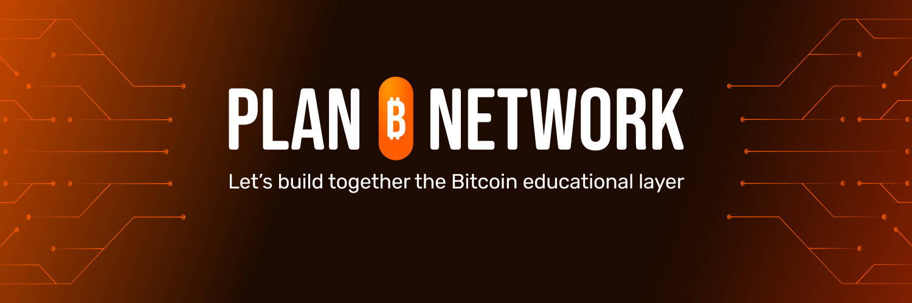

<div align="center" style="background-color: #333; padding: 20px; border-radius: 10px;">
  <a href="https://planb.network">
    
  </a>
</div>
<div align="center">
  <h1 style="margin-top: 0;"></h1>
  <a href="https://planb.network/en/node-network">
    
  </a>
  <a href="https://twitter.com/planb_network">
    
  </a>
  <a href="https://t.me/PlanBNetwork_ContentBuilder">
    
  </a>
  <a href="https://planb.network">
    
  </a>
  <a href="https://weblate.planb.network/engage/planb-network-website/">
    
  </a>
  <a href="https://github.com/DecouvreBitcoin/sovereign-university-data">
    
  </a>
</div>

<br />
<div align="center">
  <h3>
    Welcome to the Plan ₿ Network Content Repo!
  </h3>
  <p>
    Welcome to the Plan ₿ Network Content Repo! There's a chance that if you are here, it is to contribute to this larger-than-us project, which aims at consolidating the first multilingual and open-source e-learning platform focused on Bitcoin.
  </p>
</div>
<br />
<p align="center">
  <a href="https://planb.network">
    
  </a></p>
<br />

---

(If you're just lost on GitHub, visit our [website](https://planb.network) to learn more about Bitcoin).

Assuming you're here to contribute, I will detail the inner workings of the content management and how you can assist us -- either by producing new content or translating/reviewing content in your language.

Thank you for your time, involvement, and effort in this project. Here we believe in a [value-for-value model](https://dergigi.com/2021/12/30/the-freedom-of-value/) and we'll do our best to reciprocate for your contribution based on your Proof-of-Work. Moreover, by participating in creating valuable Bitcoin resources for your local community, tips from them could also come your way.

# Why we do it ?

Plan ₿ Network is born from our belief in the transformative power of Bitcoin to create a decentralized future. We are inspired by the Cypherpunk Manifesto, which emphasizes the importance of knowledge as the foundation of freedom and change. Our ultimate goal is to empower individuals all over the world with the knowledge they have been deprived of, to revolutionize the world.

# How it works ?

Plan ₿ Network helps communities worldwide get organized to provide better education. The platform develops the necessary tools to achieve this goal through the [online academy](https://planb.network/en/courses), the [tutorials portal](https://planb.network/en/tutorials), and the [resource portal](https://planb.network/en/resources).

But contents are firstly published here in this repository, as a central public
place for Bitcoin Education. Any piece of content is specifically formatted to
facilitate the data parsing and (so) rendering on websites or apps.

## Repository Structure

This repo is organized around three main directories, which are:

- `courses`: comprising all the courses about Bitcoin, Lightning, Cryptography, Mining, and so on.
- `resources`: consisting of various types of resources about Bitcoin, such as books, company info, or podcasts.
- `tutorials`: consisting of how-to articles, categorized into themes like exchange, merchant, node, privacy, and so on.

Each individual content piece, which is a markdown file, is defined by its location in this tree structure and by its language in the name. For instance, the Italian tutorial about Nerd-Miner would have the following path:

```
./sovereign-university-data/tutorials/mining/nerd-miner/it.md
```

If you want to learn more about our repo structure and content format, check out our [documentation](./docs/README.md).

If you want to have a bird-eye view of published contents and proposals, check
out:

- the [Course Dashboard](https://github.com/orgs/DecouvreBitcoin/projects/3/views/1)
- the [Tutorial Dashboard](https://github.com/orgs/DecouvreBitcoin/projects/5)
- the [Resources Dashboard](https://github.com/orgs/DecouvreBitcoin/projects/6)

## Incentive model: Value-4-Value

We believe in the power of Proof Of Work and how this enables a value-4-value model. In the words of one of the greatest poets of our times DerGigi we consider time, talent and treasure. Which means we are commited to providing back to those who enrich us with their time and talent.

In practical terms, it means that any task (content creation, peer-reviewing,
proofreading), explicited as individual Github issue, would have a
reward in sats attached to it. And when the issue would be closed, the reward
would be sent to the contributor who completed the task.

If you want to learn more about it, go have a [look here](#why-value-4-value-PoW-model?)

# How to contribute?

Bitcoin is for everyone, and so is Plan ₿ Network. This means everyone has a specific talent that can contribute to the growth of the network. Whether you are a shadowy super coder or a social media influencer, your knowledge and skills are essential to spreading Bitcoin knowledge across the world.

## Be a node of the network

Let's start by explaining what is a Plan ₿ Network Node. A node is simply a Bitcoin community that wants to move to the next step and accelerate its own local Bitcoin adoption! There is no minimum size to start with.

At Plan ₿ Network, we aim to improve the educational Bitcoin ecosystem by providing the right tools to build and educate on Bitcoin. By becoming a node, your community will get access to a large range of resources, services, special educational training, and more. Make your community count as a reference in the Bitcoin world.

Learn more about how to become a node [here](https://planb.network/en/node-network).

## Be a Bitcoin Educator

If you have created Bitcoin educational content, whether in the form of a video, book, podcast, blog, or even an entire course, Plan ₿ Network will gladly help you spread that content across the world. We provide the necessary tools for it to be translated and shared with everyone.

As an educator, your role is crucial. Without your dedication and passion, Bitcoin remains just information rather than knowledge that lives through generations.

You can propose your content directly via a PR, or you can reach out via the
[Telegram Group](https://t.me/PlanBNetwork_ContentBuilder).

## Join the Translation TaskForce

We are looking for you! The key to making education powerful is to make it accessible to everyone in the world. Not everyone speaks English, or every other language on earth! But we are sure that together as a network, we can make every single piece of Bitcoin educational content as open-source as the seven seas and translate it into every language.

If you are confident that you can help us translate content, just reach out to us. We are eagerly looking for you. EVERY LANGUAGE is needed!

<a href="https://weblate.planb.network/engage/planb-network-website/">

</a>

# Why value-4-value PoW model?

Well, because we don’t see any other way. What is the problem with the internet nowadays? We think we are getting everything for free, but in reality, we are the product. Our data is used for the benefit of others. Because we believe that how we handle our data and knowledge should be completely up to us, we ensure that everything we share, build, and contribute in this open-source model is paid for in a value-for-value fashion.

## How now?

Ok, so what are we actually doing? Our first goal is to gather all the amazing content that has already been created. You can find everything we have gathered on our website.

But the catch is, we want to reach every corner of the world. For this, we need everyone to collaborate with their language skills.

We can't reach all the people in Bangladesh if we don't have the content in Bengali.

Therefore, we have implemented this incentive model. First, you will get paid
per tasks (content creation, translation proofreading), and there is a whole payment system set in place by asi0 -- if
you curious about it, you will find some details in the [documentation](./docs/value-4-value-model.md). In short,
each content type has a formulae based on various parameters like number of
words, content difficulty, and others and the reward associated to each task is
defined in the assigned issue.

## How it will be in the following months?

Ok, so now you have seen our value-for-value initial model, but what's next?

Simple: as people consume your content, they will rate it. The better the rating you get as a translator or verifier, the more translations you will receive. This is what we like to call a proof-of-work structure.

The better the quality of your work, the more translations you will get. The more value you receive, the more value we receive.

**LONG LIVE VALUE-FOR-VALUE!**

# End Goal: Anihilate language barrier for Bitcoin Education

So that's it, that's our plan to take over the world! We seek everything in every language: translators, educators, and most importantly, individuals eager to learn.

If you believe you are one of these, [reach out](https://t.me/PlanBNetwork_ContentBuilder). We want to collaborate!
