# Pokrenite putovanje vaše kompanije na Bitcoin mreži

Otkrijte praktične mogućnosti Bitcoin i Lightning Network, i istražite kako, slično internetu, mogu **transformisati vaše poslovne operacije**. Od digitalnog kapitala do brzih, ekonomičnih i skalabilnih plaćanja, Bitcoin nudi širok spektar **upotreba za preduzeća**.

Kroz ovaj vodič naučićete kako da razumete Bitcoin kao globalnu, univerzalnu i internet-prirodnu monetarnu mrežu. Sa svojim jedinstvenim fundamentalnim karakteristikama, **Bitcoin pruža značajna poboljšanja u odnosu na tradicionalne valutne mreže**. Otkrićete zašto i kako iskoristiti Bitcoin za klasične finansijske slučajeve upotrebe kao što su skladištenje kapitala i platni sistemi. Pored toga, ovaj vodič će pokriti sticanje i držanje Bitcoin, uključujući povezane računovodstvene i fiskalne zahteve, kao i implementaciju jednostavnih ili velikih Bitcoin platnih rešenja.

Bilo da ste **mala firma ili velika korporacija**, integracija Bitcoin u vaše svakodnevne operacije može učiniti vašu kompaniju **otpornijom, produktivnijom i konkurentnijom**. Svaka internet-bazirana kompanija postat će Bitcoin-orijentisana kompanija, a ovaj kurs osigurava da ste spremni. Početni delovi ponavljaju osnove rada Bitcoin, tako da čak i ako ste početnik, steći ćete osnovno znanje potrebno za nastavak. Učenje osnova izuma Satoshi je uvek dobra ideja, bilo pre ili nakon što se upustite u BIZ101.

+++

# Uvod

<partId>326cf945-5d3f-4d86-8c3e-4d1c35959799</partId>

## Pregled kursa

<chapterId>1be42be9-4080-49f5-b5b2-6b531dd55f5f</chapterId>

Dobrodošli na kurs BIZ101! Pokrenite putovanje vaše kompanije na mreži Bitcoin uz ovaj sveobuhvatni kurs obuke - prolaz ka razumevanju kako Bitcoin i Lightning Network mogu revolucionisati tradicionalne poslovne operacije. Ovaj kurs je dizajniran za trgovce, preduzetnike, menadžere i korporativne donosioce odluka koji žele da istraže praktične sposobnosti Bitcoin kao globalne, internet-urođene monetarne mreže i snažnog sredstva vrednosti Exchange.

Tokom kursa, bićete upoznati sa osnovnim principima koji čine Bitcoin i Lightning Network izrazito transformativnim. Naučićete kako ove tehnologije nude spektar upotreba, od skladištenja digitalnog kapitala do brzih, ekonomičnih i skalabilnih plaćanja, i kako pružaju ključna poboljšanja u odnosu na tradicionalne valute i sisteme plaćanja. Kurs BIZ101 povezuje ekonomsku teoriju sa stvarnim primenama, objašnjavajući kako decentralizacija može smanjiti zavisnost od posrednika i prevazići ograničenja svojstvena starim sistemima.

Kurs počinje detaljnim ispitivanjem konvencionalnih valuta i mehanizama plaćanja, postavljajući temelje istraživanjem kako valuta funkcioniše kao mreža koja omogućava trgovinu, štednju i ekonomsku specijalizaciju. Nakon toga, bavićemo se tehnologijom iza Bitcoin i inovacijama koje je uveo Lightning Network, otkrivajući njihove uloge u omogućavanju besprekidnih, sigurnih i gotovo trenutnih transakcija koje mogu služiti preduzećima svih veličina. Zatim ćemo preći na praktične delove ovog kursa, počevši sa delom o držanju bitkoina kao trezora, a zatim završnim delom o prihvatanju Bitcoin kao sredstva plaćanja.

Bilo da predstavljate malo preduzeće ili veliku korporaciju, ovaj kurs ima za cilj da vas opremi znanjem za integraciju Bitcoin u vaše svakodnevne operacije, čime se poboljšava otpornost, efikasnost i konkurentnost vaše kompanije. Kako Bitcoin nastavlja da preoblikuje ekonomski pejzaž, razumevanje ovih revolucionarnih tehnologija nije samo opcija već strateška nužnost. Pripremite se da se angažujete sa sadržajem punim uvida, praktičnim primerima i strateškim smernicama koje će vam omogućiti da navigirate i iskoristite svet Bitcoin koji se razvija!

Spremni da zaronite u svet Bitcoin za preduzeća? Hajde da krenemo!

# Valuta, platni sistemi i Bitcoin

<partId>d9bd0e21-8488-44e0-af55-6d0b934f83c2</partId>

## Tradicionalne valute

<chapterId>785e095c-6811-4ca2-ba46-fe38291432d4</chapterId>

### Valute su Mreže

Valute su u osnovi mreže koje omogućavaju efikasno Exchange vrednosti.

Bez valute, pojedinci moraju da se oslanjaju na **razmenu**, sistem u kojem se roba ili usluge direktno razmenjuju. Razmena je nepraktična jer zahteva "dvostruku podudarnost želja"—obe strane moraju želeti ono što druga nudi u isto vreme. Na primer, ako farmer sa viškom pšenice želi cipele, mora pronaći obućara koji specifično treba pšenicu. Ovo je retko i neefikasno. Dodatno, **sa n proizvoda u ekonomiji razmene, potrebno je ~n(n−1)/2  Exchange kurseva**, što stvara veoma složen i nezgrapan sistem. Na primer, to bi zahtevalo preko ~124,000 Exchange kurseva za samo 500 proizvoda.

Valuta to pojednostavljuje delujući kao posrednik, stvarajući **mrežu koja smanjuje broj Exchange kurseva na n** —jedan za svaki proizvod u odnosu na valutu. Ovo čini transakcije mnogo jednostavnijim i **omogućava ljudima da trguju robom i uslugama bez potrebe za uzajamnim željama u isto vreme**. Umesto da direktno menja pšenicu za cipele, farmer može prodati svoju pšenicu za valutu i kasnije koristiti tu valutu da kupi cipele, ili bilo šta drugo što mu je potrebno.

Uvođenje valute kao mreže ne samo da olakšava trgovinu već omogućava i **podelu rada i specijalizaciju**. Sa pouzdanim sredstvom Exchange, pojedinci i zajednice više ne moraju da proizvode sve što konzumiraju. Umesto toga, mogu se fokusirati na ono u čemu su najbolji, povećavajući efikasnost i kvalitet. Farmer može da se specijalizuje u uzgoju useva, obućar u izradi obuće, a graditelj u izgradnji domova. Ovi specijalisti mogu zatim Exchange svoje proizvode i usluge putem valute, koristeći prednosti stručnosti jedni drugih. Ova specijalizacija pokreće **produktivnost i inovacije**, jer ljudi usavršavaju svoje veštine i razvijaju nove metode u svojim oblastima.

Mrežna priroda valute donosi dodatne značajne prednosti. Prvo, biti deo mreže valute je **povoljnije nego biti izvan nje**. Zajednički standard mreže olakšava trgovinu, omogućavajući pojedincima da usklade svoje ekonomske aktivnosti čak i **preko velikih udaljenosti**. Na primer, trgovac u jednom gradu može trgovati robom sa kupcem u drugom koristeći istu valutu, podstičući ekonomski rast i saradnju na velikim područjima.

Još jedna ključna prednost valute je njena sposobnost da **omogući odložene razmene**. Kod trampe, transakcije su trenutne; jedno dobro se menja za drugo u realnom vremenu. Valuta, međutim, omogućava **štednju—pojedinci mogu čuvati vrednost za buduću upotrebu**. Ovo predstavlja ogroman napredak za ekonomsko planiranje, investicije i akumulaciju bogatstva, što sve poboljšava živote učesnika mreže.

U zaključku, valute su mreže dizajnirane da efikasno prenose vrednost. One prevazilaze ograničenja trampe, pojednostavljuju trgovinu i stvaraju mogućnosti za koordinaciju i štednju. Kao i svaka mreža, vrednost valute zavisi od njene široke prihvaćenosti i korisnosti—na kraju, najbolja valuta pobeđuje.

### Šta je dobra valuta?

Dobra valuta poseduje nekoliko suštinskih svojstava koja je čine efikasnom za olakšavanje vrednosti Exchange. Evo sažetog objašnjenja svakog:

- Sigurno**: Valuta mora biti zaštićena od krađe ili neovlašćenog pristupa, osiguravajući da korisnici mogu držati i prenositi je s poverenjem. Sigurnost je ključna za izgradnju poverenja u sistem.

- Zaštita od falsifikovanja**: Valuta mora biti izuzetno teška ili nemoguća za falsifikovanje. Ovo osigurava da je svaka jedinica autentična, održava njenu vrednost i sprečava inflaciju uzrokovanu ulaskom lažnih jedinica u opticaj. Na primer, istorijski gledano, zlato je bilo cenjeno ne samo zbog svoje lepote i retkosti, već i zato što je izuzetno teško Hard za proizvodnju. Za razliku od papirnih novčanica ili digitalnih unosa, zlato ne možete jednostavno "napraviti"—mora se iskopati iz zemlje. Ova prirodna oskudica i težina proizvodnje pomogli su zlatu da održi svoj status kao pouzdano sredstvo čuvanja vrednosti i merilo autentičnosti.

- Oskudno**: Dobra valuta mora imati ograničeno Supply ili kontrolisano izdavanje. Oskudnost osigurava da se njena vrednost očuva tokom vremena, sprečavajući prekomernu proizvodnju koja bi narušila kupovnu moć. Na primer, određena plemena američkih domorodaca koristila su perle kao oblik valute. U početku su ove perle bile Hard za proizvodnju, održavajući njihovu oskudnost i vrednost. Međutim, kada su evropski trgovci počeli masovno proizvoditi i preplavljivati tržište perlama, njihova retkost je nestala. Kako je Supply naglo porastao, perle su izgubile kupovnu moć, potkopavajući njihovu ulogu kao pouzdanog sredstva očuvanja vrednosti.

- Permissionless**: U prošlosti su valute poput zlatnih i srebrnih novčića često kovane od strane privatnih pojedinaca, lokalnih vlasti ili trgovaca koji su imali pristup sirovinama. Ovaj sistem je ponekad funkcionisao pod sporazumima ili licencama koje su davali kraljevi ili vladari. Vremenom su kraljevi i vlade centralizovali ovaj proces kako bi dobili veću kontrolu nad ekonomskom stabilnošću, oporezivanjem i monetarnim sistemom. Jedan poznati primer je **talar**, srebrni novčić prvi put kovan 1518. godine u **Jachimstalskoj dolini** (današnji Jáchymov u Češkoj) od strane lokalnih rudara i vlasti. Ime "talar" potiče od nemačke reči **"Thal"** što znači "dolina." Ovi novčići, poznati po svom visokokvalitetnom srebru, postali su široko rasprostranjeni širom Evrope. Vremenom je termin evoluirao lingvistički i geografski, na kraju dovodeći do naziva "dolar," koji je usvojen u Sjedinjenim Američkim Državama za njihovu valutu.

U modernoj eri, valute su postale potpuno dozvoljene pod sistemom seigniorage, što znači da samo ovlašćeni entiteti—kao što su centralne banke ili trezori—mogu kovati novčiće ili štampati novčanice. Pojedinci više nisu pravno dozvoljeni da proizvode valutu, što osigurava centralizovanu kontrolu nad njenim izdavanjem i Supply.

Danas je princip seigniorage-a izazvan kriptovalutom Bitcoin, koja funkcioniše bez centralizovane kontrole. Bitcoin je sistem "bez dozvole" gde svako može učestvovati u korišćenju valute bez traženja dozvole, i, kroz Mining, u njenom stvaranju. Ova decentralizacija uklanja monopol izdavanja od strane vlada, postavljajući pitanja o potencijalnom povratku na sisteme konkurentnih valuta slobodnog tržišta.

- Jedinica obračuna**: Valuta treba da obezbedi standardnu meru za poređenje vrednosti robe i usluga. Ovo pojednostavljuje trgovinu i čini cene transparentnim i doslednim u svim transakcijama.

- Izdržljiv**: Valuta mora izdržati habanje tokom vremena. Fizičke valute, poput kovanica ili novčanica, treba da budu otporne na oštećenja, dok digitalne valute moraju biti sigurno pohranjene bez rizika od gubitka podataka.

- Prenosivo**: Valuta mora biti laka za transport i korišćenje, omogućavajući trgovinu na daljinu. Ovo se može postići fizičkom prenosivošću (lagani novčići ili novčanice) ili digitalnim sistemima prenosa.

- Deljiva**: Valuta treba da bude deljiva na manje jedinice kako bi se olakšale transakcije različitih veličina. Ova fleksibilnost osigurava da je praktična i za male kupovine i za trgovinu velikih razmera.

- Fungible**: Sve jedinice valute moraju biti zamenljive i jednake vrednosti. Na primer, jedna novčanica od jednog dolara mora biti ekvivalentna bilo kojoj drugoj novčanici od jednog dolara. Ova uniformnost osigurava pravičnost i jednostavnost u transakcijama.

- Prepoznatljiv**: Valuta mora biti lako prepoznatljiva i pouzdana. Fizičke valute to postižu kroz jedinstvene dizajne i sigurnosne karakteristike, dok se digitalne valute mogu oslanjati na verifikacione protokole. Ovo osigurava široko prihvatanje i smanjuje rizik od prevare.

Ove karakteristike čine valutu praktičnom, pouzdanom i efikasnom za olakšavanje trgovine i čuvanje vrednosti u ekonomiji.

### Evolucije valutnih sistema

**Od Kovanica do Papirnog Novca: Povećanje Efikasnosti i Prenosivosti**

Prelazak sa kovanica na papirni novac označio je značajno poboljšanje u **prenosivosti** i efikasnosti. Kovanice, napravljene od plemenitih metala poput zlata ili srebra, bile su vredne zbog svoje intrinzične vrednosti. Međutim, bile su teške, teško ih je bilo transportovati u velikim količinama i podložne su habanju ili krađi. Papirni novac je revolucionisao mreže valuta uvođenjem laganog, standardizovanog i prenosivog sredstva koje je predstavljalo vrednost umesto da je sadrži. Ova inovacija je omogućila ekonomijama da se razvijaju omogućavajući lakšu trgovinu na daljinu i smanjujući logističke izazove korišćenja fizičkih dobara kao novca.

Papirni novac je takođe poboljšao skalabilnost. Umesto oslanjanja na ograničeni Supply plemenitih metala, ekonomije su mogle proširiti svoju monetarnu osnovu putem reprezentativnih valuta, prvobitno podržanih rezervama, a kasnije poverenjem u institucije koje ih izdaju. Ova promena otvorila je put ka složenijim i međusobno povezanim finansijskim sistemima.

**Od papirnog do elektronskog novca: Proširenje pristupačnosti i brzine**

Prelazak sa papirnog novca na elektronski novac dodatno je unapredio mrežu valuta povećanjem pristupačnosti i brzine. Sa porastom bankarskih sistema, kreditnih kartica i digitalnih transakcija, novac je postao ne samo **prenosiv** već gotovo **trenutan**. Elektronski transferi su eliminisali potrebu za fizičkim Exchange, omogućavajući transakcije na velikim udaljenostima u roku od nekoliko sekundi.

Ova promena je takođe demokratizovala pristup valuti. Elektronsko bankarstvo i platni sistemi smanjili su prepreke za ulazak pojedinaca i preduzeća, omogućavajući učešće u globalnoj ekonomiji. Brzina i pogodnost elektronskog novca proširili su trgovinske mreže i podstakli nove poslovne modele koji bi bili nemogući u sistemu zasnovanom na papiru.

Ove moderne mreže valuta dolaze sa značajnim nedostatkom: **nedostatak revizibilnosti i transparentnosti u upravljanju novcem Supply**, što često rezultira nekontrolisanom inflacijom i gubitkom poverenja u centralizovane sisteme. Na primer, preko 20% svih u opticaju američkih dolara odštampano je samo u poslednje četiri godine. Ova stalna iskušenja da se izda više valute—time obezvređujući vrednost koju drže trenutni vlasnici—mogu se u velikoj meri pripisati sistemskoj manjkavosti: političari su često podstaknuti da izbegavaju teške budžetske odluke, odlučujući se umesto toga da izazove odlože za buduće administracije "šutirajući limenku niz put."

**Od centralizovane ka decentralizovanoj valuti: Unapređenje poverenja i suvereniteta**

Danas, pojava decentralizovane valute Bitcoin predstavlja sledeći skok u mrežama valuta. Tradicionalni elektronski novac se oslanja na centralizovane autoritete, kao što su banke ili vlade, za upravljanje i verifikaciju transakcija. Iako efikasni, ovi sistemi su podložni neefikasnostima, cenzuri i tačkama pojedinačnih kvarova. Decentralizovane valute poboljšavaju ove mrežne osobine **distribuiranjem poverenja i uklanjanjem posrednika**. To takođe znači da novac može da se kreće mnogo **brže** i **jeftinije**, jer nema koraka autorizacije. Na kraju, nijedan čovek ne može biti u iskušenju da promeni raspored valute Bitcoin u Supply, to je sprovedeno softverom.

U decentralizovanim sistemima, transakcije se verifikuju od strane globalne mreže učesnika koristeći Blockchain tehnologiju, obezbeđujući sigurnost, transparentnost i otpornost. Ova struktura minimizira rizik od prevare, smanjuje zavisnost od centralnih autoriteta i omogućava pojedincima da imaju veću kontrolu nad svojim finansijama. Eliminisanjem geografskih i institucionalnih barijera, decentralizovane valute nude zaista globalni i inkluzivni monetarni sistem.

**Evolucija mreža valuta**

Svaka faza u evoluciji mreža valuta poboljšala je ključne osobine: prenosivost, skalabilnost, pristupačnost, brzinu, sigurnost i poverenje. Kovanice su ustupile mesto papirnom novcu radi bolje prenosivosti i efikasnosti. Papir je evoluirao u elektronski novac, omogućavajući globalni pristup i trenutne transakcije. Sada, Bitcoin redefiniše poverenje i sigurnost, stvarajući otvoren i otporan monetarni sistem. Ova istorijska progresija ističe stalnu težnju čovečanstva da stvori bolje mreže za vrednost Exchange, pri čemu svaka iteracija nadograđuje i prevazilazi ograničenja prethodne.

Najbolja mreža će verovatno pobediti.

## Tradicionalni platni sistemi

<chapterId>1306196c-1e8a-454b-8e11-6887ecb3d8b4</chapterId>

Platni sistemi su metode i infrastrukture koje omogućavaju transfer sredstava između dve strane—obično između platioca (kao što je potrošač) i primaoca (kao što je preduzeće). Ove transakcije mogu se odvijati u različitim okruženjima: potrošač koji plaća lokalnom trgovcu, preduzeće koje izmiruje fakture sa dobavljačem, ili čak pojedinci koji međusobno prenose novac. Razumevanje platnih sistema podrazumeva sagledavanje različitih vrsta platnih metoda, njihovih karakteristika i slučajeva upotrebe u kontekstima Poslovanje-ka-Potrošaču (B2C) i Poslovanje-ka-Poslovanju (B2B).

### Uobičajeni tipovi metoda plaćanja

1. **Keš:** Fizička valuta koja se razmenjuje direktno između dve strane.

2. **Čekovi:** Papirni dokumenti koji upućuju banku da isplati određeni iznos sa računa platioca primaocu.

3. **Elektronski transferi:** Elektronski prenos sredstava između banaka, često korišćen za veće iznose i prekogranična plaćanja.

4. **Platne kartice (kreditne/debitne):** Plastične ili digitalne kartice povezane sa kartičnom mrežom, omogućavajući prenos sredstava sa bankovnog računa vlasnika kartice (ili kreditne linije) na trgovca.

5. **Digitalni novčanici i mobilna plaćanja:** Aplikacije ili uređaji koji čuvaju informacije o plaćanju (npr. Apple Pay, WeChatPay, AliPay, PayPal), omogućavajući brze i često beskontaktne transfere.

**Upotreba u B2C i B2B:**

- B2C (Business-to-Consumer):**
    - Potrošači često koriste gotovinu, kartice i digitalne novčanike za svakodnevne kupovine—kao što su namirnice, online kupovina ili usluge poput vožnje taksijem.
    - Brzina, pogodnost i niske naknade (za potrošača) često su ključni prioriteti.
    - Beskontaktna i mobilna plaćanja postaju sve popularnija u ovom prostoru zbog jednostavnosti korišćenja.

- B2B (Business-to-Business):**
    - Preduzeća se obično oslanjaju na bankovne transfere, čekove i sisteme fakturisanja za plaćanje dobavljača, podmirivanje velikih računa ili upravljanje redovnim plaćanjima.
    - Fokus je često na sledljivosti, dokumentaciji i sposobnosti rukovanja većim vrednostima transakcija.
    - Korišćenje kartica postoji, ali je manje uobičajeno zbog viših naknada i ograničenja transakcija. Digitalna rešenja poput integrisanih platformi za plaćanje se pojavljuju kako bi pojednostavila i automatizovala procese potraživanja/obaveza.

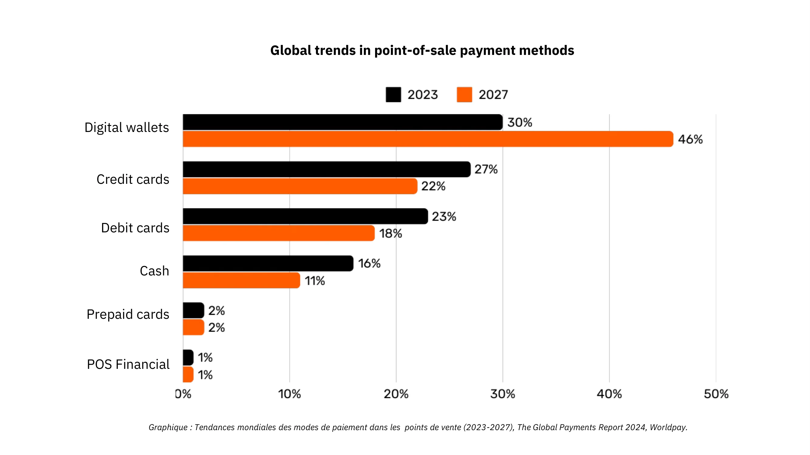

*Grafika: Globalni trendovi u metodama plaćanja na prodajnom mestu (POS) (2023-2027), Izveštaj o globalnim plaćanjima 2024, Worldpay.*

### Složenost iza jednostavnog plaćanja karticom

Kada kupac koristi kreditnu karticu u prodavnici, kartica se očitava putem POS terminala, koji sigurno prenosi podatke o transakciji banci trgovca koja prihvata kartice. Banka koja prihvata prosleđuje ove informacije relevantnoj kartičnoj mreži (npr. Visa ili Mastercard), koja zatim usmerava zahtev izdavaocu—banci koja je izdala karticu kupcu. Izdavalac proverava račun ili kreditnu liniju kupca i šalje nazad autorizaciju kroz mrežu i banku koja prihvata, omogućavajući trgovcu da prihvati uplatu.

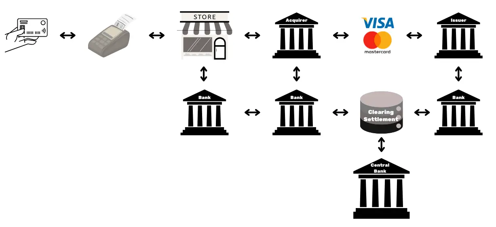

Ova naizgled jednostavna transakcija zapravo uključuje preko 15 koraka, 7 posrednika i u proseku traje između 48 sati i 5 dana da trgovac primi sredstva. Tokom narednih dana, odvija se proces kliringa i poravnanja. Mreža kartica agregira dnevne transakcije i koordinira razmenu sredstava između akceptanta i izdavaoca. Centralna banka osigurava tačnost i stabilnost ovih međubankarskih poravnanja. Na kraju, bankovni račun trgovca prima neto iznos (umanjen za naknade) od akceptanta, čime se završava životni ciklus transakcije.

Sve u svemu, ovaj proces je složen, dugotrajan i skup za ono što bi trebalo da bude jednostavan čin prenošenja vrednosti sa jedne strane na drugu.

### Poređenje Metoda Plaćanja

| Payment Method                 | Authorization Needed?           | Transaction Approval Time (Merchant View) | Settlement Speed (Funds Fully Settled)         | Finality (Ease of Reversal)              | Number of Intermediaries       | Typical Fees (to Payee)            |
| ------------------------------ | ------------------------------- | ----------------------------------------- | ---------------------------------------------- | ---------------------------------------- | ------------------------------ | ---------------------------------- |
| **Cash**                       | No                              | Immediate (Physical Exchange)             | Immediate (No Settlement Delay)                | High (Irreversible Once Paid)            | None                           | None                               |
| **Checks**                     | Yes (Bank Clearing)             | Acceptance at Deposit (Not Guaranteed)    | Several Days (Check Clearing Process)          | Medium (Can Bounce/Stop Before Clearing) | Bank                           | **Low to Medium** (Bank Fees)      |
| **Wire Transfers**             | Yes (Bank/Network)              | Confirmation Within Hours                 | Same-Day or Next-Day (Domestic)                | High (Usually Irreversible Once Sent)    | Banks, Payment Networks        | **Medium**(Fixed/Percentage)       |
| **Payment Cards**              | Yes (Card Issuer Authorization) | Seconds to Minutes (Authorization Code)   | A Few Days (Interbank Settlement)              | Medium (Chargebacks Possible)            | Issuer, Acquirer, Card Network | **Variable (1-3% of Transaction)** |
| **Digital Wallets/Mobile Pay** | Yes (Wallet Provider/Bank)      | Seconds (Instant Confirmation)            | Typically 1-2 Days (Depends on Funding Source) | Medium (Refund/Dispute Possible)         | Banks, Wallet Operators        | **Low to Medium (Varies)**         |

### Ograničenja postojećih rešenja

Tradicionalna industrija plaćanja predstavlja godišnju ekonomiju od približno 2.200 milijardi dolara, što je otprilike jedna desetina BDP-a Sjedinjenih Američkih Država ili jednako BDP-u Francuske. Pošto valute funkcionišu kao mreže sa dozvolama, postoji ograničena konkurencija, što ovu "uslugu" čini sličnijom porezu nametnutom na produktivnu ekonomiju. Pored troškovnih opterećenja koja stvara, postoje i nekoliko drugih ograničenja, kako je navedeno u nastavku.

| Limitation                       | Explanation                                                                                                                                                                                                                        | Impact                                                                                               |
| -------------------------------- | ---------------------------------------------------------------------------------------------------------------------------------------------------------------------------------------------------------------------------------- | ---------------------------------------------------------------------------------------------------- |
| High Card Fees                   | Interchange fees (~0.3%), network fees (fixed or 0.3%-1%), terminal/PSP subscriptions, and bank margins (0.5%-1.7%) add up to a substantial cost—like a global “tax” on productive sectors, amounting to trillions of dollars.     | Raises merchant costs, reducing margins and potentially driving up consumer prices.                  |
| Very Slow Final Settlement       | Settlement of funds can take up to 5 days, slowing the flow of money and overall economic activity.                                                                                                                                | Delays liquidity for merchants and reduces the speed of economic circulation.                        |
| Fraud                            | E-commerce channels are heavily targeted by fraud, contributing to significant losses (e.g., $28 billion). Chargebacks could reach ~$174 billion globally by 2024. Managing these disputes consumes time and causes mental strain. | Increased operational costs, complex fraud prevention measures, and diminished customer trust.       |
| Cart Abandonment                 | Additional security steps (one-time codes, two-factor authentication under PSD2) introduce friction at checkout.                                                                                                                   | Higher checkout complexity leads to increased cart abandonment and lost sales.                       |
| High Minimum Transaction Amounts | Minimum spend thresholds on cards can force merchants and consumers into inconvenient pricing or purchase conditions, discouraging small-value transactions.                                                                       | Reduced customer satisfaction and flexibility, potentially limiting impulse or low-value purchases.  |
| Slow Pre-Authorization           | Current systems cannot handle transactions at millisecond speeds or support continuous, real-time payment flows.                                                                                                                   | Limits use cases that require instant or streaming payments, restricting innovation and scalability. |
| Need for a Bank/Card Account     | Access to these payment methods requires a linked bank or card account, automatically excluding those without such accounts.                                                                                                       | Limits financial inclusion, reducing access for unbanked or underbanked populations.                 |
| Repeated Online Account Creation | Users often must create multiple online accounts, leading to fatigue, reduced convenience, and increased exposure of personal data.                                                                                                | Deteriorates user experience, raises privacy concerns, and increases risk of data breaches.          |
| Foreign Exchange (FX) Fees       | Lack of a universal unit of account forces costly currency conversions for cross-border transactions.                                                                                                                              | Adds extra costs for international commerce, making global transactions less affordable.             |

Baš kao što smo prešli sa plaćanja po minutu za glasovne pozive na korišćenje gotovo besplatne komunikacije zasnovane na IP-u, pojava otvorenijih i efikasnijih mreža može redefinisati plaćanja, smanjujući troškove i posrednike, i podstičući nove poslovne modele.

## Bitcoin za poslovanje : nova valuta u usponu

<chapterId>4488fe33-663f-41a3-a668-e9ca2fb7122e</chapterId>

**ŠTA JE Bitcoin?**

Bitcoin je **peer-to-peer digitalna valuta Exchange sistem** (elektronski novac). Termin "Bitcoin" odnosi se na sledeće komponente:

- Računarski protokol** koji omogućava vrednost Exchange na internetu bez posrednika, bez potrebe za dozvolom i pod pseudonimom. Koristi napredne kriptografske principe.
- Fizička mreža** mašina povezanih na internet (čvorovi, rudari, itd.) kojom upravljaju pojedinci i preduzeća, formirajući decentralizovani sistem (bez centralne vlasti ili jedne tačke kontrole).
- Jedinica obračuna** unutar sistema. Nikada neće biti više od 21 milion bitkoina u opticaju. Svaki Bitcoin je deljiv na 100 miliona jedinica nazvanih „satoši“, u čast anonimnog tvorca.

Zajedno čine Bitcoin **imovinom na donosioca** i digitalnom valutom **bez izdavaoca**. Ownership je osiguran isključivo držanjem **privatnog kriptografskog ključa**, što omogućava potpunu kontrolu **bez posrednika ili pouzdanih trećih strana**. Kada se prenese, **konačnost** Ownership je trenutna: novi vlasnik ga potpuno poseduje bez oslanjanja na centralni autoritet za zaštitu ili konvertibilnost. Transakcije su **nepromenljive**—jednom zabeležene na Blockchain, ne mogu se izmeniti ili obrisati.

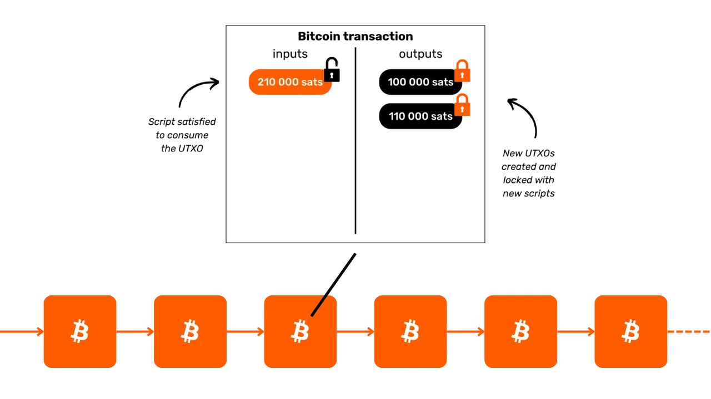

Bitcoin ima fiksnu monetarnu politiku, sa **ograničenjem od 21 milion bitkoina**, od kojih je ~19,8 miliona već distribuirano. Ovo ga čini **deflatornim**, sa vrednošću koja raste tokom vremena kako korisnici čuvaju ušteđevinu i dobitke u produktivnosti u njemu.

Njegove tehničke karakteristike nadmašuju one zlata i dolara zajedno, čineći ga najtvrđom finansijskom imovinom ikada stvorenom. Bitcoin je i čuvar vrednosti i sredstvo Exchange, valuta u nastajanju. Zamislite prenos vrednosti iz trezora jedne kompanije u drugu brzo, bez posrednika, uz minimalne troškove, bez prevare, 24/7, i bez učešća treće strane.

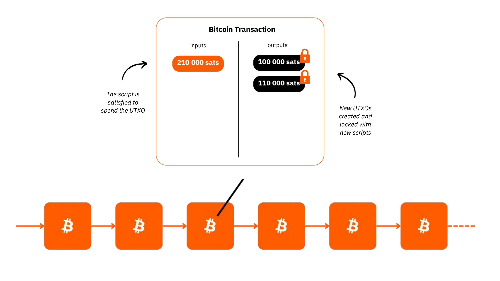

Bitcoin efikasno očuva vrednost jer je njegov Ledger otporan na manipulacije. Njegova vrednost raste zbog retkog i ograničenog Supply u kombinaciji sa sve većim brojem Exchange prilika, podstaknutih rastućim brojem korisnika.

Bitcoin je disruptivan jer nas podstiče da učimo pojmove iz matematike, kriptografije, ekonomije i istorije koje nikada nismo učili. Iako se često doživljava kao složen, zapravo je inovacija dostupna kroz praksu i eksperimentisanje.

Bitcoin nas izaziva da preispitamo samu prirodu novca. Možete li objasniti šta novac zaista jeste? Radnik sa platom ili preduzetnik može provesti 50.000 do 100.000 sati svog života zarađujući novac, ali koliko njih **posveti čak 100 sati da ga bolje razume** i sačuva? Bitcoin nas podstiče da preispitamo osnovne razloge iza naše potrebe za novcem i našu vremensku perspektivu. Da li je novac za trenutni luksuz ili dugoročnu otpornost? Ako bismo imali imovinu koja raste u vrednosti i omogućava nam da odložimo kupovine, kakve bismo izbore napravili? Kakve bismo razgovore želeli da vodimo sa sobom za 20 ili 30 godina?

**Bitcoin IDENTITETSKA KARTA**

- Starost:** 15 godina (3. januar 2009)
- Dnevna vrednost Exchange:** $10 milijardi (> CAC40)
- Tržišna kapitalizacija:** $1.8 triliona (> Meta, Visa, Srebro ; < Apple, Google, Zlato)
- Korisnici:** ~100 do 200 miliona (1-2% globalne populacije)
- Volatilnost:** Intrinzično nema (1 Bitcoin = 1 Bitcoin), veoma visoka eksterno (u razmenama fiat valuta)
- Performanse:** Prva transakcija na $0.0009; sada $100,000 (x100 miliona)
- Dostupnost mreže (uptime):** 100% od 2013
- Proglašen mrtvim ili kritikovan:** Jednom mesečno

**Čudo ljudske saradnje:**

- Potpuno **open-source**
- Pravno lice:** None
- CEO:** Nijedan
- Venture capital investment:** Nijedno
- Marketing:** Nijedno
- R&D:** Volonterski vođeno
- Upravljanje:** Od strane korisnika
- Inovativni ekonomski model:** Kreiranje blokova se subvencioniše transakcionim naknadama (zasnovano na aukciji)

Za više informacija o Bitcoin, njegovoj istoriji, načinu rada i upotrebi, predlažem da pratite ovaj drugi sveobuhvatni kurs:

https://planb.network/courses/2b7dc507-81e3-4b70-88e6-41ed44239966

## Uvod u Lightning Network

<chapterId>c095c7ad-5469-4c7b-9510-b6c0b86244e7</chapterId>

**ŠTA JE MUNJA?**

Lightning Network je **protokol i mreža** koji omogućavaju Bitcoin transakcije uz minimalnu interakciju sa glavnim Blockchain sistema Bitcoin. Evo kako funkcioniše:

- Početno podešavanje:** Sredstva su zaključana (u eskrou) na glavnom Blockchain kako bi se uspostavio kanal plaćanja između 2 strane.
- Mreža plaćanja:** Mreža kanala plaćanja između više strana formira mrežu plaćanja (usmeravanje i međusobno povezivanje).
- off-chain transakcije:** Transakcije se odvijaju između strana, ali **nisu odmah objavljene** na glavnom Bitcoin Blockchain (**"off-chain"**).
- On-Chain naselja:** Samo **konačno stanje** transakcija kanala se objavljuje na glavnom Bitcoin Blockchain (**"On-Chain**"), omogućavajući da se u međuvremenu dogodi brojne transakcije. Ovo grupisanje više uplata smanjuje zagušenje i time smanjuje naknade u poređenju sa obavljanjem mnogih On-Chain transakcija.
- Zatvaranje kanala:** Korisnik može zatvoriti svoj kanal u bilo kom trenutku i povratiti svoj Bitcoin objavljivanjem najnovijeg stanja transakcije. Ovo je princip da transakcije mogu biti **"objavljive" u bilo kom trenutku, ali "neobjavljene"** dok ne postanu neophodne. Izlaz (zatvaranje kanala) može biti jednostran (odlučen od strane bilo koje od 2 strane u bilo kom trenutku) ili uzajamno odlučen (što rezultira nižim On-Chain naknadama).

Ovaj pristup izbegava sporost i složenost obavljanja svake transakcije direktno na glavnom Blockchain Bitcoin, beležeći samo konačna stanja i zadržavajući njegovu sigurnost. Lightning Network je Layer "na vrhu" Bitcoin, ali ostaje usidren za njega.

**Globalna Mreža Plaćanja**

Protokol stvara **mrežu** mašina gde kanali formiraju univerzalni sistem plaćanja. Ovim čvorovima mogu slobodno upravljati pojedinci ili preduzeća, što je čini potpuno otvorenom mrežom.

Lightning Network omogućava trenutnu vrednost Exchange brzinom svetlosti. To je kao protokol e-pošte primenjen na plaćanja: mreža plaćanja sledeće generacije. Radikalno transformiše način na koji se "novac" kreće, čineći ga slobodnim i brzim kao prenos podataka na internetu.

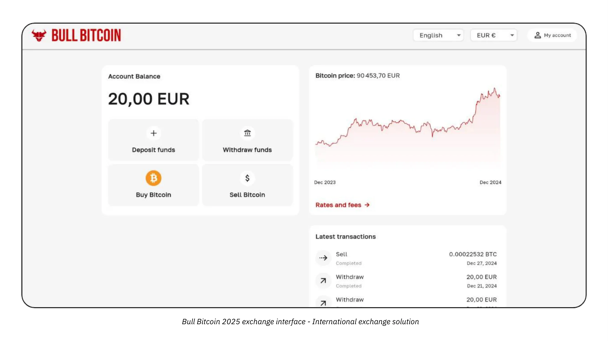

**Ključne prednosti:**

- Brzina:** Trenutne transakcije.
- Niske naknade:** Mnogo niži troškovi u poređenju sa tradicionalnim bankarskim mrežama.
- Jednostavnost usvajanja:** Poslovanja mogu brzo postaviti prihvatanje Lightning plaćanja koristeći samo aplikaciju na pametnom telefonu ili dugme za plaćanje na svojoj veb stranici.

Infrastruktura Lightning nadmašuje tradicionalne platne sisteme u pogledu brzine, troškova i energetske efikasnosti. Sa sve većim usvajanjem od strane trgovaca, zamah će se ubrzati: ako plaćanja mogu zaobići zarobljenu međubankarsku mrežu, zašto nastaviti odustajati od značajnog procenta prihoda današnjim posrednicima?

**Beskonačne Upotrebe:**

Primene aplikacije se protežu daleko izvan niskih naknada i brzine. Nudeći potpuno besplatnu i trenutnu platformu za plaćanje, otvara ogromne mogućnosti širom ekonomije.

**Poboljšanje sposobnosti Bitcoin na nivou Exchange:**

Munja pojačava ulogu Bitcoin kao "sredstva Exchange." Povećanjem učestalosti i slobode transakcija, ona jača primarnu funkciju novca: olakšavanje ekonomskih razmena i stvaranje vrednosti za sve učesnike.

Budući uspon "ekonomije pametnih mašina" zahtevaće ultra-brz, visokofrekventni platni sistem, tehnički standard koji samo Lightning može ispuniti. Ovo omogućava kreiranje više dobara i usluga. Kako Bitcoin-ov Supply ostaje ograničen, kupovna moć svake jedinice će se povećati. Bitcoin i Lightning postaju jači zajedno kako se njihove mreže šire.

Munja nudi uvid u budućnost gde će svi poslovi koji su postali internet-bazirani takođe postati Bitcoin-bazirani.

**Bitcoin Plaćanja na Lightning-u: Tipičan slučaj korišćenja za trgovce**

Lightning Network je idealan za Bitcoin plaćanja u fizičkim ili online prodavnicama zbog svoje brzine i konačnosti plaćanja.

- Brzina:** Munja (~500ms do nekoliko sekundi) je značajno brža od glavne mreže Bitcoin, gde transakcije mogu potrajati oko 30 minuta da se potvrde. Za velike kupovine (znatno preko $1,000), glavna mreža Bitcoin može i dalje biti preferirana, jer brzina nije toliko kritična. Međutim, ovi detalji su često skriveni od prosečnog korisnika, jer aplikacije ove odluke obrađuju neprimetno u pozadini.
- Finalnost:** Kada se uplata izvrši putem Lightning-a, ona je konačna. Ne postoji mogućnost povrata sredstava od strane trećih lica ili sporova vezanih za prevaru.
- Naknade:** Naknade za transakcije na Lightning Network su minimalne i plaća ih korisnik, a ne trgovac. Trgovci snose naknade samo ako kasnije trebaju preneti svoj Bitcoin na drugu mrežu ili uslugu.

**IDENTITETNA KARTICA MUNJE**

- Invention:** 2015
- Lansiranje:** 2016
- Starost:** 7 godina (prva transakcija: 28. decembar 2017.)
- Tehnička sposobnost mreže:** u velikim razmerama može da obradi 1.000 puta više trenutnih transakcija nego tradicionalni sistemi.
- Veličine transakcija:** Kreću se od onih koje su do 1.000 puta manje od tradicionalnih sistema.
- Brzina transakcije:** Do 100 puta brža.
- Naknade:** Do 90% niže.
- Konačnost plaćanja:** Gotovo trenutna (često ~500 milisekundi, ponekad nekoliko sekundi).
- Potrošnja energije:** ~8% tradicionalnog globalnog monetarnog sistema.
- Karakteristike:**
    - Peer-to-peer
    - Univerzalno
    - Bez dozvole
    - Dobra privatnost
    - Dokazana sigurnost
    - Visoka dostupnost (odličan uptime)
    - Kontrolisano i prilagodljivo

Za više informacija o tehničkom funkcionisanju Lightning Network, predlažem da pratite i ovaj drugi sveobuhvatni kurs:

https://planb.network/courses/34bd43ef-6683-4a5c-b239-7cb1e40a4aeb

# Bitcoin u trezoru

<partId>bf45c1e8-af97-4b6b-af42-2866f493b14d</partId>

## Profiti, kapital i ključevi otpornosti poslovanja

<chapterId>656ad88f-3c27-4054-a94e-b29727009b8e</chapterId>

### Zdrava kompanija

**Budućnost je neizvesna**, i preduzeća moraju upravljati ovom neizvesnošću sa jasnim fokusom na ostvarivanje profita i očuvanje kapitala. Prema austrijskoj ekonomiji, **profiti su krajnji signal zdravlja kompanije**—pokazuju da preduzeće efikasno zadovoljava potrebe potrošača. Bez profita, kompanija ne može da se održi, a kamoli da raste. Da bi preduzeće ostalo zdravo, mora ne samo generate profit već i razmišljati unapred, **čuvajući kapital za buduće investicije i izazove**.

**Očuvanje kapitala** je ključno jer omogućava preduzećima da se prilagode i iskoriste prilike na nepredvidivom tržištu. Ovo podrazumeva postizanje ravnoteže između reinvestiranja zarade za rast i održavanja finansijskog jastuka za prevazilaženje potencijalnih padova. Austrijska ekonomija ističe važnost **„vremenske preferencije“**, što znači da preduzeća moraju pažljivo odlučiti koliko će prioritizovati trenutne povrate naspram ulaganja za dugoročni uspeh. Zdrava kompanija održava svoju finansijsku osnovu jakom, osiguravajući fleksibilnost i u dobrim i u lošim vremenima.

Tržišni signali poput cena i konkurencije vode preduzeća u donošenju pametnih odluka o alokaciji resursa. Slušajući ove signale, kompanije mogu izbeći zamku prekomernog širenja ili loših investicija—posebno onih pod uticajem veštačkih faktora kao što je lak kredit. Pogrešna alokacija resursa ne samo da ugrožava zdravlje kompanije već i smanjuje njenu sposobnost da efikasno služi kupcima.

U konačnici, održavanje zdravog poslovanja znači ostati prilagodljiv, donositi razborite finansijske odluke i uvek imati pogled usmeren ka budućnosti. **Fokusiranjem na profit, očuvanjem kapitala i reagovanjem na tržišne signale, preduzeća—velika ili mala—mogu napredovati čak i suočena sa neizvesnošću**.

### Da li Kapital ima vrlinu?

**Kako je kapital generalno prikazan**

Hajde da ponovo otkrijemo šta kapital zaista jeste—pojam koji je tako često pogrešno shvaćen i negativno percipiran u našem društvu.

U tradicionalnoj ekonomskoj teoriji (kejnsijanskoj), kapital se često posmatra u pojednostavljenim terminima kao homogeni fond fizičkih ili finansijskih sredstava, koji se prvenstveno koristi za stimulisanje agregatne tražnje kroz investicije. Često se povezuje sa koncentracijom bogatstva i ekonomskom moći koju drži mala elita. U kontekstu gde se jaz u bogatstvu nastavlja širiti, mnogi vide kapital kao simbol ekonomske nejednakosti, posebno kada akumulirano bogatstvo izgleda da ne donosi korist većini.

"Kapital" se često prikazuje kao alat eksploatacije, i ova perspektiva je duboko uticala na različite pokrete koji kapital vide kao inherentno suprotan interesima radnika. Ali da li je to tačno? Ili bi ova percepcija mogla biti iskrivljena od strane:

1. Nedostatak razumevanja ekonomskih mehanizama (uključujući i od strane samih ekonomista)?

2. Vladin intervencionizam i manipulacija tržištem?

3. Zbrka između kroni kapitalizma i slobodnotržišnog kapitalizma?

4. Uokviravanje ekonomskih kriza od strane medija?

5. Želja za brzim rešenjima i trenutnom socijalnom pravdom?

6. Kulturna normalizacija antikapitalističke retorike?

Srećom, Bitcoin nas primorava da preispitamo sve i izazovemo ove unapred stvorene predstave. Postoji škola mišljenja—Austrijska škola ekonomije—koja može osvetliti ova pitanja i pomoći nam da preispitamo pravu prirodu kapitala.

**Jednom davno**

Hajde da počnemo sa kratkom pričom:

"Na malom pustom ostrvu živi usamljeni ribar. Svakog dana provodi sate hvatajući ribe golim rukama, aktivnost koja mu troši mnogo vremena i energije. Jednog dana, dobija ideju: da napravi koplje koje će mu omogućiti da lovi ribu efikasnije. Ali zna da će to zahtevati žrtvu.

Pre nego što počne da pravi koplje, ribar odlučuje da odvoji nešto ribe kako bi se izdržavao tokom procesa izrade. Jede manje nego obično nekoliko dana, štedeći dovoljno ribe da se fokusira na svoj projekat. Ova sačuvana riba predstavlja njegov **kapital**, malu rezervu koja mu omogućava da ostvari svoj cilj.

Dok posvećuje svoje vreme izradi koplja, oslanja se na svoje rezerve, svesno odlažući deo svoje trenutne udobnosti (odraz njegove **vremenske preferencije**). Nakon nekoliko dana rada na Hard, završava čvrsto koplje.

Sa kopljem, sada može da lovi ribu mnogo brže i sa manje napora. Više ne mora da se iscrpljuje kao ranije i čak počinje da akumulira višak ribe. Ovaj višak otvara nove mogućnosti: može ga skladištiti, deliti ili uložiti u druge projekte na ostrvu. Odlažući trenutnu potrošnju i koristeći svoj kapital, ribar je značajno poboljšao svoju efikasnost i buduće izglede."

Ova priča ilustruje fundamentalnu ulogu kapitala, strpljenja i predviđanja u izgradnji bolje budućnosti—koncepte koji su ključni za ekonomski rast i ljudski napredak.

### Austrijska škola ekonomije i njena vizija kapitala

Austrijska škola ekonomije je dobila ime po svojim osnivačima i ranim saradnicima, koji su prvobitno bili iz Austrije. Ime se zadržalo, a škola je od tada postala usko povezana sa klasičnom liberalnom mišlju, naglašavajući individualnu slobodu, slobodna tržišta i minimalnu državnu intervenciju.

**Austrijska perspektiva o kapitalu**

U austrijskom pogledu, kapital je duboko povezan s idejom odlaganja potrošnje kako bi se izgradili alati ili produktivni resursi koji poboljšavaju buduću proizvodnju. Ovaj proces, poznat kao akumulacija kapitala, je centralan za austrijsku ekonomsku teoriju. Ključni Elements ove perspektive uključuju:

- Vremenska preferencija i odložena potrošnja**: Pojedinci prirodno preferiraju konzumiranje sada umesto kasnije, ali mogu odlučiti da odlože potrošnju ako očekuju veće nagrade u budućnosti. Štednjom danas, resursi se mogu uložiti u kapitalna dobra (alatke, mašine, infrastrukturu) koja poboljšavaju produktivnost tokom vremena. Društva ili pojedinci sa nižom vremenskom preferencijom više štede i ulažu u dugoročne projekte, podstičući održivi rast.

- Kapital kao pokretač buduće proizvodnje**: Kapitalna dobra se smatraju posrednim alatima koji se koriste za proizvodnju konačnih potrošačkih dobara. Akumulacijom kapitala, preduzetnici mogu poboljšati produktivnost i stvoriti više bogatstva u budućnosti. Na primer, umesto da odmah proizvode potrošačka dobra, resursi se mogu koristiti za izgradnju fabrika ili mašina. Iako ovo smanjuje kratkoročnu potrošnju, rezultirajuća efikasnost omogućava veću proizvodnju i prosperitet kasnije.

- Indirektna proizvodnja i efikasnost**: Austrijski ekonomisti, kao što je Eugen Böhm-Bawerk, istakli su ideju indirektne proizvodnje—duži i složeniji proizvodni procesi koji uključuju više faza. Iako ovi procesi zahtevaju vreme, oni na kraju donose efikasnije i produktivnije rezultate, kao što je izgradnja pilane za obradu drveta umesto ručnog sakupljanja trupaca.

- Kamatne stope kao signali**: Kamatne stope, prema austrijskom pogledu, prirodno odražavaju vremenske preferencije pojedinaca. Visoke stope ukazuju na preferenciju za trenutnu potrošnju, dok niske stope podstiču štednju i dugoročna ulaganja. Kada centralne banke veštački manipulišu kamatnim stopama, one iskrivljuju ove prirodne signale, što dovodi do pogrešne alokacije resursa i neodrživih ulaganja (pogrešna ulaganja).

**Dva oblika kapitala u modernim ekonomijama**

U okviru monetarnog sistema zasnovanog na dugu u kojem poslujemo, **postoji drugi tip kapitala**: onaj koji se generiše trenutno kada banka odobrava kredit putem jednostavnog kreditnog mehanizma. Ovo uključuje stvaranje likvidnosti ex nihilo, gde banka pozajmljuje novac koji zapravo unapred ne poseduje, već ga stvara na osnovu obećanja o otplati.

S jedne strane, "austrijski" kapital je rezultat stvarne štednje, proces koji uključuje promišljene ekonomske odluke i pažljivu žrtvu. S druge strane, kapital generisan kroz stvaranje novca zasnovanog na dugu je trenutna i veštačka konstrukcija. Ove dve vrste kapitala, iako **površno slične u svojoj upotrebi za finansiranje projekata, su suštinski različite po prirodi**.

Ova dva oblika kapitala nikada ne bi trebalo mešati, ali unutar sistema zasnovanog na dugu, često se mešaju, **iskrivljujući ekonomske signale** i često dovodeći do loših investicija. Ovo nerazumevanje osvetljava zašto kapitalizam često prima neopravdane kritike.

**Ključni problem sa kejnzijanizmom**

Kejnzijanske politike, koje globalne elite široko prihvataju, manipulišu kamatnim stopama i podstiču potražnju kroz zaduživanje. Ovo podstiče preusmeravanje resursa ka kratkoročnim, neodrživim projektima, pojačavajući ekonomske cikluse i odlažući pravi rast zasnovan na zdravim uštedama i produktivnim investicijama. Poslovni lideri posmatraju ovu štetnu politiku iz prve ruke dok se zdrave kompanije guraju u precenjene akvizicije u potrazi za naduvanim prinosima, potkopavajući organski i održivi rast.

U takvom okruženju, kako "zdravi" kapital—pažljivo sačuvan od strane preduzetnika—može da se takmiči sa veštački stvorenim "nezdravim" kapitalom? Štaviše, jednostrano širenje novca Supply narušava kupovnu moć zdravog kapitala, pogoršavajući ekonomsku dezorijentaciju i društveno nezadovoljstvo.

**Tračak nade: Bitcoin**

Bitcoin nudi način za akumulaciju i očuvanje kapitala na duži rok bez erozije uzrokovane monetarnom inflacijom. Kao čuvar vrednosti, omogućava preduzećima da planiraju buduće investicije sa otpornošću, izazivajući dominaciju sistema vođenih dugom i podstičući povratak na istinsku, produktivnu akumulaciju kapitala.

### Više o austrijskoj školi ekonomije

**Austrijska škola ekonomije** je tradicija ekonomske misli koja ceni slobodna tržišta, individualnu slobodu i značaj ljudske akcije u ekonomskim procesima. Kritikuje državnu intervenciju, posebno u novcu i tržištima, i tvrdi da su pojedinci, vođeni svojim subjektivnim preferencijama, najbolji sudije svojih interesa.

**Ključne ličnosti Austrijske škole**

- Carl Menger**: Osnivač Austrijske škole, Menger je razvio teoriju subjektivne vrednosti, koja tvrdi da vrednost dobara zavisi od individualnih preferencija, a ne od troškova proizvodnje.

- Ludwig von Mises**: Kamen temeljac Austrijske škole, Mises je uveo prakseologiju (teoriju ljudske akcije) i autor je _Ljudske akcije_, duboke kritike socijalizma i centralnog planiranja.

- Friedrich Hayek**: Student Misesa, Hayek je osvojio Nobelovu nagradu za ekonomiju 1974. godine za svoj rad na decentralizovanom znanju i spontanosti tržišta. U svojoj knjizi _Put u ropstvo_, snažno je kritikovao centralizovanu kontrolu.

- Murray Rothbard**: Učenik Misesa i odlučan zagovornik libertarijanizma, Rothbard je razvio teoriju anarho-kapitalizma, zamišljajući društvo bez države kojim upravljaju dobrovoljni ugovori. Njegova knjiga _Čovek, ekonomija i država_ je ključno delo u austrijskoj ekonomiji.

**Drugi uticajni ekonomisti**

- Milton Friedman**: Iako nije direktno povezan sa Austrijskom školom, Friedman je podržavao mnoge pro-tržišne i liberalne ideje. Njegova monetaristička politika se razlikuje od austrijskog mišljenja, ali deli njihovu kritiku prekomerne državne intervencije u ekonomiji.

- Frédéric Bastiat**: Francuski ekonomista iz 19. veka, Bastiat je uticao na Austrijsku školu svojim radovima o slobodnoj trgovini i nevidljivim posledicama ekonomskih politika. Njegov esej _Šta se vidi i šta se ne vidi_ je osnovni tekst ekonomskog liberalizma.

*Attribution: The Ludwig von Mises Institute*

**Osnovni doprinosi i ideje**

Ovi mislioci su oblikovali ideju da državna intervencija iskrivljuje tržišta i da je ekonomska sloboda ključna za prosperitet i harmoničnu koordinaciju ljudskih akcija. Njihovi uvidi ističu važnost decentralizovanog donošenja odluka i opasnosti centralizovane kontrole u ekonomskim sistemima.

Za više informacija o ovoj temi:

https://planb.network/courses/d955dd28-b7c6-4ba2-a123-d932e21d148f

https://planb.network/courses/9d1bde6a-33e5-45dd-b7c0-94da72e45b11

https://planb.network/courses/d07b092b-fa9a-4dd7-bf94-0453e479c7df

## Držanje Bitcoin u trezoru

<chapterId>89622a40-d14f-4c37-a075-8e7e1731ec26</chapterId>

### Izazovi trezora kompanije

Trezor je mesto gde se čuvaju dragocene stvari. Zdrava kompanija je pravilno kapitalizovana kako bi mogla da se nosi sa budućom neizvesnošću i planira svoja ulaganja. Danas se deo viška trezora ulaže u finansijske aktive koje se smatraju visoko “Liquid,” kao što su obveznice, oročeni depoziti i slično.

Za veoma dug horizont, neke kompanije koriste nelikvidnu imovinu poput nekretnina ne shvatajući određene opasnosti:

- Nelikvidnost u slučaju krize
- Na kraju prilično niski prinosi nakon odbitka naknada
- Povratak koji ne nadmašuje stvarnu inflaciju, onu novca Supply (~7% godišnje, vidi dole)
- Skriveni rizik da nekretnine izgube deo svoje funkcije „štednje“ u korist imovine poput Bitcoin. Kao rezultat toga, moglo bi se vratiti bliže svojoj „upotrebnoj vrednosti“: pružanje skloništa.

Hajde brzo da pregledamo okruženje u kojem posluju preduzeća.

**Stvarna inflacija**: Na veliku žalost njihovog mandata, centralne banke ciljaju na 2% godišnju inflaciju, što znači gubitak od 40% vrednosti valute tokom 20 godina. Dodajući periode izraženije inflacije, postaje jasno da kompanije ne mogu koristiti samo valutu za čuvanje plodova svog rada. Moraju implementirati složene finansijske strategije, koje nužno prate različiti rizici. Ove strategije su očigledno **nedostupne vrlo malim preduzećima**, koja su već veoma zauzeta svojim osnovnim aktivnostima.

**Skrivena inflacija**: U monetarnom sistemu zasnovanom na dugu i frakcionalnim rezervama, koji podržavaju centralne banke, **ukupna količina novca Supply raste za oko 7% godišnje u proseku** (npr. M1 u evrozoni ili SAD-u). To znači da se vaš “deo kolača” prepolovi za samo nekoliko godina—osim ako nemate privilegovan pristup finansijskom izvoru i možete nastaviti da rastete koristeći poluge i kupujući imovinu brzo po “starim cenama” pre nego što novostvoreni novac podigne njihove cene. Ovo je Kantilonov efekat, koji delimično objašnjava transfer bogatstva ka imućnijima, dok se “kapital” pogrešno okrivljuje kao krivac (pogledajte naš uvod o kapitalu iznad).

**Rizici druge ugovorne strane**: Trenutni finansijski sistem je rizičan, i možda nećete uvek imati pristup “vašem novcu.” Bez prizivanja slike kule od karata, mora se priznati da finansijske institucije privatizuju profite i socijalizuju gubitke pri najmanjoj krizi. U sistemu “skripturalnog” novca (novac zabeležen u Ledger), novac u banci je samo “potraživanje”; vi ga zapravo ne posedujete, a banke same “nemaju ga” (frakcione rezerve). Ovaj novac je, na neki način, zaista magičan. Neke prestižne banke koje su nekada ismevale Bitcoin danas više ne postoje, kao što je Credit Suisse.

Ovaj nedostatak poverenja pokreće ponovno oživljavanje imovine „donosioca“ kao što je zlato (iako je komplikovano obezbediti, transportovati i podeliti, itd.) i, naravno, Bitcoin, novajlija.

### Bitcoin kao finansijska imovina

Bitcoin nudi radikalnu alternativu. To je **imovina nosioca, bez centralnog izdavaoca**, gotovo je nemoguće zapleniti je i koristi od mrežnih efekata. "Pravi" korisnici Bitcoin odlučuju da ga koriste za čuvanje plodova svog rada, jer se smatra skladištem vrednosti otpornim na cenzuru i inflaciju. Zahvaljujući mrežnom efektu, ilustrovanom Metcalfeovim zakonom, svaki novi ubeđeni korisnik povećava vrednost mreže; kako broj učesnika raste, korisnost Bitcoin eksponencijalno raste. Ovaj model ga čini jedinstvenim i obećavajućim oblikom kapitala, zasnovanim na usvajanju i poverenju korisnika.

Bitcoin je **najviše Liquid sredstvo na svetu**, koje radi 24/7 bez prekida, za razliku od tradicionalnih finansijskih tržišta koja imaju radno vreme i "prekidače". Ova likvidnost omogućava korisnicima da kupuju ili prodaju bitkoine u bilo kom trenutku, bilo kao odgovor na dobre ili loše vesti (npr. lansiranje raketa, ratovi, itd.).

Tokom više od decenije, Bitcoin je pokazao prosečan godišnji rast od više od 60%. Ova jedinstvena performansa omogućila je dugoročnim vlasnicima da sačuvaju svoj početni kapital, za razliku od drugih instrumenata.

Međutim, postoji nekoliko ključnih faktora koje treba imati na umu:

Prvo, **prošla performansa ne garantuje buduće rezultate**. Sve dok Bitcoin ostane **siguran i decentralizovan**, može se razumno očekivati godišnje povećanje cene znatno iznad 20% godišnje u narednoj deceniji, što ga čini održivim alatom za trezor.

Drugo, Bitcoin je do sada iskusio **4-godišnje cikluse**, što znači da je sa vremenskim horizontom dužim od 4 godine opklada uvek bila profitabilna. Za one koji vide Bitcoin kao investiciju, kratkoročni horizont (<4 godine) može biti rizičan.

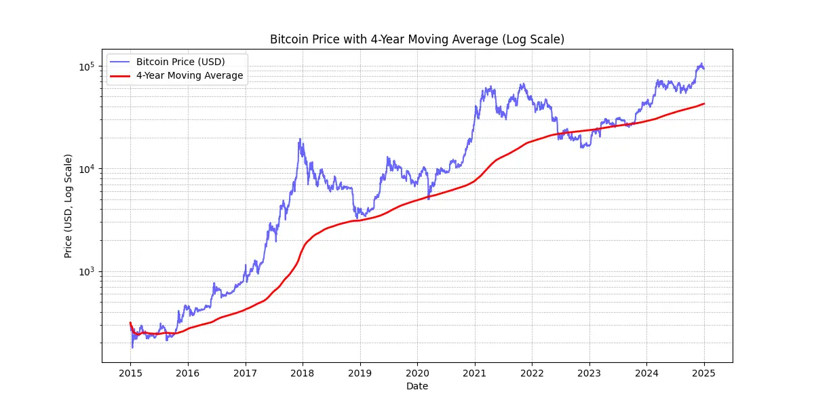

*MICHAEL SAYLOR: "Najbolji Bitcoin signal cene je 4-godišnji jednostavni pokretni prosek."* Pogledajte gornji grafikon.

Pored toga, preporučljivo je da izloženost Bitcoin bude **proporcionalna** nivou razumevanja. Takođe je važno ne žuriti i ne pokušavati savršeno tempirati tržište.

Konačno, Bitcoin se smatra **nestabilnim**. Tačnije, njegova cena izražena u jedinicama fiat novca je. Deo ove nestabilnosti je prirodan za još uvek mladu imovinu, ali je takođe pojačan prisustvom špekulanata koji ga ne koriste kao dugoročno skladište vrednosti, već traže brzu zaradu. Štaviše, trgovanje sa polugom (korišćenje pozajmljenih sredstava za povećanje trgovinskih pozicija) pojačava i uzlazne i silazne cenovne pokrete, sprečavajući Bitcoin da prati pravolinijski uzlazni put. Ovo dovodi do izraženijih fluktuacija, ali tokom vremena, kako baza posvećenih korisnika raste, čini se da se ova nestabilnost stabilizuje. Ukratko, **nemoguće je imati imovinu visokih performansi kao što je Bitcoin bez nestabilnosti**, ali svakako možete imati daleko manje performantne imovine sa manje nestabilnosti.

### Bitcoin usvojen od strane Vol Strita

Usvajanje Bitcoin od strane finansijskih institucija dodatno jača njegovu poziciju na globalnom tržištu.

Nedavne izjave **BlackRock-a** ističu potencijal Bitcoin kao sredstva za očuvanje vrednosti i alata za diverzifikaciju portfolija. Globalni institucionalni gigant je nedavno sugerisao da **rast korisnika Bitcoin nadmašuje onaj interneta** ili mobilnih telefona, podstaknut naročito **demografskim i generacijskim promenama**, kao i rastućim nepoverenjem u tradicionalne finansijske institucije (!). Zbog svoje oskudne, nesuverene i decentralizovane prirode, neki investitori vide Bitcoin kao opciju sigurnog utočišta **u vremenima fiskalne i monetarne nestabilnosti**, straha ili disruptivnih geopolitičkih događaja.

**Spot Bitcoin ETF-ovi**, lansirani u januaru 2024, doživeli su fenomenalan uspeh—**najuspešnije** lansiranje ETF-a u istoriji—sa skoro 20 milijardi dolara neto priliva od januara do novembra. To je otprilike četiri puta bolje od sledećeg najuspešnijeg lansiranja ETF-a, Nasdaq-100 QQQ. Ovi ETF-ovi omogućavaju lakši i regulisaniji pristup Bitcoin, što ga je **dalje legitimisalo** i privuklo značajan priliv institucionalnog kapitala.

Bitcoin ETF-ovi prednjače sa velikom razlikom u smislu **institucionalnog usvajanja**—nadmašujući deset najbrže rastućih ETF-ova—bilo u smislu broja uključenih institucija ili veličine imovine pod upravljanjem (AUM). Uspeh ovih Bitcoin ETF-ova naglašava rastuću potražnju za investicionim vozilima povezanima sa digitalnim sredstvima, čime se učvršćuje mesto Bitcoin u tradicionalnom finansijskom pejzažu.

Bitcoin sada igra na **tržištu** "čuvanja vrednosti". Predstavlja samo kap u moru u smislu obima: oko 1.800 milijardi dolara u poređenju sa zlatom od 18.000 milijardi ili nekretninama od 500.000 milijardi. Međutim, njegov tržišni udeo od oko 0,1% daje mu ogroman prostor za rast, posebno s obzirom na to da se njegovi konkurenti bore da privuku nove korisnike.

| Ticker  | 1D Flow (M USD) | 1W Flow (M USD) | 1M Flow (M USD) | 3M Flow (M USD) | YTD Flow (M USD) |
| ------- | --------------- | --------------- | --------------- | --------------- | ---------------- |
| **Sum** | +457.19         | +1,507.95       | +2,888.01       | +3,672.29       | **+20,262.94**   |
| IBIT    | +393.40         | +750.91         | +1,536.47       | +3,821.37       | +22,460.44       |
| FBTC    | +14.81          | +372.40         | +627.16         | +458.71         | +10,266.69       |
| ARKB    | +11.51          | +163.26         | +295.92         | -3.88           | +2,647.32        |
| BITB    | +12.93          | +146.50         | +263.30         | +97.46          | +2,262.69        |
| HODL    | +5.75           | +38.77          | +94.54          | +100.39         | +682.03          |
| BRRR    | +1.92           | +4.72           | +17.76          | +20.54          | +540.19          |
| EZBC    | +11.79          | +17.53          | +39.29          | +47.48          | +439.45          |
| BTC     | .00             | -3.13           | +36.59          | +419.18         | +419.18          |
| BTCO    | +6.43           | +19.25          | +47.30          | +56.41          | +394.82          |
| BTCW    | .00             | +2.84           | +6.04           | +146.69         | +217.47          |
| YBIT    | -1.34           | -10.26          | +5.06           | +13.81          | +76.30           |
| DEFI    | .00             | .00             | .00             | -2.03           | -1.79            |
| GBTC    | .00             | +5.16           | -81.42          | -1503.84        | -20,141.85       |

*20 milijardi dolara za 10 meseci: Bitcoin ETF-ovi postigli su za manje od godinu dana ono što je zlatnim ETF-ovima trebalo 5 godina. Izvor: Tokovi investicija u fondove u USD. Bloomberg Terminal, Bloomberg L.P., 2024.*

### Bitcoin u alatima kompanije

Rastuće usvajanje Bitcoin u Sjedinjenim Državama takođe utiče na razmišljanja i drugde u svetu, posebno među profesionalcima za upravljanje bogatstvom koji više ne mogu sebi priuštiti da ga ne uključe u svoj asortiman alata — naročito jer tradicionalni finansijski proizvodi ne ostvaruju očekivane rezultate ili prolaze kroz teške periode. Samo tradicionalne banke izgleda da još uvek mogu sebi priuštiti da ga ignorišu.

Sa čisto finansijskog aspekta, Bitcoin je prepoznat kao diversifikaciona imovina. Ne samo da nije povezan sa drugim klasama imovine, već izgleda da napreduje tokom perioda novih ubrizgavanja likvidnosti—još jedna takva epizoda izgleda da počinje sa snižavanjem kamatnih stopa od strane ECB, Fed-a i Kine.

Ukratko, za najčešći slučaj upotrebe—ulaganje viška trezora na najmanje četiri godine—Bitcoin savršeno odgovara. Vredi ga kombinovati sa strategijom postepenog ulaska: ulaganje fiksnih iznosa u redovnim intervalima kako bi se ublažila tačka ulaska ili izlaska.

Drugi slučajevi upotrebe čine Bitcoin strateškim trezorskim sredstvom, na primer:

- Mogućnost postavljanja **kolaterala** ili likvidnosti 24/7
- Mogućnost prebacivanja u trezor druge kompanije **brzo, u bilo koje vreme**
- Zaštita od **rizika strane valute Exchange**
- Plaćanje **dobavljaču** koji to prihvata, posebno u hitnim situacijama

### Da li je Bitcoin preskup?

Ne morate kupiti tačno 1 Bitcoin, jer je Bitcoin deljiv na podjedinice zvane satoši, nazvane u čast njegovog anonimnog tvorca. Jedan Bitcoin je jednak **100 miliona satošija**, što omogućava korisnicima da kupuju, prodaju ili trguju čak i **veoma malim delovima Bitcoin**. Zapravo, unutar izvornog koda Bitcoin, sve transakcije se obračunavaju u satošijima, a termin “Bitcoin” se pojavljuje samo u “coinbase,” posebnoj transakciji koju rudari kreiraju da bi primili svoju nagradu.

Štaviše, ukupno 21 milion bitkoina—ili **2,1 kvadriliona satoshija**—može biti efikasno predstavljen 64-bitnim celim brojem. To znači da, uprkos visokoj ceni po celom Bitcoin, ostaje dostupan širokom spektru investitora zahvaljujući svojoj deljivosti. Stoga ne morate kupiti ceo Bitcoin da biste učestvovali u mreži ili investirali u ovaj digitalni aset.

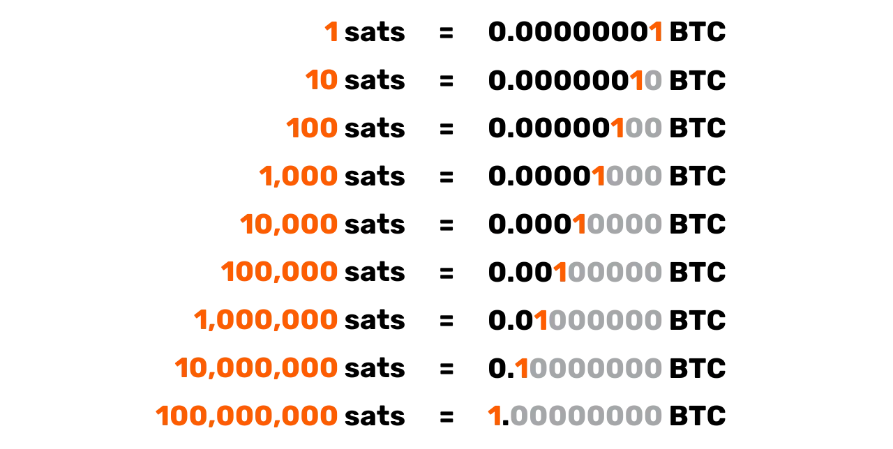

Hajde da se setimo da njegova relativno niska ukupna tržišna kapitalizacija, u poređenju sa drugim sredstvima kao što su akcije, zlato ili nekretnine, ostavlja njegov kapacitet za aprecijaciju netaknutim. Sa još uvek veoma niskom penetracijom (oko 1% globalne populacije), smatra se da smo tek na početku njegovog uspona. Ovo ga čini **najasimetričnijom opkladom naše generacije**: sada postoji veoma mala verovatnoća da će pasti na nulu u ovom trenutku, i jaka verovatnoća da će nastaviti da dobija na značaju.

### Odluka o alokaciji korporativne blagajne u Bitcoin

Proces **donšenja odluka** o ulaganju u Bitcoin biće u velikoj meri pod uticajem vaše pozicije unutar kompanije. Ako ste **većinski vlasnik, slobodni ste** da rasporedite višak sredstava iz trezora prema sopstvenoj proceni. Suprotno tome, ako ste partner ili akcionar unutar kolektivne strukture odlučivanja, moraćete da prođete kroz zajedničke rasprave, što može zakomplikovati stvari.

U ovom drugom scenariju, usklađivanje različitih tačaka gledišta postaje ključno, jer u velikoj meri **zavisi od razumevanja Bitcoin sredstva od strane svakog zainteresovanog lica**. Kao što izreka kaže: „Bitcoin je sve što ljudi ne znaju o računarima kombinovano sa svim što ne razumeju o novcu.“ Čak i ako se jedan partner potrudio da temeljno razume Bitcoin, prenošenje ovog znanja drugima može biti izazovno. U takvim slučajevima, **preporučljivo je angažovati spoljašnji resurs** kako bi se izbeglo da ideja bude previše usko povezana sa jednom osobom, što bi moglo izazvati otpor generate.

Trenutno, scenario u kojem većinski vlasnik donosi odluku je najreprezentativniji među kompanijama koje poseduju Bitcoin. Evo nekoliko pravih primera :

- Nezavisni profesionalci**: Konsultanti, zdravstveni radnici ili advokati koji ulažu deo svoje dugoročne riznice u Bitcoin. Generalno, ovi profesionalci već imaju štedne ili oročene depozitne račune sa skromnim prinosima.
- Izvršni direktori tehnološkog sektora**: Izvršni direktor koji je prodao svoju kompaniju i uložio deo prihoda iz svoje lične holding kompanije u Bitcoin pre nekoliko godina. Danas uživaju u udobnoj finansijskoj situaciji i reinvestiraju u nove poduhvate.
- Vlasnici veoma malih preduzeća** : Preduzetnici u uslugama, poljoprivredi ili zanatskim industrijama koji su razumeli potencijal Bitcoin i izdvajaju deo svog trezora za to. Njihova primarna motivacija leži u diverzifikaciji i slobodi koju pruža.
- Javno trgovane kompanije** poput MicroStrategy postavile su presedan pretvaranjem značajnog dela svoje korporativne blagajne u Bitcoin, pokazujući globalni pomak u strategijama alokacije korporativnog kapitala. Do jeseni 2024. godine, brojne druge kompanije su sledile njihov primer, dodatno legitimizujući ovaj trend.

### Oporezivanje Bitcoin koje drže preduzeća

Za preduzeća koja nisu strukturirana kao zasebni pravni subjekti—kao što su samostalna preduzeća ili drugi neinkorporirani subjekti—oporezivanje Bitcoin transakcija često odražava tretman koji se primenjuje na pojedince. U mnogim slučajevima, ista pravila koja regulišu kapitalne dobitke ili prihod se primenjuju, baš kao što bi bila da pojedinac prodaje Bitcoin. Na primer, u nekim zemljama, profiti bi mogli biti smatrani delom ličnog prihoda preduzetnika, podložni **ličnim poreskim razredima**.

Međutim, **inkorporirana preduzeća**—ona koja podležu porezu na dobit korporacija—često imaju koristi od povoljnijeg poreskog okvira. Za razliku od pojedinaca, koji se mogu suočiti sa ograničenjima u pogledu kompenzacije dobitaka i gubitaka u različitim klasama imovine, korporacije obično mogu integrisati ostvarene dobitke ili gubitke na Bitcoin transakcijama direktno u svoje godišnje račune dobiti i gubitka. Ovo može dovesti do fleksibilnije i ponekad povoljnije poreske pozicije.

Specifične poreske stope i tretmani značajno variraju u zavisnosti od jurisdikcije. Na primer, u Francuskoj i mnogim zapadnim zemljama, korporacije mogu imati poreske stope na dobit od oko 25%, što može biti niže od paušalnih poreza koje pojedinci plaćaju na dobitke od investicija.

Zbog ovih razlika, **neki vlasnici preduzeća odlučuju da kupe i drže Bitcoin kroz svoje korporativne strukture**, jer to može pružiti **efikasnije mogućnosti poreskog planiranja**. Kao i uvek, preporučljivo je konsultovati se sa poreskim stručnjakom koji je upoznat sa pravilima u relevantnoj jurisdikciji(ama) kako bi se osigurala usklađenost i optimizovala poreska strategija.

## Kako nabaviti Bitcoin

<chapterId>1e6dbaf5-581a-49a4-8f37-3728e77bda17</chapterId>

### Tri Metode Sticanja

Postoje tri načina da se nabavi Bitcoin:

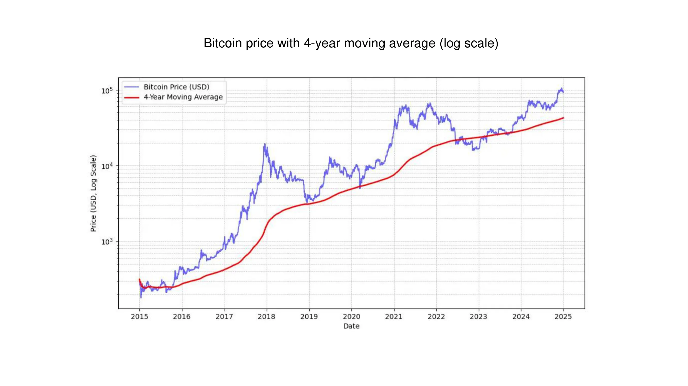

- U Exchange za robu ili usluge:**

Pošto Bitcoin funkcioniše kao medijum za Exchange, moguće je zamisliti cirkularnu ekonomiju. Iako je ovo danas još uvek retko, sve više preduzeća počinje da prihvata Bitcoin uplate—zašto ne i vaše? (Pogledajte naše sledeće poglavlje)

- Mining Bitcoin:**

Ovo uključuje zarađivanje nagrada od rada Mining mašina. Za nespecijalizovane firme, ovo ostaje relativno marginalno. Možete učestvovati preko posrednika koji će vam prodati ili iznajmiti računarsku snagu, mrežu i održavanje. Ako posedujete mašine, možete ih računati kao amortizovanu imovinu. U velikim razmerama, moraćete pažljivo izračunati povrat investicije jer je tržište veoma konkurentno i zahteva dobro predviđanje troškova, posebno električne energije.

Da biste saznali više o Mining metodama, možete [pogledati "Mining" odeljak u našim tutorijalima](https://planb.network/tutorials/Mining).

- Kupovina Bitcoin:**

Ovo je daleko najčešći metod, koji se sprovodi ili putem peer-to-peer razmena ili, češće, na specijalizovanim platformama za trgovanje. Ali kada se Bitcoin nabavlja kao korporativna trezorska imovina, kompanije moraju da se pridržavaju strogih regulatornih standarda i procedura Poznavanja Svoje Stranke (KYC). Kada ga kupuju na specijalizovanim platformama za trgovanje, od preduzeća se obično zahteva da dostave detaljne informacije o kompaniji, uključujući identifikacione dokumente, finansijske izveštaje i dokaz o Address, kako bi ispunili KYC i zahteve za sprečavanje pranja novca (AML).

Da biste naučili kako otvoriti poslovni račun i koristiti ga za kupovinu, prodaju i transfer bitcoina, možete pogledati ova dva vodiča posebno dizajnirana za preduzeća, koja pokrivaju platforme Kraken i Bitfinex u njihovim korporativnim verzijama:

https://planb.network/tutorials/business/others/bitfinex-pro-c8ef7476-5f60-4205-935e-a545ced0022a

https://planb.network/tutorials/business/others/kraken-pro-07b1c16c-d517-4bf7-9a78-b42dc0f21785

Da biste saznali više o metodama za sticanje bitkoina putem Exchange ili peer-to-peer, možete [pogledati odeljak "Exchange" u našim tutorijalima](https://planb.network/tutorials/Exchange).

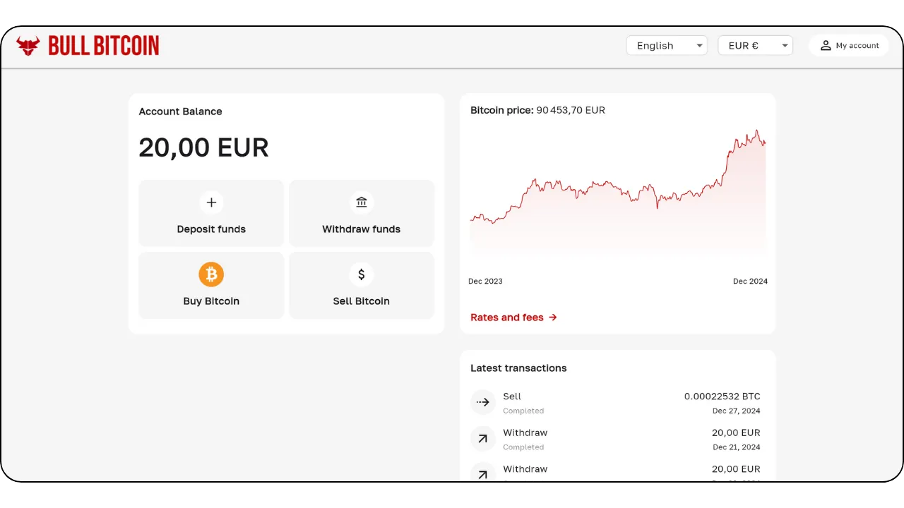

### Po kojoj ceni?

Kao što je ranije pomenuto, ne samo da je nemoguće predvideti buduću cenu Bitcoin, već je cena takođe veoma nestabilna na kratak rok. Istorijski gledano, pouzdana strategija je bila postepeno akumuliranje u redovnim intervalima i održavanje vremenskog horizonta od četiri godine ili više.

### Koliko Treba da Kupite?

Kontraintuitivno, verovatno je najbolje početi sa veoma malom kupovinom bez preteranog razmišljanja. Mala suma (kao što je sto evra ili dolara) neće vam ozbiljno naškoditi, a praktično iskustvo će vas naučiti mnogo više, mnogo brže, nego bilo koja količina čitanja.

Kao što je ranije navedeno, pametno je ulagati samo višak likvidnosti koji vam neće biti potreban nekoliko godina. Bilo koja strategija koja nije dobro shvaćena rizikuje da vas dovede u tešku situaciju ako iznenada morate unovčiti u lošem trenutku.

Pored toga što počinju sa malim iznosima, korisno je da korporativne riznice usvoje strategiju merene alokacije. Na jednom kraju spektra, neke kompanije, poput MicroStrategy, zauzele su ekstreman pristup posvećujući značajan deo svojih viškova sredstava riznice Bitcoin, što odražava snažno institucionalno uverenje. Nasuprot tome, konzervativnija i verovatno racionalnija strategija mogla bi uključivati alokaciju od oko 5% korporativne riznice u Bitcoin, balansirajući potencijalne dobitke sa upravljanjem rizikom i zahtevima likvidnosti.

Vizualizujte ovaj spektar kao skalu, od minimalne izloženosti, osiguravajući da kompanija zadrži dovoljnu likvidnost za operativne potrebe, do agresivnog stava usmerenog na iskorišćavanje očekivanog dugoročnog povećanja vrednosti Bitcoin. Dok agresivna alokacija može doneti veće prinose, skromna alokacija pomaže u ublažavanju volatilnosti, osiguravajući da finansijska osnova kompanije ostane sigurna, a istovremeno koristi od inovativnog potencijala Bitcoin unutar svojih trezorskih operacija.

### Koliko često?

Ne postoji pravilo Hard. Pokušaj tempiranja tržišta traženjem „padova“ može biti manje efikasan i stresniji nego jednostavno kupovanje u redovnim intervalima. Čak i iskusni investitori ponekad pogreše. Odlazak „sve ili ništa“ odjednom može biti mač sa dve oštrice.

U stvarnosti, potencijalna aprecijacija Bitcoin je takva da čak i ako biste počeli tek za nekoliko godina, verovatno biste i dalje videli dugoročne dobitke. Istina, verovatno je da će se velike oscilacije cena smanjiti u intenzitetu tokom vremena. Međutim, kao deflatorna valuta, Bitcoin je dizajniran da efikasno čuva vrednost i odražava produktivnost svojih korisnika. Da upotrebimo analogiju: trenutno smo u "fazi lansiranja" Bitcoin, valute u nastajanju, i niko još ne zna njenu fer vrednost. Kasnije, možda za 20 ili 40 godina, kada bude u stabilnoj "fazi krstarenja," mogla bi biti izuzetno stabilna i rasti postojano sa produktivnim dobicima društva.

Industrija nekretnina često ponavlja da je „uvek pravo vreme za kupovinu“, zaboravljajući da, ako bi nekretnine izgubile svoju funkciju kao čuvara vrednosti—prelazeći na imovinu poput Bitcoin—cene bi se mogle vratiti bliže njihovoj korisnoj vrednosti (prihvatilište). Bitcoin, nasuprot tome, ne služi nijednoj svrsi osim skladištenju vrednosti, što bi moglo značiti da je „uvek pravo vreme za kupovinu“. Budućnost će pokazati.

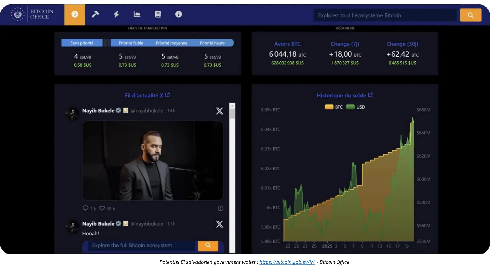

*Kredit: [Bitcoin Kancelarija](https://Bitcoin.gob.sv/)*

### U kom obliku kupiti? (Metode čuvanja)

Ne posedujete fizički Bitcoin. Umesto toga, imate kriptografski ključ koji vam omogućava da prenesete Ownership nekih ili svih vaših jedinica računa na jedan ili više drugih kriptografskih ključeva. Sve se ovo dešava na Bitcoin Blockchain, koji je repliciran na desetinama hiljada čvorova širom sveta.

Ovaj kriptografski ključ je izuzetno veliki nasumični broj. Da bi se pojednostavilo korisničko iskustvo, često se predstavlja kao niz od 12 ili 24 reči. Ove reči mogu biti učitane na fizički uređaj poznat kao "Hardware Wallet." Međutim, treba razumeti da bitkoini nisu "unutar" ovog uređaja; on je jednostavno alat za kriptografsko potpisivanje transakcija i njihovo emitovanje na mrežu. Ono što je zaista važno su tih 12 ili 24 reči, koje moraju biti čuvane na sigurnom.

Ovo dovodi do pitanja starateljstva: držanje Bitcoin znači držanje ključa(čeva). Ili ih držite sami, ili delegirate zadatak trećoj strani. Postoje i međurešenja. Hajde da pregledamo najčešće scenarije:

- Samostalno čuvanje:**

Ovo je opcija koju preporučuju pravi entuzijasti Bitcoin, jer je u skladu sa originalnim dizajnom Bitcoin. Vi delujete kao sopstvena banka: nema rizika da vas prevari treća strana, ali ste odgovorni za obezbeđivanje ključa(čeva). Imate potpuni pristup svojim sredstvima 24/7. U poslovnom okruženju, ako više ljudi treba da obavlja transakcije, biće vam potrebni odgovarajući alati i procedure za upravljanje pristupom i sigurnošću.

- Starateljstvo treće strane:**

Na primer, Exchange ili usluga kupovine može kreirati nalog za vas, konvertovati vašu tradicionalnu valutu u Bitcoin i čuvati je u vaše ime koristeći njihove sigurnosne sisteme. Većina takvih usluga omogućava vam da povučete svoje bitkoine na Wallet gde samo vi držite ključ. Dok to ne uradite, vi zapravo ne posedujete bitkoine; oslanjate se na njihovo obećanje da će vam ih vratiti. Ovo uključuje balansiranje sigurnosnih rizika (njihovih naspram vaših) i rizika druge strane (mogu propasti ili nestati). Neka preduzeća smatraju ovo prihvatljivim, iako se generalno ne preporučuje za dugoročno skladištenje ili za 100% vaše alokacije. Usluge čuvanja takođe mogu naplaćivati naknade za skladištenje.

- „Paper Bitcoin“ (ETF-ovi ili ETP-ovi):**

Ovo su tradicionalni finansijski instrumenti koji predstavljaju frakcije Bitcoin, replicirajući njegovu cenovnu performansu. Institucija iza proizvoda teoretski kupuje i drži osnovni Bitcoin. Vaši doprinosi i povlačenja se vrše u tradicionalnoj valuti (npr. dolarima ili evrima), a ne u Bitcoin. Osim za određene proizvode koji dozvoljavaju povlačenje u stvarnom Bitcoin (da bi se izbegao oporezivi događaj u nekim jurisdikcijama), ovi instrumenti uključuju godišnje naknade za upravljanje. Ovde se oslanjate na sigurnost institucije i suočavate se sa rizikom druge strane (na primer, ako bi vlada odlučila da zapleni sav institucionalno držani Bitcoin, kao što se desilo sa zlatom 1933. pod američkim Izvršnim nalogom 6102). Njihova primarna prednost je laka dostupnost, jer se distribuiraju kroz tradicionalne finansijske kanale. Oni zaobilaze potrebu za obezbeđivanjem kriptografskih ključeva, ali ne nude nijedno od inherentnih svojstava Bitcoin: ne možete koristiti Bitcoin mrežu 24/7 za slobodno premeštanje vrednosti bez dozvole. Oni samo repliciraju finansijsku performansu, a ne funkcionalnost ili suverenitet samog Bitcoin.

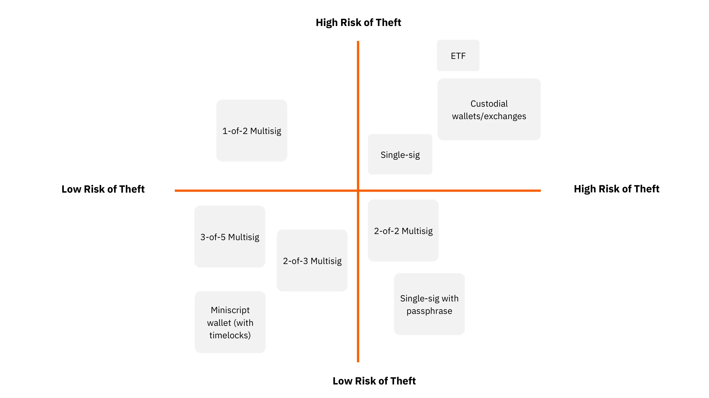

Pored toga, oblik u kojem držite Bitcoin značajno utiče na mere bezbednosti potrebne za zaštitu vašeg korporativnog trezora. Bilo da se odlučite za samostalno čuvanje, koristeći hardverske novčanike sa jednim ili više potpisa, itd. kako biste zadržali direktnu kontrolu nad svojim ključevima, ili delegirate ovaj zadatak uslugama treće strane ili ETF-ovima, svaka opcija nosi svoj profil rizika. Na primer, samostalno čuvanje nudi potpuni pristup, ali zahteva rigorozne interne bezbednosne protokole, dok rešenja treće strane smanjuju teret upravljanja na račun rizika od druge strane. Da bismo dodatno ilustrovali razlike, ovaj grafikon prikazuje model bezbednosti za svaki tip čuvanja, pomažući vam da odaberete pristup koji najbolje odgovara potrebama vaše organizacije :

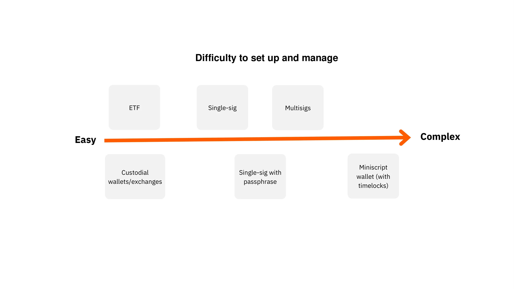

### Koga kupiti od?

Ako se odlučite za „papirni Bitcoin“, obratićete se finansijskim institucijama kao što su banke ili onlajn berze.

Ako odlučite da kupite stvarni Bitcoin putem tržišta (Exchange) ili brokera, imate nekoliko glavnih kategorija:

- Velike međunarodne ili strane platforme:**

Primeri uključuju Kraken, Coinbase, ili Binance, koje su mnogi pojedinci istorijski koristili. Neki su naišli na probleme, i teško je dati jasnu preporuku. Savet: ako ih koristite, ne ostavljajte svoje bitkoine tamo duže nego što je potrebno.

- Regulisani Pružaoci Usluga (Registrovani Pružaoci Usluga Digitalne Imovine):**

Na primer, u Francuskoj platforme kao što su Paymium (Exchange) ili BullBitcoin (broker) su poznate po tome što imaju istinske entuzijaste Bitcoin na čelu i izgradile su solidan dosije. U SAD-u imate provajdere usluga kao što su River ili Swann. Uopšteno, važno je ispitati poreklo provajdera: njihovu reputaciju, dosije, popularnost unutar zajednice Bitcoin i da li je njihovo rukovodstvo usklađeno sa osnovnim vrednostima Bitcoin.

**Exchange vs. Broker:**

- **Exchange** vam omogućava da postavite naloge za kupovinu po ceni koju izaberete, ali morate čekati na izvršenje dok se tržišna cena i prodavci ne usklade.
- **Broker** vam nudi fiksnu cenu i može brže završiti transakciju.

Pored naknada i brzine izvršenja—koji su manje bitni ako razmišljate dugoročno (nekoliko godina)—poslovanje bi takođe trebalo razmotriti:

- Korisnik Interface:** Da li je platforma laka za korišćenje?
- Računovodstvene funkcije:** Minimalno, mogućnost izvoza istorije transakcija u .CSV formatu.
- Starateljstvo i sigurnost:** Da li platforma drži bitkoine u vaše ime, ili prenosi Ownership vama? Kakva je njihova sigurnosna postavka? Da li imaju „zaključavanje povlačenja“ ili druga ograničenja povlačenja?
- Korisnička podrška:** Kvalitet, odzivnost i personalizovana pomoć, posebno kada tek počinjete.
- Reputacija i Etos:** Pouzdanost i vrednosti platforme.
- Podrška za ponavljajuće kupovine:** Ako planirate da akumulirate Bitcoin tokom vremena sa zakazanim kupovinama.

# Prilagođena Bitcoin rešenja za plaćanje za svaki posao

<partId>b2c8af88-6bfc-49b1-ad84-4c292c713b55</partId>

## Prihvatanje Bitcoin kao plaćanje

<chapterId>99af1203-bc84-4acc-9780-f733e7998335</chapterId>

Prvo, važno je razumeti da je Bitcoin poremećaj na istoj skali kao internet.

U ranim danima, internet mreža je omogućila uklanjanje posrednika iz komunikacionih kanala, a zatim je ova infrastruktura dovela do bezbroj ranije nezamislivih aplikacija. Danas, koji biznis nema online prisustvo?

Bitcoin je infrastruktura poverenja, čija je prva primena uklanjanje posrednika iz skladištenja i Exchange vrednosti—novca. Druge trenutno nezamislive primene će se pojaviti na ovoj infrastrukturi. Vaše početno prisustvo ovde je ekvivalentno posedovanju veb-sajta: prolaz ka peer-to-peer plaćanjima i razmenama vrednosti.

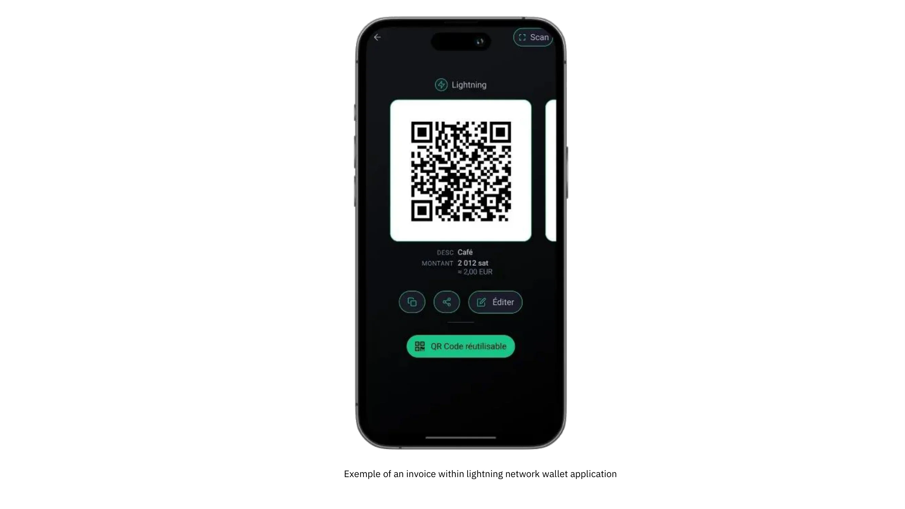

Sada, razmotrite perspektivu praktičnog biznisa čija osnovna delatnost nema nikakve veze sa Bitcoin. Zašto bi odlučio da prihvati Bitcoin plaćanja?

- Izgradnja Bitcoin Trezora:**

Pogledajte naš prethodni članak o kupovini Bitcoin. Bilo zbog uverenja ili kao strategije diverzifikacije, neki profesionalci odlučuju da prihvate Bitcoin plaćanja. Neki Bitkoineri tvrde da što je kompanija manje finansijski sklona—što znači da nema ni vremena ni alata za angažovanje u složenim finansijskim manevrima—**to postaje kritičnije da ta firma bude plaćena u najtvrđem obliku novca dostupnom**. Na taj način se izjednačava teren, omogućavajući čak i malim, vremenski ograničenim preduzećima da očuvaju vrednost bez upadanja u finansijske igre.

- Dostizanje nove demografske grupe:**

Broj korisnika Bitcoin raste, i oni imaju značajnu kupovnu moć. Prirodno će gravitiraju ka preduzećima koja prihvataju njihovu valutu. Štaviše, pošto je ovo prva univerzalna, internet-nativna valuta, možete privući i međunarodne kupce koji prolaze kroz.

- Povećanje Vidljivosti:**

Navođenjem vašeg poslovanja na platformama kao što je BTCmap.org, na primer. Samo nekoliko preduzeća trenutno prihvata Bitcoin, tako da usmena preporuka radi u vašu korist. Takođe vas izdvaja od konkurencije.

- Niže Naknade:**

Instant Bitcoin plaćanja se obavljaju preko Lightning Network. **Naknade su minimalne i plaća ih kupac**. Nema naknada za platne terminale, nema neuspeha u autorizaciji plaćanja i nema prevara. U poređenju, industrija plaćanja (kartice, terminali, transferi, PSP-ovi, itd.) košta oko 2,2 triliona dolara godišnje globalno. Dodajte tome povraćaje sredstava i prevare, i ukupno, skoro jedna desetina ekvivalenta BDP-a SAD-a se "skida" sa produktivnih preduzeća širom sveta samo da bi se prenela vrednost. Bez obzira na vaše poslovanje, finansijske naknade su teret koji treba optimizovati, a u nekim slučajevima, visoke naknade mogu ugušiti određene poslovne modele.

- Sloboda i bez dozvole, 24/7:**

Nema potrebe da tražite dozvolu za korišćenje Bitcoin. Svako može učestvovati u ekonomiji u roku od nekoliko minuta koristeći aplikaciju na pametnom telefonu. Možete poslati ili primiti uplatu od bilo koga—pojedinca ili preduzeća—u bilo koje vreme, bez vremenskih ograničenja ili kašnjenja.

- Iskoristite prednosti Bitcoin mreže:**

Niste obavezni da zadržite svoje uplate u Bitcoin formi—posebno ako treba da platite dobavljače ili uplatite PDV. Određene usluge mogu konvertovati sve ili deo vaših Bitcoin uplata u valutu po vašem izboru (npr. evre na vaš IBAN) uz naknadu. U ovom scenariju, prednost prihvatanja Bitcoin može ležati u privlačenju novih korisnika ili u intrinzičnim prednostima Bitcoin (kao što su niže naknade, rad bez prekida i bez rizika od prevare ili povraćaja sredstava).

### Koje rešenje za plaćanje treba da izaberete?

Relativno je lako početi prihvatati Bitcoin uplate. Da biste izabrali pravo rešenje, razmotrite karakteristike transakcija koje obrađujete: prosečan iznos uplate, učestalost transakcija i da li ćete prihvatati uplate u fizičkom okruženju, onlajn ili oba.

Vaš način razmišljanja kao trgovca je takođe važan. Da li sprovodite jednostavan test ili očekujete da Bitcoin postane značajan i stalan izvor prihoda? Ako je ovo drugo, biće vam potrebno robusno, sveobuhvatno i prilagodljivo podešavanje.

Ne zaboravite da razmotrite različite uloge vaših zaposlenih i njihove lokacije. U bilo kom scenariju, zapamtite da morate biti u mogućnosti da obezbedite sve potrebne informacije svom računovođi i pojednostavite proces računovodstva.

Da bismo pojednostavili proces donošenja odluka, definisali smo četiri različita poslovna profila. Sledeće tabele razlažu ključne karakteristike i preporučena rešenja za plaćanje za svaki profil.

### Poslovni profili

#### Profil 1 – Početnik

| Attribute                        | The Starter                                                                                                                                |
| -------------------------------- | ------------------------------------------------------------------------------------------------------------------------------------------ |
| **State of Mind**                | "trying my first physical payment", "taking a tip for my online content", "targeting very small revenue"                                   |
| **Transaction Frequency**        | "first transaction in order to learn", "taking payment once in a while"                                                                    |
| **Business Type Examples**       | Creative economy (content creators, blogs, articles, etc.), occasional tips, one-off in-person product sales, associations, one-off events |
| **Payment Type**                 | Generally a few cents to a few euros/dollars; under ~300 euros/dollars per item                                                            |
| **Settings Complexity**          | None                                                                                                                                       |
| **Example Recommended Solution** | A custodial Lightning wallet like Wallet of Satoshi or a non-custodial wallet like Phoenix                                                 |
| **Merchant Interface**           | Simple Bitcoin Lightning wallet: an app on a mobile phone                                                                                  |
| **Customer Interface**           | Bitcoin QR payment code, scanned via the customer’s personal wallet                                                                        |
| **Fees**                         | Customer pays Bitcoin Lightning fees plus any applicable app fees                                                                          |
| **Point of Sale Device**         | Free smartphone app or an option for a physical terminal (e.g. Bitcoinize)                                                                 |
| **Management and Roles**         | Single app management; minimal role differentiation                                                                                        |
| **Accounting Exports**           | Basic transaction history lists                                                                                                            |
| **API**                          | No                                                                                                                                         |

#### Profil 2 – Osnovni

| Attribute                        | The Essential                                                                                                                              |
| -------------------------------- | ------------------------------------------------------------------------------------------------------------------------------------------ |
| **State of Mind**                | "I accept Bitcoin in my business but I do not expect meaningful volume"                                                                    |
| **Transaction Frequency**        | Few transactions per month                                                                                                                 |
| **Business Type Examples**       | Bars, restaurants, semi-regular sales of fresh or directly sourced products, multiple stores under one owner, creative economy for artists |
| **Payment Type**                 | Generally ranging from a few euros/dollars to a few hundred per item; under ~300 per item and under ~3,000 per month                       |
| **Settings Complexity**          | Minimal (mobile app)                                                                                                                       |
| **Example Recommended Solution** | Swiss Bitcoin Pay                                                                                                                          |
| **Merchant Interface**           | Simple Bitcoin Lightning wallet: an app on a mobile phone; simple invoicing with minimal details                                           |
| **Customer Interface**           | Bitcoin QR payment code, scanned via the customer's personal wallet                                                                        |
| **Fees**                         | Typically <1% for sending to a Bitcoin address, and <1.5% for converting to fiat                                                           |
| **Point of Sale Device**         | Free smartphone app or an option for a physical terminal (e.g. Bitcoinize)                                                                 |
| **Management and Roles**         | Option for a sell-only role for employees; online dashboard for administration                                                             |
| **Accounting Exports**           | CSV export with complete transaction details                                                                                               |
| **API**                          | Yes                                                                                                                                        |

#### Profil 3 – Profesionalac

| Attribute                        | The Professional                                                                                                                                       |
| -------------------------------- | ------------------------------------------------------------------------------------------------------------------------------------------------------ |
| **State of Mind**                | - A payment method like any other for my e-commerce - Or joint management for a group of businesses ready for higher volumes                           |
| **Transaction Frequency**        | Multiple transactions per day                                                                                                                          |
| **Business Type Examples**       | E-commerce sites with moderate volume, small marketplaces, groups of physical stores (e.g., Click & Collect), SME operations                           |
| **Payment Type**                 | Generally ranging from a few euros/dollars to a few hundred; no set payment size limit; less than 250,000 per year                                     |
| **Settings Complexity**          | Light to fully featured (local or cloud hosting), often requires an e-commerce storefront                                                              |
| **Example Recommended Solution** | BTC Pay Server for e-commerce and/or physical environments; ZapRite, Musqet or PayWithFlash for checkout, Be-BOP for an integrated e-store             |
| **Merchant Interface**           | Website (mobile and desktop) with invoice editing, shopping cart options, and payment button creation; automated invoicing with e-commerce integration |
| **Customer Interface**           | Bitcoin QR payment code, scanned via the customer's personal wallet                                                                                    |
| **Fees**                         | Mix of free open-source backend and paid Lightning hosting/service fees; front-end fees include Bitcoin Lightning fees and <1.5% conversion fees       |
| **Point of Sale Device**         | Website store, optional physical display (e.g. iPad showing the site or Bitcoin terminal)                                                              |
| **Management and Roles**         | Fully featured store with multiple admin roles; employees and customers interact with the system                                                       |
| **Accounting Exports**           | CSV export with complete transaction details                                                                                                           |
| **API**                          | Yes                                                                                                                                                    |

#### Profil 4 – Preduzeće

| Attribute                        | The Enterprise                                                                                                                                  |
| -------------------------------- | ----------------------------------------------------------------------------------------------------------------------------------------------- |
| **State of Mind**                | - A strategic payment method for the business - With some development to integrate into the service platform as per specific specifications     |
| **Transaction Frequency**        | Unlimited, high-frequency transactions                                                                                                          |
| **Business Type Examples**       | Mid-sized enterprises, IT service companies, large corporations, major marketplaces                                                             |
| **Payment Type**                 | Any size or volume                                                                                                                              |
| **Settings Complexity**          | Medium to high, depending on the choice of architecture                                                                                         |
| **Example Recommended Solution** | Custom-made architecture or orchestration of SaaS-hosted solutions, potentially using third-party LSP (*Lightning Service Provider*) services   |
| **Merchant Interface**           | Fully customized front-end and back-end interfaces fully integrated into the business’s workflows and processes                                 |
| **Customer Interface**           | Ranging from a Bitcoin QR payment code to a fully custom UI and/or API integration                                                              |
| **Fees**                         | Combination of internal development and third-party fees; customer pays Bitcoin Lightning fees plus any transaction fees from service providers |
| **Point of Sale Device**         | Custom-designed solutions tailored to the enterprise environment                                                                                |
| **Management and Roles**         | Fully customized roles across sales, administration, devops, accounting, and finance                                                            |
| **Accounting Exports**           | Fully customized accounting exports                                                                                                             |
| **API**                          | Yes                                                                                                                                             |

U narednim poglavljima, detaljno ćemo opisati svaki poslovni profil i rešenja prilagođena svakom od njih.

## Starter

<chapterId>7edda53d-5b9f-432a-8493-115de8c94a67</chapterId>

Profil Starter je dizajniran za preduzeća, kreatore i pojedince koji žele da istraže Bitcoin plaćanja bez ulaganja značajnih resursa ili stručnosti. To su obično oni koji obrađuju vrlo mali obim transakcija (možda nekoliko napojnica, donacija ili povremenih prodaja) i traže jednostavan, lagan uvod u Bitcoin i Lightning Network ekosistem. Ključna vrednost pristupa Starter leži u minimalnom podešavanju: u većini slučajeva, sve što je potrebno je pametni telefon ili tablet opremljen osnovnim Lightning-kompatibilnim Wallet.

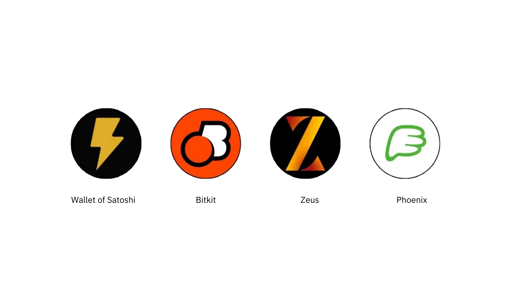

Jedna od definisajućih karakteristika ovog profila je fokus na plaćanja niskog obima koja retko prelaze nekoliko stotina evra ili dolara mesečno. Ova skromna skala čini ga odličnim izborom za svakoga ko želi da testira tržište sa Bitcoin, bez složenosti koje su svojstvene implementacijama većeg obima. Pored toga, omogućava neposredno praktično učenje; pošto su operativni pritisci manji i novčani ulozi manji, greške se mogu kontrolisati, a lekcije se brzo uče. Od umetnika koji prodaju ručno izrađene rukotvorine na vikend sajmovima do neprofitnih grupa koje prihvataju jednokratne donacije, korisnici u ovoj kategoriji često naglašavaju pristupačnost i jednostavnost korišćenja u odnosu na napredne funkcionalnosti.

Dve najčešće postavke Wallet za Starter profil uključuju odlučivanje između kustodijalnih i nekustodijalnih rešenja. Kustodijalni Wallet (kao što su Wallet od Satoshi ili Blink) omogućava trećoj strani da upravlja privatnim ključevima i pozadinskim operacijama, čime se smanjuju tehničke odgovornosti korisnika. Ova postavka je posebno privlačna za one koji cene praktičnost iznad svega i žele najjednostavniji mogući proces prijave. S druge strane, nekustodijalni Lightning novčanici (poput Phoenix ili Breez) stavljaju privatne ključeve i potpunu kontrolu u ruke vlasnika biznisa, nudeći veću autonomiju i privatnost u Exchange uz nešto više početnog truda. U oba slučaja, moderni interfejsi su obično toliko korisnički prijateljski da svako može obaviti osnovne zadatke (generisanje QR koda, unos iznosa plaćanja i potvrđivanje transakcija) u roku od nekoliko minuta.

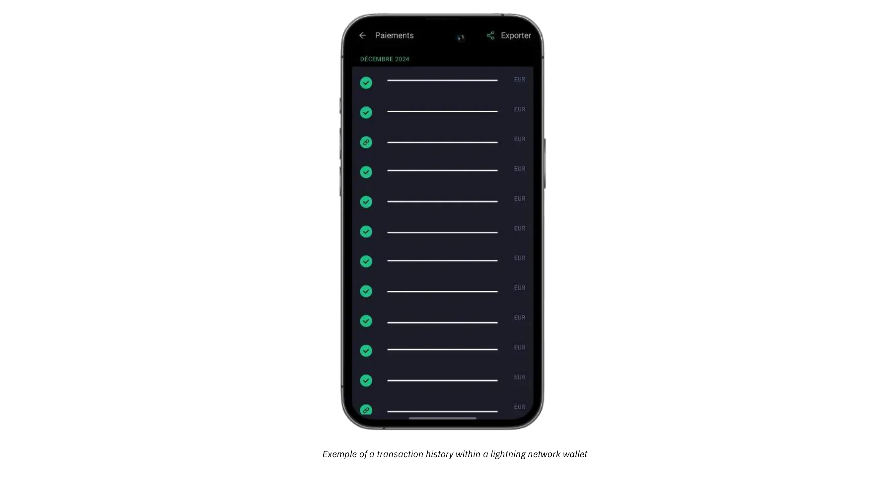

Iako se bezbednosni problemi mogu činiti manje hitnim kada su transakcije male, ipak je ključno uspostaviti osnovne zaštitne mere. Čak i jedan pametni telefon ili tablet koji se koristi za primanje Bitcoin uplata treba da bude zaštićen lozinkom ili biometrijskom sigurnošću, a procedure za pravljenje rezervnih kopija (od praćenja podataka za prijavu za kustodijalni Wallet do zaštite seed fraze za nekustodijalni) moraju se shvatiti ozbiljno. Članovi osoblja koji rukuju transakcijama u fizičkom okruženju imali bi koristi od poznavanja osnova: kako otvoriti aplikaciju, kako predstaviti QR kod kupcu i kako proveriti da li je uplata zaista stigla.

Računovodstvo i izveštavanje, iako relativno jednostavni pod Starter profilom, ipak zahtevaju pažljivo razmatranje. Iako obim transakcija može biti minimalan, zadržavanje tačnih zapisa sprečava konfuziju kasnije i pomaže u održavanju transparentnosti u slučaju finansijskih revizija ili poreskih prijava. Mnoge Wallet aplikacije omogućavaju korisnicima da izvoze osnovnu istoriju transakcija kao CSV fajl; za malo preduzeće ili pojedinačnog preduzetnika, redovno čuvanje ovih fajlova može učiniti usklađivanje računa mnogo lakšim. Takođe je mudro pratiti približnu fiat vrednost (na primer, u evrima ili dolarima) u trenutku kada je svaka transakcija primljena. Pošto cena Bitcoin može varirati, posedovanje zapisa o kursnim razlikama je neprocenjivo za knjigovodstvo i poresku usklađenost.

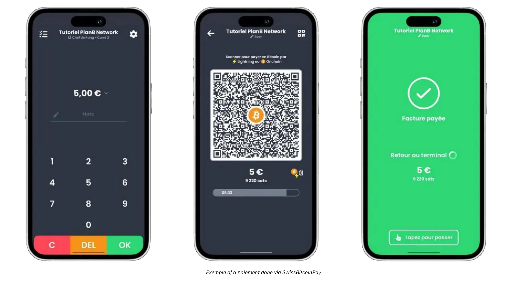

Za preduzeća koja žele da dopune svoje fizičke ili lične uplate sa onlajn donacijama ili napojnicama, sada je jednostavno integrisati Lightning dugme za napojnice ili donacijski vidžet na vebsajt ili blog. Platforme kao što je BTCPay Server nude lako konfigurisane dugmiće za plaćanje, dok neke društvene mreže i usluge za prenos uživo već podržavaju Lightning napojnice sa adresama. Kao rezultat toga, čak i početničko preduzeće može izgraditi skromnu, ali globalnu mrežu pokrovitelja. U međuvremenu, oni koji ne žele da drže Bitcoin dugoročno mogu istražiti delimičnu ili automatsku konverziju u fiat valutu koristeći određene skrbničke novčanike ili usluge trećih strana. Iako ova opcija uključuje dodatne naknade i moguće KYC obaveze, pomaže preduzećima da zaobiđu volatilnost kursa Exchange i održe svoje postojeće finansijske tokove uz minimalne poremećaje.

Jednostavan slučaj upotrebe ilustruje kako se svi ovi Elements spajaju. Zamislite lokalnog zanatliju koji prodaje domaće džemove na subotnjoj pijaci. Naoružan telefonom sa kustodijalnim Lightning Wallet, postavlja cenu za svaku teglu u evrima; kada kupac zatraži da plati u Bitcoin, trgovac brzo unosi odgovarajući iznos u fiat valuti, a aplikacija automatski izračunava iznos Sats. Rezultujući QR kod skenira kupčev Wallet, uplata se rešava za nekoliko sekundi, a zanatlija odmah zna da je transakcija uspela. Na kraju dana, svi detalji transakcije mogu se izvesti za vođenje evidencije, a saldo dana može se u celosti ili delimično poslati na Exchange platformu kako bi se konvertovao u fiat valutu.

Balansiranjem korisnički prijateljskih alata, minimalnih hardverskih zahteva i jednostavnog vođenja evidencije, Starter rešenja pružaju osnovne elemente bez preopterećenja novih preduzeća. Ako se obim transakcija poveća i operativni zahtevi preduzeća evoluiraju, nadogradnja na naprednije kategorije detaljno opisane u narednom poglavlju postaje prirodan napredak.

Za detaljne tutorijale o preporučenim novčanicima i osnovnom podešavanju, molimo vas da pogledate sledeće vodiče:

**Samostalni LN novčanici/čvorovi:**

https://planb.network/tutorials/wallet/mobile/phoenix-0f681345-abff-4bdc-819c-4ae800129cdf

https://planb.network/tutorials/wallet/mobile/Bitkit-Wallet-a7224674-85c4-4045-9baf-37018d89550c

https://planb.network/tutorials/wallet/mobile/breez-46a6867b-c74b-45e7-869c-10a4e0263c06

https://planb.network/tutorials/wallet/mobile/blixt-04b319cf-8cbe-4027-b26f-840571f2244f

https://planb.network/tutorials/wallet/mobile/zeus-3e89603c-501d-439c-8691-d4a0d0de459b

**Skrbnički LN novčanici:**

https://planb.network/tutorials/wallet/mobile/wallet-of-satoshi-39149d86-e42b-4e8f-ae9f-7e061e7784f7

https://planb.network/tutorials/wallet/mobile/blink-7ea5f5a4-e728-4ff9-b3f9-cf20aa6fc2bd

## Osnovno

<chapterId>89be421f-f7df-4bcc-a9e4-df96e39ef249</chapterId>

Osnovni profil je pogodan za mala i srednja preduzeća, potencijalno sa zaposlenima, koja žele da prihvate Bitcoin lako i brzo bez potrebe za naprednim tehničkim znanjem, a da pritom imaju kompletniji i profesionalniji sistem od jednostavnog Wallet. Ova kategorija se najčešće odnosi na restorane, kafiće, barove ili male maloprodajne radnje koje primaju samo nekoliko Bitcoin uplata mesečno, ali žele Interface koji je i jednostavan i dovoljno robustan da obavlja svakodnevne operacije bez prekida.

Za razliku od Starter profila, Essential preduzeća obično smatraju Bitcoin uplate stalnim delom svog prihoda, a ne samo eksperimentom. I dalje posluju sa relativno niskim obimom transakcija, ali je učestalost takva da vlasnici i zaposleni imaju koristi od strukturiranijeg i pouzdanijeg sistema. Istovremeno, Essential profil ostaje fokusiran na jednostavnost; iako omogućava praktične kontrolne table i ograničeno upravljanje ulogama, ne zahteva specijalizovane IT resurse ili složene integracije.

Preporuke za tehnologiju u ovom segmentu često se fokusiraju na **Swiss Bitcoin Pay**, pojednostavljeno rešenje za trgovce da lako prihvate Bitcoin uplate. Odlikuje ga aplikacija za PoS koja je jednostavna za korišćenje, ne zahteva tehničku stručnost zaposlenih. Za razliku od standardnih Bitcoin novčanika, fokusira se isključivo na primanje uplata, omogućavajući zaposlenima korišćenje uređaja bez bezbednosnih rizika. Više PoS aplikacija može se povezati na isti nalog, upotrebljivo na tabletima, kasama, pametnim telefonima ili putem veb verzije za računare, podržavajući Android i iOS. Takođe možete kreirati meni sa artiklima koje prodajete i njihovim cenama, omogućavajući zaposlenom da jednostavno izabere korpu artikala za kupca na PoS i zatim naplati ukupan iznos.

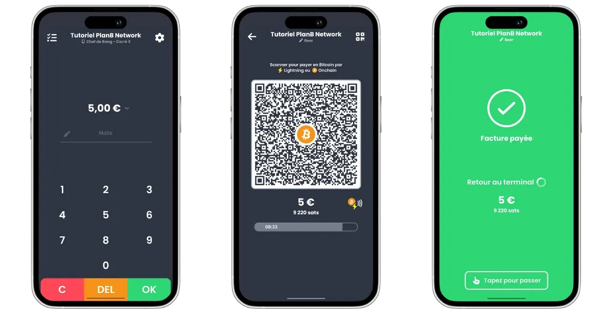

Plaćanja se mogu ili povući u Bitcoin na određeni Address ili konvertovati u fiat valutu i svakodnevno deponovati na bankovni račun. Swiss Bitcoin Pay automatizuje proces, upravljajući Bitcoin i Lightning Network plaćanjima bez manuelne intervencije. Sredstva se drže maksimalno 24 sata pre prenosa. Iako nije potpuno non-custodial kao BTCPay Server, balansira pogodnost i sigurnost, i ne zahteva KYC.

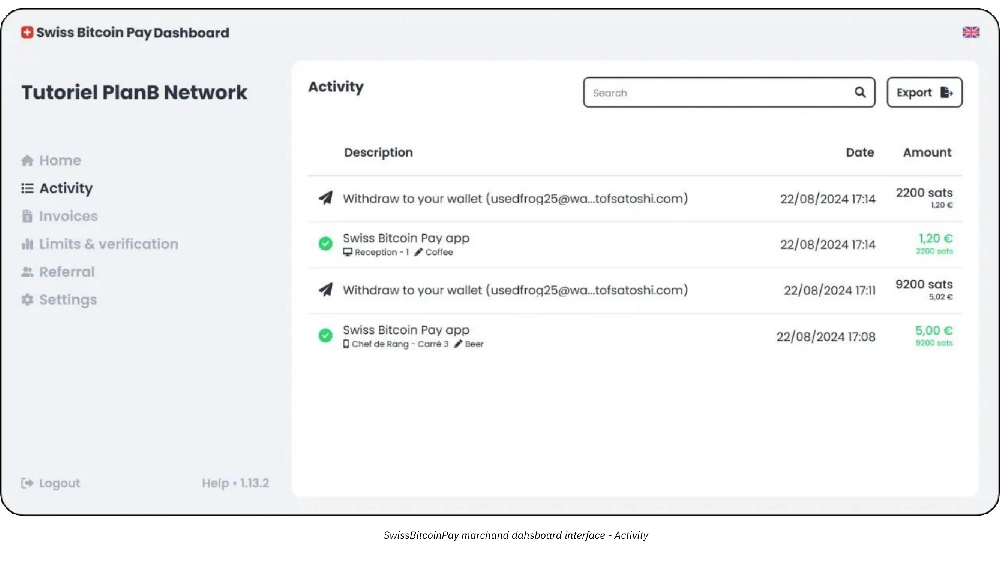

Naknade su konkurentne: 0,21% za prvu godinu, zatim 1% za Bitcoin uplate i 1,5% za konverzije fiat uplata, uključujući troškove transakcija Bitcoin. Swiss Bitcoin Pay nudi praktično srednje rešenje između skrbničkih rešenja kao što je Open Node i složenih samostalno hostovanih sistema kao što je BTCPay Server, dajući prioritet jednostavnosti, sigurnosti i finansijskoj autonomiji.

Ova vrsta postavke omogućava poslovanjima koja posluju uživo da brzo obrade generate fakture plaćanja, predstave QR kodove svojim klijentima i prihvate Lightning ili On-Chain transakcije uz minimalne prepreke. Osoblju je potrebna samo kratka obuka za rukovanje ovim plaćanjima, dok menadžeri mogu da se prijave na online kontrolnu tablu kako bi uskladili dnevnu prodaju i pristupili osnovnim izveštajima. Dostupnost pojednostavljenog administrativnog konzola takođe pomaže manjim ustanovama da prate prihode u fiat i kripto valutama sa jednog Interface, čime se smanjuje konfuzija i vreme provedeno na ručnom knjigovodstvu.

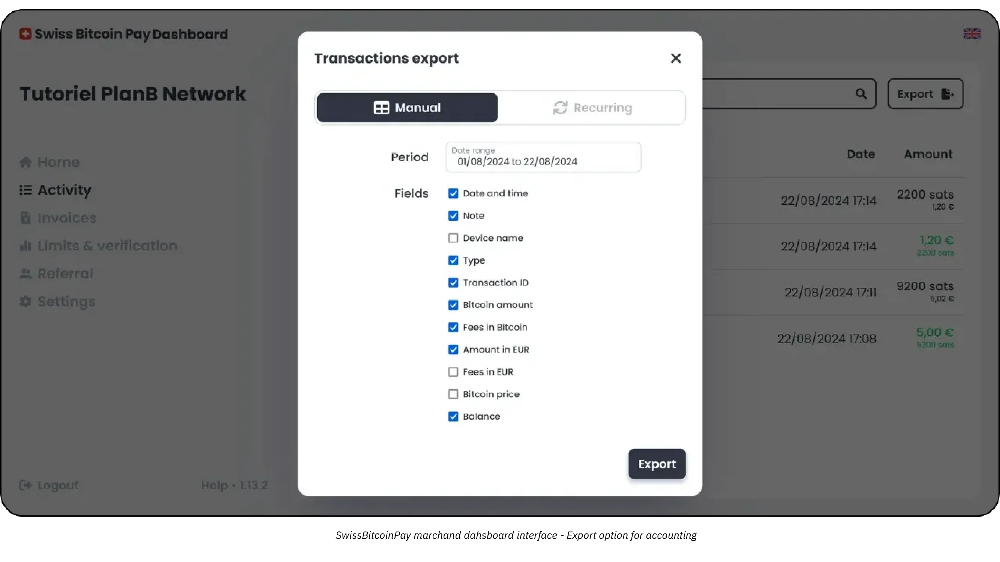

Još jedna ključna prednost Essential pristupa je naglasak na brzoj implementaciji i minimalnim prekidima. Rešenja poput Swiss Bitcoin Pay mogu se postaviti za nekoliko sati umesto dana ili nedelja. Za vlasnika ili menadžera umereno prometnog restorana, na primer, krajnji cilj je integrisati Bitcoin prihvatanje bez izazivanja kašnjenja na kasi ili konfuzije među osobljem. Kada je POS konfigurisan, menadžer može jednostavno pružiti zaposlenima brza uputstva o prikazivanju Invoice i proveri da li je uplata prošla. U najboljem slučaju, transakcija kupca se potvrđuje gotovo trenutno putem Lightning Network, a administrativni panel preduzeća istovremeno registruje novu uplatu u realnom vremenu.

Iako Essential profil ne zahteva visoko sofisticirane računovodstvene sisteme, ipak je pametno održavati ispravne evidencije transakcija. Alati poput Swiss Bitcoin Pay nude funkcije izvoza u CSV formatu, omogućavajući menadžerima da zabeleže fiat-ekvivalentnu vrednost svake Bitcoin prodaje i prate je zajedno sa drugim izvorima prihoda. Ovaj nivo dokumentacije je dovoljan za većinu malih preduzeća, a osnovno razumevanje Exchange stopa će pomoći pri podnošenju poreza i opštem finansijskom nadzoru.

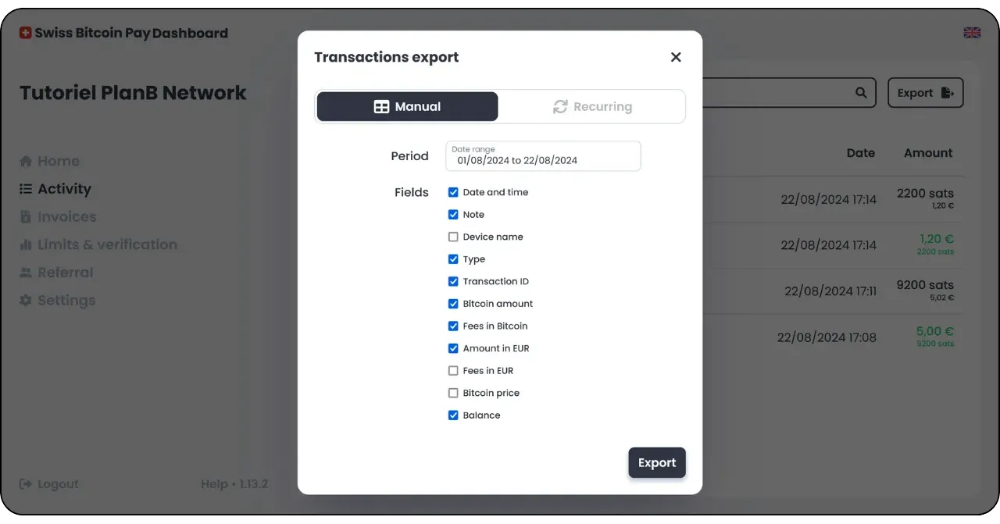

Najprikladnije hibridno rešenje za vaš profil je verovatno Swiss Bitcoin Pay:

https://planb.network/tutorials/business/point-of-sale/swiss-bitcoin-pay-2-a78b057e-ed11-47ac-860c-71019fcb451a

Još jedno lako rešenje za implementaciju, ali sa nedostatkom da je 100% kustodijalno, je Open Node:

https://planb.network/tutorials/business/point-of-sale/open-node-e69a0c1c-47f7-4932-8494-e6f26c3c9784

Ako ste spremni da se upustite u posao i želite potpunu kontrolu nad procesom, BTCPay Server softver je odlična opcija. Međutim, glavni nedostatak BTCPay Server-a je što njegovo postavljanje i upravljanje oduzimaju mnogo vremena i zahtevaju određeni nivo tehničke stručnosti, ali možete pratiti naše vodiče:

https://planb.network/tutorials/business/point-of-sale/btcpay-server-928eb01e-824b-4b57-a3e8-8727633beddc

Konačno, kao dopunu za fizičke prodajne tačke, možete razmotriti postavljanje [Bitcoinize PoS](https://bitcoinize.com/).

## Profesionalac

<chapterId>4d5dfa50-c4d0-481c-ab95-1863a898750e</chapterId>

Profesionalni profil je namenjen preduzećima koja su prevazišla povremena ili niskovolumenska Bitcoin plaćanja i sada traže robusnu infrastrukturu za upravljanje višestrukim dnevnim transakcijama. Ove kompanije često posluju preko nekoliko kanala (možda maloprodajna lokacija, posvećena e-commerce veb stranica, pa čak i mobilna prodaja) i stoga zahtevaju rešenja za plaćanje koja se mogu besprekorno integrisati u njihove postojeće tokove rada. U mnogim slučajevima, preduzeća na ovom nivou već upravljaju sistemima prodajnih mesta, platformama za upravljanje online porudžbinama i back-office operacijama koje zahtevaju pouzdan, skalabilan pristup.

Jedna od definicijskih karakteristika profesionalnog trgovca je potreba za **naprednim funkcijama** i **prilagodljivim rešenjima** koja održavaju efikasnost čak i kada obim transakcija raste. Za razliku od osnovnih korisnika, koji mogu biti zadovoljni pojednostavljenim alatom koji se lepo uklapa u aplikaciju za pametne telefone, profesionalni biznisi obično zahtevaju funkcije kao što su detaljna Invoice prilagođavanja, sofisticirane kontrolne table za izveštavanje i mogućnost dodeljivanja više administrativnih uloga.

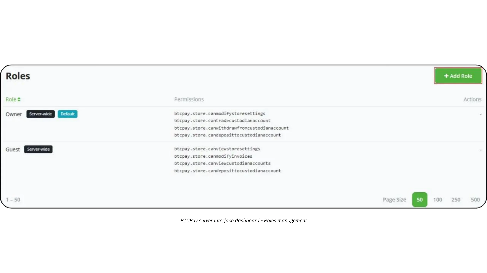

Na primer, grupa restorana može imati članove osoblja posvećene fakturisanju i upravljanju zalihama, dok zaseban tim nadgleda liste proizvoda i marketinške kampanje. U ovom okruženju, Bitcoin rešenje za plaćanje mora se savršeno uklopiti u ove već postojeće organizacione strukture.

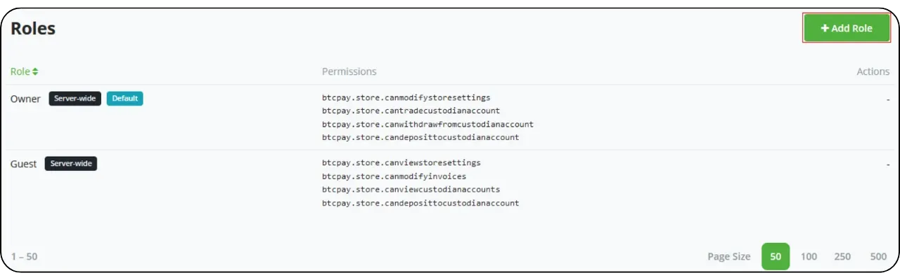

Što se tiče tehnologije i alata, rešenja kao što je **BTC Pay Server** često čine srž profesionalnog postavljanja. BTC Pay Server je platforma otvorenog koda koja se može implementirati ili na lokaciji ili putem cloud hostinga i koja nudi široke mogućnosti integracije za veb-sajtove i e-commerce platforme. Pokretanjem sopstvene instance, preduzeća zadržavaju visok stepen kontrole nad svakim aspektom toka plaćanja, od automatski generisanih stranica za naplatu do obaveštenja koja pokreću interne procese nakon što je plaćanje potvrđeno.

Pored toga, alati kao što su [Zaprite](https://zaprite.com/) ili [Musqet](https://musqet.tech/) mogu dodatno poboljšati iskustvo naplate, omogućavajući detaljniju prilagodbu (od izbora brenda do sofisticiranih mogućnosti izveštavanja). Oni koji preferiraju sve-u-jednom online maloprodajno okruženje mogu se opredeliti za [Be-BOP](https://be-bop.io/), rešenje za e-prodavnice kreirano da olakša Bitcoin plaćanja bez žrtvovanja jednostavnosti korišćenja.

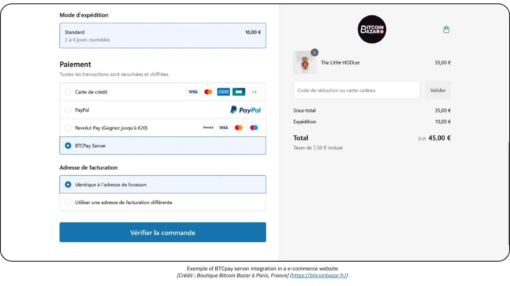

Implementacija ovih tehnologija u profesionalnom okruženju znači posvećivanje posebne pažnje **operativnoj složenosti**. Automatizovani tokovi fakturisanja, prikazi u više valuta i sinhronizacija sa postojećim sistemima inventara su sve odlike dobro integrisane platforme. Sposobnost preciznog izvoza podataka o transakcijama (bilo kao CSV datoteke, direktni API pozivi ili prilagođeni formati) pomaže preduzećima da efikasno usklade prodaju Bitcoin sa drugim prihodnim tokovima.

Bezbednost i upravljanje ulogama predstavljaju još jedan ključni aspekt za profesionalne korisnike. Kako se svakodnevne Bitcoin transakcije gomilaju, kontrolisanje pristupa administrativnim funkcijama postaje suštinska mera za smanjenje rizika. U mnogim rešenjima, administratori mogu dodeliti različite nivoe dozvola (možda ograničavajući neke zaposlene na pregled istorije transakcija i generisanje faktura, dok drugima daju ovlašćenje da upravljaju inventarom ili konfigurišu sistemska podešavanja...). Ova hijerarhijska struktura ne samo da štiti osetljive podatke već i pojednostavljuje operacije razjašnjavanjem koji članovi osoblja su odgovorni za svaki segment platne infrastrukture.

Kada su u pitanju primeri iz stvarnog sveta, razmotrite srednje veliku e-commerce prodavnicu specijalizovanu za tehnološke dodatke. Kompanija bi mogla integrisati BTC Pay Server u svoju postojeću online prodavnicu, automatski generišući Bitcoin adrese za plaćanje tokom naplate. Kupci završavaju svoje kupovine skeniranjem Lightning ili On-Chain Address, a platforma prodavnice trenutno potvrđuje uplatu. Istovremeno, interni sistem ažurira status porudžbine i pokreće obaveštenja o isporuci. Zahvaljujući naprednim funkcijama izveštavanja, finansijski tim može lako pregledati dnevne Bitcoin prodaje, izvesti konsolidovani Ledger za reviziju i pratiti vrednost bilo kojih BTC sredstava koje kompanija odluči da zadrži.

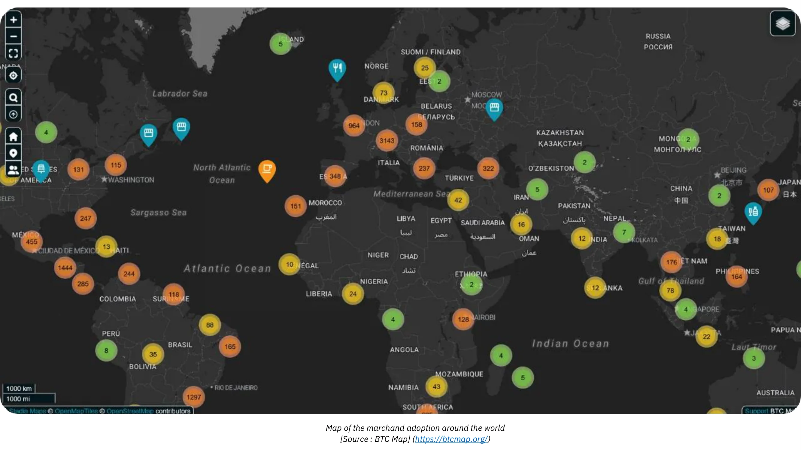

*[Credit: Bitcoin Bazar shop in Paris, France.](https://bitcoinbazar.fr/)*

Da biste dublje istražili specifičnosti implementacije i istražili praktične konfiguracije BTC Pay Server-a, pogledajte sledeći kurs:

https://planb.network/courses/6fc12131-e464-4515-9d3f-9255365d5fa1

## Enterprise

<chapterId>80fb2659-81ca-4a11-b492-72c7ae5774f9</chapterId>

Enterprise profil stoji na vrhu Bitcoin implementacija plaćanja, prilagođen posebno za velike korporacije, glavna tržišta i etablirane firme koje zahtevaju potpuno prilagođena rešenja. Za razliku od manjih ili srednjih implementacija, Enterprise operacije integrišu Bitcoin plaćanja u široki spektar tokova rada i sistema, u rasponu od uređaja za prodaju na licu mesta do e-commerce prodavnica, platformi za računovodstvo u pozadini i sofisticiranih ERP okvira.

Na ovoj skali, sveobuhvatni cilj nije samo prihvatiti Bitcoin, već to učiniti na način koji je temeljno **usklađen sa osnovnim procesima organizacije**. Ovo usklađivanje može zahtevati specijalizovani razvoj softvera, bilo da je rešenje potpuno prilagođeno ili orkestrirano kroz SaaS infrastrukturu podržanu od strane trećih lica *Lightning Service Providers* (LSPs). Takvi LSP-ovi mogu da obrade velike količine transakcija i složene mrežne konfiguracije koje prevazilaze kapacitet konvencionalnijih alata koji se koriste odmah po instalaciji. Rezultujuća arhitektura stoga uključuje širok spektar tehničkih i poslovnih razmatranja, od integracija vođenih API-jem do naprednih sposobnosti upravljanja trezorom.

U okviru preduzeća, operativna složenost postaje posebno izražena. Velika korporacija može imati potrebu da prilagodi više odeljenja (prodaja, marketing, devops, finansije i računovodstvo) od kojih svako ima različite odgovornosti i zahteve za podacima. U ovom scenariju, Bitcoin platforma za plaćanje mora ponuditi veoma detaljno upravljanje ulogama, omogućavajući svakom odeljenju pristup tačno onim funkcijama koje su relevantne za njihove zadatke, uz očuvanje rigorozne kontrole nad bezbednošću i integritetom podataka. Jednako je bitna i sposobnost prilagođavanja tokova rada: na primer, dolazna plaćanja mogu pokrenuti ažuriranja u sistemima inventara, poslati automatske obaveštenja menadžerima prodaje i ažurirati Ledger unose za finansijski tim, sve u realnom vremenu. Uređaji na prodajnim mestima su često prilagođeni poslovnom okruženju, sa softverskim interfejsima koji odgovaraju brendiranju i operativnim potrebama kompanije.

**Bezbednost** je od suštinskog značaja za preduzeća na nivou velikih korporacija. Veliki obim transakcija i potencijalno velike sume Bitcoin zahtevaju robusnu infrastrukturu sposobnu da se brani od zlonamernih napada ili pretnji iznutra. Najbolje prakse često uključuju višestruki potpis sa vremenskim zaključavanjem trezorskih konfiguracija, pažljivo revidirane baze koda i strogo pridržavanje relevantnih regulatornih okvira. Štaviše, usklađenost sa lokalnim i međunarodnim finansijskim propisima može biti ključna za očuvanje reputacije korporacije i licence za rad.

**Prilagođeni razvoj** uključen u kreiranje ili integraciju Bitcoin rešenja za plaćanje na nivou preduzeća prevazilazi kodiranje nekoliko funkcija aplikacije. Obično zahteva arhitektonsko projektovanje, temeljne test protokole i strukturirano uvođenje koje može obuhvatiti više faza (početni pilot programi, ograničeni tržišni testovi i konačno globalno uvođenje).

Na računovodstvenom planu, transakcije visoke frekvencije zahtevaju **potpuno prilagođene eksporte** i ponekad sinhronizaciju u realnom vremenu sa softverom za korporativne finansije. Velike kompanije mogu se osloniti na rešenja za planiranje resursa preduzeća (ERP) kao što su SAP ili Oracle, koja, zauzvrat, moraju Interface besprekorno sa Bitcoin podacima o plaćanju. Da bi se to omogućilo, API-ji odabrane platforme moraju biti sofisticirani i fleksibilni, dajući IT timovima slobodu da kreiraju prilagođene kontrolne table za izveštavanje, implementiraju automatizovane procese usklađivanja i generate dnevne ili čak satne finansijske preglede.

Tipičan scenario za preduzeće može uključivati veliku e-commerce platformu koja prima hiljade transakcija svakog dana. Osim što samo navodi Bitcoin kao opciju plaćanja, ova platforma može prilagoditi svaki aspekt korisničkog iskustva, od načina na koji se Bitcoin tok plaćanja prikazuje na vebsajtu okrenutom ka korisnicima do načina na koji se povraćaji, povrati sredstava ili rešavanje sporova upravljaju u pozadini. Posvećeni devops tim, u saradnji sa finansijskim i pravnim odeljenjima, nadgledao bi tekuće održavanje, sigurnosne zakrpe i ažuriranja usklađenosti. Ako kompanija odluči da zadrži deo svojih prihoda od Bitcoin, interni trezorski sistem bi pratio Bitcoin sredstva firme zajedno sa tradicionalnim deviznim rezervama.

Da bi se osiguralo glatko i sigurno uvođenje na nivou preduzeća, većina organizacija angažuje specijalizovane pružaoce usluga ili interne razvojne timove sa iskustvom u integracijama Bitcoin i Lightning Network. Proces obično počinje detaljnom procenom potreba (koja pokriva tehničku infrastrukturu, zahteve usklađenosti i željeno korisničko iskustvo) nakon čega sledi dizajniranje arhitekture koja može da podnese veliki obim protoka. U zavisnosti od obima projekta, možete se osloniti na multidisciplinarni tim sastavljen od finansijskih kontrolora, analitičara bezbednosti i softverskih inženjera. Alternativno, sve veći broj specijalizovanih konsultantskih firmi može vas voditi od početne konceptualizacije do konačnog uvođenja, pomažući u zadacima kao što su procena SaaS-hostovanih rešenja, konfigurisanje *Lightning Service Providers* i prilagođavanje interfejsa prednjeg kraja. Partnerstvom sa stručnjacima iz domena, preduzeća mogu smanjiti rizike povezane sa implementacijom plaćanja velikih razmera i postići rešenje koje nije samo robusno i usklađeno, već i dovoljno fleksibilno da omogući budući rast.

## Bitcoin rešenja za plaćanje: Opcije i trendovi

<chapterId>59ff43a1-98e2-4a81-af3e-9654bdd60952</chapterId>

Uvek postoje kompromisi za svaku kategoriju rešenja. Na primer, u početnoj "probnoj fazi," predloženi novčanici su dizajnirani da budu što jednostavniji u smislu korisničkog Interface, ali su hostovani (**skrbnički**). To znači da sredstva kontroliše pružalac aplikacije. Međutim, etos Bitcoin podstiče prelazak ka punom Ownership sredstava od strane korisnika (**samostalno skrbništvo**). U ovom slučaju, preporučuje se nadogradnja na sledeću kategoriju čim se ostvare prve prodaje—u suštini, kada se potvrdi da imate kupce spremne da plate u Bitcoin.

Jedna od ključnih prednosti Bitcoin je mogućnost premeštanja sredstava po želji, što čini **veoma lakim promenu provajdera** ili komponenti vašeg rešenja. Pored toga, sve aplikacije i rešenja se brzo razvijaju. Na primer, razmislite o Bitcoinize, koji sada nudi fizički terminal za prodajno mesto (POS) koji se integriše sa mnogim aplikacijama na tržištu, rešenje koje nije postojalo pre samo nekoliko meseci.

### Tražite rešenje za kreiranje prodavnice i prihvatanje tradicionalnih i Bitcoin plaćanja?

Ako počinjete od nule—bez prodavnice, softvera za upravljanje proizvodima i sistema prodajnog mesta (POS)—imate nekoliko opcija:

- Outsourcing:** Možete angažovati spoljne saradnike za kreiranje veb-sajta sa opcijama kupovine, a zatim dodati Bitcoin mogućnosti plaćanja uz tradicionalna rešenja u prodavnici.

- Jednostavna rešenja:** Alternativno, možete koristiti platforme kao što je Accessing.app da to uradite sami. Ključne prednosti uključuju:
    - Brzo i povoljno postavljanje online ili fizičke prodavnice.
    - Pogodno za sezonske poslove, događaje, restorane ili maloprodajne radnje.
    - Definisanje i upravljanje proizvodima za fizičku i online prodaju.
    - Obrada fiat plaćanja (npr. evri, dolari) putem vašeg sopstvenog Stripe naloga.
    - Bitcoin obrada plaćanja putem vašeg vlastitog SwissBitcoinPay naloga.

### Kako napreduje usvajanje Lightning plaćanja?

Iako Lightning Network nudi superiornu efikasnost i niže naknade, njegova primena je još u ranoj fazi. Umesto fokusiranja na trenutna ograničenja, vredi se prisetiti kako su se odvijale istorijske transformacije infrastrukture:

- Kada su se automobili prvi put pojavili, nije bilo dovoljno automobila da bi se opravdala izgradnja puteva, niti dovoljno puteva da bi se opravdalo posedovanje automobila.
- Kada je uvedena električna energija, nije bilo dovoljno korisnika da bi se opravdala izgradnja elektroenergetskih mreža, a nije bilo dovoljno mreža da bi privukle korisnike.

Nove infrastrukture uspevaju jer su efikasnije, a rani korisnici se pridružuju jer ostvaruju opipljive koristi. Evo zapažanja o Lightning Network u 2024:

- Ultra-fast Transactions:** Transakcije su često gotovo trenutne (<500ms) i imaju izuzetno nisku stopu neuspeha.

- Profesionalizacija mreže:** Veći igrači osiguravaju likvidnost širom mreže, dok su pojedinci uglavnom prestali sa rutiranjem plaćanja i sada uglavnom upravljaju "ivica čvorovima."

- Poboljšano korisničko iskustvo:** Mobilne aplikacije za individualne korisnike su značajno poboljšane. Funkcije kao što su spajanje, statični Bolt12 računi i plaćanja bez potvrde (0-conf) su široko dostupne, čineći interakcije besprekornim. Problemi interoperabilnosti (npr. prisilna zatvaranja) više nisu glavne brige.

- Poboljšano upravljanje čvorovima i kanalima:** I pojedinačna i profesionalna rešenja su napredovala. Na primer, BTC Pay Server sada podržava brojne dodatke za povezivanje sa drugim provajderima (PSP-ovima, on/off rampama, itd.). Novi provajderi infrastrukture, kao što su LightSpark i Alby Hub, takođe ulaze u proizvodnju.

- Rast prihvatanja od strane trgovaca:** Trgovci poput BitRefill-a izveštavaju o porastu Bitcoin plaćanja među svojim aktivnim korisnicima, sa jasnim pomakom ka Bitcoin u odnosu na Lightning. Pored toga, ultra-niske naknade Lightning-a ga čine preferiranim izborom za mala plaćanja (prosečno €32 po transakciji).

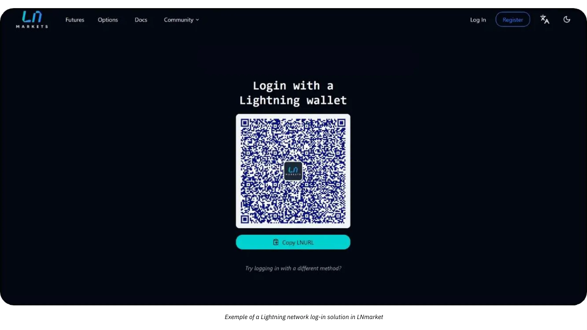

*[Izvor: BTC Map](https://btcmap.org/)*

- Mreže Metrički:** Ukupan broj kanala i Bitcoin zaključanih na Lightning ostaje stabilan, sa približno 20,000 čvorova, 5,200 BTC, i 60,000 kanala. Međutim, ovo odražava samo deo mreže i ukazuje na rotaciju među učesnicima, sa manje pojedinaca i više profesionalaca koji učestvuju.

- Munja kao most između mreža:** Efikasnost i dostupnost Lightning Network već su ga pozicionirali kao most ka drugim međusobno povezanim mrežama (npr. FediMint, Liquid, itd.).

**Povratak Wallet**

Bitcoin i Lightning Network završavaju **digitalnu Wallet revoluciju**. Novi veb servisi sada omogućavaju **transakcije bez potrebe za kreiranjem naloga**—vaš Wallet postaje vaš identitet! Sa protokolima kao što su **Nostr Wallet Connect (NWC)** i **LN-URL-AUTH**, novčanici mogu besprekorno autentifikovati korisnike i omogućiti transakcije bez tradicionalnih naloga. Prošla su vremena zamora od naloga za jednostavne kupovine ili pretplate. Nema više potrebe za davanjem ličnih ili platnih informacija koje bi mogle biti hakovane i prodate na dark webu, na šta nas prečesto podsećaju nedavni događaji.

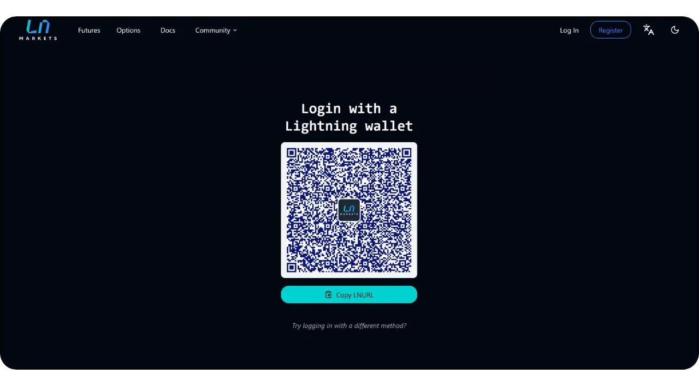

Trgovci sutrašnjice će prihvatiti ovu inovaciju, nudeći kupcima sigurnije, jednostavnije (jedan klik) iskustvo koje takođe poštuje njihovu privatnost.

# Bitcoin Računovodstvo

<partId>d49d7595-a189-4e2b-bd60-c19e8e717aa2</partId>

## Osnovni principi za računovodstvo Bitcoin u poslovanju

<chapterId>84063061-ffdb-4b1f-b20b-588ffb146877</chapterId>

Sledeći sadržaj je namenjen isključivo u obrazovne svrhe i ne treba ga smatrati finansijskim ili računovodstvenim savetom. Preduzećima i pojedincima se snažno preporučuje da se konsultuju sa kvalifikovanim računovođom ili pravnim stručnjakom koji je upoznat sa propisima o kriptovalutama u njihovoj specifičnoj jurisdikciji pre nego što preduzmu bilo kakvu akciju.

### Bitcoin Računovodstveni Ključni Koncepti

**Bilo koja transakcija Bitcoin mora biti zabeležena i može dovesti do oporezivog događaja**

Globalno, Bitcoin se često klasifikuje ne kao valuta već kao digitalna imovina. Ova razlika značajno utiče na to kako se Bitcoin evidentira u poslovanju, utičući na poreske obaveze, finansijsko izveštavanje i zahteve za usklađenost. Poslovanja koja prihvataju Bitcoin kao način plaćanja ili ga koriste kao alat za trezor moraju razumeti ove regulatorne nijanse.

Najvažnija posledica koju treba imati na umu je da, u većini jurisdikcija, zarađivanje, prodaja, trgovina ili korišćenje Bitcoin za kupovinu, obično stvara **oporezivi događaj** i dobici podležu porezu na kapitalnu dobit.

Još jedan aspekt Bitcoin računovodstva je razlikovanje između dve vrste kapitalnih dobitaka:

- Latent Gains/Losses:** Nerealizovani dobici ili gubici zasnovani na vrednosti Bitcoin držanoj na kraju računovodstvenog perioda.
- Efektivni Dobici/Gubici:** Realizovani dobici ili gubici kada se Bitcoin proda ili razmeni tokom fiskalne godine.

Ove kalkulacije u velikoj meri zavise od toga da li se Bitcoin drži za dugoročne investicije ili za kratkoročnu operativnu upotrebu. Pored toga, preduzeća moraju uskladiti svoje računovodstvene prakse sa lokalnim poreskim strukturama, jer se propisi značajno razlikuju po zemljama.

Računovodstvo za preduzeća koja drže Bitcoin je donekle zamorno jer svaka transakcija mora biti pažljivo praćena kako bi se izračunali ostvareni ili nerealizovani profiti ili gubici. Za svaku prodaju koju obavite prihvatanjem Bitcoin kao oblika plaćanja, ili svaki put kada kupujete ili prodajete Bitcoin, potrebno je zabeležiti:

- specifično vreme
- prodajna cena (u fiat valuti)
- nabavna cena Bitcoin (cena po kojoj je Bitcoin prvobitno nabavljen).

Ovo će vam kasnije omogućiti da izračunate razliku kako biste utvrdili profit ili gubitak.

**Primer:** Posao kupuje 1 BTC za $30,000. Kasnije, prodaje 0.5 BTC za $20,000. Da bi izračunao profit ili gubitak, posao mora:

- Zabeleženo je vreme, fiat cena i količina Bitcoin koja je nabavljena.
- Zabeleženo je vreme, cena prodaje u fiat valuti i količina prodatog Bitcoin.
- Odredite cenu Bitcoin prodatog: 0.5 BTC: $30,000 ÷ 2 = $15,000.
- Uporedite prodajnu cenu sa nabavnom cenom: $20,000 (prodajna cena) - $15,000 (nabavna cena) = $5,000 profit.
- Ažuriraj Bitcoin posede sa novom nabavnom cenom

Ovaj proces mora biti ponovljen za svaku transakciju, a promenljiva priroda cene Bitcoin čini vođenje evidencije još zamršenijim.

**Kako bi funkcionisalo kada bi Bitcoin bila valuta ?**

Ako bi se Bitcoin tretirao kao valuta, preduzeća bi ga upravljala kao i bilo kojom drugom valutom u svom računovodstvenom sistemu. Umesto praćenja osnovne cene i ostvarenih/neostvarenih profita za svaku transakciju, posedi Bitcoin bi jednostavno bili zabeleženi na valutnom računu. Na kraju svakog izveštajnog perioda, vrednost svih valutnih poseda, uključujući Bitcoin, bila bi konvertovana u računovodstvenu valutu (npr. USD ili EUR) koristeći trenutni Exchange kurs.

**Ažurirani primer ako je Bitcoin prepoznat kao valuta:**

- Poslovanje drži 1 BTC kada Bitcoin vredi $30,000. Kasnije, poslovanje koristi 0.5 BTC za plaćanje kada Bitcoin vredi $40,000.
- Poslovanje **ne** obračunava ostvareni profit ili gubitak. Umesto toga, transakcija se beleži kao:
    - Plaćanje: $20,000 (0.5 BTC × $40,000).
    - Preostali Bitcoin saldo: 0.5 BTC, sada vredi $20,000 (ažurirano po trenutnom Exchange kursu).

**Ključna prednost ako bi Bitcoin bio priznat kao valuta:**

- Posao samo treba periodično da prilagođava fiat ekvivalent svojih Bitcoin sredstava (npr. za mesečne ili godišnje izveštaje), baš kao i za evre, jene ili druge valute koje poseduje.
- Ovo eliminiše potrebu za praćenjem troškova na nivou transakcija i pojednostavljuje računovodstvo, posebno za preduzeća sa čestim Bitcoin transakcijama.

Ovaj pristup bi učinio računovodstvo za Bitcoin daleko jednostavnijim, smanjio administrativne terete i uskladio se sa tretmanom drugih valuta, pod pretpostavkom da bi Bitcoin bio u potpunosti priznat kao takav u pravnim i regulatornim terminima. Još nismo tamo.

### Razlike između pojedinačnog i korporativnog Bitcoin računovodstva

Pravni i računovodstveni tretman Bitcoin značajno se razlikuje između pojedinaca i korporacija. Za pojedince, dobici od transakcija Bitcoin mogu biti podložni porezu na dohodak, često po višoj stopi. Nasuprot tome, korporacije mogu imati koristi od potencijalno nižih stopa poreza na dobit, ali moraju se pridržavati strožih standarda knjigovodstva.

Za preduzeća Bitcoin može biti klasifikovan pod različite račune u zavisnosti od njegove namene:

- Fiksna imovina:** Za Bitcoin držana dugoročno kao strateška investicija.
- Akcije:** Za Bitcoin korišćen u proizvodnim procesima (retka upotreba, na primer, ovo je slučaj za profesionalne trgovce).
- Gotovina ili trezorski računi:** Za Bitcoin koji se drži kao Liquid imovina, prvenstveno za operativne transakcije ili kratkoročno upravljanje trezorom.

Izbor klasifikacije zavisi od aktivnosti i strategije kompanije, sa implikacijama na finansijsko izveštavanje i poreske obaveze. Uvek proverite lokalne propise, jer se ove klasifikacije mogu razlikovati po zemljama.

### Pravni okvir

Pravno priznanje i tretman Bitcoin variraju u zavisnosti od jurisdikcije. Neke zemlje, kao što je El Salvador, priznale su Bitcoin kao zakonsko sredstvo plaćanja, što pojednostavljuje njegovu upotrebu u transakcijama, ali komplikuje međunarodno finansijsko izveštavanje. Druge ga tretiraju kao digitalnu imovinu podložnu specifičnim poreskim i računovodstvenim pravilima.

U većini zemalja, Bitcoin je kategorizovan kao digitalna imovina, a njegovo tretiranje je regulisano opštim računovodstvenim standardima. Preduzeća moraju evidentirati transakcije sa Bitcoin na sledeći način:

- Evidentiranje kapitalnih dobitaka/gubitaka:** Preduzeća moraju evidentirati ostvarene dobitke ili gubitke u svojim finansijskim rezultatima.
- Latentne Dobiti/Gubici Procena:** Nerealizovane dobiti ili gubici često moraju biti prijavljeni, ali možda neće direktno uticati na oporezivi prihod.
- Usklađenost sa računovodstvenim standardima:** Preduzeća moraju integrisati Bitcoin transakcije u standardne računovodstvene prakse, osiguravajući transparentnost i tačnost.

Pristup računovodstvu Bitcoin varira u zavisnosti od geografije:

- Sjedinjene Američke Države:** Poreska uprava klasifikuje Bitcoin kao **imovinu, slično akcijama, obveznicama ili nekretninama**. Ova klasifikacija znači da bilo koja transakcija koja uključuje kriptovalutu, kao što su zarađivanje, prodaja, trgovanje ili čak korišćenje za kupovinu, može stvoriti oporezivi događaj i dobici podležu porezu na kapitalnu dobit.
- Evropska unija:** Države članice generalno tretiraju Bitcoin kao špekulativnu imovinu, a ne kao funkcionalnu valutu. Stoga su dobici često podložni porezu na kapitalnu dobit.
- Azija:** Zemlje poput Singapura i Japana usvojile su progresivne regulatorne okvire, tretirajući Bitcoin transakcije povoljno u specifičnim kontekstima. Ali Bitcoin se generalno računa kao **nematerijalna imovina**, i meri se po fer vrednosti na datum izveštavanja, sa promenama priznatim u dobiti ili gubitku.

Važno je razumeti propise u zemlji u kojoj poslujete i prilagoditi svoje računovodstvene prakse u skladu s tim.

### Izazovi u evoluciji regulative

Brzi tempo inovacija u kriptovalutama često nadmašuje regulatorne okvire. Od priznavanja Bitcoin kao digitalne imovine, globalni propisi su doživeli postepena ažuriranja, ali praznine i dalje postoje:

- Nedostatak Jurisprudencije:** Malo pravnih slučajeva je razjasnilo specifične računovodstvene prakse, ostavljajući prostor za tumačenje.
- Aktuelne Debate:** Pitanja kao što je poreski tretman latentnih gubitaka ostaju nerešena u mnogim jurisdikcijama.
- Prekogranična složenost:** Kompanije koje posluju na međunarodnom nivou suočavaju se sa izazovima usklađivanja različitih nacionalnih računovodstvenih standarda.

Uprkos ovim izazovima, proaktivni stavovi mnogih zemalja pružaju solidnu osnovu za preduzeća da inkorporiraju Bitcoin u svoje operacije. Kontinuirana ažuriranja i međunarodna harmonizacija biće od suštinskog značaja za nove složenosti Address u računovodstvu kriptovaluta.

### Klasifikacija Bitcoin u finansijskim izveštajima

Klasifikacija Bitcoin u finansijskim izveštajima varira u zavisnosti od jurisdikcije i zavisi od njegove namene unutar poslovanja. Uopšteno, Bitcoin se tretira kao digitalna imovina, slično inventaru, investiciji ili valuti, ali sa jedinstvenim karakteristikama koje utiču na njegov računovodstveni tretman.

- Digitalna imovina ili nematerijalna imovina**: Mnoge jurisdikcije, uključujući Francusku i Evropsku uniju, klasifikuju Bitcoin kao digitalnu ili nematerijalnu imovinu, a ne kao zakonsko sredstvo plaćanja. Ova klasifikacija zahteva od preduzeća da vode računa o Bitcoin drugačije nego o fiat valutama.
- Inventar**: Ako osnovna delatnost preduzeća uključuje trgovinu Bitcoin, kao što su kripto berze ili brokeri, Bitcoin se klasifikuje kao inventar. U ovom slučaju, vrednovanje prati računovodstvene standarde za inventar.
- Finansijsko ulaganje**: Kompanije koje drže Bitcoin kao dugoročni resurs mogu ga klasifikovati kao finansijsko ulaganje. Na primer, u Sjedinjenim Američkim Državama, preduzeća bi mogla računati Bitcoin prema smernicama Odbora za finansijske računovodstvene standarde (FASB), prepoznajući umanjenja kada tržišne vrednosti opadnu.

**Implikacije klasifikacije :**

- Dugoročna ulaganja često zahtevaju testiranje umanjenja vrednosti i amortizaciju.
- Aktivno trgovanje ili aktivnosti povezane s plaćanjem zahtevaju stalno praćenje ostvarenih i neostvarenih dobitaka i gubitaka.

### Metode vrednovanja

Metode vrednovanja su računovodstvene tehnike koje se koriste za određivanje osnovice troškova Bitcoin, što je ključno za tačno izračunavanje dobiti ili gubitaka tokom transakcija. Uopšteno, najbolje je **održavati uvek ažuriranu vrednost trenutnih troškova Bitcoin zaliha** u računovodstvenom sistemu. Ovo osigurava transparentnost, usklađenost sa poreskim propisima i sprečava zaostajanje kada je potrebno izvršiti proračune.

- First In, First Out (FIFO)**: Uobičajeno u jurisdikcijama kao što su Australija i Indija, ova metoda vrednuje Bitcoin na osnovu najranije nabavne cene. Ovo može postati prilično **kompleksno** jer može zahtevati praćenje svake frakcije Bitcoin zasebno kada dođe do prodaje.
- Ponderisani prosečni trošak (WAC)**: Često se preferira za transakcije velikog obima zbog njegove **jednostavnosti**, kao što je to slučaj u zemljama poput Sjedinjenih Američkih Država.

Preporučuje se da se vodi detaljna radna sveska za praćenje troškova Bitcoin **od trenutka kada kompanija počne da kupuje Bitcoin ili ga prihvata kao plaćanje** kako bi se osiguralo tačno i organizovano vođenje evidencije. Samo ta razmatranja treba da budu prioritet prilikom izbora softverskog rešenja za prihvatanje plaćanja Bitcoin ili za kupovinu Bitcoin.

### Računovodstvo transakcija u maloprodaji i e-trgovini

Trgovci moraju zabeležiti za svaku transakciju kurs Bitcoin-prema-fijatu Exchange. Na primer, u mnogim zemljama, preduzeća koriste kurs Exchange u trenutku prodaje za izračunavanje PDV-a.

Preduzeća moraju osigurati da alati za **Plaćanje** koje koriste pružaju mogućnost da:

- generate i Invoice sa lokalnim iznosom fiat valute (euro, dolari, funte), taj PDV ili druge lokalne poreze, ekvivalent denominovan u Bitcoin, datum i vreme, Bitcoin Exchange kurs i Exchange izvor itd.
- izvezi sve priznanice o uplati, najmanje u .csv formatu, sa svim gore navedenim informacijama, tako da ih računovođa može lako obraditi
- idealno imati evidenciju ažurirane vrednosti osnovice troškova za trenutni Bitcoin koji se drži u trezoru

### Izazovi

- Volatilnost**: Cena Bitcoin značajno varira, stvarajući poteškoće u proceni vrednosti imovine i predviđanju budućih finansijskih ishoda.
- Regulatorni nadzor**: U zemljama poput Kine, ograničeni status Bitcoin ograničava njegovu upotrebu kao trezorskog sredstva.
- Regulatory Uncertainty** : Evolving regulatorni pejzaž Bitcoin često ostavlja preduzeća u neizvesnosti. Na primer, promene u poreskim politikama, kao što su one u Indiji ili Sjedinjenim Američkim Državama, mogu preko noći uticati na računovodstvene prakse.
- Rizici lošeg upravljanja** : Nepravilna klasifikacija ili neuspeh u praćenju Bitcoin transakcija može dovesti do problema sa usklađenošću, kazni ili oštećenja ugleda.
- Rizici ponovne kvalifikacije**: Održavanje značajnog dela trezora kompanije u Bitcoin izlaže poslovanje potencijalnim gubicima usled pada cena. Ovo može imati ozbiljne posledice, naročito ako se takvi padovi dogode kada su dospele isplate dobavljačima, zaposlenima ili porezi. Pored toga, vlasnik kompanije može biti odgovoran, što može rezultirati kaznama ili drugim pravnim problemima, kao što su optužbe za zloupotrebu imovine kompanije.

## Računovodstveni alati i softver

<chapterId>e7b31be5-1176-4835-944e-3cba1b7040fa</chapterId>

Kada kompanija odluči da integriše Bitcoin u svoje računovodstvo, razni alati i specijalizovani softver pojednostavljuju prikupljanje i obradu podataka. Među najpoznatijim rešenjima su [CoinTracker](https://www.cointracker.io/), [Waltio](https://www.waltio.com/), [Cryptio](https://cryptio.co/), [Koinly](https://koinly.io/), [TokenTax](https://tokentax.co/), i [ZenLedger](https://zenledger.io/). Ove platforme se prvenstveno fokusiraju na četiri aspekta:

- automatsko prikupljanje podataka;
- konverzija ovih podataka u formate kompatibilne sa opštijim računovodstvenim softverom (QuickBooks, Xero, ERP);
- obračun poreskih obaveza;
- kategorizacija transakcija.

Oni su često mudar dodatak za velike organizacije sa više novčanika i sredstava na različitim platformama ili berzama.

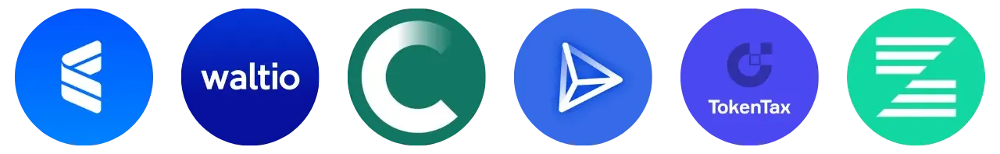

Međutim, jednostavna `.csv` datoteka koja sadrži istoriju transakcija često je dovoljna za većinu malih preduzeća. Cilj je dokumentovati, za svaku uplatu, datum, iznos, ekvivalentnu vrednost u evrima/dolarima i relevantne Bitcoin adrese. Velika većina Bitcoin rešenja za plaćanje (BTC Pay Server, Swiss Bitcoin Pay, itd.) ili Exchange platformi (Bitfinex, Kraken, Coinbase, itd.) već nudi mehanizam za izvoz istorije transakcija. Pružanjem ove datoteke računovođi, postaje moguće pojednostaviti unos podataka i jasno razlikovati dolazne i odlazne tokove povezane sa Bitcoin.

Za one koji sami čuvaju svoje Bitcoin, upravljanje UTXO-ima (*Unspent Transaction Outputs*) je važan korak. Pravilno označavanje UTXO pomaže u praćenju porekla svakog BTC fragmenta, razlikovanju transakcija vezanih za profesionalne aktivnosti od onih za lične troškove, i olakšava praćenje u pravne ili poreske svrhe. Većina dobrog Bitcoin Wallet softvera omogućava vam da uvezete svoj Wallet koristeći vašu rezervnu datoteku (ili vaš xpub, u zavisnosti od vašeg podešavanja) i označite UTXO-e na osnovu njihovog porekla ili odredišta. Da bismo vam pomogli, ovde je kompletan vodič posvećen ovoj praksi:

https://planb.network/tutorials/privacy/on-chain/utxo-labelling-d997f80f-8a96-45b5-8a4e-a3e1b7788c52

Konačno, bilo da ste mali trgovac ili već etablirana firma, moguće je **izmiriti Invoice u Bitcoin**. Ključ je pravilno dokumentovati transakciju. Ako plaćate iz samostalnog čuvanja Wallet, idealno je generate transakciju beležeći broj Invoice i svrhu plaćanja u vašim oznakama. Ako više volite da izmirite Invoice putem Exchange, takođe ćete imati opciju da izvezete račun ili istoriju transakcija kako biste ih uključili u vaše knjigovodstvene evidencije. Ova transparentnost će pojednostaviti praćenje i izveštavanje svih vaših BTC operacija.

## Praktični primeri računovodstva Bitcoin

<chapterId>763f6f20-9181-495a-bf7d-b405899e65ec</chapterId>

### Use Case 1: Maloprodajna prodavnica konvertuje Bitcoin uplate u evre

**Scenario**: Mala pekara prihvata Bitcoin kao način plaćanja, ali odmah konvertuje sve primljene Bitcoin u evre kako bi izbegla izloženost volatilnosti kriptovaluta.

**Primer**:

- Bitcoin Conversion Rate**: 1 Bitcoin = €40,000.
- Transakcija 1**: Kupac kupuje više peciva za €20.
    - Bitcoin ekvivalent: (20 / 40,000) = 0.0005 Bitcoin = 50,000 Satošija.
    - Naknada za konverziju: 1.5% (€20 × 0.015) = €0.30.
    - Neto primljeno: €20 - €0.30 = €19.70.
- Transakcija 2**: Kupac kupuje kafu za €5.
    - Bitcoin ekvivalent: (5 / 40,000) = 0.000125 Bitcoin = 12,500 Satošija.
    - Naknada za konverziju: 1.5% (€5 × 0.015) = €0.075.
    - Neto primljeno: €5 - €0.075 = €4.93.

**Rezime Transakcija**:

- Ukupna prodaja**: €25.
- Ukupne naknade**: €0.375.
- Neto primljeni evri**: €24.625.

**Računovodstvene implikacije**:

- Evidentiraj ukupnu prodaju (€25) kao prihod.
- Odbijte naknade za konverziju (€0.375) kao trošak.
- Na bilansu se ne pojavljuju sredstva Bitcoin jer su svi iznosi odmah konvertovani.

### Use Case 2: Maloprodajna prodavnica zadržava 50% Bitcoin uplata

**Scenario**: Ista pekara odlučuje da zadrži 50% Bitcoin uplata kao trezorsku imovinu, dok preostalih 50% konvertuje u evre.

**Primer**:

- Bitcoin Conversion Rate**: 1 Bitcoin = €40,000.
- Transakcija od kupca**: Kupac kupuje peciva za €50.
    - Bitcoin ekvivalent: (50 / 40,000) = 0.00125 Bitcoin = 125,000 Satošija.
    - Konverzija (50%): €25 vrednosti Bitcoin = 0.000625 Bitcoin = 62,500 Satošija.
        - Naknada za konverziju: 1.5% (€25 × 0.015) = €0.375.
        - Neto primljeno u evrima: €25 - €0.375 = €24.625.
    - Zadržano u Bitcoin (50%): 62,500 Satošija = 0.000625 Bitcoin.

**Rezime**:

- Ukupna prodaja**: €50.
- Naknade**: €0.375.
- Neto primljeni evri**: €24.625.
- Bitcoin Zadržano**: 62,500 Satošija.

**Računovodstvene implikacije**:

- Evidentiraj ukupnu prodaju (€50) kao prihod.
- Odbijte naknade za konverziju (€0.375) kao trošak.
- Zadržani Bitcoin (62,500 Satošija) pojavljuje se na bilansu stanja kao digitalna imovina.
- Nerealizovani Dobitak: ako je procena Bitcoin na kraju fiskalne godine viša ili niža, doći će do nerealizovanog dobitka ili gubitka koji će biti objavljen u finansijskim napomenama, ali neće biti realizovan kao prihod.

### Studija slučaja 3: Profesionalna usluga zadržavanja Bitcoin za dugoročno ulaganje

**Scenario**: Freelance grafički dizajner prihvata Bitcoin kao uplatu i zadržava sve primljene Bitcoin kao dugoročnu investiciju.

**Primer**:

- Bitcoin Konverzija po Kursu pri Plaćanju**: 1 Bitcoin = €30,000.
- Transakcija od kupca**: Klijent plaća za usluge u vrednosti od €3,000.
    - Bitcoin ekvivalent: (3,000 / 30,000) = 0.1 Bitcoin = 10,000,000 Satošija.
- Godišnja procena vrednosti**:
    - Stopa konverzije Bitcoin na kraju godine: 1 Bitcoin = €35,000.
    - Vrednovanje Bitcoin Holding: 0.1 Bitcoin × €35,000 = €3,500.
    - Nerealizovani dobitak: €3,500 - €3,000 = €500.

**Rezime**:

- Ukupni priznati prihod**: €3,000.
- Bitcoin Holding**: 0.1 Bitcoin vrednovano na €3,500 na bilansu stanja.
- Nerealizovani Dobitak**: €500 prikazano u finansijskim beleškama, ali nije realizovano kao prihod.

**Računovodstvene implikacije**:

- Evidentiraj prihod (€3,000) u trenutku pružanja usluge.
- Bitcoin zadržan (0,1) vrednovan na €3,500 na bilansu stanja.
- Nerealizovani dobici se prate, ali nisu uključeni u izveštaje o dobiti/gubitku.

### Upotreba slučaja 4: Vlasnik preduzeća prodaje 50% Bitcoin nakon povećanja cene

**Scenario**: Vlasnik preduzeća obavlja tri kupovine Bitcoin tokom godine, drži Bitcoin kao imovinu i prodaje 50% nakon značajnog povećanja cene.

**Primer**:

- Bitcoin Kupovine od kupaca**:
    - Kupovina 1: €2,000 po €20,000/BTC = 0.1 Bitcoin = 10,000,000 Satošija.
    - Kupovina 2: €3,000 po €25,000/BTC = 0.12 Bitcoin = 12,000,000 Satošija.
    - Kupovina 3: €5,000 po €30,000/BTC = 0.1667 Bitcoin = 16,670,000 Satošija.
    - Ukupno Bitcoin Držano**: 0.3867 Bitcoin = 38,670,000 Satošija.

- Godišnja procena vrednosti**:
    - Bitcoin Cena na kraju godine: €40,000/BTC.
    - Ukupna vrednost: 0.3867 Bitcoin × €40,000 = €15,468.
    - Nerealizovani Dobitak: €15,468 - €10,000 (ukupni trošak) = €5,468.

- Prodaja 50% Bitcoin**:
    - Bitcoin Prodat: 0.19335 Bitcoin.
    - Prihodi od prodaje: 0.19335 Bitcoin × €40,000 = €7,734.
    - Osnovica troškova (prosečna ponderisana vrednost):
        - Ukupni trošak: €2,000 + €3,000 + €5,000 = €10,000.
        - Prosečna ponderisana cena: €10,000 / 0.3867 Bitcoin = €25,850/BTC.
        - Trošak prodatog Bitcoin: 0.19335 Bitcoin × €25,850 = €4,999.
    - Ostvareni Dobitak: €7,734 - €4,999 = €2,735.

**Rezime**:

- Bitcoin Remaining**: 0.19335 Bitcoin vrednovano na €7,734 (pri €40,000/BTC).
- Ostvareni Dobitak**: €2,735 uključen u bilans uspeha.
- Nerealizovani Dobitak**: €5,468 prikazano u finansijskim napomenama (uključujući nerealizovanu vrednost preostalog Bitcoin).

**Računovodstvene implikacije**:

- Evidentiraj prihod od prodaje (€7,734) kao prihod.
- Oduzmi trošak Bitcoin prodatog (€4,999) da izračunaš ostvareni dobitak.
- Zadržano Bitcoin (0.19335) pojavljuje se na bilansu stanja vrednovano na €7,734.
- Nerealizovani dobici od €5,468 na zadržanom Bitcoin objavljeni u finansijskim napomenama.

# Završni Deo

<partId>f6ca8d01-a4f3-449b-ac9f-c5fba9a69178</partId>

## Proceni ovaj kurs

<chapterId>0fe8c49e-b7f8-46f7-9c42-b8a9a99a7b46</chapterId>

<isCourseReview>true</isCourseReview>

## Završni Ispit

<chapterId>40a0f18c-bdc9-45b2-8dea-15f7e574230e</chapterId>

<isCourseExam>true</isCourseExam>

## Zaključak

<chapterId>5503c23e-3a90-4a23-8d89-75e3cc1ee53e</chapterId>

<isCourseConclusion>true</isCourseConclusion>