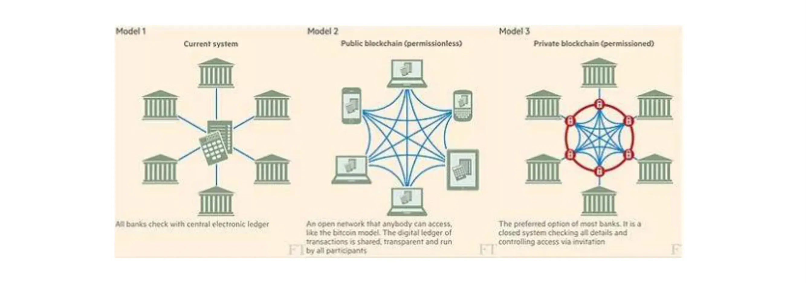
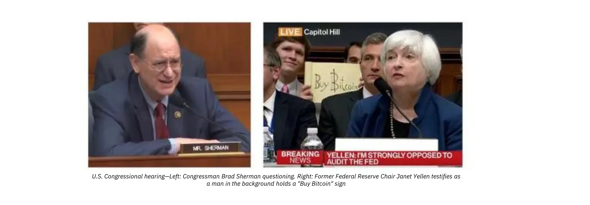
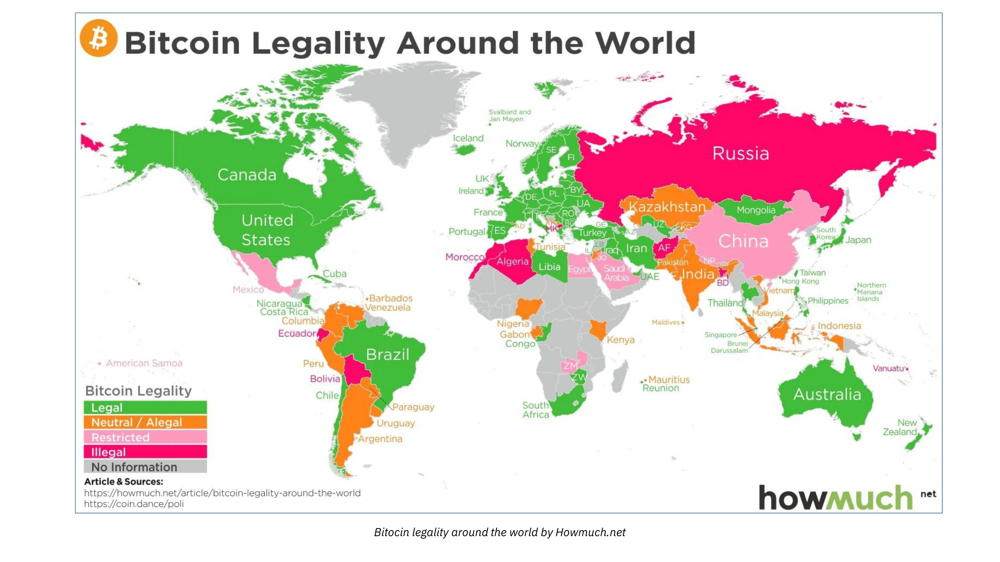
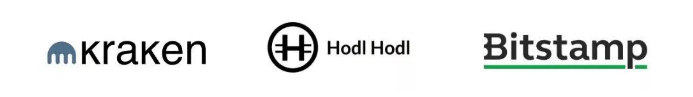
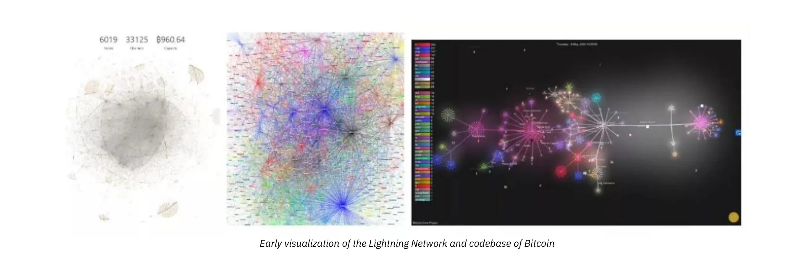
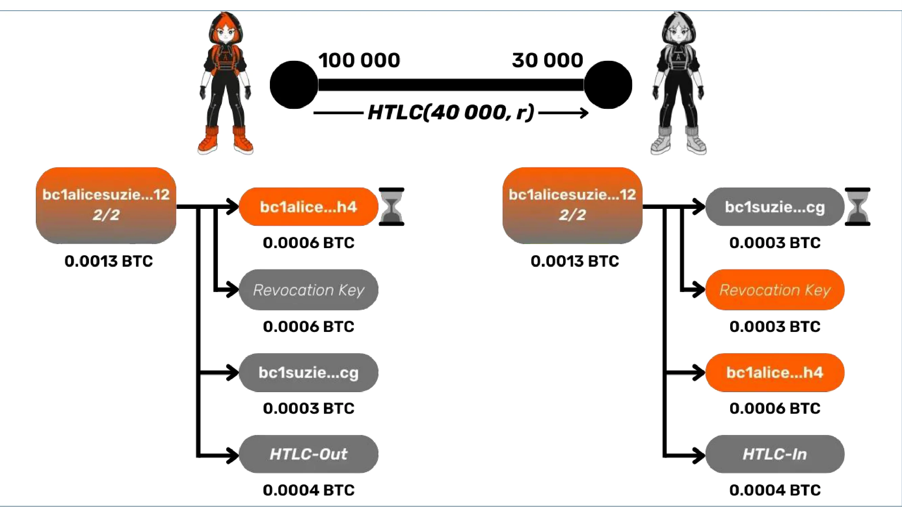
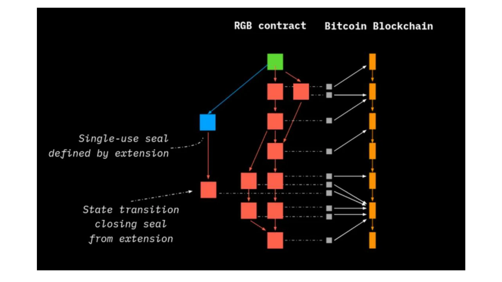
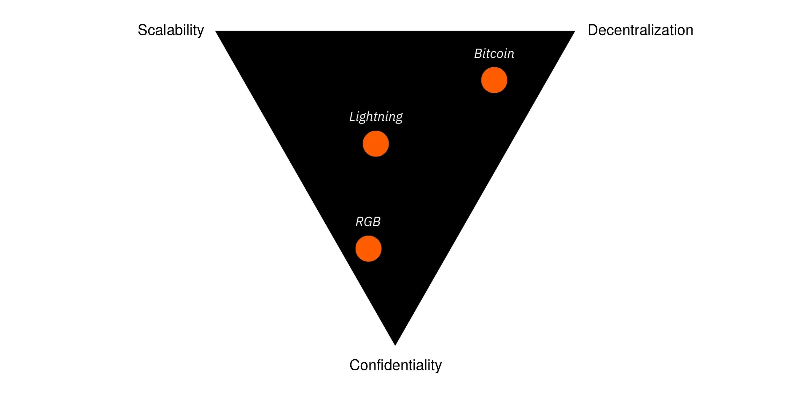

# Introduction

<partId>a1b2c3d4-e5f6-7a8b-9c0d-1e2f3a4b5c6d</partId>

## Welcome to BIZ102

<chapterId>b2c3d4e5-f6a7-8b9c-0d1e-2f3a4b5c6d7e</chapterId>

<!-- NEW -->

Welcome to BIZ102: Bitcoin Industry Overview.

In this course, you'll explore the vibrant ecosystem that has grown around Bitcoin since its creation in 2009. From its humble beginnings as an experiment among cryptography enthusiasts, Bitcoin has evolved into a global industry valued in the hundreds of billions of dollars.

**What you will learn:**

- How Bitcoin sparked the creation of an entirely new financial industry
- The difference between Bitcoin and the thousands of altcoins that followed
- How major institutions, governments, and banks are responding to Bitcoin
- The infrastructure that supports Bitcoin: exchanges, wallets, mining, and development
- How Bitcoin's layered architecture enables new capabilities without compromising security
- Practical tools for merchants who want to accept Bitcoin

This course is designed for beginners who want to understand the Bitcoin industry landscape. Whether you're considering entering the space as a user, investor, developer, or business owner, this knowledge will help you navigate the ecosystem with confidence.

Let's begin by understanding how Bitcoin created an entirely new industry.

<!-- END NEW -->

# Birth of a Global Industry

<partId>c3d4e5f6-a7b8-9c0d-1e2f-3a4b5c6d7e8f</partId>

## A Radical Innovation

<chapterId>d4e5f6a7-b8c9-0d1e-2f3a-4b5c6d7e8f9a</chapterId>

<!-- ORIGINAL: btc102/en.md lines 850-866 -->

Since its launch in 2009 by the pseudonymous creator Satoshi Nakamoto, Bitcoin has sparked the rise of an entirely new industry; now valued in the hundreds of billions of dollars. Despite its relatively short history, this ecosystem has experienced explosive growth, evolving at an exponential pace over the past decade. Every day, new players (ranging from institutional investors and agile startups to tech giants) pour significant capital and resources into staking their claim in this rapidly expanding sector.

Today, Bitcoin has reached a critical threshold; a point of no return. Governments, central banks, fintech corporations, and traditional financial institutions can no longer afford to ignore it. Whether through regulation, cautious adoption, or open confrontation, they now recognize Bitcoin's inevitable impact on the global economy.

Bitcoin is a radical innovation, a leap from zero to one. It represents a total break from the traditional monetary paradigm. To some, this disruption is a threat; an existential challenge to their established power and privileges. For them, Bitcoin is a Pandora's box that should never have been opened, and they will use every means at their disposal to resist it.

Others, however, see Bitcoin as a once-in-a-generation opportunity: a tool for individual freedom, a catalyst for transforming the global financial system, and a path toward a more transparent and equitable alternative. These are the builders, adopters, and contributors (the ones shaping the future).

**Bitcoin** itself remains neutral. It doesn't seek permission. It doesn't ask for approval.
**It simply exists.**

In the following chapters, we'll explore the key players driving the Bitcoin industry forward. Understanding their roles, incentives, and interactions is essential to grasp the dynamics of this growing ecosystem and to better navigate the opportunities and challenges it presents.

<!-- END ORIGINAL -->

## The Proliferation of Altcoins

<chapterId>e5f6a7b8-c9d0-1e2f-3a4b-5c6d7e8f9a0b</chapterId>

<!-- ORIGINAL: btc102/en.md lines 867-903 -->

Technically speaking, creating a new cryptocurrency is incredibly easy; it can take just a few minutes and requires little to no actual innovation. The real challenge isn't in the creation, but in the value. And value, in the world of digital assets, is purely determined by the market; by the confidence and demand of its users.
Back in December 2019, CoinMarketCap listed over 5,000 tokens. By 2025, that number has exploded into the millions, thanks to the rise of NFTs, decentralized finance (DeFi), and countless other applications (some legitimate, many questionable). These tokens come in all shapes and forms: some claim to be currencies, others function as securities, platform utilities, sidechains, or tokenized representations of digital art.

But let's be clear: **most of these cryptocurrencies are little more than scams.**.
Behind the veil of flashy technology and slick branding, many of these projects are powered by aggressive marketing strategies designed to do one thing, **extract your bitcoin**. They play on investor greed and ignorance, spinning seductive narratives about revolutionary tech or guaranteed returns; claims that rarely hold up under scrutiny.

Of course, within this sea of noise, a small handful of projects genuinely attempt to push the boundaries. Some focus on solving real technical challenges (scalability, privacy, programmability) and may contribute valuable ideas to the broader space. It's likely that over time, a few of these experiments will lead to useful innovations

But the fundamental question remains:
**Can these innovations thrive outside of Bitcoin?**

So far, one truth stands out: Bitcoin remains the only truly decentralized, censorship-resistant digital money, backed by a global network and growing adoption. Unlike altcoins, Bitcoin isn't propped up by centralized companies or governed by a handful of developers and early investors. It's the only project that has earned the weight of thousands of hours of research, development, and relentless refinement.

| Feature               | Bitcoin                  | Altcoins (99.9% of them)       |
| ---------------------|--------------------------|--------------------------------|
| **Liquidity**         | High                     | Low                            |
| **Adoption (Real-World)** | Global and growing       | Very limited                   |
| **Team**              | Decentralized and robust | Centralized and opaque         |
| **Reputation**        | Strong and globally recognized        | Varies, often questionable     |
| **Infrastructure**    | Stable and secure        | Unstable and vulnerable        |
| **Decentralization**  | Yes                      | Rarely                         |
| **Scam Risk**             | No                       | Very likely                    |
| **Real utility?**     | Yes                      | Debatable                      |

**Be wary of misleading claims like:**

- "Blockchain, not Bitcoin"
- "XRP is the next Bitcoin"
- "Libra will replace Bitcoin
- "My project is a better version of Bitcoin"
- "Central bank digital currencies will make Bitcoin obsolete"

Before investing your time or resources into any altcoin, do your own research as that's not what we're here to cover.
**We're here to cover Bitcoin and Bitcoin only.**

<!-- END ORIGINAL -->

## Institutional Adoption

<chapterId>f6a7b8c9-d0e1-2f3a-4b5c-6d7e8f9a0b1c</chapterId>

<!-- ORIGINAL: btc102/en.md lines 905-922 -->

After the ICO boom of 2017, institutions began showing serious interest in blockchain; but often without grasping what truly makes it revolutionary. Central banks and governments are now exploring Central Bank Digital Currencies (CBDCs), hoping to modernize financial infrastructure while maintaining complete control over user transactions. Projects are already underway in countries like Sweden, the EU, Russia, and China.

Tech giants have joined the race too. Facebook (now Meta) launched its stablecoin initiative, Libra, aiming to create a digital currency backed by a basket of fiat currencies. But the project met swift regulatory resistance and was eventually abandoned.

| Feature                    | Bitcoin | Altcoins | Facebook-Coin | FedCoin |
|---------------------------|---------|----------|---------------|---------|
| **Public**                | Yes     | Varies   | No            | No      |
| **Open**                  | Yes     | Varies   | No            | No      |
| **Borderless**            | Yes     | Varies   | No            | No      |
| **Neutral**               | Yes     | Varies   | No            | No      |
| **Censorship-resistant**  | Yes     | Varies   | No            | No      |

Despite bold marketing, these initiatives don't compete with Bitcoin; they imitate its language while rejecting its core principles. They're built for compliance, not freedom. They're designed to extend surveillance, not protect privacy. They entrench control rather than distribute it.

Facebook's Libra was never meant to challenge the status quo; it was built to work with the system. In contrast, Bitcoin exists entirely outside that system. It doesn't ask for permission. It doesn't rely on trust. And it's been running flawlessly (without leaders, downtime, or central control) for over a decade.

<!-- END ORIGINAL -->

# Industry Infrastructure

<partId>a7b8c9d0-e1f2-3a4b-5c6d-7e8f9a0b1c2d</partId>

## Regulation and Government Approaches

<chapterId>b8c9d0e1-f2a3-4b5c-6d7e-8f9a0b1c2d3e</chapterId>

<!-- ORIGINAL: btc102/en.md lines 925-941 -->

Bitcoin, by its very nature, operates outside traditional frameworks. It doesn't rely on a central authority and can't be controlled or altered by any single entity. But while the protocol itself is immune to regulation, the participants who interact with it (exchanges, businesses, and users) are still subject to national laws.

Since Bitcoin is a global network, countries have responded in vastly different ways:

- **Some impose heavy restrictions**, like China, attempting to curb usage without ever truly stopping it.

- **Some others offer more welcoming environments**, such as Switzerland or Canada, seeing Bitcoin as an opportunity rather than a threat.

- **Most are still undecided**, experimenting with regulations while trying to balance innovation with oversight.

Governments and institutions often struggle to classify Bitcoin accurately (is it money, property, or something entirely new?). As a result, regulations tend to be reactive, inconsistent, and constantly evolving. If you're involved in Bitcoin, it's essential to stay informed about your local landscape; especially when it comes to taxes, banking access, and compliance rules.

<!-- END ORIGINAL -->

## The Banks' Stance on Bitcoin

<chapterId>c9d0e1f2-a3b4-5c6d-7e8f-9a0b1c2d3e4f</chapterId>

<!-- ORIGINAL: btc102/en.md lines 943-948 -->

As cornerstones of the traditional financial system, banks see Bitcoin as a direct threat to their economic model, which is centered around intermediation and control of financial flows. This explains why many banks across the world have imposed restrictions on businesses and individuals using Bitcoin. Some go as far as closing accounts or limiting access to services for companies operating in the cryptocurrency sector, often citing anti-money laundering (AML) and counter-terrorism financing (CTF) concerns.

However, while Bitcoin is seen as a competitor, many of these same banks are actively investing in blockchain research and development, trying to leverage Bitcoin's innovations without relinquishing their control. They understand that blockchain offers significant potential, but they aim to control how it's integrated into their existing infrastructure, rather than embracing Bitcoin's decentralized, open model.

<!-- END ORIGINAL -->

## Cryptocurrency Exchanges and Bitcoin Custody

<chapterId>d0e1f2a3-b4c5-6d7e-8f9a-0b1c2d3e4f5a</chapterId>

<!-- ORIGINAL: btc102/en.md lines 949-1024 -->

Exchanges play a critical role in the Bitcoin ecosystem, acting as bridges between fiat currencies and Bitcoin. They allow users to buy, sell, and sometimes trade Bitcoin for other digital assets. However, not all exchanges are created equal, and it's essential to choose the one that aligns with your needs while minimizing risks. Here are key factors to consider before using an exchange:

- a solid reputation for being secure;
- sufficient liquidity to ensure rapid trading without extreme price fluctuations;
- responsive and efficient customer service;
- A user-friendly interface that makes transactions easier to navigate;
- an option for automatic recurring purchases (ARP);
- easy, free withdrawal of bitcoins to a personal wallet.

Exchanges that comply with local regulations typically have to follow strict **"[Know Your Customer](https://planb.academy/resources/glossary/kyc-know-your-customer)"** (KYC) protocols, requiring users to provide identification documents before accessing services. While these processes are designed to prevent illegal activity, they can compromise the privacy that Bitcoin inherently offers.

KYC platforms collect your personal information under the guise of security. This data can be exploited by governments to monitor your financial transactions and restrict your access to certain operations.

However, there are alternatives for acquiring bitcoins without submitting to KYC:

- P2P purchase platforms such as Bisq, Robosat, LNP2PBot, Peach, HODL HODL, etc.;
- Direct cash purchases, for example at local Bitcoin meetups;
- Regulated purchase platforms without KYC, which are rare but available in certain countries.;
- Bitcoin ATMs;
- Working in exchange for bitcoins;
- Mining bitcoins.

There are several types of platforms, each suited for specific uses:

- **Peer-to-peer exchange platforms (P2P)**

These platforms allow users to buy and sell bitcoins directly with each other, without a centralized intermediary. They offer greater privacy, especially because they operate without KYC. You can find local sellers with whom you can conduct in-person transactions or use various online payment methods (SEPA, Revolut, Wise, etc.).

**Caution:** For any physical transaction, choose a public and secure location to avoid potential scams.

https://planb.academy/tutorials/exchange/peer-to-peer/bisq-v2-c1c6a702-6c16-4101-8b90-62c424017b80

https://planb.academy/tutorials/exchange/peer-to-peer/hodlhodl-d7344cd5-6b18-40f5-8e78-2574a93a3879

https://planb.academy/tutorials/exchange/peer-to-peer/lnp2pbot-v2-e6bcb210-610b-487d-970c-7cce85273e3c

https://planb.academy/tutorials/exchange/peer-to-peer/peach-c6143241-d900-4047-9b73-1caba5e1f874

https://planb.academy/tutorials/exchange/peer-to-peer/robosats-b60e4f7c-533a-4295-9f6d-5368152e8c06

- **Bitcoin-only exchange platforms**

These platforms take a user-friendly approach, offering a simple, transparent service. They are Bitcoin-only. They often implement solutions for purchasing bitcoins through Dollar-Cost Averaging (DCA) and offer automatic withdrawals to a personal wallet. They are particularly suited to beginners looking to accumulate bitcoins in a progressive and secure way. Examples: Relai, Bull Bitcoin, StackinSat, Bitstack...

https://planb.academy/tutorials/exchange/centralized/bitstack-29fd71be-9570-42c6-8f6f-cd355d62e746

https://planb.academy/tutorials/exchange/centralized/bull-bitcoin-europe-0ccf713e-efcd-44ec-8205-211f49ac7d53

https://planb.academy/tutorials/exchange/centralized/relai-v2-30a9671d-e407-459d-9203-4c3eae15b30e

https://planb.academy/tutorials/exchange/centralized/stackinsat-5af6a380-f3c6-4246-9f81-9957a16ab066

- **General-Purpose or Trading-Oriented Exchange Platforms**

These platforms offer advanced features beyond simply buying Bitcoin, including leverage and derivatives. However, we strongly advise against trading. Instead, we recommend purchasing Bitcoin and moving it to your own wallet. Trading is a high-risk activity and generally not suited for those focused on long-term accumulation. Staying out of the trading game is often the smarter path.

https://planb.academy/tutorials/exchange/centralized/bitfinex-dc306d39-bd96-4ab9-a278-a322316716db

https://planb.academy/tutorials/exchange/centralized/bitstamp-5a36c896-bff5-46d7-b505-ff069c3ac47c

https://planb.academy/tutorials/exchange/centralized/kraken-1ef03e25-9b42-49bd-a47d-249e1a13cfc6

https://planb.academy/tutorials/exchange/centralized/paymium-92603f76-b985-49ce-81e5-f4fa0df776e5

**Exchange platforms are not secure wallets**. Leaving your bitcoins on an exchange exposes you to considerable risk. Several scenarios could result in the loss of your funds:

- **Hacking**: Many bitcoins have been stolen from compromised platforms (e.g. MtGox);
- **Government seizure**: A government can shut down a platform and freeze its users' funds;
- **Bankruptcy or fraud**: Numerous platforms have disappeared with their customers' money  (e.g. FTX).

The golden rule is simple: **If you don't own your private keys, you don't truly own your bitcoins**. Always withdraw your funds to a personal wallet as soon as possible to ensure complete sovereignty over your money.

<!-- END ORIGINAL -->

## Wallets, Mining and Development: The Pillars of the Ecosystem

<chapterId>e1f2a3b4-c5d6-7e8f-9a0b-1c2d3e4f5a6b</chapterId>

<!-- ORIGINAL: btc102/en.md lines 1026-1084 -->

### Bitcoin wallets

At the heart of Bitcoin ownership lies the wallet—a specialized tool that securely stores the private keys needed to access and manage your bitcoins. A wallet can take many forms: a dedicated hardware device, a mobile or desktop app, or even a piece of paper with a key written on it. These wallets bridge your digital wealth with the real world, making Bitcoin usable in everyday life.

Each type of wallet offers a different balance of:
- Privacy
- Security
- Ease of use
- Cost

The Bitcoin wallet industry is divided into several categories, each catering to different needs and levels of technical expertise:

- **[Hardware Wallet](https://planb.academy/resources/glossary/hardware-wallet) Manufacturers**: These companies develop physical devices designed for secure key storage. Some are open-source, while others offer proprietary solutions with varying features and levels of security. Notable names include Ledger, Trezor, Coinkite, Foundation, and Shiftcrypto.
- **Software Wallet Developers**: These range from companies to independent developers creating mobile and desktop applications. Their offerings vary in user experience, security, and features. Examples include Sparrow, Wizard Sardine, Galoy, Synonym, and Blockstream.
- **DIY (*Do It Yourself*) Wallets**:These open-source solutions are designed for advanced users who want full control and minimal reliance on third parties. Building your own wallet reduces trust dependencies and can increase your security posture. Notable DIY options include Seedsigner and Specter DIY.

Wallets play a fundamental role in Bitcoin and will be explored in more depth in other courses on the platform.

### Bitcoin Mining

Mining is a core function of the Bitcoin network. It ensures the system's security and keeps the blockchain operational. Miners validate transactions and secure the network by performing energy-intensive computations known as Proof of Work. Each newly mined block adds a batch of transactions to the blockchain and releases new bitcoins according to the protocol's issuance schedule.

In Bitcoin's early days, mining could be done from a personal computer. Today, it's a competitive, global industry dominated by companies with substantial financial and technical resources. The quest for cheap energy sources has become a key focus, as miners aim to optimize operational costs and profitability. Mining operations now range from massive industrial facilities to small-scale setups running in homes or garages..

The mining ecosystem consists of several major players:

- **Hardware Manufacturers**:Companies like Bitmain design and produce ASICs (Application-Specific Integrated Circuits), ultra-specialized chips created solely for mining Bitcoin.
- **Mining pools**:These are collectives of miners who combine their computing power to improve their chances of earning rewards. Given the increasing difficulty of mining, pools offer more predictable payouts by distributing block rewards (newly mined bitcoins and transaction fees) among participants based on their contribution. Examples include Foundry USA, AntPool, F2Pool, MARA Pool, and Braiins Pool.
- **Miners**:These are the individuals or organizations running the mining hardware and software. On one end, there are small-scale miners using machines like the Antminer S9, and on the other, industrial operations like Galaxy Digital, which manage enormous facilities dedicated to mining.

Mining is a world of its own, with many layers to explore; technical challenges, economic incentives, and energy considerations all come into play. For those interested in exploring this area further and truly understand how it works, our MIN201 course takes you through everything you need to know.

https://planb.academy/courses/ce272232-0d97-4482-884a-0f77a2ebc036

### Development in the Bitcoin ecosystem

At the heart of Bitcoin's technical evolution lies Bitcoin Core, the most widely used software client for running a Bitcoin node. It's an open-source project, fully transparent and publicly available on GitHub: [https://github.com/Bitcoin/Bitcoin](https://github.com/Bitcoin/Bitcoin). where anyone can review the code, follow discussions, and see how the protocol evolves. While updates are proposed and debated, no one is forced to adopt them and users remain in control of which version they run.

Bitcoin development can be understood through a few distinct groups of contributors:

- **Bitcoin Core developers**, These are the individuals who maintain and improve the main software client. Among these are the maintainers, who hold the keys to managing the repository. In 2025, there are five of them: Hennadii Stepanov, Michael Ford, Ava Chow, Gloria Zhao and Ryan Ofsky. Then there are the contributors who submit code changes, bug fixes, or improvements. These proposals go through peer review and community discussion before being accepted.
- **Developers of Layered protocols**,This group works on technologies that build on top of Bitcoin, like the Lightning Network or RGB, aiming to extend Bitcoin's capabilities without changing its core.
- **Independent developers**, These developers focus on creating tools and applications to improve the user experience, such as Mempool.space (a visual interface for tracking transaction activity) or Alby (tools for using Lightning payments in browsers and apps).

Anyone can propose changes to Bitcoin Core, but the process is intentionally rigorous. New ideas often take years to refine and require deep technical understanding, broad community engagement, and multiple layers of review. Proposals are typically submitted in the form of **Bitcoin Improvement Proposals (BIPs)**;some of which never make it into the protocol.
Innovation is welcome, but only when it's backed by solid reasoning, community consensus, and careful testing.

Despite what some might believe, no one has unilateral control over Bitcoin; not even the maintainers of Bitcoin Core. Their role is to manage the software repository, not the protocol itself.

Even if a maintainer approved a controversial change, it wouldn't affect the network unless **nodes (run by users)** actually adopt and run that version. In the end, Bitcoin's code only matters if people choose to run it.
It's also worth noting that **Bitcoin Core isn't the only client**. Alternatives like Bitcoin Knots implement the Bitcoin protocol too, giving users more choice and reinforcing the system's decentralization:

https://planb.academy/tutorials/node/bitcoin/bitcoin-knots-e04b2196-4df2-4246-86ef-c02269c29098

<!-- END ORIGINAL -->

# Bitcoin's Layered Architecture

<partId>b8c9d0e1-f2a3-4b5c-6d7e-8f9a0b1c2d3e</partId>

## Extension Layers

<chapterId>f2a3b4c5-d6e7-8f9a-0b1c-2d3e4f5a6b7c</chapterId>

<!-- ORIGINAL: btc102/en.md lines 1092-1143 -->

Bitcoin is an open system designed to be minimalist, robust and secure from the outset. To add functionality without altering its foundations, evolutions are generally made by adding **protocol layers** and complementary applications that enrich the ecosystem without compromising the decentralization and resilience of the main system. This flexibility has enabled numerous companies and independent developers to build an infrastructure around Bitcoin, adding innovations adapted to different use cases.

### Bitcoin extension with additional layers

The layered approach allows Bitcoin to be improved without changing its core protocol, guaranteeing the stability and security of the main system. This method is similar to how the Internet works, where multiple protocols build on each other to offer distinct functionalities while maintaining smooth interoperability.

Among the main overlay systems enriching the Bitcoin ecosystem are:

- **Lightning Network**:

The Lightning Network, created by Thaddeus Dryja and Joseph Poon in 2016, is a second-layer solution designed to enable instant and low-cost payments. Two users can open a private channel where they can transact with the balance only being updated on the blockchain when the channel is opened or closed. Transactions within the channel occur off-chain, which means they don't need to be recorded individually on the Bitcoin blockchain. This structure enables instantaneous transactions and minimal fees, making it ideal for low-value transactions that require quick confirmation.

Let's say you're buying a coffee with Bitcoin using the base layer. For the payment to be confirmed (and for the café to be sure you've actually paid) the transaction needs to be included in a block. That can take several minutes, depending on the fee you've chosen. Technically, the merchant should wait for six confirmations (about an hour) to be fully confident the payment is final. Obviously, that kind of wait doesn't work when you're standing at the counter. With the Lightning Network, the payment goes through in just a few seconds; so your coffee is paid for and served before it even has time to get cool.

If you're interested in learning more about how Lightning works, we offer an excellent second-year course dedicated to this topic:

https://planb.academy/courses/34bd43ef-6683-4a5c-b239-7cb1e40a4aeb

- **Sidechains**:

Sidechains are blockchains that run in parallel with Bitcoin's main blockchain. They're connected via a two-way peg, which ensures that the asset moving between the chains retains the same value; meaning a bitcoin on the sidechain is still worth one bitcoin on the main chain. Each sidechain has its own consensus mechanism, which may be entirely separate or partially dependent on Bitcoin's.

The main advantage of sidechains is that they can offer features not available on the Bitcoin base layer; or offer them in improved ways. This includes more flexibility for developers, faster and/or more private transactions, and greater transaction throughput. However, to provide these benefits, sidechains often make different trade-offs compared to Bitcoin's main chain.

The concept of sidechains was introduced in 2014 by Adam Back, Matt Corallo, Luke Dashjr, Mark Friedenbach, Gregory Maxwell, Andrew Miller, Andrew Poelstra, Jorge Timon, and Pieter Wuille. As of 2025, the most well-known sidechains in the Bitcoin ecosystem are Liquid and RSK (Rootstock).

If you'd like to explore Liquid in more detail, we offer an advanced third-year course on the topic:

https://planb.academy/courses/6d26bcff-51a3-405f-bcdd-9af8297ce727

- **RGB**:

RGB is a decentralized and privacy-focused smart contract system designed to work on top of Bitcoin and the Lightning Network. Unlike traditional smart contract platforms, RGB uses a client-side validation model (meaning that the full contract state is stored off-chain, and only cryptographic commitments are published to the Bitcoin blockchain). This design improves both scalability and privacy. With RGB, users can create advanced smart contracts for issuing tokens, NFTs, decentralized identities, or even DeFi applications, directly on Bitcoin or Lightning.

A key feature of RGB is its protection against double-spending, achieved using a cryptographic technique called Single-use Seals. This mechanism relies on the fact that Bitcoin's UTXOs (Unspent Transaction Outputs) can only be spent once. The authenticity of tokens is ensured by the user-side validation of the contract's entire history (from its creation to its current state).

To deepen your knowledge of RGB, we offer a fourth-year training course (please note that it is highly technical):

https://planb.academy/courses/3ce1d37c-05ba-4f54-aa15-7586d37b2bb7

RGB is just one of many protocols built on top of Bitcoin. While some are more widely adopted than others, new ones continue to emerge. The common thread is the idea of optimizing each layer for a specific task, while preserving the integrity and immutability of Bitcoin's base protocol.

This layered design stands in contrast to much of the broader crypto industry, which often seeks to bundle many features into a single protocol. By keeping Bitcoin simple and narrowly focused, we reduce its attack surface; which means greater security. A lean protocol is easier to secure, maintain, and scale. Bitcoin is designed to do one thing extremely well: provide sound, decentralized money. Everything else (smart contracts, tokens, payments, and more) can be layered on top, allowing innovation without compromising the core.

**Did you know**?The Internet wasn't built all at once; it evolved as a stack of interoperable protocols. For example, TCP/IP handles network communication, HTTP powers the web, and many other layers serve specific functions. Each layer is optimized for its job, creating a robust and modular system. Bitcoin follows this same philosophy. Its base layer is strong and minimal, and additional functionality is added through layered protocols like Lightning, Liquid, or RGB; each focused on solving different user needs while keeping the foundation intact.

<!-- END ORIGINAL -->

## Merchant Tools for Accepting Bitcoin

<chapterId>a3b4c5d6-e7f8-9a0b-1c2d-3e4f5a6b7c8d</chapterId>

<!-- ORIGINAL: btc102/en.md lines 1144-1172 -->

Today, there are plenty of tools available for merchants who want to accept Bitcoin as a form of payment. For small businesses looking for a simple setup, using a [hot wallet](https://planb.academy/resources/glossary/hot-wallet--software-wallet) (or even a Lightning wallet) is often enough to start accepting payments directly. Larger businesses that require proper accounting and reporting will usually prefer more advanced payment processing systems. Fortunately, there are several options available depending on your needs.

If you prefer a hands-off solution and want to receive fiat currency directly into your bank account, custodial services like OpenNode offer a streamlined experience:

https://planb.academy/tutorials/business/point-of-sale/open-node-e69a0c1c-47f7-4932-8494-e6f26c3c9784

For merchants who are more technically inclined and want full control over the process, BTCPay Server is a fantastic open-source option. The main downside is that it requires time to set up and maintain, along with some technical knowledge:

https://planb.academy/tutorials/business/point-of-sale/btcpay-server-928eb01e-824b-4b57-a3e8-8727633beddc

Somewhere in between, you'll find Swiss Bitcoin Pay, a user-friendly yet powerful solution that strikes a good balance between ease of use, functionality, and security. It works well for both small retailers and larger businesses:

https://planb.academy/tutorials/business/point-of-sale/swiss-bitcoin-pay-2-a78b057e-ed11-47ac-860c-71019fcb451a

Accepting Bitcoin can bring several practical and financial benefits to a business. Just like cash, Bitcoin allows for direct payments between the customer and the merchant (no need for a traditional bank). Payments made through the Lightning Network are instant and final, reducing the risk of chargebacks. And when merchants hold their own Bitcoin (self-custody), they gain greater financial autonomy.

It can also help cut costs by eliminating banking fees and the need for traditional payment terminals; a smartphone or laptop is often all you need. Even with payment processors involved, fees are generally lower than those charged by banks.

Unlike traditional currencies that lose value over time due to inflation, Bitcoin has a fixed supply of 21 million coins. This makes it a valuable asset for preserving and diversifying business treasury over the long term.

In day-to-day operations, Bitcoin simplifies payments by removing the need for physical cash, reducing theft risks, and eliminating the possibility of counterfeit money. It's a global currency, making it ideal for international customers since there's no need for currency conversion. For online stores, Bitcoin is especially secure and efficient.

On top of that, accepting Bitcoin can be a smart marketing move. It shows your business is forward-thinking and can attract new customers (especially among younger generations like Gen Z). It's a low-risk, strategic opportunity with minimal costs, mostly limited to the initial setup; which is now easier than ever with the right tools.

If you'd like to explore how Bitcoin can be integrated into your business (whether as a payment method, a treasury asset, or both) we offer a beginner-level course tailored to that need:

https://planb.academy/courses/a804c4b6-9ff5-4a29-a530-7d2f5d04bb7a

Bitcoin is gaining ground as a medium of exchange, with growing adoption across many industries. The Lightning Network has made payments faster and cheaper, further increasing Bitcoin's appeal for merchants.

<!-- END ORIGINAL -->

## Going Further

<chapterId>b4c5d6e7-f8a9-0b1c-2d3e-4f5a6b7c8d9e</chapterId>

<!-- ORIGINAL: btc102/en.md lines 1173-1191 -->

We've reached a point where anyone can get involved in the Bitcoin ecosystem; whether by using it in everyday life, adopting it in business, contributing to education, helping improve the code, or building new applications.
Bitcoin is now unstoppable.

### My personal Perspective

I've always found the "Bitcoin highway" metaphor to be one of the most accurate and compelling ways to understand how the ecosystem is evolving; and where it's heading. Bitcoin isn't just digital money; it's **a growing alternative financial system**, with its own strengths and flaws. While still young and facing challenges, its resilience is undeniable. It's not going away. On the contrary, like a black hole, it will gradually absorb everything around it until it becomes an undeniable monetary standard.

Picture Bitcoin as a road you're driving on. Right now, to take care of everyday essentials (buying groceries, paying for services, or getting your car fixed), you sometimes have to exit this road; meaning you temporarily return to the old financial system. That's because the Bitcoin infrastructure is still under construction, and some parts of daily life still rely on fiat currency and banks.

But over time, this road will become a fully built-out highway.

That's how I see Bitcoin's future playing out. It might not completely replace traditional finance, but it will outperform it in key areas (efficiency, security, and user adoption) until it becomes the standard for most of the world.

If I remember correctly, this metaphor of the Bitcoin highway was first introduced by Andreas Antonopoulos. His vision still holds up today, and with every step forward, we're getting closer to living it.[@aantonop](https://x.com/aantonop)

<!-- END ORIGINAL -->

<!-- NEW -->

### Continue Your Learning Journey

Now that you understand the Bitcoin industry landscape, here are some recommended next steps:

**For deeper Bitcoin knowledge:**
- **BTC101**: Discover Bitcoin fundamentals in our comprehensive introductory course
- **BTC103**: Explore why Bitcoin matters and its economic importance

**For practical skills:**
- **BTC104**: Learn how to secure your Bitcoin properly
- **BTC105**: Discover the best ways to acquire Bitcoin

**For specialized knowledge:**
- **MIN201**: Deep dive into Bitcoin mining
- **LNP201**: Master the Lightning Network
- **LIQ201**: Explore Liquid sidechain capabilities

The Bitcoin industry continues to evolve rapidly. Stay curious, keep learning, and remember: understanding the ecosystem is the first step toward participating in it meaningfully.

<!-- END NEW -->

# Conclusion

<partId>c9d0e1f2-a3b4-5c6d-7e8f-9a0b1c2d3e4f</partId>

## Conclusion

<chapterId>e4f5a6b7-c8d9-0e1f-2a3b-4c5d6e7f8a9b</chapterId>
<isCourseConclusion>true</isCourseConclusion>
