The Plan B Programme Business Track 2026 (BIZ226) is an intensive course combining foundational Bitcoin knowledge with practical business skills. The first four chapters, taught by Giacomo Zucco, cover the history, technology, infrastructure, and industry landscape of Bitcoin. The remaining seven chapters feature specialized masterclasses from industry practitioners covering market research, Bitcoin banking, regulation, team building, personal branding, UX/UI design, and community building.

+++

# Course Introduction
<partId>3cd9a4a4-8fa4-4746-b6a1-9f9bb9d9c23c</partId>

## Welcome to the Bitcoin Business Track
<chapterId>0711eef5-c3e9-4550-ada6-db685f8ab2fd</chapterId>

Welcome to the Plan B Programme, the most comprehensive Bitcoin education track available today. This is the Business Track for 2026, and you are about to spend the next five months going deep into every dimension of Bitcoin that matters for building, running, or joining a company in this industry.

### What is the Plan B Programme?

The Plan B Programme is an annual educational initiative run by Plan B Network. It brings together students from around the world for a structured, intensive curriculum that covers both the technical and business sides of Bitcoin. The programme runs from February to July, with almost 90 hours of lectures, assignments, and guest masterclasses. Students can attend either online or in person. **The top performers at the end of the track are invited to a two-week Summer School in Lugano.**

The programme has two tracks: the Developer Track (DEV226) for engineers and protocol builders, and this one, the Business Track (BIZ226), for entrepreneurs, business students, and professionals looking to work in Bitcoin in non-technical roles. Both tracks share a common foundation before specializing.

### Your professor and guest lecturers

Your main professor is **Giacomo Zucco**, who teaches the first four chapters. Giacomo has been building in the Bitcoin space since 2013, founding and advising multiple companies, co-creating open standards (RGB, OTS, BDK), and organizing some of the most important Bitcoin conferences in Europe. He brings a decade of hands-on experience in Bitcoin entrepreneurship, and his lectures cover the full intellectual foundation: why Bitcoin exists, how it works, where the ecosystem is heading, and what the industry landscape looks like for someone starting a business today.

After the common track, you will hear from seven guest lecturers, each an expert in their field:

- **Alexandre Bussutil** on market research and lean startup methodology
- **Nicolas Burtey** (CEO of Galoy / Blink wallet) on Bitcoin banking from the US and El Salvador
- **Grant McCarty** (Bitcoin Policy Institute) on regulation and the political landscape
- **Thunder Svadjica** on building and hiring for Bitcoin-only startups
- **Efrat Fenigson** on personal branding and thought leadership
- **Erik and Christoph Ono** (Bitcoin Design Community) on UX/UI design for Bitcoin products
- **Joe Nakamoto** on building Bitcoin communities across four continents

Each guest brings real-world experience, not theory. They have built the companies, navigated the regulations, designed the products, and grown the communities they teach about.

### What you will learn

The curriculum is structured in five parts:

**Part 1: Bitcoin Foundations** (Chapters 1-4). Giacomo takes you from the history of money through cryptography, protocol design, Lightning Network, and the full industry landscape. By the end of this section, you will understand not just what Bitcoin is, but why every layer of the stack exists and where the business opportunities sit.

**Part 2: Market and Finance** (Chapters 5-6). How to validate a Bitcoin business idea using lean startup methodology, and how Bitcoin banking actually works in practice, from custodial to non-custodial, from the US to El Salvador.

**Part 3: Legal and Operations** (Chapters 7-8). The regulatory environment for Bitcoin companies, Operation Chokepoint 2.0, strategic Bitcoin reserves, and the practical realities of hiring and building a team in a Bitcoin-only startup.

**Part 4: Brand and Design** (Chapters 9-10). How to build a personal brand in the Bitcoin space, and how to design Bitcoin products that people actually want to use.

**Part 5: Community** (Chapter 11). Lessons from circular Bitcoin economies around the world, from Witsand to Madeira, Kibera to El Salvador.

### Before you begin

This is a long course. Eleven chapters, each based on a full masterclass lecture with slides, examples, and recommended reading. There are 132 quiz questions waiting for you across the curriculum, 12 per chapter. The quizzes are designed to test real understanding, not memorization.

Take your time. **The goal is not to finish fast but to finish with a working understanding of how Bitcoin businesses operate.** Revisit chapters, follow the recommended reading, and use the Plan B Network courses linked throughout as deep dives into specific topics.

Good luck. The Bitcoin industry is growing and it needs people who understand both the technology and the business. That is exactly what this track is designed to produce.

+++

# Bitcoin Foundations
<partId>4cf4c5d8-6e6e-480f-bd2c-4dd8981f1da4</partId>

## Why Bitcoin: The History and Functions of Money
<chapterId>28278ab7-e7f2-4537-a731-61f581615379</chapterId>

<professorId>dac3b166-31ef-41f3-bfef-6e9d3855c12c</professorId>

:::video id=0b062921-515b-4065-bc05-31c71647c649:::

In this lecture, Giacomo Zucco traces the entire arc of monetary history to explain why Bitcoin exists. The argument is structured around money's four functions: store of value, medium of exchange, unit of account, and system of control. Each function emerged in a rough historical sequence, and each stage introduced new capabilities but also new vulnerabilities. By the end, the case is clear: money has become so virtual, so centralized, and so tied to identity that a new system was inevitable. Bitcoin is not an invention from nowhere; it is the logical response to thousands of years of monetary evolution gone wrong.

### Store of value: from fish to collectibles

The lecture opens with the Robinson Crusoe thought experiment. Imagine a man stranded on an island, catching 10 fish per day with his bare hands, eating all 10. He survives, but barely. When a storm reduces his catch to 3, he nearly starves. This is the problem of immediate consumption: no buffer, no resilience, no future.

The fix is saving. If Robinson eats only 8 fish and stores 2, he builds a surplus that sustains him through storms. This simple act introduces three foundational economic concepts. **Diminishing returns on consumption**: the first fish of the day is life-saving, the fifth is pleasant, the tenth is barely wanted. Each additional unit of the same good provides less satisfaction. **Positive-sum outcomes from saving**: saving is not a zero-sum redistribution; it creates net new value by eliminating waste and building resilience. **Time preference for present consumption**: the degree to which someone prioritizes present consumption over future benefit. Giacomo uses the fable of the ant and the grasshopper: the grasshopper sings all summer while the ant stores food for winter. "80 to 90% of human cautionary tales are about time preference," he argues, because children never need to be taught that chocolate tastes good now; they need to be taught restraint.

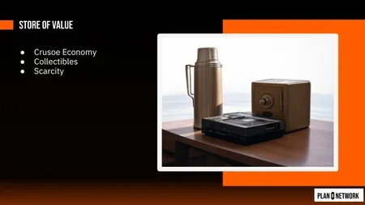

Saving enables **innovation**. Robinson uses his surplus to free up a day for building a fishing rod, then a net, then a boat. Each tool multiplies his output, but each requires an upfront investment of stored resources with no guarantee of success. This is the origin of capital: saved surplus deployed toward uncertain improvement. The progression extends beyond individual tools to **energy harvesting**, from human muscle to animal labor to coal-fired steam engines to oil to nuclear fission, each stage unlocking dramatically more productive capacity.

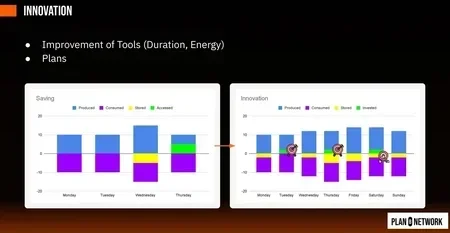

When Robinson meets other survivors, **sharing and specialization** emerge. Alice fishes, Bob hunts, Carol builds shelters, Dan digs wells. Total output exceeds what each person could achieve alone. This is Adam Smith's division of labor, and it is another positive-sum game that grows with the number of participants and the diversity of their skills.

But sharing creates a problem: fish rot. You cannot store them for long, and you cannot carry them across distances. This drives the emergence of **collectibles**, goods selected not for consumption but for their monetary properties. A good collectible is durable (it does not decay), scarce (it cannot be easily reproduced), fungible (one unit is interchangeable with another), and offers some degree of privacy (you can carry it without everyone knowing your wealth).

The concept of **scarcity** is refined through the water-diamond paradox: water is essential for life but cheap because it is abundant; diamonds are far less useful but expensive because they are rare. What matters is not absolute usefulness but the ratio of existing supply to new production, the **stock-to-flow ratio**. Toilet paper during COVID had sudden demand but low stock-to-flow because factories could ramp production quickly. Gold has a very high stock-to-flow: roughly 1 to 2% annual increase, because even doubling mining effort barely moves the total above-ground stock. This framework comes from the **Austrian School of economics**, particularly Carl Menger, Ludwig von Mises, and Friedrich Hayek, later popularized in Bitcoin circles by Saifedean Ammous.

The section concludes with the **Cantillon effect**: whoever is closest to new money creation benefits at the expense of those furthest away. Giacomo's example is vivid: Venetian glassmakers arrive at islands where colored glass beads serve as local money. They can produce identical beads cheaply, so they extract real goods (land, food, labor) in exchange for something that costs them almost nothing. "Some kind of monetary colonialism." He extends this to a thought experiment about a secret dollar printer in your basement: **the wealth radiates outward from the printer**, and those at the edge of the economy suffer net losses without understanding why.

### Medium of exchange: coins, corruption, and convergence

A store of value that people occasionally trade is not yet a medium of exchange. A house can be sold for money, but the house itself is not money. A true medium of exchange is something selected or created specifically to facilitate trade.

Giacomo traces the invention of **coins** to the temple of Juno Moneta near Rome, where priests received gold offerings in varied forms (cups, rings, necklaces), melted them down, and poured them into standardized weights stamped with Juno's image. This created fungible, divisible, verifiable units. The word "money" itself derives from "Moneta." He also references the Lydian lion (possibly the first coin) and Chinese bronze shells as independent parallel inventions.

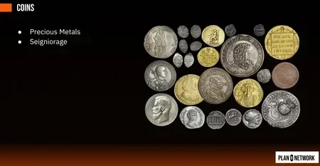

Why metals? Copper, silver, and gold share the same column in the periodic table, giving them malleability and stability at room temperature. Gold is the most chemically inert (it does not oxidize like silver), the most scarce (highest stock-to-flow), and can remain pure without alloys. The fact that **civilizations on different continents independently converged on the same metals** undermines the claim that money is "just a shared delusion." The physical properties drove the convergence.

The business model of minting introduces **seigniorage**: stamping "1 gram" on a coin containing only 0.99 grams, pocketing the difference. This is a hidden tax and another Cantillon effect. Giacomo traces the Roman denarius from 97% silver purity down to 1% over successive emperors, arguing that **monetary debasement contributed to the fall of Rome**.

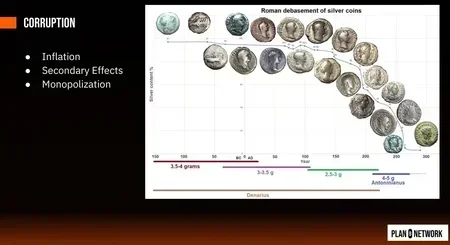

The **secondary effects of inflation** are extensive and insidious. Fiscal drag pushes people into higher tax brackets without real income growth. Fixed-income workers lose purchasing power while salespeople and exporters can adjust prices. Debtors gain at the expense of creditors, which incentivizes borrowing over saving. Time preference rises: if savings lose value, the rational response is to consume now rather than save. "The ant becomes the grasshopper." Then comes shrinkflation (same price, smaller product), skimpflation (same price, same size, lower quality ingredients), and the monetization of non-monetary assets: broken money forces people to store value in real estate and stocks, inflating those prices with a "monetary premium" and pricing out genuine buyers.

Giacomo makes the provocative argument that **"consumerism is the opposite of capitalism."** True capitalism in the Austrian sense means saving and investing. Consumerism, spend now and go into debt, is actually driven by monetary debasement.

The section ends with the **convergence problem**. Using Sarnoff's law and Metcalfe's law, Giacomo shows that barter (infinite moneys) is maximally inefficient, and economies naturally converge toward fewer, then ideally one, medium of exchange. But the three coinable metals present a trade-off: gold is portable but not divisible (you cannot buy coffee with gold dust); copper is divisible but not portable (a wealthy family would need hundreds of ships full of copper to migrate). Silver sits in between, which is why it was historically the most commonly circulated coin.

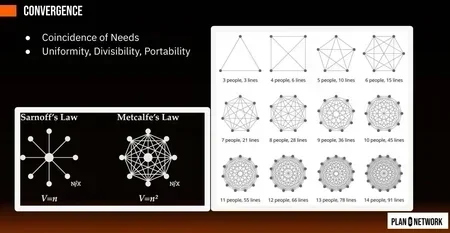

### Unit of account: banknotes, confiscation, and digitalization

The invention of **written contracts** and the concept of the **bearer instrument** solved the convergence problem. A bearer instrument is a transferable document redeemable by whoever holds it, not tied to a specific person. Giacomo's example: a French lord heading to Jerusalem during the Crusades deposits gold with the Knights Templar, receives a wax-sealed note, and hides it "inside his medieval panties." In Jerusalem, he discovers he does not even need to redeem the gold, because the note itself circulates as payment. Everyone trusts the Templars.

Paper can represent any amount ("one gram or one millionth of grams"), so divisibility and portability cease to be constraints. During the banknote era, silver and bronze heavily demonetized against gold, and **gold became the single backing for paper money worldwide**.

But paper introduces a fatal vulnerability: **fractional reserve banking**. Giacomo uses a parking-lot analogy: you custody cars but secretly rent them out, undercutting competitors on price. Banks did the same, keeping only 30% of deposited gold and lending the rest. This works until a **bank run** occurs: more than 30% of depositors demand redemption simultaneously. Bank runs lead to bail-ins (depositors lose their money) or bailouts (government taxes others to cover the losses). Bailouts create perverse incentives: "If they lose, other people pay. If they win, they win."

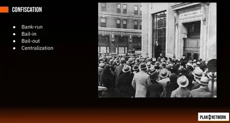

The historical trajectory of centralization follows a clear path. Free banking (any bank issues notes) leads to state-level central banks after bank runs, which leads to the Federal Reserve (1913), which leads to the Bretton Woods system (1944) where all world currencies are redeemable through the Fed in gold. Then comes **Nixon's 1971 shock**, the "temporary" suspension of dollar-gold convertibility that persists to this day. Giacomo calls this "Nixon confiscated the entire wealth of the world practically." He references the website "WTF Happened in 1971" showing the divergence of wages from productivity, rising inequality, and accelerating inflation that followed.

He also covers Roosevelt's Executive Order 6102 (1930s gold confiscation) and the petrodollar system, the requirement that oil be sold in US dollars, **enforced by the threat of invasion**. The final stage of virtualization arrives with digital electronics and telecommunications: computers can transmit information at the speed of light, but money remained physical paper, creating the gap that would eventually be filled.

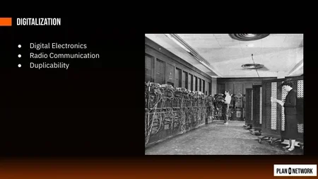

### System of control: credit, exclusion, and the Cypherpunk response

Andreas Antonopoulos argued that money actually serves four functions, not three. The fourth, system of control, emerged as money completed its virtualization from bearer instruments (cash) to identity-linked credit.

**Credit cards** started as a convenience for wealthy people who did not want to carry cash. The system works by querying a central authority: "Is this person authorized to spend?" This architecture, extended through Apple Pay, Google Pay, PayPal, and every fintech app, reaches its logical extreme in China's social credit system, **where financial access is conditional on behavior**. Low social credit means you cannot buy a high-speed train ticket.

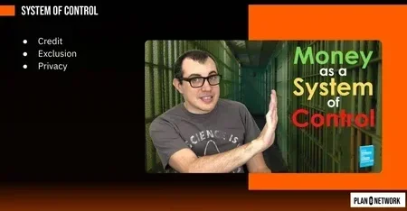

The core problem is **exclusion**, which takes three forms. Political exclusion: WikiLeaks revealed US war crimes, and Mastercard and Visa blocked donations in response. "With cash you cannot do that. Cash is anonymous, it is a bearer instrument." During the Canadian trucker protests, bank accounts receiving donations were frozen and funds confiscated. Personal exclusion: in authoritarian regimes, falling out with the leader means your bank account disappears. Economic exclusion: KYC (Know Your Customer) compliance has a cost. If a person's potential business does not generate enough revenue to justify that onboarding cost, they are simply excluded. **A large percentage of humanity is cut out of the digital financial system**, unable to access e-commerce or global finance.

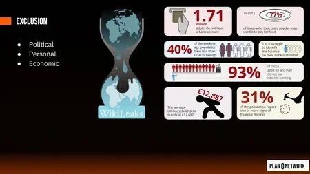

Giacomo frames the discussion of **privacy** using the pirate analogy: two pirates, one strong and one weak. With full transparency, the strong pirate simply takes everything (a negative-sum outcome). But if the weak pirate buries treasure on a secret island with an encoded map, the power asymmetry is neutralized. **Privacy enables the weaker party to resist predation.**

This connects to the **Cypherpunk movement**, cryptographers and activists including Julian Assange and Jude Milhon (St. Jude) who believed strong cryptography was "the main weapon to increase privacy on the internet." The term "cypherpunk" combines "cipher" (encryption) with the cyberpunk literary genre of authors like William Gibson ("Neuromancer") and the world of "The Matrix": rebels using technology against technological control.

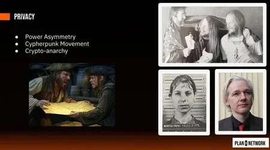

The lecture concludes with the thesis that **Bitcoin is the fusion of two intellectual traditions**: the Austrian economists focused on scarcity and sound money, and the Cypherpunks focused on privacy and censorship resistance. Money has followed an arc of virtualization, from shells (pure physical) to coins (physical plus information) to banknotes (information on a physical support) to credit (information tied to identity in the cloud). Can we keep a system as convenient as credit cards but as sovereign and decentralized as shells? That is the question the next lecture, "How Bitcoin," answers.

**Recommended reading:**
- "The Bitcoin Standard" by Saifedean Ammous
- "The Fiat Standard" by Saifedean Ammous
- "Principles of Economics" by Saifedean Ammous
- "Broken Money" by Lyn Alden
- "The Genesis Book" by Aaron van Wirdum
- "Cypherpunks" by Julian Assange
- "Cryptoeconomics" by Eric Voskuil
- "The Ethics of Money Production" by Jorg Guido Hulsmann
- "Why Bitcoin" by Tomer Strolight
- "Check Your Financial Privilege" by Alex Gladstein
- "Bitcoin Money" by the Bitcoin Rabbi (introductory)
- From the Nakamoto Institute: "The Crypto Anarchist Manifesto," "A Cypherpunk's Manifesto," and "Shelling Out" by Nick Szabo
- Website: wtfhappenedin1971.com
- [Plan B Network: Austrian Economics and Bitcoin](https://planb.academy/courses/eco201) (intermediate course covering Menger, Mises, Hayek, and Bitcoin as sound money)
- [Plan B Network: Bitcoin and the History of Money](https://planb.academy/courses/btc302) (the full arc from barter to digital scarcity)

## How Bitcoin: From Cryptography to the Chain of Time
<chapterId>39c0e4c9-7fbf-431e-a132-bf99ca289012</chapterId>

<professorId>dac3b166-31ef-41f3-bfef-6e9d3855c12c</professorId>

:::video id=379b30fe-49d5-4b5f-a65b-42941f6eebbf:::

In this lecture, Giacomo Zucco bridges the gap between the problem (money as a system of control) and the solution (Bitcoin). The journey passes through four stages: a recap of why digital money became a surveillance tool, the invention of cryptographic cash by David Chaum and its failure, the concept of proof of work and its limitations, and finally Satoshi Nakamoto's synthesis that eliminated the need for any trusted third party. By the end, money has gone from fully virtual (identity-bound credit) back toward something resembling physical cash: scarce, private, and sovereign, but usable over the internet.

### From credit to crypto: the problem restated

The previous lecture traced money's evolution from shells to digital credit. Each step gained convenience but lost something fundamental. Coins required trust in a mint to certify metal content. Banknotes required trust in a bank to redeem paper for gold. Digital credit eliminated the physical object entirely, binding every transaction to a verified identity. The result is a system where your wealth exists as a number next to your name in a centralized database. "I don't like you, well, your name, no amount."

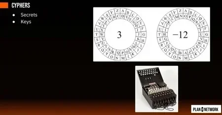

The consequences of identity-bound money are severe. Giacomo uses the example of the French government losing control of a KYC database of Bitcoin buyers, which contained identity documents, home addresses, purchase amounts, and withdrawal addresses. This data became a weapon: phishing emails (far more effective when they contain your real name and wallet balance), blackmail, and actual kidnappings. When you give a website your credit card details, **you are handing over all the information needed to spend your money**. The digital surveillance system has become so thorough that even stolen identity has limited utility, but the price is living in what Giacomo compares to a comfortable prison: "You have free food and some level of security, but you don't have freedom."

The question that drives the rest of the lecture: can we build digital cash that is as easy to move and store as credit, but as sovereign and private as physical coins?

### Voucher of knowledge: cryptographic keys, e-cash, and why it failed

The answer begins with cryptography. A **symmetric cipher like Caesar's shift** like the Caesar cipher (shift every letter by N positions, where N is the secret key) allows two parties who share a secret to communicate privately. But it has a fatal limitation: the key must be exchanged in person first. "Imagine every soldier has to take a submarine back to the UK to chat with the commander." This makes symmetric cryptography incompatible with anonymous digital cash, where strangers must transact without prior trust.

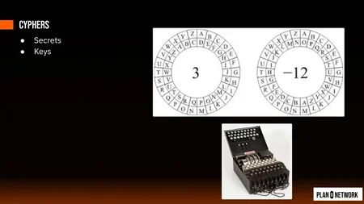

**Asymmetric cryptography with public keys** solves this. Giacomo credits Ralph Merkle as the original inventor, whose university reviewers rejected his paper because they thought he was sharing secret key material when he was actually sharing public keys, a concept they had never encountered. The idea: split a key into two halves. One half (the public key) can only lock; the other (the private key) can only unlock. Anyone can encrypt a message with your public key; only you can decrypt it. **Bob and Alice never need to meet or share a secret.** A private key is simply a very large random number. The public key is derived from it through a one-way mathematical function.

A critical distinction: **Bitcoin does not use encryption at all.** It uses the same mathematical machinery, but in reverse. Instead of Bob encrypting a message with Alice's public key (so only Alice can read it), Alice signs a message with her own private key, and anyone with her public key can verify it came from her. Giacomo compares this to a wax seal in the Middle Ages: recognizing the seal is easy, but reproducing the metal stamp from the emblem alone is practically impossible. Forging a digital signature by brute force would require "a few trillion years."

This leads to **David Chaum's e-cash** scheme. An issuer (a bank or trusted entity) signs a digital banknote: "I owe 100 to the public key of Alice." Alice transfers it to Bob by signing a message redirecting the note to Bob's public key. The double-spending problem (Alice sends the same note to both Bob and Eve) is solved by requiring the issuer to co-sign every transfer. Chaum then added **blind signatures**: a technique where the issuer co-signs transfers without seeing the public keys involved, preserving privacy. "The issuer knows basically nothing."

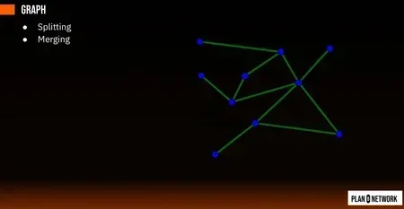

The transaction model works as a **graph**. If Alice has 100 and needs to pay Bob 70, she creates a transaction with one input (100) and two outputs (70 to Bob, 30 back to herself as change). Outputs can be split and merged freely. This is the UTXO (Unspent Transaction Output) model that Bitcoin would later adopt.

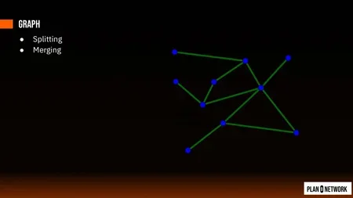

But e-cash failed twice. **Soft censorship**: Chaum approached banks who refused to adopt the scheme ("I prefer to know everything about my customers"). **Hard censorship**: e-gold, created by an American lawyer and oncologist who read Mises and Hayek, allowed digital transfer of gold titles. It was fully regulated, licensed, used by millions, and the US government shut it down anyway in 2008, confiscating all gold on accusations of enabling money laundering. Satoshi likely used e-gold to purchase the bitcoin.org domain, and **Bitcoin launched the year after e-gold was destroyed**. The lesson: any system with a single trusted entity can be shut down. "If it is big and static and known, you can trust it and the cops can shut it down. If it is small and nimble, you cannot trust it. So we are blocked."

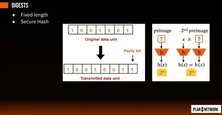

### Proof of work: from spam prevention to digital scarcity

The breakthrough came from an unexpected direction. Adam Back, a cypherpunk working on anonymous email remailers, needed a way to prevent spam without identity-based whitelists. His solution, **hashcash**, required that the hash of an email start with a certain number of zeros (a "partial collision").

First, the concept of a **secure hash function like SHA-256**. A secure hash like SHA-256 takes data of any length and produces a fixed-length output, deterministically. The critical property is **pre-image resistance**: given an output, there is no way to find the input except by brute force. Giacomo demonstrates live: "hello there" and "hello there " (with a trailing space) produce completely different hashes.

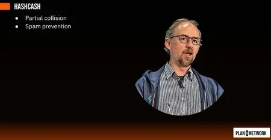

Hashcash exploits this: finding an input whose hash starts with one zero requires roughly 16 attempts. Two zeros: 256 attempts. Three zeros: 4,096. **The cost scales linearly with the number of emails sent**: sending one email costs one unit, sending a million costs a million. This eliminates the economies of scale that make spam profitable.

Nick Szabo saw this and was excited: could proof of work serve as digital cash? But it has a fatal flaw Giacomo calls the **waste problem**: "My cost, my pain, is not your gain. I am not transferring cost, I am just burning cost." If used as money, every transfer in the chain would require fresh energy expenditure. Buying a $1,000 bike means spending $1,000 of electricity, and the next buyer must spend another $1,000.

**Hal Finney's Reusable Proof of Work (RPoW)** solved the waste problem for issuance. Use proof of work only to create the initial token, then transfer it using e-cash-style signatures. Alice performs proof of work to mint a token worth 10 dollars of computation, then signs it to Bob, Bob to Charlie, and so on. The UTXO model allows splitting and merging. "Now you have reusable proof of work. There is no red midspace component, there is no bank, there is nothing with identity."

But the double-spending problem returns for transfers: without a mint to co-sign, Alice can send the same token to both Bob and Charlie. Finney's solution was **trusted hardware**: IBM's secure cryptographic coprocessors (SGX chips) that sign the hash of the software they run, proving the mint is executing honest code. "You just have to trust IBM. Well, Intel in this case." The approach works but is not elegant for long-term survival: the chip will eventually fail, and the government can seize the manufacturer.

A 16-year-old Peter Todd identified two deeper problems. **Moore's Law inflation**: as computing improves, the same number of zeros costs less to produce, so the monetary base inflates at the rate of technological progress, "the opposite of gold." **Hardware specialization**: if proof of work is money, market forces will optimize hardware to produce it (CPU to GPU to FPGA to ASIC), accelerating inflation further. The result: **a coin minted in 2003 represents vastly more work than one minted in 2017**, creating a fungibility nightmare.

### Chain of time: Satoshi's synthesis

The final piece came from an existing commercial service called **Timeguard**, which provided timestamp proofs. The basic idea: to prove a document existed on a certain date, publish its hash in a newspaper. Pre-image resistance guarantees you possessed the document before the hash was published.

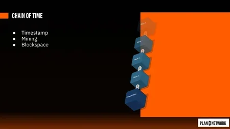

Ralph Merkle (again) contributed the scaling mechanism: a **Merkle tree** aggregates many document hashes into a single root hash by hashing pairs, then hashing those hashes, up to a single root. This scales logarithmically: four documents need two extra hashes; a thousand documents scale just as efficiently. Timeguard published one Merkle root per day in a newspaper advertisement. Then they added chaining: **each day's root includes the previous day's root**, creating a sequence where altering any past entry requires reprinting every subsequent newspaper. "If you wait three months, they cannot reprint three months' worth of newspaper."

Satoshi's synthesis: **replace the newspaper with proof of work**. Every time someone performs proof of work, they include the hash of all recent transactions and the hash of the previous proof of work. This gives proof of work two functions simultaneously: **creating the asset** (initial scarcity, like Finney's RPoW) and **creating the scarcity of history** (a cost to rewrite the past). For Bob to defraud Charlie, Bob must redo all the proof of work from the fraudulent transaction forward, outpacing the entire network. Each new block votes not only on its own transactions but on every previous one. "The transactions are a graph, but timestamping is a chain, a chain of timestampings."

The system sacrifices two things compared to Chaum's e-cash. **Privacy**: all participants must see all transactions in cleartext (not just hashes) to verify no double-spending. Satoshi's mitigation was pseudonymity (don't reuse keys, never leak personal information), but this turned out to be insufficient because users reuse addresses and probabilistic heuristics can link keys through change outputs and input clustering. **Scalability**: every participant must download every transaction from the genesis block. Satoshi proposed SPV (Simple Payment Verification), where light clients keep only Merkle roots and rely on at least one honest full node, but this remains an active area of development.

The full arc is now visible: shells (scarce, private) became coins (trust a mint), then banknotes (trust a bank), then digital credit (identity-bound, zero privacy), then e-cash (regain some privacy, still censorable), then RPoW (remove the issuer, keep a mint), then Bitcoin (remove the mint via proof-of-work chain). **Each step forward in sovereignty costs some convenience.** The next lecture, "Where Bitcoin," will cover how the ecosystem is working to regain that convenience without sacrificing sovereignty: Lightning Network, digital assets, Liquid, Ark, and the broader freedom-tech stack.

**Recommended reading:**
- "The Genesis Book" by Aaron van Wirdum (the prehistory of Bitcoin: hashcash, e-cash, DigiCash, e-gold, cypherpunks)
- "Grokking Bitcoin" by Kalle Rosenbaum (complete, simple, linear explanation of Bitcoin's technical foundations)
- "Programming Bitcoin" by Jimmy Song (technical: finite fields, elliptic curves, Schnorr signatures, transactions, blocks)
- "Bitcoin Clarity" by Kiara Bickers (accessible explainer with good metaphors for non-technical readers)
- learnmeabitcoin.com (visual explanation of transactions, blocks, scripts, witness data)
- mempool.space (live block explorer)
- emn178.github.io (SHA-256 hash tool and ECDSA key generator for hands-on experimentation)
- [Plan B Network: Bitcoin's Pioneering Era](https://planb.academy/courses/btc305) (the history from hashcash to e-gold to Satoshi's synthesis)
- [Plan B Network: Cryptography Fundamentals](https://planb.academy/courses/cyp201) (hashing, asymmetric keys, signatures, and their application in Bitcoin)

## Where Bitcoin: From the Chain of Time to the Network of Lightning
<chapterId>a72138be-6c03-4e06-b067-e2d02dff2a63</chapterId>

<professorId>dac3b166-31ef-41f3-bfef-6e9d3855c12c</professorId>

:::video id=561cefc5-f4c4-4f44-ba01-45f9bb79ab23:::

The previous two lectures answered "why" and "how" Bitcoin exists. This one tackles the harder question: where is Bitcoin going? Giacomo Zucco opens by revisiting the chain of time (what most people call "the blockchain") with a systematic treatment of timestamps, mining economics, and the halving equation. He then confronts the fundamental scalability problem head-on, showing that global consensus is a necessary evil, not a feature to celebrate. The second half of the lecture introduces the solutions: payment channels, Ark, and the Lightning Network's routing mechanism, followed by a frank discussion of Bitcoin's volatility problem and the rise of stablecoins as a legal arbitrage enabled by Bitcoin's existence.

### Chain of time: timestamps, mining, and the Satoshi equation

Giacomo begins with a correction of terminology. Satoshi Nakamoto never used the word "blockchain." In the white paper, he wrote "chain of blocks"; in blog posts, "chain of proofs of work"; and in the original Bitcoin client code, "timechain." The term "blockchain" appeared around 2012, was capitalized by mainstream media in 2013, and became a meaningless buzzword by 2015. Even Disney created a "blockchain" (Dragonchain), and an iced tea company added "blockchain" to its name, causing its stock to skyrocket the same day. "Now finally the hype is almost dead," Giacomo observes, "but we are going back to the original definition of Satoshi: chain of time."

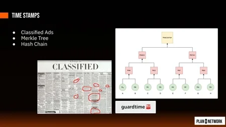

The chain of time rests on three components reviewed from the previous lecture. First, **timestamping via classified newspaper ads**: publishing a document's hash in a newspaper proves the document existed before publication, because pre-image resistance guarantees the document was not forged after the hash appeared. Second, **Merkle trees** for scalability: instead of publishing one hash per document, aggregate millions of documents into a single Merkle root by hashing pairs recursively. Only the root goes in the newspaper; each client stores just the logarithmic proof path for their own document. Third, **hash chains** for tamper resistance: each day's Merkle root includes the previous day's root, so altering any past entry requires reprinting every subsequent newspaper. "If you wait three months, they cannot reprint three months' worth of newspaper." A company called Guardtime had been doing exactly this since the early 2000s.

Satoshi's insight was to replace the newspaper with proof of work. Every time someone performs proof of work, they include the Merkle root of all recent transactions and the hash of the previous proof of work. This gives proof of work two simultaneous functions: creating the asset (initial scarcity) and creating the scarcity of history (a cost to rewrite the past). You follow the chain with the most cumulative proof of work, the "heaviest" chain, just as you would trust the newspaper with the longest unbroken publication history.

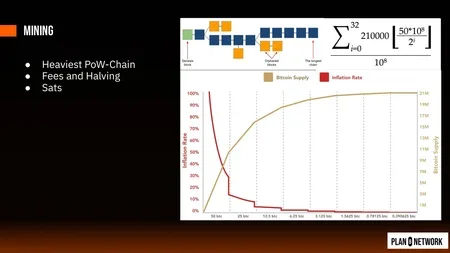

The monetary policy of Bitcoin is captured in a single equation. The total supply is the sum, over 32 halving epochs of 210,000 blocks each, of 5 billion fundamental units (satoshis) divided by two raised to the epoch number. The first 210,000 proofs of work each earn 5 billion satoshis. The next 210,000 earn 2.5 billion. Then 1.25 billion, and so on, halving every epoch until the reward reaches one satoshi and then zero. The series converges to exactly 2.1 quadrillion satoshis, or 21 million conventional units of 100 million satoshis each.

The terminology around units remains messy. Satoshi used the word "coin" to mean at least four different things: what we now call a UTXO (an unspent transaction output, the leaf of the transaction graph), a satoshi (the fundamental indivisible unit), a bitcoin (the conventional grouping of 100 million satoshis), and the Bitcoin protocol itself. The convention today is BTC for the unit, sat for the fundamental unit, and UTXO for the coin in the transaction graph. Some people, including Jack Dorsey, want to rename the sat to "bitcoin." Giacomo disagrees: "I think it's a stupid idea, but maybe it'll catch on. I hope not."

The **fee mechanism is essential for long-term censorship resistance**. In each block, the first transaction (the "coinbase") has no inputs and creates new satoshis equal to the halving subsidy plus all the fees from every other transaction in the block. At the beginning of Bitcoin's life, miners earn mostly from the subsidy and can afford to ignore transactions. But as the subsidy halves toward zero, the only revenue comes from fees. A miner who censors transactions earns nothing for their energy expenditure. Satoshi explicitly designed this transition: "Eventually the fee mechanism can replace the discovery of new proof of work entirely."

### Difficulty adjustment and the blockspace dilemma

A critical problem arises if proofs of work arrive too frequently. If a new block appears every millisecond, nodes cannot even agree on the previous block before the next one arrives. The "orphan" branches grow long, meaning most miners' work goes unrewarded, driving small miners out of business. Only large operations with fast network connections survive. Short block intervals centralize mining.

The difficulty adjustment solves this. Every 2,016 blocks (the number 2016 reversed is 6102, Roosevelt's Executive Order that confiscated American gold), the system compares timestamps on the first and last block of the period. If the 2,016 blocks took less than two weeks, difficulty increases (more leading zeros required in the hash). If they took more than two weeks, difficulty decreases. Each node performs this calculation independently. The result: **one block every ten minutes on average**, self-adjusting regardless of how much or how little hash power is on the network.

Why ten minutes? Because in 2009, a one-megabyte file took roughly ten minutes to propagate across a global peer-to-peer network. Why four years between halvings? Leap years, US presidential elections, and Fed leadership changes all follow four-year cycles. Satoshi anchored Bitcoin's monetary calendar to deeply ingrained social rhythms. Combined with 210,000 blocks per epoch, two weeks per difficulty adjustment, and ten minutes per block, all the constants fall into place.

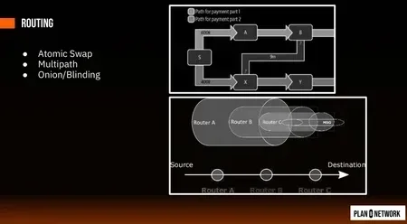

But the deeper problem is what Tadeusz Dryja and Joseph Poon called the "Bitcoin failure bathtub." On the left side: very small blocks mean very few transactions per block, so fees become extremely expensive and only wealthy institutions can afford to transact on-chain. Everyone else delegates their keys to custodians. You end up with ten large institutions holding private keys and everyone else running bank accounts with them. On the right side: very large blocks mean everyone can hold their own keys, but blocks become so massive that only data centers can download and verify them. **You end up trusting Google or Amazon to tell you whether you received money.** The left side recreates banks; the right side recreates mints. Neither is acceptable.

James A. Donald identified this problem within three days of Satoshi's white paper publication. His November 2008 email on the cryptography mailing list remains one of the most prescient responses in Bitcoin's history: "We very, very much need such a system. But the way I understand your proposal, it does not seem to scale to the required size."

The root cause is **global consensus requires proof of exclusion**, not just proof of inclusion. In Guardtime's timestamp system, you only need to prove your document exists in the Merkle tree (inclusion). In Bitcoin, you must also prove that no contradictory transaction spending the same coins exists anywhere in the chain (exclusion). That requires downloading every transaction ever made. This is terrible for privacy (all transactions are visible), for scalability (the entire history grows forever), for timing (you must wait for confirmation), and for censorship resistance (miners see your transactions and can selectively refuse them). "Blockchain bad. Blockchain necessary evil. We need it, but we don't want it."

### Network of Lightning: channels and Ark

The solution begins with smart contracts. Nick Szabo coined the term to describe programmable conditions on digital bearer instruments. Satoshi included a scripting language in Bitcoin with three essential primitives: **multi-signature** (this coin moves only with specific combinations of keys), **timelocks** (this coin cannot move until a certain time), and **hashlocks** (this coin moves only if you reveal the pre-image of a hash). These three building blocks can emulate virtually any financial contract: escrow, inheritance, derivatives, joint accounts.

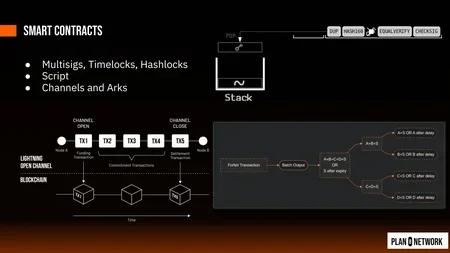

Satoshi intentionally kept the scripting language limited. He started with more flexibility, then disabled most opcodes after discovering that certain combinations created infinite loops. A small block that takes two years to evaluate is just as bad as a giant block. The address evolution tells the story: pay-to-IP (insecure, no privacy), then pay-to-public-key-hash (the addresses starting with "1"), then pay-to-script-hash (addresses starting with "3"), and finally Taproot (addresses starting with "bc1p"), which uses **Merkle trees of script fragments** so that when you spend, you reveal only the branch you actually need. Better privacy, better scalability.

A payment channel is the first application of these primitives. Two parties lock funds in a 2-of-2 multisig address. They exchange pre-signed transactions that redistribute the balance between them, updating the split with each payment. Opening costs one on-chain transaction; closing costs one more. Everything in between is free, instant, and private. The trick is preventing either party from broadcasting an outdated state; this requires timelocks, hashlocks, and penalty mechanisms that vary by channel design (Spilman, Decker-Wattenhofer, Dryja-Poon).

Channels batch transactions in time: two parties trade back and forth for months or years, then settle on-chain. But channels have limits. They deplete in one direction (you keep paying your restaurant, but the restaurant rarely pays you back). They require both parties to stay online. And opening one still costs an on-chain transaction.

Ark is the complementary approach: it batches transactions in space. Instead of two parties trading over a long period, **one on-chain transaction with a single input and output settles thousands of off-chain transfers simultaneously**. Where channels compress time, Ark compresses users. The trade-off is different: Ark does not provide instant finality (you still wait for block confirmation or trust the coordinator), but it allows thousands of users to share a single on-chain fee. If fees reach $1,000 per transaction, 1,000 Ark users each pay $1.

The future, Giacomo argues, lies in combining both: Ark transactions that create channels between users, or channels between different Ark instances. "We are not there yet to understand exactly what you can do, and that's what makes it exciting."

### Routing, privacy, and the Kevin Bacon rule

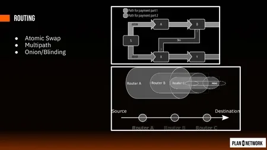

Opening a channel with every merchant you interact with would never scale. The Lightning Network's key innovation is routing: instead of a direct channel with every counterparty, you chain payments through intermediaries using atomic swaps. Alice pays Zoe through Bob, Carl, Darryl, and Eve, with a smart contract ensuring that **either the entire chain of payments completes or nothing happens**. No one in the middle needs to trust anyone else.

The name "Lightning Network" came from the visual pattern of multi-path payments: a payment splits across multiple routes, branches like lightning, then reconverges at the destination. Tadeusz Dryja originally called the project "Traffic Light," but found the domain "Lightning Network" available instead. The network scales via the Kevin Bacon rule: in a sufficiently connected graph, any two nodes are reachable within roughly seven hops.

Privacy in Lightning is layered. Each routing node knows only its immediate neighbors in the payment chain. Carl knows he received from Bob and forwarded to Darryl, but not that the payment originated from Alice or terminated at Zoe. Blinded paths, now implemented in most Lightning wallets, further obfuscate the receiver's identity. The upcoming upgrade from HTLCs (hash time-locked contracts) to PTLCs (point time-locked contracts) will improve privacy even further: instead of all routing nodes sharing the same hash pre-image, **each hop uses a different cryptographic point**, making correlation attacks across the route nearly impossible.

### Volatility and the BitTorrent effect

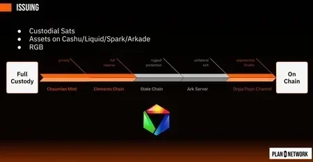

Even with perfect scaling technology, Bitcoin faces a commerce problem: volatility. Three forces drive Bitcoin's price. First, demand growth: physicist Giovanni Santostasi discovered that the logarithm of Bitcoin's price correlates with the logarithm of time (days since genesis) at the power of roughly 5.8, with over 97% confidence. Open-source protocols tend to spread at the cube of time; network value grows as the square of nodes (Metcalfe's law). Three times two equals six, which matches the observed exponent. But the noise on top of this trend is large enough to make it useless for trading.

Second, fiat debasement: even if Bitcoin adoption stalled, its price in dollars would still rise because dollars lose purchasing power exponentially. Third, four-year cycles that may be connected to the halving, to presidential elections changing the Fed chair, or to a psychological rhythm in speculative markets. A business that receives Bitcoin at $125,000 and must pay suppliers the next month at $70,000 faces a catastrophic loss. **Bitcoin as a store of value is thriving**, but as a medium of exchange it is hindered by volatility and by Gresham's law (people spend the depreciating currency first).

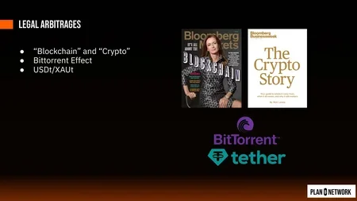

This leads to the BitTorrent analogy. BitTorrent made copyright enforcement so difficult that centralized services like VKontakte could host pirated content with impunity: if you shut them down, users just return to BitTorrent, which is worse for regulators. Similarly, Bitcoin's existence creates a permissive environment for centralized-but-convenient services. Tether (USDT) began as a way to move dollar liquidity to the Bitfinex exchange without triggering bank account closures. You send dollars to a company that gives you a token worth $1. The bank does not close the account because there is no investment scheme, no leverage, no volatility. As adoption grew, Tether maintained full reserves by purchasing US Treasury bills directly, becoming, per employee, the most profitable company in history.

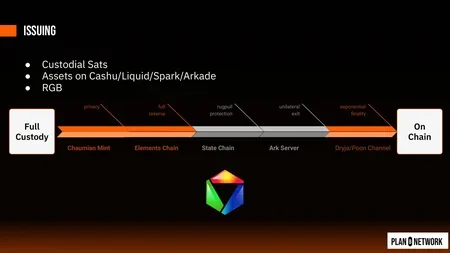

Tether also issues XAUT, a gold-backed token reminiscent of e-gold, but with the crucial difference that **the "blockchain" narrative provides plausible deniability**: Tether can perform KYC on the primary market (issuance and redemption) while claiming it cannot control the secondary market (peer-to-peer transfers). It is not true sovereignty, and Tether can still blacklist addresses, but it is "Bitcoinish enough" that hundreds of millions of people now use USDT instead of sats. The risk remains: if the dollar hyperinflates or Tether is forced to confiscate, users will discover they were never holding bearer instruments.

The lecture concludes with a frank assessment: global consensus is bad but necessary; the goal is to minimize its use through channels and Ark on the second layer, while the first layer provides the anchor of absolute scarcity and immutable history. The remaining topics, the "Web of Trust" covering identity, invoicing protocols (LNURL, Bolt12, Nostr), and the full technology stack from hardware to communication, were deferred to the next session.

**Recommended reading:**
- "Mastering the Lightning Network" by Andreas Antonopoulos, Olaoluwa Osuntokun, and René Pickhardt (comprehensive technical guide to Lightning channels, routing, and payment construction)
- The Bitcoin white paper by Satoshi Nakamoto (bitcoin.org/bitcoin.pdf)
- "On Stake and Consensus" by Andrew Poelstra (2015 paper proving proof of stake cannot work in a decentralized setting)
- The Scaling Bitcoin 2015 Montreal presentations, particularly Dryja and Poon's "bathtub" talk
- learnmeabitcoin.com (interactive explanation of Script, transactions, blocks, and Merkle trees)
- mempool.space (live block explorer showing fees, coinbase transactions, and difficulty adjustments)
- The Santostasi power law model (available on Giovanni Santostasi's publications and Twitter analysis)
- arkdev.info (technical documentation on Ark protocol and Arkade implementation)
- [Plan B Network: Lightning Network Theory](https://planb.academy/courses/lnp201) (channels, routing, HTLCs, and payment construction)
- [Plan B Network: Bitcoin's Pioneering Era](https://planb.academy/courses/btc305) (the Blocksize War, Scaling Bitcoin conferences, and protocol ossification)

## Bitcoin Industry Landscape: From Protocol to Business
<chapterId>6a236223-0ffd-452c-9039-07d6c4df0f19</chapterId>

<professorId>dac3b166-31ef-41f3-bfef-6e9d3855c12c</professorId>

:::video id=64940ef6-1183-482c-b88b-c062661471e1:::

This final lecture in Giacomo Zucco's foundation series serves two purposes. The first half completes the "Where Bitcoin" journey by mapping the custody spectrum, the web of trust vision, invoicing standards, and the full technology stack from hardware to communication. The second half confronts the question that matters most for the business track: what does the Bitcoin industry actually look like, and where can you build a real company? Giacomo walks through the evolution of Bitcoin actors from the "paleonode" era to the present day, distinguishes easy business models (all of which involve hurting people) from hard ones (all of which require navigating Bitcoin's resistance to intermediation), and closes with the pain points that define both the internet revolution and the Bitcoin revolution.

### The custody spectrum and the Lightning Network as a universal bus

Giacomo opens by completing the custody diagram introduced in the previous lecture. The spectrum runs from full custody on one end to fully on-chain on the other, with each step offering a different security and trust trade-off.

**Full custody** means someone else holds the keys. You have credit on their spreadsheet. They can confiscate, inflate via fractional reserve, or simply disappear. This is how every exchange works: Binance, Coinbase, and until recently, Wallet of Satoshi. A **Chaumian mint** (e-cash) is slightly better: the mint cannot see who owns what or target individual balances, but it can still run away with the funds or do fractional reserve. Fedimint and Minibits use this model for small payments. An **Elements chain** like Liquid adds transparency on the supply side: you can run a node to verify no inflation occurred, though the federation can still censor you or collectively abscond. Aqua and Bull Bitcoin use Liquid under the hood.

A **state chain** (Mercury, Spark) goes further: the coordinator cannot steal funds directly but can collude with a sender to reverse a payment, essentially "rolling back time." An **Ark** server cannot steal or reverse, but if you go offline for too long, the coordinator can claim your funds. A **Dryja-Poon channel** (Lightning proper, as in Phoenix) gives you trustless instant payments once opened, but if you go offline, your counterparty can broadcast an outdated state to claim more than their share. Finally, **on-chain** with sufficient confirmations is the strongest guarantee: rewriting history requires outspending the entire network's cumulative proof of work.

The critical insight is that **these security models can be mixed within a single Lightning payment**. If Alice has a secure channel with Bob, and Bob has a trusted e-cash relationship with Carl, and Carl has an Ark connection to Dave, the atomic routing of Lightning means Alice and Dave are unaffected by the weaker link in the middle. The payment either completes end-to-end or it does not. This allows the Lightning Network to function as a universal bus connecting custodial wallets, Chaumian mints, Liquid swaps, Ark rounds, state chains, and pure Lightning channels in a single seamless payment.

### Blockchain and crypto: the five stages of loss

Before diving into the industry landscape, Giacomo frames the broader narrative using the Kubler-Ross model of grief applied to technological disruption. When a radically new phenomenon appears, incumbents move through denial ("the internet is a fad"), anger ("regulate it, ban it"), bargaining ("it's not the internet, it's the information superhighway"), depression, and finally acceptance. Bill Gates wrote in 1995 that the internet was doomed; five months later, he launched Internet Explorer and rewrote the book.

Bitcoin generated two distinct bargaining euphemisms. **"Blockchain"** strips Bitcoin of everything controversial (privacy, volatility, financial sovereignty) and presents the residue as a safe, academic computer science project. Universities, politicians, and enterprises all adopted the blockchain narrative circa 2015. Ironically, as the previous lecture showed, **the actual goal of Bitcoin development is to minimize blockchain use**, not celebrate it. **"Crypto"** does the opposite: it takes Bitcoin's disruptive energy and amplifies it into speculative mania, allowing venture capitalists to print tokens, dump them on retail, and extract value. Neither euphemism describes what Bitcoin actually is. Blockchain is Bitcoin voided of substance; crypto is Bitcoin voided of discipline.

The Tether story illustrates how Bitcoin's existence creates a protective umbrella for centralized services, just as BitTorrent's existence forced regulators to tolerate centralized streaming platforms. Tether issues dollar-denominated notes on Bitcoin (originally via Omni, now mostly on centralized chains like Tron), maintaining full reserves in US Treasury bills. The key distinction from earlier attempts like e-gold: the "blockchain" narrative provides plausible deniability on the secondary market, even though Tether can still blacklist addresses on the primary market. Users who rely on USDT for remittances and e-commerce in emerging markets are trading sovereignty for convenience, a trade-off they may regret when the dollar hyperinflates or Tether is forced to freeze accounts.

### Web of trust, invoicing, and the full technology stack

The PGP web of trust of the 1990s failed because there was no economic incentive to learn key management. Bitcoin changed this: if you do not learn to store 12 words securely, you lose money. Hardware wallets (Coldcard, Ledger, Trezor, SeedSigner, Portal) have brought key management to millions of people who would never have touched PGP. The emergence of WebAuthn/Passkeys in mainstream services shows that even the fiat world is beginning to take cryptographic identity seriously.

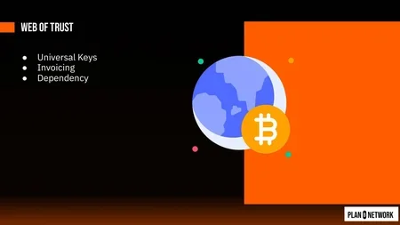

The evolution of Bitcoin addresses tells a story of increasing sophistication. Pay-to-IP (insecure, no privacy) gave way to pay-to-public-key-hash (addresses starting with "1"), then pay-to-script-hash ("3"), then Taproot ("bc1p"). In Lightning, invoices (Bolt 11) were single-use and expired, creating terrible UX: the recipient had to generate a fresh invoice for every payment, and if the payer waited too long, it expired. **LNURL solved this by replacing static invoices with a server endpoint** that generates invoices on demand, enabling donation buttons, login-with-Lightning, and the QR-code payment terminals used in Lugano. But LNURL requires running a server, which most users cannot do. Bolt 12 eliminates the server requirement entirely, allowing static offers that work peer-to-peer through the Lightning Network itself.

The full technology stack forms a layered dependency. Hardware at the base. An operating system on top. The Bitcoin application (node software, wallet). The timechain (layer 1). Channels and Arks (layer 2). Asset protocols like RGB, Liquid assets, or Taproot Assets (layer 3). The Lightning Network now spans across all of these as a routing and invoicing layer. Above that sits identity, communication, storage, and computation, the pieces still largely missing from the Bitcoin ecosystem.

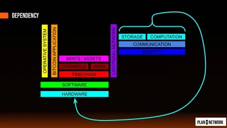

Giacomo's thesis is that once Lightning provides reliable payments, **the same infrastructure can support decentralized storage, computation, and communication**. Encrypt your data, split it into chunks, send them to anonymous peers, and pay them satoshis to store and retrieve it. Need computation? Encrypt the task, send it out, pay for results. Keet (by Holepunch) already demonstrates serverless communication using a peer-to-peer protocol called Pears, where every app is a node and backups are distributed across participants. BitChat experiments with mesh networking over Bluetooth and Wi-Fi, enabling communication without internet access. These are early and imperfect, but they point toward a future where Bitcoin is not just money but the incentive layer for a fully decentralized internet.

### Evolution of Bitcoin actors: from paleonode to present day

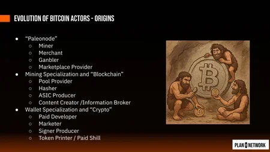

Satoshi's original software was a monolith: node, wallet, miner, peer-to-peer relay, payment protocol, and even an embryonic marketplace and poker game, all in one program. The first role specializations emerged from mining. When individual CPU mining became uncompetitive, **mining pools** appeared (Slush in Prague, then Eligius/Ocean by Luke Dasher), splitting the "miner" into pool providers who construct blocks and hashers who rent computational power without even knowing what transactions are inside. ASIC producers (Bitdeer, Bitmain) became a distinct hardware industry. Content creators and conference organizers (information brokers) emerged as the first service layer.

The wallet side underwent its own specialization. Bitcoin Core stopped being practical as a wallet; tools like Electrum, Sparrow, and Specter emerged for multisig and complex transactions. Hardware wallets (Coldcard, Ledger, Trezor, SeedSigner) separated key storage from key usage. Lightning wallets (Phoenix, Zeus, Breez) required entirely different software stacks. The word "wallet" itself became dangerously overloaded: journalists call a UTXO a "wallet," users call their software a "wallet," and inside that software, each key derivation path is also called a "wallet."

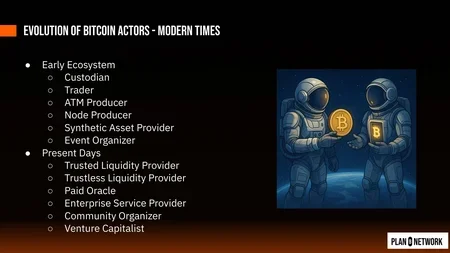

The early ecosystem added custodians, traders, ATM producers (Lamassu), node producers, synthetic asset providers (Tether), and event organizers. The present-day landscape introduces **trusted and trustless liquidity providers** (Lightning service providers like ACINQ/Phoenix), paid oracles (price feeds for stablesets and DLC contracts), enterprise service providers, community organizers, and venture capitalists.

### Hard business models: six patterns that survive

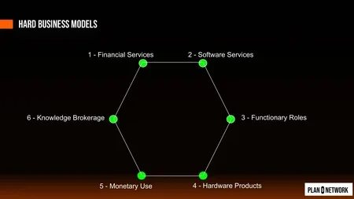

Giacomo draws a sharp line between easy and hard Bitcoin business models. The easy ones are zero-sum or negative-sum: harvest and sell user data, print scam tokens, deploy ransomware, enforce patents, or kidnap people. All are profitable; all contradict Bitcoin's purpose.

The hard business models, the ones that create genuine value, fall into six categories:

1. **Financial services**: Position yourself as a bridge between fiat and Bitcoin and charge a fee. Highly profitable (exchanges like Bitfinex), but the fiat side is bureaucratic (KYC, AML, banking relationships) and you become a honeypot for hackers. Giacomo's personal experience with GreenAddress showed how every promising business model (referral partnerships, hardware wallet integration, cash-to-Bitcoin services) kept collapsing: partners went to jail, exchanges went bankrupt, regulations shifted.

2. **Software services**: Build Bitcoin tools and try to charge for them. The fundamental tension: Bitcoin security software should be open source (otherwise users must trust you not to backdoor their keys), but open-source software is hard to monetize. The back end can remain proprietary as an industrial secret, but **the core value proposition fights against intermediation by design**.

3. **Functionary roles**: Operate infrastructure that the network needs: Lightning service providers, Ark coordinators, Liquid federation members, mining pool operators. You provide a service that cannot easily be replicated at home, and you charge fees for it.

4. **Hardware products**: Build physical devices (ASIC miners, hardware wallets, node boxes). Hardware has natural defensibility because it requires manufacturing, supply chains, and physical distribution.

5. **Monetary use**: Build businesses that use Bitcoin as money, not as a product. Accept Bitcoin for goods and services, use Lightning for payments, manage treasury in sats. This is the most aligned with Bitcoin's purpose but also the most exposed to volatility.

6. **Knowledge brokerage**: Education, consulting, research, conferences. Sell understanding of Bitcoin to people and organizations who need it. Plan B Network itself operates in this category.

### Pain points: where the opportunities are

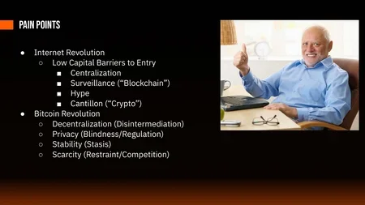

The lecture closes with a framework for understanding where Bitcoin creates opportunities. The internet revolution lowered capital barriers to entry, but this produced four pathologies: **centralization** (network effects concentrate power in a few platforms), **surveillance** (the "blockchain" euphemism, where everything is tracked), **hype** (speculative bubbles driven by low barriers to token creation), and **Cantillon effects** (the "crypto" euphemism, where token printers extract value from retail buyers).

The Bitcoin counter-revolution addresses each of these: **decentralization** through disintermediation (removing trusted third parties), **privacy** through cryptographic blindness and regulatory arbitrage, **stability** through protocol ossification (Bitcoin's base layer has barely changed since 2009, just like IPv4 barely changed for decades), and **scarcity** through the fixed supply and the discipline of not printing tokens.

The analogy to internet protocol layering is precise. At the base, you have one protocol that is stable and convergent (IP for the internet, Bitcoin for money). Higher layers are competitive and evolving (TCP/UDP, HTTP/SMTP, then applications). Competing open protocols (AppleTalk, IPX, OSI) all failed against TCP/IP because **network effects make the first adequate open standard nearly impossible to displace**. Challengers must grow faster than the power-law adoption curve of the incumbent, which requires centralized shortcuts (marketing departments, regulatory mandates, VC funding), which in turn makes them fragile. This is why altcoins keep appearing and keep failing to displace Bitcoin: they can sprint with centralized boosters, but they cannot sustain the organic, permissionless growth of an open protocol.

Bitcoin is not finished. The timechain works. Channels and Arks are maturing. The Lightning Network is becoming a universal routing layer. But identity, communication, storage, and computation remain largely unsolved. The companies that solve these problems, using Bitcoin's incentive structure rather than fighting it, will define the next era of the industry.

**Recommended reading:**
- "The Blocksize War" by Jonathan Bier (the political history of Bitcoin's scaling debate)
- "Mastering the Lightning Network" by Andreas Antonopoulos, Olaoluwa Osuntokun, and René Pickhardt (note: roughly 40% is already outdated due to rapid protocol evolution)
- "Internet of Money" (volumes 1-3) by Andreas Antonopoulos (contains both brilliant Bitcoin education and illustrative examples of the multi-coin fallacy)
- "Attack of the 50 Foot Blockchain" by David Gerard (anti-Bitcoin, anti-crypto critique; useful for understanding mainstream objections)
- "21 Lessons" by Gigi (philosophical reflections on Bitcoin from an Austrian perspective)
- Plan B Network courses: "Bitcoin's Pioneering Era" (history), "Lightning Network Theory" (intermediate), "RGB Programming" (expert), "How to Create a Bitcoin Community"
- arkdev.info and arklabs.to (Ark protocol documentation and Arkade wallet)
- pears.com (Holepunch peer-to-peer protocol and Keet application)

+++

# Market and Finance
<partId>5402c8d8-a6b1-4c50-9dd5-dbe9462a6f02</partId>

## Market Research and Entrepreneurship
<chapterId>ef8eda9f-8a4c-436b-a4da-d55679da1383</chapterId>

<professorId>caef7908-cc5b-4598-97cc-3be99928ede2</professorId>

:::video id=a5c4a4ff-58cf-49d7-9ab8-12bba2bf9ace:::

In this chapter, Alexandre Bussutil walks through a complete framework for validating a business idea before building it. The core message is simple: most startups fail not because of bad execution, but because they execute the wrong plan. The methodology presented here follows a three-phase approach (learn, prototype, validate) designed to help founders move from rigid assumptions to evidence-based decisions. While the principles apply to any industry, the examples and discussions throughout are grounded in the Bitcoin ecosystem.

### Why most startups fail

"Most startups die because they execute Plan A perfectly... the wrong one." This quote from Mullins and Komisar captures the central problem that market research aims to solve. The statistics behind startup failure are brutal: roughly 95% of tech startups fail within three to five years. At the same time, the number of new ventures created every year keeps growing, with the rise of solopreneurs contributing $1.7 trillion to the US economy alone.

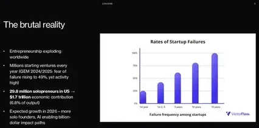

The top causes of startup failure follow a consistent pattern across studies. The number one cause is **running out of cash and failing to raise capital**. The second is the absence of market need, accounting for around 35% of failures. The third is being outcompeted, and the fourth is a flawed business model. These causes are not mutually exclusive: a startup can simultaneously have a poor product and a cash flow problem. The methodology in this chapter focuses primarily on the first two causes, since both can be tested and mitigated through disciplined research.

The concept of intrapreneurship is equally important here. Not everyone in the audience will start their own company, and that is perfectly fine. But the same methodology applies to anyone launching a new product line, proposing a new feature, or building something new within an existing organization. Whether you are an entrepreneur or an intrapreneur, **understanding what the market actually wants** is the foundation of everything that follows.

### Defining your user persona

Before building anything, you need a clear picture of who will use your product. A user persona is a structured profile of your target customer that includes their age, gender, occupation, tech proficiency, personality traits, goals, motivations, and pain points. **Defining a persona forces you to move from abstract thinking to concrete decisions** about who you are serving.

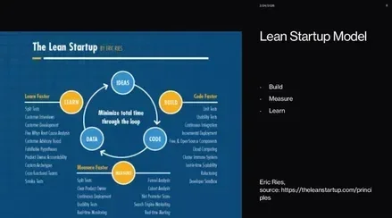

Consider the Lightning wallet as an example. The user persona changes dramatically depending on the context. In South Africa, a product called Machankura targets young people between 15 and 25 who own small shops or farms, have no smartphone, and rely on burner phones. Their solution enables Lightning payments over SMS, which is a perfect fit for that specific population. In Europe, the typical Lightning user might be a privacy-focused tech worker with high Bitcoin knowledge who values self-sovereignty above all else.

These are radically different personas with different pain points. The South African user needs simplicity and hardware compatibility. The European user cares about open source and self-custody. A product like Wallet of Satoshi solves the onboarding problem by making things simple, but it requires trust in a custodial model. Self-custody wallets solve the trust problem but create a significant **pain point for newcomers who lack technical knowledge**.

There is also the custody and inheritance segment. The average user of Bitcoin custodian solutions tends to be between 45 and 50 years old, someone who understood Bitcoin early enough to accumulate significant holdings and now needs to think about the next stage, including inheritance. This explains the emergence of products like Anchor Watch, Unchained, and Liana, which address the intersection of custody, privacy, and estate planning across different jurisdictions.

### From Plan A to Plan B

The Lean Startup model, developed by Eric Ries, provides the foundational loop for product development: build, measure, learn, and repeat. What matters most about this loop is not the three steps themselves but the fact that **the cycle never ends**. It runs for the entire lifetime of the product. Five years ago, a single iteration through the loop took two to three weeks. With AI tools available today, a motivated founder can complete a full cycle in a single day.

Layered on top of this loop is the framework from "Getting to Plan B" by Mullins and Komisar. The core idea is that a startup is not about executing a perfect business plan. It is about embarking on a deliberate learning journey that leads, through evidence and disciplined testing, to a viable business model that is usually very different from the original vision.

This framework introduces three key concepts. The first is **analogs, successful precedents from any industry** that you can borrow or adapt. When Apple launched the iPod and iTunes, they borrowed Gillette's razor-and-blades model (sell hardware at low margin, make recurring revenue on content) and drew on the Sony Walkman as proof that people would carry portable music. The second is **antilogs, predecessors that failed and whose mistakes you want to avoid**. Apple saw that existing MP3 players had clunky interfaces and restrictive digital rights, so the iPod was designed to be beautiful, simple, and backed by a broad music licensing catalog.

The third concept is the **leap of faith, the critical belief about your business** that has no real evidence yet. This is the gap between what analogs and antilogs tell you and what you are assuming will be true for your product. Apple's leap of faith was that people would happily pay 99 cents per song for legal downloads when piracy tools were freely available. PayPal's early leap of faith was that cryptography-based security would create sufficient trust for electronic peer-to-peer payments.

If you cannot find any competitor or similar product in any industry, it usually means one of two things: there is no market, or you have not done a good enough job looking. Every idea has analogs somewhere.

In the Bitcoin space, these concepts apply directly. Mi Primer Bitcoin in El Salvador used Toastmasters as an analog for their community-based education model, spinning off meetings in different cities. Lightning infrastructure providers use a version of the razor-and-blades model: free deployment to get you started, then recurring revenue from liquidity services once your project scales and switching becomes costly.

The five elements that determine any business model's viability must also be considered early. Revenue model (who buys, how often, at what price), gross margin (software should target 80 to 90%), operating model (team, servers, fixed costs), working capital (your oxygen, since the only sources of cash for a startup are clients and investors), and investment model (how you fund your roadmap). **If you run out of cash, you die**, and managing burn rate to maintain six to twelve months of runway is not optional.

### The three-phase methodology

**Phase 1: Learn.** The learning phase has two components. The first is desk study: secondary research using Reddit, X, Product Hunt, Google Trends, specialized forums, and industry reports. AI tools can summarize sources into structured pain points, analogs, and antilogs in minutes. The goal is to build a broad understanding of the market landscape before talking to anyone.

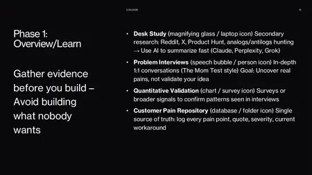

The second and more valuable component is problem interviews, also called customer interviews or "mom tests." These are live conversations, face-to-face or virtual, lasting 30 to 45 minutes. The golden rule is to **listen 80 to 95% of the time and never pitch your solution**. You are there to understand the customer's reality, not to sell.

The interview follows a structured flow. Start with a warm-up ("Can you tell me about the last time you had to deal with..."), then narrow down to the specific process, identify the most frustrating or costly part, and understand the current workaround. Never ask "Would you use this?" at this stage. You are collecting evidence about problems, not validating solutions.

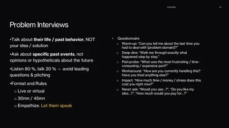

All findings go into a customer pain point repository: a simple table with columns for date, interviewee (anonymized if needed), pain points, severity score, verbatim quotes, and current workarounds. When you present this to an investor and can say "I conducted 20 interviews, 10 people reported the same pain at severity 8 or higher, and here are their exact words," that carries real weight.

Under each leap of faith, document the underlying hypotheses that need testing. At the end of this phase, you should be able to **isolate the top two or three pain points** with severity scores above 7 out of 10, confirmed by multiple independent interviews. If you cannot find them, your leap of faith may be wrong, and it is time to move toward Plan B.

**Phase 2: Prototype.** The prototyping phase focuses on wireframes and sketches, not functional products. The goal is to create something visual that lets potential users react. Tools like Replit, Figma, Lovable, and Claude can produce a clickable prototype in minutes rather than weeks. Five years ago, a week of designer work cost around $1,000. Today the same output costs less than $20 and takes less than a day.

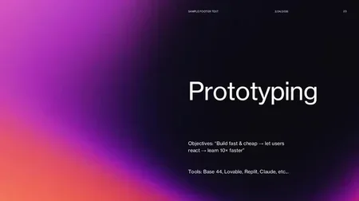

In the Bitcoin space specifically, SDKs like Breeze and services like ZBD can shortcut backend work for Lightning-based prototypes. It is acceptable to make trade-offs at the MVP stage: a prototype does not need to be fully open source or production-ready. The point is to have something to show.

Building community momentum is another form of validation at this stage. Creating a Reddit channel, an X account, or a Nostr presence around the problem you are solving can test interest before you write a single line of code.

**Phase 3: Validate.** The validation phase centers on solution interviews: showing your prototype to potential users and collecting structured feedback. These interviews are shorter (15 minutes maximum) and should include roughly 50% people from your earlier problem interviews and 50% new participants.

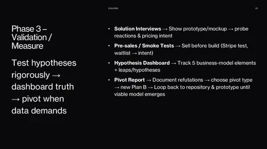

The goal is to confirm the solution matches the pain point, test pricing signals, and detect missing features. Instead of asking "Would you pay $10?", frame it concretely: "I'm planning to price this at $19 per month or $149 per year. Would you buy it?" Then test upsells: "These additional features would cost an extra $50 per year." This approach gives you qualitative pricing data that informs your revenue model.

The ultimate validation is pre-sales: getting customers to pay before the product is built. This is rare and extremely difficult, but if you achieve it, **you simultaneously validate market demand, your revenue model, and your cash flow**. You get money upfront and deliver afterward.

Throughout this phase, maintain a solution feedback repository (date, interviewee, segment, behavior on prototype, pain severity, reaction, pricing signal) and a pivot report that tracks every decision you have made since the beginning and why. The distinction between a leap of faith and a hypothesis is critical here: the leap of faith is the big, scary, unproven belief that would destroy your entire plan if wrong. A hypothesis is the small, testable experiment you design to stress-test that belief. Convert every leap of faith into measurable hypotheses, track them on a dashboard, and let the data tell you when to pivot.

Bitcoin conferences are an ideal testing ground for this entire process. If you attend an event in Lugano or elsewhere, you have concentrated access to potential users, industry experts, and investors, making it one of the most efficient places to run both problem and solution interviews.

### Key takeaways and resources

The full loop ties together: initial assumptions lead to analog and antilog research, which surface leaps of faith, which get broken down into testable hypotheses, which get validated through interviews and prototypes, all documented in a customer repository that eventually tells you whether to persist or pivot.

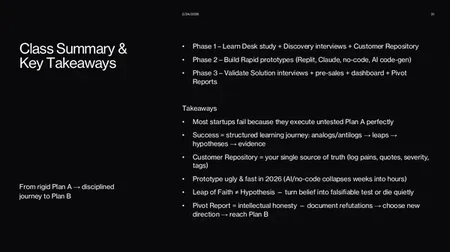

AI has made the build phase nearly instantaneous. **The human bottleneck is now finding and scheduling interviewees.** Cold outreach works better than most people expect: assume people are kind, leverage your student status, and always ask each interviewee to introduce you to more people. One interview should always lead to the next.

For Bitcoin-specific quantitative research, River reports provide solid market data. Arkane Research published important Lightning Network analysis in 2021. Glassnode and Bitcoin Magazine Pro offer on-chain data, though the growing role of ETFs has made ownership data harder to track. Much of this data is migrating toward Bloomberg as Bitcoin becomes more institutional.

**Recommended reading:**
- ["The Lean Startup" by Eric Ries (2011)](https://theleanstartup.com/principles), the 5 core principles (validated learning, Build-Measure-Learn loop, MVP, innovation accounting, pivot or persevere) that underpin the methodology taught in this chapter
- "Getting to Plan B" by John Mullins and Randy Komisar, the analogs/antilogs/leap-of-faith framework layered on top of the Lean Startup loop
- [Bitcoin Design Guide: Design Research](https://bitcoin.design/guide/resources/design-research/) for Bitcoin-specific UX research, user surveys, and adoption studies

## Bitcoin Banking: US and El Salvador Perspectives
<chapterId>a7d7fc05-6a54-4ee7-84f8-add9d95e6457</chapterId>

<professorId>f2aabbd1-c397-46ca-91f6-f581bcf36c48</professorId>

:::video id=e75d7dd8-e22c-4e0e-a314-ec737dcb56be:::

In this chapter, Nicolas Burtey explores the evolving landscape of Bitcoin banking from two distinct vantage points: El Salvador and the United States. Drawing on five years of experience building Blink (formerly Bitcoin Beach Wallet) and now developing banking software at Galoy, he breaks down what banks actually do, why Bitcoin products have historically existed outside the banking system, how regulation shaped and nearly destroyed the industry, and where the opportunities lie today.

### What is a bank, and what is a Bitcoin bank?

Before discussing Bitcoin banking, it helps to understand what a traditional commercial bank actually does. The functions reduce to three core activities: lending, custody, and payments.

**Lending is the primary business model of any bank.** The mechanism is straightforward: borrow short, lend long. A bank takes deposits (short-term borrowing, often at zero percent interest, withdrawable at any time) and lends that money out over longer periods, such as a ten-year mortgage at five percent. The spread between what the bank pays for deposits and what it earns on loans is the profit. This maturity transformation is useful: it allows people to buy homes, start businesses, and finance projects they could not afford upfront. The risk is that too many depositors withdraw at once, creating a bank run.

Custody is the second function. Historically, banks stored physical gold in vaults. Today, the value proposition is simpler: keeping your money somewhere safer than under a mattress. In countries with unstable banking systems like Venezuela, people still literally pile cash at home, which makes payments nearly impossible.

Payments are the third function: moving money within and across banks. This is a service most people take for granted but becomes critical in cross-border contexts.

When you apply these three functions to Bitcoin, the landscape shifts. The single most important financial product institutions have offered regarding Bitcoin is the ability to **buy and sell Bitcoin**, whether for speculation, inflation protection, or financial sovereignty. Lending against Bitcoin as collateral, custody of Bitcoin, and payment via Lightning or other rails are emerging, but buying remains the dominant use case.

An important legal nuance: in most countries, only regulated entities can call themselves "banks." Since Bitcoin's creation, banks have largely been prohibited from offering Bitcoin-related products. The term "Bitcoin bank" may itself be a misnomer, which is why the industry often uses "financial institution" instead.

### The irony and the thesis

There is an inherent tension in advocating for Bitcoin banking. The Bitcoin white paper's opening sentence describes "a purely peer-to-peer version of electronic cash" that eliminates the need for financial institutions. Promoting bank adoption of Bitcoin seems contradictory.

The resolution to this tension is a critical distinction: **Bitcoin is not ending banks, but central banks.** Bitcoin may end or limit money printing and debt monetization, but the benefits of pooling capital for efficiency remain. Banks that provide lending, custody, and payment services still serve a useful function. What changes is the monetary base they operate on.

This framing also explains why Lightning payments through CashApp terminals represent something genuinely new. When Square enabled Lightning across a million US terminals, it created true peer-to-peer settlement with no centralized coordinator like Visa. A self-custody Lightning wallet can pay a CashApp merchant directly. That is the white paper's vision working alongside, not against, banking infrastructure.

### Lessons from El Salvador

Nicolas founded Blink in El Salvador in 2020, when there were no regulations on Bitcoin. As a builder, this was ideal: a simple two-party relationship between developer and users, with fast iteration and no regulatory overhead.

When Bitcoin became legal tender in 2021, everything changed. The law required every economic agent to accept Bitcoin, which theoretically included banks. But Salvadoran banks did nothing. The reason reveals how **global banking actually works**: Salvadoran banks depend on US correspondent banks in New York for international dollar transfers. US regulators had made clear that American banks could not touch Bitcoin. Any Salvadoran bank that adopted Bitcoin risked being debanked by its US correspondent, which would have been catastrophic for the country's ability to conduct international business.

This dynamic, where US banking policy effectively dictates what financial institutions in other countries can and cannot do, is not unique to El Salvador. It applies globally wherever banks rely on US dollar correspondent relationships.

Five years after the Bitcoin law, legal tender status was rolled back (under IMF pressure), but wallet regulations remain. No massive rug pulls occurred. More recently, El Salvador passed a new investment banking law that explicitly incorporates Bitcoin under a stringent regulatory framework requiring $50 million in initial equity, **a real banking license that is nothing like the lightweight wallet registrations** of the earlier era.

### Regulation: the difference between marketing and protection

The failures of FTX, BlockFi, Celsius, and Voyager all share a common pattern: each claimed to be regulated while operating under the lightest possible regulatory framework. FTX was registered as a money services business with FinCEN, a process that takes about an hour on an online form. This "regulation" was used as marketing while doing nothing to protect customer funds.

The key insight is that **not all regulations are the same**. Banking regulations are far more stringent than wallet or MSB regulations. The worst outcome is when regulation is used as a trust signal while the underlying consumer protections are absent.

Broadly, financial regulation falls into two categories: AML/KYC requirements (which the Bitcoin community heavily criticizes) and consumer protection laws (which ensure solvency and safeguard customer funds). The companies that failed were not following the consumer protection side. They were marketing their AML compliance as proof of safety, which is a fundamentally different thing.

### Chokepoint 2.0 and the US reversal

The most dramatic regulatory episode in Bitcoin banking history involved two US banks: Silvergate and Signature.

**Silvergate was a small California community bank** that pivoted to serving crypto companies in 2013. By 2021, it held $14.3 billion in deposits, had a $4.5 billion market cap, and its Silvergate Exchange Network was moving roughly $2.6 billion per day. After FTX collapsed, massive deposit withdrawals followed, but the bank remained solvent. It had managed its risk carefully, avoiding the long-term treasury exposure that sank Silicon Valley Bank. Nevertheless, regulators told Silvergate it could no longer bank crypto companies. Since that was 100% of its business, the board voluntarily liquidated, something no bank had ever done before.

**Signature Bank, a much larger New York institution**, faced a similar fate. Its Signet payment network processed significant volumes for digital asset clients, representing about 23% of its business. After SVB's collapse triggered a bank run, Signature also remained solvent, but regulators seized it anyway. As Nic Carter reported extensively: "I think we were shot to encourage the other banks to stay away from crypto."

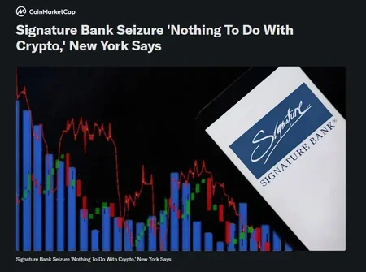

This era, known as Chokepoint 2.0, saw US regulators systematically debank every institution touching Bitcoin. The reversal since 2025 has been equally dramatic. The GENIUS Act and Clarity Act passed with bipartisan support. The OCC (Office of the Comptroller of the Currency) has granted conditional charters to Paxos, BitGo, Fidelity Digital Assets, Ripple, and others. As one banking consultant with 34 years of experience put it: "I've never seen regulatory clarity arrive this fast."

### Opportunities for banks today

The clearest opportunity for banks entering Bitcoin is **bitcoin-backed lending, where the economics are compelling**. Traditional mortgage lending earns five to six percent interest, while bitcoin-backed loans can generate ten to twelve percent. The risk profile is actually lower than real estate because Bitcoin can be liquidated instantly, 24/7, on any day of the week. If a borrower defaults on a house, selling the property takes six months and may result in a loss. If Bitcoin collateral drops in value, the bank can send a margin call and liquidate within minutes.

The fact that interest rates on bitcoin-backed lending remain at ten to twelve percent signals a blue ocean: there is not enough capital deployed in this market to compress yields. When supply meets demand, rates will naturally decrease, but for now the opportunity is substantial.

For a hands-on walkthrough of Bitcoin-backed lending platforms, see the Plan B Network tutorials on Ledn, Firefish, and HodlHodl.

Offering customers the ability to buy Bitcoin is another natural fit, especially for community banks. A local institution with a 200-year track record carries more trust than a flashy fintech that might disappear overnight. Customers may prefer buying Bitcoin through their existing bank relationship rather than through an exchange they discovered last month.

Lightning payments represent a longer-term opportunity. Instant global settlement with no counterparty risk has no equivalent in traditional finance, but it remains a harder sell to conservative bank boards today.

There is also a broader strategic argument. The US banking sector has consolidated from 10,000 banks to 4,000 through a cycle of "acquire or be acquired." Smaller banks face an existential threat from the Cantillon effect: the closer you are to the monetary spigot (the Federal Reserve), the more advantaged you are. **Bitcoin offers small banks a path to independence** by providing revenue streams and products that do not depend on proximity to central bank infrastructure.

### Custody as a continuum

A common assumption is that custody is binary: either a bank holds your Bitcoin, or you hold it yourself. The reality is far more nuanced.

Consider multisig arrangements where the bank holds one key out of three and the customer holds two. Who has custody? What about a setup with three separate entities each holding one key, where no single party controls the assets? What about Liquid, where a federation of roughly twenty companies maintains a multisig controlling the underlying Bitcoin on the main chain? A wallet provider on Liquid might offer "self-custody" in the sense that they do not hold your keys, but the federation ultimately controls the bridge to the base layer.

Lightning adds another dimension: if you go offline for too long, your channel counterparty could theoretically steal your funds. Is that truly self-custody in the same sense as holding Bitcoin on-chain? Newer protocols like Ark and Spark introduce yet more intermediate positions on this spectrum.

**Privacy adds a second axis.** Most people assume custody means no privacy and self-custody means privacy, but counterexamples exist in both directions. Cashu is fully custodial yet fully private. Using Ledger Live with your real name and email is self-custody with zero privacy.

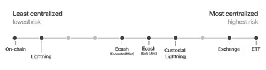

Regulation today typically forces a binary categorization (custodial or non-custodial), which fails to capture the reality of these products. This gap between regulatory categories and technical reality is one of the most important unresolved questions in Bitcoin banking.

### Key takeaways

Bitcoin banks can be a useful tool that brings efficiency and optionality to the financial system. The ability to self-custody must remain a core feature of the ecosystem, even as institutional products develop around it.

Bitcoin provides a unique capability through proof of reserves: **cryptographic evidence of solvency that could reduce the need for traditional regulatory oversight**. Texas explored this concept, and while practical implementation remains early, it points toward a future where banks could self-report their solvency in a verifiable way, potentially making the entire consumer protection framework more efficient.

The US regulatory reversal has a ripple effect globally. Countries whose banks avoided Bitcoin due to US correspondent banking pressure can now reconsider. As the largest financial market opens to Bitcoin banking, institutions worldwide are likely to follow.

**Recommended reading:**
- Nic Carter, "Signature Didn't Have to Die Either" (Pirate Wires)
- Bitcoin Policy Institute publications on banking regulation
- Galoy long-form research on Bitcoin banking frameworks

+++

# Legal and Operations
<partId>1262d87e-c4bf-4529-9736-e56c8a79df43</partId>

## Bitcoin Policy and the Future of Regulation
<chapterId>e13e0552-5641-407f-8cbe-b22ab1209ec8</chapterId>

<professorId>9ea52ee7-9cc3-4575-acb6-6260e1e22b87</professorId>

:::video id=85043fe7-500c-4322-a391-134be33b8b80:::

In this chapter, Grant McCarty of the Bitcoin Policy Institute (BPI) provides a practitioner's view of how Bitcoin policy is shaped, how narratives drive regulation, and where things stand today across legislation, strategic reserves, and global adoption. The focus is primarily on the United States, but the implications are global: American policy decisions on Bitcoin tend to cascade worldwide through correspondent banking relationships, institutional influence, and geopolitical competition.

### How Bitcoin policy is made

The Bitcoin Policy Institute is a think tank built on a specific thesis: Bitcoin will reshape the global monetary order, and most decision-makers are not prepared for it. BPI's mission is to align the interests of the Bitcoin network with national interests so that Bitcoin's growth is welcomed rather than feared.

Understanding how policy actually changes is essential for anyone working in or building for the Bitcoin ecosystem. In any country, a relatively small group of politically insulated senior officials make the significant policy decisions. Reaching them requires credentials, relationships, and trust. In Washington D.C., people care about where you went to school, which agency you worked at, and who vouches for you. The Bitcoin community had been producing excellent content on Medium, Substack, and Twitter, but none of it was reaching the policy world because these were two entirely separate ecosystems.

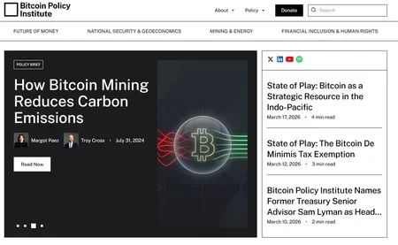

BPI's approach rests on three principles. First, **building direct relationships with policymakers** through small events, large conferences, and consistent presence. Second, producing credentialed research that policymakers take seriously. Third, and most critically, **officials must genuinely believe that Bitcoin advances their country's interests** before they will support pro-Bitcoin policy. Lobbying and donations create short-term wins, but they do not survive administration changes. What survives is genuine conviction backed by deep understanding.

This theory of change applies beyond the US. If you want to affect Bitcoin policy in your country, the playbook is the same: find mission-aligned people, build credibility through consistent work, and meet policymakers where they are. You do not need a large organization to start. BPI began with two people and a network of volunteer fellows. Two years of grinding preceded any visible impact.

### The narrative shift: from threat to strategic asset

Policy is downstream of narratives. When policymakers believed Bitcoin was an environmental disaster used primarily by criminals, the resulting policies were hostile: proposed bans, Chokepoint 2.0, and aggressive enforcement actions against developers.

BPI worked to reframe four key narratives:

**Energy and environment.** The prevailing belief was that Bitcoin mining competed with households for energy and accelerated environmental damage. The reality is that mining often locates in areas with excess energy, can stabilize grids by providing flexible demand, and frequently uses renewable sources. Reframing mining from "environmental threat" to "grid stabilizer and renewable energy incentivizer" changed how policymakers evaluated the industry.

**National security.** The narrative that Bitcoin primarily supports criminals and adversaries was countered with evidence that Bitcoin (combined with stablecoins) can strengthen democratic interests globally. When Russia invaded Ukraine, there was concern that Bitcoin would be the primary sanctions evasion tool. Empirically, this did not happen, primarily because Bitcoin's liquidity at the time was insufficient to run a G20 economy.

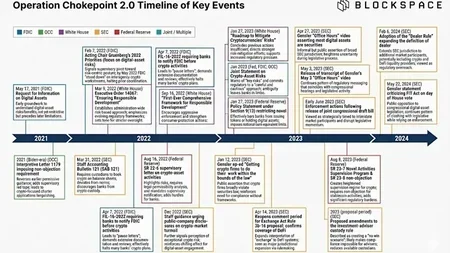

**Human rights and financial inclusion.** Showcasing who actually uses Bitcoin day to day, people around the world who need their money to work for them, gave policymakers a perspective beyond their domestic bubble.

**Strategic value.** The most powerful reframing was demonstrating that Bitcoin cannot be killed. If a country pushes Bitcoin away, another country will embrace it and capture all the benefits. **This transformed the conversation from "should we allow this?" to "can we afford not to?"**

By 2024, Bitcoin became a bipartisan issue in the US election. Donald Trump spoke at Bitcoin 2024 in Nashville, marking the first time a major presidential candidate addressed a Bitcoin conference directly, signaling the definitive shift from fringe to mainstream political issue.

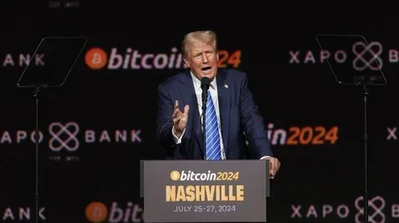

The intellectual framework BPI built for treating Bitcoin as a strategic asset directly informed the creation of the Strategic Bitcoin Reserve and Digital Asset Stockpile in 2025.

### Where US legislation stands today

Three major pieces of legislation define the current landscape:

**The Strategic Bitcoin Reserve.** The United States now holds a six-figure amount of Bitcoin with a policy of not selling. The country is actively exploring budget-neutral ways to acquire more. Over 27 nations now have some form of direct or indirect Bitcoin exposure, whether through direct holdings, mining (like Bhutan), or equity positions in companies like Strategy (formerly MicroStrategy). Roughly 10 to 15 percent of all countries in the world now have some Bitcoin exposure, a number that has accelerated dramatically in the past 18 months.

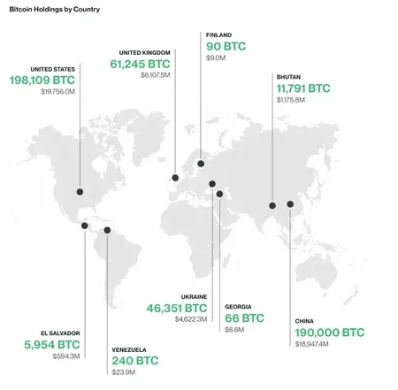

**The GENIUS Act.** This was the first major crypto legislation signed into law in the United States, establishing a federal stablecoin framework. It passed with unusual bipartisan support and created regulatory pathways for stablecoins, excluded them from security and commodity definitions, and reinforced dollar dominance. Unlike most financial legislation in US history, which typically follows economic crises (Dodd-Frank after 2008, for example), the GENIUS Act passed during a period of financial stability, signaling genuine recognition that these technologies are permanent.

The Act contains roughly 60 different guidances requiring various agencies (Treasury, FDIC, OCC) to figure out implementation details within 180 to 365 days. This is where the real policy gets made: **career officials who outlast any administration determine what legislation actually looks like** in practice. Getting these people to understand and support Bitcoin is arguably more important than the legislation itself.

**The Clarity Act.** Congress is working on broader legislation that creates distinctions between Bitcoin, stablecoins, and everything else in crypto. A critical provision that BPI supports would **protect open-source software developers** who write code enabling peer-to-peer Bitcoin transactions from legal prosecution, provided they do not custody customer funds. This directly addresses cases like the Samourai Wallet prosecution, where developers were punished for creating privacy-enabling software.

Multiple US states are also independently buying Bitcoin: New Hampshire, Texas, Arizona, and Oklahoma among them. Meanwhile, every major banking regulator (SEC, CFTC, OCC) has reversed its previous anti-Bitcoin guidance and is now either neutral or actively supportive of banks and companies holding Bitcoin.

### Privacy, peer-to-peer finance, and developer rights

One of the more challenging aspects of Bitcoin policy advocacy is defending privacy. People claim to value privacy but consistently reveal through their actions that they prioritize speed and cost over privacy. Everyone knows Facebook and Amazon track their data, but Prime two-day shipping wins every time.

The most effective argument for protecting Bitcoin privacy draws a direct parallel to the early internet. In the 1990s, the same narratives existed: the internet would only be used by criminals, online commerce would enable fraud, anonymous communication was dangerous. The US government not only funded the development of the early internet but also created Tor and the deep web, recognizing that the free flow of information, despite its risks, served democratic ideals and American strategic interests.

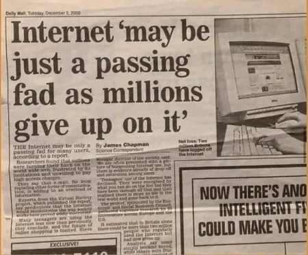

The same argument applies to Bitcoin. If the US had stifled the internet in the early days, the country and the world would look fundamentally different. **Stifling Bitcoin's peer-to-peer capabilities would produce the same result.** This framing has been one of the most effective tools for convincing policymakers to protect developer rights and open-source software.

BPI's P2P Rights Fund raised over $1 million from more than 2,000 individual Bitcoin donors (averaging around $500 per donation) to support the legal defense of the Samourai Wallet founders, demonstrating grassroots support for privacy in the Bitcoin ecosystem.

### Geopolitics, game theory, and what comes next

The global competition for Bitcoin adoption is accelerating. The US regulatory reversal has a cascading effect: countries whose banks avoided Bitcoin due to US correspondent banking pressure can now reconsider. As the largest financial market opens, institutions worldwide are likely to follow.

BPI conducts war games and tabletop exercises with government officials, gaming out scenarios like rapid Bitcoin price appreciation, AI proliferation combined with Bitcoin monetization, and adversarial state adoption. The goal is to force policymakers to think about tail risks they are not currently considering. Even getting someone to accept a 1% probability that Bitcoin becomes a primary global reserve asset in 20 to 40 years opens the door to much deeper strategic conversations.

The question of whether China, Russia, or BRICS nations could adopt a Bitcoin standard is constrained by liquidity. At a $1 to $2 trillion market cap, it is not viable. **At $5 to $10 trillion, the conversation becomes real.** But here game theory intervenes: if the US holds half a million Bitcoin by then, would adversarial nations want to adopt a standard that enriches their primary competitor? This is precisely the strategic argument for the US to accumulate Bitcoin now.

On the IMF and World Bank, these institutions have significant influence over smaller nations' Bitcoin policies (as demonstrated with El Salvador's legal tender rollback). However, they are not monolithic: the World Bank has been considerably more receptive to Bitcoin education than the IMF. Competition between these organizations creates openings for advocacy.

### Tax treatment and the path forward

Bitcoin is currently treated as intangible property in the United States, meaning capital gains tax applies to its growth. This classification has a trade-off: while it creates tax obligations, it also means Bitcoin avoids the specific licensing requirements that would apply if it were classified as money, currency, or legal tender. Companies can currently operate with Bitcoin in ways that would be far more restricted under a different legal classification.

As Bitcoin matures and volatility decreases over time, stronger arguments will emerge for treating it more like a currency, which would change its tax treatment. In the meantime, BPI is working on de minimis tax exemptions that would allow people to spend Bitcoin on everyday purchases without triggering capital gains calculations, enabling Bitcoin to function as peer-to-peer cash alongside its role as a savings asset.

**The decisions made in the next 12 to 24 months will shape Bitcoin policy for a generation.** The window of attention is narrow: geopolitical events, AI, and competing priorities constantly pull policymaker focus away from Bitcoin. Organizations and individuals advocating for good policy need to be prepared, credible, and persistent so that when the moment comes, they can act.

**Key contacts and resources:**
- Bitcoin Policy Institute: btcpolicy.org
- Grant McCarty: grant@btcpolicy.org / @gabormacarty on Twitter
- P2P Rights Fund (Samourai Wallet legal defense)
- BPI research on strategic Bitcoin reserve and nation-state adoption

## Building a Team for a Bitcoin-Only Startup
<chapterId>3f101cfc-f34f-4710-821e-dd990f1b64fa</chapterId>

<professorId>aa498b1c-d74f-49f7-aeda-4859c9c8773a</professorId>

:::video id=e5ab4bb0-98ff-41b4-9d90-250c60d10255:::

In this chapter, Thunder (Head of Talent at Strike and Bitcoin-only recruiter) lays out a practical framework for hiring and team-building in Bitcoin startups. The core message: Bitcoin startups are not regular startups. The stakes around trust, security, and reputation are fundamentally higher, which means every hiring decision carries more weight. The goal is not to build the biggest team but to build the smallest team that cannot be ignored.

### Why Bitcoin-only changes the game

Bitcoin-only startups operate under constraints that set them apart from typical tech companies. The market is ideology-anchored: **your users and investors care deeply about values, not just features**. Product failure is harder to recover from because reputation damage in the Bitcoin community can be permanent. Regulation, licensing, and compliance risks are significantly higher since most Bitcoin startups are building financial infrastructure or handling people's money.

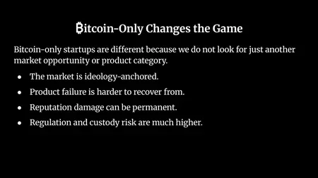

This context shapes every hiring decision. You are not just looking for talent; you are looking for people you can trust with sensitive financial data, cryptographic keys, and your company's reputation in a community that has a long memory.

### Hire to remove the bottleneck

The first rule of hiring in a startup is to **hire to remove the bottleneck, not to look like a company**. Do not hire to feel validated, look legitimate, or reduce anxiety. Hire to increase your probability of success.

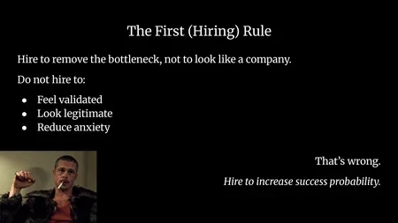

The specific bottleneck determines who you hire first:

- **No technical depth**: hire a CTO or senior engineer. Your core risk must be internal, never outsourced. If you are raising funds, investors will fund execution, not ideas, so having a technical co-founder is practically mandatory.
- **Product exists but no users**: hire for distribution and growth (marketing, social media, customer success). A product with no users will die.
- **Too slow to ship**: hire a senior builder, not multiple juniors. One experienced person can do the work of two or three and costs less in total. Speed equals survival.
- **Everything is chaotic**: hire for operations. Clarity creates leverage. Someone who can structure processes, handle finance, and create order is worth more than another engineer at this stage.

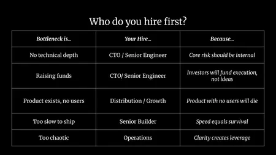

Notice what is absent from this list: recruiters, HR, and middle managers. You do not need an HR department for five or ten people. You do not need a recruiter if you are hiring one or two people per year. These functions come later.

There is a common catch-22 for early founders: VCs want to see a CTO before investing, but you need investment to pay the CTO. The practical solution is to go through your network and find someone mission-aligned who is willing to take the risk with you. It may be a friend, a colleague from the industry, or someone who believes in your idea enough to work on deferred compensation. This is risky for the CTO as well, which is why the relationship typically starts from trust and shared conviction.

### What makes an A team

An A team is not a collection of smart individuals, famous names, or people with large social media followings. Those qualities are not sufficient and can even be counterproductive if they come without the traits that actually matter.

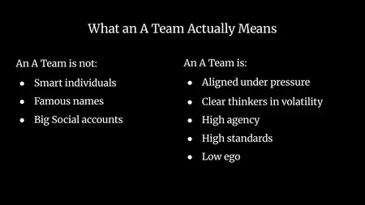

An A team is defined by how it performs under pressure. The characteristics to look for:

- **Aligned under pressure**: the team holds together when things get difficult, not just when everything is going well.
- **Clear thinking in volatility**: no panic when Bitcoin drops 30% or when a regulatory announcement changes the landscape overnight.
- **High agency**: proactive people who see what needs to be done and do it without waiting to be told. They wear multiple hats and take initiative.
- **High standards**: quality of execution matters more than speed of output.
- **Low ego**: in an industry where ego is rampant, the ability to collaborate, accept criticism, and put the mission above personal recognition is rare and invaluable.

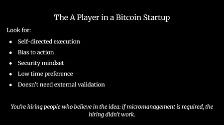

The A player in a Bitcoin startup is self-directed, biased toward action, security-minded, and low time preference. They are building for a decade, not for the next quarter. They do not need external validation to stay motivated. **If micromanagement is required, the hiring did not work.** People who genuinely believe in the idea will be your best team members because they are hungry and self-driven.

### Integrity over trainable skills

This is the most important hiring principle for Bitcoin startups: **technical gaps can be bridged, but character and trust cannot be trained.**

When evaluating candidates, skills are expected and can be verified. What cannot be taught is integrity, sound judgment, and long-term responsibility. If a candidate checks 80% of your skill requirements but demonstrates strong alignment with your mission, trustworthiness, and integrity, that candidate is likely a better hire than someone who checks every technical box but raises character concerns.

Vetting for trust happens through multiple conversations over time, not through a single formal interview. Pay attention to small inconsistencies. Ask about past decisions, how they handled disagreements, what they did when no one was watching. Listen to your gut: if someone seems undependable, they probably are. And involve multiple people in the evaluation process, because a second pair of eyes catches what you miss.

**The cost of a bad hire in a Bitcoin startup is enormous.** A month to onboard, two to three months to ramp up, and if it does not work out, you are back to square one having spent money, time, and team energy. It is cheaper to part ways quickly and restart than to keep someone who is not working out.

### When to hire and when not to

**Hire when:**
- A role directly reduces operational, security, or execution risk
- Lack of expertise is slowing critical decision-making
- The company needs independent ownership of a function (not just partial coverage from someone wearing too many hats)
- Product complexity is growing beyond what the current team can maintain correctly
- Customer trust and reputation depend on stronger capability
- Scaling distribution or compliance becomes a bottleneck
- The cost of delay exceeds the cost of adding senior talent
- The hire contributes to long-term sustainability, not just short-term output

**Do not hire:**
- Because you feel behind (FOMO during a bull market is not a hiring strategy)
- Because investors expect a larger team (team size is your decision, not theirs)
- To compensate for weak leadership (hiring middle managers to cover for an incompetent executive never works)
- To avoid hard decisions (if someone needs to be let go, no amount of additional hires will fix the underlying problem)

**If standards drop early, they rarely recover.** A B player in an A team does disproportionate damage. B players hire C players, the A players leave, and the culture degrades irreversibly.

The guiding principle: **you do not scale headcount, you scale standards.** Your headcount will grow naturally, but only because you maintained the bar.

### Structuring for speed and ownership

Early Bitcoin startups should optimize for flat structure, direct ownership, asynchronous communication, written documentation, and fast decision loops. No middle managers at first.

In a team of five to ten people, everyone should be able to reach everyone else directly. Each person owns their projects completely. Communication happens asynchronously (messages, documents) so the team can work across time zones. Decisions get made in days, not weeks.

**Written documentation is non-negotiable.** Every process, every procedure, every decision should be written down. This is the lesson that every startup founder learns the hard way: if the only person who knows how something works gets sick, goes on vacation, or leaves, the knowledge disappears. AI tools now make this nearly effortless: record a call, let an AI generate notes, clean them up into documentation. There is no excuse.

When the time comes for middle management (as the team grows beyond what a flat structure can sustain), promote from within rather than hiring externally. The person who has been with you, who understands the culture, who has earned the team's trust, is almost always a better choice than an outside hire with management credentials but no context.

### The founder's shadow

**The team is the founder's mirror.** They will replicate your time preference, your ego, your discipline, and your emotional control. If you panic during volatility, your team will panic. If you chase hype, your team will chase noise. If you are disciplined and mission-focused, your team will be too.

This puts enormous pressure on founders, and that pressure is real and should be acknowledged. First-time founders have a steep learning curve across leadership, communication, product, finance, and emotional regulation, all simultaneously. The good news is that all of these are trainable skills. The integrity and character principles that apply to hiring also apply to personal development: you can learn communication, you can learn to manage emotions, you can learn to lead. What matters is that you are aware of the shadow you cast and actively working to make it one worth following.

**Recommended resources:**
- Thunder's free ebook on transitioning to the Bitcoin space
- Thunder's free ebook on hiring for early-stage Bitcoin companies
- Bitcoin Design Community hiring templates
- "The Mom Test" by Rob Fitzpatrick (for interview technique)

+++

# Brand and Design
<partId>7d10770d-b339-4969-b8c3-7d8493862c23</partId>

## Building Your Personal Brand
<chapterId>73c8fcbb-30a8-49a2-9f28-c1419671ce1e</chapterId>

<professorId>7641292d-0ab0-471e-9206-7f65bfd5f455</professorId>

:::video id=230632a0-ec13-4c4d-988a-a071efa4f85d:::

In this chapter, Efrat Fenigson (podcast host, public speaker, and former Chief Marketing Officer) shares the personal branding method she developed over a decade of practice. The core idea: a personal brand is not PR or advertising. It is the deliberate articulation of who you are, projected outward so that opportunities come to you instead of the other way around. Efrat applied this method to herself when she was looking for a new job, and within a year she had 36 inbound opportunities to choose from. The method breaks down into five pillars: brand identity, content, distribution, networking, and brand synergy.

### Why personal branding matters

Most people feel uncomfortable when they hear "personal branding." The typical reactions are predictable: imposter syndrome, shyness, fear of self-promotion, lack of confidence, feeling like you have nothing to offer. Every single cohort Efrat has taught surfaces the exact same list of concerns, which means these feelings are universal and should not stop you.

The definition is straightforward: personal branding is **the unique combination of values, character, skills, and expertise** that reflects who you are, the way you present yourself, and the way you are perceived. The key word is "perceived." What you can actively shape is how other people see you. That is the playing field.

Jeff Bezos put it simply: your brand is what people say about you when you are not in the room. If people talk about you but say things that do not match how you want to be presented, then you have not taken control of the narrative. Personal branding is the process of taking that control.

For anyone operating in the Bitcoin space or working on sovereignty-related projects, there is an additional dimension. **A strong personal brand is a tool for freedom and sovereignty.** When people cannot control you, they try to control how others view you. If your personal brand is built on real experience and authentic values, ad hominem attacks and reputation smears cannot stick. Your proof of work speaks louder than the noise.

Before building your brand, define your goal. Be specific. "Provide value" is not enough. Who are you providing value to, and why? The more precise the goal, the easier every subsequent step becomes.

### The five components of brand identity

Brand identity is the first and most important pillar. It requires honest self-examination. This is not marketing or PR; it is internal work that demands authenticity and even vulnerability. The more truthful you are with yourself, the better the results.

The five components to define are:

**Target audience.** Who are you trying to reach? If your goal is finding a job, your target audience might be HR managers, CEOs, or hiring leads at specific companies. If you are building a business, it is your potential customers. Be specific. "Everyone" is not a target audience.

**Values.** What do you care about at the deepest level? What would you say if someone woke you up at 3 a.m. and asked what matters to you? For Efrat, the answer is freedom, sovereignty, and truth. These are not marketing talking points; they are genuine convictions that drive every decision. If you do not know your values yet, that is normal. It took Efrat years of self-investigation to articulate hers clearly.

**Characteristics.** If someone asked your family, friends, or colleagues to describe you in five words, what would they say? Hardworking, stubborn, funny, direct, creative? Write them down. If you struggle to answer, go ask five people you trust to each give you five words. Out of those 25 words, the ones that resonate will become your brand characteristics.

**Look and feel.** How do you carry yourself physically? How do you dress, what colors do you gravitate toward, what first impression do you leave? On video calls, do you look put together or like you just rolled out of bed? 55% of human communication is nonverbal, carried through facial expressions and body language. People detect your energy before they process your words. Make sure the signal matches what you want to project.

**Tone of voice.** This covers both your communication style (personal, direct, humorous, formal) and the literal quality of your voice. Are you conversational or academic? Do you share personal stories easily, or do you keep distance? Your tone of voice shapes how people remember interacting with you.

Once you have those five components, wrap them into a **positioning statement**: one line that captures who you are and what you do. Efrat's is "Journalist and podcaster with a marketing background, tech savvy, allergic to tyranny, freedom and Bitcoin maxi." The positioning statement is what goes in your social media bios. The five components behind it stay internal.

After the positioning statement, write your biography. At least one or two paragraphs covering your experience, achievements, and trajectory in chronological order. This biography will serve you every time a conference asks for a speaker bio, a publication needs an author description, or a potential employer wants context. Expect the writing process to trigger imposter syndrome again. That is normal. Push through it.

Once the identity work is done, put it into practice:

Finally, if you are ready for deeper work, define your mission (why you do what you do), your vision (your long-term northern star), and your essence (the vehicle through which you bring your vision to life). For Efrat, her mission is to shed light on hidden truths and help people become more self-sovereign. Her vision is a world where the next generation lives detached from state dependency. Her essence is her voice.

### Content as the vehicle

Without content, your brand identity stays in the garage. Content is what takes your brand out into the world and makes it visible.

Building a content strategy starts with two questions: what are your themes, and what are your formats? Themes are the topics you are passionate about or expert in. Formats are how you deliver them: video, audio, writing, live presentations, photography, or dialogue.

Cross-reference your themes and formats. You might write articles about regulation but prefer video for technical tutorials. You might do live sessions about community building but publish written deep-dives on privacy. The intersection of topic and format defines your content plan.

If you are in career transition and lack direct experience in your new field, your brand should reflect the new you, not the old one. Research the terminology and jargon of that space and start using it. Tell your existing case studies in ways that demonstrate relevance to where you are heading. Quote and echo thought leaders in the space. Content creators appreciate it when you share their work with your own commentary on top.

Find your unique identifiers. What makes you visually or stylistically distinct? It could be a nickname, a consistent color palette, a recurring format, or a recognizable visual element. Efrat used "Mother of Drones" when she worked in the drone industry. Her signature hashtag was #EfiSelfie.

In the Bitcoin space, strong personal brands are everywhere. Peter Schiff Orange wears a different statement shirt every day. Gigi has the green costume. Lina Seiche is recognizable through her art style and Fluffy. Lynn Alden uses distinctive memes. Jack Mallers is relatable with his hoodies and signature room setup. **These signature elements make people remember you** without you having to re-explain who you are every time.

Consistency and uniqueness across your platforms builds visual recognition. Your brand colors, your podcast thumbnails, your social media presence should all feel like they come from the same person.

When you reach a level where people seek your opinion on a specific topic, you have achieved thought leadership. A thought leader's goal is not self-promotion but to shape and own a topic of societal relevance. You cannot call yourself a thought leader and have it stick. Other people calling you one is what makes it real.

### Distribution, networking, and community

Distribution is about choosing the right roads to reach your target audience. If your audience is not on a platform, being active there is wasted effort.

Build as many digital assets as possible across platforms: X, LinkedIn, YouTube, Substack, Rumble, podcast directories. **The more decentralized your presence, the more resilient your brand.** Centralized platforms can censor you or lock you out at any moment. Efrat was locked out of her 15,000-subscriber Substack account for two weeks without warning. Always maintain a master platform you control and distribute outward from there.

Beyond digital channels, in-person events are powerful distribution. Speaking at a meetup or conference, even a small one, positions you alongside other experts and gives you content to share afterward. Every panel appearance, every workshop, every roundtable is both a networking opportunity and a distribution channel.

**Keep a running document of every article, podcast appearance, and talk** you produce, in chronological order with links. This serves as your proof-of-work archive. It builds confidence when imposter syndrome creeps back, saves you from recreating content you already made, and lets you quickly send relevant links when someone asks about a topic you have covered before.

Community membership is a force multiplier. Being part of a relevant community (like Plan B Network) positions you by association. The people in your community become potential collaborators, referral sources, and co-creators. If no existing community fits your needs, create your own. Efrat built a community of 150 CMOs that became one of her strongest personal branding assets.

When engaging in community or at events, practice your self-introduction in multiple lengths: a single sentence, a short paragraph, a full page. The more you practice introducing yourself, the more naturally you control the perception others form. Train the people around you, including event MCs, to present you the way you want to be presented. Give them your one-liner before they introduce you on stage.

### Making your brand work for your employer (and vice versa)

The fifth pillar is synergy between your personal brand and the organization you work for. Your personal brand is the biggest gift you can give your company. People identify with people more than with logos or institutions. When you build your personal brand while associating it with your company, both brands benefit.

Statistics from LinkedIn show that **20% of people who follow you will go on to follow your company**. You become a bridge between your audience and your organization. Whenever you are interviewed, appear on a podcast, or publish content, mention the company or community you represent. It strengthens both brands simultaneously.

This is not about subordinating your identity to a corporate brand. It is about recognizing that the relationship is mutually beneficial and leveraging it intentionally. Your company gains a human face that people can connect with emotionally. You gain the credibility and reach that comes with being associated with a recognized organization.

### LinkedIn as a practical tool

LinkedIn remains one of the most effective platforms for professional visibility, despite its flaws. There are three things to invest in:

**A killer profile.** A good profile picture gives you 21 times more views than a careless one. Your cover photo should tell something extra about you. Your "About" section is where your biography goes. It is indexed by search engines, so use relevant keywords. Do not just describe your current job; describe your mastery, your story, and what drives you.

**A strong network.** Connect actively. LinkedIn's algorithm surfaces your content to second and third-degree connections when your first-degree network engages with it. The larger your network, the wider your organic reach. Sending connection requests is casual and professional; the worst that can happen is a no.

**Engaging content.** **Post consistently, at minimum once a week.** Be diverse with formats: text, photos, videos, carousels. Demonstrate your areas of expertise through your content. Visual content (videos, photos) performs better than text alone. Invest two to three hours per week at the start; after the first month, one hour per week is enough to maintain momentum.

### Practical advice for getting started

**On public speaking fears:** Before going on stage, go outside and look at the color green (trees, bushes, anything natural). Green calms the nervous system. Practice the "SASHA" breathing exercise: alternate S, SH, and A sounds as you breathe out. Prepare your key points in bullet form but do not memorize word for word. Memorizing creates stress when you forget a phrase. Bring notes or a tablet on stage if it makes you comfortable. Find one or two friendly faces in the audience and focus on them.

**On career transitions:** Accept that you will lose part of your old audience. That is natural. **The people who follow you for who you are, not just what you did, will come along.** Rebuild faster by collaborating with established figures in your new space. When Efrat entered Bitcoin, she reached out to Mark Moss, Jeff Booth, Samson Mow, and Natalie Brunell. They all said yes. The worst that can happen is a no, and a no leaves you exactly where you started.

**On following up after events:** When you meet someone interesting, bring up a potential collaboration subtly in the first conversation. If they show interest, follow up within 24 hours by email or message. Do not elaborate too much in person; save the details for the written follow-up. Close with an open invitation: "If this is of interest, I am happy to jump on a call or send more details."

**Recommended resources:**
- Efrat's exercise sheet for building your personal brand identity (distributed during the lecture)
- Efrat's podcast: "You're The Voice"
- Ghost (open-source alternative to Substack for blogging)
- Linktree (free landing page aggregating all your digital channels)

## Designing for Bitcoin: UX and UI
<chapterId>da8cf157-abac-4188-88fb-e6f2008838a1</chapterId>

<professorId>c6065037-4ec7-4a26-87fa-b7aef37256a1</professorId>

:::video id=a099b35c-6ed9-4587-ba55-fffa0d5e40b2:::

In this chapter, Christoph (22 years of interaction design, 5+ years in Bitcoin open source) and Eric (Bitcoin product designer, sole designer on the Cashew protocol) walk through two real products they are building to illustrate UX and UI principles in practice. Christoph presents Ark (RK), a mobile Bitcoin wallet built on the Ark protocol. Eric presents Numo, an eCash-powered point-of-sale system designed to make Bitcoin payments feel as seamless as Apple Pay. Both projects push beyond the conventions of existing Bitcoin wallets and demonstrate how design decisions are inseparable from business model, target audience, and protocol constraints.

### UX versus UI: the sequence that matters

User experience and user interface are not the same thing. User experience is the entire sequence of events someone goes through with your product, from the moment they first hear about it to becoming a passionate regular user. User interface is how individual screens look once you have figured out what needs to happen at each stage.

The journey works like a leaky bucket. At every stage, a percentage of people drops off. Someone hears about your product but never visits. Someone visits but never downloads. Someone downloads but closes the app within 60 seconds. If you have analytics, you can identify where the biggest drop-off happens and focus your design work there. **The first minute with an app is the make-or-break moment.** If a user does not understand what your product is within that window, they are gone.

This is where clarity matters more than polish. If your product's landing page says "simple and powerful" and every competitor says the same thing, you have not communicated anything.

Cove Wallet is an on-chain wallet with coin selection. Wallet of Satoshi is a custodial Lightning wallet. They are fundamentally different products, but their landing pages are nearly identical. The user has no way to decide. **Differentiation happens when you communicate what your product actually is**, not what adjective sounds appealing.

On one extreme, you have the fintech approach: hide all the Bitcoin, promise an APR, look like a modern bank. On the other, you have the airplane cockpit: everything visible, honest, but overwhelming for anyone who is not already a power user.

Sparrow is excellent for what it is. But the design challenge for most Bitcoin products is finding a position between these two extremes that honestly represents your product while remaining accessible to your target audience.

### Numo: making Bitcoin payments feel like Apple Pay

Eric's case study is Numo, a point-of-sale system for merchants built on top of the Cashew eCash protocol. The starting motivation is simple: paying with Bitcoin today does not feel as good as paying with Apple Pay.

The observation that sparked Numo: a man at a coffee shop paid with Apple Pay while maintaining eye contact and conversation with his friend. He held out his phone, it beeped, he put it away. No QR code, no waiting, no friction. Bitcoin does not feel that way yet. Numo is an attempt to close that gap.

The technical solution uses NFC (near-field communication). On the merchant side, an Android device broadcasts a payment request via host card emulation (HCE). On the customer side, an eCash wallet reads the request and writes back a Cashew token, completing the payment in seconds. The customer can set their iPhone's action button to launch NFC payment in one press, mimicking the Apple Pay gesture.

This solution was not a visual design problem. It was a UX problem: what hardware capabilities exist today, and how can they be repurposed for Bitcoin? The answer came from noticing that the iPhone action button (normally used for things like Shazam) could be configured to trigger NFC payment through the Macadamia wallet.

Numo is fully compatible with Lightning. Any Lightning wallet user can pay by scanning a QR code. But eCash wallet users get the additional tap-to-pay experience because the Cashew protocol enables push payments via NFC.

The design of the Numo website and app deliberately avoids technical language. It leads with video of someone tapping a phone to a POS terminal, uses everyday merchant language, and was built and deployed in a single weekend using AI coding tools. The merchant-facing features include inventory management, customizable tip percentages, tax configuration (included or excluded, with custom percentages), CSV export for accounting, and automatic withdrawal thresholds so merchants never hold more than a set amount in the custodial eCash balance.

The adoption strategy follows a realistic curve. The first users are Bitcoin conference vendors who already accept Bitcoin. Next come Bitcoin-friendly businesses (bars, kebab shops) that currently use Wallet of Satoshi POS. Then crypto-curious merchants. Eventually, everyday merchants. **You cannot skip stages in adoption.** Each user group has different needs, different knowledge levels, and different trust thresholds.

After launch, Numo invested in traditional marketing: press releases sent to Bitcoin journalists with ready-to-use image assets and videos, outreach to podcasters, and a consistent social media presence (one tweet per day). **Open-source products often fail at marketing.** They release the tool and consider the job done. But a product needs to feel constantly alive to gain momentum.

### Ark (RK): pushing the Overton window of wallet design

Christoph's case study is Ark (RK), a mobile Bitcoin wallet built on the Ark protocol. Ark was designed to address Lightning's weaknesses on mobile: constant background sync, channel management, routing complexity. The Ark protocol uses a server (like an eCash mint) to facilitate payments, but unlike eCash, **it remains non-custodial.** The server can never touch your funds.

RK has four stated goals: be a reference implementation of the Bitcoin Design Guide's best practices, push the design Overton window beyond what Bitcoin wallets currently look like, accelerate Bitcoin payment adoption via the Ark protocol, and explore sustainability as a real business.

The differentiation strategy is deliberate. Where most wallets borrow from fintech, **RK borrows from fashion, luxury, and print design.** The homepage does not mention UTXOs or layers. It shows an AI-generated fashion model in front of an airplane with three words: "Pay with Bitcoin instantly." The tone, developed with Claude, is direct, playful, and slightly provocative.

The onboarding replaces the traditional five screens of text with short TikTok-style videos featuring AI-generated characters (created in Midjourney) with AI voices (generated via Argil/ElevenLabs). The reasoning: Gen Z and Gen Alpha absorb information through short videos, not text. If the entire Bitcoin education community runs on YouTube and TikTok, the onboarding for a wallet should meet users in that format.

A core UX principle throughout RK is **"happy path with optional depth."** The default experience is simple, playful, and hides all protocol terminology. But depth is never more than one or two taps away. The homepage has a "How it works" link. Click it and you get a plain explanation. Click "technical description" and you get the Ark protocol details. Nothing is hidden; it is just layered.

The protocol language is completely reframed for end users:

| Ark protocol term | RK user-facing term |
|---|---|
| On-chain balance | Savings balance |
| Ark balance | Payments balance |
| Onboard | Move to payments |
| Offboard | Move to savings |
| Emergency exit | Recovery move |

This reframing makes the two-balance model intuitive without any technical knowledge.

The contacts system abstracts away the complexity of address types (on-chain, Lightning invoices, BOLT 12 offers, Lightning addresses, Ark addresses). Users think in terms of people, not address formats. If you send five transactions to the same address and then assign one to "Eric," the app suggests assigning all five.

The seed phrase backup is designed as a ritual. Instead of showing 12 words on a plain screen, RK uses a scratch-to-reveal surface with premium-looking textures and haptic feedback. A downloadable PDF template (which does not contain the seed) lets users print and write down the words physically.

The privacy mode replaces the balance with an AI-generated Tuscan landscape instead of the typical asterisks. The rationale: asterisks still hint that a balance exists. A landscape removes the hint entirely, creating a genuine sense of privacy on an intuitive level.

For protocol developers and power users, a hidden X-Ray view exposes all wallet internals: VTXO status, claimable states, raw transaction data.

The product evolves with its audience. During the protocol-developer phase, X-Ray and console tools are front and center. During early testing on Signet, a faucet contact ("Faucetto Signetto") lets testers receive and send test Bitcoin within 30 seconds. As the product matures toward mainnet, these features will recede and mainstream UX will take over.

### AI as a design superpower

Both speakers use AI extensively, but with a clear-eyed view of its limitations.

**Where AI excels:**
- Technical research and learning (understanding how Ark works, Swift development patterns)
- Copywriting and tone development (Claude was notably better than OpenAI Codex for voice and style)
- Image generation (Midjourney for unique, non-stock-looking visuals)
- Video generation (Argil with ElevenLabs for AI avatar tutorial videos)
- Coding (Christoph coded the entire RK app via Claude in Xcode; Eric vibe-coded the Numo website with animations in a weekend)
- Design evaluation (exporting slides or screenshots to Claude for critique and suggestions)
- Documentation (nobody likes writing docs, but AI makes it nearly effortless)

**Where AI falls short:**
- Generating original, distinctive UI designs (it defaults to mediocre, ShadCN-style patterns)
- Replacing the creative direction that pushes a product beyond "good enough"
- Collaboration and the cross-pollination that comes from working with real people in different contexts

The risk Christoph and Eric both flag: **engineers may accept AI-generated UI as "good enough" and skip the design work entirely.** The result would be a world where every app looks the same, built from the same component library, with no differentiation. The counter to this is taste, opinion, and the willingness to push AI output past its first suggestion.

Eric demonstrated this by coding a fully functional eCash wallet prototype in Swift using a coding agent, deploying it to his phone via TestFlight, and sharing it with colleagues for real-world feedback. This loop (idea to working prototype to user feedback) now takes hours instead of weeks. That is the real superpower: **not replacing designers, but compressing the iteration cycle** so dramatically that you can test ideas in the real world before committing to them.

**Recommended resources:**
- [Bitcoin Design Guide](https://bitcoin.design/guide/) for UX/UI best practices, 7 design principles (self-custody, security, inclusion, interoperability, transparency, privacy, decentralization), reference wallet designs, 15 common user flows, units/symbols conventions, and 40+ UX research papers
- [Bitcoin Design Guide: Daily Spending Wallet](https://bitcoin.design/guide/daily-spending-wallet/) reference design with Figma prototypes
- [Bitcoin Design Guide: Design Research](https://bitcoin.design/guide/resources/design-research/) curated library of 40+ Bitcoin UX research papers, surveys, and case studies
- Numo (numo.cash) for the eCash POS system
- Ark (rk.cash) for the Ark protocol wallet on TestFlight
- Saving Satoshi (savingsatoshi.com) for a Bitcoin developer learning tool
- Argil for AI avatar video generation
- Midjourney for AI image generation

+++

# Community
<partId>b47f07a8-e21b-41e9-b2df-cee54f382f02</partId>

## Building Bitcoin Communities
<chapterId>f404fac4-d97a-4015-ab6f-abc926331827</chapterId>

<professorId>7d68abaf-631a-4504-9c67-eaa669d358fa</professorId>

:::video id=b812121b-549b-446f-bf25-138c8c2db156:::

In this chapter, Joe Nakamoto (journalist, YouTuber, and documenter of 15+ Bitcoin circular economies across 30+ countries) takes a world tour of grassroots Bitcoin communities to extract the patterns that actually work on the ground. The core argument: if Bitcoin only lives on the internet, it stays a niche internet thing. Physical communities give Bitcoin tangibility, credibility, and a human face. A neighbor using Bitcoin is more powerful than any Twitter thread.

### Why Bitcoin needs physical communities

The online Bitcoin world is dominated by price charts, trading, and crypto scam headlines. Bitcoin gets dragged into every controversy by association. Mainstream journalists focus on the price going down. There is no physical presence to point to, which makes Bitcoin easy to dismiss.

Communities change this. When your barber accepts Bitcoin, when a local shop has a Lightning sticker on the door, **when a 66-year-old boat captain puts his retirement savings in Bitcoin**, the narrative shifts from speculation to reality. **Stories replace speculation, and presence replaces theory.**

The brief history of Bitcoin leaving the internet follows a clear arc: from Laszlo Hanyecz's 10,000 BTC pizza in 2010, to early ATMs and the first Bitcoin Boulevard in Arnhem (Netherlands) around 2013-2014, through the 2017 ICO bubble where real builders kept building quietly, to the breakthrough of Bitcoin Beach in El Salvador in 2020-2021 that inspired the legal tender law. From 2022 to 2024, despite a bear market, circular economies exploded worldwide. About 25 new ones were built in that period, and the communities that survived are the ones built on real need, not hype.

### Seven communities, four continents

Joe presents seven communities he has personally visited and documented, each with different contexts, challenges, and lessons.

**1. Bitcoin Witsand, South Africa** (pop. ~500). The highest Bitcoin adoption per capita on Earth. Edwin, the founder, spent over two years getting just two merchants to accept Bitcoin. In the third year, he got 28. The breakthrough came from education first (philosophy before wallets), parties with a sheep on a spit instead of technical meetups, and the "intransigent minority" concept: you only need 3-5 obsessed Bitcoiners to pull everyone else in. Edwin compared it to halal food in South Africa: Muslims are only 3-5% of the population, yet halal food is in every supermarket, because a small committed minority influenced the key decision-makers. A 66-year-old boat captain named Quagga now keeps his retirement fund in Bitcoin because **"Bitcoin levels the playing field"** against the inflating rand.

**2. Kibera, Nairobi, Kenya** (pop. ~250,000). Africa's largest slum. M-Pesa revolutionized mobile money in Kenya, but then the government imposed strict KYC rules that locked out undocumented residents (refugees, migrants without papers). These people became cash-only citizens: more vulnerable to robbery, inflation, and poverty traps. Mitch, a local from Kibera, partnered with the Afrobit NGO to introduce Bitcoin. He started with boda boda (motorcycle) riders, who are trusted community members. The NGO pays youth in sats for waste collection. The Tando app bridges Bitcoin to M-Pesa, so you can pay M-Pesa-only shops with Bitcoin. A boda boda rider put it simply: **"Bitcoin is win-win. Betting is lose-lose."** The key lesson: Mitch is from the community. Trust cannot be parachuted in from outside.

**3. Madeira, Portugal** (pop. ~250,000). An EU territory with 0% capital gains tax on Bitcoin held over one year. The Free Madeira nonprofit drives adoption with a dedicated boots-on-the-ground person named Charlie who sits down with each merchant individually to set up their wallet. They went from 2 to 130+ merchants in two years. Their method: keep showing up at cafes wearing Bitcoin t-shirts and hosting meetups until the owner asks what is going on. Then Charlie does the setup. Even a 200-year-old embroidery shop now accepts Bitcoin. Monthly beginner classes run in Funchal, and the Sovereign Engineering Cohort meets on the island quarterly.

**4. Curacao, Caribbean** (pop. ~170,000). A former Dutch territory where PayPal, Venmo, and Revolut do not work. The banks told locals "you're too risky." Bitcoin filled the gap. Venezuelan migrants use the Bitcoin ATM for remittances. A government minister already holds Bitcoin. There was even a Bitcoin carnival float, marking cultural adoption. BTCPay Server is the only way for merchants to accept online payments on the island.

**5. Bitcoin Berlin, El Salvador** (pop. ~17,000). Not the government-backed "Bitcoin City" that never materialized, but a grassroots circular economy in a mountain coffee town. Built entirely bottom-up by a local couple (Evelyn and Gerardo) with zero government help. 150+ merchants accept Bitcoin, more than "Bitcoin City" ever had. Merchants reinvest Bitcoin locally, creating a genuine circular economy. A Lightning ATM converts coins to sats. This community thrives despite the government backing away from Bitcoin mandates, proving that **bottom-up adoption works where top-down mandates fail.**

**6. Cusco Highlands, Peru** (pop. ~18 women weavers). At 3,600 meters altitude, 90 minutes from the nearest bank, in a community where 5 of 18 women cannot read. They called it a "suicide mission," and it turned into a miracle. The Motiv NGO introduced Bitcoin to this weaving community. The women use Bitcoin successfully despite being illiterate, buying machines and materials with BTC. Smartphone adoption spread from 3 people to everyone. The community even started donating to a local orphanage, unprompted. **If it works here, it works anywhere.**

**7. Chiang Mai, Thailand** (digital nomad hub). A Bitcoin Learning Center serves as a permanent physical hub. The meetup has been running since 2016, making it one of the longest-running Bitcoin meetups in the world. The approach is academic: they conduct surveys of hill tribe communities. Solar-powered Bitcoin mining runs from excess energy. The team trained via Plan B Network courses.

### What actually works

Seven patterns showed up in every community Joe visited:

1. **Education first.** Philosophy before wallets. "What is money?" before "download this app." Every successful community started by helping people understand why Bitcoin matters before showing them how to use it.

2. **Intransigent minority.** You only need 3-5 obsessed Bitcoiners. They will pull everyone else in. Do not try to convince the whole town. Convince the people with influence and let it snowball.

3. **Trust is everything.** Leaders must be from the community. Trust cannot be imported. Kibera works because Mitch is local. Witsand works because Edwin has been there for over a decade.

4. **Solve real problems.** Remittances, KYC exclusion, inflation, no access to banks or digital payments. Bitcoin must meet a genuine need. If there is no pain point, there is no adoption.

5. **Bottom-up beats top-down.** El Salvador proved it. The government mandate through the Chivo wallet failed because people did not understand why. Bitcoin Berlin in the same country thrived because it was built by locals for locals.

6. **Physical presence.** A meetup space, a mural, a sign, a learning center. Make Bitcoin something you can point at. It needs to exist in the physical world, not just on phones.

7. **Patience and parties.** It takes years. Two years for two merchants, then 28 in the third year. Celebrations and social events beat technical lectures every time.

### What does not work

Honest mistakes from communities that learned the hard way:

- **Government mandates.** El Salvador's Chivo wallet and legal tender law. People did not understand why. The mandate was later softened. **Top-down imposition without education creates resistance.**
- **Tech-only meetups.** Witsand tried technical presentations first. They got 10x the attendance when they switched to parties with a braai and Bitcoin memes on the walls.
- **Moving too fast.** Aggressive branding and billboards created pushback from skeptics in Witsand. Go at the community's pace, not yours.
- **Outsider-led projects.** You cannot import trust. Kibera works because Mitch is local. **A foreigner with good intentions is still a foreigner.**
- **One-size-fits-all pitch.** What works in Thailand (academic approach, surveys) does not work in a Kenyan slum (trust-based, solving immediate problems). Adapt to the local context.

### Your playbook

Six steps to build a Bitcoin community, extracted from the people actually doing it:

1. **Know your context.** What is the local pain? Remittances? Inflation? No banks? No PayPal? Your Bitcoin pitch must solve something real. **If you cannot name the problem, you do not have a pitch.**

2. **Find your people.** 3-5 passionate Bitcoiners. That is your intransigent minority. Relationships before infrastructure.

3. **Educate, then onboard.** "What is money?" first. "Download this app" later. Use Plan B Network courses as educational material.

4. **One merchant at a time.** Be a Charlie (Madeira) or a Mitch (Kibera). Personal. Patient. Persistent. Sit down with each merchant individually.

5. **Make it visible.** A sign. A mural. A meetup spot. A learning center. Make Bitcoin something people can see in their physical environment.

6. **Celebrate and iterate.** Throw parties, not lectures. Use BTC Map to put your community on the global map. Stay humble. Match your community's pace.

**Recommended resources:**
- Joe Nakamoto's YouTube channel for full-length documentaries of each community
- BTC Map (btcmap.org) for finding and listing Bitcoin merchants worldwide
- Tando (Kenya) for bridging Bitcoin to M-Pesa
- Free Madeira (freemadeira.com) for the Madeira adoption model
- Bitcoin Design Guide (bitcoin.design) for merchant onboarding best practices

+++

# Course Conclusion
<partId>6bfccadf-2393-48af-8e7e-8646e9b6aa7d</partId>

## Course Review
<chapterId>0571ed71-89c4-4242-a7d3-952358f72dca</chapterId>

<isCourseReview>true</isCourseReview>

## Course Exam
<chapterId>5f2cac66-d6b1-4f8a-99cd-8d1ad98081ea</chapterId>

<isCourseExam>true</isCourseExam>

## Conclusion
<chapterId>7af42b15-0c68-48a0-87d1-7a7834522905</chapterId>

<isCourseConclusion>true</isCourseConclusion>

Congratulations on completing the Bitcoin Business Track 2026! Through eleven chapters, you have explored the full spectrum of Bitcoin business knowledge: from the history and technology of money, through cryptography and protocol design, to the practical realities of market research, banking, regulation, team building, personal branding, product design, and community building.

This course was designed to give you both the foundational understanding and the practical tools needed to build, lead, or contribute to a Bitcoin-focused business. The common track chapters by Giacomo Zucco provided the intellectual framework. The masterclass chapters from industry practitioners showed you how that framework translates into real-world action.

Your next steps: pick the area that resonated most, revisit the recommended resources from that chapter, and start building. The Bitcoin industry rewards builders, not spectators.
