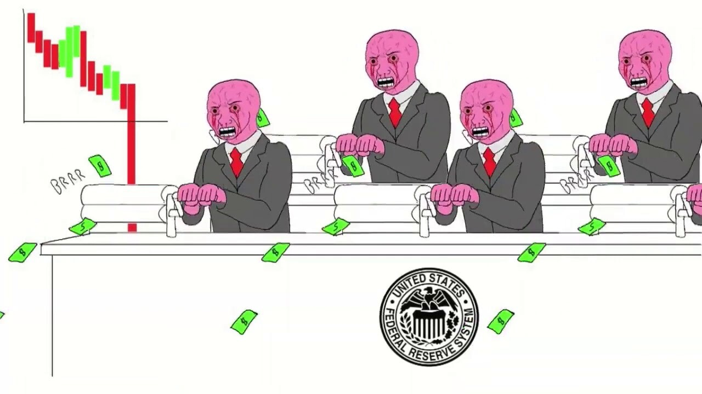
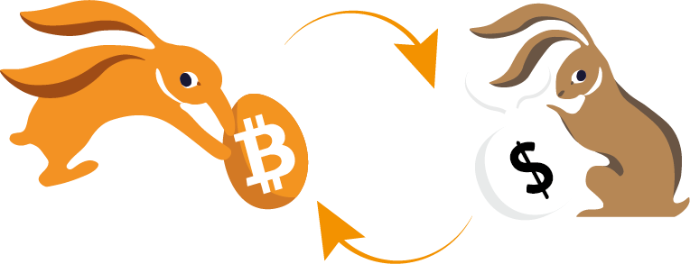

名前: ビットコインの旅
目標: ビットコインとその基本について学び、その通貨的な価値提案、マイナー、トランザクション、ウォレットについて理解する。
目的:

- ビットコイン技術の一般的な理解を得る
- ビットコインを購入し保護する方法を理解する
- ブロックチェーン技術の一般的な理解を持つ
- ライトニングネットワークの概念に慣れる
- ビットコインの地政学的および社会的な影響を認識する

# はじめてのビットコイン冒険

このコースでは、21 の章でビットコインを説明し、この技術を簡単かつ効果的に理解できるようにします。このコースは誰にでもアクセス可能であり、マイナーやウォレット、購入/販売プラットフォームなど、業界全体を探求します。

コースは約 15 時間かかる予定です。旅の途中で、説明ポスターや追加のリソースが利用可能です。

始めるために特別な知識は必要ありません。このコースは誰にでもアクセス可能です！

+++

# はじめに

## 未知への飛躍


### 新しい通貨と技術のパラダイムへようこそ。

ビットコインは、単なる「インターネット通貨」を超えた重要なイノベーションです。これは、通貨と社会との関係を問いかけることができる、技術とお金の両面での革命です。ビットコインは、いわゆる「中立的」かつ「非中央集権的」な通貨であり、いかなる組織や機関にも制御されていません。ビットコイン（BTC と呼ばれる）は、コンピュータプロトコル（Bitcoin）と通貨単位（bitcoin）の両方であることを理解するためには重要です。

このプロトコルは、暗号化、ネットワーク通信、そして有名な「ブロックチェーン」といった基盤技術を使用しています。一方、ビットコイン単位は、このプロトコルの正常な動作に必要な通貨です。日常生活では、サルバドール人や世界中のビットコインユーザーは、ビットコイン通貨を使用して商品やサービスを購入・販売しており、通貨はビットコインプロトコルに依存して機能しています。

### 包括的でありながらアクセスしやすいカリキュラム

このコースでは、ビットコインの通貨的な側面について議論し、ビットコインを購入・販売し、デジタルウォレットに安全に保管し、トランザクションに使用する方法について説明します。また、新しいビットコインを作成し、ビットコインネットワークを保護するために不可欠なマイナーの役割についても探求します。さらに、ビットコインの将来とライトニングネットワーク技術がビットコインのトランザクションを改善する方法についても探求します。


ビットコインは、お金との関係を革新する新しい通貨システムであることを理解することは重要です。ビットコインを使用することを学ぶことは、自分自身のお金をコントロールしたい人にとって必須のスキルです。

**セクション 1 - お金**

- 第 1 章 - お金とは何か？
- 第 2 章 - フィアットマネー
- 第 3 章 - ハイパーインフレーション
- 第 4 章 - ビットコインの通貨政策

**セクション 2 - ビットコインウォレット**

- 第 5 章 - ビットコインウォレットの仕組み
- 第 6 章 - セキュリティの選択
- 第 7 章 - ウォレットの設定
- 第 8 章 - 時間に対する保護

**セクション 3 - ビットコインの技術的側面**

- 第 9 章 - トランザクションの説明
- 第 10 章 - ビットコインノード
- 第 11 章 - マイナー
- 第 12 章 - マイナーとエコロジー

**セクション 4 - ビットコインでの貯蓄**

- 第 13 章 - ビットコイン価格
- 第 14 章 - ビットコインの購入方法
- 第 15 章 - ビットコインでの仕事
- 第 16 章 - ハイパービットコイン化

**セクション 5 - ライトニングネットワーク**

- 第 17 章 - ライトニングネットワークの紹介
- 第 18 章 - ライトニングネットワークのユースケース
  社会におけるお金の定義と機能について議論する前に（第 1 章）、私たちはビットコインの起源から始めます。ビットコインは 2009 年に立ち上げられた比較的新しい技術であり、他の何物とも異なるものです。そのため、一度にすべてを理解することは普通ではありません。実際、インターネットや車の使用を学ぶときと同様に、ビットコインを使用するためにはすべての技術的な詳細を知る必要はありません（受け取る、支払う、資金を保護する）。


ここで重要なのは、この新しい技術を一般的な方法で理解することです。このトレーニングが皆さんに喜んでいただけ、この新しいグローバルな通貨のパラダイムを理解し、おそらく進歩し続けるために必要な基盤を提供できることを願っています。

## ビットコインの起源


「ビットコイン」という言葉がデジタル通貨と金融の変革を意味するようになる前に、その創造の基礎となる一連のアイデア、イノベーション、社会運動が存在しました。ビットコインの先史時代の基本要素の 1 つは、サイファーパンク運動です。

### サイファーパンク：デジタル世界の先見者


1980 年代と 1990 年代の技術的進化の中心には、プライバシーと自由の役割について深く疑問を抱く人々が現れました。これらの個人は後に「サイファーパンク」として知られるようになり、暗号化が政府や大企業からの干渉に対抗するためのツールとして機能すると確信していました。

ジュリアン・アサンジ、ウェイ・ダイ、ティム・メイ、デビッド・チャウムなどの象徴的な人物がサイファーパンクの哲学とビジョンを形作るのに貢献しました。これらの思想家たちは、世界中の参加者が技術をどのように使って個人の自由をより大きく保証するかについて議論する影響力のあるメーリングリストでアイデアを共有しました。

### サイファーパンクの三大テキスト


デジタル活動主義と暗号化に深く根ざしたサイファーパンク運動は、その原則と未来のビジョンを表現するためにいくつかの基本的なテキストに依存していました。これらの著作の中でも特に注目されるのは次の 3 つです。

- 「サイファーパンク宣言」：
  エリック・ヒューズによって 1993 年に書かれた「サイファーパンク宣言」は、プライバシーが基本的な権利であると主張しています。ヒューズは、自由にかつ機密性を持ってコミュニケーションする能力が自由な社会にとって不可欠であると主張しました。宣言は「私たちは機関、企業、または他の非人格的な存在にプライバシーを与えることを期待することはできません...私たちはそれを自分自身で守らなければなりません」と述べています。

- 「暗号アナーキスト宣言」：
  ティモシー・C・メイによって 1992 年に書かれたこの宣言は、暗号化の使用が政府が市民の私事に干渉することができない暗号的な無政府状態の時代をもたらす可能性を説明しています。メイは、第三者の介入や匿名で情報、お金、メッセージを交換できる未来を想像しました。

- 「サイバースペースの独立宣言」：
  サイファーパンクに限定されないものの、このテキストは運動の多くの参加者の感情を反映しています。ジョン・ペリー・バーロウによって 1996 年に書かれ、政府によるインターネットの規制の増加に対する反応です。この宣言は、サイバースペースは物理的な領域とは異なる領域であり、同じ法律の対象になるべきではないと主張しています。それは「私たちには選ばれた政府はなく、統治されることはできない」と述べています。

### ビットコインの前身

ビットコインが登場する前に、デジタル通貨を作成するためにいくつかの試みが行われていました。例えば、デビッド・チャウムは 1980 年代に彼のプロジェクト「DigiCash」で「匿名の電子マネー」という概念を紹介しました。残念ながら、様々な制約のため、DigiCash は実際には普及しませんでした。
もう一つの重要な先駆者は、ウェイ・ダイの「b-money」です。実装されることはありませんでしたが、評価者のコミュニティによって詐欺検出が行われる匿名のデジタル通貨のアイデアを提示しました。


このような肥沃な環境の中で、謎のサトシ・ナカモトが 2008 年にビットコインの白書を公開しました。彼は、プルーフ・オブ・ワークや暗号タイムスタンプなどのサイファーパンク運動からのいくつかのアイデアを組み合わせて、分散化された検閲抵抗性のあるデジタル通貨を作り出しました。

ビットコインは単なるデジタル通貨以上であり、サイファーパンクの理想の達成を象徴していました。その技術を超えて、それは伝統的な金融システムに対する革命を象徴し、透明性、分散化、個人主権に基づく代替手段を提供しました。

### 結論

ビットコインの先史時代は、サイファーパンク運動とデジタル時代におけるより大きな自由を求める共同の探求に深く根ざしています。暗号化、分散化、誠実さの原則を組み合わせることによって、ビットコインは単なる通貨以上のものとなり、私たちの世界を形作り続ける哲学的・技術的な革命の産物となりました。

したがって、ビットコインは長期にわたるプロトコルであり、私たちにエネルギー、時間、お金との関係を問いかけるよう促しています。しかし、ビットコインは「本物の」通貨なのでしょうか？お金とは何でしょうか？複数の形態で存在するのでしょうか？次の章でこれらの問いについて探求していきます。


# お金

## 歴史を通じたお金


お金の進化は、経済的なニーズが絶えず変化する中で、文明の創造力を反映した人類の歴史の魅力的な側面です。


### 貝から銀行口座へ

最初は、通貨は有形であり、穀物や家畜などの必需品に関連していました。しかし、これらの商品には腐敗性などの大きな欠点があり、長期的な貯蓄媒体として使用することは困難でした。例えば、失敗した収穫や病気によって個人の富が一夜にして消えることがありました。
文明が進歩し、貿易が新たな地域に拡大するにつれて、普遍的な交換媒体の必要性が生じました。貝や宝石などの物品が試されましたが、完璧ではありませんでした。最終的には、希少性、耐久性、分割性のために金が標準となりました。それは、富と権力の象徴であり、今日まで続くものです。


### お金の役割とは？

お金は非常に洗練されたコミュニケーションツールです：

- 現在と未来の間のコミュニケーションを可能にします。私たちは自分の時間とエネルギーを将来に再利用できる資産に変えることができます。

- それは普遍的な共通言語でのコミュニケーションを可能にします。互いを知らず、同じ言語を話さないまま、二人の見知らぬ人は物を交換し、取引し、物の価値に合意することができます。

お金の役割は人工的に再現することが困難です。人間や人間の集団はお金を作り出すことはできず、それは市場と自発的な合意から生まれる必要がある自然な社会現象です。価格は社会がリソースをどのように割り当てるかを選ぶのに役立つ信号、情報です。
金は、以下の 3 つの機能に基づく 4,000 年の貨幣ダーウィニズムの選択肢です：

- 価値の保存
- 交換手段
- 基準単位


### お金の特徴

金は理想的には効率的な通貨の基準を満たしています：その天然の希少性が価値を持たせ、化学的な特性により時間の経過による劣化を防ぎます。しかし、この形態のお金は容易に分割や長距離輸送ができません。グローバル化されたデジタルの世界では、金は追いつくことができず、中央の機関が分割可能で簡単に交換可能なものにする必要があります（鋳造された硬貨）。

これらの欠点により、金は価値の保存手段となりましたが、共通の通貨ではありません。これに対して、容易に使用できるが支配する機関（王、中央銀行、皇帝、独裁者）によって絶えず価値が低下する国家の信託通貨（法定通貨）が不利になりました。

効果的な通貨の基準は複数あります。良い通貨は以下のような特徴を持つ必要があります：


- **交換可能性**：価値を失うことなく交換可能であること
- **分割可能性**：異なる量の取引を容易にするために分割可能であること
- **流動性**：商品やサービスに簡単に換金できること

これらの基準を満たすために、通貨は段階的に進化しています：

- 原石 -> 硬貨
- 紙幣 -> バンクカード
- ブロックチェーン -> ライトニングネットワーク

現在、通貨はまだ進化を続けており、さまざまな用途に対応するために形態を変えています。例えば、金は価値の保存には優れていますが、現在のグローバル化された経済には適していません。同様に、ドルやユーロなどの信託通貨は非常に流動的で容易に輸送可能ですが、ほとんどがデジタル化されているため、その価値は通貨のインフレにより絶えず低下しています。

一方、ビットコインは新たな可能性を提供しています。その厳格に制限された供給量などの特性により、優れた価値の保存手段を提供します。さらに、中立的なインターネット通貨として、国境を越える交換手段としての役割を果たします。しかし、現在の商取引ではまだ広く受け入れられていません。[常に採用が進んでいる](https://btcmap.org/map)にもかかわらずです。

## 信託通貨


ジョージ・サンタヤナは「歴史から学ばない者は同じ過ちを繰り返す運命にある」と言いました。これは特に現在の通貨システムに関連するときに共鳴する真実です。

### 信託 = 信頼

現在、ユーロやドルなどの主要な通貨は信託通貨と見なされています。これは、それらに固有の価値がないことを意味します。その価値は、それらを規制する機関への信頼と信念に完全に依存しています。

「信託通貨とは、国家（例えば、円を持つ中国などの国家）や政治経済連合（例えば、ユーロを持つ欧州連合など）などの機関によって通貨として指定された形態の通貨です。信託通貨の発行を担当するのは中央銀行です（例えば、中国人民銀行、アメリカ連邦準備制度、またはギニア共和国中央銀行などが挙げられます）。これらの機関が通貨政策を決定し、したがってどれだけのお金を流通させるか、または印刷するかを決定します。


### 通貨の価値低下：ローマ帝国以来の戦略

古代から金は通貨の基準として使われてきました。しかし、その硬直性から、ローマ皇帝や現代の政府などの指導者たちは、しばしば代替通貨を採用してきました。このメカニズムは、文明の起源から存在している実践に触発されたもので、富に対する統制を行使することを望む指導者たちは、まず金を集中させることから始めます。彼らはしばしば自らの権力を利用し、保護と安全を約束しながら金を集めます。この貴重な準備金を手に入れた彼らは、金と同等の価値を持つ新しい通貨を導入し、自らの肖像が刻まれたものを鋳造します。この通貨は徐々に流通し、人々はその利便性にすぐに慣れます。

徐々に、これらの指導者たちは新しい通貨の価値を徐々に減少させ、年ごとに初期の金に対して数パーセントずつ減らしていきます。この静かな減価は、しばしば人々の利益として正当化されます。したがって、この信託通貨に貯蓄している人々は、その貯蓄の価値が侵食されるのを見る一方で、国家はインフレを通じて自らのプロジェクトを資金化します。さらに、この減価により、債務の返済が容易になります。


重要な時点で、通貨が金で裏付けられなくなったと発表されます。信託通貨に慣れ親しんだ一般市民は、しばしば金融に関する誤った情報を受けているため、この現実を受け入れます。その後、国家は通貨供給を自由に操作することができ、ほとんどコストをかけずに莫大な金額を印刷することができます。

この戦略は、うまく実行されれば数十年にわたることがあります。しかし、急速な減価や信頼の喪失は、ハイパーインフレーションにつながる可能性があります（次の章を参照）。歴史は、ドルが 100 年間でその価値の 98%を失い、ユーロが 20 年間で 30%、英ポンドが創設以来 99%の価値を失ったことを示しています。

結局のところ、通貨は金との関連性を失い、帝国の終わりにおけるローマのコインのようになり、あるいは単なる数値的な価値にまで縮小され、具体的な現実とは無関係になるかもしれません。

今日、私たちは歴史的な転換点を目撃しています。長い間主導的な存在であったドルは衰退しつつあり、金も中心的な位置を失っています。私たちは新しい通貨サイクルの転換点に立っており、歴史からの教訓がしばしば忘れられることを思い起こさせられます。


### ビットコインは解決策か？

このような状況の中で、ビットコイン革命が勢いを増しています。この通貨は、**信頼できる第三者を必要としない**という特徴を持ち、国家とお金を分離することを目指しています。

通貨の印刷はインフレを引き起こし、人口を徐々に貧困化させます。一方で、金融機関や富裕層はこの慣行から利益を得て、不平等のギャップを生み出し、権威主義を促進しています。現在の金融システムは崩壊を避けるために規制され制約されており、何らかの混乱が大規模な経済危機を引き起こす可能性があります。政治的な主体はこのシステムから利益を得ているため、根本的な変化を行うインセンティブを持っておらず、システムは可能な限りそのまま進行し続けることができます。


これらの制度的な課題に対応するため、ビットコインは分散化された解決策として現れています。歴史的に、金は偽造に対する耐性のために通貨として好まれてきました。同様に、ビットコインは分散化された暗号化の性質により、偽造することができず、2100 万ユニットに制限されています。ビットコインは透明性と中立性に依存する通貨であり、現在の中央集権的な通貨システムに対する魅力的な代替手段を提供しています。
同時に、中央銀行デジタル通貨（CBDC）の出現は避けられないようです。この新しい通貨形態は、より中央集権的な経済を提供し、個人の金融の自由を妨げ、権威主義的な濫用を容易にする可能性があります。この章をノーベル賞受賞者 F.A.ハイエクの 1984 年の引用で締めくくることができます。「私は政府の手から良い通貨を見つけることはないとは思いません。しかし、私たちはそれを彼らから力ずくで奪うことはできません。私たちができることは、彼らが巧妙な策略を通じて止めることができないものを導入することだけです。」

## ハイパーインフレーション

ハイパーインフレーションは、法定通貨に特有の通貨現象です。これは、通貨への信頼の完全な喪失と、当局による通貨印刷を通じたインフレーションの急激な増加を特徴としています。その結果、個人が蓄積した貯蓄は比較的短期間で消失し、国を経済的、社会的、政治的崩壊の瀬戸際に追いやることになります。

### 暴走するインフレーション！

異なるインフレ率を考慮して、インフレーションが貯蓄に与える影響を理解しましょう。

- 2％のインフレーションでは、年間で購買力の 2％が失われ、5 年間で 10％に相当します。
- 7％では、10 年でその半分を失います。
- 20％では、3 年でほぼ半分を失います。

ハイパーインフレーションでは、年間 20％ではなく、月間 20％、ピーク時には 1 日あたり 20％となります。3 日間で 1 日あたり 100％のインフレーションは、現実的なシナリオであり、私たちの世界で起こっていることです。

ハイパーインフレーションが魔法や偶然、資本主義や政治的な対立によって起こるわけではないことを理解することは重要です。ハイパーインフレーションは、中央銀行家や政治家によって行われた誤った通貨政策の直接的な結果です。その影響はすべての市民に影響を与え、世代に影響を与えます。この表を 5 分間勉強して、この現象の実際の影響を完全に理解してください（ECON204 コースではこのテーマに詳しく触れます）。

### ハイパーインフレーションはどのように発生するのか？

フェーズ 1 - 信頼の喪失

- 通貨の中央集権化は、通貨の創造とその濫用を容易にします。通貨への信頼の喪失は、戦争、社会的措置、小麦やガソリンなどの主要な資源の価格上昇など、外部要因によって引き起こされることが一般的です。

フェーズ 2 - 通貨の崩壊と価格上昇

- 政府が信頼を失うと、個人はより安定した他の通貨（例：ベネズエラでは米ドル）との交換を始めます。これにより価格が上昇し、物品やサービスがますます高価になる悪循環が生まれます。これらのニーズに応えるため、国家は通貨政策を修正するためにより多くのお金を印刷し、指数関数的なインフレーションが生じます。

フェーズ 3 - お金の印刷の悪循環

- 商品を買うためにますます多くの紙幣が必要とされ、紙幣の不足が生じます。これによりさらに多くの紙幣が印刷され、さらなるインフレーションが生じます。

フェーズ 4 - 新しい通貨の出現

- その後、古い通貨を置き換えるために新しい通貨が導入されます。 hyperinflation の注目すべき例は、1920 年から 1924 年のドイツです。経済を復活させるために、ドイツ、フランス、イギリスの債務に裏付けられ、ドイツの土地によって保証された新しい通貨が作成されました。
- hyperinflation の危機を解決するためには、革命、政府の変革、中央銀行家の変更など、根本的な変化が必要です。信頼の喪失、通貨の崩壊、再建は、法定通貨に基づく新しい経済を復活させるために不可欠な段階です。

### 3 つの注目すべき例

- ドイツ、1922 年から 1923 年

  hyperinflation の最も顕著な例の 1 つは、第一次世界大戦後のドイツのヴァイマル共和国で発生しました。

  ドイツは戦争のために莫大な金額を借り入れており、ドイツは戦争に勝たなかっただけでなく、数十億ドルの賠償金を支払わなければなりませんでした。最も高いインフレ率を記録したのは 1923 年 10 月で、最大で 29,500％、1 日あたり 20.9％のインフレ率でした。価格は 3.7 日ごとに倍増しました！
  レストランでは、ウェイターが 30 分ごとにメニューの価格を発表しなければならなかったと言われています。ドイツの通貨はあまりにも役に立たなくなり、いくつかの市民は実際には木よりも紙幣を燃やす方が安くなるため、紙幣を燃やすことを好むようになりました。

- ハンガリー、1945 年から 1946 年

  これまでに最も悪い hyperinflation の時期を経験した国は、第二次世界大戦後のハンガリーです。

  ハンガリーは紛争の敗北側にあり、戦争はそのほとんどの産業生産能力を破壊しました。最も高いインフレ率を記録したのは 1946 年 7 月で、1 日あたり 207％に相当する価格インフレ率が 41,900,000,000,000,000％でした。価格は 15 時間ごとに倍増しました！

- ジンバブエ、2007 年から 2008 年
  2000 年まで、ジンバブエは石油を除いてほぼすべてのニーズを自給していました。

  1997 年、ジンバブエドルは政府が戦争退役軍人に対して 4 億 5000 万ドル相当の補償をすることに同意したことで 72％以上も暴落しました。政府はそのような金額を持っていなかったため、印刷機を稼働させる必要がありました。2005 年にはインフレ率が 586％に達し、2007 年 3 月には月間インフレ率が 50％に達しました。

  2007 年 6 月、政府は価格統制を導入して対応しました。店舗は文字通り「略奪」されました。商人たちはもはや店舗を補充する手段を持っていません。

  2009 年 4 月、財務大臣はジンバブエドルの使用を停止し、異なる外貨の使用を認めました。すべての銀行口座、年金、金融機関は一夜にして残高が消失しました。

結論として、hyperinflation は通貨の価値を急速に低下させ、貯蓄の侵食と通貨システムへの信頼の喪失をもたらします。ヴォルテールはかつて、法定通貨は常にその本来の価値を失い、ゼロに収束すると提案しました。
「金融機関のような信頼できる第三者に依存する通貨は、実際には長期的には欠陥のある通貨であり、購買力を保証したり貯蓄を守ることができません。」

## 2100 万ビットコイン


### ビットコインの通貨政策

ビットコインは、事前に定義された最大数量の**2100 万ユニット**を持つ分散型のデジタル通貨です。この希少性の本質的な特徴は、そのコンピューターコードによって決定され、プロトコルに参加するすべてのユーザーの合意によって強化されています。


通貨の発行に関しては、時間の経過に伴って作成されるビットコインの数量を表す S カーブで示すことができます。例えば、2022 年には約 1850 万ビットコインが流通していました。予測によると、2025 年には約 1950 万ビットコインがあり、総供給量の約 93％を占め、2037 年には 2040 万に達すると予想されています。

### 新しいビットコインの作成方法

新しいビットコインの作成は、ビットコインネットワーク上のトランザクションを検証する手続きであるマイニングプロセスの結果です。


このタスクを実行するマイナーは、10 分ごとに新しいビットコインの発行を報酬として受け取ります。この報酬は、およそ 4 年ごとに半減するようにプログラムされており、これを「ハーフィング」と呼ばれるイベントが起こります。このハーフィングのメカニズムにより、ビットコインの作成は 2140 年に終了し、ビットコインの総数が 2100 万に達すると数学的に予測されています。

| ハーフィング番号 | ブロックの高さ | ハーフィング後の BTC 報酬 | ハーフィング後の推定 BTC 流通量 |
| ---------------- | -------------- | ------------------------- | ------------------------------- | --- | --- | --------- | ------------------- | ------------------ |
| 1                | 210,000        | 25 BTC                    | 10,500,000 BTC                  |
| 2                | 420,000        | 12.5 BTC                  | 15,750,000 BTC                  |
| 3                | 630,000        | 6.25 BTC                  | 18,375,000 BTC                  |
| 4                | 840,000        | 3.125 BTC                 | 19,687,500 BTC                  |
| 5                | 1,050,000      | 1.5625 BTC                | 20,343,750 BTC                  |
| 6                | 1,260,000      | 0.78125 BTC               | 20,671,875 BTC                  |
| 7                | 1,470,000      | 0.390625 BTC              | 20,835,937.5 BTC                |
| 8                | 1,680,000      | 0.1953125 BTC             | 20,917,968.75 BTC               |
| 9                | 1,890,000      | 0.09765625 BTC            | 20,958,984.375 BTC              |
| 10               | 2,100,000      | 0.048828125 BTC           | 20,979,492.188 BTC              |
| 11               | 2,310,000      | 0.0244140625 BTC          | 20,989,746.094 BTC              |
| 12               | 2,520,000      | 0.01220703125 BTC         | 20,994,873.047 BTC              |
| 13               | 2,730,000      | 0.006103515625 BTC        | 20,997,436.523 BTC              |     | 14  | 2,940,000 | 0.0030517578125 BTC | 20,998,718.262 BTC |
| 15               | 3,150,000      | 0.00152587890625 BTC      | 20,999,359.131 BTC              |
| 16               | 3,360,000      | 0.000762939453125 BTC     | 20,999,679.566 BTC              |
| 17               | 3,570,000      | 0.0003814697265625 BTC    | 20,999,839.783 BTC              |
| 18               | 3,780,000      | 0.00019073486328125 BTC   | 20,999,919.892 BTC              |
| 19               | 3,990,000      | 0.000095367431640625 BTC  | 20,999,959.946 BTC              |
| 20               | 4,200,000      | 0.0000476837158203125 BTC | 20,999,979.973 BTC              |

マイニングについては、マイニングの章で詳しく説明します。

### デジタルの希少性を保証する

ビットコインの希少性は、2 つの主要なメカニズムによって保証されています：マイニング難易度の調整とゲーム理論：

- マイニング難易度の調整は、約 2 週間ごとに 2016 ブロック、つまり平均して新しいブロックがブロックチェーンに追加されるようにするためのメカニズムです。ブロックの作成頻度とビットコインの総量は、ビットコインプロトコルの固定された側面であり、伝統的な通貨システムで行われる恣意的な決定とは異なり、一般的な合意なしに変更することはできません。


> 知っていましたか？マイナーは、自分のブロックに含まれるトランザクションに関連する新しいビットコインと手数料を獲得するためにブロックをマイニングすることが報酬となります。発行されるビットコインの数が 2100 万の制限に近づくにつれて、マイナーはブロック報酬よりもトランザクション手数料によって報酬を得るようになります。

- ゲーム理論は、人間の合理性に依存する数学的な概念です。ここでは、ビットコインではプロトコルの変更についてユーザーが投票します。はい、あなたが正しく読んだ通りです：ビットコインプロトコルの変更には、ユーザー全体の合意が必要です。これは非常に複雑なプロセスです。したがって、誰かが第 22 百万ビットコインを作成したい場合、全ユーザーを説得して自分自身の貯蓄を自発的に減価させる必要がありますが、これは中央集権的なグループによって統治されていないため、起こりにくいです。


通貨の価値を減価させるアイデアは、ビットコインの基本的な哲学に反するため、この制限を変更することは非常に不可能です。

### 常に公開され、誰でも検証可能な監査可能な通貨政策！

ビットコインの希少性は大きな資産であり、流通しているビットコインの最大数量である 2100 万ビットコインは、誰でも公開され、検証することができます。

実際、誰でも Bitcoin ノード上で簡単なコマンドを入力することで、流通しているビットコインの数量を検証することができます：`bitcoin-cli gettxoutsetinfo`。この透明性と検証可能性は、ビットコインシステムへの信頼を強化し、中央集権的な機関や個人に基づかず、そのプロトコルに固有の数学的および暗号学的な保証に基づいています。（LN201 で簡単にこれを行う方法を学びます）

```json
{
  "height": 710560,
  "bestblock": "0000000000000000000887384d67103412ea7f18a43953e65c8c4ac36bf42e54",
  "transactions": 473244,
  "txouts": 1018917,
  "bogosize": 2183872374,
  "hash_serialized_2": "eebb9987337700ffaacbbaa11223344",
  "disk_size": 178239584,
  "total_amount": 18745998.12345678
}
```

ビットコインは、その設計により、その創造を制限し、ユーザーの貯蓄を保護することで、他の通貨とは異なる、健全な貨幣管理を保証しています。オーストリア学派の経済学の原則（ECON201 の詳細参照）に沿っており、制御された数量と予測可能な分配により、伝統的な通貨のインフレに伴う固有のリスクから保護されています。

要約すると、ビットコインは、その分散化された性質、プログラムされた希少性、透明性により、伝統的な通貨システムに対する独自の代替手段を提供しています。それは、技術を使用して、有用で検証可能な通貨を作成するだけでなく、供給を厳密に制限することにより、ユーザーの貯蓄の価値を保護することができます。

### セクション 1 の結論！

'

# ビットコインウォレット

## ビットコインウォレットとは何ですか？

このセクション 2 では、ウォレット内のビットコインの保存とセキュリティについて探求します。これにより、これらの有名なビットコインがどこにあるのか、そしてそれらとのやり取り方法をより理解することができます！


### ビットコインウォレットの謎を解く

この業界では、ビットコインネットワークとのやり取りにウォレットを使用し、次の 3 つの機能を持っています：

- ビットコインの受け取りを許可する
- ビットコインの送信を許可する
- ハッキングや盗難の試みから保護する

ウォレットは、コンピュータ上のソフトウェア、スマートフォン上のアプリケーション、USB キーのような物理デバイス、または紙の一部である場合があります。これらの異なるタイプのビットコインウォレットは、それぞれ異なるユースケースに使用されます。一部はセキュリティに重点を置いた大金額の取引に使用され、他のものはプライバシーのために使用され、また他のものは日常的な小額の支払いに使用されます。

したがって、ポートフォリオは使用目的に応じて大きなカテゴリに分けられますが、常に中心的な問題があります：資金の所有者はあなたですか、それともお金の管理を第三者に委ねますか？このトピックについては、次の章で詳しく説明しますが、アイデアは単純です：お金はあなたのポケットにあるのか、銀行家のポケットにあるのかです！


### ビットコインウォレットの動作原理

ビットコインの「銀行家」であるか、あなた自身であるかに関係なく、一般的には、ほとんどのビットコインウォレットは同様の技術、つまり非対称暗号の技術と、キーペアのシステムを使用して動作します。つまり、受け取るための秘密鍵と支出するための公開鍵のシステムです。

- 秘密鍵
  ウォレットを初期化する際に、秘密の回復フレーズ（秘密鍵）が生成され、24 の単語の形式で提供されます。

  秘密鍵は非常に重要です。なぜなら、それがビットコインの所有権を表し、それを使用または送信する権利を持つからです。秘密鍵の保持者がビットコインの所有者です。

  この鍵は秘密に保管され、よく保管される必要があります。なぜなら、それがあなたの財産を開ける鍵だからです！

- 公開鍵とアドレス
  公開鍵は秘密鍵と関連付けられるため、秘密鍵と一緒に生成されます。公開鍵はビットコインアドレスを生成し、お金を受け取るために使用されます。公開鍵を共有することはプライバシーのリスクを伴いますが、セキュリティ上のリスクはありません。
  これらのアドレスは、ウォレットによって作成され、安全に共有することができます。プライバシーを最大限に保護するために、これらのアドレスは一度だけ使用することが推奨されます。
  したがって、この技術のおかげで、送信者が資金を盗むことなく簡単にビットコインを受け取ることができることを理解することが重要です！それを郵便受けのようなものと考えてください：人々はそこにお金を預けますが、それを開けることができるのはあなただけです。


### ウォレットにはビットコインがありますか？

キーはウォレットに保存されていますが、ビットコイン自体は実際にはビットコインのピアツーピアネットワーク内の公開分散台帳であるビットコインブロックチェーンに「保存」されています（これについてはセクション 3 で詳しく説明します）。そのため、ウォレットを保存しているデバイスを失ってもビットコインが失われるわけではありません。ウォレットを再作成し、ビットコインを使用するために必要なのはプライベートキーです。したがって、適切に保護することが非常に重要です。


幸いなことに、2017 年以降、このプライベートキーは 12 または 24 の単語からなるシンプルなリストでエンコードすることができます。これをニーモニックフレーズと呼びます。このフレーズは、Bitcoin ウォレットのバックアップであり、Bitcoin ウォレットソフトウェア/アプリを使用してウォレットを再作成するためのものです。したがって、この単語のリストにアクセスできる人は、あなたのビットコインにアクセスできるのです。

### ハッカーについては？

誰かが偶然にも私たちの 12 または 24 の単語のリストを推測した場合、どうなるのでしょうか？簡単に言えば、ウォレットを作成するために使用される暗号技術のおかげで、それは非常に起こりにくいです。具体的に言うと、ウォレットへのアクセスを偶然に見つけることは、1 から$2^256$までの「正しい」数を見つけることにほぼ等しいです。これは宇宙の中で「正しい」原子を見つけることとほぼ同じです。ただし、このデフォルトのセキュリティに満足していない場合は、Bitcoin ウォレットにパスフレーズを追加することで常にセキュリティを強化することができます。


したがって、良いセキュリティの実践に従えば、Bitcoin ウォレットをハッキングされる確率は非常に低くなります。次のセクションで詳細に説明する実践方法です。

ニーズと使用方法に合ったウォレットを選択してください。さまざまなウォレットの使用とセキュリティに関する詳しいチュートリアルは、[当大学のチュートリアルセクション](https://sovereignuniversity.org/tutorials/wallet)で利用できます。

## セキュリティと Bitcoin ウォレット


### 開始前に正しい質問をする

ビットコインを所有している場合、資金のセキュリティは重要な問題です。自分の状況に適したセキュリティを定義する最良の方法は、一連の質問をする（そして答える）ことです。あなたのセキュリティモデルはあなたの回答に依存します。さあ始めましょう：

- 誰が私の資金にアクセスできるのですか？つまり、あなた以外にビットコインにアクセスできる会社などの第三者がいますか？
- 2 つ目の質問は、ビットコインをどのように使用する予定ですか？それは定期的に使用する金額ですか？中期的な貯金ですか？長期的な貯金ですか？
- 技術的なスキルはどの程度ですか？
- セキュリティの予算はどのくらいですか？

一つの解決策が存在しないことを念頭に置いてください。したがって、これらの質問に答えるために時間をかけることは、セキュリティ対策を調整するのに役立ちます。


### 複雑さの観点から Bitcoin ウォレットを考える

ビットコインのセキュリティにはいくつかのレベルがあります。

- **レベル 0**では、ビットコインの唯一の保有者ではない、いわゆる信託サービスを使用します。この信頼できる第三者はいつでもあなたの資金へのアクセスを制限することができます。そして、銀行口座を通じた従来の銀行システムと同じレベルの金融主権を持ちます。
  

- **レベル 1**では、スマートフォンやコンピュータ上のビットコインウォレットを使用し、ビットコインの唯一の保有者となります。簡単に取引を行うことができます。ただし、携帯電話やコンピュータの紛失の場合に資金へのアクセスを回復するためにニーモニックフレーズをバックアップすることが重要です。これはインターネットに接続されたデバイスに秘密鍵が保存されているため、「ホットウォレット」と呼ばれることが多いです。

- **レベル 2**では、物理的なウォレットを使用し、12 または 24 の単語のリストを保護します。取引を行うためには常にデバイスで署名する必要があります。これにより、日常的に資金にアクセスすることが難しくなります。これはインターネットに接続されていないデバイスにキーが保存されているため、「コールドウォレット」と呼ばれることが多いです。


- **レベル 3**では、レベル 1 または 2 のウォレットを使用しますが、追加のパスフレーズが必要です。これにより、12 または 24 の単語のリストとパスフレーズの両方をバックアップする必要があります。理想的には、これらの情報を 2 つの異なる場所に保存します。


- **レベル 4**では、複数の署名が必要な「マルチシグ」ウォレットを作成するために一連のウォレットを使用します。マルチシグの各部分は異なる場所に保存する必要があります。これは主に大金や法人利用のために使用されることが多い、ビットコインの高度な利用方法とされています。


もちろん、複数のユースケースが存在する場合は、複数のビットコインウォレットを使用することを推奨します。ワンサイズフィットオールの解決策はありません。

### セキュリティの適応

特定のセキュリティレベルに残すことができる金額は、個々の人によって異なります。一部の人にとっては、ホットウォレットに 1 BTC を残すことは合理的ですが、他の人にとっては絶対に合理的ではありません。いずれの場合でも、少額を保護するために物理的なウォレットを購入してセキュリティに多額の費用をかけることは避けてください。また、ウォレットのバックアップを誤った取り扱いをするなど、ビットコインのセキュリティとアクセシビリティを過度に複雑化することは、あなたに害を及ぼす可能性があります。

結論として、ビットコインの直接的な所有権は、金融主権を確保するための重要な要素です。日常の経費にはモバイルウォレットを使用し、より大きな金額を保管するためにオフラインまたは「コールド」な物理的なウォレットを使用することをお勧めします。一方、ビジネスでは、増加した共有セキュリティのためにマルチシグシステムまたは「マルチシグ」の使用を検討することが重要です。また、できるだけ従来の金融システムの脆弱性を再現することができる信託サービスを避けることも重要です。

これらのことを心に留めた上で、次のセクションに進んでビットコインウォレットを作成する手順を見ていきましょう。ただし、セキュリティのトピックをさらに探求したい場合は、この[DarthCoin の記事](https://asi0.substack.com/p/bitcoin-soyez-votre-propre-banque)を読むことができます。

## ウォレットの設定


ビットコインのセキュリティは非常に重要であり、単純なミスが高いコストをもたらす可能性があります。そのため、新しいビットコインウォレットを作成する際のベストプラクティスについて説明します。

> BTC102 コースでは、この手順を案内します。

### この手順は冗談ではありません！

プライベートキーは、24 語のリスト（「シード」または「ニーモニックフレーズ」とも呼ばれることが多い）で表され、資金へのアクセスを表します。このキーが第三者に公開された場合、関連する資金は安全ではなくなります。したがって、ウォレットを初期化する際には、次のルールに従うことが重要です。

- カメラをすべてカバーします。
- ワードリストの写真を撮らないでください。
- コンピュータや携帯電話に入力しないでください。
- 連絡先として保存したり、SMS で送信したりしないでください。
- ワードリストを机に放置しないでください。
- ワードリストを普通でない場所に隠さないでください。

実際には、白紙の紙を用意するか、この[テンプレート](https://bitcoiner.guide/backup.pdf)を印刷し、ペンで順番にワードリストをきれいに書きます。インクが時間とともに薄れると、資金を失う可能性があるため、この紙を要素から保護することが重要です。


### 正しく行うためのヒント

紙以外の代替方法もあります。たとえば、ニーモニックフレーズを金属プレートに刻む方法です。間違って書くと、相続人がそれを読むことができず、資金を回収できない可能性があります。ワードリストを書いた後は、2 つ目のコピーを作成し、最初のコピーとは別の場所に保管することを推奨します。これにより、最初のコピーが紛失したり事故が起きた場合にバックアップが提供されます。


コピーが作成されたら、ワードリストを覚えて探し出せる安全な場所に保管してください！失くさないように複雑な隠し場所を作ることは避けてください。

> あなたのワードリスト＝あなたのお金です。

「コールド」ウォレットは一般的に、モバイルや PC の「ホット」ウォレットと同様に、これらのワードリストを持っています。このプライベートキーのバックアップ方法は現在の標準です。つまり、ニーモニックフレーズを任意のウォレットソフトウェアに入力して自分のウォレットを復元することができます。24 語のリストを提供しない悪質なウォレットは、アカウントやメールアドレス、さらには ID を要求する場合がありますが、これらは強くお勧めしません。

**注意：24 語のリストがない場合は警戒すべきです。**

## 時間の試練に耐える


セキュリティはビットコインのエコシステムで重要な懸念事項です。実際、他の財産と同様に、ビットコインは長期的には紛失、盗難、劣化から保護する必要があります。ビットコインを保護するには、いくつかの技術的な知識と関連するリスクに対する意識が必要です。これにより、ビットコインを鋼鉄に刻む方法と相続計画の 2 つの主要な戦略について議論することになります。

### 石に刻む

ビットコインを長期的に保護する方法の 1 つは、ニーモニックフレーズを耐水性や耐火性のある素材である鋼鉄に刻むことです。

これを実現するためのさまざまな解決策があります。いくつかは「Blockmit」という低コストのものであり、他のものはより多くの機器を必要とします。このトピックについては、この大学のチュートリアルセクションを通じて自分で探求することができます。


### 次世代を考えてください！

また、遺産計画を作成することも重要なステップです。これにより、あなたのビットコインが適切に管理されることが保証されます。この計画には、資産の詳細、アクセス方法、連絡先情報などを詳細に記載した手書きの手紙を含めることができます。また、税務コンプライアンスを確保するために、ビットコインの相続について公証人と話し合うことも重要です。ただし、公証人を含む第三者に直接ビットコインを委託することは絶対に避ける必要があります。

ビットコインの遺産計画についてさらに探求したい場合は、Pamela Morgan の書籍「Cryptoasset Inheritance Plan」をおすすめします。または、BTC102 コースを受講して、遺産計画の作成をサポートします。

### プライバシーの重要性

ビットコインの長期的なセキュリティは、物理的なバックアップの作成や遺産計画の作成に限定されません。プライバシーも重要な考慮事項です。たとえば、身元情報を提供せずにビットコインを購入することは、身元盗用のリスクや資金の追跡を最小限に抑えるために望ましいです。必要な場合は、BTC 205 コースがサポートします。

プライバシーに関しては、ビットコインについて誰にも話さないことが重要です。実際、この資産がどこに行くかわからないため、所有権に関する慎重さは賢明な決定です。自分自身とウォレットに注目を集めたくありません。

同様に、ビットコインのミーティングや見知らぬ人との出会いの際に、セキュリティシステムを大声で明かすことは避けてください...

### ビットコインウォレットのセキュリティに関するまとめ

ビットコインウォレットは、ビットコインの保管と取引を可能にするソフトウェアです。いくつかのタイプがあります。モバイルや PC のウォレットは、小額や定期的な支出に便利です。物理的なウォレットは、中長期的にビットコインを保管するのに適しています。マルチシグウォレットは、より複雑な管理が必要で、トランザクションを実行するために複数の署名が必要です。

ウォレットを作成する際には、まずプライベートキーをバックアップする必要があります。このバックアップは、12 または 24 の単語のリスト、または紙や金属板に書き込むことができる 12 の単語の形で行われます。このニーモニックフレーズにより、任意のビットコインウォレットアプリケーションでウォレットを復元することができます。このリストにアクセスできる人は、あなたのビットコインにもアクセスできます。ビットコインでは、財務的な主権は個々の責任とともにありますので、ウォレットとバックアップへのアクセスを確保することが重要です。そのためには、次のルールに従うことが重要です。

- 遺産計画を作成する：問題が発生した場合に愛する人がお金を取り戻せるようにするため。
- 取引所プラットフォームを避ける：ハッカー攻撃のリスクがあるため、ビットコインを取引所プラットフォームに置くことは避けることが望ましいです。
- セキュリティレベルを適応させる：自分のニーズと使用方法を説明する時間を取ることで、さまざまなビットコインウォレットの中から選択することができます。

ビットコインウォレットの基礎とセキュリティのベストプラクティスについて説明しましたので、次の章ではビットコインの技術的な機能について取り上げます。再び、ビットコインプロトコルの基礎を知ることで、その機能をより良く理解し、より効果的に活用することができます。

# ビットコインの技術的な側面

## ビットコインの開始


### 少しの歴史から始めましょう。


2008 年 10 月 31 日は、新しい金融技術であるビットコインの誕生を記念する日です。この日、ビットコインの匿名の作者であるサトシ・ナカモトは、インターネット上のプライバシーに情熱を持つ暗号学愛好家のコミュニティであるサイファーパンクのメーリングリストに配信されたメールを通じて、自身のイノベーションを世界に発表しました。
このメールには、ビットコインの機能を説明した「ホワイトペーパー」と呼ばれる文書が含まれていました。これまでのデジタルキャッシュシステムの失敗を考慮すると、この取り組みは直ちに熱狂を生み出しませんでした。しかし、このホワイトペーパーは最終的にビットコインのユーザーの参考資料となり、ビットコインのエコシステムで多くの議論の的となりました。

2009 年 1 月 3 日、サトシはビットコインネットワークを公式に開始し、最初のブロック（ジェネシスブロックとも呼ばれる）を作成しました。このブロックには、ビットコインのミッションについての示唆に富んだメッセージが含まれています。「03/jan/2009 Chancellor on brink of second bailout for banks.」（2009 年 1 月 3 日、銀行の 2 回目の救済が危機的状況にある）というメッセージです。

> 「我々はアームズレースの主要な戦いに勝利し、数年間の新たな自由の領域を手に入れることができる。」- サトシ・ナカモト

### ビットコインプロトコルの始まり

2009 年 1 月 8 日、サトシは Bitcoin-0.1.0 のリリースを発表します。その後間もなく、ハル・フィニーがソフトウェアを手に入れ、ネットワークに参加します。これにより、ネットワークには 2 つのノード、つまり 2 つのマイナーが存在するようになりました。フィニーは「Running Bitcoin」とツイートし、この段階を永遠に記念しました。2009 年 1 月 12 日、最初のビットコインの取引がサトシとハル・フィニーの間で行われます。この取引は 10 BTC で、ブロック 170 に記録されました。

ビットコインへの関心は急速に高まり、多くの人々がビットコインのテスト、議論、バグの解決、倫理的・経済的・哲学的側面の考察を始めました。これらの交流を容易にするために、サトシは 2009 年 11 月 22 日に BitcoinTalk フォーラムを作成しました。
このフォーラムはすぐにビットコインユーザーの議論の場となりました。ビットコインのロゴや有名な「Hodl」、さらには「ピザの日」など、ビットコインに関連する多くのミームやシンボルがここで生まれました。

> **知っていましたか？** 実際、2010 年 5 月 22 日、ラズロ・ハニェチはビットコインで 2 枚のピザを 10,000 BTC で購入することを提案し、ビットコインが物理的な商品の購入に使われる初めての例となりました。

### サトシ・ナカモトの失踪

2010 年、ビットコインがメディアの注目を集め始めると、サトシは距離を置くことを決めます。2010 年 12 月 12 日、彼はフォーラムで最後の投稿をし、自身の退場を発表します。2011 年 4 月 23 日、彼は最後に知られているプライベートなメールのやり取りを行います。その後、サトシは姿を消し、彼の創造物はコミュニティの手に委ねられました。

> 「政府はナプスターのような中央集権型ネットワークの首を切るのが得意ですが、グヌテラやトールのような純粋な P2P ネットワークは自己保持しているようです。」- サトシ・ナカモト
> 中本聡の不在にもかかわらず、Bitcoin は開発が続けられています。Bitcoin の歴史は 10 分ごとに書き込まれ、プロトコルは意図した通りに機能し続けています。恐怖、不確実性、疑念（FOMO：Fear Of Missing Out の略または FUD：Fear Uncertainty Doubt の略）に関係なく、Bitcoin はオンラインで 99.988%の可用性を維持しながら前進し続けています。
> Bitcoin は個々の人によって異なる認識をされています。一部の人にとっては、[菌糸体](https://brandonquittem.com/bitcoin-is-the-mycelium-of-money/)のような存在であり、他の人にとっては[ブラックホール](https://dergigi.com/2019/05/01/bitcoins-gravity/i)です。好きでも嫌いでも、Bitcoin は存在し続けており、10 分ごとのブロックの一定のリズムで新しい通貨システムの鼓動のように動いています。

中本聡の著作について詳しく知りたい場合は、[Phil Champagne の書籍](https://sovereignuniversity.org/resources/books)や ARTE のドキュメンタリー「le mystaire Satoshi」をおすすめします。


> 「従来の通貨の根本的な問題は、それを機能させるために必要なすべての信頼です。中央銀行は通貨を価値を下げることなく保つことを信頼されなければなりませんが、法定通貨の歴史はその信頼の破綻で満ちています。銀行は私たちのお金を保持し、電子的に転送することを信頼されなければなりませんが、彼らは予備金のほんの一部を持ってクレジットバブルの波で貸し出します。」

背景を把握したところで、一般的な Bitcoin のトランザクションの動作を見てみましょう。

## Bitcoin のトランザクション


Bitcoin のトランザクションは、単純に Bitcoin の所有権の移転であり、Bitcoin アドレスを使用します。例えば、2 人の主人公、Alice と Bob がいます。Alice は Bitcoin を取得したいと思っており、一方の Bob は既にいくつかの Bitcoin を所有しています。

### ステップ 1 - ウォレットを介したトランザクションの作成

Bob が Bitcoin を Alice に送金するためには、Alice が自分の Bitcoin アドレスの 1 つを Bob に提供する必要があります。このアドレスは Alice の公開鍵から派生したもので、彼女の Bitcoin ウォレットに固有です。

具体的には、Alice は彼女のウォレットを開き、「受け取る」を押します。QR コードまたはこのようなアドレス bc1q7957hh3nj47efn8t2r6xdzs2cy3wjcyp8pch6hfkggy7jwrzj93sv4uykr が表示されます。これは彼女の「Bitcoin IBAN」のようなものです。彼女はそれを Bob に提供します。

Bob はその受信アドレスを使用してトランザクションを開始します。Bob は Bitcoin ウォレットを開き、「送信」を押し、アドレスをコピーして貼り付け、金額とトランザクション手数料を追加します。これらの手数料は、マイナーが次のブロックにトランザクションを含めるためのインセンティブです。

'

> **なぜ手数料を支払うのですか？** これらの手数料は、ブロックにトランザクションを含めるための自由な市場を作るために必要です。実際、ブロックのサイズは 1 MB であり、ブロックごとのトランザクション数は数千件です。トランザクションの手数料はそのサイズに比例します。トランザクションのサイズは、トランザクションの複雑さに依存します。
> トランザクションを完了するために、Bob はアリスに支払うために使用するアドレスの秘密鍵で署名を提供する必要があります。これにより、彼が転送したいビットコインの所有者であることが検証されます。このステップは通常、モバイルウォレットで自動的に行われるか、物理的なウォレットでは確認が行われます。「X を Y に送信してもよろしいですか？はいまたはいいえ」という確認です。

### ステップ 2：ノードを介したトランザクションの伝播とマイナーへの送信

この段階では、トランザクションが作成され、Bob のウォレットが Bitcoin ネットワークと共有します。これにより、彼のウォレットは Bitcoin ネットワークのノードと通信し、このノードは他のノードに情報を伝播します。この伝播ステップにより、全ネットワークがこの新しいトランザクションを見ることができ、それを考慮に入れることができます。


このトランザクションはすでに誰にでも知られています（Mempool と呼ばれるツールを介して）、しかし、トランザクションが必ずしも確認されたとは限りません！実際、マイナーはトランザクションを検証し、有効なものを未確認のトランザクションとして取り込み、ブロックにまとめる役割を持っています。彼らのブロックが Bitcoin ブロックチェーンの次のブロックになるためには、「作業の証明」と呼ばれるプロセスで暗号パズルを解く必要があります。


### ステップ 3：トランザクションがマイナーによってブロックにマイニングされる。

この作業の証明では、対象のブロックに対して有効な「ハッシュ」を見つける必要があります。これは、ブロックに関連付けられた一意の指紋であり、256 文字で構成されています。このハッシュの妥当性は、Bitcoin ネットワークの難易度に依存します。このメカニズムについては後で詳しく説明します。今のところ、マイナーが有効なブロックを見つけ、Bob から Alice へのトランザクションが含まれていると考えてください。

この新しい有効なブロックは Bitcoin ブロックチェーンに追加されます。これは、すべての Bitcoin ユーザーのための共有で不変の台帳です。Bitcoin トランザクション台帳の変更を防ぐメカニズムについては、後のセクションで説明します。


### ステップ 4：ブロックが Alice のウォレットノードによって有効かつ検証される。

この段階では、トランザクションは有効と見なされ、マイナーはその後、ノードを介して新しいブロックをネットワークに伝播し、Alice のウォレットが更新されます。


> 注意：Alice が自分のアドレスのいずれかにビットコインを受け取ったことを確認しても、トランザクションが 6 回確認されるまで変更不可能とは考えないことをお勧めします。つまり、Bob のトランザクションを含むブロックの上に 6 つの他のブロックがマイニングされたことを意味します。言い換えると、ブロックチェーン内でトランザクションが古いほど、より変更不可能になります。

### ポスターでの簡単なまとめ！


### これらのすべての意味は何ですか？

結局のところ、Bitcoin トランザクションシステムは中央集権化されており、信頼できる仲介業者なしでピアツーピアで動作します。

Bob はトランザクションを Bitcoin ネットワークに送信し、マイナーが Bob のトランザクションを含む有効なブロックを公開すると、Alice はビットコインが彼女のものであると考え始めることができます。ビットコインの所有権移転には信頼は必要ありません。プロトコルのルールと経済的なインセンティブだけが、Bitcoin プロトコル内で悪意を持って行動することを高価にするのです。
ユーザーは、プライベートキーでトランザクションにデジタル署名することで、自分のお金の所有権を移転します。マイナーはほとんど権力を持っていません。なぜなら、新しいブロックと含まれるトランザクションの検証を担当する Bitcoin ノードを通じて、ユーザーも重要な制御を持っているからです。Bitcoin ノードのネットワークを通じて、ネットワークは本当に分散化されています。

実際、Bitcoin ネットワークを完全に破壊するには、すべての Bitcoin ノード上のブロックチェーンのコピーをすべて破壊する必要があります。これは地理的な分布と物理的な押収の難しさにより、実質的に不可能なタスクです。

では、Bitcoin ノードの動作について詳しく見てみましょう。

## Bitcoin ノード


ノードは Bitcoin ネットワークアーキテクチャの基本要素です。以下の重要な機能を果たします。

- Bitcoin ブロックチェーンのコピーを維持する
- トランザクションの検証
- 他のノードに情報を送信する
- Bitcoin プロトコルのルールを強制する。

したがって、Bitcoin ソフトウェアを実行する任意のデバイス（[Bitcoin Core](https://bitcoin.org/en/bitcoin-core/)を通じて）は、ネットワークの分散化に貢献します。


### ノードは Bitcoin の中核です。

各ノードはブロックチェーンのコピーを保持しており、トランザクションの検証を可能にし、詐欺の試みを防ぎます。ネットワークの分散化の側面により、Bitcoin は非常に強靭で堅牢です。Bitcoin プロトコルを停止するには、世界中のすべてのノードをシャットダウンする必要があります。現在（2023 年 9 月）世界中に約 45,000 のノードが分散して存在しています。

ノードは Bitcoin の合意ルールに従ってブロックとトランザクションの妥当性を検証することができます。これらのルールは、マイナーの報酬の量（次のセクションで詳しく説明します）や流通しているビットコインの量など、Bitcoin の通貨政策を規定しています。ノードはネットワークの法的システムのような存在です。彼らのおかげで、すべてのネットワーク参加者は同じルールに従います。彼らは Bitcoin プロトコルの中立性を保証します。合意ルールはほとんど変化しませんが、変更するにはすべてのノードの承認が必要です。


プロトコル内のガバナンスはこのトレーニングの範囲外ですが、各ユーザーが Bitcoin ノードを実行することで、どのルールに従うかを決定できることを知っておいてください。したがって、ユーザーは他のルールに従うことを選択することができます（つまり、コードを変更すること）。しかし、これらの変更が現在の合意ルールを無効にする場合、このノードは Bitcoin ネットワークの一部ではなくなります。重大な変更はしたたかであり、異なるイデオロギーや利益を持つ数千のアクター間での大規模な調整が必要です。これにより、プロトコルはすべての Bitcoin ユーザーにとって「より良い」更新のみを行うようになります。

### ノードはどのようなものですか？

ノードを所有するためにはいくつかのオプションがあり、メンテナンスコストは異なります。単にコンピュータ上で Bitcoin Core ソフトウェアを実行することもできますが、これにはブロックチェーンが約 500GB あるため、大量のストレージスペースが必要です。この制約を克服するために、メモリに最後の N ブロックのみを保持する「pruned node」と呼ばれる方法を選択することもできます。このようなソリューションでは、ノードは必要なときにのみオンになるため、コストは無視できます。


第 2 のオプションは、Raspberry Pi 4 などの専用ハードウェアを使用することです。これには十分に大きな SSD（約 1TB）が必要です。この第 2 のオプションは、ハードウェアを購入する必要がある場合にはより高価ですが、電力消費に関しては、年間約 10 ユーロ未満です。帯域幅の観点からは、10 分ごとに 1MB のブロックを考慮すると、これはおよそ 1 ヶ月あたり約 5GB に相当します。

### ノードは誰にでもアクセス可能でなければなりません！

ハードウェアリソース、ストレージ、帯域幅の観点から見て、ビットコインノードの手頃なコストとアクセシビリティは、ネットワークの分散化を容易にする非常に重要な要素です。

実際、誰もがノードを実行する理由があります！価格と努力は最小限で、得られる利益は大きいです。冒険に乗り出し、他の何千人ものビットコインユーザーに参加するだけで、私たちは一緒にビットコインネットワークを形成します。

たとえば、ブロックが 100 倍重くなった場合、10 分ごとに 100 倍のトランザクションを行うことは確かに可能ですが、ビットコインノードを実行するには 50TB のハードディスク、500GB/月以上の帯域幅、10 分未満で何十万ものトランザクションを検証できるハードウェアが必要になります。この仮想的な状況では、ブロックが 100 倍大きくなった場合、ビットコインノードは一般の人にはアクセスできなくなり、プロトコルの分散化やトランザクションとコンセンサスルールの不変性が損なわれる可能性があります。したがって、できるだけ多くの人々が自分自身のビットコインノードを実行できるようにするために、プロトコルの制約も選択されています。

この状況はあまり仮想的ではありません。なぜなら、2017 年は「ブロック戦争」として知られる激しい論争によって特徴付けられたからです。この論争では、ブロックサイズを増やしてトランザクション容量を増やすためにビットコインを変更しようとする主体と、ユーザーの独立性と権力を保護しようとする主体が対立しました。結果として、ユーザーとノードは、マイナーや取引所、機関が提案した変更を拒否することで勝利を収めました。

この勝利に続いて、ノードは SegWit と呼ばれるアップデートを活性化し、ビットコインブロックチェーンを使用した瞬時のビットコイン支払いネットワークであるライトニングネットワークの実装の道を開きました。この状況は、ユーザーがノードを通じてビットコイン内で実際の力を持ち、大手機関に立ち向かうことができることを示しています。

### ポスターでのまとめ！


## マイナー


> マイナーは、ネットワークを保護し、トランザクションをブロックに追加するために使用されます。彼らは ASIC マシンを介して電力を使用し、ビットコインの作業証明を解決します。


### 作業証明の説明

作業証明（Proof of Work、POW）は、ビットコインプロトコルのセキュリティコンセンサスです。これはビットコインが動作し、その堅牢性を確保するためのルールです。POW はすべての基盤であり、ビットコインのゲーム理論において重要な役割を果たしています。

それを巨大な抽選と考えてみてください。誰でも参加できるのです。目標は、有効なブロックの署名に必要な特定の数値を見つけることであり、勝者はビットコインの報酬を受け取ります。この数値は非常に簡単に検証できますが、見つけるのは困難です。実際、簡単な検証は、マイニングアルゴリズムに含まれる SHA-256 ハッシュ関数を介して行われます。この数値を見つけるために、参加者（マイナー）は 1、52、2648、26874615、15344854131318631 など、何十億もの可能性を試みます。
選択された数字が正しい場合は、ジャックポットです！そうでない場合は、検索は続きます。試行回数を最適化するために、彼らは ASIC と呼ばれる特定の機械を使用します。これらの機械は、1 秒あたり数十億の可能性を計算する唯一の役割を持っています。試行回数の総量はハッシュレートと呼ばれ、Bitcoin プロトコルのセキュリティを定量化するのに役立ちます。これらの機械を動作させるためには、大量の電力が消費される必要があります。したがって、POW はエネルギーを通貨に変換し、現実世界とデジタル世界をつなげて最初のエネルギーベースの通貨を作り出します。
機械が稼働し、平均 10 分後に勝者が現れます。彼らは難易度のしきい値以下の正しいハッシュを見つけることに成功します。その後、最終的な勝者はタイムスタンプサーバーの新しいブロックに署名し、ブロックチェーンを続けます。勝者は報酬を受け取り、次のブロックのために再挑戦します。このプロセスは 12 年間繰り返され、10 分ごとに勝者が Bitcoin トランザクションを確認しながら過去のトランザクションを保護し続けます。Bitcoin ブロックチェーンをより堅牢かつ安全にします。

2 週間ごと（2016 ブロック）、難易度調整が参加者の数に基づいてグローバルなマイニングゲームを再バランスします。

### マイニングは常に進化しています

年月が経つにつれて、マイナーはより効率的なコンピュータハードウェアを装備して、最も少ないエネルギーを消費しながら、1 秒あたりで可能な限り多くのハッシュ（ハッシュレートと呼ばれる）を生成するようになりました。初期のマイナーである Satoshi や Hal Finney は CPU だけでマイニングを行いましたが、その後、他の人々はグラフィックカードでマイニングを始めました。現在では、マイナーは SHA256 アルゴリズムを適用するためだけに設計された ASIC（Application-Specific Integrated Circuit）と呼ばれる機械を使用しています。

Bitcoin ネットワークのハッシュレートは、次のブロックを見つけるために 1 秒あたりに行われる試行回数を表します。現在のハッシュレートは約 400 TH/s であり、1 秒あたり 400,000 億回の試行が行われています！グローバルなハッシュレートが高いほど、悪意のある行為者がマイニングのために必要なリソースを独占し、二重支払いを行うことは困難になります。したがって、Bitcoin プロトコルのルールに従うことが経済的にも有利です。これは疑問を投げかけます：マイナーはどのように報酬を得るのでしょうか？

### ブロックに含まれるもの

ブロックヘッダには、時間、難易度の目標、前のブロックの番号、使用されたバージョン、および前のトランザクションの Merkel Root など、いくつかの要素が含まれています。

コインベーストランザクションは常に最初のトランザクションであり、バリデータの作業を行った報酬が含まれています。次に、バリデーションされたトランザクションが続きます。マイナーは、最も多くの報酬を支払うトランザクションを選び、収入を最大化するブロックを作成しようとします。つまり、最大の手数料を持つ小規模なトランザクションです。

### マイナーの報酬

最初に、マイナーは有効なブロックを見つけたときに報酬を受け取ります。具体的には、ブロックに含まれる報酬と、ブロックに含まれるトランザクションの手数料の 2 つの方法で報酬を受け取ります。報酬の金額はコンセンサスルールによって定義され、エポックによって異なります。
実際には、最初のブロックでは報酬は 50 ビットコインでしたが、その後、約 210,000 ブロック（およそ 4 年ごと）ごとに半減します。現在（2023 年）は 4 番目のエポックにあり、報酬は 6.25 ビットコインです。この報酬は、ビットコインにおいて新しいビットコインを作成する仕組みです。報酬が時間とともに減少することから、21,000 万ビットコインの上限があることを意味します。現在、流通しているビットコインは既に 19,400 万ビットコイン以上であり、92%以上です。

報酬の 2 番目の方法は、ユーザーが選択した金額によって定義される取引手数料です。マイナーは収入を最大化したいため、高い取引手数料のある取引を優先する傾向があります。取引手数料は、ユーザーが次のブロックに自分の取引を含めることをどれだけ急いでいるかを反映しています。

さらに、マイナーの経済モデルを安定させるために、彼らはしばしば「マイニングプール」と呼ばれるグループで協力し、計算リソースを共有しています。

### なぜこれをするのか？

要するに、ビットコインの革新は、浮動する難易度を持つ Proof of Work に基づいたブロックチェーンを使用して二重支払いの問題に対する解決策を提案することです。デジタルの世界では、所有権の概念は物理的な世界とは異なります。実際、デジタルの世界では、すべてをコピー＆ペーストすることができるため、価値のあるデジタル資産の二重支払いの問題が生じます。銀行などの信頼できる仲介業者がこの技術的な問題を解決し、資産が送信者のものでなくなることを保証しています。しかし、信頼できる仲介業者なしでこれをどのように行うことができるのでしょうか？この問題は、ビザンチン将軍問題に相当するものであり、さまざまなアクターが信頼できないシステムで情報を調整する問題です。

したがって、ビットコインはこの問題を解決する、または少なくとも回避するための一種の解決策です。ビットコインの「将軍」であるマイナーは、情報のブロックを生成し、ビットコインノードは情報の真正性を確保するためにコンセンサスルールを使用して金融取引を検証します。情報の生成と検証の間のエネルギーコストの非対称性により、信頼できる第三者なしで情報の信頼性が確保されます。

マイナーはビットコインネットワークのセキュリティを構築する役割を果たしています。ハッシュを生成するためにエネルギーを消費することで、彼らは取引履歴を書き換えることが非常に困難になる壁を構築します。この経済的なディスインセンティブにより、マイナーは不正行為を行うことを抑止されます。

51%攻撃の場合でも、つまり、エージェントがハッシュレートの半分以上を所有している場合でも、ネットワークは安全です。なぜなら、攻撃者はブロックチェーンを変更しようとするために、すべてのマイナーのエネルギーを合わせた量のエネルギーを消費しなければならないからです。エネルギーを必要とするこのプルーフオブワークのメカニズムにより、ネットワークは安全になります。

### 要約すると

ビットコインに適用されるゲーム理論は、不正なマイナーを排除します。マイナーは ASIC マシンを使用してマイニングを行い、成功した場合に報酬を受け取ります。さらに、彼らはしばしばマイニングプールに参加して、計算能力を共有し、より小さながらも定期的な報酬を受け取ります。ビットコインのマイニングはエネルギーコストが高いプロセスですが、ビットコインネットワークの機能とセキュリティには不可欠です。作業証明とブロックチェーンは二重支払いの問題を解決し、信頼できる第三者なしで情報の真実性を保証します。情報の検証には無視できるコストしかかかりませんが、情報を生成するためにはエネルギーの消費が必要です。この非対称性がネットワークのセキュリティを保証します。したがって、コンセンサスルールに従うことは破るよりも経済的に優れています。

ビットコインとエコロジー

前のセクションで、ビットコインプロトコルのセキュリティは、信頼できる第三者なしでトランザクションの公開台帳を生成するための高いエネルギーコストに依存していることを見てきました。全体的なエネルギーコストは、しばしば小さな国の電力消費と比較されます。しかし、この比較は意味があるのでしょうか？このコストの背後にある理由を理解するためには、関連する文脈を提供することが重要です。

ビットコインのエネルギーコスト

まず、マイニングの環境への影響を定性的に評価しましょう。マイナーは ASIC のようなマシンと、これらのマシンを動かすための電力という形でのエネルギー源を持っている必要があります。ASIC は主にアルミニウムで作られており、リサイクルまたは二次利用（[Attakaï プロジェクト](https://decouvrebitcoin.fr/attakai/)で示されているように、Antminer S9 をスペースヒーターに変換する）することができます。主な懸念事項はエネルギー消費です。これについてもっと文脈を提供しましょう。

電力消費は、マイナーにとってほぼすべてのコストを占めています。したがって、彼らは安価な電力源を見つけることが奨励されています。しかし、マイナーは移動可能であるため、発電所が設置されているがまだ地域の電力網に接続されていない場所に行くことができます。マイナーは最後の手段の買い手として機能し、発電所が電力ネットワークに接続される前に資金調達を確保することができます。そして、接続されると、電力の需要が増え、価格が上がり、マイナーがこれらの場所で電力を得ることが少なくなります。そのため、マイナーは自分の設備を移動し、需要が低く、価格も低い場所に移動して定住することを決定するでしょう。

終わりのない議論

そのため、ビットコインの生態系へのエコロジーへの影響に関する議論は、その有用性と運用の不十分な理解によってしばしば誤解されています。ビットコインは、トランザクションの現在と過去のネットワークを保護し、トランザクションはグループ化され、すべてが同等ではないため、単なるトランザクションごとのエネルギーコストで評価することはできません。さらに、ライトニングネットワークの影響も考慮されていません。ビットコインのエネルギー消費が過剰であると主張する人々は、政治的な動機を持っているか、自分自身のブロックチェーンソリューションを売り込もうとしている可能性があります。エコロジーの口実は、ビットコインの禁止を正当化するために使用されています。

しかし、ビットコインは革命的な発明として、金融的な抑圧や独裁政権下で生活する個人に自由を求める手段を提供しています。最後の手段として、ビットコインは検閲や銀行の制約から逃れることによる金融的な自由の形態を提供します。ビットコインは単なる通貨以上のものです。それはコミュニケーションの形態であり、自由の表現です。マイナーが費やすエネルギーは、私たちの自由の防衛に貢献しています。ビットコインは、中央銀行による借金と過剰な通貨発行に支配された現行の金融システムからの解放を可能にします。

高インフレの国に住んでいる人々にとって、ビットコインは生存の問題です。それは不安定な金融状況で生き抜く手段を提供します。さらに、ビットコインはより公平で公正な金融システムを提供します。また、世界中の数十億人が金融システムにアクセスする機会を提供します。この視点から見ると、エネルギー消費は正当なものでしょうか？

### ビットコインは環境にとってプラスになる可能性があるのでしょうか？

最後に、ビットコインの採用に関する経済的および環境的な問題について議論することが重要です。

特に、現行の金融システムと比較した場合です。後者は過剰消費と債務を助長するため、深刻な問題を引き起こします。容易な信用へのアクセス、銀行による通貨発行、および準備銀行制度の使用は、すべて過度の債務化とそれに伴う過剰消費を促進する要因です。


資源の希少性と通貨の希少性を反映するために、金融システムを改革する必要があります。これにより、より責任ある消費と長期的なビジョンが促進されます。逆に、消費と投資を促進するインフレは、環境に対して長期的な悪影響を与えます。

現行の金融システムは、オーストリア学派とは異なり、状況や資源の時間的および動的な側面を考慮に入れないケインズ経済学の考え方に合致しています。言い換えれば、無制限の通貨は、地球の限られた資源を効果的に反映することができません。


政治家は短期的なビジョンと再選されるための経済成長の必要性から、長期的な生態学的問題を解決することができません。逆に、ビットコインのような健全な通貨の採用は、経済的に人々を力付ける可能性のある代替手段です。

汚染を防ぐためにメタンを燃やすオイルウェルの炎は、環境にとって有益なビットコインマイナーによって消されることがあります。ビットコインは緑のエネルギーの利用を促進します。メタンは電力に変換され、マイニングマシンの動力として使用されることがあります。これは誰にとっても有利です。

ビットコインの技術はしばしば誤解され、その環境への影響に関する批判はしばしば単純化されて短期的です。これらの批判はしばしば政治的な利害に基づいています。ビットコインは生態学的な移行を支援し、より環境に優しい世界に貢献する可能性があります。メディアはしばしばビットコインと生態学に関する誤った考えを広めます。自分自身で意見を形成するために時間をかけてください。ビットコインではすべてが透明です。

> ビットコインの格言の一つに従いましょう：信じるのではなく、自分自身で検証しましょう！


### ビットコインの技術的な側面の簡単な要約


Satoshi Nakamoto は 2009 年 1 月にビットコインプロトコルを公開しました。それ以来、開発者、マイナー、およびビットコインノードのユーザーの成長するコミュニティのおかげで進化してきました。これらのノードは、すべてのビットコイン取引の公開台帳であるビットコインブロックチェーンの自分自身のコピーを保持することで、ビットコインの合意ルールに従ったトランザクションの妥当性を確保できます。これには、マイナーが数千件の保留中のトランザクションを含む有効なブロックを生成することを確認することも含まれます。

平均して、ブロックは約 10 分ごとに作成され、次のブロックの有効なハッシュを見つけたマイナーは、合意ルールで定義された報酬と、有効なブロックに含まれるすべてのトランザクションの手数料をプロトコルから報酬として受け取ります。与えられた入力のハッシュアルゴリズム（SHA256）の結果は予測不可能とされるため、マイニングプロセスでは多数の候補ブロックを構築し、そのハッシュが有効かどうかをテストすることが含まれます。ただし、マイナーの数や計算能力に関係なく、2 週間ごとに約 2016 ブロックごとに有効なハッシュを見つける難易度が調整されることで、2 つのブロック間の平均時間（約 10 分）が一定に保たれます。マイナーは時間とエネルギーあたりのハッシュレートを増加させるために、

- ICO ブームと一般大衆の参入
  2017 年は、特に数千のイニシャルコインオファリング（ICO）の開始により、仮想通貨界で大きな投機的なバブルが起こりました。しかし、これらの新しい仮想通貨の多くは具体的な開発や実用性を持っておらず、すぐに姿を消しました。この 2017 年のバブルは、2018 年から 2019 年にかけての強い修正が続きました。

- NFT バブルと DeFi

そして 2020 年にも、市場はビットコインの価格を 6 万ドルに押し上げる別の投機的なバブルを経験しました。このバブルは、金融機関や大企業を含む投資家の多様化が以前とは異なる特徴です。しかし、一度興奮が収まると、再び強い修正が起こります。

### ビットコインとボラティリティ

過去のサイクルに基づくと、ビットコインの経済サイクルの周期性は、2 つのハーフィングの間の期間と同等であるようです。おそらく、ハーフィングイベントは新しいビットコインの発行量を半分にすることでトリガーとなるためです。

これらの大幅な変動は、ビットコインを非常に危険な資産としての評判を作り出し、ユーザーがお金を失う原因となっています。価格は数日で 10〜20％、または 50％以上下落することがありますが、価格変動はプロトコルであるビットコインには影響を与えません。

この大幅なボラティリティは、現在ではビットコインの関係者によって完全に受け入れられており、安定したコイン（ステーブルコイン）や強い長期的な信念（ホドリング）、または何も理解せずに 100％の資金をビットコインに投入しないなど、いくつかの解決策によって緩和されることができます。ビットコインの価格がなぜこれほどまでに変動するのかを理解することは、この業界で進展するためには不可欠です。最終的には、価格とサイクルが市場をある程度抑制し規制するからです。ただし、ビットコインが成長し成熟するにつれて、ボラティリティはより重要ではなくなっています。


短期間で btc/ドルのペアが変動する一方で、ビットコインは 21 ミリオンビットコインという限られた数量と、平均 4 年ごとのハーフィングプロセス（通貨の発行量を半分にする）により、ほぼ機械的に一般的な上昇トレンドに従います。もちろん、金融資産と同様に、ビットコインも陶酔期、投機的なバブル、修正期を含む経済サイクルに従うものです。この現象は、市場が常に合理的または効率的であるわけではない新興技術においては非常に一般的です。

### ユニークな市場

これらの投機的なバブルのサイクルは、同じ資産が連続して多くのバブルを経験することは非常に珍しいため、世界的に見て非常にユニークです。これは、ビットコインが消えるバブルではなく、実際に世界中で使用されている通貨であるため、単純に説明できます。ビットコインプロトコルは、24 時間 365 日、世界規模で運営されており、金融当局にとって規制が困難です。


2023 年現在、ビットコインは引き続き生き残り、ますます伝統的な市場に統合されて成長しています。ビットコイン ETF の近日発売、より明確な規制、およびより良い取得や保管ツールの登場は、この傾向を促進するだけです。ビットコインは再び投機的なバブルを生き延びたので、おそらくすべてがただの空気ではないのかもしれません！


## 仕事でビットコインを獲得する


### 並行経済の発展

ビットコインは、法定通貨と並行して存在する経済と見なすことができます。つまり、ビットコインで商品やサービスを販売し、ビットコインで支払われることが可能です。ビットコインウォレットからビットコインウォレットへの取引は、取引所を介さずに直接ビットコインで行うことができます。

ビットコイン経済は、エルサルバドルなどの一部の地域で存在し、発展しています。エルサルバドルでは、2021 年からビットコインが法定通貨として認められています。さらに、一部の個人、企業、組織は、製品やサービスの支払い手段としてビットコインを受け入れています。

ビットコインを日常の取引で利用しやすくするために、オープンソースで協力的なプロジェクトである BTCMap（https://btcmap.org/map#2/21.28937/5.46680）が立ち上げられました。このプラットフォームでは、ビットコインを受け入れるすべての商人や世界中の異なるビットコインコミュニティがリストされています。彼らのウェブサイトを訪れると、自分の周りのビットコインのエコシステムを発見することができます。したがって、困難や迷いがあるにもかかわらず、BTCMapのようなイニシアチブが、ビットコイン経済をよりアクセスしやすく便利にするために貢献しています。

### ビットコインを受け入れる理由

ビットコインを入手するためには、フランスの AMF（金融市場監督機構）などの組織によって規制されたプラットフォームで購入することができます。この方法には一定のリスクとトランザクションの追跡性が伴います。ビットコインを入手する別の方法は、提供する製品やサービスの支払い手段としてビットコインを受け入れることです。この方法では、ビットコインの価格を常に気にする必要がなく、自分の仕事を通じてビットコインを獲得することができます。

さらに、ビットコインを商人として受け入れることには、検閲への抵抗力、取引手数料の削減、効率の向上、インフレに対する保護、そして金融の自由と主権などの利点があります。

### 手続き方法

ビットコインを受け入れるには、さまざまな利用可能なソリューションを研究し、ビジネスに最適なものを選択する必要があります。完璧なソリューションは存在せず、予想される取引量、割り当てられた予算、およびビジネスの種類（オンラインまたは物理的）など、いくつかの要素を考慮に入れる必要があります。

このトピックについては別のトレーニングで詳しく説明しますが、簡単に説明すると、以下のようなビジネスのカテゴリと関連するソリューションが考えられます。

- シンプルなオンラインソリューション：OpenNode
- アマチュア商人向けのソリューション：Swiss Bitcoin Pay
- 大規模な組織やビットコイン愛好家向けのソリューション：BTCpay Server

## ビットコインで節約する


### 開始前の注意事項！

ビットコインは、供給が限られており需要が増加しているため、主要な金融資産となっています。しかし、ビットコインの購入には特別な注意が必要なリスクが伴います。したがって、投資する前に独自の調査を行い、技術について詳しく学び、慣れるためにさらに情報を収集することをお勧めします。

- 失っても構わない金額しか投資しないでください。
- ビットコインは非常に変動の激しい金融資産であり、価格が 0 になる可能性があります。
- 過去のパフォーマンスは将来のパフォーマンスを示すものではありません。
- 必要に応じて、金融アドバイザーに相談してください。

> DécouvreBitcoin（Rogzy）は投資アドバイスを提供せず、ここで述べられていることは投資アドバイスとして考えるべきではありません。

### 本格的に始める前のミニチェックリスト

ビットコインの購入に取り組む前に、以下の項目を確認してください。

- 安全なウォレットを持っていること。
- ビットコインについてのしっかりとした理解を持っていること。
- 守るべき節約計画を持っていること。
- 長期的なビジョンを持っていること。

もしまだ内容が不明な場合は、BTC102 コースが初めてのビットコインの保護と獲得においてあなたをガイドします。ここでは、トピックの表面をなめるだけです。

具体的には、以下の 2 つの質問を自分に問いかける必要があります。

- どの取得戦略を採用するか：徐々にまたは一度にすべてを取得するか？
- どのプラットフォームを使用するか：規制されたものまたは非規制のものか？

### 取得戦略

- ドルコスト平均法

定期的な購入は、定期的な間隔で少額のビットコインを購入することを意味します。この方法は時間の経過とともに価格を均等化し、所有するビットコインの量を持続的に増やします。ビットコインの価格や変動性を心配することなく、長期的な貯蓄の理想的な解決策です。設定して忘れることができます。

> UTXO に注意してください：定期的にウォレット内の UTXO を統合することを忘れないでください。この実践は、ビットコインを効果的に管理し、取引中の不必要な手数料を回避するために不可欠です。

- 即時購入

即時購入は、すぐにビットコインに露出するために使用されます。クラッシュ時の購入やボーナスを利用する場合など、決定はあなた次第です。勇気を出して購入ボタンを押す必要があります。

ビットコインの大幅な変動性を考慮すると、感情に特別な注意を払う必要があります。FOMO（取り残される恐怖）や FUD（恐怖、不確実性、疑念）は、この文脈では最悪の敵です！冷静になり、衝動的で潜在的に有害な意思決定を避けるために事前に確立した戦略に従ってください。

### ビットコインを誰から購入するべきか？

ビットコインを取得するためのいくつかの方法があり、それぞれに独自の規制があります。一部のプラットフォームでは、確認のために本人確認が必要ですが、他のプラットフォームでは必要ありません。各プラットフォームに関連する規制を理解することが重要です。

- DCA プラットフォーム

ビットコインを積み立てる一般的な方法は、ドルコスト平均法（DCA）であり、定期的に少額を投資することを意味します。このようなサービスを提供するいくつかのプラットフォームがあります。[専用ページ](https://sovereignuniversity.org/tutorials/exchange)にリストされています。DCA の設定は簡単で、ウォレットへの引き出しは通常自動的に行われるため、常に資産を管理できます。

現在、ほとんどの DCA ソリューションは比較的効率的であり、ほぼ同様の手数料がかかりますので、選択は国内での利用可能性によるものとなります。

- ブローカープラットフォーム

大規模な投資には、Kraken、Bitstamp、Paymium などの規制された認識されたプラットフォームが推奨されます。これらのプラットフォームは、高額取引に対して安全で安全な環境を提供します。

使用方法は簡単で、誰でも利用できます：

1. KYC/\*アカウントを設定する
2. アカウントに資金を送金する
3. ビットコインを購入する
4. ビットコインをウォレットに引き出す

購入後、ハッキングや資金のブロックリスクを最小限に抑えるために、すぐにビットコインを取引所プラットフォームから引き出すことをお勧めします。引き出し手数料は高額になる場合があり、プラットフォームによっては 25 ユーロになることもあります。

> Know Your Customer（KYC）規制は、テロ資金供与、税逃れ、マネーロンダリングを防止するために、ユーザーが本人確認を提供することを要求しています。

KYC は、効果が容易に議論の余地がある一方で、その負の側面が多いため、当社の業界では重要なトピックであることを注意しておくことが重要です。当社の大学のトレーニングプログラムやコンテンツの多くでは、すでに上級ユーザーの場合は完全な KYC プラットフォームの使用を避けることをお勧めしています。

### 非 KYC ソリューション

さらに、ビットコインをピアツーピアで購入および販売するためのいくつかの[マーケットプレイス](https://sovereignuniversity.org/tutorials/exchange)があります。これに興味がある場合は、当社の BTC 205 コースを受講することができます。一般的に、これらのソリューションは次のとおりです：

- ビットコイン ATM
- 他のビットコイン愛好家との対面
- 違法で非規制のプラットフォーム
- ピアツーピアのマッチングソリューション
- ビットコインに対応したネオバンク
  
  また、税金があなたの管轄区域で導入される可能性もあることに注意してください。リスクを冒す可能性のある行動をする前に、お住まいの国の規制を参照することをお勧めします。

## ハイパービットコイン化


### 野生の競争が始まったばかりです！

新しい技術のように、ビットコインの採用も S 字カーブに従います。早期採用者の時代を超え、指標はビットコインの完全な民主化に向かっているようです。これは止められないウイルス性のある技術です。エルサルバドルは、ビットコインを完全に採用し、法定通貨として宣言するという大胆な賭けをしました。しかし、各国はこの技術に対して異なる反応を示します。文化、時代、国に基づいたビットコインの採用の複雑さが増しています。


ビットコインの台頭により、企業、大学、規制当局、個人はこの新しい技術を考慮に入れる必要があります。新しいツールを作成し、サービスを適応させ、革新を続ける必要があります。この文脈は、暗号学、ゲーム理論、経済学と通貨政策、コンピュータ科学、哲学、エネルギー、法律、規制など、さまざまな分野に関連する多くの問題を提起します。つまり、ビットコインは多学科的な対象です。


### ビットコインは 0 から 1 へ

この新しい通貨革命について考えてみることをお勧めします。ビットコインには探求するべきことがたくさんあり、一度にすべてを理解するのは難しいです。時間をかけてください、ビットコインは消えることはありません。むしろ、革命は始まったばかりです。一緒に、私たちは子供たちに託すべき世界を創り出すことができると信じています。人間の主権が権利として認められ、プライバシーがデフォルトで尊重され、お金が操作されない世界です。一緒に達成できることを願っています。


ビットコインについての知識を深めたい場合、多くの著者、思想家、エッセイストがビットコインの教育レイヤーに貢献しています。過去数年間、私たちはこれらの作品をリストアップし、分類して、最も好奇心旺盛な方々に[リソースのライブラリ](https://sovereignuniversity.org/resources)を提供してきました。最高のポッドキャスト、ウェブサイト、記事、チュートリアル、書籍、その他のコンテンツが見つかります。

> 有名な経済学者であるミルトン・フリードマンは 1999 年に次のように予言しました。「私はインターネットが政府の役割を減らすための主要な力の 1 つになると思います。唯一欠けているものは、すぐに開発される信頼性のある電子現金です。インターネット上で A が B を知らずに A から B に資金を移動できる方法です。」

# ビットコインの未来：ライトニングネットワーク

## ライトニングネットワークの簡単な紹介


ビットコインプロトコルの基礎を押さえたところで、ビットコインプロトコルを使用して高速なトランザクションを可能にする支払いネットワークを紹介します。それがライトニングネットワークです！

### 要点

ライトニングネットワークは、ビットコインのスケーラビリティの問題に対処する革命的な技術です。ビットコインの進化を完全に理解するためには、ライトニングネットワークがどのように機能するかを理解することが重要です。

ビットコインの一層として認識され、2017 年に実装されたライトニングネットワーク。これにより、瞬時で低コストのビットコイン取引が可能となり、ビットコインのスケーラビリティの問題が解決されました。しかし、ビットコインが直面するこのスケーラビリティの問題とは何でしょうか？

### ブロックチェーンは無限に成長することはできません

スケーラビリティの問題とは、採用されるにつれて秒間の取引数を増やすことができる通貨システムの実装の課題を指します。これはブロックチェーンの三つ巴の問題に関連しています。分散化、セキュリティ、スケーラビリティを頂点とする三角形を想像してください。


ブロックチェーンに基づくプロトコルは、これら 3 つの側面のうち 2 つしか満たすことができません。ビットコインプロトコル内では、分散化/セキュリティを優先するための選択が行われています。一方で、1MB のブロックサイズと 2 つのブロック間の時間（平均 10 分）により、低コストでビットコインノードを実行することが可能となり、分散化が促進されています。一方で、Proof-of-Work によるブロックの生成は、プロトコル内での詐欺を非常に高価にし、ネットワークノードによる検証を容易にするため、セキュリティを優先しています。しかし、これらの選択肢により、平均的なブロック内の取引数には制限があり、おおよそ秒間数件の取引に相当します。これは、VISA のような決済プロセッサの処理能力（1700/s）と比較するとばかげた数です。しかし、この制限はビットコインでの検閲耐性と信頼性のある方法で取引するためには必要です。それでも、ビットコインで開発を行っている人々は、この問題について考え続けてきました。

### 上位のレイヤーとしてのライトニング

数年の研究と複数の試みの後、ライトニングプロトコルが登場しました。このプロトコルは、ビットコインのトランザクションプロトコルのセキュリティとプログラム可能性を活用して、ピアツーピアの支払いネットワークの構築を可能にします。ライトニングネットワークは支払いチャネルのネットワークとして機能し、送信者に対して瞬時の取引と低い手数料を可能にします。この支払いチャネルのネットワークは、直接的なチャネル接続を持たない個人間の取引も可能にします。


ウェスタンユニオンや中央銀行、Visa、Mastercard などの従来の送金サービスは、ライトニングネットワーク技術を採用しない場合、消滅する可能性があります。ライトニングネットワークは、現行の決済システムよりも効率的で費用効果が高いです。実際、ライトニングネットワークでは、チャネルを共有する 2 つのピア間でほぼ無制限の取引が可能であり、チャネルの作成を通知するトランザクション以外のブロックチェーン上のエネルギー費用はかかりません。


トランザクションは暗号化によって保護され、間接的にビットコインのマイナーによって消費されるエネルギーによっても保護されます。トランザクションは地理的な制限なく即座に行われ、手数料は非常に低く、しばしば 0.5%未満です。

要約すると、ライトニングネットワークは、ビットコインでの取引に効率的な支払いシステムを展開するための有望な試みです。すでに多数のライトニングウォレットが利用可能であり、当社のチュートリアルセクションまたはライトニングネットワークトレーニングを通じて発見することができます。

## ライトニングネットワークのユースケース


さきほど見たように、ビットコインプロトコルは革命的ではありますが、私たちの日常の取引を処理するためにはスケーラビリティの面で重要な課題に直面しています。これらの問題を解決するために、2016 年に提案されたライトニングネットワークというセカンドレイヤーのソリューションがあり、現在はいくつかの異なる実装があり、すべて相互運用可能です。

- Blockstream の Core-lightning
- Acinq の Eclair
- Lightning strike の LND
  このピアツーピアネットワークは、ビットコインのブロックチェーン上の高い手数料と長い確認時間のために実現不可能である非常に低い価値のトランザクションであるマイクロトランザクションを容易にすることを目指しています。

### ネットワークの利用事例は何ですか？

この技術は、ビットコインのセキュリティと分散化を確保するために必要な制約のために以前は到達できなかった、ビットコインの潜在的な応用範囲を広げることを目指しています。日常生活でのこれらの応用例として、商業（物理的およびオンラインの両方）での即時請求、リアルタイムの支払いのためのストリーミングマネー、およびコンテンツへのマイクロ寄付などが挙げられます。ほぼ即時で安全かつ低コスト（平均 0.5％未満）のトランザクションネットワークを展開することにより、以前に想像もできなかったビジネスモデルを実現することができます。これは、ライトニングネットワークがビットコインの小数点（サトシ）を使用して機能するためです。


ビデオゲーム業界は、ライトニングネットワークが既存のビジネスモデルを変革するためにどのように使用できるかを示す特に興味深い例を提供しています。この文脈で最近人気を集めている「ゲームにおけるリスク」の概念は、ゲームの結果に対する金銭的な利害関係を持つことを意味します。
ライトニングネットワークを使用すると、プレイヤーはわずかなサトシ（ユーロセントの一部）などの非常に小さな金額をゲームをプレイする際に賭けることができます。これにより、競争を刺激し、ボットの展開コストを大幅に増加させるためのリスクを確立することができます。


まとめると、ライトニングネットワークのおかげで、ビットコインによるマイクロトランザクションの未来は有望です。これらの技術がさらに発展し成熟するにつれて、近い将来に新しいエキサイティングな応用が現れることが期待されます。例えば、「マネーストリーミング」という概念を考えてみましょう。ライトニングネットワークを使用すると、毎分マイクロトランザクションを行うことができます（信頼できる第三者なしで）。これにより、消費者が消費した内容に基づいてコンテンツに対して支払いをする経済モデルの実験が可能になります。


このようなシステムでは、お金はあらかじめ定義された割合に基づいて、サービスや製品への異なる貢献者の間で自動的に分割されます。これは支払いモデルについて考える方法を革新する可能性があります。例えば、サービスの月額料金ではなく、ユーザーがサービスを使用する時間に応じて分単位または秒単位で料金を支払うことができます。このような経済モデルは、ユーザーの注意を引きつけるために品質の高いコンテンツを提供することにインセンティブを与えるため、コンテンツクリエイターにとって重要な影響を与える可能性があります。ユーザーは、消費したコンテンツに対してのみ支払いを行い、事前の定期購読料金を排除することができます。このシステムを商品のレンタルに使用することも考えられます。


まとめると、ライトニングネットワークはビットコインユーザーにとって多くのエキサイティングな利用事例を提供しています。その結果生まれる経済モデルやビジネスの機会は数多くあります。お気に入りのポッドキャストを聴くことで数サトシの報酬を得ることができるポッドキャストアプリケーション[Fountain](https://www.fountain.fm/)を試してみることをお勧めします！

## 赤い錠剤か青い錠剤か？


モーフィウスがネオに言ったように、「青い錠剤を飲めば、物語は終わり、ベッドで目を覚ますことができ、信じたいことを信じることができます。赤い錠剤を飲めば、ワンダーランドに留まり、ウサギの穴がどれだけ深いかを見せてあげる」ということです。ビットコインのウサギの穴を探索する準備はできていますか？注意してください、あなたの財務の自由を再発見するかもしれません！


### 技術の未来とその影響

技術は指数関数的に進化しており、誰もその将来の発展を確実に予測することはできません。世界のつながりと人工知能は引き続き進歩しています。インターネットを通じて個人が獲得できる知識は、時間の経過とともにますます計り知れないものになっています。

AI を例に取りましょう。これらの技術は、ビデオゲーム、画像やテキストの生成、データ分析など、増え続ける領域で既に人間レベルの性能を超えたり近づいたりしています。その潜在的な影響の一つは、AI と自動化により 80％以上の仕事が消滅する可能性があることです。技術の進歩を抑制するか、AI によって生み出される生産性の向上による増加した資本を活用するなど、いくつかの選択肢があります。

問われるべき重要な質問は次のとおりです：

- 80％以上の仕事が消滅する社会をどのように管理するか？
- 人口を再活性化するにはどうすればよいか？
- 同じ数の教師が必要なのか？
- 自動化の地政学的、政治的、人的な影響は十分に議論されていません。
  コンピューティング、インターネット、ストリーミング、VR は教育を変えるでしょう。政府が管理するフランスのすべての学生のための普遍的なコースがあり、講義を行わなくなった教師が直接生徒をサポートすることができるかもしれません。子供たちは仮想世界に入り、歴史の学習をサポートされることができるでしょう。

- 教師と AI の境界はどこにあるのか？
- 繁栄する社会を保証するにはどうすればよいか？

これらは私たちの将来にとって重要な基本的な質問であり、議論され、共同で決定される必要があります。しかし、ビットコインとの関係は何でしょうか？インターネットがコミュニケーション手段に対して果たした役割のように、ビットコインは大規模な組織の新しい形態のための技術革命であり、信頼できる第三者なしで価値を交換する可能性をもたらしています。私たちは、通貨システムの技術的進化を妨げるのか、ビットコインとライトニングプロトコルの使用による 10 倍の生産性向上から生じる資本の増加を受けるのか、どちらを選ぶべきかという問いに直面しています。

### 金融の未来はどうなるのか？

これらの考察は、私たちが使用するお金を保持し、承認し、追跡するのは誰なのかという問いも提起します。目標は、選ばれた指導者がいる閉じられたシステムと、中立が優位な信頼できる第三者のないオープンなシステムの間で決定することです。

- 通貨は私的財産の一形態なのか？
- 最高裁判所の命令なしに抗議者の口座をブロックすることはできるのか？
- 誰が金融システムを保証するのか？
- 個人は自分のお金に対して主権を持ち、信頼できる第三者に頼ることができるのか？
- 手数料や仲介業者なしでお金を世界の向こう側に送ることはできるのか？

これらの新しい技術を受け入れることで、世界中で巨大な規模の経済効果が生まれる可能性があります。資本の流れの自由な移動を許可すべきか？国際的な封鎖は経済的、政治的な影響をもたらします。Western Union のような金融仲介業者を利用することは、時に 25％の手数料を請求することがあるので倫理的なのでしょうか？私たちは、ますますデジタル化する世界において、お金を民主化し、それを国家や不透明な金融機関ではなく、人々の共有財産と考えるべきだと信じています。

銀行システムを誰が制御すべきかという問いは重要です。なぜなら、銀行のゲームのルールはすべてに対して透明で理解しやすいものではなく、一部の政治家や規制当局がシステムを支配し続けることを可能にしているからです。自由市場か一握りの知識人たちが銀行システムを制御すべきかという問いを問うことが重要です。

### 私たちの自由が危機にさらされています。

検閲も問われるべきです。なぜなら、何を検閲すべきかを決定するための知識を持っているのは誰なのか？メディアは特定の情報に対する立場を変え、以前は検閲されていた人々は今では検閲されなくなっています。

- 検閲やプロパガンダを決定するのは誰なのか？
- 誰が私たちのシステムに神の手を持っているのか？
  検閲を容認することは表現の自由や集会の権利を破壊する可能性があります。完全なディストピアを作らずに検閲を実施することは技術的に困難です。検閲の権限を持つのはどの組織であるべきか？検閲の問題は複雑で、誰を検閲すべきかを判断するのは難しいです。検閲はイノベーションや自由な行動に悪影響を与える可能性があります。
  世界には 24 億人の銀行口座を持たない人々がいます。これにより地理的な格差が生まれます。ビットコインは、社会的地位や政治的立場に関係なく、取引における平等を可能にします。ビットコインプロトコルは政治的ではなく、大統領や他の関係者に特権を与えることはありません。リーダーは、一般の人々と同じ特権を持つべきであり、一部の人々を上に置き、他の人々を下に置くのではなく、開発を推進するべきです。社会的地位に関係なく、誰もが同じ通貨を持つべきでしょうか？私たちの子供たちに残したい世界について考えることが重要です。彼らが自由にお金を使えるオープンな世界を残したいと思います。

ビットコインは重要であり、ただのギャンブルと考えるべきではありません。ビットコインについての質問を続けることは重要です。

### 革命的なプロトコルであるビットコイン


前の章で見たように、ビットコインプロトコルはすべてのユーザーに対して中立的です。コンセンサスルールと暗号技術により、信頼できる第三者なしで取引を不変にグローバルな公開台帳に記録することができます。第 2 層のインフラストラクチャ（そして RGB とともに近い将来第 3 層）により、ネットワークのスケーラビリティと新しい機能の開発が可能になり、特にスケーリングの問題に対処できます。

ビットコインは効率的で健全な通貨となるために必要な特性をすべて備えています。分割可能で、即座に輸送可能で、検閲できず、検証のためのほとんどコストがかからず、これから数世紀にわたって設定された通貨政策を持っている 2100 万ユニットです。ビットコインは匿名性があり、どの組織の承認も必要とせず、世界中でどこでも交換することができます。ただし、自分自身の秘密鍵を保持する必要があります。言い換えれば、「鍵を持たぬ者はビットコインを持たず」ということです。

ビットコインは、暗号技術者からリバタリアン、伝統的なビジネス、さらには国家まで、さまざまなグループの人々によって採用されています。しかし、ビットコインは誰にでも開放されており、ユーザー数は増え続けており、トランザクション履歴の守護者としてのビットコインノードの数も増えています。ビットコインはもはや止めることも検閲することもできません。これは金融システムを変え、金融包摂を可能にする平和な革命です。ユーザーは、取引の対価としてビットコインを受け入れるか、規制されたまたは非規制のプラットフォームを通じて購入することでビットコインを入手することができます。ビットコインはウォレット、モバイルアプリケーション、または物理デバイスに保存することができます。ビットコインには信頼できる仲介業者は存在せず、ビットコインは透明性、自由、個人の責任を提唱しています。言い換えれば、「信じるな、検証せよ」ということです。

金融システムを変えるには通貨を変える必要があります。サトシは 2008 年にビットコインを作成し、これに取り組む試みを提案しました。簡単で「魔法のような」お金にアクセスすることは堕落をもたらします。したがって、ビットコインは新しい中立的な通貨システムを構築するための代替手段です。ビットコインは銀行システムからの解放を可能にします。これは平和な革命に参加することを私たちに導く社会現象です。参加する準備はできていますか？

## 謝辞とウサギの穴を掘り進める

### さらに進む


この BTC 101 コースを修了おめでとうございます！楽しんでいただけたこと、そして新たな扉が開かれたことを心から願っています。ビットコインの発見はこれから始まるものであり、大学で利用可能な他のコースをすべて探索することをお勧めします。

- [BTC 102](https://sovereignuniversity.org/course/btc102/fr) は、ビットコインの計画を立てるのに役立ちます。- [LN 201](https://sovereignuniversity.org/course/ln201/fr) と [LN 202](https://sovereignuniversity.org/course/ln202/fr) は、第 2 層の支払いネットワークであるライトニングネットワークを発見することができます。
- [ECON 201](https://sovereignuniversity.org/course/econ201/fr) では、オーストリア学派の経済学をカバーします。
- [SECU 101](https://sovereignuniversity.org/course/secu101/fr) では、デジタルセキュリティを更新することができます。
- [MINAGE 201](https://sovereignuniversity.org/course/min201/fr) では、マイニングについて詳しく学ぶことができます。
- その他多くのコースがあります...

## 私たちをサポートしてください

このコースは、私たちのコミュニティによって無料で提供されています。私たちをサポートするために、他の人と共有したり、大学のメンバーになったり、[GitHub](https://github.com/DecouvreBitcoin/sovereign-university-data)を通じて開発に貢献したりすることができます。チーム全員を代表して、ありがとうございます！

## トレーニングについての注意事項

この新しい E ラーニングプラットフォームには、トレーニングのための評価システムが近々統合される予定です！その間、コースを受講していただき、楽しんでいただけた場合は、他の人と共有することを考えていただければと思います。

私たちの Patreon サポーター、メンバー、寄付者には、彼らの財政的なサポートに感謝します。共有してくれる人々にも感謝し、このトレーニングを可能にした人々にも感謝します：Rachel、Muriel、StackinSat チーム、JohnOnChain、Fanis、Guillaume、Lounes、校正者、レビューアー。

またお会いしましょう！
