# Dein erster Bitcoin-Parcours

In diesem Kurs werde ich dir Bitcoin in 25 Kapiteln erklären, damit du diese Technologie einfach und effektiv verstehen kannst. Der Kurs ist für alle zugänglich und behandelt die gesamte Branche: Miner, Wallets, Kauf-/Verkaufsplattformen usw.

Der Kurs dauert etwa 15 Stunden. Während des gesamten Parcours stehen erklärende Poster und zusätzliche Ressourcen zur Verfügung.

Du benötigst keine spezifischen Vorkenntnisse, um loszulegen. Der Kurs ist für alle zugänglich!

+++

# Einführung

<partId>3cd2ac82-026c-53e1-874a-baf5842adc6d</partId>

## Ein Sprung ins Unbekannte

<chapterId>27e3fb60-4b50-556b-9e70-c4f5475c121d</chapterId>

### Willkommen in einem neuen monetären und technologischen Paradigma.

Bitcoin ist eine bedeutende Innovation, die über eine einfache "Internetwährung" hinausgeht. Es ist eine technologische und monetäre Revolution, die unsere Beziehung zu Geld und Gesellschaft in Frage stellen kann. Bitcoin ist eine sogenannte **neutrale** und **dezentrale** Währung, was bedeutet, dass sie nicht von einer Entität oder Institution kontrolliert wird. Um Bitcoin wirklich zu verstehen, ist es wichtig zu verstehen, dass Bitcoin (auch BTC genannt) sowohl ein informatisches Protokoll (Bitcoin) als auch eine Währungseinheit (Bitcoin) ist.

Das Protokoll verwendet zugrunde liegende Technologien wie Kryptographie, Netzwerkkommunikation und die berühmte "Blockchain", während die Bitcoin-Währung die Währung ist, die für das reibungslose Funktionieren dieses Protokolls erforderlich ist. Im Alltag verwenden Salvadorianer und Bitcoin-Nutzer auf der ganzen Welt Bitcoin als Währung, um Waren und Dienstleistungen zu kaufen und zu verkaufen. Diese Währung basiert auf dem Bitcoin-Protokoll.

### Ein umfassendes, aber zugängliches Curriculum

In diesem Kurs werden wir die monetären Aspekte von Bitcoin diskutieren, einschließlich des Kaufs und Verkaufs von Bitcoins, der sicheren Aufbewahrung in digitalen Wallets und der Verwendung für Transaktionen. Wir werden auch die Rolle der Miner untersuchen, die für die Erzeugung neuer Bitcoins und die Sicherung des Bitcoin-Netzwerks unerlässlich sind. Darüber hinaus werden wir uns mit der Zukunft von Bitcoin befassen und wie die Lightning Network-Technologie Bitcoin-Transaktionen verbessern kann.


Es ist wichtig zu verstehen, dass Bitcoin ein neues Geldsystem ist, das unsere Beziehung zum Geld revolutioniert. Das Erlernen der Nutzung von Bitcoin ist eine essentielle Fähigkeit für alle, die die Kontrolle über ihr eigenes Geld haben möchten.

**Abschnitt 1 - Das Geld**

- Kapitel 1 - Was ist Geld?
- Kapitel 2 - Fiatgeld
- Kapitel 3 - Hyperinflationen
- Kapitel 4 - Die Geldpolitik von Bitcoin

**Abschnitt 2 - Bitcoin Wallets**

- Kapitel 5 - Wie funktionieren Bitcoin Wallets?
- Kapitel 6 - Die Wahl der Sicherheit
- Kapitel 7 - Einrichtung des Wallets
- Kapitel 8 - Schutz vor Diebstahl

**Abschnitt 3 - Die technischen Aspekte von Bitcoin**

- Kapitel 9 - Erklärung einer Transaktion
- Kapitel 10 - Bitcoin-Knoten
- Kapitel 11 - Die Miner
- Kapitel 12 - Miner und Ökologie

**Abschnitt 4 - Bitcoin-Sparen**

- Kapitel 13 - Der Preis von Bitcoin
- Kapitel 14 - Wie man Bitcoin kauft
- Kapitel 15 - Arbeiten für Bitcoins
- Kapitel 16 - Hyper-Bitcoinisierung

**Abschnitt 5 - Das Lightning Network**

- Kapitel 17 - Einführung in das Lightning Network
- Kapitel 18 - Anwendungsfälle des Lightning Network

Bevor wir die Definition und Funktionsweise des Geldes in einer Gesellschaft behandeln (Kapitel 1), beginnen wir mit der Entstehung von Bitcoin. Bitcoin ist eine relativ neue Technologie, die im Jahr 2009 gestartet wurde und einzigartig ist. Es ist also normal, dass man nicht alles sofort versteht. Tatsächlich muss man, wie beim Erlernen der Nutzung von Internet oder eines Autos, nicht alle technischen Details von Bitcoin kennen, um es zu nutzen (Geld empfangen, bezahlen, seine Gelder sichern).

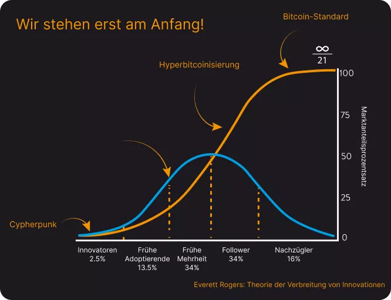

Es ist vor allem wichtig, diese neue Technologie im Allgemeinen zu verstehen. Wir hoffen, dass Ihnen diese Schulung gefällt und Ihnen die notwendigen Grundlagen vermittelt, um dieses neue globale Geldparadigma zu verstehen und vielleicht weiter voranzukommen.

## Die Vorgeschichte von Bitcoin

<chapterId>9a94b627-5b69-5d81-9125-f1fa9b0aa6ad</chapterId>


Bevor der Begriff "Bitcoin" mit digitaler Währung und finanzieller Transformation in Verbindung gebracht wurde, legten eine Reihe von Ideen, Innovationen und sozialen Bewegungen die Grundlagen für seine Entstehung. Eines der grundlegenden Elemente dieser Vorgeschichte von Bitcoin ist die Cypherpunk-Bewegung.

### Die Cypherpunks: Visionäre der digitalen Welt


Im Herzen der technologischen Entwicklung der 1980er und 1990er Jahre begann eine Gruppe von Menschen, sich intensiv mit der Rolle von Privatsphäre und Freiheit im digitalen Zeitalter auseinanderzusetzen. Diese Personen, die später als "Cypherpunks" bekannt wurden, glaubten fest daran, dass Kryptographie als Werkzeug dienen könnte, um individuelle Rechte vor staatlicher Einmischung und großen Unternehmen zu schützen.
Bedeutende Persönlichkeiten wie Julian Assange, Wei Dai, Tim May und David Chaum trugen dazu bei, die Philosophie und Vision der Cypherpunks zu definieren. Diese Denker teilten ihre Ideen in einer einflussreichen Mailingliste, in der Teilnehmer aus der ganzen Welt darüber debattierten, wie Technologie am besten genutzt werden kann, um größere individuelle Freiheit zu gewährleisten.

### Die Drei Grundlegenden Texte der Cypherpunks


Die Cypherpunk-Bewegung, mit ihren tiefen Wurzeln im digitalen Aktivismus und der Kryptographie, stützte sich auf mehrere grundlegende Texte, um ihre Prinzipien und ihre Vision für die Zukunft auszudrücken. Unter diesen Schriften ragen drei besonders heraus:

- Das "Cypherpunk Manifesto":
  Verfasst von Eric Hughes im Jahr 1993, erklärt das "Cypherpunk Manifesto", dass Privatsphäre ein grundlegendes Recht ist. Hughes argumentierte, dass die Fähigkeit zur freien und vertraulichen Kommunikation für eine freie Gesellschaft unerlässlich sei. Das Manifest erklärt: "Wir können nicht erwarten, dass Institutionen, Unternehmen oder andere große, unpersönliche Entitäten uns Privatsphäre gewähren... Wir müssen sie selbst verteidigen."

- Das "Manifest des Crypto-Anarchisten":
  Verfasst von Timothy C. May im Jahr 1992, zeigt dieses Manifest auf, wie der Einsatz von Kryptographie zu einer Ära der kryptographischen Anarchie führen könnte, in der Regierungen machtlos wären, in die privaten Angelegenheiten der Bürger einzugreifen. May prognostizierte eine Zukunft, in der Informations-, Geld- und Nachrichtenaustausch ohne die Einmischung einer dritten Partei und anonym erfolgen könnten.

- Die "Unabhängigkeitserklärung des Cyberspace":
  Obwohl dieser Text nicht ausschließlich cypherpunk ist, spiegelt er die Gefühle vieler Akteure der Bewegung wider. Verfasst im Jahr 1996 von John Perry Barlow, ist es eine Reaktion auf die zunehmende Regulierung des Internets durch Regierungen. Die Erklärung besagt, dass der Cyberspace ein separater Ort von der physischen Sphäre ist und nicht denselben Gesetzen unterliegen sollte. Sie erklärt: "Wir haben keine gewählten Vertreter und können daher nicht regiert werden."

### Die Vorläufer des Bitcoin

Vor dem Aufkommen von Bitcoin wurden mehrere Versuche unternommen, eine digitale Währung zu schaffen. David Chaum führte zum Beispiel in den 1980er Jahren das Konzept des "anonymen elektronischen Geldes" mit seinem Projekt "DigiCash" ein. Leider ist DigiCash aufgrund verschiedener Einschränkungen nie wirklich erfolgreich geworden.

Ein weiterer wichtiger Vorläufer ist "b-money" von Wei Dai. Obwohl es nie umgesetzt wurde, präsentierte es die Idee einer anonymen digitalen Währung, bei der die Betrugserkennung von einer Gemeinschaft von Bewertern und nicht von einer zentralen Behörde durchgeführt wurde.


In dieser fruchtbaren Umgebung veröffentlichte der mysteriöse Satoshi Nakamoto im Jahr 2008 das Bitcoin-Whitepaper. Er kombinierte mehrere Ideen aus der Cypherpunk-Bewegung, wie Proof-of-Work und kryptographische Zeitstempel, um eine dezentralisierte und zensurresistente digitale Währung zu schaffen.

Bitcoin war mehr als nur eine digitale Währung; es verkörperte eine Verwirklichung der Cypherpunk-Ideale. Über seine Technologie hinaus symbolisierte es eine Revolution gegen traditionelle Finanzsysteme und bot eine Alternative, die auf Transparenz, Dezentralisierung und individueller Souveränität basierte.

### Schlussfolgerung

Die Vorgeschichte von Bitcoin ist tief in der Cypherpunk-Bewegung und in einem kollektiven Streben nach größerer Freiheit im digitalen Zeitalter verwurzelt. Durch die Kombination von Kryptographie-, Dezentralisierungs- und Integritätsprinzipien ist Bitcoin weit mehr als nur eine Währung geworden; es ist das Produkt einer philosophischen und technologischen Revolution, die weiterhin unsere Welt prägt.

Bitcoin ist also ein Protokoll, das sich über lange Zeiträume erstreckt und uns dazu anregt, über unser Verhältnis zu Energie, Zeit und Geld nachzudenken. Aber ist Bitcoin eine "echte" Währung? Was ist eine Währung? Gibt es sie in verschiedenen Formen? Das werden wir im nächsten Kapitel sehen.


# Die Währung

<partId>e913df1a-4cbd-5380-ba67-ca2a0414f671</partId>

## Die Währung im Laufe der Geschichte

<chapterId>c838e64d-d59f-5703-8c74-ea5e8c4fdd31</chapterId>

Die Entwicklung der Währung ist ein faszinierender Aspekt der menschlichen Geschichte und spiegelt den Einfallsreichtum von Zivilisationen im Laufe der Zeit wider, um sich an sich ständig ändernde wirtschaftliche Bedürfnisse anzupassen.


### Von Muscheln bis zum Bankkonto

Ursprünglich war Geld greifbar und oft mit wesentlichen Gütern wie Getreide, Vieh und anderen Waren verbunden. Diese Waren hatten jedoch erhebliche Nachteile wie Verderblichkeit, was ihre Verwendung als langfristige Sparmittel erschwerte. Zum Beispiel konnte eine schlechte Ernte oder eine Krankheit den Reichtum eines Individuums von einem Tag auf den anderen vernichten.
Während Zivilisationen fortschritten und der Handel sich auf neue Regionen ausdehnte, entstand ein Bedarf an einem universellen Tauschmittel. Objekte wie Muscheln und Edelsteine wurden ausprobiert, waren aber nicht perfekt. Gold wurde schließlich aufgrund seiner Seltenheit, Haltbarkeit und Teilbarkeit zum Standard. Es war und ist bis heute ein Symbol für Reichtum und Macht.

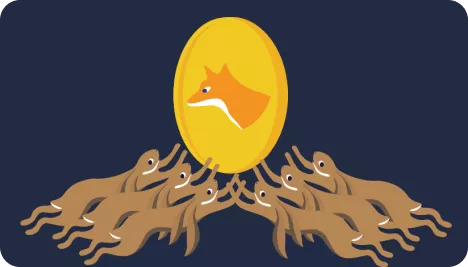

### Was ist die Rolle des Geldes?

Geld ist ein sehr ausgefeiltes Kommunikationsmittel:

- Es ermöglicht die Kommunikation zwischen Gegenwart und Zukunft. Wir verwandeln unsere Zeit und Energie in ein Vermögen, das in der Zukunft ohne das Risiko einer Abwertung wiederverwendet werden kann.

- Es ermöglicht die Kommunikation in einer universellen gemeinsamen Sprache. Ohne sich zu kennen, ohne die gleiche Sprache zu sprechen, können zwei Fremde Waren austauschen, handeln und sich auf den Wert von Dingen einigen.

Seine Funktion in unserer Welt ist schwer künstlich zu replizieren. Kein Mensch oder Menschengruppe kann Geld erschaffen, es ist ein natürlicher sozialer Phänomen, das aus dem Markt und einem freiwilligen Konsens entstehen muss. Preise sind Signale, Informationen, die der Gesellschaft helfen, zu entscheiden, wie Ressourcen verteilt werden.

Gold als Geld ist die Wahl von 4.000 Jahren monetärem Darwinismus, der auf drei Funktionen beruht:

- Wertspeicher
- Tauschmittel
- Recheneinheit


### Die Eigenschaften des Geldes

Gold erfüllt idealerweise die Kriterien einer effektiven Währung: Seine natürliche Seltenheit macht es zu einem wertvollen Objekt, während seine chemischen Eigenschaften ihm ermöglichen, sich nicht mit der Zeit zu erodieren. Diese Form von Geld ist jedoch nicht leicht teilbar oder über weite Strecken transportierbar. In einer globalisierten und digitalen Welt kann Gold nicht mithalten und benötigt eine zentrale Einheit, um es teilbar und leicht austauschbar zu machen (geprägte Münze).
Diese Mängel haben Gold zu einer Wertaufbewahrung gemacht, aber nicht zu einer gängigen Währung, zum Nachteil der staatlichen Fiat-Währungen, die leicht verwendbar sind, aber ständig von den sie kontrollierenden Einheiten (König, Zentralbank, Kaiser, Diktator) abgewertet werden.

Die Kriterien für eine effektive Währung sind vielfältig. Eine gute Währung sollte:


- **Fungibel** sein, das heißt austauschbar ohne Wertverlust
- **Teilbar** sein, um Transaktionen unterschiedlicher Volumina zu erleichtern
- **Liquide** sein, das heißt leicht in Waren oder Dienstleistungen umwandelbar.

Um diesen Kriterien gerecht zu werden, entwickelt sich das Geld schrittweise weiter:

- Rohstein -> Münze
- Banknote -> Kreditkarte
- Blockchain -> Lightning Network

Heutzutage entwickeln sich Währungen weiter und passen ihre Formen an verschiedene Verwendungszwecke an. Zum Beispiel ist Gold zwar eine ausgezeichnete Wertaufbewahrung, aber nicht mehr für die heutige globalisierte Wirtschaft geeignet. Ebenso sind Fiat-Währungen wie der Dollar und der Euro aufgrund ihrer hauptsächlich digitalen Natur sehr liquide und leicht transportierbar, aber ihr Wert wird ständig durch die Geldinflation erodiert.

Bitcoin hingegen bietet neue Möglichkeiten. Aufgrund seiner Eigenschaften, wie zum Beispiel seinem streng begrenzten Angebot, bietet es eine ausgezeichnete Wertaufbewahrung. Darüber hinaus ist es als neutrale Internetwährung ein gutes Tauschmittel, das keine Grenzen kennt. Dennoch wird es trotz einer [ständigen Akzeptanz](https://btcmap.org/map) heute noch wenig im Handel akzeptiert.

## Fiat-Währungen

<chapterId>25151d46-7db1-5b48-8bba-cbde1944555a</chapterId>

"Diejenigen, die nicht aus der Geschichte lernen, sind dazu verdammt, die gleichen Fehler zu wiederholen", sagte George Santayana. Eine Wahrheit, die besonders dann erklingt, wenn wir über das aktuelle Geldsystem sprechen.

### Fiduziarisch = Vertrauen

Heutzutage gelten große Währungen wie der Euro und der Dollar als fiduziarisch. Das bedeutet, dass sie keinen inneren Wert haben. Ihr Wert beruht ausschließlich auf dem Vertrauen und dem Glauben, den wir den sie regulierenden Institutionen entgegenbringen.
Eine fiduziäre Währung ist eine Form von Geld, die von einer Institution wie einem Nationalstaat wie China mit dem Yen oder einer politisch-wirtschaftlichen Union wie der Europäischen Union mit dem Euro als Währung erklärt wird. Die Institution, die für die Ausgabe einer fiduziären Währung verantwortlich ist, ist eine Zentralbank (zum Beispiel die Volksbank von China, die Federal Reserve der Vereinigten Staaten oder die Zentralbank der Republik Guinea). Diese Institutionen sind dafür verantwortlich, die Geldpolitik zu bestimmen und somit zu entscheiden, wie viel Geld in Umlauf gebracht oder gedruckt werden soll.

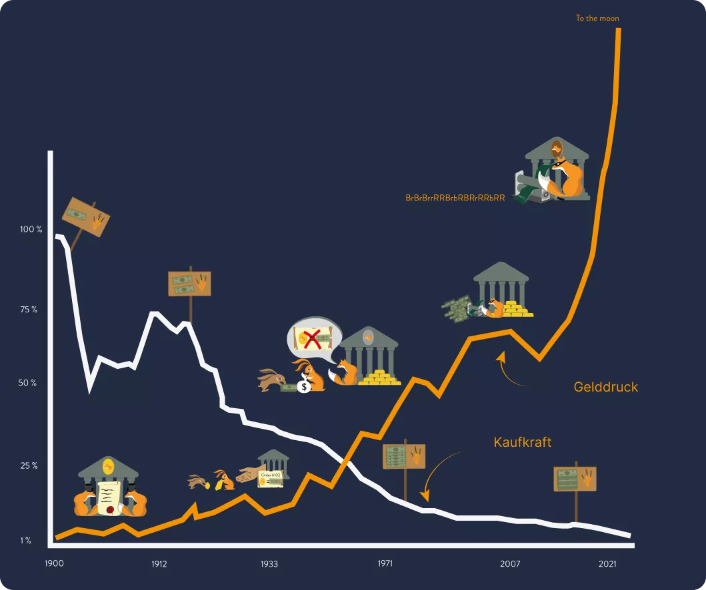

### Währungsabwertung: Eine Strategie so alt wie das Römische Reich

Seit der Antike diente Gold als Währungsreferenz. Aufgrund seiner Starrheit haben jedoch die Herrscher - sei es das Römische Kaiserreich oder moderne Regierungen - oft alternative, oft fiduziäre Währungen eingeführt.

Der Mechanismus ist einfach und basiert auf Praktiken, die seit den Anfängen der Zivilisation existieren. Die Herrscher, die bestrebt sind, die Kontrolle über Reichtümer auszuüben, beginnen damit, das Gold zu zentralisieren, oft durch Ausnutzung ihrer Macht und durch Versprechen von Schutz und Sicherheit. Mit diesem kostbaren Vorrat in ihren Händen führen sie eine neue Währung ein, die im Wert dem Gold entspricht, aber mit ihrem Abbild geprägt ist. Diese Währung beginnt dann im Umlauf zu sein, und das Volk gewöhnt sich schnell an ihre Bequemlichkeit.

Nach und nach werten diese Herrscher die neue Währung heimlich ab, indem sie ihren Wert im Vergleich zum ursprünglichen Gold jedes Jahr um einige Prozentpunkte reduzieren. Diese stille Abwertung wird oft als im Interesse des Volkes gerechtfertigt. So sehen diejenigen, die in dieser fiduziären Währung sparen, den Wert ihrer Ersparnisse schwinden, während der Staat seine Projekte durch Inflation finanziert. Darüber hinaus erleichtert diese Abwertung die Rückzahlung von Schulden.


Zu einem kritischen Zeitpunkt wird die Ankündigung gemacht: Die Währung wird nicht mehr durch Gold gestützt. Die Öffentlichkeit, die mittlerweile an die fiduziäre Währung gewöhnt ist und oft schlecht über finanzielle Fragen informiert ist, akzeptiert diese Realität. Der Staat hat dann freie Hand, um die Geldmenge zu manipulieren und zu nahezu keinen Kosten enorme Geldsummen zu drucken.

Diese Strategie kann, wenn sie gut umgesetzt wird, jahrzehntelang bestehen bleiben. Eine zu schnelle Abwertung oder ein Vertrauensverlust können jedoch zu Hyperinflation führen (siehe nächstes Kapitel). Die Geschichte zeigt, dass der Dollar in 100 Jahren 98% seines Wertes verloren hat, der Euro in 20 Jahren 30% und das britische Pfund seit seiner Einführung 99%.

Am Ende könnte die Währung keine Verbindung mehr zum Gold haben, ähnlich wie die römischen Münzen am Ende des Reiches, oder sogar auf einen reinen numerischen Wert reduziert werden, der von der greifbaren Realität getrennt ist.

Heute sind wir Zeugen einer historischen Wende. Der Dollar, der lange Zeit dominiert hat, scheint im Niedergang zu sein und Gold hat seinen zentralen Platz verloren. Wir stehen an der Schwelle eines neuen Währungszyklus und erinnern daran, dass die Lehren der Geschichte oft vergessen werden.


### Ist Bitcoin eine Lösung?

In diesem Kontext gewinnt die Bitcoin-Revolution an Bedeutung. Diese Währung, die **kein Vertrauen in Dritte** erfordert, zielt darauf ab, den Staat von der Währung zu trennen.

Die Geldschöpfung führt zu Inflation und verarmt die Bevölkerung allmählich. Auf der anderen Seite haben sich Finanzinstitute und wohlhabende Einzelpersonen durch diese Praxis bereichert und eine Kluft der Ungleichheit geschaffen, die den Autoritarismus begünstigt. Das aktuelle Finanzsystem ist reguliert und eingeschränkt, um einen Zusammenbruch zu verhindern, und jede Störung könnte eine große Wirtschaftskrise auslösen. Da politische Akteure von diesem System profitieren, haben sie keinen Anreiz für einen radikalen Wandel und lassen das System seinen Lauf nehmen, bis es möglicherweise zusammenbricht.


Als Antwort auf diese systemischen Herausforderungen präsentiert sich Bitcoin als dezentrale Lösung: ein neues paralleles Geldsystem. Historisch gesehen wurde Gold als Währung bevorzugt, aufgrund seiner Fälschungssicherheit. Ähnlich kann Bitcoin aufgrund seiner dezentralen und kryptographischen Natur nicht gefälscht werden und ist auf 21 Millionen Einheiten begrenzt. Bitcoin ist eine Währung, die auf Transparenz und Neutralität basiert und eine attraktive Alternative zum aktuellen zentralisierten Geldsystem bietet.

Gleichzeitig scheint die Einführung von digitalen Zentralbankwährungen, oder CBDCs, unausweichlich zu sein. Diese neue Form von Währung würde eine stärker zentralisierte Wirtschaftsplanung ermöglichen, was die finanzielle Freiheit der Einzelpersonen beeinträchtigen und autoritären Missbrauch erleichtern könnte.

'Wir können dieses Kapitel mit dem Zitat des Wirtschaftspreisträgers F.A. Hayek aus dem Jahr 1984 abschließen: "Ich glaube nicht, dass wir jemals eine gute Währung haben werden, solange wir sie nicht aus den Händen der Regierung nehmen. Dennoch können wir sie ihnen nicht gewaltsam entreißen, alles, was wir tun können, ist, etwas einzuführen, das sie nicht stoppen können, durch einen raffinierten Trick."


## Die Hyperinflationen

<chapterId>b04c024c-54f3-50cb-997f-58721cfc74be</chapterId>

Die Hyperinflation ist ein monetäres Phänomen, das für Fiatwährungen typisch ist. Sie zeichnet sich durch einen vollständigen Vertrauensverlust in eine Währung und eine drastische Inflation durch die Geldschöpfung der Behörden aus. Als Ergebnis können die von Einzelpersonen angesammelten Ersparnisse in relativ kurzer Zeit verschwinden, was das Land an den Rand des wirtschaftlichen, sozialen und politischen Abgrunds treibt.

### Die Inflation, aber außer Kontrolle!

Versuchen wir, die Auswirkungen der Inflation auf das Sparen zu verstehen, indem wir verschiedene Inflationsraten betrachten.

- Bei einer Inflation von 2% verlieren Sie jährlich 2% Ihrer Kaufkraft, das sind 10% nach 5 Jahren.
- Bei 7% verlieren Sie die Hälfte in 10 Jahren.
- Bei 20% verlieren Sie praktisch die Hälfte in 3 Jahren.

Bei einer Hyperinflation sprechen wir nicht mehr von 20% pro Jahr, sondern von 20% pro Monat oder sogar pro TAG. Eine Inflation von 100% pro Tag über 3 Tage sind realistische Ereignisse, die in unserer Welt passiert sind und weiterhin passieren.

Es ist wichtig zu verstehen, dass Hyperinflation nicht aus Zufall, Kapitalismus oder politischen Gegnern entsteht. Hyperinflation ist die direkte Folge falscher geldpolitischer Entscheidungen von Zentralbankern und Politikern. Die Auswirkungen betreffen alle Bürger und werden Generationen beeinflussen. Ich lade Sie ein, sich 5 Minuten Zeit zu nehmen, um sich mit dieser Tabelle zu befassen und die tatsächlichen Auswirkungen dieses Phänomens zu erkennen (der Kurs ECON204 wird dieses Thema im Detail behandeln)."


### Wie verläuft eine Hyperinflation?

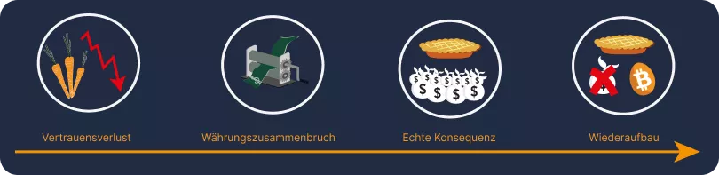

Phase 1 - Der Vertrauensverlust'

- Eine Zentralisierung der Geldmacht erleichtert die Schaffung von Geld und Missbrauch. Ein Vertrauensverlust in eine Währung kann dann auftreten und eine Hyperinflation auslösen. Die Menschen beginnen dann, die Herkunft des Geldes und die Vorteile der vorgeschriebenen Geldpolitik zu hinterfragen. Dieser Vertrauensverlust ist in der Regel auf externe Faktoren wie Kriege, soziale Maßnahmen oder den Anstieg der Preise für wichtige Ressourcen wie Weizen oder Benzin zurückzuführen.

Phase 2 - Der Zusammenbruch der Währung und der Preisanstieg

- Wenn Regierungen das Vertrauen verlieren, beginnen die Menschen ihre Währung gegen eine andere, stabilere Währung wie den US-Dollar in Venezuela zu tauschen. Dies führt zu einem Preisanstieg und schafft einen Teufelskreis, in dem Güter und Dienstleistungen immer teurer werden. Um diesen Bedürfnissen gerecht zu werden, druckt der Staat mehr Geld, um die Geldpolitik zu korrigieren, was zu exponentieller Inflation führt.

Phase 3 - Der Teufelskreis des Gelddrucks

- Es werden immer mehr Banknoten benötigt, um Waren zu kaufen, was zu einem Mangel an Bargeld führt. Dies führt zu noch mehr Gelddruck und schafft noch mehr Inflation.

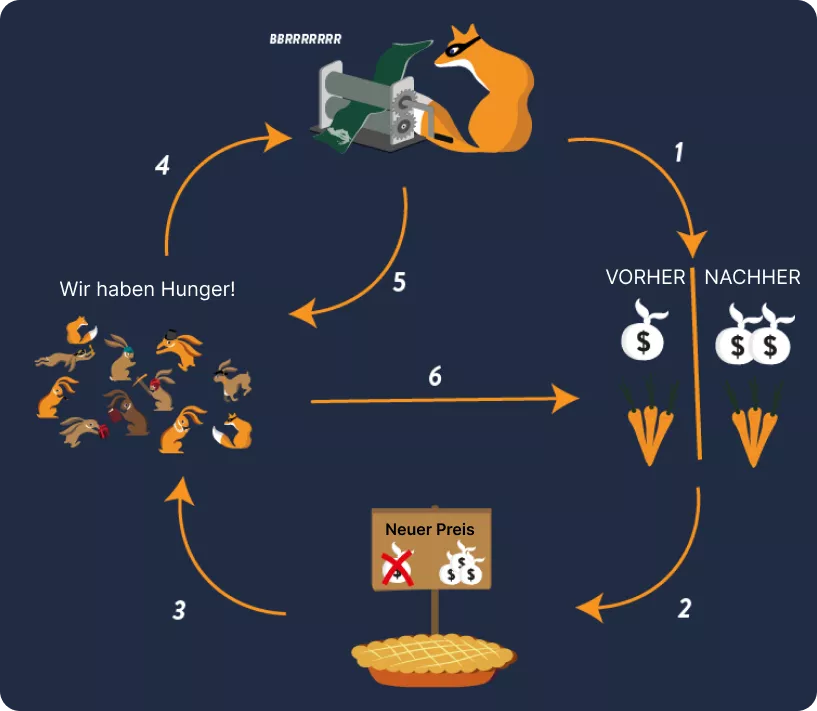

Phase 4 - Eine neue Währung entsteht

- Eine neue Währung wird eingeführt, um die alte zu ersetzen. Ein bemerkenswertes Beispiel für Hyperinflation ist Deutschland in den Jahren 1920-1924. Um die Wirtschaft anzukurbeln, wurde eine neue Währung geschaffen, die durch deutsche, französische und englische Schulden besichert und durch deutsches Land garantiert war.

Die Bewältigung einer Hyperinflationskrise erfordert oft radikale Veränderungen wie Revolutionen, Regierungswechsel, Wechsel der Zentralbanker und vieles mehr. Vertrauensverlust, Währungszusammenbruch und Wiederaufbau sind entscheidende Phasen, um eine neue Wirtschaft auf der Grundlage einer Vertrauenswährung anzukurbeln.

### 3 bemerkenswerte Beispiele

- Deutschland, 1922-1923

  Eines der markantesten Beispiele für Hyperinflation ereignete sich in der Weimarer Republik nach dem Ersten Weltkrieg.

  Deutschland hatte enorme Geldbeträge aufgenommen, um den Kriegsanstrengungen zu finanzieren, und nicht nur, dass Deutschland den Krieg nicht gewonnen hat, es musste auch Milliarden von Dollar an Reparationen zahlen. Der Monat mit der höchsten Inflation war Oktober 1923 mit einem Höhepunkt von 29.500 %, was einer täglichen Inflation von 20,9 % entspricht. Die Preise verdoppelten sich alle 3,7 Tage!
  Man erzählt, dass in Restaurants die Kellner alle 30 Minuten die Menüpreise bekanntgeben mussten, um die Inflation zu berücksichtigen. Die deutsche Währung wurde so nutzlos, dass einige Bürger ihr Papiergeld lieber verbrannten als Holz, weil es tatsächlich billiger war.


- Ungarn, 1945-1946

  Das Land, das bisher die schlimmste Hyperinflationsperiode erlebt hat, ist bei weitem Ungarn nach dem Zweiten Weltkrieg.

  Ungarn war auf der Verliererseite des Konflikts und der Krieg hatte den Großteil seiner industriellen Produktionskapazität zerstört. Der Monat mit der stärksten Inflation war der Juli 1946 mit einer Preissteigerung von 41.900.000.000.000.000 %, was 207 % pro Tag entspricht. Die Preise verdoppelten sich alle 15 Stunden!

  Der letzte in Umlauf gebrachte Geldschein war eine Banknote über 100 Billionen Pengo (100.000.000.000.000.000.000) im Jahr 1946.

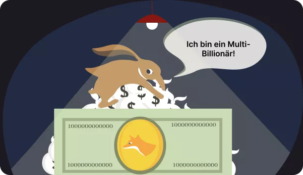

- Simbabwe, 2007-2008
  Bis zum Jahr 2000 war Simbabwe fast autark in Bezug auf seine Bedürfnisse, abgesehen von Öl.

  Im Jahr 1997 brach der simbabwische Dollar um mehr als 72 % ein, nachdem die Regierung den Kriegsveteranen eine Entschädigung in Höhe von 450 Millionen US-Dollar zugesagt hatte. Da die Regierung nicht über eine solche Summe verfügte, musste sie die Geldpresse in Gang setzen. Im Jahr 2005 erreichte die Inflation 586 % und im März 2007 betrug die monatliche Inflation 50 %.

  Im Juni 2007 reagierte die Regierung, indem sie eine Preisregulierung einführte. Die Geschäfte wurden buchstäblich "ausgeraubt". Die Händler haben nun nicht mehr die Mittel, ihre Läden wieder aufzufüllen.

  Im April 2009 kündigte der Finanzminister die Aussetzung des simbabwischen Dollars an und erlaubte die Verwendung verschiedener ausländischer Währungen für den Handel. Alle Bankkonten, Renten und Finanzinstitutionen sahen ihre Guthaben über Nacht verschwinden.


Zusammenfassend führt Hyperinflation dazu, dass der Wert der Währung schnell abnimmt, was zu einer Erosion der Ersparnisse und einem Vertrauensverlust in das Währungssystem führt. Wie Voltaire einst vorschlug, wird eine Fiatwährung immer ihren inneren Wert verlieren und gegen Null konvergieren.
Eine Währung, die auf einem Vertrauensdritten wie einer Finanzinstitution beruht, erweist sich in der Praxis und langfristig als fehlerhafte Währung, da sie nicht in der Lage ist, die Kaufkraft zu garantieren oder Ersparnisse zu schützen.

## 21 Millionen Bitcoins

<chapterId>f4a06d76-1963-56fd-93ff-dfa41489bcde</chapterId>

### Die Geldpolitik von Bitcoin

Bitcoin ist eine dezentralisierte digitale Währung mit einer vordefinierten maximalen Menge von **21 Millionen Einheiten**. Diese intrinsische Knappheit wird durch seinen Programmcode bestimmt und durch den Konsens aller Benutzer, die am Protokoll teilnehmen, gestärkt.

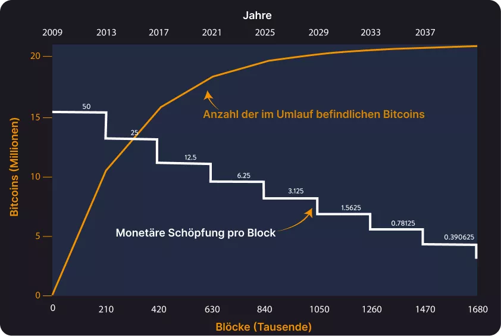

Was die Geldemission betrifft, kann sie durch eine S-Kurve dargestellt werden, die die Menge der im Laufe der Zeit geschaffenen Bitcoins darstellt. Zum Beispiel waren im Jahr 2022 etwa 18,5 Millionen Bitcoins im Umlauf. Prognosen zeigen, dass es im Jahr 2025 etwa 19,5 Millionen Bitcoins geben wird, was etwa 93% des Gesamtangebots entspricht, und im Jahr 2037 wird diese Zahl 20,4 Millionen erreichen.

### Wie werden neue Bitcoins erstellt?

Die Erstellung neuer Bitcoins ist das Ergebnis des Mining-Prozesses, einem Verfahren zur Bestätigung von Transaktionen im Bitcoin-Netzwerk.

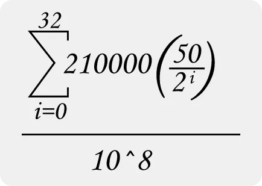

Die Miner, die diese Aufgabe ausführen, werden alle zehn Minuten mit der Emission neuer Bitcoins belohnt. Diese Belohnung ist so programmiert, dass sie alle 210.000 Blöcke halbiert wird, was etwa alle vier Jahre geschieht, ein Ereignis, das als "Halving" bekannt ist - was der Geldemissionskurve eine Treppenform verleiht. Aufgrund dieses Halving-Mechanismus kann mathematisch vorhergesagt werden, dass die Erstellung von Bitcoins im Jahr 2140 enden wird, wenn die Gesamtzahl von 21 Millionen Bitcoins erreicht ist.
| Halving-Nummer | Blockhöhe | BTC-Belohnung nach Halving | Geschätzte BTC im Umlauf nach Halving |
| -------------- | ---------- | -------------------------- | ------------------------------------- |
| 1 | 210.000 | 25 BTC | 10.500.000 BTC |
| 2 | 420.000 | 12,5 BTC | 15.750.000 BTC |
| 3 | 630.000 | 6,25 BTC | 18.375.000 BTC |
| 4 | 840.000 | 3,125 BTC | 19.687.500 BTC |
| 5 | 1.050.000 | 1,5625 BTC | 20.343.750 BTC |
| 6 | 1.260.000 | 0,78125 BTC | 20.671.875 BTC |
| 7 | 1.470.000 | 0,390625 BTC | 20.835.937,5 BTC |
| 8 | 1.680.000 | 0,1953125 BTC | 20,917,968.75 BTC |
| 9 | 1.890.000 | 0,09765625 BTC | 20,958,984.375 BTC |
| 10 | 2.100.000 | 0,048828125 BTC | 20,979,492.188 BTC |
| 11 | 2.310.000 | 0,0244140625 BTC | 20,989,746.094 BTC |
| 12 | 2.520.000 | 0,01220703125 BTC | 20,994,873.047 BTC |
| 13 | 2.730.000 | 0,006103515625 BTC | 20,997,436.523 BTC |
| 14 | 2.940.000 | 0,0030517578125 BTC | 20,998,718.262 BTC |
| 15 | 3.150.000 | 0,00152587890625 BTC | 20,999,359.131 BTC |
| 16 | 3.360.000 | 0,000762939453125 BTC | 20,999,679.566 BTC |
| 17 | 3.570.000 | 0,0003814697265625 BTC | 20,999,839.783 BTC |
| 18 | 3.780.000 | 0,00019073486328125 BTC | 20,999,919.892 BTC |
| 19 | 3.990.000 | 0,000095367431640625 BTC | 20,999,959.946 BTC |
| 20 | 4.200.000 | 0,0000476837158203125 BTC | 20,999,979.973 BTC |

Wir werden im Kapitel Mining detailliert auf die Miner eingehen.

### Die digitale Knappheit gewährleisten

Die Knappheit von Bitcoin wird durch zwei Schlüsselmechanismen gewährleistet: die Anpassung der Mining-Schwierigkeit und die Spieltheorie:

- Die Anpassung der Mining-Schwierigkeit ist ein Mechanismus, der alle 2016 Blöcke, etwa alle zwei Wochen, erfolgt, um sicherzustellen, dass im Durchschnitt alle zehn Minuten ein neuer Block zur Blockchain hinzugefügt wird. Diese Häufigkeit der Blockerstellung und die Gesamtmenge an Bitcoins sind feste Bestandteile des Bitcoin-Protokolls und können nicht ohne allgemeinen Konsens geändert werden, im Gegensatz zu willkürlichen Entscheidungen in traditionellen Währungssystemen.

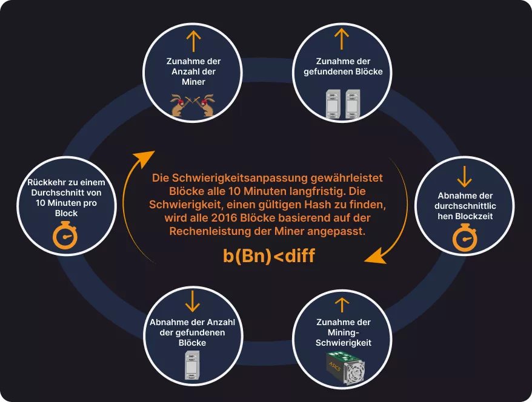

> Wussten Sie schon? Die Miner werden dazu angeregt, einen Block abzubauen, um die neuen Bitcoins und die Transaktionsgebühren zu verdienen, die mit den Transaktionen verbunden sind, die sie in ihren Block aufnehmen. Wenn die Anzahl der ausgegebenen Bitcoins der Grenze von 21 Millionen näher kommt, werden die Miner eher durch Transaktionsgebühren als durch die Blockbelohnung entlohnt.'

- Die Spieltheorie ist ein mathematisches Konzept, das auf der menschlichen Rationalität beruht. Hier bei Bitcoin sind es die Benutzer, die über Änderungen am Protokoll abstimmen. Ja, Sie haben richtig gelesen: Jede Änderung am Bitcoin-Protokoll erfordert die Zustimmung der gesamten Benutzergemeinschaft, was äußerst komplex ist. Wenn also jemand 22 Millionen Bitcoins erstellen wollte, müsste er alle Benutzer davon überzeugen, freiwillig ihr eigenes Vermögen abzuwerten, was unwahrscheinlich ist, da Bitcoin global ist und nicht von einer zentralen Gruppe regiert wird.

  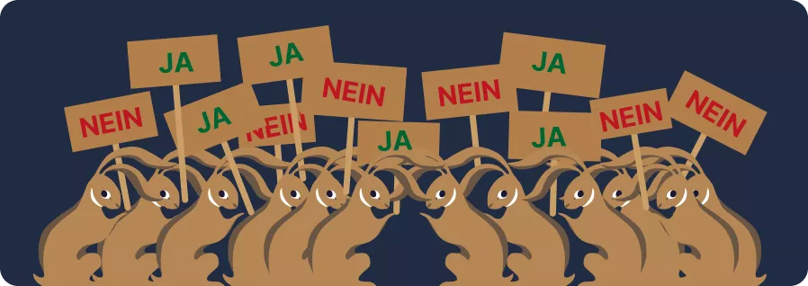

Die Idee, die Währung abzuwerten, widerspricht der grundlegenden Philosophie von Bitcoin, daher ist eine Änderung dieser Begrenzung nahezu unmöglich.

### Eine überprüfbare Geldpolitik, jede Sekunde seit Beginn und für immer!

Die Knappheit von Bitcoin ist ein großer Vorteil, und die maximale Menge von 21 Millionen im Umlauf befindlichen Bitcoins ist öffentlich und von jedermann überprüfbar.

Tatsächlich kann jeder die Menge der im Umlauf befindlichen Bitcoins überprüfen, indem er einen einfachen Befehl auf einem Bitcoin-Knoten eingibt: `bitcoin-cli gettxoutsetinfo`. Diese Transparenz und Überprüfbarkeit stärken das Vertrauen in das Bitcoin-System, das nicht auf zentralisierten Institutionen oder Einzelpersonen, sondern auf einer mathematischen und kryptographischen Garantie basiert, die in seinem Protokoll verankert ist. (Sie werden lernen, dies auf einfache Weise in LN201 zu tun)

```json
{
  "height": 710560,
  "bestblock": "0000000000000000000887384d67103412ea7f18a43953e65c8c4ac36bf42e54",
  "transactions": 473244,
  "txouts": 1018917,
  "bogosize": 2183872374,
  "hash_serialized_2": "eebb9987337700ffaacbbaa11223344",
  "disk_size": 178239584,
  "total_amount": 18745998.12345678
}
```

Bitcoin garantiert durch seine Konzeption eine gesunde Geldverwaltung, indem es seine Schöpfung begrenzt und das Vermögen der Benutzer schützt, was es von anderen Währungen unterscheidet. Im Einklang mit den Prinzipien der österreichischen Wirtschaft (Details in ECON201) schützen seine kontrollierte Menge und seine vorhersehbare Verteilung es vor den Inflationsrisiken traditioneller Währungen.

Insgesamt bietet Bitcoin durch seine dezentrale Natur, seine programmierte Knappheit und seine Transparenz eine einzigartige Alternative zu traditionellen Währungssystemen. Es zeigt, wie Technologie genutzt werden kann, um eine Währung zu schaffen, die nicht nur nützlich und überprüfbar ist, sondern auch den Wert des Benutzervermögens durch eine strenge Angebotsgrenze bewahrt.

### Fazit des Abschnitts 1!

Die Währung ist ein soziales Werkzeug, das sich den Bedürfnissen und der Technologie anpassen muss. Im Laufe der Zeit wurde Gold als Wertspeicher verwendet, da es selten war und nicht abgewertet werden konnte. Später wurde Gold jedoch durch Schulden und Fiat-Währung ersetzt, die leicht zu transportieren, aber auch manipulierbar ist.

Bitcoin ist eine realistische alternative Währung, da sie selten ist und auf 21 Millionen Bitcoins begrenzt ist, die nicht geändert werden können. Die Geldschöpfung wird durch die Anpassung der Schwierigkeit alle 2 Wochen und durch das Halbieren sichergestellt, was einen mathematisch überprüfbaren Beweis für ihre Seltenheit garantiert. Im Gegensatz zu Euro oder Dollar, deren Umlaufmenge nicht überprüfbar ist und sich häufig aufgrund von Entscheidungen von Finanzinstitutionen ändert, ist Bitcoin eine kryptographische Währung mit einer neutralen und festen Geldpolitik. Es ist daher eine ausgezeichnete weltweite Wertspeicherung, da es nicht durch Geldschöpfung abgewertet werden kann.

Bitcoin ist vor allem eine Form von Währung, die dazu anregt, die Macht der Finanzinstitutionen über das Geld in Frage zu stellen. Es handelt sich um einen philosophischen und wirtschaftlichen Kampf, der im Gange ist. Um Bitcoin zu verstehen, ist es wichtig, seine grundlegenden Grundlagen zu verstehen und die falschen Vorstellungen, die es umgeben, zu entmystifizieren. Dies ermöglicht eine konstruktive intellektuelle Debatte über die Zukunft des Geldes.

Jetzt, da wir die Unterschiede zwischen Bitcoin und Fiat-Währungen festgestellt haben, werden wir in den nächsten Kapiteln untersuchen, was Bitcoin-Wallets sind, da es Ihre Verantwortung ist, Ihre Gelder zu sichern. Die finanzielle Souveränität, die Bitcoin bietet, geht zwangsläufig mit individueller Verantwortung einher.

# Bitcoin-Wallets

<partId>28860585-4f61-59d9-b242-f4c57d837cc1</partId>

## Was sind Bitcoin-Wallets?

<chapterId>1c0166ab-cb7a-5bc6-9175-d13482bd91f1</chapterId>

In diesem Abschnitt 2 werden wir die Speicherung und Sicherheit von Bitcoins in Wallets untersuchen. Dies wird Ihnen helfen, besser zu verstehen, wo sich diese berühmten Bitcoins befinden und wie Sie mit ihnen interagieren können!

### Entmystifizierung der Bitcoin-Wallets

In dieser Branche verwenden wir Wallets, um mit dem Bitcoin-Netzwerk zu interagieren, das drei Funktionen hat:

- Empfangen von Bitcoins ermöglichen
- Senden von Bitcoins ermöglichen
- Schutz vor Hacking- und Diebstahlversuchen bieten

Ein Wallet kann eine Software auf Ihrem Computer, eine App auf Ihrem Smartphone, ein physisches Gerät wie ein USB-Stick oder sogar ein Stück Papier sein. Diese verschiedenen Arten von Bitcoin-Wallets erfüllen jeweils unterschiedliche Anwendungsfälle. Einige dienen für große Beträge mit Schwerpunkt auf Sicherheit, andere auf Privatsphäre oder auf die tägliche Zahlung kleiner Beträge.

'Portfolios werden daher in große Nutzungsfamilien unterteilt, wobei immer eine zentrale Frage im Mittelpunkt steht: Sind Sie Eigentümer der Mittel oder überlassen Sie die Kontrolle über Ihr Geld einem Dritten? Wir werden in Kapitel 6 ausführlich auf dieses Thema eingehen, aber die Idee ist einfach: Befindet sich das Geld in Ihrer Tasche oder in der Ihres Bankiers!


### Wie funktioniert eine Bitcoin-Brieftasche?

Egal, ob es sich um Ihren Bitcoin-"Banker" oder um Sie selbst handelt, in der Regel funktionieren die meisten Bitcoin-Brieftaschen mit ähnlicher Technologie, nämlich asymmetrischer Kryptographie und einem Schlüsselpaar-System: einen privaten Schlüssel zum Ausgeben und einen öffentlichen Schlüssel zum Empfangen.

- Privater Schlüssel
  Bei der Initialisierung einer Brieftasche wird ein geheimer Wiederherstellungssatz (privater Schlüssel) generiert und Ihnen in Form von 24 Wörtern gegeben.

  Der private Schlüssel ist sehr wichtig, da er den Besitz der Bitcoins repräsentiert und somit das Recht, sie zu verwenden oder zu senden. Der Inhaber des privaten Schlüssels ist der Eigentümer der Bitcoins.

  Dieser Schlüssel muss geheim und gut aufbewahrt werden, da er Ihren Reichtum freischaltet!

- Öffentlicher Schlüssel & Adresse
  Der öffentliche Schlüssel wird mit dem privaten Schlüssel erstellt und ist daher mit diesem verbunden. Der öffentliche Schlüssel wird verwendet, um Bitcoin-Adressen zu generieren und Geld zu empfangen. Das Teilen des öffentlichen Schlüssels birgt Risiken für die Privatsphäre, aber nicht für die Sicherheit.

  Diese Adressen werden von Ihrer Brieftasche erstellt und können sicher geteilt werden. Es wird empfohlen, sie nur einmal zu verwenden, um Ihre Privatsphäre zu maximieren.

Es ist also wichtig zu verstehen, dass wir dank dieser Technologie problemlos Bitcoins empfangen können, ohne dem Absender die Möglichkeit zu geben, unsere Mittel zu stehlen! Denken Sie daran wie an einen Briefkasten: Die Leute legen Geld hinein, aber nur Sie können ihn öffnen.


### Sind die Bitcoins also in der Brieftasche?

Obwohl Ihre Schlüssel in Ihrer Brieftasche gespeichert sind, sind die Bitcoins selbst tatsächlich in der Bitcoin-Blockchain "gespeichert", die ein öffentliches verteiltes Register im Bitcoin-Peer-to-Peer-Netzwerk ist (wir werden dies in Abschnitt 3 genauer betrachten). Daher bedeutet der Verlust des Geräts, auf dem sich Ihre Brieftasche befindet, nicht unbedingt den Verlust Ihrer Bitcoins. Was es Ihnen ermöglicht, Ihre Brieftasche neu zu erstellen und Ihre Bitcoins auszugeben, ist der private Schlüssel. Es ist daher entscheidend, diesen gut zu sichern.

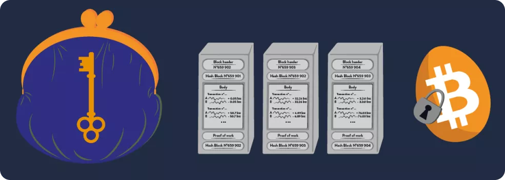

Glücklicherweise kann dieser private Schlüssel seit 2017 in einer einfachen Liste von 12 oder 24 Wörtern codiert werden, die als mnemonischer Satz bezeichnet wird. Dieser Satz ist eine Sicherungskopie Ihrer Bitcoin-Brieftasche und ermöglicht es Ihnen, Ihre Brieftasche mit jeder Bitcoin-Brieftaschen-Software/-App wiederherzustellen. Jede Person, die Zugriff auf diese Wortliste hat, hat Zugriff auf Ihre Bitcoins.

### Was ist mit Hackern?

Man könnte sich die Frage stellen: Was ist, wenn jemand zufällig unsere Liste mit 12 oder 24 Wörtern errät? Die kurze Antwort ist, dass es aufgrund der für die Brieftasche verwendeten Kryptographie äußerst unwahrscheinlich ist. Um es in Perspektive zu setzen, das zufällige Auffinden des Zugriffs auf Ihre Brieftasche entspricht dem Auffinden der "richtigen" Zahl zwischen 1 und $2^256$, was praktisch dem Auffinden des "richtigen" Atoms im Universum entspricht. Wenn Sie jedoch mit dieser Standard-Sicherheit nicht zufrieden sind, können Sie Ihre Bitcoin-Brieftasche immer durch Hinzufügen einer Passphrase stärken.


Die Wahrscheinlichkeit eines Hacks Ihrer Bitcoin-Brieftasche ist daher astronomisch gering, wenn Sie bewährte Sicherheitspraktiken befolgen. Diese Praktiken werden im nächsten Abschnitt ausführlich erläutert.

Wählen Sie eine Brieftasche, die Ihren Bedürfnissen und Ihrer Verwendung entspricht. Detaillierte Anleitungen zur Verwendung und Sicherung verschiedener Brieftaschen finden Sie im Abschnitt [Tutorial PlanB](https://planb.network/tutorials/wallet).

## Sicherheit und Bitcoin-Brieftaschen

<chapterId>00c1afea-e54a-511f-bab3-2efc2fbfa6a1</chapterId>

### Die richtigen Fragen stellen, bevor Sie beginnen

Wenn Sie Bitcoins besitzen, ist die Sicherheit Ihrer Gelder ein wichtiges Anliegen. Der beste Weg, eine Sicherheit zu definieren, die Ihrer Situation entspricht, besteht darin, eine ganze Reihe von Fragen zu stellen (und zu beantworten); Ihre Sicherheitsstrategie hängt von Ihren Antworten ab. Fangen wir an:

- Wer hat Zugriff auf meine Gelder? Anders ausgedrückt, sind Sie der einzige, der Zugriff auf Ihre Bitcoins hat, oder erlaubt Ihnen eine Drittperson wie ein Unternehmen den Zugriff auf Ihre Gelder?
- Eine zweite Frage könnte lauten: Welche Verwendungszwecke haben Sie für Ihre Bitcoins? Ist es eine Summe, die Sie regelmäßig verwenden? Ist es eine mittelfristige oder langfristige Ersparnis?
- Welche technischen Fähigkeiten haben Sie?
- Was ist Ihr Sicherheitsbudget?

Es gibt keine universelle Lösung. Nehmen Sie sich also Zeit, um diese Fragen zu beantworten, um Ihre Sicherheitsmaßnahmen anzupassen.

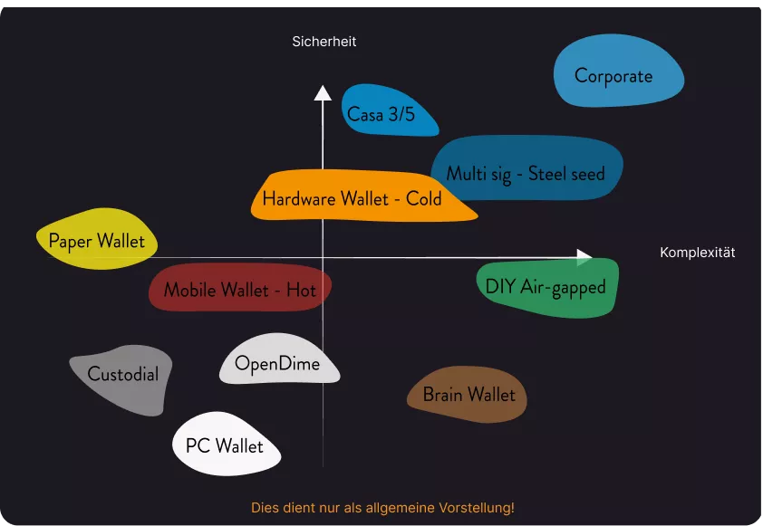

### Denken Sie bei Bitcoin-Brieftaschen in Bezug auf Komplexität

Lassen Sie uns hier versuchen, mehrere Sicherheitsstufen für Ihre Bitcoins festzulegen:

- **Niveau 0**, Sie verwenden einen sogenannten Treuhanddienst, bei dem Sie nicht der alleinige Inhaber Ihrer Bitcoins sind. Achten Sie darauf, dass dieser Vertrauensdritte jederzeit den Zugriff auf Ihre Gelder einschränken kann und Sie das gleiche Maß an finanzieller Souveränität haben wie bei einem traditionellen Bankensystem über ein Bankkonto.

  

- **Niveau 1**, Sie verwenden eine Bitcoin-Wallet auf Ihrem Telefon oder Computer, bei der Sie der alleinige Inhaber Ihrer Bitcoins sind. Sie können Ihre Transaktionen problemlos durchführen. Achten Sie jedoch darauf, dass Sie zur Wiederherstellung des Zugriffs auf Ihre Gelder im Falle eines Verlusts Ihres Telefons oder Computers ein Backup der mnemonischen Phrase erstellen müssen. Es wird oft von einer "Hot Wallet" gesprochen, da der private Schlüssel in einem Gerät mit Internetzugang gespeichert ist.

- **Niveau 2**, Sie verwenden eine physische Wallet und haben Ihre Liste mit 12 oder 24 Wörtern gesichert. Um eine Transaktion durchzuführen, müssen Sie immer mit Ihrem Gerät signieren. Dadurch sind Ihre Gelder im Alltag weniger zugänglich. Es wird oft von einer "Cold Wallet" gesprochen, da Ihre Schlüssel in einem Gerät gespeichert sind, das nicht mit dem Internet verbunden ist.


- **Niveau 3**, Sie verwenden eine Wallet der Stufe 1 oder 2, jedoch mit einem zusätzlichen Passwort. Achten Sie darauf, dass Sie jetzt eine Sicherung der Liste mit 12 oder 24 Wörtern **und** Ihres Passworts erstellen müssen. Idealerweise werden diese beiden Informationen an zwei verschiedenen Orten gespeichert.


- **Niveau 4**, Sie verwenden eine Gruppe von Wallets, um eine sogenannte "Multisig"-Wallet zu erstellen, die mehrere Signaturen erfordert, um eine Transaktion durchzuführen. Achten Sie auch hier darauf, dass jede Partei des Multisig an verschiedenen Orten aufbewahrt wird. Dies wird oft als fortgeschrittene Verwendung von Bitcoin betrachtet und sollte hauptsächlich für größere Beträge und geschäftliche Zwecke verwendet werden.


Natürlich können wir verschiedene Anwendungsfälle haben, und in diesem Fall wird empfohlen, mehrere Bitcoin-Wallets zu verwenden. Es gibt keine Wunderlösung.

### Die Sicherheit muss angepasst werden

Die Summe, die man bereit ist, auf einem bestimmten Sicherheitsniveau zu belassen, hängt von jedem Einzelnen ab. Für manche ist es vernünftig, 1 BTC in einer Hot Wallet zu lassen, für andere absolut nicht. Vermeiden Sie auf jeden Fall hohe Sicherheitskosten, indem Sie sich eine physische Wallet kaufen, wenn Sie eine kleine Summe sichern möchten. Beachten Sie auch, dass eine übermäßig komplexe Sicherheit und Zugänglichkeit Ihrer Bitcoins Ihnen schaden kann, wenn Sie zum Beispiel Ihre Wallet-Backups falsch erstellen.
Abschließend ist der direkte Besitz von Bitcoins ein wesentliches Element, um die finanzielle Souveränität zu gewährleisten. Es wird empfohlen, eine mobile Brieftasche für tägliche Ausgaben und eine Offline- oder "kalte" physische Brieftasche für größere Beträge zu verwenden. Unternehmen sollten die Verwendung von Mehrfachsignatursystemen oder "Multisig" zur erhöhten und gemeinsamen Sicherheit in Betracht ziehen. Es ist auch wichtig, soweit wie möglich auf Verwahrungsdienste zu verzichten, da diese einige der Schwachstellen des traditionellen Finanzsystems reproduzieren können.

Nun, da wir das im Hinterkopf haben, werden wir im nächsten Abschnitt die Schritte zur Erstellung einer Bitcoin-Brieftasche betrachten. Wenn Sie jedoch mehr über das Thema Sicherheit erfahren möchten, können Sie diesen [Artikel von DarthCoin](https://asi0.substack.com/p/bitcoin-soyez-votre-propre-banque) lesen.

## Einrichtung einer Brieftasche

<chapterId>615519eb-4565-557d-86a0-021badf7616f</chapterId>

Die Sicherheit Ihrer Bitcoins ist von entscheidender Bedeutung, und ein einfacher Fehler kann teure Folgen haben. Aus diesem Grund werden wir nun bewährte Verfahren bei der Erstellung einer neuen Bitcoin-Brieftasche betrachten.

> Beachten Sie, dass der BTC102-Kurs Sie bei diesem Schritt unterstützt.

### Dieser Schritt ist kein Spaß!

Ihr privater Schlüssel, oft durch eine Liste von 24 Wörtern dargestellt (oft als "Seed" oder "mnemonische Phrase" bezeichnet), ermöglicht den Zugriff auf Ihre Gelder. Wenn dieser Schlüssel einem Dritten offenbart wird, sollten Sie davon ausgehen, dass die damit verbundenen Gelder nicht mehr sicher sind. Daher ist es bei der Initialisierung Ihrer Brieftasche wichtig, diese Regeln zu beachten:

- Verdecken Sie alle Kameras.
- Machen Sie kein Foto der Wortliste.
- Geben Sie sie nicht auf einem Computer oder Telefon ein.
- Speichern Sie sie nicht als Kontakt oder senden Sie sie sich selbst per SMS.
- Lassen Sie Ihre Wörter niemals unbeaufsichtigt auf Ihrem Schreibtisch liegen.
- Verstecken Sie Ihre Wortliste niemals an einem ungewöhnlichen Ort.

Sie werden buchstäblich ein leeres Blatt Papier nehmen oder diese [Vorlage](https://bitcoiner.guide/backup.pdf) ausdrucken und die Wortliste in der richtigen Reihenfolge mit einem Stift sauber und deutlich darauf schreiben. Wenn die Tinte im Laufe der Zeit verschwindet, können Sie Ihre Gelder verlieren. Daher ist es wichtig, dieses Papier vor Witterungseinflüssen zu schützen.


### Tipp für eine ordnungsgemäße Durchführung

Es gibt auch alternative Lösungen zum Papier, wie zum Beispiel das Einprägen Ihres mnemonischen Satzes auf eine Metallplatte. Wenn Sie falsch schreiben, könnten Ihre Erben Schwierigkeiten haben, Sie zu lesen und somit die Gelder nicht wiederherstellen können. Sobald die Wörter geschrieben sind, wird empfohlen, eine zweite Kopie anzufertigen und an einem anderen Ort als dem ersten zu lagern. Dies ermöglicht eine Sicherungskopie im Falle eines Verlusts oder eines Unfalls mit der ersten Kopie.
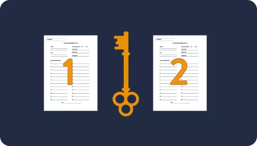

Nachdem die Kopien erstellt wurden, bewahren Sie die Wortlisten an einem sicheren Ort auf, an den Sie sich erinnern können, sie zu suchen! Erstellen Sie keinen zu komplexen Versteckplan, bei dem Sie Gefahr laufen, sie zu verlieren.

> Ihre Worte = Ihr Geld.

Kaltbrieftaschen haben in der Regel diese Wortlisten, genauso wie heiße Brieftaschen auf Mobilgeräten oder PCs. Diese Methode zur Sicherung des privaten Schlüssels ist heute der Standard. Das bedeutet, dass Sie Ihren mnemonischen Satz in jede Wallet-Software eingeben können, um Ihre Wallet wiederherzustellen. Nur schlechte Wallets, die wir dringend von der Verwendung abraten, geben Ihnen möglicherweise keine Liste mit 24 Wörtern, sondern verlangen möglicherweise ein Konto, eine E-Mail-Adresse oder noch schlimmer, eine ID.

**ACHTUNG: Das Fehlen einer Liste mit 24 Wörtern sollte Sie alarmieren.**

## Die Zeit überstehen

<chapterId>f58cd446-c202-5eff-aab7-e61cc40e5c06</chapterId>

Sicherheit ist ein wichtiges Anliegen im Bitcoin-Ökosystem. Wie jede Form von Reichtum müssen Ihre Bitcoins vor Verlust, Diebstahl und Verschlechterung geschützt werden, insbesondere auf lange Sicht. Die Sicherung Ihrer Bitcoins erfordert bestimmte technische Kenntnisse und das Bewusstsein für die damit verbundenen Risiken, was uns zu zwei Hauptstrategien führt: das Einprägen Ihrer Bitcoins in Stahl und die Erstellung eines Nachlassplans.

### In den Felsen eingravieren

Eine Methode, um Ihre Bitcoins langfristig zu sichern, besteht darin, Ihren mnemonischen Satz in ein widerstandsfähiges Material wie Stahl einzuprägen. Dies schafft eine physische Sicherung Ihrer Schlüssel, die sowohl wasser- als auch feuerbeständig ist.

Es gibt viele Lösungen, um dies zu erreichen, einige sind kostengünstig wie der "Blockmit", während andere mehr Ausrüstung erfordern. Sie können dieses Thema selbst in der Tutorial-Sektion dieser Universität erkunden.


### Denken Sie an die nächste Generation!

In Verbindung damit ist die Erstellung eines Erbschaftsplans ebenfalls ein entscheidender Schritt, um sicherzustellen, dass Ihre Bitcoins nach Ihrem Tod ordnungsgemäß verwaltet werden. Dieser Plan kann einen handgeschriebenen Brief enthalten, in dem Ihre Vermögenswerte detailliert aufgeführt sind, wie sie zugänglich sind und mit welchen Vertrauenspersonen Sie Kontakt aufnehmen können. Es ist auch wichtig, das Bitcoin-Vermächtnis mit einem Notar zu besprechen, um die Steuerkonformität zu gewährleisten, obwohl es wichtig ist, dass Sie Ihre Bitcoins niemals direkt einer anderen Person, einschließlich eines Notars, anvertrauen.

Wenn Sie mehr über den Erbschaftsplan für Ihre Bitcoins erfahren möchten, empfehlen wir Ihnen Pamela Morgans Buch [Cryptoasset Inheritance Plan] (https://planb.network/resources/book/28) oder den BTC102-Kurs, bei dem wir Sie bei der Erstellung begleiten.

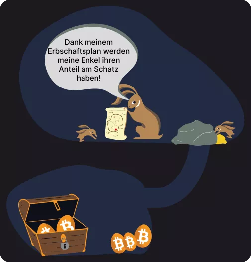

### Privatsphäre ist wichtig

Um Ihre Bitcoins langfristig zu sichern, müssen Sie nicht nur physische Backups anlegen oder einen Erbschaftsplan aufstellen. Auch die Privatsphäre ist eine wichtige Überlegung. So ist es beispielsweise besser, Bitcoins zu kaufen, ohne einen Ausweis vorzulegen, um das Risiko eines Identitätsdiebstahls zu minimieren oder einfach nur die Rückverfolgung Ihrer Gelder durch jede Instanz mit ausreichenden Mitteln zu ermöglichen. Die BTC 205-Schulung wird Ihnen bei Bedarf dabei helfen.

Was Ihre Privatsphäre betrifft, so ist es sehr wichtig, dass Sie es vermeiden, jedem von Ihren Bitcoins zu erzählen. Schließlich wissen wir nicht, wohin dieser Vermögenswert gehen wird, und Diskretion über seinen Besitz zu bewahren ist eine kluge Entscheidung. Sie wollen schließlich keine Blicke auf sich und Ihr Portemonnaie ziehen.

In der gleichen Logik sollten Sie es vermeiden, Ihr Sicherheitssystem bei Bitcoin-Treffen oder Begegnungen mit Fremden lautstark zu enthüllen...

### Zusammenfassung über die Sicherheit von Bitcoin-Wallets

Bitcoin-Wallets sind Softwareprogramme, mit denen man Nitcoins speichern und umtauschen kann. Es gibt verschiedene Arten von Wallets: Wallets auf Handys oder PCs, die praktisch für kleine Beträge und/oder regelmäßige Ausgaben sind; physische Wallets, die eher für die mittel- bis langfristige Aufbewahrung von Bitcoin geeignet sind; Multisig-Wallets, die komplexer zu verwalten sind und mehrere Unterschriften benötigen, um Transaktionen zu tätigen.

Bei der Erstellung einer Brieftasche müssen Sie zuerst eine Sicherungskopie Ihres privaten Schlüssels erstellen. Diese Sicherungskopie besteht aus einer Liste von 12 oder 24 Wörtern oder 12 Wörtern, die Sie auf ein Blatt Papier oder eine Metallplatte schreiben können. Diese mnemonische Phrase ermöglicht es Ihnen, Ihre Brieftasche in jeder Bitcoin-Brieftaschenanwendung wiederherzustellen. Jede Person, die Zugriff auf diese Liste hat, hat auch Zugriff auf Ihre Bitcoins. In Bitcoin geht finanzielle Souveränität Hand in Hand mit individueller Verantwortung, daher ist es entscheidend, den Zugriff auf Ihre Brieftaschen und Sicherungskopien zu sichern. Dazu ist es wichtig, bestimmte Regeln zu befolgen:

- Erstellen Sie einen Vererbungsplan: um sicherzustellen, dass Ihre Angehörigen im Falle eines Problems auf das Geld zugreifen können.
- Vermeiden Sie Börsenplattformen: Vermeiden Sie es, Ihre Bitcoins auf Börsenplattformen zu lassen, da sie anfällig für Hackerangriffe sein können.
- Passen Sie Ihr Sicherheitsniveau an: Nehmen Sie sich Zeit, um Ihre Bedürfnisse und Verwendungen zu erläutern. Dies wird Ihnen bei der Auswahl zwischen den verschiedenen Bitcoin-Brieftaschen helfen.

Jetzt, da wir die Grundlagen von Bitcoin-Brieftaschen und bewährte Sicherheitspraktiken kennen, werden wir im nächsten Kapitel die technische Funktionsweise von Bitcoin behandeln. Auch hier wird das Verständnis der Grundlagen des Bitcoin-Protokolls Ihnen helfen, seine Funktionsweise besser zu verstehen und es besser nutzen zu können.

# Die technischen Aspekte von Bitcoin.

<partId>a86d7439-e7a2-5f21-b1e9-6b5e23ca265b</partId>

## Start von Bitcoin

<chapterId>b7561082-8943-519d-95d1-a5f60dd2686d</chapterId>

### Fangen wir mit etwas Geschichte an.


Am 31. Oktober 2008 wurde eine neue Finanztechnologie geboren: Bitcoin. An diesem Tag präsentierte Satoshi Nakamoto, der anonyme Autor von Bitcoin, seine Innovation der Welt in Form einer E-Mail, die an die Cypherpunk-Mailingliste, eine Gemeinschaft von kryptografiebegeisterten Privatsphäre-Enthusiasten im Internet, verteilt wurde.

Diese E-Mail enthielt ein Dokument, das als "White Paper" bezeichnet wird und die Funktionsweise von Bitcoin vorstellt. Angesichts der früheren Misserfolge digitaler Bargeldsysteme stieß diese Initiative nicht sofort auf Begeisterung. Dennoch wurde dieses White Paper schließlich zu einer Referenz für Bitcoin-Benutzer und war Gegenstand vieler Diskussionen in der Bitcoin-Community.


Am 3. Januar 2009 eröffnete Satoshi offiziell das Bitcoin-Netzwerk, indem er den ersten Block, auch Genesis-Block genannt, erstellte, der den Start der Bitcoin-Blockchain markiert. Dieser Block enthält eine aussagekräftige Botschaft über die Mission von Bitcoin: "03/jan/2009 Chancellor on brink of second bailout for banks" (Der Kanzler steht kurz vor einem zweiten Rettungspaket für Banken).


> "Wir können eine große Schlacht im Wettrüsten gewinnen und einen
> '> neues Gebiet der Freiheit seit mehreren Jahren." - Satoshi Nakamoto


### Das Bitcoin-Protokoll beginnt zu leben

Am 8. Januar 2009 kündigt Satoshi die Veröffentlichung von Bitcoin-0.1.0 an. Schnell greift Hal Finney auf die Software zu und schließt sich dem Netzwerk an. Nun gab es 2 Knotenpunkte und damit 2 Miner im Netzwerk. Finney verewigt diesen Schritt, indem er "Running Bitcoin" twittert. Am 12. Januar 2009 findet die erste Bitcoin-Transaktion zwischen Satoshi und Hal Finney statt. Diese Transaktion von 10 BTC wird im Block 170 aufgezeichnet.


Das Interesse an Bitcoin wächst schnell, und viele Menschen beginnen, die ethischen, wirtschaftlichen und philosophischen Aspekte von Bitcoin zu testen, zu diskutieren, Fehler zu beheben und darüber nachzudenken. Um diesen Austausch zu erleichtern, wurde am 22. November 2009 das BitcoinTalk-Forum von Satoshi gegründet.
Dieses Forum wird schnell zum bevorzugten Diskussionsort für Bitcoin-Benutzer. Hier entstehen viele Memes und Symbole, die mit Bitcoin verbunden sind, wie das [Bitcoin-Logo](https://bitcointalk.org/index.php?topic=64.0), das berühmte [Hodl](https://bitcointalk.org/index.php?topic=375643.0) oder sogar [Pizza Day](https://bitcointalk.org/index.php?topic=137.msg1195).

> **Wussten Sie schon?** Am 22. Mai 2010 schreibt Laszlo Hanyecz Bitcoin-Geschichte, indem er vorschlägt, 2 Pizzen für 10.000 BTC zu kaufen. Dies ist das erste Mal, dass Bitcoin für den Kauf von materiellen Gütern verwendet wird.


### Das Verschwinden von Satoshi Nakamoto

Im Jahr 2010, als Bitcoin die Aufmerksamkeit der Medien auf sich zieht, beschließt Satoshi, sich zurückzuziehen. Am 12. Dezember 2010 veröffentlicht er seinen letzten Beitrag im Forum und kündigt seinen Abschied an. Am 23. April 2011 führt er seinen letzten bekannten privaten E-Mail-Austausch durch. Satoshi verschwindet und überlässt seine Schöpfung der Gemeinschaft.

> "Regierungen sind gut darin, die Köpfe von zentral kontrollierten Netzwerken wie Napster abzuschneiden, aber reine P2P-Netzwerke wie Gnutella und Tor scheinen sich behaupten zu können." - Satoshi Nakamoto

Trotz der Abwesenheit von Satoshi entwickelt sich Bitcoin weiter. Alle 10 Minuten wird die Geschichte von Bitcoin geschrieben, und das Protokoll funktioniert weiterhin wie geplant. Unabhängig von Angst, Unsicherheit oder Zweifel (FOMO für Fear Of Missing Out oder FUD für Fear Uncertainty Doubt) geht Bitcoin weiter voran, mit einer Online-Verfügbarkeit von 99,988%.
Der Bitcoin wird von jedem Individuum anders wahrgenommen. Für einige ist er eine pilzartige Entität wie das [Myzel](https://brandonquittem.com/bitcoin-is-the-mycelium-of-money/), für andere ist er ein [Schwarzes Loch](https://dergigi.com/2019/05/01/bitcoins-gravity/i). Ob man den Bitcoin mag oder hasst, er existiert weiterhin mit seinem konstanten Rhythmus von 10 Minuten pro Block, wie der Herzschlag eines neuen Währungssystems.

Um Ihr Wissen über die Schriften von Satoshi Nakamoto zu vertiefen, empfehle ich das [Buch von Phil Champagne](https://planb.network/resources/book) oder die ARTE-Dokumentation "Das Geheimnis Satoshi".


> "Das grundlegende Problem mit herkömmlicher Währung ist das Vertrauen, das erforderlich ist, um sie funktionieren zu lassen. Der Zentralbank muss vertraut werden, dass sie die Währung nicht entwertet, aber die Geschichte der Fiatwährungen ist voller Vertrauensbrüche. Den Banken muss vertraut werden, dass sie unser Geld halten und elektronisch übertragen, aber sie verleihen es in Wellen von Kreditblasen mit kaum einer Reserve."

Nun, da wir etwas Kontext haben, schauen wir uns nun die allgemeine Funktionsweise einer Bitcoin-Transaktion an.

## Bitcoin-Transaktionen

<chapterId>03482644-5473-590b-975b-b43bb65eac21</chapterId>

Eine Bitcoin-Transaktion ist einfach eine Übertragung des Eigentums an Bitcoins unter Verwendung einer Bitcoin-Adresse. Nehmen wir zum Beispiel zwei Protagonisten: Alice und Bob. Alice möchte Bitcoins erwerben, während Bob bereits welche besitzt.

### Schritt 1 - Erstellung der Transaktion über die Wallet

Damit Bob Bitcoins an Alice übertragen kann, muss sie ihm eine ihrer Bitcoin-Adressen zur Verfügung stellen. Diese Adresse, abgeleitet aus Alices öffentlichem Schlüssel, ist einzigartig für ihre Bitcoin-Wallet.

Konkret öffnet Alice ihre Wallet und drückt auf "Empfangen". Ein QR-Code oder eine Adresse wie diese bc1q7957hh3nj47efn8t2r6xdzs2cy3wjcyp8pch6hfkggy7jwrzj93sv4uykr wird angezeigt. Das ist sozusagen ihre "Bitcoin-IBAN". Sie gibt sie also an Bob weiter.

Dann initiiert Bob die Transaktion, indem er Alices Empfangsadresse verwendet. Bob öffnet also seinerseits seine Bitcoin-Wallet, drückt auf "Senden", kopiert die Adresse, fügt einen Betrag und Transaktionsgebühren hinzu. Diese Gebühren sind ein Anreiz für die Miner, die Transaktion in den nächsten Block aufzunehmen.

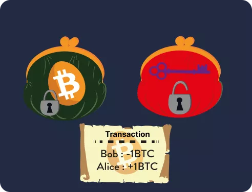

> **Warum Gebühren zahlen?** Diese Gebühren sind notwendig, um einen freien Markt für die Einbeziehung von Transaktionen in Blöcke zu schaffen, da die Anzahl der Transaktionen in einem Block begrenzt ist. Ein Block hat eine Größe von 1 MB, was ein paar tausend Transaktionen pro Block entspricht. Die Gebühren einer Transaktion sind proportional zu ihrer Größe. Die Größe der Transaktion hängt wiederum von der Komplexität der Transaktion ab.

> Um die Transaktion abzuschließen, muss Bob eine Signatur mit dem privaten Schlüssel der Adressen liefern, die er verwendet, um Alice zu bezahlen. Dadurch wird überprüft, dass er der Eigentümer der Bitcoins ist, die er übertragen möchte. Dieser Schritt erfolgt normalerweise automatisch in mobilen Geldbörsen oder es handelt sich um eine Bestätigung in Ihrer physischen Geldbörse: "Sind Sie sicher, dass Sie X an Y senden möchten? Ja oder Nein".

### Schritt 2: Die Verbreitung der Transaktion über Knotenpunkte zu den Minern

An diesem Punkt wurde die Transaktion erstellt und Bobs Geldbörse wird sie daher mit dem Bitcoin-Netzwerk teilen. Dazu wird seine Geldbörse mit einem Knotenpunkt im Bitcoin-Netzwerk kommunizieren, und dieser Knotenpunkt wird diese Informationen an andere Knotenpunkte weitergeben. Dieser Verbreitungsschritt ermöglicht es dem gesamten Netzwerk, diese neue Transaktion zu sehen und zu berücksichtigen.


Obwohl diese Transaktion nun allen bekannt ist (über ein Tool namens Mempool), wird die Transaktion nicht unbedingt als bestätigt betrachtet! Es sind die Miner, die die Transaktionen überprüfen, indem sie sie in einen Block unserer berühmten Blockchain eintragen.

Die Miner haben die Aufgabe, gültige und unbestätigte Transaktionen zu nehmen und sie in einem Block zusammenzufassen. Damit ihr Block der nächste in der Bitcoin-Blockchain ist, müssen sie ein kryptographisches Rätsel in einem Prozess namens "Proof of Work" lösen.


### Schritt 3: Die Transaktion wird von einem Miner in einen Block abgebaut.

Dieser Proof of Work erfordert das Finden eines gültigen "Hash" für den betreffenden Block. Stellen Sie es sich als eine eindeutige Kennung vor, die mit dem Block verbunden ist und aus 256 Zeichen besteht. Die Gültigkeit dieses Hashes hängt von der Schwierigkeit des Bitcoin-Netzwerks ab. Wir werden in einem späteren Abschnitt genauer auf diesen Mechanismus eingehen. Im Moment nehmen Sie an, dass ein Miner einen gültigen Block gefunden hat und dass Bobs Transaktion an Alice darin enthalten ist.

Dieser neue gültige Block wird zur Bitcoin-Blockchain hinzugefügt, die ein öffentliches und unveränderliches Register aller Bitcoin-Transaktionen ist. Stellen Sie es sich als ein gemeinsames Konto vor, das von allen Bitcoin-Benutzern genutzt wird. Gemäß den Regeln des Protokolls wird etwa alle zehn Minuten ein Block hinzugefügt, dank der Anpassung der Schwierigkeit. In dem Abschnitt über die Miner werden wir sehen, welcher Mechanismus verhindert, dass das Register der Bitcoin-Transaktionen geändert wird.


### Schritt 4: Der Block wird vom Wallet-Knoten von Alice als gültig und überprüft angesehen.

An diesem Punkt wird die Transaktion als gültig betrachtet, und der Miner wird den neuen Block über seinen Knoten im Netzwerk verbreiten, und das Wallet von Alice wird aktualisiert.


> Achtung: Auch wenn Alice feststellt, dass sie Bitcoins auf einer ihrer Adressen erhalten hat, wird empfohlen, die Transaktion erst dann als unveränderlich zu betrachten, wenn sie 6 Bestätigungen hat. Das bedeutet, dass 6 weitere Blöcke über dem Block, in dem sich die Transaktion von Bob befindet, abgebaut wurden. Mit anderen Worten, je älter eine Transaktion in der Blockchain ist, desto unveränderlicher ist sie.

### Kleine Zusammenfassung als Poster!


### Wofür das alles?

Letztendlich ist das Bitcoin-Transaktionssystem dezentralisiert und funktioniert peer-to-peer, ohne vertrauenswürdige Intermediäre.

Bob sendet seine Transaktion an das Bitcoin-Netzwerk, und wenn ein Miner einen gültigen Block veröffentlicht, der die Transaktion von Bob enthält, kann Alice anfangen, die Bitcoins als ihr Eigentum zu betrachten. Vertrauen ist in keiner Phase des Bitcoin-Eigentumsübertragungsprozesses erforderlich; nur die Regeln des Protokolls und wirtschaftliche Anreize machen es zu teuer, im Rahmen des Bitcoin-Protokolls bösartig zu handeln.

Benutzer übertragen das Eigentum an ihrem Geld, indem sie Transaktionen digital mit ihren privaten Schlüsseln signieren. Miner haben nur wenig Macht, da Benutzer auch über die Bitcoin-Knoten eine erhebliche Kontrolle haben, die die Validierung neuer Blöcke und enthaltener Transaktionen übernehmen. Es ist dieses Netzwerk von Bitcoin-Knoten, das das Netzwerk wirklich dezentralisiert.

Tatsächlich müssten alle Kopien der Blockchain aller Bitcoin-Knoten zerstört werden, damit das Bitcoin-Netzwerk vollständig zerstört wird - eine praktisch unmögliche Aufgabe aufgrund der geografischen Verteilung dieser Knoten und der Schwierigkeit, sie physisch zu erfassen.

Lassen Sie uns nun genauer betrachten, wie ein Bitcoin-Knoten funktioniert.

## Bitcoin-Knoten

<chapterId>8533cebc-f799-528b-89df-8d75d4c37f1c</chapterId>

Knoten sind ein wesentlicher Bestandteil der Bitcoin-Netzwerkarchitektur. Sie erfüllen verschiedene wichtige Funktionen:

- Das Aufrechterhalten einer Kopie der Bitcoin-Blockchain
- Die Validierung von Transaktionen
- Die Weitergabe von Informationen an andere Knoten
- Die Durchsetzung der Regeln des Bitcoin-Protokolls.

Jedes Gerät, das die Bitcoin-Software ausführt und als Bitcoin-Knoten bezeichnet wird (oft über [Bitcoin Core](https://bitcoin.org/en/bitcoin-core/) ausgeführt), trägt zur Dezentralisierung des Netzwerks bei.

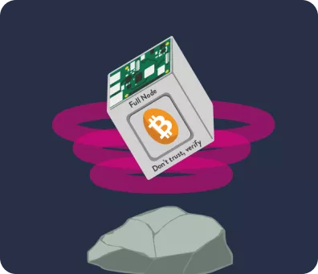

### Die Knoten sind also der Kern von Bitcoin.

Jeder Knoten enthält eine Kopie der Blockchain, um Transaktionen zu überprüfen und Betrugsversuche zu verhindern. Die dezentrale Natur des Netzwerks verleiht Bitcoin außergewöhnliche Widerstandsfähigkeit und Robustheit - um das Bitcoin-Protokoll zu stoppen, müssten alle Knoten weltweit ausgeschaltet werden. Zur Information gibt es heute (September 2023) etwa [45.000 Knoten](https://bitnodes.io/nodes/all/) weltweit verteilt.

Die Knoten können die Gültigkeit von Blöcken und Transaktionen überprüfen, da sie den Regeln des Bitcoin-Konsenses folgen. Diese Regeln regeln unter anderem die Geldpolitik von Bitcoin, wie die Höhe der Miner-Belohnung (die wir im nächsten Abschnitt genauer betrachten werden) und die Menge an im Umlauf befindlichen Bitcoins. Die Knoten fungieren gewissermaßen als das juristische System des Netzwerks. Dank ihnen folgen alle Netzwerkteilnehmer denselben Regeln. Sie gewährleisten die Neutralität des Bitcoin-Protokolls. Die Konsensregeln variieren sehr wenig oder gar nicht, da es zur Durchführung von Änderungen erforderlich ist, die Zustimmung aller Knoten zu erhalten.


Die Governance innerhalb des Protokolls liegt außerhalb des Lehrplans dieser Schulung, aber wissen Sie, dass jeder Benutzer, der einen Bitcoin-Knoten betreibt, die Regeln festlegt, denen er folgen möchte. Ein Benutzer könnte also beschließen, anderen Regeln zu folgen (d.h. Änderungen am Code vorzunehmen), aber wenn diese Änderungen die aktuellen Konsensregeln ungültig machen, wird dieser Knoten nicht mehr Teil des Bitcoin-Netzwerks sein. Große Änderungen sind daher selten und erfordern eine erhebliche Koordination zwischen Tausenden von Akteuren mit unterschiedlichen Ideologien und Interessen, was das Protokoll dazu zwingt, nur Updates zu produzieren, die es für alle Bitcoin-Benutzer "besser" machen.

### Wie sieht ein Knoten aus?

Es gibt mehrere Optionen, wenn wir unseren eigenen Knoten haben möchten, und die Wartungskosten variieren. Sie können einfach die Bitcoin Core-Software auf Ihrem Computer ausführen, aber dies erfordert einen erheblichen Speicherplatz, da die Blockchain etwa ~500 GB groß ist. Um dieses Problem zu umgehen, können Sie sich entscheiden, nur die letzten N Blöcke im Speicher zu behalten, dies wird als "pruned node" bezeichnet. Für diese Art von Lösung sind die Kosten vernachlässigbar, da der Knoten nur eingeschaltet wird, wenn Sie ihn benötigen.


Eine zweite Option besteht darin, dedizierte Hardware wie den Raspberry Pi 4 mit einer ausreichend großen SSD-Festplatte (ca. ~1 TB) zu verwenden. Diese zweite Option ist teurer, wenn Sie die Hardware kaufen müssen, aber aus Sicht des Stromverbrauchs sind es weniger als 10€ pro Jahr.
Von einer Bandbreitenperspektive aus gesehen, bei der alle 10 Minuten ein 1-MB-Block betrachtet wird, entspricht dies etwa 5 GB pro Monat.

### Die Knoten müssen für alle zugänglich bleiben!

Die erschwinglichen Kosten und die Zugänglichkeit eines Bitcoin-Knotens in Bezug auf Hardware-Ressourcen, Speicherplatz und Bandbreite sind sehr wichtig, da dies die Dezentralisierung des Netzwerks erleichtert.

Tatsächlich hat jeder einen guten Grund, einen Knoten laufen zu lassen! Der Preis und die Anstrengungen sind minimal im Vergleich zum Nutzen. Man muss sich einfach auf das Abenteuer einlassen und sich tausenden anderen Bitcoinern anschließen, denn zusammen bilden wir das Bitcoin-Netzwerk.


Wenn zum Beispiel die Blöcke 100-mal schwerer wären, könnten wir zwar alle 10 Minuten 100-mal mehr Transaktionen durchführen, aber das Betreiben eines Bitcoin-Knotens würde eine Festplatte von 50 TB, eine Bandbreite von über 500 GB/Monat und eine Hardware erfordern, die in der Lage ist, Hunderttausende von Transaktionen in weniger als 10 Minuten zu validieren. In dieser hypothetischen Situation mit 100-mal größeren Blöcken wäre das Betreiben eines Bitcoin-Knotens für den Durchschnittsbürger nicht zugänglich, was die Dezentralisierung des Protokolls und die Unveränderlichkeit von Transaktionen und Konsensregeln gefährden würde. Daher wurden die Protokollbeschränkungen auch so gewählt, dass möglichst viele Menschen ihren eigenen Bitcoin-Knoten betreiben können.

Diese Situation ist nicht so hypothetisch, denn das Jahr 2017 war von einer intensiven Kontroverse geprägt, die als "Blockkrieg" bekannt ist. Dieser Konflikt hat die Akteure, die Bitcoin durch Erhöhung der Blockgröße verändern wollten, um die Transaktionskapazität zu erhöhen, gegen diejenigen gestellt, die die Unabhängigkeit und die Macht der Benutzer bewahren wollten. Letztendlich haben die Benutzer und die Knoten die Initiative zur Änderung der Miner, Börsen und Institutionen abgelehnt.

Nach diesem Sieg haben die Knoten ein Update namens SegWit aktiviert, das den Weg für die Implementierung des Lightning Network, einem sofortigen Bitcoin-Zahlungsnetzwerk, das die Bitcoin-Blockchain nutzt, geebnet hat. Diese Situation zeigt, dass die Benutzer dank ihrer Knoten eine echte Macht innerhalb von Bitcoin haben, die es ihnen ermöglicht, den großen Institutionen entgegenzutreten.

### Zusammenfassung im Poster!


## Die Miner

<chapterId>dbb8264a-7434-57e4-9d1b-fbd1bae37fdf</chapterId>

> Die Miner dienen dazu, das Netzwerk zu sichern und Transaktionen in Blöcke hinzuzufügen. Sie verwenden ASIC-Maschinen, um den Bitcoin-Arbeitsnachweis zu lösen.


### Erklärung des Arbeitsnachweises

Die Proof-of-Work (POW)-Methode ist der Sicherheitskonsens des Bitcoin-Protokolls. Es ist die Regel, die Bitcoin am Laufen hält und seine Robustheit gewährleistet. POW ist die Grundlage für alles und spielt eine entscheidende Rolle in der Spieltheorie von Bitcoin.

Stellen Sie es sich wie eine riesige Lotterie vor, an der jeder teilnehmen kann. Das Ziel ist es, eine spezifische Nummer zu finden, mit der ein gültiger Block signiert werden kann. Der Gewinner erhält eine Belohnung in Bitcoin. Diese Nummer ist sehr einfach zu überprüfen, aber schwer zu finden. Die einfache Überprüfung erfolgt über die SHA-256-Hashfunktion, die im Mining-Algorithmus enthalten ist. Um diese Zahl zu finden, werden die Teilnehmer (Miner) Milliarden von Milliarden von Möglichkeiten ausprobieren: 1, 52, 2648, 26874615, 15344854131318631, usw.

Wenn die gewählte Zahl richtig ist: Jackpot! Andernfalls wird weitergesucht. Um die Anzahl der Versuche zu optimieren, verwenden sie spezielle ASIC-Maschinen, die Milliarden von Möglichkeiten pro Sekunde berechnen können. Die Gesamtzahl der Versuche wird als HashRate bezeichnet und quantifiziert die Sicherheit des Bitcoin-Protokolls. Um diese Maschinen zum Laufen zu bringen, muss also eine große Menge an Strom verbraucht werden. POW verwandelt also Energie in Geld und verbindet die reale Welt mit der digitalen Welt, um die erste energiebasierte Währung zu schaffen.

Die Maschinen laufen und nach durchschnittlich 10 Minuten wird ein Gewinner auftauchen. Er wird den richtigen Hash unter der Schwierigkeitsgrenze gefunden haben. Der große und einzige Gewinner wird dann den neuen Block des Zeitstempel-Servers signieren und die Blockkette fortsetzen. Der Gewinner erhält seine Belohnungen und versucht sein Glück für den nächsten Block erneut. Dieser Prozess wiederholt sich seit 12 Jahren und alle 10 Minuten bestätigt ein Gewinner Bitcoin-Transaktionen und sichert weiterhin vergangene Transaktionen. Dadurch wird unsere Bitcoin-Blockchain robuster und sicherer.

Alle 2 Wochen (2016 Blöcke) gleicht die Schwierigkeitsanpassung das globale Mining-Spiel entsprechend der Anzahl der Teilnehmer aus.

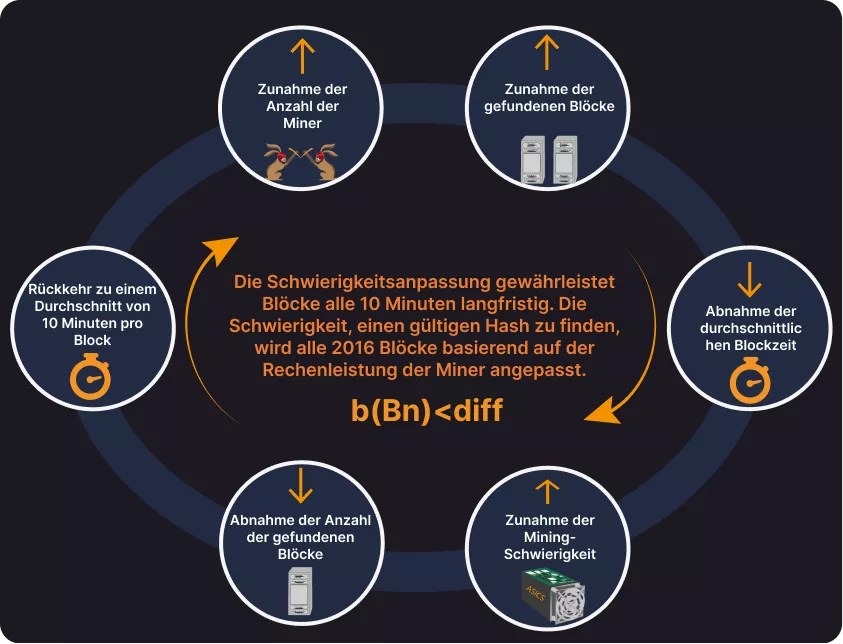

### Das Mining entwickelt sich ständig weiter

Im Laufe der Jahre haben sich die Miner mit immer effizienterer Hardware ausgestattet, um so viele Hashes wie möglich pro Sekunde (HashRate) zu erzeugen und dabei so wenig Energie wie möglich zu verbrauchen, auf die kostengünstigste Weise. Die ersten Miner wie Satoshi oder Hal Finney haben mit ihrer CPU gemint, dann haben andere mit ihrer Grafikkarte gemint. Heutzutage verwenden Miner das, was als ASIC (Application-Specific Integrated Circuit) bezeichnet wird, Maschinen, die speziell für den SHA256-Algorithmus entwickelt wurden.


Die Hashrate des Bitcoin-Netzwerks ist sozusagen die Menge der Versuche, die pro Sekunde unternommen werden, um den nächsten Block zu finden. Heute liegt sie bei etwa 400 TH/s, was 400 Billionen Versuchen pro Sekunde entspricht! Je höher die globale Hashrate, desto schwieriger ist es für einen böswilligen Akteur, die Ressourcen für die Mehrheit des Minings zu monopolisieren und eine doppelte Ausgabe zu tätigen. Es ist also wirtschaftlich sinnvoller, die Regeln des Bitcoin-Protokolls zu befolgen, als gegen sie zu handeln. Dies wirft eine Frage auf: Wie werden die Miner bezahlt?

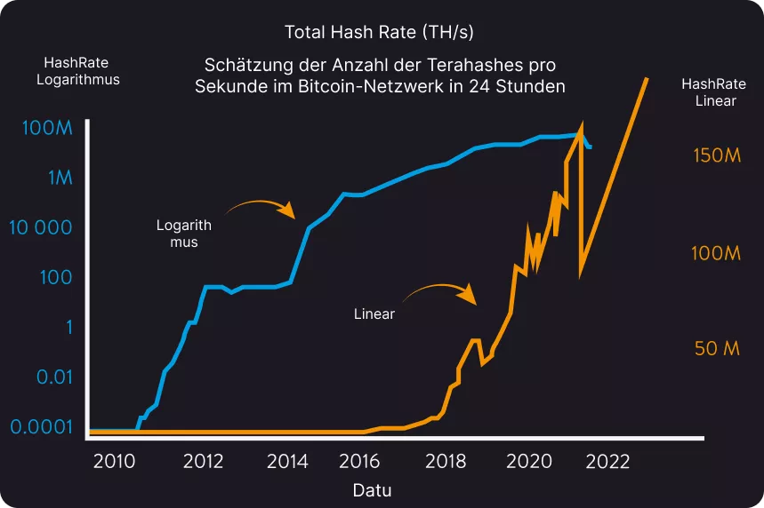

### Was kann man in einem Block finden?


Der Block Header enthält mehrere Elemente wie die Uhrzeit, das Schwierigkeitsziel, die Nummer des letzten Blocks, die verwendete Version und den Merkel Root der vorherigen Transaktionen.

Die coinbase-Transaktion ist immer die erste; sie enthält die Belohnung, die man für die Arbeit als Validator erhalten hat. Danach folgen die validierten Transaktionen. Der Miner wird die Transaktionen auswählen, die am meisten einbringen, und versuchen, einen Block zu erstellen, der sein Einkommen maximiert, d. h. kleine Transaktionen mit maximalen Gebühren.

### Vergütung von Minern

Anfänglich wird ein Miner dafür entlohnt, dass er einen gültigen Block findet. Genauer gesagt wird er auf zwei Arten entlohnt: (i) durch die Belohnung, die im Block enthalten ist, und (ii) durch die Transaktionsgebühren in den Transaktionen, die im Block enthalten sind. Die Höhe der Belohnung wird durch die Konsensregeln festgelegt und hängt davon ab, in welcher Epoche wir uns befinden.

Für die ersten Blöcke betrug die Belohnung 50 Bitcoins, danach wurde sie alle 210.000 Blöcke (d.h. etwa alle 4 Jahre) durch 2 geteilt. Heute (im Jahr 2023) befinden wir uns in der 4. Epoche; die Belohnung beträgt also 6,25 Bitcoins. Diese Belohnung ist der Geldschöpfungsmechanismus in Bitcoin. Da die Belohnung mit der Zeit abnimmt, bedeutet dies, dass es ein Limit von 21 Millionen Bitcoins gibt -- heute sind bereits mehr als 19,4 Millionen Bitcoins im Umlauf, was mehr als 92% entspricht.

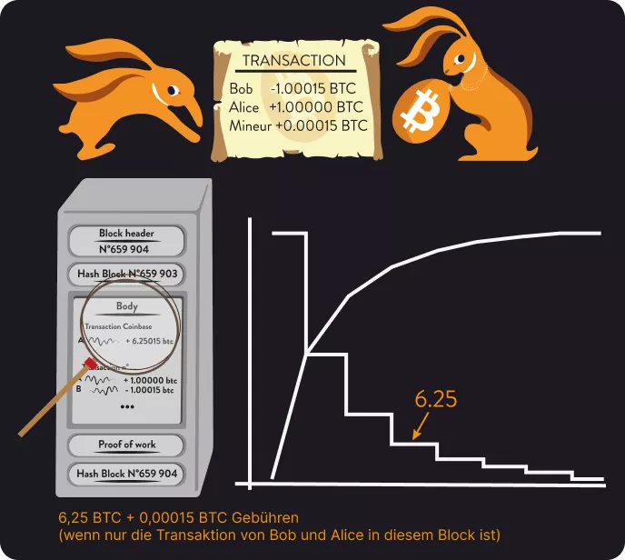

Die zweite Methode der Vergütung wird durch den von den Nutzern gewählten Betrag für die Transaktionsgebühren definiert. Da der Miner sein Einkommen maximieren möchte, wird er dazu neigen, Transaktionen mit hohen Transaktionsgebühren bevorzugt auszuwählen; die Transaktionsgebühren spiegeln also die Dringlichkeit des Nutzers wider, dass seine Transaktion in den nächsten Block eingefügt wird.

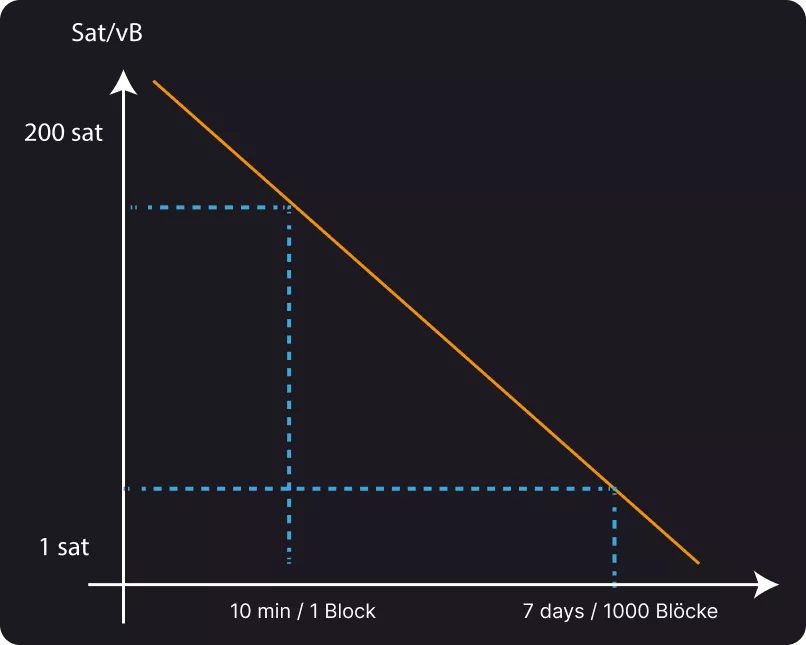

Um das Geschäftsmodell der Miner zu stabilisieren, das auf den Belohnungen beruht, die sie für jeden gültigen Block erhalten, arbeiten die Miner außerdem häufig in Gruppen über sogenannte "Mining-Pools" zusammen, in denen sie ihre Rechenressourcen gemeinsam nutzen.''

### Warum sich die Mühe machen, all das zu tun?

Im Wesentlichen besteht die Innovation von Bitcoin darin, eine Lösung für das Problem des doppelten Ausgebens durch die Verwendung einer Blockchain auf Basis des Proof of Work mit variabler Schwierigkeit anzubieten. In der digitalen Welt unterscheidet sich das Konzept des Eigentums vom Konzept der physischen Welt. In der digitalen Welt kann alles kopiert und eingefügt werden, was Probleme im Hinblick auf das doppelte Ausgeben von digitalen Werten mit sich bringt. Vertrauenswürdige Vermittler wie Banken wurden geschaffen, um dieses technologische Problem zu lösen und sicherzustellen, dass ein Gut, sobald es übertragen wurde, nicht mehr dem Sender gehört. Aber wie kann man das ohne einen vertrauenswürdigen Vermittler tun? Dieses Problem ist äquivalent zum Byzantinischen Generalsproblem, einem Koordinationsproblem von Informationen in einem System, in dem den verschiedenen Akteuren nicht vertraut werden kann.

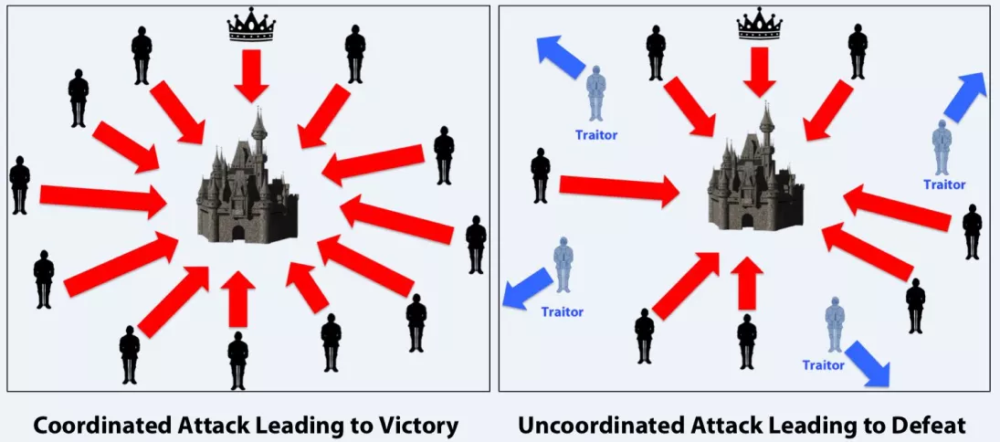

Bitcoin ist also eine Art Lösung, um dieses Problem zu lösen oder zumindest zu umgehen. Die "Generäle" von Bitcoin, oder Miner, erzeugen Blöcke (Informationen) und die Bitcoin-Knoten überprüfen Finanztransaktionen gemäß den Konsensregeln, um die Echtheit der Informationen zu gewährleisten. Die Asymmetrie der Energiekosten zwischen der Informationsproduktion und der Überprüfung gewährleistet die Zuverlässigkeit der Informationen ohne vertrauenswürdige Dritte.

Die Miner sind die Baumeister der Sicherheit des Bitcoin-Netzwerks. Indem sie Energie für die Erzeugung von Hashes aufwenden, bauen sie eine Mauer, die es für einen bösartigen Akteur extrem teuer macht, die Transaktionshistorie neu zu schreiben. Diese ökonomische Abschreckung hindert sie daran, sich unehrlich zu verhalten.

Selbst im Falle eines 51%-Angriffs, bei dem ein Akteur mehr als die Hälfte der Hashrate besitzt, bleibt das Netzwerk sicher, da der Angreifer so viel Energie wie alle Miner zusammen aufwenden müsste, um die Blockchain zu ändern. Dank dieses Proof-of-Work-Mechanismus, der Energie erfordert, um durchgeführt zu werden, ist das Netzwerk sicher.

### Zusammenfassend

Die Spieltheorie, die auf Bitcoin angewendet wird, schließt unehrliche Miner aus. Die Miner verwenden ASIC-Maschinen zum Minen und erhalten eine Belohnung bei Erfolg. Außerdem schließen sie sich oft in Mining-Pools zusammen, um ihre Rechenleistung zu teilen und regelmäßigere, wenn auch geringere Belohnungen zu erhalten. Das Bitcoin-Mining ist ein Prozess mit hohem Energieaufwand, der jedoch für den Betrieb und die Sicherheit des Bitcoin-Netzwerks unerlässlich ist. Der Proof-of-Work und die Blockchain lösen das Problem des doppelten Ausgaben und gewährleisten die Richtigkeit der Informationen ohne jegliche Vertrauensinstanz. Der Energieaufwand ist notwendig, um die Informationen zu produzieren, aber die Überprüfung der Informationen ist vernachlässigbar. Diese Asymmetrie gewährleistet die Sicherheit des Netzwerks. Es ist daher wirtschaftlich sinnvoller, die Konsensregeln einzuhalten, als sie zu brechen.


## Bitcoin und die Umwelt

<chapterId>4b227ae6-443a-5739-b443-60b7931130d9</chapterId>

Wir haben gerade im vorherigen Abschnitt gesehen, dass die Sicherheit des Bitcoin-Protokolls auf einem hohen Energieaufwand beruht, um ein öffentliches Transaktionsregister ohne Vertrauensinstanz zu erstellen. Die Gesamtenergiekosten werden oft mit dem Stromverbrauch eines kleinen Landes verglichen. Aber macht dieser Vergleich Sinn? Ist er relevant, um die Gründe hinter einem solchen Aufwand zu verstehen?

### Die Energiekosten von Bitcoin.

Zunächst bewerten wir qualitativ die Umweltkosten des Minings. Ein Miner muss sich mit einer Maschine wie einem ASIC und einer Energiequelle in Form von Strom ausstatten, um diese Maschinen zu betreiben. ASICs bestehen hauptsächlich aus Aluminium und können entweder recycelt oder für eine zweite Verwendung wiederverwendet werden (wie es das Projekt [Attakaï](https://decouvrebitcoin.fr/attakai/) gezeigt hat, das einen Antminer S9 in eine Zusatzheizung umwandelt). Der eigentliche Kritikpunkt ist also der Energieverbrauch. Versuchen wir also, dies genauer zu betrachten.


Die elektrische Energie ist der Hauptkostenfaktor für einen Miner. Daher ist er daran interessiert, eine kostengünstige Stromquelle zu finden. Da Miner mobil sind, können sie an Orte gehen, an denen Kraftwerke installiert sind, die jedoch noch nicht mit dem Stromnetz des Gebiets verbunden sind. Die Miner spielen die Rolle des letzten Käufers, wodurch Kraftwerke finanziert werden können, noch bevor sie an das Stromnetz angeschlossen sind. Und wenn sie es sind, wird die Nachfrage nach Strom steigen, was den Preis erhöht und es für den Miner weniger rentabel macht, an diesen Orten Strom zu beziehen. Der Miner wird dann entscheiden, seine Anlage zu verlegen und sich an einem Ort niederzulassen, an dem die Nachfrage gering ist und daher auch der Preis.

### Eine endlose Debatte

Daher ist die Debatte über die ökologischen Auswirkungen von Bitcoin oft fehlgeleitet, hauptsächlich aufgrund eines unzureichenden Verständnisses seiner Nützlichkeit und Funktionsweise. Bitcoin kann nicht einfach anhand der Energiekosten pro Transaktion bewertet werden, da Miner sowohl das aktuelle als auch das historische Netzwerk sichern, Transaktionen gruppiert werden und nicht alle gleichwertig sind, und der Einfluss des Lightning-Netzwerks nicht berücksichtigt wird. Diejenigen, die behaupten, dass Bitcoin zu viel Energie verbraucht, können politische Motive haben oder versuchen, ihre eigene Blockchain-Lösung zu verkaufen. Die ökologische Ausrede wird verwendet, um das Verbot von Bitcoin zu rechtfertigen.

Es darf jedoch nicht vergessen werden, dass Bitcoin als revolutionäre Erfindung denjenigen, die unter finanzieller Unterdrückung oder unter einer Diktatur leben, ein Mittel gibt, für ihre Freiheit zu kämpfen. Als letzter Ausweg bietet Bitcoin eine Form der finanziellen Freiheit, indem es Zensur und Bankbeschränkungen umgeht. Bitcoin ist mehr als nur eine Währung. Es ist eine Form der Kommunikation und des Ausdrucks von Freiheit. Die Energie, die von Minern aufgewendet wird, trägt zur Verteidigung unserer Freiheit bei. Bitcoin ermöglicht die Befreiung vom aktuellen Finanzsystem, das von Schulden und übermäßiger Geldschöpfung durch Zentralbanken dominiert wird.


Für diejenigen, die in Ländern mit hoher Inflation leben, ist Bitcoin eine Frage des Überlebens. Es bietet eine Möglichkeit, in finanziell unsicheren Situationen zu überleben. Darüber hinaus bietet Bitcoin ein gerechteres und gerechteres Finanzsystem. Es bietet auch Milliarden von Menschen auf der Welt die Möglichkeit, auf das Finanzsystem zuzugreifen. Aus dieser Perspektive betrachtet, ist der Energieverbrauch legitim?

### Könnte Bitcoin nicht eine positive Auswirkung auf die Umwelt haben?

Schließlich ist es wichtig, die wirtschaftlichen und Umweltauswirkungen der Einführung von Bitcoin zu diskutieren.

Insbesondere durch den Vergleich mit dem aktuellen Finanzsystem. Das Finanzsystem ist aufgrund seiner Anreize für übermäßigen Konsum und Verschuldung problematisch. Der leichte Zugang zu Krediten, die Geldausgabe durch die Banken und der Rückgriff auf die fraktionelle Reserve sind allesamt Faktoren, die Überschuldung und damit übermäßigen Konsum fördern.


Es ist notwendig, das Geldsystem zu reformieren, damit die Knappheit unserer Ressourcen sich in der Knappheit unserer Währung widerspiegelt. Dies wird einen verantwortungsvolleren Konsum und eine langfristige Sichtweise fördern. Umgekehrt hat die Inflation, die zu Konsum und Investitionen anregt, auf lange Sicht negative Auswirkungen auf die Umwelt.

Das heutige Finanzsystem entspricht den Vorstellungen der keynesianischen Ökonomie, die im Gegensatz zu denen der österreichischen Ökonomie den zeitlichen und dynamischen Aspekt von Situationen und Ressourcen nicht berücksichtigt. Mit anderen Worten: Eine unbegrenzte Währung kann die begrenzten Ressourcen unseres Planeten nicht effektiv widerspiegeln.

Politiker sind aufgrund ihrer kurzfristigen Sichtweise und dem Bedürfnis nach Wirtschaftswachstum, um wiedergewählt zu werden, nicht in der Lage, ökologische Probleme langfristig zu lösen. Im Gegensatz dazu ist die Einführung einer gesunden Währung wie Bitcoin eine potenzielle Alternative, die es ermöglichen könnte, die wirtschaftliche Macht wieder an die Menschen zurückzugeben.

Die Flammen in Ölquellen, die Methan verbrennen, um Umweltverschmutzung zu vermeiden, können von Bitcoin-Minern gelöscht werden, was der Umwelt zugute kommt. Bitcoin fördert die Nutzung von grüner Energie. Methan kann in Elektrizität umgewandelt werden, um die Mining-Maschinen anzutreiben, was für alle von Vorteil ist.

Die Bitcoin-Technologie wird oft missverstanden, und die Kritik an ihren ökologischen Auswirkungen ist oft vereinfachend und kurzsichtig. Diese Kritik ist oft von politischen Interessen getrieben. Bitcoin hat das Potenzial, den ökologischen Wandel zu unterstützen und zu einer grüneren Welt beizutragen. Die Medien verbreiten oft falsche Vorstellungen über Bitcoin und Ökologie. Nehmen Sie sich daher die Zeit, sich eine eigene Meinung zu bilden. Bei Bitcoin ist alles transparent.

> Befolgen Sie eine der Maximen von Bitcoin: Traue nicht, verifiziere dich selbst!


### Kurze Zusammenfassung der technischen Aspekte von Bitcoin

Satoshi Nakamoto veröffentlichte im Januar 2009 das Bitcoin-Protokoll, das seitdem dank einer wachsenden Gemeinschaft von Entwicklern, Minern und Benutzern mit Bitcoin-Knoten weiterentwickelt wurde. Diese halten eine eigene Kopie der Bitcoin-Blockchain, einem öffentlichen Register aller Bitcoin-Transaktionen, und können so die Gültigkeit der Transaktionen gemäß den Bitcoin-spezifischen Konsensregeln sicherstellen. Insbesondere stellen sie sicher, dass die Miner gültige Blöcke produzieren, die einige tausend ausstehende Transaktionen enthalten.

Im Durchschnitt wird alle 10 Minuten ein Block erstellt und der Miner, der einen gültigen Hash für den nächsten Block findet, wird vom Protokoll mit einer Belohnung entlohnt, deren Höhe durch die Konsensregeln festgelegt ist, sowie den Transaktionsgebühren aller Transaktionen in diesem gültigen Block. Da das Ergebnis des Hash-Algorithmus (SHA256) für eine gegebene Eingabe als unvorhersehbar gilt, besteht der Mining-Prozess darin, viele Blockkandidaten zu erstellen und zu überprüfen, ob ihr Hash gültig ist oder nicht. Um jedoch sicherzustellen, dass die durchschnittliche Zeit zwischen zwei Blöcken konstant bleibt (~10 Minuten), unabhängig von der Anzahl der Miner und ihrer Rechenleistung, wird die Schwierigkeit, einen gültigen Hash zu finden, alle 2016 Blöcke angepasst, also etwa alle 2 Wochen. Im Laufe der Zeit haben die Miner spezielle SHA256-Maschinen, sogenannte ASICs, entwickelt, um das Verhältnis von Hashrate zu Joule zu erhöhen, was bedeutet, dass sie mehr Versuche pro Sekunde und pro verbrauchter Energie durchführen können.

Um als Miner möglichst rentabel zu sein, muss man sich die günstigste verfügbare Elektrizität beschaffen, die oft in abgelegenen Gebieten in Kraftwerken zu finden ist, die noch nicht ans Stromnetz angeschlossen sind. Der Miner fungiert dann als Käufer letzter Instanz und sobald der Strompreis aufgrund einer erhöhten Nachfrage steigt, neigt der Miner dazu, seine Aktivitäten an einen anderen Ort zu verlagern.

Daher ist das Bitcoin-Protokoll ein unzensierbares und unaufhaltsames Währungssystem, da jede Komponente des Protokolls geografisch über den gesamten Globus verteilt ist - zum Beispiel gibt es etwa 40.000 Bitcoin-Knoten auf allen Kontinenten. Die Konsensregeln von Bitcoin sind so gestaltet, dass es wirtschaftlich rentabler ist, ihnen zu folgen, als zu versuchen, sie zu brechen, und daher ist kein Vertrauen zwischen den Akteuren erforderlich. Bitcoin hat keinen Anführer und kann nicht gestoppt werden. Es ist möglich, den Handel mit Bitcoin zu regulieren, aber dies hat nur begrenzte Auswirkungen. Kurz gesagt, kein Richter oder Staat kann Bitcoin zensieren oder stoppen.

# Wie kann man Bitcoin erhalten?

<partId>517e1bb7-f032-51a0-930a-a91fe5148d3f</partId>

## Bitcoin schläft nie!

<chapterId>d5e35e41-ea26-5478-8eb9-07daf9dff508</chapterId>

Der Preis von Bitcoin wird oft durch signifikante Volatilität gekennzeichnet. Sein Wert kann stark schwanken, abhängig von Marktschwankungen und Phasen des Bullenmarktes und des Bärenmarktes. Dies gilt für 100% der Finanzmärkte, einschließlich Bitcoin.

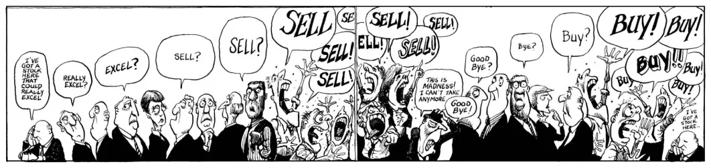

> Um es einfach auszudrücken: Menschen kaufen alle zur gleichen Zeit und verkaufen alle zur gleichen Zeit. Bitcoin ist nicht immun gegen die menschliche Natur.

### Das Verständnis der Adoptionswellen

Die Entwicklung und Evolution von Bitcoin sind weitgehend mit den verschiedenen Gruppen von Akteuren verbunden, die nach und nach in sein Ökosystem integriert wurden.


- Die Gläubigen:

Die ersten Bitcoin-Benutzer waren hauptsächlich Technikbegeisterte, Cypherpunks, Libertäre und Goldanhänger. Diese Gruppen wurden von Bitcoin aufgrund seiner Fähigkeit angezogen, Lösungen wie elektronisches Bargeld ohne Vertrauensdritte, Zensurresistenz oder transparente und unveränderliche Geldpolitik anzubieten.

- Das Darknet & Kriminelle

Dann breitete sich die Verwendung von Bitcoin auf Darknet-Handelsplattformen wie Silk Road aus, aufgrund seiner unkontrollierbaren und pseudonymen Natur. Diese Plattform lenkte die Aufmerksamkeit auf die unkontrollierbare und pseudonyme Natur von Bitcoin, was einige kriminelle Akteure dazu veranlasste, es zu nutzen. Es ist jedoch zu beachten, dass die Verwendung eines Werkzeugs und nicht das Werkzeug selbst über seine Legalität oder Illegalität entscheidet. Es ist wichtig zu beachten, dass die illegale Verwendung von Bitcoin eine Person nicht automatisch zu einem Kriminellen macht. Es ist die Verwendung und nicht das Werkzeug selbst, die als illegal eingestuft werden kann. Zum Beispiel ist die Verwendung von Bitcoin für Aktivitäten wie den Kauf bestimmter Drogen je nach den Vorschriften des Territoriums, auf dem die Aktivität stattfindet, legal oder illegal.

- Der ICO-Wahnsinn und der Eintritt der breiten Öffentlichkeit

Das Jahr 2017 war geprägt von einer großen Spekulationsblase im Kryptowährungsraum, insbesondere mit dem Start Tausender ICOs (Initial Coin Offering). Allerdings hatten viele dieser neuen Kryptowährungen weder konkrete Entwicklung noch Nutzen und verschwanden daher schnell. Diese Blase von 2017 wurde von einer starken Korrektur in den Jahren 2018-2019 gefolgt.

- Die NFT-Blase und DeFi

Dann, im Jahr 2020, erlebte der Markt erneut eine weitere spekulative Blase, die den Preis von Bitcoin auf 60.000 US-Dollar trieb. Diese Blase zeichnete sich im Vergleich zu früheren Blasen durch eine größere Diversifizierung der Investoren aus, einschließlich Finanzinstituten und großen Unternehmen. Aber auch hier fanden nach dem Ende der Euphorie starke Korrekturen statt.

### Bitcoin & die Volatilität

Angesichts vergangener Zyklen scheint die Periodizität der wirtschaftlichen Zyklen von Bitcoin der Dauer zwischen zwei Halbierungen zu entsprechen. Vielleicht, weil das Halbierungsereignis als Auslöser fungiert und die Emission von neuen Bitcoins um die Hälfte reduziert.

Diese erheblichen Schwankungen haben Bitcoin den Ruf eines äußerst gefährlichen Vermögenswerts verliehen, der alle Benutzer Geld kostet. Obwohl der Kurs innerhalb weniger Tage um 10-20 oder sogar 50% fallen kann, ist es wichtig zu verstehen, dass Bitcoin, das Protokoll, von der Preisänderung nicht betroffen ist.

Diese hohe Volatilität wird heute von den Akteuren des Bitcoin vollständig akzeptiert und kann durch verschiedene Lösungen wie finanzielle Absicherungen (Stablecoins), einen starken langfristigen Glauben (Hodl) oder einfach durch das Verständnis, nicht 100% seines Geldes in Bitcoin zu investieren, gemildert werden. Das Verständnis, warum der Preis von Bitcoin so stark schwankt, ist daher entscheidend, um in dieser Branche voranzukommen, denn letztendlich sind es der Preis und die Zyklen, die unseren Markt in gewisser Weise stabilisieren und regulieren. Es ist jedoch festzustellen, dass mit dem Wachstum und der Reife von Bitcoin die Volatilität weniger wichtig wird.


Obwohl das btc/dollar-Paar kurzfristig schwankt, folgt Bitcoin aufgrund seiner begrenzten Menge von 21 Millionen Bitcoins und seines Halbierungsprozesses (Halbierung der Geldschöpfung alle 4 Jahre im Durchschnitt) im Allgemeinen einem mechanischen Aufwärtstrend. Natürlich unterliegt Bitcoin als Finanzanlage wirtschaftlichen Zyklen mit Phasen der Euphorie, spekulativen Blasen und Korrekturen. Dieses Phänomen ist in aufstrebenden Technologien recht häufig, wo der Markt nicht immer rational oder effizient ist.

### Ein einzigartiger Markt

Diese Zyklen spekulativer Blasen sind in der Welt ziemlich einzigartig, da es sehr selten ist, dass ein Vermögenswert so viele aufeinanderfolgende Blasen erlebt. Dies erklärt sich einfach dadurch, dass Bitcoin keine Blase ist, die verschwinden wird, sondern eine Währung, die tatsächlich weltweit verwendet wird. Das Bitcoin-Protokoll ist einzigartig, da es weltweit rund um die Uhr, 7 Tage die Woche funktioniert und die Regulierung für Finanzbehörden schwierig macht.

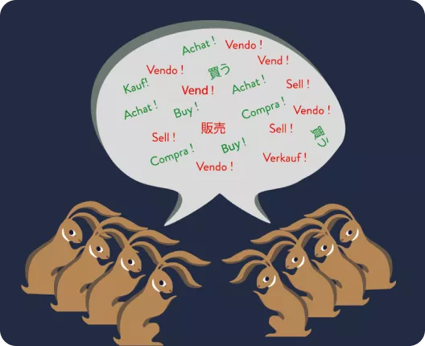

Heute, im Jahr 2023, überlebt und wächst Bitcoin weiterhin, indem es sich jeden Tag mehr in den traditionellen Markt integriert. Die baldige Einführung von Bitcoin-ETFs, eine klarere Regulierung und bessere Werkzeuge für den Erwerb oder die Lagerung fördern diesen Trend nur noch weiter. Bitcoin hat seine spekulative Blase ERNEUT überlebt, also ist es vielleicht nicht nur heiße Luft!

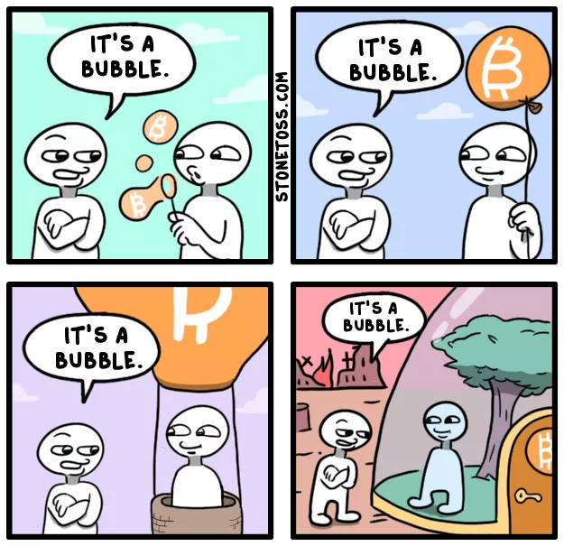

## Bitcoins durch Arbeit erhalten

<chapterId>be2d83be-406f-582c-83ca-6aa905ff7b04</chapterId>

### Eine parallele Wirtschaft entwickelt sich

Bitcoin kann als parallele Wirtschaft zu Fiatwährungen betrachtet werden. Das bedeutet, dass es möglich ist, Waren oder Dienstleistungen zu verkaufen und in Bitcoin bezahlt zu werden. Transaktionen können direkt in Bitcoin durchgeführt werden, ohne dass eine Handelsplattform benötigt wird, einfach von Bitcoin-Wallet zu Bitcoin-Wallet.

Die Bitcoin-Wirtschaft existiert und entwickelt sich in bestimmten Regionen der Welt, wie zum Beispiel in El Salvador, wo Bitcoin seit 2021 gesetzliches Zahlungsmittel ist. Darüber hinaus akzeptieren bereits einige Personen, Unternehmen und Organisationen Bitcoin als Zahlungsmittel für ihre Produkte oder Dienstleistungen.


Um die Verwendung von Bitcoin im täglichen Zahlungsverkehr zu erleichtern, wurde ein Open-Source- und Kollaborationsprojekt gestartet: BTCMap (https://btcmap.org/map#2/21.28937/5.46680). Dieses Projekt listet alle Händler auf, die Bitcoin akzeptieren, sowie die verschiedenen Bitcoin-Communities weltweit. Sie können ihre Website besuchen, um das Bitcoin-Ökosystem in Ihrer Nähe zu entdecken. Trotz Schwierigkeiten und Vorbehalten gibt es also Initiativen wie BTCMap, die dazu beitragen, die Bitcoin-Wirtschaft für alle zugänglicher und praktischer zu machen.

### Warum Bitcoin akzeptieren anstatt es zu kaufen?

Um Bitcoins zu erhalten, können Sie diese auf Plattformen kaufen, die von Aufsichtsbehörden wie der AMF (Autorité des Marchés Financiers) in Frankreich reguliert werden. Diese Methode birgt bestimmte Risiken und die Nachverfolgbarkeit Ihrer Transaktionen. Eine andere Methode, um Bitcoins zu erhalten, besteht darin, sie als Zahlungsmittel für die von Ihnen angebotenen Produkte oder Dienstleistungen zu akzeptieren. Diese Methode ermöglicht es Ihnen, Bitcoins durch Ihre Arbeit zu erwerben, ohne sich ständig um den Bitcoin-Preis kümmern zu müssen.

Darüber hinaus bietet die Annahme von Bitcoin als Händler mehrere Vorteile, darunter keine Zensur, geringere Transaktionsgebühren, erhöhte Effizienz, Schutz vor Inflation sowie finanzielle Freiheit und Souveränität.

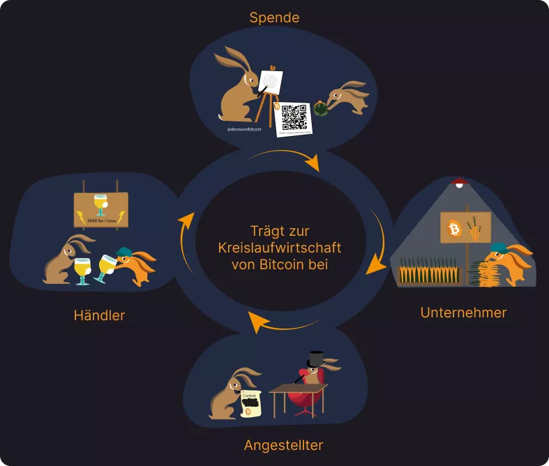

### Wie geht man vor:

Um Bitcoin zu akzeptieren, ist es notwendig, die verschiedenen verfügbaren Lösungen zu untersuchen und diejenige auszuwählen, die am besten zu Ihrem Unternehmen passt. Es gibt keine perfekten Lösungen, und mehrere Faktoren müssen berücksichtigt werden, um Ihre Wahl zu treffen, wie zum Beispiel das erwartete Transaktionsvolumen, das zugewiesene Budget, die Art des Geschäfts (online oder physisch).

Wir werden dieses Thema in einem anderen Kurs ausführlich behandeln, aber um es einfach zu machen, kann man verschiedene Kategorien von Unternehmen und damit verbundene Lösungen betrachten:

- Einfache Online-Lösung: OpenNode
- Lösung für Hobbyhändler: Swiss Bitcoin Pay
- Lösung für große Unternehmen oder begeisterte Bitcoin-Nutzer: BTCpay Server

## Mit Bitcoin sparen

<chapterId>1d9570c6-5b63-51a6-b87c-7bdb0fc4aa87</chapterId>

### Warnung vor dem Einstieg!

Bitcoin ist zu einer wichtigen Finanzanlage geworden, hauptsächlich aufgrund seines begrenzten Angebots und der steigenden Nachfrage. Der Kauf von Bitcoin birgt jedoch Risiken, die besondere Aufmerksamkeit erfordern. Es wird daher empfohlen, eigene Recherchen durchzuführen und mehr über das Thema zu erfahren, um mit der Technologie vertraut zu sein, bevor man investiert.

- Investieren Sie nur Geld, das Sie sich leisten können zu verlieren.
- Bitcoin ist eine sehr volatile Finanzanlage; der Preis kann auf 0 fallen.
- Die vergangene Performance ist kein Indikator für zukünftige Ergebnisse.
- Wenden Sie sich bei Bedarf an Ihren Finanzberater.

> Plan ₿ Network gibt keine Anlageberatung und nichts, was hier gesagt wird, sollte als solche betrachtet werden.

### Mini-Checkliste vor dem großen Sprung

Bevor Sie Bitcoin kaufen, stellen Sie sicher, dass Sie:

- Eine sichere Wallet haben.
- Ein solides Verständnis von Bitcoin haben.
- Einen Sparplan haben, dem Sie folgen können.
- Eine langfristige Vision haben.

Wenn das Thema noch nicht klar ist, wissen Sie, dass der Kurs BTC102 Sie bei der Sicherung und dem Erwerb Ihrer ersten Bitcoins begleitet. Hier werden wir das Thema nur oberflächlich behandeln.

Konkret gibt es zwei Fragen zu stellen:

- Welche Kaufstrategie soll gewählt werden: schrittweise oder auf einmal?
- Über welche Plattform soll der Kauf erfolgen: reguliert oder nicht reguliert?

### Kaufstrategien

- Dollar-Cost-Averaging

Der regelmäßige Kauf besteht darin, regelmäßig kleine Mengen Bitcoin zu kaufen. Diese Methode ermöglicht eine gleichmäßige Verteilung des Preises über die Zeit und ein kontinuierliches Wachstum der Menge an Bitcoin, die Sie besitzen. Es ist eine ideale Lösung für langfristiges Sparen, ohne sich um den Preis und die Volatilität von Bitcoin kümmern zu müssen. Man richtet es ein und vergisst es dann.


> Achten Sie auf UTXOs: Vergessen Sie nicht, Ihre UTXOs von Zeit zu Zeit in Ihren Wallets zu konsolidieren. Diese Praxis ist entscheidend, um Ihre Bitcoins effizient zu verwalten und unnötige Gebühren bei Transaktionen zu vermeiden.

- Spontankauf

Der Spontankauf wird verwendet, um sofortige Exposition gegenüber Bitcoin zu erhalten. Ob Sie während eines Absturzes kaufen oder von einem Bonus profitieren möchten, liegt bei Ihnen. Sie müssen Mut fassen und auf den Kaufknopf drücken.

Angesichts der erheblichen Volatilität von Bitcoin sollte besonderes Augenmerk auf Ihre Emotionen gelegt werden. FOMO (Fear of Missing Out, oder die Angst, eine Gelegenheit zu verpassen) und FUD (Fear, Uncertainty, Doubt, oder die Angst, Unsicherheit und Zweifel) sind Ihre schlimmsten Feinde in diesem Kontext! Bleiben Sie ruhig und folgen Sie der zuvor festgelegten Strategie, um impulsive und potenziell schädliche Entscheidungen zu vermeiden.

### Wo sollen wir unsere Bitcoins kaufen?

Es gibt verschiedene Möglichkeiten, Bitcoins zu erwerben, von denen jede ihre eigenen Vorschriften hat. Einige Plattformen erfordern eine Identitätsprüfung, während andere dies nicht tun. Es ist wichtig, die mit jeder Plattform verbundenen Vorschriften zu verstehen.

- DCA-Plattformen

Eine gängige Methode, Bitcoins anzusammeln, ist das "Dollar Cost Averaging" (DCA), bei dem regelmäßig kleine Beträge investiert werden. Mehrere Plattformen bieten diesen Service an, wie die auf unserer [dedizierten Seite](https://planb.network/tutorials/exchange) aufgelisteten. Neben der einfachen Einrichtung eines DCA ist die Auszahlung auf Ihre Brieftasche in der Regel automatisch, was bedeutet, dass Sie immer die Kontrolle über Ihren Agenten haben werden.

Heutzutage sind fast alle DCA-Lösungen relativ effizient und mit fast ähnlichen Gebühren, die Wahl hängt eher von der Verfügbarkeit in Ihrem Land ab.

- Broker-Plattformen

Für größere Investitionen werden regulierte und anerkannte Plattformen wie Kraken, Bitstamp und Paymium empfohlen. Diese Plattformen bieten eine sichere und geschützte Umgebung für den Handel mit großen Volumina.

Ihre Verwendung ist einfach und für jeden zugänglich:

1. Einrichtung eines KYC-Kontos/\*
2. Banküberweisung auf Ihr Konto
3. Kauf von Bitcoin
4. Abheben der Bitcoins in Ihre Brieftasche


Nach dem Kauf wird empfohlen, die Bitcoins sofort von den Handelsplattformen abzuheben, um das Risiko von Hacking und Sperrung der Mittel zu minimieren. Die Abhebungsgebühren können hoch sein, manchmal bis zu 25 Euro je nach Plattform.

> Die Know Your Customer (KYC)-Standards verpflichten die Benutzer, einen Identitätsnachweis vorzulegen, um die Finanzierung des Terrorismus, Steuerhinterziehung und Geldwäsche zu bekämpfen.

Es ist wichtig zu beachten, dass KYC ein wichtiges Thema in unserer Branche ist, da seine Effektivität leicht debattierbar bleibt, während die negativen Aspekte zahlreich sind. In vielen Schulungen und Inhalten der Universität raten wir davon ab, vollständig KYC-Plattformen zu nutzen, wenn Sie bereits ein fortgeschrittener Benutzer sind.

### Lösung ohne KYC'

Darüber hinaus gibt es mehrere [Marktplätze](https://planb.network/tutorials/exchange), auf denen man Bitcoins im Peer-to-Peer-Verfahren kaufen und verkaufen kann. Wenn Sie sich für diese interessieren, können Sie an unserer Schulung zum Thema BTC 205 teilnehmen. In der Regel sind diese Lösungen :

- Bitcoin-Geldautomaten
- Physische Treffen mit anderen Bitcoin-Enthusiasten.
- Illegale und unregulierte Plattformen
- Lösungen, die Privatpersonen zusammenbringen
- Lösungen von Neobanken, die in Bitcoin-freundlichen Nationen tätig sind.

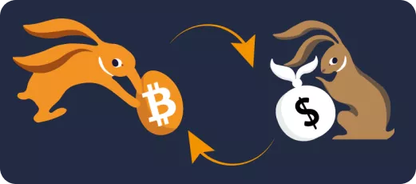

Es ist auch wichtig zu beachten, dass in Ihrer Gerichtsbarkeit möglicherweise Steuern eingeführt werden. Wir empfehlen Ihnen, die Vorschriften Ihres Landes zu konsultieren, bevor Sie irgendwelche Maßnahmen ergreifen, die Sie in Verzug bringen könnten.

## Hyper-bitcoinisation

<chapterId>b7275d31-3b60-5fb7-b9f5-030097010553</chapterId>

### Die wilde Fahrt hat gerade erst begonnen!

Wie jede neue Technologie folgt auch die Akzeptanz von Bitcoin einer S-Kurve. Wir haben die Zeit der Early Adopters hinter uns gelassen und die Indikatoren scheinen auf eine vollständige Demokratisierung von Bitcoin hinzudeuten. Es handelt sich um eine virale Technologie, die nicht aufgehalten werden kann. El Salvador ist das gewagte Wagnis eingegangen, Bitcoin vollständig zu übernehmen und ihn als gesetzliches Zahlungsmittel zu deklarieren. Allerdings reagiert jedes Land unterschiedlich auf diese Technologie. Einige haben sie verbannt und ihre Nutzung kriminalisiert, was die Komplexität der Annahme von Bitcoin in verschiedenen Kulturen, Epochen und Nationen noch erhöht.


Der Aufstieg von Bitcoin zwingt Unternehmen, Universitäten, Regulierungsbehörden und Einzelpersonen dazu, sich mit dieser neuen Technologie auseinanderzusetzen. Es müssen neue Werkzeuge geschaffen, Dienstleistungen angepasst und Innovationen fortgesetzt werden, um ihr Überleben zu sichern. Dieser Zusammenhang wirft zahlreiche Fragen auf, die verschiedene Bereiche betreffen, darunter Kryptografie, Spieltheorie, Wirtschaft und Geldpolitik, Informatik, Philosophie, Energie, Gesetze und Regulierung. Kurz gesagt: Bitcoin ist ein multidisziplinärer Gegenstand.


### Bitcoin ist eine 0 zu 1.

Wir laden Sie ein, über diese neue Währungsrevolution nachzudenken. Es gibt so viel mit Bitcoin zu erforschen, dass es kompliziert ist, alles auf einmal zu verinnerlichen. Nehmen Sie sich Zeit, Bitcoin wird nicht verschwinden. Im Gegenteil, die Revolution hat gerade erst begonnen. Gemeinsam glauben wir, dass wir in der Lage sind, die Welt zu erschaffen, die wir unseren Kindern anvertrauen möchten. Eine Welt, in der die menschliche Souveränität ein Recht ist, in der die Privatsphäre standardmäßig respektiert wird und in der Geld nicht manipuliert wird. Wir hoffen, dass wir dies gemeinsam erreichen können.

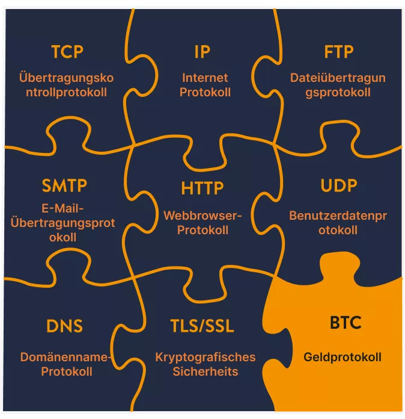

Wenn Sie Ihr Wissen über Bitcoin erweitern möchten, haben viele Autoren, Denker und Essayisten zur Bildungsschicht von Bitcoin beigetragen. Seit einigen Jahren erfassen und klassifizieren wir diese Werke, um eine [Ressourcenbibliothek](https://planb,network/resources) für die Neugierigsten unter Ihnen anzubieten. Dort finden Sie die besten Podcasts, Websites, Artikel, Tutorials, Bücher und andere Inhalte.

> Milton Friedman, ein renommierter Ökonom, hatte bereits 1999 vorausgesagt: "Ich denke, dass das Internet eine der Hauptkräfte sein wird, um die Rolle der Regierung zu reduzieren. Das Einzige, was fehlt, aber bald entwickelt werden wird, ist ein zuverlässiges E-Geld - eine Methode, mit der Sie im Internet Geld von A nach B übertragen können, ohne dass A B kennt oder B A kennt." oder auf Französisch: "Je pense qu'Internet sera l'un des principaux facteurs de réduction du rôle des pouvoirs publics. La seule chose qui manque, mais qui sera bientôt développée, c'est une monnaie électronique fiable - une méthode par laquelle, sur Internet, vous pouvez transférer des fonds de A à B sans que A ne connaisse B ou que B ne connaisse A." Heute erfüllt Bitcoin diese Vorhersage.

# Die Zukunft von Bitcoin: Das Lightning Network

<partId>899fd35e-39e6-5a25-a73e-6fed6e725094</partId>

## Kurze Einführung in das Lightning Network

<chapterId>b403f1e4-f1ff-572b-a242-9b58cb3736d0</chapterId>

Nun, da wir die Grundlagen des Bitcoin-Protokolls haben, werden wir ein Zahlungsnetzwerk einführen, das das Bitcoin-Protokoll verwendet, um Transaktionen in Lichtgeschwindigkeit durchzuführen. Wir sprechen natürlich vom Lightning Network!

### In aller Kürze

Das Lightning Network ist eine revolutionäre Technologie, die unsere Wahrnehmung von Bitcoin grundlegend verändert hat. Es ist eine Lösung für das Skalierbarkeitsproblem von Bitcoin.

Um das Lightning Network richtig zu verstehen, ist es entscheidend, zu verstehen, wie Bitcoin sich entwickelt. Bitcoin entwickelt sich in infrastrukturellen Schichten: Die erste Schicht ist die Blockchain und die zweite Schicht ist das Lightning Network.

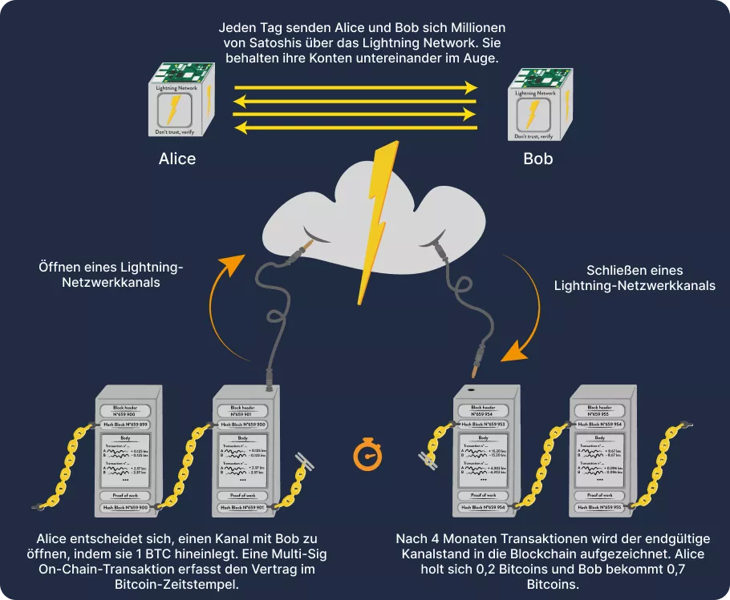

Als eine Schicht von Bitcoin anerkannt, wurde das Lightning Network im Jahr 2017 validiert und implementiert. Es ermöglicht sofortige Bitcoin-Transaktionen zu geringen Kosten und löst damit das Skalierbarkeitsproblem von Bitcoin. Aber was ist dieses Skalierbarkeitsproblem, dem Bitcoin begegnet?

### Eine Blockchain kann nicht unbegrenzt wachsen

Das Skalierbarkeitsproblem bezieht sich auf die Herausforderung, ein monetäres System einzurichten, das in der Lage ist, mit zunehmender Adoption eine immer größere Anzahl von Transaktionen pro Sekunde zu bewältigen. Dies bezieht sich auf das Blockchain-Trilemma. Stellen Sie sich ein Dreieck vor, dessen Spitzen Dezentralisierung, Sicherheit und Skalierbarkeit sind.

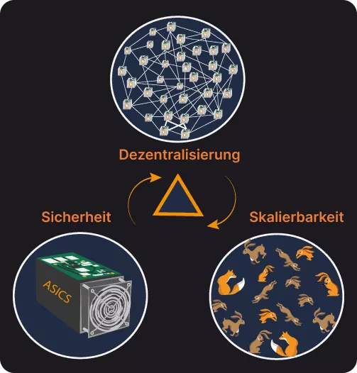
Ein Protokoll, das auf einer Blockchain basiert, kann nur zwei dieser drei Aspekte erfüllen. Innerhalb des Bitcoin-Protokolls wurden Entscheidungen getroffen, die die Dezentralisierung/Sicherheit begünstigen. Einerseits ermöglichen die Blockgröße von 1 MB und die Zeit zwischen zwei Blöcken (im Durchschnitt 10 Minuten) den kostengünstigen Betrieb eines Bitcoin-Knotens und fördern somit die Dezentralisierung. Andererseits macht die Blockproduktion durch Proof-of-Work Betrug im Protokoll extrem teuer und erleichtert die Überprüfung durch die Netzwerkknoten, was die Sicherheit fördert. Diese Entscheidungen führen jedoch zu einer Begrenzung der durchschnittlichen Anzahl von Transaktionen in einem Block auf einige wenige, was grob gesagt ein paar Transaktionen pro Sekunde entspricht. Diese Zahl ist im Vergleich zur Kapazität von Zahlungsprozessoren wie VISA, die bei 1700/s liegt, lächerlich. Dennoch ist dies eine notwendige Begrenzung, um mit Bitcoin unzensierbar und ohne Vertrauensdritte handeln zu können. Diejenigen, die an Bitcoin entwickeln, haben jedoch von Anfang an über dieses Problem nachgedacht.

### Lightning als oberste Schicht

Nach Jahren des Nachdenkens und vieler Versuche entsteht das Lightning-Protokoll. Mit Hilfe einer Reihe von Spezifikationen ermöglicht dieses Protokoll den Aufbau eines Peer-to-Peer-Zahlungsnetzwerks unter Verwendung der Sicherheit und Programmierbarkeit von Bitcoin-Transaktionen. Das Lightning Network fungiert als Netzwerk von Zahlungskanälen, das schnelle und kostengünstige Transaktionen für den Sender ermöglicht. Dieses Netzwerk von Zahlungskanälen ermöglicht sogar Transaktionen zwischen Personen, die nicht direkt miteinander verbunden sind.

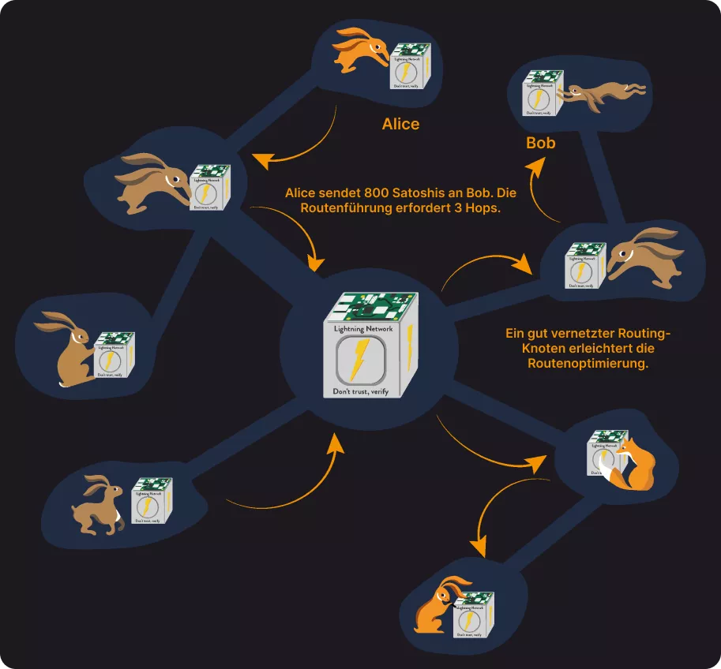

Traditionelle Geldtransferdienste wie Western Union, Zentralbanken, Visa und Mastercard könnten verschwinden, wenn sie die Lightning Network-Technologie nicht übernehmen. Das Lightning Network ist effizienter und wirtschaftlicher als die aktuellen Zahlungssysteme. Tatsächlich ermöglicht das Lightning Network eine nahezu unbegrenzte Anzahl von Transaktionen zwischen zwei Parteien, die einen Kanal teilen, ohne dass auf der Basiskette der Blockchain andere Energiekosten als die Transaktion zur Ankündigung der Kanalerstellung anfallen.

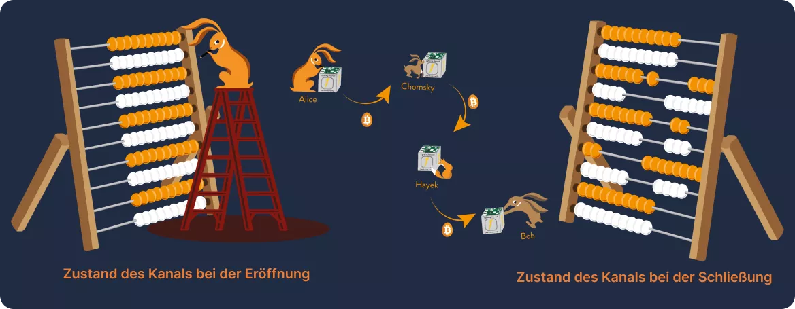

Die Transaktionen sind durch Kryptographie und indirekt durch die von den Minern auf Bitcoin verbrauchte Energie gesichert. Die Transaktionen können sofort, ohne geografische Begrenzung und zu extrem niedrigen Gebühren durchgeführt werden, die oft unter 0,5% liegen.

Insgesamt ist das Lightning Network ein vielversprechender Versuch, ein effizientes Zahlungssystem für Bitcoin zu implementieren. Es gibt bereits viele Lightning-Wallets, die Sie in unserem Tutorial-Bereich oder über unsere Schulungen zum Lightning Network entdecken können.

## Anwendungsfälle des Lightning Network

<chapterId>684e31f9-ebd1-51b6-91c0-1e6a315f1141</chapterId>

Wie wir gerade gesehen haben, steht das Bitcoin-Protokoll trotz seiner revolutionären Natur vor bedeutenden Herausforderungen in Bezug auf Skalierbarkeit, um all unsere täglichen Transaktionen durchführen zu können. Um diese Probleme zu lösen, wurde im Jahr 2016 eine sogenannte Second-Layer-Lösung namens Lightning Network vorgeschlagen, die heute mehrere verschiedene Implementierungen hat, aber alle miteinander kompatibel sind:

- Core-lightning von Blockstream
- Eclair von Acinq
- LND von Lightning Strike

Dieses Peer-to-Peer-Netzwerk zielt insbesondere darauf ab, Mikrotransaktionen zu erleichtern, also Transaktionen mit sehr geringem Wert, die aufgrund hoher Gebühren und langer Bestätigungszeiten auf der Bitcoin-Blockchain sonst nicht praktikabel wären.

### Welche Anwendungsfälle hat das Netzwerk?

Diese Technologie eröffnet eine breite Palette potenzieller Anwendungen für Bitcoin, die aufgrund der erforderlichen Sicherheits- und Dezentralisierungsbeschränkungen zuvor unerreichbar waren. Zu den Anwendungen im täglichen Leben gehören beispielsweise sofortige Abrechnungen im Einzelhandel (physisch und online), Echtzeit-Geldüberweisungen, Mikrospenden für Inhalte. Durch die Bereitstellung eines nahezu sofortigen, sicheren und kostengünstigen Transaktionsnetzwerks (im Durchschnitt weniger als 0,5%) können zahlreiche zuvor undenkbare Geschäftsmodelle umgesetzt werden. Dies ist möglich, da das Lightning Network die Sats (die Dezimalstellen von Bitcoin) verwendet.

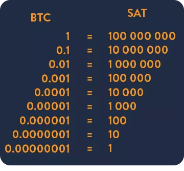

Die Videospielindustrie bietet ein besonders interessantes Beispiel dafür, wie das Lightning Network genutzt werden kann, um bestehende Geschäftsmodelle zu transformieren. Das Konzept von "Skin in the Game" hat in diesem Zusammenhang in letzter Zeit an Popularität gewonnen. Es geht im Wesentlichen darum, ein finanzielles Interesse am Ergebnis eines Spiels zu haben.

Das Lightning Network ermöglicht es Spielern, beim Spielen von Spielen sehr geringe Geldbeträge einzusetzen, wie zum Beispiel zehn Satoshis (ungefähr ein Bruchteil eines Euro-Cents). Dadurch wird ein Anreiz geschaffen, der den Wettbewerb fördert und gleichzeitig die Kosten für den Einsatz von Bots erheblich erhöht.

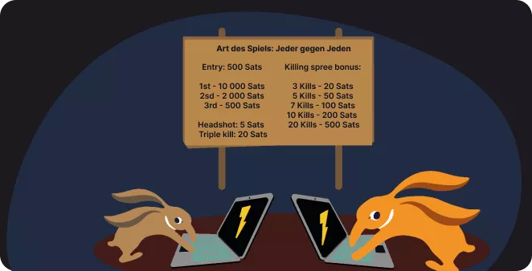

Insgesamt sieht die Zukunft der Mikrotransaktionen mit Bitcoin dank Innovationen wie dem Lightning Network vielversprechend aus. Während diese Technologien weiterhin entwickelt und ausgereift werden, können wir in naher Zukunft mit neuen und aufregenden Anwendungen rechnen. Nehmen wir zum Beispiel das Konzept des "Geld-Streamings": Da das Lightning Network es uns ermöglicht, jede Minute Mikrotransaktionen durchzuführen (potenziell ohne Vertrauensdritte), eröffnet dies die Möglichkeit, experimentelle Geschäftsmodelle zu testen, bei denen Verbraucher den Inhalt entsprechend ihrer Nutzung bezahlen.

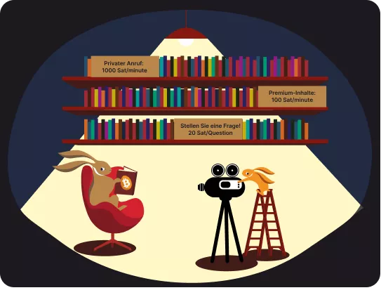

In einem solchen System wird das Geld automatisch, basierend auf einem vordefinierten Prozentsatz, zwischen den verschiedenen Beitragenden zu einem Dienst oder Produkt aufgeteilt. Dies könnte die Art und Weise, wie wir Zahlungsmodelle betrachten, revolutionieren. Zum Beispiel könnten Benutzer anstelle eines monatlichen Abonnements für einen Dienst nach Minuten oder sogar Sekunden für die Zeit, die sie mit der Nutzung des Dienstes verbringen, berechnet werden. Ein solches Geschäftsmodell könnte tiefgreifende Auswirkungen auf Content-Ersteller haben, die dazu angeregt würden, qualitativ hochwertigen Inhalt zu produzieren, um die Aufmerksamkeit der Benutzer zu halten. Benutzer würden ihrerseits nur für den Inhalt bezahlen, den sie konsumieren, und somit vorab bezahlte Abonnementgebühren eliminieren. Es ist sogar denkbar, dieses System für die Vermietung von Gütern zu nutzen.


Zusammenfassend eröffnet das Lightning Network eine Vielzahl spannender Anwendungsfälle für Bitcoin-Benutzer. Die resultierenden Geschäftsmodelle und kommerziellen Möglichkeiten sind vielfältig und zahlreich. Wir ermutigen Sie, es selbst auszuprobieren, indem Sie die Podcast-App [Fountain](https://www.fountain.fm/) testen, die es Ihnen ermöglicht, für das Hören Ihrer Lieblings-Podcasts in einigen Sats entlohnt zu werden!

## Rote Pille oder blaue Pille?

<chapterId>c81cdb45-6aa9-5462-9835-c4852084b2cc</chapterId>

Wie Morpheus zu Neo sagte: "Nimmst du die blaue Pille, endet die Geschichte, du wachst in deinem Bett auf und glaubst, was du willst. Nimmst du die rote Pille, bleibst du im Wunderland, und ich zeige dir, wie tief das Kaninchenloch geht." Sind Sie bereit, das Kaninchenloch von Bitcoin zu erkunden? Seien Sie vorsichtig, denn Sie könnten Ihre finanzielle Freiheit wiederfinden!


### Die technologische Zukunft und ihre Auswirkungen

Die Technologie entwickelt sich exponentiell und niemand kann mit Sicherheit ihre Entwicklungen vorhersagen. Die Vernetzung der Welt und künstliche Intelligenz entwickeln sich ständig weiter. Das Wissen, das eine Person durch das Internet erlangen kann, wird mit der Zeit immer unzählbarer.

Nehmen wir zum Beispiel KI, diese Technologien haben bereits den menschlichen Standpunkt in einer wachsenden Anzahl von Bereichen wie Videospielen, Bild- und Textproduktion, Datenanalyse übertroffen oder nähern sich ihm an. Eine potenzielle Auswirkung könnte sein, dass über 80% der Arbeitsplätze aufgrund von KI und Automatisierung verschwinden werden. Es stehen uns mehrere Optionen zur Verfügung, wie zum Beispiel die Einschränkung der technologischen Entwicklung oder die Nutzung des Produktivitätszuwachses, der durch KI geschaffen wird, um Kapital zu generieren.

Die unverzichtbaren Fragen, die gestellt werden müssen, lauten:

- Wie soll eine Gesellschaft verwaltet werden, in der 80% der Arbeitsplätze verschwinden?
- Wie kann eine Bevölkerung wiederbelebt werden?
- Ist eine so große Anzahl von Lehrern erforderlich?
- Die geopolitischen, politischen und menschlichen Auswirkungen der Automatisierung werden nicht ausreichend diskutiert.
  Informatik, Internet, Streaming, VR werden die Bildung verändern. Wir könnten einen universellen Kurs für alle französischen Studenten haben, der von der Regierung verwaltet wird und in dem die Lehrer den Kurs nicht mehr halten, sondern die Schüler direkt begleiten. Die Kinder könnten in eine virtuelle Welt gehen und beim Lernen der Geschichte begleitet werden.

- Wo liegt die Grenze zwischen einem Lehrer und einer KI?
- Wie kann eine Gesellschaft gewährleistet werden, die im Wohlstand lebt?

Diese grundlegenden Fragen für unsere Zukunft müssen gemeinsam diskutiert und entschieden werden. Aber was hat das mit Bitcoin zu tun? Ähnlich wie das Internet für Kommunikationswege ist Bitcoin eine technologische Revolution für neue Formen der Organisation im großen Maßstab, die uns die Möglichkeit gibt, Werte ohne jegliches Vertrauen in Dritte auszutauschen. Wollen wir die technologische Entwicklung des Währungssystems einschränken oder den Kapitalzuwachs durch die gesteigerte Produktivität durch die Verwendung von Bitcoin- und Lightning-Protokollen nutzen?

### Wie sieht die Zukunft der Finanzwelt aus?

Diese Überlegungen werfen auch Fragen auf, wer das Geld, das wir verwenden, besitzen, genehmigen und verfolgen sollte. Das Ziel ist es, zwischen einem geschlossenen System mit nicht gewählten Führern oder einem offenen System ohne Vertrauensdritte zu entscheiden, in dem Neutralität herrscht.

- Ist Geld ein privates Eigentumsrecht?
- Können die Konten von Demonstranten ohne Gerichtsbeschluss gesperrt werden?
- Wer garantiert das Finanzsystem?
- Wie kann ein Individuum souverän über sein Geld sein und gleichzeitig von einem Vertrauensdritten abhängig sein?
- Kann man Geld ohne Gebühren oder Vermittler ans andere Ende der Welt schicken?

Die Akzeptanz dieser neuen Technologien könnte massive Skaleneffekte auf der ganzen Welt ermöglichen. Sollte die freie Kapitalbewegung erlaubt sein? Internationale Blockaden haben wirtschaftliche und politische Folgen. Ist es ethisch vertretbar, Finanzintermediäre wie Western Union zu nutzen, die manchmal bis zu 25% Gebühren erheben? Wir sind der Meinung, dass in einer immer digitaleren Welt Geld demokratisiert werden sollte und als gemeinsames Gut betrachtet werden sollte, das dem Volk gehört, anstatt dem Staat oder undurchsichtigen Finanzinstitutionen.

Die Frage, wer das Bankensystem kontrollieren sollte, ist entscheidend, da die Regeln des Bankenspiels nicht transparent und für alle verständlich sind, was einer Gruppe von Politikern und Regulierungsbehörden ermöglicht, ihre Kontrolle über das System aufrechtzuerhalten. Es ist wichtig zu überlegen, ob der freie Markt oder eine Gruppe von Intellektuellen das Bankensystem kontrollieren sollte.

### Unsere Freiheiten stehen auf dem Spiel

Die Zensur muss ebenfalls hinterfragt werden, denn wer hat das Wissen, um zu entscheiden, was zensiert werden sollte und was nicht? Die Medien haben ihre Position zu bestimmten Informationen geändert, und diejenigen, die früher zensiert wurden, sind es heute nicht mehr.

- Wer entscheidet, was Zensur oder Propaganda ist?
- Wer hat die göttliche Hand über unser System?

Die Toleranz gegenüber Zensur kann die Meinungsfreiheit und das Versammlungsrecht zerstören. Die Umsetzung von Zensur ist technisch schwierig, ohne eine vollständige Dystopie zu schaffen. Welche Instanz sollte die Macht zur Zensur haben? Die Frage der Zensur ist kompliziert, und es ist schwer zu sagen, wer zensiert werden sollte und wer nicht. Zensur kann sich negativ auf Innovation und unternehmerische Freiheit auswirken.

Es gibt 2,4 Milliarden Menschen auf der Welt ohne Bankkonto, was zwangsläufig geografische Ungleichheiten schafft. Bitcoin ermöglicht Gleichheit bei Transaktionen, unabhängig von sozialem Status oder politischer Position. Das Bitcoin-Protokoll ist unpolitisch und gewährt dem Präsidenten oder anderen Akteuren keine speziellen Privilegien. Führungskräfte sollten die gleichen Privilegien haben wie gewöhnliche Menschen, um die Entwicklung nach oben zu treiben, anstatt einige an der Spitze und andere unten zu lassen. Sollte jeder die gleiche Währung haben, unabhängig von ihrem sozialen Status? Es ist wichtig, über die Welt nachzudenken, die wir unseren Kindern hinterlassen wollen. Wir wünschen uns eine offene Welt, in der sie frei sind, mit ihrem Geld zu tun, was sie wollen.

Bitcoin ist wichtig und sollte nicht als reines Glücksspiel betrachtet werden. Es ist entscheidend, weiterhin Fragen zu Bitcoin zu stellen.

### Bitcoin: ein revolutionäres Protokoll

Wie wir im vorherigen Kapitel gesehen haben, ist das Bitcoin-Protokoll neutral gegenüber all seinen Benutzern. Dank Konsensregeln und Kryptographie können wir Transaktionen unveränderlich in einem globalen öffentlichen Register festhalten und so den Werttransfer ohne Vertrauensdritte gewährleisten. Die Infrastrukturebenen der Stufe 2 (und bald auch 3 mit RGB) ermöglichen die Skalierung des Netzwerks und die Entwicklung neuer Funktionen, insbesondere zur Lösung von Skalierungsproblemen.
'Bitcoin hat alle notwendigen Eigenschaften, um eine effiziente und gesunde Währung zu sein: teilbar, sofort transportierbar, nicht zensierbar, vernachlässigbare Kosten für die Überprüfung und mit einer bereits festgelegten Geldpolitik für die kommenden Jahrhunderte mit diesen 21 Millionen Einheiten. Bitcoin ist pseudonym und kann weltweit ohne Genehmigung einer beliebigen Einheit gehandelt werden, solange Sie Ihre eigenen privaten Schlüssel besitzen - wie das Sprichwort sagt: "Not your keys, not your bitcoins" ("nicht deine Schlüssel, nicht deine Bitcoins").
Bitcoin wird von verschiedenen Gruppen von Menschen angenommen, von Kryptographen über Libertäre bis hin zu traditionellen Unternehmen und sogar einem Land. Bitcoin ist jedoch für alle da, und die Anzahl der Benutzer wächst, ebenso wie die Anzahl der Bitcoin-Knoten, die als Hüter des Transaktionsverlaufs dienen und so seine Dezentralisierung gewährleisten.

Bitcoin kann nicht mehr gestoppt oder zensiert werden. Es ist eine friedliche Revolution, um das Geldsystem zu ändern und finanzielle Inklusion zu ermöglichen. Benutzer können Bitcoins erhalten, indem sie sie für ihren Handel akzeptieren oder über regulierte oder nicht regulierte Plattformen kaufen. Bitcoins können in Brieftaschen, mobilen Anwendungen oder physischen Geräten gespeichert werden. Bei Bitcoin gibt es keinen vertrauenswürdigen Vermittler, Bitcoin setzt auf Transparenz, Freiheit und individuelle Verantwortung - wie das Sprichwort sagt: "Don't Trust, Verify" ("Vertraue nicht, überprüfe selbst").

Die Veränderung des Finanzsystems erfordert eine Veränderung der Währung. Satoshi hat Bitcoin im Jahr 2008 geschaffen, um einen Versuch dazu zu unternehmen. Einfaches und "magisches" Geld zu haben, korruptiert. Bitcoin ist daher eine Alternative, um ein neues neutrales Geldsystem aufzubauen. Bitcoin ermöglicht die Befreiung vom Bankensystem. Es ist ein soziales Phänomen, das uns dazu bringt, an einer friedlichen Revolution teilzunehmen. Sind Sie bereit, sich anzuschließen?

## Dank und weiterhin den Kaninchenbau erkunden

<chapterId>c153facd-fe77-5954-b18b-d0e2243e787a</chapterId>

### Gehen Sie weiter

Herzlichen Glückwunsch zum Abschluss dieses BTC 101-Kurses! Ich hoffe von ganzem Herzen, dass es Ihnen gefallen hat und Ihnen neue Möglichkeiten eröffnet hat. Ihre Entdeckung von Bitcoin steht erst am Anfang und ich lade Sie ein, alle anderen verfügbaren Kurse an der Universität zu entdecken.

- [BTC 102](https://planb.network/courses/btc102) wird Ihnen helfen, Ihren Bitcoin-Plan umzusetzen
- [LNP 201](https://planb.network/courses/lnp201) ermöglichen es Ihnen, das Lightning Network, ein Zahlungsnetzwerk in der zweiten Schicht, kennenzulernen
- [ECO 201](https://planb.network/courses/eco201) wird sich mit der österreichischen Wirtschaft befassen
- [SCU 101](https://planb.network/courses/scu101) ermöglicht es Ihnen, Ihre digitale Sicherheit zu aktualisieren
- [MIN 201](https://planb.network/courses/min201), um mehr über das Mining zu erfahren
- und viele mehr...

## Bewerten Sie den Kurs

<chapterId>585729e2-b0ab-51b5-89ec-593e3ea22c57</chapterId>
<isCourseReview>true</isCourseReview>

## Abschlussprüfung
<chapterId>8410e961-3841-5abf-a51d-04fc0139dd59</chapterId>
<isCourseExam>true</isCourseExam>

## Fazit

<chapterId>dfc534be-44a9-5e8c-9c98-e51ef0554e91</chapterId>

**Herzlichen Glückwunsch zum Abschluss dieses Kurses!**

Bitte beachten Sie, dass dieses Kapitel derzeit noch im Aufbau ist und eine verbesserte Version in Kürze verfügbar sein wird. Wenn Sie in der Zwischenzeit Ihre Bitcoin-Reise fortsetzen möchten, laden wir Sie ein, die anderen Kurse und Tutorials auf unserer Plattform zu erkunden. Machen Sie weiter so und viel Spaß beim Lernen!
