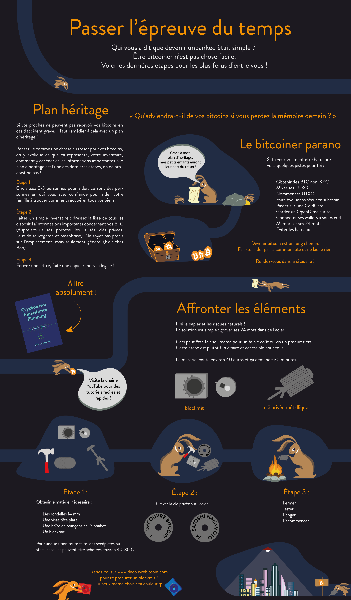
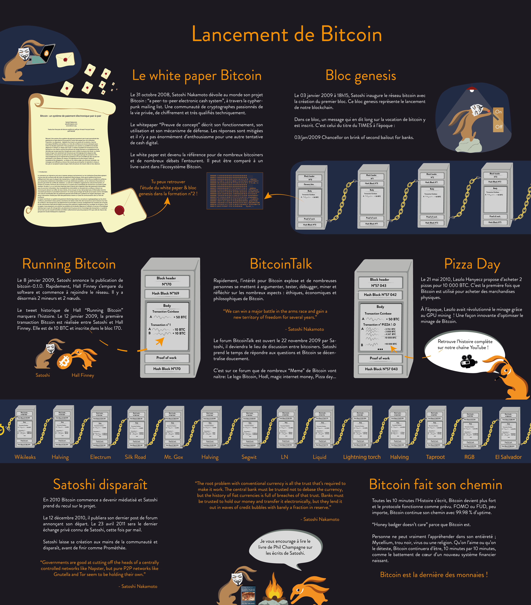

# Your First Bitcoin Adventure

In this course, I will explain Bitcoin in 21 chapters so that you can understand this technology in a simple and effective way. The course is accessible to everyone and explores the industry as a whole: mining, wallets, buying/selling platforms, etc...

The course should take about 15 hours. Throughout the journey, explanatory posters and additional resources are available.

+++

# Discovering Bitcoin

Bitcoin is a significant innovation that goes beyond being a mere "internet currency." It is a technological and monetary revolution that challenges our relationship with money. Bitcoin with a capital "B" represents the protocol, while bitcoin with a lowercase "b" corresponds to the unit of account of the Bitcoin protocol's currency.
Bitcoin is a **neutral currency**, meaning it is not controlled by any entity or institution.

In the upcoming chapters, we will discuss the technical and monetary aspects of the Bitcoin protocol, as well as how to acquire them, securely store them in Bitcoin wallets, and use them for transactions.

It is essential to understand that Bitcoin is a new monetary system that revolutionizes our relationship with money. Learning to use Bitcoin is an essential skill for anyone who wants to have sovereignty over their own money.

Bitcoin is a relatively new technology, launched in 2009, that is unlike anything else. So it is normal not to understand everything right away. However, just like learning to use the internet or a car, it is not necessary to understand all the technical nuances to know how to use Bitcoin (receive, pay, secure funds).

# The Prehistory of Bitcoin

To understand the origin of Bitcoin, we need to go back to the 1980s and the cypherpunk movement. Cypherpunks are pioneers who experimented and innovated with cryptography for the benefit of individuals. They are particularly responsible for numerous movements dedicated to privacy protection in the digital age and for open-source software that works towards this goal, such as PrettyGoodPrivacy (PGP).
In 2008, a person (or a group of people) under the pseudonym Satoshi Nakamoto sends the Bitcoin whitepaper via the cypherpunks mailing list, announcing that they have found the solution to build a peer-to-peer electronic cash system. It is interesting to note that this system is entirely based on concepts and technologies that have already been developed by other cypherpunks, such as proof of work or the blockchain itself - what makes Bitcoin unique is the unique arrangement of these technologies. A few months later, on January 3, 2009, the Bitcoin protocol is launched. In the early years of this protocol, only people close to the cypherpunk movement strongly contributed to improving the Bitcoin code.

After only two years, Satoshi Nakamoto completely withdraws from this project that no longer needs him to continue perpetuating over time - thus Satoshi will have succeeded in deploying a new electronic cash system while remaining perfectly anonymous. Since then, the Bitcoin protocol has been maintained by many developers in a completely decentralized manner, that is, without a central authority, without a leader.

Bitcoin represents a revolution on three levels: digital, financial, and technological. To fully grasp the nature and scope of this revolution, it is crucial to understand the basics of Bitcoin, its foundations, and the historical context in which it was created. Bitcoin challenges the existing financial system and is built as an alternative monetary system.

Within the current financial system, currencies (such as the euro or the dollar) are solely issued unpredictably by central banks and states, and are therefore subject to inflation, and even hyperinflation, which have significant adverse effects on societies and individuals. In contrast, Bitcoin is an open system that explicitly defines a schedule for the issuance of new bitcoins in a precise, fixed, and transparent manner. In particular, the issuance of this new currency occurs when a new valid block is created to reward the miner who has spent resources to obtain this new valid block. Furthermore, this reward is halved after every 210,000 blocks (approximately every 4 years) to ensure both a finite quantity of bitcoins in circulation (around 21,000,000 BTC) and a monetary inflation that tends towards zero as time passes.
Bitcoin is therefore a protocol that spans long periods of time, and encourages us to question our relationship with energy, time, and money. But is bitcoin a "real" currency? What is currency? Does it exist in multiple forms? That's what we'll see in the next chapter.

# Currency throughout History

The evolution of currency is a fascinating aspect of human history, reflecting the ingenuity of civilizations throughout the ages in meeting constantly evolving economic needs. The earliest forms of currency were tangible in nature, often consumer goods such as grains or livestock. However, for about 4000 years, gold has spontaneously become a universally recognized standard.
Gold ideally meets the criteria of an effective currency: its natural scarcity makes it valuable, while its chemical properties allow it to not erode over time. However, this form of currency is not easily divisible or transportable over long distances, so gold has gradually been abandoned in favor of more practical solutions, such as bills and digital currencies.

The criteria for an effective currency are multiple. A good currency must be:

- **fungible**, meaning interchangeable without loss of value
- **divisible**, in order to facilitate transactions of different volumes
- **liquid**, meaning easily convertible into goods or services.

Today, currencies are still evolving, adapting their forms to meet different uses. For example, while gold is an excellent store of value, it is no longer suitable for the current globalized economy. Similarly, fiat currencies like the dollar and the euro are very liquid and easily transportable because they are now mostly digital, however their value is constantly eroded by monetary inflation. Bitcoin, on the other hand, presents new possibilities. Due to its properties, such as its strictly limited supply, it offers an excellent store of value. Moreover, as a neutral internet currency, it represents a good means of exchange that knows no borders. However, it is still not widely accepted in commerce today, despite [constant adoption](https://btcmap.org/map).

# Fiat Currencies

# Exploration of the Impacts of Fiat Currencies on the Financial System

The exploration of the impacts of fiat currencies on the financial system is an essential aspect of our understanding of contemporary economic dynamics. To quote George Santayana, "Those who cannot remember the past are condemned to repeat it." It is with this historical approach that we approach the subject of fiat currencies.

A fiat currency is a form of currency that is declared as legal tender by an institution such as a nation-state, like China with the Yen, or a politico-economic union, such as the European Union with the Euro. The entity responsible for issuing a fiat currency is a central bank and therefore its monetary policy. For example, we can mention the People's Bank of China, the Federal Reserve of the United States, the Bank of Mexico, or the Central Bank of the Republic of Guinea. These financial institutions are governed by mandates that set their objectives, which are often related to the trust in the respective fiat currency. Indeed, these currencies rely entirely on the trust and assurance that their value will be preserved over time. However, this trust is currently shaken by empirical facts, such as rampant inflation and unprecedented debt increase. Furthermore, even though these institutions are supposed to be independent from political power, there are no means available to ensure their political independence.

It is in this context that the Bitcoin revolution is gaining momentum. This currency, which does not require any third-party trust, aims to separate the state from the currency. The ability to manipulate the currency at the discretion of central bank mandates has allowed for a gradual devaluation, eroding the purchasing power of the entire population. For example, since the introduction of the Euro, purchasing power has decreased by 30%, while American purchasing power has lost 98% of its value since 1900. Inflation acts as a hidden tax that erodes our purchasing power. It allows a state to forcibly redistribute value by devaluing its currency to facilitate debt repayment and fund its projects.
Monetary printing leads to inflation, gradually impoverishing the population. On the other hand, financial institutions and wealthy individuals have benefited from this practice, widening the gap of inequalities and promoting authoritarianism. The current financial system is regulated and restricted to avoid its collapse, and any disruption could potentially cause a major economic crisis. As political actors benefit from this system, they are not incentivized to make radical changes, allowing the system to continue its course until a possible implosion.

In response to these systemic challenges, Bitcoin presents itself as a decentralized solution: a new parallel monetary system. Historically, gold has been favored as a currency due to its resistance to counterfeiting. Similarly, Bitcoin, with its decentralized and cryptographic nature, cannot be falsified and is limited to 21 million units. Bitcoin is a currency that relies on transparency and neutrality, offering an attractive alternative to the current centralized monetary system.

At the same time, the emergence of central bank digital currencies, or CBDCs, seems inevitable. This new form of currency would offer a more centrally planned economy, which could hinder individuals' financial freedom and facilitate authoritarian abuses.

# Hyperinflation

Hyperinflations are devastating phenomena in a fiat monetary system, driven by human decisions, which can lead to the total devaluation of the currency in question. As a result, the savings accumulated by individuals can dissipate in a relatively short period of time.

There are notable cases of hyperinflation throughout history, such as Germany in 1923, Zimbabwe, Venezuela, among others. Let's try to understand the impact of inflation on savings by considering various inflation rates. With a 2% inflation rate, you lose 2% of your purchasing power annually, which amounts to 10% over 5 years. At 7%, you lose half in 10 years. With a 20% rate, you lose almost half in 3 years. Thus, hyperinflations can quickly eliminate hard-earned savings.

This phenomenon of hyperinflation is not new and has persisted throughout history. To understand this dynamic, it is essential to examine the stages of hyperinflation and the process of loss of confidence in the currency.
A centralization of monetary power facilitates the creation of currency and its abuses. A loss of confidence in a currency can then emerge and trigger hyperinflation. Individuals begin to question the origin of money and the benefits of mandated monetary policy. This loss of confidence is generally due to external factors such as wars, social measures, or the rise in prices of a key resource, such as wheat or gasoline. The second stage is the collapse of the currency. As governments lose control of trust, individuals begin to exchange their currency for another, more stable one, such as the US dollar in Venezuela. This leads to price increases, creating a vicious circle where goods and services become increasingly expensive. To meet these needs, the state prints more money to correct monetary policy, resulting in exponential inflation.
A new currency is then introduced to replace the old one. A notable example of hyperinflation is Germany in the years 1920-1924. To revive the economy, a new currency was created, backed by German, French, and English debt, and guaranteed by German lands.
Resolving a hyperinflation crisis often requires radical changes, such as revolutions, changes in government, changes in central bankers, among others. Loss of confidence, currency collapse, and reconstruction are essential phases for reviving a new economy based on fiduciary currency.
Understanding the phenomenon of hyperinflation and how it occurs is one thing, but how can one protect against it? To protect against hyperinflation, it is recommended to diversify one's portfolio by getting rid of weak currencies and investing in strong assets or currencies, such as gold or Bitcoin. Stocks of companies capable of quickly revaluing their prices, such as Apple or Microsoft, or real estate investment can also prove to be good investments. Furthermore, not printing money at will is the best way to prevent hyperinflation. Bitcoin is a currency that has specific characteristics, such as a fixed and immutable currency issuance policy without total consensus from users.
In conclusion, hyperinflation has the effect of rapidly degrading the value of the currency, leading to erosion of savings and a loss of confidence in the monetary system. As Voltaire once suggested, a fiduciary currency will always eventually lose its intrinsic value and converge towards zero. A currency that relies on a trusted third party such as a financial institution is, in fact and in the long term, a defective currency because it is unable to guarantee purchasing power or preserve savings.

# 21 million bitcoins

Bitcoin is a decentralized digital currency with a pre-defined maximum quantity of **21 million units**. This intrinsic characteristic of scarcity is determined by its computer code and reinforced by the consensus of all users participating in the protocol. As for its monetary issuance, it can be illustrated by an S-curve that represents the quantity of bitcoins created over time. For example, in 2022, approximately 18.5 million bitcoins were in circulation. Forecasts indicate that by 2025, there will be around 19.5 million bitcoins, representing ~93% of the total supply, and by 2037, this figure will reach 20.4 million.

The creation of new bitcoins is the result of the mining process, a procedure for verifying transactions on the Bitcoin network. Miners, who perform this task, are rewarded with the issuance of new bitcoins every ten minutes. This reward is programmed to halve every 210,000 blocks, or approximately every four years, an event known as "halving" -- which gives the monetary issuance curve a stair-like shape. Due to this halving mechanism, it can be mathematically predicted that the creation of bitcoins will cease in 2140, when the total number of bitcoins reaches its limit of 21 million.

The scarcity of Bitcoin is guaranteed by two key mechanisms: the limit set at 21 million bitcoins and the computer protocol that cannot be changed without near-total consensus of the network. Two other crucial elements contribute to maintaining this limit: game theory and mining difficulty adjustment. Miners are incentivized to mine a block to earn the new bitcoins and the transaction fees associated with the transactions it includes in its block. As the number of bitcoins issued approaches the 21 million limit, miners will be increasingly rewarded by transaction fees rather than the block reward.
The adjustment of mining difficulty, on the other hand, takes place every 2016 blocks, which is approximately two weeks, to ensure that, on average, a new block is added to the blockchain every ten minutes. This frequency of block creation and the total quantity of bitcoins are fixed aspects of the Bitcoin protocol and cannot be changed without general consensus, unlike arbitrary decisions made in traditional monetary systems.

Any modification to the Bitcoin protocol would require the agreement of the entire community of users, which is highly complex. Furthermore, the idea of devaluing the currency goes against the fundamental philosophy of Bitcoin, so changing this limit is highly unlikely.

The scarcity of Bitcoin is a major asset, as there will always be a maximum of 21 million units. The quantity of bitcoins in circulation is public and verifiable by anyone. In fact, anyone can verify the quantity of bitcoins in circulation by entering a simple command on a Bitcoin node: `bitcoin-cli gettxoutsetinfo`. This transparency and verifiability strengthen trust in the Bitcoin system, which is not based on centralized institutions or individuals, but on a mathematical and cryptographic guarantee inherent in its protocol.

The concept of sound monetary management is intrinsic to Bitcoin, as it is impossible to create more bitcoins than the predetermined limit or to destroy users' savings. This is a fundamental characteristic that distinguishes Bitcoin from other forms of currency. Furthermore, according to the principles of Austrian economics, Bitcoin is considered an excellent form of money. Indeed, its quantity is strictly controlled and issued in a predictable manner, which corresponds to the Austrian ideal in terms of monetary creation. Unlike traditional currencies, which can be subject to inflation due to excessive money printing, Bitcoin maintains its value through its programmed scarcity.

In summary, Bitcoin, with its decentralized nature, programmed scarcity, and transparency, offers a unique alternative to traditional monetary systems. It illustrates how technology can be used to create a currency that is not only useful and verifiable, but also preserves the value of users' savings by strictly limiting its supply.

# Money: A Social Tool

Currency is a social tool that must adapt to needs and technology. Over time, gold has been used as a store of value because it was rare and could not be devalued. However, later on, gold was replaced by debt and fiat currency, which is easy to transport but also easy to manipulate its monetary policy.

Bitcoin is a realistic monetary alternative because it is rare and limited to 21 million bitcoins that cannot be changed. Monetary creation is maintained through the adjustment of difficulty every 2 weeks, and through halving, which guarantees a verifiable mathematical proof of its scarcity. Unlike euros or dollars, whose circulating volume is non-verifiable and frequently changes due to the mandates of financial institutions, Bitcoin is a cryptographic currency with a neutral and fixed monetary policy. Therefore, it is an excellent global store of value because it cannot be devalued by monetary printing.

Bitcoin is primarily a form of currency that encourages questioning the power of financial institutions over money. It is a philosophical and economic battle that is at stake. To understand Bitcoin, it is important to understand its fundamental principles and debunk the misconceptions surrounding it. This will allow for engaging in constructive intellectual debate about the future of currency.

Now that we have established the differences between Bitcoin and fiat currencies, in the next chapters, we will study what Bitcoin wallets are because it is your responsibility to secure your funds. Indeed, the financial sovereignty offered by Bitcoin necessarily goes hand in hand with individual responsibility.

# What are Bitcoin wallets?

Here, we will explore the storage and security of Bitcoins within wallets.

First of all, what is a Bitcoin wallet? A wallet is a place where the private keys that give access to your Bitcoins are stored. A wallet can be software on your computer, an application on your smartphone, a physical device like a USB key, or even a piece of paper.
Each wallet contains a pair of keys: a public key, which is like a postal address, and a private key, which is like the key to your mailbox. From the public key, the wallet derives bitcoin addresses that you give to people so they can send you bitcoins, and the private key is the one that allows you to spend the bitcoins received at those addresses.
There are different types of Bitcoin wallets that each serve different use cases. Here are some of the most common types of wallets:

- Mobile applications like Samourai, Green Blockstream, and Blue Wallet are Bitcoin wallets that can be downloaded for free on Android or iOS.
- PC applications like Sparrow.
- Physical wallets like those found in our cold wallet section, which require purchasing hardware but ensure that your private key is not stored on your phone or computer.

While your keys are stored in your wallet, the actual bitcoins are "stored" on the Bitcoin blockchain, which is a distributed public ledger within the Bitcoin peer-to-peer network. This means that losing the device on which your wallet is stored does not necessarily mean losing your bitcoins. What allows you to recreate your wallet and spend your bitcoins is the private key. Therefore, it is crucial to secure this key properly.

Fortunately, since 2017, this private key can be encoded in a simple list of 12 or 24 words, called the mnemonic phrase. This phrase serves as a backup for your Bitcoin wallet and allows you to recreate your wallet with any Bitcoin wallet software/app. Thus, anyone with access to this list of words has access to your bitcoins.

One might wonder: what if someone accidentally guesses our list of 12 or 24 words? The short answer is that due to the cryptography used to create the wallet, it is highly unlikely. To put it into perspective, accidentally finding access to your wallet is equivalent to finding the "right" number between 1 and $2^256$, which is almost equivalent to finding the "right" atom in the Universe. However, if you are not satisfied with this default security, you can always strengthen it by adding a passphrase to your Bitcoin wallet.

Therefore, the probability of hacking your Bitcoin wallet is astronomically low if you follow good security practices. These practices are detailed in the next section.

Choose a wallet that suits your needs and usage. Detailed tutorials on the use and security of different wallets are available in the tutorial section of our university.

# Security and Bitcoin Wallets

When you hold bitcoins, the security of your funds is a major concern. The best way to define appropriate security for your situation is to ask yourself (and answer) a series of questions; your security model will depend on your answers.

As Bitcoin is a form of currency that allows for financial sovereignty, the first question to ask yourself is: Who can access my funds? In other words, are you the only one who has access to your bitcoins, or does a third party, such as a company, allow you to access your funds? A second question could be: What are the purposes you intend to use your bitcoins for? Is it a sum that you use regularly? Is it medium-term or long-term savings? Keep in mind that there is no universal solution. So take the time to answer these questions, as it will help tailor your security measures.

Let's try to establish several levels of security for your bitcoins:

- **Level 0**: You use a custodial service where you are not the sole holder of your bitcoins. Be aware that this trusted third party can restrict your access to your funds at any time, and you have the same level of financial sovereignty as with the traditional banking system and a bank account.
- **Level 1**: You use a Bitcoin wallet on your phone or computer where you are the sole holder of your bitcoins. You can easily carry out your transactions. However, it is crucial to backup the mnemonic phrase to regain access to your funds in case of loss of your phone or computer. This is often referred to as a "hot wallet" because the private key is stored in a device with internet access.
- **Level 2**: You use a hardware wallet and have secured your list of 12 or 24 words. To perform a transaction, you will always need to sign with your device. This makes your funds less accessible on a daily basis. This is often referred to as a "Cold Wallet" because your keys are stored on a device that is not connected to the internet.
- **Level 3**: You use a level 1 or 2 wallet but with an additional passphrase. Now, you need to backup both the list of 12 or 24 words **and** your passphrase. Ideally, these two pieces of information are stored in two different places.
- **Level 4**: You use a set of wallets to create a "multisig" wallet, which means it requires multiple signatures to perform a transaction. Here again, each part of the multisig should be in different locations.

Of course, we can have multiple use cases, and in such cases, it is recommended to use multiple Bitcoin wallets. There is no miracle solution.
The amount that one is willing to leave on a specific security level depends on each individual. For some, leaving 1 btc on a hot wallet is reasonable, for others, absolutely not. In any case, avoid spending a lot on security by buying a physical wallet when you want to secure a small amount. Also keep in mind that overcomplicating the security and accessibility of your bitcoins can harm you if, for example, you don't back up your wallets properly.

In conclusion, direct ownership of your Bitcoins is essential to ensure financial sovereignty. It is recommended to use a mobile wallet for daily expenses and an offline, or "cold," physical wallet to store larger amounts. Businesses, on the other hand, should consider using multi-signature systems, or "multisig," for increased and shared security. It is also essential to avoid custodial services, which can replicate some vulnerabilities of the traditional financial system as much as possible. Now that we have that in mind, let's move on to the next section to see the steps to create a Bitcoin wallet. However, if you want to further explore the topic of security, you can read this [article by DarthCoin](https://asi0.substack.com/p/bitcoin-soyez-votre-propre-banque).

# Setting up a wallet

The security of your Bitcoins is of crucial importance, and a simple mistake can have costly consequences. That's why we will now look at the best practices when creating a new Bitcoin wallet.
Your private key, often represented by a list of 24 words (often called a "seed" or "mnemonic phrase"), represents access to your funds. If this key is revealed to a third party, consider the associated funds no longer secure. Therefore, when initializing your wallet, it is important to follow these rules:

- Cover all cameras.
- Do not take a photo of the word list.
- Do not enter it on a computer or phone.
- Do not save it as a contact or send it to yourself via SMS.
  You will literally take a blank sheet of paper or print this [template](https://bitcoiner.guide/backup.pdf), and write with a pen, in a neat and clear manner, the list of words in order. If the ink fades over time, you may lose your funds; therefore, it is important to keep this paper protected from the elements. There are also alternative solutions to paper, such as engraving your mnemonic phrase on a metal plate. If you write poorly, your heirs may not be able to read it and therefore may not be able to recover the funds. Once the words are written, it is recommended to make a second copy and store it in a separate location from the first. This provides a backup in case of loss or accident with the first copy.

Once the copies are made, store the lists of words in a safe place where you will remember to look for them! Do not create a too complex hiding plan where you risk losing them. Your words = your money. "Cold" wallets generally have these lists of words, just like "hot" wallets on mobile or PC. This method of backing up the private key is now the standard. This means that you can enter your mnemonic phrase into any wallet software to restore yours. Only bad wallets that we strongly discourage will not give you a list of 24 words, but may ask for an account, an email address, or worse, an ID. The absence of a list of 24 words should alert you.

# Standing the test of time

Security is a major concern in the Bitcoin ecosystem. Indeed, like any form of wealth, your bitcoins must be protected against loss, theft, and degradation, especially in the long term. Securing your bitcoins requires a certain technical knowledge and awareness of the associated risks, which leads us to discuss two main strategies: engraving your bitcoins in steel and creating an inheritance plan.
One method to secure your bitcoins in the long term is to engrave your mnemonic phrase in a resistant material such as steel. This creates a physical backup of your keys that is resistant to both water damage and fire.
Conjointly with this, creating an inheritance plan is also a crucial step to ensure that your bitcoins will be properly managed after your death. This plan can include a handwritten letter detailing your assets, their access methods, and the contact information of trusted individuals to be contacted. It is also important to discuss the inheritance of bitcoins with a notary to ensure tax compliance, although it is important to never directly entrust your bitcoins to a third party, including a notary.

The long-term security of your bitcoins is not limited to creating physical backups or developing an inheritance plan. Privacy is another important consideration. For example, it is preferable to buy bitcoins without providing identification documents in order to minimize the risks of identity theft or simply the tracing of your funds by any entity with sufficient means.

In summary, securing your funds also requires effort regarding the information you leave available to those around you, whether it is for your loved ones with an inheritance plan or for your privacy regarding the methods of purchase and amount of your bitcoins. These are two key aspects in the long-term ownership of bitcoins. If you wish to explore further regarding the subject of inheritance planning for your bitcoins, we recommend Pamela Morgan's book [Cryptoasset Inheritance Plan](https://sovereignuniversity.org/resources/books/28/en).

Now that we have covered the basics of bitcoin wallets and best practices for their security, we will address the technical functioning of Bitcoin in the next chapter. Once again, knowing the basics of the Bitcoin protocol will allow you to better understand its operation, which will enable you to use it more effectively.

# Summary on the security of Bitcoin wallets

Bitcoin wallets are software programs that allow you to store and transact bitcoins. There are several types: mobile or PC wallets, convenient for small amounts and/or regular expenses; physical wallets, more suitable for long-term bitcoin storage; multisig wallets, which are more complex to manage and require multiple signatures to perform transactions.
When creating a wallet, you must first backup your private key. This backup takes the form of a list of 12 or 24 words, or 12 words that you can write on a piece of paper or a metal plate. This mnemonic phrase allows you to restore your wallet on any Bitcoin wallet application. Anyone with access to this list also has access to your bitcoins. In Bitcoin, financial sovereignty goes hand in hand with individual responsibility, so it is crucial that you secure access to your wallets and backups. To do this, it is important to follow certain rules:

- Create an inheritance plan: to ensure that your loved ones can retrieve the money in case of a problem.
- Avoid exchange platforms: it is advisable to avoid leaving your Bitcoins on exchange platforms, as they can be susceptible to hacker attacks.
- Adapt your level of security: take the time to explain your needs and uses, this will help you make your choice among the various Bitcoin wallets available.

# Launch of Bitcoin

Let's start with a bit of history.
October 31, 2008 marks the birth of a new financial technology: Bitcoin. It is on this date that Satoshi Nakamoto, the anonymous author of Bitcoin, presents his innovation to the world through an email distributed to the cypherpunk mailing list, a community of cryptography enthusiasts passionate about privacy on the internet.
This email contained a document, called the "White Paper," which presented the functioning of Bitcoin. Given the previous failures of digital cash systems, this initiative did not immediately generate enthusiasm. Nevertheless, this White Paper eventually became a reference for Bitcoin users and sparked numerous debates in the Bitcoin ecosystem.

On January 3, 2009, Satoshi officially inaugurates the Bitcoin network by creating the first block, also known as the genesis block, which marks the launch of the Bitcoin blockchain. This block contains a revealing message about the mission of Bitcoin: "03/jan/2009 Chancellor on brink of second bailout for banks." On January 8, 2009, Satoshi announces the release of Bitcoin-0.1.0. Shortly after, Hal Finney seizes the software and joins the network. Now, there were 2 nodes, and therefore 2 miners, in the network. Finney immortalizes this step by tweeting "Running Bitcoin." On January 12, 2009, the first Bitcoin transaction is made between Satoshi and Hal Finney. This transaction, of 10 BTC, is recorded in block 170.
Interest in Bitcoin is growing rapidly, and many people are starting to test, debate, debug, and reflect on the ethical, economic, and philosophical aspects of Bitcoin. To facilitate these exchanges, the BitcoinTalk forum was created on November 22, 2009 by Satoshi. This forum quickly became the preferred place for Bitcoin users to discuss. It is where many Bitcoin-related memes and symbols are born, such as the [Bitcoin logo](https://bitcointalk.org/index.php?topic=64.0), the famous [Hodl](https://bitcointalk.org/index.php?topic=375643.0), or even [Pizza day](https://bitcointalk.org/index.php?topic=137.msg1195).

Indeed, on May 22, 2010, Laszlo Hanyecz made history by proposing to buy 2 pizzas for 10,000 BTC. This was the first time Bitcoin was used to purchase physical goods.

In 2010, as Bitcoin began to attract media attention, Satoshi decided to distance himself. On December 12, 2010, he published his last post on the forum, announcing his departure. On April 23, 2011, he made his last known private exchange via email. Satoshi then disappeared, leaving his creation in the hands of the community.

Despite Satoshi's absence, Bitcoin continues to develop. Every 10 minutes, the history of Bitcoin is written, and the protocol continues to function as intended. Regardless of fear, uncertainty, or doubt (FOMO for Fear Of Missing Out or FUD for Fear Uncertainty Doubt), Bitcoin continues to move forward, with an online availability of 99.988%.

Bitcoin is perceived differently by each individual. For some, it is a fungal entity like [mycelium](https://brandonquittem.com/bitcoin-is-the-mycelium-of-money/), for others, it is a [black hole](https://dergigi.com/2019/05/01/bitcoins-gravity/i). Whether one loves or hates Bitcoin, it continues to exist, with its constant rhythm of 10 minutes per block, like the heartbeat of a new monetary system.

To deepen your knowledge of Satoshi Nakamoto's writings, I recommend [Phil Champagne's book](https://sovereignuniversity.org/resources/books/98/en).

Now that we have some context, let's take a look at the general functioning of a Bitcoin transaction.

# Bitcoin transactions

A Bitcoin transaction is simply a transfer of ownership of bitcoins, using a Bitcoin address. Let's take two protagonists, Alice and Bob. Alice wants to acquire Bitcoins, while Bob already holds some.
In order for Bob to transfer Bitcoins to Alice, she must provide Bob with one of her Bitcoin addresses. This address, derived from Alice's public key, is unique to her Bitcoin wallet.

Next, Bob initiates the transaction using Alice's receiving address. He also adds transaction fees, which serve as an incentive for miners to include the transaction in the next block. These fees are essential for creating a free market for transaction inclusion in blocks, as the number of transactions in a block is limited. In fact, a block has a size of 1MB, which corresponds to a few thousand transactions per block. Transaction fees are proportional to the size of the transaction.

The size of the transaction depends on the complexity of the transaction.

To finalize the transaction, Bob must provide a signature with the private key of the addresses he uses to pay Alice. This verifies that he is the rightful owner of the Bitcoins he wishes to transfer.

Miners have the role of taking valid and unconfirmed transactions, compiling them into a block. In order for their block to be the next block in the Bitcoin blockchain, they must solve a cryptographic puzzle in a process called "proof of work".

This proof of work requires finding a valid "hash" for the block in question. Think of it as a unique fingerprint associated with the block consisting of 256 characters. The validity of this hash depends on the difficulty of the Bitcoin network. We will go into more detail on this mechanism later. For now, consider that a miner has found a valid block and Bob's transaction for Alice is included in it.

This new valid block is added to the Bitcoin blockchain, which is a public and immutable ledger of all Bitcoin transactions. Think of it as a common ledger for all Bitcoin users. According to the protocol rules, a block is added approximately every ten minutes thanks to difficulty adjustment. We will see in the section on miners what mechanism prevents modification of the Bitcoin transaction ledger.

Now, Alice sees that she has received bitcoins at one of her addresses. However, it is recommended to consider a transaction as immutable when it has 6 confirmations - meaning that 6 other blocks have been mined on top of the block in which Bob's transaction is located. In other words, the more a transaction is present in the blockchain, the more immutable it is.

In the end, the Bitcoin transaction system is decentralized and operates peer-to-peer, without a trusted intermediary.
Bob sends his transaction to the Bitcoin network, and when a miner publishes a valid block with Bob's transaction, Alice can start considering that these bitcoins belong to her. Trust is not required at any stage of the bitcoin ownership transfer, only the rules of the protocol and the economic incentives are such that it is too costly to act maliciously within the Bitcoin protocol.
Users transfer ownership of their money by digitally signing transactions with their private keys. Miners hold little power, as users also have significant control through Bitcoin nodes that handle the validation of new blocks and included transactions. It is thanks to this network of Bitcoin nodes that the network is truly decentralized.
Indeed, for the Bitcoin network to be completely destroyed, all copies of the blockchain from all Bitcoin nodes would have to be destroyed - a practically impossible task due to the geographical distribution of these nodes and the difficulty of physically seizing them.
Let's take a closer look at how a Bitcoin node works.

# Bitcoin Nodes

Nodes are a fundamental element of the Bitcoin network architecture. They perform various crucial functions, such as maintaining a copy of the blockchain, validating transactions, transmitting them to other nodes, and enforcing the rules of the Bitcoin protocol. Thus, any device running Bitcoin software, called Bitcoin nodes (often via [Bitcoin Core](https://bitcoin.org/en/bitcoin-core/)), participates in the decentralization of the network.

Each node holds a copy of the blockchain, which allows for transaction verification and prevents any attempt at fraud. The decentralized nature of the network gives Bitcoin exceptional resilience and robustness - to stop the Bitcoin protocol, all nodes worldwide would have to be shut down. For reference, there are currently (September 2023) approximately [45,000 nodes](https://bitnodes.io/nodes/all/) distributed around the globe.
The nodes are capable of verifying the validity of blocks and transactions because they follow the rules of the Bitcoin consensus. These rules govern, among other things, the monetary policy of Bitcoin such as the amount of miners' reward (which we will discuss in more detail in the next section) and the amount of bitcoin in circulation. The nodes act somewhat like the legal system of the network. Thanks to them, all participants in the network follow the same rules -- they ensure the neutrality of the Bitcoin protocol. The consensus rules vary very little, if at all, because to make changes, it is necessary to obtain the approval of all nodes. Governance within the protocol is beyond the scope of this training, but know that each user running a Bitcoin node decides the rules they wish to follow. Thus, a user could decide to follow other rules (i.e., make modifications to the code), but if these modifications invalidate the current consensus rules, then this node will no longer be part of the Bitcoin network. Major modifications are therefore rare and require significant coordination among thousands of actors with varied ideologies and interests, which forces the protocol to only produce updates that make it "better" in the sense of all Bitcoin users.

There are several options available to us when we want to have our own node, and their maintenance costs vary. You can simply run the Bitcoin Core software on your computer, but this will require a significant amount of storage space as the blockchain is approximately ~500GB. To overcome this constraint, you can choose to only keep in memory the N most recent blocks, which is called a "pruned node". For this kind of solution, the cost is negligible because the node is only turned on when you need it.

A second option is to use dedicated hardware for this purpose, such as Raspberry Pi 4 with a sufficiently large SSD (approximately ~1TB). This second option is more expensive if you have to buy the hardware, but in terms of electricity consumption, it represents a little less than €10 per year. In terms of bandwidth, considering 1 block of 1MB every 10 minutes, it represents approximately 5GB per month.
The affordable cost and accessibility of a Bitcoin node in terms of hardware resources, storage, and bandwidth is a very important aspect as it facilitates the decentralization of the network. For example, if the blocks were 100 times heavier, we could certainly make 100 times more transactions every 10 minutes, but running a Bitcoin node would require a 50TB hard disk, bandwidth of over 500GB/month, and hardware capable of validating hundreds of thousands of transactions in less than 10 minutes. In this hypothetical situation with blocks 100 times larger, running a Bitcoin node would not be accessible to the average person, which would compromise the decentralization of the protocol and the immutability of transactions and consensus rules. Thus, the protocol constraints have also been chosen to allow as many people as possible to run their own Bitcoin node.

This situation is not so hypothetical because the year 2017 was marked by an intense controversy known as the "block war". This conflict pitted actors who wanted to modify Bitcoin by increasing the block size to increase transaction capacity against those who sought to preserve the independence and power of users. Ultimately, users and nodes triumphed by rejecting the proposed change initiated by miners, exchange platforms, and institutions.

Following this victory, nodes activated an update called SegWit, paving the way for the implementation of the Lightning Network, an instant Bitcoin payment network using the Bitcoin blockchain. This situation demonstrates that users, through their nodes, hold real power within Bitcoin, allowing them to stand up to large institutions.

In summary, nodes play a central role in the Bitcoin ecosystem. They retain the history of the blockchain, validate transactions, disseminate information, maintain network consensus, and "vote" on future improvements. All of this ensures the decentralization of the system.

# Miners

Let's go back to miners. Bitcoin miners are individuals or companies that consume electricity and computer hardware to find a valid hash for the next block. This hash is obtained by applying the SHA256 algorithm to the entire candidate block, which includes multiple pending transactions and the hash of the previous block. Thus, this hash is simply a number written in hexadecimal between 0 and 2 to the power of 256 (which represents a number with a 1 followed by 77 zeros). For a block's hash to be valid, this number must be smaller than a value determined by the protocol through difficulty adjustment. Since the hash of a block can only be obtained by applying the SHA256 algorithm, as a miner, one must make multiple attempts with candidate blocks and verify the validity of the hash. Indeed, the result of this algorithm is impossible to anticipate but extremely simple to verify. This mechanism resembles a kind of lottery. Mining difficulty is an essential aspect because it ensures that the average time between two blocks remains around 10 minutes, regardless of the computing power of all miners. Every 2016 blocks (on average every 2 weeks), the difficulty is adjusted upwards if the average time between the last 2016 blocks has been less than 10 minutes, or adjusted downwards otherwise.

Over the years, miners have equipped themselves with increasingly efficient computer hardware to produce as many hashes as possible per second (called HashRate) while consuming the least amount of energy in the most cost-effective way possible. The early miners like Satoshi or Hal Finney mined with just their CPU, then others started mining with their graphics card. Nowadays, miners use what is called ASIC (Application-Specific Integrated Circuit), machines designed solely for applying the SHA256 algorithm.

The Hashrate of the Bitcoin network represents, in a way, the number of attempts made per second to find the next block. Today it is around 400 TH/s, which means 400,000 billion attempts per second! The higher the global hashrate, the more difficult it is for a malicious actor to monopolize the resources needed to obtain a majority of the mining and perform a double spend. It is therefore more economically viable to follow the rules of the Bitcoin protocol than to act against them. This raises a question: how do miners get paid?
Initially, a miner is rewarded when they find a valid block. More precisely, they are rewarded in two ways: (i) through the reward included in the block, and (ii) through transaction fees in the transactions included in the block. The amount of the reward is defined by the consensus rules and depends on the Epoch we are in. In fact, for the first blocks, the reward was 50 bitcoins, then every 210,000 blocks (approximately every 4 years), it is halved. Today (in 2023), we are in the 4th Epoch, so the reward is 6.125 bitcoins. This reward is the mechanism for creating new bitcoins in Bitcoin. As the reward decreases over time, it means that there is a limit of 21 million bitcoins - currently there are already over 19.4 million bitcoins in circulation, which is over 92%.

The second method of compensation is defined by the amount chosen by users for transaction fees. Since the miner wants to maximize their income, they will tend to prioritize transactions with higher transaction fees; therefore, transaction fees reflect the urgency of the user to have their transaction included in the next block.

Furthermore, to stabilize the economic model of miners, which relies on the rewards they receive for each valid block, miners often collaborate in groups through "mining pools," where they pool their computing resources.

In summary, the innovation of Bitcoin is to propose a solution to the double-spending problem through the use of a blockchain based on Proof of Work with a floating difficulty. In the digital world, the concept of ownership differs from that of the physical world. Indeed, in the digital world, everything can be copied and pasted, which poses problems in terms of double spending for valuable digital assets. Trusted intermediaries, such as banks, have been created to solve this technological problem and ensure that when an asset is transferred, it no longer belongs to the sender. But how can this be done without a trusted intermediary? This problem is equivalent to the Byzantine Generals' Problem, a problem of coordinating information in a system where one cannot trust the various actors. Bitcoin is therefore a kind of solution to solve this problem, or at least to work around it. The "generals" of Bitcoin, or miners, produce blocks (information), and Bitcoin nodes verify financial transactions using consensus rules to ensure the authenticity of the information. The asymmetry in the energy cost between information production and verification ensures the reliability of the information without a trusted third party.
Miners are the builders of Bitcoin network security. By spending energy to produce hashes, they construct a wall that makes it extremely costly for a malicious agent to rewrite the transaction history. This economic disincentive deters them from behaving dishonestly. Even in the case of a 51% attack, where an agent possesses more than half of the hashrate, the network remains secure because the attacker must spend as much energy as all the miners combined to attempt to modify the blockchain. It is thanks to this proof-of-work mechanism, which requires energy to be accomplished, that the network is secure.

In summary, game theory applied to Bitcoin eliminates dishonest miners. Miners use ASIC machines to mine and receive a reward for successful mining. Additionally, they often join mining pools to share their computing power and receive smaller but more regular rewards. Bitcoin mining is a process with a high energy cost but is essential for the functioning and security of the Bitcoin network. Proof of work and the blockchain solve the double-spending problem and ensure the veracity of information without any trusted third party. The energy expenditure is necessary to produce the information, but the verification of information has a negligible cost. This asymmetry guarantees the security of the network. Therefore, it is more economically viable to follow the consensus rules than to break them.

# Bitcoin and Ecology

In the previous section, we saw that the security of the Bitcoin protocol relies on a high energy cost to produce a public ledger of transactions without a trusted third party. The overall energy cost is often compared to the electricity consumption of a small country. But does this comparison make sense? Is it relevant to understand the reasons behind such a cost?
Here, we will address the question of ecology and Bitcoin mining. First, let's qualitatively assess the environmental cost of mining. A miner must have a machine like an ASIC and a source of energy in the form of electricity to power these machines. ASICs are mostly made of aluminum and can be either recycled or reused for a second purpose (as demonstrated with the [Attakaï](https://decouvrebitcoin.fr/attakai/) project, which transforms an Antminer S9 into a space heater). The main concern is therefore energy consumption. Let's try to provide more context to this.
The electricity consumption represents almost all of the costs for a miner. Therefore, they are encouraged to find a cheap source of electricity. However, since miners are mobile, they can go to places where power plants are installed but not yet connected to the electrical grid of the territory. Miners act as a last resort buyer, allowing power plants to finance themselves even before being connected to the electrical network. And when they are, the demand for electricity will increase, which will raise the price and make it less profitable for the miner to obtain electricity in these places. The miner will then decide to move their installation and settle further away where the demand is low and therefore the price as well.

Thus, the debate on the ecological impact of Bitcoin is often misguided, mainly due to an insufficient understanding of its usefulness and operation. Bitcoin cannot be evaluated simply in terms of energy cost per transaction, as miners secure both the current and historical network, transactions are grouped and not all equivalent, and the impact of the Lightning Network is not taken into account. Those who claim that Bitcoin consumes too much energy may have political motivations or seek to sell their own blockchain solution. The ecological pretext is used to justify the banning of Bitcoin.

However, it should not be forgotten that Bitcoin, as a revolutionary invention, has given individuals living under financial oppression or a dictatorial regime a means to fight for their freedom. As a last resort, Bitcoin offers a form of financial freedom by escaping censorship and banking restrictions. Bitcoin is more than just a currency. It is a form of communication and expression of freedom. The energy expended by miners contributes to the defense of our freedom. Bitcoin allows for the emancipation from the current financial system, dominated by debt and excessive monetary creation by central banks. For those living in countries with high inflation, Bitcoin is a matter of survival. It provides a means to survive in precarious financial situations. Furthermore, Bitcoin offers a fairer and more equitable financial system. It also provides an opportunity for billions of people around the world to access the financial system. From this perspective, is energy consumption legitimate?

Finally, it is essential to discuss the economic and environmental issues of adopting Bitcoin.
Especially when comparing it to the current financial system. The latter, due to its encouragement of overconsumption and indebtedness, poses serious problems. Easy access to credit, monetary issuance by banks, and the use of fractional reserve banking are all factors that promote overindebtedness and, consequently, overconsumption. It is necessary to reform the monetary system in order to reflect the scarcity of our resources with the scarcity of our currency. This will encourage more responsible consumption and a long-term vision. Conversely, inflation, by encouraging consumption and investment, has a negative long-term impact on the environment.

The current financial system aligns with the ideas of Keynesian economics, which, unlike Austrian economics, does not take into account the temporal and dynamic aspects of situations and resources. In other words, an unlimited currency cannot effectively reflect the limited resources of our planet.

Politicians, due to their short-term vision and their need for economic growth to be reelected, are not able to solve long-term environmental problems. Conversely, the adoption of a sound currency like Bitcoin is a potential alternative that could empower the people economically. The flames in oil wells, which burn methane to prevent pollution, can be extinguished by Bitcoin miners, which is beneficial for the environment. Bitcoin promotes the use of green energy. Methane can be converted into electricity to power mining machines, which is advantageous for everyone.

The technology of Bitcoin is often misunderstood, and criticisms regarding its environmental impact are often simplistic and short-term. These criticisms are often motivated by political interests. Bitcoin has the potential to help with the ecological transition and contribute to a greener world. The media often spreads false ideas about Bitcoin and ecology. So take the time to form your own opinion. Everything is transparent with Bitcoin. Follow one of Bitcoin's maxims: Don't trust, verify for yourself!

# Brief summary of the technical aspects of Bitcoin

Satoshi Nakamoto launched the Bitcoin protocol in January 2009, which has since evolved thanks to a growing community of developers, miners, and users with Bitcoin nodes. By keeping their own copy of the Bitcoin blockchain, a public ledger of all Bitcoin transactions, these nodes can ensure the validity of transactions according to Bitcoin's consensus rules. This includes ensuring that miners produce valid blocks, which contain thousands of pending transactions. On average, a block is created every 10 minutes, and the miner who finds a valid hash for the next block is rewarded by the protocol with a reward amount defined by the consensus rules, as well as transaction fees from all transactions included in the valid block. Since the result of the hashing algorithm (SHA256) for a given input is considered unpredictable, the mining process involves constructing numerous candidate blocks and testing whether their hash is valid or not. However, to ensure that the average time between two blocks remains constant (~10 mins) regardless of the number of miners and their computing power, the difficulty of finding a valid hash adjusts every 2016 blocks, or approximately every 2 weeks. Over time, miners have developed specialized SHA256 machines called ASICs to increase the hash rate per joule, which means the number of attempts per second and per consumed energy.

In order for miners to be as profitable as possible in their activity, they must obtain the cheapest electricity possible, which is often in remote locations within power plants that are not yet connected to the grid. The miner then acts as a last resort buyer, and as soon as the price of electricity increases due to an increase in demand, the miner will tend to relocate their activity elsewhere.

Thus, the Bitcoin protocol is an uncensorable and unstoppable monetary system because each component of the protocol is distributed geographically across the globe - for example, there are approximately 40,000 Bitcoin nodes across all continents. Bitcoin's consensus rules are such that it is more economically profitable to follow them than to try to break them, and therefore no trust is required between actors. Bitcoin has no leader and cannot be stopped. It is possible to regulate exchange platforms to limit Bitcoin, but this is limited in terms of impact. In short, no judge or state can censor or stop Bitcoin.

# The never-sleeping Bitcoin circular economy!

The price of Bitcoin is often characterized by significant volatility. Its value can fluctuate considerably depending on market variations. However, compared to fiat currencies, Bitcoin tends to see its value increase in the long term. Bitcoin can therefore be used as a long-term savings tool. One of the recommended strategies is DCA for "dollar cost averaging," which involves regularly buying a fixed amount of Bitcoin, regardless of its price. This helps smooth out the impact of price fluctuations in the long term. In addition, the "hodl" strategy, which involves holding onto one's bitcoins rather than trading or selling them. There is another strategy called "spendl," which involves paying for as many things as possible in bitcoin and repurchasing the same amount in bitcoin with euros. This latter strategy promotes the circular economy of Bitcoin while creating buying pressure for the bitcoin/euro pair.

Although the btc/dollar pair fluctuates in the short term, Bitcoin, due to its limited quantity of 21 million bitcoins and its halving process (halving the monetary creation every 4 years on average), follows a general upward trend in a quasi-mechanical manner. Of course, like any financial asset, Bitcoin is subject to economic cycles including periods of euphoria, speculative bubbles, and corrections. This phenomenon is quite common in emerging technologies, where the market is not always rational or efficient.

The development and evolution of Bitcoin are largely linked to the different groups of actors who have gradually integrated its ecosystem. The early users of Bitcoin were mainly technophiles, cypherpunks, libertarians, and gold enthusiasts. These groups were attracted to Bitcoin because of its ability to offer solutions such as electronic cash without a trusted third party, resistance to censorship, or transparent and immutable monetary policy. Then, the use of Bitcoin expanded to dark web commerce sites like Silk Road due to its uncontrollable and pseudonymous nature.
Indeed, the second wave of adoption was largely stimulated by the use of Bitcoin on Silk Road, a black market on the dark web. This site drew attention to the uncontrollable and pseudonymous nature of Bitcoin, which prompted some criminal actors to use it. However, it should be noted that it is the use of a tool, not the tool itself, that determines its legality or illegality. It should be noted that the illegal use of Bitcoin does not make a person a criminal in itself. It is the use, not the tool, that can be classified as illegal. For example, the use of Bitcoin for activities such as purchasing certain drugs is legal or not depending on the regulations of the territory where the activity takes place.

The year 2017 was marked by a significant speculative bubble in the world of cryptocurrencies, especially with the launch of thousands of ICOs (Initial Coin Offerings). However, many of these new cryptocurrencies had neither concrete development nor utility, and therefore quickly disappeared. This bubble of 2017 was followed by a strong correction in 2018-2019. Then again in 2020, the market is going through another speculative bubble that has driven the price of Bitcoin to $60,000. This bubble is distinguished from previous ones by a greater diversification of investors, including financial institutions and large companies. But once again, once the euphoria subsides, strong corrections take place. Based on past cycles, it seems that the periodicity of Bitcoin's economic cycles is equivalent to the duration between two halvings. Perhaps because the halving event acts as a trigger by halving the emission of new bitcoins.

Furthermore, the Bitcoin protocol is unique in that it operates globally, 24 hours a day, 7 days a week, making regulation difficult for financial authorities. Unlike traditional currencies, such as the euro, which can lose value, Bitcoin has shown an upward trend due to its increasing scarcity. However, the cryptocurrency industry is not without risks, especially for beginners. Scams and hacks are frequent. In case of doubt, always follow this advice: never share your list of 24 words!
To summarize, it is important to note that Bitcoin is characterized by inherent volatility. Therefore, it is generally recommended to opt for a long-term investment strategy through small regular purchases rather than engaging in short-term trading activities. Although the price of Bitcoin may undergo significant fluctuations, it tends to increase on average over a five-year period. We encourage a thoughtful savings approach that includes an allocation in Bitcoin, adjusted based on your risk tolerance and financial goals. For those interested in acquiring Bitcoin, various methods exist, including direct peer-to-peer purchases (see our [btc 205 course](https://sovereignuniversity.org/course/btc205)) or acquisition through professional activities, such as those listed [here](https://sovereignuniversity.org/tutorials/exchange). The world of Bitcoin is rich and constantly evolving, offering numerous opportunities for learning and development. It is recommended to continue your education and follow your curiosity.

However, it is important to emphasize that this warning is not financial advice. Bitcoin, like any other investment, carries risks. Do not spend more money than you can afford to lose. Always exercise due diligence and, if possible, consult a qualified financial advisor before making any investment.
Past performance does not guarantee future performance. The information provided here is for educational purposes only. Any investment or trading strategy should be based on your own research and judgment.

# Getting bitcoins by working

Bitcoin can be seen as a parallel economy to fiat currencies. This means that it is possible to sell goods or services and also be paid in Bitcoin. Transactions can be made directly in Bitcoin, without the need to go through an exchange platform, simply from Bitcoin wallet to Bitcoin wallet.
There are several methods for accepting Bitcoin as a means of payment, and these deserve to be studied. However, it should be noted that the use of Bitcoin is taxed in France, which may discourage some people from using it as a means of payment.
Despite this, it is important to emphasize that the Bitcoin economy exists and is growing in certain regions of the world, such as El Salvador where Bitcoin has been legal tender since 2021. Furthermore, some individuals, businesses, and organizations already accept Bitcoin as a means of payment for their products or services.
To obtain bitcoins, you can buy them on platforms regulated by organizations such as the AMF (Autorité des Marchés Financiers) in France. This method involves certain risks and the traceability of your transactions. Another method to obtain bitcoins is to accept them as a means of payment for the products or services you offer. This method allows you to acquire bitcoins through your work without constantly worrying about the price of Bitcoin.

In addition, to facilitate the use of Bitcoin in everyday transactions, an open-source and collaborative project has been launched: [BTCMap](https://btcmap.org/map). This project lists all the merchants that accept Bitcoin as well as the different Bitcoin communities around the world. You can visit their site to discover the Bitcoin ecosystem around you. Thus, despite the difficulties and reluctance, there are initiatives like BTCMap that contribute to making the Bitcoin economy more accessible and practical for everyone.

Accepting Bitcoin as a merchant has several advantages, including censorship resistance, reduced transaction fees, increased efficiency, protection against inflation, as well as financial freedom and sovereignty. To accept Bitcoin, it is necessary to study the different available solutions and choose the one that best suits your business. And while waiting for a training to be conducted in our university, you can learn more with this [article by DarthCoin](https://asi0.substack.com/p/premiers-pas-pour-accepter-bitcoin). There are no perfect solutions, and several factors must be taken into account to make your choice, such as, among others, the expected transaction volume, the allocated budget, and the type of commerce (online or physical).

# Saving with Bitcoin

Bitcoin has become an important financial asset, mainly due to its limited supply and increasing demand. However, buying Bitcoin carries risks that require special attention. It is therefore recommended to conduct your own research and learn more about the subject to be familiar with the technology before investing.

There are several ways to acquire bitcoins, each with its own regulations. Some platforms require identification for verification, while others do not. It is crucial to understand the mechanisms of Bitcoin and digital wallets, as well as the regulations associated with each platform.
A common method of accumulating Bitcoins is "Dollar Cost Averaging" (DCA), which involves regularly investing small amounts. Several platforms offer this service, such as those listed on our [dedicated page](https://sovereignuniversity.org/tutorials/exchange). DCA can help smooth out short-term price fluctuations and is therefore considered a viable investment strategy for most individuals. For large-scale investments, regulated and recognized platforms such as Kraken, Bitstamp, and Paymium are recommended. These platforms provide a safe and secure environment for high-volume transactions. After purchasing, it is advisable to immediately withdraw the Bitcoins from the exchange platforms to minimize the risks of hacking and fund blocking. Withdrawal fees can be high, sometimes up to 25 euros depending on the platform. The heavy regulations to which centralized platforms are subject help avoid accusations of money laundering, terrorism financing, or tax evasion.

Additionally, there are several [peer-to-peer marketplaces](https://sovereignuniversity.org/tutorials/exchange) to buy and sell bitcoins. If you are interested in these, you can take our training on the subject: [BTC 205](https://sovereignuniversity.org/course/btc205/en).

It is also important to note that there are taxes to be paid on the resale of Bitcoins, approximately 30% in France.

# Hyper-Bitcoinization

Like any new technology, the adoption of Bitcoin follows an S-curve. We have surpassed the era of early adopters, and indicators seem to point towards a complete democratization of Bitcoin. It is a viral technology that cannot be stopped. El Salvador has made the bold move of adopting Bitcoin in its entirety, declaring it as a legal tender. However, each country reacts differently to this technology. Some have banned and criminalized its use, adding to the complexity of Bitcoin adoption depending on cultures, eras, and nations.

The rise of Bitcoin forces companies, universities, regulators, and individuals to take this new technology into account. New tools need to be created, services must be adapted, and innovation must continue to ensure their survival. This context raises many questions related to various fields, including cryptography, game theory, economics and monetary policy, computer science, philosophy, energy, laws, and regulations. In short, Bitcoin is a multidisciplinary object.
We invite you to reflect on this new monetary revolution. There is so much to explore with Bitcoin that it is complicated to assimilate everything at once. Take your time, Bitcoin is not going to disappear. On the contrary, the revolution has just begun. Together, we believe that we are capable of creating the world we want to entrust to our children. A world where human sovereignty is a right, where privacy is respected by default, and where currency is not manipulated. We hope that together we can achieve this.

If you wish to expand your knowledge about Bitcoin, many authors, thinkers, and essayists have contributed to the educational layer of Bitcoin. For the past few years, we have been listing and classifying these works to offer a [library of resources](https://sovereignuniversity.org/resources) to the most curious among you. You will find the best podcasts, websites, articles, tutorials, books, and other content.

Milton Friedman, a renowned economist, predicted in 1999: "I think that the Internet is going to be one of the major forces for reducing the role of government. The one thing that's missing, but that will soon be developed, is a reliable e-cash - a method whereby on the Internet you can transfer funds from A to B without A knowing B or B knowing A." Today, Bitcoin fulfills this prediction.

## Support Us

This course, as well as all the content on this university, has been offered to you for free by our community. To support us, you can share it with others, become a member of the university, and even contribute to its development via [our GitHub](https://github.com/DecouvreBitcoin/sovereign-university-data). On behalf of the entire team, thank you!

## Rate the Course

A rating system for the course will soon be integrated into this new E-learning platform! In the meantime, thank you very much for taking the course, and if you enjoyed it, please consider sharing it with others.

# Short Introduction to the Lightning Network

Now that we have the basics of the Bitcoin protocol, we will introduce a payment network that uses the Bitcoin protocol to enable lightning-fast transactions. We are obviously talking about the Lightning Network!
The Lightning Network is a revolutionary technology that has profoundly changed our perception of Bitcoin. It is a solution that addresses the scalability issue of Bitcoin. To fully understand the Lightning Network, it is crucial to understand how Bitcoin evolves. Bitcoin develops in layers: the first layer is the blockchain, and the second layer is the Lightning Network.

Recognized as a layer of Bitcoin, the Lightning Network was validated and implemented in 2017. It allows for instant, low-cost Bitcoin transactions, thus solving the scalability problem of Bitcoin. But what is this scalability problem that Bitcoin faces? The scalability problem refers to the challenge of implementing a monetary system capable of handling an ever-increasing number of transactions per second as it is adopted. This relates to the blockchain trilemma. Imagine a triangle with decentralization, security, and scalability as its vertices. A protocol based on a blockchain can only satisfy two out of these three aspects. Within the Bitcoin protocol, choices have been made to favor decentralization/security. On one hand, the block size of 1MB and the time between two blocks (on average 10 minutes) allow for running a Bitcoin node at a lower cost, favoring decentralization. On the other hand, the production of blocks through Proof-of-Work makes fraud within the protocol extremely costly while facilitating verification by network nodes, thus favoring security. However, these choices impose a limit on the average number of transactions in a block, roughly corresponding to a few transactions per second. This number is minuscule when compared to the processing capacity of payment processors like VISA, which is 1700/s. Nevertheless, this limit is necessary to transact with Bitcoin in a censorship-resistant and trustless manner. However, those developing on Bitcoin have been thinking about this problem since the beginning. After years of reflection and multiple attempts, the Lightning protocol emerged. With a certain number of specifications, this protocol allows for the construction of a peer-to-peer payment network, leveraging the security and programmability of Bitcoin's transaction protocol. The Lightning Network acts as a network of payment channels, enabling instant transactions with low fees for the sender. This network of payment channels even allows for transactions between individuals who do not have a direct channel connection.
Traditional money transfer services, such as Western Union, central banks, Visa, and Mastercard, could disappear if they do not adopt Lightning Network technology. The Lightning Network is more efficient and cost-effective than current payment systems. In fact, the Lightning Network allows for nearly unlimited transactions between two peers sharing a channel without any energy expenses on the base blockchain other than the transaction to announce the creation of the channel. Transactions are secured through cryptography and indirectly by the energy consumed by miners on Bitcoin. Transactions can be made instantly, without geographical limitations, and fees are extremely low, often less than 0.5%.

In summary, the Lightning Network is a promising attempt to deploy an efficient payment system for transacting in bitcoin. There are already numerous lightning wallets that you can discover by reading this [article by DarthCoin](https://asi0.substack.com/p/comparatif-des-portefeuilles-ln).

# Use Cases of the Lightning Network

As we have just seen, the Bitcoin protocol, although revolutionary, faces significant scalability challenges in order to handle all of our daily transactions. To solve these problems, a second-layer solution known as the Lightning Network was proposed in 2016 and now has over 4 different implementations, all of which are interoperable. This peer-to-peer network aims to facilitate micro-transactions in particular, which are transactions of very low value that would otherwise be impractical due to high fees and long confirmation times on the Bitcoin blockchain.

This technology opens the door to a wide range of potential applications for Bitcoin that were previously out of reach due to the constraints necessary to ensure the security and decentralization of Bitcoin. Among these applications in everyday life, we can mention instant billing in commerce (both physical and online), streaming money for real-time payments, and micro-donations for content. By deploying a network of nearly instant, secure, and low-cost transactions (with an average fee of less than 0.5%), many previously unimaginable business models can be implemented.

The gaming industry offers a particularly interesting example of how the Lightning Network can be used to transform existing business models. The concept of "skin in the game" is an idea that has recently gained popularity in this context. It essentially involves having a financial stake in the outcome of a game.
The Lightning Network allows players to wager very small amounts of money when playing games, such as a few satoshis (approximately a fraction of a euro cent). This allows for the establishment of stakes that stimulate competition, while significantly increasing the cost of deploying bots.

In summary, the future of micro-transactions with Bitcoin seems promising thanks to innovations like the Lightning Network. As these technologies continue to develop and mature, we can expect to see new and exciting applications emerge in the near future. Take, for example, the concept of "streaming money," where the Lightning Network allows us to make micro-transactions every minute (and potentially without a trusted third party). This opens the door to experimenting with economic models where consumers pay for content based on their consumption.

In such a system, money is automatically divided, based on a predefined percentage, among the different contributors to a service or product. This could revolutionize the way we think about payment models. For example, instead of paying a monthly subscription for a service, users could be charged per minute, or even per second, for the time they spend using the service. Such an economic model could have profound implications for content creators, who would be incentivized to produce quality content to retain user attention. Users, in turn, would only pay for the content they consume, eliminating upfront subscription fees. It is even conceivable to use this system for renting goods.

In conclusion, the Lightning Network opens up a multitude of exciting use cases for Bitcoin users. The resulting economic models and business opportunities are numerous and varied. We encourage you to test it out for yourself by trying the podcast application [Fountain](https://www.fountain.fm/), which allows you to be rewarded with a few sats for listening to your favorite podcasts!

# Red pill or blue pill?

As Morpheus said to Neo: "You take the blue pill, the story ends, you wake up in your bed, and you believe whatever you want to believe. You take the red pill, you stay in Wonderland, and I show you how deep the rabbit hole goes." Are you ready to explore the Bitcoin rabbit hole? Be careful, as you might find your financial freedom!

## The technological future and its implications

Technology is evolving exponentially and no one can predict its future developments with certainty. The connectivity of the world and artificial intelligence continue to grow. The knowledge that an individual can acquire through the internet is becoming increasingly vast over time. Let's take AI as an example, these technologies have already surpassed or are approaching human-level capabilities in a growing number of fields such as video games, image and text production, and data analysis. One potential implication is that over 80% of jobs will disappear due to AI and automation. Several options are available to us, such as restraining technological evolution or reaping the increase in capital through the productivity gains created by AI.

The essential questions to ask are: how to manage a society where 80% of jobs will disappear? How to revitalize a population? Is there a need for so many teachers? The geopolitical, political, and human consequences of automation are not sufficiently discussed. Computing, the internet, streaming, and virtual reality will change education. We could have a universal course for all French students managed by the government and teachers who no longer give lectures but directly accompany students. Children could go into a virtual world and be accompanied to learn history. Where is the line between a teacher and an AI? How to ensure a society that thrives? These fundamental questions for our future must be debated and decided collectively. But what is the link with Bitcoin? Just as the internet revolutionized modes of communication, Bitcoin is a technological revolution for new modes of large-scale organization, offering us the possibility to exchange value without any trusted third party. Do we want to restrain the technological evolution of the monetary system or reap the increase in capital through the tenfold productivity gains enabled by the use of Bitcoin and Lightning protocols?

## What is the future of finance?

These reflections also raise questions about who should hold, authorize, and trace the money we use. The purpose is to decide between a closed system with unelected leaders or an open system without a trusted third party, where neutrality prevails. Is currency a form of private property? Can protesters' accounts be blocked without a Supreme Court order? Who guarantees the financial system? How can an individual be sovereign over their money and rely on a trusted third party? Can money be sent to the other side of the world without fees or intermediaries? Embracing these new technologies could generate massive economies of scale worldwide. Should the free flow of capital be allowed? International blockades have economic and political consequences. Is it ethical to use financial intermediaries like Western Union, which sometimes charge up to 25% in fees? We believe that in an increasingly digital world, money should be democratized and considered a common good belonging to the people rather than the state or opaque financial institutions.

The question of who should control the banking system is crucial because the rules of the banking game are not transparent and understandable to everyone, allowing a caste of politicians and regulators to maintain their grip on the system. It is important to question whether the free market or a group of intellectuals should control the banking system.

Censorship must also be questioned because who possesses the knowledge to decide what should be censored or not? The media has changed its position on certain information, and people who were censored before are no longer censored today. Who decides what is censorship or propaganda? Who has divine control over our system? Tolerating censorship can destroy freedom of expression and the right to assemble. Implementing censorship is technically challenging without creating a complete dystopia. Which entity should have the power of censorship? The question of censorship is complicated, and it is difficult to determine who should be censored or not. Censorship can have a negative impact on innovation and entrepreneurial freedom.
There are 2.4 billion people in the world without a bank account, which necessarily creates geographical inequalities. Bitcoin allows for equal transactions, regardless of your social status or political position. The Bitcoin protocol is apolitical and does not give specific privileges to the president or other actors. Leaders should have the same privileges as ordinary people to push development upwards rather than leaving some at the top and others at the bottom. Should everyone have the same currency, regardless of their social status? It is important to think about the world we want to leave to our children. We hope to leave an open world where they are free to do what they want with their money.

Bitcoin is important and should not be considered just a game of chance. It is crucial to continue asking questions about Bitcoin.

# Bitcoin: A Revolutionary Protocol

As we have seen in the previous chapter, the Bitcoin protocol is neutral towards all its users. Thanks to consensus rules and cryptography, we can record transactions immutably in a global public ledger, guaranteeing monetary value transfers without any trusted third parties. Layer 2 (and soon 3, with RGB) infrastructure allows for network scalability and the development of new features, especially for solving scaling issues.

Bitcoin has all the necessary characteristics to be an efficient and sound currency: divisible, instantly transportable, uncensorable, negligible cost for verification, and with a fixed monetary policy for centuries to come with its 21 million units. Bitcoin is pseudonymous and can be exchanged anywhere in the world without any authorization from any entity, you just need to hold your own private keys - as the saying goes, "Not your keys, not your bitcoins."

Bitcoin is adopted by diverse groups of people, from cryptographers to libertarians to traditional businesses and even a country. However, Bitcoin is for everyone, and its number of users is growing, as is the number of Bitcoin nodes that serve as guardians of transaction history, ensuring its decentralization.
Bitcoin can no longer be stopped and can no longer be censored. It is a peaceful revolution to change the monetary system and enable financial inclusivity. Users can obtain Bitcoins by accepting them for their trade or by purchasing them through regulated or unregulated platforms. Bitcoins can be stored in wallets, mobile applications, or physical devices. There is no trusted intermediary in Bitcoin, as Bitcoin advocates for transparency, freedom, and individual responsibility - as the saying goes, "Don't Trust, Verify."

Changing the financial system requires changing the currency. Satoshi created Bitcoin in 2008 to propose an attempt at this. Having access to easy and "magical" money corrupts. Bitcoin is therefore an alternative to build a new neutral monetary system. Bitcoin allows for the emancipation from the banking system. It is a social phenomenon that leads us to participate in a peaceful revolution. Are you ready to join?

# Acknowledgments and keep digging the rabbit hole

Congratulations on completing this BTC 101 course! I sincerely hope you enjoyed it and that it opened doors for you. Your discovery of Bitcoin is just beginning, and I invite you to explore all the other courses available at the university.

- [BTC 102](https://sovereignuniversity.org/course/btc102/en) will help you develop your Bitcoin plan.
- [LN 201](https://sovereignuniversity.org/course/ln201/en) and [LN 202](https://sovereignuniversity.org/course/ln202/en) will introduce you to the Lightning Network, a second-layer payment network.
- [ECON 201](https://sovereignuniversity.org/course/econ201/en) will cover Austrian economics.
- [SECU 101](https://sovereignuniversity.org/course/secu101/en) will update your digital security.
- [MINAGE 201](https://sovereignuniversity.org/course/min201/en) to learn more about mining
- and many more...

A huge thank you to our Patreon supporters, members, and donors for their financial support, thank you to the people who share, and thank you to those who made this course possible: Rachel, Muriel, the StackinSat team, JohnOnChain, Fanis, Guillaume, Lounes, the proofreaders, and the reviewers.

See you soon!
