# Tu primera aventura en Bitcoin

En este curso, aprenderás sobre Bitcoin en 25 capítulos para que puedas entender esta tecnología de manera simple y efectiva. El curso es accesible para todos y explora la industria en su conjunto: mineros, billeteras, plataformas de compra/venta, etc.

El curso debería tomar aproximadamente 15 horas. A lo largo del recorrido, se encuentran disponibles carteles explicativos y recursos adicionales.

¡No necesitas conocimientos específicos para comenzar, el curso es accesible para todos!

+++

# Introducción
<partId>3cd2ac82-026c-53e1-874a-baf5842adc6d</partId>

## Un salto hacia lo desconocido
<chapterId>27e3fb60-4b50-556b-9e70-c4f5475c121d</chapterId>

### Bienvenido a un nuevo paradigma monetario y tecnológico.

Bitcoin es una innovación significativa que va más allá de ser simplemente una "moneda de internet". Es una revolución tanto tecnológica como monetaria, capaz de cuestionar nuestra relación con el dinero y la sociedad. Bitcoin es una moneda "neutral" y "descentralizada", lo que significa que no está bajo el control de ninguna entidad o institución. Es una innovación significativa que va más allá de ser simplemente una divisa. Para comprender bien este famoso bitcoin, es importante entender que bitcoin (llamado BTC) es tanto un protocolo informático (Bitcoin) como una unidad monetaria (bitcoin).

El protocolo utiliza tecnologías subyacentes como la criptografía, la comunicación en red y la famosa "blockchain (cadena de bloques)", mientras que la unidad de bitcoin es la moneda necesaria para el correcto funcionamiento de este mismo protocolo. En la vida cotidiana, los salvadoreños o los bitcoiners de todo el mundo usan la moneda bitcoin para comprar y vender bienes y servicios, y la moneda depende del protocolo de Bitcoin para funcionar.

### Un currículo completo pero accesible

En el marco de este curso, discutiremos los aspectos monetarios de Bitcoin, incluyendo cómo comprar y vender bitcoins, cómo mantenerlos seguros en carteras digitales y cómo utilizarlos para realizar transacciones. También examinaremos el rol de los mineros, que son esenciales para la creación de nuevos bitcoins y la seguridad de la red Bitcoin. Además, nos centraremos en el futuro de Bitcoin y cómo la tecnología de la Lightning Network puede mejorar las transacciones de Bitcoin.


Es esencial entender que Bitcoin es un nuevo sistema monetario que revoluciona nuestra relación con el dinero. Aprender a usar Bitcoin es una habilidad esencial para aquellos que desean tener soberanía sobre su propio dinero.

**Sección 1 - La moneda**

- Capítulo 1 - ¿Qué es el dinero?
- Capítulo 2 - El dinero fiduciario
- Capítulo 3 - Las hiperinflaciones
- Capítulo 4 - La política monetaria de Bitcoin

**Sección 2 - Las carteras de Bitcoin**

- Capítulo 5 - ¿Cómo funcionan las carteras de Bitcoin?
- Capítulo 6 - Elegir la seguridad adecuada
- Capítulo 7 - Configurar tu cartera
- Capítulo 8 - Protegerse contra el tiempo

**Sección 3 - Los aspectos técnicos de Bitcoin**

- Capítulo 9 - Explicación de una transacción
- Capítulo 10 - Los nodos de Bitcoin
- Capítulo 11 - Los mineros
- Capítulo 12 - Mineros y ecología

**Sección 4 - El ahorro en Bitcoin**

- Capítulo 13 - El precio de Bitcoin
- Capítulo 14 - Cómo comprar Bitcoin
- Capítulo 15 - Trabajar por Bitcoins
- Capítulo 16 - Hiper-bitcoinización

**Sección 5 - La Lightning Network**

- Capítulo 17 - Introducción a la Lightning Network
- Capítulo 18 - Casos de uso de la Lightning Network

Antes de abordar la definición y el funcionamiento del dinero en una sociedad (capítulo 1), comencemos con el origen de Bitcoin. Bitcoin es una tecnología relativamente nueva, lanzada en 2009, que no se parece a ninguna otra. Por lo tanto, es normal no entenderlo todo de inmediato. De hecho, al igual que cuando aprendemos a usar Internet o un automóvil, no necesitamos conocer todos los detalles técnicos para usar Bitcoin (recibir, pagar, asegurar nuestros fondos).

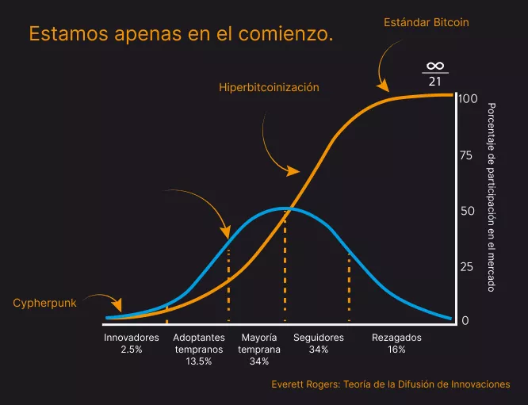

Lo más importante aquí es comprender de manera general esta nueva tecnología. Esperamos que este curso les guste y les brinde las bases necesarias para comprender y tal vez seguir avanzando en este nuevo paradigma monetario mundial.

## La prehistoria de Bitcoin
<chapterId>9a94b627-5b69-5d81-9125-f1fa9b0aa6ad</chapterId>


Antes de que el término "Bitcoin" se convirtiera en sinónimo de moneda digital y transformación financiera, una serie de ideas, innovaciones y movimientos sociales sentaron las bases de su creación. Uno de los elementos fundamentales de esta prehistoria de Bitcoin es el movimiento cypherpunk.

### Los Cypherpunks: Visionarios del Mundo Digital


En plena evolución tecnológica de los años 1980 y 1990, un grupo de personas comenzó a cuestionarse profundamente el papel de la privacidad y la libertad en la era digital. Estos individuos, que más tarde serían conocidos como "cypherpunks", creían firmemente que la criptografía podría servir como una herramienta para proteger los derechos individuales contra la interferencia de los gobiernos y las grandes empresas.

Figuras emblemáticas como Julian Assange, Wei Dai, Tim May y David Chaum contribuyeron a definir la filosofía y la visión de los cypherpunks. Estos pensadores compartieron sus ideas en una influyente lista de correos, donde participantes de todo el mundo debatieron sobre la mejor manera de utilizar la tecnología para garantizar una mayor libertad individual.

### Los Tres Textos Fundamentales de los Cypherpunks


El movimiento cypherpunk, con sus raíces profundas en el activismo digital y la criptografía, se basó en varios textos fundamentales para expresar sus principios y su visión del futuro. Entre estos escritos, destacan tres en particular:

- El "Manifiesto Cypherpunk":
  Escrito por Eric Hughes en 1993, el "Manifiesto Cypherpunk" afirma que la privacidad es un derecho fundamental. Hughes sostenía que la capacidad de comunicarse libre y confidencialmente era esencial para una sociedad libre. El manifiesto afirma: "No podemos esperar que las instituciones, las empresas u otras entidades impersonales nos concedan privacidad... Debemos defenderla nosotros mismos".

- El "Manifiesto Criptoanarquista":
  Escrito por Timothy C. May en 1992, este manifiesto expone cómo el uso de la criptografía podría llevar a una era de anarquía criptográfica donde los gobiernos no tendrían poder para intervenir en los asuntos privados de los ciudadanos. May preveía un futuro en el que la información, dinero y mensajes podrían intercambiarse sin la intervención de un tercero y de manera anónima.

- La "Declaración de Independencia del Ciberespacio":
  Aunque este texto no es exclusivamente cypherpunk, refleja los sentimientos de muchos actores del movimiento. Escrito en 1996 por John Perry Barlow, es una respuesta a la creciente regulación de Internet por parte de los gobiernos. La declaración afirma que el ciberespacio es un ámbito distinto de la esfera física y no debería estar sujeto a las mismas leyes. Declara: "No tenemos un gobierno elegido y no podemos ser gobernados".

### Los Predecesores del Bitcoin

Antes de la aparición de Bitcoin, se hicieron varios intentos para crear una moneda digital. David Chaum, por ejemplo, introdujo el concepto de "dinero electrónico anónimo" con su proyecto "DigiCash" en la década de 1980. Desafortunadamente, debido a varias limitaciones, DigiCash nunca llegó a despegar.

Otro precursor importante es "b-money" de Wei Dai. Aunque nunca se implementó, presentó la idea de una moneda digital anónima donde la detección de fraudes era realizada por una comunidad de evaluadores en lugar de una autoridad central.


Fue en este entorno fértil donde misterioso Satoshi Nakamoto publicó el libro blanco de Bitcoin en 2008. Combinó varias ideas del movimiento cypherpunk, como la Prueba de Trabajo (Proof of Work, PoW) y las marcas de tiempo criptográficas (timestamps), para crear una moneda digital descentralizada y resistente a la censura.

Bitcoin era más que una simple moneda digital; representaba un logro de los ideales cypherpunk. Más allá de su tecnología, simbolizaba una revolución frente a los sistemas financieros tradicionales y ofrecía una alternativa basada en la transparencia, la descentralización y la soberanía individual.

### Conclusion

La prehistoria de Bitcoin está profundamente arraigada en el movimiento cypherpunk y en una búsqueda colectiva de mayor libertad en la era digital. Al combinar los principios de la criptografía, la descentralización y la integridad, Bitcoin se convirtió en mucho más que una moneda; es el producto de una revolución filosófica y tecnológica que continúa remodelando nuestro mundo.

Por lo tanto, Bitcoin es un protocolo que abarca largos períodos de tiempo y nos insta a cuestionar nuestra relación con la energía, el tiempo y el dinero. Pero, ¿es Bitcoin una "verdadera" moneda? ¿Qué es una moneda? ¿Existen en varias formas? Esto es lo que veremos en el próximo capítulo.


# La moneda 
<partId>e913df1a-4cbd-5380-ba67-ca2a0414f671</partId>

## El moneda a lo largo de la historia 
<chapterId>c838e64d-d59f-5703-8c74-ea5e8c4fdd31</chapterId>

La evolución del dinero es un aspecto fascinante de la historia humana, reflejando la ingeniosidad de las civilizaciones a lo largo de los siglos para satisfacer las necesidades económicas en constante evolución.


### De las conchas a las cuentas bancarias 

Al principio, el dinero era tangible, a menudo vinculado a bienes esenciales como el grano, el ganado y otros bienes. Sin embargo, estos bienes presentaban importantes inconvenientes, como su perecibilidad, lo que dificultaba su uso como medio de ahorro a largo plazo. Por ejemplo, una mala cosecha o una enfermedad podían arruinar la riqueza de una persona de la noche a la mañana.

A medida que las civilizaciones avanzaban y el comercio se expandía a nuevas regiones, surgió la necesidad de un medio de intercambio universal. Se experimentaron objetos como conchas y piedras preciosas, pero no eran perfectos. El oro finalmente se convirtió en el estándar debido a su rareza, durabilidad y divisibilidad. Fue, y sigue siendo hasta el día de hoy, un símbolo de riqueza y poder.

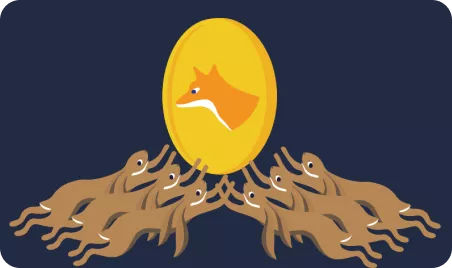

### ¿Cuál es el papel del dinero?

El dinero es una herramienta de comunicación muy sofisticada:

- Permite la comunicación entre el presente y el futuro. Transformamos nuestro tiempo y energía en un activo que puede ser reutilizado en el futuro sin riesgo de devaluación.

- Permite comunicarse en un lenguaje común universal. Sin conocerse, sin hablar el mismo idioma, dos desconocidos pueden intercambiar, comerciar y ponerse de acuerdo sobre el valor de las cosas.

Su función en nuestro mundo es difícil de replicar artificialmente. Ningún humano o grupo de humanos puede crear dinero, es un fenómeno social natural que debe surgir del mercado y de un consenso voluntario. Los precios son señales, información, que ayudan a la sociedad a elegir cómo se asignarán los recursos.

El oro como dinero es la elección de 4,000 años de darwinismo monetario que se basa en 3 funciones:

- Reserva de valor
- Medio de intercambio
- Unidad de cuenta


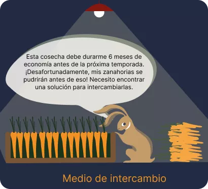
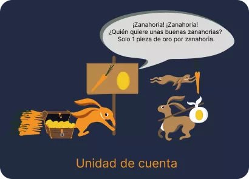

### Las características del dinero

El oro cumple idealmente con los criterios de una moneda eficiente: su rareza natural lo hace valioso, mientras que sus propiedades químicas le permiten no erosionarse con el tiempo. Sin embargo, esta forma de dinero no es fácilmente divisible ni transportable a largas distancias. En un mundo globalizado y digital, el oro no puede seguir el ritmo y necesita una entidad central para hacerlo divisible y fácilmente intercambiable (moneda acuñada).

Estos defectos han convertido al oro en una reserva de valor, pero no en una moneda de curso legal, en detrimento de las monedas fiduciarias estatales (fiat) que son fácilmente utilizables pero constantemente devaluadas por las entidades que las controlan (rey, banco central, emperador, dictador).

Los criterios de una moneda eficaz son múltiples. Una buena moneda debe ser:

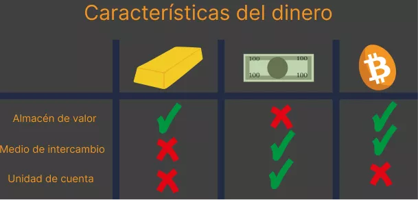

- **Fungible**, es decir, intercambiable sin pérdida de valor
- **Divisible**, para facilitar las transacciones de diferentes volúmenes
- **Líquida**, es decir, fácilmente convertible en bienes o servicios.

Para cumplir con estos criterios, la moneda evoluciona paso a paso:

- Piedra bruta -> Moneda
- Billete -> Tarjeta bancaria
- Blockchain -> Lightning Network

Hoy en día, las monedas siguen evolucionando, adaptando sus formas para satisfacer diferentes usos. Por ejemplo, si bien el oro es una excelente reserva de valor, ya no es adecuado para la economía globalizada actual. Del mismo modo, las monedas fiduciarias como el dólar y el euro son muy líquidas y fácilmente transportables porque hoy en día son principalmente digitales, sin embargo, su valor se ve erosionado constantemente debido a la inflación monetaria.

Bitcoin, por otro lado, presenta nuevas posibilidades. Debido a sus propiedades, como su oferta estrictamente limitada, ofrece una excelente reserva de valor. Además, como moneda neutral de Internet, representa una buena forma de intercambio que no conoce fronteras. Sin embargo, todavía no es ampliamente aceptado en los comercios hoy en día, a pesar de su [adopción constante](https://btcmap.org/map).

### ¡Un pequeño resumen en un póster!


## Las monedas fiduciarias
<chapterId>25151d46-7db1-5b48-8bba-cbde1944555a</chapterId>

"Quienes no aprenden de la historia están condenados a repetir los mismos errores", dijo George Santayana. Una verdad que resuena especialmente cuando se habla del sistema monetario actual.

### Fiduciario = confianza

Hoy en día, las grandes monedas como el euro y el dólar se consideran fiduciarias o fiat. Esto significa que no tienen un valor intrínseco. Su valor depende enteramente de la confianza y la creencia que depositamos a las instituciones que las regulan.

Una moneda fiduciaria es una forma de moneda que es decretada como moneda por una institución, como un Estado-nación, por ejemplo China con el Yen, o una unión político-económica, como la Unión Europea con el euro. La entidad encargada de la emisión de una moneda fiduciaria es un banco central (Por ejemplo, podemos citar al Banco Popular de China, la Reserva Federal de los Estados Unidos, o el Banco Central de la República de Guinea). Son estos últimos los encargados de decidir la política monetaria y, por lo tanto, cuánto dinero debe ponerse en circulación o imprimirse.

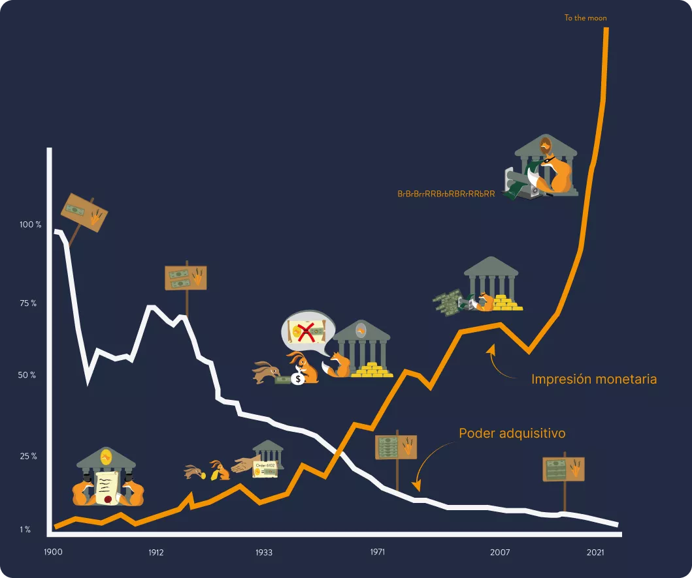

### La devaluación monetaria: Una estrategia tan antigua como el Imperio Romano

Desde la antigüedad, el oro ha servido como referencia monetaria. Sin embargo, su rigidez a menudo ha llevado a los dirigentes, ya sean emperadores romanos o gobiernos modernos, a adoptar monedas alternativas, a menudo fiduciarias.

El mecanismo es simple y se inspira en prácticas existentes desde los orígenes de la civilización. Los dirigentes, deseosos de ejercer control sobre las riquezas, comienzan por centralizar el oro, a menudo aprovechando su poder y prometiendo protección y seguridad. Con esta reserva valiosa en sus manos, introducen una nueva moneda, equivalente en valor al oro, pero acuñada con su efigie. Esta moneda comienza a circular y el pueblo se acostumbra rápidamente a su conveniencia.

Poco a poco, estos dirigentes devalúan discretamente la nueva moneda, reduciendo su valor en relación al oro inicial en unos pocos puntos porcentuales cada año. Esta devaluación silenciosa se justifica a menudo como un beneficio para pueblo. Así, quienes ahorran en esta moneda fiduciaria cómo se erosiona el valor de sus ahorros, mientras que el Estado financia sus proyectos mediante la inflación. Además, esta devaluación hace que la deuda sea más fácil de pagar.

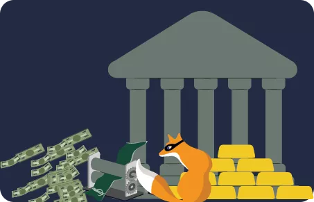

En un momento crítico, se anuncia que la moneda ya no está respaldada por oro. El público, acostumbrado a la moneda fiduciaria y a menudo mal informado sobre cuestiones financieras, acepta esta realidad. El Estado tiene entonces vía libre para manipular la oferta monetaria, imprimiendo enormes cantidades de dinero a un costo casi nulo.

Esta estrategia, cuando se ejecuta correctamente, puede perdurar durante décadas. Sin embargo, una devaluación demasiado rápida o una pérdida de confianza pueden llevar a una hiperinflación (ver siguiente capítulo). La historia muestra que el dólar ha perdido el 98% de su valor en 100 años, el euro el 30% en 20 años y la libra esterlina el 99% desde su creación.

Al final, la moneda puede perder toda conexión con el oro, recordando las monedas romanas al final del Imperio, o incluso reducirse a un simple valor numérico, desconectado de la realidad tangible.

Hoy estamos presenciando un punto de inflexión histórico. El dólar, que durante mucho tiempo ha dominado el mercado, parece estar en declive, y el oro ha perdido su lugar central. Estamos en el umbral de un nuevo ciclo monetario, lo que nos recuerda que las lecciones de la historia a menudo se olvidan.

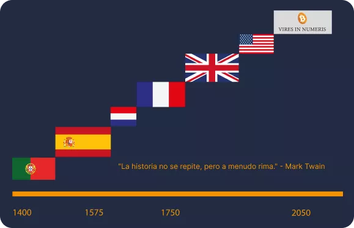

### ¿Es Bitcoin una solución?

Es en este contexto que la revolución de Bitcoin está ganando fuerza. Esta moneda que no requiere **ningún tercero de confianza** tiene como objetivo separar al Estado de la moneda.

La impresión monetaria genera inflación, empobreciendo paulatinamente a la población. Por otro lado, las instituciones financieras y las personas adineradas se han enriquecido gracias a esta práctica, creando una brecha de desigualdades y fomentando el autoritarismo. El sistema financiero actual está regulado y restringido para evitar su colapso y cualquier perturbación podría provocar una gran crisis económica. Como los actores políticos se benefician de este sistema, no se ven incentivados a realizar cambios radicales, lo que permite que el sistema continúe su curso hasta una posible implosión.


En respuesta a estos desafíos sistémicos, Bitcoin se presenta como una solución descentralizada: un nuevo sistema monetario paralelo y neutral. Históricamente, el oro ha sido preferido como moneda debido a su resistencia a la falsificación. De manera similar, Bitcoin, por su naturaleza descentralizada y criptográfica, no puede ser falsificado y está limitado a 21 millones de unidades. Bitcoin es una moneda basada en la transparencia y la neutralidad, ofreciendo una alternativa atractiva al actual sistema monetario centralizado.


Al mismo tiempo, la aparición de las monedas digitales de los bancos centrales, o CBDC, parece inevitable. Esta nueva forma de moneda ofrecería una planificación más centralizada de la economía, lo que podría obstaculizar la libertad financiera de los individuos y facilitar los abusos autoritarias.

Podemos conlcuir este capítulo con la cita del premio Nobel de Economía F.A Hayek en 1984: "No creo que alguna vez se encuentre una buena moneda hasta que no se la quite del gobierno. Sin embargo, no podemos arrancársela violentamente, lo único que podemos hacer es introducir algo ingeniosamente que ellos no puedan detener".

### ¡Un pequeño resumen en un póster!


## Las hiperinflaciones
<chapterId>b04c024c-54f3-50cb-997f-58721cfc74be</chapterId>

La hiperinflación es un fenómeno monetario propio de las monedas fiduciarias. Se caracteriza por una pérdida total de la confianza en una moneda y un aumento drástico de la inflación a través de la impresión de dinero por parte de las autoridades. Como resultado, los ahorros acumulados por los individuos pueden desaparecer en un lapso de tiempo relativamente corto, lo que lleva al país al borde del abismo económico, social y político.

### ¡La inflación en modo libre!

Intentemos comprender el impacto de la inflación en el ahorro considerando diferentes tasas de inflación.

- Con una inflación del 2%, pierdes anualmente un 2% de tu poder adquisitivo, lo que equivale al 10% en 5 años.
- Con un 7%, pierdes la mitad en 10 años.
- Con un 20%, pierdes casi la mitad en 3 años.

Durante una hiperinflación, ya no estamos hablando de un 20% anual, sino de un 20% al mes o, en su punto máximo, ¡POR DÍA! Un 100% de inflación al día durante 3 días es un escenario realista que ha ocurrido y sigue ocurriendo en nuestro mundo.

Es importante entender que la hiperinflación no ocurre por arte de magia, por casualidad, por el capitalismo o por por los opositores políticos. La hiperinflación es la consecuencia directa de decisiones monetarias erróneas tomadas por banqueros centrales y políticos. Sus consecuencias afectan a todos los ciudadanos y sus efectos se sentirán durante generaciones. Te invitamos a que te detengas 5 minutos en esta tabla para comprender realmente el impacto de este fenómeno (el curso ECON204 profundizará en este tema)."


### ¿Cómo se desarrolla una hiperinflación?

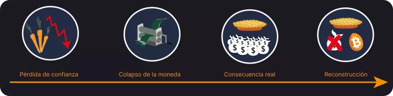

Fase 1 - La pérdida de confianza

- Una centralización del poder monetario facilita la creación de dinero y sus abusos. Entonces puede surgir una pérdida de confianza en una moneda y desencadenar una hiperinflación. Los individuos comienzan entonces a cuestionarse el origen del dinero y los beneficios de la política monetaria obligatoria. Esta pérdida de confianza generalmente se debe a factores externos como guerras, medidas sociales o el aumento de los precios de un recurso clave, como el trigo o la gasolina.

Fase 2 - El colapso de la moneda y el aumento de los precios

- A medida que los gobiernos pierden el control de la confianza, los individuos comienzan a cambiar su moneda por otra más estable, como ocurre con el dólar estadounidense en Venezuela. Esto lleva un aumento de los precios, creando un círculo vicioso en el que los bienes y servicios se vuelven cada vez más caros. Para satisfacer estas necesidades, el Estado imprime más dinero para corregir la política monetaria, lo que resulta una inflación exponencial.

Fase 3 - El círculo vicioso de la impresión de dinero

- Se necesitan cada vez más billetes para comprar bienes, lo que crea escasez de papel moneda. Esto lleva a imprimir más billetes, lo que genera aún más inflación.

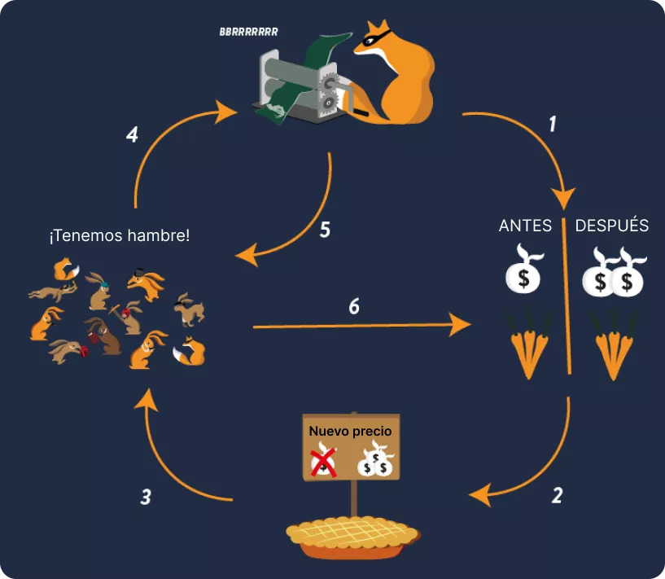

Fase 4 - Surge una nueva moneda

- Se introduce una nueva moneda para reemplazar la antigua. Un ejemplo notable de hiperinflación es Alemania en los años 1920-1924. Para reactivar la economía, se creó una nueva moneda respaldada por la deuda alemana, francesa e inglesa, y garantizada por las tierras alemanas.

Resolver una crisis de hiperinflación a menudo requiere cambios radicales, como revoluciones, cambios de gobierno, cambios de banqueros centrales, entre otros. La pérdida de confianza, el colapso de la moneda y la reconstrucción son fases esenciales para reactivar una nueva economía basada en una moneda fiduciaria.

### 3 ejemplos notables

- Alemania, 1922-1923

  Uno de los ejemplos más impactantes de hiperinflación ocurrió en la República de Weimar en Alemania después de la Primera Guerra Mundial.

  Alemania había pedido prestadas enormes cantidades de dinero para financiar el esfuerzo bélico y no solo no ganó la guerra, sino que tuvo que pagar miles de millones de dólares en reparaciones. El mes de mayor inflación fue octubre de 1923, alcanzando el 29,500%, es decir, una inflación del 20.9% al día. ¡Los precios se duplicaban cada 3.7 días!
  Se dice que en los restaurantes, los camareros tenían que anunciar los precios del menú cada 30 minutos para tener en cuenta la inflación. La moneda alemana se volvió tan inútil que algunos ciudadanos preferían quemar su dinero en papel en lugar de madera, porque era efectivamente más barato.
  

- Hungría, 1945-1946

  El país que ha vivido el peor período de hiperinflación hasta la fecha es, con mucho, Hungría después de la Segunda Guerra Mundial.

  Hungría se encontraba entre los perdedores del conflicto y la guerra había destruido la mayor parte de su capacidad de producción industrial. El mes con la inflación más alta fue julio de 1946, con una inflación de precios del 41,900,000,000,000,000 %, equivalente al 207 % al día. ¡Los precios se duplicaban cada 15 horas!

  El último billete que se puso en circulación fue un billete de 100 millones de billones de pengo (100,000,000,000,000,000,000) en 1946.

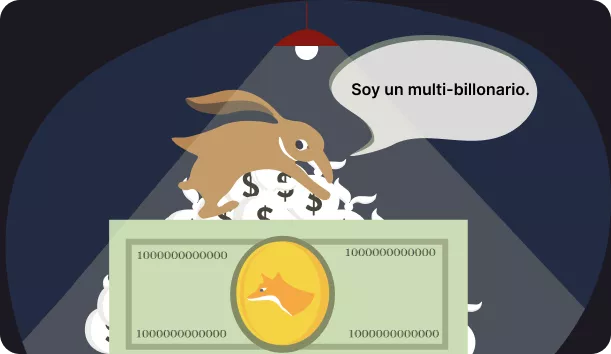

- Zimbabwe, 2007-2008
  Hasta el año 2000, Zimbabwe era autosuficiente para casi todas sus necesidades, excepto por el petróleo.

  En 1997, el dólar zimbabuense se desplomó más del 72 % después de que el gobierno acordara indemnizar a los veteranos de la guerra de independencia con una suma equivalente a 450 millones de dólares estadounidenses. Como el gobierno no tenía esa cantidad en sus arcas, tuvo que recurrir a imprimir billetes. En 2005, la inflación alcanzó el 586 % y en marzo de 2007, la inflación mensual llegó al 50 %.

  En junio de 2007, el gobierno reaccionó estableciendo un control de precios. Los comercios fueron literalmente "saqueados". Los comerciantes ya no tenían los medios para reponer sus tiendas.

  En abril de 2009, el ministro de finanzas anunció la suspensión del dólar de Zimbabwe y autorizó el uso de diferentes monedas extranjeras para el comercio. Todas las cuentas bancarias, todas las pensiones, todas las instituciones financieras vieron cómo sus saldos desaparecían de la noche a la mañana.


En conclusión, la hiperinflación tiene el efecto de degradar rápidamente el valor de la moneda, lo que conduce a una erosión del ahorro y una pérdida de confianza en el sistema monetario. Como sugirió una vez Voltaire, una moneda fiduciaria siempre terminará perdiendo su valor intrínseco y convergerá hacia cero.

Una moneda que depende de un tercero de confianza, como una entidad financiera, resulta en la práctica y a largo plazo una moneda defectuosa porque es incapaz de garantizar el poder adquisitivo ni preservar el ahorros.

### ¡Un pequeño resumen en un póster!


## 21 millones de Bitcoins
<chapterId>f4a06d76-1963-56fd-93ff-dfa41489bcde</chapterId>

### La política monetaria de Bitcoin

Bitcoin es una moneda digital descentralizada con una cantidad máxima predefinida de **21 millones de unidades**. Esta característica intrínseca de escasez está determinada por su código informático y reforzada por el consenso de todos los usuarios que participan en el protocolo.

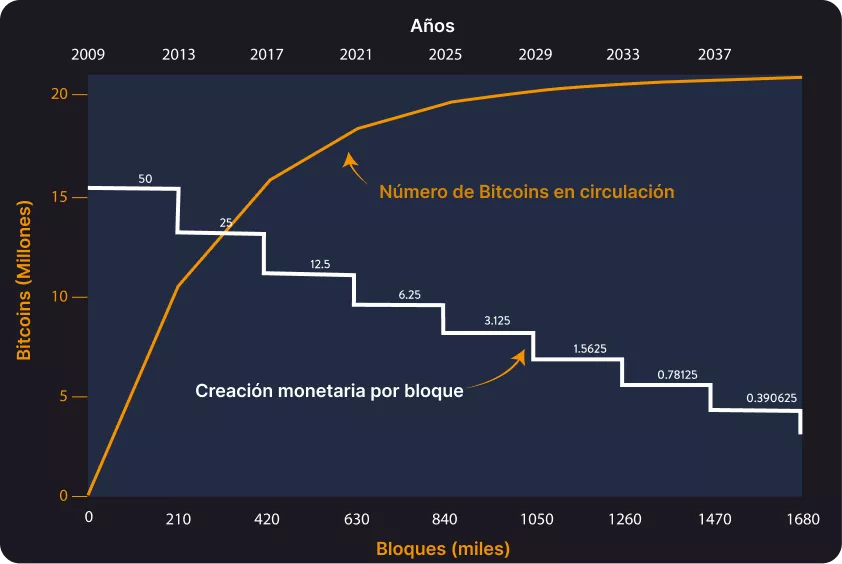


En términos de emisión monetaria, esto puede ilustrarse mediante una curva en forma de S que representa la cantidad de bitcoins creados a lo largo del tiempo. Por ejemplo, en 2022 había en circulación aproximadamente 18,5 millones de bitcoins. Las previsiones indican que en 2025 habrá unos 19,5 millones de bitcoins, lo que representa un ~93% de la oferta total, y en 2037 esta cifra alcanzará los 20,4 millones.

### ¿Cómo se crean nuevos Bitcoins?

La creación de nuevos Bitcoins es el resultado del proceso de minado, un procedimiento para verificar las transacciones en la red Bitcoin.

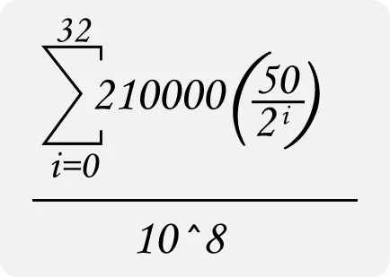

Los mineros que llevan a cabo esta tarea son recompensados con la emisión de nuevos bitcoins cada diez minutos. Esta recompensa está programada para reducirse a la mitad cada 210.000 bloques, o aproximadamente cada cuatro años, un evento conocido como "halving", que da a la curva de emisión de la moneda una forma de escalera. Debido a este mecanismo de reducción a la mitad, se puede predecir matemáticamente que la creación de bitcoins cesará en 2140, cuando el número total de bitcoins alcance su límite de 21 millones.

| Número de Halving | Altura del bloque  | Recompensa BTC después del Halving | BTC estimado en circulación después del Halving |
| ----------------- | ------------------ | ---------------------------------- | ----------------------------------------------- |
| 1                 | 210.000            | 25 BTC                             | 10.500.000 BTC                                  |
| 2                 | 420.000            | 12,5 BTC                           | 15.750.000 BTC                                  |
| 3                 | 630.000            | 6,25 BTC                           | 18.375.000 BTC                                  |
| 4                 | 840.000            | 3,125 BTC                          | 19.687.500 BTC                                  |
| 5                 | 1.050.000          | 1,5625 BTC                         | 20.343.750 BTC                                  |
| 6                 | 1.260.000          | 0,78125 BTC                        | 20.671.875 BTC                                  |
| 7                 | 1.470.000          | 0,390625 BTC                       | 20.835.937,5 BTC                                |
| 8                 | 1.680.000          | 0,1953125 BTC                      | 20.917.968,75 BTC                               |
| 9                 | 1.890.000          | 0,09765625 BTC                     | 20.958.984,375 BTC                              |
| 10                | 2.100.000          | 0,048828125 BTC                    | 20.979.492,188 BTC                              |
| 11                | 2.310.000          | 0,0244140625 BTC                   | 20.989.746,094 BTC                              |
| 12                | 2.520.000          | 0,01220703125 BTC                  | 20.994.873,047 BTC                              |
| 13                | 2.730.000          | 0,006103515625 BTC                 | 20.997.436,523 BTC                              |
| 14                | 2.940.000          | 0,0030517578125 BTC                | 20.998.718,262 BTC                              |
| 15                | 3.150.000          | 0,00152587890625 BTC               | 20.999.359,131 BTC                              |
| 16                | 3.360.000          | 0,000762939453125 BTC              | 20.999.679,566 BTC                              |
| 17                | 3.570.000          | 0,0003814697265625 BTC             | 20.999.839,783 BTC                              |
| 18                | 3.780.000          | 0,00019073486328125 BTC            | 20.999.919,892 BTC                              |
| 19                | 3.990.000          | 0,000095367431640625 BTC           | 20.999.959,946 BTC                              |
| 20                | 4.200.000          | 0,0000476837158203125 BTC          | 20.999.979,973 BTC                              |


Volveremos a los mineros en detalle en el capítulo sobre minería.

### Garantizar la escasez digital

La escasez de Bitcoin está garantizada por dos mecanismos clave: el ajuste de la dificultad de minería y la teoría de juegos:

- El ajuste de la dificultad de minería es un mecanismo que ocurre cada 2016 bloques, aproximadamente cada dos semanas, su función es garantizar que, en promedio, se agregue un nuevo bloque a la cadena de bloques cada diez minutos. Esta frecuencia de creación de bloques y la cantidad total de bitcoins son aspectos fijos del protocolo de Bitcoin y no se pueden modificar sin un consenso general, a diferencia de las decisiones arbitrarias que se toman en los sistemas monetarios tradicionales.

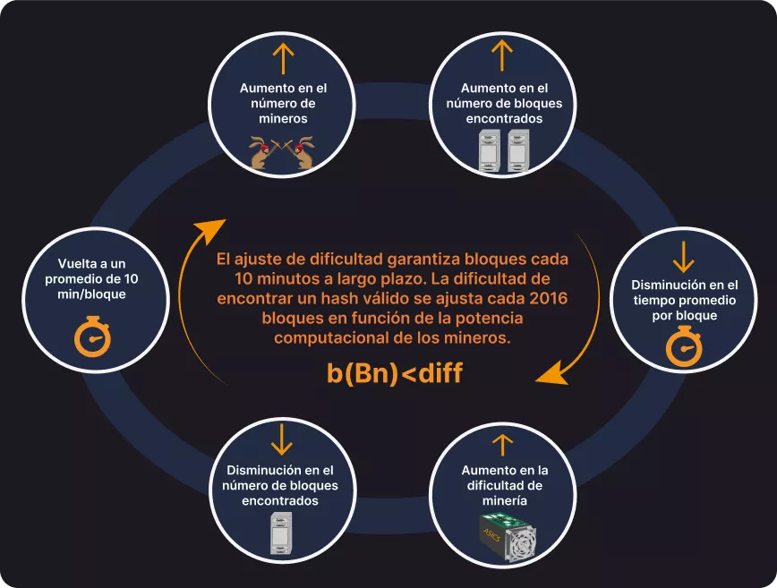

> ¿Sabías que? Los mineros tienen incentivos para minar un bloque y ganar los nuevos bitcoins (subsidio de bloque) y las tarifas de transacción asociadas a las transacciones que incluyen en su bloque. A medida que la cantidad de bitcoins emitidos se acerca al límite de 21 millones, los mineros serán recompensados ​​principalmente por las tarifas de transacción en lugar de la recompensa del bloque.

- La teoría de juegos es un concepto matemático que se basa en la racionalidad humana. Aquí, en Bitcoin, son los usuarios los que votan por los cambios en el protocolo. Sí, has leído bien: cualquier modificación en el protocolo de Bitcoin requeriría el acuerdo de toda la comunidad de usuarios, lo cual es altamente complejo. Por lo tanto, si alguien quisiera crear 22 millones de bitcoin, tendría que convencer a todos los usuarios de devaluar voluntariamente sus propios ahorros, lo cual no es probable que suceda porque Bitcoin es global y no está gobernado por un grupo central.


La idea de devaluar la moneda va en contra de la filosofía fundamental de Bitcoin, por lo que modificar este límite es poco probable.

### ¡Una política monetaria auditada cada segundo desde el principio y para siempre!

La escasez de Bitcoin es una gran ventaja y la cantidad máxima de 21 millones de bitcoins en circulación es pública y verificable por cualquier persona.

De hecho, cualquiera puede verificar la cantidad de bitcoins en circulación ingresando un comando simple en un nodo de Bitcoin: `bitcoin-cli gettxoutsetinfo`. Esta transparencia y verificabilidad refuerzan la confianza en el sistema Bitcoin, que no se basa en instituciones centralizadas o individuos, sino en una garantía matemática y criptográfica inherente a su protocolo. (Aprenderás a hacerlo de manera sencilla en LN201)

```json
{
  "height": 710560,
  "bestblock": "0000000000000000000887384d67103412ea7f18a43953e65c8c4ac36bf42e54",
  "transactions": 473244,
  "txouts": 1018917,
  "bogosize": 2183872374,
  "hash_serialized_2": "eebb9987337700ffaacbbaa11223344",
  "disk_size": 178239584,
  "total_amount": 18745998.12345678
}
```

Bitcoin, por su diseño, garantiza una gestión monetaria saludable al limitar su creación y proteger los ahorros de los usuarios, lo que lo diferencia de otras monedas. En línea con los principios de la economía austriaca (detalles en ECON201), su cantidad controlada y su distribución predecible lo protegen de los riesgos de inflación inherentes a las monedas tradicionales.

En resumen, Bitcoin, debido a su naturaleza descentralizada, su escasez programada y su transparencia, ofrece una alternativa única a los sistemas monetarios tradicionales. Ilustra cómo la tecnología puede ser utilizada para crear una moneda que no solo es útil y verificable, sino que también preserva el valor de los ahorros de los usuarios al limitar estrictamente su oferta.

### ¡Un pequeño resumen en un póster!


### ¡Conclusión de la sección 1!

La moneda es una herramienta social que debe adaptarse a las necesidades y a la tecnología. Con el tiempo, el oro se ha utilizado como reserva de valor porque era escaso y no podía ser devaluado. Sin embargo, más tarde, el oro fue reemplazado por deuda y moneda fiduciaria, que es fácil de transportar, pero también de manipular su política monetaria.

Bitcoin es una alternativa monetaria realista porque es escaso y está limitado a 21 millones de bitcoins que no pueden ser modificados. La creación monetaria se mantiene mediante el ajuste de la dificultad cada 2 semanas, y gracias a los halving que garantizan una prueba matemática verificable de su escasez. A diferencia de los euros o los dólares cuyo volumen circulante no es verificable y cambia frecuentemente debido a los mandatos de las instituciones financieras, Bitcoin es una moneda criptográfica con una política monetaria neutral y fija. Por lo tanto, es una excelente reserva de valor global ya que no puede ser devaluada por la impresión de dinero.

Bitcoin es ante todo una forma de dinero que fomenta el cuestionamiento del poder de las instituciones financieras sobre la dinero. Es una lucha filosófica y económica que está en juego. Para entender Bitcoin, es importante comprender sus fundamentos y desmitificar las ideas falsas que lo rodean. Esto permitirá entablar un debate intelectual constructivo sobre el futuro del dinero.

Ahora que hemos establecido las diferencias entre Bitcoin y las monedas fiduciarias, en los próximos capítulos estudiaremos qué son las billeteras de Bitcoin, ya que es su responsabilidad asegurar sus fondos. De hecho, la soberanía financiera que ofrece Bitcoin va necesariamente de la mano con la responsabilidad individual.

# Las billeteras de Bitcoin
<partId>28860585-4f61-59d9-b242-f4c57d837cc1</partId>

## ¿Qué son las billeteras de Bitcoin?
<chapterId>1c0166ab-cb7a-5bc6-9175-d13482bd91f1</chapterId>

En esta sección 2, exploraremos el almacenamiento y la seguridad de los bitcoins en las billeteras (en inglés: wallet). Esto te permitirá comprender mejor dónde se encuentran estos famosos bitcoins y cómo interactuar con ellos.

### Desmitifiquemos las billeteras de Bitcoin

En esta industria, utilizamos billeteras para interactuar con la red de Bitcoin, que tiene 3 funciones:

- Permitir recibir bitcoins
- Permitir enviar bitcoins
- Protegerlos contra intentos de hackeo y robo

Una billetera puede ser un software en tu computadora, una aplicación en tu teléfono inteligente, un dispositivo físico como una memoria USB, o incluso un trozo de papel. Estos tipos de billeteras de Bitcoin tienen un uso diferente. Algunas se utilizan para grandes cantidades, con énfasis en la seguridad, otras en la privacidad, o incluso en el pago diario de pequeñas cantidades.

Los portafolios se dividen en grandes familias de uso, siempre con una pregunta clave en el centro: ¿Eres dueño de los fondos o le das el control de tu dinero a un tercero? Volveremos a este tema en detalle en el siguiente capítulo, pero la idea es simple: ¿El dinero está en tu bolsillo o en el del banquero?


### Cómo funciona una billetera de Bitcoin

Ya sea tu "banquero" de Bitcoin o tú mismo, en general, la gran mayoría de las billeteras de Bitcoin funcionan con una tecnología similar, la criptografía asimétrica, y por lo tanto, un sistema de par de claves: una clave privada para gastar y una clave pública para recibir.

- Clave privada
  Al inicializar una billetera, se genera y se te da una frase de recuperación secreta (clave privada) en forma de 24 palabras.

  La clave privada es muy importante, ya que representa la posesión de los Bitcoins y, por lo tanto, el derecho a usarlos o enviarlos. El poseedor de la clave privada es el propietario de los Bitcoins.

  Esta clave debe mantenerse en secreto y bien guardada, ¡ya que es la clave que desbloquea tu fortuna!

- Clave pública y dirección
  La clave pública se crea con la clave privada y, por lo tanto, está vinculada a esta ella. La clave pública se utiliza para generar direcciones de Bitcoin y recibir dinero. Compartir la clave pública plantea riesgos para la privacidad, pero no para la seguridad.

  Estas direcciones son creadas por tu billetera y se pueden compartir de manera segura. Se recomienda usarlas solo una vez por transacción para maximizar tu privacidad.

Por lo tanto, es importante comprender que gracias a esta tecnología, podemos recibir Bitcoins fácilmente sin permitir que el remitente robe nuestros fondos. Piénsalo como un buzón: la gente deposita dinero en él, pero solo tú puedes abrirlo.


### ¿Los Bitcoins están en la billetera?

Aunque tus claves se almacenan en tu billetera, los bitcoins en sí están "almacenados" en la cadena de bloques de Bitcoin, que es un registro público distribuido dentro de la red peer-to-peer de Bitcoin (lo veremos en la sección 3). Por lo tanto, perder el dispositivo en el que tienes tu billetera no significa necesariamente perder tus Bitcoins. Lo que te permite recrear tu billetera y gastar tus bitcoins es la clave privada. Por lo tanto, es crucial asegurar bien esta última.

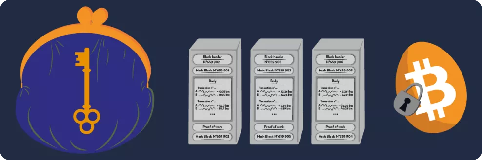

Afortunadamente para nosotros, desde 2017, esta clave privada puede ser codificada en una simple lista de 12 o 24 palabras, llamada frase mnemotécnica. Esta frase es una copia de seguridad de tu billetera de Bitcoin, es lo que le permite recrear tu billetera con cualquier software/aplicación de billetera de Bitcoin. Por lo tanto, cualquier persona que tenga acceso a esta lista de palabras tiene acceso a tus bitcoins.

### ¿Qué pasa con los hackers?

Podríamos preguntarnos: ¿y si alguien adivinara por casualidad nuestra lista de 12 o 24 palabras? La respuesta corta es que gracias a la criptografía utilizada para crear la billetera, es altamente improbable. Para ponerlo en perspectiva, encontrar accidentalmente el acceso a tu billetera es como encontrar el número "correcto" entre 1 y $2^256$, lo cual es prácticamente equivalente a encontrar el átomo "correcto" en el Universo. Sin embargo, si no estás satisfecho con esta seguridad predeterminada, siempre puedes fortalecerla agregando una frase de contraseña a tu billetera de Bitcoin.


Por lo tanto, la probabilidad de que tu billetera de Bitcoin sea pirateada es astronómicamente baja si sigues las mejores prácticas de seguridad. Prácticas que detallamos en la siguiente sección.

Elije una billetera que se adapte a tus necesidades y uso. Hay tutoriales detallados sobre el uso y la seguridad de diferentes billeteras disponibles en la sección [tutoriales / billetera](https://planb.network/tutorials/wallet).

### ¡Un pequeño resumen en un póster!

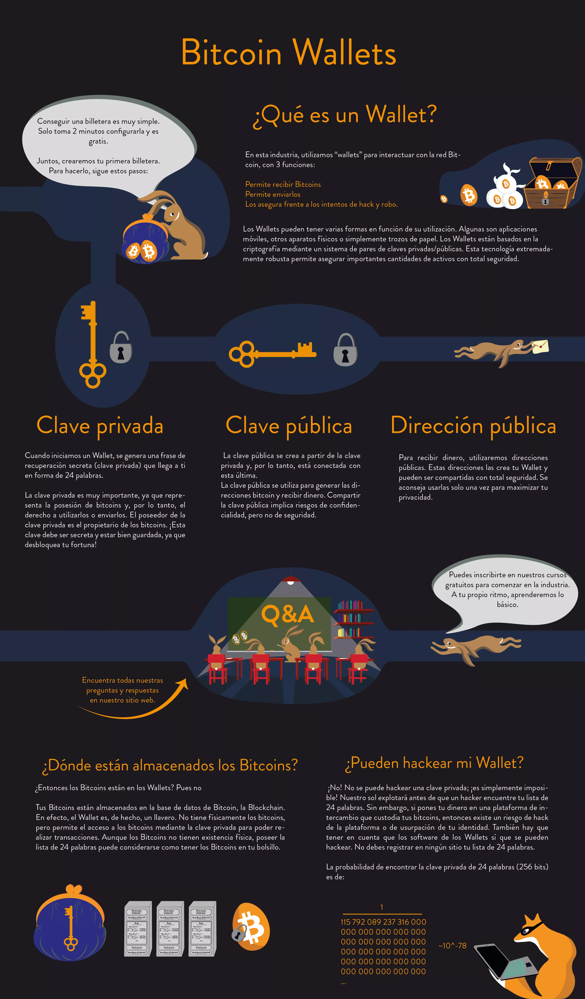

## Seguridad y Billeteras de Bitcoin
<chapterId>00c1afea-e54a-511f-bab3-2efc2fbfa6a1</chapterId>

### Hacer las preguntas correctas antes de comenzar

Cuando tienes bitcoins, la seguridad de tus fondos es una preocupación importante. La mejor manera de definir una seguridad adecuada a tu situación es plantear (y responder) una serie de preguntas; tu modelo de seguridad dependerá de tus respuestas. Comencemos:

- ¿Quién puede acceder a mis fondos? En otras palabras, ¿eres el único que puede acceder a tus bitcoins o una tercera persona, como una empresa, te permite acceder a tus fondos?
- Otra pregunta puede ser: ¿qué usos planeas tener con tus bitcoins? ¿Es una cantidad que utilizarías regularmente? ¿Es un ahorro a medio o largo plazo?
- ¿Cuáles son tus habilidades técnicas?
- ¿Cuál es tu presupuesto de seguridad?

Ten en cuenta que no existe una solución universal. Así que tómate el tiempo para responder estas preguntas, esto ayudará a adaptar tus medidas de seguridad.

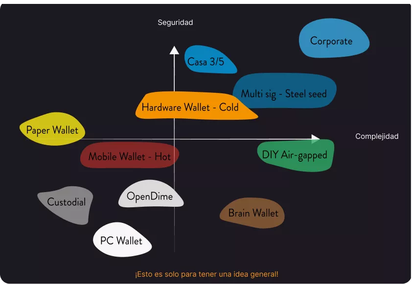

### Pensar en las billeteras de Bitcoin en términos de complejidad

Intentemos establecer varios niveles de seguridad para tus bitcoins:

- **Nivel 0**, estás utilizando un servicio de custodia en el que no eres el único propietario de tus bitcoins. Ten en cuenta que este tercero de confianza puede restringir tu acceso a tus fondos en cualquier momento, y tienes el mismo nivel de soberanía financiera que con el sistema bancario tradicional a través de una cuenta bancaria.
  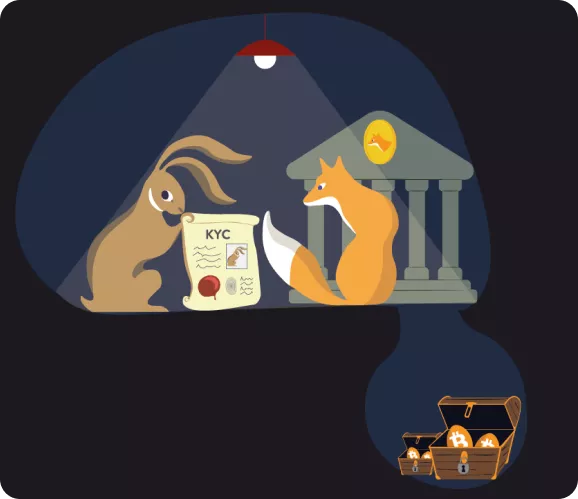

- **Nivel 1**, estás utilizando una billetera de Bitcoin en tu teléfono o computadora en la que eres el único propietario de tus bitcoins. Puedes realizar tus transacciones con facilidad. Ten en cuenta que es crucial hacer una copia de seguridad de la frase mnemotécnica para poder acceder a tus fondos nuevamente en caso de pérdida de tu teléfono o computadora. A menudo se habla de "hot wallet (billetera caliente)" porque la clave privada se almacena en un dispositivo con acceso a internet.

- **Nivel 2**, estás utilizando una billetera física y has asegurado tu lista de 12 o 24 palabras. Para poder realizar una transacción, siempre deberás firmar con tu dispositivo. Esto hace que tus fondos sean menos accesibles en el día a día. A menudo se habla de "cold wallet (billetera fría)" porque tus claves se almacenan en un dispositivo que no está conectado a internet.


- **Nivel 3**, estás utilizando una billetera de nivel 1 o 2 pero con una frase de contraseña adicional. Ten en cuenta que ahora debes hacer una copia de seguridad de la lista de 12 o 24 palabras **y** de tu frase de contraseña. Idealmente, esta información se almacena en dos lugares diferentes.


- **Nivel 4**, estás utilizando un conjunto de billeteras para crear una billetera "multisig", lo que significa que se requieren varias firmas para realizar una transacción. Ten en cuenta que cada parte del multisig debe estar en lugares diferentes. Esto a menudo se considera un uso avanzado de Bitcoin, que se utiliza principalmente para grandes cantidades y uso corporativo.


Por supuesto, puede haber varios casos de uso, y en ese caso se recomienda utilizar varias billeteras de Bitcoin. No existe una solución milagrosa.

### La seguridad debe adaptarse

La cantidad que estás dispuesto a dejar en un nivel de seguridad específico depende de cada persona. Para algunos, dejar 1 btc en una billetera caliente es razonable, para otros no lo es en absoluto. En cualquier caso, evita gastar mucho en seguridad comprando una billetera física cuando deseas asegurar una pequeña cantidad. También ten en cuenta que complicar demasiado la seguridad y accesibilidad de tus bitcoins puede perjudicarte si, por ejemplo, no haces las copias de seguridad de tus billeteras correctamente.

En conclusión, la posesión directa de tus Bitcoins es un elemento esencial para asegurar tu soberanía financiera. Se recomienda utilizar una billetera de móvil para gastos diarios y una billetera física sin conexión, o "fría", para almacenar cantidades más grandes. Las empresas, por su parte, deberían considerar el uso de sistemas de firmas múltiples, o "multisig", para una mayor seguridad compartida. También es esencial evitar en la medida de lo posible los servicios de custodia, que pueden reproducir algunas de las vulnerabilidades del sistema financiero tradicional.

Ahora que tenemos esto en mente, vamos a ver en la próxima sección los pasos para crear una billetera Bitcoin. Sin embargo, si deseas explorar más sobre el tema de la seguridad, puedes leer este [artículo de DarthCoin](https://darthcoin.substack.com/p/bitcoin-proprio-banco).

### ¡Un pequeño resumen en un póster!


## Configuración de una billetera
<chapterId>615519eb-4565-557d-86a0-021badf7616f</chapterId>

La seguridad de tus bitcoins es de vital importancia y un simple error puede tener consecuencias costosas. Por eso, ahora vamos a ver las mejores prácticas al crear una nueva billetera Bitcoin.

> Ten en cuenta que el curso BTC102 te guiará para tener éxito en este paso.

### ¡No se juega con este paso!

Tu clave privada, a menudo representada por una lista de 12 o 24 palabras (llamada comúnmente "semilla" o "frase mnemotécnica"), representa el acceso a tus fondos. Si esta clave se revela a un tercero, considera que los fondos asociados ya no están seguros. Por lo tanto, al inicializar tu billetera, es importante seguir estas reglas:

- Cubrir todas las cámaras.
- No tomar una foto de la lista de palabras.
- No ingresarla en una computadora o teléfono.
- No guardarla como contacto o enviártela por SMS.
- Nunca dejar tus palabras sin supervisión en tu escritorio.
- Nunca ocultar tu lista de palabras en un lugar inusual.

Literalmente, tomarás una hoja de papel en blanco o imprimirás esta [plantilla](https://bitcoiner.guide/backup.pdf) y escribirás con un bolígrafo, de manera clara y legible, la lista de palabras en orden. Si la tinta se desvanece con el tiempo, podrías perder tus fondos, por lo que es importante guardar este papel a salvo de las inclemencias del tiempo.


### Consejo para hacerlo bien

También existen soluciones alternativas al papel, como por ejemplo granar la frase mnemotécnica en una placa de metal. Si la escribes de forma incorrecta, tus herederos podrían no poder leerla y, por lo tanto, no podrían recuperar los fondos. Una vez escritas las palabras, se recomienda hacer una segunda copia y almacenarla en un lugar diferente al primero. Esto permite tener una copia de seguridad en caso de pérdida o accidente con la primera.

Una vez realizadas las copias, guarda las listas de palabras en un lugar seguro donde te acuerdes de buscarlas. No crees un plan de escondite demasiado complejo donde puedas perderlas.

> Tus palabras = tu dinero.

Las billeteras "frías" generalmente tienen estas listas de palabras, al igual que las billeteras "calientes" en dispositivos móviles o computadoras. Este método de respaldo de la clave privada es ahora el estándar. Esto significa que puedes ingresar tu frase mnemotécnica en cualquier software de billetera para restaurar la tuya. Solo las billeteras malas que desaconsejamos enfáticamente no te darán una lista de 24 palabras, pero tal vez te pedirán una cuenta, una dirección de correo electrónico o, peor aún, una identificación.

**ATENCIÓN: La falta de una lista de 24 palabras debe alertarte.**

### ¡Un pequeño resumen en un póster!


## Pasar la prueba del tiempo
<chapterId>f58cd446-c202-5eff-aab7-e61cc40e5c06</chapterId>

La seguridad es una preocupación importante en el ecosistema de Bitcoin. De hecho, al igual que cualquier forma de riqueza, tus bitcoins deben protegerse contra pérdidas, robos y deterioro, especialmente a largo plazo. La seguridad de tus bitcoins requiere cierto conocimiento técnico y la conciencia de los riesgos asociados, lo que nos lleva a discutir dos estrategias principales: grabar tus bitcoins en acero y crear un plan de herencia.

### Grabado en piedra

Un método para asegurar tus bitcoins a largo plazo es grabar tu frase mnemotécnica en un material resistente como el acero. Esto crea una copia de seguridad física de tus claves que es resistente tanto al agua como al fuego.

Existen muchas soluciones para lograr esto, algunas son de bajo costo como el "Blockmit", mientras que otras requieren más equipo. Puedes explorar este tema por ti mismo a través de la sección de tutoriales de esta plataforma.


### ¡Piensa en la próxima generación!

Junto con esto, crear un plan de legado es también un paso crucial para garantizar que tus bitcoins se gestionan adecuadamente después de tu muerte. Este plan puede incluir una carta manuscrita en la que se detallen sus activos, cómo se accederá a ellos y con quién ponerse en contacto. También es importante discutir el legado de bitcoins con un notario para garantizar el cumplimiento de las obligaciones fiscales, aunque es importante no confiar nunca sus bitcoins directamente a un tercero, incluido un notario.

Si desea profundizar en el tema de un plan de herencia para sus bitcoins, le recomendamos el libro de Pamela Morgan [Cryptoasset Inheritance Plan](https://planb.network/resources/books/28) o tomar el curso de formación BTC102, donde te guiaremos en su creación.

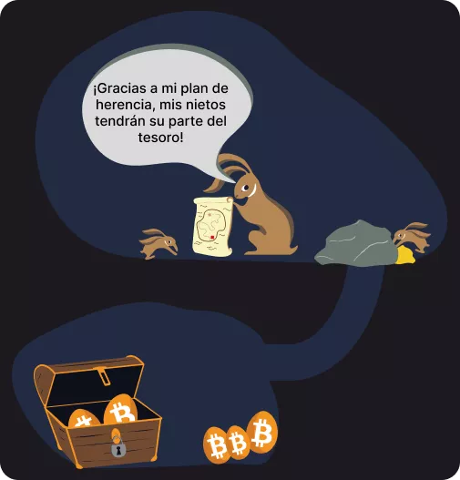

### La privacidad es importante

La seguridad a largo plazo de tus bitcoins no es sólo cuestión de crear copias de seguridad físicas o elaborar un plan de sucesión. La privacidad es otra consideración importante. Por ejemplo, es mejor comprar bitcoins sin proporcionar identificación para minimizar el riesgo de robo de identidad o simplemente el seguimiento de sus fondos por parte de cualquier entidad con medios suficientes. El curso de formación BTC 205 le ayudará con esto si es necesario.

En cuanto a la privacidad, es vital evitar hablar a todo el mundo de tus bitcoins. Al fin y al cabo, no sabemos a dónde irá a parar este activo, y mantener un perfil bajo es una sabia decisión. No querrás llamar la atención sobre ti y tu billetera.

Del mismo modo, evita revelar tu sistema de seguridad a los cuatro vientos en reuniones sobre bitcoins o cuando quedes con desconocidos...

### ¡Un pequeño resumen en un póster!


### Resumen de la seguridad del monedero Bitcoin

Los billeteras de Bitcoin son aplicaciones de software para almacenar y realizar transacciones con bitcoins. Existen varios tipos: billeteras para móvil o PC, prácticos para pequeñas cantidades y/o gastos regulares; billeteras físicas, más adecuadas para almacenar bitcoin a medio y largo plazo; y billeteras multifirma o multisig, más complejas de gestionar y que requieren varias firmas para realizar transacciones.

Al crear una billetera, primero debes hacer una copia de seguridad de tu clave privada. Esta copia de seguridad se presenta en forma de una lista de 12 o 24 palabras, que puedes escribir en un papel o una placa de metal. Esta frase mnemotécnica te permite restaurar tu billetera en cualquier aplicación de billetera Bitcoin. Cualquier persona que tenga acceso a esta lista también tiene acceso a sus bitcoins. En Bitcoin, la soberanía financiera va de la mano con la responsabilidad individual, por lo que es crucial que asegures el acceso a tus billeteras y copias de seguridad. Para ello, es importante seguir ciertas reglas:

- Crear un plan de herencia: para garantizar que tus seres queridos puedan recuperar el dinero en caso de problemas.
- Evitar las plataformas de intercambio: evita dejar tus bitcoins en plataformas de intercambio o exchanges, ya que pueden ser objeto de ataques de hackers.
- Adapte su nivel de seguridad: tómate el tiempo para explicar tus necesidades y usos, esto te ayudará a elegir entre las diferentes billeteras Bitcoin disponibles.

Ahora que tenemos una base de conocimientos sobre las billeteras de Bitcoin y las buenas prácticas para asegurarlas, abordaremos en el próximo capítulo el funcionamiento técnico de Bitcoin. Una vez más, conocer los fundamentos del protocolo Bitcoin le permitirá comprender mejor su funcionamiento y utilizarlo de manera más efectiva.

# Los aspectos técnicos de Bitcoin.
<partId>a86d7439-e7a2-5f21-b1e9-6b5e23ca265b</partId>

## Lanzamiento de Bitcoin
<chapterId>b7561082-8943-519d-95d1-a5f60dd2686d</chapterId>

### Comencemos con un poco de historia.


El 31 de octubre de 2008 marca el nacimiento de una nueva tecnología financiera: Bitcoin. En esta fecha, Satoshi Nakamoto, el autor anónimo de Bitcoin, presenta su innovación al mundo a través de un correo electrónico distribuido a la lista de correo Cypherpunk, una comunidad de criptógrafos apasionados por la privacidad en Internet.

Este correo contenía un documento llamado "White Paper" o "Libro Blanco", que presentaba el funcionamiento de Bitcoin. Dado los fracasos anteriores de los sistemas de dinero digital, esta iniciativa no generó un entusiasmo inmediato. Sin embargo, este White Paper finalmente se convirtió en una referencia para los usuarios de Bitcoin y ha sido objeto de muchos debates en el ecosistema de Bitcoin.


El 3 de enero de 2009, Satoshi Nakamoto inaugura oficialmente la red de Bitcoin creando el primer bloque, también conocido como Bloque Génesis, que marca el lanzamiento de la cadena de bloques de Bitcoin o "blockchain". Este bloque contiene un mensaje revelador de la misión de Bitcoin: "03/jan/2009 Chancellor on brink of second bailout for banks" (El canciller al borde de un segundo rescate para los bancos).


> "Podemos ganar una gran batalla en la carrera armamentista y obtener un
> nuevo territorio de libertad durante varios años." - Satoshi Nakamoto
> 

### El protocolo Bitcoin comienza a vivir

El 8 de enero de 2009, Satoshi anuncia la publicación de Bitcoin-0.1.0. Rápidamente, Hal Finney toma el software y se une a la red. Ahora había 2 nodos, y por lo tanto 2 mineros, en la red. Finney inmortaliza este paso tuiteando "Running Bitcoin". El 12 de enero de 2009, se realiza la primera transacción de Bitcoin entre Satoshi y Hal Finney. Esta transacción, de 10 BTC, se registra en el bloque 170.


El interés por Bitcoin crece rápidamente, y muchas personas comienzan a probar, debatir, solucionar errores y reflexionar sobre los aspectos éticos, económicos y filosóficos de Bitcoin. Para facilitar estos intercambios, el 22 de noviembre de 2009 Satoshi crea el foro BitcoinTalk.
Este foro se convierte rápidamente en el lugar de discusión preferido para los usuarios de Bitcoin. Es allí donde nacen muchos memes y símbolos asociados a Bitcoin, como el [logo de Bitcoin](https://bitcointalk.org/index.php?topic=64.0), el famoso [Hodl](https://bitcointalk.org/index.php?topic=375643.0), o incluso [Pizza day](https://bitcointalk.org/index.php?topic=137.msg1195).

> **¿Sabías que?** El 22 de mayo de 2010, Laszlo Hanyecz hizo historia con Bitcoin al proponer comprar 2 pizzas por 10,000 BTC. Esta sería la primera vez que Bitcoin se utilizó para comprar bienes físicos.


### La desaparición de Satoshi Nakamoto

En 2010, cuando Bitcoin empienza a llamar la atención de los medios, Satoshi decide distanciarse. El 12 de diciembre de 2010, publica su último mensaje en el foro, anunciando su marcha. El 23 de abril de 2011, realiza su última transacción privada conocida por correo electrónico. Satoshi desaparece entonces, dejando su creación en manos de la comunidad.

> "Los gobiernos son buenos a la hora de cortar las cabezas de redes controladas centralmente como Napster, pero las redes P2P puras como Gnutella y Tor parecen mantenerse firmes." - Satoshi Nakamoto

A pesar de la ausencia de Satoshi, Bitcoin continúa desarrollándose. Cada 10 minutos, la historia de Bitcoin se escribe y el protocolo sigue funcionando según lo previsto. No importa el miedo, la incertidumbre o la duda (FOMO, por sus siglas en inglés Fear Of Missing Out, es decir, el miedo a perderse de algo, o FUD, Fear, Uncertainty, Doubt o miedo, incertidumbre y duda), Bitcoin sigue avanzando, con una disponibilidad en línea del 99.988%.

El Bitcoin es percibido de manera diferente por cada individuo. Para algunos, es una entidad fúngica como el [micelio](https://brandonquittem.com/bitcoin-is-the-mycelium-of-money/), para otros, es un [agujero negro](https://dergigi.com/2019/05/01/bitcoins-gravity/). Ya sea que ames u odies el Bitcoin, sigue existiendo, con su ritmo constante de 10 minutos por bloque, como los latidos del corazón de un nuevo sistema monetario.

Para profundizar en tus conocimientos sobre los escritos de Satoshi Nakamoto, te recomendamos el [libro de Phil Champagne](https://planb.network/resources/books) o el documental de ARTE "le mystaire Satoshi".


> "El problema fundamental con la moneda convencional es toda la confianza que se requiere para que funcione. Se debe confiar en el banco central para que no devalúe la moneda, pero la historia de las monedas fiduciarias está llena de violaciones de esa confianza. Se debe confiar en los bancos para que guarden nuestro dinero y lo transfieran electrónicamente, pero lo prestan en oleadas de burbujas de crédito con apenas una fracción en reserva".

Ahora que tenemos algunos elementos de contexto, veamos cómo funciona en general una transacción de Bitcoin.

### ¡Un pequeño resumen en un póster!


## Las transacciones de Bitcoin
<chapterId>03482644-5473-590b-975b-b43bb65eac21</chapterId>

Una transacción de Bitcoin es simplemente una transferencia de propiedad de bitcoins, utilizando una dirección de bitcoin. Tomemos, por ejemplo, a dos protagonistas: Alice y Bob. Alice quiere adquirir bitcoins, mientras que Bob ya los tiene.

### Paso 1 - Creación de la transacción a través de la billetera

Para que Bob pueda transferir bitcoins a Alice, ella debe proporcionarle una de sus direcciones de Bitcoin. Esta dirección, derivada de la clave pública de Alice, es única para su billetera de Bitcoin.

Concretamente, Alice abre su billetera y presiona "recibir". Se mostrará un código QR o una dirección como esta bc1q7957hh3nj47efn8t2r6xdzs2cy3wjcyp8pch6hfkggy7jwrzj93sv4uykr. Es su "IBAN de Bitcoin", por así decirlo. Por lo tanto, se lo proporciona a Bob.

Luego, Bob inicia la transacción utilizando la dirección de recepción de Alice. Bob abre su billetera de Bitcoin, presiona "enviar", copia y pega la dirección o escanea el qr, agrega una cantidad y una tarifa de transacción. Estas tarifas son un incentivo para que los mineros incluyan la transacción en el siguiente bloque.

'

> **¿Por qué pagar tarifas?** Estas tarifas son esenciales para crear un mercado libre de inclusión de transacciones en los bloques, ya que el número de transacciones en un bloque está limitado. De hecho, un bloque tiene un tamaño de 1 MB, lo que equivale a varias miles de transacciones por bloque. Las tarifas de una transacción son proporcionales a su tamaño. El tamaño de la transacción, a su vez, depende de la complejidad de dicha transacción.

> Para finalizar la transacción, Bob debe proporcionar una firma con la clave privada de las direcciones que utiliza para pagar a Alice. Esto permite verificar que él es el propietario de los Bitcoins que desea transferir. Este paso generalmente se realiza automáticamente en billeteras de móviles, o bien es una confirmación en su billetera física: "¿Está seguro de enviar X a Y? Sí o no".

### Paso 2: La propagación de la transacción a través de los nodos hasta los mineros

En este punto, la transacción ha sido creada y la billetera de Bob la compartirá con la red de Bitcoin. Para hacer esto, su billetera se comunicará con un nodo de la red de Bitcoin, y este último propagará esta información a otros nodos. Este paso de propagación permite que toda la red vea esta nueva transacción y la tenga en cuenta.


A pesar de que esta transacción ahora es conocida por todos (a través de una herramienta llamada Mempool), ¡la transacción no necesariamente se considera confirmada! De hecho, son los mineros quienes validan las transacciones al incluirlas en un bloque de nuestra famosa blockchain.

Los mineros tienen la tarea de tomar las transacciones válidas y no confirmadas, y luego compilarlas en un bloque. Para que su bloque sea el siguiente en la cadena de bloques de Bitcoin, deben resolver un acertijo criptográfico en un proceso llamado "Prueba de Trabajo" o "PoW, por sus siglas en inglés Proof of Work".


### Paso 3: La transacción es minada en un bloque por un minero.

Esta prueba de trabajo requiere encontrar un "hash" válido para el bloque en cuestión. Piénsalo como una huella digital única asociada al bloque, compuesta por 256 caracteres. La validez de este hash depende de la dificultad de la red de Bitcoin. Volveremos sobre este mecanismo con más detalle. Por ahora, considera que un minero ha encontrado un bloque válido y que la transacción de Bob a Alice está incluida en el nuevo bloque.

Este nuevo bloque válido se agrega a la cadena de bloques de Bitcoin, que es un registro público e inmutable de todas las transacciones de Bitcoin. Piénsalo como un libro de cuentas compartido por todos los usuarios de Bitcoin. Según las reglas del protocolo, se agrega un bloque aproximadamente cada diez minutos gracias al ajuste de la dificultad. Veremos en la sección sobre los mineros cuál es el mecanismo que impide la modificación del registro de transacciones de Bitcoin.


### Etapa 4: El bloque es validado y verificado por el nodo de la billetera de Alice.

En este punto, la transacción se considera válida, el minero propagará a su vez el nuevo bloque a través de su nodo en la red y la billetera de Alice se actualizará.


> Atención: Incluso si Alice nota que ha recibido bitcoins en una de sus direcciones, se recomienda considerar la transacción como inmutable solo cuando tenga 6 confirmaciones. Esto significa que se han minado otros 6 bloques encima del bloque en el que se encuentra la transacción de Bob. En otras palabras, cuanto más antigua sea una transacción en la cadena de bloques, más inmutable será.

### ¡Un pequeño resumen en un póster!


### ¿Para qué sirve todo esto?

Al final, el sistema de transacciones de Bitcoin es descentralizado y funciona de igual a igual, sin intermediarios de confianza.

Bob envía su transacción a la red de Bitcoin, y cuando un minero publica un bloque válido que contiene la transacción de Bob, Alice puede comenzar a considerar que esos bitcoins le pertenecen. No se requiere confianza en ninguna etapa de la transferencia de propiedad de los bitcoins; solo las reglas del protocolo y los incentivos económicos hacen que sea demasiado costoso actuar de manera maliciosa dentro del protocolo de Bitcoin.

Los usuarios transfieren la propiedad de su dinero firmando digitalmente las transacciones con sus claves privadas. Los mineros tienen poco poder, ya que los usuarios también tienen un control significativo a través de los nodos de Bitcoin que se encargan de validar los nuevos bloques y las transacciones incluidas. Es gracias a esta red de nodos de Bitcoin que la red es verdaderamente descentralizada.

De hecho, para que la red de Bitcoin sea completamente destruida, se necesitaría destruir todas las copias de la blockchain de todos los nodos de Bitcoin, una tarea prácticamente imposible debido a la distribución geográfica de los nodos y a la dificultad de apoderarse de ellos físicamente.

Veamos con más detalle cómo funciona un nodo de Bitcoin.

## Los nodos de Bitcoin
<chapterId>8533cebc-f799-528b-89df-8d75d4c37f1c</chapterId>

Los nodos son un elemento fundamental de la arquitectura de la red de Bitcoin. Realizan diversas funciones cruciales:

- Mantener una copia de la blockchain cadena de bloques de Bitcoin
- Validar las transacciones
- Propagar información a otros nodos
- Aplicar las reglas del protocolo de Bitcoin.

Por lo tanto, cualquier dispositivo que ejecute el software de Bitcoin, llamado nodo de Bitcoin, (a menudo a través de [Bitcoin Core](https://bitcoin.org/en/bitcoin-core/)) participa en la descentralización de la red.

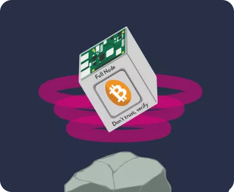

### Los nodos son el núcleo central de Bitcoin.

Cada nodo tiene una copia de la cadena de bloques, lo que permite verificar las transacciones y evitar cualquier intento de fraude. La naturaleza descentralizada de la red le confiere a Bitcoin una resistencia y robustez excepcionales: para detener el protocolo de Bitcoin, se tendrían que apagar todos los nodos en todo el mundo. A modo de información, actualmente (septiembre de 2024) hay aproximadamente [55,000 nodos](https://bitnodes.io/nodes/all/) distribuidos por todo el mundo.

Los nodos son capaces de verificar la validez de los bloques y las transacciones porque siguen las reglas de consenso de Bitcoin. Estas reglas rigen, entre otras cosas, la política monetaria de Bitcoin, como la cantidad de recompensa para los mineros (que veremos con más detalle en la próxima sección) y la cantidad de bitcoins en circulación. Los nodos actúan de alguna manera como el sistema legal de la red. Gracias a ellos, todos los participantes de la red siguen las mismas reglas. Aseguran la neutralidad del protocolo de Bitcoin. Las reglas de consenso varían muy poco, o incluso nada, ya que para realizar cambios es necesario obtener la aprobación de todos los nodos.


La gobernanza dentro del protocolo está fuera del plan de estudios de esta formación, pero debes saber que cada usuario que ejecuta un nodo de Bitcoin decide las reglas que desea seguir. Así, un usuario podría decidir seguir otras reglas (es decir, hacer modificaciones en el código), pero si estas modificaciones invalidan las reglas de consenso actuales, entonces ese nodo ya no formará parte de la red de Bitcoin. Los cambios importantes son, por lo tanto, raros y requieren una coordinación importante entre miles de actores con ideologías e intereses diversos, lo que obliga al protocolo a producir solo actualizaciones que lo hagan "mejor" en términos de todos los usuarios de Bitcoin.

### ¿Cómo es un nodo?

Tenemos varias opciones cuando queremos tener nuestro propio nodo, y su costo de mantenimiento varía dependiendo del tipo. Puedes simplemente ejecutar el software de Bitcoin Core en tu computadora, pero esto requerirá un espacio de almacenamiento considerable, ya que la cadena de bloques ocupa aproximadamente ~500 GB. Para superar esta limitación, puede decidir mantener en memoria solo los últimos N bloques, esto se conoce como "nodo podado". Para este tipo de solución, el costo es insignificante ya que el nodo solo está encendido cuando se necesita.


Una segunda opción es utilizar hardware dedicado para esto, como Raspberry Pi 4 con un disco duro SSD lo suficientemente grande (aproximadamente ~1 TB). Esta segunda opción es más costosa si tiene que comprar el hardware, pero en términos de consumo de energía, representa menos de 10€ al año.
Desde el punto de vista del ancho de banda, considerando 1 bloque de 1MB cada 10 minutos, esto representa aproximadamente 5GB al mes.

### ¡Los nodos deben permanecer accesibles para todos!

El costo asequible y la accesibilidad de un nodo de Bitcoin en términos de recursos materiales, almacenamiento y ancho de banda es un aspecto muy importante ya que facilita la descentralización de la red.

De hecho, ¡todos tienen una buena razón para ejecutar un nodo! El precio y los esfuerzos son mínimos para el beneficio obtenido. Solo tienes que embarcarte en la aventura y unirte a miles de otros bitcoiners porque todos juntos formamos la red de Bitcoin.

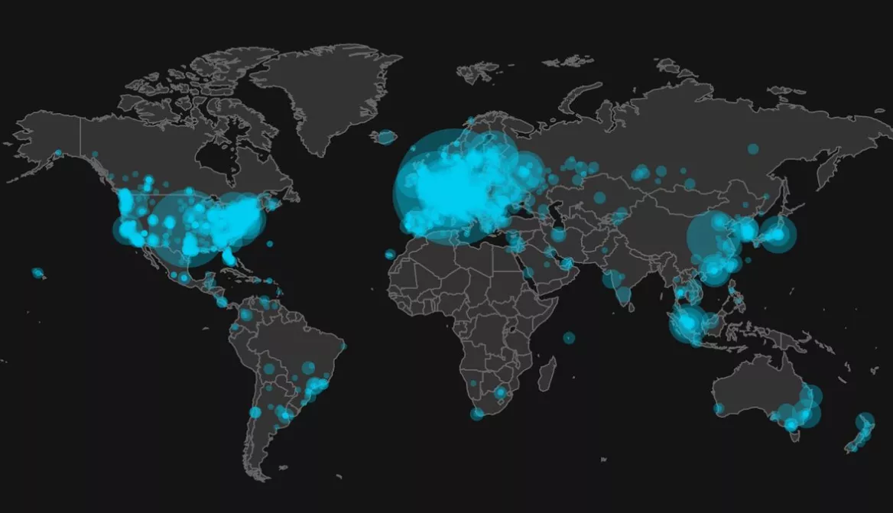

Por ejemplo, si los bloques fueran 100 veces más pesados, podríamos hacer 100 veces más transacciones cada 10 minutos, pero ejecutar un nodo de Bitcoin requeriría un disco duro de 50TB, un ancho de banda de más de 500GB al mes y un hardware capaz de validar cientos de miles de transacciones en menos de 10 minutos. En esta situación hipotética con bloques 100 veces más grandes, ejecutar un nodo de Bitcoin no sería accesible para el común de las personas, lo que comprometería la descentralización del protocolo y la inmutabilidad de las transacciones y las reglas de consenso. Por lo tanto, las restricciones del protocolo también se han elegido para permitir que la mayor cantidad de personas puedan ejecutar su propio nodo de Bitcoin.

Esta situación no es tan hipotética, ya que el año 2017 estuvo marcado por una intensa controversia conocida como "Guerra del tamaño de los Bloques o Blocksize War". Este conflicto enfrentó a los actores que deseaban modificar Bitcoin aumentando el tamaño de los bloques para aumentar la capacidad de transacción, con aquellos que buscaban preservar la independencia y el poder de los usuarios. Finalmente, los usuarios y los nodos triunfaron al rechazar la propuesta de cambio iniciada por los mineros, las plataformas de intercambio y las instituciones.

Después de esta victoria, los nodos activaron una actualización llamada SegWit, abriendo el camino para la implementación de Lightning Network, una red de pago instantáneo de Bitcoin que utiliza la cadena de bloques de Bitcoin. Esta situación demuestra que los usuarios, a través de sus nodos, tienen un poder real dentro de Bitcoin, lo que les permite enfrentarse a las grandes instituciones.

### ¡Resumen en un póster!


## Los mineros
<chapterId>dbb8264a-7434-57e4-9d1b-fbd1bae37fdf</chapterId>

> Los mineros tienen la función de asegurar la red y agregar transacciones a los bloques. Utilizan electricidad a través de máquinas ASIC para resolver la prueba de trabajo de Bitcoin.


### Explicación de la Prueba de Trabajo

La Prueba de Trabajo, también conocida como "Proof of Work" (PoW), es el consenso de seguridad del protocolo Bitcoin. Es la regla que permite que Bitcoin funcione y garantice su robustez. Proof of Worl es la base de todo y juega un papel crucial en la teoría de juegos de Bitcoin.

Piénsalo como una lotería gigante en la que cualquiera puede participar. El objetivo es encontrar un número específico que permita firmar un bloque válido, el ganador recibe una recompensa en bitcoins. Este número es muy fácil de verificar, pero difícil de encontrar. De hecho, la verificación fácil se realiza a través de la función de hash SHA-256 que está incluida en el algoritmo de minería. Para encontrar este número, los participantes (mineros) intentarán miles de millones de posibilidades: 1, 52, 2648, 26874615, 15344854131318631, etc.

Si el número elegido es el correcto: ¡Jackpot! De lo contrario, seguimos buscando. Para optimizar el número de intentos, utilizarán máquinas específicas llamadas ASIC, cuyo único propósito es calcular miles de millones de posibilidades por segundo. La cantidad total de intentos se llama HashRate y permite cuantificar la seguridad del protocolo Bitcoin. Para hacer funcionar estas máquinas, se deben consumir grandes cantidades de electricidad. Por lo tanto, la Prueba de Trabajo convierte la energía en moneda, conectando el mundo real y el mundo digital para crear la primera moneda energética.

Las máquinas funcionan y, en promedio, después de 10 minutos, surgirá un ganador. Habrá encontrado el hash correcto por debajo de la dificultad establecida. El gran y único ganador firmará el nuevo bloque del servidor de marca de tiempo y continuará la cadena de bloques. El ganador recibe sus recompensas y vuelve a intentarlo para el próximo bloque. El proceso se repite desde hace 12 años y cada 10 minutos, un ganador confirma las transacciones de Bitcoin mientras continúa asegurando las transacciones pasadas. Haciendo que nuestra cadena de bloques de Bitcoin sea más robusta y segura.

Cada 2 semanas (2016 bloques), el ajuste de dificultad reequilibra el juego mundial de minería en función del número de participantes.

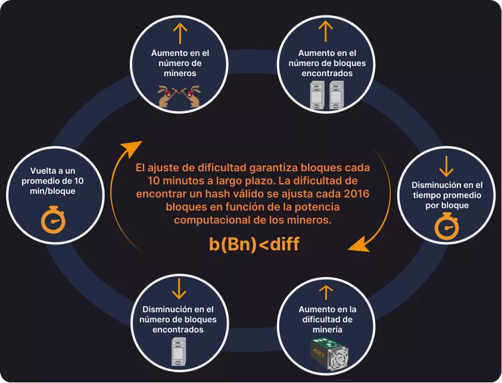

### La minería está en constante evolución

A lo largo de los años, los mineros se han equipado con hardware informático cada vez más potentes y eficientes para producir la mayor cantidad de hashes posible por segundo (llamado Hashrate) consumiendo la menor cantidad de energía posible, de la manera más económica posible. Los primeros mineros como Satoshi Nakamoto o Hal Finney minaban simplemente con su procesador CPU, luego otros comenzaron a minar con su tarjeta gráfica. Hoy en día, los mineros utilizan lo que se llama ASIC (Circuito Integrado Específico de Aplicación), máquinas diseñadas específicamente para aplicar el algoritmo SHA256.


El **Hashrate** de la red de Bitcoin representa, en cierto modo, la cantidad de intentos realizados por segundo para encontrar el próximo bloque. Hoy en día es de aproximadamente 400 TH/s, ¡lo que equivale a 400,000 billones de intentos por segundo! Cuanto mayor sea el hashrate global, más difícil será para un actor malintencionado monopolizar los recursos necesarios para obtener la mayoría de la minería y realizar un doble gasto. Por lo tanto, es más económicamente viable seguir las reglas del protocolo Bitcoin que actuar en contra de ellas. Esto plantea una pregunta: ¿cómo se remuneran los mineros?

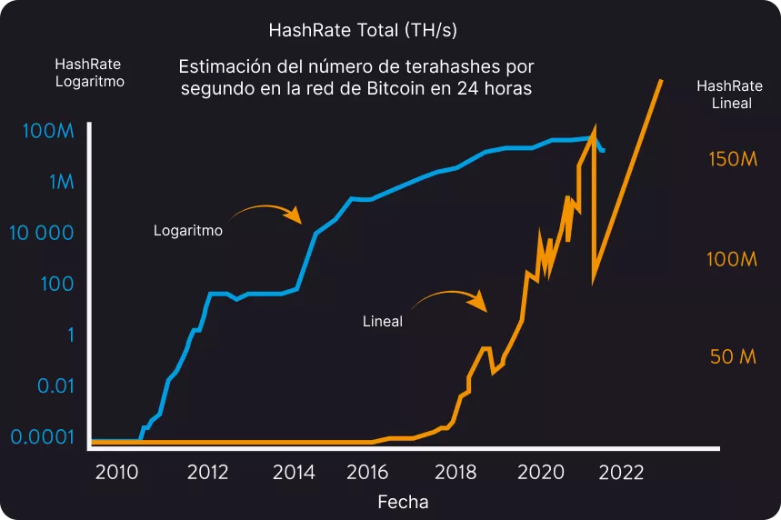

### ¿Qué se puede encontrar en un bloque?


El encabezado del bloque contiene varios elementos como la hora, el objetivo de dificultad, el número del último bloque, la versión utilizada y la raíz de Merkel de las transacciones anteriores.

La transacción coinbase siempre es la primera; incluye la recompensa recibida por realizar el trabajo de validación. A continuación, se encuentran las transacciones validadas. El minero elegirá las transacciones que generen más ingresos e intentará crear un bloque que maximice sus ganancias, es decir, transacciones de pequeño tamaño con la mayor cantidad de comisiones.

### Remuneración de los mineros

Inicialmente, un minero recibe una remuneración cuando encuentra un bloque válido. Más exactamente, se le remunera de dos maneras: (i) mediante la recompensa incluida en el bloque y (ii) mediante las comisiones de transacción en las transacciones incluidas en el bloque. El monto de la recompensa está definido por las reglas de consenso y depende de en qué Época nos encontramos.

De hecho, para los primeros bloques, la recompensa era de 50 bitcoins, luego cada 210,000 bloques (aproximadamente cada 4 años), se divide por 2. Hoy en día (en 2023), nos encontramos en la 4ª Época; por lo tanto, la recompensa es de 6.25 bitcoins. Esta recompensa es el mecanismo de creación monetaria en Bitcoin. A medida que la recompensa disminuye con el tiempo, esto significa que hay un límite de 21 millones de bitcoins: actualmente ya hay más de 19.4 millones de bitcoins en circulación, lo que representa más del 92%.

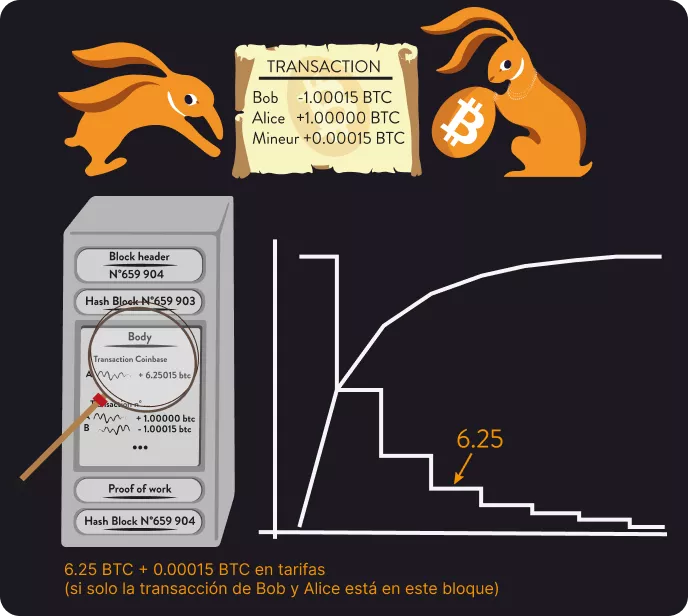

El segundo método de remuneración está determinado por la cantidad elegida por los usuarios para las comisiones de transacción. Como el minero desea maximizar sus ingresos, tenderá a seleccionar prioritariamente las transacciones con altas comisiones de transacción; por lo tanto, las comisiones de transacción reflejan la urgencia del usuario para que su transacción se incluya en el próximo bloque.

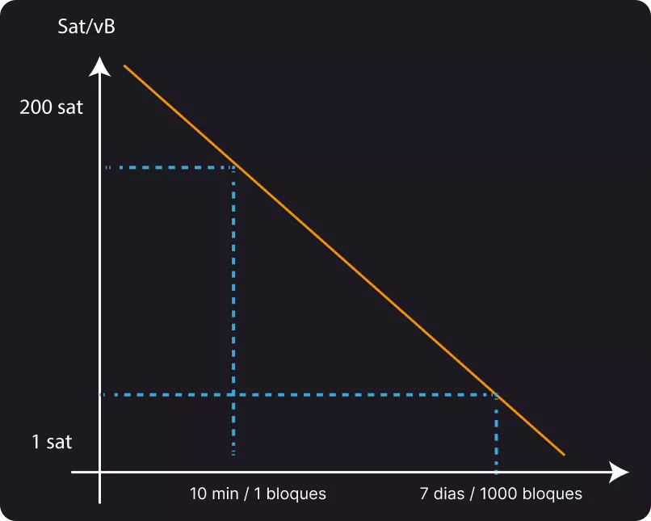

Además, para estabilizar el modelo económico de los mineros, que se basa en las recompensas que reciben por cada bloque válido, los mineros a menudo colaboran en grupos a través de "pools de minería", donde comparten sus recursos de cálculo.

### ¿Por qué molestarse en hacer todo esto?

En resumen, la innovación de Bitcoin es ofrecer una solución al problema del doble gasto mediante el uso de una cadena de bloques basada en la Prueba de Trabajo con una dificultad flotante. En el mundo digital, el concepto de propiedad difiere del mundo físico. De hecho, en el mundo digital, todo se puede copiar y pegar, lo que plantea problemas en términos de doble gasto para los activos digitales de valor. Se crearon intermediarios de confianza, como los bancos, para resolver este problema tecnológico y garantizar que cuando un activo se transfiere, ya no pertenece al emisor. Pero, ¿cómo hacerlo sin intermediarios de confianza? Este problema es equivalente al problema de los generales bizantinos, un problema de coordinación de información en un sistema donde no se puede confiar en los diferentes actores.


Bitcoin es, por lo tanto, una especie de solución para resolver este problema, o al menos para sortearlo. Los "generales" de Bitcoin, o mineros, producen bloques (de información) y los nodos de Bitcoin verifican las transacciones financieras a través de reglas de consenso para garantizar la autenticidad de la información. La asimetría en el costo energético entre la producción de información y la verificación asegura la confiabilidad de la información, sin necesidad de un tercero de confianza.

Los mineros son los constructores de la seguridad de la red de Bitcoin. Al gastar energía para producir hashes, construyen un muro que hace extremadamente costoso para un agente malintencionado reescribir el historial de transacciones. Esta desincentivación económica los disuade de comportarse de manera deshonesta.

Incluso en el caso de un ataque del 51%, es decir, cuando un agente posee más de la mitad de la tasa de hash, la red sigue estando segura porque el atacante debe gastar la misma cantidad de energía que todos los mineros juntos para intentar modificar la cadena de bloques. Es gracias a este mecanismo de prueba de trabajo, que requiere energía para ser realizado, que la red está segura.

La teoría del juego aplicada a Bitcoin descarta a los mineros deshonestos. Los mineros utilizan máquinas ASIC para minar y reciben una recompensa en caso de éxito. Además, a menudo se agrupan en grupos de minería para compartir su poder de cálculo y obtener recompensas más pequeñas pero más regulares. La minería de Bitcoin es un proceso con un alto costo energético pero esencial para el funcionamiento y la seguridad de la red de Bitcoin. La prueba de trabajo y la cadena de bloques resuelven el problema del doble gasto y garantizan la veracidad de la información sin necesidad de un tercero de confianza. El gasto energético es necesario para producir la información, pero la verificación de la información tiene un costo insignificante. Esta asimetría garantiza la seguridad de la red. Por lo tanto, es más económicamente viable seguir las reglas de consenso que infringirlas.

### ¡Un pequeño resumen en un póster!


## Bitcoin y la ecología
<chapterId>4b227ae6-443a-5739-b443-60b7931130d9</chapterId>


Acabamos de ver en la sección anterior que la seguridad del protocolo de Bitcoin se basa en un alto costo energético para producir un registro público de transacciones sin necesidad de un tercero de confianza. El costo energético total a menudo se compara con el consumo eléctrico de un país pequeño. Pero, ¿tiene sentido esta comparación? ¿Es relevante entender las razones que se esconden detrás de dicho costo?

### Los costos energéticos de Bitcoin.

En primer lugar, evaluemos cualitativamente el costo ambiental de la minería. Un minero debe tener una máquina como un ASIC y una fuente de energía en forma de electricidad para alimentar estas máquinas. Los ASIC están compuestos principalmente de aluminio y pueden ser reciclados o reutilizados para un segundo uso (como se demostró con el proyecto [Attakaï](https://decouvrebitcoin.fr/attakai/), que convierte un Antminer S9 en una calefacción auxiliar). Por lo tanto, el verdadero problema es el consumo de energía. Intentemos proporcionar más contexto sobre esto.


El consumo eléctrico representa casi la totalidad de los costes para un minero. Por lo tanto, se le incentiva a buscar una fuente de electricidad barata. Sin embargo, como los mineros son móviles, pueden ir a lugares donde hay centrales eléctricas instaladas pero aún no están conectadas a la red eléctrica del territorio. Los mineros actúan como compradores de último recurso, permitiendo que las centrales puedan financiarse antes de estar conectadas a la red eléctrica. Y cuando lo estén, la demanda de electricidad aumentará, lo que aumentará el precio y hará menos rentable para el minero obtener electricidad en esos lugares. Entonces, el minero decidirá mover su instalación y se instalará en un lugar más lejano donde la demanda sea baja y, por lo tanto, también su precio.

### Un debate sin fin

Así, el debate sobre el impacto ecológico de Bitcoin a menudo está mal enfocado, principalmente debido a una comprensión insuficiente de su utilidad y funcionamiento. Bitcoin no puede ser evaluado simplemente en términos de costo energético por transacción, ya que los mineros aseguran tanto la red actual como la histórica, las transacciones se agrupan y no todas son equivalentes, además no se tiene en cuenta el impacto de la Lightning Network. Aquellos que afirman que Bitcoin consume demasiada energía pueden tener motivaciones políticas o buscar vender su propia solución blockchain. El pretexto ecológico se utiliza para justificar la prohibición de Bitcoin.

Sin embargo, no debemos olvidar que Bitcoin, como una invención revolucionaria, ha brindado a las personas que viven bajo opresión financiera o regímenes dictatoriales una forma de luchar por su libertad. Como último recurso, Bitcoin ofrece una forma de libertad financiera al escapar de la censura y las restricciones bancarias. Bitcoin es más que una simple moneda. Es una forma de comunicación y expresión de libertad. La energía gastada por los mineros contribuye a la defensa de nuestra libertad. Bitcoin permite la emancipación del sistema financiero actual, dominado por la deuda y la excesiva creación monetaria por parte de los bancos centrales.


Para aquellos que viven en países con alta inflación, Bitcoin es una cuestión de supervivencia. Proporciona una forma de sobrevivir en situaciones financieras precarias. Además, Bitcoin ofrece un sistema financiero más justo y equitativo. También brinda la oportunidad a miles de millones de personas en todo el mundo de acceder al sistema financiero. Desde esta perspectiva, ¿es legítimo el consumo de energía?

### ¿No sería Bitcoin un beneficio neto para el medio ambiente?

Finalmente, es esencial discutir los desafíos económicos y ambientales de la adopción de Bitcoin.

En particular, comparándolo con el sistema financiero actual. Este último, al fomentar el consumo excesivo y el endeudamiento, plantea graves problemas. El fácil acceso al crédito, la emisión de dinero por parte de los bancos y el uso de la banca de reserva fraccionaria son factores que fomentan el sobreendeudamiento y, en consecuencia, el sobreconsumo.

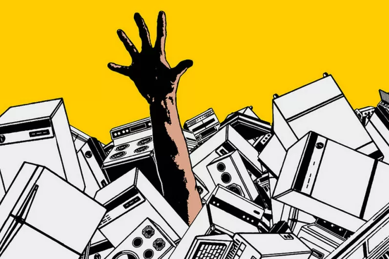

Es necesario reformar el sistema monetario para reflejar la escasez de nuestros recursos con la escasez de nuestra moneda. Esto fomentará un consumo más responsable y una visión a largo plazo. Por el contrario, la inflación, al incentivar el consumo y la inversión, tiene un impacto negativo a largo plazo en el medio ambiente.

El sistema financiero actual se ajusta a las ideas de la economía keynesiana, que a diferencia de la economía austriaca, no tiene en cuenta el aspecto temporal y dinámico de las situaciones y los recursos. En otras palabras, una moneda ilimitada no puede reflejar eficazmente los recursos limitados de nuestro planeta.


Los políticos, por su visión a corto plazo y a su necesidad de crecimiento económico para ser reelegidos, no pueden resolver los problemas ambientales a largo plazo. Por el contrario, la adopción de una moneda saludable como Bitcoin es una posible alternativa que podría devolver el poder económico al pueblo.

Los mineros de Bitcoin pueden apagar las llamas en los pozos de petróleo, que queman metano para evitar la contaminación, lo cual es beneficioso para el medio ambiente. Bitcoin fomenta el uso de energía verde. El metano se puede convertir en electricidad para alimentar las máquinas de minería, lo cual es beneficioso para todos.

La tecnología de Bitcoin suele ser malinterpretada, y las críticas sobre su impacto ambiental suelen ser simplistas y a corto plazo. Estas críticas suelen estar motivadas por intereses políticos. Bitcoin tiene el potencial de ayudar en la transición ecológica y contribuir a un mundo más verde. Los medios de comunicación a menudo difunden ideas falsas sobre Bitcoin y el medio ambiente. Así que tómate el tiempo para formarte tu propia opinión. Todo es transparente con Bitcoin.

> Sigue uno de los lemas de Bitcoin: ¡No confíes, verifica por ti mismo!

### ¡Un pequeño resumen en un póster!


### Breve resumen de los aspectos técnicos de Bitcoin

Satoshi Nakamoto lanzó en enero de 2009 el protocolo Bitcoin, que desde entonces ha evolucionado gracias a una creciente comunidad de desarrolladores, mineros y usuarios con nodos Bitcoin. Estos últimos, al mantener su propia copia del blockchain de Bitcoin, un registro público de todas las transacciones de Bitcoin, pueden asegurarse de la validez de las transacciones según las reglas de consenso propias de Bitcoin. Esto se logra asegurándose de que los mineros produzcan bloques válidos, que contengan miles de transacciones pendientes.

En promedio, se crea un bloque cada 10 minutos y el minero que encuentra un hash válido para el próximo bloque es recompensado por el protocolo con una recompensa cuyo monto está definido por las reglas de consenso, así como las tarifas de transacción de todas las transacciones presentes en el bloque válido en cuestión. Como el resultado del algoritmo de hash (SHA256) para una entrada dada se considera impredecible, el proceso de minería consiste en construir numerosos bloques candidatos y probar si su hash es válido o no. Sin embargo, para asegurarse de que el tiempo promedio entre dos bloques permanezca constante (~10 minutos) independientemente de la cantidad de mineros y su poder de cálculo, la dificultad para encontrar un hash válido se ajusta cada 2016 bloques, aproximadamente cada 2 semanas. Con el tiempo, los mineros han desarrollado máquinas específicas para SHA256, llamadas ASIC, para aumentar la relación de hash/julio, lo que significa en otras palabras el número de intentos por segundo y energía consumida.

Para que los mineros sean lo más rentables posible en su actividad, deben obtener la electricidad más barata posible, lo que a menudo se encuentra en áreas remotas, dentro de centrales eléctricas que aún no están conectadas a la red eléctrica del territorio. Entonces, el minero actúa como un comprador de último recurso y, tan pronto como el precio de la electricidad aumente debido al aumento de la demanda, es probable que el minero reubique su actividad en otro lugar.

Así, el protocolo Bitcoin es un sistema monetario incensurable e imparable porque cada componente del protocolo está distribuido geográficamente en todo el mundo, por ejemplo, hay alrededor de 40,000 nodos Bitcoin en todos los continentes. Las reglas de consenso de Bitcoin son tales que es más rentable seguirlas que tratar de transgredirlas, y por lo tanto no se requiere confianza entre los actores. Bitcoin no tiene líder y no se puede detener. Es posible regular las plataformas de intercambio para limitar Bitcoin, pero esto está restringido en términos de impacto. En resumen, ningún juez o gobierno puede censurar o detener a Bitcoin.

# ¿Cómo obtener Bitcoin?
<partId>517e1bb7-f032-51a0-930a-a91fe5148d3f</partId>

## ¡Bitcoin nunca duerme!
<chapterId>d5e35e41-ea26-5478-8eb9-07daf9dff508</chapterId>

El precio de Bitcoin a menudo se caracteriza por una volatilidad significativa. Su valor puede fluctuar considerablemente según las variaciones del mercado y las fases del mercado alcista (bull market) y bajista (bear market). Esto se aplica al 100% de los mercados financieros, incluido Bitcoin.


> En pocas palabras: los seres humanos compran y venden al mismo tiempo. Bitcoin no es inmune a la naturaleza humana.

### Comprender las olas de adopción

El desarrollo y la evolución de Bitcoin está relacionado en gran medida con los diferentes grupos de actores que gradualmente han integrado su ecosistema.


- Los creyentes:

Los primeros usuarios de Bitcoin eran principalmente entusiastas de la tecnología, criptógrafos, libertarios y seguidores del oro. Estos grupos se sintieron atraídos por Bitcoin debido a su capacidad para ofrecer soluciones como dinero electrónico sin intermediarios de confianza, resistencia a la censura o una política monetaria transparente e inmutable.

- La web oscura y los criminales

Luego, el uso de Bitcoin se extendió a sitios de comercio en la web oscura (darknet), como Silk Road, debido a su naturaleza incontrolable y pseudónima. Este sitio llamó la atención sobre la naturaleza incontrolable y pseudónima de Bitcoin, lo que llevó a algunos actores criminales a utilizarlo. Sin embargo, es importante tener en cuenta que el uso que se hace de una herramienta, y no la herramienta en sí misma, determina su legalidad o ilegalidad. Es importante destacar que el uso ilegal de Bitcoin no convierte a una persona en criminal por si mismo. Es el uso, y no la herramienta, lo que puede ser clasificado como ilegal. Por ejemplo, el uso de Bitcoin para actividades como la compra de ciertas drogas puede ser legal o no dependiendo de la regulación del territorio en el que se realice dicha actividad.

- La locura de las ICO y la llegada del público en general.

El año 2017 estuvo marcado por una importante burbuja especulativa en el mundo de las criptomonedas, especialmente con el lanzamiento de miles de ICO (Oferta Inicial de Monedas). Sin embargo, muchas de estas nuevas criptomonedas no tenían un desarrollo concreto ni utilidad, por lo que desaparecieron rápidamente. a esta burbuja de 2017 le siguió una fuerte corrección en 2018-2019.

- La burbuja de los NFT y la DeFi

En 2020, el mercado volvió a experimentar otra burbuja especulativa que llevó el precio de Bitcoin a $60,000. Esta burbuja se distingue de las anteriores por una mayor diversificación de los inversores, incluidas instituciones financieras y grandes empresas. Pero una vez más, se producen fuertes correcciones una vez que la euforia se calma.

### Bitcoin y la volatilidad

Basándonos en ciclos pasados, parece que la periodicidad de los ciclos económicos de Bitcoin es equivalente al tiempo entre dos halving. Quizás porque el evento de halving actúa como un detonante al reducir a la mitad la emisión de nuevos bitcoins.

Estas fluctuaciones muy importantes han creado una reputación para Bitcoin como un activo extremadamente peligroso que hace perder dinero a todos sus usuarios. Aunque el precio puede caer un 10-20 o incluso un 50% en unos pocos días, es importante entender que Bitcoin, el protocolo, no se ve afectado por el cambio de precio (recuerda, 1 BTC = 1 BTC).

Esta volatilidad importante es completamente aceptada hoy en día por los actores de Bitcoin y puede ser mitigada por varias soluciones como coberturas financieras (stablecoins), una fuerte creencia a largo plazo (hodl o mantener) o simplemente no invertir el 100% de su dinero en Bitcoin sin entender nada. Comprender por qué el precio de Bitcoin fluctúa tanto es esencial para poder avanzar en esta industria, ya que al final, es el precio y los ciclos los que temporizan y regulan de alguna manera nuestro mercado. Sin embargo, podemos observar que a medida que Bitcoin crece y madura, la volatilidad es lo menos.


Aunque el par btc/dólares fluctúa en períodos cortos, Bitcoin, debido a su cantidad limitada de 21 millones de bitcoins y su proceso de halving (reducción a la mitad de la creación monetaria cada 4 años en promedio), sigue una tendencia general al alza de manera casi mecánica. Por supuesto, como cualquier activo financiero, Bitcoin está sujeto a ciclos económicos que incluyen períodos de euforia, burbujas especulativas y correcciones. Este fenómeno es bastante común en las tecnologías emergentes, donde el mercado no siempre es racional o eficiente.

### Un mercado único

Estos ciclos de burbujas especulativas son bastante únicos en el mundo, de hecho, es muy raro que un mismo activo experimente tantas burbujas una tras otra. Esto se explica simplemente porque Bitcoin no es una burbuja que desaparecerá, sino una moneda que realmente se utiliza en todo el mundo. El protocolo de Bitcoin es único en el sentido de que funciona a escala mundial, las 24 horas del día, los 7 días de la semana, lo que dificulta la regulación por parte de las autoridades financieras.

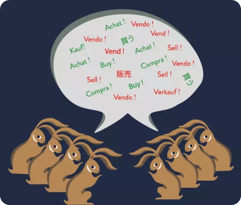

Hoy, en 2024, Bitcoin sigue sobreviviendo y creciendo cada vez más al integrarse cada día más en el mercado tradicional. La llegada de los ETF de Bitcoin, una regulación más clara y mejores herramientas de adquisición o almacenamiento solo fomentan esta tendencia. Bitcoin ha SOBREVIVIDO una vez más a su burbuja especulativa, ¡así que tal vez no sea solo aire!


### ¡Un pequeño resumen en un póster!


## Obtener bitcoins trabajando
<chapterId>be2d83be-406f-582c-83ca-6aa905ff7b04</chapterId>

### Se está desarrollando una economía paralela

Bitcoin puede ser visto como una economía paralela a la de las monedas fiduciarias. Esto significa que es posible vender bienes o servicios, así como ser pagado en Bitcoin. Las transacciones se pueden realizar directamente en Bitcoin, sin necesidad de utilizar una plataforma de intercambio, simplemente de billetera Bitcoin a billetera Bitcoin.

La economía de Bitcoin existe y se está desarrollando en algunas regiones del mundo, como en El Salvador, el primer país en hacer Bitcoin moneda de curso legal desde 2021. Además, algunas personas, empresas y organizaciones ya aceptan Bitcoin como forma de pago por sus productos o servicios.


Además, para facilitar el uso de Bitcoin en las transacciones diarias, se ha lanzado un proyecto de código abierto y colaborativo: BTCMap (https://btcmap.org/map#2/21.28937/5.46680). Este proyecto enumera todos los comerciantes que aceptan Bitcoin, así como las diferentes comunidades de Bitcoin en todo el mundo. Puedes visitar su sitio para descubrir el ecosistema de Bitcoin a tu alrededor. Así, a pesar de las dificultades y las reticencias, existen iniciativas como BTCMap que contribuyen a hacer que la economía de Bitcoin sea mucho más accesible y práctica para todos.

### ¿Por qué aceptar Bitcoin en lugar de comprarlo?

Para obtener bitcoins, puedes comprarlos en plataformas reguladas por organismos como la AMF (Autorité des Marchés Financiers) en Francia. Este método implica ciertos riesgos y la trazabilidad de tus transacciones. Otro método para obtener bitcoins es aceptarlos como forma de pago por los productos o servicios que ofreces. Este método te permite adquirir bitcoins a través de tu trabajo sin tener que preocuparte constantemente por el precio de Bitcoin.

Además, aceptar Bitcoin como comerciante tiene varias ventajas, como la ausencia de censura, menores tarifas de transacción, mayor eficiencia, protección contra la inflación, así como libertad y soberanía financiera.

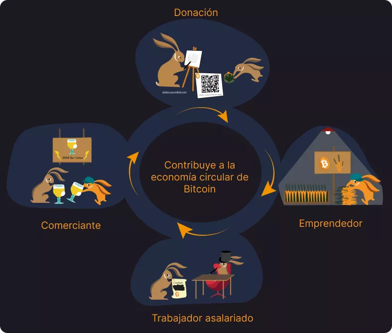

### ¿Cómo hacerlo?

Para aceptar Bitcoin, es necesario estudiar las diferentes soluciones disponibles y elegir la que mejor se adapte a tu empresa. No hay soluciones perfectas y varios factores deben tenerse en cuenta al momento de tomar tu decisión, como el volumen de transacciones esperado, el presupuesto asignado, el tipo de comercio (virtual o físico).

Trataremos este tema en detalle en otra formación, pero para simplificar, se pueden considerar varias categorías de negocios y, por lo tanto, soluciones relacionadas:

- Solución en línea simple: OpenNode
- Solución para comerciantes principiantes: Swiss Bitcoin Pay
- Solución para grandes estructuras o entusiastas de Bitcoin: BTCpay Server

### ¡Un pequeño resumen en un póster!


## Ahorrar con Bitcoin
<chapterId>1d9570c6-5b63-51a6-b87c-7bdb0fc4aa87</chapterId>

### ¡Advertencia antes de empezar!

Bitcoin se ha convertido en un activo financiero importante, principalmente debido a su oferta limitada y su creciente demanda. Sin embargo, comprar Bitcoin conlleva riesgos que requieren especial atención. Por lo tanto, se recomienda realizar su propia investigación y aprender más sobre el tema para familiarizarse con la tecnología antes de invertir.

- Invierte solo lo que puedes permitirte perder.
- Bitcoin es un activo financiero muy volátil.
- El rendimiento pasado no garantiza resultados futuros.
- Consulte a un asesor financiero si es necesario.

> Plan B Network no ofrece asesoramiento de inversión y nada de lo que se dice aquí debe considerarse como tal.

### Mini lista de verificación antes de dar el gran salto

Antes de embarcarse en la compra de Bitcoin, asegúrate de tener:

- Una billetera segura.
- Un sólido entendimiento de Bitcoin.
- Un plan de ahorro a seguir.
- Una visión a largo plazo.

Si el tema aún no está claro, debes saber que el curso BTC102 te guiará en la seguridad y adquisición de tus primeros bitcoins. Aquí, solo vamos a tocar el tema superficialmente.

En concreto, hay dos preguntas que hacerse:

- ¿Qué estrategia de adquisición adoptar: gradualmente o de una sola vez?
- ¿A través de qué plataforma pasar: regulada o no regulada?

### Estrategias de compra

- Costo promedio en dólares

La compra recurrente consiste en comprar pequeñas cantidades de Bitcoin a intervalos regulares. Este método ofrece una suavización del precio a lo largo del tiempo y un crecimiento continuo de la cantidad de Bitcoin poseído. Es una solución ideal para ahorrar a largo plazo sin preocuparse por el precio y la volatilidad de Bitcoin. Se establece y se olvida.


> Atención a los UTXO: No olvides consolidar sus UTXO en tus billeteras de vez en cuando. Esta práctica es esencial para administrar eficientemente sus bitcoins y evitar tarifas innecesarias durante las transacciones.

- Compra espontánea

La compra espontánea se utiliza para obtener una exposición inmediata a Bitcoin. Ya sea para comprar durante una caída o para aprovechar una bonificación, la decisión es tuya. Tendrás que tomar coraje y presionar comprar.

Dado la significativa volatilidad del Bitcoin, es importante prestar atención a tus emociones. El FOMO (Fear of Missing Out, o el miedo a perder una oportunidad) y el FUD (Fear, Uncertainty, Doubt, o el miedo, la incertidumbre y la duda) son tus peores enemigos en este contexto. ¡Mantén la calma y sigue la estrategia que has establecido previamente para evitar decisiones impulsivas y potencialmente perjudiciales.

### ¿A quién comprar nuestros Bitcoins?

Existen varias formas de adquirir Bitcoins, cada una con sus propias regulaciones. Algunas plataformas requieren una identificación para la verificación, mientras que otras no lo hacen. Es crucial entender las regulaciones asociadas con cada plataforma.

- Plataformas de DCA

Un método común para acumular Bitcoins es el "Dollar Cost Averaging" (DCA), este método consiste en invertir regularmente pequeñas cantidades. Varias plataformas ofrecen este servicio, como las que se enumeran en nuestra [página dedicada](https://planb.network/tutorials/exchange). Además de la simplicidad de establecer un DCA, la retirada a tu billetera generalmente es automática, lo que significa que siempre tendrás el control sobre tus bitcoins.

Hoy en día, casi todas las soluciones de DCA son relativamente eficientes y con tarifas casi similares, la elección se basará más en la disponibilidad en tu país.

- Plataformas de corretaje

Para inversiones a gran escala, se recomiendan plataformas reguladas y reconocidas como Kraken, Bitstamp y Paymium. Estas plataformas ofrecen un entorno seguro para transacciones de gran volumen.

Su uso es bastante sencillo y accesible para todos:

1. Configuración de una cuenta KYC/*
2. Transferencia bancaria a tu cuenta
3. Compra de bitcoins
4. Retiro de los bitcoins a tu billetera


Después de la compra, se recomienda retirar inmediatamente los Bitcoins de las plataformas de intercambio para minimizar los riesgos de piratería o bloqueo de fondos. Las tarifas de retiro pueden ser altas, a veces hasta 25 euros según la plataforma.

> Las normas KYC (Por sus siglas en inglés, Know Your Customer, o Conoce a tu Cliente) requieren que los usuarios proporcionen una identificación para combatir el financiamiento del terrorismo, la evasión fiscal y el lavado de dinero.

Es importante tener en cuenta que el KYC es un tema importante en nuestra industria, ya que su efectividad sigue siendo objeto de debate mientras que sus aspectos negativos son numerosos. En muchos de nuestros cursos y contenidos universitarios, desaconsejamos el uso de plataformas con KYC completo si ya eres un usuario avanzado.

### Solución sin KYC

Además, hay diversas [formas de mercado](https://planb.network/tutorials/exchange) para comprar y vender bitcoins de peer-to-peer. Si estás interesado en estos, puedes seguir el tema en nuestro curso BTC 205. En general, estas soluciones son:

- Cajeros automáticos de bitcoins
- Encuentros físicos con otros entusiastas de Bitcoin
- Plataformas ilegales y no reguladas
- Soluciones de conexión entre particulares
- Soluciones de neobancos que operan en naciones amigables con Bitcoin.

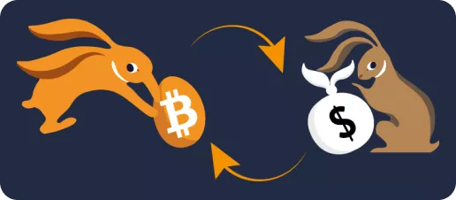

También es importante tener en cuenta que es posible que se implementen impuestos en tu jurisdicción. Te recomendamos que consultes la regulación de tu país antes de tomar cualquier acción que pueda ponerte en riesgo.

### ¡Un pequeño resumen en un póster!


## Hiper-bitcoinización
<chapterId>b7275d31-3b60-5fb7-b9f5-030097010553</chapterId>

### ¡La locura apenas comienza!

Como cualquier nueva tecnología, la adopción de Bitcoin sigue una curva en forma de S. Hemos superado la era de los primeros adoptantes y los indicadores parecen apuntar hacia una democratización completa de Bitcoin. Es una tecnología viral que no puede ser detenida. El Salvador ha apostado audazmente por adoptar Bitcoin de manera total, declarándolo como una moneda de curso legal. Sin embargo, cada país reacciona de manera diferente ante esta tecnología. Algunos países lo han prohibido y criminalizado su uso, lo que agrega complejidad a la adopción de Bitcoin según las culturas, épocas y naciones.

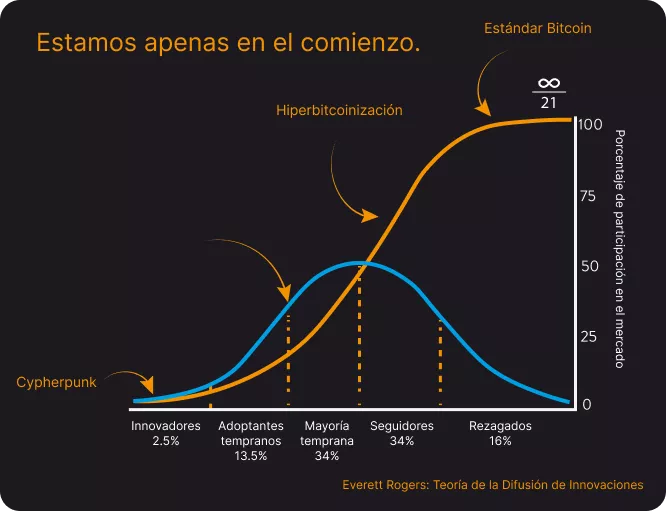

El ascenso de Bitcoin obliga a las empresas, universidades, reguladores y particulares a tener en cuenta esta nueva tecnología. Se deben crear nuevas herramientas, adaptar los servicios y la innovación debe continuar para garantizar su supervivencia. Este contexto plantea muchas preguntas que afectan a diversos campos, como la criptografía, la teoría de juegos, la economía y la política monetaria, la informática, la filosofía, la energía, las leyes y la regulación. En resumen, Bitcoin es un objeto multidisciplinario.


### Bitcoin es un 0 a 1

Te invitamos a reflexionar sobre esta nueva revolución monetaria. Hay tantas cosas por explorar con Bitcoin que es difícil asimilarlo todo de una vez. Tómate tu tiempo, Bitcoin no va a desaparecer. Al contrario, la revolución recién acaba de comenzar. Juntos, creemos que somos capaces de crear el mundo que queremos heredar a nuestros hijos. Un mundo donde la soberanía humana sea un derecho, donde la privacidad sea respetada por defecto y donde el dinero no sea manipulado. Esperamos lograrlo juntos.

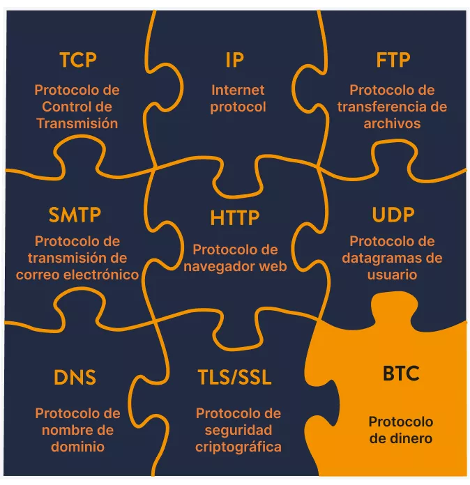

Si deseas ampliar tus conocimientos sobre Bitcoin, muchos autores, pensadores y ensayistas han contribuido a la capa educativa de Bitcoin. Durante los últimos años, hemos recopilado y clasificado estas obras para ofrecer una [biblioteca de recursos](https://planb.network/resources) a los más curiosos. Encontrarás los mejores podcasts, sitios web, artículos, tutoriales, libros y otros contenidos.

> Milton Friedman, un economista renombrado, predijo en 1999: "Creo que Internet será una de las principales fuerzas para reducir el papel del gobierno. Lo único que falta, pero que pronto se desarrollará, es un dinero electrónico confiable: un método mediante el cual en Internet se puedan transferir fondos de A a B sin que A conozca a B o B conozca a A". Hoy en día, Bitcoin cumple con esta predicción.

### ¡Un pequeño resumen en un póster!


# El futuro de Bitcoin: Lightning Network
<partId>899fd35e-39e6-5a25-a73e-6fed6e725094</partId>

## Breve introducción a Lightning Network
<chapterId>b403f1e4-f1ff-572b-a242-9b58cb3736d0</chapterId>

Ahora que tenemos los conceptos básicos del protocolo Bitcoin, vamos a presentar una red de pagos que utiliza el protocolo Bitcoin para permitir transacciones a la velocidad del rayo. ¡Estamos hablando, por supuesto, de Lightning Network!

### En pocas palabras

Lightning Network (Red Lightning) es una tecnología revolucionaria que ha cambiado nuestra percepción de Bitcoin. Es una solución que aborda el problema de la escalabilidad de Bitcoin.

Para comprender bien Lightning Network, es crucial entender cómo evoluciona Bitcoin. Bitcoin se desarrolla en capas de infraestructura: la primera capa es la cadena de bloques y la segunda capa es Lightning Network.

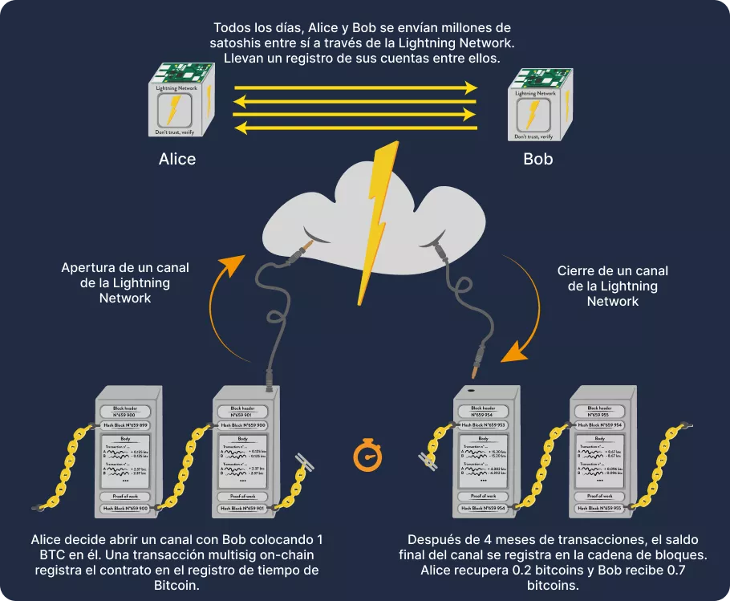

Reconocido como una capa de Bitcoin, Lightning Network fue validado e implementado en 2017. Permite realizar transacciones instantáneas en Bitcoin a bajo costo, resolviendo así el problema de escalabilidad de Bitcoin. Pero, ¿cuál es este problema de escalabilidad que enfrenta Bitcoin?

### Una cadena de bloques no puede crecer infinitamente

El problema de escalabilidad se refiere al desafío de establecer un sistema monetario capaz de manejar un número creciente de transacciones por segundo (TPS) a medida que se adopta. Esto se relaciona con el trilema de las cadenas de bloques. Imagina un triángulo con los vértices: descentralización, seguridad y escalabilidad.

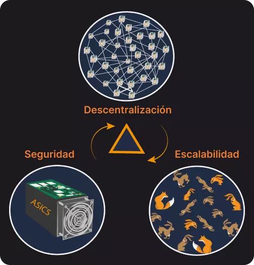

Un protocol basado en una blockchain no puede satisfacer únicamente dos de estos 3 aspectos. Dentro del protocolo de Bitcoin, se han hecho elecciones que favorecen la descentralización/seguridad. Por un lado, el tamaño de los bloques de 1MB y el tiempo entre dos bloques (aproximadamente 10 minutos) permiten que un nodo de Bitcoin funcione a bajo costo, favoreciendo la descentralización. Y por otro lado, la producción de bloques mediante Prueba de Trabajo (Proof of Work) hace que el fraude dentro del protocolo sea extremadamente costoso, al mismo tiempo que facilita la verificación por parte de los nodos de la red, favoreciendo así la seguridad. Sin embargo, estas elecciones imponen un límite en el número promedio de transacciones en un bloque, del orden de algunas transacciones por segundo. Este número es ridículo si lo comparamos con la capacidad de los procesadores de pagos como VISA, que es de 1700/s. Sin embargo, es un límite necesario para poder realizar transacciones de forma incensurable y sin intermediarios de confianza con Bitcoin. Sin embargo, las personas que desarrollan en Bitcoin han estado reflexionando sobre este problema desde el inicio.

### Lightning como capa superior

Después de años de reflexión y múltiples intentos, emerge el protocolo Lightning. Con la ayuda de ciertas especificaciones, este protocolo permite construir una red de pagos peer-to-peer utilizando la seguridad y programabilidad de las transacciones del protocolo de Bitcoin. La Lightning Network actúa como una red de canales de pago, permitiendo transacciones instantáneas y con bajos costos para el remitente. Esta red de canales de pago incluso permite transacciones entre personas que no tienen un canal directamente conectado entre ellos.

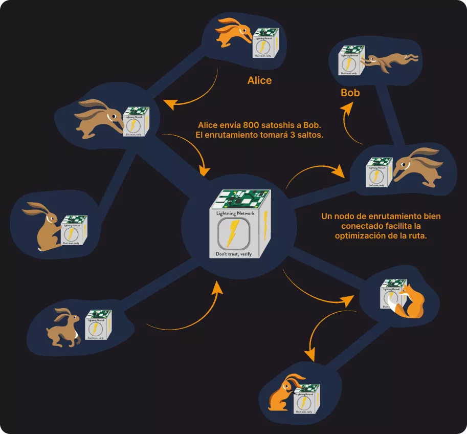

Los servicios de transferencia de dinero tradicionales, como Western Union, los bancos centrales, Visa y Mastercard, podrían desaparecer si no adoptan la tecnología de la Lightning Network. La Lightning Network es más eficiente y económica que los sistemas de pago actuales. De hecho, la Lightning Network permite realizar un número casi ilimitado de transacciones entre dos pares que comparten un canal, sin incurrir en gastos energéticos en la blockchain base más allá de la transacción para anunciar la creación del canal.

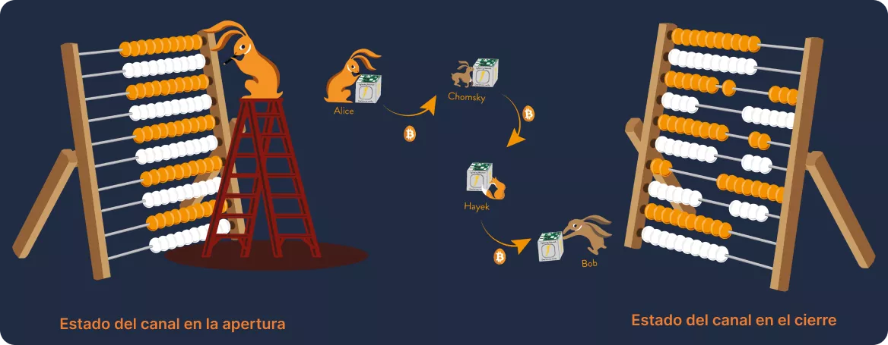

Las transacciones están aseguradas mediante criptografía e indirectamente por la energía consumida por los mineros en Bitcoin. Las transacciones se pueden realizar instantáneamente, sin límites geográficos, y las tarifas son extremadamente bajas, a menudo inferiores al 0.5%.

En resumen, la Lightning Network es un intento prometedor de implementar un sistema de pago eficiente para transacciones en Bitcoin. Ya existen numerosas billeteras Lightning que puedes descubrir en nuestra sección de tutoriales o a través de nuestros cursos sobre la Lightning Network.

### ¡Un pequeño resumen en un póster!

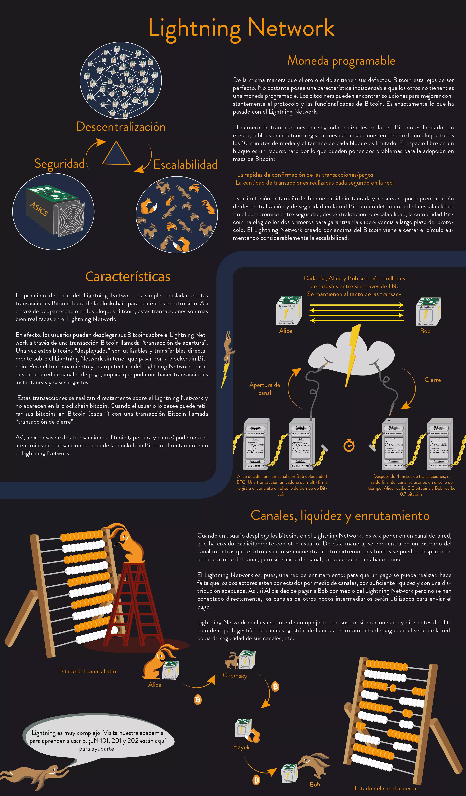

## Casos de uso de la Lightning Network
<chapterId>684e31f9-ebd1-51b6-91c0-1e6a315f1141</chapterId>

Como acabamos de ver, el protocolo Bitcoin, aunque revolucionario, enfrenta importantes desafíos en términos de escalabilidad para poder realizar todas nuestras transacciones diarias. Para resolver estos problemas, se propuso una solución de segunda capa conocida como Lightning Network en 2016, la cual hoy en día tiene varias implementaciones diferentes pero todas interoperables:

- Core-lightning por Blockstream
- Eclair por Acinq
- LND por Lightning Labs

Esta red peer-to-peer tiene como objetivo facilitar especialmente las microtransacciones, es decir, transacciones de muy bajo valor que de otra manera serían impracticables debido a las altas tarifas y los largos tiempos de confirmación en la cadena de bloques de Bitcoin.

### ¿Cuáles son los casos de uso de la red?

Esta tecnología abre la puerta a una amplia gama de posibles aplicaciones para Bitcoin, que antes eran inalcanzables debido a las restricciones necesarias para garantizar la seguridad y descentralización de Bitcoin. Entre estas aplicaciones en la vida cotidiana, podemos mencionar la facturación instantánea en el comercio (físico y virtual), el streaming de dinero para pagos en tiempo real y las microdonaciones para contenido. La implementación de una red de transacciones casi instantáneas, segura y de bajo costo (con un promedio inferior al 0.5%), permite establecer numerosos modelos comerciales antes inimaginables. Esto es posible porque Lightning Network utiliza los sats (la fracción decimal de bitcoin) para funcionar.


La industria de los videojuegos ofrece un ejemplo particularmente interesante de cómo se puede utilizar Lightning Network para transformar los modelos comerciales existentes. El concepto de "skin in the game" es una idea que ha ganado popularidad recientemente en este contexto. Básicamente, implica tener una participación financiera en el resultado de un juego.
Lightning Network permite a los jugadores apostar pequeñas cantidades de dinero cuando juegan, como unos pocos satoshis (aproximadamente una fracción de céntimo de euro). Esto permite establecer una apuesta que estimula la competencia, al tiempo que aumenta considerablemente el costo de implementar bots.


En resumen, el futuro de las microtransacciones con Bitcoin parece prometedor gracias a innovaciones como Lightning Network. A medida que estas tecnologías continúan desarrollándose y madurando, podemos esperar ver nuevas y emocionantes aplicaciones surgir en un futuro cercano. Tomemos, por ejemplo, el concepto de "streaming de dinero", donde Lightning Network nos permite realizar microtransacciones cada minuto (y potencialmente sin intermediarios de confianza), lo que abre la puerta a la experimentación de modelos económicos donde los consumidores pagan por el contenido que consumen.


En un sistema como este, el dinero se divide automáticamente, según un porcentaje predefinido, entre los diferentes contribuyentes a un servicio o producto. Esto podría revolucionar la forma en que concebimos los modelos de pago. Por ejemplo, en lugar de pagar una suscripción mensual a un servicio, los usuarios podrían ser cobrados por minuto, o incluso por segundo, por el tiempo que pasan utilizando el servicio. Un modelo económico como este podría tener implicaciones profundas para los creadores de contenido, quienes estarían incentivados a producir contenido de calidad para retener la atención de los usuarios. A su vez, los usuarios solo pagarían por el contenido que consumen, eliminando así los cargos de suscripciones anticipadas. Incluso es posible utilizar este sistema para el alquiler de bienes.


En conclusión, la Lightning Network abre una multitud de casos de uso emocionantes para los usuarios de Bitcoin. Los modelos económicos y las oportunidades comerciales que surgen de esto son numerosos y variados. Te animamos a probar por ti mismo la aplicación de podcast [Fountain](https://www.fountain.fm/), que te permite ser recompensado con algunos sats por escuchar tus podcasts favoritos.

### ¡Un pequeño resumen en un póster!


## ¿Píldora azul o píldora roja?
<chapterId>c81cdb45-6aa9-5462-9835-c4852084b2cc</chapterId>

Como dijo Morfeo a Neo: "Si tomas la píldora azul, la historia termina, despiertas en tu cama y crees lo que quieras creer. Si tomas la píldora roja, te quedas en el País de las Maravillas y te muestro hasta dónde llega la madriguera". ¿Estás listo para explorar la madriguera de Bitcoin? ¡Ten cuidado, podrías encontrar tu libertad financiera!


### El futuro tecnológico y sus implicaciones

La tecnología está evolucionando de manera exponencial y nadie puede predecir con exactitud sus desarrollos. La conectividad del mundo y la inteligencia artificial continúan creciendo. El conocimiento que una persona puede adquirir a través de Internet es cada vez más innumerable.

Tomemos como ejemplo la IA, estas tecnologías ya han superado o están alcanzando el nivel humano en una creciente cantidad de áreas, como los videojuegos, la producción de imágenes y textos, y el análisis de datos. Una de las posibles implicaciones es que más del 80% de los empleos desaparecerán debido a la IA y la automatización. Tenemos varias opciones disponibles, como frenar el avance tecnológico o aprovechar el aumento de capital gracias a la productividad generada por la IA.

Las preguntas indispensables que debemos hacer son:

- ¿Cómo gestionar una sociedad en la que el 80% de los empleos desaparecerán?
- ¿Cómo revitalizar a una población?
- ¿Es necesario tener tantos profesores?
- Las consecuencias geopolíticas, políticas y humanas de la automatización no se discuten lo suficiente.
  La informática, Internet, el streaming, la realidad virtual definitivamente cambiarán la educación. Podríamos tener un curso universal para todos los estudiantes franceses gestionado por el gobierno y profesores que ya no dan clases, sino que acompañan directamente a los alumnos. Los niños podrían ir a un mundo virtual y ser acompañados para aprender historia.

- ¿Dónde está el límite entre un profesor y una IA?
- ¿Cómo garantizar una sociedad próspera?

Estas preguntas fundamentales para nuestro futuro deben ser debatidas y decididas colectivamente. Pero, ¿cuál es la relación con Bitcoin? Al igual que Internet para los modos de comunicación, Bitcoin es una revolución tecnológica para nuevos modos de organización a gran escala, brindándonos la posibilidad de intercambiar valor sin necesidad de un intermediario de confianza. ¿Deseamos frenar la evolución tecnológica del sistema monetario o aprovechar el aumento de capital gracias a la productividad multiplicada por el uso de los protocolos Bitcoin y Lightning Network?

### ¿Qué futuro tiene la finanza?

Estas reflexiones también plantean preguntas sobre quién debe poseer, autorizar y rastrear el dinero que utilizamos. El objetivo es decidir entre un sistema cerrado con líderes no electos o un sistema abierto sin intermediarios de confianza, donde prevalezca la neutralidad.

- ¿Es la moneda un título de propiedad privada?
- ¿Pueden bloquearse las cuentas de los manifestantes sin una orden de la Corte Suprema?
- ¿Quién garantiza el sistema financiero?
- ¿Cómo puede un individuo ser soberano de su dinero y depender de un tercero de confianza?
- ¿Se puede enviar dinero al otro lado del mundo sin comisiones ni intermediarios?

Aceptar estas nuevas tecnologías podría generar ahorros a gran escala en todo el planeta. ¿Deberíamos permitir la libre circulación de flujos de capital? Los bloqueos internacionales tienen consecuencias económicas y políticas. ¿Es ético utilizar intermediarios financieros como Western Union que a veces cobran hasta un 25% de comisión por envíos? Creemos que en un mundo cada vez más digital, el dinero debería ser democratizado y considerado como un bien común perteneciente al pueblo en lugar del Estado o instituciones financieras opacas.

La cuestión de quién debe controlar el sistema bancario es crucial, ya que las reglas del juego bancario no son transparentes y comprensibles para todos, lo que permite que una casta de políticos y reguladores mantenga su dominio sobre el sistema. Es importante preguntarse si el mercado libre o un grupo de intelectuales debería controlar el sistema bancario.

### Nuestras libertades están en juego

La censura también debe ser cuestionada, ¿quién tiene el conocimiento para decidir qué debe ser censurado y qué no? Los medios de comunicación han cambiado su posición sobre cierta información y las personas que antes fueron censuradas ya no lo son hoy en día.

- ¿Quién decide qué es censura o propaganda?
- ¿Quién tiene el control divino sobre nuestro sistema?

Tolerar la censura puede destruir la libertad de expresión y el derecho de reunión. La implementación de la censura es técnicamente difícil sin crear una distopía completa. ¿Qué entidad debería tener el poder de censurar? La cuestión de la censura es complicada y es difícil saber quién debería ser censurado o no. La censura puede tener un impacto negativo en la innovación y la libertad empresarial.

Hay 2.4 mil millones de personas en el mundo sin una cuenta bancaria, lo que crea inevitablemente desigualdades geográficas. Bitcoin permite la igualdad en las transacciones, sin importar su estatus social o posición política. El protocolo de Bitcoin es apolítico y no otorga privilegios específicos al presidente u otros actores. Los líderes deberían tener los mismos privilegios que las personas comunes para impulsar el desarrollo hacia arriba en lugar de dejar a algunos en la cima y a otros abajo. ¿Debería todo el mundo tener la misma moneda, sin importar su estatus social? Es importante pensar en el mundo que queremos dejar a nuestros hijos. Nos deseamos dejar un mundo abierto donde sean libres de hacer lo que quieran con su dinero.

Bitcoin es importante y no debe considerarse simplemente un juego de azar. Es crucial seguir estudiando y haciéndose preguntas sobre Bitcoin.

### Bitcoin: un protocolo revolucionario

Como vimos en el capítulo anterior, el protocolo de Bitcoin es neutral ante todos sus usuarios. Gracias a las reglas del consenso y la criptografía, podemos registrar transacciones de manera inmutable en un registro público global, garantizando transferencias de valor monetario sin necesidad de un tercero de confianza. Las capas de infraestructura de nivel 2 (y pronto nivel 3, con RGB) permiten escalar la red y desarrollar nuevas funcionalidades, especialmente para resolver problemas de escalabilidad.
Bitcoin tiene todas las características necesarias para ser una moneda eficiente y saludable: divisible, transportable instantáneamente, no censurable, con un costo insignificante para la verificación, y con una política monetaria ya establecida para los siglos venideros con estas 21 millones de unidades. Bitcoin es seudónimo y puede ser intercambiado en todo el mundo sin ninguna autorización de ninguna entidad, solo necesitas tener tus propias claves privadas, como dice el dicho "Not your keys, not your bitcoins" ("no tienes tus claves, no son tus bitcoins").
Bitcoin es adoptado por diversos grupos de personas, desde criptógrafos hasta libertarios, pasando por empresas tradicionales e incluso un país. Sin embargo, Bitcoin es para todos y su número de usuarios está creciendo, al igual que el número de nodos Bitcoin que actúan como guardianes del historial de transacciones, asegurando así su descentralización.

Bitcoin no puede ser detenido ni censurado. Es una revolución pacífica para cambiar el sistema monetario y permitir la inclusión financiera. Los usuarios pueden obtener bitcoins aceptándolos como forma de pago en sus negocios o comprándolos a través de plataformas reguladas o no reguladas. Los bitcoins se pueden almacenar en billeteras, aplicaciones móviles o dispositivos físicos. No hay intermediarios de confianza en Bitcoin, Bitcoin promueve la transparencia, la libertad y la responsabilidad individual, como dice el dicho "Don't Trust, Verify" ("No confíes, verifica por ti mismo").

Cambiar el sistema financiero requiere cambiar la moneda. Satoshi Nakamoto creó Bitcoin en 2008 como un intento de abordar esto. Tener acceso a dinero fácil y "mágico" corrompe. Por lo tanto, Bitcoin es una alternativa para construir un nuevo sistema monetario neutral. Bitcoin permite la emancipación del sistema bancario. Es un fenómeno social que nos lleva a participar en una revolución pacífica. ¿Estás listo para unirte?

## Agradecimientos y sigue profundizando en la madriguera del conejo
<chapterId>c153facd-fe77-5954-b18b-d0e2243e787a</chapterId>

### Ve más allá

¡Felicitaciones por completar este curso BTC 101! Esperamos de todo corazón que te haya gustado y  te haya abierto puertas. Tu descubrimiento de Bitcoin apenas está comenzando y te invitamos a explorar todos los demás cursos disponibles en la universidad.

- [BTC 102](https://planb.network/courses/btc102) te ayudará a establecer tu plan de Bitcoin
- [LNP 201](https://planb.network/courses/lnp201) te permitirá descubrir la Lightning Network, una red de pagos de segunda capa.
- [ECO 201](https://planb.network/courses/eco201) abordará la economía austriaca
- [SCU 101 ](https://planb.network/courses/scu101) te permitirá actualizar tu seguridad digital
- [MIN 201](https://planb.network/courses/min201) para aprender más sobre la minería
- y muchos más...

## Apóyanos
<chapterId>3e6e756b-b6c4-5d41-bece-767922348067</chapterId>

Este curso, junto con todo el contenido presente en esta plataforma, ha sido ofrecido de forma gratuita por nuestra comunidad. Para apoyarnos, puedes compartirlo con tus amigos, convertirte en miembro de la plataforma o incluso contribuir a su desarrollo a través de [nuestro GitHub](https://github.com/PlanB-Network/bitcoin-educational-content). ¡En nombre de todo el equipo, gracias!


## Danos tu opinión sobre este curso
<chapterId>585729e2-b0ab-51b5-89ec-593e3ea22c57</chapterId>
<isCourseReview>true</isCourseReview>

## Califica el curso
<chapterId>44d01865-5c89-55a5-a397-a014960eec0f</chapterId>

¡Pronto se integrará un sistema de calificación para el curso en esta nueva plataforma de E-learning! Mientras tanto, muchas gracias por haber tomado el curso y si te gustó, considera compartirlo con tus amigos.

Un enorme agradecimiento a nuestros patrocinadores, miembros y donantes por su apoyo financiero, gracias a las personas que comparten y gracias a aquellos que hicieron posible este curso: Rachel, Muriel, el equipo de StackinSat, JohnOnChain, Fanis, Guillaume, Lounes, los correctores y los revisores.

¡Hasta pronto!
