 ---
name: Bitcoinin Matka
goal: Tutustu Bitcoiniin ja sen perusteisiin, mukaan lukien sen rahallinen arvon kehitys, louhijat, transaktiot ja lompakot.
objectives:
  - Saavuta yleinen ymmärrys Bitcoin-teknologiasta
  - Ymmärrä, miten ostaa ja turvata bitcoineja
  - Hanki yleinen käsitys lohkoketjuteknologiasta
  - Tutustu Lightning Network -konseptiin
  - Ymmärrä Bitcoinin geopoliittinen ja sosiaalinen vaikutus
---

# Ensimmäinen Bitcoin-seikkailusi

Tässä kurssissa selitän Bitcoinin 21 luvussa, jotta voit ymmärtää tämän teknologian yksinkertaisella ja tehokkaalla tavalla. Kurssi on kaikkien saavutettavissa ja tutkii koko alaa: louhijat, lompakot, osto-/myyntialustat jne...

Kurssin suorittaminen kestää noin 15 tuntia. Matkan varrella on saatavilla selittäviä kuvia, presentaatioita ja lisäresursseja.

Et tarvitse mitään erityistä tietämystä aloittaaksesi, kurssi on kaikkien saavutettavissa!

+++

# Johdanto

## Hyppy tuntemattomaan


### Tervetuloa uuteen rahalliseen ja teknologiseen paradigmaan.

Bitcoin on merkittävä innovaatio, joka ylittää pelkän "internet-valuutan". Se on vallankumous sekä teknologiassa että rahassa, kyeten kyseenalaistamaan suhteemme valuuttaan ja yhteiskuntaan. Bitcoin on niin sanottu **neutraali** ja **hajautettu** valuutta, mikä tarkoittaa, että sitä ei kontrolloi mikään taho tai instituutio. Se on merkittävä innovaatio, joka menee pelkän valuutan yli. Jotta ymmärtäisimme tämän kuuluisan bitcoinin, on tärkeää ymmärtää, että bitcoin (viitataan BTC:henä) on sekä tietokoneprotokolla (Bitcoin) että rahayksikkö (bitcoin).

Protokolla käyttää perustanaan teknologioita kuten kryptografiaa, verkkoviestintää ja kuuluisaa "lohkoketjua", kun taas bitcoin-yksikkö on valuutta, joka on tarpeen tämän saman protokollan asianmukaiseen toimintaan. Arkielämässä salvadorilaiset tai bitcoinerit ympäri maailmaa käyttävät bitcoin-valuuttaa tavaroiden ja palveluiden ostamiseen ja myymiseen, valuutan toimiessa Bitcoin-protokollan varassa.

### Kattava mutta saavutettavissa oleva opetussuunnitelma

Tällä kurssilla keskustelemme Bitcoinin rahallisista näkökohdista, mukaan lukien miten ostaa ja myydä bitcoineja, turvallisesti säilyttää niitä digitaalisissa lompakoissa ja käyttää niitä transaktioihin. Tarkastelemme myös louhijoiden roolia, jotka ovat olennaisia uusien bitcoinien luomisessa ja Bitcoin-verkon turvaamisessa. Lisäksi tutkimme Bitcoinin tulevaisuutta ja sitä, miten Lightning Network -teknologia voi parantaa Bitcoin-transaktioita.

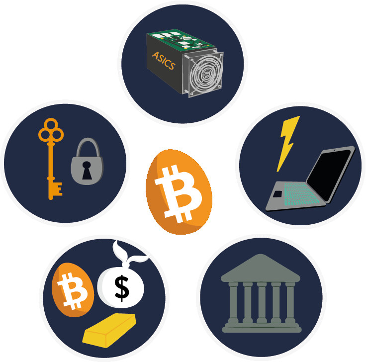

On olennaista ymmärtää, että Bitcoin on uusi rahajärjestelmä, joka mullistaa suhteemme rahaan. Bitcoinin käytön oppiminen on olennainen taito kenelle tahansa, joka haluaa olla oman rahansa herra.

**Osa 1 - Rahat**

- Luku 1 - Mitä on raha?
- Luku 2 - Fiat-raha
- Luku 3 - Hyperinflaatio
- Luku 4 - Bitcoinin rahapolitiikka

**Osa 2 - Bitcoin-lompakot**

- Luku 5 - Miten Bitcoin-lompakot toimivat?
- Luku 6 - Turvallinen valinta
- Luku 7 - Lompakon perustaminen
- Luku 8 - Suojautuminen ajan myötä

**Osa 3 - Bitcoinin tekniset näkökohdat**

- Luku 9 - Transaktion selitys
- Luku 10 - Bitcoin-nodet
- Luku 11 - Louhijat
- Luku 12 - Louhijat ja ekologisuus

**Osa 4 - Säästäminen Bitcoinissa**

- Luku 13 - Bitcoinin hinta
- Luku 14 - Miten ostaa Bitcoinia
- Luku 15 - Työskentely Bitcoineilla
- Luku 16 - Hyper-bitcoinisaatio

**Osa 5 - Lightning Network**

- Luku 17 - Johdatus Lightning Networkiin
- Luku 18 - Käyttötapauksia Lightning Networkille
Ennen kuin keskustelemme rahan määritelmästä ja toiminnasta yhteiskunnassa (Luku 1), aloitamme Bitcoinin synnystä. Bitcoin on suhteellisen uusi teknologia, joka lanseerattiin vuonna 2009, ja se eroaa kaikesta muusta. On siis normaalia, ettei kaikkea ymmärretä heti. Itse asiassa, aivan kuten Internetin tai auton käytön oppimisessa, ei tarvitse tietää kaikkia teknisiä yksityiskohtia käyttääkseen Bitcoinia (tärkeintä on kuinka vastaanottaa, tehdä maksuja ja kuinka turvata varansa).


Tässä on pääasiassa tärkeää ymmärtää tämä uusi teknologia yleisellä tasolla. Toivomme, että tämä koulutus miellyttää sinua ja tarjoaa sinulle tarvittavan perustan ymmärtää ja ehkä jatkaa edistymistä tässä uudessa globaalissa rahaparadigmassa.

## Bitcoinin esihistoria


Ennen kuin termi "Bitcoin" tuli synonyymiksi digitaaliselle valuutalle ja taloudelliselle muutokselle, joukko ideoita, innovaatioita ja sosiaalisia liikkeitä laski perustan sen luomiselle. Yksi Bitcoinin esihistorian peruselementeistä on cypherpunk-liike.

### Cyberpunkit: Digitaalisen maailman visionäärit

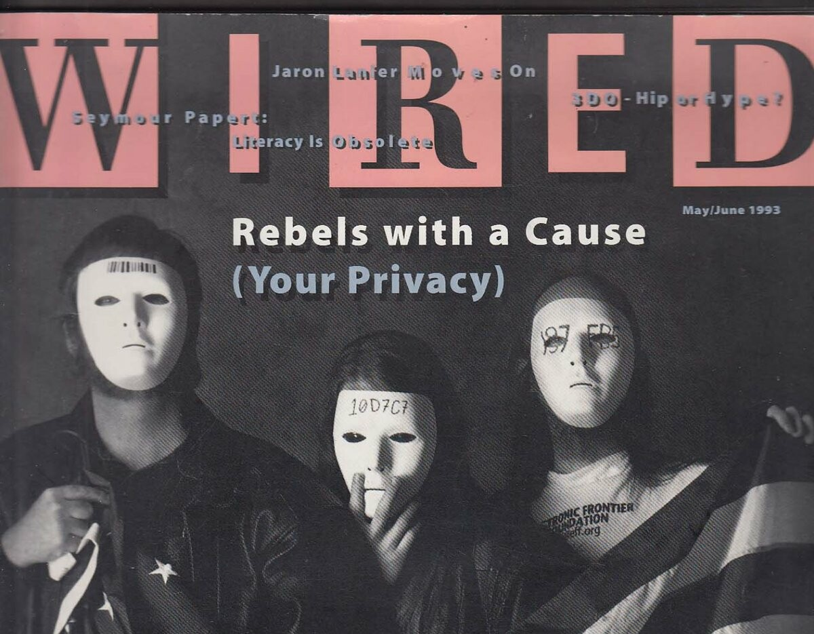
1980- ja 1990-lukujen teknologisen kehityksen ytimessä joukko ihmisiä alkoi syvästi kyseenalaistaa yksityisyyden ja vapauden roolin digitaalisella aikakaudella. Nämä henkilöt, jotka myöhemmin tunnettaisiin "cyberpunkkeina", uskoivat vakaasti, että kryptografia voisi toimia työkaluna yksilön oikeuksien suojelemiseksi hallitusten ja suuryritysten sekaantumiselta.

Ikoniset hahmot kuten Julian Assange, Wei Dai, Tim May ja David Chaum määrittelivät cyberpunkkien filosofian ja vision. Nämä ajattelijat jakoivat ideoitaan vaikutusvaltaisella postituslistalla, jossa osallistujat ympäri maailmaa keskustelivat parhaasta tavasta käyttää teknologiaa suuremman yksilön vapauden takaamiseksi.

### Cyperpunkkien kolme perustekstiä

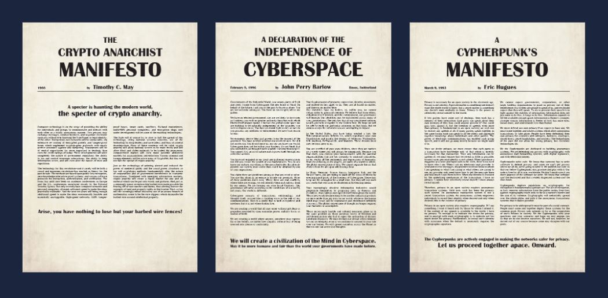

Cyperpunk-liike, jolla on syvät juuret digitaalisessa aktivismissa ja kryptografiassa, nojasi useisiin perusteksteihin ilmaistakseen periaatteensa ja tulevaisuudenkuvansa. Näistä kirjoituksista kolme erottuu erityisesti:

- "Cyberpunk-manifesti":
  Eric Hughes kirjoitti vuonna 1993 "Cyberpunk-manifestin", joka väittää, että yksityisyys on kansalaisen perusoikeus. Hughes argumentoi, että vapaa ja luottamuksellinen kommunikaatio oli välttämätöntä vapaalle yhteiskunnalle. Manifesti toteaa: "Emme voi odottaa instituutioilta, yrityksiltä tai muilta persoonattomilta tahoilta, että ne antaisivat meille yksityisyyttä... Meidän täytyy puolustaa sitä itse."

- "Krypto-anarkistimanifesti":
  Timothy C. May kirjoitti vuonna 1992 tämän manifestin, joka selittää, kuinka kryptografian käyttö voisi johtaa kryptografisen anarkian aikakauteen, jolloin hallitukset olisivat voimattomia sekaantumaan kansalaisten yksityisasioihin. May visioi tulevaisuuden, jossa tietoja, rahaa ja viestejä voitaisiin vaihtaa ilman kolmannen osapuolen puuttumista ja nimettömästi.

- "Kyberavaruuden itsenäisyysjulistus":
  Tämä teksti heijastaa monien liikkeen toimijoiden tuntemuksia. John Perry Barlow kirjoitti sen vuonna 1996 vastauksena Internetin yhä lisääntyvään sääntelyyn hallitusten toimesta. Julistus väittää, että kyberavaruus on erillinen alue fyysisestä sfääristä ja sitä ei tulisi alistaa samoille laeille. Se toteaa: "Meillä ei ole valittua hallitusta, eikä meitä voida hallita."

### Bitcoinin edeltäjät
Ennen Bitcoinin esiinmarssia oli tehty useita yrityksiä luoda digitaalinen valuutta. Esimerkiksi David Chaum esitteli "anonyymin elektronisen rahan" konseptin projektillaan "DigiCash" 1980-luvulla. Valitettavasti erilaisten rajoitteiden vuoksi DigiCash ei koskaan todella ottanut tuulta alleen.
Toinen tärkeä edeltäjä on Wei Dain "b-money". Vaikka sitä ei koskaan toteutettu, se esitteli ajatuksen anonyymistä digitaalisesta valuutasta, jossa petosten havaitseminen suoritettiin yhteisön arvioijien toimesta eikä keskitetyn viranomaisen.

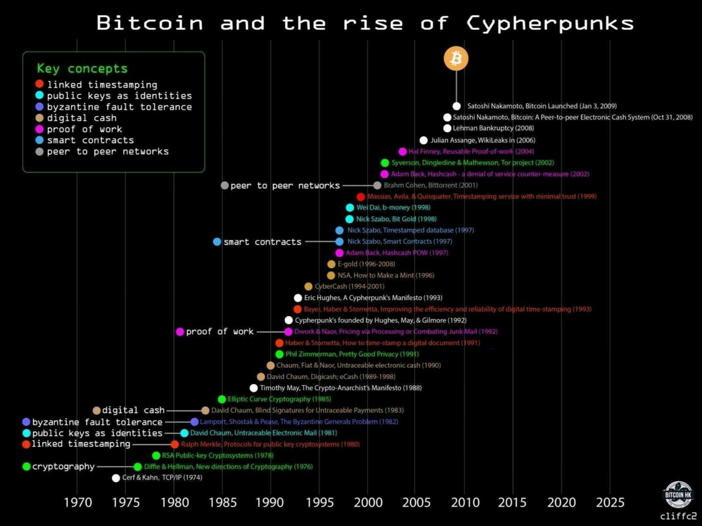

Juuri tässä hedelmällisessä ympäristössä mysteerinen ”Satoshi Nakamoto”-nimimerkki julkaisi Bitcoinin whitepaperin vuonna 2008. Hän yhdisti useita ideoita cyberpunk-liikkeestä, kuten Proof Of Work ja kryptografiset aikaleimat, luodakseen hajautetun ja sensuroimattoman digitaalisen valuutan.

Bitcoin oli enemmän kuin vain digitaalinen valuutta; se edusti cyberpunk-ihanteiden saavutusta. Sen teknologian lisäksi se symboloi vallankumousta perinteisiä rahoitusjärjestelmiä vastaan ja tarjosi vaihtoehdon, joka perustui läpinäkyvyyteen, hajautukseen ja yksilön suvereniteettiin.

### Johtopäätös

Bitcoinin esihistoria on syvällä cyberpunk-liikkeessä ja kollektiivisessa pyrkimyksessä suurempaan vapauteen digitaalisella aikakaudella. Yhdistämällä kryptografian, hajautuksen ja eheyden periaatteet, Bitcoin on tullut paljon enemmän kuin valuutaksi; se on filosofisen ja teknologisen vallankumouksen tuote, joka jatkaa maailmamme muovaamista.

Siksi Bitcoin on protokolla, joka ulottuu pitkien aikakausien yli ja kannustaa meitä kyseenalaistamaan suhteemme energiaan, aikaan ja rahaan. Mutta onko Bitcoin "oikea" valuutta? Mikä on raha? Onko se olemassa monessa muodossa? Tutkimme näitä kysymyksiä seuraavassa luvussa.


# Raha

## Raha läpi historian


Rahan evoluutio on kiehtova osa ihmiskunnan historiaa, joka heijastaa sivilisaatioiden kekseliäisyyttä läpi aikojen vastaamaan jatkuvasti kehittyviin taloudellisiin tarpeisiin.


### Kuoressa pankkitileihin

Alun perin valuutta oli konkreettista, usein yhdistetty olennaisiin hyödykkeisiin, kuten viljaan, karjaan ja muihin kauppatavaroihin. Kuitenkin näillä hyödykkeillä oli suuria haittoja, kuten pilaantuvuus, mikä teki niiden käytöstä pitkäaikaisena säästövälineenä vaikeaa. Esimerkiksi epäonnistunut sato tai sairaus saattoi pyyhkäistä yksilön varallisuuden yhdessä yössä.
Kun sivilisaatiot kehittyivät ja kauppa laajeni uusille alueille, tarvittiin universaalia vaihdon välinettä. Kohteita, kuten simpukankuoria ja jalokiviä, kokeiltiin, mutta ne eivät olleet täydellisiä. Kulta lopulta tuli standardiksi sen harvinaisuuden, kestävyyden ja jaettavuuden vuoksi. Se oli, ja on edelleen tänä päivänä, vaurauden ja vallan symboli.

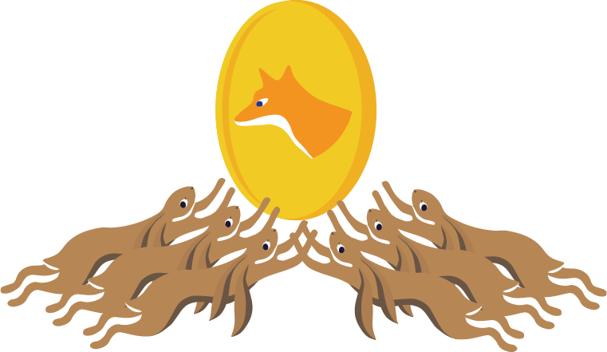

### Mikä on rahan rooli?

Raha on erittäin kehittynyt viestintäväline:

- Se mahdollistaa viestinnän nykyhetken ja tulevaisuuden välillä. Muutamme aikamme ja energiamme omaisuudeksi, jota voidaan käyttää uudelleen tulevaisuudessa ilman arvon alenemisen riskiä.

- Se mahdollistaa viestinnän yleismaailmallisella yhteisellä kielellä. Tuntematta toisiaan, puhumatta samaa kieltä, kaksi vierasta voi vaihtaa, käydä kauppaa ja sopia asioiden arvosta.

Sen toimintaa maailmassamme on vaikea keinotekoisesti jäljitellä. Yksikään ihminen tai ihmisryhmä ei voi luoda rahaa; se on luonnollinen sosiaalinen ilmiö, jonka on noustava esiin markkinoilta ja vapaaehtoisesta konsensuksesta. Hinnat ovat signaaleja, tietoa, joka auttaa yhteiskuntaa päättämään, miten resursseja jaetaan. 
Kulta rahana on 4 000 vuoden rahallisen Darwinismin valinta, joka perustuu kolmeen toimintoon:
- Arvon säilyttäjä
- Vaihdon väline
- Tilin yksikkö

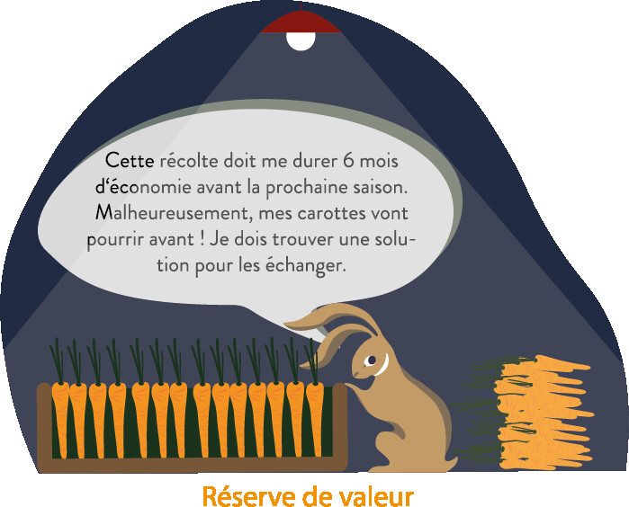
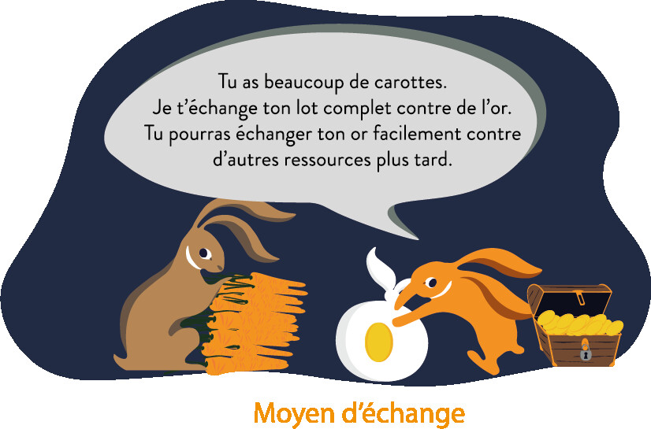
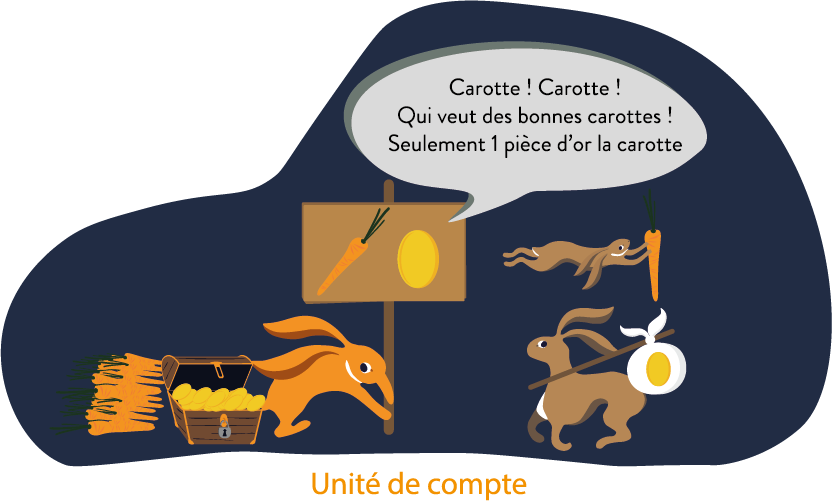

### Rahojen ominaisuudet

Kulta täyttää ihanteellisesti tehokkaan valuutan kriteerit: sen luonnollinen harvinaisuus tekee siitä arvokkaan, kun taas sen kemialliset ominaisuudet mahdollistavat sen, ettei se eroosioi ajan myötä. Tämä rahan muoto ei kuitenkaan ole helposti jaettavissa tai kuljetettavissa pitkiä matkoja. Globalisoituneessa ja digitaalisessa maailmassa kulta ei pysy mukana ja tarvitsee keskitetyn tahon tehdäkseen siitä jaettavan ja helposti vaihdettavan (lyöty kolikko).

Nämä puutteet ovat tehneet kullasta arvon säilyttäjän, mutta eivät yleistä valuuttaa, valtion luottamusvaluuttojen (fiat) kustannuksella, jotka ovat helposti käytettävissä, mutta joiden arvoa jatkuvasti alentavat niitä hallitsevat tahot (kuningas, keskuspankki, keisari, diktaattori).

Tehokkaan valuutan kriteerit ovat moninaiset. Hyvän valuutan tulee olla:

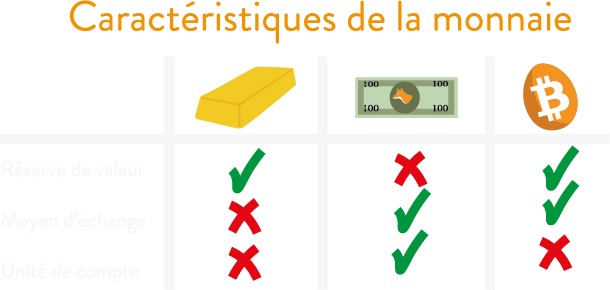

- **Vaihdettavissa**, tarkoittaen vaihdettavissa ilman arvon menetystä
- **Jaettavissa**, suuruisten maksujen toteuttaminen olisi helppoa
- **Likvidi**, tarkoittaen että kulta on helposti muunnettavissa tavaroiksi tai palveluiksi.

Näiden kriteerien täyttämiseksi valuutta kehittyy askel askeleelta:

- Raakakivi -> Kolikko
- Seteli -> Pankkikortti
- Lohkoketju -> Lightning Network

Nykyään valuutat kehittyvät edelleen, mukauttaen muotojaan eri käyttötarkoituksiin. Esimerkiksi vaikka kulta on erinomainen arvon säilyttäjä, se ei sovellu nykyiseen globalisoituneeseen talouteen. Samoin luottamusvaluutat, kuten dollari ja euro, ovat erittäin likvidejä ja helposti kuljetettavissa, koska ne ovat nykyään pääasiassa digitaalisia, mutta niiden arvoa jatkuvasti syö rahapoliittinen inflaatio.

Toisaalta Bitcoin tarjoaa uusia mahdollisuuksia. Sen ominaisuuksien, kuten tiukasti rajatun tarjonnan ansiosta, se tarjoaa erinomaisen arvon säilyttäjänä. Lisäksi neutraalina internet-valuuttana se edustaa hyvää vaihdon välinettä, jolla ei ole rajoja. Siitä huolimatta sitä ei vielä tänä päivänä laajasti hyväksytä kaupankäynnissä, huolimatta [jatkuvasta, lisääntyvästä käyttöönotosta](https://btcmap.org/map).

## Luottamusvaluutat


"Ne, jotka eivät opi historiasta, ovat tuomittuja toistamaan samat virheet," sanoi George Santayana. Totuus, joka resonoi erityisesti nykyisen rahajärjestelmän yhteydessä.

### Luottamus = luotto

Nykyään suuret valuutat, kuten euro ja dollari, katsotaan luottamusvaluutoiksi. Tämä tarkoittaa, että niillä ei ole sisäistä arvoa. Niiden arvo perustuu täysin luottamukseen ja uskoon, jonka asetamme niitä sääteleviin instituutioihin.

Luottamusvaluutta on valuutan muoto, jonka instituutio, kuten kansakunta, kuten Kiina Yuanin kanssa, tai poliittis-taloudellinen unioni, kuten Euroopan unioni Euron kanssa, julistaa valuutaksi. Luottamusvaluutan liikkeeseenlaskijana toimii keskuspankki (Esimerkiksi voidaan mainita Kiinan Kansanpankki, Yhdysvaltain Federal Reserve tai Guinean tasavallan keskuspankki). Nämä tahot ovat vastuussa rahapolitiikan päätöksistä ja siitä, kuinka paljon rahaa tulisi liikkeelle laskea tai painaa.
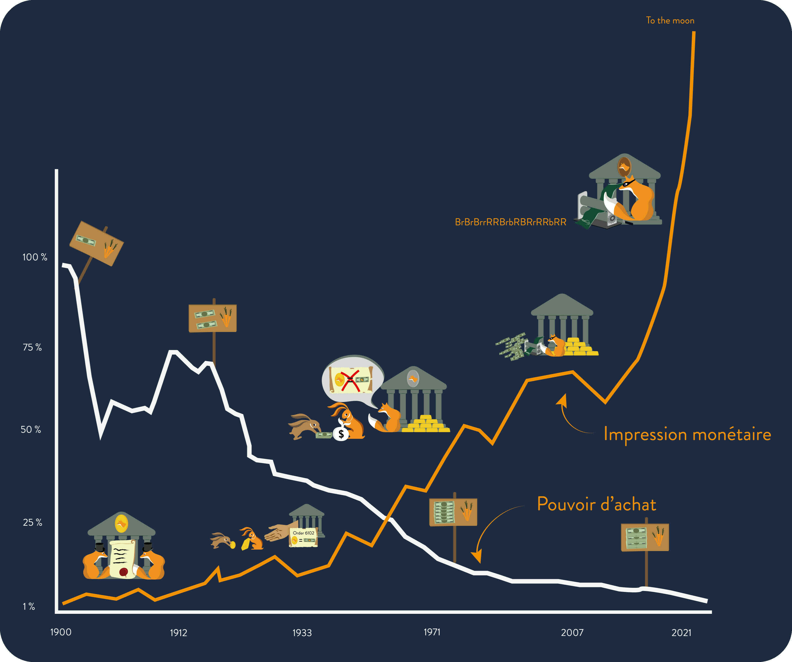

### Rahapoliittinen arvon aleneminen: Strategia, joka on yhtä vanha kuin Rooman valtakunta
Jo antiikin ajoista lähtien kulta on toiminut rahallisen viitearvon roolissa. Sen jäykkyys on kuitenkin usein johtanut johtajat - olivatpa he sitten roomalaisia keisareita tai nykyaikaisia hallituksia - ottamaan käyttöön vaihtoehtoisia valuuttoja, usein fidusiaarisia.

Mekanismi on yksinkertainen ja se on saanut inspiraationsa käytännöistä, jotka ovat olleet olemassa sivilisaation alkuaikoina. Johtajat, jotka ovat innokkaita hallitsemaan varallisuutta, aloittavat keräämällä kultaa, usein hyödyntämällä valtaansa ja luvaten suojelua ja turvallisuutta. Tämä arvokas varanto käsissään he esittelevät uuden valuutan, joka on arvoltaan vastaava kullan kanssa, mutta lyöty heidän kuvallaan. Tämä valuutta alkaa sitten kiertää, ja ihmiset tottuvat nopeasti sen mukavuuteen.

Vähitellen nämä johtajat devalvoivat uutta valuuttaa huomaamattomasti, alentaen sen arvoa verrattuna alkuperäiseen kultaan muutamalla prosentilla joka vuosi. Tämä hiljainen devalvaatio perustellaan usein olevan kansan edun mukaista. Näin ollen ne, jotka säästävät tässä fidusiaarisessa valuutassa, näkevät säästöjensä arvon rapistuvan, kun taas valtio rahoittaa hankkeitaan inflaation kautta. Lisäksi tämä devalvaatio helpottaa velan maksamista.

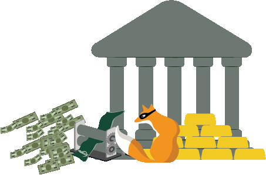

Kriittisellä hetkellä ilmoitus tehdään: valuutta ei ole enää tuettu kullalla. Yleisö, joka on nyt tottunut fidusiaariseen valuuttaan ja on usein väärin informoitu rahoitusasioista, hyväksyy tämän todellisuuden. Valtiolla on nyt vapaat kädet manipuloida rahamäärää, painamalla valtavia summia rahaa lähes ilman kustannuksia.

Tämä strategia, kun se toteutetaan hyvin, voi kestää vuosikymmeniä. Kuitenkin liian nopea devalvaatio tai luottamuksen menetys voi johtaa hyperinflaatioon (ks. seuraava luku). Historia osoittaa, että dollari on menettänyt 98% arvostaan 100 vuodessa, euro 30% 20 vuodessa ja punta sterling 99% sen luomisesta.

Lopulta valuutta ei ehkä enää ole millään tavalla yhteydessä kultaan, muistuttaen Rooman kolikoita imperiumin lopussa, tai jopa pelkistetty yksinkertaiseksi numeeriseksi arvoksi, irtautuneena konkreettisesta todellisuudesta.

Tänään olemme historiallisen käännekohdan äärellä. Dollari, joka on pitkään hallinnut, vaikuttaa olevan laskussa, ja kulta on menettänyt keskeisen paikkansa. Olemme uuden rahallisen syklin kynnyksellä, muistuttaen meitä siitä, että historian opetukset usein unohdetaan.

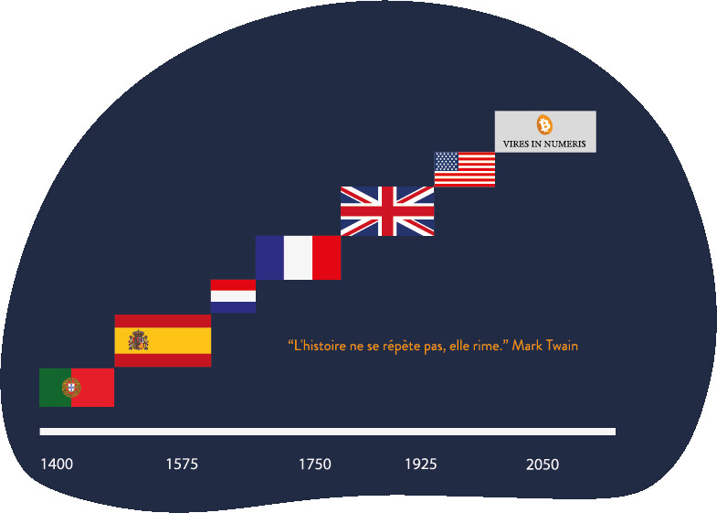

### Onko Bitcoin ratkaisu?

Juuri tässä kontekstissa Bitcoin-vallankumous on saamassa vauhtia. Tämä valuutta, joka **ei vaadi luotettua kolmatta osapuolta**, pyrkii erottamaan valtion rahasta.

Rahan painaminen johtaa inflaatioon, vähitellen köyhdyttäen väestöä. Toisaalta, rahoituslaitokset ja varakkaat yksilöt ovat hyötyneet tästä käytännöstä, luoden epätasa-arvon kuilun ja suosien autoritarismia. Nykyinen rahoitusjärjestelmä on tarkkaan säädelty ja rajoitettu, pyrkien välttämään sen romahtamista, ja mikä tahansa häiriö voisi aiheuttaa suuren talouskriisin. Koska poliittiset toimijat hyötyvät tästä järjestelmästä, heillä ei ole kannustinta tehdä radikaaleja muutoksia, sallien järjestelmän jatkavan kulkuaan mahdolliseen romahdukseen saakka.

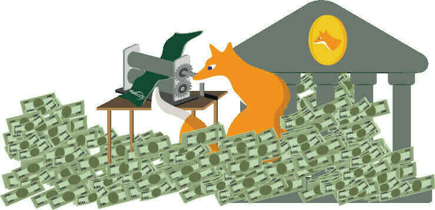

Vastauksena näihin systemaattisiin haasteisiin, Bitcoin esittäytyy hajautettuna ratkaisuna: uutena rinnakkaisena rahajärjestelmänä. Historiallisesti kulta on ollut suosittu valuuttana sen väärentämisen vastustuskyvyn vuoksi. Samoin Bitcoin, sen hajautetun ja kryptografisen luonteen ansiosta, sitä ei voida väärentää ja se on rajoitettu 21 miljoonaan bitcoin-yksikköön. Bitcoin on valuutta, joka perustuu läpinäkyvyyteen ja neutraaliuteen, tarjoten houkuttelevan vaihtoehdon nykyiselle keskitetylle rahajärjestelmälle. Samanaikaisesti keskuspankkien digitaalisten valuuttojen, eli CBDC:iden, esiinmarssi vaikuttaa väistämättömältä. Tämä uudenlainen valuutta tarjoaisi keskitetymmän suunnitelun ja talouden, mikä voisi rajoittaa yksilöiden taloudellista vapautta ja helpottaa autoritaaristen väärinkäytösten toteutumista. 

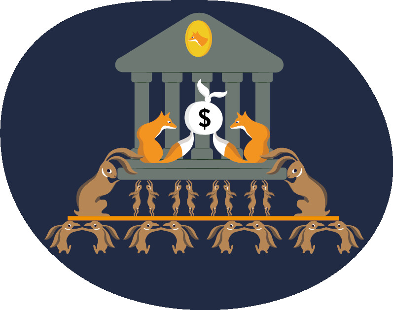

## Hyperinflaatio


Hyperinflaatio on fiat-valuuttoihin liittyvä rahailmiö. Sitä luonnehtii täydellinen luottamuksen menetys valuuttaan ja inflaation dramaattinen kasvu viranomaisten rahanpainannan kautta. Tämän seurauksena yksilöiden kerryttämät säästöt voivat haihtua ilmaan suhteellisen lyhyessä ajassa, työntäen maan talouden, sosiaalisen ja poliittisen romahduksen partaalle.

### Inflaatio Karkaa Käsistä!

Yritetään ymmärtää inflaation vaikutusta säästöihin tarkastelemalla erilaisia inflaatioasteita.

- 2% inflaatiolla menetät 2% ostovoimastasi vuosittain, mikä on 10% viiden vuoden aikana.
- 7%:lla menetät puolet siitä 10 vuodessa.
- 20%:lla menetät melkein puolet siitä 3 vuodessa.

Hyperinflaation aikana emme enää puhu 20%:sta vuodessa, vaan pikemminkin 20%:sta kuukaudessa tai, huipussaan, päivässä. 100% inflaatio päivässä kolmen päivän ajan on realistinen skenaario, joka on tapahtunut ja jatkuu maailmassamme.

On tärkeää ymmärtää, että hyperinflaatio ei tapahdu taikuuden, sattuman, kapitalismin tai poliittisten vastustajien kautta. Hyperinflaatio on suora seuraus keskuspankkien ja poliitikkojen virheellisistä rahapäätöksistä. Sen seuraukset vaikuttavat kaikkiin kansalaisiin ja tulevat vaikuttamaan sukupolviin. Kutsun sinut viettämään 5 minuuttia tämän taulukon tutkimiseen ymmärtääksesi täysin tämän ilmiön todellisen vaikutuksen (ECON204-kurssi käsittelee tätä aihetta yksityiskohtaisesti)."

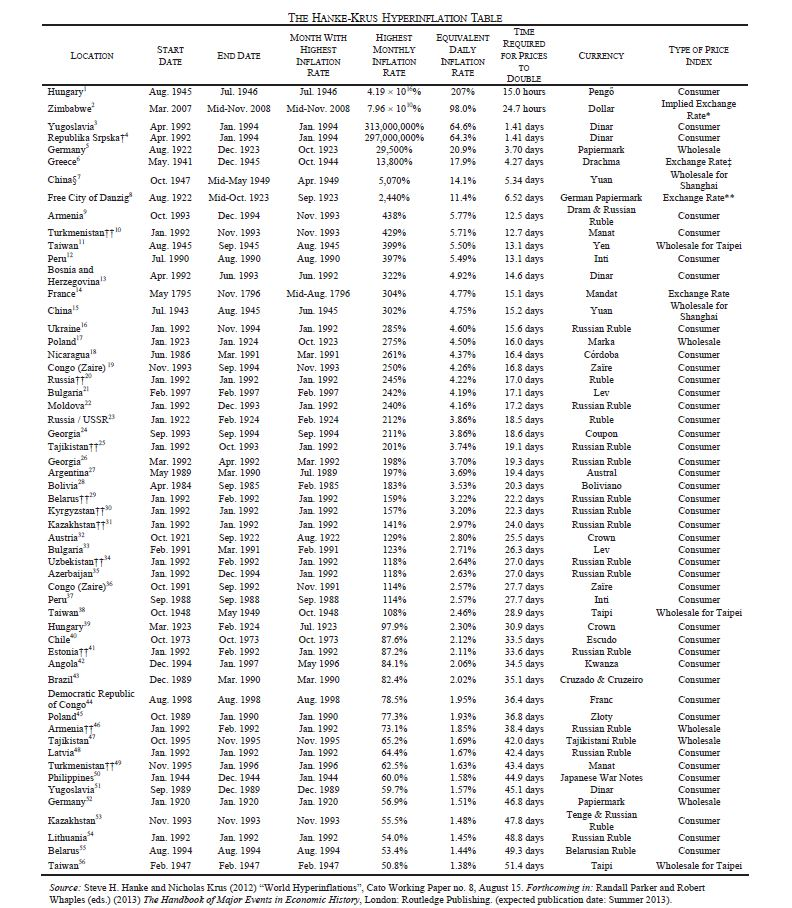

### Miten Hyperinflaatio Tapahtuu?

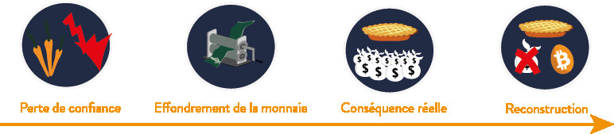

Vaihe 1 - Luottamuksen menetys

- Rahan luomisen ja sen väärinkäytösten keskittäminen helpottaa hyperinflaation laukaisemista. Yksilöt alkavat kyseenalaistaa rahan alkuperää ja määrätyn rahapolitiikan hyötyjä. Luottamuksen menetys johtuu yleensä ulkoisista tekijöistä, kuten sodista, sosiaalisista toimenpiteistä tai avainresurssin, kuten vehnän tai bensiinin, hinnannoususta.

Vaihe 2 - Valuutan romahdus & hinnannousu

- Kun hallitukset menettävät luottamuksen hallinnan, yksilöt alkavat vaihtaa valuuttansa toiseen, vakaampaan, kuten Yhdysvaltain dollariin Venezuelassa. Tämä johtaa hintojen nousuun, luoden noidankehän, jossa tavarat ja palvelut muuttuvat yhä kalliimmiksi. Täyttääkseen nämä tarpeet, valtio painaa lisää rahaa korjatakseen rahapolitiikkaa, mikä johtaa eksponentiaaliseen inflaatioon.

Vaihe 3 - Rahapainamisen noidankehä

- Yhä useampia seteleitä tarvitaan tavaroiden ostamiseen, mikä luo paperirahan niukkuutta. Tämä johtaa lisää setelien painamiseen, luoden vielä enemmän inflaatiota.


Vaihe 4 - Uuden valuutan esiinmarssi
- Uusi valuutta otetaan käyttöön korvaamaan vanha. Merkittävä esimerkki hyperinflaatiosta on Saksa vuosina 1920-1924. Talouden elvyttämiseksi luotiin uusi valuutta, joka oli tuettu Saksan, Ranskan ja Englannin velalla ja turvattu Saksan mailla.
Hyperinflaatiokriisin ratkaiseminen vaatii usein radikaaleja muutoksia, kuten muun muassa vallankumouksia, hallituksen vaihdoksia, keskuspankkien johtajien vaihtamista. Luottamuksen menetys, valuutan romahtaminen ja uudelleenrakentaminen ovat olennaisia vaiheita uuden fiat-valuuttaan perustuvan talouden elvyttämiseksi.

### 3 merkittävää esimerkkiä

- Saksa, 1922-1923

  Yksi silmiinpistävimmistä hyperinflaation esimerkeistä tapahtui Saksan Weimarin tasavallassa ensimmäisen maailmansodan jälkeen.

  Saksa oli lainannut valtavia summia rahaa sodan rahoittamiseen, eikä Saksa ainoastaan hävinnyt sotaa, vaan sen piti maksaa miljardeja dollareita korvauksia. Korkein inflaatiokuukausi oli lokakuu 1923, jolloin inflaatio huipentui 29 500 %:iin, eli inflaatiovauhti oli 20,9 % päivässä. Hinnat kaksinkertaistuivat 3,7 päivän välein! 
  Kerrotaan, että ravintoloissa tarjoilijoiden piti ilmoittaa ruokalistan uudet hinnat 30 minuutin välein inflaation vuoksi. Saksan valuutta muuttui niin arvottomaksi, että jotkut kansalaiset mieluummin polttivat paperirahaa kuin puuta, koska se oli itse asiassa halvempaa.
  

- Unkari, 1945-1946

  Maa, joka on kokenut historian pahimman hyperinflaatiokauden tähän mennessä, on ehdottomasti Unkari toisen maailmansodan jälkeen.

  Unkari oli sodan häviävällä puolella, ja sota oli tuhonnut suurimman osan sen teollisesta tuotantokapasiteetista. Korkein inflaatiokuukausi oli heinäkuu 1946, jolloin hintainflaatio oli 41 900 000 000 000 000 %, mikä vastaa 207 %:n päivittäistä inflaatiota. Hinnat kaksinkertaistuivat joka 15 tunnissa!

  Viimeinen liikkeeseen laskettu seteli oli 100 miljoonan miljardin pengon (100 000 000 000 000 000 000) seteli vuonna 1946.

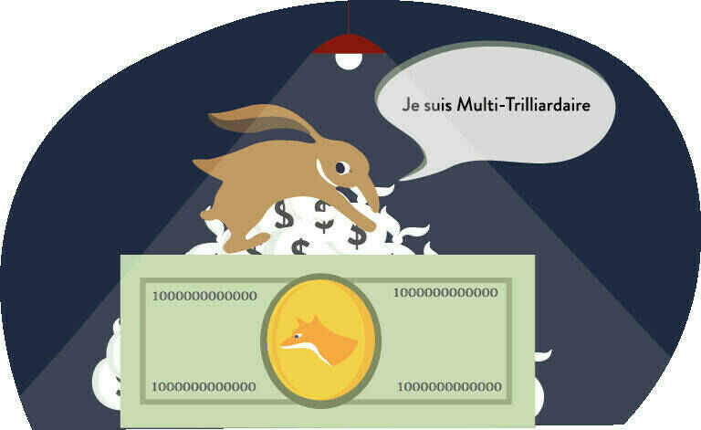

- Zimbabwe, 2007-2008
  Vuoteen 2000 mennessä Zimbabwe oli omavarainen lähes kaikessa paitsi öljyssä.

  Vuonna 1997 Zimbabwen dollari romahti yli 72 %, kun hallitus suostui korvaamaan sotaveteraaneille summan, joka vastasi 450 miljoonaa Yhdysvaltain dollaria. Koska hallituksella ei ollut tällaista summaa kassassaan, sen oli turvauduttava painokoneen käyttöön. Vuonna 2005 inflaatio saavutti 586 % ja maaliskuussa 2007 kuukausi-inflaatio oli 50 %.

  Kesäkuussa 2007 hallitus reagoi asettamalla hintakontrollit. Kaupat kirjaimellisesti "ryöstettiin". Kauppiailla ei enää ollut keinoja täydentää varastojaan.

  Huhtikuussa 2009 valtiovarainministeri ilmoitti Zimbabwen dollarin käytön keskeyttämisestä ja salli eri ulkomaisten valuuttojen käytön kaupankäynnissä. Kaikki pankkitilit, eläkkeet ja rahoituslaitokset näkivät saldonsa haihtuvan yön yli.

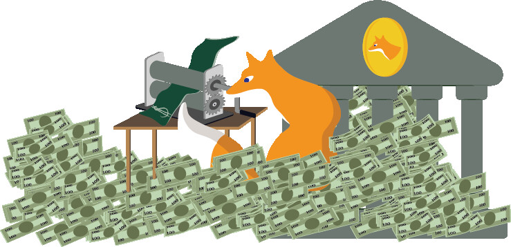

Yhteenvetona voidaan todeta, että hyperinflaatio johtaa nopeasti valuutan arvon heikkenemiseen, mikä aiheuttaa säästöjen rappeutumista ja luottamuksen menetystä rahajärjestelmään. Kuten Voltaire kerran totesi, fiat-valuutta menettää aina lopulta sisäisen arvonsa ja lähestyy nollaa. 
'Valuutta, joka perustuu luotettuun kolmanteen osapuoleen, kuten rahoituslaitokseen, on käytännössä ja pitkällä aikavälillä viallinen valuutta, koska se ei kykene takaamaan ostovoimaa tai säilyttämään säästöjä.
## 21 miljoonaa bitcoinia


### Bitcoinin rahapolitiikka

Bitcoin on hajautettu digitaalinen valuutta, jonka ennalta määrätty maksimimäärä on **21 miljoonaa yksikköä**. Tämä niukkuuden sisäänrakennettu ominaisuus määräytyy sen tietokonekoodin perusteella ja vahvistetaan kaikkien protokolliin osallistuvien käyttäjien konsensuksella.

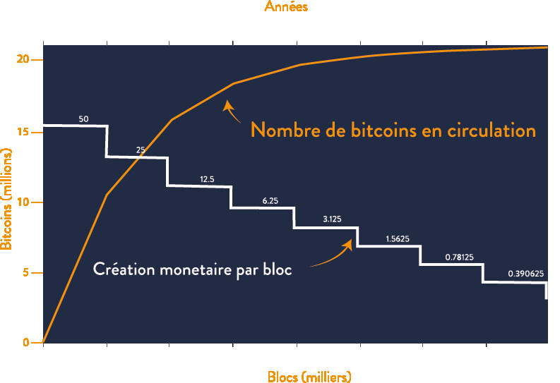

Sen rahantarjonnan osalta sitä voidaan havainnollistaa S-käyrällä, joka edustaa ajan myötä luotujen bitcoinien määrää. Esimerkiksi vuonna 2022 noin 18,5 miljoonaa bitcoinia oli kierrossa. Ennusteiden mukaan vuoteen 2025 mennessä bitcoinien määrä on noin 19,5 miljoonaa, mikä edustaa ~93% kokonaistarjonnasta, ja vuoteen 2037 mennessä tämä luku saavuttaa 20,4 miljoonaa.

### Kuinka uusia bitcoineja luodaan?

Uusien bitcoinien luominen on louhintaprosessin tulos, menettely, jolla vahvistetaan transaktioita Bitcoin-verkossa.


Louhijat, jotka suorittavat tämän tehtävän, palkitaan uusien bitcoinien liikkeeseenlaskulla joka kymmenes minuutti. Tämä palkkio on ohjelmoitu puolittumaan joka 210 000 lohkon jälkeen, mikä on suunnilleen joka neljäs vuosi, tapahtumaa kutsutaan "halvingiksi" -- antaen rahantarjonnan käyrälle portaita muistuttavan muodon. Tämän puolittumismekanismin vuoksi voidaan matemaattisesti ennustaa, että bitcoinien luominen loppuu vuonna 2140, kun bitcoinien kokonaismäärä saavuttaa rajansa 21 miljoonaa.

| Halvingin numero | Lohko | BTC palkkio Halvingin jälkeen | Arvioitu BTC kierrossa Halvingin jälkeen |
| ---------------- | -------------- | ----------------------------- | ---------------------------------------- |
| 1                | 210,000        | 25 BTC                        | 10,500,000 BTC                           |
| 2                | 420,000        | 12.5 BTC                      | 15,750,000 BTC                           |
| 3                | 630,000        | 6.25 BTC                      | 18,375,000 BTC                           |
| 4                | 840,000        | 3.125 BTC                     | 19,687,500 BTC                           |
| 5                | 1,050,000      | 1.5625 BTC                    | 20,343,750 BTC                           |
| 6                | 1,260,000      | 0.78125 BTC                   | 20,671,875 BTC                           |
| 7                | 1,470,000      | 0.390625 BTC                  | 20,835,937.5 BTC                         |
| 8                | 1,680,000      | 0.1953125 BTC                 | 20,917,968.75 BTC                        |
| 9                | 1,890,000      | 0.09765625 BTC                | 20,958,984.375 BTC                       |
| 10               | 2,100,000      | 0.048828125 BTC               | 20,979,492.188 BTC                       |
| 11               | 2,310,000      | 0.0244140625 BTC              | 20,989,746.094 BTC                       |
| 12               | 2,520,000      | 0.01220703125 BTC             | 20,994,873.047 BTC                       |
| 13             | 2,730,000    | 0,006103515625 BTC        | 20,997,436.523 BTC                         |
| 14             | 2,940,000    | 0,0030517578125 BTC       | 20,998,718.262 BTC                         |
| 15             | 3,150,000    | 0,00152587890625 BTC      | 20,999,359.131 BTC                         |
| 16             | 3,360,000    | 0,000762939453125 BTC     | 20,999,679.566 BTC                         |
| 17             | 3,570,000    | 0,0003814697265625 BTC    | 20,999,839.783 BTC                         |
| 18             | 3,780,000    | 0,00019073486328125 BTC   | 20,999,919.892 BTC                         |
| 19             | 3,990,000    | 0,000095367431640625 BTC  | 20,999,959.946 BTC                         |
| 20             | 4,200,000    | 0,0000476837158203125 BTC | 20,999,979.973 BTC                         |

Palaamme louhijoihin yksityiskohtaisemmin louhinta-luvussa.

### Digitaalisen niukkuuden takaaminen

Bitcoinin niukkuus taataan kahdella keskeisellä mekanismilla: louhintavaikeuden säätö ja peliteoria:

- Louhintavaikeuden säätö on mekanismi, joka tapahtuu joka 2016 lohkon välein, eli noin kahden viikon välein, varmistaakseen, että keskimäärin uusi lohko lisätään lohkoketjuun joka kymmenes minuutti. Tämän lohkojen luontitiheys ja bitcoinien kokonaismäärä ovat Bitcoin-protokollan kiinteitä aspekteja, joita ei voida muuttaa ilman yleistä konsensusta, toisin kuin perinteisissä rahajärjestelmissä tehdyt mielivaltaiset päätökset.


> Tiesitkö? Louhijat ovat motivoituneita louhimaan lohkon ansaitakseen uudet bitcoinit ja transaktiomaksut, jotka liittyvät heidän lohkoon sisällyttämiinsä transaktioihin. Kun liikkeeseen laskettujen bitcoinien määrä lähestyy 21 miljoonan rajaa, louhijat tulevat saamaan enemmän tuloja transaktiomaksuista kuin lohkopalkkiosta.'

- Peliteoria on matemaattinen konsepti, joka perustuu ihmisen rationaalisuuteen. Tässä, Bitcoinissa, käyttäjät äänestävät protokollamuutoksista. Kyllä, luit oikein: mikä tahansa muutos Bitcoin-protokollaan vaatisi koko käyttäjäyhteisön suostumuksen, mikä on erittäin monimutkaista. Joten, jos joku haluaisi luoda yli 21 miljoonaa bitcoinia, hänen pitäisi vakuuttaa kaikki käyttäjät vapaaehtoisesti alentamaan omien säästöjensä arvoa, mikä on epätodennäköistä, koska Bitcoin on globaali eikä sitä hallitse keskitetty ryhmä.


Valuutan arvon alentamisen idea on vastoin Bitcoinin perusfilosofiaa, joten tämän rajan muuttaminen on erittäin epätodennäköistä.

### Tarkastettavissa oleva rahapolitiikka joka sekunti alusta loppuun!

Bitcoinin niukkuus on merkittävä etu, ja liikkeessä olevien bitcoinien enimmäismäärä, 21 miljoonaa, on julkista ja tarkastettavissa kenen tahansa toimesta.

Itse asiassa kuka tahansa voi tarkistaa liikkeessä olevien bitcoinien määrän antamalla yksinkertaisen komennon Bitcoin-nodessa: bitcoin-cli gettxoutsetinfo. Tämä läpinäkyvyys ja tarkastettavuus vahvistavat luottamusta Bitcoin-järjestelmään, joka ei perustu keskitettyihin instituutioihin tai yksilöihin, vaan sen protokollaan sisäänrakennettuun matemaattiseen ja kryptografiseen toimintoon. (Opit tästä helposti lisää LN201:ssä)

```json
{
  "height": 710560,
  "bestblock": "0000000000000000000887384d67103412ea7f18a43953e65c8c4ac36bf42e54",
  "transactions": 473244,
  "txouts": 1018917,
  "bogosize": 2183872374,
  "hash_serialized_2": "eebb9987337700ffaacbbaa11223344",
  "disk_size": 178239584,
  "total_amount": 18745998.12345678
}
```

Bitcoin on suunnittelunsa ansiosta tae terveestä rahapolitiikasta rajoittamalla sen luontia ja suojelemalla käyttäjien säästöjä, mikä erottaa sen muista valuutoista. Itävaltalaisen taloustieteen periaatteiden (ks. ECON201) mukaisesti sen kontrolloitu määrä ja ennustettava jakautuminen suojelevat sitä perinteisten valuuttojen inflaatioriskeiltä.

Yhteenvetona Bitcoin tarjoaa ainutlaatuisen vaihtoehdon perinteisille rahajärjestelmille sen hajautetun luonteen, ohjelmoidun niukkuuden ja läpinäkyvyyden ansiosta. Se havainnollistaa, miten teknologiaa voidaan käyttää luomaan valuutta, joka ei ole ainoastaan hyödyllinen ja todennettavissa, vaan myös säilyttää käyttäjien säästöjen arvon tiukasti rajoittamalla tarjontaa.

### Yhteenveto osiosta 1!

'

# Bitcoin-lompakot

## Mitä ovat Bitcoin-lompakot?

Tässä 2. osiossa tutkimme Bitcoinien säilytystä ja turvallisuutta lompakoissa. Tämä auttaa sinua ymmärtämään paremmin, missä nämä kuuluisat Bitcoinit sijaitsevat ja miten niiden kanssa voi olla vuorovaikutuksessa!


### Bitcoin-lompakoiden toiminta

Tässä teollisuudessa käytämme lompakoita vuorovaikutuksessa Bitcoin-verkon kanssa, jolla on 3 toimintoa:

- Mahdollistaa bitcoinien vastaanottamisen
- Mahdollistaa bitcoinien lähettämisen
- Suojata ne hakkerointi- ja varkausyrityksiltä

Lompakko voi olla ohjelmisto tietokoneellasi, sovellus älypuhelimessasi, fyysinen laite kuten USB-avain tai jopa paperipala. Nämä erilaiset Bitcoin-lompakot palvelevat erilaisia käyttötarkoituksia. Jotkut ovat käytössä suurille määrille painottaen turvallisuutta, toiset yksityisyyttä tai jopa päivittäisiä pieniä maksuja varten.

Lompakot jaetaan siis suuriin käyttöperheisiin, aina keskeisen kysymyksen ympärillä: Oletko varojen omistaja vai jätätkö rahasi kolmannen osapuolen hallintaan? Palaamme tähän aiheeseen yksityiskohtaisesti seuraavassa luvussa, mutta idea on yksinkertainen: Onko raha taskussasi vai pankkiirisi taskussa!
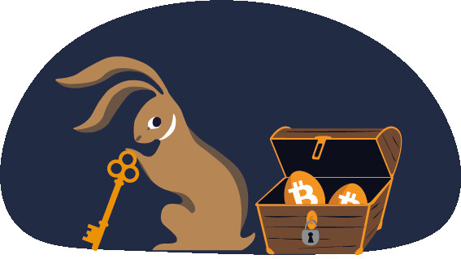

### Miten Bitcoin-lompakko toimii

Olipa kyseessä sitten Bitcoin-"pankkiirisi" tai sinä itse, yleisesti ottaen suurin osa Bitcoin-lompakoista toimii samanlaisella teknologialla, asymmetrisen kryptografian teknologialla, ja siis avainparien järjestelmällä: julkinen avain bitcoinien vastaanottamiseen ja yksityinen avain lompakon hallintaan.

- Yksityinen avain
  Lompakkoa alustettaessa luodaan salainen palautuslause (yksityinen avain), joka annetaan sinulle 24 sanan muodossa.

  Yksityinen avain on erittäin tärkeä, koska se edustaa Bitcoinien omistajuutta ja siten oikeutta käyttää tai lähettää niitä. Yksityisen avaimen haltija on Bitcoinien omistaja.

  Tätä avainta on pidettävä salassa ja hyvin suojattuna, sillä se on avain omaisuutesi lukkoon!

- Julkinen avain & osoite
  Julkinen avain luodaan yksityisen avaimen avulla ja on siis siihen liitetty. Julkista avainta käytetään Bitcoin-osoitteiden luomiseen ja siten rahan vastaanottamiseen. Julkisen avaimen jakaminen sisältää riskejä yksityisyydelle, mutta ei turvallisuudelle.
Nämä osoitteet luodaan lompakollasi ja ne voidaan jakaa turvallisesti. On suositeltavaa käyttää niitä vain kerran yksityisyytesi maksimoimiseksi.
On siis tärkeää ymmärtää, että tämän teknologian ansiosta voimme helposti vastaanottaa Bitcoineja antamatta lähettäjälle mahdollisuutta varastaa varojamme! Ajattele sitä kuin postilaatikkoa: ihmiset tallettavat rahaa siihen, mutta vain sinä voit avata sen.


### Ovatko Bitcoinit sitten lompakossa?

Vaikka avaimet säilytetään lompakossasi, itse bitcoinit "säilytetään" itse asiassa Bitcoinin lohkoketjussa, joka on julkinen hajautettu kirjanpito Bitcoinin vertaisverkossa (tarkastelemme tätä osiossa 3). Siksi laitteen menettäminen, jossa lompakkosi on, ei välttämättä tarkoita Bitcoiniesi menettämistä. Se, mikä mahdollistaa lompakkosi uudelleenluomisen ja bitcoiniesi käyttämisen, on yksityinen avain. On siis ratkaisevan tärkeää turvata se asianmukaisesti.

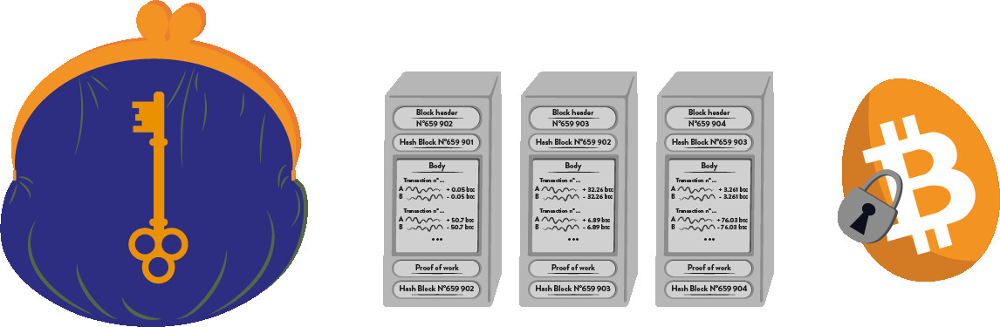

Meidän onnemme on että vuodesta 2017 lähtien, tämä yksityinen avain voidaan koodata yksinkertaiseen 12 tai 24 sanan listaan, jota kutsutaan mnemoniseksi fraasiksi. Tämä fraasi on varmuuskopio Bitcoin-lompakostasi, se mahdollistaa lompakkosi uudelleenluomisen millä tahansa Bitcoin-lompakko-ohjelmistolla/-sovelluksella. Siksi jokainen, jolla on pääsy tähän sanojen listaan, pääsee käsiksi bitcoineihisi. 

### Entä hakkerit?

Saatetaan kysyä: entä jos joku arvaa vahingossa 12 tai 24 sanan listamme? Lyhyt vastaus on, että käytetyn kryptografian ansiosta se on erittäin epätodennäköistä. Asettaaksemme sen perspektiiviin, lompakkoosi pääsyn vahingossa löytäminen on kuin "oikean" numeron löytäminen väliltä 1 ja $2^256$, mikä on lähes sama kuin "oikean" atomin löytäminen Universumista. Jos et kuitenkaan ole tyytyväinen tähän oletusturvallisuuteen, voit aina vahvistaa sitä lisäämällä salasanan Bitcoin-lompakkoosi.

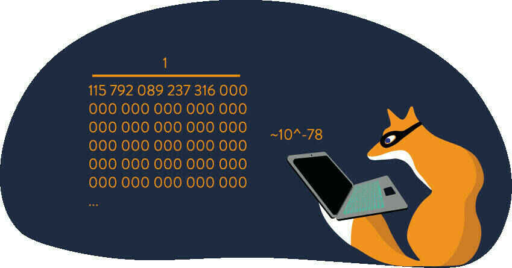

Näin ollen Bitcoin-lompakkosi hakkeroinnin todennäköisyys on astronomisen pieni, jos noudatat hyviä turvallisuuskäytäntöjä. Käytäntöjä, joita käsittelemme seuraavassa osiossa.

Valitse lompakko, joka sopii tarpeisiisi ja käyttöösi. Yksityiskohtaisia ohjeita erilaisten lompakoiden käytöstä ja turvaamisesta on saatavilla [yliopistomme opetusosiossa](https://sovereignuniversity.org/tutorials/wallet).

## Turvallisuus ja Bitcoin-lompakot


### Oikeiden kysymysten esittäminen ennen aloittamista

Kun omistat bitcoineja, varojesi turvallisuus on suuri huolenaihe. Paras tapa määritellä tilanteeseesi sopiva turvallisuus on esittää (ja vastata) joukkoon kysymyksiä; turvallisuusmallisi riippuu vastauksistasi. Aloittakaamme:

- Kuka voi päästä käsiksi varoihini? Toisin sanoen, oletko ainoa, jolla on pääsy bitcoineihisi, vai antaako kolmas osapuoli, kuten yritys, sinulle pääsyn varoihisi?
- Toinen kysymys voisi olla: mitä käyttötarkoituksia suunnittelet bitcoineillesi? Onko se summa, jota käytät säännöllisesti? Onko se keskipitkän aikavälin säästöjä? Pitkän aikavälin säästöjä?
- Mitkä ovat tekniset taitosi?
- Mikä on turvallisuusbudjettisi?

Pidä mielessä, että universaalia ratkaisua ei ole. Ota siis aikaa vastata näihin kysymyksiin, sillä se auttaa räätälöimään turvatoimenpiteesi.

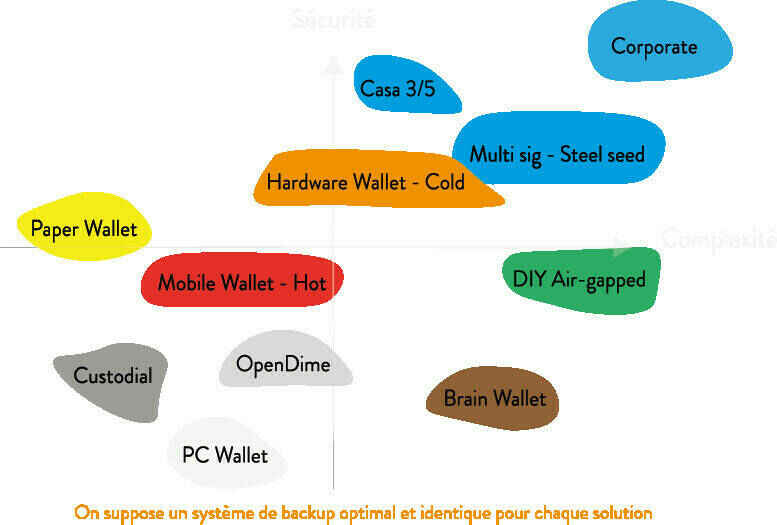

### Bitcoin-lompakoiden pohtiminen monimutkaisuuden näkökulmasta

Yritetään määrittää useita turvallisuustasoja bitcoineillesi:
- **Taso 0**, käytät niin sanottua säilytyspalvelua, jossa et ole bitcoiniesi ainoa haltija. Ole tietoinen siitä, että tämä luotettu kolmas osapuoli voi rajoittaa pääsyäsi varoihisi milloin tahansa, ja sinulla on sama taloudellisen itsenäisyyden taso kuin perinteisessä pankkijärjestelmässä pankkitilin kautta. 
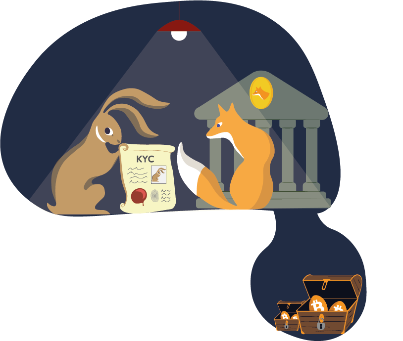

- **Taso 1**, käytät Bitcoin-lompakkoa puhelimessasi tai tietokoneellasi, jossa olet bitcoiniesi ainoa haltija. Voit suorittaa transaktiot helposti. On kuitenkin elintärkeää varmuuskopioida avainlauseesi, jotta voit palauttaa pääsyn varoihisi, jos menetät puhelimesi tai tietokoneesi. Tätä kutsutaan usein "hot walletiksi", koska yksityinen avain säilytetään laitteessa, jolla on internetyhteys.

- **Taso 2**, käytät fyysistä lompakkoa, ja olet turvannut 12 tai 24 sanan listasi. Transaktion suorittamiseksi sinun on aina allekirjoitettava laitteellasi. Tämä tekee varoistasi vähemmän saavutettavia päivittäisessä käytössä. Tätä kutsutaan usein "kylmäksi lompakoksi", koska avaimet säilytetään laitteessa, joka ei ole yhteydessä internetiin.

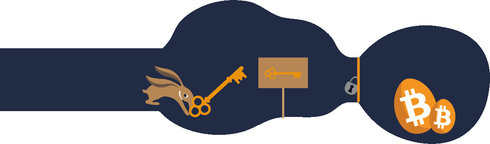

- **Taso 3**, käytät tason 1 tai 2 lompakkoa, mutta lisäsalasanalla. Ole tietoinen siitä, että sinun on nyt varmuuskopioitava sekä 12 tai 24 sanan lista **ja** salasanasi. Ihanteellisesti nämä kaksi tietoa säilytetään kahdessa eri paikassa.


- **Taso 4**, käytät lompakoiden sarjaa luodaksesi "multisig"-lompakon, mikä tarkoittaa, että transaktion suorittamiseen vaaditaan useita allekirjoituksia. Ole tietoinen siitä, että multisigin jokainen osa tulisi säilyttää eri paikoissa. Tätä pidetään usein Bitcoinin edistyneenä käyttönä, jota käytetään pääasiassa suurille summille ja yrityskäytössä.

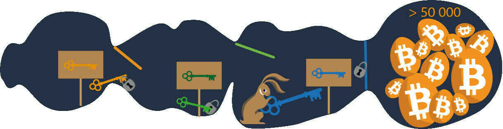

Tietenkin meillä voi olla useita käyttötapauksia, ja tällaisissa tapauksissa on suositeltavaa käyttää useita Bitcoin-lompakoita. Ei ole olemassa yhtä ratkaisua kaikille.

### Turvallisuuden on mukauduttava

Se summa, jonka yksilö on valmis jättämään tietylle turvallisuustasolle, riippuu henkilöstä. Joillekin 1 BTC:n jättäminen kuumalle lompakolle on järkevää, kun taas toisille se ei ole missään nimessä. Joka tapauksessa voit panostaa turvallisuuteen, ostamalla fyysisen sähköisen lompakon, kun haluat turvata bitcoinisi. Pidä myös mielessä, että bitcoiniesi turvallisuuden ja saavutettavuuden liiallinen monimutkaistaminen voi vahingoittaa sinua, jos esimerkiksi käsittelet lompakoidesi varmuuskopioita väärin.

Yhteenvetona voidaan todeta, että bitcoinien suoran omistajuuden on oltava olennainen elementti taloudellisen itsenäisyyden varmistamiseksi. On suositeltavaa käyttää mobiililompakkoa päivittäisiin menoihin ja offline- eli "kylmää" fyysistä lompakkoa suurempien summien säilyttämiseen. Yritysten puolestaan tulisi harkita moniallekirjoitusjärjestelmien eli "multisigin" käyttöä lisätyn ja jaetun turvallisuuden vuoksi. On myös olennaista välttää huoltajapalveluita, jotka voivat toistaa perinteisen rahoitusjärjestelmän joitakin haavoittuvuuksia mahdollisimman paljon.

Nyt kun meillä on tämä mielessä, siirrytään seuraavaan osioon nähdäksemme vaiheet Bitcoin-lompakon luomiseen. Jos kuitenkin haluat tutkia turvallisuuden aihetta tarkemmin, voit lukea tämän [artikkelin DarthCoinilta](https://asi0.substack.com/p/bitcoin-soyez-votre-propre-banque).

## Lompakon luominen


Bitcoiniesi turvallisuus on äärimmäisen tärkeää, ja yksinkertainen virhe voi aiheuttaa kalliita seurauksia. Siksi tarkastelemme nyt parhaita käytäntöjä uuden Bitcoin-lompakon luomisessa.
> Huomaa, että BTC102-kurssi opastaa sinut tämän vaiheen läpi.

### Tämä vaihe ei ole vitsi!

Yksityinen avaimesi, joka usein esitetään 24 sanan listana (usein kutsutaan "seed phrase" tai "mnemoniseksi fraasiksi"), edustaa pääsyä varoihisi. Jos tämä avain paljastetaan kolmannelle osapuolelle, ei pidä pitää siihen liittyviä varoja enää turvattuina. Siksi lompakon luomisen yhteydessä on tärkeää noudattaa näitä sääntöjä:

- Peitä kaikki kamerat.
- Älä ota valokuvaa sanalistasta.
- Älä syötä sitä tietokoneelle tai puhelimelle.
- Älä tallenna sitä yhteystiedoksi tai lähetä sitä itsellesi tekstiviestillä.
- Älä koskaan jätä sanojasi valvomatta pöydällesi.
- Älä koskaan piilota sanalistaa epätavalliseen paikkaan.

Kirjoita avainlauseesi kirjaimellisesti tyhjälle paperiarkille tai tulostat tämän mallin ja kirjoitat sanalistan järjestyksessä, siististi ja selkeästi kynällä. Jos muste haalistuu ajan myötä, saatat menettää varasi; siksi on tärkeää pitää tämä paperi suojattuna valolta ja muilta siihen vaikuttavilta riskeiltä.

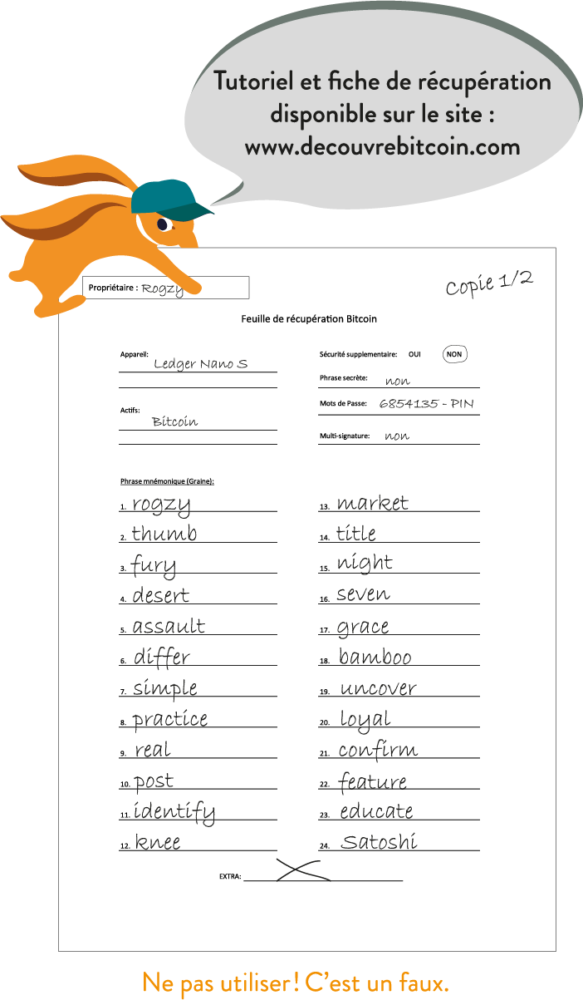

### Vinkkejä lompakon valintaan

On myös vaihtoehtoisia ratkaisuja paperille, kuten mnemonisen fraasisi kaivertaminen metallilevyyn. Jos kirjoitat sen väärin, perillisesi eivät ehkä pysty lukemaan sitä ja siksi eivät ehkä pysty palauttamaan varoja. Kun sanat on kirjoitettu, on suositeltavaa tehdä toinen kopio ja säilyttää se eri paikassa kuin ensimmäinen. Tämä tarjoaa varmuuskopion ensimmäisen kopion katoamisen tai onnettomuuden varalle.


Kun kopiot on tehty, säilytä sanalistat turvallisessa paikassa, josta muistat etsiä ne! Älä luo liian monimutkaista piilottelusuunnitelmaa, jossa riskeeraat niiden menettämisen.

> Aviansanasi = rahasi.

"Kylmät" lompakot yleensä sisältävät nämä sanalistat, aivan kuten "kuumat" lompakot mobiilissa tai PC:ssä. Tämä yksityisen avaimen varmuuskopioinnin menetelmä on nyt standardi. Tämä tarkoittaa, että voit syöttää mnemonisen fraasisi mihin tahansa lompakko-ohjelmistoon palauttaaksesi omasi. Vain huonot lompakot, joita me vahvasti suosittelemme välttämään, eivät anna sinulle 24 sanan listaa, mutta saattavat pyytää tiliä, sähköpostiosoitetta tai pahempaa, henkilötunnusta.

**HUOMIO: 24 sanan listan puuttuminen tulisi herättää huolesi.**

## Lompakkojärjestelyn tulee kestää ajan kulua


Turvallisuus on merkittävä huolenaihe Bitcoin-ekosysteemissä. Todellakin, kuten minkä tahansa varallisuuden muodon, bitcoinisi on suojattava häviämistä, varkautta ja turvallisuuden heikkenemistä vastaan, erityisesti pitkällä aikavälillä. Bitcoiniesi turvaaminen vaatii jonkin verran teknistä tietämystä ja tietoisuutta liittyvistä riskeistä, mikä johtaa meidät keskustelemaan kahdesta päästrategiasta: bitcoiniesi kaivertaminen teräkseen ja perintösuunnitelman luominen.

### Kaiverrus kiveen

Yksi menetelmä bitcoiniesi turvaamiseksi pitkällä aikavälillä on mnemonisen fraasisi kaivertaminen kestävään materiaaliin, kuten teräkseen. Tämä luo fyysisen varmuuskopion avaimistasi, joka on kestävä sekä veden että tulen vahingoille.

Tähän on monia ratkaisuja, jotkut ovat edullisia kuten "Blockmit", kun taas toiset vaativat enemmän laitteistoa. Voit tutkia tätä aihetta itse tämän yliopiston tutoriaaliosiossa.


### Ajattele seuraavaa sukupolvea!
Yhdessä tämän kanssa, perintösuunnitelman luominen on myös ratkaiseva askel varmistamaan, että bitcoinejasi hallitaan asianmukaisesti kuolemasi jälkeen. Tähän suunnitelmaan voi sisältyä käsin kirjoitettu kirje, jossa kerrotaan omaisuudestasi, niiden käyttömenetelmistä ja luotettavien henkilöiden yhteystiedoista, joihin ottaa yhteyttä. On  myös tärkeää keskustella bitcoinien perimisestä notaarin kanssa varmistaaksenne verotuksen noudattamisen, vaikka on tärkeää olla koskaan suoraan uskomatta bitcoinejasi kolmannelle osapuolelle, mukaan lukien notaari.
Jos haluat tutkia lisää bitcoinien perintösuunnitelman aihetta, suosittelemme Pamela Morganin kirjaa [Cryptoasset Inheritance Plan](https://sovereignuniversity.org/resources/books/28/en) tai osallistumista BTC102-kurssille, jossa opastamme sen luomisessa.

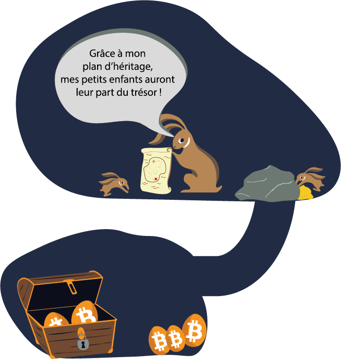

### Yksityisyys on tärkeää

Bitcoiniesi pitkäaikainen turvallisuus ei rajoitu fyysisten varmuuskopioiden luomiseen tai perintösuunnitelman kehittämiseen. Yksityisyys on toinen tärkeä huomioon otettava seikka. Esimerkiksi on suositeltavaa ostaa bitcoineja ilman henkilöllisyyden todistamista minimoimaan identiteettivarkauden riskit tai yksinkertaisesti varojesi jäljittämisen minkä tahansa riittävän keinojen omaavan tahon toimesta. BTC 205 -kurssi voi auttaa tässä tarvittaessa.

Yksityisyyden suhteen on ratkaisevan tärkeää välttää puhumasta kaikille bitcoineistasi. Emme todellakaan tiedä, mihin tämä omaisuuserä päätyy, ja omistajuuden suhteen harkitsevaisuus on viisas päätös. Et halua herättää huomiota itseesi ja lompakkoosi.

Samassa hengessä vältä paljastamasta äänekkäästi turvajärjestelmääsi bitcoin-tapaamisissa tai kohtaamisissa tuntemattomien kanssa...

### Yhteenveto Bitcoin-lompakon turvallisuudesta


Bitcoin-lompakot ovat ohjelmistoja, jotka mahdollistavat bitcoinien säilyttämisen ja siirtämisen. On olemassa useita tyyppejä: mobiili- tai PC-lompakot, jotka sopivat pieniin määriin ja/tai säännöllisiin menoihin; fyysiset lompakot, jotka soveltuvat paremmin bitcoinien säilyttämiseen keskipitkällä ja pitkällä aikavälillä; multisig-lompakot, jotka ovat monimutkaisempia hallita ja vaativat useita allekirjoituksia tapahtumien suorittamiseen.
Lompakon luomisen yhteydessä sinun on ensin varmuuskopioitava yksityinen avaimesi. Tämä varmuuskopio otetaan 12 tai 24 sanan listan muodossa, tai 12 sanaa, jotka voit kirjoittaa paperille tai metallilevylle. Tämä avainlause mahdollistaa lompakkosi palauttamisen millä tahansa Bitcoin-lompakko sovelluksella. Kenellä tahansa, jolla on pääsy tähän listaan, on myös pääsy bitcoineihisi. Bitcoinissa taloudellinen suvereniteetti kulkee käsi kädessä yksilöllisen vastuun kanssa, joten on ratkaisevan tärkeää, että turvaat pääsyn lompakoihisi ja varmuuskopioihisi. Tämän tekemiseksi on tärkeää noudattaa tiettyjä sääntöjä:

- Luo perintösuunnitelma: varmistaaksesi, että läheisesilläsi on varoihin pääsy ongelmatilanteessa.
- Vältä vaihtoalustoja: on suositeltavaa välttää bitcoiniesi jättämistä vaihtoalustoille, koska ne voivat olla alttiita hakkerihyökkäyksille.
- Mukauta turvallisuustasoasi: ota aikaa selvittääksesi tarpeesi ja käyttösi, tämä auttaa sinua tekemään valintasi eri Bitcoin-lompakoiden joukosta.

Nyt kun olemme käsitelleet Bitcoin-lompakoiden perusteet ja parhaat käytännöt niiden turvaamiseksi, käsittelemme seuraavassa luvussa Bitcoinin teknistä toimintaa. Jälleen kerran, Bitcoin-protokollan perusteiden tunteminen antaa sinulle paremman ymmärryksen sen toiminnasta, mikä mahdollistaa sen paremman hyödyntämisen.

# Bitcoinin tekniset näkökohdat.

## Bitcoinin käynnistäminen


### Aloittakaamme hieman historialla.

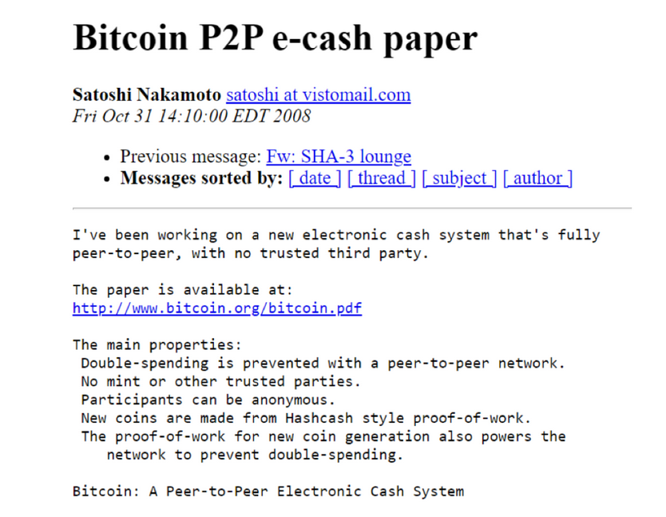
31. 31. lokakuuta 2008 merkitsee uuden rahoitusteknologian syntymää: Bitcoin. Juuri tällä päivämäärällä Satoshi Nakamoto, Bitcoinin nimettömänä pysyttelevä luoja, esittelee innovaationsa maailmalle sähköpostitse, joka on jaettu cyberpunk-sähköpostilistalle, yhteisölle, joka koostuu kryptografian harrastajista ja heidän intohimostaan yksityisyyteen internetissä. 
Tämä sähköposti sisälsi asiakirjan, jota kutsutaan "White Paperiksi", ja joka esitteli Bitcoinin toimintaperiaatteen. Aiempien digitaalisen käteisen järjestelmien epäonnistumiset huomioon ottaen, tämä aloite ei välittömästi herättänyt innostusta. Siitä huolimatta tämä White Paper lopulta muodostui viitekehykseksi Bitcoinin käyttäjille ja on ollut monien keskustelujen aiheena Bitcoin-ekosysteemissä.


3. tammikuuta 2009 Satoshi virallisesti käynnistää Bitcoin-verkon luomalla ensimmäisen lohkon, joka tunnetaan myös alkulohkona, ja joka merkitsee Bitcoin-lohkoketjun käynnistymistä. Tämä lohko sisältää paljastavan viestin Bitcoinin tehtävästä: "03/jan/2009 Kansleri harkitsee toista pelastuspakettia pankeille."


> "Voimme voittaa merkittävän taistelun asevarustelussa ja saavuttaa
> uuden vapauden alueen useiksi vuosiksi." - Satoshi Nakamoto
> 

### Bitcoin-protokolla herää eloon

8. tammikuuta 2009 Satoshi ilmoittaa Bitcoin-0.1.0:n julkaisusta. Pian tämän jälkeen Hal Finney ottaa ohjelmiston käyttöön ja liittyy verkkoon. Nyt verkossa oli 2 solmua, ja siten 2 louhijaa. Finney ikuistaa tämän askeleen twiittaamalla "Running Bitcoin". 12. tammikuuta 2009 tehdään ensimmäinen Bitcoin-siirto Satoshin ja Hal Finneyn välillä. Tämä siirto, 10 BTC, kirjataan lohkoon 170.


Kiinnostus Bitcoiniin kasvaa nopeasti, ja monet ihmiset alkavat testata, keskustella, ratkaista bugeja ja pohtia Bitcoinin eettisiä, taloudellisia ja filosofisia näkökohtia. Näiden tietojen vaihdon helpottamiseksi Satoshi luo BitcoinTalk-foorumin 22. marraskuuta 2009. 
Tämä foorumi muodostuu nopeasti Bitcoin-käyttäjien suosituimmaksi keskustelupaikaksi. Siellä syntyy monia Bitcoiniin liittyviä meemejä ja symboleita, kuten [Bitcoin-logo](https://bitcointalk.org/index.php?topic=64.0), kuuluisa [Hodl](https://bitcointalk.org/index.php?topic=375643.0), tai jopa [Pizza-päivä](https://bitcointalk.org/index.php?topic=137.msg1195).

> **Tiesitkö?** Todellakin, 22. toukokuuta 2010, Laszlo Hanyecz teki historiaa Bitcoinilla tarjotessaan ostaa 2 pizzaa 10 000 BTC:llä. Tämä on ensimmäinen kerta, kun Bitcoinia käytetään fyysisten tavaroiden ostamiseen.

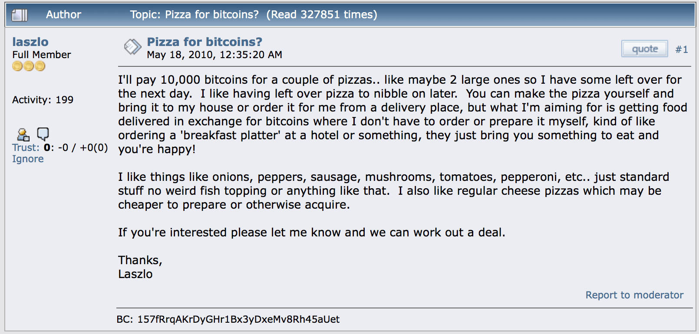

### Satoshi Nakamoton katoaminen

Vuonna 2010, kun Bitcoin alkaa houkutella median huomiota, Satoshi päättää etääntyä. 12. joulukuuta 2010 hän julkaisee viimeisen viestinsä foorumilla ilmoittaen lähdöstään. 23. huhtikuuta 2011 hän tekee viimeisen tunnetun yksityisen tiedon vaihdon sähköpostitse. Satoshi katoaa sen jälkeen, jättäen luomuksensa yhteisön käsiin.

> "Hallitukset ovat hyviä katkaisemaan keskitetysti
> ohjattujen verkostojen, kuten Napsterin, päitä, mutta puhtaasti P2P-verkostot, kuten
> Gnutella ja Tor, näyttävät pitävän puolensa." - Satoshi Nakamoto
Vaikka Satoshi on poissa, Bitcoin jatkaa kehittymistään. Joka 10. minuutti Bitcoinin historia kirjoitetaan uudelleen, ja protokolla toimii suunnitellusti. Pelosta, epävarmuudesta tai epäilystä huolimatta (FOMO eli Fear Of Missing Out tai FUD eli Fear Uncertainty Doubt), Bitcoin jatkaa etenemistään, online-saatavuuden ollessa 99,988 %.

Jokainen kokee Bitcoinin eri tavalla. Joillekin se on sienimäinen entiteetti kuten [myseeli](https://brandonquittem.com/bitcoin-is-the-mycelium-of-money/), toisille se on [musta aukko](https://dergigi.com/2019/05/01/bitcoins-gravity/i). Rakastit tai vihasit sitä, Bitcoin jatkaa olemassaoloaan, sen jatkuvalla 10 minuutin syklillä lohkoa kohden, kuin uuden rahajärjestelmän sydämenlyönti.

Jos haluat oppia lisää Satoshi Nakamoton kirjoituksista, suosittelen [Phil Champagnen kirjaa](https://sovereignuniversity.org/resources/books) tai ARTE-dokumenttia "le mystaire Satoshi".

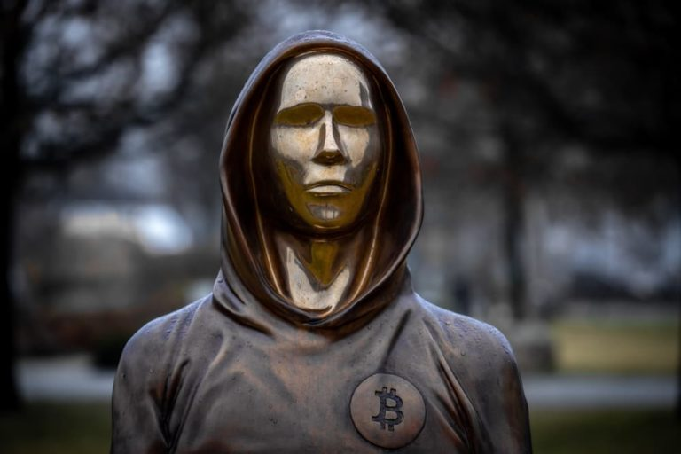

> “Perinteisen valuutan perusongelma on kaikki se luottamus, joka sen toimimiseen vaaditaan. Keskuspankkiin on luotettava, ettei se devalvoi valuuttaa, mutta fiat-valuuttojen historia on täynnä tuon luottamuksen pettämisiä. Pankkeihin on luotettava, että ne pitävät rahamme ja siirtävät sitä sähköisesti, mutta ne lainaavat sitä luottokuplien aalloissa vain murto-osalla varantona.”

Nyt kun meillä on taustatietoa, katsotaan miten Bitcoin-siirto yleisesti toimii.

## Bitcoin-siirrot


Bitcoin-siirto on yksinkertaisesti omistajuuden siirto Bitcoineissa, käyttäen Bitcoin-osoitetta. Otetaan esimerkiksi kaksi osapuolta: Alice ja Bob. Alice haluaa hankkia Bitcoineja, kun taas Bobilla on jo niitä.

### Vaihe 1 - Siirron luominen lompakon kautta

Jotta Bob voi siirtää Bitcoineja Alicelle, Alicen on annettava Bobille yksi Bitcoin-osoitteistaan. Tämä osoite, joka on johdettu Alicen yksityisavaimesta, ja on yksilöllinen hänen Bitcoin-lompakolleen.

Käytännössä Alice avaa lompakkonsa ja painaa "vastaanota". Näytölle ilmestyy QR-koodi tai osoite, kuten tämä bc1q7957hh3nj47efn8t2r6xdzs2cy3wjcyp8pch6hfkggy7jwrzj93sv4uykr. Se on eräänlainen hänen "Bitcoin-IBANinsa". Hän antaa sen Bobille.

Bob aloittaa siirron käyttäen Alicen vastaanotto-osoitetta. Bob puolestaan avaa Bitcoin-lompakkonsa, painaa "lähetä", kopioi ja liittää osoitteen, lisää summan ja siirtomaksun. Nämä maksut ovat kannustin louhijoille sisällyttää siirto seuraavaan lohkoon.

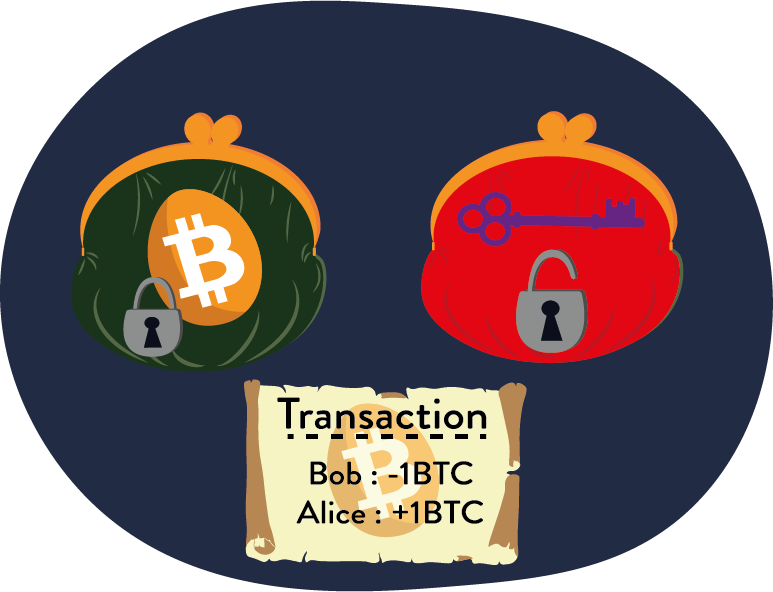'

> **Miksi maksaa maksuja?** Nämä maksut ovat olennaisia luomaan vapaan markkinan siirtojen sisällyttämiseksi lohkoihin, koska lohkon siirtojen määrä on rajoitettu. Itse asiassa lohkon koko on 1 MB, mikä vastaa muutamaa tuhatta siirtoa per lohko. Siirron maksut ovat suhteessa sen kokoon. Siirron koko puolestaan riippuu siirron monimutkaisuudesta.
Saadakseen transaktion päätökseen, Bobin on annettava allekirjoitus yksityisavaimellaan niistä osoitteista, joita hän käyttää maksamaan Alicelle. Tämä varmistaa, että hän on niiden Bitcoinien omistaja, jotka hän haluaa siirtää. Tämä vaihe tapahtuu yleensä automaattisesti mobiililompakoissa, tai se on vahvistus fyysisessä lompakossasi: "Oletko varma, että haluat lähettää X:n Y:lle? Kyllä tai ei".

### Vaihe 2: Transaktion leviäminen solmujen kautta mainaajille

Tässä vaiheessa transaktio on luotu ja Bobin lompakko jakaa sen Bitcoin-verkolle. Tehdäkseen tämän, hänen lompakkonsa kommunikoi Bitcoin-verkon solmun kanssa, ja tämä solmu levittää tämän tiedon muihin solmuihin. Tämän levitysvaiheen avulla koko verkko näkee tämän uuden transaktion ja ottaa sen huomioon.

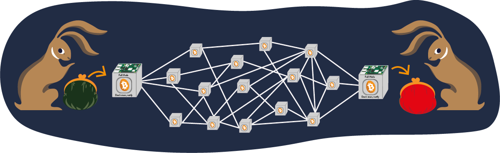

Vaikka tämä transaktio on nyt kaikkien tiedossa (työkalun nimeltä Mempool kautta), transaktiota ei välttämättä pidetä vahvistettuna! Todellisuudessa mainaajat ovat ne, jotka vahvistavat transaktiot sisällyttämällä ne lohkoon meidän kuuluisassa lohkoketjussamme.

Mainaajilla on rooli ottaa kelvolliset ja vahvistamattomat transaktiot, ja sitten koota ne lohkoon. Jotta heidän lohkonsa olisi seuraava Bitcoin-lohkoketjussa, heidän on ratkaistava kryptografinen pulma prosessissa, jota kutsutaan "proof of work" -todistukseksi.

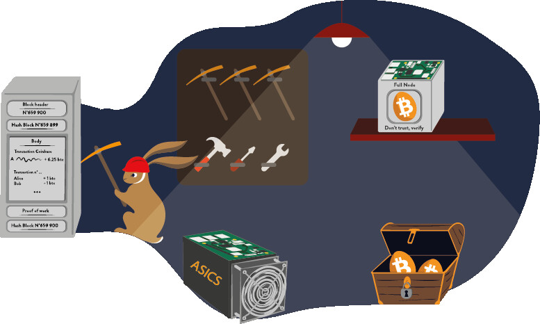

### Vaihe 3: Transaktio louhitaan lohkoon mainaajan toimesta.

Tämä proof of work vaatii kelvollisen "hashin" löytämisen kyseiselle lohkolle. Ajattele sitä ainutlaatuisena sormenjälkenä, joka liittyy lohkoon, ja koostuu 256 merkistä. Tämän hashin kelvollisuus riippuu Bitcoin-verkon vaikeustasosta. Menemme yksityiskohtiin tästä mekanismista myöhemmin. Toistaiseksi oletetaan, että mainaaja on löytänyt kelvollisen lohkon ja että Bobin transaktio Alicelle sisältyy siihen.

Tämä uusi kelvollinen lohko lisätään Bitcoin-lohkoketjuun, joka on julkinen ja muuttumaton kirjanpito kaikista Bitcoin-transaktioista. Ajattele sitä yhteisenä kirjanpitona kaikille Bitcoin-käyttäjille. Protokollan sääntöjen mukaan lohko lisätään noin joka kymmenes minuutti vaikeustason säätelyn ansiosta. Näemme osiossa mainaajista, mikä mekanismi estää Bitcoin-transaktiokirjan muokkaamisen.

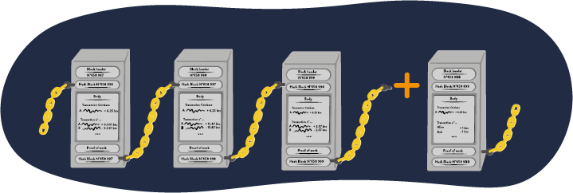

### Vaihe 4: Lohko on kelvollinen ja Alicen lompakon solmu on vahvistanut sen.

Tässä vaiheessa transaktio katsotaan kelvolliseksi, mainaaja sitten levittää uuden lohkon solmunsa kautta verkkoon, ja Alicen lompakko päivittyy.

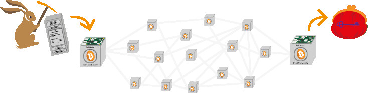

> Huomio: Vaikka Alice näkee, että hän on saanut bitcoineja yhdelle osoitteistaan, on suositeltavaa pitää transaktiota muuttumattomana vasta kun sillä on 6 vahvistusta. Tämä tarkoittaa, että 6 muuta lohkoa on louhittu lohkon päälle, joka sisältää Bobin transaktion. Toisin sanoen, mitä vanhempi transaktio on lohkoketjussa, sitä muuttumattomammaksi se tulee.

### Nopea yhteenveto presentaatiossa!


### Mikä on kaiken tämän tarkoitus?

Lopulta Bitcoin-transaktiojärjestelmä on hajautettu ja toimii vertaisverkossa ilman luotettuja välittäjiä.

Bob lähettää transaktionsa Bitcoin-verkolle, ja kun mainaaja julkaisee kelvollisen lohkon, joka sisältää Bobin transaktion, Alice voi alkaa pitää bitcoineja omistuksessaan. Luottamusta ei vaadita missään bitcoinien omistusoikeuden siirron vaiheessa; vain protokollan säännöt ja taloudelliset kannustimet tekevät haitallisen toimimisen Bitcoin-protokollan sisällä liian kalliiksi. 
Käyttäjät siirtävät omistusoikeuden rahoistaan digitaalisesti allekirjoittamalla siirrot yksityisillä avaimillaan. Louhijat eivät omaa paljoa valtaa, sillä käyttäjillä on merkittävä kontrolli Bitcoin-solmujen kautta, jotka käsittelevät uusien lohkojen ja sisältyvien siirtojen validoinnin. Juuri tämän Bitcoin-solmujen verkon kautta verkko on todella hajautettu.
Itse asiassa, jotta Bitcoin-verkko voitaisiin täysin tuhota, kaikki lohkoketjun kopiot kaikissa Bitcoin-solmuissa pitäisi tuhota - käytännössä mahdoton tehtävä näiden solmujen maantieteellisen jakautumisen ja fyysisen haltuunoton vaikeuden vuoksi.

Katsotaanpa tarkemmin, miten Bitcoin-solmu toimii.

## Bitcoin-solmut (nodet)


Solmut (nodet) ovat keskeinen elementti Bitcoin-verkon arkkitehtuurissa. Ne suorittavat useita kriittisiä toimintoja:

- Ylläpitävät kopiota Bitcoin-lohkoketjusta
- Vahvistavat siirtoja
- Lähettävät tietoa muille solmuille
- Toteuttavat Bitcoin-protokollan sääntöjä.

Siksi mikä tahansa laite, joka ajaa Bitcoin-ohjelmistoa, kutsutaan Bitcoin-solmuiksi (usein [Bitcoin Core](https://bitcoin.org/en/bitcoin-core/) kautta), edistää verkon hajauttamista.

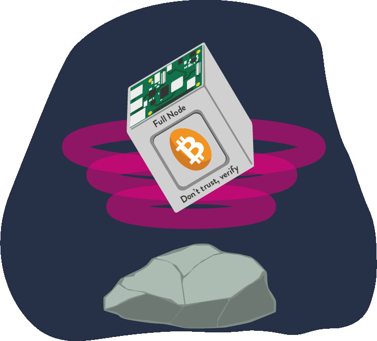

### Solmut ovat siis Bitcoinin keskeinen ydin.

Jokainen solmu pitää hallussaan lohkoketjun kopiota, mikä mahdollistaa siirtojen vahvistamisen ja estää petosyritykset. Verkon hajautettu luonne antaa Bitcoinille poikkeuksellisen joustavuuden ja vahvuuden - Bitcoin-protokollan pysäyttämiseksi kaikki maailman solmut pitäisi sammuttaa. Tiedoksesi, tällä hetkellä (syyskuu 2023) on noin [45 000 solmua](https://bitnodes.io/nodes/all/) jakautuneena ympäri maailmaa.

Solmut pystyvät vahvistamaan lohkojen ja siirtojen pätevyyden, koska ne noudattavat Bitcoin-konsensuksen sääntöjä. Nämä säännöt ohjaavat muun muassa Bitcoinin rahapolitiikkaa, kuten louhijoiden palkkion määrää (josta keskustelemme tarkemmin seuraavassa osiossa) ja liikkeessä olevan bitcoinin määrää. Solmut toimivat tavallaan verkon oikeusjärjestelmänä. Niiden ansiosta kaikki verkon osallistujat noudattavat samoja sääntöjä. Ne takaavat Bitcoin-protokollan neutraaliuden. Konsensussäännöt muuttuvat hyvin vähän, jos ollenkaan, sillä muutosten tekemiseen vaaditaan kaikkien solmujen hyväksyntä.

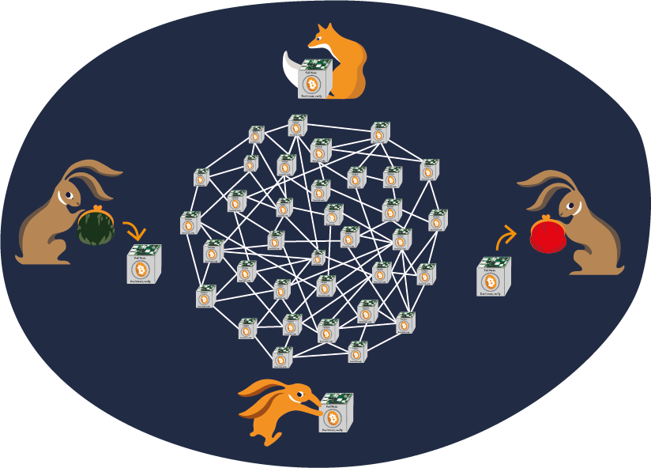

Protokollan hallinto ylittää tämän koulutuksen kattavuuden, mutta tiedä, että jokainen Bitcoin-solmua ajava käyttäjä päättää, mitä sääntöjä he haluavat noudattaa. Näin ollen käyttäjä voisi päättää noudattaa muita sääntöjä (eli tehdä muutoksia koodiin), mutta jos nämä muutokset mitätöivät nykyiset konsensussäännöt, kyseinen solmu ei enää olisi osa Bitcoin-verkkoa. Suuret muutokset ovat siis harvinaisia ja vaativat merkittävää koordinointia tuhansien toimijoiden kesken, joilla on erilaisia ideologioita ja etuja, mikä pakottaa protokollan tuottamaan vain päivityksiä, jotka tekevät siitä "paremman" kaikkien Bitcoin-käyttäjien näkökulmasta.

### Millainen on bitcoin-solmu (node)?

Meillä on useita vaihtoehtoja, kun haluamme ylläpitää omaa solmua, ja niiden ylläpitokustannukset vaihtelevat. Voit yksinkertaisesti ajaa Bitcoin Core -ohjelmistoa tietokoneellasi, mutta tämä vaatii merkittävän määrän tallennustilaa, koska lohkoketju on noin ~500GB. Tämän rajoitteen voittamiseksi voit valita pitääksesi muistissa vain viimeiset N lohkoa, mikä tunnetaan "karsittuna solmuna". Tällaisen ratkaisun kustannukset ovat vähäiset, koska solmu on päällä vain tarvittaessa.

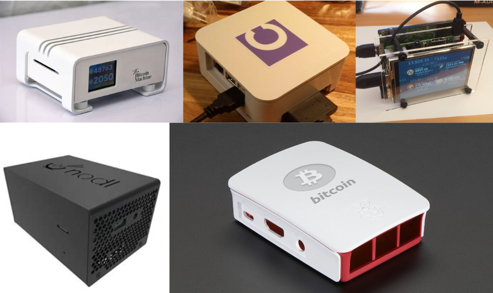
Toinen vaihtoehto on käyttää tähän tarkoitukseen omistettua laitteistoa, kuten Raspberry Pi 4, jossa on riittävän suuri SSD (noin ~1TB). Tämä toinen vaihtoehto on kalliimpi, jos sinun täytyy ostaa laitteisto, mutta sähkönkulutuksen osalta se edustaa hieman alle 10 euroa vuodessa. Kaistanleveyden näkökulmasta, kun otetaan huomioon 1 lohko 1MB joka 10. minuutti, tämä edustaa noin 5GB kuukaudessa.

### Solmujen on pysyttävä kaikkien saavutettavissa!

Bitcoin-solmun edulliset kustannukset ja saavutettavuus laitteistoresurssien, tallennustilan ja kaistanleveyden suhteen on erittäin tärkeä näkökohta, sillä se helpottaa verkon hajauttamista.

Todellakin, jokaisella on hyvä syy pyörittää solmua! Hinta ja vaiva ovat minimaalisia saadun hyödyn kannalta. Sinun tarvitsee vain lähteä seikkailuun ja liittyä tuhansien muiden bitcoinereiden joukkoon, sillä yhdessä muodostamme Bitcoin-verkon.

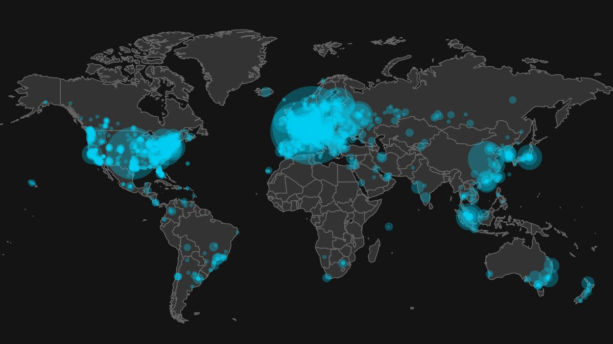

Esimerkiksi, jos lohkot olisivat 100 kertaa raskaampia, voisimme varmasti tehdä 100 kertaa enemmän transaktioita joka 10. minuutti, mutta Bitcoin-solmun pyörittäminen vaatisi 50TB kovalevyn, yli 500GB/kk kaistanleveyden ja laitteiston, joka pystyy vahvistamaan satoja tuhansia transaktioita alle 10 minuutissa. Tässä hypoteettisessa tilanteessa, jossa lohkot ovat 100 kertaa suurempia, Bitcoin-solmun pyörittäminen ei olisi keskivertohenkilön saavutettavissa, mikä vaarantaisi protokollan hajauttamisen ja transaktioiden sekä konsensus sääntöjen muuttumattomuuden. Näin ollen protokollan rajoitukset on myös valittu siten, että mahdollisimman moni ihminen voi pyörittää omaa Bitcoin-solmuaan.

Tämä tilanne ei ole niin hypoteettinen, sillä vuosi 2017 oli merkitty intensiivisellä kiistalla, joka tunnetaan nimellä "lohkosota". Tämä konflikti vastusti toimijoita, jotka halusivat muuttaa Bitcoinia kasvattamalla lohkokokoa lisätäkseen transaktiokapasiteettia, niille, jotka pyrkivät säilyttämään käyttäjien itsenäisyyden ja voiman. Lopulta käyttäjät ja solmut voittivat hylkäämällä kaivostyöläisten, vaihtoalustojen ja instituutioiden aloittaman ehdotetun muutoksen.

Tämän voiton jälkeen solmut aktivoivat päivityksen nimeltä SegWit, joka avasi tien Lightning Networkin toteuttamiselle, välittömälle Bitcoin-maksuverkolle, joka käyttää Bitcoin-lohkoketjua. Tämä tilanne osoittaa, että käyttäjät solmujensa kautta pitävät todellista valtaa Bitcoinissa, mahdollistaen heidän vastustaa suuria instituutioita.

### Yhteenveto presentaatiossa!

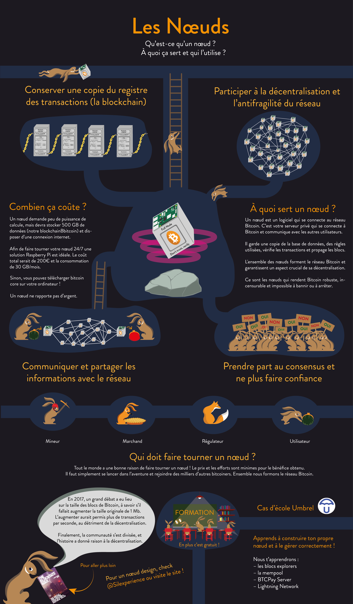

## Louhijat


> Louhijat toimivat verkon turvaamiseksi ja lisäävät transaktioita lohkoihin. He käyttävät sähköä ASIC-koneiden kautta ratkaistakseen Bitcoinin proof of work -tehtävän.

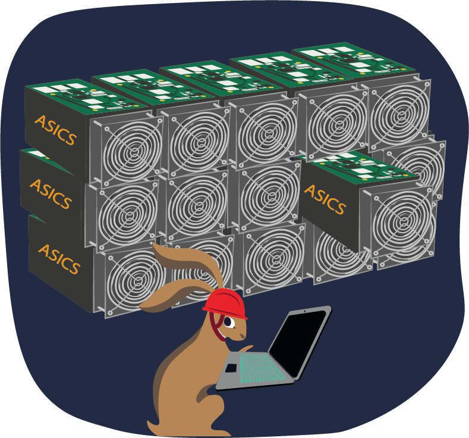

### Proof of Work -selitys

Proof of Work, tunnetaan myös nimellä "Proof of Work" (POW), on Bitcoin-protokollan turvallisuuskonsensus. Se on sääntö, joka mahdollistaa Bitcoinin toiminnan ja varmistaa sen robustisuuden. POW on kaiken perusta ja sillä on ratkaiseva rooli Bitcoinin louhinnassa.

Ajattele sitä kuin jättimäisiä arpajaisia, johon kaikki voivat osallistua. Tavoitteena on löytää tietty numero, joka mahdollistaa kelvollisen lohkon allekirjoittamisen, ja voittaja saa palkinnon bitcoineina. Tämä numero on hyvin yksinkertainen todentaa, mutta vaikea löytää. Itse asiassa, helppo todentaminen tapahtuu SHA-256 hash-funktion kautta, joka sisältyy louhintalgoritmiin. Tämän numeron löytämiseksi osallistujat (louhijat) yrittävät miljardeja mahdollisuuksia, kuten 1, 52, 2648, 26874615, 15344854131318631, jne. 
Jos valittu numero on oikea: Jättipotti! Muussa tapauksessa haku jatkuu. Optimaalisen yritysmäärän saavuttamiseksi he käyttävät erityisiä koneita, joita kutsutaan ASICeiksi, joiden ainoa tehtävä on laskea miljardeja mahdollisuuksia sekunnissa. Yritysten kokonaismäärää kutsutaan HashRateksi ja se mahdollistaa Bitcoin-protokollan turvallisuuden mittaamisen. Näiden koneiden käyttämiseen kuluu suuria määriä sähköä. Siksi POW muuntaa energian valuutaksi, yhdistäen todellisen maailman ja digitaalisen maailman luoden ensimmäisen energiaan perustuvan valuutan.
Koneet louhivat, ja keskimäärin 10 minuutin kuluttua voittaja selviää. He ovat löytäneet oikean hashin vaikeustason alapuolelta. Suuri ja ainoa voittaja allekirjoittaa sitten uuden lohkon aikaleimapalvelimessa ja jatkaa lohkoketjua. Voittaja saa palkintonsa ja palaa yrittämään onneaan seuraavassa lohkossa. Tätä prosessia on toistettu 12 vuoden ajan, ja joka 10. minuutti voittaja vahvistaa Bitcoin-siirtoja samalla kun turvaa aiempia siirtoja. Tämä tekee Bitcoin-lohkoketjustamme vahvemman ja turvallisemman.

Joka 2 viikko (2016 lohkoa), vaikeustason säätö tasapainottaa globaalia louhintapeliä osallistujien määrän perusteella.


### Louhinta kehittyy jatkuvasti

Vuosiensaatossa louhijat ovat varustautuneet yhä tehokkaammalla tietokonetekniikalla tuottaakseen mahdollisimman monta hashia sekunnissa (kutsutaan HashRateksi) kuluttaen mahdollisimman vähän energiaa kustannustehokkaimmalla tavalla. Varhaiset louhijat, kuten Satoshi tai Hal Finney, louhivat pelkästään CPU:lla, sitten toiset alkoivat louhia näytönohjaimellaan. Nykyään louhijat käyttävät niin kutsuttuja ASICeja (Application-Specific Integrated Circuit), koneita, jotka on suunniteltu erityisesti SHA256-algoritmin soveltamiseen.

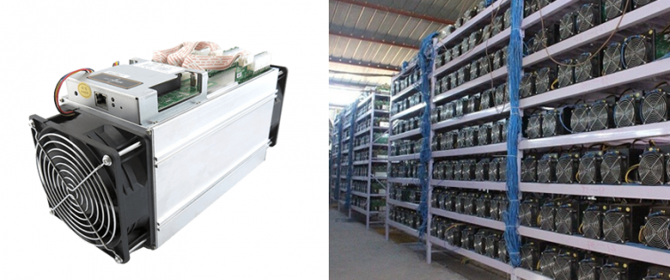

Bitcoin-verkon Hashrate edustaa yritysten määrää sekunnissa löytää seuraava lohko. Tänään se on noin 400 TH/s, mikä on 400 000 miljardia yritystä sekunnissa! Mitä korkeampi globaali hashrate, sitä vaikeampaa on pahantahtoiselle toimijalle monopolisoida tarvittavat resurssit saadakseen enemmistön louhinnasta ja suorittaakseen kaksinkertaisen kulutuksen. Siksi Bitcoin-protokollan sääntöjen noudattaminen on taloudellisesti järkevämpää kuin niitä vastaan toimiminen. Tämä herättää kysymyksen: miten louhijat saavat palkkionsa?

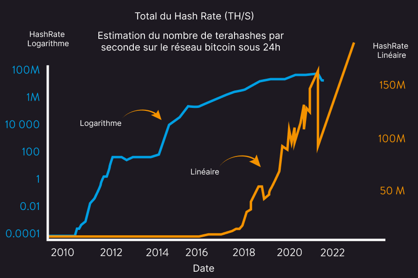

### Mitä lohkosta löytyy?


Lohkon otsikko sisältää useita elementtejä, kuten ajan, vaikeustavoitteen, viimeisimmän lohkon numeron, käytetyn version ja edellisten siirtojen Merkel Rootin.

Coinbase-siirto on aina ensimmäinen; se sisältää palkkion, joka saadaan validointityön suorittamisesta. Sen jälkeen tulevat validoidut siirrot. Louhija valitsee siirrot, jotka maksavat eniten ja yrittää luoda lohkon, joka maksimoi heidän tulonsa, nimittäin pienikokoiset siirrot maksimimaksuilla.

### Louhijoiden korvaus

Alun perin louhija saa korvauksen, kun he löytävät kelvollisen lohkon. Tarkemmin sanottuna heitä korvataan kahdella tavalla: (i) lohkoon sisältyvän palkkion kautta ja (ii) lohkoon sisältyvien siirtojen siirtomaksujen kautta. Palkkion määrä määritellään konsensus säännöissä ja riippuu siitä Epochista, jossa olemme.
Todellakin, ensimmäisissä lohkoissa palkkio oli 50 bitcoinia, sitten joka 210 000 lohkon jälkeen (noin joka 4 vuosi), se puolittuu. Tänään (vuonna 2023) olemme 4. Epookissa; siksi palkkio on 6,25 bitcoinia. Tämä palkkio on mekanismi uusien bitcoinien luomiseksi Bitcoin-verkossa. Koska palkkio vähenee ajan myötä, se tarkoittaa, että bitcoineja on rajoitettu määrä, 21 miljoonaa - tällä hetkellä liikkeessä on jo yli 19,4 miljoonaa bitcoinia, mikä on yli 92 %.

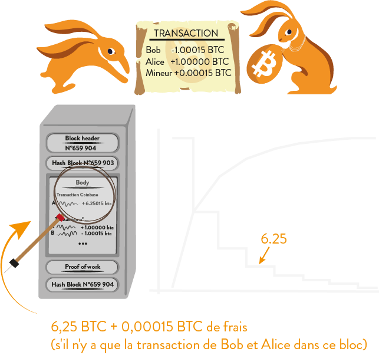

Toinen korvausmenetelmä määritellään käyttäjien valitseman siirtomaksun määrällä. Koska louhija haluaa maksimoida tulonsa, hän pyrkii priorisoimaan korkean siirtomaksun transaktioita; siirtomaksu heijastaa käyttäjän kiireellisyyttä saada transaktionsa sisällytettyä seuraavaan lohkoon.

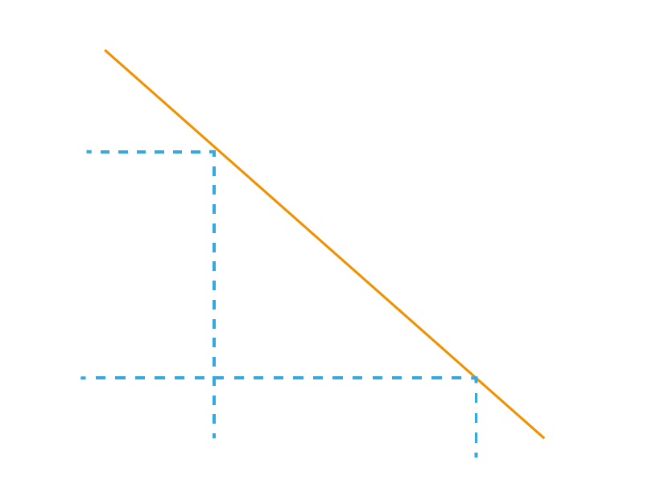

Lisäksi louhijoiden taloudellisen mallin vakauttamiseksi, joka perustuu heidän saamaansa palkkioon jokaisesta kelvollisesta lohkosta, louhijat usein tekevät yhteistyötä ryhmissä "louhintapoolien" kautta, jossa he yhdistävät laskentaresurssinsa.

### Miksi vaivautua tekemään kaikki tämä?

Lyhyesti sanottuna Bitcoinin innovaatio on ehdottaa ratkaisua kaksoiskulutuksen ongelmaan käyttämällä blockchainia, joka perustuu Proof of Work -mekanismiin ja jolla on muuttuva vaikeusaste. Digitaalisessa maailmassa omistuksen käsite eroaa fyysisen maailman käsitteestä. Todellakin, digitaalisessa maailmassa kaikki voidaan kopioida ja liittää, mikä aiheuttaa ongelmia arvokkaiden digitaalisten omaisuuksien kaksoiskulutuksen suhteen. Luotettuja välittäjiä, kuten pankkeja, on luotu ratkaisemaan tämä teknologinen ongelma ja varmistamaan, että kun omaisuus siirretään, se ei enää kuulu lähettäjälle. Mutta miten tämä voidaan tehdä ilman luotettua välittäjää? Tämä ongelma on verrattavissa Bysantin kenraalien ongelmaan, joka on tiedon koordinointiongelma järjestelmässä, jossa eri toimijoihin ei voida luottaa.

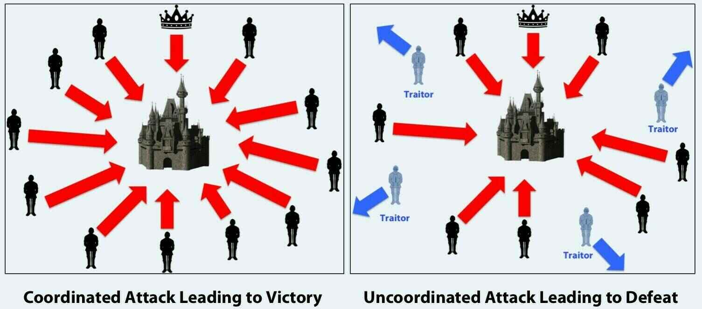

Bitcoin on siis eräänlainen ratkaisu tämän ongelman ratkaisemiseksi tai ainakin kiertämiseksi. Bitcoinin "kenraalit" eli louhijat, tuottavat lohkoja (tietoa) ja Bitcoin-noodit tarkistavat rahoitustransaktioita käyttäen konsensus sääntöjä varmistaakseen tiedon aitouden. Energiankulutuksen asymmetria tiedon tuotannon ja tarkistuksen välillä varmistaa tiedon luotettavuuden ilman luotettua kolmatta osapuolta.

Louhijat ovat Bitcoin-verkon turvallisuuden rakentajia. Käyttämällä energiaa hashien tuottamiseen, he rakentavat muurin, joka tekee erittäin kalliiksi pahantahtoiselle toimijalle yrittää kirjoittaa uudelleen transaktiohistoriaa. Tämä taloudellinen haitta estää heitä käyttäytymästä epärehellisesti.

Jopa 51% hyökkäyksen tapauksessa, tarkoittaen, että toimijalla on yli puolet hashratesta, verkko pysyy turvallisena, koska hyökkääjän on kulutettava yhtä paljon energiaa kuin kaikkien louhijoiden yhteensä yrittäessään muokata lohkoketjua. Juuri tämän työn todistusmekanismin, joka vaatii energian käyttöä, ansiosta verkko on turvallinen.

### Yhteenvetona
Konsensus-teknologian soveltaminen Bitcoiniin eliminoi epärehelliset louhijat. Louhijat käyttävät ASIC-laitteita louhimiseen ja saavat palkkion onnistuessaan. Lisäksi he usein liittyvät louhintapooliin jakamaan laskentatehoaan ja saamaan pienempiä, mutta säännöllisempiä palkkioita. Bitcoinin louhinta on prosessi, jolla on korkea energiakustannus, mutta se on olennaisen tärkeää Bitcoin-verkon toiminnalle ja turvallisuudelle. Proof of work ja lohkoketju ratkaisevat kaksoiskulutuksen ongelman ja varmistavat tiedon totuudenmukaisuuden ilman luotettua kolmatta osapuolta.  Energiankulutus on tarpeen tiedon tuottamiseksi, mutta tiedon varmentamisen kustannus on merkityksetön. Tämä epäsymmetria takaa verkon turvallisuuden. Siksi konsensus sääntöjen noudattaminen on taloudellisesti kannattavampaa kuin niiden rikkominen.

## Bitcoin ja ekologia


Olemme juuri nähneet edellisessä osiossa, että Bitcoin-protokollan turvallisuus perustuu korkeaan energiakustannukseen julkisen tapahtumakirjan tuottamiseksi ilman luotettua kolmatta osapuolta. Kokonaisenergiakustannuksia verrataan usein pienen maan sähkönkulutukseen. Mutta onko tämä vertailu järkevä? Onko se relevantti ymmärtääksemme tällaisen kustannuksen taustalla olevat syyt?

### Bitcoinin energiakustannukset.

Ensinnäkin, arvioidaan laadullisesti louhinnan ympäristökustannuksia. Louhijalla on oltava kone, kuten ASIC, ja energianlähde sähkön muodossa näiden koneiden käyttämiseksi. ASICit ovat pääasiassa alumiinia ja ne voidaan joko kierrättää tai käyttää uudelleen toiseen tarkoitukseen (kuten osoitetaan [Attakaï-projektissa](https://decouvrebitcoin.fr/attakai/), joka muuntaa Antminer S9:n tilalämmittimeksi). Päähuolenaihe on siis energiankulutus. Yritetään tarjota tähän lisää kontekstia.

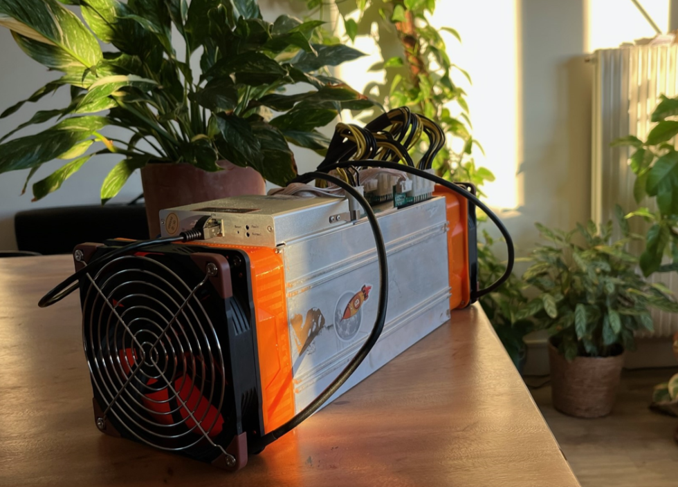

Sähkönkulutus muodostaa lähes kaikki louhijan kustannukset. Siksi heitä kannustetaan etsimään halpa sähkön lähde. Koska louhintalaitteet ovat liikuteltavia, louhijat voivat mennä paikkoihin, joissa voimalaitokset on asennettu, mutta niitä ei vielä ole yhdistetty alueen sähköverkkoon. Louhijat toimivat viimeisenä ostajana, mahdollistaen voimalaitosten rahoituksen turvaamisen jopa ennen niiden liittämistä sähköverkkoon. Ja kun ne liitetään, sähkön kysyntä kasvaa, mikä nostaa hintaa ja tekee sähkön hankkimisesta näissä paikoissa vähemmän kannattavaa louhijalle. Louhija päättää sitten siirtää laitoksensa ja asettua kauemmas, missä kysyntä on matala ja siten myös hinta. 

### Loputon keskustelu

Näin ollen keskustelu Bitcoinin ekologisesta vaikutuksesta on usein harhaanjohtava, pääasiassa sen hyödyllisyyden ja toiminnan riittämättömän ymmärtämisen vuoksi. Bitcoinia ei voida arvioida pelkästään energiakustannuksen perusteella transaktiota kohden, koska louhijat turvaavat sekä nykyisen että historiallisen verkon, transaktiot ryhmitellään eivätkä kaikki ole samanarvoisia, eikä Lightning Networkin vaikutusta oteta huomioon. Ne, jotka väittävät, että Bitcoin kuluttaa liikaa energiaa, saattavat olla poliittisesti motivoituneita tai pyrkiä myymään oman lohkoketjuratkaisunsa. Ekologinen tekosyy käytetään perustelemaan Bitcoinin kieltämistä.

Ei kuitenkaan pidä unohtaa, että Bitcoin, vallankumouksellisena keksintönä, on antanut taloudellisen sortovallan tai diktatuurisen hallinnon alla eläville ihmisille keinon taistella vapautensa puolesta. Viimeisenä keinona Bitcoin tarjoaa taloudellista vapautta välttämällä sensuuria ja pankkirajoituksia. Bitcoin on enemmän kuin vain valuutta. Se on viestinnän ja yksilönvapauden ilmaisun muoto. Louhijoiden käyttämä energia edistää vapautemme puolustamista. Bitcoin mahdollistaa irtautumisen nykyisestä, velkaan ja keskuspankkien liialliseen rahantuotantoon perustuvasta rahoitusjärjestelmästä.
Niille, jotka asuvat maissa, joissa inflaatio on korkea, Bitcoin on eloonjäämiskysymys. Se tarjoaa keinon selviytyä epävarmoissa taloudellisissa tilanteissa. Lisäksi Bitcoin tarjoaa oikeudenmukaisemman ja tasapuolisemman rahoitusjärjestelmän. Se tarjoaa myös mahdollisuuden miljardeille ihmisille ympäri maailmaa päästä rahoitusjärjestelmään. Tästä näkökulmasta katsottuna, onko energiankulutus perusteltua?

### Voisiko Bitcoin olla nettopositiivinen ympäristölle?

Lopulta on olennaista keskustella Bitcoinin käyttöönoton taloudellisista ja ympäristöön liittyvistä kysymyksistä.

Erityisesti verrattaessa sitä nykyiseen rahoitusjärjestelmään. Jälkimmäinen, sen kannustaessa ylikulutukseen ja velkaantumiseen, aiheuttaa vakavia ongelmia. Helppo pääsy luottoon, rahalaitosten rahantuotanto ja osittaisen varantovelvoitteen käyttö ovat kaikki tekijöitä, jotka edistävät ylivelkaantumista ja siten ylikulutusta.

On tarpeen uudistaa rahajärjestelmää, jotta se heijastaisi resurssiemme niukkuutta valuuttamme niukkuuden kanssa. Tämä kannustaisi vastuullisempaan kulutukseen ja pitkän aikavälin näkemykseen. Päinvastoin, inflaatio, kannustaessaan kulutusta ja investointeja, vaikuttaa negatiivisesti ympäristöön pitkällä aikavälillä.

Nykyinen rahoitusjärjestelmä noudattaa Keynesiläisen taloustieteen ideoita, jotka, toisin kuin Itävaltalainen taloustiede, eivät ota huomioon tilanteiden ja resurssien ajallisia ja dynaamisia näkökohtia. Toisin sanoen, rajaton valuutta ei voi tehokkaasti heijastaa planeettamme rajallisia resursseja.

Politiikot, johtuen heidän lyhytaikaisesta näkemyksestään ja tarpeestaan talouskasvuun uudelleenvalinnan saavuttamiseksi, eivät kykene ratkaisemaan ekologisia ongelmia pitkällä aikavälillä. Päinvastoin, äänen valuutan, kuten Bitcoinin, käyttöönotto on potentiaalinen vaihtoehto, joka voisi taloudellisesti voimaannuttaa ihmisiä.

Öljykaivojen liekit, jotka polttavat metaania estääkseen saastumisen, voidaan sammuttaa Bitcoinin louhijoilla, mikä on hyödyllistä ympäristölle. Bitcoin edistää vihreän energian käyttöä. Metaani voidaan muuntaa sähköksi louhintakoneiden käyttöön, mikä on edullista kaikille.

Bitcoinin teknologiaa usein väärinymmärretään, ja sen ympäristövaikutuksia koskevat kritiikit ovat usein yksinkertaistettuja ja lyhytnäköisiä. Nämä kritiikit ovat usein poliittisesti motivoituneita. Bitcoinilla on potentiaalia auttaa ekologisessa siirtymässä ja edistää vihreämpää maailmaa. Media levittää usein vääriä ideoita Bitcoinista ja ekologiasta. Joten ota aikaa muodostaaksesi oman mielipiteesi. Kaikki on läpinäkyvää Bitcoinin kanssa.

> Noudata yhtä Bitcoinin periaatteista: Älä luota, varmista itse!


### Lyhyt yhteenveto Bitcoinin teknisistä näkökohdista


Satoshi Nakamoto julkaisi Bitcoin-protokollan tammikuussa 2009, ja siitä lähtien se on kehittynyt kasvavan kehittäjien, louhijoiden ja käyttäjien yhteisön ansiosta, joilla on Bitcoin-solmuja. Pitämällä oman kopionsa Bitcoin-lohkoketjusta, julkisesta kirjanpidosta kaikista Bitcoin-siirroista, nämä solmut voivat varmistaa siirtojen pätevyyden Bitcoinin konsensus sääntöjen mukaisesti. Tämä sisältää varmistamisen, että louhijat tuottavat päteviä lohkoja, jotka sisältävät tuhansia odottavia siirtoja.
Keskimäärin lohko luodaan joka 10. minuutti, ja louhija, joka löytää kelvollisen tiivisteen (hash) seuraavalle lohkolle, palkitaan protokollan määrittelemällä palkkiolla, jonka määrä määräytyy konsensus-sääntöjen mukaan, sekä kaikkien kelvolliseen lohkoon sisältyvien siirtojen siirtomaksuista. Koska tiivistefunktion (SHA256) tuloksen katsotaan olevan arvaamaton annetulle syötteelle, louhintaprosessi sisältää useiden ehdokaslohkojen rakentamisen ja niiden tiivisteiden kelvollisuuden testaamisen. Kuitenkin, jotta kahden lohkon välinen keskimääräinen aika pysyy vakiona (~10 min) riippumatta louhijoiden määrästä ja heidän laskentatehostaan, kelvollisen tiivisteen löytämisen vaikeus säätyy joka 2016. lohkon jälkeen, suunnilleen joka 2. viikko. Louhijat ovat ajan myötä kehittäneet erikoistuneita SHA256-koneita, kutsuttu ASICeiksi, lisätäkseen tiivisteenopeutta joulea kohden, mikä tarkoittaa yritysten määrää sekunnissa ja kulutetun energian määrää.

Jotta louhijat voisivat olla mahdollisimman tuottoisia toiminnassaan, heidän on saatava mahdollisimman halpaa sähköä, joka usein sijaitsee syrjäisillä alueilla, voimalaitoksissa, jotka eivät vielä ole yhdistetty sähköverkkoon. Louhija toimii tällöin viimeisenä ostajana, ja heti kun sähkön hinta nousee kysynnän kasvaessa, louhija pyrkii siirtämään toimintansa muualle.

Näin ollen Bitcoin-protokolla on sensuroimaton ja pysäyttämätön rahajärjestelmä, koska protokollan jokainen komponentti on maantieteellisesti hajautettu ympäri maailmaa - esimerkiksi maailmanlaajuisesti on noin 40 000 Bitcoin-solmua kaikilla mantereilla. Bitcoinin konsensus-säännöt ovat sellaiset, että niiden noudattaminen on taloudellisesti kannattavampaa kuin niiden rikkomisen yrittäminen, ja siksi toimijoiden välillä ei vaadita luottamusta. Bitcoinilla ei ole johtajaa eikä sitä voi pysäyttää. On mahdollista säännellä vaihtoalustoja Bitcoinin rajoittamiseksi, mutta tämä on vaikutuksiltaan rajallista. Lyhyesti sanottuna mikään tuomari tai valtio ei voi sensuroida tai pysäyttää Bitcoinia.

# Kuinka hankkia Bitcoinia?

## Bitcoin ei koskaan nuku!


Bitcoinin hinta on usein merkittävän volatiilin luonteen omaava. Sen arvo voi vaihdella huomattavasti markkinavaihteluiden ja härkä- ja karhumarkkinavaiheiden mukaan. Tämä on läsnä 100%:ssa rahoitusmarkkinoista, mukaan lukien Bitcoin.

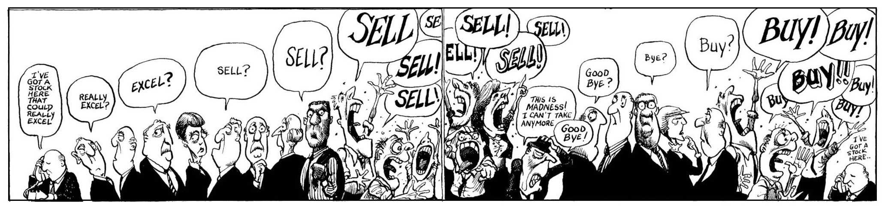

> Yksinkertaisesti sanottuna: ihmiset ostavat kaikki samaan aikaan ja myyvät kaikki samaan aikaan. Bitcoin ei ole immuuni ihmisen luonnolle.

### Adoptioaaltojen ymmärtäminen

Bitcoinin kehitys ja evoluutio ovat suurelta osin yhteydessä eri toimijaryhmiin, jotka ovat vähitellen integroituneet sen ekosysteemiin.


- Bitcoin-aktivistit:

Bitcoinin varhaiset käyttäjät olivat pääasiassa teknofiilejä, kyberpunkkeja, libertaareja ja kulta-entusiasteja. Nämä ryhmät houkutteli Bitcoin, koska se tarjosi ratkaisuja kuten luottamukseton sähköinen käteinen, sensuurin vastustaminen tai läpinäkyvä ja muuttumaton rahapolitiikka.

- Pimeä verkko & rikolliset

Sen jälkeen Bitcoinin käyttö laajeni pimeän verkon markkinapaikoille, kuten Silk Roadille, sen hallitsemattoman ja pseudonyymin luonteen vuoksi. Tämä sivusto kiinnitti huomiota Bitcoinin hallitsemattomaan ja pseudonyymiin luonteeseen, mikä houkutteli joitakin rikollisia toimijoita käyttämään sitä. On kuitenkin huomattava, että työkalun käyttö, ei itse työkalu, määrittää sen laillisuuden tai laittomuuden. On huomattava, että Bitcoinin laiton käyttö ei itsessään tee tekniikasta rikollista. Se on käyttö, ei työkalu, joka voidaan luokitella laittomaksi. Esimerkiksi Bitcoinin käyttö tiettyjen huumeiden ostamiseen voi olla laillista tai laitonta riippuen siitä, missä toiminta tapahtuu.
- ICO-huuma ja yleisön saapuminen.
Vuosi 2017 merkittiin merkittävällä spekulatiivisella kuplalla kryptovaluuttojen maailmassa, erityisesti tuhansien alkuperäisten kolikontarjousten (ICOs) lanseerauksen myötä. Monilla näistä uusista kryptovaluutoista ei kuitenkaan ollut konkreettista kehitystä tai hyötyä ja ne katosivat nopeasti. Tätä 2017 kuplaa seurasi voimakas korjausliike vuosina 2018-2019.

- NFT-kupla ja DeFi

Sitten jälleen vuonna 2020, markkina koki toisen spekulatiivisen kuplan, joka nosti Bitcoinin hinnan 60 000 dollariin. Tämä kupla erottuu aiemmista suuremmalla sijoittajien monimuotoisuudella, mukaan lukien rahoituslaitokset ja suuret yritykset. Mutta jälleen kerran, voimakkaat korjaukset tapahtuvat kerran kun euphoria laantuu.

### Bitcoin & Volatiliteetti

Aiempien syklien perusteella vaikuttaa siltä, että Bitcoinin taloudellisten syklien periodisuus vastaa kahta puoliintumista (halving). Ehkä siksi, että halving-tapahtuma toimii laukaisijana puolittaen uusien bitcoinien emission.

Nämä merkittävät vaihtelut ovat luoneet Bitcoinille maineen erittäin vaarallisena omaisuutena, joka saa käyttäjänsä menettämään rahaa. Vaikka hinta voi laskea 10-20 tai jopa 50% muutamassa päivässä, on tärkeää ymmärtää, että Bitcoin-protokolla ei ole hinnanmuutoksista kärsivä.

Tämä merkittävä volatiliteetti hyväksytään täysin tänään Bitcoin-toimijoiden keskuudessa ja sitä voidaan lieventää useilla ratkaisuilla, kuten taloudellisilla suojauksilla (stablecoins), vahvalla pitkän aikavälin uskolla (hodling) tai yksinkertaisesti sijoittamalla 100% rahoistaan Bitcoiniin ymmärtämättä mitään. Ymmärtäminen, miksi Bitcoinin hinta vaihtelee niin paljon, on siis olennaista pystyäkseen edistymään tässä teollisuudessa, koska loppujen lopuksi se on hinta ja syklit, jotka jossain määrin hillitsevät ja säätelevät markkinaamme. Voimme kuitenkin huomata, että Bitcoinin kasvaessa ja kypsyessä, volatiliteetti muuttuu vähemmän merkittäväksi.

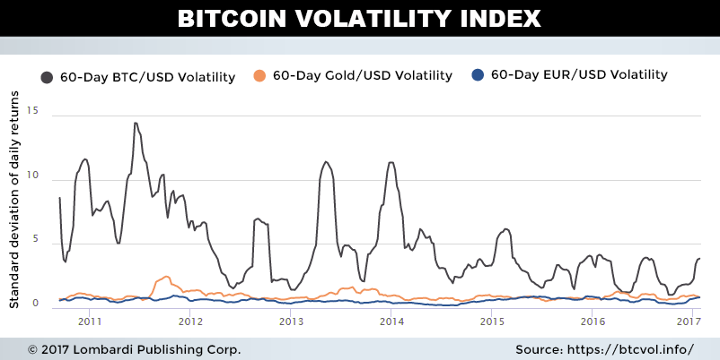

Vaikka btc/dollari-pari vaihtelee lyhyellä aikavälillä, Bitcoin seuraa yleistä nousutrendiä lähes mekaanisella tavalla rajoitetun 21 miljoonan bitcoinin määränsä ja halving-prosessinsa ansiosta (rahoituksen luominen puolittuu keskimäärin joka neljäs vuosi). Tietysti, kuten mikä tahansa spekulatiivinen rahoitusomaisuus, Bitcoin on taloudellisten syklien alainen, mukaan lukien euforian kaudet, spekulatiiviset kuplat ja korjaukset. Tämä ilmiö on melko yleinen nousevissa teknologioissa, joissa markkina ei aina ole rationaalinen tai tehokas.

### Ainutlaatuinen markkina

Nämä spekulatiivisten kuplien syklit ovat melko ainutlaatuisia maailmassa, koska on erittäin harvinaista, että sama omaisuuserä kokee niin monta kuplaa peräkkäin. Tämä voidaan selittää yksinkertaisesti sillä, että Bitcoin ei ole kupla, joka katoaa, vaan valuutta, jota todella käytetään kaikkialla maailmassa. Bitcoin-protokolla on ainutlaatuinen siinä, että se toimii globaalilla tasolla, 24 tuntia vuorokaudessa, 7 päivää viikossa, mikä tekee rahoitusviranomaisten sääntelystä vaikeaa.

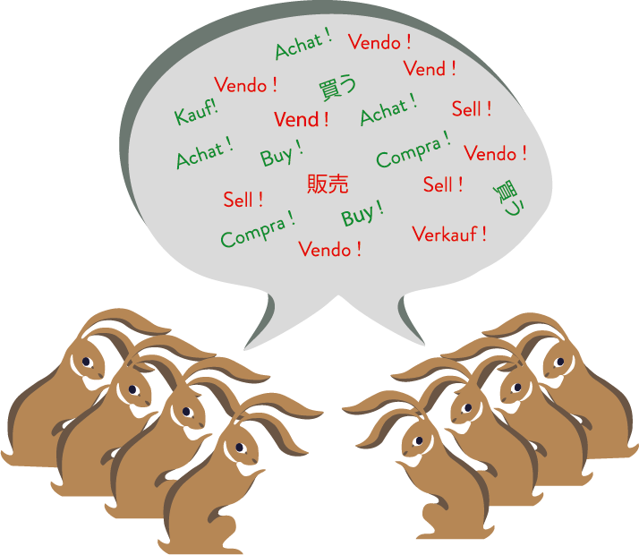

Tänään, vuonna 2023, Bitcoin jatkaa selviytymistään ja kasvuaan integroitumalla yhä enemmän perinteiseen markkinaan. Bitcoin ETF:ien tuleva saapuminen, selkeämpi sääntely ja paremmat hankinta- tai säilytystyökalut vain rohkaisevat tätä suuntausta. Bitcoin on JÄLLEEN kerran selvinnyt spekulatiivisesta kuplastaan, joten ehkä se ei olekaan pelkkää höyryä!

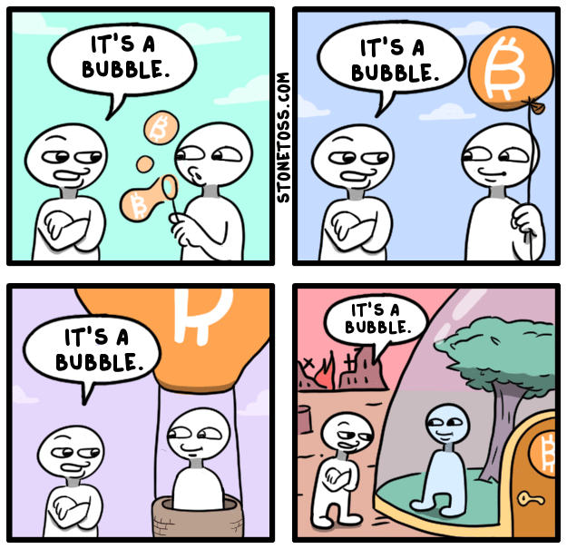

## Bitcoinien hankkiminen työskentelemällä


### Kehittyy rinnakkainen talous
Bitcoinia voidaan pitää rinnakkaisena taloutena fiat-valuutoille. Tämä tarkoittaa, että on mahdollista myydä tavaroita tai palveluita ja saada maksu Bitcoinina. Transaktiot voidaan suorittaa suoraan Bitcoinina, ilman tarvetta käyttää vaihtoalustaa, yksinkertaisesti Bitcoin-lompakosta toiseen Bitcoin-lompakkoon.
Bitcoin-talous on olemassa ja kehittyy tietyillä maailman alueilla, kuten El Salvadorissa, jossa Bitcoin on ollut laillinen maksuväline vuodesta 2021 lähtien. Lisäksi jotkut yksityishenkilöt, yritykset ja organisaatiot hyväksyvät jo Bitcoinin maksuvälineenä tuotteilleen tai palveluilleen.

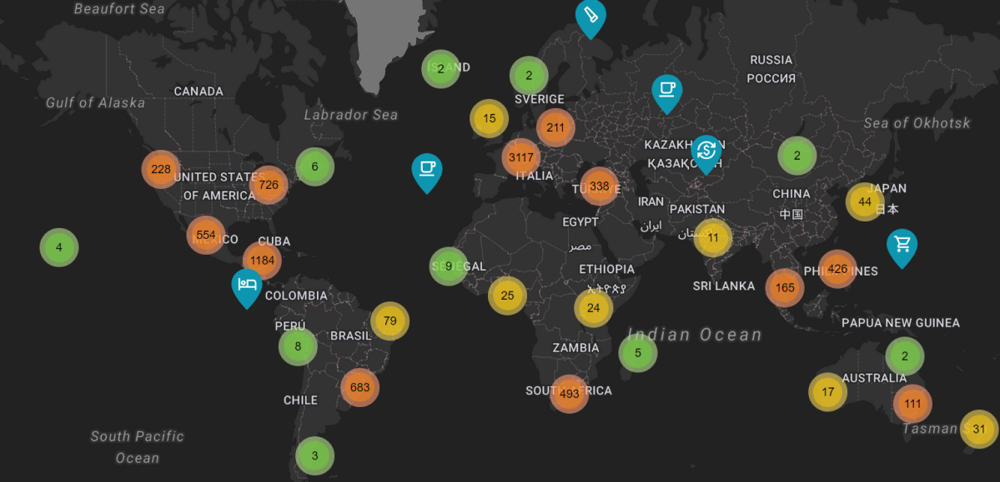

Lisäksi Bitcoinin käytön helpottamiseksi jokapäiväisissä transaktioissa on käynnistetty avoimen lähdekoodin ja yhteistyöhön perustuva projekti: BTCMap (https://btcmap.org/map#2/21.28937/5.46680). Tämä alusta listaa kaikki kauppiaat, jotka hyväksyvät Bitcoinin sekä eri Bitcoin-yhteisöt ympäri maailmaa. Voit vierailla heidän verkkosivuillaan tutustuaksesi sinua ympäröivään Bitcoin-ekosysteemiin. Näin ollen, huolimatta vaikeuksista ja epäröinneistä, on aloitteita kuten BTCMap, jotka edistävät Bitcoin-talouden saavutettavuutta ja mukavuutta kaikille.

### Miksi hyväksyä Bitcoinia ostamisen sijaan?

Bitcoineja voi hankkia ostamalla niitä alustoilta, joita säätelevät organisaatiot kuten Ranskan AMF (Autorité des Marchés Financiers). Tämä menetelmä sisältää tiettyjä riskejä ja transaktioidesi jäljitettävyyden. Toinen tapa hankkia bitcoineja on hyväksyä ne maksuvälineenä tarjoamistasi tuotteista tai palveluista. Tämä menetelmä mahdollistaa bitcoinien hankkimisen työsi kautta olematta jatkuvasti huolissasi Bitcoinin hinnasta.

Lisäksi Bitcoinin hyväksymisellä kauppiaana on useita etuja, mukaan lukien sensuurin vastustuskyky, pienemmät transaktiomaksut, lisääntynyt tehokkuus, suojautuminen inflaatiolta sekä taloudellinen vapaus ja suvereniteetti.

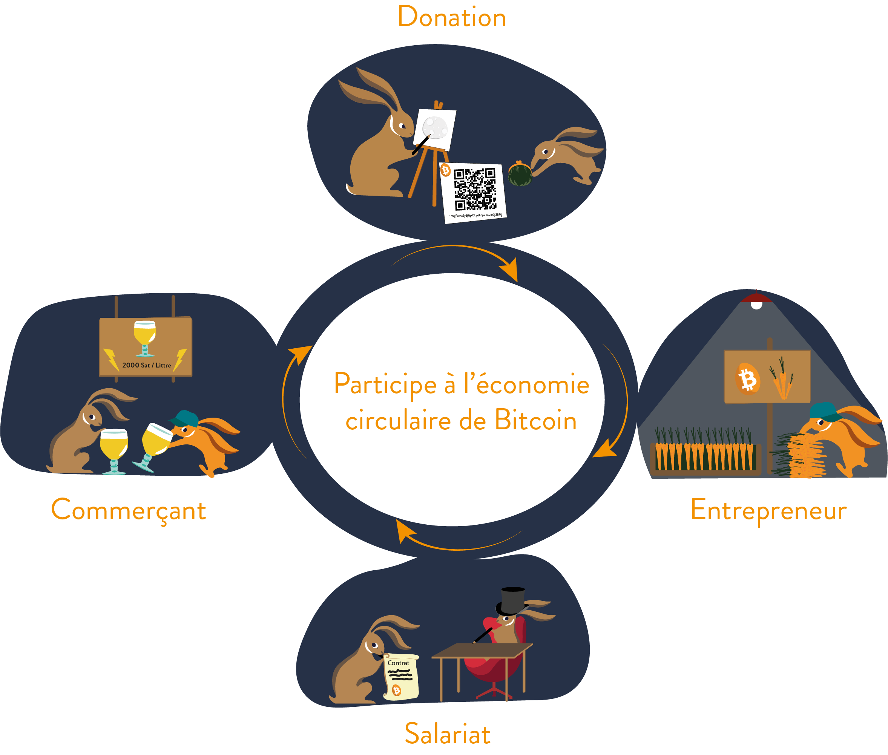

### Kuinka edetä:

Bitcoinin hyväksymiseksi on tarpeen tutkia eri saatavilla olevia ratkaisuja ja valita se, joka sopii parhaiten liiketoimintaasi. Täydellistä ratkaisua ei ole olemassa, ja valintaa tehdessä on otettava huomioon useita tekijöitä, kuten odotettu transaktiovolyymi, käytettävissä oleva budjetti ja liiketoiminnan tyyppi (verkossa tai fyysinen).

Käsittelemme tätä aihetta yksityiskohtaisemmin toisessa koulutuksessa, mutta yksinkertaistaaksemme voimme harkita useita yrityskategorioita ja siten niihin liittyviä ratkaisuja:

- Yksinkertainen online-ratkaisu: OpenNode
- Ratkaisu harrastelijakauppiaille: Swiss Bitcoin Pay
- Ratkaisu suurille rakenteille tai intohimoisille bitcoinisteille: BTCpay Server

## Säästäminen Bitcoinilla


### Varoitus ennen aloittamista!

Bitcoin on tullut merkittäväksi finanssiomaisuudeksi, pääasiassa sen rajallisen tarjonnan ja kasvavan kysynnän vuoksi. Bitcoinin ostaminen kuitenkin sisältää riskejä, jotka vaativat erityistä huomiota. Siksi on suositeltavaa tehdä oma tutkimus ja oppia lisää aiheesta, jotta voit tutustua teknologiaan ennen sijoittamista.

- Sijoita vain sen verran, kuinka paljon on varaa menettää.
- Bitcoin on erittäin volatiili finanssiomaisuus; sen hinta voi laskea nollaan.
- Menneet tulokset eivät ole tae tulevasta suorituskyvystä.
- Ota tarvittaessa yhteyttä taloudelliseen neuvonantajaasi.

> DécouvreBitcoin (Rogzy) ei tarjoa sijoitusneuvontaa, eikä mitään tässä esitettyä tulisi pitää sellaisena.

### Mini-tarkistuslista ennen Bitcoin-maailmaan sukeltamista

Ennen kuin sukellat Bitcoinin ostamiseen, varmista, että sinulla on:

- Turvallinen lompakko.
- Vankka ymmärrys Bitcoinista.
- Seurattava säästösuunnitelma.
- Pitkän aikavälin näkemys.

Jos aihe on edelleen epäselvä, BTC102-kurssi opastaa sinua turvaamaan ja hankkimaan ensimmäiset bitcoinisi. Tässä me vain raapaisemme aihetta pinnalta.

Käytännössä on kaksi kysymystä, jotka sinun tulee itseltäsi kysyä:
- Minkä hankintastrategian valita: asteittain vai kaikki kerralla?
- Mitä alustaa käyttää: säänneltyä vai sääntelemätöntä?

### Hankintastrategiat

- Dollar Cost Average (DCA)

Toistuvat ostot tarkoittavat pienten Bitcoin-määrien ostamista säännöllisin väliajoin. Tämä menetelmä tasoittaa hintaa ajan myötä ja tarjoaa jatkuvaa kasvua omistettavan Bitcoin-määrän suhteen. Se on ihanteellinen ratkaisu pitkäaikaiseen säästämiseen ilman huolta Bitcoinin hinnasta ja volatiliteetista. Aseta se käyntiin ja unohda se.

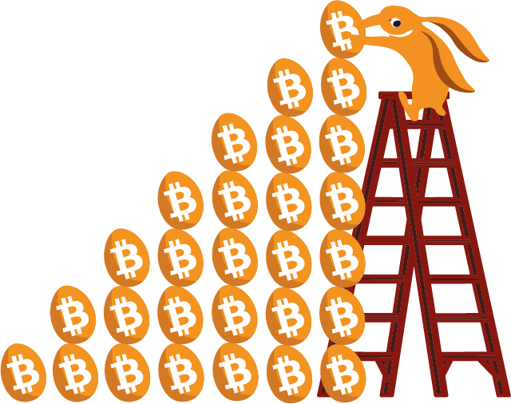

> Varo UTXO:ja: Muista yhdistää UTXO:si lompakoissasi ajoittain. Tämä käytäntö on olennainen tehokkaan Bitcoinien hallinnan ja tarpeettomien maksujen välttämisen kannalta siirtojen aikana.

- Spontaani ostos

Spontaania ostosta käytetään saavuttamaan välitön altistuminen Bitcoinille. Olipa kyseessä ostaminen romahduksen aikana tai bonuksen hyödyntäminen, päätös on sinun. Sinun on kerättävä rohkeutesi ja painettava ostonappia.

Bitcoinin merkittävän volatiliteetin vuoksi on kiinnitettävä erityistä huomiota tunteisiisi. FOMO (Fear of Missing Out) ja FUD (Fear, Uncertainty, Doubt) ovat pahimpia vihollisiasi tässä yhteydessä! Pysy rauhallisena ja noudata etukäteen määrittelemääsi strategiaa välttääksesi impulsiiviset ja mahdollisesti haitalliset päätökset.

### Keneltä meidän pitäisi ostaa Bitcoinimme?

Bitcoinien hankkimiseen on useita tapoja, joilla kullakin on omat sääntelynsä. Jotkut alustat vaativat tunnistautumisen vahvistusta varten, toiset eivät. On tärkeää ymmärtää kunkin alustan liittyvät säännökset.

- DCA-alustat

Yleinen tapa kerryttää Bitcoineja on Dollar Cost Averaging (DCA), joka sisältää säännölliset pienet sijoitukset. Useat alustat tarjoavat tätä palvelua, kuten ne, jotka on listattu [asialle omistetulla sivullamme](https://sovereignuniversity.org/tutorials/exchange). DCA:n helppouden lisäksi nostot lompakkoosi ovat yleensä automaattisia, mikä tarkoittaa, että sinulla on aina hallinta omaisuudestasi.

Nykyään lähes kaikki DCA-ratkaisut ovat suhteellisen tehokkaita ja niiden maksut ovat lähes samankaltaiset, joten valinta riippuu enemmän saatavuudesta maassasi.

- Välittäjäalustat

Suurten sijoitusten osalta suositellaan säänneltyjä ja tunnustettuja alustoja, kuten Kraken, Bitstamp ja Paymium. Nämä alustat tarjoavat turvallisen ja turvatun ympäristön suurten transaktioiden tekemiseen.

Niiden käyttö on yksinkertaista ja kaikkien saavutettavissa:

1. P1. Perusta tili ja tee KYC* 
2. Siirrä varoja tilillesi
3. Osta Bitcoinia
4. Nosta Bitcoin lompakkoosi

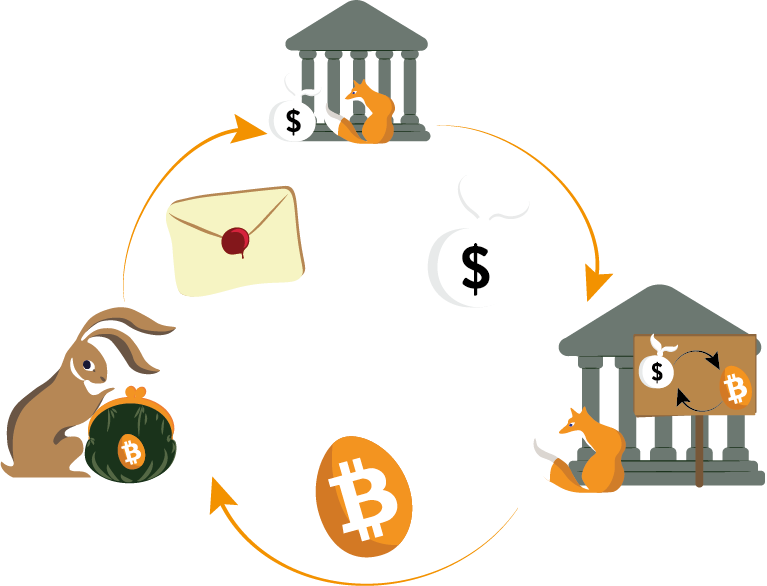

Oston jälkeen on suositeltavaa välittömästi nostaa Bitcoinit vaihtoalustoilta minimoidaksesi hakkeroinnin ja varojen jäädyttämisen riskit. Nostomaksut voivat olla korkeat, joskus jopa 25 euroa alustasta riippuen.

> Know Your Customer (KYC) -säännökset vaativat käyttäjiä toimittamaan tunnistetiedot terrorismin rahoituksen, veronkierron ja rahanpesun torjumiseksi.

On tärkeää huomata, että KYC on tärkeä aihe alallamme, koska sen tehokkuus on helposti kyseenalaistettavissa, ja sen kielteiset puolet ovat lukuisia. Monissa yliopistomme koulutusohjelmissa ja sisällöissä neuvomme välttämään KYC-alustoja, jos olet jo edistynyt käyttäjä.

### Ei-KYC Ratkaisu

Lisäksi on useita [markkinapaikkoja](https://sovereignuniversity.org/tutorials/exchange) ostaa ja myydä bitcoineja vertaisverkossa. Jos olet kiinnostunut näistä, voit osallistua BTC 205 -kurssillemme aiheesta. Yleensä nämä ratkaisut ovat:

- Bitcoin-automaatit
- Fyysiset tapaamiset muiden bitcoin-entusiastien kanssa
- Laittomat ja sääntelemättömät alustat
- Vertaisverkkoon perustuvat yhdistämispalvelut
- Neopankit, jotka toimivat Bitcoin-ystävällisissä maissa.
On tärkeää huomata, että verotus voi tulla sovellettavaksi alueellasi. Kehotamme sinua tutustumaan maasi säädöksiin ennen minkään toimenpiteen toteuttamista, joka saattaisi asettaa sinut riskiin.

## Hyper-bitcoinisaatio


### Villi kilpajuoksu on vasta alkanut!

Kuten mikä tahansa uusi teknologia, Bitcoinin omaksuminen noudattaa S-käyrää. Olemme ohittaneet varhaisen omaksujien aikakauden, ja indikaattorit näyttävät viittaavan Bitcoinin täydelliseen demokratisoitumiseen. Se on kuin virusteknologiaa, jota ei voi pysäyttää. El Salvador on ottanut rohkean askeleen omaksuessaan Bitcoinin kokonaisuudessaan ja julistamalla sen lailliseksi maksuvälineeksi. Kuitenkin jokainen maa reagoi tähän teknologiaan eri tavoin. Jotkut ovat kieltäneet ja kriminalisoineet sen käytön, mikä lisää Bitcoinin omaksumisen monimutkaisuutta kulttuurien, aikakausien ja kansakuntien perusteella.

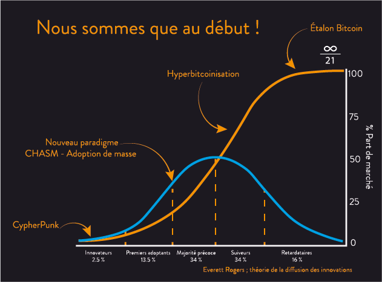

Bitcoinin nousu pakottaa yritykset, yliopistot, sääntelijät ja yksilöt ottamaan huomioon tämän uuden teknologian. Uusia työkaluja on luotava, palveluja on mukautettava ja innovaatioiden on jatkuttava niiden selviytymisen varmistamiseksi. Tämä konteksti herättää monia kysymyksiä liittyen eri aloihin, mukaan lukien kryptografia, peliteoria, taloustiede ja rahapolitiikka, tietojenkäsittelytiede, filosofia, energia, lait ja sääntely. Lyhyesti sanottuna, Bitcoin on monitieteellinen kohde.

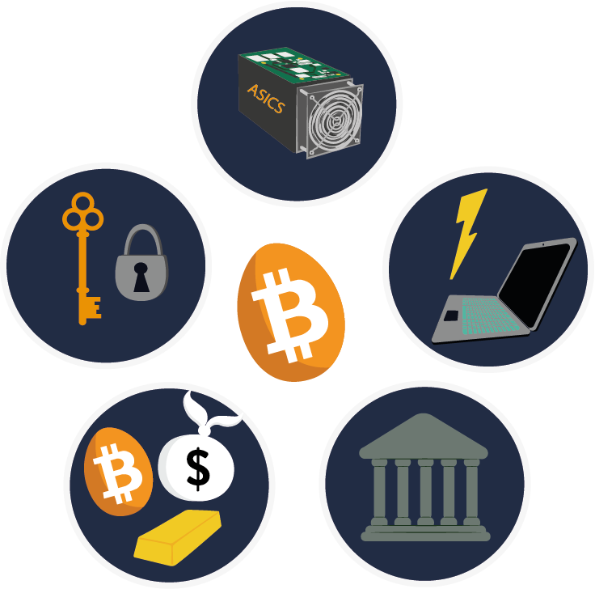

### Bitcoin on 0:sta 1:een

Kutsumme sinut pohtimaan tätä uutta rahavallankumousta. Bitcoinin kanssa tutkittavaa on niin paljon, että kaiken omaksuminen kerralla on monimutkaista. Ota aikasi, Bitcoin ei ole katoamassa. Päinvastoin, vallankumous on vasta alkanut. Uskomme yhdessä, että kykenemme luomaan maailman, jonka haluamme jättää lapsillemme. Maailman, jossa ihmisen suvereniteetti on oikeus, yksityisyys kunnioitetaan oletuksena, ja jossa rahaa ei manipuloida. Toivomme, että saavutamme tämän yhdessä.

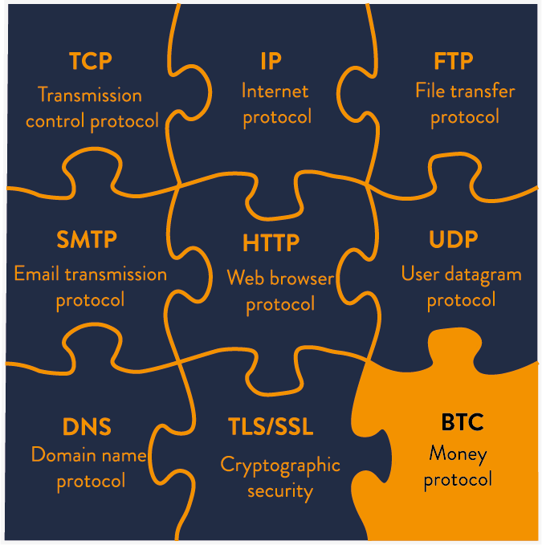

Jos haluat laajentaa tietämystäsi Bitcoinista, suuri joukko kirjailijoita, ajattelijoita ja esseistejä on myötävaikuttanut Bitcoinin koulutuskerrokseen. Viime vuosina olemme listanneet ja luokitelleet nämä teokset tarjotaksemme [kirjasto resursseja](https://sovereignuniversity.org/resources) kaikkein uteliaimmille teistä. Löydät parhaat podcastit, verkkosivustot, artikkelit, tutoriaalit, kirjat ja muun sisällön.

> Milton Friedman, tunnettu taloustieteilijä, ennusti vuonna 1999: "Luulen, että Internet tulee olemaan yksi merkittävimmistä voimista hallituksen roolin vähentämisessä. Ainoa asia, joka puuttuu, mutta joka pian kehitetään, on luotettava sähköinen raha - menetelmä, jonka avulla Internetissä voit siirtää varoja A:sta B:hen ilman, että A tietää B:stä tai B tietää A:sta."

# Bitcoinin tulevaisuus: Salamaverkko

## Lyhyt johdanto Salamaverkkoon


Nyt kun meillä on perustiedot Bitcoin-protokollasta, esittelemme maksuverkon, joka käyttää Bitcoin-protokollaa mahdollistaakseen salamannopeat transaktiot. Puhumme tietenkin Salamaverkosta!

### Pähkinänkuoressa

Salamaverkko on vallankumouksellinen teknologia, joka on syvästi muuttanut käsitystämme Bitcoinista. Se on ratkaisu, joka käsittelee Bitcoinin skaalautuvuusongelmaa.

Ymmärtääksemme Salamaverkon täysin, on tärkeää ymmärtää, miten Bitcoin kehittyy. Bitcoin kehittyy infrastruktuurikerroksissa: ensimmäinen kerros on lohkoketju, ja toinen kerros on Salamaverkko.
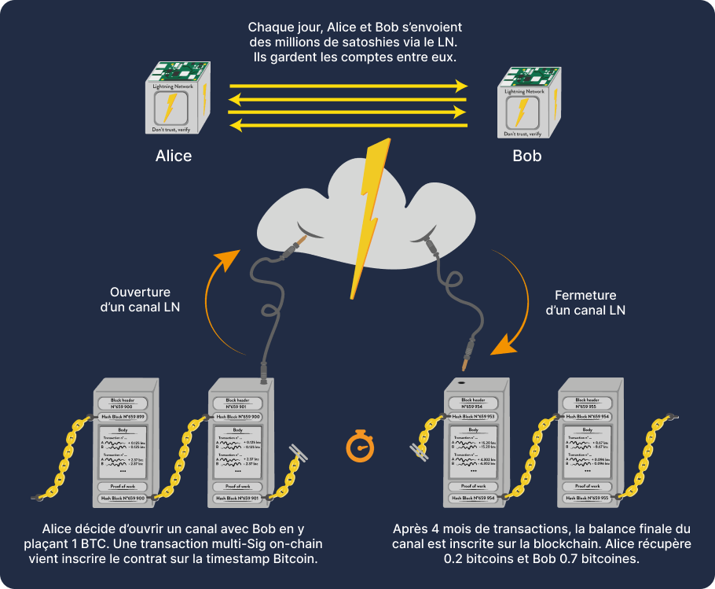
Tunnustettuna Bitcoinin kerroksena, Lightning Network vahvistettiin ja otettiin käyttöön vuonna 2017. Se mahdollistaa välittömät, edulliset Bitcoin-siirrot, ratkaisten näin Bitcoinin skaalautuvuusongelman. Mutta mikä on tämä skaalautuvuusongelma, jota Bitcoin kohtaa?

### Lohkoketju Ei Voi Kasvaa Loputtomiin

Skaalautuvuusongelma viittaa haasteeseen toteuttaa rahajärjestelmä, joka kykenee tarjoamaan jatkuvasti kasvavan määrän siirtoja sekunnissa sen käyttöönoton myötä. Tämä liittyy lohkoketjun trilemmaan. Kuvittele kolmio, jonka kärkinä ovat hajauttaminen, turvallisuus ja skaalautuvuus.

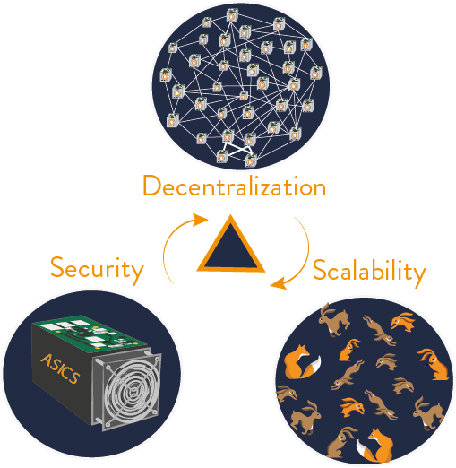

Lohkoketjuun perustuva protokolla voi tyydyttää vain kaksi näistä kolmesta näkökohdasta. Bitcoin-protokollassa on tehty valintoja hajauttamisen/turvallisuuden hyväksi. Toisaalta 1MB:n lohkokoko ja kahden lohkon välinen aika (keskimäärin 10 minuuttia) mahdollistavat Bitcoin-solmun pyörittämisen pienemmin kustannuksin, suosien hajauttamista. Toisaalta lohkojen tuottaminen Proof-of-Workin kautta tekee huijaukset protokollassa erittäin kalliiksi samalla kun se helpottaa verifioimista verkoston solmujen toimesta, suosien näin turvallisuutta. Kuitenkin nämä valinnat asettavat rajoituksen keskimääräiselle siirtojen määrälle lohkossa, mikä vastaa suunnilleen muutamaa siirtoa sekunnissa. Tämä määrä on naurettava verrattuna maksunvälittäjien, kuten VISAn, käsittelykapasiteettiin, joka on 1700/s. Tämä rajoitus on kuitenkin välttämätön, jotta Bitcoinilla voidaan tehdä siirtoja sensuurinkestävästi ja luottamuksettomasti. Siitä huolimatta Bitcoinin kehittäjät ovat pohtineet tätä ongelmaa alusta alkaen.

### Lightning  päällyskerroksena

Vuosien pohdinnan ja useiden yritysten jälkeen Lightning-protokolla syntyy. Tiettyjen määrittelyjen avulla tämä protokolla mahdollistaa vertaisverkkomaksujärjestelmän rakentamisen hyödyntäen Bitcoinin siirtoprotokollan turvallisuutta ja ohjelmoitavuutta. Lightning Network toimii maksukanavien verkostona, mahdollistaen välittömät siirrot pienin kuluin lähettäjälle. Tämä maksukanavien verkosto mahdollistaa jopa siirrot yksilöiden välillä, joilla ei ole suoraa kanavayhteyttä.

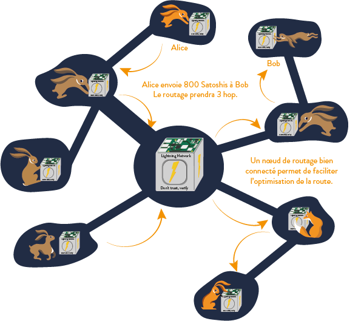

Perinteiset rahansiirtopalvelut kuten Western Union, keskuspankit, Visa ja Mastercard saattavat kadota, jos ne eivät ota käyttöön Lightning Network -teknologiaa. Lightning Network on tehokkaampi ja kustannustehokkaampi kuin nykyiset maksujärjestelmät. Todellakin, Lightning Network mahdollistaa lähes rajattomat siirrot kahden kanavaa jakavan osapuolen välillä ilman energiakustannuksia peruslohkoketjussa muuta kuin kanavan luomisilmoituksen siirto.

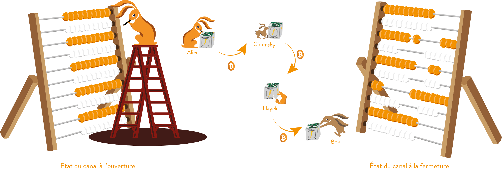

Siirrot ovat turvattuja kryptografian kautta ja epäsuorasti Bitcoinin louhijoiden kuluttaman energian kautta. Siirrot voidaan tehdä välittömästi, ilman maantieteellisiä rajoituksia, ja kulut ovat erittäin alhaiset, usein alle 0,5%.

Yhteenvetona, Lightning Network on lupaava yritys toteuttaa tehokas maksujärjestelmä Bitcoin-siirtoihin. Saatavilla on jo lukuisia Lightning-lompakoita, joita voit tutkia opetusosiossamme tai Lightning Network -koulutuksemme kautta.

## Lightning Networkin Käyttötapaukset


Kuten juuri näimme, Bitcoin-protokolla, vaikka se onkin vallankumouksellinen, kohtaa merkittäviä haasteita skaalautuvuuden suhteen, jotta se voisi käsitellä kaikki päivittäiset siirtomme. Näiden ongelmien ratkaisemiseksi ehdotettiin toisen kerroksen ratkaisua, tunnetaan nimellä Lightning Network, joka esiteltiin vuonna 2016 ja jolla on nyt useita eri toteutuksia, jotka kaikki ovat yhteensopivia:

- Core-lightning Blockstreamilta
- Eclair Acinqilta
- LND Lightning strikelta
Tämä vertaisverkko pyrkii helpottamaan mikromaksuja, jotka ovat erittäin pieniarvoisia transaktioita, jotka muuten olisivat epäkäytännöllisiä korkeiden kulujen ja pitkien vahvistusaikojen vuoksi Bitcoin-lohkoketjussa.
### Mitkä ovat verkon käyttötapaukset?

Tämä teknologia avaa oven laajalle valikoimalle potentiaalisia sovelluksia Bitcoinille, jotka aiemmin olivat saavuttamattomissa Bitcoinin turvallisuuden ja hajauttamisen varmistamiseksi tarvittavien rajoitusten vuoksi. Näihin arkipäivän sovelluksiin kuuluvat välitön laskutus kaupassa (sekä fyysisessä että verkossa), rahansiirto reaaliaikaisesti ja mikrolahjoitukset sisällöntuottajille. Verkko mahdollistaa lähes välittömät, turvalliset ja edulliset transaktiot (keskimäärin alle 0,5 %), joten monet aiemmin kuvittelemattomat liiketoimintamallit voidaan toteuttaa. Tämä on mahdollista, koska Lightning Network käyttää satosheja (bitcoinin desimaali) toimiakseen.

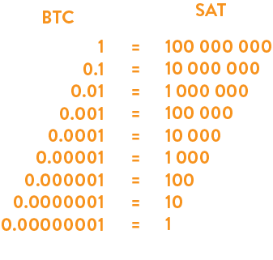

Videopeliala tarjoaa erityisen mielenkiintoisen esimerkin siitä, miten Lightning Networkia voidaan käyttää olemassa olevien liiketoimintamallien muuttamiseen. "Skin in the game" -konsepti on idea, joka on äskettäin saanut suosiota tässä yhteydessä. Se tarkoittaa käytännössä taloudellisen panoksen asettamista pelin lopputulokseen.
Lightning Network mahdollistaa pelaajille hyvin pienten rahamäärien panostamisen pelatessa, kuten muutaman satoshin (noin murto-osan eurosentistä). Tämä mahdollistaa panoksen asettamisen, joka stimuloi kilpailua samalla merkittävästi lisäten bottien käyttöönoton kustannuksia.

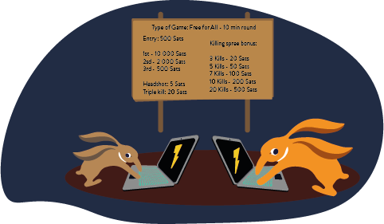

Yhteenvetona voidaan sanoa, että Bitcoinin mikromaksujen tulevaisuus näyttää lupaavalta innovaatioiden, kuten Lightning Networkin, ansiosta. Kun nämä teknologiat jatkavat kehittymistään ja kypsymistään, voimme odottaa näkevämme uusia ja jännittäviä sovelluksia lähitulevaisuudessa. Ota esimerkiksi "rahan suoratoisto" -konsepti. Lightning Networkin avulla voimme tehdä mikromaksuja joka minuutti (mahdollisesti ilman luotettua kolmatta osapuolta), mikä avaa oven kokeilla talousmalleja, joissa kuluttajat maksavat sisällöstä sen mukaan, mitä he kuluttavat.


Tällaisessa järjestelmässä raha jaetaan automaattisesti, ennalta määritellyn prosenttiosuuden mukaan, palvelun tai tuotteen eri osallistujien kesken. Tämä voisi mullistaa tapamme ajatella erilaisia maksumalleja. Esimerkiksi käyttäjiltä voitaisiin veloittaa minuutti- tai jopa sekuntikohtaisesti siitä ajasta, jonka he viettävät palvelua käyttäen, sen sijaan, että he maksaisivat kuukausitilauksesta. Tällainen talousmalli voisi tuoda syvällisiä vaikutuksia sisällöntuottajille, jotka olisivat kannustettuja tuottamaan laadukasta sisältöä säilyttääkseen käyttäjien huomion. Käyttäjät puolestaan maksaisivat vain kuluttamastaan sisällöstä, poistaen näin etukäteen maksettavat tilausmaksut. On jopa kuviteltavissa, että tätä järjestelmää voitaisiin käyttää tavaroiden vuokraamiseen. 


Yhteenvetona voidaan sanoa, että Lightning Network avaa monia jännittäviä käyttötapauksia Bitcoin-käyttäjille. Tuloksena olevat talousmallit ja liiketoimintamahdollisuudet ovat lukuisia ja moninaisia. Kannustamme sinua kokeilemaan sitä itse kokeilemalla podcast-sovellusta [Fountain](https://www.fountain.fm/), joka mahdollistaa sinun saada palkkiona muutaman satsin kuunnellessasi lempipodcastejasi!

## Punainen vai sininen pilleri?


Kuten Morpheus sanoi Neolle: "Jos otat sinisen pillerin, tarina päättyy, heräät sängyssäsi ja uskot mitä haluat uskoa. Jos otat punaisen pillerin, pysyt Ihmemaassa, ja minä näytän kuinka syvälle kaninkolo menee." Oletko valmis tutkimaan Bitcoinin kaninkoloa? Ole varovainen, sillä saatat löytää uudelleen taloudellisen vapaudesi!

### Teknologisen tulevaisuuden vaikutukset

Teknologia kehittyy eksponentiaalisesti, eikä kukaan voi ennustaa sen tulevia kehityskulkuja varmuudella. Maailman yhteydet ja tekoäly jatkavat kehittymistään. Tieto, jonka yksilö voi hankkia internetin kautta, muuttuu ajan myötä yhä mittaamattomammaksi.

Otetaan esimerkiksi tekoäly. Nämä teknologiat ovat jo ylittäneet tai lähestyvät ihmisen tason suorituskykyä yhä useammalla alueella, kuten videopelit, kuvien ja tekstien tuottaminen sekä datan analysointi. Yksi mahdollinen seuraus on, että yli 80% työpaikoista katoaa tekoälyn ja automaation myötä. Meillä on useita vaihtoehtoja, kuten teknologisen kehityksen hillitseminen tai hyödyntäminen lisääntyneestä pääomasta, jonka tekoälyn tuottavuusvoitot luovat.

Oleellisia kysymyksiä ovat:

- Miten hallitsemme yhteiskuntaa, jossa 80% työpaikoista katoaa?
- Miten elvytämme väestön hyvinvoinnin?
- Tarvitaanko yhtä monta opettajaa?
- Automaation geopoliittisia, poliittisia ja inhimillisiä seurauksia ei ole keskusteltu riittävästi.
  Tietokoneet, internet, suoratoisto ja VR muuttavat koulutusta. Voisimme olla yleinen kurssi kaikille ranskalaisille opiskelijoille, jota hallitus ja opettajat hallinnoivat, ja opettajat eivät enää luennoi vaan seuraavat suoraan opiskelijoita. Lapset voisivat siirtyä virtuaalimaailmaan ja saada siellä opastusta historian oppimisessa.

- Missä on raja opettajan ja tekoälyn välillä?
- Miten voimme taata yhteiskunnan, joka elää vauraudessa?

Nämä perustavanlaatuiset kysymykset tulevaisuudestamme on keskusteltava ja päätettävä yhdessä. Mutta mikä on yhteys Bitcoinin kanssa? Kuten internet viestintätapojen osalta, Bitcoin on teknologinen vallankumous uusien suuren mittakaavan organisaatioiden muotojen osalta, tuoden meille mahdollisuuden vaihtaa arvoa ilman luotettua kolmatta osapuolta. Haluammeko estää rahajärjestelmän teknologisen kehityksen vai hyödyntää pääoman kasvua kymmenkertaisen tuottavuusvoiton kautta Bitcoinin ja Lightning-protokollien käytöstä?

### Mikä on rahoituksen tulevaisuus?

Nämä pohdinnat herättävät myös kysymyksiä siitä, kenen tulisi hallita, valtuuttaa ja jäljittää käyttämäämme rahaa. Tavoitteena on päättää suljetun järjestelmän aikakausi, jossa on valitsemattomia johtajia, ja siirtyä avoimeen järjestelmään, jossa ei ole luotettuja kolmansia osapuolia ja jossa vallitsee puolueettomuus.

- Onko valuutta yksityisomaisuuden muoto?
- Voivatko mielenosoittajien tilit olla estettyjä ilman korkeimman oikeuden määräystä?
- Kuka takaa rahoitusjärjestelmän?
- Miten yksilö voi olla suvereeni rahansa suhteen ja luottaa luotettuun kolmanteen osapuoleen?
- Voiko rahaa lähettää maailman toiselle puolelle ilman maksuja tai välittäjiä?

Näiden uusien teknologioiden hyväksyminen voisi tuottaa valtavia mittakaavaetuja maailmanlaajuisesti. Pitäisikö meidän sallia pääomavirtojen vapaa liikkuvuus? Kansainvälisillä saartoilla on taloudellisia ja poliittisia seurauksia. Onko eettistä käyttää rahoitusvälittäjiä kuten Western Union, joka joskus perii jopa 25% maksuja? Uskomme, että yhä digitaalisemmassa maailmassa rahan tulisi olla demokratisoitu ja pidettävä kansan yhteisenä hyvänä valtion tai läpinäkymättömien rahoituslaitosten sijaan.

Kysymys siitä, kenen tulisi hallita pankkijärjestelmää, on ratkaiseva, koska pankkijärjestelmän säännöt eivät ole läpinäkyviä ja ymmärrettäviä kaikille, mikä mahdollistaa poliitikkojen ja sääntelijöiden kastin otteen järjestelmästä. On tärkeää kysyä, pitäisikö vapaan markkinan vai joukon intellektuelleja hallita pankkijärjestelmää.

### Vapautemme ovat vaakalaudalla.

Myös sensuuria on kyseenalaistettava, sillä kuka tietää, mikä tulisi sensuroida tai ei? Media on muuttanut kantaansa tietyistä tiedoista ja ihmisistä, jotka aiemmin sensuroitiin, eivät enää ole sensuurin kohteena.

- Kuka päättää, mikä on sensuuria tai propagandaa?
- Kuka hallitsee rahan jumalallista kättä järjestelmässämme?
Sensuurin sietäminen voi tuhota sananvapauden ja kokoontumisvapauden. Sensuurin toteuttaminen on teknisesti vaikeaa ilman, että luodaan täydellinen dystopia. Mikä taho tulisi olla sensuurin vallankahvassa?  Sensuurin kysymys on monimutkainen, ja on vaikea tietää, kuka tulisi sensuroida tai ei. Sensuurilla voi olla negatiivinen vaikutus innovaatioon ja vapauteen ryhtyä toimiin.
Maailmassa on 2,4 miljardia ihmistä ilman pankkitiliä, mikä väistämättä luo maantieteellisiä epätasa-arvoisuuksia. Bitcoin mahdollistaa tasa-arvon transaktioissa riippumatta sosiaalisesta asemastasi tai poliittisesta asemastasi. Bitcoin-protokolla on apoliittinen eikä anna erityisoikeuksia presidentille tai muille toimijoille. Johtajien tulisi saada samat oikeudet kuin tavallisilla ihmisillä, jotta kehitys voisi edetä ylöspäin sen sijaan, että jotkut jäisivät huipulle ja toiset pohjalle. Pitäisikö kaikilla olla sama valuutta riippumatta heidän sosiaalisesta asemastaan? On tärkeää miettiä, millaisen maailman haluamme jättää lapsillemme. Haluamme jättää avoimen maailman, jossa he ovat vapaita tekemään mitä haluavat rahoillaan.

Bitcoin on tärkeä tekniikka eikä sitä tulisi pitää vain onnenpelinä. On ratkaisevan tärkeää jatkaa Bitcoinia koskevien kysymysten esittämistä.

### Bitcoin: vallankumouksellinen protokolla


Kuten edellisessä luvussa näimme, Bitcoin-protokolla on neutraali kaikkia käyttäjiään kohtaan. Konsensus-sääntöjen ja kryptografian ansiosta voimme kirjata transaktiot muuttumattomasti globaaliin julkiseen kirjanpitoon, taaten rahansiirrot ilman luotettua kolmatta osapuolta. Toisen kerroksen infrastruktuuri (ja pian kolmannen kerroksen, RGB:n kanssa) mahdollistaa verkon skaalautuvuuden ja uusien toiminnallisuuksien kehittämisen, erityisesti skaalausongelmien ratkaisemiseksi.

Bitcoinilla on kaikki tarvittavat ominaisuudet ollakseen tehokas ja terve valuutta: jaettavissa, välittömästi siirrettävissä, sensuroimaton, jonka vahvistuskustannukset ovat merkityksettömät, ja sillä on jo vuosisadoiksi asetettu rahapolitiikka näiden 21 miljoonan yksikön kanssa. Bitcoin on pseudonyymi ja sitä voidaan vaihtaa missä päin maailmaa tahansa ilman minkään tahon lupaa, tarvitset vain omat yksityiset avaimet - kuten sanonta kuuluu "Ei sinun avaimiasi, ei sinun bitcoinejasi".

Bitcoinia käyttävät monenlaiset ihmisryhmät, kryptografeista libertaareihin perinteisiin yrityksiin ja jopa maahan. Bitcoin on kuitenkin kaikille, ja sen käyttäjien määrä kasvaa, kuten myös Bitcoin-noodien määrä, jotka toimivat transaktiohistorian vartijoina varmistaen sen hajautetun luonteen.

Bitcoinia ei voi enää pysäyttää eikä sensuroida. Se on rauhanomainen vallankumous muuttaa rahajärjestelmää ja mahdollistaa taloudellisen osallisuuden. Käyttäjät voivat saada bitcoineja hyväksymällä niitä kaupankäynnissään tai ostamalla niitä säänneltyjen tai sääntelemättömien alustojen kautta. Bitcoineja voidaan säilyttää lompakoissa, mobiilisovelluksissa tai fyysisissä laitteissa. Bitcoinissa ei ole luotettua välittäjää, Bitcoin kannattaa läpinäkyvyyttä, vapautta ja yksilöllistä vastuuta - kuten sanonta kuuluu "Älä luota, varmista".

Rahoitusjärjestelmän muuttaminen vaatii valuutan muuttamista. Satoshi loi Bitcoinin vuonna 2008 ehdottaakseen muutosta tässä. Helppoon ja "taianomaiseen" rahaan pääsy turmelee. Bitcoin on siis vaihtoehto uuden neutraalin rahajärjestelmän rakentamiseen. Bitcoin mahdollistaa irtautumisen pankkijärjestelmästä. Se on sosiaalinen ilmiö, joka johdattaa meidät osallistumaan rauhanomaiseen vallankumoukseen. Oletko valmis liittymään?

## Kiitokset ja jatka kaninkolon tutkimista

### Mene pidemmälle


Onnittelut BTC 101 -kurssin suorittamisesta! Toivon vilpittömästi, että nautit siitä ja se avasi sinulle ovia. Bitcoinin löytäminen on vasta alussa, ja kutsun sinut tutkimaan kaikkia muita yliopistossa saatavilla olevia kursseja.
- [BTC 102](https://sovereignuniversity.org/course/btc102/fr) auttaa sinua luomaan bitcoin-suunnitelmasi
- [LN 201](https://sovereignuniversity.org/course/ln201/fr) ja [LN 202](https://sovereignuniversity.org/course/ln202/fr) mahdollistavat sinulle Lightning Networkin, toisen kerroksen maksuverkon, löytämisen
- [ECON 201](https://sovereignuniversity.org/course/econ201/fr) käsittelee itävaltalaista taloustiedettä
- [SECU 101](https://sovereignuniversity.org/course/secu101/fr) auttaa sinua päivittämään digitaalisen turvallisuutesi
- [MINAGE 201](https://sovereignuniversity.org/course/min201/fr) oppiaksesi lisää louhinnasta
- ja paljon muuta...

## Tue meitä

Tämä kurssi, kuten kaikki tämän yliopiston sisältö, on tarjottu sinulle ilmaiseksi yhteisömme toimesta. Voit tukea meitä jakamalla sen muiden kanssa, liittymällä yliopiston jäseneksi ja jopa osallistumalla sen kehittämiseen [GitHubissamme](https://github.com/DecouvreBitcoin/sovereign-university-data). Koko tiimin puolesta, kiitos!

## Arvioi koulutus

Koulutuksen arviointijärjestelmä integroidaan pian tähän uuteen E-oppimisalustaan! Siihen asti, suurkiitos kurssin suorittamisesta ja jos pidit siitä, harkitse sen jakamista muiden kanssa.

Suuri kiitos Patreon-tukijoillemme, jäsenillemme ja lahjoittajillemme heidän taloudellisesta tuestaan, kiitos ihmisille, jotka jakavat, ja kiitos niille, jotka tekivät tämän koulutuksen mahdolliseksi: Rachel, Muriel, StackinSat-tiimi, JohnOnChain, Fanis, Guillaume, Lounes, oikolukijat ja arvioijat.

Nähdään pian!
