# Votre première aventure Bitcoin

Dans cette formation, je vais vous expliquer Bitcoin en 25 chapitres afin que vous puissiez comprendre cette technologie de manière simple et efficace. La formation est accessible pour tous et explore l’industrie dans son ensemble: mineurs, portefeuille, plateforme d’achat/vente, etc…

La formation devrait prendre environ 15 heures. Durant tout le parcours, des posters explicatifs sont disponibles ainsi que des ressources supplémentaires.

Vous n'avez pas besoin de connaissances spécifiques pour vous lancer, la formation est accessible à tous et à toutes !

+++

# Introduction
<partId>3cd2ac82-026c-53e1-874a-baf5842adc6d</partId>

## Un saut vers l'inconnu
<chapterId>27e3fb60-4b50-556b-9e70-c4f5475c121d</chapterId>


### Bienvenue dans un nouveau paradigme monétaire et technologique.

Bitcoin est une innovation significative qui va au-delà d'une simple "monnaie d'internet". C'est une révolution à la fois technologique et monétaire, capable de questionner notre rapport avec la monnaie et la société. Le bitcoin est une monnaie dites **neutre** et **décentralisée**, ce qui signifie qu'elle n'est sous le contrôle d'aucune entité ou institution, c'est une innovation significative qui va au-delà d'une simple devise. Afin de bien comprendre ce fameux bitcoin il est important de comprendre que bitcoin ( dit BTC) est a la fois un protocole informatique (Bitcoin) et une unitté monetaire (bitcoin).

Le protocole utilise des technologies sous-jacentes telles que la cryptographie, la communication en réseau ou encore la fameuse "blockchain", alors que l'unité de compte bitcoin est la monnaie nécessaire au bon fonctionnement de ce même protocole. Dans la vie de tous les jours, les Salvadoriens ou bitcoiners du monde utilisent donc la monnaie bitcoin pour acheter et vendre des biens et services, cette dernière reposant sur le protocole Bitcoin pour fonctionner.

### Un curriculum complet mais accessible

Dans le cadre de cette formation, nous discuterons des aspects monétaires de Bitcoin, y compris la façon d'acheter et de vendre des bitcoins, de les conserver en toute sécurité dans des portefeuilles numériques et de les utiliser pour effectuer des transactions. Nous examinerons également le rôle des mineurs, qui sont essentiels à la création de nouveaux bitcoins et à la sécurisation du réseau Bitcoin. En outre, nous nous pencherons sur l'avenir de Bitcoin et sur la manière dont la technologie du Lightning Network peut améliorer les transactions Bitcoin.

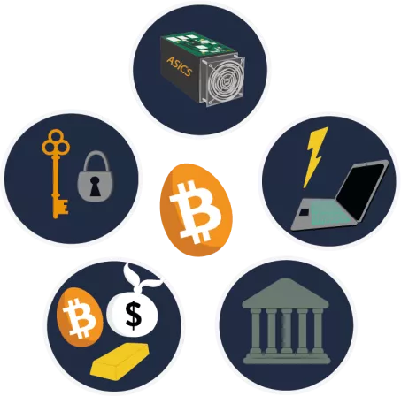

Il est essentiel de comprendre que Bitcoin est un nouveau système monétaire qui révolutionne notre rapport à l'argent. Apprendre à utiliser Bitcoin est une compétence essentielle pour tous ceux qui souhaitent être souverain de leur propre argent.

**Section 1 - La monnaie**

- Chapitre 1 – Qu’est-ce que la monnaie ?
- Chapitre 2 – La monnaie fiduciaire
- Chapitre 3 – Les hyperinflations
- Chapitre 4 – La politique monétaire du Bitcoin

**Section 2 - Les portefeuille Bitcoin**

- Chapitre 5 – Comment fonctionnent les portefeuilles Bitcoin ?
- Chapitre 6 – Choisir sa sécurité
- Chapitre 7 – Mettre en place son portefeuille
- Chapitre 8 – Se protéger contre le temps

**Section 3 - Les aspects techniques de Bitcoin**

- Chapitre 9 - Explication d’une transaction
- Chapitre 10 - Les nœuds Bitcoin
- Chapitre 11 - Les mineurs
- Chapitre 12 - Mineurs et écologie

**Section 4 - L'épargne en Bitcoin**

- Chapitre 13 – le prix du Bitcoin
- Chapitre 14 – Comment acheter du Bitcoin
- Chapitre 15 – Travailler pour des Bitcoins
- Chapitre 16 – Hyper-bicoinisation

**Section 5 - Le lightning Network**

- Chapitre 17 – Introduction au Lightning Network
- Chapitre 18 – Cas usage Lightning Network

Avant d'aborder la définition et le fonctionnement de la monnaie dans une société ( chapitre 1), nous démarrons avec la génèse de Bitcoin. Bitcoin est une technologie relativement nouvelle, lancée en 2009, qui est semblable à rien d'autre. Il est donc normal de ne pas tout comprendre sur le moment. En effet, comme quand on apprend à utiliser Internet ou une voiture, on n'a pas besoin de connaître tous les détails techniques pour utiliser Bitcoin (recevoir, payer, sécuriser ses fonds).

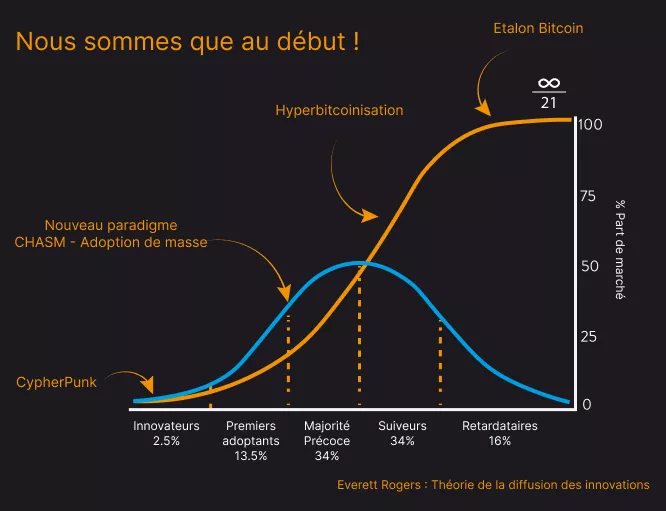

L'importance ici est surtout de comprendre de façon générale cette nouvelle technologie. Nous espérons que cette formation vous plaira et vous apportera la base nécessaire pour comprendre et peut-être continuer d'avancer dans ce nouveau paradigme monétaire mondial.

## La préhistoire du Bitcoin
<chapterId>9a94b627-5b69-5d81-9125-f1fa9b0aa6ad</chapterId>


Avant que le terme "Bitcoin" ne devienne synonyme de monnaie numérique et de transformation financière, une série d'idées, d'innovations et de mouvements sociaux ont posé les bases de sa création. L'un des éléments fondamentaux de cette préhistoire du Bitcoin est le mouvement cypherpunk.

### Les Cypherpunks : des Visionnaires du Monde Numérique


Au cœur de l'évolution technologique des années 1980 et 1990, un groupe de personnes a commencé à s'interroger profondément sur le rôle de la vie privée et de la liberté à l'ère numérique. Ces individus, qui deviendraient plus tard connus sous le nom de "cypherpunks", croyaient fermement que la cryptographie pourrait servir d'outil pour protéger les droits individuels contre l'ingérence des gouvernements et des grandes entreprises.

Des figures emblématiques telles que Julian Assange, Wei Dai, Tim May et David Chaum ont contribué à définir la philosophie et la vision des cypherpunks. Ces penseurs ont partagé leurs idées dans une mailing list influente, où des participants du monde entier débattaient de la meilleure façon d'utiliser la technologie pour garantir une plus grande liberté individuelle.

### Les Trois Textes Piliers des Cypherpunks


Le mouvement cypherpunk, avec ses racines profondes dans l'activisme numérique et la cryptographie, s'est appuyé sur plusieurs textes fondamentaux pour exprimer ses principes et sa vision du futur. Parmi ces écrits, trois se démarquent particulièrement :

- Le "Cypherpunk Manifesto":
  Écrit par Eric Hughes en 1993, le "Cypherpunk Manifesto" affirme que la vie privée est un droit fondamental. Hughes soutenait que la capacité de communiquer librement et de manière confidentielle était essentielle pour une société libre. Le manifeste déclare : "Nous ne pouvons pas attendre des institutions, des entreprises, ou d'autres grandes entités impersonnelles qu'elles nous accordent la vie privée... Nous devons la défendre nous-mêmes."

Au sein du sytème financier actuel les monnaies (telles que l'euro ou le dollar) sont uniquement émises de manière imprévisible par les banques centrales et les États, et sont donc sujettes à l'inflation, voir même à l'hyperinflation, ce qui entraînent de lourds effets néfastes sur les sociétés et les individus. À l'inverse Bitcoin, est un sytème ouvert qui défini explicitement un calendrier d'émission de nouveaux bitcoin de manière précise, fixe et transparente. En particulier, l'émission de cette nouvelle monnaie s'effectue lors de la création d'un nouveau bloc valide pour récompenser le mineur qui a dépensé des ressources pour obtenir ce nouveau bloc valide. De plus, cette récompense est divisée par deux après tous les 210,000 blocs (soit environ tous les 4 ans) afin d'assurer à la fois une quantité de bitcoin en circulation finie (d'environ 21 000 000 BTC) et d'une inflation monétaire qui tend vers zéro à mesure que le temps passe.

Au sein du sytème financier actuel les monnaies (telles que l'euro ou le dollar) sont uniquement émises de manière imprévisible par les banques centrales et les États, et sont donc sujettes à l'inflation, voir même à l'hyperinflation, ce qui entraînent de lourds effets néfastes sur les sociétés et les individus. À l'inverse Bitcoin, est un sytème ouvert qui défini explicitement un calendrier d'émission de nouveaux bitcoin de manière précise, fixe et transparente. En particulier, l'émission de cette nouvelle monnaie s'effectue lors de la création d'un nouveau bloc valide pour récompenser le mineur qui a dépensé des ressources pour obtenir ce nouveau bloc valide. De plus, cette récompense est divisée par deux après tous les 210,000 blocs (soit environ tous les 4 ans) afin d'assurer à la fois une quantité de bitcoin en circulation finie (d'environ 21 000 000 BTC) et d'une inflation monétaire qui tend vers zéro à mesure que le temps passe.

- Le "Manifesto du Crypto-Anarchiste":
  Rédigé par Timothy C. May en 1992, ce manifeste expose comment l'utilisation de la cryptographie pourrait entraîner une ère d'anarchie cryptographique où les gouvernements seraient impuissants à intervenir dans les affaires privées des citoyens. May prévoyait un futur où les échanges d'informations, d'argent et de messages pourraient se faire sans l'intervention d'une tierce partie, et ce, de manière anonyme.

- La "Déclaration d'Indépendance du Cyberespace":
  Bien que ce texte ne soit pas exclusivement cypherpunk, il reflète les sentiments de nombreux acteurs du mouvement. Écrit en 1996 par John Perry Barlow, il s'agit d'une réponse à la régulation croissante d'Internet par les gouvernements. La déclaration affirme que le cyberespace est un lieu distinct de la sphère physique et ne devrait pas être soumis aux mêmes lois. Elle déclare : "Nous n'avons pas d'élus, et nous ne pouvons donc pas être gouvernés."

### Les Prédécesseurs du Bitcoin

Avant l'apparition du Bitcoin, plusieurs tentatives avaient été faites pour créer une monnaie numérique. David Chaum, par exemple, a introduit le concept de "monnaie électronique anonyme" avec son projet "DigiCash" dans les années 1980. Malheureusement, en raison de diverses contraintes, DigiCash n'a jamais vraiment décollé.

Un autre précurseur important est "b-money" de Wei Dai. Bien qu'il n'ait jamais été implémenté, il présentait l'idée d'une monnaie numérique anonyme où la détection des fraudes était effectuée par une communauté d'évaluateurs plutôt que par une autorité centrale.

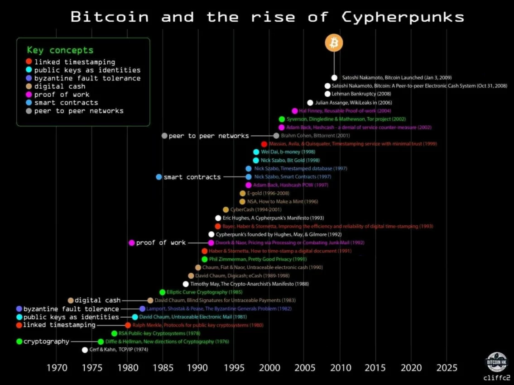

C'est dans cet environnement fertile que le mystérieux Satoshi Nakamoto a publié le livre blanc du Bitcoin en 2008. Il combinait plusieurs idées issues du mouvement cypherpunk, comme les preuves de travail et les horodatages cryptographiques, pour créer une monnaie numérique décentralisée et résistante à la censure.

Le Bitcoin était plus qu'une simple monnaie numérique; il représentait une réalisation des idéaux cypherpunk. Au-delà de sa technologie, il symbolisait une révolution contre les systèmes financiers traditionnels et offrait une alternative basée sur la transparence, la décentralisation et la souveraineté individuelle.

### Conclusion

La préhistoire du Bitcoin est profondément enracinée dans le mouvement cypherpunk et dans une quête collective pour une plus grande liberté à l'ère numérique. En combinant les principes de cryptographie, de décentralisation et d'intégrité, le Bitcoin est devenu bien plus qu'une monnaie; il est le produit d'une révolution philosophique et technologique qui continue de remodeler notre monde.

Bitcoin est donc un protocole qui s'inscrit sur des temps longs, et qui nous incite à nous questionner sur notre rapport à l'énergie, le temps et la monnaie. Mais est-ce que bitcoin est une "vraie" monnaie" ? Qu'est-ce qu'une monnaie ? Existe-t-elle sous plusieurs formes ? C'est ce que nous allons voir au prochain chapitre.

### Petit récap en poster !


# La monnaie
<partId>e913df1a-4cbd-5380-ba67-ca2a0414f671</partId>

## La monnaie à travers l'Histoire
<chapterId>c838e64d-d59f-5703-8c74-ea5e8c4fdd31</chapterId>


L'évolution de la monnaie constitue un aspect fascinant de l'histoire humaine, reflétant l'ingéniosité des civilisations à travers les âges pour répondre à des besoins économiques en constante évolution.


### Des coquillages au compte bancaire

À l'origine, la monnaie était tangible, souvent liée à des marchandises essentielles comme le grain, le bétail et d'autres biens. Toutefois, ces marchandises présentaient des inconvénients majeurs, tels que leur périssabilité, rendant difficile leur utilisation comme moyen d'épargne à long terme. Par exemple, une récolte ratée ou une maladie pouvait anéantir la richesse d'un individu du jour au lendemain.

Alors que les civilisations avançaient et que le commerce s'étendait à de nouvelles régions, il y eut un besoin d'un moyen d'échange universel. Des objets comme les coquillages et les pierres précieuses ont été expérimentés, mais ils n'étaient pas parfaits. L'or est finalement devenu le standard en raison de sa rareté, de sa durabilité et de sa divisibilité. C'était, et reste à ce jour, un symbole de richesse et de pouvoir.

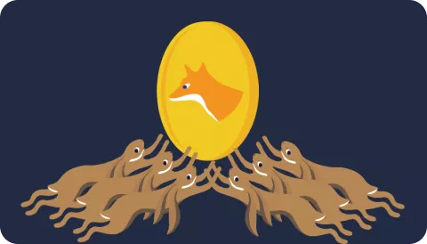

### Quel est le rôle de la monnaie ?

La monnaie est un outil de communication très sophistiqué :

- Elle permet de communiquer entre le présent et le futur. Nous transformons notre temps et énergie dans un actif qui peut être réexploité dans le futur sans risque de dévaluation.

- Elle permet de communiquer dans un langage commun universel. Sans se connaître, sans parler la même langue, deux inconnus peuvent échanger, commercer et s’entendre sur la valeur des choses.

Sa fonction dans notre monde est difficile à répliquer artificiellement. Aucun humain ou groupe d’humains ne peut créer une monnaie, c’est un phénomène social naturel qui doit émerger du marché et d’un consensus volontaire. Les prix sont des signaux, de l’information, qui aident la société à choisir comment les ressources seront allouées.

L’or comme monnaie est le choix de 4 000 ans de darwinisme monétaire qui repose sur 3 fonctions :

- Réserve de valeur
- Moyen d’échange
- Unité de compte

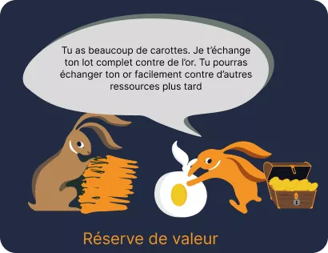
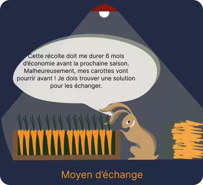
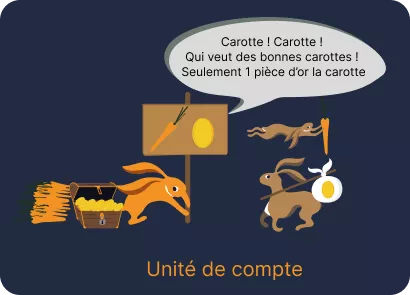

### Les caractéristique de la monnaie

L'or répond idéalement aux critères d'une monnaie efficace : sa rareté naturelle en fait un objet de valeur, tandis que ses propriétés chimiques lui permettent de ne pas s'éroder avec le temps. Cependant cette forme de monnaie n'est pas facilement divisible ni transportable sur de longues distances. Dans un monde globalisé et numérique, l’or ne peut pas suivre et a besoin d’une entité centrale pour la rendre divisible et facilement échangeable (pièce frappée).

Ces défauts ont fait de l’or une réserve de valeur, mais pas une monnaie courante, au détriment des monnaies fiduciaire étatiques (fiat) facilement utilisables, mais constamment dévaluées par les entités qui les contrôlent (roi, banque centrale, empereur, dictateur).

Les critères d'une monnaie efficace sont multiples. Une bonne monnaie doit être :

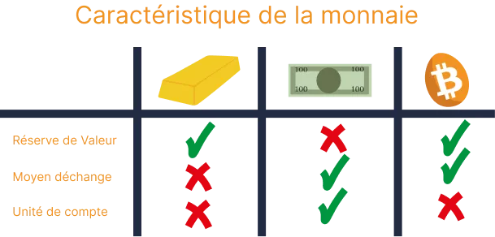

- **Fongible**, c'est-à-dire interchangeable sans perte de valeur
- **Divisible**, afin de faciliter les transactions de différents volumes
- **Liquide**, c'est-à-dire facilement convertible en biens ou services.

Afin de répondre à ces critères, la monnaie évolue étape par étape :

- Pierre brute -> Pièce
- Billet -> Carte bancaire
- Blockchain -> Lightning Network

Aujourd'hui, les monnaies évoluent encore, adaptant leurs formes pour répondre à différents usages. Par exemple, alors que l'or est une excellente réserve de valeur, il n'est plus adapté à l'économie mondialisée actuelle. De même, les monnaies fiduciaires comme le dollar et l'euro sont très liquides et facilement transportable car aujourd'hui majoritairement numérique, néanmoins leur valeur est constamment érodée par l'inflation monétaire.

Bitcoin, quant à lui, présente de nouvelles possibilités. De part ses propriétés, comme son offre strictement limitée, il offre une excellente réserve de valeur. De plus, en tant que monnaie neutre d'internet, il est représente un bon moyen d'échange qui ne connait pas de frontière. Toutefois, il reste, aujourd'hui encore, peu accepté dans les commerces malgré une [constante adoption](https://btcmap.org/map).

### Petit récap en poster !

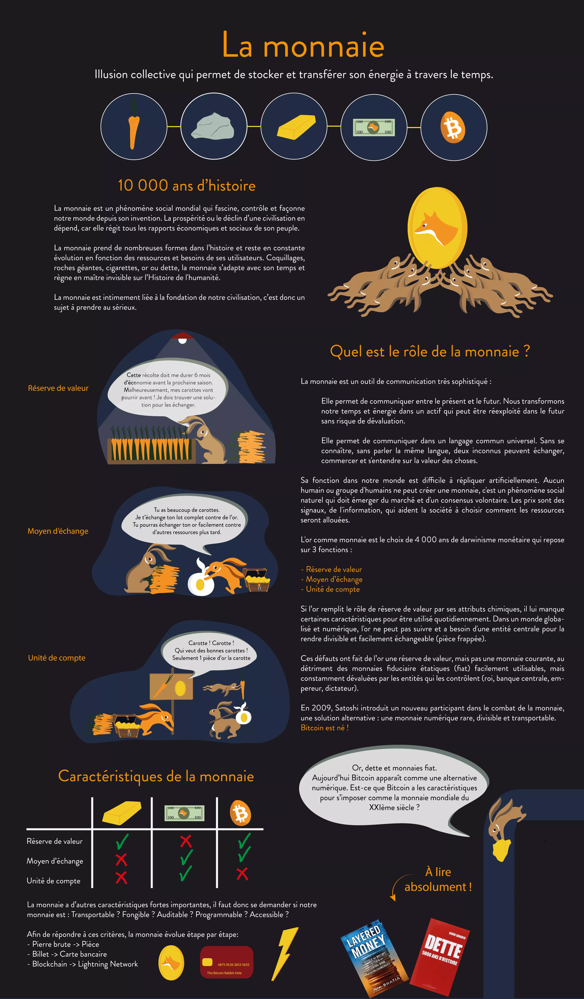

## Les monnaies fiduciaires
<chapterId>25151d46-7db1-5b48-8bba-cbde1944555a</chapterId>


"Ceux qui n'apprennent pas de l'histoire sont voués à répéter les mêmes erreurs", a déclaré George Santayana. Une vérité qui résonne particulièrement lorsque l'on parle du système monétaire actuel.

### Fiduciaire = confiance

Aujourd'hui, les grandes monnaies telles que l'euro et le dollar sont considérées comme fiduciaires. Cela signifie qu'elles n'ont pas de valeur intrinsèque. Leur valeur repose entièrement sur la confiance et la croyance que nous accordons aux institutions qui les régulent.

Une monnaie fiduciaire est une forme de monnaie qui est décrétée comme monnaie par une institution, telle qu'un État-nation, comme la Chine avec le Yen, ou une union politico-économique, telle que l'Union européenne avec l'euro. L'entité en charge de l'émission d'une monnaie fiduciaire est une banque centrale (Par exemple, nous pouvons citer la Banque populaire de Chine, la Réserve fédérale des États-Unis, ou bien la Banque centrale de la République de Guinée). Ce sont ces dernières qui sont en charge de décider de la politique monétaire et donc de combien d'argent devrait être mis en circulation ou imprimé.

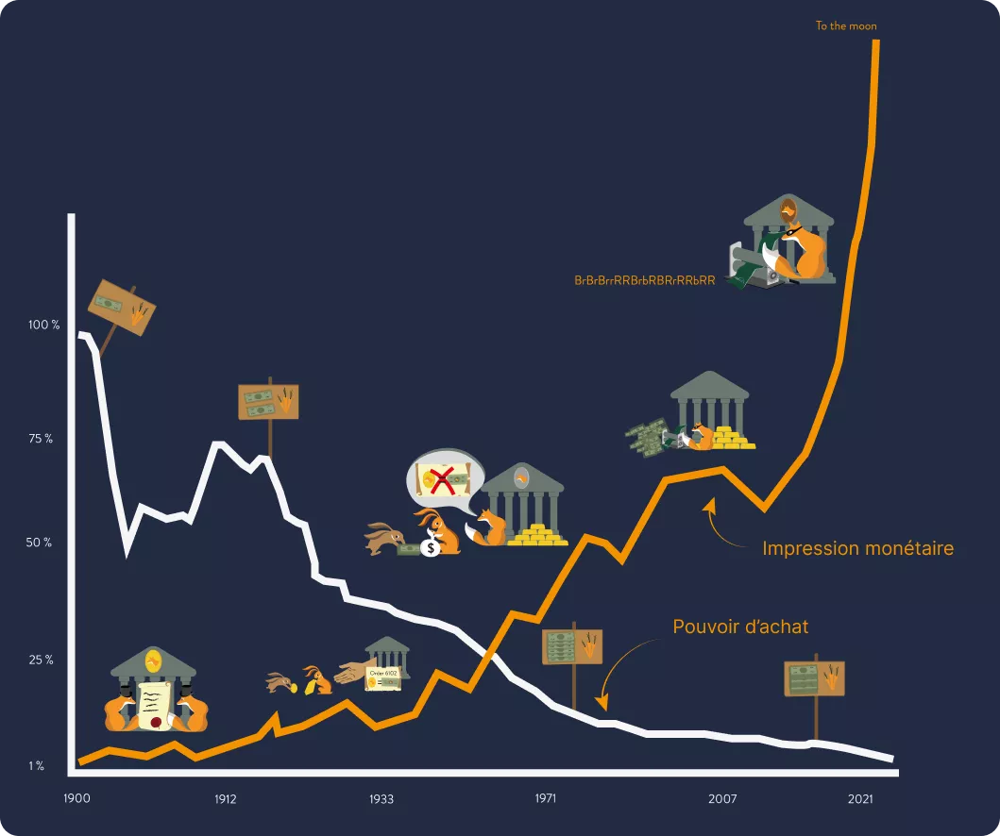

### La dévaluation monétaire : Une stratégie vieille comme l'Empire romain

Depuis l'Antiquité, l'or a servi de référence monétaire. Cependant, sa rigidité a souvent poussé les dirigeants – qu'il s'agisse d'empereurs romains ou de gouvernements modernes – à adopter des monnaies alternatives, souvent fiduciaires.

Le mécanisme est simple et s'inspire des pratiques existente depuis les origines de la civilisation. Les dirigeants, désireux d'exercer un contrôle sur les richesses, commencent par centraliser l'or, souvent en exploitant leur pouvoir et en promettant protection et sécurité. Avec cette réserve précieuse entre leurs mains, ils introduisent une nouvelle monnaie, équivalente en valeur à l'or, mais frappée à leur effigie. Cette monnaie commence alors à circuler, et le peuple s'habitue rapidement à sa commodité.

Progressivement, ces dirigeants dévaluent discrètement la nouvelle monnaie, réduisant sa valeur par rapport à l'or initial de quelques pourcents chaque année. Cette dévaluation silencieuse est souvent justifiée comme étant dans l'intérêt du peuple. Ainsi, ceux qui épargnent en cette monnaie fiduciaire voient la valeur de leurs économies s'éroder, alors que l'État finance ses projets grâce à l'inflation. De plus, cette dévaluation rend la dette plus facile à rembourser.


À un moment critique, l'annonce est faite : la monnaie n'est plus soutenue par l'or. Le public, désormais habitué à la monnaie fiduciaire et souvent mal informé sur les questions financières, accepte cette réalité. L'État a alors le champ libre pour manipuler la masse monétaire, imprimant d'énormes sommes d'argent à un coût presque nul.

Cette stratégie, lorsqu'elle est bien exécutée, peut perdurer pendant des décennies. Cependant, une dévaluation trop rapide ou une perte de confiance peut entraîner une hyperinflation (voir chapitre suivant). L'histoire montre que le dollar a perdu 98% de sa valeur en 100 ans, l'euro 30% en 20 ans et la livre sterling 99% depuis sa création.

À la fin, la monnaie pourrait n'avoir plus aucune liaison avec l'or, rappelant les pièces romaines à la fin de l'Empire, ou même être réduite à une simple valeur numérique, déconnectée de la réalité tangible.

Aujourd'hui, nous sommes témoins d'un tournant historique. Le dollar, qui a longtemps dominé, semble être en déclin, et l'or a perdu sa place centrale. Nous sommes à la charnière d'un nouveau cycle monétaire, rappelant que les leçons de l'histoire sont souvent oubliées.

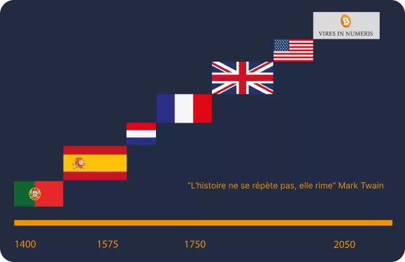

### Est-ce que Bitcoin est une solution ?

C'est dans ce contexte que la révolution Bitcoin prend de l'ampleur. Cette monnaie qui ne requiert **aucun tiers de confiance** vise à séparer l'État de la monnaie.

L'impression monétaire engendre de l'inflation, appauvrissant progressivement la population. En revanche, les institutions financières et les individus fortunés se sont enrichis grâce à cette pratique, creusant un fossé d'inégalités et favorisant l'autoritarisme. Le système financier actuel est régulé et restreint pour éviter son effondrement et tout bouleversement risquerait de provoquer une crise économique majeure. Comme les acteurs politiques bénéficient de ce système, ils ne sont pas incité à opérer un changement radical, laissant ainsi le système poursuivre sa course jusqu'à une éventuelle implosion.


En réponse à ces défis systémiques, Bitcoin se présente comme une solution décentralisée : un nouveau système monétaire neutre en parallèle. Historiquement, l'or a été privilégié en tant que monnaie, en raison de sa résistance à la contrefaçon. De manière similaire, Bitcoin, par sa nature décentralisée et cryptographique, ne peut être falsifié et est limité à 21 millions d'unités. Bitcoin est une monnaie qui repose sur la transparence et la neutralité, offrant une solution de rechange attrayante au système monétaire centralisé actuel.


Parallèlement, l'émergence des monnaies numériques des banques centrales, ou CBDC, semble inévitable. Cette nouvelle forme de monnaie offrirait une planification davantage centralisée de l'économie, ce qui pourraient entraver la liberté financière des individus et faciliter les dérives autoritaires.

Nous pouvons terminer ce chapitre avec la citation du prix nodel d'économie F.A Hayek en 1984 "Je ne crois pas que l’on retrouvera un jour une bonne monnaie tant qu’on ne la reprendra pas des mains du gouvernement.
Néanmoins, nous ne pouvons pas leurs arracher violemment, tout ce que l’on peut faire est d’introduire par une ingénieuse ruse quelque chose qu’ils ne peuvent pas arrêter.»

### Petit récap en poster !

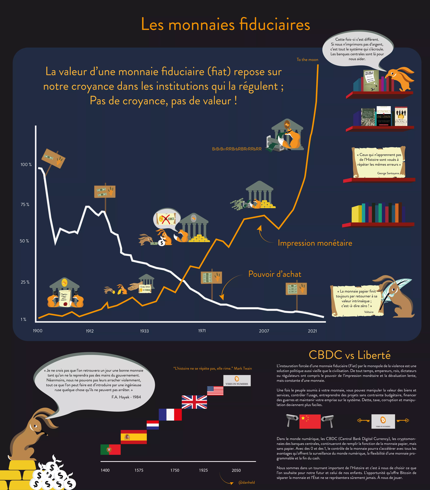

## Les hyperinflations
<chapterId>b04c024c-54f3-50cb-997f-58721cfc74be</chapterId>


L’hyperinflation est un phénomène monétaire propre aux monnaies fiduciaires. Elle se caractérise par une perte complète de la confiance dans une monnaie et une augmentation drastique de l’inflation via l’impression monétaire des autorités. En résultat, les économies accumulées par les individus peuvent se dissiper en un laps de temps relativement court, ceci poussant le pays au bord du gouffre économique, sociale et politique.

### L'inflation mais en roue libre !

Essayons de comprendre l'impact de l'inflation sur l'épargne en considérant plusieurs taux d'inflation.

- Avec une inflation à 2%, vous perdez annuellement 2% de votre pouvoir d'achat, soit 10% au bout de 5 ans.
- À 7%, vous perdez la moitié en 10 ans.
- À 20%, vous perdez pratiquement la moitié en 3 ans.

Lors d'une hyperinflation, nous ne parlons plus de 20 % par an, mais bien de 20 % par mois ou, au pic, par JOUR. 100 % d'inflation par jour sur 3 jours sont des choses réalistes qui sont arrivées et continuent d'arriver dans notre monde.

Il est important de comprendre que l'hyperinflation n'arrive pas par magie, à la force du hasard, du capitalisme ou de l'adversaire politique. L'hyperinflation est la conséquence directe de décisions monétaires fausses prises par des banquiers centraux et des politiciens. Leurs conséquences touchent l'intégralité des citoyens et leurs conséquences toucheront des générations. Je vous invite à vous attarder 5 minutes sur ce tableau pour bien réaliser l'impact réel de ce phénomène (la formation ECON204 ira en détail sur ce sujet)."


### Comment se déroule une hyperinflation ?

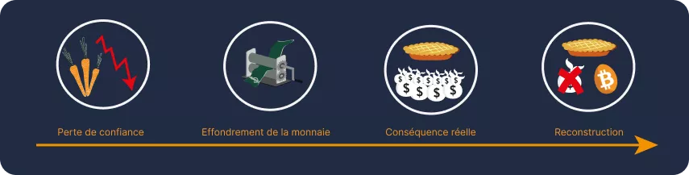

Phase 1 – La perte de confiance

- Une centralisation du pouvoir monétaire facilite la création de monnaie et ses abus. Une perte de confiance dans une monnaie peut alors émerger et déclencher une hyperinflation. Les individus commencent alors à se questionner sur l'origine de l'argent et les bienfaits de la politique monétaire mandatée. Cette perte de confiance est généralement due à des facteurs externes tels que les guerres, les mesures sociales ou la montée des prix d'une ressource clé, telle que le blé ou l'essence.

Phase 2 – L’effondrement de la monnaie & la hausse des prix

- À mesure que les gouvernements perdent le contrôle de la confiance, les individus commencent à échanger leur monnaie pour une autre, plus stable, comme le dollar américain au Vénézuela. Cela entraîne une hausse des prix, créant un cercle vicieux où les biens et services deviennent de plus en plus coûteux. Pour répondre à ces besoins, l'État imprime davantage de monnaie afin de corriger la politique monétaire, entraînant une inflation exponentielle.

Phase 3 – Le cercle vicieux de l’impression monétaire

- Il faut de plus en plus de billets pour acheter des biens, ce qui crée une rareté de la monnaie papier. Ceci pousse à plus d’impressions de billets, créant encore plus d’inflation.


Phase 4 – Une nouvelle monnaie émmerge

- Une nouvelle monnaie est alors introduite pour remplacer l'ancienne. Un exemple notable d'hyperinflation est l'Allemagne dans les années 1920-1924. Pour relancer l'économie, une nouvelle monnaie a été créée, adossée à la dette allemande, française et anglaise, et garantie par les terres allemandes.

La résolution d'une crise d'hyperinflation nécessite souvent des changements radicaux, tels que des révolutions, des changements de gouvernement, des changements de banquiers centraux, entre autres. La perte de confiance, l'effondrement de la monnaie et la reconstruction sont des phases essentielles pour relancer une nouvelle économie basée sur une monnaie fiduciaire.

### 3 exemples notoires

- Allemagne, 1922-1923

  Un des exemples les plus frappants d’hyperinflation s’est produit dans la République allemande de Weimar après la Première Guerre Mondiale.

  L’Allemagne avait emprunté d’énormes quantités d’argent pour financer l’effort de guerre et non seulement l’Allemagne n’a pas gagné la guerre, mais elle a dû payer des milliards de dollars en réparations. Le mois avec le plus d’inflation fut octobre 1923, culminant à 29 500 % soit une inflation de 20,9 % par jour. Les prix doublaient chaque 3,7 jours !

  On raconte que dans les restaurants, les serveurs devaient annoncer les prix du menu chaque 30 minutes pour tenir compte de l’inflation. La monnaie allemande est devenue tellement inutile que certains citoyens préféraient brûler leur monnaie-papier, plutôt que du bois, parce que c’était effectivement moins cher.


- Hongrie, 1945-1946

  Le pays ayant subi la pire période d’hyperinflation de l’histoire à ce jour est de loin la Hongrie après la Seconde Guerre Mondiale.

  La Hongrie se retrouvait du côté des perdants du conflit et la guerre avait détruit l’essentiel de sa capacité de production industrielle. Le mois ayant connu l’inflation la plus forte fut celui de juillet 1946 avec une inflation des prix de 41 900 000 000 000 000 % équivalant à 207 % par jour. Les prix doublaient toutes les 15 heures !

  Le dernier billet à avoir été mis en circulation est un billet de 100 millions de billions de pengo (100 000 000 000 000 000 000) en 1946.

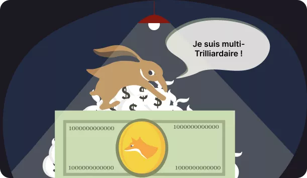

- Zimbabwe, 2007-2008
  Jusqu’en l’an 2000 le Zimbabwe était auto-suffisant pour presque tous ses besoins excepté le pétrole.

  En 1997 le dollar zimbabwéen s’effondre de plus de 72 % après que le gouvernement ait consenti à indemniser les vétérans de la guerre d’indépendance pour une somme équivalente à 450 millions de dollars US. Comme le gouvernement n’avait pas une telle somme dans ses coffres, il a dû se résoudre à faire fonctionner la planche à billets. En 2005 l’inflation atteint 586 % et en mars 2007, l’inflation mensuelle atteint 50 %.

  En juin 2007, le gouvernement réagit en instaurant un contrôle des prix. Les magasins sont littéralement « dévalisés ». Les commerçants n’ont maintenant plus les moyens de réapprovisionner leurs boutiques.

  En avril 2009, le ministre des finances annonce la suspension du dollar du Zimbabwe et autorise l’usage de différentes devises étrangères pour le commerce. Tous les comptes bancaires, toutes les pensions, toutes les institutions financières ont vu leurs soldes s’évaporer du jour au lendemain.


En conclusion, l'hyperinflation a pour effet de dégrader rapidement la valeur de la monnaie, entraînant une érosion des épargnes et une perte de confiance dans le système monétaire. Comme Voltaire l'a autrefois suggéré, une monnaie fiduciaire finira toujours par perdre sa valeur intrinsèque et convergera vers zéro.

Une monnaie qui repose sur un tiers de confiance comme une institution financière se révèle dans les faits et sur le long terme être une monnaie défectueuse car incapable de garantir le pouvoir d'achat ou de préserver les épargnes.

### Petit récap en poster !

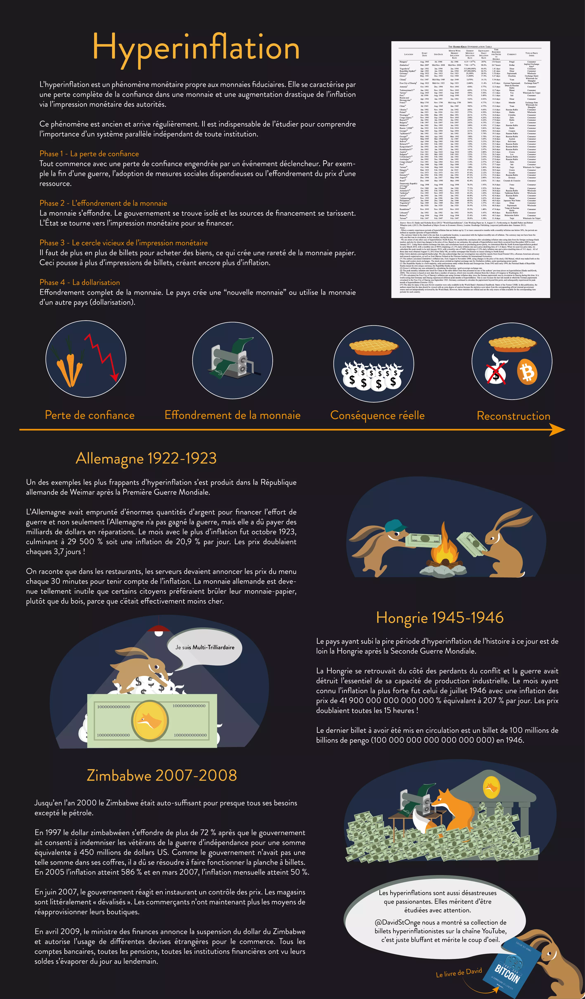

## 21 millions de bitcoins
<chapterId>f4a06d76-1963-56fd-93ff-dfa41489bcde</chapterId>


### La politique monetaire du Bitcoin

Bitcoin est une monnaie numérique décentralisée avec une quantité maximale pré-définie de **21 millions d'unités**. Cette caractéristique intrinsèque de rareté est déterminée par son code informatique et renforcer par le consensus de tous les utilisateurs participant au protocole.

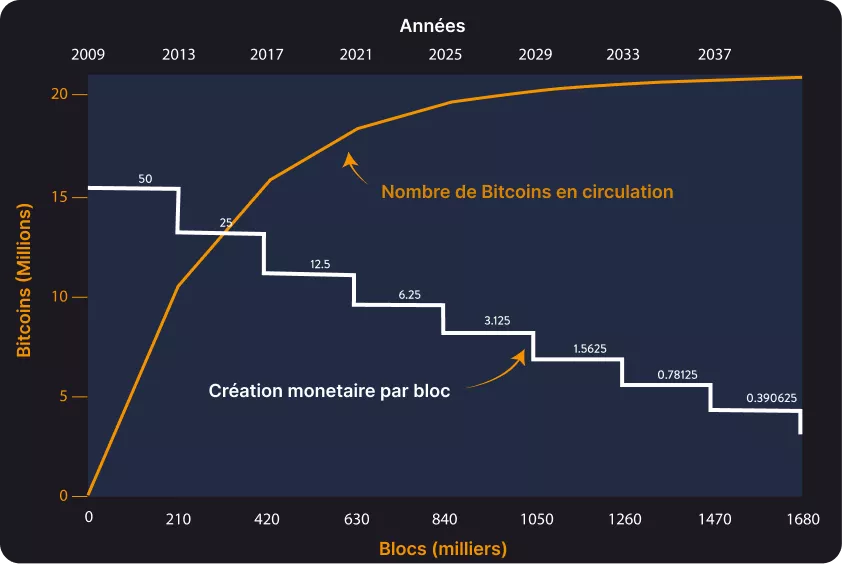

En ce qui concerne son émission monétaire, elle peut être illustrée par une courbe en S qui représente la quantité de bitcoins créés au cours du temps. Par exemple, en 2022, environ 18,5 millions de bitcoins étaient en circulation. Les prévisions indiquent qu'en 2025, il y aura environ 19,5 millions de bitcoins soit ~93% de l'offre totale, et en 2037, ce chiffre atteindra 20,4 millions.

### Comment creer de nouveau Bitcoin ?

La création de nouveaux bitcoins est le résultat du processus de minage, une procédure d'attestation des transactions sur le réseau Bitcoin.

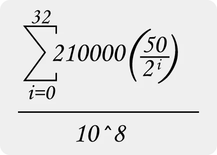

Les mineurs, qui effectuent cette tâche, sont récompensés par l'émission de nouveaux bitcoins toutes les dix minutes. Cette récompense est programmée pour diminuer de moitié tous les 210 000 blocs, soit environ tous les quatre ans, un événement connu sous le nom de "halving" -- ce qui donne à la courbe d'émission monétaire une forme d'escalier. En raison de ce mécanisme de halving, on peut prédire mathématiquement que la création de bitcoins cessera en 2140, lorsque le nombre total de bitcoins atteindra sa limite de 21 millions.

| Halving Number | Block Height | BTC Reward After Halving  | Estimated BTC in Circulation After Halving |
| -------------- | ------------ | ------------------------- | ------------------------------------------ |
| 1              | 210,000      | 25 BTC                    | 10,500,000 BTC                             |
| 2              | 420,000      | 12.5 BTC                  | 15,750,000 BTC                             |
| 3              | 630,000      | 6.25 BTC                  | 18,375,000 BTC                             |
| 4              | 840,000      | 3.125 BTC                 | 19,687,500 BTC                             |
| 5              | 1,050,000    | 1.5625 BTC                | 20,343,750 BTC                             |
| 6              | 1,260,000    | 0.78125 BTC               | 20,671,875 BTC                             |
| 7              | 1,470,000    | 0.390625 BTC              | 20,835,937.5 BTC                           |
| 8              | 1,680,000    | 0.1953125 BTC             | 20,917,968.75 BTC                          |
| 9              | 1,890,000    | 0.09765625 BTC            | 20,958,984.375 BTC                         |
| 10             | 2,100,000    | 0.048828125 BTC           | 20,979,492.188 BTC                         |
| 11             | 2,310,000    | 0.0244140625 BTC          | 20,989,746.094 BTC                         |
| 12             | 2,520,000    | 0.01220703125 BTC         | 20,994,873.047 BTC                         |
| 13             | 2,730,000    | 0.006103515625 BTC        | 20,997,436.523 BTC                         |
| 14             | 2,940,000    | 0.0030517578125 BTC       | 20,998,718.262 BTC                         |
| 15             | 3,150,000    | 0.00152587890625 BTC      | 20,999,359.131 BTC                         |
| 16             | 3,360,000    | 0.000762939453125 BTC     | 20,999,679.566 BTC                         |
| 17             | 3,570,000    | 0.0003814697265625 BTC    | 20,999,839.783 BTC                         |
| 18             | 3,780,000    | 0.00019073486328125 BTC   | 20,999,919.892 BTC                         |
| 19             | 3,990,000    | 0.000095367431640625 BTC  | 20,999,959.946 BTC                         |
| 20             | 4,200,000    | 0.0000476837158203125 BTC | 20,999,979.973 BTC                         |

Nous reviendrons en détail sur les mineurs dans le chapitre minage.

### Garantir la rareté numérique

La rareté du Bitcoin est garantie par deux mécanismes clés; l'ajustement de la difficulté du minage et la théorie du jeu:

- L'ajustement de la difficulté du minage est un mécanisme qui s'effectue tous les 2016 blocs, soit environ deux semaines, pour garantir que, en moyenne, un nouveau bloc est ajouté à la blockchain toutes les dix minutes. Cette fréquence de création de blocs et la quantité totale de bitcoins sont des aspects figés du protocole Bitcoin et ne peuvent être modifiés sans un consensus général, contrairement aux décisions arbitraires prises dans les systèmes monétaires traditionnels.

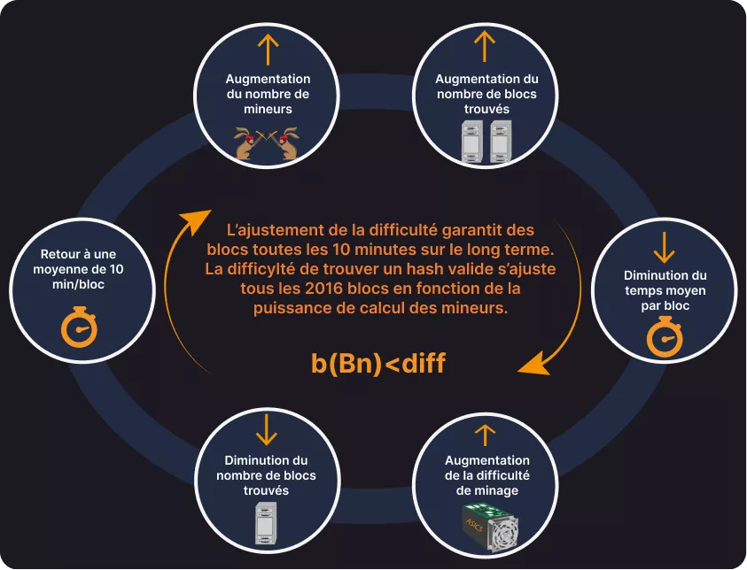

> Le saviez vous ? Les mineurs sont incités miner un bloc pour gagner les nouveaux bitcoins et les frais de transaction associés aux transactions qu'il inclue dans son bloc. À mesure que le nombre de bitcoins émis se rapproche de la limite de 21 millions, les mineurs seront davantage rémunérer par ses frais de transactions plutôt que par la récompense du bloc.

- La théorie des jeux est un concept mathématique qui repose sur la rationalité humaine. Ici, dans Bitcoin, ce sont les utilisateurs qui votent pour les changements du protocole. Oui, vous avez bien lu : toute modification du protocole Bitcoin nécessiterait l'accord de l'ensemble de la communauté des utilisateurs, ce qui est hautement complexe. Si quelqu'un voulait donc créer un 22ème million de bitcoin, il devrait convaincre l'ensemble des utilisateurs de volontairement dévaluer leur propre épargne, ce qui ne risque pas d'arriver car Bitcoin est mondial et non gouverné par un groupe central.

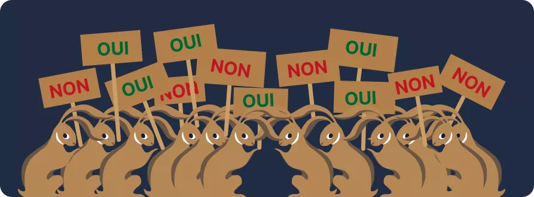

L'idée de dévaluer la monnaie est contraire à la philosophie fondamentale du Bitcoin, donc la modification de cette limite est quasi-improbable

### Une politique monétaire auditable chaque seconde depuis le début et pour toujours !

La rareté du Bitcoin est un atout majeur et la quantité max de 21Million de bitcoins en circulation est publique et vérifiable par quiconque.

En fait, n'importe qui peut vérifier la quantité de bitcoins en circulation entrant une commande simple sur un nœud Bitcoin : `bitcoin-cli gettxoutsetinfo`. Cette transparence et vérifiabilité renforcent la confiance dans le système Bitcoin, qui ne repose pas sur des institutions centralisées ou des individus, mais sur une garantie mathématique et cryptographique inhérente à son protocole. (Vous apprendrez à le faire de façon simple dans LN201)

```json
{
  "height": 710560,
  "bestblock": "0000000000000000000887384d67103412ea7f18a43953e65c8c4ac36bf42e54",
  "transactions": 473244,
  "txouts": 1018917,
  "bogosize": 2183872374,
  "hash_serialized_2": "eebb9987337700ffaacbbaa11223344",
  "disk_size": 178239584,
  "total_amount": 18745998.12345678
}
```

Le Bitcoin, par sa conception, garantit une gestion monétaire saine en limitant sa création et en protégeant l'épargne des utilisateurs, le distinguant ainsi des autres monnaies. Aligné sur les principes de l'économie autrichienne (détail dans ECON201), sa quantité contrôlée et sa distribution prévisible le préservent des risques d'inflation inhérents aux monnaies traditionnelles.

En somme, le Bitcoin, par sa nature décentralisée, sa rareté programmée et sa transparence, offre une alternative unique aux systèmes monétaires traditionnels. Il illustre comment la technologie peut être utilisée pour créer une monnaie qui est non seulement utile et vérifiable, mais qui préserve également la valeur de l'épargne des utilisateurs en limitant strictement son offre.

### Petit récap en poster !

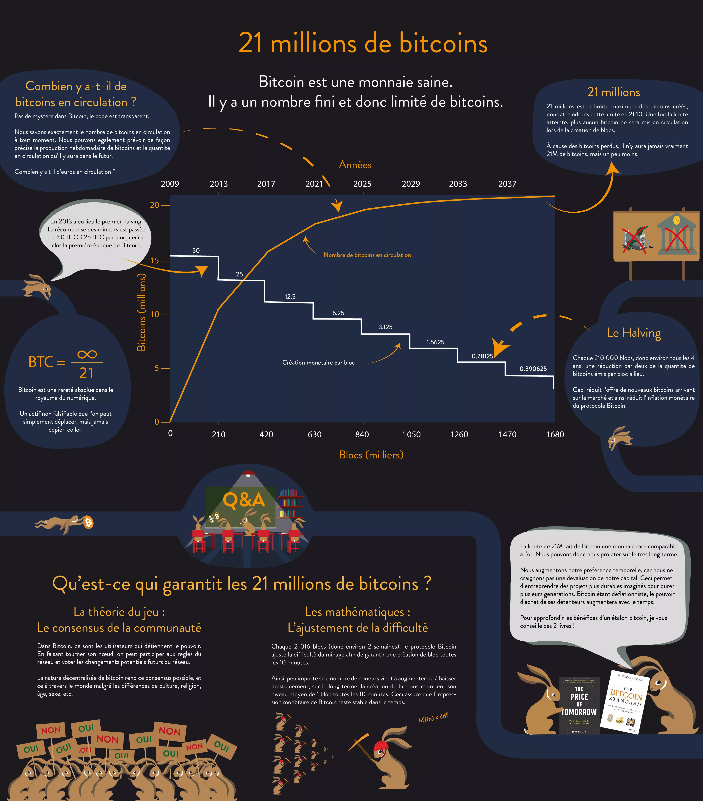

### Conclusion de la section 1 !


La monnaie est un outil social qui doit s'adapter aux besoins et à la technologie. Au fil du temps, l'or a été utilisé comme réserve de valeur car il était rare et ne pouvait pas être dévalué. Cependant, plus tard, l'or a été remplacé par de la dette et de la monnaie fiduciaire, qui est facile à transporter, mais aussi à manipuler sa politique monétaire.

Bitcoin est une alternative monétaire réaliste car il est rare et limité à 21 millions de bitcoins qui ne peuvent pas être modifiés. La création monétaire est maintenue grâce à l'ajustement de la difficulté toutes les 2 semaines, et grâce aux halving garantissant une preuve mathématique vérifiable de sa rareté. Contrairement aux euros ou aux dollars dont le volume en circulation est non-vérifiable et changent fréquemment suite aux mandants d'institution financière, Bitcoin est une monnaie cryptographique avec une politique monétaire neutre et fixe. Elle est donc une excellente réserve de valeur mondiale car elle ne peut pas être dévaluer par l'impression monétaire.

Bitcoin est avant tout une forme de monnaie qui incite à remettre en question le pouvoir des institutions financières sur la monnaie. C'est un combat philosophique et économique qui est en jeu. Pour comprendre Bitcoin, il est important de comprendre ses bases fondamentales et de démystifier les idées fausses qui l'entourent. Cela permettra d'engager un débat intellectuel constructif sur l'avenir de la monnaie.

Maintenant que nous avons établi les différences entre Bitcoin et les monnaies fiduciaires, nous allons dans les prochains chapitres étudier ce que sont les portefeuilles Bitcoin car il est de votre responsabilité de sécuriser vos fonds. En effet la sovereineté financière qu'offre Bitcoin va nécessairement de pair avec la responsabilité individuelle.

# Les portefeuilles Bitcoin
<partId>28860585-4f61-59d9-b242-f4c57d837cc1</partId>

## Que sont les portefeuilles Bitcoin ?
<chapterId>1c0166ab-cb7a-5bc6-9175-d13482bd91f1</chapterId>

Dans cette section 2, nous allons explorer le stockage et la sécurité des Bitcoins au sein de portefeuilles. Cela vous permettra de mieux comprendre où se trouvent ces fameux Bitcoins et comment interagir avec eux !


### Démystifions les portefeuilles Bitcoin

Dans cette industrie, nous utilisons des portefeuilles pour interagir
avec le réseau Bitcoin, ce dernier ayant 3 fonctions :

- Permettre de recevoir des bitcoins
- Permettre d’en envoyer
- Les sécuriser face aux tentatives de hack et de vol

Un portefeuille peut être un logiciel sur votre ordinateur, une application sur votre smartphone, un appareil physique comme une clé USB, ou même un morceau de papier. Ces différents types de portefeuilles Bitcoin répondent chacun à des cas d'usage différents. Certains servent pour de larges montants en mettant l'accent sur la sécurité, d'autres sur la vie privée, ou encore sur le paiement quotidien de petits montants

Les portefeuilles se divisent donc en grandes familles d'utilisation, avec toujours comme point central une question clé : Êtes-vous propriétaire des fonds ou laissez-vous le contrôle de votre argent à un tiers ? Nous reviendrons dans le chapitre suivant sur ce sujet en détail, mais l'idée est simple : Est-ce que l'argent est dans votre poche ou dans celle de votre banquier !


### Comment fonctionne un portefeuille bitcoin

Que ce soit votre "banquier" Bitcoin ou vous-même, en règle générale, la grande majorité des portefeuilles Bitcoin fonctionnent avec une technologie similaire, celle de la cryptographie asymétrique, et donc un système de paire de clés : une clé privée pour dépenser et une clé publique pour recevoir.

- Clé privée
  Lors de l'initialisation d'un portefeuille, une phrase de récupération secrète (clé privée) est générée et vous est donnée sous la forme de 24 mots.

  La clé privée est très importante, car elle représente la possession des Bitcoins et donc le droit de les utiliser ou de les envoyer. Le possesseur de la clé privée est le propriétaire des Bitcoins.

  Cette clé doit être secrète et bien conservée, car c'est la clé qui débloque votre fortune !

- Clé publique & adresse
  La clé publique est créée avec la clé privée et donc reliée à cette dernière. La clé publique est utilisée pour générer des adresses Bitcoin et ainsi recevoir de l'argent. Partager la clé publique implique des risques pour la confidentialité, mais pas pour la sécurité.

  Ces adresses sont créées par votre portefeuille et peuvent être partagées en toute sécurité. Il est conseillé de ne les utiliser qu'une seule fois pour maximiser votre vie privée.

Il faut donc bien comprendre que grâce à cette technologie, nous pouvons facilement recevoir des Bitcoins sans pour autant permettre à l'expéditeur de voler nos fonds ! Pensez-y comme à une boîte aux lettres : les gens déposent de l'argent dedans, mais vous êtes le seul à pouvoir l'ouvrir


### Les Bitcoins sont donc dans le portefeuille ?

Bien que vos clés soient stockées dans votre portefeuille, les bitcoins eux-mêmes sont en fait "stockés" dans la blockchain Bitcoin, qui est un registre public distribué au sein du réseau pair-à-pair Bitcoin (on regarde ca dans la section 3). C'est pourquoi la perte de l'appareil sur lequel vous avez votre portefeuille ne signifie pas nécessairement la perte de vos Bitcoins. Ce qui vous permet de ré-créer votre portefeuille et de dépenser vos bitcoin est la clé privée. Il est donc crucial de bien sécuriser cette dernière.

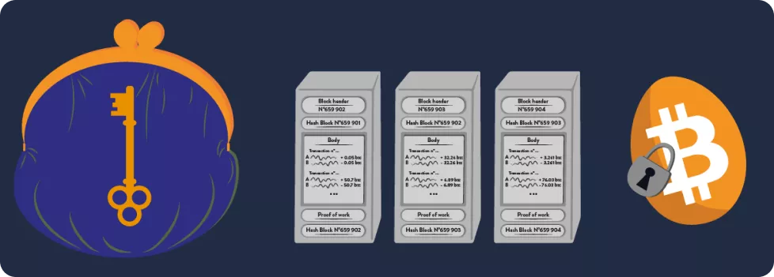

Heureusement pour nous, depuis 2017, cette clé privée peut être encodée dans une simple liste de 12 ou 24 mots, appelée la phrase mnémonique. Cette phrase est un backup de votre portefeuille Bitcoin, c'est ce qui permet de re-créer votre portfeuille avec n'importe quel logiciel/app de portefeuille Bitcoin. Ainsi toute personne ayant accès à cette liste de mots a l'accès à vos bitcoins.

### Qu'en est-il des hackers ?

On pourrait se poser la question : et si quelqu'un devinait par hasard notre liste de 12 ou 24 mots ? La réponse courte est que grâce à la cryptographie utilisée pour créer le portefeuille c'est hautement improbable. Pour mettre en perspective, trouver par hasard l'accès à votre portefeuille revient à trouver le "bon" nombre entre 1 et $2^256$, ce qui est quasiement équivalent à trouver le "bon" atome dans l'Univers. Toutefois, si vous n'êtes pas satisfait par cette sécurité par défaut, vous pouvez toujours la renforcer en ajoutant une passe-phrase à votre portfeuille bitcoin.

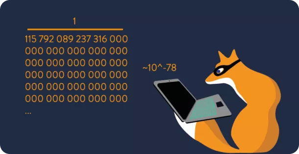

Ainsi la probabilité d'un piratage de votre portefeuille Bitcoin est astronomiquement faible, si vous suivez les bonnes pratiques de sécurité. Pratiques que nous détaillons dans la prochaine section.

Choisissez un portefeuille qui correspond à vos besoins et à votre utilisation. Des tutoriels détaillés sur l'utilisation et la sécurisation de différents portefeuilles sont disponibles dans la section [tutoriel de notre université](https://planb.network/tutorials/wallet).

### Petit récap en poster !

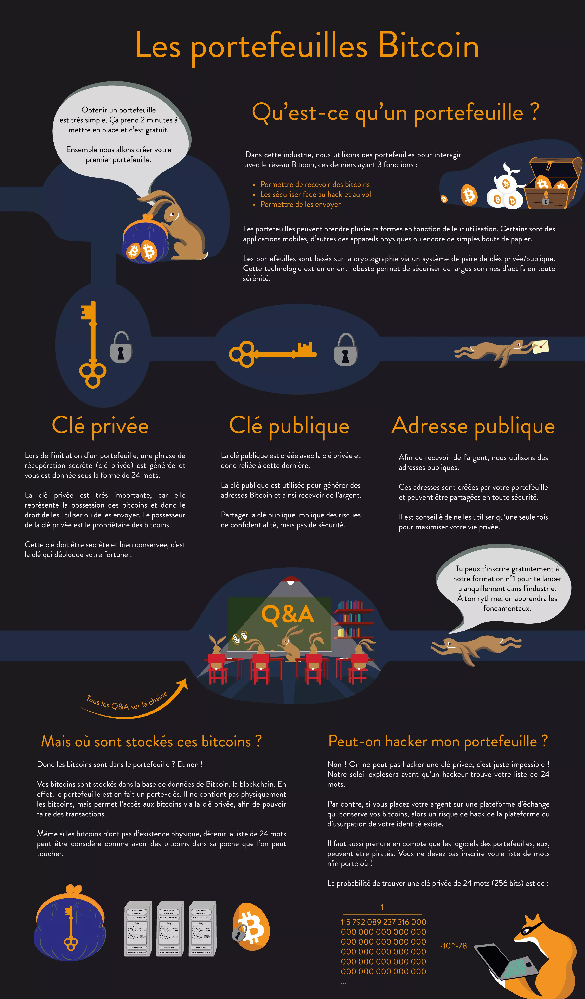

## Sécurité et Portefeuilles Bitcoin
<chapterId>00c1afea-e54a-511f-bab3-2efc2fbfa6a1</chapterId>


### Se poser les bonnes questions avant de commencer

Lorsque vous détenez des bitcoins, la sécurité de vos fonds est une préoccupation majeure. Le meilleur moyen de définir une sécurité adaptée à sa situation est de se poser (et de répondre) à tout une série de questions ; votre modèle de sécurité dépendra de vos réponses. Commençons:

- Qui peut avoir accès à mes fond ? Dit autrement, êtes-vous le seul à avoir accès à vos bitcoins ou une tierce personne, telle qu'une entreprise, vous autorise à accèder à vos fonds ?
- Une seconde question peut être : quels sont les usages que vous comptez avoir avec vos bitcoins ? Est-ce une somme que vous utiliser régulièrement ? Est-ce une épargne moyen-terme ? long-terme ?
- Quelles sont vos compétences techniques ?
- Quel est votre budget sécurité ?

Sachez qu'il n'existe pas de solution universelle. Prenez donc le temps de répondre à ces questions, cela permettra d'adapter vos mesures de sécurité.

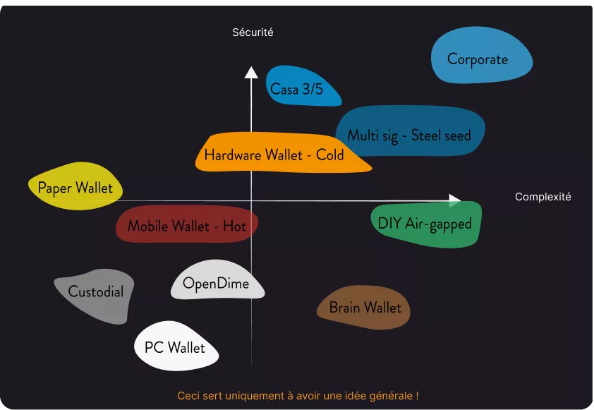

### Penser aux portefeuilles Bitcoin en termes de complexité

Essayons ici d'établir plusieurs niveaux de sécurité pour vos bitcoins :

- **niveau 0**, vous utilisez un service dit custodial avec lequel vous n'êtes pas unique détenteur de vos bitcoins. Attention ce tiers de confiance peut à tout moment vous restreindre l'accès à vos fonds, et vous avez le même niveau de souveraineté financière qu'avec le système bancaire traditionnel via un compte bancaire.


- **Niveau 1**, vous utilisez un portefeuille Bitcoin sur votre téléphone ou sur votre ordinateur avec lequel vous êtes l'unique détenteur de vos bitcoins. Vous pouvez effectuer avec facilité vos transactions. Attention, il est crucial de faire un backup de la phrase mnémonique pour avoir de nouveau accès à vos fonds en cas de perte de votre téléphone ou ordinateur. On parle souvent de "hot wallet" car la clé privée est stocké dans un appareil avec accès à internet.

- **Niveau 2**, vous utilisez un portfeuille physique, et vous avez sécurisé votre liste de 12 ou 24 mots. Pour pouvoir effectuer une transaction, il vous faudra toujours signer avec votre appareil. Cela rend donc vos fonds moins accessible au quotidien. On parle souvent de "Cold Wallet" car vos clés sont stockées sur un appareil qui n'est pas connecté à intetnet.


- **Niveau 3**, vous utilisez un portefeuille de niveau 1 ou 2 mais avec une passe-phrase supplémentaire. Attention, maintenant il vous faut faire une sauvegarde de la liste de 12 ou 24 mots **et** de votre passe-phrase. Idéalement ces 2 informations sont stocké deux endroit différents.


- **Niveau 4**, vous utilisez un ensemble de portefeuille pour créer un portefeuille dit "multisig", ce qui signifie qu'il nécessite plusieurs signatures pour effectuer une transaction. Attention ici encore il faut chaque partie du multisig à des endroits différents. Ceci est souvent considéré comme un usage avancé de Bitcoin, à utiliser principalement pour de larges montants et un usage corporatif.


Bien évidemment nous ponvons avoir plusieurs cas d'usage, et dans ce cas il est recommandé d'utiliser plusieurs portefeuilles bitcoins. La solution miracle n'existe pas.

### La sécurité doit s'adapter

La somme qu'on est prêt à laisser sur un niveau de sécurité spécifique dépend de chacun. Pour certain laisser 1 btc sur un hot wallet est raisonnable, pour d'autres absolumment pas. En tout cas, éviter de débourser beaucoup en sécurité, en vous achetant un portefeuille physique, alors que vous souhaitez sécuriser une petite somme. Gardez également en tête que sur-complexifier la sécurité et l'accessibilité de vos bitcoins peut vous portez préjudice si, par exemple, vous constituez mal les sauvegardes de vos portefeuilles.

En conclusion, la possession directe de ses Bitcoins est un élément essentiel pour assurer sa souveraineté financière. Il est recommandé d'utiliser un portefeuille mobile pour les dépenses quotidiennes et un portefeuille physique hors ligne, ou "froid", pour stocker des montants plus importants. Les entreprises, quant à elles, devraient envisager l'utilisation de systèmes de signatures multiples, ou "multisig", pour une sécurité accrue et partagée. Il est également essentiel d'éviter autant que possible les services de garde ("custodial services"), qui peuvent reproduire certaines des vulnérabilités du système financier traditionnel.

Maintenant que nous avons cela en tête, nous allons voir à la prochaine section les étapes pour créer un portefeuille Bitcoin. Toutefois si vous souhaitez davantage explorer le sujet de la sécurité vous pouvez lire cet [article de DarthCoin](https://asi0.substack.com/p/bitcoin-soyez-votre-propre-banque).

### Petit récap en poster !


## Mise en place d'un portefeuille
<chapterId>615519eb-4565-557d-86a0-021badf7616f</chapterId>


La sécurité de vos Bitcoins est d'une importance cruciale et une simple erreur peut avoir des conséquences coûteuses. C'est pourquoi nous allons à présent voir les meilleures pratiques lors de la création d'un nouvel portefeuille Bitcoin.

> Notez que la formation BTC102 vous accompagne pour bien réussir cette étape.

### On ne rigole pas avec cette étape !

Votre clé privée, souvent représentée par une liste de 24 mots (souvent appelé "seed" ou "phrase mnémonique"), représente l'accès à vos fonds. Si cette clé est révélée à un tiers, considérez que les fonds associés ne sont plus en sécurité. Par conséquent, lors de l'initialisation de votre portefeuille, il est important de respecter ces règles :

- Masquer toutes les caméras.
- Ne pas prendre de photo de la liste de mots.
- Ne pas la saisir sur un ordinateur ou un téléphone.
- Ne pas l'enregistrer comme contact ou se l'auto-envoyer par SMS.
  – Ne jamais laisser vos mots sans surveillance sur votre bureau.
  – Ne jamais cacher votre liste de mots dans un endroit insolite.

Vous allez littéralement prendre une feuille de papier blanche ou imprimer ce [modèle](https://bitcoiner.guide/backup.pdf), et écrire avec un stylo, de manière propre et claire, la liste de mots dans l'ordre. Si l'encre disparaît avec le temps, vous pouvez perdre vos fonds ; il est donc important conserver ce papier à l'abri des intempéries.

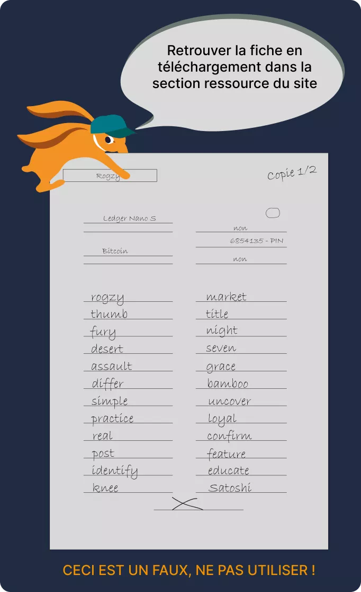

### Conseil pour bien faire

Il existe également des solutions alternatives au papier, comme par exemple inscrire votre phrase mnémonique sur une plaque de métal. Si vous écrivez mal, vos héritiers risquent de ne pas pouvoir vous lire et donc de ne pas récupérer les fonds. Une fois les mots écrits, il est recommandé d'en faire une seconde copie et de la stocker dans un second endroit, distinct du premier. Cela permet d'avoir une sauvegarde de secours en cas de perte ou d'accident avec la première.


Une fois les copies réalisées, rangez les listes de mots dans un endroit sûr où vous vous souviendrez de les chercher ! Ne créez pas un plan de cache trop complexe où vous risquez de les perdre.

> Vos mots = votre argent.

Les portefeuilles "froids" ont tous généralement ces listes de mots, tout comme les portefeuilles "chaud" sur mobile ou pc. Cette méthode de sauvegarde de la clé privée est aujourd'hui le standard. Ce qui signifie que vous pouvez entrer votre phrase mnémonique dans n'importe quel logiciel de portefeuille pour restaurer le votre. Seuls les mauvais portefeuilles que nous déconseillons fortement ne vous donneront pas de liste de 24 mots, mais vous demanderont peut-être un compte, une adresse mail ou, pire, une ID.

**ATTENTION: L'absence de liste de 24 mots doit vous alerter.**

### Petit récap en poster !

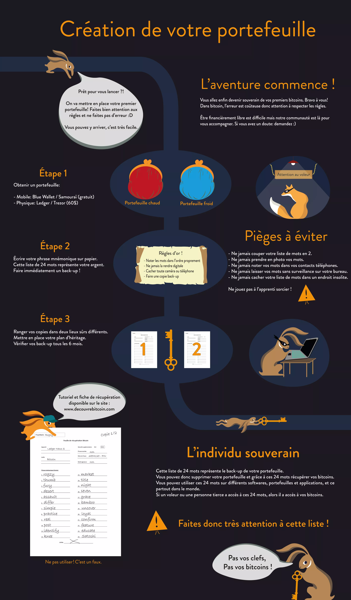

## Passer l’épreuve du temps
<chapterId>f58cd446-c202-5eff-aab7-e61cc40e5c06</chapterId>


La sécurité est une préoccupation majeure dans l'écosystème Bitcoin. En effet, comme toute forme de richesse, vos bitcoins doivent être protégés contre les pertes, les vols et la dégradation, en particulier sur le long terme. La sécurisation de vos bitcoins nécessite une certaine connaissance technique et la conscience des risques associés, ce qui nous amène à discuter de deux stratégies principales : la gravure de vos bitcoins dans l'acier et la création d'un plan d'héritage.

### Graver dans la roche

Une méthode pour sécuriser vos bitcoins sur le long terme est de graver votre phrase mnémonique dans un matériau résistant comme l'acier. Cela crée une sauvegarde physique de vos clés qui est résistante à la fois aux dégâts des eaux et au feu.

Il existe de nombreuses solutions pour y parvenir, certaines sont low-cost comme le "Blockmit", tandis que d'autres demandent plus de matériel. Vous pouvez explorer ce sujet par vous-même via la section tutoriels de cette université.


### Pensez à la prochaine génération !

Conjointement à cela, la création d'un plan d'héritage est également une étape cruciale pour garantir que vos bitcoins seront correctement gérés après votre mort. Ce plan peut inclure une lettre manuscrite détaillant vos actifs, leur mode d'accès et le contact des personnes de confiance à contacter. Il est également important de discuter du lègue de bitcoins avec un notaire pour assurer la conformité fiscale, bien qu'il soit important de ne jamais confier directement vos bitcoins à un tiers, y compris à un notaire.

Si vous souhaitez explorer davantage concernant le sujet du plan d'héritage pour vos bitcoins, nous vous conseillons la livre de Pamela Morgan [Cryptoasset Inheritance Plan](https://planb.network/resources/books/28) ou de suivre la formation BTC102 où nous vous accompagnons dans sa création

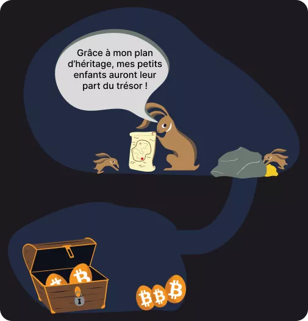

### La vie privée est importante

La sécurité de vos bitcoins sur le long terme ne se limite pas à la création de sauvegardes physiques ou à l'élaboration d'un plan d'héritage. La vie privée est une autre considération importante. Par exemple, il est préférable d'acheter des bitcoins sans fournir de pièce d'identité afin de minimiser les risques de vol d'identité ou tout simplement le traçage de vos fonds par toute entité disposant de suffisamment de moyens. La formation BTC 205 vous aidera en cela si besoin.

Concernant la vie privée, il est primordial d'éviter de parler à tout le monde de vos bitcoins. En effet, nous ne savons pas où cet actif ira, et garder de la discrétion quant à sa possession est une décision sage. Vous ne voulez pas attirer de regards sur vous et votre portefeuille.

Dans la même logique, évitez de dévoiler haut et fort votre système de sécurité lors de réunions bitcoin ou de rencontres avec des inconnus...

### Petit récap en poster !

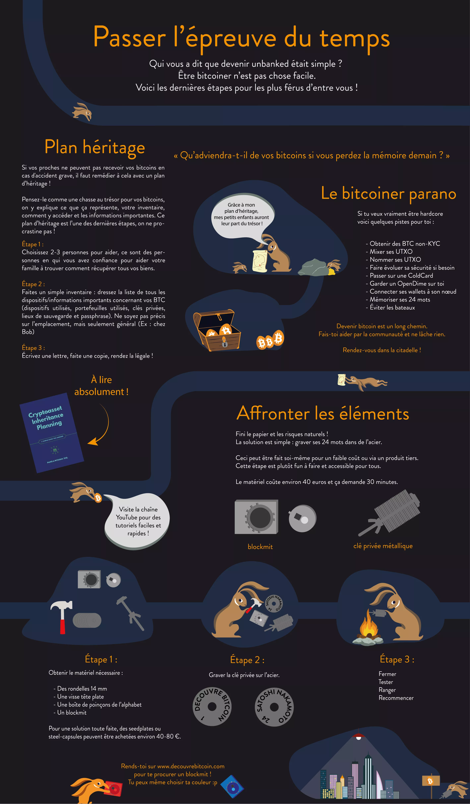

### Résumé sur la sécurité des portefeuilles Bitcoin


Les portefeuilles Bitcoin sont des logiciels permettant de stocker et transacter des nitcoins. Il en existe plusieurs types : portefeuilles sur mobile ou pc, pratique pour des petits montants et/ou des dépenses régulières ; les portefeuilles physiques, plutôt adapté à de la conservation de bitcoin sur le moyen et le long terme ; les portefeuilles multisig qui sont plus complexes à gérer et qui nécessitent plusieurs signatures pour effectuer des transactions.

Lors de la création d'un portefeuille, vous devez en premier lieu faire une sauvegarde de votre clé privée. Cette sauvegarde prend la forme d'une liste de 12 ou 24 mots ou 12 mots que vous pouvez inscrire sur une feuille de papier ou une plaque de métal. Cette phrase mnémonique permet de restaurer votre portefeuille sur toute application de portefeuille Bitcoin. Toute personne ayant accès à cette liste possède également l'accès à vos bitcoins. Dans Bitcoin la souveraineté financière va de pair avec la responsabilité individuelle, il est donc crucial que vous sécuriser l'accès à votre portefeuilles et vos sauvegardes. Pour cela, il est important de suivre certaines règles:

- Créer un plan d'héritage : pour garantir que vos proches puissent récupérer l'argent en cas de problème.
- Éviter les plateformes d'échange : il faut éviter de laisser vos Bitcoins sur des plateformes d'échange, car elles peuvent être sujettes à des attaques de hackers.
- Adaptez votre niveau de sécurité : prenez le temps d'expliciter vos besoins et utilisations, cela vous aidera à faire votre choix entre les différents portefeuilles Bitcoin à disposition.

Maintenant que nous avons bases des portefeuilles bitcoins et des bonnes pratiques concernant leur sécurisation, nous aborderons au prochain chapitre le fonctionnement technique de Bitcoin. Ici encore, connaître les bases du protocol Bitcoin va vous permettre de mieux comprendre son fonctionnement, ce qui vous permettra d'en avoir une meilleure utilisation.

# Les aspects techniques du Bitcoin.
<partId>a86d7439-e7a2-5f21-b1e9-6b5e23ca265b</partId>

## Lancement de Bitcoin
<chapterId>b7561082-8943-519d-95d1-a5f60dd2686d</chapterId>


### Commençons par un peu d'Histoire.

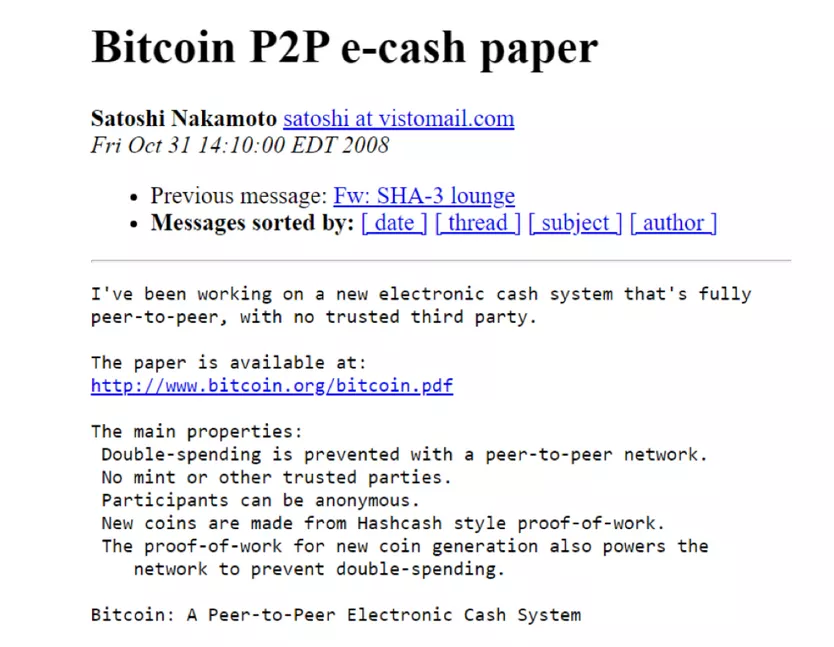

Le 31 octobre 2008 marque la naissance d'une nouvelle technologie financière : le Bitcoin. C'est à cette date que Satoshi Nakamoto, l'auteur anonyme du Bitcoin, présente son innovation au monde par le biais d'un mail distribué à la liste de diffusion cypherpunk, une communauté de cryptographes passionnés de confidentialité sur internet.

Ce courrier contenait un document, appelé "White Paper", présentant le fonctionnement du Bitcoin. Compte tenu des échecs précédents des systèmes de cash digital, cette initiative n'a pas suscité un engouement immédiat. Néanmoins, ce White Paper a fini par devenir une référence pour les utilisateurs de Bitcoin et fait l'objet de nombreux débats dans l'écosystème Bitcoin.


Le 3 janvier 2009, Satoshi inaugure officiellement le réseau Bitcoin en créant le premier bloc, aussi appelé bloc genesis, qui marque le lancement de la blockchain du Bitcoin. Ce bloc contient un message révélateur de la mission du Bitcoin : "03/jan/2009 Chancellor on brink of second bailout for banks" (Le chancelier sur le point d'octroyer un second sauvetage aux banques).

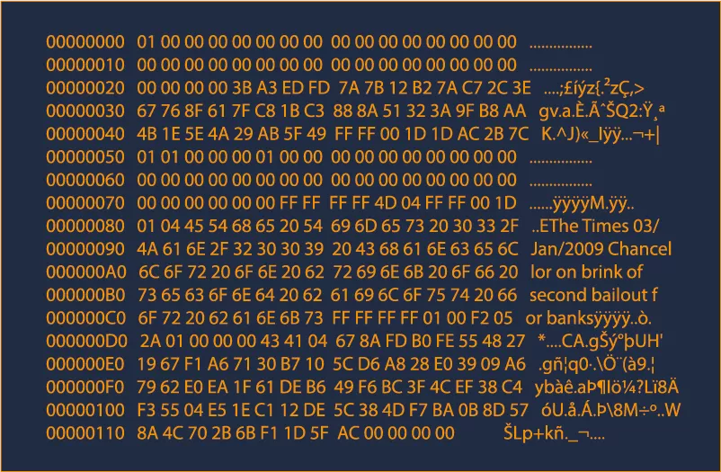

> “We can win a major battle in the arms race and gain a
> new territory of freedom for several years.” - Satoshi Nakamoto

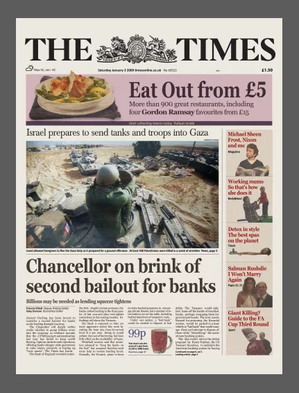

### Le protocole Bitcoin commence à vivre

Le 8 janvier 2009, Satoshi annonce la publication de Bitcoin-0.1.0. Rapidement, Hal Finney se saisit du logiciel et rejoint le réseau. Désormais, il y avait 2 nœuds, et donc 2 mineurs, dans le réseau. Finney immortalise cette étape en tweetant "Running Bitcoin". Le 12 janvier 2009, la première transaction Bitcoin est réalisée entre Satoshi et Hal Finney. Cette transaction, de 10 BTC, est enregistrée dans le bloc 170.

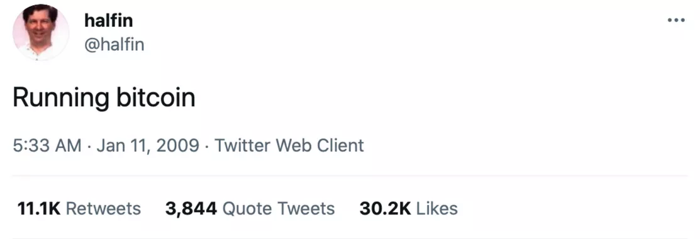

L'intérêt pour le Bitcoin croît rapidement, et de nombreuses personnes commencent à tester, débattre, résoudre des bugs, et réfléchir sur les aspects éthiques, économiques et philosophiques du Bitcoin. Pour faciliter ces échanges, le forum BitcoinTalk est créé le 22 novembre 2009 par Satoshi.
Ce forum devient rapidement le lieu de discussion privilégié pour les utilisateurs de Bitcoin. C'est là que naissent de nombreux mèmes et symboles associés au Bitcoin, comme le [logo Bitcoin](https://bitcointalk.org/index.php?topic=64.0), le fameux [Hodl](https://bitcointalk.org/index.php?topic=375643.0), ou même [Pizza day](https://bitcointalk.org/index.php?topic=137.msg1195).

> **Le saviez vous ?** En effet, le 22 mai 2010, Laszlo Hanyecz marque l'histoire du Bitcoin en proposant d'acheter 2 pizzas pour 10 000 BTC. C'est la première fois que le Bitcoin est utilisé pour acheter des biens matériels.

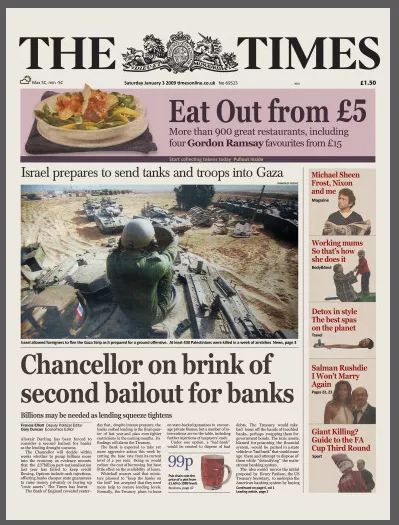

### La disparition de Satoshi Nakamoto

En 2010, alors que le Bitcoin commence à attirer l'attention des médias, Satoshi décide de prendre ses distances. Le 12 décembre 2010, il publie son dernier post sur le forum, annonçant son départ. Le 23 avril 2011, il effectue son dernier échange privé connu par e-mail. Satoshi disparaît alors, laissant sa création entre les mains de la communauté.

> “Governments are good at cutting of the heads of a centrally
> controlled networks like Napster, but pure P2P networks like
> Gnutella and Tor seem to be holding their own.” - Satoshi Nakamoto

Malgré l'absence de Satoshi, le Bitcoin continue de se développer. Toutes les 10 minutes, l'histoire du Bitcoin s'écrit, et le protocole continue de fonctionner comme prévu. Peu importe la peur, l'incertitude ou le doute (FOMO pour Fear Of Missing Out ou FUD pour Fear Uncerntainty Doubt), le Bitcoin continue d'avancer, avec une disponibilité en ligne de 99.988%.

Le Bitcoin est perçu différemment par chaque individu. Pour certains, c'est une entité fongique comme le [mycélium](https://brandonquittem.com/bitcoin-is-the-mycelium-of-money/), pour d'autres, c'est un [trou noir](https://dergigi.com/2019/05/01/bitcoins-gravity/i). Que l'on aime ou que l'on déteste le Bitcoin, il continue d'exister, avec son rythme constant de 10 minutes par block, comme le battement de cœur d'un nouveau système monétaire.

Pour approfondir vos connaissances sur les écrits de Satoshi Nakamoto, je recommande le [livre de Phil Champagne](https://planb.network/resources/books) ou le documentaire de ARTE "le mystaire Satoshi".

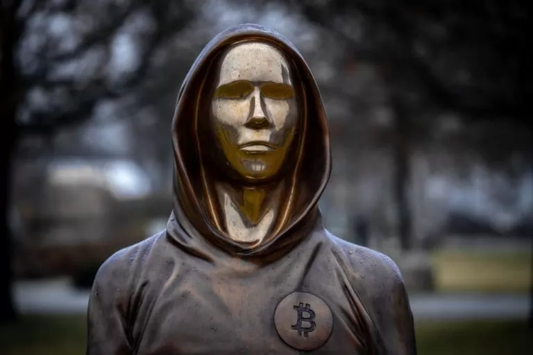

> “The root problem with conventional currency is all the trust that’s required to make it work. The central bank must be trusted not to debase the currency, but the history of fiat currencies is full of breaches of that trust. Banks must be trusted to hold our money and transfer it electronically, but they lend it out in waves of credit bubbles with barely a fraction in reserve.”

Maintenant que nous avons quelques éléments de contexte, voyons à présent comme le fonctionnement général d'une transaction Bitcoin.

### Petit récap en poster !

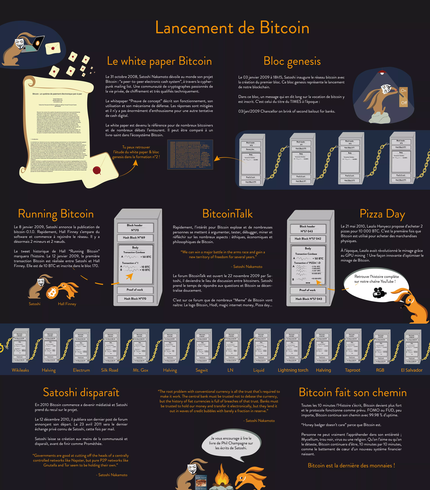

## Les transactions Bitcoin
<chapterId>03482644-5473-590b-975b-b43bb65eac21</chapterId>


Une transaction Bitcoin est simplement un transfert de propriété de bitcoins, grâce à l'utilisation d'une adresse bitcoin. Prenons, par exemple, deux protagonistes : Alice et Bob. Alice souhaite acquérir des Bitcoins, tandis que Bob en détient déjà.

### Étape 1 - Création de la transaction via le portefeuille

Pour que Bob puisse transférer des Bitcoins à Alice, celle-ci doit fournir à Bob une de ses adresses Bitcoin. Cette adresse, dérivée de la clé publique d'Alice, est unique à son portefeuille Bitcoin.

Concrètement, Alice ouvre son portefeuille et appuie sur "recevoir". Un QR code ou une adresse comme celle-ci bc1q7957hh3nj47efn8t2r6xdzs2cy3wjcyp8pch6hfkggy7jwrzj93sv4uykr va s'afficher. C'est son "IBAN Bitcoin" en quelque sorte. Elle le fournit donc à Bob.

Ensuite, Bob initie la transaction en utilisant l'adresse de réception d'Alice. Bob va donc à son tour ouvrir son portefeuille Bitcoin, appuyer sur "envoyer", copier-coller l'adresse, rajouter un montant et des frais de transaction. Ces frais sont une incitation pour les mineurs à inclure la transaction dans le bloc suivant.


> **Pourquoi payer des frais ?** Ces frais sont essentiels pour créer un marché libre de l'inclusion des transactions dans les blocs, car le nombre de transactions présentes dans un bloc est limité. En effet, un bloc possède une taille de 1 Mo, ce qui correspond à quelques milliers de transactions par bloc. Les frais d'une transaction sont proportionnels à la taille de celle-ci. La taille de la transaction, quant à elle, dépend de la complexité de ladite transaction.

Pour finaliser la transaction, Bob doit apporter une signature avec la clé privée des adresses qu'il utilise pour payer Alice. Cela permet de vérifier qu'il est bien le propriétaire des Bitcoins qu'il souhaite transférer. Cette étape se fait généralement automatiquement sur les portefeuilles de type mobile, ou alors c'est une confirmation sur votre portefeuille physique : "Êtes-vous sûr d'envoyer X à Y ? Oui ou non".

### Etape2 : La propagation de la transaction via les nœuds jusqu'aux mineurs

À ce stade, la transaction a été créée et le portefeuille de Bob va donc la partager avec le réseau Bitcoin. Pour ce faire, son portefeuille va communiquer avec un nœud du réseau Bitcoin, et ce dernier va propager cette information à d'autres nœuds. Cette étape de propagation permet à l'ensemble du réseau de voir cette nouvelle transaction et de la prendre en compte.


Malgré que cette transaction soit désormais connue de tous (via un outil nommé Mempool), la transaction n'est pas forcément considérée comme confirmée ! En effet, ce sont les mineurs qui valident les transactions en les inscrivant dans un bloc de notre fameuse blockchain.

Les mineurs ont pour rôle de prendre les transactions valides et non confirmées, puis de les compiler dans un bloc. Pour que leur bloc soit le prochain de la blockchain Bitcoin, ils doivent résoudre une énigme cryptographique dans un processus appelé "preuve de travail" ou "Proof of Work".


### Etape 3 : La transaction est minée dans un bloc par un mineur.

Cette preuve de travail nécessite de trouver un "hash" valide pour le bloc en question. Voyez-le comme une empreinte unique associée au bloc, composée de 256 caractères. La validité de ce hash dépend de la difficulté du réseau Bitcoin. Nous reviendrons plus en détail sur ce mécanisme. Pour l'instant, considérez qu'un mineur a trouvé un bloc valide et que la transaction de Bob pour Alice y est incluse.

Ce nouveau bloc valide est ajouté à la blockchain Bitcoin, qui est un registre public et immuable de toutes les transactions Bitcoin. Voyez-le comme un livre de compte commun à tous les utilisateurs de Bitcoin. Selon les règles du protocole, un bloc est ajouté environ tous les dix minutes grâce à l'ajustement de la difficulté. Nous verrons dans la section concernant les mineurs quel est le mécanisme qui empêche la modification du registre des transactions Bitcoin.

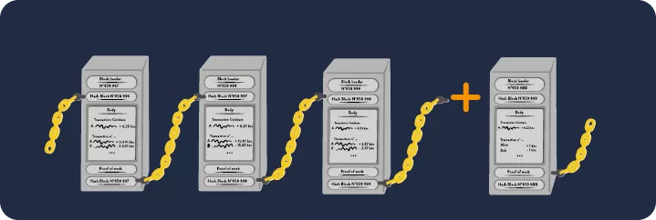

### Etape 4 : Le bloc est valide et vérifié par le nœud du portefeuille d'Alice.

A ce stade la gtransaction est considerer valide, le mineur va propoager a son tour le nouveua bloc via son noeud au reseau et le portfeuille de Alice va etre actialisé.


> Attention : Même si Alice constate qu'elle a reçu des bitcoins sur une de ses adresses, il est recommandé de considérer la transaction comme immuable seulement lorsqu'elle possède 6 confirmations. Cela signifie que 6 autres blocs ont été minés par-dessus le bloc dans lequel se situe la transaction de Bob. En d'autres termes, plus une transaction est ancienne dans la blockchain, plus elle est immuable.

### Petit récap en poster !


### Tout ça pour quoi ?

En fin de compte, le système de transactions Bitcoin est décentralisé et fonctionne en peer-to-peer, sans intermédiaire de confiance.

Bob transmet sa transaction au réseau Bitcoin, et lorsqu'un mineur publie un bloc valide contenant la transaction de Bob, Alice peut commencer à considérer que ces bitcoins lui appartiennent. La confiance n'est requise à aucune étape du transfert de propriété des bitcoins ; seules les règles du protocole et les incitations économiques rendent bien trop coûteux d'agir de manière malveillante dans le cadre du protocole Bitcoin.

Les utilisateurs transfèrent la propriété de leur argent en signant numériquement les transactions grâce à leurs clés privées. Les mineurs détiennent peu de pouvoir, car les utilisateurs ont également un contrôle significatif via les nœuds Bitcoin qui s'occupent de la validation des nouveaux blocs et des transactions incluses. C'est grâce à ce réseau de nœuds Bitcoin que le réseau est véritablement décentralisé.

En effet, pour que le réseau Bitcoin soit complètement détruit, il faudrait détruire toutes les copies de la blockchain de tous les nœuds Bitcoin - une tâche pratiquement impossible en raison de la distribution géographique de ces nœuds et de la difficulté de les saisir physiquement.

Voyons donc plus en détail le fonctionnement d'un nœud Bitcoin.

## Les nœuds Bitcoin
<chapterId>8533cebc-f799-528b-89df-8d75d4c37f1c</chapterId>


Les nœuds constituent un élément fondamental de l'architecture du réseau Bitcoin. Ils assurent diverses fonctions cruciales:

- Le maintien d'une copie de la blockchain Bitcoin
- La validation des transactions
- La transmission des informations vers d'autres nœuds
- La mise en application des règles du protocole Bitcoin.

Ainsi tout appareil faisant tourner le logiciel Bitcoin, appelé de nœuds Bitcoin, (souvent via [Bitcoin Core](https://bitcoin.org/en/bitcoin-core/)) participe alors à la décentralisation du réseau.

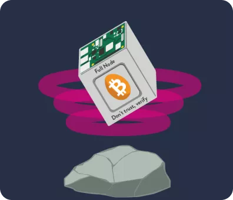

### Les noeuds sont donc le noyaux centrale de Bitcoin.

Chaque nœud détient une copie de la blockchain, ce qui permet de vérifier les transactions et d'éviter toute tentative de fraude. L'aspect décentralisé du réseau confère à Bitcoin une résilience et une robustesse exceptionnelles - pour stopper le protocole Bitcoin, il faudrait éteindre tous les nœuds à travers le monde. À titre d'information, il y a aujourd'hui (septembre 2023) environ [45 000 nœuds](https://bitnodes.io/nodes/all/) distribués à travers le globe.

Les nœuds sont capable de vérifier la validité des blocs et des transactions car ils suivent les règles du consensus Bitcoin. Ces règles régissent, entre autres, la politique monétaire de Bitcoin comme le montant de la récompense des mineurs (que nous allons plus voir en détail à la prochaine section) et la quantité de bitcoin en circulation. Les nœuds agissent en quelque sorte comme le système juridique du réseau. Grâce à eux, tous les participants du réseau suivent les mêmes règles. Ils assurent la neutralité du protocole Bitcoin. Les règles de consensus varient très peu, voir pas du tout car pour apporter des modifications, il est nécessaire d'obtenir l'approbation de l'ensemble des nœuds.


La gouvernance au sein du protocole est en dehors du curriculum de cette formation mais sachez que chaque utilisateur faisant tourner un nœud Bitcoin décide des règles qui souhaite suivre. Ainsi, un utilisateur pourrait décider de suivre d'autres règles (c'est-à-dire faire des modifications au code) mais si ces modifications invalident les règles de consensus actuelle alors ce nœuds ne ferra plus partie du réseaux Bitcoin. Les modifications majeures sont donc rares et requièrent une coordination importante entre des milliers d'acteurs aux idéologies et intérêt variés, ce qui force le protocole à ne produire que des mises à jour qui le rendent "meilleur" au sens de tous les utilisateurs Bitcoin.

### A quoi ressemble un noued ?

Plusieurs options s'offrent à nous lorsque nous souhaitons avoir son propre nœud, et leur coût de maintenance varient. Vous pouvez tout simplement faire tourner le logiciel Bitcoin Core sur votre ordinateur mais cela nécessitera un espace de stockage conséquent car la blockchain fait environ ~500Go. Pour pallier à cette contrainte, vous pouvez décider de garder en mémoire uniquement les N derniers blocs, on parle alors de "pruned node". Pour ce genre de solution, le coût est négligeable car le nœud est allumé uniquement lorsque vous en avait besoin.


Une seconde option est d'utiliser du matériel dédié à cela, comme les Raspberry pi 4 avec un disque dûr SSD suffiamment grand (environ ~1To).
Cette seconde option est plus coûteuse si vous devez acheter le matériel, mais d'un point de vue consommation électrique cela représente un peu moins de 10€ par an.

D'un point de vue bande passante, en considérant 1 bloc de 1Mo toutes les 10 minutes, cela représente environ 5 Go par mois.

### les noeuds doivent rester accessible pour tous !

Le coût abordable et l'accessibilité d'un nœud Bitcoin d'un point de vue ressource matérielle, stockage et bande passante est un aspect très important car cela facilite la décentralisation du réseau.

En effet, tout le monde a une bonne raison de faire tourner un nœud ! Le prix et les efforts sont minimes pour le bénéfice obtenu. Il faut simplement se lancer dans l’aventure et rejoindre des milliers d’autres bitcoiner car ensemble nous formons le réseau Bitcoin.


Si par exemple les blocs était 100x plus lourds, on pourrait certes faire 100x plus de transactions tous les 10 minutes mais faire tourner un nœud Bitcoin nécessiterait un disque dûr de 50To, une bande passante de plus de 500Go/mois et un hardware capable de valider des centaines de milliers de transaction en moins de 10 minutes. Dans cette situation hypothétique avec des blocs 100x plus gros, faire tourner un nœud Bitcoin ne serait pas accessible au commun des mortels, ce qui compromettrai la décentralisation du protocole, et l'immuabilité des transactions et des règles de consensus. Ainsi les contraintes du protocole ont été également choisies pour permettre au plus grand nombre de pouvoir faire tourner son propre nœud Bitcoin.

Cette situation n'est pas si hypothétique que ça car l'année 2017 a été marquée par une intense controverse, connue sous le nom de "guerre des blocs". Ce conflit a opposé les acteurs souhaitant modifier Bitcoin en augmentant la taille des blocs pour augmenter la capacité de transaction, à ceux qui cherchaient à préserver l'indépendance et le pouvoir des utilisateurs. Finalement, les utilisateurs et les nœuds ont triomphé en rejetant la proposition de changement initiée par les mineurs, les plateformes d'échange et les institutions.

Suite à cette victoire, les nœuds ont activé une mise à jour nommée SegWit, ouvrant la voie à la mise en place du Lightning Network, un réseau de paiement Bitcoin instantané utilisant la blockchain Bitcoin. Cette situation démontre que les utilisateurs, grâce à leurs nœuds, détiennent un pouvoir réel au sein de Bitcoin, leur permettant de faire face aux grandes institutions.

### Résumé en poster !


## Les mineurs
<chapterId>dbb8264a-7434-57e4-9d1b-fbd1bae37fdf</chapterId>


> Les mineurs servent à sécuriser le réseau et rajouter les transactions dans les blocs. Ils utilisent de l’électricité via des machines ASICS pour résoudre la preuve de travail Bitcoin.

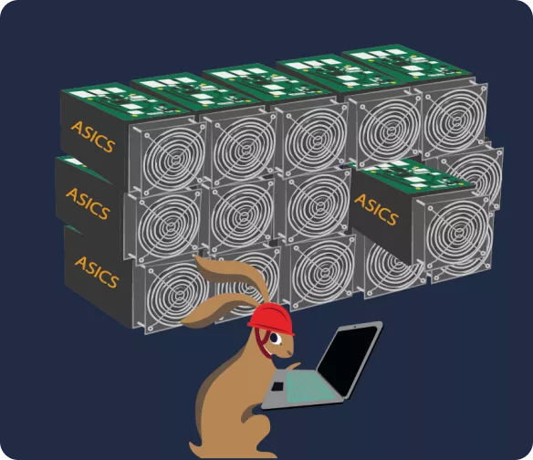

### Explication de la Preuve de Travail

La Preuve de Travail, alias “Proof of Work” (POW), est le consensus de sécurité du protocole Bitcoin. C’est la règle qui permet de faire tourner Bitcoin et de garantir sa robustesse. Le POW est à la base de tout et joue un rôle crucial dans la théorie des jeux de Bitcoin.

Pensez-le comme une loterie géante où tout le monde peu participer. Le but est de trouver un numéro spécifique qui permettra de signer un bloc valide, le gagnant touche une récompense en bitcoin. Ce nombre est très simple à vérifier, mais compliqué à trouver. En effet, la vérification facile se fait au travers de la fonction de hachage SHA-256 qui est inclue dans l’algorithme de minage. Afin de trouver ce chiffre les participants (mineurs) vont tenter des milliards de milliards de possibilités 1, 52, 2648, 26874615, 15344854131318631, etc.

Si le nombre choisi est le bon : Jackpot ! Sinon, on continue de chercher. Pour optimiser le nombre d’essais, ils vont utiliser des machines spécifiques ASICS qui ont pour seul rôle de calculer des milliards de possibilités par seconde. La quantité totale d’essais se nomme le HashRate et permet de quantifier la sécurité du protocole Bitcoin. Pour faire tourner ces machines, c’est donc de larges quantités d’électricité qui doivent être consommées. Le POW transforme donc l’énergie en monnaie, il relie le monde réel et le monde numérique afin de créer la première monnaie énergétique.

Les machines tournent et au bout de 10 minutes en moyenne, un gagnant va émerger. Il aura trouvé le hash correct sous la barre de difficulté. Le grand et unique gagnant va donc signer le nouveau bloc du serveur timestamp et ainsi continuer la chaîne de blocs. Le gagnant touche ses récompenses et retourne tenter sa chance pour le prochain bloc. Le processus se répète depuis 12 ans et toutes les 10 minutes, un gagnant confirme les transactions Bitcoin tout en continuant de sécuriser les transactions du passé. Rendant notre blockchain Bitcoin plus robuste et plus sécurisée.

Chaque 2 semaines (2016 blocs), l'ajustement de la difficulté rééquilibre le jeu mondial du minage en fonction du nombre de participants

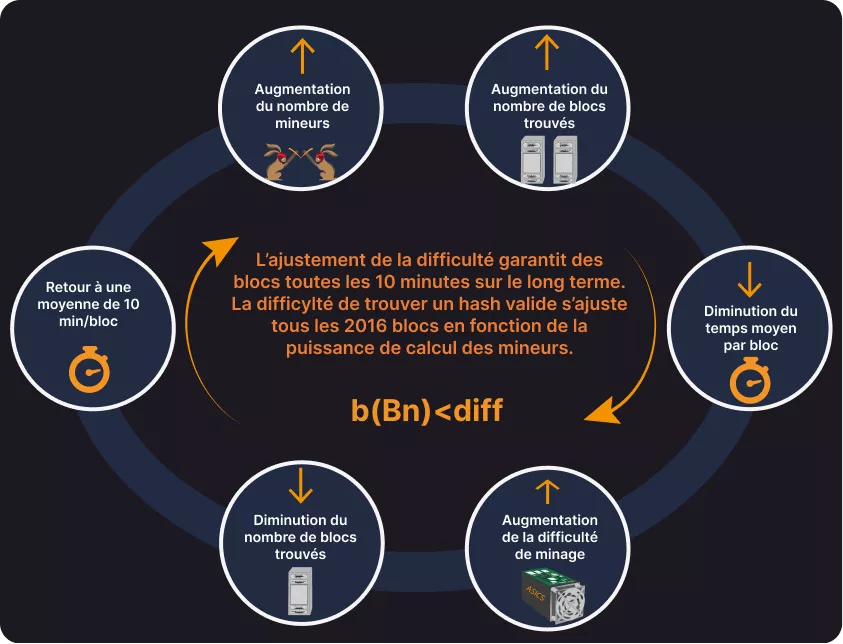

### Le minage est en constante évolution

Au fil des années, les mineurs se sont équipé avec du matériel informatique de plus en plus efficient pour produire le plus de hashs possible par seconde (appelé HashRate) en consommant le moins d'énergie possible, de la manière la moins coûteuse qui soit. Les premiers mineurs comme Satoshi ou Hal Finney minait avec simplement leur processeur CPU, puis d'autres se sont mis à miner avec leur carte graphique. De nos jours, les mineurs utilisent ce qu'on nomme des ASIC (Application-Specific Integrated Circuit), des machines conçues pour uniquement appliqué l'algorithme SHA256.

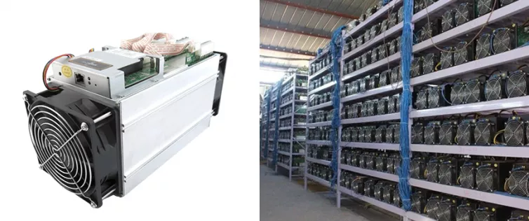

Le Hashrate du réseau Bitcoin réprésente en quelques sorte la quantité de tentatives effectués par seconde pour trouver le prochain bloc. Aujourd'hui il est de environ 400 TH/s, soit 400 000 milliard de tentatives par seconde ! Plus le hashrate global est élevé, plus il est difficile pour un acteur malveillant de monopolisé les ressources nécessaires pour obtenir une majorité du minage et effectué une double dépense. Il est donc plus économiquement viable de suivre les règles du protocole Bitcoin que d'agir à l'encontre de ces dernières. Cela soulève une question : comment se rémunèrent les mineurs ?


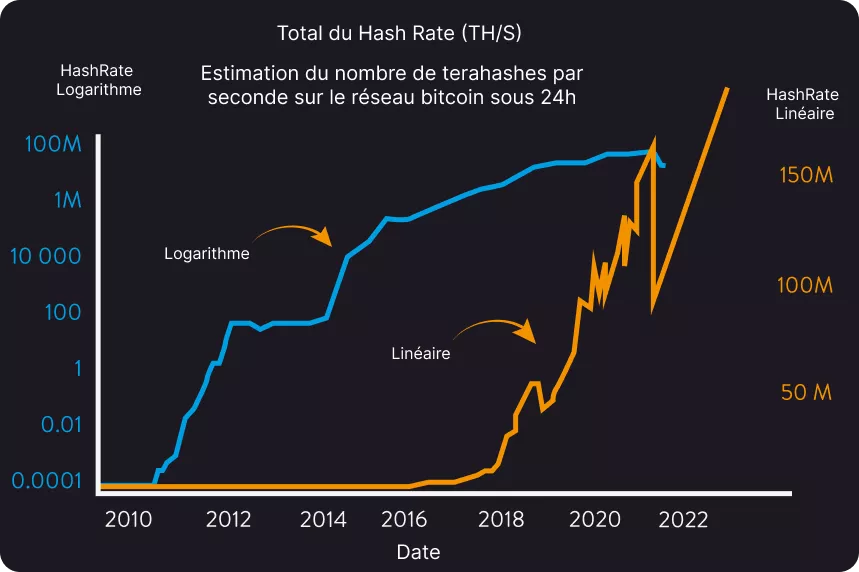

### Que peut-on trouver dans un bloc ?

Le bloc header comporte plusieurs éléments comme l’heure, la cible de difficulté, le numéro du dernier bloc, la version utilisée, et le Merkel Root des précédentes transactions.

La transaction coinbase est toujours la première ; elle comprend la récompense reçue pour avoir réalisé le travail de validateur. S’en suivent les transactions validées. Le mineur va choisir les transactions qui rapportent le plus et essayer de créer un bloc qui maximise son revenu, à savoir des transactions de petite taille avec un maximum de frais.

### Rémuneration des mineurs

Initialement, un mineur est rémunéré lorsqu'il trouve un bloc valide. Plus exactement, il est rémunéré de deux manières : (i) par la récompense incluse dans le bloc et (ii) par les frais de transactions dans les transactions incluses dans le bloc. Le montant de la récompense est défini par les règles de consensus est dépendent dans quelle Époque nous nous situons.

En effet, pour les premiers blocs la récompense était de 50 bitcoins, puis tous les 210,000 blocs (soit environ tous les 4 ans), elle est divisée par 2. Aujourd'hui (en 2023), nous nous situons dans la 4ème Époque; la récompense est donc de 6.25 bitcoin. Cette récompense est le mécanisme de création monétaire dans Bitcoin. Comme la récompense diminue avec le temps, cela signifie qu'il existe une limite de 21 millions de bitcoins -- aujourd'hui il y a déjà plus de 19,4 millions de bitcoins en circulation, soit plus de 92%.

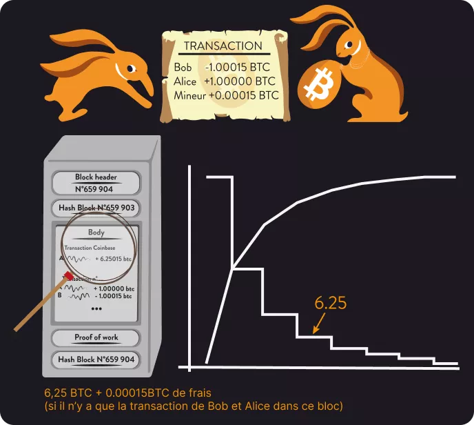

Initialement, un mineur est rémunéré lorsqu'il trouve un bloc valide. Plus exactement, il est rémunéré de deux manières : (i) par la récompense incluse dans le bloc et (ii) par les frais de transactions dans les transactions incluses dans le bloc. Le montant de la récompense est défini par les règles de consensus est dépendent dans quelle Époque nous nous situons. En effet, pour les premiers blocs la récompense était de 50 bitcoins, puis tous les 210 000 blocs (soit environ tous les 4 ans), elle est divisée par 2. Aujourd'hui (en 2023), nous nous situons dans la 4ème Époque; la récompense est donc de 6,25 bitcoins. Cette récompense est le mécanisme de création monétaire dans Bitcoin. Comme la récompense diminue avec le temps, cela signifie qu'il existe une limite de 21 millions de bitcoins -- aujourd'hui il y a déjà plus de 19,4 millions de bitcoins en circulation, soit plus de 92%.

La seconde méthode de rémunération est défini par le montant choisi pour les utilisateurs pour les frais de transactions. Comme le mineur souhaite maximiser son revenu, il aura une tendance à selectionner en priorité les transactions avec des frais de transactions élevés; les frais de transactions reflète donc l'urgence de l'utilisateur pour que sa transaction soit insérée dans le prochain bloc.

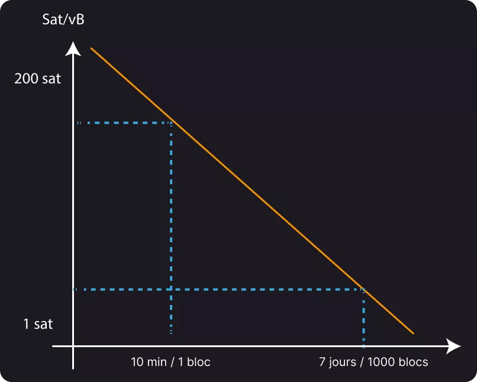

De plus pour stabiliser le modèle économique des mineurs qui repose sur les récompenses qu'ils reçoivent pour chaque bloc valide, les mineurs collaborent souvent en groupes via des "pools de minage", où ils mutualisent leurs ressources de calcul.

### Pourquoi s'embêter à faire tout ça ?

En somme, l'innovation de Bitcoin est de proposé une solution au problème de la double dépense grâce à l'utilisation d'une blockchain basée sur la Preuve de Travail avec une difficulté flottante. Dans le monde numérique, la notion de propriété diffère de celle du monde physique. En effet, dans le monde numérique, tout peut être copié et collé, ce qui pose des problèmes en termes de double dépense pour les biens numériques de valeur. Des intermédiaires de confiance, comme les banques, ont été créés pour résoudre ce problème technologique et garantir que lorsqu'un bien est transféré, il n'appartient plus à l'émetteur. Mais comment faire sans intermédiaire de confiance ? Ce problème est équivalent au problème des généraux byzantins, un problème de coordination de l'information dans un système où l'on ne peut faire confiance aux différents acteurs.


Bitcoin est donc une sorte de solution pour résoudre ce problème, ou du moins pour le contourner. Les "généraux" de Bitcoin, ou mineurs, produisent des blocs (de l'information) et les nœuds Bitcoin vérifient les transactions financières via les règles de concensus pour garantir l'authenticité de l'information. L'assymétrie dans le coût énergétique entre la production d'information et la vérification assure la fiabilité de l'information, sans tiers de confiance.

Les mineurs sont les maçons de la sécurité du réseau Bitcoin. En dépensant de l'énergie pour produire des hashs, ils construisent un mur qui rend extrêmement coûteux pour un agent malveillant de ré-écrire l'historique des transactions. Cette dé-incitation économique les dissuade de se comporter de manière malhonnête.

Même dans le cas d'une attaque de 51%, c'est-à-dire qu'un agent possède plus de la moitié du hashrate, le réseau reste sécurisé car l'attaquant doit dépenser autant d'énergie que l'ensemble des mineurs pour tenter de modifier la blockchain. C'est grâce à ce mécanisme de preuve de travail, qui nécessite de l'énergie pour être accompli, que le réseau est sécurisé.

### En résumé

La théorie du jeu appliquée à Bitcoin écarte les mineurs malhonnêtes. Les mineurs utilisent des machines ASIC pour miner et reçoivent une récompense en cas de succès. De plus, ils se regroupent souvent en pools de minage pour partager leur puissance de calcul et obtenir des récompenses moindres mais plus régulièrement. Le minage de Bitcoin est un processus avec un fort coût énergétique mais essentiel pour le fonctionnement et la sécurité du réseau Bitcoin. La preuve de travail et la blockchain résolvent le problème de la double dépense et assurent la véracité des informations sans aucun tiers de confiance. La dépense énergétique est nécessaire pour produire l'information, mais la vérification des informations à un coût négligeable. Cette asymétrie garantie la sécurité du réseau. Il est donc plus économiquement viable de suivre les règles de consensus, que de les enfreindre.

### Petit récap en poster !


## Bitcoin et l’écologie
<chapterId>4b227ae6-443a-5739-b443-60b7931130d9</chapterId>


Nous venons de voir à la section précédente que la sécurité du protocole Bitcoin repose sur un coût énergétique élevé pour produire un registre public des transactions sans tiers de confiance. Le coût énergétique global est souvent comparé à la consommation électrique d'un petit pays. Mais cette comparaison a-t-elle du sens ? Est-elle pertinente pour comprendre les raisons derrière d'un tel coût ?

### Les coûts énergétiques du Bitcoin.

Tout d'abord évaluons qualitativement le coût environnemental du minage. Un mineur doit se munir d'une machine comme un ASIC et d'une source d'énergie sous forme d'électricité pour pouvoir alimenter ces machines. Les ASICS sont majoritairement composé d'aluminium et peuvent être soit recyclé ou ré-employé pour un second usage (comme cela a été démontré avec le projet [Attakaï](https://decouvrebitcoin.fr/attakai/), qui transforme un Antminer S9 en chauffage d'appoint). La bête noire est donc la consommation énergétique. Essayons donc d'apporter davantage de contexte à cela.

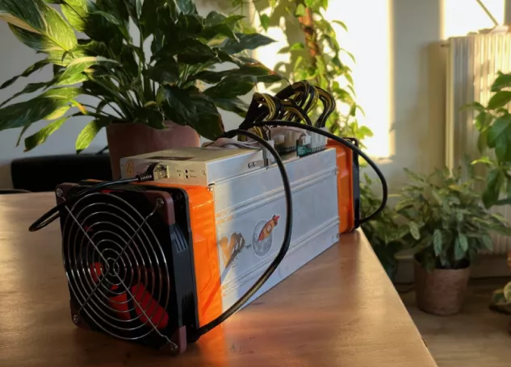

La consommation électrique représente la quasi-totalité des coûts pour un mineur. Par conséquent, il est incité à se procurer une source d'électricité peu chère. Or, comme les mineurs sont mobiles ils peuvent se rendre dans des endroits où des centrales électriques sont installées mais pas encore reliées à la grille électrique du territoire. Les mineurs jouent le rôle d'acheteur de dernier reccours, permettant ainsi à des centrales de pouvoir se financer avant même d'être relié au réseau électrique. Et lorsque qu'elles le seront, la demande en électricité augmentera, ce qui augmentera le prix rendant ainsi moins rentable pour le mineur de se fournir en électricité sur ces lieux. Le mineur décidera alors de déplacer son installation et s'intallera plus loin là où la demande est faible et donc son prix également.

### Un débat sans fin

Ainsi, le débat sur l'impact écologique de Bitcoin est souvent mal orienté, principalement à cause d'une compréhension insuffisante de son utilité et de son fonctionnement. Bitcoin ne peut pas être évalué simplement en termes de coût énergétique par transaction, car les mineurs sécurisent à la fois le réseau actuel et historique, les transactions sont regroupées et ne sont pas toutes équivalentes, de plus l'impact du Lightning Network n'est pas pris en compte. Ceux qui prétendent que Bitcoin consomme trop d'énergie peuvent avoir des motivations politiques ou cherchent à vendre leur propre solution blockchain. Le prétexte écologique est utilisé pour justifier le bannissement de Bitcoin.

Cependant il ne faut oublier que Bitcoin, en tant qu'invention révolutionnaire, a donné aux individus vivant sous l'oppression financière ou sous un régime dictatorial un moyen de lutter pour leur liberté. En tant que dernier recours, Bitcoin offre une forme de liberté financière en échappant à la censure et aux restrictions bancaires. Bitcoin est plus qu'une simple monnaie. C'est une forme de communication et d'expression de la liberté. L'énergie dépensée par les mineurs contribue à la défense de notre liberté. Bitcoin permet l'émancipation du système financier actuel, dominé par la dette et la création monétaire excessive des banques centrales.


Pour ceux qui vivent dans des pays avec une inflation élevée, Bitcoin est une question de survie. Il fournit un moyen de survivre dans des situations financières précaires. De plus, Bitcoin offre un système financier plus juste et plus équitable. Il donne également l'opportunité à des milliards de personnes dans le monde d'accéder au système financier. Vu sous cet angle, est-ce que la consommation énergétique est légitime ?

### Est-ce que le Bitcoin ne serait-il pas un net positif pour l'environnement ?

Finalement, il est essentiel de discuter des enjeux économiques et environnementaux de l'adoption de Bitcoin.

Notamment en le comparant avec le système financier actuel. Celui-ci, de part son encouragement à la surconsommation et à l'endettement, pose de sérieux problèmes. La facilité d'accès au crédit, l'émission monétaire par les banques et le recours à la réserve fractionnaire sont autant de facteurs qui favorisent le surendettement, et par conséquent la sur-consommation.


Il est nécessaire de réformer le système monétaire afin de faire refléter la rareté de nos ressources avec la rareté de notre monnaie. Cela encouragera une consommation plus responsable et une vision à long terme. À l'inverse l'inflation, en incitant à la consommation et à l'investissement, a sur le long terme un impact négatif sur l'environnement.

Le système financier actuel s'accorde avec les idées de l'économie keynésienne, qui contrairement à celles de l'économie autrichienne, ne tient pas compte l'aspect temporel et dynamique des situations et des ressources. En d'autres termes, une monnaie illimité ne peut efficacement refléter les ressources limitées de notre planète.


Les politiciens, en raison de leur vision à court terme et de leur besoin de croissance économique pour être réélus, ne sont pas en mesure de résoudre les problèmes écologiques sur le long terme. À l'inverse l'adoption d'une monnaie saine comme Bitcoin est une potentielle alternative qui pourrait permettre de rendre le pouvoir économique au peuple.

Les flammes dans les puits de pétrole, qui brûlent du méthane pour éviter la pollution, peuvent être éteintes par les mineurs de Bitcoin, ce qui est bénéfique pour l'environnement. Bitcoin favorise l'utilisation d'énergie verte. Le méthane peut être converti en électricité pour alimenter les machines de minage, ce qui est avantageux pour tous.

La technologie du Bitcoin est souvent mal comprise, et les critiques concernant son impact écologique sont souvent simplistes et court-termiste. Ces critiques sont souvent motivées par des intérêts politiques. Bitcoin a le potentiel d'aider à la transition écologique et de contribuer à un monde plus vert. Les médias répandent souvent des idées fausses sur Bitcoin et l'écologie. Prenez donc le temps de vous faire votre propre avis. Tout est transparent avec Bitcoin.

> Suivez une des maximes de Bitcoin : Ne faites pas confiance, vérfiez par vous-même !

### Petit récap en poster !


### Court résumé des aspects techniques de Bitcoin


Satoshi Nakamoto lança en Janvier 2009 le protocole Bitcoin, qui a depuis évolué grâce à une communauté grandissante de développeurs, mineurs et d'utilisateur avec des nœuds Bitcoin. Ces derniers en gardant leur propre copie de la blockchain Bitcoin, ce registre publique de toutes les transactions Bitcoin, peuvent s'assurer de la validité des transactions au regard des règles de consensus propres à Bitcoin. Notamment en s'assurant que les mineurs produisent des blocs valides, qui contiennent quelques milliers de transactions en attente.

En moyenne un bloc est créé tous les 10 minutes et le mineur ayant trouvé un hash valide pour le prochain bloc est rétribué par le protocole avec une récompense dont le montant est défini par les règles de consensus, et les frais de transactions de toutes celles présentes dans le bloc valide en question. Comme le résultat de l'algorithme de hachage (SHA256) pour une entrée donnée est considéré comme imprévisible, le processus de minage qui consiste à construire de nombreux bloc-candidats et de tester si leur hash est valide ou non. Cependant pour s'assurer que le temps moyen entre deux blocs reste constant (~10 mins) indépendemment de la quantité de mineurs et de leur puissance de calcul, la difficulté pour trouver un hash valide s'ajuste tous les 2016 blocs soit environ toutes les 2 semaines. Les mineurs ont développé au fil du temps de machines spécifique à SHA256, appelé des ASICS pour augmenter la ratio hashrate/joule, ce qui veut dire en d'autre terme le nombre de tentative par seconde et par énergie consommée.

Pour que les mineurs soit le plus rentable dans son activité, il se doit de se procurer l'électricité la moins chère possible, ce qui est souvent dans des endroits reculées, au sein de centrale électrique qui ne sont pas encore reliée à la grille électrique du territoire. Le mineur agit alors comme un acheteur de dernier reccours, et dès que le prix de l'électricité augmente suite à l'augmentation d'une demande, alors le mineur aura tendance à relocaliser son activité ailleurs.

Ainsi, le protocole Bitcoin est un système monétaire incensurable et instoppable car chaque composante du protocole est distribué géographiquement sur l'ensemble du globe -- à titre d'exemple, on dénombre environ 40 000 nœuds Bitcoin sur l'ensemble des continents. Les règles de consensus de Bitcoin sont telles qu'il est plus économiquement rentable de les suivre que de chercher à les transgresser, et par conséquent aucune confiance n'est requise entre les acteurs. Bitcoin n'a pas de leader et ne peut pas être arrêté. Il est possible de réguler les plateformes d'échanges pour limiter Bitcoin, mais cela est restreint en terme d'impact. En somme, aucun juge ou état ne peut censurer ou arrêter Bitcoin.

# Comment se procurer des Bitcoin ?
<partId>517e1bb7-f032-51a0-930a-a91fe5148d3f</partId>

## Bitcoin ne dort jamais !
<chapterId>d5e35e41-ea26-5478-8eb9-07daf9dff508</chapterId>


Le prix du Bitcoin est souvent caractérisé par une volatilité significative. Sa valeur peut fluctuer considérablement en fonction des variations du marché et des phases de marché haussier (bull market) et marché baissier (bear market). Ceci est présent sur 100% des marchés financiers, bitcoin y compris.


> Pour faire simple: les êtres humains achètent tous en même temps et vendent tous en même temps. Bitcoin n'est pas immunisé contre la nature humaine.

### Comprendre les vagues d'adoption

Le développement et l'évolution de Bitcoin sont en grande partie liés aux différents groupes d'acteurs qui ont progressivement intégré son écosystème.

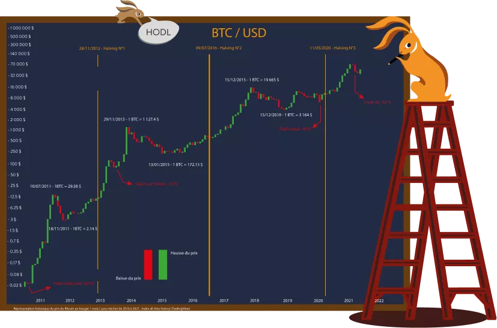

- Les believers:

Les premiers utilisateurs de Bitcoin étaient principalement des technophiles, des cypherpunks, des libertariens et des adeptes de l'or. Ces groupes ont été attirés par le Bitcoin en raison de sa capacité à offrir des solutions comme un cash électronique sans tiers de confiance, une résistance à la censure ou une politique monétaire transparente et immuable.

- Le dark web & les criminels

Puis, l'utilisation de Bitcoin s'est étendue à des sites de commerce sur le dark web, comme Silk Road, en raison de sa nature incontrôlable et pseudonyme. Ce site a attiré l'attention sur le caractère non contrôlable et pseudonyme du Bitcoin, ce qui a incité certains acteurs criminels à l'utiliser. Toutefois, il convient de noter que l'usage qui est fait d'un outil, et non l'outil lui-même, détermine sa légalité ou son illégalité. Il convient de noter que l'utilisation illégale de Bitcoin ne fait pas d'une personne un criminel en soi. C'est l'utilisation, et non l'outil, qui peut être classée comme illégale. Par exemple, l'utilisation de Bitcoin pour des activités telles que l'achat de certaines drogues est légale ou non en fonction de la réglementation du territoire sur lequel l'activité a lieu.

- La folie des ICO et l'arrivée du grand public.

L'année 2017 a été marquée par une importante bulle spéculative dans l'univers des crypto-monnaies, en particulier avec le lancement de milliers d'ICO (Initial Coin Offering). Cependant, beaucoup de ces nouvelles crypto-monnaies n'avaient ni développement concret, ni utilité, et ont donc rapidement disparu. Cette bulle de 2017 fut suivie d'une forte correction en 2018-2019.

- La bulle des NFT et la DeFi

Puis de nouveau en 2020, le marché traverse une autre bulle spéculative qui a porté le prix du Bitcoin à $60,000. Cette bulle se distingue des précédentes par une plus grande diversification des investisseurs, y compris des institutions financières et des grandes entreprises. Mais encore une fois, une fois l'euphorie passée, de fortes corrections ont lieu.

Au regard des cycles passés, il semblerait que la périodicité des cycles économiques du Bitcoin soit équivalente à la durée entre deux halving. Peut-être car l'événement de halving fait office de détonnateur en réduisant de moitié l'émission de nouveau bitcoin.

### Bitcoin & la volatilité

Ces très importantes fluctuations ont créé une réputation au Bitcoin d'un actif extrêmement dangereux et qui fait perdre de l'argent à tous ces utilisateurs. Bien que le cours peut chuter de 10-20 ou même 50% en quelques jours, il est important de bien comprendre que Bitcoin, le protocole, lui n'est pas affecté par le changement de prix.

Cette volatilité importante est complètement acceptée aujourd'hui des acteurs du Bitcoin et peut être palliée par plusieurs solutions tel que des hedges financiers (stablecoins), une croyance long terme forte (le hodl) ou simplement en ne mettant pas 100% de son argent dans Bitcoin sans rien comprendre. Comprendre pourquoi le prix du Bitcoin fluctue autant est donc essentiel pour pouvoir avancer dans cette industrie car au final, c'est le prix et les cycles qui temporisent et régulent en quelque sorte notre marché. Nous pouvons noter néanmoins que plus Bitcoin grandit et mature, moins la volatilité est importante.


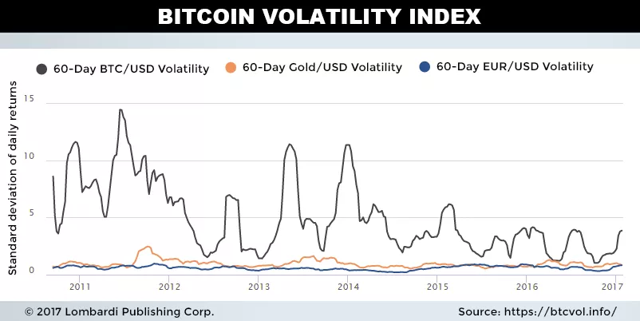

L'année 2017 a été marquée par une importante bulle spéculative dans l'univers des crypto-monnaies, en particulier avec le lancement de milliers d'ICO (Initial Coin Offering). Cependant, beaucoup de ces nouvelles crypto-monnaies n'avaient ni développement concret, ni utilité, et ont donc rapidement disparu. Cette bulle de 2017 fut suivie d'une forte correction en 2018-2019. Puis de nouveau en 2020, le marché traverse une autre bulle spéculative qui a porté le prix du Bitcoin à 60 000$. Cette bulle se distingue des précédentes par une plus grande diversification des investisseurs, y compris des institutions financières et des grandes entreprises. Mais encore une fois, une fois l'euphorie passée de fortes corrections ont lieux. Au regard des cycles passés, il semblerai que la périodicité des cycles économique du Bitcoin soit équivalent à la durée entre deux halving. Peut-être car l'évènement de halving fait office de détonnateur en réduissant de moitié l'émission de nouveau bitcoin.

Bien que la paire btc/dollars fluctue sur des temps courts, le Bitcoin, de par sa quantité limitée de 21 millions de bitcoin et son processus de halving (division par 2 de la création monétaire tous les 4 ans en moyenne), suit une tendance générale à la hausse de manière quasi-mécanique. Bien évidemment, comme tout actif financier, le Bitcoin est sujet à des cycles économiques comprenant des périodes d'euphorie, des bulles spéculatives et des corrections. Ce phénomène est assez courant dans les technologies émergentes, où le marché n'est pas toujours rationnel ou efficient.

### Un marché unique

Ces cycles de bulles spéculatives sont assez uniques dans le monde, en effet il est très rare pour un même actif de voir autant de bulles s'enchaîner encore et encore. Ceci s'explique simplement parce que Bitcoin n'est pas une bulle qui va disparaître mais bien une monnaie réellement utilisée partout dans le monde. Le protocole Bitcoin est unique en ce sens qu'il fonctionne à l'échelle mondiale, 24 heures sur 24, 7 jours sur 7, rendant la régulation difficile pour les autorités financières.

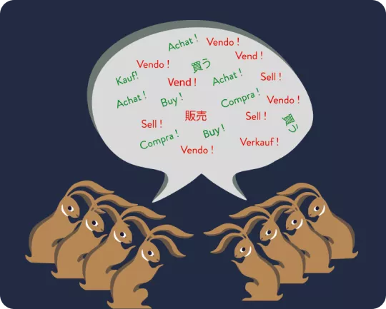

Aujourd'hui, en 2023, le Bitcoin continue de survivre et de grossir toujours plus en s'implémentant chaque jour davantage dans le marché traditionnel. L'arrivée prochainement des ETF Bitcoin, une régulation plus claire et de meilleurs outils d'acquisition ou de stockage ne font qu'encourager cette tendance. Bitcoin a ENCORE survécu à sa bulle spéculative, ce n'est donc peut-être pas que du vent !


### Petit récap en poster !

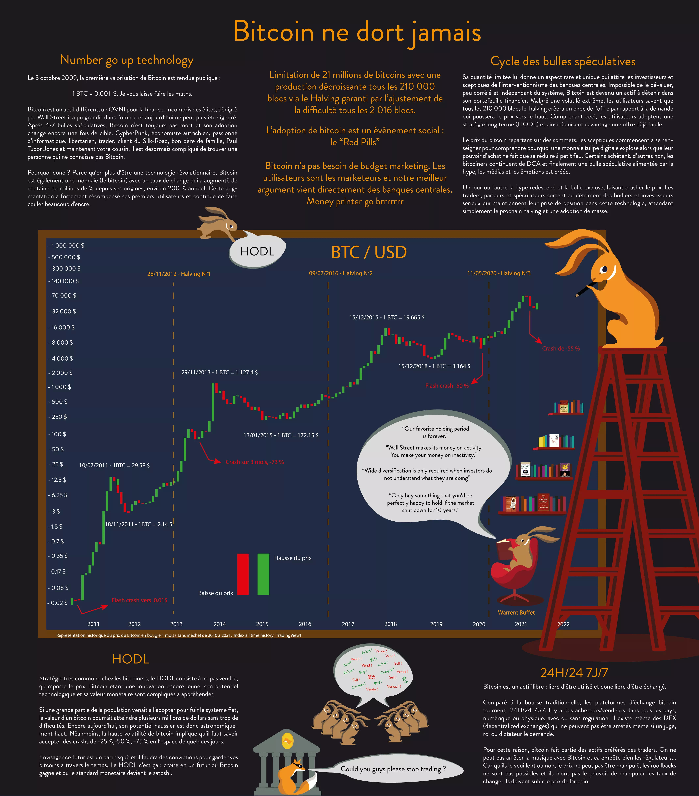

## Obtenir des bitcoins en travaillant
<chapterId>be2d83be-406f-582c-83ca-6aa905ff7b04</chapterId>


### Une économie parallèle se développe

Bitcoin peut être perçu comme une économie parallèle à celle des monnaies fiduciaires. Cela signifie qu'il est possible de vendre des biens ou des services, mais aussi d'être payé en Bitcoin. Les transactions peuvent être effectuées directement en Bitcoin, sans avoir besoin de passer par une plateforme d'échange, simplement de portefeuille Bitcoin à portefeuille Bitcoin.

L'économie du Bitcoin existe et se développe dans certaines régions du monde, comme au Salvador où le Bitcoin est monnaie légale depuis 2021. De plus, certaines personnes, entreprises et organisations acceptent déjà le Bitcoin comme moyen de paiement pour leurs produits ou services.

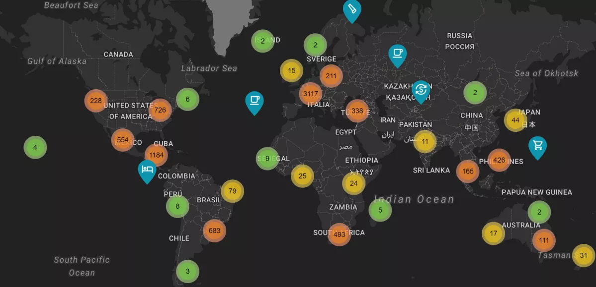

En outre, pour faciliter l'utilisation de Bitcoin dans les transactions du quotidien, un projet open-source et collaboratif a été lancé : BTCMap (https://btcmap.org/map#2/21.28937/5.46680). Ce dernier recense tous les commerçants qui acceptent Bitcoin ainsi que les différentes communautés Bitcoin à travers le monde. Vous pouvez visiter leur site pour découvrir l'écosystème Bitcoin autour de vous. Ainsi, malgré les difficultés et les réticences, il existe des initiatives comme BTCMap qui contribuent à rendre l'économie du Bitcoin plus accessible et pratique pour tous.

### Pourquoi accepter bitcoin au lieu d'en acheter ?

Pour obtenir des bitcoins, vous pouvez les acheter sur des plateformes régulées par des organismes tels que l'AMF (Autorité des Marchés Financiers) en France. Cette méthode implique certains risques et la traçabilité de vos transactions. Une autre méthode pour obtenir des bitcoins consiste à les accepter en tant que moyen de paiement pour les produits ou services que vous proposez. Cette méthode vous permet d'acquérir des bitcoins par le biais de votre travail sans vous soucier constamment du prix du Bitcoin.

De plus, accepter le Bitcoin en tant que commerçant présente plusieurs avantages, dont l'absence de censure, des frais de transaction réduits, une efficacité accrue, une protection contre l'inflation, ainsi que la liberté et la souveraineté financière.

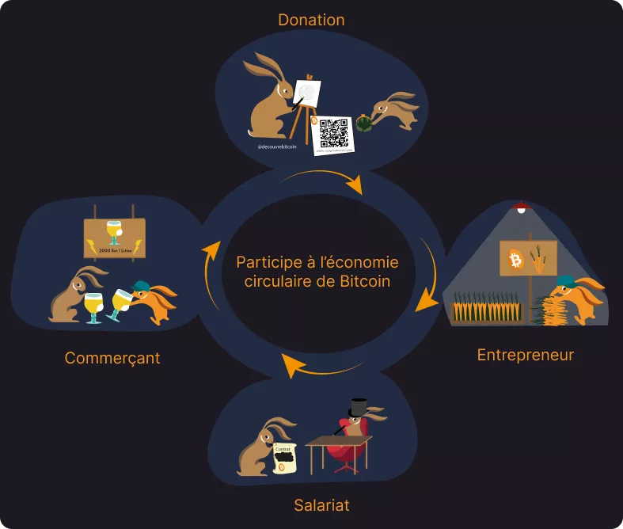

### Comment s'y prendre:

Pour accepter le Bitcoin, il est nécessaire d'étudier les différentes solutions disponibles et de choisir celle qui convient le mieux à votre entreprise. Il n'existe pas de solutions parfaites, et plusieurs facteurs doivent être pris en compte pour faire votre choix, tels que, entre autres, le volume de transactions attendu, le budget alloué, le type de commerce (en ligne ou physique).

Nous allons traiter ce sujet en détail dans une autre formation, mais pour faire simple, on peut considérer plusieurs catégories de business et donc ainsi des solutions liées :

- Solution en ligne simple : OpenNode
- Solution pour les commerçants amateurs : Swiss Bitcoin Pay
- Solution pour les grosses structures ou bitcoiners passionnés : BTCpay Serveur

D'autres solutions intermédiaires ou concurrentes de ces choix existent bien évidemment, vous les découvrirez au fur et à mesure de votre voyage dans Bitcoin. Si besoin, la section tutoriel commerçant pourra vous guider!

### Petit récap en poster !


## Épargner avec Bitcoin
<chapterId>1d9570c6-5b63-51a6-b87c-7bdb0fc4aa87</chapterId>


### Avertissement avant de ce lancer !

Bitcoin est devenu un actif financier majeur, principalement en raison de son offre limitée et de sa demande croissante. Toutefois, l'achat de Bitcoin comporte des risques qui nécessitent une attention particulière. Il est donc recommandé d'effectuer vos propres recherches et d'en apprendre davantage sur le sujet pour être familiarisé avec la technologie avant d'investir.

- N'investissez que ce que vous pouvez vous permettre de perdre.
- Bitcoin est un actif financier très volatile; son prix peut descendre à 0.
- Les performances passées ne préjugent pas des performances futures.
- Contactez votre conseiller financier si besoin.

> DécouvreBitcoin (Rogzy) ne fait pas de conseil en investissement et rien de ce qui est énoncé ici ne doit être considéré comme tel.

### Mini Check-list avant de faire le grand saut

Avant de vous lancer dans l'achat de Bitcoin, assurez-vous d'avoir :

- Un portefeuille sécurisé.
- Une compréhension solide de Bitcoin.
- Un plan d'épargne à suivre.
- Une vision à long terme.

Si le sujet n'est pas encore clair, sachez que la formation BTC102 vous accompagne dans la sécurisation et l'acquisition de vos premiers bitcoins. Ici, nous allons uniquement survoler le sujet.

Concrètement, il y a deux questions à se poser :

- Quelle stratégie d'acquisition adopter : petit à petit ou en une seule fois ?
- Par quelle plateforme passer : régulée ou non régulée ?

### Les strategies d'achat

- Dollars Cost Average

L'achat récurrent consiste à acheter de faibles montants de Bitcoin à intervalle régulier. Cette méthode offre un lissage du prix à travers le temps et une croissance continue de la quantité de Bitcoin possédée. C'est une solution idéale pour épargner à long terme sans se soucier du prix et de la volatilité du Bitcoin. On met en place puis on oublie.


> Attention aux UTXO : N’oubliez pas de consolider vos UTXO dans vos portefeuilles de temps en temps. Cette pratique est essentielle pour gérer efficacement vos bitcoins et éviter les frais inutiles lors des transactions.

- Achat spontané

L'achat spontané est employé pour obtenir une exposition immédiate au Bitcoin. Que ce soit pour acheter pendant un crash ou pour profiter d'un bonus, la décision vous appartient. Il faudra prendre votre courage à deux mains et appuyer sur achat.

Étant donné la volatilité significative du Bitcoin, une attention particulière doit être portée à vos émotions. Le FOMO (Fear of Missing Out, ou la peur de manquer une opportunité) et le FUD (Fear, Uncertainty, Doubt, ou la peur, l'incertitude et le doute) sont vos pires ennemis dans ce contexte ! Restez calme et suivez la stratégie que vous avez établie en amont pour éviter des prises de décision impulsives et potentiellement préjudiciables.

### À qui acheter nos Bitcoin ?

Il existe plusieurs moyens d'acquérir des Bitcoins, chacun ayant ses propres réglementations. Certaines plateformes exigent une pièce d'identité pour la vérification, tandis que d'autres ne le font pas. Il est crucial de comprendre les réglementations associées à chaque plateforme.

- Les platefrome de DCA

Une méthode courante d'accumulation de Bitcoins est le "Dollar Cost Averaging" (DCA), qui consiste à investir régulièrement de petits montants. Plusieurs plateformes offrent ce service, telles que celles listées sur notre [page dédiée](https://planb.network/tutorials/exchange). EN plus de la simpliciter de mettre en place un DCA, le retrais vers votre portfeuille ets generalement automatique, ce qui signifii que vous aurez toujours le controle de sur votre agent.

Aujourd'hui presque toute les solution de DCA sont relatifevement effice et avec des frais presque cimilaire, le choixi se portera plus sur la disponibilité dans votre pays.

- Plateforme de broker

Pour les investissements de grande envergure, des plateformes réglementées et reconnues telles que Kraken, Bitstamp et Paymium sont recommandées. Ces plateformes offrent un environnement sûr et sécurisé pour les transactions en gros volumes.

Leur utilisation est simple et accessible par tous:

1. Mise en place d’un compte KYC/*
2. Transfert bancaire vers votre compte
3. Achat de bitcoin
4. Retrait des bitcoins dans votre portefeuille


Après l'achat, il est conseillé de retirer immédiatement les Bitcoins des plateformes d'échange pour minimiser les risques de piratage et de blocage des fonds. Les frais de retrait peuvent être élevés, parfois jusqu'à 25 euros selon la plateforme.

> Les normes Know Your Customer (KYC) obligent les utilisateurs à fournir
> une pièce d’identité afin de lutter contre le financement du terrorisme,
> l’évasion fiscale et le blanchiment d’argent.

Il est important de noter que le KYC est un sujet important de notre industrie car son efficacité reste facilement débattable alors que ces aspects négatifs sont nombreux. Dans de nombreuses formations et contenus de l'université, nous déconseillons de passer par des plateformes full KYC si vous êtes déjà un utilisateur avancé.

### Solution non-KYC

De plus, il existe plusieurs [places de marché](https://planb.network/tutorials/exchange) pour acheter et vendre des bitcoins en pair-à-pair. Si vous êtes intéressés par ces dernières, vous pouvez suivre notre formation sur le sujet BTC 205. En règle générale, ces solutions sont :

- Des ATM bitcoins
- Des rencontres physiques avec d'autres passionnés du bitcoin
- Des plateformes illégales et non régulées
- Des solutions de mise en relation de particuliers
- Des solutions de néobanques opérant dans des nations Bitcoin-friendly.

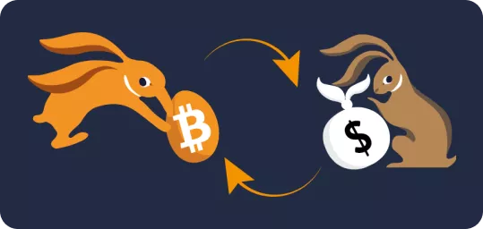

Il est également important de noter qu'il est possible que des impôts soient mis en place dans votre juridiction. Nous vous invitons à consulter la réglementation de votre pays avant toute action pouvant vous mettre en défaut.

### Petit récap en poster !

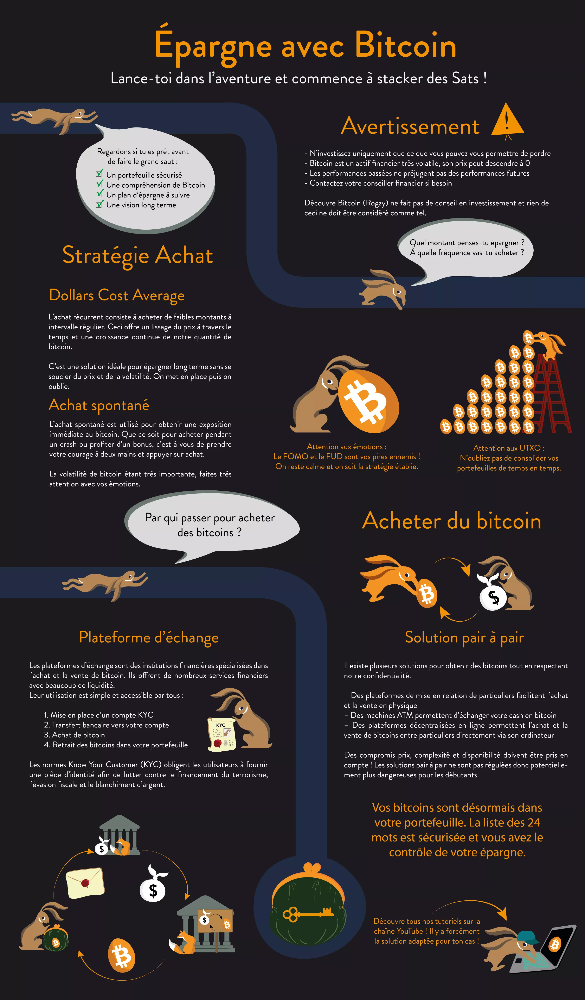

## Hyper-bitcoinisation
<chapterId>b7275d31-3b60-5fb7-b9f5-030097010553</chapterId>


### La course folle ne fait que commencer !

Comme toute nouvelle technologie, l'adoption de Bitcoin suit une courbe en S. Nous avons dépassé l'époque des premiers adoptants et les indicateurs semblent pointer vers une démocratisation complète du Bitcoin. C'est une technologie virale qui ne peut être arrêtée. Le Salvador a pris le pari audacieux d'adopter le Bitcoin de manière totale, en le déclarant comme une monnaie ayant cours légal. Cependant, chaque pays réagit différemment face à cette technologie. Certains l'ont banni et criminalisé son usage, ajoutant ainsi à la complexité de l'adoption de Bitcoin en fonction des cultures, des époques et des nations.

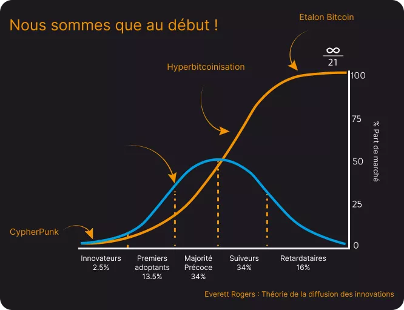

La montée en puissance de Bitcoin oblige les entreprises, les universités, les régulateurs et les particuliers à prendre en compte cette nouvelle technologie. De nouveaux outils doivent être créés, les services doivent être adaptés et l'innovation doit continuer pour garantir leur survie. Ce contexte soulève de nombreuses questions touchant à divers domaines, notamment la cryptographie, la théorie des jeux, l'économie et la politique monétaire, l'informatique, la philosophie, l'énergie, les lois et la régulation. Bref, Bitcoin est un objet pluridisciplinaire.


### Bitcoin est un 0 à 1

Nous vous invitons à réfléchir à cette nouvelle révolution monétaire. Il y a tellement de choses à explorer avec le Bitcoin que c'est compliqué de tout assimiler d'un coup. Prenez votre temps, Bitcoin ne va pas disparaître. Au contraire, la révolution vient tout juste de commencer. Ensemble, nous croyons que nous sommes capables de créer le monde que nous souhaitons confier à nos enfants. Un monde où la souveraineté humaine est un droit, où la vie privée est respectée par défaut et où la monnaie n'est pas manipulée. Nous espèrons qu'ensemble nous y arriverons.

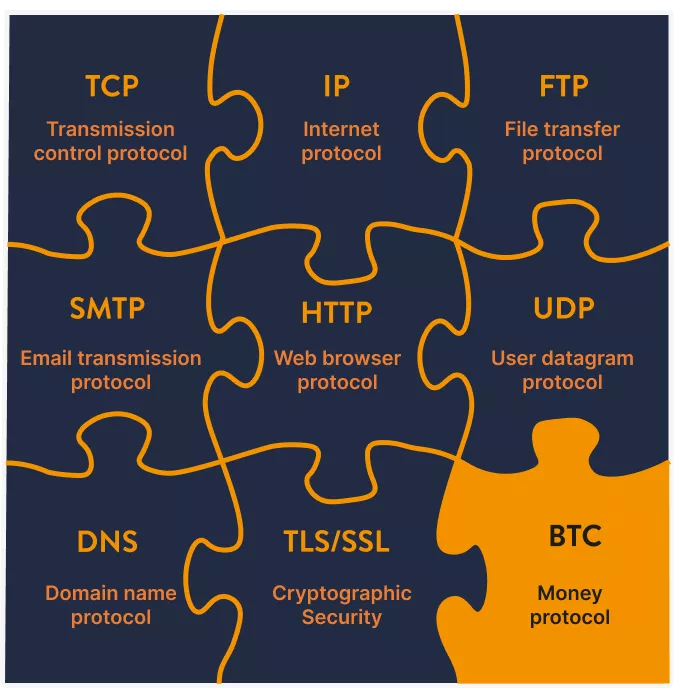

Si vous souhaitez développer vos connaissances sur le Bitcoin, un grand nombre d’auteurs, penseurs, essayistes ont contribué à la couche éducationnelle de Bitcoin. Depuis quelques années, nous répertorions et classons ces œuvres pour offrir une [bibliothèque de ressources](https://planb.network/resources) aux plus curieux d’entre vous. Vous y trouverez les meilleurs podcasts, sites internet, articles, tutoriels, livres, et autres contenus.

> Milton Friedman, un économiste renommé, avait prédit en 1999: "I think that the Internet is going to be one of the major forces for reducing the role of government. The one thing that's missing, but that will soon be developed, is a reliable e-cash - a method whereby on the Internet you can transfer funds from A to B without A knowing B or B knowing A." ou dans la langue de Molière "Je pense qu'Internet sera l'un des principaux facteurs de réduction du rôle des pouvoirs publics. La seule chose qui manque, mais qui sera bientôt développée, c'est une monnaie électronique fiable - une méthode par laquelle, sur Internet, vous pouvez transférer des fonds de A à B sans que A ne connaisse B ou que B ne connaisse A." Aujourd'hui, le Bitcoin répond à cette prédiction.

### Petit récap en poster !


# Le futur de Bitcoin: Le Lightning Network
<partId>899fd35e-39e6-5a25-a73e-6fed6e725094</partId>

## Courte introduction au Lightning Network
<chapterId>b403f1e4-f1ff-572b-a242-9b58cb3736d0</chapterId>


Maintenant que nous avons les bases du protocole Bitcoin, nous allons introduire un réseau de paiment qui utilise le protocole Bitcoin pour permettre de faire des transactions à la vitesse de l'éclair. Nous parlons évidemment du Lightning Network !

### In a nutshell

Le Lightning Network est une technologie révolutionnaire qui a profondément modifié notre perception de Bitcoin. C'est une solution qui répond à la question de la scalabilité de Bitcoin.

Pour bien saisir le Lightning Network, il est crucial de comprendre comment Bitcoin évolue. Bitcoin se développe en couches infrastructurelles : la première couche est la blockchain, et la deuxième couche est le Lightning Network.

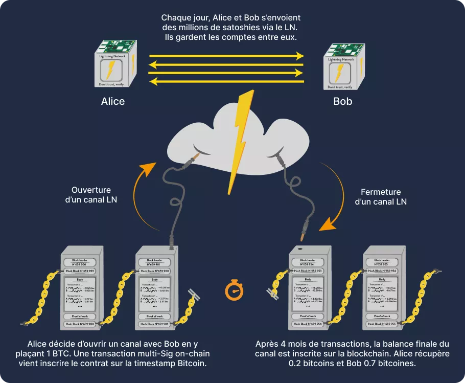

Reconnu comme une couche de Bitcoin, le Lightning Network a été validé et implémenté en 2017. Il permet de réaliser des transactions instantanées en Bitcoin à faible coût, résolvant ainsi le problème de scalabilité de Bitcoin. Mais quel est ce problème de scalabilité que Bitcoin rencontre ?

### Une blockchain ne peut pas grossir à l'infinie

Le problème de scalabilité ou mise à l'échelle correspond au défi de mettre en place un système monétaire capable pourvoir un nombre de transaction par seconde toujours grandissant à mesure de son adoption. Cela renvoie au trilemme des blockchains. Imaginez un triangle avec pour sommet : décentralisation, sécurité et scalalabilté.

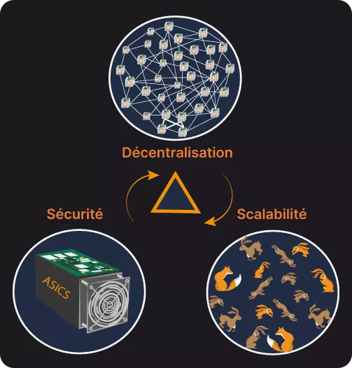

Un protocole basé sur une blockchain ne peut satisfaire uniquement deux de ces 3 aspects. Au sein du protocole de Bitcoin, des choix ont été fait penchant pour favoriser le côté décentralisation/sécurité. En effet, d'une part la taille des blocs de 1Mo et le temps entre deux blocs (de 10 minutes en moyenne) permettent de faire tourner un nœud Bitcoin à moindre frais favorisant la décentralisation. Et d'autre part la production de bloc par Preuve de Travail (ou Proof-of-Work) rend extrêmement coûteux la fraude au sein du protocole tout en facilitant la vérification par les nœuds du réseau, favorisant ainsi la sécurité. Néanmoins ces choix imposent une limite dans le nombre moyen de transactions dans un bloc de l'ordre de quelques, ce qui correspond grossièrement à quelques transactions par seconde. Ce nombre est ridicule lorsqu'on le compare à la capacité des processeurs de paiements comme VISA qui est de 1700/s.
Toutefois, c'est une limite nécessaire pour pouvoir transacter de manière incensurable et sans tiers de confiance avec Bitcoin. Cependant les personnes développant sur Bitcoin ont depuis le début réfléchies sur ce problème.


### Lightning comme couche supérieur

Les services de transfert d'argent traditionnels, tels que Western Union, les banques centrales, Visa et Mastercard, pourraient disparaître s'ils n'adoptent pas la technologie Lightning Network. Le Lightning Network est plus efficace, et plus économique que les systèmes de paiements actuels. En effet, le Lightning Network permet de réaliser un nombre quasi-illimité de transactions entre deux pairs partageant un canal et cela sans dépenses énergétiques sur la blockchain de base autre que la transaction pour annoncer la création du canal. Les transactions sont sécurisées par de la cryptographique et indirectement par l'énergie consommée par les mineurs sur Bitcoin. Les transactions peuvent être effectuées instantanément, sans limite géographique, et les frais sont extrêmement faibles, très souvent inférieur à 0,5%.

Après des années des réflexions et de multiples tentatives, le protocole Lightning emmerge. À l'aide d'une certains nombre de spécifications, ce protocole permet de construre un réseau de paiement pair-à-pair en se servant de la sécurité et de la programmabilité des transactions du protocole de Bitcoin. Le Lightning Network agit comme un réseau de canaux de paiement, permettant des transactions instantanées et avec de faibles frais pour l'envoyeur. Ce réseau de canaux de paiement rend même possible des transactions entre individus qui n'ont pas de canal directement connecté entre eux.

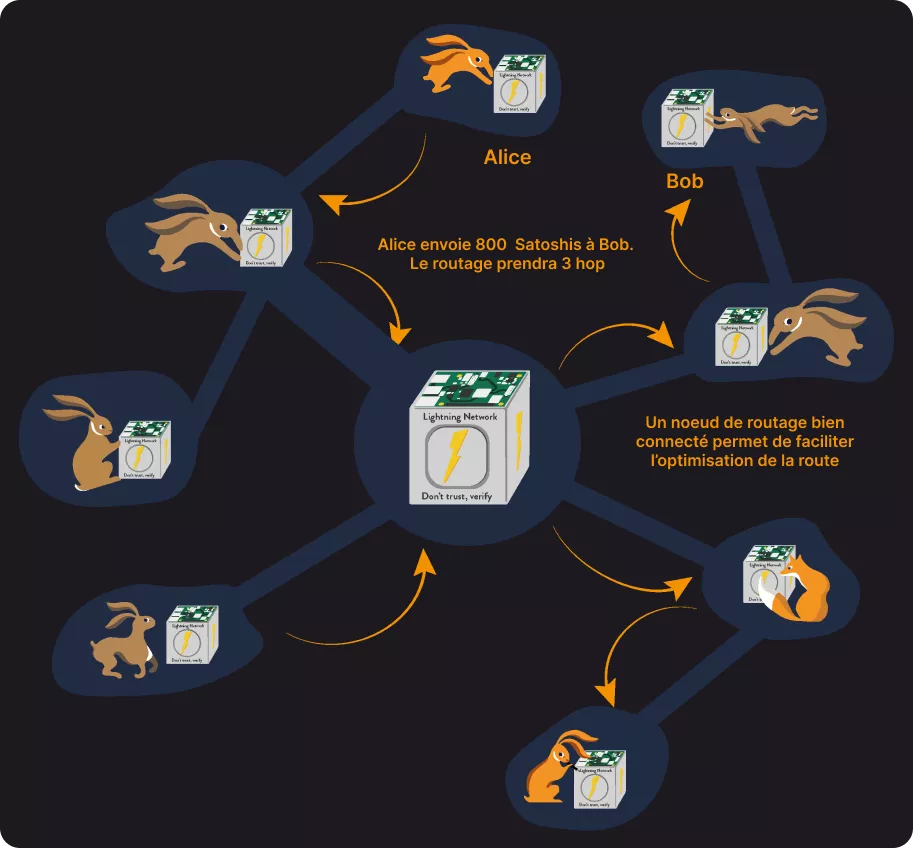

Les services de transfert d'argent traditionnels, tels que Western Union, les banques centrales, Visa et Mastercard, pourraient disparaître s'ils n'adoptent pas la technologie Lightning Network. Le Lightning Network est plus efficace, et plus économique que les systèmes de paiements actuels. En effet, le Lightning Network permet de réaliser un nombre quasi-illimité de transactions entre deux pairs partageant un canal et cela sans dépenses énergétiques sur la blockchain de base autre que la transaction pour annoncer la création du canal.

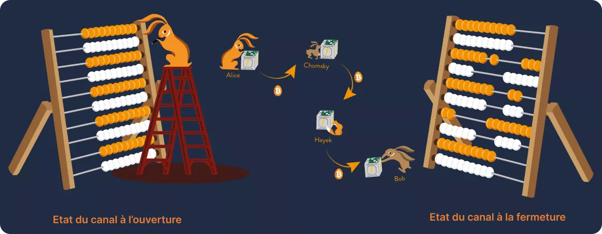

Les transactions sont sécurisées par de la cryptographique et indirectement par l'énergie consommée par les mineurs sur Bitcoin. Les transactions peuvent être effectuées instantanément, sans limite géographique, et les frais sont extrêmement faibles, très souvent inférieur à 0.5%.

En somme, le Lightning Network est une tentative prometteuse pour déployer un système de paiment efficient pour transacter en bitcoin. Il existe d'ores et déjà de nombreux wallet lightning que vous pouvez découvrir dans notre section tutoriel ou via nos formations sur le Lightning Network.

### Petit récap en poster !

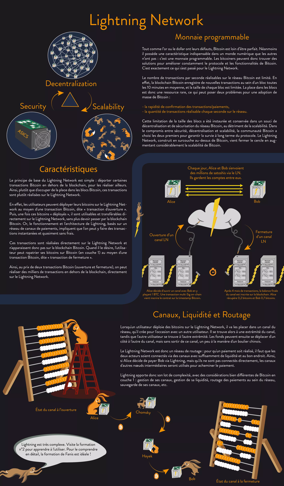

## Cas d’usage du Lightning Network
<chapterId>684e31f9-ebd1-51b6-91c0-1e6a315f1141</chapterId>


Comme nous venons de le voir le protocole Bitcoin, bien que révolutionnaire, fait face à des défis importants en matière de mise à l'échelle, pour pouvoir effectuer toutes nos transactions du quotidien. Pour résoudre ces problèmes, une solution de deuxième couche connue sous le nom de Lightning Network a été proposée en 2016 et possède aujourd'hui plusieur implémentations différentes mais toutes interopérable:

- Core-lightning par Blockstream
- Eclair par Acinq
- LND par Lightning strike

Ce réseau pair-à-pair vise à faciliter en particulier les micro-transactions, c'est-à-dire les transactions de très faible valeur, qui seraient autrement impraticables en raison des frais élevés et des temps de confirmation longs sur la blockchain Bitcoin.


### Quels sont les cas d'usage du réseau ?

Cette technologie ouvre la porte à une gamme étendue d'applications potentielles pour Bitcoin, qui étaient auparavant hors de portée en raison des contraintes nécessaires pour assurer la sécurité et la décentalisation de Bitcoin. Parmi ces applications dans la vie de tous les jours, nous pouvons citer la facturation instantanée dans les commerce (physique et en ligne), le streaming d'argent pour les paiements en temps réel, de la micro-donation pour du contenus. Le déploiement d'un réseau de transactions quasi-instannée, sécurisé et à moindre frais (en moyenne inférieur à 0.5%), de nombreux modèles commerciaux auparavant inimaginables peuvent être mis en place. Ceci est possible car le Lightning Network utilise les sats (la décimale de bitcoin) pour fonctionner.


Cette technologie ouvre la porte à une gamme étendue d'applications potentielles pour Bitcoin, qui étaient auparavant hors de portée en raison des contraintes nécessaires pour assurer la sécurité et la décentalisation de Bitcoin. Parmi ces applications dans la vie de tous les jours, nous pouvons citer la facturation instantanée dans les commerce (physique et en ligne), le streaming d'argent pour les paiements en temps réel, de la micro-donation pour du contenus. Le déploiement d'un réseau de transactions quasi-instannée, sécurisé et à moindre frais (en moyenne inférieur à 0,5%), de nombreux modèles commerciaux auparavant inimaginables peuvent être mis en place.

L'industrie du jeu vidéo offre un exemple particulièrement intéressant de la manière dont le Lightning Network peut être utilisé pour transformer les modèles commerciaux existants. Le concept de "skin in the game" est une idée qui a récemment gagné en popularité dans ce contexte. Il s'agit essentiellement d'avoir un enjeu financier dans le résultat d'un jeu.
Le Lightning Network permet aux joueurs de mettre en jeu de très petits montants d'argent lorsqu'ils jouent à des jeux, comme une dizaine de satoshis (environ une fraction de centime d'euros). Cela permet alors de mettre en place un enjeu qui stimule la compétition, tout en augmentant considérablement le coût de déploiement de bots.

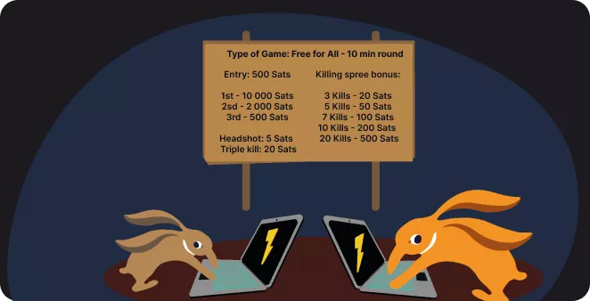

En somme, l'avenir des micro-transactions avec Bitcoin semble prometteur grâce à des innovations comme le Lightning Network. Alors que ces technologies continuent à se développer et à mûrir, nous pouvons nous attendre à voir de nouvelles et passionnantes applications émerger dans un avenir proche. Prenons par exemple le concept de "streaming d'argent", comme le Lightning Network nous permet de réaliser des micro-transactions chaque minute (et potentiellement sans tiers de confiance), cela ouvre la voie à l'expérimentation de modèles économiques où les consommateurs paient le contenu à la hauteur de ce qu'il consomment.

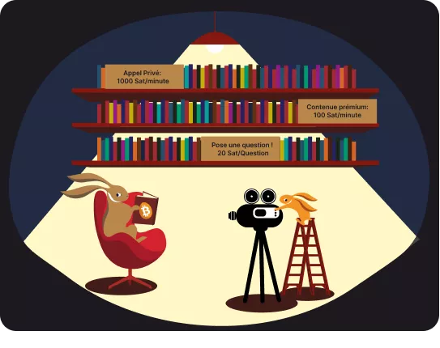

Dans un tel système, l'argent est automatiquement divisé, en fonction d'un pourcentage prédéfini, entre les différents contributeurs à un service ou un produit. Cela pourrait révolutionner la façon dont nous envisageons les modèles de paiement. Par exemple, plutôt que de payer un abonnement mensuel à un service, les utilisateurs pourraient être facturés à la minute, ou même à la seconde, pour le temps qu'ils passent à utiliser le service. Un tel modèle économique pourrait avoir des implications profondes pour les créateurs de contenu, qui seraient incités à produire du contenu de qualité pour retenir l'attention des utilisateurs. Les utilisateurs, à leur tour, ne paieraient que pour le contenu qu'ils consomment, éliminant ainsi les frais d'abonnement anticipés. Il est même envisageable d'utiliser ce système pour de la location de biens.


En conclusion, le Lightning Network ouvre une multitude de cas d'utilisation passionnants pour les utilisateurs de Bitcoin. Les modèles économiques et les opportunités commerciales qui en découlent sont nombreux et variés. Nous vous encourageons à tester par vous même en testant l'application de podcast [Fountain](https://www.fountain.fm/) qui permet d'être rémuérer à hauteur de quelques sats pour écouter vos podcasts préférés !

### Petit récap en poster !

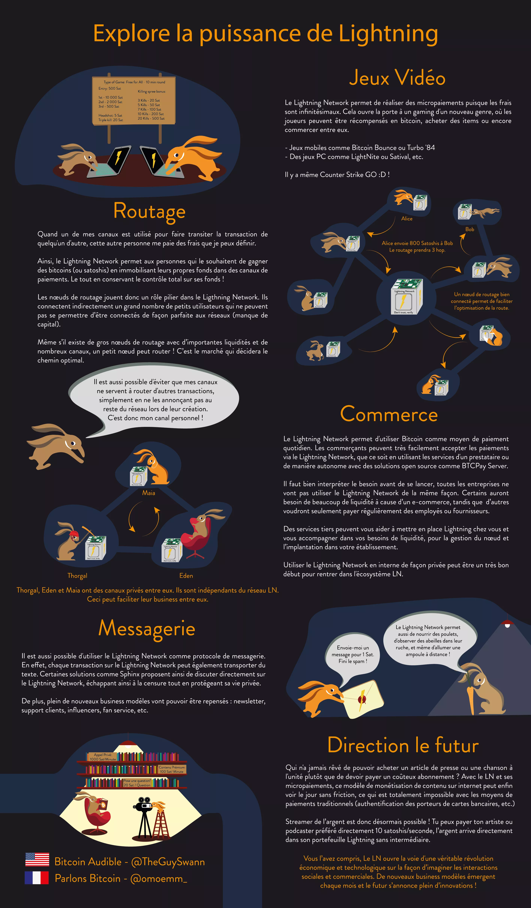

## Pilule bleue ou pilule rouge ?
<chapterId>c81cdb45-6aa9-5462-9835-c4852084b2cc</chapterId>


Comme le disait Morpheus à Néo : "Tu prends la pilule bleue, l’histoire s’arrête là, tu te réveilles dans ton lit, et tu crois ce que tu veux. Tu prends la pilule rouge, tu restes au Pays des Merveilles et je te montre jusqu’où va le terrier.". Êtes-vous prêt à explorer la terrier du Bitcoin ? Faites attention car vous risqueriez de retrouver votre liberté financière !


### L'avenir technologique et ses implications

La technologie évolue de manière exponentielle et personne ne peut prédire avec certitude ses évolutions. La connectivité du monde et les intelligences artificielles ne cesse de se développer. Les connaissances qu'un individu peut acquerir grâce à internet sont au fûr et à mesure que le temps de plus indénombrables.

Prenons l'IA exemple, ces technologies ont déjà surpassé ou approchent le niveau des humains dans un nombre de domaines toujours grandissant comme les jeux vidéo, la production d'images et de textes, l'analyse de données. Une des potentielles implication serati que plus de 80% des emplois vont disparaître à cause de l'IA et de l'automatisation. Plusieurs options s'offrent à nous comme : brider l'évolution technologique ou récolter l'augmentation du capital grâce au gain de productivité créé par les IA.

Les questions indispensables à poser sont :

- comment gérer une société où 80% des emplois vont disparaître ?
- Comment redynamiser une population ?
- Est-ce qu'il y a besoin d'autant de profs ?
- Les conséquences géopolitiques, politiques et humaines de l'automatisation ne sont pas suffisamment discutées.

L'informatique, Internet, le stream, la VR vont changer l'éducation. On pourrait avoir un cours universel à tous les étudiants français gérés par le gouvernement et des profs qui ne font plus le cours, mais qui accompagnent directement les élèves. Les enfants pourraient aller dans un monde virtuel et être accompagnés pour apprendre l'histoire.

- Où est la limite entre un prof et une IA ?
- Comment garantir une société qui vit dans la prospérité ?

Ces questions fondamentales pour notre futur doivent être débatu et décider collectivement. Mais quel est le lien avec Bitcoin ? À l'instar d'Internet pour les modes de communication, Bitcoin est une révolution technologique pour de nouveaux modes d'organisation à grande échelle, nous apportant la possibilité de nous échanger de la valeur sans aucun tiers de confiance. Souhaitons-nous brider l'évolution technologique du système monétaire ou récolter l'augmentation du capital grâce au gain de productivité décuplé par l'utilisation des protocoles Bitcoin et Lightning ?

### Quel avenir pour la finance ?

Ces réflexions amènent également des questions sur qui doit détenir, autoriser et tracer l'argent que nous utilisons. La finalité est de décider entre un système fermé avec des dirigeants non-élus ou un système ouvert sans tiers de confiance, où la neutralité règne.

- La monnaie est-elle un titre de propriété privée ?
- Les comptes des manifestants peuvent-ils être bloqués sans ordre de la Cour suprême ?
- Qui garantit le système financier ?
- Comment un individu peut-il être souverain de son argent et dépendre d'un tiers de confiance ?
- Peut-on envoyer de l'argent à l'autre bout du monde sans frais ni intermédiaire ?

Accepter ces nouvelles technologies pourrait générer des économies d'échelle massives sur l'ensemble de la planête. Devrait-on autoriser la libre circulation des flux de capitaux ? Les blocages internationaux ont des conséquences économiques et politiques. Est-il éthique d'utiliser des intermédiaires financiers comme Western Union qui prennent parfois jusqu'à 25% de frais ? Nous pensons que dans un monde de plus en plus numérique, l'argent devrait être démocratisé et considéré comme un bien commun appartenant au peuple plutôt qu'à l'Etat ou des institutions financières opaques.

La question de qui doit contrôler le système bancaire est cruciale, car les règles du jeu bancaire ne sont pas transparentes et compréhensibles par tous, ce qui permet à une caste de politiciens et de régulateurs de garder leur emprise sur le système. Il est important de se demander si le marché libre ou un groupe d'intellectuels devrait contrôler le système bancaire.

### Nos libertés sont en jeux

La censure doit être également questionnée car qui possède la connaissance pour décider ce qui doit être censuré ou non ? Les médias ont changé leur position sur certaines informations et les personnes qui ont été censurées avant ne le sont plus aujourd'hui.

- Qui décide de ce qui est de la censure ou de la propagande ?
- Qui a la main divine sur notre système ?

Tolérer la censure peut détruire la liberté d'expression et le droit de rassemblement. La mise en place de la censure est techniquement difficile sans créer une dystopie complète. Quelle instance devrait avoir le pouvoir de la censure ? La question de la censure est compliquée et il est difficile de savoir qui devrait être censuré ou non. La censure peut avoir un impact négatif sur l'innovation et la liberté d'entreprendre.

Il y a 2,4 milliards de personnes dans le monde sans compte bancaire, ce qui crée nécessairement des inégalités géographiques. Bitcoin permet d'être égaux en matière de transactions, quel que soit votre statut social ou votre position politique. Le protocole Bitcoin est apolitique et ne donne pas de privilèges spécifiques au président ou à d'autres acteurs. Les dirigeants devraient avoir les mêmes privilèges que les gens ordinaires pour pousser le développement vers le haut plutôt que de laisser certains au sommet et d'autres en bas. Est-ce que tout le monde devrait avoir la même monnaie, peu importe leur statut social ? Il est important de penser au monde que nous voulons laisser à nos enfants. Nous nous souhaitons de laisser un monde ouvert où ils sont libres de faire ce qu'ils veulent avec leur monnaie.

Bitcoin est important et ne doit pas être considéré comme un simple jeu d'argent. Il est crucial de continuer à vous poser des questions sur Bitcoin.

### Bitcoin : un protocole révolutionnaire


Comme nous l'avons vu dans le chapitre précèdent, le protocole Bitcoin est neutre face à tous ces utilisateurs. Grâce aux règles de consensus et à la cryptographie, nous pouvons inscrire des transtions de manière immuable dans une regitre public mondial, garantissant des transfert de valeur monétaire sans aucun tiers de confiance. Les couches infrastructurelles de niveau 2 (et bientôt 3, avec RGB) permettent de faire évoluer le réseau et de développer de nouvelles fonctionnalités, notamment pour régler des problèmes de mise à l'échelle.

Bitcoin a toutes les caractéristiques nécessaires pour être une monnaie efficace et saine : divisible, transportable instantanément, non censurable, coût négligeable pour la vérification, et avec une politique monétaire déjà fixée pour les siècles à venir avec ces 21 millions d'unités. Bitcoin est pseudo-anonyme et peut être échangé partout dans le monde sans aucune autorisation d'une quelconque entité, il vous suffit juste de détenir vos propres clés privées -- comme le dit l'adage "Not your keys, not your bitcoins" ("pas vos clés, pas vos bitcoins").

Bitcoin est adopté par des groupes de personnes variés, des cryptographes, aux libertariens en passant par les entreprises traditionnelles et même un pays. Toutefois Bitcoin est pour tout le monde, et son nombre d'utilisateurs est grandissant, tout comme le nombre de nœud Bitcoin qui servent de gardiens de l'historique des transactions, assurant ainsi sa décentralisation.

Bitcoin ne peut plus être arrêté et ne peut plus être censuré. C'est une révolution pacifique pour changer de système monétaire et permettre l'inclusivité financière. Les utilisateurs peuvent obtenir des Bitcoins en les acceptant pour leur commerce ou en les achetant via des plateformes régulées ou non. Les Bitcoins peuvent être stockés dans des portefeuilles, des applications mobiles ou des appareils physiques. Pas d'intermédiaire de confiance dans Bitcoin, Bitcoin prône la transparence, la liberté et la responsabilité individuelle -- comme le dit l'adage "Don't Trust, Verify" ("Ne faites pas confiance, Vérifiez par vous-même")

Changer le système financier nécessite de changer la monnaie. Satoshi a créé Bitcoin en 2008 pour pallier proposer une tentative à cela. Avoir accès à de l'argent facile et "magique" corrompt. Bitcoin est donc une alternative pour constuire un nouveau système monétaire neutre. Bitcoin permet l'émancipation du système bancaire. C'est un phénomène social et qui nous amène à partciper à une révolution pacifique. Êtes-vous prêt à la rejoindre ?

## Remerciements et continuez à creuser le terrier du lapin
<chapterId>c153facd-fe77-5954-b18b-d0e2243e787a</chapterId>

### Allez plus loins


Félicitations pour avoir terminé cette formation BTC 101 ! J'espère de tout cœur qu'elle vous a plu et ouvert des portes. Votre découverte du bitcoin n'en est qu'à ses débuts et je vous invite à découvrir toutes les autres formations disponibles sur l'université.

- [BTC 102](https://planb.network/courses/btc102) vous aidera à mettre en place votre plan bitcoin
- [LNP 201](https://planb.network/courses/lnp201) vous permettra de découvrir le Lightning Network, un réseau de paiements en second couche
- [ECO 201](https://planb.network/courses/eco201) abordera l'économie autrichienne
- [SCU 101 ](https://planb.network/courses/scu101) vous permettra de mettre à jour votre sécurité numérique
- [MIN 201](https://planb.network/courses/min201) pour en savoir plus sur le minage
- et bien d'autres...

## Soutiens-nous
<chapterId>3e6e756b-b6c4-5d41-bece-767922348067</chapterId>

Ce cours, ainsi que l'intégralité du contenu présent sur cette université, vous a été offert gratuitement par notre communauté. Pour nous soutenir, vous pouvez le partager autour de vous, devenir membre de l'université et même contribuer à son développement via [notre GitHub](https://github.com/PlanB-Network/bitcoin-educational-content). Au nom de toute l'équipe, merci !


## Donnez-nous votre avis sur ce cours
<chapterId>585729e2-b0ab-51b5-89ec-593e3ea22c57</chapterId>
<isCourseReview>true</isCourseReview>

## Final Exam Test
<chapterId>8129275d-8956-4c2c-8179-dd7f023aee86</chapterId>
<isCourseExam>true</isCourseExam>

## Note la formation
<chapterId>44d01865-5c89-55a5-a397-a014960eec0f</chapterId>

Un système de notation pour la formation sera bientôt intégré à cette nouvelle plateforme de E-learning ! En attendant, merci beaucoup d'avoir suivi le cours et si vous l'avez apprécié, pensez à le partager autour de vous.

Un immense merci à nos Patreon, membres et donateurs pour leur soutien financier, merci aux personnes qui partagent et merci à celles et ceux qui ont rendu cette formation possible : Rachel, Muriel, l'équipe de StackinSat, JohnOnChain, Fanis, Guillaume, Lounes, les correcteurs et les relecteurs.

À bientôt!
