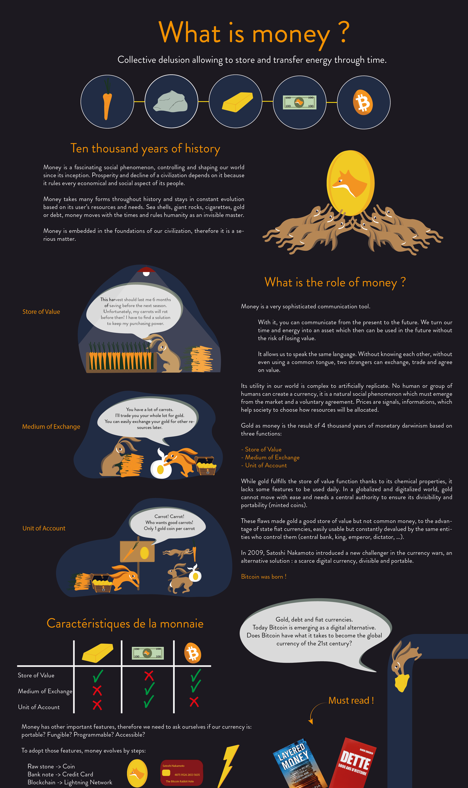
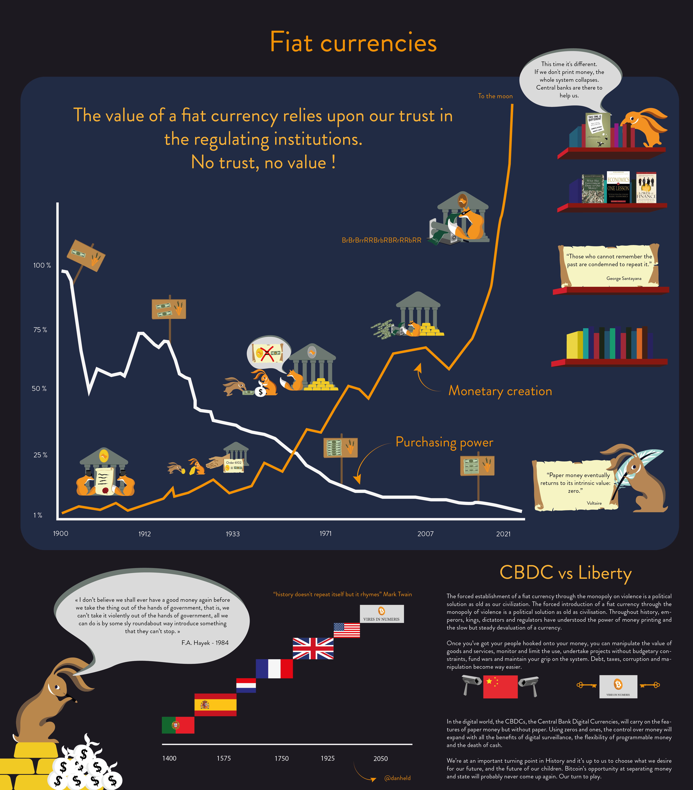
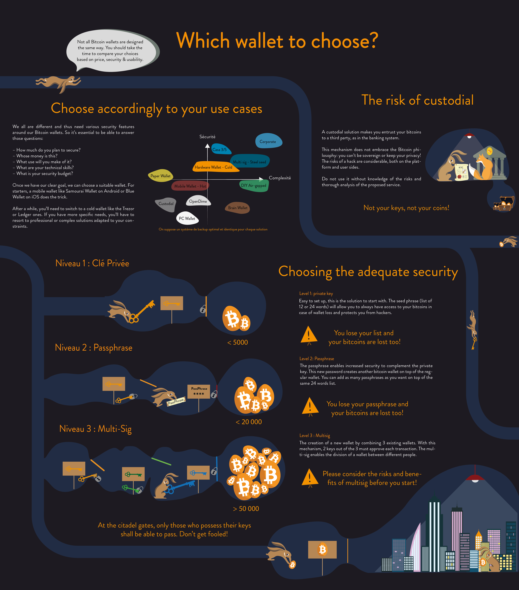
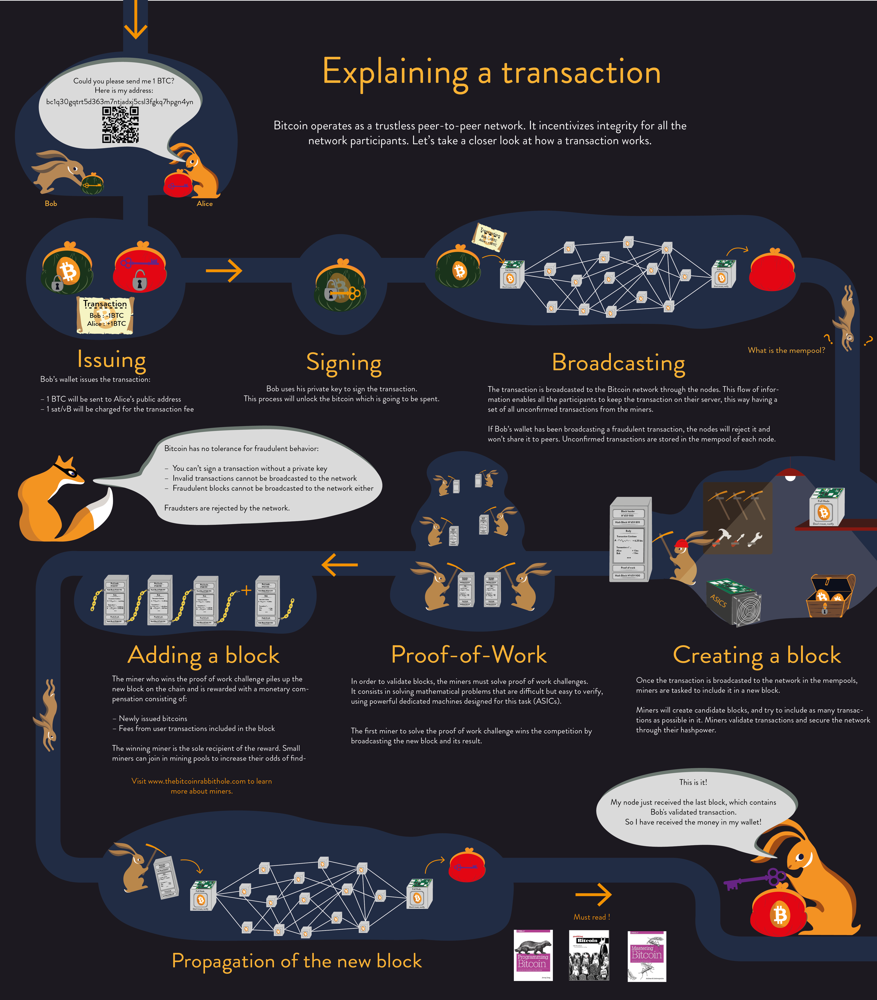
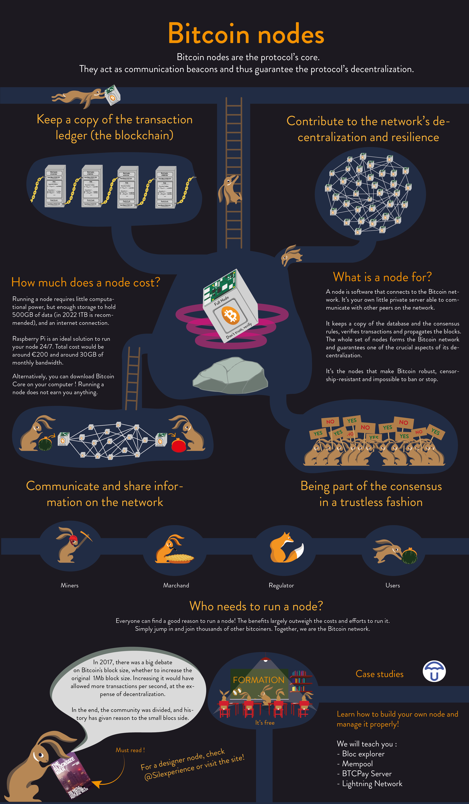
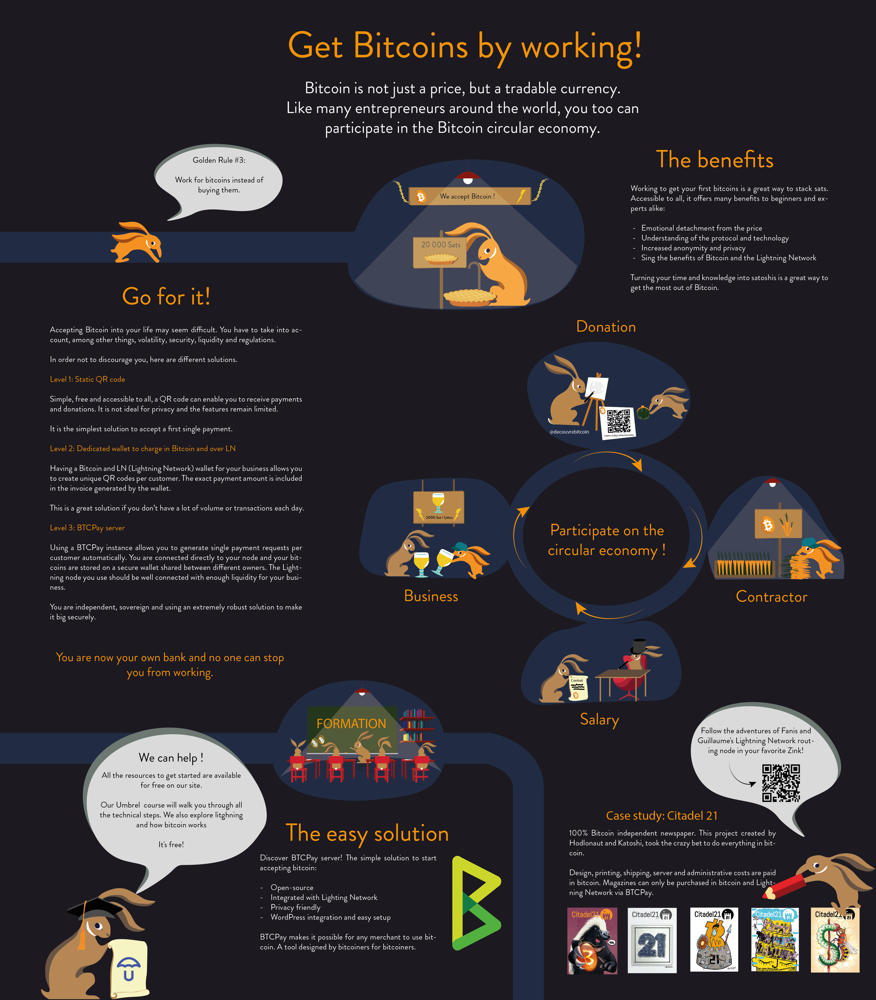
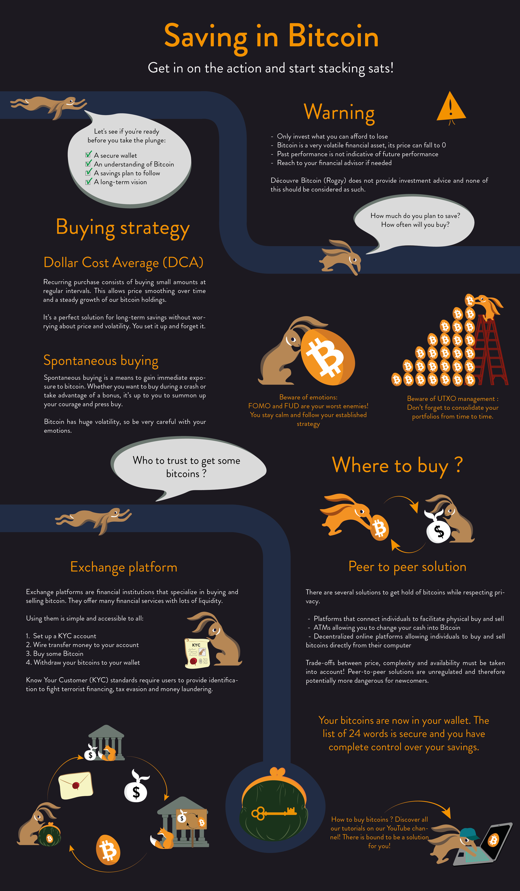
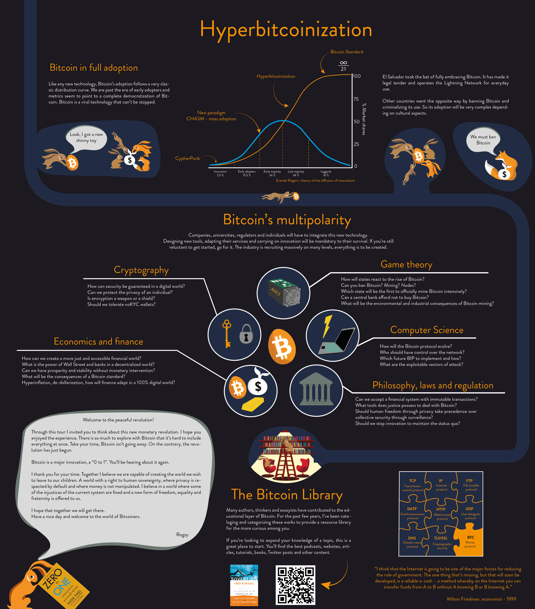
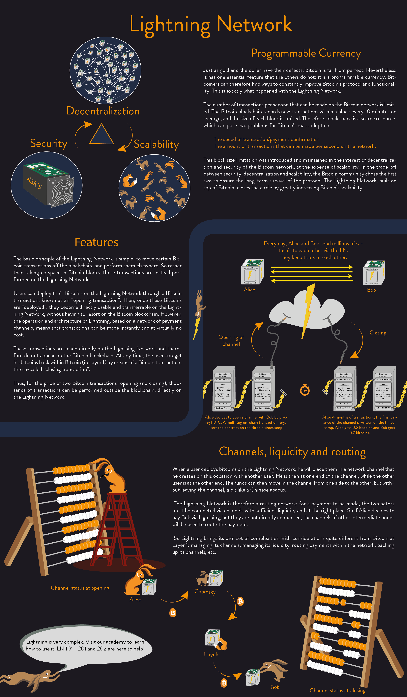

# La tua prima avventura con Bitcoin

In questa formazione, ti spiegherò Bitcoin in 21 capitoli in modo che tu possa comprendere questa tecnologia in modo semplice ed efficace. La formazione è accessibile a tutti ed esplora l'industria nel suo insieme: minatori, portafoglio, piattaforma di acquisto/vendita, ecc...

La formazione dovrebbe richiedere circa 15 ore con un esame finale alla fine. Durante tutto il percorso, sono disponibili poster esplicativi tratti dal mio libro, nonché risorse aggiuntive, interviste agli esperti o video FAQ.

Uscirai da questa formazione avendo tutte le conoscenze necessarie per affrontare il futuro!

+++

# Introduzione: la formazione su Bitcoin

Bitcoin è un'innovazione significativa che va oltre una semplice valuta. È una rivoluzione sia tecnologica che monetaria, in grado di trasformare la nostra percezione della moneta e delle transazioni finanziarie. Bitcoin è anche una valuta decentralizzata, il che significa che non è sotto il controllo di alcuna entità o istituzione.
In questa formazione, discuteremo degli aspetti monetari di Bitcoin, compreso il modo di acquistare e vendere bitcoin, di conservarli in sicurezza in portafogli digitali e di utilizzarli per effettuare transazioni.
Esamineremo anche il ruolo dei minatori, che sono essenziali per la creazione di nuovi bitcoin e per la sicurezza della rete Bitcoin. Inoltre, esamineremo il futuro di Bitcoin e come la tecnologia di Lightning Network può migliorare le transazioni Bitcoin.

È essenziale capire che Bitcoin non è solo una valuta, ma anche una tecnologia in grado di rivoluzionare la nostra percezione del denaro e delle transazioni finanziarie. Imparare a usare Bitcoin è una competenza fondamentale, proprio come abbiamo imparato a usare Internet o a guidare una macchina.
È importante ricordare che Bitcoin è una tecnologia relativamente nuova e che non è normale capire tutto immediatamente. Tuttavia, imparare a usare Bitcoin è cruciale perché può avere un impatto significativo sulla nostra vita finanziaria.

Prima di affrontare la definizione e il funzionamento della moneta in una società, iniziamo con la genesi di Bitcoin. Poi, esploreremo il ruolo di Bitcoin come valuta e come può trasformare la nostra percezione delle transazioni finanziarie.

# La preistoria di Bitcoin

Per comprendere l'origine del Bitcoin, bisogna risalire agli anni '80 e al movimento cypherpunk. I cypherpunk sono dei precursori che hanno innovato e sperimentato con tecnologie come PGP (Pretty Good Privacy), Internet e la crittografia. Hanno plasmato un movimento dedicato alla protezione della privacy nell'era digitale.

Nel 2009, una persona (o un gruppo di persone) di nome Satoshi Nakamoto ha creato il Bitcoin basandosi sulle tecnologie sviluppate dai cypherpunk. Il Bitcoin rappresenta una rivoluzione a diversi livelli: digitale, finanziario e tecnologico. Per comprendere appieno la natura e l'ampiezza di questa rivoluzione, è cruciale comprendere le basi del Bitcoin.

Il Bitcoin sfida il sistema finanziario tradizionale mettendo in evidenza le disuguaglianze e i problemi di inflazione associati alla moneta fiduciaria. Le valute emesse dalle banche centrali e dagli Stati, come l'euro o il dollaro, sono soggette all'inflazione. Ciò può causare effetti negativi sulle società e sugli individui.

Al contrario, il Bitcoin, che è una sintesi delle tecnologie sviluppate dagli anni '70, ha una quantità massima limitata, conferendogli una caratteristica simile all'oro. Il dibattito sulla validità del Bitcoin come moneta continua, ma una cosa è certa: grazie all'eredità dei cypherpunk, il Bitcoin è qui per durare.

Il Bitcoin è sia una moneta digitale che un protocollo informatico. Come tale, è stato progettato per durare. È importante riconoscere il ruolo essenziale dei contributori e dei sostenitori di questo progetto, compresi quelli che fanno donazioni tramite piattaforme come Patreon.

In sintesi, il Bitcoin è una rivoluzione tecnologica, finanziaria e sociale che ha le sue radici nel movimento cypherpunk. Sfida il sistema finanziario tradizionale e offre un'alternativa promettente e sostenibile. Per comprendere appieno il Bitcoin, è essenziale comprendere questi concetti chiave e l'eredità di coloro che hanno contribuito alla sua creazione.

# Che cos'è la moneta?

## La moneta attraverso la storia

L'evoluzione della moneta costituisce un aspetto affascinante della storia umana, riflettendo l'ingegnosità delle civiltà attraverso i secoli per rispondere a esigenze economiche in costante evoluzione. Le prime forme di moneta erano di natura concreta, spesso beni di consumo tangibili come cereali o bestiame. Tuttavia, da circa 4000 anni, l'oro è diventato uno standard universalmente riconosciuto.
L'oro risponde idealmente ai criteri di una moneta efficace: la sua naturale rarità lo rende un oggetto di valore, mentre la sua divisibilità e trasportabilità lo rendono pratico per il commercio. Inoltre, estrarre l'oro dalla terra richiede una quantità significativa di energia, rafforzando il suo valore intrinseco. Tuttavia, con l'avvento della tecnologia e l'espansione dell'economia globale, l'oro è stato gradualmente abbandonato a favore di soluzioni più pratiche, come le banconote e le valute digitali.
I criteri di una moneta efficace sono molteplici. Una buona moneta deve essere fungibile, ovvero scambiabile senza perdita di valore; divisibile, per facilitare le transazioni di diverse dimensioni; e liquida, ovvero facilmente convertibile in beni o servizi.
Storicamente, questi criteri sono stati soddisfatti da oggetti fisici, come l'oro. Tuttavia, con lo sviluppo dell'infrastruttura finanziaria, l'oro è stato trasformato in banconote, che sono più pratiche per il commercio quotidiano.

Oggi, le valute stanno ancora evolvendo, adattando le loro forme per rispondere a diverse funzioni. Ad esempio, mentre l'oro è un'ottima riserva di valore, non è più adatto all'economia globale attuale. Allo stesso modo, le valute fiduciarie come il dollaro e l'euro sono molto liquide, ma il loro valore è eroso dall'inflazione.
Bitcoin, come valuta digitale, presenta nuove possibilità. Offre un'ottima riserva di valore ed è un buon mezzo di scambio, ma non è ancora ampiamente utilizzato come unità di conto. A causa dell'inflazione, le valute fiduciarie come l'euro e il dollaro non sono ideali come riserve di valore a lungo termine.
Di fronte alle sfide poste dai sistemi monetari attuali, si stanno cercando alternative per preservare e aumentare il valore del denaro. I sistemi bancari si stanno rivolgendo a soluzioni come i trasferimenti digitali e le microtransazioni per soddisfare le esigenze dell'economia globale e adattarsi ai progressi tecnologici.

## Le valute fiduciarie

L'esplorazione degli impatti delle valute fiduciarie sul sistema finanziario è un aspetto essenziale della nostra comprensione delle dinamiche economiche contemporanee. Per parafrasare George Santayana, "coloro che non imparano le lezioni della storia sono condannati a ripeterle". Pertanto, è con questo approccio storico che affrontiamo il tema delle valute fiduciarie.
Queste ultime si basano sulla fiducia e l'assicurazione che il loro valore sarà preservato. Tuttavia, questa fiducia è attualmente scossa dall'inflazione galoppante e dall'aumento senza precedenti del debito. Le valute fiduciarie, alla fine, dipendono dalla fede che accordiamo alle istituzioni che le regolano, e questa fede sembra essere in declino.
È in questo contesto che la rivoluzione Bitcoin sta prendendo piede. Questa valuta di fiducia mira a separare lo Stato dalla moneta, minando così il controllo dello Stato sul sistema finanziario. La capacità di coniare moneta ha permesso una deprezzamento graduale di essa, erodendo il potere d'acquisto della popolazione. Dal lancio dell'euro, il potere d'acquisto è diminuito del 30%, mentre il potere d'acquisto americano ha perso il 98% del suo valore dal 1900. Le valute fiduciarie non hanno più un solido supporto, l'oro è stato abbandonato. L'inflazione agisce come una tassa subdola che erode il potere d'acquisto. Consente a uno Stato di svalutare la sua moneta per ripagare il suo debito e finanziare i suoi progetti.

La stampa di moneta genera inflazione, impoverendo progressivamente la popolazione. Al contrario, le istituzioni finanziarie e le persone ricche si sono arricchite grazie a questa pratica, creando un divario di disuguaglianza e favorendo l'autoritarismo. Gli Stati sono costretti a mantenere il loro potere svalutando la loro moneta per facilitare il rimborso del debito. Il sistema finanziario attuale è regolamentato e limitato per evitare il suo collasso. Una rottura di questo sistema potrebbe causare una grave crisi economica. Gli attori politici mancano della volontà di apportare un cambiamento radicale, lasciando il sistema a continuare la sua corsa fino a un'eventuale implosione.

In risposta a queste sfide sistemiche, Bitcoin si presenta come una soluzione decentralizzata. Storicamente, l'oro è stato preferito come moneta, a causa della sua resistenza alla contraffazione. In modo simile, Bitcoin, per la sua natura decentralizzata, non può essere falsificato ed è limitato a 21 milioni di unità. Bitcoin è una valuta basata sulla fiducia, la trasparenza e la libertà, offrendo una soluzione alternativa attraente al sistema monetario centralizzato attuale.
Parallelamente, l'emergere delle valute digitali delle banche centrali, o CBDC, sembra inevitabile. Se queste offriranno una pianificazione centralizzata dell'economia, potrebbero anche ostacolare la libertà finanziaria e rivelarsi potenzialmente autoritarie.
In conclusione, l'iperinflazione ha l'effetto di degradare rapidamente il valore della moneta, portando all'erosione dei risparmi e alla perdita di fiducia nel sistema monetario. Come suggerito da Voltaire, una moneta fiduciaria finirà sempre per perdere il suo valore intrinseco e convergere verso lo zero. La moneta basata sulla fiducia, sul debito e sull'impressione monetaria si rivela essere una moneta difettosa, incapace di garantire il potere d'acquisto o di preservare i risparmi. Inoltre, i politici hanno una capacità illimitata di stampare denaro, minacciando così i risparmi degli individui.

## L'iperinflazione

Le iperinflazioni sono fenomeni potenzialmente devastanti in un sistema monetario fiat, causati da decisioni umane, che possono portare all'eliminazione del valore monetario. Di conseguenza, le economie accumulate possono dissolversi in un periodo di tempo relativamente breve.
Ci sono casi notevoli di iperinflazione nella storia, come la Germania nel 1923, lo Zimbabwe, il Venezuela, tra gli altri. Le monete fiduciarie, che vengono create dal nulla, si distinguono dalle monete comuni come l'oro. Ad esempio, con un'inflazione del 2%, si perde annualmente il 2% del potere d'acquisto. Al 7%, si perde la metà in 10 anni. A un tasso del 20%, si perde praticamente tutto in meno di 3 anni. Pertanto, le iperinflazioni possono eliminare rapidamente le economie accumulate.
Questo fenomeno di iperinflazione non è nuovo ed è persistito lungo tutta la storia. Per comprendere questa dinamica, è essenziale esaminare le fasi dell'iperinflazione e il processo di perdita di fiducia nella moneta.

La centralizzazione del potere monetario facilita la creazione di moneta e la regolamentazione. Tuttavia, una perdita di fiducia in una moneta può innescare un'iperinflazione. Le persone iniziano quindi a interrogarsi sull'origine del denaro e sul processo di creazione monetaria.
La prima fase dell'iperinflazione è la perdita di fiducia, generalmente causata da fattori esterni come le guerre, le misure sociali o la caduta dei prezzi di una risorsa chiave. La seconda fase è il collasso della moneta.
Man mano che i governi perdono il controllo della fiducia, gli individui iniziano a scambiare la propria valuta per un'altra più stabile, come il dollaro. Ciò porta ad un aumento dei prezzi, creando un circolo vizioso in cui beni e servizi diventano sempre più costosi. Per soddisfare queste esigenze, lo Stato stampa più denaro, causando un'inflazione esponenziale poiché lo Stato cerca di controllare i prezzi. Quando la valuta perde completamente la fiducia, l'inflazione diventa astronomica. Viene quindi introdotta una nuova valuta per sostituire quella vecchia, come il dollaro. Un esempio notevole di iperinflazione è la Germania negli anni '20-'23. Per rilanciare l'economia, è stata creata una nuova valuta, garantita dal debito tedesco, francese e inglese e garantita dalle terre tedesche.

La risoluzione di una crisi di iperinflazione richiede spesso cambiamenti radicali, come rivoluzioni, cambi di governo, cambi di banchieri centrali, tra gli altri. La perdita di fiducia, il crollo della valuta e la ricostruzione sono fasi essenziali per rilanciare una nuova economia.

Ci sono molti altri esempi di iperinflazione lungo la storia, tra cui l'Ungheria, lo Zimbabwe, la Francia nel 1795 e il Cile. Molte storie illustrano la svalutazione della valuta e la fluttuazione del valore dei beni comuni. Ad esempio, durante la guerra, i francesi hanno potuto acquistare opere d'arte tedesche a basso prezzo con franchi in Germania.

Conoscere l'iperinflazione e capire come si verifica è una cosa, ma come ci si può proteggere da essa? Per proteggersi dall'iperinflazione, è consigliabile diversificare il proprio portafoglio eliminando le valute deboli e investendo in asset o valute solide, come l'oro o il Bitcoin. Le azioni di aziende in grado di rivalutare rapidamente i loro prezzi, come Apple o Microsoft, o gli investimenti immobiliari possono anche rivelarsi buoni investimenti.

C'è molto da imparare sulla gestione di un portafoglio finanziario. Fortunatamente, ci sono molte formazioni e risorse disponibili per acquisire queste competenze. Inoltre, non stampare denaro a volontà è il modo migliore per prevenire l'iperinflazione. Il Bitcoin è una valuta che ha caratteristiche specifiche. La sua capacità di essere utilizzata per il commercio mondiale sarà discussa in un futuro video.

## 21 milioni di bitcoin

Bitcoin è una valuta digitale decentralizzata con una quantità massima predefinita di 21 milioni di unità. Questa caratteristica intrinseca di rarità è determinata dal suo protocollo informatico. Per quanto riguarda la sua emissione monetaria, può essere rappresentata da una curva che mostra la quantità di bitcoin creati e la frequenza della loro emissione. Ad esempio, nel 2022 circa 18,5 milioni di bitcoin erano in circolazione. Le previsioni indicano che nel 2025 ci saranno circa 19,5 milioni di bitcoin e nel 2037 questo numero raggiungerà i 20,4 milioni.

La creazione di nuovi bitcoin è il risultato del processo di mining, una procedura di convalida ed esecuzione delle transazioni sulla rete Bitcoin. I minatori, che svolgono questa attività, vengono premiati con l'emissione di nuovi bitcoin ogni dieci minuti. Questo premio è programmato per dimezzarsi ogni quattro anni, in un evento noto come "halving". Ciò conferisce alla curva di emissione monetaria una forma a scalino. Grazie a questo meccanismo di halving, è possibile prevedere matematicamente che la creazione di bitcoin cesserà nel 2140, quando il numero totale di bitcoin raggiungerà il suo limite di 21 milioni.

La rarità del Bitcoin è garantita da due meccanismi chiave: il limite di 21 milioni di bitcoin e il protocollo informatico che non può essere modificato senza il consenso della maggioranza della rete. Altri due elementi cruciali contribuiscono a mantenere questo limite: la teoria dei giochi e l'adeguamento della difficoltà del mining. I minatori sono incentivati a convalidare le transazioni e a creare nuovi bitcoin ogni dieci minuti. Man mano che il numero di bitcoin emessi si avvicina al limite di 21 milioni, la rete sarà mantenuta dalle commissioni di transazione e dai bitcoin rimanenti non ancora minati.

L'adeguamento della difficoltà del mining avviene ogni due settimane per garantire che, in media, un nuovo blocco venga aggiunto alla blockchain ogni dieci minuti. Questa frequenza di creazione di blocchi e la quantità totale di bitcoin sono aspetti fissi del protocollo Bitcoin e non possono essere modificati senza un consenso generale, a differenza delle decisioni arbitrarie prese nei sistemi monetari tradizionali.

La quantità fissa di bitcoin, inizialmente definita a 21 milioni, non può essere modificata. Qualsiasi modifica al protocollo Bitcoin richiederebbe l'accordo di tutta la comunità degli utenti, il che è altamente improbabile. L'idea di svalutare la valuta è contraria alla filosofia fondamentale del Bitcoin.
La rarità del Bitcoin è un grande vantaggio, poiché ci saranno sempre un massimo di 21 milioni di unità. La quantità di bitcoin in circolazione è pubblica e verificabile da chiunque. Infatti, chiunque può verificare la quantità di bitcoin in circolazione inserendo un semplice comando su un nodo Bitcoin. Questa trasparenza e verificabilità rafforzano la fiducia nel sistema Bitcoin, che non si basa su istituzioni centralizzate o individui, ma su una garanzia matematica intrinseca al suo protocollo. Il concetto di sana gestione monetaria è intrinseco al Bitcoin, poiché è impossibile creare più bitcoin della limitazione predefinita o distruggere il risparmio degli utenti. Questa è una caratteristica fondamentale che distingue il Bitcoin dalle altre forme di valuta.

Inoltre, secondo i principi dell'economia austriaca, il Bitcoin è considerato un'ottima forma di valuta. Infatti, la sua quantità è strettamente controllata ed emessa in modo prevedibile, corrispondente all'ideale austriaco di creazione monetaria. A differenza delle valute tradizionali, che possono essere soggette all'inflazione a causa della stampa eccessiva di denaro, il Bitcoin mantiene il suo valore grazie alla sua rarità programmata.

In sintesi, il Bitcoin, grazie alla sua natura decentralizzata, alla sua rarità programmata e alla sua trasparenza, offre un'alternativa unica ai sistemi monetari tradizionali. Illustra come la tecnologia possa essere utilizzata per creare una valuta che non solo è utile e verificabile, ma che preserva anche il valore del risparmio degli utenti limitando strettamente la sua offerta.

## La moneta: uno strumento sociale

La moneta è uno strumento sociale che deve adattarsi alle esigenze e alla tecnologia. Nel corso del tempo, l'oro è stato utilizzato come riserva di valore perché era raro e non poteva essere svalutato. Tuttavia, in seguito, l'oro è stato sostituito dal debito e dalla moneta fiduciaria, che è facile da copiare e crea inflazione.

Il Bitcoin è un'alternativa monetaria realistica poiché è raro e limitato a 21 milioni di bitcoin che non possono essere modificati. La creazione monetaria è mantenuta grazie all'adattamento della difficoltà ogni 2 settimane, garantendo una prova matematica verificabile della sua rarità. A differenza degli euro e dei dollari in circolazione che cambiano frequentemente a discrezione dei decisori politici, il Bitcoin è una moneta matematica con una politica monetaria fissa. È quindi un'ottima riserva di valore poiché non può essere modificata. Inoltre, il Bitcoin è una moneta non umana e non emotiva che esegue in modo stupido.
Bitcoin mette in discussione il potere delle istituzioni finanziarie sulla moneta. È una battaglia filosofica ed economica in gioco. Per capire Bitcoin, è importante comprendere le sue basi fondamentali e smontare le idee false che lo circondano. Ciò consentirà di avviare un costruttivo dibattito intellettuale sull' futuro della moneta.
In conclusione, Bitcoin è un'alternativa monetaria realistica che offre una sfida filosofica ed economica alle istituzioni finanziarie. È importante comprendere le sue basi fondamentali per avviare un costruttivo dibattito intellettuale sull' futuro della moneta.

# I portafogli Bitcoin

## Cosa sono i portafogli Bitcoin?

Qui esploreremo la conservazione e la sicurezza dei Bitcoin nei portafogli.

Innanzitutto, cos'è un portafoglio Bitcoin? Un portafoglio è un luogo in cui vengono conservate le chiavi private che danno accesso ai tuoi Bitcoin. Un portafoglio può essere un software sul tuo computer, un'app sul tuo smartphone, un dispositivo hardware come una chiavetta USB o persino un pezzo di carta.
Ogni portafoglio contiene una coppia di chiavi: una chiave pubblica, che è come un indirizzo postale, e una chiave privata, che è come la chiave della tua cassetta delle lettere. La chiave pubblica è l'indirizzo che dai alle persone per ricevere Bitcoin e la chiave privata è ciò che ti consente di spendere i Bitcoin ricevuti a quell'indirizzo.
Il costo di un portafoglio Bitcoin può variare in base alle tue specifiche esigenze e all'importo che desideri proteggere. Esistono diversi tipi di portafogli adatti a diversi usi, che tu sia una piccola o grande impresa o un privato.
Anche se le tue chiavi sono conservate nel tuo portafoglio, i Bitcoin stessi sono effettivamente conservati nella blockchain Bitcoin, che è un registro pubblico distribuito nel cloud. Per questo motivo, la perdita del tuo portafoglio non significa necessariamente la perdita dei tuoi Bitcoin, purché tu abbia salvato la tua chiave privata altrove.

I Bitcoin non sono effettivamente "conservati" nel tuo portafoglio, ma piuttosto nella blockchain Bitcoin nel cloud. Per accedere ai tuoi Bitcoin, hai bisogno della tua chiave privata, che di solito è una lista di 24 parole conosciuta come "frase di recupero" o "seed di recupero". La probabilità di indovinare questa frase è estremamente bassa, grazie alla potenza della crittografia.
Se qualcuno fosse in grado di violare la crittografia di Bitcoin, sarebbe in grado di violare praticamente qualsiasi cosa. Fortunatamente, la sicurezza di Bitcoin può essere rafforzata se necessario. Infatti, la probabilità di indovinare correttamente la tua frase di recupero è circa la stessa di trovare un granello di sabbia specifico tra tutti i grani di sabbia sulla Terra.
La probabilità di un hack del tuo portafoglio Bitcoin è astronomicamente bassa se segui le buone pratiche di sicurezza. Ecco perché è importante seguire i consigli degli esperti di crittografia per proteggere il tuo account.
Scegli un portafoglio che corrisponda alle tue esigenze e al tuo caso d'uso. Tutorial dettagliati sull'uso e la sicurezza di diversi portafogli sono disponibili su molti siti web dedicati a Bitcoin, così come in vari corsi pratici su Bitcoin.

## Scegliere la propria sicurezza

Quando si detengono Bitcoin, la sicurezza dei propri fondi è una preoccupazione principale. La prima domanda da porsi è a chi appartengono questi fondi. Si tratta di un'azienda o di un individuo? Le misure di sicurezza necessarie varieranno a seconda di questo.
Un altro fattore importante da considerare è la somma di denaro che si deve proteggere e l'uso che si intende farne. Si tratta di una somma che si utilizzerà regolarmente o si tratta di un investimento a lungo termine? È cruciale adattare le misure di sicurezza a ogni situazione, poiché non esiste una soluzione universale.

Esistono diversi tipi di portafogli per proteggere i propri Bitcoin e la scelta dipenderà dal livello di sicurezza desiderato. Gli standard di sicurezza variano a seconda dei livelli.
Al livello 1, abbiamo la chiave privata, che sblocca l'accesso ai propri fondi. Si tratta di un elenco di 24 parole e una sola firma è necessaria per effettuare una transazione. I diversi tipi di portafogli includono portafogli hardware, applicazioni mobili e software desktop. Tuttavia, il valore del denaro è soggettivo, quindi è cruciale adattare la sicurezza al livello di comfort di ogni utente.
Al livello 2, oltre alla chiave privata, è necessaria una frase di passaggio. Il livello 3 è la sicurezza multi-firma (Multi-sig), che richiede più firme per autorizzare una transazione. Quest'ultimo è ideale per le aziende.

I rischi associati ai portafogli includono la perdita delle chiavi, il furto e l'hack. La sicurezza multi-firma consente di limitare questi rischi e garantire la sicurezza dei fondi.
Il modello "custodial" è un sistema tradizionale in cui si affida i propri Bitcoin a una terza parte di fiducia per proteggere i propri risparmi. Il problema di questo sistema è che si perdono i vantaggi della sovranità finanziaria offerti da Bitcoin, come la proprietà diretta dei propri risparmi e l'indipendenza dalle banche. I rischi del modello custodial includono il fatto di affidare i propri soldi a qualcun altro e il rischio che questa piattaforma venga hackerata o fallisca. Gli errori umani sono spesso la causa degli attacchi informatici, non i software utilizzati.

È consigliabile utilizzare un portafoglio freddo, che non sia connesso a Internet, per evitare gli attacchi informatici. Utilizzando servizi custodiali, rischiamo di ricreare il sistema finanziario tradizionale in cui le banche controllano i risparmi di tutti e possono permettersi di creare più denaro di quello che effettivamente possiedono.

In conclusione, la diretta proprietà dei propri Bitcoin è un elemento essenziale per garantire la propria sovranità finanziaria e prepararsi a qualsiasi instabilità potenziale del sistema finanziario attuale. È consigliabile utilizzare un portafoglio mobile per le spese quotidiane e un portafoglio fisico offline, o "freddo", per conservare importi più elevati. Le aziende, invece, dovrebbero considerare l'utilizzo di sistemi di firma multipla, o "multisig", per una maggiore sicurezza.

È essenziale evitare, per quanto possibile, i servizi di custodia ("custodial services"), che possono riprodurre alcune delle vulnerabilità del sistema finanziario tradizionale. Le pratiche per creare e gestire un portafoglio Bitcoin saranno affrontate nella nostra prossima sessione.

## Creazione di un portafoglio

La sicurezza dei propri Bitcoin è di cruciale importanza e un semplice errore può avere conseguenze costose. Per questo motivo, procederemo passo dopo passo e vi guideremo con le migliori pratiche del settore.
La vostra chiave privata, spesso rappresentata da una lista di 24 parole (o "seed"), è la chiave dei vostri fondi. Se questa chiave viene rivelata a terzi, considerate che i fondi associati non sono più sicuri. Pertanto, durante l'inizializzazione del vostro portafoglio, è importante rispettare queste regole:

- Nascondere tutte le telecamere.
- Non scattare foto della lista di parole.
- Non inserirla su un computer o un telefono.
- Non salvarla come contatto o inviarla a se stessi tramite SMS.

Letteralmente, prenderete un foglio di carta bianca o stamperete questo modello e scriverete con una penna, in modo pulito e chiaro, l'elenco di parole in ordine. Se l'inchiostro svanisce nel tempo, potreste perdere i vostri fondi, quindi esistono soluzioni alternative all'inchiostro tradizionale. Se scrivete male, i vostri eredi potrebbero non riuscire a leggere e quindi a recuperare i fondi. Una volta scritte le parole, è cruciale fare una copia a mano. Questo permette di avere un backup in caso di perdita o incidente.

Una volta realizzate le copie, conservate le liste di parole in cartelle, in un luogo sicuro dove vi ricorderete di cercarle! Non create un piano di nascondiglio troppo complesso dove rischiate di perderle. Le vostre parole = i vostri soldi. I portafogli "cold" hanno generalmente queste liste di parole, così come i portafogli mobili "on-chain". I portafogli mobili Lightning Network (LN) possono avere sistemi diversi. Solo i cattivi portafogli che sconsigliamo fortemente non vi daranno una lista di 24 parole, ma potrebbero chiedervi un account, un indirizzo email o, peggio ancora, un ID. L'assenza di una lista di 24 parole dovrebbe mettervi in allarme.

## Resistere alla prova del tempo

La sicurezza è una preoccupazione principale nell'ecosistema Bitcoin. Infatti, come qualsiasi forma di ricchezza, i vostri bitcoin devono essere protetti dalle perdite, dai furti e dal degrado, in particolare a lungo termine. La sicurezza dei vostri bitcoin richiede una certa conoscenza tecnica e la consapevolezza dei rischi associati, il che ci porta a discutere di due strategie principali: l'incisione dei vostri bitcoin nell'acciaio e la creazione di un piano di eredità.

Un metodo per proteggere i vostri bitcoin a lungo termine è quello di incidere le vostre chiavi di recupero (ad esempio, una frase di 24 parole, nota come seed phrase) in un materiale resistente come l'acciaio. Questo crea un backup fisico delle vostre chiavi che è resistente sia alla deteriorazione fisica che al fuoco.

Insieme a questo, la creazione di un piano di eredità è anche un passaggio cruciale per garantire che i vostri asset digitali saranno gestiti correttamente dopo la vostra morte. Questo piano può includere una lettera scritta a mano che dettaglia i vostri asset e identifica le persone di fiducia da contattare. È anche cruciale discutere dell'acquisizione di bitcoin con un notaio per garantire la conformità fiscale, anche se è importante non affidare direttamente i vostri bitcoin a terzi, compreso un notaio.
La sicurezza dei tuoi bitcoin nel lungo termine non si limita alla creazione di backup fisici o alla pianificazione dell'eredità. La privacy è un'altra importante considerazione. Ad esempio, è preferibile acquistare bitcoin senza fornire un documento d'identità al fine di minimizzare i rischi di furto di identità.

Inoltre, l'uso di portafogli Bitcoin che corrispondono alle tue esigenze è essenziale per garantire sia la tua anonimità che la sicurezza dei tuoi asset. Strumenti di sicurezza come le smart card, i portafogli hardware e i dispositivi OpenDime possono tutti contribuire a rafforzare la sicurezza dei tuoi bitcoin. È anche importante memorizzare la tua frase di recupero (o "seed phrase"), una pratica nota come "brain wallet", che garantisce che tu abbia sempre accesso ai tuoi bitcoin, anche in caso di perdita o furto del tuo portafoglio hardware.

In sintesi, la sicurezza e la privacy sono due aspetti chiave della detenzione di bitcoin a lungo termine. Nella sezione successiva, affronteremo in dettaglio il funzionamento tecnico di Bitcoin. Speriamo che queste informazioni ti aiutino a navigare in sicurezza nell'ecosistema Bitcoin.

## Riassunto sulla sicurezza dei portafogli Bitcoin

I portafogli Bitcoin sono software che consentono di archiviare e gestire Bitcoin. Esistono diversi tipi:

- Portafogli mobili: queste applicazioni sono disponibili sul tuo smartphone e sono comode per piccole somme. Tuttavia, sono meno sicuri di altri portafogli.
- Portafogli su computer: questi software sono installati sul tuo computer e sono più sicuri dei portafogli mobili. Tuttavia, possono essere sensibili ai virus e agli attacchi degli hacker.
- Chiavi USB: questi portafogli sono più sicuri dei portafogli su computer, poiché non sono sempre connessi a Internet.

Per inizializzare un portafoglio, devi scrivere una lista di 24 parole o 12 parole su un pezzo di carta senza telecamera. La chiave privata rappresenta il tuo diritto di firmare e inviare Bitcoin.

Per garantire la sicurezza del tuo portafoglio Bitcoin, è importante seguire alcune regole.

- Creare un piano di eredità: per garantire che i tuoi cari possano recuperare i soldi in caso di problemi, devi creare un piano di eredità e incidere la tua chiave privata nell'acciaio.
- Evitare le piattaforme di scambio: è necessario evitare di lasciare i tuoi Bitcoin su piattaforme di scambio, poiché possono essere soggette ad attacchi degli hacker. È preferibile utilizzare gli indirizzi di ricezione per ricevere e inviare Bitcoin.
- Utilizzare portafogli freddi: il tuo livello di sicurezza evolve in tre fasi: portafoglio mobile, portafoglio freddo (hardware wallet) e sistema di multisignature. I portafogli freddi sono dispositivi fisici che conservano i tuoi Bitcoin e sono più sicuri dei portafogli mobili o dei portafogli su computer.

# Gli aspetti tecnici di Bitcoin

## Lancio di Bitcoin

Il 31 ottobre 2008 segna la nascita di una nuova tecnologia finanziaria: il Bitcoin. È in questa data che Satoshi Nakamoto, l'architetto anonimo del Bitcoin, presenta la sua innovazione al mondo attraverso una lettera distribuita alla lista di diffusione cypherpunk, una comunità di crittografi appassionati di privacy ed encryption.
Questa lettera conteneva un documento, chiamato "White Paper", che descrive il funzionamento, l'uso e il sistema di difesa del Bitcoin. Questa iniziativa non ha suscitato un entusiasmo immediato, considerando i fallimenti precedenti dei sistemi di cash digitale. Tuttavia, questo White Paper è diventato una referenza per gli utenti di Bitcoin e oggetto di numerosi dibattiti nell'ecosistema Bitcoin.

Il 3 gennaio 2009 alle 18:15, Satoshi inaugura ufficialmente la rete Bitcoin creando il primo blocco, anche chiamato blocco genesi, che segna il lancio della blockchain del Bitcoin. Questo blocco contiene un messaggio rivelatore della missione del Bitcoin: "03/jan/2009 Chancellor on brink of second bailout for banks" (Il cancelliere sull'orlo di concedere un secondo salvataggio alle banche).
L'8 gennaio 2009, Satoshi annuncia la pubblicazione di Bitcoin-0.1.0. Rapidamente, Hal Finney si appropria del software e si unisce alla rete. Da quel momento, ci sono 2 minatori e 2 nodi nella rete. Finney immortala questo passaggio tweetando "Running Bitcoin". Il 12 gennaio 2009, la prima transazione Bitcoin viene effettuata tra Satoshi e Hal Finney. Questa transazione, di 10 BTC, viene registrata nel blocco 170.

L'interesse per il Bitcoin cresce rapidamente e molte persone iniziano a testare, dibattere, risolvere bug, minare e riflettere sugli aspetti etici, economici e filosofici del Bitcoin. Per facilitare questi scambi, il forum BitcoinTalk viene creato il 22 novembre 2009 da Satoshi.
Questo forum diventa rapidamente il luogo di discussione privilegiato per gli utenti di Bitcoin. È qui che nascono molti meme e simboli associati al Bitcoin, come il logo Bitcoin, Hodl, magic internet money e Pizza day.
Il 21 maggio 2010, Laszlo Hanyecz segna la storia del Bitcoin proponendo di acquistare 2 pizze per 10.000 BTC. È la prima volta che il Bitcoin viene utilizzato per acquistare beni materiali. Laszlo è anche riconosciuto per aver rivoluzionato il mining del Bitcoin grazie al GPU mining.
Nel 2010, mentre il Bitcoin inizia ad attirare l'attenzione dei media, Satoshi decide di prendere le distanze. Il 12 dicembre 2010, pubblica il suo ultimo post sul forum, annunciando la sua partenza. Il 23 aprile 2011, effettua il suo ultimo scambio privato conosciuto via e-mail. Satoshi scompare, lasciando la sua creazione nelle mani della comunità. Nonostante l'assenza di Satoshi, il Bitcoin continua a svilupparsi. Ogni 10 minuti, la storia del Bitcoin viene scritta e il protocollo continua a funzionare come previsto. Indipendentemente dalla paura, dall'incertezza o dal dubbio (FOMO o FUD), il Bitcoin continua ad avanzare, con una disponibilità del 99,98%.

Il Bitcoin è percepito in modo diverso da ogni individuo. Per alcuni, è un'entità fungina come il micelio, per altri, è un buco nero, un virus o addirittura una religione. Che si ami o si odii il Bitcoin, continua ad esistere, con il suo costante ritmo di 10 minuti per 10 minuti, come il battito del cuore di un nuovo sistema finanziario.

Per approfondire le conoscenze sugli scritti di Satoshi Nakamoto, consiglio il libro di Phil Champagne. Satoshi stesso ha menzionato: "I governi sono bravi a tagliare la testa delle reti controllate in modo centralizzato come Napster, ma le reti puramente P2P come Gnutella e Tor sembrano difendersi". Il Bitcoin è un'innovazione senza precedenti nel mondo finanziario. Nonostante le sfide e le controversie, continua ad essere una forza trainante nel mondo della moneta digitale.

## Spiegazione di una transazione

Una transazione Bitcoin implica uno scambio di Bitcoin tra due parti. Prendiamo ad esempio due protagonisti, Alice e Bob. Alice desidera acquisire Bitcoin, mentre Bob ne possiede già.

Perché Bob possa trasferire Bitcoin ad Alice, quest'ultima deve fornire a Bob il suo indirizzo Bitcoin, che serve essenzialmente come destinazione di ricezione per i Bitcoin. Questo indirizzo, derivato dalla chiave pubblica di Alice, è unico per il suo portafoglio Bitcoin.

Successivamente, Bob inizia la transazione utilizzando l'indirizzo di ricezione di Alice. Aggiunge anche una tassa di transazione, che è un incentivo per i minatori a includere la transazione nel blocco successivo. Queste tasse sono essenziali per evitare che la rete sia sommersa da transazioni senza valore.

La dimensione della transazione dipende dal numero di parti coinvolte e dalla complessità della transazione. Per finalizzare la transazione, Bob deve firmarla digitalmente con la sua chiave privata, il che consente di verificare che sia il proprietario dei Bitcoin che desidera trasferire.
I minatori hanno il compito di prendere le transazioni non confermate, verificarle e compilarle in un blocco. Per farlo, devono risolvere un enigma crittografico in un processo chiamato "proof of work". È un processo computazionalmente intensivo che richiede una considerevole potenza di elaborazione. Questa prova di lavoro richiede di trovare una soluzione a un'equazione matematica difficile, un processo che può richiedere miliardi di tentativi. Dopo aver trovato una soluzione, i minatori possono aggiungere il blocco alla blockchain e vengono ricompensati per il loro lavoro con nuovi Bitcoin e le commissioni di transazione.

Dopo la convalida dei minatori, il blocco viene aggiunto alla blockchain, che è un registro pubblico immutabile di tutte le transazioni Bitcoin. Ogni blocco viene aggiunto alla blockchain circa ogni dieci minuti.
È essenziale notare che modificare la cronologia della blockchain richiederebbe una quantità di potenza di calcolo superiore al 51% di tutta la rete di mining di Bitcoin, il che è praticamente impossibile.
Tuttavia, se un minatore malintenzionato riuscisse a inserire una transazione fraudolenta nel suo blocco e a risolvere la prova di lavoro, il blocco sarebbe aggiunto alla blockchain. Tuttavia, sarebbe respinto dagli altri nodi della rete che convalidano le transazioni facendo riferimento alla regola di consenso della rete.

In definitiva, il sistema di transazioni Bitcoin è decentralizzato e funziona in peer-to-peer, senza intermediari di fiducia. Gli utenti trasmettono denaro firmando digitalmente le transazioni con le loro chiavi private. I minatori non detengono tutto il potere, poiché gli utenti hanno anche un controllo significativo attraverso i nodi.
Per distruggere completamente la rete Bitcoin, sarebbe necessario eliminare tutti i minatori, i nodi e gli utenti - un compito praticamente impossibile a causa della natura decentralizzata della rete.

## I nodi Bitcoin

I nodi sono un elemento fondamentale dell'architettura della rete Bitcoin. Svolgono diverse funzioni cruciali, tra cui il mantenimento della blockchain, la partecipazione alla decentralizzazione della rete, l'orientamento del sistema e la convalida delle transazioni.

La rete Bitcoin è costituita dall'insieme dei nodi connessi. Ogni nodo detiene una copia della blockchain, il che consente di verificare le transazioni e di evitare qualsiasi tentativo di frode. L'aspetto decentralizzato della rete conferisce a Bitcoin una resilienza e una robustezza eccezionali - per distruggerlo, sarebbe necessario eliminare tutti i nodi in tutto il mondo.
I nodi svolgono tre missioni principali: conservare la cronologia della blockchain, trasmettere le informazioni e verificare l'accuratezza delle transazioni diffuse. Seguono le regole del consenso Bitcoin per convalidare le transazioni e i blocchi. Queste regole sono semplici e invariabili. Inoltre, i nodi supervisionano le regole del consenso monetario di Bitcoin per assicurarsi che i minatori rispettino le direttive del mining.

I nodi agiscono in qualche modo come il sistema giuridico della rete. Grazie a loro, tutti i partecipanti della rete seguono le stesse regole. Per apportare modifiche alla rete, è necessario ottenere l'approvazione di tutti i nodi. Se la maggioranza approva un cambiamento, tutti i nodi vengono aggiornati con le nuove regole. Le modifiche importanti sono rare e richiedono una coordinazione importante tra migliaia di attori con ideologie diverse.

Una volta compresa l'importanza dei nodi nella rete Bitcoin, è opportuno esaminare il loro costo e le opzioni di hosting. Il costo di un nodo dipende dal tipo di nodo, ma può arrivare a circa 200-300 euro per un nodo fisico.

Le spese necessarie per far funzionare un nodo Bitcoin includono una connessione internet di 20 gigabyte di larghezza di banda al mese, che costa in media 150-200 euro, e circa 5 euro all'anno per l'elettricità. È possibile acquistare appositi box per ospitare l'hardware necessario alla gestione di un nodo Bitcoin.

Esistono due opzioni per ospitare un nodo: a casa o tramite un server di hosting, quest'ultimo costando in media 12 euro al mese. L'importanza dei nodi nella decentralizzazione della rete Bitcoin è cruciale da comprendere. Esistono formazioni dedicate ai nodi MRL per coloro che desiderano approfondire la loro comprensione.

Il costo accessibile e l'accessibilità di un nodo Bitcoin, rispetto ad altre criptovalute che richiedono infrastrutture più costose, costituiscono un vantaggio non trascurabile.

Uno dei principi fondamentali di Bitcoin è l'uso dei nodi per convalidare le transazioni e diffondere le informazioni attraverso la rete. Questa struttura garantisce la decentralizzazione del sistema e l'indipendenza finanziaria degli utenti. Questo approccio contrasta con altre criptovalute che non offrono a tutti la possibilità di possedere nodi, limitando così la loro decentralizzazione e la loro resilienza.
Un punto chiave del funzionamento di Bitcoin risiede nella dimensione limitata dei suoi blocchi. Questa restrizione limita il numero di transazioni che possono essere elaborate in un determinato periodo di tempo. Se la dimensione dei blocchi fosse aumentata, potrebbe comportare una centralizzazione della rete e aumentare le barriere all'ingresso per i nuovi partecipanti. Inoltre, se i nodi rimangono al di fuori della portata di interventi esterni, Bitcoin può resistere efficacemente a qualsiasi forma di censura.

Il 2017 è stato segnato da una intensa controversia, nota come "guerra dei blocchi". Questo conflitto ha opposto gli attori che desideravano modificare Bitcoin aumentando la dimensione dei blocchi per aumentare la capacità di transazione, a quelli che cercavano di preservare l'indipendenza e il potere degli utenti. Alla fine, gli utenti e i nodi hanno trionfato respingendo la proposta di cambiamento avviata dai minatori, dalle piattaforme di scambio e dalle istituzioni.

In seguito a questa vittoria, i nodi hanno attivato il protocollo SegWit, consentendo future migliorie e aprendo la strada alla realizzazione del Lightning Network. Questa situazione dimostra che gli utenti, grazie ai loro nodi, detengono un potere reale all'interno di Bitcoin, consentendo loro di affrontare le grandi istituzioni. I veri perdenti di questa guerra sono stati Bitcoin Cash e Bitcoin Satoshi Vision, che hanno perso rispettivamente l'80% e il 90% del loro valore monetario rispetto a Bitcoin, e che sono relativamente poco utilizzati.

In sintesi, i nodi, che siano rappresentati da dispositivi fisici o software online, svolgono un ruolo centrale nell'ecosistema Bitcoin. Conservano la cronologia della blockchain, convalidano le transazioni, diffondono le informazioni, mantengono il consenso della rete, votano sulle future migliorie e assicurano la decentralizzazione del sistema.

## I minatori

I minatori di Bitcoin sono individui o entità che dedicano energia e tempo alla risoluzione di equazioni matematiche complesse per garantire la sicurezza della rete Bitcoin. Svolgono un ruolo cruciale nella convalida delle transazioni, rendendole legittime agli occhi di tutti gli utenti della rete. I minatori utilizzano macchine ASIC (Application-Specific Integrated Circuit) per risolvere l'algoritmo di hash SHA256 e convalidare un blocco di transazioni. Questo algoritmo è progettato in modo tale che sia facile verificare una soluzione, ma estremamente difficile trovarla. I minatori devono provare centinaia di miliardi di combinazioni prima di trovare la soluzione corretta. La difficoltà di questo compito aumenta nel tempo e con il numero di minatori partecipanti.
L'ajustement de la difficulté se produit tous les 2016 blocs pour maintenir un intervalle moyen de dix minutes entre la création de chaque bloc. Lorsque de nouveaux mineurs rejoignent le réseau, le taux de hachage total augmente, ce qui réduit le temps moyen nécessaire pour trouver un bloc. Cependant, après environ deux semaines, la difficulté de l'algorithme est augmentée pour ramener le temps moyen de découverte de blocs à dix minutes.

Il modello di business dei minatori si basa sulle ricompense che ricevono per il loro lavoro. Per massimizzare le loro possibilità di successo, i minatori spesso lavorano insieme in gruppi chiamati "pool di mining", dove uniscono le loro risorse di calcolo.

I minatori assemblano le transazioni in blocchi candidati e cercano di risolvere la complessa equazione matematica che convaliderà il blocco. Se la blockchain si divide (biforcazioni), due catene concorrenti coesistono fino a quando un nuovo blocco viene aggiunto a una di esse, determinando così la catena principale.

Bitcoin ha innovato offrendo una soluzione al problema della doppia spesa attraverso l'uso della blockchain. Nel mondo digitale, il concetto di proprietà è diverso da quello del mondo fisico. Su Internet, qualsiasi cosa può essere copiata e incollata, il che pone problemi in termini di doppia spesa per i beni digitali di valore.

Per risolvere questo problema tecnologico sono stati creati intermediari affidabili, come le banche, che garantiscono che quando un bene viene trasferito non appartiene più al mittente. Si pone quindi il problema dei generali bizantini, un problema di coordinamento delle informazioni in un sistema decentralizzato senza intermediari fidati.

Le soluzioni di Bitcoin a questo problema sono la proof of work e la blockchain. I "generali" di Bitcoin, o minatori, verificano le transazioni finanziarie attraverso la blockchain per garantire l'autenticità delle informazioni. Il dispendio di energia garantisce l'affidabilità delle informazioni.

I minatori sono i guardiani della sicurezza della rete Bitcoin. Spendono energia per risolvere complesse equazioni matematiche. In caso di imbroglio, perderebbero denaro e il loro investimento sarebbe inutile, il che li scoraggia dal comportarsi in modo disonesto.

Anche nel caso di un attacco al 51%, la rete rimane sicura perché l'attaccante deve spendere tanta energia quanto tutti i minatori che cercano di modificare la blockchain. È grazie a questo meccanismo di proof-of-work, che richiede energia per essere completato, che la rete è sicura.

La teoria dei giochi applicata a Bitcoin esclude i minatori disonesti. I minatori utilizzano macchine ASIC per effettuare il mining e ricevono una ricompensa in caso di successo. Inoltre, spesso si raggruppano in pool di mining per condividere la loro potenza di calcolo e ottenere più rapidamente le ricompense.
Il mining di Bitcoin è un processo complesso ma essenziale per il funzionamento e la sicurezza della rete Bitcoin. La prova del lavoro e la blockchain risolvono il problema della doppia spesa e assicurano la veridicità delle informazioni. La spesa energetica è necessaria per convalidare il lavoro svolto e garantire la sicurezza della rete. La teoria dei giochi applicata a Bitcoin aiuta a prevenire comportamenti disonesti e a mantenere la sicurezza della rete Bitcoin.

## Bitcoin e l'ecologia

Bitcoin, come invenzione rivoluzionaria, ha dato alle persone che vivono sotto l'oppressione finanziaria o sotto un regime dittatoriale un modo per lottare per la loro libertà. Come ultima risorsa, Bitcoin offre una forma di libertà finanziaria sfuggendo alla censura e alle restrizioni bancarie. Bitcoin è più di una semplice valuta. È una forma di comunicazione ed espressione della libertà. L'energia spesa dai minatori contribuisce alla difesa della nostra libertà. Bitcoin consente l'emancipazione dal sistema finanziario attuale, dominato dal debito e dalla creazione monetaria eccessiva delle banche centrali.
Per coloro che vivono in paesi con un'alta inflazione, Bitcoin è una questione di sopravvivenza. Fornisce un modo per sopravvivere in situazioni finanziarie precarie. Inoltre, Bitcoin offre un sistema finanziario più giusto ed equo. Offre anche l'opportunità a miliardi di persone nel mondo di accedere al sistema finanziario.

I minatori di Bitcoin sono computer specializzati che risolvono enigmi matematici per proteggere la rete e convalidare le transazioni. Vengono ricompensati per il loro lavoro con la creazione di nuovi blocchi e le transazioni al loro interno.
Le macchine ASIC, appositamente progettate per il mining di Bitcoin, sono comunemente utilizzate. A differenza delle schede grafiche utilizzate per il mining di altre criptovalute, gli ASIC sono più efficienti e hanno una maggiore durata. Tuttavia, il loro utilizzo ha sollevato preoccupazioni ambientali.
I minatori sono mobili e possono spostarsi in base alle leggi e alle tasse. L'elettricità costituisce il 90-95% dei costi operativi dei minatori, rendendo particolarmente importanti la fonte, il costo e la sostenibilità dell'elettricità.
Il rischio di un attacco al 51% è basso, poiché è improbabile che un singolo attore possa mantenere questa maggioranza abbastanza a lungo da causare danni significativi. Quando la produzione di bitcoin si fermerà, le commissioni di transazione aumenteranno sulla blockchain principale. Tuttavia, le microtransazioni e le transazioni quotidiane continueranno ad essere elaborate su strati secondari, come il Lightning Network.
Il dibattito sull'impatto ecologico di Bitcoin è spesso mal orientato, principalmente a causa di una comprensione insufficiente della sua utilità e del suo funzionamento. Bitcoin non può essere valutato semplicemente in termini di costo energetico per transazione, poiché i minatori garantiscono la sicurezza sia della rete attuale che storica, le transazioni sono raggruppate e non sono tutte equivalenti, e l'impatto della Lightning Network non è preso in considerazione. Coloro che sostengono che Bitcoin consuma troppa energia possono avere motivazioni politiche o cercare di vendere la propria soluzione blockchain. Il pretesto ecologico viene utilizzato per giustificare il divieto di Bitcoin.

Infine, è essenziale discutere delle questioni economiche e ambientali dell'adozione di Bitcoin. Il sistema finanziario attuale, attraverso il suo incoraggiamento alla sovraconsumazione e all'indebitamento, pone seri problemi. La facilità di accesso al credito, l'emissione monetaria da parte delle banche e il ricorso alla riserva frazionaria sono tutti fattori che favoriscono l'indebitamento. È necessario riformare il sistema monetario al fine di rendere denaro e risorse più rare. Ciò incoraggerà un consumo più responsabile e una visione a lungo termine. L'inflazione, incoraggiando il consumo e l'investimento, ha un impatto negativo sull'ambiente. L'economia keynesiana attuale, a differenza dell'economia austriaca, non tiene conto dell'aspetto temporale. Il denaro illimitato non può coesistere con le risorse limitate del nostro pianeta. I politici, a causa della loro visione a breve termine e del loro bisogno di crescita economica per essere rieletti, non sono in grado di risolvere i problemi ecologici a lungo termine. Adottare una moneta sana come Bitcoin potrebbe consentire di restituire il potere economico al popolo.

Le fiamme nei pozzi petroliferi, che bruciano il metano per evitare l'inquinamento, possono essere spente dai minatori di Bitcoin, il che è benefico per l'ambiente. Bitcoin favorisce l'uso di energia verde. Il metano può essere convertito in elettricità per alimentare le macchine di mining, il che è vantaggioso per tutti. La fine del petrodollaro è necessaria per porre fine alle guerre e alla sovraconsumazione. Il sistema bancario, basato sul petrodollaro, favorisce la guerra. Eliminando il petrodollaro, si può porre fine alle guerre e all'emissione eccessiva di moneta. L'industria dell'oro, con le sue macchine inquinanti, ha un impatto ambientale maggiore rispetto all'industria di Bitcoin. La tecnologia di Bitcoin è spesso mal compresa, e le critiche riguardanti il suo impatto ecologico sono spesso semplicistiche. Queste critiche possono essere motivate da interessi politici.
Bitcoin ha il potenziale per aiutare nella transizione ecologica e contribuire ad un mondo più verde. I media spesso diffondono idee false su Bitcoin e l'ecologia. Senza Bitcoin, sarebbe più difficile finanziare la transizione ecologica attraverso la creazione monetaria.

## Riassunto degli aspetti tecnici di Bitcoin

Satoshi Nakamoto ha lanciato il protocollo Bitcoin nel gennaio 2009, che è evoluto grazie ai minatori, ai nodi e alle migliorie. La comunità mantiene Bitcoin anonimo grazie all'uso dei nodi, che controllano la rete. I minatori utilizzano macchine ASIC ed elettricità per validare i blocchi nella blockchain.

Tuttavia, il dibattito ecologico è teso, alcuni difendono Bitcoin come un sistema finanziario alternativo più efficiente per le persone che non hanno un conto bancario, mentre altri criticano il suo impatto ambientale. Gli argomenti contro Bitcoin come inquinante sono spesso infondati. Fare ricerca prima di dibattere per evitare di dire sciocchezze.

Il processo di transazione di Bitcoin è decentralizzato, incensurabile e inarrestabile. Bitcoin non ha un leader e non può essere fermato. È possibile regolare gli scambi per limitare Bitcoin, ma ciò è limitato nella funzionalità. Nessun giudice o stato può censurare o fermare Bitcoin.

# L'economia circolare di Bitcoin

## Bitcoin non dorme mai!

Il prezzo di Bitcoin, come qualsiasi altra criptovaluta, è caratterizzato da una significativa volatilità. Il suo valore può fluttuare considerevolmente in base alle variazioni del mercato. Tuttavia, rispetto alle valute fiduciarie, Bitcoin tende ad aumentare di valore nel lungo termine. Il risparmio sano può anche includere Bitcoin. Una delle strategie consigliate è il dollar cost averaging, che consiste nell'investire regolarmente una somma fissa in Bitcoin, indipendentemente dal suo prezzo attuale. Ciò consente di attenuare l'impatto delle fluttuazioni di prezzo nel lungo termine. Inoltre, la strategia "hodl" (un termine derivato da un errore di battitura diventato popolare nella comunità crypto, che significa "hold on for dear life", ovvero "aggrapparsi con tutte le forze") incoraggia a conservare i propri Bitcoin anziché scambiarli o venderli. Nel lungo termine, queste strategie possono essere meno rischiose e generare rendimenti maggiori grazie all'effetto degli interessi composti.
Il Bitcoin, con la sua quantità limitata e il processo di halving, segue una tendenza generale al rialzo. Come altri asset finanziari, il Bitcoin è soggetto a cicli economici classici che includono periodi di euforia, bolle speculative e correzioni. Questo fenomeno è abbastanza comune nelle tecnologie emergenti, dove il mercato non è sempre razionale o efficiente.

Lo sviluppo ed l'evoluzione del Bitcoin sono in gran parte legati ai diversi gruppi di attori che hanno gradualmente integrato il suo ecosistema. I primi utilizzatori di Bitcoin erano principalmente tecnofili, libertari e appassionati dell'oro. Questi gruppi sono stati attratti dal Bitcoin per la sua capacità di risolvere problemi come la deregolamentazione finanziaria e la censura. Successivamente, l'uso del Bitcoin si è esteso a siti di commercio illecito sul dark web, come Silk Road, a causa della sua natura incontrollabile e pseudo-anonima.

La seconda ondata di adozione è stata ampiamente stimolata dall'uso del Bitcoin su Silk Road, un mercato nero sul dark web. Questo sito ha attirato l'attenzione sulla natura non controllabile e pseudo-anonima del Bitcoin, il che ha spinto alcuni attori criminali ad utilizzarlo. Tuttavia, è importante notare che l'uso di uno strumento, e non lo strumento stesso, determina la sua legalità o illegalità.

È importante notare che l'uso illegale del Bitcoin non rende una persona un criminale in sé. È l'uso, e non lo strumento, che può essere classificato come illegale. Ad esempio, l'uso del Bitcoin per attività come la prostituzione è legale o illegale a seconda della regolamentazione di ogni paese su questa attività.

Il 2017 è stato segnato da una grande bolla speculativa nell'universo delle criptovalute, con il lancio di migliaia di Offerte Iniziali di Monete (ICO). Tuttavia, molte di queste nuove criptovalute non avevano sviluppo concreto né utilità, e quindi sono scomparse rapidamente.

Il mercato delle criptovalute ha vissuto una bolla nel 2017, seguita da un crollo nel 2018-2019. Attualmente, il mercato sta attraversando un'altra bolla speculativa che ha portato il prezzo del Bitcoin a 60.000. Questa bolla si distingue dalle precedenti per una maggiore diversificazione degli investitori, comprese le istituzioni finanziarie e le grandi aziende.
Il mercato del Bitcoin è unico in quanto funziona a livello globale, 24 ore su 24, 7 giorni su 7, rendendo la regolamentazione difficile per le autorità finanziarie. A differenza delle valute tradizionali, come l'euro, che possono perdere valore, il Bitcoin ha mostrato una tendenza al rialzo a causa della sua crescente rarità. Tuttavia, l'industria delle criptovalute non è priva di rischi, in particolare per i principianti. Le truffe e gli attacchi informatici sono frequenti. Inoltre, ci sono molti concetti e tendenze emergenti da comprendere, come i NFT (Non Fungible Tokens), che esistono dal 2015 ma hanno recentemente guadagnato popolarità, il Metaverse, un universo virtuale, e la DeFi (Finanza Decentralizzata), che attualmente è vista come speculativa. La comprensione e l'entusiasmo per il mercato delle criptovalute richiedono un'educazione costante.

In sintesi, è importante notare che il Bitcoin è caratterizzato da una volatilità intrinseca. Pertanto, di solito è consigliabile optare per una strategia di investimento a lungo termine anziché impegnarsi in attività di trading a breve termine. Sebbene il prezzo del Bitcoin possa subire fluttuazioni significative, tende ad aumentare in media su un periodo di cinque anni.

Incentiviamo un approccio di risparmio ponderato che includa un'allocazione in Bitcoin, adeguata alla vostra tolleranza al rischio e ai vostri obiettivi finanziari. Per coloro che sono interessati ad acquisire Bitcoin, esistono diverse modalità, tra cui l'acquisto diretto o l'acquisizione attraverso l'esercizio di attività professionali.

Il mondo del Bitcoin è ricco e in costante evoluzione, offrendo molte opportunità di apprendimento e sviluppo. Si consiglia di continuare la propria formazione e di rimanere informati sulle ultime tendenze e sviluppi in questo settore.

È importante sottolineare che questo avviso non costituisce un consiglio finanziario. Il Bitcoin, come qualsiasi altro investimento, comporta rischi. Non spendete più denaro di quello che potete permettervi di perdere. Fate sempre attenzione e consultate un consulente finanziario qualificato prima di effettuare qualsiasi investimento.

Le prestazioni passate non garantiscono le prestazioni future. Le informazioni fornite qui sono solo a scopo educativo. Ogni investimento o strategia di trading deve essere basato sulla propria ricerca e giudizio.

## Ottenere Bitcoin lavorando

Bitcoin può essere considerato come un'economia parallela a quella delle valute tradizionali. Ciò significa che è possibile vendere beni o servizi e essere pagati in Bitcoin. Le transazioni possono essere effettuate direttamente in Bitcoin, senza la necessità di passare attraverso una piattaforma di scambio. Esistono diverse metodologie per accettare Bitcoin come metodo di pagamento, che meritano di essere studiate. Tuttavia, è importante notare che l'uso di Bitcoin è tassato in Francia, il che può dissuadere alcune persone dall'utilizzarlo come metodo di pagamento.

Nonostante ciò, è importante sottolineare che l'economia di Bitcoin esiste e si sta sviluppando in alcune regioni del mondo, come in El Salvador. Inoltre, alcune persone, aziende e organizzazioni accettano già Bitcoin come metodo di pagamento per i loro prodotti o servizi.

Per ottenere Bitcoin, è possibile acquistarli su piattaforme regolate da organismi come l'AMF (Autorité des Marchés Financiers) in Francia. Questo metodo comporta alcuni rischi e la tracciabilità delle transazioni. Un'altra metodologia per ottenere Bitcoin consiste nell'accettare questa criptovaluta come metodo di pagamento per i prodotti o servizi che si offrono. Questo metodo consente di acquisire Bitcoin attraverso il proprio lavoro senza preoccuparsi costantemente del prezzo di Bitcoin. Tuttavia, ciò può risultare difficile poiché molte persone sono restie a spendere i propri Bitcoin.

Inoltre, per facilitare l'uso di Bitcoin nelle transazioni quotidiane, è stato lanciato un progetto open-source e collaborativo: BTCMap. Quest'ultimo elenca tutti i commercianti che accettano Bitcoin e le diverse comunità Bitcoin in tutto il mondo. È possibile visitare il loro sito all'indirizzo https://btcmap.org/ per scoprire l'ecosistema Bitcoin intorno a voi. Pertanto, nonostante le difficoltà e le reticenze, esistono iniziative come BTCMap che contribuiscono a rendere l'economia di Bitcoin più accessibile e pratica per tutti.

Accettare Bitcoin come commerciante presenta diversi vantaggi, tra cui l'assenza di censura, commissioni di transazione ridotte, maggiore efficienza, protezione dall'inflazione, nonché libertà e sovranità finanziaria. Inoltre, l'attività commerciale e l'economia circolare di Bitcoin possono contribuire alla rete Bitcoin consentendo di acquisire Bitcoin.

Per accettare Bitcoin, è necessario studiare le diverse soluzioni disponibili e scegliere quella più adatta alla propria attività. Diversi fattori devono essere presi in considerazione, come il volume di transazioni previsto, il budget allocato, il tipo di commercio (online o fisico), tra gli altri.

Esistono tre livelli di accettazione di Bitcoin: il codice QR statico, il portafoglio dedicato alle fatture e l'utilizzo della rete Lightning. Il codice QR statico consente di ricevere pagamenti in Bitcoin semplicemente scansionando un codice, mentre la rete Lightning consente transazioni quasi istantanee con commissioni estremamente basse.
Diversi strumenti possono essere utilizzati per facilitare l'accettazione di Bitcoin, come il portafoglio Blue Wallet per i principianti, o processori di pagamento più avanzati come BTP Server, OpenNode e Galois Bitcoin Beach Wallet per un uso più industriale. Ogni soluzione ha i suoi vantaggi e svantaggi, in particolare in termini di anonimato e commissioni.

In sintesi, l'utilizzo di Bitcoin può offrire numerosi vantaggi, come l'eliminazione delle commissioni di transazione, la riduzione delle frodi con carte di credito, l'ottenimento di Bitcoin non tracciabili, nonché una maggiore autonomia e flessibilità. L'accettazione di Bitcoin è una pratica che si sta diffondendo in Francia, consentendo non solo di risparmiare sulle commissioni di transazione abituali, ma anche di attirare una clientela all'avanguardia.

## Risparmiare con Bitcoin

Bitcoin è diventato un importante asset finanziario, principalmente a causa della sua offerta limitata e della crescente domanda. Tuttavia, l'acquisto di Bitcoin comporta rischi che richiedono particolare attenzione. È quindi consigliabile consultare un consulente finanziario prima di investire.

Esistono diversi modi per acquisire Bitcoin, ognuno con le proprie regolamentazioni. Alcune piattaforme richiedono un documento d'identità per la verifica, mentre altre no. È fondamentale comprendere i meccanismi di Bitcoin e dei portafogli digitali, nonché le regolamentazioni associate a ciascuna piattaforma.

Un metodo comune per accumulare Bitcoin è il "Dollar Cost Averaging" (DCA), che consiste nell'investire regolarmente piccole somme. Diverse piattaforme offrono questo servizio, come Stacking Sat, Relay e PEMIUM. Il DCA può aiutare a smussare le fluttuazioni di prezzo a breve termine ed è quindi considerato una strategia di investimento valida per la maggior parte delle persone.

Per gli investimenti di grande entità, sono consigliate piattaforme regolamentate e riconosciute come Kraken, Bitstamp e Paymium. Queste piattaforme offrono un ambiente sicuro e protetto per le transazioni di grandi volumi.

Prelievo e utilizzo di Bitcoin, aspetti legali e futuro ipotetico
Dopo l'acquisto, è consigliabile prelevare immediatamente i Bitcoin dalle piattaforme di scambio per minimizzare i rischi di hacking e blocco dei fondi. Le commissioni di prelievo possono essere elevate, talvolta fino a 25 euro a seconda della piattaforma, quindi è consigliabile procedere per tappe per garantire la sicurezza delle transazioni.
L'utilizzo di piattaforme regolamentate è essenziale per evitare accuse di riciclaggio di denaro, finanziamento del terrorismo o evasione fiscale. È importante notare che, sebbene il sistema KYC (Know Your Customer) sia spesso criticato, svolge un ruolo cruciale nella prevenzione di queste attività illecite. Le transazioni Bitcoin sono tracciabili, il che potrebbe potenzialmente compromettere la privacy degli utenti. Un sistema di indirizzi verdi e rossi, reso possibile dal KYC, potrebbe teoricamente ostacolare Bitcoin, ma è improbabile che ciò accada a causa della natura decentralizzata e peer-to-peer di Bitcoin.

L'acquisto di Bitcoin può essere effettuato tramite distributori automatici di Bitcoin (ATM), anche se questi ultimi sono rari in Francia. Il numero di questi distributori è in costante aumento in tutto il mondo.

Esistono diverse opzioni per l'acquisto e la vendita di Bitcoin, comprese transazioni dirette tra individui, piattaforme di scambio online e distributori automatici di Bitcoin. È importante notare che di solito c'è un premio per le transazioni non-KYC.

È anche importante notare che ci sono imposte da pagare sulla rivendita di Bitcoin, circa il 30% in Francia. Sul sito web è presente una sezione legale con avvocati per ulteriori informazioni.

## Hyper-bitcoinizzazione

Come ogni nuova tecnologia, l'adozione di Bitcoin segue una curva di distribuzione molto classica. Abbiamo superato l'epoca dei primi adottanti e gli indicatori sembrano puntare verso una democratizzazione completa di Bitcoin. È una tecnologia virale che non si ferma. El Salvador ha fatto la scommessa audace di adottare Bitcoin in modo totale, dichiarandolo come una valuta a corso legale e sfruttando il Lightning Network per un uso quotidiano. Tuttavia, ogni paese reagisce in modo diverso a questa tecnologia. Alcuni l'hanno vietato e criminalizzato il suo utilizzo, aggiungendo così alla complessità dell'adozione di Bitcoin in base alle culture, alle epoche e alle nazioni.

La crescita di Bitcoin obbliga le aziende, le università, i regolatori e i singoli individui a considerare questa nuova tecnologia. Nuovi strumenti devono essere creati, i servizi devono essere adattati e l'innovazione deve continuare per garantire la loro sopravvivenza. Questo contesto solleva molte domande che riguardano diversi settori, tra cui la crittografia, la teoria dei giochi, l'economia e la finanza, l'informatica, la filosofia, le leggi e la regolamentazione.

Vi invito a riflettere su questa nuova rivoluzione monetaria. Ci sono così tante cose da esplorare con Bitcoin che è difficile assimilare tutto in una volta. Prenditi il tuo tempo, Bitcoin non scomparirà. Al contrario, la rivoluzione è appena iniziata.
Insieme, credo che siamo capaci di creare il mondo che vogliamo lasciare ai nostri figli. Un mondo in cui la sovranità umana è un diritto, in cui la privacy è rispettata per default e in cui la moneta non è manipolata. Spero che insieme ci riusciremo.

Se vuoi approfondire le tue conoscenze su Bitcoin, molti autori, pensatori ed essayisti hanno contribuito alla formazione educativa di Bitcoin. Da alcuni anni, raccolgo e classifico queste opere per offrire una biblioteca di risorse ai più curiosi tra voi. Troverete i migliori podcast, siti web, articoli, tutorial, libri, post su Twitter e altri contenuti.

Milton Friedman, un economista rinomato, aveva previsto nel 1999: "Penso che Internet sarà una delle principali forze per ridurre il ruolo del governo. L'unica cosa che manca, ma che presto verrà sviluppata, è una moneta elettronica affidabile - un metodo mediante il quale su Internet si possono trasferire fondi da A a B senza che A conosca B o B conosca A." Oggi, Bitcoin risponde a questa previsione.

### Sostienici

Questo corso, così come l'intero contenuto presente in questa università, ti è stato offerto gratuitamente dalla nostra comunità. Per sostenerci, puoi condividerlo con chi ti sta intorno, diventare membro dell'università e persino contribuire al suo sviluppo tramite GitHub. A nome di tutto il team, grazie!

### Valuta il corso

Un sistema di valutazione per il corso sarà presto integrato in questa nuova piattaforma di E-learning! Nel frattempo, grazie mille per aver seguito il corso e se ti è piaciuto, pensa di condividerlo con chi ti sta intorno.

# Il Lightning Network

## Introduzione al Lightning Network

Il Lightning Network è una tecnologia rivoluzionaria che ha profondamente modificato la nostra percezione di Bitcoin. È una soluzione che risponde alla questione della scalabilità di Bitcoin.
Per comprendere bene il Lightning Network, è cruciale capire come Bitcoin si sviluppa. Bitcoin si sviluppa in strati infrastrutturali: il primo strato è la blockchain e il secondo strato è il Lightning Network.

Riconosciuto come uno strato di Bitcoin, il Lightning Network è stato validato e adottato su larga scala dal 2021. Consente di effettuare microtransazioni istantanee a basso costo, risolvendo così il problema della scalabilità di Bitcoin.
Il Lightning Network funziona attraverso canali di liquidità. La liquidità viene trasmessa da destra a sinistra e viceversa in base alle esigenze. Le transazioni sono bloccate tramite un sistema di firme multiple (multisig) e sono regolate da nuove regole, leggi, forme e flessibilità.

Il Lightning Network agisce come una rete di canali di pagamento, consentendo transazioni istantanee e senza commissioni tra le due parti. Questa rete di canali di pagamento rende possibile le transazioni tra individui che non hanno un canale direttamente connesso.
Gli utenti di Lightning Network possono pagare una tassa di apertura dei canali per creare un contratto intelligente multisig. Non ci sono tasse di transazione tra utenti direttamente connessi, ma le tasse vengono pagate ai nodi di routing Lightning (hub) per le transazioni tra utenti non connessi. I servizi di trasferimento di denaro tradizionali, come Western Union, le banche centrali, Visa e Mastercard, potrebbero scomparire se non adottano la tecnologia Lightning Network. Lightning Network è più efficiente, meno costoso e più etico del sistema finanziario tradizionale.

Infatti, Lightning Network consente di effettuare milioni e miliardi di transazioni tra due persone connesse senza costi e senza spese energetiche sulla blockchain di base. Le transazioni sono protette dalla tecnologia crittografica e indirettamente dall'energia dei minatori e dalla blockchain di base. Le transazioni possono essere effettuate istantaneamente, senza limiti geografici, e le tasse sono estremamente basse.
El Salvador è un esempio di paese che utilizza principalmente Lightning Network. Startup come Strike sfruttano questa tecnologia per inviare euro e dollari in un secondo e senza costi.

Lightning Network è il futuro di Bitcoin. Le scelte di ingegneria per Bitcoin sono attentamente ponderate, trattando Bitcoin come codice nucleare o spaziale. La perdita di Bitcoin sarebbe una perdita di possibilità di liberazione finanziaria.
Lightning Network è un nuovo strato infrastrutturale per risolvere il problema della scalabilità di Bitcoin. Consente di effettuare milioni e miliardi di transazioni tra due persone connesse senza costi e senza spese energetiche sulla blockchain di base. È essenziale tenersi informati su questa tecnologia per comprendere il futuro di Bitcoin e delle finanze in generale.

## Casi d'uso di Lightning Network

Il protocollo Bitcoin, sebbene rivoluzionario, ha affrontato importanti sfide in termini di scalabilità ed efficienza delle transazioni. Per risolvere questi problemi, è stata proposta e implementata una soluzione di seconda fase nota come Lightning Network. Questa tecnologia mira a facilitare le microtransazioni, ovvero le transazioni di valore molto basso, che altrimenti sarebbero impraticabili a causa delle alte commissioni e dei lunghi tempi di conferma sulla blockchain di Bitcoin.

Lightning Network funziona creando canali di pagamento fuori dalla catena tra le parti che desiderano effettuare transazioni frequenti. Questi canali consentono transazioni quasi istantanee e commissioni minime, rendendo le microtransazioni fattibili.
Questa tecnologia apre la porta a una vasta gamma di potenziali applicazioni per Bitcoin, che in precedenza erano fuori dalla portata a causa delle limitazioni intrinseche della tecnologia blockchain. Tra queste applicazioni, ci sono i nodi di routing per l'efficienza della rete, lo streaming di denaro per i pagamenti in tempo reale, la messaggistica per le comunicazioni sicure e decentralizzate e i modelli commerciali futuristici che erano inimmaginabili in passato.

L'industria dei videogiochi offre un esempio particolarmente interessante di come il Lightning Network possa essere utilizzato per trasformare i modelli commerciali esistenti. Il concetto di "skin in the game" è un'idea che ha recentemente guadagnato popolarità in questo contesto. Si tratta essenzialmente di avere un interesse finanziario nel risultato di un gioco.

Il Lightning Network consente ai giocatori di scommettere piccole somme di denaro quando giocano, come 0,001 centesimi. Ciò porta a sistemi di gioco monetari, in cui la competizione non è solo per il divertimento del gioco, ma anche per un reale guadagno finanziario.

Le partite possono essere tariffate, con tariffe d'ingresso che vanno da 1 centesimo a 10 euro. Ciò aggiunge un elemento di competitività che rende il gioco più interessante e coinvolgente. Inoltre, le aziende possono sponsorizzare partite per piccole somme, creando così nuove opportunità per i giocatori in regioni come l'Africa, dove il potenziale guadagno può avere un impatto significativo.

In sintesi, il futuro delle micro-transazioni con Bitcoin sembra promettente grazie a innovazioni come il Lightning Network. Mentre queste tecnologie continuano a svilupparsi e maturare, possiamo aspettarci di vedere nuove ed entusiasmanti applicazioni emergere in un futuro prossimo.

Il concetto di "streaming di denaro" è una visione per il futuro resa possibile grazie al Lightning Network. Questa rete consente micro-transazioni istantanee, aprendo la strada a modelli economici in cui i consumatori pagano al secondo per il contenuto che consumano.

In un tale sistema, il denaro viene automaticamente diviso, in base a una percentuale predefinita, tra i diversi contributori a un servizio o prodotto. Ciò potrebbe rivoluzionare il modo in cui concepiamo i modelli di pagamento. Ad esempio, anziché pagare un abbonamento mensile per un servizio, gli utenti potrebbero essere fatturati al secondo per il tempo che trascorrono utilizzando il servizio.

Questo modello economico potrebbe avere profonde implicazioni per i creatori di contenuti, che sarebbero incentivati ​​a produrre contenuti di qualità per trattenere l'attenzione degli utenti. Gli utenti, a loro volta, pagherebbero solo per il contenuto che consumano, eliminando così le spese di abbonamento anticipate. È persino possibile utilizzare questo sistema per pagare servizi come il sorpasso di un'auto sulla strada.
Anche se questo sistema può sembrare ingiusto per alcuni, è importante considerare i vantaggi. Le micro-transazioni rese possibili da Bitcoin consentono pagamenti istantanei senza intermediari. Pertanto, le auto potrebbero potenzialmente effettuare pagamenti tra di loro per facilitare il sorpasso, grazie all'uso di una valuta programmabile.

In conclusione, Lightning Network apre una moltitudine di casi d'uso entusiasmanti per gli utenti di Bitcoin. I modelli economici e le opportunità commerciali che ne derivano sono molteplici e variegati.

## Pillola blu o pillola rossa?

Come diceva Morpheus a Neo: scegli la pillola blu per fermarti, la rossa per scendere nella tana del Bitcoin.

### Il futuro tecnologico e le sue implicazioni

La tecnologia evolve in modo esponenziale e nessuno può prevedere con certezza il suo futuro. La connettività e l'intelligenza artificiale saranno sempre più sviluppate. Le conoscenze acquisite grazie a Internet sono anche esse esponenziali.
Le IA hanno già superato gli esseri umani nei videogiochi, nei giochi da tavolo, nella creazione di film, testi e musica. Ciò significa che l'80% dei posti di lavoro scomparirà a causa dell'IA e dell'automazione. Abbiamo quindi due opzioni per il futuro: frenare l'evoluzione o raccogliere l'aumento del capitale creato dalle IA e ridistribuirlo alla popolazione.

Le domande essenziali da porre sono: come gestire una società in cui l'80% dei posti di lavoro scomparirà? Come ridare slancio a una popolazione? C'è bisogno di così tanti insegnanti? Le conseguenze geopolitiche, politiche e umane dell'automazione non sono sufficientemente discusse. L'informatica, Internet, lo streaming, la VR cambieranno l'istruzione. Potremmo avere un corso universale per tutti gli studenti francesi gestito dal governo e insegnanti che non fanno più lezione, ma che accompagnano gli studenti. I bambini potrebbero andare in un mondo virtuale e essere accompagnati nell'apprendimento della storia. Dove sta la linea di demarcazione tra un insegnante e un'IA? Come garantire una società che vive nella prosperità? Le domande fondamentali per il nostro futuro non sono messe in discussione.

### Quale futuro per la finanza?

Ci sono anche domande su chi dovrebbe detenere, autorizzare e tracciare il denaro. L'obiettivo è decidere tra un sistema chiuso con custodi o un sistema aperto senza custodi. La moneta è un titolo di proprietà privata? I conti dei manifestanti possono essere bloccati senza un ordine della Corte suprema? La proprietà privata consente allo Stato e alle banche di rubare i nostri soldi senza l'intervento della giustizia? Chi garantisce il sistema finanziario? Come può un individuo essere sovrano del proprio denaro e essere un terzo di fiducia? È possibile inviare denaro dall'altra parte del mondo senza costi né intermediari? Accettare questa tecnologia potrebbe generare enormi economie di scala per i più poveri. Dovremmo consentire la libera circolazione dei flussi di capitali? I blocchi internazionali hanno conseguenze economiche e politiche. È etico utilizzare intermediari finanziari come Western Union che prendono il 25% di commissioni? In un mondo digitale, il denaro dovrebbe essere democratizzato e considerato un bene comune appartenente al popolo anziché allo Stato.

La questione di chi dovrebbe controllare il sistema bancario è cruciale, poiché le regole del gioco bancario non sono trasparenti e comprensibili da tutti, il che consente a una casta di politici e regolatori di mantenere il loro controllo sul sistema. È importante chiedersi se il mercato libero o un gruppo di intellettuali dovrebbe controllare il sistema bancario.

La censura deve essere messa in discussione perché chi ha la conoscenza per decidere cosa deve essere censurato o meno? I media hanno cambiato posizione su alcune informazioni (ad esempio, la trasmissione del virus) e le persone che sono state censurate in passato non lo sono più oggi. Chi decide cosa è censura o propaganda? Chi ha il potere divino sul nostro sistema? Tollerare la censura può distruggere la libertà di espressione e il diritto di riunirsi. L'implementazione della censura è tecnicamente difficile senza creare una distopia completa. Quali organi dovrebbero avere il potere di censura? La questione della censura è complicata ed è difficile sapere chi dovrebbe essere censurato o meno. La censura può avere un impatto negativo sull'innovazione e la libertà di impresa. La religione è un esempio di censura che ha avuto conseguenze negative nella storia.
Ci sono 2,4 miliardi di persone nel mondo senza un conto bancario, il che crea disuguaglianze. Bitcoin permette di essere uguali in materia di transazioni, indipendentemente dal proprio status sociale o posizione politica. Il protocollo Bitcoin è apolitico e non concede privilegi specifici al presidente o ad altri attori. I leader dovrebbero avere gli stessi privilegi delle persone comuni per spingere lo sviluppo verso l'alto anziché lasciare alcuni in cima e altri in basso. Tutti dovrebbero avere la stessa valuta, indipendentemente dal loro status sociale? È importante pensare al mondo che vogliamo lasciare ai nostri figli, un mondo aperto in cui sono liberi di fare ciò che vogliono con la loro valuta.
Bitcoin è importante e non deve essere considerato un semplice gioco d'azzardo. È cruciale porre domande su Bitcoin fin da ora.

# Bitcoin: un protocollo rivoluzionario

Il protocollo Bitcoin è apolitico, consente di registrare tutte le transazioni in un database, la blockchain, che garantisce la verità monetaria. I livelli infrastrutturali di livello 2 e 3 consentono di far evolvere la rete e sviluppare nuove funzionalità.
Bitcoin è progettato come l'ingegneria nucleare o spaziale, evolve lentamente e volontariamente per raggiungere una massa critica di 7 miliardi di persone e non rompere la rete. Bitcoin ha tutte le caratteristiche necessarie per essere una valuta: divisibile, trasportabile istantaneamente, non censurabile, facilmente trasferibile e ideale per mantenere il valore nel tempo. Bitcoin è pseudonimo e può essere scambiato ovunque nel mondo senza autorizzazione.

Bitcoin è stato adottato da diversi gruppi di persone, dai geek libertari alle aziende tradizionali. Bitcoin è utilizzato da una grande parte della popolazione, con oltre 100 milioni di utenti. Bitcoin non può più essere fermato e non può più essere censurato. È una rivoluzione pacifica per cambiare il nostro sistema monetario e consentire l'inclusività.
Gli utenti possono ottenere Bitcoin accettandoli per il loro commercio o acquistandoli tramite piattaforme regolamentate o non regolamentate. I Bitcoin possono essere conservati in portafogli, applicazioni mobili o dispositivi fisici. Nessun intermediario di fiducia in Bitcoin. Bitcoin promuove la libertà e una fuoriuscita dal sistema tradizionale.

Cambiare il sistema richiede di cambiare la valuta. La decorrelazione tra oro, risorse, argento e mondo reale crea disuguaglianze nella società. Satoshi ha creato Bitcoin nel 2008 per affrontare questa situazione. L'assolutismo del denaro corrompe anche. È necessario un reset monetario completo per risolvere alcuni problemi della società.
Bitcoin consente l'emancipazione dal sistema bancario e maggiore uguaglianza. È un fenomeno sociale e porta a una rivoluzione pacifica.

# Ringraziamenti e continuate a scavare la tana del coniglio

Congratulazioni per aver completato il corso BTC 101! Spero sinceramente che ti sia piaciuto e abbia aperto nuove porte. La tua scoperta del bitcoin è solo all'inizio e ti invito a scoprire tutti gli altri corsi disponibili nell'università.

- BTC 102 ti aiuterà a mettere in pratica il tuo piano bitcoin
- LN 201 e 202 ti permetteranno di scoprire il Lightning Network, una rete di pagamenti di secondo livello
- ECON 201 affronterà l'economia austriaca
- SECU 101 ti permetterà di aggiornare la tua sicurezza
- MINAGE 201 per saperne di più sull'estrazione di criptovalute
- (e molti altri)

Un enorme ringraziamento ai nostri Patreon, membri e donatori per il loro sostegno finanziario, grazie alle persone che condividono e grazie a coloro che hanno reso possibile questo corso: Rachel, Muriel, l'équipe de StackinSat, JohnOnChain, Fanis, Guillaume, Lounes, i correttori e i revisori.

A presto!
