# La tua prima avventura con Bitcoin

In questo corso, ti spiegherò Bitcoin in 25 capitoli in modo che tu possa comprendere questa tecnologia in modo semplice ed efficace. Il corso è accessibile a tutti ed esplora l'intera industria: i minatori, i portafogli, le piattaforme di acquisto/vendita, ecc...

Il corso dovrebbe richiedere circa 15 ore. Durante tutto il percorso saranno disponibili poster esplicativi e risorse aggiuntive.

Non è necessario avere conoscenze specifiche per iniziare, il corso è accessibile a tutti!

+++

# Introduzione

<partId>3cd2ac82-026c-53e1-874a-baf5842adc6d</partId>

## Un salto verso l'ignoto

<chapterId>27e3fb60-4b50-556b-9e70-c4f5475c121d</chapterId>

### Benvenuti in un nuovo paradigma monetario e tecnologico.

Bitcoin è un'innovazione significativa che va oltre una semplice "valuta di Internet". È una rivoluzione sia tecnologica che monetaria, in grado di mettere in discussione il nostro rapporto con il denaro e la società. Il Bitcoin è una valuta "neutra" e "decentralizzata", il che significa che non è controllata da nessuna entità o istituzione, è un'innovazione significativa che va oltre una semplice valuta. Per comprendere bene questo famoso bitcoin, è importante capire che bitcoin (chiamato BTC) è sia un protocollo informatico (Bitcoin) che un'unità monetaria (bitcoin).

Il protocollo utilizza tecnologie sottostanti come la crittografia, la comunicazione in rete e la famosa "blockchain", mentre l'unità di conto bitcoin è la valuta necessaria per il corretto funzionamento dello stesso protocollo. Nella vita di tutti i giorni, i salvadoregni o i bitcoiners di tutto il mondo utilizzano quindi la valuta bitcoin per acquistare e vendere beni e servizi, che si basa sul protocollo Bitcoin per funzionare.

### Un curriculum completo ma accessibile

In questo corso, discuteremo degli aspetti monetari di Bitcoin, come acquistare e vendere bitcoin, come conservarli in modo sicuro in portafogli digitali e come utilizzarli per effettuare transazioni. Esamineremo anche il ruolo dei minatori, che sono essenziali per la creazione di nuovi bitcoin e per la sicurezza della rete Bitcoin. Inoltre, esamineremo il futuro di Bitcoin e come la tecnologia Lightning Network può migliorare le transazioni Bitcoin.

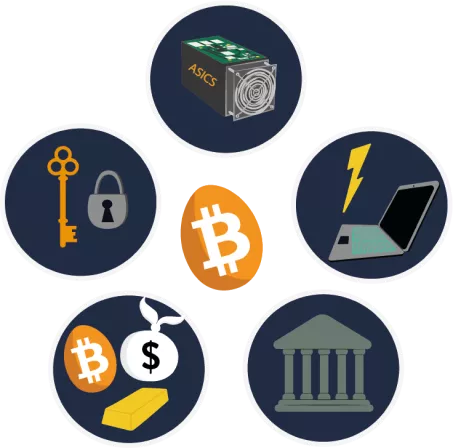

È essenziale comprendere che Bitcoin è un nuovo sistema monetario che rivoluziona il nostro rapporto con il denaro. Imparare ad utilizzare Bitcoin è una competenza essenziale per coloro che desiderano essere sovrani del proprio denaro.

**Sezione 1 - La moneta**

- Capitolo 1 - Che cos'è la moneta?
- Capitolo 2 - La moneta fiduciaria
- Capitolo 3 - Le iperinflazioni
- Capitolo 4 - La politica monetaria di Bitcoin

**Sezione 2 - I portafogli Bitcoin**

- Capitolo 5 - Come funzionano i portafogli Bitcoin?
- Capitolo 6 - Scegliere la propria sicurezza
- Capitolo 7 - Creare il proprio portafoglio
- Capitolo 8 - Proteggersi dal tempo

**Sezione 3 - Gli aspetti tecnici di Bitcoin**

- Capitolo 9 - Spiegazione di una transazione
- Capitolo 10 - I nodi Bitcoin
- Capitolo 11 - I minatori
- Capitolo 12 - Minatori ed ecologia

**Sezione 4 - Il risparmio in Bitcoin**

- Capitolo 13 - Il prezzo di Bitcoin
- Capitolo 14 - Come acquistare Bitcoin
- Capitolo 15 - Lavorare per Bitcoin
- Capitolo 16 - Iper-bitcoinizzazione

**Sezione 5 - Lightning Network**

- Capitolo 17 - Introduzione a Lightning Network
- Capitolo 18 - Casi d'uso di Lightning Network

Prima di affrontare la definizione e il funzionamento della moneta in una società (capitolo 1), iniziamo con la genesi di Bitcoin. Bitcoin è una tecnologia relativamente nuova, lanciata nel 2009, che è simile a nulla di ciò che esiste. È quindi normale non capire tutto immediatamente. Infatti, come quando si impara ad utilizzare Internet o una macchina, non è necessario conoscere tutti i dettagli tecnici per utilizzare Bitcoin (ricevere, pagare, proteggere i propri fondi).


L'importante qui è capire in generale questa nuova tecnologia. Speriamo che la formazione proposta vi piaccia e vi fornisca le basi necessarie per comprendere e forse continuare ad avanzare in questo nuovo paradigma monetario globale.

## La preistoria di Bitcoin

<chapterId>9a94b627-5b69-5d81-9125-f1fa9b0aa6ad</chapterId>


Prima che il termine "Bitcoin" diventasse sinonimo di moneta digitale e di trasformazione finanziaria, una serie di idee, innovazioni e movimenti sociali hanno gettato le basi per la sua creazione. Uno degli elementi fondamentali di questa preistoria di Bitcoin è il movimento cypherpunk.

### I Cypherpunk: Visionari del Mondo Digitale


Al cuore dell'evoluzione tecnologica degli anni '80 e '90, un gruppo di persone ha iniziato a interrogarsi profondamente sul ruolo della privacy e della libertà nell'era digitale. Queste persone, che sarebbero diventate in seguito conosciute come "cypherpunks", credevano fermamente che la crittografia potesse essere utilizzata come strumento per proteggere i diritti individuali dall'interferenza dei governi e delle grandi aziende.

Figure emblematiche come Julian Assange, Wei Dai, Tim May e David Chaum hanno contribuito a definire la filosofia e la visione dei cypherpunks. Questi pensatori hanno condiviso le loro idee in una mailing list influente, dove partecipanti provenienti da tutto il mondo dibattevano sul modo migliore per utilizzare la tecnologia al fine di garantire una maggiore libertà individuale.

### I Tre Testi Fondamentali dei Cypherpunks


Il movimento cypherpunk, con le sue radici profonde nell'attivismo digitale e nella crittografia, si è basato su diversi testi fondamentali per esprimere i suoi principi e la sua visione del futuro. Tra questi scritti, tre si distinguono in particolare:

- Il "Cypherpunk Manifesto":
  Scritto da Eric Hughes nel 1993, il "Cypherpunk Manifesto" afferma che la privacy è un diritto fondamentale. Hughes sosteneva che la capacità di comunicare liberamente e in modo confidenziale fosse essenziale per una società libera. Il manifesto dichiara: "Non possiamo aspettarci che istituzioni, aziende o altre grandi entità impersonali ci concedano la privacy... Dobbiamo difenderla noi stessi".

- Il "Manifesto del Crypto-Anarchista":
  Redatto da Timothy C. May nel 1992, questo manifesto illustra come l'uso della crittografia potrebbe portare a un'era di anarchia crittografica in cui i governi sarebbero impotenti nell'intervenire negli affari privati dei cittadini. May prevedeva un futuro in cui gli scambi di informazioni, denaro e messaggi potessero avvenire senza l'intervento di terze parti, in modo anonimo.

- La "Dichiarazione di Indipendenza dello Spazio Cibernetico":
  Sebbene questo testo non sia esclusivamente cypherpunk, riflette i sentimenti di molti attori del movimento. Scritta nel 1996 da John Perry Barlow, è una risposta alla crescente regolamentazione di Internet da parte dei governi. La dichiarazione afferma che lo spazio cibernetico è un luogo distinto dalla sfera fisica e non dovrebbe essere soggetto alle stesse leggi. Afferma: "Non abbiamo eletti e quindi non possiamo essere governati".

### I Predecessori di Bitcoin

Prima dell'apparizione di Bitcoin, sono stati fatti diversi tentativi per creare una valuta digitale. Ad esempio, David Chaum ha introdotto il concetto di "moneta elettronica anonima" con il suo progetto "DigiCash" negli anni '80. Purtroppo, a causa di varie limitazioni, DigiCash non è mai decollato veramente.

Un altro importante precursore è "b-money" di Wei Dai. Anche se non è mai stato implementato, presentava l'idea di una valuta digitale anonima in cui la rilevazione delle frodi era effettuata da una comunità di valutatori anziché da un'autorità centrale.


È in questo ambiente fertile che il misterioso Satoshi Nakamoto ha pubblicato il white paper di Bitcoin nel 2008. Ha combinato diverse idee provenienti dal movimento cypherpunk, come le prove di lavoro ed i timestamp crittografici, per creare una valuta digitale decentralizzata e resistente alla censura.

Il Bitcoin era più di una semplice valuta digitale; rappresentava un'attuazione degli ideali cypherpunk. Oltre alla sua tecnologia, simboleggiava una rivoluzione contro i sistemi finanziari tradizionali e offriva un'alternativa basata sulla trasparenza, la decentralizzazione e la sovranità individuale.

### Conclusioni

La preistoria di Bitcoin è profondamente radicata nel movimento cypherpunk e nella ricerca collettiva di una maggiore libertà nell'era digitale. Combinando i principi della crittografia, della decentralizzazione e dell'integrità, il Bitcoin è diventato molto più di una valuta; è il prodotto di una rivoluzione filosofica e tecnologica che continua a plasmare il nostro mondo.

Il Bitcoin è quindi un protocollo che si inserisce in tempi lunghi e ci spinge a interrogarci sul nostro rapporto con l'energia, il tempo e la moneta. Ma il Bitcoin è una "vera" moneta? Cos'è una moneta? Esiste in diverse forme? Questo è ciò che vedremo nel prossimo capitolo.


# La moneta

<partId>e913df1a-4cbd-5380-ba67-ca2a0414f671</partId>

## La moneta attraverso la storia

<chapterId>c838e64d-d59f-5703-8c74-ea5e8c4fdd31</chapterId>

L'evoluzione della moneta è un aspetto affascinante della storia umana, che riflette l'ingegnosità delle civiltà nel corso dei secoli nel rispondere ad esigenze economiche in continua evoluzione.


### Dai gusci di conchiglia al conto bancario

All'origine, la moneta era tangibile, spesso legata a beni essenziali come il grano, il bestiame e altre merci. Tuttavia, questi beni presentavano importanti svantaggi, come la loro deperibilità, rendendo difficile il loro utilizzo come mezzo di risparmio a lungo termine. Ad esempio, un raccolto fallito o una malattia potevano annientare la ricchezza di un individuo da un giorno all'altro.

Man mano che le civiltà avanzavano e il commercio si estendeva a nuove regioni, c'era bisogno di un mezzo di scambio universale. Oggetti come conchiglie e pietre preziose sono stati sperimentati, ma non erano perfetti. L'oro è diventato infine lo standard a causa della sua rarità, della sua durabilità e della sua divisibilità. Era, ed è ancora oggi, un simbolo di ricchezza e potere.

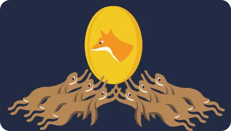

### Qual è il ruolo della moneta?

La moneta è uno strumento di comunicazione molto sofisticato:

- Permette di comunicare tra il presente e il futuro. Trasformiamo il nostro tempo ed energia in un asset che può essere riutilizzato in futuro senza rischio di svalutazione.

- Permette di comunicare in un linguaggio comune universale. Senza conoscersi, senza parlare la stessa lingua, due sconosciuti possono scambiarsi, commerciare e concordare sul valore delle cose.

La sua funzione nel nostro mondo è difficile da replicare artificialmente. Nessun essere umano o gruppo di esseri umani può creare una moneta, è un fenomeno sociale naturale che deve emergere dal mercato e da un consenso volontario. I prezzi sono segnali, informazioni, che aiutano la società a scegliere come allocare le risorse.

L'oro come moneta è la scelta di 4.000 anni di darwinismo monetario che si basa su 3 funzioni:

- Riserva di valore
- Mezzo di scambio
- Unità di conto


### Le caratteristiche della moneta

L'oro risponde idealmente ai criteri di una moneta efficace: la sua naturale rarità lo rende un oggetto di valore, mentre le sue proprietà chimiche gli permettono di non deteriorarsi nel tempo. Tuttavia, questa forma di moneta non è facilmente divisibile né trasportabile su lunghe distanze. In un mondo globalizzato e digitale, l'oro non può tenere il passo e ha bisogno di un'entità centrale per renderlo divisibile e facilmente scambiabile (moneta coniata).

Queste carenze hanno reso l'oro una riserva di valore, ma non una moneta comune, a scapito delle valute statali fiat, facili da usare ma costantemente svalutate dalle entità che le controllano (re, banca centrale, imperatore, dittatore).

Ci sono molti criteri per una moneta efficace. Una buona moneta deve essere :

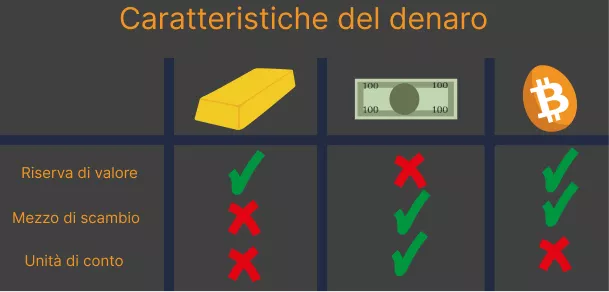

- **fungibile**, cioè intercambiabili senza perdita di valore
- **divisibile**, per facilitare le transazioni di volumi diversi
- **liquida**, cioè facilmente convertibile in beni o servizi.

Per soddisfare questi criteri, il denaro si evolve passo dopo passo:

- Pietra grezza -> Moneta
- Biglietto -> Carta bancaria
- Blockchain -> Lightning Network

Oggi le valute continuano a evolversi, adattando le loro forme a diversi usi. Ad esempio, l'oro, pur essendo un'eccellente riserva di valore, non è più adatto all'economia globalizzata di oggi. Allo stesso modo, le valute fiat come il dollaro e l'euro sono altamente liquide e facilmente trasportabili perché ora sono prevalentemente digitali, ma il loro valore viene costantemente eroso dall'inflazione monetaria.

Il Bitcoin, dal canto suo, offre nuove possibilità. Grazie alle sue proprietà, come l'offerta strettamente limitata, offre un'eccellente riserva di valore. Inoltre, in quanto moneta neutrale di Internet, rappresenta un buon mezzo di scambio che non conosce confini. Tuttavia, non è ancora ampiamente accettato nei punti vendita, nonostante [la sua costante adozione] (https://btcmap.org/map).

## Valute fiduciarie

<chapterId>25151d46-7db1-5b48-8bba-cbde1944555a</chapterId>

"Chi non impara dalla storia è destinato a ripetere gli stessi errori", diceva George Santayana. Una verità che risuona particolarmente quando parliamo dell'attuale sistema monetario.

### Fiduciario = fiducia

Oggi le principali valute, come l'euro e il dollaro, sono considerate fiduciarie. Ciò significa che non hanno un valore intrinseco. Il loro valore si basa interamente sulla fiducia che riponiamo nelle istituzioni che le regolano.

Una moneta fiduciaria è una forma di moneta che viene dichiarata moneta da un'istituzione, come uno Stato-nazione, come ad esempio la Cina con lo Yen, o un'unione politico-economica, come l'Unione europea con l'euro. L'ente responsabile dell'emissione di una moneta fiduciaria è una banca centrale (ad esempio, possiamo citare la Banca popolare cinese, la Federal Reserve degli Stati Uniti o la Banca centrale della Repubblica di Guinea). Sono queste ultime che sono responsabili di decidere la politica monetaria e quindi di quanto denaro dovrebbe essere messo in circolazione o stampato.

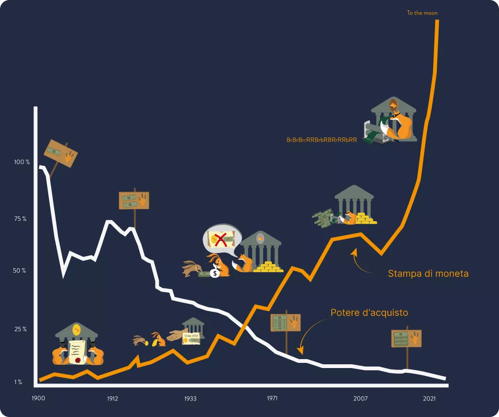

### La svalutazione monetaria: una strategia antica come l'Impero romano

Fin dall'antichità, l'oro è stato utilizzato come riferimento monetario. Tuttavia, la sua rigidità ha spesso spinto i governanti - che si tratti di imperatori romani o di governi moderni - ad adottare monete alternative, spesso fiduciarie.

Il meccanismo è semplice e si ispira alle pratiche esistenti fin dalle origini della civiltà. I governanti, desiderosi di esercitare un controllo sulle ricchezze, iniziano centralizzando l'oro, spesso sfruttando il loro potere e promettendo protezione e sicurezza. Con questa preziosa riserva nelle loro mani, introducono una nuova moneta, equivalente in valore all'oro, ma coniata a loro effigie. Questa moneta inizia quindi a circolare e la gente si abitua rapidamente alla sua comodità.

Progressivamente, questi governanti svalutano discretamente la nuova moneta, riducendo il suo valore rispetto all'oro iniziale di alcuni punti percentuali ogni anno. Questa svalutazione silenziosa viene spesso giustificata come nell'interesse del popolo. Così, coloro che risparmiano in questa moneta fiduciaria vedono il valore dei loro risparmi erodersi, mentre lo Stato finanzia i suoi progetti attraverso l'inflazione. Inoltre, questa svalutazione rende il debito più facile da ripagare.


In un momento critico, viene annunciato che la moneta non è più supportata dall'oro. Il pubblico, ormai abituato alla moneta fiduciaria e spesso poco informato sulle questioni finanziarie, accetta questa realtà. Lo Stato ha quindi campo libero per manipolare la massa monetaria, stampando enormi quantità di denaro a un costo quasi nullo.

Questa strategia, quando viene eseguita correttamente, può durare per decenni. Tuttavia, una svalutazione troppo rapida o una perdita di fiducia possono portare a un'iperinflazione (vedi capitolo successivo). La storia mostra che il dollaro ha perso il 98% del suo valore in 100 anni, l'euro il 30% in 20 anni e la sterlina il 99% dalla sua creazione.

Alla fine, la valuta potrebbe non avere più alcun legame con l'oro, ricordando le monete romane alla fine dell'Impero, o addirittura essere ridotta a un semplice valore numerico, scollegato dalla realtà tangibile.

Oggi siamo testimoni di una svolta storica. Il dollaro, che ha dominato per lungo tempo, sembra essere in declino, e l'oro ha perso la sua posizione centrale. Siamo alla svolta di un nuovo ciclo monetario, ricordando che le lezioni della storia vengono spesso dimenticate.


### È Bitcoin una soluzione?

È in questo contesto che la rivoluzione Bitcoin sta prendendo piede. Questa valuta che non richiede **alcun intermediario di fiducia** mira a separare lo Stato dalla moneta.

La stampa di moneta genera inflazione, impoverendo progressivamente la popolazione. Al contrario, le istituzioni finanziarie e le persone ricche si sono arricchite grazie a questa pratica, creando un divario di disuguaglianza e favorendo l'autoritarismo. Il sistema finanziario attuale è regolamentato e limitato per evitare il collasso e qualsiasi sconvolgimento potrebbe causare una grave crisi economica. Poiché gli attori politici traggono vantaggio da questo sistema, non sono incentivati a operare un cambiamento radicale, lasciando così il sistema a continuare la sua corsa fino a un'eventuale implosione.


In risposta a queste sfide sistemiche, Bitcoin si presenta come una soluzione decentralizzata: un nuovo sistema monetario neutrale in parallelo. Storicamente, l'oro è stato preferito come moneta, a causa della sua resistenza alla contraffazione. Allo stesso modo, Bitcoin, per la sua natura decentralizzata e crittografica, non può essere falsificato ed è limitato a 21 milioni di unità. Bitcoin è una valuta basata sulla trasparenza e neutralità, offrendo un'alternativa attraente al sistema monetario centralizzato attuale.

Parallelamente, l'emergere delle valute digitali delle banche centrali, o CBDC, sembra inevitabile. Questa nuova forma di valuta offrirebbe una pianificazione più centralizzata dell'economia, il che potrebbe ostacolare la libertà finanziaria degli individui e favorire derive autoritarie.
Possiamo concludere questo capitolo con la citazione del premio Nobel per l'economia F.A Hayek nel 1984: "Non credo che si possa mai ritrovare una buona moneta finché non la si riprenderà dalle mani del governo. Tuttavia, non possiamo strapparla loro violentemente, tutto ciò che possiamo fare è introdurre con un ingegnoso inganno qualcosa che loro non possono fermare."


## Le iperinflazioni

<chapterId>b04c024c-54f3-50cb-997f-58721cfc74be</chapterId>

L'iperinflazione è un fenomeno monetario proprio delle valute fiduciarie. Si caratterizza per la completa perdita di fiducia in una valuta e per un aumento drastico dell'inflazione attraverso la stampa di moneta da parte delle autorità. Di conseguenza, le economie accumulate dagli individui possono dissolversi in un breve lasso di tempo, spingendo il paese sull'orlo del baratro economico, sociale e politico.

### L'inflazione fuori controllo!

Cerchiamo di capire l'impatto dell'inflazione sul risparmio considerando diversi tassi di inflazione.

- Con un'inflazione del 2%, si perde annualmente il 2% del potere d'acquisto, ovvero il 10% dopo 5 anni.
- Con il 7%, si perde la metà in 10 anni.
- Con il 20%, si perde praticamente la metà in 3 anni.

Durante un'iperinflazione, non stiamo più parlando del 20% all'anno, ma del 20% al mese o, al picco, al GIORNO. Un'iperinflazione del 100% al giorno per 3 giorni sono cose realistiche che sono accadute e continuano ad accadere nel nostro mondo.

È importante capire che l'iperinflazione non accade per magia, per caso, per il capitalismo o per l'avversario politico. L'iperinflazione è la diretta conseguenza di decisioni monetarie sbagliate prese da banchieri centrali e politici. Le loro conseguenze colpiscono tutti i cittadini e avranno ripercussioni sulle generazioni future. Vi invito a soffermarvi 5 minuti su questa tabella per comprendere appieno l'impatto reale di questo fenomeno (il corso ECON204 approfondirà questo argomento)."


### Come si sviluppa un'iperinflazione?

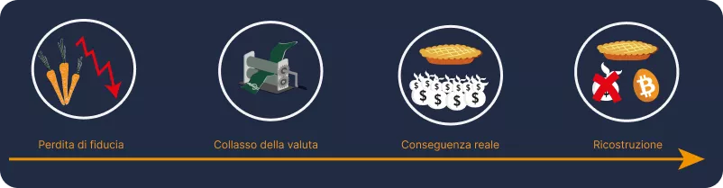

Fase 1 - La perdita di fiducia

- Una centralizzazione del potere monetario facilita la creazione di denaro e i suoi abusi. Una perdita di fiducia nella valuta può quindi emergere e scatenare un'iperinflazione. Le persone iniziano quindi a interrogarsi sull'origine del denaro e sui benefici della politica monetaria delegata. Questa perdita di fiducia è generalmente dovuta a fattori esterni come guerre, misure sociali o aumento dei prezzi di una risorsa chiave, come grano o benzina.

Fase 2 - Il crollo della valuta e l'aumento dei prezzi

- Man mano che i governi perdono il controllo della fiducia, le persone iniziano a scambiare la propria valuta con un'altra più stabile, come il dollaro americano in Venezuela. Ciò porta ad un aumento dei prezzi, creando un circolo vizioso in cui beni e servizi diventano sempre più costosi. Per rispondere a queste esigenze, lo Stato stampa più denaro per correggere la politica monetaria, causando un'inflazione esponenziale.

Fase 3 - Il circolo vizioso della stampa di denaro

- Sono necessari sempre più banconote per acquistare beni, creando una scarsità di denaro cartaceo. Ciò spinge a stampare ancora più banconote, creando ulteriore inflazione.

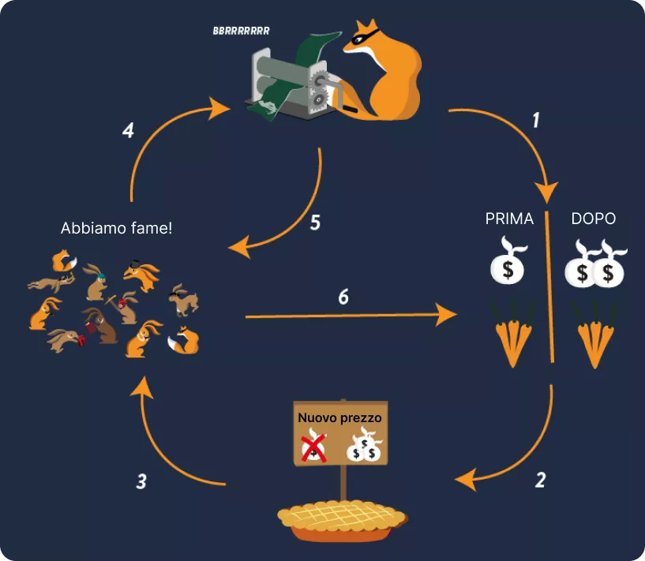

Fase 4 - Emergere di una nuova valuta

- Viene introdotta una nuova valuta per sostituire quella vecchia. Un esempio notevole di iperinflazione è la Germania negli anni 1920-1924. Per rilanciare l'economia, è stata creata una nuova valuta, garantita dai debiti tedeschi, francesi e inglesi e garantita dalle terre tedesche.

La risoluzione di una crisi di iperinflazione richiede spesso cambiamenti radicali, come rivoluzioni, cambi di governo, cambi di banchieri centrali, tra gli altri. La perdita di fiducia, il crollo della valuta e la ricostruzione sono fasi essenziali per rilanciare una nuova economia basata su una valuta fiduciaria.

### 3 esempi notevoli

- Germania, 1922-1923

  Uno degli esempi più eclatanti di iperinflazione si è verificato nella Repubblica di Weimar in Germania dopo la Prima Guerra Mondiale.

  La Germania aveva preso in prestito enormi quantità di denaro per finanziare lo sforzo bellico e non solo la Germania non ha vinto la guerra, ma ha dovuto pagare miliardi di dollari in riparazioni. Il mese con l'inflazione più alta è stato ottobre 1923, raggiungendo il 29.500%, ovvero un'inflazione del 20,9% al giorno. I prezzi raddoppiavano ogni 3,7 giorni!
  Si racconta che nei ristoranti i camerieri dovevano annunciare i prezzi del menu ogni 30 minuti per tener conto dell'inflazione. La valuta tedesca era diventata così inutile che alcuni cittadini preferivano bruciare la loro carta moneta anziché il legno, perché era effettivamente meno costoso.


- Ungheria, 1945-1946

  Il paese che ha subito il periodo di iperinflazione più grave nella storia fino ad oggi è di gran lunga l'Ungheria dopo la Seconda Guerra Mondiale.

  L'Ungheria si trovava tra i perdenti del conflitto e la guerra aveva distrutto gran parte della sua capacità produttiva industriale. Il mese con l'inflazione più alta è stato luglio 1946, con un'inflazione dei prezzi del 41 900 000 000 000 000 %, equivalente al 207 % al giorno. I prezzi raddoppiavano ogni 15 ore!

  L'ultima banconota messa in circolazione è stata una banconota da 100 milioni di miliardi di pengo (100 000 000 000 000 000 000) nel 1946.

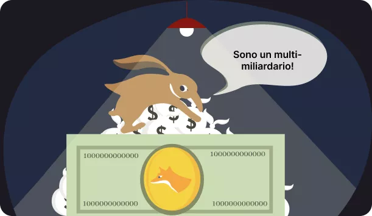

- Zimbabwe, 2007-2008
  Fino al 2000 lo Zimbabwe era autosufficiente per quasi tutti i suoi bisogni, tranne il petrolio.

  Nel 1997 il dollaro dello Zimbabwe crolla di oltre il 72% dopo che il governo ha accettato di indennizzare i veterani della guerra d'indipendenza per una somma equivalente a 450 milioni di dollari statunitensi. Poiché il governo non aveva una tale somma nelle sue casse, ha dovuto ricorrere alla stampa di denaro. Nel 2005 l'inflazione raggiunge il 586% e nel marzo 2007 l'inflazione mensile raggiunge il 50%.

  Nel giugno 2007, il governo reagisce istituendo un controllo dei prezzi. I negozi vengono letteralmente "svuotati". I commercianti non hanno più i mezzi per rifornire i loro negozi.

  Nel aprile 2009, il ministro delle finanze annuncia la sospensione del dollaro dello Zimbabwe e autorizza l'uso di diverse valute straniere per il commercio. Tutti i conti bancari, tutte le pensioni, tutte le istituzioni finanziarie hanno visto i loro saldi evaporare da un giorno all'altro.


In conclusione, l'iperinflazione ha l'effetto di degradare rapidamente il valore della moneta, portando all'erosione dei risparmi e alla perdita di fiducia nel sistema monetario. Come suggerito da Voltaire, una moneta fiduciaria alla fine perderà sempre il suo valore intrinseco e si avvicinerà allo zero.

Una valuta che si basa su un terzo di fiducia come un istituto finanziario si rivela essere una valuta difettosa nel tempo, in quanto incapace di garantire il potere d'acquisto o preservare i risparmi.

## 21 milioni di bitcoin

<chapterId>f4a06d76-1963-56fd-93ff-dfa41489bcde</chapterId>

### La politica monetaria di Bitcoin

Bitcoin è una valuta digitale decentralizzata con una quantità massima predefinita di **21 milioni di unità**. Questa caratteristica intrinseca di scarsità è determinata dal suo codice informatico e rafforzata dal consenso di tutti gli utenti che partecipano al protocollo.

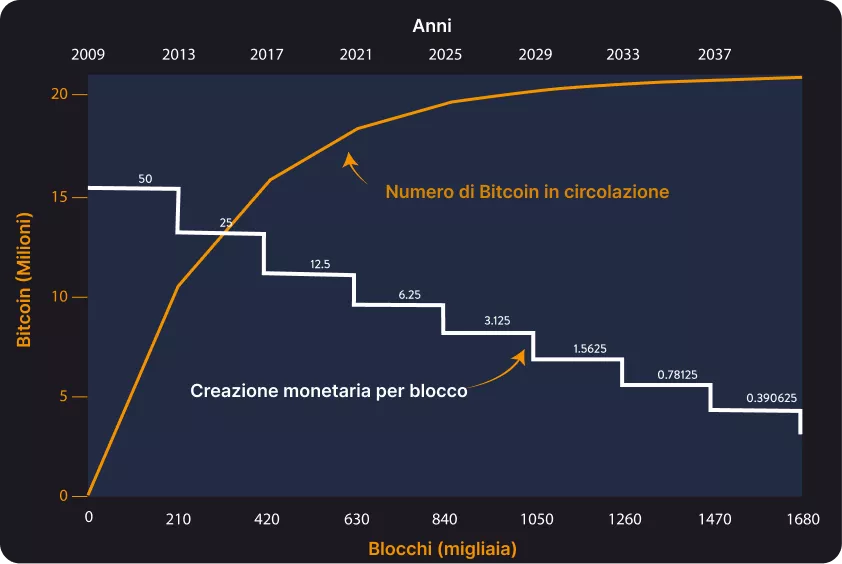

Per quanto riguarda la sua emissione monetaria, può essere rappresentata da una curva a S che rappresenta la quantità di bitcoin creati nel corso del tempo. Ad esempio, nel 2022, circa 18,5 milioni di bitcoin erano in circolazione. Le previsioni indicano che nel 2025 ci saranno circa 19,5 milioni di bitcoin, ovvero circa il 93% dell'offerta totale, e nel 2037 questo numero raggiungerà i 20,4 milioni.

### Come creare nuovi Bitcoin?

La creazione di nuovi bitcoin è il risultato del processo di mining, una procedura di convalida delle transazioni sulla rete Bitcoin.

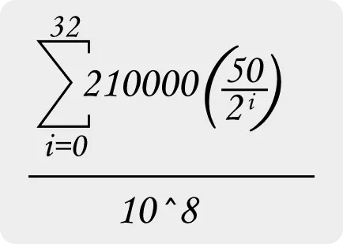

I minatori, che svolgono questa attività, vengono ricompensati con l'emissione di nuovi bitcoin ogni dieci minuti. Questa ricompensa è programmata per dimezzarsi ogni 210.000 blocchi, ovvero circa ogni quattro anni, in un evento noto come "halving" - il che conferisce alla curva di emissione monetaria una forma a scalini. A causa di questo meccanismo di halving, è possibile prevedere matematicamente che la creazione di bitcoin cesserà nel 2140, quando il numero totale di bitcoin raggiungerà il suo limite di 21 milioni.

| Numero di Halving | Altezza del blocco | Ricompensa BTC dopo l'Halving | BTC stimati in circolazione dopo l'Halving |
| ----------------- | ------------------ | ----------------------------- | ------------------------------------------ |
| 1                 | 210.000            | 25 BTC                        | 10.500.000 BTC                             |
| 2                 | 420.000            | 12,5 BTC                      | 15.750.000 BTC                             |
| 3                 | 630.000            | 6,25 BTC                      | 18.375.000 BTC                             |
| 4                 | 840.000            | 3,125 BTC                     | 19.687.500 BTC                             |
| 5                 | 1.050.000          | 1,5625 BTC                    | 20.343.750 BTC                             |
| 6                 | 1.260.000          | 0,78125 BTC                   | 20.671.875 BTC                             |
| 7                 | 1.470.000          | 0,390625 BTC                  | 20.835.937,5 BTC                           |
| 8                 | 1.680.000          | 0,1953125 BTC                 | 20.917.968,75 BTC                          |
| 9                 | 1.890.000          | 0,09765625 BTC                | 20.958.984,375 BTC                         |
| 10                | 2.100.000          | 0,048828125 BTC               | 20.979.492,188 BTC                         |
| 11                | 2.310.000          | 0,0244140625 BTC              | 20.989.746,094 BTC                         |
| 12                | 2.520.000          | 0,01220703125 BTC             | 20.994.873,047 BTC                         |
| 13                | 2.730.000          | 0,006103515625 BTC            | 20.997.436,523 BTC                         |
| 14                | 2.940.000          | 0,0030517578125 BTC           | 20.998.718,262 BTC                         |
| 15                | 3.150.000          | 0,00152587890625 BTC          | 20.999.359,131 BTC                         |
| 16                | 3.360.000          | 0,000762939453125 BTC         | 20.999.679,566 BTC                         |
| 17                | 3.570.000          | 0,0003814697265625 BTC        | 20.999.839,783 BTC                         |
| 18                | 3.780.000          | 0,00019073486328125 BTC       | 20.999.919,892 BTC                         |
| 19                | 3.990.000          | 0,000095367431640625 BTC      | 20.999.959,946 BTC                         |
| 20                | 4.200.000          | 0,0000476837158203125 BTC     | 20.999.979,973 BTC                         |

Ritorneremo in dettaglio sui minatori nel capitolo sul mining.

### Garantire la scarsità digitale

La scarsità di Bitcoin è garantita da due meccanismi chiave: l'aggiustamento della difficoltà di mining e la teoria dei giochi:

- L'aggiustamento della difficoltà di mining è un meccanismo che avviene ogni 2016 blocchi, circa due settimane, per garantire che in media un nuovo blocco venga aggiunto alla blockchain ogni dieci minuti. Questa frequenza di creazione dei blocchi e la quantità totale di bitcoin sono aspetti fissi del protocollo Bitcoin e non possono essere modificati senza un consenso generale, a differenza delle decisioni arbitrarie prese nei sistemi monetari tradizionali.

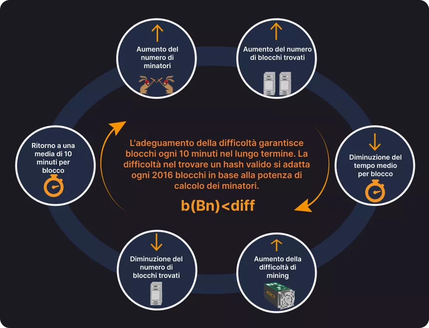

> Lo sapevate? I minatori sono incentivati a minare un blocco per guadagnare i nuovi bitcoin e le commissioni di transazione associate alle transazioni che includono nel loro blocco. Man mano che il numero di bitcoin emessi si avvicina al limite di 21 milioni, i minatori saranno sempre più remunerati dalle commissioni di transazione anziché dalla ricompensa del blocco.'

- La teoria dei giochi è un concetto matematico che si basa sulla razionalità umana. Qui, in Bitcoin, sono gli utenti che votano per i cambiamenti del protocollo. Sì, hai letto bene: ogni modifica al protocollo Bitcoin richiederebbe l'accordo dell'intera comunità degli utenti, il che è altamente complesso. Quindi, se qualcuno volesse creare un 22° milione di bitcoin, dovrebbe convincere tutti gli utenti a svalutare volontariamente il proprio risparmio, cosa che non è probabile che accada perché Bitcoin è globale e non governato da un gruppo centrale.

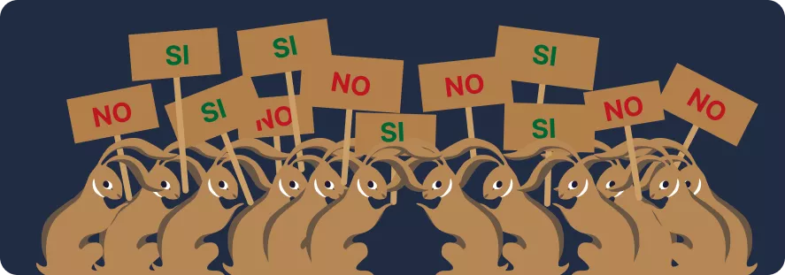

L'idea di svalutare la valuta è contraria alla filosofia fondamentale di Bitcoin, quindi la modifica di questo limite è quasi improbabile.

### Una politica monetaria verificabile ogni secondo dall'inizio e per sempre!

La scarsità di Bitcoin è un vantaggio significativo e la quantità massima di 21 milioni di bitcoin in circolazione è pubblica e verificabile da chiunque.

In effetti, chiunque può verificare la quantità di bitcoin in circolazione inserendo un semplice comando in un nodo Bitcoin: `bitcoin-cli gettxoutsetinfo`. Questa trasparenza e verificabilità rafforzano la fiducia nel sistema Bitcoin, che non si basa su istituzioni centralizzate o individui, ma su una garanzia matematica e crittografica intrinseca al suo protocollo. (Imparerai a farlo in modo semplice in LN201)

```json
{
  "height": 710560,
  "bestblock": "0000000000000000000887384d67103412ea7f18a43953e65c8c4ac36bf42e54",
  "transactions": 473244,
  "txouts": 1018917,
  "bogosize": 2183872374,
  "hash_serialized_2": "eebb9987337700ffaacbbaa11223344",
  "disk_size": 178239584,
  "total_amount": 18745998.12345678
}
```

Bitcoin, per sua concezione, garantisce una gestione monetaria sana, limitando la sua creazione e proteggendo il risparmio degli utenti, distinguendosi così dalle altre valute. Allineato ai principi dell'economia austriaca (dettagli in ECON201), la sua quantità controllata e la sua distribuzione prevedibile lo proteggono dai rischi di inflazione tipici delle valute tradizionali.

In sintesi, Bitcoin, grazie alla sua natura decentralizzata, alla sua scarsità programmata e alla sua trasparenza, offre un'alternativa unica ai sistemi monetari tradizionali. Illustra come la tecnologia possa essere utilizzata per creare una valuta che non solo è utile e verificabile, ma che preserva anche il valore del risparmio degli utenti limitando rigorosamente la sua offerta.

### Conclusioni della sezione 1!

La moneta è uno strumento sociale che deve adattarsi alle esigenze e alla tecnologia. Nel corso del tempo, l'oro è stato utilizzato come riserva di valore perché era raro e non poteva essere svalutato. Tuttavia, in seguito, l'oro è stato sostituito dal debito e dalla moneta fiduciaria, che è facile da trasportare, ma anche da manipolare la politica monetaria.

Bitcoin è un'alternativa monetaria realistica perché è raro e limitato a 21 milioni di bitcoin che non possono essere modificati. La creazione di moneta è mantenuta attraverso l'aggiustamento della difficoltà ogni 2 settimane e attraverso gli halving che garantiscono una prova matematica verificabile della sua rarità. A differenza degli euro o dei dollari il cui volume in circolazione non è verificabile e cambia frequentemente a seguito dei mandati delle istituzioni finanziarie, Bitcoin è una valuta crittografica con una politica monetaria neutrale e fissa. È quindi un'eccellente riserva di valore globale perché non può essere svalutata dalla stampa di moneta.

Bitcoin è innanzitutto una forma di moneta che incoraggia a mettere in discussione il potere delle istituzioni finanziarie sulla moneta. È una battaglia filosofica ed economica che è in gioco. Per capire Bitcoin è importante comprendere le sue basi fondamentali e smentire le idee false che lo circondano. Ciò permetterà di avviare un dibattito intellettuale costruttivo sul futuro della moneta.

Ora che abbiamo stabilito le differenze tra Bitcoin e le valute fiduciarie, nei prossimi capitoli esamineremo cosa sono i portafogli Bitcoin e perché è vostra responsabilità proteggere i vostri fondi. Infatti, la sovranità finanziaria offerta da Bitcoin va necessariamente di pari passo con la responsabilità individuale.

# I portafogli Bitcoin

<partId>28860585-4f61-59d9-b242-f4c57d837cc1</partId>

## Cosa sono i portafogli Bitcoin?

<chapterId>1c0166ab-cb7a-5bc6-9175-d13482bd91f1</chapterId>

In questa sezione 2, esploreremo lo stoccaggio e la sicurezza dei Bitcoin all'interno dei portafogli. Ciò vi permetterà di capire meglio dove si trovano questi famosi Bitcoin e come interagire con essi!

### Smentiamo i portafogli Bitcoin

In questa industria, utilizziamo i portafogli per interagire con la rete Bitcoin, che ha 3 funzioni:

- Permettere di ricevere bitcoin
- Permettere di inviarli
- Proteggerli dalle tentativi di hacking e furto

Un portafoglio può essere un software sul vostro computer, un'applicazione sul vostro smartphone, un dispositivo fisico come una chiavetta USB o anche un pezzo di carta. Questi diversi tipi di portafogli Bitcoin rispondono ciascuno a diverse situazioni d'uso. Alcuni sono adatti per grandi importi con un'enfasi sulla sicurezza, altri sulla privacy o ancora per il pagamento quotidiano di piccole somme.

I portafogli si dividono quindi in grandi famiglie di utilizzo, con sempre come punto centrale una domanda chiave: Sei proprietario dei fondi o lasci il controllo dei tuoi soldi a un terzo? Torneremo su questo argomento nel capitolo successivo in dettaglio, ma l'idea è semplice: I soldi sono nella tua tasca o in quella del tuo banchiere!


### Come funziona un portafoglio bitcoin

Che sia il tuo "banchiere" Bitcoin o te stesso, in generale, la grande maggioranza dei portafogli Bitcoin funziona con una tecnologia simile, quella della crittografia asimmetrica, e quindi un sistema di coppia di chiavi: una chiave privata per spendere e una chiave pubblica per ricevere.

- Chiave privata
  Durante l'inizializzazione di un portafoglio, viene generata una frase di recupero segreta (chiave privata) e ti viene data sotto forma di 24 parole.

  La chiave privata è molto importante, perché rappresenta il possesso dei Bitcoin e quindi il diritto di utilizzarli o inviarli. Il possessore della chiave privata è il proprietario dei Bitcoin.

  Questa chiave deve essere segreta e conservata bene, perché è la chiave che sblocca la tua fortuna!

- Chiave pubblica e indirizzo
  La chiave pubblica viene creata con la chiave privata e quindi collegata a quest'ultima. La chiave pubblica viene utilizzata per generare indirizzi Bitcoin e quindi ricevere denaro. Condividere la chiave pubblica comporta rischi per la privacy, ma non per la sicurezza.

  Questi indirizzi vengono creati dal tuo portafoglio e possono essere condivisi in tutta sicurezza. Si consiglia di utilizzarli solo una volta per massimizzare la tua privacy. Se sei all'inizio non utilizzare MAI un indirizzo due volte,ne hai a disposizione un numero vicino prossimo all'infinito!!

Quindi è importante capire che grazie a questa tecnologia, possiamo facilmente ricevere Bitcoin senza però permettere all'utente di rubare i nostri fondi! Pensaci come a una cassetta delle lettere: le persone ci depositano dei soldi, ma solo tu puoi aprirla.

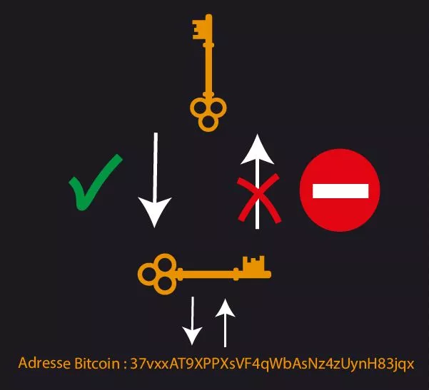

### I Bitcoin sono quindi nel portafoglio?

Anche se le tue chiavi sono memorizzate nel tuo portafoglio, i bitcoin stessi sono effettivamente "memorizzati" nella blockchain Bitcoin, che è un registro pubblico distribuito all'interno della rete _peer-to-peer_ Bitcoin (lo vedremo nella sezione 3). Ecco perché la perdita del dispositivo su cui hai il tuo portafoglio non significa necessariamente la perdita dei tuoi Bitcoin. Ciò che ti consente di ricreare il tuo portafoglio e spendere i tuoi bitcoin è la chiave privata. È quindi fondamentale proteggere bene quest'ultima.

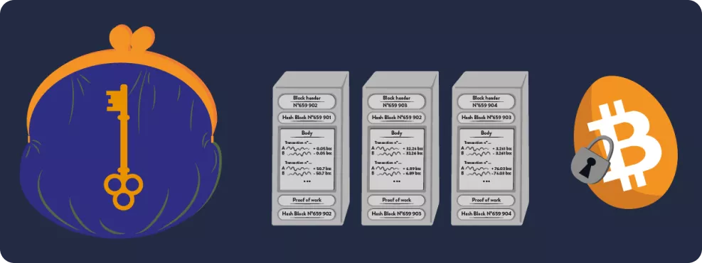

Fortunatamente per noi, dal 2017, questa chiave privata può essere codificata in una semplice lista di 12 o 24 parole, chiamata frase mnemonica. Questa frase è un backup del tuo portafoglio Bitcoin, è ciò che ti permette di ricreare il tuo portafoglio con qualsiasi software/app di portafoglio Bitcoin. Pertanto, chiunque abbia accesso a questa lista di parole ha accesso ai tuoi bitcoin.

### Cosa succede con gli hacker?

Potremmo chiederci: e se qualcuno indovinasse per caso la nostra lista di 12 o 24 parole? La risposta breve è che grazie alla crittografia utilizzata per creare il portafoglio è altamente improbabile. Per mettere in prospettiva, trovare per caso l'accesso al tuo portafoglio equivale a trovare il "numero" corretto tra 1 e $2^256$, che è praticamente equivalente a trovare l'"atomo" corretto nell'Universo. Tuttavia, se non sei soddisfatto di questa sicurezza predefinita, puoi sempre rafforzarla aggiungendo una passphrase al tuo portafoglio bitcoin.


Quindi la probabilità di un hack del tuo portafoglio Bitcoin è astronomicamente bassa, se segui le buone pratiche di sicurezza. Pratiche che dettagliamo nella prossima sezione.

Scegli un portafoglio che corrisponda alle tue esigenze e al tuo utilizzo. Tutorial dettagliati sull'uso e sulla sicurezza di diversi portafogli sono disponibili nella sezione [tutorial della nostra università](https://planb.network/tutorials/wallet).

## Sicurezza e Portafogli Bitcoin

<chapterId>00c1afea-e54a-511f-bab3-2efc2fbfa6a1</chapterId>

### Porre le giuste domande prima di iniziare

Quando si possiedono bitcoin, la sicurezza dei tuoi fondi è una preoccupazione principale. Il modo migliore per definire una sicurezza adatta alla tua situazione è porsi (e rispondere) a una serie di domande; il tuo modello di sicurezza dipenderà dalle tue risposte. Iniziamo:

- Chi può accedere ai miei fondi? In altre parole, sei l'unico a poter accedere ai tuoi bitcoin o una terza persona, come un'azienda, ti autorizza ad accedere ai tuoi fondi?
- Un'altra domanda potrebbe essere: quali utilizzi hai intenzione di fare dei tuoi bitcoin? È una somma che utilizzi regolarmente? È un risparmio a medio termine? a lungo termine?
- Quali sono le tue competenze tecniche?
- Qual è il tuo budget per la sicurezza?

Sappi che non esiste una soluzione universale. Quindi prenditi il tempo per rispondere a queste domande, ciò ti permetterà di adattare le tue misure di sicurezza.

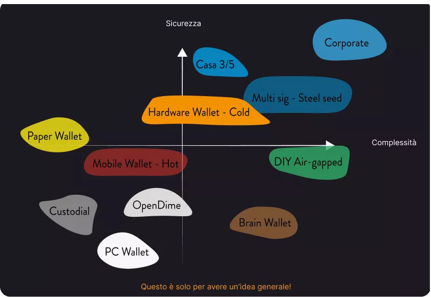

### Pensare ai portafogli Bitcoin in termini di complessità

Proviamo qui a stabilire diversi livelli di sicurezza per i tuoi bitcoin:

- **Livello 0**, stai utilizzando un servizio detto custodial con il quale non sei l'unico detentore dei tuoi bitcoin. ( Il servizio che utilizzi custodisce per tuo conto la chiave privata). Attenzione, questo terzo di fiducia può in qualsiasi momento limitare l'accesso ai tuoi fondi e hai lo stesso livello di sovranità finanziaria del sistema bancario tradizionale tramite un conto bancario.
  

- **Livello 1**, stai utilizzando un portafoglio Bitcoin sul tuo telefono o sul tuo computer con il quale sei l'unico detentore dei tuoi bitcoin. Puoi effettuare le tue transazioni con facilità. Attenzione, è fondamentale fare un backup della frase mnemonica per poter accedere nuovamente ai tuoi fondi in caso di perdita del tuo telefono o computer. Spesso si parla di "hot wallet" perché la chiave privata è memorizzata in un dispositivo con accesso a Internet.

- **Livello 2**, stai utilizzando un portafoglio fisico e hai protetto la tua lista di 12 o 24 parole. Per poter effettuare una transazione, dovrai sempre firmare con il tuo dispositivo. Ciò rende i tuoi fondi meno accessibili nella vita quotidiana. Spesso si parla di "Cold Wallet" perché le tue chiavi sono memorizzate su un dispositivo non connesso a Internet.

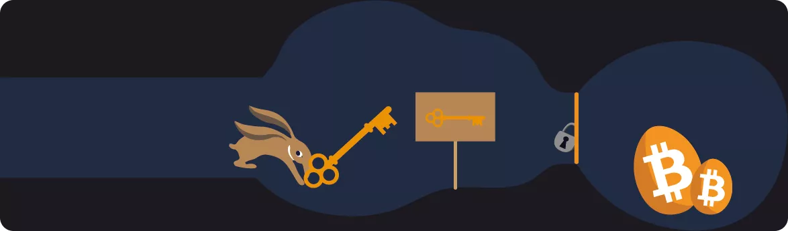

- **Livello 3**, stai utilizzando un portafoglio di livello 1 o 2 ma con una passphrase aggiuntiva. Attenzione, ora devi fare un backup della lista di 12 o 24 parole **e** della tua passphrase. Idealmente queste 2 informazioni vanno memorizzate in due luoghi diversi.


- **Livello 4**, stai utilizzando un insieme di portafogli per creare un portafoglio detto "multisig", il che significa che richiede più firme per effettuare una transazione. Attenzione, anche qui ogni parte del multisig deve essere in luoghi diversi. Questo è spesso considerato un utilizzo avanzato di Bitcoin, da utilizzare principalmente per grandi importi ed un uso aziendale.


Ovviamente ci possono essere diversi casi d'uso e in tal caso è consigliabile utilizzare più portafogli Bitcoin. Non esiste una soluzione miracolosa.

### La sicurezza deve adattarsi

La somma che si è disposti a lasciare su un livello di sicurezza specifico dipende da ognuno. Per alcuni, lasciare 1 btc su un hot wallet è ragionevole, per altri assolutamente no. In ogni caso, evita di spendere molto in sicurezza, acquistando un portafoglio fisico, quando si desidera proteggere una piccola somma. Tieni anche presente che complicare eccessivamente la sicurezza e l'accessibilità dei tuoi bitcoin potrebbe danneggiarti se, ad esempio, non fai correttamente il backup dei tuoi portafogli.

In conclusione, il possesso diretto dei propri Bitcoin è un elemento essenziale per garantire la propria sovranità finanziaria. Si consiglia di utilizzare un portafoglio mobile per le spese quotidiane e un portafoglio fisico offline, o "freddo", per conservare importi più elevati. Le aziende, invece, dovrebbero considerare l'uso di sistemi di firme multiple, o "multisig", per una maggiore sicurezza condivisa. È anche essenziale evitare, per quanto possibile, i servizi di custodia, che possono riprodurre alcune delle vulnerabilità del sistema finanziario tradizionale.

Ora che abbiamo questo in mente, vedremo nella prossima sezione i passaggi per creare un portafoglio Bitcoin. Tuttavia, se desideri approfondire l'argomento della sicurezza, puoi leggere questo [articolo di DarthCoin](https://asi0.substack.com/p/bitcoin-soyez-votre-propre-banque).

## Creazione di un portafoglio

<chapterId>615519eb-4565-557d-86a0-021badf7616f</chapterId>

La sicurezza dei tuoi Bitcoin è di cruciale importanza e un semplice errore può avere conseguenze costose. Ecco perché adesso vedremo le migliori pratiche per la creazione di un nuovo portafoglio Bitcoin.

> Nota che il corso BTC102 ti guiderà per avere successo in questa fase.

### Non scherziamo con questa fase!

La tua chiave privata, spesso rappresentata da un elenco di 24 parole (spesso chiamato "seed" o "frase mnemonica"), rappresenta l'accesso ai tuoi fondi. Se questa chiave viene rivelata a terzi, considera che i fondi associati non sono più sicuri. Pertanto, durante l'inizializzazione del tuo portafoglio, è importante rispettare queste regole:

- Coprire tutte le telecamere.
- Non fare foto dell'elenco di parole.
- Non inserirlo su un computer o un telefono.
- Non salvarlo come contatto o inviarlo a te stesso tramite SMS.
- Non lasciare mai le tue parole incustodite sulla tua scrivania.
- Non nascondere mai la tua lista di parole in un luogo insolito.

Letteralmente, prenderai un foglio di carta bianca o stamperai questo [modello](https://bitcoiner.guide/backup.pdf) e scriverai con una penna, in modo pulito e chiaro, l'elenco di parole nell'ordine corretto. Se l'inchiostro svanisce nel tempo, potresti perdere i tuoi fondi; quindi è importante conservare questa carta al riparo dalle intemperie.


### Consigli per fare bene

Esistono anche soluzioni alternative alla carta, come ad esempio scrivere la tua frase mnemonica su una lastra di metallo. Se scrivi male, i tuoi eredi potrebbero non riuscire a leggere e quindi a recuperare i fondi. Una volta scritte le parole, è consigliabile farne una seconda copia e conservarla in un secondo luogo, separato dal primo. Questo permette di avere un backup di emergenza in caso di perdita o incidente con il primo.

Una volta realizzate le copie, conserva le liste di parole in un luogo sicuro dove ti ricorderai di cercarle! Non creare un piano di nascondiglio troppo complicato dove rischi di perderle.

> Le tue parole = i tuoi soldi.

I portafogli "cold" di solito hanno queste liste di parole, così come i portafogli "hot" su dispositivi mobili o PC. Questo metodo di backup della chiave privata è oggi lo standard. Ciò significa che puoi inserire la tua frase mnemonica in qualsiasi software di portafoglio per ripristinare il tuo. Solo i peggiori portafogli che sconsigliamo fortemente non ti daranno una lista di 24 parole, ma potrebbero chiederti un account, un indirizzo email o, peggio ancora, un ID.

**ATTENZIONE: L'assenza di una lista di 24 parole dovrebbe metterti in allarme.**

## Superare la prova del tempo

<chapterId>f58cd446-c202-5eff-aab7-e61cc40e5c06</chapterId>

La sicurezza è una preoccupazione principale nell'ecosistema Bitcoin. Infatti, come qualsiasi forma di ricchezza, i tuoi bitcoin devono essere protetti da perdite, furti e degrado, soprattutto nel lungo termine. La sicurezza dei tuoi bitcoin richiede una certa conoscenza tecnica e la consapevolezza dei rischi associati, il che ci porta a discutere due strategie principali: incidere i tuoi bitcoin nell'acciaio e creare un piano di eredità.

### Incidere nella roccia

Un metodo per proteggere i tuoi bitcoin nel lungo termine è incidere la tua frase mnemonica su un materiale resistente come l'acciaio. Questo crea un backup fisico delle tue chiavi che è resistente sia ai danni causati dall'acqua che al fuoco.

Ci sono molte soluzioni per farlo, alcune a basso costo come il "Blockmit", mentre altre richiedono più attrezzature. Puoi esplorare questo argomento da solo attraverso la sezione tutorial di questa università.


### Pensate alla prossima generazione!

Inoltre, la creazione di un piano di eredità è un passo fondamentale per garantire che i vostri bitcoin siano gestiti correttamente dopo la vostra morte. Questo piano può includere una lettera scritta a mano che illustri i vostri beni, le modalità di accesso e le persone da contattare. È inoltre importante discutere il lascito di bitcoin con un notaio per garantire la conformità fiscale, anche se è importante non affidare mai i bitcoin direttamente a terzi, compreso un notaio.

Se desiderate approfondire l'argomento di un piano di successione per i vostri bitcoin, vi consigliamo il libro di Pamela Morgan [Cryptoasset Inheritance Plan](https://planb.network/resources/books/28) o di seguire il corso di formazione BTC102 in cui vi guideremo nella sua creazione.

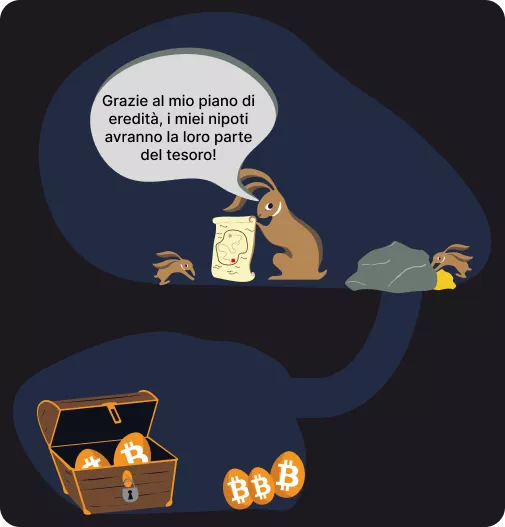

### La privacy è importante

La sicurezza a lungo termine dei vostri bitcoin non si limita alla creazione di backup fisici o alla stesura di un piano di eredità. La privacy è un'altra considerazione importante. Ad esempio, è meglio acquistare bitcoin senza fornire documenti di identità per ridurre al minimo il rischio di furto di identità o semplicemente di tracciamento dei vostri fondi da parte di qualsiasi entità dotata di mezzi sufficienti. Il corso di formazione BTC 205 vi aiuterà in questo senso, se necessario.

Per quanto riguarda la privacy, è fondamentale evitare di dire a qualcuno dei vostri bitcoin. Dopotutto, non sappiamo dove andrà a finire questa risorsa e mantenere un basso profilo è una decisione saggia. Non volete attirare l'attenzione su di voi e sul vostro portafoglio.

Allo stesso modo, evitate di rivelare il vostro sistema di sicurezza a voce alta e chiara durante le riunioni di bitcoin o quando incontrate degli sconosciuti...

### Sintesi della sicurezza dei portafogli Bitcoin

I portafogli Bitcoin sono applicazioni software per la memorizzazione e la transazione di bitcoin. Ne esistono di diversi tipi: portafogli per cellulari o PC, pratici per piccole somme e/o per spese regolari; portafogli fisici, più adatti a conservare bitcoin a medio e lungo termine; portafogli multi-sig, più complessi da gestire e che richiedono più firme per effettuare transazioni.

Durante la creazione di un portafoglio, è necessario prima di tutto fare un backup della propria chiave privata. Questo backup prende la forma di una lista di 12 o 24 parole che è possibile scrivere su un foglio di carta o su una lastra di metallo. Questa frase mnemonica consente di ripristinare il proprio portafoglio su qualsiasi applicazione di portafoglio Bitcoin. Chiunque abbia accesso a questa lista ha anche accesso ai propri bitcoin. Nel Bitcoin, la sovranità finanziaria va di pari passo con la responsabilità individuale, quindi è fondamentale proteggere l'accesso ai propri portafogli e ai propri backup. A tal fine, è importante seguire alcune regole:

- Creare un piano di eredità: per garantire che i propri cari possano recuperare i soldi in caso di problemi.
- Evitare le piattaforme di scambio: è necessario evitare di lasciare i propri Bitcoin su piattaforme di scambio, in quanto possono essere soggette ad attacchi di hacker.
- Adattare il proprio livello di sicurezza: prendersi il tempo per specificare le proprie esigenze e utilizzi, ciò aiuterà a fare una scelta tra i diversi portafogli Bitcoin disponibili.

Ora che abbiamo le basi dei portafogli Bitcoin e le buone pratiche per la loro sicurezza, affronteremo nel prossimo capitolo il funzionamento tecnico di Bitcoin. Anche qui, conoscere le basi del protocollo Bitcoin vi permetterà di capirne meglio il funzionamento, il che vi consentirà di utilizzarlo al meglio.

# Gli aspetti tecnici di Bitcoin.

<partId>a86d7439-e7a2-5f21-b1e9-6b5e23ca265b</partId>

## Lancio di Bitcoin

<chapterId>b7561082-8943-519d-95d1-a5f60dd2686d</chapterId>

### Cominciamo con un po' di Storia.


Il 31 ottobre 2008 segna la nascita di una nuova tecnologia finanziaria: il Bitcoin. In questa data, Satoshi Nakamoto, l'autore anonimo di Bitcoin, presenta la sua innovazione al mondo attraverso una mail distribuita alla lista di diffusione cypherpunk, una comunità di criptografi appassionati di privacy su internet.

Questa mail conteneva un documento, chiamato "White Paper", che presentava il funzionamento di Bitcoin. Considerando i fallimenti precedenti dei sistemi di denaro digitale, questa iniziativa non ha suscitato un entusiasmo immediato. Tuttavia, questo White Paper è diventato una referenza per gli utenti di Bitcoin ed è stato oggetto di numerosi dibattiti nell'ecosistema Bitcoin.


Il 3 gennaio 2009, Satoshi inaugura ufficialmente la rete Bitcoin creando il primo blocco, chiamato anche blocco genesi, che segna il lancio della blockchain di Bitcoin. Questo blocco contiene un messaggio rivelatore della missione di Bitcoin: "03/jan/2009 Chancellor on brink of second bailout for banks" (Il cancelliere sull'orlo di un secondo salvataggio per le banche).


> "Possiamo vincere una battaglia importante nella corsa agli armamenti e ottenere un
> nuovo territorio di libertà da diversi anni." - Satoshi Nakamoto
> 

### Il protocollo Bitcoin inizia a prendere vita

L'8 gennaio 2009, Satoshi annuncia la pubblicazione di Bitcoin-0.1.0. Rapidamente, Hal Finney prende il software e si unisce alla rete. Da quel momento, c'erano 2 nodi, e quindi 2 minatori, nella rete. Finney immortala questo passaggio tweetando "Running Bitcoin". Il 12 gennaio 2009, viene effettuata la prima transazione Bitcoin tra Satoshi e Hal Finney. Questa transazione, di 10 BTC, viene registrata nel blocco 170.


L'interesse per il Bitcoin cresce rapidamente e molte persone iniziano a testare, dibattere, risolvere bug e riflettere sugli aspetti etici, economici e filosofici di Bitcoin. Per facilitare questi scambi, il forum BitcoinTalk viene creato il 22 novembre 2009 da Satoshi.
Questo forum diventa rapidamente il luogo di discussione preferito dagli utenti di Bitcoin. È qui che nascono molti meme e simboli associati a Bitcoin, come il [logo Bitcoin](https://bitcointalk.org/index.php?topic=64.0), il famoso [Hodl](https://bitcointalk.org/index.php?topic=375643.0) o addirittura [Pizza day](https://bitcointalk.org/index.php?topic=137.msg1195).

> **Lo sapevate?** Infatti, il 22 maggio 2010, Laszlo Hanyecz fa la storia di Bitcoin proponendo di comprare 2 pizze per 10.000 BTC. È la prima volta che il Bitcoin viene utilizzato per acquistare beni materiali.


### La scomparsa di Satoshi Nakamoto

Nel 2010, mentre il Bitcoin inizia a attirare l'attenzione dei media, Satoshi decide di prendere le distanze. Il 12 dicembre 2010, pubblica il suo ultimo post sul forum, annunciando la sua partenza. Il 23 aprile 2011, effettua il suo ultimo scambio privato conosciuto tramite e-mail. Satoshi scompare, lasciando la sua creazione nelle mani della comunità.

> "I governi sono bravi a tagliare le teste delle reti controllate centralmente come Napster, ma le reti P2P pure come Gnutella e Tor sembrano cavarsela da sole." - Satoshi Nakamoto

Nonostante l'assenza di Satoshi, il Bitcoin continua a svilupparsi. Ogni 10 minuti, la storia di Bitcoin viene scritta e il protocollo continua a funzionare come previsto. Non importa la paura, l'incertezza o il dubbio (FOMO per Fear Of Missing Out o FUD per Fear Uncertainty Doubt), il Bitcoin continua ad avanzare, con una disponibilità online del 99,988%.
Il Bitcoin è percepito in modo diverso da ogni individuo. Per alcuni, è un'entità fungina come il [micelio](https://brandonquittem.com/bitcoin-is-the-mycelium-of-money/), per altri è un [buco nero](https://dergigi.com/2019/05/01/bitcoins-gravity/i). Che si ami o si odii il Bitcoin, continua ad esistere, con il suo ritmo costante di 10 minuti per blocco, come il battito di un nuovo sistema monetario.

Per approfondire le conoscenze sugli scritti di Satoshi Nakamoto, consiglio il [libro di Phil Champagne](https://planb.network/resources/books) o il documentario di ARTE "il mistero di Satoshi".


> "Il problema fondamentale della valuta convenzionale è tutta la fiducia necessaria per farla funzionare. La banca centrale deve essere fidata di non svalutare la valuta, ma la storia delle valute fiat è piena di violazioni di tale fiducia. Le banche devono essere fidate di tenere i nostri soldi e trasferirli elettronicamente, ma li prestano in onde di bolle di credito con appena una frazione in riserva."

Ora che abbiamo alcuni elementi di contesto, vediamo come funziona in generale una transazione Bitcoin.

## Le transazioni Bitcoin

<chapterId>03482644-5473-590b-975b-b43bb65eac21</chapterId>

Una transazione Bitcoin è semplicemente un trasferimento di proprietà di bitcoin, utilizzando un indirizzo bitcoin. Prendiamo ad esempio due protagonisti: Alice e Bob. Alice desidera acquisire dei bitcoin, mentre Bob ne possiede già.

### Passaggio 1 - Creazione della transazione tramite il portafoglio

Affinché Bob possa trasferire dei bitcoin ad Alice, quest'ultima deve fornire a Bob uno dei suoi indirizzi bitcoin. Questo indirizzo, derivato dalla chiave pubblica di Alice, è unico per il suo portafoglio Bitcoin.

Concretamente, Alice apre il suo portafoglio e seleziona "ricevi". Un codice QR o un indirizzo come questo bc1q7957hh3nj47efn8t2r6xdzs2cy3wjcyp8pch6hfkggy7jwrzj93sv4uykr verrà visualizzato. È il suo "IBAN Bitcoin" in qualche modo. Quindi lo fornisce a Bob.

Successivamente, Bob inizia la transazione utilizzando l'indirizzo di ricezione di Alice. Bob apre a sua volta il suo portafoglio Bitcoin, seleziona "invia", copia e incolla l'indirizzo, aggiunge un importo e delle commissioni di transazione. Queste commissioni sono un incentivo per i minatori ad includere la transazione nel blocco successivo.

'

> **Perché pagare delle commissioni?** Queste commissioni sono essenziali per creare un mercato libero per l'inclusione delle transazioni nei blocchi, poiché il numero di transazioni presenti in un blocco è limitato. Infatti, un blocco ha una dimensione di 1 MB, che corrisponde a qualche migliaio di transazioni per blocco. Le commissioni di una transazione sono proporzionali alla sua dimensione. La dimensione della transazione, a sua volta, dipende dalla complessità della stessa.

> Per completare la transazione, Bob deve fornire una firma con la chiave privata degli indirizzi che utilizza per pagare Alice. Ciò permette di verificare che sia il proprietario dei Bitcoin che desidera trasferire. Questo passaggio viene generalmente eseguito automaticamente sui portafogli di tipo mobile, o è una conferma sul tuo portafoglio fisico: "Sei sicuro di inviare X a Y? Sì o no".

### Passaggio 2: La propagazione della transazione attraverso i nodi fino ai minatori

A questo punto, la transazione è stata creata e il portafoglio di Bob la condividerà quindi con la rete Bitcoin. Per farlo, il suo portafoglio comunicherà con un nodo della rete Bitcoin, e quest'ultimo diffonderà queste informazioni ad altri nodi. Questo passaggio di propagazione consente all'intera rete di visualizzare questa nuova transazione e di tenerne conto.


Nonostante questa transazione sia ora conosciuta da tutti (tramite uno strumento chiamato Mempool), la transazione potrebbe non essere considerata confermata! Infatti, sono i minatori che convalidano le transazioni inserendole in un blocco della nostra famosa blockchain.

I minatori hanno il compito di prendere le transazioni valide e non confermate, quindi di compilarle in un blocco. Affinché il loro blocco sia il prossimo della blockchain Bitcoin, devono risolvere un enigma crittografico in un processo chiamato "proof of work" o "prova di lavoro".


### Passaggio 3: La transazione viene estratta in un blocco da un minatore.

Questa prova di lavoro richiede di trovare un "hash" valido per il blocco in questione. Pensatelo come un'impronta digitale unica associata al blocco, composta da 256 caratteri. La validità di questo hash dipende dalla difficoltà della rete Bitcoin. Torneremo su questo meccanismo in dettaglio. Per ora, considerate che un minatore ha trovato un blocco valido e che la transazione di Bob per Alice è inclusa.

Questo nuovo blocco valido viene aggiunto alla blockchain Bitcoin, che è un registro pubblico e immutabile di tutte le transazioni Bitcoin. Pensatelo come un libro mastro comune a tutti gli utenti di Bitcoin. Secondo le regole del protocollo, un blocco viene aggiunto circa ogni dieci minuti grazie all'adattamento della difficoltà. Vedremo nella sezione sui minatori quale meccanismo impedisce la modifica del registro delle transazioni Bitcoin.


### Step 4: Il blocco è valido e verificato dal nodo del portafoglio di Alice.

A questo punto, la transazione è considerata valida, il minatore a sua volta propaga il nuovo blocco tramite il suo nodo alla rete e il portafoglio di Alice viene aggiornato.

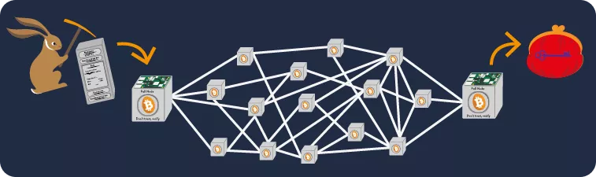

> Attenzione: Anche se Alice nota di aver ricevuto bitcoin su uno dei suoi indirizzi, si consiglia di considerare la transazione come immutabile solo quando ha 6 conferme. Ciò significa che altri 6 blocchi sono stati minati sopra il blocco in cui si trova la transazione di Bob. In altre parole, più una transazione è antica nella blockchain, più è immutabile.

### Breve riassunto in un poster!


### Perché tutto questo?

Alla fine, il sistema di transazioni Bitcoin è decentralizzato e funziona in peer-to-peer, senza intermediari di fiducia.

Bob invia la sua transazione alla rete Bitcoin e quando un minatore pubblica un blocco valido contenente la transazione di Bob, Alice può iniziare a considerare quei bitcoin come suoi. La fiducia non è richiesta in nessuna fase del trasferimento di proprietà dei bitcoin; solo le regole del protocollo e gli incentivi economici rendono troppo costoso agire in modo malevolo all'interno del protocollo Bitcoin.

Gli utenti trasferiscono la proprietà dei loro fondi firmando digitalmente le transazioni con le loro chiavi private. I minatori hanno poco potere, poiché gli utenti hanno anche un controllo significativo attraverso i nodi Bitcoin che si occupano della validazione dei nuovi blocchi e delle transazioni incluse. È grazie a questa rete di nodi Bitcoin che la rete è veramente decentralizzata.

Infatti, per distruggere completamente la rete Bitcoin, sarebbe necessario distruggere tutte le copie della blockchain di tutti i nodi Bitcoin - un compito praticamente impossibile a causa della distribuzione geografica di questi nodi e della difficoltà di sequestrarli fisicamente.

Esaminiamo quindi più nel dettaglio il funzionamento di un nodo Bitcoin.

## I nodi Bitcoin

<chapterId>8533cebc-f799-528b-89df-8d75d4c37f1c</chapterId>

I nodi sono un elemento fondamentale dell'architettura della rete Bitcoin. Svolgono diverse funzioni cruciali:

- Mantenere una copia della blockchain di Bitcoin
- Validare le transazioni
- Trasmettere informazioni ad altri nodi
- Applicare le regole del protocollo Bitcoin.

Quindi, ogni dispositivo che esegue il software Bitcoin, chiamato nodo Bitcoin, (spesso tramite [Bitcoin Core](https://bitcoin.org/en/bitcoin-core/)) partecipa alla decentralizzazione della rete.

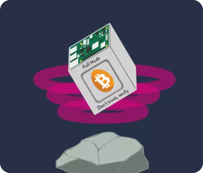

### I nodi sono quindi il nucleo centrale di Bitcoin.

Ogni nodo detiene una copia della blockchain, il che consente di verificare le transazioni ed evitare qualsiasi tentativo di frode. L'aspetto decentralizzato della rete conferisce a Bitcoin una straordinaria resilienza e robustezza: per fermare il protocollo Bitcoin, sarebbe necessario spegnere tutti i nodi in tutto il mondo. A titolo informativo, oggi (settembre 2023) ci sono circa [45.000 nodi](https://bitnodes.io/nodes/all/) distribuiti in tutto il mondo.

I nodi sono in grado di verificare la validità dei blocchi e delle transazioni perché seguono le regole del consenso di Bitcoin. Queste regole governano, tra le altre cose, la politica monetaria di Bitcoin, come l'importo della ricompensa per i minatori (che vedremo più in dettaglio nella prossima sezione) e la quantità di bitcoin in circolazione. I nodi agiscono in qualche modo come il sistema giuridico della rete. Grazie a loro, tutti i partecipanti alla rete seguono le stesse regole, garantendo la neutralità del protocollo Bitcoin. Le regole di consenso variano molto poco, se non affatto, perché per apportare modifiche è necessario ottenere l'approvazione di tutti i nodi.

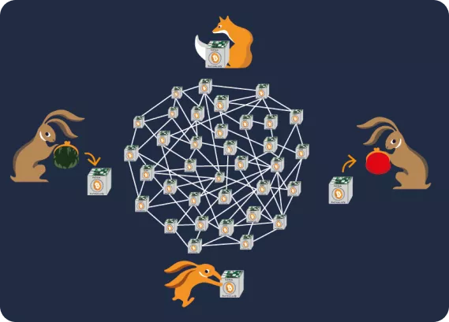

La governance all'interno del protocollo è al di fuori del curriculum di questa formazione, ma sappiate che ogni utente che esegue un nodo Bitcoin decide le regole che desidera seguire. Pertanto, un utente potrebbe decidere di seguire altre regole (cioè apportare modifiche al codice), ma se queste modifiche invalidano le attuali regole di consenso, allora quel nodo non farà più parte della rete Bitcoin. Le modifiche importanti sono quindi rare e richiedono una coordinazione significativa tra migliaia di attori con ideologie e interessi diversi, il che costringe il protocollo a produrre solo aggiornamenti che lo rendono "migliore" nel senso di tutti gli utenti di Bitcoin.

### Come appare un nodo?

Ci sono diverse opzioni quando si desidera avere il proprio nodo, e i costi di manutenzione variano. È possibile semplicemente eseguire il software Bitcoin Core sul proprio computer, ma ciò richiederà uno spazio di archiviazione considerevole poiché la blockchain occupa circa ~500 GB. Per ovviare a questa limitazione, è possibile decidere di memorizzare solo gli ultimi N blocchi, si parla quindi di "nodo ridotto" (Pruned node). Per questo tipo di soluzione, il costo è trascurabile poiché il nodo è acceso solo quando ne hai bisogno.


Un'altra opzione è utilizzare hardware dedicato a questo scopo, come il Raspberry Pi 4 con un disco rigido SSD sufficientemente grande (circa ~1 TB). Questa seconda opzione è più costosa se devi acquistare l'hardware, ma dal punto di vista del consumo energetico rappresenta meno di 10€ all'anno.
Dall'aspetto della larghezza di banda, considerando 1 blocco di 1 MB ogni 10 minuti, ciò rappresenta circa 5 GB al mese.

### I nodi devono rimanere accessibili per tutti!

Il costo accessibile e l'accessibilità di un nodo Bitcoin dal punto di vista delle risorse hardware, dello storage e della larghezza di banda sono aspetti molto importanti perché facilitano la decentralizzazione della rete.

Infatti, tutti hanno una buona ragione per far funzionare un nodo! Il prezzo e gli sforzi sono minimi per il beneficio ottenuto. Basta lanciarsi nell'avventura e unirsi a migliaia di altri bitcoiner perché insieme formiamo la rete Bitcoin.


Ad esempio, se i blocchi fossero 100 volte più pesanti, potremmo certamente effettuare 100 volte più transazioni ogni 10 minuti, ma far funzionare un nodo Bitcoin richiederebbe un disco rigido da 50 TB, una larghezza di banda di oltre 500 GB al mese e un hardware in grado di convalidare centinaia di migliaia di transazioni in meno di 10 minuti. In questa situazione ipotetica con blocchi 100 volte più grandi, far funzionare un nodo Bitcoin non sarebbe accessibile al comune dei mortali, compromettendo la decentralizzazione del protocollo e l'immutabilità delle transazioni e delle regole di consenso. Pertanto, i vincoli del protocollo sono stati scelti anche per consentire al maggior numero possibile di persone di far funzionare il proprio nodo Bitcoin.

Questa situazione non è così ipotetica perché il 2017 è stato segnato da una intensa controversia, nota come "guerra dei blocchi". Questo conflitto ha opposto gli attori che desideravano modificare Bitcoin aumentando la dimensione dei blocchi per aumentare la capacità di transazione, a coloro che cercavano di preservare l'indipendenza e il potere degli utenti. Alla fine, gli utenti e i nodi hanno trionfato respingendo la proposta di modifica avviata dai minatori, dalle piattaforme di scambio e dalle istituzioni.

In seguito a questa vittoria, i nodi hanno attivato un aggiornamento chiamato SegWit, aprendo la strada all'implementazione di Lightning Network, una rete di pagamento Bitcoin istantanea che utilizza la blockchain di Bitcoin. Questa situazione dimostra che gli utenti, grazie ai loro nodi, hanno un potere reale all'interno di Bitcoin, che permette loro di affrontare le grandi istituzioni.

### Riassunto nel poster!


## I minatori

<chapterId>dbb8264a-7434-57e4-9d1b-fbd1bae37fdf</chapterId>

> I minatori servono a garantire la sicurezza della rete e ad aggiungere le transazioni ai blocchi. Utilizzano elettricità tramite macchine ASIC per risolvere la prova del lavoro di Bitcoin.


### Spiegazione della prova del lavoro

La Prova di Lavoro, alias "Proof of Work" (POW), è il consenso di sicurezza del protocollo Bitcoin. È la regola che permette a Bitcoin di funzionare e garantirne la robustezza. Il POW è alla base di tutto e svolge un ruolo cruciale nella teoria dei giochi di Bitcoin.

Pensalo come una grande lotteria a cui tutti possono partecipare. L'obiettivo è trovare un numero specifico che consentirà di firmare un blocco valido, il vincitore riceve una ricompensa in bitcoin. Questo numero è molto semplice da verificare, ma difficile da trovare. Infatti, la verifica facile avviene attraverso la funzione di hash SHA-256 che è inclusa nell'algoritmo di mining. Per trovare questo numero, i partecipanti (miner) proveranno miliardi e miliardi di possibilità come 1, 52, 2648, 26874615, 15344854131318631, ecc.

Se il numero scelto è quello giusto: Jackpot! Altrimenti, si continua a cercare. Per ottimizzare il numero di tentativi, utilizzeranno macchine specifiche chiamate ASICS che hanno il solo compito di calcolare miliardi di possibilità al secondo. La quantità totale di tentativi si chiama HashRate e permette di quantificare la sicurezza del protocollo Bitcoin. Per far funzionare queste macchine, quindi, è necessario consumare grandi quantità di elettricità. Il POW trasforma quindi l'energia in moneta, collegando il mondo reale e il mondo digitale per creare la prima valuta energetica.

Le macchine girano e dopo una media di 10 minuti, emergerà un vincitore. Avrà trovato l'hash corretto sotto la soglia di difficoltà. Il grande e unico vincitore firmerà quindi il nuovo blocco del server timestamp e continuerà la catena di blocchi. Il vincitore riceve le sue ricompense e torna a tentare la fortuna per il prossimo blocco. Il processo si ripete da 12 anni e ogni 10 minuti, un vincitore conferma le transazioni Bitcoin continuando a proteggere le transazioni passate. Rendendo la nostra blockchain Bitcoin più robusta e sicura.

Ogni 2 settimane (2016 blocchi), l'aggiustamento della difficoltà riequilibra il gioco globale del mining in base al numero di partecipanti.

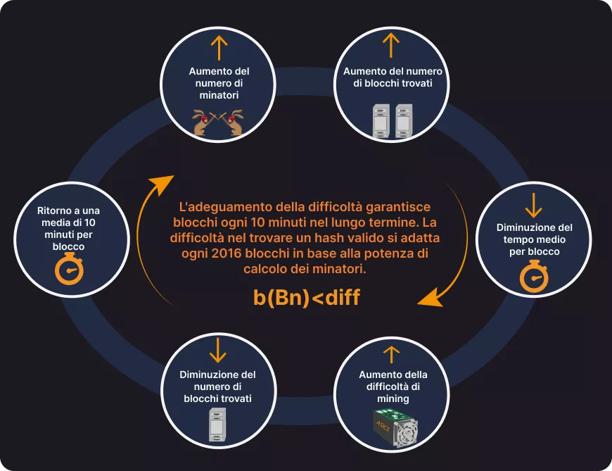

### Il mining è in costante evoluzione

Negli anni, i miner si sono dotati di hardware informatico sempre più efficiente per produrre il maggior numero possibile di hash al secondo (chiamato HashRate) consumando il minor quantitativo di energia possibile, nel modo più economico possibile. I primi miner come Satoshi o Hal Finney minavano semplicemente con la loro CPU, poi altri hanno iniziato a minare con la loro scheda grafica. Oggi, i miner utilizzano ciò che viene chiamato ASIC (Application-Specific Integrated Circuit), macchine progettate appositamente per applicare l'algoritmo SHA256.


L' **Hashrate** della rete Bitcoin rappresenta in qualche modo la quantità di tentativi effettuati al secondo per trovare il prossimo blocco. Oggi è di circa 400 TH/s, ovvero 400.000 miliardi di tentativi al secondo! Più alto è l'hashrate globale, più difficile è per un attore malevolo monopolizzare le risorse necessarie per ottenere la maggioranza del mining e effettuare una doppia spesa. È quindi più economicamente vantaggioso seguire le regole del protocollo Bitcoin anziché agire in contrasto con esse. Ciò solleva una question: come vengono remunerati i minatori?
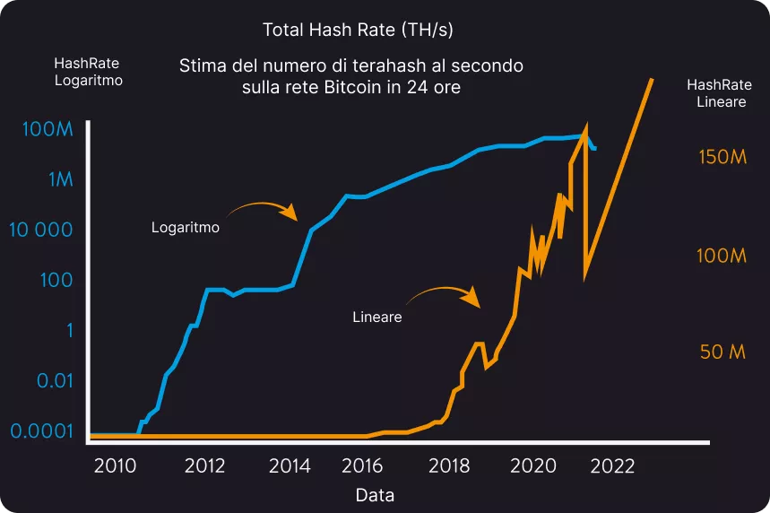

### Cosa si può trovare in un blocco?


L'intestazione del blocco contiene diversi elementi come l'ora, la difficoltà target, il numero dell'ultimo blocco, la versione utilizzata e il Merkel Root delle transazioni precedenti.

La transazione coinbase è sempre la prima; essa comprende la ricompensa ricevuta per aver svolto il lavoro di validazione. Seguono le transazioni validate. Il minatore sceglierà le transazioni che generano il maggior profitto e cercherà di creare un blocco che massimizzi il suo guadagno, ovvero transazioni di piccole dimensioni con il massimo delle commissioni.

### Remunerazione dei minatori

Inizialmente, un minatore viene remunerato quando trova un blocco valido. Più precisamente, viene remunerato in due modi: (i) tramite la ricompensa inclusa nel blocco e (ii) tramite le commissioni delle transazioni incluse nel blocco. L'importo della ricompensa è definito dalle regole di consenso e dipende dall'epoca in cui ci troviamo.

Infatti, per i primi blocchi la ricompensa era di 50 bitcoin, poi ogni 210.000 blocchi (circa ogni 4 anni) viene divisa per 2. Oggi (nel 2023) ci troviamo nella quarta epoca; la ricompensa è quindi di 6,25 bitcoin. Questa ricompensa è il meccanismo di creazione di moneta in Bitcoin. Poiché la ricompensa diminuisce nel tempo, ciò significa che esiste un limite di 21 milioni di bitcoin - oggi ci sono già più di 19,4 milioni di bitcoin in circolazione, ovvero oltre il 92%.

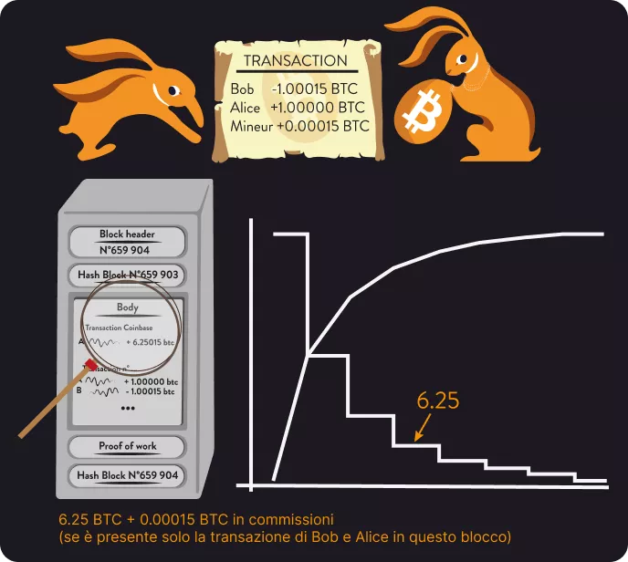

Il secondo metodo di remunerazione è definito dall'importo scelto dagli utenti per le commissioni delle transazioni. Poiché il minatore desidera massimizzare il suo guadagno, avrà la tendenza a selezionare prioritariamente le transazioni con commissioni elevate; le commissioni delle transazioni riflettono quindi l'urgenza dell'utente nel far inserire la sua transazione nel prossimo blocco.

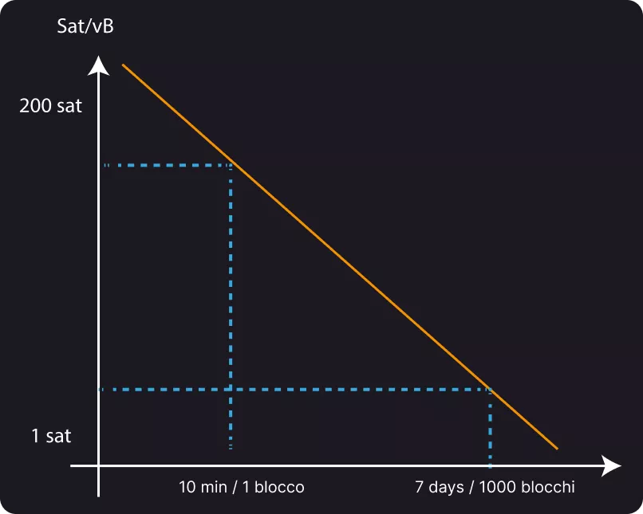

Inoltre, per stabilizzare il modello economico dei minatori, che si basa sulle ricompense che ricevono per ogni blocco valido, i minatori spesso collaborano in gruppi attraverso "pool di mining", dove condividono le loro risorse di calcolo.

### Perché preoccuparsi di fare tutto questo?

In sostanza, l'innovazione di Bitcoin è quella di proporre una soluzione al problema della doppia spesa attraverso l'utilizzo di una blockchain basata sulla Proof of Work con una difficoltà variabile. Nel mondo digitale, il concetto di proprietà è diverso da quello del mondo fisico. Infatti, nel mondo digitale, tutto può essere copiato e incollato, il che crea problemi in termini di doppia spesa per i beni digitali di valore. Sono stati creati intermediari di fiducia, come le banche, per risolvere questo problema tecnologico e garantire che quando un bene viene trasferito, non appartenga più all'emittente. Ma come fare senza intermediari di fiducia? Questo problema è equivalente al problema dei generali bizantini, un problema di coordinamento delle informazioni in un sistema in cui non si può fidare dei diversi attori.


Bitcoin è quindi una sorta di soluzione per risolvere questo problema, o almeno per aggirarlo. I "general" di Bitcoin, o miner, producono blocchi (di informazioni) e i nodi Bitcoin verificano le transazioni finanziarie attraverso le regole di consenso per garantire l'autenticità delle informazioni. L'asimmetria nel costo energetico tra la produzione di informazioni e la verifica assicura l'affidabilità delle informazioni, senza bisogno di terze parti di fiducia.

I miner sono i costruttori della sicurezza della rete Bitcoin. Spendendo energia per produrre hash, costruiscono un muro che rende estremamente costoso per un agente malintenzionato riscrivere la cronologia delle transazioni. Questo disincentivo economico li dissuade dal comportarsi in modo disonesto.

Anche nel caso di un attacco del 51%, cioè quando un agente possiede più della metà della potenza di hash, la rete rimane sicura perché l'attaccante deve spendere la stessa quantità di energia di tutti i miner per cercare di modificare la blockchain. È grazie a questo meccanismo di proof of work, che richiede energia per essere completato, che la rete è sicura.

### In sintesi

La teoria dei giochi applicata a Bitcoin esclude i minatori disonesti. I minatori utilizzano macchine ASIC per estrarre e ricevono una ricompensa in caso di successo. Inoltre, spesso si uniscono in pool di mining per condividere la potenza di calcolo ed ottenere ricompense minori ma più regolari. Il mining di Bitcoin è un processo con un alto costo energetico, ma essenziale per il funzionamento e la sicurezza della rete Bitcoin. La prova del lavoro e la blockchain risolvono il problema della doppia spesa e garantiscono l'autenticità delle informazioni senza bisogno di terze parti di fiducia. La spesa energetica è necessaria per produrre le informazioni, ma la verifica delle informazioni ha un costo trascurabile. Questa asimmetria garantisce la sicurezza della rete. Pertanto, è più economicamente conveniente seguire le regole del consenso piuttosto che infrangerle.


## Bitcoin e l'ecologia

<chapterId>4b227ae6-443a-5739-b443-60b7931130d9</chapterId>

Abbiamo appena visto nella sezione precedente che la sicurezza del protocollo Bitcoin si basa su un alto costo energetico per produrre un registro pubblico delle transazioni senza terze parti di fiducia. Il costo energetico complessivo è spesso paragonato al consumo elettrico di un piccolo paese. Ma questo confronto ha senso? È pertinente per capire le ragioni di un tale costo?

### I costi energetici di Bitcoin.

Innanzitutto, valutiamo qualitativamente il costo ambientale del mining. Un minatore deve dotarsi di una macchina come un ASIC e di una fonte di energia sotto forma di elettricità per alimentare queste macchine. Gli ASIC sono composti principalmente di alluminio e possono essere riciclati o riutilizzati per un secondo scopo (come dimostrato dal progetto [Attakaï](https://decouvrebitcoin.fr/attakai/), che trasforma un Antminer S9 in un riscaldamento supplementare). Il vero problema è quindi il consumo energetico. Cerchiamo quindi di fornire ulteriori contesto a questo.


Il consumo energetico rappresenta quasi la totalità dei costi per un minatore. Pertanto, è incentivato a procurarsi una fonte di elettricità a basso costo. Tuttavia, poiché i minatori sono mobili, possono recarsi in luoghi dove sono installate centrali elettriche ma non ancora collegate alla rete elettrica del territorio. I minatori svolgono il ruolo di acquirenti di ultima istanza, consentendo così alle centrali di finanziarsi prima ancora di essere collegate alla rete elettrica. E quando lo saranno, la domanda di elettricità aumenterà, aumentando il prezzo e rendendo meno redditizio per il minatore procurarsi elettricità in quei luoghi. Il minatore deciderà quindi di spostare la sua installazione e si stabilirà in un luogo dove la domanda è bassa e quindi anche il prezzo.

### Un dibattito senza fine

Così, il dibattito sull'impatto ecologico di Bitcoin è spesso mal indirizzato, principalmente a causa di una comprensione insufficiente della sua utilità e del suo funzionamento. Bitcoin non può essere valutato semplicemente in termini di costo energetico per transazione, poiché i minatori garantiscono sia la rete attuale che quella storica, le transazioni sono raggruppate e non sono tutte equivalenti, inoltre l'impatto di Lightning Network non viene preso in considerazione. Coloro che sostengono che Bitcoin consuma troppa energia possono avere motivazioni politiche o cercare di vendere la propria soluzione blockchain. Il pretesto ecologico viene utilizzato per giustificare il divieto di Bitcoin.

Tuttavia, non bisogna dimenticare che Bitcoin, come invenzione rivoluzionaria, ha dato alle persone che vivono sotto l'oppressione finanziaria o sotto un regime dittatoriale un modo per lottare per la propria libertà. Come ultima risorsa, Bitcoin offre una forma di libertà finanziaria sfuggendo alla censura e alle restrizioni bancarie. Bitcoin è più di una semplice valuta. È una forma di comunicazione ed espressione della libertà. L'energia spesa dai minatori contribuisce alla difesa della nostra libertà. Bitcoin consente l'emancipazione dal sistema finanziario attuale, dominato dal debito e dalla creazione monetaria eccessiva delle banche centrali.


Per coloro che vivono in paesi con un'alta inflazione, Bitcoin è una questione di sopravvivenza. Fornisce un modo per sopravvivere in situazioni finanziarie precarie. Inoltre, Bitcoin offre un sistema finanziario più giusto ed equo. Offre anche l'opportunità a miliardi di persone nel mondo di accedere al sistema finanziario. Visto da questo punto di vista, il consumo energetico è legittimo?

### Il Bitcoin potrebbe non essere un netto positivo per l'ambiente?

Infine, è essenziale discutere delle implicazioni economiche e ambientali dell'adozione di Bitcoin.

In particolare, confrontandolo con l'attuale sistema finanziario. Quest'ultimo, incoraggiando il sovraconsumo e l'indebitamento, pone seri problemi. Il facile accesso al credito, l'emissione di denaro da parte delle banche e l'uso della riserva frazionaria sono tutti fattori che incoraggiano il sovraindebitamento e, di conseguenza, il sovraconsumo.


Il sistema monetario deve essere riformato per riflettere la scarsità delle nostre risorse con la scarsità del nostro denaro. Questo incoraggerà un consumo più responsabile e una visione a lungo termine. Al contrario, l'inflazione, incoraggiando i consumi e gli investimenti, ha un impatto negativo a lungo termine sull'ambiente.

L'attuale sistema finanziario è in linea con le idee dell'economia keynesiana che, a differenza dell'economia austriaca, non tiene conto dell'aspetto temporale e dinamico delle situazioni e delle risorse. In altre parole, una moneta illimitata non può riflettere efficacemente le risorse limitate del nostro pianeta.


I politici, a causa della loro visione a breve termine e del loro bisogno di crescita economica per essere rieletti, non sono in grado di risolvere i problemi ecologici a lungo termine. Al contrario, l'adozione di una moneta sana come il Bitcoin è una potenziale alternativa che potrebbe restituire il potere economico al popolo.

Le fiamme dei pozzi di petrolio, che bruciano metano per evitare l'inquinamento, possono essere spente dai minatori di Bitcoin, a tutto vantaggio dell'ambiente. Il Bitcoin promuove l'uso di energia verde. Il gas metano può essere convertito in elettricità per alimentare le macchine di mining, il che è un bene per tutti.

La tecnologia di Bitcoin è spesso fraintesa e le critiche al suo impatto ecologico sono spesso semplicistiche e miopi. Queste critiche sono spesso motivate da ragioni politiche. Il Bitcoin ha il potenziale per aiutare la transizione ecologica e contribuire a un mondo più verde. I media spesso diffondono idee sbagliate sul Bitcoin e sull'ecologia. Prendetevi quindi il tempo necessario per farvi una vostra idea. Con il Bitcoin tutto è trasparente.

> Seguite una delle massime di Bitcoin: non fidarti, verificalo! (Dont trust, verify!)


### Breve riassunto degli aspetti tecnici di Bitcoin

Satoshi Nakamoto lancia nel gennaio 2009 il protocollo Bitcoin, che da allora si è evoluto grazie a una crescente comunità di sviluppatori, miner e utenti con nodi Bitcoin. Questi ultimi, mantenendo la propria copia della blockchain Bitcoin, il registro pubblico di tutte le transazioni Bitcoin, possono assicurarsi la validità delle transazioni secondo le regole di consenso specifiche di Bitcoin. In particolare, assicurandosi che i miner producano blocchi validi, che contengono alcune migliaia di transazioni in sospeso.

In media, viene creato un blocco ogni 10 minuti e il miner che trova un hash valido per il prossimo blocco viene ricompensato dal protocollo con una ricompensa il cui importo è definito dalle regole di consenso, e le commissioni di transazione di tutte quelle presenti nel blocco valido in questione. Poiché il risultato dell'algoritmo di hash (SHA256) per un determinato input è considerato imprevedibile, il processo di mining consiste nel costruire molti blocchi candidati e verificare se il loro hash è valido o meno. Tuttavia, per garantire che il tempo medio tra due blocchi rimanga costante (~10 minuti) indipendentemente dalla quantità di miner e dalla loro potenza di calcolo, la difficoltà nel trovare un hash valido viene regolata ogni 2016 blocchi, ovvero circa ogni 2 settimane. Nel tempo, i miner hanno sviluppato macchine specifiche per SHA256, chiamate ASICS, per aumentare il rapporto hashrate/joule, che significa essenzialmente il numero di tentativi al secondo e l'energia consumata.

Per essere il più redditizio possibile nella propria attività, il miner deve procurarsi l'elettricità più economica possibile, che spesso si trova in luoghi remoti, all'interno di centrali elettriche che non sono ancora collegate alla rete elettrica del territorio. Il miner agisce quindi come un acquirente di ultima istanza e, non appena il prezzo dell'elettricità aumenta a seguito di un aumento della domanda, tende a rilocare la propria attività altrove.

Così, il protocollo Bitcoin è un sistema monetario inattaccabile e inarrestabile perché ogni componente del protocollo è distribuito geograficamente in tutto il mondo - ad esempio, si contano circa 40.000 nodi Bitcoin su tutti i continenti. Le regole di consenso di Bitcoin sono tali che è economicamente più conveniente seguirle piuttosto che cercare di trasgredirle e, di conseguenza, non è richiesta alcuna fiducia tra gli attori. Bitcoin non ha un leader e non può essere fermato. È possibile regolare le piattaforme di scambio per limitare Bitcoin, ma ciò è limitato in termini di impatto. In sintesi, nessun giudice o stato può censurare o fermare Bitcoin.

# Come procurarsi Bitcoin?

<partId>517e1bb7-f032-51a0-930a-a91fe5148d3f</partId>

## Bitcoin non dorme mai!

<chapterId>d5e35e41-ea26-5478-8eb9-07daf9dff508</chapterId>

Il prezzo di Bitcoin è spesso caratterizzato da una significativa volatilità. Il suo valore può fluttuare considerevolmente in base alle variazioni del mercato e alle fasi di mercato rialzista (bull market) e ribassista (bear market). Questo è presente nel 100% dei mercati finanziari, compreso il bitcoin.


> Per fare semplice: gli esseri umani comprano tutti contemporaneamente e vendono tutti contemporaneamente. Il Bitcoin non è immune alla natura umana.

### Comprendere le onde di adozione

Lo sviluppo e l'evoluzione di Bitcoin sono in gran parte legati ai diversi gruppi di attori che hanno gradualmente integrato il suo ecosistema.

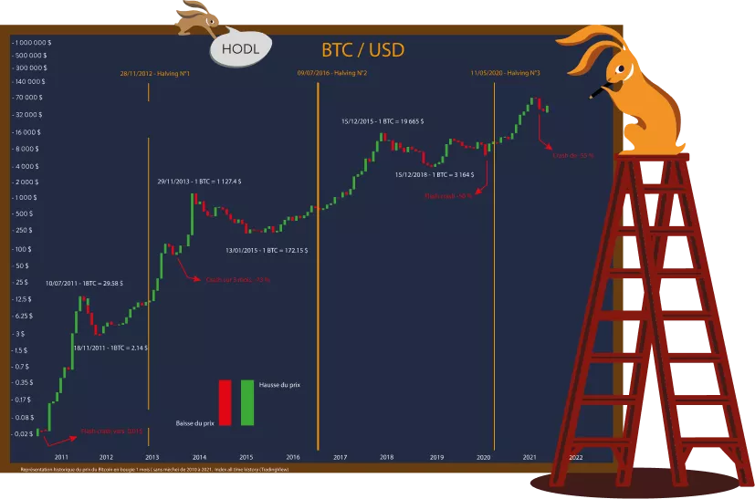

- I credenti:

I primi utenti di Bitcoin erano principalmente tecnologi, cypherpunks, libertari e sostenitori dell'oro. Questi gruppi sono stati attratti dal Bitcoin per la sua capacità di offrire soluzioni come denaro elettronico senza intermediari di fiducia, resistenza alla censura o politica monetaria trasparente e immutabile.

- Il dark web e i criminali

Successivamente, l'uso di Bitcoin si è esteso a siti di commercio sul dark web, come Silk Road, a causa della sua natura incontrollabile e pseudonima. Questo sito ha attirato l'attenzione sulla natura incontrollabile e pseudonima di Bitcoin, spingendo alcuni attori criminali a utilizzarlo. Tuttavia, è importante notare che l'uso che viene fatto di uno strumento, e non lo strumento stesso, determina la sua legalità o illegalità. Va notato che l'uso illegale di Bitcoin non rende una persona un criminale di per sé. È l'uso, e non lo strumento, che può essere classificato come illegale. Ad esempio, l'uso di Bitcoin per attività come l'acquisto di determinate droghe può essere legale o illegale a seconda della regolamentazione del territorio in cui si svolge l'attività.

- La febbre delle ICO e l'arrivo del grande pubblico

Il 2017 è stato segnato da una grande bolla speculativa nell'universo delle criptovalute, in particolare con il lancio di migliaia di ICO (Initial Coin Offering). Tuttavia, molte di queste nuove criptovalute non avevano né uno sviluppo concreto né un'utilità e sono quindi scomparse rapidamente. Questa bolla del 2017 è stata seguita da una forte correzione nel 2018-2019.

- La bolla dei NFT e la DeFi

Poi di nuovo nel 2020, il mercato ha attraversato un'altra bolla speculativa che ha portato il prezzo di Bitcoin a $60.000. Questa bolla si distingue dalle precedenti per una maggiore diversificazione degli investitori, comprese istituzioni finanziarie e grandi aziende. Ma ancora una volta, una volta passata l'euforia, si verificano forti correzioni.

### Bitcoin & la volatilità

Dati i cicli passati, sembra che la periodicità dei cicli economici di Bitcoin sia equivalente alla durata tra due halving. Forse perché l'evento dell'halving funge da detonatore riducendo della metà l'emissione di nuovi bitcoin.

### Bitcoin & la volatilità

Queste fluttuazioni molto importanti hanno creato una reputazione per Bitcoin come un asset estremamente pericoloso che fa perdere soldi a tutti i suoi utenti. Anche se il prezzo può diminuire del 10-20 o addirittura del 50% in pochi giorni, è importante capire che Bitcoin, il protocollo, non è influenzato dai cambiamenti di prezzo.

Questa volatilità significativa è completamente accettata oggi dagli attori di Bitcoin e può essere mitigata da diverse soluzioni come gli hedge finanziari (stablecoin), una forte convinzione a lungo termine (hodl) o semplicemente non mettendo il 100% dei propri soldi in Bitcoin senza capire nulla. Comprendere perché il prezzo di Bitcoin fluttua così tanto è quindi essenziale per poter progredire in questa industria perché alla fine è il prezzo e i cicli che temporizzano e regolano in qualche modo il nostro mercato. Tuttavia, possiamo notare che più Bitcoin cresce e matura, meno è significativa la volatilità.


Anche se la coppia btc/dollari fluttua nel breve termine, Bitcoin, grazie alla sua quantità limitata di 21 milioni di bitcoin e al suo processo di halving (divisione per 2 della creazione monetaria ogni 4 anni in media), segue un trend generale al rialzo in modo quasi meccanico. Ovviamente, come ogni asset finanziario, Bitcoin è soggetto a cicli economici che comprendono periodi di euforia, bolle speculative e correzioni. Questo fenomeno è abbastanza comune nelle tecnologie emergenti, dove il mercato non è sempre razionale o efficiente.

### Un mercato unico

Questi cicli di bolle speculative sono abbastanza unici nel loro genere, infatti è molto raro per lo stesso asset vedere così tante bolle che si susseguono ancora e ancora. Questo si spiega semplicemente perché Bitcoin non è una bolla destinata a scomparire, ma una valuta effettivamente utilizzata in tutto il mondo. Il protocollo Bitcoin è unico nel senso che funziona a livello globale, 24 ore su 24, 7 giorni su 7, rendendo la regolamentazione difficile per le autorità finanziarie.

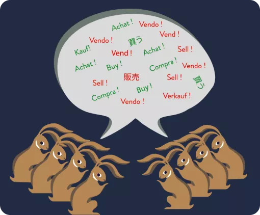

Oggi, nel 2023, Bitcoin continua a sopravvivere e a crescere sempre di più, implementandosi sempre di più nel mercato tradizionale. L'arrivo imminente degli ETF Bitcoin, una regolamentazione più chiara e migliori strumenti di acquisizione o conservazione non fanno che incoraggiare questa tendenza. Bitcoin è ANCORA sopravvissuto alla sua bolla speculativa, quindi forse non è solo fumo!


## Ottenere bitcoin lavorando

<chapterId>be2d83be-406f-582c-83ca-6aa905ff7b04</chapterId>

### Si sviluppa un'economia parallela

Il bitcoin può essere considerato un'economia parallela rispetto alle valute fiduciarie. Ciò significa che è possibile vendere beni o servizi e essere pagati in bitcoin. Le transazioni possono essere effettuate direttamente in bitcoin, senza la necessità di passare attraverso una piattaforma di scambio, semplicemente da portafoglio bitcoin a portafoglio bitcoin.

L'economia di bitcoin esiste e si sviluppa in alcune regioni del mondo, come ad esempio El Salvador, dove il bitcoin è una valuta legale dal 2021. Inoltre, alcune persone, aziende e organizzazioni accettano già il bitcoin come metodo di pagamento per i loro prodotti o servizi.


Inoltre, per facilitare l'uso di bitcoin nelle transazioni quotidiane, è stato lanciato un progetto open-source e collaborativo: BTCMap (https://btcmap.org/map#2/21.28937/5.46680). Questo progetto elenca tutti i commercianti che accettano bitcoin e le diverse comunità bitcoin in tutto il mondo. Puoi visitare il loro sito per scoprire l'ecosistema bitcoin intorno a te. Quindi, nonostante le difficoltà e le resistenze, esistono iniziative come BTCMap che contribuiscono a rendere l'economia di bitcoin più accessibile e pratica per tutti.

### Perché accettare bitcoin invece di acquistarli?

Per ottenere bitcoin, puoi acquistarli su piattaforme regolamentate da enti come l'AMF (Autorité des Marchés Financiers) in Francia. Questo metodo comporta alcuni rischi e la tracciabilità delle tue transazioni. Un altro metodo per ottenere bitcoin è accettarli come metodo di pagamento per i prodotti o servizi che offri. Questo metodo ti consente di ottenere bitcoin attraverso il tuo lavoro senza doverti preoccupare costantemente del prezzo di bitcoin.

Inoltre, accettare bitcoin come commerciante offre diversi vantaggi, tra cui l'assenza di censura, commissioni di transazione ridotte, maggiore efficienza, protezione dall'inflazione, nonché libertà e sovranità finanziaria.

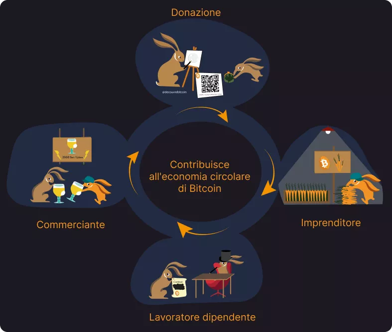

### Come fare:

Per accettare bitcoin, è necessario studiare le diverse soluzioni disponibili e scegliere quella più adatta alla tua azienda. Non esistono soluzioni perfette e diversi fattori devono essere presi in considerazione per fare la tua scelta, come ad esempio il volume di transazioni previsto, il budget assegnato, il tipo di attività commerciale (online o fisica).

Affronteremo questo argomento in dettaglio in un altro corso, ma per semplificare, possiamo considerare diverse categorie di attività commerciali e quindi soluzioni correlate:

- Soluzione online semplice: OpenNode
- Soluzione per commercianti amatoriali: Swiss Bitcoin Pay
- Soluzione per grandi strutture o appassionati di bitcoin: BTCpay Server
  Altre soluzioni intermedie o concorrenti a queste scelte esistono ovviamente, le scoprirete man mano che vi immergerete nel mondo di Bitcoin. Se necessario, la sezione tutorial per i commercianti può guidarvi!

## Risparmiare con Bitcoin

<chapterId>1d9570c6-5b63-51a6-b87c-7bdb0fc4aa87</chapterId>

### Avvertimento prima di iniziare!

Bitcoin è diventato un importante asset finanziario, principalmente a causa della sua offerta limitata e della crescente domanda. Tuttavia, l'acquisto di Bitcoin comporta rischi che richiedono particolare attenzione. È quindi consigliabile effettuare le proprie ricerche e approfondire l'argomento per familiarizzare con la tecnologia prima di investire.

- Investi solo ciò che puoi permetterti di perdere.
- Bitcoin è un asset finanziario molto volatile; il suo prezzo può scendere a 0.
- Le performance passate non sono indicative delle performance future.
- Contatta il tuo consulente finanziario se necessario.

> Plan ₿ Network non fornisce consulenza sugli investimenti e nulla di ciò che viene affermato qui deve essere considerato come tale.

### Mini check-list prima di fare il grande passo

Prima di avventurarti nell'acquisto di Bitcoin, assicurati di avere:

- Un portafoglio sicuro.
- Una solida comprensione di Bitcoin.
- Un piano di risparmio da seguire.
- Una visione a lungo termine.

Se l'argomento non è ancora chiaro, sappi che il corso BTC102 ti guiderà nella sicurezza e nell'acquisizione dei tuoi primi bitcoin. Qui, affronteremo solo superficialmente l'argomento.

Concretamente, ci sono due domande da porsi:

- Quale strategia di acquisto adottare: gradualmente o in una sola volta?
- Attraverso quale piattaforma passare: regolamentata o non regolamentata?

### Le strategie di acquisto

- Dollari Cost Average

L'acquisto ricorrente consiste nell'acquistare piccole quantità di Bitcoin a intervalli regolari. Questo metodo offre una mediazione del prezzo nel tempo e una crescita continua della quantità di Bitcoin posseduta. È una soluzione ideale per risparmiare a lungo termine senza preoccuparsi del prezzo e della volatilità di Bitcoin. Si imposta e si dimentica.


> Attenzione agli UTXO: Non dimenticare di consolidare i tuoi UTXO nel tuo portafoglio di tanto in tanto. Questa pratica è essenziale per gestire efficacemente i tuoi bitcoin ed evitare spese inutili durante le transazioni. Nel corso del tempo e del tuo percorso di studi imparerai le diverse implicazioni nel consolidare i tuoi UTXO.

- Acquisto spontaneo

L'acquisto spontaneo viene utilizzato per ottenere un'esposizione immediata a Bitcoin. Che si tratti di acquistare durante una caduta dei prezzi o di approfittare di un bonus, la decisione spetta a voi. Dovrete prendere coraggio e premere su acquista.
'Considerata la significativa volatilità di Bitcoin, è necessario prestare particolare attenzione alle proprie emozioni. Il FOMO (Fear of Missing Out, ovvero la paura di perdere un'opportunità) e il FUD (Fear, Uncertainty, Doubt, ovvero la paura, l'incertezza e il dubbio) sono i tuoi peggiori nemici in questo contesto! Rimanete calmi e seguite la strategia che avete stabilito in anticipo per evitare decisioni impulsive e potenzialmente dannose.

### A chi acquistare i nostri Bitcoin?

Esistono diversi modi per acquistare Bitcoin, ognuno con le proprie regolamentazioni. Alcune piattaforme richiedono un documento d'identità per la verifica, mentre altre no. È fondamentale comprendere le regolamentazioni associate ad ogni piattaforma.

- Le piattaforme di DCA

Un metodo comune per accumulare Bitcoin è il "Dollar Cost Averaging" (DCA), che consiste nell'investire regolarmente piccole somme. Diverse piattaforme offrono questo servizio, come quelle elencate nella nostra [pagina dedicata](https://planb.network/tutorials/exchange). Oltre alla semplicità di impostare un DCA, il prelievo verso il vostro portafoglio è generalmente automatico, il che significa che avrete sempre il controllo sul vostro agente.

Oggi quasi tutte le soluzioni di DCA sono relativamente efficienti e con commissioni quasi simili, la scelta si baserà maggiormente sulla disponibilità nel vostro paese.

- Piattaforme di broker

Per investimenti di grande entità, sono consigliate piattaforme regolamentate e riconosciute come Kraken, Bitstamp e Paymium. Queste piattaforme offrono un ambiente sicuro e protetto per transazioni di grandi volumi.

Il loro utilizzo è semplice e accessibile a tutti:

1. Creazione di un account KYC/\*
2. Trasferimento bancario sul vostro account
3. Acquisto di Bitcoin
4. Prelievo dei Bitcoin nel vostro portafoglio

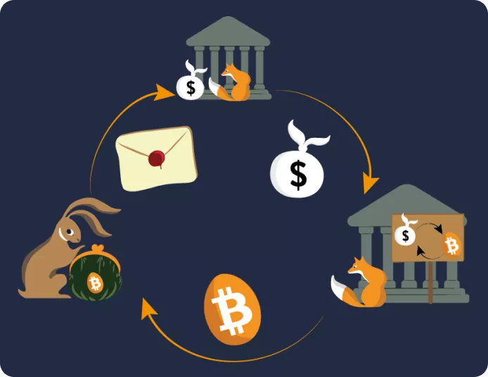

Dopo l'acquisto, è consigliabile ritirare immediatamente i Bitcoin dalle piattaforme di scambio per ridurre al minimo i rischi di hacking e blocco dei fondi. Le commissioni di prelievo possono essere elevate, talvolta fino a 25 euro a seconda della piattaforma.

> Le norme Know Your Customer (KYC) obbligano gli utenti a fornire un documento d'identità al fine di contrastare il finanziamento del terrorismo, l'evasione fiscale e il riciclaggio di denaro.

È importante notare che il KYC è un argomento importante nel nostro settore poiché la sua efficacia rimane facilmente dibattuta mentre i suoi aspetti negativi sono numerosi. In molti corsi e contenuti dell'università, sconsigliamo di utilizzare piattaforme full KYC se siete già utenti avanzati.

### Soluzione non-KYC'

Inoltre, ci sono diverse [piattaforme di mercato](https://planb.network/tutorials/exchange) per acquistare e vendere bitcoin peer-to-peer. Se sei interessato a queste, puoi seguire il nostro corso BTC 205 sull'argomento. In generale, queste soluzioni sono:

- ATM bitcoin
- Incontri fisici con altri appassionati di bitcoin
- Piattaforme peer-to-peer, che non richiedono documenti d'intentita
- Soluzioni per mettere in contatto privati
- Soluzioni di neo-banche operanti in nazioni amiche di Bitcoin.

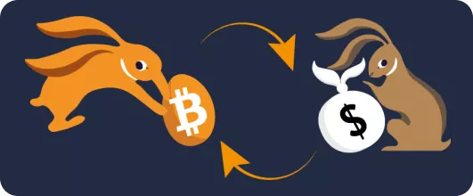

È anche importante notare che potrebbero essere applicate imposte nella tua giurisdizione. Ti invitiamo a consultare la normativa del tuo paese prima di intraprendere qualsiasi azione che potrebbe metterti in difficoltà.

## Hyper-bitcoinizzazione

<chapterId>b7275d31-3b60-5fb7-b9f5-030097010553</chapterId>

### La corsa pazza è appena iniziata!

Come ogni nuova tecnologia, l'adozione di Bitcoin segue una curva a S. Abbiamo superato l'era dei primi adottanti e gli indicatori sembrano convergere verso una completa democratizzazione di Bitcoin. È una tecnologia virale che non può essere fermata. El Salvador ha fatto la scommessa audace di adottare Bitcoin in modo totale, dichiarandolo una valuta a corso legale. Tuttavia, ogni paese reagisce in modo diverso a questa tecnologia. Alcuni l'hanno vietato e criminalizzato il suo utilizzo, aggiungendo complessità all'adozione di Bitcoin a seconda delle culture, delle epoche e delle nazioni.

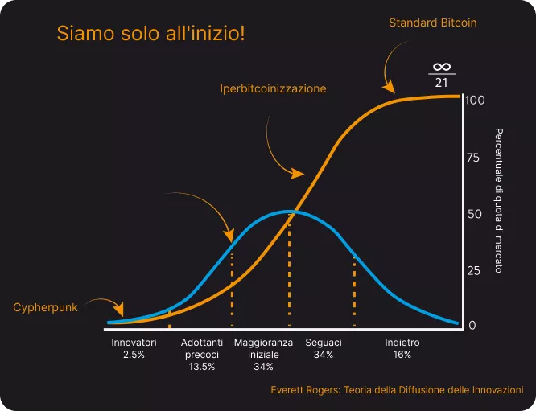

La crescita di Bitcoin obbliga le aziende, le università, i regolatori e i privati a prendere in considerazione questa nuova tecnologia. Nuovi strumenti devono essere creati, i servizi devono essere adattati e l'innovazione deve continuare per garantire la loro sopravvivenza. Questo contesto solleva molte domande che riguardano diversi settori, tra cui la crittografia, la teoria dei giochi, l'economia e la politica monetaria, l'informatica, la filosofia, l'energia, le leggi e la regolamentazione. Insomma, Bitcoin è un oggetto multidisciplinare.


### Bitcoin è un 0 a 1

Ti invitiamo a riflettere su questa nuova rivoluzione monetaria. Ci sono così tante cose da esplorare con Bitcoin che è difficile assimilare tutto in una volta. Prenditi il tuo tempo, Bitcoin non scomparirà. Al contrario, la rivoluzione è appena iniziata. Insieme, crediamo di essere in grado di creare il mondo che vogliamo lasciare ai nostri figli. Un mondo in cui la sovranità umana è un diritto, in cui la privacy è rispettata per impostazione predefinita e in cui la moneta non è manipolata. Speriamo di riuscirci insieme.

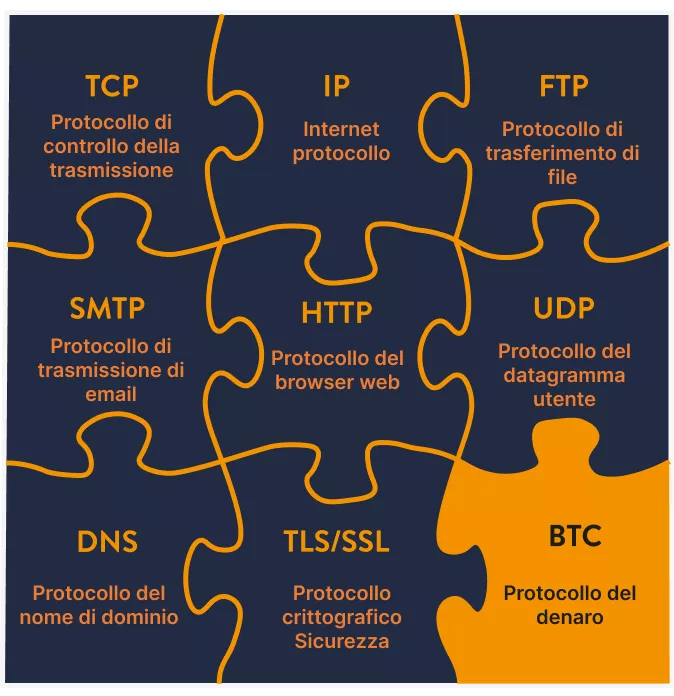

Se desideri approfondire le tuo conoscimento sul Bitcoin, un gran numero di autori, pensatori, saggisti hanno contribuito alla parte educativa di Bitcoin. Da alcuni anni, stiamo catalogando e classificando queste opere per offrire una [biblioteca di risorse](https://planb.network/resources) ai più curiosi tra voi. Troverai i migliori podcast, siti web, articoli, tutorial, libri e altri contenuti.

> Milton Friedman, un rinomato economista, aveva previsto nel 1999: "Penso che Internet sarà una delle principali forze per ridurre il ruolo del governo. L'unica cosa che manca, ma che presto verrà sviluppata, è una moneta elettronica affidabile - un metodo mediante il quale su Internet puoi trasferire fondi da A a B senza che A conosca B o B conosca A." Oggi, il Bitcoin risponde a questa previsione.

# Il futuro di Bitcoin: Lightning Network

<partId>899fd35e-39e6-5a25-a73e-6fed6e725094</partId>

## Breve introduzione a Lightning Network

<chapterId>b403f1e4-f1ff-572b-a242-9b58cb3736d0</chapterId>

Ora che abbiamo le basi del protocollo Bitcoin, introdurremo una rete di pagamento che utilizza il protocollo Bitcoin per consentire transazioni a velocità fulminea. Stiamo ovviamente parlando di Lightning Network!

### In poche parole

Lightning Network è una tecnologia rivoluzionaria che ha profondamente modificato la nostra percezione di Bitcoin. È una soluzione che risponde alla questione della scalabilità di Bitcoin.

Per comprendere bene Lightning Network, è fondamentale capire come evolve il Bitcoin. Il Bitcoin si sviluppa in strati infrastrutturali: il primo strato è la blockchain, e il secondo strato è Lightning Network.

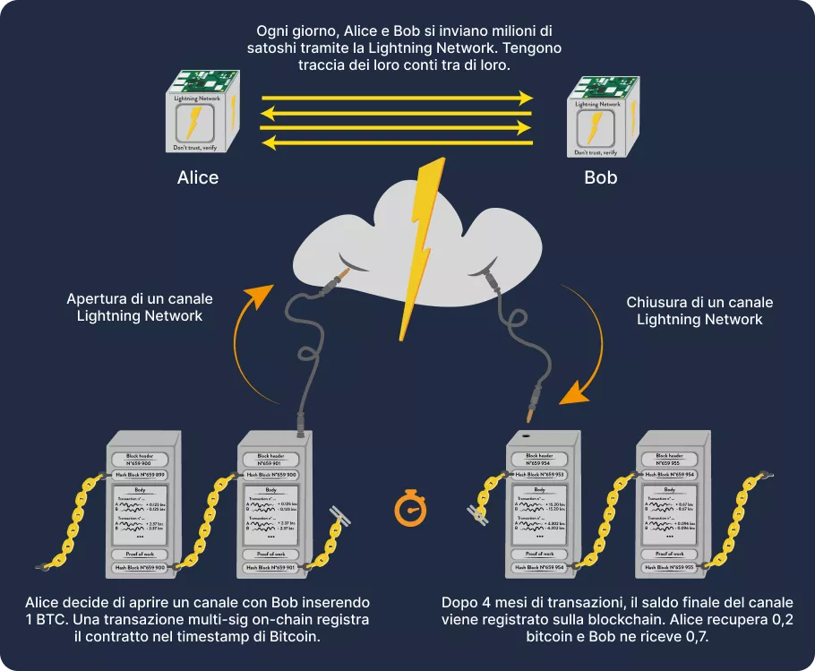

Riconosciuto come uno strato di Bitcoin, Lightning Network è stato convalidato e implementato nel 2017. Consente di effettuare transazioni istantanee in Bitcoin a basso costo, risolvendo così il problema della scalabilità di Bitcoin. Ma quale è questo problema di scalabilità che il Bitcoin incontra?

### Una blockchain non può crescere all'infinito

Il problema della scalabilità o della dimensione corrisponde alla sfida di creare un sistema monetario in grado di gestire un numero di transazioni al secondo sempre crescente man mano che viene adottato. Questo si riferisce al trilemma delle blockchain. Immagina un triangolo con i vertici: decentralizzazione, sicurezza e scalabilità.

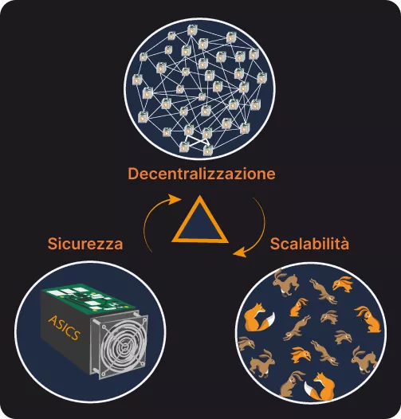

Un protocollo basato su una blockchain può soddisfare solo due di questi 3 aspetti. All'interno del protocollo di Bitcoin, sono state fatte scelte che favoriscono la decentralizzazione/sicurezza. Infatti, da un lato, la dimensione dei blocchi di 1MB e il tempo tra due blocchi (in media 10 minuti) consentono di far funzionare un nodo Bitcoin a basso costo, favorendo la decentralizzazione. D'altra parte, la produzione di blocchi tramite Proof-of-Work rende estremamente costosa la frode all'interno del protocollo, facilitando la verifica da parte dei nodi della rete e favorendo così la sicurezza. Tuttavia, queste scelte impongono un limite al numero medio di transazioni in un blocco, che corrisponde approssimativamente a poche transazioni al secondo. Questo numero è ridicolo se confrontato con la capacità dei processori di pagamento come VISA, che è di 1700/s. Tuttavia, è un limite necessario per poter effettuare transazioni in modo incensurabile e senza intermediari di fiducia con Bitcoin. Tuttavia, le persone che sviluppano su Bitcoin hanno riflettuto su questo problema fin dall'inizio.

### Lightning come livello superiore

Dopo anni di riflessioni e numerosi tentativi, il protocollo Lightning emerge. Utilizzando un certo numero di specifiche, questo protocollo consente di costruire una rete di pagamento peer-to-peer utilizzando la sicurezza e la programmabilità delle transazioni del protocollo Bitcoin. Lightning Network funge da rete di canali di pagamento, consentendo transazioni istantanee e a basso costo per il mittente. Questa rete di canali di pagamento rende possibile persino le transazioni tra individui che non hanno un canale direttamente connesso tra di loro.

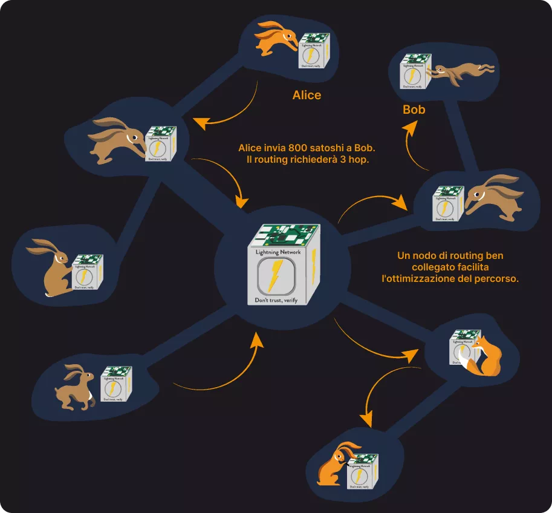

I servizi di trasferimento di denaro tradizionali, come Western Union, le banche centrali, Visa e Mastercard, potrebbero scomparire se non adottano la tecnologia Lightning Network. Lightning Network è più efficiente ed economico rispetto ai sistemi di pagamento attuali. Infatti, Lightning Network consente di effettuare un numero quasi illimitato di transazioni tra due parti che condividono un canale, senza alcun consumo energetico sulla blockchain di base diverso dalla transazione per annunciare la creazione del canale.

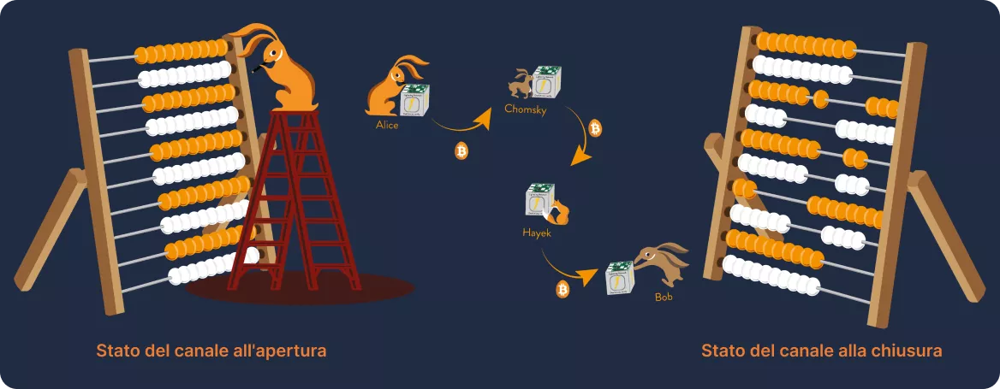

Le transazioni sono protette dalla crittografia e indirettamente dall'energia consumata dai minatori su Bitcoin. Le transazioni possono essere effettuate istantaneamente, senza limiti geografici, e le commissioni sono estremamente basse, spesso inferiori allo 0,5%.

In sintesi, Lightning Network è un tentativo promettente di implementare un sistema di pagamento efficiente per le transazioni in Bitcoin. Esistono già numerosi portafogli Lightning che puoi scoprire nella nostra sezione tutorial o tramite i nostri corsi su Lightning Network.

## Caso d'uso di Lightning Network

<chapterId>684e31f9-ebd1-51b6-91c0-1e6a315f1141</chapterId>

Come abbiamo appena visto, il protocollo Bitcoin, sebbene rivoluzionario, si trova ad affrontare importanti sfide in termini di scalabilità per poter gestire tutte le nostre transazioni quotidiane. Per risolvere questi problemi, nel 2016 è stata proposta una soluzione di seconda generazione chiamata Lightning Network, che oggi ha diverse implementazioni diverse ma tutte interoperabili:

- Core-lightning di Blockstream
- Eclair di Acinq
- LND di Lightning strike

Questo network peer-to-peer mira a facilitare in particolare le micro-transazioni, ovvero transazioni di valore molto basso, che altrimenti sarebbero impraticabili a causa delle alte commissioni e dei lunghi tempi di conferma sulla blockchain di Bitcoin.

### Quali sono i casi d'uso della rete?

Questa tecnologia apre la porta a una vasta gamma di potenziali applicazioni per Bitcoin, che in passato erano fuori dalla portata a causa delle restrizioni necessarie per garantire la sicurezza e la decentralizzazione di Bitcoin. Tra queste applicazioni nella vita di tutti i giorni, possiamo citare la fatturazione istantanea nel commercio (fisico e online), lo streaming di denaro per i pagamenti in tempo reale, le micro-donazioni per i contenuti. L'implementazione di una rete di transazioni quasi istantanee, sicura e a basso costo (in media inferiore allo 0,5%), consente di realizzare numerosi modelli commerciali prima impensabili. Questo è possibile perché Lightning Network utilizza i satoshi (la frazione di bitcoin) per funzionare.


L'industria dei videogiochi offre un esempio particolarmente interessante di come Lightning Network possa essere utilizzato per trasformare i modelli commerciali esistenti. Il concetto di "skin in the game" è un'idea che recentemente ha guadagnato popolarità in questo contesto. Si tratta essenzialmente di avere un interesse finanziario nel risultato di un gioco.
Lightning Network consente ai giocatori di scommettere piccole somme di denaro quando giocano, come una decina di satoshi (circa una frazione di centesimo di euro). Ciò consente di creare un interesse che stimola la competizione, aumentando notevolmente il costo di distribuzione dei bot.


In sintesi, il futuro delle micro-transazioni con Bitcoin sembra promettente grazie a innovazioni come Lightning Network. Mentre queste tecnologie continuano a svilupparsi e maturare, possiamo aspettarci di vedere nuove ed entusiasmanti applicazioni emergere in un prossimo futuro. Prendiamo ad esempio il concetto di "streaming di denaro", poiché Lightning Network ci consente di effettuare micro-transazioni ogni minuto (e potenzialmente senza intermediari di fiducia), ciò apre la strada alla sperimentazione di modelli economici in cui i consumatori pagano il contenuto in base a quanto consumano.

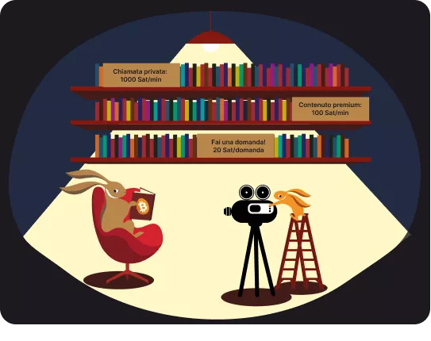

In un tale sistema, il denaro viene automaticamente diviso, in base a una percentuale predefinita, tra i diversi contributori ad un servizio o ad un prodotto. Questo potrebbe rivoluzionare il modo in cui concepiamo i modelli di pagamento. Ad esempio, invece di pagare un abbonamento mensile a un servizio, gli utenti potrebbero essere addebitati al minuto, o addirittura al secondo, per il tempo che trascorrono utilizzando il servizio. Un tale modello economico potrebbe avere profonde implicazioni per i creatori di contenuti, che sarebbero incentivati a produrre contenuti di qualità per attirare l'attenzione degli utenti. Gli utenti, a loro volta, pagherebbero solo per i contenuti che consumano, eliminando così le spese di abbonamento anticipate. È persino possibile utilizzare questo sistema per il noleggio di beni.


In conclusione, Lightning Network apre una moltitudine di entusiasmanti casi d'uso per gli utenti di Bitcoin. I modelli economici e le opportunità commerciali che ne derivano sono molteplici e variegate. Vi incoraggiamo a testare di persona l'applicazione di podcast [Fountain](https://www.fountain.fm/), che consente di essere remunerati con alcuni satoshi per ascoltare i vostri podcast preferiti!

## Pillola blu o pillola rossa?

<chapterId>c81cdb45-6aa9-5462-9835-c4852084b2cc</chapterId>

Come diceva Morpheus a Neo: "Prendi la pillola blu, la storia finisce qui, ti svegli nel tuo letto e puoi credere quello che vuoi. Prendi la pillola rossa, resti nel Paese delle Meraviglie e ti mostro fino a che punto arriva la tana del coniglio." Siete pronti ad esplorare la tana del coniglio di Bitcoin? Fate attenzione, potreste ritrovare la vostra libertà finanziaria!


### Il futuro tecnologico e le sue implicazioni

La tecnologia sta evolvendo in modo esponenziale e nessuno può prevedere con certezza le sue evoluzioni. La connettività del mondo e l'intelligenza artificiale continuano a svilupparsi. Le conoscenze che un individuo può acquisire grazie a Internet sono sempre più innumerevoli nel corso del tempo.

Prendiamo ad esempio l'IA, queste tecnologie hanno già superato o si avvicinano al livello umano in un numero sempre crescente di settori come i videogiochi, la produzione di immagini e testi e l'analisi dei dati. Una delle potenziali implicazioni è che più dell'80% dei posti di lavoro scompariranno a causa dell'IA e dell'automazione. Diverse opzioni si presentano a noi, come limitare l'evoluzione tecnologica o raccogliere l'aumento di capitale grazie al guadagno di produttività creato dalle IA.

Le domande indispensabili da porsi sono:

- Come gestire una società in cui l'80% dei posti di lavoro scomparirà?
- Come ridare slancio ad una popolazione?
- È necessario avere così tanti insegnanti?
- Le conseguenze geopolitiche, politiche e umane dell'automazione non vengono discusse a sufficienza.
  Informatica, Internet, streaming, realtà virtuale cambieranno l'istruzione. Potremmo avere un corso universale per tutti gli studenti francesi gestito dal governo e insegnanti che non tengono più le lezioni, ma che accompagnano direttamente gli studenti. I bambini potrebbero entrare in un mondo virtuale e essere accompagnati nell'apprendimento della storia.

- Dove si trova il confine tra un insegnante e un'intelligenza artificiale?
- Come garantire una società che vive nella prosperità?

Queste domande fondamentali per il nostro futuro devono essere dibattute e decise collettivamente. Ma qual è il legame con il Bitcoin? Come Internet per le modalità di comunicazione, il Bitcoin è una rivoluzione tecnologica per nuove modalità di organizzazione su larga scala, offrendoci la possibilità di scambiare valore senza alcun intermediario di fiducia. Vogliamo frenare l'evoluzione tecnologica del sistema monetario o raccogliere l'aumento di capitale grazie al guadagno di produttività moltiplicato dall'uso dei protocolli Bitcoin e Lightning?

### Quale futuro per la finanza?

Queste riflessioni sollevano anche domande su chi dovrebbe possedere, autorizzare e tracciare i soldi che utilizziamo. L'obiettivo è decidere tra un sistema chiuso con leader non eletti o un sistema aperto senza intermediari di fiducia, in cui regna la neutralità.

- La moneta è un titolo di proprietà privata?
- I conti correnti dei manifestanti possono essere bloccati senza un ordine della Corte suprema?
- Chi garantisce il sistema finanziario?
- Come può un individuo essere sovrano del proprio denaro e dipendere da un intermediario di fiducia?
- È possibile inviare denaro dall'altra parte del mondo senza spese né intermediari?

Accettare queste nuove tecnologie potrebbe generare enormi economie di scala in tutto il pianeta. Dovremmo permettere la libera circolazione dei flussi di capitali? I blocchi internazionali hanno conseguenze economiche e politiche. È etico utilizzare intermediari finanziari come Western Union che talvolta prendono fino al 25% di commissioni? Noi riteniamo che in un mondo sempre più digitale, il denaro dovrebbe essere democratizzato e considerato un bene comune appartenente al popolo anziché allo Stato o a istituzioni finanziarie opache.

La questione di chi dovrebbe controllare il sistema bancario è cruciale, poiché le regole del gioco bancario non sono trasparenti e comprensibili per tutti, il che consente a una casta di politici e regolatori di mantenere il loro controllo sul sistema. È importante chiedersi se il libero mercato o un gruppo di intellettuali dovrebbe controllare il sistema bancario.

### Le nostre libertà sono in gioco

La censura deve essere messa in discussione anche perché chi possiede la conoscenza per decidere cosa deve essere censurato o meno? I media hanno cambiato posizione su alcune informazioni e le persone che erano state censurate in passato non lo sono più oggi.

- Chi decide cosa è censura o propaganda?
- Chi ha il potere divino sul nostro sistema?

Tollerare la censura può distruggere la libertà di espressione e il diritto di riunione. L'implementazione della censura è tecnicamente difficile senza creare una distopia completa. Quale entità dovrebbe avere il potere di censura? La questione della censura è complicata ed è difficile sapere chi dovrebbe essere censurato o meno. La censura può avere un impatto negativo sull'innovazione e sulla libertà di impresa.

Ci sono 2,4 miliardi di persone nel mondo senza un conto bancario, il che crea necessariamente disuguaglianze geografiche. Bitcoin consente di essere uguali nelle transazioni, indipendentemente dal proprio status sociale o posizione politica. Il protocollo Bitcoin è apolitico e non concede privilegi specifici al presidente o ad altri attori. I leader dovrebbero avere gli stessi privilegi delle persone comuni per spingere lo sviluppo verso l'alto anziché lasciare alcuni in cima e altri in fondo. Tutti dovrebbero avere la stessa valuta, indipendentemente dal proprio status sociale? È importante pensare al mondo che vogliamo lasciare ai nostri figli. Speriamo di lasciare un mondo aperto in cui siano liberi di fare ciò che vogliono con la propria valuta.

Bitcoin è importante e non deve essere considerato solo un gioco d'azzardo. È cruciale continuare a porsi domande su Bitcoin.

### Bitcoin: un protocollo rivoluzionario

Come abbiamo visto nel capitolo precedente, il protocollo Bitcoin è neutrale nei confronti di tutti i suoi utenti. Grazie alle regole di consenso e alla crittografia, possiamo registrare le transazioni in modo immutabile in un registro pubblico globale, garantendo trasferimenti di valore monetario senza bisogno di terze parti fidate. I livelli infrastrutturali di secondo livello (e presto anche di terzo livello, con RGB) consentono di far evolvere la rete e sviluppare nuove funzionalità, in particolare per risolvere problemi di scalabilità.

Bitcoin ha tutte le caratteristiche necessarie per essere una valuta efficiente e sana: divisibile, trasportabile istantaneamente, non censurabile, con costi di verifica trascurabili e con una politica monetaria già stabilita per i secoli a venire con queste 21 milioni di unità. Bitcoin è pseudonimo e può essere scambiato ovunque nel mondo senza alcuna autorizzazione da parte di un'entità qualsiasi, è sufficiente possedere le proprie chiavi private - come dice il detto "Not your keys, not your bitcoins" ("non le tue chiavi, non i tuoi bitcoin").

Bitcoin è adottato da gruppi di persone diversi, dai crittografi ai libertari, dalle aziende tradizionali persino da un paese. Tuttavia, Bitcoin è per tutti e il numero di utenti sta crescendo, così come il numero di nodi Bitcoin che fungono da custodi della cronologia delle transazioni, garantendo così la sua decentralizzazione.

Bitcoin non può più essere fermato e non può più essere censurato. È una rivoluzione pacifica per cambiare il sistema monetario e consentire l'inclusione finanziaria. Gli utenti possono ottenere Bitcoin accettandoli per il loro commercio o acquistandoli tramite piattaforme regolamentate o non regolamentate. I Bitcoin possono essere conservati in portafogli, applicazioni mobili o dispositivi fisici. Nessun intermediario di fiducia in Bitcoin, Bitcoin promuove la trasparenza, la libertà e la responsabilità individuale - come dice il detto "Don't Trust, Verify" ("Non fidarti, verificalo").

Cambiare il sistema finanziario richiede di cambiare la valuta. Satoshi ha creato Bitcoin nel 2008 per offrire un tentativo in tal senso. Avere accesso a denaro facile e "magico" corrompe. Bitcoin è quindi un'alternativa per costruire un nuovo sistema monetario neutrale. Bitcoin consente l'emancipazione dal sistema bancario. È un fenomeno sociale che ci porta a partecipare a una rivoluzione pacifica. Sei pronto a unirti?

## Ringraziamenti e continua a scavare nella tana del coniglio

<chapterId>c153facd-fe77-5954-b18b-d0e2243e787a</chapterId>

### Vai oltre

Congratulazioni per aver completato questa formazione BTC 101! Spero sinceramente che ti sia piaciuta e abbia aperto delle porte. La tua scoperta di Bitcoin è solo all'inizio e ti invito a scoprire tutte le altre formazioni disponibili nell'università.

- [BTC 102](https://planb.network/courses/btc102) ti aiuterà a creare il tuo piano Bitcoin
- [LNP 201](https://planb.network/courses/lnp201) ti permetterà di scoprire Lightning Network, una rete di pagamenti di secondo livello
- [ECO 201](https://planb.network/courses/econ201) affronterà l'economia austriaca
- [SCU 101](https://planb.network/courses/secu101) ti permetterà di aggiornare la tua sicurezza digitale
- [MIN 201](https://planb.network/courses/min201) per saperne di più sul mining
- e molti altri...


## Valuta il corso

<chapterId>585729e2-b0ab-51b5-89ec-593e3ea22c57</chapterId>
<isCourseReview>true</isCourseReview>

## Esame Finale
<chapterId>8410e961-3841-5abf-a51d-04fc0139dd59</chapterId>
<isCourseExam>true</isCourseExam>

## Conclusione

<chapterId>dfc534be-44a9-5e8c-9c98-e51ef0554e91</chapterId>

**Congratulazioni per aver completato questo corso!**

Ti preghiamo di notare che questo capitolo è attualmente in costruzione e una versione migliorata arriverà presto. Nel frattempo, se sei desideroso di continuare il tuo viaggio nel Bitcoin, ti invitiamo a esplorare gli altri corsi e tutorial disponibili sulla nostra piattaforma. Continua così e buon apprendimento!
