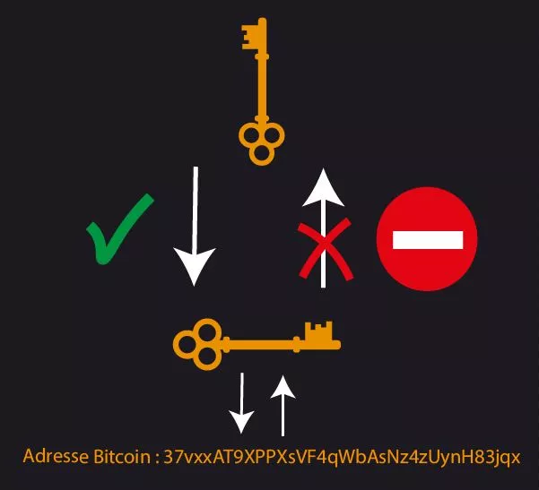

# はじめてのビットコインの冒険

このコースでは、25の章でビットコインを説明し、この技術を簡単かつ効果的に理解できるようにします。このコースは誰もがアクセス可能であり、マイナーやウォレット、売り/買いプラットフォームなど、界隈全体を探求することができます。

コースは約15時間の学びを予定しています。旅の途中で、補足資料や追加のリソースが利用可能です。

始めるために特別な知識は必要ありません。このコースは誰もがアクセス可能です！

+++

# はじめに
<partId>3cd2ac82-026c-53e1-874a-baf5842adc6d</partId>

## 未知への飛躍
<chapterId>27e3fb60-4b50-556b-9e70-c4f5475c121d</chapterId>


### 新しいお金とテクノロジーのパラダイムへようこそ。

ビットコインは、単なる「インターネット通貨」を超えた重要なイノベーションです。これは、テクノロジー（技術）とお金の革命であり、貨幣と社会との関係を問うことができます。ビットコインは、いわゆる**中立的**かつ**非中央集権的**なお金であり、いかなる組織や機関にも制御されていません。ビットコイン（BTCと呼ばれる）は、コンピュータ・プロトコル（Bitcoin）と通貨単位（bitcoin）の両方であることを理解しておくことが重要です。

このプロトコルは、暗号化、ネットワーク通信、そして有名な「ブロックチェーン」といった基盤技術を使用しています。一方、bitcoinという単位は、このプロトコルが適切に機能するために必要なお金です。日常生活では、エルサルバドルの人々や世界中のビットコイナーは、ビットコインを使用して商品やサービスを購入・販売しており、通貨はビットコインプロトコルに依存して機能しています。

### 総合的でありながらアクセスしやすいカリキュラム

このコースでは、ビットコインの貨幣的な側面について議論し、ビットコインを売り買いし、デジタル・ウォレットに安全に保管し、トランザクションに使用する方法について説明します。また、新しいビットコインをマイニングし、ビットコイン・ネットワークを保護するために不可欠なマイナーの役割についても探求します。さらに、ビットコインの将来と、ライトニング・ネットワーク技術によってビットコインのトランザクションを改善する方法についても探求します。


ビットコインは、お金との関係を革新する新しい仕組みだと理解することは重要です。ビットコインの使い方を学ぶことは、自らお金をコントロールしたい人にとって必須なスキルです。

**セクション1 - お金**

- 第1章 - お金とは何か？
- 第2章 - 法定通貨
- 第3章 - ハイパーインフレーション
- 第4章 - ビットコインの通貨政策

**セクション2 - ビットコイン・ウォレット**

- 第5章 - ビットコイン・ウォレットの仕組み
- 第6章 - セキュリティの選択
- 第7章 - ウォレットの設定
- 第8章 - 時間に対する保護

**セクション3 - ビットコインの技術的側面**

- 第9章 - トランザクションの説明
- 第10章 - ビットコイン・ノード
- 第11章 - マイナー
- 第12章 - ビットコインとエコロジー（環境）

**セクション4 - ビットコインでの貯蓄**

- 第13章 - ビットコイン価格
- 第14章 - ビットコインの購入方法
- 第15章 - ビットコインでの仕事
- 第16章 - ハイパービットコイナイゼーション

**セクション5 - ライトニング・ネットワーク**

- 第17章 - ライトニング・ネットワークの概要
- 第18章 - ライトニング・ネットワークのユースケース

社会におけるお金の定義と機能について議論する前に（第1章）、私たちはビットコインの起源から始めます。ビットコインは2009年にローンチされた比較的新しい技術であり、他とはまったく異なる技術です。そのため、一度にすべてを理解する必要はありません。実際、インターネットや運転について学ぶときと同様に、すべての技術的な詳細を知らずともビットコインは使う（受け取る、支払う、保管する）ことができます。


ここで重要なのは、この新しい技術を一般論で理解することです。このトレーニングが皆さんに喜んでいただけ、この新しいグローバルなお金のパラダイムを理解し、おそらく進歩し続けるために必要な基盤を提供できることを願っています。

## ビットコインの起源
<chapterId>9a94b627-5b69-5d81-9125-f1fa9b0aa6ad</chapterId>


「ビットコイン」という言葉がデジタル通貨と金融の変革を意味するようになる前に、その創造の基礎となる一連のアイデア、イノベーション、社会運動が存在しました。ビットコインの前身の基本要素の1つは、サイファーパンク運動です。

### サイファーパンク:デジタル世界の先見者


1980年代と1990年代の技術的進化の真っただ中で、プライバシーと自由の役割について深く疑問を抱く人々が現れました。これらの個人は後に「サイファーパンク」として知られるようになり、暗号化が政府や大企業からの干渉に対抗するためのツールとして機能すると確信していました。

ジュリアン・アサンジ、ウェイ・ダイ、ティム・メイ、デビッド・チャウムなどの象徴的な人物がサイファーパンクの哲学とビジョンを形作るのに貢献しました。これらの思想家たちは、世界中の参加者が技術をどのように使って個人の自由をより大きく保証するかについて議論する、影響力のあるメーリングリストでアイデアを共有しました。

### サイファーパンクの三大テキスト


デジタル活動主義と暗号化に深く根ざしたサイファーパンク運動は、その原則と未来のビジョンを表現するためにいくつかの基本的なテキストに依存していました。これらの著作の中でも特に注目されるのは次の3つです。

- 「サイファーパンク宣言」:
  エリック・ヒューズによって1993年に書かれた「サイファーパンク宣言」は、プライバシーが基本的な権利であると主張しています。ヒューズは、自由かつ機密性を持ってコミュニケーションする能力が自由な社会にとって不可欠であると主張しました。宣言は「私たちは機関、企業、または他の非人格的な存在にプライバシーを与えることを期待しません...私たちはそれを自分自身で守らなければなりません」と書かれています。

- 「暗号アナーキスト宣言」:
  ティモシー・C・メイによって1992年に書かれたこの宣言は、暗号化の使用によって政府が市民のプライバシーに干渉することができない暗号的なアナーキー時代をもたらす可能性を説明しています。メイは、情報、お金、メッセージが第三者による介入なしに、匿名でやり取りされる未来を思い描きました。

- 「サイバースペースの独立宣言」:
  サイファーパンクに限定されないものの、このテキストは運動の多くの参加者の感情を反映しています。ジョン・ペリー・バーロウによって1996年に書かれ、政府によるインターネット規制の増加に対する反応です。この宣言では、サイバースペースは物理的な領域とは異なる領域であり、同じ法律の対象になるべきではないと主張しています。それは「私たちには選ばれた政府はなく、統治されることはできない」と書かれています。

### ビットコインの前身

ビットコインが登場する前に、デジタル通貨を作成するためにいくつかの試みが行われていました。例えば、デビッド・チャウムは1980年代に彼のプロジェクト「DigiCash」で「匿名の電子マネー」という概念を紹介しました。残念ながら、様々な制約のため、DigiCashは実際には普及しませんでした。
もう一つの重要な先駆者は、ウェイ・ダイの「b-money」です。実装されることはありませんでしたが、評価者のコミュニティによって詐欺検出が行われる匿名のデジタル通貨のアイデアを提示しました。


このような豊かな環境の中で、謎に満ちたサトシ・ナカモトが2008年にビットコイン・ホワイトペーパーを公開しました。彼は、プルーフオブワークや暗号タイムスタンプなど、サイファーパンク運動からいくつかのアイデアを組み合わせて、分散化された検閲耐性のあるデジタル通貨を作り出しました。

ビットコインは単なるデジタル通貨以上であり、サイファーパンクの理想の達成を象徴していました。その技術を超えて、それは伝統的な金融システムに対する革命を象徴し、透明性、分散化、個人主権に基づく代替手段を提供しました。

### 結論

ビットコインの前身は、サイファーパンク運動とデジタル時代におけるより大きな自由を求める共同の探求に深く根ざしています。暗号化、分散化、誠実さの原則を組み合わせることによって、ビットコインは単なる通貨以上のものとなり、私たちの世界を形作り続ける哲学的・技術的な革命の産物となりました。

したがって、ビットコインは長期にわたるプロトコルであり、私たちにエネルギー、時間、お金との関係を問いかけるよう促しています。しかし、ビットコインは「本物の」お金なのでしょうか？お金とは何でしょうか？複数の形態で存在するのでしょうか？次の章でこれらの問いについて探求していきます。


# お金
<partId>e913df1a-4cbd-5380-ba67-ca2a0414f671</partId>

## 歴史を通じたお金
<chapterId>c838e64d-d59f-5703-8c74-ea5e8c4fdd31</chapterId>


お金の進化は、人類史の魅惑的な側面であり、絶えず進化する経済的ニーズに対応する文明の創意工夫を反映しています。


### 貝から銀行口座へ

もともと、お金は有形であり、穀物や家畜などの必需品に関連していました。しかし、これらには腐敗性などの大きな欠点があり、長期的な貯蓄媒体として使用することは困難でした。例えば、不作や凶作よって個人の富が一夜にして消えることがありました。
文明が進歩し、貿易が新たな地域に拡大するにつれて、普遍的な交換媒体の必要性が生じました。貝や宝石などの物品が試されましたが、完璧ではありませんでした。最終的には、希少性、耐久性、分割性のために金が標準となりました。それは、富と権力の象徴であり、今日まで続くものです。


### お金の役割とは？

お金は非常に洗練されたコミュニケーションツールです:

- 現在と未来の間のコミュニケーションを可能にします。私たちは自分の時間とエネルギーを、将来にわたって再利用できる資産に変えることができます。

- それは普遍的な共通言語でのコミュニケーションを可能にします。互いを知らず、同じ言語を話さないまま、二人の見知らぬ人々がものを交換し、取引し、価値に合意することができます。

お金の役割は人工的に再現することが困難です。人間や人間の集団はお金を作り出すことはできず、それは市場との自発的な合意（コンセンサス）から生まれる必要がある自然な社会現象です。価格は社会がリソースをどのように割り当てるかを選ぶのに役立つシグナル、情報です。

金は、以下の3つの機能に基づく4,000年にわたる貨幣ダーウィニズムの選択肢です:

- 価値貯蔵
- 交換流通
- 価値尺度


### お金の特徴

金は理想的には効率的なお金の基準を満たしています:その天然の希少性が価値を持たせ、化学的な特性により時間の経過による劣化を防ぎます。しかし、この形態のお金は分割や長距離輸送が容易にできません。グローバル化されたデジタルの世界では、金はそれについていけず、分割して簡単に交換できるようにする中心的な存在（鋳造コイン）が必要です。

これらの欠点により、金は価値の貯蔵手段となりましたが、共通のお金ではありません。これに対して、信用貨幣（法定通貨）は容易に使用できるものの、それを管理する主体（王、中央銀行、皇帝、独裁者）によって絶えず価値が低下しています。

効果的なお金の基準は複数あります。良いお金は以下のような特徴を持つ必要があります:


- **代替可能性**:価値を失うことなく交換可能であること
- **分割可能性**:異なる量の取引を容易にするために分割可能であること
- **交換流通性**:商品やサービスに簡単に換金できること

これらの基準を満たすために、お金は段階的に進化しています:

- 原石 -> 硬貨
- 紙幣 -> 銀行カード
- ブロックチェーン -> ライトニングネットワーク

現在、お金はまだ進化を続けており、さまざまな用途に対応するために形態を変えています。例えば、金は価値の貯蔵には優れていますが、現在のグローバル化された経済には適していません。同様に、ドルやユーロなどの法定通貨は非常に流動的で容易に輸送可能ですが、ほとんどがデジタル化されているため、その価値はインフレーションにより絶えず低下しています。

一方、ビットコインは新たな可能性を提供しています。その厳格に制限された供給量などの特性により、優れた価値の保存手段を提供します。さらに、中立的なインターネット上のお金として、国境を越える交換・流通手段としての役割を果たします。しかし、現在の商取引ではまだ広く受け入れられていません。[常に採用が進んでいる](https://btcmap.org/map)にもかかわらずです。

## 法定通貨
<chapterId>25151d46-7db1-5b48-8bba-cbde1944555a</chapterId>


ジョージ・サンタヤナは「歴史から学ばない者は同じ過ちを繰り返す運命にある」と言いました。これは特に現在の通貨システムに関して共感する真実です。

### 法定通貨 = 信用

現在、ユーロやドルなどの主要な法定通貨は信用貨幣と見なされています。これは、それらに固有の価値がないことを意味します。その価値は、それらを規制する機関への信頼と信用に完全に依存しているからです。

「信用貨幣とは、国家（例えば、元を持つ中国などの国家）や政治経済連合（例えば、ユーロを持つ欧州連合など）などの機関によって法定通貨として指定された形態のお金です。法定通貨の発行を担当するのは中央銀行です（例えば、中国人民銀行、アメリカ連邦準備制度理事会、またはギニア共和国中央銀行などが挙げられます）。これらの機関が金融政策を決定し、したがってどれだけの通貨を流通させるか、または印刷するかを決定します。


### お金の価値低下:ローマ帝国以来の戦略
古代から金は貨幣の基準として使われてきました。しかし、その硬直性から、ローマ皇帝や現代の政府などの指導者たちは、しばしば代替貨幣（多くの場合、法定通貨）を採用してきました。このメカニズムはシンプルで、文明の起源から存在してきた習慣にインスピレーションを得ています。富に対する統制を行使することを望む指導者たちは、まず金を集中させることから始めます。彼らはしばしば自らの権力を利用し、保護と安全を約束しながら金を集めます。この貴重な準備金を手に入れた彼らは、金と同等の価値を持つ新しい通貨を採用し、自らの肖像が刻まれたものを鋳造します。通貨は徐々に流通し、人々はその利便性にすぐに慣れていきます。

これらの指導者たちはこの新しい通貨の価値を徐々に減少させ、初期の金に対してその価値を毎年数パーセントずつ目減りさせていきます。この静かな価値の低下は、しばしば人々の利益のためだとして正当化されます。したがって、この通貨を貯蓄している人々は、その価値が下がるのを目の当たりする一方で、国家はインフレーションを通じて自らのプロジェクトを資金化します。さらに、通貨価値の低下により、政府債務の返済が容易になります。


その後は重大な局面で、この通貨が金で裏付けされなくなったと発表します。この通貨に慣れ親しんだ一般市民は、しばしば金融に関する誤った情報を受けているため、この現実を受け入れます。その後、国家は通貨の供給を自由に操作することができ、ほとんどコストをかけずに莫大な通貨を刷るすることができます。

この戦略は、うまく実行されれば数十年にわたることがあります。しかし、急速な価値の低下や信頼の喪失は、ハイパーインフレーションにつながる可能性があります（次の章を参照）。歴史的に見れば、ドルが100年間でその価値の98%を失い、ユーロが20年間で30%、英ポンドが発行以来99%の価値を失ったことを示しています。

最終的には、通貨は金との関連性を失い、帝国末期のローマ硬貨のようになるか、あるいは目に見える現実から切り離された単なる数値的な無価値な存在になるかもしれません。

今日、私たちは歴史的な転換点を目の当たりにしています。長らく優勢だったドルは衰退しつつあり、金も中心的な地位を失っています。私たちは新しい通貨サイクルの岐路に立っており、歴史からの教訓がしばしば忘れられることを想起させられます。


### ビットコインは解決策か？

このような状況下で、ビットコイン革命が勢いを増しています。このお金は、**信頼できる第三者を必要としない**という特徴を持ち、国家とお金の分離を目指しています。

お金を刷ることはインフレーションを引き起こし、人々を徐々に貧しくさせます。一方で、金融機関や富裕層はこの慣行から利益を得て、不平等なギャップを生み出し、権威主義を促進しています。現在の金融システムは、その崩壊を避けるために規制され制約されており、何らかの混乱が大規模な経済危機を引き起こす可能性があります。政治的な主体はこの仕組みから利益を得ているため、根本的な変化を行うインセンティブを持っておらず、今の状況は可能な限りそのまま進行し続けることになるでしょう。


これらの制度的な課題に対して、ビットコインは分散型ソリューションとして機能します。歴史的に、金は偽造に強いことからお金として好まれてきました。同様に、ビットコインは分散化された暗号化の性質により偽造することができず、2,100万枚に制限されています。ビットコインは透明性と中立性に依存するお金であり、現在の中央集権的な通貨制度に対する魅力的な代替手段を提供しています。

同時に、中央銀行デジタル通貨（CBDC）の出現は避けられないようです。この新しい通貨形態は、より中央集権的な計画経済を提供し、個人の経済的自由を妨げ、権威主義的な乱用を助長する可能性があります。この章の最後に、1984年のノーベル賞受賞者F.A.ハイエクの言葉を引用して終えましょう:「政府の手から解放されるまで、良いお金が見つかるとは思えません。しかし、私たちは彼らからそれを暴力的に奪うことはできません。私たちにできることは、巧妙な策略によって彼らが阻止できないものを採用することだけです」

## ハイパーインフレーション
<chapterId>b04c024c-54f3-50cb-997f-58721cfc74be</chapterId>


ハイパーインフレーションは、法定通貨に特有の通貨現象です。これは、通貨への信頼の完全な喪失と、政府による紙幣の印刷を通じた急激なインフレーションを特徴としています。その結果、個人が蓄積した貯蓄は比較的短期間で消失し、国を経済的、社会的、政治的崩壊の瀬戸際に追いやることになります。

### 暴走するインフレーション！

異なるインフレ率を考慮して、インフレーションが貯蓄に与える影響を理解しましょう。

- 2％のインフレーションでは、年間で購買力の2％が失われ、5年間で10％に相当します。
- 7％では、10年でその半分を失います。
- 20％では、3年でほぼ半分を失います。

ハイパーインフレーションでは、年間20％ではなく、月間20％、ピーク時には1日あたり20％となります。3日間で1日あたり100％のインフレーションは、現実的なシナリオであり、私たちの世界で今まさに起こっています。

ハイパーインフレーションが魔法や偶然、資本主義や政治的な対立によって起こるわけではないことを理解することは重要です。ハイパーインフレーションは、中央銀行や政治家によって行われた誤った通貨政策の直接的な結果です。その影響はすべての国民に影響を与え、世代を超えて影響を与えます。この表を5分間勉強して、この現象の実際の影響を完全に理解してください（ECON204コースではこのテーマに詳しく触れます）。


### ハイパーインフレーションはどのように発生するのか？


フェーズ1 - 信頼の喪失

- 通貨の中央集権化は、通貨の創造とその乱用を助長します。通貨への信頼の喪失は、戦争、社会的措置、小麦やガソリンなどの主要な資源の価格上昇など、外部要因によって引き起こされることが一般的です。

フェーズ2 - 通貨の崩壊と価格上昇

- 政府が信頼を失うと、個人はより安定した他の通貨（例:ベネズエラでは米ドル）との交換を始めます。これにより価格が上昇し、物品やサービスがますます高価になる悪循環が生まれます。これらのニーズに応えるため、国家は通貨政策を修正するためにより多くの通貨を印刷し、指数関数的なインフレーションが生じます。

フェーズ3 - 紙幣の印刷による悪循環

- 商品を買うためにますます多くの紙幣が必要とされ、紙幣の不足が生じます。これによりさらに多くの紙幣が印刷され、さらなるインフレーションが生じます。


フェーズ4 - 新しい通貨の出現

- その後、古い通貨を置き換えるために新しい通貨が採用されます。 ハイパーインフレーションの注目すべき例は、1920年から1924年のドイツです。経済を復活させるために、ドイツ、フランス、イギリスの債務に裏付けられ、ドイツの土地によって保証された新しい通貨が作成されました。

ハイパーインフレーションの危機を解決するためには、革命、政府の改革、中央銀行の変更など、根本的な変化が必要です。信頼の喪失、通貨の崩壊、再建は、法定通貨に基づく新しい経済を再生させるために不可欠な段階です。

### 3つの注目すべき例

- ドイツ、1922年から1923年

  ハイパーインフレーションの最も顕著な例の1つは、第一次世界大戦後のドイツ・ヴァイマル共和国で発生しました。
  ドイツは戦争のために莫大な金額を借り入れており、ドイツは戦争に勝たなかっただけでなく、数十億ドルの賠償金を支払わなければなりませんでした。最も高いインフレ率を記録したのは1923年10月で、最大で29,500％、1日あたり20.9％のインフレ率でした。物価は3.7日ごとに倍増したのです！
  レストランでは、ウェイターが30分ごとにメニューの価格を発表しなければならなかったと言われています。ドイツの通貨はあまりにも役に立たなくなり、いくつかの市民は実際には木よりも紙幣を燃やす方が安くなるため、紙幣を燃やすことを好むようになりました。


- ハンガリー、1945年から1946年

  これまでに最も悪いハイパーインフレーションの時期を経験した国は、第二次世界大戦後のハンガリーです。
  ハンガリーは敗戦国であり、戦争によって工業生産力の大半が破壊されました。最もインフレ率が高かった月は1946年7月で、1日あたり207％に相当する41,900,000,000,000,000％の物価上昇率を記録しました。物価は15時間ごとに2倍になったのです！
  最後に流通した紙幣は、1946年の1億ペンゴ（100,000,000,000,000,000,000）紙幣でした。

    

- ジンバブエ、2007年から2008年
  2000年まで、ジンバブエは石油を除けばほとんどが自給自足でした。
  1997年、ジンバブエ・ドルは政府が戦争退役軍人に対して4億5000万ドル相当の補償をすることに同意したことで72％以上も暴落しました。政府はそのような金額を持っていなかったため、印刷機を稼働させる必要があったのです。2005年にはインフレ率が586％に達し、2007年3月には月間インフレ率が50％に達しました。
  2007年6月、政府は価格統制を実施して対応しました。店舗は文字通り「略奪」されました。商人たちはもはや店舗を補填する手段を持っていません。
  2009年4月、財務大臣はジンバブエドルの使用を停止し、異なる外貨の使用を認めました。すべての銀行口座、年金、金融機関は一夜にして残高が消失しました。


結論として、ハイパーインフレは通貨価値を急速に低下させ、貯蓄の目減りや通貨制度への信頼の喪失を招きます。かつてヴォルテールが示唆したように、法定通貨はいずれ必ず本来の価値を失い、ゼロに向かって収束していきます。
金融機関のような信頼できる第三者に依存する通貨は、購買力を保証することも貯蓄を維持することもできないため、事実上も長期的にも欠陥通貨なのです。

## 2,100万ビットコイン
<chapterId>f4a06d76-1963-56fd-93ff-dfa41489bcde</chapterId>


### ビットコインの通貨政策

ビットコインは非中央集権型デジタル貨幣で、あらかじめ最大枚数が**2,100万枚**と定められています。この希少性の本質的な特徴は、そのコンピューター・コードによって決定され、プロトコルに参加するすべてのユーザーのコンセンサスによって強化されています。


通貨発行量については、時間の経過にともなって生成されるビットコインの発行枚数をS字カーブで表すことができるます。例えば、2022年には約1,850万ビットコインが流通していました。予測によると、2025年には約1,950万ビットコインとなり、総発行枚数の約93％を占め、2037年には2,040万に達すると予想されています。

### 新しいビットコインの生成方法

新しいビットコインの生成は、ビットコイン・ネットワーク上のトランザクションを検証する手続きであるマイニング（採掘）・プロセスの結果です。


このタスクを実行するマイナーは、10分ごとに新しく生成されるビットコインを報酬として受け取ります。この報酬は、およそ4年ごとに半減するようにプログラムされており、これが「半減期」と呼ばれるイベントです。この半減期のメカニズムにより、ビットコインの生成は計算上では2140年に終了し、ビットコインの総発行枚数が2,100万枚に達すると予測されています。

| 半減期番号 | ブロックの高さ | 半減期後のBTC報酬 | 半減期後の推定BTC流通量 |
| -------------- | ------------ | -------------------------- | ------------------------------------------ |
| 1              | 210,000      | 25 BTC                     | 10,500,000 BTC                             |
| 2              | 420,000      | 12.5 BTC                   | 15,750,000 BTC                             |
| 3              | 630,000      | 6.25 BTC                   | 18,375,000 BTC                             |
| 4              | 840,000      | 3.125 BTC                  | 19,687,500 BTC                             |
| 5              | 1,050,000    | 1.5625 BTC                 | 20,343,750 BTC                             |
| 6              | 1,260,000    | 0.78125 BTC                | 20,671,875 BTC                             |
| 7              | 1,470,000    | 0.390625 BTC               | 20,835,937.5 BTC                           |
| 8              | 1,680,000    | 0.1953125 BTC              | 20,917,968.75 BTC                          |
| 9              | 1,890,000    | 0.09765625 BTC             | 20,958,984.375 BTC                         |
| 10             | 2,100,000    | 0.048828125 BTC            | 20,979,492.188 BTC                         |
| 11             | 2,310,000    | 0.0244140625 BTC           | 20,989,746.094 BTC                         |
| 12             | 2,520,000    | 0.01220703125 BTC          | 20,994,873.047 BTC                         |
| 13             | 2,730,000    | 0.006103515625 BTC         | 20,997,436.523 BTC                         || 14             | 2,940,000    | 0.0030517578125 BTC        | 20,998,718.262 BTC                         |
| 15             | 3,150,000    | 0.00152587890625 BTC       | 20,999,359.131 BTC                         |
| 16             | 3,360,000    | 0.000762939453125 BTC      | 20,999,679.566 BTC                         |
| 17             | 3,570,000    | 0.0003814697265625 BTC     | 20,999,839.783 BTC                         |
| 18             | 3,780,000    | 0.00019073486328125 BTC    | 20,999,919.892 BTC                         |
| 19             | 3,990,000    | 0.000095367431640625 BTC   | 20,999,959.946 BTC                         |
| 20             | 4,200,000    | 0.0000476837158203125 BTC  | 20,999,979.973 BTC                         |

マイニングについては、マイニングの章で詳しく説明します。

### デジタルの希少性を保証する

ビットコインの希少性は、2つの主要なメカニズムによって保証されています:マイニングの難易度調整とゲーム理論です:

- マイニングの難易度調整は、平均して10分ごとに新しいブロックがブロックチェーンに追加されるように、2016ブロックごと、つまり約2週間ごとに行われるメカニズムです。ブロックの生成頻度とビットコインの総枚数は、ビットコイン・プロトコルの固定された側面であり、伝統的な通貨システムで行われる恣意的な決定とは異なり、総数によるコンセンサスなしに変更することはできません。


> 知っていましたか？マイナーは、自分のブロックに含まれるトランザクションに関連する新しいビットコインと手数料を獲得するためにブロックをマイニングすることが報酬となるのです。発行されるビットコインの枚数が2,100万枚の制限に近づくにつれて、マイナーはブロック報酬よりもトランザクション手数料によって報酬を得るようになります。

- ゲーム理論は、人間の合理性に依存する数学的な概念です。ここビットコインでは、プロトコルの変更についてユーザー投票が行われます。はい、いま読んだ通りです:ビットコイン・プロトコルの変更には、ユーザー全体のコンセンサスが必要です。これは非常に複雑なプロセスです。つまり、誰かが2,200万ビットコインを作ろうと思えば、全ユーザーに自分の貯蓄を自発的に切り下げるよう説得しなければなりませんが、ビットコインはグローバルであり、中央集権的な機関によって管理されているわけではありませんから、それは起こりそうにありません。


通貨の価値を減価させるアイデアは、ビットコインの基本的な哲学に反するため、この制限を変更することは非常に不可能です。

### 常に公開され、誰でも検証可能な監査可能な通貨政策！

ビットコインの希少性は大きな資産であり、流通しているビットコインの最大発行枚数である2,100万ビットコインは、誰にでも公開され、検証することができます。

実際、誰でもビットコイン・ノード上で簡単なコマンドを入力することで、流通しているビットコインの枚数を検証することができます:`bitcoin-cli gettxoutsetinfo`。この透明性と検証可能性は、ビットコイン・システムへの信頼を強化し、中央集権的な機関や個人に基づくのではなく、そのプロトコルに固有の数学的および暗号学的な保証に基づいています。（LN201で簡単にこれを行う方法を学びます）

```json
{
  "height": 710560,
"bestblock": "0000000000000000000887384d67103412ea7f18a43953e65c8c4ac36bf42e54",  "transactions": 473244,
  "txouts": 1018917,
  "bogosize": 2183872374,
  "hash_serialized_2": "eebb9987337700ffaacbbaa11223344",
  "disk_size": 178239584,
  "total_amount": 18745998.12345678
}
```

ビットコインは、その設計により枚数を制限し、ユーザーの貯蓄を保護することで、他の通貨とは異なる、健全な貨幣管理を保証しています。オーストリア学派の経済学の原則（ECON201の詳細参照）に沿っており、制御された枚数と予測可能な分配により、伝統的な通貨のインフレーションに伴う固有のリスクから保護されています。

要約すると、ビットコインは、その分散化された性質、プログラムされた希少性、透明性により、伝統的な通貨システムに対する独自の代替手段を提供しています。それは、技術を使用して、有用で検証可能なお金を生み出すだけでなく、発行枚数を厳密に制限することにより、ユーザーの貯蓄の価値を保護することができます。

### セクション1の結論！

'

# ビットコイン・ウォレット
<partId>28860585-4f61-59d9-b242-f4c57d837cc1</partId>

## ビットコイン・ウォレットとは何か？
<chapterId>1c0166ab-cb7a-5bc6-9175-d13482bd91f1</chapterId>

このセクション2では、ウォレット内のビットコインの保存とセキュリティについて探求します。これにより、ビットコインがどこにあるのか、そしてそれらをどのようにやり取りするかについて、より理解することができます！


### ビットコイン・ウォレットの謎を解く

この界隈では、ビットコイン・ネットワークとのやり取りにウォレットを使用し、次の3つの機能を持っています:

- ビットコインの受け取り（受金）を許可する
- ビットコインの送信（送金）を許可する
- ハッキングや盗難からビットコインを保護する

ウォレットは、コンピュータ上のソフトウェア、スマートフォン上のアプリ、USBのような物理デバイス、または紙の一部である場合がほとんどです。これらの異なるタイプのビットコイン・ウォレットは、それぞれ異なるユースケースに使用されます。一部はセキュリティに重点を置いた大きな金額のトランザクションに使用され、またはプライバシーのために使用され、あるいは日常的な小額の支払いに使用されます。

したがって、ポートフォリオは使用目的に応じて大きなカテゴリに分けられますが、常に中心的な問題があります:資金の所有者はあなたですか、それともお金の管理を第三者に委ねますか？このトピックについては、次の章で詳しく説明しますが、アイデアは単純です:お金はあなたのポケットにあるか、銀行のような第三者のポケットにあるかです！


### ビットコイン・ウォレットの仕組み

ビットコインを「銀行」のような第三者に預けるか、自分で所有するかにかかわらず、一般的に、ほとんどのビットコインウォレットは同様の技術、すなわち非対称暗号と鍵ペアのシステムを使用して動作します。つまり、支払うための秘密鍵と受け取るための公開鍵のシステムである。

- 秘密鍵
  ウォレットを初期化する際に、秘密のリカバリーフレーズ（秘密鍵）が生成され、24の単語の形式で提供されます。

  秘密鍵は非常に重要です。なぜなら、それがビットコインの所有権を表し、それを使用または送信する権利を持つからです。秘密鍵の所有者がビットコインの所有者です。

  この鍵は秘密裏に、しっかりと保管される必要があります。なぜなら、あなたの財産にアクセスする鍵だからです！

- 公開鍵とアドレス
  公開鍵は秘密鍵と関連付けられるため、秘密鍵と一緒に生成されます。公開鍵はビットコイン・アドレスを生成し、お金を受け取るために使用されます。公開鍵を共有することはプライバシーのリスクを伴いますが、セキュリティ上のリスクはありません。

　これらのアドレスは、ウォレットによって作成され、安全に共有することができます。プライバシーを最大限に保護するために、これらのアドレスは一度だけ使用することが推奨されます。

したがって、この技術のおかげで、送金者が資金を盗むことなく、受金者が簡単にビットコインを受け取ることができることを理解しておきましょう！それをメールボックスのようなものだと考えてください:誰かがそこにお金を預けることはできますが、開けることができるのはあなただけです。



### ウォレットにはビットコインがあるだろうか？

鍵はウォレットに保存されていますが、ビットコイン自体は実際にはビットコインのピアツーピアネットワーク内の公開分散台帳であるビットコイン・ブロックチェーンに「保存」されています（これについてはセクション3で詳しく説明します）。そのため、ウォレットを保存しているデバイスを失ってもビットコインが失われるわけではありません。ウォレットを再作成し、ビットコインを使用するために必要なのは秘密鍵です。したがって、適切に保護することが非常に重要です。


幸いなことに、2017年以降、この秘密鍵は12または24の単語からなるシンプルなリストでエンコードすることができます。これをニーモニック・フレーズと呼びます。このフレーズは、ビットコイン・ウォレットのバックアップであり、ビットコイン・ウォレット・ソフトウェア/アプリを使用してウォレットを再作成するためのものです。したがって、この単語リストにアクセスできる人は、あなたのビットコインにアクセスできてしまうのです。

### ハッカーについては？

誰かが偶然にも私たちの12または24の単語のリストを推測した場合、どうなるのでしょうか？簡単に言えば、ウォレットを作成するために使用される暗号技術のおかげで、それは非常に起こりにくいです。具体的に言うと、ウォレットへのアクセスを偶然に見つけることは、1から$2^256$までの「正しい」数を見つけることにほぼ等しいのです。これは宇宙の中で「正しい」原子を見つけることとほぼ同じことを意味します。ただし、このデフォルトのセキュリティに満足しない場合は、ビットコイン・ウォレットにパスフレーズを追加することで常にセキュリティを強化することができます。


したがって、良いセキュリティの実践に従えば、ビットコイン・ウォレットをハッキングされる確率は非常に低くなります。次のセクションで詳しい実践方法を説明します。

ニーズと使用方法に合ったウォレットを選択してください。さまざまなウォレットの使用とセキュリティに関する詳しいチュートリアルは、[私たちのチュートリアル・セクション（英語）](https://planb.network/tutorials/wallet)で利用できます。

## セキュリティとビットコイン・ウォレット
<chapterId>00c1afea-e54a-511f-bab3-2efc2fbfa6a1</chapterId>


### 開始前に正しい質問をする

ビットコインを所有している場合、資金のセキュリティは重要な問題です。自分の状況に適したセキュリティを定義する最良の方法は、一連の質問をする（そして答える）ことです。あなたのセキュリティ・モデルはあなたの回答次第です。さあ始めましょう:

- 誰が私の資金にアクセスできるのですか？つまり、あなた以外にビットコインにアクセスできる会社などの第三者がいますか？
- 2つ目の質問は、ビットコインをどのように使用する予定ですか？それは定期的に使用する金額ですか？中期的な貯金ですか？長期的な貯金ですか？
- 技術的なスキルはどの程度ありますか？
- セキュリティの予算はどのくらいですか？

唯一無二の解決策など存在しないことを肝に銘じてください。したがって、これらの質問に答えるために時間をかけることは、セキュリティ対策を調整するのに役立ちます。


### 複雑さの観点からビットコイン・ウォレットを考える

ビットコインのセキュリティにはいくつかのレベルがあります。

- **レベル0**:ビットコインの唯一の保有者ではない、いわゆるカストディ・サービスを使用します。この信頼できる第三者はいつでもあなたの資金へのアクセスを制限することができます。そして、銀行口座を通じた従来の銀行システムと同じレベルの金融主権しか持ち合わせていないことに注意しましょう。


- **レベル1**:スマートフォンやコンピュータ上のビットコイン・ウォレットを使用し、ビットコインの唯一の保有者となります。それは簡単にトランザクションを行うことができます。ただし、スマートフォンやコンピュータの紛失の場合に備えて、資金へのアクセスを復元するためにニーモニック・フレーズをバックアップすることが重要です。これはインターネットに接続されたデバイスに秘密鍵が保存されているため、「ホット・ウォレット」と呼ばれることが多いです。

- **レベル2**:物理的なウォレットを使用し、12または24の単語のリストを保護します。トランザクションを行うためには常にデバイスで署名する必要があります。これにより、日常的に資金にアクセスすることが難しくなります。これはインターネットに接続されていないデバイスに秘密鍵が保存されているため、「コールド・ウォレット」と呼ばれることが多いです。


- **レベル3**:レベル1または2のウォレットを使用しますが、追加のパスフレーズが必要です。これにより、12または24の単語のリストとパスフレーズの両方をバックアップする必要があります。理想的には、これらの情報を2つの異なる場所に保管します。


- **レベル4**:複数の署名が必要な「マルチシグ」ウォレットを作成するために一連のウォレットを使用します。マルチシグの各部分は異なる場所に保存する必要があります。これは主に大金や法人利用のために使用されることが多い、ビットコインの高度な利用方法とされています。


もちろん、複数のユースケースが存在する場合は、複数のビットコイン・ウォレットを使用することを推奨します。ワンサイズ・フィットオールの解決策はありません。

### セキュリティの適応

特定のセキュリティ・レベルに残すことができる金額は、個々人によって異なります。一部の人にとっては、ホット・ウォレットに1 BTCを残すことは合理的ですが、他の人にとっては絶対に合理的ではありません。いずれの場合でも、少額を保護するために物理的なウォレットを購入してセキュリティに多額の費用をかけることは避けてください。また、ウォレットのバックアップについて誤った取り扱いをするなど、ビットコインのセキュリティとアクセシビリティを過度に複雑化することは、あなたに害が及ぶ可能性があることを覚えておいてください。

結論として、ビットコインの直接的な所有権は、金融主権を確保するための重要な要素です。日常の経費にはモバイル・ウォレットを使用し、より大きな金額を保管するためにオフラインまたは「コールド」な物理ウォレットを使用することをお勧めします。一方、ビジネスでは、増加した共有セキュリティのためにマルチシグ・システムまたは「マルチシグ」の使用を検討することが重要です。また、できるだけ従来の通貨システムの脆弱性を再現しかねないカストディ・サービスをできるだけ避けることも重要です。

これらのことを心に留めた上で、次のセクションに進んでビットコイン・ウォレットを作成する手順を見ていきましょう。ただし、セキュリティについてさらに探求したい場合は、[DarthCoinの記事（英語）](https://asi0.substack.com/p/bitcoin-soyez-votre-propre-banque)を参考にしてください。

## ウォレットの設定
<chapterId>615519eb-4565-557d-86a0-021badf7616f</chapterId>


ビットコインのセキュリティは非常に重要であり、単純なミスによって大きな資産を失う可能性があります。そのため、新しいビットコイン・ウォレットを作成する際のベスト・プラクティスについて説明します。

> BTC 102コースでは、この手順を案内します。

### ※このステップは演習ではありません。実践です！

秘密鍵は、24語のリスト（「シード」または「ニーモニック・フレーズ」とも呼ばれることが多い）で表現され、資金へのアクセスを表します。この鍵が第三者に公開された場合、関連する資金は安全ではなくなります。したがって、ウォレットを初期化する際には、次のルールに従うことが重要です:

- カメラをすべてカバーします。
- 単語リストの写真を撮らないでください。
- コンピュータや携帯電話に入力しないでください。
- 連絡先として保存したり、SMSで送信したりしないでください。
- 単語リストを机に放置しないでください。
- 単語リストをいつもと違う場所に隠さないでください。

文字通り、白紙を用意するか、この[テンプレート](https://bitcoiner.guide/backup.pdf)を印刷し、ペンで順番に単語リストをきれいに書き写します。インクが時間とともに薄れると、資金を失う可能性があるため、この紙をそのような状態から保護することが重要です。


### 正しく行うためのヒント

紙以外の代替方法もあります。たとえば、ニーモニック・フレーズを金属プレートに刻む方法です。間違って書くと、相続人がそれを読むことができず、資金を回収できない可能性があります。ワードリストを書いた後は、2つ目のコピーを作成し、最初のコピーとは別の場所に保管することを推奨します。これにより、最初のコピーが紛失したり事故が起きた場合でもバックアップになります。


コピーが作成されたら、単語リストを覚えて探し出せる安全な場所に保管してください！失くさないように複雑な隠し場所を作ることは避けてください。

> あなたの単語リスト ＝ あなたのお金です。

「コールド」ウォレットは一般的に、モバイルやPCの「ホット」ウォレットと同様に、単語リストが備わっています。秘密鍵をバックアップするこの方法は、現在では標準となっています。つまり、ニーモニック・フレーズを任意のウォレット・ソフトウェアに入力して自分のウォレットを復元することができます。24語のリストを提供しない悪質なウォレットは、アカウントやメールアドレス、さらにはIDを要求する場合がありますが、これらは強くお勧めしません。

**注意:24語のリストがない場合は警戒すべきです。**

## 時間の試練に耐える
<chapterId>f58cd446-c202-5eff-aab7-e61cc40e5c06</chapterId>


セキュリティはビットコインのエコシステムで重要な懸念事項です。実際、他の財産と同様に、ビットコインは長期的には紛失、盗難、劣化から保護する必要があります。ビットコインを保護するには、いくつかの技術的な知識と関連するリスクに対する意識が必要です。これにより、ビットコインを鋼鉄に刻む方法と相続計画の2つの主要な戦略について議論することになります。

### 石に刻む

ビットコインを長期的に安全に保管する方法の1つは、鋼鉄のような耐性のある素材にニーモニック・フレーズを刻印することです。これにより、水害や火災に強い物理的な鍵のバックアップができます。

これを実現するためのさまざまな解決策があります。いくつかは「Blockmit」と呼ばれる低価格なものもあれば、より多くの設備を必要とするものもあります。このトピックについては、このレッスンのチュートリアル・セクションを通じて、ぜひ自分自身で探求してみてください。


### 次の世代のことを考えよう！

また、自分の死後、あなたのビットコインが適切に管理されるようにするためには、相続計画を立てることも重要なステップとなります。この計画には、あなたの資産、そのアクセス方法、信頼できる人物の連絡先などを詳細に記した手書きの手紙を含めましょう。また、税務コンプライアンスを確保するために、ビットコインの相続について公証人と話し合うことも重要です。ただし、公証人を含む第三者に直接ビットコインを委託することは絶対に避ける必要があります。

ビットコインの相続計画についてさらに探求したい場合は、Pamela Morganの書籍「Cryptoasset Inheritance Plan」をおすすめします。または、BTC 102コースを受講することで、相続計画の作成をサポートします。


### プライバシーの重要性

ビットコインの長期的なセキュリティは、物理的なバックアップの作成や相続計画の作成に限定されません。プライバシーも重要な考慮事項です。たとえば、身元情報を提供せずにビットコインを購入することは、身元盗用のリスクや資金の追跡を最小限に抑えるために望ましいとされます。必要な場合は、BTC 205コースがサポートします。

プライバシーに関しては、ビットコインについて誰にも話さないことが重要です。実際、この資産がどこに行くかわからないため、所有権に関する慎重さは賢明な決定です。自分自身とウォレットに注目を集めたくありません。

同様に、ビットコインのミーティングや見知らぬ人との出会いの際に、セキュリティ・システムを大声で明かすことは避けてください...

### ビットコイン・ウォレットのセキュリティに関するまとめ


ビットコインウォレットは、ビットコインの保管とトランザクションを可能にするソフトウェアです。それにはいくつかのタイプがあります。モバイルやPCのウォレットは、小額や定期的な支出に便利です。物理的なウォレットは、中長期的にビットコインを保管するのに適しています。マルチシグ・ウォレットは、より複雑な管理が必要で、トランザクションを実行するために複数の署名が必要です。
ウォレットを作成する際には、まず秘密鍵をバックアップする必要があります。このバックアップは、12または24の単語リスト、または紙や金属板に書き込むことができる12の単語の形で行われます。このニーモニック・フレーズにより、任意のビットコイン・ウォレット・アプリでウォレットを復元することができます。このリストにアクセスできる人は、あなたのビットコインにもアクセスできます。ビットコインでは、財務的な主権は個々人の責任とともにありますので、ウォレットとバックアップへのアクセスを確保することが重要です。そのためには、次のルールに従いましょう。

- 相続計画を作成する:問題が発生した場合に愛する人がお金を取り戻せるようにするためです。
- 取引所プラットフォームを避ける:ハッカー攻撃のリスクがあるため、ビットコインを取引所プラットフォームに置くことは避けることが望ましいです。
- セキュリティのレベルを適応させる:あなたのニーズと用途を時間をかけて説明することで、利用可能なさまざまなビットコイン・ウォレットの中から選択するのに役立ちます。

ビットコイン・ウォレットの基礎とセキュリティのベスト・プラクティスについて説明しましたので、次の章ではビットコインの技術的な機能について取り上げます。再び、ビットコイン・プロトコルの基礎を知ることで、その機能をより深く理解し、より効果的に活用することができます。

# ビットコインの技術的な側面
<partId>a86d7439-e7a2-5f21-b1e9-6b5e23ca265b</partId>

## ビットコインの成り立ち
<chapterId>b7561082-8943-519d-95d1-a5f60dd2686d</chapterId>


### まずは歴史から始めよう。


2008年10月31日、新たな金融技術が誕生しました:ビットコインです。この日、ビットコインの匿名の作者であるサトシ・ナカモトは、インターネット上のプライバシーに情熱を燃やす暗号学愛好家のコミュニティ、サイファーパンクのメーリング・リストに配信されたメールを通じて、自身のイノベーションを世界に発表しました。

このメールには、ビットコインの機能を説明した「ホワイトペーパー」と呼ばれる文書が含まれていました。デジタル・キャッシュシステムの過去の失敗を考えると、この構想はすぐには熱狂的な支持を得られませんでした。しかし、このホワイトペーパーは最終的にビットコインのユーザーの参考資料となり、ビットコインのエコシステムで多くの議論の対象となりました。


2009年1月3日、サトシはビットコイン・ネットワークを公式に開始し、最初のブロック（ジェネシス・ブロックとも呼ばれる）を生成しました。このブロックには、ビットコインのミッションについての示唆に富んだメッセージが含まれています。「03/jan/2009 Chancellor on brink of second bailout for banks.」（2009年1月3日、銀行の2回目の救済が危機的状況にある）というメッセージです。


> 「我々は軍拡競争における大規模な戦いに勝利し、数年間にわたる新たな自由の領域を獲得することができる。」- サトシ・ナカモト


### ビットコイン・プロトコルの始まり

2009年1月8日、サトシはBitcoin-0.1.0のリリースを発表します。その後間もなく、ハル・フィニーがソフトウェアを手に入れ、ネットワークに参加します。これにより、ネットワークには2つのノード、つまり2つのマイナーが存在するようになりました。フィニーは「Running Bitcoin」とツイートし、このステップを永遠に記念しました。2009年1月12日、サトシとハル・フィニーとの間で最初のビットコインによるトランザクションが行われます。この取引は10 BTCで、ブロック170に記録されました。


ビットコインへの関心は急速に高まり、多くの人々がビットコインのテスト、議論、バグの解決、倫理的・経済的・哲学的側面の考察を始めました。これらの交流を容易にするために、サトシは2009年11月22日にBitcoinTalkフォーラムを作成しました。
このフォーラムはすぐにビットコイナーの議論の場となりました。[ビットコイン・ロゴ](https://bitcointalk.org/index.php?topic=64.0)や有名な[Hodl](https://bitcointalk.org/index.php?topic=375643.0)、さらには[ピザ・デー](https://bitcointalk.org/index.php?topic=137.msg1195)など、ビットコインに関連する多くのミームやシンボルがここで生まれました。

> **知っていましたか？** 実際、2010年5月22日、ラズロ・ハニェチはビットコインで2枚のピザを10,000 BTCで購入することを提案し、ビットコインが物理的な商品の購入に使われる初めての例となりました。


### サトシ・ナカモトの失踪

2010年、ビットコインがメディアの注目を集め始めると、サトシは距離を置くことを決めます。2010年12月12日、彼はフォーラムで最後の投稿をし、自身の退場を発表します。2011年4月23日、彼は最後に知られているプライベートなメールのやり取りを行います。その後、サトシは姿を消し、彼の創造物はコミュニティの手に委ねられました。

> 「政府はナップスターのような中央集権型ネットワークの首を切るのが得意ですが、グヌテラやトールのような純粋なP2Pネットワークは持ちこたえつつあるようだ。」- サトシ・ナカモト

サトシ・ナカモト不在にもかかわらず、ビットコインは開発が続けられています。ビットコインの歴史は10分ごとに書き込まれ、プロトコルは意図した通りに機能し続けています。恐怖、不確実性、疑念（FOMO:Fear Of Missing Outの略またはFUD:Fear Uncertainty Doubtの略）に関係なく、ビットコインはオンラインで99.988%の可用性を維持しながら前進し続けています。

ビットコインは個々人によって異なる認識をされています。一部の人にとっては、[菌糸体](https://brandonquittem.com/bitcoin-is-the-mycelium-of-money/)のような存在であり、また別の人にとっては[ブラックホール](https://dergigi.com/2019/05/01/bitcoins-gravity/i)です。好きでも嫌いでも、Bビットコインは存在し続けており、10分ごとに生成される一定のブロックのリズムで、新しい通貨システムの鼓動のように動いています。

サトシ・ナカモトの著作について詳しく知りたい場合は、[Phil Champagneの書籍（英語）](https://planb.network/resources/books)やARTEドキュメンタリー「le mystaire Satoshi」をおすすめします。


> 「従来の通貨の根本的な問題は、それを機能させるために必要なすべての信頼にあります。中央銀行は通貨の価値を下げることなく保持することを信頼されなければなりませんが、法定通貨の歴史はその信頼の破綻で満ちています。銀行は私たちのお金を保持し、電子送金することを信頼されなければなりませんが、彼らはほんの一部の予備金以外はすべてクレジット・バブルの波で貸し出します。」

背景を把握したところで、一般的なビットコイン・トランザクションの仕組みについて見てみましょう。

## ビットコイン・トランザクション
<chapterId>03482644-5473-590b-975b-b43bb65eac21</chapterId>


ビットコイン・トランザクションは、単純にビットコインの所有権の移転であり、ビットコイン・アドレスを使用します。例えば、2人の主人公、AliceとBobがいます。Aliceはビットコインを手に入れたいと思っており、一方のBobは既にいくつかのビットコインを所有しています。

### ステップ1 - ウォレットを介したトランザクションの実行

BobがビットコインをAliceに送金するためには、Aliceが自分のビットコイン・アドレスの1つをBobに伝える必要があります。このアドレスはAliceの公開鍵から派生したもので、彼女のビットコイン・ウォレットに紐づいています。

具体的には、Aliceは彼女のウォレットを開き、「受金」を押します。QRコードまたはこのようなアドレスbc1q7957hh3nj47efn8t2r6xdzs2cy3wjcyp8pch6hfkggy7jwrzj93sv4uykrが表示されます。これは彼女の「Bitcoin IBAN」のようなものです。彼女はそれをBobに伝えます。

Bobはその受金アドレスを使用してトランザクションを開始します。Bobはビットコイン・ウォレットを開き、「送金」を押し、アドレスをコピーして貼り付け、金額とトランザクション手数料を入力します。これらの手数料は、マイナーが次のブロックにトランザクションを含めるためのインセンティブです。


> **なぜ手数料を支払うのですか？** これらの手数料は、ブロック内のトランザクションが制限されているため、ブロック内のトランザクションを含む自由な市場を形成するために不可欠です。実際、ブロックのサイズは1 MBであり、ブロックごとのトランザクションは数千件におよびます。トランザクション手数料はそのサイズに比例するのです。トランザクションのサイズは、トランザクションの複雑さに依存します。

トランザクションを完了するために、Bobはアリスに支払うために使用するアドレスの秘密鍵で署名する必要があります。これにより、彼が送金したいビットコインの所有者であることが検証されます。このステップは通常、モバイル・ウォレットで自動的に行われるか、物理的なウォレットでは確認作業が行われます:「XをYに送金してもよろしいですか？はいまたはいいえ」という確認です。

### ステップ2:ノードからマイナーへのトランザクションの伝播

このステップでは、トランザクションが実行され、Bobのウォレットがビットコイン・ネットワークと共有します。これにより、彼のウォレットはビットコイン・ネットワークのノードと通信し、このノードは他のノードに情報を伝播します。この伝播ステップにより、すべてのネットワークがこの新しいトランザクションを確認でき、それを考慮に入れることができます。


このトランザクションは現在すでに（メンプールと呼ばれるツールを介して）誰にでも知られていますが、トランザクションが必ずしも確定されたとは限りません！実際、良く知られたブロックチェーンのブロックに、このトランザクションを含めるかどうかの検証するのはマイナーの役割です。

マイナーは、有効なトランザクションと未確認のトランザクションを受け取り、それをブロックにまとめる役割を持っています。自分のブロックがビットコインのブロックチェーンの次のブロックになるためには、「プルーフオブワーク（PoW）」と呼ばれるプロセスによって暗号パズルを解かなければなりません。


### ステップ3:トランザクションはマイナーによってブロック内でマイニング（採掘）される

プルーフオブワーク（PoW）では、対象のブロックに対して有効な「ハッシュ」を見つける必要があります。これは、256文字で構成される、ブロックに関連するユニークな指紋のようなものだと考えてください。このハッシュの妥当性は、ビットコイン・ネットワークの難易度に依存します。このメカニズムについては後で詳しく説明します。今のところ、マイナーが有効なブロックを見つけ、BobからAliceへのトランザクションが含まれていると考えてください。

この新しい有効なブロックはビットコイン・ブロックチェーンに追加され、これはすべてのビットコイン・トランザクションが公開された不変の台帳です。すべてのビットコイナーの共通台帳と考えてください。プロトコルのルールによると、難易度調整のおかげで約10分ごとにブロックが追加されます。どのようなメカニズムがビットコイン・トランザクション台帳の変更を防ぐのかについては、マイナーのセクションで説明します。


### ステップ4:ブロック有効性がAliceのウォレット・ノードによって検証される

このステップでは、トランザクションは有効とみなされ、マイナーは新しいブロックを自分のノードを通してネットワークに伝播し、Aliceのウォレットが更新されます。


> 注意:Aliceが自分のアドレスの1つでビットコインを受け取ったのを見たとしても、その取引が6回確認されたときのみ不変とみなすことを推奨します。つまり、Bobのトランザクションを含むブロックの上に6つの他のブロックがマイニングされたことを意味します。言い換えると、ブロックチェーン内でトランザクションが古いほど、より変更不可能になります。

### ポスターでの簡単なまとめ！


### つまりどういうことだろう？

結局のところ、ビットコインのトランザクション・システムは分散型であり、信頼できる仲介者を介さずにピアツーピアで機能します。

Bobはトランザクションをビットコイン・ネットワークに送信し、マイナーがBobのトランザクションを含む有効なブロックを公開すると、Aliceはビットコインが彼女のものであると考え始めることができます。信頼はビットコインの所有権移転のどのステップでも必要ありません。プロトコルのルールと経済的インセンティブだけが、ビットコイン・プロトコル内で悪意を持って行動するにはコストがかかりすぎるからです。

ユーザーは自分の秘密鍵でトランザクションにデジタル署名することで、資金の所有権を移転します。新しいブロックの検証や含まれるトランザクションを処理するビットコイン・ノードを通じて、ユーザーも重要なコントロールを担っているため、マイナーはほとんど力を持ちません。ネットワークが真に分散化されているのは、このビットコイン・ノードのネットワークのおかげなのです。

実際、ビットコイン・ネットワークを完全に破壊するには、すべてのビットコイン・ノード上のブロックチェーンのコピーをすべて破壊する必要があります。これは地理的な分布と物理的な押収の難しさにより、実質的に不可能な作業です。

では、ビットコイン・ノードの仕組みについて詳しく見てみましょう。

## ビットコイン・ノード
<chapterId>8533cebc-f799-528b-89df-8d75d4c37f1c</chapterId>


ノードはビットコイン・ネットワーク・アーキテクチャの基本要素で、以下の重要な機能を果たします。

- ビットコインブロックチェーンのコピーを維持する
- トランザクションの検証
- 他のノードに情報を送信する
- ビットコインプロトコルのルールを強制する。

したがって、ビットコイン・ソフトウェアを実行する任意のデバイス（[Bitcoin Core](https://bitcoin.org/en/bitcoin-core/)を通じて）は、ネットワークの分散化に貢献します。


### ノードはビットコインの中核です。

各ノードはブロックチェーンのコピーを保持するため、トランザクションの検証を可能にし、不正行為の試みが防止されます。ネットワークの分散化された側面により、ビットコインは非常に強靭で並外れた堅牢性を持ちます。ビットコイン・プロトコルを停止するには、世界中のすべてのノードをシャットダウンする必要があります。現在（2023年9月）世界中に[約45,000のノード](https://bitnodes.io/nodes/all/)が分散して存在しています。

ノードはビットコインのコンセンサス・ルールに従ってブロックとトランザクションの妥当性を検証することができます。これらのルールは、マイナー報酬の量（次のセクションで詳しく説明します）や流通しているビットコインの量など、ビットコインの通貨政策を規定しています。ノードはある意味、ネットワークの法的システムのように機能します。彼らのおかげで、すべてのネットワーク参加者は同じルールに従います。彼らはビットコイン・プロトコルの中立性を保証します。コンセンサス・ルールに変更を加えるには、すべてのノードの承認が必要ですから、ほとんど変化するこはありません。


プロトコル内のガバナンスはこのレッスンの範囲外ですが、各ユーザーがビットコイン・ノードを実行することで、どのルールに従うかを決定できることを知っておいてください。したがって、ユーザーは他のルールに従うことを選択することができます（つまり、コードを変更するということ）。しかし、これらの変更が現在のコンセンサス・ルールを無効にする場合、このノードはビットコイン・ネットワークの一部ではなくなります。重大な変更はしたたかであり、異なるイデオロギーや利益を持つ数千のアクター間での大規模な調整が必要です。これにより、プロトコルはすべてのビットコイナーにとって「より良い」更新のみを行うようになります。

### ノードとはどのようなものだろうか？

ノードを所有するためにはいくつかのオプションがあり、メンテナンス・コストは異なります。単にコンピュータ上でビットコイン・コア（Bitcoin Core）ソフトウェアを実行することもできますが、これにはブロックチェーンが約500GBあるため、大量の空きストレージが必要です。この制約を克服するために、メモリに最後のNブロックのみを保持する「pruned node」と呼ばれる方法を選択することもできます。このようなソリューションでは、ノードは必要なときにのみオンになるため、コストはごくわずかです。


第2のオプションは、十分な大きさのSSD（～1TB程度）を搭載したRaspberry Pi 4など、専用のハードウェアを使うことです。この2つ目のオプションは、ハードウェアを購入する必要がある場合、より高価になりますが、電力消費量に換算すると、年間10ユーロ弱になります。帯域幅の観点からは、10分ごとに1MBのブロックを1ブロックと考えると、1ヶ月あたり約5GBに相当します。

### ノードは誰もがアクセス可能であるべきです！

ハードウェア・リソース、ストレージ、帯域幅の点で、ビットコイン・ノードの手頃さとアクセシビリティ性は、ネットワークの分散化を促進するため、非常に重要な側面です。

実際、誰もがノードを実行する正当な理由を持っています！得られるベネフィットに対して、価格と労力は最小限です。あなたが冒険に乗り出し、他の何千人ものビットコイナーに加わるだけで、私たちは一緒にビットコイン・ネットワークを形成します。


たとえば、ブロックが100倍重くなった場合、10分ごとに100倍のトランザクションを行うことは確かに可能ですが、ビットコイン・ノードを実行するには50TBのハードディスク、500GB/月以上の帯域幅、10分未満で何十万ものトランザクションを検証できるハードウェアが必要になります。この仮想的な状況では、ブロックが100倍大きくなった場合、ビットコイン・ノードは一般の人にはアクセスできなくなり、プロトコルの分散化やトランザクションとコンセンサスルールの不変性が損なわれる可能性があります。したがって、プロトコルの制約も、できるだけ多くの人が自分のビットコインノードを実行できるように選択されています。

2017 年は「ブロック戦争」として知られる激しい論争で特徴付けられことから、この状況はそれほど仮定の話ではありません。この論争では、ブロック・サイズを増やしてトランザクション容量を増やすためにビットコインを変更しようとする主体と、ユーザーの独立性と権力を維持しようとする主体との間で対立しました。最終的に、ユーザーとノードは、マイナーや取引所、機関が提案した変更を拒否することで勝利を収めました。

この勝利を受けて、ノードはSegWitと呼ばれるアップデートをアクティブ化し、ビットコイン・ブロックチェーンを使用した瞬時のビットコイン支払いネットワークであるライトニング・ネットワークの実装への道を開きました。この状況は、ユーザーがノードを通じてビットコイン内で実際の力を持ち、大手機関に立ち向かうことができることを示しています。

### ポスターでのまとめ！


## マイナー
<chapterId>dbb8264a-7434-57e4-9d1b-fbd1bae37fdf</chapterId>


> マイナーは、ネットワークを保護し、トランザクションをブロックに追加する役割を果たします。彼らは、ASICマシンを介して電気を使用して、ビットコインのプルーフオブワークを解決します。


### プルーフオブワーク（PoW）の説明

プルーフオブワーク（Proof of Work、PoW）は、ビットコイン・プロトコルのセキュリティ・コンセンサスです。これはビットコインが動作し、その堅牢性を確保するためのルールです。PoWはすべての基盤であり、ビットコインのゲーム理論において重要な役割を果たしています。

それは誰もが参加できる巨大な宝くじだと考えてみてください。目標は、有効なブロックの署名に必要な特定の数値を見つけることであり、勝者はビットコイン報酬を受け取ります。この数値は非常に簡単に検証できますが、見つけるのは困難です。実際、簡単な検証は、マイニング・アルゴリズムに含まれるSHA-256ハッシュ関数を介して行われます。この数値を見つけるために、参加者（マイナー）は1、52、2648、26874615、15344854131318631など、何十億、何百億もの可能性を試みます。

選択された数字が正しい場合は、ジャックポットです！そうでない場合は、検索は続きます。計算回数を最適化するために、彼らはASICと呼ばれる特定の機械を使用します。これらの機械は、1秒あたり数十億の可能性を計算する唯一の役割を持っています。計算回数の総量はハッシュレートと呼ばれ、ビットコイン・プロトコルのセキュリティを定量化するのに役立ちます。これらの機械を動作させるためには、大量の電力が消費される必要があります。したがって、PoWはエネルギーを通貨に変換し、現実世界とデジタル世界を結びつけ、初のエネルギー・ベースの通貨を生成します。

機械が稼働し、平均10分後に勝者が決まります。彼らは難易度のしきい値以下の正しいハッシュを見つけることに成功します。その後、唯一の勝者はタイムスタンプ・サーバーの新しいブロックに署名し、ブロックチェーンを継続します。勝者は報酬を受け取り、次のブロックのために再挑戦します。このプロセスは12年間繰り返され、10分ごとに勝者がビットコイン・トランザクションを確認しながら、過去のトランザクションを保護し続けます。ビットコイン・ブロックチェーンをより堅牢かつ安全にします。

2週間ごと（2016ブロック）、難易度調整により参加者数に基づいて、グローバルなマイニング・ゲームのバランスが再調整されます。


### マイニングは常に進化しています

年月が経つにつれて、マイナーはより効率的なコンピュータ・ハードウェアを装備して、最も少ないエネルギーを消費しながら、1秒あたりで可能な限り多くのハッシュ（ハッシュレートと呼ばれる）を生成するようになりました。初期のマイナーであるSatoshiやHal FinneyはCPUだけでマイニングを行いましたが、その後、他の人々はグラフィックカードでマイニングを始めました。現在では、マイナーはSHA256アルゴリズムを適用するためだけに設計されたASIC（Application-Specific Integrated Circuit）と呼ばれる機械を使用しています。


ビットコイン・ネットワークのハッシュレートは、次のブロックを見つけるために1秒あたりに行われる計算回数を表します。現在のハッシュレートは約400 TH/sであり、1秒あたり400,000億回の計算が行われています！グローバルなハッシュレートが高くなるほど、悪意のある攻撃者がマイニングの大部分を独占して二重支払いを実行するために必要なリソースを独占することが難しくなります。したがって、ビットコインプロトコルのルールに反して行動するよりも、ルールに従う方が経済的にもメリットがあります。ここで疑問が生まれます:マイナーはどのように報酬を得るのでしょうか？


### ブロックの中には何があるのか？


ブロック・ヘッダーには、時間、目標難易度、最後のブロックの番号、使用されたバージョン、および以前のトランザクションのマークル・ルート（Merkle Root）など、いくつかの要素が含まれています。

コインベース・トランザクションは常に最初のトランザクションであり、これには、検証作業を実行することで受け取った報酬が含まれます。次に、検証されたトランザクションが続きます。マイナーは、最も多くの報酬を支払うトランザクションを選び、収入を最大化するブロックを作成しようとします。つまり、最大の手数料を持つ小規模なトランザクションのことです。

### マイナーの報酬

最初に、マイナーは有効なブロックを見つけたときに報酬を受け取ります。より正確には、(i)ブロックに含まれる報酬と、(ii)ブロックに含まれるトランザクションの手数料という2つの方法で報酬を受け取ります。報酬額はコンセンサス・ルールによって定義され、エポック（Epoch）によって異なります。

実際には、最初のブロック報酬は50ビットコインでしたが、その後、約210,000ブロック（およそ4年ごと）ごとに半減します。現在（2023年）は4番目のエポックにあり、報酬は6.25ビットコインです。この報酬は、ビットコインで新しいビットコインを作成するためのメカニズムです。報酬が時間とともに減少することから、2,100万ビットコインの上限があることを意味します。現在、すでに92%を超える1,940万ビットコイン以上が流通しています。


次に報酬を獲得する方法は、ユーザーが選択した金額によって定義されるトランザクション手数料です。マイナーは収入を最大化したいため、手数料が高いトランザクションを優先する傾向があります。トランザクション手数料は、ユーザーがどれだけ急いで次のブロックに自分のトランザクションを含めたいかを反映しています。


さらに、有効なブロックごとに受け取る報酬に依存するマイナーの経済モデルを安定させるために、マイナーはコンピューティング・リソースをプールする「マイニングプール」を通じてグループで協力することがよくあります。

### なぜわざわざこんなことをするのだろうか？

要するに、ビットコインの革新性は、変動難易度のプルーフオブワークに基づくブロックチェーンの使用を通じて、二重支払い問題の解決策を提案することです。デジタルの世界では、所有権の概念が物理世界とは異なります。実際、デジタルの世界では、すべてをコピー＆ペーストすることができるため、価値のあるデジタル資産の二重支払い問題が生じます。この技術的問題を解決するために、資産が移転されたときに、それが送金者のものではないことを保証するために、銀行などの信頼できる仲介業者が設立されました。しかし、信頼できる仲介業者なしでこれをどのように行うことができるのでしょうか？この問題は、ビザンチン将軍問題に相当するものであり、さまざまな主体が信頼できないシステムによって情報を調整する必要があります。


したがって、ビットコインはこの問題を解決する、または少なくとも回避するための一種の解決策です。ビットコインの「将軍」であるマイナーは、情報のブロックを生成し、ビットコイン・ノードは情報の真正性を確保するためにコンセンサス・ルールを使用してユーザー間のトランザクションを検証します。情報の生成と検証の間のエネルギー・コストの非対称性により、信頼できる第三者を介さずに情報の信頼性が確保されます。

マイナーはビットコイン・ネットワークのセキュリティを構築する役割を果たしています。ハッシュの生成にエネルギーを費やすことで、悪意のある攻撃者がトランザクション履歴を書き換えるには多大なコストがかかる壁を構築します。この経済的な阻害要因によって、攻撃者の不正行為を抑止します。

51%攻撃の場合でも、つまり、攻撃者がハッシュレートの半分以上を所有している場合でも、ネットワークは安全です。なぜなら、攻撃者はブロックチェーンを変更しようとするために、すべてのマイナーのエネルギーを合わせた量のエネルギーを費やす必要があるからです。ネットワークが安全なのは、このプルーフオブワークというメカニズムのおかげなのです。

### 要約すると

ビットコインに適用されるゲーム理論は、不正を働くマイナーを排除します。マイナーはASICマシンを使用してマイニングを行い、成功した場合に報酬を受け取ります。さらに、彼らはしばしばマイニングプールに参加して、計算能力を共有し、小さいながらも定期的により多くの報酬を受け取ります。ビットコインのマイニングはエネルギー・コストが高いプロセスですが、ビットコイン・ネットワークの機能とセキュリティには不可欠です。プルーフオブワークとブロックチェーンは二重支払いの問題を解決し、信頼できる第三者なしで情報の真実性を保証します。情報の検証にはわずかなコストしかかかりませんが、情報を生成するためにはエネルギーの消費が必要です。この非対称性がネットワークのセキュリティを保証します。したがって、コンセンサス・ルールに従うことは、破るよりも経済合理性に優れています。


## ビットコインとエコロジー（環境）
<chapterId>4b227ae6-443a-5739-b443-60b7931130d9</chapterId>


前のセクションで、ビットコイン・プロトコルのセキュリティは、信頼できる第三者を介さずにトランザクションの公開台帳を生成するための高いエネルギー・コストに依存していることを見てきました。全体的なエネルギー・コストは、しばしば小さな国の電力消費量と比較されます。しかし、この比較に意味があるのでしょうか？このコストの背後にある理由を理解することは重要でしょうか？

### ビットコインのエネルギー・コスト

まず、マイニングの環境への影響を定性的に評価してみましょう。マイナーはASICのようなマシンと、これらのマシンを動かすための電力という形でのエネルギー源を持っている必要があります。ASICは主にアルミニウムで作られており、リサイクルまたは（Antminer S9をスペース・ヒーターに変える[Attakaï project](https://decouvrebitcoin.fr/attakai/)で実証されているように）第2の目的のために再利用できます。したがって、主な懸念はエネルギー消費です。これについてさらに背景を説明してみます。


電力消費は、マイナーにとってほぼすべてのコストを占めています。したがって、彼らは安価な電力源を見つけることが第一優先とされます。しかし、マイナーは移動可能であるため、発電所が設置されていても、その地域の電力網にまだ接続されていない場所に行くことができます。マイナーは最後の買い手として働き、発電所が電力網に接続される前であっても資金を確保することができます。そして、発電所が電力網に接続されると、電力需要が増加し、価格が上昇し、マイナー業者にとって、これらの場所で電力を得ることは採算が合わなくなります。そうなると、マイナー業者は、需要が低く、したがって価格も低い、より遠くに設置場所を移し、定住することになるでしょう。

### 終わりのない議論

そのため、ビットコインの環境への影響に関する議論は、その有用性と運用についての理解が不十分なために、誤った方向に導かれることがよくありますビットコインは、マイナーが現在と過去のネットワークの両方を保護し、トランザクションはグループ化されすべてが同等ではなく、ライトニング・ネットワークの影響が考慮されていないため、単純にトランザクションあたりのエネルギー・コストの観点から評価することはできません。さらに、ビットコインのエネルギー消費が多すぎると主張する人は、政治的な動機があるか、自分自身のブロックチェーン・ソリューションを売り込もうとしている可能性があります。環境に配慮しようという口実は、ビットコインの禁止を正当化するために使用されます。

しかし、ビットコインは革命的な発明として、経済的抑圧や独裁政権の下で暮らす個人に自由のために戦う手段を与えたことを忘れてはなりません。最後の手段として、ビットコインは検閲や銀行規制を回避することで、ある種の経済的自由を提供します。ビットコインは単なる通貨以上のものです。それはコミュニケーションの一形態であり、自由の表現です。マイナーが費やすエネルギーは、私たちの自由の防衛に貢献しています。ビットコインは、中央銀行による債務と過剰な通貨発行に支配された現行の金融システムからの解放を可能にします。


高インフレの国に住んでいる人々にとって、ビットコインは生存に関わる問題です。それは不安定な経済状況の中で生き残る手段を提供します。さらに、ビットコインはより公平で公正な金融システムを提供します。また、世界中の何十億人もの人々が金融システムにアクセスする機会を提供します。この視点から見ると、エネルギー消費は正当なものでしょうか？

### ビットコインは環境にとってプラスになる可能性があるのだろうか？

最後に、ビットコインを採用する経済的な影響と環境問題について議論することが不可欠です。

特に、現行の金融システムと比較した場合です。後者は過剰消費と債務を助長するため、深刻な問題を引き起こします。信用情報への容易なアクセス、銀行による通貨発行、および部分準備銀行制度の利用は、すべて過剰債務化とそれに伴う過剰消費を促進する要因です。


資源の希少性と通貨の希少性を反映するために、貨幣制度を改革する必要があります。これにより、より責任ある消費と長期的なビジョンが促進されます。逆に、インフレーションは消費と投資を促進することにより、環境に対して長期的な悪影響を与えます。

現行の金融システムは、オーストリア経済学とは異なり、状況や資源の時間的・動的側面を考慮しないケインズ経済学の考え方に沿っています。言い換えれば、無制限の通貨は、地球の限られた資源を効果的に反映することができません。


政治家は短期的なビジョンと再選のための経済成長の必要性から、長期的には環境問題を解決することができません。逆に、ビットコインのような健全な通貨の採用は、人々に経済的な力を与える可能性のある代替手段となる可能性があります。

汚染を防ぐためにメタンを燃やす油井の炎は、環境にとって有益なビットコイン・マイナーによって消火することができます。ビットコインはグリーン・エネルギーの利用を促進します。メタンは電力に変換され、マイニング・マシンを動かすことができるので、誰にとってもアドバンテージです。

ビットコイン技術はしばしば誤解され、その環境への影響に関する批判は単純かつ短期的なものが多いです。こうした批判は、多くの場合、政治的利益に基づいています。ビットコインはエコロジカルな移行を支援し、より環境に優しい世界に貢献する可能性があります。メディアはしばしばビットコインと環境に関する誤った考えを広めます。したがって、時間をかけて自分の意見を形成してください。ビットコインではすべてが公開されています。

> ビットコインの格言の1つに従いましょう:Don't trust, verify for yourself!（信頼せず、自分自身で検証しよう！）


### ビットコインの技術的な側面の簡単な要約


サトシ・ナカモトは2009年1月にビットコイン・プロトコルを公開しました。それ以来、開発者、マイナー、ビットコインノードを持つユーザーのコミュニティが拡大したおかげで進化してきました。これらのノードは、すべてのビットコイン取引の公開台帳であるビットコイン・ブロックチェーンの独自のコピーを保持することで、ビットコインのコンセンサス・ルールに従ってトランザクションの正当性を保証することができます。これには、マイナーが数千件の保留中のトランザクションを含む有効なブロック生成の確認作業も含まれます。

平均して10分ごとにブロックが作成され、次のブロックの有効なハッシュを見つけたマイナーは、コンセンサス・ルールで定義された額の報酬と、有効なブロックに含まれる全トランザクションのトランザクション手数料をプロトコルから受け取ります。与えられた入力に対するハッシュ・アルゴリズム（SHA256）の結果は予測不可能だと考えられているため、マイニング・プロセスでは多数の候補ブロックを構築し、そのハッシュが有効かどうかをテストします。しかし、マイナーの数や計算能力にかかわらず、2ブロック間の平均時間が一定（～10分）に保たれるように、有効なハッシュを見つける難易度は2016ブロックごと、約2週間ごとに調整されます。マイナーは、ASICSと呼ばれる特殊なSHA256マシンを時間をかけて開発し、1ジュール（J）あたりのハッシュレート、つまり1秒あたりの試行回数と消費エネルギーあたりのハッシュレートを向上させてきました。

マイナーがその活動で可能な限り利益を上げるためには、可能な限り安い電力を手に入れなければなりませんが、それは多くの場合、電力網にまだ接続されていない発電所内の遠隔地にあります。そして、マイナーは最後の買い手として機能し、需要の増加によって電力価格が上昇するとすぐに、彼らは活動を他の場所に移す傾向があります。

このように、ビットコイン・プロトコルは、プロトコルの各要素が地理的に世界中に分散しているため、検閲不能で停止不可能な通貨システムとなっています。例えば、すべての大陸に約40,000台のビットコイン・ノードが存在します。ビットコインのコンセンサス・ルールは、それを破ろうとするよりも、それに従う方が経済合理的であるため、行為者間の信頼は必要ありません。ビットコインにはリーダーがいないため、止めることはできません。取引所プラットフォームを規制してビットコインを制限することは可能ですが、その影響は限定的です。要するに、いかなる裁判官も国家も、ビットコインを検閲したり停止したりすることはできないのです。

# ビットコインの入手方法は？
<partId>517e1bb7-f032-51a0-930a-a91fe5148d3f</partId>

## ビットコインは眠らない！
<chapterId>d5e35e41-ea26-5478-8eb9-07daf9dff508</chapterId>


ビットコインの価格はしばしば大きなボラティリティを特徴とします。その価値は、市場の変動や市場の強気局面と弱気局面に応じて大幅に変動する可能性があります。これはビットコインを含む金融市場すべてに言えることです。


> 簡単に言えば、人々は一斉に買い、一斉に売るということです。ビットコインは人の本性と無縁ではありません。

### アダプション・サイクルを理解する

ビットコインの発展と進化は、そのエコシステムを徐々に統合してきたさまざまな主体グループと大きく関係しています。


- ビットコイナー

ビットコインの初期ユーザーは、主に技術愛好家、サイファーパンク、リバタリアン、金愛好家でした。これらのグループがビットコインに魅了されたのは、トラストレスな電子現金、検閲への耐性、透明で不変な通貨政策などの解決策を提供できる能力があったからです。

- ダークウェブと犯罪者

その後、ビットコインの使用は、その制御不能で偽名的な性質により、シルクロードのようなダークウェブ・マーケットプレイスへと拡大しました。このサイトは、ビットコインの制御不能で偽名的な性質で注目を集め、一部の犯罪者にビットコインの利用を促しました。しかし、ツールの合法性や違法性を決定するのは、ツールそのものではなく、ツールの使用者であることに留意すべきです。ビットコインを違法に使用したからといって、ビットコイン自体が犯罪者になるわけではないことに留意すべきです。違法と分類され得るのは、ツールではなく使用方法です。例えば、特定の薬物を購入するような活動にビットコインを使用することは、その活動が行われる地域の規制によって合法にも違法にもなり得ます。

- ICOブームと一般大衆の参入

2017年は、特に数千のInitial Coin Offerings（ICO）の開始により、仮想通貨界で大きな投機的なバブルが起こりました。しかし、これらの新しい仮想通貨の多くは具体的な開発や実用性を持っておらず、すぐに姿を消しました。この2017年のバブルの後、2018年から2019年にかけて強い調整が行われました。

- NFTバブルとDeFi

そして2020年にも、市場はビットコインの価格を6万ドルに押し上げる別の投機的なバブルを経験しました。このバブルは、金融機関や大企業を含む投資家の多様化が、以前とは異なる特徴です。しかし、一度興奮が収まると、再び強い調整が行われました。

### ビットコインとボラティリティ

過去のサイクルに基づくと、ビットコインの経済サイクルの周期性は、2つの半減期の間の期間に相当するようです。おそらくこれは、半減期イベントが新しいビットコインの発行枚数を半分にすることでトリガーとなるためです。

このような大幅な変動により、ビットコインはユーザーに損失を与える極めて危険な資産であるという評判が広まっています。価格は数日で10～20％、あるいは50％下落することもありますが、プロトコルであるビットコインは価格変動の影響を受けないことを理解しておきましょう。

この大幅なボラティリティは、現在ではビットコイン関係者によって完全に受け入れられており、通貨ヘッジ（ステーブルコイン）や強い長期的な信念（HODL）、または何も理解せずに単に自分の資金の100％をビットコインに投資しないなど、いくつかの解決策によって緩和できます。したがって、ビットコインの価格がなぜこれほどまでに変動するのかを理解することは、この業界で進歩するためには不可欠です。なぜなら、最終的には、価格とサイクルが市場をある程度抑制し規制するからです。また、ビットコインが成長し成熟するにつれて、ボラティリティはそれほど重要ではなくなるはずです。


BTC/ドルのペアは短期的に変動する一方で、ビットコインは2,100万ビットコインという限られた枚数とその半減期プロセス（平均4年ごとに発行枚数が半減する）により、ほとんど機械的な方法で全般的な上昇トレンドをたどります。もちろん、他の金融資産と同様に、ビットコインは陶酔期、投機的バブル期、調整期などの経済サイクルの影響を受けます。これは、市場が合理的または効率的であると判断しない新興テクノロジー市場において、よく見られる現象です。

### ユニークな市場

このような投機的バブル・サイクルは世界でも非常にユニークなもので、同じ資産でこれほど多くのバブルが次から次へと発生するのはとても珍しいことです。これは単純に、ビットコインが消えるバブルではなく、世界のあらゆる場所で実際に使われている通貨だからだと説明できるかもしれません。ビットコイン・プロトコルは、世界規模で24時間365日運用されている点が特徴で、これにより金融当局による規制を難しくしています。


2023年現在、ビットコインは伝統的な市場にますます統合されていくことで、生き残り、さらに成長し続けています。来るべきビットコインETFの登場、より明確な規制、より優れた売買または保管ツールは、この傾向を後押しすることでしょう。ビットコインは再び投機バブルを乗り越えたのですから、ただの一過性のブームでは決してありません！


## 仕事としてビットコインを獲得する
<chapterId>be2d83be-406f-582c-83ca-6aa905ff7b04</chapterId>


### 並行経済の発展

ビットコインは、法定通貨と並行して存在する経済と見なすことができます。つまり、ビットコインで商品やサービスを販売し、ビットコインで支払いを受け取ることが可能です。ビットコイン・ウォレットからビットコイン・ウォレットへのトランザクションは、取引所を介すことなく直接ビットコインで行うことができます。

ビットコイン経済は、エルサルバドルなどの一部の地域で存在し、発展しています。エルサルバドルでは、2021年からビットコインが法定通貨として認められています。さらに、一部の個人、企業、組織は、製品やサービスの支払い手段としてビットコインを歓迎しています。


さらに、ビットコインを日常の取引で利用しやすくするために、オープンソースの共同プロジェクトである[BTCMap](https://btcmap.org/map#2/21.28937/5.46680)が立ち上げられました。このプラットフォームでは、ビットコインを受け入れるすべての商店や世界中の異なるビットコイン・コミュニティがリスト化されています。彼らのウェブサイトを訪れると、あなたの周辺にあるビットコイン・エコシステムを発見することができます。したがって、困難やためらいにもかかわらず、BTCMapのようなイニシアチブ（取り組み）が、ビットコイン経済をよりアクセスしやすく便利にするために貢献しています。

### なぜビットコインを購入するのではなく、受け入れるのか？

ビットコインを入手するには、フランスのAMF（Autorité des Marchés Financiers）などの組織が規制するプラットフォームで購入できます。この方法には一定のリスクとトランザクションの追跡性が伴います。ビットコインを入手する別の方法は、提供する製品やサービスの支払い手段としてビットコインを受け入れることです。この方法では、ビットコインの価格を常に気にする必要がなく、自分の仕事をとおしてビットコインを獲得することができます。

さらに、ビットコインを商売（ビジネス）として受け入れることには、検閲への耐性、取引手数料の削減、効率の向上、インフレーションに対する保護、そして経済的自由と自己主権などの利点があります。


### やり方:

ビットコインを受け入れるには、さまざまな利用可能なソリューションを研究し、ビジネスに最適なものを選択する必要があります。完璧な解決策は存在せず、予想される取引量、割り当てられた予算、およびビジネスの種類（オンラインまたは物理的）など、いくつかの要素を考慮に入れる必要があります。

このトピックについては別のトレーニングで詳しく説明しますが、簡単に説明すると、以下のようなビジネスのカテゴリーと関連するソリューションが考えられます。

- シンプルなオンラインソリューション:OpenNode
- 個人事業主向けのソリューション:Swiss Bitcoin Pay
- 大規模な組織やビットコイナー向けのソリューション:BTCpay Server

## ビットコインで貯蓄する
<chapterId>1d9570c6-5b63-51a6-b87c-7bdb0fc4aa87</chapterId>


### 開始前の注意事項！

ビットコインは、供給量が限られているが需要は増加しているため、主要な金融資産となっています。しかし、ビットコインの購入には特別な注意が必要で、常にリスクが伴います。したがって、投資する前に独自の調査を行い、技術について詳しく学び、慣れるためにさらに情報収集することをお勧めします。

- 失っても構わない金額しか投資しないでください。
- ビットコインは非常に変動の激しい金融資産であり、価格が0になる可能性があります。
- 過去のパフォーマンスは将来のパフォーマンスを示すものではありません。
- 必要に応じて、金融アドバイザーに相談してください。

> Plan ₿ Network は投資アドバイスを提供しておらず、ここで述べられていることは投資アドバイスとして考えるべきではありません。

### 本格的に始める前のミニチェック・リスト

ビットコインの購入に取り組む前に、以下の項目を確認してください:

- 安全なウォレットを持っていること。
- ビットコインについてのしっかりとした理解を持っていること。
- 守るべき節約計画を持っていること。
- 長期的なビジョンを持っていること。

もしまだ内容が不明確な場合は、BTC 102コースが初めてのビットコインの保護と獲得においてあなたをガイドします。ここでは、トピックの表面をなぞるにすぎません。

具体的には、以下の2つの質問をあなた自身に問いかけてみてください:

- どの購入戦略を選択するか:徐々にまたは一度に一気に購入するか？
- どのプラットフォームを使用するか:規制されたものまたは非規制のものか？

### 購入戦略

- ドルコスト平均法

定期的な購入は、定期的な間隔で少額のビットコインを購入することを意味します。この方法は時間の経過とともに価格を均等化し、所有するビットコインの量を持続的に増やします。ビットコインの価格や変動性を心配することなく、長期的な貯蓄の理想的な解決策です。ひとたび設定すれば、あとは寝かせておけば良いだけです。


> UTXOsに注意してください:定期的にウォレット内のUTXOsを統合することを忘れないでください。この実践は、ビットコインを効果的に管理し、トランザクション中の不必要な手数料を回避するために不可欠です。

- 自発的な購入

自発的な購入は、ビットコインをすぐに利用できるようにするために使用されます。暴落時に購入する場合でも、ボーナスを利用する場合でも、決定はあなた次第です。勇気を出して購入ボタンを押してください。

ビットコインの大幅な変動性を考慮すると、あなた自身の感情に特別な注意を払う必要があります。FOMO（Fear of Missing Out / 取り残される恐怖）やFUD（Fear, Uncertainty, Doubt / 恐怖、不確実性、疑念）は、これにおいてあなたの最大の敵です！冷静さを保ち、事前に確立した戦略に従って、衝動的で潜在的に有害な意思決定を避けてください。

### ビットコインを誰から購入するべきか？

ビットコインを購入する方法はいくつかあり、それぞれに独自の規制があります。一部のプラットフォームでは、購入のために本人確認が必要ですが、別のプラットフォームではその必要がありません。各プラットフォームごとの規制を理解することが重要です。

- DCAプラットフォーム

ビットコインを積み立てる一般的な方法は、ドルコスト平均法（DCA）であり、定期的に少額を投資することを意味します。このようなサービスを提供するいくつかのプラットフォームがあり、[専用ページ（英語）](https://planb.network/tutorials/exchange)にリスト化しています。DCAの設定は簡単で、ウォレットへの引き出しは通常自動的に行われるため、常に資産を管理できます。

現在、ほとんどのDCAソリューションは比較的効率的であり、ほぼ同様の手数料しかかかりますせんので、何を選ぶかは、あなたの国で使用可能かどうかによります。

- ブローカープラットフォーム

大規模な投資には、Kraken、Bitstamp、Paymiumなどの規制された認知度の高いプラットフォームが推奨されます。これらのプラットフォームは、大量のトランザクションに対しても安全でセキュアな環境を提供します。

使用方法は簡単で、誰でも利用できます:

1. KYC/* アカウントを設定する
2. アカウントに資金を送金する
3. ビットコインを購入する
4. ビットコインをウォレットに引き出す


購入後、ハッキングや資金ロックのリスクを最小限に抑えるために、すぐにビットコインを取引所プラットフォームから引き出すことをおすすめします。引き出し手数料は高額になる場合があり、プラットフォームによっては25ユーロになることもあります。

> Know Your Customer（KYC）規制は、テロ資金供与、税金逃れ、マネーロンダリングを防止するために、ユーザーに対して身分証明書の提出を義務付けています。

KYCは、その有効性について議論の余地がある一方、マイナス面も数多くあるため、この界隈では重要なトピックであることに留意することが重要です。私たちのトレーニング・プログラムやコンテンツの多くで、あなたがすでに上級ユーザーである場合は、完全なKYCプラットフォームを使用しないことをおすすめします。

### 非KYCソリューション

さらに、ビットコインをピアツーピアで購入または販売するためのいくつかの[マーケットプレイス（英語）](https://planb.network/tutorials/exchange)があります。これに興味がある場合は、当社のBTC 205コースを受講してください。概要ですが、これらのソリューションは次のとおりです:

- ビットコインATM
- 他のビットコイナーと対面によって
- 違法な非規制プラットフォーム
- ピアツーピアのマッチングソリューション
- ビットコインに優しい国で運営されているネオバンク


また、お住まいの法域において税金が課される場合があることにも留意してください。リスクを冒す可能性のある行動を取る前に、居住国の規制を参照することを強くおすすめします。

## ハイパービットコイナイゼーション
<chapterId>b7275d31-3b60-5fb7-b9f5-030097010553</chapterId>


### ワイルド・レースは始まったばかりです！

新しいテクノロジーと同じように、ビットコインが採用されるまでの過程はS字カーブに従います。アーリーアダプターの時期を超え、指標はビットコインの完全な民主化に向かっているようです。これは止められないウイルス性のある技術です。エルサルバドルは、ビットコインを完全に導入し、法定通貨としたことを宣言するという大胆な賭けをしました。しかし、各国はこの技術に対して異なる反応を示しています。文化、時代、国家に基づいたビットコイン採用の複雑さが増しています。


ビットコインの台頭により、企業、大学、規制当局、個人はこの新しい技術を考慮に入れる必要があります。新しいツールを作成し、サービスを適応させ、革新を続ける必要があります。この文脈は、暗号学、ゲーム理論、経済学と通貨政策、コンピュータ科学、哲学、エネルギー、法律、規制など、さまざまな分野に関連する多くの問題を提起します。つまり、ビットコインは学際的な対象です。


### ビットコインは0から1へ

この新しい貨幣革命について考えてみることをお勧めします。ビットコインには探求するべきことがたくさんあり、一度にすべてを理解するのは困難です。時間をかけてください。ビットコインは消えることはありません。むしろ、革命は始まったばかりなのです。私たちは一緒に、子どもたちに託すべき世界を創り出すことができると信じています。人間の主権が権利として認められ、プライバシーがデフォルトで尊重され、お金が操作されない世界です。一緒に達成できることを願っています。


ビットコインについての知識を深めたい場合、多くの著者、思想家、エッセイストがビットコインについての教育活動に貢献しています。過去数年間、私たちはこれらの作品をリストアップし、分類して、最も好奇心旺盛な方々に対して[リソース・ライブラリ（英語）](https:/planb.network/resources)を提供してきました。最高のポッドキャスト、ウェブサイト、記事、チュートリアル、書籍、その他のコンテンツがきっと見つかります。

> 有名な経済学者であるミルトン・フリードマンは1999年に次のように予言しました。「私は、インターネットが政府の役割を減らす大きな力のひとつになると考えています。今はまだ1つ欠けているが、近いうちに開発されるであろうものは、信頼性の高いeキャッシュです。インターネット上で、AからBへ、AはBを、BはAを知ることなく送金できるようになります」

# ビットコインの未来:ライトニング・ネットワーク
<partId>899fd35e-39e6-5a25-a73e-6fed6e725094</partId>

## ライトニング・ネットワークの簡単な紹介
<chapterId>b403f1e4-f1ff-572b-a242-9b58cb3736d0</chapterId>


ビットコイン・プロトコルの基礎を押さえたところで、ビットコイン・プロトコルを使用して高速なトランザクションを可能にする支払いネットワークを紹介します。それがライトニング・ネットワークです！

### 要点

ライトニング・ネットワークは、ビットコインに対する我々の認識を大きく変えた革命的な技術です。これは、ビットコインのスケーラビリティ問題を解決するソリューションです。

ライトニング・ネットワークを完全に理解するためには、ビットコインがどのように進化していくのかを理解することが極めて重要です。ビットコインはインフラ・レイヤーごとに開発されています。レイヤー1はブロックチェーンで、レイヤー2はライトニング・ネットワークです。


ビットコインの1つのレイヤーとして認識され、2017年に実装されたライトニング・ネットワークによって、瞬時で低コストでビットコイン・トランザクションが可能となり、ビットコインのスケーラビリティ問題が解決されました。しかし、ビットコインが直面するこのスケーラビリティ問題とは何のことでしょうか？

### ブロックチェーンは無限に成長することはできません

スケーラビリティ問題とは、導入が進むにつれて毎秒のトランザクション件数が増え続けるような通貨システムを、どのようにに実現するべきかという課題のことです。これはブロックチェーンのトリレンマに関連しています。分散化、セキュリティ、スケーラビリティを頂点とする三角形を想像してみてください。


ブロックチェーンに基づくプロトコルは、これら3つの側面のうち2つしか満たすことができません。ビットコイン・プロトコル内では、分散化とセキュリティを優先するための選択が行われています。1MBのブロックサイズと2つのブロック間の時間（平均10分）という制限により、低コストでビットコイン・ノードを実行することが可能となり、分散化が促進されています。また、プルーフオブワークによるブロックの生成は、プロトコル内での不正行為に対して厳格に対処することで、ネットワーク・ノードによる検証が容易になり、セキュリティが向上します。しかし、これらの選択肢により、平均的なブロック内のトランザクション数には制限があり、おおよそ毎秒ほんのわずかなトランザクションにしか対応できません。これは、VISAのような決済プロセッサの処理能力（1700/s）と比較するとかけ離れた件数です。しかし、この制限はビットコインでの検閲耐性と信頼性のある方法で取引するためには不可欠です。それでも、ビットコインで開発を行っている人々は、この問題について考え続けてきました。

### レイヤー2としてのライトニング

数年の研究と複数の試みの後、ライトニング・プロトコルが登場しました。このプロトコルは、ビットコインのトランザクション・プロトコルのセキュリティとプログラムの可能性を活用して、ピアツーピアによる支払いネットワークの構築を可能にします。ライトニング・ネットワークは支払いチャネルのネットワークとして機能し、送金者に対して瞬時のトランザクションと低い手数料を可能にします。この支払いチャネル・ネットワークは、直接的なチャネル接続を持たない個人間のトランザクションも可能にします。


ウェスタン・ユニオンや中央銀行、Visa、Mastercardなどの従来型の送金サービスは、ライトニング・ネットワーク技術を採用しない場合、消滅する可能性があります。ライトニング・ネットワークは、現行の決済システムよりも効率的で費用効果が高いからです。実際、ライトニング ネットワークでは、チャネルの作成を通知するトランザクション以外のベース・ブロックチェーン上でエネルギーを消費することなく、チャネルを共有する2つのピア間でほぼ無制限のトランザクションが可能になります。


トランザクションは暗号技術を通じて保護され、またビットコインのマイナーによって消費されるエネルギーを通じて間接的に保護されます。トランザクションは地理的な制限なく即座に行われ、手数料は非常に低く、多くの場合0.5%未満です。

要約すると、ライトニング・ネットワークは、ビットコインによるトランザクションに効率的な支払いシステムを展開するための有望な試みです。すでに多数のライトニング・ウォレットが利用可能であり、私たちのチュートリアル・セクションまたはライトニング・ネットワーク・トレーニングを通じて学習することができます。

## ライトニング・ネットワークのユースケース
<chapterId>684e31f9-ebd1-51b6-91c0-1e6a315f1141</chapterId>


さきほど見たように、ビットコイン・プロトコルは革命的ではありますが、私たちの日常のトランザクションを処理するためにはスケーラビリティの面で重要な課題に直面しています。これらの問題を解決するために、2016年にはライトニング・ネットワークとして知られるセカンドレイヤー・ソリューションが提案され、現在ではいくつかの異なる実装があり、そのすべてが相互運用可能です:

- BlockstreamによるCore-lightning
- AcinqによるEclair
- Lightning strikeによるLND

このピアツーピア・ネットワークは、ビットコイン・ブロックチェーン上での高額な手数料と長い確認時間のために現実的ではない非常に低額のトランザクションであるマイクロ・トランザクションを促進することを目的としています。

### このネットワークのユースケースとは？

この技術は、ビットコインのセキュリティと分散化を確保するために必要な制約のために、以前は手の届かなかったビットコインの幅広い潜在的なアプリへの扉を開きます。日常生活におけるこれらのアプリのうち、商業（物理的およびオンラインの両方）における即時課金、リアルタイム支払いのためのストリーミング・マネー、およびコンテンツのためのマイクロ寄付を挙げることができます。ほぼ瞬時に、安全で、低コストのトランザクション（平均0.5％未満）のネットワークを展開することで、これまで想像もできなかった多くのビジネス・モデルを実現することができることでしょう。これが可能な理由は、ライトニング・ネットワークがサトシ（satoshi、ビットコインの最小単位）を使って機能するからです。


ビデオゲーム業界は、ライトニング・ネットワークが既存のビジネスモデルを変革するためにどのように利用できるかについて、特に興味深い例を示しています。「スキン・イン・ザ・ゲーム（skin in the game）」という概念は、この文脈で最近人気を博しているアイデアです。これは基本的に、ゲームの結果に金銭的な利害関係を持つことを意味します。

ライトニング・ネットワークを使用すると、プレーヤーはゲームをプレイするときに数サトシ (約1ユーロ、セントの数分の1) などの非常に少額のお金を賭けることができます。これにより、ボットの導入コストを大幅に増加させながら、競争を刺激するステークの確立が可能になります。


まとめると、ライトニング・ネットワークのようなイノベーションのおかげで、ビットコインによるマイクロ・トランザクションの未来は有望に見えます。これらの技術が発展し成熟し続けるにつれて、近い将来、新しくエキサイティングなアプリが登場することが期待できます。例えば、"money streaming（マネー・ストリーミング）"というコンセプトです。ライトニング・ネットワークを使えば、（信頼できる第三者機関を介さずに）毎分マイクロトランザクションを行うことができ、消費者が消費した内容に応じてコンテンツに対価を支払う経済モデルによる実験への扉が開かれます。


ここのようなシステム下では、あらかじめ設定されたパーセントに基づいて、サービスや製品のさまざまな貢献者に対して自動的にお金が分配されます。これは、支払いモデルについての考え方を一変させる可能性を秘めています。例えば、サービスの月額利用料を支払う代わりに、ユーザーがサービスを利用した時間に対して1分ごと、あるいは1秒ごとに課金することもできます。このような経済モデルは、コンテンツ制作者に大きな影響を与えます。コンテンツ制作者は、ユーザーの注目を維持するために質の高いコンテンツを制作するインセンティブとなるのです。一方、ユーザーにとっては、消費したコンテンツに対してのみ料金を支払えばよいため、事前のサブスクリプション料が不要になります。このシステムを商品のレンタルに利用することも考えられます。


結論として、ライトニング・ネットワークは、ビットコイン・ユーザーに多数のエキサイティングなユースケースを提供します。その結果、経済モデルやビジネスチャンスは数多く、多岐にわたることでしょう。ポッドキャスト・アプリ[Fountain](https://www.fountain.fm/)を試して、ご自身で体験してみることをおすすめします。お気に入りのポッドキャストを聴くことで、数サトシの報酬を得ることができるのです！

## 赤い錠剤か青い錠剤か？
<chapterId>c81cdb45-6aa9-5462-9835-c4852084b2cc</chapterId>


映画『マトリックス』でモーフィアスがネオに言ったように、「青い錠剤を飲めば、物語は終わり、ベッドで目を覚ます。信じたいことだけを信じることができる。赤い錠剤を飲めば、ワンダーランドに留まり、ラビットホールがどれだけ深いかを見せてあげよう」。ビットコインのラビットホールを探索する準備はできていますか？よく聞いてください。あなたは経済的自由を再発見することでしょう！


### 技術の未来とその影響

技術は指数関数的に進化しており、誰もその将来の発展を確実に予測することはできません。世界と人工知能とのつながりは進化を続けています。インターネットを通じて個人が獲得できる知識は、時間の経過とともにますます計り知れないものになっています。

AIを例にしてみましょう。これらの技術は、ビデオゲーム、画像やテキストの生成、データ分析など、ますます多くの分野ですでに人間のパフォーマンス・レベルを超えているか、それに近い水準に達しています。その潜在的な影響の1つは、AIと自動化によって80％以上の仕事が失われる可能性があることです。技術の進歩を脅威だととらえ抑制するのか、AI によって生み出された生産性の向上によって増加した資本を活用するのか、いくつかの選択肢が私たちには用意されています:

問われるべき重要な質問は次のとおりです:

- 80％以上の仕事が失われる社会をどのように管理するか？
- 人口を再活性化するにはどうすればよいか？
- 同じ数の教師が必要なのか？
- 自動化がもたらす地政学的、政治的、人的影響について十分に議論されていない。

  コンピューター、インターネット、ストリーミング、VRは教育を変えるでしょう。政府が管理するフランスのすべての学生のための普遍的なコースがあり、講義を行わなくなった教師が直接生徒をサポートすることができるかもしれません。子供たちは仮想世界に入り、一緒に歴史を学ぶことだってできるでしょう。

- 教師とAIの境界線はどこにあるのか？
- 繁栄する社会を保証するにはどうすればよいか？

これらは私たちの将来にとって重要で基本的な質問であり、議論され、共同で決定される必要があります。しかし、ビットコインとの関係は何でしょうか？インターネットがコミュニケーション手段に対して果たした役割のように、ビットコインは大規模な組織の新しい形態のための技術革命であり、信頼できる第三者を必要とすることなく価値の交換ができる可能性をもたらしています。私たちは、通貨システムの技術的進化を妨げる道を選ぶのか、ビットコインとライトニング・プロトコルの使用による10倍の生産性向上から生じる資本の増加を受け入れるのか、どちらを選ぶべきかという問いに直面しています。

### 金融の未来はどうなるだろうか？

これらの考察は、私たちが使用する資金を誰が保有し、承認し、追跡するべきかについても問題提起します。目標は、選挙で選ばれないリーダーを持つクローズドなシステムか、中立性が優先される、信頼できる第三者のいないオープンなシステムかを決めることなのです。

- 通貨は私的財産の一形態なのか？
- 最高裁の命令なしにデモ参加者のアカウントをブロックすることは可能か？
- 誰が金融システムを保証するのか？
- 個人は自分のお金に対して主権を持ち、信頼できる第三者に頼ることができるのか？
- 手数料や仲介業者なしで地球の裏側に送金することはできるのか？

これらの新しい技術を受け入れることで、世界中で巨大な規模の経済効果が生まれる可能性があります。資本の流れの自由な移動を許可すべきか？国際的な封鎖は経済的、政治的な影響をもたらします。Western Unionのような金融仲介業者を利用することは、時に25％の手数料を請求することがあるので倫理的なのでしょうか？私たちは、ますますデジタル化する世界において、お金を民主化し、それを国家や不透明な金融機関ではなく、人々の共有財産と考えるべきだと信じています。

銀行システムを誰が制御すべきかという問いは重要です。なぜなら、銀行のゲームのルールはすべてに対して透明で理解しやすいものではなく、一部の政治家や規制当局がシステムを支配し続けることを可能にしているからです。自由市場か一握りの知識人たちが銀行システムを制御すべきかという問いを問うことが重要です。

### 私たちの自由が危機にさらされています。

検閲も問われるべきです。何が検閲されるべきで、何が検閲されないべきかを決定する知識を誰が持っているのでしょうか？メディアは特定の情報に対する立場を変え、以前は検閲されていた人々も今日では検閲されなくなっています。

- 検閲やプロパガンダを決めるのは誰か？
- 私たちのシステムを支配しているのは誰なのか？

検閲を容認すると、表現の自由と集会の権利が破壊される可能性があります。完全なディストピアを生み出さずに検閲を実施することは技術的に困難です。どの主体が検閲の権限を持つべきでしょうか？検閲の問題は複雑で、誰を検閲すべきか否かを判断するのは困難です。検閲は、イノベーションや取り組みの自由に悪影響を与える可能性があります。

世界には銀行口座を持たない人が24億人おり、必然的に地理的な不平等が生じています。ビットコインでは、社会的地位や政治的立場に関係なく、取引における平等が可能になります。ビットコイン・プロトコルは非政治的であり、大統領やその他の関係者に特定の特権を与えません。リーダーには、一部をトップにし、他の者を下に置くのではなく、開発を上向きに推進する一般の人々と同じ特権が与えられるべきです。社会的地位に関係なく、誰もが同じ通貨を所有すべきでしょうか？子どもたちにどんな世界を残したいのかを考えることが大切です。私たちは、子どもたちに自分のお金でやりたいことを自由にできるオープンな世界を残したいと考えています。

ビットコインは重要であり、ただのギャンブルだと考えるべきではありません。ビットコインについて質問し続けることが重要です。

### ビットコイン:革命的なプロトコル


前章で見てきたように、ビットコインのプロトコルはすべてのユーザーに対して中立的です。コンセンサス・ルールと暗号技術のおかげで、グローバルな公開台帳にトランザクションを不変に記録することができ、信頼できる第三者なしで金銭的価値の移転を保証することができます。レイヤー2・インフラ（そして間もなくレイヤー3なるRGB）により、ネットワークのスケーラビリティと新機能の開発が可能になり、特にスケーリングの問題に対処できるようになっています。

ビットコインは、効率的で健全な通貨として必要な特性をすべて備えています:それはすなわち、分割可能で、瞬時に輸送ができ、検閲耐性が強く、検証のためのコストはごくわずか、かつ発行枚数が最大2,100万枚のみの通貨政策が今後何世紀にもわたって続くことがすでに決まっています。ビットコインは仮名であり、いかなる組織からの許可も必要とせずに世界中のどこでも交換できます。「鍵の所有者こそが、ビットコインの所有者である（Not your keys, not your bitcoin）」ということわざがあるように、自分の秘密鍵を保持するだけで十分です。

ビットコインは、暗号解読者からリバタリアン、伝統的な企業、さらには国まで、多様なグループによって採用されています。ビットコインは万人のためのものであり、そのユーザー数は増加の一途をたどっています。また、取引履歴の保護者としての役割を果たすビットコイン・ノードの数も増加しており、分散化を確実なものにしています。

ビットコインはもう止めることも検閲することもできません。通貨制度を変え、金融包摂を可能にする平和的な革命です。ユーザーは、取引のためにビットコインを受け入れるか、規制または非規制のプラットフォームを通じてビットコインを購入することでビットコインを入手できます。ビットコインは、ウォレット、モバイルアプリ、または物理デバイスに保管できます。ビットコインには信頼できる仲介者が存在しないため、「信頼するな、検証せよ」という格言があるように、透明性、自由、個人の責任を提唱しています。

金融システムを変えるには通貨を変える必要があります。サトシは2008年にビットコインを生み出し、その試みを提案しました。法定通貨のような簡単で「魔法のような」偽のお金にアクセスすることは腐敗を招きます。したがって、ビットコインは中立的な新しい通貨システムを構築するための代替手段なのです。ビットコインは銀行システムからの解放を可能にします。それは私たちを平和的革命に参加させる社会現象です。参加する準備はできていますか？

## 謝辞、そしてラビットホールを探求し続けよう
<chapterId>c153facd-fe77-5954-b18b-d0e2243e787a</chapterId>

### さらに進む


BTC101コースの修了おめでとうございます！あなたがこのコースを楽しみ、あなた自身の新しい扉を開いたであろうことを心から願っています。ビットコインについてのあなたの旅はまだ始まったばかりです。

- [BTC 102](https://planb.network/courses/btc102) では、ビットコイン計画を立てるのに役立ちます。
- [LNP 201](https://planb.network/courses/lnp201) レイヤー2の支払いネットワークであるライトニング・ネットワークを発見することができます。
- [ECO 201](https://planb.network/courses/eco201) では、オーストリア学派の経済学をカバーします。
- [SCU 101](https://planb.network/courses/scu101) では、デジタル・セキュリティを更新することができます。
- [MIN 201](https://planb.network/courses/min201) では、マイニングについて詳しく学ぶことができます。
- 
- その他多くのコースがあります...


## コースを評価してください
<chapterId>585729e2-b0ab-51b5-89ec-593e3ea22c57</chapterId>
<isCourseReview>true</isCourseReview>

## 最終試験
<chapterId>8410e961-3841-5abf-a51d-04fc0139dd59</chapterId>
<isCourseExam>true</isCourseExam>

## まとめ

<chapterId>dfc534be-44a9-5e8c-9c98-e51ef0554e91</chapterId>

**このコースを修了おめでとうございます！**

このチャプターは現在制作中で、改良版が近日公開予定であることにご留意ください。その間、ビットコインの学習を続けたい方は、プラットフォームで利用可能な他のコースやチュートリアルをご覧ください。これからも頑張って、楽しく学習を続けてください！
