# 첫 비트코인 모험

이 강의에서는 비트코인의 기초를 25개의 챕터로 나누어 간단하고 효과적으로 이해할 수 있도록 설명합니다. 이 강의에서는 채굴, 지갑, 구매/판매 플랫폼 등의 주제를 포함해 업계 전반의 기초를 살펴봅니다. 강의를 진행하는 동안 추가 교육 자료가 제공됩니다. 강의를 마친 후에는 리소스 섹션에서 '21가지 포스터'를 확인해 보세요.

특별한 지식이 없어도 시작할 수 있습니다. 콘텐츠는 모든 수준의 학생이 접근할 수 있으며, 완료하는 데 약 15시간이 소요될 것입니다.

+++
# 소개

<partId>3cd2ac82-026c-53e1-874a-baf5842adc6d</partId>

## 미지의 세계로 도약

<chapterId>27e3fb60-4b50-556b-9e70-c4f5475c121d</chapterId>

### 새로운 화폐 및 기술 패러다임에 오신 것을 환영합니다.

비트코인은 우리가 돈과 사회에 대한 관계를 다시 생각하게 해주는 기술이자 화폐 혁명입니다. 사실 비트코인(BTC라고도 함)은 **중립적**이고 **탈중앙화된** 통화로, 어떤 단체나 기관에 의해 통제되지 않습니다. 비트코인은 단순한 '인터넷 통화'를 넘어선 혁신입니다. 비트코인은 컴퓨터 프로토콜(Bitcoin)이자 화폐 단위(bitcoin)입니다.

이 프로토콜은 암호화, 네트워크 통신, 유명한 "블록체인"과 같은 기본 기술을 사용하며, 비트코인 단위는 이 프로토콜이 제대로 작동하는 데 필요한 통화 역할을 합니다. 일상 생활에서 전 세계 살바도르인과 비트코인 사용자는 비트코인 화폐를 사용하여 상품과 서비스를 사고 팔며 이 기술에 의존하여 더 나은 삶을 살고 있습니다.

### 포괄적이면서도 접근성이 뛰어난 커리큘럼

이 강의에서는 비트코인을 사고파는 방법, 디지털 지갑에 안전하게 보관하는 방법, 거래에 사용하는 방법 등 비트코인의 화폐 측면을 다룹니다. 또한 새로운 비트코인을 생성하고 비트코인 네트워크를 보호하는 데 필수적인 채굴자의 역할에 대해서도 살펴볼 것입니다. 마지막으로 비트코인의 미래와 라이트닝 네트워크 기술이 비트코인 거래를 어떻게 개선할 수 있는지 살펴봅니다.


비트코인은 우리의 돈과의 관계를 완전히 바꾸는 새로운 화폐 시스템이므로, 비트코인 사용법을 배우는 것은 자신의 자금을 스스로 관리하고자 하는 모든 사람에게 필요합니다.

**섹션 1 - 돈**


- 1장 - 돈이란 무엇인가요?
- 2장 - 법정 화폐
- 3장 - 하이퍼인플레이션
- 4장 - 비트코인 통화 정책

**섹션 2 - 비트코인 지갑**


- 5장 - 비트코인 지갑은 어떻게 작동하나요?
- 6장 - 보안 선택하기
- 7장 - 지갑 설정하기
- 8장 - 시간으로부터 보호

**섹션 3 - 비트코인의 기술적 특징**


- 9장 - 트랜잭션이란 무엇인가요?
- 10장 - 비트코인 노드
- 11장 - 채굴자
- 12장 - 광부와 생태학

**섹션 4 - 비트코인으로 저장하기**


- 13장 - 비트코인 가격
- 14장 - 비트코인은 어떻게 구매하나요?
- 15장 - 비트코인을 위한 작업
- 16장 - 하이퍼비트코인화

**섹션 5 - 라이트닝 네트워크**


- 17장 - 라이트닝 네트워크 소개
- 18장 - 라이트닝 네트워크의 사용 사례

화폐의 정의와 사회에서 화폐의 기능(1장)을 소개하기 전에 비트코인의 기원부터 살펴보겠습니다. 2009년에 출시된 비트코인은 다른 어떤 것과도 다른 비교적 새로운 기술입니다. 따라서 비트코인에 대한 모든 것을 한 번에 이해하지 못하는 것은 당연합니다. 사실 인터넷 사용이나 자동차 운전법을 배울 때 모든 기술적 세부 사항을 바로 알 필요는 없습니다. 송금, 결제, 자금 보호 방법부터 배우고 조금씩 단계를 밟아 더 깊이 있게 공부하면 됩니다.

결국, 우리는 비트코인 채택의 초기 단계에 있으며, 이륙 단계를 막 지나왔습니다. 여러분은 이 중요한 혁신에 대해 원하는 만큼 지식을 습득하기에 적절한 시점에 있습니다.


여기서 중요한 점은 이 새로운 기술을 전반적으로 이해하는 것이므로, 이 강의를 즐기며 새로운 글로벌 통화 패러다임에서 계속 발전해 나가기를 바랍니다.

## 비트코인의 선사 시대

<chapterId>9a94b627-5b69-5d81-9125-f1fa9b0aa6ad</chapterId>

"비트코인"이라는 용어가 디지털 화폐와 금융 혁신의 대명사가 되기 전에, 그 탄생의 토대는 일련의 아이디어, 혁신, 그리고 사회 운동에 의해 마련되었습니다. 그중에서도 사이퍼펑크(cypherpunk) 운동은 비트코인 태동기의 핵심 요소로 주목받고 있습니다.

### 사이퍼펑크: 디지털 세상의 선구자

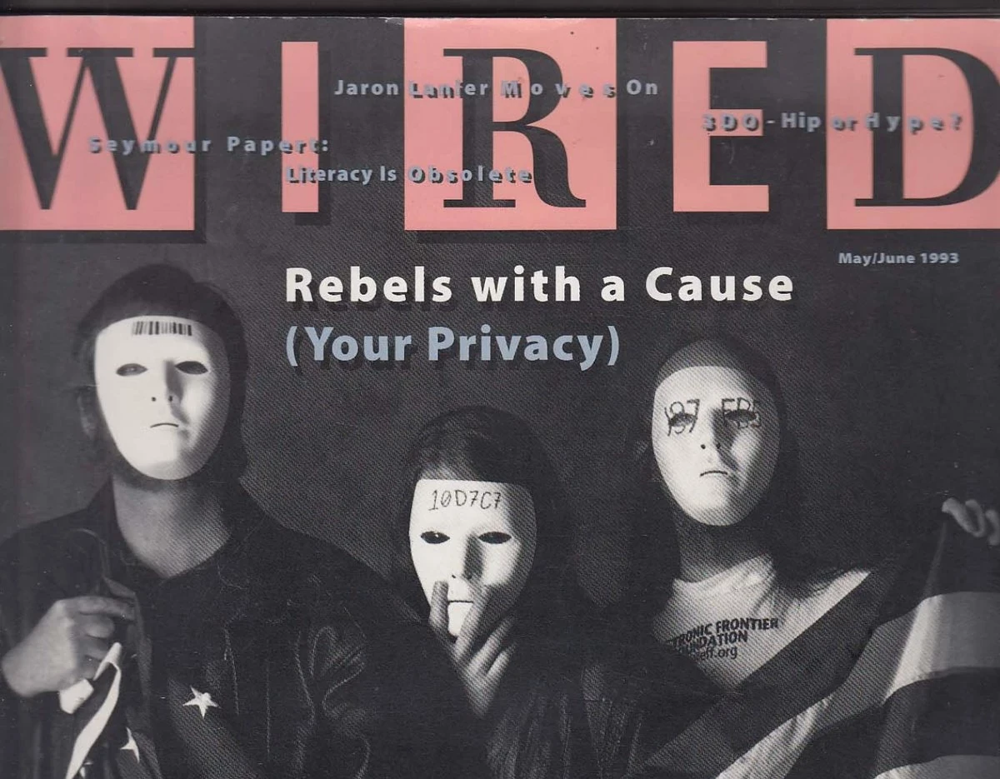

1980년대와 1990년대 기술 발전의 한가운데서 한 무리의 사람들이 디지털 시대에서 프라이버시와 자유의 역할에 대해 깊은 의문을 갖기 시작했습니다. 훗날 '사이퍼펑크'로 불리게 된 이들은 암호화가 정부와 대기업의 간섭으로부터 개인의 권리를 보호하는 도구가 될 수 있다고 굳게 믿었습니다.

줄리안 어산지, 웨이 다이, 팀 메이, 데이비드 차움과 같은 상징적인 인물들이 이 운동의 철학과 비전을 형성하는 데 중추적인 역할을 했습니다. 이러한 사상가들은 영향력 있는 메일링 리스트에서 자신의 아이디어를 공유했으며, 전 세계 참가자들은 개인의 자유를 위해 기술을 활용하는 최선의 방법에 대해 토론을 벌였습니다.

### 사이퍼펑크의 세 가지 기본 논문


디지털 행동주의와 암호학에 깊이 뿌리를 둔 사이퍼펑크 운동은 여러 기초 텍스트를 바탕으로 그 원칙과 미래 비전을 명확히 했습니다. 이 글들 중 특히 눈에 띄는 것은 세 가지입니다:


- "사이퍼펑크 선언문(Cypherpunk Manifesto)":

1993년 에릭 휴즈가 쓴 '사이퍼펑크 선언문'은 프라이버시가 기본 권리라고 주장합니다. 저자는 자유롭고 비밀스럽게 소통할 수 있는 능력은 자유로운 사회를 위해 필수적이라고 주장합니다. 선언문은 다음과 같이 말합니다: "우리는 정부, 기업 또는 기타 거대하고 얼굴 없는 조직이 우리에게 프라이버시를 보장해 주기를 기대할 수 없습니다 [...]. 우리가 프라이버시를 기대한다면 우리 스스로 프라이버시를 지켜야 한다"고 선언합니다.


- "암호-무정부주의 선언문":

1992년 티모시 메이가 작성한 이 문서는 암호화를 사용하면 정부가 시민의 사생활에 간섭할 수 없는 암호학적 무정부주의 시대가 도래할 수 있음을 설명합니다. 메이는 사람들이 제3자의 개입 없이 익명으로 정보와 돈을 교환하는 미래를 상상했습니다.


- "사이버 공간의 독립 선언":

전적으로 사이퍼펑크에 국한된 것은 아니지만, 이 글은 사이퍼펑크 운동에 참여한 많은 사람들의 정서를 반영하고 있습니다. 1996년 존 페리 발로우가 작성한 이 선언문은 각국 정부의 인터넷 규제 강화에 대한 대응책입니다. 이 선언문은 사이버 공간은 물리적 영역과는 별개의 영역이므로 동일한 법의 적용을 받아서는 안 된다고 주장합니다. "우리에게는 선출된 정부가 없으며, 앞으로도 그럴 가능성이 없다"고 선언문에 명시되어 있습니다.

### 비트코인의 선구자들

비트코인이 등장하기 전에도 디지털 화폐를 만들려는 시도는 여러 차례 있었습니다. 예를 들어, 1980년대에 데이비드 차움은 "익명 전자 화폐"라는 개념을 도입한 프로젝트 "디지캐시(DigiCash)"를 선보였습니다. 안타깝게도 여러 가지 제약으로 인해 디지캐시는 큰 성공을 거두지 못했습니다.

또 다른 중요한 선구자로는 웨이 다이의 "B-머니(B-money)"가 있습니다. 비록 구현되지는 않았지만, 중앙 기관이 아닌 평가자 커뮤니티가 사기 감지를 수행하는 익명의 디지털 화폐라는 아이디어를 제시했습니다.

아래 이미지는 이 운동이 수많은 기술 혁신을 통해 발전해 온 과정을 명확히 보여줍니다.

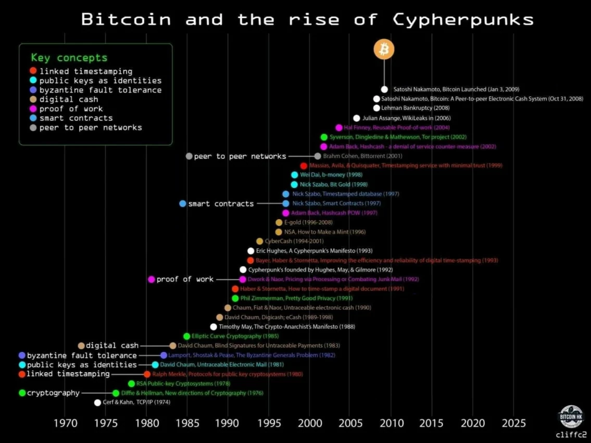

이러한 풍요로운 환경에서 2008년 수수께끼의 사토시 나카모토가 비트코인 백서를 발표했습니다. 이 문서에서 그는 작업 증명(Proof of Work) 및 암호화 타임스탬프와 같은 사이퍼펑크 운동의 여러 아이디어를 결합하여 검열에 저항하는 탈중앙화된 디지털 화폐를 만들었습니다.

하지만 비트코인은 단순한 기술 그 이상의 의미를 지니고 있었습니다. 비트코인은 기술을 넘어 기존 금융 시스템에 대한 혁명을 상징하며 투명성, 탈중앙화, 개인 주권에 기반한 대안을 제시했습니다.

### 결론

비트코인의 역사는 사이퍼펑크 운동과 디지털 시대의 더 큰 자유를 향한 집단적 추구에 깊이 뿌리를 두고 있습니다. 암호화, 탈중앙화, 무결성의 원칙을 결합함으로써 비트코인은 단순한 화폐 그 이상의 의미를 갖게 되었습니다. 사실 비트코인은 세상을 재구성하고 있는 철학적, 기술적 혁명의 산물입니다.

따라서 비트코인은 오랜 기간에 걸쳐 진행되는 프로토콜로서, 우리가 에너지, 시간, 돈과의 관계를 다시 생각하게 만듭니다.

하지만 비트코인은 "진짜" 화폐일까요? 이를 이해하려면 먼저 화폐의 개념과 다양한 형태를 이해해야 하는데, 이에 대해서는 다음 장에서 살펴보겠습니다.

비트코인의 역사를 더 자세히 살펴보고 싶으시다면 비트코인의 기원과 천천히 드러난 등장 과정, 역사와 커뮤니티의 시작을 알아볼 수 있는 HIS 201 강의를 적극 추천합니다. 이 강의는 많은 일화를 포함한 많은 문서와 자료를 제공합니다:

https://planb.network/courses/a51c7ceb-e079-4ac3-bf69-6700b985a082

# 돈

<partId>e913df1a-4cbd-5380-ba67-ca2a0414f671</partId>

## 역사 속의 돈

<chapterId>c838e64d-d59f-5703-8c74-ea5e8c4fdd31</chapterId>

돈의 진화는 끊임없이 변화하는 경제적 필요를 충족하기 위한 여러 시대의 문명의 독창성을 반영하는 인류 역사의 매혹적인 측면입니다.


### 조개껍데기에서 은행 계좌까지

원래 화폐는 곡물, 가축 또는 다른 상품과 같은 유형 자산이었습니다. 하지만 이러한 상품들은 부패하기 쉽다는 큰 단점이 있어 장기적인 저축 수단으로 사용하기 어려웠습니다. 예를 들어, 흉작이나 가축의 질병으로 인해 개인의 재산이 하루아침에 사라질 수도 있었습니다.

따라서 문명이 발전하고 무역이 새로운 지역으로 확장됨에 따라 보편적인 교환 수단이 필요하게 되었습니다. 사람들은 처음에는 조개껍데기나 보석과 같은 물체를 실험적으로 사용했지만, 생각만큼 내구성이 강하지 않았고 희소하지 않다는 점을 알게 되었습니다. 결국 금은 희귀성, 내구성, 분할 가능성 덕분에 표준이 되었습니다. 오늘날까지도 금은 부와 권력의 상징으로 남아 있습니다.

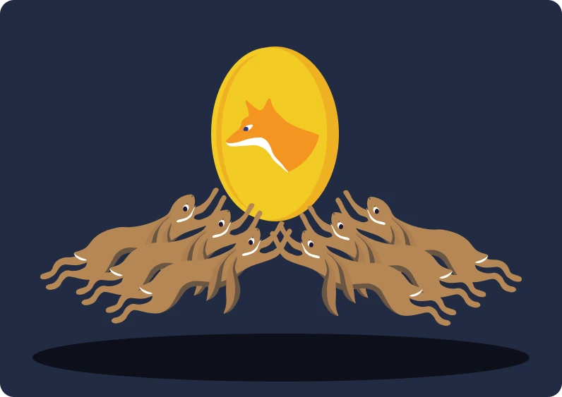

### 돈의 역할은 무엇인가요?

돈은 매우 정교한 소통 도구입니다:

- 돈은 현재와 미래 사이의 소통을 가능하게 합니다. 왜냐하면 우리의 시간과 에너지를 가치 하락의 위험 없이 미래에 다시 사용할 수 있는 자산으로 변환해주기 때문입니다.

- 돈은 보편적인 언어로 소통을 촉진합니다. 서로를 모르거나 같은 언어를 사용하지 않더라도, 낯선 두 사람이 물건을 교환하고 거래하며 가치에 대해 합의할 수 있습니다.

돈의 기능은 인위적으로 복제하기 어렵습니다. 사실 화폐는 시장과 자발적인 합의를 통해 생겨나는 자연스러운 현상이기 때문에 개인이나 집단이 만들 수 없습니다. 이런 의미에서 가격은 사회의 자원 배분을 안내하는 신호이자 정보 역할을 합니다.

이러한 이유로, 금이 돈으로 자리 잡은 것은 다음과 같은 아리스토텔레스의 기능에 기반한 4,000년 간의 화폐 진화론(Darwinism)의 결과입니다:

- **가치 저장**: 돈은 구매력을 미래로 이전하는 데 사용될 수 있으므로 내구성 있는 재료여야 합니다.  
- **교환 매개체**: 돈은 물물교환 대신 상품과 서비스를 교환하는 데 사용될 수 있어, 거래자 간의 욕구 일치 문제를 피할 수 있습니다.  
- **계산 단위**: 돈은 또한 서로 다른 상품의 가치를 비교할 수 있게 해주어 그 상대적인 편리함을 더 잘 이해할 수 있도록 합니다.

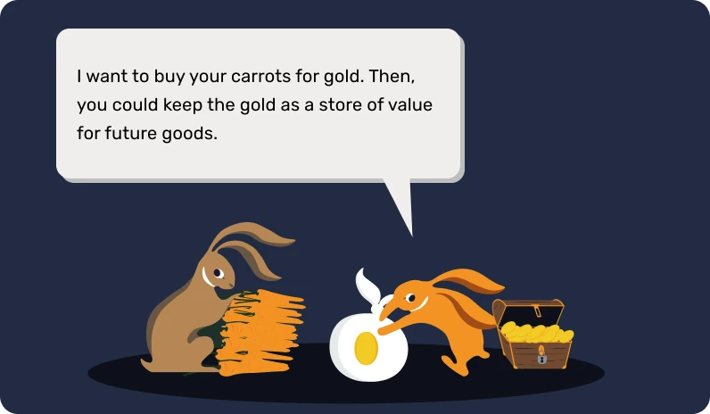


### 돈의 특성

금은 자연적인 희귀성으로 인해 가치가 높고, 화학적 특성으로 인해 시간이 지나도 부식되지 않는다는 점에서 효율적인 화폐의 기준을 이상적으로 충족합니다. 이러한 특성으로 인해 금은 훌륭한 '가치 저장 수단'이 되었지만, 쉽게 분할하거나 장거리 이동이 불가능하기 때문에 일반적인 화폐는 아니었습니다. 세계화되고 디지털화된 세상에서 금은 그 속도를 따라잡기 힘들며, 금을 나눌 수 있고 쉽게 교환할 수 있도록(즉, 주조된 동전을 통해) 중앙 기관이 필요합니다.

반대로 국가 수탁 화폐(법정화폐)는 쉽게 사용할 수 있지만 이를 통제하는 주체(왕, 중앙은행, 황제, 독재자)에 의해 지속적으로 가치가 하락합니다.

이 개념을 더 잘 설명하기 위해 효과적인 화폐의 특성을 살펴보겠습니다:

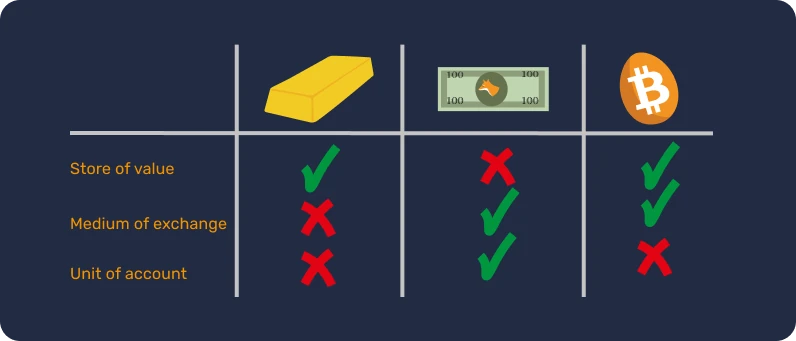


- **대체 가능성**: 가치 손실 없이 같은 종류의 다른 단위와 교환할 수 있습니다.
- **분할 가능성**: 다양한 거래량을 쉽게 처리할 수 있도록 더 작은 단위로 나눌 수 있습니다.
- **유동성**: 상품이나 서비스로 쉽게 전환할 수 있습니다.

이러한 기준을 충족하기 위해 화폐는 역사적으로 다양한 단계를 거치며 발전해 왔습니다:


- 원석 -> 코인
- 지폐 -> 은행 카드
- 블록체인 -> 라이트닝 네트워크

화폐는 오늘날까지도 다양한 사용 사례에 맞게 형태를 바꾸며 진화하고 있습니다. 앞서 말했듯이 금은 훌륭한 가치 저장 수단이지만 현재의 글로벌화된 경제에는 더 이상 적합하지 않습니다. 마찬가지로 달러나 유로와 같은 수탁 화폐는 현재 대부분 디지털화되어 있어 유동성이 높고 쉽게 이동할 수 있지만, 화폐 인플레이션으로 인해 가치가 지속적으로 낮아지고 있습니다.

반면 비트코인은 새로운 가능성을 제시합니다. 엄격하게 제한된 공급량과 같은 비트코인의 특성은 비트코인을 훌륭한 가치 저장 수단으로 만들어줍니다. 또한 중립적인 인터넷 화폐로서 국경을 초월하는 실용적인 **교환 매개체**의 역할을 합니다. 그러나 [지속적인 채택](https://btcmap.org/map)에도 불구하고 오늘날 상거래에서 여전히 널리 받아들여지지는 않고 있습니다.

## 수탁 화폐

<chapterId>25151d46-7db1-5b48-8bba-cbde1944555a</chapterId>

> 조지 산타야나는 "과거를 기억하지 못하는 사람은 과거를 반복할 수밖에 없다"고 말했습니다.
이 진실은 현재의 화폐 시스템에도 적용될 수 있습니다.

### 수탁 = 신뢰

오늘날 유로화나 달러화와 같은 주요 통화는 수탁 화폐로 간주됩니다. 즉, 내재적 가치가 없으며 통화를 관리하는 기관에 대한 신뢰와 믿음에 전적으로 의존한다는 의미입니다.

수탁 화폐는 위안화를 사용하는 중국과 같은 국가나 유로화를 사용하는 유럽연합과 같은 정치 경제 연합과 같은 기관이 지정한 화폐의 한 형태입니다. 발행을 담당하는 기관은 중앙은행입니다(예를 들어 중국 인민은행, 미국 연방준비제도이사회 또는 기니공화국 중앙은행을 들 수 있습니다). 바로 이 기관들이 통화 정책 정책을 수립하고, 얼마나 많은 돈을 유통하거나 인쇄해야 하는지를 결정합니다. 

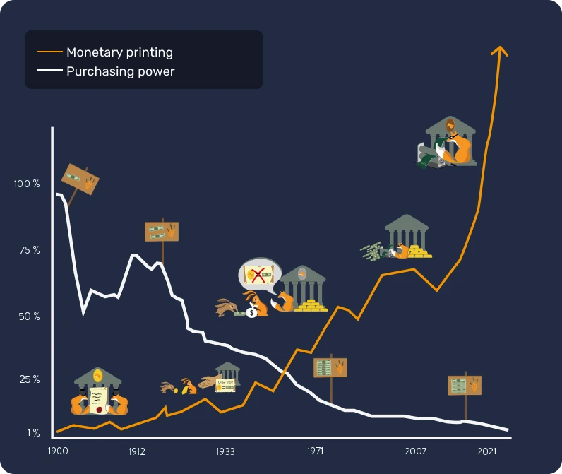

### 화폐 가치 하락: 로마 제국만큼 오래된 전략

고대부터 금은 화폐의 기준이 되어 왔지만, 그 경직성 때문에 로마 황제든 현대 정부든 지도자들은 종종 대체 화폐, 즉 수탁 화폐를 채택했습니다.

이 메커니즘은 간단하며 문명의 기원부터 존재해 온 관행에서 영감을 받았습니다. 부를 통제하고 싶어 하는 지도자들은 자신의 권력을 악용해 보호와 안전을 약속하는 방식으로 금을 중앙 집중화하기 시작합니다. 이 귀중한 준비금을 손에 쥔 지도자들은 금과 가치가 같지만 자신의 형상으로 주조된 새로운 화폐를 도입합니다. 이 화폐는 유통되기 시작하고, 사람들은 간편한 사용에 빠르게 적응합니다.

그러나 이러한 지도자들은 새 화폐의 가치를 점진적으로 평가절하하기 시작하여 사실상 초기 금 가격에 비해 매년 몇 퍼센트씩 가치를 떨어뜨리기 시작합니다. 이러한 조용한 가치 하락은 종종 국민의 이익을 위한 것이라며 정당화됩니다. 실제로 이 수탁 화폐로 저축하는 사람들은 저축의 가치가 하락하는 반면, 국가는 인플레이션을 통해 자금을 조달합니다. 또한 이러한 가치 하락은 부채를 더 쉽게 상환할 수 있게 합니다.

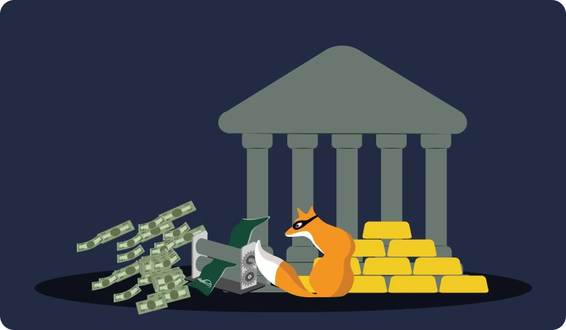

결정적인 순간, 지도자는 화폐가 더 이상 금으로 뒷받침되지 않는다고 발표합니다. 수탁 화폐에 익숙해져 있고 금융 문제에 대해 잘못된 정보를 갖고 있는 대중은 이러한 현실을 받아들이고, 국가가 화폐 공급을 자유롭게 조작하고 거의 무료로 막대한 양의 돈을 인쇄할 수 있게 됩니다.

화폐 인쇄는 인플레이션을 유발하고 점차 인구를 빈곤하게 만듭니다. 또한 금융 시스템이 붕괴하면 심각한 경제 위기를 유발할 수 있기 때문에 금융 시스템은 붕괴를 피하기 위해 규제와 제한을 받습니다. 대중과 달리 금융 기관과 부유한 개인은 이 시스템으로부터 큰 혜택을 받고 있으며, 이는 불평등의 격차를 만들고 권위주의를 조장합니다. 이러한 맥락에서 그들은 급진적인 변화를 시도할 인센티브를 얻지 못하기 때문에 시스템이 붕괴될 때까지 계속 유지될 수 있습니다.

이 전략은 잘 실행하면 수십 년 동안 지속될 수 있습니다. 그러나 매우 빠른 가치 하락이나 신뢰 상실은 하이퍼인플레이션으로 이어질 수 있다는 점에 주목해야 합니다(다음 장 참조). 역사에 따르면 달러는 100년 동안 98%, 유로화는 20년 동안 30%, 파운드화는 창설 이후 99%의 가치가 하락했습니다.

결국 화폐는 로마 제국 말기의 동전처럼 더 이상 금과 아무런 관련이 없거나 실체적 현실과 단절된 단순한 숫자 가치로 전락할 수 있습니다.

오늘날 우리는 역사의 전환점에 있습니다. 오랫동안 지배적이었던 달러는 쇠퇴하고 금은 중심 역할을 잃었습니다. 우리는 새로운 화폐 주기의 문턱에 서 있으며, 역사의 교훈을 잊은 채 살고 있습니다.


### 비트코인이 해결책인가요?

이러한 전제 때문에 비트코인 혁명은 힘을 얻고 있습니다. 이전 화폐와 달리 비트코인은 신뢰할 수 있는 제3자가 필요 없으며 국가와 화폐를 분리하는 것을 목표로 합니다.

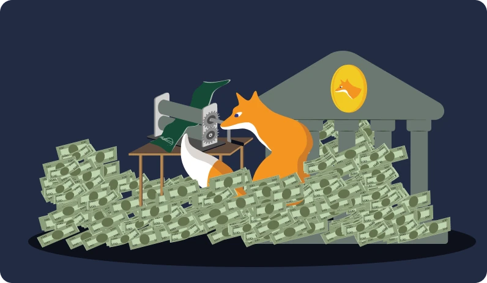

사실 비트코인은 탈중앙화된 솔루션과 새로운 병렬 통화 시스템을 제안함으로써 이러한 시스템적 문제에 대한 대응책으로 등장했습니다. 역사적으로 금은 위조에 대한 저항성 때문에 화폐로 선호되어 왔지만, 비트코인 역시 위조가 불가능합니다. 또한 탈중앙화되고 암호화된 특성 덕분에 발행량이 2,100만 개로 제한되어 있습니다. 비트코인은 투명성과 중립성을 기반으로 하는 화폐로, 현재의 중앙화된 통화 시스템에 대한 매력적인 대안을 제시합니다.

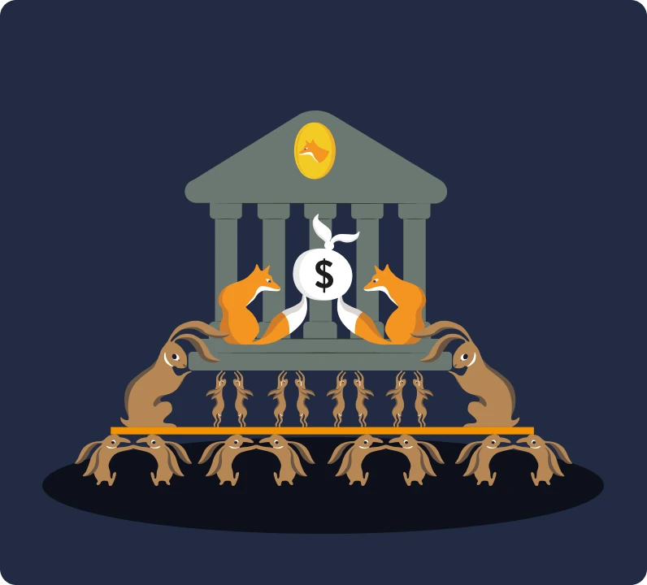

비트코인이 주목받는 또 다른 이유는 중앙은행 디지털 화폐(CBDC)의 등장 때문인데, 이는 불가피해 보입니다. 이 새로운 형태의 화폐는 중앙에서 계획된 경제를 더욱 발전시킬 수 있으며, 개인의 금융 자유를 저해하고 권위주의적 남용을 촉진할 수 있습니다.

이 장은 노벨 경제학상 수상자 F.A 하이에크가 1984년에 남긴 인용문으로 마무리할 수 있습니다:

> "정부의 손에서 돈을 빼앗기 전에는 우리가 다시 좋은 돈을 가질 수 있다고 믿지 않습니다. 정부의 손에서 그것을 폭력적으로 빼앗을 수 없다면, 우리가 할 수 있는 유일한 방법은 그들이 막을 수 없는 어떤 교묘하거나 우회적인 방법을 통해 새로운 것을 도입하는 것입니다."

경제적 오류와 자유에 대해 자세히 알아보시려면 비트코인의 출현을 높이 평가했을 19세기 프랑스 사상가 프레데릭 바스티앙의 삶과 사상을 추적하는 ECO 102 강좌를 수강해 보시기 바랍니다:

https://planb.network/courses/d07b092b-fa9a-4dd7-bf94-0453e479c7df

## 하이퍼인플레이션

<chapterId>b04c024c-54f3-50cb-997f-58721cfc74be</chapterId>

하이퍼인플레이션은 법정 화폐에 국한된 현상으로, 화폐에 대한 완전한 신뢰 상실과 당국의 화폐 발행으로 인해 인플레이션이 급격히 증가하는 특징이 있습니다. 그 결과 개인이 축적한 저축이 비교적 단기간에 소멸되어 국가가 경제적, 사회적, 정치적 붕괴의 위기에 처할 수 있습니다.

### 폭주하는 인플레이션!

인플레이션이 저축에 미치는 영향을 이해하려면 다양한 인플레이션율을 고려해야 합니다.

- 2%의 인플레이션이 발생하면 매년 2%의 구매력을 잃게 되며, 이는 5년 동안 10%에 달합니다.
- 7%에서는 10년 안에 구매력의 절반을 잃습니다.
- 20%에서는 3년 안에 거의 절반을 잃게 됩니다.

하이퍼인플레이션이 발생하면 더 이상 연간 20%가 아니라 한 달에 20%, 최고조에 달하면 하루에도 20%의 인플레이션이 발생합니다. 3일 동안 하루에 100%의 인플레이션을 경험하는 것은 현실에서 일어날 수 있는 시나리오이며, 실제로 일어났고 지금도 계속 일어나고 있습니다.

하이퍼인플레이션은 우연히, 자본주의에 의해, 또는 반대자들의 정치 공격에 의해 발생하는 것이 아니라는 점을 이해하는 것이 중요합니다. 하이퍼인플레이션은 중앙은행과 정치인들의 잘못된 통화 정책 결정의 직접적인 결과입니다. 그 여파는 모든 시민에게 영향을 미치고 심지어 다음 세대에도 영향을 미칩니다. 다음 표를 5분 정도 읽어보시고 이 현상의 실제 영향을 충분히 이해하시기 바랍니다(ECO204 강의에서 이 주제에 대해 더 자세히 다룹니다). 보시다시피, 어떤 국가나 화폐도 잠재적으로 안전하지 않습니다.

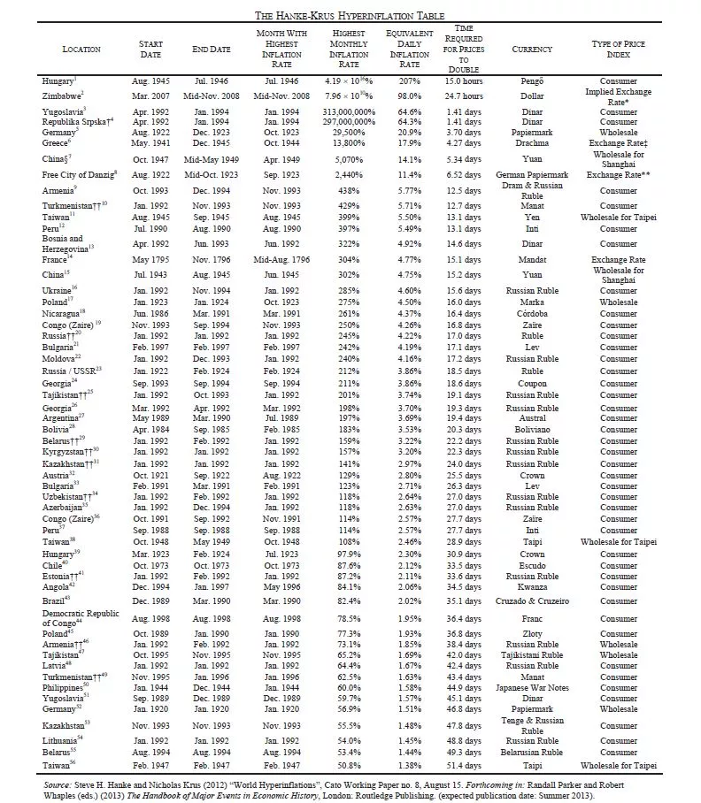

### 하이퍼인플레이션의 단계는 무엇인가요?

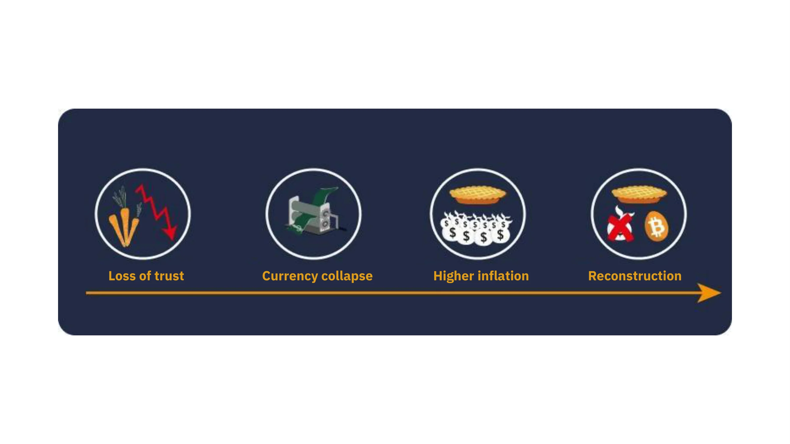

하이퍼인플레이션이 발생하려면 특정한 사건들이 순차적으로 일어나야 합니다.

1단계 - 신뢰 상실

- 화폐 권력의 중앙집중화는 화폐의 생성과 그 남용을 쉽게 만듭니다. 이러한 맥락에서 전쟁, 사회 조치, 밀이나 휘발유와 같은 주요 자원의 가격 상승과 같은 일부 외부 요인이 하이퍼인플레이션을 유발할 수 있습니다. 따라서 통화에 대한 신뢰가 떨어지고 개인은 화폐의 출처와 강제 통화 정책의 이점에 의문을 품게 됩니다.

2단계 - 통화 붕괴와 가격 상승

- 정부가 신뢰를 잃으면, 사람들은 자신의 화폐를 더 안정적인 화폐로 교환하기 시작합니다. 예를 들어, 베네수엘라에서 미국 달러로의 전환이 그런 경우입니다. 이러한 상황은 물가 상승으로 이어져 상품과 서비스 가격이 점점 더 비싸지는 악순환을 낳습니다. 이러한 요구를 충족하고 통화 정책을 바로잡기 위해 국가는 더 많은 돈을 인쇄하여 기하급수적인 인플레이션을 초래합니다.

3단계 - 화폐 발행의 악순환

- 따라서 상품을 구매하기 위해 점점 더 많은 지폐가 필요하게 되고, 지폐가 부족하게 됩니다. 이에 대응하기 위해 정부는 더 많은 지폐를 인쇄하여 인플레이션을 더욱 부추깁니다.


4단계 - 새로운 화폐의 등장

- 그런 다음 이전 법정 화폐에 적용되지 않았던 엄격한 통제를 시행하여 인플레이션의 순환을 끊기 위해 기존 화폐를 대체하기 위한 새로운 화폐를 도입합니다.

하이퍼인플레이션 위기를 해결하려면 혁명, 정권 교체, 중앙은행장 교체 등 급진적인 변화가 필요한 경우가 많습니다. 신뢰 상실, 통화 붕괴, 재건은 법정 화폐 기반 경제를 되살리기 위한 필수 단계입니다.

### 주목할 만한 세 가지 예


- 독일, 1922-1923

하이퍼인플레이션의 가장 두드러진 사례 중 하나는 제1차 세계대전 후 독일 바이마르 공화국에서 발생했습니다.

독일은 전쟁 자금을 조달하기 위해 막대한 돈을 빌렸습니다. 하지만 독일은 전쟁에서 패했을 뿐만 아니라 수십억 달러의 배상금을 지불해야 했습니다. 인플레이션율이 가장 높았던 달은 1923년 10월 최고 29,500%에 달했는데, 이는 하루에 20.9%의 인플레이션율에 해당합니다. 물가는 3.7일마다 두 배씩 올랐습니다!

독일 화폐는 너무 쓸모없어져서 일부 시민들은 나무 대신 더 싼 지폐를 태우는 것을 선호했습니다. 심지어 식당에서는 인플레이션을 고려하기 위해 웨이터가 30분마다 메뉴 가격을 알려야 했다는 이야기도 전해집니다.

결국 당국은 독일, 프랑스, 영국의 부채로 뒷받침되고, 독일 땅으로 보증하는 새로운 화폐를 만들었습니다.

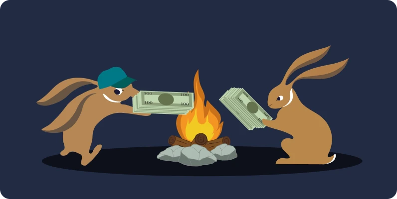


- 헝가리, 1945-1946

현재까지 최악의 초인플레이션을 경험한 국가는 단연 제2차 세계대전 이후 헝가리입니다.

헝가리는 대부분의 산업 생산 능력이 파괴된 채 전쟁의 패전국이 되었습니다. 인플레이션이 가장 높았던 달은 1946년 7월로, 물가 상승률이 41,900,000,000%에 달했으며, 이는 하루 207%의 인플레이션율에 해당합니다. 물가는 15시간마다 두 배씩 올랐습니다!

마지막으로 유통된 지폐는 1946년에 발행된 1,000억 펭고(100,000,000,000,000)였습니다.

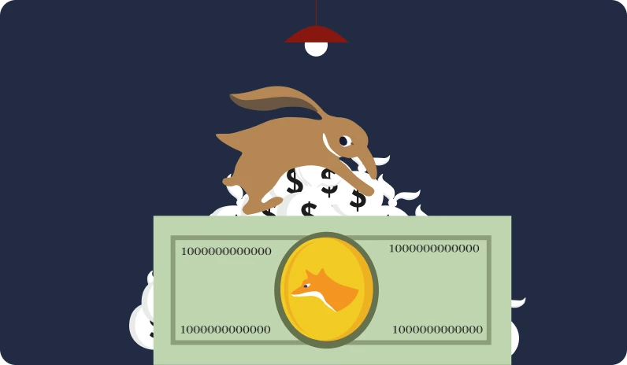


- 짐바브웨, 2007-2008

2000년까지만 해도 짐바브웨는 석유를 제외한 거의 모든 필요를 자급자족했습니다.

1997년 짐바브웨 정부가 참전 용사들에게 미화 4억 5천만 달러에 해당하는 금액을 보상하기로 결정한 후 짐바브웨 달러는 72% 이상 폭락했습니다. 정부는 그 정도의 물자가 없었기 때문에 인쇄기를 가동하는 데 의존했습니다. 2005년 인플레이션은 586%에 달했지만 2008년 11월 중순에 최고조에 달해 월 79,600,000,000%로 추정되었습니다.

2007년 6월에 정부는 이미 가격 통제를 시행하여 대응했지만, 이 조치는 경제에 아무런 영향을 미치지 못했습니다. 상점은 말 그대로 '약탈'당했고 상인들은 더 이상 상점에 물건을 채울 수단이 없었습니다.

2009년 4월, 재무 장관은 짐바브웨 달러의 사용 중단을 발표하고 무역에 다른 외화를 사용할 수 있도록 승인했습니다. 모든 은행 계좌, 연금 및 금융 기관의 잔액이 하룻밤 사이에 증발했습니다.


결론적으로 하이퍼인플레이션은 화폐 가치를 급격히 떨어뜨려 저축을 약화시키고 금융 시스템에 대한 신뢰를 잃게 하는 효과가 있습니다. 볼테르가 말한 것처럼 법정 화폐는 언젠가는 본질적인 가치를 잃고 0을 향해 수렴하게 됩니다.

금융 기관과 같은 신뢰할 수 있는 제3자에 의존하는 화폐는 구매력을 보장하거나 저축을 보존할 수 없기 때문에 현실적으로나 장기적으로 결함이 있는 화폐입니다.

하이퍼인플레이션에 대해 더 자세히 알아보려면 하이퍼인플레이션 주기가 무엇이고 우리 삶에 미치는 실제 영향을 배울 수 있는 David St-Onge의 ECO 204 강의를 추천합니다. 또한 이러한 주기 사이의 유사점을 발견하고, 가장 중요한 것은 이것으로부터 자신을 보호하는 방법을 알게 될 것입니다.

https://planb.network/courses/caa75343-ac90-4249-bcca-0e2e57c3a0f1

## 2100만 비트코인

<chapterId>f4a06d76-1963-56fd-93ff-dfa41489bcde</chapterId>

### 비트코인의 통화 정책

비트코인은 최대 **2,100만 개**로 사전 정의된 수량을 가진 탈중앙화된 디지털 화폐입니다. 이러한 희소성의 본질적인 특성은 컴퓨터 코드에 의해 결정되며 프로토콜에 참여하는 모든 사용자의 합의에 의해 강화됩니다.


비트코인의 화폐 발행량은 시간 경과에 따라 생성되는 비트코인의 양을 나타내는 곡선으로 설명할 수 있습니다. 예를 들어, 2022년에는 약 1,850만 개의 비트코인이 유통되었습니다. 예측에 따르면 2025년에는 전체 공급량의 약 93%에 해당하는 약 1,950만 개의 비트코인이, 2037년에는 2,040만 개에 달할 것으로 예상됩니다.

### 새로운 비트코인은 어떻게 생성되나요?

새로운 비트코인의 생성은 채굴 과정을 통해 이루어집니다. 간단히 말해, 채굴자는 강력한 컴퓨터를 사용해 복잡한 수학적 문제를 해결하며, 이를 통해 거래를 검증하고 보안을 유지합니다. 문제가 해결되면 채굴자는 새로운 거래 블록을 블록체인에 추가합니다. 블록체인은 네트워크에서 이루어진 모든 거래를 기록하는 탈중앙화되고 분산된 장부입니다.블록체인은 각 블록이 이전 블록과 연결되어 있어 네트워크의 합의 없이는 과거 데이터를 변경하는 것이 거의 불가능하기 때문에 투명성과 보안을 보장합니다.


이 작업을 성공적으로 수행하면 채굴자는 평균 10분마다 새로운 비트코인을 발행하여 보상을 받습니다. 이 보상은 약 4년마다, 즉 210,000 블록마다 절반으로 줄어들도록 프로그래밍되어 있으며("반감기"라고 알려진 이벤트), 화폐 발행 곡선이 계단 모양을 띠게 됩니다. 이러한 메커니즘으로 인해 비트코인의 생성은 총 2100만 개에 도달하는 2140년경에는 중단될 것이라고 수학적으로 예측할 수 있습니다.

| 반감기 횟수 | 블록 높이 | 반감기 후 BTC 보상 | 반감기 후 유통될 것으로 예상되는 BTC | 반감기 후 유통될 것으로 예상되는 BTC

| -------------- | ------------ | ------------------------- | ------------------------------------------ |

| 1 | 210,000 | 25 BTC | 10,500,000 BTC |

| 2 | 420,000 | 12.5 BTC | 15,750,000 BTC |

| 3 | 630,000 | 6.25 BTC | 18,375,000 BTC |

| 4 | 840,000 | 3.125 BTC | 19,687,500 BTC | 4

| 5 | 1,050,000 | 1.5625 BTC | 20,343,750 BTC | 20,343,750 BTC

| 6 | 1,260,000 | 0.78125 BTC | 20,671,875 BTC | 20,671,875 BTC

| 7 | 1,470,000 | 0.390625 BTC | 20,835,937.5 BTC |

| 8 | 1,680,000 | 0.1953125 BTC | 20,917,968.75 BTC | 20,917,968.75 BTC

| 9 | 1,890,000 | 0.09765625 BTC | 20,958,984.375 BTC |

| 10 | 2,100,000 | 0.048828125 BTC | 20,979,492.188 BTC |

| 11 | 2,310,000 | 0.0244140625 BTC | 20,989,746.094 BTC |

| 12 | 2,520,000 | 0.01220703125 BTC | 20,994,873.047 BTC |

| 13 | 2,730,000 | 0.006103515625 BTC | 20,997,436.523 BTC |

| 14 | 2,940,000 | 0.0030517578125 BTC | 20,998,718.262 BTC |

| 15 | 3,150,000 | 0.00152587890625 BTC | 20,999,359.131 BTC |

| 16 | 3,360,000 | 0.000762939453125 BTC | 20,999,679,566 BTC |

| 17 | 3,570,000 | 0.0003814697265625 BTC | 20,999,839.783 BTC |

| 18 | 3,780,000 | 0.00019073486328125 BTC | 20,999,919.892 BTC |

| 19 | 3,990,000 | 0.000095367431640625 BTC | 20,999,959.946 BTC |

| 20 | 4,200,000 | 0.0000476837158203125 비트코인 | 20,999,979.973 비트코인 | 20,999,979.973 비트코인

채굴의 개념은 [채굴자 챕터](https://planb.network/courses/2b7dc507-81e3-4b70-88e6-41ed44239966/dbb8264a-7434-57e4-9d1b-fbd1bae37fdf)에서 더 자세히 살펴보겠습니다.

### 디지털 희소성 보장

2100만 개라는 제한은 비트코인 희소성의 기초이며, 채굴 난이도 조정과 게임 이론이라는 두 가지 주요 메커니즘에 의해 보장됩니다.


- 채굴 난이도 조정은 약 2주마다, 즉 2016개의 블록마다 이루어지는 과정으로, 평균적으로 10분마다 새로운 블록이 블록체인에 추가됩니다. 블록 생성 빈도와 비트코인 총량은 비트코인 프로토콜의 고정된 요소로, 전통적인 화폐 시스템에서 이루어지는 임의적 결정과 달리 일반적인 합의 없이는 변경할 수 없습니다.

유효한 해시를 찾는 난이도는 일종의 주기를 따릅니다. 채굴자 수가 증가하면 찾는 블록의 수가 많아지고, 이는 블록을 찾는 평균 시간이 줄어든다는 것을 의미합니다. 이로 인해 난이도가 높아집니다. 결과적으로 채굴자가 찾는 블록의 수가 줄어들며, 이 메커니즘은 블록당 평균 10분으로 돌아갑니다. 아래 이미지를 참고하시기 바랍니다.


반대로, 채굴자 수가 줄어들어 블록 생성에 시간이 더 걸리면 채굴 난이도가 낮아져 평균 블록 생성 시간이 다시 빨라집니다.

채굴자들은 블록을 채굴함으로써 블록 보조금을 통해 새로운 비트코인을 얻고, 해당 블록에 포함된 거래로부터 거래 수수료를 받는 인센티브를 가진다는 사실을 알고 계셨나요?

따라서 발행된 비트코인의 수가 2100만 개 한도에 가까워지면 채굴자는 블록 보조금보다 거래 수수료를 통해 더 많은 보상을 받게 됩니다.

- 게임 이론은 인간의 합리성에 의존하는 수학적 개념입니다. 이는 개인이 논리적으로 행동하며, 다른 사람의 잠재적 결정을 고려하면서 자신의 이익을 극대화하려고 노력한다고 가정합니다. 비트코인에서 게임 이론은 대다수의 채굴자와 사용자가 네트워크에 최선의 이익을 위해 행동하도록 돕습니다. 실제로 프로토콜 변경은 사용자들의 투표로 이루어지기 때문에 비트코인 프로토콜을 수정하려면 전체 사용자 커뮤니티의 동의가 필요하며, 이는 매우 복잡한 과정입니다. 따라서 누군가 2,200만 비트코인을 생성하려면 모든 사용자가 자발적으로 자신의 자산 가치를 낮추도록 설득해야 하는데, 비트코인은 전 세계적으로 운영되고 중앙 그룹이 관리하지 않기 때문에 이런 일이 일어날 가능성은 거의 없습니다.


통화의 가치를 떨어뜨리는 것은 비트코인의 기본 철학에 어긋나기 때문에 전체 수량에 변화가 일어날 가능성은 거의 없습니다.

### 감사 가능한 통화 정책: 처음부터 영원히, 매 순간!

비트코인의 희소성은 주요 자산이며, 유통되는 비트코인의 최대 수량인 2,100만 개는 누구나 공개적으로 확인할 수 있습니다.

실제로 비트코인 노드(즉, 트랜잭션 검증자)를 통해 다음 명령어를 입력하기만 하면 누구나 이 작업을 수행할 수 있습니다: `bitcoin-cli gettxoutsetinfo`. 이러한 투명성은 비트코인 시스템에 대한 신뢰를 강화하며, 이는 중앙 기관이나 개인이 아닌 프로토콜에 내재된 수학적, 암호학적 보장에 기반합니다(이 작업은 LNP201에서 쉽게 배울 수 있습니다).

```json
{
"height": 710560,
"bestblock": "0000000000000000000887384d67103412ea7f18a43953e65c8c4ac36bf42e54",
"transactions": 473244,
"txouts": 1018917,
"bogosize": 2183872374,
"hash_serialized_2": "eebb9987337700ffaacbbaa11223344",
"disk_size": 178239584,
"total_amount": 18745998.12345678
}
```

비트코인은 설계상 생성량을 제한함으로써 건전한 통화 관리를 보장하며, 이는 사용자의 저축을 보호할 수 있다는 점에서 다른 통화와 매우 다릅니다. 오스트리아 경제학의 원칙과 일치하는 안정적인 발행량과 예측 가능한 분배는 전통 통화가 직면하는 인플레이션의 내재된 위험으로부터 비트코인을 보호합니다(자세한 내용은 ECO201 강좌를 참조하세요).

요약하자면, 비트코인은 탈중앙화 특성, 프로그램화된 희소성, 투명성을 통해 기존 화폐 시스템과는 다른 독특한 대안을 제시합니다. 비트코인은 기술을 사용하여 유용하고 검증 가능한 화폐를 만들 수 있을 뿐만 아니라 공급을 엄격하게 제한함으로써 사용자의 저축 가치를 보존하는 방법을 보여줍니다.

### 섹션 1의 마무리!

# 비트코인 지갑

<partId>28860585-4f61-59d9-b242-f4c57d837cc1</partId>

## 비트코인 지갑이란 무엇인가요?

<chapterId>1c0166ab-cb7a-5bc6-9175-d13482bd91f1</chapterId>

섹션 2에서는 유명한 비트코인의 위치와 상호 작용하는 방법을 이해하기 위해 지갑 사용을 통한 비트코인의 저장 및 보안을 살펴볼 것입니다!

### 비트코인 지갑 이해하기

지갑을 사용하여 비트코인 네트워크와 상호작용하는 방법은 크게 세 가지입니다:


- 비트코인을 받으려면
- 비트코인을 보내려면
- 해킹 및 도난 시도로부터 보호하려면 다음과 같이 하세요

비트코인 지갑은 컴퓨터의 소프트웨어, 스마트폰의 애플리케이션, USB 키와 같은 물리적 장치, 심지어 종이 한 장 등 다양한 형태와 모양을 가질 수 있습니다. 각각의 지갑은 각기 다른 사용 사례를 제공합니다. 실제로 일부는 보안에 중점을 둔 대규모 거래용으로 설계된 반면, 일부는 개인 정보 보호를 우선시하거나 소액을 매일 결제하는 용도로 사용됩니다.

포트폴리오는 자금의 소유자가 본인인지, 아니면 제3자에게 자금 관리를 맡길 것인지 등과 같이 사용 목적에 따라 크게 분류할 수 있습니다. 다음 장에서 이 주제에 대해 자세히 살펴보겠지만, 이 질문은 여전히 간단합니다: 돈이 내 주머니에 있는가 아니면 은행원의 주머니에 있는가?

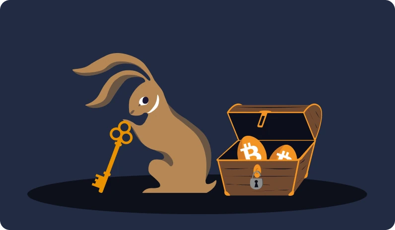

### 비트코인 지갑은 어떻게 작동하나요?

비트코인 '은행원'이든 본인이든, 대부분의 비트코인 지갑은 비대칭 암호화에 기반한 유사한 기술로 작동하며, 이는 지출용 개인 키와 수신용 공개 키로 구성된 키 쌍 시스템을 포함합니다.

- 개인 키

지갑을 초기화할 때 비밀 복구 문구(개인 키)가 생성되어 12개 또는 24개의 단어 형태로 제공됩니다.

개인 키는 비트코인의 소유권을 구성하고 따라서 비트코인을 사용하거나 전송할 수 있는 권리를 구성하기 때문에 근본적으로 중요합니다. 따라서 개인 키의 소유자가 비트코인의 진정한 소유자입니다. 널리 알려진 문구처럼, "Not your keys, not your coins."

이 키는 당신의 자산을 해제하는 것이므로, 비밀스럽게 잘 보관하고 보호해야 합니다!

- 공개 키 및 주소

공개 키는 개인 키에서 생성되며 개인 키와 연결되어 있습니다. 공개 키를 공유하면 프라이버시 위험이 발생할 수 있지만(다른 사용자가 잔액을 볼 수 있기 때문에) 보안에는 위험하지 않습니다(개인 키가 없으면 자금을 사용할 수 없기 때문에). 공개 키는 비트코인 주소를 생성하는 데 사용되며, 이를 통해 돈을 받을 수 있습니다.

이 주소는 지갑에서 자동으로 생성되며 안전하게 공유할 수 있습니다. 프라이버시를 극대화하려면 주소를 한 번만 사용하는 것이 좋습니다.

요약하자면, 이 기술은 수신자가 자금을 훔칠 수 없도록 하면서 비트코인을 받을 수 있게 해줍니다! 우편함은 적절한 비유가 될 수 있습니다. 사람들이 돈을 넣을 수는 있지만, 우편함을 열 수 있는 사람은 오직 당신뿐입니다.

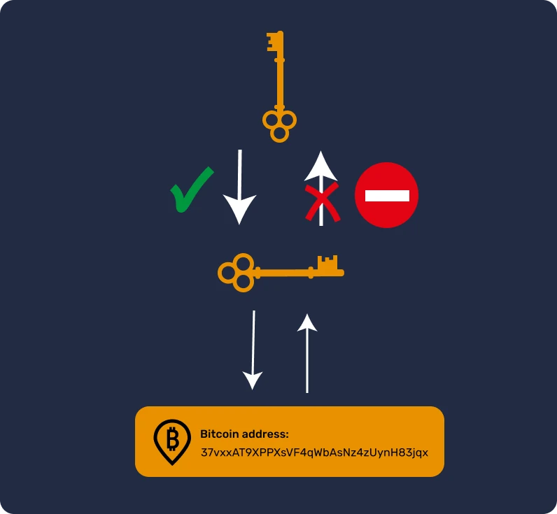

### 지갑에 비트코인이 있나요?

키는 지갑에 저장되어 있지만, 비트코인 자체는 실제로 비트코인 P2P 네트워크 내의 공개 분산 원장인 비트코인 블록체인에 '저장'됩니다(3장에서 자세히 설명하겠습니다). 즉, 지갑이 들어 있는 장치를 분실해도 비트코인을 반드시 잃어버리는 것은 아닙니다. 지갑을 다시 생성하고 비트코인을 사용할 수 있는 것은 사실 개인 키이므로, 항상 개인 키를 잘 보호하는 것을 잊지 마세요!


다행히도 2017년부터 개인 키는 '니모닉 문구'라고 알려진 12개 또는 24개의 간단한 단어 목록으로 표현할 수 있어 저장하기 매우 쉽습니다. 이 문구는 자금의 백업 역할을 하며, 비트코인 지갑 소프트웨어나 앱을 사용해 지갑을 다시 만들 수 있게 해줍니다. 따라서 이 단어 목록을 찾는 사람은 누구나 비트코인에 접근할 수 있습니다.

### 해커는 어떤가요?

누군가 실수로 12개 또는 24개의 단어 목록을 추측하면 어떻게 되나요? 간단히 말해, 지갑을 만드는 데 사용된 암호화 덕분에 그럴 가능성은 거의 없습니다.실수로 동일한 니모닉 문구를 발견하는 것은 1과 2^256$ 사이에서 "정확한" 숫자를 찾는 것과 비슷하며, 이는 우주에서 "정확한" 원자를 찾는 것과 비슷합니다. 하지만 이 기본 보안이 만족스럽지 않다면 언제든지 비트코인 지갑에 패스프레이즈(추가 단어)를 추가하여 보안을 강화할 수 있습니다.


따라서 다음 섹션에서 자세히 설명할 올바른 보안 관행을 따른다면 비트코인 지갑이 해킹될 확률은 천문학적으로 낮습니다.

다양한 지갑을 관리하고 보호하는 방법에 대한 자세한 튜토리얼은 [튜토리얼 섹션](https://planb.network/tutorials/wallet)에서 확인할 수 있습니다.

토끼굴을 내려가는 동안 엔트로피부터 주소 수신까지 비트코인 지갑 구축에 대해 자세히 알아보고 싶으시다면, 이 주제를 다룬 CYP 201 강좌를 추천합니다:

https://planb.network/courses/46b0ced2-9028-4a61-8fbc-3b005ee8d70f

## 비트코인 지갑과 보안

<chapterId>00c1afea-e54a-511f-bab3-2efc2fbfa6a1</chapterId>

### 시작하기 전에 올바른 질문하기

비트코인을 소유하고 있다면 자금의 보안이 가장 큰 관심사입니다. 자신의 상황에 적합한 보안 수준을 정의하는 가장 좋은 방법은 스스로에게 일련의 질문을 던지는 것입니다:

- 누가 내 자금에 접근할 수 있나요? 다시 말해, 비트코인에 대한 접근 권한이 본인에게만 있습니까, 아니면 제3자(예: 회사)가 자금에 대한 접근 권한을 부여합니까?
- 특정 지갑에 있는 비트코인을 어떻게 사용할 계획이신가요? 정기적으로? 중기 또는 장기 저축을 위해?
- 기술력은 어떤 수준인가요?
- 보안 예산은 얼마인가요?

사실 보편적인 답이나 해결책은 없으므로 시간을 들여 이러한 질문에 답해 보시면 필요에 따라 보안 조치를 맞춤화하는 데 도움이 될 것입니다.

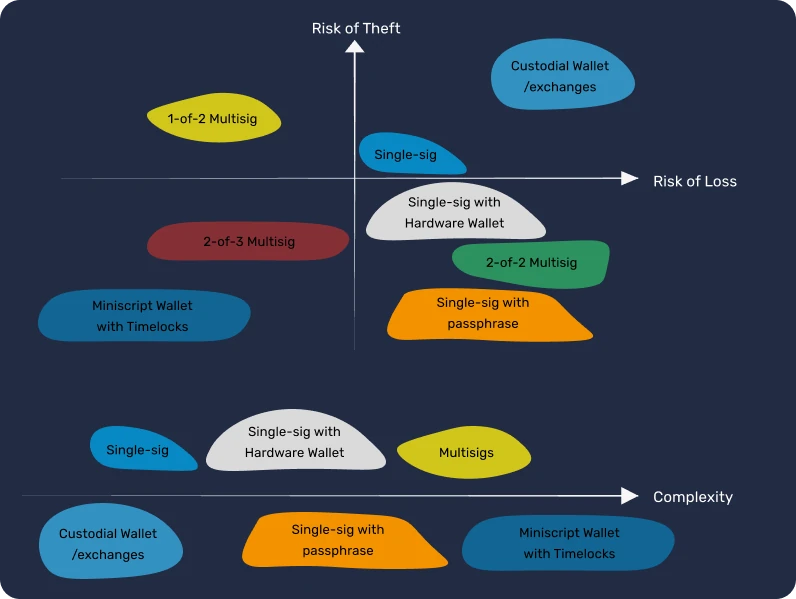

### 복잡성 측면에서 비트코인 지갑에 대해 생각하기

아래에서는 몇 가지 보안 수준을 정의합니다:


- **레벨 0**의 경우, 비트코인을 단독으로 보유하지 않는 이른바 '수탁 서비스'를 이용합니다. 이 신뢰할 수 있는 제3자가 언제든지 회원님의 자금에 대한 접근을 제한할 수 있다는 점에 유의하시기 바랍니다. 이 경우 귀하의 금융 주권 수준은 은행 계좌가 있는 기존 은행 시스템과 비슷합니다.


- **레벨 1**에서는 휴대폰이나 컴퓨터에서 비트코인 지갑을 사용하며, 여기서 비트코인을 단독으로 소유하고 쉽게 거래를 진행할 수 있습니다. 앞서 언급한 도구를 "핫 월렛"이라고 부르는 이유는 개인 키가 인터넷에 연결된 장치에 저장되기 때문입니다. 이 경우 휴대폰이나 컴퓨터를 분실했을 때 자금에 다시 접근할 수 있도록 니모닉 문구를 백업해두는 것이 중요합니다.

예를 들어, 스패로우 지갑을 핫 월렛으로 사용할 수 있습니다:

https://planb.network/tutorials/wallet/desktop/sparrow-7e9a77c0-013d-4f8e-a811-408b71dc7607

- **레벨 2**는 물리적 지갑을 사용하며, 12/24 단어 목록을 보호하고 있습니다. 키가 인터넷에 연결되지 않은 장치에 저장되므로 흔히 '콜드 월렛'이라고도 합니다. 이 경우 항상 장치로 모든 거래에 서명해야 하므로 일상적으로 자금에 대한 접근성이 떨어집니다.

예를 들어 사토칩 또는 탭사이너를 사용할 수 있습니다:

https://planb.network/tutorials/wallet/hardware/ledger-nano-s-plus-75043cb3-2e8e-43e8-862d-ca243b8215a4
https://planb.network/tutorials/wallet/hardware/satochip-e9bc81d9-d59b-420d-9672-3360212237ba
https://planb.network/tutorials/wallet/hardware/tapsigner-ab2bcdf9-9509-4908-9a4a-2f2be1e7d5d2
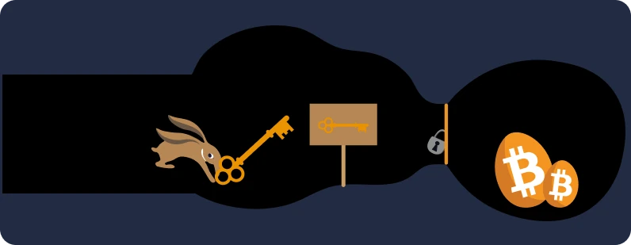


- **레벨 3**의 경우, 레벨 1 또는 2 지갑을 사용하지만 패스프레이즈를 추가했습니다. 이 경우 12/24단어 목록 **과** 패스프레이즈 문구를 모두 백업해야 한다는 점에 유의하세요. 이상적으로는 이 두 가지 정보를 서로 다른 두 곳에 저장하는 것이 좋습니다.

BIP39 패스프레이즈의 사용 및 기능에 대해 자세히 알아보세요:

https://planb.network/tutorials/wallet/backup/passphrase-a26a0220-806c-44b4-af14-bafdeb1adce7


- **레벨 4**에서는 지갑 세트를 사용해 '다중 서명' 지갑을 생성하는데, 이는 거래를 수행하기 위해 여러 서명이 필요하다는 의미입니다. 이 경우 다중 서명의 각 부분을 서로 다른 위치에 저장해야 한다는 점에 유의하시기 바랍니다. 이 접근 방식은 주로 대량의 비트코인을 관리하거나 기업에서 사용하는 고급 비트코인 사용법으로 간주됩니다.


물론 사용 사례마다 다른 비트코인 지갑이 필요하며, 모든 경우에 맞는 만능 해결책은 없습니다.

### 보안을 적용해야 합니다

특정 보안 수준에 맡길 수 있는 금액은 개인마다 다릅니다. 어떤 사람에게는 핫 월렛에 1 BTC를 두는 것이 합리적이지만, 다른 사람에게는 그 반대의 경우도 있습니다. 어쨌든 소액을 보호하고 싶을 때는 물리적 지갑을 구매해 보안에 너무 많은 비용을 지출하지 않는 것이 좋습니다. 또한, 비트코인의 보안과 접근성을 지나치게 복잡하게 설정하면, 특히 지갑 백업을 잘못 관리할 경우 해로울 수 있다는 점을 명심하시기 바랍니다.

결론적으로, 비트코인을 직접 소유하는 것은 금융 주권을 보장하기 위한 필수 요소입니다. 일상적인 지출에는 모바일 지갑을 사용하고, 더 큰 금액을 보관할 때는 오프라인 또는 '콜드' 물리적 지갑을 사용하는 것이 좋습니다. 반면, 기업은 다중 서명 시스템 또는 '다중 서명'을 사용하여 보안을 강화할 것을 고려해야 합니다. 또한 기존 금융 시스템의 일부 취약점을 그대로 답습할 수 있는 커스터디 서비스를 피하는 것이 중요합니다.

이를 염두에 두고 이제 비트코인 지갑을 만드는 방법을 설명하는 다음 섹션으로 넘어가겠습니다. 보안에 대해 더 자세히 알아보고 싶으시다면 다음 [다스코인의 글](https://asi0.substack.com/p/bitcoin-soyez-votre-propre-banque)을 읽어보시기 바랍니다.

## 지갑 설정하기

<chapterId>615519eb-4565-557d-86a0-021badf7616f</chapterId>

비트코인의 보안은 매우 중요하며, 단순한 실수로도 심각한 결과를 초래할 수 있습니다. 그렇기 때문에 새 비트코인 지갑을 만들 때 채택해야 할 모범 사례를 배워야 합니다.

이 단계는 BTC102 강좌에서 안내해 드립니다.

https://planb.network/courses/f3e3843d-1a1d-450c-96d6-d7232158b81f

### 이 단계는 농담이 아닙니다!

지갑을 설정할 때 소프트웨어는 일반적으로 12/24개의 단어 목록("시드 문구" 또는 "니모닉 문구"라고도 함)으로 표시되는 개인 키를 생성하는데, 이 단어가 자금에 대한 접근 권한을 구성합니다. 이 키가 제3자에게 노출되면 관련 자금이 유출된 것으로 간주해야 합니다. 따라서 지갑을 설정할 때는 이러한 규칙을 반드시 준수해야 합니다:

- 모든 카메라를 커버하세요.
- 단어 목록을 사진으로 찍지 마세요.
- 컴퓨터나 휴대폰에 입력하지 마세요.
- 연락처로 저장하거나 SMS를 통해 본인에게 보내지 마세요.
- 책상 위에 글을 방치하지 마세요.
- 단어 목록을 눈에 띄지 않는 곳에 숨기지 마세요.

말 그대로 빈 종이를 사용하거나 이 [템플릿](https://bitcoiner.guide/backup.pdf)을 인쇄하여 제시된 순서에 따라 펜으로 단어 목록을 깔끔하고 명확하게 작성해야 합니다. 시간이 지남에 따라 잉크가 희미해지면 자금이 손실될 수 있다는 점에 유의하세요. 따라서 이 종이는 습기나 화재 등 잠재적으로 손상될 수 있는 환경적 요인으로부터 보호하는 것이 중요합니다.

아래에서 문서 작성 방법의 예를 확인하세요: 해당 단어는 가짜이므로 사용하지 마세요!

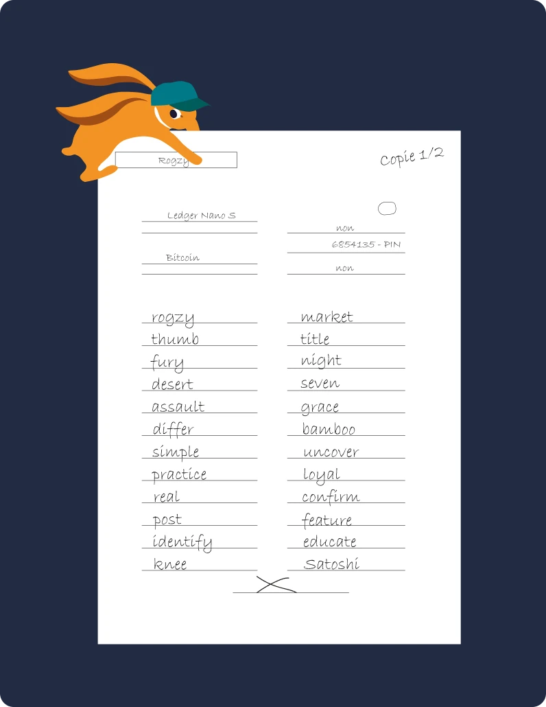

### 올바른 작업을 위한 팁

또한 복사하는 동안 실수를 하지 않도록 주의하세요. 그렇지 않으면 상속인이 읽는 데 어려움을 겪고 자금을 회수하지 못할 수 있습니다. 또한, 단어를 저장한 후에는 두 번째 사본을 만들어 첫 번째 사본과 다른 위치에 보관하는 것이 좋습니다. 이렇게 하면 원본을 분실하거나 손상되었을 때를 대비해 백업본을 확보할 수 있습니다.


단어 목록은 쉽게 기억할 수 있는 안전한 장소에 보관해야 합니다. 분실로 이어질 수 있는 지나치게 복잡한 은닉 계획을 만들지 마세요.

**당신의 단어 = 당신의 돈**

'콜드' 지갑과 '핫' 지갑 모두 단어 목록 방식을 개인키 백업의 표준으로 사용합니다. 따라서 호환되는 모든 지갑 소프트웨어나 장치에 니모닉 문구를 입력해 액세스 권한을 복원할 수 있습니다. 반면, 시드 문구를 제공하지 않는 지갑은 계정, 이메일 주소 또는 최악의 경우 아이디를 입력해야 할 수도 있으므로 사용하지 않는 것이 좋습니다.

**주의: 12/24 단어 목록이 없으면 경고 메시지가 표시됩니다**

지갑을 설정하고 첫 비트코인을 얻는 방법을 단계별로 알아보고 싶으시다면 이 다른 과정도 수강하실 것을 추천합니다:

https://planb.network/courses/f3e3843d-1a1d-450c-96d6-d7232158b81f

## 시간의 시험을 통과하다

<chapterId>f58cd446-c202-5eff-aab7-e61cc40e5c06</chapterId>

다른 형태의 재산과 마찬가지로 비트코인은 특히 장기간에 걸쳐 분실, 도난, 성능 저하로부터 보호해야 합니다. 비트코인을 안전하게 보호하려면 약간의 기술적 지식과 관련 위험에 대한 이해가 필요하며, 이를 위해서는 비트코인을 철판에 새기는 것과 상속 계획을 수립하는 두 가지 주요 전략이 있습니다.

### 강철에 각인

장기적으로 비트코인을 안전하게 보관하는 한 가지 방법은 물과 화재에 강한 물리적 백업을 만들어 강철과 같은 내구성 있는 재료에 니모닉 문구를 새겨서 키의 물리적 백업을 만드는 것입니다.

"블록밋"과 같이 저렴한 솔루션이 있는 반면, 보다 전문적인 장비가 필요한 솔루션도 있습니다. 이 주제는 아카데미의 [튜토리얼](https://planb.network/en/tutorials/wallet) 섹션에서 자세히 살펴볼 수 있습니다.

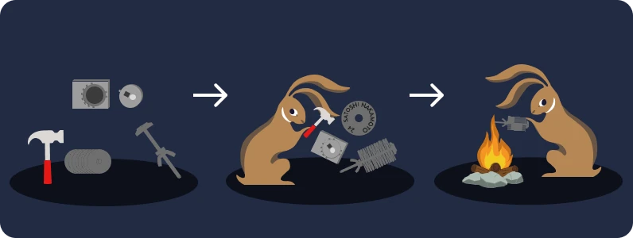

### 다음 세대를 생각하세요!

이 첫 번째 방법과 함께 상속 계획을 세우는 것은 사후에 비트코인을 적절히 관리하기 위한 중요한 단계입니다. 이 계획에는 자산의 성격, 접근 방법, 자산을 관리할 수 있는 신뢰할 수 있는 사람의 연락처 정보를 간략하게 설명하는 편지를 직접 작성하는 것이 포함됩니다. 또한 공증인과 비트코인의 상속을 논의하여 세금 준수를 보장하는 것도 중요하지만, 이 사람에게 비트코인의 관리를 직접 맡겨서는 안 됩니다.

비트코인 상속 계획에 대해 더 자세히 알아보고 싶으시다면 파멜라 모건의 저서 [암호화 자산 상속 계획](https://planb.network/resources/books/28)을 읽어보시거나 계획 작성에 대한 안내를 제공하는 BTC102 강좌에 등록해 보시기 바랍니다.


### 개인 정보 보호는 중요합니다

물리적 백업을 만들거나 상속 계획을 세우는 것 외에도 개인정보 보호는 비트코인의 장기적인 보안과 관련하여 또 다른 중요한 주제입니다. 예를 들어, 신원 도용의 위험을 최소화하거나 적절한 도구를 갖춘 단체의 자금 추적을 피하기 위해 신분증을 제공하지 않고 비트코인을 구매하는 것이 좋습니다.

개인정보 보호와 관련해서는 비트코인에 대해 모든 사람과 이야기하는 것을 피하는 것이 중요합니다. 이 기술이 미래에 어떻게 인식될지 예측할 수 없으므로 소유권에 대해 신중을 기하는 것이 현명한 선택이며, 자신이나 지갑에 대한 관심을 끌지 않으려는 것입니다.

마찬가지로, 비트코인 미팅이나 낯선 사람과의 만남에서 보안 시스템에 대한 세부 정보를 공개적으로 공유하지 마세요...

### 비트코인 지갑 보안에 대한 요약

비트코인 지갑은 비트코인을 저장하고 거래를 할 수 있는 소프트웨어입니다. 여러 유형이 있습니다:


- 모바일 또는 PC 지갑으로 소액 또는 정기적인 지출에 편리합니다;
- 중장기적으로 비트코인을 보관하는 데 더 적합한 물리적 지갑입니다;
- 다중 서명 지갑은 관리가 더 복잡하고 거래를 수행하기 위해 여러 서명이 필요합니다.

지갑을 만들 때는 먼저 12개 또는 24개의 단어 목록을 종이나 금속판에 백업해야 합니다. 이 니모닉 문구를 사용하면 모든 비트코인 지갑 애플리케이션을 통해 지갑을 복원할 수 있습니다. 이 목록에 액세스할 수 있는 사람은 누구나 내 자금에도 액세스할 수 있다는 점에 유의하시기 바랍니다.

비트코인의 세계에서 금융 주권은 개인의 책임과 밀접하게 연관되어 있으므로 지갑과 백업에 대한 액세스 권한을 보호하는 것이 필수적입니다. 이를 위해서는 특정 지침을 따르는 것이 중요합니다:


- 상속 계획을 수립하여 문제가 발생했을 때 사랑하는 사람들이 돈을 찾을 수 있도록 하세요.
- 비트코인은 해커의 공격에 취약할 수 있으므로 거래소 플랫폼에 맡겨두지 마세요.
- 다양한 비트코인 지갑 중에서 잘 선택하려면 필요와 사용 사례에 따라 보안 수준을 조정하세요.

이제 비트코인 지갑의 기본 사항과 지갑 보안을 위한 모범 사례를 살펴보았으니 다음 장에서는 비트코인의 기술적 특징에 대해 살펴보겠습니다. 다시 한 번 말씀드리지만, 비트코인 프로토콜의 기본을 이해하면 비트코인 작동 방식에 대한 이해도가 높아져 비트코인을 더 잘 활용할 수 있게 될 것입니다.

# 비트코인의 기술적 측면.

<partId>a86d7439-e7a2-5f21-b1e9-6b5e23ca265b</partId>

## 비트코인 시작하기

<chapterId>b7561082-8943-519d-95d1-a5f60dd2686d</chapterId>

### 약간의 역사부터 시작하겠습니다.

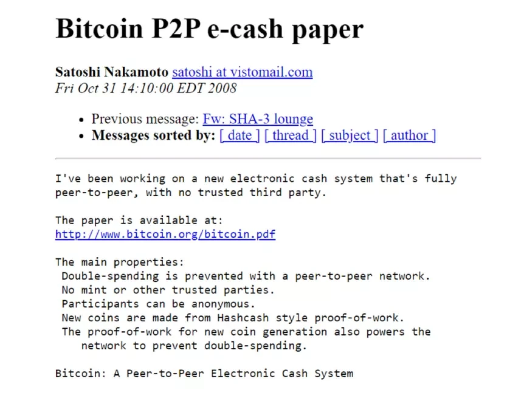

2008년 10월 31일은 비트코인이라는 새로운 금융 기술이 탄생한 날입니다. 이 날 익명의 사토시 나카모토는 인터넷에서 개인 정보 보호에 헌신하는 암호화 애호가들의 커뮤니티인 사이퍼펑크의 메일링 리스트에 보낸 이메일을 통해 자신의 혁신을 세상에 선보였습니다. 이 이메일에는 비트코인의 작동 방식을 설명하는 "백서"라는 문서가 포함되어 있었습니다.

이 이니셔티브는 디지털 현금 시스템을 만들려는 시도의 실패로 인해 즉각적인 열기를 불러일으키지는 못했습니다. 그럼에도 불구하고 이 백서는 결국 비트코인 사용자들의 참고 자료가 되었으며, 수년 동안 비트코인 생태계에서 많은 논쟁의 대상이 되었습니다.

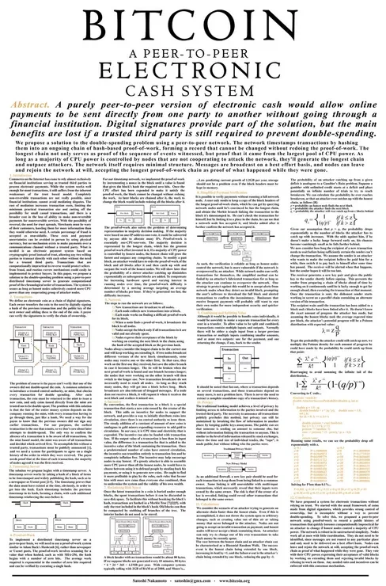

2009년 1월 3일, 사토시는 비트코인 블록체인의 시작을 알리는 "제네시스 블록"이라고도 알려진 첫 번째 블록을 생성하여 비트코인 네트워크를 공식적으로 출범시켰습니다. 이 블록에는 비트코인의 사명을 반영하는 "2009년 3월 3일 은행에 대한 두 번째 구제금융 직전의 총리"라는 메시지가 담겨 있습니다

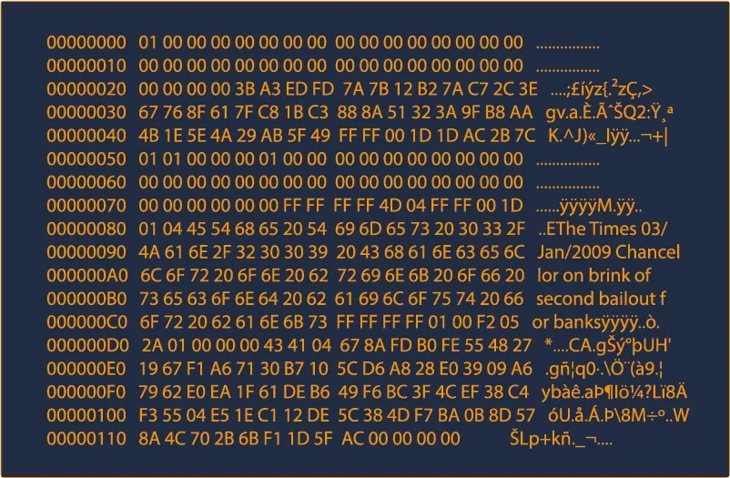

> "우리는 군비 경쟁에서 중요한 전투에서 승리하고
> 몇 년 동안 새로운 자유의 영역을 개척해 왔습니다." - 사토시 나카모토
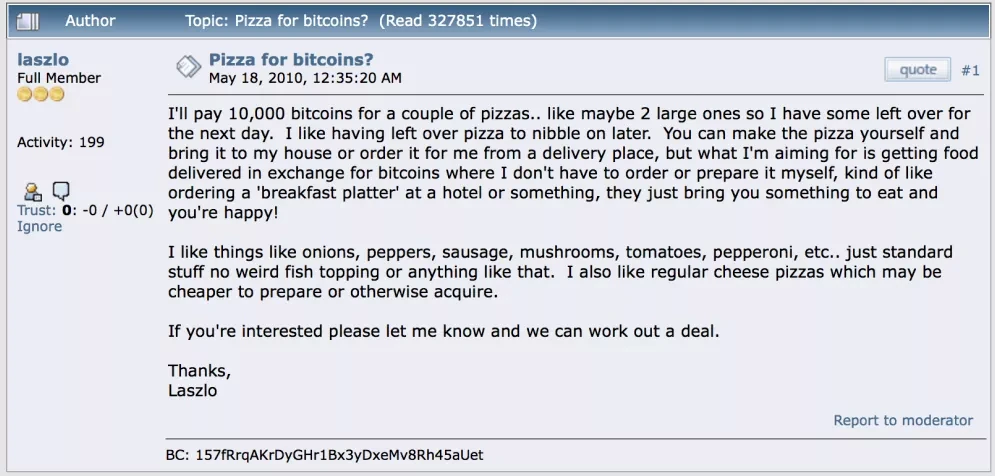

### 비트코인 프로토콜이 현실로 다가오다

2009년 1월 9일, 사토시는 비트코인 0.1.0 버전의 출시를 발표했습니다. 얼마 지나지 않아 할 피니가 소프트웨어를 손에 넣고 네트워크에 합류하면서 네트워크에 두 개의 노드가 생겼고, 따라서 두 명의 채굴자가 존재하게 되었습니다. 피니는 '비트코인 실행'이라는 트윗을 통해 이 단계를 불멸의 기록으로 남기기도 했습니다. 2009년 1월 12일, 사토시와 할 피니 사이에 10 BTC의 첫 비트코인 거래가 이루어졌으며, 170번 블록으로 돌아가시면 쉽게 찾을 수 있습니다.

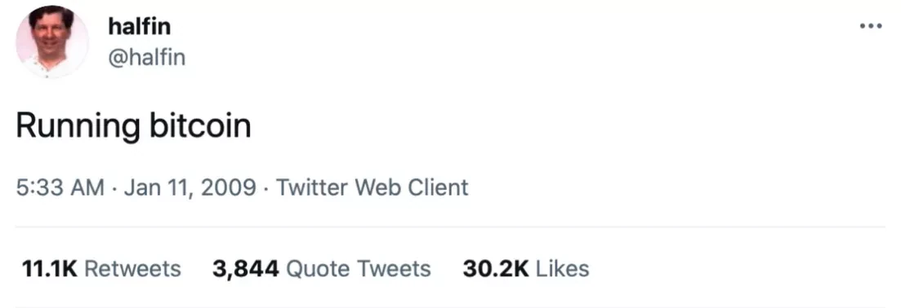

비트코인에 대한 관심이 빠르게 증가하면서 많은 사람들이 비트코인을 테스트하고, 토론에 참여하고, 버그를 해결하고, 윤리적, 경제적, 철학적 측면에 대해 성찰했습니다. 사토시는 2009년 11월 22일에 이러한 유형의 대립을 촉진하기 위해 비트코인토크 포럼을 만들 정도로 사람들의 관심을 끌었습니다.

비트코인 로고](https://bitcointalk.org/index.php?topic=64.0), 유명한 [호들](https://bitcointalk.org/index.php?topic=375643.0), 심지어 [피자데이](https://bitcointalk.org/index.php?topic=137.msg1195) 등 비트코인과 관련된 유명한 밈과 상징이 탄생할 정도로 이 포럼은 비트코인 사용자들이 선호하는 토론의 장으로 자리 잡았습니다.

**알고 계셨나요?**2010년 5월 22일, 라즐로 하녜츠는 10.000 BTC로 피자 두 판을 구매하겠다고 제안하며 비트코인으로 실물 상품을 구매한 최초의 사례로 역사를 만들었습니다.

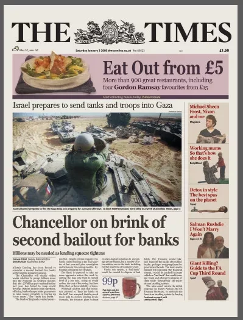

### 사토시 나카모토의 실종

2010년 비트코인이 언론의 주목을 받기 시작하자, 사토시는 2010년 12월 12일 포럼 게시물을 통해 자신의 탈퇴를 발표하며 거리를 두기로 결정했습니다. 2011년 4월 23일, 그는 이메일을 통해 마지막으로 개인 거래소를 공개한 후 사라졌고, 자신이 만든 비트코인은 커뮤니티의 손에 맡겨졌습니다.

> "정부는 중앙집권적으로 통제하는 데 능숙합니다
> 냅스터와 같은 통제된 네트워크는 아니지만, 순수 P2P 네트워크는
> 그누텔라와 토르는 잘 버티고 있는 것 같습니다." - 사토시 나카모토
사토시의 부재에도 불구하고 비트코인은 계속 개발되었습니다. 비트코인의 역사는 10분마다 기록되고 있으며, 프로토콜은 오늘날까지도 의도한 대로 작동하고 있습니다. 두려움, 불확실성, 의심과 상관없이 비트코인은 매우 강력한 온라인 가용성을 바탕으로 계속 전진하고 있습니다. 실제로 이 [웹사이트](https://bitcoinuptime.com/)에 따르면 비트코인은 만들어진 이래 99.988%의 시간 동안 큰 문제 없이 작동하고 있습니다.

어떤 사람들은 비트코인을 [균사체](https://brandonquittem.com/bitcoin-is-the-mycelium-of-money/)와 같은 곰팡이 개체로 정의하기도 하고, 어떤 사람들은 [블랙홀](https://dergigi.com/)로 묘사하기도 합니다. 좋든 싫든 비트코인은 새로운 통화 시스템의 심장박동처럼 블록당 10분의 일정한 리듬을 유지하며 계속 존재하고 있습니다.

사토시 나카모토의 저술에 대해 자세히 알아보시려면 필 샴페인의 ["사토시의 책"](https://planb.network/en/resources/books/98)이나 ARTE 다큐멘터리 "르 미스테아르 사토시"를 시청해 보시기 바랍니다.

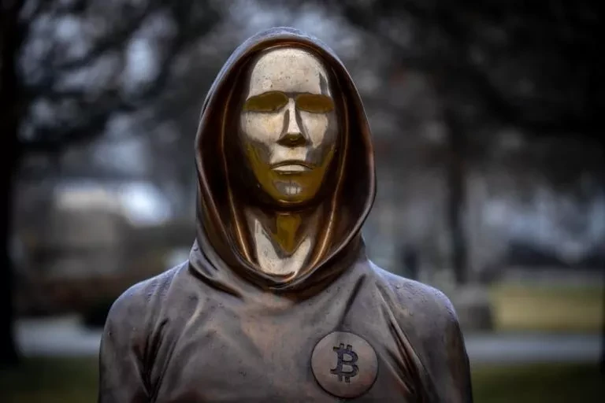

> "기존 통화의 근본적인 문제는 통화가 작동하는 데 필요한 모든 신뢰입니다. 중앙은행이 화폐 가치를 떨어뜨리지 않을 것이라는 신뢰가 있어야 하지만, 법정화폐의 역사는 이러한 신뢰의 위반으로 가득 차 있습니다. 은행은 우리의 돈을 보관하고 전자적으로 이체할 수 있도록 신뢰를 받아야 하지만, 그들은 신용 거품에 휩싸여 준비금이 거의 없는 상태에서 돈을 빌려주었습니다." - [Satoshi Nakamoto](https://satoshi.nakamotoinstitute.org/posts/p2pfoundation/1/)
이제 몇 가지 배경 지식을 살펴보았으니 비트코인 거래가 일반적으로 어떻게 작동하는지 살펴보겠습니다.

## 비트코인 거래

<chapterId>03482644-5473-590b-975b-b43bb65eac21</chapterId>

비트코인 거래는 단순히 비트코인 주소를 사용해 비트코인의 소유권을 이전하는 것입니다. 이 과정을 설명하기 위해 두 주인공을 소개해드리겠습니다: 앨리스와 밥입니다. 앨리스는 비트코인을 구매하고자 하지만 밥은 이미 비트코인을 소유하고 있습니다.

### 1단계 - 지갑을 통해 트랜잭션 생성하기

밥이 앨리스에게 비트코인을 전송하려면 앨리스는 자신의 비트코인 지갑에 고유한 비트코인 주소 중 하나를 제공해야 합니다. 개인 키가 공개 키를 생성하는 데 사용되는 것처럼, 후자는 주소를 생성하는 데 사용됩니다.

구체적으로 설명하자면, 앨리스가 지갑을 열고 '받기'를 누르면 QR코드 또는 주소(예: bc1q7957hh3nj47efn8t2r6xdzs2cy3wjcyp8pch6hfkggy7jwrzj93sv4uykr)가 표시될 수 있습니다. 이것은 일종의 '비트코인 IBAN' 역할을 하며, 밥에게 제공합니다.

그 후 밥은 비트코인 지갑을 열고 '보내기'를 눌러 트랜잭션을 생성합니다. 그런 다음 앨리스의 주소를 복사하여 필수 필드에 붙여넣고 송금하고자 하는 금액을 추가한 다음 채굴자가 다음 블록에 거래를 포함하도록 하는 인센티브 역할을 하는 트랜잭션 수수료를 결정합니다. 실제로 밥이 지불하는 수수료가 높을수록 다음 블록에 포함된 거래가 블록체인, 즉 모든 비트코인 거래를 기록하는 공개적이고 불변하는 원장에 추가될 확률이 높아집니다.

거래를 완료하려면 밥은 송금하려는 비트코인의 소유자임을 확인하기 위해 자신의 개인 키로 서명해야 합니다. 이 단계는 보통 모바일 지갑에서 자동으로 이루어지거나 실물 지갑에서 확인하는 형태로 이루어집니다: "X를 Y에게 정말 보내시겠습니까? 예 또는 아니오".

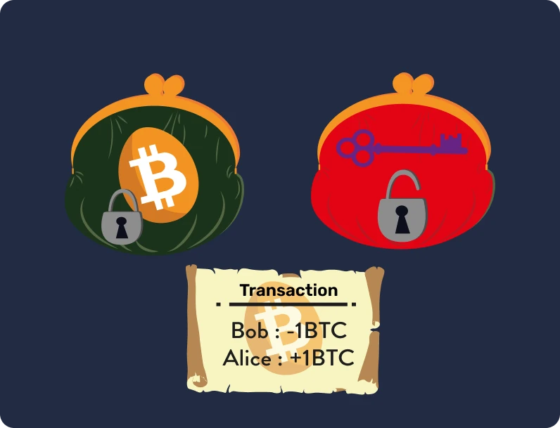

**수수료를 지불하는 이유** 수수료는 블록에 트랜잭션을 포함하기 위한 자유 시장을 만드는 데 필수적입니다. 실제로 블록의 크기는 1MB(세그윗 업데이트 이후 4MB로 확장됨)이므로 블록에 '삽입'할 수 있는 트랜잭션의 수는 블록당 수천 개로 제한됩니다. 트랜잭션의 크기는 트랜잭션의 복잡성에 따라 달라집니다. 따라서 일반적으로 트랜잭션이 복잡할수록 수수료가 더 많이 발생합니다.

### 2단계: 노드를 통한 트랜잭션 전파

이 단계에서 트랜잭션이 생성되었으며 밥의 지갑은 이를 비트코인 네트워크와 공유합니다. 이를 위해 밥의 지갑은 비트코인 네트워크의 노드와 통신하고, 노드는 이 정보를 다른 노드에 전파합니다. 이러한 과정을 통해 전체 네트워크가 이 새로운 트랜잭션을 확인하고 이를 반영할 수 있습니다.

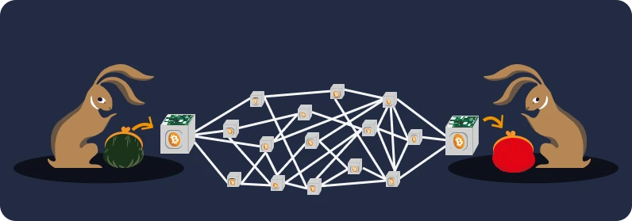

이 시점에서 이 거래는 멤풀이라는 도구를 통해 모든 사람에게 알려져 있지만, 블록체인에 거래를 포함시켜 거래를 검증하는 유일한 사람인 채굴자가 블록에 삽입하기 전까지는 확정된 것으로 간주할 수 없습니다.

실제로 채굴자는 유효하고 확인되지 않은 트랜잭션을 모아 블록으로 컴파일하는 역할을 합니다. 간단히 말해, 채굴자는 비트코인 블록체인의 다음 블록이 되기 위해 '작업 증명'이라는 프로세스에서 암호학적 퍼즐을 풀어야 합니다.

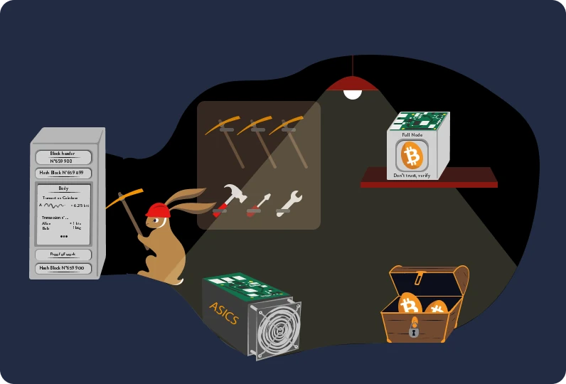

### 3단계: 채굴자가 트랜잭션을 블록에서 채굴합니다.

작업 증명 시스템은 해당 블록에 대한 유효한 '해시'를 찾아야 합니다. 해시는 256자로 구성된 블록과 관련된 고유한 지문이라고 생각하시면 됩니다. 이 해시의 유효성은 비트코인 네트워크의 난이도에 따라 달라집니다(자세한 내용은 나중에 설명하겠습니다). 지금은 채굴자가 유효한 블록을 발견했고 밥이 앨리스에게 보낸 트랜잭션이 그 블록에 포함되어 있다고 가정해 보겠습니다. 그러면 새로운 유효한 블록이 모든 비트코인 사용자의 공통 장부인 블록체인에 추가됩니다.

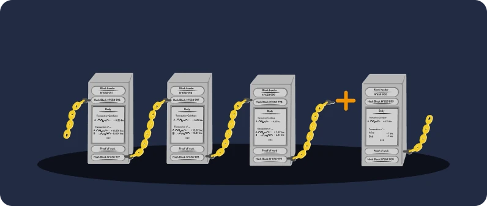

### 4단계: 블록이 유효하며 앨리스의 참조 노드에 의해 확인되었습니다.

이 단계에서 트랜잭션은 유효한 것으로 간주되며, 채굴자는 자신의 노드를 통해 새 블록을 네트워크에 전파하고 앨리스의 지갑이 업데이트됩니다.

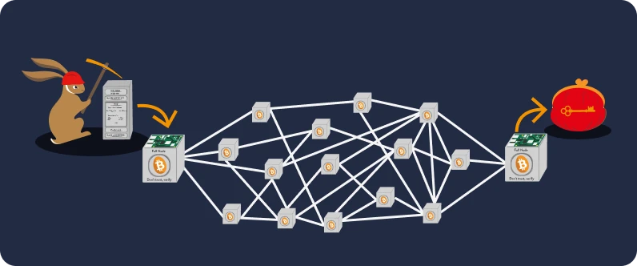

**참고**: 앨리스가 자신의 주소 중 한 곳에서 비트코인을 받았다는 알림을 받더라도, 해당 트랜잭션은 **6**개의 확인을 받은 후에만 변경 불가능한 것으로 간주하는 것이 좋습니다. 이는 밥의 거래가 포함된 블록 위에 6개의 블록을 추가로 채굴해야 한다는 뜻입니다. 즉, 트랜잭션이 블록체인에 오래 보관될수록 불변성이 높아집니다.

### 이 프로세스의 중요성은 무엇인가요?

비트코인 거래 시스템은 탈중앙화되어 있으며 신뢰할 수 있는 중개자 없이 피어 투 피어 방식으로 작동합니다.

밥이 비트코인 네트워크에 트랜잭션을 전송하고 채굴자가 밥의 트랜잭션이 포함된 유효한 블록을 게시하면 앨리스는 해당 비트코인을 자신의 소유로 간주할 수 있습니다. 비트코인 소유권 이전의 어떤 단계에서도 신뢰가 필요하지 않습니다. 프로토콜 규칙과 경제적 인센티브만으로도 비트코인 시스템 내에서 악의적인 행동을 하는 데 엄청난 비용이 들기 때문입니다.

실제로 사용자는 자신의 개인 키로 거래에 디지털 서명함으로써 자금의 소유권을 이전합니다. 반면, 채굴자는 제한된 권한을 가지고 있으며, 사용자는 비트코인 노드를 사용해 새로운 블록과 포함된 트랜잭션을 검증함으로써 상당한 통제권을 유지합니다. 모든 노드는 원장의 전체 또는 일부 사본을 가지고 있으므로 비트코인 노드가 형성하는 네트워크는 시스템을 진정한 탈중앙화 시스템으로 만듭니다.

결과적으로 비트코인 네트워크를 완전히 파괴하려면 모든 비트코인 노드의 블록체인 사본을 모두 제거해야 하는데, 이는 노드의 지리적 분포와 물리적인 압수의 어려움으로 인해 사실상 불가능한 작업입니다.

비트코인 노드가 어떻게 작동하는지 자세히 살펴보겠습니다.

## 비트코인 노드

<chapterId>8533cebc-f799-528b-89df-8d75d4c37f1c</chapterId>

노드는 여러 가지 중요한 기능을 수행하는 비트코인 네트워크 아키텍처의 기본 요소입니다:


- 비트코인 블록체인 사본 유지 관리
- 거래 유효성 검사
- 다른 노드로 정보 전송
- 비트코인 프로토콜의 규칙을 시행합니다.

따라서 비트코인 노드라고 불리는 비트코인 소프트웨어를 실행하는 모든 장치(종종 [비트코인 코어](https://bitcoin.org/en/bitcoin-core/)를 사용)는 네트워크의 탈중앙화에 기여합니다.

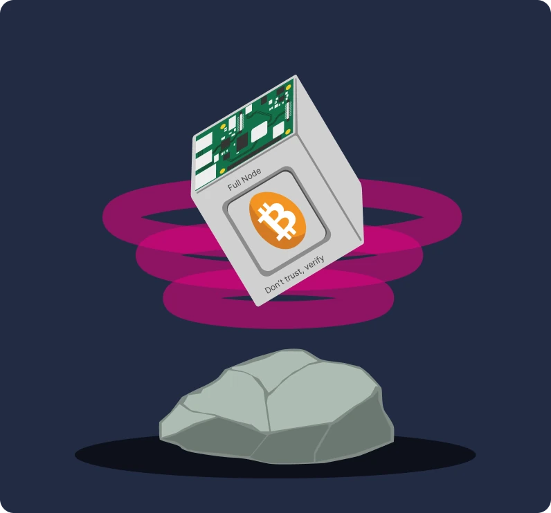

### 노드는 비트코인의 핵심입니다.

각 노드는 거래 검증을 허용하고 사기 시도를 방지하는 블록체인의 사본을 보유합니다. 탈중앙화된 네트워크의 특성 덕분에 비트코인은 뛰어난 복원력과 견고함을 제공합니다. 실제로 비트코인 프로토콜을 중단하려면 전 세계의 모든 노드를 종료해야 합니다. 참고로 2023년 9월 현재 전 세계에 약 [45,000개의 노드](https://bitnodes.io/nodes/all/)가 분포되어 있습니다.

노드는 비트코인 합의 규칙을 따르기 때문에 블록과 트랜잭션의 유효성을 검증할 수 있습니다. 이러한 규칙은 채굴자의 보상 금액(다음 섹션에서 자세히 설명하겠습니다) 및 유통되는 비트코인 수량과 같은 비트코인의 통화 정책을 수립합니다. 노드는 모든 네트워크 참여자가 동일한 규칙을 따르기 때문에 비트코인 프로토콜의 중립성을 보장하는 네트워크의 법률 시스템과 같은 역할을 합니다. 합의 규칙을 변경하려면 모든 노드의 승인이 필요하기 때문에 합의 규칙은 거의 변하지 않습니다.

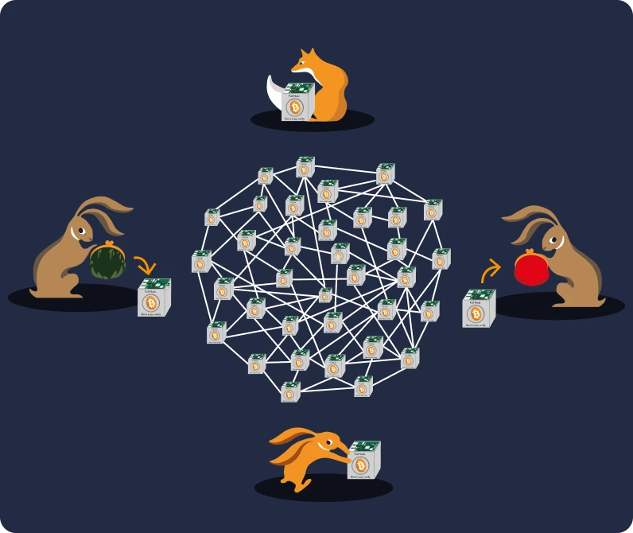

프로토콜 내 거버넌스는 이 기본 과정의 범위를 벗어나지만, 비트코인 노드를 운영하는 각 사용자는 어떤 규칙을 따를지 결정할 수 있다는 점을 알아두는 것이 중요합니다. 사용자는 다른 규칙을 따르도록 선택할 수 있지만(즉, 코드를 수정하는 등), 이러한 변경으로 인해 현재 합의 규칙이 무효화되면 해당 노드는 더 이상 비트코인 네트워크의 일부가 되지 않습니다. 따라서 주요 수정은 드물고 다양한 이념과 이해관계를 가진 수천 명의 참여자 사이에서 상당한 조율이 필요하며, 모든 비트코인 사용자가 '더 나은' 것으로 간주하는 업데이트를 제공해야 합니다.

### 노드는 어떻게 생겼나요?

자체 노드를 설치하고자 할 때 사용할 수 있는 몇 가지 옵션이 있으며, 유지 관리 비용이 다릅니다. 컴퓨터에서 비트코인 코어 소프트웨어를 간단히 실행할 수 있지만 블록체인의 크기가 약 500GB이므로 상당한 양의 저장 공간이 필요합니다. 이러한 제약을 극복하기 위해 "프루닝 노드"를 생성하여 마지막 N개의 블록만 메모리에 보관하도록 선택할 수 있습니다. 이 두 번째 솔루션의 경우 노드가 필요할 때만 활성화되므로 비용이 무시할 수 있을 정도로 저렴합니다.

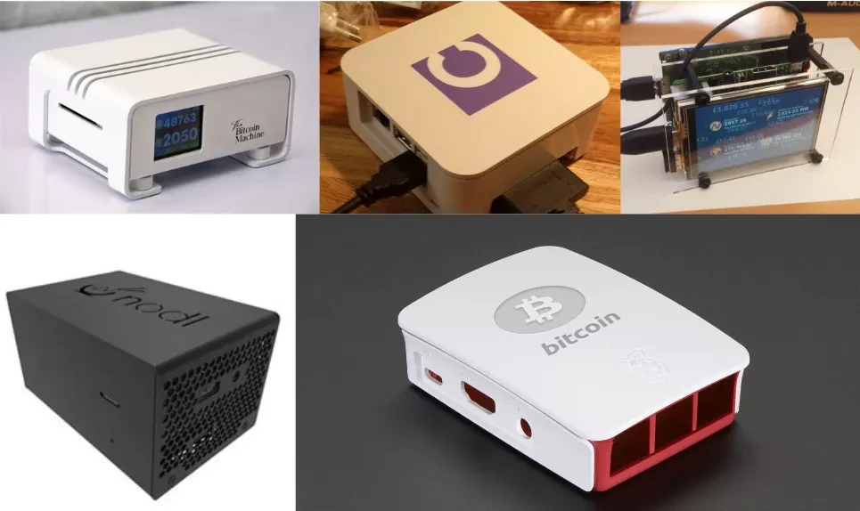

두 번째 옵션은 충분히 큰 SSD(약 ~2TB)가 장착된 라즈베리파이 4와 같은 전용 하드웨어를 사용하는 것입니다. 이 다른 옵션은 하드웨어를 구입해야 하는 경우 더 비싸지만 전기 소비량 측면에서 연간 €10,00 미만을 나타냅니다.

대역폭 관점에서 보면 10분마다 1MB씩 1블록을 사용한다고 가정하면 한 달에 약 5GB에 해당합니다.

### 노드는 모든 사람이 액세스할 수 있어야 합니다!

하드웨어 리소스, 스토리지, 대역폭 측면에서 비트코인 노드의 저렴한 비용과 접근성은 네트워크의 탈중앙화를 촉진하는 매우 중요한 특징입니다.

사실, 누구나 노드를 운영해야 할 충분한 이유가 있습니다! 얻는 이익에 비해 비용과 노력은 미미합니다. 모험을 시작하고 수천 명의 다른 비트코인과 함께 비트코인 네트워크를 형성하기만 하면 됩니다.

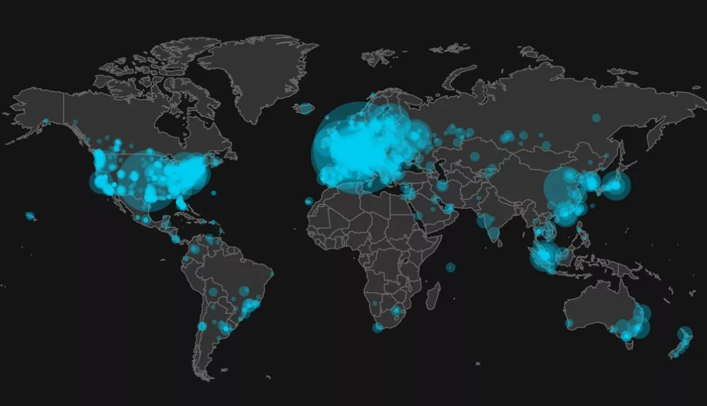

반대로 블록이 100배 더 무거우면 10분마다 100배 더 많은 트랜잭션을 처리할 수 있지만, 비트코인 노드를 운영하려면 50TB 하드 디스크, 월 500GB 이상의 대역폭, 10분 이내에 수십만 건의 트랜잭션을 검증할 수 있는 하드웨어가 필요합니다. 블록이 100배 더 큰 이 가상 상황에서 비트코인 노드를 운영하는 것은 일반인이 접근할 수 없으며, 이는 프로토콜의 탈중앙화와 거래 및 합의 규칙의 불변성을 모두 훼손할 수 있습니다.

따라서 프로토콜 제약은 가능한 한 많은 사람이 자신의 비트코인 노드를 운영할 수 있도록 설계되었습니다. 실제로 2017년은 '블록 크기 전쟁'으로 알려진 격렬한 논쟁의 해였습니다. 이 갈등은 블록 크기를 늘려 비트코인을 수정하여 거래 용량을 늘리려는 사람들(채굴자, 거래소 플랫폼, 기관)과 사용자의 독립성과 권한을 지키려는 사람들(노드, 사용자)이 대립했습니다. 결국 두 번째 쪽이 승리했습니다.

이 승리 이후, 노드들은 세그윗이라는 업데이트를 활성화하여 비트코인 블록체인의 두 번째 계층으로 구축된 비트코인 즉시 결제 네트워크인 라이트닝 네트워크의 구현을 위한 길을 열었습니다. 이러한 상황은 사용자가 노드를 통해 비트코인 내에서 실질적인 권한을 갖고 있으며, 의견 충돌이 있을 때 대형 기관에 맞설 수 있다는 것을 보여줍니다.

## 광부

<chapterId>dbb8264a-7434-57e4-9d1b-fbd1bae37fdf</chapterId>

**채굴자는 네트워크를 보호하고 블록에 트랜잭션을 추가합니다. 채굴자는 비트코인 작업 증명을 해결하기 위해 ASIC 기계를 통해 전기를 사용합니다**

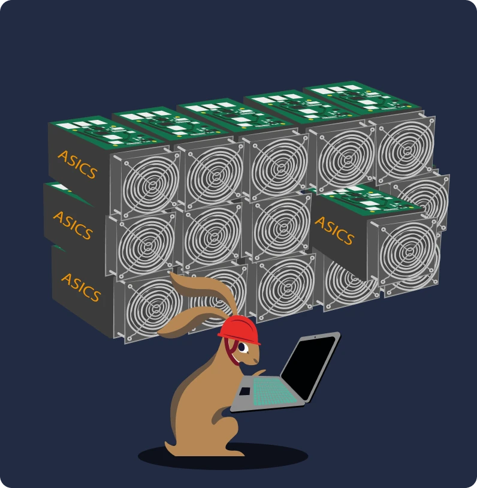

### 작업 증명에 대한 설명

"작업 증명"(POW)은 비트코인 프로토콜의 보안 합의 메커니즘입니다. 이는 모든 것의 기초이며 비트코인의 게임 이론에서 중요한 역할을 합니다.

작동 방식을 설명하기 위해 누구나 참여할 수 있는 보편적인 복권을 상상해 보겠습니다. 목표는 당첨자가 유효한 블록에 서명하고 비트코인으로 보상을 받을 수 있는 특정 숫자를 찾는 것입니다. 참여자(채굴자)는 올바른 숫자를 찾을 때까지 1, 52, 2648, 26874615, 15344854131318631 등과 같은 수십억 가지의 가능성을 시도할 것입니다.

선택한 번호가 맞는 경우: 잭팟! 그렇지 않으면 검색이 계속됩니다.

시도 횟수를 최적화하기 위해 초당 수십억 개의 가능성을 계산하는 유일한 역할을 하는 ASIC이라는 특정 기계를 사용합니다(총 시도 횟수를 "해시레이트"라고 함). 이러한 기계를 작동하려면 대량의 전기가 소비되어야 합니다. 따라서 POW는 에너지를 화폐로 변환하여 현실 세계와 디지털 세계를 연결하여 최초의 에너지 기반 화폐를 만들어냅니다.

기계는 계속 작동하고 평균 10분이 지나면 우승자가 나타나며, 이 참가자는 난이도 임계값 아래로 떨어지는 정확한 해시를 찾는 데 성공합니다. 그러면 최종 우승자가 타임스탬프 서버의 새 블록에 서명하여 블록체인에 추가합니다. 그들은 보상을 받고 다음 블록 채굴에 도전하기 위해 돌아옵니다. 이 과정은 10년 이상 지속되어 왔으며, 승자는 10분마다 비트코인 거래를 확인하는 동시에 과거 거래를 보호함으로써 비트코인 블록체인을 더욱 견고하고 안전하게 만듭니다.

2016 블록마다(약 2주마다) **난이도 조정**을 통해 참여자 수에 따라 글로벌 채굴 게임의 밸런스가 재조정됩니다. 이 조정은 시간이 지남에 따라 채굴자 수와 이들의 컴퓨팅 파워가 크게 달라질 수 있기 때문에 필요합니다. 목표 블록 시간을 유지하기 위해 네트워크는 지난 2016년 블록이 얼마나 빨리 채굴되었는지에 따라 난이도를 재조정합니다. 너무 빨리 채굴된 경우 난이도가 증가하여 올바른 해시를 찾기가 더 어려워집니다. 반대로 너무 느리게 채굴되었다면 난이도가 낮아져 올바른 해시를 찾기가 더 쉬워집니다.


### 마이닝은 끊임없이 진화하고 있습니다

수년에 걸쳐 채굴자들은 가능한 한 가장 비용 효율적인 방법으로 최소한의 에너지를 소비하면서 초당 최대한 많은 해시(해시레이트)를 생성하기 위해 점점 더 효율적인 컴퓨터 하드웨어를 갖추게 되었습니다. 사토시나 할 피니와 같은 초기 채굴자들은 CPU만을 사용해 채굴을 시작했고, 다른 채굴자들은 그래픽 카드를 사용해 채굴을 시작했습니다. 오늘날 채굴자들은 SHA256 알고리즘만을 적용하도록 설계된 기계인 ASIC(애플리케이션별 집적 회로)를 사용합니다.

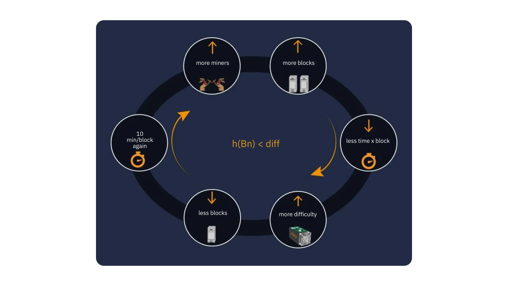

비트코인 네트워크의 해시레이트는 다음 블록을 찾기 위한 초당 시도 횟수를 나타냅니다. 현재는 초당 500,000억 번 시도되는 500TH/s를 넘어섰습니다! 글로벌 해시레이트가 높을수록 악의적인 행위자가 채굴 능력의 대부분을 확보하는 데 필요한 자원을 독점하고 자금을 두 번 이상 소비하는 것이 더 어려워집니다(이중 지출 문제). 따라서 비트코인 프로토콜의 규칙을 어기는 것보다 규칙을 따르는 것이 경제적으로 더 유리합니다.

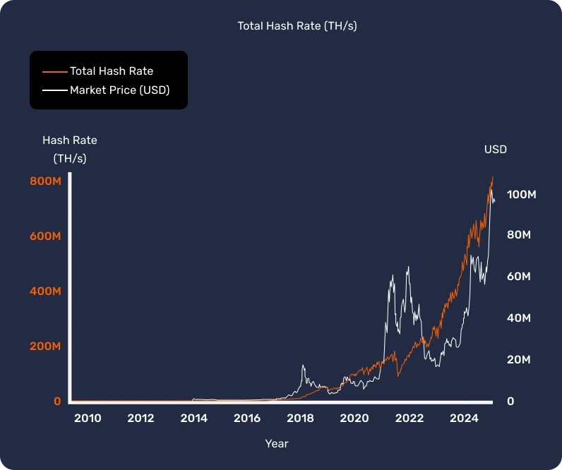

### 블록에서 무엇을 찾을 수 있나요?

블록 헤더에는 시간, 난이도 목표, 마지막 블록의 수, 사용된 버전, 이전 트랜잭션의 머클 루트와 같은 여러 요소가 포함되어 있습니다.

코인베이스 트랜잭션**은 항상 블록에 가장 먼저 포함되며, 여기에는 검증자의 작업을 수행한 채굴자의 보상이 포함되어 있습니다. 그 다음에는 검증 트랜잭션이 포함됩니다. 채굴자는 자신에게 가장 많은 수익을 가져다주는 거래, 즉 최대 수수료를 가진 소규모 거래를 삽입합니다.

### 채굴자 보상

처음에 채굴자는 유효한 블록을 발견하면 보상을 받습니다. 더 정확하게는 두 가지 방식으로 보상을 받습니다:


- 블록에 포함된 보조금(새로 발행된 비트코인)을 통해 얻을 수 있습니다;
- 블록에 포함된 트랜잭션의 거래 수수료를 통해 수익을 창출합니다.

보조금 금액은 합의 규칙에 의해 정의되며, 에포크에 따라 달라집니다: **블록 보상 = 블록 보조금 + 트랜잭션 수수료**.

실제로 첫 번째 블록의 경우, 블록 보조금은 50비트코인이었습니다. 21만 블록마다(약 4년마다) 이 금액은 절반으로 줄어듭니다. 현재(2024년)는 5번째 에포크에 해당하며, 이는 보조금이 3.125비트코인이라는 것을 의미합니다. 요컨대, 이것은 시스템에서 새로운 비트코인을 방출하는 자동 메커니즘입니다. 보조금은 시간이 지남에 따라 2,100만 비트코인의 발행 한도에 도달할 때까지 감소합니다. 이미 1,940만 개 이상의 비트코인이 유통되고 있으며, 이는 92% 이상입니다.

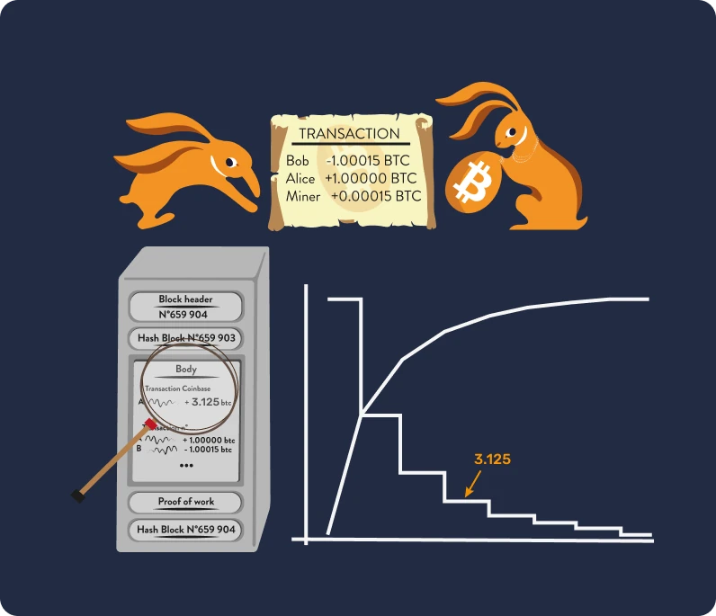

두 번째 보상 방법은 사용자가 거래 수수료로 선택한 금액으로 정의되며, 이는 사용자가 자신의 거래를 다음 블록에 포함시키고자 하는 긴급성을 나타냅니다. 채굴자는 수입을 극대화하기를 원하기 때문에 거래 수수료가 높은 거래를 우선시하는 경향이 있습니다.

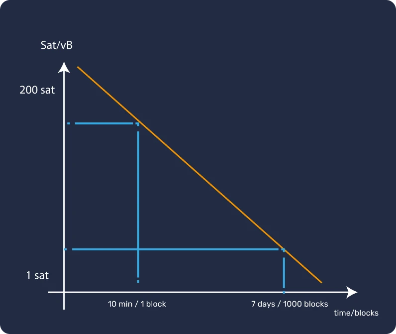

각 유효한 블록에 대해 받는 보상에 의존하는 비즈니스 모델을 안정화하기 위해 채굴자는 종종 '채굴 풀'을 통해 그룹을 만들어 컴퓨팅 리소스를 공동 사용하는 경우가 많습니다.

### 왜 이 모든 것을 귀찮게 할까요?

요컨대, 비트코인의 혁신은 유동적인 난이도의 작업 증명 기반 블록체인을 사용하여 이중지불 문제에 대한 해결책을 제시하는 것입니다. 디지털 세계에서 소유권의 개념은 물리적 세계와 다릅니다. 실제로 디지털 세계에서는 모든 것을 복사하여 붙여넣을 수 있기 때문에 가치 있는 디지털 자산을 더 많이 사용할 수 있는 위험이 존재합니다. 이러한 기술적 문제를 해결하고 자산이 전송되면 더 이상 발신자의 소유가 아니라는 것을 보장하기 위해 은행과 같은 신뢰할 수 있는 중개기관이 만들어졌습니다.

하지만 신뢰할 수 있는 중개자 없이 어떻게 이런 일을 할 수 있을까요? 이 문제는 다양한 행위자를 신뢰할 수 없는 시스템에서 정보를 조율하는 문제인 비잔틴 장군의 역설을 통해 잘 설명됩니다. 비잔틴 장군 문제에서 한 무리의 장군들이 한 도시에 대한 공격을 조율해야 하지만 일부는 계획을 방해하려는 반역자일 수 있습니다. 문제는 충성스러운 장군들이 배신자들로부터 오해의 소지가 있는 메시지를 받으면서도 공격 또는 후퇴 여부에 대한 합의에 도달해야 한다는 것입니다.

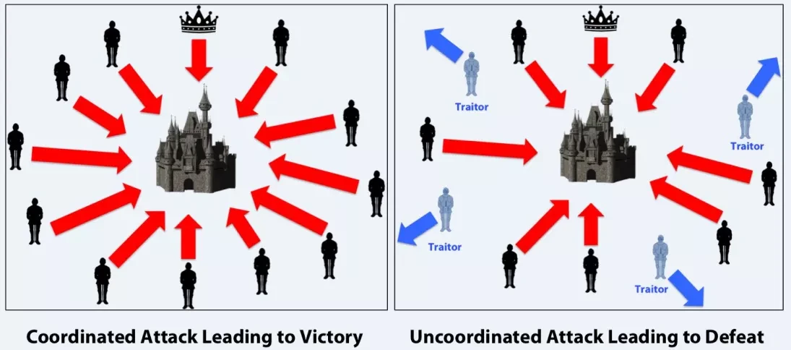

따라서 비트코인은 이 문제를 해결하거나 적어도 이를 우회하기 위한 일종의 해결책입니다. 비트코인의 '장군', 즉 채굴자는 (정보의) 블록을 생성하고 비트코인 노드는 합의 규칙을 사용하여 금융 거래를 검증하여 정보의 진위를 확인합니다. 정보 생산과 검증 사이의 에너지 비용의 비대칭성은 신뢰할 수 있는 제3자 없이도 정보의 신뢰성을 보장합니다.

채굴자는 비트코인 네트워크 보안의 구축자입니다. 이들은 해시를 생성하는 데 에너지를 소비함으로써 악의적인 에이전트가 거래 내역을 다시 작성하는 데 엄청난 비용이 드는 벽을 만들고, 이러한 경제적 불이익은 다른 사람들이 부정직하게 행동하지 못하도록 막습니다.

에이전트가 해시레이트의 절반 이상을 소유하는 51% 공격의 경우에도 공격자는 블록체인을 수정하기 위해 모든 채굴자를 합친 만큼의 에너지를 소비해야 하므로 네트워크는 안전하게 유지됩니다. 이러한 에너지 집약적인 작업 증명 메커니즘이 네트워크의 보안을 보장합니다.

### 요약

비트코인에 적용된 게임 이론은 ASIC 머신을 사용해 채굴에 성공하면 보상을 받는 부정직한 채굴자를 배제합니다. 또한, 이들은 종종 마이닝 풀에 가입하여 컴퓨팅 파워를 공유하고 더 작지만 더 정기적으로 보상을 받기도 합니다. 비트코인 채굴은 높은 에너지 비용이 발생하지만, 비트코인 네트워크의 운영과 보안을 위해 매우 중요합니다. 작업 증명 메커니즘과 블록체인 기술은 이중 지출 문제를 해결하고 신뢰할 수 있는 제3자에 의존하지 않고도 정보의 무결성을 보장합니다. 정보를 생산하려면 상당한 에너지가 필요하지만, 그 정보를 검증하는 데는 무시할 수 있는 비용이 발생합니다. 이러한 비대칭성은 네트워크의 보안을 강화하여 합의 규칙을 어기기보다는 합의 규칙을 준수하는 것이 더 경제적으로 실행 가능하게 만듭니다.

비트코인 채굴이라는 특정 주제에 대해 더 자세히 알아보고 싶으시다면 MIN 201 강좌를 참고하시기 바랍니다. 이 과정에서는 작업 증명의 작동 방식과 역할, 채굴 산업의 메커니즘에 대해 알아볼 수 있습니다. 또한 ASIC을 히터로 변환하여 집을 난방하면서 첫 사토시를 채굴할 수 있는 방법도 설명합니다!

https://planb.network/courses/ce272232-0d97-4482-884a-0f77a2ebc036
## 비트코인과 생태학

<chapterId>4b227ae6-443a-5739-b443-60b7931130d9</chapterId>

이전 섹션에서 비트코인 프로토콜의 보안은 신뢰할 수 있는 제3자 없이 거래의 공개 원장을 생성하기 위해 높은 에너지 소비에 의존한다는 점을 이해했습니다. 주류 미디어에서는 전체 에너지 비용을 종종 작은 국가의 전기 사용량과 비교합니다. 하지만 이 비교가 의미가 있을까요? 이러한 비용의 원인을 이해하는 것과 관련이 있을까요?

### 비트코인의 에너지 비용.

먼저 채굴의 환경 비용을 정성적으로 평가해 보겠습니다. 채굴자는 ASIC과 같은 기계와 이 기계에 전력을 공급하는 전기 형태의 에너지원이 있어야 합니다. ASIC은 대부분 알루미늄으로 만들어지며, 재활용하거나 다른 용도로 재사용할 수 있습니다(MIN201 강좌에서 설명한 것처럼 Antminer S9을 공간 난방기로 개조하는 Attakaï 프로젝트에서 볼 수 있습니다). 따라서 주요 관심사는 에너지 소비량입니다.

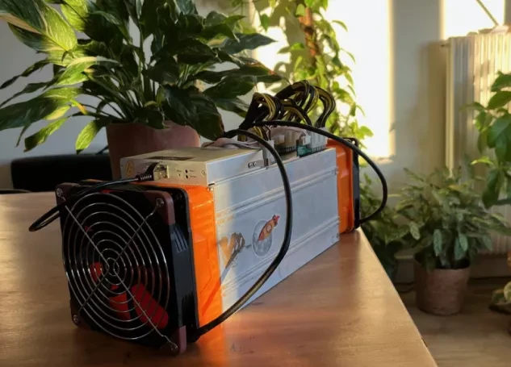

전기 소비는 채굴자에게 거의 모든 비용을 차지합니다. 따라서 채굴자들은 발전소가 설치되어 있지만 아직 해당 지역의 전력망에 연결되지 않은 곳으로 갈 수 있도록 저렴한 전기 공급원을 찾도록 권장됩니다. 이 경우 채굴자는 최후의 구매자 역할을 하여 발전소가 전기 네트워크에 연결되기 전에도 자금을 확보할 수 있도록 합니다. 전력망이 연결되면 전기 수요가 증가하여 가격이 상승하고 채굴자가 이러한 지역에서 전기를 얻는 것이 수익성이 떨어집니다. 채굴기를 쉽게 옮길 수 있다면 채굴자들은 채굴기를 설치하고 수요가 적고 가격도 낮은 곳, 즉 친환경 발전소에서 에너지를 얻을 수 있는 지역에 더 멀리 정착할 것입니다.

### 끝없는 논쟁

따라서 비트코인의 생태학적 영향에 대한 논쟁은 주로 비트코인의 유용성에 대한 이해 부족으로 인해 잘못된 방향으로 흘러가는 경우가 많습니다. 비트코인은 채굴자가 현재 네트워크와 과거 네트워크를 모두 보호하고 거래가 그룹화되어 있으며 모두 동일하지 않기 때문에 단순히 거래당 에너지 비용으로만 평가할 수 없습니다. 게다가 라이트닝 네트워크의 영향은 고려되지도 않았습니다. 비트코인이 너무 많은 에너지를 소비한다고 주장하는 사람들은 정치적 동기가 있거나 자체 블록체인 솔루션을 판매하려는 의도가 있을 수 있습니다. 많은 경우, 생태학적 구실이 비트코인 금지를 정당화하기 위해 사용됩니다.

비트코인은 혁명적인 발명품으로서 경제적 억압이나 독재 정권 아래서 살아가는 개인이 자유를 위해 싸울 수 있는 수단을 제공한다는 점을 강조하는 것이 중요합니다. 최후의 수단으로서 비트코인은 검열과 은행 규제를 우회하여 재정적 독립을 위한 경로를 제공합니다. 비트코인은 단순한 통화를 넘어 커뮤니케이션의 한 형태이자 자유의 상징이며, 채굴자들이 소비하는 에너지는 이러한 자유를 지키는 데 중요한 역할을 하며, 부채와 중앙은행의 과도한 화폐 발행이 지배하는 금융 시스템으로부터의 해방을 가능하게 합니다.

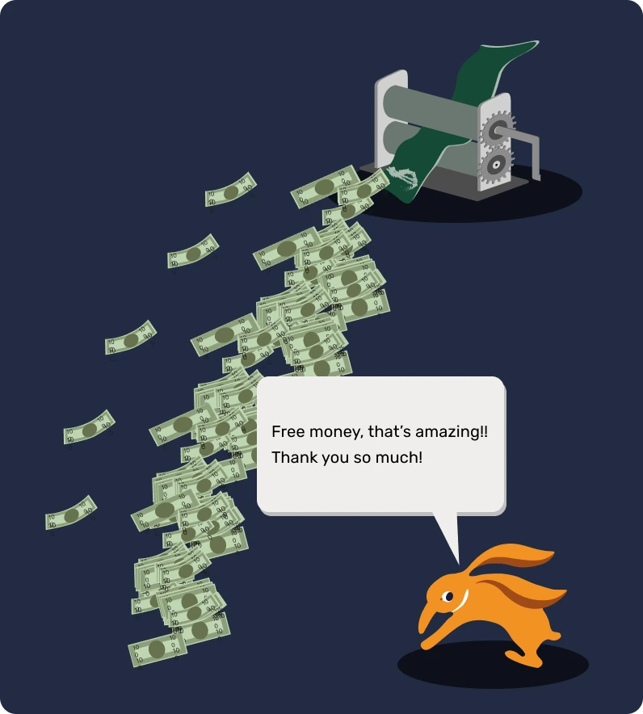

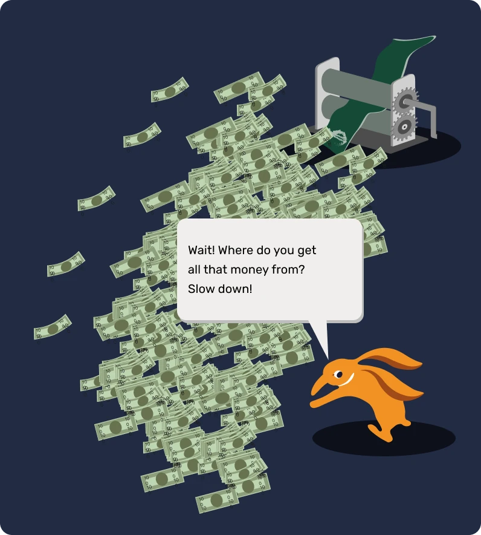

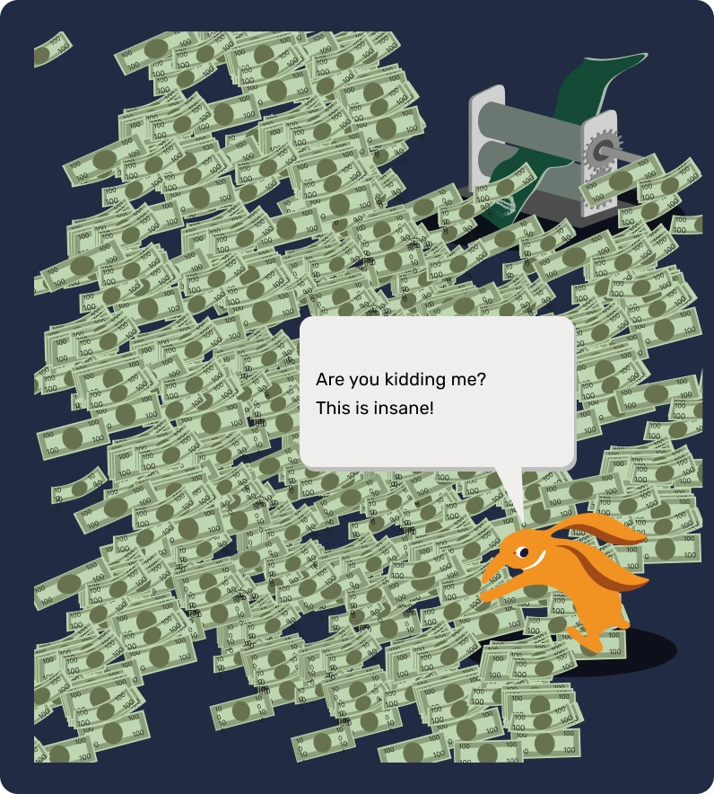

인플레이션율이 높은 국가에 사는 사람들에게 비트코인은 생존의 문제입니다. 비트코인은 불안정한 재정 상황에서 생존할 수 있는 수단을 제공합니다. 또한 비트코인은 보다 공평하고 공정한 금융 시스템을 제공하여 전 세계 수십억 명의 사람들에게 금융 자원에 대한 접근성을 제공합니다. 이러한 관점을 고려할 때 에너지 소비는 정당한 것일까요?

### 비트코인은 환경에 긍정적인 영향을 미칠 수 있습니다

마지막으로 비트코인 채택이 가져올 경제적, 환경적 결과에 대해 논의하는 것이 중요합니다.

현재의 금융 시스템과 비교했을 때, 후자는 과소비와 부채를 조장하기 때문에 심각한 문제를 야기합니다. 신용에 대한 쉬운 접근성, 은행의 화폐 발행, 부분 준비 은행의 관행과 같은 요인은 모두 과도한 부채와 그 결과 과도한 소비에 기여합니다.

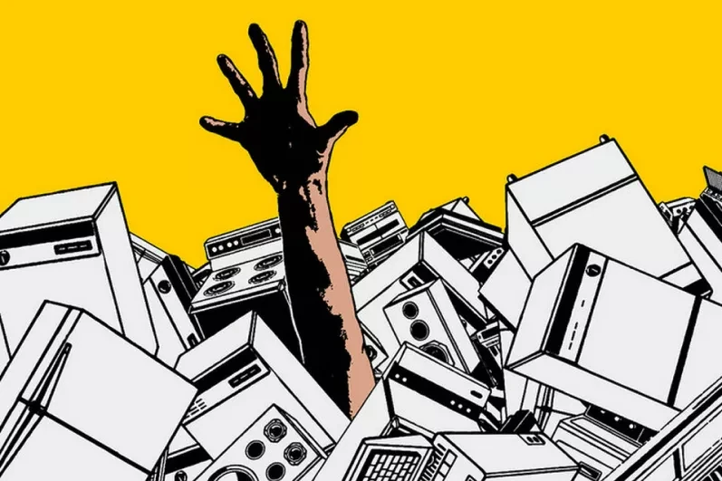

자원의 희소성을 화폐의 희소성에 반영하기 위해 화폐 시스템을 개혁할 필요가 있습니다. 이는 보다 책임감 있는 소비와 장기적인 비전을 장려할 것입니다. 반대로 인플레이션은 소비와 투자를 장려함으로써 장기적으로 환경에 부정적인 영향을 미칩니다.

현재의 금융 시스템은 오스트리아 경제학과는 달리 상황과 자원의 시간적, 동적 측면을 고려하지 않는 케인즈 경제학의 사상을 따르고 있습니다. 즉, 무제한 통화는 지구의 한정된 자원을 효과적으로 나타낼 수 없습니다.

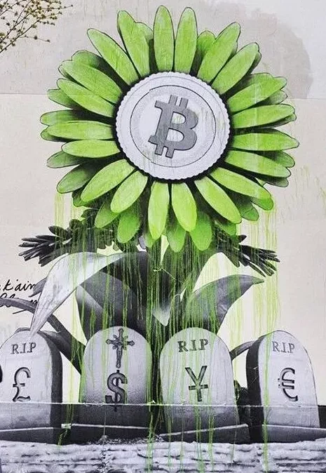

반면에 정치인들은 보통 단기적인 비전을 가지고 있으며 재선을 위해 경제 성장이 필요하기 때문에 장기적으로 생태 문제를 해결하지 못합니다. 반대로 비트코인과 같은 건전한 화폐의 도입은 사람들에게 경제적으로 힘을 실어줄 수 있는 잠재적인 대안이 될 수 있습니다.

그들은 비트코인이 친환경 에너지 사용을 촉진한다는 사실을 인정하지 않습니다. 예를 들어, 유정 현장에서 메탄을 태우고 오염을 방지하기 위해 불을 붙인 불길을 비트코인 채굴자가 끌 수 있는데, 이는 메탄을 전기로 변환하여 채굴기에 동력을 공급할 수 있어 환경에 유익하기 때문입니다.

**비트코인의 격언 중 하나를 따르세요: 믿지 말고 직접 확인하세요!

### 비트코인의 기술적 특징에 대한 간략한 요약

사토시 나카모토는 2009년 1월 비트코인 프로토콜을 발표했으며, 이후 비트코인 노드를 보유한 개발자, 채굴자, 사용자 커뮤니티의 성장에 힘입어 발전해 왔습니다. 이러한 노드는 모든 비트코인 거래의 공개 장부인 비트코인 블록체인의 자체 사본을 보관함으로써 비트코인의 합의 규칙에 따라 거래의 유효성을 보장할 수 있습니다. 여기에는 채굴자가 보류 중인 수천 개의 트랜잭션이 포함된 유효한 블록을 생성하도록 보장하는 것도 포함됩니다.

평균적으로 10분마다 블록이 생성되며, 다음 블록에 유효한 해시를 찾은 채굴자는 합의 규칙에 정의된 금액과 유효한 블록에 포함된 모든 거래의 거래 수수료를 프로토콜에서 보상으로 받습니다. 주어진 입력에 대한 해시 알고리즘(SHA256)의 결과는 예측할 수 없으므로 채굴 과정에는 수많은 후보 블록을 생성하고 해시가 유효한지 여부를 테스트하는 과정이 포함됩니다. 그러나 채굴자의 수와 컴퓨팅 성능에 관계없이 두 블록 사이의 평균 시간이 일정하게(약 10분) 유지되도록 하기 위해 유효한 해시를 찾는 난이도는 2016블록마다, 즉 약 2주마다 조정됩니다. 채굴자들은 줄당 해시 속도, 즉 초당 시도 횟수와 소비된 에너지당 해시 속도를 높이기 위해 ASICS라고 하는 특수 SHA256 기계를 개발해 왔습니다.

채굴자가 채굴 활동에서 최대한의 수익을 내기 위해서는 가능한 한 가장 저렴한 전기를 얻어야 하는데, 이는 주로 아직 전력망에 연결되지 않은 발전소 내 외딴 곳에서 이루어집니다. 그런 다음 채굴자는 최후의 수단으로 전기를 구매하는 역할을 하며, 수요 증가로 인해 전기 가격이 상승하면 채굴자는 활동을 다른 곳으로 옮기는 경향이 있습니다.

따라서 비트코인 프로토콜은 프로토콜의 각 구성 요소가 전 세계에 지리적으로 분산되어 있기 때문에 검열할 수 없고 막을 수 없는 화폐 시스템입니다. 예를 들어, 모든 대륙에 40,000개 이상의 비트코인 노드가 있습니다. 비트코인의 합의 규칙은 이를 어기는 것보다 따르는 것이 경제적으로 더 이익이기 때문에 행위자 간에 신뢰가 필요하지 않습니다. 비트코인은 리더가 없으며 누구도 막을 수 없습니다. 비트코인을 제한하기 위해 거래소 플랫폼을 규제할 수 있다고 해도 이러한 접근 방식은 시스템에 미치는 영향이 미미합니다. 요컨대, 어떤 판사나 국가도 비트코인을 검열하거나 막을 수 없습니다.

# 비트코인은 어떻게 얻나요?

<partId>517e1bb7-f032-51a0-930a-a91fe5148d3f</partId>

## 비트코인은 잠들지 않습니다!

<chapterId>d5e35e41-ea26-5478-8eb9-07daf9dff508</chapterId>

비트코인 가격은 종종 상당한 변동성을 특징으로 합니다. 다른 금융 시장과 마찬가지로 시장 변동이나 강세 및 약세 국면에 따라 가치가 크게 변동될 수 있습니다.

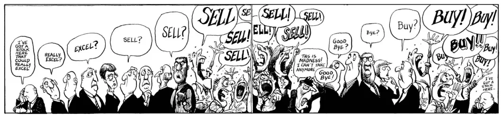

간단히 말해, 인간은 모든 것을 한꺼번에 사고 모든 것을 한꺼번에 파는 경향이 있습니다. **비트코인도 인간의 본성에서 자유로울 수 없습니다

### 채택의 물결 이해하기

비트코인의 발전과 진화는 비트코인의 생태계를 점진적으로 통합해 온 다양한 주체 그룹과 크게 연관되어 있습니다.

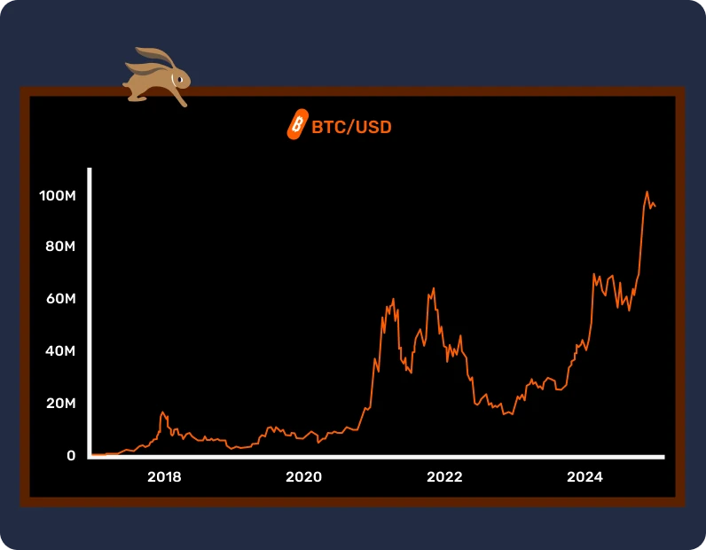


- 신자들:

비트코인의 초기 사용자는 주로 테크노필, 사이퍼펑크, 자유주의자, 금광 애호가들이었습니다. 이들은 신뢰가 필요 없는 전자 화폐로서의 가치, 검열에 대한 저항성, 투명하고 불변하는 통화 정책 때문에 비트코인에 매료되었습니다.


- 다크 웹 및 범죄자

이후 비트코인은 실크로드와 같은 다크 웹 마켓플레이스까지 사용 범위가 확대되었는데, 이는 통제할 수 없고 익명성이라는 특성으로 인해 해당 플랫폼을 넘어 범죄 활동을 하는 일부 사람들을 끌어들였기 때문입니다. 그러나 합법성을 결정하는 것은 도구 자체가 아니라 도구의 적용이라는 점을 강조하는 것이 중요합니다. 비트코인을 불법적으로 사용한다고 해서 본질적으로 범죄자가 되는 것은 아니며, 불법으로 분류될 수 있는 것은 특정 행위입니다. 예를 들어, 비트코인을 사용하여 특정 약물을 구매하는 것은 거래가 이루어지는 지역의 규정에 따라 합법 또는 불법이 될 수 있습니다.


- ICO 열풍과 일반 대중의 등장.

2017년은 암호화폐 업계에 상당한 투기 거품이 일었던 해로, 특히 수천 개의 암호화폐공개(ICO)가 시작되었습니다. 그러나 이러한 새로운 암호화폐 중 상당수는 구체적인 개발이나 유용성이 없었고 빠르게 사라졌습니다. 2017년의 거품은 2018~2019년에 강력한 조정으로 이어졌습니다.


- NFT 버블과 디파이

그리고 2020년, 시장은 또다시 비트코인 가격을 6만 달러까지 끌어올린 투기적 버블을 경험했습니다. 이번 버블은 금융기관과 대기업을 포함해 투자자가 광범위하게 다변화되었다는 점에서 이전 버블과는 달랐습니다. 그러나 이전의 버블과 마찬가지로 초기의 행복감이 사라지면 상당한 조정이 뒤따르는 경향이 있습니다.

### 비트코인과 변동성

과거 주기를 보면 비트코인 경제 주기의 주기성은 두 번의 반감기 사이의 기간과 동일한 것으로 보이는데, 이는 반감기 이벤트가 새로운 비트코인 배출을 반으로 줄이는 트리거 역할을 하기 때문일 수 있습니다.

이러한 큰 변동으로 인해 비트코인은 변동성이 큰 자산으로 명성을 얻었으며, 종종 사용자에게 상당한 손실을 초래하기도 합니다. 며칠 만에 가격이 10%, 20%, 심지어 50%까지 하락할 수 있지만 비트코인 프로토콜 자체는 가격 변동에 영향을 받지 않는다는 점을 이해하는 것이 중요합니다.

이러한 상당한 변동성은 오늘날 비트코인 주체들이 전적으로 받아들이고 있으며, 금융 헤지(스테이블코인), 강력한 장기적 믿음(호들링), 또는 확실한 이해 없이 비트코인에 자금을 100% 투자하는 위험을 피하는 등 여러 가지 솔루션을 통해 완화할 수 있습니다. 따라서 비트코인 가격의 변동폭이 큰 이유를 이해하는 것은 궁극적으로 시장을 어느 정도 조절하고 조절하는 데 도움이 되는 가격 변동과 주기를 이해하는 것이 이 산업에서 발전하는 데 필수적입니다. 그러나 비트코인이 성장하고 성숙해짐에 따라 변동성의 영향력이 줄어든다는 점을 알아두는 것이 중요합니다.

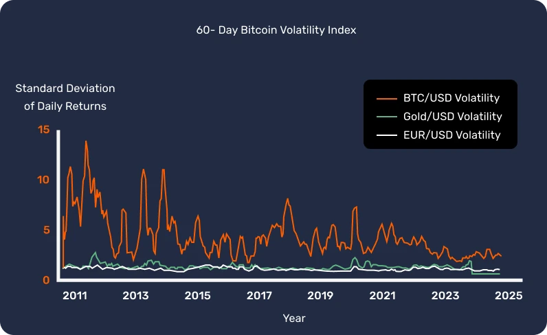

비트코인/달러 쌍은 단기적으로 변동하지만, 비트코인은 2100만 비트코인이라는 제한된 수량과 반감기(평균 4년마다 화폐 생성량을 절반으로 줄이는 과정)로 인해 준기계적인 방식으로 일반적인 상승 추세를 따릅니다. 물론 다른 금융 자산과 마찬가지로 비트코인은 행복감, 투기 거품, 조정 등 경제 주기의 영향을 받습니다. 이러한 현상은 시장이 항상 합리적이거나 효율적이지 않은 신흥 기술에서 흔히 볼 수 있는 현상입니다.

### 독특한 시장

이러한 투기 거품의 주기는 전 세계에서 매우 독특하며, 단일 자산에서 이러한 일련의 거품이 연속적으로 발생하는 경우는 드뭅니다. 이러한 현상은 비트코인이 단순히 터질 운명의 거품이 아니라는 사실에 기인할 수 있습니다. 오히려 비트코인은 전 세계에서 활발하게 사용되는 통화로 기능하고 있습니다. 비트코인 프로토콜은 24시간 연중무휴로 글로벌 규모로 운영된다는 점이 특징이며, 이는 이를 규제하려는 금융 당국에게 상당한 도전이 되고 있습니다.

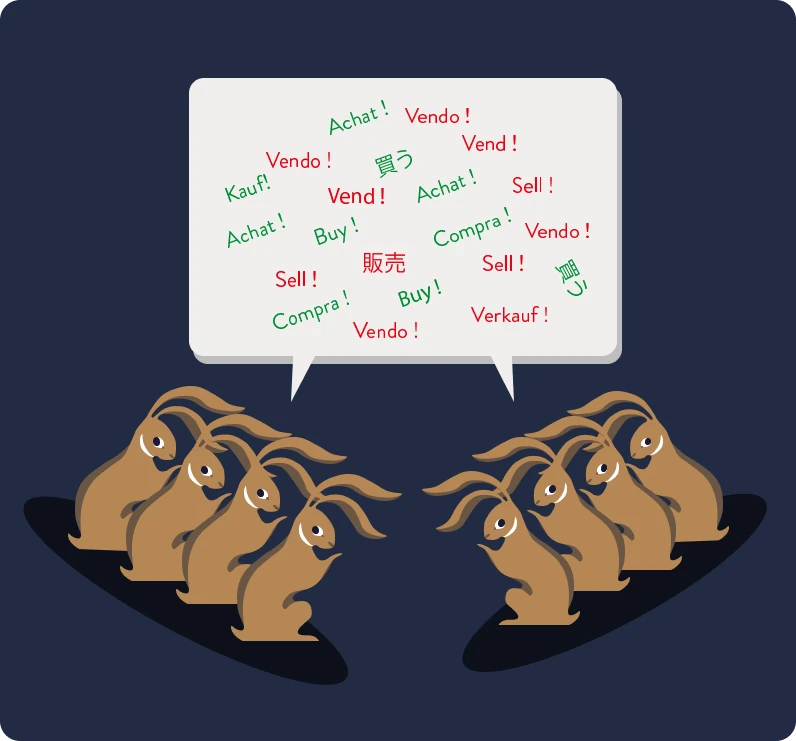

오늘날 비트코인은 전통적인 시장에 점점 더 많이 통합되면서 계속해서 생존하고 성장하고 있으며, 비트코인 ETF의 도입, 더 명확한 규제, 향상된 취득 및 보관 도구가 모두 이러한 긍정적인 모멘텀에 기여하고 있습니다. 비트코인이 다시 한 번 투기 거품에서 살아남았으니, 결국 비트코인이 허황된 거품이 아닐지도 모릅니다!

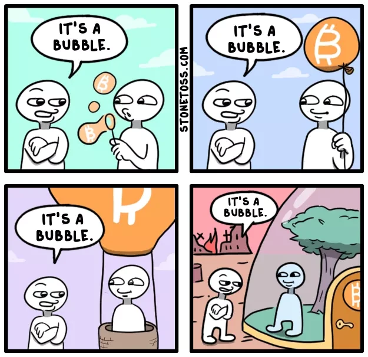

## 일을 통해 비트코인 획득하기

<chapterId>be2d83be-406f-582c-83ca-6aa905ff7b04</chapterId>

### 병렬 경제가 발전하고 있습니다

비트코인은 상품이나 서비스를 판매하고 비트코인으로 결제할 수 있기 때문에 법정화폐와 병행 경제를 구축하는 도구로 볼 수 있습니다. 거래 플랫폼을 거칠 필요 없이 비트코인 지갑에서 다른 지갑으로 이동하는 것만으로 비트코인으로 직접 거래할 수 있습니다.

2021년부터 비트코인을 법정화폐로 채택한 엘살바도르와 같이 전 세계 일부 지역에서는 비트코인 경제가 존재하며 발전하고 있습니다. 우리 주변에는 이미 비트코인을 제품이나 서비스에 대한 결제 수단으로 받아들이는 개인, 기업, 단체가 있습니다.

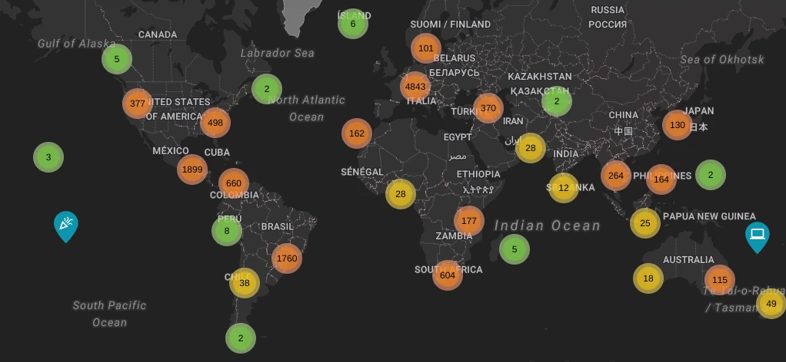

또한, 일상적인 거래에서 비트코인 사용을 촉진하기 위한 오픈 소스 및 협업 프로젝트인 [BTCMap](https://btcmap.org/map#2/21.28937/5.46680)이 시작되었습니다. 이 플랫폼에는 비트코인을 허용하는 모든 가맹점과 전 세계의 다양한 비트코인 커뮤니티가 나열되어 있으므로 웹사이트를 방문하여 주변의 비트코인 생태계를 살펴볼 수 있습니다. 이처럼 어려움과 망설임에도 불구하고 BTC맵과 같은 이니셔티브는 비트코인 경제를 모두가 더 쉽고 편리하게 이용할 수 있도록 하는 데 기여하고 있습니다.

### 비트코인을 구매하는 대신 비트코인을 받아들여야 하는 이유는 무엇인가요?

비트코인을 얻으려면 프랑스 금융감독청(AMF) 또는 미국 증권거래위원회(SEC)와 같은 기관에서 규제하는 플랫폼에서 구매할 수 있지만, 이 솔루션은 거래 추적이 수반됩니다. 비트코인을 얻는 또 다른 방법은 제공하는 제품이나 서비스에 대한 결제 수단으로 비트코인을 받는 것으로, 비트코인 가격에 대해 지속적으로 걱정할 필요 없이 작업을 통해 비트코인을 획득할 수 있습니다.

또한, 비트코인을 판매자로 받아들이면 검열 저항, 거래 수수료 절감, 효율성 향상, 인플레이션 방지, 금융 자유와 주권 등 여러 가지 이점이 있습니다.

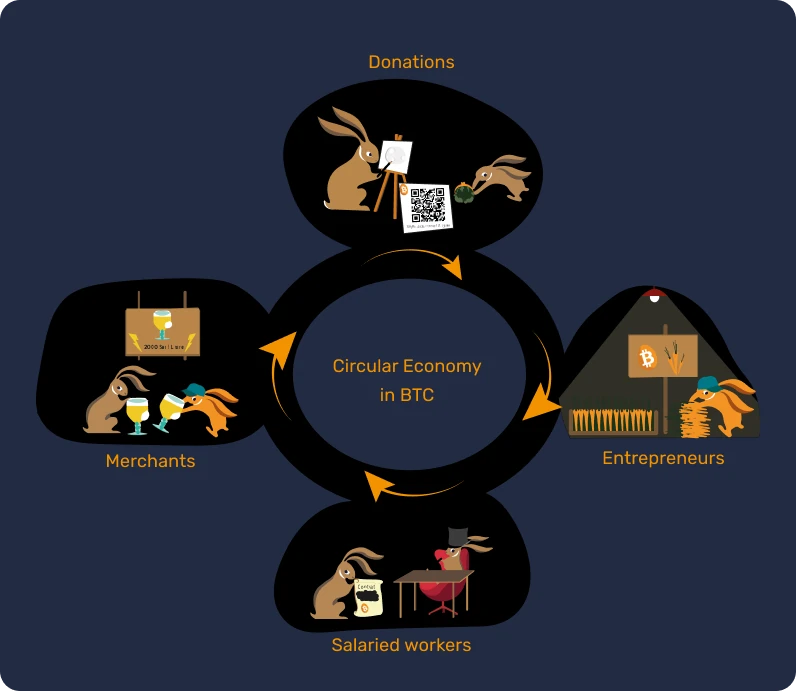

### 어떻게 진행하나요?

비트코인을 수락하려면 사용 가능한 다양한 솔루션을 검토하고 비즈니스에 가장 적합한 솔루션을 선택해야 합니다. 완벽한 솔루션은 없으며, 예상 거래량, 할당된 예산, 비즈니스 유형(온라인 또는 오프라인) 등 여러 가지 요소를 고려하여 선택해야 합니다.

이 주제는 다른 강좌에서 자세히 다루겠지만, 간단하게 설명하기 위해 몇 가지 비즈니스 범주와 관련 솔루션을 고려할 수 있습니다.


- 간단한 온라인 솔루션: OpenNode

https://planb.network/tutorials/merchant/merchant/open-node-e69a0c1c-47f7-4932-8494-e6f26c3c9784

- 아마추어 판매자를 위한 솔루션입니다: 스위스 비트코인 페이

https://planb.network/tutorials/merchant/merchant/swiss-bitcoin-pay-2-a78b057e-ed11-47ac-860c-71019fcb451a

- 대규모 조직이나 열정적인 비트코인을 위한 솔루션입니다: BTCpay 서버

## 비트코인으로 저장하기

<chapterId>1d9570c6-5b63-51a6-b87c-7bdb0fc4aa87</chapterId>

### 시작하기 전에 경고!

비트코인은 제한된 공급과 증가하는 수요로 인해 주요 금융 자산이 되었습니다. 하지만 비트코인 구매에는 특별한 주의가 필요한 위험이 따릅니다. 따라서 자금을 투자하기 전에 직접 조사하고 해당 주제에 대해 자세히 알아보고 기술에 익숙해지는 것이 좋습니다.


- 손실을 감당할 수 있는 만큼만 투자하세요.
- 비트코인은 변동성이 큰 금융 자산으로, 가격이 0까지 떨어질 수 있습니다.
- 과거 실적은 미래 실적을 예측할 수 있는 신뢰할 수 있는 지표가 아닙니다.
- 필요한 경우 재무 설계사에게 문의하세요.

**플랜 ₿ 네트워크는 어떠한 투자 조언도 제공하지 않으며, 여기에 명시된 어떠한 내용도 투자 조언으로 간주되어서는 안 됩니다**

### 뛰어들기 전 미니 체크리스트

비트코인 구매에 뛰어들기 전에 다음 사항을 확인하세요:


- 안전한 지갑.
- 비트코인에 대한 확실한 이해.
- 따라야 할 저축 계획.
- 장기적인 비전.

주제가 여전히 불분명하다면 BTC102 과정을 통해 첫 비트코인을 확보하고 획득하는 방법을 알아보세요. 여기서는 주제의 표면만 훑어보겠습니다.

구체적으로 두 가지 질문이 있습니다:


- 점진적 인수 전략을 채택해야 할까요, 아니면 한꺼번에 인수해야 할까요?
- 규제된 플랫폼을 사용해야 하나요, 아니면 규제되지 않은 플랫폼을 사용해야 하나요?

### 획득 전략


- 달러 비용 평균

점진적 전략은 반복 구매, 즉 소량의 비트코인을 일정한 간격으로 구매하는 것을 포함합니다. 이 방법은 시간이 지남에 따라 가격을 평준화하고 보유 비트코인의 양을 지속적으로 늘릴 수 있습니다. 장기 저축에 이상적인 솔루션이며 비트코인의 가격 변동성에 대한 우려를 덜어줍니다. 한 번 설정하면 잊어버리고 투자금이 늘어나는 것을 지켜볼 수 있습니다.

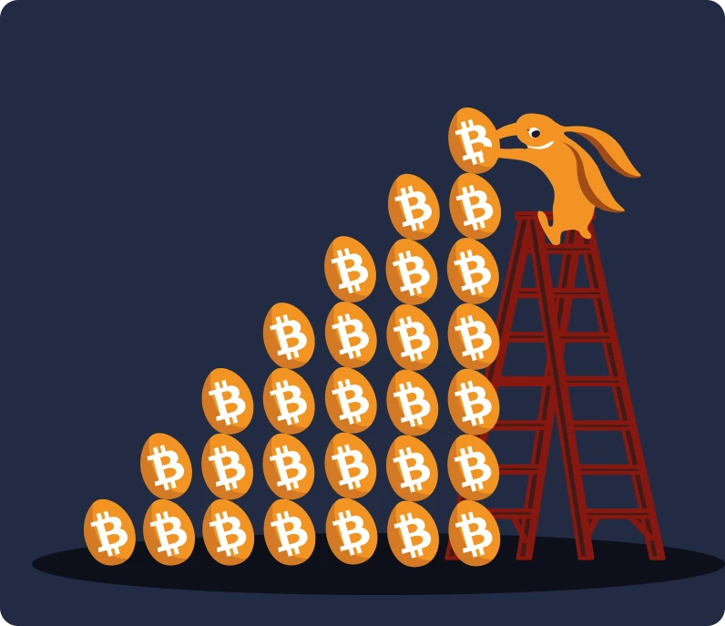

**UTXO 주의**: 지갑에 있는 UTXO를 수시로 통합하는 것을 잊지 마세요. 이 방법은 비트코인을 효과적으로 관리하고 거래 시 불필요한 수수료를 피하는 데 필수적입니다.

[UTXO]((https://planb.network/en/resources/glossary/utxo)는 아직 사용되지 않은 거래의 출력으로, 새로운 거래의 입력으로 사용되지 않았음을 의미합니다. 이를 통합하는 것은 여러 개의 작은 UTXO를 하나의 더 큰 UTXO로 결합하여 거래의 "무게"를 줄이고, 따라서 수수료를 낮추는 것을 의미합니다.

- 자발적 구매

즉시 비트코인에 노출되는 데 사용되는 자발적 구매를 한 번에 해결하는 방법도 있습니다. 폭락장에서 매수하든 보너스를 활용하든, 결정은 여러분의 몫입니다. 용기를 내서 구매 버튼을 눌러야 합니다.

이 경우 비트코인 가격이 매우 변동성이 클 수 있으므로 조심하고 감정을 조절해야 합니다. 사실 FOMO(실패에 대한 두려움)와 FUD(두려움, 불확실성, 의심)는 최악의 적입니다! 충동적이고 잠재적으로 해로운 의사결정을 피하기 위해 침착함을 유지하고 미리 수립한 전략을 따르는 것을 잊지 마세요.

### 비트코인은 누구에게서 구매해야 하나요?

비트코인을 획득하는 방법에는 여러 가지가 있으며, 각 방법에는 관할권에 따라 다를 수 있는 자체 규정이 적용됩니다. 일부 플랫폼은 본인 확인(KYC)을 위해 신분증을 요구하는 반면, 그렇지 않은 플랫폼도 있습니다. 따라서 각 플랫폼과 관련된 규정을 이해하는 것이 중요합니다.


- DCA 플랫폼

위에서 소개한 것처럼 비트코인을 모으는 일반적인 방법은 정기적으로 소량을 구매하는 달러 코스트 애버리징(DCA)입니다. 전용 페이지](https://planb.network/tutorials/exchange)에 나열된 것과 같은 여러 플랫폼에서 이 서비스를 제공합니다. DCA는 설정이 간단할 뿐만 아니라 일반적으로 지갑으로의 인출이 자동으로 이루어지므로 항상 자산을 통제할 수 있습니다.

오늘날 거의 모든 DCA 솔루션은 비교적 효율적이고 수수료가 거의 비슷하므로 해당 국가의 가용성에 따라 선택이 달라집니다.


- 브로커 플랫폼

대규모 투자에는 크라켄, 비트스탬프, 페이미엄과 같이 규제되고 인정받는 플랫폼을 추천합니다. 이러한 플랫폼은 대량 거래를 위한 안전한 보안 환경을 제공합니다.

사용법은 간단하고 누구나 쉽게 접근할 수 있습니다:

1. KYC/\* 계정 설정

2. 계정으로 자금 이체

3. 비트코인 구매

4. 지갑으로 비트코인 인출

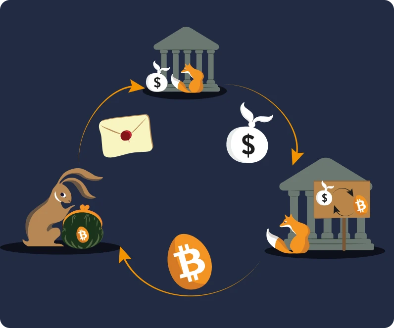

구매 후에는 해킹 및 자금 차단 위험을 최소화하기 위해 거래소 플랫폼에서 즉시 비트코인을 출금하는 것이 좋습니다. 인출 수수료는 플랫폼에 따라 최대 25유로까지 높을 수 있다는 점에 유의하세요.

**테러 자금 조달, 탈세, 자금 세탁 방지를 위해 사용자 신원 확인(KYC) 규정**에 따라 사용자는 신원 정보를 제공해야 합니다

KYC는 비트코인 업계에서 중요한 논의 주제라는 점을 인식하는 것이 중요합니다. 많은 사람들이 그 효과에 대해 논쟁을 벌이고 있지만, 이와 관련된 많은 우려도 있습니다. 저희 아카데미의 많은 교육 프로그램과 콘텐츠에서 고급 사용자에게는 개인 정보 보호에 더 중점을 둔 대안이 많으므로 KYC가 필요한 플랫폼을 피하라고 조언하고 있습니다.

### 비 KYC 솔루션

또한 P2P 거래소에서 비트코인을 사고 팔 수 있는 여러 [마켓플레이스](https://planb.network/tutorials/exchange)가 있습니다. 일반적으로 다음과 같은 사항을 고려합니다:


- 비트코인 ATM
- 다른 비트코인 애호가들과의 오프라인 모임
- 불법 및 규제되지 않는 플랫폼
- 피어 투 피어 매치메이킹 솔루션
- 비트코인 친화적인 국가에서 운영되는 네오뱅크.

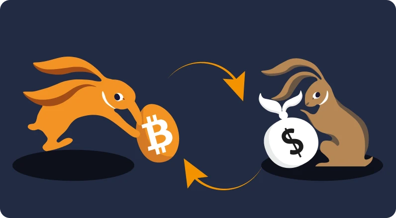

마지막으로, 납세의무는 관할권에 따라 달라질 수 있으므로 위험에 처할 수 있는 조치를 취하기 전에 해당 국가의 규정을 참조하는 것이 좋습니다.

## 하이퍼비트코인화

<chapterId>b7275d31-3b60-5fb7-b9f5-030097010553</chapterId>

### 거친 레이스는 이제 막 시작되었습니다!

다른 신기술과 마찬가지로 비트코인의 채택은 얼리 어답터에서 광범위한 수용으로 나아가는 과정을 보여주는 S자 곡선을 따릅니다. 우리는 얼리어답터의 시대를 넘어섰고, 여러 지표는 비트코인의 잠재적 민주화를 시사합니다. 결국 비트코인은 쉽게 멈출 수 없는 바이러스 같은 기술입니다. 한편으로 엘살바도르는 비트코인을 법정화폐로 완전히 채택하는 대담한 조치를 취했습니다. 반면에 다른 국가에서는 비트코인을 금지하고 사용을 범죄화하는 방식으로 대응하고 있는데, 이는 비트코인 채택이 복잡하고 문화적, 역사적, 국가적 요인에 영향을 받는다는 것을 보여줍니다.


비트코인의 등장으로 기업, 대학, 규제기관, 개인은 이 새로운 기술을 고려해야 합니다. 새로운 도구를 만들고, 서비스를 조정해야 하며, 생존을 위해 혁신을 지속해야 합니다. 이러한 맥락에서 암호화, 게임 이론, 경제 및 통화 정책, 컴퓨터 과학, 철학, 에너지, 법률, 규제 등 다양한 분야와 관련된 많은 질문이 제기됩니다. 요컨대, 비트코인은 여러 분야를 아우르는 주제입니다.


### 비트코인은 0에서 1

마지막으로 이 새로운 화폐 혁명에 대해 다시 한 번 생각해 보시기 바랍니다. 비트코인에는 탐구해야 할 것이 너무 많아서 모든 것을 한꺼번에 흡수하기에는 복잡합니다. 비트코인은 결코 사라지지 않을 것입니다. 오히려 혁명은 이제 막 시작되었습니다. 우리는 우리 아이들에게 물려주고 싶은 세상, 즉 인간의 주권이 권리인 세상, 프라이버시가 기본적으로 존중되는 세상, 돈이 조작되지 않는 세상을 만들 수 있다고 믿습니다. 우리는 함께 이를 달성할 수 있기를 바랍니다.

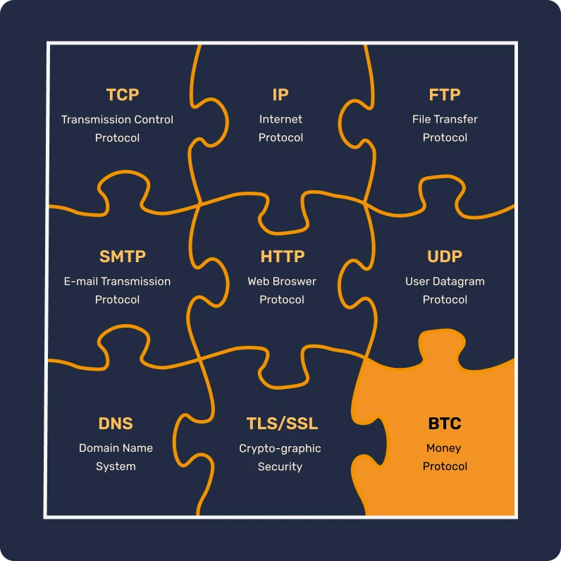

비트코인에 대한 지식을 넓히고 싶으시다면 지금이 적기입니다. 수많은 작가, 사상가, 에세이스트가 비트코인에 대한 교육 콘텐츠를 만들었습니다. 지난 몇 년 동안 저희는 이러한 저작물을 나열하고 분류하여 여러분 중 가장 호기심이 많은 분들을 위해 [자료 라이브러리](https://planb.network/resources)를 제공해 왔습니다. 이 섹션에서는 최고의 팟캐스트, 웹사이트, 기사, 튜토리얼, 서적 및 기타 콘텐츠를 찾을 수 있습니다.

> "저는 인터넷이 정부의 역할을 줄이는 주요 동력 중 하나가 될 것이라고 생각합니다. 아직은 없지만 곧 개발될 신뢰할 수 있는 전자 현금, 즉 인터넷에서 A가 B를 알지 못하거나 B가 A를 알지 못해도 A에서 B로 자금을 이체할 수 있는 방식이 바로 그것입니다." - 1999년 밀턴 프리드먼의 예측
# 비트코인의 미래: 라이트닝 네트워크

<partId>899fd35e-39e6-5a25-a73e-6fed6e725094</partId>

## 라이트닝 네트워크에 대한 간략한 소개

<chapterId>b403f1e4-f1ff-572b-a242-9b58cb3736d0</chapterId>

이제 비트코인 프로토콜의 기본을 알아봤으니, 비트코인 프로토콜을 사용해 초고속 거래를 가능하게 하는 결제 네트워크를 소개해드리겠습니다: 라이트닝 네트워크입니다!

다음은 일반적인 설명일 뿐이므로 더 자세한 내용을 알고 싶으시다면 LNP201 강좌를 확인하시기 바랍니다.

### 간단히 말해서

라이트닝 네트워크는 비트코인의 확장성 문제를 해결함으로써 비트코인에 대한 인식을 근본적으로 바꾼 혁신적인 기술입니다.

라이트닝 네트워크를 완전히 이해하려면 비트코인이 인프라 계층에서 어떻게 진화하고 발전하는지 이해하는 것이 중요합니다. 첫 번째 계층은 블록체인이고, 두 번째 계층은 라이트닝 네트워크입니다.

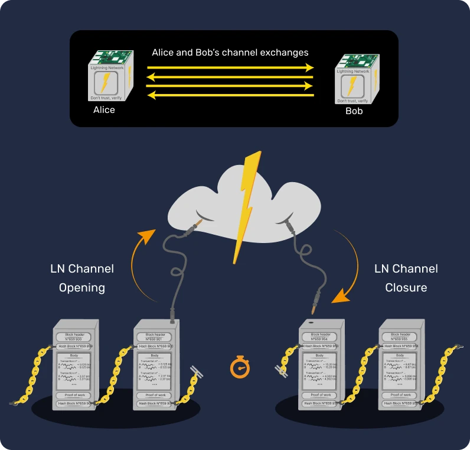

### 블록체인은 무한정 성장할 수 없습니다

라이트닝 네트워크는 비트코인의 확장성 문제를 해결하기 위해 2017년에 검증되고 구현되었으며, 즉각적이고 저렴한 비트코인 거래를 가능하게 합니다.

확장성 문제는 증가하는 채택에 대응하기 위해 초당 트랜잭션 수를 계속 늘릴 수 있는 화폐 시스템을 구현해야 하는 과제를 말합니다. 이 문제는 블록체인 트릴레마와 관련이 있습니다. 탈중앙화, 보안, 확장성을 꼭짓점으로 하는 삼각형이 있다고 상상해 보세요.

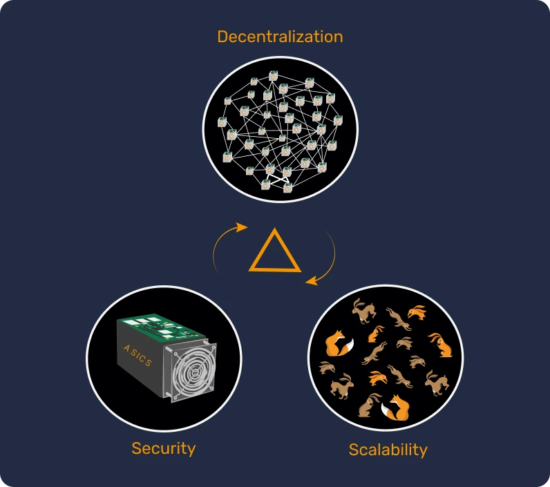

이에 따르면 블록체인 기반 프로토콜은 이 세 가지 기능 중 두 가지 기능만 충족할 수 있습니다. 비트코인 프로토콜 내에서 개발자들은 탈중앙화와 보안을 선호하는 선택을 해왔습니다. 한편으로는 1MB의 블록 크기와 두 블록 사이의 시간(평균 10분)으로 인해 더 낮은 비용으로 비트코인 노드를 운영할 수 있어 탈중앙화에 유리합니다. 반면, 작업 증명을 통해 블록을 생성하면 프로토콜 내에서 부정 행위가 발생하기 어렵고 네트워크 노드의 검증이 용이하며 보안에 유리합니다. 그러나 이러한 선택은 블록의 평균 트랜잭션 수에 제한을 두며, 이는 대략 초당 몇 건의 트랜잭션에 해당합니다. 이 수치는 VISA와 같은 결제 프로세서의 연산 능력(1700/s)과 비교하면 터무니없는 수준이지만, 검열에 저항하고 신뢰할 수 없는 방식으로 비트코인을 거래하기 위해서는 이 제한이 필요합니다. 그럼에도 불구하고 비트코인 개발자들은 초기부터 이 문제에 대해 고민해왔습니다.

### 라이트닝을 상단의 레이어로 사용

수년간의 고민과 여러 번의 시도 끝에 라이트닝 프로토콜이 등장했습니다. 이 프로토콜은 비트코인의 거래 프로토콜의 보안과 프로그래밍 기능을 활용해 P2P 결제 네트워크를 구축합니다. 라이트닝 네트워크는 결제 채널의 네트워크 역할을 하여 송금인에게 낮은 수수료로 즉시 거래를 가능하게 하며, 직접 채널 연결이 없는 개인 간의 교환 경로를 생성하기도 합니다.

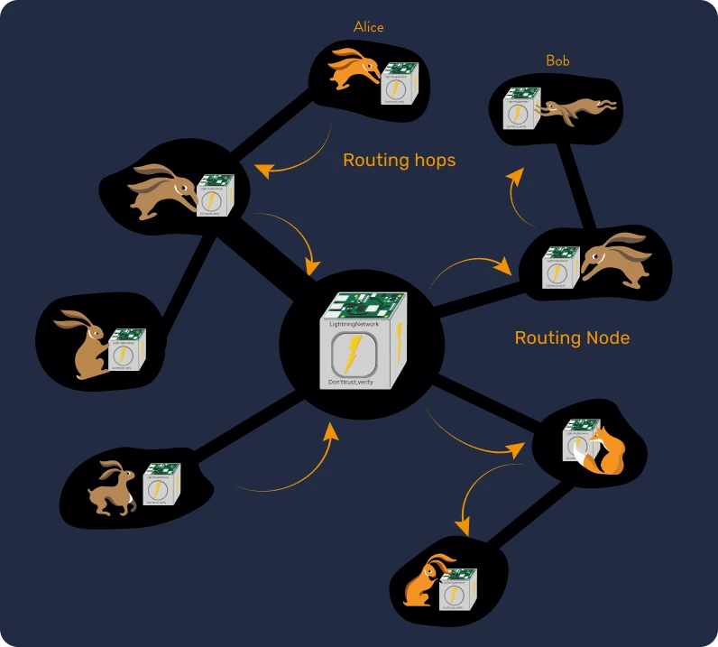

웨스턴 유니온, 중앙은행, 비자, 마스터카드와 같은 전통적인 송금 서비스는 현재의 결제 시스템보다 효율적이고 비용 효율적인 라이트닝 네트워크 기술을 채택하지 않으면 사라질 수 있습니다. 실제로 라이트닝 네트워크는 채널을 공유하는 두 피어 간에 거의 무제한의 거래를 가능하게 하며, 개별 거래가 아닌 채널 생성을 알리는 거래와 관련된 에너지 비용만 발생합니다.

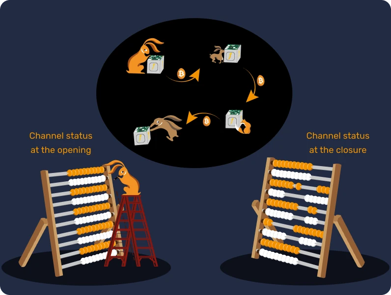

거래는 암호화를 통해, 그리고 비트코인에서 채굴자가 소비하는 에너지를 통해 간접적으로 보호됩니다. 지리적 제한 없이 매우 낮은 수수료(보통 0.5% 미만)로 즉시 거래할 수 있습니다.

요약하자면, 라이트닝 네트워크는 비트코인으로 사고 팔 수 있는 효율적인 결제 시스템을 구축하기 위한 유망한 시도입니다. 튜토리얼 섹션이나 라이트닝 네트워크 강좌를 통해 이미 수많은 라이트닝 지갑을 이용할 수 있습니다.

이 소개를 넘어 라이트닝 네트워크의 모든 작동 원리를 이해하고 싶다면, 이 주제에 대한 Fanis Michalakis의 훌륭한 강좌를 수강하는 것을 추천합니다:

https://planb.network/courses/34bd43ef-6683-4a5c-b239-7cb1e40a4aeb
## 라이트닝 네트워크 사용 사례

<chapterId>684e31f9-ebd1-51b6-91c0-1e6a315f1141</chapterId>

앞서 살펴본 바와 같이 비트코인 프로토콜은 혁신적이긴 하지만, 모든 일상 거래를 처리하는 데 필요한 확장성 측면에서 상당한 문제에 직면해 있습니다. 이러한 문제를 해결하기 위해 라이트닝 네트워크가 제안되었고, 이후 여러 가지 구현으로 발전해 왔으며, 모두 상호 운용이 가능합니다:


- 블록스트림의 코어 라이트닝
- Acinq의 Eclair
- 번개에 의한 LND

이 P2P 네트워크는 비트코인 블록체인의 높은 수수료와 긴 확인 시간으로 인해 실용적이지 않은 소액 거래(매우 낮은 가치의 거래)를 촉진하는 것을 목표로 합니다.

### 네트워크의 사용 사례는 무엇인가요?

이 기술은 비트코인의 보안과 탈중앙화를 보장하는 데 필요한 제약으로 인해 이전에는 접근이 불가능했던 다양한 잠재적 활용 사례의 문을 열어줍니다. 이러한 일상적인 사용 사례로는 오프라인 및 온라인 상거래에서의 즉시 결제, 실시간 결제를 위한 스트리밍 머니, 콘텐츠 제작자를 위한 소액 기부를 들 수 있습니다. 거의 즉각적이고 안전하며 평균 0.5% 미만의 낮은 수수료로 거래할 수 있는 네트워크를 통해 이전에는 상상할 수 없었던 많은 비즈니스 모델을 실현할 수 있습니다. 이는 라이트닝 네트워크가 비트코인의 가장 작은 단위인 사토시(sats)를 사용해 운영되기 때문에 가능한 일입니다.

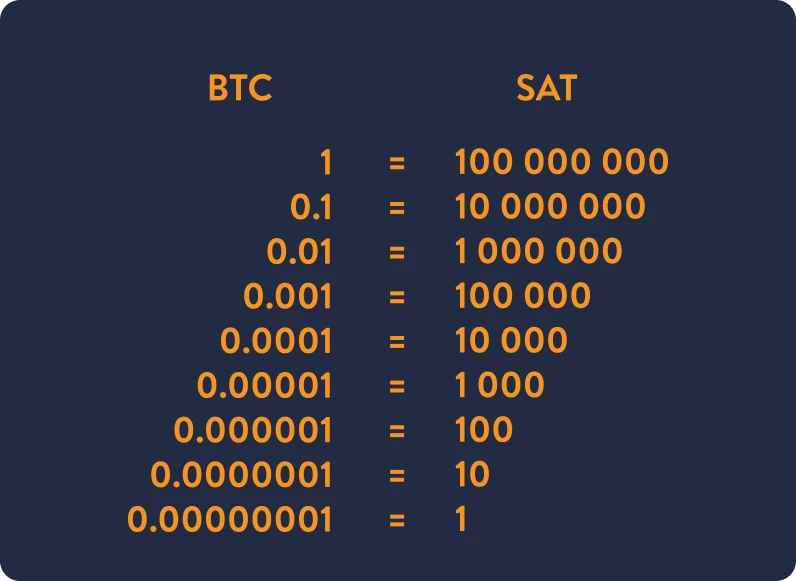

비디오 게임 산업은 라이트닝 네트워크가 기존 비즈니스 모델을 혁신하는 데 어떻게 사용될 수 있는지 보여주는 흥미로운 예시입니다. "게임 내 스킨"이라는 개념은 이러한 맥락에서 최근 인기를 얻고 있는 아이디어입니다. 이는 본질적으로 게임의 결과에 금전적 지분을 갖는 것을 포함합니다. 실제로 라이트닝 네트워크에서는 플레이어가 게임을 플레이할 때 몇 사토시(약 1유로센트)와 같은 아주 적은 금액의 돈을 베팅하여 경쟁을 촉진하는 동시에 봇 사용 비용을 크게 증가시키는 지분을 설정할 수 있습니다.

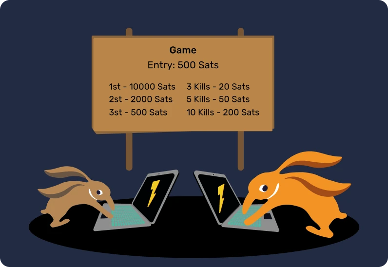

요약하자면, 라이트닝 네트워크와 같은 혁신 덕분에 비트코인을 통한 소액 거래의 미래는 유망해 보입니다. 이러한 기술이 계속 발전하고 성숙해짐에 따라 가까운 미래에 새롭고 흥미로운 애플리케이션이 등장할 것으로 기대할 수 있습니다.

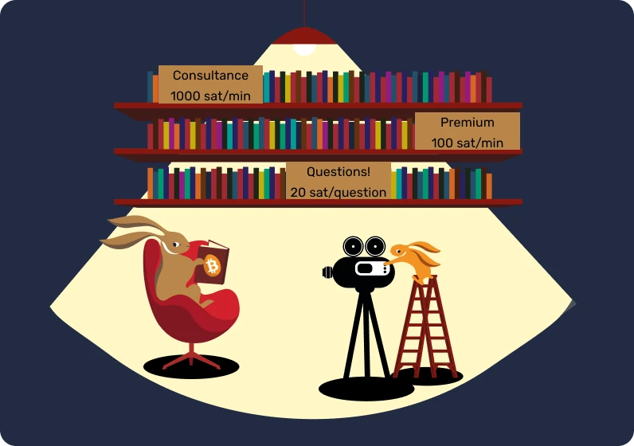

또 다른 예로 '머니 스트리밍'을 들 수 있습니다. 라이트닝 네트워크를 통해 신뢰할 수 있는 제3자 없이도 매분마다 소액 결제를 할 수 있으며, 이는 소비자가 실제 소비에 따라 콘텐츠 비용을 지불하는 경제 모델을 실험할 수 있는 문을 열어줍니다. 심지어 이 시스템을 상품 대여에 사용하는 것도 상상할 수 있습니다. 이러한 시스템에서는 미리 정의된 비율에 따라 서비스나 제품의 여러 기여자에게 자동으로 돈이 분배됩니다. 이는 우리가 지불 모델에 대해 생각하는 방식을 혁신적으로 바꿀 수 있습니다. 서비스에 대해 월 구독료를 지불하는 대신 사용자가 서비스를 사용한 시간에 대해 분당 또는 초당 요금을 부과할 수 있습니다. 이러한 경제 모델은 콘텐츠 제작자에게 큰 영향을 미칠 수 있으며, 콘텐츠 제작자는 사용자의 관심을 유지하기 위해 양질의 콘텐츠를 제작하도록 인센티브를 받게 될 것입니다.

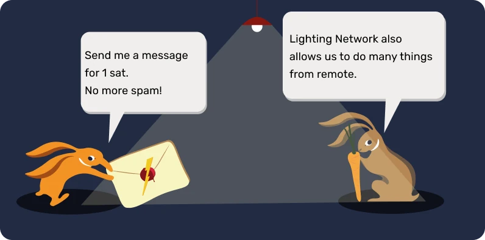

결론적으로 라이트닝 네트워크는 비트코인 사용자들에게 수많은 흥미로운 사용 사례를 열어줍니다. 이에 따른 경제 모델과 비즈니스 기회는 매우 다양하며, 좋아하는 팟캐스트 청취에 대한 보상을 받을 수 있는 팟캐스트 애플리케이션 [파운틴](https://www.fountain.fm/)을 통해 직접 확인해보시기 바랍니다!

## 빨간 알약 또는 파란 알약?

<chapterId>c81cdb45-6aa9-5462-9835-c4852084b2cc</chapterId>

모피어스가 네오에게 말했듯이 "파란 약을 먹으면 이야기는 끝나고 침대에서 일어나서 믿고 싶은 대로 믿으면 돼요. 빨간 약을 먹으면 원더랜드에 머물게 되고, 토끼굴이 얼마나 깊은지 보여줄게요." 비트코인의 토끼굴을 탐험할 준비가 되셨나요? 재정적 자유를 재발견할 수도 있으니 조심하세요!

### 기술의 미래와 그 의미

기술은 기하급수적으로 발전하고 있으며, 그 누구도 미래의 발전을 확실하게 예측할 수 없습니다. 전 세계의 연결성과 인공 지능은 계속 발전하고 있으며, 개인이 인터넷을 통해 얻을 수 있는 지식은 시간이 지남에 따라 점점 더 헤아릴 수 없을 정도로 많아지고 있습니다.

AI를 예로 들어보면 비디오 게임, 이미지 및 텍스트 제작, 데이터 분석 등 점점 더 많은 영역에서 이러한 기술이 이미 인간 수준의 성능을 능가하거나 근접하고 있습니다. 한 가지 잠재적 시사점은 AI와 자동화로 인해 80% 이상의 일자리가 사라질 것이라는 점입니다. 결과적으로 우리는 기술 발전을 억제하거나 AI로 인한 생산성 향상으로 늘어난 자본을 활용하는 등 몇 가지 옵션을 선택할 수 있습니다.

몇 가지 필수적인 질문이 있습니다:


- 일자리의 80%가 사라지는 사회를 어떻게 관리할 수 있을까요?
- 어떻게 하면 인구에 활력을 불어넣을 수 있을까요?
- 많은 교사가 필요한가요?
- 자동화의 지정학적, 정치적, 인간적 결과에 대한 논의는 충분히 이루어지지 않고 있습니다.

컴퓨팅, 인터넷, 스트리밍, VR은 교육을 변화시킬 것입니다. 모든 프랑스 학생들을 위한 보편적인 교육 과정을 정부가 관리하고, 교사는 더 이상 강의가 아닌 학생들과 직접 동행할 수 있습니다. 아이들은 가상 세계로 들어가 역사를 배우는 데 동행할 수 있습니다.


- 선생님과 인공지능 의인화의 경계는 어디인가요?
- 번영하는 사회를 어떻게 보장할 수 있을까요?

우리의 미래를 위한 이러한 근본적인 질문은 반드시 토론하고 함께 결정해야 합니다.

비트코인과는 어떤 관련이 있나요? 인터넷이 커뮤니케이션 방식에 혁명을 일으킨 것처럼 비트코인은 새로운 형태의 대규모 조직을 위한 기술 혁명으로, 신뢰할 수 있는 제3자에 의존하지 않고도 가치를 교환할 수 있게 해줍니다. 우리는 통화 시스템의 기술적 진화를 방해하고 싶습니까, 아니면 비트코인과 라이트닝 프로토콜을 사용해 10배의 생산성 향상을 통해 자본을 늘릴 수 있는 잠재력을 받아들이고 싶습니까?

### 금융의 미래는 어떻게 될까요?

이러한 고려사항은 또한 우리가 사용하는 자금을 누가 보유하고, 승인하고, 추적해야 하는지에 대한 의문을 제기합니다. 선출되지 않은 리더가 있는 폐쇄형 시스템과 중립성이 우선시되는 신뢰할 수 있는 제3자가 없는 개방형 시스템 중 하나를 결정하는 것이 목표입니다.


- 화폐는 사유 재산의 한 형태인가요?
- 대법원의 명령 없이 시위자의 계정을 차단할 수 있나요?
- 금융 시스템은 누가 보장하나요?
- 어떻게 개인이 자신의 돈에 대한 주권을 갖고 신뢰할 수 있는 제3자에게 의존할 수 있을까요?
- 수수료나 중개자 없이 지구 반대편으로 송금할 수 있나요?

이러한 새로운 기술을 수용하면 전 세계적으로 엄청난 규모의 경제를 창출할 수 있습니다. 자본 흐름의 자유로운 이동을 허용해야 할까요? 국제적인 봉쇄는 경제적, 정치적 결과를 초래합니다. 최대 25%의 수수료를 부과하는 Western Union과 같은 금융 중개업체를 이용하는 것이 윤리적일까요? 저희는 점점 더 디지털화되는 세상에서 돈은 민주화되어야 하며, 국가나 불투명한 금융 기관이 아닌 국민의 공동재로 간주되어야 한다고 믿습니다.

은행 게임의 규칙이 투명하지 않고 모든 사람이 이해할 수 없기 때문에 정치인과 규제 당국의 계급이 시스템에 대한 지배력을 유지할 수 있기 때문에 누가 은행 시스템을 통제해야 하는지에 대한 질문은 매우 중요하며, 자유 시장 또는 지식인 집단이 은행 시스템을 통제해야 하는지에 대한 질문이 중요합니다.

### 우리의 자유가 위태로워지고 있습니다.

검열에 대해서도 의문을 제기해야 합니다. 무엇이 검열 대상인지 아닌지를 결정할 수 있는 지식은 누가 가지고 있을까요? 미디어는 특정 정보에 대한 입장을 바꿨고 이전에 검열을 받았던 사람들은 오늘날 더 이상 검열을 받지 않습니다.


- 무엇이 검열 또는 선전인지 누가 결정하나요?
- 누가 우리 시스템에 신의 손을 가지고 있나요?

검열을 용인하는 것은 혁신과 자유 의지에 부정적인 영향을 미칠 수 있으므로 표현의 자유와 집회의 권리를 파괴할 수 있다고 강력히 믿습니다. 완전한 디스토피아를 만들지 않고서는 검열을 부과하는 것은 기술적으로 어렵습니다. 그렇다면 어떤 주체가 검열 권한을 가져야 할까요? 이 문제는 복잡하며 누구를 제한할지 여부를 결정하는 것도 어렵습니다.

전 세계에는 은행 계좌가 없는 사람이 24억 명에 달하며, 이는 필연적으로 지리적 불평등을 야기합니다. 반면 비트코인은 사회적 지위나 정치적 지위와 무관하게 평등하게 거래할 수 있습니다. 이 프로토콜은 비정치적이며 지도자나 기타 영향력 있는 인물에게 특정 특권을 부여하지 않기 때문에 소수가 상위권에 머무는 동안 다른 사람들이 뒤처지는 것이 아니라 모든 사람에게 동일한 기회를 제공하여 발전을 촉진할 수 있도록 합니다. 사회적 지위와 관계없이 모든 사람이 동일한 통화에 접근할 수 있어야 할까요? 우리는 아이들에게 물려주고 싶은 세상을 생각해야 하며, 아이들이 원하는 대로 자유롭게 돈을 관리할 수 있는 열린 세상을 만들고자 합니다.

비트코인은 중요하며 단순한 우연의 게임으로 간주해서는 안 되므로 비트코인과 비트코인이 세상에 미치는 영향에 대해 계속 질문하는 것이 중요합니다.

### 비트코인: 혁신적인 프로토콜

이전 장에서 살펴본 바와 같이 비트코인 프로토콜은 모든 사용자에게 중립적입니다. 합의 규칙과 암호화 덕분에 글로벌 공개 원장에 거래를 불변적으로 기록하여 신뢰할 수 있는 제3자 없이도 금전적 가치의 전송을 보장할 수 있습니다. 2계층 인프라(그리고 곧 RGB가 포함된 3계층)는 네트워크 확장성과 새로운 기능 개발을 위해 사용됩니다.

비트코인은 분할 가능하고, 즉시 전송 가능하며, 검열이 불가능하고, 검증 비용이 거의 들지 않으며, 향후 수 세기 동안 2100만 개로 설정된 통화 정책 등 효율적이고 건전한 화폐가 되기 위해 필요한 모든 특성을 갖추고 있습니다. 비트코인은 익명성이 보장되며 어떤 기관의 승인 없이도 전 세계 어디에서나 교환할 수 있습니다. 여러분은 자신의 개인 키를 보유하고 "키가 아니라 비트코인이 아니라"라는 말을 기억하기만 하면 됩니다.

비트코인은 암호학자부터 자유주의자, 기존 기업, 심지어 국가 전체에 이르기까지 다양한 집단이 채택하고 있습니다. 그러나 비트코인은 모두를 위한 것이며, 사용자 수가 증가함에 따라 거래 내역을 보호하고 탈중앙화를 보장하는 비트코인 노드의 수도 증가하고 있습니다.

비트코인은 더 이상 멈출 수 없고 검열할 수도 없습니다. 비트코인은 화폐 시스템을 바꾸고 금융 포용성을 가능하게 하는 평화로운 혁명입니다. 사용자는 거래를 통해 비트코인을 받거나 규제 또는 비규제 플랫폼을 통해 비트코인을 구매할 수 있습니다. 신뢰할 수 있는 중개자 없이도 지갑, 모바일 애플리케이션 또는 물리적 장치에 자금을 저장할 수 있습니다. 비트코인은 "믿지 말고 검증하라"는 말처럼 투명성, 자유, 개인의 책임을 옹호합니다.

사토시는 2008년 화폐의 변화를 통해 금융 시스템의 변화를 제안하기 위해 비트코인을 만들었는데, 이는 쉽고 '마법의' 화폐에 쉽게 접근할 수 있는 것이 부패로 이어진다는 것을 알았기 때문입니다. 따라서 비트코인은 은행 시스템으로부터의 해방을 가능하게 하는 새로운 중립적 통화 시스템을 구축할 수 있는 대안입니다. 결국 비트코인은 평화로운 혁명에 참여하도록 독려하는 사회 현상입니다.

가입할 준비가 되셨나요?

# 결론

<partId>9ed4b454-2950-40b4-a56b-68d109689a82</partId>

## 리뷰 및 평가

<chapterId>585729e2-b0ab-51b5-89ec-593e3ea22c57</chapterId>

<isCourseReview>true</isCourseReview>

## 기말 시험

<chapterId>8410e961-3841-5abf-a51d-04fc0139dd59</chapterId>

<isCourseExam>true</isCourseExam>

## 결론

<chapterId>dfc534be-44a9-5e8c-9c98-e51ef0554e91</chapterId>

<isCourseConclusion>true</isCourseConclusion>
