# Ditt første Bitcoin-eventyr

I dette kurset vil jeg forklare Bitcoin i 25 kapitler slik at du kan forstå denne teknologien på en enkel og effektiv måte. Kurset er tilgjengelig for alle og utforsker industrien som helhet: gruvearbeidere, lommebøker, kjøp/salg-plattformer, osv...

Kurset bør ta omtrent 15 timer. Gjennom reisen er det tilgjengelig forklarende plakater og ekstra ressurser.

Du trenger ingen spesifikk kunnskap for å komme i gang, kurset er tilgjengelig for alle!

+++

# Introduksjon
<partId>3cd2ac82-026c-53e1-874a-baf5842adc6d</partId>

## Et sprang inn i det ukjente
<chapterId>27e3fb60-4b50-556b-9e70-c4f5475c121d</chapterId>

### Velkommen til et nytt monetært og teknologisk paradigme.

Bitcoin er en betydelig innovasjon som går utover en enkel "internettvaluta". Det er en revolusjon både i teknologi og i penger, i stand til å stille spørsmål ved vårt forhold til valuta og samfunn. Bitcoin er en såkalt **nøytral** og **desentralisert** valuta, noe som betyr at den ikke kontrolleres av noen enhet eller institusjon. Det er en betydelig innovasjon som går utover en ren valuta. For å forstå denne berømte bitcoin, er det viktig å forstå at bitcoin (referert til som BTC) er både et datamaskinprotokoll (Bitcoin) og en monetær enhet (bitcoin).

Protokollen bruker underliggende teknologier som kryptografi, nettverkskommunikasjon og den berømte "blockchain", mens bitcoin-enheten er valutaen som er nødvendig for den riktige funksjonen av denne samme protokollen. I dagliglivet bruker salvadoranere eller bitcoinere rundt om i verden bitcoin-valutaen til å kjøpe og selge varer og tjenester, med valutaen som støtter seg på Bitcoin-protokollen for å fungere.

### Et omfattende, men tilgjengelig pensum

I dette kurset vil vi diskutere de monetære aspektene ved Bitcoin, inkludert hvordan man kjøper og selger bitcoins, sikkert lagrer dem i digitale lommebøker, og bruker dem for transaksjoner. Vi vil også undersøke rollen til gruvearbeidere, som er essensielle for å skape nye bitcoins og sikre Bitcoin-nettverket. I tillegg vil vi utforske Bitcoins fremtid og hvordan Lightning Network-teknologien kan forbedre Bitcoin-transaksjoner.


Det er essensielt å forstå at Bitcoin er et nytt monetært system som revolusjonerer vårt forhold til penger. Å lære å bruke Bitcoin er en essensiell ferdighet for alle som ønsker å ha kontroll over sine egne penger.

**Seksjon 1 - Penger**

- Kapittel 1 - Hva er penger?
- Kapittel 2 - Fiat-penger
- Kapittel 3 - Hyperinflasjon
- Kapittel 4 - Bitcoins pengepolitikk

**Seksjon 2 - Bitcoin-lommebøker**

- Kapittel 5 - Hvordan fungerer Bitcoin-lommebøker?
- Kapittel 6 - Velge din sikkerhet
- Kapittel 7 - Sette opp din lommebok
- Kapittel 8 - Beskyttelse mot tid

**Seksjon 3 - Tekniske aspekter ved Bitcoin**

- Kapittel 9 - Forklaring av en transaksjon
- Kapittel 10 - Bitcoin-noder
- Kapittel 11 - Gruvearbeidere
- Kapittel 12 - Gruvearbeidere og økologi

**Seksjon 4 - Å spare i Bitcoin**

- Kapittel 13 - Bitcoin-pris
- Kapittel 14 - Hvordan kjøpe Bitcoin
- Kapittel 15 - Å jobbe for Bitcoins
- Kapittel 16 - Hyper-bitcoinisering

**Seksjon 5 - Lynnetverket**

- Kapittel 17 - Introduksjon til Lynnetverket
- Kapittel 18 - Bruksområder for Lynnetverket

Før vi diskuterer definisjonen og funksjonen av penger i samfunnet (Kapittel 1), starter vi med genese av Bitcoin. Bitcoin er en relativt ny teknologi, lansert i 2009, som er ulik alt annet. Det er derfor normalt å ikke forstå alt på en gang. Faktisk, akkurat som når man lærer å bruke internett eller en bil, trenger man ikke å kjenne alle de tekniske detaljene for å bruke Bitcoin (motta, betale, sikre dine midler).

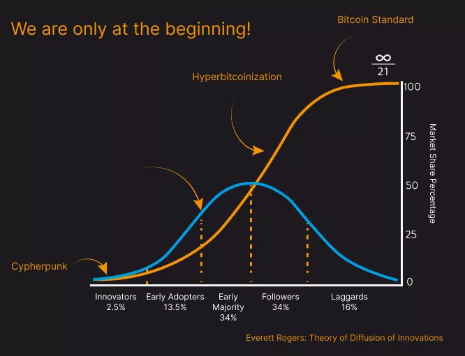

Viktigheten her er hovedsakelig å forstå denne nye teknologien på en generell måte. Vi håper at denne opplæringen vil behage deg og gi deg det nødvendige grunnlaget for å forstå og kanskje fortsette å gjøre fremskritt i dette nye globale monetære paradigmet.

## Bitcoins forhistorie
<chapterId>9a94b627-5b69-5d81-9125-f1fa9b0aa6ad</chapterId>

Før begrepet "Bitcoin" ble synonymt med digital valuta og finansiell transformasjon, la en serie ideer, innovasjoner og sosiale bevegelser grunnlaget for dets skapelse. Et av de grunnleggende elementene i denne forhistorien til Bitcoin er cypherpunk-bevegelsen.

### Cypherpunks: Visjonærer i den digitale verden


I hjertet av den teknologiske utviklingen på 1980- og 1990-tallet, begynte en gruppe mennesker å stille dype spørsmål ved rollen til personvern og frihet i den digitale tidsalderen. Disse individene, som senere ville bli kjent som "cypherpunks", trodde fast at kryptografi kunne tjene som et verktøy for å beskytte individuelle rettigheter mot innblanding fra regjeringer og store selskaper.

Ikoniske figurer som Julian Assange, Wei Dai, Tim May, og David Chaum bidro til å definere filosofien og visjonen til cypherpunks. Disse tenkerne delte sine ideer i en innflytelsesrik e-postliste, hvor deltakere fra hele verden debatterte den beste måten å bruke teknologi på for å sikre større individuell frihet.

### De tre søyletekstene til Cypherpunks


Cypherpunk-bevegelsen, med sine dype røtter i digital aktivisme og kryptografi, støttet seg på flere grunnleggende tekster for å uttrykke sine prinsipper og visjon for fremtiden. Blant disse skriftene, står tre spesielt ut:

- "Cypherpunk-manifestet":
  Skrevet av Eric Hughes i 1993, hevder "Cypherpunk-manifestet" at personvern er en grunnleggende rettighet. Hughes argumenterte for at evnen til å kommunisere fritt og konfidensielt var essensielt for et fritt samfunn. Manifestet sier, "Vi kan ikke forvente at institusjoner, selskaper, eller andre upersonlige enheter skal gi oss personvern... Vi må forsvare det selv."

- "Krypto-anarkist-manifestet":
  Skrevet av Timothy C. May i 1992, forklarer dette manifestet hvordan bruk av kryptografi kunne lede til en æra av kryptografisk anarki hvor regjeringer ville være maktesløse til å blande seg inn i borgernes private affærer. May så for seg en fremtid hvor informasjon, penger, og meldinger kunne utveksles uten inngripen fra en tredjepart, og anonymt.

- "Uavhengighetserklæringen for Cyberspace":
Selv om den ikke er utelukkende cypherpunk, reflekterer denne teksten følelsene til mange aktører i bevegelsen. Skrevet i 1996 av John Perry Barlow, er det et svar på den økende reguleringen av internett av regjeringer. Erklæringen hevder at cyberspace er et distinkt rike fra den fysiske sfæren og ikke bør være underlagt de samme lovene. Den uttaler, "Vi har ingen valgt regjering, og vi kan ikke styres."

### Forløpere til Bitcoin

Før fremveksten av Bitcoin, hadde flere forsøk blitt gjort for å skape en digital valuta. For eksempel introduserte David Chaum konseptet "anonym elektronisk penger" med sitt prosjekt "DigiCash" på 1980-tallet. Dessverre, på grunn av ulike begrensninger, tok DigiCash aldri virkelig av.

En annen viktig forløper er Wei Dai's "b-money". Selv om det aldri ble implementert, presenterte det ideen om en anonym digital valuta hvor svindeldeteksjon ble utført av et fellesskap av evaluatorer i stedet for en sentral autoritet.


Det var i dette fruktbare miljøet at den mystiske Satoshi Nakamoto publiserte Bitcoin-hviteboken i 2008. Han kombinerte flere ideer fra cypherpunk-bevegelsen, som proof of work og kryptografiske tidsstempler, for å skape en desentralisert og sensurresistent digital valuta.

Bitcoin var mer enn bare en digital valuta; det representerte en realisering av cypherpunk-idealer. Utover sin teknologi, symboliserte det en revolusjon mot tradisjonelle finanssystemer og tilbød et alternativ basert på transparens, desentralisering og individuell suverenitet.

### Konklusjon

Bitcoin's forhistorie er dypt rotfestet i cypherpunk-bevegelsen og en kollektiv søken etter større frihet i den digitale tidsalderen. Ved å kombinere prinsippene for kryptografi, desentralisering og integritet, har Bitcoin blitt mye mer enn en valuta; det er produktet av en filosofisk og teknologisk revolusjon som fortsetter å omforme vår verden.

Derfor er Bitcoin et protokoll som spenner over lange perioder og oppmuntrer oss til å stille spørsmål ved vårt forhold til energi, tid og penger. Men er Bitcoin en "ekte" valuta? Hva er penger? Eksisterer det i flere former? Vi vil utforske disse spørsmålene i neste kapittel.

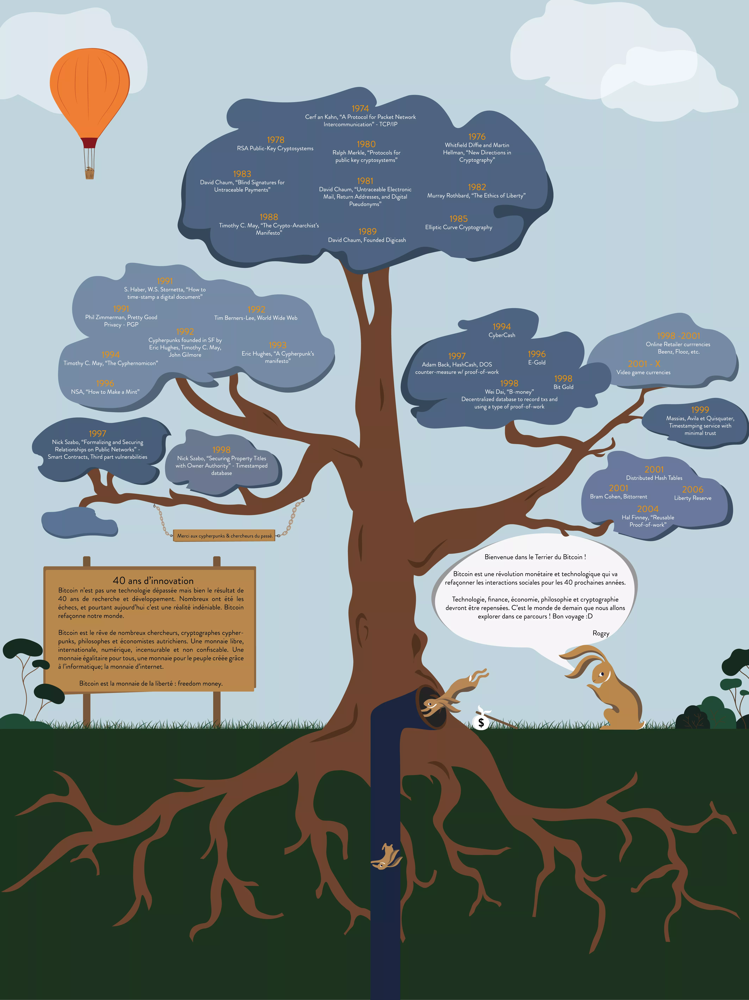

# Penger
<partId>e913df1a-4cbd-5380-ba67-ca2a0414f671</partId>

## Penger Gjennom Historien
<chapterId>c838e64d-d59f-5703-8c74-ea5e8c4fdd31</chapterId>

Evolusjonen av penger er en fascinerende del av menneskets historie, som reflekterer sivilisasjoners oppfinnsomhet gjennom tidene for å møte stadig utviklende økonomiske behov.


### Fra Skjell til Bankkontoer

Opprinnelig var valuta håndgripelig, ofte knyttet til essensielle varer som korn, husdyr og andre råvarer. Imidlertid hadde disse godene store ulemper, som forgjengelighet, noe som gjorde det vanskelig å bruke dem som et langsiktig sparemedium. For eksempel kunne en mislykket høst eller sykdom utslette en persons rikdom over natten.
Ettersom sivilisasjoner utviklet seg og handel utvidet til nye regioner, oppstod det et behov for et universelt byttemiddel. Objekter som skjell og edelstener ble eksperimentert med, men de var ikke perfekte. Gull ble til slutt standarden på grunn av sin sjeldenhet, holdbarhet og delbarhet. Det var, og forblir til denne dag, et symbol på rikdom og makt.


### Hva er rollen til penger?

Penger er et høyt sofistikert kommunikasjonsverktøy:
- Den muliggjør kommunikasjon mellom nåtiden og fremtiden. Vi transformerer vår tid og energi til en ressurs som kan gjenbrukes i fremtiden uten risiko for devaluering.
- Den tillater kommunikasjon på et universelt fellesspråk. Uten å kjenne hverandre, uten å snakke samme språk, kan to fremmede utveksle, handle, og bli enige om verdien av ting.

Dens funksjon i vår verden er vanskelig å kunstig reprodusere. Ingen mennesker eller grupper av mennesker kan skape penger; det er et naturlig sosialt fenomen som må oppstå fra markedet og frivillig konsensus. Priser er signaler, informasjon, som hjelper samfunnet med å velge hvordan ressurser vil bli allokert.

Gull som penger er valget av 4000 års monetær darwinisme basert på 3 funksjoner:

- Verdioppbevaring
- Byttemiddel
- Regnskapsenhet

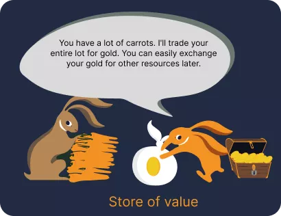
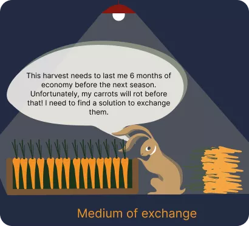
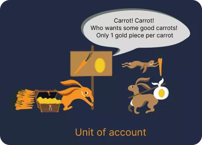

### Pengenes egenskaper

Gull møter ideelt sett kriteriene for en effektiv valuta: dens naturlige sjeldenhet gjør den verdifull, mens dens kjemiske egenskaper tillater den å ikke erodere over tid. Imidlertid er denne formen for penger ikke lett delbar eller transportabel over lange avstander. I en globalisert og digital verden kan ikke gull holde følge og trenger en sentral enhet for å gjøre den delbar og lett utvekslingsbar (myntet mynt).

Disse manglene har gjort gull til en verdioppbevaring, men ikke en felles valuta, til skade for statlige fidusiære valutaer (fiat) som er lett brukbare, men konstant devaluert av enhetene som kontrollerer dem (konge, sentralbank, keiser, diktator).

Kriteriene for en effektiv valuta er mange. En god valuta må være:

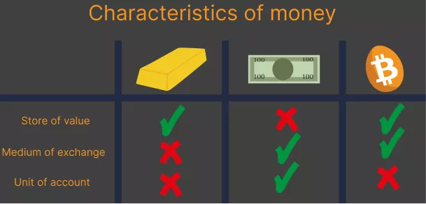

- **Fungibel**, det vil si utbyttbar uten tap av verdi
- **Delbar**, for å lette transaksjoner av forskjellige volumer
- **Likvid**, det vil si lett konverterbar til varer eller tjenester.

For å møte disse kriteriene, utvikler valuta seg steg for steg:

- Råstein -> Mynt
- Seddel -> Bankkort
- Blockchain -> Lightning Network

I dag fortsetter valutaer å utvikle seg, tilpasse sine former for å møte forskjellige bruksområder. For eksempel, mens gull er en utmerket verdioppbevaring, er det ikke lenger egnet for den nåværende globaliserte økonomien. På samme måte er fidusiære valutaer som dollar og euro veldig likvide og lett transportable fordi de nå for det meste er digitale, men deres verdi er konstant erodert av monetær inflasjon.

Bitcoin, derimot, presenterer nye muligheter. På grunn av sine egenskaper, som dens strengt begrensede tilbud, tilbyr den en utmerket verdioppbevaring. Videre, som en nøytral internettvaluta, representerer den et godt byttemiddel som kjenner ingen grenser. Imidlertid er den fortsatt ikke bredt akseptert i handel i dag, til tross for [konstant adopsjon](https://btcmap.org/map).

### Rask oppsummering i en plakat!

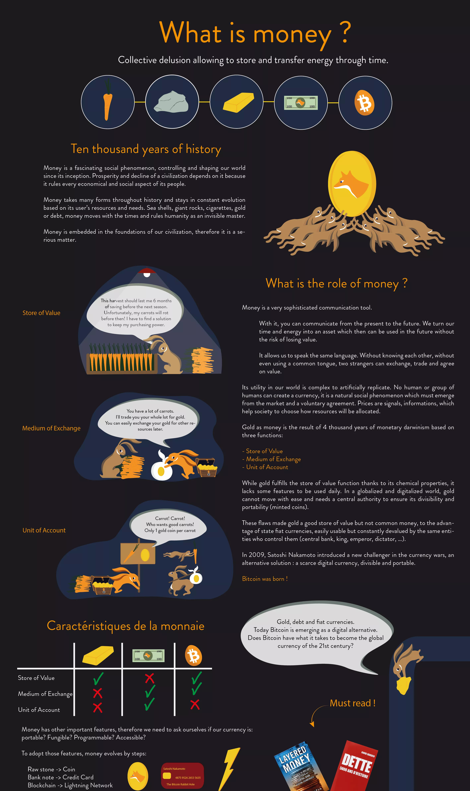

## Fidusiære valutaer
<chapterId>25151d46-7db1-5b48-8bba-cbde1944555a</chapterId>

"De som ikke lærer av historien er dømt til å gjenta de samme feilene," sa George Santayana. En sannhet som resonnerer spesielt når det kommer til det nåværende monetære systemet.

### Fidusiær = tillit

I dag anses store valutaer som euroen og dollaren for å være fidusiære. Dette betyr at de ikke har noen iboende verdi. Deres verdi er helt avhengig av tilliten og troen vi plasserer i institusjonene som regulerer dem.
En forvaltningsvaluta er en form for valuta som er erklært som valuta av en institusjon, som en nasjonalstat, som Kina med Yenen, eller en politisk-økonomisk union, som Den europeiske union med Euroen. Entiteten som har ansvar for å utstede forvaltningsvaluta er en sentralbank (For eksempel kan vi nevne Folkets Bank of China, Federal Reserve i USA, eller Sentralbanken i Republikken Guinea). Det er disse enhetene som har ansvar for å bestemme pengepolitikk og derfor hvor mye penger som skal settes i omløp eller trykkes.
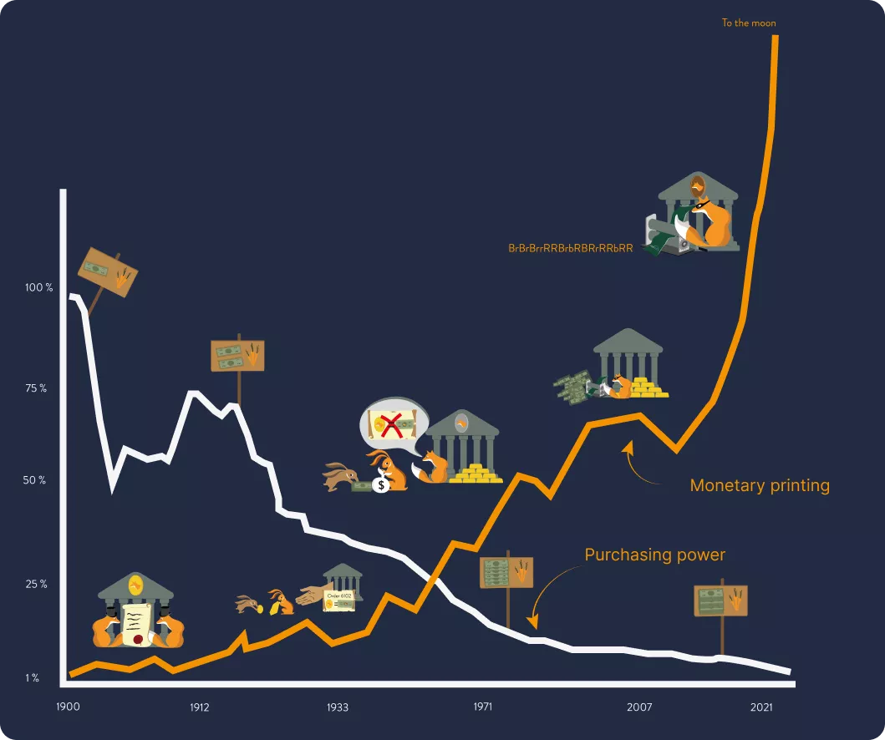

### Valutadevaluering: En strategi like gammel som Romerriket

Siden antikken har gull tjent som en monetær referanse. Imidlertid har dets rigiditet ofte ført ledere - enten romerske keisere eller moderne regjeringer - til å adoptere alternative valutaer, ofte forvaltningsvalutaer.

Mekanismen er enkel og inspirert av praksiser som har eksistert siden sivilisasjonens opprinnelse. Ledere, ivrige etter å utøve kontroll over rikdom, begynner med å sentralisere gull, ofte ved å utnytte sin makt og love beskyttelse og sikkerhet. Med denne dyrebare reserven i hendene, introduserer de en ny valuta, tilsvarende i verdi til gull, men preget i deres effigi. Denne valutaen begynner da å sirkulere, og folket blir raskt vant til dens bekvemmelighet.

Gradvis devaluerer disse lederne diskret den nye valutaen, reduserer dens verdi sammenlignet med det opprinnelige gullet med noen prosent hvert år. Denne stille devalueringen er ofte rettferdiggjort som å være i folkets interesse. Således ser de som sparer i denne forvaltningsvalutaen verdien av sine sparepenger erodere, mens staten finansierer sine prosjekter gjennom inflasjon. Videre gjør denne devalueringen gjeld lettere å tilbakebetale.


På et kritisk øyeblikk blir kunngjøringen gjort: valutaen er ikke lenger støttet av gull. Offentligheten, nå vant til forvaltningsvaluta og ofte feilinformert om finansielle saker, aksepterer denne virkeligheten. Staten har da frie tøyler til å manipulere pengemengden, og trykke enorme summer penger til nesten ingen kostnad.

Denne strategien, når den er godt utført, kan vare i tiår. Imidlertid kan en for rask devaluering eller tap av tillit føre til hyperinflasjon (se neste kapittel). Historien viser at dollaren har mistet 98% av sin verdi på 100 år, euroen 30% på 20 år, og det britiske pundet 99% siden sin opprettelse.

Til slutt kan valutaen ikke lenger ha noen forbindelse til gull, som minner om romerske mynter ved slutten av imperiet, eller til og med reduseres til en enkel numerisk verdi, frakoblet fra den håndgripelige virkeligheten.

I dag er vi vitne til et historisk vendepunkt. Dollaren, som lenge har dominert, ser ut til å være i tilbakegang, og gull har mistet sin sentrale plass. Vi er ved hengslet til en ny monetær syklus, som minner oss om at leksjoner fra historien ofte blir glemt.

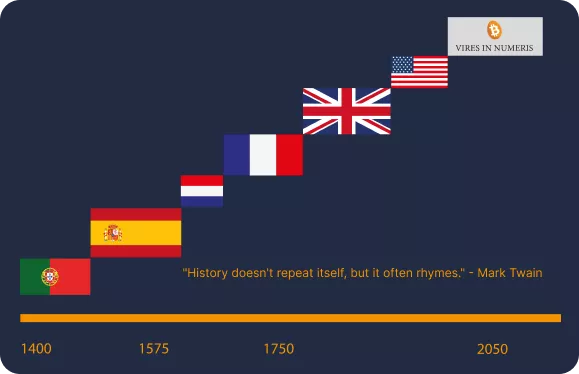

### Er Bitcoin en løsning?

Det er i denne konteksten at Bitcoin-revolusjonen vinner frem. Denne valutaen, som krever **ingen pålitelig tredjepart**, har som mål å skille Staten fra penger.

Pengeprenting fører til inflasjon, som gradvis appellerer befolkningen. På den annen side har finansinstitusjoner og velstående individer dratt nytte av denne praksisen, noe som skaper et gap av ulikheter og favoriserer autoritarisme. Det nåværende finanssystemet er regulert og begrenset for å unngå kollaps, og enhver forstyrrelse kan utløse en større økonomisk krise. Ettersom politiske aktører drar nytte av dette systemet, er de ikke motivert til å gjøre radikale endringer, noe som tillater systemet å fortsette sin kurs til en mulig implosjon.
Som svar på disse systemiske utfordringene presenterer Bitcoin seg som en desentralisert løsning: et nytt parallelt pengevesen. Historisk sett har gull blitt foretrukket som valuta på grunn av sin motstand mot forfalskning. På samme måte kan ikke Bitcoin, gjennom sin desentraliserte og kryptografiske natur, forfalskes og er begrenset til 21 millioner enheter. Bitcoin er en valuta som stoler på transparens og nøytralitet, og tilbyr et attraktivt alternativ til det nåværende sentraliserte pengevesenet.

Samtidig ser fremveksten av sentralbankens digitale valutaer, eller CBDC-er, ut til å være uunngåelig. Denne nye formen for valuta ville tilby en mer sentralt planlagt økonomi, som kunne hindre individers finansielle frihet og legge til rette for autoritære misbruk.
Vi kan avslutte dette kapittelet med et sitat fra Nobelprisvinner F.A Hayek i 1984: "Jeg tror ikke at vi noen gang vil finne en god valuta før vi tar den ut av hendene på regjeringen. Men, vi kan ikke voldelig ta den fra dem; alt vi kan gjøre er å introdusere noe de ikke kan stoppe gjennom smart lureri."

### Rask oppsummering i en plakat!

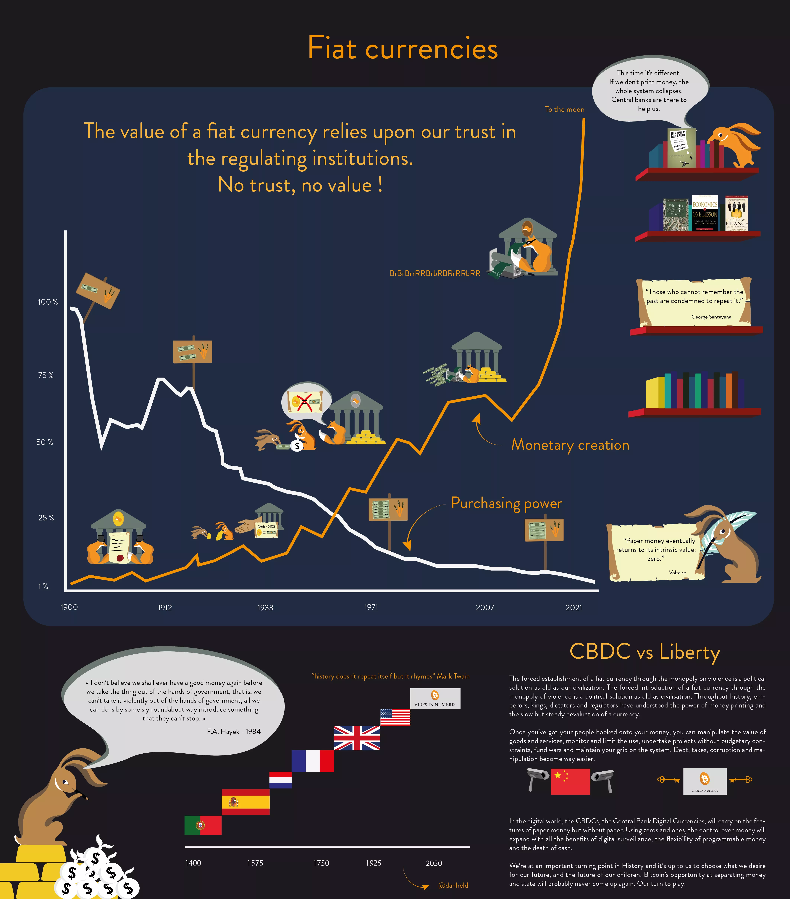

## Hyperinflasjon
<chapterId>b04c024c-54f3-50cb-997f-58721cfc74be</chapterId>

Hyperinflasjon er et monetært fenomen spesifikt for fiatvalutaer. Det er kjennetegnet ved et totalt tap av tillit til en valuta og en drastisk økning i inflasjon gjennom pengetrykking av myndighetene. Som et resultat kan sparepengene som individer har samlet opp, forsvinne i løpet av en relativt kort periode, og skyve landet til randen av økonomisk, sosial og politisk kollaps.

### Inflasjonen løper løpsk!

La oss prøve å forstå effekten av inflasjon på sparing ved å vurdere forskjellige inflasjonsrater.

- Med 2% inflasjon mister du 2% av din kjøpekraft årlig, som beløper seg til 10% over 5 år.
- Med 7%, mister du halvparten av den på 10 år.
- Med 20%, mister du nesten halvparten av den på 3 år.

Under hyperinflasjon snakker vi ikke lenger om 20% per år, men heller 20% per måned eller, på sitt høydepunkt, per DAG. 100% inflasjon per dag over 3 dager er et realistisk scenario som har skjedd og fortsetter å skje i vår verden.

Det er viktig å forstå at hyperinflasjon ikke skjer ved magi, ved tilfeldighet, ved kapitalisme, eller ved politiske motstandere. Hyperinflasjon er den direkte konsekvensen av falske monetære beslutninger tatt av sentralbankfolk og politikere. Dets konsekvenser påvirker alle borgere og vil påvirke generasjoner. Jeg inviterer deg til å bruke 5 minutter på å studere denne tabellen for å fullt ut realisere den reelle effekten av dette fenomenet (ECON204-kurset vil gå i detalj om dette emnet)."

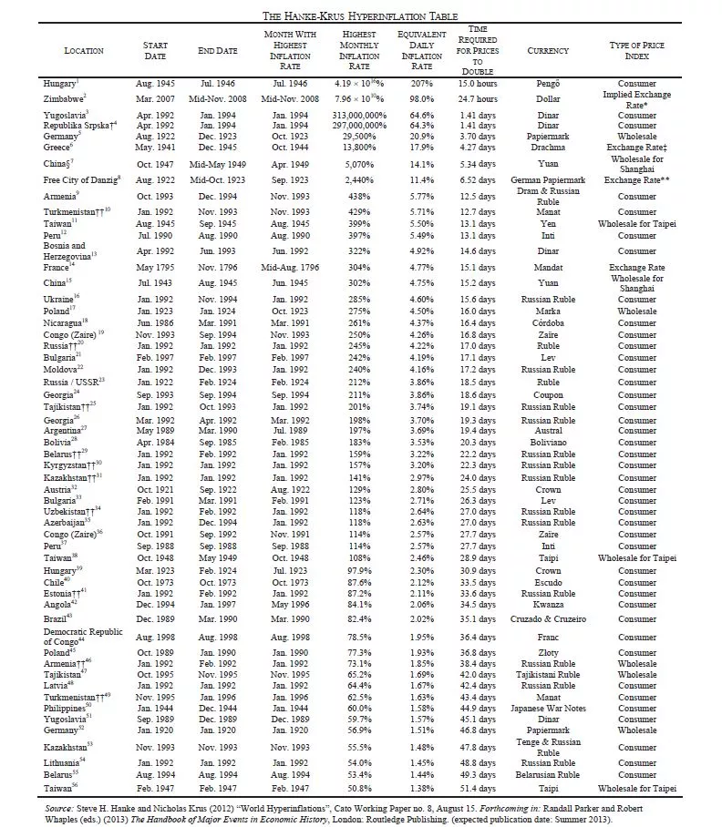

### Hvordan Oppstår Hyperinflasjon?

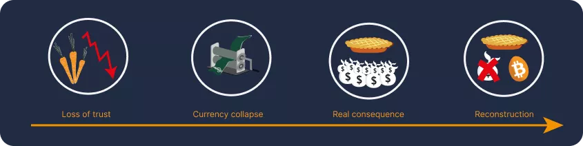

Fase 1 - Tap av Tillit

- Sentralisering av monetær makt letter skapingen av penger og dens misbruk. Et tap av tillit til en valuta kan da oppstå og utløse hyperinflasjon. Individer begynner da å stille spørsmål ved opprinnelsen til penger og fordelene med pålagt monetær politikk. Dette tapet av tillit skyldes generelt eksterne faktorer som kriger, sosiale tiltak, eller prisstigningen på en nøkkelressurs, som hvete eller bensin.

Fase 2 - Valutakollaps & prisøkning
- Når regjeringer mister kontroll over tillit, begynner individer å bytte sin valuta til en annen, mer stabil en, slik som den amerikanske dollaren i Venezuela. Dette fører til en prisøkning, som skaper en ond sirkel der varer og tjenester blir stadig dyrere. For å møte disse behovene, trykker staten mer penger for å korrigere pengepolitikken, noe som resulterer i eksponentiell inflasjon.
Fase 3 - Den onde sirkelen av pengetrykking

- Flere og flere sedler er nødvendige for å kjøpe varer, noe som skaper en mangel på papirpenger. Dette fører til mer seddeltrykking, som skaper enda mer inflasjon.


Fase 4 - En ny valuta dukker opp

- En ny valuta blir så introdusert for å erstatte den gamle. Et bemerkelsesverdig eksempel på hyperinflasjon er Tyskland i årene 1920-1924. For å gjenopplive økonomien, ble en ny valuta skapt, støttet av tysk, fransk og engelsk gjeld, og garantert av tyske land.

Å løse en hyperinflasjonskrise krever ofte radikale endringer, som revolusjoner, endringer i regjeringen, endringer i sentralbankfolk, blant andre. Tap av tillit, valutakollaps og gjenoppbygging er essensielle faser for å gjenopplive en ny økonomi basert på fiat-valuta.

### 3 bemerkelsesverdige eksempler

- Tyskland, 1922-1923

  Et av de mest slående eksemplene på hyperinflasjon skjedde i den tyske Weimarrepublikken etter første verdenskrig.

  Tyskland hadde lånt enorme mengder penger for å finansiere krigsinnsatsen, og ikke bare vant Tyskland ikke krigen, men det måtte betale milliarder av dollar i reparasjoner. Måneden med høyest inflasjon var oktober 1923, med en topp på 29 500 %, eller en inflasjonsrate på 20,9 % per dag. Prisene doblet seg hver 3,7 dag!
  Det sies at i restauranter måtte servitører kunngjøre menyprisene hver 30. minutt for å ta hensyn til inflasjonen. Den tyske valutaen ble så verdiløs at noen borgere foretrakk å brenne papirpengene sine i stedet for ved fordi det faktisk var billigere.

  

- Ungarn, 1945-1946

  Landet som opplevde den verste perioden med hyperinflasjon i historien til dags dato er langt Ungarn etter andre verdenskrig.

  Ungarn befant seg på tapende side av konflikten, og krigen hadde ødelagt mesteparten av sin industrielle produksjonskapasitet. Måneden med høyest inflasjon var juli 1946, med en prisinflasjon på 41 900 000 000 000 000 %, tilsvarende 207 % per dag. Prisene doblet seg hver 15. time!

  Den siste seddelen som ble satt i omløp var en 100 millioner milliarder pengo (100 000 000 000 000 000) seddel i 1946.

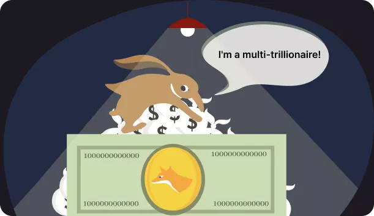

- Zimbabwe, 2007-2008
  Fram til år 2000 var Zimbabwe selvforsynt med nesten alle sine behov bortsett fra olje.

  I 1997 kollapset den zimbabwiske dollaren med over 72 % etter at regjeringen gikk med på å kompensere krigsveteraner for et beløp tilsvarende 450 millioner amerikanske dollar. Siden regjeringen ikke hadde et slikt beløp i sine kasser, måtte den ty til å kjøre seddelpressen. I 2005 nådde inflasjonen 586 % og i mars 2007 nådde månedsinflasjonen 50 %.

  I juni 2007 reagerte regjeringen ved å innføre prisreguleringer. Butikker ble bokstavelig talt "plyndret". Handelsmenn har nå ikke lenger midlene til å fylle opp butikkene sine.
I april 2009 kunngjorde finansministeren suspensjonen av den zimbabwiske dollaren og autoriserte bruken av forskjellige utenlandske valutaer for handel. Alle bankkontoer, pensjoner og finansinstitusjoner så sine saldoer fordampe over natten.


Som konklusjon har hyperinflasjon effekten av raskt å degradere valutaens verdi, noe som fører til erosjon av sparemidler og tap av tillit til det monetære systemet. Som Voltaire en gang foreslo, vil en fiat-valuta alltid til slutt miste sin iboende verdi og konvergere mot null.
'En valuta som er avhengig av en betrodd tredjepart som en finansinstitusjon, er i praksis og på lang sikt en defekt valuta fordi den er ute av stand til å garantere kjøpekraft eller bevare sparemidler.

### Rask oppsummering i en plakat!

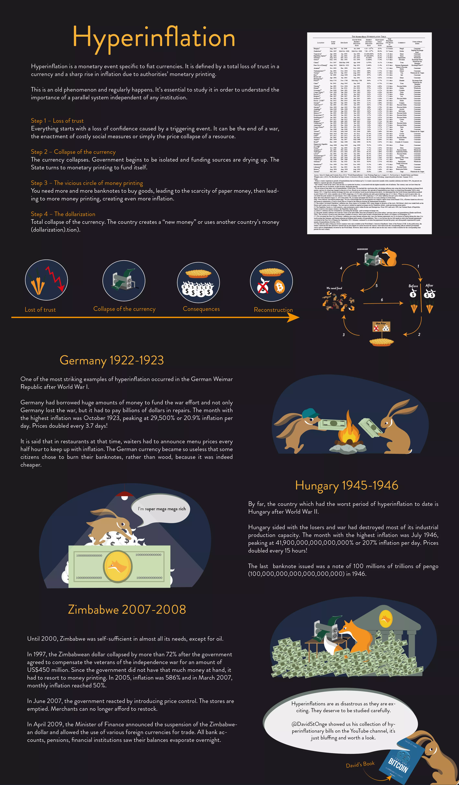

## 21 millioner bitcoins
<chapterId>f4a06d76-1963-56fd-93ff-dfa41489bcde</chapterId>

### Bitcoins pengepolitikk

Bitcoin er en desentralisert digital valuta med en forhåndsdefinert maksimal mengde på **21 millioner enheter**. Denne iboende egenskapen av knapphet er bestemt av dens dataprogramkode og forsterket av konsensus blant alle brukere som deltar i protokollen.

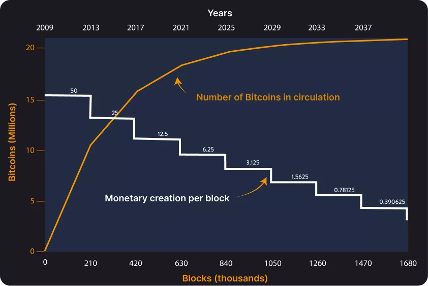

Når det gjelder dens pengeutstedelse, kan det illustreres av en S-kurve som representerer mengden bitcoins som er skapt over tid. For eksempel, i 2022, var omtrent 18,5 millioner bitcoins i omløp. Prognoser indikerer at innen 2025 vil det være rundt 19,5 millioner bitcoins, som representerer ~93% av det totale tilbudet, og innen 2037 vil dette tallet nå 20,4 millioner.

### Hvordan skape nye bitcoins?

Skapelsen av nye bitcoins er resultatet av gruveprosessen, en prosedyre for å verifisere transaksjoner på Bitcoin-nettverket.


Gruvearbeidere, som utfører denne oppgaven, belønnes med utstedelsen av nye bitcoins hvert tiende minutt. Denne belønningen er programmert til å halveres for hver 210 000 blokker, noe som er omtrent hvert fjerde år, en hendelse kjent som "halvering" -- noe som gir pengeutstedelseskurven en trappelignende form. På grunn av denne halveringsmekanismen, kan det matematisk forutsies at skapelsen av bitcoins vil opphøre i 2140, når det totale antallet bitcoins når sin grense på 21 millioner.

| Halveringsnummer | Blokkhøyde | BTC-belønning etter halvering  | Estimert BTC i omløp etter halvering |
| -------------- | ------------ | ------------------------- | ------------------------------------------ |
| 1              | 210,000      | 25 BTC                    | 10,500,000 BTC                             |
| 2              | 420,000      | 12.5 BTC                  | 15,750,000 BTC                             |
| 3              | 630,000      | 6.25 BTC                  | 18,375,000 BTC                             |
| 4              | 840,000      | 3.125 BTC                 | 19,687,500 BTC                             |
| 5              | 1,050,000    | 1.5625 BTC                | 20,343,750 BTC                             |
| 6              | 1,260,000    | 0.78125 BTC               | 20,671,875 BTC                             |
| 7              | 1,470,000    | 0.390625 BTC              | 20,835,937.5 BTC                           |
| 8              | 1,680,000    | 0.1953125 BTC             | 20,917,968.75 BTC                          |
| 9              | 1,890,000    | 0.09765625 BTC            | 20,958,984.375 BTC                         |
| 10             | 2,100,000    | 0.048828125 BTC           | 20,979,492.188 BTC                         |
| 11             | 2,310,000    | 0.0244140625 BTC          | 20,989,746.094 BTC                         |
| 12             | 2,520,000    | 0.01220703125 BTC         | 20,994,873.047 BTC                         |
| 13             | 2,730,000    | 0.006103515625 BTC        | 20,997,436.523 BTC                         |
| 14             | 2,940,000    | 0.0030517578125 BTC       | 20,998,718.262 BTC                         |
| 15             | 3,150,000    | 0.00152587890625 BTC      | 20,999,359.131 BTC                         |
| 16             | 3,360,000    | 0.000762939453125 BTC     | 20,999,679.566 BTC                         |
| 17             | 3,570,000    | 0.0003814697265625 BTC    | 20,999,839.783 BTC                         |
| 18             | 3,780,000    | 0.00019073486328125 BTC   | 20,999,919.892 BTC                         |
| 19             | 3,990,000    | 0.000095367431640625 BTC  | 20,999,959.946 BTC                         |
| 20             | 4,200,000    | 0.0000476837158203125 BTC | 20,999,979.973 BTC                         |

Vi kommer tilbake til gruvearbeidere i detalj i kapittelet om gruvedrift.

### Garantere digital knapphet

Bitcoins knapphet er garantert av to nøkkelmekanismer: justering av gruvedriftsvanskeligheter og spillteori:

- Justering av gruvedriftsvanskeligheter er en mekanisme som finner sted hver 2016. blokk, eller omtrent hver to uke, for å sikre at det i gjennomsnitt blir lagt til en ny blokk i blokkjeden hvert tiende minutt. Denne frekvensen av blokkopprettelse og den totale mengden bitcoins er faste aspekter ved Bitcoin-protokollen og kan ikke endres uten en generell konsensus, i motsetning til de vilkårlige beslutningene som tas i tradisjonelle penge systemer.

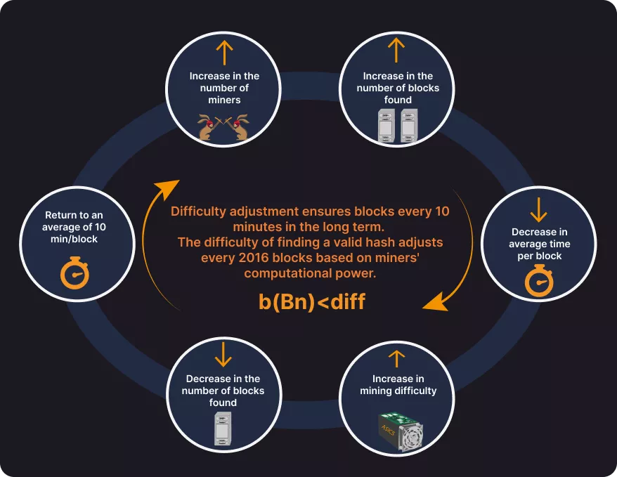

> Visste du? Gravere er incentivert til å utvinne en blokk for å tjene de nye bitcoinsene (blokksubsidiet) og transaksjonsgebyrene som er forbundet med transaksjonene de inkluderer i blokken sin. Ettersom antallet utstedte bitcoins nærmer seg 21 millioners grensen, vil gruvearbeidere bli belønnet mer gjennom transaksjonsgebyrene sine enn gjennom blokksubsidiet.'

- Spillteori er et matematisk konsept som stoler på menneskelig rasjonalitet. Her, i Bitcoin, er det brukerne som stemmer over protokollendringer. Ja, du leste riktig: enhver modifikasjon av Bitcoin-protokollen ville kreve enigheten til hele brukersamfunnet, noe som er svært komplekst. Så, hvis noen ønsket å skape en 22. million bitcoin, måtte de overbevise alle brukere om å frivillig devaluere sine egne sparepenger, noe som er usannsynlig å skje fordi Bitcoin er globalt og ikke styrt av en sentral gruppe.
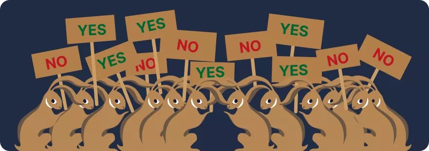
Ideen om å devaluere valutaen går imot den grunnleggende filosofien til Bitcoin, så det å endre denne grensen er svært usannsynlig.

### En reviderbar pengepolitikk hvert sekund fra begynnelsen og for alltid!

Knappheten på Bitcoin er en stor fordel, og den maksimale mengden av 21 millioner bitcoins i omløp er offentlig og kan verifiseres av hvem som helst.

Faktisk kan hvem som helst verifisere mengden bitcoins i omløp ved å skrive inn et enkelt kommando på en Bitcoin-node: `bitcoin-cli gettxoutsetinfo`. Denne gjennomsiktigheten og verifiserbarheten styrker tilliten til Bitcoin-systemet, som ikke er basert på sentraliserte institusjoner eller individer, men på en matematisk og kryptografisk garanti innebygd i protokollen. (Du vil lære hvordan du gjør dette enkelt i LN201)

```json
{
  "height": 710560,
  "bestblock": "0000000000000000000887384d67103412ea7f18a43953e65c8c4ac36bf42e54",
  "transactions": 473244,
  "txouts": 1018917,
  "bogosize": 2183872374,
  "hash_serialized_2": "eebb9987337700ffaacbbaa11223344",
  "disk_size": 178239584,
  "total_amount": 18745998.12345678
}
```

Bitcoin garanterer ved sitt design sunn pengeforvaltning ved å begrense sin skapelse og beskytte brukernes sparepenger, noe som skiller den fra andre valutaer. I tråd med prinsippene til østerriksk økonomi (detaljer i ECON201), beskytter dens kontrollerte mengde og forutsigbare distribusjon den mot de iboende risikoene for inflasjon i tradisjonelle valutaer.

Oppsummert tilbyr Bitcoin, med sin desentraliserte natur, programmerte knapphet og gjennomsiktighet, et unikt alternativ til tradisjonelle penge systemer. Det illustrerer hvordan teknologi kan brukes til å skape en valuta som ikke bare er nyttig og verifiserbar, men som også bevarer verdien av brukernes sparepenger ved strengt å begrense tilbudet.

### Rask oppsummering i en plakat!

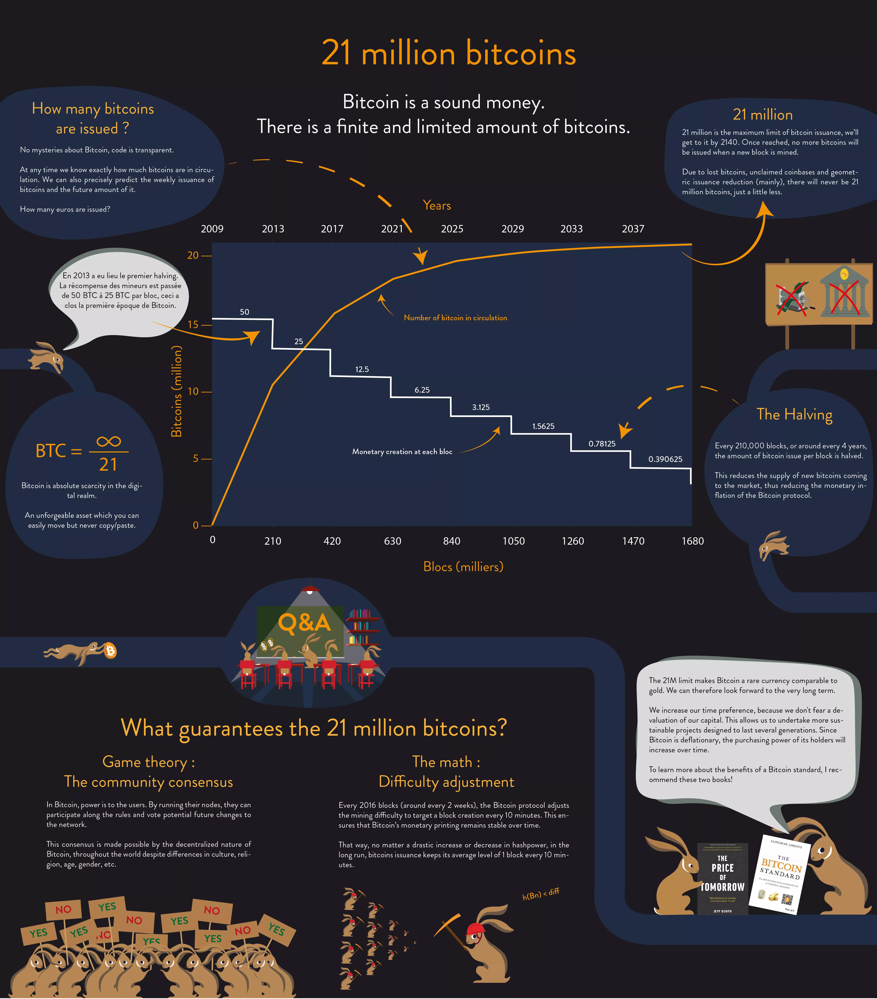

### Konklusjon av seksjon 1!

# Wallets Bitcoin
<partId>28860585-4f61-59d9-b242-f4c57d837cc1</partId>

## Hva er Bitcoin-lommebøker?
<chapterId>1c0166ab-cb7a-5bc6-9175-d13482bd91f1</chapterId>

I denne seksjonen 2, vil vi utforske lagring og sikkerhet av Bitcoins innenfor lommebøker. Dette vil tillate deg å bedre forstå hvor disse berømte bitcoins befinner seg og hvordan du kan samhandle med dem!

### Avmystifisering av Bitcoin-lommebøker

I denne industrien bruker vi lommebøker for å samhandle med Bitcoin-nettverket, som har 3 funksjoner:

- Tillate mottak av bitcoins
- Tillate sending av bitcoins
- Sikre dem mot hacking og tyveriforsøk

En lommebok kan være programvare på datamaskinen din, en applikasjon på smarttelefonen din, en fysisk enhet som en USB-nøkkel, eller til og med et stykke papir. Disse forskjellige typene Bitcoin-lommebøker tjener ulike bruksområder. Noen brukes for store mengder med vekt på sikkerhet, andre for personvern, eller til og med for daglig betaling av små beløp.

Porteføljer er derfor delt inn i store familier av bruk, alltid med et sentralt spørsmål: Er du eieren av midlene eller overlater du kontrollen over pengene dine til en tredjepart? Vi vil komme tilbake til dette emnet i detalj i neste kapittel, men ideen er enkel: Er pengene i lommen din eller i bankmannens lomme!


### Hvordan fungerer en Bitcoin-lommebok
Enten det er din Bitcoin "bankmann" eller deg selv, generelt sett, fungerer flertallet av Bitcoin-lommebøker med lignende teknologi, det vil si asymmetrisk kryptografi, og derfor et system med nøkkelpar: en privat nøkkel for å bruke og en offentlig nøkkel for å motta.

- Privat nøkkel
  Når en lommebok initialiseres, genereres en hemmelig gjenopprettingsfrase (privat nøkkel) og gis til deg i form av 24 ord.

  Den private nøkkelen er veldig viktig fordi den representerer eierskapet til bitcoinene og derfor retten til å bruke eller sende dem. Innehaveren av den private nøkkelen er eieren av Bitcoinene.

  Denne nøkkelen må holdes hemmelig og godt bevart, da det er nøkkelen som låser opp formuen din!

- Offentlig nøkkel & adresse
  Den offentlige nøkkelen er skapt med den private nøkkelen og derfor knyttet til den. Den offentlige nøkkelen brukes til å generere Bitcoin-adresser og dermed motta penger. Å dele den offentlige nøkkelen innebærer risikoer for personvernet, men ikke for sikkerheten.

  Disse adressene opprettes av lommeboken din og kan deles trygt. Det anbefales å bruke dem kun én gang for å maksimere personvernet ditt.

Det er derfor viktig å forstå at takket være denne teknologien, kan vi enkelt motta Bitcoins uten å tillate avsenderen å stjele midlene våre! Tenk på det som en postkasse: folk setter inn penger i den, men du er den eneste som kan åpne den.


### Er Bitcoinene i lommeboken da?

Selv om nøklene dine er lagret i lommeboken din, er bitcoinene faktisk "lagret" i Bitcoin-blockchainen, som er en offentlig distribuert hovedbok innenfor Bitcoin peer-to-peer-nettverket (vi vil se på dette i seksjon 3). Derfor betyr ikke tap av enheten der du har lommeboken din nødvendigvis tap av bitcoinene dine. Det som lar deg gjenskape lommeboken din og bruke bitcoinene dine, er den private nøkkelen. Det er derfor avgjørende å sikre den ordentlig.


Heldigvis for oss, siden 2017, kan denne private nøkkelen kodes i en enkel liste med 12 eller 24 ord, kalt den mnemoniske frasen. Denne frasen er en sikkerhetskopi av Bitcoin-lommeboken din, det er det som lar deg gjenskape lommeboken din med hvilken som helst Bitcoin-lommebok programvare/app. Derfor har alle som har tilgang til denne listen av ord tilgang til bitcoinene dine.

### Hva med hackere?

Man kan spørre: hva om noen ved en tilfeldighet gjetter vår liste med 12 eller 24 ord? Det korte svaret er at takket være kryptografien som brukes til å lage lommeboken, er det svært usannsynlig. For å sette det i perspektiv, å tilfeldigvis finne tilgang til lommeboken din er som å finne det "rette" tallet mellom 1 og $2^256$, som nesten tilsvarer å finne det "rette" atomet i universet. Men, hvis du ikke er fornøyd med denne standard sikkerheten, kan du alltid styrke den ved å legge til en passfrase til din Bitcoin-lommebok.


Således er sannsynligheten for hacking av Bitcoin-lommeboken din astronomisk lav hvis du følger gode sikkerhetspraksiser. Praksiser som vi detaljerer i neste seksjon.

Velg en lommebok som passer dine behov og bruk. Detaljerte veiledninger om bruk og sikring av forskjellige lommebøker er tilgjengelige i [veiledningsseksjonen av universitetet vårt](https://planb.network/tutorials/wallet).

### Rask oppsummering i en plakat!

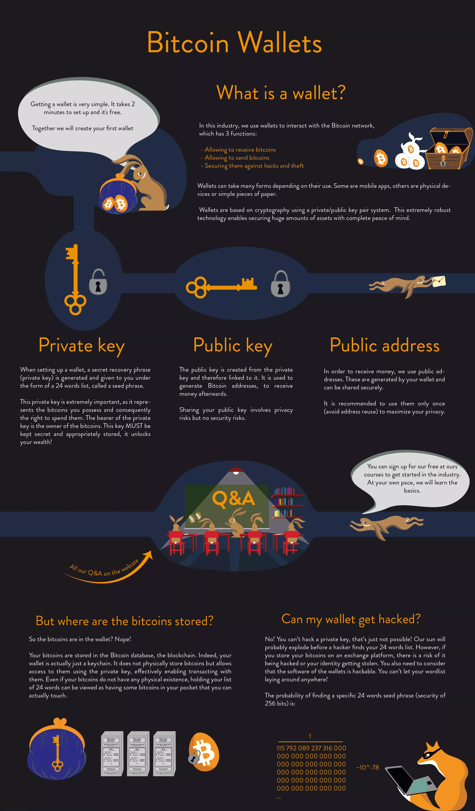

## Sikkerhet og Bitcoin-lommebøker
<chapterId>00c1afea-e54a-511f-bab3-2efc2fbfa6a1</chapterId>

### Å stille de riktige spørsmålene før man starter
Når du eier bitcoins, er sikkerheten til midlene dine en stor bekymring. Den beste måten å definere sikkerhet som passer for din situasjon, er å stille (og svare på) en rekke spørsmål; din sikkerhetsmodell vil avhenge av svarene dine. La oss starte:
- Hvem kan få tilgang til mine midler? Med andre ord, er du den eneste som har tilgang til dine bitcoins, eller tillater en tredjepart, som et selskap, deg å få tilgang til dine midler?
- Et annet spørsmål kan være: hva er bruken du planlegger å ha med dine bitcoins? Er det en sum du bruker regelmessig? Er det sparing på mellomlang sikt? Langsiktig sparing?
- Hva er dine tekniske ferdigheter?
- Hva er ditt sikkerhetsbudsjett?

Husk at det ikke finnes en universell løsning. Så ta deg tid til å svare på disse spørsmålene, da det vil hjelpe deg med å skreddersy dine sikkerhetstiltak.

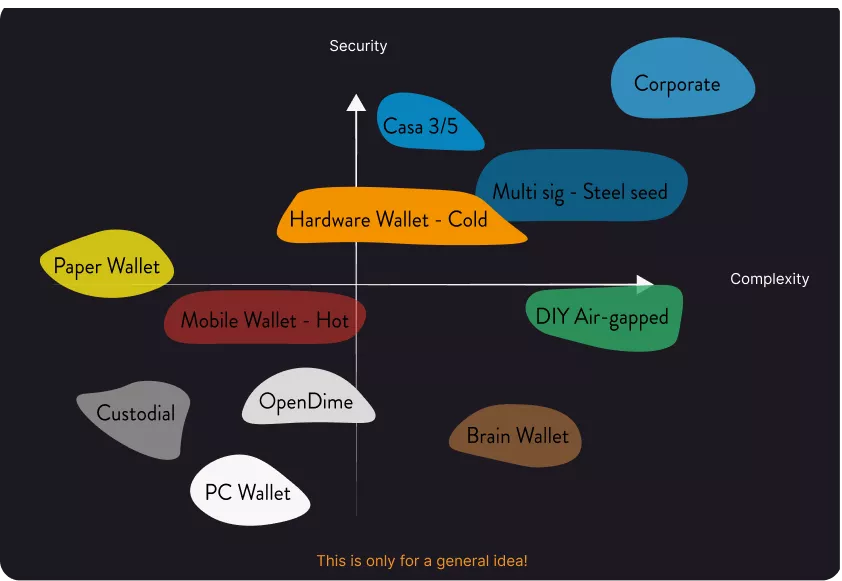

### Å tenke på Bitcoin-lommebøker i form av kompleksitet

La oss prøve å etablere flere nivåer av sikkerhet for dine bitcoins:

- **Nivå 0**, du bruker en såkalt forvaltningstjeneste hvor du ikke er den eneste innehaveren av dine bitcoins. Vær oppmerksom på at denne betrodde tredjeparten kan begrense tilgangen din til dine midler når som helst, og du har samme nivå av finansiell suverenitet som med det tradisjonelle banksystemet gjennom en bankkonto.


- **Nivå 1**, du bruker en Bitcoin-lommebok på telefonen eller datamaskinen din hvor du er den eneste innehaveren av dine bitcoins. Du kan enkelt utføre transaksjonene dine. Det er imidlertid avgjørende å sikkerhetskopiere den mnemoniske frasen for å gjenopprette tilgangen til dine midler i tilfelle tap av telefonen eller datamaskinen. Det refereres ofte til som en "hot wallet" fordi den private nøkkelen lagres på en enhet med internett-tilgang.

- **Nivå 2**, du bruker en fysisk lommebok, og du har sikret din liste med 12 eller 24 ord. For å utføre en transaksjon, vil du alltid trenge å signere med enheten din. Dette gjør dine midler mindre tilgjengelige på daglig basis. Det refereres ofte til som en "Cold Wallet" fordi nøklene dine lagres på en enhet som ikke er koblet til internett.


- **Nivå 3**, du bruker en lommebok på nivå 1 eller 2, men med en ekstra passfrase. Vær oppmerksom på at du nå trenger å sikkerhetskopiere både listen med 12 eller 24 ord **og** din passfrase. Ideelt sett er disse to informasjonsbitene lagret på to forskjellige steder.

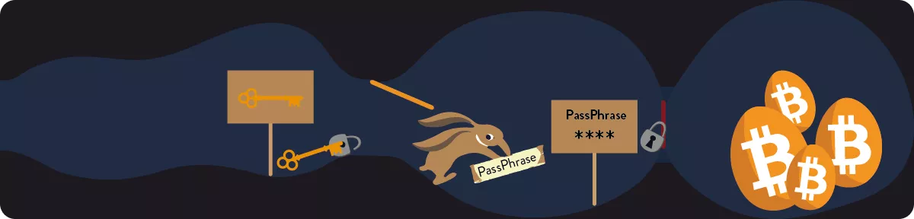

- **Nivå 4**, du bruker et sett med lommebøker for å opprette en "multisig" lommebok, noe som betyr at det kreves flere signaturer for å utføre en transaksjon. Vær oppmerksom på at hver del av multisig bør lagres på forskjellige steder. Dette anses ofte som en avansert bruk av Bitcoin, hovedsakelig brukt for store beløp og bedriftsbruk.

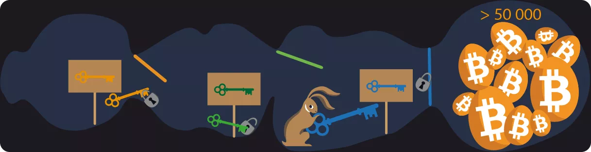

Selvfølgelig kan vi ha flere bruksområder, og i slike tilfeller anbefales det å bruke flere Bitcoin-lommebøker. Det finnes ingen løsning som passer for alle.

### Sikkerhet må tilpasse seg
Beløpet man er villig til å la stå på et spesifikt sikkerhetsnivå avhenger av den enkelte. For noen er det rimelig å la 1 BTC være på en hot wallet, mens for andre er det absolutt ikke det. Uansett, unngå å bruke mye på sikkerhet ved å kjøpe en fysisk lommebok når du ønsker å sikre et lite beløp. Husk også at det å overkomplisere sikkerheten og tilgjengeligheten til dine bitcoins kan skade deg hvis du for eksempel håndterer sikkerhetskopiene av lommebøkene dine feil.
Som konklusjon er direkte eierskap til ens bitcoins et essensielt element for å sikre finansiell suverenitet. Det anbefales å bruke en mobil lommebok for daglige utgifter og en offline, eller "kald," fysisk lommebok for å lagre større beløp. Bedrifter, derimot, bør vurdere å bruke systemer med flersignatur, eller "multisig," for økt og delt sikkerhet. Det er også essensielt å unngå forvaringstjenester, som kan replikere noen sårbarheter fra det tradisjonelle finanssystemet så mye som mulig.

Nå som vi har dette i tankene, la oss gå videre til neste seksjon for å se stegene for å opprette en Bitcoin-lommebok. Men, hvis du ønsker å utforske temaet sikkerhet ytterligere, kan du lese denne [artikkelen av DarthCoin](https://asi0.substack.com/p/bitcoin-soyez-votre-propre-banque).

### Rask oppsummering i en plakat!

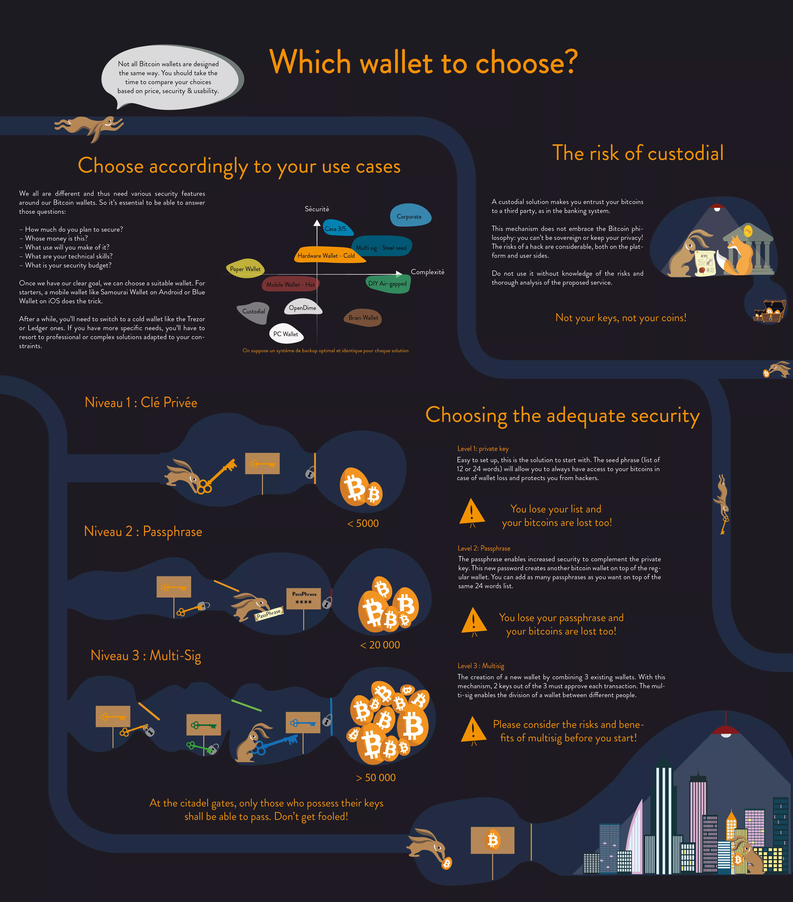

## Opprette en lommebok
<chapterId>615519eb-4565-557d-86a0-021badf7616f</chapterId>

Sikkerheten til dine bitcoins er av avgjørende betydning, og en enkel feil kan ha kostbare konsekvenser. Derfor vil vi nå se på beste praksiser når man oppretter en ny Bitcoin-lommebok.

> Merk at BTC102-kurset vil veilede deg gjennom dette steget.

### Dette steget er ingen spøk!

Din private nøkkel, ofte representert av en liste med 24 ord (ofte kalt en "seed" eller "mnemonisk frase"), representerer tilgangen til dine midler. Hvis denne nøkkelen avsløres for en tredjepart, betrakt midlene som ikke lenger sikre. Derfor, når du initialiserer lommeboken din, er det viktig å følge disse reglene:

- Dekk til alle kameraer.
- Ikke ta et bilde av ordlisten.
- Ikke skriv den inn på en datamaskin eller telefon.
- Ikke lagre den som en kontakt eller send den til deg selv via SMS.
- La aldri ordene dine være uten tilsyn på skrivebordet ditt.
- Ikke gjem ordlisten din på et uvanlig sted.

Du vil bokstavelig talt ta et blankt ark papir eller skrive ut denne [malen](https://bitcoiner.guide/backup.pdf), og skrive ordlisten i rekkefølge, pent og tydelig, med en penn. Hvis blekket falmer over tid, kan du miste midlene dine; derfor er det viktig å holde dette papiret beskyttet fra elementene.

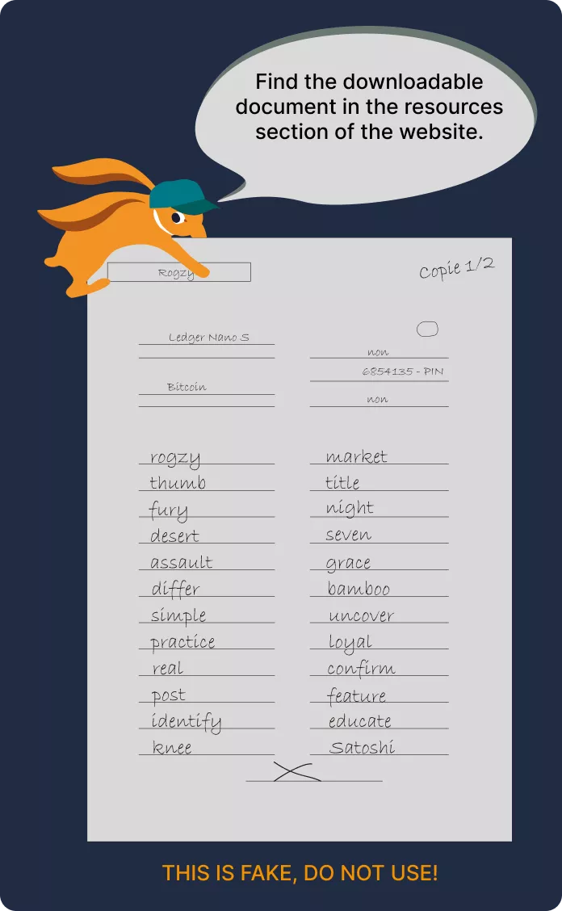

### Tips for å gjøre det riktig

Det finnes også alternative løsninger til papir, som å gravere din mnemoniske frase på en metallplate. Hvis du skriver det feil, kan dine arvinger kanskje ikke lese det og derfor ikke kunne gjenopprette midlene. Når ordene er skrevet, anbefales det å lage en andre kopi og lagre den på et separat sted fra den første. Dette gir en sikkerhetskopi i tilfelle tap eller ulykke med den første kopien.


Når kopiene er laget, oppbevar ordlistene på et trygt sted hvor du vil huske å se etter dem! Ikke lag en for kompleks gjemmeplass der du risikerer å miste dem.

> Dine ord = dine penger.
"Kalde" lommebøker har vanligvis disse ordlistene, akkurat som "varme" lommebøker på mobil eller PC. Denne metoden for å sikkerhetskopiere den private nøkkelen er nå standarden. Dette betyr at du kan skrive inn din mnemoniske frase i hvilken som helst lommebokprogramvare for å gjenopprette din. Bare dårlige lommebøker som vi sterkt fraråder, vil ikke gi deg en liste med 24 ord, men kan be om en konto, en e-postadresse, eller verre, en ID.
**OBS: Fraværet av en liste med 24 ord bør varsle deg.**

### Rask oppsummering i en plakat!

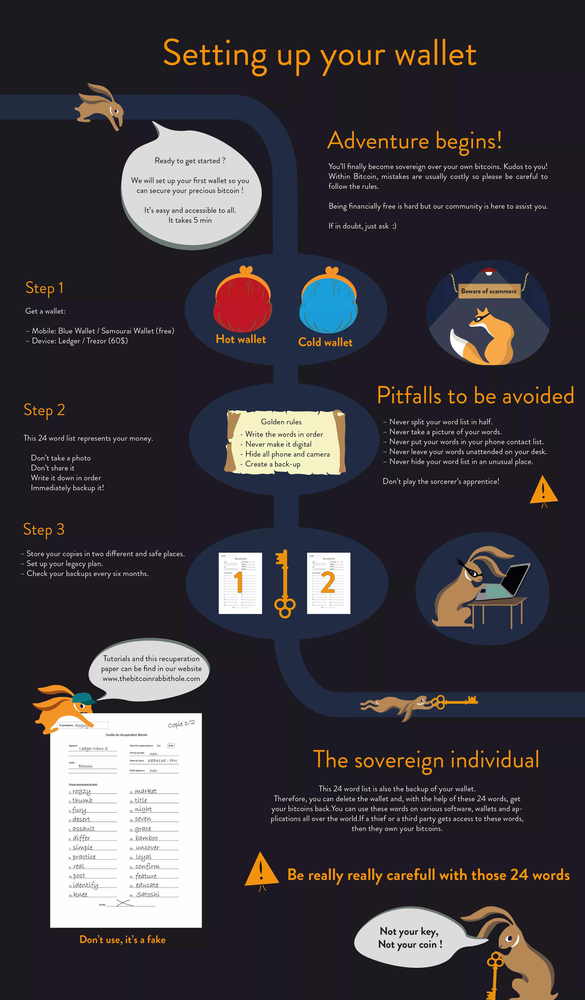

## Består tidens prøve
<chapterId>f58cd446-c202-5eff-aab7-e61cc40e5c06</chapterId>

Sikkerhet er en stor bekymring i Bitcoin-økosystemet. Faktisk, som enhver form for rikdom, må dine bitcoins beskyttes mot tap, tyveri og forringelse, spesielt over lang tid. Å sikre dine bitcoins krever litt teknisk kunnskap og bevissthet om de tilknyttede risikoene, noe som fører oss til å diskutere to hovedstrategier: å gravere dine bitcoins i stål og å lage en arveplan.

### Gravering i stein

En metode for å sikre dine bitcoins på lang sikt er å gravere din mnemoniske frase på et motstandsdyktig materiale som stål. Dette skaper en fysisk sikkerhetskopi av nøklene dine som er motstandsdyktig mot både vannskader og brann.

Det finnes mange løsninger for å oppnå dette, noen er rimelige som "Blockmit", mens andre krever mer utstyr. Du kan utforske dette emnet selv gjennom opplæringsseksjonen på dette universitetet.


### Tenk på neste generasjon!

I tillegg til dette er det også avgjørende å lage en arveplan for å sikre at dine bitcoins vil bli håndtert på riktig måte etter din død. Denne planen kan inkludere et håndskrevet brev som detaljerer dine eiendeler, deres tilgangsmetoder og kontaktinformasjonen til pålitelige personer som skal kontaktes. Det er også viktig å diskutere arv av bitcoins med en notar for å sikre skattemessig overholdelse, selv om det er viktig å aldri direkte betro dine bitcoins til en tredjepart, inkludert en notar.

Hvis du ønsker å utforske emnet om en arveplan for dine bitcoins ytterligere, anbefaler vi Pamela Morgans bok [Cryptoasset Inheritance Plan](https://planb.network/resources/books/28) eller å ta BTC102-kurset hvor vi veileder deg i opprettelsen av den.

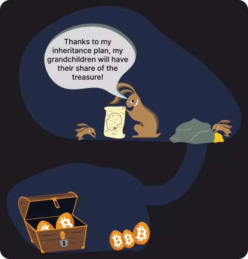

### Personvern er viktig

Den langsiktige sikkerheten til dine bitcoins er ikke begrenset til å lage fysiske sikkerhetskopier eller utvikle en arveplan. Personvern er en annen viktig vurdering. For eksempel er det å foretrekke å kjøpe bitcoins uten å oppgi identifikasjon for å minimere risikoen for identitetstyveri eller rett og slett sporing av dine midler av enhver enhet med tilstrekkelige midler. BTC 205-kurset kan hjelpe deg med dette om nødvendig.

Når det gjelder personvern, er det avgjørende å unngå å snakke med alle om dine bitcoins. Faktisk vet vi ikke hvor denne eiendelen vil gå, og å opprettholde diskresjon angående eierskapet er en klok beslutning. Du ønsker ikke å tiltrekke deg oppmerksomhet til deg selv og din lommebok.

I samme ånd, unngå å høyt avsløre ditt sikkerhetssystem under bitcoin-møter eller møter med fremmede...

### Rask oppsummering i en plakat!

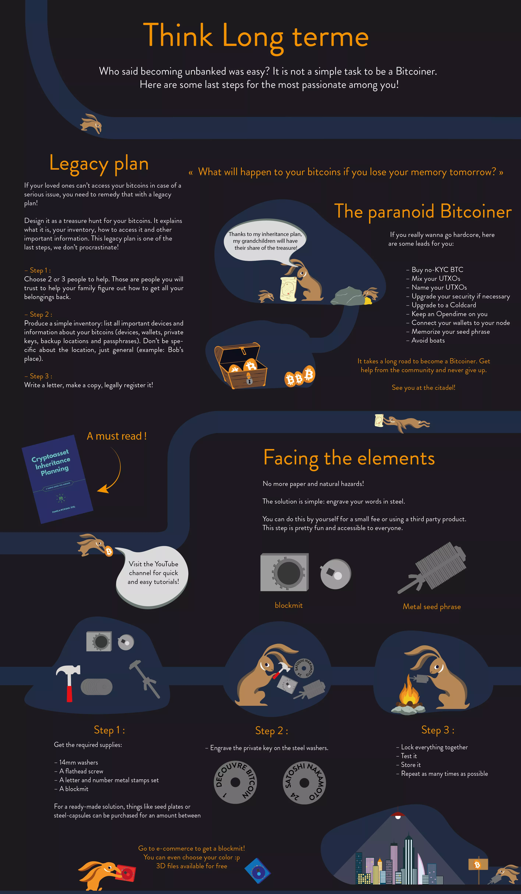

### Sammendrag om sikkerhet for Bitcoin-lommebøker

Bitcoin-lommebøker er programvare som lar deg lagre og utføre transaksjoner med bitcoins. Det finnes flere typer: mobile eller PC-lommebøker, praktiske for små beløp og/eller regelmessige utgifter; fysiske lommebøker, mer egnet for å lagre bitcoins på mellomlang og lang sikt; multisig-lommebøker, som er mer komplekse å håndtere og krever flere signaturer for å utføre transaksjoner.
Når du oppretter en lommebok, må du først sikkerhetskopiere din private nøkkel. Denne sikkerhetskopien tar form av en liste med 12 eller 24 ord, eller 12 ord som du kan skrive ned på et stykke papir eller en metallplate. Denne mnemoniske frasen lar deg gjenopprette lommeboken din på hvilken som helst Bitcoin-lommebokapplikasjon. Alle som har tilgang til denne listen har også tilgang til dine bitcoins. I Bitcoin går finansiell suverenitet hånd i hånd med individuelt ansvar, så det er avgjørende at du sikrer tilgangen til dine lommebøker og sikkerhetskopier. For å gjøre dette, er det viktig å følge visse regler:
- Opprett en arveplan: for å sikre at dine kjære kan hente pengene i tilfelle et problem.
- Unngå børsplattformer: det er tilrådelig å unngå å la dine Bitcoins ligge på børsplattformer, da de kan være utsatt for hackerangrep.
- Tilpass ditt sikkerhetsnivå: ta deg tid til å forklare dine behov og bruksområder, dette vil hjelpe deg med å gjøre ditt valg blant de forskjellige Bitcoin-lommebøkene som er tilgjengelige.

Nå som vi har dekket grunnleggende om Bitcoin-lommebøker og beste praksis for å sikre dem, vil vi ta for oss den tekniske funksjonen til Bitcoin i neste kapittel. Igjen, å kjenne til grunnleggende om Bitcoin-protokollen vil tillate deg å bedre forstå dens funksjon, noe som vil gjøre det mulig for deg å bruke den bedre.

# De tekniske aspektene ved Bitcoin.
<partId>a86d7439-e7a2-5f21-b1e9-6b5e23ca265b</partId>

## Lanseringen av Bitcoin
<chapterId>b7561082-8943-519d-95d1-a5f60dd2686d</chapterId>

### La oss starte med litt historie.


31. oktober 2008 markerer fødselen av en ny finansteknologi: Bitcoin. Det er på denne datoen at Satoshi Nakamoto, den anonyme forfatteren av Bitcoin, presenterer sin innovasjon for verden gjennom en e-post distribuert til cypherpunk e-postlisten, et fellesskap av kryptografi-entusiaster lidenskapelig opptatt av personvern på internett.

Denne e-posten inneholdt et dokument, kalt "White Paper," som presenterte funksjonen til Bitcoin. Gitt de tidligere feilene med digitale kontantsystemer, genererte ikke dette initiativet umiddelbar entusiasme. Likevel ble dette White Paper til slutt en referanse for Bitcoin-brukere og har vært gjenstand for mange debatter i Bitcoin-økosystemet.


Den 3. januar 2009, offisielt innvier Satoshi Bitcoin-nettverket ved å skape den første blokken, også kjent som genesis-blokken, som markerer lanseringen av Bitcoin-blockchainen. Denne blokken inneholder en avslørende melding om Bitcoin sin misjon: "03/jan/2009 Chancellor on brink of second bailout for banks."


> "Vi kan vinne et stort slag i våpenkappløpet og vinne
> et nytt territorium av frihet for flere år.” - Satoshi Nakamoto


### Bitcoin-protokollen begynner å leve

Den 8. januar 2009 annonserer Satoshi utgivelsen av Bitcoin-0.1.0. Kort tid etter tar Hal Finney tak i programvaren og blir med i nettverket. Nå var det 2 noder, og derfor 2 gruvearbeidere, i nettverket. Finney udødeliggjør dette steget ved å tvitre "Running Bitcoin". Den 12. januar 2009 blir den første Bitcoin-transaksjonen gjort mellom Satoshi og Hal Finney. Denne transaksjonen, på 10 BTC, blir registrert i blokk 170.

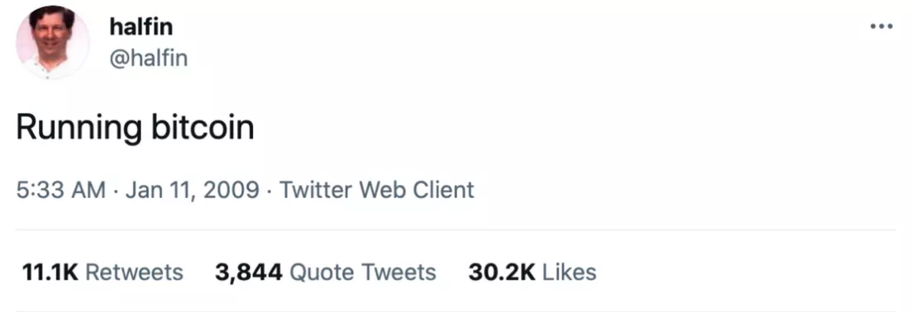
Interessen for Bitcoin vokser raskt, og mange begynner å teste, debattere, løse feil, og reflektere over de etiske, økonomiske, og filosofiske aspektene ved Bitcoin. For å lette disse utvekslingene, blir BitcoinTalk-forumet opprettet 22. november 2009 av Satoshi. Dette forumet blir raskt det foretrukne diskusjonsstedet for Bitcoin-brukere. Det er der mange memer og symboler assosiert med Bitcoin blir født, som [Bitcoin-logoen](https://bitcointalk.org/index.php?topic=64.0), den berømte [Hodl](https://bitcointalk.org/index.php?topic=375643.0), eller til og med [Pizza-dagen](https://bitcointalk.org/index.php?topic=137.msg1195).

> **Visste du?** Faktisk, den 22. mai 2010, gjorde Laszlo Hanyecz historie med Bitcoin ved å tilby å kjøpe 2 pizzaer for 10 000 BTC. Dette er første gang at Bitcoin brukes til å kjøpe fysiske varer.


### Satoshi Nakamotos forsvinning

I 2010, da Bitcoin begynner å tiltrekke seg medieoppmerksomhet, bestemmer Satoshi seg for å trekke seg tilbake. Den 12. desember 2010 publiserer han sitt siste innlegg på forumet, hvor han annonserer sin avgang. Den 23. april 2011 gjør han sin siste kjente private utveksling via e-post. Satoshi forsvinner deretter, og overlater sin skapelse i hendene på fellesskapet.

> “Regjeringer er gode på å kutte hodene av sentralt
> kontrollerte nettverk som Napster, men rene P2P-nettverk som
> Gnutella og Tor ser ut til å holde stand.” - Satoshi Nakamoto

Til tross for Satoshis fravær, fortsetter Bitcoin å utvikle seg. Hver 10. minutt skrives historien om Bitcoin, og protokollen fortsetter å fungere som tiltenkt. Uavhengig av frykt, usikkerhet eller tvil (FOMO for Fear Of Missing Out eller FUD for Fear Uncertainty Doubt), fortsetter Bitcoin å bevege seg fremover, med en online tilgjengelighet på 99,988%.

Bitcoin oppfattes forskjellig av hver enkelt. For noen er det en soppentitet som [mycelium](https://brandonquittem.com/bitcoin-is-the-mycelium-of-money/), for andre er det et [sort hull](https://dergigi.com/2019/05/01/bitcoins-gravity/i). Elsk det eller hat det, Bitcoin fortsetter å eksistere, med sin konstante rytme på 10 minutter per blokk, som hjerteslaget til et nytt monetært system.

For å lære mer om Satoshi Nakamotos skrifter, anbefaler jeg [Phil Champagnes bok](https://planb.network/resources/books) eller ARTE-dokumentaren "le mystaire Satoshi".


> “Rotproblemet med konvensjonell valuta er all tilliten som kreves for å få den til å fungere. Sentralbanken må stoles på for ikke å devaluere valutaen, men historien om fiat-valutaer er full av brudd på den tilliten. Banker må stoles på for å holde på pengene våre og overføre dem elektronisk, men de låner dem ut i bølger av kredittbobler med knapt en brøkdel i reserve.”

Nå som vi har litt bakgrunn, la oss se på hvordan en Bitcoin-transaksjon fungerer generelt.

### Rask oppsummering i en plakat!

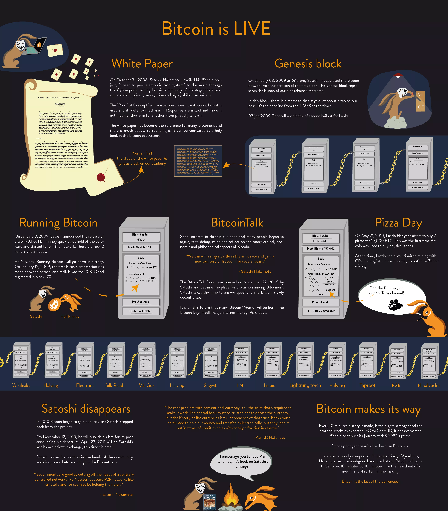

## Bitcoin-transaksjoner
<chapterId>03482644-5473-590b-975b-b43bb65eac21</chapterId>
En Bitcoin-transaksjon er rett og slett en overføring av eierskap av bitcoins, ved bruk av en Bitcoin-adresse. La oss ta, for eksempel, to hovedpersoner: Alice og Bob. Alice ønsker å skaffe bitcoins, mens Bob allerede eier noen.

### Steg 1 - Opprette transaksjonen via lommeboken

For at Bob skal overføre bitcoins til Alice, må Alice gi Bob en av sine Bitcoin-adresser. Denne adressen, som er avledet fra Alices offentlige nøkkel, er unik for hennes Bitcoin-lommebok.

I konkrete termer åpner Alice sin lommebok og trykker på "motta". En QR-kode eller adresse som denne bc1q7957hh3nj47efn8t2r6xdzs2cy3wjcyp8pch6hfkggy7jwrzj93sv4uykr vil bli vist. Det er hennes slags "Bitcoin IBAN". Hun gir den til Bob.

Bob initierer deretter transaksjonen ved å bruke Alices mottaksadresse. Bob åpner på sin side sin Bitcoin-lommebok, trykker på "send", kopierer og limer inn adressen, legger til et beløp og en transaksjonsavgift. Disse avgiftene er en insentiv for gruvearbeidere til å inkludere transaksjonen i neste blokk.


> **Hvorfor betale avgifter?** Disse avgiftene er essensielle for å skape et fritt marked for inkludering av transaksjoner i blokker, ettersom antallet transaksjoner i en blokk er begrenset. Faktisk har en blokk en størrelse på 1 MB (kan utvides til 4MB etter Segwit-oppdateringen), som tilsvarer noen tusen transaksjoner per blokk. Avgiftene for en transaksjon er proporsjonale med dens størrelse. Størrelsen på transaksjonen avhenger igjen av kompleksiteten til transaksjonen.

For å fullføre transaksjonen, må Bob gi en signatur med den private nøkkelen til adressene han bruker for å betale Alice. Dette bekrefter at han er eieren av bitcoinsene han ønsker å overføre. Dette steget gjøres vanligvis automatisk på mobile lommebøker, eller det er en bekreftelse på din fysiske lommebok: "Er du sikker på at du vil sende X til Y? Ja eller nei".

### Steg 2: Propagering av transaksjonen gjennom noder til gruvearbeidere

På dette stadiet har transaksjonen blitt opprettet og Bobs lommebok vil dele den med Bitcoin-nettverket. For å gjøre dette, vil hans lommebok kommunisere med en node i Bitcoin-nettverket, og denne noden vil spre denne informasjonen til andre noder. Dette propageringssteget lar hele nettverket se denne nye transaksjonen og ta den i betraktning.

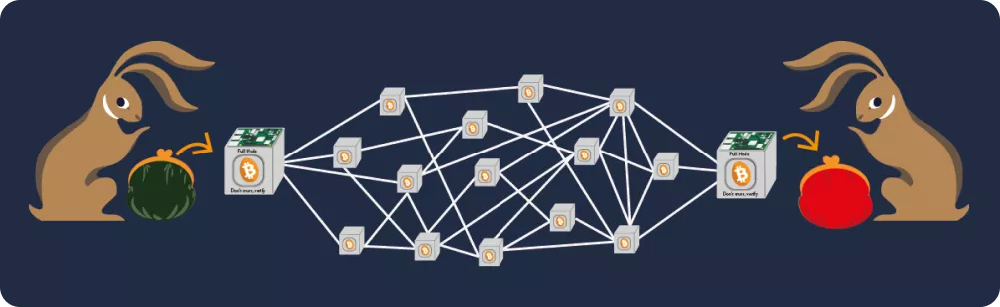

Selv om denne transaksjonen nå er kjent for alle (via et verktøy kalt Mempool), er transaksjonen ikke nødvendigvis ansett som bekreftet! Faktisk er det gruvearbeiderne som validerer transaksjonene ved å inkludere dem i en blokk av vår berømte blockchain.

Gruvearbeidere har rollen som å ta gyldige og ubekreftede transaksjoner, og deretter kompilere dem til en blokk. For at deres blokk skal være den neste i Bitcoin-blockchainen, må de løse et kryptografisk puslespill i en prosess kalt "proof of work".

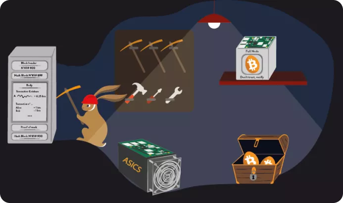

### Steg 3: Transaksjonen blir minet i en blokk av en gruvearbeider.

Dette proof of work krever å finne en gyldig "hash" for den aktuelle blokken. Tenk på det som et unikt fingeravtrykk assosiert med blokken, bestående av 256 tegn. Gyldigheten av denne hashen avhenger av vanskelighetsgraden til Bitcoin-nettverket. Vi vil gå mer i detalj på denne mekanismen senere. For nå, tenk at en gruvearbeider har funnet en gyldig blokk og at Bobs transaksjon til Alice er inkludert i den.
Denne nye gyldige blokken legges til i Bitcoin-blockchainen, som er en offentlig og uforanderlig hovedbok over alle Bitcoin-transaksjoner. Tenk på det som en felles hovedbok for alle Bitcoin-brukere. Ifølge protokollreglene legges en blokk til omtrent hvert tiende minutt takket være justeringen av vanskelighetsgraden. Vi vil se i avsnittet om gruvearbeidere hvilken mekanisme som forhindrer modifisering av Bitcoin-transaksjonshovedboken.


### Steg 4: Blokken er gyldig og verifisert av Alices lommeboknode.

På dette stadiet anses transaksjonen som gyldig, gruvearbeideren vil deretter spre den nye blokken gjennom sin node til nettverket, og Alices lommebok vil bli oppdatert.


> Merk: Selv om Alice ser at hun har mottatt bitcoins på en av adressene sine, anbefales det å betrakte transaksjonen som uforanderlig først når den har 6 bekreftelser. Dette betyr at 6 andre blokker har blitt utvunnet på toppen av blokken som inneholder Bobs transaksjon. Med andre ord, jo eldre en transaksjon er i blockchainen, desto mer uforanderlig blir den.

### Rask oppsummering i en plakat!

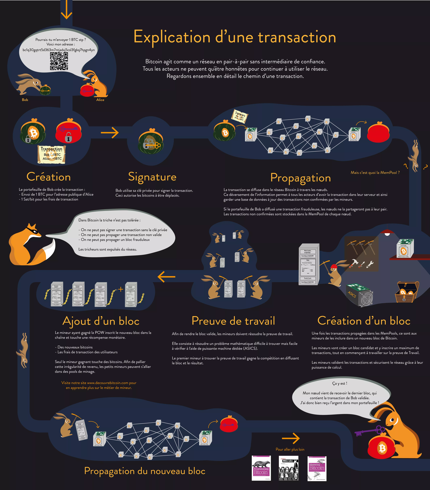

### Hva er poenget med alt dette?

Til slutt er Bitcoin-transaksjonssystemet desentralisert og fungerer peer-to-peer, uten noen pålitelige mellommenn.

Bob sender sin transaksjon til Bitcoin-nettverket, og når en gruvearbeider publiserer en gyldig blokk som inneholder Bobs transaksjon, kan Alice begynne å anse at bitcoinene tilhører henne. Tillit er ikke nødvendig på noe trinn i overføringen av bitcoin-eierskap; bare protokollreglene og økonomiske insentiver gjør det for kostbart å handle ondsinnet innenfor Bitcoin-protokollen.

Brukere overfører eierskap til pengene sine ved å digitalt signere transaksjoner med sine private nøkler. Gruvearbeidere har liten makt, ettersom brukerne også har betydelig kontroll gjennom Bitcoin-noder som håndterer valideringen av nye blokker og inkluderte transaksjoner. Det er gjennom dette nettverket av Bitcoin-noder at nettverket er virkelig desentralisert.

Faktisk, for at Bitcoin-nettverket skal bli fullstendig ødelagt, måtte alle kopier av blockchainen på alle Bitcoin-noder ødelegges - en praktisk talt umulig oppgave på grunn av den geografiske spredningen av disse nodene og vanskeligheten med fysisk å beslaglegge dem.

La oss se nærmere på hvordan en Bitcoin-node fungerer.

## Bitcoin-noder
<chapterId>8533cebc-f799-528b-89df-8d75d4c37f1c</chapterId>

Noder er et grunnleggende element i Bitcoin-nettverkets arkitektur. De utfører ulike avgjørende funksjoner:

- Opprettholder en kopi av Bitcoin-blockchainen
- Validerer transaksjoner
- Overfører informasjon til andre noder
- Håndhever reglene i Bitcoin-protokollen.

Derfor bidrar enhver enhet som kjører Bitcoin-programvare, kalt Bitcoin-noder (ofte gjennom [Bitcoin Core](https://bitcoin.org/en/bitcoin-core/)), til desentraliseringen av nettverket.

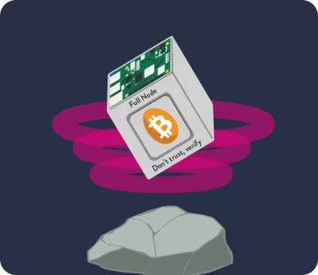

### Noder er dermed kjernen i Bitcoin.

Hver node holder en kopi av blockchainen, som muliggjør verifisering av transaksjoner og forhindrer ethvert forsøk på svindel. Nettverkets desentraliserte aspekt gir Bitcoin enestående motstandsdyktighet og robusthet - for å stoppe Bitcoin-protokollen, måtte alle noder rundt om i verden stenges ned. For din informasjon er det for øyeblikket (september 2023) omtrent [45 000 noder](https://bitnodes.io/nodes/all/) fordelt over hele verden.
Noder er i stand til å verifisere gyldigheten av blokker og transaksjoner fordi de følger reglene i Bitcoin-konsensus. Disse reglene styrer, blant annet, Bitcoins pengepolitikk som for eksempel mengden av belønning til gruvearbeidere (som vi vil diskutere mer detaljert i neste seksjon) og mengden av bitcoin i omløp. Noder fungerer på en måte som nettverkets juridiske system. Takket være dem, følger alle nettverksdeltakere de samme reglene. De sikrer nøytraliteten til Bitcoin-protokollen. Konsensusreglene varierer veldig lite, om i det hele tatt, fordi for å gjøre endringer, kreves godkjenning fra alle noder.

Styringen innenfor protokollen er utenfor rekkevidden av denne opplæringen, men vit at hver bruker som kjører en Bitcoin-node bestemmer hvilke regler de ønsker å følge. Dermed kan en bruker bestemme seg for å følge andre regler (dvs. gjøre endringer i koden), men hvis disse endringene ugyldiggjør de gjeldende konsensusreglene, vil denne noden ikke lenger være en del av Bitcoin-nettverket. Store endringer er derfor sjeldne og krever betydelig koordinering blant tusenvis av aktører med varierte ideologier og interesser, noe som tvinger protokollen til kun å produsere oppdateringer som gjør den "bedre" i betydningen for alle Bitcoin-brukere.

### Hvordan ser en node ut?

Det finnes flere alternativer tilgjengelig for oss når vi ønsker å ha vår egen node, og vedlikeholdskostnadene varierer. Du kan enkelt kjøre Bitcoin Core-programvaren på datamaskinen din, men dette vil kreve en betydelig mengde lagringsplass ettersom blockchain er på ~500GB. For å overkomme denne begrensningen, kan du velge å kun beholde de siste N blokkene i minnet, som kalles en "beskåret node". For denne typen løsning er kostnaden ubetydelig fordi noden kun er påslått når du trenger den.

Et annet alternativ er å bruke dedikert maskinvare til dette formålet, som for eksempel Raspberry Pi 4 med en tilstrekkelig stor SSD (omtrent ~1TB). Dette andre alternativet er dyrere hvis du må kjøpe maskinvaren, men med tanke på strømforbruk, representerer det litt mindre enn €10 per år.
Fra et båndbreddeperspektiv, med tanke på 1 blokk på 1MB hvert 10. minutt, representerer dette omtrent 5GB per måned.

### Noder må forbli tilgjengelige for alle!

Den overkommelige kostnaden og tilgjengeligheten av en Bitcoin-node i form av maskinvare ressurser, lagring og båndbredde er et veldig viktig aspekt da det letter desentraliseringen av nettverket.

Faktisk har alle en god grunn til å kjøre en node! Prisen og innsatsen er minimal for den fordelen som oppnås. Du må bare begi deg ut på eventyret og bli med tusenvis av andre bitcoinere fordi sammen danner vi Bitcoin-nettverket.

For eksempel, hvis blokkene var 100 ganger tyngre, kunne vi sikkert gjøre 100 ganger flere transaksjoner hvert 10. minutt, men å kjøre en Bitcoin-node ville kreve en 50TB harddisk, en båndbredde på over 500GB/måned, og maskinvare i stand til å validere hundretusener av transaksjoner på mindre enn 10 minutter. I denne hypotetiske situasjonen med 100 ganger større blokker, ville ikke kjøring av en Bitcoin-node være tilgjengelig for gjennomsnittspersonen, noe som ville kompromittere desentraliseringen av protokollen og uforanderligheten av transaksjoner og konsensusregler. Således har protokollbegrensningene også blitt valgt for å tillate så mange mennesker som mulig å kjøre sin egen Bitcoin-node.
Denne situasjonen er ikke så hypotetisk fordi året 2017 var preget av en intens kontrovers kjent som "blokk-krigen". Denne konflikten satte aktører som ønsket å modifisere Bitcoin ved å øke blokkstørrelsen for å øke transaksjonskapasiteten, opp mot de som søkte å bevare brukernes uavhengighet og makt. Til slutt triumferte brukerne og nodene ved å avvise den foreslåtte endringen initiert av gruvearbeidere, utvekslingsplattformer og institusjoner.
Etter denne seieren aktiverte nodene en oppdatering kalt SegWit, som banet vei for implementeringen av Lightning Network, et øyeblikkelig Bitcoin-betalingsnettverk som bruker Bitcoin-blockchainen. Denne situasjonen demonstrerer at brukere, gjennom sine noder, har reell makt innenfor Bitcoin, noe som gjør at de kan stå opp mot store institusjoner.

### Sammendrag i en plakat!

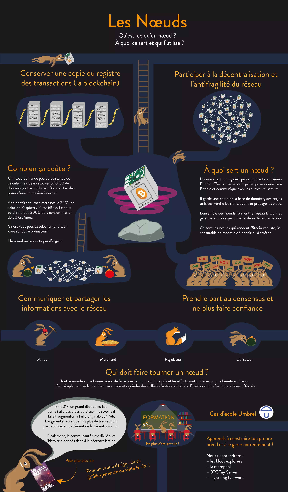

## Gravere
<chapterId>dbb8264a-7434-57e4-9d1b-fbd1bae37fdf</chapterId>

> Gravere tjener til å sikre nettverket og legge til transaksjoner i blokkene. De bruker elektrisitet gjennom ASIC-maskiner for å løse Bitcoin sitt proof of work.


### Forklaring av Proof of Work

Proof of Work, også kjent som "Proof of Work" (POW), er sikkerhetskonsensusen til Bitcoin-protokollen. Det er regelen som lar Bitcoin fungere og sikre sin robusthet. POW er grunnlaget for alt og spiller en avgjørende rolle i spillteorien til Bitcoin.

Tenk på det som et gigantisk lotteri der alle kan delta. Målet er å finne et spesifikt tall som vil tillate signeringen av en gyldig blokk, og vinneren mottar en belønning i bitcoin. Dette tallet er veldig enkelt å verifisere, men vanskelig å finne. Faktisk blir den enkle verifiseringen gjort gjennom SHA-256 hash-funksjonen, som er inkludert i gruvealgoritmen. For å finne dette tallet, vil deltakerne (graverne) forsøke milliarder på milliarder av muligheter, som 1, 52, 2648, 26874615, 15344854131318631, osv.

Hvis det valgte tallet er korrekt: Jackpot! Ellers fortsetter søket. For å optimalisere antall forsøk, vil de bruke spesifikke maskiner kalt ASICs, som har den eneste rollen å beregne milliarder av muligheter per sekund. Den totale mengden forsøk kalles HashRate og lar oss kvantifisere sikkerheten til Bitcoin-protokollen. For å drive disse maskinene, må store mengder elektrisitet forbrukes. Derfor transformerer POW energi til valuta, og kobler den virkelige verden og den digitale verden for å skape den første energibaserte valutaen.

Maskinene kjører, og etter et gjennomsnitt på 10 minutter, vil en vinner dukke opp. De vil ha funnet den korrekte hashen under vanskelighetsgrensen. Den store og eneste vinneren vil da signere den nye blokken av tidsstempelserveren og fortsette blockchainen. Vinneren mottar sine belønninger og returnerer for å prøve lykken for neste blokk. Prosessen har gjentatt seg i 12 år, og hvert 10. minutt bekrefter en vinner Bitcoin-transaksjoner samtidig som de fortsetter å sikre tidligere transaksjoner. Dette gjør vår Bitcoin-blockchain mer robust og sikker.

Hver 2. uke (2016 blokker), rebalanserer vanskelighetsjusteringen det globale gruvespillet basert på antall deltakere.

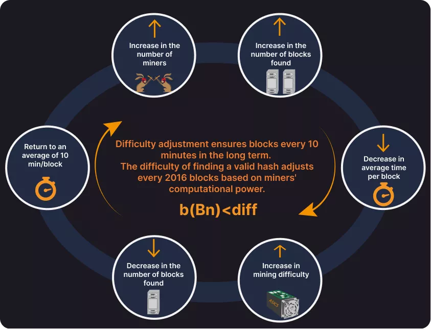

### Graving er i konstant utvikling
Gjennom årene har gruvearbeidere utstyrt seg med stadig mer effektiv datamaskinvare for å produsere så mange hasher som mulig per sekund (kalt HashRate) samtidig som de forbruker minst mulig energi på den mest kostnadseffektive måten mulig. De tidlige gruvearbeiderne som Satoshi eller Hal Finney minet med bare sin CPU, deretter begynte andre å mine med sitt grafikkort. I dag bruker gruvearbeidere det som kalles ASICs (Application-Specific Integrated Circuit), maskiner designet utelukkende for å anvende SHA256-algoritmen.


Hashraten til Bitcoin-nettverket representerer antall forsøk gjort per sekund for å finne den neste blokken. I dag er den på omtrent 400 TH/s, som er 400 000 milliarder forsøk per sekund! Jo høyere den globale hashraten er, desto vanskeligere er det for en ondsinnet aktør å monopolisere ressursene som trengs for å oppnå flertallet av gruvedriften og utføre en dobbeltutgift. Det er derfor mer økonomisk levedyktig å følge reglene i Bitcoin-protokollen enn å handle mot dem. Dette reiser et spørsmål: hvordan blir gruvearbeidere betalt?

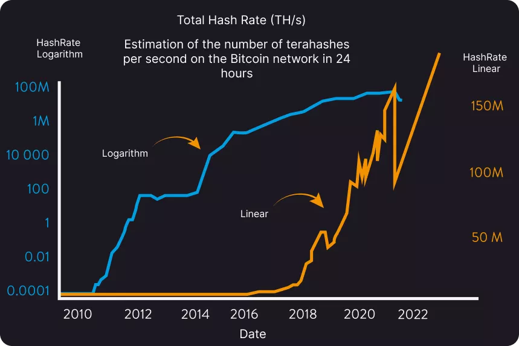

### Hva kan finnes i en blokk?


Blokkhodet inneholder flere elementer som tiden, vanskelighetsmålet, nummeret på den siste blokken, den brukte versjonen, og Merkel Root for de tidligere transaksjonene.

Coinbase-transaksjonen er alltid den første; den inkluderer belønningen mottatt for å utføre validatorarbeidet. Deretter kommer de validerte transaksjonene. Gruvearbeideren vil velge transaksjonene som betaler mest og prøve å skape en blokk som maksimerer deres inntekt, nemlig småstørrelsestransaksjoner med maksimale gebyrer.

### Gruvearbeideres kompensasjon

Opprinnelig blir en gruvearbeider kompensert når de finner en gyldig blokk. Mer presist, de blir kompensert på to måter: (i) gjennom subsidiet (nytrykte bitcoins) inkludert i blokken og (ii) gjennom transaksjonsgebyrer i transaksjonene inkludert i blokken. Mengden av subsidiet er definert av konsensusreglene og avhenger av Epoken vi er i. Blokkbelønning = Blokksubsidie + transaksjonsgebyrer.

Faktisk, for de første blokkene, var blokksubsidiet 50 bitcoins, deretter, etter hver 210 000 blokker (omtrent hvert 4. år), blir det halvert. I dag (i 2023), er vi i den 4. Epoken; derfor er subsidiet 6.25 bitcoins. Dette subsidiet er mekanismen for å skape nye bitcoins i Bitcoin. Ettersom subsidiet avtar over tid, betyr det at det er en grense på 21 millioner bitcoins - for øyeblikket er det allerede over 19.4 millioner bitcoins i omløp, som er over 92%.

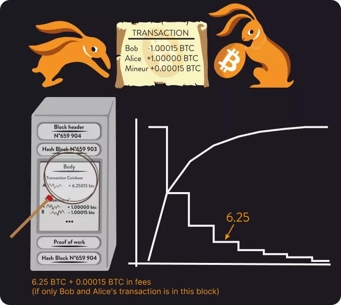

Den andre metoden for kompensasjon er definert av beløpet valgt av brukere for transaksjonsgebyrer. Siden gruvearbeideren ønsker å maksimere sin inntekt, vil de ha en tendens til å prioritere transaksjoner med høye transaksjonsgebyrer; transaksjonsgebyrene reflekterer brukerens hast på å få deres transaksjon inkludert i neste blokk.

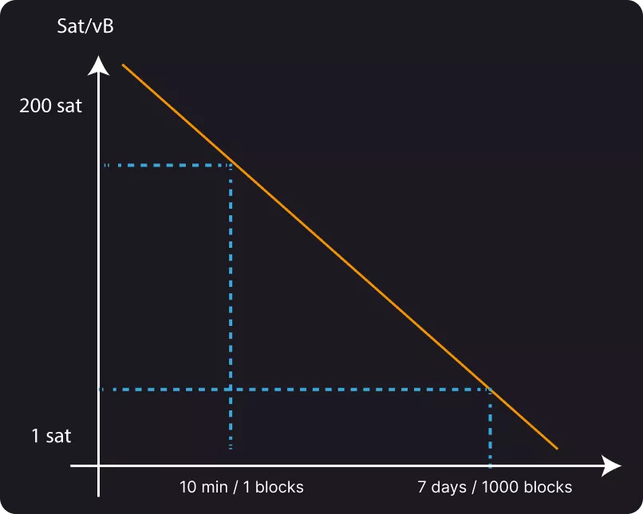

Videre, for å stabilisere gruvearbeidernes økonomiske modell, som stoler på belønningene de mottar for hver gyldig blokk, samarbeider gruvearbeidere ofte i grupper gjennom "mining pools", hvor de samler sine databehandlingsressurser.

### Hvorfor bry seg med alt dette?
Kort sagt, innovasjonen med Bitcoin er å foreslå en løsning på problemet med dobbeltutgifter gjennom bruk av en blokkjede basert på Proof of Work med flytende vanskelighetsgrad. I den digitale verden, skiller konseptet om eierskap seg fra det i den fysiske verden. Faktisk, i den digitale verden, kan alt kopieres og limes inn, noe som skaper problemer når det gjelder dobbeltutgifter for digitale verdier. Pålitelige mellommenn, som banker, har blitt opprettet for å løse dette teknologiske problemet og sikre at når en eiendel overføres, tilhører den ikke lenger avsenderen. Men hvordan kan dette gjøres uten en pålitelig mellommann? Dette problemet tilsvarer Byzantinske Generalers Problem, et problem med å koordinere informasjon i et system der de forskjellige aktørene ikke kan stoles på.


Bitcoin er derfor en slags løsning for å løse dette problemet, eller i det minste for å omgå det. "Generalene" i Bitcoin, eller minerne, produserer blokker (med informasjon) og Bitcoin-noder verifiserer finansielle transaksjoner ved bruk av konsensusregler for å sikre informasjonens autentisitet. Asymmetrien i energikostnaden mellom produksjon og verifisering av informasjon sikrer informasjonens pålitelighet, uten en pålitelig tredjepart.

Minerne er byggerne av sikkerheten til Bitcoin-nettverket. Ved å bruke energi til å produsere hasher, bygger de en mur som gjør det ekstremt kostbart for en ondsinnet agent å omskrive transaksjonshistorikken. Denne økonomiske avskrekkingen hindrer dem fra å oppføre seg uærlig.

Selv i tilfelle av et 51% angrep, noe som betyr at en agent besitter mer enn halvparten av hashraten, forblir nettverket sikkert fordi angriperen må bruke like mye energi som alle minerne kombinert for å forsøke å endre blokkjeden. Det er takket være denne mekanismen av proof of work, som krever energi for å bli utført, at nettverket er sikkert.

### Oppsummering

Teorien om spill anvendt på Bitcoin eliminerer uærlige minere. Minerene bruker ASIC-maskiner for å mine og mottar en belønning ved suksess. I tillegg, slutter de ofte seg til mining-pooler for å dele sin databehandlingskraft og motta mindre, men mer regelmessige belønninger. Bitcoin-mining er en prosess med høy energikostnad, men er essensiell for funksjonen og sikkerheten til Bitcoin-nettverket. Proof of work og blokkjeden løser problemet med dobbeltutgifter og sikrer informasjonens sannhet uten noen pålitelig tredjepart. Energiutgiften er nødvendig for å produsere informasjonen, men verifisering av informasjon har en ubetydelig kostnad. Denne asymmetrien garanterer nettverkets sikkerhet. Derfor er det mer økonomisk levedyktig å følge konsensusreglene enn å bryte dem.

### Rask oppsummering i en plakat!

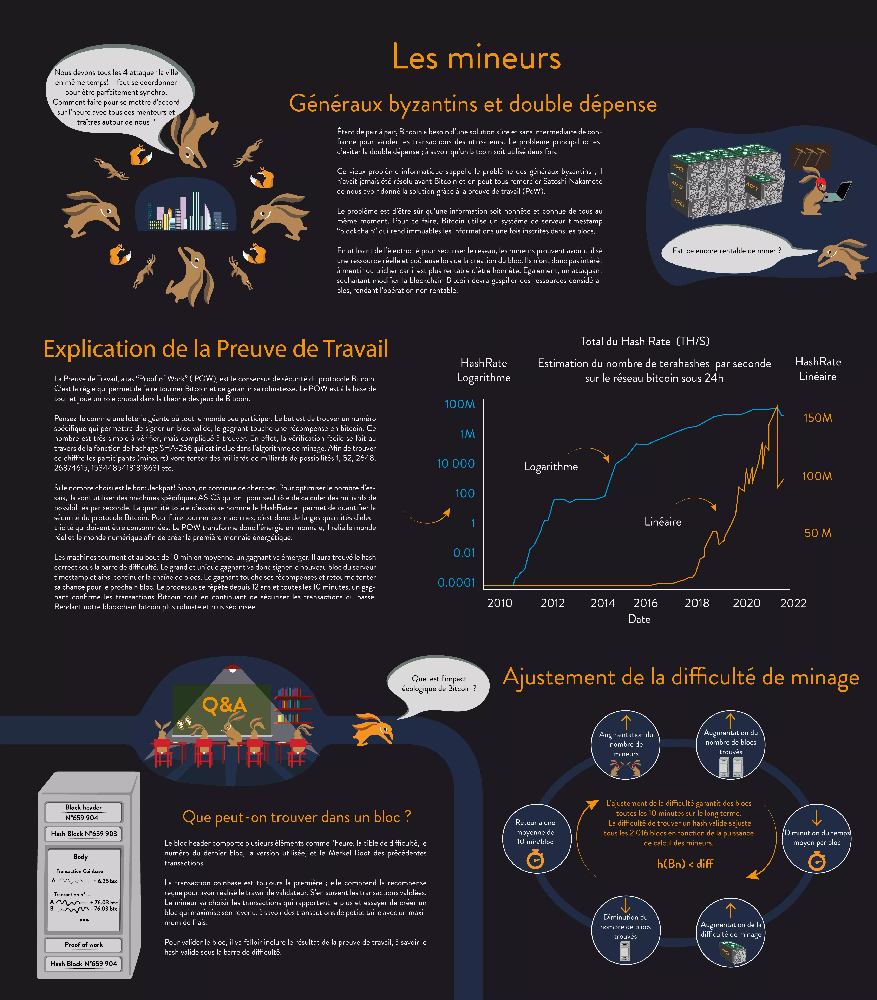

## Bitcoin og Økologi
<chapterId>4b227ae6-443a-5739-b443-60b7931130d9</chapterId>

Vi har nettopp sett i forrige seksjon at sikkerheten til Bitcoin-protokollen er avhengig av en høy energikostnad for å produsere en offentlig transaksjonsjournal uten en pålitelig tredjepart. Den totale energikostnaden sammenlignes ofte med strømforbruket til et lite land. Men gir denne sammenligningen mening? Er det relevant for å forstå årsakene bak en slik kostnad?

### Energiutgiftene til Bitcoin.
Først, la oss kvalitativt vurdere miljøkostnaden ved gruvedrift. En gruvearbeider må ha en maskin som en ASIC og en energikilde i form av elektrisitet for å drive disse maskinene. ASIC-er er for det meste laget av aluminium og kan enten resirkuleres eller gjenbrukes til et sekundært formål (som demonstrert med [Attakaï-prosjektet](https://decouvrebitcoin.fr/attakai/), som transformerer en Antminer S9 til en romvarmer). Hovedbekymringen er derfor energiforbruket. La oss prøve å gi mer kontekst til dette.


Elektrisitetsforbruket representerer nesten alle kostnadene for en gruvearbeider. Derfor oppfordres de til å finne en billig kilde til elektrisitet. Men siden gruvearbeidere er mobile, kan de dra til steder hvor kraftverk er installert, men ennå ikke koblet til territoriets elektriske nett. Gruvearbeidere fungerer som en siste instans kjøper, noe som gjør det mulig for kraftverk å sikre finansiering selv før de er koblet til det elektriske nettverket. Og når de er koblet til, vil etterspørselen etter elektrisitet øke, noe som vil heve prisen og gjøre det mindre lønnsomt for gruvearbeideren å skaffe elektrisitet på disse stedene. Gruvearbeideren vil da bestemme seg for å flytte installasjonen sin og bosette seg lenger unna hvor etterspørselen er lav og derfor også prisen.

### En endeløs debatt

Således er debatten om den økologiske påvirkningen av Bitcoin ofte feilrettet, hovedsakelig på grunn av en utilstrekkelig forståelse av dens nytte og drift. Bitcoin kan ikke evalueres enkeltvis i form av energikostnad per transaksjon, ettersom gruvearbeidere sikrer både det nåværende og historiske nettverket, transaksjoner grupperes og ikke alle er likeverdige, og effekten av Lightning Network tas ikke i betraktning. De som hevder at Bitcoin forbruker for mye energi, kan ha politiske motivasjoner eller søke å selge sin egen blockchain-løsning. Det økologiske påskuddet brukes til å rettferdiggjøre forbudet mot Bitcoin.

Det bør imidlertid ikke glemmes at Bitcoin, som en revolusjonerende oppfinnelse, har gitt individer som lever under finansiell undertrykkelse eller et diktatorisk regime, et middel til å kjempe for sin frihet. Som en siste utvei tilbyr Bitcoin en form for finansiell frihet ved å unnslippe sensur og bankrestriksjoner. Bitcoin er mer enn bare en valuta. Det er en form for kommunikasjon og uttrykk for frihet. Energi brukt av gruvearbeidere bidrar til forsvar av vår frihet. Bitcoin muliggjør frigjøring fra det nåværende finanssystemet, dominert av gjeld og overdreven pengetrykking av sentralbanker.

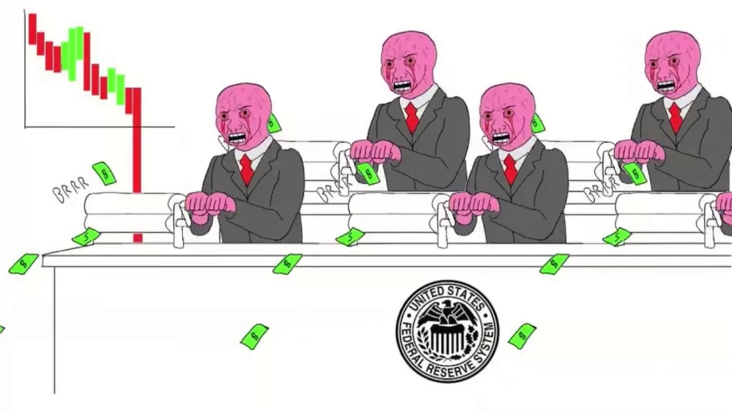

For de som bor i land med høy inflasjon, er Bitcoin et spørsmål om overlevelse. Det gir et middel til å overleve i prekære finansielle situasjoner. Videre tilbyr Bitcoin et rettferdigere og mer rettferdig finansielt system. Det gir også en mulighet for milliarder av mennesker rundt om i verden til å få tilgang til finanssystemet. Sett fra dette perspektivet, er energiforbruket legitimt?

### Kunne Bitcoin være en netto positiv for miljøet?

Til slutt er det essensielt å diskutere de økonomiske og miljømessige problemstillingene ved adopsjon av Bitcoin.

Spesielt når man sammenligner det med det nåværende finanssystemet. Sistnevnte, på grunn av sin oppmuntring til overforbruk og gjeld, utgjør alvorlige problemer. Enkel tilgang til kreditt, pengeutstedelse av banker, og bruken av fraksjonal reservebankvirksomhet er alle faktorer som fremmer overgjeldssetting og dermed overforbruk.


Det er nødvendig å reformere det monetære systemet for å reflektere knappheten på våre ressurser med knappheten på vår valuta. Dette vil oppmuntre til mer ansvarlig forbruk og en langsiktig visjon. Omvendt har inflasjon, ved å oppmuntre til forbruk og investering, en negativ langsiktig innvirkning på miljøet.
Det nåværende finanssystemet er i tråd med ideene til Keynesiansk økonomi, som, i motsetning til Østerriksk økonomi, ikke tar hensyn til de tidsmessige og dynamiske aspektene ved situasjoner og ressurser. Med andre ord, en ubegrenset valuta kan ikke effektivt reflektere de begrensede ressursene på planeten vår.


Politikere, på grunn av deres kortsiktige visjon og deres behov for økonomisk vekst for å bli gjenvalgt, er ikke i stand til å løse økologiske problemer på lang sikt. Derimot, adopsjonen av en solid valuta som Bitcoin er et potensielt alternativ som kunne gi økonomisk makt til folket.

Flammene i oljebrønner, som brenner metan for å forhindre forurensning, kan slukkes av Bitcoin-minere, noe som er gunstig for miljøet. Bitcoin fremmer bruken av grønn energi. Metan kan konverteres til elektrisitet for å drive mining-maskiner, noe som er fordelaktig for alle.

Teknologien bak Bitcoin er ofte misforstått, og kritikken angående dens miljøpåvirkning er ofte forenklet og kortsiktig. Denne kritikken er ofte motivert av politiske interesser. Bitcoin har potensialet til å hjelpe med den økologiske overgangen og bidra til en grønnere verden. Media sprer ofte falske ideer om Bitcoin og økologi. Så ta deg tid til å danne din egen mening. Alt er transparent med Bitcoin.

> Følg en av Bitcoins maksimer: Ikke stol, verifiser selv!

### Rask oppsummering i en plakat!


### Kort sammendrag av de tekniske aspektene ved Bitcoin

Satoshi Nakamoto lanserte Bitcoin-protokollen i januar 2009, som siden har utviklet seg takket være et voksende fellesskap av utviklere, minere og brukere med Bitcoin-noder. Ved å holde sin egen kopi av Bitcoin-blockchainen, et offentlig hovedbok over alle Bitcoin-transaksjoner, kan disse nodene sikre gyldigheten av transaksjoner i henhold til Bitcoins konsensusregler. Dette inkluderer å sikre at minerne produserer gyldige blokker, som inneholder tusenvis av ventende transaksjoner.

I gjennomsnitt blir en blokk opprettet hvert 10. minutt, og mineren som finner en gyldig hash for neste blokk, belønnes av protokollen med en belønning hvis mengde er definert av konsensusreglene, samt transaksjonsgebyrene fra alle transaksjoner inkludert i den gyldige blokken. Siden resultatet av hash-algoritmen (SHA256) for en gitt input anses som uforutsigbar, innebærer mining-prosessen å bygge mange kandidatblokker og teste om deres hash er gyldig eller ikke. Imidlertid, for å sikre at gjennomsnittstiden mellom to blokker forblir konstant (~10 min) uavhengig av antall minere og deres databehandlingskraft, justeres vanskeligheten av å finne en gyldig hash hvert 2016. blokker, omtrent hver 2. uke. Minere har over tid utviklet spesialiserte SHA256-maskiner, kalt ASICS, for å øke hash-raten per joule, som betyr antall forsøk per sekund og per forbrukt energi.

For at minerne skal være så lønnsomme som mulig i sin aktivitet, må de skaffe seg den billigste elektrisiteten mulig, som ofte er på avsidesliggende steder, innenfor kraftverk som ennå ikke er tilkoblet nettet. Mineren fungerer da som en kjøper av siste instans, og så snart prisen på elektrisitet øker på grunn av økt etterspørsel, vil mineren ha en tendens til å flytte sin aktivitet et annet sted.
Således er Bitcoin-protokollen et usensurerbart og ustoppelig pengeoverføringssystem fordi hver komponent av protokollen er geografisk distribuert over hele verden - for eksempel finnes det omtrent 40 000 Bitcoin-noder på alle kontinenter. Bitcoins konsensusregler er slik at det økonomisk er mer lønnsomt å følge dem enn å forsøke å bryte dem, og derfor er ingen tillit nødvendig mellom aktørene. Bitcoin har ingen leder og kan ikke stoppes. Det er mulig å regulere utvekslingsplattformer for å begrense Bitcoin, men dette er begrenset i form av innvirkning. Kort sagt, ingen dommer eller stat kan sensurere eller stoppe Bitcoin.
# Hvordan skaffe Bitcoin?
<partId>517e1bb7-f032-51a0-930a-a91fe5148d3f</partId>

## Bitcoin sover aldri!
<chapterId>d5e35e41-ea26-5478-8eb9-07daf9dff508</chapterId>

Prisen på Bitcoin er ofte preget av betydelig volatilitet. Dens verdi kan svinge betydelig avhengig av markedsvariasjoner og bullish og bearish markedsfaser. Dette er til stede i 100% av finansmarkedene, inkludert Bitcoin.


> For å si det enkelt: mennesker kjøper alle på samme tid og selger alle på samme tid. Bitcoin er ikke immun mot menneskelig natur.

### Forståelse av adopsjonsbølger

Utviklingen og evolusjonen av Bitcoin er i stor grad knyttet til de forskjellige gruppene av aktører som gradvis har integrert sitt økosystem.


- De troende:

De tidlige brukerne av Bitcoin var hovedsakelig teknofiler, cypherpunks, libertarianske og gullentusiaster. Disse gruppene ble tiltrukket av Bitcoin på grunn av dets evne til å tilby løsninger som tillitsløs elektronisk kontanter, motstand mot sensur, eller transparent og uforanderlig pengepolitikk.

- Det mørke nettet & kriminelle

Deretter utvidet bruken av Bitcoin seg til mørke nettmarkeder som Silk Road på grunn av dets ukontrollerbare og pseudonyme natur. Dette nettstedet trakk oppmerksomhet til den ukontrollerbare og pseudonyme naturen til Bitcoin, noe som fikk noen kriminelle aktører til å bruke den. Det bør imidlertid bemerkes at det er bruken av et verktøy, ikke verktøyet selv, som bestemmer dets lovlighet eller ulovlighet. Det bør bemerkes at ulovlig bruk av Bitcoin ikke i seg selv gjør en person til en kriminell. Det er bruken, ikke verktøyet, som kan klassifiseres som ulovlig. For eksempel kan bruken av Bitcoin for aktiviteter som kjøp av visse narkotika være lovlig eller ulovlig avhengig av regelverket i territoriet der aktiviteten finner sted.

- ICO-galskapen og ankomsten av allmennheten.

Året 2017 var preget av en betydelig spekulativ boble i kryptovalutaverdenen, spesielt med lanseringen av tusenvis av Initial Coin Offerings (ICOs). Imidlertid hadde mange av disse nye kryptovalutaene ingen konkret utvikling eller nytte og forsvant raskt. Denne boblen i 2017 ble fulgt av en sterk korreksjon i 2018-2019.

- NFT-boblen og DeFi

Så igjen i 2020 opplevde markedet en annen spekulativ boble som drev prisen på Bitcoin til $60 000. Denne boblen skiller seg fra tidligere ved en større diversifisering av investorer, inkludert finansinstitusjoner og store selskaper. Men nok en gang skjer sterke korreksjoner når euforien avtar.

### Bitcoin & Volatilitet

Basert på tidligere sykluser, ser det ut til at periodisiteten til Bitcoins økonomiske sykluser tilsvarer varigheten mellom to halveringer. Kanskje fordi halveringshendelsen fungerer som en utløser ved å halvere utslippet av nye bitcoins.
Disse betydelige svingningene har skapt et rykte for bitcoin som en ekstremt farlig eiendel som får brukerne til å tape penger. Selv om prisen kan falle med 10-20 eller til og med 50% på noen få dager, er det viktig å forstå at Bitcoin, protokollen, ikke påvirkes av prisendringer.
Denne betydelige volatiliteten er fullt akseptert i dag av Bitcoin-aktører og kan dempes av flere løsninger som finansielle sikringer (stablecoins), en sterk langsiktig tro (hodling), eller rett og slett ikke å sette 100% av ens penger i Bitcoin uten å forstå noe. Å forstå hvorfor prisen på bitcoin svinger så mye er derfor avgjørende for å kunne gjøre fremskritt i denne industrien fordi det til syvende og sist er prisen og syklusene som i noen grad demper og regulerer markedet vårt. Vi kan imidlertid merke oss at etter hvert som Bitcoin vokser og modnes, blir volatiliteten mindre betydelig.


Selv om btc/dollar-paret svinger på kort sikt, følger bitcoin, på grunn av sin begrensede mengde på 21 millioner bitcoins og halveringsprosessen (halvering av pengekreasjonen hvert 4. år i gjennomsnitt), en generell oppadgående trend på en nesten mekanisk måte. Selvfølgelig, som enhver finansiell eiendel, er bitcoin underlagt økonomiske sykluser inkludert perioder med eufori, spekulative bobler og korreksjoner. Dette fenomenet er ganske vanlig i fremvoksende teknologier, der markedet ikke alltid er rasjonelt eller effektivt.

### Et unikt marked

Disse syklusene med spekulative bobler er ganske unike i verden, ettersom det er svært sjeldent at samme eiendel opplever så mange bobler etter hverandre. Dette kan forklares enkelt fordi bitcoin ikke er en boble som vil forsvinne, men en valuta som faktisk brukes overalt i verden. Bitcoin-protokollen er unik ved at den opererer på global skala, 24 timer i døgnet, 7 dager i uken, noe som gjør regulering vanskelig for finansmyndighetene.

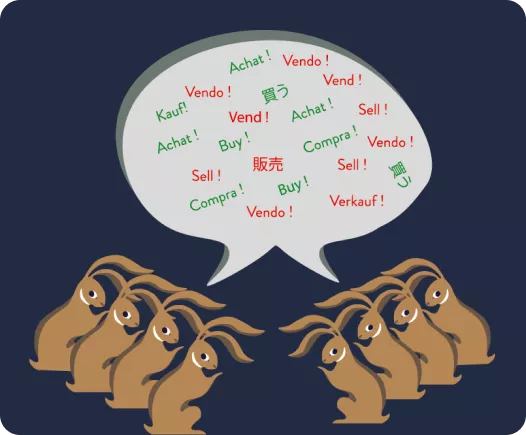

I dag, i 2023, fortsetter Bitcoin å overleve og vokse enda mer ved å integrere seg mer og mer i det tradisjonelle markedet. Den kommende ankomsten av Bitcoin ETF-er, klarere regulering og bedre anskaffelses- eller lagringsverktøy oppmuntrer bare til denne trenden. Bitcoin har EN GANG TIL overlevd sin spekulative boble, så kanskje det ikke er all varm luft!


### Rask oppsummering i en plakat!

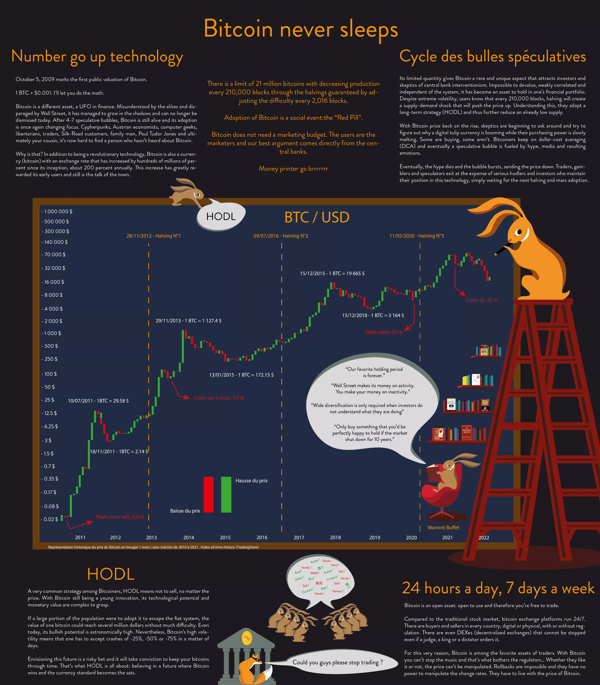

## Å skaffe bitcoins ved å jobbe
<chapterId>be2d83be-406f-582c-83ca-6aa905ff7b04</chapterId>

### En parallell økonomi utvikler seg

Bitcoin kan sees på som en parallell økonomi til fiatvalutaer. Dette betyr at det er mulig å selge varer eller tjenester og bli betalt i bitcoin. Transaksjoner kan gjøres direkte i bitcoin, uten behov for å gå gjennom en utvekslingsplattform, rett fra Bitcoin-lommebok til Bitcoin-lommebok.

Bitcoin-økonomien eksisterer og utvikler seg i visse regioner av verden, som i El Salvador hvor bitcoin har vært lovlig betalingsmiddel siden 2021. Videre aksepterer allerede noen enkeltpersoner, bedrifter og organisasjoner Bitcoin som betalingsmiddel for sine produkter eller tjenester.


I tillegg, for å lette bruken av bitcoin i daglige transaksjoner, har et åpen kildekode og samarbeidsprosjekt blitt lansert: BTCMap (https://btcmap.org/map#2/21.28937/5.46680). Denne plattformen lister opp alle handelsmenn som aksepterer bitcoin samt de forskjellige Bitcoin-samfunnene rundt om i verden. Du kan besøke deres nettside for å oppdage Bitcoin-økosystemet rundt deg. Således, til tross for vanskelighetene og nølingene, er det initiativer som BTCMap som bidrar til å gjøre Bitcoin-økonomien mer tilgjengelig og praktisk for alle.

### Hvorfor akseptere Bitcoin i stedet for å kjøpe det?

For å skaffe bitcoins, kan du kjøpe dem på plattformer regulert av organisasjoner som AMF (Autorité des Marchés Financiers) i Frankrike. Denne metoden innebærer visse risikoer og sporing av transaksjonene dine. En annen metode for å skaffe bitcoins er å akseptere dem som betalingsmiddel for produktene eller tjenestene du tilbyr. Denne metoden lar deg skaffe bitcoins gjennom ditt arbeid uten å stadig bekymre deg for prisen på Bitcoin.

Videre har det å akseptere Bitcoin som handelsmann flere fordeler, inkludert motstand mot sensur, reduserte transaksjonsgebyrer, økt effektivitet, beskyttelse mot inflasjon, samt finansiell frihet og suverenitet.

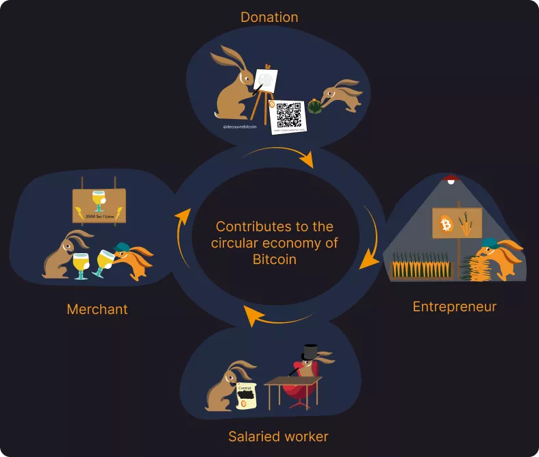

### Hvordan gå frem:

For å akseptere Bitcoin, er det nødvendig å studere de forskjellige tilgjengelige løsningene og velge den som passer best for din virksomhet. Det finnes ingen perfekt løsning, og flere faktorer må tas i betraktning for å gjøre ditt valg, som forventet transaksjonsvolum, tildelt budsjett og type virksomhet (online eller fysisk).

Vi vil dekke dette emnet i detalj i en annen opplæring, men for å holde det enkelt, kan vi vurdere flere kategorier av virksomheter og derfor relaterte løsninger:

- Enkel online løsning: OpenNode
- Løsning for amatørhandlere: Swiss Bitcoin Pay
- Løsning for store strukturer eller lidenskapelige bitcoinere: BTCpay Server

### Rask oppsummering i en plakat!

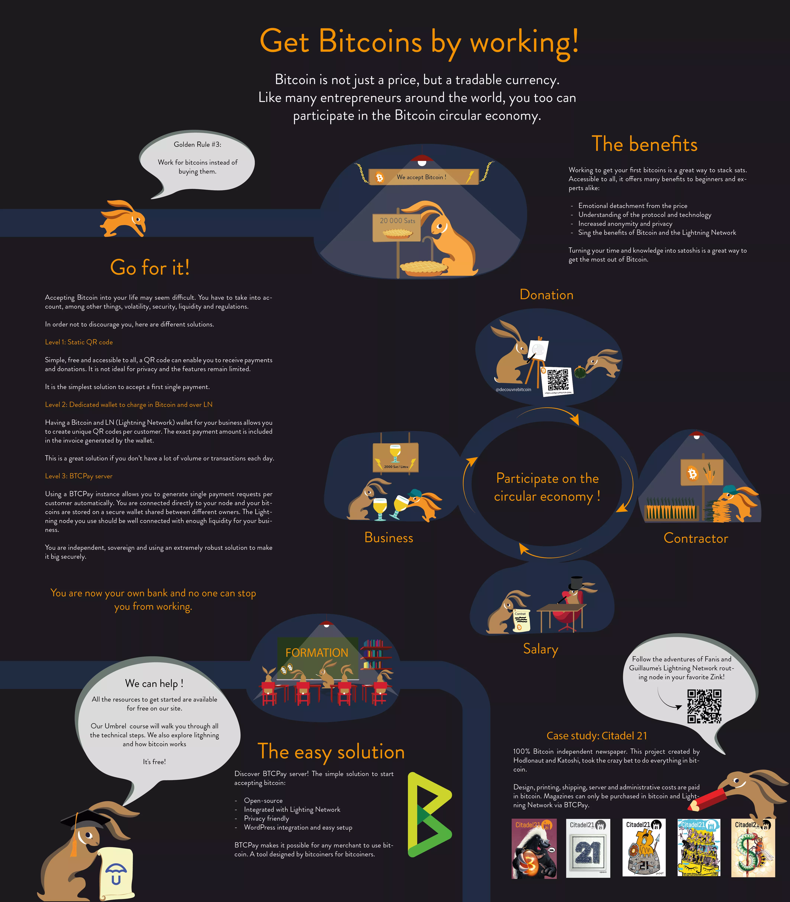

## Spare med Bitcoin
<chapterId>1d9570c6-5b63-51a6-b87c-7bdb0fc4aa87</chapterId>

### Advarsel før du starter!

Bitcoin har blitt en viktig finansiell eiendel, hovedsakelig på grunn av sitt begrensede tilbud og økende etterspørsel. Imidlertid innebærer kjøp av bitcoin risikoer som krever spesiell oppmerksomhet. Det anbefales derfor å gjøre din egen forskning og lære mer om emnet for å bli kjent med teknologien før du investerer.

- Invester kun det du har råd til å tape.
- Bitcoin er en svært volatil finansiell eiendel; prisen kan falle til 0.
- Tidligere prestasjon er ikke en indikator for fremtidig prestasjon.
- Kontakt din finansielle rådgiver om nødvendig.

> DécouvreBitcoin (Rogzy) gir ikke investeringsråd, og ingenting som er sagt her, bør betraktes som det.

### Mini sjekkliste før du tar steget

Før du dykker inn i kjøp av bitcoin, sørg for at du har:

- En sikker lommebok.
- En solid forståelse av Bitcoin.
- En spareplan å følge.
- Et langsiktig syn.

Hvis emnet fortsatt er uklart, vit at BTC102-kurset vil veilede deg i å sikre og skaffe dine første bitcoins. Her vil vi bare skumme overflaten av emnet.

I konkrete termer er det to spørsmål å stille deg selv:

- Hvilken anskaffelsesstrategi å adoptere: gradvis eller alt på en gang?
- Hvilken plattform å bruke: regulert eller uregulert?

### Anskaffelsesstrategier

- Dollar Cost Average
Gjentatte kjøp involverer å kjøpe små mengder bitcoin med jevne mellomrom. Denne metoden jevner ut prisen over tid og gir kontinuerlig vekst i mengden bitcoin man eier. Det er en ideell løsning for langsiktig sparing uten å bekymre seg for prisen og volatiliteten til bitcoin. Sett det opp og glem det.


> Vær oppmerksom på UTXOer: Husk å konsolidere dine UTXOer i lommebøkene dine fra tid til annen. Denne praksisen er essensiell for effektivt å håndtere dine bitcoins og unngå unødvendige gebyrer under transaksjoner.

- Spontant kjøp

Spontant kjøp brukes for å umiddelbart få eksponering mot bitcoin. Enten det er å kjøpe under et krakk eller å utnytte en bonus, valget er ditt. Du må samle motet ditt og trykke på kjøpsknappen.

Gitt den betydelige volatiliteten til bitcoin, må spesiell oppmerksomhet rettes mot dine følelser. FOMO (Fear of Missing Out) og FUD (Fear, Uncertainty, Doubt) er dine verste fiender i denne sammenhengen! Hold deg rolig og følg strategien du har etablert på forhånd for å unngå impulsive og potensielt skadelige beslutninger.

### Hvem bør vi kjøpe vår bitcoin fra?

Det finnes flere måter å skaffe bitcoins på, hver med sine egne regler. Noen plattformer krever identifikasjon for verifisering, mens andre ikke gjør det. Det er avgjørende å forstå reglene som er knyttet til hver plattform.

- DCA-plattformer

En vanlig metode for å akkumulere bitcoins er Dollar Cost Averaging (DCA), som involverer å jevnlig investere små beløp. Flere plattformer tilbyr denne tjenesten, som de som er oppført på vår [dedikerte side](https://planb.network/tutorials/exchange). I tillegg til enkelheten ved å sette opp en DCA, er uttak til lommeboken din generelt automatisk, noe som betyr at du alltid vil ha kontroll over dine eiendeler.

I dag er nesten alle DCA-løsninger relativt effektive og har nesten like gebyrer, så valget vil avhenge mer av tilgjengeligheten i ditt land.

- Meglerplattformer

For investeringer i stor skala anbefales regulerte og anerkjente plattformer som Kraken, Bitstamp og Paymium. Disse plattformene tilbyr et trygt og sikkert miljø for transaksjoner med høyt volum.

Bruken er enkel og tilgjengelig for alle:

1. Opprett en KYC/\* konto
2. Overfør midler til kontoen din
3. Kjøp bitcoin
4. Ta ut bitcoin til lommeboken din


Etter kjøpet er det tilrådelig å umiddelbart ta ut bitcoinene fra børsplattformene for å minimere risikoen for hacking og blokkering av midler. Uttaksgebyrer kan være høye, noen ganger opptil 25 euro avhengig av plattformen.

> Know Your Customer (KYC)-regelverket krever at brukere gir identifikasjon for å bekjempe finansiering av terrorisme, skatteunndragelse og hvitvasking av penger.

Det er viktig å merke seg at KYC er et viktig tema i vår bransje ettersom dets effektivitet forblir lett debatterbar mens dets negative aspekter er tallrike. I mange av våre universitets treningsprogrammer og innhold, råder vi mot å bruke full KYC-plattformer hvis du allerede er en avansert bruker.

### Ikke-KYC-løsning

I tillegg finnes det flere [markedssteder](https://planb.network/tutorials/exchange) for å kjøpe og selge bitcoins peer-to-peer. Hvis du er interessert i disse, kan du ta vårt BTC 205-kurs om emnet. Generelt sett er disse løsningene:

- Bitcoin-automater
- Fysiske møter med andre bitcoin-entusiaster
- Ulovlige og uregulerte plattformer
- Peer-to-peer matchmaking-løsninger
- Neobanker som opererer i Bitcoin-vennlige nasjoner.

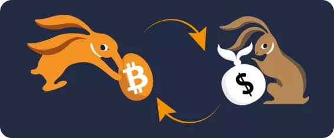
Det er også viktig å merke seg at skatter kan bli implementert i din jurisdiksjon. Vi inviterer deg til å konsultere regelverket i ditt land før du tar noen handling som kan sette deg i risiko.
### Rask oppsummering i en plakat!

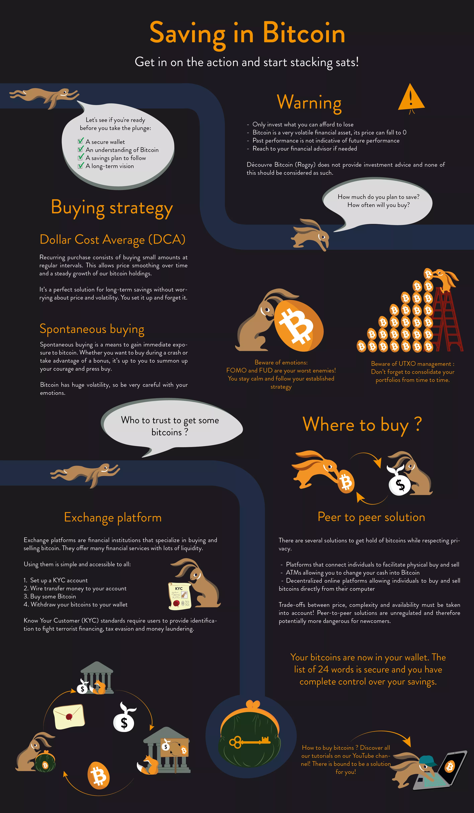

## Hyper-bitcoinisering
<chapterId>b7275d31-3b60-5fb7-b9f5-030097010553</chapterId>

### Det ville kappløpet har bare begynt!

Som med all ny teknologi, følger adopsjonen av Bitcoin en S-kurve. Vi har overgått æraen til de tidlige adopterene, og indikatorene ser ut til å peke mot en fullstendig demokratisering av Bitcoin. Det er en viral teknologi som ikke kan stoppes. El Salvador har tatt det dristige steget ved å adoptere Bitcoin i sin helhet, og erklære det som lovlig betalingsmiddel. Imidlertid reagerer hvert land forskjellig på denne teknologien. Noen har forbudt og kriminalisert bruken av den, noe som legger til kompleksiteten ved Bitcoin-adopsjon basert på kulturer, æraer og nasjoner.

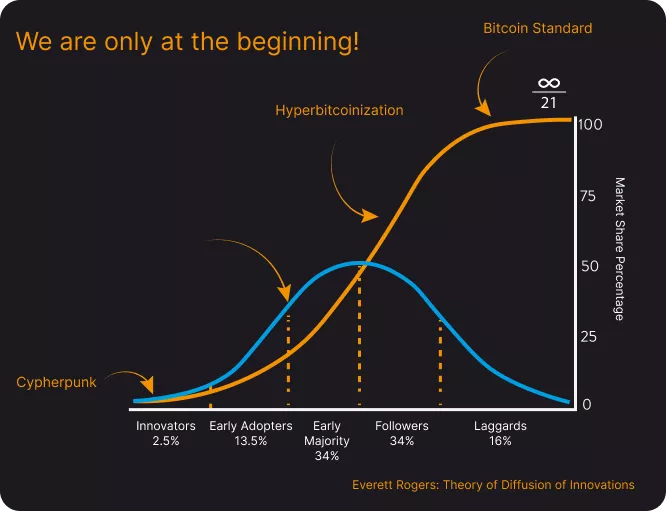

Oppgangen til Bitcoin tvinger bedrifter, universiteter, regulatorer og enkeltpersoner til å ta hensyn til denne nye teknologien. Nye verktøy må skapes, tjenester må tilpasses, og innovasjon må fortsette for å sikre deres overlevelse. Denne konteksten reiser mange spørsmål relatert til ulike felt, inkludert kryptografi, spillteori, økonomi og pengepolitikk, datavitenskap, filosofi, energi, lover og regulering. Kort sagt, Bitcoin er et tverrfaglig objekt.


### Bitcoin er en 0 til 1

Vi inviterer deg til å reflektere over denne nye monetære revolusjonen. Det er så mye å utforske med Bitcoin at det er komplisert å assimilere alt på en gang. Ta deg tid, Bitcoin kommer ikke til å forsvinne. Tvert imot, revolusjonen har nettopp begynt. Sammen tror vi at vi er i stand til å skape verden vi ønsker å overlate til våre barn. En verden hvor menneskelig suverenitet er en rettighet, hvor personvern respekteres som standard, og hvor penger ikke manipuleres. Vi håper at vi sammen vil oppnå dette.

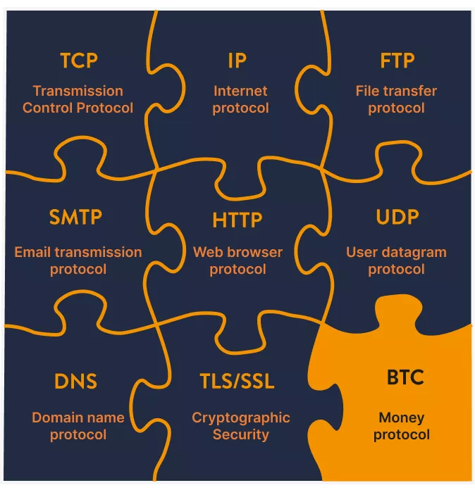

Hvis du ønsker å utvide din kunnskap om Bitcoin, har et stort antall forfattere, tenkere og essayister bidratt til det pedagogiske laget av Bitcoin. De siste årene har vi listet opp og kategorisert disse verkene for å tilby et [bibliotek av ressurser](https://planb.network/resources) til de mest nysgjerrige blant dere. Du vil finne de beste podcastene, nettstedene, artiklene, opplæringene, bøkene og annet innhold.

> Milton Friedman, en anerkjent økonom, forutså i 1999: "Jeg tror at internett kommer til å være en av de største kreftene for å redusere regjeringens rolle. Det eneste som mangler, men som snart vil bli utviklet, er en pålitelig e-kontanter - en metode hvor på internett du kan overføre midler fra A til B uten at A kjenner B eller B kjenner A."

### Rask oppsummering i en plakat!

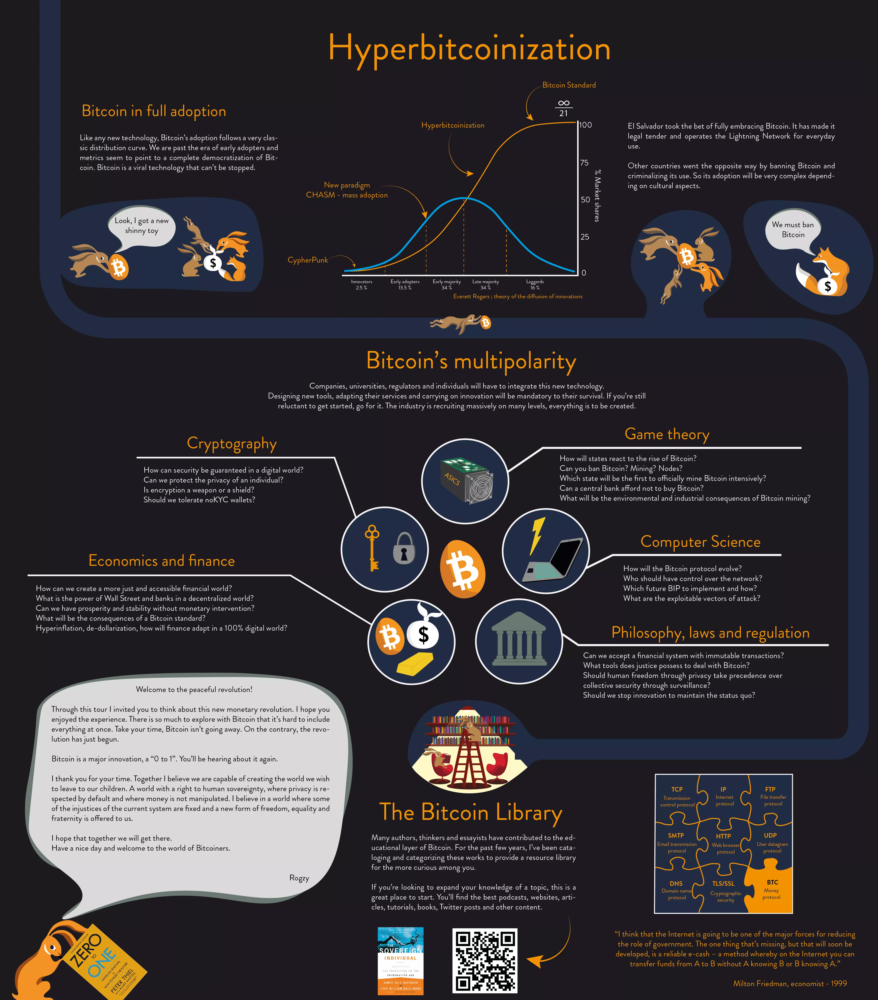

# Fremtiden til Bitcoin: Lightning Network
<partId>899fd35e-39e6-5a25-a73e-6fed6e725094</partId>

## En kort introduksjon til Lightning Network
<chapterId>b403f1e4-f1ff-572b-a242-9b58cb3736d0</chapterId>
Nå som vi har grunnleggene av Bitcoin-protokollen, vil vi introdusere et betalingsnettverk som bruker Bitcoin-protokollen for å muliggjøre lynraske transaksjoner. Vi snakker selvfølgelig om Lightning Network!

### I et nøtteskall

Lightning Network er en revolusjonerende teknologi som har endret vår oppfatning av Bitcoin dyptgripende. Det er en løsning som adresserer skalerbarhetsproblemet til Bitcoin.

For å fullt ut forstå Lightning Network, er det avgjørende å forstå hvordan Bitcoin utvikler seg. Bitcoin utvikler seg i infrastrukturlag: det første laget er blokkjeden, og det andre laget er Lightning Network.

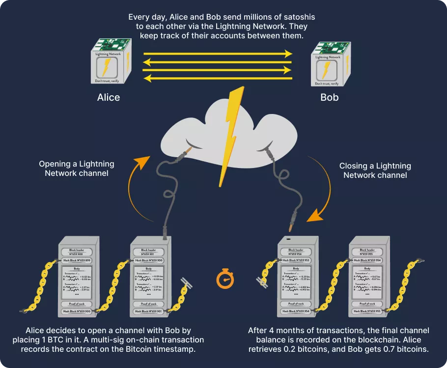

Anerkjent som et lag av Bitcoin, ble Lightning Network validert og implementert i 2017. Det tillater øyeblikkelige, kostnadseffektive Bitcoin-transaksjoner, og løser dermed skalerbarhetsproblemet til Bitcoin. Men hva er dette skalerbarhetsproblemet som Bitcoin står overfor?

### En blokkjede kan ikke vokse uendelig

Skalerbarhetsproblemet refererer til utfordringen med å implementere et monetært system som er i stand til å tilby et stadig økende antall transaksjoner per sekund etter hvert som det blir adoptert. Dette relaterer seg til blokkjedens trilemma. Forestill deg en trekant med desentralisering, sikkerhet og skalerbarhet som dens hjørner.

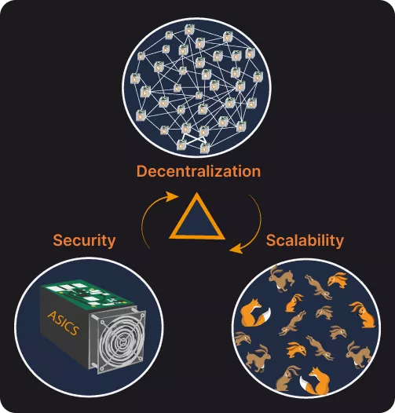

En protokoll basert på en blokkjede kan bare tilfredsstille to av disse 3 aspektene. Innenfor Bitcoin-protokollen har det blitt gjort valg som favoriserer desentralisering/sikkerhet. På den ene siden tillater blokkstørrelsen på 1MB og tiden mellom to blokker (i gjennomsnitt 10 minutter) å kjøre en Bitcoin-node til en lavere kostnad, noe som favoriserer desentralisering. På den andre siden gjør produksjonen av blokker gjennom Proof-of-Work svindel innenfor protokollen ekstremt kostbart samtidig som det letter verifisering av nettverksnoder, og dermed favoriserer sikkerhet. Imidlertid pålegger disse valgene en grense for det gjennomsnittlige antallet transaksjoner i en blokk, som grovt tilsvarer noen få transaksjoner per sekund. Dette tallet er latterlig sammenlignet med behandlingskapasiteten til betalingsprosessorer som VISA, som er 1700/s. Likevel er denne grensen nødvendig for å kunne gjennomføre transaksjoner med Bitcoin på en sensurresistent og tillitsløs måte. Likevel har de som utvikler på Bitcoin tenkt på dette problemet fra begynnelsen.

### Lightning som et lag på toppen

Etter år med refleksjon og flere forsøk, dukker Lightning-protokollen opp. Ved å bruke et visst antall spesifikasjoner, tillater denne protokollen konstruksjonen av et peer-to-peer betalingsnettverk ved å utnytte sikkerheten og programmerbarheten til Bitcoins transaksjonsprotokoll. Lightning Network fungerer som et nettverk av betalingskanaler, som muliggjør øyeblikkelige transaksjoner med lave gebyrer for avsenderen. Dette nettverket av betalingskanaler gjør det til og med mulig å gjennomføre transaksjoner mellom individer som ikke har en direkte kanalforbindelse.

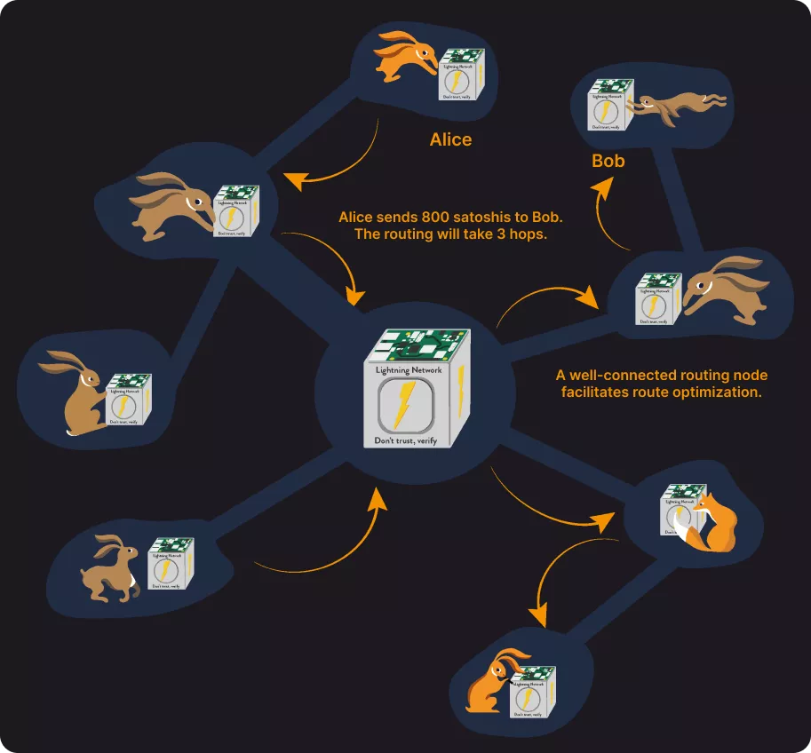

Tradisjonelle pengeoverføringstjenester som Western Union, sentralbanker, Visa og Mastercard kan forsvinne hvis de ikke adopterer Lightning Network-teknologi. Lightning Network er mer effektivt og kostnadseffektivt enn dagens betalingssystemer. Faktisk tillater Lightning Network nesten ubegrensede transaksjoner mellom to parter som deler en kanal, uten energiutgifter på grunnblokkjeden annet enn transaksjonen for å kunngjøre opprettelsen av kanalen.

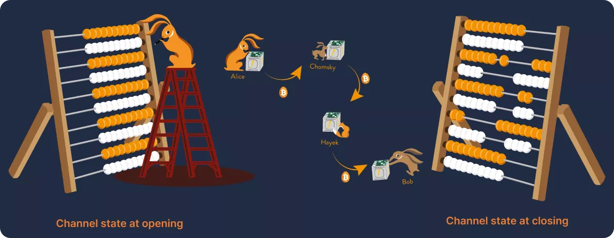

Transaksjoner sikres gjennom kryptografi og indirekte gjennom energien som forbrukes av gruvearbeidere på Bitcoin. Transaksjoner kan gjøres øyeblikkelig, uten geografiske begrensninger, og gebyrene er ekstremt lave, ofte mindre enn 0,5%.

Oppsummert er Lightning Network et lovende forsøk på å distribuere et effektivt betalingssystem for transaksjoner i Bitcoin. Det finnes allerede mange Lightning-lommebøker tilgjengelig, som du kan oppdage i vår opplæringsseksjon eller gjennom vår Lightning Network-trening.

### Rask oppsummering i en plakat!

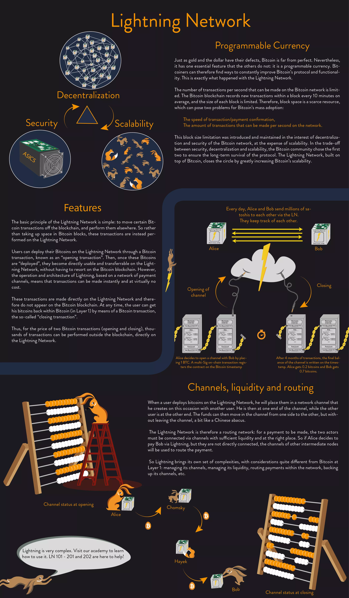
## Bruksområder for Lightning Network<chapterId>684e31f9-ebd1-51b6-91c0-1e6a315f1141</chapterId>

Som vi nettopp har sett, står Bitcoin-protokollen, selv om den er revolusjonerende, overfor betydelige utfordringer når det gjelder skalering for å håndtere alle våre daglige transaksjoner. For å løse disse problemene ble en løsning på andre nivå kjent som Lightning Network foreslått i 2016 og har nå flere forskjellige implementeringer, som alle er interoperable:

- Core-lightning av Blockstream
- Eclair av Acinq
- LND av Lightning strike

Dette peer-to-peer-nettverket har som mål å lette mikrotransaksjoner, som er transaksjoner av svært lav verdi som ellers ville vært upraktiske på grunn av høye gebyrer og lange bekreftelsestider på Bitcoin-blockchainen.

### Hva er bruksområdene for nettverket?

Denne teknologien åpner døren for et bredt spekter av potensielle applikasjoner for Bitcoin som tidligere var utenfor rekkevidde på grunn av begrensningene som er nødvendige for å sikre sikkerheten og desentraliseringen av Bitcoin. Blant disse applikasjonene i hverdagslivet kan vi nevne øyeblikkelig fakturering i handel (både fysisk og online), strømming av penger for betalinger i sanntid, og mikrodonasjoner for innhold. Ved å distribuere et nettverk av nesten øyeblikkelige, sikre og kostnadseffektive transaksjoner (i gjennomsnitt mindre enn 0,5 %), kan mange tidligere utenkelige forretningsmodeller implementeres. Dette er mulig fordi Lightning Network bruker sats (desimalen av bitcoin) for å fungere.


Videospillindustrien tilbyr et spesielt interessant eksempel på hvordan Lightning Network kan brukes til å transformere eksisterende forretningsmodeller. Konseptet "skin in the game" er en idé som nylig har fått popularitet i denne sammenhengen. Det innebærer i hovedsak å ha en økonomisk innsats i utfallet av et spill.
Lightning Network tillater spillere å satse veldig små beløp når de spiller spill, som noen få satoshis (omtrent en brøkdel av en eurocent). Dette muliggjør etableringen av en innsats som stimulerer konkurranse samtidig som det betydelig øker kostnaden ved å distribuere boter.


Oppsummert ser fremtiden for mikrotransaksjoner med Bitcoin lovende ut takket være innovasjoner som Lightning Network. Ettersom disse teknologiene fortsetter å utvikle seg og modnes, kan vi forvente å se nye og spennende applikasjoner dukke opp i nær fremtid. Ta for eksempel konseptet "money streaming." Med Lightning Network kan vi gjøre mikrotransaksjoner hvert minutt (potensielt uten en pålitelig tredjepart), som åpner døren for å eksperimentere med økonomiske modeller der forbrukere betaler for innhold basert på hva de forbruker.

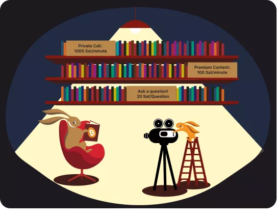

I et slikt system blir penger automatisk delt, basert på en forhåndsdefinert prosentandel, blant de forskjellige bidragsyterne til en tjeneste eller et produkt. Dette kunne revolusjonere måten vi tenker om betalingsmodeller på. For eksempel, i stedet for å betale et månedlig abonnement for en tjeneste, kunne brukere bli belastet per minutt, eller til og med per sekund, for tiden de bruker tjenesten. En slik økonomisk modell kunne ha dype implikasjoner for innholdsskapere, som ville bli incentivert til å produsere kvalitetsinnhold for å beholde brukernes oppmerksomhet. Brukerne, på sin side, ville bare betale for innholdet de forbruker, og dermed eliminere forhåndsbetalte abonnementsavgifter. Det er til og med tenkelig å bruke dette systemet for utleie av varer.


Avslutningsvis åpner Lightning Network opp for en mengde spennende bruksområder for Bitcoin-brukere. De resulterende økonomiske modellene og forretningsmulighetene er tallrike og varierte. Vi oppfordrer deg til å teste det ut selv ved å prøve podcast-applikasjonen [Fountain](https://www.fountain.fm/), som lar deg bli belønnet med noen sats for å lytte til dine favorittpodcaster!
### Rask oppsummering i en plakat!


## Rød pille eller blå pille?
<chapterId>c81cdb45-6aa9-5462-9835-c4852084b2cc</chapterId>

Som Morpheus sa til Neo: "Du tar den blå pillen, historien slutter, du våkner opp i sengen din, og du tror hva du vil tro. Du tar den røde pillen, du blir i Eventyrland, og jeg viser deg hvor dypt kaninhullet går." Er du klar for å utforske Bitcoin sitt kaninhull? Vær forsiktig, da du kan gjenoppdage din finansielle frihet!

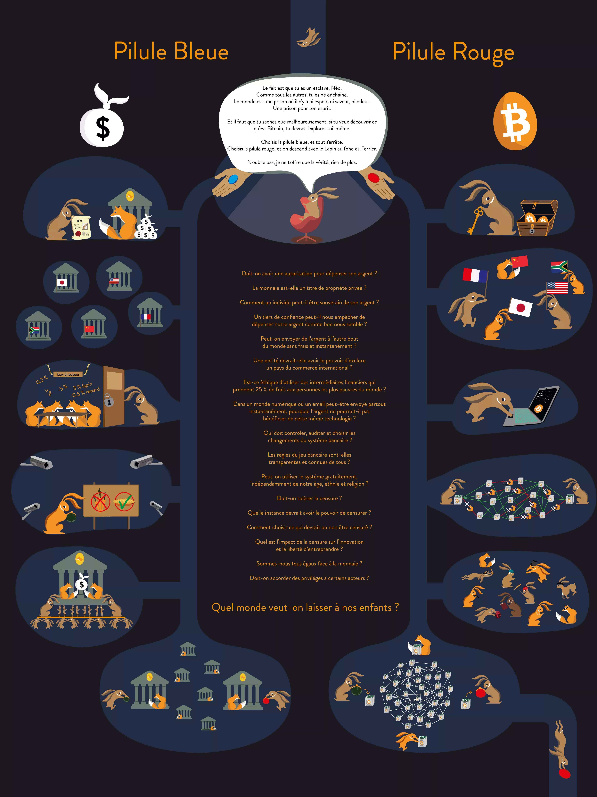

### Teknologisk fremtid og dens implikasjoner

Teknologien utvikler seg eksponentielt, og ingen kan med sikkerhet forutsi dens fremtidige utviklinger. Verdens tilkobling og kunstig intelligens fortsetter å avansere. Kunnskapen en enkeltperson kan tilegne seg gjennom internett blir stadig mer umåtelig over tid.

La oss ta AI som et eksempel. Disse teknologiene har allerede overgått eller nærmer seg menneskelig ytelse i et stadig økende antall domener, som videospill, bilde- og tekstproduksjon, og dataanalyse. En potensiell implikasjon er at over 80% av jobbene vil forsvinne på grunn av AI og automatisering. Flere alternativer er tilgjengelige for oss, som å begrense teknologisk fremgang eller utnytte den økte kapitalen fra produktivitetsgevinster skapt av AI.

De essensielle spørsmålene å stille er:

- Hvordan håndterer vi et samfunn der 80% av jobbene vil forsvinne?
- Hvordan revitaliserer vi en befolkning?
- Er det behov for like mange lærere?
- De geopolitiske, politiske og menneskelige konsekvensene av automatisering diskuteres ikke tilstrekkelig.
  Data, internett, strømming og VR vil endre utdanning. Vi kunne ha et universelt kurs for alle franske studenter styrt av regjeringen og lærere som ikke lenger gir forelesninger, men direkte følger opp studentene. Barn kunne gå inn i en virtuell verden og bli ledsaget i læring av historie.

- Hvor går grensen mellom en lærer og en AI?
- Hvordan kan vi garantere et samfunn som lever i velstand?

Disse grunnleggende spørsmålene for vår fremtid må debatteres og kollektivt avgjøres. Men hva er forbindelsen med Bitcoin? Liksom internett for kommunikasjonsmåter, er Bitcoin en teknologisk revolusjon for nye måter å organisere på stor skala, som gir oss muligheten til å utveksle verdi uten noen betrodd tredjepart. Vil vi hindre den teknologiske utviklingen av det monetære systemet eller høste økningen i kapital gjennom den tidobbelte produktivitetsgevinsten fra å bruke Bitcoin og Lightning-protokoller?

### Hva er finansens fremtid?

Disse refleksjonene reiser også spørsmål om hvem som bør holde, autorisere og spore pengene vi bruker. Målet er å bestemme mellom et lukket system med unelected ledere eller et åpent system uten betrodde tredjeparter, hvor nøytralitet råder.

- Er valuta en form for privat eiendom?
- Kan demonstranters kontoer blokkeres uten en høyesterettsordre?
- Hvem garanterer det finansielle systemet?
- Hvordan kan en enkeltperson være suveren over sine penger og stole på en betrodd tredjepart?
- Kan penger sendes til den andre siden av verden uten gebyrer eller mellommenn?
Å akseptere disse nye teknologiene kan generere enorme stordriftsfordeler over hele verden. Bør vi tillate fri bevegelse av kapitalstrømmer? Internasjonale blokader har økonomiske og politiske konsekvenser. Er det etisk å bruke finansielle mellommenn som Western Union, som noen ganger tar opptil 25% i gebyrer? Vi mener at i en stadig mer digital verden, bør penger demokratiseres og anses som et fellesgode som tilhører folket snarere enn staten eller uklare finansinstitusjoner.
Spørsmålet om hvem som bør kontrollere banksystemet er avgjørende fordi reglene for banksystemet ikke er gjennomsiktige og forståelige for alle, noe som tillater en kaste av politikere og regulatorer å opprettholde sitt grep om systemet. Det er viktig å stille spørsmål ved om det frie markedet eller en gruppe intellektuelle bør kontrollere banksystemet.

### Våre friheter står på spill.

Sensuren må også stilles spørsmål ved, for hvem har kunnskapen til å bestemme hva som skal sensureres eller ikke? Mediene har endret sin posisjon om visse opplysninger, og folk som ble sensurert før, er ikke lenger sensurert i dag.

- Hvem bestemmer hva som er sensur eller propaganda?
- Hvem har den guddommelige hånden over vårt system?

Å tolerere sensur kan ødelegge ytringsfriheten og retten til å samles. Å implementere sensur er teknisk vanskelig uten å skape en komplett dystopi. Hvilken enhet bør ha makten til sensur? Spørsmålet om sensur er komplisert, og det er vanskelig å vite hvem som bør sensureres eller ikke. Sensur kan ha en negativ innvirkning på innovasjon og friheten til å foreta seg.

Det er 2,4 milliarder mennesker i verden uten en bankkonto, noe som nødvendigvis skaper geografiske ulikheter. Bitcoin tillater likhet i transaksjoner, uavhengig av din sosiale status eller politiske posisjon. Bitcoin-protokollen er apolitisk og gir ikke spesifikke privilegier til presidenten eller andre aktører. Ledere bør ha de samme privilegiene som vanlige mennesker for å skyve utviklingen oppover i stedet for å la noen være på toppen og andre på bunnen. Bør alle ha samme valuta, uavhengig av deres sosiale status? Det er viktig å tenke på den verdenen vi ønsker å etterlate til våre barn. Vi ønsker å etterlate en åpen verden hvor de er frie til å gjøre hva de vil med pengene sine.

Bitcoin er viktig og bør ikke betraktes bare som et sjansespill. Det er avgjørende å fortsette å stille spørsmål om Bitcoin.

### Bitcoin: et revolusjonerende protokoll

Som vi har sett i det forrige kapittelet, er Bitcoin-protokollen nøytral overfor alle brukerne sine. Takket være konsensusregler og kryptografi, kan vi registrere transaksjoner uforanderlig i en global offentlig hovedbok, og garantere overføring av monetær verdi uten noen betrodd tredjepart. Infrastrukturen på andre lag (og snart det tredje laget, med RGB) muliggjør nettverksskalering og utvikling av nye funksjoner, spesielt for å adressere skaleringsspørsmål.

Bitcoin har alle nødvendige egenskaper for å være en effektiv og sunn valuta: delelig, umiddelbart transportabel, usensurerbar, ubetydelig kostnad for verifisering, og med en pengepolitikk allerede satt for århundrer fremover med disse 21 millionene enheter. Bitcoin er pseudonymt og kan utveksles hvor som helst i verden uten noen autorisasjon fra noen enhet, du trenger bare å holde dine egne private nøkler - som ordtaket sier "Ikke dine nøkler, ikke dine bitcoins".

Bitcoin er adoptert av ulike grupper av mennesker, fra kryptografer til libertarianske til tradisjonelle bedrifter og til og med et land. Imidlertid er Bitcoin for alle, og antallet brukere vokser, som er antallet Bitcoin-noder som fungerer som voktere av transaksjonshistorikken, og sikrer dens desentralisering.
Bitcoin kan ikke lenger stoppes og kan ikke lenger sensureres. Det er en fredelig revolusjon for å endre det monetære systemet og muliggjøre finansiell inkludering. Brukere kan skaffe seg bitcoins ved å akseptere dem for handelen sin eller ved å kjøpe dem gjennom regulerte eller uregulerte plattformer. Bitcoins kan lagres i lommebøker, mobilapplikasjoner eller fysiske enheter. Det er ingen betrodd mellommann i Bitcoin, Bitcoin fremmer transparens, frihet og individuelt ansvar - som ordtaket sier "Ikke stol, verifiser".
Å endre det finansielle systemet krever endring av valutaen. Satoshi skapte Bitcoin i 2008 for å foreslå et forsøk på dette. Tilgang til lett og "magisk" penger korrumperer. Bitcoin er derfor et alternativ for å bygge et nytt nøytralt monetært system. Bitcoin muliggjør frigjøring fra banksystemet. Det er et sosialt fenomen som leder oss til å delta i en fredelig revolusjon. Er du klar til å bli med?

## Anerkjennelser og fortsett å grave i kaninhullet
<chapterId>c153facd-fe77-5954-b18b-d0e2243e787a</chapterId>

### Gå videre

Gratulerer med å ha fullført dette BTC 101-kurset! Jeg håper inderlig at du likte det og at det åpnet dører for deg. Din oppdagelse av bitcoin er bare begynnelsen, og jeg inviterer deg til å utforske alle de andre kursene som er tilgjengelige ved universitetet.

- [BTC 102](https://planb.network/courses/btc101) vil hjelpe deg med å sette opp din bitcoin-plan
- [LNP 201](https://planb.network/courses/lnp201) vil la deg oppdage Lightning Network, et andre-lags betalingsnettverk
- [ECO 201](https://planb.network/courses/eco201) vil dekke østerriksk økonomi
- [SCU 101](https://planb.network/courses/scu101) vil la deg oppdatere din digitale sikkerhet
- [MIN 201](https://planb.network/courses/min201) for å lære mer om mining
- og mange flere...

## Støtt oss
<chapterId>3e6e756b-b6c4-5d41-bece-767922348067</chapterId>

Dette kurset, samt alt innholdet på dette universitetet, har blitt tilbudt deg gratis av vårt samfunn. For å støtte oss, kan du dele det med andre, bli medlem av universitetet, og til og med bidra til utviklingen via [vår GitHub](https://github.com/PlanB-Network/bitcoin-educational-content). På vegne av hele teamet, takk!

## Merk opplæringen
<chapterId>44d01865-5c89-55a5-a397-a014960eec0f</chapterId>

Et vurderingssystem for opplæringen vil snart bli integrert i denne nye E-læringsplattformen! I mellomtiden, tusen takk for at du tok kurset, og hvis du likte det, vennligst vurder å dele det med andre.

En stor takk til våre Patreon-støttespillere, medlemmer og donorer for deres økonomiske støtte, takk til folk som deler, og takk til de som gjorde denne opplæringen mulig: Rachel, Muriel, StackinSat-teamet, JohnOnChain, Fanis, Guillaume, Lounes, korrekturleserne og anmelderne.

Vi sees snart!
