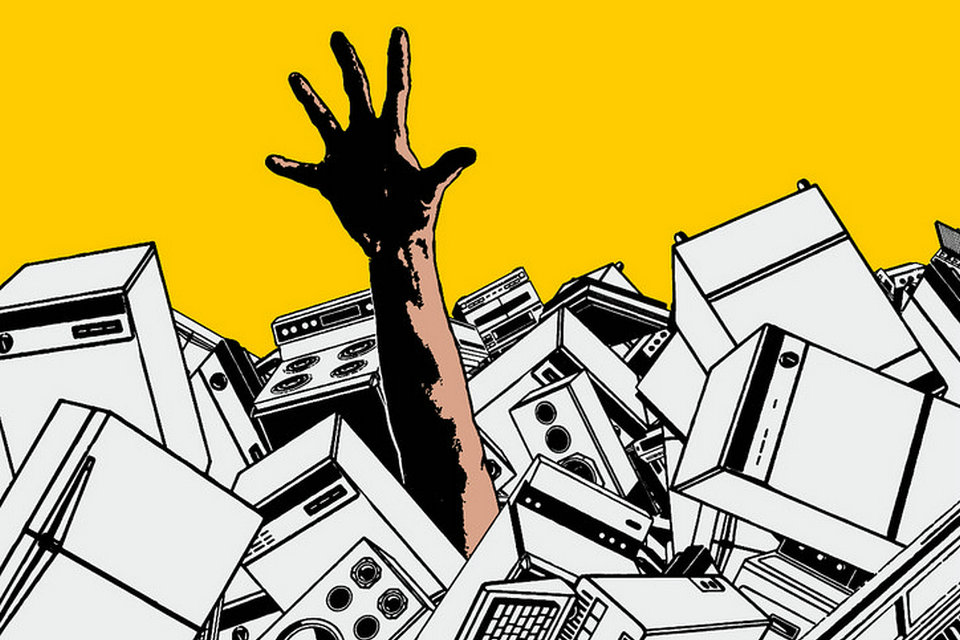
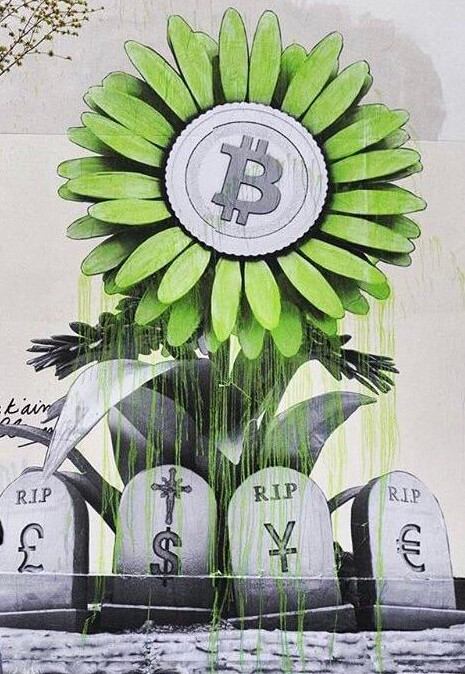

# Twoja pierwsza przygoda z Bitcoinem

W tym kursie wyjaśnię Bitcoin w 21 rozdziałach, abyś mógł zrozumieć tę technologię w prosty i skuteczny sposób. Kurs jest dostępny dla każdego i bada całą branżę: górników, portfele, platformy kupna/sprzedaży itp...

Kurs powinien zająć około 15 godzin. Na przestrzeni podróży dostępne są plakaty wyjaśniające i dodatkowe zasoby.

Nie potrzebujesz żadnej specjalnej wiedzy, aby zacząć, kurs jest dostępny dla każdego!

+++

# Wprowadzenie

## Skok w nieznane


### Witaj w nowym paradygmacie monetarnym i technologicznym.

Bitcoin to znacząca innowacja, która wykracza poza prostą "walutę internetową". To rewolucja zarówno w technologii, jak i w pieniądzu, zdolna do kwestionowania naszego stosunku do waluty i społeczeństwa. Bitcoin jest tzw. walutą **neutralną** i **zdecentralizowaną**, co oznacza, że nie jest kontrolowana przez żadną jednostkę ani instytucję. To znacząca innowacja, która wykracza poza zwykłą walutę. Aby zrozumieć słynnego bitcoina, ważne jest, aby zrozumieć, że bitcoin (odnoszący się do BTC) jest zarówno protokołem komputerowym (Bitcoin), jak i jednostką monetarną (bitcoin).

Protokół wykorzystuje podstawowe technologie, takie jak kryptografia, komunikacja sieciowa i słynny "blockchain", podczas gdy jednostka bitcoin jest walutą niezbędną do prawidłowego funkcjonowania tego samego protokołu. W codziennym życiu Salwadorczycy czy bitcoinerzy na całym świecie używają waluty bitcoin do kupowania i sprzedawania towarów i usług, przy czym waluta ta opiera się na protokole Bitcoin, aby funkcjonować.

### Kompleksowy, a jednocześnie dostępny program nauczania

W tym kursie omówimy aspekty monetarne Bitcoina, w tym jak kupować i sprzedawać bitcoiny, bezpiecznie przechowywać je w portfelach cyfrowych oraz używać ich do transakcji. Zbadamy również rolę górników, którzy są niezbędni do tworzenia nowych bitcoinów i zabezpieczania sieci Bitcoin. Dodatkowo zbadamy przyszłość Bitcoina i to, jak technologia Lightning Network może poprawić transakcje Bitcoin.


Istotne jest, aby zrozumieć, że Bitcoin to nowy system monetarny, który rewolucjonizuje nasz stosunek do pieniędzy. Nauka korzystania z Bitcoina jest niezbędną umiejętnością dla każdego, kto chce mieć kontrolę nad własnymi pieniędzmi.

**Sekcja 1 - Pieniądz**

- Rozdział 1 - Co to jest pieniądz?
- Rozdział 2 - Pieniądz fiducjarny
- Rozdział 3 - Hiperinflacja
- Rozdział 4 - Polityka monetarna Bitcoina

**Sekcja 2 - Portfele Bitcoin**

- Rozdział 5 - Jak działają portfele Bitcoin?
- Rozdział 6 - Wybór twojego zabezpieczenia
- Rozdział 7 - Konfiguracja twojego portfela
- Rozdział 8 - Ochrona przed czasem

**Sekcja 3 - Aspekty techniczne Bitcoina**

- Rozdział 9 - Wyjaśnienie transakcji
- Rozdział 10 - Węzły Bitcoin
- Rozdział 11 - Górnicy
- Rozdział 12 - Górnicy a ekologia

**Sekcja 4 - Oszczędzanie w Bitcoinie**

- Rozdział 13 - Cena Bitcoina
- Rozdział 14 - Jak kupić Bitcoina
- Rozdział 15 - Praca za Bitcoiny
- Rozdział 16 - Hiperbitcoinizacja

**Sekcja 5 - Lightning Network**

- Rozdział 17 - Wprowadzenie do Lightning Network
- Rozdział 18 - Przypadki użycia dla Sieci Lightning
Zanim omówimy definicję i funkcjonowanie pieniądza w społeczeństwie (Rozdział 1), zaczynamy od genezy Bitcoina. Bitcoin to stosunkowo nowa technologia, uruchomiona w 2009 roku, która nie ma sobie równych. Dlatego normalne jest, że nie wszystko jest od razu zrozumiałe. W rzeczywistości, podobnie jak przy uczeniu się korzystania z Internetu czy samochodu, nie trzeba znać wszystkich szczegółów technicznych, aby używać Bitcoina (otrzymywać, płacić, zabezpieczać swoje środki).


Znaczenie ma tutaj głównie zrozumienie tej nowej technologii w ogólny sposób. Mamy nadzieję, że to szkolenie przypadnie Ci do gustu i dostarczy Ci niezbędnych podstaw do zrozumienia, a może nawet do dalszego postępu w tym nowym globalnym paradygmacie monetarnym.

## Prehistoria Bitcoina


Zanim termin "Bitcoin" stał się synonimem cyfrowej waluty i transformacji finansowej, seria pomysłów, innowacji i ruchów społecznych przygotowała grunt pod jego powstanie. Jednym z fundamentalnych elementów tej prehistorii Bitcoina jest ruch cypherpunków.

### Cypherpunkowie: Wizjonerzy Cyfrowego Świata


W sercu ewolucji technologicznej lat 80. i 90., grupa osób zaczęła głęboko kwestionować rolę prywatności i wolności w cyfrowym wieku. Ci ludzie, którzy później zostali znani jako "cypherpunkowie", mocno wierzyli, że kryptografia może służyć jako narzędzie do ochrony indywidualnych praw przed ingerencją rządów i dużych korporacji.

Ikoniczne postacie takie jak Julian Assange, Wei Dai, Tim May i David Chaum przyczyniły się do zdefiniowania filozofii i wizji cypherpunków. Ci myśliciele dzielili się swoimi pomysłami na wpływowej liście mailingowej, gdzie uczestnicy z całego świata debatowali o najlepszym sposobie wykorzystania technologii do zapewnienia większej indywidualnej wolności.

### Trzy Filary Tekstów Cypherpunków


Ruch cypherpunków, z jego głębokimi korzeniami w aktywizmie cyfrowym i kryptografii, opierał się na kilku fundamentalnych tekstach, aby wyrazić swoje zasady i wizję przyszłości. Wśród tych pism, trzy wyróżniają się w szczególności:

- "Manifest Cypherpunków":
  Napisany przez Erica Hughesa w 1993 roku, "Manifest Cypherpunków" twierdzi, że prywatność jest fundamentalnym prawem. Hughes argumentował, że możliwość swobodnej i poufnej komunikacji była niezbędna dla wolnego społeczeństwa. Manifest stwierdza: "Nie możemy oczekiwać, że instytucje, korporacje czy inne bezosobowe podmioty przyznają nam prywatność... Musimy bronić jej sami."

- "Manifest Kryptoanarchisty":
  Napisany przez Timothy'ego C. Maya w 1992 roku, ten manifest wyjaśnia, jak użycie kryptografii mogłoby prowadzić do ery kryptoanarchii, w której rządy byłyby bezsilne, aby ingerować w prywatne sprawy obywateli. May przewidywał przyszłość, w której informacje, pieniądze i wiadomości mogłyby być wymieniane bez interwencji strony trzeciej i anonimowo.

- "Deklaracja Niepodległości Cyberprzestrzeni":
  Chociaż nie jest wyłącznie cypherpunkowa, ten tekst odzwierciedla uczucia wielu aktorów ruchu. Napisany w 1996 roku przez Johna Perry'ego Barlowa, jest odpowiedzią na zwiększającą się regulację Internetu przez rządy. Deklaracja stwierdza, że cyberprzestrzeń jest odrębnym królestwem od sfery fizycznej i nie powinna podlegać tym samym prawom. Stwierdza: "Nie mamy wybranego rządu i nie możemy być rządzeni."

### Poprzednicy Bitcoina
Przed pojawieniem się Bitcoina podjęto kilka prób stworzenia cyfrowej waluty. Na przykład, David Chaum wprowadził koncepcję "anonimowych pieniędzy elektronicznych" ze swoim projektem "DigiCash" w latach 80. Niestety, z różnych powodów, DigiCash nigdy naprawdę się nie przyjął.
Innym ważnym prekursorem jest "b-money" Wei Daia. Chociaż nigdy nie zostało zaimplementowane, przedstawiło ideę anonimowej cyfrowej waluty, gdzie wykrywanie oszustw było wykonywane przez społeczność ewaluatorów, a nie centralny autorytet.


To w tym żyznym środowisku tajemniczy Satoshi Nakamoto opublikował whitepaper Bitcoina w 2008 roku. Połączył kilka pomysłów z ruchu cypherpunk, takich jak dowód pracy i kryptograficzne znaczniki czasu, aby stworzyć zdecentralizowaną i odporną na cenzurę cyfrową walutę.

Bitcoin był czymś więcej niż tylko cyfrową walutą; stanowił realizację ideałów cypherpunk. Poza swoją technologią, symbolizował rewolucję przeciwko tradycyjnym systemom finansowym i oferował alternatywę opartą na przejrzystości, decentralizacji i suwerenności jednostki.

### Wnioski

Prehistoria Bitcoina jest głęboko zakorzeniona w ruchu cypherpunk i kolektywnym dążeniu do większej wolności w erze cyfrowej. Łącząc zasady kryptografii, decentralizacji i integralności, Bitcoin stał się czymś więcej niż walutą; jest produktem filozoficznej i technologicznej rewolucji, która nadal kształtuje nasz świat.

Bitcoin jest więc protokołem, który obejmuje długie okresy czasu i zachęca nas do zastanowienia się nad naszym stosunkiem do energii, czasu i pieniędzy. Ale czy Bitcoin jest "prawdziwą" walutą? Co to jest pieniądz? Czy istnieje w wielu formach? Zbadamy te pytania w następnym rozdziale.


# Pieniądze

## Pieniądze na przestrzeni historii


Ewolucja pieniądza jest fascynującym aspektem historii ludzkości, odzwierciedlającym pomysłowość cywilizacji na przestrzeni wieków w zaspokajaniu ciągle ewoluujących potrzeb ekonomicznych.


### Od muszelek do kont bankowych

Początkowo waluta była namacalna, często związana z podstawowymi towarami takimi jak zboże, bydło i inne towary. Jednak te dobra miały poważne wady, takie jak nietrwałość, co utrudniało ich używanie jako długoterminowego medium oszczędności. Na przykład nieudane żniwa lub choroba mogły z dnia na dzień zniszczyć majątek jednostki.
W miarę postępu cywilizacji i rozszerzania handlu na nowe regiony, pojawiła się potrzeba uniwersalnego medium wymiany. Eksperymentowano z obiektami takimi jak muszelki i kamienie szlachetne, ale nie były one doskonałe. Ostatecznie złoto stało się standardem ze względu na swoją rzadkość, trwałość i podzielność. Było i pozostaje do dziś symbolem bogactwa i władzy.


### Jaka jest rola pieniądza?

Pieniądz to wysoce zaawansowane narzędzie komunikacji:

- Umożliwia komunikację między teraźniejszością a przyszłością. Przekształcamy nasz czas i energię w aktywa, które można ponownie wykorzystać w przyszłości bez ryzyka dewaluacji.

- Umożliwia komunikację w uniwersalnym wspólnym języku. Nie znając się, nie mówiąc tym samym językiem, dwaj obcy mogą wymieniać się, handlować i zgadzać się co do wartości rzeczy.

Jego funkcja w naszym świecie jest trudna do sztucznego odtworzenia. Żaden człowiek ani grupa ludzi nie może stworzyć pieniądza; jest to naturalne zjawisko społeczne, które musi wyłonić się z rynku i dobrowolnego konsensusu. Ceny są sygnałami, informacjami, które pomagają społeczeństwu decydować, jak będą alokowane zasoby.
Złoto jako pieniądz to wybór 4000 lat ewolucji monetarnej opartej na 3 funkcjach:
- Przechowywanie wartości
- Środek wymiany
- Jednostka rozliczeniowa


### Charakterystyka pieniądza

Złoto idealnie spełnia kryteria efektywnej waluty: jego naturalna rzadkość sprawia, że jest cenne, podczas gdy jego właściwości chemiczne pozwalają mu nie ulegać erozji z biegiem czasu. Jednak ta forma pieniądza nie jest łatwo podzielna ani transportowalna na długie dystanse. W zglobalizowanym i cyfrowym świecie złoto nie jest w stanie nadążyć i potrzebuje centralnej jednostki, aby było podzielne i łatwo wymienialne (bicie monety).

Te wady sprawiły, że złoto stało się przechowywaniem wartości, ale nie powszechną walutą, na niekorzyść państwowych walut fiducjarnych (fiat), które są łatwo używalne, ale ciągle dewaluowane przez jednostki, które nimi zarządzają (król, bank centralny, cesarz, dyktator).

Kryteria efektywnej waluty są liczne. Dobra waluta musi być:


- **Zamienna**, co oznacza wymienialność bez utraty wartości
- **Podzielna**, aby ułatwić transakcje o różnych wielkościach
- **Płynna**, co oznacza łatwą zamienialność na towary lub usługi.

Aby spełnić te kryteria, waluta ewoluuje krok po kroku:

- Surowy kamień -> Moneta
- Banknot -> Karta bankowa
- Blockchain -> Lightning Network

Dzisiaj waluty nadal ewoluują, dostosowując swoje formy do różnych zastosowań. Na przykład, chociaż złoto jest doskonałym przechowywaniem wartości, nie nadaje się już do obecnego globalizowanego gospodarstwa. Podobnie, waluty fiducjarne takie jak dolar i euro są bardzo płynne i łatwo transportowalne, ponieważ są teraz głównie cyfrowe, jednak ich wartość jest ciągle erodowana przez inflację monetarną.

Bitcoin z kolei prezentuje nowe możliwości. Dzięki swoim właściwościom, takim jak ściśle ograniczona podaż, oferuje doskonałe przechowywanie wartości. Ponadto, jako neutralna waluta internetowa, stanowi dobry środek wymiany, który nie zna granic. Jednakże, mimo ciągłego przyjmowania, nie jest jeszcze szeroko akceptowany w handlu dzisiaj, pomimo [ciągłej adopcji](https://btcmap.org/map).

## Waluty fiducjarne


"Ci, którzy nie uczą się na historii, są skazani na powtórzenie tych samych błędów," powiedział George Santayana. Prawda ta rezonuje szczególnie, gdy mowa o obecnym systemie monetarnym.

### Fiducjarny = zaufanie

Dzisiaj główne waluty takie jak euro i dolar są uważane za fiducjarne. Oznacza to, że nie mają one wewnętrznej wartości. Ich wartość opiera się całkowicie na zaufaniu i wierze, jaką pokładamy w instytucjach, które nimi regulują.

'Waluta fiducjarna to forma waluty, która jest dekretowana jako waluta przez instytucję, taką jak państwo-naród, jak Chiny z Jenem, lub unia polityczno-ekonomiczna, jak Unia Europejska z Euro. Jednostką odpowiedzialną za emisję waluty fiducjarnej jest bank centralny (Na przykład, możemy wymienić Ludowy Bank Chin, Rezerwę Federalną Stanów Zjednoczonych, lub Centralny Bank Republiki Gwinei). To te jednostki są odpowiedzialne za decydowanie o polityce monetarnej i tym samym o tym, ile pieniędzy powinno być wprowadzonych do obiegu lub wydrukowanych.


### Dewaluacja pieniądza: Strategia tak stara jak Imperium Rzymskie
Od starożytności złoto służyło jako punkt odniesienia monetarny. Jednak jego sztywność często skłaniała przywódców - czy to rzymskich cesarzy, czy współczesnych rządów - do przyjmowania alternatywnych walut, często fiducjarnych.
Mechanizm jest prosty i inspirowany praktykami, które istnieją od początków cywilizacji. Przywódcy, pragnący wywierać kontrolę nad bogactwem, zaczynają od scentralizowania złota, często wykorzystując swoją władzę i obiecując ochronę oraz bezpieczeństwo. Mając ten cenny zasób w swoich rękach, wprowadzają nową walutę, równoważną wartości złota, ale bite w ich wizerunku. Ta waluta zaczyna krążyć, a ludzie szybko przyzwyczajają się do jej wygody.

Stopniowo, ci przywódcy dyskretnie dewaluują nową walutę, obniżając jej wartość w stosunku do początkowego złota o kilka procent każdego roku. Ta cicha dewaluacja jest często uzasadniana jako działanie w interesie ludu. W ten sposób ci, którzy oszczędzają w tej walucie fiducjarnej, widzą erozję wartości swoich oszczędności, podczas gdy państwo finansuje swoje projekty poprzez inflację. Ponadto, ta dewaluacja ułatwia spłatę długów.


W krytycznym momencie ogłaszane jest: waluta nie jest już wspierana przez złoto. Publiczność, teraz przyzwyczajona do waluty fiducjarnej i często źle poinformowana o sprawach finansowych, akceptuje tę rzeczywistość. Państwo ma wtedy wolną rękę do manipulowania podażą pieniądza, drukując ogromne sumy pieniędzy przy prawie żadnych kosztach.

Ta strategia, gdy jest dobrze wykonana, może trwać przez dziesięciolecia. Jednak zbyt szybka dewaluacja lub utrata zaufania może prowadzić do hiperinflacji (patrz następny rozdział). Historia pokazuje, że dolar stracił 98% swojej wartości w 100 lat, euro 30% w 20 lat, a funt szterling 99% od momentu jego powstania.

W końcu waluta może już nie mieć żadnego związku ze złotem, przypominając rzymskie monety pod koniec Imperium, lub nawet zostać zredukowana do prostej wartości liczbowej, odłączonej od materialnej rzeczywistości.

Dzisiaj jesteśmy świadkami historycznego punktu zwrotnego. Dolar, który długo dominował, wydaje się być w odwrocie, a złoto straciło swoje centralne miejsce. Jesteśmy na zawiasie nowego cyklu monetarnego, przypominając nam, że lekcje z historii są często zapominane.


### Czy Bitcoin jest rozwiązaniem?

To w tym kontekście rewolucja Bitcoina nabiera tempa. Ta waluta, która nie wymaga **zaufanej trzeciej strony**, ma na celu oddzielenie Państwa od pieniądza.

Drukowanie pieniędzy prowadzi do inflacji, stopniowo zubożając populację. Z drugiej strony, instytucje finansowe i zamożni jednostki skorzystali z tej praktyki, tworząc przepaść nierówności i sprzyjając autorytaryzmowi. Obecny system finansowy jest regulowany i ograniczony, aby uniknąć jego upadku, a każde zakłócenie mogłoby wywołać poważny kryzys gospodarczy. Jako że polityczni aktorzy korzystają z tego systemu, nie są zmotywowani do dokonywania radykalnych zmian, pozwalając systemowi kontynuować swój bieg aż do możliwej implozji.


W odpowiedzi na te systemowe wyzwania, Bitcoin prezentuje się jako zdecentralizowane rozwiązanie: nowy równoległy system monetarny. Historycznie, złoto było faworyzowane jako waluta ze względu na swoją odporność na fałszowanie. Podobnie, Bitcoin, dzięki swojej zdecentralizowanej i kryptograficznej naturze, nie może być sfałszowany i jest ograniczony do 21 milionów jednostek. Bitcoin jest walutą, która opiera się na przejrzystości i neutralności, oferując atrakcyjną alternatywę dla obecnego scentralizowanego systemu monetarnego.
W tym samym czasie pojawienie się cyfrowych walut banków centralnych, czyli CBDC, wydaje się nieuniknione. Ta nowa forma waluty oferowałaby bardziej scentralizowaną gospodarkę, co mogłoby ograniczać finansową wolność jednostek i ułatwiać autorytarne nadużycia. Możemy zakończyć ten rozdział cytatem laureata Nagrody Nobla, F.A. Hayeka z 1984 roku: "Nie wierzę, że kiedykolwiek znajdziemy dobrą walutę, dopóki nie wyjmiemy jej z rąk rządu. Jednak nie możemy jej odebrać siłą; wszystko, co możemy zrobić, to wprowadzić coś, czego nie mogą zatrzymać przez sprytne sztuczki".


## Hiperinflacja


Hiperinflacja to zjawisko monetarne specyficzne dla walut fiducjarnych. Charakteryzuje się całkowitą utratą zaufania do waluty i drastycznym wzrostem inflacji poprzez drukowanie pieniędzy przez władze. W rezultacie, oszczędności zgromadzone przez jednostki mogą zniknąć w stosunkowo krótkim czasie, popychając kraj na skraj ekonomicznego, społecznego i politycznego upadku.

### Inflacja Nieokiełznana!

Spróbujmy zrozumieć wpływ inflacji na oszczędności, biorąc pod uwagę różne stopy inflacji.

- Przy 2% inflacji tracisz rocznie 2% swojej siły nabywczej, co w ciągu 5 lat sumuje się do 10%.
- Przy 7%, tracisz połowę w ciągu 10 lat.
- Przy 20%, tracisz prawie połowę w ciągu 3 lat.

Podczas hiperinflacji nie mówimy już o 20% rocznie, ale raczej o 20% miesięcznie, a w szczycie nawet na dzień. 100% inflacja dziennie przez 3 dni to realistyczny scenariusz, który miał miejsce i nadal ma miejsce na naszym świecie.

Ważne jest, aby zrozumieć, że hiperinflacja nie dzieje się przez magię, przypadek, kapitalizm czy politycznych przeciwników. Hiperinflacja jest bezpośrednią konsekwencją błędnych decyzji monetarnych podjętych przez bankierów centralnych i polityków. Jej konsekwencje dotykają wszystkich obywateli i będą miały wpływ na pokolenia. Zapraszam do poświęcenia 5 minut na studiowanie tej tabeli, aby w pełni zdać sobie sprawę z realnego wpływu tego zjawiska (kurs ECON204 szczegółowo omówi ten temat)."


### Jak Dochodzi do Hiperinflacji?


Faza 1 - Utrata zaufania

- Centralizacja władzy monetarnej ułatwia tworzenie pieniędzy i ich nadużycia. Może wtedy pojawić się utrata zaufania do waluty i wywołać hiperinflację. Osoby zaczynają wtedy kwestionować pochodzenie pieniędzy i korzyści z narzuconej polityki monetarnej. Utrata zaufania jest zazwyczaj spowodowana czynnikami zewnętrznymi, takimi jak wojny, środki społeczne lub wzrost cen kluczowego zasobu, takiego jak pszenica czy benzyna.

Faza 2 - Upadek waluty i wzrost cen

- Gdy rządy tracą kontrolę nad zaufaniem, ludzie zaczynają wymieniać swoją walutę na inną, bardziej stabilną, taką jak dolar amerykański w Wenezueli. Prowadzi to do wzrostu cen, tworząc błędne koło, w którym towary i usługi stają się coraz droższe. Aby zaspokoić te potrzeby, państwo drukuje więcej pieniędzy, aby skorygować politykę monetarną, co skutkuje eksponencjalną inflacją.

Faza 3 - Błędne koło drukowania pieniędzy

- Potrzeba coraz więcej banknotów, aby kupić towary, co prowadzi do niedoboru papierowych pieniędzy. To prowadzi do drukowania jeszcze więcej banknotów, tworząc jeszcze większą inflację.


Faza 4 - Pojawia się nowa waluta
- Nowa waluta jest wprowadzana w celu zastąpienia starej. Godnym uwagi przykładem hiperinflacji jest Niemcy w latach 1920-1924. Aby ożywić gospodarkę, stworzono nową walutę, wspieraną przez długi niemieckie, francuskie i angielskie, oraz gwarantowaną przez niemieckie ziemie.
Rozwiązanie kryzysu hiperinflacji często wymaga radykalnych zmian, takich jak rewolucje, zmiany w rządzie, zmiany w bankierach centralnych, między innymi. Utrata zaufania, upadek waluty i odbudowa są kluczowymi fazami do ożywienia nowej gospodarki opartej na walucie fiducjarnej.

### 3 godne uwagi przykłady

- Niemcy, 1922-1923

  Jednym z najbardziej uderzających przykładów hiperinflacji był okres w Republice Weimarskiej w Niemczech po I wojnie światowej.

  Niemcy pożyczyły ogromne sumy pieniędzy na finansowanie wysiłku wojennego, i nie tylko Niemcy nie wygrały wojny, ale musiały zapłacić miliardy dolarów w reparacjach. Miesiącem z najwyższą inflacją był październik 1923 roku, osiągając szczyt na poziomie 29 500%, czyli wskaźnik inflacji 20,9% na dzień. Ceny podwajały się co 3,7 dnia!
  Mówi się, że w restauracjach kelnerzy musieli ogłaszać ceny menu co 30 minut, aby uwzględnić inflację. Niemiecka waluta stała się tak bezużyteczna, że niektórzy obywatele woleli palić swoje papierowe pieniądze niż drewno, ponieważ było to faktycznie tańsze.
  

- Węgry, 1945-1946

  Kraj, który do tej pory doświadczył najgorszego okresu hiperinflacji w historii, to zdecydowanie Węgry po II wojnie światowej.

  Węgry znalazły się po przegranej stronie konfliktu, a wojna zniszczyła większość ich zdolności produkcyjnych przemysłu. Miesiącem z najwyższą inflacją był lipiec 1946 roku, z inflacją cen wynoszącą 41 900 000 000 000 000%, co odpowiada 207% na dzień. Ceny podwajały się co 15 godzin!

  Ostatni banknot wprowadzony do obiegu to banknot o nominale 100 milionów miliardów pengo (100 000 000 000 000 000 000) w 1946 roku.


- Zimbabwe, 2007-2008
  Do roku 2000 Zimbabwe było samowystarczalne prawie we wszystkich swoich potrzebach z wyjątkiem ropy.

  W 1997 roku dolar zimbabweński stracił ponad 72% swojej wartości po tym, jak rząd zgodził się na rekompensatę dla weteranów wojennych na kwotę równowartości 450 milionów dolarów amerykańskich. Ponieważ rząd nie dysponował taką kwotą w swoich skarbcach, musiał zacząć uruchamiać maszyny drukarskie. W 2005 roku inflacja osiągnęła 586%, a w marcu 2007 roku miesięczna inflacja osiągnęła 50%.

  W czerwcu 2007 roku rząd zareagował, wprowadzając kontrole cen. Sklepy zostały dosłownie "oblężone". Handlowcy nie mieli już środków, aby uzupełnić zapasy w swoich sklepach.

  W kwietniu 2009 roku minister finansów ogłosił zawieszenie dolara zimbabweńskiego i zezwolił na używanie różnych obcych walut do handlu. Wszystkie konta bankowe, emerytury i instytucje finansowe zobaczyły, jak ich salda znikają z dnia na dzień.


Podsumowując, hiperinflacja powoduje szybkie degradowanie wartości waluty, prowadząc do erozji oszczędności i utraty zaufania do systemu monetarnego. Jak sugerował Voltaire, waluta fiducjarna zawsze ostatecznie straci swoją wewnętrzną wartość i zbliży się do zera.
'Waluta, która opiera się na zaufanej stronie trzeciej, jak instytucja finansowa, jest w praktyce i na dłuższą metę wadliwą walutą, ponieważ nie jest w stanie zagwarantować siły nabywczej ani zachować oszczędności.
## 21 milionów bitcoinów


### Polityka Monetarna Bitcoina

Bitcoin to zdecentralizowana waluta cyfrowa z wcześniej zdefiniowaną maksymalną ilością **21 milionów jednostek**. Ta wewnętrzna cecha rzadkości jest określona przez jego kod komputerowy i wzmacniana przez konsensus wszystkich użytkowników uczestniczących w protokole.


Jeśli chodzi o jego emisję monetarną, można ją zilustrować za pomocą krzywej S, która reprezentuje ilość bitcoinów tworzonych w czasie. Na przykład, w 2022 roku, w obiegu znajdowało się około 18,5 miliona bitcoinów. Prognozy wskazują, że do 2025 roku będzie około 19,5 miliona bitcoinów, co stanowi ~93% całkowitej podaży, a do 2037 roku liczba ta osiągnie 20,4 miliona.

### Jak Tworzone Są Nowe Bitcoiny?

Tworzenie nowych bitcoinów jest wynikiem procesu wydobywczego, procedury weryfikacji transakcji w sieci Bitcoin.


Górnicy, którzy wykonują to zadanie, są nagradzani emisją nowych bitcoinów co dziesięć minut. Ta nagroda jest zaprogramowana do zmniejszenia się o połowę co 210,000 bloków, co odpowiada mniej więcej co cztery lata, wydarzenie znane jako "halving" -- nadając krzywej emisji monetarnej kształt schodów. Dzięki mechanizmowi halvingu, można matematycznie przewidzieć, że tworzenie bitcoinów zakończy się w 2140 roku, kiedy całkowita liczba bitcoinów osiągnie swój limit 21 milionów.

| Numer Halvingu | Wysokość Bloku | Nagroda BTC po Halvingu  | Szacowana liczba BTC w Obiegu po Halvingu |
| -------------- | -------------- | ------------------------ | ----------------------------------------- |
| 1              | 210,000        | 25 BTC                   | 10,500,000 BTC                            |
| 2              | 420,000        | 12.5 BTC                 | 15,750,000 BTC                            |
| 3              | 630,000        | 6.25 BTC                 | 18,375,000 BTC                            |
| 4              | 840,000        | 3.125 BTC                | 19,687,500 BTC                            |
| 5              | 1,050,000      | 1.5625 BTC               | 20,343,750 BTC                            |
| 6              | 1,260,000      | 0.78125 BTC              | 20,671,875 BTC                            |
| 7              | 1,470,000      | 0.390625 BTC             | 20,835,937.5 BTC                          |
| 8              | 1,680,000      | 0.1953125 BTC            | 20,917,968.75 BTC                         |
| 9              | 1,890,000      | 0.09765625 BTC           | 20,958,984.375 BTC                        |
| 10             | 2,100,000      | 0.048828125 BTC          | 20,979,492.188 BTC                        |
| 11             | 2,310,000      | 0.0244140625 BTC         | 20,989,746.094 BTC                        |
| 12             | 2,520,000      | 0.01220703125 BTC        | 20,994,873.047 BTC                        |
| 13             | 2,730,000    | 0.006103515625 BTC        | 20,997,436.523 BTC                         |
| 14             | 2,940,000    | 0.0030517578125 BTC       | 20,998,718.262 BTC                         |
| 15             | 3,150,000    | 0.00152587890625 BTC      | 20,999,359.131 BTC                         |
| 16             | 3,360,000    | 0.000762939453125 BTC     | 20,999,679.566 BTC                         |
| 17             | 3,570,000    | 0.0003814697265625 BTC    | 20,999,839.783 BTC                         |
| 18             | 3,780,000    | 0.00019073486328125 BTC   | 20,999,919.892 BTC                         |
| 19             | 3,990,000    | 0.000095367431640625 BTC  | 20,999,959.946 BTC                         |
| 20             | 4,200,000    | 0.0000476837158203125 BTC | 20,999,979.973 BTC                         |

Wrócimy do tematu górników bardziej szczegółowo w rozdziale o wydobywaniu.

### Gwarantowanie cyfrowej rzadkości

Rzadkość Bitcoina jest gwarantowana przez dwa kluczowe mechanizmy: dostosowanie trudności wydobycia i teorię gier:

- Dostosowanie trudności wydobycia to mechanizm, który ma miejsce co 2016 bloków, czyli około co dwa tygodnie, aby zapewnić, że średnio co dziesięć minut dodawany jest nowy blok do łańcucha bloków. Ta częstotliwość tworzenia bloków i całkowita ilość bitcoinów są ustalonymi aspektami protokołu Bitcoina i nie mogą być zmienione bez ogólnego konsensusu, w przeciwieństwie do arbitralnych decyzji podejmowanych w tradycyjnych systemach monetarnych.


> Czy wiesz? Górnicy są motywowani do wydobywania bloku, aby zarobić nowe bitcoiny i opłaty transakcyjne związane z transakcjami, które zawierają w swoim bloku. W miarę zbliżania się liczby wydanych bitcoinów do limitu 21 milionów, górnicy będą remunerowani bardziej przez swoje opłaty transakcyjne niż przez nagrodę za blok.'

- Teoria gier to matematyczny koncept, który opiera się na ludzkiej racjonalności. Tutaj, w Bitcoinie, to użytkownicy głosują za zmianami protokołu. Tak, dobrze przeczytałeś: każda modyfikacja protokołu Bitcoina wymagałaby zgody całej społeczności użytkowników, co jest bardzo skomplikowane. Więc, jeśli ktoś chciałby stworzyć 22 miliony bitcoina, musiałby przekonać wszystkich użytkowników do dobrowolnego obniżenia wartości ich oszczędności, co jest mało prawdopodobne, ponieważ Bitcoin jest globalny i nie jest zarządzany przez centralną grupę.


Pomysł deprecjacji waluty jest sprzeczny z fundamentalną filozofią Bitcoina, więc zmiana tego limitu jest bardzo mało prawdopodobna.

### Audytowalna polityka monetarna co sekundę od początku i na zawsze!

Rzadkość Bitcoina jest głównym atutem, a maksymalna ilość 21 milionów bitcoinów w obiegu jest publiczna i weryfikowalna przez każdego.

W rzeczywistości każdy może zweryfikować ilość bitcoinów w obiegu, wpisując prostą komendę na węźle Bitcoina: `bitcoin-cli gettxoutsetinfo`. Ta przejrzystość i weryfikowalność wzmacniają zaufanie do systemu Bitcoina, który nie opiera się na scentralizowanych instytucjach czy osobach, ale na matematycznej i kryptograficznej gwarancji inherentnej w jego protokole. (Dowiesz się, jak to łatwo zrobić w LN201)

```json
{
  "height": 710560,
```json
{
  "bestblock": "0000000000000000000887384d67103412ea7f18a43953e65c8c4ac36bf42e54",
  "transactions": 473244,
  "txouts": 1018917,
  "bogosize": 2183872374,
  "hash_serialized_2": "eebb9987337700ffaacbbaa11223344",
  "disk_size": 178239584,
  "total_amount": 18745998.12345678
}
```

Bitcoin, dzięki swojej konstrukcji, gwarantuje solidne zarządzanie pieniędzmi poprzez ograniczenie jego tworzenia i ochronę oszczędności użytkowników, co odróżnia go od innych walut. Zgodnie z zasadami ekonomii austriackiej (szczegóły w ECON201), jego kontrolowana ilość i przewidywalny rozkład chronią go przed wrodzonymi ryzykami inflacji w tradycyjnych walutach.

Podsumowując, Bitcoin, ze swoją zdecentralizowaną naturą, zaprogramowanym niedoborem i przejrzystością, oferuje unikalną alternatywę dla tradycyjnych systemów monetarnych. Ilustruje, jak technologia może być wykorzystana do stworzenia waluty, która nie tylko jest użyteczna i weryfikowalna, ale także zachowuje wartość oszczędności użytkowników poprzez ścisłe ograniczenie jej podaży.

### Koniec sekcji 1!

'

# Portfele Bitcoin

## Czym są portfele Bitcoin?

W tej sekcji 2 zbadamy przechowywanie i zabezpieczanie Bitcoinów w portfelach. Pozwoli Ci to lepiej zrozumieć, gdzie znajdują się te słynne Bitcoiny i jak z nimi interagować!


### Demistyfikacja portfeli Bitcoin

W tej branży używamy portfeli do interakcji z siecią Bitcoin, które mają 3 funkcje:

- Pozwala na otrzymywanie bitcoinów
- Pozwala na wysyłanie bitcoinów
- Zabezpiecza je przed próbami hackingu i kradzieży

Portfel może być oprogramowaniem na Twoim komputerze, aplikacją na Twoim smartfonie, fizycznym urządzeniem, takim jak klucz USB, a nawet kawałkiem papieru. Te różne typy portfeli Bitcoin służą różnym przypadkom użycia. Niektóre są używane do dużych kwot z naciskiem na bezpieczeństwo, inne dla prywatności, a jeszcze inne do codziennej płatności małych kwot.

Portfele są więc podzielone na duże rodziny użytkowania, zawsze z centralnym pytaniem: Czy jesteś właścicielem środków czy pozostawiasz kontrolę nad swoimi pieniędzmi stronie trzeciej? Wrócimy do tego tematu szczegółowo w następnym rozdziale, ale idea jest prosta: Czy pieniądze są w Twojej kieszeni czy w kieszeni Twojego bankiera!


### Jak działa portfel Bitcoin

Niezależnie od tego, czy to Twój "bankier" Bitcoin, czy Ty sam, ogólnie większość portfeli Bitcoin działa z podobną technologią, tj. asymetryczną kryptografią, a więc systemem par kluczy: prywatnego klucza do otrzymywania i publicznego klucza do wydawania.

- Klucz prywatny
  Podczas inicjalizacji portfela generowana jest sekretna fraza odzyskiwania (klucz prywatny) i przekazywana Tobie w formie 24 słów.

  Klucz prywatny jest bardzo ważny, ponieważ reprezentuje własność Bitcoinów i zatem prawo do ich używania lub wysyłania. Posiadacz klucza prywatnego jest właścicielem Bitcoinów.

  Ten klucz musi być trzymany w tajemnicy i dobrze zabezpieczony, ponieważ to klucz, który otwiera Twoje bogactwo!

- Klucz publiczny i adres
  Klucz publiczny jest tworzony z klucza prywatnego i zatem z nim powiązany. Klucz publiczny jest używany do generowania adresów Bitcoin i tym samym do otrzymywania pieniędzy. Udostępnianie klucza publicznego wiąże się z ryzykiem dla prywatności, ale nie dla bezpieczeństwa.
Te adresy są tworzone przez Twój portfel i można je bezpiecznie udostępniać. Zaleca się używanie ich tylko raz, aby maksymalizować prywatność.
Dlatego ważne jest, aby zrozumieć, że dzięki tej technologii możemy łatwo otrzymywać Bitcoiny, nie pozwalając nadawcy na kradzież naszych środków! Można to porównać do skrzynki pocztowej: ludzie wpłacają do niej pieniądze, ale tylko Ty możesz ją otworzyć.


### Czy w takim razie Bitcoiny znajdują się w portfelu?

Chociaż Twoje klucze są przechowywane w Twoim portfelu, same Bitcoiny są faktycznie "przechowywane" w blockchainie Bitcoina, który jest publiczną rozproszoną księgą w sieci peer-to-peer Bitcoina (przyjrzymy się temu w sekcji 3). Dlatego utrata urządzenia, na którym masz swój portfel, niekoniecznie oznacza utratę Twoich Bitcoinów. To, co pozwala Ci odtworzyć swój portfel i wydać swoje bitcoiny, to klucz prywatny. Dlatego niezwykle ważne jest, aby odpowiednio go zabezpieczyć.


Na szczęście dla nas, od 2017 roku, ten klucz prywatny może być zakodowany w prostą listę 12 lub 24 słów, zwaną frazą mnemoniczną. Ta fraza jest kopią zapasową Twojego portfela Bitcoin, to ona pozwala Ci odtworzyć Twój portfel za pomocą dowolnego oprogramowania/aplikacji portfela Bitcoin. Dlatego każdy, kto ma dostęp do tej listy słów, ma dostęp do Twoich bitcoinów.

### Co z hakerami?

Można by zapytać: co jeśli ktoś przypadkowo odgadnie naszą listę 12 lub 24 słów? Krótka odpowiedź brzmi, że dzięki kryptografii używanej do tworzenia portfela, jest to bardzo mało prawdopodobne. Dla perspektywy, przypadkowe znalezienie dostępu do Twojego portfela jest jak znalezienie "odpowiedniego" numeru między 1 a $2^{256}$, co jest prawie równoznaczne ze znalezieniem "odpowiedniego" atomu we Wszechświecie. Jednakże, jeśli nie jesteś zadowolony z tego domyślnego zabezpieczenia, zawsze możesz je wzmocnić, dodając hasło do swojego portfela Bitcoin.


Tak więc prawdopodobieństwo zhakowania Twojego portfela Bitcoin jest astronomicznie niskie, jeśli przestrzegasz dobrych praktyk bezpieczeństwa. Praktyki, które szczegółowo opisujemy w następnej sekcji.

Wybierz portfel, który odpowiada Twoim potrzebom i sposobowi użycia. Szczegółowe poradniki dotyczące używania i zabezpieczania różnych portfeli są dostępne w [sekcji poradników naszego uniwersytetu](https://sovereignuniversity.org/tutorials/wallet).

## Bezpieczeństwo i portfele Bitcoin


### Zadawanie właściwych pytań przed rozpoczęciem

Kiedy posiadasz bitcoiny, bezpieczeństwo Twoich środków jest głównym zmartwieniem. Najlepszym sposobem na określenie odpowiedniego dla Twojej sytuacji bezpieczeństwa jest zadanie (i odpowiedzenie na) serii pytań; Twój model bezpieczeństwa będzie zależał od Twoich odpowiedzi. Zacznijmy:

- Kto może mieć dostęp do moich środków? Innymi słowy, czy tylko Ty masz dostęp do swoich bitcoinów, czy strona trzecia, taka jak firma, umożliwia Ci dostęp do Twoich środków?
- Drugie pytanie mogłoby brzmieć: jakie planujesz zastosowania dla swoich bitcoinów? Czy to suma, której używasz regularnie? Czy to oszczędności średnioterminowe? Długoterminowe?
- Jakie są Twoje umiejętności techniczne?
- Jaki jest Twój budżet na bezpieczeństwo?

Pamiętaj, że nie ma uniwersalnego rozwiązania. Dlatego poświęć czas na odpowiedź na te pytania, ponieważ pomoże to dostosować Twoje środki bezpieczeństwa.


### Myślenie o portfelach Bitcoin w kategoriach złożoności

Spróbujmy ustalić kilka poziomów bezpieczeństwa dla Twoich bitcoinów:
- **Poziom 0**, korzystasz z tzw. usługi powierniczej, gdzie nie jesteś jedynym posiadaczem swoich bitcoinów. Bądź świadomy, że ten zaufany trzeci podmiot może w każdej chwili ograniczyć dostęp do twoich środków, a ty masz taki sam poziom suwerenności finansowej, jak w tradycyjnym systemie bankowym poprzez konto bankowe.


- **Poziom 1**, używasz portfela Bitcoin na swoim telefonie lub komputerze, gdzie jesteś jedynym posiadaczem swoich bitcoinów. Możesz łatwo realizować swoje transakcje. Jednak kluczowe jest zabezpieczenie frazy mnemonicznej, aby odzyskać dostęp do swoich środków w przypadku utraty telefonu lub komputera. Często określa się to mianem "gorącego portfela", ponieważ klucz prywatny jest przechowywany na urządzeniu z dostępem do internetu.

- **Poziom 2**, używasz fizycznego portfela i zabezpieczyłeś swoją listę 12 lub 24 słów. Aby przeprowadzić transakcję, zawsze będziesz musiał podpisać ją za pomocą swojego urządzenia. Sprawia to, że twoje środki są mniej dostępne na co dzień. Często określa się to mianem "zimnego portfela", ponieważ twoje klucze są przechowywane na urządzeniu niepodłączonym do internetu.


- **Poziom 3**, używasz portfela poziomu 1 lub 2, ale z dodatkowym hasłem. Bądź świadomy, że teraz musisz zabezpieczyć zarówno listę 12 lub 24 słów, **jak i** swoje hasło. Idealnie, te dwie informacje są przechowywane w dwóch różnych miejscach.


- **Poziom 4**, używasz zestawu portfeli, aby stworzyć portfel "multisig", co oznacza, że do przeprowadzenia transakcji wymagane są wielokrotne podpisy. Bądź świadomy, że każda część multisigu powinna być przechowywana w różnych lokalizacjach. Jest to często uważane za zaawansowane wykorzystanie Bitcoina, głównie stosowane dla dużych kwot i w użyciu korporacyjnym.


Oczywiście, możemy mieć wiele przypadków użycia, i w takich przypadkach zaleca się korzystanie z wielu portfeli Bitcoin. Nie ma rozwiązania uniwersalnego dla wszystkich.

### Bezpieczeństwo musi być dostosowane

Kwota, którą ktoś jest skłonny pozostawić na konkretnym poziomie bezpieczeństwa, zależy od indywidualnych preferencji. Dla niektórych, pozostawienie 1 BTC na gorącym portfelu jest rozsądne, podczas gdy dla innych absolutnie nie. W każdym przypadku unikaj wydawania dużo na bezpieczeństwo, kupując fizyczny portfel, gdy chcesz zabezpieczyć małą kwotę. Pamiętaj również, że nadmierne komplikowanie bezpieczeństwa i dostępności twoich bitcoinów może ci zaszkodzić, jeśli na przykład źle obsłużysz kopie zapasowe swoich portfeli.

Podsumowując, bezpośrednie posiadanie własnych Bitcoinów jest kluczowym elementem zapewnienia suwerenności finansowej. Zaleca się używanie mobilnego portfela do codziennych wydatków oraz offline'owego, czyli "zimnego", fizycznego portfela do przechowywania większych kwot. Firmy, z drugiej strony, powinny rozważyć użycie systemów wielopodpisowych, czyli "multisig", dla zwiększonego i współdzielonego bezpieczeństwa. Istotne jest również unikanie usług powierniczych, które mogą replikować niektóre wady tradycyjnego systemu finansowego, na ile to możliwe.

Mając to na uwadze, przejdźmy do następnej sekcji, aby zobaczyć kroki tworzenia portfela Bitcoin. Jeśli jednak chcesz dalej zgłębiać temat bezpieczeństwa, możesz przeczytać ten [artykuł autorstwa DarthCoin](https://asi0.substack.com/p/bitcoin-soyez-votre-propre-banque).

## Konfiguracja portfela


Bezpieczeństwo Twoich Bitcoinów ma kluczowe znaczenie, a prosty błąd może mieć kosztowne konsekwencje. Dlatego teraz przyjrzymy się najlepszym praktykom przy tworzeniu nowego portfela Bitcoin.
> Zauważ, że kurs BTC102 przeprowadzi Cię przez ten krok.

### Ten krok to nie żart!

Twój klucz prywatny, często reprezentowany przez listę 24 słów (często nazywanych "ziarnem" lub "frazą mnemoniczną"), stanowi dostęp do Twoich środków. Jeśli ten klucz zostanie ujawniony osobie trzeciej, uznaj powiązane fundusze za niezabezpieczone. Dlatego, inicjując swój portfel, ważne jest, aby przestrzegać tych zasad:

- Zakryj wszystkie kamery.
- Nie rób zdjęcia listy słów.
- Nie wprowadzaj jej na komputerze lub telefonie.
- Nie zapisuj jej jako kontaktu ani nie wysyłaj do siebie za pomocą SMS.
- Nigdy nie zostawiaj swoich słów bez nadzoru na biurku.
- Nigdy nie ukrywaj swojej listy słów w nietypowym miejscu.

Dosłownie weźmiesz czystą kartkę papieru lub wydrukujesz ten [szablon](https://bitcoiner.guide/backup.pdf) i napiszesz listę słów w kolejności, starannie i wyraźnie, długopisem. Jeśli atrament zblednie z czasem, możesz stracić swoje środki; dlatego ważne jest, aby ten papier był chroniony przed czynnikami zewnętrznymi.


### Wskazówki, jak to zrobić dobrze

Istnieją również alternatywne rozwiązania dla papieru, takie jak wygrawerowanie frazy mnemonicznej na metalowej płytce. Jeśli napiszesz to niepoprawnie, Twoi spadkobiercy mogą nie być w stanie tego odczytać, a więc nie będą mogli odzyskać środków. Po zapisaniu słów zaleca się wykonanie drugiej kopii i przechowywanie jej w innym miejscu niż pierwsza. Zapewnia to kopię zapasową na wypadek utraty lub wypadku z pierwszą kopią.


Po wykonaniu kopii przechowuj listy słów w bezpiecznym miejscu, gdzie będziesz pamiętać, by ich szukać! Nie twórz zbyt skomplikowanego planu ukrycia, gdzie ryzykujesz ich utratę.

> Twoje słowa = Twoje pieniądze.

Portfele "zimne" zazwyczaj mają te listy słów, podobnie jak portfele "gorące" na telefonach komórkowych lub PC. Ta metoda tworzenia kopii zapasowej klucza prywatnego jest obecnie standardem. Oznacza to, że możesz wprowadzić swoją frazę mnemoniczną do dowolnego oprogramowania portfela, aby przywrócić swój. Tylko złe portfele, których zdecydowanie odradzamy, nie dadzą Ci listy 24 słów, ale mogą prosić o konto, adres e-mail, a co gorsza, dowód osobisty.

**UWAGA: Brak listy 24 słów powinien Cię zaniepokoić.**

## Przetrwanie próby czasu


Bezpieczeństwo jest głównym problemem w ekosystemie Bitcoin. Rzeczywiście, jak każda forma bogactwa, Twoje bitcoiny muszą być chronione przed utratą, kradzieżą i degradacją, szczególnie w dłuższej perspektywie. Zabezpieczenie Twoich bitcoinów wymaga pewnej wiedzy technicznej i świadomości związanych z tym ryzyk, co prowadzi nas do omówienia dwóch głównych strategii: wygrawerowanie Twoich bitcoinów w stali i stworzenie planu dziedziczenia.

### Grawerowanie w kamieniu

Jedną z metod zabezpieczenia Twoich bitcoinów na dłuższy czas jest wygrawerowanie Twojej frazy mnemonicznej na odpornym materiale, takim jak stal. Tworzy to fizyczną kopię zapasową Twoich kluczy, która jest odporna zarówno na uszkodzenia wodne, jak i ogień.

Istnieje wiele rozwiązań, aby to osiągnąć, niektóre są niskokosztowe, jak "Blockmit", podczas gdy inne wymagają więcej sprzętu. Możesz samodzielnie zgłębić ten temat poprzez sekcję samouczków tej uczelni.


### Pomyśl o następnym pokoleniu!
Wspólnie z tym, tworzenie planu dziedziczenia jest również kluczowym krokiem, aby zapewnić, że Twoje bitcoiny będą odpowiednio zarządzane po Twojej śmierci. Plan ten może zawierać ręcznie napisany list szczegółowo opisujący Twoje aktywa, metody dostępu do nich oraz informacje kontaktowe zaufanych osób, które należy skontaktować. Ważne jest również, aby omówić dziedziczenie bitcoinów z notariuszem, aby zapewnić zgodność z przepisami podatkowymi, chociaż ważne jest, aby nigdy bezpośrednio nie powierzać Twoich bitcoinów stronie trzeciej, w tym notariuszowi.
Jeśli chcesz dalej zgłębiać temat planu dziedziczenia dla Twoich bitcoinów, polecamy książkę Pameli Morgan [Cryptoasset Inheritance Plan](https://sovereignuniversity.org/resources/books/28/en) lub udział w kursie BTC102, gdzie przewodzimy Cię przez jego tworzenie.


### Prywatność jest ważna

Długoterminowe bezpieczeństwo Twoich bitcoinów nie ogranicza się tylko do tworzenia fizycznych kopii zapasowych czy opracowywania planu dziedziczenia. Kolejną ważną kwestią jest prywatność. Na przykład, preferowane jest kupowanie bitcoinów bez podawania danych identyfikacyjnych, aby zminimalizować ryzyko kradzieży tożsamości lub po prostu śledzenia Twoich funduszy przez jakąkolwiek jednostkę dysponującą odpowiednimi środkami. Kurs BTC 205 może Ci w tym pomóc, jeśli jest to potrzebne.

Jeśli chodzi o prywatność, kluczowe jest unikanie rozmów o Twoich bitcoinach ze wszystkimi. Rzeczywiście, nie wiemy, dokąd ten aktyw zmierza, i zachowanie dyskrecji w kwestii jego posiadania jest mądrą decyzją. Nie chcesz przyciągać uwagi do siebie i swojego portfela.

W tym samym duchu, unikaj głośnego ujawniania swojego systemu bezpieczeństwa podczas spotkań bitcoinowych czy spotkań z nieznajomymi...

### Podsumowanie na temat bezpieczeństwa portfela Bitcoin


Portfele Bitcoin to oprogramowanie, które pozwala przechowywać i dokonywać transakcji bitcoinami. Istnieje kilka typów: portfele mobilne lub na PC, wygodne dla małych kwot i/lub regularnych wydatków; fizyczne portfele, bardziej odpowiednie do przechowywania bitcoinów w średnim i długim terminie; portfele multisig, które są bardziej skomplikowane w zarządzaniu i wymagają wielu podpisów do wykonania transakcji.
Tworząc portfel, musisz najpierw zrobić kopię zapasową swojego klucza prywatnego. Ta kopia zapasowa przyjmuje formę listy 12 lub 24 słów, lub 12 słów, które możesz zapisać na kawałku papieru lub metalowej płytce. Ta fraza mnemoniczna pozwala na przywrócenie portfela w dowolnej aplikacji portfela Bitcoin. Każdy, kto ma dostęp do tej listy, ma również dostęp do Twoich bitcoinów. W Bitcoinie, finansowa suwerenność idzie w parze z indywidualną odpowiedzialnością, więc kluczowe jest, aby zabezpieczyć dostęp do Twoich portfeli i kopii zapasowych. Aby to zrobić, ważne jest, aby przestrzegać pewnych zasad:

- Stwórz plan dziedziczenia: aby zapewnić, że Twoi bliscy mogą odzyskać pieniądze w przypadku problemu.
- Unikaj platform wymiany: zaleca się unikanie pozostawiania Twoich Bitcoinów na platformach wymiany, ponieważ mogą one być podatne na ataki hakerskie.
- Dostosuj swój poziom bezpieczeństwa: poświęć czas na wyjaśnienie swoich potrzeb i zastosowań, pomoże Ci to dokonać wyboru spośród różnych dostępnych portfeli Bitcoin.

Teraz, gdy omówiliśmy podstawy portfeli Bitcoin i najlepsze praktyki ich zabezpieczania, przejdziemy do technicznego funkcjonowania Bitcoina w następnym rozdziale. Ponownie, poznanie podstaw protokołu Bitcoin pozwoli Ci lepiej zrozumieć jego działanie, co umożliwi Ci lepsze korzystanie z niego.

# Aspekty techniczne Bitcoina.

## Uruchamianie Bitcoina


### Zaczynając od odrobiny historii.


31 października 2008 roku oznacza narodziny nowej technologii finansowej: Bitcoin. To właśnie w tym dniu Satoshi Nakamoto, anonimowy autor Bitcoina, przedstawia swoją innowację światu poprzez email rozesłany do listy mailingowej cypherpunków, społeczności entuzjastów kryptografii, pasjonatów prywatności w internecie.
Ten email zawierał dokument, zwanym "White Paper", który przedstawiał działanie Bitcoina. Biorąc pod uwagę wcześniejsze niepowodzenia systemów cyfrowej gotówki, inicjatywa ta nie wywołała natychmiastowego entuzjazmu. Niemniej jednak, ten White Paper ostatecznie stał się punktem odniesienia dla użytkowników Bitcoina i był przedmiotem wielu debat w ekosystemie Bitcoina.


3 stycznia 2009 roku, Satoshi oficjalnie inauguruje sieć Bitcoin, tworząc pierwszy blok, znany również jako blok genezy, który oznacza uruchomienie blockchaina Bitcoina. Ten blok zawiera przekazującą wiadomość o misji Bitcoina: "03/sty/2009 Kanclerz na krawędzi drugiego ratunku dla banków."


> "Możemy wygrać ważną bitwę w wyścigu zbrojeń i zyskać
> nowe terytorium wolności na kilka lat.” - Satoshi Nakamoto
> 

### Protokół Bitcoina zaczyna żyć

8 stycznia 2009 roku, Satoshi ogłasza wydanie Bitcoin-0.1.0. Wkrótce potem, Hal Finney przejmuje oprogramowanie i dołącza do sieci. Teraz w sieci było 2 węzły, a więc i 2 górników. Finney uwiecznia ten krok, tweetując "Running Bitcoin". 12 stycznia 2009 roku, dokonuje się pierwsza transakcja Bitcoin pomiędzy Satoshi a Hal Finneyem. Ta transakcja, na 10 BTC, jest zapisana w bloku 170.


Zainteresowanie Bitcoinem szybko rośnie, wiele osób zaczyna testować, debatować, rozwiązywać błędy i zastanawiać się nad etycznymi, ekonomicznymi i filozoficznymi aspektami Bitcoina. Aby ułatwić te wymiany, forum BitcoinTalk jest tworzone 22 listopada 2009 roku przez Satoshi.
To forum szybko staje się preferowanym miejscem dyskusji dla użytkowników Bitcoina. To tam narodziło się wiele memów i symboli związanych z Bitcoinem, takich jak [logo Bitcoina](https://bitcointalk.org/index.php?topic=64.0), słynne [Hodl](https://bitcointalk.org/index.php?topic=375643.0), czy nawet [Dzień Pizzy](https://bitcointalk.org/index.php?topic=137.msg1195).

> **Czy wiesz?** Rzeczywiście, 22 maja 2010 roku, Laszlo Hanyecz przeszedł do historii Bitcoina, oferując zakup 2 pizz za 10 000 BTC. To pierwszy raz, kiedy Bitcoin został użyty do zakupu fizycznych towarów.


### Zniknięcie Satoshi Nakamoto

W 2010 roku, gdy Bitcoin zaczyna przyciągać uwagę mediów, Satoshi decyduje się na dystans. 12 grudnia 2010 roku publikuje swój ostatni post na forum, ogłaszając swoje odejście. 23 kwietnia 2011 roku dokonuje swojej ostatniej znanej prywatnej wymiany za pośrednictwem emaila. Satoshi znika, pozostawiając swoje dzieło w rękach społeczności.

> “Rządy są dobre w odcinaniu głów scentralizowanych
> sieci takich jak Napster, ale czyste sieci P2P takie
> jak Gnutella i Tor wydają się trzymać własne.” - Satoshi Nakamoto
Pomimo nieobecności Satoshi, Bitcoin nadal się rozwija. Co 10 minut historia Bitcoina jest zapisywana, a protokół nadal funkcjonuje zgodnie z zamierzeniami. Niezależnie od strachu, niepewności czy wątpliwości (FOMO dla Strachu Przed Ominięciem Okazji lub FUD dla Strachu Niepewności Wątpliwości), Bitcoin nadal posuwa się naprzód, z dostępnością online na poziomie 99,988%.

Bitcoin jest postrzegany inaczej przez każdą osobę. Dla niektórych jest to byt grzybowy jak [mycelium](https://brandonquittem.com/bitcoin-is-the-mycelium-of-money/), dla innych to [czarna dziura](https://dergigi.com/2019/05/01/bitcoins-gravity/i). Niezależnie od tego, czy się go kocha, czy nienawidzi, Bitcoin nadal istnieje, z jego stałym rytmem 10 minut na blok, jak bicie serca nowego systemu monetarnego.

Aby dowiedzieć się więcej o pismach Satoshi Nakamoto, polecam [książkę Phila Champagne](https://sovereignuniversity.org/resources/books) lub dokument ARTE "le mystaire Satoshi".


> „Podstawowym problemem z konwencjonalną walutą jest całe zaufanie, które jest wymagane, aby to działało. Centralny bank musi być godny zaufania, aby nie dewaluować waluty, ale historia walut fiducjarnych jest pełna naruszeń tego zaufania. Bankom musi ufać się w przechowywaniu naszych pieniędzy i przekazywaniu ich elektronicznie, ale one pożyczają je w falach kredytowych bańki z ledwie ułamkiem w rezerwie.”

Teraz, gdy mamy trochę tła, spójrzmy, jak ogólnie działa transakcja Bitcoin.

## Transakcje Bitcoin


Transakcja Bitcoin to po prostu transfer własności Bitcoinów, używając adresu Bitcoin. Weźmy na przykład dwóch bohaterów: Alicję i Boba. Alicja chce nabyć Bitcoiny, podczas gdy Bob już je posiada.

### Krok 1 - Tworzenie transakcji za pomocą portfela

Aby Bob mógł przelać Bitcoiny do Alicji, Alicja musi dostarczyć Bobowi jeden ze swoich adresów Bitcoin. Ten adres, pochodzący z publicznego klucza Alicji, jest unikalny dla jej portfela Bitcoin.

W praktyce, Alicja otwiera swój portfel i naciska "odbierz". Wyświetlany jest kod QR lub adres taki jak bc1q7957hh3nj47efn8t2r6xdzs2cy3wjcyp8pch6hfkggy7jwrzj93sv4uykr. To swego rodzaju jej "IBAN Bitcoin". Podaje go Bobowi.

Bob następnie inicjuje transakcję, używając adresu odbiorczego Alicji. Bob z kolei otwiera swój portfel Bitcoin, naciska "wyślij", kopiuje i wkleja adres, dodaje kwotę i opłatę transakcyjną. Te opłaty są zachętą dla górników do włączenia transakcji w następny blok.

'

> **Dlaczego płacić opłaty?** Te opłaty są niezbędne do stworzenia wolnego rynku dla włączania transakcji w bloki, ponieważ liczba transakcji w bloku jest ograniczona. W rzeczywistości blok ma rozmiar 1 MB, co odpowiada kilku tysiącom transakcji na blok. Opłaty za transakcję są proporcjonalne do jej rozmiaru. Rozmiar transakcji z kolei zależy od złożoności transakcji.
Aby sfinalizować transakcję, Bob musi dostarczyć podpis za pomocą prywatnego klucza adresów, których używa do zapłacenia Alicji. To weryfikuje, że jest właścicielem Bitcoinów, które chce przesłać. Ten krok jest zazwyczaj wykonywany automatycznie w portfelach mobilnych, lub jest to potwierdzenie w twoim fizycznym portfelu: "Czy na pewno chcesz wysłać X do Y? Tak czy nie".

### Krok 2: Propagacja transakcji przez węzły do górników

Na tym etapie transakcja została utworzona i portfel Boba udostępni ją sieci Bitcoin. Aby to zrobić, jego portfel skomunikuje się z węzłem sieci Bitcoin, a ten węzeł rozpowszechni tę informację do innych węzłów. Krok propagacji pozwala całej sieci zobaczyć tę nową transakcję i wziąć ją pod uwagę.


Chociaż ta transakcja jest teraz znana wszystkim (za pośrednictwem narzędzia o nazwie Mempool), nie jest koniecznie uznawana za potwierdzoną! Rzeczywiście, to górnicy walidują transakcje, włączając je do bloku naszej słynnej blockchain.

Górnicy mają za zadanie wziąć ważne i niepotwierdzone transakcje, a następnie skompilować je do bloku. Aby ich blok był następnym w blockchainie Bitcoin, muszą rozwiązać kryptograficzną łamigłówkę w procesie zwanym "proof of work".


### Krok 3: Transakcja jest wydobywana w bloku przez górnika.

Ten dowód pracy wymaga znalezienia ważnego "hasha" dla danego bloku. Pomyśl o tym jako o unikalnym odcisku palca związanym z blokiem, składającym się z 256 znaków. Ważność tego hasha zależy od trudności sieci Bitcoin. Szczegóły tego mechanizmu omówimy później. Na razie załóżmy, że górnik znalazł ważny blok i że transakcja Boba do Alicji jest w nim zawarta.

Ten nowy ważny blok jest dodawany do blockchaina Bitcoin, który jest publiczną i niezmienną księgą wszystkich transakcji Bitcoin. Pomyśl o tym jako o wspólnej księdze dla wszystkich użytkowników Bitcoina. Zgodnie z zasadami protokołu, blok jest dodawany mniej więcej co dziesięć minut dzięki dostosowaniu trudności. W sekcji o górnikach zobaczymy, jaki mechanizm zapobiega modyfikacji księgi transakcji Bitcoin.


### Krok 4: Blok jest ważny i zweryfikowany przez węzeł portfela Alicji.

Na tym etapie transakcja jest uznawana za ważną, górnik następnie propaguje nowy blok przez swój węzeł do sieci, a portfel Alicji zostaje zaktualizowany.


> Uwaga: Nawet jeśli Alicja widzi, że otrzymała bitcoiny na jednym ze swoich adresów, zaleca się, aby uznać transakcję za niezmienialną dopiero po otrzymaniu 6 potwierdzeń. Oznacza to, że na bloku zawierającym transakcję Boba wydobyto 6 innych bloków. Innymi słowy, im starsza jest transakcja w blockchainie, tym bardziej staje się niezmienna.

### Szybkie podsumowanie na plakacie!


### Jaki jest sens tego wszystkiego?

Ostatecznie system transakcji Bitcoin jest zdecentralizowany i działa w systemie peer-to-peer, bez zaufanych pośredników.

Bob wysyła swoją transakcję do sieci Bitcoin, a gdy górnik opublikuje ważny blok zawierający transakcję Boba, Alicja może zacząć rozważać, że bitcoiny należą do niej. Zaufanie nie jest wymagane na żadnym etapie transferu własności bitcoinów; tylko zasady protokołu i ekonomiczne zachęty sprawiają, że działanie w złej wierze w ramach protokołu Bitcoin jest zbyt kosztowne.
Użytkownicy przenoszą własność swoich pieniędzy, cyfrowo podpisując transakcje swoimi kluczami prywatnymi. Górnicy mają niewielką moc, ponieważ użytkownicy również mają znaczącą kontrolę poprzez węzły Bitcoin, które obsługują walidację nowych bloków i zawartych transakcji. To właśnie przez tę sieć węzłów Bitcoin sieć jest naprawdę zdecentralizowana.
W rzeczywistości, aby sieć Bitcoin została całkowicie zniszczona, wszystkie kopie blockchaina na wszystkich węzłach Bitcoin musiałyby zostać zniszczone - zadanie praktycznie niemożliwe ze względu na geograficzne rozmieszczenie tych węzłów i trudność fizycznego przejęcia ich.

Przyjrzyjmy się bliżej, jak działa węzeł Bitcoin.

## Węzły Bitcoin


Węzły są fundamentalnym elementem architektury sieci Bitcoin. Pełnią różne kluczowe funkcje:

- Utrzymywanie kopii blockchaina Bitcoin
- Walidacja transakcji
- Przesyłanie informacji do innych węzłów
- Egzekwowanie reguł protokołu Bitcoin.

Dlatego każde urządzenie uruchamiające oprogramowanie Bitcoin, nazywane węzłami Bitcoin (często poprzez [Bitcoin Core](https://bitcoin.org/en/bitcoin-core/)), przyczynia się do decentralizacji sieci.


### Węzły są zatem centralnym rdzeniem Bitcoin.

Każdy węzeł posiada kopię blockchaina, co pozwala na weryfikację transakcji i zapobiega wszelkim próbom oszustwa. Zdecentralizowany aspekt sieci nadaje Bitcoinowi wyjątkową odporność i solidność - aby zatrzymać protokół Bitcoin, wszystkie węzły na świecie musiałyby zostać wyłączone. Dla Twojej informacji, obecnie (wrzesień 2023) jest około [45 000 węzłów](https://bitnodes.io/nodes/all/) rozprowadzonych po całym świecie.

Węzły są zdolne do weryfikacji ważności bloków i transakcji, ponieważ podążają za regułami konsensusu Bitcoin. Te reguły rządzą, między innymi, polityką monetarną Bitcoin, taką jak ilość nagrody dla górników (co omówimy bardziej szczegółowo w następnej sekcji) oraz ilość bitcoinów w obiegu. Węzły działają w pewien sposób jak system prawny sieci. Dzięki nim wszyscy uczestnicy sieci podążają za tymi samymi regułami. Zapewniają neutralność protokołu Bitcoin. Reguły konsensusu bardzo rzadko, jeśli w ogóle, ulegają zmianie, ponieważ aby wprowadzić zmiany, wymagana jest zgoda wszystkich węzłów.


Zarządzanie w ramach protokołu wykracza poza zakres tego szkolenia, ale wiedz, że każdy użytkownik uruchamiający węzeł Bitcoin decyduje, jakich reguł chce przestrzegać. W ten sposób użytkownik mógłby zdecydować się na przestrzeganie innych reguł (tj. wprowadzenie modyfikacji do kodu), ale jeśli te modyfikacje unieważniają obecne reguły konsensusu, wtedy ten węzeł nie będzie już częścią sieci Bitcoin. Duże modyfikacje są więc rzadkie i wymagają znaczącej koordynacji wśród tysięcy aktorów o zróżnicowanych ideologiach i interesach, co zmusza protokół do produkowania tylko takich aktualizacji, które czynią go "lepszym" w sensie wszystkich użytkowników Bitcoin.

### Jak wygląda węzeł?

Mamy kilka opcji, gdy chcemy mieć własny węzeł, a ich koszty utrzymania różnią się. Możesz po prostu uruchomić oprogramowanie Bitcoin Core na swoim komputerze, ale będzie to wymagało znacznej ilości miejsca na dysku, ponieważ blockchain ma około ~500GB. Aby przezwyciężyć to ograniczenie, możesz zdecydować się na przechowywanie tylko ostatnich N bloków w pamięci, co nazywa się "przyciętym węzłem". Dla tego rodzaju rozwiązania koszt jest znikomy, ponieważ węzeł jest włączany tylko wtedy, gdy tego potrzebujesz.


Drugą opcją jest użycie dedykowanego sprzętu do tego celu, takiego jak Raspberry Pi 4 z odpowiednio dużym dyskiem SSD (około ~1TB). Ta druga opcja jest droższa, jeśli musisz kupić sprzęt, ale pod względem zużycia energii elektrycznej, reprezentuje to nieco mniej niż 10 euro rocznie. Z perspektywy przepustowości, biorąc pod uwagę 1 blok o wielkości 1MB co 10 minut, reprezentuje to około 5GB miesięcznie.

### Węzły muszą pozostać dostępne dla wszystkich!

Przystępny koszt i dostępność węzła Bitcoin pod względem zasobów sprzętowych, przechowywania i przepustowości to bardzo ważny aspekt, ponieważ ułatwia decentralizację sieci.

Rzeczywiście, każdy ma dobry powód, aby uruchomić węzeł! Cena i wysiłek są minimalne w porównaniu z uzyskaną korzyścią. Wystarczy wyruszyć na tę przygodę i dołączyć do tysięcy innych bitcoinerów, ponieważ razem tworzymy sieć Bitcoin.


Na przykład, gdyby bloki były 100 razy cięższe, moglibyśmy z pewnością przeprowadzić 100 razy więcej transakcji co 10 minut, ale prowadzenie węzła Bitcoin wymagałoby dysku twardego o pojemności 50TB, przepustowości ponad 500GB/miesiąc i sprzętu zdolnego do walidacji setek tysięcy transakcji w mniej niż 10 minut. W tej hipotetycznej sytuacji z 100 razy większymi blokami, prowadzenie węzła Bitcoin nie byłoby dostępne dla przeciętnej osoby, co zagrażałoby decentralizacji protokołu oraz niezmienności transakcji i zasad konsensusu. Dlatego ograniczenia protokołu zostały również wybrane, aby umożliwić jak największej liczbie osób prowadzenie własnego węzła Bitcoin.

Ta sytuacja nie jest tak hipotetyczna, ponieważ rok 2017 był oznaczony intensywną kontrowersją znaną jako "wojna bloków". Konflikt ten przeciwstawił aktorów, którzy chcieli zmodyfikować Bitcoin poprzez zwiększenie rozmiaru bloku, aby zwiększyć pojemność transakcji, tym, którzy dążyli do zachowania niezależności i mocy użytkowników. Ostatecznie użytkownicy i węzły triumfowały, odrzucając proponowaną zmianę zainicjowaną przez górników, platformy wymiany i instytucje.

Po tej zwycięstwie, węzły aktywowały aktualizację zwaną SegWit, torując drogę do implementacji Lightning Network, natychmiastowej sieci płatności Bitcoin, korzystającej z blockchaina Bitcoin. Ta sytuacja pokazuje, że użytkownicy, poprzez swoje węzły, posiadają realną moc w Bitcoin, pozwalającą im stawić czoła dużym instytucjom.

### Podsumowanie na plakacie!


## Górnicy


> Górnicy służą do zabezpieczania sieci i dodawania transakcji do bloków. Używają energii elektrycznej poprzez maszyny ASIC do rozwiązania dowodu pracy Bitcoin.


### Wyjaśnienie Dowodu Pracy

Dowód Pracy, znany również jako "Proof of Work" (POW), jest konsensusem bezpieczeństwa protokołu Bitcoin. Jest to reguła, która pozwala Bitcoinowi działać i zapewnia jego solidność. POW jest fundamentem wszystkiego i odgrywa kluczową rolę w teorii gier Bitcoin.

Pomyśl o tym jako o gigantycznej loterii, w której każdy może wziąć udział. Celem jest znalezienie określonej liczby, która umożliwi podpisanie ważnego bloku, a zwycięzca otrzymuje nagrodę w bitcoinach. Ta liczba jest bardzo prosta do zweryfikowania, ale trudna do znalezienia. W rzeczywistości, łatwa weryfikacja odbywa się poprzez funkcję skrótu SHA-256, która jest zawarta w algorytmie wydobywczym. Aby znaleźć tę liczbę, uczestnicy (górnicy) będą próbowali miliardów na miliardy możliwości, takich jak 1, 52, 2648, 26874615, 15344854131318631 itd.
Jeśli wybrana liczba jest poprawna: Jackpot! W przeciwnym razie, poszukiwania trwają. Aby zoptymalizować liczbę prób, używane są specjalne maszyny zwane ASIC, których jedyną rolą jest obliczanie miliardów możliwości na sekundę. Całkowita liczba prób nazywana jest HashRate i pozwala na kwantyfikację bezpieczeństwa protokołu Bitcoin. Aby obsługiwać te maszyny, muszą być zużywane duże ilości energii elektrycznej. W związku z tym, POW przekształca energię w walutę, łącząc świat rzeczywisty i cyfrowy, aby stworzyć pierwszą walutę opartą na energii.
Maszyny pracują, a po średnio 10 minutach, pojawi się zwycięzca. Znajdzie on poprawny hash poniżej progu trudności. Wielki i jedyny zwycięzca następnie podpisze nowy blok serwera czasowego i kontynuuje blockchain. Zwycięzca otrzymuje swoje nagrody i wraca, aby spróbować szczęścia przy następnym bloku. Proces ten powtarza się od 12 lat, i co 10 minut, zwycięzca potwierdza transakcje Bitcoin, jednocześnie zabezpieczając poprzednie transakcje. Sprawia to, że nasz blockchain Bitcoin staje się coraz mocniejszy i bezpieczniejszy.

Co 2 tygodnie (2016 bloków), dostosowanie trudności wyrównuje globalną grę wydobywczą w oparciu o liczbę uczestników.


### Wydobycie jest w ciągłej ewolucji

Na przestrzeni lat, górnicy wyposażali się w coraz bardziej wydajny sprzęt komputerowy, aby produkować jak najwięcej hashy na sekundę (nazywane HashRate), zużywając przy tym jak najmniej energii w najbardziej opłacalny sposób. Pierwsi górnicy, tacy jak Satoshi czy Hal Finney, wydobywali korzystając tylko z CPU, potem inni zaczęli wydobywać za pomocą karty graficznej. Obecnie górnicy używają tzw. ASIC (Application-Specific Integrated Circuit), maszyn zaprojektowanych wyłącznie do stosowania algorytmu SHA256.


Hashrate sieci Bitcoin reprezentuje liczbę prób wykonanych na sekundę, aby znaleźć następny blok. Dzisiaj wynosi około 400 TH/s, co oznacza 400 000 miliardów prób na sekundę! Im wyższy globalny hashrate, tym trudniej jest złośliwemu aktorowi zmonopolizować zasoby potrzebne do uzyskania większości wydobycia i przeprowadzenia podwójnego wydatku. Dlatego bardziej ekonomicznie opłacalne jest przestrzeganie zasad protokołu Bitcoin niż działanie przeciwko nim. To rodzi pytanie: jak górnicy są wynagradzani?


### Co można znaleźć w bloku?


Nagłówek bloku zawiera kilka elementów, takich jak czas, cel trudności, numer ostatniego bloku, używaną wersję oraz Korzeń Merkel poprzednich transakcji.

Transakcja coinbase jest zawsze pierwsza; zawiera nagrodę otrzymaną za wykonanie pracy walidatora. Następnie pojawiają się zweryfikowane transakcje. Górnik wybierze transakcje, które płacą najwięcej i spróbuje stworzyć blok, który maksymalizuje ich dochód, a mianowicie transakcje o małym rozmiarze z maksymalnymi opłatami.

### Wynagrodzenie górników

Początkowo górnik jest wynagradzany, gdy znajdzie ważny blok. Dokładniej, są wynagradzani na dwa sposoby: (i) poprzez nagrodę zawartą w bloku oraz (ii) poprzez opłaty transakcyjne w transakcjach zawartych w bloku. Wysokość nagrody jest określona przez zasady konsensusu i zależy od Epoki, w której się znajdujemy.
Rzeczywiście, w przypadku pierwszych bloków nagroda wynosiła 50 bitcoinów, a następnie co 210 000 bloków (około co 4 lata) jest ona zmniejszana o połowę. Dzisiaj (w 2023 roku) jesteśmy w 4 Epoce; w związku z tym nagroda wynosi 6,25 bitcoinów. Ta nagroda jest mechanizmem tworzenia nowych bitcoinów w Bitcoinie. Ponieważ nagroda zmniejsza się z czasem, oznacza to, że istnieje limit 21 milionów bitcoinów - obecnie w obiegu jest już ponad 19,4 miliona bitcoinów, co stanowi ponad 92%.


Drugim sposobem rekompensaty jest kwota wybrana przez użytkowników za opłaty transakcyjne. Ponieważ górnik chce maksymalizować swoje dochody, będzie skłonny priorytetowo traktować transakcje z wysokimi opłatami transakcyjnymi; opłaty transakcyjne odzwierciedlają pilność użytkownika, aby jego transakcja została uwzględniona w następnym bloku.


Ponadto, aby ustabilizować model ekonomiczny górników, który opiera się na nagrodach, które otrzymują za każdy ważny blok, górnicy często współpracują w grupach poprzez "pule wydobywcze", gdzie łączą swoje zasoby obliczeniowe.

### Dlaczego warto to robić?

Krótko mówiąc, innowacją Bitcoina jest zaproponowanie rozwiązania problemu podwójnego wydawania poprzez użycie blockchaina opartego na dowodzie pracy (Proof of Work) z płynną trudnością. W świecie cyfrowym pojęcie własności różni się od tego w świecie fizycznym. Rzeczywiście, w świecie cyfrowym wszystko można skopiować i wkleić, co stwarza problemy w kwestii podwójnego wydawania dla cyfrowych aktywów wartościowych. Zaufani pośrednicy, tacy jak banki, zostały stworzone, aby rozwiązać ten problem technologiczny i zapewnić, że gdy aktywo jest przekazywane, nie należy już do nadawcy. Ale jak to zrobić bez zaufanego pośrednika? Ten problem jest równoważny Problemowi Generałów Bizantyjskich, problemowi koordynacji informacji w systemie, w którym różni aktorzy nie mogą być uznani za zaufanych.


Bitcoin jest zatem rodzajem rozwiązania tego problemu, lub przynajmniej obejścia go. "Generałowie" Bitcoina, czyli górnicy, produkują bloki (informacji) a węzły Bitcoin weryfikują transakcje finansowe, używając zasad konsensusu, aby zapewnić autentyczność informacji. Asymetria w kosztach energetycznych między produkcją a weryfikacją informacji zapewnia wiarygodność informacji, bez zaufanej trzeciej strony.

Górnicy są budowniczymi bezpieczeństwa sieci Bitcoin. Wydając energię na produkcję hashy, budują mur, który czyni niezwykle kosztownym dla złośliwego agenta przepisanie historii transakcji. To ekonomiczne odstraszanie zniechęca ich do nieuczciwego zachowania.

Nawet w przypadku ataku 51%, co oznacza, że agent posiada więcej niż połowę mocy hashowania, sieć pozostaje bezpieczna, ponieważ atakujący musi wydać tyle samo energii, co wszyscy górnicy razem wzięci, aby próbować zmodyfikować blockchain. To dzięki temu mechanizmowi dowodu pracy, który wymaga energii do jego wykonania, sieć jest bezpieczna.

### Podsumowując
Teoria gier stosowana do Bitcoina eliminuje nieuczciwych górników. Górnicy używają maszyn ASIC do wydobywania i otrzymują nagrodę w przypadku sukcesu. Dodatkowo, często dołączają do pul miningowych, aby dzielić się swoją mocą obliczeniową i otrzymywać mniejsze, ale bardziej regularne nagrody. Wydobycie Bitcoina to proces o wysokim koszcie energetycznym, ale jest niezbędny dla funkcjonowania i bezpieczeństwa sieci Bitcoin. Dowód pracy i blockchain rozwiązują problem podwójnego wydawania i zapewniają prawdziwość informacji bez potrzeby zaufanej trzeciej strony. Wydatek energetyczny jest konieczny do wyprodukowania informacji, ale weryfikacja informacji ma znikomy koszt. Ta asymetria gwarantuje bezpieczeństwo sieci. Dlatego bardziej opłacalne jest przestrzeganie zasad konsensusu niż ich łamanie.

## Bitcoin a ekologia

Właśnie zobaczyliśmy w poprzedniej sekcji, że bezpieczeństwo protokołu Bitcoina opiera się na wysokim koszcie energetycznym, aby wyprodukować publiczną księgę transakcji bez zaufanej trzeciej strony. Całkowity koszt energetyczny jest często porównywany do zużycia elektryczności małego kraju. Ale czy to porównanie ma sens? Czy jest to istotne dla zrozumienia przyczyn takiego kosztu?

### Koszty energetyczne Bitcoina.

Najpierw spróbujmy jakościowo ocenić środowiskowy koszt wydobycia. Górnik musi posiadać maszynę taką jak ASIC oraz źródło energii w postaci elektryczności, aby zasilać te maszyny. ASIC-i są głównie wykonane z aluminium i mogą być albo zrecyklingowane, albo wykorzystane ponownie do innego celu (jak pokazano na przykładzie projektu [Attakaï](https://decouvrebitcoin.fr/attakai/), który przekształca Antminera S9 w grzejnik). Głównym problemem jest więc zużycie energii. Spróbujmy dostarczyć więcej kontekstu do tego.

Głównym kosztem dla górnika jest zużycie elektryczności. Dlatego są oni zachęcani do szukania taniego źródła energii elektrycznej. Jednak, ponieważ górnicy są mobilni, mogą udawać się do miejsc, gdzie elektrownie są zainstalowane, ale jeszcze nie podłączone do sieci elektrycznej terytorium. Górnicy działają jako kupcy ostatniej szansy, pozwalając elektrowniom zabezpieczyć finansowanie nawet przed podłączeniem do sieci elektrycznej. A kiedy zostaną podłączone, popyt na elektryczność wzrośnie, co podniesie cenę i uczyni mniej opłacalnym dla górnika pozyskiwanie elektryczności w tych miejscach. Górnik zdecyduje się wtedy przenieść swoją instalację i osiedlić się dalej, gdzie popyt jest niski, a więc i cena również.

### Nieskończona debata

Debata na temat ekologicznego wpływu Bitcoina jest często myląca, głównie z powodu niewystarczającego zrozumienia jego użyteczności i działania. Bitcoina nie można oceniać jedynie pod kątem kosztu energetycznego na transakcję, ponieważ górnicy zabezpieczają zarówno bieżącą, jak i historyczną sieć, transakcje są grupowane i nie wszystkie są równoważne, a wpływ Sieci Lightning nie jest brany pod uwagę. Ci, którzy twierdzą, że Bitcoin zużywa zbyt dużo energii, mogą mieć motywacje polityczne lub dążyć do sprzedaży własnego rozwiązania blockchain. Ekologiczny pretekst jest używany do uzasadnienia zakazu Bitcoina.

Jednakże nie należy zapominać, że Bitcoin, jako rewolucyjny wynalazek, dał osobom żyjącym w finansowej opresji lub dyktatorskim reżimie środek do walki o swoją wolność. Jako ostatnia deska ratunku, Bitcoin oferuje formę finansowej wolności, umożliwiając uniknięcie cenzury i ograniczeń bankowych. Bitcoin to coś więcej niż tylko waluta. To forma komunikacji i wyraz wolności. Energia wydatkowana przez górników przyczynia się do obrony naszej wolności. Bitcoin umożliwia emancypację od obecnego systemu finansowego, zdominowanego przez długi i nadmierną kreację pieniądza przez banki centralne.
Dla osób mieszkających w krajach z wysoką inflacją, Bitcoin jest kwestią przetrwania. Zapewnia środki do przetrwania w niepewnych sytuacjach finansowych. Ponadto, Bitcoin oferuje sprawiedliwszy i bardziej równy system finansowy. Daje również możliwość miliardom ludzi na całym świecie dostępu do systemu finansowego. Patrząc z tej perspektywy, czy zużycie energii jest uzasadnione?

### Czy Bitcoin może być netto pozytywny dla środowiska?

Wreszcie, istotne jest omówienie ekonomicznych i środowiskowych kwestii adopcji Bitcoina.

Szczególnie w porównaniu z obecnym systemem finansowym. Ten ostatni, ze względu na zachęcanie do nadkonsumpcji i zadłużenia, stwarza poważne problemy. Łatwy dostęp do kredytu, emisja pieniądza przez banki i stosowanie bankowości rezerw cząstkowych to wszystko czynniki, które promują nadmierne zadłużenie, a co za tym idzie, nadkonsumpcję.



Konieczna jest reforma systemu monetarnego, aby odzwierciedlić rzadkość naszych zasobów poprzez rzadkość naszej waluty. Zachęci to do bardziej odpowiedzialnej konsumpcji i długoterminowej wizji. Przeciwnie, inflacja, poprzez zachęcanie do konsumpcji i inwestycji, ma negatywny długoterminowy wpływ na środowisko.

Obecny system finansowy jest zgodny z ideami ekonomii keynesowskiej, która, w przeciwieństwie do ekonomii austriackiej, nie bierze pod uwagę czasowych i dynamicznych aspektów sytuacji i zasobów. Innymi słowy, nieograniczona waluta nie może skutecznie odzwierciedlać ograniczonych zasobów naszej planety.



Politycy, ze względu na ich krótkoterminową wizję i potrzebę wzrostu gospodarczego do ponownego wyboru, nie są w stanie rozwiązać ekologicznych problemów w długim okresie. Przeciwnie, adopcja solidnej waluty, jaką jest Bitcoin, jest potencjalną alternatywą, która mogłaby umocnić ludzi ekonomicznie.

Płomienie w szybach naftowych, które spalają metan, aby zapobiec zanieczyszczeniu, mogą być gaszone przez górników Bitcoina, co jest korzystne dla środowiska. Bitcoin promuje wykorzystanie zielonej energii. Metan może być przekształcany w elektryczność do zasilania maszyn do kopania, co jest korzystne dla wszystkich.

Technologia Bitcoina jest często niezrozumiana, a krytyka dotycząca jego wpływu na środowisko jest często uproszczona i krótkoterminowa. Te krytyki są często motywowane interesami politycznymi. Bitcoin ma potencjał, aby pomóc w ekologicznej transformacji i przyczynić się do bardziej zielonego świata. Media często rozpowszechniają fałszywe pomysły na temat Bitcoina i ekologii. Więc poświęć czas, aby wyrobić sobie własną opinię. Wszystko jest przejrzyste z Bitcoinem.

> Postępuj zgodnie z jednym z maksym Bitcoina: Nie ufaj, zweryfikuj sam!


### Krótkie podsumowanie technicznych aspektów Bitcoina


Satoshi Nakamoto wydał protokół Bitcoina w styczniu 2009 roku, który od tego czasu ewoluował dzięki rosnącej społeczności programistów, górników i użytkowników z węzłami Bitcoina. Zachowując własną kopię łańcucha bloków Bitcoina, publicznego rejestru wszystkich transakcji Bitcoina, te węzły mogą zapewnić ważność transakcji zgodnie z zasadami konsensusu Bitcoina. Obejmuje to zapewnienie, że górnicy produkują ważne bloki, które zawierają tysiące oczekujących transakcji.
Średnio, blok jest tworzony co 10 minut, a górnik, który znajdzie ważny hash dla następnego bloku, jest nagradzany przez protokół nagrodą, której wysokość jest określona przez zasady konsensusu, jak również opłatami transakcyjnymi ze wszystkich transakcji zawartych w ważnym bloku. Ponieważ wynik algorytmu haszującego (SHA256) dla danego wejścia jest uznawany za nieprzewidywalny, proces wydobywania obejmuje budowanie licznych kandydujących bloków i testowanie, czy ich hash jest ważny, czy nie. Jednakże, aby zapewnić, że średni czas między dwoma blokami pozostaje stały (~10 min) niezależnie od liczby górników i ich mocy obliczeniowej, trudność znalezienia ważnego hasha dostosowuje się co 2016 bloków, co około 2 tygodnie. Górnicy z czasem opracowali specjalistyczne maszyny SHA256, zwane ASIC, aby zwiększyć szybkość haszowania na dżul, co oznacza liczbę prób na sekundę i na zużytą energię.
Aby górnicy mogli być jak najbardziej zyskowni w swojej działalności, muszą uzyskać możliwie najtańszą elektryczność, która często znajduje się w odległych lokalizacjach, w elektrowniach, które nie są jeszcze podłączone do sieci. Górnik działa wtedy jako kupiec ostatniej instancji, i jak tylko cena elektryczności wzrasta z powodu wzrostu popytu, górnik będzie dążył do przeniesienia swojej działalności gdzie indziej.

Tak więc, protokół Bitcoina jest systemem monetarnym niepodlegającym cenzurze i niezatrzymywalnym, ponieważ każdy komponent protokołu jest rozproszony geograficznie na całym świecie - na przykład, istnieje około 40 000 węzłów Bitcoina na wszystkich kontynentach. Zasady konsensusu Bitcoina są takie, że jest ekonomicznie bardziej opłacalne ich przestrzeganie niż próba ich złamania, i dlatego nie jest wymagane zaufanie między aktorami. Bitcoin nie ma lidera i nie może być zatrzymany. Możliwe jest regulowanie platform wymiany, aby ograniczyć Bitcoina, ale jest to ograniczone pod względem wpływu. Krótko mówiąc, żaden sędzia ani państwo nie może cenzurować ani zatrzymać Bitcoina.

# Jak uzyskać Bitcoina?

## Bitcoin nigdy nie śpi!


Cena Bitcoina często charakteryzuje się znaczną zmiennością. Jej wartość może znacznie fluktuować w zależności od zmian rynkowych i faz rynku byka i niedźwiedzia. Jest to obecne w 100% rynków finansowych, włączając w to Bitcoin.


> Mówiąc prosto: ludzie kupują wszyscy w tym samym czasie i sprzedają wszyscy w tym samym czasie. Bitcoin nie jest odporny na ludzką naturę.

### Zrozumienie fal adopcji

Rozwój i ewolucja Bitcoina są w dużej mierze związane z różnymi grupami aktorów, którzy stopniowo integrowali jego ekosystem.


- Wierzący:

Wczesni użytkownicy Bitcoina to głównie technofile, cypherpunki, libertarianie i entuzjaści złota. Te grupy były przyciągane do Bitcoina ze względu na jego zdolność do oferowania rozwiązań takich jak bezzaufaniowa elektroniczna gotówka, odporność na cenzurę, czy przejrzysta i niezmienialna polityka monetarna.

- Dark web & przestępcy

Następnie, użycie Bitcoina rozszerzyło się na rynki dark webu, takie jak Silk Road, ze względu na jego niekontrolowaną i pseudonimową naturę. Ta strona zwróciła uwagę na niekontrolowaną i pseudonimową naturę Bitcoina, co skłoniło niektórych przestępczych aktorów do jego użycia. Należy jednak zauważyć, że to użycie narzędzia, a nie samo narzędzie, określa jego legalność lub nielegalność. Należy zauważyć, że nielegalne użycie Bitcoina samo w sobie nie czyni osoby przestępcą. To użycie, a nie narzędzie, może być klasyfikowane jako nielegalne. Na przykład, użycie Bitcoina do takich działań jak zakup pewnych narkotyków może być legalne lub nielegalne w zależności od regulacji terytorium, na którym działalność ma miejsce.
- Szaleństwo ICO i przybycie ogółu społeczeństwa.
Rok 2017 był oznaczony znaczącą bańką spekulacyjną w świecie kryptowalut, szczególnie z uruchomieniem tysięcy Pierwszych Ofert Monet (ICO). Jednak wiele z tych nowych kryptowalut nie miało konkretnego rozwoju ani użyteczności i szybko zniknęło. Bańka z 2017 roku została następnie śledzona przez silną korektę w latach 2018-2019.

- Bańka NFT i DeFi

Następnie, w 2020 roku, rynek doświadczył kolejnej bańki spekulacyjnej, która podniosła cenę Bitcoina do 60 000 dolarów. Ta bańka wyróżnia się od poprzednich większym zróżnicowaniem inwestorów, w tym instytucji finansowych i dużych firm. Ale ponownie, silne korekty mają miejsce, gdy euforia opada.

### Bitcoin i zmienność

Na podstawie poprzednich cykli, wydaje się, że okresowość cykli ekonomicznych Bitcoina jest równoważna czasowi między dwoma halvingami. Być może dlatego, że wydarzenie halvingu działa jako katalizator, redukując emisję nowych bitcoinów o połowę.

Te znaczące fluktuacje stworzyły reputację Bitcoina jako niezwykle niebezpiecznego aktywa, które powoduje, że jego użytkownicy tracą pieniądze. Chociaż cena może spaść o 10-20, a nawet 50% w ciągu kilku dni, ważne jest zrozumienie, że protokół Bitcoina nie jest dotknięty zmianami cen.

Ta znacząca zmienność jest dzisiaj w pełni akceptowana przez uczestników Bitcoina i może być łagodzona przez kilka rozwiązań, takich jak zabezpieczenia finansowe (stablecoiny), silne długoterminowe przekonanie (hodling) lub po prostu nie inwestowanie 100% swoich pieniędzy w Bitcoina bez zrozumienia. Zrozumienie, dlaczego cena Bitcoina tak bardzo fluktuuje, jest zatem kluczowe, aby móc rozwijać się w tej branży, ponieważ ostatecznie to cena i cykle, które w pewnym stopniu temperują i regulują nasz rynek. Możemy jednak zauważyć, że w miarę wzrostu i dojrzewania Bitcoina, zmienność staje się mniej znacząca.


Chociaż para btc/dolar fluktuuje w krótkim terminie, Bitcoin, ze względu na swoją ograniczoną ilość 21 milionów bitcoinów i proces halvingu (redukcja tworzenia pieniądza co średnio 4 lata), podąża za ogólnym trendem wzrostowym w sposób niemal mechaniczny. Oczywiście, jak każdy aktyw finansowy, Bitcoin podlega cyklom ekonomicznym, w tym okresom euforii, bańkom spekulacyjnym i korektom. To zjawisko jest dość powszechne w nowych technologiach, gdzie rynek nie zawsze jest racjonalny lub efektywny.

### Unikalny rynek

Te cykle bańki spekulacyjnej są dość unikalne na świecie, ponieważ bardzo rzadko zdarza się, aby ten sam aktyw doświadczał tylu bańek jeden po drugim. Można to wytłumaczyć po prostu tym, że Bitcoin nie jest bańką, która zniknie, ale walutą, która jest faktycznie używana wszędzie na świecie. Protokół Bitcoina jest unikalny, ponieważ działa na skalę globalną, 24 godziny na dobę, 7 dni w tygodniu, co utrudnia regulację przez władze finansowe.


Dzisiaj, w 2023 roku, Bitcoin nadal przetrwa i rośnie jeszcze bardziej, integrując się coraz bardziej z tradycyjnym rynkiem. Nadchodzące pojawienie się ETF-ów Bitcoina, jaśniejsza regulacja i lepsze narzędzia do nabycia lub przechowywania tylko zachęcają do tego trendu. Bitcoin PRZETRWAŁ JESZCZE RAZ swoją bańkę spekulacyjną, więc może to nie jest tylko gorące powietrze!


## Uzyskiwanie bitcoinów przez pracę


### Rozwija się równoległa gospodarka
Bitcoin można postrzegać jako równoległą gospodarkę do walut fiducjarnych. Oznacza to, że możliwa jest sprzedaż towarów lub usług i otrzymywanie zapłaty w Bitcoinach. Transakcje mogą być przeprowadzane bezpośrednio w Bitcoinach, bez potrzeby korzystania z platformy wymiany, po prostu z portfela Bitcoin do portfela Bitcoin.
Gospodarka Bitcoin istnieje i rozwija się w niektórych regionach świata, takich jak Salwador, gdzie Bitcoin jest środkiem płatniczym od 2021 roku. Ponadto niektóre osoby, firmy i organizacje już akceptują Bitcoiny jako środek płatności za swoje produkty lub usługi.


Dodatkowo, aby ułatwić korzystanie z Bitcoinów w codziennych transakcjach, uruchomiono projekt open-source i współpracujący: BTCMap (https://btcmap.org/map#2/21.28937/5.46680). Ta platforma wymienia wszystkich sprzedawców, którzy akceptują Bitcoiny, oraz różne społeczności Bitcoin na całym świecie. Możesz odwiedzić ich stronę internetową, aby odkryć ekosystem Bitcoin wokół siebie. Tak więc, pomimo trudności i wahania, istnieją inicjatywy takie jak BTCMap, które przyczyniają się do uczynienia gospodarki Bitcoin bardziej dostępną i wygodną dla wszystkich.

### Dlaczego akceptować Bitcoiny zamiast je kupować?

Aby uzyskać bitcoiny, możesz je kupić na platformach regulowanych przez organizacje takie jak AMF (Autorité des Marchés Financiers) we Francji. Ta metoda wiąże się z pewnymi ryzykami i możliwością śledzenia twoich transakcji. Inną metodą uzyskania bitcoinów jest akceptowanie ich jako środka płatności za produkty lub usługi, które oferujesz. Ta metoda pozwala zdobyć bitcoiny poprzez twoją pracę, bez ciągłego martwienia się o cenę Bitcoina.

Ponadto, akceptowanie Bitcoin jako sprzedawca ma kilka zalet, w tym odporność na cenzurę, zmniejszone opłaty transakcyjne, zwiększoną efektywność, ochronę przed inflacją, a także finansową wolność i suwerenność.


### Jak postępować:

Aby akceptować Bitcoiny, konieczne jest zbadanie różnych dostępnych rozwiązań i wybranie tego, które najlepiej pasuje do twojego biznesu. Nie ma idealnego rozwiązania, i kilka czynników musi być wziętych pod uwagę przy dokonywaniu wyboru, takich jak oczekiwana objętość transakcji, przydzielony budżet i typ biznesu (online lub fizyczny).

Omówimy ten temat szczegółowo w innym szkoleniu, ale aby to uprościć, możemy rozważyć kilka kategorii biznesów i związanych z nimi rozwiązań:

- Proste rozwiązanie online: OpenNode
- Rozwiązanie dla amatorskich sprzedawców: Swiss Bitcoin Pay
- Rozwiązanie dla dużych struktur lub zapalonych bitcoinerów: BTCpay Server

## Oszczędzanie w Bitcoinach


### Ostrzeżenie przed rozpoczęciem!

Bitcoin stał się głównym aktywem finansowym, głównie ze względu na jego ograniczoną podaż i rosnące zapotrzebowanie. Jednakże, kupowanie Bitcoinów wiąże się z ryzykiem, które wymaga szczególnej uwagi. Dlatego zaleca się przeprowadzenie własnych badań i dowiedzenie się więcej na temat tematu, aby zapoznać się z technologią przed inwestowaniem.

- Inwestuj tylko tyle, na ile możesz sobie pozwolić stracić.
- Bitcoin jest wysoce zmiennym aktywem finansowym; jego cena może spaść do 0.
- Wyniki z przeszłości nie są gwarancją wyników w przyszłości.
- W razie potrzeby skontaktuj się z doradcą finansowym.

> DécouvreBitcoin (Rogzy) nie udziela porad inwestycyjnych i nic, co zostało tutaj powiedziane, nie powinno być tak interpretowane.

### Mini lista kontrolna przed podjęciem decyzji

Zanim zanurkujesz w kupno Bitcoinów, upewnij się, że masz:

- Bezpieczny portfel.
- Solidne zrozumienie Bitcoina.
- Plan oszczędności do śledzenia.
- Długoterminową wizję.

Jeśli temat jest nadal niejasny, wiedz, że kurs BTC102 poprowadzi cię przez zabezpieczanie i zdobywanie twoich pierwszych bitcoinów. Tutaj tylko muskamy powierzchnię tematu.

W praktyce, są dwie pytania, które powinieneś sobie zadać:
- Jaką strategię nabywania przyjąć: stopniowo czy wszystko naraz?
- Którą platformę użyć: regulowaną czy nieregulowaną?

### Strategie nabywania

- Średni Koszt Dolarowy

Cykliczne zakupy polegają na kupowaniu małych ilości Bitcoina w regularnych odstępach czasu. Metoda ta wyrównuje cenę w czasie i zapewnia ciągły wzrost ilości posiadanych Bitcoinów. Jest to idealne rozwiązanie dla długoterminowych oszczędności bez martwienia się o cenę i zmienność Bitcoina. Ustaw i zapomnij o tym.


> Uważaj na UTXO: Pamiętaj, aby od czasu do czasu konsolidować swoje UTXO w portfelach. Ta praktyka jest kluczowa dla efektywnego zarządzania twoimi bitcoinami i unikania niepotrzebnych opłat podczas transakcji.

- Zakup spontaniczny

Zakup spontaniczny jest używany do natychmiastowego uzyskania ekspozycji na Bitcoina. Niezależnie od tego, czy jest to zakup podczas krachu, czy korzystanie z bonusu, decyzja należy do Ciebie. Musisz zebrać odwagę i nacisnąć przycisk kupna.

Biorąc pod uwagę znaczną zmienność Bitcoina, szczególną uwagę należy zwrócić na swoje emocje. FOMO (Fear of Missing Out) i FUD (Fear, Uncertainty, Doubt) są twoimi najgorszymi wrogami w tym kontekście! Zachowaj spokój i postępuj zgodnie z wcześniej ustaloną strategią, aby uniknąć impulsywnych i potencjalnie szkodliwych decyzji.

### Od kogo powinniśmy kupować nasze Bitcoiny?

Istnieje kilka sposobów na nabycie Bitcoinów, każdy z własnymi regulacjami. Niektóre platformy wymagają identyfikacji do weryfikacji, podczas gdy inne nie. Kluczowe jest zrozumienie regulacji związanych z każdą platformą.

- Platformy DCA

Powszechną metodą akumulacji Bitcoinów jest Średni Koszt Dolarowy (DCA), który polega na regularnym inwestowaniu małych kwot. Kilka platform oferuje tę usługę, takich jak te wymienione na naszej [poświęconej stronie](https://sovereignuniversity.org/tutorials/exchange). Oprócz prostoty ustawienia DCA, wypłaty do twojego portfela są zazwyczaj automatyczne, co oznacza, że zawsze będziesz miał kontrolę nad swoimi aktywami.

Dzisiaj, prawie wszystkie rozwiązania DCA są stosunkowo efektywne i mają prawie identyczne opłaty, więc wybór będzie bardziej zależał od dostępności w twoim kraju.

- Platformy brokerskie

Dla inwestycji na dużą skalę zalecane są regulowane i uznane platformy takie jak Kraken, Bitstamp i Paymium. Te platformy oferują bezpieczne i pewne środowisko dla transakcji o wysokiej wartości.

Ich używanie jest proste i dostępne dla każdego:

1. Ustaw konto KYC/\*
2. Przelej środki na swoje konto
3. Kup Bitcoin
4. Wypłać Bitcoin do swojego portfela


Po zakupie zaleca się natychmiastowe wypłacenie Bitcoinów z platform wymiany, aby zminimalizować ryzyko hackingu i blokowania funduszy. Opłaty za wypłatę mogą być wysokie, czasami sięgające do 25 euro w zależności od platformy.

> Regulacje Know Your Customer (KYC) wymagają od użytkowników dostarczenia identyfikacji w celu zwalczania finansowania terroryzmu, unikania podatków i prania pieniędzy.

Ważne jest, aby zauważyć, że KYC jest ważnym tematem w naszej branży, ponieważ jego skuteczność pozostaje łatwa do podważenia, podczas gdy jego negatywne aspekty są liczne. W wielu programach szkoleniowych i treściach naszej uczelni radzimy przeciwko używaniu platform pełnego KYC, jeśli jesteś już zaawansowanym użytkownikiem.

### Rozwiązanie bez KYC

Ponadto, istnieje kilka [marketplace'ów](https://sovereignuniversity.org/tutorials/exchange) do kupowania i sprzedawania bitcoinów peer-to-peer. Jeśli jesteś zainteresowany tymi, możesz wziąć nasz kurs BTC 205 na ten temat. Ogólnie rzecz biorąc, te rozwiązania to:

- Bitomaty Bitcoin
- Fizyczne spotkania z innymi entuzjastami bitcoina
- Nielegalne i nieregulowane platformy
- Rozwiązania do łączenia peer-to-peer
- Neobanki działające w przyjaznych dla Bitcoina krajach.
Ważne jest również zauważenie, że w twojej jurysdykcji mogą być wprowadzone podatki. Zachęcamy do konsultacji z przepisami twojego kraju przed podjęciem jakichkolwiek działań, które mogą cię narazić na ryzyko.

## Hyper-bitcoinizacja


### Dzika gonitwa dopiero się zaczyna!

Jak każda nowa technologia, adopcja Bitcoina podąża za krzywą S. Przekroczyliśmy erę wczesnych użytkowników, a wskaźniki zdają się wskazywać na pełną demokratyzację Bitcoina. Jest to technologia wirusowa, której nie można zatrzymać. Salwador podjął śmiałe ryzyko przyjęcia Bitcoina w całości, deklarując go jako środek płatniczy. Jednak każdy kraj reaguje na tę technologię inaczej. Niektóre zakazały i kryminalizowały jego użycie, co dodaje złożoności do adopcji Bitcoina w zależności od kultur, epok i narodów.


Wzrost Bitcoina zmusza firmy, uniwersytety, regulatorów i osoby prywatne do uwzględnienia tej nowej technologii. Muszą powstać nowe narzędzia, usługi muszą być dostosowane, a innowacje muszą kontynuować, aby zapewnić ich przetrwanie. Ten kontekst rodzi wiele pytań związanych z różnymi dziedzinami, w tym kryptografią, teorią gier, ekonomią i polityką monetarną, informatyką, filozofią, energią, prawem i regulacjami. Krótko mówiąc, Bitcoin jest obiektem wielodyscyplinarnym.


### Bitcoin to przejście od 0 do 1

Zapraszamy do refleksji nad tą nową rewolucją monetarną. Jest tak wiele do odkrycia z Bitcoinem, że trudno jest przyswoić wszystko naraz. Weź swój czas, Bitcoin nie zniknie. Wręcz przeciwnie, rewolucja dopiero się zaczęła. Razem wierzymy, że jesteśmy zdolni stworzyć świat, który chcemy powierzyć naszym dzieciom. Świat, w którym suwerenność człowieka jest prawem, prywatność jest domyślnie szanowana, a pieniądz nie jest manipulowany. Mamy nadzieję, że razem osiągniemy to.


Jeśli chcesz poszerzyć swoją wiedzę na temat Bitcoina, wielu autorów, myślicieli i eseistów przyczyniło się do edukacyjnej warstwy Bitcoina. Przez ostatnie kilka lat zbieraliśmy i kategoryzowaliśmy te prace, aby zaoferować [bibliotekę zasobów](https://sovereignuniversity.org/resources) najbardziej ciekawskim wśród was. Znajdziesz tam najlepsze podcasty, strony internetowe, artykuły, poradniki, książki i inne treści.

> Milton Friedman, renomowany ekonomista, przewidział w 1999 roku: "Myślę, że Internet będzie jedną z głównych sił zmniejszających rolę rządu. Jedyną rzeczą, której brakuje, ale która wkrótce zostanie opracowana, jest niezawodna e-gotówka - metoda, dzięki której w Internecie można przesyłać fundusze z A do B bez A wiedząc B lub B wiedząc A."

# Przyszłość Bitcoina: Sieć Lightning

## Krótkie wprowadzenie do Sieci Lightning


Teraz, gdy znamy podstawy protokołu Bitcoina, przedstawimy sieć płatności, która wykorzystuje protokół Bitcoina do umożliwienia błyskawicznych transakcji. Oczywiście mówimy o Sieci Lightning!

### W skrócie

Sieć Lightning to rewolucyjna technologia, która głęboko zmieniła nasze postrzeganie Bitcoina. Jest to rozwiązanie, które rozwiązuje problem skalowalności Bitcoina.

Aby w pełni zrozumieć Sieć Lightning, kluczowe jest zrozumienie, jak ewoluuje Bitcoin. Bitcoin rozwija się w warstwach infrastruktury: pierwsza warstwa to blockchain, a druga warstwa to Sieć Lightning.

Rozpoznany jako warstwa Bitcoina, Lightning Network został zweryfikowany i wdrożony w 2017 roku. Umożliwia natychmiastowe transakcje Bitcoin o niskim koszcie, rozwiązując tym samym problem skalowalności Bitcoina. Ale czym jest ten problem skalowalności, z którym Bitcoin się mierzy?

### Blockchain Nie Może Rosnąć W Nieskończoność

Problem skalowalności odnosi się do wyzwania wdrożenia systemu monetarnego zdolnego do zapewnienia coraz większej liczby transakcji na sekundę w miarę jego przyjmowania. Dotyczy to trilematu blockchain. Wyobraź sobie trójkąt z decentralizacją, bezpieczeństwem i skalowalnością jako jego wierzchołkami.


Protokół oparty na blockchainie może zadowolić tylko dwa z tych 3 aspektów. W ramach protokołu Bitcoina dokonano wyborów, aby faworyzować decentralizację/bezpieczeństwo. Z jednej strony, rozmiar bloku 1MB i czas między dwoma blokami (średnio 10 minut) pozwalają na prowadzenie węzła Bitcoina przy niższych kosztach, faworyzując decentralizację. Z drugiej strony, produkcja bloków przez Proof-of-Work sprawia, że oszustwo w ramach protokołu jest niezwykle kosztowne, jednocześnie ułatwiając weryfikację przez węzły sieci, co faworyzuje bezpieczeństwo. Jednak te wybory nakładają limit na średnią liczbę transakcji w bloku, odpowiadającą mniej więcej kilku transakcjom na sekundę. Ta liczba jest śmieszna w porównaniu z możliwościami przetwarzania płatności przez procesory takie jak VISA, które wynoszą 1700/s. Jednak ten limit jest konieczny, aby transakcje z Bitcoinem były odporne na cenzurę i niezależne od zaufania. Niemniej jednak, osoby rozwijające Bitcoin od początku myślały o tym problemie.

### Lightning Jako Warstwa Na Wierzchu

Po latach refleksji i wielu próbach, pojawia się protokół Lightning. Korzystając z pewnej liczby specyfikacji, ten protokół umożliwia budowę sieci płatności peer-to-peer, wykorzystując bezpieczeństwo i programowalność protokołu transakcyjnego Bitcoina. Lightning Network działa jako sieć kanałów płatniczych, umożliwiając natychmiastowe transakcje z niskimi opłatami dla nadawcy. Ta sieć kanałów płatniczych umożliwia nawet transakcje między osobami, które nie mają bezpośredniego połączenia kanałowego.


Tradycyjne usługi przekazu pieniężnego, takie jak Western Union, banki centralne, Visa i Mastercard, mogą zniknąć, jeśli nie zaadoptują technologii Lightning Network. Lightning Network jest bardziej efektywny i opłacalny niż obecne systemy płatności. Rzeczywiście, Lightning Network umożliwia niemal nieograniczone transakcje między dwoma stronami dzielącymi kanał, bez wydatków energetycznych na bazowym blockchainie poza transakcją ogłaszającą utworzenie kanału.


Transakcje są zabezpieczone przez kryptografię i pośrednio przez energię zużywaną przez górników na Bitcoinie. Transakcje mogą być realizowane natychmiast, bez ograniczeń geograficznych, a opłaty są niezwykle niskie, często mniejsze niż 0,5%.

Podsumowując, Lightning Network to obiecująca próba wdrożenia efektywnego systemu płatności do transakcji w Bitcoinie. Dostępnych jest już wiele portfeli Lightning, które możesz odkryć w naszej sekcji samouczków lub poprzez nasze szkolenie z Lightning Network.

## Przypadki Użycia Lightning Network


Jak właśnie widzieliśmy, protokół Bitcoina, choć rewolucyjny, napotyka znaczące wyzwania w zakresie skalowalności, aby obsłużyć wszystkie nasze codzienne transakcje. Aby rozwiązać te problemy, zaproponowano rozwiązanie drugiej warstwy znane jako Lightning Network w 2016 roku i obecnie ma kilka różnych implementacji, które są interoperacyjne:

- Core-lightning od Blockstream
- Eclair od Acinq
- LND od Lightning Labs
Ta sieć peer-to-peer ma na celu ułatwienie mikrotransakcji, czyli transakcji o bardzo niskiej wartości, które w przeciwnym razie byłyby niepraktyczne ze względu na wysokie opłaty i długie czasy potwierdzenia w blockchainie Bitcoina.
### Jakie są przypadki użycia tej sieci?

Ta technologia otwiera drzwi do szerokiego zakresu potencjalnych zastosowań dla Bitcoina, które wcześniej były poza zasięgiem ze względu na ograniczenia niezbędne do zapewnienia bezpieczeństwa i decentralizacji Bitcoina. Wśród tych zastosowań w codziennym życiu możemy wymienić natychmiastowe rozliczenia w handlu (zarówno fizycznym, jak i online), strumieniowanie pieniędzy dla płatności w czasie rzeczywistym oraz mikro-donacje na treści. Dzięki wdrożeniu sieci niemal natychmiastowych, bezpiecznych i niskokosztowych transakcji (średnio mniej niż 0,5%), można wdrożyć wiele wcześniej nie do wyobrażenia modeli biznesowych. Jest to możliwe, ponieważ Lightning Network używa satów (dziesiętnych części bitcoina) do funkcjonowania.


Branża gier wideo oferuje szczególnie interesujący przykład tego, jak można wykorzystać Lightning Network do transformacji istniejących modeli biznesowych. Pojęcie "skóra w grze" to idea, która ostatnio zyskała na popularności w tym kontekście. Polega to zasadniczo na posiadaniu finansowego udziału w wyniku gry.
Lightning Network pozwala graczom obstawiać bardzo małe kwoty pieniędzy podczas gry, takie jak kilka satoshi (około ułamka centa euro). Umożliwia to ustanowienie stawki, która stymuluje konkurencję, jednocześnie znacznie zwiększając koszt wdrażania botów.


Podsumowując, przyszłość mikrotransakcji z Bitcoinem wygląda obiecująco dzięki innowacjom takim jak Lightning Network. W miarę jak te technologie będą się rozwijać i dojrzewać, możemy spodziewać się pojawienia się nowych i ekscytujących zastosowań w najbliższej przyszłości. Weźmy na przykład koncepcję "strumieniowania pieniędzy". Dzięki Lightning Network możemy dokonywać mikrotransakcji co minutę (potencjalnie bez zaufanej trzeciej strony), co otwiera drzwi do eksperymentowania z modelami ekonomicznymi, w których konsumenci płacą za treść w zależności od tego, co konsumują.


W takim systemie pieniądze są automatycznie dzielone, na podstawie wcześniej zdefiniowanego procentu, między różnych współtwórców usługi lub produktu. Mogłoby to zrewolucjonizować sposób myślenia o modelach płatności. Na przykład, zamiast płacić miesięczną subskrypcję za usługę, użytkownicy mogliby być obciążani za minutę, a nawet za sekundę, spędzoną na korzystaniu z usługi. Taki model ekonomiczny mógłby mieć głębokie implikacje dla twórców treści, którzy byliby motywowani do produkcji wysokiej jakości treści, aby zatrzymać uwagę użytkowników. Użytkownicy z kolei płaciliby tylko za treść, z której korzystają, eliminując tym samym opłaty za subskrypcję z góry. Można nawet wyobrazić sobie wykorzystanie tego systemu do wynajmu dóbr.


Podsumowując, Lightning Network otwiera wiele ekscytujących przypadków użycia dla użytkowników Bitcoina. Wynikające z tego modele ekonomiczne i możliwości biznesowe są liczne i zróżnicowane. Zachęcamy do samodzielnego przetestowania, próbując aplikacji podcastowej [Fountain](https://www.fountain.fm/), która pozwala zostać nagrodzonym kilkoma satami za słuchanie ulubionych podcastów!

## Czerwona pigułka czy niebieska pigułka?


Jak powiedział Morfeusz do Neo: "Weźmiesz niebieską pigułkę, historia się kończy, budzisz się w swoim łóżku i wierzysz w co chcesz wierzyć. Weźmiesz czerwoną pigułkę, zostajesz w Krainie Czarów, a ja pokażę Ci, jak głęboka jest nora królicza." Czy jesteś gotowy, aby zbadać norę króliczą Bitcoina? Uważaj, ponieważ możesz na nowo odkryć swoją finansową wolność!

### Technologiczna przyszłość i jej implikacje

Technologia rozwija się w sposób wykładniczy i nikt nie jest w stanie z pewnością przewidzieć jej przyszłych rozwojów. Łączność świata i sztuczna inteligencja nieustannie postępują naprzód. Wiedza, którą jednostka może zdobyć przez internet, staje się z czasem coraz bardziej niezmierzona.

Weźmy na przykład AI. Te technologie już przekroczyły lub zbliżają się do osiągnięcia poziomu wydajności ludzkiej w coraz większej liczbie dziedzin, takich jak gry wideo, produkcja obrazów i tekstów oraz analiza danych. Jedną z potencjalnych implikacji jest to, że ponad 80% miejsc pracy zniknie z powodu AI i automatyzacji. Mamy kilka opcji, takich jak ograniczenie postępu technologicznego lub wykorzystanie zwiększonego kapitału z zysków produktywności stworzonych przez AI.

Podstawowe pytania, które należy zadać, to:

- Jak zarządzać społeczeństwem, w którym zniknie 80% miejsc pracy?
- Jak ożywić populację?
- Czy potrzebujemy tylu nauczycieli?
- Geopolityczne, polityczne i ludzkie konsekwencje automatyzacji nie są wystarczająco dyskutowane.
  Komputery, internet, streaming i VR zmienią edukację. Moglibyśmy mieć uniwersalny kurs dla wszystkich francuskich uczniów zarządzany przez rząd i nauczycieli, którzy już nie wygłaszają wykładów, ale bezpośrednio towarzyszą uczniom. Dzieci mogłyby wejść do wirtualnego świata i być wspierane w nauce historii.

- Gdzie jest granica między nauczycielem a AI?
- Jak możemy zagwarantować społeczeństwo żyjące w dobrobycie?

Te fundamentalne pytania dotyczące naszej przyszłości muszą być debatowane i kolektywnie decydowane. Ale jaki jest związek z Bitcoinem? Podobnie jak internet dla sposobów komunikacji, Bitcoin jest technologiczną rewolucją dla nowych sposobów organizacji na dużą skalę, dając nam możliwość wymiany wartości bez zaufanej trzeciej strony. Czy chcemy hamować ewolucję technologiczną systemu monetarnego czy czerpać zwiększenie kapitału przez dziesięciokrotny wzrost produktywności dzięki wykorzystaniu protokołów Bitcoin i Lightning?

### Jaka jest przyszłość finansów?

Te refleksje również stawiają pytania o to, kto powinien posiadać, autoryzować i śledzić pieniądze, których używamy. Celem jest zdecydowanie między zamkniętym systemem z nie wybranymi liderami a otwartym systemem bez zaufanych trzecich stron, gdzie przeważa neutralność.

- Czy waluta jest formą własności prywatnej?
- Czy konta protestujących mogą być blokowane bez nakazu Sądu Najwyższego?
- Kto gwarantuje system finansowy?
- Jak jednostka może być suwerenna nad swoimi pieniędzmi i polegać na zaufanej trzeciej stronie?
- Czy można wysyłać pieniądze na drugi koniec świata bez opłat lub pośredników?

Akceptacja tych nowych technologii mogłaby generować ogromne ekonomie skali na całym świecie. Czy powinniśmy pozwolić na swobodny przepływ kapitału? Międzynarodowe blokady mają ekonomiczne i polityczne konsekwencje. Czy etyczne jest korzystanie z pośredników finansowych takich jak Western Union, które czasami pobierają opłaty do 25%? Wierzymy, że w coraz bardziej cyfrowym świecie, pieniądze powinny być demokratyzowane i uważane za dobro wspólne należące do ludzi, a nie państwa czy nieprzejrzystych instytucji finansowych.

Pytanie o to, kto powinien kontrolować system bankowy, jest kluczowe, ponieważ zasady gry bankowej nie są przejrzyste i zrozumiałe dla wszystkich, co pozwala kastom polityków i regulatorów utrzymać swoje wpływy na system. Ważne jest, aby zastanowić się, czy wolny rynek czy grupa intelektualistów powinna kontrolować system bankowy.

### Nasze wolności są zagrożone.

Cenzura również musi być poddana wątpliwości, ponieważ kto ma wiedzę, aby decydować, co powinno być cenzurowane, a co nie? Media zmieniły swoje stanowisko wobec niektórych informacji, a ludzie, którzy byli wcześniej cenzurowani, dziś już nie są.

- Kto decyduje, co jest cenzurą lub propagandą?
- Kto ma boską rękę nad naszym systemem?
Tolerowanie cenzury może zniszczyć wolność słowa i prawo do zgromadzeń. Wprowadzenie cenzury jest technicznie trudne bez stworzenia kompletnego dystopii. Która jednostka powinna mieć moc cenzury? Kwestia cenzury jest skomplikowana i trudno jest wiedzieć, kto powinien być cenzurowany, a kto nie. Cenzura może mieć negatywny wpływ na innowacje i wolność przedsiębiorczości.
Na świecie jest 2,4 miliarda ludzi bez konta bankowego, co nieuchronnie tworzy nierówności geograficzne. Bitcoin umożliwia równość w transakcjach, niezależnie od twojego statusu społecznego czy pozycji politycznej. Protokół Bitcoin jest apolityczny i nie przyznaje specjalnych przywilejów prezydentowi czy innym aktorom. Liderzy powinni mieć takie same przywileje jak zwykli ludzie, aby napędzać rozwój w górę, zamiast pozostawiać niektórych na szczycie, a innych na dole. Czy każdy powinien mieć tę samą walutę, niezależnie od swojego statusu społecznego? Ważne jest, aby myśleć o świecie, który chcemy zostawić naszym dzieciom. Chcemy zostawić otwarty świat, gdzie są wolni robić, co chcą ze swoimi pieniędzmi.

Bitcoin jest ważny i nie powinien być traktowany tylko jako gra hazardowa. Jest kluczowe, aby kontynuować zadawanie pytań o Bitcoin.

### Bitcoin: rewolucyjny protokół


Jak widzieliśmy w poprzednim rozdziale, protokół Bitcoin jest neutralny wobec wszystkich swoich użytkowników. Dzięki zasadom konsensusu i kryptografii możemy rejestrować transakcje niezmiennie w globalnej publicznej księdze, gwarantując transfer wartości pieniężnej bez potrzeby zaufanej trzeciej strony. Infrastruktura drugiej warstwy (a wkrótce trzeciej, z RGB) umożliwia skalowalność sieci i rozwój nowych funkcjonalności, szczególnie w celu rozwiązania problemów ze skalowaniem.

Bitcoin posiada wszystkie niezbędne cechy, aby być efektywną i zdrową walutą: podzielny, natychmiastowo transportowalny, niepodlegający cenzurze, znikomy koszt weryfikacji oraz z już ustaloną polityką monetarną na wieki, z tymi 21 milionami jednostek. Bitcoin jest pseudonimowy i może być wymieniany w dowolnym miejscu na świecie bez żadnej autoryzacji od jakiejkolwiek jednostki, wystarczy posiadać własne prywatne klucze - jak mówi przysłowie "Nie twoje klucze, nie twoje bitcoiny".

Bitcoin jest przyjmowany przez różnorodne grupy ludzi, od kryptografów po libertarian, tradycyjne biznesy, a nawet przez kraj. Jednakże, Bitcoin jest dla wszystkich i jego liczba użytkowników rośnie, podobnie jak liczba węzłów Bitcoin, które służą jako strażnicy historii transakcji, zapewniając jego decentralizację.

Bitcoin nie może być już zatrzymany ani cenzurowany. To pokojowa rewolucja, aby zmienić system monetarny i umożliwić finansową inkluzywność. Użytkownicy mogą uzyskać Bitcoiny, akceptując je za swoje towary lub kupując je przez regulowane lub nieregulowane platformy. Bitcoiny można przechowywać w portfelach, aplikacjach mobilnych lub urządzeniach fizycznych. W Bitcoinie nie ma zaufanego pośrednika, Bitcoin opowiada się za przejrzystością, wolnością i indywidualną odpowiedzialnością - jak mówi przysłowie "Nie ufaj, weryfikuj".

Zmiana systemu finansowego wymaga zmiany waluty. Satoshi stworzył Bitcoin w 2008 roku, proponując próbę tego. Dostęp do łatwych i "magicznych" pieniędzy korumpuje. Bitcoin jest więc alternatywą, aby zbudować nowy neutralny system monetarny. Bitcoin umożliwia emancypację od systemu bankowego. To zjawisko społeczne, które prowadzi nas do udziału w pokojowej rewolucji. Czy jesteś gotowy, aby dołączyć?

## Podziękowania i kontynuuj eksplorację króliczej nory

### Idź dalej


Gratulacje z okazji ukończenia tego kursu BTC 101! Mam szczerą nadzieję, że Ci się podobało i że otworzyło to przed Tobą nowe drzwi. Twoje odkrywanie bitcoina dopiero się zaczyna, i zachęcam Cię do eksploracji wszystkich innych kursów dostępnych na uniwersytecie.
- [BTC 102](https://sovereignuniversity.org/course/btc102/fr) pomoże Ci ustawić Twój plan dotyczący bitcoina
- [LN 201](https://sovereignuniversity.org/course/ln201/fr) oraz [LN 202](https://sovereignuniversity.org/course/ln202/fr) pozwolą Ci odkryć Lightning Network, sieć płatności drugiego poziomu
- [ECON 201](https://sovereignuniversity.org/course/econ201/fr) będzie omawiać ekonomię austriacką
- [SECU 101](https://sovereignuniversity.org/course/secu101/fr) pozwoli Ci zaktualizować Twoje cyfrowe zabezpieczenia
- [MINAGE 201](https://sovereignuniversity.org/course/min201/fr) aby dowiedzieć się więcej o wydobywaniu
- i wiele więcej...

## Wspieraj nas

Ten kurs, jak również cała zawartość tej uczelni, została zaoferowana Ci za darmo przez naszą społeczność. Aby nas wspierać, możesz podzielić się nim z innymi, zostać członkiem uczelni, a nawet przyczynić się do jej rozwoju poprzez [nasze GitHub](https://github.com/DecouvreBitcoin/sovereign-university-data). W imieniu całego zespołu, dziękujemy!

## Oceń szkolenie

System oceniania szkoleń zostanie wkrótce zintegrowany z tą nową platformą E-learningową! W międzyczasie bardzo dziękujemy za udział w kursie i jeśli Ci się podobało, prosimy o podzielenie się nim z innymi.

Ogromne podziękowania dla naszych patronów na Patreonie, członków i darczyńców za ich wsparcie finansowe, dziękujemy ludziom, którzy dzielą się, i dziękujemy tym, którzy umożliwili to szkolenie: Rachel, Muriel, zespołowi StackinSat, JohnOnChain, Fanis, Guillaume, Lounes, korektorom i recenzentom.

Do zobaczenia wkrótce!