# Sua primeira aventura com o Bitcoin

Neste curso, vou explicar o Bitcoin em 25 capítulos para que você possa entender essa tecnologia de forma simples e eficaz. O curso é acessível a todos e explora a indústria como um todo: mineradores, carteiras, plataformas de compra/venda, etc...

O curso deve levar cerca de 15 horas. Durante todo o percurso, estão disponíveis pôsteres explicativos e recursos adicionais.

Você não precisa ter conhecimentos específicos para começar, o curso é acessível a todos!

+++

# Introdução

<partId>3cd2ac82-026c-53e1-874a-baf5842adc6d</partId>

## Um salto para o desconhecido

<chapterId>27e3fb60-4b50-556b-9e70-c4f5475c121d</chapterId>

### Bem-vindo a um novo paradigma monetário e tecnológico.

O Bitcoin é uma inovação significativa que vai além de uma simples "moeda da internet". É uma revolução tanto tecnológica quanto monetária, capaz de questionar nossa relação com o dinheiro e a sociedade. O Bitcoin é uma moeda **neutra** e **descentralizada**, o que significa que não está sob o controle de nenhuma entidade ou instituição. É uma inovação significativa que vai além de uma simples moeda. Para entender bem esse famoso Bitcoin, é importante compreender que o Bitcoin (BTC) é tanto um protocolo de computador (Bitcoin) quanto uma unidade monetária (bitcoin).

O protocolo utiliza tecnologias subjacentes como criptografia, comunicação em rede e a famosa "blockchain", enquanto a unidade de conta bitcoin é a moeda necessária para o bom funcionamento desse mesmo protocolo. No dia a dia, os salvadorenhos ou bitcoiners do mundo usam a moeda bitcoin para comprar e vender bens e serviços, sendo que esta se baseia no protocolo Bitcoin para funcionar.

### Um currículo completo, mas acessível

Neste curso, discutiremos os aspectos monetários do Bitcoin, incluindo como comprar e vender bitcoins, como mantê-los seguros em carteiras digitais e como usá-los para realizar transações. Também examinaremos o papel dos mineradores, que são essenciais para a criação de novos bitcoins e para a segurança da rede Bitcoin. Além disso, abordaremos o futuro do Bitcoin e como a tecnologia da Lightning Network pode melhorar as transações do Bitcoin.


É essencial entender que o Bitcoin é um novo sistema monetário que revoluciona nossa relação com o dinheiro. Aprender a usar o Bitcoin é uma habilidade essencial para todos que desejam ser soberanos sobre seu próprio dinheiro.

**Seção 1 - A moeda**

- Capítulo 1 - O que é moeda?
- Capítulo 2 - Moeda fiduciária
- Capítulo 3 - Hiperinflações
- Capítulo 4 - Política monetária do Bitcoin

**Seção 2 - Carteiras de Bitcoin**

- Capítulo 5 - Como as carteiras de Bitcoin funcionam?
- Capítulo 6 - Escolhendo sua segurança
- Capítulo 7 - Configurando sua carteira
- Capítulo 8 - Protegendo-se contra o tempo

**Seção 3 - Aspectos técnicos do Bitcoin**

- Capítulo 9 - Explicação de uma transação
- Capítulo 10 - Nós do Bitcoin
- Capítulo 11 - Mineradores
- Capítulo 12 - Mineradores e ecologia

**Seção 4 - Poupança em Bitcoin**

- Capítulo 13 - O preço do Bitcoin
- Capítulo 14 - Como comprar Bitcoin
- Capítulo 15 - Trabalhando por Bitcoins
- Capítulo 16 - Hiper-bitcoinização

**Seção 5 - A Rede Lightning**

- Capítulo 17 - Introdução à Rede Lightning
- Capítulo 18 - Casos de uso da Rede Lightning

Antes de abordar a definição e o funcionamento do dinheiro em uma sociedade (capítulo 1), começamos com a gênese do Bitcoin. O Bitcoin é uma tecnologia relativamente nova, lançada em 2009, que é diferente de qualquer outra coisa. Portanto, é normal não entender tudo de imediato. Na verdade, assim como quando aprendemos a usar a internet ou um carro, não precisamos conhecer todos os detalhes técnicos para usar o Bitcoin (receber, pagar, proteger nossos fundos).

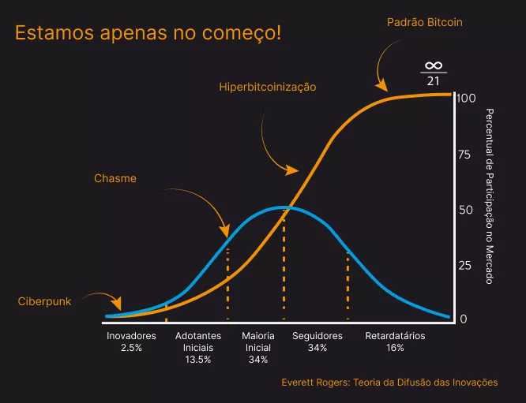

A importância aqui é entender de forma geral essa nova tecnologia. Esperamos que este treinamento seja do seu agrado e forneça a base necessária para entender e talvez continuar avançando nesse novo paradigma monetário global.

## A pré-história do Bitcoin

<chapterId>9a94b627-5b69-5d81-9125-f1fa9b0aa6ad</chapterId>

Antes do termo "Bitcoin" se tornar sinônimo de moeda digital e transformação financeira, uma série de ideias, inovações e movimentos sociais estabeleceram as bases de sua criação. Um dos elementos fundamentais dessa pré-história do Bitcoin é o movimento cypherpunk.

### Os Cypherpunks: Visionários do Mundo Digital


Au centro da evolução tecnológica das décadas de 1980 e 1990, um grupo de pessoas começou a questionar profundamente o papel da privacidade e da liberdade na era digital. Esses indivíduos, que mais tarde se tornariam conhecidos como "cypherpunks", acreditavam firmemente que a criptografia poderia ser usada como uma ferramenta para proteger os direitos individuais contra a interferência de governos e grandes empresas.

Figuras emblemáticas como Julian Assange, Wei Dai, Tim May e David Chaum contribuíram para definir a filosofia e a visão dos cypherpunks. Esses pensadores compartilharam suas ideias em uma lista de discussão influente, onde participantes de todo o mundo debatiam a melhor forma de usar a tecnologia para garantir uma maior liberdade individual.

### Os Três Textos Fundamentais dos Cypherpunks

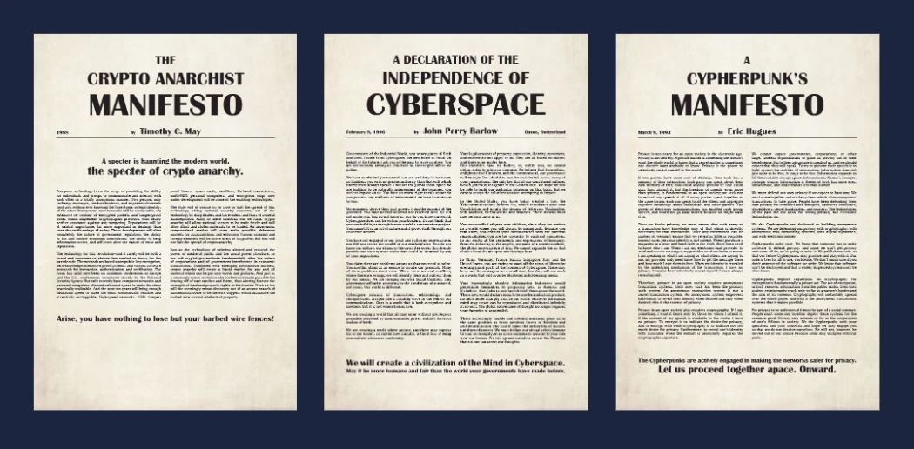

O movimento cypherpunk, com suas raízes profundas no ativismo digital e na criptografia, se baseou em vários textos fundamentais para expressar seus princípios e sua visão de futuro. Entre esses escritos, três se destacam especialmente:

- O "Manifesto Cypherpunk":
  Escrito por Eric Hughes em 1993, o "Manifesto Cypherpunk" afirma que a privacidade é um direito fundamental. Hughes argumentava que a capacidade de se comunicar livre e confidencialmente era essencial para uma sociedade livre. O manifesto declara: "Não podemos esperar que instituições, empresas ou outras grandes entidades impessoais nos concedam privacidade... Devemos defendê-la por nós mesmos."

- O "Manifesto do Crypto-Anarquista":
  Escrito por Timothy C. May em 1992, este manifesto expõe como o uso da criptografia poderia levar a uma era de anarquia criptográfica, onde os governos seriam impotentes para intervir nos assuntos privados dos cidadãos. May previa um futuro onde as trocas de informações, dinheiro e mensagens poderiam ser feitas sem a intervenção de terceiros, de forma anônima.

- A "Declaração de Independência do Ciberespaço":
  Embora este texto não seja exclusivamente cypherpunk, ele reflete os sentimentos de muitos atores do movimento. Escrito em 1996 por John Perry Barlow, é uma resposta à crescente regulamentação da Internet pelos governos. A declaração afirma que o ciberespaço é um lugar distinto da esfera física e não deve estar sujeito às mesmas leis. Ela declara: "Não temos governantes e, portanto, não podemos ser governados."

### Os Predecessores do Bitcoin

Avant do surgimento do Bitcoin, várias tentativas foram feitas para criar uma moeda digital. David Chaum, por exemplo, introduziu o conceito de "moeda eletrônica anônima" com seu projeto "DigiCash" na década de 1980. Infelizmente, devido a várias restrições, o DigiCash nunca decolou de verdade.

Outro precursor importante é o "b-money" de Wei Dai. Embora nunca tenha sido implementado, ele apresentava a ideia de uma moeda digital anônima, onde a detecção de fraudes era realizada por uma comunidade de avaliadores em vez de uma autoridade central.


Foi nesse ambiente fértil que o misterioso Satoshi Nakamoto publicou o whitepaper do Bitcoin em 2008. Ele combinou várias ideias do movimento cypherpunk, como provas de trabalho e carimbos de data/hora criptográficos, para criar uma moeda digital descentralizada e resistente à censura.

O Bitcoin era mais do que apenas uma moeda digital; ele representava uma realização dos ideais cypherpunk. Além de sua tecnologia, ele simbolizava uma revolução contra os sistemas financeiros tradicionais e oferecia uma alternativa baseada em transparência, descentralização e soberania individual.

### Conclusão

A pré-história do Bitcoin está profundamente enraizada no movimento cypherpunk e em uma busca coletiva por maior liberdade na era digital. Ao combinar os princípios de criptografia, descentralização e integridade, o Bitcoin se tornou muito mais do que uma moeda; é o produto de uma revolução filosófica e tecnológica que continua a remodelar nosso mundo.

Portanto, o Bitcoin é um protocolo que se insere em longos períodos de tempo e nos faz questionar nossa relação com energia, tempo e moeda. Mas o Bitcoin é uma "verdadeira" moeda? O que é uma moeda? Ela existe em várias formas? É isso que veremos no próximo capítulo.


# A moeda

<partId>e913df1a-4cbd-5380-ba67-ca2a0414f671</partId>

## A moeda ao longo da História

<chapterId>c838e64d-d59f-5703-8c74-ea5e8c4fdd31</chapterId>

A evolução da moeda é um aspecto fascinante da história humana, refletindo a engenhosidade das civilizações ao longo dos tempos para atender às necessidades econômicas em constante evolução.


### De conchas a contas bancárias

'Originalmente, a moeda era tangível, frequentemente ligada a mercadorias essenciais como grãos, gado e outros bens. No entanto, essas mercadorias apresentavam grandes inconvenientes, como sua perecibilidade, tornando difícil o uso delas como meio de poupança a longo prazo. Por exemplo, uma colheita mal sucedida ou uma doença poderia aniquilar a riqueza de uma pessoa de um dia para o outro.

À medida que as civilizações avançavam e o comércio se expandia para novas regiões, surgiu a necessidade de um meio de troca universal. Objetos como conchas e pedras preciosas foram experimentados, mas não eram perfeitos. O ouro acabou se tornando o padrão devido à sua raridade, durabilidade e divisibilidade. Ele era, e ainda é, um símbolo de riqueza e poder.

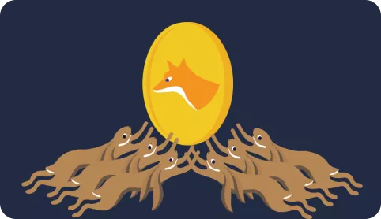

### Qual é o papel da moeda?

A moeda é uma ferramenta de comunicação muito sofisticada:

- Ela permite a comunicação entre o presente e o futuro. Transformamos nosso tempo e energia em um ativo que pode ser reutilizado no futuro sem o risco de desvalorização.

- Ela permite a comunicação em uma linguagem comum universal. Sem se conhecerem, sem falar a mesma língua, dois estranhos podem trocar, comercializar e concordar sobre o valor das coisas.

Sua função em nosso mundo é difícil de replicar artificialmente. Nenhum ser humano ou grupo de seres humanos pode criar uma moeda, é um fenômeno social natural que deve surgir do mercado e de um consenso voluntário. Os preços são sinais, informações, que ajudam a sociedade a escolher como os recursos serão alocados.

O ouro como moeda é a escolha de 4.000 anos de darwinismo monetário, que se baseia em 3 funções:

- Reserva de valor
- Meio de troca
- Unidade de conta


### As características da moeda

O ouro atende idealmente aos critérios de uma moeda eficiente: sua raridade natural o torna um objeto de valor, enquanto suas propriedades químicas permitem que ele não se desgaste com o tempo. No entanto, essa forma de moeda não é facilmente divisível nem transportável por longas distâncias. Em um mundo globalizado e digital, o ouro não pode acompanhar e precisa de uma entidade central para torná-lo divisível e facilmente negociável (moeda cunhada).

Estas deficiências fizeram do ouro uma reserva de valor, mas não uma moeda comum, em detrimento das moedas fiduciárias estatais, fáceis de utilizar mas constantemente desvalorizadas pelas entidades que as controlam (rei, banco central, imperador, ditador).

Há muitos critérios para uma moeda eficaz. Uma boa moeda deve ser :

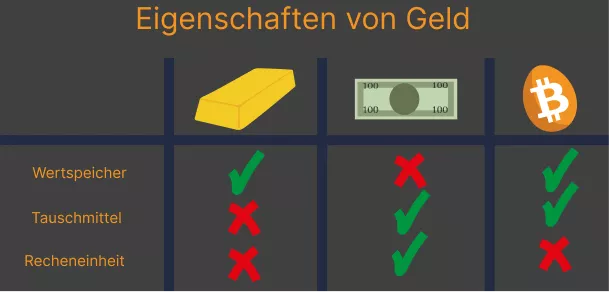

- **fungíveis**, ou seja, permutáveis sem perda de valor
- **Divisível**, para facilitar transacções de diferentes volumes
- **Líquida**, ou seja, facilmente convertível em bens ou serviços.

Para satisfazer estes critérios, a moeda evolui passo a passo:

- Pedra bruta -> Moeda
- Bilhete -> Cartão bancário
- Blockchain -> Rede Lightning

Atualmente, as moedas continuam a evoluir, adaptando as suas formas para se adequarem a diferentes utilizações. Por exemplo, embora o ouro seja uma excelente reserva de valor, já não é adequado para a economia globalizada de hoje. Da mesma forma, as moedas fiduciárias, como o dólar e o euro, são altamente líquidas e facilmente transportáveis porque são agora predominantemente digitais, mas o seu valor está constantemente a ser corroído pela inflação monetária.

A Bitcoin, pelo contrário, oferece novas possibilidades. Devido às suas propriedades, como a sua oferta estritamente limitada, oferece uma excelente reserva de valor. Além disso, sendo a moeda neutra da Internet, representa um bom meio de troca que não conhece fronteiras. No entanto, apesar da [constante adoção], ainda não é muito aceite nos estabelecimentos comerciais (https://btcmap.org/map).

## Moedas fiduciárias

<chapterId>25151d46-7db1-5b48-8bba-cbde1944555a</chapterId>

"Aqueles que não aprendem com a história estão condenados a repetir os mesmos erros", disse George Santayana. Uma verdade que ressoa particularmente quando falamos do atual sistema monetário.

### Fiduciário = confiança

Atualmente, as principais moedas, como o euro e o dólar, são consideradas fiduciárias. Isto significa que não têm valor intrínseco. O seu valor baseia-se inteiramente na confiança e na crença que depositamos nas instituições que as regulam.

Uma moeda fiduciária é uma forma de moeda que é decretada como moeda por uma instituição, como um Estado-nação, como a China com o Yen, ou uma união político-econômica, como a União Europeia com o euro. A entidade responsável pela emissão de uma moeda fiduciária é um banco central (Por exemplo, podemos citar o Banco Popular da China, o Federal Reserve dos Estados Unidos, ou o Banco Central da República da Guiné). São essas entidades que são responsáveis por decidir a política monetária e, portanto, quanto dinheiro deve ser colocado em circulação ou impresso.

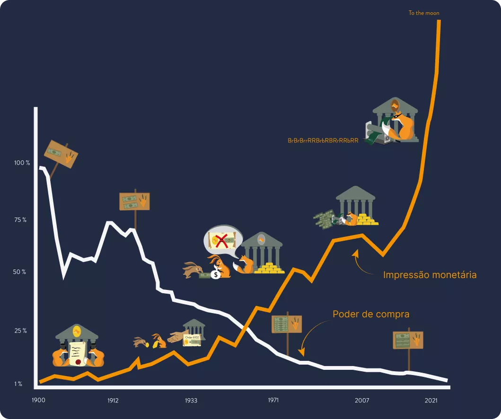

### A desvalorização monetária: uma estratégia tão antiga quanto o Império Romano

Desde a Antiguidade, o ouro tem sido usado como referência monetária. No entanto, sua rigidez muitas vezes levou os governantes - sejam eles imperadores romanos ou governos modernos - a adotar moedas alternativas, muitas vezes fiduciárias.

O mecanismo é simples e se baseia em práticas existentes desde os primórdios da civilização. Os governantes, desejosos de exercer controle sobre as riquezas, começam centralizando o ouro, muitas vezes explorando seu poder e prometendo proteção e segurança. Com essa reserva valiosa em suas mãos, eles introduzem uma nova moeda, equivalente em valor ao ouro, mas cunhada com sua efígie. Essa moeda começa a circular e o povo rapidamente se acostuma com sua conveniência.

Gradualmente, esses governantes desvalorizam discretamente a nova moeda, reduzindo seu valor em relação ao ouro inicial em alguns porcentos a cada ano. Essa desvalorização silenciosa muitas vezes é justificada como sendo do interesse do povo. Assim, aqueles que economizam nessa moeda fiduciária veem o valor de suas economias se erodirem, enquanto o Estado financia seus projetos por meio da inflação. Além disso, essa desvalorização torna a dívida mais fácil de ser paga.


Em um momento crítico, o anúncio é feito: a moeda não é mais lastreada pelo ouro. O público, agora acostumado com a moeda fiduciária e muitas vezes mal informado sobre questões financeiras, aceita essa realidade. O Estado então tem campo livre para manipular a oferta monetária, imprimindo enormes quantidades de dinheiro a um custo quase nulo.

Cette estratégia, quando bem executada, pode durar décadas. No entanto, uma desvalorização muito rápida ou uma perda de confiança pode levar a uma hiperinflação (ver próximo capítulo). A história mostra que o dólar perdeu 98% de seu valor em 100 anos, o euro 30% em 20 anos e a libra esterlina 99% desde a sua criação.

No final, a moeda pode não ter mais nenhuma ligação com o ouro, lembrando as moedas romanas no final do Império, ou até mesmo ser reduzida a um simples valor numérico, desconectado da realidade tangível.

Hoje, estamos testemunhando uma virada histórica. O dólar, que dominou por muito tempo, parece estar em declínio, e o ouro perdeu seu lugar central. Estamos no limiar de um novo ciclo monetário, lembrando que as lições da história são frequentemente esquecidas.

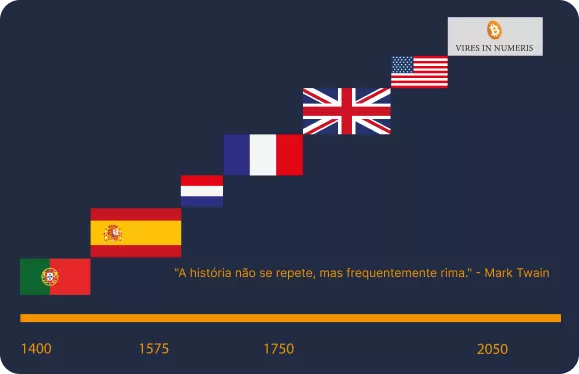

### Bitcoin é uma solução?

É nesse contexto que a revolução Bitcoin está ganhando força. Essa moeda, que não requer **nenhum intermediário de confiança**, tem como objetivo separar o Estado da moeda.

A impressão de dinheiro gera inflação, empobrecendo gradualmente a população. Por outro lado, as instituições financeiras e os indivíduos ricos enriqueceram com essa prática, aprofundando a desigualdade e favorecendo o autoritarismo. O sistema financeiro atual é regulado e restrito para evitar seu colapso, e qualquer perturbação poderia causar uma crise econômica importante. Como os atores políticos se beneficiam desse sistema, eles não são incentivados a fazer uma mudança radical, permitindo assim que o sistema continue em seu curso até uma eventual implosão.


Em resposta a esses desafios sistêmicos, o Bitcoin se apresenta como uma solução descentralizada: um novo sistema monetário neutro em paralelo. Historicamente, o ouro foi preferido como moeda devido à sua resistência à falsificação. Da mesma forma, o Bitcoin, por sua natureza descentralizada e criptográfica, não pode ser falsificado e é limitado a 21 milhões de unidades. O Bitcoin é uma moeda baseada em transparência e neutralidade, oferecendo uma alternativa atraente ao atual sistema monetário centralizado.

Ao mesmo tempo, a emergência das moedas digitais dos bancos centrais, ou CBDC, parece inevitável. Essa nova forma de moeda ofereceria um planejamento mais centralizado da economia, o que poderia prejudicar a liberdade financeira dos indivíduos e facilitar abusos autoritários.
'Podemos terminar este capítulo com a citação do prêmio Nobel de Economia F.A Hayek em 1984 "Eu não acredito que encontraremos uma boa moeda novamente até que a retiremos das mãos do governo. No entanto, não podemos arrancá-la violentamente deles, tudo o que podemos fazer é introduzir algo engenhoso que eles não possam parar."

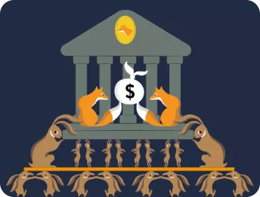

## As hiperinflações

<chapterId>b04c024c-54f3-50cb-997f-58721cfc74be</chapterId>

A hiperinflação é um fenômeno monetário próprio das moedas fiduciárias. Caracteriza-se pela perda completa da confiança em uma moeda e pelo aumento drástico da inflação através da impressão monetária pelas autoridades. Como resultado, as economias acumuladas pelos indivíduos podem se dissipar em um curto período de tempo, levando o país à beira do abismo econômico, social e político.

### A inflação em modo livre!

Vamos tentar entender o impacto da inflação na poupança considerando várias taxas de inflação.

- Com uma inflação de 2%, você perde 2% do seu poder de compra anualmente, ou seja, 10% em 5 anos.
- Com 7%, você perde metade em 10 anos.
- Com 20%, você perde praticamente metade em 3 anos.

Durante uma hiperinflação, não estamos falando mais de 20% ao ano, mas sim de 20% ao mês ou, no pico, por DIA. 100% de inflação por dia durante 3 dias são coisas realistas que aconteceram e continuam acontecendo em nosso mundo.

É importante entender que a hiperinflação não acontece por mágica, por acaso, pelo capitalismo ou pelo adversário político. A hiperinflação é a consequência direta de decisões monetárias erradas tomadas por banqueiros centrais e políticos. Suas consequências afetam todos os cidadãos e suas consequências afetarão gerações. Convido você a dedicar 5 minutos a esta tabela para entender bem o impacto real desse fenômeno (o curso ECON204 abordará esse assunto em detalhes)."


### Como ocorre uma hiperinflação?

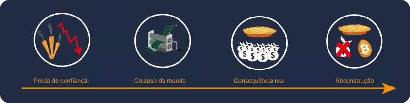

Fase 1 - A perda de confiança

- Uma centralização do poder monetário facilita a criação de moeda e seus abusos. Uma perda de confiança em uma moeda pode então surgir e desencadear uma hiperinflação. As pessoas começam a questionar a origem do dinheiro e os benefícios da política monetária autorizada. Essa perda de confiança geralmente é devida a fatores externos, como guerras, medidas sociais ou aumento dos preços de um recurso-chave, como trigo ou gasolina.

Fase 2 - Colapso da moeda e aumento dos preços

- À medida que os governos perdem o controle da confiança, as pessoas começam a trocar sua moeda por outra mais estável, como o dólar americano na Venezuela. Isso leva a um aumento nos preços, criando um ciclo vicioso em que bens e serviços se tornam cada vez mais caros. Para atender a essas necessidades, o Estado imprime mais dinheiro para corrigir a política monetária, resultando em inflação exponencial.

Fase 3 - O ciclo vicioso da impressão de dinheiro

- São necessárias cada vez mais notas para comprar bens, o que cria escassez de papel-moeda. Isso leva a mais impressões de notas, criando ainda mais inflação.

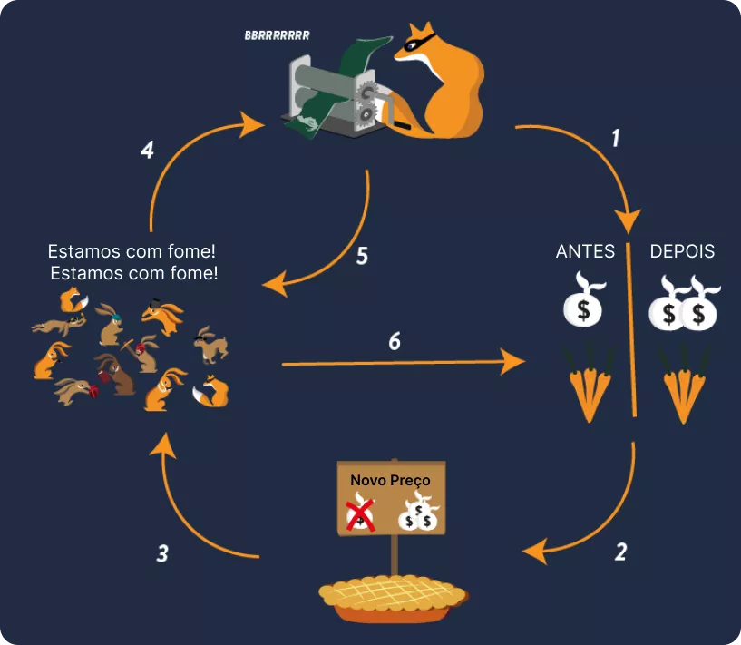

Fase 4 - Uma nova moeda emerge

- Uma nova moeda é então introduzida para substituir a antiga. Um exemplo notável de hiperinflação é a Alemanha nos anos 1920-1924. Para impulsionar a economia, uma nova moeda foi criada, lastreada na dívida alemã, francesa e inglesa, e garantida pelas terras alemãs.

A resolução de uma crise de hiperinflação muitas vezes requer mudanças radicais, como revoluções, mudanças de governo, mudanças de banqueiros centrais, entre outras. A perda de confiança, o colapso da moeda e a reconstrução são fases essenciais para impulsionar uma nova economia baseada em moeda fiduciária.

### 3 exemplos notáveis

- Alemanha, 1922-1923

  Um dos exemplos mais marcantes de hiperinflação ocorreu na República de Weimar, na Alemanha, após a Primeira Guerra Mundial.

  A Alemanha havia tomado emprestado enormes quantidades de dinheiro para financiar o esforço de guerra e não apenas a Alemanha não venceu a guerra, mas também teve que pagar bilhões de dólares em reparações. O mês com a maior inflação foi outubro de 1923, atingindo 29.500%, ou seja, uma inflação de 20,9% ao dia. Os preços dobravam a cada 3,7 dias!

A história conta que os empregados de mesa dos restaurantes tinham de anunciar os preços das ementas de 30 em 30 minutos para acompanharem a inflação. A moeda alemã tinha-se tornado tão inútil que alguns cidadãos preferiam queimar o seu papel-moeda em vez de madeira, porque era mais barato.


- Hungria, 1945-1946

  O país que sofreu o pior período de hiperinflação da história foi, de longe, a Hungria, após a Segunda Guerra Mundial.

  A Hungria estava do lado perdedor do conflito e a guerra tinha destruído a maior parte da sua capacidade de produção industrial. O mês de maior inflação foi julho de 1946, com uma inflação de preços de 41.900.000.000.000.000%, o equivalente a 207% por dia. Os preços duplicavam a cada 15 horas!

  A última nota a ser posta em circulação foi uma nota de 100 milhões de triliões de pengo (100.000.000.000.000.000.000.000) em 1946.

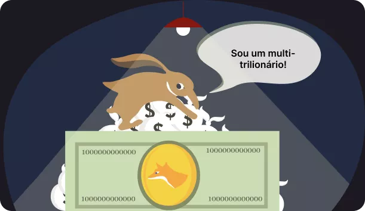

- Zimbabué, 2007-2008

  Até 2000, o Zimbabué era autossuficiente em quase tudo o que necessitava, exceto no petróleo.

  Em 1997, o dólar zimbabueano caiu mais de 72%, depois de o governo ter aceitado indemnizar os veteranos da guerra da independência em 450 milhões de dólares americanos. Como o Governo não dispunha de tal montante, teve de recorrer à impressão de dinheiro. Em 2005, a inflação atingiu 586% e, em março de 2007, a inflação mensal atingiu 50%.

  Em junho de 2007, o governo reagiu com a introdução de controlos de preços. As lojas foram literalmente "assaltadas". Os comerciantes já não tinham dinheiro para reabastecer as suas lojas.

  Em abril de 2009, o Ministro das Finanças anunciou a suspensão do dólar do Zimbabué e autorizou a utilização de várias moedas estrangeiras no comércio. Todas as contas bancárias, todas as pensões, todas as instituições financeiras viram os seus saldos evaporarem-se de um dia para o outro.


Em conclusão, a hiperinflação tem o efeito de corroer rapidamente o valor da moeda, levando a uma erosão da poupança e a uma perda de confiança no sistema monetário. Como Voltaire sugeriu uma vez, a moeda fiduciária acabará sempre por perder o seu valor intrínseco e convergir para zero.

Une moeda que se base em uma instituição financeira de confiança de terceiros acaba sendo, na prática e a longo prazo, uma moeda defeituosa, pois é incapaz de garantir o poder de compra ou preservar as economias.

## 21 milhões de bitcoins

<chapterId>f4a06d76-1963-56fd-93ff-dfa41489bcde</chapterId>

### A política monetária do Bitcoin

O Bitcoin é uma moeda digital descentralizada com uma quantidade máxima pré-definida de **21 milhões de unidades**. Essa característica intrínseca de escassez é determinada pelo seu código de computador e reforçada pelo consenso de todos os usuários que participam do protocolo.

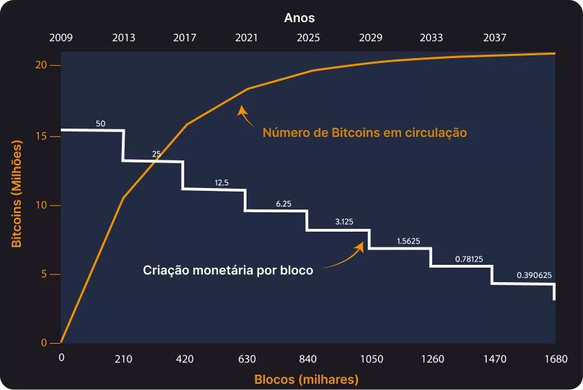

Quanto à sua emissão monetária, ela pode ser ilustrada por uma curva em forma de S que representa a quantidade de bitcoins criados ao longo do tempo. Por exemplo, em 2022, cerca de 18,5 milhões de bitcoins estavam em circulação. As previsões indicam que em 2025 haverá cerca de 19,5 milhões de bitcoins, o que representa ~93% do total em circulação, e em 2037 esse número chegará a 20,4 milhões.

### Como criar novos bitcoins?

A criação de novos bitcoins é o resultado do processo de mineração, um procedimento de verificação de transações na rede Bitcoin.

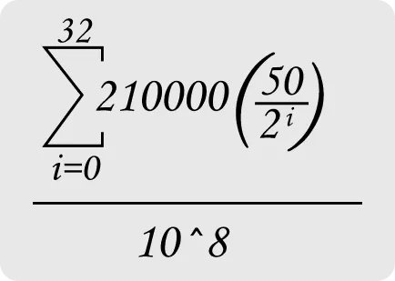

Os mineradores, que realizam essa tarefa, são recompensados com a emissão de novos bitcoins a cada dez minutos. Essa recompensa é programada para diminuir pela metade a cada 210.000 blocos, aproximadamente a cada quatro anos, em um evento conhecido como "halving" - o que dá à curva de emissão monetária uma forma de escada. Devido a esse mecanismo de halving, pode-se prever matematicamente que a criação de bitcoins cessará em 2140, quando o número total de bitcoins atingir seu limite de 21 milhões.

| Número de Halving | Altura do Bloco | Recompensa em BTC após o Halving | Estimativa de BTC em Circulação após o Halving |
| ----------------- | --------------- | -------------------------------- | ---------------------------------------------- |
| 1                 | 210.000         | 25 BTC                           | 10.500.000 BTC                                 |
| 2                 | 420.000         | 12,5 BTC                         | 15.750.000 BTC                                 |
| 3                 | 630.000         | 6,25 BTC                         | 18.375.000 BTC                                 |
| 4                 | 840.000         | 3,125 BTC                        | 19.687.500 BTC                                 |
| 5                 | 1.050.000       | 1,5625 BTC                       | 20.343.750 BTC                                 |
| 6                 | 1.260.000       | 0,78125 BTC                      | 20.671.875 BTC                                 |
| 7                 | 1.470.000       | 0,390625 BTC                     | 20.835.937,5 BTC                               |
| 8                 | 1.680.000       | 0,1953125 BTC                    | 20.917.968,75 BTC                              |
| 9                 | 1.890.000       | 0,09765625 BTC                   | 20.958.984,375 BTC                             |
| 10                | 2.100.000       | 0,048828125 BTC                  | 20.979.492,188 BTC                             |
| 11                | 2.310.000       | 0,0244140625 BTC                 | 20.989.746,094 BTC                             |
| 12                | 2.520.000       | 0,01220703125 BTC                | 20.994.873,047 BTC                             |
| 13                | 2.730.000       | 0,006103515625 BTC               | 20.997.436,523 BTC                             |
| 14                | 2.940.000       | 0,0030517578125 BTC              | 20.998.718,262 BTC                             |
| 15                | 3.150.000       | 0,00152587890625 BTC             | 20.999.359,131 BTC                             |
| 16                | 3.360.000       | 0,000762939453125 BTC            | 20.999.679,566 BTC                             |
| 17                | 3.570.000       | 0,0003814697265625 BTC           | 20.999.839,783 BTC                             |
| 18                | 3.780.000       | 0,00019073486328125 BTC          | 20.999.919,892 BTC                             |
| 19                | 3.990.000       | 0,000095367431640625 BTC         | 20.999.959,946 BTC                             |
| 20                | 4.200.000       | 0,0000476837158203125 BTC        | 20.999.979,973 BTC                             |

Voltaremos em detalhes sobre os mineradores no capítulo de mineração.

### Garantindo a escassez digital

A escassez do Bitcoin é garantida por dois mecanismos-chave: o ajuste da dificuldade de mineração e a teoria dos jogos:

- O ajuste da dificuldade de mineração é um mecanismo que ocorre a cada 2016 blocos, aproximadamente duas semanas, para garantir que, em média, um novo bloco seja adicionado à blockchain a cada dez minutos. Essa frequência de criação de blocos e a quantidade total de bitcoins são aspectos fixos do protocolo Bitcoin e não podem ser alterados sem um consenso geral, ao contrário das decisões arbitrárias tomadas nos sistemas monetários tradicionais.


> Você sabia? Os mineradores são incentivados a minerar um bloco para ganhar os novos bitcoins e as taxas de transação associadas às transações que ele inclui em seu bloco. À medida que o número de bitcoins emitidos se aproxima do limite de 21 milhões, os mineradores serão cada vez mais remunerados pelas taxas de transação, em vez da recompensa do bloco.'

- A teoria dos jogos é um conceito matemático que se baseia na racionalidade humana. Aqui, no Bitcoin, são os usuários que votam nas mudanças do protocolo. Sim, você leu corretamente: qualquer modificação no protocolo do Bitcoin exigiria o acordo de toda a comunidade de usuários, o que é altamente complexo. Portanto, se alguém quisesse criar um 22º milhão de bitcoin, ele teria que convencer todos os usuários a desvalorizar voluntariamente suas próprias economias, o que não é provável de acontecer, pois o Bitcoin é global e não é governado por um grupo central.

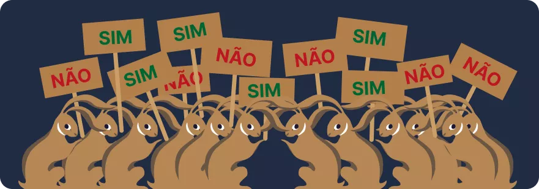

A ideia de desvalorizar a moeda vai contra a filosofia fundamental do Bitcoin, portanto, a modificação desse limite é quase improvável.

### Uma política monetária auditável a cada segundo desde o início e para sempre!

A escassez do Bitcoin é uma grande vantagem e a quantidade máxima de 21 milhões de bitcoins em circulação é pública e verificável por qualquer pessoa.

Na verdade, qualquer pessoa pode verificar a quantidade de bitcoins em circulação inserindo um comando simples em um nó Bitcoin: `bitcoin-cli gettxoutsetinfo`. Essa transparência e verificabilidade fortalecem a confiança no sistema Bitcoin, que não se baseia em instituições centralizadas ou indivíduos, mas em uma garantia matemática e criptográfica inerente ao seu protocolo. (Você aprenderá a fazer isso de maneira simples no LN201)

```json
{
  "height": 710560,
  "bestblock": "0000000000000000000887384d67103412ea7f18a43953e65c8c4ac36bf42e54",
  "transactions": 473244,
  "txouts": 1018917,
  "bogosize": 2183872374,
  "hash_serialized_2": "eebb9987337700ffaacbbaa11223344",
  "disk_size": 178239584,
  "total_amount": 18745998.12345678
}
```

O Bitcoin, por sua concepção, garante uma gestão monetária saudável limitando sua criação e protegendo a poupança dos usuários, o que o diferencia das outras moedas. Alinhado aos princípios da economia austríaca (detalhes em ECON201), sua quantidade controlada e sua distribuição previsível o protegem dos riscos de inflação inerentes às moedas tradicionais.

Em resumo, o Bitcoin, por sua natureza descentralizada, sua escassez programada e sua transparência, oferece uma alternativa única aos sistemas monetários tradicionais. Ele ilustra como a tecnologia pode ser usada para criar uma moeda que não apenas é útil e verificável, mas também preserva o valor da poupança dos usuários ao limitar estritamente sua oferta.

### Conclusão da seção 1!

A moeda é uma ferramenta social que deve se adaptar às necessidades e à tecnologia. Ao longo do tempo, o ouro foi usado como reserva de valor porque era raro e não podia ser desvalorizado. No entanto, mais tarde, o ouro foi substituído pela dívida e pela moeda fiduciária, que é fácil de transportar, mas também de manipular sua política monetária.

O Bitcoin é uma alternativa monetária realista porque é raro e limitado a 21 milhões de bitcoins que não podem ser alterados. A criação monetária é mantida através do ajuste da dificuldade a cada 2 semanas e através do halving, garantindo uma prova matemática verificável de sua raridade. Ao contrário do euro ou do dólar, cujo volume em circulação é não verificável e muda frequentemente devido às decisões das instituições financeiras, o Bitcoin é uma moeda criptográfica com uma política monetária neutra e fixa. Portanto, é uma excelente reserva de valor global, pois não pode ser desvalorizada pela impressão de dinheiro.

O Bitcoin é antes de tudo uma forma de moeda que incentiva a questionar o poder das instituições financeiras sobre a moeda. É uma luta filosófica e econômica que está em jogo. Para entender o Bitcoin, é importante compreender suas bases fundamentais e desmistificar as ideias falsas que o cercam. Isso permitirá um debate intelectual construtivo sobre o futuro da moeda.

Agora que estabelecemos as diferenças entre o Bitcoin e as moedas fiduciárias, nos próximos capítulos vamos estudar o que são as carteiras de Bitcoin, pois é sua responsabilidade garantir a segurança de seus fundos. De fato, a soberania financeira oferecida pelo Bitcoin está necessariamente ligada à responsabilidade individual.

# As carteiras de Bitcoin

<partId>28860585-4f61-59d9-b242-f4c57d837cc1</partId>

## O que são as carteiras de Bitcoin?

<chapterId>1c0166ab-cb7a-5bc6-9175-d13482bd91f1</chapterId>

Nesta seção 2, vamos explorar o armazenamento e a segurança dos Bitcoins nas carteiras. Isso permitirá que você entenda melhor onde estão esses famosos Bitcoins e como interagir com eles!

### Desmistificando as carteiras de Bitcoin

Nesta indústria, usamos carteiras para interagir com a rede Bitcoin, que tem 3 funções:

- Permitir receber bitcoins
- Permitir enviar bitcoins
- Protegê-los contra tentativas de hack e roubo

Uma carteira pode ser um software em seu computador, um aplicativo em seu smartphone, um dispositivo físico como um pen drive ou até mesmo um pedaço de papel. Esses diferentes tipos de carteiras de Bitcoin atendem a diferentes casos de uso. Alguns são usados para grandes quantias, com ênfase na segurança, outros na privacidade ou até mesmo no pagamento diário de pequenas quantias.

'Os portfólios são divididos em grandes famílias de uso, sempre com uma questão central: você é o proprietário dos fundos ou está deixando o controle do seu dinheiro com terceiros? Voltaremos a esse assunto em detalhes no próximo capítulo, mas a ideia é simples: o dinheiro está no seu bolso ou no do seu banqueiro!

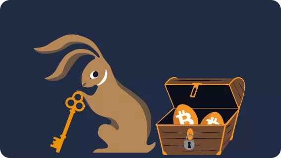

### Como funciona uma carteira de bitcoin

Seja o seu "banqueiro" de bitcoin ou você mesmo, em geral, a grande maioria das carteiras de bitcoin funciona com uma tecnologia semelhante, a criptografia assimétrica, e, portanto, um sistema de par de chaves: uma chave privada para gastar e uma chave pública para receber.

- Chave privada
  Ao inicializar uma carteira, uma frase de recuperação secreta (chave privada) é gerada e fornecida a você na forma de 24 palavras.

A chave privada é muito importante, pois representa a posse dos bitcoins e, portanto, o direito de usá-los ou enviá-los. O detentor da chave privada é o proprietário dos bitcoins.

Essa chave deve ser mantida em segredo e bem guardada, pois é a chave que desbloqueia sua fortuna!

- Chave pública e endereço
  A chave pública é criada com a chave privada e, portanto, está vinculada a ela. A chave pública é usada para gerar endereços de bitcoin e, assim, receber dinheiro. Compartilhar a chave pública implica riscos para a privacidade, mas não para a segurança.

Esses endereços são criados pela sua carteira e podem ser compartilhados com segurança. É aconselhável usá-los apenas uma vez para maximizar sua privacidade.

Portanto, é importante entender que, graças a essa tecnologia, podemos receber bitcoins facilmente sem permitir que o remetente roube nossos fundos! Pense nisso como uma caixa de correio: as pessoas depositam dinheiro nela, mas você é o único que pode abri-la.


### Os bitcoins estão na carteira?

Embora suas chaves sejam armazenadas em sua carteira, os bitcoins em si estão "armazenados" na blockchain do Bitcoin, que é um registro público distribuído na rede peer-to-peer do Bitcoin (veremos isso na seção 3). Portanto, a perda do dispositivo em que você tem sua carteira não significa necessariamente a perda de seus bitcoins. O que permite que você recrie sua carteira e gaste seus bitcoins é a chave privada. Portanto, é crucial proteger bem essa chave.

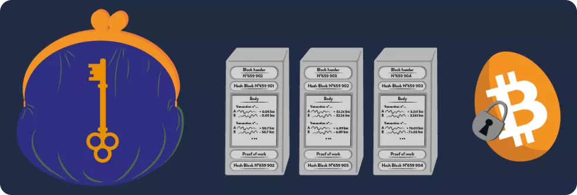

Felizmente para nós, desde 2017, esta chave privada pode ser codificada numa lista simples de 12 ou 24 palavras, chamada frase mnemónica. Esta frase é um backup da tua carteira Bitcoin, é o que te permite recriar a tua carteira com qualquer software/aplicação de carteira Bitcoin. Assim, qualquer pessoa com acesso a esta lista de palavras tem acesso aos seus bitcoins.

### E quanto aos hackers?

Poder-se-ia perguntar: e se alguém adivinhasse a nossa lista de 12 ou 24 palavras por acaso? A resposta curta é que, graças à criptografia usada para criar a carteira, isso é altamente improvável. Para colocar isto em perspetiva, encontrar o acesso à sua carteira por acaso é como encontrar o número "certo" entre $1 e $2^256, o que é quase equivalente a encontrar o átomo "certo" no Universo. No entanto, se não estiver satisfeito com esta segurança predefinida, pode sempre reforçá-la adicionando uma frase-passe à sua carteira bitcoin.


Portanto, a probabilidade de sua carteira Bitcoin ser hackeada é astronomicamente baixa, se você seguir boas práticas de segurança. Estas práticas são descritas em detalhe na próxima secção.

Escolha uma carteira que se adapte às suas necessidades e uso. Tutoriais detalhados sobre o uso e segurança de diferentes carteiras estão disponíveis na [secção de tutoriais da nossa universidade](https://planb.network/tutorials/wallet).

## Segurança e Carteiras Bitcoin

<chapterId>00c1afea-e54a-511f-bab3-2efc2fbfa6a1</chapterId>

Traduzido com a versão gratuita do tradutor - www.DeepL.com/Translator

### Faça as perguntas certas antes de começar

Quando se detém bitcoins, a segurança dos seus fundos é uma grande preocupação. A melhor maneira de definir a segurança certa para a sua situação é fazer (e responder) a uma série de perguntas; o seu modelo de segurança dependerá das suas respostas. Vamos começar:

- Quem pode aceder aos meus dados? Por outras palavras, é o único que tem acesso às suas bitcoins ou é um terceiro, como uma empresa, que o autoriza a aceder aos seus fundos?
- Uma segunda pergunta pode ser: para que tenciona utilizar os seus bitcoins? É uma quantia que vai utilizar regularmente? Trata-se de uma poupança a médio ou longo prazo?
- Quais são as suas competências técnicas?
- Qual é o seu orçamento para a segurança?

Não existe uma solução única para todos os casos. Por isso, dedique algum tempo a responder a estas perguntas, para poder adaptar as suas medidas de segurança.

Traduzido com a versão gratuita do tradutor - www.DeepL.com/Translator

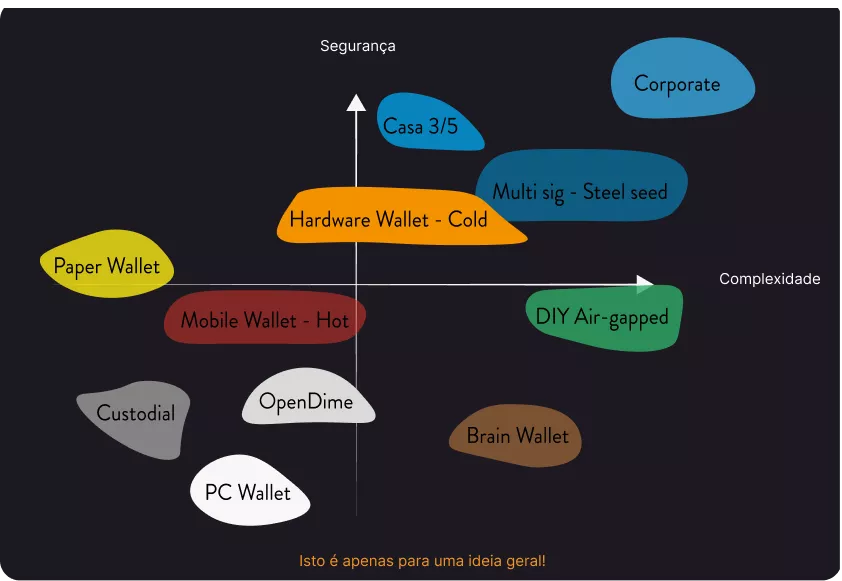

### Pensando nas carteiras Bitcoin em termos de complexidade

Vamos tentar aqui estabelecer vários níveis de segurança para os seus bitcoins:

- **Nível 0**, você está usando um serviço chamado custodial, no qual você não é o único detentor dos seus bitcoins. Cuidado, esse terceiro de confiança pode a qualquer momento restringir o acesso aos seus fundos, e você tem o mesmo nível de soberania financeira que tem com o sistema bancário tradicional através de uma conta bancária.


- **Nível 1**, você está usando uma carteira Bitcoin no seu telefone ou computador, na qual você é o único detentor dos seus bitcoins. Você pode realizar suas transações com facilidade. Cuidado, é crucial fazer um backup da frase mnemônica para ter acesso aos seus fundos novamente em caso de perda do seu telefone ou computador. Isso é frequentemente chamado de "hot wallet" porque a chave privada é armazenada em um dispositivo com acesso à internet.

- **Nível 2**, você está usando uma carteira física e protegeu sua lista de 12 ou 24 palavras. Para realizar uma transação, você sempre precisará assinar com o seu dispositivo. Isso torna seus fundos menos acessíveis no dia a dia. Isso é frequentemente chamado de "Cold Wallet" porque suas chaves são armazenadas em um dispositivo que não está conectado à internet.


- **Nível 3**, você está usando uma carteira de nível 1 ou 2, mas com uma frase de segurança adicional. Cuidado, agora você precisa fazer um backup da lista de 12 ou 24 palavras **e** da sua frase de segurança. Idealmente, essas duas informações são armazenadas em dois lugares diferentes.


- **Nível 4**, você está usando um conjunto de carteiras para criar uma carteira "multisig", o que significa que requer várias assinaturas para realizar uma transação. Cuidado, aqui também é necessário que cada parte do multisig esteja em lugares diferentes. Isso é frequentemente considerado um uso avançado do Bitcoin, usado principalmente para grandes quantias e uso corporativo.


Obviamente, existem vários casos de uso e, nesses casos, é recomendado usar várias carteiras de bitcoins. Não existe uma solução milagrosa.

### A segurança deve se adaptar

A quantidade que estamos dispostos a deixar em um nível de segurança específico depende de cada pessoa. Para alguns, deixar 1 btc em uma hot wallet é razoável, para outros, absolutamente não. De qualquer forma, evite gastar muito em segurança, comprando uma carteira física, quando você deseja proteger uma pequena quantia. Tenha também em mente que complicar demais a segurança e a acessibilidade dos seus bitcoins pode prejudicá-lo se, por exemplo, você fizer backups inadequados das suas carteiras.

Em conclusão, a posse direta de seus Bitcoins é um elemento essencial para garantir sua soberania financeira. É recomendado usar uma carteira móvel para gastos diários e uma carteira física offline, ou "fria", para armazenar quantias maiores. As empresas, por sua vez, devem considerar o uso de sistemas de assinaturas múltiplas, ou "multisig", para maior segurança compartilhada. Também é essencial evitar, tanto quanto possível, os serviços de custódia, que podem reproduzir algumas das vulnerabilidades do sistema financeiro tradicional.

Agora que temos isso em mente, vamos ver na próxima seção os passos para criar uma carteira Bitcoin. No entanto, se você quiser explorar mais sobre o assunto da segurança, você pode ler este [artigo do DarthCoin](https://asi0.substack.com/p/bitcoin-soyez-votre-propre-banque).

## Configurando uma carteira

<chapterId>615519eb-4565-557d-86a0-021badf7616f</chapterId>

A segurança dos seus Bitcoins é de extrema importância e um simples erro pode ter consequências caras. É por isso que agora vamos ver as melhores práticas ao criar uma nova carteira Bitcoin.

> Observe que o treinamento BTC102 o acompanha para ter sucesso nesta etapa.

### Não se brinca com esta etapa!

Sua chave privada, frequentemente representada por uma lista de 24 palavras (geralmente chamada de "seed" ou "frase mnemônica"), representa o acesso aos seus fundos. Se essa chave for revelada a terceiros, considere que os fundos associados não estão mais seguros. Portanto, ao inicializar sua carteira, é importante seguir estas regras:

- Ocultar todas as câmeras.
- Não tirar foto da lista de palavras.
- Não digitá-la em um computador ou telefone.
- Não salvá-la como contato ou enviá-la para si mesmo por SMS.
- Nunca deixe suas palavras desacompanhadas em sua mesa.
- Nunca esconda sua lista de palavras em um local incomum.

Você vai literalmente pegar uma folha de papel em branco ou imprimir este [modelo](https://bitcoiner.guide/backup.pdf) e escrever com uma caneta, de forma limpa e clara, a lista de palavras na ordem. Se a tinta desaparecer com o tempo, você pode perder seus fundos; portanto, é importante manter esse papel protegido das intempéries.

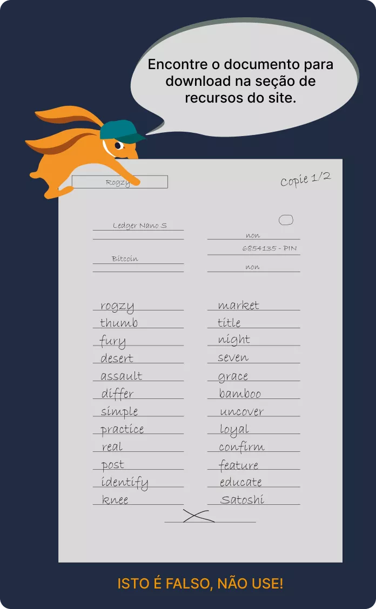

### Dica para fazer corretamente

Il existe também soluções alternativas ao papel, como por exemplo, gravar sua frase mnemônica em uma placa de metal. Se você escrever errado, seus herdeiros podem não conseguir ler e, portanto, não poderão recuperar os fundos. Depois de escrever as palavras, é recomendado fazer uma segunda cópia e armazená-la em um local separado do primeiro. Isso permite ter um backup de emergência em caso de perda ou acidente com o primeiro.


Depois de fazer as cópias, guarde as listas de palavras em um local seguro onde você se lembrará de procurá-las! Não crie um plano de esconderijo muito complexo onde você possa perdê-las.

> Suas palavras = seu dinheiro.

As carteiras "frias" geralmente têm essas listas de palavras, assim como as carteiras "quentes" em dispositivos móveis ou computadores. Este método de backup da chave privada é agora o padrão. Isso significa que você pode inserir sua frase mnemônica em qualquer software de carteira para restaurar a sua. Apenas as carteiras ruins que desaconselhamos fortemente não lhe darão uma lista de 24 palavras, mas talvez peçam uma conta, um endereço de e-mail ou, pior, um ID.

**ATENÇÃO: A ausência de uma lista de 24 palavras deve te alertar.**

## Passar no teste do tempo

<chapterId>f58cd446-c202-5eff-aab7-e61cc40e5c06</chapterId>

A segurança é uma preocupação importante no ecossistema do Bitcoin. De fato, como qualquer forma de riqueza, seus bitcoins devem ser protegidos contra perdas, roubos e deterioração, especialmente a longo prazo. A segurança dos seus bitcoins requer algum conhecimento técnico e consciência dos riscos envolvidos, o que nos leva a discutir duas estratégias principais: gravar seus bitcoins em aço e criar um plano de herança.

### Gravar na rocha

Um método para proteger seus bitcoins a longo prazo é gravar sua frase mnemônica em um material resistente como o aço. Isso cria um backup físico de suas chaves que é resistente tanto a danos causados pela água quanto ao fogo.

Existem muitas soluções para isso, algumas são de baixo custo, como o "Blockmit", enquanto outras exigem mais equipamentos. Você pode explorar esse assunto por conta própria através da seção de tutoriais desta universidade.

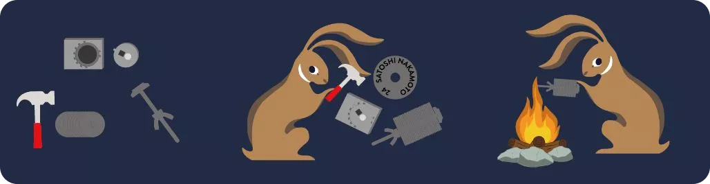

### Pense na próxima geração!

Conjuntamente a isso, a criação de um plano de herança também é um passo crucial para garantir que seus bitcoins sejam adequadamente gerenciados após a sua morte. Esse plano pode incluir uma carta escrita à mão detalhando seus ativos, o modo de acesso a eles e o contato de pessoas de confiança para serem contatadas. Também é importante discutir a herança de bitcoins com um notário para garantir a conformidade fiscal, embora seja importante nunca confiar diretamente seus bitcoins a terceiros, incluindo um notário.

Se você deseja explorar mais sobre o assunto do plano de herança para seus bitcoins, recomendamos o livro de Pamela Morgan [Cryptoasset Inheritance Plan](https://planb.network/resources/books/28) ou seguir o treinamento BTC102, onde o acompanhamos na sua criação.


### Privacidade é importante

A segurança dos seus bitcoins a longo prazo não se limita à criação de backups físicos ou à elaboração de um plano de herança. A privacidade é outra consideração importante. Por exemplo, é melhor comprar bitcoins sem fornecer identificação para minimizar os riscos de roubo de identidade ou simplesmente o rastreamento dos seus fundos por qualquer entidade com recursos suficientes. O treinamento BTC 205 pode ajudar nisso, se necessário.

Em relação à privacidade, é fundamental evitar falar para todo mundo sobre seus bitcoins. Afinal, não sabemos para onde esse ativo irá, e manter discrição sobre sua posse é uma decisão sábia. Você não quer chamar atenção para si e para sua carteira.

Da mesma forma, evite divulgar em alto e bom som seu sistema de segurança em reuniões de bitcoin ou encontros com estranhos...

### Resumo sobre a segurança das carteiras Bitcoin

As carteiras Bitcoin são softwares que permitem armazenar e transacionar bitcoins. Existem vários tipos: carteiras móveis ou para PC, práticas para pequenas quantias e/ou despesas regulares; carteiras físicas, mais adequadas para a conservação de bitcoins a médio e longo prazo; carteiras multisig, que são mais complexas de gerenciar e exigem várias assinaturas para realizar transações.

Ao criar uma carteira, você deve primeiro fazer um backup da sua chave privada. Esse backup é uma lista de 12 ou 24 palavras, ou 12 palavras que você pode escrever em um papel ou em uma placa de metal. Essa frase mnemônica permite restaurar sua carteira em qualquer aplicativo de carteira Bitcoin. Qualquer pessoa que tenha acesso a essa lista também tem acesso aos seus bitcoins. No Bitcoin, a soberania financeira está ligada à responsabilidade individual, portanto, é crucial que você proteja o acesso às suas carteiras e backups. Para isso, é importante seguir algumas regras:

- Criar um plano de herança: para garantir que seus entes queridos possam acessar o dinheiro em caso de problemas.
- Evitar plataformas de troca: evite deixar seus bitcoins em plataformas de troca, pois elas podem ser alvo de ataques de hackers.
- Adapte seu nível de segurança: reserve um tempo para explicar suas necessidades e usos, isso ajudará você a escolher entre as diferentes carteiras Bitcoin disponíveis.

Agora que temos uma base sobre carteiras de bitcoins e boas práticas para sua segurança, abordaremos no próximo capítulo o funcionamento técnico do Bitcoin. Mais uma vez, conhecer os fundamentos do protocolo Bitcoin permitirá que você entenda melhor seu funcionamento e o utilize de forma mais eficiente.

# Aspectos técnicos do Bitcoin.

<partId>a86d7439-e7a2-5f21-b1e9-6b5e23ca265b</partId>

## Lançamento do Bitcoin

<chapterId>b7561082-8943-519d-95d1-a5f60dd2686d</chapterId>

### Vamos começar com um pouco de História.


Em 31 de outubro de 2008, nasce uma nova tecnologia financeira: o Bitcoin. Nessa data, Satoshi Nakamoto, o autor anônimo do Bitcoin, apresenta sua inovação ao mundo por meio de um e-mail distribuído à lista de discussão cypherpunk, uma comunidade de criptógrafos apaixonados por privacidade na internet.

Esse e-mail continha um documento chamado "White Paper", que apresentava o funcionamento do Bitcoin. Devido aos fracassos anteriores dos sistemas de dinheiro digital, essa iniciativa não despertou entusiasmo imediato. No entanto, esse White Paper acabou se tornando uma referência para os usuários de Bitcoin e tem sido objeto de muitos debates no ecossistema do Bitcoin.

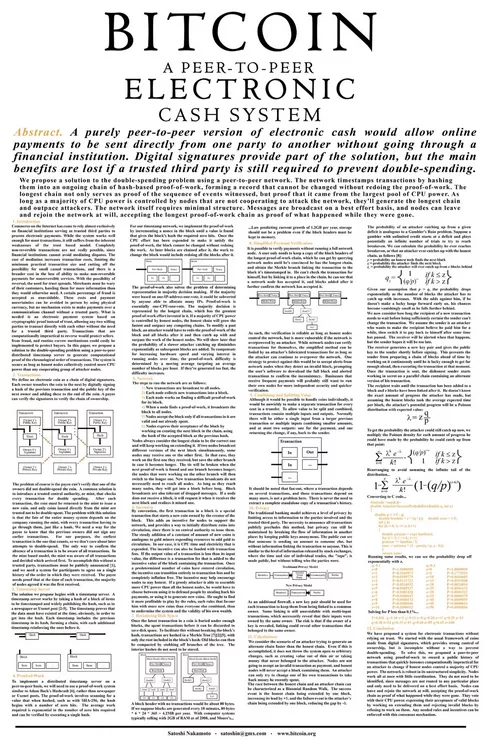

Em 3 de janeiro de 2009, Satoshi inaugura oficialmente a rede Bitcoin ao criar o primeiro bloco, também conhecido como bloco gênese, que marca o lançamento do blockchain do Bitcoin. Esse bloco contém uma mensagem reveladora da missão do Bitcoin: "03/jan/2009 Chancellor on brink of second bailout for banks" (O chanceler à beira de um segundo resgate aos bancos).

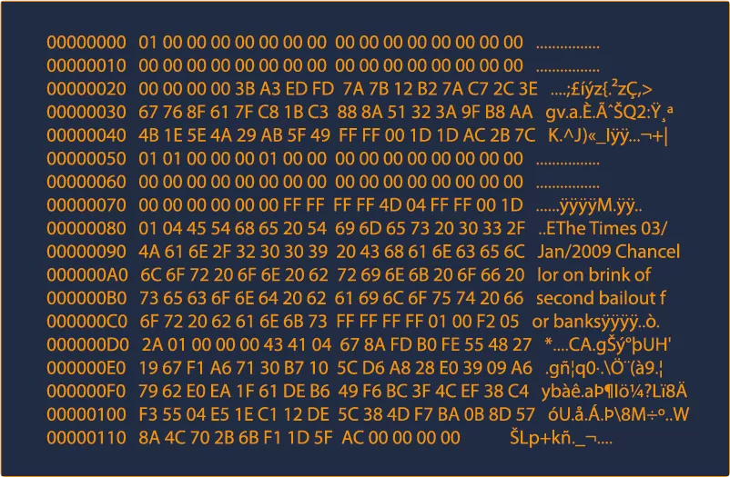

> "Podemos vencer uma grande batalha na corrida armamentista e obter um
> novo território de liberdade por vários anos." - Satoshi Nakamoto


### O protocolo Bitcoin começa a ganhar vida

Em 8 de janeiro de 2009, Satoshi anuncia a publicação do Bitcoin-0.1.0. Rapidamente, Hal Finney pega o software e se junta à rede. Agora, havia 2 nós e, portanto, 2 mineradores na rede. Finney imortaliza esse marco twittando "Running Bitcoin". Em 12 de janeiro de 2009, a primeira transação Bitcoin é realizada entre Satoshi e Hal Finney. Essa transação, de 10 BTC, é registrada no bloco 170.


O interesse pelo Bitcoin cresce rapidamente, e muitas pessoas começam a testar, debater, corrigir bugs e refletir sobre os aspectos éticos, econômicos e filosóficos do Bitcoin. Para facilitar essas trocas, o fórum BitcoinTalk é criado em 22 de novembro de 2009 por Satoshi.
Este fórum rapidamente se torna o local de discussão preferido para os usuários do Bitcoin. É lá que nascem muitos memes e símbolos associados ao Bitcoin, como o [logo Bitcoin](https://bitcointalk.org/index.php?topic=64.0), o famoso [Hodl](https://bitcointalk.org/index.php?topic=375643.0) ou mesmo o [Pizza day](https://bitcointalk.org/index.php?topic=137.msg1195).

> **Você sabia?** De fato, em 22 de maio de 2010, Laszlo Hanyecz marcou a história do Bitcoin ao propor comprar 2 pizzas por 10.000 BTC. Foi a primeira vez que o Bitcoin foi usado para comprar bens materiais.


### O desaparecimento de Satoshi Nakamoto

Em 2010, à medida que o Bitcoin começa a chamar a atenção da mídia, Satoshi decide se afastar. Em 12 de dezembro de 2010, ele publica seu último post no fórum, anunciando sua partida. Em 23 de abril de 2011, ele realiza sua última troca privada conhecida por e-mail. Satoshi desaparece, deixando sua criação nas mãos da comunidade.

> "Os governos são bons em cortar as cabeças de redes controladas centralmente como o Napster, mas redes P2P puras como o Gnutella e o Tor parecem estar se mantendo." - Satoshi Nakamoto

Apesar da ausência de Satoshi, o Bitcoin continua a se desenvolver. A cada 10 minutos, a história do Bitcoin é escrita, e o protocolo continua a funcionar conforme o planejado. Não importa o medo, a incerteza ou a dúvida (FOMO para Fear Of Missing Out ou FUD para Fear Uncertainty Doubt), o Bitcoin continua avançando, com uma disponibilidade online de 99,988%.
O Bitcoin é percebido de forma diferente por cada indivíduo. Para alguns, é uma entidade fungível como o [micélio](https://brandonquittem.com/bitcoin-is-the-mycelium-of-money/), para outros, é um [buraco negro](https://dergigi.com/2019/05/01/bitcoins-gravity/i). Se você ama ou odeia o Bitcoin, ele continua a existir, com seu ritmo constante de 10 minutos por bloco, como os batimentos cardíacos de um novo sistema monetário.

Para aprofundar seu conhecimento sobre os escritos de Satoshi Nakamoto, recomendo o [livro de Phil Champagne](https://planb.network/resources/books) ou o documentário da ARTE "le mystaire Satoshi".


> "O problema fundamental com a moeda convencional é toda a confiança necessária para fazê-la funcionar. O banco central deve ser confiável para não desvalorizar a moeda, mas a história das moedas fiduciárias está cheia de violações dessa confiança. Os bancos devem ser confiáveis para guardar nosso dinheiro e transferi-lo eletronicamente, mas eles o emprestam em ondas de bolhas de crédito com apenas uma fração em reserva."

Agora que temos alguns elementos de contexto, vamos ver como funciona uma transação Bitcoin em geral.

## Transações Bitcoin

<chapterId>03482644-5473-590b-975b-b43bb65eac21</chapterId>

Uma transação Bitcoin é simplesmente uma transferência de propriedade de bitcoins, usando um endereço bitcoin. Vamos considerar, por exemplo, dois protagonistas: Alice e Bob. Alice quer adquirir bitcoins, enquanto Bob já os possui.

### Etapa 1 - Criação da transação através da carteira

Para que Bob possa transferir bitcoins para Alice, ela deve fornecer a Bob um de seus endereços Bitcoin. Esse endereço, derivado da chave pública de Alice, é único para sua carteira Bitcoin.

Na prática, Alice abre sua carteira e clica em "receber". Um código QR ou um endereço como este bc1q7957hh3nj47efn8t2r6xdzs2cy3wjcyp8pch6hfkggy7jwrzj93sv4uykr será exibido. É como se fosse o "IBAN Bitcoin" dela. Ela fornece isso para Bob.

Em seguida, Bob inicia a transação usando o endereço de recebimento de Alice. Bob então abre sua carteira Bitcoin, clica em "enviar", copia e cola o endereço, adiciona um valor e taxas de transação. Essas taxas são um incentivo para os mineradores incluírem a transação no próximo bloco.

'

> **Por que pagar taxas?** Essas taxas são essenciais para criar um mercado livre de inclusão de transações nos blocos, pois o número de transações em um bloco é limitado. Na verdade, um bloco tem um tamanho de 1 MB, o que corresponde a algumas milhares de transações por bloco. As taxas de uma transação são proporcionais ao seu tamanho. O tamanho da transação, por sua vez, depende da complexidade da transação em questão.

> Para finalizar a transação, Bob deve fornecer uma assinatura com a chave privada dos endereços que ele usa para pagar Alice. Isso permite verificar que ele é o proprietário dos Bitcoins que deseja transferir. Essa etapa geralmente é feita automaticamente em carteiras móveis ou é uma confirmação em sua carteira física: "Você tem certeza de que deseja enviar X para Y? Sim ou não".

### Etapa 2: Propagação da transação pelos nós até os mineradores

Neste ponto, a transação foi criada e a carteira de Bob irá compartilhá-la com a rede Bitcoin. Para fazer isso, sua carteira irá se comunicar com um nó da rede Bitcoin, e este último irá propagar essa informação para outros nós. Essa etapa de propagação permite que toda a rede veja essa nova transação e a leve em consideração.


Embora essa transação agora seja conhecida por todos (por meio de uma ferramenta chamada Mempool), a transação não é necessariamente considerada confirmada! Na verdade, são os mineradores que validam as transações ao registrá-las em um bloco de nossa famosa blockchain.

Os mineradores têm a função de pegar as transações válidas e não confirmadas e compilá-las em um bloco. Para que seu bloco seja o próximo na blockchain do Bitcoin, eles devem resolver um enigma criptográfico em um processo chamado "prova de trabalho" ou "Proof of Work".


### Etapa 3: A transação é minerada em um bloco por um minerador.

Essa prova de trabalho requer encontrar um "hash" válido para o bloco em questão. Pense nisso como uma impressão digital única associada ao bloco, composta por 256 caracteres. A validade desse hash depende da dificuldade da rede Bitcoin. Voltaremos a esse mecanismo com mais detalhes. Por enquanto, considere que um minerador encontrou um bloco válido e que a transação de Bob para Alice está incluída nele.

Esse novo bloco válido é adicionado à blockchain do Bitcoin, que é um registro público e imutável de todas as transações do Bitcoin. Pense nisso como um livro-razão compartilhado por todos os usuários do Bitcoin. De acordo com as regras do protocolo, um bloco é adicionado aproximadamente a cada dez minutos, graças ao ajuste da dificuldade. Veremos na seção sobre mineradores qual é o mecanismo que impede a modificação do registro de transações do Bitcoin.


### Etapa 4: O bloco é válido e verificado pelo nó da carteira de Alice.

Neste ponto, a transação é considerada válida, o minerador irá propagar o novo bloco através de seu nó para a rede e a carteira de Alice será atualizada.


> Atenção: Mesmo que Alice perceba que recebeu bitcoins em um de seus endereços, é recomendado considerar a transação como imutável apenas quando ela possui 6 confirmações. Isso significa que outros 6 blocos foram minerados acima do bloco em que a transação de Bob está localizada. Em outras palavras, quanto mais antiga a transação na blockchain, mais imutável ela é.

### Pequeno resumo em pôster!


### Para que tudo isso?

No final das contas, o sistema de transações do Bitcoin é descentralizado e funciona de forma peer-to-peer, sem intermediários de confiança.

Bob envia sua transação para a rede Bitcoin e, quando um minerador publica um bloco válido contendo a transação de Bob, Alice pode começar a considerar que esses bitcoins pertencem a ela. Confiança não é necessária em nenhuma etapa da transferência de propriedade dos bitcoins; apenas as regras do protocolo e os incentivos econômicos tornam muito caro agir de forma maliciosa dentro do protocolo Bitcoin.

Os usuários transferem a propriedade de seu dinheiro assinando digitalmente as transações com suas chaves privadas. Os mineradores têm pouco poder, pois os usuários também têm um controle significativo por meio dos nós Bitcoin, que lidam com a validação de novos blocos e transações incluídas. É por meio dessa rede de nós Bitcoin que a rede é verdadeiramente descentralizada.

De fato, para que a rede Bitcoin seja completamente destruída, seria necessário destruir todas as cópias da blockchain de todos os nós Bitcoin - uma tarefa praticamente impossível devido à distribuição geográfica desses nós e à dificuldade de apreendê-los fisicamente.

Vamos dar uma olhada mais detalhada no funcionamento de um nó Bitcoin.

## Os nós Bitcoin

<chapterId>8533cebc-f799-528b-89df-8d75d4c37f1c</chapterId>

Os nós são um elemento fundamental da arquitetura da rede Bitcoin. Eles desempenham várias funções cruciais:

- Manter uma cópia da blockchain do Bitcoin
- Validar transações
- Transmitir informações para outros nós
- Aplicar as regras do protocolo Bitcoin.

Assim, qualquer dispositivo que execute o software Bitcoin, chamado de nós Bitcoin, (geralmente através do [Bitcoin Core](https://bitcoin.org/en/bitcoin-core/)) participa da descentralização da rede.


### Portanto, os nós são o núcleo central do Bitcoin.

Cada nó possui uma cópia da cadeia de blocos, o que permite verificar as transacções e evitar qualquer tentativa de fraude. A natureza descentralizada da rede torna a Bitcoin excecionalmente resistente e robusta - para parar o protocolo Bitcoin, seria necessário desligar todos os nós do mundo. Para sua informação, atualmente (setembro de 2023) existem aproximadamente [45 000 nós](https://bitnodes.io/nodes/all/) distribuídos por todo o mundo.

Os nós são capazes de verificar a validade dos blocos e das transacções porque seguem as regras de consenso da Bitcoin. Estas regras regem, entre outras coisas, a política monetária da Bitcoin, como o montante das recompensas dos mineiros (que analisaremos mais detalhadamente na próxima secção) e a quantidade de Bitcoin em circulação. Os nós actuam como uma espécie de sistema legal para a rede. Eles garantem que todos os participantes da rede sigam as mesmas regras. Eles garantem a neutralidade do protocolo Bitcoin. As regras de consenso variam muito pouco, se é que variam, porque para efetuar alterações é necessário obter a aprovação de todos os nós.


A governação dentro do protocolo está fora do currículo deste curso, mas deve saber que cada utilizador que executa um nó Bitcoin decide quais as regras a seguir. Assim, um utilizador pode decidir seguir outras regras (ou seja, fazer alterações ao código), mas se essas alterações invalidarem as regras de consenso actuais, esse nó deixará de fazer parte da rede Bitcoin. As grandes alterações são, portanto, raras e requerem uma grande coordenação entre milhares de jogadores com ideologias e interesses variados, o que força o protocolo a produzir apenas as actualizações que o tornam "melhor" aos olhos de todos os utilizadores de Bitcoin.

### Como é que é um noued?

Existem várias opções se quiseres ter o teu próprio nó, e o custo de manutenção varia. Podes simplesmente executar o software Bitcoin Core no teu computador, mas isso vai exigir um espaço de armazenamento considerável, uma vez que a blockchain tem cerca de ~500GB de tamanho. Para ultrapassar este constrangimento, podes decidir armazenar apenas os últimos N blocos, conhecido como "nó podado". O custo deste tipo de solução é insignificante, uma vez que o nó só é ativado quando é necessário.

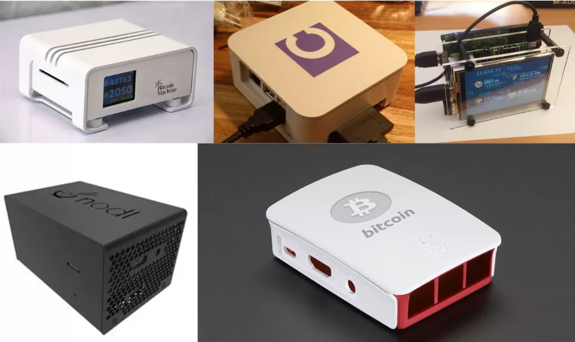

Uma segunda opção é utilizar hardware dedicado, como o Raspberry pi 4 com um disco rígido SSD suficientemente grande (cerca de ~1TB).
Esta segunda opção é mais cara se tiver de comprar o hardware, mas, do ponto de vista do consumo de energia, representa pouco menos de 10 euros por ano.

'De um ponto de vista de largura de banda, considerando 1 bloco de 1MB a cada 10 minutos, isso representa cerca de 5GB por mês.

### Os nós devem permanecer acessíveis para todos!

O custo acessível e a acessibilidade de um nó Bitcoin em termos de recursos de hardware, armazenamento e largura de banda são aspectos muito importantes, pois facilitam a descentralização da rede.

Na verdade, todo mundo tem uma boa razão para executar um nó! O preço e os esforços são mínimos para o benefício obtido. Basta embarcar na aventura e se juntar a milhares de outros bitcoiners, pois juntos formamos a rede Bitcoin.


Se, por exemplo, os blocos fossem 100 vezes mais pesados, certamente poderíamos fazer 100 vezes mais transações a cada 10 minutos, mas executar um nó Bitcoin exigiria um disco rígido de 50TB, uma largura de banda de mais de 500GB/mês e um hardware capaz de validar centenas de milhares de transações em menos de 10 minutos. Nessa situação hipotética com blocos 100 vezes maiores, executar um nó Bitcoin não seria acessível para o público em geral, o que comprometeria a descentralização do protocolo e a imutabilidade das transações e regras de consenso. Assim, as restrições do protocolo também foram escolhidas para permitir que o maior número possível de pessoas possa executar seu próprio nó Bitcoin.

Essa situação não é tão hipotética assim, pois o ano de 2017 foi marcado por uma intensa controvérsia, conhecida como "guerra dos blocos". Esse conflito opôs os atores que desejavam modificar o Bitcoin aumentando o tamanho dos blocos para aumentar a capacidade de transação àqueles que buscavam preservar a independência e o poder dos usuários. No final, os usuários e os nós triunfaram ao rejeitar a proposta de mudança iniciada pelos mineradores, plataformas de câmbio e instituições.

Após essa vitória, os nós ativaram uma atualização chamada SegWit, abrindo caminho para a implementação da Lightning Network, uma rede de pagamento instantâneo do Bitcoin usando a blockchain do Bitcoin. Essa situação demonstra que os usuários, por meio de seus nós, possuem um poder real dentro do Bitcoin, permitindo que enfrentem as grandes instituições.

### Resumo em pôster!


## Os mineradores

<chapterId>dbb8264a-7434-57e4-9d1b-fbd1bae37fdf</chapterId>

> Os mineradores servem para garantir a segurança da rede e adicionar transações aos blocos. Eles usam eletricidade por meio de máquinas ASIC para resolver a prova de trabalho do Bitcoin.


### Explicação do Prova de Trabalho'

A Prova de Trabalho, também conhecida como "Proof of Work" (POW), é o consenso de segurança do protocolo Bitcoin. É a regra que permite que o Bitcoin funcione e garanta sua robustez. O POW é a base de tudo e desempenha um papel crucial na teoria dos jogos do Bitcoin.

Pense nisso como uma loteria gigante em que todos podem participar. O objetivo é encontrar um número específico que permitirá assinar um bloco válido, e o vencedor recebe uma recompensa em bitcoin. Esse número é muito simples de verificar, mas difícil de encontrar. Na verdade, a verificação fácil é feita através da função de hash SHA-256, que está incluída no algoritmo de mineração. Para encontrar esse número, os participantes (mineradores) tentarão bilhões e bilhões de possibilidades, como 1, 52, 2648, 26874615, 15344854131318631, etc.

Se o número escolhido for o correto: Jackpot! Caso contrário, continuamos procurando. Para otimizar o número de tentativas, eles usarão máquinas específicas chamadas ASICs, cujo único papel é calcular bilhões de possibilidades por segundo. A quantidade total de tentativas é chamada de HashRate e permite quantificar a segurança do protocolo Bitcoin. Para fazer essas máquinas funcionarem, é necessário consumir grandes quantidades de eletricidade. Portanto, o POW transforma energia em moeda, conectando o mundo real ao mundo digital para criar a primeira moeda energética.

As máquinas estão em funcionamento e, em média, após 10 minutos, um vencedor surgirá. Ele terá encontrado o hash correto abaixo da barra de dificuldade. O grande e único vencedor, então, assinará o novo bloco do servidor de carimbo de data/hora e continuará a cadeia de blocos. O vencedor recebe suas recompensas e tenta a sorte novamente para o próximo bloco. O processo se repete há 12 anos e, a cada 10 minutos, um vencedor confirma as transações do Bitcoin, ao mesmo tempo em que continua a garantir as transações passadas. Tornando nossa blockchain do Bitcoin mais robusta e segura.

A cada 2 semanas (2016 blocos), o ajuste da dificuldade reequilibra o jogo global de mineração de acordo com o número de participantes.

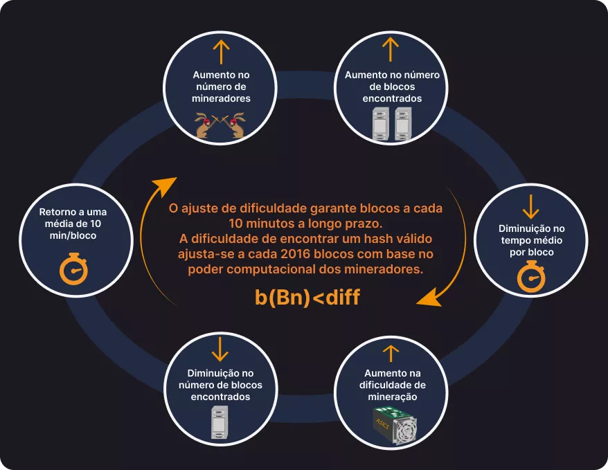

### A mineração está em constante evolução

Ao longo dos anos, os mineradores têm se equipado com hardware cada vez mais eficiente para produzir o maior número possível de hashes por segundo (chamado de HashRate), consumindo a menor quantidade de energia possível e da maneira mais econômica possível. Os primeiros mineradores, como Satoshi ou Hal Finney, mineravam apenas com suas CPUs, e depois outros começaram a minerar com suas placas de vídeo. Hoje em dia, os mineradores usam o que é chamado de ASIC (Application-Specific Integrated Circuit), máquinas projetadas exclusivamente para aplicar o algoritmo SHA256.


O Hashrate da rede Bitcoin representa de certa forma a quantidade de tentativas feitas por segundo para encontrar o próximo bloco. Hoje está em cerca de 400 TH/s, ou seja, 400.000 bilhões de tentativas por segundo! Quanto maior o hashrate global, mais difícil é para um ator mal-intencionado monopolizar os recursos necessários para obter a maioria da mineração e realizar um gasto duplo. Portanto, é mais economicamente viável seguir as regras do protocolo Bitcoin do que agir contra elas. Isso levanta uma questão: como os mineradores são remunerados?

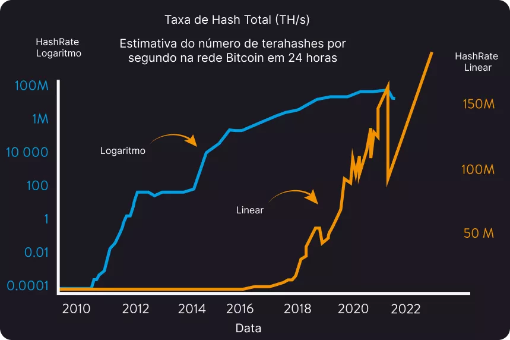

### O que pode ser encontrado em um bloco?


O cabeçalho do bloco possui vários elementos, como a hora, o alvo de dificuldade, o número do último bloco, a versão utilizada e a Raiz de Merkel das transações anteriores.

A transação coinbase é sempre a primeira; ela inclui a recompensa recebida por realizar o trabalho de validação. Em seguida, vêm as transações validadas. O minerador escolherá as transações que rendem mais e tentará criar um bloco que maximize sua receita, ou seja, transações de pequeno porte com o máximo de taxas.

### Remuneração dos mineradores

Inicialmente, um minerador é remunerado quando encontra um bloco válido. Mais especificamente, ele é remunerado de duas maneiras: (i) pela recompensa incluída no bloco e (ii) pelas taxas de transação nas transações incluídas no bloco. O valor da recompensa é definido pelas regras de consenso e depende em qual Época estamos.

De fato, para os primeiros blocos, a recompensa era de 50 bitcoins, e a cada 210.000 blocos (aproximadamente a cada 4 anos), ela é dividida por 2. Hoje (em 2023), estamos na 4ª Época; portanto, a recompensa é de 6,25 bitcoins. Essa recompensa é o mecanismo de criação monetária no Bitcoin. À medida que a recompensa diminui com o tempo, isso significa que existe um limite de 21 milhões de bitcoins - hoje já existem mais de 19,4 milhões de bitcoins em circulação, ou seja, mais de 92%.

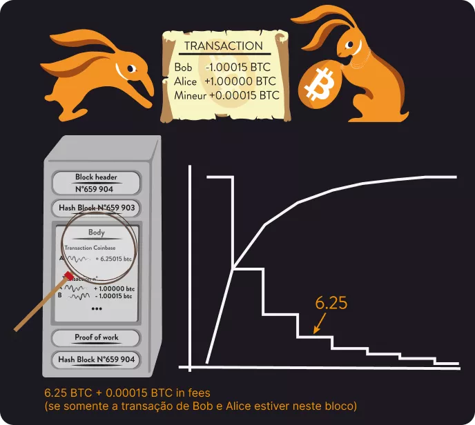

O segundo método de remuneração é definido pelo valor escolhido pelos usuários para as taxas de transação. Como o minerador deseja maximizar sua receita, ele tenderá a selecionar prioritariamente as transações com taxas de transação mais altas; as taxas de transação refletem, portanto, a urgência do usuário em ter sua transação inserida no próximo bloco.


Além disso, para estabilizar o modelo econômico dos mineradores, que se baseia nas recompensas que recebem por cada bloco válido, os mineradores frequentemente colaboram em grupos através de "pools de mineração", onde compartilham seus recursos de computação.

### Por que se preocupar em fazer tudo isso?

Em suma, a inovação do Bitcoin é oferecer uma solução para o problema de gasto duplo através do uso de uma blockchain baseada em Prova de Trabalho com dificuldade flutuante. No mundo digital, o conceito de propriedade difere do mundo físico. De fato, no mundo digital, tudo pode ser copiado e colado, o que gera problemas em termos de gasto duplo para bens digitais de valor. Intermediários de confiança, como bancos, foram criados para resolver esse problema tecnológico e garantir que quando um bem é transferido, ele não pertence mais ao emissor. Mas como fazer isso sem intermediários de confiança? Esse problema é equivalente ao problema dos generais bizantinos, um problema de coordenação de informações em um sistema onde não se pode confiar nos diferentes atores.


Portanto, o Bitcoin é uma espécie de solução para resolver esse problema, ou pelo menos contorná-lo. Os "generais" do Bitcoin, ou mineradores, produzem blocos (informações) e os nós do Bitcoin verificam as transações financeiras por meio de regras de consenso para garantir a autenticidade das informações. A assimetria no custo energético entre a produção de informações e a verificação garante a confiabilidade das informações, sem intermediários de confiança.

Os mineradores são os construtores da segurança da rede Bitcoin. Ao gastar energia para produzir hashes, eles constroem um muro que torna extremamente caro para um agente mal-intencionado reescrever o histórico de transações. Essa desincentivação econômica os dissuade de se comportar de maneira desonesta.

Mesmo no caso de um ataque de 51%, ou seja, quando um agente possui mais da metade da taxa de hash, a rede permanece segura, pois o atacante precisa gastar tanta energia quanto todos os mineradores juntos para tentar modificar a blockchain. É graças a esse mecanismo de prova de trabalho, que requer energia para ser realizado, que a rede é segura.

### Em resumo

A teoria dos jogos aplicada ao Bitcoin afasta os mineradores desonestos. Os mineradores usam máquinas ASIC para minerar e recebem uma recompensa em caso de sucesso. Além disso, eles frequentemente se agrupam em pools de mineração para compartilhar seu poder de computação e obter recompensas menores, mas mais regulares. A mineração de Bitcoin é um processo com alto custo energético, mas essencial para o funcionamento e segurança da rede Bitcoin. A prova de trabalho e a blockchain resolvem o problema de gastos duplos e garantem a veracidade das informações sem a necessidade de terceiros confiáveis. O gasto energético é necessário para produzir a informação, mas a verificação das informações tem um custo negligenciável. Essa assimetria garante a segurança da rede. Portanto, é economicamente mais viável seguir as regras de consenso do que violá-las.


## Bitcoin e ecologia

<chapterId>4b227ae6-443a-5739-b443-60b7931130d9</chapterId>

Acabamos de ver na seção anterior que a segurança do protocolo Bitcoin se baseia em um alto custo energético para produzir um registro público de transações sem a necessidade de terceiros confiáveis. O custo energético total é frequentemente comparado ao consumo elétrico de um pequeno país. Mas essa comparação faz sentido? É relevante para entender as razões por trás de um custo tão alto?

### Os custos energéticos do Bitcoin.

Primeiro, vamos avaliar qualitativamente o custo ambiental da mineração. Um minerador precisa ter uma máquina como um ASIC e uma fonte de energia na forma de eletricidade para alimentar essas máquinas. Os ASICs são compostos principalmente de alumínio e podem ser reciclados ou reutilizados para um segundo uso (como demonstrado pelo projeto [Attakaï](https://decouvrebitcoin.fr/attakai/), que transforma um Antminer S9 em um aquecedor auxiliar). O grande problema é o consumo de energia. Vamos tentar trazer mais contexto para isso.


A consolidação elétrica representa a quase totalidade dos custos para um minerador. Portanto, ele é incentivado a obter uma fonte de eletricidade barata. No entanto, como os mineradores são móveis, eles podem ir para lugares onde usinas elétricas estão instaladas, mas ainda não estão conectadas à rede elétrica do território. Os mineradores desempenham o papel de compradores de último recurso, permitindo que as usinas se financiem antes mesmo de serem conectadas à rede elétrica. E quando forem conectadas, a demanda por eletricidade aumentará, o que aumentará o preço, tornando menos rentável para o minerador obter eletricidade nesses locais. O minerador então decidirá mover sua instalação e se estabelecerá em um local onde a demanda é baixa e, portanto, o preço também.

### Um debate sem fim

Assim, o debate sobre o impacto ecológico do Bitcoin muitas vezes está mal direcionado, principalmente devido a uma compreensão insuficiente de sua utilidade e funcionamento. O Bitcoin não pode ser avaliado simplesmente em termos de custo energético por transação, pois os mineradores garantem tanto a rede atual quanto a histórica, as transações são agrupadas e nem todas são equivalentes, além disso, o impacto da Lightning Network não é levado em consideração. Aqueles que afirmam que o Bitcoin consome muita energia podem ter motivações políticas ou estar procurando vender sua própria solução blockchain. O pretexto ecológico é usado para justificar a proibição do Bitcoin.

No entanto, não devemos esquecer que o Bitcoin, como uma invenção revolucionária, deu às pessoas que vivem sob opressão financeira ou sob um regime ditatorial um meio de lutar por sua liberdade. Como último recurso, o Bitcoin oferece uma forma de liberdade financeira, escapando da censura e das restrições bancárias. O Bitcoin é mais do que apenas uma moeda. É uma forma de comunicação e expressão da liberdade. A energia gasta pelos mineradores contribui para a defesa de nossa liberdade. O Bitcoin permite a emancipação do atual sistema financeiro, dominado pela dívida e pela criação excessiva de moeda pelos bancos centrais.


Para aqueles que vivem em países com alta inflação, o Bitcoin é uma questão de sobrevivência. Ele fornece um meio de sobreviver em situações financeiras precárias. Além disso, o Bitcoin oferece um sistema financeiro mais justo e equitativo. Também oferece a oportunidade para bilhões de pessoas em todo o mundo acessarem o sistema financeiro. Visto por esse ângulo, a consolidação energética é legítima?

### O Bitcoin não seria um saldo positivo para o meio ambiente?

Por fim, é essencial discutir as questões econômicas e ambientais da adoção do Bitcoin.

Notadamente ao compará-lo com o sistema financeiro atual. Este, devido ao seu encorajamento ao consumo excessivo e ao endividamento, apresenta sérios problemas. A facilidade de acesso ao crédito, a emissão monetária pelos bancos e o uso de reserva fracionária são fatores que favorecem o endividamento e, consequentemente, o consumo excessivo.


É necessário reformar o sistema monetário para refletir a escassez de nossos recursos com a escassez de nossa moeda. Isso incentivará um consumo mais responsável e uma visão de longo prazo. Por outro lado, a inflação, ao incentivar o consumo e o investimento, tem um impacto negativo no meio ambiente a longo prazo.

O sistema financeiro atual está de acordo com as ideias da economia keynesiana, que, ao contrário da economia austríaca, não leva em consideração o aspecto temporal e dinâmico das situações e dos recursos. Em outras palavras, uma moeda ilimitada não pode efetivamente refletir os recursos limitados de nosso planeta.

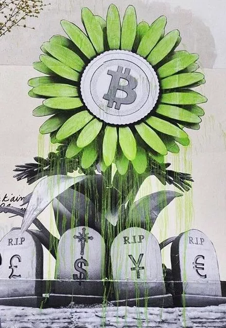

Os políticos, devido à sua visão de curto prazo e à sua necessidade de crescimento econômico para serem reeleitos, não são capazes de resolver os problemas ambientais a longo prazo. Por outro lado, a adoção de uma moeda saudável como o Bitcoin é uma alternativa potencial que pode devolver o poder econômico ao povo.

As chamas nos poços de petróleo, que queimam metano para evitar a poluição, podem ser apagadas pelos mineradores de Bitcoin, o que é benéfico para o meio ambiente. O Bitcoin favorece o uso de energia verde. O metano pode ser convertido em eletricidade para alimentar as máquinas de mineração, o que é vantajoso para todos.

A tecnologia do Bitcoin é frequentemente mal compreendida, e as críticas em relação ao seu impacto ambiental são frequentemente simplistas e de curto prazo. Essas críticas muitas vezes são motivadas por interesses políticos. O Bitcoin tem o potencial de ajudar na transição ecológica e contribuir para um mundo mais verde. A mídia frequentemente dissemina ideias falsas sobre o Bitcoin e o meio ambiente. Portanto, reserve um tempo para formar sua própria opinião. Tudo é transparente com o Bitcoin.

> Siga um dos lemas do Bitcoin: Não confie, verifique por si mesmo!


### Breve resumo dos aspectos técnicos do Bitcoin

'Satoshi Nakamoto lançou em janeiro de 2009 o protocolo Bitcoin, que desde então evoluiu graças a uma comunidade crescente de desenvolvedores, mineradores e usuários com nós Bitcoin. Estes, mantendo sua própria cópia do blockchain Bitcoin, o registro público de todas as transações Bitcoin, podem garantir a validade das transações de acordo com as regras de consenso específicas do Bitcoin. Especialmente garantindo que os mineradores produzam blocos válidos, que contenham algumas milhares de transações pendentes.

Em média, um bloco é criado a cada 10 minutos e o minerador que encontrar um hash válido para o próximo bloco é recompensado pelo protocolo com uma recompensa cujo valor é definido pelas regras de consenso, e as taxas de transação de todas as transações presentes no bloco válido em questão. Como o resultado do algoritmo de hash (SHA256) para uma entrada dada é considerado imprevisível, o processo de mineração consiste em construir muitos blocos candidatos e testar se seu hash é válido ou não. No entanto, para garantir que o tempo médio entre dois blocos permaneça constante (~10 minutos), independentemente da quantidade de mineradores e de sua capacidade de processamento, a dificuldade de encontrar um hash válido é ajustada a cada 2016 blocos, ou seja, aproximadamente a cada 2 semanas. Os mineradores desenvolveram ao longo do tempo máquinas específicas para SHA256, chamadas de ASICS, para aumentar a taxa de hash/joule, o que significa, em outras palavras, o número de tentativas por segundo e por energia consumida.

Para que os mineradores sejam mais lucrativos em sua atividade, eles devem obter a eletricidade mais barata possível, o que geralmente ocorre em locais remotos, dentro de usinas elétricas que ainda não estão conectadas à rede elétrica do território. O minerador age então como um comprador de última instância e, assim que o preço da eletricidade aumenta devido ao aumento da demanda, o minerador tende a realocar sua atividade para outro lugar.

Assim, o protocolo Bitcoin é um sistema monetário imutável e imparável, pois cada componente do protocolo está distribuído geograficamente em todo o mundo - por exemplo, há cerca de 40.000 nós Bitcoin em todos os continentes. As regras de consenso do Bitcoin são tais que é economicamente mais rentável segui-las do que tentar transgredi-las, e, portanto, nenhuma confiança é necessária entre os participantes. O Bitcoin não tem líder e não pode ser interrompido. É possível regular as plataformas de troca para limitar o Bitcoin, mas isso é restrito em termos de impacto. Em suma, nenhum juiz ou estado pode censurar ou parar o Bitcoin.

# Como obter Bitcoin?

<partId>517e1bb7-f032-51a0-930a-a91fe5148d3f</partId>

## Bitcoin nunca dorme!

<chapterId>d5e35e41-ea26-5478-8eb9-07daf9dff508</chapterId>

O preço do Bitcoin é frequentemente caracterizado por uma volatilidade significativa. Seu valor pode flutuar consideravelmente com base nas variações do mercado e nas fases de mercado em alta (bull market) e mercado em baixa (bear market). Isso é verdade em 100% dos mercados financeiros, incluindo o bitcoin.


> Para simplificar: os seres humanos compram todos ao mesmo tempo e vendem todos ao mesmo tempo. O Bitcoin não é imune à natureza humana.

### Compreendendo as ondas de adoção

O desenvolvimento e a evolução do Bitcoin estão em grande parte relacionados aos diferentes grupos de atores que gradualmente integraram seu ecossistema.


- Os crentes:

Os primeiros usuários do Bitcoin eram principalmente entusiastas da tecnologia, cypherpunks, libertários e adeptos do ouro. Esses grupos foram atraídos pelo Bitcoin devido à sua capacidade de oferecer soluções como dinheiro eletrônico sem intermediários de confiança, resistência à censura ou política monetária transparente e imutável.

- A dark web e os criminosos

Em seguida, o uso do Bitcoin se expandiu para sites de comércio na dark web, como Silk Road, devido à sua natureza incontrolável e pseudônima. Esse site chamou a atenção para a natureza incontrolável e pseudônima do Bitcoin, o que levou alguns atores criminosos a usá-lo. No entanto, vale ressaltar que o uso de uma ferramenta, e não a ferramenta em si, determina sua legalidade ou ilegalidade. Vale ressaltar que o uso ilegal do Bitcoin não torna uma pessoa criminosa em si. É o uso, e não a ferramenta, que pode ser classificado como ilegal. Por exemplo, o uso do Bitcoin para atividades como a compra de certas drogas é legal ou ilegal, dependendo da regulamentação do território em que a atividade ocorre.

- A loucura das ICOs e a chegada do grande público

O ano de 2017 foi marcado por uma bolha especulativa significativa no universo das criptomoedas, especialmente com o lançamento de milhares de ICOs (Oferta Inicial de Moedas). No entanto, muitas dessas novas criptomoedas não tinham desenvolvimento concreto ou utilidade e, portanto, desapareceram rapidamente. Essa bolha de 2017 foi seguida por uma forte correção em 2018-2019.

- A bolha dos NFTs e a DeFi

Em seguida, em 2020, o mercado passou por outra bolha especulativa que levou o preço do Bitcoin a US$ 60.000. Essa bolha se diferencia das anteriores por uma maior diversificação dos investidores, incluindo instituições financeiras e grandes empresas. Mas, mais uma vez, após a euforia, ocorrem fortes correções.

### Bitcoin & a volatilidade

À luz dos ciclos passados, parece que a periodicidade dos ciclos econômicos do Bitcoin é equivalente ao intervalo entre dois halvings. Talvez porque o evento de halving funcione como um detonador, reduzindo pela metade a emissão de novos bitcoins.

### Bitcoin & a volatilidade

Essas flutuações muito significativas criaram uma reputação para o Bitcoin como um ativo extremamente perigoso que faz com que todos os seus usuários percam dinheiro. Embora o preço possa cair 10-20 ou até mesmo 50% em poucos dias, é importante entender que o Bitcoin, o protocolo, não é afetado pela mudança de preço.

Essa volatilidade significativa é amplamente aceita pelos participantes do Bitcoin hoje em dia e pode ser mitigada por várias soluções, como hedge financeiro (stablecoins), uma forte crença de longo prazo (hodl) ou simplesmente não investindo 100% do seu dinheiro em Bitcoin sem entender nada sobre ele. Compreender por que o preço do Bitcoin flutua tanto é essencial para avançar nesta indústria, pois, no final das contas, é o preço e os ciclos que temporizam e regulam de certa forma o nosso mercado. No entanto, podemos observar que, à medida que o Bitcoin cresce e amadurece, a volatilidade se torna menos importante.


Embora o par btc/dólares flutue em curtos períodos de tempo, o Bitcoin, devido à sua quantidade limitada de 21 milhões de bitcoins e ao seu processo de halving (divisão por 2 da criação monetária a cada 4 anos, em média), segue uma tendência geral de alta de forma quase mecânica. Obviamente, como qualquer ativo financeiro, o Bitcoin está sujeito a ciclos econômicos que incluem períodos de euforia, bolhas especulativas e correções. Esse fenômeno é bastante comum em tecnologias emergentes, onde o mercado nem sempre é racional ou eficiente.

### Um mercado único

Esses ciclos de bolhas especulativas são bastante únicos no mundo, pois é muito raro para um mesmo ativo ver tantas bolhas se sucedendo repetidamente. Isso se explica simplesmente pelo fato de que o Bitcoin não é uma bolha que vai desaparecer, mas sim uma moeda realmente utilizada em todo o mundo. O protocolo do Bitcoin é único nesse sentido, pois funciona em escala global, 24 horas por dia, 7 dias por semana, tornando a regulação difícil para as autoridades financeiras.


Hoje, em 2023, o Bitcoin continua a sobreviver e a crescer cada vez mais, se integrando cada dia mais ao mercado tradicional. A chegada em breve dos ETFs de Bitcoin, uma regulamentação mais clara e melhores ferramentas de aquisição ou armazenamento só encorajam essa tendência. O Bitcoin SOBREVIVEU MAIS UMA VEZ à sua bolha especulativa, então talvez não seja apenas conversa fiada!


## Obter bitcoins trabalhando

<chapterId>be2d83be-406f-582c-83ca-6aa905ff7b04</chapterId>

### Uma economia paralela está se desenvolvendo

O Bitcoin pode ser visto como uma economia paralela às moedas fiduciárias. Isso significa que é possível vender bens ou serviços e ser pago em Bitcoin. As transações podem ser feitas diretamente em Bitcoin, sem a necessidade de passar por uma plataforma de câmbio, apenas de carteira Bitcoin para carteira Bitcoin.

A economia do Bitcoin existe e está se desenvolvendo em algumas regiões do mundo, como El Salvador, onde o Bitcoin é moeda legal desde 2021. Além disso, algumas pessoas, empresas e organizações já aceitam o Bitcoin como forma de pagamento por seus produtos ou serviços.


Além disso, para facilitar o uso do Bitcoin nas transações do dia a dia, um projeto de código aberto e colaborativo foi lançado: BTCMap (https://btcmap.org/map#2/21.28937/5.46680). Ele lista todos os comerciantes que aceitam Bitcoin, bem como as diferentes comunidades Bitcoin ao redor do mundo. Você pode visitar o site deles para descobrir o ecossistema Bitcoin ao seu redor. Assim, apesar das dificuldades e resistências, existem iniciativas como o BTCMap que contribuem para tornar a economia do Bitcoin mais acessível e conveniente para todos.

### Por que aceitar Bitcoin em vez de comprá-lo?

Para obter bitcoins, você pode comprá-los em plataformas reguladas por órgãos como a AMF (Autoridade dos Mercados Financeiros) na França. Esse método envolve certos riscos e rastreabilidade de suas transações. Outro método para obter bitcoins é aceitá-los como forma de pagamento pelos produtos ou serviços que você oferece. Esse método permite que você adquira bitcoins por meio do seu trabalho sem se preocupar constantemente com o preço do Bitcoin.

Além disso, aceitar o Bitcoin como comerciante apresenta várias vantagens, incluindo a ausência de censura, taxas de transação reduzidas, maior eficiência, proteção contra a inflação, bem como liberdade e soberania financeira.

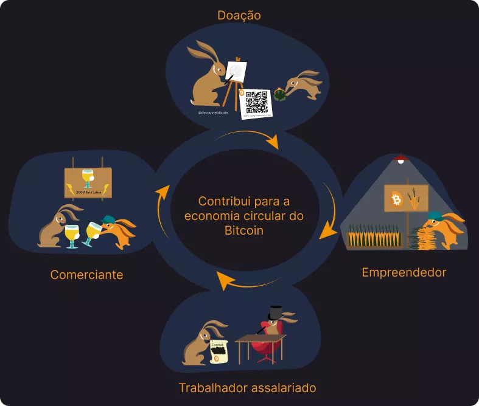

### Como fazer:

Para aceitar o Bitcoin, é necessário estudar as diferentes soluções disponíveis e escolher aquela que melhor se adequa ao seu negócio. Não existem soluções perfeitas, e vários fatores devem ser levados em consideração ao fazer sua escolha, como, entre outros, o volume de transações esperado, o orçamento alocado, o tipo de comércio (online ou físico).

Vamos abordar esse assunto em detalhes em outro treinamento, mas para simplificar, podemos considerar várias categorias de negócios e, portanto, soluções relacionadas:

- Solução online simples: OpenNode
- Solução para comerciantes amadores: Swiss Bitcoin Pay
- Solução para grandes estruturas ou entusiastas do Bitcoin: BTCpay Server

## Poupar com Bitcoin

<chapterId>1d9570c6-5b63-51a6-b87c-7bdb0fc4aa87</chapterId>

### Aviso antes de começar!

Bitcoin é se tornou um ativo financeiro importante, principalmente devido à sua oferta limitada e à sua crescente demanda. No entanto, a compra de Bitcoin envolve riscos que exigem atenção especial. Portanto, é recomendável realizar suas próprias pesquisas e aprender mais sobre o assunto para se familiarizar com a tecnologia antes de investir.

- Invista apenas o que você pode perder.
- O Bitcoin é um ativo financeiro altamente volátil; seu preço pode cair para 0.
- O desempenho passado não garante o desempenho futuro.
- Entre em contato com seu consultor financeiro, se necessário.

> Plan ₿ Network não oferece consultoria de investimento e nada do que é declarado aqui deve ser considerado como tal.

### Mini Check-list antes de dar o grande salto

Antes de começar a comprar Bitcoin, certifique-se de ter:

- Uma carteira segura.
- Um entendimento sólido do Bitcoin.
- Um plano de poupança a seguir.
- Uma visão de longo prazo.

Se o assunto ainda não estiver claro, saiba que o curso BTC102 o acompanhará na segurança e aquisição de seus primeiros bitcoins. Aqui, vamos apenas dar uma visão geral do assunto.

Concretamente, existem duas perguntas a serem feitas:

- Qual estratégia de aquisição adotar: gradualmente ou de uma só vez?
- Por qual plataforma passar: regulamentada ou não regulamentada?

### As estratégias de compra

- Média de custo em dólares

A compra recorrente consiste em comprar pequenas quantidades de Bitcoin em intervalos regulares. Este método oferece uma média de preço ao longo do tempo e um crescimento contínuo na quantidade de Bitcoin possuída. É uma solução ideal para poupar a longo prazo sem se preocupar com o preço e a volatilidade do Bitcoin. Configura-se e esquece-se.

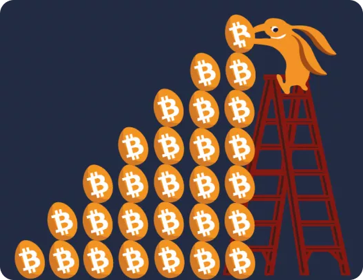

> Atenção às UTXO: Não se esqueça de consolidar suas UTXO em suas carteiras de tempos em tempos. Essa prática é essencial para gerenciar efetivamente seus bitcoins e evitar taxas desnecessárias durante as transações.

- Compra espontânea

A compra espontânea é usada para obter exposição imediata ao Bitcoin. Seja para comprar durante uma queda de preço ou para aproveitar um bônus, a decisão é sua. Você precisará reunir coragem e pressionar o botão de compra.
'Given the significant volatility of Bitcoin, special attention must be paid to your emotions. FOMO (Fear of Missing Out) and FUD (Fear, Uncertainty, Doubt) are your worst enemies in this context! Stay calm and follow the strategy you have established in advance to avoid impulsive and potentially harmful decision-making.

### Onde comprar nosso Bitcoin?

Existem várias maneiras de adquirir Bitcoins, cada uma com seus próprios regulamentos. Algumas plataformas exigem identificação para verificação, enquanto outras não. É fundamental entender os regulamentos associados a cada plataforma.

- Plataformas DCA

Um método comum de acumular Bitcoins é o Dollar Cost Averaging (DCA), que envolve investir regularmente pequenas quantias. Várias plataformas oferecem este serviço, como as listadas na nossa [página dedicada](https://planb.network/tutorials/exchange). Para além da simplicidade da criação de uma DCA, os levantamentos para a sua carteira são geralmente automáticos, o que significa que terá sempre controlo sobre os seus activos.

Atualmente, quase todas as soluções DCA são relativamente eficientes e têm taxas quase semelhantes, pelo que a escolha dependerá mais da disponibilidade no seu país.

- Plataformas de corretagem

Para investimentos em grande escala, são recomendadas plataformas regulamentadas e reconhecidas, como Kraken, Bitstamp e Paymium. Estas plataformas oferecem um ambiente seguro e protegido para transacções de grande volume.

A sua utilização é simples e acessível a todos:

1. Criação de uma conta KYC/\*
2. Transferência bancária para a sua conta
3. Compra de bitcoin
4. Levantamento de bitcoins para a sua carteira


Após a compra, é aconselhável retirar imediatamente os Bitcoins das plataformas de câmbio para minimizar os riscos de pirataria e bloqueio de fundos. As taxas de levantamento podem ser elevadas, chegando por vezes a 25 euros, consoante a plataforma.

> As normas Know Your Customer (KYC) exigem que os utilizadores forneçam a sua identificação para combater o financiamento do terrorismo, a evasão fiscal e o branqueamento de capitais.

É importante notar que o KYC é um tema importante no nosso sector, uma vez que a sua eficácia continua a ser facilmente discutível e os seus aspectos negativos são numerosos. Em muitas das formações e conteúdos da nossa universidade, desaconselhamos a utilização de plataformas KYC completas se o utilizador já for um utilizador avançado.

### Solução não-KYC

Além disso, existem vários [marketplaces] (https://planb.network/tutorials/exchange) para comprar e vender bitcoins numa base peer-to-peer. Se estiver interessado nestes mercados, pode seguir a nossa formação sobre BTC 205. Regra geral, estas soluções são :

- ATMs Bitcoin
- Encontros físicos com outros entusiastas do bitcoin
- Plataformas ilegais e não regulamentadas
- Soluções que colocam as pessoas em contacto umas com as outras
- Neo-bancos que operam em países amigos da Bitcoin.

image](assets/pt/chapter15/3.webp)

É também importante notar que podem ser cobrados impostos na sua jurisdição. Por favor, consulte os regulamentos do seu país antes de tomar qualquer ação que o possa colocar em situação de incumprimento.

## Hyper-bitcoinisation

<chapterId>b7275d31-3b60-5fb7-b9f5-030097010553</chapterId>

### A corrida maluca está apenas começando!

Como toda nova tecnologia, a adoção do Bitcoin segue uma curva em S. Já ultrapassamos a era dos primeiros adotantes e os indicadores apontam para uma democratização completa do Bitcoin. É uma tecnologia viral que não pode ser interrompida. El Salvador fez a aposta audaciosa de adotar o Bitcoin de forma total, declarando-o como uma moeda de curso legal. No entanto, cada país reage de forma diferente a essa tecnologia. Alguns a proibiram e criminalizaram seu uso, adicionando assim à complexidade da adoção do Bitcoin de acordo com culturas, épocas e nações.

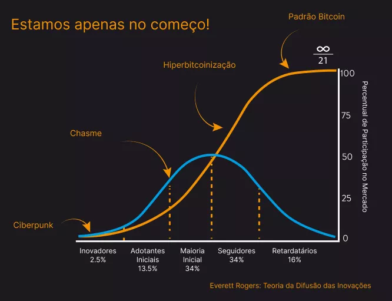

O crescimento do Bitcoin obriga empresas, universidades, reguladores e indivíduos a considerarem essa nova tecnologia. Novas ferramentas devem ser criadas, serviços devem ser adaptados e a inovação deve continuar para garantir sua sobrevivência. Esse contexto levanta muitas questões que afetam várias áreas, incluindo criptografia, teoria dos jogos, economia e política monetária, ciência da computação, filosofia, energia, leis e regulamentações. Em resumo, o Bitcoin é um objeto multidisciplinar.


### Bitcoin é um 0 a 1

Convidamos você a refletir sobre essa nova revolução monetária. Há tantas coisas para explorar com o Bitcoin que é difícil assimilar tudo de uma vez. Leve o seu tempo, o Bitcoin não vai desaparecer. Pelo contrário, a revolução está apenas começando. Juntos, acreditamos que somos capazes de criar o mundo que queremos deixar para nossos filhos. Um mundo onde a soberania humana é um direito, onde a privacidade é respeitada por padrão e onde a moeda não é manipulada. Esperamos que juntos possamos alcançar isso.

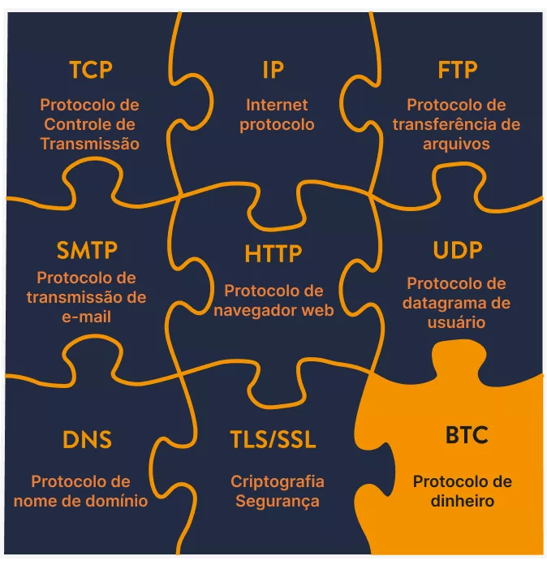

Si você deseja expandir seus conhecimentos sobre o Bitcoin, muitos autores, pensadores e ensaístas contribuíram para a camada educacional do Bitcoin. Nos últimos anos, temos catalogado e classificado essas obras para oferecer uma [biblioteca de recursos](https://planb.network/resources) aos mais curiosos entre vocês. Você encontrará os melhores podcasts, sites, artigos, tutoriais, livros e outros conteúdos.

> Milton Friedman, um renomado economista, previu em 1999: "Eu acredito que a internet será uma das principais forças para reduzir o papel do governo. A única coisa que está faltando, mas que em breve será desenvolvida, é uma moeda eletrônica confiável - um método pelo qual na internet você pode transferir fundos de A para B sem que A conheça B ou B conheça A." Hoje, o Bitcoin atende a essa previsão.

# O futuro do Bitcoin: A Lightning Network

<partId>899fd35e-39e6-5a25-a73e-6fed6e725094</partId>

## Breve introdução à Lightning Network

<chapterId>b403f1e4-f1ff-572b-a242-9b58cb3736d0</chapterId>

Agora que temos as bases do protocolo Bitcoin, vamos apresentar uma rede de pagamento que utiliza o protocolo Bitcoin para permitir transações em velocidade relâmpago. Estamos falando, é claro, da Lightning Network!

### Em poucas palavras

A Lightning Network é uma tecnologia revolucionária que mudou profundamente nossa percepção do Bitcoin. É uma solução que aborda a questão da escalabilidade do Bitcoin.

Para entender bem a Lightning Network, é crucial compreender como o Bitcoin evolui. O Bitcoin se desenvolve em camadas de infraestrutura: a primeira camada é a blockchain, e a segunda camada é a Lightning Network.

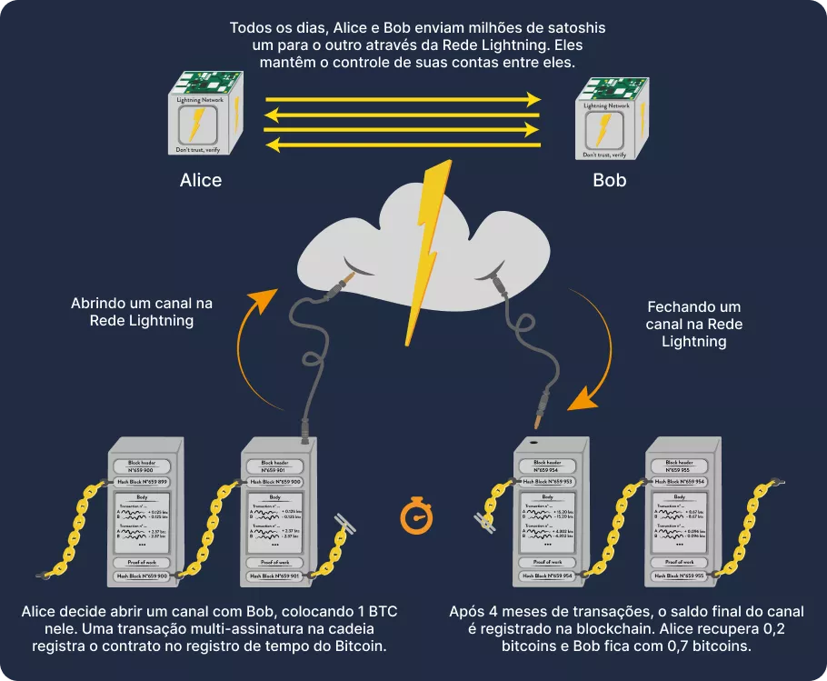

Reconhecida como uma camada do Bitcoin, a Lightning Network foi validada e implementada em 2017. Ela permite realizar transações instantâneas em Bitcoin com baixo custo, resolvendo assim o problema de escalabilidade do Bitcoin. Mas qual é esse problema de escalabilidade que o Bitcoin enfrenta?

### Uma blockchain não pode crescer infinitamente

O problema de escalabilidade ou dimensionamento refere-se ao desafio de estabelecer um sistema monetário capaz de lidar com um número crescente de transações por segundo à medida que é adotado. Isso se refere ao trilema das blockchains. Imagine um triângulo com os vértices: descentralização, segurança e escalabilidade.

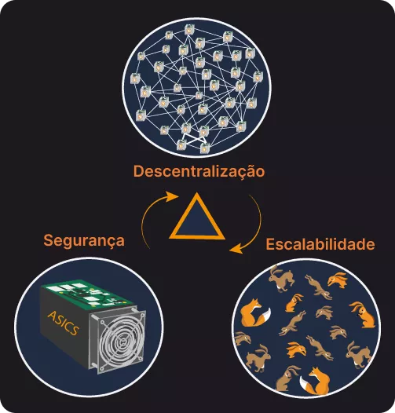

Um protocolo baseado em blockchain não pode satisfazer apenas dois desses 3 aspectos. Dentro do protocolo do Bitcoin, escolhas foram feitas para favorecer a descentralização/segurança. De fato, por um lado, o tamanho dos blocos de 1MB e o tempo entre dois blocos (em média 10 minutos) permitem que um nó Bitcoin seja executado a baixo custo, favorecendo a descentralização. E por outro lado, a produção de blocos por Prova de Trabalho (ou Proof-of-Work) torna extremamente caro o fraudar dentro do protocolo, ao mesmo tempo em que facilita a verificação pelos nós da rede, favorecendo assim a segurança. No entanto, essas escolhas impõem um limite no número médio de transações em um bloco, da ordem de algumas, o que corresponde aproximadamente a algumas transações por segundo. Esse número é ridículo quando comparado à capacidade dos processadores de pagamento como a VISA, que é de 1700/s. No entanto, é um limite necessário para poder transacionar de forma imutável e sem intermediários de confiança com o Bitcoin. No entanto, as pessoas que desenvolvem no Bitcoin têm pensado sobre esse problema desde o início.

### Lightning como camada superior

Após anos de reflexão e várias tentativas, o protocolo Lightning emerge. Com a ajuda de um certo número de especificações, esse protocolo permite construir uma rede de pagamento ponto a ponto, utilizando a segurança e a programabilidade das transações do protocolo Bitcoin. A Lightning Network atua como uma rede de canais de pagamento, permitindo transações instantâneas e com baixas taxas para o remetente. Essa rede de canais de pagamento torna até mesmo possível transações entre indivíduos que não têm um canal diretamente conectado entre si.

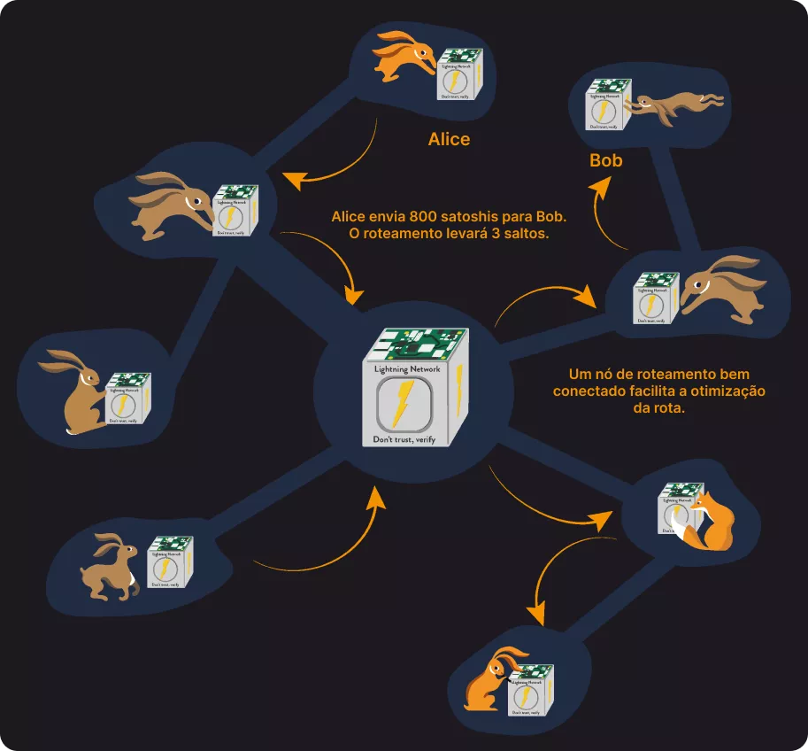

Os serviços de transferência de dinheiro tradicionais, como Western Union, bancos centrais, Visa e Mastercard, podem desaparecer se não adotarem a tecnologia Lightning Network. A Lightning Network é mais eficiente e econômica do que os sistemas de pagamento atuais. De fato, a Lightning Network permite realizar um número quase ilimitado de transações entre dois pares que compartilham um canal, sem gastos energéticos na blockchain básica além da transação para anunciar a criação do canal.


As transações são seguras por criptografia e indiretamente pela energia consumida pelos mineradores no Bitcoin. As transações podem ser feitas instantaneamente, sem limite geográfico, e as taxas são extremamente baixas, frequentemente inferiores a 0,5%.

Em resumo, a Lightning Network é uma tentativa promissora de implantar um sistema de pagamento eficiente para transações em bitcoin. Já existem muitas carteiras Lightning que você pode descobrir em nossa seção de tutoriais ou por meio de nossos cursos sobre a Lightning Network.

## Casos de uso da Lightning Network

<chapterId>684e31f9-ebd1-51b6-91c0-1e6a315f1141</chapterId>

Comme acabamos de ver, o protocolo Bitcoin, embora revolucionário, enfrenta desafios significativos em termos de escalabilidade, a fim de realizar todas as nossas transações diárias. Para resolver esses problemas, uma solução de segunda camada conhecida como Lightning Network foi proposta em 2016 e hoje possui várias implementações diferentes, mas todas interoperáveis:

- Core-lightning por Blockstream
- Eclair por Acinq
- LND por Lightning strike

Esta rede peer-to-peer visa facilitar especialmente as microtransações, ou seja, transações de valor muito baixo, que de outra forma seriam impraticáveis devido às altas taxas e tempos de confirmação longos na blockchain do Bitcoin.

### Quais são os casos de uso da rede?

Essa tecnologia abre a porta para uma ampla gama de aplicações potenciais para o Bitcoin, que anteriormente estavam fora de alcance devido às restrições necessárias para garantir a segurança e descentralização do Bitcoin. Entre essas aplicações no dia a dia, podemos citar a faturação instantânea no comércio (físico e online), o streaming de dinheiro para pagamentos em tempo real e microdoações para conteúdo. A implantação de uma rede de transações quase instantâneas, segura e de baixo custo (em média inferior a 0,5%), permite a implementação de muitos modelos de negócios anteriormente inimagináveis. Isso é possível porque a Lightning Network usa sats (a fração decimal do bitcoin) para funcionar.


A indústria de jogos eletrônicos oferece um exemplo particularmente interessante de como a Lightning Network pode ser usada para transformar modelos de negócios existentes. O conceito de "skin in the game" é uma ideia que recentemente ganhou popularidade nesse contexto. Basicamente, trata-se de ter um interesse financeiro no resultado de um jogo.
A Lightning Network permite que os jogadores apostem pequenas quantias de dinheiro ao jogar, como algumas dezenas de satoshis (aproximadamente uma fração de centavo de euro). Isso permite estabelecer um interesse que estimula a competição, ao mesmo tempo em que aumenta consideravelmente o custo de implantação de bots.


Em resumo, o futuro das microtransações com Bitcoin parece promissor graças a inovações como a Lightning Network. À medida que essas tecnologias continuam a se desenvolver e amadurecer, podemos esperar ver novas e empolgantes aplicações surgindo em um futuro próximo. Por exemplo, o conceito de "streaming de dinheiro", como a Lightning Network nos permite realizar microtransações a cada minuto (e potencialmente sem intermediários de confiança), abre caminho para a experimentação de modelos econômicos em que os consumidores pagam pelo conteúdo de acordo com o que consomem.


Dans um sistema como esse, o dinheiro é automaticamente dividido, com base em uma porcentagem pré-definida, entre os diferentes contribuidores de um serviço ou produto. Isso poderia revolucionar a forma como pensamos nos modelos de pagamento. Por exemplo, em vez de pagar uma assinatura mensal por um serviço, os usuários poderiam ser cobrados por minuto, ou até mesmo por segundo, pelo tempo que passam usando o serviço. Esse modelo econômico poderia ter implicações profundas para os criadores de conteúdo, que seriam incentivados a produzir conteúdo de qualidade para reter a atenção dos usuários. Os usuários, por sua vez, pagariam apenas pelo conteúdo que consomem, eliminando assim as taxas de assinatura antecipadas. É até mesmo possível usar esse sistema para aluguel de bens.


Em conclusão, a Lightning Network abre uma infinidade de casos de uso empolgantes para os usuários de Bitcoin. Os modelos econômicos e as oportunidades comerciais resultantes são numerosos e variados. Encorajamos você a testar por si mesmo usando o aplicativo de podcast [Fountain](https://www.fountain.fm/), que permite ser remunerado com alguns sats para ouvir seus podcasts favoritos!

## Pílula azul ou pílula vermelha?

<chapterId>c81cdb45-6aa9-5462-9835-c4852084b2cc</chapterId>

Como Morpheus disse a Neo: "Se você tomar a pílula azul, a história acaba, você acorda na sua cama e acredita no que quiser. Se você tomar a pílula vermelha, fica no País das Maravilhas e eu te mostro até onde vai a toca do coelho." Você está pronto para explorar a toca do coelho do Bitcoin? Tome cuidado, pois você pode encontrar sua liberdade financeira!


### O futuro tecnológico e suas implicações

A tecnologia está evoluindo de forma exponencial e ninguém pode prever com certeza suas evoluções. A conectividade do mundo e a inteligência artificial continuam a se desenvolver. O conhecimento que um indivíduo pode adquirir por meio da internet está se tornando cada vez mais incontável.

Vamos tomar a IA como exemplo, essas tecnologias já ultrapassaram ou estão se aproximando do nível humano em um número crescente de áreas, como jogos de vídeo, produção de imagens e textos, análise de dados. Uma das implicações potenciais é que mais de 80% dos empregos desaparecerão devido à IA e automação. Temos várias opções, como restringir o avanço tecnológico ou colher o aumento de capital gerado pela produtividade das IAs.

As perguntas essenciais a serem feitas são:

- Como lidar com uma sociedade em que 80% dos empregos desaparecerão?
- Como revitalizar uma população?
- Será que precisamos de tantos professores?
- As consequências geopolíticas, políticas e humanas da automação não são discutidas o suficiente.

A computação, a internet, o streaming, a realidade virtual vão mudar a educação. Poderíamos ter um curso universal para todos os estudantes franceses gerenciado pelo governo e professores que não ministram mais a aula, mas que acompanham diretamente os alunos. As crianças poderiam entrar em um mundo virtual e serem acompanhadas para aprender história.

- Onde está a linha entre um professor e uma IA?
- Como garantir uma sociedade próspera?

Essas questões fundamentais para o nosso futuro devem ser debatidas e decididas coletivamente. Mas qual é a relação com o Bitcoin? Assim como a internet para os meios de comunicação, o Bitcoin é uma revolução tecnológica para novos modos de organização em grande escala, nos proporcionando a possibilidade de trocar valor sem qualquer intermediário de confiança. Desejamos restringir a evolução tecnológica do sistema monetário ou colher o aumento de capital através do ganho de produtividade multiplicado pelo uso dos protocolos Bitcoin e Lightning?

### Qual é o futuro das finanças?

Essas reflexões também levantam questões sobre quem deve possuir, autorizar e rastrear o dinheiro que usamos. O objetivo é decidir entre um sistema fechado com líderes não eleitos ou um sistema aberto sem intermediários de confiança, onde a neutralidade prevalece.

- A moeda é um título de propriedade privada?
- As contas dos manifestantes podem ser bloqueadas sem ordem do Supremo Tribunal?
- Quem garante o sistema financeiro?
- Como um indivíduo pode ser soberano sobre seu dinheiro e depender de um intermediário de confiança?
- É possível enviar dinheiro para o outro lado do mundo sem taxas ou intermediários?

Aceitar essas novas tecnologias poderia gerar economias de escala massivas em todo o planeta. Devemos permitir a livre circulação de fluxos de capital? Os bloqueios internacionais têm consequências econômicas e políticas. É ético usar intermediários financeiros como a Western Union, que às vezes cobra até 25% de taxas? Acreditamos que em um mundo cada vez mais digital, o dinheiro deve ser democratizado e considerado um bem comum pertencente ao povo, em vez do Estado ou instituições financeiras opacas.

A questão de quem deve controlar o sistema bancário é crucial, pois as regras do jogo bancário não são transparentes e compreensíveis para todos, o que permite que uma casta de políticos e reguladores mantenha seu domínio sobre o sistema. É importante questionar se o mercado livre ou um grupo de intelectuais deve controlar o sistema bancário.

### Nossas liberdades estão em jogo.

A censura também deve ser questionada, pois quem possui o conhecimento para decidir o que deve ser censurado ou não? Os meios de comunicação mudaram sua posição sobre algumas informações e as pessoas que foram censuradas antes não são mais hoje.

- Quem decide o que é censura ou propaganda?
- Quem tem o controle divino sobre nosso sistema?

Tolerar a censura pode destruir a liberdade de expressão e o direito de reunião. A implementação da censura é tecnicamente difícil sem criar uma distopia completa. Qual instância deve ter o poder de censura? A questão da censura é complicada e é difícil saber quem deve ser censurado ou não. A censura pode ter um impacto negativo na inovação e na liberdade de empreender.

Existem 2,4 bilhões de pessoas no mundo sem conta bancária, o que inevitavelmente cria desigualdades geográficas. O Bitcoin permite igualdade em transações, independentemente do seu status social ou posição política. O protocolo Bitcoin é apolítico e não concede privilégios específicos ao presidente ou a outros atores. Os líderes devem ter os mesmos privilégios que as pessoas comuns para impulsionar o desenvolvimento para cima, em vez de deixar alguns no topo e outros na base. Todos devem ter a mesma moeda, independentemente do seu status social? É importante pensar no mundo que queremos deixar para nossos filhos. Desejamos deixar um mundo aberto onde eles sejam livres para fazer o que quiserem com seu dinheiro.

O Bitcoin é importante e não deve ser considerado apenas um jogo de azar. É crucial continuar fazendo perguntas sobre o Bitcoin.

### Bitcoin: um protocolo revolucionário

Como vimos no capítulo anterior, o protocolo Bitcoin é neutro em relação a todos os seus usuários. Através das regras de consenso e criptografia, podemos registrar transações de forma imutável em um registro público global, garantindo transferências de valor monetário sem a necessidade de terceiros confiáveis. As camadas de infraestrutura de nível 2 (e em breve nível 3, com RGB) permitem que a rede evolua e desenvolva novas funcionalidades, especialmente para resolver problemas de escalabilidade.
Bitcoin tem todas as características necessárias para ser uma moeda eficiente e saudável: divisível, transportável instantaneamente, não censurável, verificação de custo negligenciável e com uma política monetária já estabelecida para os séculos futuros com essas 21 milhões de unidades. Bitcoin é pseudo-anônimo e pode ser negociado em qualquer lugar do mundo sem a necessidade de autorização de qualquer entidade, apenas é necessário possuir suas próprias chaves privadas - como diz o ditado "Not your keys, not your bitcoins" ("não são suas chaves, não são seus bitcoins").
Bitcoin é adotado por diversos grupos de pessoas, desde criptógrafos, libertários até empresas tradicionais e até mesmo um país. No entanto, o Bitcoin é para todos e o número de usuários está crescendo, assim como o número de nós Bitcoin que atuam como guardiões do histórico de transações, garantindo assim sua descentralização.

Bitcoin não pode mais ser interrompido e não pode mais ser censurado. É uma revolução pacífica para mudar o sistema monetário e permitir a inclusão financeira. Os usuários podem obter Bitcoins aceitando-os em suas transações comerciais ou comprando-os por meio de plataformas regulamentadas ou não. Os Bitcoins podem ser armazenados em carteiras, aplicativos móveis ou dispositivos físicos. Não há intermediário de confiança no Bitcoin, o Bitcoin defende a transparência, a liberdade e a responsabilidade individual - como diz o ditado "Don't Trust, Verify" ("Não confie, verifique por si mesmo").

Mudar o sistema financeiro requer mudar a moeda. Satoshi criou o Bitcoin em 2008 como uma tentativa de suprir isso. Ter acesso a dinheiro fácil e "mágico" corrompe. Portanto, o Bitcoin é uma alternativa para construir um novo sistema monetário neutro. O Bitcoin permite a emancipação do sistema bancário. É um fenômeno social que nos leva a participar de uma revolução pacífica. Você está pronto para se juntar a ela?

## Agradecimentos e continue a cavar a toca do coelho

<chapterId>c153facd-fe77-5954-b18b-d0e2243e787a</chapterId>

### Vá mais fundo

Parabéns por concluir este curso BTC 101! Espero sinceramente que você tenha gostado e que tenha aberto portas para você. Sua descoberta do bitcoin está apenas começando e convido você a explorar todos os outros cursos disponíveis na universidade.

- [BTC 102](https://planb.network/courses/btc102) irá ajudá-lo a criar seu plano bitcoin
- [LNP 201](https://planb.network/courses/lnp201) permitirá que você descubra a Lightning Network, uma rede de pagamento de segunda camada
- [ECO 201](https://planb.network/courses/eco201) abordará a economia austríaca
- [SCU 101](https://planb.network/courses/scu101) permitirá que você atualize sua segurança digital
- [MIN 201](https://planb.network/courses/min201) para saber mais sobre mineração
- e muitos outros...


## Avalie o curso

<chapterId>585729e2-b0ab-51b5-89ec-593e3ea22c57</chapterId>
<isCourseReview>true</isCourseReview>

## Exame Final
<chapterId>8410e961-3841-5abf-a51d-04fc0139dd59</chapterId>
<isCourseExam>true</isCourseExam>

## Conclusão

<chapterId>dfc534be-44a9-5e8c-9c98-e51ef0554e91</chapterId>

**Parabéns por concluir este curso!**

Por favor, observe que este capítulo está atualmente em construção, e uma versão aprimorada chegará em breve. Enquanto isso, se você está ansioso para continuar sua jornada Bitcoin, convidamos você a explorar os outros cursos e tutoriais disponíveis em nossa plataforma. Continue com o bom trabalho e bons estudos!
