# การผจญภัยสู่ Bitcoin ครั้งแรกของคุณ

ในคอร์สนี้ ฉันจะอธิบายเรื่องของตัว Bitcoin โดยแบ่งเป็น 25 บท เพื่อให้คุณเข้าใจเทคโนโลยีนี้ได้อย่างง่ายดายและมีประสิทธิภาพ คอร์สนี้เปิดกว้างสำหรับทุกคนและสำรวจอุตสาหกรรมโดยรวมทั้งในด้านนักขุด ด้านกระเป๋าเงิน ด้านแพลตฟอร์มซื้อ/ขาย ฯลฯ...

คอร์สควรใช้เวลาประมาณ 15 ชั่วโมง โดยตลอดการเดินทางเพื่อเรียนรู้นี้ จะมีโปสเตอร์พร้อมคำอธิบายและทรัพยากรเพิ่มเติมให้ใช้บริการ

คุณไม่จำเป็นต้องมีความรู้เฉพาะด้านใดๆในการจะเริ่มต้นศึกษา โดยคอร์สนี้เปิดกว้างสำหรับทุกคน!

+++

# บทนำ
<partId>3cd2ac82-026c-53e1-874a-baf5842adc6d</partId>

## ก้าวสู่โลกที่ไม่รู้จัก
<chapterId>27e3fb60-4b50-556b-9e70-c4f5475c121d</chapterId>

### ยินดีต้อนรับสู่กระบวนทัศน์ด้านการเงินและเทคโนโลยีแบบใหม่

Bitcoin เป็นนวัตกรรมที่สำคัญที่เกินกว่าเพียง "สกุลเงินบนอินเทอร์เน็ต" มันเป็นการปฏิวัติทั้งในด้านเทคโนโลยีและด้านการเงิน ซึ่งสามารถทำให้เราตั้งคำถามเกี่ยวกับความสัมพันธ์ของเรากับสกุลเงินและสังคมของเรา Bitcoinนั้นเป็นสกุลเงินที่เรียกว่า **เป็นกลาง** และ **กระจายอำนาจ** ซึ่งหมายความว่ามันไม่ได้ถูกควบคุมโดยหน่วยงานหรือสถาบันใดๆ มันเป็นนวัตกรรมที่สำคัญที่เกินกว่าจะเป็นเพียงแค่สกุลเงิน ในการเข้าใจเหรียญที่โ่ด่งดังอย่าง bitcoin มันสำคัญที่เราจะต้องเข้าใจว่า bitcoin (หรือที่เรียกว่า BTC)นั้น เป็นทั้งตัว โปรโตคอลคอมพิวเตอร์ (หรือ Bitcoin ที่ขึ้นต้นด้วย B ตัวใหญ่) และเป็น หน่วยเงิน (หรือ bitcoin ที่ขึ้นต้นด้วย b ตัวเล็ก)

โดยตัวโปรโตคอลใช้เทคโนโลยีพื้นฐานเช่น การเข้ารหัสลับ, การสื่อสารเครือข่าย, และตัว "blockchain" ที่โด่งดัง ในขณะที่หน่วยเงิน bitcoin เป็นสกุลเงินที่จำเป็นสำหรับการทำงานที่ถูกต้องของโปรโตคอลนี้เอง ในชีวิตประจำวัน ชาว เอลซัลวาดอร์หรือ bitcoiners ทั่วโลกนั้น ใช้สกุลเงิน bitcoin เพื่อซื้อและขายสินค้าและบริการ โดยสกุลเงินนี้พึ่งพาตัว โปรโตคอล Bitcoin เพื่อการทำงาน

### หลักสูตรที่ครอบคลุมแต่ก็ยังเข้าถึงได้ง่าย

ในคอร์สนี้ เราจะพูดถึง Bitcoin ในด้านการเงิน รวมถึงวิธีการซื้อและขาย bitcoins, การเก็บรักษาอย่างปลอดภัยในกระเป๋าเงินดิจิทัล และการใช้งานสำหรับการทำธุรกรรม เราจะศึกษาบทบาทของนักขุด ซึ่งมีความสำคัญสำหรับการสร้าง bitcoins ใหม่และรักษาความปลอดภัยให้เครือข่าย Bitcoin นอกจากนี้ เราจะสำรวจอนาคตของ Bitcoin และวิธีที่เทคโนโลยี Lightning Network สามารถยกระดับการทำธุรกรรมของตัว Bitcoin ได้

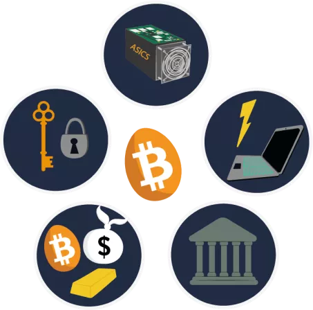

มันสำคัญที่จะต้องเข้าใจว่า Bitcoin เป็นระบบการเงินใหม่ที่ปฏิวัติความสัมพันธ์ของเราเกี่ยวกับเงิน การเรียนรู้ใช้ Bitcoin เป็นทักษะที่จำเป็นสำหรับทุกคนที่ต้องการที่จะมีอำนาจควบคุมในเงินของตนเอง

**ส่วนที่ 1 - เงิน**

- บทที่ 1 - เงินคืออะไร?
- บทที่ 2 - เงินเฟียต
- บทที่ 3 - ภาวะเงินเฟ้อรุนแรง (Hyperinflation)
- บทที่ 4 - นโยบายการเงินของ Bitcoin

**ส่วนที่ 2 - กระเป๋าเงิน Bitcoin**

- บทที่ 5 - กระเป๋าเงิน Bitcoin ทำงานอย่างไร?
- บทที่ 6 - เลือกระดับความปลอดภัยของคุณ
- บทที่ 7 - ตั้งค่ากระเป๋าเงินของคุณ
- บทที่ 8 - การป้องกันตัว จาก กาลเวลา

**ส่วนที่ 3 - Bitcoin ในแง่มุทด้านเทคนิค**

- บทที่ 9 - คำอธิบายต่อ การทำธุรกรรม
- บทที่ 10 - โหนด Bitcoin
- บทที่ 11 - นักขุด
- บทที่ 12 - นักขุดและระบนิเวศวิทยา

**ส่วนที่ 4 - การออมใน Bitcoin**

- บทที่ 13 - ราคาของ Bitcoin
- บทที่ 14 - วิธีการซื้อ Bitcoin
- บทที่ 15 - การทำงานแลก Bitcoins
- บทที่ 16 - Hyper-bitcoinization

**ส่วนที่ 5 - เครือข่าย Lightning**

- บทที่ 17 - บทนำสู่เครือข่าย Lightning
- บทที่ 18 - กรณีการใช้งานสำหรับเครือข่าย Lightning

ก่อนที่จะพูดถึงคำจำกัดความและหน้าที่นของเงินในสังคม (บทที่ 1) เราจะเริ่มต้นด้วยจุดกำเนิดของ Bitcoin ซึ่งเป็นเทคโนโลยีใหม่ที่เปิดตัวในปี 2009 และไม่เหมือนกับสิ่งอื่นใดก่อนหน้า ดังนั้นมันจึงเป็นเรื่องปกติที่คุณจะไม่เข้าใจทุกอย่างในครั้งเดียว และในความเป็นจริง คุณสามารถใช้ Bitcoin ได้ (รับ จ่าย รักษาเงินของคุณให้ปลอดภัย)โดยไม่จำเป็นต้องรู้รายละเอียดทางเทคนิคของมันทั้งหมดเช่นเดียวกับตอนที่คุณเรียนรู้การใช้งานอินเทอร์เน็ตหรือรถยนต์ 

ความสำคัญที่นี่คือการเข้าใจเทคโนโลยีใหม่นี้ในแง่กว้างๆ เราหวังว่าการฝึกอบรมนี้จะทำให้คุณพอใจและมอบพื้นฐานที่จำเป็นในการเข้าใจและก้าวหน้าไปในกระบวนทัศน์การเงินโลกแบบใหม่นี้

## ประวัติศาสตร์ก่อนการถือกำเนิดของ Bitcoin
<chapterId>9a94b627-5b69-5d81-9125-f1fa9b0aa6ad</chapterId>

ก่อนที่คำว่า "Bitcoin" จะกลายเป็นคำที่มีความหมายเกี่ยวกับสกุลเงินดิจิทัลและการเปลี่ยนแปลงทางการเงิน ได้มีการวางรากฐานที่จะป็นพื้นฐานที่สำครับสำหรับการสร้างตัวมันขึ้นมาไว้ก่อนหน้า วางไว้ด้วยด้วยแนวคิดต่างๆ นวัตกรรมต่างๆ และการเคลื่อนไหวทางสังคม  และหนึ่งในองค์ประกอบพื้นฐานของประวัติศาสตร์ก่อนหน้าการถือกำเนิดของ Bitcoin คือการเคลื่อนไหวของกลุ่ม cypherpunk

### Cypherpunks: เหล่าผู้ที่มีวิศัยทัศน์แห่งโลกดิจิทัล

ณ ศูนย์กลางของการพัฒนาเทคโนโลยีในช่วงทศวรรษ 1980 และ 1990 กลุ่มคนหนึ่งเริ่มตั้งคำถามอย่างลึกซึ้งเกี่ยวกับบทบาทของความเป็นส่วนตัวและเสรีภาพในยุคดิจิทัล บุคคลเหล่านี้ ซึ่งต่อมาจะเรียกว่า "cypherpunks" เชื่ออย่างมั่นคงว่าการเข้ารหัสลับสามารถใช้เป็นเครื่องมือในการปกป้องสิทธิ์ของบุคคลจากการแทรกแซงของรัฐบาลและบริษัทขนาดใหญ่

บุคคลสำคัญเช่น Julian Assange, Wei Dai, Tim May และ David Chaum มีส่วนช่วยในการกำหนดปรัชญาและวิสัยทัศน์ของกลุ่ม cypherpunks นักคิดเหล่านี้แบ่งปันความคิดของพวกเขาใน Mailing List ที่โด่งดัง ที่ซึ่ผู้เข้าร่วมจากทั่วโลกได้ถกเถียงกันเกี่ยวกับวิธีที่ดีที่สุดในการใช้เทคโนโลยีเพื่อรับประกันว่าจะมีเสรีภาพส่วนบุคคลที่มากขึ้น

### เสาหลักสามประการของกลุ่ม Cypherpunks

การเคลื่อนไหวของกลุ่ม cypherpunk ซึ่งมีรากฐานอยู่ในการเคลื่อนไหวในทางดิจิทัลและการเข้ารหัสลับ พึ่งพาข้อความหลักหลายฉบับเพื่อแสดงหลักการและวิสัยทัศน์ของอนาคต  ซึ่งท่ามกลางข้อความเหล่านั้น มีข้อความอยู่ 3 อันที่โด่ดเด่นกว่าอันอื่นๆโดยมีดังนี้:

- "Cypherpunk Manifesto":
  เขียนโดย Eric Hughes ในปี 1993 "Cypherpunk Manifesto" ยืนยันว่าความเป็นส่วนตัวเป็นสิทธิพื้นฐาน Hughes ได้อภิปรายว่าความสามารถในการสื่อสารอย่างอิสระและเป็นความลับเป็นสิ่งจำเป็นสำหรับสังคมที่มีอิสระ โดยในแถลงการได้ระบุว่า "เราไม่สามารถคาดหวังให้สถาบัน บริษัท หรือหน่วยงานที่ไม่มีตัวตนอื่นๆ จะยอมมอบความเป็นส่วนตัวกับเรา... เราต้องปกป้องมันด้วยตัวเราเอง"

- "Crypto-Anarchist Manifesto":
  เขียนโดย Timothy C. May ในปี 1992 ข้อความนี้อธิบายว่าการใช้การเข้ารหัสลับสามารถนำไปสู่ยุคของการปกครองแบบอนาธิปไตยผ่านการเข้ารหัสลับ ที่ซึ่งรัฐบาลจะไร้อำนาจในการแทรกแซงในเรื่องส่วนตัวของประชาชนได้ May ได้วางฝันถึงอนาคตที่ข้อมูลต่างๆ เงิน และข้อความสามารถแลกเปลี่ยนกันได้โดยไม่ต้องผ่านบุคคลที่สาม และสามรถทำได้อย่างไม่เปิดเผยตัวตน

- "Declaration of the Independence of Cyberspace":
แม้ว่าจะไม่ได้เป็นประกาศแถลงการเฉพาะกลุ่ม cypherpunk แต่ข้อความนี้สะท้อนถึงความรู้สึกของผู้มีส่วนร่วมหลายคนในการเคลื่อนไหวนี้ โดยถูกเขียนขึ้นในปี 1996 โดย John Perry Barlow โดยมีเหตุผลมาจากเหตุการควบคุมอินเทอร์เน็ตโดยรัฐบาลที่เพิ่มขึ้น โดยปฏิญญานี้ยืนยันว่าไซเบอร์สเปซเป็นดินแดนที่แยกจากจากโลกทางกายภาพและไม่ควรถูกควบคุมด้วยกฎหมายแบบเดียวกัน มันยังระบุว่า "เราไม่มีรัฐบาลที่ได้รับเลือกให้ปกครอง และเราไม่่มีทางมีจะถูกปกครองโดยใคร"

### บรรพบุรุษของ Bitcoin

ก่อนที่ Bitcoin จะถือกำเนิดขึ้นนั้น ได้มีการพยายามสร้างสกุลเงินดิจิทัลหลายครั้ง ตัวอย่างเช่น David Chaum ได้นำเสนอแนวคิด "เงินอิเล็กทรอนิกส์ที่ไม่ระบุตัวตน" ด้วยโปรเจกต์ "DigiCash" ในทศวรรษ 1980 แต่น่าเสียดายที่เนื่องจากข้อจำกัดต่างๆ DigiCash ไม่เคยประสบความสำเร็จจริงๆ

อีกหนึ่งบรรพบุรุษที่สำคัญคือ "b-money" ของ Wei Dai แม้ว่ามันจะไม่เคยถูกนำมาใช้งานจริง แต่มันได้นำเสนอแนวคิดของสกุลเงินดิจิทัลที่ไม่ระบุตัวตน ที่ซึ่งการตรวจจับการฉ้อโกงจะถูกดำเนินการโดยชุมชนของผู้ประเมินแทนที่จะเป็นหน่วยงานกลาง

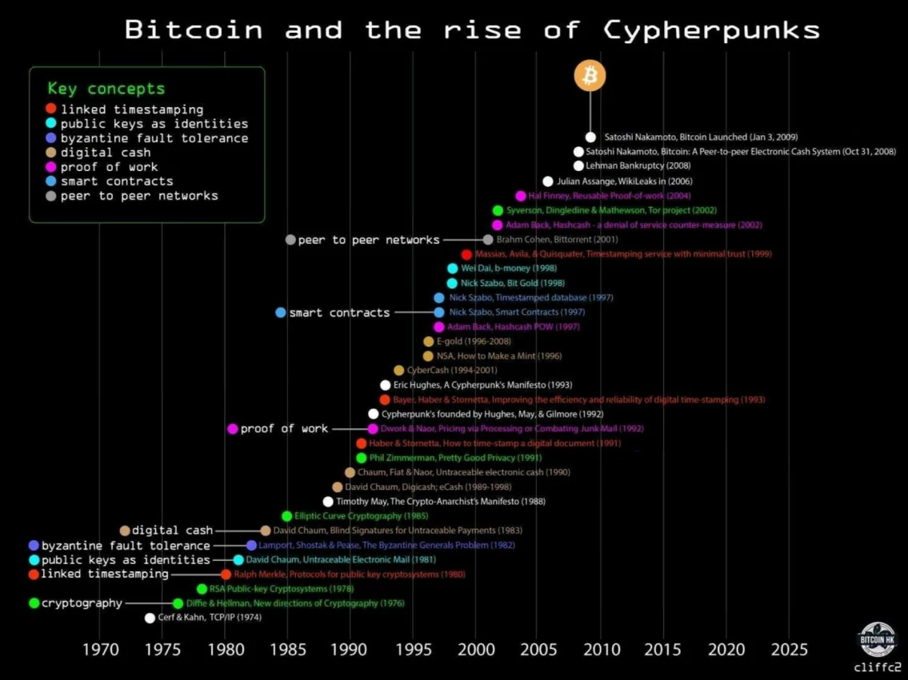

และในสภาพแวดล้อมอันอุดมสมบูรณ์นี้แหละที่ Satoshi Nakamoto ผู้ลึกลับได้เผยแพร่ whitepaper ของ Bitcoin ในปี 2008 เขาได้รวมแนวคิดหลายอย่างจากการเคลื่อนไหวของกลุ่ม cypherpunk เช่น proof of work และ cryptographic timestamps เพื่อสร้างสกุลเงินดิจิทัลที่กระจายศูนย์และต้านทานการเซ็นเซอร์ชิปได้

Bitcoin ไม่เพียงแต่เป็นสกุลเงินดิจิทัลเท่านั้น แต่ยังแสดงถึงความสำเร็จของอุดมการณ์กลุ่ม cypherpunk นอกเหนือจากเทคโนโลยีของมันแล้ว มันยังเป็นสัญลักษณ์ของการปฏิวัติต่อระบบการเงินแบบดั้งเดิมและเสนอ ทางเลือกที่มีพื้นฐานอยู่บนความโปร่งใส การกระจายอำนาจ และอธิปไตยของบุคคล

### สรุป

ประวัติศาสตร์ก่อนประวัติศาสตร์ของ Bitcoin มีรากฐานเที่กี่ยวข้องกับการเคลื่อนไหวของ cypherpunk อย่างลึกซึ้ง และการแสวงหาอิสระที่มากขึ้นในยุคดิจิทัล โดยจากการรวมหลักการของการเข้ารหัสลับ การกระจายอำนาจ และความซื่อสัตย์ เข้าด้วยกันนั้น Bitcoin ได้กลายเป็นมากกว่าเพียงแค่ สกุลเงินนึง แต่เป็น ผลผลิตของการปฏิวัติทางด้านปรัชญาและด้านเทคโนโลยีที่ยังคงเปลี่ยนแปลงโลกของเราตลอดเวลา

ดังนั้น Bitcoin จึงเป็นโปรโตคอลที่จะอยู่ข้ามช่วงเวลาอันยาวนานและคอยกระตุ้นให้เราตั้งคำถามเกี่ยวกับความสัมพันธ์ของเรากับพลังงาน เวลา และเงิน แต่ Bitcoin เป็น สกุลเงิน "จริงๆ" หรือไม่? แล้วเงินคืออะไร? ตัวมันมันมีหลายรูปแบบหรือไม่? เราจะสำรวจคำถามเหล่านี้ในบทถัดไป

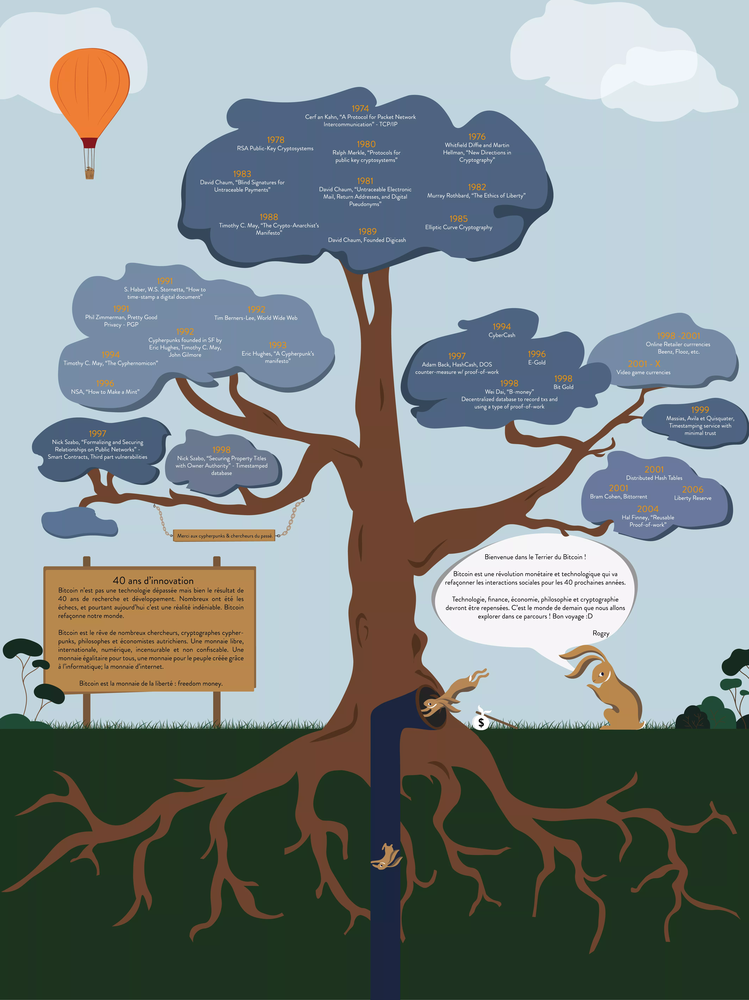

# เงิน
<partId>e913df1a-4cbd-5380-ba67-ca2a0414f671</partId>

## ประวัติศาสตร์ของเงิน
<chapterId>c838e64d-d59f-5703-8c74-ea5e8c4fdd31</chapterId>

วิวัฒนาการของเงินนั้นเป็นส่วนที่น่าสนใจของประวัติศาสตร์มนุษย์ สะท้อนถึงความคิดสร้างสรรค์ของอารยธรรมต่างๆ ทั่วโลกในการตอบสนองต่อความต้องการทางเศรษฐกิจที่เปลี่ยนแปลงไปตลอดเวลา


### จากเปลือกหอยสู่บัญชีธนาคาร

เดิมทีนั้น เงินเป็นสิ่งที่จับต้องได้ มักเชื่อมโยงกับสินค้าจำเป็น เช่น ธัญพืช สัตว์เลี้ยง และสินค้าโภคภัณฑ์อื่นๆ อย่างไรก็ตาม สินค้าเหล่านี้มีข้อเสียสำคัญ เช่น ความเสื่อมสภาพได้ง่าย ทำให้ยากที่จะใช้เป็นสื่อกลางในการออมระยะยาว ตัวอย่างเช่น การเก็บเกี่ยวผลผลิตที่ล้มเหลวหรือโรคระบาดอาจทำให้ความมั่งคั่งของบุคคลหายไปในชั่วข้ามคืน
เมื่ออารยธรรมพัฒนาขึ้นและการค้าขยายไปยังภูมิภาคใหม่ๆ จึงมีความต้องการสื่อกลางในการแลกเปลี่ยนที่เป็นสากล วัตถุเช่น เปลือกหอยและอัญมณีได้ถูกทดลองนำมาใช้ แต่มันก็ไม่สมบูรณ์แบบ ท้ายที่สุดแล้ว ทองคำได้กลายเป็นมาตรฐานเนื่องจากความหายาก ความทนทาน และความสามารถในการแบ่งส่วนได้ ทำให้มันยังคงเป็นสัญลักษณ์ของความมั่งคั่งและอำนาจได้จนถึงทุกวันนี้

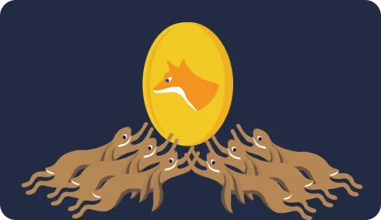

### หน้าที่ของเงินคืออะไร?

เงินถือเป็นเครื่องมือในการสื่อสารที่ซับซ้อนอย่างยิ่ง โดย
- ช่วยให้การสื่อสารระหว่างปัจจุบันและอนาคตเป็นไปได้ เราเปลี่ยนเวลาและพลังงานของเราเป็นสินทรัพย์ที่สามารถนำมาใช้ใหม่ในอนาคตได้โดยไม่เจอความเสี่ยงของการเสื่่อมค่า
- ช่วยให้เราทำการสื่อสารในภาษาที่สากลที่เข้าใจกันได้โดยไม่จำเป็นต้องรู้จักซึ่งกันและกัน ไม่จำเป็นต้องพูดภาษาเดียวกัน คนสองคนที่ไม่รู้จักกันสามารถแลกเปลี่ยน ค้าขาย และตกลงกันเรื่องมูลค่าของสิ่งต่างๆได้

คุณสมบติของมันต่อโลกของเรานั้นเป็นสิ่งทียาก่ที่จะลอกเลียนแบบขึ้นมาได้ ไม่มีมนุษย์หรือกลุ่มมนุษย์ใดสามารถตั้งใจสร้างเงินขึ้นมาได้ มันเป็นปรากฏการณ์ทางสังคมธรรมชาติที่ต้องเกิดขึ้นจากตลาดและความยินยอมโดยสมัครใจ ราคาถือเป็นสัญญาณ ข้อมูล ที่ช่วยให้สังคมเลือกได้ว่าจะจัดสรรทรัพยากรอย่างไร

การเลือกทองคำให้อยู่นฐานะเงินนั้น เป็นผลจากการแข่งขันและวิวัฒนาการในช่วงตลอด 4,000 ปี ที่ผ่านมา โดยแข่งขันบน คุณสมบัติหลัก 3 อย่าง นั้นคือ:

- การเป็นแหล่งเก็บรักษามูลค่า
- การเป็นสื่อกลางในการแลกเปลี่ยน
- การใช้มันเป็นหน่วยในการตั้งราคา

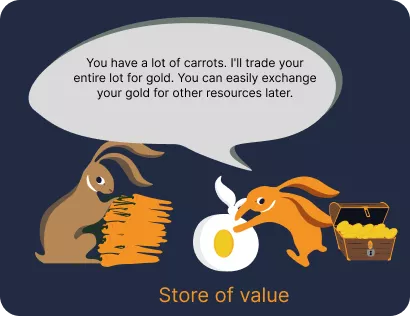
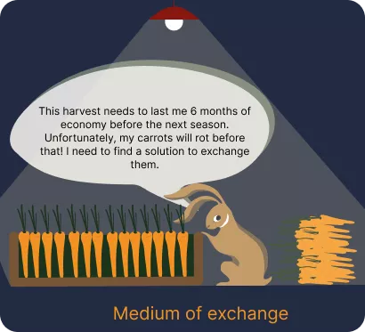
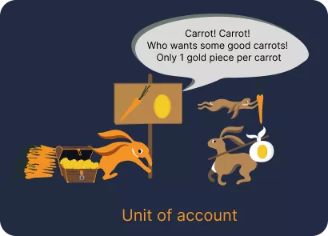

### คุณลักษณะของเงิน

ทองคำตอบสนองเกณฑ์ของ เงินที่มีประสิทธิภาพได้อย่างเหมาะสม: ความหายากตามธรรมชาติของมันทำให้มันมีค่า ในขณะที่คุณสมบัติทางเคมีช่วยให้มันไม่สึกกร่อนตามกาลเวลา แต่อย่างไรก็ตาม เงินในรูปแบบนี้ไม่สามารถแบ่งส่วนหรือขนส่งในระยะทางไกลได้ง่าย ในโลกที่โลกาภิวัตน์และเป็นโลกดิจิทัล ทองคำไม่สามารถตามทันความต้องการเหล่านี้ได้และจำเป็นต้องพึ่ง หน่วยงานกลางเพื่อทำให้มันสามารถแบ่งส่วนและแลกเปลี่ยนได้ง่ายขึ้น (ซึ่งก็คือ เหรียญถูกผลิตขึ้นมา)

ข้อบกพร่องเหล่านี้ทำให้ทองคำไม่เหมาะที่จะใช่เป็นเงินที่ใช้ทั่วไป แต่เหมาะจะเป็นแหล่งเก็บรักษามูลค่า ที่เมื่อเทียบกับสกุลเงินที่ส่งผลร้ายอย่าง สกุลเงินที่ต้องขึ้นกับการไว้วางใจภาครัฐ (สกุลเงิน เฟียต)ที่ใช้งานได้ง่าย แต่มูลค่าถูกลดลงอย่างต่อเนื่องโดยหน่วยงานที่ควบคุมพวกเขา (กษัตริย์, ธนาคารกลาง, จักรพรรดิ, ผู้ปกครอง)

เกณฑ์สำหรับสกุลเงินที่มีประสิทธิภาพมีหลายประการ ซึ่งสกุลเงินที่ดีต้องมี:

- **Fungible**, หมายถึงสามารถใช้แทนกันได้โดยไม่สูญเสียมูลค่า
- **Divisible**, หมายถึงการแบ่งเป็นส่วนเล็กๆได้ตามต้องการ เพื่อให้สามารถทำธุรกรรมที่มีปริมาณในขนาดต่างๆได้
- **Liquid**, หมายถึงสามารถแปลงเป็นสินค้าหรือบริการอื่นได้ง่าย

เพื่อตอบสนองเกณฑ์เหล่านี้ สกุลเงินได้พัฒนาผ่านขึ้นทีละขั้น:

- หินดิบ -> เหรียญ
- ธนบัตร -> บัตรธนาคาร
- บล็อกเชน -> Lightning Network

ณ ทุกวันนี้ สกุลเงินก็ยังคงพัฒนา ปรับรูปแบบเพื่อตอบสนองการใช้งานที่แตกต่างกัน ตัวอย่างเช่น ในขณะที่ทองคำเป็นที่เก็บรักษามูลค่าที่ยอดเยี่ยม แต่มันก็ไม่เหมาะสมสำหรับเศรษฐกิจแบบโลกาภิวัตน์ในปัจจุบัน ในทำนองเดียวกัน สกุลเงินที่ขึ้นอยู่กับการไว้วางใจภาครัฐ เช่น ดอลลาร์และยูโร มีสภาพคล่องที่สูงและเคลื่นย้ายได้ง่ายเพราะส่วนใหญ่อยู่ในรูปแบบดิจิทัล อย่างไรก็ตาม มูลค่าของพวกมันก็เสื่อมลงนอย่างต่อเนื่องโดยเป็นผลจาก เงินเฟ้อ

Bitcoin ในทางกลับกัน นำเสนอความเป็นไปได้รูปแบบใหม่ ด้วยคุณสมบัติของมัน อย่างเช่น การปริมาณที่จำกัดอย่างเข้มงวด มันจึงสามารถเป็นแหล่งเก็บรักษามูลค่าที่ยอดเยี่ยม ยิ่งกว่านั้น มันเป็นสกุลเงินบนโลกอินเทอร์เน็ตที่เป็นกลาง จึงสามารถเป็นสื่อกลางในการแลกเปลี่ยนที่ดีทีก้าวข้ามได้ทุกพรมแดน อย่างไรก็ตาม ณ ปัจจุบัน มันยังไม่ได้มีการนำไปใช้อย่างแพร่หลายในด้านการค้าขาย แม้จะมีการ[นำไปใช้เพิ่มขึ้นอย่างต่อเนื่องก็ตาม](https://btcmap.org/map)

### สรุปอย่างรวดเร็วในโปสเตอร์!

## สกุลเงินที่ขึ้นอยู่กับความไว้ใจ (Fiduciary currencies)

"ผู้ที่ไม่เรียนรู้จากประวัติศาสตร์จะถูกลงโทษให้ทำผิดพลาดเดิมซ้ำอีก" จอร์จ ซานตายาน่า กล่าว ซึ่งมันความจริงที่สะท้อนถึงระบบการเงินปัจจุบันได้อย่างแม่นยำ

### Fiduciary = ความไว้ใจ

ในปัจจุบัน สกุลเงินหลัก เช่น ยูโรและดอลลาร์ ถือว่าเป็นสกุลเงินที่ขึ้นอยู่กับความไว้ใจ นั่นหมายความว่าเงินเหล่านี้ไม่มีมูลค่าโดยตัวเอง มูลค่าของมันขึ้นอยู่กับความไว้วางใจและความเชื่อที่เรามีต่อสถาบันที่กำกับดูแลสกุลเงินเหล่านี้

สกุลเงินที่ขึ้นอยู่กับความไว้ใจ คือรูปแบบของสกุลเงินที่ถูก สถาปณา ให้ขึ้นมาเป็น สกุลเงิน โดยสถาบัน หรือองค์กรหนึง เช่น รัฐชาติเป็นต้น ตัวอย่างเช่น จีนกับเงินหยวน หรือสหภาพทางด้านการเมืองและเศรษฐกิจ เช่น สหภาพยุโรปกับเงินยูโร หน่วยงานที่รับผิดชอบในการออกสกุลเงินที่ขึ้นอยู่กับความไว้ใจก็คือ ธนาคารกลาง (ตัวอย่างเช่นธนาคารกลางของจีน ธนาคารกลางของสหรัฐอเมริกา หรือธนาคารกลางของสาธารณรัฐกินี) หน่วยงานเหล่านี้คือผู้ที่รับผิดชอบในการตัดสินใจนโยบายการเงินและดังนั้นจึงเป็นผู้ตัดสินใจว่าควรจะใส่เงินเข้าสู่ระบบหรือพิมพ์เงินเพิ่มเท่าใด

### การลดค่าเงิน: กลยุทธ์ที่เก่าแก่พอๆกับ จักรวรรดิโรมัน

นับตั้งแต่สมัยโบราณ ทองคำได้เป็นสินค้าอ้างอิงทางการเงิน อย่างไรก็ตาม จากความที่มันไม่มีความยืดหยุ่น ก็มักนำไปสู่การที่ผู้นำต่างๆ ไม่ว่าจะเป็นจักรพรรดิโรมันหรือรัฐบาลสมัยใหม่ก็ตาม หันไปเลือกใช้สกุลเงินทางเลือกอื่น ซึ่งบ่อยครั้งมักจะเป็น สกุลเงินที่ต้องขึ้นอยู่กับความไว้ใจ

กลไกการลดค่าเงินนั้นเรียบง่ายและได้รับแรงบันดาลใจจากวิธีปฏิบัติที่มีมานับตั้งแต่ต้นกำเนิดของอารยธรรม เหล่าผู้นำที่กระหายอำนาจที่อยากควบคุมความมั่งคั่งเริ่มต้นด้วยการรวมศุนย์การเก็บทองคำ ซึ่งโดยปกติจะใช้ประโยน์จาก อำนาจที่ตัวเองมีและการให้คำมั่นสัญญาว่าจะปกป้องและคุ้มครองความปลอดภัย และเมื่อมีทรัพยากรมีค่าในมือนี้แล้ว พวกเขาจึงนำเสนอสกุลเงินใหม่ ที่มีค่าเทียบเท่าทองคำ แต่หลอมสร้างมาใหม่ในรูปเหรียญที่เป็นรูปจำลองของผู้นำ สกุลเงินใหม่นี้จึงเริ่มหมุนเวียน และประชาชนก็เริ่มชินกับความสะดวกสบายของมันที่มันมอบให้

และหลังจากนั้นผู้นำเหล่านี้ก็จะทำการลดค่าเงินใหม่อย่างลับๆ แบบค่อยๆเป็นค่อยๆไป โดยมันถูกลดมูลคานลงที่ละไม่กี่เปอร์เซ็นต์แต่ทำทุกๆปีเมื่อเทียบกับมูลค่าทองคำตอนเริ่มต้น การลดค่าเงินแบบเงียบๆ นี้มักถูกอ้างว่าเป็นไปเพื่อผลประโยชน์ของประชาชน ดังนั้น ผู้ที่ออมเงินในสกุลเงินที่ขึ้นอยู่กับความไว้ใจจะเห็นเงินออมของตนเองมีค่าลดลง ในขณะที่รัฐใช้เงินสำหรับโครงการต่างๆผ่านการสร้างเงินเฟ้อ นอกจากนี้ การลดค่าเงินทำให้ง่ายต่อการชำระหนี้สินคืน

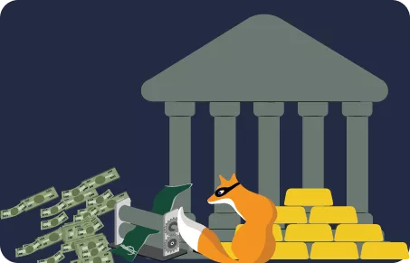

และเมื่อถึงช่วงเวลาสำคัญ ก็จะมีการประกาศออกมาว่า ในตอนนี้ สกุลเงินนี้ ไม่ได้ถูกหนุนโดยทองคำอีกต่อไป และประชาชนที่ซึ่งตอนนี้ชินกับสกุลเงินที่ขึ้นอยู่กับความไว้ใจและมักจะได้รับข้อมูลแบบผิดๆเกี่ยวกับเรื่องการเงิน ก็จะยอมรับความจริงใหม่นี้ รัฐจึงมีอิสระในการควบคุมปริมาณเงิน และพิมพ์เงินจำนวนมหาศาลแบบไม่มีต้นทุน

ถ้าหากทำดีๆ กลยุทธ์นี้ สามารถยืดเยื้อไปได้หลายทศวรรษ อย่างไรก็ตาม การลดค่าเงินอย่างรวดเร็วหรือการสูญเสียความเชื่อมั่นสามารถนำไปสู่เงินเฟ้อรุนแรง (ดูได้บทถัดไป) ประวัติศาสตร์แสดงให้เห็นว่าเงินดอลลาร์นั้นสูญเสียมูลค่าไปถึง 98% ใน ช่วง 100 ปี, ยูโร เสียไป 30% ใน 20 ปี, และปอนด์สเตอร์ลิงเสียไป 99% นับตั้งแต่ที่สกุลนี้ถูกสร้างขึ้นมา

ในที่สุด สกุลเงินก็ไม่มีความจำเป็นที่จะต้องยึดโยงกับทองคำอีกต่อไป ซึ่งทำให้นึกถึงเหรียญโรมันในช่วงท้ายของจักรวรรดิ หรือแม้กระทั่งถูกทำให้กลายเป็นเพียงคแค่ตัวเลขที่ไม่เชื่อมโยงกับความเป็นจริงที่จับต้องได้อีกต่อไป

ณ วันนี้ เรากำลังเห็นจุดเปลี่ยนในทางประวัติศาสตร์ เงินดอลลาร์ซึ่งทีมีความเหนือกว่าสกุลอื่นอย่างยาวนาน ดูเหมือนจะอยู่ในช่วงขาลง และทองคำก็ได้สูญเสียพื้นที่สำคัญของมันไป เรากำลังอยู่ที่จุดเปลี่ยนของวัฏจักรการเงินใหม่ ซึ่งคอยย้ำตือนเราว่า เรามักจะลืมเรียนรู้จากประวัติศาสตร์ของเรา

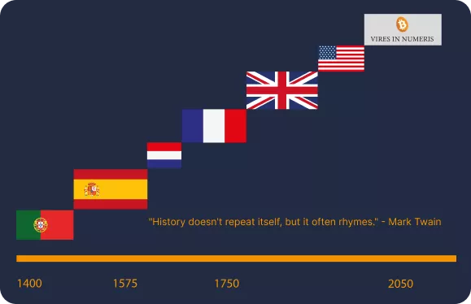

### บิตคอยน์เป็นทางออกหรือไม่?

สำหรับในบริบทที่เป็นอยู่นี้ การปฏิวัติของบิตคอยน์กำลังเริ่มได้รับความนิยม สกุลเงินนี้ ซึ่งไม่ต้องการการไว้ใจในบุคคลที่สาม เพื่อจะมีค่านั้น มุ่งหวังที่จะแยกอำนาจรัฐออกจากเงิน

การพิมพ์เงินนำไปสู่เงินเฟ้อ ทยอยทำให้ประชากรยากจนลง ในขณะเดียวกัน สถาบันการเงินและบุคคลที่ร่ำรวยกลับได้รับประโยชน์จากวิธีปฏิบัตินี้ มันสร้างช่องว่างของความเหลื่อมล้ำและสนับสนุนการปกครองแบบเผด็จการ ระบบการเงินปัจจุบันถูกควบคุมและแล้วสร้างข้อจำกัดเพื่อหลีกเลี่ยงการล่มสลายของระบบ และสิ่งรบกวนใดๆ ก็อาจก่อให้เกิดวิกฤตเศรษฐกิจขนาดใหญ่ได้ ซึ่งในเมื่อผู้เล่นทางการเมืองได้รับประโยชน์จากระบบนี้ พวกเขาจึงไม่มีแรงจูงใจที่จะทำการเปลี่ยนแปลงระบบอย่างพลิกฝ่ามือ ทำให้ระบบยังสามารถดำเนินต่อไปจนถึงจุดที่ทุกอย่างจะสามารถการระเบิดได้ทุกเมื่อ


เพื่อเป็นการตอบสนองต่อความท้าทายเชิงระบบเหล่านี้ Bitcoin จึงนำเสนอตัวเองในฐานะทางแก้ปัญหาแบบกระจายศูนย์โดย ระบบการเงินใหม่ที่เป็นอิสระจากกัน ในประวัติศาสตร์ ทองคำได้รับความนิยมในการใช้เป็นเงิน เนื่องจากมันมีความต้านทานต่อการปลอมแปลง ในทำนองเดียวกัน Bitcoin ก็ไม่สามารถถูกปลอมแปลงได้และมีจำนวนจำกัดที่ 21 ล้านหน่วย โดยผ่านคุณลักษณะของมันที่เป็นกระจายศูนย์และการใช้เข้ารหัส โดย Bitcoin ที่เป็นสกุลเงินที่พึ่งพิงกับความโปร่งใสและความเป็นกลาง ได้กลายทางเลือกที่น่าสนใจ เมื่อเทียบกับระบบการเงินแบบมีศุนย์กลางที่มีอยู่ในปัจจุบัน

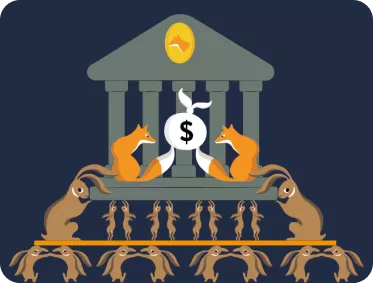

ในเวลาเดียวกัน การปรากฏตัวของสกุลเงินดิจิทัลของธนาคารกลาง หรือ CBDCs ดูเหมือนจะเป็นเรื่องที่หลีกเลี่ยงไม่ได้ รูปแบบใหม่ของสกุลเงินนี้จะสร้างระบบเศรษฐกิจที่มีการวางแผนกลางมากขึ้น ซึ่งอาจขัดขวางเสรีภาพทางการเงินของบุคคลและเอื้อต่อการใช้อำนาจในทางที่ผิดแบบเผด็จการ
เราสามารถสรุปบทนี้ด้วยคำพูดจาก ผู้ได้รับรางวัลโนเบล อย่างคุณ F.A Hayek เมื่อปี 1984 ได้ดังนี้ "ฉันไม่เชื่อว่าเราจะมีสกุลเงินที่ดีได้จนกว่าเราจะแยกกมันออกจากมือของรัฐบาล อย่างไรก็ตาม เราไม่สามารถแยกเงินออกจากพวกเขาโดยใช้ความรุนแรงได้ ทั้งหมดที่เราทำได้คือการนำเสนอบางสิ่งที่พวกเขาไม่สามารถหยุดยั้งได้ ด้วยเทคนิคที่ชาญฉลาด"

### สรุปอย่างรวดเร็วในโปสเตอร์!

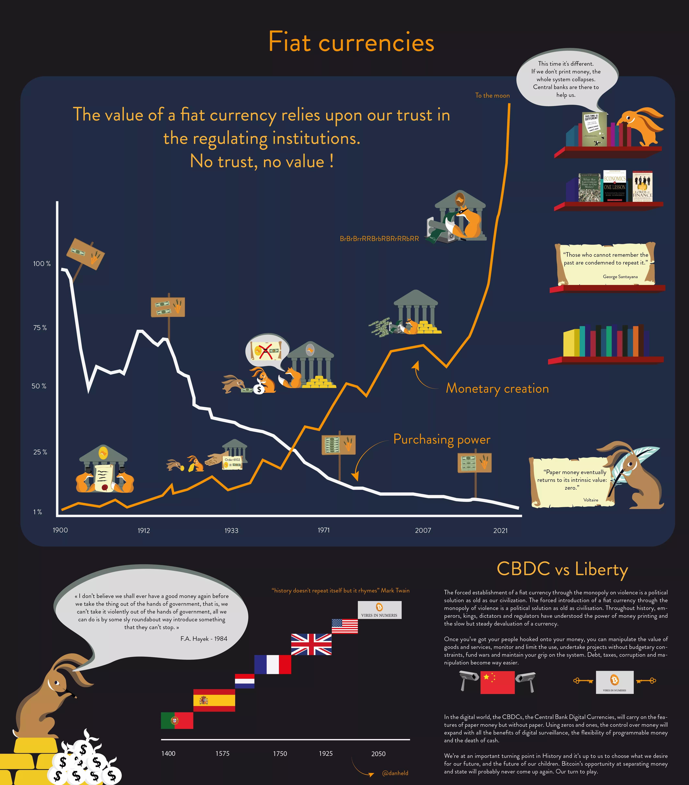

## เงินเฟ้อรุนแรง (Hyperinflation)
<chapterId>b04c024c-54f3-50cb-997f-58721cfc74be</chapterId>

เงินเฟ้อรุนแรงเป็นปรากฏการณ์ทางการเงินที่เฉพาะเจาะจงกับสกุลเงินเฟียต เป็นสามารถอธิบายได้ว่าเป็นการสูญเสียความเชื่อมั่นในสกุลเงินอย่างสิ้นเชิงและการเพิ่มขึ้นอย่างรุนแรงของอัตราเงินเฟ้อผ่านการพิมพ์เงินเพิ่มโดยทางการ ซึ่งผลที่ตามมาคือเงินออมที่บุคคลสะสมไว้สามารถละลายหายไปได้ในระยะเวลาอันสั้น ผลักดันประเทศให้เข้าใกล้การล่มสลายทางเศรษฐกิจ สังคม และการเมือง

### เงินเฟ้อรุนแรงที่ไร้การควบคุม!

เราจะลองพยายามเข้าใจผลกระทบของเงินเฟ้อที่มีต่อการออมโดยพิจารณาอัตราเงินเฟ้อที่แตกต่างกันดังนี้

- ด้วยอัตราเงินเฟ้อ 2% คุณจะสูญเสียอำนาจในการซื้อ 2% ต่อปี ซึ่งเท่ากับ 10% ใน 5 ปี
- ด้วยอัตราเงินเฟ้อ 7% คุณจะสูญเสียอำนาจในการซื้อไปครึ่งหนึ่งภายใน 10 ปี
- ด้วยอัตราเงินเฟ้อ 20% คุณจะสูญเสียอำนาจในการซื้อไปครึ่งหนึ่งภายใน 3 ปี

และในช่วงเงินเฟ้อรุนแรง เราไม่ได้พูดกัน 20% ต่อปี แต่เป็น 20% ต่อเดือน หรือในช่วงสูงสุดก็คือ 20% ต่อวัน ซึ่งอัตราเงินเฟ้อ 100% ต่อวัน ในช่วงแค่ 3 วัน ถือเป็นสถานการณ์ที่เกิดขึ้นได้จริงและยังคงเกิดขึ้นในโลกของเรา

สำคัญที่จะต้องเข้าใจว่าเงินเฟ้อรุนแรง ไม่เกิดขึ้นโดยเวทมนต์ โดยบังเอิญ โดยทุนนิยม หรือโดยฝ่ายค้านทางการเมืองใดๆ เงินเฟ้อรุนแรงเป็นผลโดยตรงจากการตัดสินใจทางการเงินที่ผิดพลาดโดยเหล่านายธนาคารกลางและเหล่านักการเมือง ผลกระทบของมันส่งผลกระทบต่อประชาชนทุกคนและจะส่งผลกระทบต่อรุ่นถัดๆไป ผมขอเชิญชวนให้คุณลองใช้เวลาแค่ 5 นาทีศึกษาตารางนี้เพื่อเข้าใจอย่างเต็มที่ถึงผลกระทบจริงของปรากฏการณ์นี้ (โดยเราจะลงลึกเรื่องนี้ในหลักสูตร ECON204)"


### เงินเฟ้อรุนแรงเกิดขึ้นได้อย่างไร?

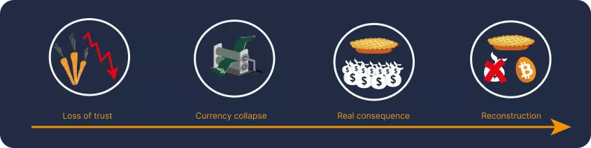

Phase 1 - การสูญเสียความเชื่อมั่น

- ด้วยการรวมศูนย์ของอำนาจทางการเงิน ทำให้มันเป็นการง่ายทำที่จะรสร้างเงินและใช้มันไปในทางที่ผิด การสูญเสียความเชื่อมั่นในสกุลเงินสามารถเกิดขึ้นและกระตุ้นเงินเฟ้อรุนแรง ผู้คนแต่ละคนจึงเริ่มตั้งคำถามเกี่ยวกับที่มาของเงินและประโยชน์ของนโยบายการเงินที่ถูกกำหนดขึ้นมา การสูญเสียความเชื่อมั่นนี้โดยทั่วไปเกิดจากปัจจัยภายนอก เช่น สงคราม มาตรการทางสังคม หรือการเพิ่มขึ้นของราคาทรัพยากรหลัก เช่น ข้าวหรือน้ำมัน

Phase 2 - การล่มสลายของสกุลเงิน & การเพิ่มขึ้นของราคา
เมื่อรัฐบาลเริ่มสูญเสียการควบคุมในความเชื่อมั่น ประชาชนจึงเริ่มแลกเปลี่ยนสกุลเงินของตนเป็นสกุลเงินอื่นที่มีความมั่นคงมากขึ้น อย่างเช่น ในเวเนซุเอลา พวกเขาจะแลกไปเป็นเงินดอลลาร์สหรัฐ ซึ่งสิ่งนี้นำไปสู่การเพิ่มขึ้นของราคา สร้างวงจรอุบาทว์ที่สินค้าและบริการกลายเป็นสิ่งที่แพงขึ้นเรื่อยๆ และเพื่อตอบสนองต่อรเหล่านี้ รัฐจึงพิมพ์เงินเพิ่มอีกเพื่อแก้ไขปัญหาจากนโยบายการเงินเดิม, ส่งผลให้เกิดเงินเฟ้อแบบทวีคูณ

ขั้นตอนที่ 3 - วงจรอุบาทว์ของการพิมพ์เงิน

- เมื่อของแพงขึ้น ผู้คนก็ต้องใช้ธนบัตรมากขึ้นเรื่อยๆ เพื่อซื้อสินค้า สร้างความขาดแคลนในตัวเงินกระดาษ สิ่งนี้นำไปสู่การพิมพ์ธนบัตรเพิ่มเติม และส่งผลให้ สร้างเงินเฟ้อมากขึ้นอีก

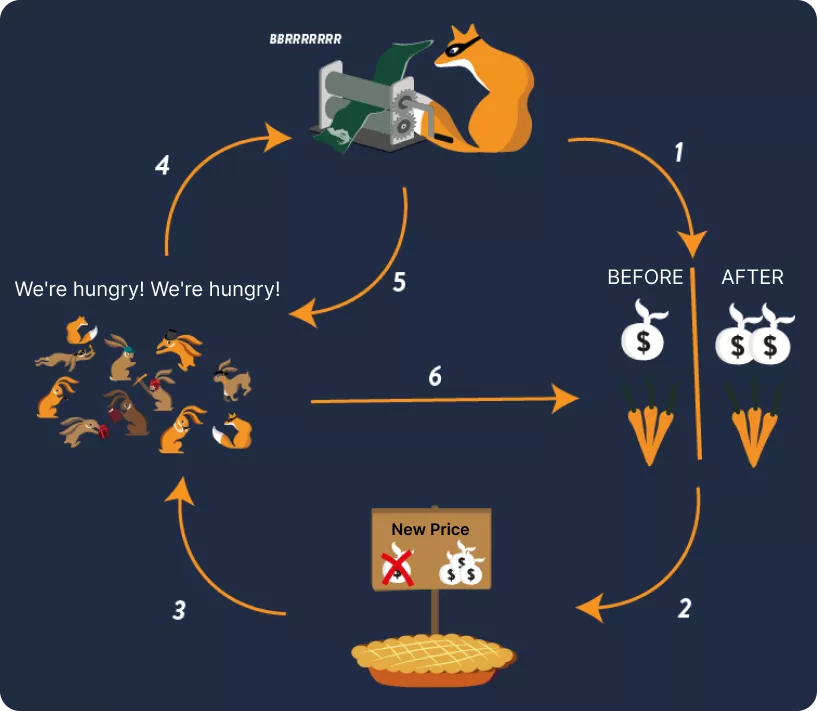

ขั้นตอนที่ 4 - เงินตราใหม่ปรากฏตัวขึ้น

- จากนั้นเงินตราใหม่จะถูกนำมาใช้แทนเงินตราเก่า ตัวอย่างที่น่าสังเกตของเงินเฟ้อรุนแรงคือเยอรมนีในปี 1920-1924 เพื่อการที่จะฟื้นฟูเศรษฐกิจ เงินตราใหม่ได้ถูกสร้างขึ้น และถูกหนุนหลังโดยหนี้ของเยอรมนี ฝรั่งเศสและอังกฤษ และมีการหลักประกันเป็นที่ดินของเยอรมนี

การแก้ไขวิกฤตเงินเฟ้อรุนแรงมักต้องการการเปลี่ยนแปลงอย่างสุดขั้ว เช่น การปฏิวัติ การเปลี่ยนแปลงรัฐบาล การเปลี่ยนแปลงเหล่่านายธนาคารกลาง เป็นต้น การสูญเสียความเชื่อมั่น การล่มสลายของสกุลเงิน และการสร้างตัวสกุลเงินขึ่นใหม่เป็นขั้นตอนที่จำเป็นสำหรับการฟื้นฟูเศรษฐกิจขึ้นมาใหม่ในระบบเงินเฟียต

### 3 ตัวอย่างที่น่าศึกษา

- เยอรมนี ปี 1922-1923

  หนึ่งในตัวอย่างที่น่าศึกษาที่สุดของเงินเฟ้อรุนแรงเกิดขึ้นในสาธารณรัฐไวมาร์ของเยอรมนีหลังจากสงครามโลกครั้งที่หนึ่ง

  เยอรมนีได้ยืมเงินจำนวนมหาศาลเพื่อสนับสนุนความพยายามในการทำสงคราม และไม่เพียงแต่เยอรมนีไม่ชนะสงคราม แต่ยังมีภาระต้องจ่ายเงินค่าปฏิกรรมสงครามมูลค่าหลายพันล้านดอลลาร์ด้วย ในเดือนที่มีเงินเฟ้อสูงสุดคือเดือนตุลาคม 1923 ที่เงินเฟ้อสูงถึง 29,500% หรืออัตราเงินเฟ้ออยู่ที่ 20.9% ต่อวัน นั่นคือราคาสินค้าเพิ่มขึ้นเป็นสองเท่าทุก 3.7 วัน!
  มีการกล่าวว่าในร้านอาหาร, พนักงานเสิร์ฟต้องประกาศราคาเมนูใหม่ทุก 30 นาทีเพื่อตอบสนองต่อเงินเฟ้อ สกุลเงินของเยอรมันกลายเป็นสิ่งไร้ค่าจนบางคนยินดีจะนำเงินกระดาษมาเผา มากกว่าเผาไม้เพราะราคามันถูกกว่าไม้จริงๆ

  

- ฮังการี ปี 1945-1946

  ประเทศที่ประสบกับช่วงเวลาของเงินเฟ้อรุนแรงที่สุดในประวัติศาสตร์จนถึงปัจจุบันคือ ฮังการี ช่วงหลังจากสงครามโลกครั้งที่สอง

  ฮังการีพบว่าตัวเองอยู่ในฝ่ายที่แพ้สงคราม และสงครามได้ทำลายความสามารถในการผลิตอุตสาหกรรมส่วนใหญ่ของมัน ในเดือนที่มีเงินเฟ้อสูงสุดคือเดือนกรกฎาคม 1946 ด้วยอัตราเงินเฟ้อของราคา 41,900,000,000,000,000%, เทียบเท่ากับ 207% ต่อวัน วึ่งก็คือ ราคาสินค้าเพิ่มขึ้นเป็นสองเท่าทุก 15 ชั่วโมง!

  ธนบัตรชุดสุดท้ายที่ถูกนำเข้าสู่การหมุนเวียนคือธนบัตร 100 พันล้านๆ เพนโก (100,000,000,000,000,000) ในปี 1946

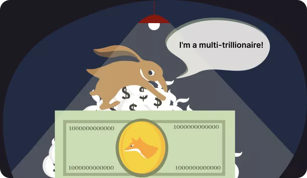

- ซิมบับเว ปี 2007-2008
  ในช่วงก่อนหน้าปี 2000 ซิมบับเวเป็นประเทศที่สามารถพึ่งพาตัวเองได้เกือบทุกอย่างยกเว้น เรื่องน้ำมัน

  ในปี 1997 ดอลลาร์ซิมบับเวถล่มลงกว่า 72% หลังจากรัฐบาลตกลงที่จะจ่ายเงินชดเชยให้กับเหล่าทหารผ่านศึกเป็นจำนวนเทีย่บเท่า 450 ล้านดอลลาร์สหรัฐ ซึ่งเนื่องจากรัฐบาลไม่มีเงินจำนวนมากขนาดนั้นอยู่ในคลัง พวกเขาจึงต้องใช้วิธีการพิมพ์เงิน โดยในปี 2005 ระดับเงินเฟ้อสูงถึง 586% และในเดือนมีนาคม 2007 เงินเฟ้อรายเดือนสูงถึง 50%

  ในเดือนมิถุนายน 2007 รัฐบาลได้ตอบสนองด้วยการออกมาตรการควบคุมราคา เหล่าร้านค้าก็ถูก "ปล้น" อย่างแท้จริง เหล่าผู้ค้า ณ ตอนนี้ เลยไม่มีวิธีการที่จะหาสินค้ามาเติมในร้านของตนอีกต่อไป
  
ในเดือนเมษายน 2009, รัฐมนตรีว่าการกระทรวงการคลังประกาศการระงับการใช้ดอลลาร์ซิมบับเวและอนุญาตให้ใช้สกุลเงินต่างประเทศหลายสกุลในการค้าขาย โดยบัญชีธนาคารทั้งหมด เงินบำนาญ และสถาบันการเงินต่างๆ ในประเทศ พบว่ายอดเงินของพวกเขาหายไปในชั่วข้ามคืน


โดยสรุป ภาวะเงินเฟ้อรุนแรงมีผลทำให้มูลค่าของสกุลเงินลดลงอย่างรวดเร็ว นำไปสู่การสูญเสียเงินออมและการสูญเสียความเชื่อมั่นในระบบการเงิน ดังที่โวลแทร์เคยชี้แนะไว้ว่า เงินสกุลเฟียตจะสูญเสียมูลค่าในตัวเองจนไร้ค่าเสมอ ดังนี้่
"สกุลเงินที่ต้องพึ่งพิงกับความไว้ใจในบุคคลที่สามอย่างเช่น สถาบันการเงินนั้น ในทางปฏิบัติและในระยะยาวแล้ว จะถือเป็นสกุลเงินที่มีข้อบกพร่องเนื่องจาก มันไม่สามารถรับประกันได้ว่า อำนาจในการจับจ่ายใช้สอยหรือมูลค่าของเงินออมจะถูกรักษาไว้ได้"

### สรุปอย่างรวดเร็วในโปสเตอร์!

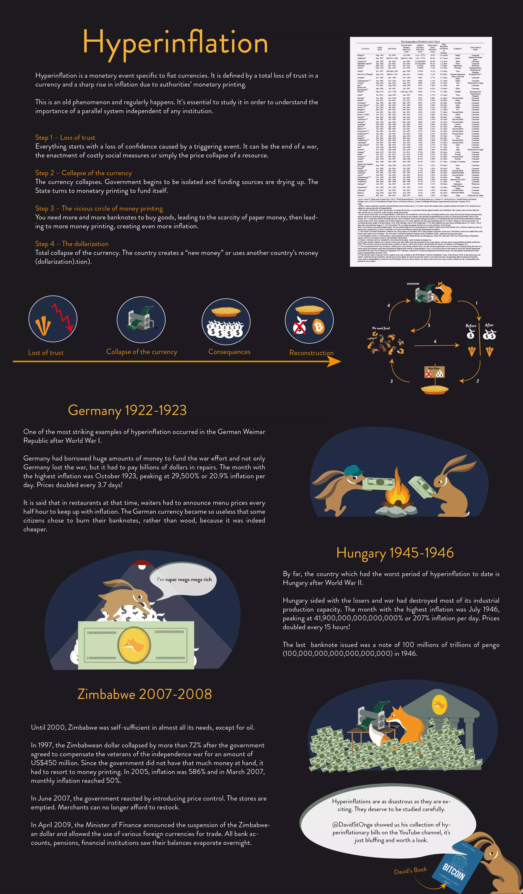

## 21 ล้านบิตคอยน์
<chapterId>f4a06d76-1963-56fd-93ff-dfa41489bcde</chapterId>

### นโยบายการเงินของบิตคอยน์

บิตคอยน์เป็นสกุลเงินดิจิทัลแบบกระจายศูนย์ที่มีปริมาณสูงสุดที่กำหนดไว้ล่วงหน้าที่ **21 ล้านหน่วย** คุณลักษณะเฉพาะของปริมาณที่จำกัดนี้ ได้ถูกกำหนดโดยโค้ดคอมพิวเตอร์และได้รับการป้องกันการแก้ไขด่วย การต้องใช้ความเห็นชอบจากผู้ใช้ทุกคนที่เข้าร่วมในโปรโตคอลนี้

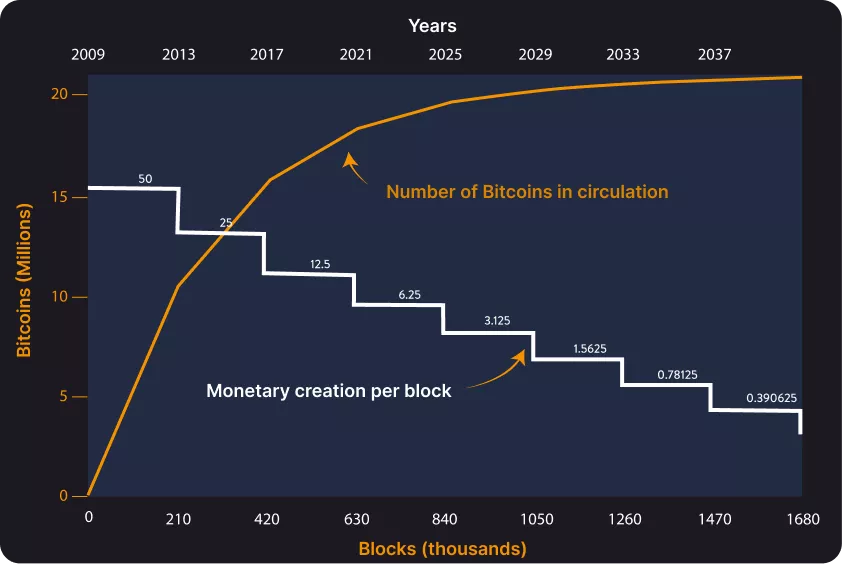

ในส่วนขอน กำหนดการในการผลิตตัวเงินบิตคอยน์ สามารถแสดงได้โดยกราฟ S-Curve ที่แสดงปริมาณบิตคอยน์ที่ถูกสร้างขึ้นตามเวลา ตัวอย่างเช่น, ในปี 2022 มีบิตคอยน์ประมาณ 18.5 ล้านหน่วยที่หมุนเวียนอยู่ในตลาด จากการคาดการณ์ชี้ว่าในปี 2025 จะมีบิตคอยน์ประมาณ 19.5 ล้านหน่วย ซึ่งคิดเป็น ~93% ของปริมาณทั้งหมด และในปี 2037 ตัวเลขนี้จะเพิ่มขึ้นเป็น 20.4 ล้าน

### วิธีการสร้างบิตคอยน์ใหม่?

การสร้างบิตคอยน์ใหม่เป็นผลมาจากกระบวนการขุด ซึ่งก็คือ กระบวนการสำหรับการตรวจสอบธุรกรรมบนเครือข่ายบิตคอยน์

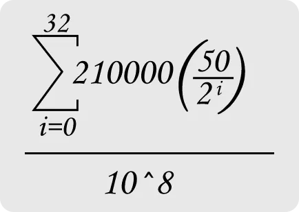

นักขุด คือผู้ที่ทำหน้าที่นี้ จะได้รับรางวัลด้วยการออกบิตคอยน์ใหม่ทุกๆสิบนาที รางวัลนี้ถูกโปรแกรมให้ลดลงครึ่งหนึ่งทุกๆ 210,000 บล็อก ซึ่งประมาณทุกๆสี่ปี โดยเป็นเหตุการณ์ที่รู้จักกันในชื่อ "halving" และเนื่องด้วยที่กราฟการผลิตเงินบิตคอยน์มีลักษณะเหมือนขั้นบันได โดยเป็นผลจากกลไกการ halving นี้ เราจึงสามารถคาดการณ์โดยใช้คณิตศาสตร์ได้ว่าการสร้างบิตคอยน์ใหม่จะยุติในปี 2140 ในเวลาที่เมื่อจำนวนบิตคอยน์ทั้งหมดถึงขีดจำกัดที่ 21 ล้าน บิตคอยน์

| จำนวนครั้งของการ Halving | ความสูงของบล็อก | รางวัล BTC ผลิตใหม่หลังจาก Halving  | ประมาณการ BTC ในการหมุนเวียนในตลาดหลัง Halving |
| -------------- | ------------ | ------------------------- | ------------------------------------------ |
| 1              | 210,000      | 25 BTC                    | 10,500,000 BTC                             |
| 2              | 420,000      | 12.5 BTC                  | 15,750,000 BTC                             |
| 3              | 630,000      | 6.25 BTC                  | 18,375,000 BTC                             |
| 4              | 840,000      | 3.125 BTC                 | 19,687,500 BTC                             |
| 5              | 1,050,000    | 1.5625 BTC                | 20,343,750 BTC                             |
| 6              | 1,260,000    | 0.78125 BTC               | 20,671,875 BTC                             |
| 7              | 1,470,000    | 0.390625 BTC              | 20,835,937.5 BTC                           |
| 8              | 1,680,000    | 0.1953125 BTC             | 20,917,968.75 BTC                          |
| 9              | 1,890,000    | 0.09765625 BTC            | 20,958,984.375 BTC                         |
| 10             | 2,100,000    | 0.048828125 BTC           | 20,979,492.188 BTC                         |
| 11             | 2,310,000    | 0.0244140625 BTC          | 20,989,746.094 BTC                         |
| 12             | 2,520,000    | 0.01220703125 BTC         | 20,994,873.047 BTC                         |
| 13             | 2,730,000    | 0.006103515625 BTC        | 20,997,436.523 BTC                         |
| 14             | 2,940,000    | 0.0030517578125 BTC       | 20,998,718.262 BTC                         |
| 15             | 3,150,000    | 0.00152587890625 BTC      | 20,999,359.131 BTC                         |
| 16             | 3,360,000    | 0.000762939453125 BTC     | 20,999,679.566 BTC                         |
| 17             | 3,570,000    | 0.0003814697265625 BTC    | 20,999,839.783 BTC                         |
| 18             | 3,780,000    | 0.00019073486328125 BTC   | 20,999,919.892 BTC                         |
| 19             | 3,990,000    | 0.000095367431640625 BTC  | 20,999,959.946 BTC                         |
| 20             | 4,200,000    | 0.0000476837158203125 BTC | 20,999,979.973 BTC                         |

เราจะกลับมาพูดถึงนักขุดในรายละเอียดในบทเรียนที่เกี่ยวกับการขุด

### การรับประกันว่าจะมีความขาดแคลนในเชิงดิจิทัล

Bitcoin ใช้สองกลไกหลัก ที่คอยรับประกันว่าตัว Bitcoin จะมีความขาดแคลนอยู่เสมอ วึ่งคือ  : การปรับความยากในการขุด และทฤษฎีเกม:

- การปรับความยากในการขุดเป็นกลไกที่เกิดขึ้นทุก ๆ 2016 บล็อก หรือประมาณสองสัปดาห์ เพื่อให้แน่ใจว่า โดยเฉลี่ยแล้ว จะมีบล็อกใหม่ถูกเพิ่มเข้าไปในบล็อกเชนทุก ๆ สิบนาที ความถี่ในการสร้างบล็อกและปริมาณรวมของบิตคอยน์เป็นส่วนที่กำหนดไว้ในโปรโตคอลของ Bitcoin และไม่สามารถเปลี่ยนแปลงได้โดยไม่มีเห็นพ้องต้องกันของผู้คนทั้งระบบ ซึ่งแตกต่างกับการตัดสินใจแบบตามใจชอบในระบบการเงินแบบดั้งเดิม

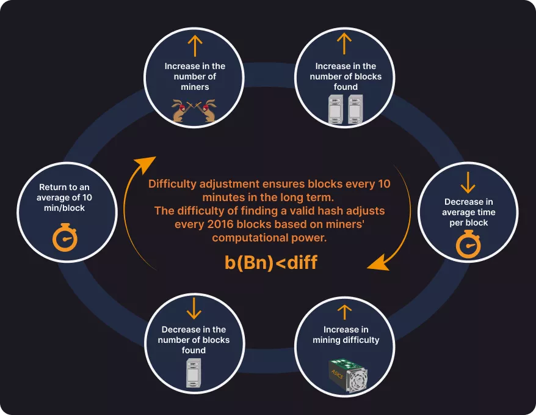

> คุณรู้หรือไม่? นักขุดได้รับแรงจูงใจให้ขุดบล็อกเพื่อรับบิตคอยน์ใหม่ (เงินอุดหนุน ของบล็อก) และค่าธรรมเนียมการทำธุรกรรมที่เกี่ยวข้องกับการทำธุรกรรมที่พวกเขารวมไว้ในบล็อกของตน เมื่อจำนวนบิตคอยน์ที่ออกมาใกล้เข้าถึงขีดจำกัด 21 ล้าน นักขุดจะได้รับการชดเชยมากขึ้นผ่านค่าธรรมเนียมการทำธุรกรรมมากกว่าการ เงินอุดหนุน ของบล็อก'

- ทฤษฎีเกมเป็นแนวคิดทางคณิตศาสตร์ที่อาศัยความเป็นเหตุเป็นผลของมนุษย์ ซึ่งใน Bitcoin ก็คือผู้ใช้ที่จะลงคะแนนเสียงสำหรับการเปลี่ยนแปลงโปรโตคอลใด ใช่ครับ คุณอ่านไม่ผิด: การเปลี่ยนแปลงใด ๆ ต่อโปรโตคอล9y; Bitcoin จะต้องได้รับฉันทามติจากผู้ใช้ในชุมชนทั้งหมด ซึ่งเป็นเรื่องที่ซับซ้อนมาก ดังนั้น หากมีคนต้องการสร้างบิตคอยน์เพิ่มเป็น 22 ล้าน พวกเขาจะต้องโน้มน้าวให้ผู้ใช้ทุกคนยินยอมลดค่าเงินออมของตนเอง ซึ่งเป็นเรื่องที่ไม่น่าจะเกิดขึ้น เพราะ Bitcoin ถูกใช้เป็นสากลทั้วโลกและไม่ได้ถูกควบคุมโดยศุนย์กลางใด ๆ
- 
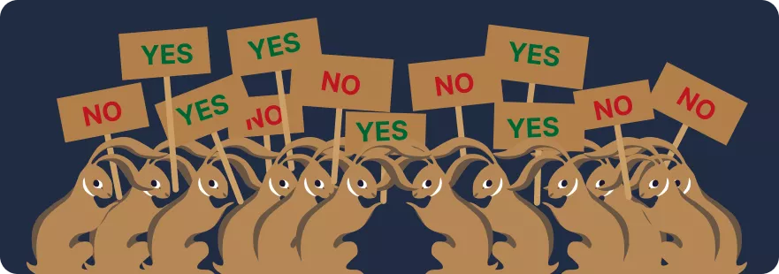

ความคิดในการจะลดค่าเงินนั้น ขัดแย้งกับปรัชญาพื้นฐานของตัว Bitcoin เอง ดังนั้นการเปลี่ยนแปลงข้อจำกัดนี้ นี้จึงมีความเป็นไปได้น้อยมาก

### นโยบายการเงินที่สามารถตรวจสอบได้ทุกวินาทีตั้งแต่เริ่มต้นและตลอดไป!

ความขาดแคลนของ Bitcoin เป็นคุณสมบัติที่สำคัญของตัวมัน และปริมาณสูงสุดของ Bitcoin ที่หมุนเวียนในตลาดคือ 21 ล้าน Bitcoin นั้นเป็นข้อมูลสาธารณะและสามารถตรวจสอบได้โดยทุกคน

ที่จริงแล้ว ทุกคนสามารถตรวจสอบปริมาณ Bitcoin ที่หมุนเวียนได้โดยการป้อนคำสั่งง่ายๆ บนโหนด Bitcoin: `bitcoin-cli gettxoutsetinfo` ความโปร่งใสและการตรวจสอบได้นี้เสริมความเชื่อมั่นในระบบ Bitcoin ซึ่งไม่ได้พึ่งพาสถาบันหรือตัวกลางใดๆ แต่อาศัยการรับประกันผ่านการใช้คณิตศาสตร์และการเข้ารหัสลับที่ฝังอยู่ในโปรโตคอลของมัน (คุณจะเรียนรู้วิธีทำสิ่งนี้ได้อย่างง่ายๆใน LN201)

```json
{
  "height": 710560,
  "bestblock": "0000000000000000000887384d67103412ea7f18a43953e65c8c4ac36bf42e54",
  "transactions": 473244,
  "txouts": 1018917,
  "bogosize": 2183872374,
  "hash_serialized_2": "eebb9987337700ffaacbbaa11223344",
  "disk_size": 178239584,
  "total_amount": 18745998.12345678
}
```

Bitcoin ถูกออกแบบมาตั้งแต่ต้นให้สามารถรับประกันได้ว่าตัวมันเอง จะมีการจัดการทางการเงินที่มั่นคง ผ่านการจำกัดการสร้างและปกป้องเงินออมของผู้ใช้ และทำให้แตกต่างจากสกุลเงินอื่นๆ สอดคล้องกับหลักการของเศรษฐศาสตร์ออสเตรีย (รายละเอียดใน ECON201) ปริมาณที่ควบคุมและการกระจายที่คาดการณ์ได้ปกป้องจากความเสี่ยงของเงินเฟ้อที่มีอยู่ในสกุลเงินแบบดั้งเดิม

สรุปได้ว่า Bitcoin ด้วยลักษณะการกระจายศูนย์ ความขาดแคลนที่โปรแกรมไว้ และความโปร่งใส นำเสนอทางเลือกที่ไม่เหมือนใครต่อระบบการเงินแบบดั้งเดิม มันแสดงให้เห็นว่าเทคโนโลยีสามารถใช้สร้างสกุลเงินที่ไม่เพียงแต่มีประโยชน์และสามารถตรวจสอบได้ แต่ยังสามารถรักษาค่าของเงินออมของผู้ใช้โดยการจำกัดปริมาณอย่างเข้มงวด

### สรุปอย่างรวดเร็วในโปสเตอร์!

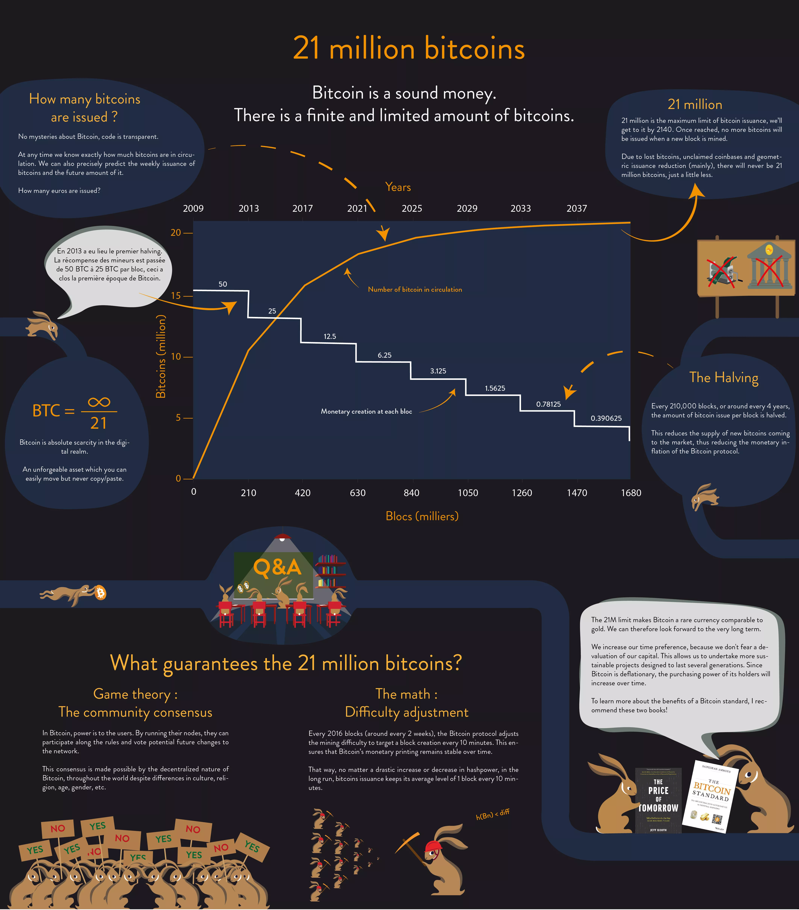

### สรุปส่วนที่ 1!

# Wallets Bitcoin
<partId>28860585-4f61-59d9-b242-f4c57d837cc1</partId>

## Bitcoin wallets คืออะไร?
<chapterId>1c0166ab-cb7a-5bc6-9175-d13482bd91f1</chapterId>

ในส่วนที่ 2 นี้ เราจะสำรวจการเก็บรักษาและการรักษาความปลอดภัยของ Bitcoin ภายในกระเป๋าเงิน ซึ่งจะช่วยให้คุณเข้าใจได้ดีขึ้นว่า ตัวเหรียญที่โด่งดังของ Bitcoin นั้นตั้งอยู่ที่ไหนและจะจัดกาบกับพวกมันอย่างไร!

### ทำความเข้าใจกระเป๋าเงิน Bitcoin

ในอุตสาหกรรมนี้ เราใช้ตัวกระเป๋าเงินเพื่อทำสิ่งต่างๆกับเครือข่าย Bitcoin ซึ่งมีมัน 3 หน้าที่หลัก:

- ทำให้รับ Bitcoin ได้
- ทำให้ให้ส่ง Bitcoin ได้
- ป้องกันการถูกแฮ็กและความพยายามในการขโมย

กระเป๋าเงินสามารถเป็นซอฟต์แวร์บนคอมพิวเตอร์ของคุณ เป็นแอปพลิเคชันบนสมาร์ทโฟนของคุณ เป็นอุปกรณ์เช่น USB key หรือแม้แต่แผ่นกระดาษ กระเป๋าเงิน Bitcoin ประเภทต่างๆนี้มีวัตถุประสงค์การใช้งานที่แตกต่างกัน บางอันใช้สำหรับจำนวนเงินที่มากด้วยความเน้นที่ความปลอดภัย บางอันเน้นที่ความเป็นส่วนตัว หรือแม้แต่สำหรับการชำระเงินจำนวนเล็กน้อยในชีวิตประจำวัน

ดังนั้น เงินที่คุณจะเก็บจะถูกแบ่งออก บนคำถามหลักนี้ ซึ่งก็คือ: คุณจะเป็นเจ้าของเงินนั้นจริงๆหรือคุณจะปล่อยให้บุคคลที่สามควบคุมเงินของคุณ? เราจะกลับมาพูดถึงหัวข้อนี้อย่างละเอียดในบทถัดไป แต่หลักความคิดง่ายๆก็คือ เงินมันอยู่ในกระเป๋าของคุณจริงๆหรือ อยู่ในกระเป๋าของธนาคารที่คุณใช้บริการกันแน่!

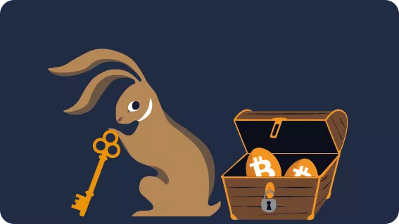
### กระเป๋าสตางค์ Bitcoin ทำงานอย่างไร
ไม่ว่าจะเป็น Bitcoin ของ "ธนาคาร" ที่คุณใช้บริการ หรือเป็นของคุณเอง โดยทั่วไปแล้ว กระเป๋าสตางค์ Bitcoin ส่วนใหญ่ทำงานด้วยเทคโนโลยีที่คล้ายกัน นั่นคือ การเข้ารหัสแบบอสมมาตร และด้วยเหตุนี้จึงมีระบบคู่กุญแจ: กุญแจส่วนตัวสำหรับการใช้จ่าย (Private key) และกุญแจสาธารณะสำหรับการรับเงิน (Public key)

- กุญแจส่วนตัว (Private key)
  เมื่อเริ่มต้นใช้งานกระเป๋าเงิน จะมีการสร้าง กลุ่มของคำศัพท์ ที่จะไว้ใช้กู้ข้อมูลกระเป๋ากลับมา ซึ่งเราต้องเก็บมันไว้เป็นความลับ  (กุญแจส่วนตัว) ซึ่งมันจะมาในรูปแบบของคำ 24 คำ

  กุญแจส่วนตัวนี้มีความสำคัญมาก เพราะมันแสดงถึงการเป็นเจ้าของตัวเหรียญ bitcoins ซึ่งก็คือสิทธิ์ในการใช้หรือส่งมัน ผู้ที่ถือกุญแจส่วนตัวคือผู้ที่เป็นเจ้าของ Bitcoins จริงๆ

  กุญแจนี้ต้องเก็บเป็นความลับและรักษาไว้อย่างดี เพราะมันคือกุญแจที่จะใช้เข้าถึงความมั่งคั่งของคุณ!

- กุญแจสาธารณะ (Public key) & ที่อยู่กระเป๋า (Address)
  กุญแจสาธารณะจะถูกสร้างขึ้นจากกุญแจส่วนตัวและด้วยเหตุนี้ กุญแจทั้ง 2 แบบจึงเชื่อมโยงกัน กุญแจสาธารณะจะใช้สำหรับในการสร้าง ที่อยู่กระเป๋า Bitcoin และทำให้เราสามารถรับ bitcoin จากคนอื่นได้ การเปิดเผยข้อมูลตัวกุญแจสาธารณะอาจเสี่ยงต่อการรักษาความเป็นส่วนตัว แต่ไม่เสี่ยงต่อความปลอดภัยในตัวกระเป๋า

  ที่อยู่กระเป๋าเหล่านี้ถูกสร้างขึ้นโดยกระเป๋าเงินของคุณและสามารถแชร์ได้อย่างปลอดภัย เราขอแนะนำให้ใช้ที่อยู่กระเป๋าแต่ละอันเพียงครั้งเดียวเท่านั้นเพื่อรักษาความเป็นส่วนตัวให้สูงสุด

ดังนั้นจึงสำคัญที่จะต้องเข้าใจว่าด้วยเทคโนโลยีนี้ เราจึงสามารถรับ Bitcoins ได้อย่างง่ายดายโดยไม่อนุญาตให้ผู้ส่งสามารถขโมยเงินของเราไปได้! คิดว่ามันเหมือนกับตู้รับจดหมายของคุณก็แล้วกัน ผู้คนสามารถหยอดซองเงินเข้าไปได้ แต่คุณเท่านั้นที่สามารถเปิดมันได้

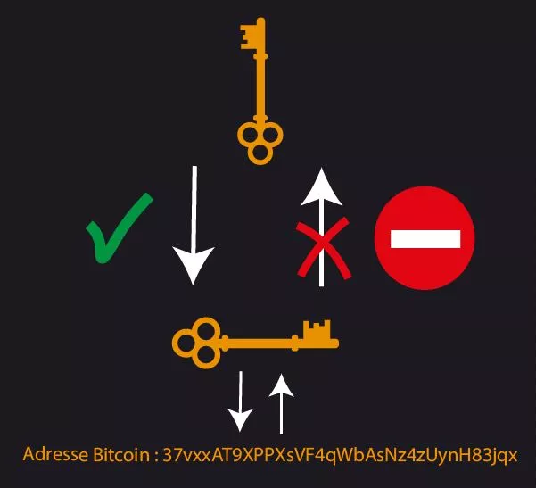

### Bitcoins ในกระเป๋าสตางค์อยู่หรือไม่?

แม้ว่าคู่กุญแจที้ง 2 แบบของคุณจะถูกเก็บไว้ในกระเป๋าสตางค์ของคุณ แต่ตัว bitcoins เองจริงๆ นั้นถูก "เก็บ" อยู่ในบล็อกเชนของ Bitcoin ซึ่งเป็นบัญชีสาธารณะที่กระจายศูนย์อยู่บนเครือข่าย peer-to-peer ของ Bitcoin (เราจะศึกษาเรื่องนี้ในส่วนที่ 3) นั่นคือเหตุผลที่ว่าทำไมการสูญหายของอุปกรณ์ที่เก็บตัวกระเป๋าเงินของคุณ ไม่ได้แปลว่าคุณจะสูญเสีย bitcoins ของคุณไป สิ่งที่ทำให้คุณสามารถสร้างกระเป๋าเงินของคุณขึ้นมาใหม่และใช้จ่าย bitcoin ของคุณได้จริงๆ ก็คือกุญแจส่วนตัว ดังนั้นจึงสำคัญมากที่จะต้องรักษามันไว้อย่างเหมาะสม

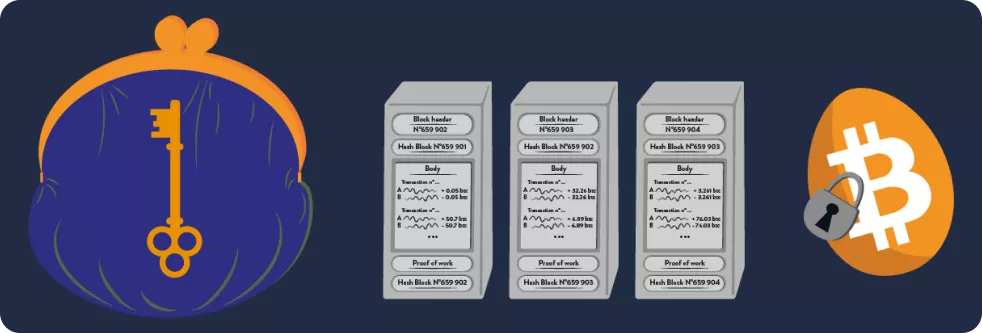

โชคดีสำหรับเรา เพราะตั้งแต่ปี 2017 เราสามารถเข้ารหัสตัวกุญแจส่วนตัวนี้ให้ออกมาอยู่ในรูปแบบของ ำศัพท์ 12 หรือ 24 คำ ที่เรียกว่า mnemonic phrase กลุ่มคำศัพท์เหล่านี้ถือเป็นเหมือน ตัวสำรองข้อมูลกระเป๋าเงิน Bitcoin ของคุณ มันคือสิ่งที่ทำให้คุณสามารถสร้างกระเป๋าสตางค์ของคุณขึ้นมาใหม่ได้ด้วยซอฟต์แวร์ หรือ แอปกระเป๋าเงิน Bitcoin ใดๆก็ได้ ดังนั้น ใครก็ตามที่รู้ รายการคำศัพท์เหล่านี้ ก็จะเข้าถึง bitcoin ของคุณได้

### แล้วเรื่องแฮกเกอร์จะมาแฮกข้อมูลล่ะ?

เราอาจมีคำถามได้ว่า เกิดสมมุติว่ามีคนเดารายการคำศัพท์ 12 หรือ 24 คำของเราได้โดยบังเอิญล่ะ จะเป็นยังไง คำตอบสั้นๆ คือ ด้วยการเข้ารหัสที่ใช้ในการสร้างกระเป๋าเงินนี้ มันจึงมีโอกาสน้อยมากที่สิ่งนั้นจะเกิดขึ้น เพื่อให้เห็นภาพที่ชัดขึ้น การที่คนจะบังเอิญเดารายการการคำศัพท์ถูกและเข้าถึงกระเป๋าสตางค์ของคุณๆด้โดยบังเอิญนั้น ก็เหมือนกับการเดา "ตัวเลขที่ถูกต้อง" ในจำนวนระหว่าง 1 ถึง $2^256$ ซึ่งแทบจะเทียบเท่ากับการหาตัว "อะตอมที่ถูกต้อง" จากอะตอมทั้งหมดในจักรวาล อย่างไรก็ตาม ถ้าคุณไม่วางใจกับระดับความปลอดภัยเริ่มต้นนี้ คุณสามารถเสริมความแข็งแกร่งของมันได้โดยการเพิ่ม passphrase ให้กับกระเป๋าเงิน Bitcoin ของคุณ

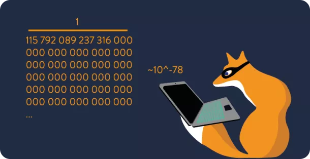

ดังนั้น โอกาสในการแฮกกระเป๋าสตางค์ Bitcoin ของคุณนั้นต่ำอย่างมหาศาลหากคุณปฏิบัติตามแนวทางด้านความปลอดภัยที่ดี เราจะอธิบายแนวทางเหล่านี้เพิ่มเติมในส่วนถัดไป

เลือกกระเป๋าสตางค์ที่ตรงกับความจำเป็นและตามการใช้งานของคุณ มีบทช่วยสอนกี่ยวกับการใช้งานและการรักษาความปลอดภัยของกระเป๋าสตางค์ต่างๆ ใน [ส่วน บทช่วยสอนของมหาวิทยาลัยของเรา](https://planb.network/tutorials/wallet)

### สรุปอย่างรวดเร็วในโปสเตอร์!

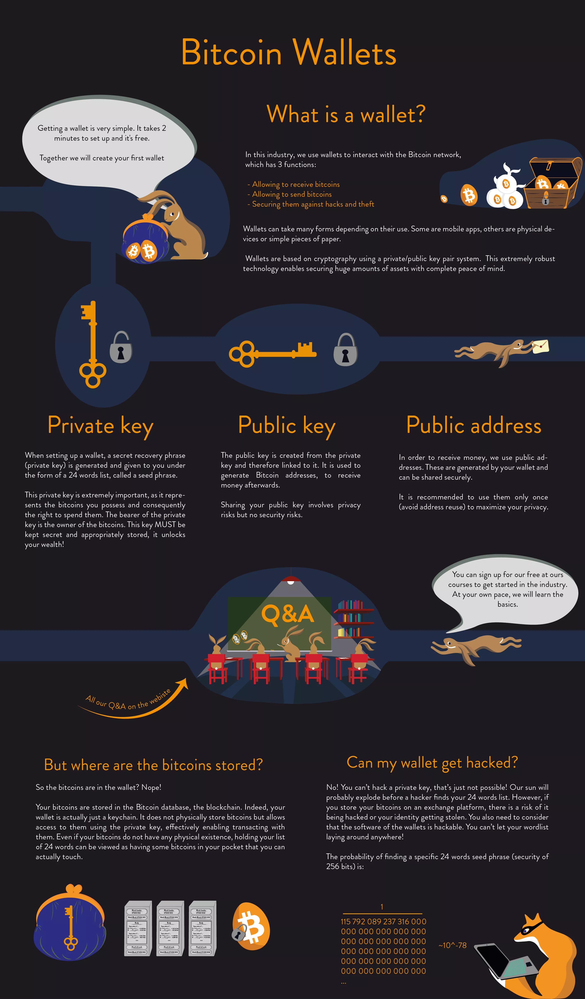

## ความปลอดภัยและกระเป๋าสตางค์ Bitcoin
<chapterId>00c1afea-e54a-511f-bab3-2efc2fbfa6a1</chapterId>

### การถามคำถามที่ถูกต้องก่อนที่จะเริ่มต้น
เมื่อคุณเป็นเจ้าของบิทคอยน์ ความปลอดภัยของเงินของคุณเป็นสิ่งที่ต้องคำนึงถึงเป็นหลัก วิธีที่ดีที่สุดในการกำหนดความระดับปลอดภัยที่เหมาะสมกับสถานการณ์ของคุณคือการถาม (และตอบ) ตัวชุดคำถามต่อไปนี้ โมเดลการรักษาความปลอดภัยของคุณจะขึ้นอยู่กับคำตอบของคุณ เอาละ มาเริ่มกัน:

- ใครจะสามารถเข้าถึงเงินของฉันได้บ้าง? หรือกล่าวอีกนัยหนึ่งคือ คุณจะเป็นคนเดียวที่มีสิทธิ์เข้าถึงบิทคอยน์ของคุณหรือจะต้องมีบุคคลที่สาม เช่น บริษัท เป็นต้อน อนุญาตให้คุณเข้าถึงเงินของคุณหรือไม่?
- คำถามที่สองอาจเป็น: คุณวางแผนที่จะใช้บิทคอยน์ของคุณในการทำอะไร? เป็นเงินที่คุณใช้เป็นประจำหรือไม่? หรือเป็นการออมระยะกลาง? หรือเป็นการออมระยะยาว?
- คุณมีทักษะด้านเทคโนโลยีมากแค่ไหน?
- งบประมาณที่จะใช้เพื่อรักษาความปลอดภัยของคุณคือเท่าไหร่?

จำไว้ว่าไม่มีโซลูชันที่เหมาะสมกับทุกสถานการณ์ ดังนั้นขอให้ใช้เวลาตอบคำถามเหล่านี้ ไม่ต้องรีบ เพราะมันจะช่วยให้คุณกำหนดมาตรการความปลอดภัยที่เหมาะสม

### ประเมินกระเป๋าบิทคอยน์ในแง่ของความซับซ้อน

มาลองกำหนดระดับความปลอดภัยสำหรับบิทคอยน์ของคุณ:

- **ระดับ 0**, คุณใช้กระเป๋าเงินแบบ custodial ซึ่งคุณไม่ใช่ผู้ถือบิทคอยน์เพียงคนเดียว จงจำไว้ว่าบุคคลที่สามที่คุณไว้วางใจนี้ก็สามารถจำกัดการเข้าถึงเงินทุนของคุณได้ทุกเมื่อ และคุณมีระดับของอธิปไตยทางการเงินเท่ากับระบบธนาคารแบบดั้งเดิมผ่านบัญชีธนาคาร

- **ระดับ 1**, คุณใช้กระเป๋าบิทคอยน์บนโทรศัพท์หรือคอมพิวเตอร์ของคุณ ซึ่งคุณเป็นผู้ถือบิทคอยน์เพียงคนเดียว คุณสามารถทำธุรกรรมได้อย่างง่ายดาย อย่างไรก็ตาม การสำรองข้อมูลวลี mnemonic เป็นสิ่งสำคัญเพื่อกู้คืนการเข้าถึงเงินทุนของคุณในกรณีที่สูญเสียโทรศัพท์หรือคอมพิวเตอร์ โดยกระเป๋าแบบนี้มักถูกเรียกว่า "กระเป๋าเงินร้อน (hot wallet)" เพราะตัวกุญแจส่วนตัวจะถูกเก็บไว้บนอุปกรณ์ที่เชื่อมต่ออินเทอร์เน็ต

- **ระดับ 2**, คุณใช้กระเป๋าเงินแบบกายภาพ และคุณเก็บรายการคำศัพท์ 12 หรือ 24 คำ ไว้ปลอดภัย ในการทำธุรกรรม คุณจะต้องลงชื่อด้วยอุปกรณ์ของคุณเสมอ ทำให้ลดความง่ายในการเข้าถึงเงินของคุณ หากจะใช้มันเพื่อจะใช้ในชีวิตประจำวันปกติ โดยสิ่งนี้มักเรียกว่า "กระเป๋าเงินเย็น (Cold Wallet)" เพราะตัวกุญแจส่วนตัวของคุณถูกเก็บไว้บนอุปกรณ์ที่ไม่เชื่อมต่อกับอินเทอร์เน็ต

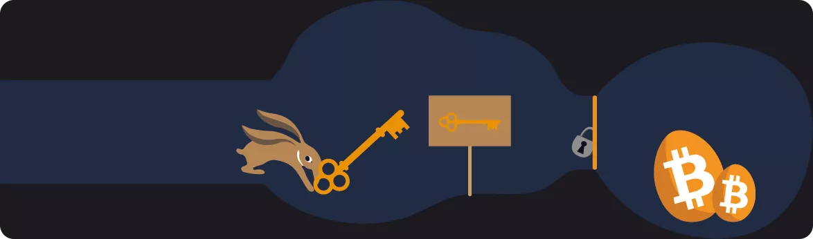

- **ระดับ 3**, คุณใช้กระเป๋าเงินระดับ 1 หรือ 2 แต่มีการเพิ่ม passphrase อีกชั้นหนึ่ง จงจำไว้ว่าคุณต้องสำรองทั้งรรายการคำศัพท์ 12 หรือ 24 คำ **และ** passphrase ของคุณ ซึ่งในทางที่ดีที่สุดในอุคมคติ ก็คือข้อมูลสองส่วนนี้ควรเก็บไว้ในสองที่ต่างกัน

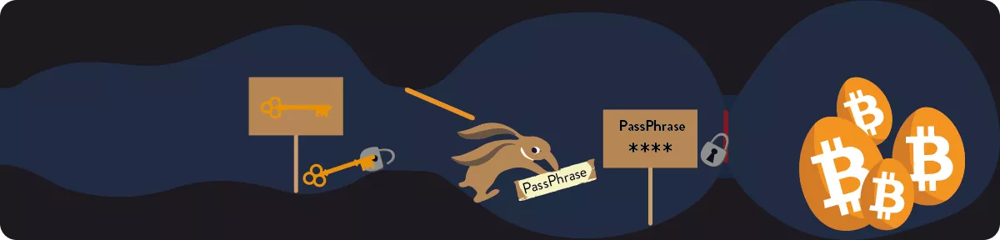

- **ระดับ 4**, คุณใช้ชุดของกระเป๋าเงินเพื่อสร้าง "กระเป๋าเงินแบบ multisig" ซึ่งหมายความว่ามันต้องการลายเซ็นหลายตัวเพื่อทำธุรกรรม จำไว้ไว้ว่ากุญแจ multisig แต่ละอัน ควรเก็บไว้ในที่ต่างๆ แยกกัน โดยนี่มักถือเป็นการใช้งานบิทคอยน์แบบขั้นสูง โดยส่วนใหญ่ใช้สำหรับจำนวนเงินที่มากและการใช้งานในระดับองค์กร

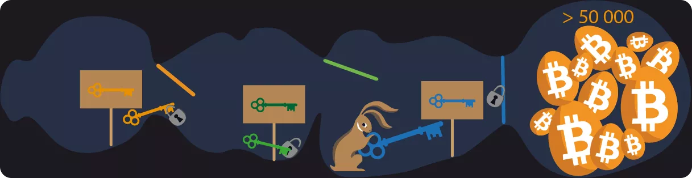

และแน่นอนว่า ตัวเราคนเดียวก็สามารถมีกรณีการใช้งานหลายรูปแบบ และในกรณีเช่นนี้ เราแนะนำให้ใช้กระเป๋าบิทคอยน์หลายๆแบบรวมกัน เพราะมันไม่มีโซลูชันเดียวที่เหมาะสมกับทุกสถาณการณ์

### ความปลอดภัยต้องปรับให้เหมาะสม
จำนวนเงินที่คนๆหนึ่งยินดีที่จะเก็บไว้ในแต่ละระดับความปลอดภัยของกระเป๋าขึ้นอยู่กับแต่ละบุคคล สำหรับบางคน การเก็บ 1 BTC ในกระเป๋าเงินออนไลน์ถือว่าเป็นเรื่องที่สมเหตุสมผล ในขณะที่สำหรับคนอื่นๆ อาจไม่ใช่เลย แต่ไม่ว่ายังไงก็ตาม ควรหลีกเลี่ยงการใช้จ่ายเงินด้านการรักษาความปลอดภัยที่มากเกินไป เช่นโดยการซื้อกระเป๋าเงินทางกายภาพในยามที่คุณต้องการเก็บรักษาจำนวนเงินแค่เพียงเล็กน้อย นอกจากนี้ ควรจำไว้ว่าการทำให้ความปลอดภัยและการเข้าถึง bitcoins ของคุณซับซ้อนเกินไปอาจทำให้คุณเดือดร้อนได้ หากเช่น คุณจัดการกับการสำรองข้อมูลของกระเป๋าเงินของคุณไม่ดี

สรุปได้ว่า การเป็นเจ้าของ bitcoins ของตนเองเป็นส่วนสำคัญในการที่จะมีอธิปไตยทางการเงินของตนเอง โดยเราแนะนำให้ใช้กระเป๋าเงินบนมือถือสำหรับค่าใช้จ่ายประจำวัน และใช้กระเป๋าเงินทางกายภาพแบบออฟไลน์หรือกระเป๋าแบบ "cold wallet" เพื่อเก็บเงินจำนวนมาก ในอีกด้านนึง กิจการธุรกิจต่างๆ ควรพิจารณาใช้ระบบลายเซ็นหลายตัวหรือ "multisig" เพื่อเพิ่มระดับและกระจายศูนย์ความปลอดภัย และนอกจากนี้ มันเป็นสิ่งที่สำคัญมากที่จะหลีกเลี่ยงบริการที่มีการช่วยดูแลรักษาเงิน (Custodial service) ซึ่งอาจจะสร้างจุดอ่อนบางอย่างแบบเดียวกับที่ระบบการเงินแบบดั้งเดิมมี ให้มากที่สุดเท่าที่จะเป็นไปได้

และเมื่อตอนนี้เราได้เรียนรู้ข้อมูลเหล่านี้แล้ว มาดูขั้นตอนในการสร้างกระเป๋าเงิน Bitcoin ในส่วนถัดไปกัน อย่างไรก็ตาม หากคุณต้องการสำรวจเรื่องการรักษาความปลอดภัยเพิ่มเติม คุณสามารถอ่าน[บทความโดย DarthCoin](https://asi0.substack.com/p/bitcoin-soyez-votre-propre-banque)

### สรุปอย่างรวดเร็วในโปสเตอร์!

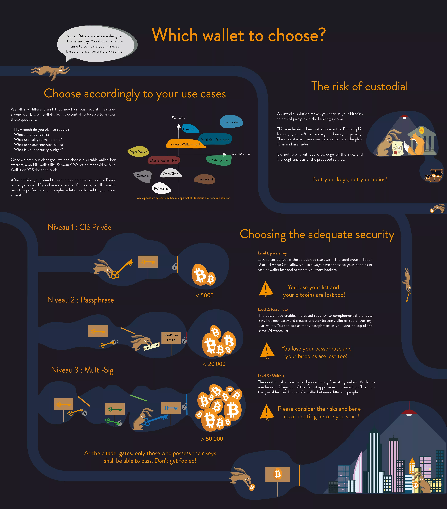

## การตั้งค่ากระเป๋าเงิน
<chapterId>615519eb-4565-557d-86a0-021badf7616f</chapterId>

ความปลอดภัยของ bitcoins ของคุณมีความสำคัญยิ่ง และข้อผิดพลาดเล็กน้อยอาจมีผลที่มีค่าใช้จ่ายสูง นั่นเป็นเหตุผลที่เราจะมาดูแนวทางปฏิบัติที่ดีที่สุดเมื่อสร้างกระเป๋าเงิน Bitcoin ใหม่

> โปรดทราบว่า หลักสูตร BTC102 จะแนะนำคุณผ่านขั้นตอนนี้

### ขั้นตอนนี้ไม่ใช่เรื่องเล่นๆ!

กุญแจส่วนตัวของคุณ ซึ่งมักจะแสดงเป็นรายการของ 24 คำ (บ่อยครั้งเรียกว่า "seed" หรือ "mnemonic phrase") เป็นตัวแทนการเข้าถึงเงินของคุณ หากกุญแจนี้ถูกเปิดเผยต่อบุคคลที่สามแล้ว ขอให้ถือว่าเงินที่เก็บโดยกุญแจตัวนี้ไม่ปลอดภัยอีกต่อไป ดังนั้น เมื่อคุณเริ่มต้นสร้างกระเป๋าเงินของคุณ สำคัญมากที่จะต้องปฏิบัติตามกฎเหล่านี้:

- ปิดกล้องทั้งหมด
- อย่าถ่ายรูปรายการคำศัพท์
- อย่าป้อนมันลงในคอมพิวเตอร์หรือโทรศัพท์
- อย่าบันทึกเป็นรายชื่อติดต่อหรือส่งให้ตัวเองผ่าน SMS
- อย่าทิ้งคำศัพยท์เหล่านี้ไว้บนโต๊ะทำงานของคุณดูไม่มีการเฝ้าระวัง
- อย่าซ่อนรายการคำศัพท์ของคุณในที่แปลกๆ

คุณจะต้องเอากระดาษเปล่าๆ หรือพิมพ์[แม่แบบนี้](https://bitcoiner.guide/backup.pdf) และเขียนรายการคำตามลำดับอย่างเรียบร้อยและชัดเจนด้วยปากกา หากหมึกซีดจางตามเวลา คุณอาจสูญเสียเงินของคุณไป ดังนั้น สำคัญที่จะต้องเก็บกระดาษนี้ให้ห่างจากสภาพแวดล้อมต่างๆ

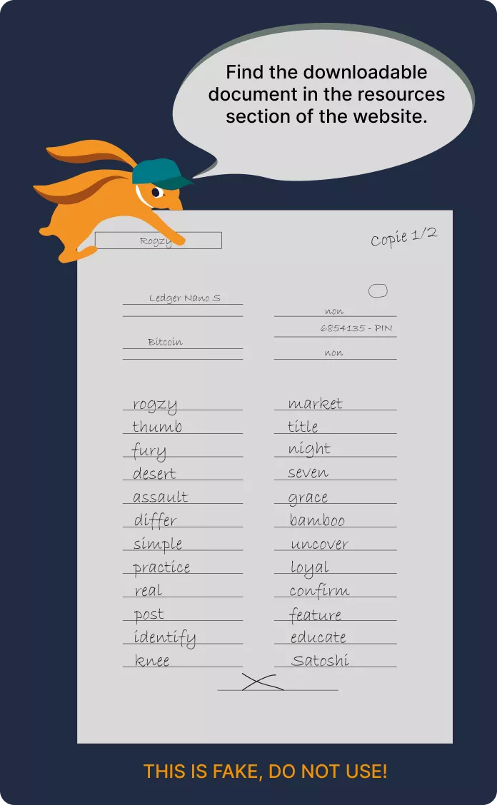

### คำแนะนำในการทำให้ถูกต้อง

ยังมีทางเลือกอื่นนอกจากการใช้กระดาษเปล่า เช่น การสลัก mnemonic phrase ของคุณลงบนแผ่นโลหะ ซึ่งหากคุณเขียนผิด ผู้ที่รับมรดกของคุณอาจไม่สามารถอ่านได้และอาจไม่สามารถกู้คืนเงินได้ ดังนั้นหลังจากเขียนคำเหล่านั้นแล้ว เราแนะนำให้ทำแผ่นสำเนาชุดที่สองและเก็บไว้ในที่ๆแยกต่างหากจากสำเนาชุดแรก เพื่อเป็นการสำรองข้อมูลในกรณีเกิดการสูญหายหรือเกิดอุบัติเหตุกับสำเนาชุดแรก

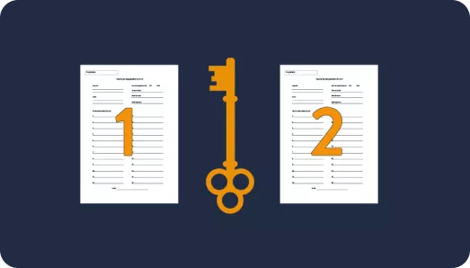

หลังจากทำสำเนาแล้ว จัดเก็บรายการคำศัพท์ในที่ๆปลอดภัย ที่คุณจะจำได้ว่าจะหามันเจอได้! อย่าใช้แผนการซ่อนที่ซับซ้อนเกินไป จนคุณเสี่ยงที่จะหามันไม่เจอ

> คำของคุณ = เงินของคุณ

"กระเป๋าเงิน" แบบ "เย็น" โดยทั่วไปจะมีรายการคำเหล่านี้ เช่นเดียวกับกระเป๋าเงินแบบ "ร้อน" บนมือถือหรือ PC วิธีนี้ในการสำรองกุญแจส่วนตัวได้กลายเป็นมาตรฐานในปัจจุบัน นั่นหมายความว่าคุณสามารถป้อน mnemonic phrase ของคุณเข้าไปในซอฟต์แวร์กระเป๋าเงินใด ๆ เพื่อกู้คืนกระเป๋าเงินของคุณได้ กระเป๋าเงินที่ไม่ดีซึ่งเราไม่แนะนำให้ใช้ คือกระเป๋าเงินที่ไม่ได้ให้รายการคำศัพท์ 24 คำ แต่ชื่อขอบัญชีผู้ใช้, ที่อยู่อีเมล, หรือที่แย่ที่สุดคือ ขอข้อมูลบัตรประจำตัว
**คำเตือน: ควรระมัดระวังกระเป๋าที่ไม่มอบรายการคำ 24 คำให้คณ**

### สรุปอย่างรวดเร็วในโปสเตอร์!

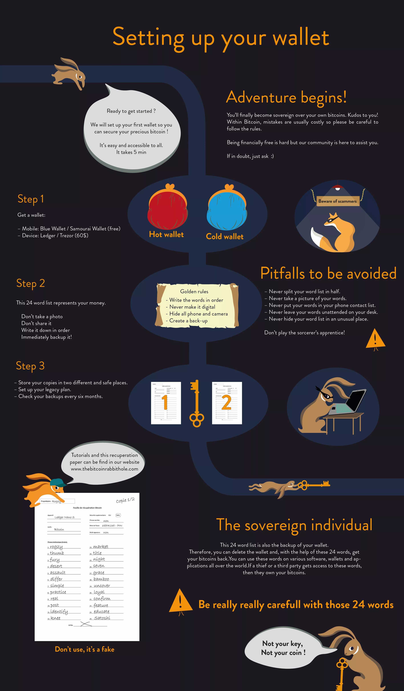

## ยืนหยัดผ่านการทดสอบจากเวลา
<chapterId>f58cd446-c202-5eff-aab7-e61cc40e5c06</chapterId>

ความปลอดภัยเป็นประเด็นสำคัญในระบบนิเวศ Bitcoin จริงๆ แล้ว เช่นเดียวกับทรัพย์สินใด ๆ บิตคอยน์ของคุณต้องได้รับการป้องกันจากการสูญหาย, การโจรกรรม, และการเสื่อมสภาพ โดยเฉพาะอย่างยิ่งในระยะเวลาที่ยาว การรักษาความปลอดภัยของบิตคอยน์ของคุณจำเป็นต้องใช้ความรู้ทางเทคนิคบางอย่างและความตระหนักถึงความเสี่ยงที่เกี่ยวข้อง ซึ่งนำเราไปสู่การหารือเกี่ยวกับกลยุทธ์หลักสองประการ: การสลักบิตคอยน์ของคุณลงบนเหล็กและ การสร้างแผนการสืบทอดส่งต่อ

### การสลักลงบนหิน

หนึ่งวิธีในการรักษาความปลอดภัยของบิตคอยน์ของคุณในระยะยาวคือการสลักวลีเชิงอรรถของคุณลงบนวัสดุทนทานเช่นเหล็ก สิ่งนี้สร้างการสำรองข้อมูลกุญแจของคุณในรูปแบบทางกายภาพที่ทนต่อความเสียหายจากน้ำและไฟ

มีวิธีการหลายวิธีในการทำสิ่งนี้ บางวิธีมีต้นทุนต่ำเช่น "Blockmit" ในขณะที่วิธีอื่นๆ อาจต้องการอุปกรณ์เพิ่มเติม คุณสามารถสำรวจหัวข้อนี้ด้วยตัวคุณเองผ่านส่วนของบทแนะนำในมหาวิทยาลัยนี้


### คิดถึงรุ่นต่อไป!

และสิ่งที่มาพร้อมกันนี้ คือการสร้างแผนการสืบทอดส่งต่อ ซึ่งนี่ก็เป็นขั้นตอนสำคัญเช่นกันเพื่อให้แน่ใจว่าบิตคอยน์ของคุณจะได้รับการจัดการอย่างเหมาะสมหลังจากคุณเสียชีวิต แผนนี้สามารถรวมถึงจดหมายที่เขียนด้วยมือรายละเอียดเกี่ยวกับทรัพย์สินของคุณ วิธีการเข้าถึง และข้อมูลติดต่อของบุคคลที่เชื่อถือได้เพื่อติดต่อ นอกจากนี้ยังสำคัญที่จะหารือเกี่ยวกับการสืบทอดบิตคอยน์กับนักกฎหมายเพื่อให้แน่ใจว่าเป็นไปตามกฎหมายด้านภาษี แต่มันสำคัญที่ว่าจะต้องไม่ไว้ใจมอบบิตคอยน์ของคุณให้กับบุคคลที่สามโดยตรง ซึ่งนั่นรวมถึงเหล่านักกฎหมายต่างๆด้วย

หากคุณต้องการสำรวจหัวข้อเกี่ยวกับแผนการสืบทอดสำหรับบิตคอยน์ของคุณเพิ่มเติม เราแนะนำหนังสือของ Pamela Morgan [Cryptoasset Inheritance Plan](https://planb.network/resources/books/28) หรือการเข้าร่วมคอร์ส BTC102 ที่เราจะสอนคุณในการสร้างมันขึ้นมา

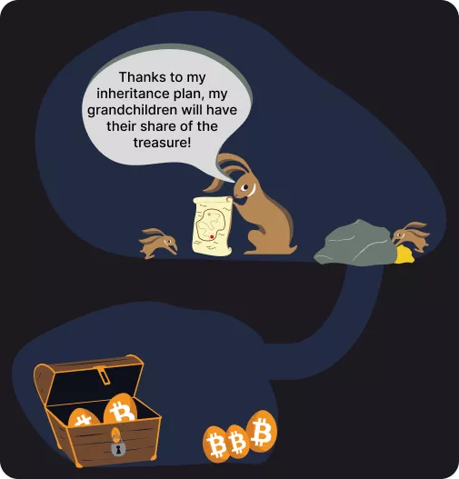

### ความเป็นส่วนตัวสำคัญ

ความปลอดภัยระยะยาวของบิตคอยน์ของคุณไม่จำกัดเพียงแค่การสร้างสำรองทางกายภาพหรือการพัฒนาแผนการสืบทอดส่งต่อเท่านั้น ความเป็นส่วนตัวก็ยังเป็นอีกประเด็นสำคัญ ตัวอย่างเช่น การซื้อบิตคอยน์โดยไม่ต้องให้ข้อมูลที่ระบุตัวตน เพื่อลดความเสี่ยงของการถูกขโมยข้อมูลส่วนตัวหรือถูกการติดตามเงินของคุณโดยหน่วยงานใดๆ ด้วยการใช้วิธีการที่มีอยู่ โดยคอร์ส BTC 205 สามารถช่วยคุณในเรื่องนี้ได้หากจำเป็น

ในเรื่องเกี่ยวกับความเป็นส่วนตัว สิ่งสำคัญคือต้องหลีกเลี่ยงการพูดคุยเกี่ยวกับบิตคอยน์ของคุณกับทุกคน ซึ่งจริงๆ แล้ว เราไม่ทราบหรอกว่าสินทรัพย์นี้จะเดินไปทางไหน การรักษาความลับเกี่ยวกับการเป็นเจ้าของในทรัพย์สินนี้จึงถือเป็นการตัดสินใจที่ฉลาด คุณไม่ต้องการดึงดูดความสนใจมาที่ตัวคุณและกระเป๋าเงินของคุณ

ในทำนองเดียวกัน หลีกเลี่ยงการเปิดเผยระบบความปลอดภัยของคุณอย่างโจ่งแจ้งๆ ในระหว่างงานประชุมบิตคอยน์หรือเมื่อพบกับคนแปลกหน้า...

### สรุปอย่างรวดเร็วในโปสเตอร์!

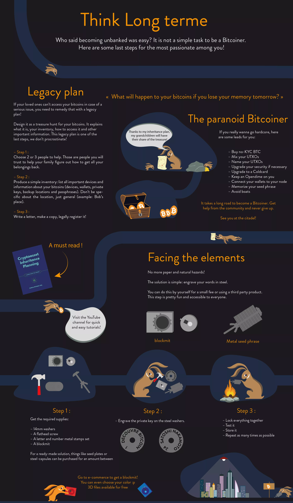

### สรุปเกี่ยวกับความปลอดภัยของกระเป๋าเงิน Bitcoin

กระเป๋าเงิน Bitcoin เป็นซอฟต์แวร์ที่ช่วยให้คุณสามารถเก็บและทำธุรกรรมบิตคอยน์ได้ มีหลายประเภท: กระเป๋าเงินบนมือถือหรือ PC ที่สะดวกสำหรับจำนวนเงินเล็กน้อย และ/หรือ ค่าใช้จ่ายในชีวิตประจำวัน; กระเป๋าเงินทางกายภาพ เหมาะสำหรับการเก็บบิตคอยน์ในระยะกลางและระยะยาว; กระเป๋าเงิน multisig ซึ่งมีความซับซ้อนในการจัดการและต้องการลายเซ็นหลายตัวเพื่อทำธุรกรรม
เมื่อสร้างกระเป๋าเงิน คุณต้องสำรองกุญแจส่วนตัวของคุณเป็นอันดับแรก การสำรองข้อมูลนี้จะอยู่ในรูปแบบของรายการคำ 12 หรือ 24 คำ หรือ 12 คำที่คุณสามารถเขียนลงบนกระดาษหรือแผ่นโลหะได้ รายการคำศัพท์นี้ช่วยให้คุณสามารถกู้คืนกระเป๋าเงินของคุณได้ในแอปพลิเคชันกระเป๋าเงิน Bitcoin ใดๆ ใครก็ตามที่เข้าถึงรายการคำศัพท์นี้ก็จะสามารถเข้าถึงบิตคอยน์ของคุณได้ และใน Bitcoin อธิปไตยทางการเงินมาพร้อมกับความรับผิดชอบส่วนบุคคล ดังนั้นจึงสำคัญมากที่คุณต้องรักษาการเข้าถึงกระเป๋าเงินและการสำรองข้อมูลของคุณให้ปลอดภัย เพื่อทำเช่นนี้ มันสำคัญที่จะต้องปฏิบัติตามกฎบางประการ:
- สร้างแผนการสืบทอดส่งต่อ: เพื่อให้แน่ใจว่าคนที่คุณรักสามารถเข้าถึงเงินได้ในกรณีที่มีปัญหา
- หลีกเลี่ยงแพลตฟอร์ม ตลาดแลกเปลี่ยน: แนะนำให้หลีกเลี่ยงการเก็บบิตคอยน์ของคุณไว้บนแพลตฟอร์มตลาดแลกเปลี่ยน เนื่องจากอาจถูกโจมตีโดยแฮกเกอร์
- ปรับระดับความปลอดภัยของคุณ: ใช้เวลาอธิบายความต้องการและการใช้งานของคุณ ซึ่งจะช่วยให้คุณเลือกกระเป๋าเงิน Bitcoin ที่เหมาะสมได้

ตอนนี้เราได้ครอบคลุมพื้นฐานของกระเป๋าเงิน Bitcoin และแนวปฏิบัติที่ดีที่สุดในการรักษาความปลอดภัยของพวกเขา เราจะพูดถึงการทำงานทางเทคนิคของ Bitcoin ในบทถัดไป ขอย้ำอีกครั้งอีกครั้ง การรู้พื้นฐานของโปรโตคอล Bitcoin จะช่วยให้คุณเข้าใจการทำงานของมันได้ดีขึ้น ซึ่งจะช่วยให้คุณใช้งานมันได้ดียิ่งขึ้น

# แง่มุมด้านเทคนิคของ Bitcoin
<partId>a86d7439-e7a2-5f21-b1e9-6b5e23ca265b</partId>

## เปิดตัว Bitcoin
<chapterId>b7561082-8943-519d-95d1-a5f60dd2686d</chapterId>

### มาเริ่มต้นด้วยประวัติศาสตร์เล็กน้อย

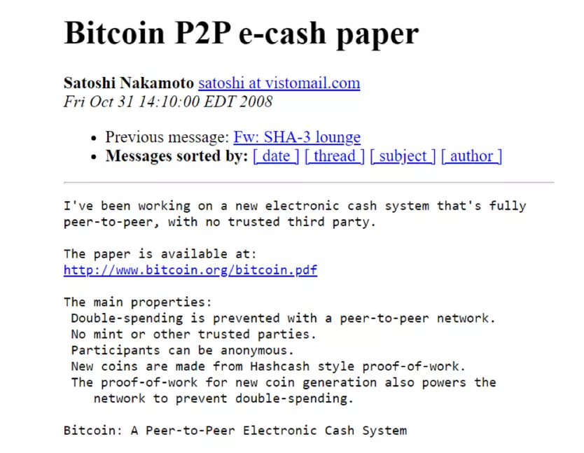

วันที่ 31 ตุลาคม 2008 ถือเป็นวันเกิดของเทคโนโลยีการเงินใหม่ที่ชื่อว่า Bitcoin นี่คือวันที่ Satoshi Nakamoto ผู้สร้างที่ไม่เปิดเผยตัวตนของ Bitcoin นำเสนอนวัตกรรมของเขาต่อโลกผ่านอีเมลที่ส่งไปยังรายชื่อผู้รับอีเมลของกลุ่ม cypherpunk ซึ่งคือ ชุมชนของผู้ที่หลงใหลในการเข้ารหัสลับและความเป็นส่วนตัวบนอินเทอร์เน็ต

อีเมลนี้มีเอกสารที่เรียกว่า "White Paper" ซึ่งนำเสนอการทำงานของ Bitcoin แต่เนื่องจากหลากหลายความล้มเหลวก่อนหน้านี้ในการพยายามสร้างระบบเงินสดดิจิทัล โครงการนี้จึงไม่ได้รับการตอบรับแบบกระตือรือร้นทันที อย่างไรก็ตาม White Paper นี้ในที่สุดก็กลายเป็นแหล่งข้อมูลอ้างอิงสำหรับผู้ใช้ Bitcoin และเป็นหัวข้อของการอภิปรายมากมายเกี่ยวกับระบบนิเวศ Bitcoin

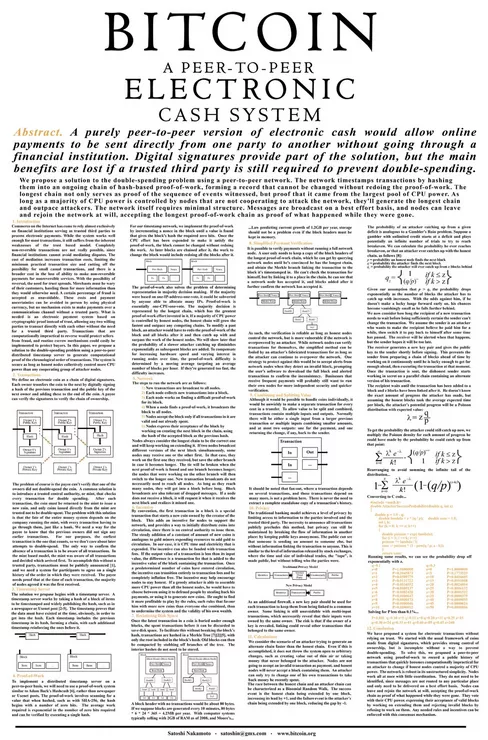

ในวันที่ 3 มกราคม 2009 Satoshi เปิดตัวเครือข่าย Bitcoin อย่างเป็นทางการโดยการสร้างบล็อกแรก ซึ่งเรียกว่า บล็อกกำเนิด (Genesis Block) ซึ่งทำเครื่องหมายการเปิดตัวของบล็อกเชน Bitcoin บล็อกนี้มีข้อความที่เปิดเผยเกี่ยวกับภารกิจของ Bitcoin: "03/ม.ค./2009 นายกรัฐมนตรีกำลังจะให้การช่วยเหลือกลุ่มธนาคารเป็นครั้งที่สอง"

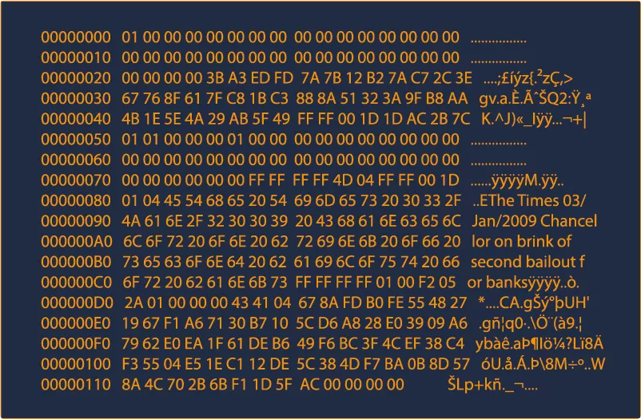

> "เราสามารถชนะการต่อสู้ครั้งใหญ่ในการแข่งขันสะสมอาวุธนี้ได้และ
> ได้รับดินแดนแห่งเสรีภาพแห่งใหม่นี้ไปต่อได้อีกหลายปี" - Satoshi Nakamoto


### โปรโตคอล Bitcoin เริ่มมีชีวิต

ในวันที่ 8 มกราคม 2009 Satoshi ประกาศการเปิดตัว Bitcoin-0.1.0 ไม่นานหลังจากนั้น Hal Finney ได้เริ่มใช้ซอฟต์แวร์และเข้าร่วมเครือข่าย ซึ่งหมายความว่า ณ ตอนนี้มีโหนด 2 โหนดแล้ว และหมายความว่าตอนนี้มีนักขุด 2 คนในเครือข่ายแล้ว Finney ได้จารึกก้าวแห่งประวัติศาสตร์นี้ด้วยการทวีต "Running Bitcoin" ในวันที่ 12 มกราคม 2009 การทำธุรกรรม Bitcoin ครั้งแรกถูกทำระหว่าง Satoshi และ Hal Finney การทำธุรกรรม จำนวน 10 BTC นี้ ไดก้ถูกบันทึกอยู่ในบล็อก 170

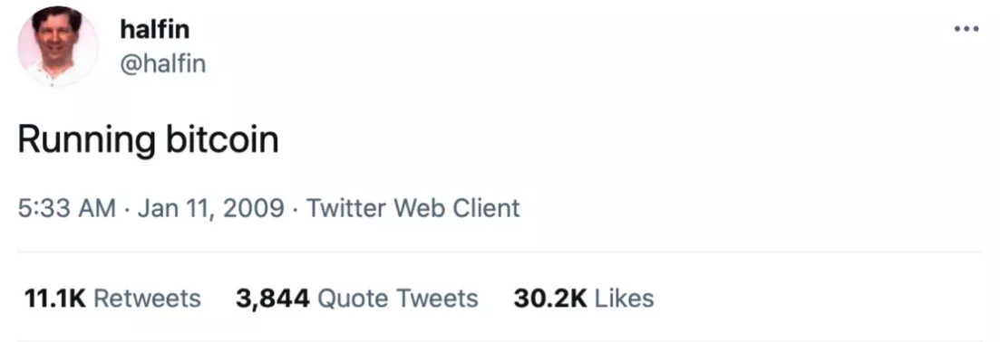

ความสนใจใน Bitcoin เพิ่มขึ้นอย่างรวดเร็ว และผู้คนหลายคนเริ่มทดสอบ ถกเถียง แก้ไขข้อผิดพลาด และตริตองถึงด้านจริยธรรม เศรษฐกิจ และปรัชญาของ Bitcoin และเพื่อส่งเสริมการแลกเปลี่ยนเหล่านี้ กระดานฟอรัม BitcoinTalk ได้ถูกสร้างขึ้นในวันที่ 22 พฤศจิกายน 2009 โดย Satoshi ในเวลาไม่นาน กระดานฟอรัมนี้ได้กลายเป็นสถานที่ที่ผู้ใช้ Bitcoin ชื่นชอบที่จะใช้ในการพูดคุย ณ ที่นี่เองที่มีการถือกำเนิดของมีมและสัญลักษณ์ที่เกี่ยวข้องกับ Bitcoin มากมาย เช่น [โลโก้ Bitcoin](https://bitcointalk.org/index.php?topic=64.0), [Hodl] ที่โ่ด่งดัง(https://bitcointalk.org/index.php?topic=375643.0)  หรือแม้กระทั่ง [วันพิซซ่า](https://bitcointalk.org/index.php?topic=137.msg1195)

> **คุณรู้หรือไม่?** จริง ๆ แล้ว ในวันที่ 22 พฤษภาคม 2010, Laszlo Hanyecz สร้างประวัติศาสตร์กับ Bitcoin โดยเสนอซื้อพิซซ่า 2 ชิ้นด้วย 10,000 BTC นี่เป็นครั้งแรกที่ Bitcoin ถูกใช้ในการซื้อสินค้าจริง

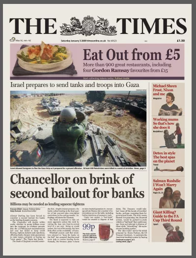

### การหายตัวไปของ Satoshi Nakamoto

ในปี 2010 เมื่อ Bitcoin เริ่มได้รับความสนใจจากสื่อ Satoshi ได้ตัดสินใจที่จะถอยห่าง ในวันที่ 12 ธันวาคม 2010 เขาโพสต์ข้อความสุดท้ายบนกระดานฟอรัม ประกาศถึงการจากลาของเขา และในวันที่ 23 เมษายน 2011 เขาทำการติดต่อทางอีเมลแบบส่วนตัวครั้งสุดท้าย และหลังจากนั้น Satoshi ก็ได้หายตัวไป ทิ้งสิ่งที่เขาสร้างไว้ในมือของชุมชน

> "รัฐบาลนั้นเก่งในการเด็ดหัวของผู้นำในเครือข่ายที่มีควบคุมจากศูนย์กลางอย่างเช่น Napster
> แต่เครือข่ายแบบ P2P ที่บริสุทธิ์ อย่างเช่น Gnutella และ Tor ดูเหมือนจะยืนหยัดได้ด้วยตัวมันเอง"
> - Satoshi Nakamoto

แม้จะไม่มี Satoshi อยู่แล้ว แต่ Bitcoin ก็ยังคงพัฒนาเดินหน้าต่อไป โดยทุก ๆ 10 นาที ประวัติศาสตร์ของ Bitcoin ถูกเขียนจารึกขึ้น และโปรโตคอลยังคงทำงานตามที่ตั้งใจไว้ แม้ว่าจะมีความกลัว ความไม่แน่นอน หรือความสงสัย (FOMO สำหรับ Fear Of Missing Out หรือ FUD สำหรับ Fear Uncertainty Doubt) รายรอบมันก็ตาม Bitcoin ก็ยังคงเดินหน้าต่อไป ด้วยการที่มันนออนไลน์ทำงานได้ 99.988% ของเวลาทั้งหมด

แต่ละคนมีมุมมองเกี่ยวกับ Bitcoin ที่แตกต่างกันออกไป สำหรับบางคน มันเป็นเหมือนตัวเชื้อราเช่น [mycelium](https://brandonquittem.com/bitcoin-is-the-mycelium-of-money/), สำหรับคนอื่น ๆ มันเป็น [หลุมดำ](https://dergigi.com/2019/05/01/bitcoins-gravity/). ไม่ว่าคุณจะรักหรือเกลียดมันก็ตาม ตัว Bitcoin ก็ยังคงมีตัวตนอยู่ต่อไป ด้วยจังหวะคงที่ในการสร้างบล็อก 10 นาทีต่อบล็อก เปรียบเหมือนกับการเต้นของระบบการเงินใหม่

เพื่อเรียนรู้เพิ่มเติมเกี่ยวกับงานเขียนของ Satoshi Nakamoto ฉันแนะนำ [หนังสือของ Phil Champagne](https://planb.network/resources/books) หรือสารคดีของ ARTE "le mystaire Satoshi"

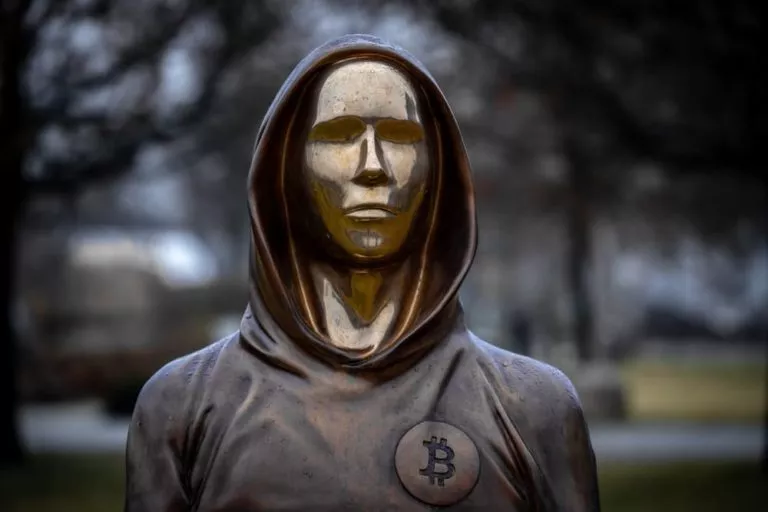

> "ปัญหาหลักกับสกุลเงินแบบดั้งเดิมอยู่ตรง ความไว้วางใจทั้งหมด ที่จำเป็นต้องใช้ ในการทำให้มันทำงานได้ ธนาคารกลางต้องได้รับความไว้วางใจว่าจะไม่ลดค่าเงิน แต่ประวัติศาสตร์ของสกุลเงินเฟียตกลับเต็มไปด้วยการละเมิดความไว้วางใจนั้น ธนาคารต้องได้รับความไว้วางใจในการเก็บเงินของเราและโอนมันทางอิเล็กทรอนิกส์ แต่พวกเขากลับปล่อยกู้มันออกไปในรูปแบบของฟองเครดิตและมีเงินสำรองไว้แค่เพียงเศษเสี้ยวเดียว"

ในเมื่อตอนนี้เรามีความรู้พื้นฐานบ้างแล้ว มาดูกันว่าการทำธุรกรรม Bitcoin ทำงานอย่างไรโดยทั่วไป

### สรุปอย่างรวดเร็วในโปสเตอร์!

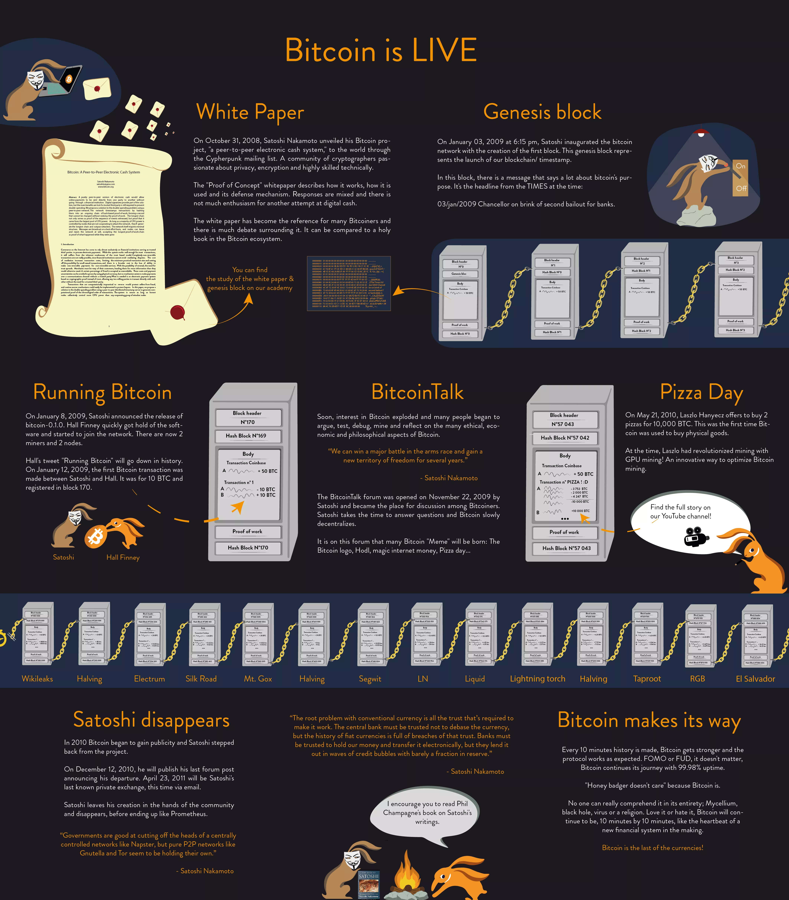

## การทำธุรกรรม Bitcoin
<chapterId>03482644-5473-590b-975b-b43bb65eac21</chapterId>
การทำธุรกรรม Bitcoin คือการโอนกรรมสิทธิ์ของตัว bitcoins ที่มี โดยใช้ ที่อยู่กระเป๋า Bitcoin ลองยกตัวอย่างเช่น สมมุติว่ามีสองตัวละครหลัก: Alice และ Bob ซึ่ง Alice อยากรับ bitcoins ในขณะที่ Bob มี bitcoins อยู่แล้ว

### ขั้นตอนที่ 1 - การสร้างธุรกรรมผ่านกระเป๋าเงิน

เพื่อให้ Bob โอน bitcoins ให้ Aliceได้ Alice ต้องให้ที่อยู่กระเป๋า Bitcoin ของเธอกับ Bob ซึ่งที่อยู่นี้ ได้มาจากกุญแจสาธารณะของ Alice และเป็นเอกลักษณ์เฉพาะสำหรับกระเป๋าเงิน Bitcoin ของเธอ

ในทางปฏิบัติ Alice แค่เปิดกระเป๋าเงินของเธอและกด "รับ" และกระเป๋าจะแสดง QR code หรือที่อยู่เช่นนี้ bc1q7957hh3nj47efn8t2r6xdzs2cy3wjcyp8pch6hfkggy7jwrzj93sv4uykr ซึ่งนี่เปรียบเหมือน "เลขบัญชีธนาคาร Bitcoin" ของเธอ ซึ่งเธอจะมอบมันให่้กับ Bob

จากนั้น Bob จะเริ่มการทำธุรกรรมโดยใช้ที่อยู่รับของ Alice Bob เปิดกระเป๋าเงิน Bitcoin ของเขา กด "ส่ง", คัดลอกและวางที่อยู่, เพิ่มจำนวนเงินและค่าธรรมเนียมการทำธุรกรรม ค่าธรรมเนียมเหล่านี้เป็นแรงจูงใจสำหรับนักขุดในการรวมธุรกรรมเข้าไปในบล็อกถัดไป

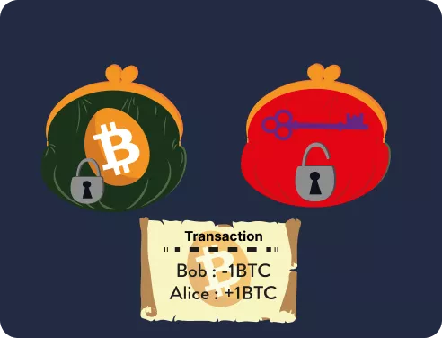

> **ทำไมต้องจ่ายค่าธรรมเนียม?** ค่าธรรมเนียมเหล่านี้จำเป็นเพื่อสร้างกลไลตลาดเสรีสำหรับสร้างแรงจูงใจการรวมธุรกรรมเข้าไปในบล็อก เนื่องจากจำนวนธุรกรรมที่จะบรรจุลงในแต่บล็อกได้นั้มีจำนวนจำกัด ในความเป็นจริง บล็อกจะมีขนาด 1 MB (ซึ่งจริงๆสามารถขยายได้ถึง 4 MB หลังจากการอัปเดต Segwit) ซึ่งบรรจุธุรกรรมได้แค่ไม่กี่พันรายการต่อบล็อก และค่าธรรมเนียมของธุรกรรมจะขึ้นอยู่กับขนาดของมัน และในทางกลับกันขนาดของธุรกรรม ก็จะขึ้นอยู่กับความซับซ้อนของธุรกรรม

เพื่อให้การทำธุรกรรมเสร็จสมบูรณ์ Bob ต้องให้ลายเซ็นที่สร้างด้วยกุญแจส่วนตัวของที่อยู่ที่เขาใช้จ่ายให้ Alice นี่ยืนยันว่าเขาเป็นเจ้าของ bitcoins ที่เขาต้องการโอน ขั้นตอนนี้มักจะทำโดยอัตโนมัติบนกระเป๋าเงินมือถือ หรือเป็นการยืนยันบนกระเป๋าเงินกายภาพ ด้วยข้อความเช่น "คุณแน่ใจหรือไม่ว่าต้องการส่ง X ให้ Y? ใช่หรือไม่"

### ขั้นตอนที่ 2: การแพร่กระจายของธุรกรรมผ่านโหนดไปยังนักขุด

ในขั้นตอนนี้ ธุรกรรมได้ถูกสร้างขึ้นแล้วและกระเป๋าเงินของ Bob จะแชร์มันกับเครือข่าย Bitcoin เพื่อทำเช่นนี้ กระเป๋าเงินของเขาจะสื่อสารกับโหนดของเครือข่าย Bitcoin และโหนดนี้จะแพร่กระจายข้อมูลนี้ไปยังโหนดอื่น ๆ ขั้นตอนการแพร่กระจายนี้ช่วยให้เครือข่ายทั้งหมดเห็นธุรกรรมใหม่นี้และพิจารณาตรวจสอบมัน

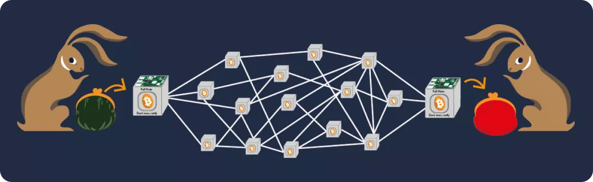

แม้ว่าตัวธุรกรรมนี้จะถูกเห็นโดยทุกคนดแล้ว (ผ่านเครื่องมือที่เรียกว่า Mempool) ก็ไม่ได้แปลว่า ธุรกรรมนี้จะได้รับการยืนยัน! ซึ่งในความเป็นจริงแล้ว มันคือนักขุดที่ต้องตรวจสอบยืนยันธุรกรรมโดยการรวมมันเข้าไปในบล็อกของ สิ่งที่โด่งดัง อย่าง บล็อกเชน

นักขุดมีบทบาทในการรับธุรกรรมที่ถูกต้องและยังไม่ได้รับการยืนยัน แล้วรวมมันเข้าไปในบล็อก และในการทำให้บล็อกของพวกเขาเป็นบล็อกถัดไปในบล็อกเชนของ Bitcoin พวกเขาจะต้องแก้ปริศนาที่สร้างโดยศาสตร์การเข้ารหัสลับ ในกระบวนการที่เรียกว่า "proof of work"

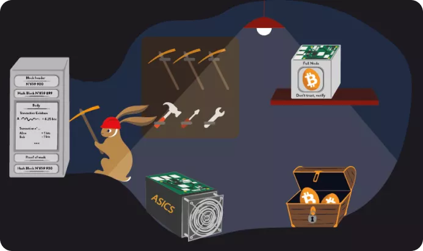

### ขั้นตอนที่ 3: ธุรกรรมถูกขุดในบล็อกโดยนักขุด

การทำ Proof of work คือการที่ต้องหา "hash" ที่ถูกต้องสำหรับบล็อกที่เกี่ยวข้อง ลองคิดซะว่ามันเป็นลายนิ้วมือของ บล็อกนั้นๆ โดยที่มันจะไม่ซ้ำใคร ซึ่งประกอบด้วยอักขระ 256 ตัว ความถูกต้องของ hash นี้ขึ้นอยู่กับความยากของเครือข่าย Bitcoin เราจะไปพูดถึงกลไกนี้เพิ่มเติมในภายหลัง ในตอนนี้ลองคิดก่อนว่านักขุดได้พบบล็อกที่ถูกต้องและธุรกรรมของ Bob ที่โอนไปยัง Alice ได้ถูกรวมอยู่ในนั้น

บล็อกใหม่ที่ถูกต้องนี้ถูกเพิ่มเข้าไปในบล็อกเชนของ Bitcoin ซึ่งเป็นบัญชีของการทำธุรกรรม Bitcoin ทั้งหมด แบบเปิดเผยต่อสาธารณะและไม่สามารถแก้ไขได้ ลองมองมันเหมือนกับบัญชีร่วมสำหรับผู้ใช้ Bitcoin ทุกคน ซึ่งตามกฎของโปรโตคอล บล็อกจะถูกเพิ่มประมาณทุกสิบนาที ซึ่งต้องขอบคุณการปรับระดับความยาก ในส่วนของนักขุด เราจะเห็นกลไกที่ป้องกันการแก้ไขบัญชีแยกประเภทการทำธุรกรรม Bitcoin ในบทเรียนส่วนที่เกี่ยวข้องกับนักขุดต่อไป

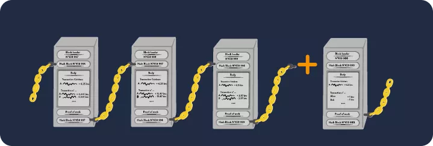

### ขั้นตอนที่ 4: บล็อกถูกตรวจสอบและยืนยันว่าถูกต้องโดยโหนดกระเป๋าเงินของ Alice

ในขั้นตอนนี้ การทำธุรกรรมถือว่าครบถ้วนสมบูรณื นักขุดจะจัดการกระจายบล็อกใหม่ผ่านโหนดของตนไปยังเครือข่าย และกระเป๋าเงินของ Alice จะได้รับการอัปเดต

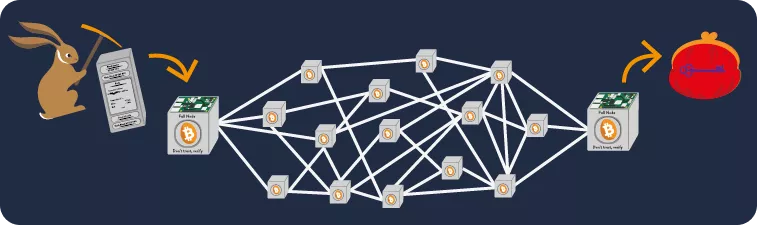

> หมายเหตุ: แม้ว่า Alice จะเห็นว่าเธอได้รับ bitcoins ในหนึ่งในที่อยู่ของเธอ แต่ให้เราถือว่าการทำธุรกรรมจะไม่สามารถเปลี่ยนแปลงได้ก็ต่อเมื่อมีการยืนยันถึง 6 ครั้ง นั่นหมายความว่ามีบล็อกอื่นอีก 6 บล็อกที่ถูกขุดเพิ่มเติมหลังจากบล็อกที่มีการทำธุรกรรมของ Bob ซึ่งกล่าวคือ ยิ่งตัวธุรกรรมในบล็อกเชนเก่ามากขึ้นเท่าไร มันก็ยิ่งไม่สามารถเปลี่ยนแปลงแก้ไขได้มากขึ้น

### สรุปอย่างรวดเร็วในโปสเตอร์!

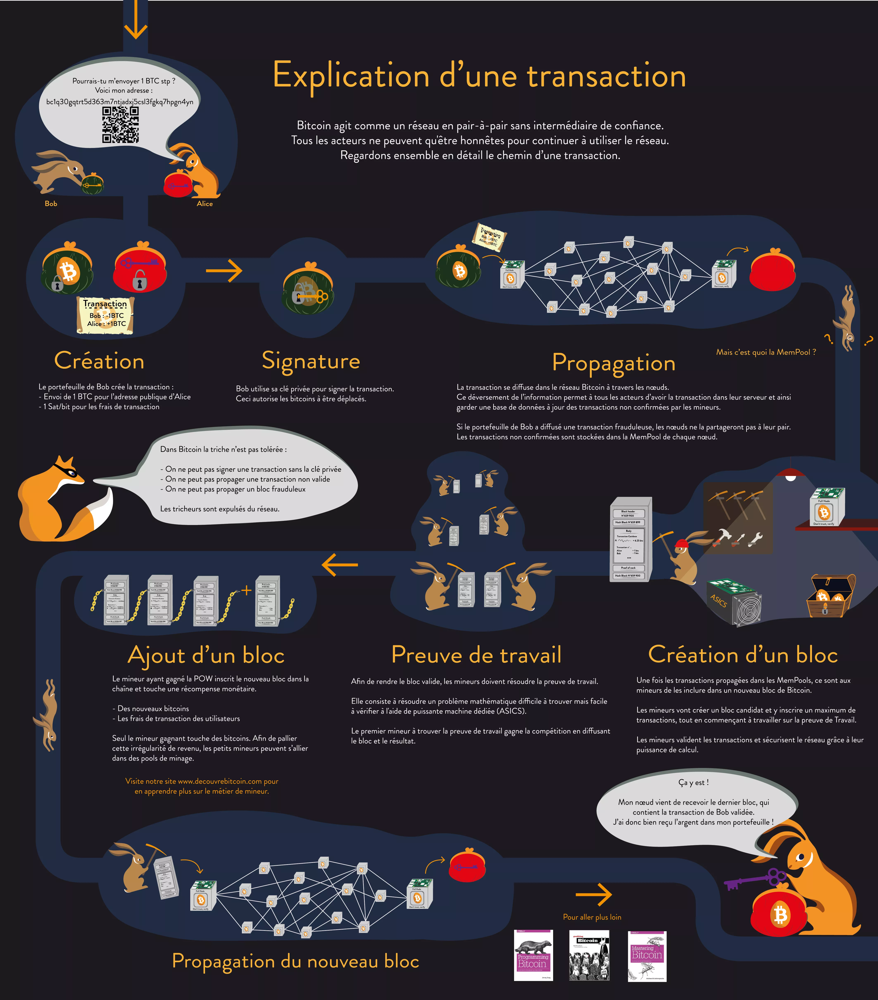

### จุดประสงค์ของทั้งหมดนี้คืออะไร?

ในท้ายที่สุด ระบบในการทำธุรกรรม Bitcoin ก็เป็นระบบกระจายศูนย์และทำงานแบบ peer-to-peer โดยไม่ต้องมีตัวกลางที่เชื่อถือได้

Bob ส่งการทำธุรกรรมของเขาไปยังเครือข่าย Bitcoin และเมื่อนักขุดเผยแพร่บล็อกที่ถูกต้องซึ่งมีตัวธุรกรรมของ Bob อยู่ Alice จึงจะสามารถมองได้ว่า bitcoins เหล่านั้นเป็นของเธอได้ ซึ่งเราไม่จำเป็นต้องใช้ความไว้วางใจในขั้นตอนใด ๆ ของการโอนกรรมสิทธิ์ความเป็นเจ้าของในตัว bitcoin เลย โดยใช้แค่กฎของโปรโตคอลและแรงจูงใจทางเศรษฐกิจเท่านั้นในการทำให้การกระทำอย่างมีเจตนาไม่สุจริตภายในโปรโตคอล Bitcoin จะมีค่าใช้จ่ายที่สูงมากเกินจะคุ้มค่า

ผู้ใช้โอนกรรมสิทธิ์ของเงินของตนโดยการลงนามดิจิทัลในการทำธุรกรรมด้วยกุญแจส่วนตัวของตน นักขุดมีอำนาจน้อย เนื่องจากผู้ใช้ยังมีการควบคุมในระดับที่สำคัญผ่านการใช้โหนดของ Bitcoin ที่ทำหน้าที่จัดการการตรวจสอบบล็อกใหม่และตัวธุรกรรมที่รวมอยู่ข้างใน และด้วยเครือข่ายของโหนดของตัว Bitcoin นี่แหละ คือวิธีที่ทำให้เครือข่ายทั้งหมดแล้วกระจายศูนย์ได้จริงๆ

และที่จริง ในการที่จะทำลายเครือข่าย Bitcoin ให้ได้อย่างสิ้นเชิง สำเนาของบล็อกเชนบนโหนด Bitcoin ทั้งหมดจะต้องถูกทำลาย ซึ่งเป็นสิ่งที่แทบจะเป็นไปไม่ได้เนื่องจากการกระจายศูนย์ของโหนดในด้านภูมิศาสตร์ และความยากลำบากในการยึดครองพวกมันในทางกายภาพ

มาดูกันใกล้ๆกันว่าว่าโหนด Bitcoin ทำงานอย่างไร

## โหนด Bitcoin
<chapterId>8533cebc-f799-528b-89df-8d75d4c37f1c</chapterId>

โหนดเป็นองค์ประกอบพื้นฐานของสถาปัตยกรรมเครือข่าย Bitcoin พวกเขาทำหน้าที่สำคัญหลายอย่าง:

- รักษาสำเนาของบล็อกเชน Bitcoin
- ตรวจสอบการทำธุรกรรม
- ส่งข้อมูลไปยังโหนดอื่น
- บังคับใช้กฎของโปรโตคอล Bitcoin

ดังนั้น อุปกรณ์ใด ๆ ที่ทำงานด้วยซอฟต์แวร์ Bitcoin เรียกว่าโหนด Bitcoin (บ่อยครั้งผ่าน [Bitcoin Core](https://bitcoin.org/en/bitcoin-core/)) ที่ช่วยสนับสนุนการกระจายศูนย์ของเครือข่าย

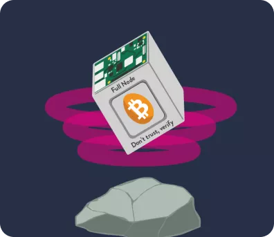

### ดังนั้น โหนดจึงเป็นแกนกลางของ Bitcoin

แต่ละโหนดถือสำเนาของบล็อกเชน ซึ่งช่วยในการตรวจสอบการทำธุรกรรมและป้องกันความพยายามในการฉ้อโกง ความกระจายศูนย์ของเครือข่ายมอบความยืดหยุ่นและความแข็งแกร่งที่ไม่ธรรมดาให้กับ Bitcoin นั้นคือ ในการจะหยุดตัวโปรโตคอล Bitcoin โหนดทั่วโลกทั้งหมดจะต้องถูกปิด และขอแจ้งให้คุณทราบว่า ณ เดือนกันยายน 2023 มีโหนดประมาณ [45,000 โหนด](https://bitnodes.io/nodes/all/) กระจายอยู่ทั่วโลก

โหนดมีความสามารถในการตรวจสอบความถูกต้องของบล็อกและธุรกรรม เนื่องจากพวกมันปฏิบัติตามกฎจาก ฉันทามติในตัว Bitcoin  กฎเหล่านี้กำกับหลายอย่าง ซึ่งรวมถึงนโยบายทางการเงินของ Bitcoin เช่น จำนวนรางวัลของนักขุด (ซึ่งเราจะหารืออย่างละเอียดยิ่งขึ้นในส่วนถัดไป) และจำนวน bitcoin ที่จะหมุนเวียนอยู่ในระบบ โดยในแง่นึง โหนดทำหน้าที่เหมือนเป็นระบบกฎหมายของเครือข่าย เพราะมันทำให้ผู้ที่เข้าร่วมทุกคนในเครือข่ายทุกคนต้องปฏิบัติตามกฎเดียวกัน มันช่วยให้แน่ใจว่า Bitcoin protocol จะมีความเป็นกลาง กฎจากฉันทามติ จะมีการเปลี่ยนแปลงน้อยมากๆ หรือแทบจะไม่มีเลย เพราะการทำการเปลี่ยนแปลงใดๆต้องได้รับการอนุมัติจากโหนดทุกตัว

การกำกับดูแลภายในโปรโตคอลนั้นอยู่นอกขอบเขตของการฝึกอบรมนี้ แต่ทราบไว้ว่าผู้ใช้แต่ละคนที่ใช้ Bitcoin node สามารถตัดสินได้ใจเองว่าต้องการปฏิบัติตามกฎแบบใด ดังนั้น ผู้ใช้จึงสามารถตัดสินใจที่จะปฏิบัติตามกฎอื่นได้ (เช่น ทำการเปลี่ยนแปลงโค้ด) แต่ถ้าการเปลี่ยนแปลงเหล่านี้ขัดแย้งกับกฎ จากฉันทามติในปัจจุบัน โหนดนั้นจะถือไม่เป็นส่วนหนึ่งของเครือข่าย Bitcoin อีกต่อไป การเปลี่ยนแปลงระดับสำคัญจึงเกิดได้ยากและต้องการการประสานงานอย่างมากระหว่างผู้มีส่วนร่วมหลายพันคน ที่มีอุดมการณ์และผลประโยชน์ที่หลากหลาย ซึ่งสิ่งนี่บังคับให้โปรโตคอลจะต้องอัปเดตไปในทางที่ทำให้มัน "ดีขึ้น" ในความหมายของผู้ใช้ Bitcoin ทุกคน

### โหนดมีลักษณะอย่างไร?

เมื่อเราต้องการมีโหนดของตัวเอง มีตัวเลือกหลายอย่างที่เราสามารถเลือกได้ และค่าใช้จ่ายในการบำรุงรักษาก็แตกต่างกัน คุณสามารถรันซอฟต์แวร์ Bitcoin Core บนคอมพิวเตอร์ของคุณได้ แต่มันจำเป็นต้องใช้พื้นที่จัดเก็บข้อมูลจำนวนมากเนื่องจาก blockchain มีขนาดประมาณ ~500GB เพื่อเอาชนะข้อจำกัดนี้ คุณสามารถเลือกที่จะเก็บเฉพาะบล็อกล่าสุด ในจำนวน N บล็อกในหน่วยความจำ ซึ่งเรียกว่า "pruned node" ซึ่งสำหรับวิธีการนี้ มีค่าใช้จ่ายน้อยมากเพราะโหนดจะถูกเปิดใช้งานในยามที่คุณต้องการเท่านั้น

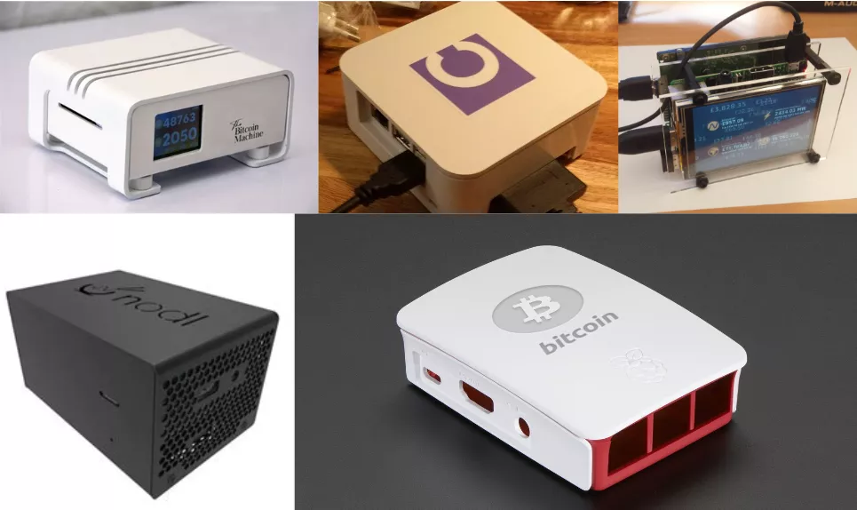

ตัวเลือกที่สองคือการใช้ตัวฮาร์ดแวร์เฉพาะสำหรับวัตถุประสงค์นี้ เช่น Raspberry Pi 4 พร้อม SSD ที่มีขนาดใหญ่พอสมควร (ประมาณ ~1TB) ตัวเลือกนี้มีราคาแพงกว่าหากคุณจำเป็นต้องซื้อฮาร์ดแวร์มาเพิ่ม แต่ในแง่ของการใช้ไฟฟ้า มันใช้น้อยกว่า €10 ต่อปีด้วยซ้ำ
ซึ่งเมื่อมองในแง่ของแบนด์วิดท์ โดยพิจารณาว่ามีการบันทึกบล็อกขนาด 1MB ทุก ๆ 10 นาที นี่หมายถึงการใช้ประมาณ 5GB ต่อเดือน

### โหนดต้องสามารถเข้าถึงได้โดยทุกคน!

การที่อุปกรณ์มีราคาที่เอื้อมถึงได้และการสามารถเข้าถึงตัวโหนด Bitcoin ทั้งในด้านตัวทรัพยากรด้านฮาร์ดแวร์ ด้านการจัดเก็บ และด้านแบนด์วิดท์ถือเป็นสิ่งสำคัญมากเนื่องจากมันจะช่วยให้เครือข่ายกระจายศุนย์ได้ดียิ่งขึ้น

ซึ่งจริงๆ แล้วทุกคนมีเหตุผลที่ดีเสอมในการจะรันโหนดเอง! ค่าใช้จ่ายและความพยายามที่ต้องใช้นั้นน้อยมากเมื่อเทียบกับประโยชน์ที่จะได้รับ คุณเพียงแค่ต้องเริ่มต้นการผจญภัยนี้และเข้าร่วมกับบิทคอยน์เนอร์คนอื่น ๆ หลายพันคนเพราะ เราทุกคนสร้างเครือข่าย Bitcoin ด้วยกัน

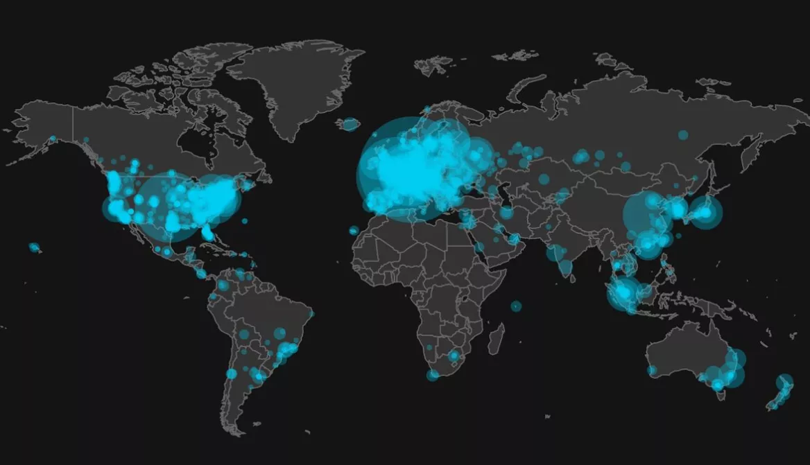

ตัวอย่างเช่น หากบล็อกมีขนาดใหญ่กว่า 100 เท่า เราอาจทำธุรกรรมได้มากขึ้น 100 เท่าทุก ๆ 10 นาที แต่การเรียกใช้โหนด Bitcoin จะต้องใช้ฮาร์ดดิสก์ขนาด 50TB ใช้แบนด์วิดท์มากกว่า 500GB/เดือน และฮาร์ดแวร์ที่สามารถตรวจสอบธุรกรรมหลายแสนรายการในเวลาน้อยกว่า 10 นาที ซึ่งในสถานการณ์สมมติที่บล็อกมีขนาดใหญ่กว่า 100 เท่า การรันโหนด Bitcoin จะไม่สามารถทำได้โดยคนทั่วไป ซึ่งจะทำให้การกระจายศูนย์ของตัวโปรโตคอลและความไม่เปลี่ยนแปลงของธุรกรรมและกฎจากฉันทามติ ได้รับผลกระทบ ดังนั้น ข้อจำกัดต่างๆที่มีในตัวโปรโตคอลนั้นถูกตั้งขึ้นมา เพื่อให้ผู้คนจำนวนมากที่สุดเท่าที่เป็นไปได้สามารถรันโหนด Bitcoin ของตัวเองได้

สถานการณ์นี้ไม่ใช่เพียงแค่สมมติฐาน เพราะปี 2017 ถือเป็นปีที่มีความขัดแย้งอย่างรุนแรงที่รู้จักกันในชื่อ "สงครามบล็อก" ความขัดแย้งนี้เกิดขึ้นระหว่างผู้ที่ต้องการแก้ไข Bitcoin โดยการเพิ่มขนาดบล็อกเพื่อเพิ่มความสามารถในการทำธุรกรรม กับผู้ที่ต้องการรักษาอิสระภาพและอำนาจของผู้ใช้ ซึ่งในที่สุด ผู้ใช้และโหนดก็ได้รับชัยชนะโดยการปฏิเสธการเปลี่ยนแปลงที่เสนอโดยนักขุด แพลตฟอร์มตลาดแลกเปลี่ยน และสถาบันต่างๆ

ซึ่งหลังจากได้รับชัยชนะนี้ ได้มีการเปิดใช้งานการอัปเดตตัว โหนด ที่เรียกว่า SegWit ซึ่งเป็นทางเปิดสู่การนำไปใช้งานของ Lightning Network ซึ่งเป็นเครือข่ายการชำระเงิน Bitcoin แบบทันทีโดยใช้บล็อกเชน Bitcoin โดยสถานการณ์นี้แสดงให้เห็นว่าผู้ใช้มีอำนาจแท้จริงในตัวโปรโตคอล Bitcoin  ผ่านการรันโหนดของพวกเขา ซึ่งทำให้พวกเขาสามารถต่อกรกับสถาบันขนาดใหญ่ได้

### สรุปในโปสเตอร์!

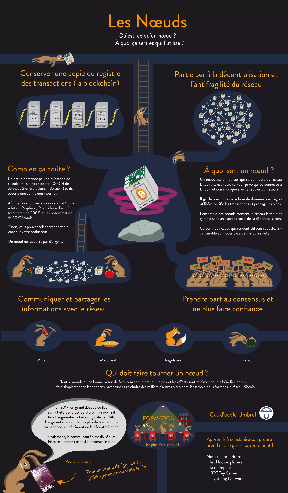

## นักขุด
<chapterId>dbb8264a-7434-57e4-9d1b-fbd1bae37fdf</chapterId>

> นักขุดทำหน้าที่รักษาความปลอดภัยของเครือข่ายและเพิ่มธุรกรรมเข้าไปในบล็อก พวกเขาใช้ไฟฟ้าผ่านเครื่องขุด ASIC เพื่อทำกระบวนการ Proof of Work ของ Bitcoin

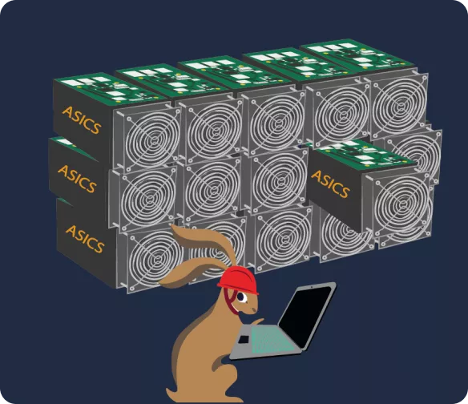

### คำอธิบายของ Proof of Work

Proof of Work หรือที่รู้จักในชื่อ "Proof of Work" (POW) เป็น การทำฉันทามติในด้านความปลอดภัยของตัวโปรโตคอล Bitcoin มันเป็นกฎที่ทำให้ Bitcoin สามารถทำงานและรับประกันความแข็งแกร่งของมัน POW เป็นรากฐานของทุกสิ่งและมีบทบาทสำคัญในทฤษฎีเกมของ Bitcoin

คิดว่ามันเป็นลอตเตอรี่ยักษ์ที่ทุกคนสามารถเข้าร่วมได้ วัตถุประสงค์คือการหาตัวเลขที่เฉพาะเจาะจงซึ่งจะทำให้สามารถลงนามในบล็อกที่ถูกต้องได้ ซึ่งผู้ชนะจะได้รับรางวัลเป็น bitcoin ซึ่งเราสามารถยืนยันความถูกต้องของตัวเลขนี้ได้ง่ายมาก แต่การจะหาตัวเลขนี้เป็นสิ่งที่ยากมาก ซึ่งในความเป็นจริง เราสามารถตรวจสอบตัวเลขได้โดยนำมันไปผ่านฟังก์ชันแฮช SHA-256 แบบง่ายๆ ซึ่งมันรวมอยู่ในอัลกอริทึมการขุด แต่ในการจะหาตัวเลขนี้ ผู้เที่ข้าร่วม (นักขุด) จะต้องพยายามเดาหาผ่านความเป็นไปได้นับหลายพันล้านครั้ง เช่น 1, 52, 2648, 26874615, 15344854131318631 ฯลฯ

หากตัวเลขที่เลือกถูกต้องก็ แจ็คพอตแตก! ถ้าไม่ใช้ การค้นหาก็จะดำเนินต่อไป เพื่อเพิ่มจำนวนความพยายามแบบมีประสิทธิภาพ พวกเขาจะใช้เครื่องจักรเฉพาะที่เรียกว่า ASICs ซึ่งมีหน้าที่เดียวคือการคำนวณความเป็นไปได้หลายพันล้านครั้งต่อวินาที ปริมาณของการพยายามเดาทั้งหมดเรียกว่า HashRate และช่วยในการประเมินระดับความปลอดภัยของโปรโตคอล Bitcoin ในการจะใช้งานเครื่องจักรเหล่านี้ จำเป็นต้องใช้ไฟฟ้าจำนวนมาก ดังนั้น POW คือการเปลี่ยนพลังงานเป็นสกุลเงิน ทำให้มันได้เชื่อมโยงโลกแห่งความเป็นจริงและโลกดิจิทัลเข้าด้วยกันเพื่อสร้างสกุลเงินที่อิงบนพลังงานเป็นครั้งแรก

เครื่องจักรทำงาน และหลังจากเวลาเฉลี่ย 10 นาที จะมีผู้ชนะปรากฏขึ้น พวกเขาจะพบแฮชที่ถูกต้องต่ำกว่าเกณฑ์ความยาก ผู้ชนะคนเดียวนี้จะลงนามบล็อกใหม่ของเซิร์ฟเวอร์ timestamp และทำให้บล็อกเชนดำเนินต่อไป ผู้ชนะรับรางวัลของพวกเขาและกลับมาเสี่ยงโชคสำหรับบล็อกถัดไป กระบวนการนี้ได้รับการทำซ้ำมา 12 ปี และทุก 10 นาที ผู้ชนะจะยืนยันธุรกรรม Bitcoin ในขณะที่ยังคงรักษาธุรกรรมในอดีต ทำให้บล็อกเชน Bitcoin ของเราแข็งแกร่งและปลอดภัยยิ่งขึ้น

ทุก 2 สัปดาห์ (2016 บล็อก) การปรับความยากจะทำให้เกมการขุดโลกกลับสู่สมดุลตามจำนวนผู้เข้าร่วม

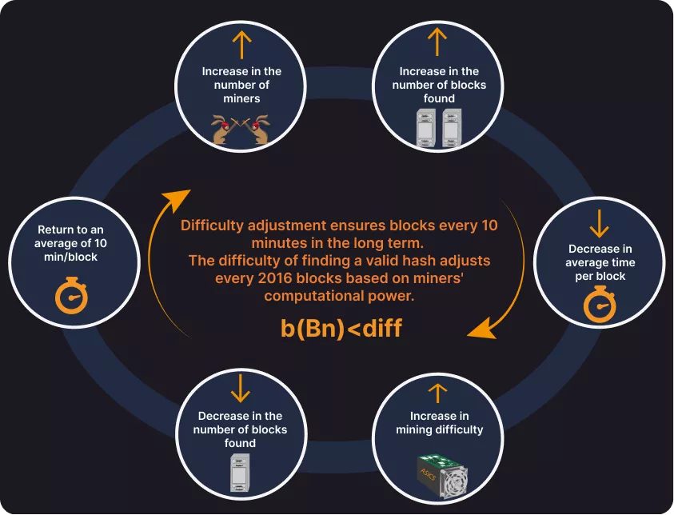

### การขุดกำลังพัฒนาอย่างต่อเนื่อง

ตลอดหลายปีที่ผ่านมา นักขุดได้จัดหาฮาร์ดแวร์คอมพิวเตอร์ที่มีประสิทธิภาพสูงขึ้นเรื่อยๆ เพื่อผลิตจำนวนแฮช (HashRate) มากที่สุดต่อวินาที ในขณะที่ใช้พลังงานน้อยที่สุดในวิธีที่คุ้มค่าที่สุดเท่าที่เป็นไปได้ นักขุดรุ่นแรกเช่น Satoshi หรือ Hal Finney ขุดด้วย CPU ของพวกเขาเท่านั้น จากนั้นคนอื่นๆ ก็เริ่มขุดด้วยการ์ดกราฟิกของพวกเขา และปัจจุบัน นักขุดใช้สิ่งที่เรียกว่า ASICs (Application-Specific Integrated Circuit) เครื่องจักรที่ออกแบบมาเพื่อใช้งานอัลกอริทึม SHA256 เท่านั้น

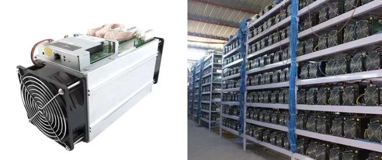

Hashrate ของเครือข่าย Bitcoin แสดงถึงจำนวนความพยายามในการการเดาตัวเลขต่อวินาทีสำหรับการค้นหาบล็อกที่ถูกต้องอันถัดไป โดยปัจจุบันอยู่ที่ประมาณ 400 TH/s ซึ่งเป็น 400 ล้านล้านความพยายามต่อวินาที! ยิ่ง hashrate ทั่วโลกสูง ก็ยิ่งเป็นการยากสำหรับผู้ไม่ประสงค์ดีในกาจะรผูกขาดทรัพยากรที่จำเป็นสำหรับการมีครอบครองกำลังขุดเกินครึ่งนึงของเครือข่ายและทำการใช้จ่ายเงินก้อนเดิมซ้ำ ดังนั้นการปฏิบัติตามกฎของโปรโตคอล Bitcoin จึงเป็นทางเลือกที่สมเหตุสมผลในเชิงเศรษฐศาสตร์ มากกว่าการที่จะกระทำต่อต้านตัวโปรโตคอล แต่นี่ทำให้เกิดคำถาม แล้วนักขุดได้รายได้จากไหน?

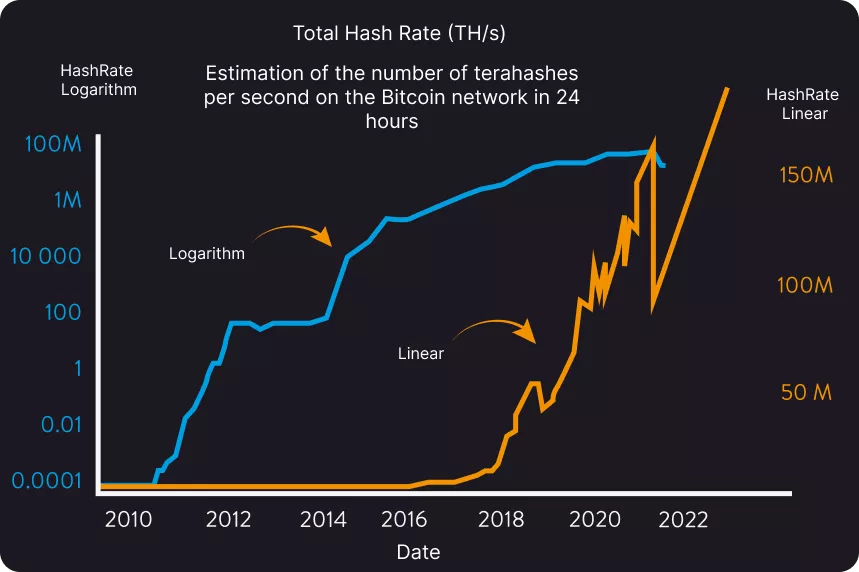

### สิ่งที่สามารถพบได้ในบล็อก?


ส่วนหัวของบล็อกประกอบด้วยส่วนประกอบหลายอย่าง เช่น เวลา, เป้าหมายความยาก, หมายเลขของบล็อกล่าสุด, เวอร์ชันที่ใช้, และ Merkel Root ของธุรกรรมก่อนหน้า

ธุรกรรม coinbase จะเป็นธุรกรรมแรกเสมอ; มันรวมถึงรางวัลที่ได้รับสำหรับการทำงานของผู้ตรวจสอบ จากนั้นจึงเป็นธุรกรรมที่ได้รับการตรวจสอบ นักขุดจะเลือกธุรกรรมที่จ่ายค่าทำธุรกรรมมากที่สุดและพยายามสร้างบล็อกที่เพิ่มรายได้ของพวกเขาให้สูงสุด นั่นก็คือธุรกรรมขนาดเล็กที่มีค่าธรรมเนียมสูงสุด

### ค่าชดเชยสำหรับนักขุด

ในเบื้องต้น นักขุดจะได้รับเงินชดเชยเมื่อพวกเขาพบบล็อกที่ถูกต้อง โดยเฉพาะอย่างยิ่ง พวกเขาได้รับการชดเชยในสองวิธี: (i) ผ่านเงินอุดหนุน (bitcoins ที่สร้างใหม่) ที่รวมอยู่ในบล็อก และ (ii) ผ่านค่าธรรมเนียมธุรกรรมในธุรกรรมที่รวมอยู่ในบล็อก จำนวนเงินอุดหนุนจะถูกกำหนดโดยกฎข้อตกลงและขึ้นอยู่กับ Epoch ที่เราอยู่ รางวัลของบล็อก = เงินอุดหนุนบล็อก + ค่าธรรมเนียมธุรกรรม

จริงๆ แล้ว สำหรับบล็อกแรกๆ เงินอุดหนุนบล็อกคือ 50 bitcoins จากนั้นทุกๆ 210,000 บล็อก (ประมาณทุกๆ 4 ปี) จะถูกลดลงครึ่งหนึ่ง วันนี้ (ในปี 2023) เราอยู่ใน Epoch ที่ 4; ดังนั้นการอุดหนุนคือ 6.25 bitcoins การอุดหนุนนี้เป็นกลไกสำหรับการสร้าง bitcoins ใหม่ใน Bitcoin และเมื่อเวินอุดหนุนจะลดลงเมื่อเวลาผ่านไป จึงทำให้มันมีขีดจำกัดของจำนวน Bitcoin ทั้งหมดอยู่ที่ 21 ล้าน bitcoins - โดยปัจจุบันมี bitcoins มากกว่า 19.4 ล้าน bitcoins ในการหมุนเวียน ซึ่งเกิน 92%

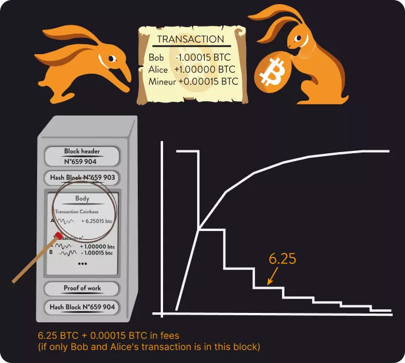

วิธีการชดเชยที่สองถูกกำหนดโดยจำนวนที่ผู้ใช้เลือกสำหรับค่าธรรมเนียมธุรกรรม นักขุดจะมีแนวโน้มที่จะให้ความสำคัญกับธุรกรรมที่มีค่าธรรมเนียมสูงเนื่องจากต้องการเพิ่มรายได้ ค่าธรรมเนียมธุรกรรมสะท้อนถึงความเร่งด่วนของผู้ใช้ที่ต้องการให้ธุรกรรมของพวกเขาถูกรวมอยู่ในบล็อกถัดไป

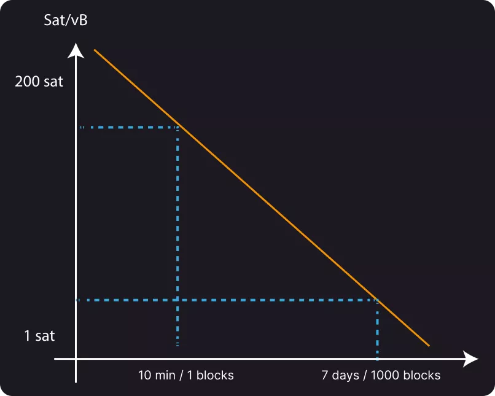

นอกจากนี้ เพื่อเสถียรภาพโมเดลเศรษฐกิจของนักขุด ซึ่งพึ่งพารางวัลที่พวกเขาได้รับสำหรับแต่ละบล็อกที่ถูกต้อง นักขุดมักจะร่วมมือกันในกลุ่มผ่าน "mining pools" ที่พวกเขารวมทรัพยากรการคำนวณของพวกเขา

### ทำไมต้องยุ่งยากทำเรื่องทั้งหมดนี้?

โดยสรุป นวัตกรรมของ Bitcoin คือการเสนอวิธีแก้ปัญหาการใช้จ่ายเงินก้อนเดิมซ้ำผ่านการใช้ blockchain ที่อิงกับ Proof of Work พร้อมกับระดับความยากที่เปลี่ยนแปลงได้ เพราะในโลกดิจิทัล แนวคิดของการเป็นเจ้าของนั้นแตกต่างจากในโลกแห่งความจริง เพราะจริงๆแล้ว ในโลกดิจิทัล, ทุกอย่างสามารถถูกสร้างเป็นก็อปปี้ได้ ซึ่งก่อให้เกิดปัญหาเรื่องการใช้จ่ายเงินก้อนเดิมซ้ำในตัวสินทรัพย์ดิจิทัลที่มีค่า โดยตัวกลางที่เชื่อถือได้ เช่น ธนาคาร ได้ถูกสร้างขึ้นเพื่อแก้ไขปัญหาด้านเทคโนโลยีนี้และคอยรับรองว่าเมื่อสินทรัพย์ถูกโอน มันจะไม่เป็นของผู้ส่งอีกต่อไป แต่เราจะทำแบบนี้โดยไม่ต้องใช้หรือเชื่อใจตัวกลางได้อย่างไรละ? ซึ่งปัญหานี้เทียบเท่ากับปัญหาของ Byzantine Generals' Problem ปัญหาการประสานงานข้อมูลภายในระบบที่ ผู้เล่นต่างๆไม่สามารถเชื่อถือได้

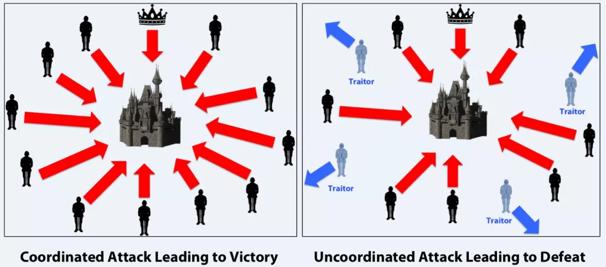

Bitcoin จึงเป็นวิธีหนึ่งในการแก้ปัญหานี้ หรืออย่างน้อยก็เป็นทางเลี่ยงแบบอ้อม โดย "เหล่านายพล (Generals)" ของ Bitcoin หรือก็คือนักขุด ผลิตบล็อ (ของข้อมูล) และโหนด Bitcoin ตรวจสอบธุรกรรมทางการเงินโดยใช้กฎข้อตกลงเพื่อรับรองความถูกต้องของข้อมูล ความไม่สมมาตร ระหว่างต้นทุนของพลังงานในการผลิตข้อมูลและ ต้นทุนของพลังงานในการตรวจสอบข้อมูลนั้น ช่วยรับรองความน่าเชื่อถือของข้อมูล โดยไม่จำเป็นต้องใช้บุคคลที่สามที่เชื่อถือได้

นักขุดเป็นผู้สร้างความปลอดภัยของเครือข่าย Bitcoin โดยการใช้พลังงานในการผลิตแฮช, พวกเขาสร้างกำแพงที่ทำให้มีต้นทุนสูงมากสำหรับผู้ที่มีเจตนาไม่ดีที่ต้องการจะเขียนประวัติธุรกรรมใหม่ ด้วยแรงจูงใจด้านเศรษฐศาตร์แบบนี้ ทำให้พวกเขาไม่อย่ากจะทำพฤติกรรมที่ไม่ซื่อสัตย์

แม้ในกรณีของการโจมตี 51% หมายความว่าผู้โจมตี มี HashRate มากกว่าครึ่งหนึ่งของเครือข่าย เครือข่ายยังคงปลอดภัยได้เพราะผู้โจมตีก็ยังต้องใช้พลังงานเท่ากับนักขุดทั้งหมดรวมกันเพื่อพยายามแก้ไข blockchain ซึ่งต้องขอบคุณต้องกลไกของ proof of work ซึ่งต้องการพลังงานในการทำงาน เครือข่ายจึงยังปลอดภัย

### สรุป

ทฤษฎีของเกมที่ใช้กับ Bitcoin กำจัดนักขุดที่ไม่ซื่อสัตย์ นักขุดใช้เครื่อง ASIC เพื่อขุดและได้รับรางวัลในกรณีของความสำเร็จ นอกจากนี้, พวกเขามักจะเข้าร่วมกลุ่มขุดเพื่อแบ่งปันพลังการคำนวณและได้รับรางวัลที่เล็กกว่าแต่สม่ำเสมอมากขึ้น Bitcoin mining เป็นกระบวนการที่มีต้นทุนพลังงานสูงแต่จำเป็นสำหรับการทำงานและความปลอดภัยของเครือข่าย Bitcoin Proof of work และ blockchain แก้ปัญหาการใช้จ่ายเงินก้อนเดิมซ้ำและรับรองความถูกต้องของข้อมูลโดยไม่ต้องมีบุคคลที่สามที่เชื่อถือได้ การผลิตข้อมูลจำเป็นต้องใช้ต้นทุนด้านพลังงาน แต่ต้นทุนในการตรวจสอบข้อมูลนั้นมีน้อยมากๆ ความไม่สมมาตรนี้รับรองความปลอดภัยของเครือข่าย ดังนั้น การปฏิบัติตามกฏจากฉันทามติ จึงเป็นทางเลือกที่สมเหตุสมผลในด้านเศรษฐศาสตร์มากกว่า การแหกกฏ

### สรุปอย่างรวดเร็วในโปสเตอร์!

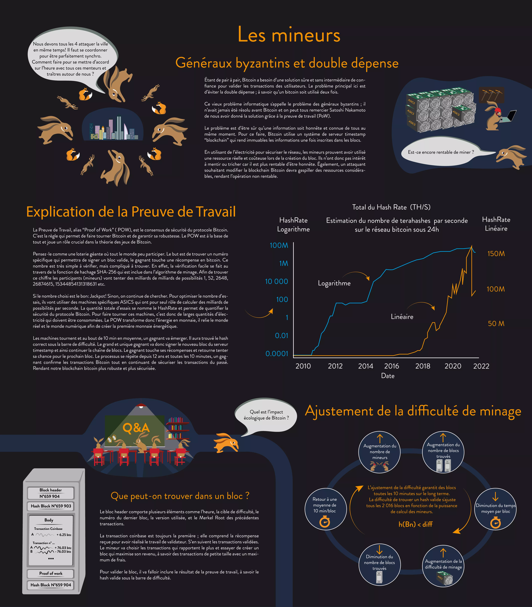

## Bitcoin และนิเวศวิทยา
<chapterId>4b227ae6-443a-5739-b443-60b7931130d9</chapterId>

เราเพิ่งได้เห็นในส่วนก่อนหน้านี้ว่าความปลอดภัยของโปรโตคอล Bitcoin อาศัยต้นทุนพลังงานสูงในการผลิตบัญชีรายการสาธารณะโดยไม่ต้องมีบุคคลที่สามที่เชื่อถือได้ ต้นทุนพลังงานโดยรวมมักถูกเปรียบเทียบกับการใช้ไฟฟ้าของประเทศเล็กๆ แต่การเปรียบเทียบนี้มีความหมายหรือไม่? มันจำเป็นหรือไม่ที่จะต้องเข้าใจเหตุผลของต้นทุนดังกล่าว?

## ค่าใช้จ่ายด้านพลังงานของ Bitcoin

ก่อนอื่น, มาประเมินผลกระทบทางสิ่งแวดล้อมจากการขุดในด้านคุณภาพกัน นักขุดจำเป็นต้องมีเครื่องมือเช่น ASIC และแหล่งพลังงานในรูปแบบของไฟฟ้าเพื่อเปิดเครื่องเหล่านี้ ASIC ส่วนใหญ่ทำจากอลูมิเนียมและสามารถนำไปรีไซเคิลหรือใช้ใหม่เพื่อวัตถุประสงค์อื่นได้ (เช่นที่แสดงใน [โครงการ Attakaï](https://decouvrebitcoin.fr/attakai/) ซึ่งเปลี่ยน Antminer S9 ให้เป็นเครื่องทำความร้อน) ดังนั้นปัญหาหลักจึงอยู่ที่การบริโภคพลังงาน มาลองให้บริบทเพิ่มเติมกัน

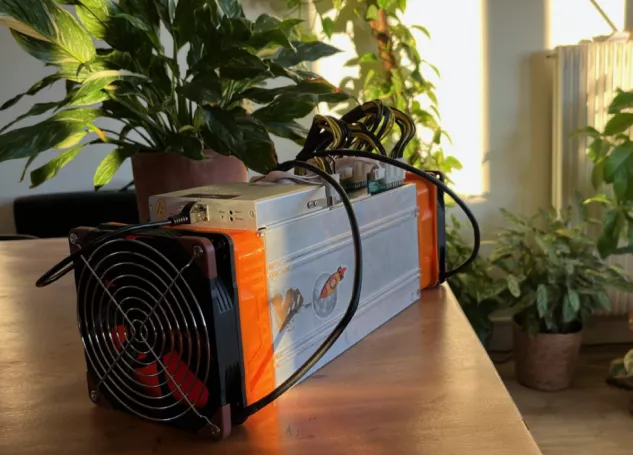

การบริโภคไฟฟ้าคิดเป็นค่าใช้จ่ายเกือบทั้งหมดสำหรับนักขุด ดังนั้นพวกเขาจึงถูกกระตุ้นให้หาแหล่งไฟฟ้าราคาถูก อย่างไรก็ตาม เนื่องจากเครื่องขุดสามารถเคลื่อนย้ายได้ พวกเขาจึงสามารถไปยังสถานที่ที่มีการติดตั้งโรงไฟฟ้าแต่ยังไม่เชื่อมต่อกับระบบโครงข่ายไฟฟ้าของในพื้นที่ นักขุดทำหน้าที่เป็นผู้ซื้อที่เป็นทื่พึ่งสุดท้าย ช่วยให้โรงไฟฟ้าสามารถได้รับเงินได้แม้ก่อนที่จะเชื่อมต่อกับโครงข่่ายไฟฟ้า และเมื่อพวกเขาเชื่อมต่อแล้ว ความต้องการไฟฟ้าจะเพิ่มขึ้น ซึ่งจะทำให้ราคาสูงขึ้นและทำให้นักขุดได้รับไฟฟ้าในสถานที่เหล่านี้ด้วยราคาที่ไม่คุ้มค่า นักขุดก็จะตัดสินใจย้ายการติดตั้งและตั้งถิ่นฐานในที่ที่ห่างไกล ซึ่งความต้องการไฟฟ้ายังต่ำและราคาก็ต่ำเช่นกัน

### การถกเถียงที่ไม่มีที่สิ้นสุด

ดังนั้น การถกเถียงเกี่ยวกับผลกระทบทางนิเวศของ Bitcoin มักจะหลงประเด็น ส่วนใหญ่เนื่องจากความเข้าใจที่ไม่เพียงพอเกี่ยวกับประโยชน์และการทำงานของมัน ดพราะ Bitcoin ไม่สามารถประเมินได้โดยดูแค่ในแง่ของต้นทุนพลังงานต่อการทำธุรกรรม เนื่องจากนักขุดรักษาความปลอดภัยของทั้งเครือข่ายปัจจุบันและประวัติของเครือข่าย ธุรกรรมแต่ละตัวก็ถูกรวมกลุ่มและแต่ละตัวก็เทียบเคียงเหมือนกันทั้งหมดไม่ได้ และผลจาก Lightning Network ก็ไม่ได้ถูกนำมาพิจารณา ผู้ที่อ้างว่า Bitcoin ใช้พลังงานมากเกินไปอาจมีแรงจูงใจทางการเมืองหรือต้องการขายทางแก้ ด้วย blockchain ของตนเอง ข้ออ้างทางระบบนิเวศถูกใช้เพื่อเป็นเหตุผลในการแบน Bitcoin

อย่างไรก็ตาม ไม่ควรลืมว่า Bitcoin ทีเป็นสิ่งประดิษฐ์ระดับปฏิวัติวงการนั้น ได้ให้โอกาสแก่บุคคลที่อาศัยอยู่ภายใต้การกดขี่ทางการเงินหรือระบอบเผด็จการในการต่อสู้เพื่อเสรีภาพของพวกเขา Bitcoinให้เสรีภาพทางการเงินในฐานะที่พึ่งสุดท้ายโดยหลีกเลี่ยงการเซ็นเซอร์และข้อจำกัดทางธนาคาร โดย Bitcoin เป็นมากกว่าเพียงแค่สกุลเงิน มันเป็นรูปแบบของการสื่อสารและการแสดงออกถึงเสรีภาพ พลังงานที่ใช้โดยนักขุดมีส่วนช่วยในการป้องกันเสรีภาพของเรา Bitcoin ช่วยให้สามารถปลดเปลื้องจากระบบการเงินปัจจุบันที่ถูกครอบงำโดยหนี้สินและการพิมพ์เงินมากเกินความจำเป็น จากธนาคารกลาง

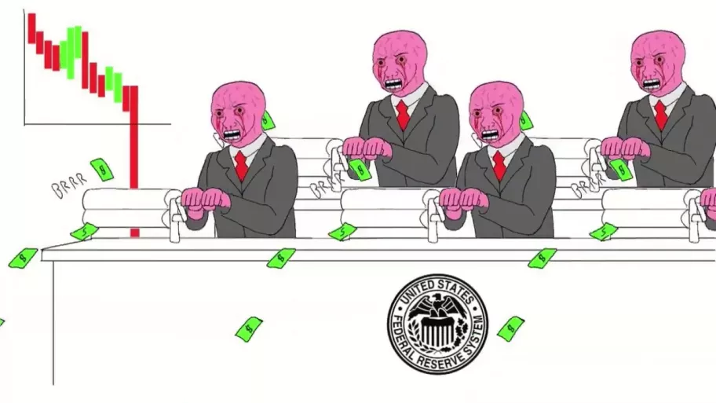

สำหรับผู้ที่อาศัยอยู่ในประเทศที่มีอัตราเงินเฟ้อสูง Bitcoin เป็นเรื่องของการเอาชีวิตรอด มันให้วิธีการเอาชีวิตรอดในสถานการณ์ทางการเงินที่ไม่แน่นอน นอกจากนี้ Bitcoin ยังเสนอระบบการเงินที่ยุติธรรมและเท่าเทียมกันมากขึ้น ยังให้โอกาสแก่พลเมืองหลายพันล้านคนทั่วโลกในการเข้าถึงระบบการเงิน ซึ่งเมื่อคุณมองจากมุมมองนี้ คุณคิดว่าการบริโภคพลังงานมันถือว่าเป็นเรื่องที่ชอบธรรมหรือไม่?

### Bitcoin อาจเป็นผลบวกต่อสิ่งแวดล้อมได้หรือไม่?

สุดท้าย เราจำเป็นต้องหารือเกี่ยวกับปัญหาทางเศรษฐกิจและสิ่งแวดล้อมของการนำ Bitcoin มาใช้

โดยเฉพาะเมื่อเปรียบเทียบกับระบบการเงินปัจจุบัน ซึ่งส่งเสริมการบริโภคมากเกินไปและหนี้สิน ก่อให้เกิดปัญหาอย่างจริงจัง การเข้าถึงเครดิตได้ง่าย การออกเงินตราโดยธนาคาร และการใช้ระบบธนาคารที่สำรองเงินฝากแค่เพียงบางส่วน เป็นปัจจัยที่ส่งเสริมการมีหนี้สินมากเกินไปและด้วยเหตุนี้ จึงมีการบริโภคมากเกินไป

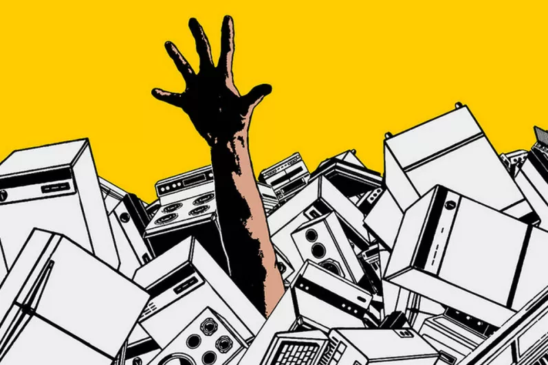

มันจำเป็นต้องปมีการฏิรูประบบการเงินเพื่อสะท้อนถึงความขาดแคลนของทรัพยากรของเราด้วยการมี ความขาดแคลนฝังอยู่ในสกุลเงินของเรา ซึ่งจะกระตุ้นให้มีการบริโภคที่มีความรับผิดชอบและมีวิสัยทัศน์ระยะยาวมากขึ้น ในทางตรงกันข้าม การมีเงินเฟ้อ จากการกระตุ้นการบริโภคและการลงทุนนั้น มีผลกระทบระยะยาวที่เป็นลบต่อสิ่งแวดล้อม

ระบบการเงินปัจจุบันสอดคล้องกับแนวคิดของเศรษฐศาสตร์เคนส์ (Keynesian economics) ซึ่งไม่เหมือนกับเศรษฐศาสตร์ออสเตรีย (Austrian economics) ที่ไม่ได้คำนึงถึงด้านเวลาและความเปลี่ยนแปลงของสถานการณ์และทรัพยากร หมายความว่า สกุลเงินที่สร้างได้ไม่จำกัดไม่สามารถสะท้อนถึงทรัพยากรที่จำกัดของโลกเราได้อย่างมีประสิทธิภาพ

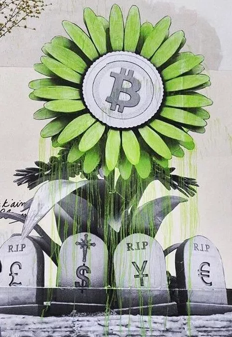

นักการเมือง ที่มีความต้องการให้เศรษฐกิจเติบโตด้วยวิสัยทัศน์สั้นๆ เพื่อให้ได้รับเลือกตั้งใหม่ ไม่สามารถแก้ไขปัญหาด้านนิเวศวิทยาในระยะยาวได้ ในทางตรงกันข้าม การนำเสนอสกุลเงินที่มั่นคง เช่น Bitcoin เป็นทางเลือกที่อาจทำให้ประชาชนมีอำนาจทางเศรษฐกิจ

เปลวไฟที่ถูกจุดเหนือบ่อขุดน้ำมัน เพื่อเผามีเทนและป้องกันมลพิษนั้น สามารถถูกดับโดยเหล่านักขุด Bitcoin ซึ่งเป็นประโยชน์ต่อสิ่งแวดล้อม Bitcoin ยังส่งเสริมการใช้พลังงานสีเขียว มีเทนเหล่านั้นสามารถถูกแปลงเป็นไฟฟ้าเพื่อใช้ในเครื่องขุด ซึ่งเป็นประโยชน์ต่อทุกคน

เทคโนโลยีของ Bitcoin มักถูกเข้าใจผิด และการวิจารณ์เกี่ยวกับผลกระทบต่อสิ่งแวดล้อมมักจะมองแบบง่ายๆและมองในระยะสั้น การวิจารณ์เหล่านี้มักจะถูกขับเคลื่อนโดยผลประโยชน์ทางการเมือง Bitcoin มีศักยภาพในการช่วยเหลือการเปลี่ยนผ่านทางนิเวศวิทยาและมีส่วนร่วมในการสร้างโลกที่สีเขียวขึ้น สื่อต่างๆมักแพร่กระจายความคิดเห็นที่ผิดๆ เกี่ยวกับ Bitcoin และระบบนิเวศวิทยา ดังนั้นให้ใช้เวลาศึกษาและสร้างความเห็นของคุณเอง ทุกเรื่องที่เกี่ยวกับ Bitcoin เิดเผยและโปร่งใส

> ขอให้ปฏิบัติตามหนึ่งในคำขวัญของ Bitcoin: อย่าไว้ใจ จงตรวจสอบด้วยตัวคุณเอง!

### สรุปอย่างรวดเร็วในโปสเตอร์!

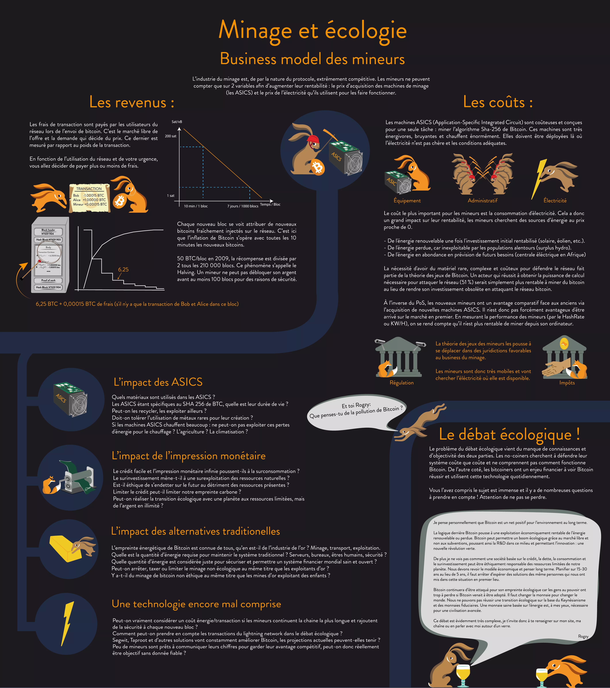

### สรุปสั้นๆ เกี่ยวกับด้านเทคนิคของ Bitcoin

Satoshi Nakamoto เปิดตัวโปรโตคอล Bitcoin ในเดือนมกราคม 2009 ซึ่งตั้งแต่นั้นมาได้พัฒนาขึ้นด้วยชุมชนที่เติบโตของนักพัฒนา นักขุด และผู้ใช้ที่มีโหนด Bitcoin โดยการเก็บสำเนาของบล็อกเชน Bitcoin ซึ่งเป็นบันทึกบัญชีสาธารณะแบบกระจายศูนย์ของทุกธุรกรรม ซึ่ง Bitcoin โหนดเหล่านี้สามารถยืนยันความถูกต้องของธุรกรรมตามกฎจากฉันทามติของ Bitcoin ได้ ซึ่งรวมถึงการตรวจสอบว่านักขุดผลิตบล็อกที่ถูกต้องซึ่งบรรจุธุรกรรมที่รอดำเนินการหลายพันรายการไว้

โดยเฉลี่ยแล้ว บล็อกจะถูกสร้างทุก 10 นาที และนักขุดที่พบแฮชที่ถูกต้องสำหรับบล็อกถัดไปจะได้รับรางวัลจากโปรโตคอล ซึ่งจำนวนรางวัลนั้นถูกกำหนดโดยกฎจากฉันทามติ ซึ่งรวมถึงค่าธรรมเนียมการทำธุรกรรมจากทุกธุรกรรมที่รวมอยู่ในบล็อกที่ถูกต้อง และเนื่องด้วยผลลัพธ์ที่ได้จากอัลกอริทึมแฮช (SHA256) จากการใ่สข้อมูลอินพุทใดๆเข้าไปนั้น ไม่สามารถคาดเดาได้ กระบวนการขุดจึงเกี่ยวข้องกับการสร้างบล็อกที่เข้าข่ายจำนวนมากและทดสอบว่าแฮชของพวกเขาถูกต้องหรือไม่ อย่างไรก็ตาม เพื่อให้แน่ใจว่าเวลาเฉลี่ยระหว่างบล็อกสองบล็อกคงที่ (ประมาณ 10 นาที) ไม่ว่าจะมีจำนวนนักขุดและพลังการคำนวณเท่าใด ความยากในการหาแฮชที่ถูกต้องจะปรับทุกๆ 2016 บล็อก หรือประมาณทุกๆ 2 สัปดาห์ นักขุดได้พัฒนาเครื่องคำนวนเฉพาะทางสำหรับคำนวน SHA256 ที่เรียกว่า ASICS เพื่อเพิ่มอัตราแฮชต่อจูล ซึ่งหมายถึงจำนวนครั้งที่ลองเดาแฮชต่อวินาทีและต่อพลังงานที่ใช้

ในการที่นักขุดจะมีกำไรมากที่สุดจากกิจกรรมการขุดพวกเขา พวกเขาต้องใช้ไฟฟ้าที่ราคาถูกที่สุดเท่าที่จะเป็นไปได้ ซึ่งมักจะอยู่ในทำเลที่ห่างไกล หรือภายในโรงไฟฟ้าที่ยังไม่เชื่อมต่อกับโครงข่ายไฟฟ้า นักขุดจึงทำหน้าที่เป็นผู้ซื้อที่เป็นที่พึ่งสุดท้าย และเมื่อราคาไฟฟ้าเพิ่มขึ้นเนื่องจากความต้องการเพิ่มขึ้น นักขุดจะมีแนวโน้มที่จะย้ายกิจกรรมของพวกเขาไปยังที่อื่น

ดังนั้น โปรโตคอล Bitcoin จึงเป็นระบบการเงินที่ไม่สามารถเซ็นเซอร์หรือหยุดยั้งได้ เนื่องจากแต่ละส่วนประกอบของโปรโตคอลถูกกระจายทางภูมิศาสตร์ไปทั่วโลก  ตัวอย่างเช่น มีโหนด Bitcoin ประมาณ 40,000 โหนดทั่วทุกทวีป Bitcoin มีกฎจากฉันทามติที่ทำให้การปฏิบัติตามกฎเหล่านั้นมีกำไรมากกว่าการพยายามทำลายมัน และด้วยเหตุนี้จึงไม่ต้องใช้ความไว้วางใจระหว่างผู้ที่มีส่วนร่วม Bitcoin ไม่มีผู้นำและไม่สามารถหยุดยั้งได้ การควบคุมแพลตฟอร์มตลาดแลกเปลี่ยนเพื่อสร้างข้อจำกัดใน Bitcoin อาจเป็นไปได้ แต่มีผลกระทบที่จำกัด โดยสรุปแล้ว ไม่มีผู้พิพากษาหรือรัฐใดสามารถเซ็นเซอร์หรือหยุดยั้ง Bitcoin ได้

# วิธีการได้มาซึ่ง Bitcoin?
<partId>517e1bb7-f032-51a0-930a-a91fe5148d3f</partId>

## Bitcoin ไม่เคยหลับไหล!
<chapterId>d5e35e41-ea26-5478-8eb9-07daf9dff508</chapterId>

ราคาของ Bitcoin มักจะมีความผันผวนสูง ค่าของมันสามารถเปลี่ยนแปลงได้อย่างมากขึ้นอยู่กับการเปลี่ยนแปลงของตลาดและระยะเวลาของตลาดที่มีแนวโน้มขาขึ้นและขาลง สิ่งนี้มีอยู่ในตลาดการเงิน 100% รวมถึง Bitcoin

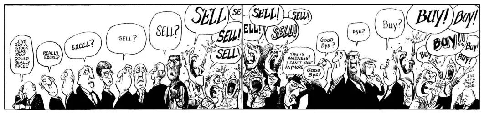

> พูดง่ายๆ คือ: มนุษย์ซื้อพร้อมกันทั้งหมดและขายพร้อมกันทั้งหมด Bitcoin ไม่ได้รับการยกเว้นจากธรรมชาติของมนุษย์

### การเข้าใจถึงคลื่นของการนำไปใช้

การพัฒนาและวิวัฒนาการของ Bitcoin ส่วนใหญ่เชื่อมโยงกับกลุ่มผู้เล่นต่างๆ ที่ได้รวมตัวเข้ากับระบบนิเวศของมันอย่างค่อยเป็นค่อยไป

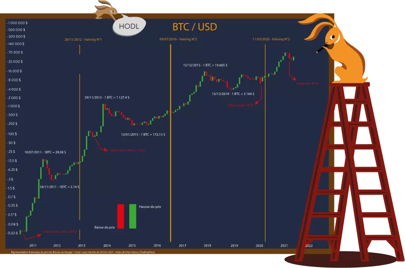

- เหล่าผู้เชื่อมั่น:

ผู้ใช้ Bitcoin ในช่วงแรกๆ ส่วนใหญ่เป็นเหล่าผู้คนที่หลงไหลในเทคโนโลยี, กลุ่มไซเฟอร์พังก์, เหล่าอิสระนิยม, และผู้ที่หลงใหลในทองคำ กลุ่มเหล่านี้ถูกดึงดูดโดย Bitcoin เนื่องจากความสามารถในการเสนอทางแก้ปัญหา เช่น เงินสดอิเล็กทรอนิกส์ที่ไม่ต้องใช้ความไว้วางใจ, ความต้านทานต่อการเซ็นเซอร์, หรือนโยบายการเงินที่โปร่งใสและไม่เปลี่ยนแปลงได้

- ดาร์กเว็บ & อาชญากร

หลังจากนั้น การใช้ Bitcoin ขยายไปยังตลาดดาร์กเว็บเช่น Silk Road เนื่องจากลักษณะที่ควบคุมไม่ได้และเป็นนิรนาม ไซต์แสดงถึงที่คุณลักษณะที่ควบคุมไม่ได้และเป็นนิรนามของตัว Bitcoin ซึ่งกระตุ้นให้อาชญากรบางกลุ่มใช้มัน อย่างไรก็ตาม ควรทราบไว้ว่าความถูกต้องหรือความผิดทางกฎหมายนั้น ขึ้นอยู่การที่ว่าเราใช้เครื่องมือนั้นทำอะไร ไม่ได้ขึ้นอยู่กับตัวเครื่องมือเอง ควรจำไว้ว่าการใช้ Bitcoin อย่างผิดกฎหมายโดยตัวมัรเองไม่ทำให้บุคคลนั้นเป็นอาชญากร กิจกรรมที่มันถูกใช้ง่านตั้งหากคือสิ่งที่ใช้สามารถจำแนกว่าเป็นสิ่งผิดกฎหมายได้ ตัวอย่างเช่น การใช้ Bitcoin สำหรับกิจกรรมเช่นการซื้อยาบางชนิดอาจถูกกฎหมายหรือผิดกฎหมายขึ้นอยู่กับกฎระเบียบของดินแดนที่กิจกรรมดังกล่าวเกิดขึ้น

- ความบ้าคลั่งของ ICO และการมาถึงของประชาชนทั่วไป

ปี 2017 เป็นปีที่ถูกบันถึกด้วยด้วยฟองสบู่ทางการเก็งกำไรที่สำคัญในโลกของสกุลเงินดิจิทัล โดยเฉพาะกับการเปิดตัว Initial Coin Offerings (ICOs) หลายพันรายการ อย่างไรก็ตาม สกุลเงินดิจิทัลใหม่ๆ หลายรายการไม่มีการพัฒนาหรือประโยชน์ที่เฉพาะเจาะจงและหายไปอย่างรวดเร็ว ฟองสบู่ในปี 2017 นี้ตามมาด้วยการปรับตัวลดลงอย่างแรงในปี 2018-2019

- ฟองสบู่ NFT และ DeFi

จากนั้นอีกครั้งในปี 2020 ตลาดได้ประสบกับฟองสบู่ทางการเก็งกำไรอีกครั้งที่ผลักดันราคาของ Bitcoin ไปถึง $60,000 ฟองสบู่นี้แตกต่างจากฟองสบู่ก่อนหน้าด้วยการกระจายตัวของนักลงทุนที่มากขึ้น รวมถึงสถาบันการเงินและบริษัทขนาดใหญ่ แต่อีกครั้ง การปรับตัวลดลงอย่างแรงเกิดขึ้นเมื่อความตื่นเต้นลดลง

### Bitcoin และความผันผวน

จากวัฏจักรในอดีต ดูเหมือนว่าความเป็นระยะเวลาของวัฏจักรเศรษฐกิจของ Bitcoin เท่ากับระยะเวลาระหว่างการลดครึ่งหนึ่งของการปล่อย Bitcoin บางทีเพราะเหตุการณ์การลดครึ่งหนึ่งทำหน้าที่เป็นตัวกระตุ้นโดยการลดการปล่อย Bitcoin ใหม่ลงครึ่งหนึ่ง
ความผันผวนอย่างมากเหล่านี้ได้สร้างชื่อเสียงให้กับบิตคอยน์ว่าเป็นสินทรัพย์ที่อันตรายอย่างยิ่ง ทำให้ผู้ใช้สูญเสียเงิน แม้ว่าราคาอาจลดลง 10-20 หรือแม้กระทั่ง 50% ในไม่กี่วัน แต่สำคัญที่ต้องเข้าใจว่า Bitcoin โปรโตคอล ไม่ได้รับผลกระทบจากการเปลี่ยนแปลงของราคา
ความผันผวนอย่างมากนี้ได้รับการยอมรับอย่างเต็มที่ในปัจจุบันโดยผู้เล่นในตลาด Bitcoin และสามารถลดผลกระทบได้ด้วยวิธีการหลายอย่าง เช่น การป้องกันความเสี่ยงทางการเงิน (stablecoins), ความเชื่อระยะยาวที่แข็งแกร่ง (hodling), หรือเพียงแค่ไม่ลงทุนเงิน 100% ของตนเองใน Bitcoin โดยไม่เข้าใจอะไรเลย การเข้าใจว่าทำไมราคาของบิตคอยน์จึงผันผวนมากเป็นสิ่งสำคัญเพื่อที่จะสามารถก้าวหน้าในอุตสาหกรรมนี้ได้ เพราะในที่สุดแล้ว ราคาและวัฏจักรเป็นสิ่งที่ปรับและควบคุมตลาดของเราได้บ้าง อย่างไรก็ตาม เราสามารถสังเกตได้ว่าเมื่อ Bitcoin เติบโตและเจริญเติบโต ความผันผวนก็จะลดลง

แม้ว่าคู่ btc/dollar จะผันผวนในระยะสั้น แต่บิตคอยน์ เนื่องจากมีปริมาณจำกัดที่ 21 ล้านบิตคอยน์และกระบวนการ halving (การลดปริมาณการสร้างเงินทุก 4 ปีเฉลี่ย) จึงมีแนวโน้มทั่วไปที่เพิ่มขึ้นในลักษณะกึ่งกลไก แน่นอน เช่นเดียวกับสินทรัพย์ทางการเงินอื่น ๆ บิตคอยน์ก็อยู่ภายใต้วัฏจักรเศรษฐกิจ รวมถึงช่วงของความเพ้อฝัน ฟองสบู่ทางการเก็งกำไร และการปรับตัว ปรากฏการณ์นี้ค่อนข้างพบได้บ่อยในเทคโนโลยีที่กำลังเกิดใหม่ ที่ตลาดไม่ได้เป็นไปอย่างเหตุผลหรือมีประสิทธิภาพเสมอไป

### ตลาดที่ไม่เหมือนใคร

วัฏจักรของฟองสบู่ทางการเก็งกำไรเหล่านี้ค่อนข้างเป็นเอกลักษณ์ในโลก เนื่องจากหายากมากที่สินทรัพย์เดียวกันจะประสบกับฟองสบู่มากมายต่อเนื่องกัน สามารถอธิบายได้ง่ายๆ เพราะบิตคอยน์ไม่ใช่ฟองสบู่ที่จะหายไป แต่เป็นสกุลเงินที่ใช้จริงทั่วโลก โปรโตคอล Bitcoin เป็นเอกลักษณ์ที่ทำงานในระดับโลก 24 ชั่วโมงต่อวัน 7 วันต่อสัปดาห์ ทำให้การควบคุมยากสำหรับหน่วยงานทางการเงิน

ในปี 2023 วันนี้ Bitcoin ยังคงอยู่รอดและเติบโตมากขึ้นโดยการผสานเข้ากับตลาดแบบดั้งเดิมมากขึ้นเรื่อยๆ การมาถึงของ Bitcoin ETFs การกำหนดกฎระเบียบที่ชัดเจนขึ้น และเครื่องมือในการซื้อหรือเก็บรักษาที่ดีขึ้นเท่านั้นที่ส่งเสริมแนวโน้มนี้ Bitcoin ได้รอดพ้นจากฟองสบู่ทางการเก็งกำไรอีกครั้ง ดังนั้นอาจจะไม่ใช่เรื่องไร้สาระทั้งหมด!

### สรุปอย่างรวดเร็วในโปสเตอร์!

## การได้มาซึ่งบิตคอยน์โดยการทำงาน

### เศรษฐกิจขนานกำลังพัฒนา

Bitcoin สามารถถือเป็นเศรษฐกิจขนานกับสกุลเงิน fiat นั่นหมายความว่า สามารถขายสินค้าหรือบริการและได้รับการชำระเงินด้วยบิตคอยน์ได้ การทำธุรกรรมสามารถทำได้โดยตรงด้วยบิตคอยน์ โดยไม่ต้องผ่านแพลตฟอร์มแลกเปลี่ยน เพียงจากกระเป๋า Bitcoin ไปยังกระเป๋า Bitcoin

เศรษฐกิจ Bitcoin มีอยู่และกำลังพัฒนาในบางภูมิภาคของโลก เช่น ประเทศเอลซัลวาดอร์ ที่บิตคอยน์ได้รับการยอมรับเป็นสกุลเงินที่ถูกกฎหมายตั้งแต่ปี 2021 นอกจากนี้ บางบุคคล ธุรกิจ และองค์กรก็ยอมรับ Bitcoin เป็นวิธีการชำระเงินสำหรับผลิตภัณฑ์หรือบริการของพวกเขาแล้ว
นอกจากนี้ เพื่อส่งเสริมการใช้งานบิทคอยน์ในการทำธุรกรรมประจำวัน โครงการแบบเปิดและร่วมมือกันได้ถูกเปิดตัวขึ้น: BTCMap (https://btcmap.org/map#2/21.28937/5.46680) แพลตฟอร์มนี้รวบรวมรายชื่อผู้ค้าที่ยอมรับบิทคอยน์เช่นเดียวกับชุมชนบิทคอยน์ต่างๆ ทั่วโลก คุณสามารถเยี่ยมชมเว็บไซต์ของพวกเขาเพื่อค้นพบระบบนิเวศบิทคอยน์รอบตัวคุณ ดังนั้น แม้จะมีความยากลำบากและความลังเล แต่ก็มีโครงการอย่าง BTCMap ที่ช่วยทำให้เศรษฐกิจบิทคอยน์เข้าถึงได้ง่ายและสะดวกสำหรับทุกคน

### ทำไมต้องยอมรับบิทคอยน์แทนที่จะซื้อมัน?

เพื่อได้มาซึ่งบิทคอยน์ คุณสามารถซื้อมันผ่านแพลตฟอร์มที่ได้รับการควบคุมโดยองค์กรเช่น AMF (Autorité des Marchés Financiers) ในฝรั่งเศส วิธีนี้มีความเสี่ยงบางประการและมีการติดตามการทำธุรกรรมของคุณ อีกวิธีหนึ่งในการได้มาซึ่งบิทคอยน์คือการยอมรับมันเป็นวิธีการชำระเงินสำหรับสินค้าหรือบริการที่คุณเสนอ วิธีนี้ช่วยให้คุณได้รับบิทคอยน์ผ่านการทำงานของคุณโดยไม่ต้องกังวลอย่างต่อเนื่องเกี่ยวกับราคาของบิทคอยน์

นอกจากนี้ การยอมรับบิทคอยน์เป็นผู้ค้ามีข้อดีหลายประการ รวมถึงการต้านการเซ็นเซอร์, ค่าธรรมเนียมการทำธุรกรรมที่ลดลง, ประสิทธิภาพที่เพิ่มขึ้น, การป้องกันเงินเฟ้อ, รวมถึงอิสรภาพทางการเงินและอธิปไตย

### วิธีการดำเนินการ:

เพื่อยอมรับบิทคอยน์ จำเป็นต้องศึกษาวิธีการที่มีอยู่และเลือกวิธีที่เหมาะสมที่สุดสำหรับธุรกิจของคุณ ไม่มีวิธีการที่สมบูรณ์แบบ และต้องพิจารณาปัจจัยหลายอย่างเพื่อทำการเลือก เช่น ปริมาณการทำธุรกรรมที่คาดหวัง, งบประมาณที่จัดสรร, และประเภทของธุรกิจ (ออนไลน์หรือทางกายภาพ)

เราจะครอบคลุมหัวข้อนี้อย่างละเอียดในการฝึกอบรมอื่น แต่เพื่อให้เรื่องง่าย เราสามารถพิจารณาหมวดหมู่ธุรกิจและวิธีการที่เกี่ยวข้องได้หลายประเภท:

- วิธีการออนไลน์ง่ายๆ: OpenNode
- วิธีการสำหรับผู้ค้ามือสมัครเล่น: Swiss Bitcoin Pay
- วิธีการสำหรับโครงสร้างขนาดใหญ่หรือผู้ที่หลงใหลในบิทคอยน์: BTCpay Server

### สรุปอย่างรวดเร็วในโปสเตอร์!

## การออมด้วยบิทคอยน์

### คำเตือนก่อนเริ่มต้น!

บิทคอยน์ได้กลายเป็นสินทรัพย์ทางการเงินที่สำคัญ หลักๆ เนื่องจากมีจำนวนจำกัดและความต้องการที่เพิ่มขึ้น อย่างไรก็ตาม การซื้อบิทคอยน์มีความเสี่ยงที่ต้องให้ความสนใจพิเศษ จึงแนะนำให้ทำการวิจัยด้วยตัวเองและเรียนรู้เพิ่มเติมเกี่ยวกับหัวข้อนี้เพื่อคุ้นเคยกับเทคโนโลยีก่อนที่จะลงทุน

- ลงทุนเฉพาะสิ่งที่คุณสามารถยอมรับการสูญเสียได้
- บิทคอยน์เป็นสินทรัพย์ทางการเงินที่มีความผันผวนสูง; ราคาของมันอาจตกไปถึง 0
- ผลการดำเนินงานในอดีตไม่ได้บ่งบอกถึงผลการดำเนินงานในอนาคต
- ติดต่อที่ปรึกษาทางการเงินของคุณหากจำเป็น

> DécouvreBitcoin (Rogzy) ไม่ให้คำแนะนำเกี่ยวกับการลงทุนและไม่มีสิ่งใดที่ระบุที่นี่ควรถือเป็นคำแนะนำดังกล่าว

### รายการตรวจสอบขนาดเล็กก่อนที่จะเริ่มต้น

ก่อนที่คุณจะเริ่มซื้อบิทคอยน์ ตรวจสอบให้แน่ใจว่าคุณมี:

- กระเป๋าเงินที่ปลอดภัย
- ความเข้าใจที่มั่นคงเกี่ยวกับบิทคอยน์
- แผนการออมที่ต้องติดตาม
- วิสัยทัศน์ระยะยาว

หากหัวข้อยังไม่ชัดเจน โปรดทราบว่าหลักสูตร BTC102 จะแนะนำคุณในการรักษาความปลอดภัยและการได้มาซึ่งบิทคอยน์ครั้งแรกของคุณ ที่นี่ เราจะเพียงแค่สัมผัสผิวของหัวข้อ

ในทางปฏิบัติ มีสองคำถามที่คุณควรถามตัวเอง:

- กลยุทธ์การได้มาซึ่งควรใช้: ทยอยหรือทั้งหมดในครั้งเดียว?
- แพลตฟอร์มใดที่ควรใช้: ที่ได้รับการควบคุมหรือไม่ได้รับการควบคุม?

### กลยุทธ์การได้มาซึ่ง

- การลงทุนเฉลี่ยตามราคาดอลลาร์
การซื้อซ้ำเป็นการซื้อบิตคอยน์ในปริมาณเล็กน้อยในช่วงเวลาที่กำหนดอย่างสม่ำเสมอ วิธีนี้ช่วยให้ราคามีความสม่ำเสมอมากขึ้นเมื่อเวลาผ่านไปและช่วยให้ปริมาณบิตคอยน์ที่ครอบครองเติบโตอย่างต่อเนื่อง นี่เป็นวิธีการที่เหมาะสำหรับการออมระยะยาวโดยไม่ต้องกังวลเกี่ยวกับราคาและความผันผวนของบิตคอยน์ ตั้งค่าแล้วลืมมันไป
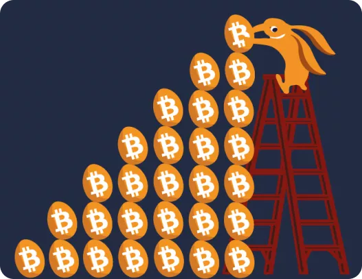

> ระวัง UTXOs: อย่าลืมรวม UTXOs ในกระเป๋าเงินของคุณจากเวลาสู่เวลา การปฏิบัตินี้เป็นสิ่งสำคัญสำหรับการจัดการบิตคอยน์ของคุณอย่างมีประสิทธิภาพและหลีกเลี่ยงค่าธรรมเนียมที่ไม่จำเป็นในระหว่างการทำธุรกรรม

- การซื้อแบบสัญชาตญาณ

การซื้อแบบสัญชาตญาณใช้เพื่อได้รับการเปิดเผยต่อบิตคอยน์ทันที ไม่ว่าจะเป็นการซื้อในช่วงที่ราคาตกหรือใช้ประโยชน์จากโบนัส การตัดสินใจอยู่ที่คุณ คุณจะต้องรวบรวมความกล้าและกดปุ่มซื้อ

ด้วยความผันผวนของบิตคอยน์ที่สำคัญ ควรให้ความสนใจพิเศษกับอารมณ์ของคุณ FOMO (Fear of Missing Out) และ FUD (Fear, Uncertainty, Doubt) เป็นศัตรูที่แย่ที่สุดของคุณในบริบทนี้! รักษาความสงบและปฏิบัติตามกลยุทธ์ที่คุณวางไว้ล่วงหน้าเพื่อหลีกเลี่ยงการตัดสินใจอย่างกระทันหันและอาจเป็นอันตราย

### เราควรซื้อบิตคอยน์จากใคร?

มีหลายวิธีในการได้มาซึ่งบิตคอยน์ แต่ละวิธีมีกฎระเบียบของตนเอง บางแพลตฟอร์มต้องการการยืนยันตัวตน ในขณะที่บางแพลตฟอร์มไม่ต้องการ การเข้าใจกฎระเบียบที่เกี่ยวข้องกับแต่ละแพลตฟอร์มเป็นสิ่งสำคัญ

- แพลตฟอร์ม DCA

วิธีการสะสมบิตคอยน์ที่พบบ่อยคือ Dollar Cost Averaging (DCA) ซึ่งเกี่ยวข้องกับการลงทุนเป็นประจำในจำนวนเล็กน้อย มีแพลตฟอร์มหลายแห่งที่เสนอบริการนี้ เช่น ที่ระบุไว้ใน[หน้าที่อุทิศ](https://planb.network/tutorials/exchange) นอกจากความง่ายในการตั้งค่า DCA แล้ว การถอนไปยังกระเป๋าเงินของคุณมักจะเป็นอัตโนมัติ หมายความว่าคุณจะมีการควบคุมสินทรัพย์ของคุณเสมอ

ในปัจจุบัน แทบทุกโซลูชัน DCA มีประสิทธิภาพค่อนข้างเท่ากันและมีค่าธรรมเนียมที่คล้ายคลึงกัน ดังนั้นการเลือกจะขึ้นอยู่กับความพร้อมในประเทศของคุณมากขึ้น

- แพลตฟอร์มโบรกเกอร์

สำหรับการลงทุนขนาดใหญ่ แพลตฟอร์มที่มีการควบคุมและได้รับการยอมรับ เช่น Kraken, Bitstamp และ Paymium ได้รับการแนะนำ แพลตฟอร์มเหล่านี้เสนอสภาพแวดล้อมที่ปลอดภัยสำหรับการทำธุรกรรมปริมาณสูง

การใช้งานง่ายและเข้าถึงได้สำหรับทุกคน:

1. ตั้งค่าบัญชี KYC/\*
2. โอนเงินเข้าบัญชีของคุณ
3. ซื้อบิตคอยน์
4. ถอนบิตคอยน์ไปยังกระเป๋าเงินของคุณ

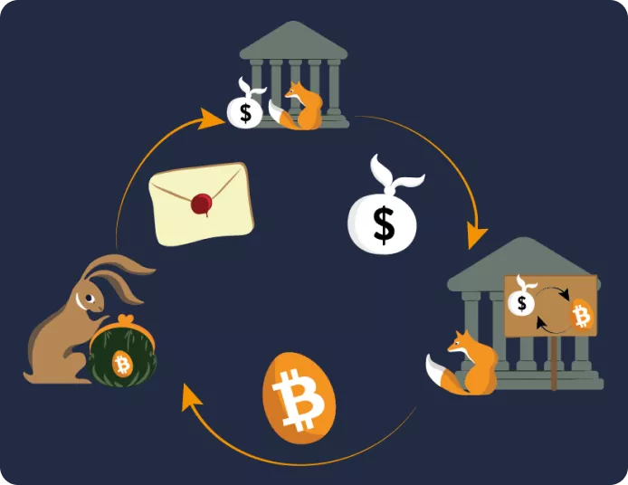

หลังจากการซื้อ ควรถอนบิตคอยน์ออกจากแพลตฟอร์มแลกเปลี่ยนทันทีเพื่อลดความเสี่ยงของการถูกแฮ็กและการบล็อกเงิน ค่าธรรมเนียมการถอนอาจสูง บางครั้งสูงถึง 25 ยูโรขึ้นอยู่กับแพลตฟอร์ม

> กฎระเบียบ Know Your Customer (KYC) ต้องการให้ผู้ใช้ให้ข้อมูลยืนยันตัวตนเพื่อต่อสู้กับการฟอกเงิน การหลีกเลี่ยงภาษี และการฟอกเงิน

สำคัญที่จะต้องทราบว่า KYC เป็นหัวข้อสำคัญในอุตสาหกรรมของเราเนื่องจากประสิทธิภาพยังคงเป็นที่ถกเถียงได้ในขณะที่มีด้านลบมากมาย ในหลายๆ โปรแกรมการฝึกอบรมและเนื้อหาของมหาวิทยาลัยของเรา เราแนะนำให้หลีกเลี่ยงแพลตฟอร์ม KYC ทั้งหมดหากคุณเป็นผู้ใช้ที่มีประสบการณ์แล้ว

### โซลูชัน Non-KYC

นอกจากนี้ ยังมี[ตลาด](https://planb.network/tutorials/exchange)หลายแห่งในการซื้อและขายบิตคอยน์แบบ peer-to-peer หากคุณสนใจในเรื่องเหล่านี้ คุณสามารถเข้าร่วมหลักสูตร BTC 205 ของเราเกี่ยวกับหัวข้อนี้ โดยทั่วไปแล้ว โซลูชันเหล่านี้คือ:

- ตู้ ATM บิตคอยน์
- การพบปะกับผู้ที่หลงใหลในบิตคอยน์อื่นๆ
- แพลตฟอร์มที่ผิดกฎหมายและไม่มีการควบคุม
- โซลูชันการจับคู่แบบ peer-to-peer
- ธนาคารดิจิทัลที่ดำเนินการในประเทศที่เป็นมิตรกับบิตคอยน์

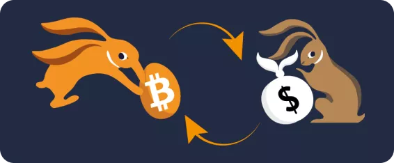
นอกจากนี้ยังสำคัญที่จะต้องทราบว่าอาจมีการนำภาษีมาใช้ในเขตอำนาจศาลของคุณ เราขอเชิญคุณที่จะปรึกษากฎหมายของประเทศของคุณก่อนที่จะดำเนินการใดๆ ที่อาจทำให้คุณตกอยู่ในความเสี่ยง
### สรุปอย่างรวดเร็วในโปสเตอร์!

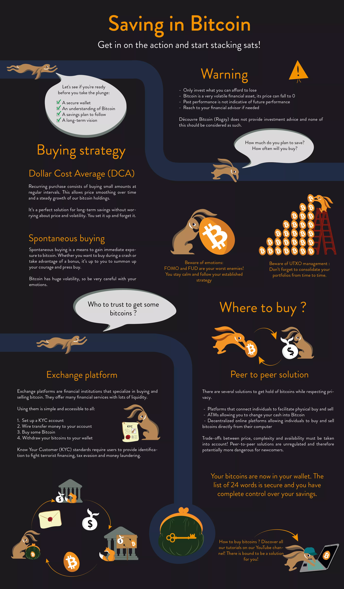

## การเปลี่ยนแปลงสู่ยุคบิทคอยน์
<chapterId>b7275d31-3b60-5fb7-b9f5-030097010553</chapterId>

### การแข่งขันที่ดุเดือดเพิ่งเริ่มต้น!

เหมือนกับเทคโนโลยีใหม่ๆ การนำบิทคอยน์มาใช้ตามแนวโค้ง S ได้เราได้ผ่านยุคของผู้นำร่องแล้ว และตัวชี้วัดดูเหมือนจะชี้ไปที่การเปิดรับบิทคอยน์อย่างเต็มที่ มันเป็นเทคโนโลยีที่ไม่สามารถหยุดยั้งได้ ประเทศเอลซัลวาดอร์ได้ทำการเดิมพันอย่างกล้าหาญด้วยการนำบิทคอยน์มาใช้เต็มรูปแบบ ประกาศให้เป็นสกุลเงินที่ถูกกฎหมาย อย่างไรก็ตาม แต่ละประเทศมีการตอบสนองต่อเทคโนโลยีนี้แตกต่างกัน บางประเทศได้ห้ามและทำให้การใช้งานเป็นสิ่งผิดกฎหมาย เพิ่มความซับซ้อนในการนำบิทคอยน์มาใช้ตามวัฒนธรรม ยุคสมัย และชาติ

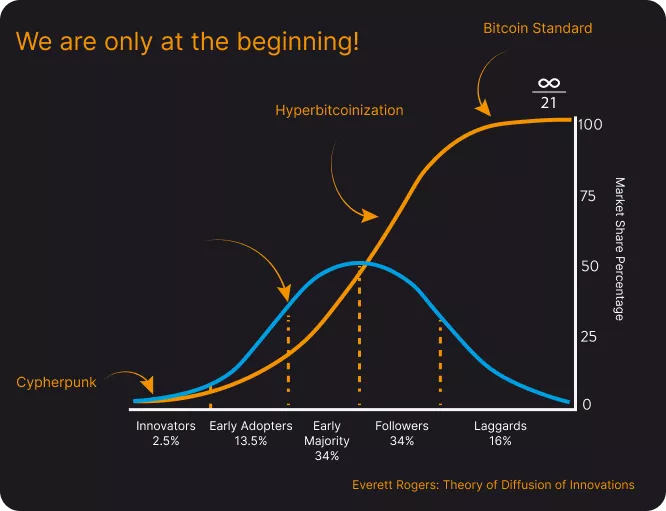

การเพิ่มขึ้นของบิทคอยน์ทำให้บริษัท มหาวิทยาลัย ผู้กำกับดูแล และบุคคลทั่วไปต้องพิจารณาเทคโนโลยีใหม่นี้ ต้องสร้างเครื่องมือใหม่ ปรับบริการ และต้องดำเนินการนวัตกรรมต่อไปเพื่อรักษาการอยู่รอด บริบทนี้ทำให้เกิดคำถามมากมายที่เกี่ยวข้องกับหลายสาขา รวมถึงการเข้ารหัสลับ ทฤษฎีเกม นโยบายเศรษฐกิจและการเงิน วิทยาการคอมพิวเตอร์ ปรัชญา พลังงาน กฎหมาย และการกำกับดูแล โดยสรุป บิทคอยน์เป็นวัตถุที่หลากหลายวิชา


### บิทคอยน์คือการเปลี่ยนแปลงจาก 0 ไป 1

เราขอเชิญคุณที่จะไตร่ตรองเกี่ยวกับการปฏิวัติการเงินใหม่นี้ มีอะไรให้สำรวจมากมายกับบิทคอยน์จนยากที่จะเข้าใจทุกอย่างในครั้งเดียว ใช้เวลาของคุณ บิทคอยน์ไม่ได้หายไปไหน ในทางตรงกันข้าม การปฏิวัติเพิ่งเริ่มต้น เราเชื่อว่าเราสามารถสร้างโลกที่เราต้องการมอบให้กับลูกหลานของเราได้ โลกที่มีอธิปไตยของมนุษย์เป็นสิทธิ์ ที่ความเป็นส่วนตัวได้รับการเคารพเป็นค่าเริ่มต้น และที่เงินไม่ถูกควบคุม หวังว่าเราจะบรรลุสิ่งนี้ไปด้วยกัน

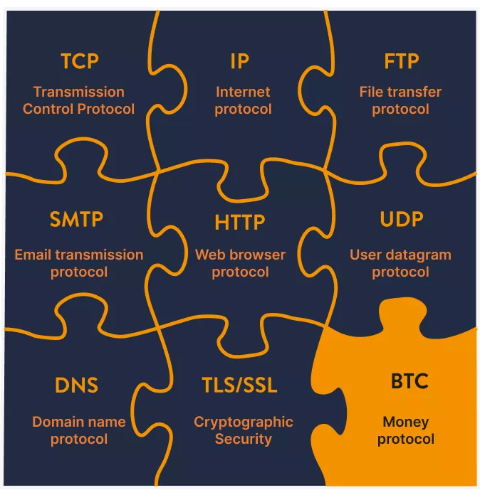

หากคุณต้องการขยายความรู้เกี่ยวกับบิทคอยน์ มีนักเขียน นักคิด และนักเขียนบทความจำนวนมากที่ได้มีส่วนร่วมในการศึกษาบิทคอยน์ ในช่วงไม่กี่ปีที่ผ่านมา เราได้จัดรายการและจำแนกผลงานเหล่านี้เพื่อเสนอ[ห้องสมุดของทรัพยากร](https://planb.network/resources)ให้กับคุณที่อยากรู้อยากเห็นมากที่สุด คุณจะพบกับพอดคาสต์ เว็บไซต์ บทความ บทแนะนำ หนังสือ และเนื้อหาอื่นๆ ที่ดีที่สุด

> มิลตัน ฟรีดแมน นักเศรษฐศาสตร์ชื่อดัง ได้ทำนายในปี 1999: "ฉันคิดว่าอินเทอร์เน็ตจะเป็นหนึ่งในกำลังหลักที่ลดบทบาทของรัฐบาล สิ่งที่ขาดหายไป แต่จะถูกพัฒนาขึ้นเร็วๆ นี้คือ e-cash ที่เชื่อถือได้ - วิธีที่บนอินเทอร์เน็ตคุณสามารถโอนเงินจาก A ไป B โดยไม่ต้อง A รู้จัก B หรือ B รู้จัก A."

### สรุปอย่างรวดเร็วในโปสเตอร์!

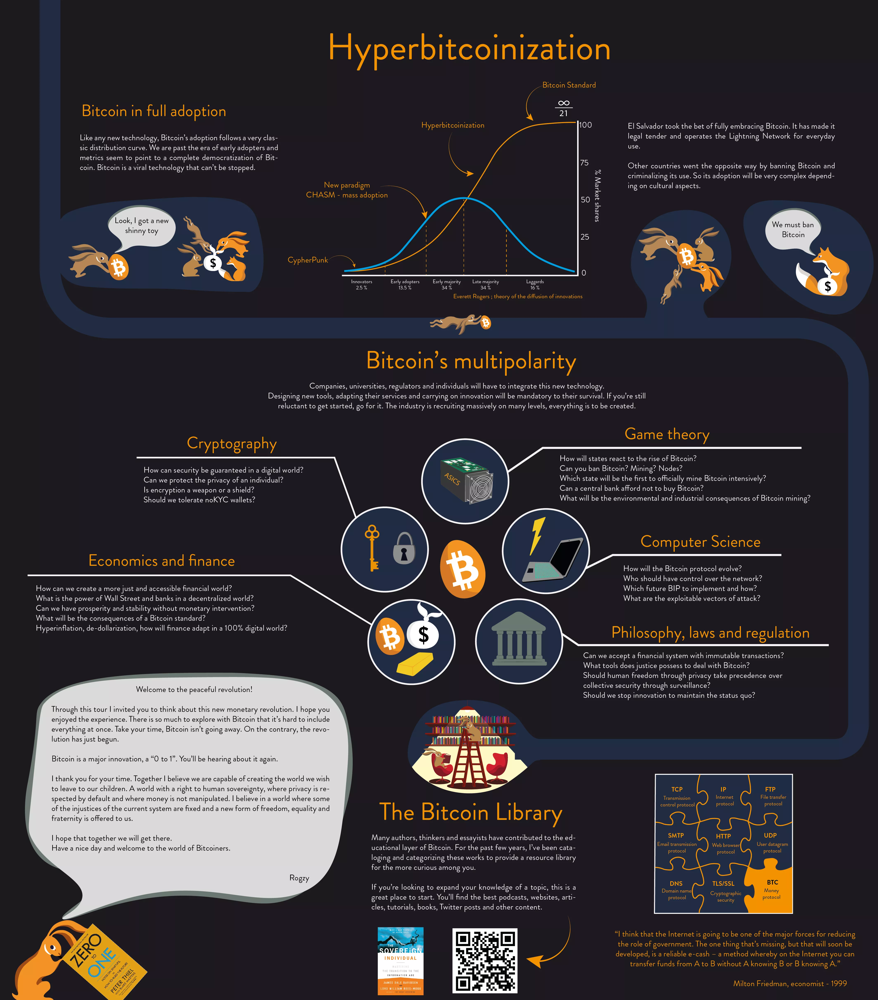

# อนาคตของบิทคอยน์: เครือข่ายไลท์นิ่ง
<partId>899fd35e-39e6-5a25-a73e-6fed6e725094</partId>

## บทนำสั้นๆ เกี่ยวกับเครือข่ายไลท์นิ่ง
<chapterId>b403f1e4-f1ff-572b-a242-9b58cb3736d0</chapterId>
ตอนนี้เราได้เรียนรู้พื้นฐานของโปรโตคอล Bitcoin แล้ว เราจะมาแนะนำเครือข่ายการชำระเงินที่ใช้โปรโตคอล Bitcoin เพื่อให้การทำธุรกรรมเป็นไปอย่างรวดเร็วเหมือนสายฟ้า นั่นคือ Lightning Network นั่นเอง!

### สรุปในเปลือกนัก

Lightning Network เป็นเทคโนโลยีที่ปฏิวัติวงการและเปลี่ยนแปลงการรับรู้ของเราต่อ Bitcoin อย่างลึกซึ้ง มันเป็นวิธีแก้ปัญหาเรื่องการขยายขนาดของ Bitcoin

เพื่อเข้าใจ Lightning Network อย่างถ่องแท้ สำคัญที่จะต้องเข้าใจว่า Bitcoin พัฒนาไปอย่างไร Bitcoin พัฒนาในรูปแบบของชั้นโครงสร้างพื้นฐาน: ชั้นแรกคือ blockchain และชั้นที่สองคือ Lightning Network

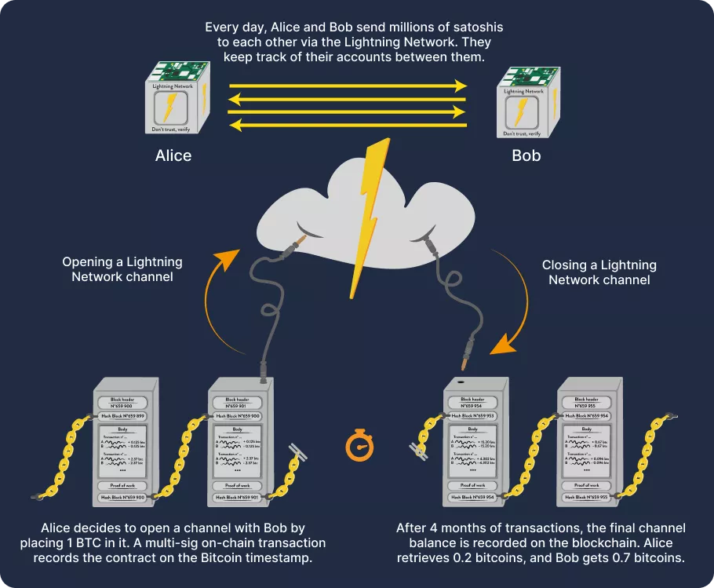

ถูกยอมรับว่าเป็นชั้นของ Bitcoin, Lightning Network ได้รับการตรวจสอบและนำไปใช้ในปี 2017 มันช่วยให้การทำธุรกรรม Bitcoin ที่รวดเร็วและมีค่าใช้จ่ายต่ำ, จึงแก้ปัญหาเรื่องการขยายขนาดของ Bitcoin แต่ปัญหาเรื่องการขยายขนาดที่ Bitcoin พบนั้นคืออะไร?

### Blockchain ไม่สามารถเติบโตได้ไม่จำกัด

ปัญหาเรื่องการขยายขนาดหมายถึงความท้าทายในการดำเนินการระบบการเงินที่สามารถให้บริการจำนวนการทำธุรกรรมต่อวินาทีที่เพิ่มขึ้นอย่างต่อเนื่องเมื่อมีการนำไปใช้ นี่เกี่ยวข้องกับ trilemma ของ blockchain ลองจินตนาการถึงสามเหลี่ยมที่มีการกระจายอำนาจ, ความปลอดภัย, และการขยายขนาดเป็นจุดยอด

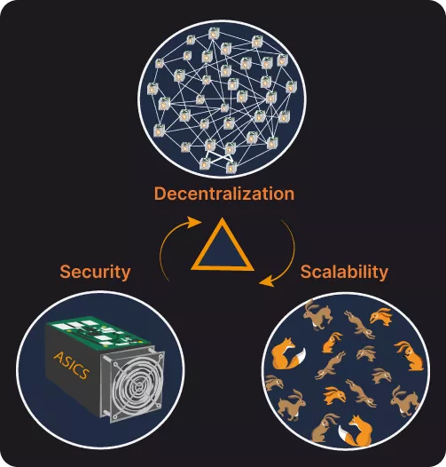

โปรโตคอลที่อิงตาม blockchain สามารถตอบสนองได้เพียงสองอย่างจากสามด้านนี้ ในโปรโตคอล Bitcoin, การตัดสินใจได้ถูกทำเพื่อสนับสนุนการกระจายอำนาจ/ความปลอดภัย ด้านหนึ่ง, ขนาดบล็อก 1MB และเวลาระหว่างสองบล็อก (โดยเฉลี่ย 10 นาที) ช่วยให้สามารถดำเนินการ node Bitcoin ได้ในต้นทุนที่ต่ำ, สนับสนุนการกระจายอำนาจ ด้านอื่น, การผลิตบล็อกผ่าน Proof-of-Work ทำให้การฉ้อโกงภายในโปรโตคอลมีต้นทุนสูงมากในขณะที่ทำให้การตรวจสอบโดยโหนดเครือข่ายง่ายขึ้น, จึงสนับสนุนความปลอดภัย อย่างไรก็ตาม, การตัดสินใจเหล่านี้กำหนดขีดจำกัดเฉลี่ยของจำนวนการทำธุรกรรมในบล็อก, ซึ่งประมาณเทียบได้กับการทำธุรกรรมไม่กี่ครั้งต่อวินาที ตัวเลขนี้ดูเหมือนจะน้อยเมื่อเปรียบเทียบกับความสามารถในการประมวลผลของผู้ประมวลผลการชำระเงินเช่น VISA, ซึ่งอยู่ที่ 1700/s อย่างไรก็ตาม, ขีดจำกัดนี้จำเป็นเพื่อทำธุรกรรมด้วย Bitcoin ในลักษณะที่ต้านทานการเซ็นเซอร์และไม่ต้องพึ่งพาความไว้วางใจ อย่างไรก็ตาม, ผู้ที่พัฒนาบน Bitcoin ได้คิดถึงปัญหานี้ตั้งแต่ต้น

### Lightning เป็นชั้นที่อยู่ด้านบน

หลังจากปีของการคิดค้นและพยายามหลายครั้ง, โปรโตคอล Lightning ก็ปรากฏขึ้น โดยใช้จำนวนข้อกำหนดบางอย่าง, โปรโตคอลนี้ช่วยให้สามารถสร้างเครือข่ายการชำระเงินแบบ peer-to-peer โดยใช้ความปลอดภัยและความสามารถในการเขียนโปรแกรมของโปรโตคอลการทำธุรกรรมของ Bitcoin Lightning Network ทำหน้าที่เป็นเครือข่ายของช่องทางการชำระเงิน, ช่วยให้การทำธุรกรรมทันทีด้วยค่าธรรมเนียมที่ต่ำสำหรับผู้ส่ง เครือข่ายช่องทางการชำระเงินนี้ยังทำให้สามารถทำธุรกรรมระหว่างบุคคลที่ไม่มีการเชื่อมต่อช่องทางโดยตรงได้

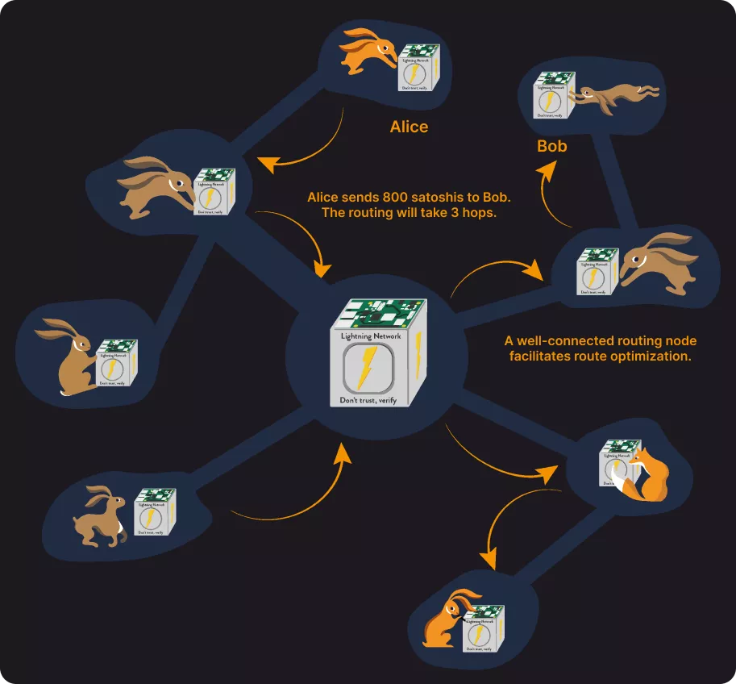

บริการโอนเงินแบบดั้งเดิมเช่น Western Union, ธนาคารกลาง, Visa และ Mastercard อาจจะหายไปหากพวกเขาไม่นำเทคโนโลยี Lightning Network มาใช้ Lightning Network มีประสิทธิภาพและคุ้มค่ากว่าระบบการชำระเงินปัจจุบัน จริงๆแล้ว, Lightning Network ช่วยให้สามารถทำธุรกรรมได้เกือบไม่จำกัดระหว่างสองคู่สัญญาที่แชร์ช่องทาง, โดยไม่มีค่าใช้จ่ายด้านพลังงานบน blockchain พื้นฐานนอกจากการทำธุรกรรมเพื่อประกาศการสร้างช่องทาง

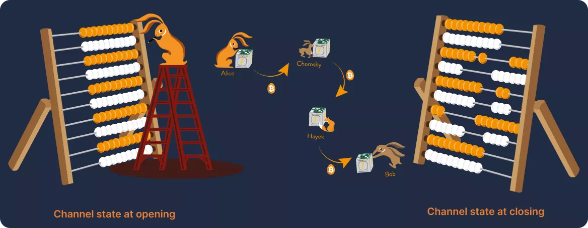

การทำธุรกรรมได้รับการป้องกันด้วยการเข้ารหัสลับและโดยอ้อมผ่านพลังงานที่ใช้โดยนักขุดบน Bitcoin การทำธุรกรรมสามารถทำได้ทันที, ไม่มีข้อจำกัดทางภูมิศาสตร์, และค่าธรรมเนียมต่ำมาก, บ่อยครั้งน้อยกว่า 0.5%

สรุปแล้ว, Lightning Network เป็นความพยายามที่น่าสนใจในการนำเสนอระบบการชำระเงินที่มีประสิทธิภาพสำหรับการทำธุรกรรมด้วย Bitcoin ปัจจุบันมีกระเป๋า Lightning มากมายที่คุณสามารถค้นพบได้ในส่วนของบทแนะนำหรือผ่านการฝึกอบรมเกี่ยวกับ Lightning Network ของเรา

### สรุปอย่างรวดเร็วในโปสเตอร์!

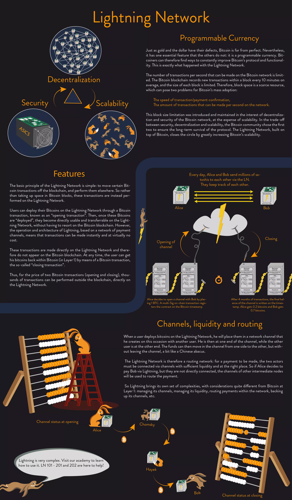
## กรณีการใช้งานของเครือข่าย Lightning

เช่นเดียวกับที่เราเพิ่งเห็น, โปรโตคอล Bitcoin แม้จะเป็นการปฏิวัติ แต่ก็พบกับความท้าทายอย่างมากในเรื่องของการขยายขนาดเพื่อรองรับการทำธุรกรรมประจำวันของเราทั้งหมด เพื่อแก้ไขปัญหาเหล่านี้ ได้มีการเสนอโซลูชันชั้นที่สองที่รู้จักกันในชื่อเครือข่าย Lightning ในปี 2016 และตอนนี้มีการประยุกต์ใช้งานหลายแบบที่สามารถทำงานร่วมกันได้:

- Core-lightning โดย Blockstream
- Eclair โดย Acinq
- LND โดย Lightning strike

เครือข่ายแบบ peer-to-peer นี้มีจุดมุ่งหมายเพื่อส่งเสริมการทำธุรกรรมขนาดเล็ก ซึ่งเป็นการทำธุรกรรมที่มีมูลค่าต่ำมากจนไม่คุ้มค่าเนื่องจากค่าธรรมเนียมที่สูงและเวลาในการยืนยันที่ยาวนานบนบล็อกเชน Bitcoin

### กรณีการใช้งานของเครือข่ายคืออะไร?

เทคโนโลยีนี้เปิดประตูสู่การใช้งานที่หลากหลายสำหรับ Bitcoin ที่ก่อนหน้านี้ไม่สามารถทำได้เนื่องจากข้อจำกัดที่จำเป็นเพื่อรักษาความปลอดภัยและการกระจายอำนาจของ Bitcoin ในหมู่การใช้งานเหล่านี้ในชีวิตประจำวัน เราสามารถกล่าวถึงการเรียกเก็บเงินทันทีในการค้า (ทั้งแบบทางกายภาพและออนไลน์), การสตรีมเงินสำหรับการชำระเงินแบบเรียลไทม์ และการบริจาคขนาดเล็กสำหรับเนื้อหา ด้วยการปรับใช้เครือข่ายของการทำธุรกรรมที่เกือบจะทันที, ปลอดภัย และมีค่าใช้จ่ายต่ำ (เฉลี่ยน้อยกว่า 0.5%), หลายๆ รูปแบบธุรกิจที่ก่อนหน้านี้ไม่สามารถจินตนาการได้สามารถถูกนำมาใช้งานได้ นี่เป็นไปได้เพราะเครือข่าย Lightning ใช้ sats (ทศนิยมของ bitcoin) เพื่อทำงาน

อุตสาหกรรมวิดีโอเกมนำเสนอตัวอย่างที่น่าสนใจโดยเฉพาะของวิธีที่เครือข่าย Lightning สามารถใช้เพื่อเปลี่ยนแปลงรูปแบบธุรกิจที่มีอยู่ ความคิดของ "skin in the game" เป็นความคิดที่เพิ่งได้รับความนิยมในบริบทนี้ มันหมายถึงการมีส่วนร่วมทางการเงินในผลลัพธ์ของเกม เครือข่าย Lightning อนุญาตให้ผู้เล่นเดิมพันด้วยเงินจำนวนน้อยมากเมื่อเล่นเกม เช่น สักไม่กี่ satoshis (ประมาณเศษหนึ่งของเซ็นต์ยูโร) สิ่งนี้ช่วยให้สามารถกำหนดส่วนร่วมที่กระตุ้นการแข่งขันในขณะที่เพิ่มต้นทุนในการปรับใช้บอทอย่างมาก

สรุปแล้ว อนาคตของการทำธุรกรรมขนาดเล็กด้วย Bitcoin ดูสดใสขึ้นเนื่องจากนวัตกรรมเช่นเครือข่าย Lightning ในขณะที่เทคโนโลยีเหล่านี้ยังคงพัฒนาและเติบโต เราสามารถคาดหวังที่จะเห็นการใช้งานใหม่ๆ ที่น่าตื่นเต้นเกิดขึ้นในอนาคตอันใกล้ ยกตัวอย่างเช่น ความคิดของ "การสตรีมเงิน" ด้วยเครือข่าย Lightning เราสามารถทำการทำธุรกรรมขนาดเล็กทุกนาที (อาจจะไม่ต้องมีบุคคลที่สามที่เชื่อถือได้) ซึ่งเปิดประตูสู่การทดลองกับรูปแบบเศรษฐกิจที่ผู้บริโภคจ่ายเงินสำหรับเนื้อหาตามที่พวกเขาบริโภค

ในระบบดังกล่าว เงินจะถูกแบ่งออกโดยอัตโนมัติ ตามเปอร์เซ็นต์ที่กำหนดไว้ล่วงหน้า ให้กับผู้มีส่วนร่วมต่างๆ ในบริการหรือผลิตภัณฑ์ สิ่งนี้อาจเปลี่ยนแปลงวิธีที่เราคิดเกี่ยวกับรูปแบบการชำระเงิน ตัวอย่างเช่น แทนที่จะจ่ายค่าสมาชิกรายเดือนสำหรับบริการ ผู้ใช้อาจถูกเรียกเก็บเงินต่อนาที หรือแม้แต่ต่อวินาที สำหรับเวลาที่พวกเขาใช้บริการ รูปแบบเศรษฐกิจดังกล่าวอาจมีผลกระทบอย่างลึกซึ้งต่อผู้สร้างเนื้อหา ซึ่งจะได้รับแรงจูงใจให้ผลิตเนื้อหาคุณภาพเพื่อรักษาความสนใจของผู้ใช้ ผู้ใช้ ในทางกลับกัน จะจ่ายเงินเฉพาะสำหรับเนื้อหาที่พวกเขาบริโภค จึงขจัดค่าธรรมเนียมการสมัครใช้งานล่วงหน้า ยังเป็นไปได้ที่จะใช้ระบบนี้สำหรับการเช่าสินค้า
ในที่สุด, Lightning Network เปิดโอกาสมากมายที่น่าตื่นเต้นสำหรับผู้ใช้ Bitcoin โมเดลเศรษฐกิจและโอกาสทางธุรกิจที่เกิดขึ้นนั้นหลากหลายและมีความแตกต่างกันมากมาย เราขอแนะนำให้คุณทดลองใช้ด้วยตัวเองโดยการลองใช้แอปพลิเคชัน podcast [Fountain](https://www.fountain.fm/) ซึ่งช่วยให้คุณได้รับรางวัลเป็น sats จำนวนหนึ่งสำหรับการฟัง podcast ที่คุณชื่นชอบ!
### สรุปอย่างรวดเร็วในโปสเตอร์!

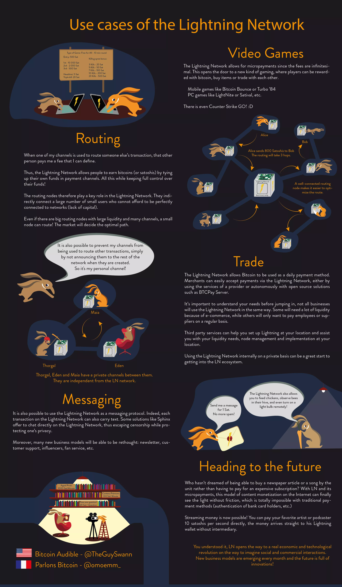

## ยาสีแดงหรือยาสีน้ำเงิน?
<chapterId>c81cdb45-6aa9-5462-9835-c4852084b2cc</chapterId>

เหมือนที่ Morpheus บอกกับ Neo: "คุณกินยาสีน้ำเงิน, เรื่องราวจะจบ, คุณตื่นขึ้นมาในเตียงของคุณ, และคุณเชื่อในสิ่งที่คุณต้องการเชื่อ คุณกินยาสีแดง, คุณจะอยู่ใน Wonderland, และฉันจะแสดงให้คุณเห็นว่าหลุมกระต่ายลึกแค่ไหน" คุณพร้อมที่จะสำรวจหลุมกระต่ายของ Bitcoin หรือไม่? ระวัง, เพราะคุณอาจค้นพบอิสรภาพทางการเงินของคุณใหม่!

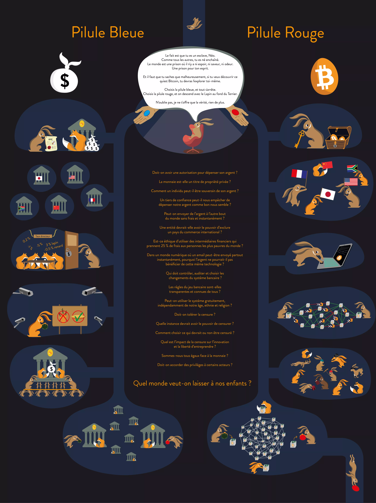

### อนาคตทางเทคโนโลยีและผลกระทบของมัน

เทคโนโลยีกำลังพัฒนาอย่างก้าวกระโดด, และไม่มีใครสามารถทำนายการพัฒนาในอนาคตได้อย่างแน่นอน การเชื่อมต่อของโลกและปัญญาประดิษฐ์ยังคงก้าวหน้าต่อไป ความรู้ที่บุคคลสามารถได้รับผ่านอินเทอร์เน็ตกำลังเพิ่มขึ้นอย่างไม่มีขีดจำกัดตามเวลา

ลองใช้ AI เป็นตัวอย่าง ปัจจุบันเทคโนโลยีเหล่านี้ได้เกินหรือกำลังเข้าใกล้ประสิทธิภาพระดับมนุษย์ในหลายๆ ด้าน เช่น เกมวิดีโอ, การผลิตภาพและข้อความ, และการวิเคราะห์ข้อมูล หนึ่งในผลกระทบที่เป็นไปได้คือมากกว่า 80% ของงานจะหายไปเนื่องจาก AI และอัตโนมัติ มีหลายทางเลือกที่เราสามารถทำได้ เช่น การจำกัดความก้าวหน้าทางเทคโนโลยีหรือใช้ประโยชน์จากทุนเพิ่มขึ้นจากผลผลิตที่เพิ่มขึ้นโดย AI

คำถามสำคัญที่ต้องถามคือ:

- เราจัดการสังคมที่ 80% ของงานจะหายไปได้อย่างไร?
- เราจะฟื้นฟูประชากรได้อย่างไร?
- มีความจำเป็นต้องมีครูมากมายหรือไม่?
- ผลกระทบทางภูมิรัฐศาสตร์, การเมือง, และมนุษย์จากการอัตโนมัติไม่ได้ถูกพูดถึงอย่างเพียงพอ
  การคำนวณ, อินเทอร์เน็ต, การสตรีม, และ VR จะเปลี่ยนการศึกษา เราอาจมีหลักสูตรสากลสำหรับนักเรียนฝรั่งเศสทุกคนที่จัดการโดยรัฐบาลและครูที่ไม่ต้องสอนบรรยายแต่ตรงไปที่การติดตามนักเรียนโดยตรง นักเรียนสามารถเข้าสู่โลกเสมือนและได้รับการติดตามในการเรียนรู้ประวัติศาสตร์

- ขอบเขตระหว่างครูกับ AI คืออะไร?
- เราสามารถรับประกันสังคมที่อยู่อย่างมั่งคั่งได้อย่างไร?

คำถามพื้นฐานเหล่านี้สำหรับอนาคตของเราต้องถูกอภิปรายและตัดสินใจร่วมกัน แต่สิ่งนี้เชื่อมโยงกับ Bitcoin อย่างไร? เหมือนอินเทอร์เน็ตสำหรับโหมดการสื่อสาร, Bitcoin เป็นการปฏิวัติทางเทคโนโลยีสำหรับโหมดการจัดการขนาดใหญ่ใหม่, นำเสนอโอกาสในการแลกเปลี่ยนค่าโดยไม่ต้องพึ่งพาบุคคลที่สามที่เชื่อถือได้ เราต้องการจำกัดการพัฒนาเทคโนโลยีของระบบการเงินหรือไม่ หรือรับประโยชน์จากทุนเพิ่มขึ้นผ่านการเพิ่มผลผลิตสิบเท่าจากการใช้ Bitcoin และโปรโตคอล Lightning?

### อนาคตของการเงินคืออะไร?

การสะท้อนเหล่านี้ยังยกคำถามเกี่ยวกับใครควรถือ, อนุญาต, และติดตามเงินที่เราใช้ วัตถุประสงค์คือการตัดสินใจระหว่างระบบปิดที่มีผู้นำที่ไม่ได้รับเลือกหรือระบบเปิดโดยไม่มีบุคคลที่สามที่เชื่อถือได้ ที่ความเป็นกลางมีความสำคัญ

- สกุลเงินเป็นรูปแบบหนึ่งของทรัพย์สินส่วนบุคคลหรือไม่?
- บัญชีของผู้ประท้วงสามารถถูกบล็อกโดยไม่ต้องมีคำสั่งจากศาลฎีกาหรือไม่?
- ใครคือผู้รับประกันระบบการเงิน?
- บุคคลสามารถเป็นผู้มีอำนาจเหนือเงินของตนเองและพึ่งพาบุคคลที่สามที่เชื่อถือได้ได้อย่างไร?
- เงินสามารถถูกส่งไปยังอีกฝั่งของโลกโดยไม่มีค่าธรรมเนียมหรือตัวกลางได้หรือไม่?
การยอมรับเทคโนโลยีใหม่ๆ เหล่านี้สามารถสร้างเศรษฐกิจขนาดใหญ่ได้ทั่วโลก ควรอนุญาตให้มีการเคลื่อนย้ายเงินทุนได้อย่างอิสระหรือไม่? การปิดกั้นระหว่างประเทศมีผลทางเศรษฐกิจและการเมือง การใช้ตัวกลางทางการเงินเช่น Western Union ซึ่งบางครั้งเรียกเก็บค่าธรรมเนียมสูงถึง 25% นั้นถือเป็นสิ่งที่เหมาะสมหรือไม่? เราเชื่อว่าในโลกดิจิทัลที่เพิ่มขึ้นเรื่อยๆ เงินควรถูกประชาธิปไตยและถือเป็นสมบัติสาธารณะที่เป็นของประชาชนมากกว่าที่จะเป็นของรัฐหรือสถาบันการเงินที่ไม่โปร่งใส

คำถามเกี่ยวกับใครควรควบคุมระบบธนาคารนั้นสำคัญเพราะกฎของเกมธนาคารไม่โปร่งใสและเข้าใจได้ไม่ง่ายสำหรับทุกคน ทำให้ชนชั้นของนักการเมืองและผู้กำกับดูแลสามารถรักษาอำนาจเหนือระบบไว้ได้ สำคัญที่จะต้องตั้งคำถามว่าตลาดเสรีหรือกลุ่มของนักปัญญาควรควบคุมระบบธนาคาร

### อิสระของเรากำลังถูกคุกคาม

การเซ็นเซอร์ก็ต้องถูกตั้งคำถามเช่นกัน เพราะใครมีความรู้ในการตัดสินว่าอะไรควรถูกเซ็นเซอร์หรือไม่? สื่อได้เปลี่ยนมุมมองเกี่ยวกับข้อมูลบางอย่างและคนที่ถูกเซ็นเซอร์มาก่อนไม่ถูกเซ็นเซอร์ในปัจจุบัน

- ใครตัดสินใจว่าอะไรคือการเซ็นเซอร์หรือโฆษณาชวนเชื่อ?
- ใครมีอำนาจสูงสุดเหนือระบบของเรา?

การยอมรับการเซ็นเซอร์สามารถทำลายเสรีภาพในการแสดงออกและสิทธิในการชุมนุม การดำเนินการเซ็นเซอร์นั้นยากจากทางเทคนิคโดยไม่สร้างดิสโทเปียอย่างสมบูรณ์ หน่วยงานใดควรมีอำนาจในการเซ็นเซอร์? คำถามเกี่ยวกับการเซ็นเซอร์นั้นซับซ้อนและยากที่จะรู้ว่าใครควรถูกเซ็นเซอร์หรือไม่ การเซ็นเซอร์สามารถมีผลกระทบเชิงลบต่อนวัตกรรมและเสรีภาพในการประกอบการ

มีคน 2.4 พันล้านคนในโลกที่ไม่มีบัญชีธนาคาร ซึ่งสร้างความไม่เท่าเทียมทางภูมิศาสตร์ Bitcoin ช่วยให้ความเท่าเทียมในการทำธุรกรรม ไม่ว่าคุณจะมีสถานะทางสังคมหรือตำแหน่งทางการเมืองอย่างไร โปรโตคอล Bitcoin เป็นกลางและไม่ให้สิทธิพิเศษเฉพาะกับประธานาธิบดีหรือบุคคลอื่น ผู้นำควรมีสิทธิพิเศษเท่ากับคนธรรมดาเพื่อผลักดันการพัฒนาขึ้นไป ไม่ใช่ทิ้งบางคนไว้ด้านบนและคนอื่นๆ อยู่ด้านล่าง ทุกคนควรมีสกุลเงินเดียวกันหรือไม่ ไม่ว่าจะมีสถานะทางสังคมอย่างไร? สำคัญที่จะต้องคิดถึงโลกที่เราต้องการทิ้งไว้ให้กับลูกหลานของเรา เราหวังที่จะทิ้งโลกที่เปิดกว้างให้พวกเขา ที่พวกเขาสามารถทำอะไรกับเงินของตนได้อย่างอิสระ

Bitcoin มีความสำคัญและไม่ควรถือว่าเป็นเพียงเกมแห่งโอกาส เป็นสิ่งสำคัญที่จะต้องตั้งคำถามเกี่ยวกับ Bitcoin ต่อไป

### Bitcoin: โปรโตคอลปฏิวัติ

ดังที่เราเห็นในบทก่อนหน้านี้ โปรโตคอล Bitcoin เป็นกลางต่อผู้ใช้ทุกคน ด้วยกฎข้อตกลงและการเข้ารหัสลับ เราสามารถบันทึกธุรกรรมได้อย่างไม่สามารถเปลี่ยนแปลงในบัญชีแยกประเภทสาธารณะระดับโลก รับประกันการโอนค่าเงินโดยไม่ต้องพึ่งพาบุคคลที่สามที่ไว้วางใจได้ โครงสร้างพื้นฐานชั้นที่สอง (และเร็วๆ นี้ชั้นที่สาม ด้วย RGB) ช่วยให้เครือข่ายสามารถขยายได้และพัฒนาฟังก์ชันใหม่ๆ โดยเฉพาะเพื่อแก้ไขปัญหาการขยายตัว

Bitcoin มีลักษณะที่จำเป็นทั้งหมดในการเป็นสกุลเงินที่มีประสิทธิภาพและมีสุขภาพดี: สามารถแบ่งได้, สามารถขนส่งได้ทันที, ไม่สามารถเซ็นเซอร์ได้, มีค่าใช้จ่ายในการตรวจสอบน้อยนิด, และมีนโยบายการเงินที่กำหนดไว้แล้วสำหรับศตวรรษที่จะมาพร้อมกับ 21 ล้านหน่วยเหล่านี้ Bitcoin เป็นนิรนามและสามารถแลกเปลี่ยนได้ทุกที่ในโลกโดยไม่ต้องได้รับอนุญาตจากหน่วยงานใด คุณเพียงต้องถือกุญแจส่วนตัวของคุณเอง - ตามที่คำพูดว่า "ไม่ใช่กุญแจของคุณ, ไม่ใช่บิตคอยน์ของคุณ"

Bitcoin ได้รับการยอมรับจากกลุ่มคนหลากหลาย ตั้งแต่นักวิชาการด้านการเข้ารหัสลับไปจนถึงนักเสรีนิยมไปจนถึงธุรกิจแบบดั้งเดิมและแม้กระทั่งประเทศหนึ่ง อย่างไรก็ตาม Bitcoin เป็นของทุกคน และจำนวนผู้ใช้ก็เพิ่มขึ้นเช่นเดียวกับจำนวนโหนด Bitcoin ที่ทำหน้าที่เป็นผู้รักษาประวัติการทำธุรกรรม รับประกันความกระจายอำนาจของมัน
Bitcoin ไม่สามารถถูกหยุดหรือถูกเซ็นเซอร์ได้อีกต่อไปแล้ว มันคือการปฏิวัติอย่างสงบเพื่อเปลี่ยนแปลงระบบการเงินและเปิดโอกาสให้ทุกคนเข้าถึงบริการทางการเงินได้ ผู้ใช้สามารถได้รับ Bitcoin โดยการยอมรับมันเป็นการชำระเงินสำหรับการค้าของพวกเขาหรือโดยการซื้อผ่านแพลตฟอร์มที่มีการควบคุมหรือไม่มีการควบคุม Bitcoin สามารถเก็บไว้ในกระเป๋าเงิน, แอปพลิเคชันบนมือถือ, หรืออุปกรณ์ทางกายภาพ ไม่มีตัวกลางที่ไว้วางใจใน Bitcoin, ผู้สนับสนุน Bitcoin ยืนหยัดเรื่องความโปร่งใส, อิสระ, และความรับผิดชอบของบุคคล - ตามที่คำกล่าวที่ว่า "อย่าไว้ใจ, ตรวจสอบ"

การเปลี่ยนแปลงระบบการเงินต้องเปลี่ยนแปลงสกุลเงิน Satoshi สร้าง Bitcoin ในปี 2008 เพื่อเสนอความพยายามในเรื่องนี้ การเข้าถึงเงินที่ง่ายและ "มหัศจรรย์" ทำให้เกิดการคอร์รัปชัน Bitcoin จึงเป็นทางเลือกในการสร้างระบบการเงินที่เป็นกลางใหม่ Bitcoin ทำให้เราสามารถหลุดพ้นจากระบบธนาคารได้ มันเป็นปรากฏการณ์ทางสังคมที่นำพาเราไปสู่การมีส่วนร่วมในการปฏิวัติอย่างสงบ คุณพร้อมที่จะเข้าร่วมหรือไม่?

## ขอบคุณและขุดลึกลงไปในหลุมกระต่าย
<chapterId>c153facd-fe77-5954-b18b-d0e2243e787a</chapterId>

### ไปต่อ

ขอแสดงความยินดีที่คุณเสร็จสิ้นหลักสูตร BTC 101 นี้! ฉันหวังอย่างจริงใจว่าคุณจะสนุกกับมันและมันเปิดประตูใหม่ๆ ให้คุณ การค้นพบ Bitcoin ของคุณเพิ่งเริ่มต้น และฉันขอเชิญคุณสำรวจหลักสูตรอื่นๆ ที่มหาวิทยาลัยมีให้

- [BTC 102](https://planb.network/courses/btc101) จะช่วยคุณตั้งค่าแผน Bitcoin ของคุณ
- [LNP 201](https://planb.network/courses/lnp201) จะให้คุณค้นพบ Lightning Network, ระบบการชำระเงินชั้นที่สอง
- [ECO 201](https://planb.network/courses/eco201) จะครอบคลุมเศรษฐศาสตร์ออสเตรีย
- [SCU 101](https://planb.network/courses/scu101) จะช่วยคุณอัปเดตความปลอดภัยดิจิทัลของคุณ
- [MIN 201](https://planb.network/courses/min201) เพื่อเรียนรู้เพิ่มเติมเกี่ยวกับการขุด
- และอีกมากมาย...

## สนับสนุนเรา
<chapterId>3e6e756b-b6c4-5d41-bece-767922348067</chapterId>

หลักสูตรนี้, รวมถึงเนื้อหาทั้งหมดบนมหาวิทยาลัยนี้, ได้ถูกเสนอให้คุณฟรีโดยชุมชนของเรา เพื่อสนับสนุนเรา, คุณสามารถแชร์มันกับผู้อื่น, เป็นสมาชิกของมหาวิทยาลัย, และแม้กระทั่งมีส่วนร่วมในการพัฒนาผ่าน [GitHub ของเรา](https://github.com/PlanB-Network/bitcoin-educational-content) ในนามของทีมงานทั้งหมด, ขอบคุณคุณ!

## ให้คะแนนการฝึกอบรม
<chapterId>44d01865-5c89-55a5-a397-a014960eec0f</chapterId>

ระบบการให้คะแนนสำหรับการฝึกอบรมจะเร็วๆ นี้ถูกบูรณาการเข้ากับแพลตฟอร์ม E-learning ใหม่นี้! ในขณะนี้, ขอบคุณมากสำหรับการเข้าร่วมหลักสูตรและหากคุณชอบมัน, โปรดพิจารณาแชร์มันกับผู้อื่น

ขอบคุณอย่างยิ่งต่อผู้สนับสนุน Patreon ของเรา, สมาชิก, และผู้บริจาคสำหรับการสนับสนุนทางการเงิน, ขอบคุณผู้ที่แชร์, และขอบคุณผู้ที่ทำให้การฝึกอบรมนี้เป็นไปได้: Rachel, Muriel, ทีม StackinSat, JohnOnChain, Fanis, Guillaume, Lounes, ผู้ตรวจสอบ, และผู้ทบทวน

พบกันใหม่เร็วๆ นี้!
