# İlk Bitcoin Maceranız

Bu eğitimde, Bitcoin'nin temellerini 25 bölümde açıklayacağız, böylece bu teknolojiyi basit ve etkili bir şekilde anlayabilirsiniz. Eğitim, Mining, cüzdanlar, alım/satım platformları gibi konular da dahil olmak üzere sektörün temellerini bir bütün olarak incelemektedir. Yolculuk boyunca ek eğitim materyalleri sunulacak ve ayrıca bu kursu bitirdikten sonra sizi kaynaklar bölümündeki "21 Poster "i incelemeye davet ediyoruz.

Bu kursa başlamak için bilgi sahibi olmanız gerekmez. BTC 101, bilgi seviyeniz ne olursa olsun herkesin erişebilmesi için hazırlanmıştır.

+++

# Giriş

<partId>3cd2ac82-026c-53e1-874a-baf5842adc6d</partId>

## Kursa genel bakış

<chapterId>27e3fb60-4b50-556b-9e70-c4f5475c121d</chapterId>

BTC101 kursuna hoş geldiniz!

Bitcoin, para ve toplumla olan ilişkimizi sorgulamamıza neden olabilecek teknolojik ve parasal bir devrimdir. Aslında, Bitcoin (BTC olarak anılır) **nötr** ve **merkezi olmayan** bir para birimidir, yani herhangi bir varlık veya kurum tarafından kontrol edilmemektedir. Sadece bir "internet para biriminin" ötesine geçen bir yeniliktir: hem bir bilgisayar protokolü (Bitcoin) hem de bir parasal birimdir (Bitcoin).

Bitcoin protokolü; kriptografi, ağ iletişimi ve ünlü "[Blockchain](https://planb.academy/resources/glossary/blockchain)" gibi temel teknolojileri kullanırken, Bitcoin birimi bu protokolün düzgün işlemesi için gerekli para birimi olarak hizmet vermektedir. Günlük yaşamda, dünyanın dört bir yanındaki Salvadorlular ve bitcoin kullanıcıları, hayatlarını daha iyi hale getirmek için bu teknolojiye güvenerek mal ve hizmet alıp satmak için Bitcoin'i para birimi olarak kullanıyor.

**Kapsamlı ama anlaşılır bir müfredat:**

Bu derste, Bitcoin satın alma ve satma, dijital cüzdanlarda güvenli bir şekilde saklama ve transfer işlemlerinde kullanma gibi Bitcoin'in parasal yönlerini ele alacağız. Ayrıca, hem yeni Bitcoin'lerin üretilmesinde hem de ağın güvenliğinin sağlanmasında kritik bir rol oynayan madencileri inceleyeceğiz. Son olarak, Bitcoin'in geleceğine bakacak ve Lightning Network teknolojisinin transfer işlemlerini nasıl daha pratik hale getirebileceğini keşfedeceğiz

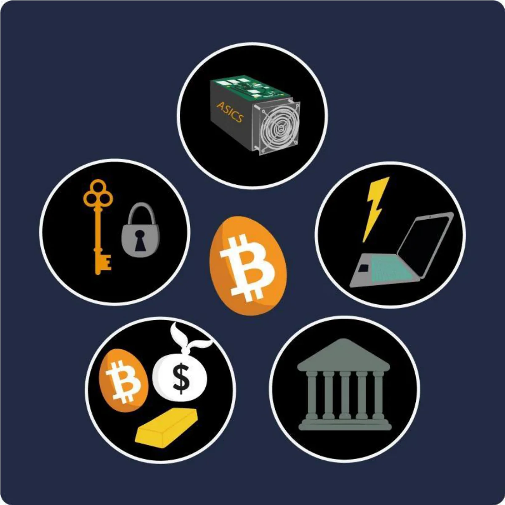

Şunu çok iyi anlamak gerekiyor: Bitcoin, parayla olan ilişkimizi kökten değiştiren yepyeni bir parasal sistemdir. Dolayısıyla, kendi parası üzerinde tam kontrol sahibi olmak isteyen herkesin Bitcoin kullanmayı öğrenmesi artık kaçınılmaz bir zorunluluktur.

Paranın tanımını ve toplumdaki işlevini ele almadan önce (Bölüm 1), işe Bitcoin'in doğuşundan başlamamız gerekiyor. 2009 yılında piyasaya sürülen Bitcoin, benzeri olmayan, nispeten yeni bir teknoloji. Bu yüzden onunla ilgili her şeyi bir çırpıda anlayamamanız son derece normal. Aslına bakarsanız, tıpkı internet kullanmayı veya araba sürmeyi öğrenirken olduğu gibi, tüm teknik detayları hemen en başında bilmenize gerek yok: İlk olarak nasıl ödeme alacağınızı, nasıl ödeme yapacağınızı ve paranızı nasıl güvenli bir şekilde saklayacağınızı öğrenerek başlayabilir, ardından ufak adımlarla konunun derinliklerine inebilirsiniz.

Zaten henüz yolun çok başındayız; o ilk uçuşa geçiş aşamasını yeni atlattık. Yani bu büyük yenilik hakkında dilediğin kadar bilgi edinmek için tam zamanında buradasın.


Burada önemli olan, bu yeni teknolojiyi genel hatlarıyla kavramaktır; bu nedenle kurstan keyif alacağınızı ve bu yeni küresel para düzeninde kendinizi geliştirmeye devam edeceğinizi umuyoruz.

Bitcoin'ün büyüleyici dünyasına dalmaya ve tüm iç işleyişini anlamaya hazır mısınız? Hadi başlayalım!

## Bitcoin'in Öncesi Dönem

<chapterId>9a94b627-5b69-5d81-9125-f1fa9b0aa6ad</chapterId>

"Bitcoin" terimi dijital para birimi ve finansal dönüşümle eşanlamlı hale gelmeden çok önce, bu teknolojinin doğuşuna zemin hazırlayan bir dizi fikir, yenilik ve toplumsal hareket ortaya çıkmıştı. Bitcoin öncesi dönemin en kilit unsurlarından biri olarak [Cypherpunk](https://planb.academy/resources/glossary/cypherpunks) öne çıkmaktadır.

### Cypherpunk'lar: dijital dünyanın vizyonerleri

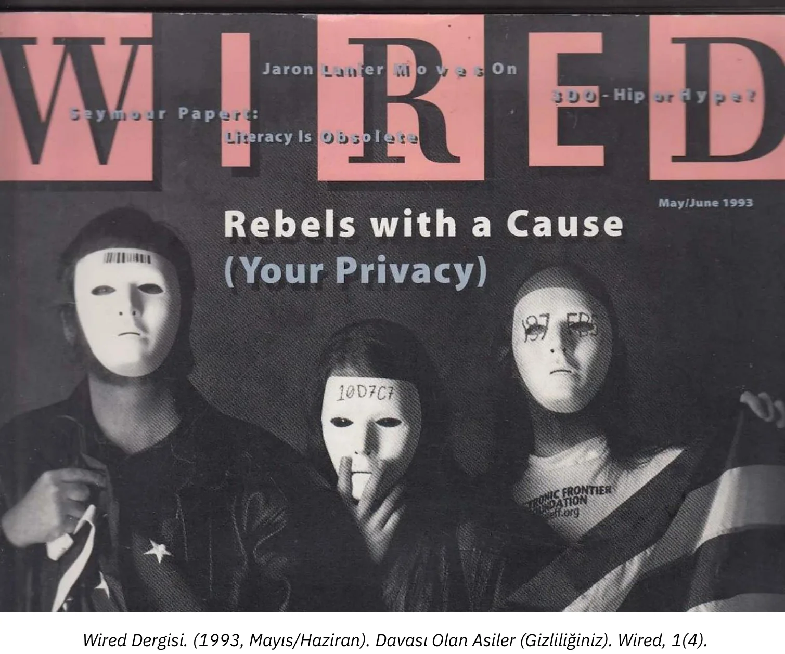
1980'ler ve 1990'lardakı teknolojik gelişimin tam merkezinde, bir grup insan dijital çağda mahremiyet ve özgürlüğün rolünü derinden sorgulamaya başladı. Daha sonra "cypherpunks" olarak anılacak olan bu kişiler, [kriptografinin(şifreleme bilimi)](https://planb.academy/resources/glossary/cryptography) hükümetlerin ve büyük şirketlerin müdahalelerine karşı bireysel hakları korumak için bir araç olarak kullanılabileceğine inanıyorlardı.

Julian Assange, Wei Dai, Tim May ve David Chaum gibi ikonik isimler, bu hareketin felsefesinin ve vizyonunun şekillenmesinde çok önemli bir rol oynadı. Bu düşünürler, fikirlerini dünyanın dört bir yanından katılımcıların bireysel özgürlüğü artırmak adına teknolojiden en iyi nasıl yararlanabileceklerini tartıştığı, oldukça etkili bir e-posta listesi üzerinden paylaştı.

### Cypherpunk'ların üç temel belgesi

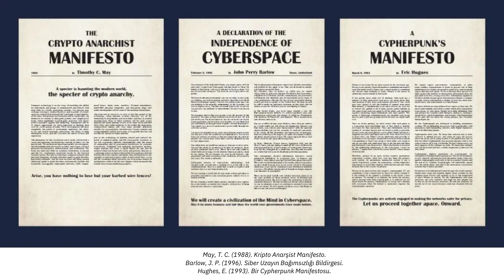

Kökleri dijital aktivizm ve kriptografiye dayanan Cypherpunk hareketi, ilkelerini ve gelecek vizyonunu ifade etmek için çeşitli temel metinlerden yararlanmıştır. Bu yazılar arasında özellikle üç tanesi öne çıkmaktadır:

- "Bir Cypherpunk'un Manifestosu":

1993 yılında Eric Hughes tarafından kaleme alınan bu metin, mahremiyetin temel bir hak olduğunu savunur. Yazar, özgür bir toplum için özgürce ve gizlilik içinde iletişim kurabilme becerisinin şart olduğunu ileri sürer. Manifestoda şu ifadelere yer verilir: "Hükümetlerin, şirketlerin ya da diğer büyük ve kimliksiz organizasyonların bize mahremiyet bahşetmesini bekleyemeyiz [...]. Eğer mahremiyetimizi korumak istiyorsak, onu kendimiz savunmalıyız.".

- "Kripto Anarşist Manifesto":

1992 yılında Timothy C. May tarafından kaleme alınan bu belge, kriptografi kullanımının, hükümetlerin vatandaşların özel hayatlarına müdahale etmede çaresiz kalacağı bir kripto anarşi çağını nasıl başlatabileceğini açıklamaktadır. May, insanların üçüncü bir tarafın müdahalesi olmadan anonim olarak bilgi ve para alışverişinde bulunduğu bir gelecek hayal etmiştir.

- "Siber Uzayın Bağımsızlığı Bildirgesi":

Doğrudan bir cypherpunk metni olmasa da bu çalışma, hareketin içindeki pek çok kişinin ortak hislerini yansıtmaktadır. John Perry Barlow tarafından 1996 yılında kaleme alınan bu metin, hükümetlerin interneti her geçen gün daha fazla denetim altına alma çabalarına karşı bir tepki niteliğindedir. Bildirge, siber uzayın fiziksel dünyadan tamamen farklı bir alan olduğunu ve aynı yasalara tabi tutulmaması gerektiğini savunur. Metinde de belirtildiği gibi: "Bizim seçilmiş bir hükümetimiz yok ve hiçbir zaman olması da beklenemez".

### Bitcoin'nin öncülleri

Bitcoin'ün ortaya çıkmasından önce, dijital bir para birimi yaratmaya yönelik birkaç girişim olmuştu. Örneğin, David Chaum 1980'lerde "[DigiCash](https://planb.academy/resources/glossary/ecash-david-chaum)" projesiyle "anonim elektronik para" kavramını ortaya atmıştır. Ne yazık ki, çeşitli kısıtlamalar nedeniyle DigiCash hiçbir zaman beklenen patlamayı yapamadı.

Bir diğer önemli öncü ise Wei Dai'nin İ[B-para](https://planb.academy/resources/glossary/bmoney)" projesidir. Hiçbir zaman hayata geçirilmemiş olsa da dolandırıcılık tespitinin merkezi bir otorite yerine bir denetleyici topluluğu tarafından yapıldığı, anonim bir dijital para birimi fikrini ortaya koymuştur.

Aşağıdaki görsel, hareketin gerçekleştirdiği pek çok teknolojik yenilik sayesinde nasıl geliştiğini net bir şekilde ortaya koymaktadır.

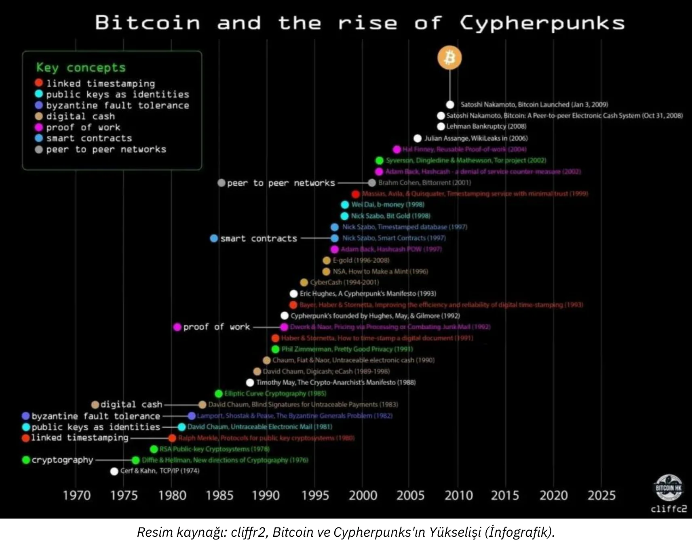

İşte bu üretken ortamda gizemli biri [Satoshi Nakamoto](https://planb.academy/resources/glossary/nakamoto-satoshi) 2008 yılında Bitcoin teknik dökümanını ([whitepaper](https://planb.academy/resources/glossary/white-paper)) yayınladı.Nakamoto bu belgede, [iş kanıtı(proof of work)](https://planb.academy/resources/glossary/proof-of-work) ve kriptografik [zaman damgaları(timestamp)](https://planb.academy/resources/glossary/timestamp) gibi cypherpunk hareketinden gelen birçok fikri bir araya getirerek [merkeziyetsiz](https://planb.academy/resources/glossary/distributed) ve sansüre karşı dirençli bir dijital para birimi yarattı.

Ancak Bitcoin bundan çok daha fazlasıydı: Cypherpunk ideallerinin hayata geçirilmiş halini temsil ediyordu. Teknolojisinin de ötesinde, geleneksel finansal sistemlere karşı bir devrimi simgeliyor; şeffaflığa, merkeziyetsizliğe ve bireysel egemenliğe dayalı bir alternatif sunuyordu.

### Sonuç

Bitcoin öncesi dönem, köklerini cypherpunk hareketinden ve dijital çağda daha fazla özgürlük arayışından alır. Kriptografi, merkeziyetsizlik ve bütünlük ilkelerini bir araya getiren Bitcoin, bir para birimi olmanın çok ötesine geçmiştir. Aslında o, dünyamızı şekillendirmeye devam eden felsefi ve teknolojik bir devrimin ürünüdür.

Bu nedenle Bitcoin, uzun zaman dilimlerine yayılan, enerji, zaman ve parayla olan ilişkimizi sorgulamamızı teşvik eden bir protokoldür.

Peki, Bitcoin "gerçek" bir para birimi midir? Bunu kavramak için öncelikle bir sonraki bölümde inceleyeceğimiz para kavramını ve paranın farklı biçimlerini anlamamız gerekir.

Bitcoin'in tarihini daha ayrıntılı bir şekilde incelemek isterseniz, Bitcoin'in kökenlerini, yavaş yavaş ortaya çıkışını, tarihinin ve topluluğunun başlangıcını keşfedeceğiniz HIS 201 kursumuzu kesinlikle tavsiye ederiz. Tamamen belgelere ve kaynaklara dayanan bu kurs, elbette pek çok anekdot da içermektedir:

https://planb.academy/courses/a51c7ceb-e079-4ac3-bf69-6700b985a082

# Para

<partId>e913df1a-4cbd-5380-ba67-ca2a0414f671</partId>

## Tarih Boyunca Para

<chapterId>c838e64d-d59f-5703-8c74-ea5e8c4fdd31</chapterId>

Paranın evrimi, insanlık tarihinin büyüleyici bir parçasıdır; çağlar boyunca medeniyetlerin sürekli değişen ekonomik ihtiyaçları karşılamak adına sergilediği yaratıcılığı ve ustalığı yansıtır.

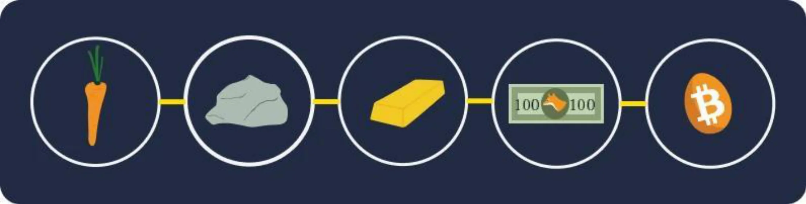

### Deniz kabuklarından banka hesaplarına

Başlangıçta para; tahıl, canlı hayvan ya da diğer ticari mallar gibi somut bir varlıktan ibaretti. Ancak bu malların en büyük dezavantajı, çabuk bozulabilir olmalarıydı; bu da onları uzun vadeli bir birikim aracı olarak kullanmayı zorlaştırıyordu. Örneğin, kötü giden bir hasat dönemi veya hayvan hastalıkları, bir kişinin tüm servetini bir gecede yok edebiliyordu.
Bu yüzden, medeniyetler geliştikçe ve ticaret yeni bölgelere yayıldıkça, evrensel bir değişim aracına duyulan ihtiyaç da arttı. İnsanlar ilk olarak deniz kabukları ve değerli taşlar gibi nesneleri denediler ancak bunların sandıkları kadar dayanıklı veya nadir olmadığını gördüler. En nihayetinde; nadirliği, dayanıklılığı ve bölünebilirliği sayesinde altın ortak standart haline geldi. Altın, dün olduğu gibi bugün de zenginliğin ve gücün sembolü olmayı sürdürmektedir.

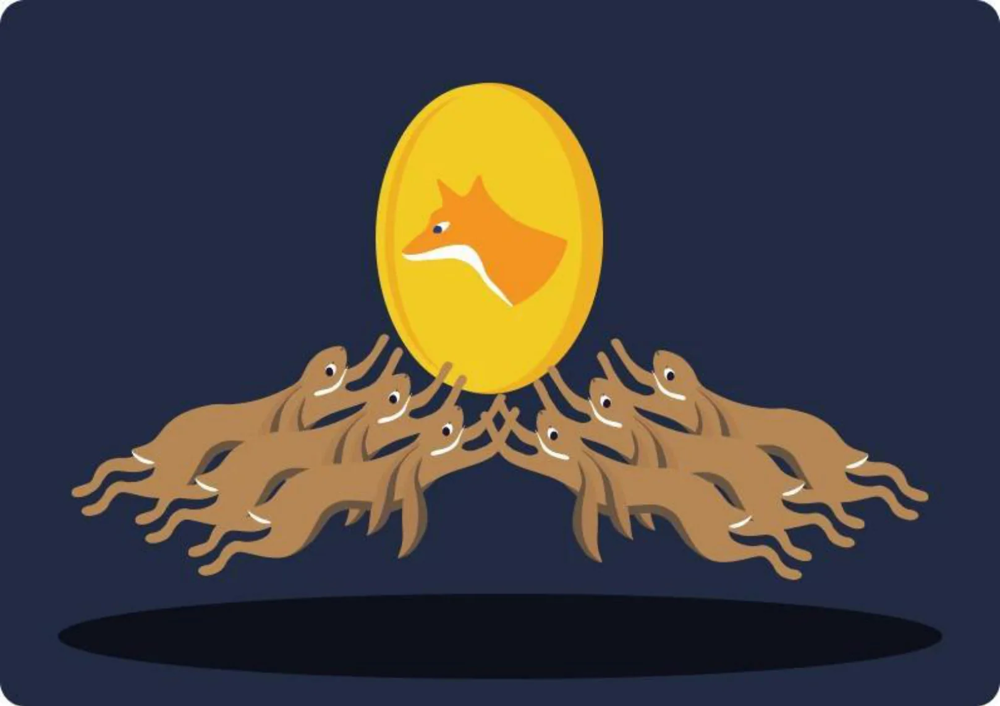

### Paranın rolü nedir?

Para, son derece gelişmiş bir iletişim aracıdır:

- Zamanımızı ve enerjimizi, değer kaybetme riski olmadan gelecekte yeniden kullanılabilecek bir varlığa dönüştürerek bugün ile gelecek arasında köprü kurar.

- Evrensel bir dilde iletişimi kolaylaştırır: Birbirini tanımayan veya aynı dili konuşmayan iki yabancı; bu sayede alışveriş yapabilir, ticaret gerçekleştirebilir ve varlıkların değeri üzerinde uzlaşabilir.

Paranın dünyamızdaki işlevini yapay olarak taklit etmek zordur. Aslında hiçbir birey veya grup yoktan para yaratamaz; çünkü para, piyasadan ve gönüllü uzlaşıdan ([consensus](https://planb.academy/resources/glossary/consensus)) doğması gereken doğal bir fenomendir. Bu bağlamda fiyatlar, topluma kaynakları doğru paylaştırma konusunda rehberlik eden birer sinyal ve bilgi kaynağı görevi görür.

İşte bu nedenlerden dolayı altının para olarak kabul görmesi, aşağıdaki Aristotelesçi işlevlere dayanan 4.000 yıllık bir parasal Darwinizm'in sonucudur:

- **Değer saklama aracı**: Para, satın alma gücünü geleceğe taşımak için kullanılabilir, bu nedenle dayanıklı bir maddeden yapılmış olması gerekir;
- **Değişim Aracı**: Para, takas yöntemi yerine mal ve hizmet alım satımında kullanılabilir; böylece ticaret yapan tarafların karşılıklı ihtiyaçlarının birebir örtüşmesi zorunluluğunu ortadan kaldırır;
- **Hesap birimi**: Para, farklı malların değerlerini birbiriyle kıyaslamamızı sağlayarak hangisinin daha avantajlı olduğunu daha kolay anlamamıza yardımcı olur.

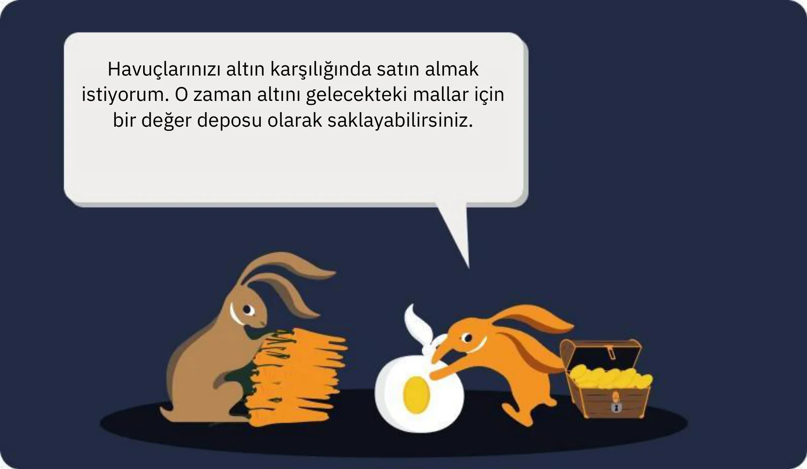
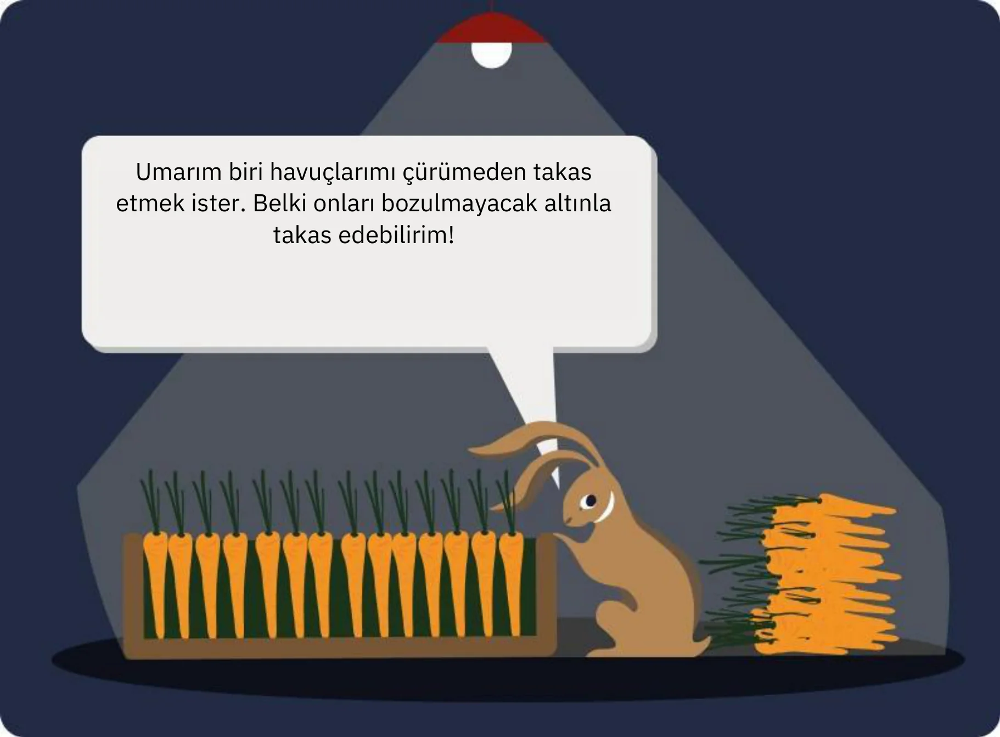


### Paranın özellikleri

Altın, verimli bir para biriminin kriterlerini ideal bir şekilde karşılar: Doğal nadirliği onu değerli kılarken, kimyasal özellikleri zamanla aşınmamasını sağlar. Bu özellikler altını harika bir **değer saklama aracı** yapmış olsa da yaygın bir para birimi haline getirememiştir; çünkü paranın bu formu kolayca bölünemez ve uzak mesafelere rahatça taşınamaz. Küreselleşen ve dijitalleşen dünyada altın, bu hıza ayak uydurmakta zorlanır ve bölünebilir, kolayca takas edilebilir hale gelmesi için (örneğin basılı madeni paralar aracılığıyla) merkezi bir yapıya ihtiyaç duyar.

Buna karşılık, devletlerin itibari para birimleri ([fiat](https://planb.academy/resources/glossary/fiat)) kolayca kullanılabilir olsa da kendilerini kontrol eden yapılar (krallar, merkez bankaları, imparatorlar, diktatörler) tarafından sürekli olarak değersizleştirilir.

Bu kavramı daha iyi açıklamak için, etkili bir para biriminin özelliklerini inceleyelim:

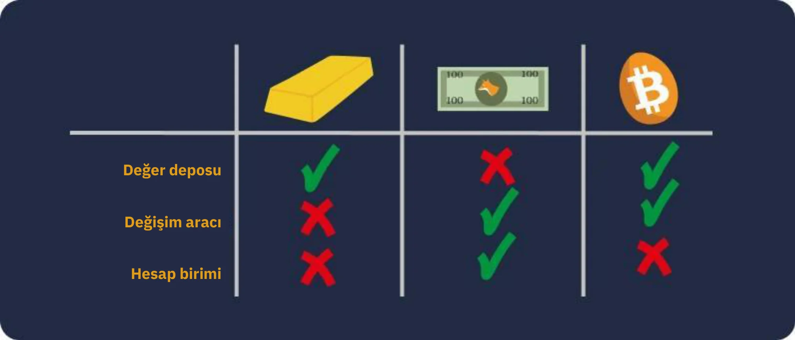

- **[Değiştirilebilirlik](https://planb.academy/resources/glossary/fungibility)**, yani bir birimin, değer kaybı yaşanmadan aynı türden başka bir birimle doğrudan değiştirilebilmesidir;
- **Bölünebilirlik**, farklı hacimlerdeki işlemleri kolaylaştırmak için daha küçük birimlere ayrılabilmesidir;
- **Likidite**, kolayca mal veya hizmete dönüştürülebilmesidir.

Tarih boyunca para, bu kriterleri karşılamak adına şu aşamalardan geçerek evrimleşmiştir:

- İşlenmemiş taş -> Madeni Para
- Banknot -> Banka kartı
- [Blokzincir (Blockchain)](https://planb.academy/resources/glossary/blockchain) -> [Lightning Network](https://planb.academy/resources/glossary/lightning-network)

Para birimleri, farklı kullanım senaryolarına uyum sağlamak üzere formlarını değiştirerek günümüzde de evrimleşmeye devam etmektedir. Belirttiğimiz gibi, altın mükemmel bir değer saklama aracı olsa da artık günümüzün küreselleşen ekonomisi için uygun değildir. Benzer şekilde, dolar ve euro gibi itibari para birimleri, artık büyük oranda dijitalleştikleri için oldukça likittir ve kolayca transfer edilebilir; ancak değerleri, parasal [enflasyon](https://planb.academy/resources/glossary/inflation) nedeniyle sürekli olarak erimektedir.

Öte yandan Bitcoin yepyeni ufuklar açmaktadır. Özellikle arzının kesin olarak sınırlandırılmış olması, onu mükemmel bir değer saklama aracı haline getirir. Aynı şekilde, tarafsız bir internet para birimi olarak sınırları aşabilen, uygulanabilir bir **değişim aracı** niteliğindedir. Bununla birlikte, benimsenme süreci devam etmesine rağmen (bu durum [BTCmap haritasında](https://btcmap.org/map) açıkça görülmektedir), günümüzde ticari işlemlerde henüz yaygın bir kabul görmüş değildir.

## İtibara dayalı para birimleri

<chapterId>25151d46-7db1-5b48-8bba-cbde1944555a</chapterId>

> George Santayana, "Geçmişi hatırlamayanlar, onu tekrar yaşamaya mahkumdur," demiştir.

Mevcut parasal sistem söz konusu olduğunda bu gerçek, kulaklarda çok daha güçlü bir şekilde çınlıyor.

### İtibar = Güven

Bugün Euro ve Dolar gibi başlıca para birimleri itibari para olarak kabul edilir. Bu, onların kendiliğinden var olan (içsel) bir değer taşımadıkları ve tamamen onları yöneten kurumlara duyduğumuz güvene dayandıkları anlamına gelir.

İtibari para, bir kurum tarafından para ilan edilen bir değer biçimidir; yani Yuan ile Çin gibi bir devlet veya Euro ile Avrupa Birliği gibi siyasi-ekonomik bir birlik tarafından belirlenir. Bu paranın basılmasından ve ihraç edilmesinden sorumlu kuruluş merkez bankasıdır (Örnek olarak Çin Halk Bankası, Amerika Birleşik Devletleri Federal Rezerv Sistemi veya Gine Cumhuriyeti Merkez Bankası gösterilebilir). Para politikasını belirleme, dolayısıyla ne kadar paranın dolaşıma sokulacağına veya basılacağına karar verme yetkisi tam olarak bu kuruluşlara aittir.

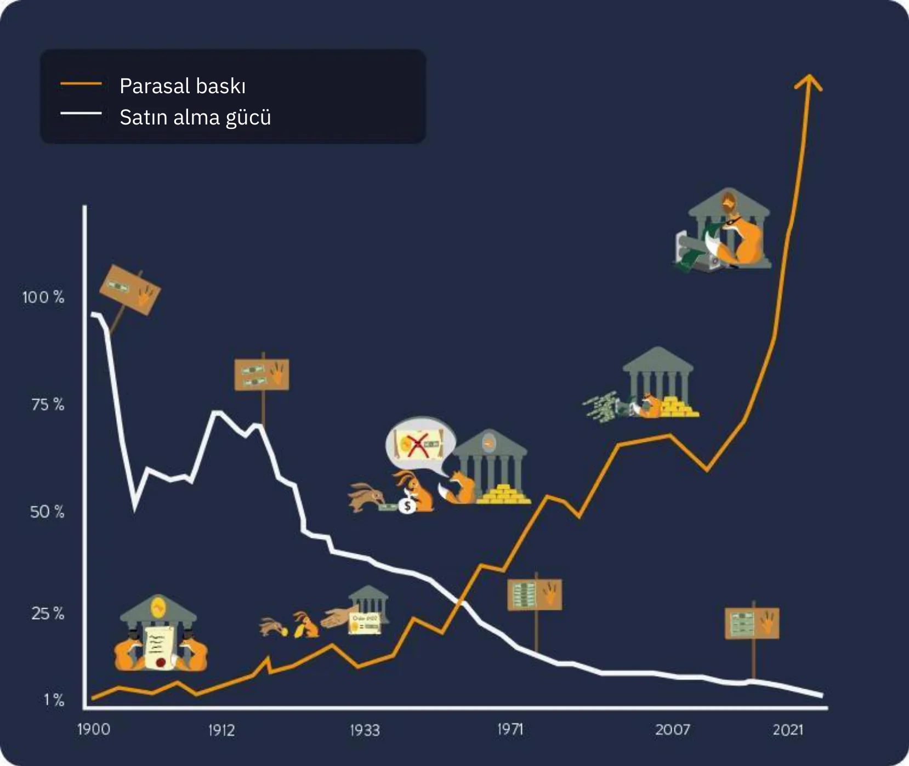

### Parasal değer kaybı: Roma İmparatorluğu kadar eski bir strateji

Antik çağlardan beri altın bir parasal referans noktası olarak hizmet etmiştir; ancak altının esnek olmayan yapısı, ister Roma imparatorları ister modern hükümetler olsun, liderleri sıklıkla genellikle itibari olan alternatif para birimlerini benimsemeye yöneltmiştir.

Mekanizma son derece basittir ve kökenleri medeniyetin başlangıcına kadar uzanan uygulamalardan beslenir. Zenginlik üzerinde kontrol sahibi olmak isteyen liderler, genellikle güçlerini kullanarak ve koruma ile güvenlik vaat ederek işe altını merkezileştirmekle başlar. Ellerindeki bu değerli rezervle birlikte, altına eş değerde ancak kendi suretlerinin basılı olduğu yeni bir para birimini piyasaya sürerler. Bu para birimi dolaşıma girmeye başlar ve insanlar kullanım kolaylığından dolayı bu yeni sisteme hızlıca uyum sağlar.

Ancak liderler, daha sonra bu yeni para biriminin değerini kademeli olarak düşürmeye başlar ve fiilen her yıl ilk altın fiyatına kıyasla değerini yüzde birkaç oranında azaltırlar. Bu sessiz değer kaybı, genellikle halkın yararınaymış gibi gösterilerek meşrulaştırılır. Gerçekte ise bu itibari para biriminde birikim yapanlar tasarruflarının eriyip gittiğini görürken, devlet kendi projelerini enflasyon yoluyla finanse eder. Üstelik bu devalüasyon, borçların ödenmesini de kolaylaştırır.

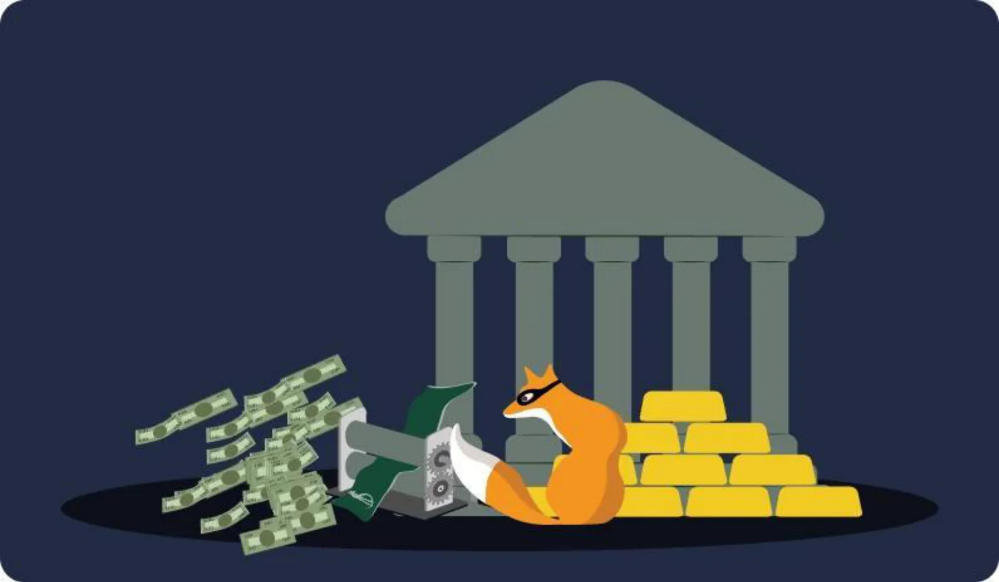

Kritik bir anda lider o beklenen açıklamayı yapar: Para biriminin artık altın karşılığı kalmamıştır. İtibari paraya artık alışmış olan ve finansal konularda genellikle eksik bilgilendirilen halk bu gerçeği kabullenir; böylece devlet, para arzını özgürce manipüle etme ve neredeyse sıfır maliyetle devasa miktarlarda para basma gücünü elde eder.

Para basılması nihayetinde enflasyona yol açar ve halkı kademeli olarak yoksullaştırır. Üstelik finansal sistem, çöküşünü önlemek amacıyla sıkı şekilde denetlenir ve kısıtlanır; çünkü en ufak bir aksama bile büyük bir ekonomik krizi tetikleyebilir. Geniş kitlelerin aksine, finansal kuruluşlar ve varlıklı bireyler bu sistemden fazlasıyla yararlanır; bu durum bir eşitsizlik uçurumu yaratır ve otoriterleşmeyi besler. Bu ortamda, radikal değişiklikler yapmak için hiçbir teşvikleri yoktur ve bu da sistemin olası bir patlamaya kadar kendi yolunda ilerlemesine izin verir.

İyi uygulandığında bu strateji onlarca yıl sürebilir. Ancak çok hızlı bir değer kaybının veya güven kaybının hiperenflasyona yol açabileceğini unutmamak gerekir (bir sonraki bölüme bakınız). Tarih; doların 100 yılda değerinin %98'ini, euronun 20 yılda %30'unu ve sterlinin kurulduğu günden bu yana %99'unu kaybettiğini gösteriyor.

Sonunda para, tıpkı İmparatorluğun son dönemindeki Roma sikkeleri gibi altınla olan tüm bağını tamamen koparabilir, hatta somut gerçeklikten uzaklaşarak sadece basit bir sayısal değere indirgenebilir.

Bugün tarihi bir dönüm noktasına tanıklık ediyoruz. Uzun süredir küresel egemenliği elinde tutan dolar gerileme dönemine girmiş gibi görünürken, altın ise o merkezi rolünü kaybetmiş durumda. Tarihten ders çıkarılmadığını bizlere bir kez daha hatırlatan, yeni bir parasal döngünün tam eşiğinde duruyoruz.

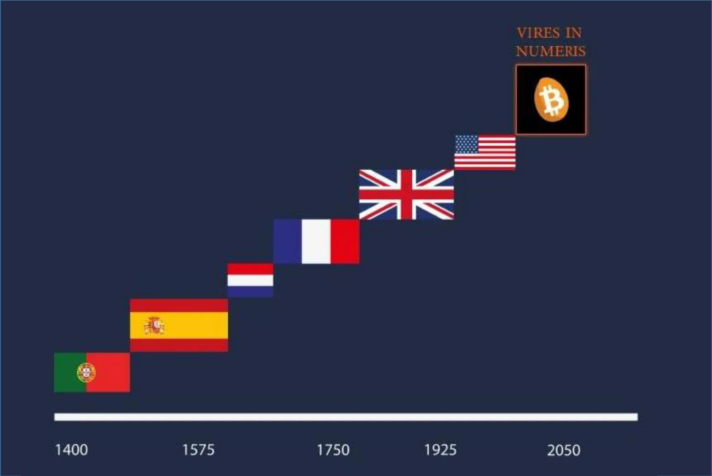

### Bitcoin çözüm mü?

Bu temeller doğrultusunda, Bitcoin devrimi giderek güç kazanıyor. Geçmişteki para birimlerinin aksine, **güvenilir bir üçüncü tarafa ihtiyaç duymaz** ve devlet ile para kavramını birbirinden ayırmayı amaçlar.

Aslında Bitcoin, merkeziyetsiz bir çözüm ve buna paralel yeni bir parasal sistem önererek bu sistemsel zorluklara bir yanıt olarak ortaya çıkmaktadır. Tarih boyunca altın, taklit edilmeye karşı direnci sayesinde bir para birimi olarak tercih edilmişse de benzer şekilde Bitcoin de kopyalanamaz veya sahtesi üretilemez. Üstelik merkeziyetsiz ve kriptografik yapısı sayesinde [21 milyon adet](https://planb.academy/resources/glossary/limite-demission) ile sınırlandırılmıştır. Bitcoin; şeffaflık ve tarafsızlık ilkesine dayanan bir para birimi olarak, mevcut merkezi parasal sisteme karşı cazip bir alternatif sunmaktadır.

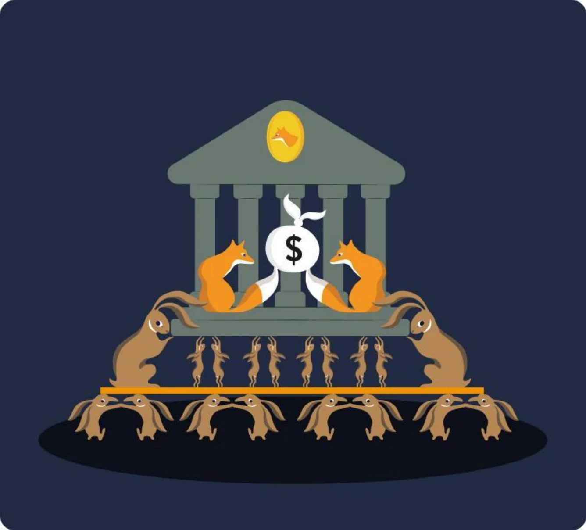

Bitcoin'in dikkat çekmesinin bir diğer nedeni de merkez bankası dijital para birimlerinin (CBDC) ortaya çıkışıdır ki bu süreç kaçınılmaz görünmektedir. Paranın bu yeni formu, daha merkeziyetçi ve planlı bir ekonomiyi beraberinde getirecek; bu durum hem bireylerin finansal özgürlüğünü kısıtlayabilecek hem de otoriter uygulamaların önünü açabilecektir.
Bu bölümü, Nobel ödüllü iktisatçı F.A. Hayek'in 1984 yılındaki şu sözüyle noktalayabiliriz:

> "Parayı hükümetin elinden almadığımız sürece bir daha asla iyi bir paraya sahip olabileceğimize inanmıyorum. Eğer onu hükümetin elinden şiddet yoluyla alamıyorsak, yapabileceğimiz tek şey, sinsi ya da dolaylı bir yolla onların durduramayacağı bir şeyi piyasaya sürmektir."

Ekonomik yanılgılar ve özgürlük hakkında daha fazla bilgi edinmek için, Bitcoin'in ortaya çıkışını kesinlikle takdir edecek olan 19. yüzyıl Fransız düşünürü Frédéric Bastiat'nın hayatını ve fikirlerini ele alan ECO 102 kursumuzu keşfetmeye davet ediyoruz:

https://planb.academy/courses/d07b092b-fa9a-4dd7-bf94-0453e479c7df

## Hiperenflasyon

<chapterId>b04c024c-54f3-50cb-997f-58721cfc74be</chapterId>

Hiperenflasyon, itibari para birimlerine özgü parasal bir olgudur: Yetkililerin para basması nedeniyle para birimine olan güvenin tamamen kaybolması ve enflasyonun feci şekilde artmasıyla kendini gösterir. Sonuç olarak, bireylerin biriktirdiği tasarruflar nispeten kısa bir süre içinde yok olup gidebilir; bu da ülkeyi ekonomik, sosyal ve siyasi bir çöküşün eşiğine sürükler.

### Çığırından çıkan enflasyon!

Enflasyonun tasarruflar üzerindeki etkisini kavramak için farklı enflasyon oranlarını göz önünde bulundurmamız gerekir.

- %2 enflasyonla, her yıl satın alma gücünüzün %2'sini kaybedersiniz; bu da 5 yılda %10'a denk gelir.
- %7 enflasyonla, 10 yılda birikiminizin yarısını kaybedersiniz.
- %20 enflasyonla, neredeyse satın alma gücünüzün yarısını 3 yılda kaybedersiniz.

Hiperenflasyon gerçekleştiğinde, artık yılda %20'den değil, ayda %20'den, hatta zirveye ulaştığında GÜNDE %20'den bahsediyoruz. Üç gün boyunca günde %100 enflasyon yaşamak, dünyamızda gerçekleşmiş ve gerçekleşmeye devam eden gerçekçi bir senaryodur.

Hiperenflasyonun tesadüfen, kapitalizm yüzünden veya muhaliflerin siyasi saldırılarıyla ortaya çıkmadığını anlamak büyük önem taşır. Hiperenflasyon; merkez bankacılarının ve siyasetçilerin aldığı kötü parasal kararların doğrudan bir sonucudur. Bunun artçı sarsıntıları her vatandaşı etkiler, hatta gelecek nesillere kadar uzanır. Bu olgunun gerçek etkisini tam olarak fark etmeniz için aşağıdaki tabloyu incelemeye beş dakikanızı ayırmanızı rica ederiz (ECO204 kursumuz bu konuyu daha derinlemesine ele almaktadır). Göreceğiniz üzere, hiçbir ülke veya para birimi potansiyel olarak güvende değildir.

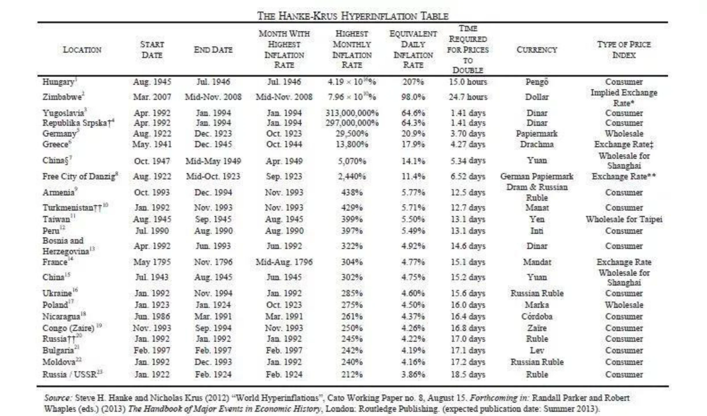

### Hiperenflasyonun aşamaları nelerdir?

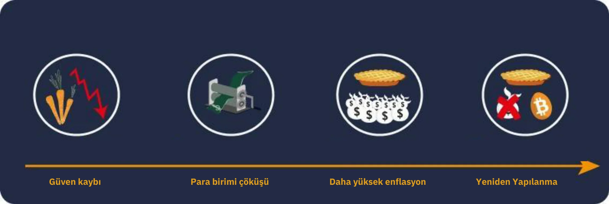

Hiperenflasyonun meydana gelmesi için belirli aşamaların gerçekleşmesi gerekir.

1. Aşama - Güven kaybı

- Parasal gücün tek bir merkezde toplanması, karşılıksız para basılmasını ve bu yetkinin kötüye kullanılmasını kolaylaştırır. Bu ortamda; savaşlar, hükümet politikaları veya buğday ile petrol gibi temel kaynakların fiyatlarındaki artış gibi dış faktörler hiperenflasyonu tetikleyebilir. Böylece para birimine karşı bir güven kaybı baş gösterir; insanlar paranın kaynağını ve dayatılan para politikalarının faydalarını sorgulamaya başlar.

2. Aşama - Para biriminin çöküşü ve fiyat artışları

- Hükümetler güven ortamı üzerindeki kontrolü kaybettikçe, insanlar ellerindeki parayı daha istikrarlı bir para birimiyle takas etmeye başlar; tıpkı Venezuela'da ABD dolarına geçişte yaşandığı gibi. Bu durum, mal ve hizmetlerin sürekli daha da pahalanmasına yol açarak kısır bir döngü yaratır ve fiyatları tırmandırır. Devlet, bu ihtiyaçları karşılamak ve para politikasını düzeltmek (!) adına daha fazla para basar, bu da enflasyonun katlanarak artmasıyla sonuçlanır.

3. Aşama - Para basmanın kısır döngüsü

- Sonuç olarak, mal satın almak için her geçen gün daha fazla banknota ihtiyaç duyulur ve bu da piyasada nakit para kıtlığına yol açar. Hükümetler buna karşılık olarak daha da fazla banknot basma yoluna gider ve bu durum enflasyonu daha da körükler.

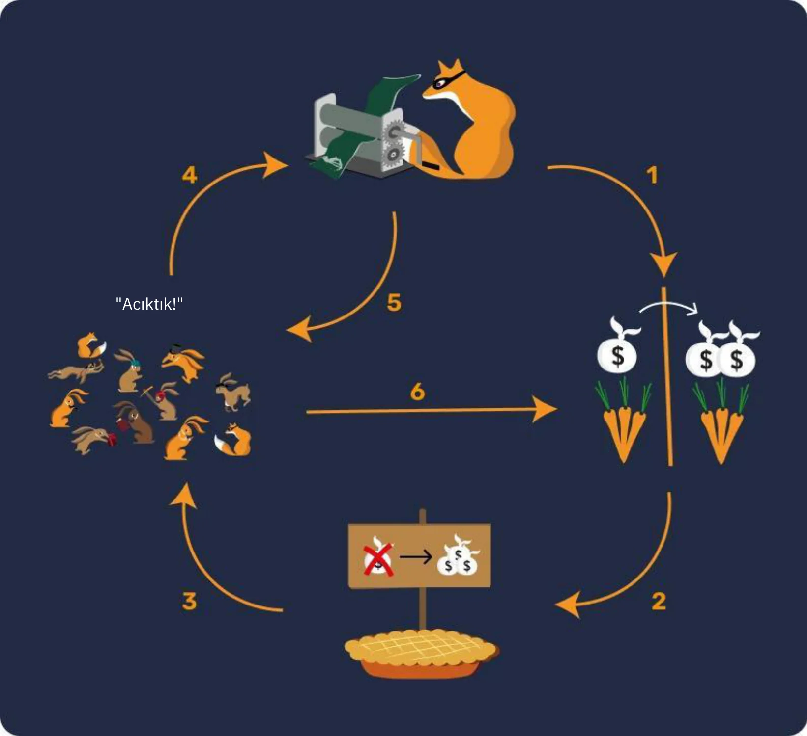

4. Aşama - Yeni bir para biriminin ortaya çıkışı

- Ardından, eski yasal para biriminde bulunmayan daha sıkı denetimleri uygulayarak enflasyon döngüsünü kırmak amacıyla, eskisinin yerini alacak yeni bir para birimi piyasaya sürülür.

Bir hiperenflasyon krizini çözmek genellikle devrimler, hükümet değişiklikleri veya merkez bankası yönetiminin değişmesi gibi radikal adımları gerektirir. Güven kaybı, para biriminin çöküşü ve yeniden yapılanma; itibari paraya dayalı bir ekonomiyi yeniden canlandırmak için kaçınılmaz aşamalardır.

### Üç çarpıcı örnek

- Almanya, 1922-1923.

  Hiperenflasyonun en çarpıcı örneklerinden biri, Birinci Dünya Savaşı'ndan sonra Almanya'daki Weimar Cumhuriyeti'nde yaşandı.

  Almanya, savaşı finanse etmek için devasa miktarlarda borçlanmıştı. Ancak savaşı kaybetmekle kalmadı, aynı zamanda milyarlarca dolarlık savaş tazminatı ödemek zorunda kaldı. Enflasyon oranının en yüksek olduğu ay, günlük %20,9'luk bir orana denk gelen ve zirve noktası %29.500'ü bulan Ekim 1923'tü. Fiyatlar her 3,7 günde bir ikiye katlanıyordu!
  Alman para birimi o kadar değersizleşmişti ki bazı vatandaşlar ısınmak için odun yerine kağıt paraları yakmayı tercih ediyordu; çünkü böylesi gerçekten daha ucuzdu. Hatta restoranlarda garsonların, enflasyon nedeniyle menü fiyatlarını her 30 dakikada bir yeniden anons etmek zorunda kaldığı anlatılır.

Nihayetinde yetkililer; Almanya, Fransa ve İngiltere'nin borçlarıyla desteklenen ve Alman toprakları güvencesiyle basılan yeni bir para birimi çıkardılar.


- Macaristan, 1945-1946

  Bugüne kadar tarihin en yıkıcı hiperenflasyon dönemini yaşayan ülke, açık ara farkla İkinci Dünya Savaşı sonrasındaki Macaristan'dır.

  Savaşın kaybeden tarafında yer alan Macaristan'ın sanayi üretim kapasitesinin büyük bölümü yerle bir olmuştu. Enflasyonun zirve yaptığı Temmuz 1946'da, günlük %207'ye denk gelen ve akıl sınırlarını zorlayan %41.900.000.000.000.000'lük (41,9 katrilyon) bir fiyat artışı yaşandı. Fiyatlar her 15 saatte bir ikiye katlanıyordu!

  1946 yılında dolaşıma sokulan son banknot, 100 milyon milyar (100.000.000.000.000.000) Pengő değerindeydi.


- Zimbabve, 2007-2008

  Zimbabve, 2000 yılına kadar petrol dışındaki neredeyse tüm ihtiyaçlarında kendi kendine yetebilen bir ülkeydi.

  1997 yılında hükümet, savaş gazilerine toplam 450 milyon ABD doları değerinde tazminat ödemeyi kabul edince Zimbabve doları %72'nin üzerinde değer kaybetti. Kasasında böyle bir meblağ bulunmayan hükümet, çareyi matbaayı çalıştırıp para basmakta buldu. 2005 yılına gelindiğinde enflasyon %586'ya ulaştı; ancak en büyük yıkım, aylık enflasyonun yaklaşık %79.600.000.000 seviyesine ulaştığı 2008 yılının Kasım ayı ortalarında yaşandı.

  Hükümet, Haziran 2007'de fiyat kontrolü uygulayarak duruma müdahale etmeye çalıştıysa da bu adımın ekonomi üzerinde hiçbir olumlu etkisi olmadı. Aksine mağazalar yağmalandı ve esnaf raflarını yeniden dolduracak sermayeden mahrum kaldı.

  Nisan 2009'da Maliye Bakanı, Zimbabve dolarının kullanımının askıya alındığını ve ticarette yabancı para birimlerinin kullanılabileceğini açıkladı. Tüm banka hesapları, emekli maaşları ve finansal birikimler bir gecede tamamen eriyip yok oldu.

Sonuç olarak hiperenflasyon, para biriminin değerini hızla düşürerek birikimlerin erimesine ve parasal sisteme duyulan güvenin kaybolmasına yol açar. Voltaire'in de bir zamanlar belirttiği gibi, itibari para birimleri eninde sonunda her zaman kendi içsel değerini kaybeder ve sıfıra yaklaşır.
Finansal kuruluş gibi güvenilir bir üçüncü tarafa dayanan bir para birimi, pratikte ve uzun vadede kusurludur; çünkü ne satın alma gücünü garanti edebilir ne de birikimleri koruyabilir.

Hiperenflasyon konusunu daha derinlemesine incelemek için, hiperenflasyon döngülerinin ne olduğunu ve hayatımız üzerindeki gerçek etkilerini öğrenebileceğiniz David St-Onge'un ECO 204 kursunu tavsiye ederiz. Bu kursta ayrıca bu döngüler arasındaki benzerlikleri ve en önemlisi kendinizi bunlardan nasıl koruyacağınızı keşfedeceksiniz.

https://planb.academy/courses/caa75343-ac90-4249-bcca-0e2e57c3a0f1

## 21 milyon bitcoin

<chapterId>f4a06d76-1963-56fd-93ff-dfa41489bcde</chapterId>

### Bitcoin'nin para politikası

Bitcoin, önceden belirlenmiş maksimum **21 milyon adet** arz sınırına sahip, merkeziyetsiz bir dijital para birimidir. Bu doğal kıtlık özelliği, bilgisayar kodlarıyla belirlenmiş olup protokole katılan tüm kullanıcıların ortak mutabakatı (konsensüs) ile güvence altına alınmıştır.

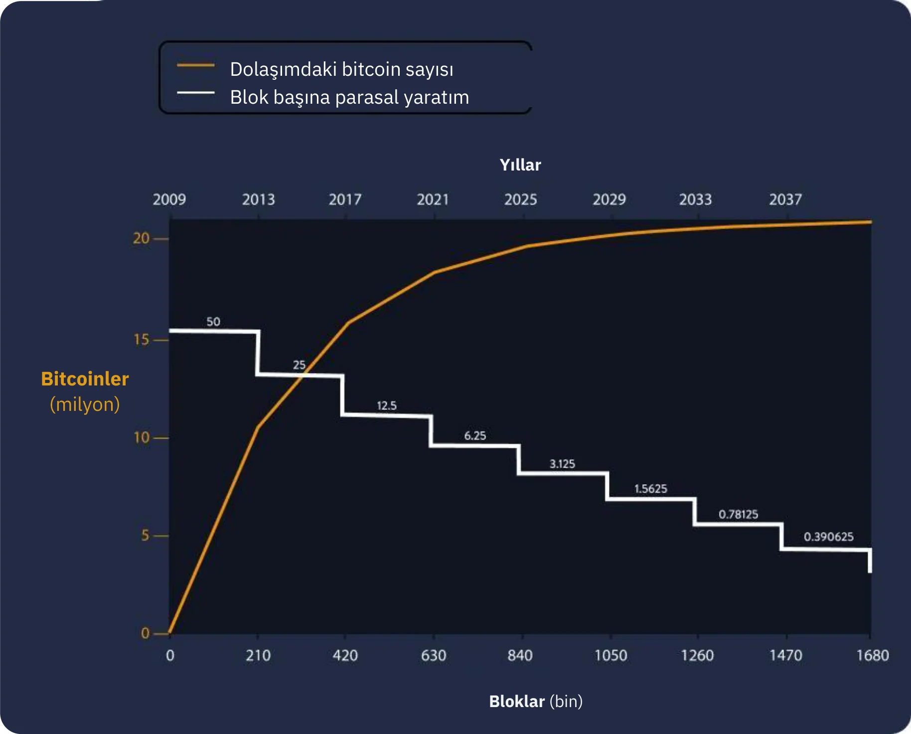

Bitcoin'in parasal emisyonu (piyasaya sürülme hızı), zaman içinde üretilen bitcoin miktarını gösteren bir eğriyle açıklanabilir. Örneğin, 2022 yılında dolaşımda yaklaşık 18,5 milyon bitcoin bulunuyordu. Tahminler, 2025 yılına gelindiğinde bu miktarın yaklaşık 19,5 milyona ulaşarak toplam arzın %93'ünü oluşturacağını, 2037 yılında ise bu sayının 20,4 milyona yükseleceğini göstermektedir.

### Yeni bitcoinler nasıl üretilir?

Yeni bitcoinlerin üretilmesi, [madencilik (mining)](https://planb.academy/resources/glossary/mining) sürecinin bir sonucudur. Özetle madenciler; işlemleri doğrulayan ve güvence altına alan karmaşık matematiksel problemleri ([Hash](https://planb.academy/resources/glossary/hash-function)) çözmek için güçlü bilgisayarlar kullanırlar. Bir problem çözüldüğünde (veya geçerli bir hash bulunduğunda), madenci ağ üzerinde gerçekleşen tüm işlemleri kaydeden merkeziyetsiz ve dağıtık bir defter olan blokzincire yeni bir işlem [bloğu(block)](https://planb.academy/resources/glossary/block) ekler. Blokzincir, her bloğun bir öncekine bağlı olmasını sağlayarak şeffaflık ve güvenlik sunar; bu da ağın ortak mutabakatı (konsensüs) olmadan geçmiş verileri değiştirmeyi neredeyse imkansız hale getirir.

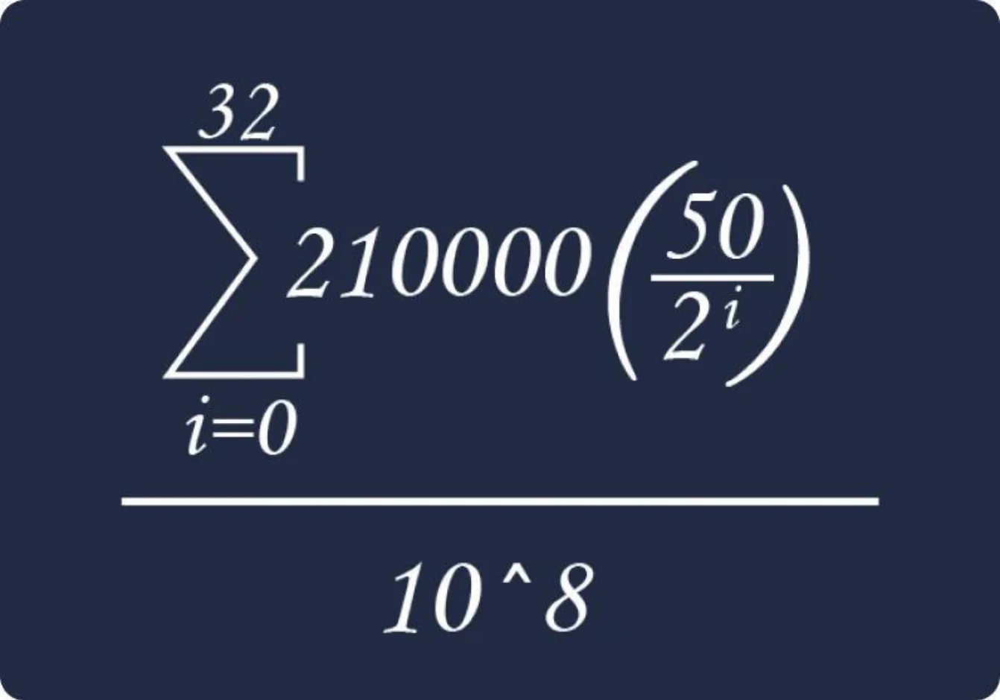

Bu görevi başarıyla yerine getiren madenciler, her on dakikada bir yeni basılan bitcoinlerle ödüllendirilir. Bu ödülün her 210.000 blokta bir, yani yaklaşık dört yılda bir yarıya inmesi programlanmıştır (bu olay "[halving](https://planb.academy/resources/glossary/halving)" yani yarılanma olarak bilinir) ve bu durum parasal emisyon eğrisine basamaklı bir şekil verir. Bu mekanizma sayesinde, yeni bitcoin üretiminin toplam miktar 21 milyonluk sınıra ulaştığında, yani yaklaşık 2140 yılında duracağı matematiksel olarak öngörülebilmektedir.

| Yarılanma Sayısı | Blok Yüksekliği | Yarılanma Sonrası BTC Ödülü | Yarılanma Sonrası Tahmini Dolaşımdaki BTC |
| ---------------- | --------------- | --------------------------- | ----------------------------------------- |
| 1                | 210,000         | 25 BTC                      | 10,500,000 BTC                            |
| 2                | 420,000         | 12.5 BTC                    | 15,750,000 BTC                            |
| 3                | 630,000         | 6.25 BTC                    | 18,375,000 BTC                            |
| 4                | 840,000         | 3.125 BTC                   | 19,687,500 BTC                            |
| 5                | 1,050,000       | 1.5625 BTC                  | 20,343,750 BTC                            |
| 6                | 1,260,000       | 0.78125 BTC                 | 20,671,875 BTC                            |
| 7                | 1,470,000       | 0.390625 BTC                | 20,835,937.5 BTC                          |
| 8                | 1,680,000       | 0.1953125 BTC               | 20,917,968.75 BTC                         |
| 9                | 1,890,000       | 0.09765625 BTC              | 20,958,984.375 BTC                        |
| 10               | 2,100,000       | 0.048828125 BTC             | 20,979,492.188 BTC                        |
| 11               | 2,310,000       | 0.0244140625 BTC            | 20,989,746.094 BTC                        |
| 12               | 2,520,000       | 0.01220703125 BTC           | 20,994,873.047 BTC                        |
| 13               | 2,730,000       | 0.006103515625 BTC          | 20,997,436.523 BTC                        |
| 14               | 2,940,000       | 0.0030517578125 BTC         | 20,998,718.262 BTC                        |
| 15               | 3,150,000       | 0.00152587890625 BTC        | 20,999,359.131 BTC                        |
| 16               | 3,360,000       | 0.000762939453125 BTC       | 20,999,679.566 BTC                        |
| 17               | 3,570,000       | 0.0003814697265625 BTC      | 20,999,839.783 BTC                        |
| 18               | 3,780,000       | 0.00019073486328125 BTC     | 20,999,919.892 BTC                        |
| 19               | 3,990,000       | 0.000095367431640625 BTC    | 20,999,959.946 BTC                        |
| 20               | 4,200,000       | 0.0000476837158203125 BTC   | 20,999,979.973 BTC                        |

Madencilik konusunu, [madenci bölümünde](https://planb.academy/courses/2b7dc507-81e3-4b70-88e6-41ed44239966/dbb8264a-7434-57e4-9d1b-fbd1bae37fdf) daha ayrıntılı bir şekilde ele alacağız.

### Dijital kıtlığın güvence altına alınması

21 milyonluk limit, Bitcoin kıtlığının temelini oluşturur ve iki temel mekanizmayla güvence altına alınır: [madencilik zorluk derecesinin ayarlanması](https://planb.academy/resources/glossary/difficulty-adjustment) ve oyun teorisi.

- Madencilik zorluğunun ayarlanması, blokzincire ortalama her on dakikada bir yeni blok eklenmesini sağlamak amacıyla her 2016 blokta bir (yaklaşık iki haftada bir) gerçekleşen bir süreçtir. Geleneksel para sistemlerindeki keyfi kararların aksine, bu blok üretim sıklığı ve toplam bitcoin miktarı, Bitcoin protokolünün sabit kurallarıdır ve genel bir ortak mutabakat (konsensüs) olmadan değiştirilemez.

Geçerli bir hash bulma zorluğu bir tür döngüyü takip eder: Madenci sayısı artar ve bloklar daha hızlı bulunursa, blok bulma süresi kısalır ve bu nedenle zorluk derecesi artırılır. Bunun sonucunda madencilerin bulduğu blok sayısı azalır ve sistem yeniden blok başına ortalama 10 dakikalık süreye geri döner. Konunun görsel anlatımı için lütfen aşağıdaki görsele göz atın.

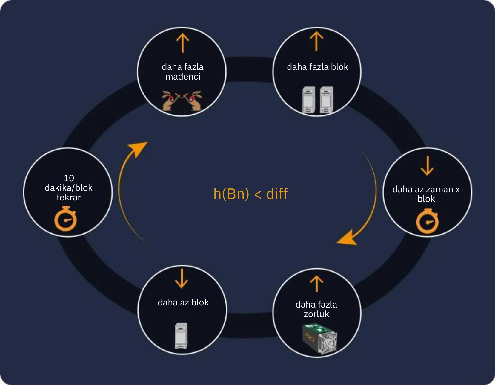

Aksine, eğer daha az madenci çalışırsa ve blokların bulunması daha uzun sürerse, madencilik zorluğu azalır ve blok bulma süresi yeniden ortalama hıza yükselecektir.

Madencilerin, bir bloğu kazmak için hem [blok sübvansiyonu (block subsidy)](https://planb.academy/resources/glossary/block-subsidy) aracılığıyla yeni bitcoinler kazanmak hem de o bloğa dahil ettikleri işlemlerden [işlem ücretleri (transaction fees)](https://planb.academy/resources/glossary/transaction-fees) elde etmek üzere teşvik edildiklerini biliyor muydunuz?

Böylece, piyasaya sürülen bitcoin miktarı 21 milyon sınırına yaklaştıkça, madenciler blok sübvansiyonundan ziyade işlem ücretleri üzerinden daha fazla gelir elde edeceklerdir.

- Oyun teorisi, insan rasyonalitesine dayanan matematiksel bir kavramdır. Bireylerin, başkalarının olası kararlarını da göz önünde bulundurarak kendi çıkarlarını en üst düzeye çıkarmak amacıyla mantıklı hareket ettiklerini varsayar. Bitcoin'de oyun teorisi, madencilerin ve kullanıcıların büyük çoğunluğunun ağın çıkarlarına en uygun şekilde hareket etmesini sağlamaya yardımcı olur. Aslında protokol değişiklikleri kullanıcılar tarafından oylandığından, Bitcoin protokolünde yapılacak herhangi bir değişiklik tüm kullanıcı topluluğunun onayını gerektirir ki bu da son derece karmaşıktır. Dolayısıyla, eğer birisi 22. milyonuncu bir bitcoin yaratmak isteseydi, tüm kullanıcıları kendi birikimlerinin değerini gönüllü olarak düşürmeye ikna etmek zorunda kalırdı; Bitcoin küresel olduğu ve merkezi bir grup tarafından yönetilmediği için bunun gerçekleşmesi neredeyse imkansızdır.

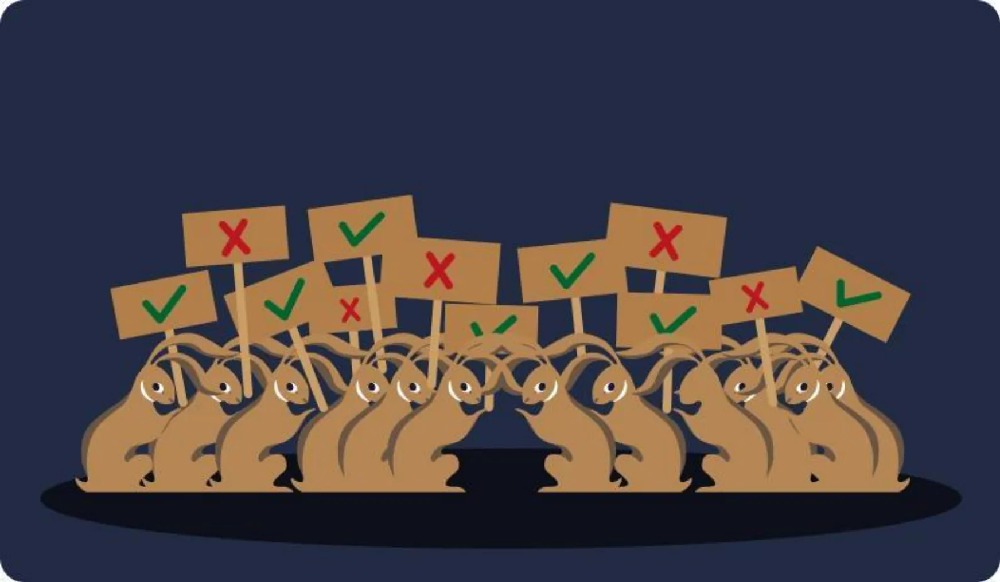

Para biriminin değerini düşürme fikri Bitcoin'in temel felsefesine aykırıdır; bu nedenle toplam arz miktarında bir değişiklik yapılması son derece düşük bir ihtimaldir.

### Denetlenebilir bir para politikası: Başlangıçtan sonsuza dek, her saniye!

Bitcoin'in kıtlığı en büyük avantajıdır ve dolaşımdaki maksimum 21 milyon bitcoinlik sınır herkes tarafından görülebilir ve doğrulanabilir durumdadır.

Aslında, herkes bunu bir Bitcoin [düğümü (node)](https://planb.academy/resources/glossary/node) (yani işlem doğrulayıcı) aracılığıyla sadece şu komutu girerek bunu gerçekleştirebilir: `bitcoin-cli gettxoutsetinfo`. Bu şeffaflık; gücünü merkezi kurumlardan veya kişilerden değil, protokolün kendi doğasındaki matematiksel ve kriptografik güvencelerden alan Bitcoin sistemine duyulan güveni pekiştirir (LNP201 kursunda bunu nasıl kolayca yapacağınızı öğreneceksiniz).

```json
{
  "height": 710560,
  "bestblock": "0000000000000000000887384d67103412ea7f18a43953e65c8c4ac36bf42e54",
  "transactions": 473244,
  "txouts": 1018917,
  "bogosize": 2183872374,
  "hash_serialized_2": "eebb9987337700ffaacbbaa11223344",
  "disk_size": 178239584,
  "total_amount": 18745998.12345678
}
```

Bitcoin, tasarım gereği üretimine sınır koyarak sağlam bir parasal yönetim sunar; bu da onu kullanıcıların birikimlerini koruyabilmesi yönüyle diğer para birimlerinden çok farklı bir yere konumlandırır. Avusturya iktisat okulu ilkeleriyle uyumlu olan bu sabit miktar ve öngörülebilir dağıtım modeli, geleneksel para birimlerinin karşı karşıya kaldığı kronik enflasyon risklerine karşı Bitcoin'i koruma altına alır (daha fazlasını öğrenmek için ECO201 kursuna göz atabilirsiniz).

Özetle Bitcoin; merkeziyetsiz yapısı, programlanmış kıtlığı ve şeffaflığıyla geleneksel para sistemlerine benzersiz bir alternatif sunar. Teknolojinin; yalnızca kullanışlı ve doğrulanabilir olmakla kalmayıp, aynı zamanda arzı katı bir şekilde sınırlayarak kullanıcıların birikim değerini koruyan bir para birimi yaratmak için nasıl kullanılabileceğini açıkça ortaya koymaktadır.

# Bitcoin Cüzdanları

<partId>28860585-4f61-59d9-b242-f4c57d837cc1</partId>

## Bitcoin cüzdanları nedir?

<chapterId>1c0166ab-cb7a-5bc6-9175-d13482bd91f1</chapterId>

Bölüm 2'de, bu meşhur bitcoinlerin tam olarak nerede bulunduğunu ve onlarla nasıl etkileşime geçeceğimizi anlamak için [cüzdanlar(wallets)](https://planb.academy/resources/glossary/wallet) aracılığıyla Bitcoin depolamayı ve güvenliğini keşfedeceğiz!

### Bitcoin cüzdanlarını anlamlandırmak

Bitcoin ağıyla etkileşime geçmek için cüzdanları temel olarak üç amaçla kullanırız:

- Bitcoin almak
- Bitcoin göndermek
- Bitcoinleri siber saldırılara ve hırsızlık girişimlerine karşı korumak

Bir Bitcoin cüzdanı pek çok farklı biçimde ve formda karşımıza çıkabilir: Bilgisayarınızdaki bir yazılım, akıllı telefonunuzdaki bir uygulama, USB belleğe benzeyen fiziksel bir cihaz ve hatta bir kağıt parçası. Bunların her biri farklı kullanım senaryolarına hizmet eder. Nitekim bazıları güvenliği ön planda tutarak yüksek miktarlı işlemler için tasarlanmışken, diğerleri gizliliğe odaklanır veya küçük tutarlı günlük ödemeler için geliştirilmiştir.

Dolayısıyla cüzdanlar, her zaman şu temel soru etrafında şekillenen geniş kullanım sınıflarına ayrılabilir: Fonların sahibi siz misiniz, yoksa paranızın kontrolünü üçüncü bir tarafa mı bırakıyorsunuz? Bu konuyu bir sonraki bölümde ayrıntılı olarak ele alacağız ancak soru son derece nettir: Para kendi cebinizde mi, yoksa bankacınızın cebinde mi?


### Bir Bitcoin cüzdanı nasıl çalışır?

İster kendi Bitcoin "bankacınız" olun ister doğrudan kendiniz yönetin, Bitcoin cüzdanlarının çok büyük bir kısmı asimetrik kriptografiye, yani bir anahtar çifti sistemine dayanan benzer bir teknolojiyle çalışır: Harcama yapmak için bir [özel anahtar (private key)](https://planb.academy/resources/glossary/private-key) ve ödeme almak için bir [açık anahtar (public key)](https://planb.academy/resources/glossary/public-key).

- Özel anahtar

  Bir cüzdanı ilk kez kurarken, size 12 veya 24 kelimeden oluşan ve anımsatıcı ifade (özel anahtar) olarak da bilinen bir [gizli kurtarma ifadesi (secret recovery phrase)](https://planb.academy/resources/glossary/recovery-phrase) sunulur.

  Özel anahtar hayati bir öneme sahiptir; çünkü bitcoinlerin mülkiyetini, yani onları harcama veya gönderme hakkını temsil eder. Dolayısıyla, özel anahtara sahip olan kişi bitcoinlerin gerçek sahibidir. Kripto dünyasında sıkça söylendiği gibi: "Anahtar senin değilse, coin de senin değildir."

  Bu anahtar, servetinize erişim sağlayan kilit olduğundan kesinlikle gizli tutulmalı ve çok iyi korunmalıdır!

- Açık anahtar ve adres

  Açık anahtar, özel anahtardan üretilir ve onunla doğrudan bağlantılıdır. Açık anahtarı paylaşmak (diğer kullanıcılar bakiyenizi görebileceği için) gizlilik açısından risk oluştursa da (özel anahtarınız olmadan fonlarınızı harcayamayacakları için) güvenlik açısından bir risk teşkil etmez. Açık anahtar ise [Bitcoin adresleri](https://planb.academy/resources/glossary/receiving-address) oluşturmak, yani ödeme almak için kullanılır.

  Bu adresler cüzdanınız tarafından otomatik olarak oluşturulur ve güvenle paylaşılabilir. Gizliliğinizi en üst düzeye çıkarmak için bu adresleri yalnızca bir kez kullanmanız önerilir.

Özetle bu teknoloji, göndericinin varlıklarımızı çalmasına imkan tanımadan bitcoin alabilmemizi sağlar! Bunu bir posta kutusu metaforuyla açıklayabiliriz: Herkes kutuya para bırakabilir, ancak kutuyu yalnızca siz açabilirsiniz.

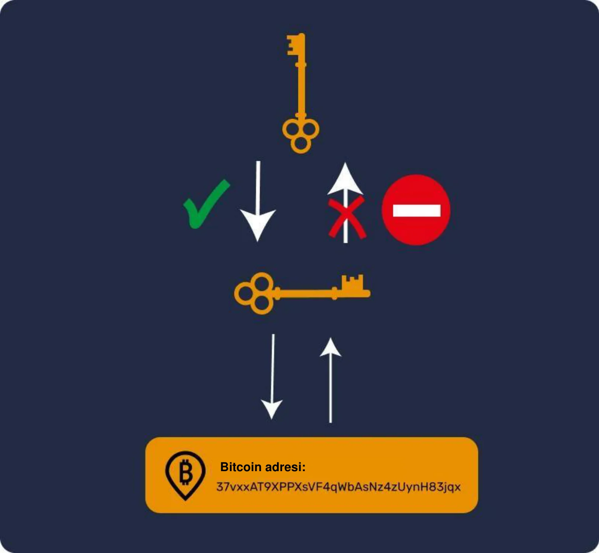

### Bitcoinler cüzdanda mı durur?

Anahtarlarınız cüzdanınızda saklansa da, bitcoinlerin kendileri aslında Bitcoin [eşler arası (P2P)](https://planb.academy/resources/glossary/peertopeer-p2p) ağındaki halka açık, dağıtık bir defter olan Bitcoin blokzincirinde "saklanır" (bu konuyu 3. bölümde derinlemesine inceleyeceğiz). Bu durum, cüzdanınızın bulunduğu cihazı kaybetmenizin bitcoinlerinizi de mutlaka kaybedeceğiniz anlamına gelmediğini gösterir. Cüzdanınızı yeniden oluşturmanızı ve bitcoinlerinizi harcamanızı sağlayan şey aslında özel anahtarınızdır; bu yüzden onu her zaman güvenli bir şekilde saklamayı unutmayın!

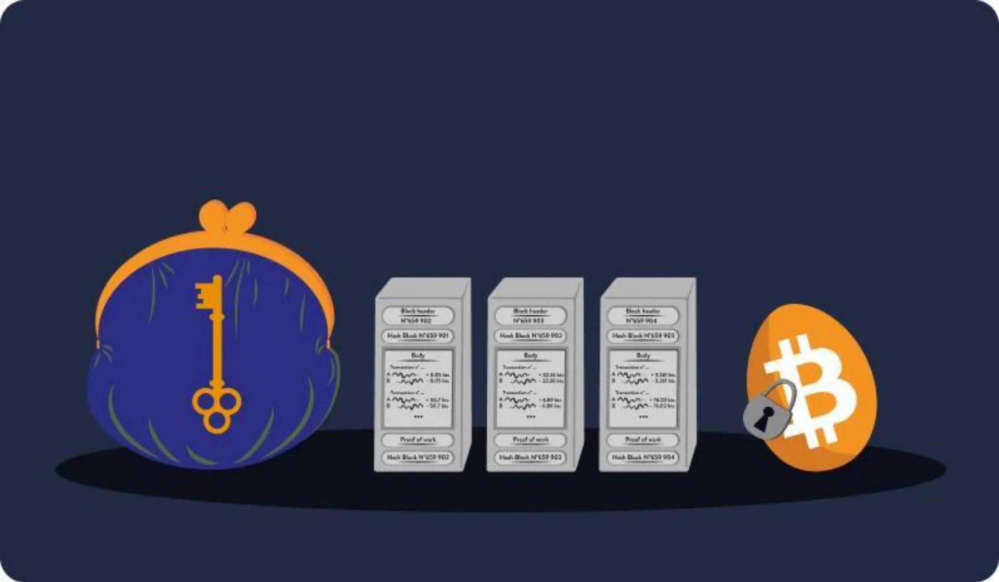

Neyse ki 2017 yılından beri özel anahtarlar, "anımsatıcı ifade" olarak bilinen ve kaydedilmesi oldukça kolay olan 12 veya 24 kelimelik basit bir liste halinde gösterilebilmektedir. Bu ifade, varlıklarınız için bir yedek görevi görür ve herhangi bir Bitcoin cüzdan yazılımı veya uygulaması kullanarak cüzdanınızı yeniden oluşturmanıza olanak tanır. Dolayısıyla, bu kelime listesini ele geçiren herkes bitcoinlerinize erişebilir.

### Peki ya hackerlar?

Ya birisi kazara bizim 12 veya 24 kelimelik listemizi tahmin ederse? Kısa cevap: Cüzdanı oluşturmak için kullanılan kriptografi sayesinde bu durumun gerçekleşmesi neredeyse imkansızdır. Şöyle gözünüzde canlandırın: Sizinle aynı anımsatıcı ifadeyi tesadüfen bulmak, 1 ile 2 üzeri 256 arasındaki "doğru" sayıyı bulmaya benzer; bu da evrendeki tek bir "doğru" atomu bulmakla neredeyse eş değerdir. Yine de bu varsayılan güvenlikle yetinmek istemiyorsanız, Bitcoin cüzdanınıza bir [parola (passphrase)](https://planb.academy/resources/glossary/passphrase-bip39) (ekstra bir kelime) ekleyerek güvenliğinizi her zaman daha da artırabilirsiniz.

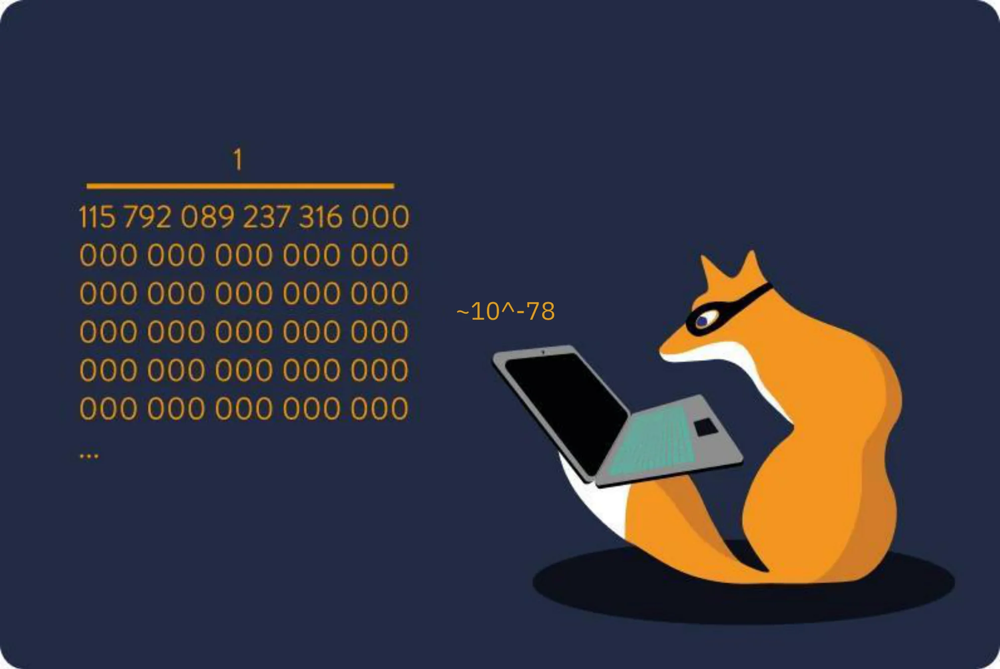

Dolayısıyla, sonraki bölümde ayrıntılarıyla ele alacağımız iyi güvenlik uygulamalarını takip ettiğiniz sürece, Bitcoin cüzdanınızın hacklenme olasılığı astronomik düzeyde düşüktür.

İhtiyaçlarınıza ve kullanım alışkanlıklarınıza en uygun cüzdanı seçmeyi unutmayın; farklı cüzdanların yönetimi ve güvenliğinin sağlanmasına yönelik ayrıntılı kılavuzlara [akademimizin eğitimler bölümünden](https://planb.academy/tutorials/wallet) ulaşabilirsiniz.

Tavşan deliğinin derinliklerine doğru çıktığınız bu yolculukta; entropiden alıcı adreslerine kadar bir Bitcoin cüzdanının nasıl oluşturulduğunu daha detaylı öğrenmek isterseniz, tamamen bu konuya ayrılmış olan CYP 201 kursumuzu tavsiye ederiz:

https://planb.academy/courses/46b0ced2-9028-4a61-8fbc-3b005ee8d70f

## Bitcoin Cüzdanları ve Güvenlik

<chapterId>00c1afea-e54a-511f-bab3-2efc2fbfa6a1</chapterId>

### Başlamadan önce doğru soruları sormak

Bitcoin sahibi olduğunuzda, varlıklarınızın güvenliği en büyük önceliğiniz haline gelir. Durumunuza en uygun güvenlik seviyesini belirlemenin en iyi yolu, kendinize şu soruları sormaktır:

- Varlıklarınıza kimler erişebilir? Diğer bir deyişle, bitcoinlerinize yalnızca siz mi erişebiliyorsunuz, yoksa varlıklarınıza ulaşmak için bir aracıya (örneğin bir şirkete) mi bağımlısınız?
- Bu cüzmandaki bitcoinleri nasıl kullanmayı planlıyorsunuz? Günlük harcamalar için mi, orta vadeli mi, yoksa uzun vadeli birikim için mi?
- Teknik bilgi seviyeniz ne durumda?
- Güvenlik için ayırdığınız bütçe ne kadar?

Aslında herkes için geçerli tek bir doğru cevap veya ortak bir çözüm yoktur; bu yüzden bu soruları yanıtlamaya zaman ayırın. Böylece güvenlik önlemlerinizi kendi ihtiyaçlarınıza göre en doğru şekilde şekillendirebilirsiniz.

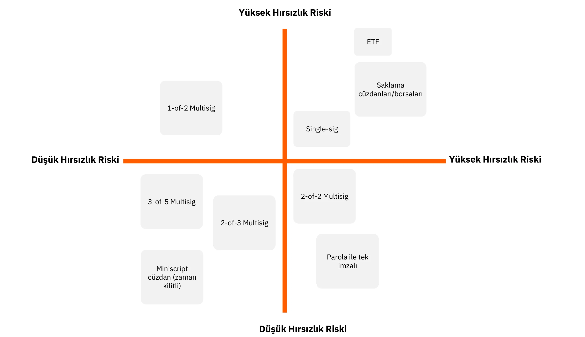

### Bitcoin cüzdanlarını karmaşıklık düzeylerine göre ele almak

Aşağıda, farklı güvenlik seviyelerini tanımlayacağız:

- **Seviye 0**, bbitcoinlerinizin tek sahibinin siz olmadığınız, "[emanetçi hizmeti (custodial service)](https://planb.academy/resources/glossary/custody)" olarak adlandırılan bir yöntem kullanırsınız. Bu güvenilir üçüncü tarafın, varlıklarınıza olan erişiminizi dilediği an kısıtlayabileceğini unutmayın. Bu durumda finansal egemenlik düzeyiniz, geleneksel bankacılık sistemindeki bir banka hesabından farksızdır.

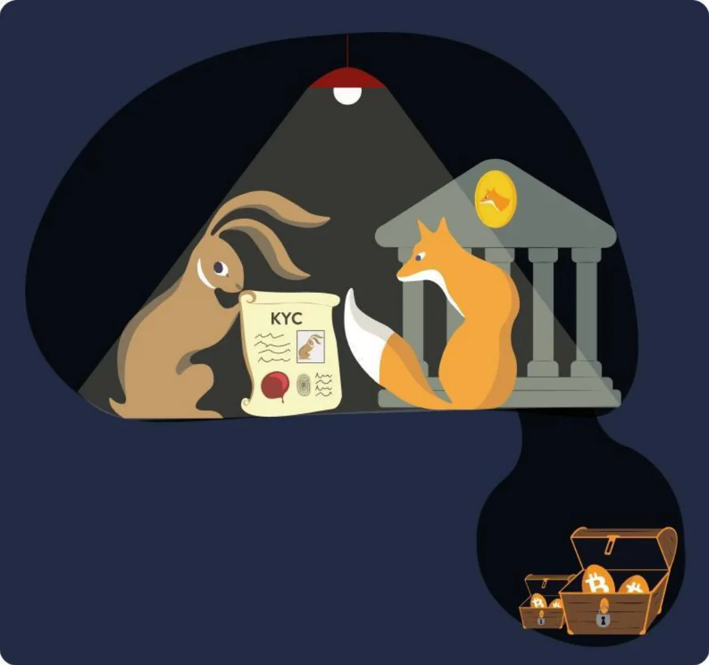

- **Seviye 1**, telefonunuzda veya bilgisayarınızda, bitcoinlerinizin tek sahibinin siz olduğunuz ve işlemlerinizi kolayca gerçekleştirebildiğiniz bir Bitcoin cüzdanı kullanırsınız. Özel anahtar internet erişimi olan bir cihazda saklandığı için bu araç "sıcak cüzdan (hot wallet)" olarak adlandırılır. Bu senaryoda, telefonunuzu veya bilgisayarınızı kaybetmeniz durumunda varlıklarınıza yeniden erişebilmek için anımsatıcı ifadenizi yedeklemeniz hayati önem taşır.

Örneğin, Sparrow Wallet'ı sıcak cüzdan olarak kullanabilirsiniz:

https://planb.academy/tutorials/wallet/desktop/sparrow-c674e2ac-d46f-4c82-92a7-7d1b0e262f5d

- **Seviye 2**, fiziksel bir cüzdan kullanırsınız ve 12/24 kelimelik listenizi güvene almışsınızdır. Anahtarlarınız internete bağlı olmayan bir cihazda saklandığı için bu yöntem genellikle "[soğuk cüzdan (cold wallet)](https://planb.academy/resources/glossary/cold-wallet)" olarak adlandırılır. Bu senaryoda, her işlemi gerçekleştirmek için her seferinde cihazınızla imza atmanız gerekir; bu da varlıklarınıza günlük erişimi biraz daha zorlaştırır.

Örneğin; Ledger, Satochip veya Tapsigner kullanabilirsiniz:

https://planb.academy/tutorials/wallet/hardware/ledger-nano-s-plus-75043cb3-2e8e-43e8-862d-ca243b8215a4

https://planb.academy/tutorials/wallet/hardware/satochip-e9bc81d9-d59b-420d-9672-3360212237ba

https://planb.academy/tutorials/wallet/hardware/tapsigner-ab2bcdf9-9509-4908-9a4a-2f2be1e7d5d2


- **Seviye 3**, Seviye 1 veya 2 bir cüzdan kullanırsınız ancak buna ek bir parola (passphrase) eklemişsinizdir. Bu durumda, hem 12/24 kelimelik listeyi **hem de** parolanızı yedeklemeniz gerektiğini unutmayın. En doğrusu, bu iki bilginin birbirinden farklı iki yerde saklanmasıdır.

BIP39 parolasının kullanımı ve işleyişi hakkında daha fazlasını öğrenmek için:

https://planb.academy/tutorials/wallet/backup/passphrase-a26a0220-806c-44b4-af14-bafdeb1adce7

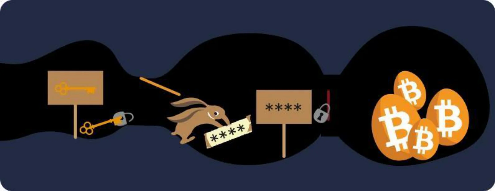

- **Seviye 4**, bir işlemi gerçekleştirmek için birden fazla imzanın gerektiği bir "[çoklu imza (multisig)](https://planb.academy/resources/glossary/multisig)" cüzdanı oluşturmak üzere birden fazla cüzdanı bir arada kullanırsınız. Bu senaryoda, çoklu imza kurulumundaki her bir parçanın farklı yerlerde saklanması gerektiğini unutmayın. Bu yaklaşım, genellikle büyük miktarları yönetmek ve kurumsal amaçlar için tercih edilen ileri düzey bir Bitcoin kullanımı olarak kabul edilir.

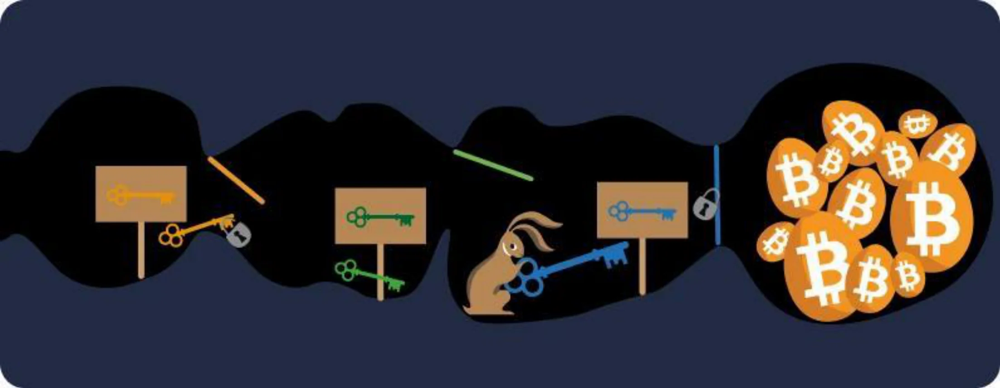

Elbette farklı kullanım senaryoları farklı Bitcoin cüzdanları gerektirir ve herkes için geçerli tek bir çözüm yoktur.

### Güvenlik kişiye özel olmalıdır

Belirli bir güvenlik seviyesinde ne kadarlık bir tutar tutulacağı tamamen kişiye özeldir. Kimileri için sıcak cüzdanda 1 BTC bulundurmak son derece makulken, kimileri için bu durum tam tersidir. Her halükarda, düşük bir miktarı güvence altına almak istediğinizde, fiziksel bir cüzdan satın alarak güvenlik için çok fazla harcama yapmamanızı öneririz. Ayrıca, özellikle yedeklemeleri hatalı yönettiğiniz durumlarda, bitcoinlerinizin güvenliğini ve erişilebilirliğini aşırı karmaşık hale getirmenin sürece zarar verebileceğini unutmayın.

Sonuç olarak, bitcoinlerin doğrudan mülkiyetine sahip olmak, finansal egemenliği sağlamanın en temel unsurudur. Günlük harcamalar için mobil bir cüzdan kullanılması; daha büyük miktarları saklamak için ise internete bağlı olmayan, yani "soğuk" bir fiziksel cüzdan tercih edilmesi önerilir. Şirketler ise gelişmiş ve ortaklaşa bir güvenlik sağlamak amacıyla çoklu imza (multisig) sistemlerini kullanmayı değerlendirmelidir. Ayrıca, geleneksel finans sisteminin bazı zafiyetlerini barındıran emanetçi (custodial) hizmetlerinden kaçınmak da büyük önem taşır.

Tüm bunları göz önünde bulundurarak, artık bir sonraki bölüme geçebilir ve bir Bitcoin cüzdanının nasıl oluşturulduğunu inceleyebiliriz. Ancak güvenlik konusunu daha derinlemesine araştırmak isterseniz, [DarthCoin tarafından kaleme alınan bu makaleyi](https://asi0.substack.com/p/Bitcoin-soyez-votre-propre-banque) okuyabilirsiniz.

## Bir Cüzdan Kurulumu

<chapterId>615519eb-4565-557d-86a0-021badf7616f</chapterId>

Bitcoinlerinizin güvenliği hayati bir öneme sahiptir ve yapılacak ufak bir hata geri dönülemez sonuçlar doğurabilir. Bu yüzden yeni bir Bitcoin cüzdanı oluştururken benimsenmesi gereken en iyi uygulamaları öğrenmemiz gerekir.

BTC102 kursunun bu adımda size yol göstereceğini lütfen unutmayın.

https://planb.academy/courses/f3e3843d-1a1d-450c-96d6-d7232158b81f

### Bu işin şakası yok!

Bir cüzdan kurulumu yaptığınızda, yazılım genellikle size 12/24 kelimelik bir liste halinde sunulan (sıklıkla "kurtarma ifadesi" veya "anımsatıcı ifade" olarak adlandırılan) özel anahtarınızı oluşturur. Bu kelimeler varlıklarınıza erişimi sağlar. Eğer bu anahtar üçüncü bir şahsın eline geçerse, ilgili tüm varlıklarınızı kaybedilmiş saymalısınız. Bu nedenle cüzdanınızı kurarken şu kurallara uymanız hayati önem taşır:

- Tüm kameraları kapatın.
- Kelime listesinin kesinlikle fotoğrafını çekmeyin.
- Kelimeleri hiçbir bilgisayara veya telefona yazıp kaydetmeyin.
  -Kişiler listenize eklemeyin veya kendinize SMS ile göndermeyin.
  -Kelimelerinizi asla masanızın üzerinde korumasız ve gözetimsiz bırakmayın.
  -Kelime listenizi asla olağandışı veya unutabileceğiniz bir yere saklamayın.

Doğrudan boş bir kağıt almalı veya bu [şablonun](https://bitcoiner.guide/backup.pdf) çıktısını alarak kelime listesini bir tükenmez kalemle, gösterilen sıraya göre düzgün ve net bir şekilde yazmalısınız. Mürekkebin zamanla solması durumunda varlıklarınızı kaybedebileceğinizi unutmayın. Bu nedenle, bu kağıdı nem veya yangın gibi zarar verebilecek tüm çevresel faktörlerden korumanız oldukça önemlidir.

Lütfen aşağıda bu kağıdın nasıl doldurulacağına dair örneği inceleyin; buradaki kelimeler sahtedir, bu yüzden onları kesinlikle kullanmayın!

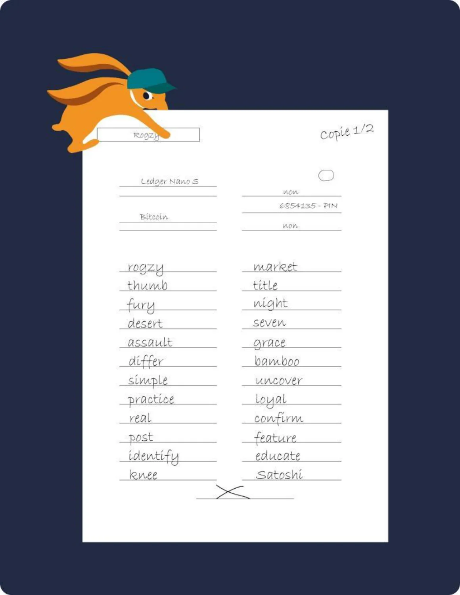

### Doğru yapmak için ipuçlarımız

Anımsatıcı ifadeyi net ve okunaklı bir şekilde kopyalarken hiçbir hata yapmadığınızdan emin olun; aksi takdirde mirasçılarınız bu kelimeleri okumakta zorlanabilir ve varlıkları kurtaramayabilir. Kelimeleri kaydettikten sonra, ikinci bir kopya oluşturmanız ve bunu ilkinden farklı bir yerde saklamanız önerilir. Bu sayede, orijinal kopyanın kaybolması veya zarar görmesi durumunda elinizde bir yedek bulunmasını sağlamış olursunuz.

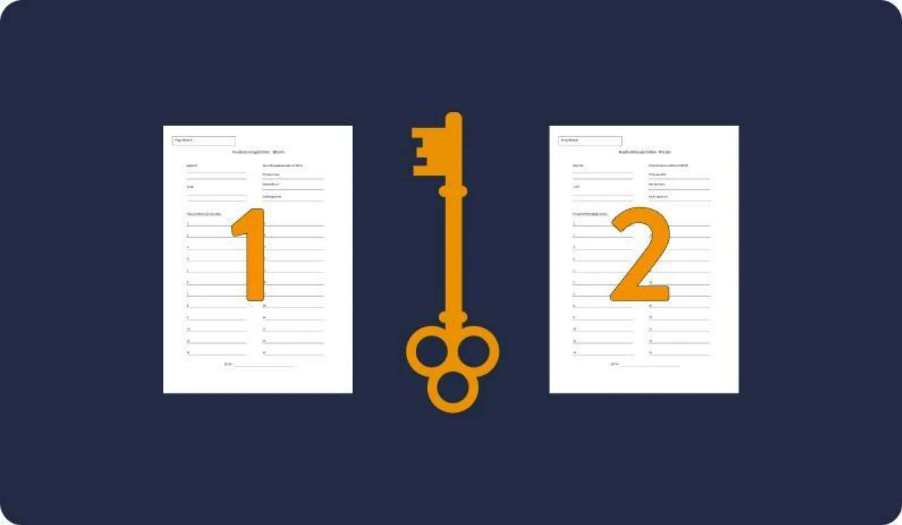

Kelime listeleri, kolayca hatırlayabileceğiniz güvenli bir yerde saklanmalıdır. Kelimeleri kaybetmenize yol açabilecek aşırı karmaşık gizleme planları yapmaktan kaçının.

**Kelimeleriniz = paranız.**

Hem "soğuk" hem de "sıcak" cüzdanlar, özel anahtarları yedeklemek için standart olarak bu kelime listesi yöntemini kullanır. Bu sayede, erişiminizi geri kazanmak için anımsatıcı ifadenizi uyumlu herhangi bir cüzdan yazılımına veya cihazına girmeniz yeterlidir. Diğer taraftan; kurtarma ifadesi (seed phrase) sunmayan, bunun yerine hesap oluşturmanızı, e-posta adresi vermenizi veya daha da kötüsü kimlik bilgilerinizi paylaşmanızı şart koşan cüzdanları kullanmanızı kesinlikle önermiyoruz.

**DİKKAT: 12/24 kelimelik bir listenin olmaması, sizin için bir uyarı sinyali olmalıdır.**

Kendi cüzdanınızı nasıl kuracağınızı ve ilk bitcoinlerinizi nasıl alacağınızı adım adım keşfetmek isterseniz, şu diğer kursumuza göz atmanızı tavsiye ederiz:

https://planb.academy/courses/f3e3843d-1a1d-450c-96d6-d7232158b81f

## Zamanın Sınavından Geçmek

<chapterId>f58cd446-c202-5eff-aab7-e61cc40e5c06</chapterId>

Her varlık türünde olduğu gibi, bitcoinlerinizin de özellikle uzun vadede kaybolma, çalınma ve yıpranma risklerine karşı korunması gerekir. Bitcoinlerinizi güvence altına almak, belirli bir teknik bilgi birikimi ve olası risklerin farkında olmayı gerektirir. Bu durum bizi iki temel stratejiye ulaştırır: anımsatıcı ifadenizi çelik bir plakaya kazımak ve bir miras planı oluşturmak.

### Çeliğe kazıma

Bitcoinlerinizi uzun vadede güvence altına almanın en etkili yollarından biri, anımsatıcı ifadenizi çelik gibi son derece dayanıklı bir malzemeye kazımaktır. Bu yöntem, anahtarlarınız için hem suya hem de yangına karşı dayanıklı, fiziksel bir yedek oluşturmanızı sağlar.

Piyasada farklı çözümler mevcuttur: "Blockmit" gibi düşük maliyetli seçeneklerin yanı sıra daha özel ekipman gerektiren yöntemler de bulunur. Bu konuyu akademimizin[eğitimler](https://planb.academy/en/tutorials/wallet) bölümünden daha detaylı inceleyebilirsiniz.

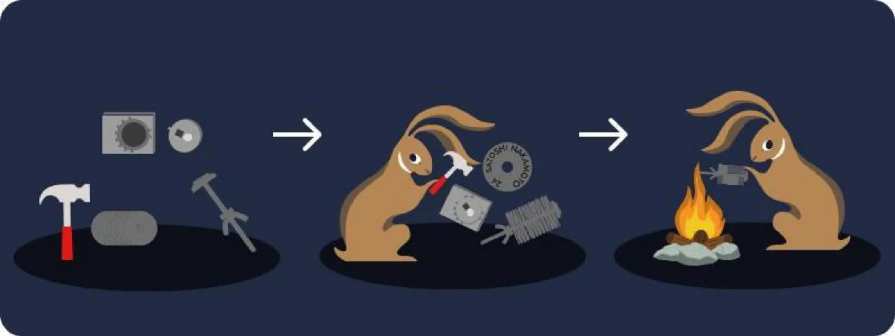

### Gelecek nesilleri düşünün!

Bu ilk uygulamanın yanı sıra, bir miras planı oluşturmak, vefatınızdan sonra bitcoinlerinizin doğru şekilde yönetilmesini sağlamak adına hayati bir adımdır. Bu plan; varlıklarınızın niteliğini, bunlara erişim yöntemlerini ve bu konuda sorumluluk sahibi olan güvenilir kişilerin iletişim bilgilerini açıkça belirttiğiniz, kendi el yazınızla yazılmış bir mektup hazırlamayı içerir. Ayrıca, doğrudan bitcoinlerinizin yönetimini asla devretmemeniz gerekse bile, vergi mevzuatına uyum sağlamak adına bitcoin mirası konusunu bir muhasebeci ve/veya miras avukatı ile görüşmek de önemlidir.

Bitcoinleriniz için miras planı konusunu daha derinlemesine incelemek isterseniz, Pamela Morgan'ın[Cryptoasset Inheritance Plan (Kripto Varlık Miras Planı)](https://planb.academy/resources/books/28) kitabını okumanızı veya planınızı oluştururken size rehberlik ettiğimiz BTC102 kursuna kaydolmanızı tavsiye ederiz.

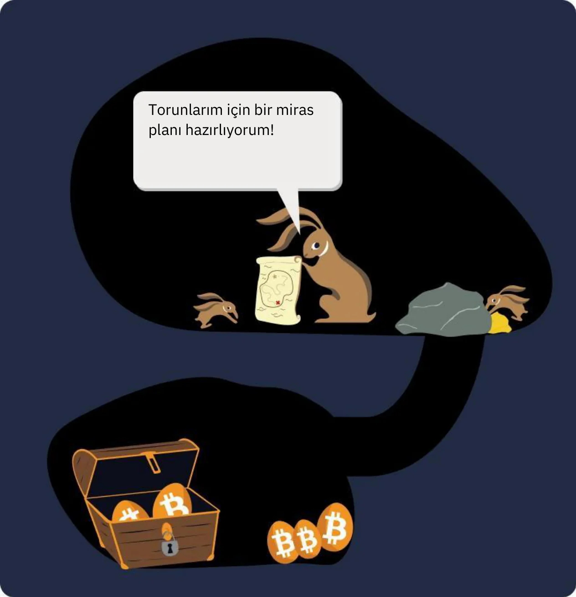

### Gizlilik önemlidir

Fiziksel yedekler oluşturmanın ve bir miras planı hazırlamanın yanı sıra gizlilik, bitcoinlerinizin uzun vadeli güvenliği söz konusu olduğunda bir diğer önemli konudur. Örneğin; kimlik hırsızlığı riskini ya da gerekli araçlara sahip yapıların fonlarınızı takip etme olasılığını en aza indirmek için, kimlik bilgilerinizi paylaşmadan (KYC'siz) bitcoin satın almayı tercih etmek daha sağlıklı bir yaklaşımdır.

Gizlilik hususunda, hiç kimseye bitcoinlerinizden bahsetmemeniz büyük önem taşır. Bu teknolojinin gelecekte nasıl algılanacağını kestiremeyiz; bu nedenle varlıklarınız konusunda ketum davranmak akıllıca bir seçimdir: Kendinizi veya cüzdanınızı hedef tahtası haline getirmek istemezsiniz.

Aynı şekilde, Bitcoin buluşmalarında veya yabancılarla bir araya geldiğiniz ortamlarda güvenlik sisteminizin ayrıntılarını açıkça paylaşmaktan kaçının...

### Bitcoin Cüzdan Güvenliği Özeti

Bitcoin cüzdanları, bitcoinlerinize erişmenizi ve işlem yapmanızı sağlar. Temelde birkaç cüzdan türü vardır:

- Küçük miktarlar ve/veya günlük harcamalar için pratik olan mobil veya masaüstü cüzdanlar;
- Bitcoinleri orta ve uzun vadede saklamak için daha uygun olan fiziksel cüzdanlar;
- Yönetimi daha karmaşık olan ve işlemleri gerçekleştirmek için birden fazla imza gerektiren çoklu imza (multisig) cüzdanları.

Bir cüzdan oluştururken, ilk olarak 12 veya 24 kelimelik listenizi bir kağıda veya metal bir plakaya yedeklemeniz son derece önemlidir. Anımsatıcı ifade olarak adlandırılan bu kelimeler, cüzdanınızı herhangi bir Bitcoin cüzdan uygulaması aracılığıyla yeniden kurmanızı sağlar. Bu listeye erişen herkesin varlıklarınıza da erişmiş olacağını unutmayın.

Bitcoin dünyasında finansal egemenlik, bireysel sorumlulukla doğrudan ilişkilidir; bu nedenle cüzdanlarınıza ve yedeklerinize erişimi güvence altına almanız hayati önem taşır. Bunu başarmak için şu adımları takip etmeniz önemlidir:

- Herhangi bir sorun yaşanması durumunda sevdiklerinizin varlıklarınızı kurtarabilmesini sağlamak için bir miras planı oluşturun.
- Hack saldırılarına karşı savunmasız olabilecekleri için bitcoinlerinizi borsalarda bırakmaktan kaçının.
- Mevcut birçok farklı Bitcoin cüzdanı arasından doğru seçimi yapabilmek için güvenlik seviyenizi ihtiyaçlarınıza ve kullanım senaryolarınıza göre belirleyin.

Bitcoin cüzdanlarının temellerini ve bu cüzdanları güvence altına almanın en iyi yollarını ele aldığımıza göre, bir sonraki bölümde Bitcoin'in teknik özelliklerini inceleyebiliriz. Her zaman olduğu gibi, Bitcoin protokolünün temellerini kavramak, sistemin nasıl çalıştığını daha iyi anlamanızı sağlayacak ve bu teknolojiden en verimli şekilde yararlanmanıza yardımcı olacaktır.

# Bitcoin'un Teknik Yönleri.

<partId>a86d7439-e7a2-5f21-b1e9-6b5e23ca265b</partId>

## Bitcoin'in Hayata Geçişi

<chapterId>b7561082-8943-519d-95d1-a5f60dd2686d</chapterId>

### Gelin biraz tarihle başlayalım.

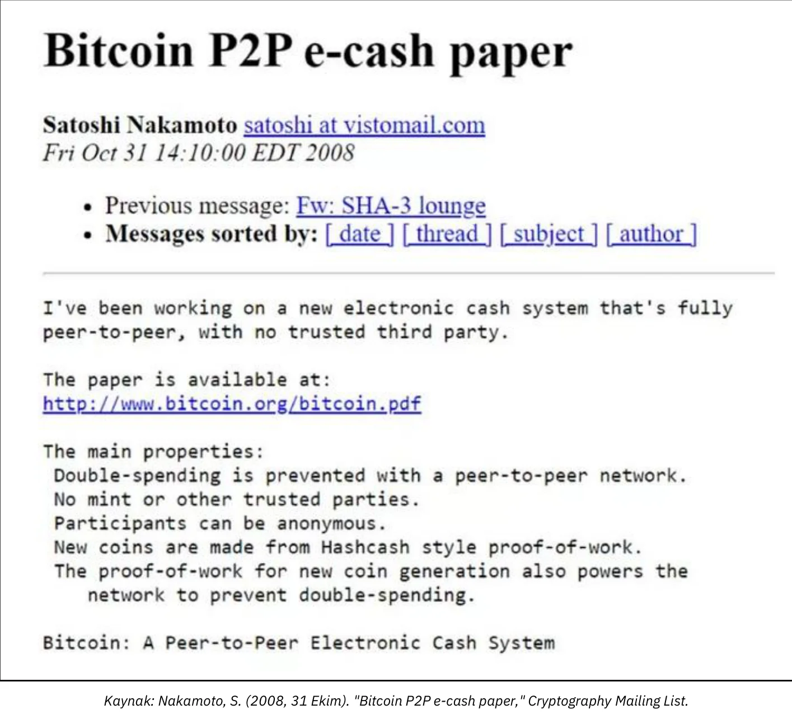

31 Ekim 2008, yeni bir finansal teknoloji olan Bitcoin'in doğuşuna tanıklık etti. O gün, kimliğini gizli tutan Satoshi Nakamoto, internette gizliliği savunmaya adanmış bir kriptografi meraklıları topluluğu olan "cypherpunk" e-posta listesine gönderdiği bir iletiyle yeniliğini dünyaya sundu. Bu e-posta, Bitcoin'in nasıl çalıştığını açıklayan ve "White Paper" (Teknik Doküman) olarak adlandırılan bir belge içeriyordu.

Daha önceki dijital nakit sistemi girişimlerinin başarısızlıkla sonuçlanmış olmasından ötürü, bu hamle ilk başta büyük bir coşku yaratmadı. Ancak tüm bunlara rağmen bu teknik doküman, zamanla Bitcoin kullanıcıları için temel bir referans haline geldi ve yıllar boyunca Bitcoin ekosisteminde pek çok tartışmanın odağında yer aldı.

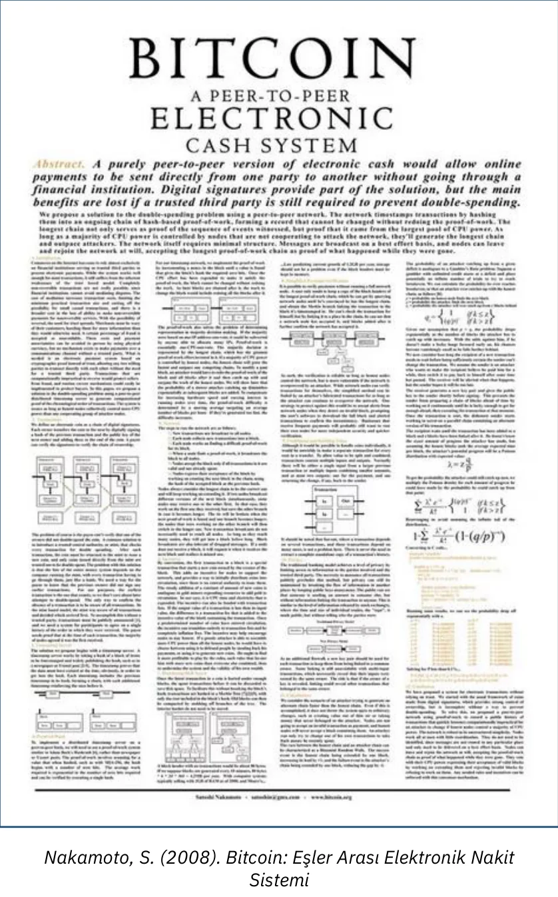

3 Ocak 2009'da Satoshi, Bitcoin blokzincirinin başlangıcı sayılan ve "[Genesis bloğu (Başlangıç bloğu)](https://planb.academy/resources/glossary/genesis-block)" olarak da bilinen ilk bloğu oluşturarak Bitcoin ağını resmi olarak başlattı. Bu blok, Bitcoin'in misyonunu açıkça ortaya koyan anlamlı bir mesaj içeriyordu: "03/Jan/2009 Chancellor on brink of second bailout for banks" (3 Ocak 2009 Şansölye, bankalar için ikinci kurtarma paketinin eşiğinde).

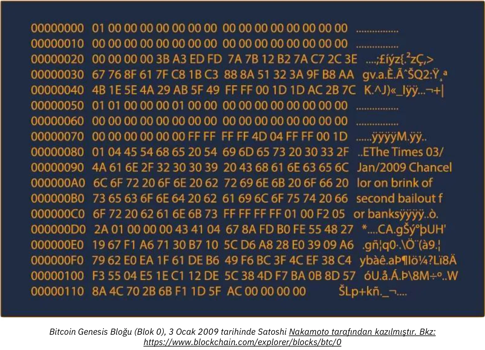

> "Silahlanma yarışında büyük bir savaşı kazanabilir ve
> birkaç yıllığına yeni bir özgürlük alanı elde edebiliriz." - Satoshi Nakamoto

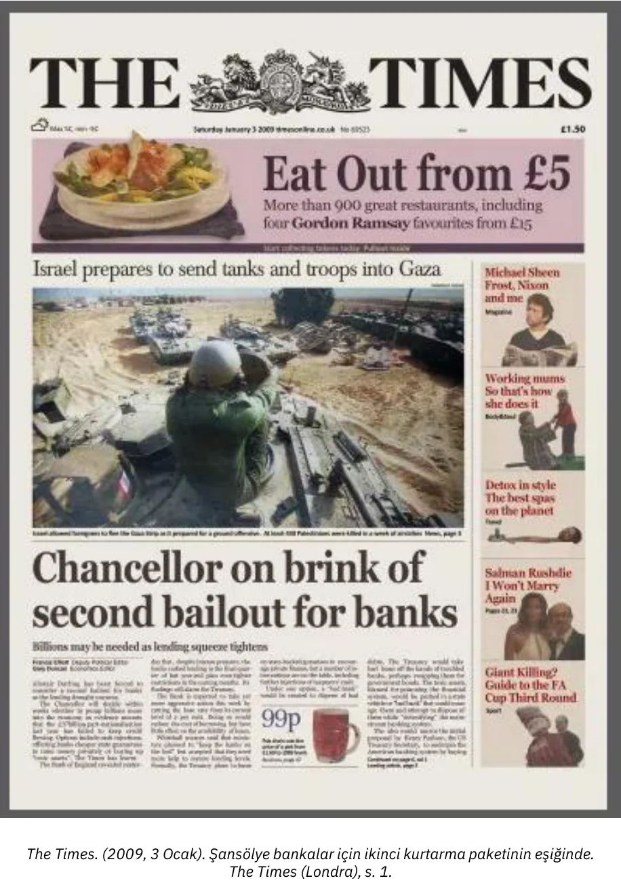

### Bitcoin protokolü hayata geçiyor

9 Ocak 2009'da Satoshi, Bitcoin'in 0.1.0 sürümünün yayınlandığını duyurdu. Kısa bir süre sonra yazılımı edinen Hal Finney ağa katıldı; böylece ağda iki düğüm (node) ve dolayısıyla iki madenci yer almış oldu. Hatta Finney, "Running bitcoin" (Bitcoin çalıştırıyorum) şeklinde bir tweet atarak bu anı ölümsüzleştirdi. 12 Ocak 2009'da ise Satoshi ile Hal Finney arasında 10 BTC'lik ilk Bitcoin işlemi gerçekleşti; 170. bloğa geri giderek bu işlemi kolayca bulabilirsiniz.

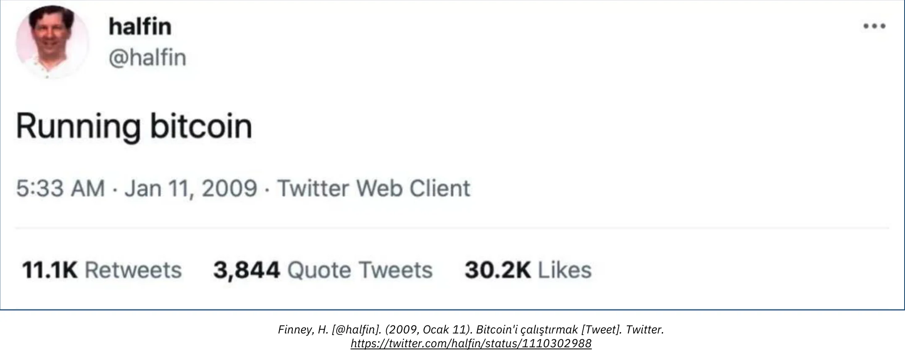

Bitcoin'e olan ilgi hızla büyüdü; bu da birçok insanın sistemi test etmesini, tartışmalara katılmasını, hataları çözmesini ve projenin etik, ekonomik ve felsefi yönleri üzerine kafa yormasını sağladı. Tartışmalar o kadar yoğun ilgi gördü ki Satoshi, bu tür iletişimleri kolaylaştırmak amacıyla 22 Kasım 2009'da BitcoinTalk forumunu kurdu.
Forum kısa sürede Bitcoin kullanıcılarının gözde tartışma alanı haline geldi; öyle ki[Bitcoin logosu](https://bitcointalk.org/index.php?topic=64.0), meşhur [HODL](https://bitcointalk.org/index.php?topic=375643.0) kavramı ve hatta [Pizza günü](https://bitcointalk.org/index.php?topic=137.msg1195) gibi Bitcoin ile özdeşleşen ünlü internet kültürleri ve semboller bu forumda doğdu.

**Biliyor muydunuz?** 22 Mayıs 2010'da Laszlo Hanyecz, 10.000 BTC karşılığında iki pizza satın almayı teklif ederek tarihe geçti; bu, fiziksel bir mal satın almak için Bitcoin'in ilk kez kullanıldığı an oldu.


### Satoshi Nakamoto'nun Ortadan Kayboluşu

2010 yılında Bitcoin medyanın ilgisini çekmeye başladığında, Satoshi mesafe koyma kararı aldı ve 12 Aralık 2010'da bir forum gönderisiyle ayrılacağını duyurdu. 23 Nisan 2011'de e-posta yoluyla bilinen son özel yazışmasını yaptıktan sonra ortadan kaybolarak eserini topluluğun ellerine bıraktı.

> "Hükümetler, Napster gibi merkezi olarak kontrol edilen ağların kafasını uçurmakta başarılıdır
> ancak Gnutella ve Tor gibi saf eşten eşe (P2P) ağlar kendi başlarının çaresine bakabiliyor gibi
> görünüyor." - Satoshi Nakamoto

Satoshi'nin yokluğuna rağmen Bitcoin geliştirilmeye devam etti: Bitcoin'in tarihi her 10 dakikada bir yeniden yazılıyor ve protokol bugün de tasarlandığı gibi çalışmayı sürdürüyor. Her türlü korku, belirsizlik ve şüpheye (FUD) rağmen Bitcoin, çevrim içi kalma süresindeki (uptime) muazzam başarıyla yoluna kararlılıkla devam ediyor. Hatta bu [web sitesine](https://bitcoinuptime.com/) göre Bitcoin, yaratıldığı günden bu yana geçen sürenin %99,988'inde hiçbir büyük sorun yaşamadan çalışır durumda kalmayı başardı.

Kimileri Bitcoin'i[miselyum (mantar ağı)](https://brandonquittem.com/Bitcoin-is-the-mycelium-of-money/) benzeri canlı bir organizma olarak tanımlarken, kimileri ise onu bir [kara deliğe](https://dergigi.com/) benzetiyor. Sevin ya da sevmeyin; Bitcoin, her blokta tıkır tıkır işleyen 10 dakikalık değişmez ritmiyle, yeni bir parasal sistemin kalp atışları gibi varlığını sürdürmeye devam ediyor.

Satoshi Nakamoto'nun yazılarını daha derinlemesine incelemek için, onun temel metinlerini bir araya getirip bağlamına oturtan Phil Champagne imzalı[The Book of Satoshi (Satoshi'nin Kitabı)](https://planb.academy/resources/books/the-book-of-satoshi-61dea136-f12b-4a19-bdb4-0272bca2ab30) adlı eseri okumanızı; ayrıca Nakamoto'nun kimliği ve bıraktığı miras üzerine anlaşılır ve iyi belgelenmiş bir araştırma sunan ARTE yapımı[Le mystère Satoshi (Satoshi Gizemi)](https://planb.academy/resources/movies/f48841f0-b9ab-4d44-96e7-84fd5b70e91c) belgeselini izlemenizi tavsiye ederim.

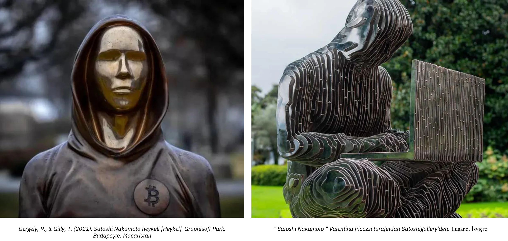

> "Geleneksel para birimlerinin temel sorunu, işlerliği sağlamak için gereken güven unsurudur. Merkez bankasının paranın değerini düşürmeyeceğine güvenilmesi gerekir ancak itibari para birimlerinin tarihi bu güvenin suistimal edilme örnekleriyle doludur. Bankalara paramızı saklamaları ve elektronik ortamda transfer etmeleri için güvenmek zorundayız, fakat onlar neredeyse hiç rezerv tutmadan bu parayı kredi balonları dalgalarıyla borç olarak dağıtırlar." - [Satoshi Nakamoto](https://Satoshi.nakamotoinstitute.org/posts/p2pfoundation/1/)

Artık temel bilgilere sahip olduğumuza göre, genel hatlarıyla bir Bitcoin işleminin nasıl çalıştığını inceleyelim.

## Bitcoin İşlemleri

<chapterId>03482644-5473-590b-975b-b43bb65eac21</chapterId>

Bir Bitcoin işlemi, en basit tanımıyla bir Bitcoin adresi kullanılarak bitcoin mülkiyetinin devredilmesidir. Bu süreci açıklamak için iki karakter üzerinden gidelim: Alice ve Bob. Alice bitcoin almak istiyor, Bob ise halihazırda bitcoin sahibidir.

### 1. Adım - Cüzdan aracılığıyla işlemin oluşturulması

Bob'un Alice'e bitcoin gönderebilmesi için Alice'in, kendi Bitcoin cüzdanına özel benzersiz adreslerinden birini Bob'a iletmesi gerekir. Özel anahtarın (private key) açık anahtarı (public key) üretmek için kullanılması gibi, açık anahtar da bu adresleri oluşturmak için kullanılır.

Somutlaştırmak gerekirse; Alice cüzdanını açıp "Al" (receive) seçeneğine tıkladığında, karşısına bir QR kod veya bir adres (bc1q7957hh3nj47efn8t2r6xdzs2cy3wjcyp8pch6hfkggy7jwrzj93sv4uykr gibi) çıkar. Bu adres bir nevi onun "Bitcoin IBAN"ıdır ve bunu Bob ile paylaşır.

Ardından Bob, kendi Bitcoin cüzdanını açıp "Gönder" (send) seçeneğine basarak işlemi başlatır. Alice'in adresini ilgili alana yapıştırır, göndermek istediği tutarı girer ve işlem ücretini belirler. Bu ücret, madencilerin işlemi bir sonraki bloğa dahil etmesi için bir teşviktir. Bob ne kadar yüksek işlem ücreti öderse, işleminin tüm Bitcoin işlemlerinin kaydedildiği halka açık ve değiştirilemez bir kayıt defteri olan blokzincire eklenecek bir sonraki bloğa dahil edilme olasılığı o kadar artar.

İşlemi tamamlamak için Bob, transfer etmek istediği bitcoinlerin sahibi olduğunu doğrulamak amacıyla işlemi kendi özel anahtarıyla imzalamalıdır. Bu adım mobil cüzdanlarda genellikle otomatik olarak gerçekleşir; fiziksel cüzdanlarda ise "X miktarını Y adresine göndermek istediğinizden emin misiniz? Evet veya Hayır" şeklinde bir onay ekranı olarak karşınıza çıkar.

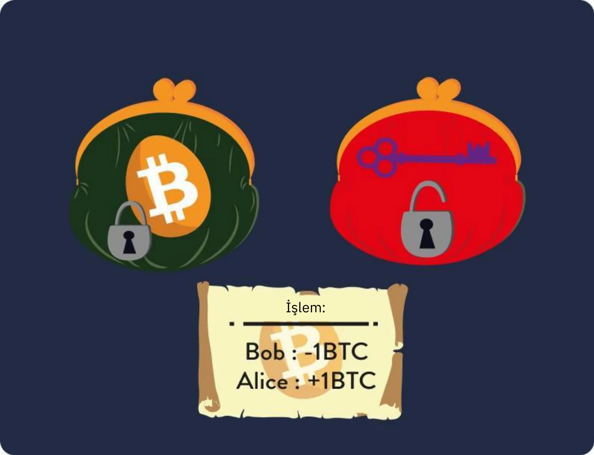

**Neden işlem ücreti ödüyoruz?** İşlemlerin bloklara dahil edilmesi için serbest bir piyasa oluşmasında işlem ücretleri hayati bir rol oynar. Bir bloğun boyutu 1 MB ile sınırlıdır ([SegWit](https://planb.academy/resources/glossary/segwit) güncellemesinden sonra bu sınır 4 MB'a çıkarılmıştır), bu nedenle bir bloğa "sığdırılabilecek" işlem sayısı blok başına birkaç bin ile sınırlıdır. Bir işlemin kapladığı boyut ise onun karmaşıklığına bağlıdır; dolayısıyla daha karmaşık işlemler genellikle daha yüksek ücret gerektirir.

### 2. Adım: İşlemin düğümler aracılığıyla ağa yayılması

Bu aşamada işlem oluşturulmuştur ve Bob'un cüzdanı bu işlemi Bitcoin ağıyla paylaşır. Bunun için cüzdan, Bitcoin ağındaki bir düğümle (node) iletişime geçer ve bu düğüm de bilgiyi diğer düğümlere aktarır. Bu süreç, tüm ağın bu yeni işlemi görmesini ve hesaba katmasını sağlar.

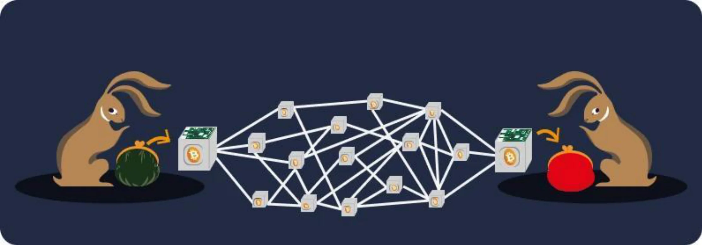

Bu noktada işlem, ([Mempool](https://planb.academy/resources/glossary/mempool)adı verilen bir araç sayesinde) herkes tarafından biliniyor olsa bile, bir madenci tarafından bir bloğa eklenene kadar onaylanmış sayılmaz. İşlemleri blokzincire dahil ederek doğrulama yetkisine sahip tek merci madencilerdir.

Aslında madencilerin görevi, geçerli olan ancak henüz onaylanmamış işlemleri toplayıp bir blok halinde bir araya getirmektir. Özetle, oluşturdukları bloğun Bitcoin blokzincirindeki bir sonraki blok olabilmesi için "iş kanıtı" (proof of work) adı verilen bir süreçte kriptografik bir bulmacayı çözmek zorundadırlar.

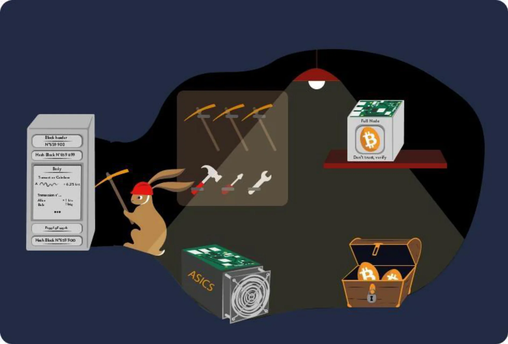

### 3. Adım: İşlemin bir madenci tarafından bloğa eklenmesi (kazılması)

İş Kanıtı (Proof of Work) sistemi, söz konusu blok için geçerli bir "hash" (özet değer) bulunmasını gerektirir: Bunu, bloğa ait 256 karakterden oluşan benzersiz bir parmak izi gibi düşünebilirsiniz. Bu hash değerinin geçerliliği, Bitcoin ağının zorluk derecesine bağlıdır (bu konunun detaylarına daha sonra değineceğiz). Şimdilik bir madencinin geçerli bir blok bulduğunu ve Bob'un Alice'e yaptığı işlemin bu bloğa dahil edildiğini varsayalım. Ardından, bu yeni geçerli blok tüm Bitcoin kullanıcılarının ortak kayıt defteri olan blokzincire eklenir.

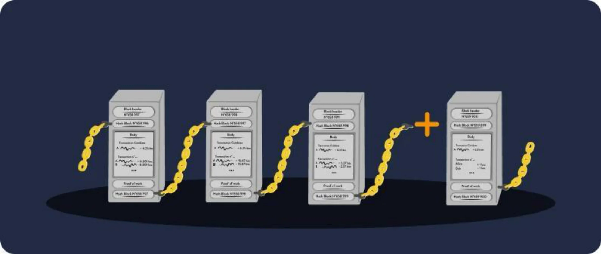

### 4. Adım: Bloğun geçerliliği ve Alice'ın referans düğümü tarafından doğrulanması

Bu aşamada işlem geçerli kabul edilir: Madenci, kendi düğümü aracılığıyla yeni bloğu ağa yayar ve Alice'in cüzdanı güncellenir.

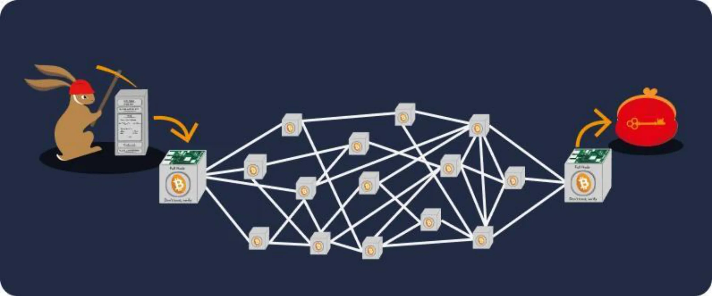

**Not:** Alice'e kendi adreslerinden birine bitcoin ulaştığına dair bildirim gitse bile, işlemin tamamen değiştirilemez (geri alınamaz) kabul edilmesi için genellikle **altı** [onay (confirmation)](https://planb.academy/resources/glossary/confirmation) alınması önerilir. Bu durum, Bob'un işlemini içeren bloğun üzerine altı bloğun daha eklenmesi (kazılması) anlamına gelir. Diğer bir deyişle, bir işlem blokzincirde ne kadar eskiyse, o kadar değiştirilemez hale gelir.

### Bu sürecin önemi nedir?

Bitcoin işlem sistemi merkeziyetsizdir ve herhangi bir güvenilir aracıya ihtiyaç duymadan, doğrudan eşten eşe (P2P) çalışır.

Bob işlemini Bitcoin ağına gönderir ve bir madenci Bob'un işlemini içeren geçerli bir blok yayınladığında, Alice artık bu bitcoinlerin kendisine ait olduğunu kabul etmeye başlayabilir. Bitcoin mülkiyetinin devredilmesinde hiçbir adımda güven unsuruna gerek yoktur; protokol kuralları ve ekonomik teşvikler tek başına, Bitcoin sistemi içinde kötü niyetli hareket etmeyi fahiş derecede maliyetli hale getirir.

Aslında kullanıcılar, işlemleri kendi özel anahtarlarıyla dijital olarak imzalayarak fonlarının mülkiyetini devrederler. Diğer taraftan madencilerin yetkileri sınırlıdır ve kullanıcılar, yeni blokları ve içlerindeki işlemleri doğrulamak için Bitcoin düğümlerini kullanarak sistem üzerindeki kontrollerini korurlar. Her düğüm, kayıt defterinin tam ya da kısmi bir kopyasını barındırır; bu sayede Bitcoin düğümlerinin oluşturduğu ağ, sistemi gerçek anlamda merkeziyetsiz kılar.

Sonuç olarak, Bitcoin ağının tamamen yok edilebilmesi için tüm Bitcoin düğümlerindeki her bir blokzincir kopyasının ortadan kaldırılması gerekir. Bu düğümlerin coğrafi olarak tüm dünyaya yayılmış olması ve fiziksel olarak ele geçirilmesinin zorluğu göz önüne alındığında, bu neredeyse imkansız bir görevdir.

Şimdi bir Bitcoin düğümünün nasıl çalıştığına daha yakından bakalım.

## Bitcoin Düğümleri (Node)

<chapterId>8533cebc-f799-528b-89df-8d75d4c37f1c</chapterId>

Düğümler, Bitcoin ağ mimarisinin temel yapı taşlarıdır ve şu kritik görevleri yerine getirirler:

- Bitcoin blokzincirinin güncel bir kopyasını saklamak
- İşlemleri doğrulamak
- Bilgileri diğer düğümlere iletmek
- Bitcoin protokol kurallarının uygulanmasını sağlamak.

Bu doğrultuda; Bitcoin düğümü (node) olarak adlandırılan ve genellikle [Bitcoin core](https://Bitcoin.org/en/Bitcoin-core/) kullanan bir Bitcoin yazılımını çalıştıran her cihaz, ağın merkeziyetsizliğine doğrudan katkıda bulunur.

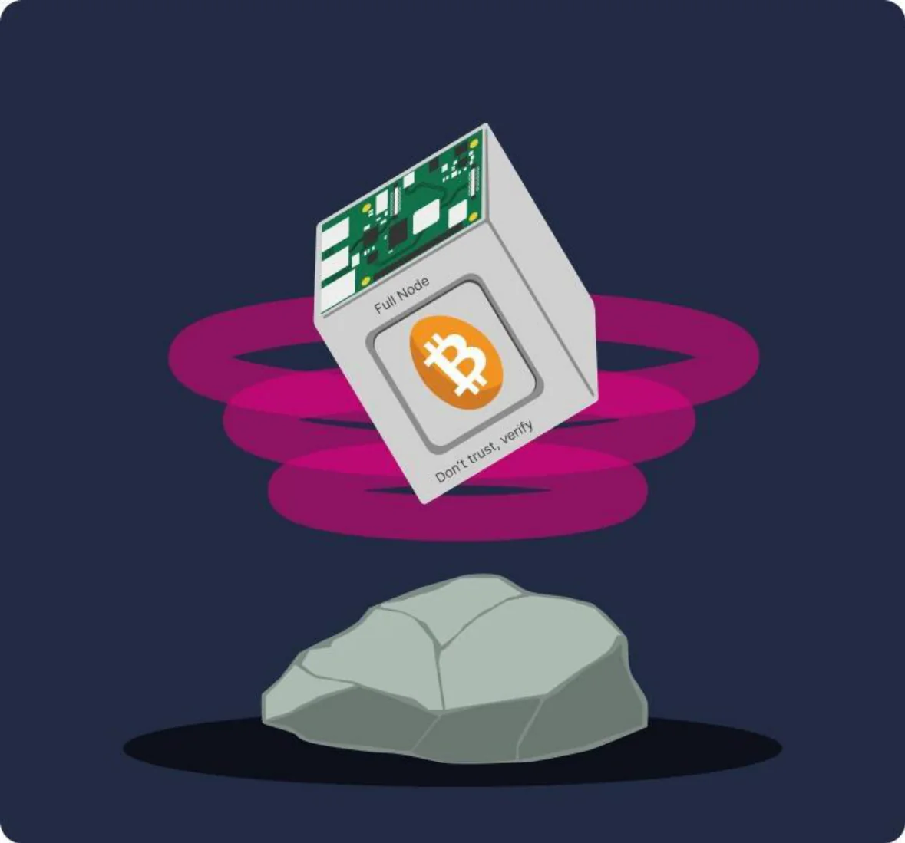

### Düğümler Bitcoin'in can damarıdır.

Her bir düğüm, işlemlerin doğrulanmasını sağlayan ve her türlü dolandırıcılık girişimini engelleyen blokzincirin bir kopyasını barındırır. Ağın merkeziyetsiz yapısı, Bitcoin'e olağanüstü bir direnç ve dayanıklılık kazandırır. Öyle ki Bitcoin protokolünü durdurabilmek için dünya genelindeki tüm düğümlerin kapatılması gerekir. Eylül 2023 itibarıyla dünya genelinde yaklaşık [45.000 düğüm](https://bitnodes.io/nodes/all/) bulunmaktadır.

Düğümler, Bitcoin konsensüs (fikir birliği) kurallarına bağlı oldukları için blokların ve işlemlerin geçerliliğini denetleme yetkisine sahiptir. Bu kurallar; madencilik ödül miktarı (bir sonraki bölümde daha detaylı ele alacağız) ve dolaşımdaki bitcoin miktarı gibi Bitcoin'in para politikasını belirler. Düğümler, bir bakıma ağın hukuk sistemi gibi hareket ederek Bitcoin kurallarının uygulanmasını sağlar ve ağın tarafsızlığını korur. Konsensüs kuralları neredeyse hiç değişmez; çünkü herhangi bir değişikliğin hayata geçmesi için tüm düğümlerin onayı gerekir.

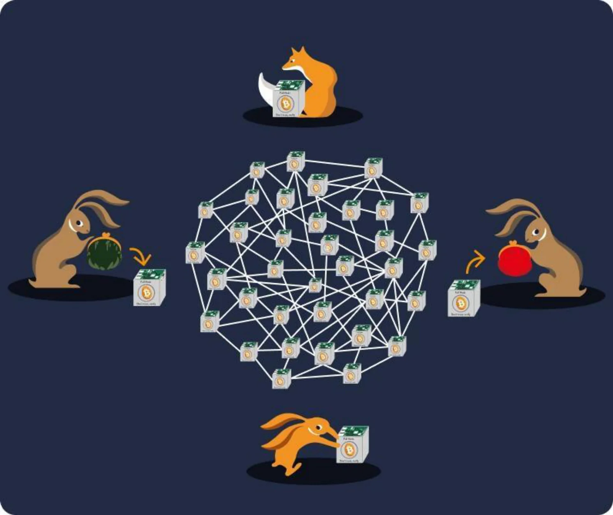

Protokol içi yönetim bu temel kursun kapsamı dışındadır, ancak Bitcoin düğümü çalıştıran her kullanıcının hangi kuralları takip edeceğine kendisinin karar verebileceğini belirtmek önemlidir. Bir kullanıcı farklı kurallara uymayı seçebilir (yani kodda değişiklikler yapabilir), ancak bu değişiklikler mevcut konsensüs kurallarını geçersiz kılıyorsa, o düğüm artık Bitcoin ağının bir parçası olamaz. Bu nedenle, büyük değişiklikler nadiren gerçekleşir ve farklı ideolojilere ile çıkarlara sahip binlerce katılımcı arasında ciddi bir koordinasyon gerektirir; bu da onları, tüm Bitcoin kullanıcıları tarafından "daha iyi" kabul edilen güncellemeler sunmaya zorlar.

### Bir düğüm (node) nasıl görünür?

Kendi düğümünüzü kurmak istediğinizde, farklı bakım maliyetlerine sahip çeşitli seçenekler mevcuttur. Bilgisayarınızda doğrudan Bitcoin Core yazılımını çalıştırabilirsiniz; ancak blokzincirin boyutu yaklaşık ~500 GB olduğundan bu işlem ciddi bir depolama alanı gerektirecektir. Bu kısıtlamayı aşmak için, sadece son N adet bloğu hafızada tutan bir "budanmış düğüm" (pruned node) oluşturmayı seçebilirsiniz. Bu ikinci çözümün maliyeti neredeyse yok denecek kadar azdır, çünkü düğüm yalnızca siz ihtiyaç duyduğunuzda aktif olur.

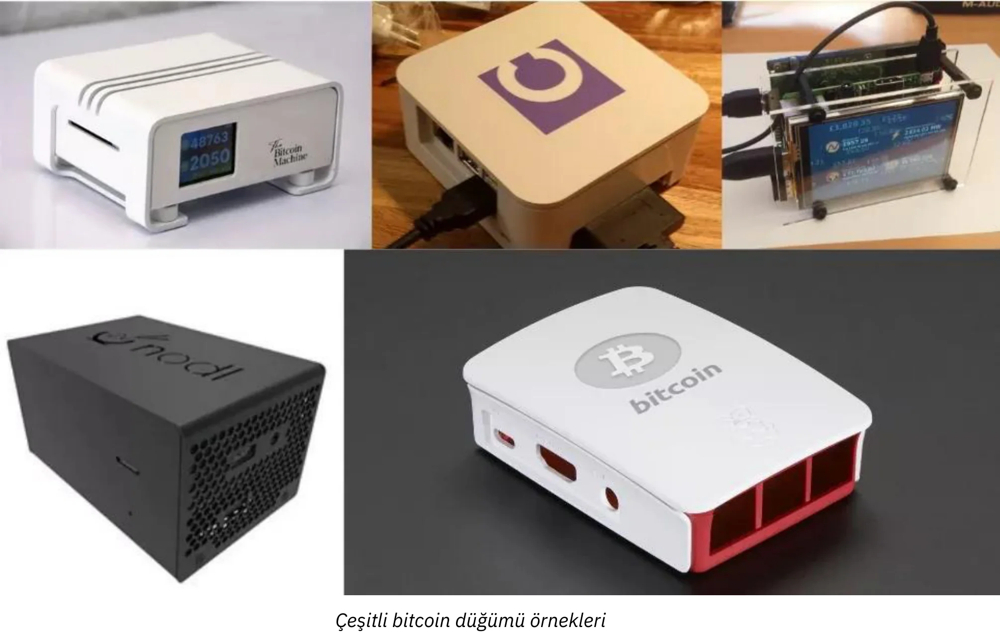

İkinci bir seçenek ise bu iş için özel bir donanım kullanmaktır; örneğin yeterince büyük bir SSD'ye (yaklaşık ~2 TB) sahip bir Raspberry Pi 4. Donanımı satın almanız gerektiği için bu seçenek daha maliyetlidir ancak elektrik tüketimi açısından yılda 10,00 €'dan daha az bir gider oluşturur.
Bant genişliği perspektifinden bakıldığında ise, her 10 dakikada bir 1 MB'lık 1 blok hesaba katıldığında, bu durum ayda yaklaşık 5 GB'a denk gelir.

### Düğümler herkes için erişilebilir kalmalıdır!

Donanım kaynakları, depolama ve bant genişliği açısından bir Bitcoin düğümü çalıştırmanın düşük maliyetli ve erişilebilir olması, ağın merkeziyetsizliğini kolaylaştırdığı için son derece önemli bir özelliktir.

Aslına bakarsanız, herkesin bir düğüm çalıştırmak için iyi bir nedeni var! Elde edilen fayda göz önüne alındığında, maliyetler ve harcanan çaba oldukça önemsiz kalır. Tek yapmanız gereken bu serüvene atılmak ve hep birlikte Bitcoin ağını oluşturmak için binlerce diğer Bitcoinsevere katılmaktır.

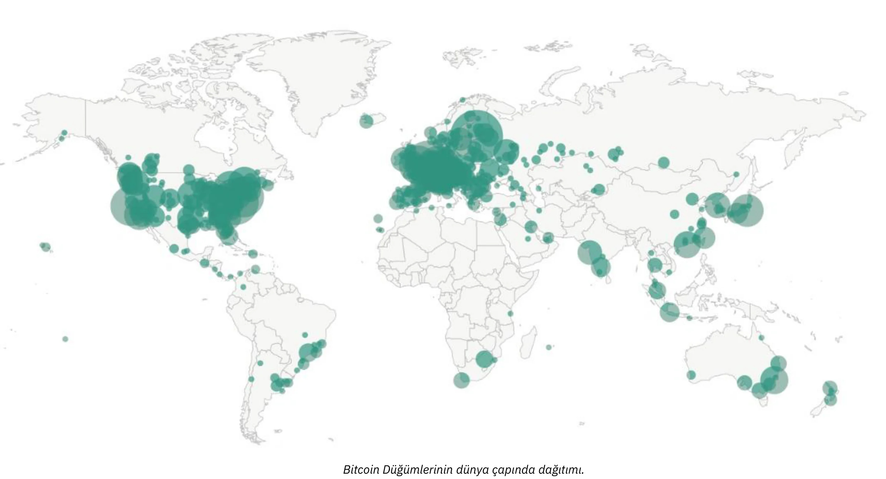

Aksine, bloklar 100 kat daha büyük olsaydı, her 10 dakikada bir kesinlikle 100 kat daha fazla işlem gerçekleştirebilirdik; ancak bir Bitcoin düğümü çalıştırmak için 50 TB'lık bir sabit disk, aylık 500 GB'ın üzerinde bant genişliği ve yüz binlerce işlemi 10 dakikadan kısa sürede doğrulayabilecek güçte bir donanım gerekirdi. Blokların 100 kat daha büyük olduğu bu varsayımsal senaryoda, bir Bitcoin düğümü çalıştırmak sıradan bir insan için erişilemez hale gelirdi; bu da hem protokolün merkeziyetsizliğini hem de işlemlerin ve konsensüs kurallarının değiştirilemezliğini tehlikeye atardı.

Bu nedenle protokoldeki kısıtlamalar, mümkün olduğunca çok insanın kendi Bitcoin düğümünü çalıştırabilmesini sağlayacak şekilde tasarlanmıştır. Nitekim 2017 yılı, "blok boyutu savaşı" (block size war) olarak bilinen son derece sert bir tartışmaya sahne oldu. Bu mücadele; işlem kapasitesini artırmak amacıyla blok boyutunu büyüterek Bitcoin'i değiştirmek isteyenler (madenciler, borsalar ve kurumlar) ile kullanıcıların bağımsızlığını ve gücünü korumak isteyenleri (düğümler ve bireysel kullanıcılar) karşı karşıya getirdi. Günün sonunda kazanan ikinci taraf oldu.

Bu zaferin ardından düğümler, SegWit adı verilen bir güncellemeyi etkinleştirerek Bitcoin blokzincirinin ikinci katmanı olarak inşa edilen anlık ödeme ağı Lightning Network'ün hayata geçirilmesinin önünü açtı. Bu durum; kullanıcıların, kendi düğümleri sayesinde Bitcoin ekosisteminde gerçek bir güce sahip olduklarını ve bir anlaşmazlık anında devasa kurumlara karşı bile baş kaldırabileceklerini açıkça göstermektedir.

## Madenciler

<chapterId>dbb8264a-7434-57e4-9d1b-fbd1bae37fdf</chapterId>

**Madenciler ağı güvence altına alır ve işlemleri bloklara ekler. Bitcoin'in iş kanıtını (proof of work) çözmek için [ASIC](https://planb.academy/resources/glossary/asic) cihazları aracılığıyla elektrik enerjisi kullanırlar.**

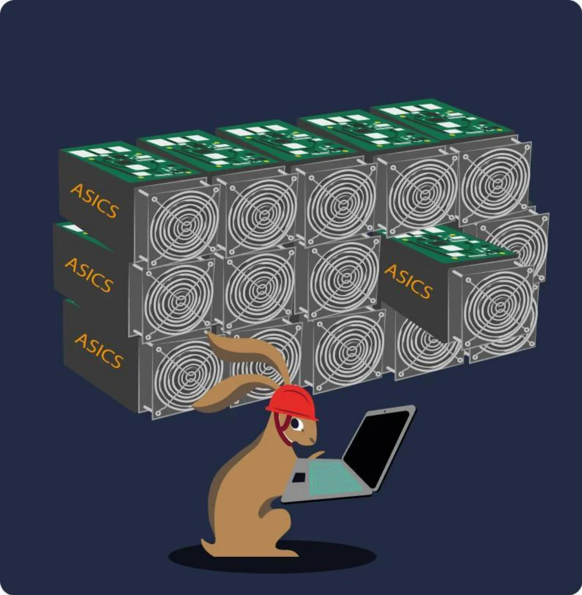

### İş Kanıtı (Proof of Work) Nedir?

"İş Kanıtı" (PoW), Bitcoin protokolünün güvenlik ve fikir birliği (konsensüs) mekanizmasıdır. Her şeyin temelini oluşturur ve Bitcoin'in oyun teorisinde hayati bir rol oynar.

Nasıl çalıştığını açıklamak için herkesin katılabileceği küresel bir piyango hayal edin. Buradaki amaç, kazananın geçerli bir bloğu imzalamasını ve karşılığında Bitcoin ödülü kazanmasını sağlayacak özel bir sayıyı bulmaktır. Bu sayıyı SHA-256 algoritması (hash fonksiyonu) kullanarak doğrulamak son derece kolay, ancak bulmak bir o kadar zordur. Katılımcılar (madenciler), doğru sayıyı keşfedene kadar 1, 52, 2648, 26874615, 15344854131318631 gibi milyarlarca ve hatta trilyonlarca farklı olasılığı tek tek denerler.

Eğer seçilen sayı doğruysa: Büyük İkramiye! Aksi takdirde arayış devam eder.
Deneme sayısını optimize etmek için madenciler, saniyede milyarlarca olasılığı hesaplamaktan başka hiçbir işlevi olmayan ASIC adı verilen özel cihazlar kullanırlar (yapılan toplam deneme miktarına "[Hashrate](https://planb.academy/resources/glossary/hashrate)" veya özetleme gücü denir). Bu makineleri çalıştırabilmek için çok yüksek miktarda elektrik tüketilmesi gerekir. Dolayısıyla İş Kanıtı (PoW), enerjiyi para birimine dönüştürerek gerçek dünya ile dijital dünyayı birbirine bağlar ve tarihin ilk enerji tabanlı para birimini ortaya çıkarır.

Bu makineler kesintisiz olarak çalışır ve ortalama 10 dakikalık bir sürenin ardından bir kazanan ortaya çıkar: Bu katılımcı, ağın belirlediği zorluk eşiğinin altında kalan geçerli hash değerini başarıyla bulmuştur. Bu tek kazanan, zaman damgası sunucusunun yeni bloğunu imzalayarak blokzincire ekler. Karşılığında ödüllerini alır ve bir sonraki bloğu kazmak için şansını denemek üzere başa döner. Bu süreç on yılı aşkın bir süredir kesintisiz devam etmektedir; her 10 dakikada bir çıkan bir kazanan, hem Bitcoin işlemlerini onaylar hem de geçmişteki işlemleri güvence altına alarak Bitcoin blokzincirini daha dirençli ve güvenli hale getirir.

Her 2016 blokta bir (yaklaşık iki haftada bir), **zorluk ayarı (difficulty adjustment)** katılımcı sayısına bağlı olarak küresel madencilik oyununu yeniden dengeler. Bu ayarlama son derece gereklidir; çünkü madencilerin sayısı ve ağdaki toplam işlem gücü zaman içinde büyük ölçüde değişiklik gösterebilir. Blokların ortalama üretilme süresini (10 dakika) sabit tutmak için ağ, son 2016 bloğun ne kadar hızlı kazıldığına bakarak zorluk seviyesini yeniden kalibre eder. Eğer bu bloklar çok hızlı kazılmışsa zorluk seviyesi artar ve doğru hash değerini bulmak zorlaşır. Aksine, eğer çok yavaş kazılmışsa zorluk seviyesi düşer ve doğru hash değerini bulmak kolaylaşır.


### Madencilik sürekli gelişiyor

Yıllar geçtikçe madenciler, en az enerjiyi tüketip en düşük maliyetle saniyede mümkün olduğunca fazla hash (HashRate) üretebilmek için kendilerini giderek daha verimli donanımlarla donattılar. Satoshi veya Hal Finney gibi ilk madenciler sadece işlemcilerini (CPU) kullanarak madencilik yaparken, daha sonra başkaları ekran kartlarıyla (GPU) madencilik yapmaya başladı. Günümüzde ise madenciler, yalnızca SHA-256 algoritmasını çalıştırmak üzere özel olarak tasarlanmış cihazlar olan ASIC'leri (Uygulamaya Özel Tümleşik Devre) kullanıyor.

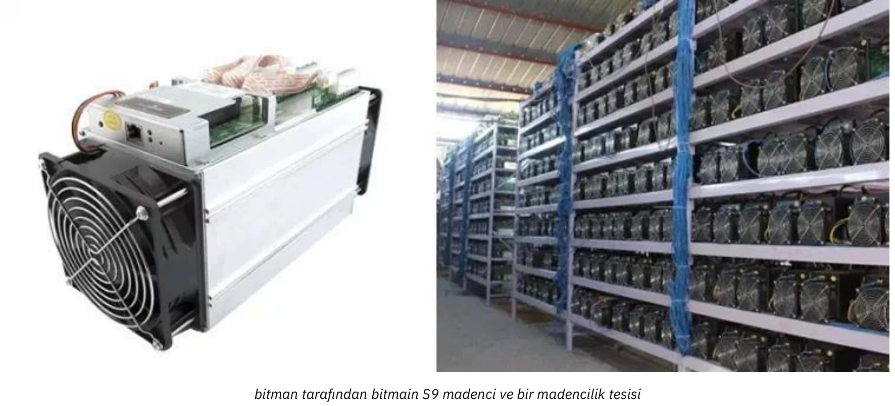

Bitcoin ağının toplam hashrate'i (özetleme gücü), bir sonraki bloğu bulmak için saniyede yapılan deneme sayısını ifade eder. Bugün hashrate 500 EH/s seviyesini aşmış durumdadır; bu da saniyede 500 kentilyon (500 milyar kere milyar) deneme yapıldığı anlamına gelir! Küresel hashrate ne kadar yüksek olursa, kötü niyetli bir aktörün madencilik gücünün çoğunluğunu ele geçirmek için gereken kaynakları tekeline alması ve elindeki fonları birden fazla kez harcaması ([çift harcama (double spending)](https://planb.academy/resources/glossary/double-spending-attack) problemi) o kadar zorlaşır. Bu nedenle, Bitcoin protokolünün kurallarına uymak dürüst olmayan yollara başvurmaktan ekonomik olarak çok daha mantıklı ve kazançlıdır.

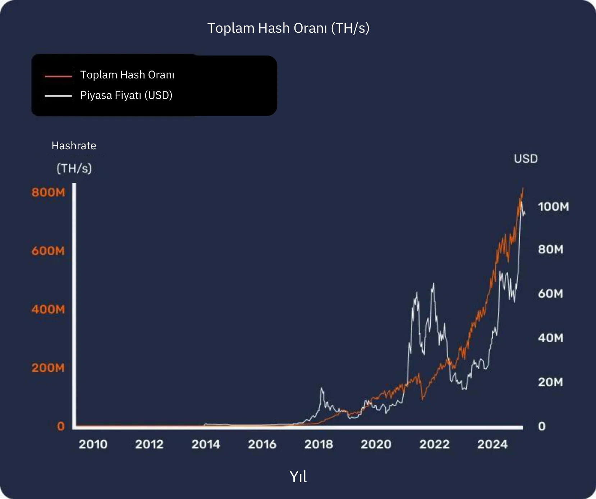

### Bir bloğun içinde neler bulunur?

Blok başlığı (block header); zaman damgası, zorluk hedefi, bir önceki bloğun numarası, kullanılan protokol sürümü ve önceki işlemlerin Merkle Kökü (Merkle Root) gibi çeşitli ögeleri içerir.

**[Coinbase işlemi (coinbase transaction)](https://planb.academy/resources/glossary/coinbase-transaction)** her zaman bir bloğa dahil edilen ilk işlemdir; madencinin iş kanıtı (proof-of-work) gerçekleştirmesi karşılığında hak ettiği ödülü içerir. Ardından doğrulanmış diğer işlemler gelir. Madenciler, kendilerine en yüksek kazancı sağlayacak olan işlemleri, yani maksimum ücret sunan küçük boyutlu transferleri bloğa eklemeyi tercih ederler.

### Madenci ödülleri

Bir madenci, geçerli bir blok bulduğunda ödüllendirilir. Daha açık belirtmek gerekirse, iki farklı şekilde kazanç elde eder:

- Blokta yer alan sübvansiyon (yeni üretilen bitcoinler) aracılığıyla;
- Bloğa dahil edilen işlemlerden alınan işlem ücretleri aracılığıyla.

Sübvansiyon miktarı konsensüs kuralları tarafından belirlenir ve bulunulan döneme (Epoch) bağlıdır: **blok ödülü = blok sübvansiyonu + işlem ücretleri.**.

İlk bloklarda blok sübvansiyonu 50 bitcoindi. Her 210.000 blokta bir (yaklaşık her 4 yılda bir) bu miktar yarı yarıya düşer. Bugün (2024 itibarıyla) 5. dönemdeyiz, bu da sübvansiyonun 3,125 bitcoin olduğu anlamına gelir. Özetle bu, sisteme yeni bitcoinlerin salınmasını sağlayan otomatik bir mekanizmadır. Sübvansiyon zamanla azalarak 21 milyon bitcoinlik arz sınırına ulaşana kadar devam edecektir. Şu anda dolaşımda olan 19,4 milyonun üzerindeki bitcoin, toplam arzın %92'sinden fazlasına denk gelmektedir.

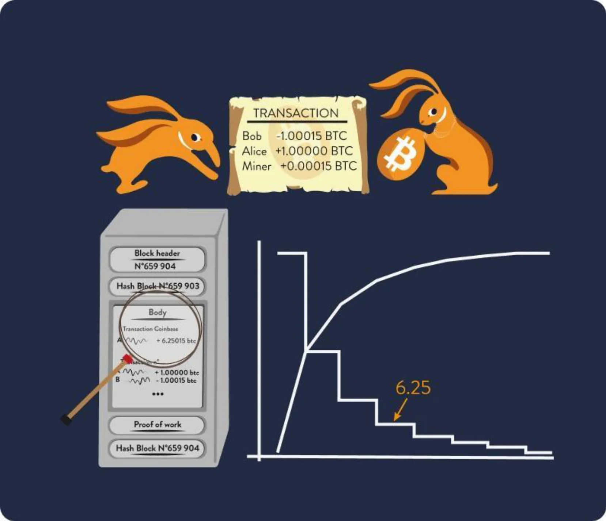

İkinci ödeme yöntemi ise kullanıcıların işlem ücreti olarak belirlediği tutarlarla tanımlanır; bu tutar, kullanıcının işleminin bir sonraki bloğa dahil edilmesi konusundaki aciliyetini gösterir. Madenciler gelirlerini en üst düzeye çıkarmak istediklerinden, doğal olarak yüksek işlem ücreti sunan işlemlere öncelik verme eğilimindedirler.

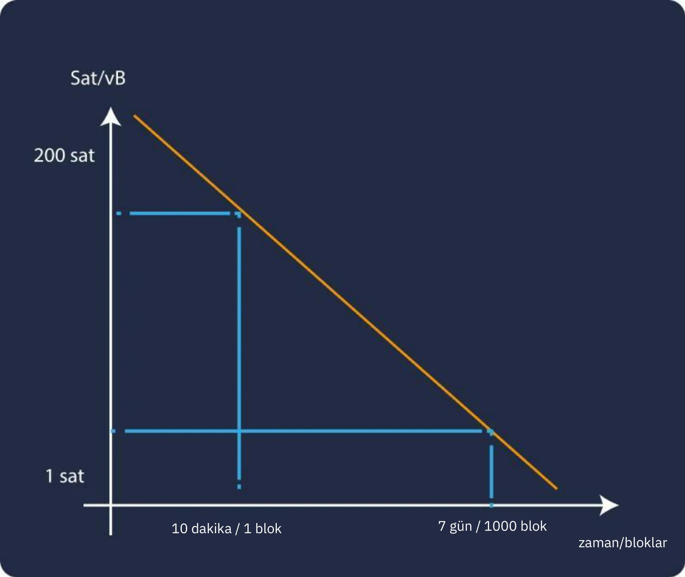

Buldukları her geçerli bloktan elde ettikleri ödüllere dayanan iş modellerini daha istikrarlı hale getirmek için madenciler, genellikle hesaplama güçlerini bir araya getirdikleri [madencilik havuzları" (mining pools)](https://planb.academy/resources/glossary/pool-mining)" aracılığıyla gruplar oluştururlar.

### Tüm bunlarla uğraşmaya ne gerek var?

Kısacası, Bitcoin'in getirdiği yenilik; değişken zorluk derecesine sahip, İş Kanıtı (Proof-of-Work) tabanlı bir blokzincir kullanarak çift harcama (double spending) problemine bir çözüm sunmaktır. Dijital dünyada sahiplik kavramı, fiziksel dünyadakinden farklıdır. Dijital dünyadaki her şey kopyalanıp yapıştırılabildiği için, değerli dijital varlıkların birden fazla kez kullanılması, yani çift harcama riski ortaya çıkar. Bankalar gibi güvenilir aracılar, bu teknolojik sorunu çözmek ve bir varlık transfer edildiğinde artık göndericiye ait olmadığını garanti altına almak amacıyla ortaya çıkmıştır.

Peki bu durum güvenilir bir aracı olmadan nasıl sağlanabilir? Bu problem, çeşitli aktörlerin güvenilir olmadığı bir sistemde bilgi koordinasyonunu sağlamayı konu alan Bizans Generalleri Paradoksu ile çok iyi bir şekilde açıklanmaktadır. Bizans Generalleri Probleminde, bir grup generalin bir şehre düzenlenecek saldırıyı koordine etmesi gerekir; ancak aralarında planı sabote etmeye çalışan hainler olabilir. Buradaki temel zorluk, hainlerden gelebilecek yanıltıcı mesajlara rağmen, sadık generallerin saldırı veya geri çekilme konusunda bir fikir birliğine (konsensüs) varabilmesidir.

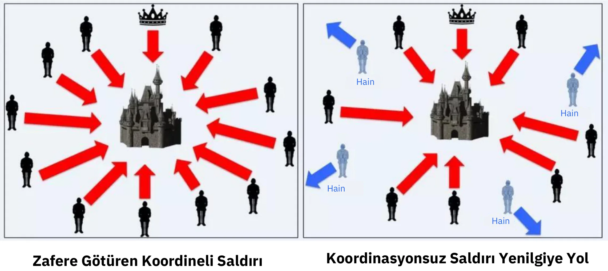

Bu nedenle Bitcoin, bu soruna yönelik bir nevi çözüm ya da en azından bu sorunu aşmanın bir yoludur. Bitcoin'in "generalleri" yani madenciler bilgi blokları üretir; Bitcoin düğümleri (node) ise bilginin doğruluğundan emin olmak için konsensüs kurallarını kullanarak finansal işlemleri denetler. Bilgi üretimi ile bilginin doğrulanması arasındaki enerji maliyeti asimetrisi, güvenilir bir üçüncü tarafa ihtiyaç duyulmadan bilginin güvenilirliğini garanti altına alır.

Madenciler, Bitcoin ağ güvenliğinin mimarlarıdır. Hash üretmek için enerji harcayarak, kötü niyetli bir aktörün işlem geçmişini yeniden yazmasını son derece maliyetli hale getiren bir duvar örerler; bu ekonomik caydırıcılık da başkalarının dürüst olmayan şekillerde davranmasını engeller.

Bir aktörün hashrate gücünün yarısından fazlasına sahip olacağı bir %51 saldırısı durumunda bile ağ güvende kalacaktır; çünkü saldırganın blokzinciri değiştirmeye yeltenebilmesi için diğer tüm madencilerin toplamı kadar enerji harcaması gerekir. Ağın güvenliğini sağlayan şey, işte bu yoğun enerji gerektiren iş kanıtı mekanizmasıdır.

### Özetle

Bitcoin'e uygulanan oyun teorisi, ASIC cihazlarıyla madencilik yapan ve başarılı olmaları halinde ödül kazanan kötü niyetli madencileri sistem dışına iter. Ayrıca madenciler, bilgi işlem güçlerini birleştirmek ve daha küçük ama daha düzenli ödüller almak için genellikle madencilik havuzlarına katılırlar. Bitcoin madenciliği yüksek enerji maliyetleri getirse de Bitcoin ağının çalışması ve güvenliği için hayati önem taşır. İş kanıtı (PoW) mekanizması ve blokzincir teknolojisi, çift harcama sorununu çözer ve güvenilir bir üçüncü tarafa ihtiyaç duymadan bilginin doğruluğunu garanti altına alır. Bilgi üretmek ciddi bir enerji harcaması gerektirse de bu bilgiyi doğrulamak neredeyse sıfır maliyetlidir. Aradaki bu asimetri ağın güvenliğini pekiştirerek konsensüs kurallarını çiğnemeye çalışmak yerine onlara uymayı ekonomik olarak çok daha mantıklı hale getirir.

Bitcoin madenciliği konusunu daha derinlemesine incelemek isterseniz MIN 101 kursumuza göz atabilirsiniz. Bu kursta iş kanıtı ilkesinin ve işleyişinin detaylı teorik açıklamasının yanı sıra bununla ilişkili tüm kavramları bulacaksınız.

https://planb.academy/courses/d1ce86d9-c983-49bc-92b3-e3c5269f239e

Ayrıca, madencilik sırasında açığa çıkan ısıyı değerlendirerek ilk satoshi'lerinizi kazanmanız için bir ASIC cihazını nasıl kendi yapımınız (DIY) bir ev ısıtma sistemine dönüştürebileceğinizi anlattığımız bu daha ileri düzey pratik kursu da keşfetmenizi öneririm!

https://planb.academy/courses/ce272232-0d97-4482-884a-0f77a2ebc036

## Bitcoin ve Ekoloji

<chapterId>4b227ae6-443a-5739-b443-60b7931130d9</chapterId>

Önceki bölümde, Bitcoin protokolünün güvenliğinin, güvenilir bir üçüncü tarafa ihtiyaç duymadan halka açık bir işlem defteri oluşturmak amacıyla yüksek enerji tüketimine dayandığını öğrenmiştik. Ana akım medyada bu toplam enerji maliyeti sık sık küçük bir ülkenin elektrik tüketimiyle kıyaslanır. Peki bu kıyaslama mantıklı mı? Bu tür maliyetlerin arkasındaki nedenleri anlamak gerçekten gerekli mi?

### Bitcoin'nin enerji maliyetleri.

Öncelikle, madenciliğin çevreye olan maliyetini niteliksel olarak değerlendirelim. Bir madencinin, madencilik yapabilmek için hem ASIC gibi bir cihaza hem de bu cihazları çalıştıracak bir elektrik enerjisi kaynağına ihtiyacı vardır. ASIC cihazları çoğunlukla alüminyumdan üretilir ve geri dönüştürülebilir ya da farklı bir amaçla yeniden kullanılabilir (MIN201 kursumuzda anlatılan ve bir Antminer S9'u oda ısıtıcısına dönüştüren Attakaï projesinde olduğu gibi). Dolayısıyla asıl endişe kaynağı enerji tüketimidir.

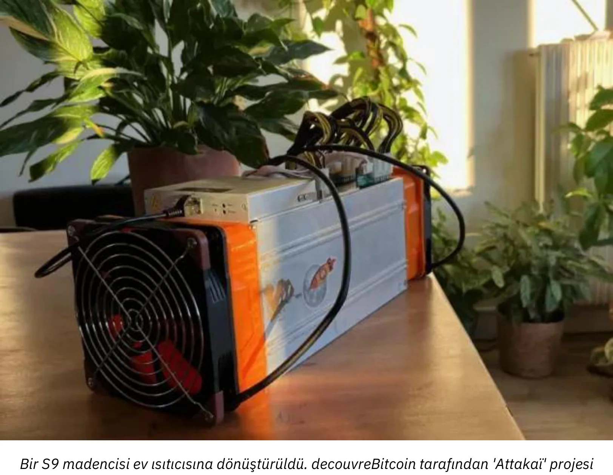

Elektrik tüketimi, bir madencinin maliyetlerinin neredeyse tamamını oluşturur. Bu nedenle madenciler, ucuz bir elektrik kaynağı bulmaya teşvik edilirler; bu da onları elektrik santrallerinin kurulduğu ancak henüz bölgenin elektrik şebekesine bağlanmadığı yerlere yönlendirir. Bu senaryoda madenciler, "son sığınak alıcı" (buyer of last resort) olarak hareket ederek santrallerin henüz elektrik şebekesine bağlanmadan önce bile finansman sağlamasına imkan tanırlar. Santraller şebekeye bağlandığında elektrik talebi artacak, bu da fiyatları yükselterek madencilerin bu bölgelerden elektrik temin etmesini daha az karlı hale getirecektir. Makineler kolayca taşınabildiği için madenciler tesislerini söküp talebin ve dolayısıyla fiyatların düşük olduğu daha uzak bölgelere, çoğunlukla da enerjiyi yeşil enerji santrallerinden elde edebilecekleri alanlara taşımaya karar verirler.

### Bitmeyen bir tartışma

Bu nedenle, Bitcoin'in ekolojik etkisi üzerine yapılan tartışmalar, çoğunlukla faydasının yeterince anlaşılamamasından ötürü yanlış bir zeminde yürütülmektedir. Bitcoin'i yalnızca işlem başına düşen enerji maliyeti üzerinden değerlendirmek doğru değildir; çünkü madenciler hem mevcut ağı hem de ağın geçmişini güvence altına alır. Üstelik işlemler gruplandırılarak işlenir ve hepsi birbirine eş değer değildir. Bunun da ötesinde, Lightning Network'ün etkisi hesaba bile katılmaz. Bitcoin'in çok fazla enerji tükettiğini iddia edenlerin siyasi motivasyonları olabilir ya da kendi blokzincir çözümlerini pazarlamaya çalışıyor olabilirler. Çoğu zaman ekolojik bahaneler, Bitcoin'i yasaklamayı meşrulaştırmak için bir kılıf olarak kullanılır.

Devrim niteliğinde bir buluş olan Bitcoin'in; finansal baskı altında veya diktatörlük rejimlerinde yaşayan bireylere özgürlükleri için mücadele etme imkanı sunduğunu vurgulamak son derece önemlidir. Son çare olarak Bitcoin; sansürü ve bankacılık kısıtlamalarını aşarak finansal bağımsızlığa giden bir yol sunar. Bitcoin, bir para birimi olmanın çok ötesinde, bir iletişim biçimi ve özgürlük sembolüdür; madencilerin harcadığı enerji ise borç yüküne ve merkez bankalarının aşırı para basımına dayalı finansal sistemden kurtulmayı sağlayarak bu özgürlüğü savunmada kritik bir rol oynar.

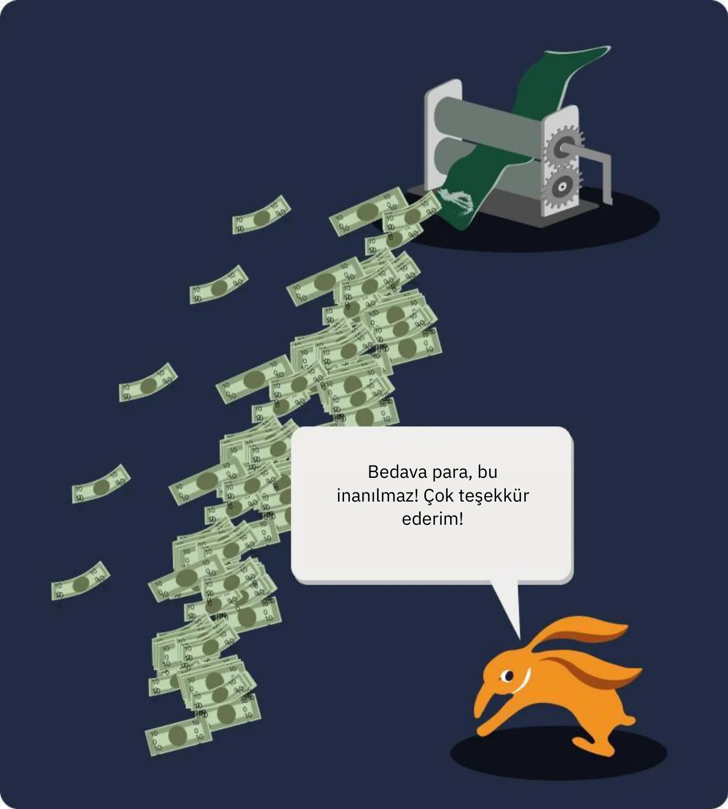
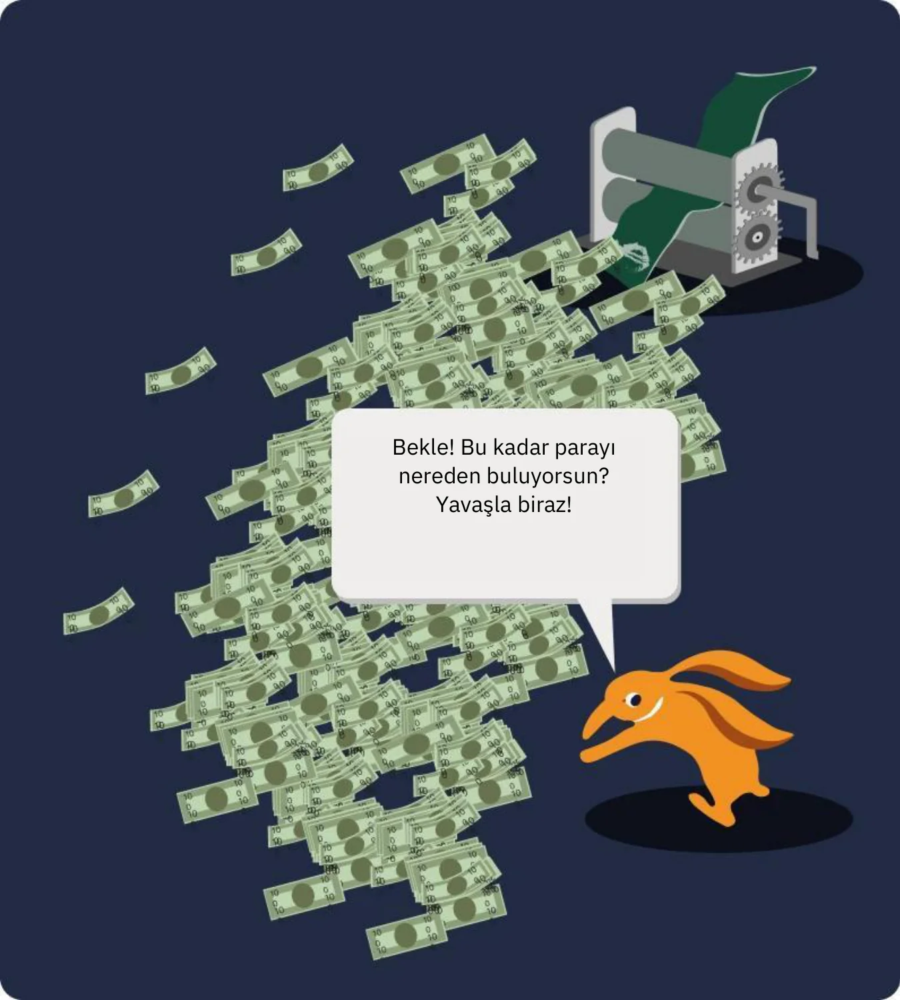
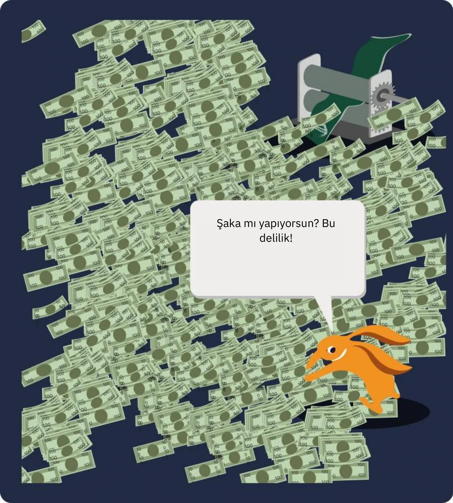

Yüksek enflasyon oranlarına sahip ülkelerde yaşayanlar için Bitcoin bir hayatta kalma meselesidir; güvencesiz finansal koşullarda ayakta kalabilmek için bir araç sunar. Dahası Bitcoin, dünya genelinde milyarlarca insanın finansal kaynaklara erişmesini sağlayarak daha adil ve tarafsız bir finansal sistem inşa eder. Bu açıdan bakıldığında, tüketilen enerji haklı görülebilir mi?

### Bitcoin çevre için net bir fayda sağlayabilir

Son olarak, Bitcoin kullanımının ekonomik ve çevresel sonuçlarını ele almak büyük önem taşımaktadır.

Mevcut finansal sistemle kıyaslandığında; mevcut sistem, aşırı tüketimi ve borçlanmayı teşvik etmesi nedeniyle ciddi sorunlara yol açmaktadır. Krediye kolay erişim, bankaların para basması ve kısmi rezerv bankacılığı uygulaması gibi faktörlerin tümü, aşırı borçlanmaya ve bunun sonucunda da kontrolsüz bir tüketime zemin hazırlamaktadır.

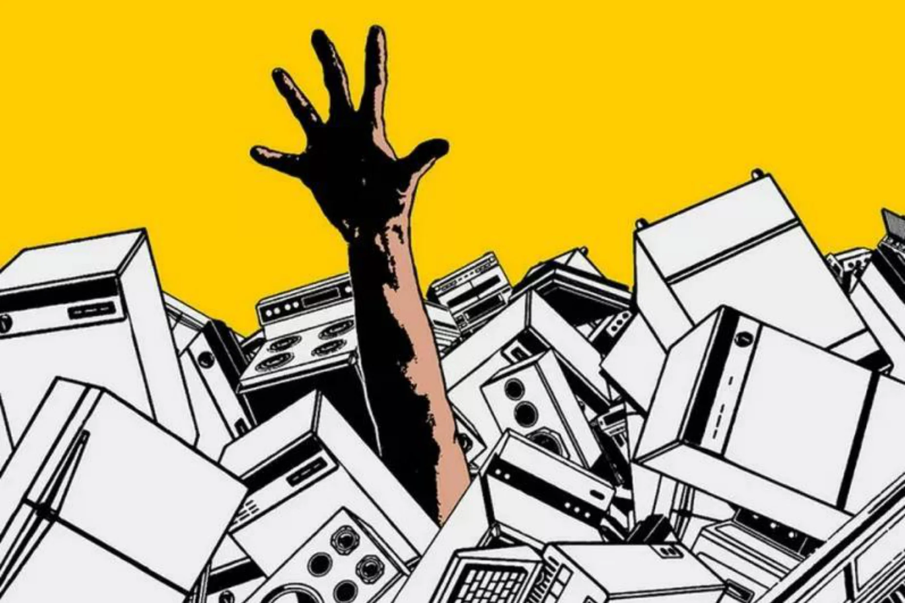

Kaynaklarımızın sınırlılığını para birimimizin sınırlılığıyla da yansıtabilmek adına parasal sistemi yeniden düzenlemek gerekmektedir. Bu durum, daha sorumlu bir tüketim anlayışını ve uzun vadeli bir vizyonu teşvik edecektir. Aksine enflasyon; tüketimi ve yatırımı körükleyerek uzun vadede çevre üzerinde olumsuz bir etki yaratmaktadır.

Mevcut finansal sistem, Avusturya iktisadının aksine, durumların ve kaynakların zamansal ve dinamik yönlerini hesaba katmayan Keynesyen ekonomi teorileriyle uyumludur. Bir başka deyişle, sınırsız bir para birimi, gezegenimizin sınırlı kaynaklarını etkin bir şekilde temsil edemez.

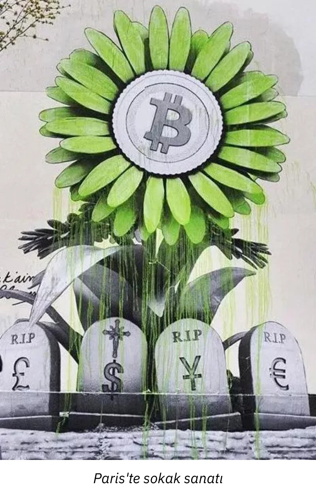

Politikacılar genellikle kısa vadeli bir vizyona sahiptir ve yeniden seçilmek için ekonomik büyümeye ihtiyaç duyarlar; bu yüzden de ekolojik sorunları uzun vadede çözüme kavuşturamazlar. Bitcoin gibi sağlam bir para biriminin benimsenmesi, insanları ekonomik olarak güçlendirebilecek potansiyel bir alternatiftir.

Eleştirmenler, Bitcoin'in yeşil enerji kullanımını teşvik ettiğini görmezden gelmektedir. Örneğin, petrol kuyularında metan gazını yakmak ve kirliliği önlemek için yakılan alevler Bitcoin madencileri tarafından söndürülebilir; çünkü metan, madencilik cihazlarını çalıştırmak için elektriğe dönüştürülebilir ve bu da çevre için son derece faydalıdır.

**Bitcoin'in temel ilkelerinden birini uygulayın: Güvenmeyin, kendiniz doğrulayın!**

### Bitcoin'in teknik özelliklerinin kısa bir özeti

Satoshi Nakamoto, Ocak 2009'da Bitcoin protokolünü yayımladı ve protokol o günden bu yana geliştiriciler, madenciler ve Bitcoin düğümlerine sahip kullanıcılardan oluşan ve sürekli büyüyen bir topluluk sayesinde gelişmeye devam etti. Tüm Bitcoin işlemlerinin halka açık bir defteri olan Bitcoin blokzincirinin kendi kopyalarını tutan bu düğümler, işlemlerin Bitcoin konsensüs kurallarına göre geçerliliğini denetleyebilir. Buna, madencilerin binlerce bekleyen işlemi içeren geçerli bloklar üretmesini sağlamak da dahildir.

Ortalama olarak her 10 dakikada bir yeni bir blok üretilir ve bir sonraki blok için geçerli bir hash bulan madenci, protokol tarafından hem konsensüs kurallarıyla belirlenmiş bir sübvansiyon miktarıyla hem de geçerli bloğa dahil edilen tüm işlemlerden alınan işlem ücretleriyle ödüllendirilir. Belirli bir girdi için hash algoritmasının (SHA-256) üreteceği sonuç öngörülemez kabul edildiğinden, madencilik süreci çok sayıda aday blok oluşturmayı ve bunların hash değerlerinin geçerli olup olmadığını test etmeyi içerir. Ancak, madenci sayısından ve madencilerin işlem gücünden bağımsız olarak iki blok arasındaki ortalama sürenin sabit (~10 dakika) kalmasını sağlamak için, geçerli bir hash bulma zorluğu her 2016 blokta bir (yaklaşık 2 haftada bir) yeniden ayarlanır. Madenciler, tüketilen enerji başına düşen deneme sayısını (joule başına hashrate) artırmak için zamanla ASIC adı verilen ve SHA-256 algoritmasına özel olarak geliştirilmiş cihazlar kullanmaya başlamışlardır.

Madencilerin faaliyetlerinden mümkün olan en yüksek kârı elde edebilmeleri için elektriği olabildiğince ucuza temin etmeleri gerekir; bu ucuz elektrik de genellikle şebekeye henüz bağlanmamış elektrik santrallerinin bulunduğu uzak bölgelerde yer alır. Madenci bu noktada "son sığınak alıcı" olarak hareket eder ve artan talep nedeniyle elektrik fiyatı yükseldiği anda faaliyetini başka bir yere taşıma eğilimi gösterir.

Böylelikle Bitcoin protokolü, her bir bileşeni dünya geneline coğrafi olarak dağıtıldığı için sansürlenemez ve durdurulamaz bir parasal sistem sunar. Örneğin, tüm kıtalara yayılmış 40.000'den fazla aktif Bitcoin düğümü bulunmaktadır. Bitcoin'in konsensüs kuralları, bu kurallara uymayı onları çiğnemeye çalışmaktan ekonomik olarak çok daha kazançlı kılacak şekilde tasarlanmıştır; bu nedenle aktörlerin birbirine güvenmesi gerekmez. Bitcoin'in bir lideri yoktur ve durdurulamaz. Bitcoin'i kısıtlamak amacıyla borsaları düzenlemek mümkün olsa bile, bu yaklaşımın sistem üzerindeki etkisi oldukça sınırlı kalır. Kısacası, hiçbir yargıç veya devlet Bitcoin'i sansürleyemez ve durduramaz.

# Bitcoin Nasıl Alınır?

<partId>517e1bb7-f032-51a0-930a-a91fe5148d3f</partId>

## Bitcoin Asla Uyumaz!

<chapterId>d5e35e41-ea26-5478-8eb9-07daf9dff508</chapterId>

Bitcoin fiyatı genellikle yüksek dalgalanmalarla (volatilite) karakterize edilir. Tıpkı diğer tüm finansal piyasalarda olduğu gibi, Bitcoin'in değeri de piyasadaki değişimlere ya da boğa ve ayı dönemlerine bağlı olarak ciddi biçimde dalgalanabilir.

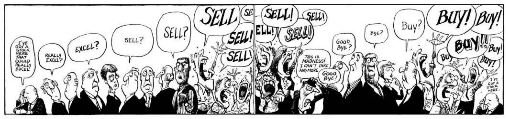

En basit ifadeyle, insanoğlu her şeyi bir anda satın alma ve yine her şeyi bir anda satma eğilimindedir.**Bitcoin de insan doğasından muaf değildir**.

### Benimsenme dalgalarını anlamak

Bitcoin'in hem gelişimi hem de evrimi, büyük ölçüde onun ekosistemine kademeli olarak dahil olan farklı aktör gruplarıyla ilişkilidir.

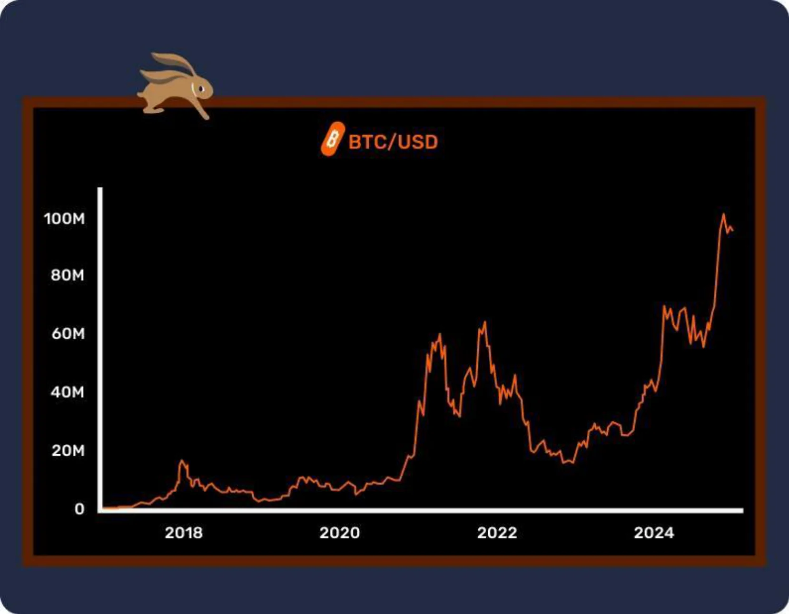

- İnananlar:

Bitcoin'in ilk kullanıcıları temel olarak teknoloji meraklıları, siberpunklar (cypherpunks), liberteryenler ve altın yatırımcılarıydı. Bu gruplar; güven gerektirmeyen bir elektronik para birimi olması, sansüre karşı direnç göstermesi ve şeffaf, değiştirilemez parasal politikası nedeniyle Bitcoin'e ilgi duydular.

- Karanlık ağ (dark web) ve suçlular

Ardından, Bitcoin'in kontrol edilemez ve takma adlı (yarı anonim) yapısı sayesinde kullanımı Silk Road gibi karanlık web pazaryerlerine doğru genişledi; bu durum, söz konusu platformun dışındaki bazı suç faaliyetlerine karışmış kişileri de kendine çekti. Ancak, bir eylemin yasal olup olmadığını belirleyen şeyin aracın kendisi değil, nasıl kullanıldığı olduğunu vurgulamak gerekir. Bitcoin'in yasa dışı kullanımı kişiyi kendiliğinden bir suçlu yapmaz; aksine, yasa dışı olarak sınıflandırılabilecek olan şey yapılan somut eylemlerdir. Örneğin, Bitcoin kullanarak bazı maddeleri satın almak, işlemin gerçekleştiği ülkedeki yasal düzenlemelere bağlı olarak yasal ya da yasa dışı olabilir.

- ICO çılgınlığı ve geniş kitlelerin katılımı

2017 yılı, özellikle binlerce ICO'nun (İlk Coin Arzı) piyasaya sürülmesiyle kripto para dünyasında büyük bir spekülatif balona sahne oldu. Ancak bu yeni kripto paraların birçoğunun arkasında somut bir geliştirme veya kullanım alanı yoktu ve hızla yok olup gittiler. 2017'deki bu balonu, 2018-2019 yıllarında sert bir düzeltme dönemi izledi.

- NFT balonu ve DeFi

Ardından 2020'de piyasa, Bitcoin fiyatını 60.000 dolara kadar çıkaran yeni bir spekülatif balon daha yaşadı. Bu balon, finansal kurumlar ve büyük şirketler de dahil olmak üzere çok daha çeşitli bir yatırımcı profilini barındırmasıyla öncekilerden ayrılıyordu. Ne var ki, önceki balonlarda olduğu gibi, başlangıçtaki coşku yatıştığında bunu genellikle sert düzeltmeler takip etti.

### Bitcoin ve volatilite

Geçmiş döngülere bakıldığında, Bitcoin'in ekonomik döngülerindeki periyodun iki [yarılanma (halving)](https://planb.academy/resources/glossary/halving) arasındaki süreye eşit olduğu görülüyor; bunun sebebi muhtemelen yarılanma olayının yeni bitcoin arzını yarı yarıya düşürerek bir tetikleyici görevi görmesidir.

Bu büyük dalgalanmalar, Bitcoin'in oldukça oynak (volatil) bir varlık olarak ün kazanmasına yol açmış ve kullanıcıları için sık sık ciddi kayıplara neden olmuştur. Fiyatın birkaç gün içinde %10, %20 hatta %50 oranında düşebileceği doğru olsa da Bitcoin protokolünün kendisinin bu fiyat değişimlerinden hiçbir şekilde etkilenmediğini anlamak önemlidir.

Bugün Bitcoin aktörleri tarafından tamamen kanıksanmış olan bu yüksek volatilite; finansal koruma araçları (stabilcoin'ler), güçlü bir uzun vadeli inanç (hodling) veya basitçe konuyu iyice kavramadan tüm birikimi Bitcoin'e yatırma riskinden kaçınmak gibi çeşitli yöntemlerle hafifletilebilir. Dolayısıyla, Bitcoin fiyatının neden bu kadar çok dalgalandığını anlamak bu sektörde yol katetmek için elzemdir; çünkü nihayetinde piyasayı bir dereceye kadar dizginleyen ve düzenleyen şey tam olarak bu fiyat hareketleri ve döngülerdir. Bununla birlikte, Bitcoin büyüyüp olgunlaştıkça volatilitenin etkisinin giderek azaldığını belirtmek son derece önemlidir.

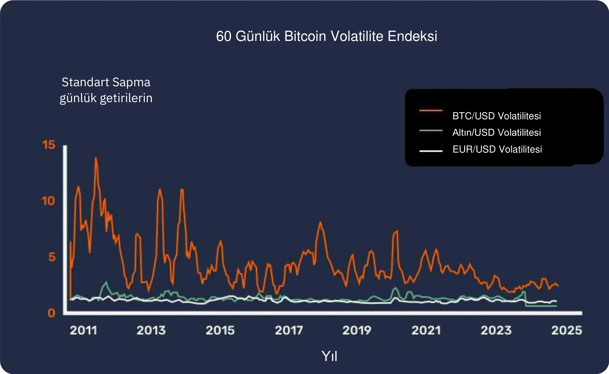

Kısa vadede BTC/dolar paritesinde dalgalanmalar yaşansa da Bitcoin; 21 milyon adetle sınırlandırılmış arzı ve yaklaşık her 4 yılda bir para üretimini yarıya indiren yarılanma (halving) süreci sayesinde, adeta mekanik bir şekilde genel bir yükseliş trendi izler. Elbette her finansal varlık gibi Bitcoin de coşku dönemleri, spekülatif balonlar ve düzeltmeler içeren ekonomik döngülere tabidir. Pazarın her zaman rasyonel veya verimli olmadığı gelişmekte olan teknolojilerde bu durum oldukça yaygındır.

### Benzersiz bir piyasa

Bu spekülatif balon döngüleri dünyada oldukça benzersizdir; çünkü tek bir varlığın arka arkaya bu kadar çok balon süreci yaşamasına nadiren rastlanır. Bu durum, Bitcoin'in yalnızca sönmeye mahkum bir balondan ibaret olmamasıyla açıklanabilir. Aksine Bitcoin, dünya genelinde aktif olarak kullanılan bir para birimi olarak işlev görür. Bitcoin protokolü, küresel ölçekte 7/24 çalışabilme özelliğiyle öne çıkar ve bu durum, onu düzenlemeye çalışan finansal otoriteler için ciddi zorluklar yaratır.

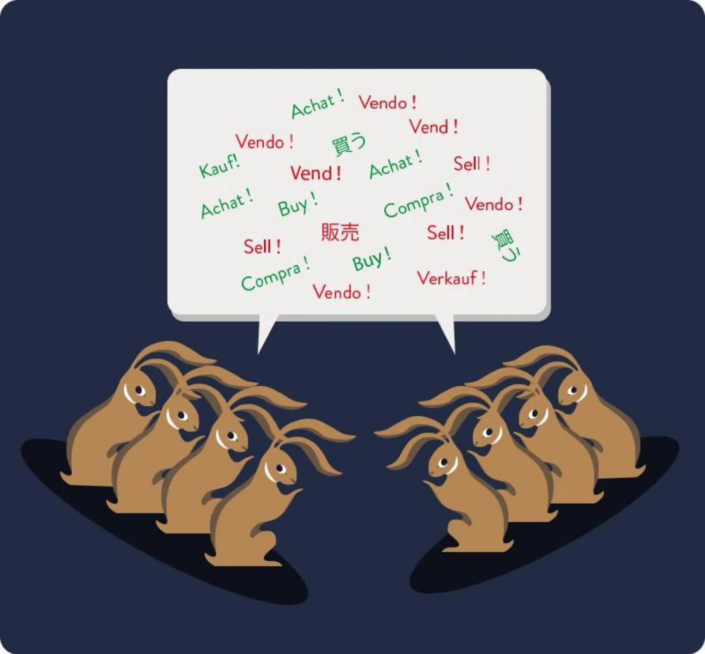

Bugün Bitcoin, geleneksel piyasaya her geçen gün daha fazla entegre olarak hayatta kalmaya ve büyümeye devam ediyor; Bitcoin ETF'lerinin kullanıma sunulması, daha net yasal düzenlemeler, satın alma ve saklama araçlarının geliştirilmesi gibi adımların tümü bu olumlu ivmeye katkı sağlıyor. Bitcoin spekülatif balonundan BİR KEZ DAHA sağ çıkmayı başardı; demek ki her şey sadece boş bir balondan ibaret değilmiş!

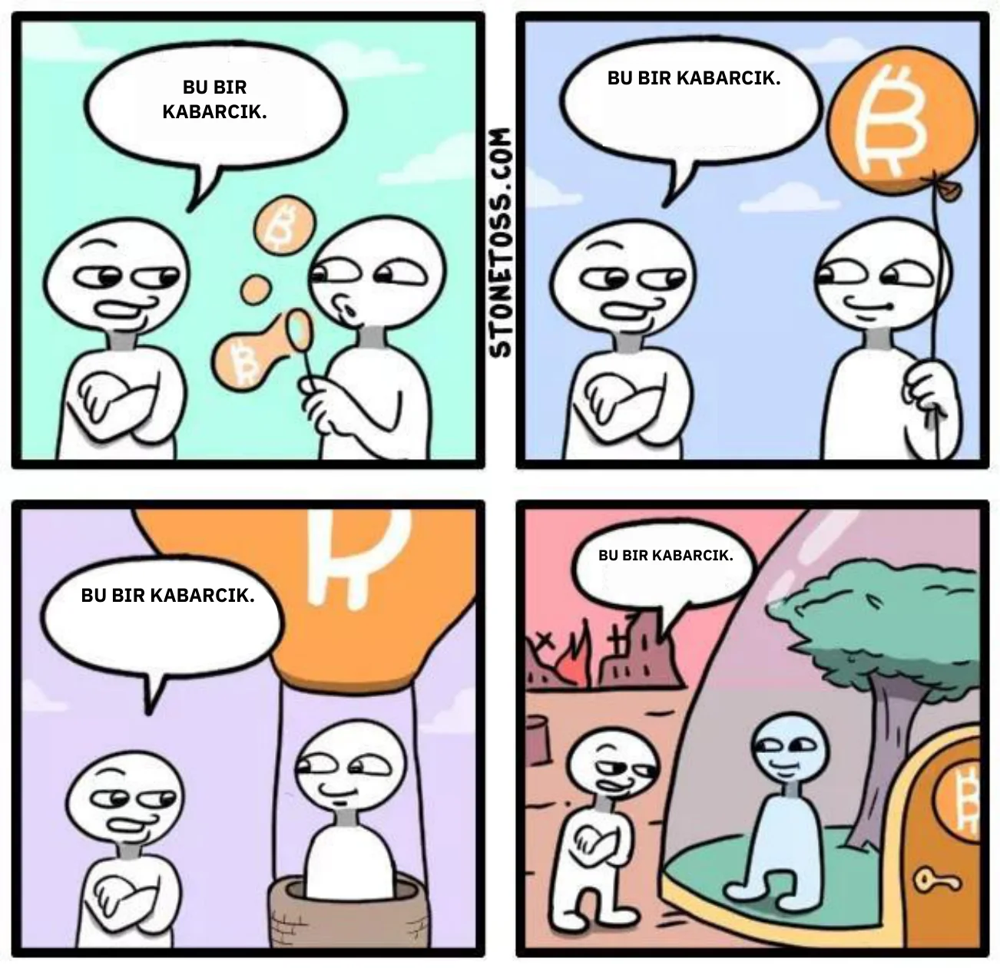

## Çalışarak Bitcoin Kazanmak

<chapterId>be2d83be-406f-582c-83ca-6aa905ff7b04</chapterId>

### Paralel bir ekonomi gelişiyor

Bitcoin, itibari (fiat) para birimlerine paralel bir ekonomi yaratmanın aracı olarak görülebilir; çünkü mal veya hizmet satıp karşılığında bitcoin ile ödeme almak mümkündür. İşlemler, herhangi bir borsaya aracı kılmadan doğrudan bir Bitcoin cüzdanından diğerine gönderilerek kolayca gerçekleştirilebilir.

Bitcoin ekonomisi, Bitcoin'in 2021 yılında yasal ödeme aracı haline geldiği El Salvador gibi dünyanın belirli bölgelerinde halihazırda mevcuttur ve gelişimini sürdürmektedir. Ne yazık ki Ocak 2025'te meclis, iddialara göre Uluslararası Para Fonu'ndan (IMF) gelen baskıların ardından, Bitcoin'in "yasal ödeme aracı" statüsünü kaldıran yeni bir yasayı onayladı. Yeni yasa kapsamında, esnaf ve işletmelerin artık Bitcoin kabul etme zorunluluğu bulunmuyor ve devlet dairesinde Bitcoin ile vergi ödemesi yapılamıyor. Kabul edilmesi tamamen gönüllülük esasına dayanıyor.

Buna rağmen, hem El Salvador'da hem de dünyanın diğer pek çok yerinde, sundukları ürün veya hizmetler karşılığında ödeme yöntemi olarak Bitcoin kabul eden bireylerin, işletmelerin ve toplulukların sayısı günden güne artmaya devam ediyor.


_Kaynak : [Wicked Smart Bitcoin](https://wickedsmartbitcoin.com)_

Ayrıca, günlük işlemlerde Bitcoin kullanımını kolaylaştırmak amacıyla açık kaynaklı ve ortaklaşa yürütülen bir proje olan [BTCMap](https://btcmap.org/map#2/21.28937/5.46680) hayata geçirilmiştir. Bu platform, Bitcoin kabul eden tüm işletmelerin yanı sıra dünya genelindeki farklı Bitcoin topluluklarını da listeler; böylece web sitesini ziyaret ederek yakınınızdaki Bitcoin ekosistemini keşfedebilirsiniz. Dolayısıyla, yaşanan zorluklara ve kararsızlıklara rağmen, BTCMap gibi girişimler Bitcoin ekonomisini herkes için daha erişilebilir ve kullanışlı hale getirmeye katkı sağlamaktadır.

### Neden Bitcoin'i satın almak yerine bir ödeme yöntemi olarak kabul etmeliyiz?

Bitcoin elde etmek için Fransa'daki AMF (Finansal Piyasalar Otoritesi) veya ABD'deki SEC (Menkul Kıymetler ve Borsa Komisyonu) gibi kurumlar tarafından denetlenen platformları kullanabilirsiniz; ancak bu yöntem işlemlerinizin takip edilmesine yol açar. Bitcoin edinmenin bir diğer yolu ise sunduğunuz ürün veya hizmetler karşılığında onu bir ödeme aracı olarak kabul etmektir. Böylece sürekli fiyat dalgalanmalarına kafa yormak zorunda kalmadan, emeğinizin karşılığı olarak Bitcoin biriktirebilirsiniz.

Üstelik bir işletme sahibi olarak Bitcoin ile ödeme almak; sansüre karşı direnç, daha düşük işlem ücretleri, yüksek verimlilik, enflasyona karşı koruma, finansal özgürlük ve kendi paranızın kontrolüne sahip olma gibi birçok avantaj sağlar.

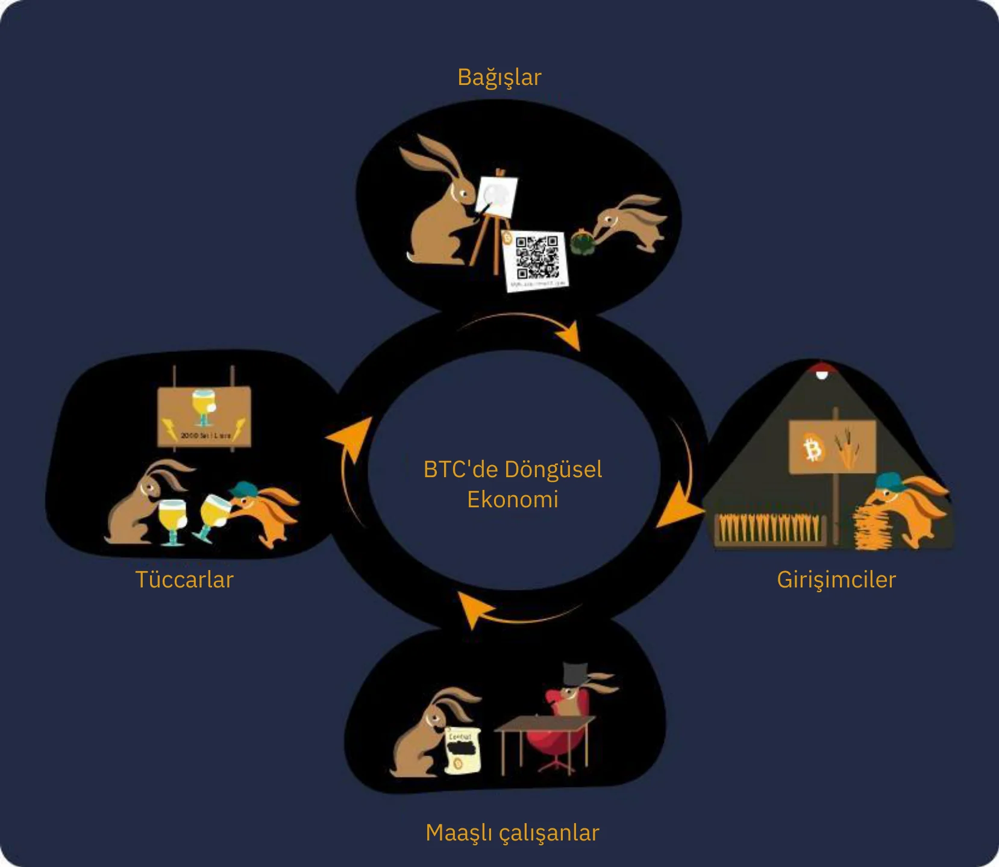

### Nasıl bir yol izleyebilirsiniz?

Bitcoin ile ödeme almak için mevcut farklı çözümleri incelemeli ve işletmenize en uygun olanını seçmelisiniz. Kusursuz bir çözüm yoktur; seçim yaparken beklenen işlem hacmi, ayrılan bütçe ve işletme türü (çevrim içi veya fiziksel) gibi birçok faktörü göz önünde bulundurmanız gerekir.

Bu konuyu başka bir derste detaylıca ele alacağız ancak basitleştirmek adına, farklı işletme kategorilerini ve bunlarla ilişkili çözümleri şu şekilde sıralayabiliriz:

- Basit çevrim içi çözüm: OpenNode

https://planb.academy/tutorials/business/point-of-sale/open-node-e69a0c1c-47f7-4932-8494-e6f26c3c9784

- Küçük ölçekli veya hobi amaçlı satış yapanlar için çözüm: Swiss Bitcoin Pay

https://planb.academy/tutorials/business/point-of-sale/swiss-bitcoin-pay-2-a78b057e-ed11-47ac-860c-71019fcb451a

- BBüyük kuruluşlar veya sıkı Bitcoin takipçileri için çözüm: BTCpay Server

Bu konuyu daha derinlemesine incelemek için BIZ101 kursumuzu tavsiye ederiz! Bitcoin'i şirketinizin kasasına nasıl etkili bir şekilde entegre edeceğinizi, organizasyon yapınıza uygun olarak Bitcoin ile nasıl ödeme kabul edeceğinizi ve ilgili vergi ile muhasebe gereksinimlerini nasıl yöneteceğinizi keşfedin:

https://planb.academy/courses/a804c4b6-9ff5-4a29-a530-7d2f5d04bb7a

## Bitcoin ile Birikim Yapmak

<chapterId>1d9570c6-5b63-51a6-b87c-7bdb0fc4aa87</chapterId>

### Başlamadan önce önemli bir uyarı!

Bitcoin, temel olarak sınırlı arzı ve artan talebi sayesinde önemli bir finansal varlık haline gelmiştir. Ancak Bitcoin satın almak, özel dikkat gerektiren riskler barındırır. Bu nedenle, herhangi bir fon yatırmadan önce teknolojiye aşina olmak adına kendi araştırmanızı yapmanız ve konu hakkında daha fazla bilgi edinmeniz tavsiye edilir.

- Sadece kaybetmeyi göze alabileceğiniz bir miktarla yatırım yapın.
- Bitcoin yüksek oynaklığa (volatiliteye) sahip bir finansal varlıktır ve fiyatı sıfıra düşebilir.
- Geçmiş performans, gelecekteki performansın güvenilir bir göstergesi değildir.
- Gerekirse finansal danışmanınızla iletişime geçin.

**Plan ₿ Academy herhangi bir yatırım tavsiyesi vermez ve burada belirtilen hiçbir şey bu kapsamda değerlendirilmemelidir.**

### İlk adımı atmadan önce küçük bir kontrol listesi

Bitcoin satın almaya başlamadan önce şunlara sahip olduğunuzdan emin olun:

- Güvenli bir cüzdan.
- Bitcoin hakkında sağlam bir bilgi birikimi.
- Sadık kalacağınız bir birikim planı.
- Uzun vadeli bir vizyon.

Eğer bu konu kafanızda tam olarak netleşmediyse, ilk bitcoin'lerinizi edinmek ve güvene almak konusunda BTC102 kursunun size rehberlik edeceğini belirtelim. Burada konuyu yalnızca yüzeysel olarak ele alacağız.

Somut olarak, kendinize sormanız gereken iki soru var:

- Kademeli bir alım stratejisi mi yoksa tek seferde toplu alım stratejisi mi izlemelisiniz?
- Denetlenen bir platformu mu yoksa denetlenmeyen bir platformu mu tercih etmelisiniz?

### Alım stratejileri

- Dolar Maliyet Ortalaması (DCA)

Bu kademeli strateji, düzenli aralıklarla küçük miktarlarda Bitcoin satın almak anlamına gelen tekrarlayan alımları içerir. Bu yöntem, zaman içinde fiyat dalgalanmalarını dengeler ve sahip olunan bitcoin miktarının sürekli artmasını sağlar. Uzun vadeli birikimler için ideal bir çözüm olan bu yöntem, Bitcoin fiyatındaki oynaklığın yarattığı endişeleri de hafifletir. Bir kez kurulumu yaptıktan sonra, arkaya yaslanıp yatırımınızın büyümesini izleyebilirsiniz.

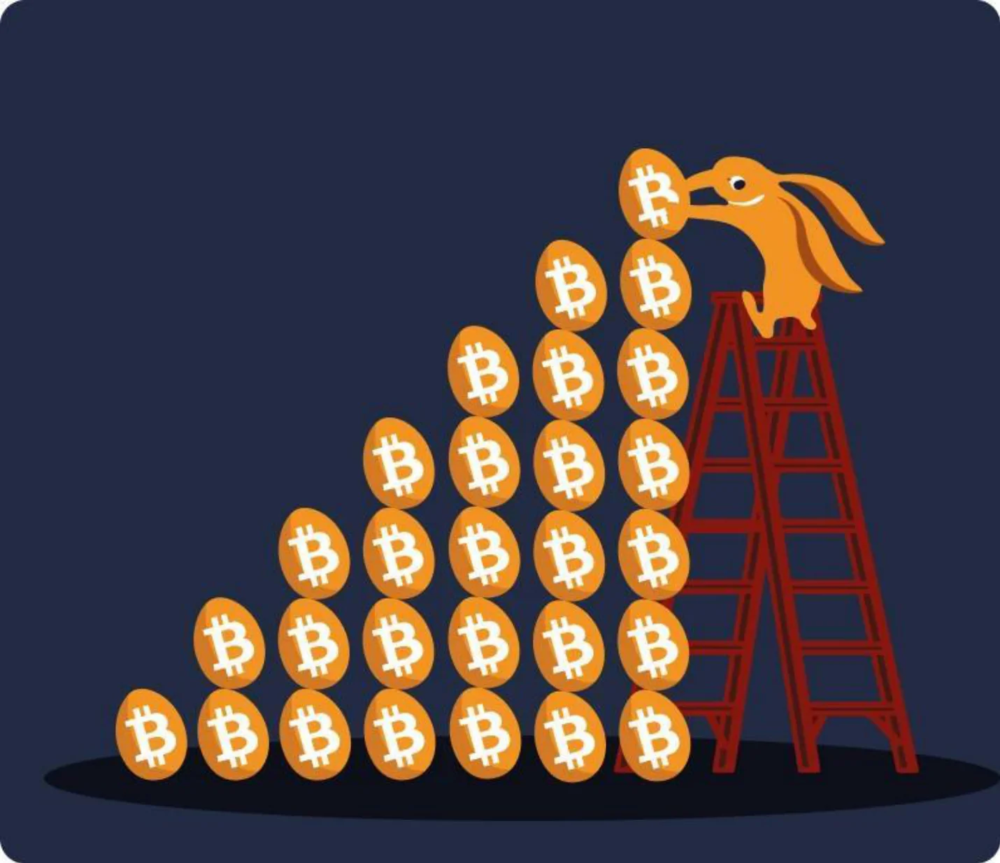

**UTXO'lara Dikkat Edin**: Cüzdanınızdaki UTXO'ları zaman zaman birleştirmeyi unutmayın. Bu uygulama, bitcoin'lerinizi etkili bir şekilde yönetmek ve işlemler sırasında gereksiz ücretler ödemekten kaçınmak için çok önemlidir.

[UTXO](https://planb.academy/en/resources/glossary/utxo) (Harcanmamış İşlem Çıktısı), henüz harcanmamış, yani yeni bir işlemde girdi olarak kullanılmamış bir işlem çıktısıdır. Bunları birleştirmek, işlemin "boyutunu" küçültmek ve böylece daha düşük işlem ücreti ödemek amacıyla birkaç küçük UTXO'yu tek bir büyük UTXO'da toplamak anlamına gelir.

- Anlık Alım

Tek seferde toplu alım yöntemi, bitcoin'e hızlıca yatırım yapmak için kullanılan anlık bir satın alma işlemi olabilir. İster sert bir düşüş (crash) sırasında alım yapın, ister elinize geçen bir primi değerlendirin; karar tamamen size aittir. Tek yapmanız gereken cesaretinizi toplamak ve satın alma butonuna basmaktır.

Bu durumda dikkatli olmalı ve duygularınızı kontrol etmelisiniz, çünkü bitcoin fiyatı oldukça dalgalı olabilir. Unutmayın ki FOMO (Fırsatı Kaçırma Korkusu) ve FUD (Korku, Belirsizlik, Şüphe) sizin en büyük düşmanlarınızdır! Fevri ve potansiyel olarak zararlı kararlar almaktan kaçınmak için sakin kalmayı ve önceden belirlediğiniz stratejiye sadık kalmayı unutmayın.

### Bitcoin'i kimden satın almalıyız?

Bitcoin edinmenin, her biri bulunulan ülkeye göre değişiklik gösterebilen ve kendine has düzenlemelere tabi olan birkaç yolu vardır. Bazı platformlar kimlik doğrulaması ([KYC](https://planb.academy/resources/glossary/kyc-know-your-customer)) talep ederken, bazıları ise bunu zorunlu tutmaz. Bu nedenle, her platformun tabi olduğu yasal düzenlemeleri anlamak büyük önem taşır.() gerektirirken, diğerleri gerektirmez. Bu nedenle, her platformla ilgili düzenlemeleri anlamak çok önemlidir.

- DCA platformları

Yukarıda da bahsettiğimiz gibi, bitcoin biriktirmenin yaygın bir yöntemi, düzenli aralıklarla küçük miktarlarda alım yapmayı içeren [Dolar Maliyet Ortalaması (DCA)](https://planb.academy/resources/glossary/dollar-cost-averaging-dca). stratejisidir. [İlgili sayfamızda](https://planb.academy/tutorials/exchange) listelenenler gibi birçok platform bu hizmeti sunmaktadır. DCA kurulumunun basitliğinin yanı sıra, cüzdanınıza yapılan çekim işlemleri genellikle otomatiktir; bu da varlıklarınızın kontrolünün her zaman sizde olacağı anlamına gelir.

Günümüzde neredeyse tüm DCA çözümleri oldukça verimlidir ve benzer işlem ücretlerine sahiptir; dolayısıyla yapacağınız seçim daha çok platformun ülkenizde kullanılabilir olup olmadığına bağlı olacaktır.

- Aracı Kurumlar (Broker Platformları)

Büyük ölçekli yatırımlar için Kraken, Bitstamp ve Paymium gibi denetlenen ve tanınan platformlar tavsiye edilir. Bu platformlar, yüksek hacimli işlemler için emniyetli ve güvenli bir ortam sunar.

Kullanımları oldukça basittir ve herkes tarafından kolayca erişilebilir:

1. Bir KYC hesabı oluşturun
2. Hesabınıza para aktarın
3. Bitcoin Satın Alın
4. Bitcoin'lerinizi cüzdanınıza çekin

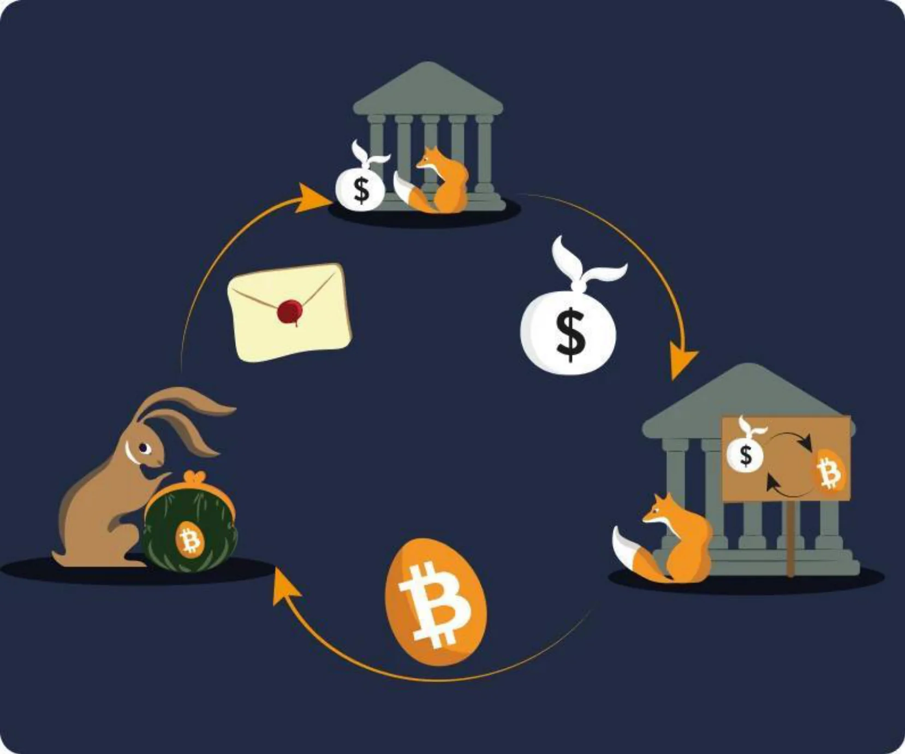

Satın alma işleminden sonra, siber saldırı ve fonların bloke edilmesi risklerini en aza indirmek için bitcoin'leri derhal borsa platformlarından çekmeniz önerilir. Platforma bağlı olarak çekim ücretlerinin yüksek olabileceğini ve bazen 25 euroya kadar çıkabileceğini unutmayın.

**Müşterini Tanı (KYC) düzenlemeleri; terörün finansmanı, vergi kaçakçılığı ve kara para aklama ile mücadele etmek amacıyla kullanıcıların kimlik bilgelerini sunmasını zorunlu kılar.**

KYC'nin Bitcoin sektöründe önemli bir tartışma konusu olduğunu kabul etmek gerekir. Birçok insan bunun etkililiğini tartışırken, beraberinde getirdiği pek çok endişe de mevcuttur. Akademimizin birçok eğitim programında ve içeriğinde, daha fazla gizlilik odaklı alternatifler bulunabildiği için ileri düzey kullanıcılara KYC gerektiren platformlardan kaçınmalarını tavsiye ediyoruz.

### KYC Zorunluluğu Olmayan (Non-KYC) Çözümler

Buna ek olarak, eşten eşe (peer-to-peer) transfer yöntemiyle bitcoin alıp satabileceğiniz çeşitli[pazaryerleri](https://planb.academy/tutorials/exchange) de bulunmaktadır. Genel olarak şu seçenekleri değerlendirebilirsiniz:

- Bitcoin ATM'ler
- Diğer Bitcoin meraklılarıyla yapılan yüz yüze görüşmeler
- Yasal düzenlemelere tabi olmayan platformlar
- Eşten eşe (P2P) eşleştirme çözümleri
- Bitcoin dostu ülkelerde faaliyet gösteren dijital bankalar (Neobanklar).

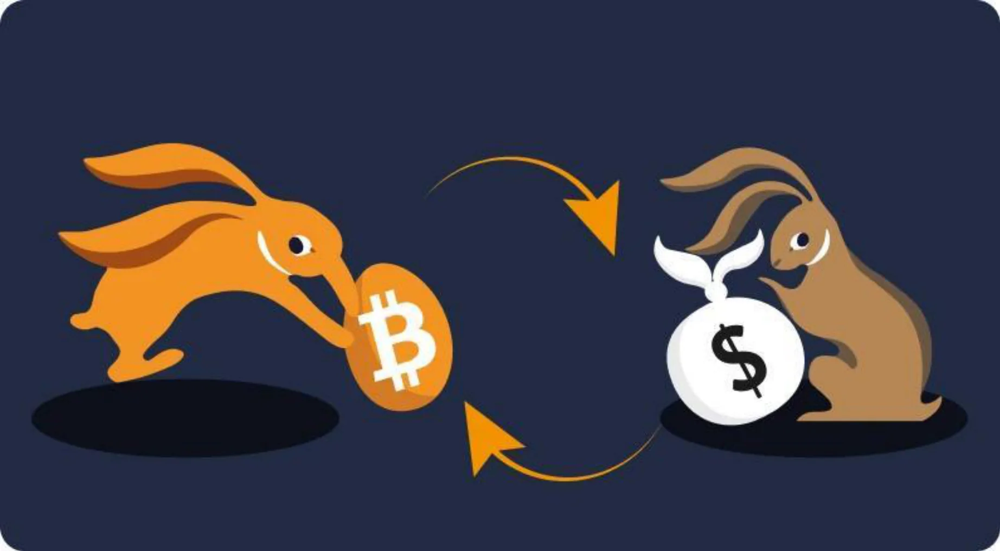

Son olarak, vergi yükümlülüklerinin bulunulan ülkeye göre değişiklik gösterebileceğini unutmamak önemlidir. Bu nedenle, sizi riske atabilecek herhangi bir adım atmadan önce kendi ülkenizdeki yasal düzenlemeleri incelemenizi önemle tavsiye ederiz.

Bitcoin satın alma, kullanma ve varlıklarınızı güvence altına alma stratejileri hakkındaki bilginizi derinleştirmek isterseniz, bu dersten sonra **BTC 102** kursuna katılmanızı şiddetle öneririz. Bu kursta, diğer konuların yanı sıra profilinize, ihtiyaçlarınıza ve kişisel hedeflerinize en uygun araç önerilerini de keşfedeceksiniz:

https://planb.academy/courses/f3e3843d-1a1d-450c-96d6-d7232158b81f

## Hiper-Bitcoinizasyon

<chapterId>b7275d31-3b60-5fb7-b9f5-030097010553</chapterId>

### Büyük yarış daha yeni başlıyor!

Her yeni teknolojide olduğu gibi, Bitcoin'in benimsenme süreci de ilk kullanıcılardan kitlesel kabule doğru giden ilerlemeyi gösteren bir S-eğrisi izler. İlk benimseyenler dönemini artık geride bıraktık ve göstergeler Bitcoin'in potansiyel olarak geniş kitlelere yayılacağına işaret ediyor. Ne de olsa bu, kolayca durdurulamayacak kadar hızlı yayılan küresel bir teknolojidir. Bir yanda El Salvador, Bitcoin'i resmi para birimi olarak ilan edecek kadar cesur bir adım atarken; diğer yanda bazı ülkeler bunu yasaklayıp kullanımını suç sayarak karşılık verdi. Bu durum, Bitcoin'in benimsenme sürecinin ne kadar karmaşık olduğunu ve kültürel, tarihi ile ulusal faktörlerin etkisine açık olduğunu gösteriyor.

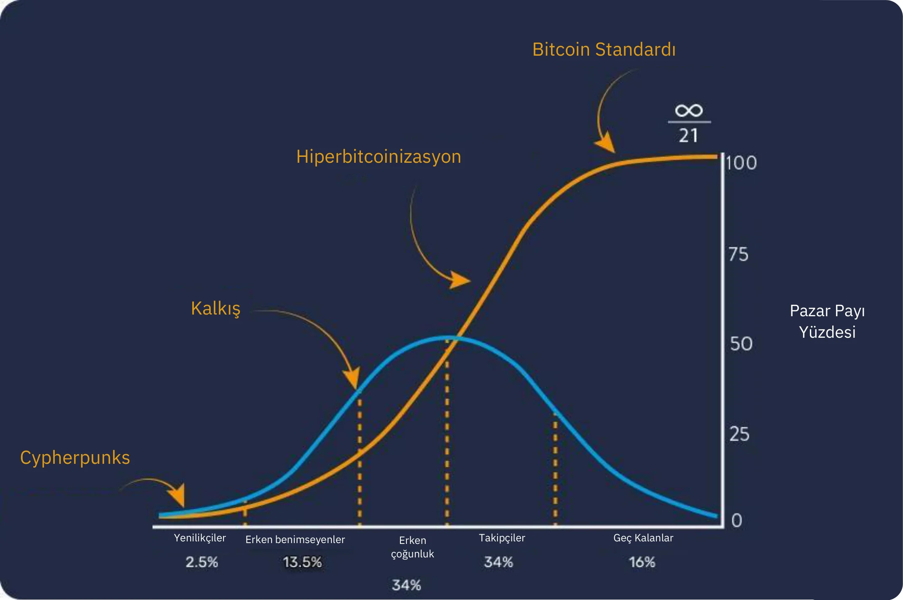

Bitcoin'in yükselişi şirketleri, üniversiteleri, düzenleyici kurumları ve bireyleri bu yeni teknolojiyi dikkate almaya zorluyor. Varlıklarını sürdürebilmek için yeni araçların yaratılması, hizmetlerin uyarlanması ve inovasyonun devam etmesi gerekiyor. Bu süreç; kriptografi, oyun teorisi, ekonomi ve para politikası, bilgisayar bilimi, felsefe, enerji, hukuk ve yasal düzenlemeler dahil olmak üzere pek çok alanda birçok soruyu da beraberinde getiriyor. Kısacası Bitcoin, multidisipliner bir konudur.

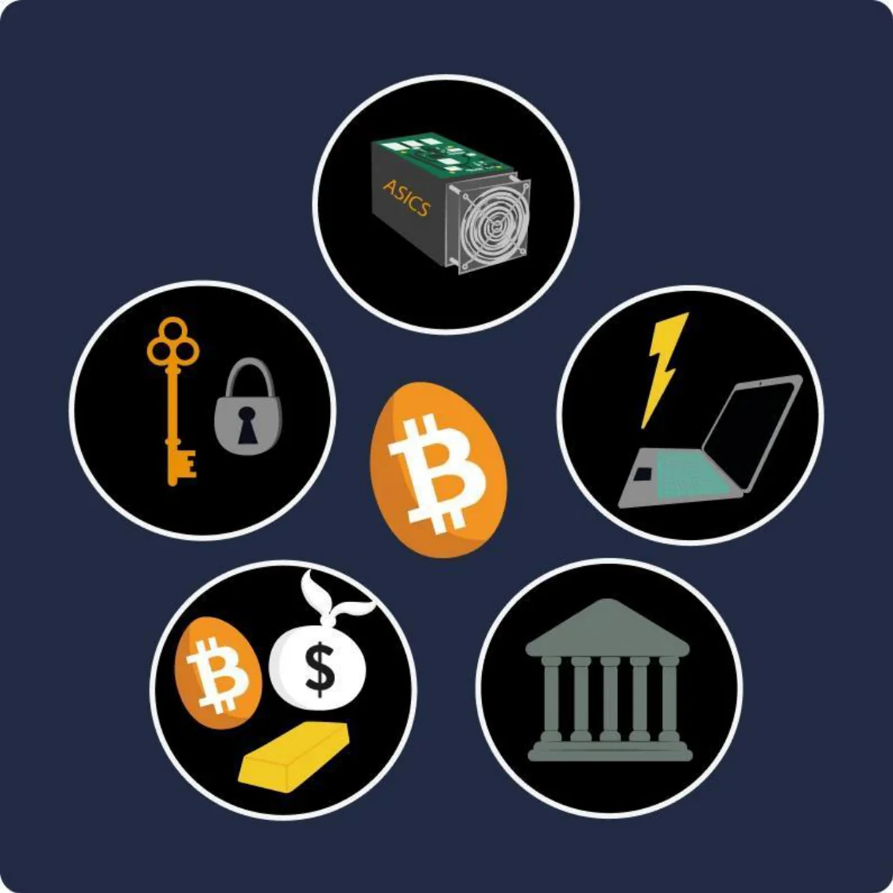

### Bitcoin 0'dan 1'e Bir Devrimdir

Son olarak, sizi bu yeni parasal devrim üzerinde düşünmeye davet ediyoruz. Bitcoin ile keşfedilecek o kadar çok şey var ki hepsini bir kerede sindirmek oldukça zordur. Acele etmeyin, Bitcoin hiçbir yere kaybolmayacak. Aksine, devrim daha yeni başladı. Çocuklarımıza emanet etmek istediğimiz dünyayı kendimizin inşa edebileceğine inanıyoruz: İnsan egemenliğinin bir hak olduğu, gizliliğe varsayılan olarak saygı duyulduğu ve paranın manipüle edilmediği bir dünya. Birlikte bunu başaracağımızı umuyoruz.

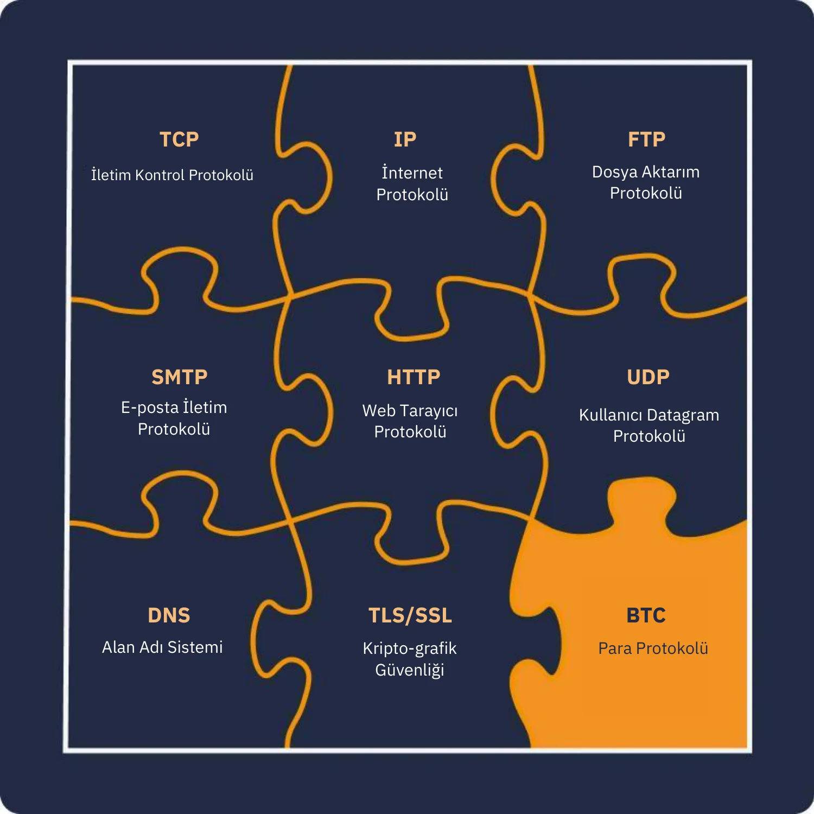

Eğer Bitcoin hakkındaki bilginizi genişletmek istiyorsanız, tam zamanı: Pek çok yazar, düşünür ve deneme yazarı Bitcoin hakkında eğitici içerikler üretti. En meraklı olanlarınıza bir [kaynak kütüphanesi](https://planb.academy/resources) sunmak adına, son birkaç yıldır bu çalışmaları listeliyor ve kategorize ediyoruz. Bu bölümde en iyi podcast'leri, web sitelerini, makaleleri, rehberleri, kitapları ve diğer içerikleri bulabilirsiniz.

> "İnternetin, devletin rolünü azaltacak en büyük güçlerden biri olacağını düşünüyorum. Eksik olan ama yakında geliştirilecek tek şey, güvenilir bir e-nakit sistemi; yani internet üzerinden, A'nın B'yi ya da B'nin A'yı tanımasına gerek kalmadan varlık transferi yapabileceğiniz bir yöntemdir." - Milton Friedman'ın 1999 yılındaki öngörüsü

# Bitcoin’in Geleceği

<partId>899fd35e-39e6-5a25-a73e-6fed6e725094</partId>

## Lightning Network: Bitcoin ile düşük ücretli ve hızlı ödeme

<chapterId>b403f1e4-f1ff-572b-a242-9b58cb3736d0</chapterId>

Artık Bitcoin protokolünün temellerine aşina olduğunuza göre, Bitcoin üzerinde inşa edilen ana ödeme ağını tanıyabiliriz: Lightning Network (genellikle "LN" olarak kısaltılır). Amacı basittir: Blokzincir ağını tıkamadan, neredeyse anında gerçekleşen ve genellikle çok düşük işlem ücretlerine sahip BTC ödemelerine olanak tanımak.

### Blokzincir her şeyi tek başına yapamaz

Bitcoin blokzinciri; herhangi bir izne veya güvene dayalı olmaksızın, mümkün olduğunca çok insan tarafından doğrulanabilecek şekilde tasarlanmıştır. Bu gereklilik, yapısal sınırları da beraberinde getirir: Blokzincir sınırsız sayıda işlemi işleyemez; çünkü blokların bağımsız düğümler (node) tarafından pahalı donanımlara ihtiyaç duyulmadan indirilebilmesi, saklanabilmesi ve doğrulanabilmesi için makul boyutlarda kalması gerekir. Bu denge genellikle şu üçlü açmaz (trilemma) ile özetlenir: merkeziyetsizlik, güvenlik ve ölçeklenebilirlik. Blokzincir tabanlı bir sistem, bu üç özelliğin hepsini aynı anda en üst seviyeye çıkaramaz. Bitcoin merkeziyetsizlik ve güvenliğe öncelik verir, bu da doğal olarak yapılabilecek [zincir üstü (onchain)](https://planb.academy/resources/glossary/onchain)işlem kapasitesini sınırlar.

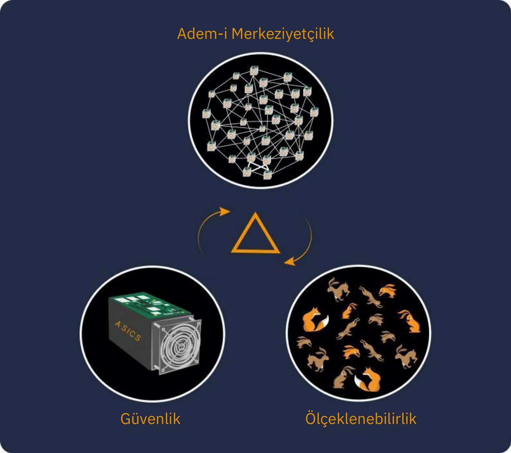

Bitcoin geliştiricileri, bu özelliklerin korunması adına bilinçli tercihler yapmışlardır. Bir yandan blok boyutunun 1 MB ile sınırlandırılması ve bloklar arası ortalama sürenin 10 dakika olması, bir Bitcoin düğümünü (node) düşük maliyetle çalıştırmayı mümkün kılarak ağın merkeziyetsizliğini destekler. Diğer yandan, iş kanıtı (proof of work) yöntemiyle blok üretimi, her türlü dolandırıcılık girişimini son derece maliyetli hale getirirken, düğümler tarafından yapılan doğrulamayı kolaylaştırır ve protokolün genel güvenliğini artırır.

Ancak bu tercihler beraberinde önemli bir kısıtlama getirir: Her bloğa dahil edilebilecek işlem sayısı sınırlıdır. Bu da saniyede yalnızca birkaç işleme denk gelir. Bu rakam, VISA gibi merkezi ödeme sistemlerinin kapasitesiyle (saniyede yaklaşık 65.000 işlem olan teorik maksimum kapasite) karşılaştırıldığında oldukça önemsiz kalır; fakat bu sınırlama, güvenilir bir üçüncü tarafa ihtiyaç duymadan, sansüre dayanıklı işlemler gerçekleştirebilmek için ödenmesi gereken bedeldir.

Somut olarak bu durum, Bitcoin'in günlük kullanımı için çok önemli iki anlama gelir:

- Blok alanına olan talep arttığında, zincir üstü (onchain) işlem ücretleri çok yüksek seviyelere ulaşabilir;
- Zincir üstü ödemeler onay gerektirir, bu da günlük alışverişler için her zaman uygun değildir.

Lightning Network, tam olarak bu sorunlara çözüm üretmek amacıyla geliştirilmiştir. Lightning'in arkasındaki fikir, katmanlı bir yaklaşımı temel alır: Bitcoin temel katman (sağlam ve son derece güvenli olan mahsuplaşma katmanı) olarak kalırken, Lightning bunun üzerinde çalışan hızlı bir ödeme katmanı işlevi görür.

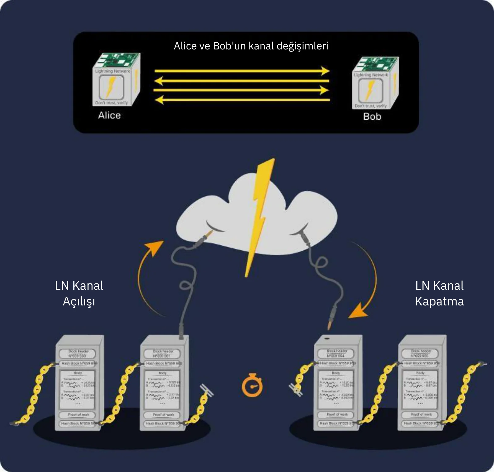

### Bitcoin’e dayalı ödeme kanalları

Lightning, çift yönlü [ödeme kanallarına](https://planb.academy/resources/glossary/payment-channel) dayanır. Bir kanal, iki katılımcı arasındaki teknik bir bağdır ve her bir ödemeyi blokzincire kaydetmeye gerek kalmadan, yani [zincir dışı (offchain)](https://planb.academy/resources/glossary/offchain) olarak [sat](https://planb.academy/resources/glossary/satoshi-sat) transferi yapmalarını sağlar.

Bitcoin'in (zincir üstü) perspektifinden bakıldığında bir kanal açmak, fonları özel bir işleme kilitlemek anlamına gelir. Bu durum bir tür emanet kasa (escrow) hesabına benzetilebilir: Fonlar öyle bir şekilde kilitlenir ki bunları ancak geçerli bir kanal kapanışı yeniden dağıtabilir.

Lightning cephesinden bakıldığında ise aynı mekanizma, her iki tarafın da sat'ların dağıtım durumunu neredeyse anında ve ana blokzincire kaydetmek zorunda kalmadan dilediği kadar güncelleyebileceği bir kanala dönüşür.

Dolayısıyla sistem şu şekilde işler:

- Bir Lightning kanalının açılması ve kapanması birer Bitcoin işlemidir (ve bu yüzden zincir üstünde yayınlanır);
- Açılış ile kapanış arasındaki ödemeler ise ana blokzincirde görünmeyen, zincir dışı güncellemelerden ibarettir.

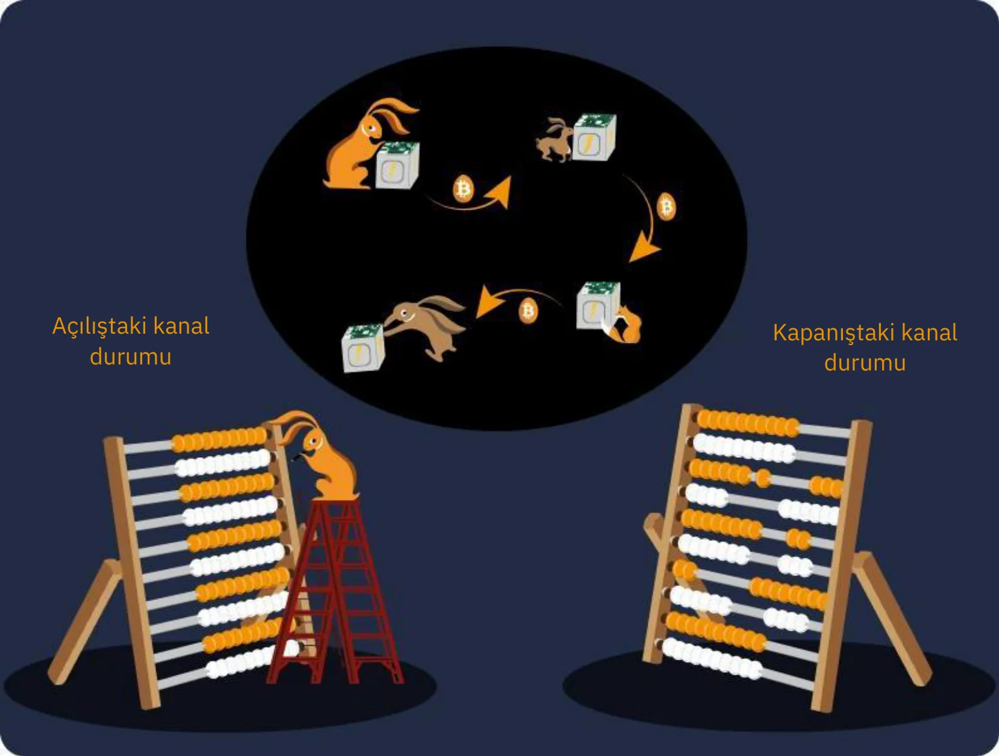

Böylece, aynı Lightning kanalını paylaşan iki kişi, her seferinde zincir üstü (onchain) bir işlem gerçekleştirmek zorunda kalmadan çok sayıda ödeme yapabilir. Burada ölçeklenebilirlik mantığı yeniden devreye girer: Blokzincir nadir ve önemli işlemler (kanalların açılması ve kapanması, yani nihai mahsuplaşma) için ayrılırken, çok sayıdaki küçük ara ödeme daha verimli bir katmana taşınır.

### Birbiriyle bağlantılı kanallar ağı

Lightning yalnızca birbirinden yalıtılmış kanallar yığınından ibaret değildir. O bir ağdır: Binlerce düğüm (node), kanallar aracılığıyla birbirine bağlanarak devasa bir bağlantı grafiği oluşturur.

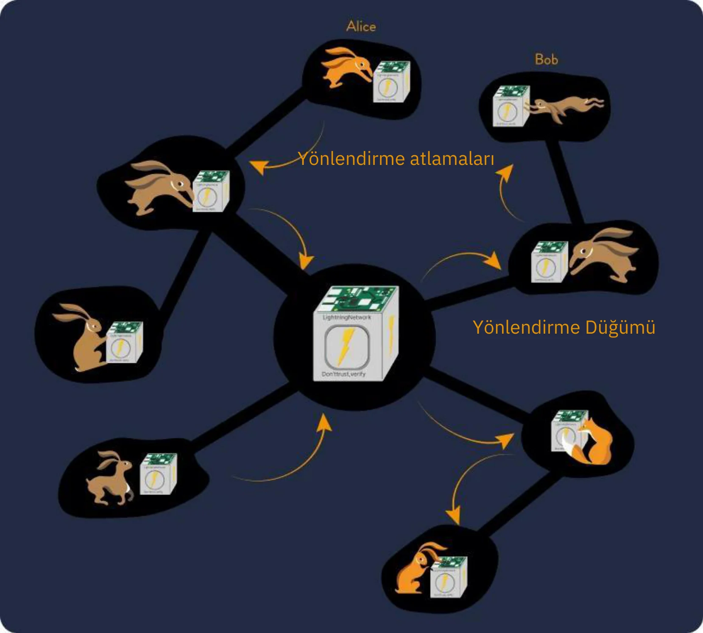

Bu ağ sayesinde, ödemenin yönlendirilmesini sağlayacak bir kanal rotası bulunduğu sürece, doğrudan kanalınız olmayan bir alıcıya bile ödeme yapabilirsiniz. Ödeme bu durumda, düğümden düğüme aktarılarak birkaç ara düğüm üzerinden geçer.

İşte tam bu noktada önemli bir Lightning kavramı ortaya çıkar: likidite. Bir kanalın kapasitesi, o kanalda kilitli olan toplam fon miktarına denk gelir. Likidite ise bu fonların kanalın iki tarafı arasında nasıl dağıldığını, dolayısıyla sat'ların hangi yöne doğru akabileceğini ifade eder. Başka bir deyişle, bir kanal büyük bir kapasiteye sahip olsa bile, likidite yanlış taraftaysa belirli bir yönde kullanılamaz hale gelebilir. Bu nedenle ödemelerin başarıyla gerçekleşmesi, sadece bir rotanın varlığına değil, aynı zamanda tüm rota boyunca mevcut olan likiditeye de bağlıdır.

### Aracı kurumlar arasında güvene ihtiyaç duymadan ödemeyi yönlendirmek

Lightning, aracılara güvenmek zorunda kalmadan onlar üzerinden ödeme yapılabilmesini sağlayacak şekilde tasarlanmıştır. Protokol, bunu gerçekleştirmek için [HTLC](https://planb.academy/resources/glossary/htlc) (_Hashed Time-Locked Contracts_ - Kriptografik Zaman Kilitli Sözleşmeler) adı verilen akıllı sözleşmeleri kullanır. Tüm detaylara girmeden anlatmak gerekirse, genel işleyiş mekanizması şu şekildedir:

- Ödemenin gerçekleşmesi, gizli bir bilginin (ön görsel / preimage) açığa çıkarılması şartına bağlanır;
- Nihai alıcı bu gizli bilgiyi açığa çıkarırsa fonları alır; böylece aracılar da sırayla kendi paylarına düşen miktarı talep edebilir;
- Ödeme başarısız olursa zaman kilitlerinin süresi dolar ve herkes kendi fonunu geri alır.

Bu tasarım çok önemli bir özellik sağlar: Ödeme atomiktir (bütündür). Yani işlem ya tamamen başarıyla sonuçlanır ya da aradaki hiçbir tarafa zarar gelmeden tamamen iptal olur.

Son olarak Lightning, bir ceza mekanizması içerir: Katılımcılardan biri, artık gerçeği yansıtmayan eski bir kanal durumunu yayınlayarak hile yapmaya çalışırsa, diğer taraf onu cezalandırabilir ve kanaldaki tüm fonları kendi hesabına geçirebilir. Bu kural, güvensiz ortamlarda bile tarafları dürüst davranmaya güçlü bir şekilde teşvik eder.

### Lightning düğümü, Lightning cüzdanı: Bu ne anlama geliyor?

Zincir üstü (onchain) Bitcoin dünyasında cüzdan, anahtarları yöneten ve işlemleri oluşturan bir yazılımdır. Lightning katmanında ise durum biraz daha karmaşıktır; çünkü üçüncü taraflara bağımlı olmayan (non-custodial) gerçek bir kullanım, arka planda basit bir arayüzün arkasına gizlenmiş olsa bile mutlaka bir Lightning düğümüne (node) dayanır.

Pratikte, Lightning ağını kullanmak için iki ana uygulama kategorisi bulunur:

- Emanet (Custodial) servisleri: Uygulama size bir bakiye gösterir ancak fonlar bir hizmet sağlayıcının kontrolündedir. Tıpkı borsalarda olduğu gibi, bakiyeniz o sistemdeki bir muhasebe kaydından ibarettir.
- Emanetçi olmayan (Non-custodial) çözümler: Anahtarların ve fonları geri alma yetkisinin kontrolü tamamen sizdedir. Bu, kullanıcı deneyimini basitleştirmek adına içinde minimum yönetim gerektiren bir düğüm barındıran bir uygulama (örneğin Phoenix, Zeus...) veya tamamen kendiniz yönettiğiniz eksiksiz bir Lightning düğümü olabilir.

https://planb.academy/tutorials/wallet/mobile/phoenix-0f681345-abff-4bdc-819c-4ae800129cdf

https://planb.academy/tutorials/wallet/mobile/zeus-embedded-c67fa8bb-9ff5-430d-beee-80919cac96b9

Günümüzde, her gelen veya giden ödeme için anlık olarak tetiklenen atomik takaslara (atomic swaps) dayanarak Lightning ödemelerini dolaylı yoldan destekleyebilen emanetçi olmayan (self-custodial) cüzdanlar da mevcuttur (örneğin Bull Bitcoin Wallet, Aqua…). Bu cüzdanlar, mahsuplaşma katmanı olarak genellikle Liquid yan zincirini (sidechain) kullanır (bunun ne anlama geldiğini bir sonraki bölümde göreceğiz).

https://planb.academy/tutorials/wallet/mobile/bull-bitcoin-2c72127c-a228-4f50-b833-c6183d56aaf6

https://planb.academy/tutorials/wallet/mobile/aqua-8e6d7dd3-8c03-45cc-90dd-fe3899a7d125

### Somut kullanım alanları: Lightning nihayetinde neleri mümkün kılıyor?

Lightning, daha önce yalnızca zincir üstü (onchain) Bitcoin ile pratik olmayan, hatta imkansız olan bir dizi kullanım alanının önünü açıyor.

- **Günlük ödemeler (çevrim içi ve yüz yüze)**

Kasa işlemleri veya çevrim içi alışverişler için Lightning, genellikle düşük işlem ücretleriyle neredeyse anında nihai onay sağlar. Bu durum, ana blokzincir ağında yoğunluk yaşandığında bile bitcoin'in küçük miktarlar için kullanılabilmesini mümkün kılar.

- **Mikro ödemeler ve sürekli para akışı (streaming money)**

Çok küçük miktarlar gönderebilme imkanı, yeni ekonomik modellerin kapısını aralıyor: kullandıkça öde, dakika başına öde, düzenli bağışlar, bahşişler... Bu durum, sabit bir abonelik ücreti ödemek yerine, bir içeriği veya hizmeti tükettikçe ödeme yapmayı ifade eden "sürekli para akışı" (streaming money) mantığıdır.

- **İçerik üreticileri, podcast'ler ve bağışlar**

Lightning, genellikle mikro bağışlar veya ödül mekanizmazi için kullanılır. Fountain veya Rumble gibi uygulamalar bu mantığı oldukça iyi yansıtmaktadır: Ödemeler hantal ve nadiren yapılan bir işlem olmaktan çıkıp, deneyimin kendisine dahil olan pürüzsüz ve küçük parçalı bir yapıya bürünür. En sevdiğiniz eğitmenlere teşekkür etmek için kolayca küçük bağışlar gönderebilmenizi sağlayarak bu mantığı Plan ₿ Academy'ye de entegre ettik.

- **Oyunlar ve dijital ekonomiler**

Video oyunları ve dijital ortamlar; küçük bahisler, ödüller ve sanal eşyalar gibi mikro işlemler için oldukça elverişlidir. Minimum düzeyde bir parasal teşvik getirmek, sistemin herkes için erişilebilir kalmasını sağlarken, bir yandan da spam gönderimlerinin ve belirli suistimallerin (botlar) maliyetini artırmaya yardımcı olur.

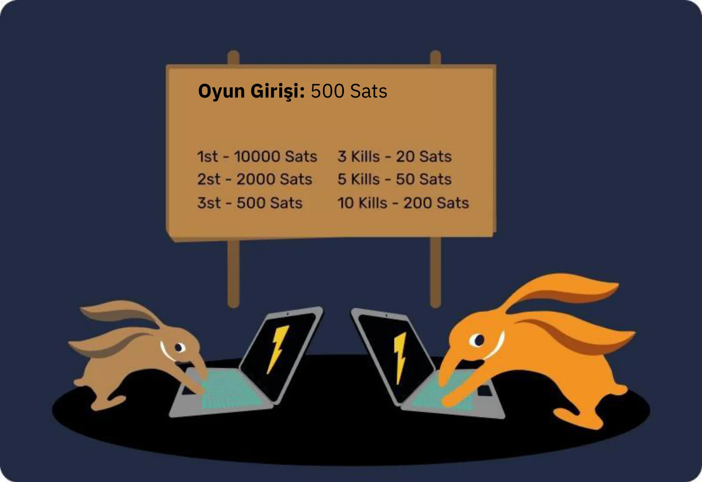

### Temel Lightning Uygulamaları (Implementations)

Tıpkı Bitcoin gibi Lightning de tek bir yazılımdan ibaret olmayıp bir protokoldür. Ortak teknik standartlar (BOLT'lar) sayesinde birbiriyle uyumlu şekilde çalışan birçok farklı uygulama mevcuttur:

- LND (Lightning Labs);
- Core Lightning (Blockstream);
- Éclair (ACINQ);
- LDK (Spiral/Block);
- vb.

### Bitcoin'in Gelişim Sürecinde Lightning'in Rolü

Lightning, Bitcoin blokzincirinin yerini almaz, aksine onu tamamlar. Blokzincir; yavaş ama son derece sağlam bir nihai mahsuplaşma katmanı olarak kalmaya devam eder. Lightning ise sık kullanım ve küçük miktarlar için tasarlanmış hızlı bir ödeme katmanıdır.

2025 yılına gelindiğinde Lightning, karmaşıklığın bir kısmını arka planda çözen cüzdanlar ve hizmetler sayesinde ilk günlerine kıyasla çok daha erişilebilir durumdadır. Ancak yine de belirli ödünler vermeyi gerektirir: likidite yönetimi, kanalların zincir üstü maliyetleri ve bazen de basitlik, finansal egemenlik ile gizlilik arasındaki denge unsurları bunlardan bazılarıdır.

Lightning ağını (kanallar, likidite, yönlendirme, risk yönetimi) derinlemesine anlamak isterseniz, Fanis Michalakis tarafından hazırlanan teorik LNP 201 kursunun tamamını almanızı öneririm:

https://planb.academy/courses/34bd43ef-6683-4a5c-b239-7cb1e40a4aeb

Ve eğer kendi Lightning düğümünüzü çalıştırma macerasına atılmak isterseniz, doğrudan bu konuya özel olarak hazırladığımız uygulamalı LNP 202 kursumuzu da sunuyoruz:

https://planb.academy/courses/593e483e-1785-4e83-aa7e-32b99056844c

## Lightning'in Ötesi: Bitcoin'i ölçeklendirmek için diğer protokoller

<chapterId>684e31f9-ebd1-51b6-91c0-1e6a315f1141</chapterId>

Önceki bölümlerde gördüğümüz gibi Bitcoin, son derece sağlam bir temel katman olarak tasarlanmıştır: Basit, güvenli, halka açık bir genel muhasebe defteri; ancak doğası gereği işlem hızı, programlanabilirlik ve ödeme kapasitesi açısından sınırlıdır. Bitcoin ekosistemi, bu katmanı (örneğin Ethereum'da yapıldığı gibi) her şeyi tek başına yapmaya zorlamak yerine, zaman içinde katmanlı bir yaklaşımı benimsemiştir: Blokzincir temel (nihai mahsuplaşma) işlevi görürken, üst katmanlar daha hızlı ödemeler, daha fazla gizlilik veya varlık ihracı (stabilcoin'ler, tokenize edilmiş menkul kıymetler...) gibi yeni özellikler ekler.

Bitcoin yalnızca kendi temel protokolünü değiştirerek gelişmez. Hedeflenen amaca göre farklı ödünler veren çözümlerle, bu temel katmanın üzerine inşa edilerek de evrilir. Bazı çözümler ödeme ölçeklenebilirliğini hedeflerken, diğerleri programlanabilirliğe (geniş anlamda) ve varlık ihracına odaklanır; bazıları ise her ikisini birden birleştirmeye çalışır.

Bu bölümde, her biri Bitcoin üzerinde yeni olanaklar sunan dört önemli protokolü tanıyacağız: [yan zincirler (sidechains)](https://planb.academy/resources/glossary/sidechain) (Liquid dahil), Ark, RGB ve Taproot Assets.

### Yan Zincirler (Sidechains): Bitcoin'e bağlı paralel blokzincirler

Bir yan zincir (sidechain), Bitcoin'den ayrı, kendi kuralları ve konsensüs mekanizmasıyla paralel olarak çalışacak şekilde tasarlanmış bir blokzincirdir. Bitcoin'e çift yönlü sabitleme mekanizması (2WP - İki Yönlü Çıpa) ile bağlanır. Bu mekanizma, pratikte bitcoin'lerin yan zincir üzerinde temsili bir biçimde (genellikle Bitcoin ağında kilitlenen ve yan zincirde yeniden üretilen bir bitcoin şeklinde) kullanılmasını ve daha sonra ana zincire geri gönderilebilmesini sağlar.

Yan zincirlerin temel amacı, doğrudan Bitcoin üzerinde gerçekleştirilmesi zor olan özellikler sunmaktır: Daha hızlı işlemler, varlık özellikleri, gelişmiş gizlilik veya geliştirme süreçlerinde daha fazla esneklik. Buna karşılık bir yan zincir, özellikle güven modeli veya merkeziyetsizlik açısından Bitcoin'e kıyasla her zaman belirli ödünler verir.

Bitcoin üzerindeki en bilinen yan zincir, muhtemelen Blockstream tarafından geliştirilen **Liquid** platformudur. Bu ağ, özellikle belirli kullanım alanlarını hızlandırmak için tasarlanmıştır: Platformlar arası hızlı transferler, daha sık mahsuplaşmalar ve gelişmiş gizlilikle varlık ihracı (stabilcoin'ler, menkul kıymetler...). Liquid üzerinde kullanılan bitcoin'ler L-BTC olarak adlandırılır; bunlar, iki yönlü bir sabitleme mekanizmasıyla BTC'ye bire bir (1-to-1) oranında çıpalanacak şekilde tasarlanmıştır.

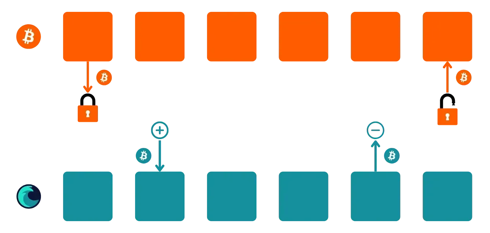

Bitcoin ile karşılaştırıldığında en büyük fark, güvenlik ve merkeziyetsizlik modelinde yatmaktadır: Liquid, Bitcoin'in iş kanıtı (proof of work) sistemine değil; blok üretimini ve BTC ile L-BTC arasındaki köprülerin işleyişini sağlayan, operatörlerden oluşan bir federasyona (belirlenmiş bir gruba) dayanır.

https://planb.academy/courses/d3ca6943-b22c-4e50-b62d-9431460525bc

### Ark: Maliyetleri düşürmek ve deneyimi iyileştirmek için UTXO'ları paylaşmak

Ark, birçok kullanıcı işlemini daha az sayıda Bitcoin işleminde toplayarak Bitcoin'in ölçeklenebilirliğini artırmayı amaçlayan bir dizi öneri ve uygulamayı ifade eder. Mantık oldukça basittir: Kullanıcı başına bir zincir üstü (onchain) işlem oluşturmak yerine, toplu bir grubu temsil eden tek bir zincir üstü işlem oluşturulur; ardından Bitcoin üzerinde nihai mahsuplaşma istenene kadar her katılımcının hakları esas olarak zincir dışı (offchain) olarak güncellenir.

Bu ikinci katman protokol fikri, Mayıs 2023'te Burak tarafından duyuruldu. Tıpkı Lightning Network gibi Ark da Bitcoin'in ana zinciri üzerinde çalışan bir sistemdir. Bitcoin ödemelerinin zincir dışı, hızlı, anonim ve düşük ücretli bir şekilde yapılmasını sağlar. Lightning ile karşılaştırıldığında Ark, ödeme almak için gelen likiditeye (inbound liquidity) ihtiyaç duymaz, bu da kullanıcı deneyimini önemli ölçüde iyileştirir. Ek olarak, [coinjoin](https://planb.academy/resources/glossary/coinjoin) işlemlerine yakın bir gizlilik düzeyi sunar. Eğer Bitcoin'e ahitler (covenants) eklenirse, Ark etkileşimsiz (non-interactive) bir şekilde de çalışabilir.

Burak, Lightning'in ana zincire olan bağımlılığı nedeniyle ölçeklenme kapasitesini sık sık eleştirmekte ve Ark'ın teorik olarak tüm dünya nüfusunu kendi cüzdan kontrolüne (self-custody) dahil edebileceğini öne sürmektedir. Ark, Lightning Network'e rakip bir protokol gibi görünse de aslında bu ikisi bir arada var olabilir, hatta birbirini tamamlayabilir.

Ark çok aktif fakat henüz gelişim aşamasında bir alandır; vaat ettiği hedef (kullanıcı başına düşen zincir üstü ayak izini ciddi oranda azaltmak) umut verici olsa da Bitcoin ve Lightning'den farklı riskler ile varsayımlar içeren, daha karmaşık bir mimariye sahip olduğu unutulmamalıdır.

### RGB: İstemci taraflı doğrulama ile akıllı sözleşmeler ve varlıklar

RGB; genel amaçlı blokzincirlerden kökten farklı bir yaklaşım benimseyen, Bitcoin üzerindeki bir akıllı sözleşme ve varlık sistemidir. Temel fikri istemci taraflı doğrulamaya (client-side validation) dayanır: Bir sözleşmenin tüm durumunu küresel bir blokzincirde yayınlamak yerine katılımcılar, kendilerini ilgilendiren geçmiş verileri yerel olarak saklar ve doğrular; Bitcoin blokzinciri ise yalnızca kriptografik taahhütleri sabitlemeye ve çift harcamayı (double spending) önlemeye yarar.

Başka bir deyişle:

- Bitcoin blokzinciri, bir zaman damgası tabanı ve asgari bir hakem görevi görür;
- Detaylı veriler (sözleşme kuralları, durumlar, geçişler) ilgili taraflar arasında zincir dışı (offchain) olarak dolaşır;
- Doğrulama işlemi yerel olarak gerçekleştirilir; bu da ölçeklenebilirliği artırırken, herkesin görebileceği küresel bir RGB faaliyet sicili bulunmadığı için gizliliği de üst seviyeye çıkarabilir.

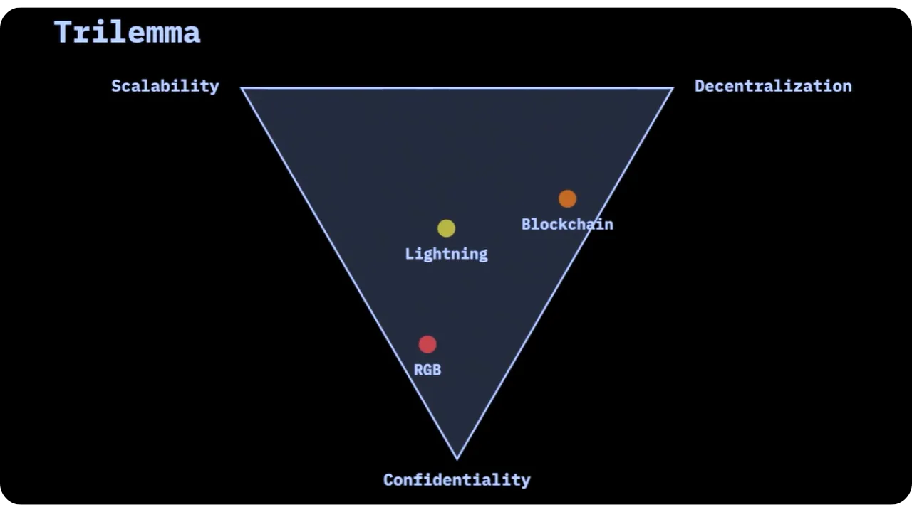

RGB; ana katmana yük bindirmeden token'lar (stabilcoin'ler dahil), NFT'ler veya dijital menkul kıymetler gibi çok çeşitli varlıkların ihraç edilmesi ve yönetilmesi, hatta daha kapsamlı sözleşme mantıklarının inşa edilmesi için bir temel oluşturabilir.

Bu sistemin dezavantajı ise veri yönetimidir: Doğrulamayı istemci tarafında yapmanız gerekiyorsa, haklarınızı kanıtlayan verileri de düzgün bir şekilde saklamalı ve yedeklemelisiniz.

RGB, uzun yıllardır geliştirilmekte olan bir protokoldür. İlerleme kademeli olsa da günümüzde RGB'den yararlanan somut uygulamalar zaten mevcuttur. Daha ileri gitmek isterseniz, Plan ₿ Academy'de bu protokolü derinlemesine inceleyen uzmanlık düzeyinde bir kurs sunuyoruz:

https://planb.academy/courses/3ce1d37c-05ba-4f54-aa15-7586d37b2bb7

### Taproot Assets: Bitcoin üzerinde varlık ihraç etmek ve bunları Lightning ağında taşımak

Taproot Assets (eski adıyla "Taro"), Lightning Labs liderliğinde geliştirilen ve Bitcoin üzerinde varlık ihraç edilmesini sağlayan bir protokoldür; bu varlıkların daha sonra hızlı ve düşük maliyetli transferler için Lightning Network üzerinden aktarılmasına imkan tanır.

Bu protokol, Bitcoin üzerindeki "programlanabilir para" anlatısının temel yapı taşlarından biri olarak sıkça gösterilir: Bunun nedeni Bitcoin'in küresel bir bilgisayara dönüşmesi değil, finansal araçların (varlıkların) Bitcoin tabanının üzerine katmanlar halinde eklenip ardından Lightning aracılığıyla verimli bir şekilde dolaşıma sokulabilmesidir.

### Bitcoin, üst katmanların inovasyon yapmasına izin vererek güçleniyor

Bugün Bitcoin ekosisteminin en doğru tanımı; ne tamamen donmuş bir protokol ne de Ethereum'da olduğu gibi her şeyi tek başına yapan bir süper blokzincirdir. Aksine Bitcoin, en az riskle deneyler yapılmasına ve inovasyona olanak tanıyan katmanlar ve protokollerle çevrili, bilinçli olarak muhafazakar tutulan bir temel katmandır.

## Kırmızı Hap mı Mavi Hap mı?

<chapterId>c81cdb45-6aa9-5462-9835-c4852084b2cc</chapterId>

Morpheus'un Neo'ya dediği gibi: "Mavi hapı alırsan hikaye biter, yatağında uyanırsın ve neye inanmak istiyorsan ona inanırsın. Kırmızı hapı alırsan Harikalar Diyarı'nda kalırsın, ben de sana tavşan deliğinin ne kadar derine indiğini gösteririm." Bitcoin'in tavşan deliğini keşfetmeye hazır mısın? Dikkatli ol, finansal özgürlüğünü yeniden keşfedebilirsin!

### Teknolojik gelecek ve etkileri

Teknoloji katlanarak gelişiyor ve hiç kimse gelecekteki ilerlemeleri kesin olarak öngöremiyor. Küresel bağlanabilirlik ve yapay zeka ilerlemeye devam ediyor; bir bireyin internet yoluyla edinebileceği bilgi ise zamanla ölçülemez bir boyuta ulaşıyor.

Yapay zekayı örnek alırsak, bu teknolojiler video oyunları, görsel ve metin üretimi ile veri analizi gibi her geçen gün artan sayıda alanda insan düzeyindeki performansı çoktan yakaladı veya geride bıraktı. Bunun olası bir sonucu da yapay zeka ve otomasyon nedeniyle işlerin %80'inden fazlasının yok olacak olmasıdır. Neticede önümüzde; teknolojik ilerlemeyi kısıtlamak veya yapay zekanın yarattığı üretkenlik artışından elde edilen sermayeyi kendi lehimize kullanmak gibi çeşitli seçenekler bulunuyor.

Kendimize sormamız gereken bazı temel sorular var:

- İşlerin %80'inin yok olacağı bir toplumu nasıl yöneteceğiz?
- Toplumu nasıl yeniden canlandırabiliriz?
- Bu kadar çok öğretmene gerçekten ihtiyaç var mı?
- Otomasyonun jeopolitik, siyasi ve insani sonuçları yeterince tartışılmıyor.
  Bilişim, internet, yayıncılık (streaming) ve sanal gerçeklik (VR) eğitimi kökten değiştirecek. Örneğin, tüm Fransız öğrenciler için devlet tarafından yönetilen ortak bir müfredat olabilir; öğretmenler artık sadece ders anlatmak yerine doğrudan öğrencilere rehberlik edebilir. Çocuklar sanal bir dünyaya girerek tarih öğrenirken kendilerine eşlik edilebilir.

- Bir öğretmen ile yapay zekanın kişiselleştirilmiş formu arasındaki sınır nerededir?
- Refah içinde yaşayan bir toplumu nasıl garanti altına alabiliriz?

Geleceğimiz için hayati önem taşıyan bu temel sorular tartışılmalı ve ortaklaşa karara bağlanmalıdır.
Peki bunun Bitcoin ile bağlantısı nedir? İnternet iletişim biçimlerinde nasıl bir devrim yarattıysa, Bitcoin de güvenilir bir üçüncü tarafa ihtiyaç duymadan değer transferi yapmamızı sağlayarak büyük ölçekli yeni organizasyon biçimleri için teknolojik bir devrimi temsil ediyor. Para sisteminin teknolojik evrimini engellemek mi istiyoruz, yoksa Bitcoin ve Lightning protokollerinin sunduğu on kat daha fazla üretkenlik artışı sayesinde sermayeyi büyütme potansiyelini kucaklamak mı?

### Finansın geleceği nedir?

Bu hususlar, kullandığımız parayı kimin elinde tutması, yetkilendirmesi ve izlemesi gerektiğiyle ilgili soruları da beraberinde getiriyor. Amaç, seçilmemiş liderlerin bulunduğu kapalı bir sistem ile tarafsızlığın hakim olduğu, güvenilir üçüncü tarafların bulunmadığı açık bir sistem arasında bir seçim yapmaktır.

- Para bir özel mülkiyet biçimi midir?
- Anayasa Mahkemesi kararı olmadan protestocuların hesapları bloke edilebilir mi?
- Finansal sistemi kim garanti ediyor?
- Bir birey parası üzerinde nasıl egemenlik kurabilir ve güvenilir bir üçüncü tarafa nasıl bel bağlayabilir?
- Dünyanın öbür ucuna komisyonsuz veya aracısız para gönderilebilir mi?

Bu yeni teknolojileri kabul etmek, dünya genelinde muazzam ölçek ekonomileri yaratabilir. Sermaye akışlarının serbest dolaşımına izin vermeli miyiz? Uluslararası blokajların ekonomik ve siyasi sonuçları vardır. Bazen %25'e varan oranlarda komisyon alan Western Union gibi finansal aracıları kullanmak ne kadar etiktir? Giderek dijitalleşen bir dünyada paranın demokratikleşmesi; devlete veya şeffaf olmayan finansal kurumlara değil, halka ait ortak bir değer olarak kabul edilmesi gerektiğine inanıyoruz.

Bankacılık sistemini kimin kontrol etmesi gerektiği sorusu hayati önem taşımaktadır; çünkü bankacılık oyununun kuralları herkes için şeffaf ve anlaşılır değildir. Bu durum, politikacı ve denetleyicilerden oluşan bir zümrenin sistem üzerindeki kontrolünü sürdürmesine olanak tanır. Dolayısıyla, bu güç ve yetkinin serbest piyasada mı yoksa bir grup entelektüelde mi olması gerektiğini sorgulamak önemlidir.

### Özgürlüğümüz tehlikede.

Sansür konusu da mutlaka sorgulanmalıdır: Neyin sansürlenip neyin sansürlenmeyeceğine karar verecek bilgi ve yetkiye kim sahiptir? Medya, belirli bilgiler karşısındaki duruşunu zamanla değiştirmiştir ve geçmişte sansürlenenler bugün artık sansürlenmemektedir.

- Sansürün mü yoksa propagandanın mı söz konusu olduğuna kim karar veriyor?
- istemimiz üzerinde o mutlak, ilahi gücü elinde tutan kim?

Sansüre göz yummanın; inovasyon ve özgür irade üzerinde olumsuz bir etki yaratarak ifade özgürlüğünü ve örgütlenme hakkını yok edebileceğine yürekten inanıyoruz. Tam anlamıyla bir distopya yaratmadan sansür uygulamak teknik olarak zordur. Öyleyse, sansür gücü hangi kurumun elinde olmalıdır? Bu konu oldukça karmaşıktır ve kimlerin kısıtlanıp kimlerin kısıtlanmayacağına karar vermek de bir o kadar güçtür.

Dünyada banka hesabı bulunmayan 2,4 milyar insan var ve bu durum ister istemez coğrafi eşitsizlikler doğuruyor. Diğer taraftan Bitcoin; sosyal statünüze veya siyasi görüşünüze bakmaksızın işlemlerde eşitlik sağlar. Protokol apolitiktir; liderlere veya diğer nüfuzlu figürlere özel ayrıcalıklar tanımaz. Böylece gücü elinde tutan küçük bir azınlığın geriye kalanları arkada bırakarak zirvede kalmasına izin vermek yerine, herkesin gelişime katkı sağlaması için eşit fırsatlar sunar. Sosyal statüsü ne olursa olsun herkes aynı para birimine erişebilmeli midir? Çocuklarımıza nasıl bir dünya bırakmak istediğimizi düşünmemiz gerekiyor; biz onların paralarını diledikleri gibi yönetmekte özgür oldukları, açık bir dünya yaratmayı arzuluyoruz.

Bitcoin önemlidir ve sadece bir şans oyunu olarak görülmemelidir; bu yüzden Bitcoin ve onun dünya üzerindeki etkileri hakkında sorular sormaya devam etmek hayati bir önem taşır.

### Bitcoin: devrim niteliğinde bir protokol

Önceki bölümde gördüğümüz gibi, Bitcoin protokolü tüm kullanıcılarına karşı tarafsızdır. Konsensüs kuralları ve kriptografi sayesinde, işlemler küresel ve halka açık bir genel muhasebe defterine değiştirilemez bir şekilde kaydedilir; böylece güvenilir hiçbir üçüncü tarafa ihtiyaç duymadan parasal değer transferi garanti altına alınır. İkinci katman altyapısı (ve yakında RGB, yani "Really Good Bitcoin" ile gelecek olan üçüncü katman), ağın ölçeklenebilirliği ve yeni özelliklerin geliştirilmesi için kullanılır.

Bitcoin, verimli ve sağlıklı bir para birimi olmak için gerekli tüm özelliklere sahiptir: bölünebilir, anında taşınabilir, sansürlenemez, doğrulama maliyetleri ihmal edilebilir düzeydedir ve para politikası önümüzdeki yüzyıllar için halihazırda 21 milyon adet olarak belirlenmiştir. Bitcoin yarı anonimdir (pseudonymous) ve dünyadaki hiçbir kurumdan izin almadan her yerde takas edilebilir. Sadece kendi özel anahtarlarınızı elinizde tutmanız ve şu sözü unutmamanız gerekir: "Anahtar senin değilse, bitcoin de senin değildir."

Kriptograflardan liberterlere, geleneksel işletmelerden tüm bir ülkeye kadar çok farklı insan grupları tarafından benimsenmektedir. Bununla birlikte Bitcoin herkes içindir; kullanıcı sayısı arttıkça işlem geçmişinin koruyucusu olan ve ağın merkeziyetsiz kalmasını sağlayan Bitcoin düğümlerinin (node) sayısı da artmaktadır.

Bitcoin artık durdurulamaz ve sansürlenemez. Para sistemini değiştiren ve finansal kapsayıcılığı mümkün kılan barışçıl bir devrimdir. Kullanıcılar, ticari faaliyetleri karşılığında bitcoin kabul ederek ya da denetlenen veya denetlenmeyen platformlar aracılığıyla satın alarak bitcoin edinebilirler. Fonlarını güvenilir aracılara ihtiyaç duymadan cüzdanlarında, mobil uygulamalarında veya fiziksel cihazlarında saklayabilirler. Bitcoin şeffaflığı, özgürlüğü ve bireysel sorumluluğu savunur; tıpkı şu sözde dendiği gibi: "Güvenme, Doğrula".

Satoshi, para birimini yeniden tasarlayarak finansal sisteme bir alternatif sunmak amacıyla Bitcoin'i 2008 yılında yarattı. Üretimi kolay olan itibari paraları (fiat) bir yozlaşma riski olarak görüyordu; nitekim hükümetler bu gücü suistimal edebilir ve ediyorlar da. Bitcoin, bizi bankalara bağımlı olmaktan kurtaran ve paraya bakış açımızda barışçıl bir devrim yaratan tarafsız bir alternatiftir.

Katılmaya hazır mısınız?

# Son Bölüm

<partId>9ed4b454-2950-40b4-a56b-68d109689a82</partId>

## Yorumlar & Derecelendirmeler

<chapterId>585729e2-b0ab-51b5-89ec-593e3ea22c57</chapterId>

<isCourseReview>true</isCourseReview>

## Final Sınavı

<chapterId>8410e961-3841-5abf-a51d-04fc0139dd59</chapterId>

<isCourseExam>true</isCourseExam>

## Sonuç

<chapterId>dfc534be-44a9-5e8c-9c98-e51ef0554e91</chapterId>

<isCourseConclusion>true</isCourseConclusion>
