# رحلة إلى أول بتكوين لك

تعيش صناعة البتكوين في طفرة مذهلة.

التغيرات التكنولوجية والمالية في هذا العالم الجديد تتسارع فقط، ومن مسؤوليتك أن تستفيد وتبدأ في الانخراط في حفرة الأرنب البتكوين. ستكون هذه المغامرة غنية بالمعرفة وستدفعك إلى تساؤل العديد من معتقداتك. ستعيد لك الحرية وتسمح لك باستعادة الخصوصية والسيادة والاستقلال المالي.

لمساعدتك في بدء هذه المغامرة، قمت بإنشاء هذه الدورة المجانية. فقط البتكوين، بدون تفاهات، بدون عملات رقمية أخرى، دورة مباشرة إلى النقطة. تم تصميم هذه الدورة لتتكيف معك وتتيح لك اختيار المسار الذي يناسبك.

+++

# مقدمة والمتطلبات الأساسية لفهم البتكوين

## مقدمة لدورة BTC102

مرحبًا بك في BTC 102! دورة عملية سترشدك في إعداد خطة البتكوين الخاصة بك! من خلال هذه الدورة، سنستعد للحصول على أول بتكوين لك، وتأمينها بشكل صحيح، وضمان دخول سلس إلى هذه الصناعة الجديدة.

صناعة البتكوين لا تزال شابة وتعتبر ظاهرة متطورة باستمرار. على الرغم من العديد من السنوات التي تم فيها محاولة تنظيم هذا السوق، إلا أنه لا يزال حرًا للغاية بسبب طبيعة بروتوكوله الأساسي.

نظرًا لعدم إمكانية تنظيمه بالكامل، تمكن البتكوين من النمو عضويًا ولامركزيًا لأكثر من 14 عامًا. لذلك، فإنها صناعة في انفجار جنيني تسعى للاستمرار في النمو.

مع انفجار الابتكارات والإمكانيات، تأتي الاحتيالات والاحتيالات المالية. من الواضح أن رحلتك في عالم البتكوين لن تكون بدون عقبات أو أخطاء. ومع ذلك، لمساعدتك في تجنبها قدر الإمكان، ستكون هذه الدورة دليلًا عمليًا للبدء. بالمقابل، تعتبر دورة BTC 101 أكثر نظرية لفهم كيفية عمل البتكوين.

في هذه الدورة، سنركز على 4 زوايا:

- مراجعة الأساسيات والمتطلبات الأساسية لضمان عدم الوقوع في الاحتيال أو فقدان أموالنا بطريقة غبية.
- مراجعة الأسباب الأساسية لأهمية البتكوين وفهم صناعته. سيعزز ذلك قناعاتنا ويساعدنا على فهم ما نقوم به.
- إعداد أول محفظة بتكوين وإجراء أول عملية شراء بتكوين من خلال منصة تبادل. هنا، سنبحث عن الحل الأنسب لاحتياجاتك. أخيرًا، ستتناول القسم الأخير مفهومًا أساسيًا لأمانك، ولكنه غالبًا ما يتم تجاهله في الصناعة: كيفية إنشاء خطة وراثة للبتكوين.

كما يمكنك أن ترى، فإن هدف هذا التدريب هو مرافقتك حتى تلتزم بأفضل الممارسات في صناعتنا من البداية، بطريقة بسيطة وسريعة!

حظًا سعيدًا :)

## الاحتيالات والاحتيالات المالية

نحن في صناعة يظهر فيها فرعان رئيسيان في قطاع "العملات المشفرة":

1. صناعة البتكوين، التي تركز على عملة صوتية من خلال بروتوكول نقل قيمة لامركزي (البتكوين). إنها تقدر الخصوصية والسيادة الفردية وتبني تدريجيًا مشاريع طويلة الأمد ذات مستوى عالٍ من المرونة والأمان.

2. صناعة العملات المشفرة العالمية، التي تتجه نحو التكنولوجيا المالية و"البلوكتشين" والابتكارات المركزية الأخرى. إنها تتطور بسرعة وتحاول أن تتموضع كالاتجاه الجديد.

يتركز كل تركيز هذه الجامعة على عالم البتكوين، وليس العملات المشفرة.

مجال العملات المشفرة، بما في ذلك البيتكوين، لا يزال شابًا نسبيًا وغير منظم بشكل كبير. وبالتالي، فإنه غني بمختلف أنواع الاحتيال. فهم المخاطر والتعرف على الأخطاء النموذجية ضروري. فيما يلي بعض حالات الاحتيال التي تواجهها بشكل متكرر:
- التبرعات واليانصيب عبر الإنترنت
- نظام بونزي
- ضخ وتفريغ
- مجموعات العملات الرديئة والمؤثرون
- الانحراف / الشوكة الصعبة
- الاختراقات
- الفدية المزيفة
- احتيال كلمة المرور
- اختطاف بطاقة SIM

في مجال الاستثمار المالي، تبرز أنظمة البيع الهرمي ونظام بونزي كنماذج غير قانونية. تعمل هذه الأنظمة عن طريق استخدام أموال المستثمرين الجدد لدفع المشاركين الأقدم. ومع ذلك، فإن طبيعتها غير المستدامة واعتمادها على وصول المشاركين الجدد للحفاظ على استمرارية النظام يجعلها عرضة للانهيار بشكل لا مفر منه.

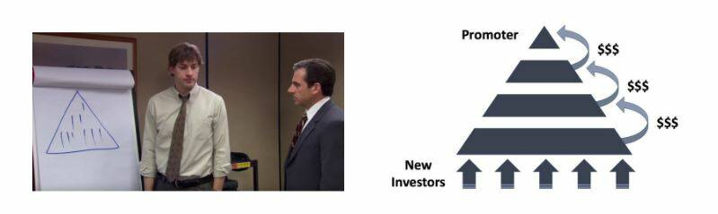
غالبًا ما تتميز هذه الأنظمة بعناصر مشبوهة مثل غياب القيمة الجوهرية، ووعود بعوائد غير واقعية، وتكتيكات تسويق تشجع على التوصيات لجذب المستثمرين الجدد. كما أن التأخيرات في سحب الأموال واستخدام الصفحات الشخصية المزيفة على شبكات التواصل الاجتماعي للترويج هي علامات دالة على هذه الاحتيالات. نظرًا لطبيعتها غير القانونية وغير الأخلاقية والمخاطر المالية التي تمثلها، فمن الضروري تجنبها.
في النهاية، فإن هذه الأنظمة محكومة بالفشل. مع مرور الوقت، يصبح الاحتياج إلى عدد متزايد من المشاركين الجدد للحفاظ على استمرارية النظام لا يمكن تجاوزه. عندما يتم الوصول إلى هذه النقطة، يتلاشى الوهم، وينهار النظام، وغالبًا ما يجد المستثمرون أنفسهم بدون وسيلة لاسترداد استثماراتهم.

يمكن أن تتجسد أنظمة بونزي بطرق مختلفة. في بعض الأحيان، يتم تنكرها على أنها عروض رمزية جديدة أو عروض عملة أولية (ICOs)، وتجمعات من العقود الذكية، ومحاولات للاحتكار العملات الورقية، أو حتى برامج تسويق بدون أي منتج حقيقي. ومع ذلك، فإن التحقيق الدقيق والاستدلال السليم يكشفان أن هذه الأنظمة لا تخلق قيمة حقيقية. إنها ببساطة تعيد توزيع الأموال من المشاركين الجدد لدفع المشاركين القدامى.

في الآونة الأخيرة، شهد عالم العملات المشفرة موجة من المشاريع المتعلقة بالتمويل اللامركزي (DeFi) التي تستحق اهتمامًا خاصًا. قد تلجأ بعض هذه المشاريع إلى مزيج من العملات المشفرة ذات الجودة المنخفضة والعقود الذكية وأنظمة سعر الفائدة لتقديم حلول مالية من المفترض أن تكون معجزة. من الضروري ممارسة الحذر والاستدلال السليم في مواجهة هذه العروض الاحتيالية للغاية.

يجب أن يتم ملاحظة أن محتوى هذه الدورة مخصص للأغراض التعليمية فقط ويجب ألا يتم تفسيره على أنه نصيحة مالية. يظل التحذير بـ "الثقة، ولكن التحقق" مبدأً هامًا. من الضروري على الجميع إجراء بحوثهم الخاصة واتخاذ قرارات مالية مستنيرة.

ضخ وتفريغ (P&D) هو شكل مشهور من التلاعب المالي يمكن أن يتسبب في اضطرابات كبيرة في الأسواق. يتميز بهجوم منسق يهدف إلى زيادة سعر الأصول بشكل اصطناعي من خلال آليات مختلفة، مثل التسويق العدواني أو استخدام الخوارزميات أو الذكاء الاصطناعي. الهدف هو بيع هذه الأصول المبالغ في تقييمها لتحقيق ربح.

تتبع استراتيجية ضخ وتفريغ نمطًا محددًا بشكل جيد عادةً:

1. يقوم احد قادة الرأي أو مجموعة من المستثمرين بشراء عددًا كبيرًا من الأسهم المستهدفة أو الأصول الأخرى.
2. ثم يخلقون ضجة حول هذه الأصول وينشرون معلومات مبالغ فيها أو مضللة لجذب المستثمرين الآخرين.
3. يثير هذا الضجيج الخوف من الفوتة بين المستثمرين البشر والروبوتات الاستثمارية، الذين يبدأون في شراء هذه الأصول بكميات هائلة.
4. بمجرد أن يرتفع السعر بما فيه الكفاية، يبيع القادة أصولهم بالجملة، مما يجني أرباحًا كبيرة.
5. يؤدي البيع الجماعي إلى انخفاض حاد في سعر الأصل، مما يترك العديد من المستثمرين بخسائر كبيرة.
من الضروري أن نفهم أن المشاركة في مثل هذه الاستراتيجيات غير قانونية ويمكن أن تؤدي إلى توجيه اتهامات بتلاعب السوق. بالإضافة إلى ذلك، غالبًا ما يتم تنظيم هذه الاستراتيجيات من قبل مجموعات مؤثرة تفرض رسوم عضوية. في حين قد يحقق بعض المشاركين مكاسب قصيرة الأجل، إلا أن استراتيجيات النفخ والتفريغ عمومًا ليست مربحة على المدى الطويل. لذلك، يُوصى بالتركيز على التعليم المالي والاستثمار المسؤول بدلاً من أن تُغرى بهذه التكتيكات التلاعبية. اكتساب المعرفة القوية واعتماد نهج طويل الأجل هما مفتاحان أساسيان للنجاح في عالم الاستثمار.

تعتبر العمليات الاحتيالية المتعلقة بالمسابقات عبر الإنترنت أو التبرعات شائعة جدًا في قطاع العملات المشفرة. غالبًا ما يتم استخدام الإعلانات التي تعد بتوفير بيتكوين مجاني لخداع المستخدمين غير المتمرسين. من المبادئ الأساسية التي يجب أن تتذكرها هي عدم إرسال عملات  البيتكوين ابدا مع  توقع استعادتها والحذر من الوعود بالعودة غير الواقعية. من المهم عدم الثقة بشكل أعمى، خاصة عندما يتعلق الأمر بلافتة إعلانية على الإنترنت.

مثال كلاسيكي على هذا النوع من الاحتيال هو عرض يدعي أنه يضاعف البيتكوين الذي ترسله. من المهم أن نفهم أنه لا يوجد حل سحري للثراء الفوري.

تعتبر تبرعات "شيتكوين" أو العملات المشفرة ذات القيمة المنخفضة من التكتيكات المستخدمة بشكل شائع أيضًا. قد يقوم بعض مشاريع العملات المشفرة المركزية بعمل الكثير من التسويق وتقديم الرموز المجانية كهدايا. يجب أن يكون المرء حذرًا جدًا من هذه العروض، حيث إما أن الرمز ليس له قيمة، أو أن الهدية مجرد وسيلة لجذب الانتباه وتعزيز التداول والمقامرة والاحتيال الأخرى. حتى إذا لم تكن هذه العروض دائمًا احتيالية أو غير قانونية أو مضللة، فإن اليقظة لا تزال مطلوبة٠
على سبيل المثال، يمكن للروبوتات على تويتر أن تتنكر في شخصيات مشهورة وتقدم صفقات لا تصدق لخداع الناس. تستخدم هذه الحسابات نفس الاسم وصورة الملف الشخصي للشخصية المعنية، وبالتالي يمكن أن تخدع المستخدمين غير المتمرسين. تأكد دائمًا من التحقق من شرعية الحساب قبل التفاعل معه.

من المهم أيضًا أن تكون حذرًا من الروابط التي يتم إرسالها عبر البريد الإلكتروني. تحقق دائمًا من الرابط قبل النقر عليه وانتبه إلى هوية المرسل.

أخيرًا، إليك بعض النصائح لتجنب الاحتيال عبر الإنترنت:

- لن يطلب منك الشخص الصادق إرسال الاموال مباشرة.
- لا ترسل أبدًا بيتكوين إلى عنوان غير معروف.
- ان الوعود بالعوائد غير الواقعية تكون دائما مشبوهة.
- من المحتمل أن تكون المسابقات مرتبة.
- ستحقق دائمًا المزيد من خلال التعلم بدلاً من اللعب.
- عند الشك، لا تتصرف على الفور. خذ الوقت للتفكير والبحث. يمكن أن يكون الخوف من التخلف هو عدوك الأسوأ.
  تذكر دائمًا أن تقوم بإجراء البحوث الخاصة بك قبل اتخاذ قرار استثماري.

لقد خضعت عملة البيتكوين لعدة فروع صعبة على مر الزمن، مما أدى إلى ظهور العديد من الإصدارات البديلة للعملة الأصلية. غالبًا ما تكون هذهالانحرافات من عمل المطورين الذين يسعون لإجراء تغييرات كبيرة على بروتوكول البيتكوين، أو في بعض الأحيان من الأفراد الخبيثين الذين يسعون لخداع المستثمرين الساذجين. من الضروري التمييز بين البيتكوين الحقيقي وهذه الاشتقاقات لتجنب الوقوع في الفخاخ المحتملة. أمثلة بارزة على هذه الانحرافات تشمل بيتكوين كاش (BCH) وبيتكوين ساتوشي فيجن (BSV). على الرغم من حملها اسم "بيتكوين"، إلا أن هذه المشاريع تعتمد في المقام الأول على تكتيكات التسويق والإعلانات الكاذبة لجذب انتباه المستثمرين.

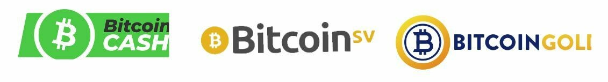

تجدر الاشارة الى أن بعض هذه الانحرافات يتم تمويلها بشكل جيد وتنفق الكثير على التواصل لخداع المستخدمين. على سبيل المثال، يرتبط موقع "Bitcoin.com" ببيتكوين كاش، وليس بالبيتكوين الأصلي، مما يمكن أن يكون مربكًا للمبتدئين. الموقع الرسمي للبيتكوين هو "bitcoin.org".
عالم العملات المشفرة هو أرض خصبة لجميع أنواع الشخصيات، التى تنجذب الى امكانية تحقيق مكاسب كبيرة. للأسف، من بينهم، هناك أفراد ذوي نوايا خبيثة يلجأون إلى تكتيكات واساليب مختلفة لخداع المستثمرين والاحتيال عليهم. يمكن أن تشمل هذه التكتيكات الترويج العلني لنظام الهرم، أو التنكر كمبتكر بيتكوين ساتوشي ناكاموتو، أو سرقة أعمال الآخرين، أو إعطاء وعود كاذبة. بالإضافة إلى ذلك، يقوم بعض هؤلاء الأفراد بإنشاء رموز عملات مشفرة غير مجدية وعروض عملة أولية (ICOs) بهدف خداع المستثمرين.

غالبًا ما يتحرك مجتمع بيتكوين للتنديد بهذه الأعمال، ولكن قد يستغرق بعض الوقت قبل أن يتمكن النظام القانوني من اتخاذ إجراءات ضد هؤلاء الأفراد.

لذا فمن الضروري أن تبقى يقظًا وتمارس التمييز في التفاعل مع عالم العملات المشفرة. نصيحتي الشخصية هي تجاهل هؤلاء الأفراد والممارسات. فهم لا يستحقون وقتك أو طاقتك. بدلاً من ذلك، قم بتخصيص هذه الموارد لاكتساب المعرفة وفهم سوق العملات المشفرة من أجل التنقل في هذا العالم بطريقة مستنيرة وآمنة.

من الضروري أن تتعامل مع "مؤثري العملات المشفرة" أو "الخبراء" بحذر. هؤلاء الأفراد غالبًا ما يكون لديهم أجندات شخصية وقد يكونون مشاركين في العديد من المشاريع التي يسعون للترويج لها، حتى لو لم تكن دائماً في أفضل مصلحة للمستثمرين.

قد يحاول هؤلاء المؤثرون الترويج لعملات مشفرة غير موثوقة، أو "شيتكوينز"، وتنفيذ استراتيجيات مختلفة لزيادة قيمة استثماراتهم، حتى لو كانت غير آمنة أو محتملة الاحتيال.
وإليك بعض النصائح للتنقل في هذا البيئة:

- احذر أي شخص يروج لعملة مشفرة محددة أو يقدم صفقات.
- "النصائح المجانية" غالبًا ما لا تكون حقًا مجانية وقد تخفي نوايا أخرى.
- فكر مرتين قبل دفع ثمن تعليم التداول. هناك العديد من الموارد المجانية المتاحة لمساعدتك في فهم سوق العملات المشفرة (على سبيل المثال، قناة يوتيوب 'ukspreadbetting').
- ليس من الممكن مجرد نسخ صفقات شخص آخر وتوقع نفس النتائج.
- تذكر أن مجرد قول شخص ما شيء لا يعني بالضرورة أنه صحيح.

أفضل طريقة لحماية نفسك هي إجراء بحوثك الخاصة والتحقق من مصادر المعلومات. مشاهدة فيديو على يوتيوب ليست كافية للتحقق من المصادر.

من المهم أن نلاحظ أن لدى الجميع أجندة، بما في ذلك نفسي. أنا أؤمن ببيتكوين وهدفي هو الترويج له. آمل في الاستفادة من هذا الترويج، سواء سياسيًا أو ماليًا. لا يوجد محتوى مجاني تمامًا - إذا بدا منتج أو خدمة مجانيًا، فمن المحتمل أنك أنت المنتج.
تذكر دائمًا أنه ليس من الضروري أن يكون الجميع شفافًا بشأن نواياهم. اسأل دائمًا عن الغرض من أفعال شخص ما ولا تثق بهم ثقةعميقة.

## الأمان عبر الإنترنت

بالإضافة إلى عمليات الاحتيال المتعلقة بالعملات المشفرة والاحتيال المالي، السبب الرئيسي لفقدان البيتكوين يتعلق بسوء إدارة الأمان عبر الإنترنت. غالبًا ما يحدث أن الناس يستخدمون نفس كلمة المرور لجميع حساباتهم، وينسون تحديث أجهزتهم الكمبيوترية، ويهملون نسخ بياناتهم بانتظام. إذا كنت قلقًا من هذه الممارسات، لا تقلق، فمن الممكن دائمًا تحسين عادات الأمان عبر الإنترنت الخاصة بك. فيما يلي بعض التدابير الأساسية لتنفيذها:

- استخدم مدير كلمات المرور (انظر درس LastPass).
- قم بتمكين المصادقة ذات العاملين (2FA).
- حافظ على تحديث جهاز الكمبيوتر الخاص بك وخاليًا من البرامج الضارة.
- قدر خصوصيتك من خلال استخدام أدوات مخصصة (Signal، Tor، ProtonMail).

إذا كان هذا الموضوع مجهولًا تمامًا بالنسبة لك، فقد يكون التدريب SECU 101 مثيرًا للاهتمام للتعمق فيه بالتفصيل.
من الضروري الحفاظ على جهاز الكمبيوتر الخاص بك في حالة عمل مثلى، سواء كنت مهتمًا بالبيتكوين أم لا. التحديث ليس مجرد إضافة ميزات جديدة: إنه أيضًا يُصلح الأخطاء ويحسن أمان البرامج الخاصة بك. لذا تأكد من القيام بالآتي:
- تحديث برامجك بانتظام.
- استخدام برامج مضادة للفيروسات موثوقة.
- توخي الحذر عند تنزيل الملفات.
- نسخ احتياطية لبياناتك بانتظام.
- عدم مشاركة كلمات المرور الخاصة بك.

نصيحة إضافية: فكر في شراء قرص صلب خارجي وقم بإجراء نسخة احتياطية كاملة للملفات الهامة الخاصة بك. قد تكون هذه قيمة لا تقدر بثمن في حالة فشل الكمبيوتر.

مدير كلمات المرور هو برنامج يقوم بتخزين وإدارة كلمات المرور الخاصة بك. يساعدك على عدم استخدام نفس كلمة المرور مرتين، واختيار كلمات مرور معقدة وآمنة، ويسهل إدارة أمانك عبر الإنترنت. عليك فقط أن تتذكر كلمة المرور الرئيسية الواحدة. إنه أداة مجانية يجب على الجميع الاستفادة منها. يمكنك البدء في استخدامه تدريجياً وبمجرد أن تعتاد عليه، ستجد أنه مريح للغاية وسهل الاستخدام.

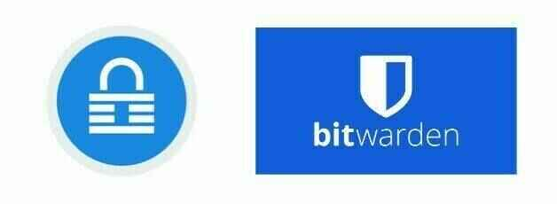
يوفر 2FA طبقة إضافية من الأمان لحساباتك الأكثر حساسية، سواء كانت منصات العملات المشفرة أو حسابات Google/البريد الإلكتروني أو البنوك أو مواقع التسوق عبر الإنترنت. يتطلب تسجيل الدخول رمز تعريف ثانوي، عادةً رمزًا مكونًا من 6 أرقام يمكن الوصول إليه من هاتفك. تذكر أن تحتفظ بنسخة احتياطية من المفتاح في مكان ما في حالة فقدان هاتفك.

تقنية الشبكة الخاصة الافتراضية (VPN) تحمي خصوصيتك عن طريق إخفاء عنوان IP الخاص بك. على الرغم من أنها لا تجعلك مجهولًا تمامًا، إلا أنها خطوة بسيطة وفعالة لتحسين خصوصيتك على الإنترنت. اختيار VPN وتنزيله واستخدامه هو عملية سهلة لإعدادها.

التمويه على الإنترنت أمر ضروري لمجتمع حر ومزدهر. إنه يمكن حرية التعبير وحماية الشهود والابتكار. الخصوصية هي حق أساسي للإنسان. لمواصلة حماية خصوصيتك، افكر في استخدام:

- PGP لبريدك الإلكتروني.
- Signal لرسائلك.
- Firefox أو TOR لتصفحك.
- Sync لمشاركة الملفات.
- Bitlocker لتشفير بياناتك.
- Samurai Wallet لتحويل الأموال.

مرة أخرى، إذا كنت مهتمًا بهذا الموضوع، فإن تدريب SECU 101 متاح لمساعدتك.

## نصائح للمبتدئين

التعليم الرسمي لا يعلمنا الا القليل عن الاستثمار. نتيجة لذلك، غالبًا ما نخوض هذا المشهد الاستثماري الجديد والمعقد بمفردنا.

في هذا القسم، سنلقي نظرةعلى بعض الأخطاء الشائعة التي يقع فيها المستثمرون المبتدئون عند دخول عالم البيتكوين، وكيف يمكنك تجنب الوقوع في نفس الفخاخ. سنناقش أيضًا كيفية تخطيط استثمارك في البيتكوين بحكمة. ستشمل المواضيع التي سنغطيها:

- كن حذرًا من "Shitcoins" أو العملات المشفرة الأخرى التي ليس لها قيمة جوهرية.
- استثمر فقط ما تستطيع تحمل خسارته.
- فهم الفرق بين التداول والاستثمار.
- التوعية بالآثار الضريبية.
- إدارة المفتاح الخاص الخاص بك بشكل صحيح.
- أهمية البقاء متواضعًا ومتحفظًا.
- اعتماد وجهة نظر طويلة الأجل.

قبل الانخراط في استثمار البيتكوين، من الضروري أن تأخذ الوقت لتعليم نفسك.
من السهل ارتكاب الأخطاء في صناعة البيتكوين، وكل خطأ يمكن أن يكلفك الكثير. من خلال مشاركة بعض المشاكل التي واجهتها في رحلتي الاستثمارية، بالإضافة إلى تلك التي لاحظتها في الآخرين، آمل أن أقدم نصيحة قيمة للتنقل في هذا المجال. تشمل بعض هذه الأخطاء:

| مشاكل تقنية                                       | مشاكل مالية                                               |
| ------------------------------------------------------ | -------------------------------------------------------------- |
| فقدان المفتاح الخاص                                  | الاستثمار الزائد                                                 |
| تفويض حراسة أصولك لجهة ثالثة | نقص التعليم المالي || نقص الخصوصية | الاستثمار بالأموال المستدانة |
| قضايا الأمان عبر الإنترنت | عدم فهم الفرق بين التداول والاستثمار |
| التعامل بشكل غير سليم | تجاهل الآثار الضريبية |
| مشاكل الكمبيوتر | عدم النظر في الجداول الزمنية للاستثمار |
| فقدان البيتكوين بسبب الاختراق | الوقوع في الاحتيال المالي والعروض الاحتيالية |

بغض النظر عن مستوى تعليمك أو خلفيتك، يمكن لأي شخص فهم واستخدام البيتكوين. لا تحتاج إلى أن تكون لديك خبرة في المالية أو البرمجة. مثل 90% من الناس، يمكنك ببساطة استخدام البيتكوين بطريقة مباشرة.

كل شخص مختلف ويجب أن يتكيف استراتيجية استثماره مع وضعه المالي الشخصي. فيما يلي بعض الممارسات الجيدة والسيئة:

- الشراء المتوسط المنتظم هو ممارسة جيدة.
- استخدام الرافعة المالية، مثل استدانة الأموال للاستثمار، عمومًا غير موصى به.
- تجنب FOMO (الخوف من التخلف)، والذي يمكن أن يؤدي إلى استثمارات متهورة.
- تخصيص ميزانية محددة لاستثمارك هو ممارسة جيدة.

الهدف ليس الحصول على خطة مثالية، ولكن الحصول على هيكل للمتابعة والالتزام به. لا ترغب في الشراء بناءً على العاطفة أو الخوف. ترغب في اتباع استراتيجية قمت بكتابتها مسبقًا لتجنب الإجهاد غير الضروري.

لا يوجد حد عمري لتعلم كيفية الاستثمار؛ يمكنك البدء بمبلغ صغير جدًا والتقدم مع الوقت. التعليم هو رحلة.

- القاعدة الذهبية للاستثمار: لا تستثمر أكثر مما تستطيع تحمل خسارته! الفكرة هي أخذ كل دخلك الشهري وخصم النفقات الإلزامية (الديون والنفقات الشهرية الأخرى مثل الإسكان)، وخصم تكاليف معيشتك (الطعام). ستتبقى لديك ميزانية للتوفير. إذا استثمرت أكثر من ذلك، في وقت ما، ستواجه مشاكل!
- القاعدة الذهبية للاستثمار رقم 2: تجنب ما هو رائج. ركز على التقدم من خلال اتخاذ قرارات منطقية. إذا كانت لديك شكوك، نمِ على ذلك وناقشها مع أحبائك. من الأفضل أن تأخذ وقتك بدلاً من الإسراع. أفضل استراتيجية هي التقدم خطوة بخطوة.
- القاعدة الذهبية للاستثمار رقم 3: التخطيط وامتلاك رؤية طويلة الأمد أمران أساسيان للنجاح في المالية. خطط ولا تتحمل الكثير من المخاطر. الهدف هو تجنب الفشل القاتل مع تراكم النجاحات.

عند الشك: ابدأ بتعليم نفسك. استكشف عالم البيتكوين لبضع ساعات (هناك الكثير من الموارد المتاحة على هذه المنصة). اقرأ 2 أو 3 كتب. اشترِ بقيمة 5 يورو لتجربتها. شاهد الأفلام الوثائقية ومقاطع الفيديو. احتفظ بعقل مفتوح.

مثل أي استثمار آخر، تحتاج إلى معرفة سوقك. البيتكوين صغير ومتقلب جدًا، مما يعني أن الأمور تتغير بسرعة وهناك مستوى معين من المخاطرة. يمكن أن يختفي البيتكوين، أو ينخفض إلى الصفر، أو يتوقف لسنوات. من الواضح أنه يجب عليك أن تستثمر فقط ما تستطيع تحمل خسارته! لا تدخل في ديون للاستثمار في عملة قد لا تفهمها تمامًا بعد.

بمجرد أن تصبح أكثر راحة مع البيتكوين، يمكنك مراجعة خطة عملك. بالمثل، إذا كنت جديدًا في هذا العالم، من المهم فهم الفروق بين التداول والاستثمار على المدى الطويل، واستراتيجية طويلة جدًا تستخدمها العديد من مستخدمي البيتكوين تسمى "الاحتفاظ".

بشكل عام:

|                   | التداول    | الاستثمار        | الاحتفاظ        |
| ----------------- | ---------- | ----------------- | -------------- |
| الرافعة المالية          | نعم        | لا                | لا             |
| الإطار الزمني         | قصير الأجل | قصير/متوسط الأجل | طويل جداً |
| نوع الأصول        | عقد   | بيتكوين               | بيتكوين            |
| المخاطرة              | عالية جداً  | عالية              | عالية           |
| الصعوبة        | صعب جداً  | صعب              | صعب           || منحنى التعلم    | طويل       | طويل              | طويل           |
| الخسائر المحتملة  | غير محدودة  | محدودة           | محدودة        |
| الأكثر ملاءمة لـ | بعض       | معظم              | بعض           |

وإليكم توصياتي:

- الاختيار لمنظور طويل الأمد غالبًا ما يكون استراتيجية حكيمة. مراقبة تطورات السوق باستمرار يمكن أن يكون أمرًا معقدًا ويتطلب التزامًا بدوام كامل. كما قال وارن بوفيه، "إذا لم تكن على استعداد لامتلاك سهم لمدة عشر سنوات، فلا تفكر حتى في امتلاكه لمدة عشر دقائق."
- من الضروري أن تكون متيقظًا للغاية عندما يتعلق الأمر بالضرائب: كل بلد لديه قوانينه الخاصة بالبيتكوين. من الضروري الاستفسار عن التشريعات السارية في بلدك، خاصة فيما يتعلق بالتزامات الضرائب. يمكن أن يؤدي التخطيط السيئ إلى أن تدين بمبلغ أكبر للسلطات الضريبية مما كسبته.
  

تعلم الاستثمار ليس شيئًا يُدرّس عادة في المدرسة. لذلك، يعتبر الكثيرون الاستثمار نشاطًا خطيرًا ومجنونًا وغير متاح. لحماية أنفسهم، يلجأ الكثيرون إلى المصرفي... وهذا قد يكون خطأ.

لا يوجد عمر محدد للبدء في تعلم الاستثمار وفهم كيفية عمل المال والنظام المالي. ليس من الضروري أن تنغمس تمامًا؛ فإن الحصول على نظرة عامة كافية لاتخاذ قرارات مناسبة استنادًا إلى الحقائق بدلاً من الجهل يكفي. يمكن أن يكون ذلك مفيدًا جدًا طوال حياتك، حيث ستتمكن من التعرف على محاولات بيع منتج استثمار سيء (على سبيل المثال، بنك).

لا يجب أن تشارك في التداول. نعم، التداول هو وظيفة بدوام كامل تنطوي على الكثير من الضغوط والمخاطر وضبط النفس. إنها ليست نشاطًا مناسبًا للجميع ويمكن أن ينطوي على مخاطر خطيرة. إذا كنت لا تزال ترغب في تجربته، فعلى الأقل اتبع شخصًا موثوقًا وعاقل، مثل مارك في Ukspreadbetting.

مصادر جيدة:

- الأب الغني والأب الفقير - روبرت تي كيوساكي - هذا هو مقدمة جيدة لعالم الاستثمار. إنه مثالي للجميع.
- بودكاست المستثمرين - هذا البودكاست أكثر تقنية، ولكنه سيعطيك فكرة جيدة عن مستوى التعقيد في عالم المال. إذا كنت تعمل بالفعل في صناعة المال أو إذا كنت مولعًا بها، استمع إلى بعض حلقاتهم. تتحدث بعضها عن البيتكوين.

لختام هذا القسم عن الشروط الأساسية، دعنا نعود إلى السبب الأول للخسارة المالية في صناعتنا: سوء إدارة المفتاح الخاص.

كتذكير، المفتاح الخاص هو قائمة من 24 كلمة تمثل نسخة احتياطية من بيتكوين الخاص بك. من الضروري أن تكون حذرًا للغاية في هذا الصدد. عندما تخزن بيتكوين الخاص بك على منصة تبادل، فإنها هي التي تسيطر عليها، وليس أنت! تحمل هذه الحالة مخاطر مثل إفلاس المنصة، أو مصادرة بيتكوين الخاص بك، أو اختراق المنصة.
قاعدة الذهب رقم 1 للبيتكوين: إذا لم يكن لديك المفتاح، فليس لديك بيتكوين. يمثل المفتاح في البيتكوين ملكية البيتكوين. إذا كنت تحتفظ بمفتاحك، فإنك تستعيد سيادتك المالية وتكون مسؤولًا عن أمان أموالك الخاصة.

إذا فقدت مفتاحك، فإنك تفقد أموالك أيضًا. من الأفضل اتباع أفضل الممارسات في الصناعة وتجنب الاستراتيجيات المعقدة. البيتكوين مكفول بالفعل بما فيه الكفاية. استمع إلى نصائح الخبراء. بالإضافة إلى ذلك، عند استخدام البيتكوين، من الأفضل أن تظل حذرًا: تجنب التحدث عنه. من خلال التعرض لنفسك، ستصبح هدفًا محتملاً، مما يزيد من المخاطر على نفسك وعائلتك. أفضل أمان يكمن في الحذر. ليس هناك حاجة لأن تعلن للجميع أنك تمتلك بيتكوين.
حظًا سعيدًا! آمل أن تتبعني في عالم البيتكوين وتسمح لي بإرشادك في الحصول على أول بيتكوين لك وتأمينه دون تحمل المخاطر!

# فهم ما نتعامل معه

## البيتكوين في 5 دقائق

في هذه الدورة، نرغب في التركيز على خطة العمل للحصول على أول بيتكوين لك. إذا كنت ترغب في شرح مفصل لأساسيات البيتكوين، فإننا نوصي بدورة BTC 101، المتاحة مجانًا على هذه المنصة.

البيتكوين هو بروتوكول حاسوبي يسمح بنقل القيمة في جميع أنحاء العالم دون وجود وسيط موثوق به. تمثل هذه القيمة عملة تسمى البيتكوين.

لذا، البيتكوين الشهير الذي تسمع عنه طوال الوقت هو هذه العملة الرقمية. يقوم مستخدمو البيتكوين بإرسال البيتكوين بين المحافظ، ويعمل كل ذلك بفضل شبكة من العقد (خوادم البيتكوين) التي تنشر المعاملات بين جميع المستخدمين. ولضمان نهاية المعاملات، يكون بعض الأطراف في هذه الشبكة أيضًا منقبين (المنقبون الشهيرون)، وهدفهم هو تسجيل المعاملات المنتشرة في سلسلة الكتل البيتكوين (المشهورة أكثر).

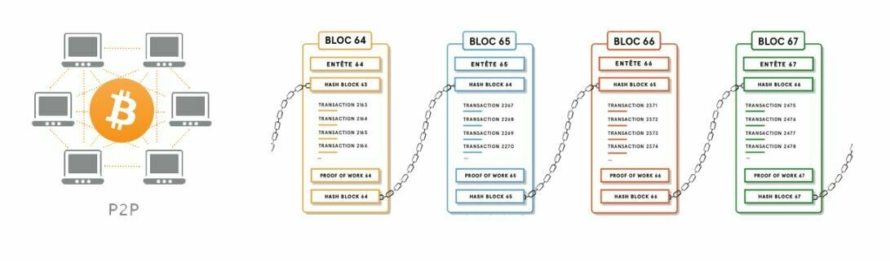

بفضل هذا الآلية الغريبة نوعًا ما، نحصل على قاعدة بيانات (سلسلة الكتل) غير قابلة للتغيير مع مرور الوقت، موزعة في الفضاء، وتعمل بشكل مستمر في جميع أنحاء العالم. وهذا يتيح، للمرة الأولى في تاريخ البشرية، أن يكون لدينا نظام محاسبة ثلاثي الدخول يسمح لأي شخص باستخدام نظام مالي بديل مبني على الإنترنت دون أن يتحكم فيه أو يدمره أحد.

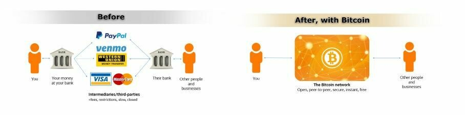

بالإضافة إلى وظيفتها التقنية (المشروحة في BTC 101)، يمكننا أن نلاحظ خاصتين تجعلان البيتكوين ما هو عليه اليوم بعد 14 عامًا من وجوده:

- الأولى هي أن كود البيتكوين مفتوح المصدر. وهذا يعني أن أي شخص يمكنه النظر في كيفية عمل البيتكوين، فهو شفاف وقابل للتدقيق. وبالتالي، يمكن لأي شخص استخدامه والبروتوكول متساوٍ للجميع، ولا يمكن أن يكون هناك تمييز. وهذا يجعل البيتكوين مثيرًا للاهتمام للاستخدام كنظام لنقل القيمة.
- العنصر الثاني يكمن في خصائصه النقدية. فعلا، البيتكوين نادر. لن يكون هناك سوى 21 مليون في العالم ولن يزيد أبدًا (وحتى أقل بسبب الخسائر). وهذا ممكن بفضل طبيعة البروتوكول نفسه، لأنه منذ إطلاقه، تم تحديد خصائصه النقدية (منحنى توزيع البيتكوين) ولا يمكن لأحد تغييرها من جانب واحد. هذه الخاصية تعني أن البيتكوين، مثل الذهب، لا يمكن أن يتم تخفيفه بطباعة الكثير من النقود.

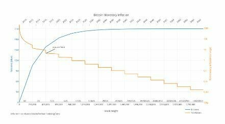

هذه الخاصتين تجعل البيتكوين أداة تكنولوجية ونقدية قوية لا تبتكر فقط في عالمنا، ولكنها تكسر أيضًا القواعد.

بسبب هذه الخصائص، يعتبر العديد من مستخدمي البيتكوين، بما في ذلك نفسي، أن البيتكوين هو ابتكار رئيسي لمجتمعنا، على نفس مستوى العجلة، المحاسبة المزدوجة، الكهرباء، أو حتى الإنترنت.

لذا، البيتكوين هو "من الصفر إلى الواحد" الذي يقوم بتعطيل قواعدنا وعاداتنا.
إذا كان هذا جديد بالنسبة لك، فأنصحك بشدة بمتابعة BTC 101 قبل الاستمرار في تعريض نفسك لتكنولوجيا قد لا تفهمها جيدًا دورها وغرضها.

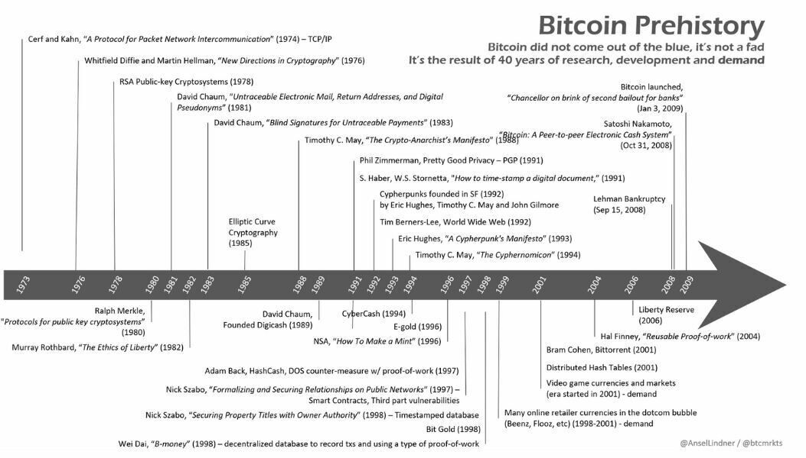

## لماذا البيتكوين مهم؟

لماذا أهمية البيتكوين مهمة جدًا؟ هذا هو السؤال المركزي في هذه الجامعة. سواء كان يتعلق بدراستك أو استراتيجية استثمارك، فبدون فهم واضح لأهمية البيتكوين، فإنك تخاطر بالتباعد عن خطة عملك. لذا، الهدف هو أن تبقى دائمًا في ذهنك أساسيات البيتكوين، من أجل ضمان أن استراتيجيتك تبقى متوافقة مع قناعاتك.
وصف باراك أوباما مرة واحدة بيتكوين بأنها "بنك سويسري في جيبك". وفي الواقع، توفر بيتكوين نفس الفرص للجميع، بغض النظر عن هويتك. سواء كنت مراهقًا، أو رئيسًا، أو محتجًا في هونغ كونغ، أو "سترة صفراء" في فرنسا، فللجميع نفس الوصول إلى نفس البروتوكول ونفس الأدوات:
1. إنشاء حسابات مجانية وغير محدودة.
2. القدرة على إرسال الأموال إلى أي مكان ولأي شخص.
3. لا حاجة للتحقق من الهوية أو الأوراق الثبوتية.
4. إمكانية الوصول للجميع، بغض النظر عن العمر أو الجنس أو الديانة أو البلد أو مستوى الدخل.
5. الخصوصية والشفافية حسب الطلب.
6. عدم وجود وسطاء أو رسوم مخفية.
7. بيتكوين هي جزء من الإنترنت، مما يجعلها متاحة لأي شخص لديه وصول إلى الإنترنت.

في الختام، يمكن اعتبار بيتكوين "عملة الشعب".
السؤال الفلسفي لليوم: في عالم بيتكوين، هناك اتجاهان يتعارضان. هل ترغب في إدخال المليارات من الأشخاص الذين ليسوا في نظام البنوك إليه؟ أم ترغب في إخراج المليارات من الأشخاص الذين هم في نظام البنوك؟

يستحق هذا السؤال التأمل، وسنعود إليه لاحقًا.

يعيش مليارات الأشخاص تحت تأثير السياسات النقدية السيئة التي غالبًا ما تؤدي في المدى الطويل إلى أزمات مالية شديدة. وقد حدثت هذه الأزمات مئات المرات في تاريخنا وستستمر في الحدوث طالما يتم تلاعب قيمة المال والوقت. يمكن أن تتجلى هذه الأزمات في شكل تضخم مفرط للأسعار، والتحكم النقدي، وتخفيض قيمة العملة.

تقدم بيتكوين لكل فرد فرصة للخروج من هذا النظام. إنها خيار أخلاقي سيضطر الجميع على الأرجح إلى اتخاذه يومًا ما. يسهل بيتكوين الانتقال من النقود القانونية إلى النقود الصحيحة، بفضل مقاومته للرقابة وقابليته للتقسيم والنقل.

**هل تعلم**؟ خلال الـ 100 عام الماضية، حدث أكثر من 55 حالة من التضخم المفرط. معظمها دمرت اقتصاد بلدانها، وأفنت مدخرات المواطنين، وأحيانًا أدت إلى استقرار سياسي أدى إلى تأسيس نظام ديكتاتوري (كما حدث في تشيلي وألمانيا، وما إلى ذلك). تدمير العملات القانونية ليس ظاهرة جديدة وسيستمر في الحدوث. ومع ذلك، بفضل بيتكوين، لديك الآن الفرصة للخروج من هذا النظام.

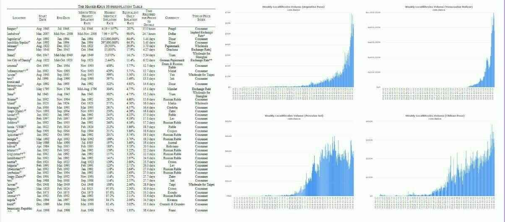

تفاقم التفاوت في الثروة في العالم أدى إلى ارتفاع التطرف، والذي أدى في بعض الأحيان إلى تأسيس أنظمة ديكتاتورية. بغض النظر عن هويتك، قد تحتاج في يوم من الأيام إلى الخصوصية لحماية عائلتك ونفسك ومدخراتك. أين يمكنك إخفاء أصولك إذا تعرضت لتهديد سياسي؟

- يمكن تجميد حسابك المصرفي، أو حجزه، أو تفريغه.
- الذهب صعب التقسيم، ومعقد في النقل والاستخدام.
- النقد نقدي، سهل السرقة، ومعرض للتضخم.
  يقدم بيتكوين حلاً لهذه المشاكل من خلال السماح للأشخاص بتأمين مدخراتهم وحملها معهم، دون أي تحكم من الحكومة. يعيش ما يقارب من نصف سكان العالم تحت نظام معادٍ، وهؤلاء الأشخاص يحتاجون إلى بيتكوين أكثر من أي شخص آخر.
  بيتكوين هو شكل من أشكال الاحتجاج السلبي ضد ظلم النظام.

**هل تعلم**؟ بيتكوين هو شبه مجهول. يتم استخدام عنوان مجهول لتخزين وتبادل بيتكوين بين المستخدمين. ومع ذلك، يتم تسجيل كل عملية تحويل في دفتر الأستاذ العام (البلوكشين) ليتمكن الجميع من التحقق منها. هذا يعني أن أسماء المستخدمين لا تكشف، ولكن تاريخ عملياتهم مفتوح تمامًا.
البنوك المركزية تستمر في تخفيف قوة شرائك من خلال سياسات التضخم وخلق النقد (التيسير الكمي). هذه الضرائب المخفية التي أذابت قيمة المال تدريجيا على مر العقود. إذا لم يكن لديك دخل ثابت من الأرباح أو السندات أو الاستثمارات العقارية، فستصبح أكثر فقرًا مع مرور الوقت، بينما يستمر الأثرياء في الازدهار. بسبب إجراءات البنوك المركزية، يكون الدولار اليوم أقل قيمة من الدولار غدًا.
يشجع النظام على الديون والإنفاق وإثراء البنوك من خلال الفوائد المدفوعة على مدى سنوات عديدة من السداد والديون. هذا ليس خطأً، بل استراتيجية متعمدة تنفذها البنوك والسياسيون لتحفيز الإنفاق الحكومي والنمو الاقتصادي ودفع السكان لتكبد المزيد من الديون.

نظامنا مفسد بواسطة البنوك المركزية. بيتكوين هو العلاج.

لن يكون هناك أكثر من 21 مليون بيتكوين، ولا يمكن لأي سياسي أو مصرفي أو فرد خبيث آخر تغيير ذلك. تم تحديد هذا الحد في بروتوكول بيتكوين بواسطة ساتوشي ولا يمكن تغييره اليوم. هذا يحدد معدل التضخم لبيتكوين للسنوات المقبلة.

في الماضي، لعب الذهب دورًا تنظيميا باعتباره عملة سليمة. ومع ذلك، منذ عام 1971، لم يتم ربط أي عملة فضية (اليورو، الدولارات، إلخ) بالذهب، مما فتح الباب أمام إنشاء نقدي غير محدود. برررر (إشارة إلى صوت آلة طباعة).

إذا كان لديك أموال في حساب مصرفي، فهذه الأموال لم تعد تنتمي إليك. في الواقع، لقد قرضت تلك الأموال للبنك لاستخدامها. من المهم أن تفهم وتكون على علم بهذا الواقع. إذا كان لديك أموال في حساب مصرفي، فأنت في الواقع دائن للبنك. هذا يعني شيئين:

1. إذا أفلس البنك، فإنك تخاطر بفقدان أموالك.
2. إذا رفض البنك إعادة أموالك، فأنت أيضًا تخاطر بفقدانها.

قد تعتقد أن هذه السيناريوهات غير محتملة، ولكننا سنستكشف في فصل لاحق لماذا تكاد تكون حتمية.

بيتكوين، من ناحية أخرى، هو نظام مفتوح وغير فاسد. القواعد ثابتة ونفسها للجميع. تؤكد العبارة الشهيرة "ليس لك المفاتيح، ليس لك البيتكوين" أهمية امتلاك المفتاح الخاص لمحفظة بيتكوين. من خلال امتلاك المفتاح الخاص، تتحكم بالكامل في البيتكوين الموجودة فيه. إذا لم تحمل هذا المفتاح، فهذا يعني أن شخصًا آخر يحمل بيتكوين الخاص بك بالنيابة عنك. في هذه الحالة، يتعرض بيتكوين الخاص بك للمخاطر المماثلة لتلك المرتبطة بالبنك التقليدي.

لاستعادة سيادتك، من الضروري أن تتحكم في المفتاح الخاص بك وتأمين بيتكوين الخاص بك بنفسك.

بيتكوين يقدم بديلا قويا للأنظمة المالية التقليدية. يسمح للجميع بالحفاظ على خصوصيتهم، وحماية أنفسهم من التضخم وتخفيض قيمة العملة، وتجاوز الأنظمة الاستبدادية، واستعادة السيادة على أموالهم. بيتكوين هو عملة صوتية يمكن الوصول إليها من قبل الجميع، بغض النظر عن العمر أو الجنس أو الديانة أو الدخل. من خلال اعتماد بيتكوين، يمكن للأفراد أن يوفروا للمستقبل، ويتحرروا من قبضة البنوك المركزية، ويستعيدوا السيطرة على حياتهم المالية. إنه أداة تعيد توازن القوة وتعزز الحرية الاقتصادية على نطاق عالمي.

بيتكوين، حركة سياسية؟
مروجو بيتكوين الرئيسيون اليوم لا يزالون في المقام الأول من الهاكرز السيبرانيين والمواطنين المضطهدين والأناركيين وأتباع المدرسة النمساوية للاقتصاد ومهندسي الحاسوب والماليين والمدافعين عن حرية التعبير.
بيتكوين لديها بعد فلسفي وأخلاقي وسياسي عالي في حين أنها تظل غير مبالية تمامًا لهذه الاعتبارات. في الواقع، بيتكوين هو بروتوكول بسيط يكرر نفس العملية مرارًا وتكرارًا. إنه المستخدمون الذين حولوه إلى سلاح تحرير ضد النظام المالي الحالي. من منظور السايبربانك، يعارض بيتكوين المجتمع الخالي من النقود النقدية. إنه يسمح بإجراء معاملات مالية رقمية خاصة تمامًا وخالية من الوسطاء. بالنسبة لحركة السايبربانك، بيتكوين هو المكافئ الإلكتروني للنقود النقدية.

## فهم صناعة بيتكوين

مع ظهور بيتكوين في عام 2009 على يد ساتوشي ناكاموتو، ولدت صناعة تبلغ قيمتها عدة مليارات من الدولارات. على الرغم من صغر سنها، فقد شهدت هذه الصناعة نموًا هائلاً خلال العقد الماضي. يصل اللاعبون الجدد كل يوم بمبالغ كبيرة من المال ومستعدون للدخول بقوة في هذه الصناعة الجديدة. اليوم، وصلت الصناعة إلى نقطة لا يمكن العودة عنها حيث انضمت الحكومات والبنوك والعمالقة على الإنترنت وغيرهم إلى الحركة مع تدخلات مختلفة.

بيتكوين هو من 0 إلى 1. لا يمكن التراجع عنه. قد يراه البعض كشر شخصي، فقد فتح صندوق باندورا وأخذ الآن سلطتهم وميزتهم. سيحاربون ضده. قد يرون آخرون في بيتكوين فرصة لاستعادة الحرية وتغيير النظام وتحسين مجتمعنا. سيتقبلونه. بيتكوين لا يهتم، إنه مجرد وجود.

في هذا القسم، سنلقي نظرة سريعة على الجهات المعنية لفهم أفضل لكيفية عمل الصناعة التي نسعى للدخول إليها.

من الممكن لأي شخص تصميم عملته الرقمية - وهو أمر يستغرق بضع دقائق فقط. ومع ذلك، سيتم تحديد قيمة هذه الرمزية حصرًا من قبل السوق. في ديسمبر 2019، تم إدراج أكثر من 5000 رمز على Coinmarketcap. اليوم، في عام 2023، ارتفع هذا العدد إلى أكثر من 23،000، مع NFTs و DeFi وغيرها الكثير. يمكن أن تأخذ هذه الرموز التشفيرية أشكالًا مختلفة: عملة، رمز أمان، وقود لنظام بيئي، سلسلة جانبية، فن رقمي، إلخ.
من الضروري فهم أن 99.8٪ من هذه "العملات المشفرة" الجديدة هي عبارة عن عمليات احتيالية، تم إعدادها من قبل المسوقين بهدف سرقة بيتكوين الخاص بك. ومع ذلك، بين الـ 0.2٪ القليلة من المشاريع الجادة، يتم بذل جهود كبيرة للتقدم والتجربة وتطوير التكنولوجيات المبتكرة التي يمكن أن تجلب العديد من الفوائد للمستخدمين. مع مرور الوقت، سيتحسن القطاع، مما يؤدي إلى ظهور شركات شرعية تقدم منتجات حقيقية. تبقى مسألة ما إذا كان ذلك سيحدث على سلاسل الكتل غير بيتكوين مفتوحة. في الوقت الحالي، هناك شيء واحد مؤكد: بيتكوين هي العملة المشفرة الوحيدة الحقاً غير المركزية، المقاومة للرقابة، حرة وجادة التي تبرر آلاف ساعات العمل.

| الخاصية        | بيتكوين                  | عملة بديلة (99.9٪ منها) |
| ---------------- | ------------------------ | ------------------------ |
| السيولة        | عالية                     | منخفضة                      |
| التبني (الحقيقي)  | عالي وعالمي          | منخفض                      |
| الفريق             | قوي وغير مركزي | ضعيف ومركزي     |
| السمعة       | عالية وعالمية          | منخفض                      |
| البنية التحتية   | قوية ومستقرة        | ضعيفة                     |
| اللامركزية | نعم                      | لا                       |
| احتيال؟            | لا                       | ربما                 |
| قيمة؟           | نعم                      | قابل للنقاش                |

لا تقع في فخ العبارات مثل:

- "البلوكشين، ليس بيتكوين"
- "إكس آر بي هو البديل الجديد لبيتكوين"
- "العملة المستقرة هي المستقبل"
- "ليبرا ستقضي على بيتكوين"
- "اكتشف بيتكوين الجديد المحسن"
- "سيجعل فدكوين بيتكوين قديمًا"
من الضروري أن تقوم بإجراء بحثك الخاص إذا قررت الغوص في عالم العملات البديلة، ولكننا لن نرشدك هنا.

بعد فقاعة العروض الأولية للعملات الرقمية في عام 2017، بدأ العديد من اللاعبين الكبار في تطوير قواعدهم الخاصة باستخدام "البلوكشين". تستكشف الحكومات والبنوك المركزية إمكانية إنشاء نسخة رقمية من عملتها الورقية (السويد، أوروبا، روسيا، الصين، إلخ). العمالقة التكنولوجيون أيضًا ينضمون إلى هذا السباق. أطلقت فيسبوك مشروعها الخاص بالعملة المستقرة "ليبرا". يتم تجربة بدائل لـ "البلوكشين" من قبل البنوك والشركات والعمالقة التكنولوجية الأخرى مع حلول مثل لينكس أو "هايبرليدجر" من IBM.

| الخاصية              | بيتكوين | عملة بديلة | عملة فيسبوك | فدكوين |
| -------------------- | ------- | -------- | ------------- | -------- |
| عامة                 | نعم     | تختلف   | لا            | لا       |
| مفتوحة               | نعم     | تختلف   | لا            | لا       |
| غير محدودة           | نعم     | تختلف   | لا            | لا       |
| محايدة              | نعم     | تختلف   | لا            | لا       |
| مقاومة للرقابة       | نعم     | تختلف   | لا            | لا       |

على الرغم من أنهم يدعون أنهم يتنافسون مع بيتكوين، إلا أن هذه المشاريع تظل مركزية من أجل ضمان السيطرة والامتثال للوائح المحلية. لن يوفروا حماية الخصوصية، بل سيزيدوا من المراقبة الشاملة. مشروع "ليبرا" الخاص بفيسبوك وضع نفسه كمنافس للبنوك، وليس بيتكوين. علاوة على ذلك، بدون دليل على العمل، فإن "البلوكشين" ليس له قيمة حقيقية. يجب أن نلاحظ أن ليبرا تم التخلي عنها منذ ذلك الحين ولا يتم استخدام أي مشروع حقيقي لـ "البلوكشين" الخاص في الوقت الحالي على المستوى العالمي، على عكس بيتكوين الذي يتم استخدامه.

بروتوكول بيتكوين خارج نطاق التنظيمات. يمكن تنظيم الأطراف المتداولة حوله فقط، وبما أن بيتكوين مفتوح المصدر، فإن القوانين والضرائب والتنظيمات تختلف من بلد إلى آخر. على سبيل المثال، حظرت الصين استخدام بيتكوين في العديد من المناسبات، في حين اتخذت دول مثل كندا وسويسرا ومالطا موقفًا أكثر تساهلاً تجاهه. معظم الدول أنشأت فرق عمل للتشفير لوضع قواعد وتنظيمات جديدة. ومع ذلك، هذه العملية بطيئة ويمكن أن تتغير القواعد بشكل متكرر. على الرغم من هذه الوتيرة البطيئة، فإن بيتكوين والعملات الرقمية في مركز العديد من المحادثات.

من المستحسن إجراء بحث شامل بشأن الوضع في بلدك. تخضع البنوك أيضًا لتنظيمات صارمة فيما يتعلق ببيتكوين. تغلق العديد منها الحسابات وتقيد الوصول إلى الخدمات المالية للشركات التي تتعامل بالبيتكوين، في حين تشكل أيضًا فرق بحث لاستكشاف هذه التكنولوجيا الجديدة من أجل تحسين بنيتها التحتية الخاصة. لا يرغب أي مشرع أو بنك أو حكومة في فقدان السلطة، لذلك فهم يستعدون للتعامل مع بيتكوين. من المهم أن نلاحظ أن بيتكوين، على هذا النحو، لا يمكن تعديله أو التحكم فيه من قبل كيان واحد.

منصات التبادل تعمل كوصلة بين العملة الورقية (العملة التي تصدرها الحكومة) والعملات الرقمية. تتيح لعملائها شراء أو بيع العملات الرقمية من خلال منصتها. لكل منصة تبادل خصائص محددة. فيما يلي بعض الجوانب التي يجب مراعاتها:

- سمعة جيدة فيما يتعلق بالأمان
- سيولة كافية
- خدمة عملاء فعالة
- واجهة مستخدم سهلة الاستخدام
- خيار للشراء التلقائي
- سحب البيتكوين تلقائيًا إلى المحفظة الخاصة بك.
معظم منصات التبادل القانونية تلتزم بالتنظيمات المصرفية الحالية. كما أنها قد نفذت إجراءات صارمة لمعرفة العميل (KYC)، والتي تتطلب منك تقديم هوية لإنشاء حساب. وبالتالي، يمكن تقسيم صناعة حلول الشراء إلى KYC وغير KYC، كما سنستكشف بالتفصيل قريبًا.
تحذير: "الأخ الأكبر" يراقبك، على ما يبدو لأجل سلامتك، بالطبع. يمكن أن تستخدم حكومتك بياناتك لتتبع أنشطتك.

في طيف منصات التبادل، هناك 5 أنواع رئيسية:

- منصة تبادل أخلاقية: هذه هي الحلول التي تحاول احترام المستخدم من خلال تقديم خدمة بسيطة وصادقة. تقدم هذه المنصات عادة حلولًا للتكلفة المتوسطة (DCA) وسحب تلقائي للأموال إلى محفظة المستخدم. هذه هي الحلول الأكثر مناسبة للمبتدئين. (على سبيل المثال، relai، bull bitcoin، stackinsat)
- منصات تبادل ند لند: تتيح لك شراء وبيع البيتكوين مباشرة بين المستخدمين. يمكنك العثور على أشخاص في مدينتك لإبرام صفقات. كن حذرًا أثناء هذه المبادلات وتفضل الأماكن الآمنة والعامة لإبرام الصفقات. تعتبر هذه الحلول غير المتطابقة مع KYC جيدة جدًا للمستخدمين المتقدمين قليلاً. سنتناولها بالتفصيل في BTC 205. (على سبيل المثال، Bisq، peach، robosat)
- منصات تبادل العملات البديلة: تتيح لك هذه المنصات شراء وبيع العملات البديلة المختلفة التي ترغب في التداول بها. للقيام بذلك، يمكنك إيداع البيتكوين أو استخدام بطاقة ائتمان. من النصح أن تكون حذرًا للغاية مع العملات البديلة وتقييم أدائها بالبيتكوين، وليس بالدولار. في الجوهر، هذه المنصات هي كازينوهات عملاقة للأصول غير المنظمة (غالبًا غير آمنة). لا نوصي بها. (أمثلة نموذجية: Bitfinex، kraken، bitstamp)
- منصات تبادل التداول: تتيح لك تداول البيتكوين والعملات الأخرى برافعة مالية، باستخدام البيتكوين كضمان. يمكنك تداول عقود مشتقة. كن حذرًا إذا استخدمت الرافعة المالية! من الأفضل على الأرجح عدم تداول بيتكوين الخاص بك. بالمثل، لا نوصي بهذا النوع من الحلول للمبتدئين. (على سبيل المثال، Binance)
- منصات تبادل مشبوهة: بعض المنصات غير المنظمة مشبوهة، يمكنها التلاعب بحجم المعاملات وأمانها غالبًا غير مضمون. هذه المنصات غالبًا ما تكون روسية أو صينية، أو حصرية على الشبكة المظلمة. المخاطر على عاتقك، ولكن من المستحسن تجنبها.
  لا تنسى أبدًا سحب البيتكوين الخاص بك من منصة التبادل. يمكن اختراق منصات التبادل، أو حجزها، أو إفلاسها، أو ببساطة اختفاء أموالك معها. إنها تشكل مخاطر كبيرة ويجب تجنبها قدر الإمكان. لا تترك أموالك هناك لفترة طويلة. تذكر: إذا لم يكن لديك المفاتيح، فإن البيتكوين ليست ملكك.
  يتم تخزين البيتكوين في ما يسمى "محفظة"، وهي خزنة رقمية لأموالك. يمكن لحامل المفتاح الوصول إليها فقط. يمكن أن تكون جهازا ماديًا، أو برنامجًا تطبيقيًا، أو حتى قطعة ورق. تقوم هذه المحافظ بتوصيل بيتكوين الخاص بك بالعالم الخارجي.
  لكل محفظة خصائص مختلفة:

- الخصوصية
- الأمان
- سهولة الاستخدام
- التكلفة.

في صناعتنا، يمكننا بالتالي تقسيم مزودي المحافظ إلى عدة أقسام:

- منشئو المحافظ الأجهزة. هنا لدينا العديد من الشركات المنافسة في هذا المجال. بعضها مفتوح المصدر، والبعض الآخر يقدم محافظ أجهزة أكثر أو أقل تكلفة مع ميزات أكثر أو أقل (على سبيل المثال، Ledger، Trezor، Coinkite، Shiftcrypto).
- منشئو المحافظ البرمجيات؛ هؤلاء هم الشركات أو الجهات المستقلة الراغبة في إنشاء محافظ برمجيات للهواتف المحمولة أو الكمبيوتر (على سبيل المثال، Wizard Sardine، Galoy، Synonyme، Blockstream).
- محافظ DIY (افعلها بنفسك)؛ هنا، لدينا حلول مفتوحة المصدر بنسبة 100٪ يمكن إنشاؤها في المنزل لتقليل مخاطر الثقة تجاه الجهات الأخرى في سلسلة الإنتاج أو الإنشاء (على سبيل المثال، Seedsigner، Specter DIY).
المحافظ هي جانب حاسم في عملة البيتكوين وسنستكشفها بالتفصيل في هذه الجامعة.
المنقبون هم المسؤولون عن تأمين الشبكة. يستخدمون الكهرباء لأداء عمليات العمل الإثباتية للبيتكوين، مما يؤدي إلى إنشاء كتلة جديدة. لقد تناولنا بالفعل موضوع المنقبين بالتفصيل في دورة BTC 101، إذا لزم الأمر. للمزيد من التفاصيل، نقدم دورة Mining 201.

من المهم أن نفهم أن هذه الصناعة واسعة جداً، جداً واسعة.

في حين بدأت بشكل فردي، فإن منقبي اليوم عموماً شركات كبيرة وممولة جيداً تتنافس في قطاع صعب جداً. يسعون للحصول على مصادر طاقة رخيصة للحصول على ميزة تنافسية. يمكن أن تكون علنية أو مجهولة ويمكن أن توجد في أي مكان في العالم.

تنقسم صناعتهم إلى العديد من اللاعبين ذوي الأحجام المختلفة:

- منشئو الأجهزة للتعدين (على سبيل المثال، بيتماين): هذه الشركات هي الرابط الأساسي في صناعتنا، حيث أنه من المعقد للغاية إنشاء ASICs فعالة.
- منشئو البرامج للتعدين: سواء كان ذلك لإنشاء حمامات التعدين أو الأدوات المستخدمة بواسطة ASICs، فإنها جانب حاسم في الصناعة (على سبيل المثال، Braiins OS).
- المطورون العاملون على حلول مبتكرة مثل StratumV2.
- المنقبون: هم الذين يستخدمون الآلات والبرامج لإطلاق عمليات التعدين الخاصة بهم. هناك منقبون هواة صغار يستخدمون S9 (كما يتم تدريسه في دورة Mining 201) ومنقبون دوليون مثل Galaxy الذين يمتلكون مستودعات ضخمة في تكساس للتعدين.

التعدين هو مجال منفصل، لذا إذا كنت مهتمًا بجانب الطاقة، ستكون راضيًا.

بيتكوين هو بروتوكول مفتوح المصدر. يمكنك العثور على الشفرة الخاصة به على GitHub: https://github.com/bitcoin/bitcoin. من هنا، يمكنك الوصول إلى جميع اقتراحات التحديث والوثائق والعديد من المناقشات المجتمعية. كل شيء شفاف، ومن المستخدم أن يقرر ما إذا كان سيقوم بالتحديث أم لا. المطورون الرئيسيون لبيتكوين مسؤولون عن إدارة هذا GitHub. يقومون بتحديث الشفرة المصدرية، والتحقق من الأخطاء، والإشراف على إدارة المشروع العام.

يمكن تقسيم مطوري بيتكوين إلى أقسام مختلفة:

- مطورو Bitcoin Core: هم المسؤولون عن التطوير الرئيسي لبروتوكول بيتكوين وميزاته الأساسية.
- مطورو بروتوكولات إضافية (مثل شبكة Lightning أو RGB): يعملون على بروتوكولات إضافية تدمج في نظام بيتكوين وتوسع وظائفه.
- مطورون هواة يقومون بإنشاء أدوات وتطبيقات (مثل Mempool أو Alby): يساهمون في نظام بيتكوين من خلال تطوير أدوات وخدمات أو تطبيقات تسهل استخدامه.

يمكن لأي شخص أن يبدأ في المساهمة في الشفرة، ولكن من المهم أن نلاحظ أن تعديل الشفرة الخاصة ببيتكوين في الواقع عملية طويلة ومعقدة. بالإضافة إلى ذلك، العديد من مطوري بيتكوين هم محبون يكرسون سنوات عديدة لتطوير اقتراحات تحسين بيتكوين (BIPs) التي قد لا تستخدم أبدًا. إنها صناعة معقدة وأحيانًا غير متوقعة. سنستكشف هذه الجوانب بالتفصيل.

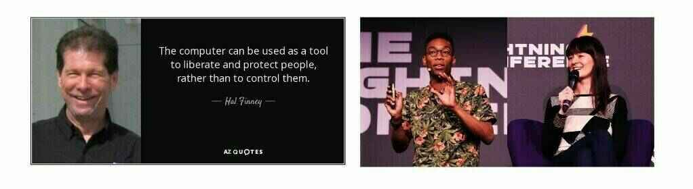

الطاقة غير محدودة؟ لا٠ لا يمتلك المطورون الرئيسيون سلطة غير محدودة ولا يمكنهم تعديل أو التحكم في بيتكوين بمفردهم. إنها العقد التي تحمل السلطة. لا أحد يتحكم في بيتكوين.

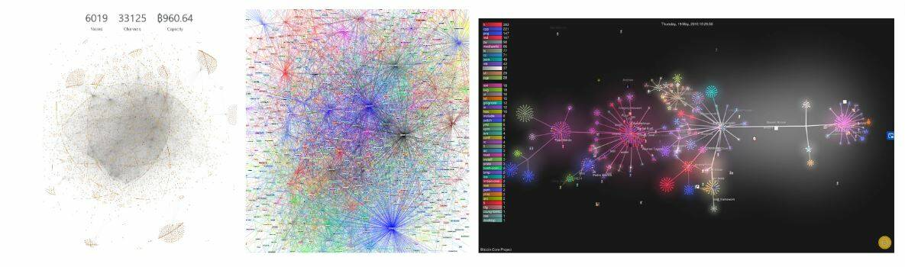

## الهندسة المعمارية المتدرجة لبيتكوين

بيتكوين، كبروتوكول مفتوح المصدر، يمكن تكملته وإثراؤه بطبقات من البروتوكولات/التطبيقات التي يتم إضافتها بواسطة أي شخص. بعض هذه الميزات أكثر أهمية من غيرها، مما يخلق نظام بيئي ديناميكي مع مجموعة متعددة من الشركات التي تساهم في تطوير البنية التحتية. أمثلة على مثل هذه المشاريع تشمل Sidechains (على سبيل المثال، Liquid Chain بواسطة Blockstream)، شبكة Lightning بواسطة Lightning Labs، ومفاهيم الهوية (على سبيل المثال، Microsoft ION). هذه المشاريع مثل طبقات إضافية مضافة إلى بروتوكول بيتكوين الأصلي.
هل تعلم؟ لم يتم بناء الإنترنت في قطعة واحدة. بل هو نتيجة لعدة طبقات من البروتوكولات المكدسة فوق بعضها البعض - HTTP و TCP و IP. وبهذه الطريقة، تكون كل طبقة فعالة للغاية في إنجاز المهمة المحددة التي تم تكليفها بها، بينما تتناول الطبقات الأخرى الاحتياجات الأخرى.
أصبحت البرق الآن متاحة للجميع، إنها الطبقة التطبيقية للبيتكوين.
شبكة البرق هي الطبقة الثانية للبيتكوين. تتيح للبيتكوين التوسع والحصول على المزيد من الميزات. تعمل على غرار علامة تبويب في حانة، حيث تبقى المعاملات على الورق وتُسوَّى في النهاية. سندرسها بالتفصيل لاحقًا.

وأخيرًا، فإنه لا يخفى أن هذه الصناعة تشمل أيضًا الملايين من الجهات التقليدية مثل الشركات والتجار والمستخدمين.

أصبح قبول البيتكوين في الأعمال التجارية أمرًا بسيطًا اليوم بفضل العديد من الأدوات التي لا تتطلب الكثير من وقت الإعداد:

- OpenNode
- Swiss Bitcoin Pay
- BTCPay

لقد وصلنا إلى نقطة في الصناعة يمكن للجميع المشاركة فيها، سواء عن طريق استخدام البيتكوين في حياتهم اليومية من خلال إنفاقه، أو قبوله في أعمالهم، أو المساهمة في التعليم أو البرمجة، أو الابتكار بعيدًا عن ذلك. باختصار، لا يمكن إيقاف البيتكوين بعد الآن.

تبدو مجازاة "طريق البيتكوين" لي كواحدة من أدق الرسوم التوضيحية لوصف مستقبل الصناعة وبنية البيتكوين. يضع البيتكوين نفسه كنظام مالي بديل. شاب، في عملية التنضج، وبعيوبه الخاصة، إلا أنه قوي. لن يختفي، ومثل الثقب الأسود، سيمتص كل شيء في طريقه مع مرور الوقت.

يمكن اعتبار البيتكوين على أنه طريق تسلكه. عندما تحتاج إلى إصلاح سيارتك، أو إعادة التزود بالوقود، أو شراء الطعام، فأنت مضطر لمغادرة هذا الطريق البيتكوين، إما للعودة إلى النظام المالي القديم لتلبية احتياجاتك.
ومع ذلك، عندما تكون البنية التحتية كفاءة بما فيه الكفاية، فلن يكون من الضروري مغادرة هذا الطريق لتلبية احتياجاتك الأساسية. ستتحول الطريق إلى طريق سريع، حيث يكون 90٪ من حركة المرور بسرعة كاملة ويتباطأ أو يتوقف فقط 10٪. بمجرد أن يتحول البيتكوين إلى طريق سريع من هذا القبيل، لن يترك الناس إياه لشراء مشترياتهم. ستكون السلع والخدمات متاحة مباشرة على هذا الطريق، وسيصبح العودة إلى النظام القديم نادرًا ومحفوفًا بالمخاطر ومملًا.

هذه هي الرؤية المستقبلية التي لدي للبيتكوين. سيصبح طريقًا لحركة الإنترنت ولـ 90٪ من سكان العالم. لن يختفي النظام والبنية التحتية القديمة، ولكنها ستصبح قديمة إذا لم تتكيف مع طريق البيتكوين.

أندرياس أنتونوبولوس، إن لم يكن لي خطأ، قد قدم لي هذه الفكرة. @aantonop

# إعداد خطتك

## اختيار ملفك الشخصي

الآن بعد أن قمنا بمراجعة الأساسيات الأساسية وتعلمنا كيفية تجنب الاحتيال والخسائر المالية، يمكننا وضع خطتنا. ستكون الخطة بسيطة نسبيًا للبدء، ولكن من المهم أن نبدأ. يمكنك دائمًا تعديلها مع مرور الوقت.
في هذا التدريب، سنفترض أنك مبتدئ في البيتكوين، وبالتالي يجب أن تكون الحلول بسيطة وسريعة التنفيذ وفعالة. لن نناقش التعرض للبيتكوين من خلال التعدين، أو شركات البيتكوين في سوق الأسهم، أو أمور معقدة أخرى. الهدف هو اختيار المحفظة المناسبة لك، ثم الحل المناسب للحصول على أولى بتكويناتك.

لنبدأ بطرح أنفسنا الأسئلة التالية:

- كم ترغب في استثماره في البيتكوين شهريًا؟
- ما هي استخدامات البيتكوين التي تتصورها؟
- ما هي المدة المتوقعة لاستثمارك؟
- مدى أهمية الخصوصية بالنسبة لك؟

باستخدام هذه الأسئلة الأربعة، يمكننا اختيار المسار الذي يناسبك بشكل أفضل! فعلا، ليس هناك حلا سحريا للتعرض للبيتكوين. بدلاً من ذلك، أقترح النظر في الصفحات النموذجية والسماح لك بالعثور على الإلهام.

بشكل عام:

- محفظة ساخنة مجانية للمبالغ الصغيرة
- محفظة باردة للمبالغ الكبيرة
- استخدام حل DCA للمشتريات المتكررة بدون ضغط
- استخدام حل غير KYC للتحقيق
- استخدام منصة تبادل تقليدية لعملية شراء مرة واحدة.

باستخدام هذا، يجب أن تجد ما يناسبك، واختيار الخطة المناسبة، ثم اتباع البرنامج التعليمي الصحيح في القسم التالي.
**تذكير:** إذا لم تكن تمتلك المفتاح الخاص (قائمة من 24 كلمة)، فإن طرفًا ثالثًا مسؤول عن أمان بيتكوين الخاص بك. بعبارة أخرى، لم تعد تمتلك بيتكويناتك. إنها تخضع لنفس المخاطر التي تواجه منصات التبادل مثل الاختراق، أو الاستيلاء، أو التنظيم، أو الإفلاس.

## المحتفظ

سواء في الاستثمارات أو في البيتكوين، الاحتفاظ لفترة طويلة هو عمومًا الأمر الطبيعي. إحصائيًا، فإنه الأكثر ربحية على المدى الطويل وأسهل تنفيذًا:

تشتري ثم لا تفعل شيئًا. (لاحظ أن عدم فعل أي شيء هو الجزء الأصعب)

في البيتكوين، يُطلق على هذا النوع من الملف الشخصي اسم "المحتفظ" لأنهم "يحتفظون" بالبيتكوين لفترة طويلة. وبالتالي، فإنهم معرضون للبيتكوين، ويراهنون على أن البيتكوين سيستخدم على نطاق أوسع غدًا وبالتالي سيكون أكثر ندرة. سيستمرون في شرائه من وقت لآخر تلقائيًا، وكل ذلك مؤمن في محفظتهم الباردة.

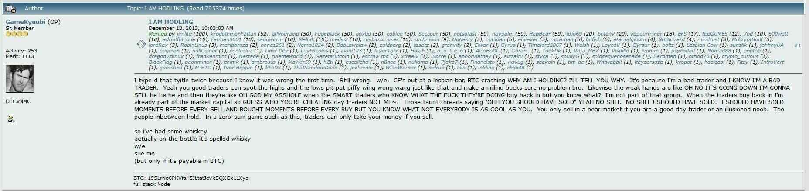

### هنا هو الخطة:

1. إعداد محفظة باردة لتأمين المبالغ الكبيرة.
2. شراء البيتكوين دفعة واحدة من خلال منصة تبادل وإعداد خطة شراء متكررة.
3. إعداد خطة للميراث.
4. انتظر وقتًا طويلاً (على الأقل دورة واحدة أو اثنتين)

إذا نسينا أن لدينا بيتكوين لمدة 3 سنوات، لا مشكلة، ستظل الأموال هناك إذا اتبعنا تعليمات الخبراء.

بالنسبة لهذا النوع من الملف الشخصي، من المستحسن استخدام محفظة باردة للبدء، مثل Bitbox02 أو Trezor أو Ledger. تكلف هذه الأجهزة حوالي 70 يورو وتوفر بعض الأمان لبيتكوين الخاص بك على المدى الطويل. يمكن أيضًا أن تقوم تطبيقات المحفظة الساخنة المجانية على الهواتف المحمولة بالمهمة، ولكن فقط للمبالغ الصغيرة نسبيًا.

برنامج تعليمي للمحفظة ذات الصلة:

- Ledger؛ Bitbox02؛ Cold Card: Trezor

خيارات التبادل:

- منصة تبادل كبيرة وموثوقة مثل Bitstamp و Binance و Kraken

إذا كان المحتفظ يرغب في الذهاب أبعد: تنفيذ خطة DCA مثل stacker واستخدام محفظة LN ساخنة لإنفاق بعض البيتكوين.

### هل هذا مناسب لك؟

فيما يلي ملخص للملف النفسي للمحتفظ، إذا كنت تتعرف على نفسك، فقد يكون مناسبًا لك!

- الصبر:
  يظهر المحتفظ صبرًا استثنائيًا. إنهم على استعداد للانتظار لسنوات لرؤية نمو استثمارهم، دون أن يتأثروا بتقلبات السوق على المدى القصير.

- رؤية طويلة الأمد:
لديهم رؤية طويلة الأجل، ويؤمنون بقيمة وزيادة اعتماد البيتكوين على الرغم من العقبات والانتقادات.
- الانضباط الذاتي:
  يتمتع المستثمر بانضباط ذاتي قوي. وأصعب جزء، كما ذكر، هو عدم القيام بأي شيء، ويتطلب انضباطًا ذاتيًا كبيرًا لمقاومة الإغراء لبيع البيتكوين خلال ذروات الأسعار القصيرة الأجل.
- المرونة:
  في مواجهة انخفاض الأسعار وتقلبات السوق، يظل المستثمر مرونًا، ويحتفظ بالثقة في استثماره ونمو البيتكوين في المستقبل.

- الإيمان بالتكنولوجيا:
  بالإضافة إلى السعي البسيط لتحقيق الربح، يؤمن المستثمر في العادة بتكنولوجيا البلوكشين وقدرة البيتكوين على إحداث تغيير إيجابي في العالم.

في الختام، المستثمر في البيتكوين هو شخص صبور ومنضبط ورؤوي يؤمن بقيمة البيتكوين على المدى الطويل ومستعد لتحمل التقلبات القصيرة الأجل لتحقيق مكاسب كبيرة في المستقبل. إنه منهجي في استراتيجيته الاستثمارية ويولي اهتمامًا للأمان والتخطيط على المدى الطويل. 

## المتراكم

في عالم البيتكوين، مفهوم "المتراكم" معروف تمامًا. الفكرة بسيطة: هناك فقط 21 مليون بيتكوين، وكل بيتكوين صغير يهم! يُطلق على هذا البيتكوين الصغير اسم ساتوشي (أو سات). هدف المتراكم هو تجميع أكبر عدد ممكن منها.

### الخطة

لتحقيق ذلك، سيحاولون زيادة تعرضهم قدر الإمكان. سيقومون بإنشاء خطة للشراء بتكلفة ثابتة (DCA) لكي يتمكنوا من شراء قليل كل أسبوع. هذه هي أفضل حلول للبدء في الحصول على تعرض للبيتكوين دون الحاجة إلى رأس مال كبير. سواء كان 10 يورو في الأسبوع، أو 25 يورو في الأسبوع، أو 100 يورو في الشهر، الأمر المهم هو تجميع الساتوشي دون التفكير كثيرًا في ذلك. ستكون خطتهم بسيطة جدًا:

1. إعداد محفظة ساخنة.
2. إعداد خطة DCA على منصة تداول.
3. الانتظار والبحث عن حلول أخرى لتجميع الساتوشي.

قد تشمل الحلول الأخرى البدء في بيع السلع أو الخدمات بالبيتكوين لتجميع المزيد. طلب السداد بالبيتكوين من الأصدقاء أو البدء في المشاركة في النظام البيتكوين للتواصل مع الثورة.

### الدروس التعليمية:

- محفظة ساخنة للتجميع السريع

- محفظة باردة للأمان على المدى الطويل

- منصة DCA لتجميع البيتكوين.

بالطبع، يمكن لهذا النوع من المستثمرين استخدام وسيط لشراء كمية كبيرة دفعة واحدة مثل المتراكم، ولكن بشكل عام، المتراكم هو المفهوم الذي يتمثل في إضافة ساتوشي بانتظام إلى محفظتهم. يمكن أن يكون النهج الأكثر شيوعًا هو تعلم كيفية استخدام البيتكوين بطريقة ند لند وبالتالي شراء البيتكوين مباشرة بالنقد مع الأصدقاء أو أعضاء مجتمع البيتكوين.

### هل هذا مناسب لك؟

الصفات النفسية للمتراكم

- استراتيجي ومنظم:
  المتراكم استراتيجي في نهجه لتجميع البيتكوين. يخطط بعناية لاستثماراته ومنظم في تنفيذ خطته للشراء بتكلفة ثابتة (DCA).
- موجه نحو الهدف:
  هدفهم الرئيسي واضح: تجميع أكبر عدد ممكن من الساتوشي. يوجه هذا التركيز أفعالهم وقراراتهم الاستثمارية، بغض النظر عما إذا ارتفعت أو انخفضت الأسعار.

- المعرفة المالية:
  يفهمون أهمية التنويع والاستثمار المنتظم، مما يقلل من المخاطر ويحسن العوائد المحتملة. يتم ذلك من خلال توزيع الأسعار وبالتالي عدم الاهتمام بحركات الأسعار القصيرة الأجل.

- نشط:
  يبحث بنشاط عن فرص إضافية لكسب البيتكوين، سواء عن طريق بيع السلع أو الخدمات أو استكشاف طرق أخرى داخل نظام البيتكوين.
المكدس هو فرد منهجي ومركز، لديه خطة واضحة لزيادة تراكمه من الساتوشي. يظهرون الاستباقية والمعرفة المالية، ويسعون باستمرار لتحسين وتأمين استثماراتهم في البيتكوين. يتميز نهجهم بالاستمرارية والتنظيم المثالي، مما يضعهم على طريق النمو المستمر والثابت لمحفظتهم من البيتكوين.

## المستخدم

أخيرًا، آخر نوع من البيتكوينرز الذي يمكن ذكره في دورة تعليمية تمهيدية هو البيتكوينر الذي يحتاج إلى استخدام البيتكوين بانتظام. سواء بسبب التزامات مهنية أو مجرد رغبة في دعم النظام البيئي، فمن الضروري توفير حلول مناسبة للاستخدام المتكرر.

### الخطة

بالنسبة لهذا المستخدم، من المحتمل أن يكون من الضروري أن يكون لديه نوعين من المحافظ:

- محفظة باردة لتخزين البيتكوين بأمان لفترة طويلة.
- محفظة ساخنة لإرسال واستقبال البيتكوين بانتظام للاستخدام اليومي.

من المحتمل أن يختار هذا النوع من الملف الشخصي محفظة تعتمد على شبكة البرق للمعاملات اليومية، بالإضافة إلى محفظة اعتادية للتخزين على المدى الطويل.

لتعريض أنفسهم للبيتكوين، ستكون لهذا النوع من الملف الشخصي عدة خيارات:

- استخدام حلول الند للند مثل Peach لشراء أو بيع البيتكوين بسرعة بطريقة غير KYC.
- استخدام منصة تبادل لشراء وبيع البيتكوين بانتظام وفقًا لاحتياجاتهم.

### البرنامج التعليمي

- محفظة ساخنة للبرق

- محفظة باردة

- منصة شراء
  **الحاجة:** محفظة برق مثل [Phoenix](https://phoenix.acinq.co/) أو [Wallet of Satoshi](https://www.walletofsatoshi.com/)، محفظة باردة مثل [Coldcard](https://coldcard.com/)، [Trezor](https://trezor.io/)، [Jade](https://blockstream.com/jade/)، [Foundation](https://foundationdevices.com/)، [Bitbox 02](https://bitcoin.org/en/wallets/hardware/bitbox/)، [Ledger](https://www.ledger.com/)، وحل سريع للشراء / البيع مثل [Kraken](https://www.kraken.com/) أو [Robosats](https://learn.robosats.com/)

### هل هذا مناسب لك؟

- عملي وملتزم:
  المستخدم عملي ويدرك مزايا وعيوب البيتكوين. إنهم مشاركون نشطون في النظام البيئي ويدعمونه بنشاط من خلال الاستخدام المتكرر.

- متمكن تقنيًا:
  لديهم فهم جيد للتقنيات، بما في ذلك المحافظ الساخنة والباردة للبيتكوين وشبكة البرق.

- مرن وقابل للتكيف:
  إنهم على استعداد لاستخدام حلول ومنصات مختلفة لتلبية احتياجاتهم المتغيرة باستمرار.

المستخدم هو فرد ملم بالتكنولوجيا ومشارك نشط في استخدام البيتكوين. إنهم يسعون باستمرار لتحسين كفاءة وأمان معاملاتهم وحيازاتهم من البيتكوين. تتجلى مرونتهم والتزامهم بالنظام البيئي في استعدادهم لاستخدام مجموعة متنوعة من الحلول، من محافظ البرق إلى حلول التبادل السريع. على الرغم من المشاركة النشطة في معاملات البيتكوين، فإنهم لا يهملون الأمان، مما يضمن تقسيمًا واضحًا بين بيتكوينهم للاستخدام اليومي وتلك التي يحتفظون بها لفترة طويلة.

## البيتكوينر المتشائم

أود أن أضيف البيتكوينر المتشائم هنا. هذا النوع من الأشخاص لا يرغب في تعريض أنفسهم لـ KYC (معرفة العميل الخاص بك)، ويفضلون البقاء قريبين من الاختفاء، ويولون أهمية كبيرة لخصوصيتهم. سيستخدم البيتكوينر المتشائم أيضًا البرق عبر العقد الخاصة بهم ويعمل على أمانهم.

### الخطة

بالنسبة لهذا النوع من الملف الشخصي، الحل للمبتدئين بسيط جدًا:

- استخدام أجهزة صراف آلي للبيتكوين
- شراء نقدي أثناء الاجتماعات الشخصية
- بيع السلع مقابل البيتكوين
ثم سيحتاجون إلى تعلم كيفية مزج عملاتهم، وإدارة UTXOs (مخرجات المعاملات غير المنفقة)، والعديد من الأشياء الأخرى التي لم يتم تغطيتها بعد في هذه الدورة. إذا لزم الأمر، فإن جميع المعلومات متاحة على الجامعة لتصبح تدريجيا "بيتكوينر" "متوتر".
### البرنامج التعليمي:

- المحفظة الساخنة: [محفظة ساموراي](https://samouraiwallet.com/)
- المحفظة الباردة: [Coldcard](https://coldcard.com/) و/أو [Seed Signer](https://seedsigner.com/) (محفظة يمكن صنعها بنفسك)
- شراء بدون KYC بين الأفراد: [Peach](https://peachbitcoin.com/)، [Robosats](https://learn.robosats.com/)، [Bisq](https://bisq.network/)، [HodlHodl](https://hodlhodl.com/)

### هل هذا مناسب لك؟

- يحرص على الحذر والأمان:
  يولي الشخص المتوتر أهمية كبيرة لخصوصيته وأمانه على الإنترنت. يمتد هذا اليقظة إلى جميع تفاعلاته، وخاصة تلك المتعلقة بالبيتكوين والعملات المشفرة.

- مستقل:
  يفضل إدارة أصوله وأمانه بشكل مستقل، حيث يقوم بإعداد نود خاص به ويعمل بنشاط على أمانه على الإنترنت، مما يدل على رغبته القوية في الاستقلال والسيطرة.

- مُشكك:
  الشك في الأنظمة المركزية وعمليات KYC هو سمة مميزة للشخص المتوتر. تحكم ترددهم في مشاركة المعلومات الشخصية اختياراتهم نحو المنصات والخدمات التي تحترم وتحافظ على السرية.

- مطلع ومجتهد:
  يدرك الشخص المتوتر تعقيد العملات المشفرة، ويستغرق الوقت لتعلم أفضل الممارسات لحماية وإدارة أصوله، مثل مزج العملات وإدارة UTXO.

- عملي:
  بينما يقدر الشخص المتوتر السرية والأمان، إلا أنه يظل عمليًا في اختياراته، حيث يستخدم حلولًا موثوقة ،وموثوقة لتأمين بيتكويناته أثناء تنقله في نظام العملات المشفرة.

في تفكير الشخص المتوتر، الحذر والأمان والسرية هي الأهم. تحكم هذه الأولويات نهجًا مدروسًا لاستخدام البيتكوين، وتعزز الاعتماد على الذات والحذر. الشخص المتوتر على استعداد لاستثمار الوقت والجهد لضمان أمان وخصوصية بيتكويناته أثناء التنقل بمهارة في النظام البيتكويني لتجنب التعرض الغير ضروري. على الرغم من أنه قد يبدو مبالغًا فيه بالنسبة لبعض الأشخاص، إلا أن الشخص المتوتر يعتبر الدقة والاهتمام بالتفاصيل أمرًا ضروريًا للمشاركة الناجحة والآمنة في عالم البيتكوين.

# المستقبل مع البيتكوين

## إنشاء خطة إرث

لنتخيل السيناريو المثير التالي.
حادث سيارة، طبقة، وأنت لم تعد في هذا العالم. تختفي، تاركة عائلتك بدون خبير البيتكوين الخاص بهم. لا يعرفون أين المال، لكنهم يتذكرونك تذكر دائمًا مصطلحات مثل المفتاح وقائمة الكلمات وعدم قابلية استرداد معاملات البيتكوين. هم مدمرون، مرتبكون، والآن يجب أن يفهموا كل شيء بأنفسهم. على الرغم من أن هذا الوضع قد يبدو مرعبًا، إلا أنه إمكانية حقيقية لا يمكن تجاهلها. لديك بعد ذلك خيارين: قضاء ما بين 15 دقيقة وساعة واحدة لإنشاء خطة إرث، أو عدم القيام بأي شيء. لن يحكم عليك أحد، ولكن إذا اعتمد الناس عليك، فإن تلك الدقائق الخمسة عشرة يمكن أن تحدث فرقًا كبيرًا يومًا ما. الأمر متروك لك.

- الخيار 1: أحبائك يفتحون رسالة تحتوي على خطة واضحة وسهلة الاستخدام لاستعادة جميع أصولك الرقمية بأمان.
- الخيار 2: دع أحبائك يفهمون الأمر بأنفسهم. إذا كانوا بحاجة إلى محفظة أو سوق أو أصول، أو إذا كانوا يعرضون عملية معينة، فسوء الحظ بالنسبة لهم، فالمال قد ضاع.
وفقًا لـ باميلا مورغان في كتابها "تخطيط إرث العملات الرقمية" (الصفحة 10)، فإن أهداف خطة الإرث هي كما يلي:
- ضمان أن يتمكن ورثتك من الحصول على أصول العملات الرقمية الخاصة بك في الوقت المناسب، ولكن ليس قبل ذلك.
- تقليل مخاطر واحتمالية سرقة أصول العملات الرقمية الخاصة بك قبل تسليمها لأحبائك.
- توفير خيار لأحبائك لحفظ الأصول بأمان، إذا رغبوا في ذلك.
- تجنب الصراعات بين ورثتك ومنع المشاكل القانونية قدر الإمكان.

**حقوق النشر:** الدرس التالي ليس من صنعي...

معظم المفاهيم والأفكار والإجراءات المقترحة في هذا الدرس (6.1 BRH) مأخوذة من كتاب باميلا مورغان بعنوان "تخطيط إرث العملات الرقمية". يقدم هذا الكتاب عملية سهلة الاستخدام وخطوة بخطوة لإنشاء خطة إرث البيتكوين الخاصة بك. تم التحقق من صحة هذه العملية من قبل العديد من خبراء أمان الصناعة. على الرغم من أنها نقطة بداية ممتازة لإنشاء خطة إرث، إلا أنها ليست نصيحة قانونية، ويجب عليك دائمًا التحقق من المصادر وتحدي الأفكار وإجراء البحوث الخاصة بك. سمحت باميلا لي بأن أستخدم عملها. أشكرها بحرارة.

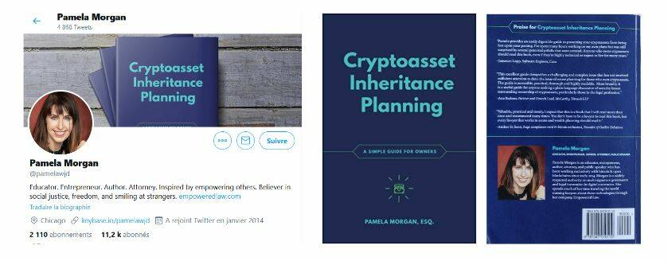

في هذا الدرس، سنركز فقط على الجزء الأول من كتابها. سوف اجسد دور مستخدم بيتكوين نموذجي لإنشاء رسالة الخلافة الخاصة به. ستكون العملية بسيطة في الوقت الحالي، وسنقوم بإنشاء نسخة أكثر تعقيدًا مع أنواع مختلفة من الملفات لاحقًا.

لنتابع رحلة سيدريك:

- مستثمر طويل الأجل.
- حامل محفظة فيزيائية ومحفظة متنقلة.
- مستخدم لمنصة تداول واحدة مع التحقق من الهوية (KYC).
- تعرف على البيتكوين من قبل ابن عمه.
- لا يمتلك عقود ذكية أو شبكة البرق (LN) أو العملات البديلة.

### المتطلبات الأساسية:

أطلب 30 دقيقة من وقتك، ليس من أجلي أو من أجلك، ولكن من أجل أحبائك. تخطيط الإرث موضوع صعب، يتم تجاهله ونسيانه في كثير من الأحيان. حيث أنه آخر مهمة يجب إنجازها، يشتت الكثير من الناس وينتهون بفقدان جميع بيتكوينهم بطريقة غبية. لذا، ضع 30 دقيقة وافعل ذلك. إنها الخطوة النهائية!

ماذا تحتاج؟

- لحظة هدوء، بدون تشتيت
- 4-5 ورقات بيضاء
- قلم
- مغلفين
- دليل هاتف/عناوين
- حاسوب (اختياري في رأيي)

وفقًا لـ باميلا مورغان في كتابها "تخطيط إرث العملات الرقمية" على الصفحة 18، فإن الاعتقادات الشائعة المغلوطة هي:

- أحتاج إلى استئجار محامٍ.
- أحتاج إلى الوثوق بطرف ثالث.
- التخطيط سيجعل أصولي سهلة السرقة.
- قيمة عملتي الرقمية منخفضة جدًا لتخطيطها.
- سيجد ورثتي كل شيء بأنفسهم.
- يمكن القيام بكل هذا بعقد ذكي بسيط.

### الخطوة 1: اختيار الأشخاص المناسبين لمساعدة ورثتك

من الضروري تعيين شخصين سيساعدان عائلتك عندما لا تكون هناك. بهذه الطريقة، ستكون لأحبائك شخص موثوق به ومتابع للتكنولوجيا للوثوق به أثناء عملية الاسترداد. يمكن لهؤلاء الأفراد أن:

- يقدموا نصائح حول إدارة المفاتيح والمحافظ.
- يساعدوا في فهم كيفية استعادة عباراتك السرية (البذور) بأمان.
- يقدموا ضمانًا أثناء عملية تحويل.

سيكون هناك دائمًا توازن بين الخبرة التقنية والتوفر والثقة. إذا كنت غير متأكد من من يجب أن يتولى هذا الدور، قم بإنشاء جدول بسيط لمساعدتك في اتخاذ القرار.
فصل المسؤوليات: يجب ألا يكون للشخص الموثوق به أبدًا الوصول إلى المفتاح الخاص بك. دورهم الوحيد هو مساعدة أحبائك في فهم نظام أمان بيتكوين الخاص بك وكسب الثقة. لهذا السبب تختار شخصين موثوق بهما. إذا لزم الأمر، يمكنك أيضًا اللجوء إلى منظمة طرف ثالث (محامٍ متخصص أو خدمات تخطيط الممتلكات).
| الشخص الموثوق به | الثقة | المعرفة بالبيتكوين | معلومات الثقة | ملاحظة |
| -------------- | ----- | ------------- | ---------- | ---- |
| أخي بوب         | طويل جدًا  | قصير               | هاتف وبريد إلكتروني          | "بوب لا يعرف الكثير عن البيتكوين، ولكن يمكننا الثقة به 100٪ للمساعدة." || ابن عمي ناثان       | طويل        | متوسط              | هاتف وإنستا          | الشخص الأول الذي يجب التحدث إليه. يمكنه مساعدتك. إنه مطلع.                                        |
| ريكو (صديق العملات الرقمية)  | متوسط      | طويل جدًا           | تويتر وبريد إلكتروني وصورة | ثق به في الأسئلة التقنية. لا في المال. ستحتاج إلى الاتصال به.           |
| يوتيوبر ومؤثر  | قصير       | طويل                | رابط يوتيوب           | قم بتعليم نفسك عن طريق متابعته. لا يمكنه مساعدتك مباشرة.                               |

### الخطوة 2: أجرِ جردًا بسيطًا وسريعًا

من المهم التفكير في جميع الأماكن التي تمتلك فيها دولارات أو بيتكوين:

- منصات التبادل
- محفظة الهاتف المحمول
- المحفظة الفعلية

افترض كيف قمت بتأمينها وأين يتم تخزين هذه النسخ الاحتياطية. ليس من الضروري أن يكون لديك موقعين للنسخ الاحتياطية في هذا الوقت. الهدف هو التقاط لقطة فورية لأمانك الحالي. يمكننا تحسينها لاحقًا! هذا مجرد الإصدار الأول لضمان أمانك في الوقت الحالي، سندخل في تفاصيل أكثر لاحقًا.

| عام               | برنامج / عتاد | الأصول        | الموقع             | النسخ الاحتياطي (المفتاح الخاص)            | كلمة المرور (رمز التعريف الشخصي، العبارة السرية)     | ملاحظة                                                                                                                        |
| --------------------- | ------------------- | ------------- | --------------------- | -------------------------------- | ------------------------------ | --------------------------------------------------------------------------------------------------------------------------- |
| منصة التبادل     | بيتستامب            | بيتكوين ونقد    | يمكن الوصول إليها عبر الإنترنت.   | -                                | المنزل وخزنة البنك              | هنا حيث اشتريت ونقلت بيتكويناتي. أقوم بتسجيل الدخول باستخدام مدير كلمات المرور والمصادقة الثنائية.                             |
| المحفظة الفعلية       | تريزور موديل واحد    | بيتكوين           | آمن                | العم بوب وخزنة البنك           | المنزل والأم                  | لدي محفظتين، واحدة عادية وواحدة بعبارة سرية.                                                                  |
| محفظة ساموراي       | محمولة - وان بلس 6 | بيتكوين           | معي                 | العم بوب وخزنة البنك           | المنزل والأم                  | يمكن أن يكون التطبيق في وضع مخفي.                                                                                             |

لا تشتت انتباهك! قد تشعر بالحاجة إلى نقل هذه الأصول ل:

- تحسين أمانك؟
- بيع بعض الأصول؟
- شراء أصول أخرى؟

لا تفعل شيئًا! قد تنسى المشروع الجاري. ابقَ مركزًا! يمكنك دائمًا مراجعة وتعديل محفظتك لاحقًا.

### الخطوة 3: كتابة الرسالة.

من أجل أسباب أمان، استخدم القلم والورق لكتابة رسالة لأحبائك.

- لدي بعض العملات الرقمية
- اتصل بهؤلاء المستشارين
- لدي هذه الأصول هنا - أحبك
  هنا قالب لمساعدتك في البدء. إذا كنت لا ترغب في كتابة الرسالة بنفسك، يمكنك تنزيل قالب وملء الفراغات. (الرابط هنا)

ابدأ بشرح هدف الرسالة وحذر أحبائك من مخاطر إدارة العملات الرقمية بنفسهم.
الرسالة يجب أن تكون واضحة ومفيدة. إنها ليست وصية، ولا رسالة لجعلهم يبكون. إنها أيضًا ليست رسالة لإجبارهم على عدم البيع أبدًا، ولا رسالة لتدوين المفاتيح الخاصة. إنها رسالة لمساعدتهم على فهم ما قمت به، حتى يتمكنوا من اتخاذ أفضل قرار والتصرف بأمان.

فيما يلي مقتطف من نموذج الرسالة إلى الأحباء، المأخوذ من الملحق E من كتاب باميلا مورغان "تخطيط الميراث للأصول الرقمية". لتكييفها مع مثالنا، قمت بتعديل بعض المقاطع، ووضعتها بين قوسين وأشرت إليها باللون الأزرق. بقية النص هو النص الأصلي من الكتاب. (تمت الترجمة بواسطة Discover Bitcoin)

"التاريخ: 26/06/2020
عزيزتي ليز ومايا،
أنا أحبكم بعمق وأعلم أنكم ستكونون قويين.
أكتب هذه الرسالة لأعلمكم بأنني أمتلك أصول رقمية قد تكون لها قيمة.
يرجى قراءة هذه الرسالة بعناية وبالكامل قبل اتخاذ أي إجراء. هذه الأصول مختلفة عن الأصول الأخرى، حيث بمجرد نقلها، لا يوجد طريقة لاستعادتها."

بعد ذلك، نضمن "قسم المستشارين". قد يكون هذا الجزء مربكًا للورثة الخاصين بك، خاصة إذا ذكرت أشخاصًا أو منظمات ليسوا على دراية بها. كن محددًا بشأن:

- كيفية التواصل معهم
- كيفية تحديدهم
- مجالات خبرتهم.
- كيف يمكنهم تعلم المزيد.

"فيما يلي قائمة بالأشخاص الذين أثق بهم للإجابة على أسئلتكم ومساعدتكم في عملية اكتشاف ونقل هذه الأصول. اتصلوا بالأشخاص المدرجين، ولكن لا تعتمدوا على شخص واحد لإدارة العملية. كونوا يقظين مع جميع المستشارين، بما في ذلك أولئك المدرجين في هذه القائمة. الجميع يمكنه ارتكاب أخطاء، لذا تأكدوا من فهم ما يقومون به بأفضل ما وسعكم ولا تخافوا من طرح الأسئلة والتحقق من الإجابات بانفسكم.

فيما يلي الأشخاص الذين يمكنهم مساعدتكم في الإجابة على الأسئلة وتوجيهكم خلال هذه العملية:

(أدخل أسماء مستشاريك هنا، وانتمائهم إلى منظمة (إن كانت معمول بها)، ومعلومات الاتصال بهم، وكيفية التحقق من هويتهم، على سبيل المثال، keybase، الصور.)
- أخي بوب؛ +33 09 XX 68 18 36؛ Bobmybrother@gmail.com. يمكنك الاعتماد على بوب لمساعدتك في هذه العملية. على الرغم من أنه قد لا يكون الأكثر مهارة تقنية، إلا أنه الشخص المناسب لاستجواب كل شيء وممارسة الحذر لضمان نجاحك بأمان. • ابن عمي ناثان؛ +33 09 XX 29 35؛ NathanDeladzcroix@Hotmail.com. كان ناثان هو من قدمني إلى البيتكوين. إنه ملم جدًا بالتكنولوجيا ويمكنه الإجابة على معظم أسئلتك. كما أنه يمتلك بعض البيتكوين ويمكنه أن يرشدك في الجانب التقني. لقد رأيتموه عدة مرات في تجمعات العائلة، وقد قمت بتضمين صورة له هنا.
- ريكو؛ @RiccoSFC على تويتر؛ Ricco425@protonmail.com. لقد عملت بشكل وثيق مع ريكو لسنوات عديدة. لم تلتقوا به من قبل، لذا تأكدوا من أنكم تتحدثون إلى الشخص الصحيح عن طريق طرح السؤال "ما هو اسم كلب سيدريك؟" إذا أجاب "12"، فهو جيد. ريكو خبير ودود وملم بشكل كبير في البيتكوين. سيجيب على جميع أسئلتكم ويمكنكم الاعتماد على تقديره بشأن أمان البيتكوين. لا تترددوا في الاتصال به، لقد التقيت به عدة مرات وهو على دراية بكل شيء يتعلق بكم وبمايا."
- قد يبدو غريبًا، ولكن اتصل بهم جميعًا. بالإضافة إلى ذلك، يمكنك تعلم المزيد عن طريق الاستماع إلى أندرياس أنتونوبولوس على يوتيوب وشراء كتاب "تخطيط إرث العملات المشفرة" لباميلا مورغان.

والآن، سنضيف قسم المخزون. ابدأ بسرد الأجهزة الخاصة بك والأماكن التي تحتفظ بها بتكويناتك.

- الهاتف: محفظة الهاتف المحمول
- جهاز الكمبيوتر المكتبي: منصات التبادل، التطبيقات، الألعاب، المواقع الإلكترونية
- الانتقال إلى المحافظ الفعلية
- العبارة السرية (العبارة المرورية)
- متعدد التوقيع

عند الإشارة إلى المكان الذي يتم تخزين النسخة الاحتياطية فيه، استخدم مكانًا عامًا، وليس عنوانًا محددًا. إذا كان لديك أي شيء آخر غير بتكوينات، يرجى إعلامنا.

"فيما يلي قائمة بالأجهزة والبرامج والمحافظ التي أستخدمها للوصول إلى هذه الأصول. يرجى تخزين جميع هذه الأجهزة في مكان آمن والاحتفاظ بها حتى يتم نقل الأصول إلى ورثتي. لا تسمح لأي شخص بالوصول إليها بدون مراقبة.

(أدخل هنا مخزون الأصول المشفرة الخاص بك)

- "لقد استخدمت هاتفي (Samsung Galaxy S8) للوصول إلى محفظتي Samourai. تم تخزين المفتاح الخاص الذي يحمي المحفظة في خزنة البنك ونسخة أخرى مع العم البوب. يتم الاحتفاظ برمز PIN لفتح هاتفي والمحفظة في المنزل ومع جدتي.
- أستخدم جهاز الكمبيوتر الخاص بي من عام 2018 للوصول إلى منصة تبادل عبر الإنترنت تسمى Bitstamp. قد يكون لدي ما زالت بتكوينات أو دولارات على هذه المنصة. للوصول إلى حسابي، ستحتاج إلى الاتصال بهم مباشرة أو تسجيل الدخول إلى حسابي (كن حذرًا، قد يكون هذا غير قانوني - تحقق من التشريعات المحلية).
- لقد استخدمت مدير كلمات المرور للوصول إليه، وستجد نسخة احتياطية لدي في خزنة البنك. يتم حماية الحساب أيضًا بالمصادقة ثنائية العوامل، والتي يمكنك الوصول إليها من خلال هاتفي (Samsung Galaxy S8) أو باستخدام رمز النسخ الاحتياطي المخزن في المنزل.
- لدي أيضًا بتكوينات على جهاز Trezor Model One. أستخدمه من خلال جهاز الكمبيوتر الخاص بي وموقع Trezor.io. يتم تخزين المفاتيح الخاصة الاحتياطية في خزنة البنك ومع العم البوب. يتم الاحتفاظ برمز PIN في المنزل ومع والدتي. قد يكون الجهاز نفسه في خزنة آمنة في مكتبي.
- أستخدم عبارة سرية أمان متقدمة لجهاز Trezor الخاص بي. يتم تخزين نسخة احتياطية من هذه العبارة في المنزل ومع والدتي."

والآن دعنا نختتم الرسالة ببعض المعلومات القانونية إن لزم الأمر، وكذلك بعض الكلمات اللطيفة.

"يرجى ملاحظة: ستجد نسخة من وصيتي، المؤرخة في 17 أبريل 2018، في مجلد المستندات الخاص بي. يمتلك محاميي، دوايت شروت، مكتبًا في سكرانتون، بنسلفانيا، نسخة أيضًا. كن حذرًا وتذكر دائمًا حبي لك." 26/06/2023، سيدريك"

الآن دعنا نستعرض عملنا (بناءً على "تخطيط إرث العملات المشفرة" لباميلا مورغان، الصفحة 44 (مترجمة بواسطة ديكوفر بيتكوين)):

- المساعدة: تأكد من توفير الأسماء ومعلومات الاتصال، وإن أمكن، الصور.
- الأجهزة: تأكد من سرد هاتفك، وجهاز الكمبيوتر، والمحافظ الفعلية، والمحافظ الورقية.
- الأصول: تأكد من تضمين قائمة بأصولك.
- منصات التبادل: تحقق من أنك قد قمت بسرد جميع منصات التبادل التي تحتفظ بالأموال لك.
- الوصول: قم بسرد المعلومات التي سيحتاجونها للعثور على موقع التخزين الخاص بك وجميع رموز الوصول اللازمة.
إذا قمت بالتحقق من جميع الصناديق، فأنت الآن جاهز للخطوات النهائية! قم بعمل نسخة من هذه الرسالة واحتفظ بكلتا النسختين في ظرف. أغلقه، وقم بتوقيع الختم، واحتفظ بهذا الظرف في مكان آمن ولكن سهل الوصول إليه. تأكد من أن ورثتك يعلمون أنهم بحاجة إلى استرجاع هذا الظرف إذا لزم الأمر. لا تتردد في شراء كتاب باميلا للتعمق في هذا الموضوع وتخطيط وقت لتحسين خطة الميراث الخاصة بك. كما يمكنك مناقشتها مع الكاتب العدل الخاص بك لدمج هذه الخطة قانونيًا في وصيتك الرسمية.

تهانينا! لديك النسخة الأولى من خطة الميراث الخاصة بك، وهذا بداية رائعة!

_تخطيط الميراث للأصول الرقمية، دليل بسيط لأصحاب الأصول الرقمية، باميلا مورغان، محامية. حقوق النشر 2018 من قبل ميركل بلوم ش.م.م، جميع الحقوق محفوظة. CC-BY_ شكرًا كبيرًا لباميلا مورغان على عملها القيم وعلى السماح لي بمشاركته. شكرًا أيضًا لكل من ساهم في كتابته.

أنت الأفضل :D فريقي وطلابي يشكرونك أيضًا!

# الشكر واستمر في حفر حفرة الأرنب

## تهانينا! أنت في أعلى 0.1%

إذا كنت تتابع محتوانا من البداية، فأنت الآن مواطن حقيقي في القرن الحادي والعشرين وأحد أكثر الأشخاص خبرة في مجال البيتكوين! تستخدم مدير كلمات المرور والمصادقة ثنائية العوامل (2FA). تفهم ما هو البيتكوين ولماذا هو مهم. تمتلك بيتكوين ولديك طريقة آمنة لشراء المزيد أو كسب المزيد. قمت بتخزين بيتكوين الخاص بك في محفظة "باردة" وقمت بتنفيذ إدارة المفاتيح الصحيحة. قمت بإنشاء خطة الميراث لأحبائك. أنت الآن آمن ويمكنك الاسترخاء! استمتع بقدح من البيرة وكن فخورًا بنفسك!

أنا فخور حقًا بأنك وصلت إلى هذه المرحلة. أعني ذلك بصدق. ماذا تفعل بعد ذلك؟ بينما يجب أن تسترخي الآن وتفتخر بنفسك، فإن رحلتك مع البيتكوين لم تنته بعد، ولن تنتهي حقًا أبدًا. إليك بعض الخيارات لما يمكن أن يأتي بعد ذلك:
1. يمكنك ببساطة الاستمرار كما فعلت حتى الآن. استمر في تجميع البيتكوين ببطء واسمح لاستراتيجيتك أن تتكشف مع مرور الوقت. لديك بالفعل مستوى كافٍ من الأمان، كل شيء في مكانه، وقمت بما هو ضروري لنفسك وعائلتك. لا تحتاج إلى أن تصبح خبيرًا في التداول، ولا تحتاج إلى معرفة أكثر عن الاستثمار. ربما لديك وظيفة جانبية، وعلى الرغم من أن البيتكوين مثير، إلا أن هدفك الرئيسي كان الوصول إلى هذه المرحلة. هذا هو الحال لمعظمكم، وأحترم ذلك. أنا سعيد جدًا بأنك وصلت إلى هذه المرحلة في "حفرة الأرنب" الخاصة بالبيتكوين، وآمل أن تكون الرحلة ممتعة. شكرًا لك على الثقة بي في مساعدتك في تأمين بيتكوينك الأول.

2. قد ترغب في مواصلة تعلمك في الجوانب التقنية والفلسفية والفكرية للبيتكوين. إذا كنت تشعر أن رحلتك للتو بدأت فقط، فأنصحك بمواصلة التعلم عن البيتكوين. هناك الكثير للتعلم بحيث يكون من الصعب أحيانًا معرفة من أين تبدأ. إليك قائمة بالدورات والتدريبات التي يمكن أن ترافقك:

- العقدة البيتكوين وشبكة البرق: شبكة البرق، كما رأينا بالفعل عدة مرات، تجلب رؤية جديدة تمامًا لما هو البيتكوين. من خلال هذه الطبقة الثانية، تتاح العديد من الإمكانيات، ويتم بناء صناعة كاملة فوقها. لمرافقتك في الاكتشاف، أدعوك للانضمام إلى LN 201 للحصول على دورة نظرية أو LN 202 للحصول على دورة عملية. كلا الدورتين متاحتين للجميع في هذه المرحلة من تعلمك ويمكن أن تساعدك على فهم هذا الجانب الجديد من البيتكوين.
- الاقتصاد النمساوي: إذا كانت الاقتصاد والتمويل مواضيع تثير اهتمامك، فإن دورة ECON 201 ربما تكون الدورة المناسبة لاستكشاف جوانب الاقتصاد النمساوي الأعمق. هناك، ستكتشف هذه المدرسة الاقتصادية التي تعارض المزيد من الكينزيانية التقليدية. إنها نقطة بداية جيدة لتساؤل نظامنا وفهم كيف وصلنا إلى هنا من منظور التضخم والتلاعب النقدي.

- حلول التجار: وأخيرًا، إذا كنت أكثر اهتمامًا بفعلي استخدام البيتكوين، يمكنك الانتقال إلى قسم البرامج التعليمية لدينا واستكشاف العديد من الحلول للتجار. يمكن أن تقدم لك هذه الفرص في مجالنا، ولكنها يمكن أيضًا أن تساعد عملك أو أصدقائك على قبول البيتكوين في تجارتهم وبالتالي خلق اقتصاد محلي يستند إلى البيتكوين في مدينتك!

على أي حال، جميع دوراتنا مجانية، وهناك العديد من الموارد والبرامج التعليمية المتاحة على منصتنا لمرافقتك. حظاً سعيداً في دراستك!

## لاحظ الدورة!

## ادعم الدورة!
تقدم أكثر
