# A journey to your first bitcoins

The Bitcoin ecosystem is experiencing spectacular and unprecedented growth. The technological, economic and social transformations brought about by Satoshi Nakamoto's invention are intensifying day by day, and are gradually opening the doors to a new world, from which you can now take full advantage.

Diving into the Bitcoin Terrier is to embark on an exciting intellectual adventure that will stimulate your critical thinking and make you question many of your convictions. This exploration will not only give you an in-depth understanding of how Bitcoin works, but also a concrete opportunity to reclaim your personal freedom, protect your privacy and regain genuine financial sovereignty.

To guide you through the process, I've put together this free course. There's only one rule: Bitcoin only. No empty rhetoric, no other crypto-currencies, just clear, precise, no-nonsense content.

Structured to give you full control over your learning, this course lets you chart your own course on Bitcoin, at your own pace, according to your personal interests and goals.

+++
# Introduction

<partId>008c49b7-5e17-5973-87f2-ba28429b2697</partId>

## Course overview

<chapterId>bfc96999-0ee1-5c41-8297-1b629f50cffc</chapterId>

Welcome to BTC102! You may already have taken the BTC101 training course and discovered the fundamental theoretical concepts that make Bitcoin a major technological revolution. With BTC102, it's time to get down to business: this training course has been specially designed to help you put your personal Bitcoin plan into practice. Over the next few chapters, we'll be taking you step-by-step through the process of **obtaining your first bitcoins**, **securing** them efficiently and successfully entering this rapidly expanding ecosystem.

https://planb.network/courses/2b7dc507-81e3-4b70-88e6-41ed44239966

Despite being in existence for over 16 years, the Bitcoin industry remains young, dynamic and profoundly free. Indeed, its underlying protocol, which is entirely decentralized and impossible to control completely by any central authority, allows this ecosystem to develop naturally and organically. While this freedom fosters an incredible wave of innovation and opportunity, it also exposes its users to certain risks, including scams, common mistakes and pitfalls linked to a lack of knowledge. The main aim of this training course is to help you navigate this new ecosystem safely and serenely.

To this end, the BTC102 training course is structured into several sections, each dealing with an essential aspect of your personal journey with Bitcoin :

The first section, entitled "Prerequisites for understanding Bitcoin", effectively prepares you for the course that follows. In it, you'll learn to clearly identify the main pitfalls associated with financial scams and frauds that can exist in the Bitcoin ecosystem. Then we'll teach you the basics of online security. Finally, I'll give you a few practical tips specially designed for novices, designed to help you avoid common mistakes during your first interactions with Bitcoin.

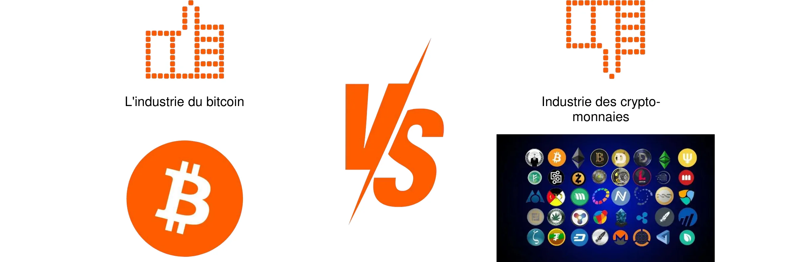

The second section, "Understanding what we're getting into", will help you deepen your overall understanding of Bitcoin. We'll start with a refresher course to make sure you've mastered the essential concepts. We'll then go into more detail on why Bitcoin is of fundamental importance from a technological, economic and social point of view, to reinforce your convictions. You'll then discover the Bitcoin industry in its entirety: its players, its organization and its evolution over the years. Finally, we'll look at the layered architecture of the Bitcoin ecosystem, an important concept in understanding how this system continues to innovate without weakening the basic protocol.

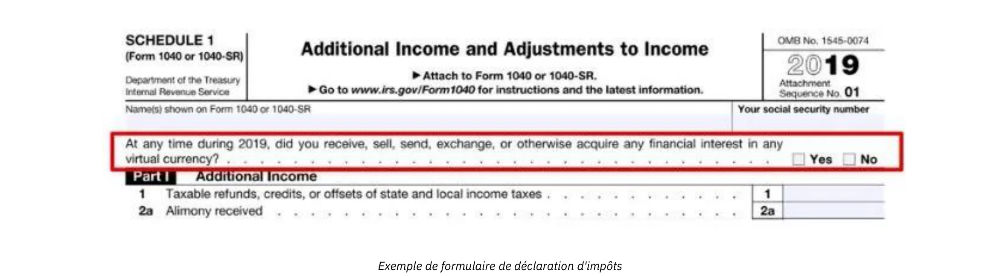

The third section, "Setting up your plan", focuses on your personal approach to Bitcoin. We'll start by helping you define your user profile from four broad categories:

- the hodler*, focused on long-term ownership ;
- the stacker*, who makes regular, methodical purchases;
- the user*, who prefers daily use;
- and finally *the paranoid*, who wants maximum security to effectively protect his assets and privacy.

We'll guide you step by step through the implementation of a strategy tailored to your personal profile and specific objectives.

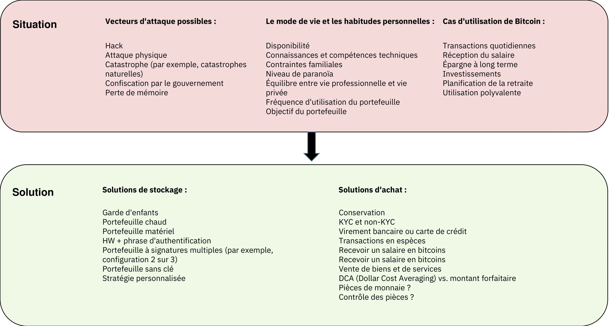

Finally, the fourth part, "Protecting your heirs and your estate", tackles a crucial subject that is often forgotten: how to ensure the transmission of your bitcoins to your loved ones in the event of an unforeseen event. You'll learn how to create and implement a Bitcoin inheritance plan, to ensure that your assets will last beyond your own lifetime.

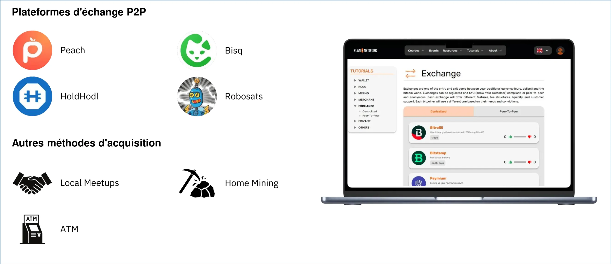

At the end of this training course, you'll have all the practical keys you need to evolve serenely in the Bitcoin ecosystem and become one of the most advanced users!

Ready to begin your journey into the world of Bitcoin? Let's go !

# Prerequisites for understanding Bitcoin

<partId>4481fc4b-0f83-489e-ad07-81517c5d6bad</partId>

## Scams and financial fraud

<chapterId>8af2948b-2ab5-54c4-862c-3414b8a285a2</chapterId>

The Bitcoin ecosystem and its environment are still relatively young and, depending on the country, only lightly regulated. While this freedom offers immense opportunities, it also provides fertile ground for financial fraud, scams and all kinds of manipulation. That's precisely why this first chapter is so important: knowing the typical pitfalls makes it easier to protect yourself. Your financial security is a priority, because a bad experience harms not only you, but also the reputation of the entire Bitcoin community.

### Bitcoin vs cryptos: understanding the differences

Before going any further, it's important to make a clear distinction between two distinct universes:

- **The Bitcoin** industry, focused on sound money, strong decentralization, resilience, privacy and individual sovereignty. The Bitcoin protocol is developed with a long-term approach and represents a stable value, existing since 2009, and benefiting from the serious work of a large community of developers.
- **The much larger cryptocurrency industry**, which includes tens of thousands of different projects, each with its own token. This industry is more oriented towards rapid innovation, fads and short-term financial speculation. Projects are often centralized and insecure, and many offer no real value, despite their aggressive marketing.

If you'd like to learn more about the origins of Bitcoin and what makes this protocol so different from others, I recommend that you take this free second-year course on the history of Bitcoin at a later date:

https://planb.network/courses/a51c7ceb-e079-4ac3-bf69-6700b985a082

As you know, the Plan ₿ Network platform is exclusively dedicated to Bitcoin. However, understanding the distinction with other cryptocurrencies will help you avoid the pitfalls associated with useless and sometimes even fraudulent projects.

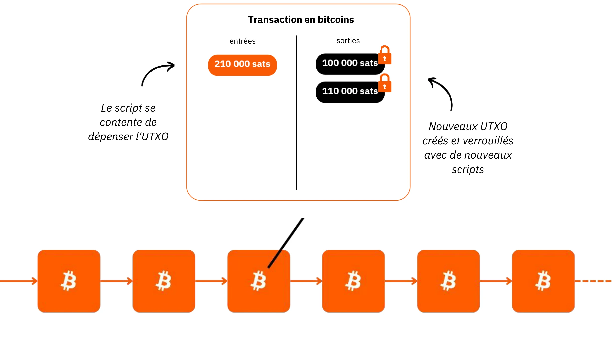

### The main scams to avoid

Here are the most common scams you'll come across on your journey:

#### Pyramid schemes and Ponzi schemes

Financial pyramids and Ponzi schemes are among the most common scams in the crypto ecosystem. In a Ponzi scheme, early investors are paid with the money of new entrants. No real product or value is created. The viability of the system depends solely on the constant arrival of new participants.

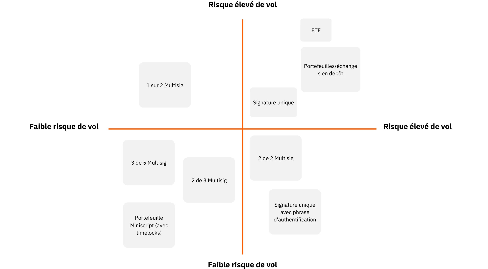

These scams usually feature :

- Unrealistic promises of guaranteed returns (e.g. 20% guaranteed return);
- Delays or difficulties in withdrawing your invested funds;
- Strong incentives to sponsor new members to keep the system alive;
- A total lack of transparency about the actual source of the promised return.

Ultimately, all pyramid and Ponzi schemes are inherently doomed to failure. Their fundamental weakness lies in the constant need to attract new investors in order to remunerate existing participants. This need eventually becomes mathematically impossible to satisfy, as the number of new entrants required increases exponentially as the system grows. When this critical threshold is reached, participants begin to have doubts, confidence rapidly disappears, and the whole financial pyramid suddenly collapses. At this point, the latest entrants, often the least informed, lose their entire investment with no possible recourse, while the organizers or first investors have usually already recovered their funds and left the system.

In the world of crypto-currencies, Ponzi schemes can take a wide variety of forms, specially designed to hide their fraudulent operation behind a technological or financial veil. They can appear in the form of new token offerings or *Initial Coin Offerings* (ICOs), i.e. fund-raising operations via the public sale of a new cryptocurrency. Behind technical terms like "Blockchain", "smart contracts" or "staking", some projects actually conceal complex pyramid schemes. Still others claim to offer high returns by combining dubious crypto-assets with remuneration systems based exclusively on the continuous arrival of new investors.

More recently, Ponzi schemes have also extended to Decentralized Finance (DeFi). DeFi, which is supposed to enable financial services without intermediaries, is sometimes used to give these scams a legitimate appearance. Some DeFi projects thus promise very high, guaranteed returns in exchange for cryptocurrency deposits on automated protocols. These attractive promises are often justified by opaque and unverifiable mechanisms, with tokens specifically created for the occasion. In reality, these systems have no viable business model: the interest paid comes solely from the funds contributed by new users, exactly as in a traditional Ponzi scheme. When trust erodes, or when the influx of new entrants slows down, these systems inevitably collapse, resulting in considerable losses for naive investors.

Please note that the content of this course is intended for educational purposes only and should not be construed as financial advice. Your financial security depends on your ability to remain cautious, skeptical and informed in every financial decision you make.

The best protection is always to ask this simple question: **If the answer is unclear, run away immediately.

#### Pump & Dump

This other scam involves artificially manipulating the price of an asset (often an illiquid cryptocurrency token) through a coordinated marketing campaign, usually orchestrated by a group of investors. The typical mechanism of a Pump & Dump is as follows:

- An opinion leader or a group of investors first accumulates a large number of shares or other targeted assets;
- They then launched an aggressive communication campaign to bring about a rapid price increase;
- The public, driven by "FOMO" (*Fear Of Missing Out*), buys the asset en masse, driving up its price even further;
- At the peak of the manipulation, the initiators sell their assets en masse, causing the price to plummet;
- Investors attracted by the manipulation suffer substantial financial losses.

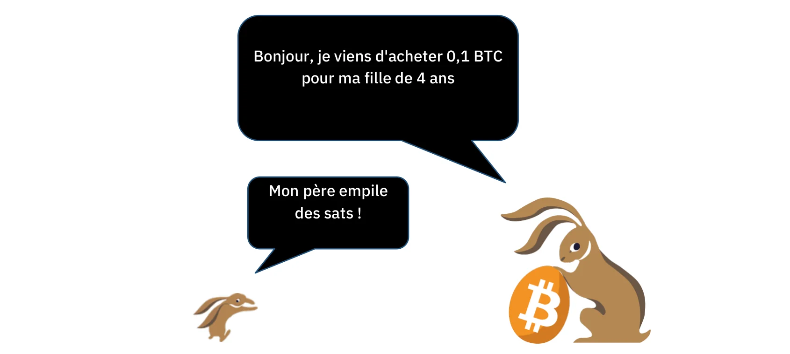

It's important to remember that Pump & Dump strategies are completely illegal and considered financial market manipulation in many countries. But despite their fraudulent nature, these techniques continue to proliferate, particularly within the cryptocurrency universe. I therefore advise you to avoid private "signals" groups on Telegram, Discord or other social networks, often run by influencers or pseudo-experts who sometimes even charge membership fees to gain access. These groups create the illusion of providing exclusive financial opportunities, but the reality is that only the organizers really win, while participants usually end up losing their money.

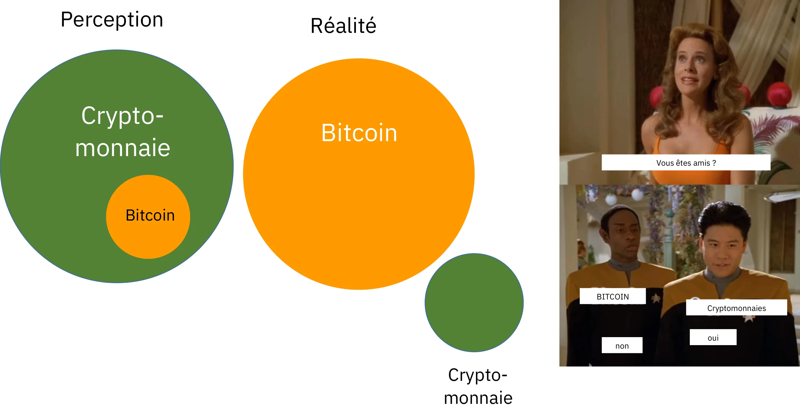

It's true that some participants can temporarily profit from these manipulations, but this ephemeral success relies above all on luck and timing. In the long term, these practices are unprofitable, as they require constant risk-taking and repeated participation in fraudulent schemes that always end in failure. These practices foster a dangerous illusion: that it's possible to make a lot of money quickly and easily without understanding the real financial mechanisms.

For all these reasons, the best strategy is always to take a serious approach to investing, based on financial education, an understanding of fundamentals and a long-term vision. By patiently building up your knowledge, you'll be far less susceptible to emotional manipulation and unrealistic promises, and far better prepared to avoid these destructive financial traps.

#### Donation scams, lotteries and fake promotions

This scam consists of promising bitcoins or other free rewards in exchange for sending money in advance. No serious individual or company will ask you to send bitcoins in return for more.

Scammers regularly use the identity of well-known personalities (such as Elon Musk or other celebrities) to lure their victims onto social networks. Always check accounts and websites carefully before interacting, and never believe overly generous promises.

Sometimes, these scams can also take the form of an advanced-fee scam. This consists of promising you a gain or gift (money, product, service...), but first demanding payment under the pretext of covering costs (delivery, taxes, transaction fees...). Once payment has been made, the scammer disappears without ever sending what was originally promised.

#### Shitcoins and cryptocurrencies on offer

Centralized crypto-currency projects sometimes offer free tokens ("*airdrops*") to attract users. These tokens usually have no real value and serve only to create an illusion of popularity or encourage speculation. Be extremely cautious of such promotional offers.

#### Identity theft and phishing

Attackers frequently use fake websites, fake accounts or misleading e-mails to try and steal your funds. These fraud attempts can originate from any means of communication: email, social networks, telephone, postal mail...

Before clicking on a link or taking any action, always make sure you verify the exact identity of the sender, or prefer to access the site manually, without using the link provided. More generally, never divulge your private keys or passwords to anyone.

#### Bitcoin Hardforks

Bitcoin has undergone several *hardforks* over the years, giving rise to alternative versions of the original currency. In concrete terms, a *hardforks* corresponds to a splitting of the network into two distinct blockchains sharing a common history until the moment of separation. These splits usually occur when a part of the Bitcoin developers or community wishes to make radical changes to the original protocol, but fails to achieve sufficient consensus. Unable to convince the majority, they then choose to create an alternative version of Bitcoin, with modified rules, in the hope that the community will follow them.

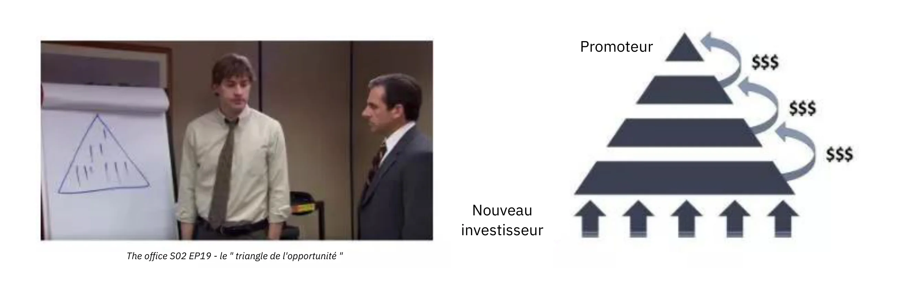

Some *hardforks* are not directly scams, as they are simply based on technical or ideological disagreements within the community, but others are essentially commercially motivated, even dishonest. The best-known examples of these hardforks are **Bitcoin Cash (BCH)** and **Bitcoin Satoshi Vision (BSV)**. First appearing in 2017 and 2018 respectively, these alternative currencies often claim to be better versions of the original Bitcoin, highlighting supposed advantages such as lower transaction fees or faster transactions thanks to increased block sizes. In reality, these technical modifications involve significant compromises in terms of security, decentralization and robustness, which may contradict Bitcoin's founding principles.

Beyond their technical differences, these alternative currencies often play on confusion to attract uninformed investors. They can sometimes use marketing tools to deliberately mislead novices thinking they are buying genuine Bitcoin (BTC).

To avoid falling into this kind of trap, always check the currency you're buying. The original Bitcoin uses the ticker **BTC**, while Bitcoin Cash and its derivatives use distinct acronyms (e.g. BCH or BSV).

#### Dishonest influencers and false gurus

With the growing popularity of crypto-currencies, a multitude of influencers, fake experts and so-called gurus have appeared on social networks. While some sometimes provide real educational value, many others unfortunately take advantage of their visibility to promote dubious projects or particularly risky, even fraudulent, trading strategies. These individuals are generally motivated by their personal financial interests, often receiving direct or indirect remuneration in exchange for promoting certain tokens or platforms.

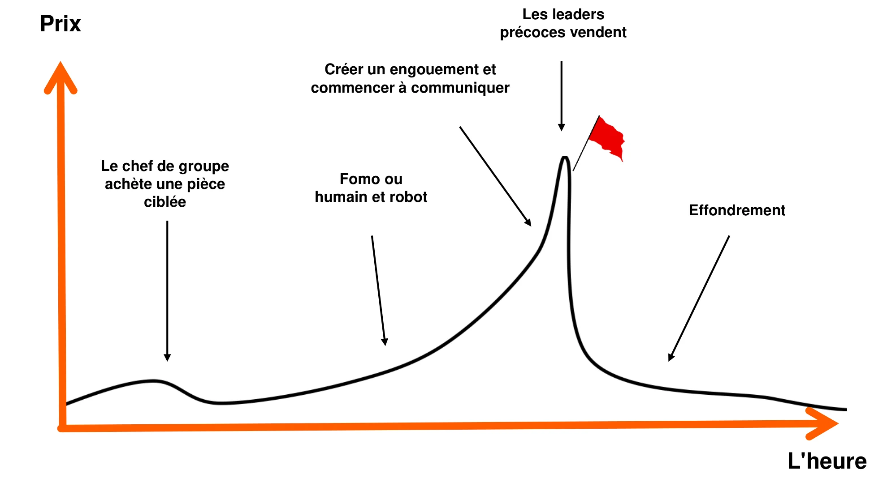

These influencers adopt tried-and-tested tactics to seduce beginners: they publish impressive financial results (often faked or impossible to verify), extol their personal success through a luxurious lifestyle and present miraculous investment strategies. They seek to arouse FOMO - the fear of missing an opportunity - in order to encourage their subscribers to make impulsive decisions and invest without thinking.

It's important to understand that most of the free advice disseminated by these personalities is never really free at all. Behind the altruistic appearances usually lie manipulative strategies to encourage the purchase of dubious assets. What's more, even if they were honest, it would be impossible to faithfully replicate their results, as these depend on precise timing or a particular context of which you have no knowledge.

Influencers will sometimes suggest that you join paid private groups, where they promise to offer signals or advice that are supposed to guarantee quick and easy earnings. In reality, these groups mainly benefit the organizers themselves, who use their audience as a source of liquidity to make their own profits. Subscribers usually end up incurring substantial losses, as they are unable to react as quickly as the initiators (see Pump & Dump).

Faced with this reality, here are a few good practices to adopt to avoid the traps set by these influencers:

- Be extremely cautious about any recommendation to buy a cryptocurrency**. An honest and knowledgeable person will never urge you to rush into buying an asset without encouraging you to do your own research ;
- Paid trading and investment courses are not necessarily synonymous with quality**. Often, they present risky or simplistic techniques that are freely available elsewhere on the Internet;
- Bear in mind that there is no miracle method** for easily copying someone else's trading and achieving exactly the same results. Every investment strategy depends on personal context, specific knowledge, timing and a host of other factors that are impossible to reproduce identically;
- Be especially wary of recommendations that sound too good** to be true. Unrealistic promises or guarantees of immediate gains are almost always signs of manipulation. Remember, just because someone says something doesn't necessarily mean it's true.

Finally, remember that everyone you meet in the Bitcoin or crypto ecosystem necessarily has a personal agenda, explicit or implicit, and there is no such thing as totally neutral information. Even this BTC102 course you're currently taking has the clear aim of promoting a better understanding of Bitcoin. So pay close attention to the real motivations behind every piece of content you're exposed to. Always bear in mind this essential principle: If a product or service seems free, you're probably the product.

The best protection is personal education, well-placed skepticism and, above all, the constant habit of checking the facts for yourself.

### How to avoid scams

**Here are a few tips to help you avoid online scams:**

- Never trust blindly: "*Don't trust, verify*" ;
- Beware of returns that are too high or guaranteed;
- Never give your private keys to anyone;
- Never send bitcoins to an unknown address;
- If in doubt, wait and take a step back before making any decisions. FOMO is your worst enemy;
- Avoid paid trading groups and unrealistic promises;
- Most free gifts or lotteries on the Internet are fraudulent or rigged;
- You'll always gain more by learning than by playing.

Guarding against scams is an important first step in protecting your assets, but it's not enough. Maintaining good digital hygiene is just as essential. That's why, in the next chapter, we'll explore how to strengthen your digital security and the best practices to adopt.

## Online security

<chapterId>f0873bf2-6a6f-5485-bb7a-d84be14f404d</chapterId>

If you're interested in Bitcoin, you're bound to have some interest in cybersecurity. Financial fraud and scams aren't the only threats: accidental data loss, malware and password theft can also cause damage. The aim of this chapter is to present you with simple and effective protective measures, applicable to any user wishing to strengthen his or her digital hygiene.

If you want to go further into each of these aspects, Plan ₿ Network offers a complete SEC101 training course that goes into the details of cybersecurity strategies:

https://planb.network/courses/99c46148-7080-4915-a7e0-9df0e145cd47

### Why is IT security important?

Bitcoin brings the possibility of holding your currency directly, without any intermediaries. But this financial sovereignty has its downside: if someone steals your bitcoins (due to a security flaw), there's no turning back. Unlike traditional banks, there are no claims or insurance if your assets are pirated.

What's more, the economic appeal of Bitcoin makes it a prime target for the unwary: a hacker who steals your BTC can transfer it instantly to his own wallet, without having to fear forced repayment. In this context, good computer hygiene is not a luxury: it's the first line of defense to avoid seeing your efforts and money go down the drain.

### A clean, up-to-date computer

One point that is often overlooked is the regular updating of your software and operating system. Some updates correct security flaws that can be exploited by hackers. Many people hesitate to install them, fearing that their machine will become slower; in reality, not updating your PC exposes you to documented vulnerabilities that have already been corrected.

Similarly, the use of a reliable antivirus is highly recommended. On Windows, Windows Defender (installed by default) may be suitable for ordinary users; if you prefer, you can opt for a commercial antivirus (such as Kaspersky, for example). On Macs, the threat of malware is historically lower, but still possible: it's always a good idea to take precautions.

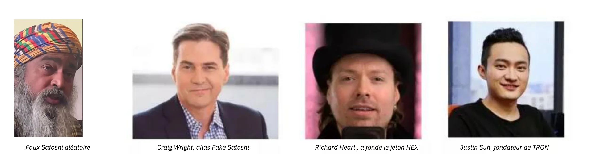

In addition to these points, beware of downloads from dubious sites or universal download portals. When you need software, go for the official source. This drastically reduces the risk of malware being embedded in what you think is a legitimate file. Another good practice is to always check the authenticity and integrity of any software before installing it on your machine. If you don't know how to do this, we have a tutorial dedicated to the subject :

https://planb.network/tutorials/computer-security/data/integrity-authenticity-21d0420a-be02-4663-94a3-8d487f23becc

Finally, remember to back up your data regularly. An external hard disk (or SSD) will enable you to keep a duplicate of your important files. This will save you a lot of grief in the event of a sudden breakdown, hacking or operating error. If you prefer online solutions, there are secure services like Proton Drive.

https://planb.network/tutorials/computer-security/data/proton-drive-03cbe49f-6ddc-491f-8786-bc20d98ebb16

A generally recommended backup strategy is the "3-2-1" rule. It aims to protect your data against accidental loss, computer attacks or natural disasters. This rule implies keeping a minimum of **3 copies** of your important data, stored on at least **2 different media** (e.g. local hard disk and cloud storage), while always keeping **1 copy off-site** (physically removed from your main location). This method ensures that your data remains resilient.

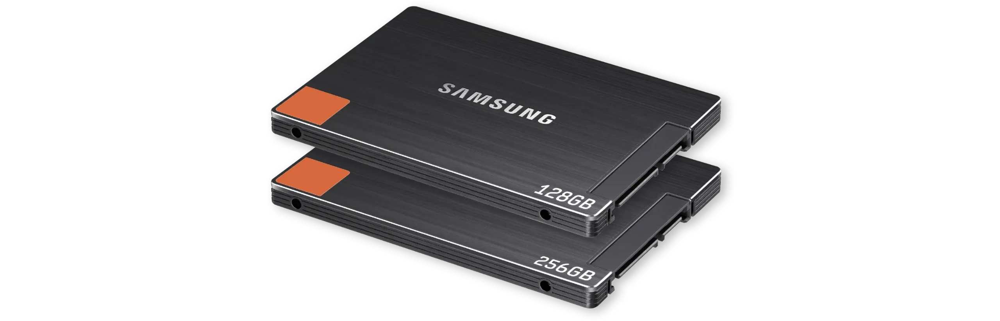

### The solution to ID nightmares

The number one reason why so many people are hacked is the weakness of their passwords. It is estimated that a significant proportion of Internet users use the same password for several accounts, or choose a trivial variant that is easy to guess. **Password managers** address precisely this problem.

A password manager lets you :

- Store all your passwords in encrypted form;
- Automatically generate long, random, unique and complex identifiers;
- To have only one master password to remember for access to all the others.

With a password manager, you'll never have to click on "Forgot password?" or invent weak passwords again. You can easily regain access to all your logins. As an added bonus, these programs can be synchronized across multiple devices (computer, phone, tablet), making it easy to log in automatically to your usual sites.

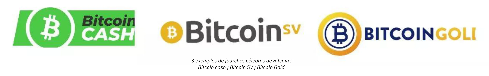

There are many password management programs available, but I can recommend two to suit your needs. If you're looking for software that's easy to use and can be synchronized across multiple devices, Bitwarden is an excellent option:

https://planb.network/tutorials/computer-security/authentication/bitwarden-0532f569-fb00-4fad-acba-2fcb1bf05de9

If you prefer local software, only on your computer, KeePass is a good solution:

https://planb.network/tutorials/computer-security/authentication/keepass-f8073bb7-5b4a-4664-9246-228e307be246

### 2FA: double protection

Even with a strong password, there's no such thing as zero risk. That's why **two-factor authentication** (2FA) is an additional layer of security now considered indispensable. Whenever possible, you should implement it, especially for your sensitive accounts.

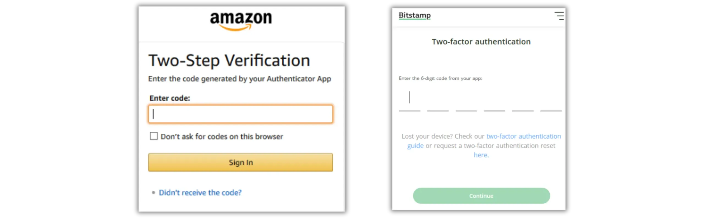

The concept is very simple: after entering your password on a website, you are asked to provide a temporary code (usually 6 digits long) generated by an application on your phone (Google Authenticator, Authy...). In this way, a hacker who has your password but not physical access to your phone cannot connect to your account.

https://planb.network/tutorials/computer-security/authentication/authy-a76ab26b-71b0-473c-aa7c-c49153705eb7

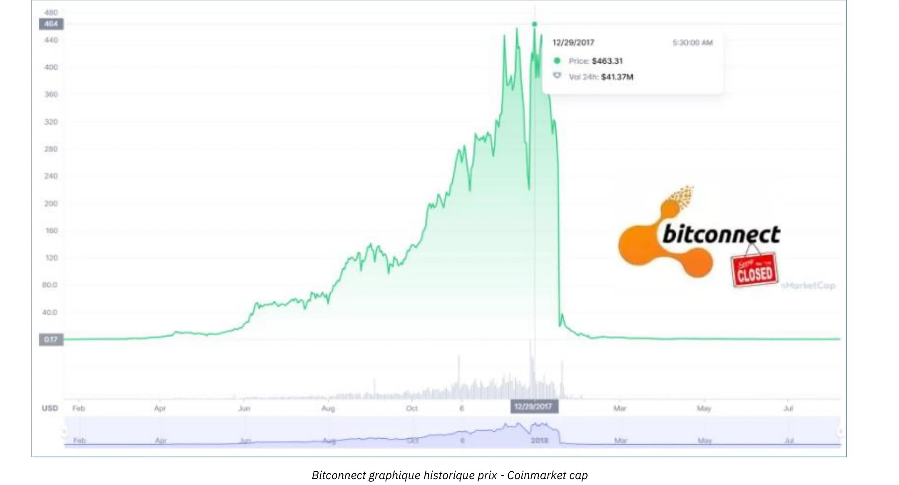

When you activate 2FA, be sure to keep your application's recovery key, so that you can recreate your codes in the event of loss or change of phone. As for double authentication by SMS or email, it's still better than nothing, but far less secure: a simple SIM swap can put it out of action.

For those who want to go one step further, there are physical key solutions (such as YubiKey) that offer an even higher degree of security.

https://planb.network/tutorials/computer-security/authentication/security-key-61438267-74db-4f1a-87e4-97c8e673533e

### Protecting your privacy

Privacy and cybersecurity are closely linked: the more information you leave freely accessible, the more likely you are to become a target.

A **VPN** (*Virtual Private Network*) can already be a simple step towards masking your IP address and encrypting your Internet exchanges. It doesn't make you invisible, since the VPN provider can still see your actions, but it does make it harder for anyone to spy on you or target your browsing habits. The important thing is to choose a VPN you can trust, one that doesn't ask for your identity, allows payment for the service in BTC and doesn't keep activity logs.

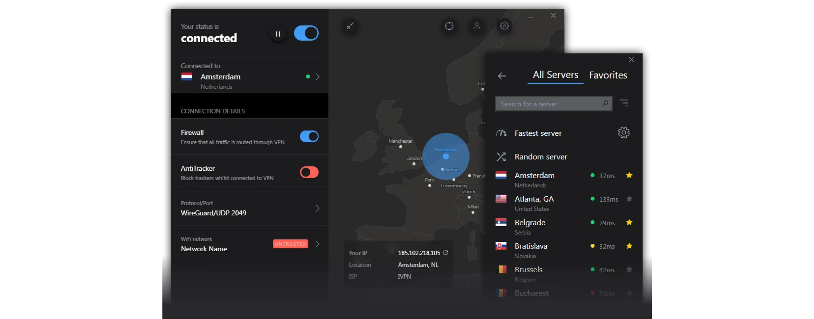

We have several tutorials on Plan ₿ Network for learning how to set up a VPN easily. In particular, I can recommend IVPN or Mullvad :

https://planb.network/tutorials/computer-security/communication/ivpn-5a0cd5df-29f1-4382-a817-975a96646e68

https://planb.network/tutorials/computer-security/communication/mullvad-968ec5f5-b3f0-4d23-a9e0-c07a3e85aaa8

Essential steps to preserve your online privacy also include :

- The use of **encrypted messaging** such as Signal, SimpleX or Session ;
- The use of more privacy-friendly browsers, such as Firefox, Brave or Tor (for enhanced anonymity);

https://planb.network/tutorials/computer-security/communication/tor-browser-a847e83c-31ef-4439-9eac-742b255129bb

- Use a **secure mailbox** (like ProtonMail, for example);

https://planb.network/tutorials/computer-security/communication/proton-mail-c3b010ce-254d-4546-b382-19ab9261c6a2

- **Encrypt** your files with tools like Bitlocker (Windows) or VeraCrypt (multi-platform).

https://planb.network/tutorials/computer-security/data/veracrypt-d5ed4c83-7c1c-4181-95ea-963fdf2d83c5

### Step by step

IT security can seem like a huge undertaking. Many beginners give up on the idea of implementing everything at once, because they consider the task too complex. To avoid this problem, tackle each tool step by step, progressively. For example, start by installing a password manager, give yourself a few weeks to familiarize yourself with it, then move on to the next step: activating 2FA on a first account, etc.

Over time, you'll gain confidence in these solutions and be ready to adopt other practices, such as using a secondary email address, migrating to ProtonMail, installing a VPN or browsing via Tor for situations that require it.

As you move further into the world of Bitcoin, you'll realize that as the value of your wallet increases, so do the threats. Arming yourself with good practices, strengthening your privacy and putting the right tools in place not only provides peace of mind, but also reinforces the sovereignty that the Bitcoin spirit advocates.

In short: never underestimate cybersecurity, take the time to install the basic protections, and remember that the central point remains your discipline: without rigorous digital hygiene, the best tools in the world will do you no good.

I also recommend you take a look at [our computer security tutorials](https://planb.network/tutorials/computer-security) on Plan ₿ Network.

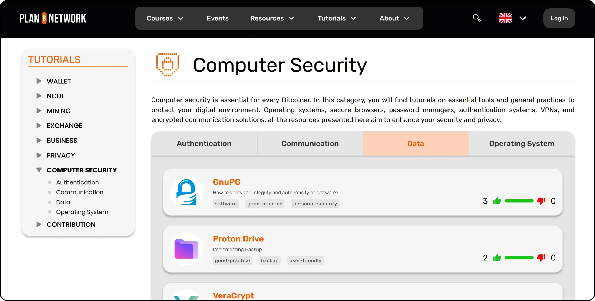

In the next chapter, I'll give you a few more tips on how to start your Bitcoin journey in the best possible conditions and avoid falling into the many pitfalls.

## Tips for novices

<chapterId>33134b3f-92c1-5185-afb6-88599e47e801</chapterId>

When it comes to Découvre Bitcoin, it's easy to get carried away by the hype and adopt risky behavior. The world of crypto-currencies is indeed a very special one: price volatility, new technologies, risks of definitive losses due to technical errors or poor investment choices... So many pitfalls to avoid.

In this chapter, I offer some practical advice and general guidance for those embarking on the purchase of their first bitcoins, and more broadly, on any financial investment.

Here are the main tips that we will go over together:

- Beware of Shitcoins and other useless cryptocurrencies;
- Invest only what you are prepared to lose;
- Understand the distinction between trading and investing;
- Be aware of the tax implications of your investments;
- Manage your mnemonic carefully;
- Keep a humble and discreet attitude;
- Take the long view.

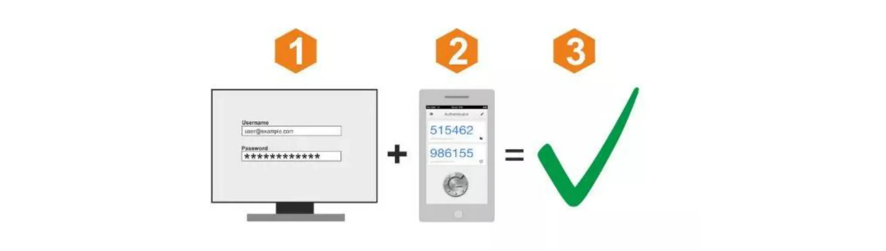

### Common mistakes to avoid

The Bitcoin universe is accessible to all, but that doesn't mean you should enter it unprepared. Here are some of the classic mistakes made by novice investors:

**Technological errors:**

- **Losing your wallet's seed:** Your seed (or mnemonic phrase) is a series of 12 or 24 words that allow you to recover access to your bitcoins. If you lose this phrase, you permanently lose access to your funds;
- **Storing your bitcoins on a third-party platform:** Keeping your bitcoins on an exchange platform means you don't actually own your bitcoins. This exposes you to risks such as piracy, bankruptcy or confiscation;
- **Neglecting privacy:** Protecting your privacy must be part of your security strategy. Publicly exposing the amount of bitcoins you possess can attract the attention of ill-intentioned individuals;
- **Insufficient online security:** A lack of basic precautions can leave your devices vulnerable to hacking and cause major losses.

**Financial errors:**

- **Invest more than you can afford to lose:** Never invest by going into debt or with money earmarked for essential expenses;
- **Ignoring the difference between trading and long-term investing:** Trading is a risky business that requires a lot of time and advanced technical skills. Long-term investment is better suited to beginners;
- **Forget the tax implications:** Each country has its own tax rules concerning Bitcoin. Ignoring these rules can expose you to significant financial losses;
- **Giving in to FOMO (*Fear Of Missing Out*):** Buying impulsively because you're afraid of missing an opportunity often leads to buying at the worst possible time.

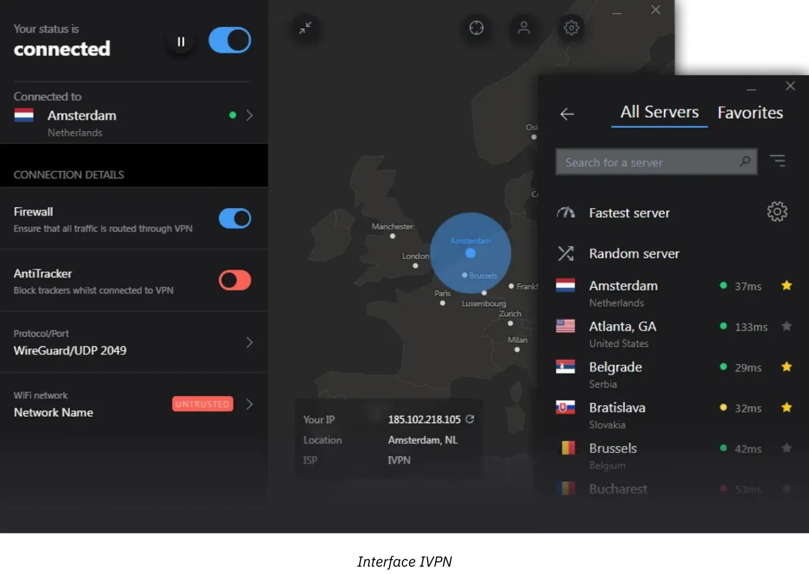

### Defining an investment strategy

Before you buy any Satoshi, it's important to know why and how you want to invest in Bitcoin. This involves drawing up a clear financial plan, tailored to your personal situation and objectives.

First of all, define your **budget** precisely. It's not just a matter of deciding on an approximate amount: take the time to calculate your monthly income, then subtract your fixed expenses (rent, loans, taxes, bills...), as well as your living expenses (food, transport, leisure...). The remainder available is your savings margin; it's only from this part that you can consider investing. By proceeding in this way, you ensure that you don't commit sums that would jeopardize your financial stability if the market were to undergo a sharp correction.

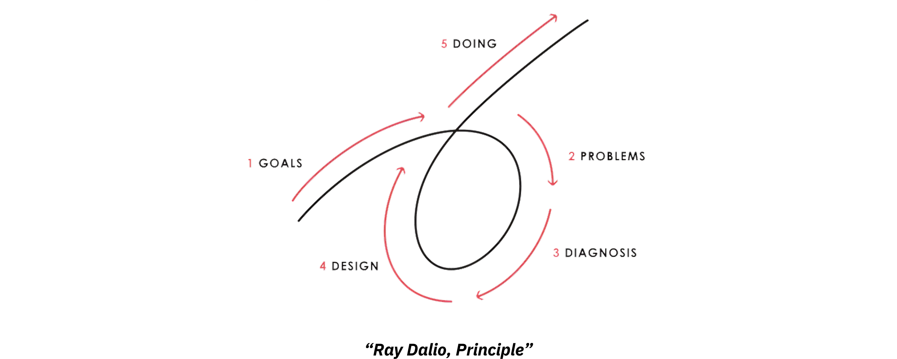

Then think about which investment method is best for you. Dollar Cost Averaging (DCA)** involves buying Bitcoin (or any other asset) at regular intervals, every week, every month... This technique smoothes the purchase price over time and reduces the emotional impact of major market fluctuations. It's a wise choice for most investors, especially beginners.

Finally, clarify your **vision**: is this a short-term investment, with a view to trading frequently, or a medium- to long-term investment, closer to the "HODL" spirit (holding bitcoins over several years)? Your strategy will differ considerably depending on your investment horizon. A "hodler" will tend to worry less about daily variations, preferring to store his BTC safely, while a trader will seek to take advantage of faster price movements, at the risk of multiplying transactions and exposing himself more to stress and bad decisions.

The aim is not to devise a perfect plan, but rather to have a clear structure to follow and stick to. It's important not to shop on the spur of emotion or fear. Adopt a strategy that you have defined beforehand on paper to minimize any unnecessary stress.

When in doubt: get informed first. Immerse yourself in the world of Bitcoin for a few hours (you'll find a wealth of resources on Plan ₿ Network). Read two or three books, invest five euros in testing, watch documentaries and videos. Keep an open mind. Once you feel more comfortable with Bitcoin, you may be able to revise your action plan and adapt your use.

### Knowing BTC's volatility

Bitcoin prices can fluctuate dramatically. Movements of 10%, 20% or even 50% in the space of a few days are not uncommon. Such volatility can confuse beginners, who might panic and sell at a loss or, conversely, get carried away by the frenzy of a bull market.

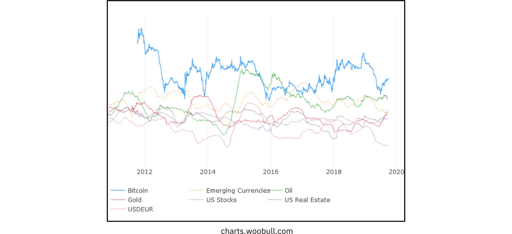

To avoid these knee-jerk reactions, it's essential to accept the volatile nature of Bitcoin before you even get started. Don't think of these fluctuations as an anomaly, but as an inherent characteristic of this still young asset. In fact, if these sudden rises or falls are keeping you awake at night, or prompting you to make counter-productive decisions, you may have invested too much. In this case, re-evaluate your plan and your risk tolerance, even if it means reducing your exposure to regain some peace of mind.

It goes without saying that you should only invest what you can afford to lose! Don't go into debt to invest in a currency whose ins and outs you may not yet understand.

### Managing and securing your Bitcoin wallet

One of the most unique aspects of Bitcoin is the notion of **self-custody**. You can have your own wallet, for which you are entirely responsible. This is usually generated from a mnemonic phrase (a series of 12 or 24 words), which gives you absolute control over your BTC. If you lose it or it falls into the wrong hands, your funds become irrecoverable.

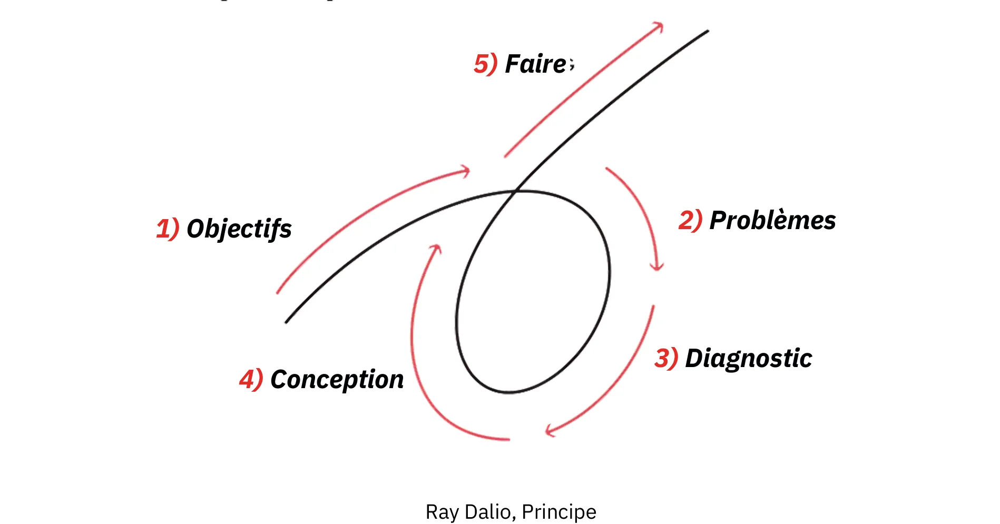

The golden rule on Bitcoin is: "***Not your keys, not your coins***". If you don't have your own private keys, you don't really own your bitcoins. Exchange platforms may be convenient for starting up or carrying out transactions, but they hold the keys to your BTCs; if they go bankrupt, get hacked or decide to freeze your account, you risk losing everything.

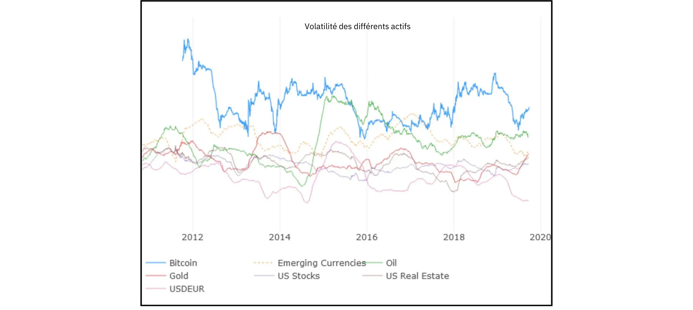

To avoid this scenario, we strongly recommend setting up your own wallet, where only you hold the mnemonic phrase. The mnemonic should be written down by hand, on a physical medium, and kept in a safe, protected place. Some even opt for a double backup, kept in two geographically distinct locations. Whatever you do, make sure **never to store your mnemonic phrase on a device connected** to the Internet or on a cloud service, as a simple hack or data leak could prove catastrophic.

If you'd like to learn more about securing your mnemonic phrase, I recommend you read this article. It details the risks involved and the best practices to adopt to avoid them:

https://planb.network/tutorials/wallet/backup/backup-mnemonic-22c0ddfa-fb9f-4e3a-96f9-46e2a7954270

### Confidentiality and discretion

In the digital world, the importance of discretion is too often underestimated. The more you publicly disclose your bitcoin holdings, the more you become a potential target for scammers, cybercriminals or, in some cases, more ordinary threats (extortion, blackmail, etc.). There's no need to brag openly about holding large quantities of BTC, either on social networks or in discussions with acquaintances. Unfortunately, there have been numerous cases of Bitcoiners being kidnapped in various countries.

It's also important to keep your online activities separate. For example, you can separate your regular e-mail address (for everyday use) from the one used for your Bitcoin accounts. Beware of phishing attempts, suspicious links and sites imitating official platforms. In short, **discretion** and **vigilance** will often keep you out of trouble.

If you are interested in the subject of privacy on Bitcoin, I recommend that you take this second-year course afterwards:

https://planb.network/courses/65c138b0-4161-4958-bbe3-c12916bc959c

### Tax implications

Despite its status as a decentralized currency, Bitcoin is not exempt from your country's regulations and tax laws. Each jurisdiction has its own rules governing the taxation of gains from cryptocurrencies. Some countries tax capital gains on resale, others require specific declarations for all exchanges, and still others may adopt less common approaches (wealth tax, social security contributions, etc.).

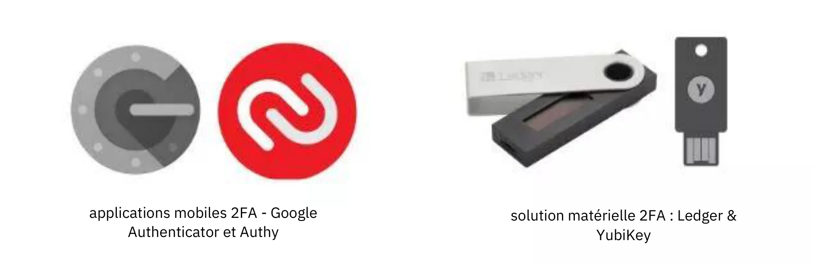

Before making any major transactions, we strongly recommend that you seek professional advice or consult government websites. Tax planning** upstream will help you avoid any unpleasant surprises (fines, regularizations, penalties, etc.), especially if you're planning to resell your property.

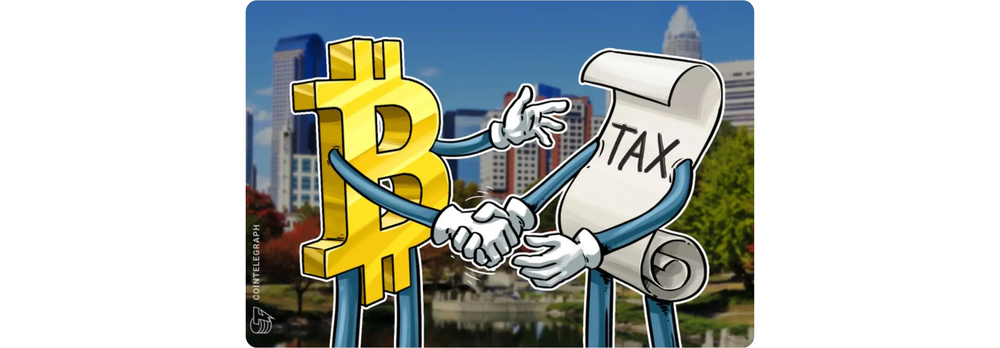

### Differences between trading, investment and holding

The world of Bitcoin is often associated with clichés among the general public, such as the idea of getting rich quickly through trading. But there are three different approaches, each with its own requirements and risks.

- **Trading :**

You shouldn't be trading. Trading is carried out over short periods, sometimes using leverage. Traders seek to exploit price movements, often volatile, to make quick profits. A solid technical background (graphical analysis, risk management, etc.) and resistance to stress are essential; most beginners fail for lack of experience or rigorous methods. Keeping up with the market can be complex, and requires a full-time commitment. As Warren Buffet once said: "If you're not prepared to hold a stock for 10 years, don't even think about holding it for 10 minutes".

- **Investment:**

The investor adopts a medium to long time horizon, without recourse to leverage. He seeks to acquire Bitcoin by betting on the evolution of its value over months or even years. The risk remains, as the price may fluctuate, but the approach is generally calmer and better suited to the majority of the general public, who do not wish to devote daily hours to monitoring the markets.

- **Holding (HODL) :**

"*HODL*" is a humorous distortion of "*hold*", which has become emblematic in the Bitcoin community. The "*hodlers*" hold their BTC for the very long term, sometimes ten years or more, in the belief that Bitcoin will increase in value as its adoption progresses. This strategy requires a strong belief in Bitcoin's potential and a relative indifference to passing market shocks.

|          | Trading | Investment | Holding |
| ---------------------- | ----------- | -------------- | --------------- |
| Lever | Yes  | No | No |
| Temporality | Short-term | Medium-term | Very long-term |
| Contract | BTC | BTC | Asset type |
| Risk | Very high | High | High |
| Difficulty | Very Hard | Hard | Hard |
| Long learning curve | Long learning curve | Long learning curve | Long learning curve |
| Unlimited | Limited | Limited | Potential losses |
| More suited to | Some | Most | Some |

### Continuous training

There's no age to start educating yourself about investing and understanding how money and the financial system work. There's no need to dive into the details; a comprehensive understanding is enough to make informed decisions based on facts rather than ignorance. This can prove invaluable throughout your life, and enable you to detect when someone is trying to sell you a bad investment product (as a bank might).

As an introduction to investment logic, Robert T. Kiyosaki's ***Rich Dad, Poor Dad* is renowned for its pedagogy and simplicity. It covers fundamental principles such as the difference between assets and liabilities, and the role of financial education in personal success.

To take things a step further, there are shows like ***The Investors Podcast*** that delve deeper into finance and economics. If you already work in finance, or if you're passionate about it, listen to some of their episodes. Some of them talk about Bitcoin.

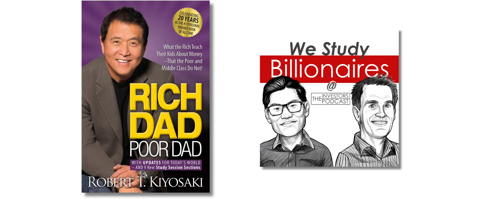

### Golden rules to remember

Finally, keep in mind a few simple but essential principles:

- **Rule n°1**: Never invest more than you can afford to lose. In other words, don't put your financial security at risk for a volatile asset.
- **Rule n°2**: Don't blindly rely on market trends or miracle advice. Avoid what's fashionable. Instead, focus on making progress by making rational decisions. When in doubt, take the night off and discuss it with those closest to you. It's better to take your time than to rush. The best strategy is to take things one step at a time.
- **Rule n°3**: Develop a long-term plan and vision. Patience, consistency and discipline often pay off better than short-term excitement. Plan ahead and don't take too many risks. The aim is to avoid fatal failures while accumulating successes.

By applying these precepts, you'll be able to approach investing in a more serene and thoughtful way. Despite Bitcoin's volatility and sometimes bewildering appearance, this technology has undeniable potential, provided you approach it with caution and realism. Take the time to reinforce your knowledge, adjust your strategy if necessary and, above all, remember that it's better to progress slowly but surely, rather than give in to impatience or fear of missing an opportunity.

# Understanding what you're getting into

<partId>a42355a3-9dd8-57ed-b590-32a333fe09ea</partId>

## Bitcoin in 5 minutes

<chapterId>ae122ad9-9b4d-5229-9038-e1b99d5cfc83</chapterId>

The main aim of this training course is to guide you through the process of obtaining and securing your first bitcoins. However, before moving on to the practical considerations (how to acquire BTC, which wallets to use, etc.), a brief reminder of what Bitcoin really is is in order. Understanding the deeper nature of Bitcoin will help you discern why millions of people are interested in this technology, and why it's essential to master the fundamental concepts before investing your savings in such an innovative and volatile asset.

Over the years, Bitcoin has established itself as a globally recognized monetary network. It has often been described as the "new digital gold", a "trusted protocol" or even a "parallel financial system". But what lies behind these definitions? To answer this question, we'll take a look at Bitcoin: its origins, its technical operation, its monetary properties and its potential impact on both users and the global economic system.

### The origins: a project born of a long quest

#### Cypherpunks and the invention of a system beyond banking control

Contrary to what you might think, Bitcoin is not simply the result of a sudden inspiration. Prior to 2009, numerous attempts were made to create forms of digital currency: eCash, b-money, Bit Gold, RPOW and so on. All of them ran up against a problem that is still notorious in the world of decentralized computing and networks: that of double spending and synchronizing a single register on a global scale without going through a central validation body.

It was against this backdrop that, at the end of 2008, Bitcoin's **White Paper** was published by a certain Satoshi Nakamoto (a pseudonym whose true identity has never been revealed to this day). In early 2009, Nakamoto launched the Bitcoin system and the first working version of client software. The main ideas behind this invention are in line with the ideology of the **Cypherpunks**.

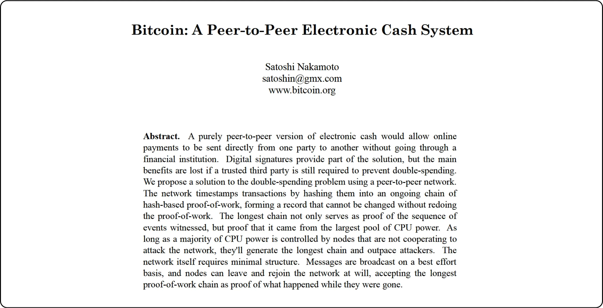

Cypherpunks are an informal, international community of people promoting the use of cryptography as a means of ensuring individual freedoms on the Internet. Cypherpunks defend the fundamental right of the individual to protect his or her privacy, particularly in a context of increasing state surveillance and data exploitation by private entities.

The cypherpunk movement dates back to the early 1990s, when groups of cryptographers, programmers and libertarians began discussing the political implications of cryptography at their first meetings in Silicon Valley. The leading figure within the community was Tim May, who had written the *Crypto Anarchist Manifesto* in 1988, the founding text of the movement. Key moments in Cypherpunks history include the founding, in 1992, of the *Cypherpunks mailing list*, an e-mail distribution list used for these discussions. The publication by Eric Hughes in 1993 of *Cypherpunk's Manifesto*, a document setting out the aims and actions of the cypherpunks, was also an important moment.

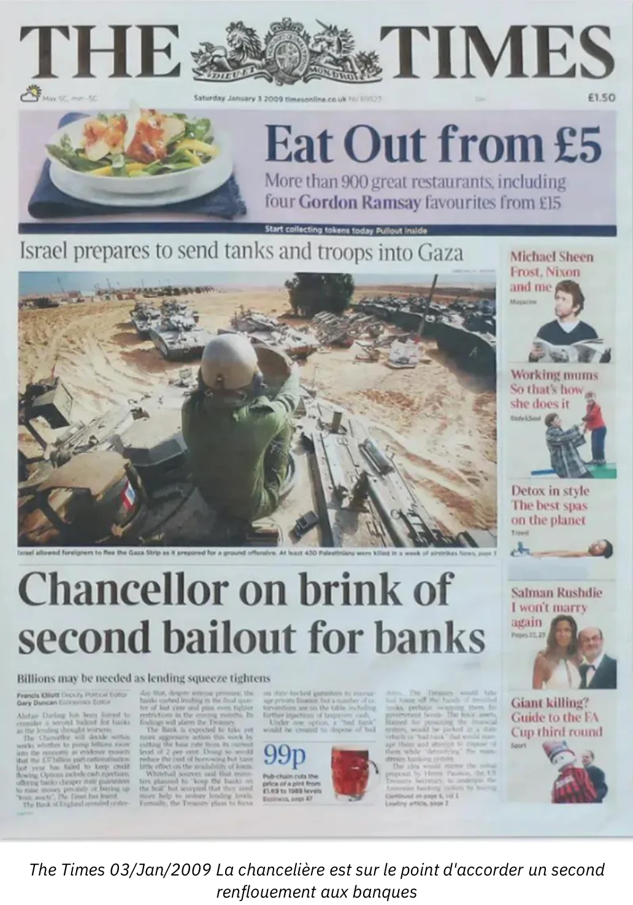

The idea of an electronic currency that is not based on a central entity, like Bitcoin, is rooted in the philosophy of cypherpunks

#### Post-financial crisis timing

The economic context was not insignificant: at the end of 2008, the planet was undergoing a financial crisis of considerable proportions, linked to the collapse of the American real estate market caused by the bursting of the subprime bubble and growing mistrust of the banking sector. In the first block of Blockchain Bitcoin (*Genesis block*), Satoshi Nakamoto even left a message referring to the crisis:

> The Times 03/Jan/2009 Chancellor on brink of second bailout for banks

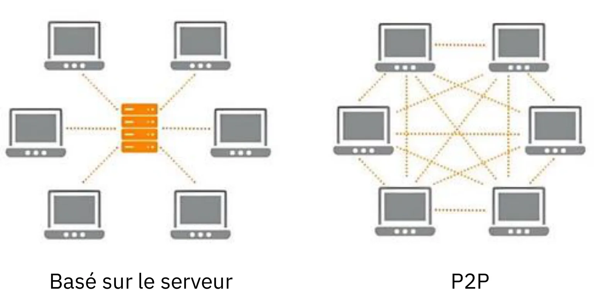

Many see this as a reference to Bitcoin's ambition: to offer a trusted system of value transfer **without intermediaries**, governed by transparent rules, and not by the often opaque decisions of central banks or governments.

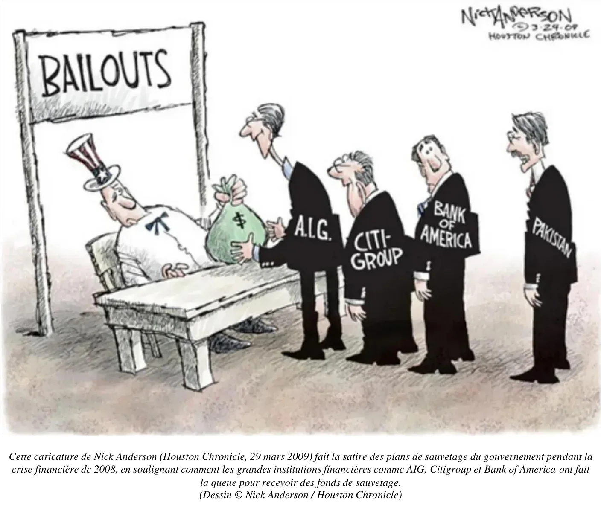

To deepen your knowledge of Bitcoin's origins, we offer a free, comprehensive and well-documented training course on the subject:

https://planb.network/courses/a51c7ceb-e079-4ac3-bf69-6700b985a082

### A decentralized network to transfer value

#### Peer-to-peer and no central body

Bitcoin defines itself as "a peer-to-peer electronic cash system": any user can connect to the network using the appropriate software (a Bitcoin node) and communicate directly with other users, without going through a single central server. This decentralization is designed to prevent any single entity (bank, government, large corporation, etc.) from controlling, censoring or shutting down the system. Bitcoin is a **value exchange system** that operates 24 hours a day, 7 days a week, anywhere on the planet, accessible to all without condition.

In practice, every network participant (every node) has a complete copy of the transaction register, called the **Blockchain**. As soon as a new transaction is issued, it is propagated throughout the network. Miners then confirm these transactions at regular intervals by grouping them into blocks, which are then added to the end of the chain (hence the name "Blockchain").

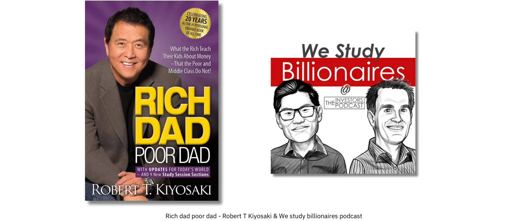

#### Blockchain: an accounting ledger

To understand Blockchain, we can compare it to an accounting ledger, where each line represents a transaction. In a conventional banking system, the database is located on the servers of a single bank, which can unilaterally make changes. Conversely, in Bitcoin, **all modifications are validated in a distributed manner**: each new block of transactions, once added to Blockchain, is almost impossible to modify retrospectively.

### The role of miners and Proof-of-Work

#### Creating blocks by mining

Mining is the operation whereby a computer (or a computer farm) provides **computing power** to secure economic history and create blocks. Miners attempt to solve a mathematical problem (finding a partial collision on a Hash), which requires a certain amount of energy and resources. Once the solution has been found, the miner broadcasts the new block, and the network recognizes its validity. As a reward, the miner receives a certain number of freshly created bitcoins, and the fees for the transactions included in his block.

#### The declining subsidy and Halving

In order to guarantee the scarcity of Bitcoin, the mining subsidy undergoes a programmed halving every **210,000 blocks** in the creation of new bitcoins (approximately every four years). This mechanism is known as **Halving**. At the launch of Bitcoin, the subsidy was 50 BTC per block. Today, it is just 3.125 BTC (in 2025), and will continue to decrease in the years to come, until it ceases completely around 2140, when the maximum quantity of around 21 million bitcoins will have been put into circulation. This predictable issuance curve gives Bitcoin a dimension of **digital rarity** similar to that of gold, hence the nickname "digital gold".

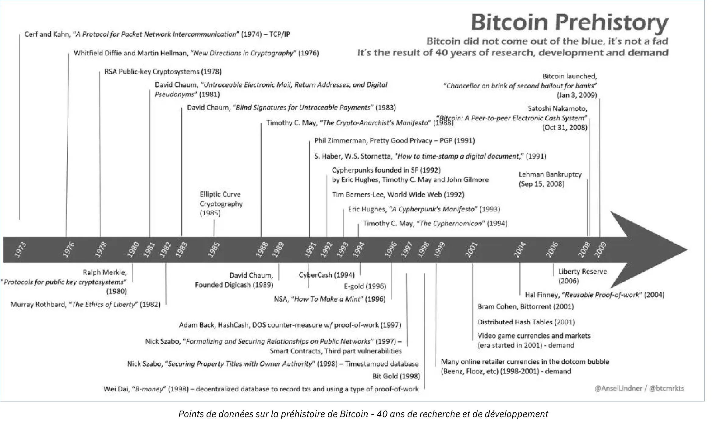

### Bitcoin monetary properties

#### Scarcity and programmed monetary policy

One of the most important points of Bitcoin was the introduction of an **immutable monetary policy**. In the world of fiat currencies (euro, dollar, yen...), central banks can issue money at will, leading to high inflation or various economic imbalances. Bitcoin, on the other hand, is based on rules written into the source code: there will be a maximum of around 21 million bitcoins, and the rate of issuance is known in advance by all participants.

No one, not even a government, can unilaterally change this ceiling or the way BTC is distributed. The only way to do this would be to change the protocol rules, a change that can only succeed if the economic majority of network nodes agree.

This feature is attracting a great deal of interest, particularly from those who wish to escape unpredictable monetary policies or the constant devaluation of their national currency. In the long term, this innovation could lead to a shift in the financial paradigm, where savings are better protected from inflation.

#### Divisibility and accessibility

It's important to note that **each Bitcoin is divisible** to the eighth decimal place (a unit called the "Satoshi" or "Sats"). This means that it's perfectly possible to buy or send tiny fractions of BTC. You don't need to spend tens of thousands of euros to start acquiring your first Sats.

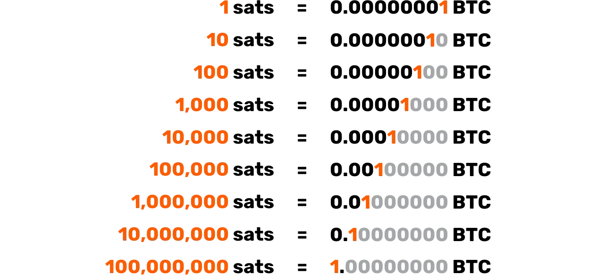

### Openness and transparency

#### A public protocol, verifiable by all

The Bitcoin protocol relies on clients that are **open-source** (the most important of which is [Bitcoin Core](https://github.com/Bitcoin/Bitcoin)). In other words, the code that defines its operation is freely published, so that any developer can examine it, audit it, and possibly propose improvements. This makes it very difficult to hide a malicious feature or perform a secret manipulation: everyone can, in theory, deploy their own implementation while respecting the consensus rules.

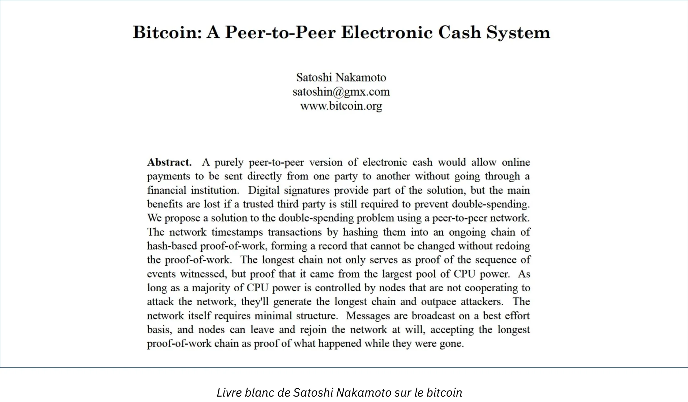

This transparency contributes to confidence in the protocol, as it prevents a select group of programmers from manipulating the network to their own advantage. Bitcoin is based on the principle that if you don't agree with the suggested changes, you can simply refuse to update your software. In some cases, you can remain synchronized with the rest of the network, but in others, this can cause what's known as a "Hardfork". This creates a new Bitcoin system separate from the original. This is exactly what happened in 2017 with the split between Bitcoin (BTC) and Bitcoin Cash (BCH).

All this makes the governance of Bitcoin very slow and sometimes conflictual, but also guarantees a certain stability and resistance to centralization.

#### Individual validation: nodes

Bitcoin allows anyone to verify the integrity of Blockchain: by **rotating a node** on their own computer or a server. This involves downloading the Bitcoin Core software (or another implementation of the protocol), then checking all transactions and blocks since 2009. Once synchronized, your node acts as a complete archive and participates in the network.

This approach, while more technical, guarantees the most demanding users that they can free themselves from trust in a third party, participate in the consensus and be incensurable.

### Use cases

#### A cross-border, resilient medium of exchange

Thanks to its decentralized nature, Bitcoin operates day and night, regardless of borders and time zones. In certain regions lacking a robust banking infrastructure, Bitcoin is sometimes used as a solution for sending or receiving funds quickly, without costly intermediaries. Transaction fees may vary according to network congestion, but are generally lower than the fees charged by some banks for international transfers. In addition, there are overlay systems such as Lightning Network, which enable bitcoin transactions to be carried out quickly and at low cost.

#### A store of value

Thanks to its rarity (21 million BTC) and robustness, Bitcoin is sometimes seen as a solution for protecting savings over the long term. Its price, which can be volatile in the short term, has nevertheless followed a long-term upward trend since its creation. Some investors buy BTC with the idea that it could serve as a store of value against inflation or financial crises.

#### A tool for financial freedom and resilience

Beyond the investment, Bitcoin represents a **means of protecting financial sovereignty**. In countries with authoritarian regimes or severe currency restrictions, having a Bitcoin wallet (with its own private keys) offers a form of freedom. No one can block or confiscate these BTCs, as long as the holder takes care to secure his or her mnemonic phrase.

This feature is particularly attractive to those who fear censorship or the freezing of bank accounts. It also appeals to populations suffering from hyperinflation, as was the case in Venezuela and Zimbabwe: holding BTC was more stable than keeping the national currency, which was depreciating at breakneck speed.

### A long way to go

Bitcoin can be seen as a "Zero to One": a radical break with established financial paradigms. For the first time in history, a global monetary network, accessible to all, operates without a central body, enabling censorship-resistant and confidential transactions.

Be that as it may, after more than a decade of existence, Bitcoin continues to arouse debate and passion. Its adoption is growing, second-layer solutions (such as Lightning Network) are emerging to improve speed and reduce fees, and companies around the world are experimenting with new use cases. It is therefore likely that Bitcoin will have a lasting influence on payment systems and the very perception of money in the decades to come.

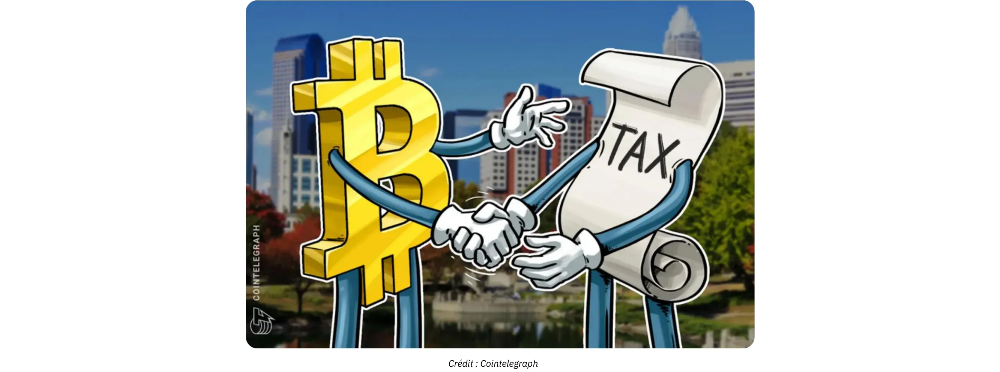

To continue your learning, you can take the BTC101 course on Plan ₿ Network, where the technical and economic foundations of Bitcoin are covered in greater depth.

https://planb.network/courses/2b7dc507-81e3-4b70-88e6-41ed44239966

After this introduction to Bitcoin (admittedly a little longer than 5 minutes!), you'll be better equipped to consider buying bitcoins and securing them. In the following chapters of the course, we'll look in detail at the importance of Bitcoin, how its industry works, and the development of its various layers. Then, in the next section, we'll look at setting up your own personal plan.

## Why is Bitcoin important?

<chapterId>d4327ac4-9ff8-5192-b542-cb78c0bd0aa7</chapterId>

Why is Bitcoin so important? That's the central question of this course. Whether it affects your studies or your investment strategy, without a clear understanding of the importance of Bitcoin, there's a risk of deviating from your course of action. The aim is therefore to always keep in mind the fundamental principles of Bitcoin to ensure that your strategy remains aligned with your convictions.

### A universal currency

Barack Obama once described Bitcoin as "the Swiss bank in your pocket". Indeed, Bitcoin offers the same opportunities to everyone, regardless of your status. Whether you're a teenager, a president, a protester in Hong Kong, or a "gilet jaune" in France, everyone has equal access to the same protocol and tools:

- Free, unlimited account creation (on Bitcoin, we don't really talk about "accounts" but rather "wallets").
- Send money anywhere, to anyone.
- No need for ID or administrative formalities.
- Accessibility for all, regardless of age, gender, religion, country or income level.
- Confidentiality and transparency on request.
- No middlemen or hidden fees.
- Bitcoin is native to the Internet, making it accessible to anyone with web access.

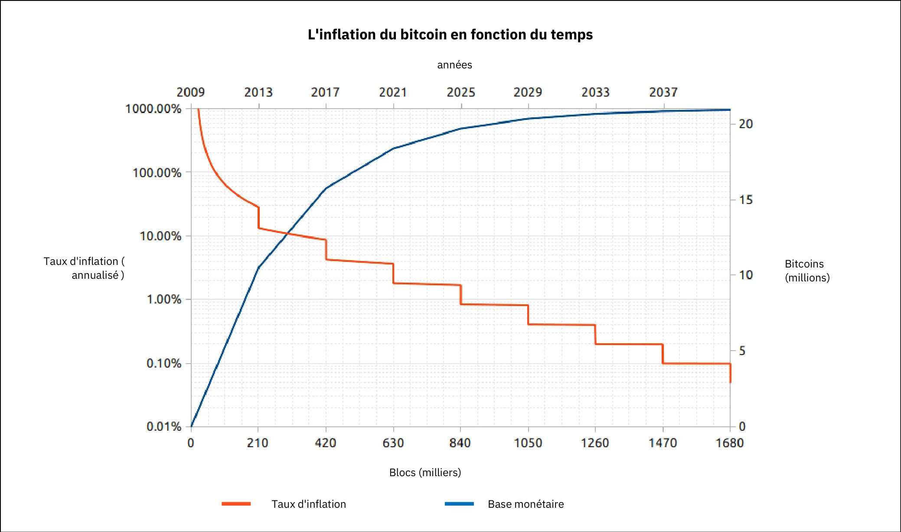

Bitcoin can be seen as the true "people's currency", an alternative monetary system that is not dependent on any central authority and is based on immutable rules rather than arbitrary decisions. Its open and accessible nature makes it a potentially revolutionary tool for billions of people around the world, whether excluded from the traditional banking system or simply looking for a more sovereign alternative.

This brings us to a fundamental, almost philosophical question, which divides bitcoiners into 2 major worldviews. On the one hand, some see Bitcoin as a solution to foster financial inclusion and enable the billions of unbanked people to finally access a global monetary infrastructure. On the other, some see Bitcoin as a tool for financial emancipation, designed to offer a way out to the billions of people who are already integrated into the banking system, but who wish to free themselves from its dependence and regain total control over their money. It's a thought that deserves our attention, but we'll return to it in more detail later.

### Protection against currency crises

For centuries, the world's economic history has been punctuated by currency crises, often with disastrous consequences for people. Today, billions of people are still suffering the devastating effects of poorly managed monetary policies, where the manipulation of money supply and interest rates leads to systemic imbalances. These crises are not simply one-off accidents: they are the direct consequence of a system based on interventionism and the manipulation of the value of money and the value of time.

These crises take many forms. Hyperinflation, for example, reduces a currency to nothing by gradually destroying the purchasing power of its citizens, as was the case in Zimbabwe and Venezuela. Monetary control, on the other hand, limits access to capital and deprives individuals of their economic freedom, as we have seen with banking restrictions in Greece and Lebanon.

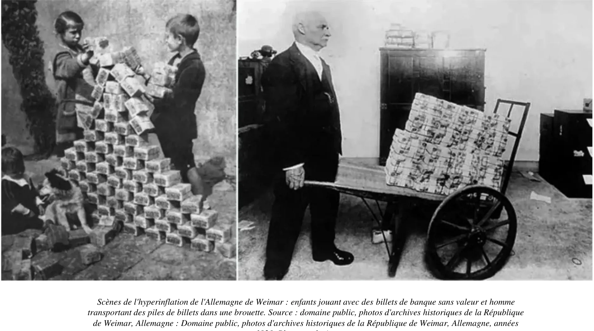

Finally, the orchestrated devaluation of national currencies erodes people's savings by imposing an invisible but constant loss of wealth. It's a form of hidden tax. As long as governments retain control over money creation, these phenomena will continue to recur.

Bitcoin offers a radical alternative to this chronic instability. Unlike state currencies, it is based on immutable, mathematical rules imposed by consensus, with no possibility of outside intervention. Its issuance is predictable and limited to around 21 million units, making it a form of sound money designed to preserve its value over the long term. Its resistance to censorship guarantees that anyone can store and transfer value without depending on an institution, while its divisibility and portability make it an accessible and universal financial tool.

**Did you know**? Throughout history, at least 56 cases of hyperinflation have been recorded worldwide. In many cases, these currency episodes not only destroyed the economies of the countries affected, but also wiped out the savings of millions of citizens, leading to waves of extreme poverty. Worse still, currency collapses have often served as a catalyst for political upheaval, sometimes leading to the establishment of authoritarian regimes, as in Germany in the 1920s or Chile in the 1970s.

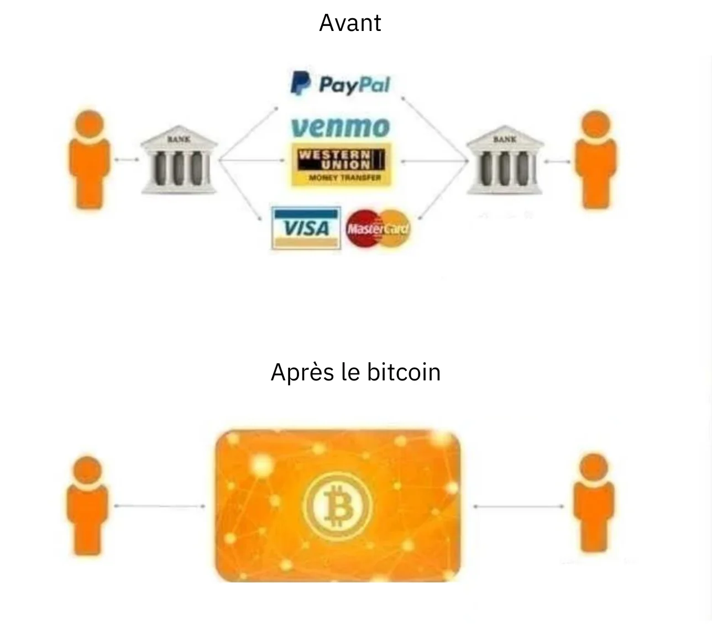

Hanke, S. H., & Krus, N. (2013). *World Hyperinflations*. In R. Parker & R. Whaples (Eds.), The Handbook of Major Events in Economic History. Routledge Publishing. Retrieved from https://ssrn.com/abstract=2130109

The destruction of fiat currencies is not a historical aberration, but a recurring phenomenon. Today, Bitcoin represents an unprecedented escape route: a means of preserving one's wealth outside of state-controlled monetary systems. The question is no longer whether another crisis will occur, but rather when. Thanks to Bitcoin, you now have the opportunity to protect yourself against these destructive cycles, and to choose a monetary system based on transparency and individual sovereignty.

### The response to injustice and state control

Growing economic inequalities throughout the world have always been fertile ground for social instability and the rise of political extremism. History has shown that when disparities in wealth become too great, they generate tensions that can lead to crises and even the establishment of authoritarian regimes. In the face of these dangers, protecting one's financial freedom becomes a necessity for anyone wishing to preserve their autonomy and that of their family.

But in a world where the state can exercise total control over assets and transactions, what are the real options available for sheltering your savings?

- **Bank accounts** can be frozen in an instant, seized by government order or emptied by abusive currency restrictions.
- **Gold**, although it has served as a store of value for millennia, is difficult to divide, complex to transport and difficult to use in an immediate crisis.
- **Cash**, though anonymous, is bulky, vulnerable to confiscation and, above all, constantly losing value through inflation.

Bitcoin provides a unique solution to all these problems. By enabling everyone to store and transfer their wealth in digital, decentralized form, it offers an unprecedented means of financial protection. No authority can prohibit access, or restrict use, as long as the user holds his or her own private keys. Thanks to its non-confiscable nature, Bitcoin enables millions of people living under oppressive regimes to escape the surveillance and arbitrary sanctions of governments. Today, almost half the world's population lives under authoritarian or anti-freedom governments: these people need Bitcoin more than anyone.

But beyond its practical utility, Bitcoin also embodies an act of peaceful resistance. Adopting Bitcoin means refusing to submit to a monetary system based on control, manipulation and arbitrariness. It means asserting your right to financial independence and regaining control over your own resources. In a world where money has become a tool of political coercion, Bitcoin represents an alternative enabling everyone to choose a fairer system, based on transparent, unchanging rules rather than the will of the powerful. Going beyond existing laws, Bitcoin presents itself as a jusnaturalistic tool, enabling you to assert your natural rights as an individual.

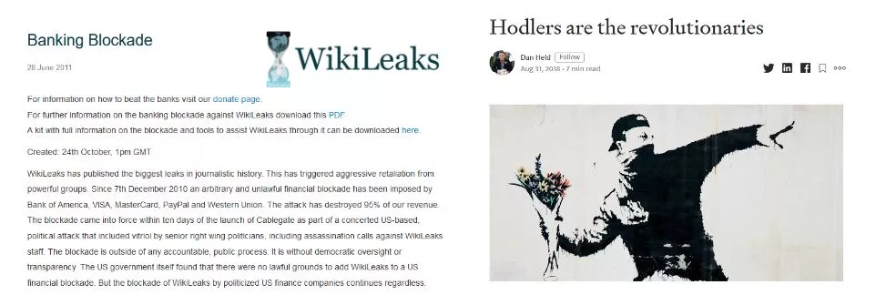

**Did you know**? Bitcoin is pseudo-anonymous. Each user can generate an address without revealing their identity, enabling them to receive and send funds outside the traditional banking system. However, contrary to popular belief, Bitcoin is not totally anonymous: all transactions are recorded in a public register, Blockchain, and can be verified by anyone. This means that although users' names are not directly visible, their financial activity can be analyzed if it is not protected by adequate practices.

### A solution against monetary and banking corruption

Central banks' expansionist monetary policies are constantly eroding your purchasing power. Through inflation and excessive money creation (*Quantitative Easing*), they progressively dilute the value of money in circulation. This mechanism works like an invisible tax that, year after year, reduces the wealth of those who keep their savings in state money. Contrary to the popular belief that inflation is a natural economic phenomenon, it is in fact a tool of monetary control, progressively impoverishing the population while favoring those who hold financial assets.

If you don't have non-monetary assets (via real estate investments, bonds, shares...) your savings will inevitably lose value over time. Meanwhile, those with access to financial assets will continue to grow richer, widening the gap between economic elites and the rest of the population. Far from being a simple malfunction of the system, this mechanism is a deliberate strategy put in place by central banks and governments to artificially stimulate economic growth and encourage the population to consume and take on ever more debt.

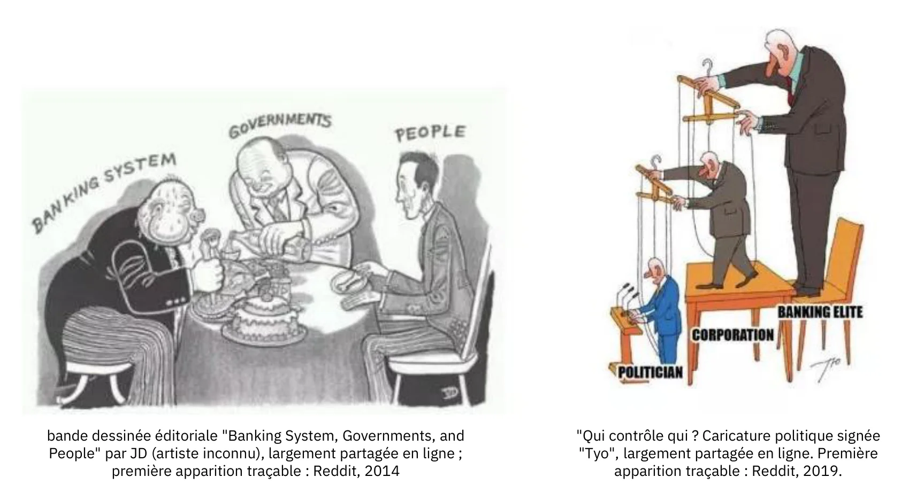

The current monetary model is based on a vicious circle in which indebtedness is not only encouraged, but almost inevitable. By taking out loans to finance their lifestyles, individuals find themselves trapped in a system where they have to repay interest to banks which, in turn, create money ex nihilo. This is no accident, but a structural choice: a system designed to favor financial institutions to the detriment of citizens.

Our system is corrupted by the influence of central banks and their power to manipulate money. **Bitcoin is the solution

Unlike state-run currencies, Bitcoin is governed by rules imposed by consensus: there will never be more than 21 million bitcoins in circulation (approximately, because it's even just under 21 million). No single government, no single central bank, no single economic player can alter its issuance. This means that, unlike state currencies, Bitcoin offers a monetary framework where inflation is totally predictable and will eventually disappear gradually over time, when the total issuance of the money supply is completed.

In the past, gold fulfilled this role as a bulwark against uncontrolled money creation. However, since the abandonment of the gold standard in 1971, no national currency (euro, dollar, yen, etc.) is backed by a tangible asset. Since then, central banks have had carte blanche to print as much money as they like, with no real constraints. This disconnection from gold paved the way for decades of unbridled money creation, fostering cycles of economic bubbles and recurring financial crises.

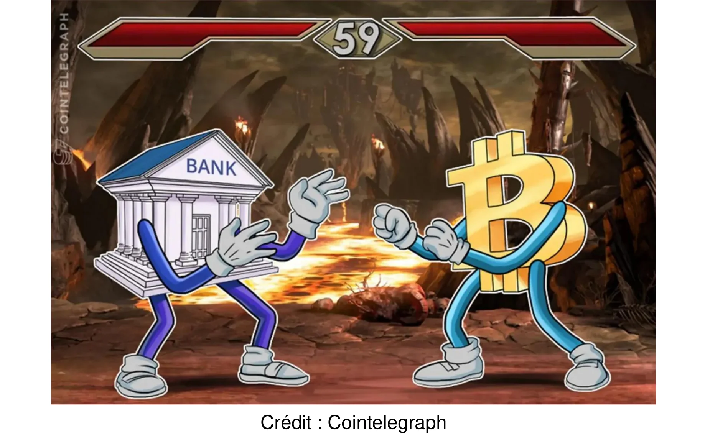

If you have money in a bank account, you should know that it no longer really belongs to you. In reality, this money is a loan from you to your bank, which uses it as it sees fit to finance its own operations. This model is based on the public's blind trust in banking institutions, but it entails major risks:

- **If your bank fails**, your money can disappear. Despite bank guarantee mechanisms, history has shown that these protections are not always enough in the event of a systemic crisis.
- **If your bank decides to restrict access to your funds**, you may find yourself unable to withdraw or use your own money, as has been observed on several occasions in recent economic crises (Greece, Lebanon, Argentina...) or during protest movements (truckers in Canada).

Bitcoin, on the other hand, is an open, neutral and incorruptible system. Its rules are set once and for all by consensus, and apply uniformly to all network participants.

If you don't have the private keys to unlock your bitcoins, then they're not really yours. They are under the control of a third party, just like money placed in a bank. On the other hand, if you hold your private key, you alone have absolute power over your funds. No authority or institution can seize them or restrict their use. It's this monetary sovereignty that makes Bitcoin a powerful alternative to the excesses of the traditional financial system.

### Bitcoin, a political movement?

Bitcoin redefines the balance of power between the individual and financial institutions. It enables everyone to regain total control over their currency, protect their savings against inflation, and escape the monetary restrictions imposed by governments. By offering an alternative accessible to all, regardless of social status, origin or nationality, Bitcoin paves the way for a fairer and more equitable monetary system. Adopting Bitcoin means choosing a healthy currency. It means refusing to be a mere cog in the current inflationary and banking machine. It's an act of individual sovereignty and peaceful resistance to monetary corruption and wealth confiscation.

Bitcoiners come from a variety of backgrounds, but they share a common vision: that of a world where monetary sovereignty is in the hands of individuals, not institutions. Among them are cypherpunks, fervent defenders of privacy and resistance to surveillance systems; oppressed citizens, seeking an escape from authoritarian regimes and monetary restrictions; anarchists, who see Bitcoin as a means of breaking free from state control ; followers of the Austrian school of economics, who advocate a sound currency free from government manipulation; as well as engineers, financiers and free speech activists, aware of the profound implications of this new monetary paradigm.

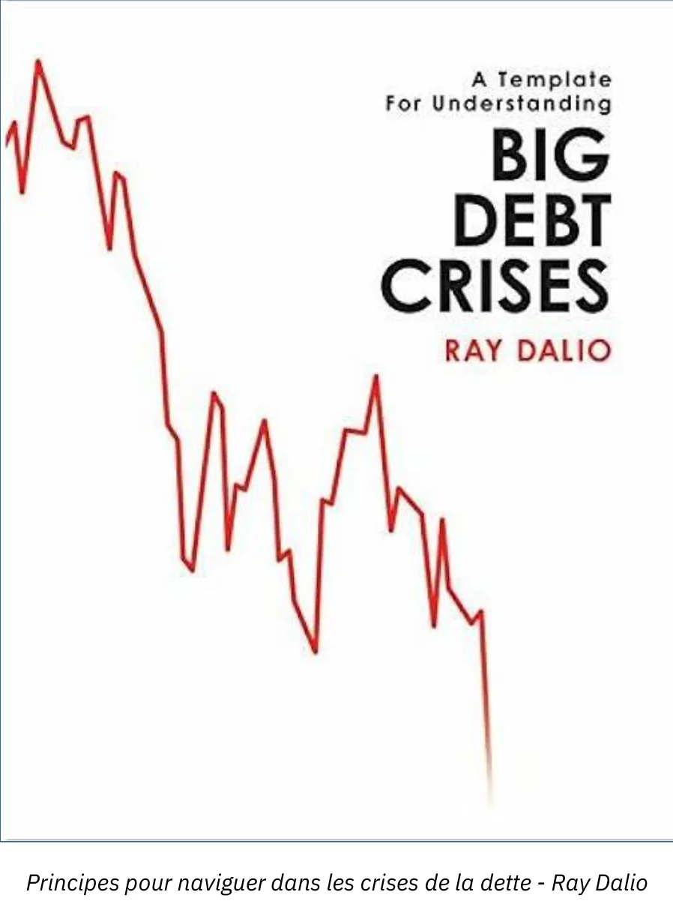

Bitcoin, by its very nature, transcends political and ideological divides. It is neither left nor right, libertarian nor collectivist. It is a neutral protocol, governed by immutable rules, applied impartially to all its users. Yet its very existence challenges the status quo of the global financial system. If Bitcoin has become a symbol of resistance, it is above all because its users have adopted it as an alternative to state-run currencies and traditional financial infrastructures, perceived as unfair, centralized and manipulable.

From the cypherpunks' point of view, Bitcoin represents much more than just a digital asset. It stands in direct opposition to the progressive erosion of privacy in a world where the disappearance of cash payments is often justified by security arguments. By enabling censorship-resistant, unmediated digital transactions, Bitcoin offers a concrete alternative to a future where every payment is scrutinized, analyzed and potentially restricted by central authorities. In this light, and as described by Nakamoto, Bitcoin can be seen as the digital equivalent of cash: a means of freely exchanging value without having to ask permission.

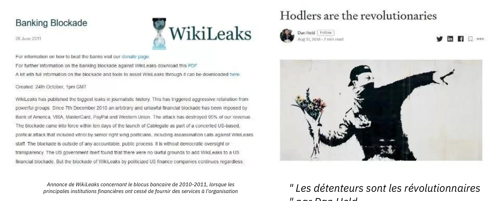

So, although Bitcoin is neither an organization nor a political party, it undeniably carries a powerful philosophical message. It redefines the relationship between the individual and the state, and challenges the central banks' monopoly on money creation and economic management. Whether embraced by freedom fighters or simply by those seeking to better preserve their purchasing power, Bitcoin embodies a new era in which financial sovereignty becomes a fundamental right accessible to all.

Now that we've explored the significance of Satoshi Nakamoto's invention, I invite you in the next chapter to explore the incredible industry that has developed over the years around this protocol.

## Understanding the Bitcoin industry

<chapterId>e106c6f1-d75b-5a62-b245-0ea2e4d02ef8</chapterId>

With the arrival of Bitcoin in 2009, spearheaded by Satoshi Nakamoto, a whole new industry, now valued in the billions of dollars, was born. Despite its young age, this ecosystem has grown by leaps and bounds, evolving at an exponential rate over the past decade. Every day, new players - institutional investors, innovative startups and major technology companies - inject considerable sums of money into this rapidly expanding sector.

Today, Bitcoin has crossed a critical threshold: a point of no return where even governments, central banks, digital giants and financial sector companies can no longer ignore it. Whether through attempts at regulation, adoption or confrontation, these players have become aware of Bitcoin's inevitable impact on the global economy.

### The birth of a global industry

Bitcoin is a radical innovation, a shift from **0 to 1**, which cannot be undone. It represents a complete break with the traditional monetary paradigm. Some will see it as an existential threat, an upheaval that challenges their power and privilege. For them, Bitcoin is a Pandora's box they'd rather never have opened, and they'll try to fight it by any means necessary.

Others, on the contrary, will see Bitcoin as a unique opportunity: a lever for individual freedom, a tool capable of transforming the global financial system and offering a fairer, more transparent alternative. These will choose to adopt it, integrate it into their business and contribute to its development.

**Bitcoin, on the other hand, is indifferent to these struggles. He takes no sides, seeks neither approval nor rejection. He simply exists

In this chapter, we explore the key players in this emerging industry. Understanding their roles and motivations is essential to grasping the overall workings of this ecosystem and better understanding the challenges we face as we enter it.

### The proliferation of altcoins

It's technically simple for anyone to create their own cryptocurrency: it takes just a few minutes and requires no special innovation. However, the real question is whether this currency will have any value at all. This is determined solely by the market and relies on the trust of users. In December 2019, over 5,000 tokens were listed on CoinMarketCap. In 2025, there will be several million, with the rise of NFTs, decentralized finance (DeFi) and many other more or less relevant applications. These tokens take a variety of forms: some claim to be real currencies, others are designed as financial securities, fuel for platforms, sidechains, or even representations of digital objects in the form of tokenized art.

However, it's important to understand that **most of these cryptocurrencies are nothing more than scams**. Behind a sophisticated technological facade, these projects are often driven by aggressive marketing strategies aimed solely at getting your bitcoins back. These "projects" are designed to exploit investors' greed and ignorance, promising unrealistic returns and playing on attractive but unfounded narratives.

However, among this myriad of dubious projects, a tiny minority are genuinely trying out new technologies and bringing real innovation. Some of these projects seek to improve technical aspects such as scalability, privacy or transaction programmability. Over time, it is likely that some legitimate initiatives will emerge, leading to genuinely useful applications. But the fundamental question remains: **Can these innovations really thrive outside Bitcoin?

To date, one thing is certain: Bitcoin remains the only truly decentralized, censorship-resistant digital currency with growing global adoption. Unlike altcoins, it is not backed by centralized corporations or subject to the arbitrary decisions of a small group of developers or investors. Bitcoin is the only project that justifies thousands of hours of research, development and continuous improvement.

| Feature               | Bitcoin                  | Altcoins (99.9% of them)       |
| ---------------------|--------------------------|--------------------------------|
| **Liquidity**         | High                     | Low                            |
| **Adoption (actual)** | Global and growing       | Very limited                   |
| **Team**              | Decentralized and robust | Centralized and opaque         |
| **Reputation**        | Strong and global        | Varies, often questionable     |
| **Infrastructure**    | Stable and secure        | Unstable and vulnerable        |
| **Decentralization**  | Yes                      | Rarely                         |
| **Scam?**             | No                       | Very likely                    |
| **Real utility?**     | Yes                      | Debatable                      |

**Don't fall for some misleading claims:**

- "Blockchain, not Bitcoin"
- "XRP is the new Bitcoin"
- "Libra to replace Bitcoin
- "My project is an improved Bitcoin"
- "Central bank digital currencies will make Bitcoin obsolete"

Before investing resources in altcoins, it's imperative to do your own research. Here, however, we won't guide you through the world of altcoins: **We're only focusing on the most important. We only focus on Bitcoin.**

### Adoption by major institutions

Following the ICO bubble of 2017, many institutional players began to take an interest in "Blockchain", often without understanding its real purpose. Central banks and governments are now exploring the possibility of issuing their own digital currencies (CBDCs), seeking to modernize the financial system while retaining full control over transactions. Several countries, including Sweden, Europe, Russia and China, have already initiated pilot projects for state-owned cryptocurrencies.

At the same time, technology giants are trying to impose their own financial solutions. Facebook, for example, launched its stablecoin project, Libra, aimed at creating a digital currency backed by a basket of currencies. However, this project met with strong regulatory opposition and was eventually abandoned.

| Feature                    | Bitcoin | Altcoins | Facebook-Coin | FedCoin |
|---------------------------|---------|----------|---------------|---------|
| **Public**                | Yes     | Varies   | No            | No      |
| **Open**                  | Yes     | Varies   | No            | No      |
| **Borderless**            | Yes     | Varies   | No            | No      |
| **Neutral**               | Yes     | Varies   | No            | No      |
| **Censorship-resistant**  | Yes     | Varies   | No            | No      |

While these initiatives claim to rival Bitcoin, they remain fundamentally centralized. Designed to respect local regulations and offer total control to issuers, they guarantee neither financial sovereignty nor user privacy. These digital currencies will only intensify mass financial surveillance, further limiting the economic freedom of individuals.

Facebook's Libra project was never intended to compete with Bitcoin. It was designed to integrate with the banking system, not replace it. To date, no private or semi-centralized Blockchain has succeeded in establishing itself on a global scale, while Bitcoin has continued to operate autonomously, securely and uninterruptedly for over a decade.

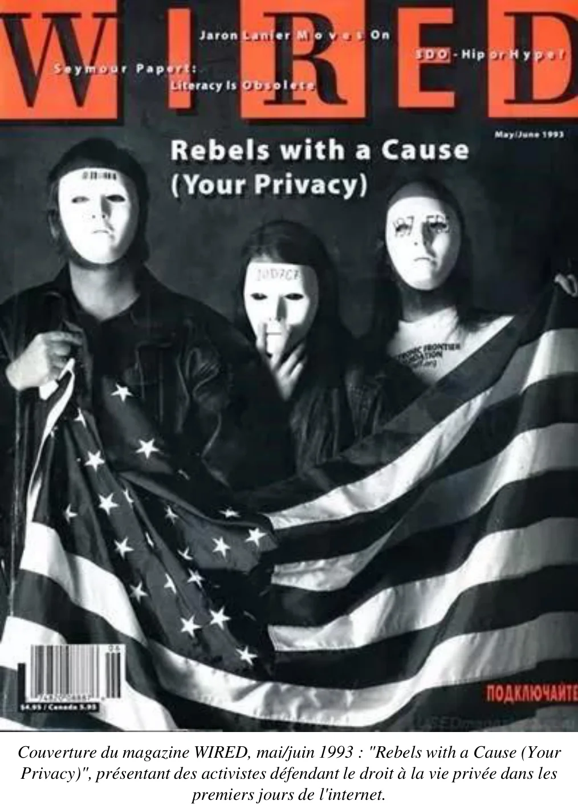

### Government regulations and posturing

The Bitcoin protocol is, by its very nature, beyond the reach of state regulation. Unlike traditional financial systems, it is not dependent on any central institution and cannot be censored or manipulated by any single authority. However, while the protocol itself is immutable, the players who interact with Bitcoin, such as exchange platforms, specialized companies and users, remain subject to local laws and regulations.

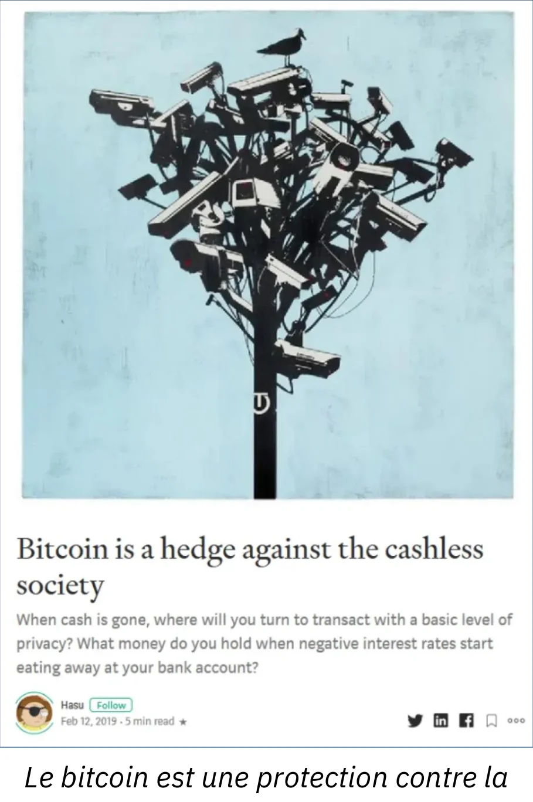

Since Bitcoin is a global, decentralized network, each country takes a different approach to it. Some governments, such as China, have repeatedly tried to restrict or even ban its use. In contrast, other countries, such as Canada, Switzerland and Malta, have adopted a more open stance. Many jurisdictions are now seeking to regulate the cryptocurrency sector, notably by imposing compliance obligations on companies that allow the purchase, sale or storage of bitcoins.

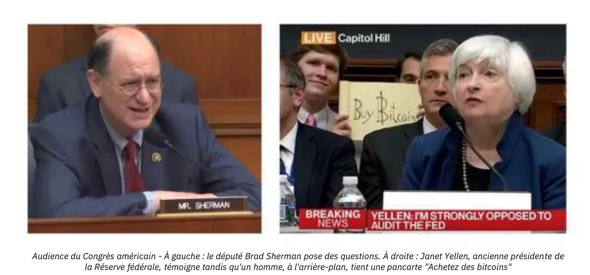

However, these regulatory processes are slow and evolving, as decision-makers struggle to fully grasp the nature of Bitcoin and its long-term implications. It is therefore advisable to carry out thorough research into the regulatory situation of Bitcoin in your country, particularly with regard to taxation, the purchase and holding of bitcoins, and any banking restrictions.

### The banks' attitude to Bitcoin

Banks, as the pillars of the traditional financial system, perceive Bitcoin as a threat to their business model based on intermediation and control of financial flows. This is why, in many countries, they impose restrictions on companies and individuals using Bitcoin. Several banks are closing accounts or limiting access to their services for companies operating in the cryptocurrency sector, under the pretext of combating money laundering and the financing of terrorism.

At the same time, these same banks are investing heavily in the research and development of Blockchain-related technologies, and seeking to exploit Bitcoin innovations while retaining their power of control.

### Exchange platforms and bitcoin custody

Exchange platforms play an important role in the Bitcoin ecosystem, facilitating the conversion between state currencies and bitcoins. They enable users to buy, sell and sometimes exchange bitcoins for other digital assets. Each platform has its own specific features, and it's essential to choose the one that suits your needs while minimizing risk. Here are a few criteria to consider before using a platform:

- a solid reputation for safety ;
- sufficient liquidity to ensure rapid trading without major price fluctuations;
- responsive and efficient customer service;
- an intuitive Interface user interface to facilitate transactions;
- an option for automatic recurring purchases (ARP);
- easy, free withdrawal of bitcoins to a personal wallet.

Exchange platforms that are registered and comply with local regulations generally have to meet the obligations imposed by the financial authorities. This often involves the application of strict identity verification procedures, known as **KYC (*Know Your Customer*)**. These controls require the user to provide identification documents before being able to access the platform's services.

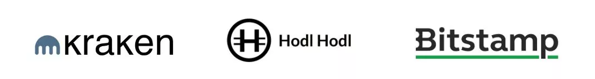

**Prudence**: KYC platforms collect your personal data under the pretext of security. This information can be used by governments to monitor your financial transactions and restrict your access to certain operations.

However, there are alternatives for acquiring bitcoins without undergoing KYC:

- P2P buying platforms such as Bisq, Robosat, LNP2PBot, Peach, HODL HODL, etc. ;
- Live purchases for cash, for example at local Bitcoin meetups;
- Regulated buying platforms without KYC, which are rare but available in some countries;
- Bitcoin ATMs;
- Working in exchange for bitcoins;
- Miner bitcoins.

There are several types of platforms, each serving a specific purpose:

- **Peer-to-peer exchange platforms (P2P)**

These platforms enable bitcoins to be bought and sold directly between users, without a centralized intermediary. They offer greater privacy, not least because they operate without KYC. It is possible to find local sellers with whom to carry out transactions in person or via various online payment methods (SEPA, Revolut, Wise...).

**Please note:** for all physical transactions, use a public and secure location to avoid fraud attempts.

https://planb.network/tutorials/exchange/peer-to-peer/bisq-v2-c1c6a702-6c16-4101-8b90-62c424017b80

https://planb.network/tutorials/exchange/peer-to-peer/hodlhodl-d7344cd5-6b18-40f5-8e78-2574a93a3879

https://planb.network/tutorials/exchange/peer-to-peer/lnp2pbot-v2-e6bcb210-610b-487d-970c-7cce85273e3c

https://planb.network/tutorials/exchange/peer-to-peer/peach-c6143241-d900-4047-9b73-1caba5e1f874

https://planb.network/tutorials/exchange/peer-to-peer/robosats-b60e4f7c-533a-4295-9f6d-5368152e8c06

- **Bitcoin-only exchange platforms**

These platforms take a user-friendly approach, offering a simple, transparent service. They are Bitcoin-only. They often set up solutions enabling bitcoins to be purchased via a **Dollar-Cost Averaging (DCA)** and offer automatic withdrawals to a personal wallet. They are particularly suited to beginners looking to accumulate bitcoins in a progressive and secure way. Examples: Relai, Bull Bitcoin, StackinSat, Bitstack...

https://planb.network/tutorials/exchange/centralized/bitstack-29fd71be-9570-42c6-8f6f-cd355d62e746

https://planb.network/tutorials/exchange/centralized/bull-bitcoin-europe-0ccf713e-efcd-44ec-8205-211f49ac7d53

https://planb.network/tutorials/exchange/centralized/relai-v2-30a9671d-e407-459d-9203-4c3eae15b30e

https://planb.network/tutorials/exchange/centralized/stackinsat-5af6a380-f3c6-4246-9f81-9957a16ab066

- **Generalist or trading-oriented exchange platforms**

These platforms allow you to buy Bitcoin, but also to trade cryptocurrencies using advanced tools such as leverage and derivative contracts. Obviously, we advise you not to trade and simply buy your bitcoins and then withdraw them from the platform. Trading is a risky game and not suitable for those simply looking to accumulate bitcoins for the long term.

https://planb.network/tutorials/exchange/centralized/bitfinex-dc306d39-bd96-4ab9-a278-a322316716db

https://planb.network/tutorials/exchange/centralized/bitstamp-5a36c896-bff5-46d7-b505-ff069c3ac47c

https://planb.network/tutorials/exchange/centralized/kraken-1ef03e25-9b42-49bd-a47d-249e1a13cfc6

https://planb.network/tutorials/exchange/centralized/paymium-92603f76-b985-49ce-81e5-f4fa0df776e5

Exchange platforms are not secure wallets. By leaving your bitcoins on a Exchange, you are taking a considerable risk. There are several scenarios in which your funds could be lost:

- **Piracy**: Many bitcoins have been stolen from compromised platforms (e.g. MtGox);
- **Government seizure**: A government can shut down a platform and freeze its users' funds;
- **Bankruptcy or fraud**: Many platforms have disappeared with their customers' money (e.g. FTX).

The golden rule is simple: **If you don't own your private keys, you don't really own your bitcoins**. Always withdraw your funds to a personal wallet as soon as possible is the only way to ensure total sovereignty over your money.

### Wallets, mining and development: the pillars of the ecosystem

#### Bitcoin wallets

Bitcoins are secured with what's known as a wallet, a specialized piece of software that stores and manages the private keys that unlock a user's bitcoins. This can be a dedicated hardware device, software installed on a computer or smartphone, or even a simple piece of paper with a key written on it. These wallets provide the link between your bitcoins and the outside world, making them easy to use on a day-to-day basis.

Each wallet has specific characteristics that influence its level of security and usage:  
- privacy;  
- security;  
- ease of use;  
- cost.

The Bitcoin wallet industry is structured into several distinct categories:

- Hardware wallet creators. These companies develop hardware devices dedicated to the secure storage of private keys. Some solutions are open-source, while others offer devices with different functionalities and levels of security. Major players include Ledger, Trezor, Coinkite, Foundation and Shiftcrypto.
- Software wallet creators. These are companies or independent developers who design software wallets for mobiles and computers. These solutions vary in terms of security and ease of use. Some examples: Sparrow, Wizard Sardine, Galoy, Synonym, Blockstream...
- DIY (*Do It Yourself*) wallets. These open-source solutions enable advanced users to create their own wallets, reducing their dependence on third-party suppliers and minimizing the risks associated with relying on an external player. Some examples: Seedsigner, Specter DIY...

Portfolios are an important element of Bitcoin and will be studied in depth in the next sections of this course.

#### Mining on Bitcoin

Mining, meanwhile, is an essential activity for the security and maintenance of the Bitcoin network. Miners confirm transactions and secure Blockchain by performing intensive calculations via proof-of-work. Each mined block enables new transactions to be added to Blockchain and new bitcoins to be issued according to the established mechanism.

In the early days of Bitcoin, mining was an individual activity, often carried out on personal computers. Today, the industry is dominated by large companies with substantial financial and logistical resources. The search for cheap sources of energy has become a key issue for miners, who seek to maximize their profitability by optimizing their energy costs. Miners can be found all over the world, operating in both massive industrial infrastructures and more modest facilities.

The mining industry is divided into several categories of players:

- **Mining hardware manufacturers** (e.g. Bitmain). These companies design and produce ASIC (*Application-Specific Integrated Circuits*), ultra-specialized chips dedicated to Bitcoin mining;
- **Mining pools**. This is a group of miners who pool their computing power to increase their chances of validating blocks. Given the increasing difficulty of mining, this collaboration makes the rewards more regular and predictable. When a block is found, the reward (mined bitcoins and transaction fees) is distributed among members according to their contribution. This system reduces the variance of earnings and ensures greater financial stability for miners. Some examples: Foundry USA, AntPool, F2Pool, MARA Pool, Braiins Pool...
- **Miners**. These are the operators who use machines and software to secure the network and generate blocks. A distinction is made between small independent miners, using hardware such as S9s, and large industrial farms, such as Galaxy, which have huge dedicated infrastructures.

Mining is a field in its own right, raising complex technical, economic and energy issues. For those wishing to delve deeper, our MIN201 course offers a detailed study of the subject:

https://planb.network/courses/ce272232-0d97-4482-884a-0f77a2ebc036

#### Development on the Bitcoin ecosystem

The Bitcoin Core majority client is an open-source project. Its code is publicly accessible on GitHub: [https://github.com/Bitcoin/Bitcoin](https://github.com/Bitcoin/Bitcoin). The entire evolution of the protocol, from updates to technical discussions, is transparently documented. Users are free to examine the code and choose whether or not to adopt the proposed updates.

The Bitcoin development ecosystem can be divided into several categories of contributors:

- Bitcoin Core developers, who develop and maintain the main client. Among these are the maintainers, who hold the keys to managing the repository. In 2025, there are five of them: Hennadii Stepanov, Michael Ford, Ava Chow, Gloria Zhao and Ryan Ofsky. Then there are the contributors who propose modifications, which are examined by the maintainers.
- Developers of ancillary protocols, who design complementary solutions such as Lightning Network or RGB.
- Independent developers, who create various tools and applications to enhance the user experience, such as Mempool.space or Alby.

Anyone can propose a change to the code, but contributing to the development of Bitcoin Core is a demanding process. Modifying code is a long-term process, requiring numerous validations and debates within the community. Many developers spend years proposing improvements in the form of BIPs (*Bitcoin Improvement Proposals*), some of which will never be implemented. It's an environment where innovation and rigor are essential.

Contrary to popular belief, Bitcoin Core maintainers and contributors have no absolute power over the protocol. They cannot impose arbitrary modifications.

Their only power lies in the ability to modify the majority client, Bitcoin Core. Theoretically, these modifications must obtain the consensus of users and contributors before being merged. However, even if the maintainers decided to act surreptitiously, it would still be necessary for the nodes in the Bitcoin network to agree to implement these modifications. The code itself is useless if not executed on a machine. It's also worth mentioning the existence of alternative clients that implement the Bitcoin protocol, such as Bitcoin Knots :

https://planb.network/tutorials/node/bitcoin/bitcoin-knots-e04b2196-4df2-4246-86ef-c02269c29098

## The layered architecture of Bitcoin

<chapterId>03017765-53cf-5f14-9682-e99ca02d2241</chapterId>

Bitcoin is an open system designed to be minimalist, robust and secure from the outset. To add functionality without altering its foundations, evolutions are generally made by adding **protocol layers** and complementary applications that enrich the ecosystem without compromising the decentralization and resilience of the main system. This flexibility has enabled numerous companies and independent developers to build an infrastructure around Bitcoin, adding innovations adapted to different use cases.

### Bitcoin extension with additional layers

The layered approach allows Bitcoin to be enhanced without directly modifying its basic protocol, thus guaranteeing the stability and security of the main system. This method is similar to that used for the Internet, where several protocols are stacked to offer distinct functionality while maintaining seamless interoperability.

Among the main overlay systems enriching the Bitcoin ecosystem are :

- **Lightning Network**:

A second-layer solution invented by Thaddeus Dryja and Joseph Poon in 2016 that enables payments with almost instant finality and generally low cost. Lightning enables the creation of payment channels between users, within which transactions can be carried out almost instantaneously and with minimal fees, without having to register each transaction individually on the Blockchain. Channels can remain open almost indefinitely, requiring transactions on the Blockchain only when they are opened and closed. Lightning Network is designed to improve the scalability of Bitcoin and make it possible to use it for low-value payments requiring rapid finality.

For example, if you were to pay for a coffee in bitcoins using the basic system, for the transaction to be definitively settled, and therefore for the merchant to be assured of your payment, you would have to wait at least until your transaction was included in a block. This can take several minutes, provided you have chosen an appropriate fee rate. In theory, the merchant would even have to wait for 6 confirmations, an average of 1 hour, to be completely sure that the transaction is settled on Bitcoin. This delay is unacceptable for in-store payments. With Lightning, the bitcoin transaction is settled in a matter of seconds, allowing the barista to serve you your coffee without waiting for it to get cold.

If you'd like to learn more about the theoretical workings of Lightning, we offer an excellent second-year course on the subject:

https://planb.network/courses/34bd43ef-6683-4a5c-b239-7cb1e40a4aeb

- **Sidechains** :

These are blockchains designed to operate in parallel with Bitcoin's main Blockchain. The two blockchains are connected using a bilateral anchor that ensures that the asset circulating on the Sidechain retains the same value as the Bitcoin on the main chain. The Sidechain has its own consensus mechanism, which may be independent or based in part on that of the main chain.

Sidechains generally enable the use of features not available directly on the main chain, or the benefit of enhanced functionality, such as more flexible development, faster and/or more confidential transactions, or higher transaction capacity. To achieve this, Sidechain makes technical compromises in relation to the main chain.

The Sidechain concept was originally presented in 2014 by Adam Back, Matt Corallo, Luke Dashjr, Mark Friedenbach, Gregory Maxwell, Andrew Miller, Andrew Poelstra, Jorge Timon and Pieter Wuille. Currently (2025), the best-known Bitcoin sidechains are Liquid and RSK (Rootstock).

To deepen your knowledge of the Sidechain Liquid, we offer a third-year training course:

https://planb.network/courses/6d26bcff-51a3-405f-bcdd-9af8297ce727

- **RGB** :

This is a decentralized, confidential smart contract system designed to work with Bitcoin and Lightning Network. This protocol works on a client-side validation model and separates the storage of contract state from Blockchain, so that only cryptographic commitments are kept on it. In this way, the complete state history is kept outside the chain, enabling greater scalability and privacy. RGB enables the creation of complex contracts to store tokens, NFTs, decentralized identities or DeFi solutions, directly on top of Bitcoin or Lightning.

On RGB, resistance to double spending is ensured by the use of Single-Use Seal, a cryptographic mechanism that takes advantage of the fact that UTXOs on Bitcoin can only be used once. As for token authenticity, this is guaranteed by client-side verification of state history, from contract creation to its most recent state.

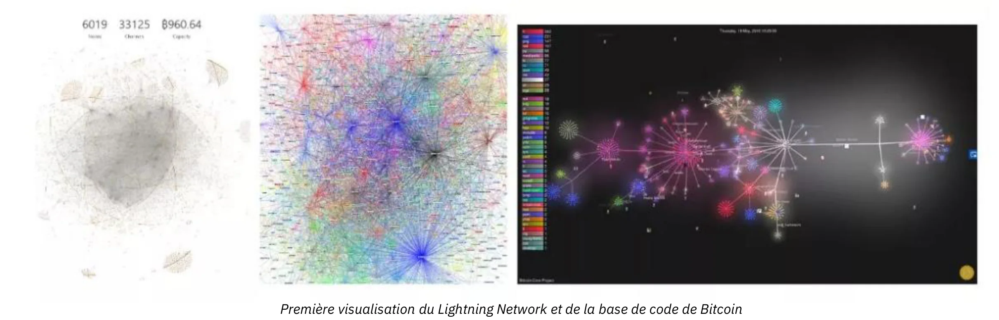

To deepen your knowledge of RGB, we offer a fourth-year training course (please note that it is highly technical):

https://planb.network/courses/3ce1d37c-05ba-4f54-aa15-7586d37b2bb7

These are the main overlay protocols, but there are obviously many others, more or less in use, and new protocols will most likely emerge in the future. The idea behind these extensions is to optimize each layer for a specific task, while preserving the integrity and immutability of the Bitcoin protocol.

This development strategy, which goes against the grain of the crypto industry, has the advantage of not complicating Bitcoin, keeping it simple and therefore secure. The simpler a system is, the more efficient and secure it is. Reducing its functionality to the essentials reduces its attack surface, and a smaller attack surface means a more secure system. Bitcoin excels at just one thing, and does it perfectly. Other uses involve systems that connect to Bitcoin and attempt, to varying degrees, to benefit from its features while offering others.

**Did you know**? The Internet wasn't built in a single step. It's based on a stack of interdependent protocol layers, such as TCP/IP for network communication, HTTP for the web, and other specialized protocols. Each of these layers is optimized for a specific function, ensuring an efficient, modular system. Bitcoin adopts the same approach, building on its core network as a solid foundation, while developing additional solutions to meet specific user needs.

### Integration tools for retailers

Today, there are a number of solutions for merchants wishing to accept Bitcoin as a means of payment. For small businesses wishing to set up informally, simply install a hot wallet, or even a Lightning wallet, to receive payments directly on it. Larger companies needing to keep accounts, on the other hand, will have to opt for a specialized payment processing system. Several options are available in this field too.

For those who prefer to avoid the hassle and receive fiat currency directly into their bank account, there are custodial solutions such as Open Node :

https://planb.network/tutorials/business/point-of-sale/open-node-e69a0c1c-47f7-4932-8494-e6f26c3c9784

For merchants ready to get their hands dirty and who want complete control over the process, BTCPay Server software is an excellent option. However, the major drawback of BTCPay Server is that it's time-consuming to set up and manage, and requires a certain amount of technical expertise:

https://planb.network/tutorials/business/point-of-sale/btcpay-server-928eb01e-824b-4b57-a3e8-8727633beddc

Between these 2 solutions, there's Swiss Bitcoin Pay, which offers a very interesting compromise between ease of use, functionality and security. This solution is just as suitable for very small businesses as it is for larger structures:

https://planb.network/tutorials/business/point-of-sale/swiss-bitcoin-pay-2-a78b057e-ed11-47ac-860c-71019fcb451a

Accepting Bitcoin offers many practical and financial advantages for a business. Like cash, Bitcoin enables direct payments between customer and merchant, without the need to go through a traditional bank. Bitcoin payments via Lightning are instant and final, reducing the risk of bank refunds. What's more, by keeping the bitcoins directly (self-custody), the merchant strengthens the financial autonomy of his business.

The Bitcoin also reduces fees by eliminating bank commissions and payment terminal costs: all you need is a smartphone or computer. Even when using payment intermediaries, fees are generally lower than those charged by banks.

Unlike traditional currencies, which are subject to inflation, bitcoins are limited to 21 million units, offering merchants an effective way of preserving and diversifying their company's cash flow over the long term.

On a day-to-day basis, Bitcoin simplifies transactions by eliminating the need for a physical cash register, the risk of theft and the possibility of counterfeit bills. What's more, it's a global currency, advantageous for international customers since it requires no foreign exchange. For online businesses, Bitcoin is particularly efficient and secure.

Finally, accepting Bitcoin is also an excellent marketing strategy. It positions a business as innovative and attracts new customers, particularly from Generation Z. Accepting Bitcoin therefore represents a low-risk strategic opportunity, with costs essentially limited to the time it takes to set up, which is now quick and easy to achieve with the right tools.

If you'd like to learn more about integrating Bitcoin into businesses, whether as a means of payment, a cash investment or both, we have a first-year training course specially designed for you:

https://planb.network/courses/a804c4b6-9ff5-4a29-a530-7d2f5d04bb7a

Bitcoin as a currency continues to gain ground, with increasing adoption in many sectors. The rise of Lightning Network has also significantly reduced transaction costs and accelerated payments, making Bitcoin even more attractive to merchants.

We're now at a stage where everyone can get involved in the Bitcoin ecosystem. Whether using it in everyday life, integrating it into a business, participating in education, contributing to the development of code or innovating through new uses, Bitcoin has become an unstoppable phenomenon.

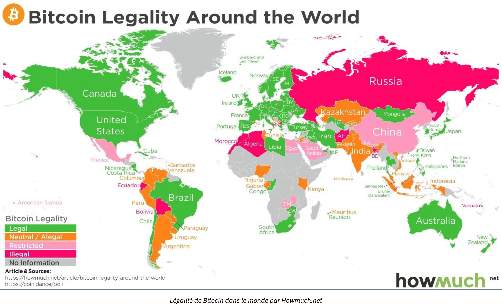

### My personal viewpoint

The image of Bitcoin's highway is, in my opinion, one of the most apt metaphors for the evolution of its ecosystem and the place it will occupy in the future. Bitcoin is not just a digital currency, it's an **alternative financial system** in full maturation, with its strengths and imperfections. Although still young and facing various challenges, its resilience is undeniable. It will not disappear. On the contrary, it will gradually absorb all that surrounds it, like a black hole, until it establishes itself as an essential monetary standard.

Think of Bitcoin as a road on which you travel. Today, to meet certain essential needs (buying food, paying for a service, repairing a vehicle) you sometimes have to leave this road, i.e. temporarily return to the old financial system. The infrastructure around Bitcoin is still under construction, and certain commodities remain inaccessible without using state currencies and traditional banks.

Over time, however, this road will evolve into a veritable highway. The infrastructure will be sufficiently developed for the majority of transactions and exchanges to take place natively in bitcoins, without the need for conversion to another currency. Once this transformation is complete, the vast majority of monetary traffic will take place at full speed on the Bitcoin highway, while a tiny proportion of users will continue to slow down or stop to interact with the old financial system.

At this point, the need to leave the Bitcoin ecosystem will become marginal. Goods and services will be directly accessible via the Bitcoin system, and the very idea of returning to traditional monetary systems will seem inefficient, risky and obsolete. This will be a natural transition: those who remain attached to the old system won't disappear, but they will see their model lose relevance and appeal.

It's this vision that seems to me the most realistic for the future of Bitcoin. It may not totally replace the old system, but it will eventually **exceed it in efficiency, safety and adoption**, until it becomes the norm for the majority of the world's population.

If memory serves, it was Andreas Antonopoulos who introduced the idea of the Bitcoin highway. His analysis continues to be relevant, and each advance in the ecosystem brings us a little closer to this reality. [@aantonop](https://x.com/aantonop)

In the next section of the course, we'll get down to the nitty-gritty of defining and choosing your bitcoiner profile based on your personal situation and goals.

# Setting up your plan

<partId>3801faf6-7915-56fa-baf5-ee63ad03b7cf</partId>

## Choose your profile

<chapterId>c5d87903-a5f2-5eec-887a-f662734ce49b</chapterId>

Having studied the theoretical underpinnings of Bitcoin, it's now time to get practical. The aim is to understand how to acquire your first bitcoins, how to secure them effectively and how to adapt your approach according to your personal profile. This section of the course will help you identify the type of user you are, so that you can adopt the strategy best suited to your personal needs and constraints.

Bitcoin is not an asset like any other. It requires a well-thought-out approach and a clear understanding of the technical and economic implications of its use. Unlike traditional currencies, it is based on a model of individual sovereignty, where the user is fully responsible for the management and security of his or her funds. As we have seen in previous chapters, this financial autonomy is an advantage, but it also implies following specific best practices, which we will explore in the next sections.

In this training course, we assume that you are a Bitcoin beginner. So we'll be focusing on solutions that are simple, quick to implement and suitable for first-time users. We won't deal with indirect exposure to Bitcoin, such as mining, buying shares in companies linked to Bitcoin or complex financial strategies. Above all, our aim is to help you choose the right wallet for your situation, and find the best way to acquire your first bitcoins safely.

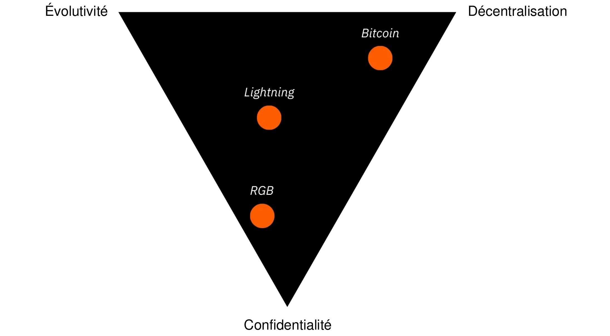

### Why define your user profile?

There is no one-size-fits-all approach to acquiring and managing BTC. Each user has specific needs, influenced by his or her financial situation, level of knowledge, and expectations of Bitcoin. So it's important to adopt a coherent strategy that aligns with your personal profile. Understanding your own approach will enable you to optimize your experience and avoid the common mistakes associated with poor anticipation of your needs.

There are several factors to consider when determining the best strategy for acquiring and storing your bitcoins:

- **The amount you want to invest**: Are you buying a small sum to discover Bitcoin without taking any significant risk, or are you considering a larger investment intended to be held over the long term?
- **Your investment frequency**: Do you want to buy all at once and secure your funds immediately, or do you prefer to spread your purchases over a long period, using strategies like *Dollar-Cost Averaging* (DCA) to smooth your purchase price and minimize the impact of volatility?
- **What you want to do with your bitcoins**: do you want to keep them as long-term savings, use them as a means of daily payment, or both at the same time?
- **Your sensitivity to privacy**: Do you agree to provide personal information and go through centralized platforms to acquire your bitcoins, or do you prefer more privacy-friendly methods, such as peer-to-peer exchanges without KYC?
- **Your geographical, legal and personal context**: Depending on your country of residence, access to certain exchange platforms may be restricted, and tax or regulatory obligations may influence your choices regarding the storage and use of Bitcoin.

Each of these factors has a direct impact on the solutions best suited to your profile. Some will prefer simplicity and speed via regulated services, while others will opt for more autonomous and confidential methods.

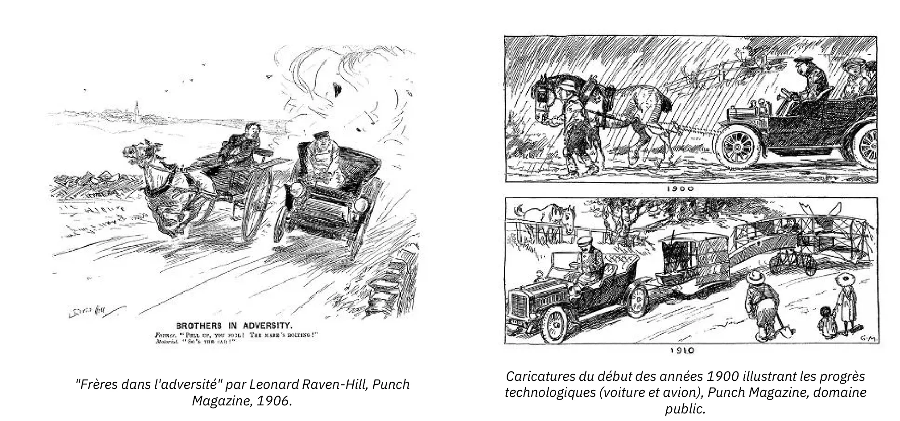

That's what we're going to look at: what are the different approaches available for acquiring and securing your bitcoins, so that you can make informed choices based on your profile and objectives?

### The main criteria for defining your profile

Determining the best strategy for acquiring and securing your bitcoins requires a thorough analysis of your personal situation. Several factors influence these choices, including the risks to which you are exposed, your lifestyle and the use you wish to make of your bitcoins.

#### Potential risks and threats

The level of security you need depends on the specific threats you may face. Identifying these risks will help you choose the most appropriate tools and strategies. Among the main threats to consider are :

- **Hacking**: If you're unfamiliar with cybersecurity or use vulnerable devices, you could be a target for online attacks. Secure offline storage may be recommended.
- **Physical attack**: Unfortunately, it's not uncommon for bitcoiners to be targeted by physical attacks, whether through burglary, robbery or even kidnapping. Although this risk remains relatively rare and mainly concerns well-known personalities at the moment, it is important to take it into account from the outset in your security strategy.
- **Natural disasters**: If you live in an area prone to fires, floods or other extreme weather events, it's important to consider a suitable backup solution that protects your private keys.
- **Government confiscation**: If your country applies strict or unstable financial regulations, you could face restrictions on buying or using your bitcoins. In this case, solutions favoring privacy and self-custody should be preferred.
- **Loss of memory or information** : Private key management relies on the ability to store and retrieve information. If you think you may be vulnerable to memory loss or any other health problem, it's important to adopt reliable backup solutions, and even involve a trusted person in your security plan.

To better understand your vulnerabilities, rate each risk on a scale from 0 (low) to 10 (high). This analysis will help you to identify priority threats and put in place the appropriate protection measures.

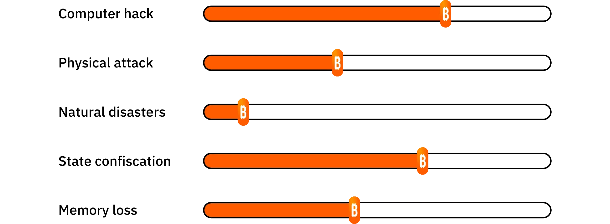

#### Lifestyle and personal habits

Your daily life also influences the way you manage your bitcoins. Adopting a strategy that suits your lifestyle will help you avoid unnecessary complications.

If you don't have a lot of time to devote to Bitcoin, consider simple, automated solutions, such as programmed purchase with automatic withdrawal to a secure wallet. If, on the other hand, you wish to actively manage your security, more advanced solutions such as Multisig may be considered.

Are you comfortable with the technology, or would you prefer a turnkey solution? Some wallets and storage methods require a certain level of expertise, while others are designed to be accessible to beginners.

If you're investing for loved ones or future generations, you need to start thinking about how to pass on your bitcoins now. There are solutions to facilitate succession and ensure that your funds are not lost in the event of incapacity.

How important is protecting your privacy? Some acquisition methods require you to provide personal information (KYC platforms), while others allow greater discretion (peer-to-peer exchanges, Mining, etc.).

#### Using your bitcoins

Your strategy for managing and storing bitcoins also depends on how you intend to use them. It's important to clarify this aspect from the outset.

- **Long-term savings**: You buy bitcoins for investment purposes and don't plan to use them in the short term. You should therefore opt for highly secure storage and solutions that minimize the risk of unauthorized access.
- **Progressive accumulation**: You regularly invest small amounts in bitcoins, without seeking to speculate in the short term. In this case, an automated DCA solution combined with a secure wallet is an effective approach.
- **Day-to-day expenses**: You use your bitcoins as a means of payment. In this case, it's best to combine an easy-to-access mobile wallet for day-to-day transactions (surely with Lightning) with more secure storage for your savings.
- **Preparing for retirement or passing on your wealth**: You want to store your bitcoins so that you can pass them on to your loved ones at a later date. Strategies such as Multisig with timelock or specific inheritance plans can be put in place to ensure that your funds are neither lost nor accessed too early.

Based on these criteria, you'll be able to choose the best solutions for buying, securing and using your bitcoins in the best way for you.

To simplify this process, it can be broken down into four main elements:

- Your Bitcoin wallet ;
- Your security strategy ;
- Your acquisition method ;
- Your transaction volume.

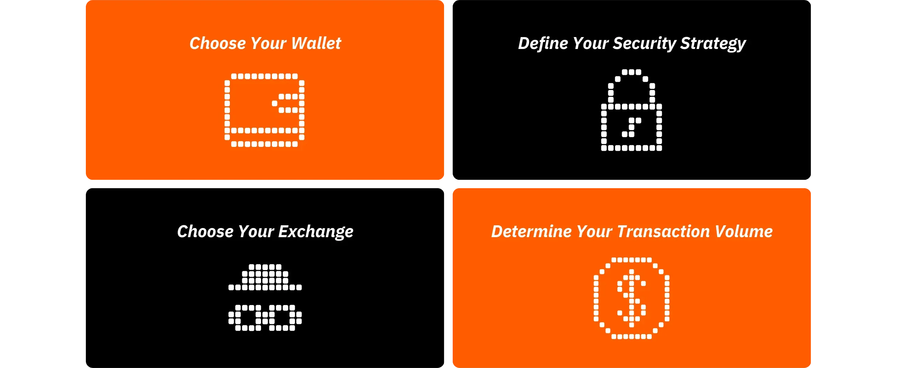

### Portfolios and security strategies

Securing your private keys to your bitcoins is central to your investment and usage strategy. Unlike a traditional bank account, where the institution takes charge of managing your funds, Bitcoin gives you total control over your money. But this autonomy also implies responsibility: **if you lose your private keys, your bitcoins are permanently lost**. There are several types of wallet, each with its own advantages and disadvantages, depending on your profile and needs.

#### Hot Wallet

Hot wallets are Internet-connected software programs for sending and receiving bitcoins. They store your private keys directly on the machine where the software is installed. They are often used for daily transactions or for small reserves of bitcoins. Examples: Blue Wallet, Green Wallet, Sparrow Wallet...

These solutions also include wallets that support Lightning Network, such as BitKit, Phoenix, Wallet of Satoshi...

**Advantages** :

- Ease of use and fast access to funds for day-to-day payments or mobile use;
- Integration with Lightning Network for fast, low-cost transactions

**Disadvantages** :

- Exposure to the risk of hacking, as private keys are stored on a device connected to the Internet and with a very large attack surface.

Hot wallets are suitable for small amounts and for users who need frequent access to their bitcoins. They are not suitable for long-term storage of large sums.

#### Hardware Wallet

Hardware wallets are physical devices designed to generate and store your private keys offline. They offer a much higher level of security than hot wallets, as they are not connected to the Internet and have a reduced attack surface. Examples: Ledger, Trezor, Jade, Coldcard, BitBox...

**Advantages** :

- Offline storage of private keys, reducing the risk of unauthorized access.

**Disadvantages** :

- Longer transaction process, as it requires physical validation on the device;
- Higher initial acquisition cost than a software wallet.

Hardware wallets are highly recommended for those wishing to secure significant amounts over the long term.

#### Multisignature solutions

Multi-signature wallets require several private keys to authorize a transaction. This advanced security model is particularly well-suited to protecting large sums of money, especially for companies, institutions or individuals looking for ultra-secure storage. Thanks to Miniscript, there are now multi-signature systems with timelock that offer a very high level of security. Examples: Liana, Casa, Sparrow, Specter...

**Advantages** :

- Enhanced security: even if a key is compromised, funds remain protected;
- Protection against theft or physical assault;
- Key management can be shared between several people or locations.

**Disadvantages** :

- More complex to set up and more demanding to manage ;
- May require coordination between several parties to complete a transaction;
- Risk of loss of funds if Multisig is mismanaged ;
- Higher initial acquisition cost, potentially requiring the purchase of several hardware wallets.

Multi-signature solutions are suitable for long-term investors, companies and organizations seeking maximum security. They are less suitable for beginners due to their management complexity, although solutions such as Liana are fairly simple to get to grips with.

#### Custodial services and ETFs

Some people choose to store their bitcoins via third-party services, such as exchange platforms, banks or ETFs (exchange-traded funds). These solutions make it possible to expose an investment wallet to Bitcoin without having to manage the holding of private keys yourself, but as we have seen in previous chapters, they entail significant risks that should not be overlooked.

**Advantages** :

- Ease of use, because there's no need to manage security yourself.

**Disadvantages** :

- You don't actually own your bitcoins and are therefore exposed to the risk of loss in the event of bankruptcy, scam, seizure, freezing... (examples: FTX, MtGox...);
- Potentially high costs ;
- Dependence on a trusted third party, which runs counter to the Bitcoin philosophy;
- You don't get all the benefits of Bitcoin in terms of privacy and financial sovereignty.

The adage **"Not your keys, not your bitcoins "** is particularly applicable here. Delegating the storage of your bitcoins to a third-party entity is tantamount to holding a mere claim on those bitcoins, rather than full ownership of the assets.

That's why we don't recommend these solutions, even for beginners. It's better to take the time to learn how to secure your bitcoins yourself and avoid all these unnecessary risks, rather than taking the easy way out and leaving your bitcoins on a Exchange, with all the dangers that entails. But if you're reading this course on how to secure your bitcoins, you've probably already grasped the importance of this principle.

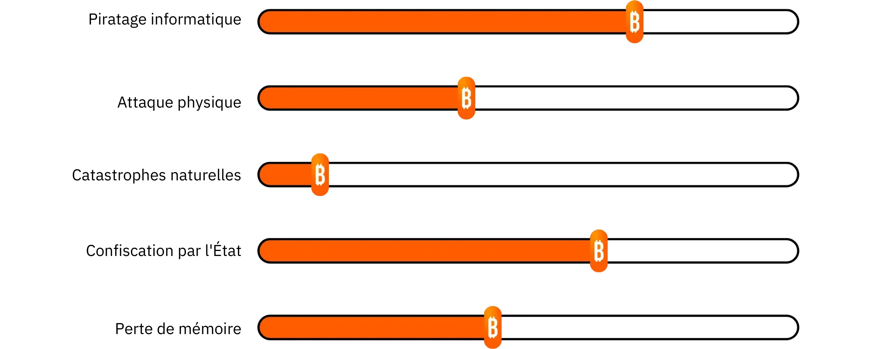

This choice of wallet and security method depends on the amount stored, your level of expertise and perceived threats. But a hybrid approach can also make sense:

- Use a Hot Wallet cell phone or Lightning wallet for everyday transactions;
- Use a Hardware Wallet to secure the majority of your bitcoins, which are your long-term savings.

If your hot wallet accumulates too many bitcoins, you can transfer some of them to your cold wallet. Conversely, if you need more bitcoins for day-to-day expenses, you can withdraw them from your cold wallet savings.

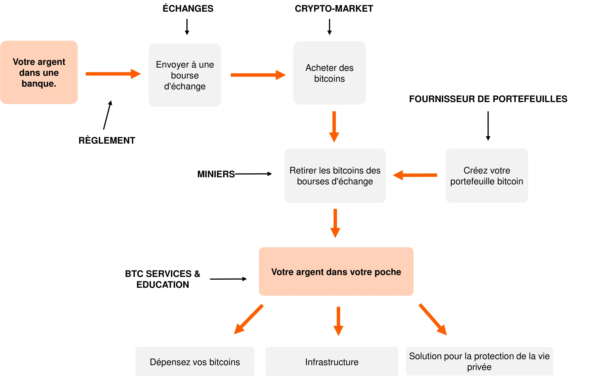

In any case, security depends primarily on how you use it. A good Hardware Wallet is worthless if the mnemonic phrase is lost, leaked or compromised. Caution and discipline are the best protection against bitcoin loss. To learn more about this subject, I highly recommend you also read this article:

https://planb.network/tutorials/wallet/backup/backup-mnemonic-22c0ddfa-fb9f-4e3a-96f9-46e2a7954270

### Acquisition methods and transaction volumes

Acquiring bitcoins can be done in different ways, depending on your need for privacy, the regulations in force in your country and the amount you wish to acquire. There are two main approaches:

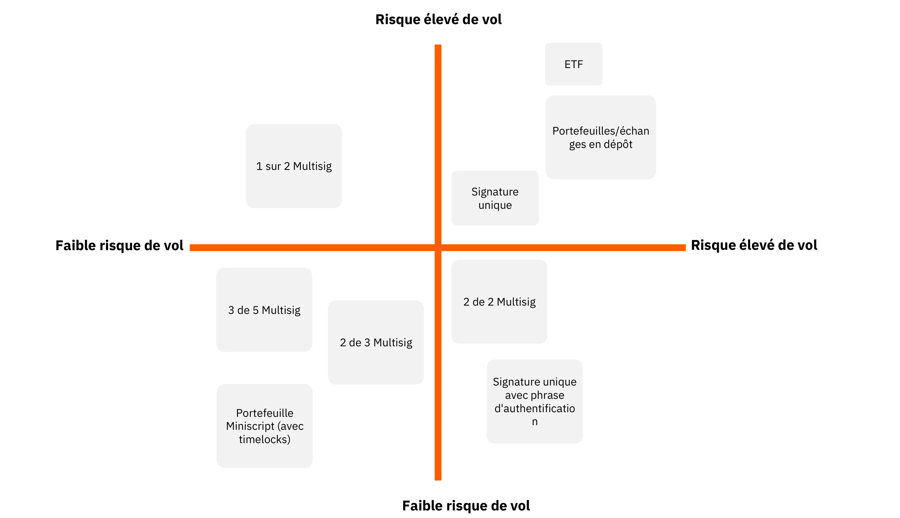

#### Acquisition with identity verification (KYC)

Regulated platforms generally require identity verification before authorizing the purchase of bitcoins. This means you need to provide official documents (passport, ID card, proof of address...) to create an account and access buying and selling services.

**Advantages** :

- Simple purchasing process, often suitable for beginners;
- Possibility of purchasing large amounts at once;
- Access to additional services (DCA, automatic conversion, easy fiat withdrawal) ;
- High liquidity and low bid/ask spread.

**Disadvantages** :

- Can be expensive in conversion and withdrawal fees;
- Some platforms are quite complicated to use and can lose you in the middle of advanced trading features and shitcoins;
- A very problematic approach to your privacy.

Indeed, the main drawback of exchange platforms with KYC lies in the risks to your privacy, which indirectly affect your personal security. KYC enables exchange platforms to associate a real identity with the Bitcoin addresses used for withdrawals. This information becomes an ideal entry point for chain analysis. Once an address has been identified, it may become possible to track all transactions associated with a user, thus compromising onchain privacy. Without additional protection measures, all his activity on Bitcoin can be linked to his identity.

Another major danger is that the state, with access to the databases of regulated platforms, can easily identify individuals who have purchased BTC. While this information may seem innocuous today, it could become problematic in a context of economic or political restrictions. What's more, regulated platforms must report any transactions deemed suspicious, thereby increasing the risk of targeted surveillance by public authorities.

KYC platforms also store a large amount of sensitive data, such as identification documents and proof of address. This storage is often delegated to external service providers who carry out identity verification. In the event of hacking or bankruptcy, this information can be exposed and used for phishing attacks, extortion attempts or even physical theft. Unlike other data leaks, those linked to Bitcoin are particularly risky, as they also reveal potential possession of valuable assets.

So it's important to understand that undergoing KYC is not a trivial step. It's not just an anarchist fad; **it's about your personal security**. By requiring these identity checks from trading platforms, governments are not only violating your natural rights, but also exposing you to indirect risks. Admittedly, using these platforms can be a way of getting started in the world of Bitcoin, but you shouldn't underestimate the dangers this can entail. So consider KYC-free methods of acquiring bitcoins in the future.

#### Acquisition without identity verification (No-KYC)

Buying bitcoins without disclosing your identity is an alternative for those who value their privacy. This approach can be based on several methods:

- **Peer-to-peer (P2P) between private individuals**: Buying directly in cash from a person you trust (friends, family, local network, meetups...) avoids official registration of the transaction and bypasses the banking system. This is undoubtedly the best way to acquire or sell bitcoins, even if it involves risks of aggression, since we're talking about a physical exchange.
- **Platforms specialized in P2P**: Platforms such as Bisq, RoboSats and Peach facilitate exchanges between private individuals without the need for identity verification, using escrow systems to secure transactions. These platforms still present a risk of theft in the event of non-cooperation on the part of the peer, although this risk is reduced thanks to escrow systems.
- **Bitcoin Automated Teller Machines (ATMs)**: Some ATMs allow you to buy bitcoins in cash, although fees are generally high and some require identification above a certain amount.
- **KYC-free exchange platforms**: Some platforms, notably in Switzerland, allow the purchase of small quantities of bitcoins without the need for identity verification.
- **Mining**: It is entirely possible for an individual to participate in Bitcoin mining. Older or smaller machines are accessible and can offer an unconventional method of acquiring bitcoins without going through KYC. By joining a mining pool, you can earn regular income, even with limited equipment. For more information, [check out our mining tutorials](https://planb.network/tutorials/Mining).
- **Payments / Salary in bitcoins**: If you run a business, you can accept payments in bitcoins. If you're an employee, depending on the jurisdiction and type of company you work for, it may be possible to ask to be paid in bitcoins. These options allow you to acquire bitcoins without KYC.

**Advantages** :

- Depending on the method you choose, your privacy is protected to a greater or lesser extent by limiting the possible links between your identity and your activity on Bitcoin ;
- Reduces the risk of censorship, freezing of funds or state interference;
- Access to Bitcoin even in strictly regulated environments.

**Disadvantages** :

- Process often more complex than KYC platforms;
- Lower liquidity and transaction volumes ;
- Premium often present on P2P purchase;
- Greater counterparty risk in exchanges between private individuals (scams, fraud, assault, etc.).

### The 4 typical profiles of bitcoiners

Based on the criteria analyzed above, it is possible to identify several typical Bitcoin user profiles. These profiles are not set in stone, and may evolve over time, but they provide a clear vision of the strategies best suited to each need, and help us choose the right tools for the job.

#### 1. The Hodler

The hodler is an investor who buys Bitcoin with a long-term vision and does not intend to touch it for several years. Unlike the stacker, he doesn't necessarily buy on a recurring basis, but prefers one-off purchases of larger amounts.

Preferred strategy :

- Purchase via a KYC or non-KYC platform depending on the degree of privacy required;
- Storage on a Hardware Wallet or via a multi-signature solution for enhanced security;
- No frequent transactions, so little interaction with the Bitcoin ecosystem.

The hodler views Bitcoin as a store-of-value asset, adopting a posture akin to that of a physical gold investor. His main challenge is to secure his storage while ensuring the eventual transmission of his funds to his heirs.

#### 2. The stacker

The stacker is a user who adopts a progressive accumulation approach. He regularly buys bitcoins in small quantities, often via a *Dollar-Cost Averaging* (DCA) strategy. His aim is to smooth out his purchase price over the long term and minimize the impact of volatility.

Preferred strategy :

- Automated purchase via a KYC platform offering a DCA option;
- Regular transfer of funds to a Hardware Wallet for secure storage ;
- Moderate sensitivity to privacy, but priority given to security and ease of accumulation.

The stacker is not looking for short-term speculation or frequent use of his bitcoins. He sees Bitcoin as a savings account for several years, even decades. What distinguishes the stacker from the hodler is his acquisition method and transaction volumes.

#### 3. The active user

The active user sees Bitcoin primarily as a medium of exchange and not just as a store of value. He uses it regularly for transactions, payments or as part of a circular economy.

Preferred strategy :

- Using a Hot Wallet on a cell phone or computer for daily transactions ;
- Using Lightning Network for fast, low-cost payments ;
- Hybrid management between a mobile wallet for expenses and a Hardware Wallet for savings;
- Variable sensitivity to privacy depending on needs.

The active user may be an entrepreneur, a freelancer or simply someone living in an environment where Bitcoin may be a common means of payment. His priority is convenience, with a balance between security and accessibility.

#### 4. The paranoid

The paranoid is an advanced user who attaches great importance to privacy and security. He sees Bitcoin as a tool for individual emancipation and wants to minimize his exposure to trusted third parties and regulations as much as possible.

Preferred strategy :

- Acquisition exclusively through non-KYC channels;
- Reinforced wallets with passphrase BIP39 and multi-signature solutions ;
- Storage on multiple physical media in different locations;
- No interaction with centralized services that could compromise privacy.

This profile is particularly suited to people living in environments hostile to Bitcoin, where possession or use of BTC could result in sanctions. It's a more complex approach, requiring a degree of technical expertise and strict discipline to avoid any loss of access to funds.

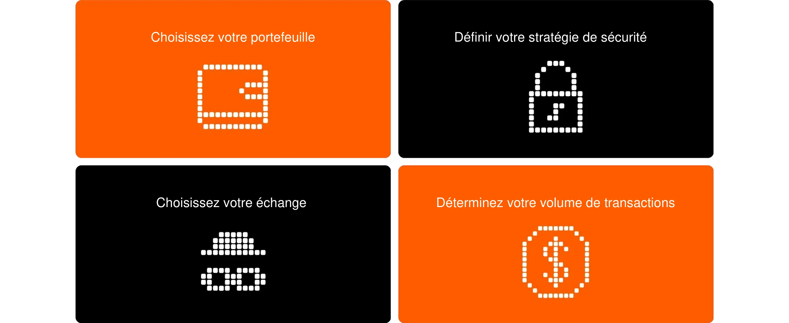

### Which profile is right for you?

These profiles are obviously not exclusive, and can be combined or even evolve over time. A user can be both a stacker and a hodler, or paranoid about saving money while still being an active daily user. It is also possible to start out as a stacker, then evolve over time into an active user and paranoid.

**The important thing is to adapt your approach to your situation and your long-term vision

In the following chapters, we'll look at each profile in detail, so that you can identify and apply the method that's right for you. We'll also explore the tools best suited to each profile, enabling you to implement your own acquisition and securing strategy.

## The Hodler: investing for the long term

<chapterId>baf1adc2-3828-5265-8ee5-130be547585c</chapterId>

In the Bitcoin community, the term "Hodler" refers to an investor who adopts a very long-term investment strategy. Originating from a meme that appeared on the Bitcoin Talk forum several years ago, the word "HODL" is a deliberate distortion of the word "hold", symbolizing the idea of holding on to one's bitcoins no matter what, without worrying about short-term market fluctuations.

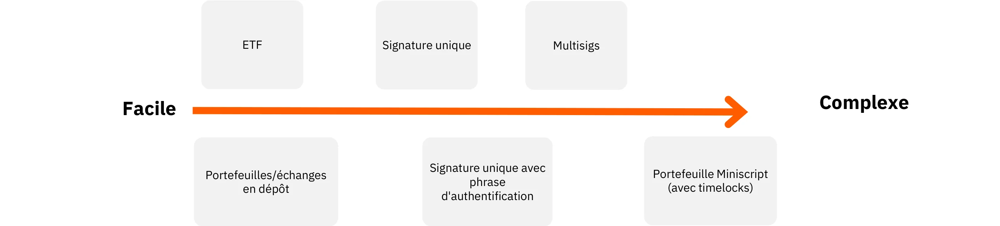

The hodler is convinced by Bitcoin's value proposition. With only 21 million bitcoins in existence at term, the hodler sees this asset as a store of value.

### Why adopt a hodling strategy?

Hodling has historically been the most profitable strategy for the majority of non-professional investors, as it eliminates the need to predict market movements, an extremely difficult and stressful task. By buying and holding bitcoins, the hodler spares himself the emotional volatility of trading and avoids making impulsive, often losing decisions.

Historically, Bitcoin has evolved in cycles marked by periods of strong growth, followed by significant corrections and sometimes long periods of calm. For example, between 2013 and 2025, Bitcoin went through several bull runs and bear markets, with temporary losses of up to 80% of its value. For a hodler, these periods are particularly trying, but they are usually followed by long-term recoveries.

Understanding these cycles allows you to better manage your emotions. A seasoned hodler knows that there's no point in trying to sell at the top or buy at the bottom, as these strategies usually fail. On the other hand, prolonged and disciplined holding has historically paid off.

### Investment plan for a Hodler

The hodler therefore adopts a long-term investment approach. His main objective is to hold on to his bitcoins for several years, regardless of market fluctuations. He's not looking to trade or spend his bitcoins, but to accumulate and secure them with a simple, robust strategy. The investment plan for a hodler is based on a few essential steps that guarantee optimal security and minimal fund management:

#### 1. Choosing and configuring a Hardware Wallet

First and foremost, a hodler needs to secure his funds by using a Hardware Wallet, a device for storing the private keys giving access to his bitcoins offline, safe from computer attacks. Here are several comprehensive tutorials on solutions that will suit the hodler's profile:

https://planb.network/tutorials/wallet/hardware/coldcard-q-73e86d1a-6fe6-4d8b-bb15-8690298020e3

https://planb.network/tutorials/wallet/hardware/jade-plus-green-873099a4-35ec-4be8-b31a-6e7cd6a41ec0

https://planb.network/tutorials/wallet/hardware/ledger-nano-s-plus-75043cb3-2e8e-43e8-862d-ca243b8215a4

https://planb.network/tutorials/wallet/hardware/ledger-flex-3728773e-74d4-4177-b39f-bd923700c76a

https://planb.network/tutorials/wallet/hardware/passport-74e53858-3fa2-43f9-b866-573297546236

https://planb.network/tutorials/wallet/hardware/bitbox02-6af8940f-e19b-4008-8c83-81017032608c

Once the wallet has been set up, it's important to save the 12- or 24-word mnemonic phrase on a durable physical medium. To find out more about which medium to choose for your phrase, follow this tutorial:

https://planb.network/tutorials/wallet/backup/backup-mnemonic-22c0ddfa-fb9f-4e3a-96f9-46e2a7954270

The hodler may also want to strengthen the security of his wallet over the long term. Depending on the amounts to be secured, he could opt for a multi-signature wallet with timelock :

https://planb.network/tutorials/wallet/desktop/liana-306ef457-700c-4fdd-b07a-8fb7a8a29f04

Or it could set up a passphrase BIP39 :

https://planb.network/tutorials/wallet/backup/passphrase-a26a0220-806c-44b4-af14-bafdeb1adce7

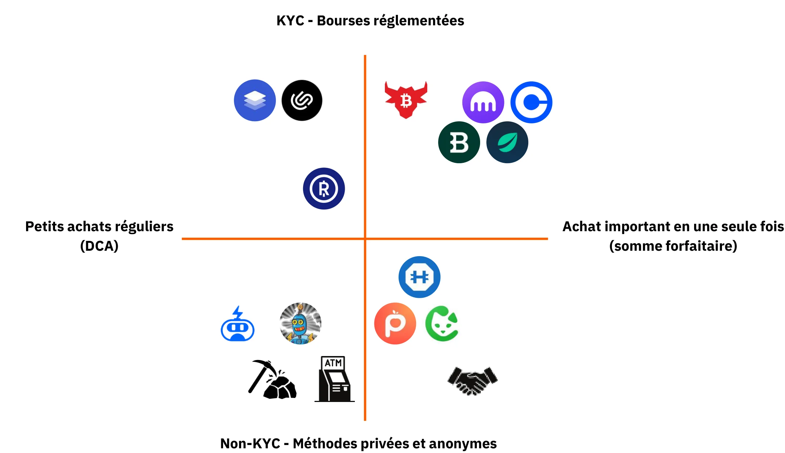

#### 2. Buy Bitcoin on a platform and remove it

A hodler is not likely to leave his bitcoins on an exchange platform, as these present a risk of piracy, seizure or bankruptcy. The hodler prefers to keep his funds safe, so he withdraws them on his Hardware Wallet.

The hodler is a high-volume business. He'll be looking for a platform that offers sufficient liquidity. Here are several comprehensive tutorials on platforms suited to this profile:

https://planb.network/tutorials/exchange/centralized/bitfinex-dc306d39-bd96-4ab9-a278-a322316716db

https://planb.network/tutorials/exchange/centralized/kraken-1ef03e25-9b42-49bd-a47d-249e1a13cfc6

https://planb.network/tutorials/exchange/centralized/bitstamp-5a36c896-bff5-46d7-b505-ff069c3ac47c

https://planb.network/tutorials/exchange/centralized/bull-bitcoin-europe-0ccf713e-efcd-44ec-8205-211f49ac7d53

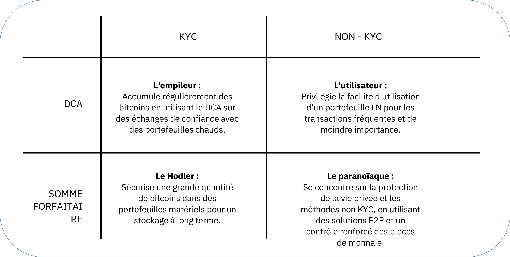

The hodler can also adopt a hybrid profile with the stacker. Instead of limiting himself to one-off purchases, he could also make small, regular purchases. In this case, he could implement a *Dollar Cost Averaging* (DCA) acquisition strategy.

#### 3. Setting up a succession plan

An aspect often overlooked is the transfer of bitcoins in the event of incapacity or death. Unlike traditional assets, Bitcoin offers no recovery solution if private keys are lost. It is therefore important to anticipate this aspect from the outset.

Action plan :

- Draw up a detailed guide explaining how to access funds in the event of incapacity;
- Use a multi-signature solution to guarantee secure access while reducing the risk of accidental loss;
- Entrust part of the information to a trusted person.

We'll go into more detail on this specific point in the last section of the course.

#### 4. Waiting for several cycles

The hodler takes a long-term view, which means resisting market fluctuations and not panicking during bearish corrections or sharp rises.

A few recommendations:

- Periodically check the status of the wallet, but avoid too-frequent consultations, which can lead to impulsive decisions;
- Do not sell under the pressure of down cycles, Bitcoin works in cycles, and corrections are normal in a market ;
- Keep abreast of Bitcoin developments (especially technical ones), without being influenced by the traditional media, which often feeds fear during market downturns;
- Set up regular wallet monitoring: Now that your wallet is set up, it's important to set up regular monitoring. Periodically, check that your mnemonic phrase is still present at its storage location and that its opaque envelope has not been opened. During these checks, you can also open the envelope to examine the condition of the media. Make sure that it is undamaged and that the sentence is still perfectly legible. If there are any signs of damage, it's best to create a new copy from your Hardware Wallet. You can also check that your hardware wallets are working properly on a regular basis.

To keep track of your Bitcoin wallet more easily, there are tools available for setting up a "watch-only" Wallet. Using your wallet's public keys, you can monitor your transactions and balances, for example via a mobile application, without compromising the security of your private keys, which remain stored exclusively on your Hardware Wallet.

https://planb.network/tutorials/wallet/mobile/blockstream-green-watch-only-66c3bc5a-5fa1-40ef-9998-6d6f7f2810fb

The hodler's investment plan is therefore based on a simple but rigorous strategy: buy, secure, forget. His main challenge is not technical, since wallet configuration is fairly straightforward, but psychological: resist the temptation to sell too soon, and don't let yourself be influenced by market volatility.

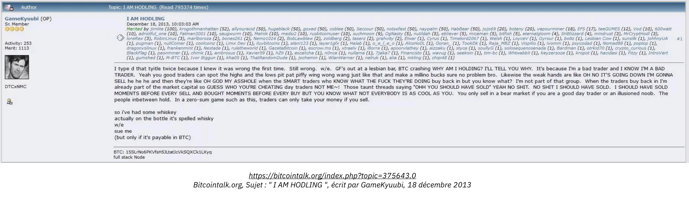

### Assessing your Hodler profile

If you recognize yourself in these personality traits, you're probably a natural Hodler:

- **Patience**: A hodler is exceptionally patient. He's prepared to hold on to his bitcoins for years, even decades, unperturbed by the day-to-day fluctuations of the market. He understands that Bitcoin moves in cycles, and he doesn't panic when the price falls sharply. He knows that corrections are normal, and that the value of Bitcoin is not measured over a few months, but over the long term;
- **Long-term vision** : Hodler has a vision that goes beyond short-term financial gain. He believes in the structural growth of Bitcoin and its gradual worldwide adoption. He believes that, despite volatility, the adoption of Bitcoin is following an upward trajectory, marked by phases of expansion and consolidation. He sees Bitcoin as a sustainable asset, a bulwark for his savings against inflation and a shift in the monetary paradigm;
- **Self-discipline**: One of Hodler's essential qualities is his mental discipline. Paradoxically, his greatest challenge is not to act, but to do nothing. He must resist the temptation to sell during spectacular price rises, or to panic during crashes. The hodler knows that Bitcoin has been through many down cycles, and that those who hold on to their bitcoins over the long term are often those who benefit most;
- **Emotional resilience** : The Bitcoin market is unpredictable and marked by sometimes violent corrections. Yet the hodler doesn't give in to panic. He has integrated the idea that Bitcoin can lose 50% or more of its value in a matter of weeks, without this calling into question its fundamental potential. He has the ability to withstand emotional pressure, and his composure enables him to maintain a rational vision, even in times of uncertainty;
- **Belief in technology**: The Hodler doesn't see Bitcoin as a mere speculative asset. He believes in the technology and its potential to disrupt the monetary system. His commitment often goes beyond the financial aspect: he sees Bitcoin as an alternative to the traditional banking system, a resilient and apolitical currency capable of bringing greater freedom and independence to individuals.

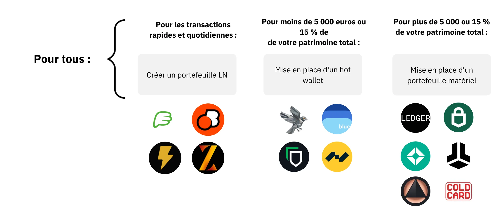

Hodling remains a simple, effective strategy, accessible to all investors, even beginners. In the next chapter, we'll look at a profile similar to that of the hodler: the stacker.

## The Stacker: accumulating satoshis

<chapterId>0daf450d-1b91-5d99-9c31-b52ab52a5e21</chapterId>

In the Bitcoin ecosystem, a stacker is a person who adopts an approach to gradually accumulate satoshis (or "Sats"), the smallest unit of BTC. Rather than investing a large sum all at once, the stacker regularly buys small quantities of bitcoins, whatever the market conditions.

The idea is simple: there will only be around 21 million bitcoins, and every fraction of a Bitcoin counts! The stacker's mission is to accumulate as many Sats as possible.

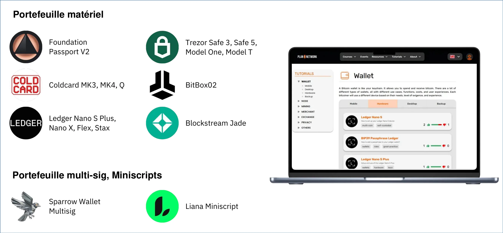

### Why adopt a stacking strategy?

Stacking is a particularly effective investment method for people wishing to reduce their exposure to market volatility while gradually accumulating bitcoins. As opposed to a one-off purchase or a speculative market-timing strategy, stackers generally use the *Dollar-Cost Averaging* (DCA) technique. This involves investing a fixed amount at regular intervals (every day, week, month...), irrespective of the Bitcoin price at the time.

The advantages of stacking :

- **Reduced volatility**: By buying on a recurring basis, the stacker reduces the impact of volatility on his overall investment, since he automatically buys more units when prices are low and fewer when they are high. This smoothes the average purchase price and reduces the stress associated with fluctuations.
- **Affordability**: You don't need a lot of capital to start with. It's possible to start with as little as €10 a month to get the hang of things, and then increase the DCA amount at a later date.
- **Discipline and automation** : Stacking allows you to accumulate without being influenced by market emotions. Automated purchasing greatly reduces the risk of irrational decision-making.
- **Ideal strategy for the long term**: By investing gradually, the stacker maximizes his chances of capturing bullish cycles while mitigating risks on corrections.

This method is **particularly suitable for beginners**, as it allows you to enter Bitcoin without worrying about price and without trying to anticipate market movements (a common mistake among new investors).

### Stacker investment plan

The stacker's objective is to establish a sustainable, automated and secure strategy that enables him to optimize his accumulation over a very long period. Here are the key steps to implementing your stacker investment plan:

#### 1. Choosing the right type of wallet

A stacker needs to be both easy to use and secure over the long term. The choice of wallet is therefore an important step.

- **Hot Wallet** : Ideal for beginners, a mobile or PC-based Wallet makes it easy to receive your first satoshis and make payments as needed. This solution is suitable for small amounts only. The stacker could consider using a Lightning wallet, but the management of On-Chain wallets on these applications is generally less efficient. I would therefore recommend using a genuine On-Chain wallet software. Examples: Green Wallet, Blue Wallet, Sparrow Wallet...

https://planb.network/tutorials/wallet/mobile/aqua-8e6d7dd3-8c03-45cc-90dd-fe3899a7d125

https://planb.network/tutorials/wallet/mobile/Bitkit-Wallet-a7224674-85c4-4045-9baf-37018d89550c

https://planb.network/tutorials/wallet/mobile/blockstream-green-e84edaa9-fb65-48c1-a357-8a5f27996143

https://planb.network/tutorials/wallet/desktop/blockstream-green-desktop-c1503adf-1404-4328-b814-aa97fcf0d5da

https://planb.network/tutorials/wallet/mobile/blue-wallet-2f4093da-6d03-4f26-8378-b9351d0dbc90

https://planb.network/tutorials/wallet/mobile/nunchuk-fc1b553f-5298-4e75-9f34-8af19025f1b1

https://planb.network/tutorials/wallet/desktop/proton-wallet-0bee0bba-ab62-4db0-8c63-b2ad698ca178

https://planb.network/tutorials/wallet/desktop/sparrow-c674e2ac-d46f-4c82-92a7-7d1b0e262f5d

- **Hardware Wallet**: As accumulation progresses, it becomes important to secure funds on a cold wallet to minimize the risk of theft. A serious stacker regularly transfers funds from his hot wallet to a Hardware Wallet. Examples: Bitbox02, Trezor, Ledger, Coldcard, Jade...

https://planb.network/tutorials/wallet/hardware/coldcard-q-73e86d1a-6fe6-4d8b-bb15-8690298020e3

https://planb.network/tutorials/wallet/hardware/jade-plus-green-873099a4-35ec-4be8-b31a-6e7cd6a41ec0

https://planb.network/tutorials/wallet/hardware/ledger-nano-s-plus-75043cb3-2e8e-43e8-862d-ca243b8215a4

https://planb.network/tutorials/wallet/hardware/ledger-flex-3728773e-74d4-4177-b39f-bd923700c76a

https://planb.network/tutorials/wallet/hardware/passport-74e53858-3fa2-43f9-b866-573297546236

https://planb.network/tutorials/wallet/hardware/bitbox02-6af8940f-e19b-4008-8c83-81017032608c

The simplest strategy for the stacker is to use a hot wallet in combination with a Hardware Wallet. The stacker therefore manages 2 separate Bitcoin wallets. The first is used to receive Satss purchased regularly, weekly or monthly, from the exchange platform (or even better: in P2Ps). The hot wallet is easy and convenient to use. It allows you to quickly take possession of your bitcoins, rather than leaving them on the platform where they could be exposed to risk. However, compared with a Hardware Wallet, the hot wallet offers much less security. The stacker must therefore regularly transfer his funds to his cold wallet to secure his long-term savings and avoid keeping too many funds in the hot wallet. During this operation, the stacker can also consolidate his UTXOs, i.e. group together several small pieces of bitcoins acquired in DCA into a single large UTXO on the cold wallet.

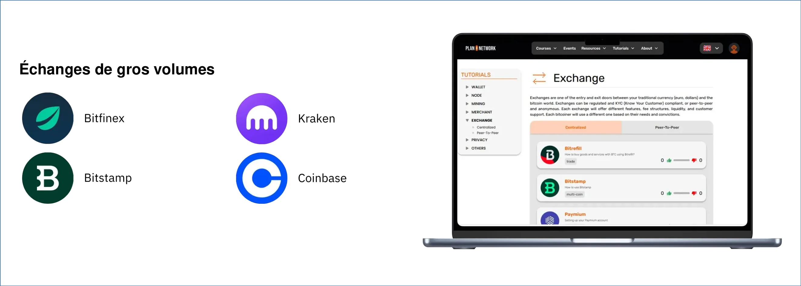

#### 2. Set up a DCA purchasing plan

Dollar-Cost Averaging* (DCA) is an investment strategy that involves buying fractions of BTC at regular intervals, regardless of price. To effectively structure a DCA purchase plan, 2 elements need to be determined:

- **Purchase frequency**: Do you want to buy every week, every two weeks, or every month? This choice depends on your financial situation and long-term objectives. But it's still advisable to opt for a frequency that's not too short, to avoid the multiplication of UTXOs of very small amounts, which could pose problems for optimizing transaction fees in the future.
- **The purchase amount**: Your accumulation budget should be determined according to your savings capacity and the portion of your assets you wish to allocate to the Bitcoin. You need to adopt a realistic approach to avoid overestimating your investment capacity and putting yourself in financial difficulty. The most important aspect of a DCA strategy is not the amount invested in each cycle, but consistency over the long term. It's better to invest a moderate amount on a regular basis over several years than to force yourself to buy too large sums on an irregular basis, which could affect your financial equilibrium. Of course, this amount can change over time as your investment capacity evolves.

Next, you have two options for setting up your CAD: to automate it or not. Nowadays, most regulated trading platforms offer the possibility of setting up an automated ACH. All you need is enough fiat currency in your account, and the platform will automatically execute your buy order according to the parameters you have defined. There are also a growing number of platforms specializing in ACH automation, offering additional services such as automatic withdrawal to your self-custody wallet or rounding off your daily expenses. If you use a regulated platform, I strongly advise you to automate your ACH for greater day-to-day peace of mind.

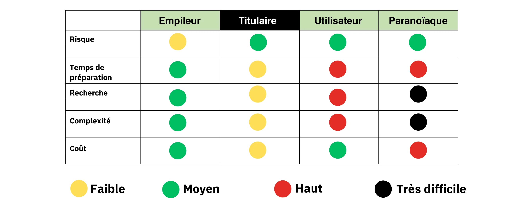

Here are some examples of platforms specializing in DCA:

https://planb.network/tutorials/exchange/centralized/bitstack-29fd71be-9570-42c6-8f6f-cd355d62e746

https://planb.network/tutorials/exchange/centralized/relai-v2-30a9671d-e407-459d-9203-4c3eae15b30e

https://planb.network/tutorials/exchange/centralized/stackinsat-5af6a380-f3c6-4246-9f81-9957a16ab066

And here are a few generalist exchange platforms that support DCA automation:

https://planb.network/tutorials/exchange/centralized/bitfinex-dc306d39-bd96-4ab9-a278-a322316716db

https://planb.network/tutorials/exchange/centralized/bitstamp-5a36c896-bff5-46d7-b505-ff069c3ac47c

https://planb.network/tutorials/exchange/centralized/bull-bitcoin-europe-0ccf713e-efcd-44ec-8205-211f49ac7d53

https://planb.network/tutorials/exchange/centralized/kraken-1ef03e25-9b42-49bd-a47d-249e1a13cfc6

https://planb.network/tutorials/exchange/centralized/paymium-92603f76-b985-49ce-81e5-f4fa0df776e5

Stackers may also wish to optimize their privacy, even if this is not their primary objective. In this case, he should consider using a P2P acquisition method, outside regulated platforms. These methods do not automate DCA purchasing. Consequently, you'll need to be disciplined and follow your buying strategy manually.

https://planb.network/tutorials/exchange/peer-to-peer/bisq-v2-c1c6a702-6c16-4101-8b90-62c424017b80

https://planb.network/tutorials/exchange/peer-to-peer/hodlhodl-d7344cd5-6b18-40f5-8e78-2574a93a3879

https://planb.network/tutorials/exchange/peer-to-peer/lnp2pbot-v2-e6bcb210-610b-487d-970c-7cce85273e3c

https://planb.network/tutorials/exchange/peer-to-peer/peach-c6143241-d900-4047-9b73-1caba5e1f874

https://planb.network/tutorials/exchange/peer-to-peer/robosats-b60e4f7c-533a-4295-9f6d-5368152e8c06

#### 3. Withdrawing and securing bitcoins

Once the wallet and recurring purchase have been set up, the stacker's task becomes relatively straightforward. All he has to do is withdraw his bitcoins from the exchange platform and regularly transfer his funds to his Hardware Wallet to ensure long-term security. Then, all the stacker has to do is wait.

#### 4. Waiting for several cycles

Like the hodler, the stacker takes a long-term view, which means it has to withstand market fluctuations and not panic during downward corrections or sharp rises.

A few recommendations:

- Periodically check the status of wallets, but avoid too-frequent consultations, which can lead to impulsive decisions;
- Do not sell under the pressure of bearish cycles, Bitcoin works in cycles, and corrections are normal in a market ;
- Keep abreast of Bitcoin developments (especially technical ones), without being influenced by the traditional media, which often feeds fear during market downturns;
- Set up regular wallet monitoring: Now that your wallets are set up, it's important to set up regular monitoring. Periodically, check that your mnemonic phrase is still present at its storage location and that its opaque envelope has not been opened. During these checks, you can also open the envelope to examine the condition of the media. Make sure that it is undamaged and that the sentence is still perfectly legible. If there are any signs of damage, it's best to create a new copy from your Hardware Wallet. You can also check your hardware wallets regularly.

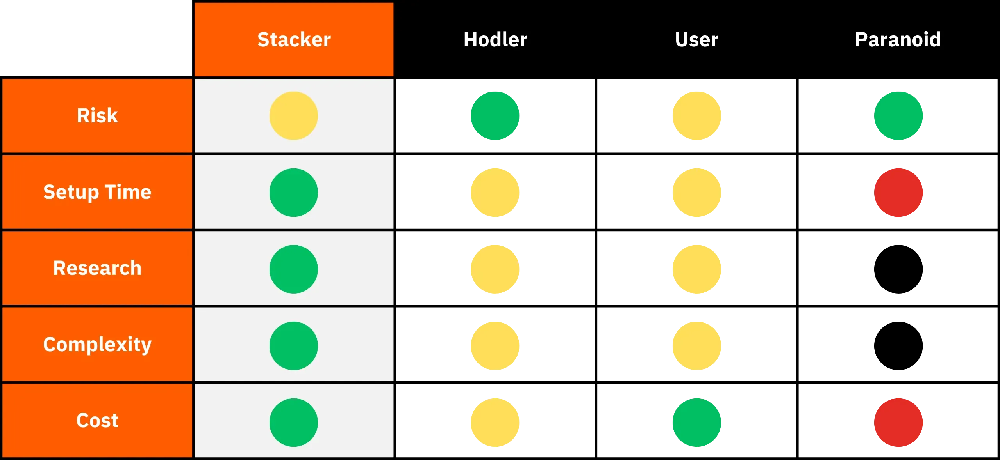

To keep track of your Bitcoin wallets more easily, there are tools available for setting up a "watch-only" Wallet. Using your wallet's public keys, you can monitor your transactions and balances, for example via a mobile application, without compromising the security of your private keys, which remain stored exclusively on your Hardware Wallet.

https://planb.network/tutorials/wallet/mobile/blockstream-green-watch-only-66c3bc5a-5fa1-40ef-9998-6d6f7f2810fb

### Evaluate your stacker profile

The stacker's strategy is based on several essential qualities that enable him to maintain investment consistency, while avoiding the pitfalls of emotions and market fluctuations.

- **Organization**: Rigorous financial management and clear planning are essential to maintain recurring purchases without disrupting your personal budget. Stackers must ensure that their accumulation plan is viable over several years.
- **Rigor and discipline**: Stacking means sticking to your investment plan without giving in to emotion. Abruptly changing your strategy in response to sudden market movements can undermine the effectiveness of stacking. Regularity takes precedence over impulsive adjustments. However, it is still possible to make reasonable adjustments, especially if your investment capacity increases.
- **Patience**: The benefits of stacking are not immediately apparent. This strategy works over long cycles, sometimes several years, before offering tangible results. Those who succeed are those who know how to wait, without letting short-term volatility get in the way.
- **Financial knowledge**: Understanding the basics of DCA, risk management and Bitcoin market fundamentals means you can approach investing with peace of mind. An informed stacker is less prone to doubts and irrational decisions in times of high volatility.
- **Long-term vision**: A stacker has a strong belief in the technological potential of Bitcoin. His focus is not on short-term fluctuations, but on the gradual growth of his wallet over the years.

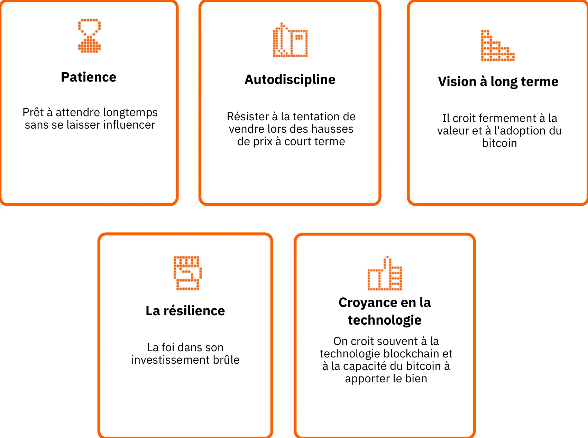

In short, the stacking strategy is suitable for those wishing to accumulate Bitcoin over the long term without spending too much time on it, and reducing the risks associated with volatility. In the next chapter, we'll look at a radically different bitcoiner profile: the active user.

## The User: adopting Bitcoin into your everyday life

<chapterId>e0a022ab-207c-571f-b4ad-c432214a756c</chapterId>

Becoming an active user of Bitcoin means making the choice to integrate this currency into your daily life, far beyond a long-term investment. Unlike the hodler or the stacker, who keep their bitcoins without spending them, the active user sees Bitcoin as a genuine **means of exchange**, enabling him to carry out transactions, pay for goods and services, and participate in the counter-economy.

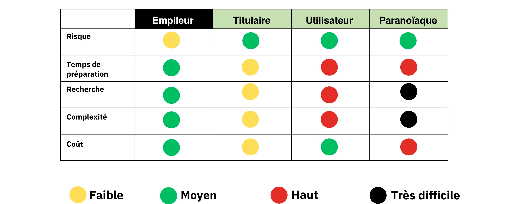

### Why adopt an active user strategy?

Everyday use of Bitcoin offers several significant advantages, both individually and collectively:

- **Directly support the Bitcoin ecosystem by participating in its gradual adoption** :

Each transaction reinforces the use of Bitcoin as a currency and encourages more merchants and services to accept it. It's also important to understand that using Bitcoin as a medium of exchange is tantamount to an act of voting. Indeed, a currency's usefulness derives directly from its ability to facilitate trade rather than barter. If it is not accepted by any trader, it is objectively worthless. The greater the number of goods and services available for purchase with a currency, the more useful that currency is to a given individual. By using the Bitcoin as a means of payment, you choose to spend your money with a merchant who accepts it. You thus direct economic value towards this merchant instead of another. As a result, the merchant who accepts the Bitcoin may see his profits increase thanks to your transaction, while his competitor may see his decrease. On the scale of a group of people, this act leads to wider and wider acceptance of BTC by merchants, and can lead to the natural disappearance of those who refuse to accept it. This creates a virtuous circle that can be initiated by merchants and consumers alike.

- **Take advantage of the unique properties of Bitcoin** :

Bitcoin has a number of interesting features, such as the speed of transactions thanks to Lightning Network, and the absence of censorship, financial supervision and seigniorage. Indeed, Bitcoin's value proposition stems from its ability to remove government control of the money supply and censorship of transactions. If these features translate into benefits for your personal situation, then you may want to consider adopting the active user profile.

- **A better understanding of technology** :

Active use of Bitcoin allows you to gain hands-on experience, familiarize yourself with wallets and explore advanced concepts such as payment privacy or UTXO management. By choosing to use Bitcoin on a daily basis, you will inevitably acquire new knowledge.

However, it is important to take into account certain challenges: technical complexity, price volatility that can affect the value of spending, and the need for good security management to avoid loss of funds.

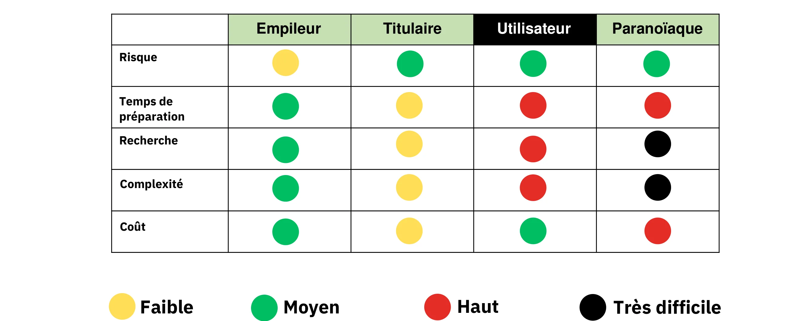

### Investment plan for an active user

Adopting Bitcoin as a daily payment method requires a well-structured approach. Unlike a hodler or stacker, the active user must manage both the long-term security of his funds and the convenience of day-to-day transactions. A good balance between secure cold storage and rapid access to bitcoins is important to optimize this strategy.

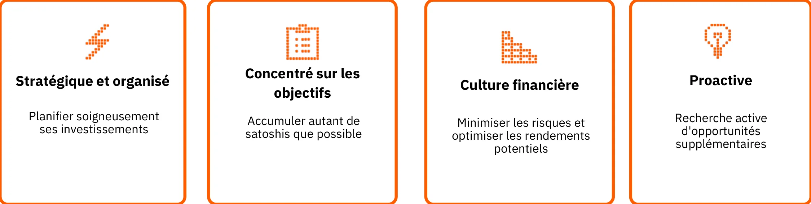

#### 1. Clear separation of wallets

Active users should use 2 different types of wallet to optimize both the security and convenience of their transactions:

- A cold wallet (Hardware Wallet) to secure your long-term savings.

https://planb.network/tutorials/wallet/hardware/coldcard-q-73e86d1a-6fe6-4d8b-bb15-8690298020e3

https://planb.network/tutorials/wallet/hardware/jade-plus-green-873099a4-35ec-4be8-b31a-6e7cd6a41ec0

https://planb.network/tutorials/wallet/hardware/ledger-nano-s-plus-75043cb3-2e8e-43e8-862d-ca243b8215a4

https://planb.network/tutorials/wallet/hardware/ledger-flex-3728773e-74d4-4177-b39f-bd923700c76a

https://planb.network/tutorials/wallet/hardware/passport-74e53858-3fa2-43f9-b866-573297546236

https://planb.network/tutorials/wallet/hardware/bitbox02-6af8940f-e19b-4008-8c83-81017032608c

https://planb.network/tutorials/wallet/hardware/portal-bd6e83f0-0100-4689-aeb3-513cca944ace

https://planb.network/tutorials/wallet/hardware/satochip-e9bc81d9-d59b-420d-9672-3360212237ba

https://planb.network/tutorials/wallet/hardware/seed-signer-ee2c284a-0e23-49a4-b0ca-4a4702072973

https://planb.network/tutorials/wallet/hardware/tapsigner-ab2bcdf9-9509-4908-9a4a-2f2be1e7d5d2

- One or more mobile hot wallets to easily receive and send bitcoins on a daily basis. The active user will often have a On-Chain hot wallet and a Lightning wallet.

https://planb.network/tutorials/wallet/mobile/aqua-8e6d7dd3-8c03-45cc-90dd-fe3899a7d125

https://planb.network/tutorials/wallet/mobile/Bitkit-Wallet-a7224674-85c4-4045-9baf-37018d89550c

https://planb.network/tutorials/wallet/mobile/blink-7ea5f5a4-e728-4ff9-b3f9-cf20aa6fc2bd

https://planb.network/tutorials/wallet/mobile/blixt-04b319cf-8cbe-4027-b26f-840571f2244f

https://planb.network/tutorials/wallet/mobile/blockstream-green-e84edaa9-fb65-48c1-a357-8a5f27996143

https://planb.network/tutorials/wallet/mobile/blue-wallet-2f4093da-6d03-4f26-8378-b9351d0dbc90

https://planb.network/tutorials/wallet/mobile/breez-46a6867b-c74b-45e7-869c-10a4e0263c06

https://planb.network/tutorials/wallet/mobile/lipa-61019fbd-deb7-4b3c-8cda-0402a4b2e780

https://planb.network/tutorials/wallet/mobile/nunchuk-fc1b553f-5298-4e75-9f34-8af19025f1b1

https://planb.network/tutorials/wallet/mobile/phoenix-0f681345-abff-4bdc-819c-4ae800129cdf

https://planb.network/tutorials/wallet/mobile/wallet-of-satoshi-c4792842-b046-44f9-a6f1-351191b7cc2b

https://planb.network/tutorials/wallet/mobile/zeus-3e89603c-501d-439c-8691-d4a0d0de459b

This separation limits risks in the event of compromise of the wallet used for daily payments.

#### 2. Tying your own knot

Depending on his personal situation, the active user will seek to minimize his dependence on trusted third parties. To achieve this, he will often have his own Bitcoin node, which allows him to be totally independent in his use of the protocol and to protect the privacy of his transactions.

https://planb.network/tutorials/node/bitcoin/bitcoin-core-linux-568c13a6-8746-4d63-8e95-f4a61c5ae0ed

https://planb.network/tutorials/node/bitcoin/bitcoin-core-mac-windows-9684ab02-e0af-41c9-8102-86ac7c7727f3

https://planb.network/tutorials/node/bitcoin/bitcoin-knots-e04b2196-4df2-4246-86ef-c02269c29098

https://planb.network/tutorials/node/bitcoin/raspiblitz-d8cdba2e-a682-46cf-9fdc-d8602fbeac02

https://planb.network/tutorials/node/bitcoin/mynode-a481fef3-2fd3-4df3-91c0-112cffa094eb

https://planb.network/tutorials/node/bitcoin/start9-8c8b6827-8423-4929-bcba-89057670ed6a

If the active user makes frequent use of the Lightning Network, it might also make sense to manage his own LND, LDK or Core-Lightning node and take charge of opening and closing his channels. This will enable him to be independent in his use of the Lightning Network and potentially reduce the fees associated with his daily transactions, compared to using automatically managed Lightning nodes like Phoenix, or even worse, custodial Lightning wallets.

https://planb.network/tutorials/node/lightning-network/alby-hub-62e6356c-6a6d-4134-8f22-c3b6afb9882a

#### 3. Regular acquisition of bitcoins

An active user must maintain a balance between his savings and his stock of bitcoins that can be used on a daily basis.

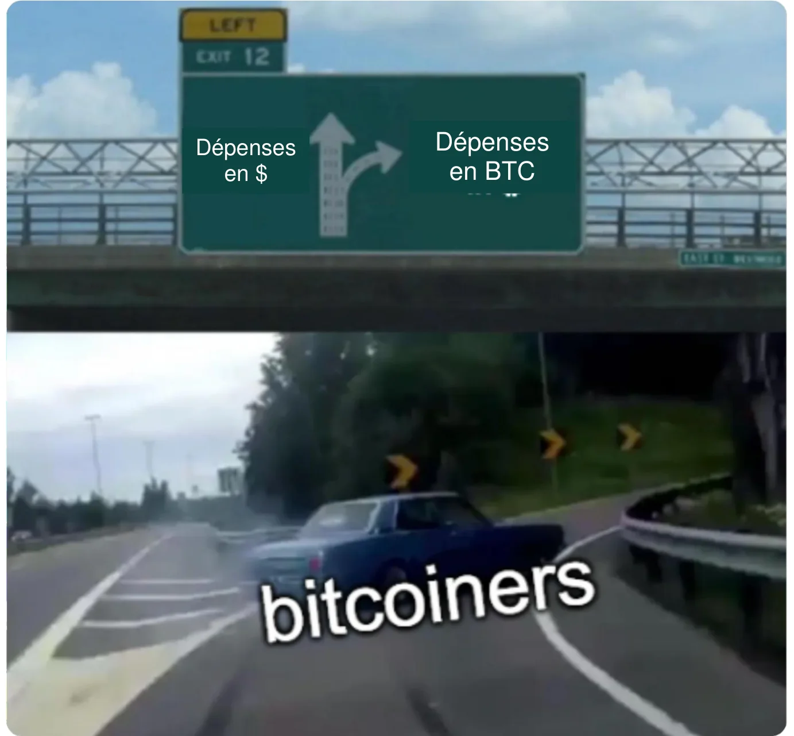

There are several ways of acquiring Bitcoin, depending on the level of privacy required:

- Classic purchase via a regulated platform such as Bitfinex or Bull Bitcoin, ideal for topping up your cold wallet ;

https://planb.network/tutorials/exchange/centralized/bitfinex-dc306d39-bd96-4ab9-a278-a322316716db

https://planb.network/tutorials/exchange/centralized/bitstack-29fd71be-9570-42c6-8f6f-cd355d62e746

https://planb.network/tutorials/exchange/centralized/bitstamp-5a36c896-bff5-46d7-b505-ff069c3ac47c

https://planb.network/tutorials/exchange/centralized/bull-bitcoin-europe-0ccf713e-efcd-44ec-8205-211f49ac7d53

https://planb.network/tutorials/exchange/centralized/kraken-1ef03e25-9b42-49bd-a47d-249e1a13cfc6

https://planb.network/tutorials/exchange/centralized/paymium-92603f76-b985-49ce-81e5-f4fa0df776e5

https://planb.network/tutorials/exchange/centralized/relai-v2-30a9671d-e407-459d-9203-4c3eae15b30e

https://planb.network/tutorials/exchange/centralized/stackinsat-5af6a380-f3c6-4246-9f81-9957a16ab066

- Non-KYC acquisition via peer-to-peer solutions such as Peach, Robosats or Bitcoin ATMs, enabling you to feed your wallet without disclosing personal information;

https://planb.network/tutorials/exchange/peer-to-peer/bisq-v2-c1c6a702-6c16-4101-8b90-62c424017b80

https://planb.network/tutorials/exchange/peer-to-peer/hodlhodl-d7344cd5-6b18-40f5-8e78-2574a93a3879

https://planb.network/tutorials/exchange/peer-to-peer/lnp2pbot-v2-e6bcb210-610b-487d-970c-7cce85273e3c

https://planb.network/tutorials/exchange/peer-to-peer/peach-c6143241-d900-4047-9b73-1caba5e1f874

https://planb.network/tutorials/exchange/peer-to-peer/robosats-b60e4f7c-533a-4295-9f6d-5368152e8c06

- Paying in bitcoins for your income: Being an active Bitcoin user isn't just about spending bitcoins, it's also about earning bitcoins for your work. If you're a company director, you can choose to accept Bitcoin as a means of payment. If you're an employee, you could consider receiving all or part of your salary in BTC if your company offers it.

https://planb.network/tutorials/business/point-of-sale/swiss-bitcoin-pay-2-a78b057e-ed11-47ac-860c-71019fcb451a

https://planb.network/tutorials/business/point-of-sale/open-node-e69a0c1c-47f7-4932-8494-e6f26c3c9784

https://planb.network/tutorials/business/point-of-sale/btcpay-server-928eb01e-824b-4b57-a3e8-8727633beddc

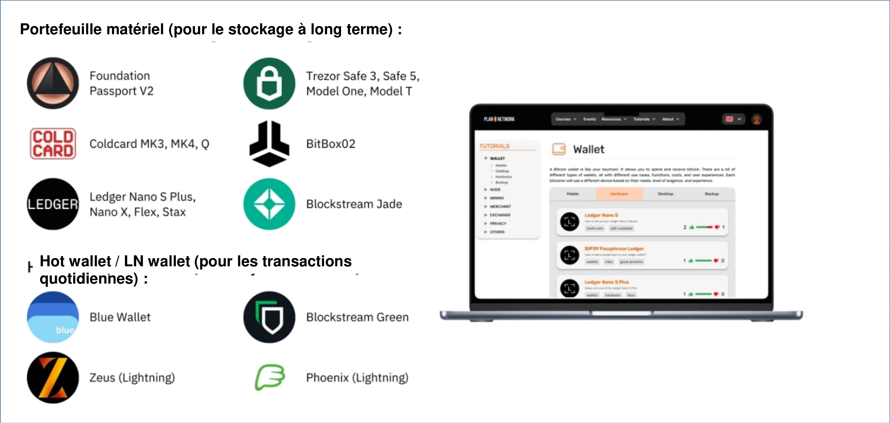

#### 4. Active expense management

The choice of spending bitcoins is often subject to criticism. Some Bitcoin users prefer to spend fiat currencies, which they consider of lesser quality and therefore wish to eliminate, rather than spend bitcoins. However, there are two problems with this thinking: firstly, it overlooks the advantages of Bitcoin as a means of payment (see previous section), and secondly, it raises the question of why hold fiat currency considered inferior for spending?

A more logical approach is "Suspend and Replace", which involves spending bitcoins for all the reasons mentioned above and then, in order not to diminish your bitcoin savings, replacing the spent Sats with new Sats purchased with fiat currency.

To facilitate spending in bitcoins, a number of tools are also available, including [BTC Map](https://btcmap.org/), which lists merchants worldwide accepting Bitcoin. Some of these merchants also offer online ordering with delivery.

As we're in a transitional period where not all the merchants we need on a daily basis accept BTC yet, there are some tricks up our sleeve that may seem rudimentary, but are proving very useful. For example, buying gift cards in bitcoins is a practical option offered by several providers such as Bitrefill, Coinsbee, or The Bitcoin Company.

https://planb.network/tutorials/exchange/centralized/bitrefill-8c588412-1bfc-465b-9bca-e647a647fbc1

#### 5. Technology watch and flexibility

The Bitcoin protocol, overlay systems such as Lightning Network and the entire application layer linked to these ecosystems are evolving rapidly. An active user must therefore :

- Keep abreast of new solutions that make everyday adoption easier;
- Regularly test new tools and services to improve the user experience;
- Adjust its strategy in line with technological advances and market trends.

### Evaluate your active user profile

Are you cut out to be an active Bitcoin user? Here are the essential features:

- **Pragmatism and Commitment:** You are motivated to make Bitcoin part of your daily life and actively participate in the growth of its ecosystem. You are aware of both the benefits and the challenges involved.
- **Technical skills:** You have a good understanding or are ready to acquire in-depth skills in the operation of the Bitcoin and Lightning Network wallets. You are comfortable with advanced technical concepts such as UTXO management.
- **Flexibility and adaptability:** You're ready to test different solutions, change tools and adjust your practices according to the rapid evolution of the Bitcoin ecosystem and your day-to-day needs.
- **Financial discipline:** You are rigorous in managing your spending and saving Bitcoin. You understand the importance of clearly separating your funds for day-to-day use from those set aside for long-term savings.

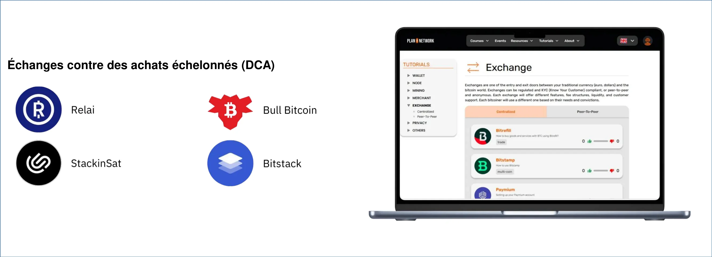

In conclusion, the active user contributes directly to the dynamics of the Bitcoin ecosystem. By making Bitcoin part of their daily routine, they support its adoption and develop their own expertise.

In the next chapter, we'll look at the last typical bitcoiner profile, which is probably the most complex but also the most fascinating: that of the paranoid user.

## The Paranoid: protecting your privacy

<chapterId>5c624acd-662e-5134-ab7a-fb75cde7c3f8</chapterId>

The paranoid bitcoiner makes privacy a top priority. He sees privacy not as a mere comfort, but as a vital necessity in a world where financial surveillance is omnipresent. This profile is often adopted by people aware of the dangers of exposing their personal data, particularly via traditional buying platforms subject to KYC regulations.

For him, every interaction with Bitcoin must be designed to minimize the traces left behind. He knows that every purchase, every transaction and every mistake can compromise his anonymity and make his identity traceable. His goal is to use Bitcoin without ever revealing who he is, where he is or how much he owns.

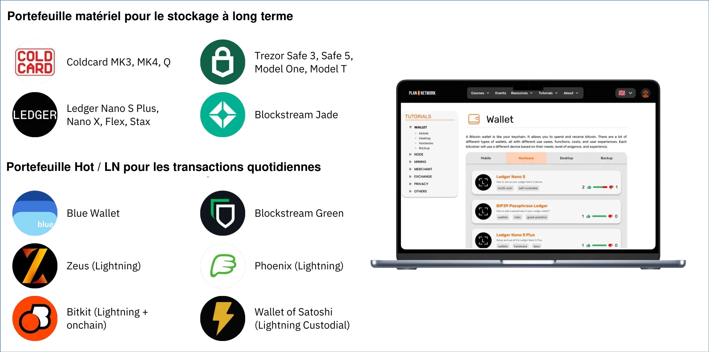

### Why adopt a paranoid strategy?

An approach focused on privacy and security offers several advantages for you:

- **Preserve your financial independence**: avoid surveillance and censorship by banks, governments and centralized platforms.
- **Minimize the risk of confiscation**: in the event of economic repression or political instability, it is more difficult for a third party to identify and seize the paranoid's funds.
- **Reduce your exposure to external threats**: physical computer attacks often target individuals whose identities are associated with large sums of money. Protecting your privacy also means improving your security.
- **Avoid financial discrimination**: some governments or companies apply arbitrary restrictions on transactions based on the user's identity or past actions. Staying confidential protects you from these unfair practices.
- **Respecting the fundamental principle of Bitcoin**: Bitcoin was designed to be an open, censorship-resistant currency. By maximizing its privacy, we fully embrace the original spirit of the project.

Far from being a simple character trait, paranoia here represents a rational approach to the real risks associated with digital security, surveillance, theft and other malicious attacks. This type of user recognizes the need to be constantly vigilant and proactive in preserving their privacy in an increasingly surveilled environment, in order to protect their personal security too.

This approach requires time, knowledge and rigor, but it guarantees total control over your money and financial freedom. Those who choose this path are not just looking for an investment or a means of payment, but true independence from the traditional financial system.

### Paranoid investment plan

The paranoid approach is based on a strict strategy aimed at preserving anonymity and maximizing the security of funds. This type of user seeks to minimize exposure to regulated platforms (KYC), avoid any traceability of transactions and guarantee optimal protection against external threats (government surveillance, cyber-attacks, confiscations...).

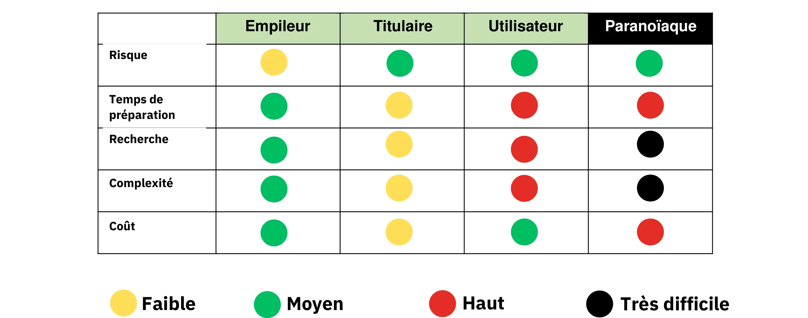

#### 1. Setting up wallets and nodes

A paranoid never mixes his funds according to their origin and use. He adopts a compartmentalized management of his bitcoins using several distinct wallets:

- **A cold wallet (air-gapped and/or DIY)** for long-term bitcoin storage. The paranoid user will prefer advanced, open-source solutions, such as Jade, Coldcard, SeedSigner, Portal or Passport... If possible, he'll buy his Hardware Wallet anonymously, either in cash or bitcoins in a specialized physical store, or by ordering it online from a specialized store offering anonymous locker delivery options and payment in bitcoins. In France, for example, [Bitcoin Bazar](https://bitcoinbazar.fr/) offers this type of service. Check your own country for such stores.

https://planb.network/tutorials/wallet/hardware/jade-plus-sparrow-938abf16-e10a-4618-860d-cd771373a262

https://planb.network/tutorials/wallet/hardware/coldcard-q-advanced-b8cc3f29-eea9-48fe-a953-b003d5b115e0

https://planb.network/tutorials/wallet/hardware/passport-74e53858-3fa2-43f9-b866-573297546236

https://planb.network/tutorials/wallet/hardware/portal-bd6e83f0-0100-4689-aeb3-513cca944ace

- **A hot wallet for everyday transactions**, featuring advanced privacy tools such as Ashigaru, Wasabi Wallet or Sparrow Wallet. These tools offer numerous privacy options, including mini-CoinJoin spending transactions, payjoins, potentially CoinJoin tools, coin control, UTXO tagging, or the ability to connect via your own Bitcoin node.

https://planb.network/tutorials/wallet/desktop/sparrow-c674e2ac-d46f-4c82-92a7-7d1b0e262f5d

https://planb.network/tutorials/wallet/desktop/wasabi-a0b51540-32d2-4ed2-98aa-801da5d35cf6

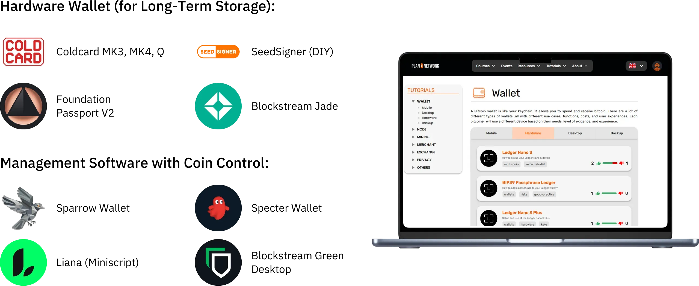

- **A Bitcoin node** to avoid dependence on public nodes and guarantee total control over your transactions. Having your own Bitcoin node protects the privacy of transactions when they are broadcast, eliminates the need to trust a third party for Blockchain Bitcoin data, prevents censorship of your transactions, and lets you participate in defining the system's standardization and consensus rules. This makes it an indispensable tool for the paranoid user, and, more generally, for any sufficiently experienced Bitcoin user.

https://planb.network/tutorials/node/bitcoin/bitcoin-core-linux-568c13a6-8746-4d63-8e95-f4a61c5ae0ed

https://planb.network/tutorials/node/bitcoin/bitcoin-core-mac-windows-9684ab02-e0af-41c9-8102-86ac7c7727f3

https://planb.network/tutorials/node/bitcoin/bitcoin-knots-e04b2196-4df2-4246-86ef-c02269c29098

https://planb.network/tutorials/node/bitcoin/raspiblitz-d8cdba2e-a682-46cf-9fdc-d8602fbeac02

https://planb.network/tutorials/node/bitcoin/mynode-a481fef3-2fd3-4df3-91c0-112cffa094eb

https://planb.network/tutorials/node/bitcoin/start9-8c8b6827-8423-4929-bcba-89057670ed6a

- **A Lightning** node for day-to-day spending, with full control over the process, including channel opening and management, while remaining independent in its use of Lightning.

https://planb.network/tutorials/node/lightning-network/alby-hub-62e6356c-6a6d-4134-8f22-c3b6afb9882a

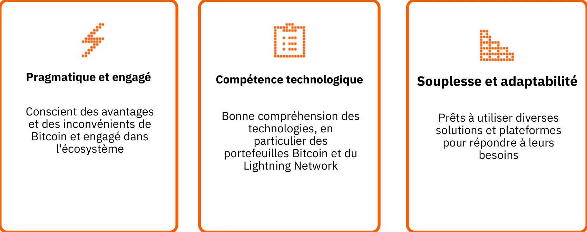

Paranoid users will also opt for advanced tools to secure their wallets. To manage his mnemonic phrases, he will opt for metal supports accompanied by sealed opaque envelopes, to protect against natural disasters and to regularly check that no one has accessed his phrases.

https://planb.network/tutorials/wallet/backup/backup-mnemonic-22c0ddfa-fb9f-4e3a-96f9-46e2a7954270

https://planb.network/tutorials/wallet/backup/recovery-test-5a75db51-a6a1-4338-a02a-164a8d91b895

For his savings, he can set up a more complex wallet, using either a simple Multisig or a Multisig with timelocks.

https://planb.network/tutorials/wallet/desktop/liana-306ef457-700c-4fdd-b07a-8fb7a8a29f04

It will also use a passphrase BIP39 to avoid having a single point of failure.

https://planb.network/tutorials/wallet/backup/passphrase-a26a0220-806c-44b4-af14-bafdeb1adce7

The paranoid will obviously have an inheritance plan for his bitcoins, but this will be explained in more detail in the next section of the course.

More broadly, the paranoid user adopts a responsible, advanced approach to computing. They prefer secure, open-source and privacy-friendly tools for :

- Its operating systems, both on its phone and on its computer;

https://planb.network/tutorials/computer-security/operating-system/grapheneos-08d43d7a-0b22-4638-a151-578d48d32d88

https://planb.network/tutorials/computer-security/operating-system/linux-mint-da44852e-513f-4004-949a-8fde60c1bca5

https://planb.network/tutorials/computer-security/operating-system/ubuntu-78a3be56-5d51-4ec3-8629-0dd27c352ab5

- Its authentication systems ;

https://planb.network/tutorials/computer-security/authentication/authy-a76ab26b-71b0-473c-aa7c-c49153705eb7

https://planb.network/tutorials/computer-security/authentication/bitwarden-0532f569-fb00-4fad-acba-2fcb1bf05de9

https://planb.network/tutorials/computer-security/authentication/keepass-f8073bb7-5b4a-4664-9246-228e307be246

https://planb.network/tutorials/computer-security/authentication/security-key-61438267-74db-4f1a-87e4-97c8e673533e

- Communication tools ;

https://planb.network/tutorials/computer-security/communication/ivpn-5a0cd5df-29f1-4382-a817-975a96646e68

https://planb.network/tutorials/computer-security/communication/mullvad-968ec5f5-b3f0-4d23-a9e0-c07a3e85aaa8

https://planb.network/tutorials/computer-security/communication/proton-mail-c3b010ce-254d-4546-b382-19ab9261c6a2

https://planb.network/tutorials/computer-security/communication/tor-browser-a847e83c-31ef-4439-9eac-742b255129bb

- Data management tools.

https://planb.network/tutorials/computer-security/data/integrity-authenticity-21d0420a-be02-4663-94a3-8d487f23becc

https://planb.network/tutorials/computer-security/data/proton-drive-03cbe49f-6ddc-491f-8786-bc20d98ebb16

https://planb.network/tutorials/computer-security/data/veracrypt-d5ed4c83-7c1c-4181-95ea-963fdf2d83c5

If you would like to find out more about the subject of IT security, we offer a complete first-year course dedicated to this topic:

https://planb.network/courses/99c46148-7080-4915-a7e0-9df0e145cd47

#### 2. Buying bitcoins anonymously

One of the major objectives of the paranoid is to acquire his bitcoins without going through a KYC platform, in order to avoid any link between his identity and his onchain activities. To achieve this, he favors several solutions:

- P2P buying platforms such as Bisq, Robosat, LNP2PBot, Peach, HODL HODL, etc. ;

https://planb.network/tutorials/exchange/peer-to-peer/bisq-v2-c1c6a702-6c16-4101-8b90-62c424017b80

https://planb.network/tutorials/exchange/peer-to-peer/hodlhodl-d7344cd5-6b18-40f5-8e78-2574a93a3879

https://planb.network/tutorials/exchange/peer-to-peer/lnp2pbot-v2-e6bcb210-610b-487d-970c-7cce85273e3c

https://planb.network/tutorials/exchange/peer-to-peer/peach-c6143241-d900-4047-9b73-1caba5e1f874

https://planb.network/tutorials/exchange/peer-to-peer/robosats-b60e4f7c-533a-4295-9f6d-5368152e8c06

- Live purchases for cash, for example at local Bitcoin meetups;

https://planb.network/courses/1c643dc9-a15f-4f9e-93b6-cb3c58b4ee35

- Bitcoin ATMs;
- Working in exchange for bitcoins;
- Miner bitcoins.

https://planb.network/tutorials/mining/hardware/attakai-0d177e6b-e167-4b25-8e38-4ec74213d1fb

https://planb.network/tutorials/mining/hardware/braiin-mini-miner-b4c5cb2c-e7ee-4521-a750-edefb0747db3

https://planb.network/tutorials/mining/hardware/bitaxe-d317e1a7-d775-401d-85df-51f4f2217566

The paranoid systematically avoids the use of centralized exchange platforms to guard against the risks associated with these entities.

#### 3. Avoid onchain tracing

Even after an anonymous acquisition, bitcoins can be traced on the Blockchain if they are not properly managed. The paranoid adopts several strategies to protect his privacy:

- **Avoid address reuse**, either manually or using advanced tools such as Silent Payments or BIP47 ;
- **Label your UTXOs** ;
- **Practice corner control when spending** ;
- **Avoid consolidation of UTXOs** ;
- **Use transaction structures that protect privacy**: coinjoins, payjoins, ricochets, and mini-payment coinjoins...

The paranoid user has also familiarized himself with the basics of chain analysis. He knows the patterns and heuristics used by chain analysis companies to better protect himself.

If you would like to deepen your knowledge of these practices and of privacy on Bitcoin, we offer a complete second-year training course that details all these aspects:

https://planb.network/courses/65c138b0-4161-4958-bbe3-c12916bc959c

#### 4. Keep a constant watch and adjust your strategy

The Bitcoin protocol, overlay systems such as Lightning Network, and the entire application layer linked to these ecosystems are evolving rapidly. A paranoid user must therefore :

- Keep abreast of new solutions, including new privacy protection techniques;
- Regularly test new tools and services to improve the user experience;
- Regularly test the robustness of your system, including hardware wallet operation and updates, node operation and updates, and mnemonic phrase opaque envelopes;
- Monitor new regulations and threats to adjust strategy.

### Assessing your paranoid profile

Adopting a paranoid strategy is no trivial matter. It requires a great deal of rigor, constant discipline and time investment to master the tools and best practices of privacy. Is this profile for you? Here are the characteristics of the paranoid bitcoiner:

- **Vigilant and secure**: You attach paramount importance to your privacy and are prepared to take extra precautions to prevent any leakage of personal information. You view financial scrutiny as a threat and seek to protect yourself from interference.
- **Independent**: You don't want to depend on any intermediary to store, manage or transfer your bitcoins. You're ready to host your own Bitcoin and Lightning node, use complex wallets and manage your own backups and private keys.
- **Distrustful**: You refuse to use KYC platforms and prefer anonymous P2P acquisition methods, even if this means paying a premium on the price. You know that any personal data shared could be used against you.
- **Erudite and rigorous**: You are passionate about cybersecurity and privacy protection technologies. You take the time to study existing solutions, try out tools, learn about best practices and apply strict methods to limit the risk of error.
- **Pragmatic and reasoned**: You know that absolute anonymity is almost impossible to achieve, but you seek to minimize your exposure while striking a balance between privacy, security and ease of use. You continually adapt your approach to new threats and technological developments.

If you recognize yourself in these traits, then this strategy is probably for you. The path is demanding and requires constant effort, but it guarantees total financial sovereignty and enhanced security against the risks of surveillance, seizure or traceability of your funds.

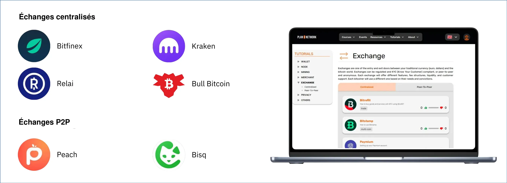

This approach is particularly relevant if you hold large amounts, are exposed to authoritarian regimes, or wish to protect your anonymity for personal or ideological reasons. While this may seem extreme to some, these precautions become essential for those who demand the highest level of privacy and protection for their bitcoins.

In the next section of the course, we'll be tackling an often overlooked yet hugely important subject: how to pass on your bitcoins in the event of a problem.

# Protecting heirs and assets

<partId>0b8a9528-719b-4a2d-bd50-1e173a896570</partId>

## Creating an inheritance plan

<chapterId>233c88d3-2e8e-5eba-ac06-efe67a209038</chapterId>

Ensuring that your bitcoins are passed on to your heirs is an often overlooked, yet essential, responsibility. The financial sovereignty offered by Bitcoin also implies rigorous estate management, otherwise your heirs may find themselves unable to access your hard-earned funds. In this chapter, we'll explore the fundamentals of estate planning as applied to Bitcoin.

### Why prepare a Bitcoin succession plan?

Let's imagine a brutal but realistic scenario. A sudden accident, an unforeseen event... and you disappear. Your family, already overwhelmed by grief, is faced with an unexpected problem: access to your bitcoins. They know you've often talked about security, private keys, mnemonic phrases and irreversible transactions, but these concepts remain unclear to them. Now they're on their own.

You then have two choices:

- Anticipate by creating a clear and structured plan that will allow your loved ones to access your bitcoins in a simple and secure way;
- Do nothing, hoping they'll figure it out for themselves. But if they make a mistake, lose access to a wallet or accidentally send the funds to the wrong address, your assets are gone forever.

Taking 15 minutes to 1 hour to put an estate plan in place can make all the difference. It's not only a matter of prudence, but also of responsibility to those who may depend on you.

### Objectives of a Bitcoin succession plan

Pamela Morgan, in her book *[Cryptoasset Inheritance Planning](https://www.amazon.com/gp/product/1947910116/)*, defines 4 essential objectives for a good inheritance plan:

- Guarantee that your heirs can recover your bitcoins in due course, but not before;
- Minimize the risk of theft or compromise before bitcoins are handed over;
- Ensure that heirs can secure bitcoins over the long term if they wish;
- Prevent family disputes and limit the legal complications associated with inheriting crypto-assets.

A well-designed plan not only serves to transfer wealth, but also to protect your loved ones from common mistakes and potential threats.

The following chapter is directly inspired by the work of [Pamela Morgan](https://x.com/pamelawjd). [Her book](https://www.amazon.com/gp/product/1947910116/) offers a structured method, validated by security experts, for organizing a succession plan suitable for bitcoin. However, **this content does not constitute legal advice**. It is a proven methodology, but each user should do their own research and adapt the recommendations to their personal situation and jurisdiction.

[Pamela Morgan](https://x.com/pamelawjd) has generously authorized the use of [her work](https://www.amazon.com/gp/product/1947910116/) for this course, and her approach will serve as a guideline for establishing a concrete example of a Bitcoin legacy plan. In this chapter, we will concentrate solely on the first part of his book.

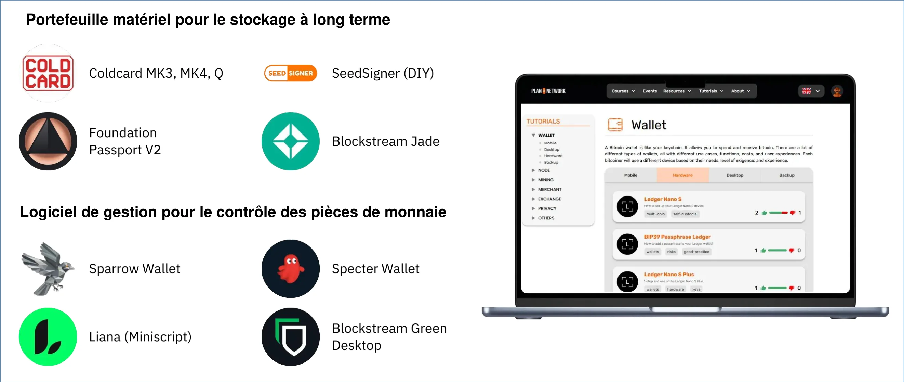

To illustrate the development of a Bitcoin succession plan, we'll follow the journey of Cedric, a typical Bitcoin user, who needs to organize the transfer of his estate in the event of unforeseen circumstances.

Profile:

- Long-term investor who does not trade frequently;
- Holder of a Hardware Wallet and a mobile wallet for occasional use;
- User of a single KYC exchange platform, where he buys his bitcoins;
- Introduced to Bitcoin by his cousin ;
- Does not have altcoins and does not use Lightning.

The aim is to create a simple, effective plan adapted to your profile, before exploring more complex scenarios with other types of users.

### Before you start

Take 30 minutes of your time. Not for yourself, but for those who depend on you. Estate planning is an important task, yet one that is often postponed, neglected or even ignored. Too many people, even the most prudent, put it off... until it's too late. Thousands of bitcoins have already been lost through lack of foresight. Don't make this mistake! This is **the FINAL STEP** in your journey to financial sovereignty: securing your Bitcoin wealth for your loved ones.

#### What do you need?

Make sure you have a calm, distraction-free environment, then gather these few tools:

- 4 to 5 sheets of white paper ;
- Pen;
- 2 envelopes ;
- A telephone or address book;
- A computer (optional).

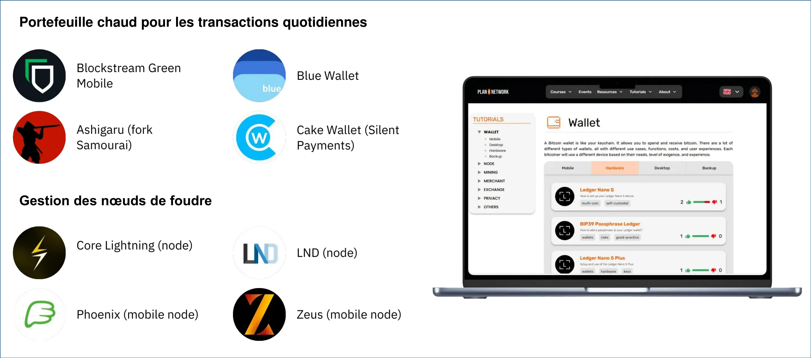

#### Common misconceptions about estate planning

Many people put off this step because of false beliefs that prevent them from taking action. Here are some common ideas cited by Pamela Morgan in _Cryptoasset Inheritance Planning_ (page 18):

- **"*I need to hire a lawyer.*"** → **FALSE**. A lawyer can be useful for legal aspects, but a Bitcoin technical legacy plan can be implemented without one. The key is to have clear, accessible instructions;
- **"*I need to trust a third party.*"** → **False**. Your plan can be designed to minimize the trust required, by dividing information between several parties or using multi-signature solutions, with or without timelock ;
- **"*Planning will make my assets easy to steal.*"** → **False**. A well-thought-out approach protects against theft attempts while ensuring that your heirs can safely recover your funds. However, it should be noted that there is no magic solution: an inheritance plan inevitably involves an increased risk of theft, depending on the information disclosed therein. We'll take a closer look at this later;
- **"*The value of my bitcoins is too small to plan.*"** → **False**. Whatever the amount, it's best to plan ahead. Your loved ones probably don't know how much you've saved in bitcoins, and that's fine. But in the event of a problem, won't they try to get them back since they don't know the amount? What I mean is, even if you only have €100 in BTC and your loved ones are aware of your investment, they'll want to get those funds back when you die. So it's a good idea to make it easy for them, to avoid giving them false hope about the amount or leaving them searching in vain for something that might not exist. What's more, Bitcoin is a rare asset, and its value can potentially increase considerably over the years;
- **"*My heirs will find out everything for themselves.*"** → **False**. Bitcoin is not a conventional bank account. Without specific instructions, your loved ones may never be able to access your funds, or may only be able to find a portion of them. Unlike bank accounts, where financial institutions or notaries contact relatives in the event of death, no intermediary will notify your family of the existence of your Bitcoin wallet. It is therefore up to you to mention it explicitly in your inheritance plan;
- **"*A smart contract can handle anything.*"** → **FALSE**. A Smart contract like a Multisig wallet with timelock can be a piece of the puzzle, but it will never replace well-structured planning, especially for people unfamiliar with Bitcoin. The two are complementary.

Now is the time to act. Take these 30 minutes and put your legacy plan in place. It's a simple step, but one that can make all the difference for your loved ones.

### Step 1: Select the right people to assist your heirs

When it comes to passing on a bitcoin legacy, your loved ones will probably be unfamiliar with private key management or wallet recovery. They will need outside help, from competent and trusted people. Ideally, you should choose at least 2 different people:

- **A trusted relative**, who will ensure that your plan is carried out properly. He or she doesn't necessarily need to have in-depth knowledge of Bitcoin, but should be someone your heirs can rely on;
- **An experienced Bitcoin** user, who can provide technical assistance in fund recovery, wallet management and process understanding.

The people selected should never have direct access to your private keys (or mnemonic phrase), but they should be able to :

- Guide your heirs in recovering and securing funds;
- Explain the basic principles of Bitcoin wallets, recovery phrases and transactions;
- Help avoid common mistakes.

On the sheet of paper that will become your Bitcoin legacy plan, draw up this comparative table of potential people, assessing their level of trust, their knowledge of Bitcoin, and their means of contact. For example:

| Person               | Trust Level     | Bitcoin Knowledge   | Contact Methods         | Note                                                                                                                   |
|----------------------|-----------------|----------------------|--------------------------|------------------------------------------------------------------------------------------------------------------------|
| My brother Bob       | Very high       | Low                  | Phone & email            | Bob doesn’t know Bitcoin well, but he’s 100% reliable. He can ensure the process goes smoothly.                        |
| My cousin Nathan     | High            | Medium               | Phone & Instagram        | Has some Bitcoin knowledge and can guide my heirs. Aware of the plan. #1 to talk to in case of need.                   |
| Ricco (Bitcoiner friend) | Medium      | Very high            | Twitter, email & photo   | Very technically skilled, but should never have access to the funds. To be contacted for technical support.            |
| Bitcoin YouTuber     | Low             | High                 | YouTube channel          | Good information source for learning, but cannot intervene directly.                                                   |

If you don't have any reliable or competent relatives, you might also consider using a professional, such as a Bitcoin inheritance lawyer, or an estate planning service. The key is to ensure that your heirs have access to reliable technical assistance, while preserving the security and privacy of your funds.

### Step 2: Create a quick and easy inventory

Before thinking about securing or passing on your bitcoins, it's important to draw up a precise inventory of your Bitcoin assets. This inventory will form the basis for organizing your estate, and will enable your heirs to understand where your assets are and how to access them.

The aim here is not to immediately improve your security, but simply to list your current situation. It's a snapshot of your bitcoins and how to access them. You can adjust and reinforce your security later, once this initial inventory has been taken.

Think about all the places where you own bitcoins or fiat currencies associated with Bitcoin. This may include:

- **Exchange platforms**: Accounts with BTC or fiat funds linked to your bitcoin purchases;
- **Mobile or desktop hot wallets**: Applications installed on your phone, used for current transactions;
- **Hardware wallets** : Physical devices securing your private keys offline ;
- **Other solutions**: Multisig, paper wallets, specially stored private keys, etc.

Use a table to structure this inventory. The idea is not to store this document online, but to keep it in a secure place in paper form. For example:

| General | Storage type | Assets held | Localization | Mnemonic backup | Password (PIN, passphrase...) | Notes |
| --------------------- | ---------------- | -------------- | --------------------------------- | ------------------------------------------------------------------------ | ----------------------------------------------------------------------------------------------- | --------------------------------------------------------------------------------------------------------------- |
| Bitfinex | BTC & Euros | Accessible online | None (custodial platform) | | Bitwarden & 2FA password manager with Authy app on my phone | I bought my BTC here. Funds must be withdrawn after purchase |
| Physical wallet | Jade Plus | BTC | Personal safe at home | Copy at my Uncle Bob's and in a bank safe at BNP Paribas | passphrase stored at my mother's. PIN code stored on Bitwarden password manager. PIN code stored on Bitwarden password manager. | I use 2 separate wallets: a normal one with only the mnemonic phrase and one with a passphrase. |
| Green Wallet | BTC | On my Iphone 15 | Copy of the seed in my safe at home | PIN code stored on the Bitwarden password manager. | The application is in hidden mode. | The application is in hidden mode |

At this stage, you may feel the urge to immediately change the allocation of your funds, improve your security, or sell or buy more bitcoins. Just don't do anything yet! The aim here is not to take action, but to establish a snapshot of your current situation. You can always improve your plan later, but for now, stay focused on the inventory and complete it as comprehensively as possible.

Once this assessment has been made, it will be much easier to identify weak points and structure an efficient and secure transmission.

### Step 3: Writing the letter

#### Why a handwritten letter?

It's important that your estate plan is clear, legible and secure. To achieve this, write a letter in ink on paper, and avoid digital documents that could be compromised. This letter is neither a will nor a legal declaration, but a practical guide to help your loved ones recover your bitcoins without risk.

The letter should be simple, direct and contain the following essential elements:

- An introduction explaining the nature of the assets to be recovered;
- Trusted contacts who can assist your heirs in the recovery process;
- A clear inventory of assets, with access devices and methods;
- Precise safety instructions to avoid mistakes and scams;
- A benevolent conclusion, accompanied by any legal instructions.

#### Sample letter of inheritance

Here's a template inspired by the book *Cryptoasset Inheritance Planning* by Pamela Morgan. Of course, you'll need to adapt it to your personal situation:

---
**Date: `Indicate date`**

Dear `Names of heirs`,

If you're reading this letter, it's because I'm no longer here. First of all, please know that I love you and have taken the time to prepare this document to help you manage my potentially valuable bitcoins. It's not a complicated task, but it does require rigor and caution. **Bitcoin is a system without intermediaries: there is no recourse if a mistake is made ** Please take the time to read this letter in its entirety before acting.

#### 1. Contact people you trust

I have designated several people who can help you understand Bitcoin and recover my assets. They should never have direct access to the funds, but they can guide you through the process:

- My brother Bob; +33 6 00 00 00 00; bobmybrother@supermail.com. You can trust Bob to help you through this process. Although he's not the most technically adept on Bitcoin, he's the right person to question everything and exercise caution to ensure your safe success.
- My cousin Nathan; +33 6 00 00 00 00; nathandelacroix@supermail.com. It was Nathan who introduced me to Bitcoin. He's very knowledgeable about computers and will be able to answer most of your questions. He also owns a few fractions of bitcoins and will be able to guide you technically. You've already seen him several times at family gatherings, and I've included a photo of him here.
- Ricco; @RiccoSuperBitcoiner on Twitter; ricco425@supermail.com. I've worked closely with Ricco for many years. You've never met him, so make sure you're talking to the right person by asking "*What's Cedric's dog's name*". If he answers "*12*", that's fine. Ricco is a very friendly and knowledgeable expert on Bitcoin. He'll answer all your questions and you can trust his judgement about bitcoin security. Don't be afraid to contact him, but never give him direct access to the fund.
- It may sound strange, but contact them all. In addition, you can learn more by listening to Andreas Antonopoulos on YouTube and by buying the book *Cryptoasset Inheritance Planning* by Pamela Morgan.

Contact all these people and cross-check their opinions before making important decisions. **Don't trust anyone blindly

#### 2. Where can I find my bitcoins?

Here's a precise inventory of my assets, their location and access methods.

- I use my phone (Samsung Galaxy S8) to access my Samourai wallet. The mnemonic to restore the wallet is saved in two copies: one is stored in the bank safe, the other at Uncle Bob's house. The PIN code needed to unlock both my phone and the wallet is stored at my home and at my grandmother's.
- I am accessing the Bitfinex online exchange platform via my Dell 2018 computer. It is possible that bitcoins or dollars are still there. To retrieve these funds, you will need to either contact Bitfinex directly or try to access my account. (*Be careful, this may be illegal - check your local legislation*).
- I have secured access to my online accounts using a password manager. A backup of this password manager is stored in the bank's safe. My Bitfinex account is also protected by two-factor authentication, accessible either via my phone (Samsung Galaxy S8, Authy app), or thanks to the backup code I've kept at home.
- I own a Trezor Model One hardware wallet, accessible from my PC via Sparrow Wallet software. The mnemonic for restoring this wallet is stored in two copies: one in the bank safe, the other at Uncle Bob's house. The PIN code needed to use it is kept at my home and at my mother's house. As for the device itself, it's probably stored in a safe at my office. I use a passphrase BIP39 on my Trezor Model One. This passphrase is indispensable for accessing the funds stored on the device. A backup is kept in two places: at home and at my mother's house.

Take all necessary precautions before handling these funds. Never divulge the complete recovery phrase to just one person, and only share this information if absolutely necessary.

#### 3. Safety precautions and instructions

- **Don't rush**. Take time to learn before you act. Bitcoin is safe when used correctly.
- **Never give the 24-word sentence to just one person**. If someone asks you for full access, beware.
- **Don't connect my wallets to an unknown computer**. Use a secure environment, offline if possible.
- **Beware of scams**. There are many scams surrounding the Bitcoin. Only trust the people mentioned in this letter.
- **Save everything you do**. Take notes, record milestones and protect access.

#### 4. Legal information and final message

You will find a copy of my will in my personal file and at my notary's office. This letter does not replace an official will, but it will guide you in managing my bitcoins.

Take care of yourself and remember that I love you. My wish is that these assets will be useful to you and help you to move forward serenely.

handwritten signature

your name

date

---
Here's a concrete example of a letter that serves as an inheritance plan. Of course, you'll need to adapt this template to your personal situation. It's also important to choose the level of detail you wish to bring to the recovery process. If you're worried that your loved ones won't be able to recover your bitcoins with so little information, consider writing some kind of step-by-step tutorial that explains the process in detail.

Also, you'll need to decide how much information to reveal in this inheritance plan. The more details you share about your security methods, the more you risk compromising your safety for as long as you're alive if this letter falls into the wrong hands. For example, a burglar who finds this letter would immediately know where to look for critical information in your wallets. Conversely, by revealing too little information, you expose your loved ones to the risk of not being able to access your bitcoins. So it's important to find the right balance.

Finally, the problem of the inheritance plan is similar to that of security strategies: it's always a question of balancing the risk of loss against the risk of theft. By not recording enough information, you increase the risk of your loved ones losing access to bitcoins, while too much information can actually increase the risk of theft.

### Step 4: Check and store the letter

Before concluding, make sure you have included :

- A clear list of trusted contacts;
- A detailed inventory of assets and their locations;
- Precise instructions on access and safety;
- A benevolent message for your heirs.

Depending on what you consider necessary in your personal situation, make several copies of this letter by hand and keep them in a safe place (safe deposit box, with a trusted relative...). Inform your heirs of the existence of this inheritance plan, without necessarily disclosing its contents immediately. You can also use a tamper-proof opaque pouch to ensure that your inheritance plan has not been consulted without your consent.

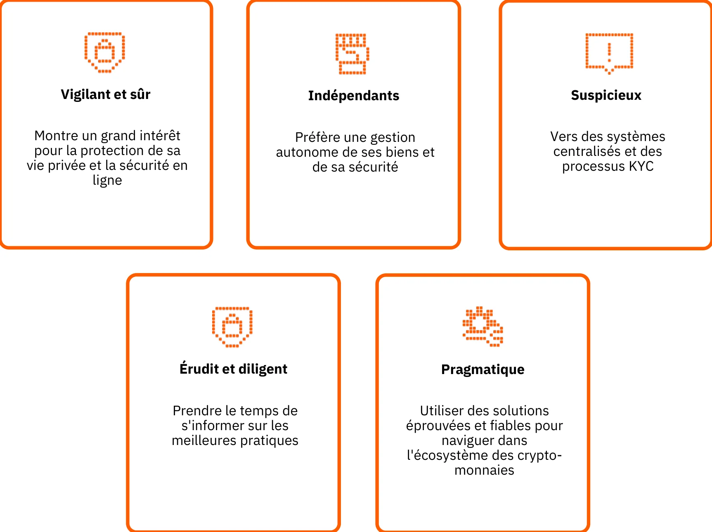

If necessary, consult a specialist lawyer or notary to integrate this plan into an official legal framework.

**You've just completed an essential step in protecting your bitcoin legacy. Now you can perfect your legacy plan by updating it regularly and exploring more advanced solutions like Multisig degressive with timelock :

https://planb.network/tutorials/wallet/desktop/liana-306ef457-700c-4fdd-b07a-8fb7a8a29f04

Reference: [*Cryptoasset Inheritance Planning, A Simple Guide for Owners* - Pamela Morgan, 2018.](https://www.amazon.com/gp/product/1947910116/)

Many thanks to [Pamela Morgan](https://x.com/pamelawjd) for her work and permission to adapt.

## Congratulations! You're one of the best-prepared 0.1%!

<chapterId>5f4cfab9-9af1-584b-a1fe-a0769a991f19</chapterId>

If you've made it this far, you're now part of an enlightened minority! Few people go this far with Bitcoin, and you can be proud of how far you've come. Perhaps you've followed all the tutorials offered in this training course: created your first wallet with a Hardware Wallet, secured your mnemonic phrase, set up a DCA plan, bought bitcoins with or without KYC, and even planned your inheritance. Every step you take is a step towards financial sovereignty.

Even if you haven't yet taken all these steps, but are determined to do so soon, you're already on the right track. This willingness to understand and act is important. Now you understand why Bitcoin is so important to our individual and collective future.

Since my early days as a Bitcoin educator, the ecosystem has undergone profound changes, as have I myself. This course has been completely revised to bring you the best of today's Bitcoin ecosystem. What an incredible journey we've been on together!

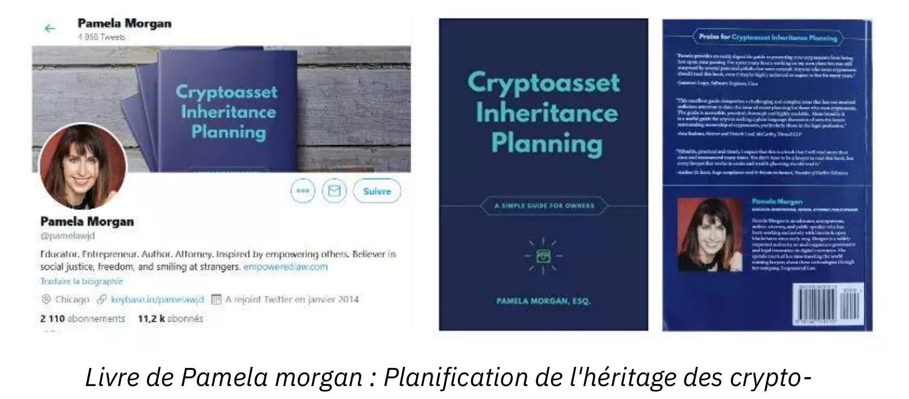

### What does the future hold for Bitcoin?

If we look at the logarithmic price curve, one thing becomes clear: we never know exactly where we are in cycles. Perhaps you're reading this course just as a new phase of growth is beginning, or perhaps you're in the middle of a bear market. Whatever the case, the cycles continue, inevitably punctuated by spectacular highs and sometimes brutal corrections.

But beyond the price, the evolution of Bitcoin is remarkable. Since its inception, it has grown from a marginal experiment, known to a handful of cypherpunks, to a global phenomenon that cannot be ignored. From Silk Road to the latest waves of institutional adoption, Bitcoin has become a permanent fixture on the global business landscape. It is no longer perceived as a risky eccentricity, but as a serious asset, massively adopted by financial institutions and millions of individuals worldwide.

This change in perception is accompanied by constant technical improvements: wallets and infrastructures are constantly evolving. New solutions are introduced every year, making Bitcoin ever more robust, resilient and easy to use. Today, Bitcoin is more decentralized, more accessible and better understood than ever before.

Yet many challenges remain: regulation, privacy protection, widespread adoption, development of a circular economy... But as long as the community remains active, curious and committed, Bitcoin will remain a positive force capable of offering a real alternative to the traditional monetary system.

The real certainty is that Bitcoin will simply continue to exist, producing a new block about every 10 minutes, tirelessly, day after day, year after year. There will surely always be more users, more wallets, more exchange platforms, but also more regulation, technical challenges, crises and innovations.

As our world becomes more complex, financial crises follow one another and inflation eats away at the purchasing power of fiat currencies, Bitcoin will attract even more people seeking financial freedom and individual sovereignty. This dynamic will enable Bitcoin to continue to grow stronger, and attract new talent who will advance the protocol, overlay and application layer towards greater security, privacy and everyday usefulness.

### What next?

Paradoxically, the biggest change won't be Bitcoin itself, it will be you. It's you who will evolve in the way you use, perceive and interact with Bitcoin. Perhaps you'll develop a real passion for the subject, to the point of wanting to teach yourself, actively participate in the community, or simply quietly preserve your capital for the long term. In any case, Bitcoin will have changed the way you see the world, and probably your relationship to freedom and financial responsibility.

Here are some directions you can explore to deepen your understanding and involvement.

#### 1. Keep up the momentum

If you feel comfortable with your current strategy, you can simply continue on the same path. Continue to accumulate bitcoins regularly and apply good security practices. You've put in place a solid foundation, and there's no need to go any further if your aim was solely to secure your bitcoin savings.

In that case, take the time to watch Bitcoin evolve, refine your strategy and strengthen your security as the ecosystem develops.

#### 2. Deepen your knowledge

Your journey doesn't end here. Bitcoin is an ever-evolving world, and there's always more to discover. Here are a few directions you might want to explore to deepen your understanding of Bitcoin:

- To strengthen your IT security, start with the first-year course SEC101 :

https://planb.network/courses/99c46148-7080-4915-a7e0-9df0e145cd47

- If you are interested in economic and monetary issues, enrich your understanding of Bitcoin from an economic and philosophical point of view with the following Plan ₿ Network training courses:

https://planb.network/courses/d07b092b-fa9a-4dd7-bf94-0453e479c7df

https://planb.network/courses/caa75343-ac90-4249-bcca-0e2e57c3a0f1

https://planb.network/courses/9d1bde6a-33e5-45dd-b7c0-94da72e45b11

- For managers interested in integrating Bitcoin into their business, this course is a must:

https://planb.network/courses/a804c4b6-9ff5-4a29-a530-7d2f5d04bb7a

- To discover the fascinating story behind the creation of Bitcoin and the early years of the system, I highly recommend this course:

https://planb.network/courses/a51c7ceb-e079-4ac3-bf69-6700b985a082

- Finally, if you're curious about the technical aspects of Bitcoin and its ecosystem, explore these training courses:

https://planb.network/courses/34bd43ef-6683-4a5c-b239-7cb1e40a4aeb

https://planb.network/courses/46b0ced2-9028-4a61-8fbc-3b005ee8d70f

https://planb.network/courses/65c138b0-4161-4958-bbe3-c12916bc959c

#### 3. Participate actively in the Bitcoin ecosystem

Bitcoin is more than just a financial asset, it's also a technological and philosophical movement. Depending on your profile and skills, you can contribute to the ecosystem in different ways:

- **Educate and raise awareness**: Help your loved ones understand Bitcoin, share your knowledge and take part in local discussions;
- **Develop tools and applications**: If you have technical skills, contributing to open-source tools is a great way to bring value to Bitcoin ;
- **Join a local community**: Participate in events, meetups and forums to meet other bitcoiners and exchange views on the latest developments.

Naturally, if you'd like to contribute to public education on Bitcoin, your help would be greatly appreciated on Plan ₿ Network. Our educational resources are open-source, hosted on GitHub, and we're always looking for contributors to help proofread and improve content in the various languages we offer, in exchange for a few satoshis! Whether immediately or for later in your Bitcoin journey, feel free to join [our Telegram group for contributors](https://t.me/PlanBNetwork_ContentBuilder) of Plan ₿ Network.

### The last word

I would like to sincerely thank you for taking this BTC102 training course. My name is Rogzy, founder of Découvre Bitcoin and co-founder of Plan ₿ Network, a platform that has become a reality thanks to our new partners, Tether and Fulgur Ventures, and our common desire to educate as many people as possible about Bitcoin.

Your feedback is invaluable: don't hesitate to comment directly on the platform to tell us what you thought of this new version of the course. Your suggestions are essential to help us constantly improve the quality of our content.

You will now take the final exam, consisting of 40 questions to validate your understanding and earn your certificate. Good luck to you!

I look forward to seeing you soon in other courses available on Plan ₿ Network, either from myself or from other excellent teachers in the community. Perhaps we'll also have the chance to meet at a Bitcoin event, conference or meeting.

Once again, congratulations on a job well done. Remember that my primary objective remains the same: to educate as many people as possible around the world so that they can achieve true financial sovereignty with Bitcoin.

Good luck with your Bitcoin adventure!

# Conclusion

<partId>a8425389-4a53-4b57-b9b4-36c1cab12de5</partId>

## Reviews & Ratings

<chapterId>3f43175a-fb7a-5b1c-a887-7dcf615d7a3a</chapterId>

<isCourseReview>true</isCourseReview>
## Final examination

<chapterId>f3ff8089-8f89-56a8-be8c-b60296b4d91f</chapterId>

<isCourseExam>true</isCourseExam>
## Conclusion

<chapterId>b082b8eb-dabc-5d79-94cf-eb8f48fc1968</chapterId>

<isCourseConclusion>true</isCourseConclusion>
