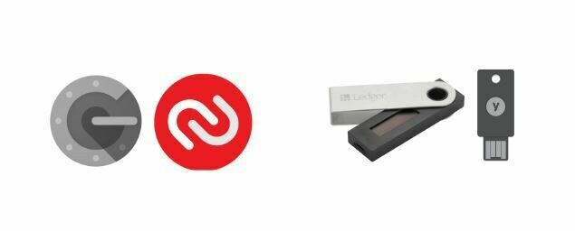
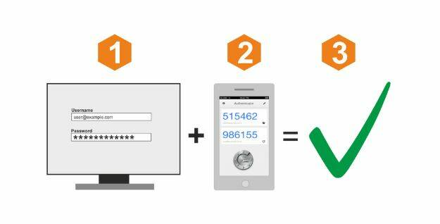
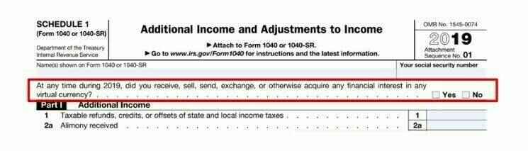
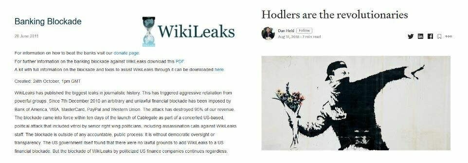
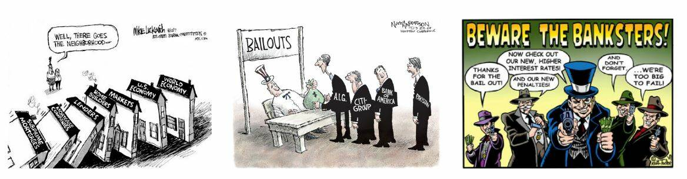
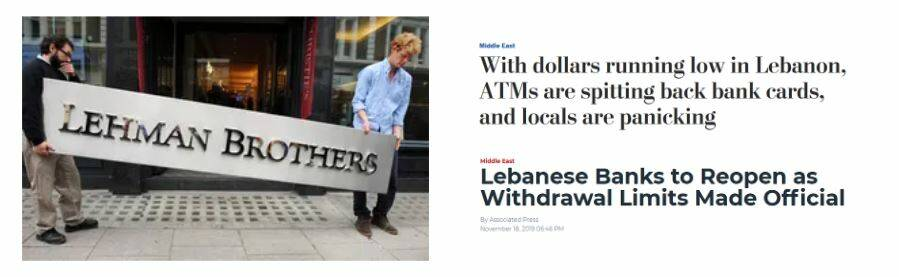
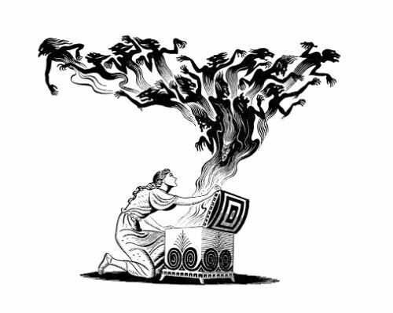
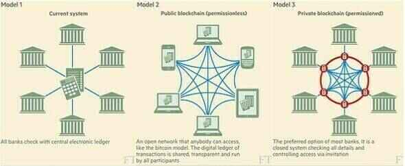
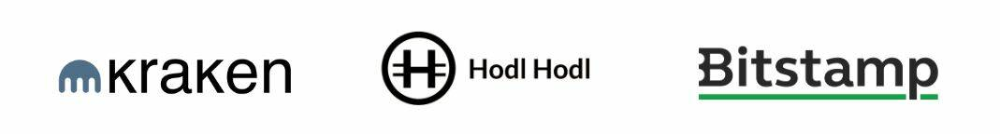

# Un viaje hacia tus primeros bitcoins

La industria que rodea a Bitcoin está en pleno auge.

Los cambios tecnológicos y financieros de este nuevo mundo solo están acelerando, así que es hora de aprovecharlos y comenzar a caer en la madriguera del Bitcoin. Esta aventura será rica en conocimiento y te hará cuestionar muchas de tus convicciones. Te devolverá la libertad y te permitirá recuperar la privacidad, la soberanía y la independencia financiera.

Para ayudarte a comenzar esta aventura, he creado este curso gratuito. Solo Bitcoin, sin tonterías, sin otras criptomonedas, un curso directo sin rodeos. Este curso ha sido diseñado para adaptarse a ti y dejarte libre de elegir el camino que más te convenga.

+++

# Introducción al curso BTC 102

¡Bienvenido a BTC 102! ¡Un curso práctico que te guiará en la creación de tu plan Bitcoin! A través de este curso, nos prepararemos para obtener tus primeros bitcoins, asegurarlos correctamente y garantizar una buena entrada en esta nueva industria.

La industria del bitcoin aún es joven y se considera un fenómeno en constante evolución. De hecho, a pesar de muchos años tratando de regular este mercado, sigue siendo extremadamente libre debido a la naturaleza de su protocolo subyacente.

Debido a esta imposibilidad de ser regulado por completo, Bitcoin ha podido desarrollarse de manera orgánica y descentralizada durante más de 14 años. Es una industria en pleno auge embrionario y que solo espera seguir creciendo.

Una explosión de innovaciones y posibilidades también significa estafas, fraudes y riesgos. Es evidente que tu camino en Bitcoin no será sin contratiempos ni errores. Sin embargo, para ayudarte a evitarlos en la medida de lo posible, esta formación servirá como guía práctica para comenzar bien. La formación BTC 101, por otro lado, es más teórica para comprender el funcionamiento de Bitcoin.
En esta formación, nos enfocaremos en 4 aspectos:

- Revisar las bases y los requisitos previos para asegurarnos de no ser estafados o perder nuestro dinero tontamente.
- Revisar fundamentalmente por qué Bitcoin es importante y comprender su industria. Esto nos permitirá fortalecer nuestras convicciones y comprender bien en qué nos estamos adentrando.
- Configurar su primera billetera de Bitcoin y su primera compra de bitcoins a través de una plataforma de intercambio. Aquí, buscaremos la solución más adecuada a sus necesidades.
- Por último, la última sección abordará un concepto fundamental para su seguridad, pero poco explorado en la industria: cómo crear un plan de herencia de Bitcoin.

¡Como puede ver, el objetivo de esta formación es acompañarlo para que respete las mejores prácticas de nuestra industria desde el principio, de manera simple y rápida!

¡Buena suerte! :)

# Requisitos previos para comprender Bitcoin

## Estafas y fraudes financieros

Estamos en una industria donde dos ramas principales emergen en el sector de las "criptomonedas":

1. La industria de Bitcoin, centrada en una moneda saludable a través de un protocolo descentralizado de transferencia de valor (Bitcoin). Valora la privacidad y la soberanía individual, y construye gradualmente proyectos a largo plazo con un alto nivel de resiliencia y seguridad.

2. La industria global de criptomonedas, orientada hacia la fintech, la "blockchain" y otras innovaciones centralizadas. Evoluciona rápidamente y trata de posicionarse como la nueva tendencia.

Toda esta universidad se centra en el universo de Bitcoin y no en el de las criptomonedas.

El campo de las criptomonedas, incluido Bitcoin, sigue siendo relativamente joven y ligeramente regulado. Por lo tanto, es rico en diversas estafas. La comprensión de los peligros y el reconocimiento de las trampas típicas son esenciales. Aquí hay algunas situaciones de estafas que se encuentran con frecuencia:

- Donaciones y loterías en línea
- Pirámide de Ponzi
- Pump & Dump
- Grupos e influencers de Shitcoin
- Desviación / Hard Fork
- Hackeo
- Falsa extorsión
- Estafa de contraseña
- Captura de tarjeta SIM

En el campo de la inversión financiera, los sistemas de venta piramidal y Ponzi se distinguen como modelos ilegales. Funcionan utilizando el dinero de los nuevos inversores para remunerar a los antiguos participantes. Sin embargo, su carácter no sostenible y su dependencia de los recién llegados para mantener el sistema en marcha los hace propensos a colapsar inevitablemente.

Estos sistemas a menudo se caracterizan por elementos dudosos como la falta de valor intrínseco, promesas de rendimientos irreales y tácticas de marketing que fomentan las recomendaciones para atraer a nuevos inversores. Los plazos de retiro incompresibles y el uso de perfiles falsos en las redes sociales para la promoción también son signos reveladores de estas estafas. Dado su carácter ilegal e inmoral y el riesgo financiero que representan, es esencial evitarlos.

Finalmente, estos sistemas están condenados al fracaso. Con el tiempo, la necesidad de un número creciente de nuevos participantes para mantener el sistema en su lugar se vuelve insuperable. Cuando se alcanza este punto, la ilusión se desvanece, el sistema se derrumba y los inversores a menudo se quedan sin forma de recuperar su inversión.

Los sistemas Ponzi pueden manifestarse de diversas formas. A veces, se disfrazan como nuevas ofertas de tokens o Ofertas Iniciales de Monedas (ICO), combinaciones de contratos inteligentes, intentos de monopolizar la moneda fiduciaria o incluso programas de marketing sin un producto real. Sin embargo, una investigación exhaustiva y una diligencia debida revelan que estos sistemas no crean ningún valor real. Simplemente redistribuyen el dinero de los nuevos participantes para pagar a los antiguos.

Recientemente, el mundo de las criptomonedas ha experimentado una ola de proyectos relacionados con la Finanzas Descentralizadas (DeFi) que merecen especial atención. Algunos de estos proyectos pueden recurrir a una combinación de criptomonedas de baja calidad, contratos inteligentes y sistemas de tasas de interés para ofrecer soluciones financieras supuestamente milagrosas. Es esencial ser cauteloso y diligente frente a estas ofertas que son extremadamente scammy.

Es importante destacar que el contenido de este curso está destinado únicamente con fines educativos y no debe interpretarse como asesoramiento financiero. La exhortación a "no confiar, sino verificar" sigue siendo una guía importante. Es esencial que cada uno realice sus propias investigaciones y tome decisiones financieras informadas.

El Pump and Dump (P&D) es una forma notoria de manipulación financiera que puede causar importantes perturbaciones en los mercados. Se caracteriza por un ataque coordinado destinado a provocar un aumento artificial del precio de un activo a través de diversos mecanismos, como el marketing agresivo, el uso de algoritmos o inteligencia artificial. El objetivo es luego vender estos activos sobrevalorados para obtener ganancias.

La estrategia de Pump and Dump generalmente sigue un patrón bien definido:

1. Un líder de opinión o un grupo de inversores primero compran una gran cantidad de acciones u otros activos específicos.
2. Luego crean entusiasmo alrededor de estos activos y difunden información exagerada o engañosa para atraer a otros inversores.
3. Este bombo mediático desencadena un FOMO (Fear Of Missing Out), un miedo a perder una oportunidad, en los inversores humanos y los bots de inversión, que comienzan a comprar masivamente estos activos.
4. Una vez que el precio ha aumentado lo suficiente, los líderes venden sus activos en masa, obteniendo así una ganancia considerable.
5. La venta masiva provoca una caída abrupta del precio del activo, dejando a muchos inversores con pérdidas sustanciales.

Es esencial comprender que participar en tales estrategias es ilegal y puede dar lugar a acciones legales por manipulación del mercado. Además, estas estrategias a menudo son orquestadas por grupos de influencia que cobran tarifas de membresía. Aunque algunos participantes pueden obtener ganancias a corto plazo, las estrategias de Pump and Dump generalmente no son rentables a largo plazo.
Por lo tanto, se recomienda enfocarse en la educación financiera y la inversión responsable en lugar de dejarse seducir por tales tácticas manipuladoras. Adquirir conocimientos sólidos y adoptar un enfoque a largo plazo son claves esenciales para tener éxito en el mundo de la inversión.

Las estafas relacionadas con concursos o donaciones en línea son muy comunes en el sector cripto. Los anuncios que prometen bitcoins gratuitos a menudo se utilizan para engañar a usuarios inexpertos. Los principios clave a tener en cuenta son nunca enviar bitcoins con la expectativa de recibirlos de vuelta y desconfiar de las promesas de rendimientos irreales. Es esencial no confiar ciegamente, especialmente cuando se trata de un banner en internet.

Un ejemplo clásico de este tipo de estafa es la oferta que pretende duplicar o multiplicar de manera desmesurada los bitcoins que envía. Es importante comprender que no existe una solución mágica para enriquecerse instantáneamente.

Otra táctica comúnmente utilizada es la donación de "shitcoins", o criptomonedas de bajo valor. Algunos proyectos de criptomonedas centralizadas harán mucho marketing y ofrecerán tokens gratuitos como regalo. Hay que ser muy cuidadoso con estas ofertas, ya que o bien el token no tiene valor alguno, o bien el regalo simplemente sirve para llamar la atención y promover el trading, el juego y otras estafas. Aunque estas ofertas no siempre son fraudulentas, ilegales o engañosas, la vigilancia sigue siendo necesaria.
En Twitter, por ejemplo, los bots pueden hacerse pasar por personalidades famosas y ofrecer ofertas increíbles para engañar a la gente. Estas cuentas utilizan el mismo nombre y las mismas fotos de perfil que la personalidad en cuestión, y pueden engañar a los usuarios menos informados. Asegúrese siempre de verificar la legitimidad de la cuenta antes de interactuar con ella.

También es importante prestar atención a los enlaces enviados por correo electrónico. Siempre verifique el enlace antes de hacer clic en él y preste atención a la identidad del remitente.

Por último, aquí hay algunos consejos para evitar estafas en línea:

- Las personas honestas nunca le pedirán que envíe dinero directamente.
- Nunca envíe bitcoins a una dirección desconocida.
- Las promesas de rendimientos irreales siempre son sospechosas.
- Es muy probable que los concursos estén amañados.
- Siempre ganará más aprendiendo que jugando.
- En caso de duda, no actúe de inmediato. Tómese el tiempo para reflexionar e investigar. El FOMO (Fear Of Missing Out) puede ser su peor enemigo.
  Recuerde siempre hacer su propia investigación antes de tomar una decisión de inversión.

Bitcoin ha experimentado varios "hard forks" a lo largo del tiempo, dando lugar a diversas versiones alternativas de la moneda original. Estas desviaciones a menudo son obra de desarrolladores que buscan realizar cambios significativos en el protocolo de Bitcoin, o a veces de personas malintencionadas que buscan engañar a inversores ingenuos. Es esencial distinguir el verdadero Bitcoin de estos derivados para evitar caer en posibles trampas. Entre los ejemplos notables de estas desviaciones se encuentran Bitcoin Cash (BCH) y Bitcoin Satoshi Vision (BSV). A pesar de que llevan el nombre de "Bitcoin", estos proyectos se basan principalmente en tácticas de marketing y publicidad engañosas para atraer la atención de los inversores.

Un dicho popular en el mundo de la inversión dice: "Si parece una estafa, si se comporta como una estafa y si garantiza que no es una estafa, entonces es muy probable que sea una estafa".

Es importante tener en cuenta que algunas de estas desviaciones están muy bien financiadas y gastan enormes cantidades en comunicación para engañar a los usuarios. Por ejemplo, el sitio web "Bitcoin.com" está asociado con Bitcoin Cash, y no con el Bitcoin original, lo que puede confundir a los novatos. El sitio web oficial de Bitcoin es "bitcoin.org".

El mundo de las criptomonedas es un terreno fértil para todo tipo de personalidades, atraídas por el potencial de ganancias significativas. Entre ellas, desafortunadamente, hay individuos malintencionados que recurren a diversas tácticas para engañar y estafar a los inversores.
Estas tácticas pueden incluir la promoción abierta de esquemas piramidales de venta, la usurpación de la identidad del creador de Bitcoin, Satoshi Nakamoto, el plagio del trabajo de otros o la fabricación de falsas promesas. Además, algunos de estos individuos crean tokens de criptomonedas y Ofertas Iniciales de Monedas (ICO) inútiles con el fin de engañar a los inversores.

La comunidad de Bitcoin a menudo se moviliza para denunciar estos actos, pero puede pasar un tiempo antes de que el sistema legal pueda tomar medidas contra estos individuos.

Por lo tanto, es crucial mantenerse alerta y ser discernido en sus interacciones con el mundo de las criptomonedas. Mi consejo personal sería ignorar a estos individuos y prácticas. No merecen su tiempo ni su energía. Prefiera dedicar estos recursos a la adquisición de conocimientos y la comprensión del mercado de las criptomonedas para poder navegar en este universo de manera informada y segura.

Es esencial abordar con precaución a los "influenciadores" o "gurús" de la criptomoneda. Estos individuos a menudo tienen agendas personales y pueden estar involucrados en muchos proyectos que buscarán promover, incluso si no siempre están en el interés de los inversores.

Estos influenciadores pueden intentar promover criptomonedas poco confiables o "shitcoins" y llevar a cabo diversas estrategias para aumentar el valor de sus inversiones, incluso si estas son poco seguras o potencialmente fraudulentas.

Aquí hay algunos consejos para navegar en este entorno:

- Desconfíe de cualquier persona que promueva una criptomoneda específica o le ofrezca transacciones.
- Los "consejos gratuitos" a menudo no lo son realmente y pueden ocultar otras intenciones.
- Piense dos veces antes de pagar por una formación en trading. Hay muchos recursos gratuitos disponibles para ayudarlo a comprender el mercado de las criptomonedas (por ejemplo, el canal de YouTube 'ukspreadbetting').
- No es posible simplemente copiar las transacciones de otra persona y esperar obtener los mismos resultados.
- Recuerde que no porque alguien diga algo significa que sea necesariamente verdad.

La mejor manera de protegerse es realizar su propia investigación y verificar las fuentes de información. Ver un video en YouTube no es suficiente para verificar las fuentes.

Es importante tener en cuenta que todos tienen un programa, incluyéndome a mí. Creo en Bitcoin y mi objetivo es promoverlo. Espero beneficiarme de esta promoción, tanto políticamente como financieramente. Ningún contenido es completamente gratuito: si un producto o servicio parece gratuito, probablemente sea porque usted es el producto.
Mantenga siempre en mente que no todo el mundo será necesariamente transparente en sus intenciones. Siempre cuestione la finalidad de las acciones de alguien y no otorgue su confianza ciegamente.

## Seguridad en línea

Además de las estafas en criptomonedas y en torno a las finanzas, la primera razón por la que se pierden bitcoins está relacionada con una mala gestión de la seguridad en línea. A menudo, las personas utilizan la misma contraseña para todas sus cuentas, olvidan actualizar su computadora y descuidan hacer copias de seguridad de sus datos regularmente. Si se siente preocupado por estas prácticas, no se preocupe, siempre es posible mejorar sus hábitos de seguridad en línea. Aquí hay algunas medidas básicas que debe implementar:

- Utilice un administrador de contraseñas (consulte el tutorial de LastPass),
- Active la autenticación de dos factores (2FA),
- Mantenga su computadora actualizada y libre de malware,
- Valore su privacidad utilizando herramientas dedicadas (Signal, Tor, ProtonMail).

Si este tema le es completamente desconocido, el curso SECU 101 puede ser interesante para profundizar en él en detalle.

Es crucial mantener su computadora en un estado de funcionamiento óptimo, ya sea que esté interesado en Bitcoin o no. Una actualización no solo está ahí para agregar nuevas funciones: también corrige errores y mejora la seguridad de su software. Por lo tanto, asegúrese de:

- Siempre actualizar su software,
- Utilizar un software antivirus confiable,
- Ser cauteloso al descargar archivos,
- Hacer copias de seguridad de sus datos regularmente,
- Nunca compartir sus contraseñas.

Un consejo adicional: considere comprar un disco duro externo y hacer una copia de seguridad completa de sus archivos importantes. Esto podría ser valioso en caso de falla de su computadora.

Un administrador de contraseñas es un software que almacena y administra sus contraseñas. Le ayuda a nunca usar la misma contraseña dos veces, a elegir contraseñas complejas y seguras, y facilita su gestión de la seguridad en línea. Solo necesita recordar una contraseña maestra. Es una herramienta gratuita de la que todos deberían beneficiarse. Puede comenzar a usarlo gradualmente y una vez que se acostumbre, lo encontrará extremadamente práctico y fácil de usar.

'
La 2FA ofrece una capa adicional de seguridad para sus cuentas más sensibles, ya sea en plataformas de criptomonedas, cuentas de Google / correo electrónico, bancos o sitios de compras en línea. Se requiere una segunda identificación, generalmente un código de 6 dígitos accesible desde su teléfono, para iniciar sesión. No olvide guardar una copia de seguridad de la clave en algún lugar en caso de pérdida de su teléfono.

Una VPN, o red privada virtual, protege su privacidad ocultando su dirección IP. Si bien esto no lo hace completamente anónimo, sigue siendo un paso simple y efectivo para mejorar su privacidad en línea. Elegir una VPN, descargarla y usarla es un proceso fácil de configurar.

El anonimato en línea es esencial para una sociedad libre y próspera. Permite la libertad de expresión, la protección de testigos y la innovación. La privacidad es un derecho humano fundamental. Para seguir protegiendo su privacidad, considere usar:

- PGP para sus correos electrónicos,
- Signal para sus mensajes,
- Firefox o TOR para su navegación,
- Sync para compartir archivos,
- Bitlocker para cifrar sus datos,
- Samurai Wallet para transferencias de dinero.

Una vez más, si está interesado en este tema, el curso SECU 101 está disponible para acompañarlo.

## Consejos para principiantes

La educación formal nos enseña poco sobre la inversión. Como resultado, a menudo nos aventuramos solos en este nuevo y complejo paisaje de inversión.

En esta sección, examinaremos algunos errores comunes que cometen los inversores principiantes al ingresar al mundo de Bitcoin y cómo puede evitar caer en las mismas trampas. También abordaremos cómo planificar sabiamente su inversión en Bitcoin. Los temas que abordaremos incluyen:

- Tener cuidado con las "Shitcoins" u otras criptomonedas sin valor intrínseco.
- Invertir solo lo que pueda permitirse perder.
- Comprender la diferencia entre el comercio y la inversión.
- Ser consciente de las implicaciones fiscales.
- Gestionar correctamente su clave privada.
- La importancia de mantenerse humilde y discreto.
- Adoptar una perspectiva a largo plazo.

Antes de sumergirse en la inversión en Bitcoin, es esencial tomarse el tiempo para educarse.
Es fácil cometer errores en la industria de Bitcoin, y cada error puede ser costoso. Compartiendo algunos de los obstáculos que he encontrado en mi camino como inversor, así como los que he observado en otros, espero proporcionar consejos valiosos para navegar en este espacio. Entre estos errores, se pueden mencionar:

| Problemas tecnológicos                          | Problemas financieros                                     |
| ----------------------------------------------- | --------------------------------------------------------- |
| Pérdida de una clave privada                    | Sobreinversión                                            |
| Confiar la custodia de sus activos a un tercero | Falta de educación financiera                             |
| Falta de privacidad                             | Invertir con dinero prestado                              |
| Problemas de seguridad en línea                 | No entender la diferencia entre el trading y la inversión |
| Mala manipulación                               | Ignorar las implicaciones fiscales                        |
| Problemas de computadora                        | No tener en cuenta los plazos de inversión                |
| Pérdida de BTC debido a un hackeo               | Caer en fraudes y estafas financieras                     |

No importa su nivel de educación o antecedentes, cualquiera puede entender y usar Bitcoin. No necesita tener experiencia en finanzas o codificación. Como el 90% de las personas, simplemente puede usar Bitcoin de manera sencilla.

Cada persona es diferente y debe adaptar su estrategia de inversión a su situación financiera personal. Aquí hay algunas prácticas buenas y malas:

- Las compras periódicas promedio son una buena práctica.
- El uso del apalancamiento, por ejemplo, tomando prestado dinero para invertir, generalmente no se recomienda.
- Evite el FOMO (Fear Of Missing Out), o el miedo a perder una oportunidad. Esto puede llevarlo a hacer inversiones impulsivas.
- Asignar un presupuesto específico para su inversión es una buena práctica.

El objetivo no es tener un plan perfecto, sino tener una estructura a seguir y respetar. No desea comprar por impulso emocional o miedo. Quiere seguir una estrategia que haya escrito previamente en papel para evitar cualquier estrés innecesario.

No hay edad para aprender a invertir; puede comenzar con una cantidad muy pequeña y progresar con el tiempo. La educación es un viaje.

- Regla de oro n. ° 1 de la inversión: ¡nunca invierta más de lo que puede permitirse perder! La idea es tomar todos sus ingresos mensuales, restar sus gastos obligatorios (deudas y otros gastos mensuales como vivienda), restar sus costos de vida (alimentación). Luego le queda su presupuesto de ahorro. Si invierte más que eso, tarde o temprano tendrá problemas!
- Regla de oro de la inversión n°2: evite lo que está de moda. Concéntrate en avanzar tomando decisiones racionales. Si tienes dudas, déjalo pasar la noche y habla con tus seres queridos. Es mejor tomarse su tiempo que apresurarse. La mejor estrategia es avanzar paso a paso. - Regla de oro n°3 de la inversión: la planificación y tener una visión a largo plazo son esenciales para tener éxito en finanzas. Planifica y no tomes demasiados riesgos. El objetivo es evitar fracasos fatales mientras acumulas éxitos.

En caso de duda: comience por informarse. Explore el mundo de Bitcoin durante unas horas (tiene muchas recursos disponibles en esta plataforma). Lea 2 o 3 libros. Compre 5 euros para probar. Mire documentales y videos. Mantenga la mente abierta.

Como con cualquier inversión, es necesario conocer su mercado. El bitcoin es muy joven y volátil, lo que significa que las cosas cambian rápidamente y esto implica cierto riesgo. El bitcoin puede desaparecer, caer a cero o estancarse durante años. Por supuesto, ¡solo debe invertir lo que pueda permitirse perder! No se endeude para invertir en una moneda cuyos detalles quizás aún no comprenda.

Una vez que se sienta más cómodo con el bitcoin, puede revisar su plan de acción. En la misma línea, es importante, si es nuevo en este mundo, comprender bien las diferencias entre el trading, la inversión a largo plazo y una estrategia muy, muy a largo plazo utilizada por muchos bitcoiners, llamada "hold".

En general:

|                      | Trading     | Inversión           | Holding         |
| -------------------- | ----------- | ------------------- | --------------- |
| Apalancamiento       | Sí          | No                  | No              |
| Temporalidad         | Corto plazo | Corto/mediano plazo | Muy largo plazo |
| Tipo de activo       | Contrato    | BTC                 | BTC             |
| Riesgo               | Muy alto    | Alto                | Alto            |
| Dificultad           | Muy difícil | Difícil             | Difícil         |
| Curva de aprendizaje | Larga       | Larga               | Larga           |
| Pérdidas potenciales | Ilimitadas  | Limitadas           | Limitadas       |
| Más adecuado para    | Algunos     | La mayoría          | Algunos         |

Y aquí están mis consejos:

- Optar por una perspectiva a largo plazo suele ser una estrategia inteligente. Seguir constantemente la evolución del mercado puede resultar complejo y requiere un compromiso a tiempo completo. Como dijo Warren Buffet: "Si no estás dispuesto a mantener una acción durante diez años, es mejor no mantenerla en absoluto, incluso durante diez minutos".
- Es fundamental ser extremadamente vigilante en cuanto a la fiscalidad: cada país tiene sus propias leyes sobre Bitcoin. Es esencial informarse sobre la legislación vigente en su país, especialmente en lo que respecta a las obligaciones fiscales. Una mala planificación podría llevarlo a tener que pagar más dinero a la administración fiscal de lo que ha ganado.
  

Aprender a invertir no es algo que se enseñe comúnmente en la escuela. Por lo tanto, muchas personas consideran la inversión como una actividad arriesgada, loca e inaccesible. Para protegerse, muchos recurren a un banquero... lo que puede resultar en un error.

No hay edad para empezar a educarse en materia de inversión y entender cómo funcionan el dinero y el sistema financiero. No es necesario sumergirse por completo; tener una visión general es suficiente para tomar decisiones adecuadas, basadas en hechos y no en la ignorancia. Esto puede ser muy útil a lo largo de su vida, ya que sabrá reconocer cuando alguien intenta venderle un mal producto de inversión (por ejemplo, un banco).

No debería hacer trading. Sí, el trading es un trabajo a tiempo completo que implica mucho estrés, riesgos y gran autocontrol. No es una actividad para todos y puede tener riesgos graves. Si aún desea intentarlo, siga al menos a una persona confiable y con sentido común, como Mark en Ukspreadbetting.

Dos buenas fuentes:

- Padre Rico, Padre Pobre - Robert T Kiyosaki - Es una buena primera introducción al mundo de la inversión. Es perfecto para todos.
- The Investors Podcast - Este podcast es más técnico, pero le dará una buena idea del grado de complejidad del mundo financiero. Si ya trabaja en el campo financiero o le apasiona, escuche algunos de sus episodios. Algunos de ellos hablan de Bitcoin.

Para concluir esta sección sobre los requisitos previos, volvamos a la primera razón de pérdida financiera en nuestra industria: la mala gestión de la clave privada.

Para recordar, la clave privada es una lista de 24 palabras que representa la copia de seguridad de sus Bitcoins. Es esencial ser extremadamente cuidadoso al respecto. Cuando almacena sus Bitcoins en una plataforma de intercambio, ¡es la plataforma la que tiene el control, no usted! Esta situación conlleva riesgos como la quiebra de la plataforma, la confiscación de sus Bitcoins o el pirateo de la plataforma.
La regla de oro de Bitcoin n°1: Si no tienes tu clave, no tienes tus Bitcoins. La clave en Bitcoin representa la propiedad de los Bitcoins. Si tienes tu clave, recuperas tu soberanía financiera y eres responsable de la seguridad de tu propio dinero. Si pierdes tu clave, también pierdes tu dinero. Es mejor seguir las mejores prácticas de la industria y evitar estrategias complejas. Bitcoin ya es lo suficientemente arriesgado en sí mismo. Escucha los consejos de los expertos. Además, cuando uses Bitcoin, es mejor mantenerse discreto: evita hablar de ello. Al exponerte, te conviertes en un objetivo potencial, aumentando así los riesgos para ti y tu familia. La mejor seguridad reside en la discreción. No es necesario proclamar a todos que tienes Bitcoins.

¡Buena suerte! Espero que me sigas en el universo de Bitcoin y me permitas guiarte para adquirir y asegurar tus primeros Bitcoins sin correr riesgos.

# Comprender en qué nos estamos metiendo

## Bitcoin en 5 minutos

En esta formación, queremos centrarnos en el plan de acción para obtener tus primeros bitcoins. Si deseas una explicación detallada de los fundamentos de Bitcoin, te recomendamos BTC 101, disponible de forma gratuita en esta plataforma.

Bitcoin es un protocolo informático que permite enviar valor en todo el mundo sin intermediarios de confianza. Este valor está representado por una moneda llamada bitcoin.

El famoso Bitcoin del que siempre se habla es, por lo tanto, esta moneda digital. Los usuarios de Bitcoin se envían bitcoins entre carteras, y todo esto funciona gracias a una red de nodos (servidores Bitcoin) que propagan las transacciones de todos los usuarios entre ellos. Para garantizar la finalidad de las transacciones, algunos actores de esta red también son mineros (los famosos mineros), y su objetivo es registrar las transacciones propagadas en la cadena de bloques de Bitcoin (aún más famosa).

Gracias a este mecanismo bastante extraño, obtenemos una base de datos (la cadena de bloques) que es inmutable en el tiempo, descentralizada en el espacio y que funciona permanentemente en todo el mundo. Esto permite, por primera vez en la historia de la humanidad, tener un sistema contable de triple entrada que permite a cualquier persona utilizar un sistema financiero alternativo construido en Internet sin que nadie lo controle o lo destruya.

Además de su funcionamiento técnico (BTC 101 lo explica), se pueden destacar dos características que hacen de Bitcoin lo que es hoy después de 14 años de existencia:

- La primera razón es que el código de Bitcoin es de código abierto. Esto significa que cualquiera puede ver cómo funciona Bitcoin, es transparente y, por lo tanto, auditable. Por lo tanto, cualquiera puede usarlo y el protocolo es igual para todos, no puede haber discriminación. Esto hace que Bitcoin sea extremadamente interesante para su uso como sistema de envío de valor. - El segundo elemento radica en sus propiedades monetarias. De hecho, Bitcoin es raro. Solo habrá 21 millones en todo el mundo y nunca más (e incluso menos debido a las pérdidas). Esto es posible gracias a la naturaleza del protocolo en sí, ya que desde su lanzamiento, sus características monetarias (la curva de distribución de bitcoins) se decidieron y nadie puede cambiarlas unilateralmente. Esta característica hace que Bitcoin, al igual que el oro, no pueda ser diluido por la impresión excesiva de dinero.

Estas dos características hacen de Bitcoin una herramienta tecnológica y monetaria poderosa que no solo innova en nuestro mundo, sino que también rompe normas.

Debido a estas características, muchos bitcoiners, incluyéndome a mí mismo, estamos dispuestos a decir que Bitcoin es una innovación importante para nuestra sociedad, al mismo nivel que la rueda, la contabilidad de doble entrada, la electricidad o Internet.

Por lo tanto, Bitcoin es un "0 a 1" que viene a cambiar nuestras normas y hábitos.
Si esto es nuevo para ti, te animo encarecidamente a seguir BTC 101 antes de seguir exponiéndote a una tecnología cuyo papel y razón de ser quizás no entiendas bien.

## ¿Por qué es importante Bitcoin?

¿Por qué es tan crucial la importancia de Bitcoin? Esta es la pregunta central de esta universidad. Ya sea que se trate de sus estudios o su estrategia de inversión, sin una comprensión clara de la importancia de Bitcoin, corre el riesgo de desviarse de su plan de acción. Por lo tanto, el objetivo es siempre tener en cuenta los fundamentos de Bitcoin para asegurarse de que su estrategia siga en línea con sus convicciones.

Barack Obama una vez describió a Bitcoin como "un banco suizo en tu bolsillo". Y de hecho, Bitcoin ofrece las mismas oportunidades para todos, independientemente de quién seas. Ya sea que seas un adolescente, un presidente, un manifestante en Hong Kong o un "chaleco amarillo" en Francia, todos tienen acceso idéntico al mismo protocolo y herramientas:

1. Creación de cuentas gratuitas e ilimitadas.
2. Posibilidad de enviar dinero a cualquier lugar y a cualquier persona.
3. No se requiere identificación o papeleo.
4. Accesibilidad para todos, independientemente de la edad, género, religión, país o nivel de ingresos.
5. Privacidad y transparencia a pedido. 6. Ausencia de intermediarios o cargos ocultos.
6. Bitcoin es nativo de Internet, lo que lo hace accesible para todos aquellos que tienen acceso a la web.

En resumen, Bitcoin puede considerarse como la "moneda del pueblo".
Pregunta filosófica del día: En el mundo de Bitcoin, dos ideologías se enfrentan. ¿Quieres incluir en el sistema bancario a miles de millones de personas que no están en él? ¿O quieres sacar del sistema bancario a miles de millones de personas que sí están en él?

Esta pregunta merece reflexión, y volveremos a ella más adelante.

Miles de millones de personas viven bajo el efecto perjudicial de políticas monetarias mal gestionadas, que a menudo provocan graves crisis financieras a largo plazo. Estos tipos de crisis han surgido cientos de veces en nuestra historia y seguirán haciéndolo mientras se manipulen el valor del dinero y del tiempo. Estas crisis pueden manifestarse en forma de hiperinflación, control monetario y devaluación de la moneda.

Bitcoin ofrece a cada individuo la oportunidad de salir de este sistema. Es una elección ética que cada uno probablemente tendrá que hacer algún día. Bitcoin facilita el paso del dinero fiduciario al dinero sano, gracias a su resistencia a la censura, su divisibilidad y su portabilidad.

**¿Sabías que?** En los últimos 100 años, ha habido más de 55 casos de hiperinflación. La mayoría ha destruido por completo la economía de su país, aniquilado las economías de los ciudadanos y a veces ha creado una inestabilidad política que ha llevado al establecimiento de un régimen dictatorial (como fue el caso en Chile, Alemania, etc.). La destrucción de las monedas fiduciarias no es un fenómeno nuevo y seguirá ocurriendo. Sin embargo, gracias a Bitcoin, ahora tienes la oportunidad de salir de este sistema.

El aumento de las desigualdades de riqueza en el mundo ha llevado a un aumento del extremismo, que a veces ha llevado al establecimiento de regímenes dictatoriales. No importa quién seas, algún día es posible que necesites privacidad para proteger a tu familia, a ti mismo y a tus ahorros. ¿Dónde podrías esconder tus bienes si estuvieras amenazado políticamente?

- Tu cuenta bancaria puede ser congelada, confiscada o vaciada.
- El oro es difícil de dividir, complicado de transportar y utilizar.
- El efectivo es voluminoso, fácil de robar y está sujeto a la inflación.
  Bitcoin ofrece una solución a estos problemas al permitir que las personas aseguren sus ahorros y los transporten consigo mismos, sin ningún control por parte del Estado. Casi la mitad de la población mundial vive bajo un régimen hostil, estas personas necesitan Bitcoin más que nadie.
  Bitcoin es una forma de protesta pasiva contra la injusticia del sistema.

¿Sabías que? Bitcoin es seudónimo. Una dirección anónima se utiliza para almacenar y intercambiar Bitcoins entre usuarios. Sin embargo, cada transacción se registra en un gran libro público (la cadena de bloques) para que todos puedan verificarla. Esto significa que, aunque los nombres de los usuarios no se divulgan, el historial de sus transacciones es completamente transparente.

Los bancos centrales continúan diluyendo su poder adquisitivo a través de la inflación y las políticas de creación monetaria (flexibilización cuantitativa). Estas son impuestos ocultos que han destruido gradualmente el valor del dinero a lo largo de décadas. Si no tiene un ingreso sólido proveniente de dividendos, bonos o inversiones inmobiliarias, se empobrecerá con el tiempo, mientras que los ricos seguirán enriqueciéndose. Debido a la acción de los bancos centrales, un dólar hoy vale menos que un dólar mañana.

El sistema lo alienta a endeudarse, gastar y enriquecer a los banqueros gracias a los intereses pagados durante muchos años de reembolso y endeudamiento. No es un error, sino una estrategia deliberada implementada por banqueros y políticos para estimular el gasto gubernamental, el crecimiento económico y empujar a la población a endeudarse cada vez más.

Nuestro sistema está corrompido por los bancos centrales. Bitcoin es la cura.

Nunca habrá más de 21 millones de bitcoins y ningún político, banquero u otra persona malintencionada podrá cambiar eso. Este límite fue establecido en el protocolo de Bitcoin por Satoshi y no puede ser cambiado hoy. Esto fija la tasa de inflación de Bitcoin para los próximos 100 años.

En el pasado, el oro desempeñaba un papel regulador como moneda saludable. Sin embargo, desde 1971, ninguna moneda fiduciaria (euro, dólares, etc.) está vinculada al oro, lo que ha abierto el camino a una creación monetaria ilimitada. Brrrrrr (alusión al sonido de la impresora de billetes).

Si tienes dinero en una cuenta bancaria, ese dinero ya no te pertenece. En realidad, has prestado ese dinero al banco para que lo utilice. Es crucial entender y ser consciente de esta realidad. Si tienes dinero en una cuenta bancaria, en realidad eres un acreedor del banco. Esto significa dos cosas:

1. Si el banco quiebra, puedes perder tu dinero.
2. Si el banco se niega a devolverte tu dinero, también puedes perderlo.

Puede que pienses que estos escenarios son poco probables, pero exploraremos en un capítulo posterior por qué son casi inevitables.

Por otro lado, Bitcoin es un sistema abierto e incorruptible. Las reglas son fijas y las mismas para todos. La famosa frase "No es tu clave, no son tus Bitcoins" destaca la importancia de poseer la clave privada de una billetera de Bitcoin. Al tener la clave privada, tienes control total sobre los Bitcoins que contiene. Si no tienes esta clave, significa que alguien más tiene tus Bitcoins por ti. En este caso, tus Bitcoins están expuestos a riesgos similares a los asociados con un banco tradicional.

Para recuperar tu soberanía, es esencial tomar el control de tu clave privada y asegurar tus Bitcoins por ti mismo.

Bitcoin ofrece una poderosa alternativa a los sistemas financieros tradicionales. Permite a cada uno preservar su privacidad, protegerse contra la inflación y la devaluación monetaria, evitar los regímenes autoritarios y recuperar la soberanía sobre su dinero. Bitcoin es una moneda saludable, accesible para todos sin distinción de edad, género, religión o ingresos. Al adoptar Bitcoin, las personas pueden ahorrar para el futuro, liberarse del control de los bancos centrales y recuperar el control de su vida financiera. Es una herramienta que permite equilibrar los poderes y promover la libertad económica a nivel mundial.

¿Es Bitcoin un movimiento político?
Los principales promotores de Bitcoin hoy en día siguen siendo principalmente ciberpunks, ciudadanos oprimidos, anarquistas, seguidores de la escuela austriaca de economía, ingenieros informáticos, financieros y defensores de la libertad de expresión.
Bitcoin tiene una dimensión altamente filosófica, ética y política, aunque es totalmente indiferente a estas consideraciones. De hecho, Bitcoin es un simple protocolo que reproduce el mismo proceso una y otra vez. Son sus usuarios quienes lo han convertido en un arma de liberación contra el sistema financiero actual. Desde la perspectiva del movimiento Cyberpunk, Bitcoin se opone a una sociedad sin efectivo. Permite crear transacciones financieras digitales completamente privadas y sin intermediarios. Para el movimiento Cyberpunk, Bitcoin es el equivalente electrónico del dinero en efectivo.

## Comprender la industria de Bitcoin

Con la llegada de Bitcoin en 2009 por Satoshi Nakamoto, nació una industria de varios miles de millones de dólares. A pesar de su juventud, esta industria ha experimentado un crecimiento exponencial en la última década. Nuevos actores llegan cada día con grandes sumas de dinero y están dispuestos a entrar con fuerza en esta nueva industria. Hoy en día, la industria ha alcanzado un punto de no retorno donde los gobiernos, bancos, gigantes de Internet u otros se han unido al movimiento con todo tipo de intervenciones.

Bitcoin es un 0 a 1. No se puede deshacer. Algunos lo verán como el mal en persona, la caja de Pandora está abierta y ahora les quita su poder y su ventaja. Lo combatirán. Otros verán en Bitcoin una oportunidad para recuperar la libertad, cambiar el sistema y mejorar nuestra sociedad. Lo abrazarán. Bitcoin se burla, simplemente existe.

En esta sección trataremos de hacer un rápido recorrido por los actores para entender mejor cómo funciona la industria en la que buscamos entrar.

Cualquiera puede concebir su propia criptomoneda, una tarea que solo lleva unos minutos. Sin embargo, el valor de este token será exclusivamente determinado por el mercado. En diciembre de 2019, más de 5000 tokens estaban listados en Coinmarketcap. Hoy, en 2023, este número ha aumentado a más de 23,000, con NFT, DeFi y muchas otras cosas. Estos tokens criptográficos pueden tomar diferentes formas: moneda, título de seguridad, combustible para un ecosistema, sidechain, arte digital, etc.
Es crucial entender que el 99,8% de estas nuevas "criptomonedas" son estafas creadas por vendedores con el objetivo de robar tus bitcoins. Sin embargo, entre el raro 0,2% de proyectos serios, se está haciendo un esfuerzo significativo para avanzar, experimentar y desarrollar tecnologías innovadoras capaces de ofrecer muchos beneficios a los usuarios. Con el tiempo, el sector mejorará, surgiendo empresas legítimas que ofrecerán productos reales. La pregunta de si esto se hará en otras blockchains que no sean Bitcoin sigue siendo abierta. Por ahora, una cosa es segura: Bitcoin es la única criptomoneda verdaderamente descentralizada, resistente a la censura, libre y lo suficientemente seria como para justificar miles de horas de trabajo.

| Característica    | Bitcoin                   | Alt-Coin (99,9% de ellos) |
| ----------------- | ------------------------- | ------------------------- |
| Liquidez          | Alta                      | Baja                      |
| Adopción (real)   | Alta y global             | Baja                      |
| Equipo            | Robusto y descentralizado | Débil y centralizado      |
| Reputación        | Alta y global             | Baja                      |
| Infraestructura   | Robusta y estable         | Débil                     |
| Descentralización | Sí                        | No                        |
| Estafa?           | No                        | Probablemente             |
| Valor?            | Sí                        | Discutible                |

No te dejes engañar con frases como:

- "Blockchain, no Bitcoin"
- "XRP es el nuevo Bitcoin"
- "StableCoin es el futuro"
- "Libra eliminará a Bitcoin"
- "Descubre mi nuevo Bitcoin mejorado"
- "Fedcoin hará que Bitcoin sea obsoleto"

Es esencial hacer investigaciones personales si decides sumergirte en el mundo de los alt-coins, pero no te guiaremos aquí.

Después de la burbuja ICO de 2017, muchos actores importantes comenzaron a desarrollar su propia base de datos utilizando la "blockchain". Los gobiernos y los bancos centrales están explorando la posibilidad de crear una versión digital de su moneda Fiat (Suecia, Europa, Rusia, China, etc.). Los gigantes tecnológicos también se están uniendo a esta carrera. Facebook lanzó su propio proyecto de stablecoin llamado "Libra". Se están experimentando alternativas a la "blockchain" por parte de bancos, corporaciones y otros gigantes tecnológicos con soluciones como Linux o IBM "Hyperledger".

| Característica          | Bitcoin | Alt-coin | Facebook-coin | Fed-coin |
| ----------------------- | ------- | -------- | ------------- | -------- |
| Público                 | Sí      | Varía    | No            | No       |
| Abierto                 | Sí      | Varía    | No            | No       |
| Sin fronteras           | Sí      | Varía    | No            | No       |
| Neutral                 | Sí      | Varía    | No            | No       |
| Resistente a la censura | Sí      | Varía    | No            | No       |

Mientras pretenden competir con Bitcoin, estos proyectos siguen siendo centralizados para asegurar el control y cumplir con las regulaciones locales. No proporcionan protección de privacidad, sino más bien una vigilancia masiva. El proyecto "Libra" de Facebook se posicionó en competencia con los bancos, no con Bitcoin. Además, sin prueba de trabajo, una "blockchain" no tiene un valor real. Es importante destacar que Libra ha sido abandonado y que actualmente no hay ningún proyecto real de blockchain privada utilizado a nivel mundial, a diferencia de Bitcoin.

El protocolo de Bitcoin está fuera del alcance de las regulaciones. Solo los actores que giran en torno a él pueden ser regulados y, como Bitcoin es descentralizado, las leyes, impuestos y regulaciones varían de un país a otro. China, por ejemplo, ha prohibido el uso de Bitcoin en varias ocasiones, mientras que países como Canadá, Suiza y Malta adoptan una posición más favorable hacia ella. La mayoría de las naciones han establecido grupos de trabajo sobre criptografía para desarrollar nuevas reglas y regulaciones. Sin embargo, este proceso es lento y las reglas pueden cambiar con bastante frecuencia. A pesar de este ritmo lento, Bitcoin y las criptomonedas están en el centro de muchas conversaciones.

Se recomienda realizar una investigación exhaustiva sobre la situación en su país. Los bancos también están muy regulados en cuanto a Bitcoin. Muchos de ellos cierran cuentas y limitan el acceso a servicios financieros de empresas que trabajan con Bitcoin, mientras forman equipos de investigación para explorar esta nueva tecnología con el fin de mejorar su propia infraestructura. Ningún regulador, banco o gobierno quiere perder poder, por lo que se están preparando para enfrentar a Bitcoin. Es importante destacar que Bitcoin, como tal, no puede ser modificado o controlado por una sola entidad.

Las plataformas de intercambio sirven como enlace entre la moneda fiduciaria (moneda gubernamental) y las criptomonedas. Permiten a sus clientes comprar o vender criptomonedas a través de su plataforma. Cada plataforma de intercambio tiene diferentes especificidades. Aquí hay algunos aspectos a considerar:

- Buena reputación en seguridad
- Suficiente liquidez
- Servicio al cliente eficiente
- Interfaz de usuario intuitiva
- Opción para realizar compras automáticas
- Retiro automático de Bitcoins a su billetera.
  La mayoría de las plataformas de intercambio legales cumplen con las regulaciones bancarias vigentes. También han implementado rigurosos procedimientos de KYC ("Conoce a tu cliente"), lo que significa que se le pedirá que proporcione una identificación para crear una cuenta. Por lo tanto, debemos dividir la industria de las soluciones de compra en KYC y no KYC, como exploraremos en detalle próximamente.
  

**Precaución**: "Big Brother" te está vigilando, supuestamente para tu seguridad, por supuesto. Sus datos pueden ser utilizados por su gobierno para rastrear sus actividades.

En el espectro de las plataformas de intercambio, podemos distinguir 5 tipos principales:

- Plataforma de intercambio ético: hablamos aquí de soluciones que intentan respetar al usuario ofreciéndole un servicio simple y honesto. Estas plataformas suelen ofrecer una solución de DCA (promedio de costo en dólares) y una retirada automática de fondos a la billetera del usuario. Estas son las soluciones más adecuadas para principiantes. (ejemplo: relai, bull bitcoin, stackinsat)
- Plataformas de intercambio peer-to-peer: le permiten comprar y vender bitcoins directamente entre usuarios. Puede encontrar personas en su ciudad para concluir transacciones. Sea prudente durante estas transacciones y prefiera lugares seguros y públicos para concluir las transacciones. Estas soluciones no KYC son muy buenas para usuarios un poco avanzados. Los exploramos en detalle en BTC 205; (ejemplo: Bisq, peach, robosat)
- Plataformas de intercambio de Altcoins: estas plataformas le permiten comprar y vender las diversas Altcoins que desea intercambiar. Para hacer esto, puede depositar BTC o usar una tarjeta de crédito. Se recomienda ser extremadamente cuidadoso con los Altcoins y evaluar su rendimiento en Bitcoin, no en dólares. Básicamente, estas plataformas son gigantes casinos de activos no regulados (a menudo inseguros). No los recomendamos (ejemplo típico: Bitfinex, kraken, bitstamp)
- Plataformas de intercambio de trading: permiten el trading de bitcoins y otras criptomonedas con apalancamiento, utilizando BTC como garantía. Puede intercambiar contratos derivados. ¡Tenga cuidado si usa apalancamiento! Probablemente sea mejor no negociar sus bitcoins. Del mismo modo, no recomendamos este tipo de solución para principiantes (ejemplo: Binance)
- Plataformas de intercambio sospechosas: algunas plataformas no reguladas son sospechosas, pueden manipular su volumen de transacciones y su seguridad suele ser deficiente. Estas plataformas suelen ser rusas, chinas o exclusivas de la darknet. El riesgo es su responsabilidad, pero se recomienda evitarlas.
  No olvides retirar tus bitcoins de una plataforma de intercambio. Las plataformas de intercambio pueden ser pirateadas, confiscadas, quebrar o simplemente desaparecer con tu dinero. Presentan riesgos importantes y deben evitarse tanto como sea posible. Nunca dejes tus fondos allí durante un largo período de tiempo. Recuerda: si no tienes las claves, los bitcoins no son tuyos.

Los bitcoins se guardan en lo que se llama una "billetera", que es una caja fuerte digital para tu dinero. Solo el titular de la clave puede acceder a ella. Puede ser un dispositivo de hardware, un software de aplicación o incluso un trozo de papel. Estas billeteras conectan tus bitcoins con el mundo exterior.

Cada billetera tiene diferentes características:

- privacidad
- seguridad
- facilidad de uso
- costo.

En nuestra industria, podemos dividir a los actores de las billeteras en varias secciones:

- Los creadores de billeteras de hardware. Aquí tenemos muchas empresas compitiendo en este tema. Algunas son de código abierto, otras ofrecen billeteras de hardware más o menos caras con más o menos características (por ejemplo: Ledger, Trezor, Coinkite, Shiftcrypto).
- Los creadores de billeteras de software; son empresas o actores independientes que desean crear billeteras de software en dispositivos móviles o computadoras (por ejemplo: Wizard Sardine, Galoy, Synonyme, Blockstream).
- Las billeteras DIY (hazlo tú mismo); aquí tenemos soluciones 100% de código abierto que se pueden crear en casa para reducir los riesgos de confianza en otros actores de la cadena de producción o creación (por ejemplo: Seedsigner, Specter DIY).

Las billeteras son un aspecto fundamental de Bitcoin y las exploraremos en detalle en esta universidad.

Los mineros son responsables de asegurar la red. Utilizan electricidad para realizar los procesos de prueba de trabajo de Bitcoin, lo que crea un nuevo bloque. Ya hemos tratado el tema de los mineros en detalle en el curso BTC 101, si es necesario. Para ir más allá, ofrecemos el curso Minage 201.

Es importante entender que esta industria es vasta, muy vasta.

Mientras que comenzó de manera individual, los mineros de hoy son generalmente grandes empresas bien financiadas que compiten en un sector muy difícil. Buscan fuentes de energía baratas para obtener una ventaja competitiva. Pueden ser públicas o anónimas y estar en cualquier parte del mundo.

Su industria se divide en muchos actores de diferentes tamaños:

- Los creadores de hardware de minería (por ejemplo: Bitmain): estas empresas son el eslabón esencial de nuestra industria, ya que es extremadamente complejo crear ASIC eficientes.
- Los creadores de software de minería: ya sea para la creación de grupos de minería o las herramientas utilizadas por ASIC, es un aspecto fundamental de la industria (por ejemplo, Braiins OS).
- Los desarrolladores que trabajan en soluciones innovadoras como StratumV2.
- Los mineros: son quienes utilizan las máquinas y el software para iniciar sus operaciones de minería. Se pueden encontrar tanto pequeños mineros aficionados que utilizan un S9 (como enseñamos en el curso de Minería 201) como mineros internacionales como Galaxy que poseen enormes almacenes en Texas para minar.

La minería es un campo en sí mismo, por lo que si está interesado en el tema de la energía, estará satisfecho.

Bitcoin es un protocolo de código abierto. Puede encontrar su código en GitHub: https://github.com/bitcoin/bitcoin. A partir de ahí, puede consultar todas las propuestas de actualización, toda la documentación y muchas discusiones comunitarias. Todo es transparente, y es responsabilidad del usuario decidir si realizar o no una actualización. Los principales desarrolladores de Bitcoin son responsables de la gestión de este GitHub. Actualizan el código fuente, verifican los errores y se encargan de la gestión global del proyecto.

Siempre se pueden subdividir los desarrolladores de Bitcoin en diferentes secciones:

- Los desarrolladores de Bitcoin Core: son responsables del desarrollo principal del protocolo Bitcoin y sus características centrales.
- Los desarrolladores de protocolos adicionales (como Lightning Network o RGB): trabajan en protocolos adicionales que se integran en el ecosistema de Bitcoin y amplían sus características.
- Los desarrolladores aficionados que crean herramientas y aplicaciones (como Mempool o Alby): contribuyen al ecosistema de Bitcoin desarrollando herramientas, servicios o aplicaciones que facilitan su uso.

Cualquiera puede comenzar a contribuir al código, pero es importante tener en cuenta que modificar realmente el código de Bitcoin es un proceso largo y complejo. Además, muchos desarrolladores de Bitcoin son apasionados que dedican muchos años a desarrollar BIP (Propuestas de Mejora de Bitcoin) que podrían nunca ser utilizados. Por lo tanto, es una industria compleja y a veces impredecible. Exploraremos estos aspectos en detalle.

¿Un poder ilimitado? No. Los principales desarrolladores no tienen un poder ilimitado y no pueden modificar o controlar Bitcoin solos. Son los nodos los que tienen el poder. Nadie controla Bitcoin.

## La arquitectura en capas de Bitcoin

Bitcoin, como protocolo de código abierto, puede ser complementado y enriquecido por capas de protocolos/aplicaciones añadidas por cualquier persona. Algunas de estas características son más significativas que otras, creando un ecosistema dinámico con una multitud de empresas contribuyendo al desarrollo de la infraestructura. Ejemplos de estos proyectos incluyen: Sidechains (por ejemplo, Liquid Chain de Blockstream), Lightning Network de Lightning Labs y conceptos de identidad (por ejemplo, Microsoft ION). Estos proyectos son como capas adicionales añadidas al protocolo Bitcoin inicial.

¿Sabías que? Internet no fue construido en un solo bloque. Es el resultado de varias capas de protocolos apilados uno encima del otro - HTTP, TCP, IP. De esta manera, cada capa es extremadamente eficiente para realizar la tarea que se le asigna específicamente, mientras que otros niveles responden a otras necesidades.

Lightning ahora está disponible para todos, es la capa de aplicación de Bitcoin
La Red Lightning es la segunda capa de Bitcoin. Permite que Bitcoin se expanda y obtenga más características. Funciona como una pizarra en un bar, las transacciones se mantienen en papel y se finalizan al final. Lo estudiaremos en detalle más adelante.

Finalmente, es obvio que esta industria también cuenta con millones de actores más tradicionales como empresas, comerciantes y usuarios.

Hoy en día, aceptar Bitcoin en su comercio se ha convertido en una realidad simple gracias a muchas herramientas que no requieren mucho tiempo para configurar:

- OpenNode
- Swiss Bitcoin Pay
- BTCPay

Hemos llegado a un punto en la industria donde cualquiera puede participar, ya sea usando Bitcoin en su vida diaria gastándolo, aceptándolo en su comercio, contribuyendo a la educación o al código, o innovando más allá. En resumen, Bitcoin ya no puede detenerse.

La metáfora de "la autopista de Bitcoin" me parece una de las ilustraciones más precisas para describir el futuro de la industria y la infraestructura de Bitcoin. Bitcoin se posiciona como un sistema financiero alternativo. Joven, en proceso de maduración y con sus propias imperfecciones, es sólido. No desaparecerá y, como un agujero negro, absorberá todo a su paso con el tiempo.

BTC puede ser considerado como una carretera por la que circulas. Cuando necesitas reparar tu coche, llenar el tanque o comprar comida, estás obligado a salir de esta carretera de BTC, es decir, volver al antiguo sistema financiero para tus necesidades.
Sin embargo, cuando la infraestructura sea lo suficientemente eficiente, ya no será necesario abandonar esta ruta para satisfacer sus necesidades básicas. La carretera se habrá transformado en una autopista, donde el 90% del tráfico se mueve a toda velocidad y solo el 10% disminuye la velocidad o se detiene. Una vez que Bitcoin se haya convertido en una autopista así, la gente ya no la abandonará para realizar sus compras. Los bienes y servicios estarán directamente disponibles en esta autopista, y volver al antiguo sistema se volverá raro, arriesgado y aburrido.

Esta es la visión futura que tengo para Bitcoin. Se convertirá en una autopista para el tráfico de Internet y para el 90% de la población mundial. El antiguo sistema y la antigua infraestructura no desaparecerán, pero se volverán obsoletos si no se adaptan a la autopista de Bitcoin.

Fue Andreas Antonopoulos, si no me equivoco, quien me presentó esta idea. @aantonop

# Estructurando tu plan

Ahora que hemos revisado los fundamentos básicos y aprendido cómo evitar estafas y pérdidas de dinero, podemos elaborar nuestro plan. El plan será bastante simple para empezar, pero es importante comenzar. Siempre puedes modificarlo a medida que pase el tiempo.

En este curso, consideraremos que eres principiante en Bitcoin, por lo que la solución debe ser simple, rápida de implementar y efectiva. Por lo tanto, no hablaremos de la exposición a Bitcoin a través de la minería, las empresas de Bitcoin en la bolsa u otras cosas complejas. El objetivo es elegir la billetera adecuada para ti y luego la solución adecuada para obtener tus primeros bitcoins.

Comencemos haciéndonos las siguientes preguntas:

- ¿Cuánto estás dispuesto a invertir en Bitcoin cada mes?
- ¿Qué uso de Bitcoin estás considerando?
- ¿Cuál es la duración prevista de tu inversión?
- ¿Qué tan importante es la privacidad para ti?

¡Con estas 4 preguntas, podremos elegir el camino que mejor te convenga! De hecho, no hay una solución mágica para exponerse a Bitcoin. En su lugar, te propongo que mires perfiles típicos y así puedas inspirarte.

En general:

- Billetera caliente gratuita para pequeñas cantidades
- Billetera fría para grandes cantidades
- Uso de una solución de DCA para compras recurrentes sin estrés
- Uso de una solución no KYC para anonimato
- Uso de una plataforma de intercambio tradicional para una compra única.

Con esto, deberías encontrar lo que necesitas, elegir el plan adecuado y seguir el tutorial correcto de la siguiente sección.
**Rappel :** Si no tienes la clave privada (una lista de 24 palabras), un tercero es responsable de la seguridad de tus bitcoins. En otras palabras, ya no posees tus bitcoins. Están expuestos a los mismos riesgos que las plataformas de intercambio, como el pirateo, la incautación, la regulación o la quiebra.

## El hodler

Ya sea en inversiones o en Bitcoin, la inversión a largo plazo suele ser la norma. Estadísticamente, es la más rentable a largo plazo y la más fácil de implementar:

Compras y luego no haces nada. (Tengamos en cuenta que no hacer nada es la parte más difícil)

En Bitcoin, este tipo de perfil se llama Hodler, porque "hodl" (guarda) Bitcoin a largo plazo. Estas personas se exponen a Bitcoin, apuestan a que BTC será más utilizado mañana y, por lo tanto, más raro. Continuarán comprando de vez en cuando de manera automática, todo asegurado en su billetera fría.

Aquí está el plan:

1. Configurar una billetera fría para asegurar grandes cantidades.
2. Comprar Bitcoin de una sola vez a través de una plataforma de intercambio y establecer un plan de compra recurrente.
3. Establecer un plan de herencia.
4. Esperar 8 años.

Si olvidamos que teníamos bitcoins durante 3 años, no hay problema, el dinero seguirá ahí si hemos seguido las instrucciones de los expertos.

Para este tipo de perfil, se recomienda utilizar una billetera fría para comenzar, como Bitbox02, Trezor o Ledger. Estos dispositivos cuestan alrededor de 70 € pero ofrecen cierta seguridad para tus bitcoins a largo plazo. Una billetera móvil gratuita de tipo caliente también puede funcionar, pero solo para cantidades relativamente pequeñas.

**NECESIDAD:** una billetera fría de tipo [Coldcard](https://coldcard.com/), [Trezor](https://trezor.io/), [Jade](https://blockstream.com/jade/), [Foundation](https://foundationdevices.com/), [Bitbox 02](https://bitcoin.org/en/wallets/hardware/bitbox/), [Ledger](https://www.ledger.com/), y una cuenta en un intercambio como [Bitstamp](https://www.bitstamp.net/) o [Kraken](https://www.kraken.com/).

## El stacker

En Bitcoin, el concepto de "Stacker" es bastante conocido. La idea es simple: ¡solo hay 21 millones de bitcoins, y cada pequeño bitcoin cuenta! Este pequeño bitcoin se llama en realidad satoshi (o SAT). El stacker tiene como objetivo acumular la mayor cantidad posible.
Para lograrlo, intentará maximizar su exposición al máximo. Por lo tanto, creará un plan de DCA (promedio de costo en dólares) para poder comprar un poco cada semana. Esta es la mejor solución para comenzar a exponerse a Bitcoin sin tener un capital inicial importante. Ya sea 10 € por semana, 25 € por semana o 100 € por mes, lo importante es acumular satoshis sin pensar demasiado. Su plan será bastante simple:

1. Configuración de una billetera caliente.
2. Configuración de un plan DCA en una plataforma de intercambio.
3. Esperar y buscar otras soluciones para acumular satoshis.

Otras soluciones pueden consistir en comenzar a vender bienes o servicios en Bitcoin para acumular más. Pedir ser reembolsado en Bitcoin a amigos o comenzar a involucrarse en el ecosistema para estar más cerca de la revolución.

**NECESIDAD:** una billetera caliente como [Blue wallet](https://bluewallet.io/), [Green wallet](https://blockstream.com/green/), [Samourai wallet](https://samouraiwallet.com/) y una solución de DCA como [Relai](https://relai.app/), [Swan Bitcoin](https://www.swanbitcoin.com/) o [StackinSat](https://stackinsat.com/). Cuando la cantidad de satoshis acumulada se vuelve importante, es necesario migrar a una billetera fría.

## El usuario

Por último, el último tipo de bitcoiner que se puede mencionar en un curso de introducción es el bitcoiner que debe usar Bitcoin regularmente. Ya sea por obligación profesional o simplemente por voluntad de apoyar el ecosistema, es necesario prever soluciones adaptadas a un uso frecuente.

Para este usuario, probablemente será necesario tener dos tipos de billeteras:

- Una billetera fría para almacenar bitcoins a largo plazo de manera segura.
- Una billetera caliente para enviar y recibir bitcoins regularmente para uso diario.

Este tipo de perfil probablemente optará por una billetera basada en la red Lightning para transacciones comunes, así como una billetera de hardware para almacenamiento a largo plazo.

Para exponerse a Bitcoin, este tipo de perfil tendrá varias opciones:

- Utilizar soluciones peer-to-peer como Peach para comprar o vender bitcoins rápidamente de manera no KYC.
- Utilizar una plataforma de intercambio para poder comprar y vender bitcoins regularmente según sea necesario.
  **Necesidad:** una billetera lightning como [Phoenix](https://phoenix.acinq.co/) o [Wallet of Satoshi](https://www.walletofsatoshi.com/), una billetera fría como [Coldcard](https://coldcard.com/), [Trezor](https://trezor.io/), [Jade](https://blockstream.com/jade/), [Foundation](https://foundationdevices.com/), [Bitbox 02](https://bitcoin.org/en/wallets/hardware/bitbox/), [Ledger](https://www.ledger.com/) y una solución de compra/venta rápida como [Kraken](https://www.kraken.com/) o [Robosats](https://learn.robosats.com/)

## El paranoico

Me permito agregar aquí al bitcoiner paranoico. Este tipo de persona no desea exponerse al KYC (Conoce a tu cliente), prefiere mantenerse cerca del anonimato y otorga gran importancia a su privacidad.

Para este tipo de perfil, la solución para principiantes es bastante simple:

- Billetera caliente: [Samourai wallet](https://samouraiwallet.com/)
- Billetera fría: [Coldcard](https://coldcard.com/) y/o [Seed Signer](https://seedsigner.com/) (billetera DIY)
- Compra no KYC entre particulares: [Peach](https://peachbitcoin.com/), [Robosats](https://learn.robosats.com/), [Bisq](https://bisq.network/), [HodlHodl](https://hodlhodl.com/)
- Uso de cajeros automáticos de Bitcoin en efectivo
- Compra en efectivo en reuniones en persona
- Venta de bienes en Bitcoin

Luego deberá aprender a mezclar sus monedas, administrar sus UTXO (Salidas de transacciones no gastadas) y muchas otras cosas que aún no se han abordado en este curso. Si es necesario, toda la información está disponible en la universidad.

# Tutorial de billeteras

## Billetera caliente

Ahora vamos a configurar su billetera bitcoin o lightning de tipo móvil. Como discutimos anteriormente en el curso, este tipo de billetera es perfecta para cantidades pequeñas o para uso regular.

### Wallet of Satoshi (ultra principiantes)

### Phoenix

Phoenix es una billetera lightning no custodial creada por Acinq, el equipo detrás de la implementación Lightning Eclair.

Para encontrar su documentación oficial, consulte su guía de preguntas frecuentes: https://phoenix.acinq.co/faq

### Green wallet

Su configuración es fácil y su interfaz está diseñada para principiantes.

Si desea visitar su sitio, simplemente haga clic [aquí](https://blockstream.com/green/)

### Samouraï Wallet

Samouraï Wallet es una billetera que se dedica a la privacidad. A pesar de su apariencia cálida, ofrece una gran cantidad de flexibilidad en su uso y seguridad. Como es una billetera no custodial, deberá guardar sus 12 palabras en un lugar seguro y obligatoriamente incluir una frase de contraseña que no debe perder.

Una vez dentro de la billetera, el envío y la recepción se realizan de manera clásica, sin embargo, hay muchas herramientas de privacidad como **Ricochet**, **Stonewall**, **Whirlpool**, **JoinMarket**, **PayNyms** y otros.

Para obtener explicaciones sobre cada una de estas herramientas, puede consultar la sección **"Herramientas de privacidad"** en el tutorial o visitar el [sitio oficial de documentación de Samouraï Wallet](https://docs.samourai.io/).

Aquí hemos intentado mantener la lista relativamente corta para simplificar su elección. Por supuesto, si eres del tipo que mira todas las soluciones antes de comenzar, te invito a visitar la página de tutoriales de esta universidad para obtener la lista completa de billeteras.

## Billetera fría

Como hemos visto muchas veces, una billetera fría permite asegurar grandes cantidades de bitcoins (ten cuidado, por encima de aproximadamente 50,000€ deberías usar al menos una frase de contraseña o una billetera multi-sig). Hay muchas billeteras de hardware, aquí te ofrecemos 3. Puedes encontrarlos todos en la sección de tutoriales de esta universidad si es necesario.

### Rrezor modelo ONE

Una billetera física fría Trezor es ideal para comenzar en Bitcoin. Es fácil de usar, no demasiado caro y funcional.

Ya hemos realizado tutoriales sobre su uso:

1. Configuración https://www.youtube.com/watch?v=WB5lWEaaJOE
2. Recuperación de bitcoins https://www.youtube.com/watch?v=bwM0Xm_vSYM
3. Uso, envío y recepción de bitcoins https://youtu.be/ks-VHtsqjig

### Ledger Nano S

### bit box 02

El BitBox02 es una billetera de hardware suiza diseñada especialmente para asegurar tus bitcoins. Aquí hay algunas de sus características principales:

Aunque estos 3 monederos son de los más simples, hay muchos otros disponibles. Aquí hay algunos tutoriales rápidos:

- Jade: https://youtu.be/_U1jsTeqbTw
- Coldcard: https://youtu.be/FAYmE5-40PQ
- Fondation: https://youtu.be/_uGZHg64wwA

En el mundo de los monederos Bitcoin, hay otro concepto aparte de la distinción entre monederos fríos y calientes, y es el monedero de escritorio (desktop wallet).

Si su dispositivo de almacenamiento es en realidad un llavero (privado), el monedero de escritorio es una interfaz para usarlo. Es extremadamente poderoso y conveniente para los titulares de Bitcoin, ya que estas soluciones ofrecen una mayor flexibilidad de uso. De hecho, estos monederos a menudo permiten herramientas avanzadas en términos de privacidad y ofrecen una mayor flexibilidad en el uso de UTXO. Algunos incluso se especializan en transacciones multi-firma para fortalecer aún más su seguridad.

El uso de soluciones como Sparrow, Specter o Liana es muy interesante, ¡pero los dejo para que los descubran más adelante!

# Tutorial para comprar Bitcoin

## Solución de DCA (compra recurrente)

En esta sección del tutorial, veremos cómo configurar su plan de DCA y comenzar a acumular sats sin esfuerzo.

### Relai (Suiza)

Relai es una muy buena solución de DCA Bitcoin sin complicaciones. No se necesita KYC y tiene la seguridad suiza detrás del proyecto.

### Stakin Sat (francés)

StackinSat es la pequeña francesa especializada en el plan de ahorro Bitcoin. El servicio es muy bueno y hablo mucho de él en el canal. ¡Incluso soy accionista de ellos!
¡Acumula sats!

### Bull Bitcoin (canadiense)

### Swan Bitcoin (EE. UU.)

## Plataforma tradicional

### Kraken

Kraken es una plataforma de compra y venta de Bitcoin. El uso es KYC y también es compatible con Lightning. Esta función LN es particularmente práctica para las personas que ingresan al mundo de la red Lightning o que tienen un uso regular de Bitcoin.

### Bitstamp

Bitstamp es un "broker" de Bitcoin para comprar y vender Bitcoin, hay una gran cantidad de volumen y opciones. Es ideal para empresas o compradores aficionados.

## Soluciones sin KYC

No entraremos en detalles sobre este tipo de solución, ya que existe una formación completa dedicada a la compra sin KYC y se llama BTC 205.
El no-KYC es un aspecto primordial en tu camino con Bitcoin y tu seguridad. Te permite exponerte sin revelar demasiada información personal a un tercero de confianza. Esto evita que te comprometas con tu nombre, apellido, dirección y otra información sensible en bases de datos de hackers.

Si este tipo de solución te interesa, aquí tienes una lista de soluciones que puedes encontrar en la sección de tutoriales o BTC 205:

- Robosat
- Peach
- Hodl Hodl
- Bisq
- LN2t2Bot
- Distributeur

# El futuro con Bitcoin

## Creación de un plan de herencia

Imaginemos el siguiente escenario dramático.

Un accidente de coche, BOOM, ya no estás en este mundo. Desapareces, dejando a tu familia sin su experto en Bitcoin. No saben dónde está el dinero, pero recuerdan que mencionabas constantemente términos como clave, lista de palabras y la irreversibilidad de las transacciones de Bitcoin. Están destrozados, desconcertados y ahora tienen que entender todo por sí mismos. Aunque esta situación puede parecer aterradora, es una posibilidad real que no se puede ignorar. Entonces, tienes dos opciones: dedicar entre 15 minutos y 1 hora para establecer un plan de sucesión o no hacer nada. Nadie te juzgará, pero si hay personas que dependen de ti, esos 15 minutos podrían marcar una gran diferencia algún día. Depende de ti decidir.

- Opción 1: Tus seres queridos abren una carta que contiene un plan claro y fácil de seguir para recuperar todos tus activos cripto de manera segura.
- Opción 2: Dejar que tus seres queridos se las arreglen por sí mismos. Si les falta una billetera, un mercado, bienes o si comprometen una transacción, mala suerte para ellos, el dinero se pierde.

Según Pamela Morgan en "Cryptoasset Inheritance Planning" (página 10), los objetivos de un plan de sucesión son los siguientes:

- Asegurar que tus herederos puedan tomar posesión de tus criptoactivos en el momento adecuado, pero no antes.
- Minimizar el riesgo y la posibilidad de que alguien robe tus criptoactivos antes de que sean entregados a tus seres queridos.
- Ofrecer a tus seres queridos la posibilidad de mantener los activos de manera segura, si así lo desean.
- Evitar conflictos entre tus herederos y prevenir problemas legales tanto como sea posible.

**Derechos de autor:** La próxima lección no es de mi propia creación...
La mayoría de los conceptos, ideas y acciones propuestas en esta lección (6.1 BRH) provienen del libro de Pamela Morgan titulado "Cryptoasset Inheritance Planning". Este libro propone un proceso fácil de seguir, paso a paso, para establecer rápidamente su plan de sucesión Bitcoin. Este proceso está validado por muchos expertos en seguridad de la industria. Aunque es un excelente punto de partida para crear un plan de sucesión, NO constituye un consejo legal y siempre debe (como siempre) verificar las fuentes, confrontar las ideas y hacer sus propias investigaciones. Pamela me ha autorizado generosamente a utilizar su trabajo. Le agradezco calurosamente.

En esta lección, nos centraremos únicamente en la primera parte de su libro. Encarnaré el papel de un usuario Bitcoin típico para crear su propia carta de sucesión. El proceso será simple por el momento, y crearemos una versión más compleja con diferentes tipos de perfiles más adelante: Seguiremos el camino de Cédric:

- Inversor a largo plazo.
- Titular de una billetera física y una billetera móvil.
- Usuario de una sola plataforma de intercambio con verificación de identidad (KYC).
- Iniciado en Bitcoin por su primo.
- No tiene contratos inteligentes, no tiene Lightning Network (LN) ni alt-coins.

### Requisitos previos:

Solicito 30 minutos de su tiempo, no para mí ni para usted, sino para sus seres queridos. La planificación sucesoria es un tema difícil, a menudo negado y olvidado. Como es la última tarea por hacer, demasiadas personas se distraen y terminan perdiendo tontamente todos sus BTC. Así que dedique 30 minutos y hágalo. ¡Es el PASO FINAL!

¿Qué necesitas?

- Un momento de tranquilidad, sin distracciones
- 4-5 hojas de papel blanco
- Un bolígrafo
- Dos sobres
- Un teléfono / libreta de direcciones
- Una computadora (en mi opinión, es opcional)

Según Pamela Morgan en "Cryptoasset Inheritance Planning" en la página 18, los conceptos erróneos comunes son:

- Debo contratar a un abogado.
- Debo confiar en un tercero.
- La planificación hará que mis activos sean fáciles de robar.
- El valor de mi criptomoneda es demasiado bajo para ser planificado.
- Mis herederos descubrirán todo por sí mismos.
- Todo esto se puede lograr con un simple contrato inteligente.

### Paso 1: Seleccionar las personas adecuadas para ayudar a sus herederos

Es necesario designar dos personas que ayudarán a su familia cuando ya no esté. De esta manera, sus seres queridos tendrán a su disposición un usuario de Bitcoin de confianza, actualizado tecnológicamente, en el que podrán apoyarse durante el proceso de recuperación. Estas personas podrán:

- Proporcionar asesoramiento sobre la gestión de claves y carteras.
- Ayudar a comprender cómo recuperar de manera segura sus frases secretas (semillas).
- Proporcionar seguridad durante una transacción.

Siempre habrá un compromiso entre experiencia técnica, disponibilidad y confianza. Si tiene dudas sobre quién debería asumir este papel, cree una tabla simple para ayudarlo a decidir.

Separación de responsabilidades: La persona de confianza NUNCA debe tener acceso a su clave privada. Su único papel es ayudar a sus seres queridos a comprender el sistema de seguridad de sus bitcoins y ganar confianza. Es por eso que elige a dos personas de confianza. Si es necesario, también puede recurrir a una organización externa (abogado especializado o servicios de planificación patrimonial).

| Persona de confianza    | Confianza  | Conocimiento en BTC | Información de confianza | Nota                                                                              |
| ----------------------- | ---------- | ------------------- | ------------------------ | --------------------------------------------------------------------------------- |
| Mi hermano Bob          | Muy grande | Baja                | Teléfono y correo        | "Bob no sabe mucho sobre BTC, pero podemos confiar al 100% en él para ayudar".    |
| Mi primo Nathan         | Grande     | Media               | Teléfono e Instagram     | Número 1 de las personas con las que hablar. Puede ayudarte. Está informado.      |
| Ricco (amigo de cripto) | Media      | Muy grande          | Twitter, correo y foto   | Confíe en él en cuestiones técnicas. Nunca con el dinero. Tendrá que contactarlo. |
| YouTuber e influencer   | Baja       | Grande              | Enlace de YouTube        | Infórmese siguiéndolo. No puede ayudarlo directamente.                            |

### Paso 2: Realice un inventario simple y rápido

Es importante pensar en todos los lugares donde tiene dólares o BTC:

- Plataformas de intercambio
- Cartera móvil
- Cartera física

Considere cómo los ha asegurado y dónde se almacenan estas copias de seguridad. No es esencial tener dos lugares de copia de seguridad por ahora. El objetivo es realizar una captura instantánea de su seguridad ACTUAL. ¡Podremos mejorarlo más tarde! Es solo una primera versión para asegurar su seguridad por el momento, volveremos a esto con más detalle más adelante.

| General               | Software / Hardware | Activos       | Ubicación           | Copia de seguridad (clave privada) | Contraseña (PIN, frase de contraseña) |
| --------------------- | ------------------- | ------------- | ------------------- | ---------------------------------- | ------------------------------------- | ------------------------------------------------------------------------------------------------------------- | --- | --------------------- | ------------------- | --- | ------- | ------------------------------- | --------------- | ------------------------------------------ |
| Plataforma de cambio  | Bitstamp            | BTC y líquido | Accesible en línea. | -                                  | Hogar y caja fuerte del banco         | Aquí es donde compré y transferí mis bitcoins. Inicio sesión usando un administrador de contraseñas y un 2FA. |
| Portefeuille physique | Trezor modèle One   | BTC           | En sécurité         | Oncle Bob & Coffre de la banque    | Domicile & Mère                       | J'ai deux portefeuilles, un normal et un avec passphrase.                                                     |     | Portefeuille Samourai | Mobile – One Plus 6 | BTC | Sur moi | Oncle Bob & Coffre de la banque | Domicile & Mère | L'application pourrait être en mode caché. |

¡NO SE DISTRAIGA! ¿Siente la necesidad de transferir estos activos para:

- ¿Mejorar su seguridad?
- ¿Vender algunos bienes?
- ¿Comprar otros?

¡NO HAGA NADA! Podría olvidar el proyecto en curso. ¡MANTÉNGASE ENFOCADO! Siempre podrá revisar y modificar su cartera más tarde.

### Paso 3: Escriba la carta.

Por razones de seguridad, use un bolígrafo y papel para escribir una carta a sus seres queridos.

- Tengo un poco de cripto
- Contacte a estos asesores
- Tengo estos activos aquí
- Los quiero
  Aquí hay un modelo para ayudarlo a comenzar. Si no desea escribir la carta usted mismo, puede descargar un modelo y simplemente completar los espacios en blanco. (enlace aquí)

Comience explicando el propósito de la carta y advirtiendo a sus seres queridos sobre los peligros de la autogestión de la cripto.

La carta debe ser clara y útil. No es un testamento, ni una carta para hacerlos llorar. Tampoco es una carta para obligarlos a nunca vender, ni una carta para escribir las claves privadas. Es una carta para ayudarlos a comprender lo que ha hecho, para que puedan tomar la mejor decisión y actuar de manera segura.

Aquí hay un extracto del modelo de carta a un ser querido, tomado del Apéndice E del libro de Pamela Morgan, "Cryptoasset Inheritance Planning". Para adaptarlo a nuestro ejemplo, he modificado algunas partes, que he colocado entre paréntesis y marcado en azul. El resto del texto es el texto original del libro. (Traducido por Découvre Bitcoin)

"Fecha: 26/06/2020
Queridas Liz y Maia,
Los quiero profundamente y sé que serán fuertes.
Escribo esta carta para informarles que tengo criptoactivos que podrían tener valor.
Por favor, lea esta carta cuidadosamente y completamente antes de tomar cualquier acción. Estos activos son diferentes de otros activos, ya que una vez que se transfieren, no hay forma de recuperarlos."

Luego, incluimos la "sección de asesores". Esta parte puede ser confusa para sus herederos, especialmente si menciona personas u organizaciones que no conocen. Sea preciso sobre:

- Cómo contactarlos
- Cómo identificarlos
- Cuáles son sus áreas de experiencia.
- Cómo pueden formarse por sí mismos.
  A continuación se presenta una lista de personas en las que confío para responder a sus preguntas y ayudarle en el proceso de descubrimiento y transferencia de estos activos. Póngase en contacto con las personas indicadas, pero no confíe en una sola persona para gestionar el proceso. Sea cauteloso con todos los asesores, incluidos los que figuran en esta lista. Todo el mundo puede cometer errores, así que asegúrese de entender lo que están haciendo lo mejor que pueda y no tenga miedo de hacer preguntas y verificar las respuestas por sí mismo.

Aquí están las personas que pueden ayudarlo a responder preguntas y guiarlo en este proceso:

(Inserte aquí el nombre de sus asesores, su afiliación a una organización (si corresponde), sus datos de contacto y cómo deben verificar su identidad, por ejemplo, base de datos de claves, fotos).

- Mi hermano Bob; +33 09 XX 68 18 36; Bobmybrother@gmail.com. Puede confiar en Bob para ayudarlo en este proceso. Aunque no es el más hábil técnicamente, es la persona adecuada para cuestionar todo y ser cauteloso para garantizar su éxito de manera segura.
- Mi primo Nathan; +33 09 XX 29 35; NathanDeladzcroix@Hotmail.com. Fue Nathan quien me presentó a Bitcoin. Es muy competente en tecnología y podrá responder la mayoría de sus preguntas. También tiene algunos bitcoins y puede guiarlo en el aspecto técnico. Ya lo ha visto varias veces en reuniones familiares, y he incluido una foto de él aquí.
- Ricco; @RiccoSFC en Twitter; Ricco425@protonmail.com. He estado trabajando estrechamente con Ricco durante muchos años. Nunca lo has conocido, así que asegúrate de hablar con la persona correcta preguntándole "¿Cuál es el nombre del perro de Cédric?" Si responde "12", está bien. Ricco es un experto muy amigable y competente en Bitcoin. Responderá a todas sus preguntas y podrá confiar en su juicio sobre la seguridad de los bitcoins. No dude en contactarlo, lo he conocido varias veces y está al tanto de todo lo relacionado contigo y Maia.
- Puede parecer extraño, pero contáctelos a todos. Además, puede aprender escuchando a Andreas Antonopoulos en YouTube y comprando el libro "Cryptoasset Inheritance Planning" de Pamela Morgan.

Y ahora, agregamos la sección de Inventario. Comience enumerando sus dispositivos y los lugares donde tiene bitcoins.

- Teléfono: billetera móvil
- PC de escritorio: plataformas de intercambio, aplicaciones, juegos, sitios web
- Pasar a billeteras físicas
- Frase secreta (passphrase)
- Multisig
  Lorsque vous mentionnez l'endroit où la sauvegarde est stockée, utilisez une localisation générale, pas une adresse précise. Si vous possédez autre chose que des bitcoins, faites-le savoir.

"Vous trouverez ci-dessous une liste des appareils, des logiciels et des portefeuilles que j'utilise pour accéder à ces actifs. Veuillez ranger tous ces appareils en lieu sûr et les conserver jusqu'à ce que les actifs soient transférés à mes héritiers. Ne laissez personne y accéder sans surveillance.

(Insérez ici votre inventaire de crypto-actifs)

- "J'ai utilisé mon téléphone (Samsung Galaxy S8) pour accéder à mon portefeuille Samourai. La clé privée qui protège le portefeuille est stockée dans le coffre de la banque et une autre copie est chez Oncle Bob. Le code PIN pour déverrouiller mon téléphone et le portefeuille est conservé à la maison et chez ma grand-mère.
- J'utilise mon ordinateur Dell 2018 pour accéder à une plateforme d'échange en ligne appelée Bitstamp. Il se peut que j'aie encore des Bitcoins ou des dollars sur cette plateforme. Pour accéder à mon compte, vous devrez les contacter directement ou vous connecter à mon compte (faites attention, cela peut être illégal - vérifiez votre législation locale).
- J'ai utilisé un gestionnaire de mots de passe pour y accéder, et vous trouverez ma sauvegarde dans le coffre de la banque. Le compte est également protégé par une authentification à deux facteurs, à laquelle vous pouvez accéder via mon téléphone (Samsung Galaxy S8) ou en utilisant le code de sauvegarde stocké à la maison.
- J'ai également des BTC sur un appareil Trezor Model One. J'y accède via mon PC et le site web Trezor.io. Les clés privées de sauvegarde sont stockées dans le coffre de la banque et chez Oncle Bob. Le code PIN est conservé à la maison et chez ma mère. L'appareil lui-même est probablement dans un coffre-fort à mon bureau.
- J'utilise une phrase secrète de sécurité avancée pour mon appareil Trezor. La sauvegarde de cette phrase secrète est située à la maison et chez ma mère." »

Nous allons maintenant conclure la lettre avec quelques informations juridiques si nécessaire, ainsi qu'avec des mots bienveillants.

" Veuillez noter : Vous trouverez une copie de mon testament, daté du 17 avril 2018, dans mon classeur à documents. Mon avocat, Dwight Schrute, basé à Scranton en Pennsylvanie, en possède également une copie. Soyez prudents et souvenez-vous toujours de mon amour pour vous". 26/06/2023, Cedric "

Vérifions maintenant notre travail (D'après "Cryptoasset Inheritance Planning" par Pamela Morgan, page 44 (traduit par Découvre Bitcoin).) :

- Aide : vérifiez que vous avez bien indiqué les noms, coordonnées, et si possible, des photos.
- Appareils: Asegúrese de haber enumerado su teléfono, computadora, billeteras físicas y billeteras de papel.
- Activos: Asegúrese de haber incluido una lista de sus activos.
- Intercambios: Verifique que haya enumerado todos los intercambios que tienen fondos para usted.
- Acceso: Enumere la información que necesitarán para encontrar su lugar de almacenamiento y todos los códigos de acceso necesarios.

Si ha marcado todas las casillas, ¡entonces está listo para los últimos pasos! Haga una copia de esta carta y guarde ambos ejemplares en un sobre. Ciérrelo, firme el sello y guarde este sobre en un lugar seguro pero accesible. Asegúrese de que sus herederos sepan que deben recuperar este sobre si es necesario. No dude en comprar el libro de Pamela para profundizar en este tema y planificar un momento para mejorar su plan de herencia. También discútalo con su notario para integrar legalmente este plan en su testamento oficial.

¡Bravo! ¡Tiene una primera versión de su plan de herencia y es un excelente comienzo!

_Planificación de herencia de criptoactivos, una guía simple para propietarios, Pamela Morgan, ESQ. Copyright 2018 por Merkle Bloom LLC, todos los derechos reservados. CC-BY_ Un gran agradecimiento a Pamela Morgan por su valioso trabajo y por permitirme compartirlo. ¡También gracias a todos los que contribuyeron a su escritura!
¡Ustedes son los mejores! :D ¡Mi equipo y mis estudiantes también les agradecen!

# Agradecimientos y sigue cavando en la madriguera del conejo

## ¡Felicitaciones! ESTÁS EN EL TOP 0,1%

Si ha estado siguiendo nuestro contenido desde el principio, ahora es un verdadero ciudadano del siglo XXI y uno de los más experimentados en el campo de Bitcoin. Utiliza un administrador de contraseñas y autenticación de dos factores (2FA). Comprende qué es Bitcoin y por qué es importante. Tiene Bitcoins y una forma segura de comprar o ganar más. Ha almacenado sus Bitcoins en una billetera "fría" y ha establecido una gestión adecuada de claves. Ha creado un plan de herencia para sus seres queridos. ¡Ahora está seguro y puede relajarse! Disfrute de una cerveza y siéntase orgulloso de sí mismo.

Realmente estoy orgulloso de que haya alcanzado este nivel. Lo digo sinceramente. ¿Qué hacer a continuación? Si bien definitivamente debería relajarse ahora y estar orgulloso de sí mismo, su viaje con Bitcoin está lejos de terminar y nunca lo hará realmente. Aquí hay algunas opciones para continuar:

1. Podrías simplemente seguir como lo has hecho hasta ahora. Continúa acumulando bitcoins poco a poco y deja que tu estrategia se desarrolle con el tiempo. Ya tienes un nivel de seguridad suficiente, todo está en su lugar y has hecho lo necesario para ti y tu familia. No necesitas convertirte en un experto en trading, ni necesitas saber mucho más sobre inversión. Probablemente tengas un trabajo aparte, y aunque Bitcoin sea emocionante, tu objetivo principal era llegar a este punto. Esto es cierto para la mayoría de ustedes, y lo respeto. Estoy muy contento de que hayas llegado hasta aquí en el "agujero del conejo" de Bitcoin, y espero que el viaje haya sido agradable. Gracias por confiar en mí para ayudarte a asegurar tus primeros bitcoins.

2. Podrías querer seguir educándote sobre los aspectos técnicos, ideológicos y filosóficos de Bitcoin. Si sientes que tu viaje acaba de comenzar, te animo a seguir aprendiendo sobre Bitcoin. Hay tantas cosas que aprender que a veces es difícil saber por dónde empezar. Aquí hay una lista de cursos y formaciones que podrían acompañarte:

- Nodo Bitcoin y Lightning Network: la Lightning Network, como hemos visto varias veces, ofrece una visión completamente diferente de lo que es Bitcoin. A través de esta capa dos, las posibilidades son múltiples y se está construyendo toda una industria sobre ella. Para acompañarte en el descubrimiento, te invito a hacer LN 201 para un curso teórico o LN 202 para un curso práctico. Estos dos cursos son accesibles para todos en este punto de tu aprendizaje y pueden ayudarte a comprender mejor este nuevo aspecto de Bitcoin.
- Economía austriaca: si la economía y las finanzas son temas que te interesan, entonces el curso ECON 201 es probablemente el adecuado para explorar los aspectos más profundos de la economía austriaca. Allí descubrirás ese movimiento de pensamiento económico que se opone al movimiento más tradicional del keynesianismo. Es un buen comienzo para cuestionar nuestro sistema y comprender cómo llegamos aquí desde el punto de vista de la inflación y la manipulación monetaria.
- Solución para comerciantes: por último, si eres más del tipo que realmente quiere usar Bitcoin, puedes ir a nuestra sección de tutoriales y explorar las numerosas soluciones para comerciantes. Esto puede ofrecerte oportunidades en nuestro medio, pero también puede ayudarte a ayudar a tu empresa o amigos a aceptar Bitcoin en su comercio y así hacer girar una economía local basada en Bitcoin en tu ciudad.

En cualquier caso, todas nuestras formaciones siguen siendo gratuitas y hay muchas recursos o tutoriales disponibles en nuestra plataforma para acompañarte. ¡Buena suerte en tus estudios!

## ¡Nota la formación!

## ¡Apoya la formación!

Este curso, así como todo el contenido presente en esta universidad, ha sido ofrecido gratuitamente por nuestra comunidad. Para apoyarnos, puedes compartirlo con tus amigos, convertirte en miembro de la universidad e incluso contribuir a su desarrollo a través de GitHub. ¡En nombre de todo el equipo, gracias!
