# Un viaje hacia tus primeros bitcoins

La industria que rodea a Bitcoin está en pleno auge.

Los cambios tecnológicos y financieros de este nuevo mundo solo están acelerando, y depende de ti aprovecharlos y comenzar a adentrarte en el mundo de Bitcoin. Esta aventura estará llena de conocimiento y te llevará a cuestionar muchas de tus creencias. Esto te devolverá la libertad y te permitirá recuperar la privacidad, la soberanía y la independencia financiera.

Para ayudarte a comenzar esta aventura, he creado este curso gratuito. Únicamente Bitcoin, sin tonterías, sin otras criptomonedas, un curso directo sin rodeos. Este curso ha sido diseñado para adaptarse a ti y permitirte elegir el camino que mejor te convenga.

+++

# Introducción y requisitos previos para entender Bitcoin
<partId>008c49b7-5e17-5973-87f2-ba28429b2697</partId>

## Introducción al curso BTC102
<chapterId>bfc96999-0ee1-5c41-8297-1b629f50cffc</chapterId>

¡Bienvenido a BTC 102! ¡Un curso práctico que te guiará en la creación de tu plan de Bitcoin! A través de este curso, nos prepararemos para obtener tus primeros bitcoins, asegurarlos correctamente e ingresar a la industria de manera segura.

La industria de Bitcoin aún es joven y se considera un fenómeno en constante evolución. A pesar de muchos años intentando regular este mercado, sigue siendo extremadamente libre debido a la naturaleza de su protocolo subyacente.

Debido a esta imposibilidad de ser completamente regulado, Bitcoin ha podido crecer de manera orgánica y descentralizada durante más de 14 años. Por lo tanto, es una industria en pleno crecimiento embrionario y que solo espera seguir creciendo.

Una explosión de innovaciones y posibilidades conduce inevitablemente a estafas, fraudes y riesgos. Es obvio que tu camino en Bitcoin no estará libre de obstaculos o errores. Sin embargo, para ayudarte a evitarlos en la medida de lo posible, este curso servirá como una guía práctica para comenzar bien. El curso BTC 101, por otro lado, es más teórico para comprender el funcionamiento de Bitcoin.

En este curso, nos enfocaremos en 4 aspectos:

- Repasar los conceptos básicos y los requisitos previos para asegurarnos de no ser estafados o perder nuestro dinero de manera tonta.
- Revisar fundamentalmente por qué Bitcoin es importante y comprender su industria. Esto fortalecerá nuestras convicciones y nos ayudará a comprender bien en qué nos estamos metiendo.
- Establecer tu primera billetera de Bitcoin y tu primera compra de bitcoins a través de una plataforma de intercambio. Aquí, buscaremos la solución más adecuada a tus necesidades. - Por último, la última sección abordará un concepto fundamental para tu seguridad, pero poco explorado en la industria: cómo crear un plan de herencia de Bitcoin.

Como puedes ver, este curso tiene como objetivo acompañarte para que sigas las mejores prácticas de nuestra industria desde el principio, de manera sencilla y rápida.

¡Buena suerte! :)

## Estafas y fraudes financieros
<chapterId>8af2948b-2ab5-54c4-862c-3414b8a285a2</chapterId>

Estamos en una industria donde dos ramas principales están emergiendo en el sector de las "criptomonedas":

1. La industria de Bitcoin, centrada en una moneda sólida a través de un protocolo descentralizado de transferencia de valor (Bitcoin). Valora la privacidad y la soberanía individual, y está construyendo gradualmente proyectos a largo plazo con un alto nivel de resiliencia y seguridad.

2. La industria global de las criptomonedas, orientada hacia la tecnología financiera, la "blockchain" y otras innovaciones centralizadas. Está evolucionando rápidamente y tratando de posicionarse como la nueva tendencia.

Todo el propósito de esta plataforma está centrado en el mundo de Bitcoin y no en las criptomonedas.

El campo de las criptomonedas, incluido Bitcoin, sigue siendo relativamente joven y ligeramente regulado. Por lo tanto, está lleno de diversas estafas. Comprender los peligros y reconocer las trampas típicas es esencial. Aquí hay algunas situaciones de estafa que se encuentran con frecuencia:

- Donaciones y loterías en línea
- Esquema Ponzi
- Pump & Dump
- Grupos e influencers de Shitcoin
- Desvío / Hard Fork
- Hackeo
- Falsa extorsión
- Estafa de contraseña
- Captura de tarjeta SIM

En el campo de la inversión financiera, los sistemas de las ventas piramidales y los esquemas Ponzi se destacan como modelos ilegales. Funcionan utilizando el dinero de los nuevos inversores para pagar a los antiguos participantes. Sin embargo, su carácter no es sostenible y su dependencia de los nuevos participantes para mantener el sistema en funcionamiento, haciéndolos propensos a colapsar inevitablemente.

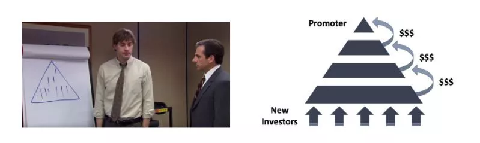

Estos sistemas suelen caracterizarse por elementos dudosos como la falta de valor intrínseco, promesas de rendimientos poco realistas y tácticas de marketing que fomentan recomendaciones para atraer a nuevos inversores. Los plazos de retiro no negociables y el uso de perfiles falsos en redes sociales para promoción también son señales reveladoras de estas estafas. Dado su carácter ilegal e inmoral y el riesgo financiero que representan, es esencial evitarlos.
Finalmente, estos sistemas están condenados al fracaso. Con el tiempo, el requisito de un número creciente de nuevos participantes para mantener el sistema se vuelve insuperable. Cuando se alcanza este punto, la ilusión se desvanece, el sistema colapsa y los inversores a menudo se quedan sin forma de recuperar su inversión.

Los esquemas Ponzi pueden manifestarse de diversas formas. A veces, se disfrazan como nuevas ofertas de tokens u Ofertas Iniciales de Monedas (ICO), combinaciones de contratos inteligentes, intentos de monopolizar la moneda fiduciaria o incluso programas de marketing sin un producto real. Sin embargo, una investigación exhaustiva y una debida verificación revelan que estos sistemas no crean ningún valor real. Simplemente redistribuyen el dinero de los nuevos participantes para pagar a los antiguos.

Recientemente, el mundo de las criptomonedas ha experimentado una ola de proyectos relacionados con la Finanzas Descentralizadas (DeFi) que merecen especial atención. Algunos de estos proyectos pueden recurrir a una combinación de criptomonedas de baja calidad, contratos inteligentes y sistemas de tasas de interés para ofrecer soluciones financieras supuestamente milagrosas. Es esencial ser cauteloso y realizar comprobaciones diligentes ante estas ofertas extremadamente fraudulentas.

Cabe destacar que el contenido de este curso está destinado únicamente con fines educativos y no debe interpretarse como asesoramiento financiero. El consejo "no confies, verifica" sigue siendo una pauta importante. Es esencial que cada persona realice su propia investigación y tome decisiones financieras informadas.

El Pump and Dump (P&D) o "inflar y desinflar" en español, es una forma notoria de manipulación financiera que puede causar importantes perturbaciones en los mercados. Se caracteriza por un ataque coordinado destinado a provocar un aumento artificial en el precio de un activo a través de diversos mecanismos, como el marketing agresivo, el uso de algoritmos o inteligencia artificial. El objetivo es luego vender estos activos sobrevalorados para obtener ganancias.

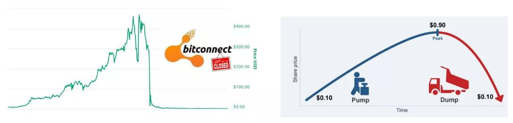

La estrategia de Pump and Dump generalmente sigue un patrón bien definido:

1. Un líder de opinión o un grupo de inversores primero compra una gran cantidad de acciones u otros activos específicos.
2. Luego crean publicidad alrededor de estos activos y difunden información exagerada o engañosa para atraer a otros inversores.
3. Esta publicidad genera un FOMO (Fear Of Missing Out), un miedo a perder una oportunidad, entre los inversores humanos y los bots de inversión, que comienzan a comprar masivamente estos activos.
4. Una vez que el precio ha aumentado lo suficiente, los líderes venden sus activos en grandes cantidades, obteniendo así una ganancia considerable.
5. La venta masiva provoca una caída abrupta en el precio del activo, dejando a muchos inversores con pérdidas sustanciales.

Es importante entender que participar en este tipo de estrategias es ilegal y puede dar lugar a acciones legales por manipulación del mercado. Además, estas estrategias suelen ser orquestadas por grupos de influencers que cobran tarifas de membresía. Si bien algunos participantes pueden obtener ganancias a corto plazo, las estrategias de Pump and Dump suelen ser no rentables a largo plazo.
Por lo tanto, se recomienda enfocarse en la educación financiera y la inversión responsable en lugar de dejarse seducir por estas tácticas manipuladoras. Adquirir conocimientos sólidos y adoptar un enfoque a largo plazo son claves esenciales para tener éxito en el mundo de la inversión.

Las estafas relacionadas con concursos o donaciones en línea son muy comunes en el sector de las criptomonedas. Los anuncios que prometen bitcoins gratuitos a menudo se utilizan para engañar a usuarios inexpertos. Algunos principios clave a tener en cuenta son nunca enviar bitcoins con la expectativa de recibir algo a cambio y desconfiar de las promesas de rendimientos irreales. Es esencial no confiar ciegamente, especialmente cuando se trata de un banner de internet.

Un ejemplo clásico de este tipo de estafa es la oferta que pretende duplicar o multiplicar de manera desmesurada los bitcoins que envías. Es importante entender que no existe una solución mágica para enriquecerse instantáneamente.

Otra táctica comúnmente utilizada es regalar "shitcoins" o criptomonedas de bajo valor. Algunos proyectos de criptomonedas centralizadas hacen mucho marketing y ofrecen tokens gratuitos como regalo. Hay que tener mucho cuidado con estas ofertas, ya que o bien el token no tiene valor alguno, o el regalo es simplemente para llamar la atención y promover el trading, juegos de azar y otras estafas. Aunque estas ofertas no siempre son fraudulentas, ilegales o engañosas, se requiere precaución.
En Twitter, por ejemplo, los bots pueden hacerse pasar por personalidades famosas y ofrecer ofertas increíbles para engañar a la gente. Estas cuentas utilizan el mismo nombre y foto de perfil que la personalidad en cuestión, y pueden engañar a los usuarios menos informados. Siempre asegúrese de verificar la legitimidad de la cuenta antes de interactuar con ella.
También es importante tener cuidado con los enlaces enviados por correo electrónico. Siempre verifique el enlace antes de hacer clic en él y preste atención a la identidad del remitente.

Por último, aquí hay algunos consejos para evitar estafas en línea:

- Las personas honestas nunca te pedirán que envíes dinero directamente.
- Nunca envíes bitcoins a una dirección desconocida.
- Las promesas de rendimientos irreales siempre son sospechosas.
- Es muy probable que los concursos estén amañados.
- Siempre ganarás más aprendiendo que jugando.
- En caso de duda, no actúes de inmediato. Tómate el tiempo para pensar y hacer investigaciones. El FOMO (Fear Of Missing Out, miedo a perderse algo) puede ser tu peor enemigo.
  Recuerda siempre hacer tu propia investigación antes de tomar una decisión de inversión.

Bitcoin ha experimentado varios "hard forks" a lo largo del tiempo, dando lugar a diversas versiones alternativas de la moneda original. Estas desviaciones a menudo son realizadas por desarrolladores que buscan realizar cambios significativos en el protocolo de Bitcoin, o a veces por personas malintencionadas que buscan engañar a inversores ingenuos. Es esencial distinguir el verdadero Bitcoin de estas derivaciones para evitar caer en posibles trampas. Algunos ejemplos notables de estas desviaciones incluyen Bitcoin Cash (BCH) y Bitcoin Satoshi Vision (BSV). A pesar de llevar el nombre de "Bitcoin", estos proyectos se basan principalmente en tácticas de marketing y publicidad engañosa para atraer la atención de los inversores.

Un refrán popular en el mundo de la inversión dice: "Si parece una estafa, si se comporta como una estafa y si garantiza que no es una estafa, entonces es muy probable que sea una estafa".

Es importante tener en cuenta que algunas de estas desviaciones están muy bien financiadas y gastan mucho en comunicación para engañar a los usuarios. Por ejemplo, el sitio web "Bitcoin.com" está asociado con Bitcoin Cash, no con el Bitcoin original, lo que puede ser confuso para los principiantes. El sitio web oficial de Bitcoin es "bitcoin.org".

El mundo de las criptomonedas es un terreno fértil para todo tipo de personalidades, atraídas por el potencial de obtener ganancias significativas. Desafortunadamente, entre ellas se encuentran individuos malintencionados que recurren a diversas tácticas para engañar y estafar a los inversores.
Estas tácticas pueden incluir la promoción abierta de esquemas piramidales, la suplantación de la identidad del creador de Bitcoin, Satoshi Nakamoto, el plagio del trabajo de otros, o la fabricación de falsas promesas. Además, algunos de estos individuos crean tokens de criptomonedas y Ofertas Iniciales de Monedas (ICO) inútiles con el objetivo de engañar a los inversores.

La comunidad de Bitcoin a menudo se moviliza para denunciar estos actos, pero puede pasar un tiempo antes de que el sistema legal pueda tomar medidas contra estos individuos.

Por lo tanto, es crucial mantenerse alerta y ser cauteloso en las interacciones con el mundo de las criptomonedas. Mi consejo personal sería ignorar a estos individuos y prácticas. No merecen ni tu tiempo ni tu energía. Es preferible dedicar estos recursos a adquirir conocimientos y comprender el mercado de las criptomonedas para poder navegar por este mundo de manera informada y segura.

Es esencial abordar con precaución a los "criptoinfluencers" o "gurús" de las criptomonedas. Estas personas a menudo tienen agendas personales y pueden estar involucradas en muchos proyectos que buscarán promover, incluso si no siempre están en el interés de los inversores.

Estos influencers pueden intentar promover criptomonedas poco confiables o "shitcoins" e implementar diversas estrategias para aumentar el valor de sus inversiones, incluso si estas son inseguras o potencialmente fraudulentas.
Aquí hay algunos consejos para navegar en este entorno:

- Desconfía de cualquier persona que promueva una criptomoneda específica o te ofrezca transacciones.
- Los "consejos gratuitos" a menudo no son realmente gratiuitos y pueden ocultar otras intenciones.
- Piensa dos veces antes de pagar por una formación en trading. Hay muchos recursos gratuitos disponibles para ayudarte a comprender el mercado de las criptomonedas (por ejemplo, el canal de YouTube 'ukspreadbetting').
- No puedes simplemente copiar las transacciones de otra persona y esperar obtener los mismos resultados.
- Recuerda que el hecho de que una persona diga algo, no significa que necesariamente sea verdad.

La mejor manera de protegerte es realizar tu propia investigación y verificar las fuentes de información. Ver un video en YouTube no es suficiente para verificar las fuentes.

Es importante tener en cuenta que todos tienen un programa, incluyéndome a mí. Creo en Bitcoin y mi objetivo es promoverlo. Espero beneficiarme de esta promoción, tanto políticamente como financieramente. Ningún contenido es completamente gratuito: si un producto o servicio parece gratuito, probablemente sea porque tú eres el producto.
Siempre ten en cuenta que no todos serán necesariamente transparentes en sus intenciones. Siempre cuestiona el propósito de las acciones de alguien y no le concedas ciegamente tu confianza.

## Seguridad en línea
<chapterId>f0873bf2-6a6f-5485-bb7a-d84be14f404d</chapterId>

Además de las estafas relacionadas con criptomonedas y finanzas, la principal razón para perder bitcoins está relacionada con una mala gestión de la seguridad en línea. A menudo, las personas utilizan la misma contraseña para todas sus cuentas, olvidan actualizar su computadora y descuidan hacer copias de seguridad regularmente. Si te sientes preocupado por estas prácticas, no te preocupes, siempre es posible mejorar tus hábitos de seguridad en línea. Aquí hay algunas medidas básicas que debes implementar:

- Utilizar un administrador de contraseñas (ver el tutorial de LastPass),
- Activar la autenticación de dos factores (2FA),
- Mantener tu computadora actualizada y libre de malware,
- Valorar tu privacidad utilizando herramientas dedicadas (Signal, Tor, ProtonMail).

Si este tema te resulta completamente desconocido, el curso SCU 101 puede ser interesante para profundizar en él en detalle.

Es crucial mantener tu computadora en un estado óptimo de funcionamiento, ya sea que estés interesado en Bitcoin o no. Una actualización no solo agrega nuevas funciones, sino que también corrige errores y mejora la seguridad de tus software. Por lo tanto, asegúrate de:

- Siempre actualizar tu software,
- Utilizar un software antivirus confiable,
- Ser cauteloso al descargar archivos,
- Hacer copias de seguridad regularmente de tus datos,
- Nunca compartir tus contraseñas.

Un consejo adicional: considera comprar un disco duro externo y realiza una copia de seguridad completa de tus archivos importantes. Esto podría ser valioso en caso de un fallo en tu computadora.

Un administrador de contraseñas es un software que almacena y administra tus contraseñas. Te ayuda a no usar la misma contraseña dos veces, a elegir contraseñas complejas y seguras, y facilita la gestión de tu seguridad en línea. Solo necesitas recordar una contraseña maestra. Es una herramienta gratuita que todos deberían utilizar. Puedes comenzar a usarlo gradualmente y una vez que te acostumbres, lo encontrarás extremadamente práctico y fácil de usar.

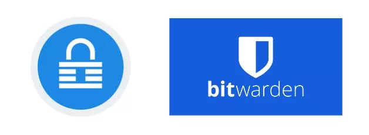

La autenticación de dos factores (2FA) proporciona una capa adicional de seguridad a tus cuentas más sensibles, ya sean plataformas de criptomonedas, cuentas de Google/correo electrónico, bancos o sitios de compras en línea. Se requiere una segunda identificación, generalmente un código de 6 dígitos accesible desde tu teléfono, para iniciar sesión. No olvides guardar una copia de seguridad de la clave en algún lugar en caso de que pierdas tu teléfono.

Una VPN, o red privada virtual, protege tu privacidad al ocultar tu dirección IP. Si bien esto no te hace completamente anónimo, sigue siendo un paso simple y efectivo para mejorar tu privacidad en línea. Elegir una VPN, descargarla y usarla es un proceso fácil de configurar.

El anonimato en línea es esencial para una sociedad libre y próspera. Permite la libertad de expresión, la protección de testigos y la innovación. La privacidad es un derecho humano fundamental. Para seguir protegiendo tu privacidad, considera utilizar:

- PGP para tus correos electrónicos,
- Signal para tus mensajes,
- Firefox o TOR para tu navegación,
- Sync para compartir archivos,
- Bitlocker para cifrar tus datos,
- Samurai Wallet para transferencias de dinero.

Una vez más, si este tema te interesa, el curso SCU 101 está disponible para acompañarte.

## Consejos para principiantes
<chapterId>33134b3f-92c1-5185-afb6-88599e47e801</chapterId>

La educación formal nos enseña muy poco sobre la inversión. Como resultado, a menudo nos aventuramos solos en este nuevo y complejo paisaje de inversión.

En esta sección, examinaremos algunos errores comunes que cometen los inversores principiantes al ingresar al mundo de Bitcoin, y cómo puedes evitar caer en las mismas trampas. También abordaremos cómo planificar sabiamente tu inversión en Bitcoin. Los temas que abordaremos incluyen:

- Tener cuidado con las "Shitcoins" u otras criptomonedas sin valor intrínseco.
- Invertir solo lo que puedas permitirte perder.
- Comprender la diferencia entre el trading y la inversión.
- Ser consciente de las implicaciones fiscales.
- Gestionar adecuadamente tu clave privada.
- La importancia de mantenerse humilde y discreto.
- Adoptar una perspectiva a largo plazo.

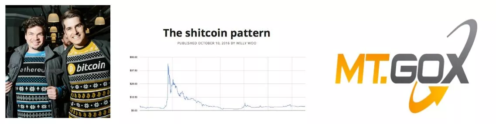

Antes de sumergirte en la inversión en Bitcoin, es esencial tomarse el tiempo para educarse.
Es fácil cometer errores en la industria de Bitcoin, y cada error puede ser costoso. Te compartiré algunos de los obstáculos que he encontrado en mi trayectoria como inversor, así como los que he observado en otros, espero brindarte valiosos consejos para navegar en este espacio. Entre estos errores, se pueden mencionar:
| Problemas tecnológicos | Problemas financieros |
| ------------------------------------------------- | -------------------------------------------------------------------- |
| Pérdida de una clave privada | Sobreinversión |
| Confiar la custodia de tus activos a un tercero | Falta de educación financiera |
| Falta de confidencialidad | Invertir con dinero prestado |
| Problemas de seguridad en línea | No entender la diferencia entre el trading y la inversión |
| Mala manipulación | Ignorar las implicaciones fiscales |
| Problemas de computadora | No tener en cuenta los plazos de inversión |
| Pérdida de BTC debido a un hackeo | Caer en fraudes y estafas financieras |

No importa tu nivel de educación o tus antecedentes, cualquiera puede entender y usar Bitcoin. No necesitas tener experiencia en finanzas o codificación. Como el 90% de las personas, simplemente puedes usar Bitcoin de manera sencilla.

Cada persona es diferente y debe adaptar su estrategia de inversión a su situación financiera personal. Aquí tienes algunas buenas y malas prácticas:

- Las compras periódicas promedio son una buena práctica.
- El uso del apalancamiento, por ejemplo, tomar prestado dinero para invertir, generalmente no es recomiendado.
- Evita el FOMO (Fear Of Missing Out), o el miedo a perder una oportunidad. Esto puede llevarte a hacer inversiones impulsivas.
- Una buena práctica es asignar un presupuesto específico para tu inversión.

El objetivo no es tener un plan perfecto, sino tener una estructura a seguir y respetar. No quieres comprar impulsivamente por emoción o miedo. Quieres seguir una estrategia que hayas escrito previamente en papel para evitar cualquier estrés innecesario.

No hay edad para aprender a invertir; puedes comenzar con una cantidad muy pequeña y progresar con el tiempo. La educación es un viaje.

- Regla de oro número 1 de la inversión: ¡nunca inviertas más de lo que puedas permitirte perder! La idea es tomar todos tus ingresos mensuales, restar tus gastos obligatorios (deudas y otros gastos mensuales como vivienda), restar tus costos de vida (alimentación). Entonces te quedará tu presupuesto de ahorro. ¡Si inviertes más que eso, tarde o temprano tendrás problemas!
- Regla de oro de la inversión n°2: evita lo que está de moda. Concéntrate en avanzar tomando decisiones racionales. Si tienes dudas, déjalo pasar la noche y habla con tus seres queridos. Es mejor tomarse su tiempo que apresurarse. La mejor estrategia es avanzar paso a paso.
- Regla de oro n°3 de la inversión: la planificación y tener una visión a largo plazo son esenciales para tener éxito en las finanzas. Planifica y no tomes demasiados riesgos. El objetivo es evitar fracasos fatales mientras acumulas éxitos.

En caso de duda: comienza por informarte. Explora el mundo de Bitcoin durante unas horas (tienes muchos recursos disponibles en esta plataforma). Lee 2 o 3 libros. Compra 5 dólares para probar. Mira documentales y videos. Mantén la mente abierta.

Como con cualquier otra inversión, es necesario conocer su mercado. El Bitcoin es muy joven y volátil, lo que significa que las cosas cambian rápidamente y esto implica cierto riesgo. El Bitcoin puede desaparecer, caer a cero o estancarse durante años. Por supuesto, solo debes invertir lo que puedas permitirte perder. ¡No te endeudes para invertir en una moneda cuyos detalles quizás aún no entiendas completamente!

Una vez que te sientas más cómodo con el Bitcoin, podrás revisar tu plan de acción. En la misma línea, es importante, si eres nuevo en este mundo, comprender bien las diferencias entre el trading, la inversión a largo plazo y una estrategia muy, muy a largo plazo utilizada por muchos bitcoiners, llamada "hold".

En general:

|                      | Trading     | Inversión           | Hold            |
| -------------------- | ----------- | ------------------- | --------------- |
| Apalancamiento       | Sí          | No                  | No              |
| Periodo              | Corto plazo | Corto/mediano plazo | Muy largo plazo |
| Tipo de activo       | Contrato    | BTC                 | BTC             |
| Riesgo               | Muy alto    | Alto                | Alto            |
| Dificultad           | Muy difícil | Difícil             | Difícil         |
| Curva de aprendizaje | Larga       | Larga               | Larga           |
| Pérdidas potenciales | Ilimitadas  | Limitadas           | Limitadas       |
| Más adecuado para    | Algunos     | La mayoría          | Algunos         |

Y aquí están mis consejos:

- Optar por una perspectiva a largo plazo suele ser una estrategia inteligente. Seguir constantemente la evolución del mercado puede resultar complicado y requiere un compromiso a tiempo completo. Como dijo Warren Buffet: "Si no estás dispuesto a mantener una acción durante diez años, es mejor no mantenerla en absoluto, ni siquiera durante diez minutos".
- Es fundamental ser extremadamente cauteloso en materia de impuestos: Cada país tiene sus propias leyes con respecto a los Bitcoins. Es esencial informarse sobre la legislación vigente en su país, especialmente en lo que respecta a las obligaciones fiscales. Una mala planificación podría hacer que tenga que devolver más dinero a la administración fiscal de lo que ha ganado.

  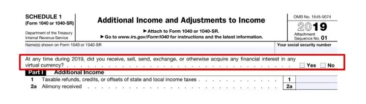

Aprender a invertir no es algo que generalmente se enseñe en la escuela. Por lo tanto, muchas personas consideran la inversión como una actividad arriesgada, loca e inaccesible. Para protegerse, muchos recurren a un banco... lo cual puede resultar un error.

No hay edad para comenzar a educarse en materia de inversión y comprender cómo funcionan el dinero y el sistema financiero. No es necesario sumergirse por completo; tener una visión general es suficiente para tomar decisiones adecuadas, basadas en hechos y no en la ignorancia. Esto puede ser muy útil a lo largo de su vida, ya que sabrá reconocer cuando alguien intenta venderle un mal producto de inversión (por ejemplo, un banco).

No deberías hacer trading. Sí, el trading es un trabajo a tiempo completo que implica mucho estrés, riesgo y autocontrol. No es una actividad para todos y puede conllevar riesgos graves. Si aún así deseas intentarlo, al menos sigue a una persona confiable y con sentido común, como Mark en Ukspreadbetting.

Dos buenas fuentes:

- Padre Rico, Padre Pobre - Robert T Kiyosaki - Es una buena introducción al mundo de la inversión. Es perfecto para todos.
- The Investors Podcast - Este podcast es más técnico, pero te dará una buena idea del grado de complejidad del mundo financiero. Si ya trabajas en el campo financiero o te apasiona, escucha algunos de sus episodios. Algunos de ellos hablan sobre Bitcoin.

Para concluir esta sección sobre los requisitos previos, volvamos a la primera razón de pérdida financiera en nuestra industria: la mala gestión de la clave privada.

Como recordatorio, la clave privada es una lista de 12 o 24 palabras que representa la copia de seguridad de tus bitcoins. Es esencial ser extremadamente cuidadoso al respecto. Cuando almacenas tus bitcoins en una plataforma de intercambio, es la plataforma la que tiene el control, ¡no tú! Esta situación conlleva riesgos como la quiebra de la plataforma, la confiscación de sus bitcoins o el pirateo de la plataforma.
La regla de oro de Bitcoin n°1: No tienes tu clave, no tienes tus bitcoins. La clave en Bitcoin representa la propiedad de los bitcoins. Si tienes tu clave, tienes tu soberanía financiera y eres responsable de la seguridad de tu propio dinero.

Si pierdes tu clave, también pierdes tu dinero. Es mejor seguir las mejores prácticas de la industria y evitar estrategias complejas. Bitcoin ya es lo suficientemente arriesgado por sí mismo. Escucha los consejos de los expertos. Además, cuando uses Bitcoin, es mejor mantenerlo discreto: evita hablar de ello. Al exponerte, te conviertes en un objetivo potencial, aumentando así los riesgos para ti y tu familia. La mejor seguridad radica en la discreción. No es necesario gritar a los cuatro vientos que tienes bitcoins.

¡Buena suerte! Espero que me sigas en el mundo de Bitcoin y me permitas guiarte para adquirir y asegurar tus primeros bitcoins sin correr riesgos.

# Comprender en qué nos estamos metiendo
<partId>a42355a3-9dd8-57ed-b590-32a333fe09ea</partId>

## Bitcoin en 5 minutos
<chapterId>ae122ad9-9b4d-5229-9038-e1b99d5cfc83</chapterId>

En este curso, queremos centrarnos en el plan de acción para obtener tus primeros bitcoins. Si deseas una explicación más detallada de los fundamentos de Bitcoin, te recomendamos BTC 101, disponible de forma gratuita en esta plataforma.

Bitcoin es un protocolo informático que permite enviar valor en todo el mundo sin intermediarios de confianza. Este valor está representado por una moneda llamada bitcoin.

El famoso Bitcoin del que siempre se habla es, por lo tanto, esta moneda digital. Los usuarios de Bitcoin se envían bitcoins entre billeteras, y todo esto funciona gracias a una red de nodos (servidores Bitcoin) que propagan las transacciones de todos los usuarios entre sí. Para garantizar la finalidad de las transacciones, algunos actores de esta red también son mineros (los famosos mineros), y su objetivo es registrar las transacciones propagadas en la blockchain o cadena de bloques de Bitcoin (aún más famosa).

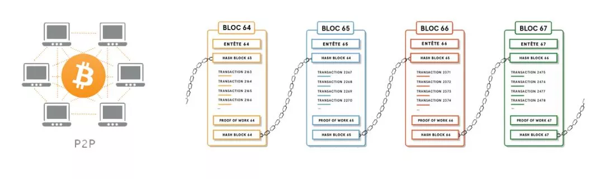

Gracias a este mecanismo bastante extraño, obtenemos una base de datos (la cadena de bloques) que es inmutable en el tiempo, descentralizada en el espacio y que funciona constantemente en todo el mundo. Esto permite, por primera vez en la historia de la humanidad, tener un sistema contable de triple entrada que permite a cualquier persona utilizar un sistema financiero alternativo construido en Internet sin que nadie lo controle o lo destruya.

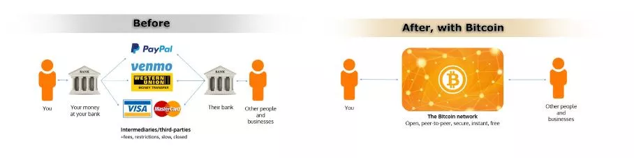

Además de su funcionamiento técnico (BTC 101 lo explica), se pueden destacar dos características que hacen de Bitcoin lo que es hoy después de 14 años de existencia:

- La primera es que el código de Bitcoin es de código abierto. Esto significa que cualquiera puede ver cómo funciona Bitcoin, es transparente y, por lo tanto, auditable. Como resultado, cualquiera puede usarlo y el protocolo es igual para todos, no puede haber discriminación. Esto hace que Bitcoin sea extremadamente interesante para su uso como sistema de envío de valor.
- El segundo elemento radica en sus propiedades monetarias. De hecho, Bitcoin es escaso. Solo habrá 21 millones en el mundo y nunca más (e incluso menos debido a los bitcoins perdidos). Esto es posible gracias a la naturaleza misma del protocolo, ya que desde su lanzamiento, sus características monetarias (la curva de distribución de bitcoins) se decidieron y nadie puede cambiarlas unilateralmente. Esta característica hace que Bitcoin, al igual que el oro, no pueda diluirse mediante la impresión excesiva de dinero.

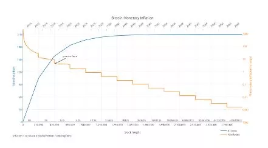

Estas dos características hacen de Bitcoin una herramienta tecnológica y monetaria poderosa que no solo innova en nuestro mundo, sino que también rompe normas.

Debido a estas características, muchos bitcoiners, incluyéndome a mí mismo, estamos dispuestos a decir que Bitcoin es una innovación importante para nuestra sociedad, al mismo nivel que la rueda, la contabilidad de doble entrada, la electricidad o incluso Internet.

Por lo tanto, Bitcoin es un "0 a 1" que trastoca nuestras normas y hábitos.
Si esto es nuevo para ti, te animo encarecidamente a seguir BTC 101 antes de seguir exponiéndote a una tecnología cuyo papel y razón de ser quizás no entiendas bien.

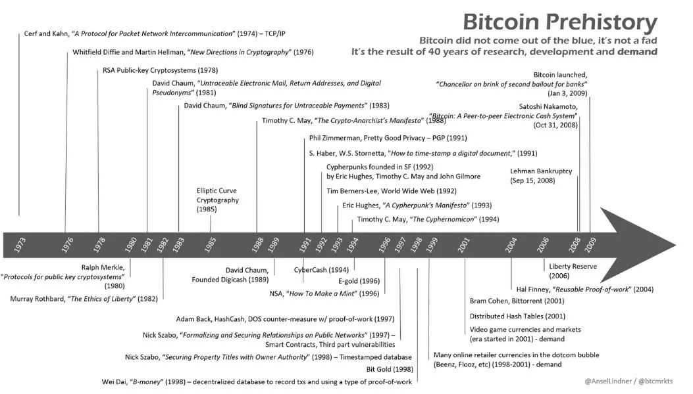

## ¿Por qué Bitcoin es importante?
<chapterId>d4327ac4-9ff8-5192-b542-cb78c0bd0aa7</chapterId>

¿Por qué la importancia de Bitcoin es tan crucial? Esa es la pregunta central de esta plataforma. Ya sea en relación con tus estudios o tu estrategia de inversión, sin una comprensión clara de la importancia de Bitcoin, corres el riesgo de desviarte de tu plan de acción. Por lo tanto, el objetivo es siempre tener en cuenta los fundamentos de Bitcoin para asegurarse de que tu estrategia se mantenga en línea con tus convicciones.

Barack Obama una vez describió a Bitcoin como "un banco suizo en tu bolsillo". Y de hecho, Bitcoin ofrece las mismas oportunidades para todos, independientemente de quién seas. Ya seas un adolescente, un presidente, un manifestante en Hong Kong o un "chaleco amarillo" en Francia, todos tienen acceso igual al mismo protocolo y las mismas herramientas:

1. Creación de cuentas gratuitas e ilimitadas.
2. Posibilidad de enviar dinero a cualquier persona en cualquier lugar.
3. No se requiere identificación ni papeleo.
4. Accesibilidad para todos, independientemente de la edad, género, religión, país o nivel de ingresos.
5. Privacidad y transparencia a pedido.
6. Ausencia de intermediarios o tarifas ocultas.
7. Bitcoin es nativo de Internet, lo que lo hace accesible para todos aquellos que tienen acceso a la web.

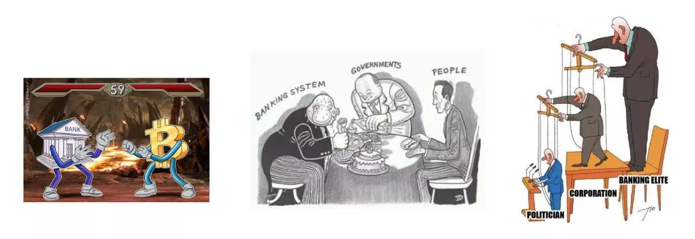

En resumen, Bitcoin puede considerarse como la "moneda del pueblo".
Pregunta filosófica del día: En el mundo de Bitcoin, dos ideologías se enfrentan. ¿Quieres incluir en el sistema bancario a miles de millones de personas que no están en él? ¿O quieres sacar del sistema bancario a miles de millones de personas que sí están en él?

Esta pregunta merece reflexión y la abordaremos más adelante.

Miles de millones de personas viven bajo el efecto perjudicial de políticas monetarias mal gestionadas, que a menudo resultan en graves crisis financieras a largo plazo. Este tipo de crisis ha ocurrido cientos de veces en nuestra historia y seguirá ocurriendo mientras se manipule el valor del dinero y del tiempo. Estas crisis pueden manifestarse en forma de hiperinflación, control monetario y devaluación de la moneda.

Bitcoin ofrece a cada individuo la oportunidad de salir de este sistema. Es una elección ética que cada uno probablemente tendrá que hacer algún día. Bitcoin facilita el paso del dinero fiduciario al dinero sano, gracias a su resistencia a la censura, su divisibilidad y su portabilidad.

¿Sabías que en los últimos 100 años ha habido más de 55 casos de hiperinflación? La mayoría de ellos han destruido por completo la economía de su país, arruinado las economías de los ciudadanos y a veces han creado inestabilidad política que ha llevado al establecimiento de regímenes dictatoriales (como fue el caso en Chile, Alemania, etc.). La destrucción de las monedas fiduciarias no es un fenómeno nuevo y seguirá ocurriendo. Sin embargo, gracias a Bitcoin, ahora tienes la oportunidad de salir de este sistema.

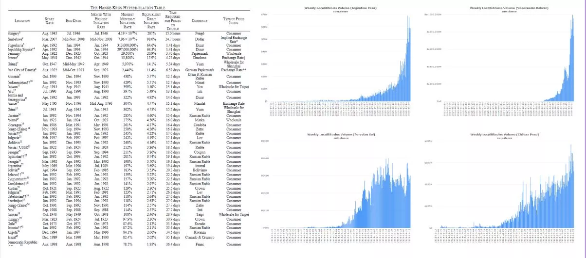

El aumento de las desigualdades de riqueza en el mundo ha llevado a un aumento del extremismo, que a veces ha resultado en el establecimiento de regímenes dictatoriales. No importa quién seas, es posible que algún día necesites privacidad para proteger a tu familia, a ti mismo y a tus ahorros. ¿Dónde podrías esconder tus bienes si estuvieras amenazado políticamente?

- Tu cuenta bancaria puede ser congelada, confiscada o vaciada.
- El oro es difícil de dividir, transportar y utilizar.
- El efectivo es voluminoso, fácil de robar y está sujeto a la inflación.
  Bitcoin ofrece una solución a estos problemas al permitir a las personas asegurar sus ahorros y llevarlos consigo, sin ningún control por parte del Estado. Casi la mitad de la población mundial vive bajo un régimen hostil, estas personas necesitan Bitcoin más que nadie.
  Bitcoin es una forma de protesta pasiva contra la injusticia del sistema.

¿Sabías que? Bitcoin es seudónimo. Una dirección anónima se utiliza para almacenar e intercambiar Bitcoins entre usuarios. Sin embargo, cada transacción se registra en un libro mayor público (la blockchain o la cadena de bloques) para que todos puedan verificarla. Esto significa que, aunque los nombres de los usuarios no se revelen, el historial de sus transacciones es completamente transparente.

Los bancos centrales continúan diluyendo tu poder adquisitivo a través de la inflación y las políticas de creación monetaria (flexibilización cuantitativa). Estos son impuestos ocultos que han destruido gradualmente el valor del dinero a lo largo de las décadas. Si no tienes un ingreso sólido proveniente de dividendos, bonos o inversiones inmobiliarias, te empobrecerás con el tiempo, mientras que los ricos seguirán enriqueciéndose aún más. Debido a la acción de los bancos centrales, un dólar hoy vale menos que un dólar mañana.

El sistema te anima a endeudarte, gastar y enriquecer a los banqueros a través de los intereses pagados durante muchos años de reembolso y endeudamiento. Esto no es un error, sino una estrategia deliberada implementada por los bancos y los políticos para estimular el gasto gubernamental, el crecimiento económico y empujar a la población a endeudarse cada vez más.

Nuestro sistema está corrompido por los bancos centrales. Bitcoin es el remedio.

Nunca habrá más de 21 millones de bitcoins y ningún político, banquero u otra persona malintencionada podrá cambiar eso. Este límite fue establecido en el protocolo de Bitcoin por Satoshi y no puede ser cambiado hoy en día. Esto fija la tasa de inflación de Bitcoin para los próximos 100 años.

En el pasado, el oro desempeñaba un papel regulador como una moneda sólida. Sin embargo, desde 1971, ninguna moneda fiduciaria (euro, dólares, etc.) está respaldada por oro, lo que ha abierto el camino a una creación monetaria ilimitada. Brrrrrr (alusión al sonido de la impresora de billetes).
Si tienes dinero en una cuenta bancaria, ese dinero ya no te pertenece. En realidad, has prestado ese dinero al banco para que lo utilice. Es crucial entender y ser consciente de esta realidad. Si tienes dinero en una cuenta bancaria, en realidad eres un acreedor del banco. Esto significa dos cosas:

1. Si el banco quiebra, corres el riesgo de perder tu dinero.
2. Si el banco se niega a devolverte tu dinero, también corres el riesgo de perderlo.

Puede que pienses que estos escenarios son poco probables, pero exploraremos en un capítulo posterior por qué son casi inevitables.

Bitcoin, por otro lado, es un sistema abierto e incorruptible. Las reglas son fijas y las mismas para todos. La famosa frase "No es tu clave, no son tus bitcoins" resalta la importancia de poseer la clave privada de una billetera de Bitcoin. Al tener la clave privada, tienes control total sobre los bitcoins que contiene. Si no posees esta clave, significa que alguien más tiene tus bitcoins por ti. En este caso, tus bitcoins están expuestos a riesgos similares a los asociados con un banco tradicional.

Para recuperar tu soberanía, es esencial tomar el control de tu clave privada y asegurar tus bitcoins por ti mismo.

Bitcoin ofrece una poderosa alternativa a los sistemas financieros tradicionales. Permite a cada individuo preservar su privacidad, protegerse contra la inflación y la devaluación monetaria, evadir regímenes autoritarios y recuperar la soberanía sobre su dinero. Bitcoin es una moneda saludable, accesible para todos independientemente de la edad, género, religión o ingresos. Al adoptar Bitcoin, las personas pueden ahorrar para el futuro, liberarse del control de los bancos centrales y retomar el control de su vida financiera. Es una herramienta que permite equilibrar el poder y promover la libertad económica a nivel mundial.

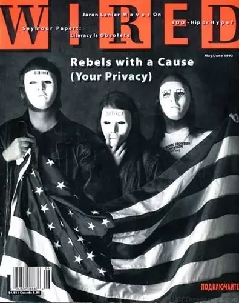

¿Bitcoin, un movimiento político?

Los principales promotores de Bitcoin en la actualidad siguen siendo principalmente cypherpunks, ciudadanos oprimidos, anarquistas, seguidores de la escuela austriaca de economía, ingenieros informáticos, financieros y defensores de la libertad de expresión.

Bitcoin tiene una dimensión altamente filosófica, ética y política, aunque es completamente indiferente a estas consideraciones. De hecho, Bitcoin es simplemente un protocolo que reproduce el mismo proceso una y otra vez. Son los usuarios quienes lo han convertido en un arma de liberación contra el sistema financiero actual. Desde la perspectiva del movimiento Cypherpunk, Bitcoin se opone a una sociedad sin efectivo. Permite crear transacciones financieras digitales completamente privadas y sin intermediarios. Para el movimiento Cypherpunk, Bitcoin es el equivalente electrónico del dinero en efectivo.

## Comprender la industria de Bitcoin
<chapterId>e106c6f1-d75b-5a62-b245-0ea2e4d02ef8</chapterId>

Con la llegada de Bitcoin en 2009 por Satoshi Nakamoto, nació una industria de varios miles de millones de dólares. A pesar de su juventud, esta industria ha experimentado un crecimiento exponencial en los últimos diez años. Cada día llegan nuevos actores con grandes sumas de dinero y están listos para ingresar con fuerza a esta nueva industria. Hoy en día, la industria ha alcanzado un punto de no retorno donde los gobiernos, los bancos, los gigantes de Internet y otros se han unido al movimiento con todo tipo de intervenciones.

Bitcoin es un 0 a 1. No se puede deshacer. Algunos lo verán como la personificación del mal, una caja de Pandora abierta y que les quita poder y ventaja. Lucharán contra ello. Otros verán en Bitcoin una oportunidad para recuperar la libertad, cambiar el sistema y mejorar nuestra sociedad. Lo abrazarán. A Bitcoin no le importa, simplemente existe.

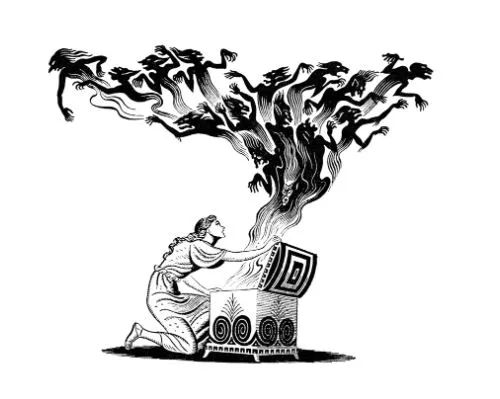

En esta sección, trataremos de hacer un rápido recorrido por los actores para comprender mejor cómo funciona la industria en la que estamos tratando de ingresar.

Cualquiera puede diseñar su propia criptomoneda, una tarea que solo lleva unos minutos. Sin embargo, el valor de este token estará exclusivamente determinado por el mercado. En diciembre de 2019, se enumeraron más de 5000 tokens en Coinmarketcap. Hoy, en 2023, ese número ha aumentado a más de 23,000, con NFT, DeFi y muchas otras cosas. Estos tokens criptográficos pueden tomar diferentes formas: moneda, título de seguridad, combustible para un ecosistema, sidechain, arte digital, etc.
Es crucial entender que el 99,8% de estas nuevas "criptomonedas" son estafas creadas por vendedores para robar tus bitcoins. Sin embargo, entre el escaso 0,2% de proyectos serios, se está haciendo un esfuerzo considerable para avanzar, experimentar y desarrollar tecnologías innovadoras que puedan brindar numerosas ventajas a los usuarios. Con el tiempo, el sector mejorará y surgirán empresas legítimas que ofrezcan productos reales. La pregunta de si esto sucederá en otras blockchains aparte de Bitcoin sigue sin respuesta. Por ahora, una cosa es segura: Bitcoin es la única moneda verdaderamente descentralizada, resistente a la censura, libre y lo suficientemente seria como para justificar miles de horas de trabajo.

| Característica    | Bitcoin                   | Alt-Coin (99.9% of them) |
| ----------------- | ------------------------- | ------------------------ |
| Liquidez          | Alta                      | Baja                     |
| Adopción (real)   | Alta y global             | Baja                     |
| Equipo            | Robusto y descentralizado | Débil y centralizado     |
| Reputación        | Alta y global             | Baja                     |
| Infraestructura   | Robusta y estable         | Débil                    |
| Descentralización | Sí                        | No                       |
| Estafa?           | No                        | Probablemente            |
| Valor?            | Sí                        | Discutible               |

No te dejes engañar con frases como:

- "Blockchain, no Bitcoin"
- "XRP es el nuevo Bitcoin"
- "StableCoin es el futuro"
- "Libra eliminará a Bitcoin"
- "Descubre mi nuevo Bitcoin mejorado"
- "Fedcoin hará que Bitcoin sea obsoleto"

Es esencial realizar investigaciones personales si decides adentrarte en el mundo de las alt-coins, pero no te guiaremos aquí.

Después de la burbuja de las ICO en 2017, muchos actores importantes comenzaron a desarrollar su propia base de datos utilizando la "blockchain". Algunos gobiernos y sus bancos centrales están explorando la posibilidad de crear una versión digital de su moneda fiduciaria (Suecia, Europa, Rusia, China, etc.). Los gigantes tecnológicos también se están uniendo a esta carrera. Facebook lanzó su propio proyecto de stablecoin llamado "Libra". Se están experimentando alternativas a la "blockchain" por parte de bancos, corporaciones y otros gigantes tecnológicos con soluciones como Linux o IBM "Hyperledger".

| Característica          | Bitcoin | Alt-coin | Facebook-coin | Fed-coin |
| ----------------------- | ------- | -------- | ------------- | -------- |
| Público                 | Sí      | Varía    | No            | No       |
| Abierto                 | Sí      | Varía    | No            | No       |
| Sin fronteras           | Sí      | Varía    | No            | No       |
| Neutral                 | Sí      | Varía    | No            | No       |
| Resistente a la censura | Sí      | Varía    | No            | No       |

Aunque pretenden competir con Bitcoin, estos proyectos siguen siendo centralizados para garantizar el control y cumplir con las regulaciones locales. No proporcionarán protección de la privacidad, sino una mayor vigilancia masiva. El proyecto "Libra" de Facebook se posicionaba como competencia de los bancos, no de Bitcoin. Además, sin prueba de trabajo, una "blockchain" no tiene un valor real. Cabe destacar que Libra ha sido abandonado y actualmente no se utiliza ningún proyecto real de blockchain privada a nivel mundial, a diferencia de Bitcoin.

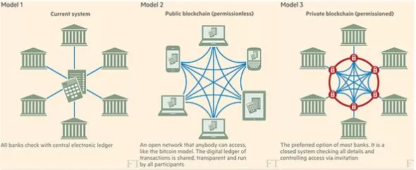

El protocolo de Bitcoin está fuera del alcance de las regulaciones. Solo los actores que giran en torno a él pueden ser regulados y, como Bitcoin es descentralizado, las leyes, impuestos y regulaciones varían de un país a otro. Por ejemplo, China ha prohibido el uso de Bitcoin en varias ocasiones, mientras que países como Canadá, Suiza y Malta adoptan una postura más favorable hacia él. La mayoría de las naciones han establecido grupos de trabajo sobre criptografía para desarrollar nuevas reglas y regulaciones. Sin embargo, este proceso es lento y las reglas pueden cambiar con bastante frecuencia. A pesar de este ritmo lento, Bitcoin y las criptomonedas están en el centro de muchas conversaciones.

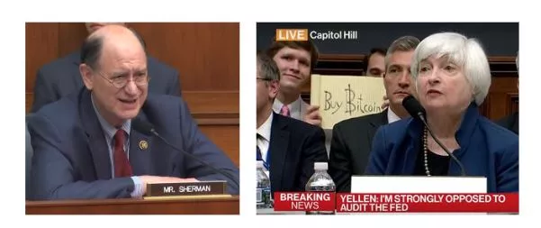

Se recomienda realizar una investigación exhaustiva sobre la situación en tu país. Los bancos también están altamente regulados en lo que respecta a Bitcoin. Muchos de ellos cierran cuentas y limitan el acceso a servicios financieros para empresas que operan con Bitcoin, al mismo tiempo que forman equipos de investigación para explorar esta nueva tecnología con el objetivo de mejorar su propia infraestructura. Ningún regulador, banco o gobierno quiere perder poder, por lo que se están preparando para enfrentar a Bitcoin. Es importante tener en cuenta que Bitcoin, como tal, no puede ser modificado o controlado por una sola entidad.

Las plataformas de intercambio actúan como un enlace entre la moneda fiduciaria (moneda gubernamental) y las criptomonedas. Permiten a sus clientes comprar o vender criptomonedas a través de su plataforma. Cada plataforma de intercambio tiene características diferentes. Aquí hay algunos aspectos a considerar:

- Buena reputación en seguridad
- Suficiente liquidez
- Servicio al cliente eficiente
- Interfaz de usuario intuitiva
- Opción para realizar compras automáticas
- Retiro automático de bitcoins a tu billetera.
  La mayoría de las plataformas de intercambio legales cumplen con las regulaciones bancarias vigentes. También han implementado rigurosos procedimientos de KYC ("Conoce a tu cliente"), lo que significa que se te pedirá que proporcione una identificación para crear una cuenta. Por lo tanto, debemos dividir la industria de las soluciones de compra en KYC y no KYC, como exploraremos en detalle próximamente.
  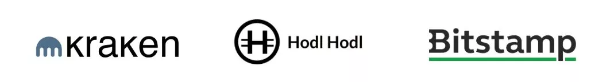

**Precaución**: El "Gran Hermano" te está vigilando, supuestamente por tu seguridad, por supuesto. Tus datos pueden ser utilizados por tu gobierno para rastrear sus actividades.

En el espectro de las plataformas de intercambio, podemos distinguir 5 tipos principales:

- Plataforma de intercambio ética: Aquí hablamos de soluciones que intentan respetar al usuario ofreciéndole un servicio simple y honesto. Estas plataformas suelen ofrecer una solución de DCA (Promedio de Costo en Dólares) y una retirada automática de fondos a la billetera del usuario. Estas son las soluciones más adecuadas para principiantes. (ejemplo: Relai, Bull Bitcoin, StackinSat)
- Plataformas de intercambio peer-to-peer: Le permiten comprar y vender bitcoins directamente entre usuarios. Puede encontrar personas en su ciudad para realizar transacciones. Ten cuidado durante estos intercambios y elige lugares seguros y públicos para concluir las transacciones. Estas soluciones no KYC son muy buenas para usuarios un poco más avanzados. Las exploraremos en detalle en BTC 205; (ejemplo: Bisq, Peach, RoboSats)
- Plataformas de intercambio de Altcoins: Estas plataformas te permiten comprar y vender diversas Altcoins que desees intercambiar. Para hacer esto, puede depositar BTC o utilizar una tarjeta de crédito. Se recomienda tener mucho cuidado con las Altcoins y evaluar su rendimiento en Bitcoin, no en dólares. Básicamente, estas plataformas son gigantes casinos de activos no regulados (a menudo inseguros). No las recomendamos (ejemplo: Bitfinex, Kraken, Bitstamp)
- Plataformas de intercambio de trading: Le permiten operar con bitcoins y otras criptomonedas con apalancamiento, utilizando BTC como garantía. De esta manera, puedes operar contratos derivados. ¡Ten cuidado si utilizas apalancamiento! Probablemente sea mejor no operar sus bitcoins. Del mismo modo, no recomendamos este tipo de solución para principiantes (ejemplo: Binance)
- Plataformas de intercambio dudosas: Algunas plataformas no reguladas son sospechosas, pueden manipular su volumen de transacciones y su seguridad suele ser deficiente. Estas plataformas suelen ser rusas, chinas o exclusivas de la darknet. El riesgo corre por tu cuenta, pero se recomienda evitarlas.
  Nunca olvides retirar tus bitcoins de una plataforma de intercambio. Las plataformas de intercambio pueden ser pirateadas, incautadas, declararse en quiebra o simplemente desaparecer con tu dinero. Presentan riesgos significativos y deben evitarse tanto como sea posible. Nunca dejes tus fondos allí durante un largo período de tiempo. Recuerda: si no tienes las claves, los bitcoins no son tuyos.
  Los bitcoins se guardan en lo que se llama una "billetera", que es una caja fuerte digital para tu dinero. Solo el titular de la clave puede acceder a ella. Puede ser un dispositivo físico, un software de aplicación o incluso un trozo de papel. Estas billeteras actúan como el enlace entre tus bitcoins y el mundo exterior.
  Cada billetera tiene diferentes características:

- privacidad
- seguridad
- facilidad de uso
- costo.

En nuestra industria, podemos dividir a los actores de las billeteras en varias secciones:

- Los fabricantes de billeteras de hardware. Aquí tenemos muchas empresas compitiendo en este tema. Algunas son de código abierto, otras ofrecen billeteras de hardware más o menos costosas con más o menos características (por ejemplo: Ledger, Trezor, Coinkite, Shiftcrypto).
- Los fabricantes de billeteras de software; son empresas o actores independientes que desean crear billeteras de software para dispositivos móviles o computadoras (por ejemplo: Wizard Sardine, Galoy, Synonyme, Blockstream).
- Las billeteras DIY (Hazlo tú mismo); aquí tenemos soluciones 100% de código abierto que se pueden crear en casa para reducir los riesgos de confiar en otros actores de la cadena de producción o creación (por ejemplo: Seedsigner, Specter DIY).

Las billeteras son un aspecto fundamental de Bitcoin y las exploraremos en detalle en esta plataforma.

Los mineros son responsables de asegurar la red. Utilizan electricidad para realizar los procesos de prueba de trabajo de Bitcoin, lo que crea un nuevo bloque. Ya hemos tratado el tema de los mineros en detalle en el curso BTC 101, si es necesario. Para ir más allá, ofrecemos el curso sobre minería MIN 201.

Es importante entender que esta industria es vasta, muy vasta.

Si bien comenzó de manera individual, los mineros de hoy en día suelen ser grandes empresas bien financiadas que compiten en un sector muy difícil. Buscan fuentes de energía baratas para obtener una ventaja competitiva. Pueden ser públicos o anónimos y pueden estar en cualquier parte del mundo.

Su industria se divide en muchos actores de diferentes tamaños:

- Los fabricantes de equipos de minería (por ejemplo, Bitmain): estas empresas son el eslabón esencial de nuestra industria, ya que es extremadamente complejo crear ASIC eficientes.
- Los creadores de software de minería: ya sea para la creación de grupos de minería o las herramientas utilizadas por los ASIC, es un aspecto fundamental de la industria (por ejemplo, Braiins OS).
- Los desarrolladores que trabajan en soluciones innovadoras como StratumV2.
- Los mineros: son quienes utilizan las máquinas y el software para llevar a cabo sus operaciones de minería. Pueden ser tanto pequeños mineros aficionados que utilizan un S9 (como enseñamos en el curso de MIN 201) como mineros internacionales como Galaxy, que poseen enormes almacenes en Texas para la minería.

La minería es un campo independiente, por lo que si estás interesado en el tema de la energía, estarás satisfecho.

Bitcoin es un protocolo de código abierto. Puedes encontrar su código en GitHub: https://github.com/bitcoin/bitcoin. A partir de ahí, puedes consultar todas las propuestas de actualización, toda la documentación y muchas discusiones de la comunidad. Todo es transparente y depende del usuario decidir si realizar o no una actualización. Los principales desarrolladores de Bitcoin son responsables de la gestión de este GitHub. Actualizan el código fuente, verifican los errores y se encargan de la gestión general del proyecto.

Siempre se pueden subdividir los desarrolladores de Bitcoin en diferentes secciones:

- Los desarrolladores de Bitcoin Core: son responsables del desarrollo principal del protocolo Bitcoin y sus características centrales.
- Los desarrolladores de protocolos adicionales (como Lightning Network o RGB): trabajan en protocolos adicionales que se integran al ecosistema de Bitcoin y amplían sus características.
- Los desarrolladores aficionados que crean herramientas y aplicaciones (como Mempool o Alby): contribuyen al ecosistema de Bitcoin desarrollando herramientas, servicios o aplicaciones que facilitan su uso.

Cualquiera puede comenzar a contribuir al código, pero es importante tener en cuenta que modificar el código de Bitcoin es un proceso largo y complejo. Además, muchos desarrolladores de Bitcoin son apasionados que dedican muchos años a desarrollar BIP (Bitcoin Improvement Proposals) que podrían nunca ser utilizados. Por lo tanto, es una industria compleja y a veces impredecible. Exploraremos estos aspectos en detalle.

¿Un poder ilimitado? No. Los principales desarrolladores no tienen un poder ilimitado y no pueden modificar o controlar Bitcoin por sí solos. Son los nodos los que tienen el poder. Nadie controla Bitcoin.

## La arquitectura en capas de Bitcoin
<chapterId>03017765-53cf-5f14-9682-e99ca02d2241</chapterId>

Bitcoin, como protocolo de código abierto, puede ser complementado y enriquecido con capas de protocolos/aplicaciones agregadas por cualquier persona. Algunas de estas características son más significativas que otras, creando un ecosistema dinámico con una multitud de empresas que contribuyen al desarrollo de la infraestructura. Ejemplos de estos proyectos incluyen: Sidechains (por ejemplo, Liquid Chain de Blockstream), Lightning Network de Lightning Labs y conceptos de identidad (por ejemplo, Microsoft ION). Estos proyectos son como capas adicionales agregadas al protocolo Bitcoin original.
¿Sabías que? Internet no fue construido en un solo bloque. Es más bien el resultado de varias capas de protocolos apilados unos sobre otros: HTTP, TCP, IP. De esta manera, cada capa es extremadamente eficiente para realizar la tarea específica asignada, mientras que las otras capas satisfacen otras necesidades.

Lightning ahora está disponible para todos, es la capa de aplicación de Bitcoin
La Lightning Network es la segunda capa de Bitcoin. Permite que Bitcoin se expanda y obtenga más funcionalidades. Funciona como una pizarra en un bar, las transacciones se mantienen en papel y se finalizan solo al final. Lo estudiaremos en detalle más adelante.

Finalmente, es obvio que esta industria también cuenta con millones de actores más tradicionales, como empresas, comerciantes y usuarios.

Hoy en día, aceptar Bitcoin en su negocio se ha convertido en una realidad sencilla gracias a muchas herramientas que no requieren mucho tiempo de configuración:

- OpenNode
- Swiss Bitcoin Pay
- BTCPay

Hemos llegado a un punto en la industria en el que cualquiera puede participar, ya sea utilizando Bitcoin en su vida diaria gastándolo, aceptándolo en su negocio, contribuyendo a la educación o al código, o innovando más allá. En resumen, Bitcoin no puede detenerse.

La metáfora de "la autopista de Bitcoin" parece ser una de las ilustraciones más precisas para describir el futuro de la industria y la infraestructura de Bitcoin. Bitcoin se posiciona como un sistema financiero alternativo. Joven, en proceso de maduración y con sus propias imperfecciones, sin embargo, es sólido. No desaparecerá y, como un agujero negro, absorberá todo a su paso con el tiempo.

El BTC se puede considerar como una carretera por la que viajas. Cuando necesitas reparar tu coche, llenar el tanque o comprar comida, te ves obligado a abandonar esta carretera de BTC y volver al antiguo sistema financiero para tus necesidades.
Sin embargo, cuando la infraestructura sea lo suficientemente eficiente, no será necesario abandonar esta ruta para satisfacer sus necesidades básicas. La ruta se convertirá en una autopista, donde el 90% del tráfico se mueve a toda velocidad y solo el 10% se ralentiza o se detiene. Una vez que Bitcoin se haya convertido en una autopista así, la gente ya no la abandonará para realizar sus compras. Los bienes y servicios estarán directamente accesibles en esta autopista, y volver al antiguo sistema se volverá raro, arriesgado y aburrido.

Esta es la visión futura que tengo para Bitcoin. Se convertirá en una autopista para el tráfico de Internet y para el 90% de la población mundial. El antiguo sistema y la antigua infraestructura no desaparecerán, pero se volverán obsoletos si no se adaptan a la autopista de Bitcoin.

Creo que fue Andreas Antonopoulos quien me introdujo a esta idea. @aantonop

# Estableciendo tu plan
<partId>3801faf6-7915-56fa-baf5-ee63ad03b7cf</partId>

## Elige tu perfil
<chapterId>c5d87903-a5f2-5eec-887a-f662734ce49b</chapterId>

Ahora que hemos repasado los conceptos básicos y hemos aprendido cómo evitar estafas y pérdidas de dinero, podemos elaborar nuestro plan. El plan será lo suficientemente simple para empezar, pero es importante comenzar. Siempre puedes modificarlo a medida que pase el tiempo.

En este curso, consideraremos que eres principiante en Bitcoin, por lo que la solución debe ser simple, rápida de implementar y eficaz. Por lo tanto, no hablaremos de la exposición a Bitcoin a través de la minería, las empresas de Bitcoin en la bolsa u otras cosas complejas. El objetivo es elegir la billetera adecuada para ti y luego la solución adecuada para obtener tus primeros bitcoins.

Comencemos haciéndonos las siguientes preguntas:

- ¿Cuánto estás dispuesto a invertir en Bitcoin cada mes?
- ¿Qué uso de Bitcoin estás considerando?
- ¿Cuál es la duración prevista de tu inversión?
- ¿Qué importancia tiene la privacidad para ti?

¡Con estas 4 preguntas podremos elegir el camino que más te convenga! De hecho, no hay una solución mágica para exponerse a Bitcoin. En su lugar, te propongo que mires perfiles típicos y así puedas inspirarte.

En general:

- Billetera caliente gratuita para pequeñas cantidades.
- Billetera fría para cantidades importantes.
- Usar una solución de DCA para compras recurrentes sin estrés.
- Usar una solución que no sea KYC para mantener anonimato.
- Usar una plataforma de intercambio tradicional para una compra inmediata.

Con esto, deberías encontrar lo que buscas, elegir el plan adecuado y seguir el tutorial correcto de la siguiente sección.
**Recordatorio:** Si no tienes la clave privada (una lista de 24 palabras), un tercero es responsable de la seguridad de tus bitcoins. En otras palabras, ya no tienes tus bitcoins. Están sujetos a los mismos riesgos que las plataformas de intercambio, como el pirateo, la incautación, la regulación o la quiebra.

## El hodler
<chapterId>baf1adc2-3828-5265-8ee5-130be547585c</chapterId>

Ya sea en inversiones o en Bitcoin, la estrategia a largo plazo es generalmente la norma. Estadísticamente, es la más rentable a largo plazo y la más fácil de implementar:

Compras y luego no haces nada. (Cabe destacar que no hacer nada es la parte más difícil)

En Bitcoin, este tipo de perfil se llama hodler, porque "hodl" (guarda, mantiene) Bitcoin a largo plazo. Estas personas se exponen a Bitcoin, apostando a que BTC se utilizará más mañana y, por lo tanto, será más escaso. Continuarán comprando de vez en cuando de forma automática, todo asegurado en su billetera fría.

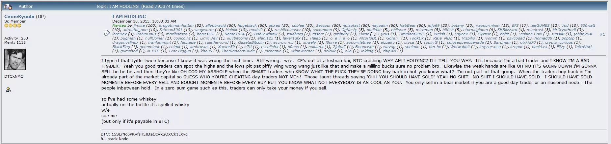

### Aquí está el plan:

1. Configurar una billetera fría para asegurar cantidades importantes.
2. Comprar Bitcoin de una vez a través de una plataforma de intercambio y establecer un plan de compra recurrente.
3. Establecer un plan de herencia.
4. Esperar mucho tiempo (al menos uno o dos ciclos)

Si olvidamos que teníamos bitcoins durante 3 años, no hay problema, el dinero seguirá ahí si hemos seguido las instrucciones de los expertos.

Para este tipo de perfil, se recomienda utilizar una billetera fría para comenzar, como Bitbox02, Trezor o Ledger. Estos dispositivos cuestan alrededor de 70 € pero ofrecen cierta seguridad para tus bitcoins a largo plazo. Una billetera móvil gratuita de tipo caliente también puede funcionar, pero solo para cantidades relativamente pequeñas.

Tutorial de billetera relevante:

- [Ledger](https://planb.network/tutorials/wallet/ledger)
- [bitbox02](https://planb.network/tutorials/wallet/bitbox02)
- [Cold card](https://planb.network/tutorials/wallet/coldcard)
- [Trezor](https://planb.network/tutorials/wallet/trezor)

Medio de intercambio:

- [bitstamp](https://planb.network/tutorials/exchange/bitstamp)
- [bifinex](https://planb.network/tutorials/exchange/bitfinex)
- [kraken](https://planb.network/tutorials/exchange/kraken)

Si el hodler quiere ir más allá: implementar un plan de DCA como el stacker y una billetera caliente LN para gastar un poco de bitcoin.

### ¿Es para ti?

Aquí hay un pequeño retrato psicológico del hodler, si te reconoces, ¡tal vez sea para ti!

- Paciencia:
  Un hodler muestra una paciencia excepcional. Está dispuesto a esperar años para ver el crecimiento de su inversión, sin dejarse influir por las fluctuaciones a corto plazo del mercado.

- Visión a largo plazo:
  Tiene una visión a largo plazo, creyendo firmemente en el valor y la creciente adopción de Bitcoin a pesar de los obstáculos y críticas.

- Autodisciplina:
  El hodler es extremadamente disciplinado. La parte más difícil, como se mencionó, es no hacer nada, y esto requiere una gran autodisciplina para resistir la tentación de vender en los picos de precios a corto plazo.

- Resiliencia:
  Frente a las caídas de precios y la volatilidad del mercado, el hodler se mantiene resiliente, manteniendo la fe en su inversión y en el crecimiento futuro de Bitcoin.

- Creencia en la tecnología:
  Más allá de la simple búsqueda de ganancias, el hodler a menudo cree en la tecnología blockchain y en la capacidad de Bitcoin para provocar un cambio positivo en el mundo.

En resumen, el hodler es un inversor paciente, disciplinado y visionario, que cree firmemente en el valor a largo plazo de Bitcoin y está dispuesto a soportar la volatilidad a corto plazo para obtener ganancias sustanciales en el futuro. Es metódico en su estrategia de inversión y atento a la seguridad y la planificación a largo plazo.

## El stacker
<chapterId>0daf450d-1b91-5d99-9c31-b52ab52a5e21</chapterId>

En Bitcoin, el concepto de "Stacker" es bastante conocido. La idea es simple: ¡solo hay 21 millones de bitcoins, y cada pequeño bitcoin cuenta! Este pequeño bitcoin se llama en realidad un satoshi (o SAT). El stacker tiene como objetivo acumular la mayor cantidad posible.

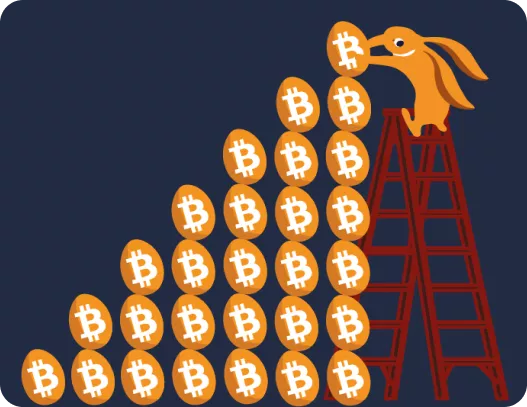

### El plan

Para lograrlo, intentarás maximizar tu exposición al máximo. Por lo tanto, crearás un plan de DCA (Dollar-Cost Averaging) para poder comprar un poco cada semana. Esta es la mejor solución para comenzar a exponerse a Bitcoin sin tener un capital inicial importante. Ya sea 10 € por semana, 25 € por semana o 100 € por mes, lo importante es acumular satoshis sin pensarlo demasiado. Tu plan será bastante simple:

1. Establecer una billetera caliente.
2. Establecer un plan de DCA en una plataforma de intercambio.
3. Esperar y buscar otras soluciones para acumular satoshis.

Otras soluciones pueden incluir comenzar a vender bienes o servicios en Bitcoin para acumular más. Pedir que te paguen en Bitcoin a amigos o comenzar a involucrarse en el ecosistema para estar más cerca de la revolución.

### Tutoriales:

Una billetera caliente para acumular rápidamente.

- [Blue Wallet](https://planb.network/tutorials/wallet/blue-wallet)
- [Green Wallet](https://planb.network/tutorials/wallet/green-wallet)
- [Phoenix](https://planb.network/tutorials/wallet/phoenix)

Una billetera fría para la seguridad a largo plazo.

- [Ledger](https://planb.network/tutorials/wallet/ledger)
- [bitbox02](https://planb.network/tutorials/wallet/bitbox02)
- [Cold card](https://planb.network/tutorials/wallet/coldcard)
- [Trezor](https://planb.network/tutorials/wallet/trezor)

Una plataforma de DCA para acumular Bitcoin.

- [Relai](https://planb.network/tutorials/exchange/relai)
- [Bull Bitcoin](https://planb.network/tutorials/exchange/bull-bitcoin)

Este tipo de perfil también puede utilizar un bróker para realizar una gran compra de una vez, como un hodler, pero generalmente el stacking es el concepto de agregar satoshis regularmente a su billetera. Un enfoque más común sería aprender a usar Bitcoin de manera peer-to-peer y comprar Bitcoin directamente en efectivo con amigos o miembros de la comunidad de Bitcoin.

### ¿Es para ti?

Retrato psicológico del stacker

- Estratégico y organizado:
  El acumulador es estratégico en su enfoque de acumulación de Bitcoin. Planifica cuidadosamente sus inversiones y está organizado en la implementación de su plan de DCA.

- Enfocado en los objetivos:
  Su objetivo principal es claro: acumular la mayor cantidad de satoshis posible. Esta focalización guía sus acciones y decisiones de inversión, sin importar si el precio se dispara o se desploma.

- Conocimiento financiero:
  Entiende la importancia de la diversificación y la inversión regular, minimizando así el riesgo y optimizando los rendimientos potenciales. Esto es posible mediante la suavización del precio y, por lo tanto, la indiferencia en los movimientos de precios a corto plazo.

- Proactivo:
  Busca activamente oportunidades adicionales para ganar Bitcoins, ya sea vendiendo bienes o servicios o explorando otras vías en el ecosistema de Bitcoin.

El acumulador es una persona metódica y enfocada, con un plan claro para maximizar su acumulación de satoshis. Muestra proactividad y conocimiento financiero, buscando constantemente formas de optimizar y asegurar sus inversiones en Bitcoin. Su enfoque se caracteriza por una regularidad y una organización impecable, lo que lo encamina hacia un crecimiento estable y continuo de su billetera de Bitcoin.

## El usuario
<chapterId>e0a022ab-207c-571f-b4ad-c432214a756c</chapterId>

Por último, el último tipo de bitcoiner que se puede mencionar en un curso de introducción es el bitcoiner que necesita usar Bitcoin regularmente. Ya sea debido a una obligación profesional o simplemente por voluntad de apoyar el ecosistema, es necesario brindar soluciones adecuadas para un uso frecuente.

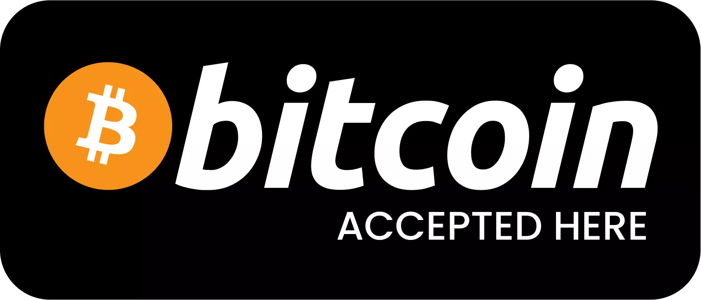

### El plan

Para este usuario, probablemente será necesario tener dos tipos de billeteras:

- Una billetera fría para almacenar bitcoins a largo plazo de manera segura.
- Una billetera caliente para enviar y recibir bitcoins regularmente para uso diario.

Este tipo de perfil probablemente optará por una billetera basada en la Lightning Network para transacciones comunes, así como una billetera de hardware para almacenamiento a largo plazo.

Para exponerse a Bitcoin, este tipo de perfil tendrá varias opciones:

- Utilizar soluciones peer-to-peer como Peach para comprar o vender bitcoins rápidamente de manera no KYC.
- Utilizar una plataforma de intercambio para poder comprar y vender bitcoins regularmente según las necesidades.

### Tutorial

Billetera caliente LN

- [Phoenix](https://planb.network/tutorials/wallet/phoenix)
- [Wallet of Satoshi](https://planb.network/tutorials/wallet/wallet-of-satoshi)
- [Breez](https://planb.network/tutorials/wallet/breez)

Billetera fría

- [Ledger](https://planb.network/tutorials/wallet/ledger)
- [bitbox02](https://planb.network/tutorials/wallet/bitbox02)
- [Cold card](https://planb.network/tutorials/wallet/coldcard)
- [Trezor](https://planb.network/tutorials/wallet/trezor)

Plataforma de compra

- [Robosats](https://planb.network/tutorials/exchange/robosats)
- [kraken](https://planb.network/tutorials/exchange/kraken)

### ¿Es para ti?

- Pragmático y comprometido:
  El usuario es pragmático y consciente de las ventajas y desventajas de Bitcoin. Está comprometido con el ecosistema y desea apoyarlo activamente mediante un uso frecuente.

- Competente en tecnología:
  Tiene una buena comprensión de las tecnologías, incluyendo las billeteras calientes y frías de Bitcoin y la Lightning Network.

- Flexible y adaptable:
  Dispuesto a utilizar diversas soluciones y plataformas para satisfacer sus necesidades en constante evolución.

El usuario es una persona tecnológicamente informada y comprometida con el uso activo de Bitcoin. Siempre está buscando formas de mejorar la eficiencia y seguridad de sus transacciones y tenencias de Bitcoin. Su flexibilidad y compromiso con el ecosistema se reflejan en su disposición para utilizar diversas soluciones, desde billeteras lightning hasta soluciones rápidas de intercambio. Aunque está activamente involucrado en transacciones de Bitcoin, no descuida la seguridad, asegurándose de mantener una clara separación entre sus bitcoins para uso diario y los que guarda a largo plazo.

## El paranoico
<chapterId>5c624acd-662e-5134-ab7a-fb75cde7c3f8</chapterId>

Me gustaría agregar aquí al bitcoiner paranoico. Este tipo de persona no desea exponerse al KYC (Conoce a tu cliente), prefiere mantenerse cerca del anonimato y valora mucho su privacidad. El paranoico también utilizará LN a través de su propio nodo y trabajará en su seguridad.

### El plan

Para este tipo de perfil, la solución para principiantes es bastante simple:

- Uso de cajeros automáticos de Bitcoin en efectivo
- Compra en efectivo en reuniones presenciales
- Venta de bienes en Bitcoin

Luego, deberá aprender a mezclar sus monedas, administrar sus UTXO (por sus siglas en inglés, Unspent Transaction Output, o Salida de Transacción No Gastada) y muchas otras cosas que aún no se han abordado en este curso. Si es necesario, toda la información está disponible en la plataforma para convertirse gradualmente en un "paranoico".

### Tutorial:

Billetera caliente: 
- [Samourai wallet](https://planb.network/tutorials/wallet/samourai)

Billetera fría: 

- [Coldcard](https://planb.network/tutorials/wallet/coldcard)
- [Seed Signer](https://planb.network/tutorials/wallet/seed-signer) (billetera DIY)

Compra sin KYC entre particulares:
- [Peach](https://planb.network/tutorials/exchange/peach-wallet)
- [Robosats](https://planb.network/tutorials/exchange/robosats)
- [Bisq](https://planb.network/tutorials/exchange/bisq)
- [HodlHodl](https://planb.network/tutorials/exchange/hodlhodl)

### ¿Es para ti?

- Vigilante y seguro:
  El Paranoico tiene un gran interés en su privacidad y seguridad en línea. Esta vigilancia se extiende a todas sus interacciones, especialmente aquellas relacionadas con Bitcoin.

- Independiente:
  Prefiriendo la gestión autónoma de sus activos y seguridad, establece su propio nodo y trabaja de manera proactiva en su seguridad en línea, demostrando un fuerte deseo de independencia y control.

- Desconfiado:
  La desconfianza hacia los sistemas centralizados y los procesos KYC es una característica distintiva del Paranoico. Su reticencia a compartir información personal guía sus elecciones hacia plataformas y servicios que respetan y preservan el anonimato.

- Erudito y aplicado:
  Consciente de la complejidad de Bitcoin, el Paranoico se toma el tiempo para educarse sobre las mejores prácticas para proteger y administrar sus activos, como mezclar sus monedas y administrar sus UTXO.

- Pragmático:
  Aunque valora el anonimato y la seguridad, el Paranoico sigue siendo pragmático en sus elecciones, utilizando soluciones probadas y confiables para asegurar sus bitcoins mientras navega en el ecosistema de las criptomonedas.

En la mentalidad del Paranoico, la precaución, la seguridad y el anonimato son primordiales. Estas prioridades dictan un enfoque deliberado y bien pensado para el uso de Bitcoin, promoviendo la autosuficiencia y la prudencia. El Paranoico está dispuesto a invertir tiempo y esfuerzo para garantizar la seguridad y privacidad de sus bitcoins, mientras navega hábilmente en el ecosistema para evitar cualquier exposición innecesaria. Aunque puede parecer excesivamente cauteloso para algunos, el Paranoico considera que su diligencia y atención al detalle son esenciales para una participación exitosa y segura en el mundo de Bitcoin.

# El futuro con Bitcoin
<partId>98199b14-ad0f-5da7-ae99-8e5f5819f153</partId>

## Creación de un plan de herencia
<chapterId>233c88d3-2e8e-5eba-ac06-efe67a209038</chapterId>

Imaginemos el siguiente escenario dramático.
Un accidente automovilístico, BOOM, ya no estás en este mundo. Desapareces, dejando a tu familia sin su experto en Bitcoin. No saben dónde está el dinero, pero recuerdan que mencionabas constantemente términos como clave, lista de palabras y la irreversibilidad de las transacciones de Bitcoin. Están devastados, desconcertados y ahora tienen que entenderlo todo por sí mismos. Aunque esta situación puede parecer aterradora, es una posibilidad real que no se puede ignorar. Entonces, tienes dos opciones: dedicar entre 15 minutos y 1 hora para establecer un plan de sucesión, o no hacer nada. Nadie te juzgará, pero si hay personas que dependen de ti, esos 15 minutos podrían marcar una gran diferencia algún día. Depende de ti decidir.

- Opción 1: Tus seres queridos abren una carta que contiene un plan claro y fácil de seguir para recuperar de manera segura todos tus criptoactivos.
- Opción 2: Dejar que tus seres queridos se las arreglen por sí mismos. Si les falta una billetera, un mercado, bienes o si comprometen una transacción, mala suerte para ellos, el dinero se perderá.

Según Pamela Morgan en "Cryptoasset Inheritance Planning" (página 10), los objetivos de un plan de sucesión son los siguientes:

- Asegurar que tus herederos puedan tomar posesión de tus criptoactivos en el momento adecuado, pero no antes.
- Minimizar el riesgo y la posibilidad de que alguien robe tus criptoactivos antes de que sean entregados a tus seres queridos.
- Brindar a tus seres queridos la opción de mantener los activos de manera segura, si así lo desean.
- Evitar conflictos entre tus herederos y prevenir problemas legales tanto como sea posible.

Derechos de autor: La siguiente lección no es de mi creación...

La mayoría de los conceptos, ideas y acciones propuestas en esta lección (6.1 BRH) provienen del libro de Pamela Morgan titulado "Cryptoasset Inheritance Planning". Este libro ofrece un proceso fácil de seguir, paso a paso, para establecer rápidamente tu plan de sucesión de Bitcoin. Este proceso está respaldado por muchos expertos en seguridad de la industria. Aunque es un excelente punto de partida para crear un plan de sucesión, NO constituye asesoramiento legal y siempre debes (como siempre) verificar las fuentes, confrontar ideas e investigar por ti mismo. Pamela amablemente me ha permitido utilizar su trabajo. Le agradezco sinceramente.

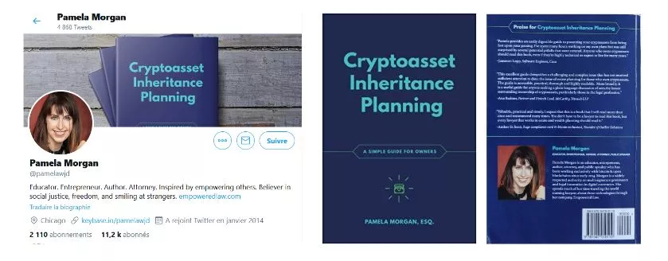

En esta lección, nos centraremos únicamente en la primera parte de su libro. Interpretaré el papel de un usuario típico de Bitcoin para crear su propia carta de sucesión. Por ahora, el proceso será sencillo y más adelante crearemos una versión más compleja con diferentes tipos de perfiles: Seguiremos el viaje de Cédric:

- Inversionista a largo plazo.
- Titular de una billetera física y una billetera móvil.
- Usuario de una única plataforma de intercambio con verificación de identidad (KYC).
- Introducido al Bitcoin por su primo.
- No tiene contratos inteligentes, ni Lightning Network (LN), ni alt-coins.

### Requisitos previos:

Solicito 30 minutos de tu tiempo, no para mí ni para ti, sino para tus seres queridos. La planificación sucesoria es un tema difícil, a menudo negado y olvidado. Como es la última tarea por realizar, muchas personas se distraen y terminan perdiendo tontamente todos sus BTC. Así que dedique 30 minutos y hágalo. ¡Es el PASO FINAL!

¿Qué necesita?

- Un momento de tranquilidad, sin distracciones.
- 4-5 hojas de papel blanco.
- Un bolígrafo.
- Dos sobres.
- Un teléfono / libreta de direcciones.
- Una computadora (en mi opinión, es opcional).

Según Pamela Morgan en "Cryptoasset Inheritance Planning" en la página 18, los conceptos erróneos comunes son:

- Necesito contratar a un abogado.
- Necesito confiar en un tercero.
- La planificación hará que mis activos sean fáciles de robar.
- El valor de mi criptomoneda es demasiado bajo para ser planificado.
- Mis herederos descubrirán todo por sí mismos.
- Todo esto se puede lograr con un simple contrato inteligente.

### Paso 1: Seleccionar las personas adecuadas para ayudar a tus herederos

Es necesario designar a dos personas que ayudarán a tu familia cuando ya no esté. De esta manera, tus seres queridos contarán con un usuario de Bitcoin de confianza, actualizado tecnológicamente, en quien puedan apoyarse durante el proceso de recuperación. Estas personas podrán:

- Brindar asesoramiento sobre la gestión de claves y billeteras.
- Ayudar a comprender cómo recuperar sus frases secretas (semillas) de manera segura.
- Proporcionar seguridad durante una transacción.

Siempre habrá un compromiso entre experiencia técnica, disponibilidad y confianza. Si tienes dudas sobre quién debería asumir este rol, crea una tabla sencilla para ayudarte a decidir.

Separación de responsabilidades: La persona de confianza NUNCA debe tener acceso a tu clave privada. Su único papel es ayudar a sus seres queridos a comprender el sistema de seguridad de tus bitcoins y a ganar confianza. Por eso elige a dos personas de confianza. Si es necesario, también puedes recurrir a una organización externa (abogado especializado o servicios de planificación sucesoria).

| Persona de confianza    | Confianza | Conocimiento en BTC | Información de confianza  | Nota                                                                                   |
|-------------------------|-----------|---------------------|---------------------------|----------------------------------------------------------------------------------------|
| Mi hermano Bob          | Muy alto  | Bajo                | Teléfono y correo         | "Bob no sabe mucho sobre BTC, pero podemos confiar en él al 100% para ayudar."         |
| Mi primo Nathan         | Alto      | Medio               | Teléfono e Instagram      | "Número 1 de las personas con las que hablar. Puede ayudarte. Está al tanto."          |
| Ricco (amigo cripto)    | Medio     | Muy alto            | Twitter, correo y foto    | "Confía en él en cuestiones técnicas. Nunca con el dinero. Deberás contactarlo."       |
| YouTuber e influencer   | Bajo      | Alto                | Enlace de YouTube         | "Aprende siguiéndolo. No puede ayudarte directamente."                                 |

### Paso 2: Realiza un inventario simple y rápido

Es importante pensar en todos los lugares donde tienes dólares o BTC:

- Plataformas de intercambio
- Billetera móvil
- Billetera física

Considera cómo los has asegurado y dónde se almacenan estas copias de seguridad. No es esencial tener dos lugares de copia de seguridad por ahora. El objetivo es hacer una captura instantánea de tu seguridad ACTUAL. ¡Podremos mejorarla más adelante! Esto es solo una primera versión para asegurar tu seguridad por el momento, volveremos a esto con más detalle más adelante.

| General                   | Software / Hardware | Activos        | Ubicación           | Copia de seguridad (clave privada)    | Contraseña (PIN, frase de contraseña) | Nota                                                                                                       |
| ------------------------- | ------------------- | -------------- | ------------------- | ------------------------------------- | ------------------------------------- | ---------------------------------------------------------------------------------------------------------- |
| Plataforma de intercambio | Bitstamp            | BTC y efectivo | Accesible en línea. | -                                     | Hogar y caja de seguridad del banco   | Aquí es donde compré y transferí mis Bitcoins. Inicio sesión usando un administrador de contraseñas y 2FA. |
| Billetera física          | Trezor modelo One   | BTC            | Seguro              | Tío Bob y caja de seguridad del banco | Hogar y madre                         | Tengo dos billeteras, una normal y otra con frase de contraseña.                                           |
| Billetera Samourai        | Móvil - One Plus 6  | BTC            | Conmigo             | Tío Bob y caja de seguridad del banco | Hogar y madre                         | La aplicación podría estar en modo oculto.                                                                 |

¡NO TE DISTRAIGAS! ¿Sientes la necesidad de transferir estos activos para:

- Mejorar tu seguridad?
- Vender algunos bienes?
- Comprar otros?

¡NO HAGAS NADA! Podrías olvidar el proyecto en curso. ¡MANTÉNTE ENFOCADO! Siempre podrás revisar y modificar tu billetera más tarde.

### Paso 3: Escribe la carta.

Por razones de seguridad, usa un bolígrafo y papel para escribir una carta a tus seres queridos.

- Tengo algo de cripto
- Contacta a estos asesores
- Tengo estos activos aquí- Te quiero
  Aquí tienes una plantilla para ayudarte a empezar. Si no quieres redactar la carta tú mismo, puedes descargar una plantilla y simplemente rellenar los espacios en blanco. (enlace aquí)

Comienza explicando el propósito de la carta y advierte a tus seres queridos sobre los peligros de autogestionar la criptomoneda.

La carta debe ser clara y útil. No es un testamento, ni una carta para hacerlos llorar. Tampoco es una carta para obligarlos a no vender nunca, ni una carta para escribir las claves privadas. Es una carta para ayudarles a entender lo que has hecho, para que puedan tomar la mejor decisión y actuar de manera segura.

Aquí hay un extracto de la plantilla de carta a un ser querido, tomado del Apéndice E del libro de Pamela Morgan, "Cryptoasset Inheritance Planning". Para adaptarlo a nuestro ejemplo, he modificado algunas partes, que he colocado entre paréntesis y marcadas en azul. El resto del texto es el texto original del libro. (Traducido por Découvre Bitcoin)

"Fecha: 26/06/2020
Queridas Liz y Maia,
Las quiero profundamente y sé que serán fuertes.
Escribo esta carta para informarles que poseo criptoactivos que podrían tener valor.
Por favor, lean esta carta atentamente y en su totalidad antes de tomar cualquier acción. Estos activos son diferentes de otros activos, ya que una vez que se transfieren, no hay forma de recuperarlos."

A continuación, incluimos la "sección de asesores". Esta parte puede ser confusa para tus herederos, especialmente si mencionas personas u organizaciones que no conocen. Sé preciso sobre:

- Cómo contactarlos
- Cómo identificarlos
- Cuáles son sus áreas de experiencia.
- Cómo pueden formarse por sí mismos.

"A continuación, se muestra una lista de personas en las que confío para responder a sus preguntas y ayudarles en el proceso de descubrimiento y transferencia de estos activos. Contacten a las personas indicadas, pero no confíen en una sola persona para gestionar el proceso. Sean cautelosos con todos los asesores, incluidos los que aparecen en esta lista. Todos pueden cometer errores, así que asegúrense de entender lo mejor que puedan lo que están haciendo y no tengan miedo de hacer preguntas y verificar las respuestas por ustedes mismos.

Aquí están las personas que pueden ayudarles a responder preguntas y guiarles en este proceso:

(Inserta aquí el nombre de tus asesores, su afiliación a una organización (si corresponde), sus datos de contacto y cómo deben verificar su identidad, por ejemplo, base de datos de claves, fotos.)

* También he usado mi computadora de escritorio (MacBook Pro) para acceder a diferentes plataformas de intercambio, aplicaciones, juegos y sitios web relacionados con bitcoins. Los identificadores y contraseñas necesarios están guardados en un gestor de contraseñas seguro, cuya clave de acceso se almacena en la caja fuerte del banco."

* Recientemente, he empezado a utilizar carteras físicas para mayor seguridad. Tengo una cartera de hardware Ledger Nano S que se guarda en la caja fuerte del banco, así como una copia de seguridad almacenada en la casa de mi primo Nathan."

* También he establecido una frase secreta (passphrase) para aumentar la seguridad de mis carteras. La frase secreta está escrita en un pedazo de papel y se conserva en un lugar seguro en casa."

* Finalmente, también he configurado carteras multisig para una seguridad adicional. Las claves necesarias se distribuyen entre mí, mi hermano Bob y mi amigo Ricco. Los detalles de la configuración se guardan en un documento seguro, del cual se conserva una copia en la caja fuerte del banco."

Por favor, ten en cuenta que la información anterior es ficticia y no debe ser utilizada en un contexto del mundo real.

- Utilizo mi computadora Dell 2018 para acceder a una plataforma de intercambio en línea llamada Bitstamp. Es posible que todavía tenga bitcoins o dólares en esta plataforma. Para acceder a mi cuenta, deberán contactar directamente a Bitstamp o iniciar sesión en mi cuenta (ten en cuenta que esto puede ser ilegal, verifica la legislación local).

- Utilicé un administrador de contraseñas para acceder a ella y encontrarán mi respaldo en la caja de seguridad del banco. La cuenta también está protegida por autenticación de dos factores, a la cual pueden acceder a través de mi teléfono (Samsung Galaxy S8) o utilizando el código de respaldo almacenado en casa.
- También tengo BTC en un dispositivo Trezor Model One. Accedo a él a través de mi PC y el sitio web Trezor.io. Las claves privadas de respaldo se encuentran almacenadas en la caja de seguridad del banco y con el tío Bob. El código PIN se encuentra en casa y con mi madre. El dispositivo en sí probablemente está en una caja fuerte en mi oficina.

- Utilizo una frase secreta de seguridad avanzada para mi dispositivo Trezor. La copia de respaldo de esta frase secreta se encuentra en casa y con mi madre".

Ahora vamos a concluir la carta con alguna información legal si es necesario, y con palabras amables.

"Por favor, ten en cuenta: Encontrarás una copia de mi testamento, fechado el 17 de abril de 2018, en mi carpeta de documentos. Mi abogado, Dwight Schrute, con sede en Scranton, Pensilvania, también tiene una copia. Ten cuidado y siempre recuerda mi amor por ti". 26/06/2023, Cedric"

Ahora verifiquemos nuestro trabajo (Según "Cryptoasset Inheritance Planning" de Pamela Morgan, página 44 (traducido por Découvre Bitcoin)):

- Ayuda: verifica que hayas proporcionado correctamente los nombres, contactos y, si es posible, fotos.
- Dispositivos: asegúrate de haber enumerado tu teléfono, computadora, billeteras físicas y billeteras de papel.
- Activos: asegúrate de haber incluido una lista de tus activos.
- Intercambios: verifica que hayas enumerado todos los intercambios que tienen fondos tuyos.
- Acceso: enumera la información que necesitarán para encontrar tu lugar de almacenamiento, así como todos los códigos de acceso necesarios.

  Si has marcado todas las casillas, ¡entonces estás listo para los últimos pasos! Haz una copia de esta carta y guarda ambas copias en un sobre. Ciérralo, firma el sello y guarda este sobre en un lugar seguro pero accesible. Asegúrate de que tus herederos sepan que deben recuperar este sobre si es necesario. No dudes en comprar el libro de Pamela para profundizar en este tema y planificar un momento para mejorar tu plan de herencia. También discútelo con tu notario para integrar legalmente este plan en tu testamento oficial.
  ¡Bravo! ¡Tienes una primera versión de tu plan de herencia y es un excelente comienzo!

_Planificación de la herencia de criptoactivos, una guía sencilla para propietarios, Pamela Morgan, ESQ. Copyright 2018 por Merkle Bloom LLC, Todos los derechos reservados. CC-BY_ Un gran agradecimiento a Pamela Morgan por su valioso trabajo y por permitirme compartirlo. ¡También gracias a todos los que contribuyeron a su escritura!
¡Ustedes son los mejores :D! Mi equipo y mis estudiantes también les agradecen.

# Agradecimientos y sigue profundizando en la madriguera del conejo
<partId>2a6ec097-a3e7-5f1d-a1ec-ae2b0b199e40</partId>

## ¡Felicidades! ESTÁS EN EL TOP 0,1%
<chapterId>5f4cfab9-9af1-584b-a1fe-a0769a991f19</chapterId>

Si has estado siguiendo nuestro contenido desde el principio, ¡ahora eres un verdadero ciudadano del siglo XXI y uno de los más experimentados en el campo de Bitcoin! Utilizas un administrador de contraseñas y la autenticación de dos factores (2FA). Entiendes qué es Bitcoin y por qué es importante. Posees bitcoins y tienes una forma segura de comprar más o ganarlos. Has almacenado tus bitcoins en una billetera "fría" y has establecido una gestión adecuada de las claves. Has creado un plan de herencia para tus seres queridos. ¡Ahora estás seguro y puedes relajarte! ¡Disfruta de una cerveza y siéntete orgulloso de ti mismo!

Realmente estoy orgulloso de que hayas alcanzado este punto. Lo digo sinceramente. ¿Qué hacer a continuación? Si bien definitivamente deberías relajarte ahora y estar orgulloso de ti mismo, tu viaje con Bitcoin está lejos de terminar, y nunca realmente lo hará. Aquí tienes algunas opciones para que puedas seguir:

1. Podrías simplemente continuar como lo has estado haciendo hasta ahora. Continúa acumulando bitcoins poco a poco y deja que tu estrategia se desarrolle con el tiempo. Ya tienes un nivel de seguridad suficiente, todo está en su lugar y has hecho lo necesario para ti y tu familia. No necesitas convertirte en un experto en trading y no necesitas saber mucho más sobre inversión. Probablemente tengas un trabajo aparte y aunque Bitcoin sea emocionante, tu objetivo principal era llegar a este punto. Esto es cierto para la mayoría de ustedes y lo respeto. Estoy muy contento de que hayas llegado hasta aquí en la "madriguera del conejo" de Bitcoin y espero que el viaje haya sido agradable. Gracias por confiar en mí para ayudarte a asegurar tus primeros bitcoins.

2. Podrías querer seguir educándote sobre los aspectos técnicos, ideológicos y filosóficos de Bitcoin. Si sientes que tu viaje apenas comienza, te animo a seguir aprendiendo sobre Bitcoin. Hay tantas cosas que aprender que a veces es difícil saber por dónde empezar. Aquí tienes una lista de cursos y formaciones que podrían acompañarte:

- Nodo de Bitcoin y Lightning Network: la Lightning Network, como ya hemos visto varias veces, ofrece una visión completamente diferente de lo que es Bitcoin. A través de esta capa dos, las posibilidades son múltiples y se está construyendo toda una industria sobre ella. Para ayudarte en el descubrimiento, te invito a hacer LN 201 para un curso teórico o LN 202 para un curso práctico. Ambos cursos son accesibles para todos en esta etapa de tu aprendizaje y pueden ayudarte a comprender mejor este nuevo aspecto de Bitcoin.

- Economía austriaca: si la economía y las finanzas son temas que te interesan, entonces el curso ECON 201 es probablemente el adecuado para explorar los aspectos más profundos de la economía austriaca. Allí descubrirás este movimiento de pensamiento económico que se opone al movimiento más tradicional del keynesianismo. Es un buen comienzo para cuestionar nuestro sistema y comprender cómo llegamos a este punto desde el punto de vista de la inflación y la manipulación monetaria.

- Solución para comerciantes: por último, si eres más del tipo que realmente quiere usar Bitcoin, puedes ir a nuestra sección de tutoriales y explorar las muchas soluciones para comerciantes. Esto puede ofrecerte oportunidades en nuestro entorno, pero también puede ayudarte a que tu empresa o tus amigos acepten Bitcoin en su comercio y así impulsar una economía local basada en Bitcoin en tu ciudad.

En cualquier caso, todas nuestras formaciones siguen siendo gratuitas y hay muchos recursos o tutoriales disponibles en nuestra plataforma para acompañarte. ¡Buena suerte en tus estudios!

## Danos tu opinión sobre este curso
<chapterId>3f43175a-fb7a-5b1c-a887-7dcf615d7a3a</chapterId>
<isCourseReview>true</isCourseReview>

## ¡Apoya la formación!
<chapterId>b082b8eb-dabc-5d79-94cf-eb8f48fc1968</chapterId>

Este curso, junto con todo el contenido presente en esta plataforma, te ha sido ofrecido de forma gratuita por nuestra comunidad. Para apoyarnos, puedes compartirlo con otros, convertirte en miembro de la plataforma e incluso contribuir a su desarrollo a través de GitHub. En nombre de todo el equipo, ¡gracias!
