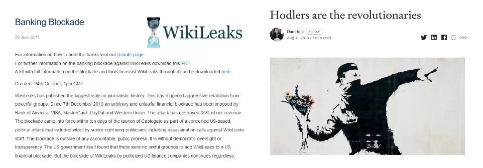
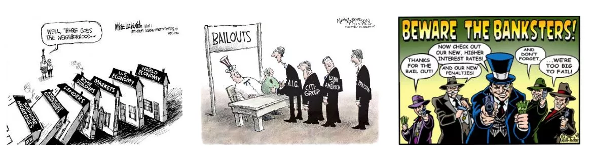

# Un voyage vers vos premiers bitcoins

L’industrie qui entoure Bitcoin est en plein boom.

Les changements technologiques et financiers de ce nouveau monde ne font qu’accélérer, c’est à vous d’en prendre avantage et de commencer à tomber dans le Terrier du Bitcoin. Cette aventure sera riche en savoir et vous poussera à remettre en question grand nombre de vos convictions. Cela va vous redonner de la liberté et vous permettre de regagner de la vie privée, de la souveraineté et de l’indépendance financière.

Pour vous aider à commencer cette aventure, j’ai créé ce cours gratuit. Uniquement Bitcoin, pas de conneries, pas d’autres cryptomonnaies, un cours direct sans détour. Ce cours a été conçu pour s’adapter à vous et vous laisser libre de choisir le chemin qui vous convient.

+++

# Introduction et prérequis pour comprendre Bitcoin
<partId>008c49b7-5e17-5973-87f2-ba28429b2697</partId>

## Introduction à la formation BTC102
<chapterId>bfc96999-0ee1-5c41-8297-1b629f50cffc</chapterId>

Bienvenue dans BTC 102 ! Un cours pratique qui va vous accompagner dans la mise en place de votre plan Bitcoin ! À travers ce cours, nous allons donc nous préparer à obtenir vos premiers bitcoins, les sécuriser correctement et garantir une bonne entrée dans cette nouvelle industrie.

L'industrie du bitcoin est encore jeune et considérée comme un phénomène en constante évolution. En effet, malgré de nombreuses années passées à essayer de réguler ce marché, il reste extrêmement libre en raison de la nature de son protocole sous-jacent.

De par cette impossibilité d'être régulé entièrement, Bitcoin a pu se développer de manière organique et décentralisée pendant plus de 14 ans. C'est donc une industrie en pleine explosion embryonnaire et qui ne demande qu'à continuer de croître.

Qui dit explosion d'innovations et de possibilités dit forcément scams, arnaques et risques. Il va de soi que votre parcours dans Bitcoin ne se fera pas sans rebondissements ni erreurs. Néanmoins, afin de vous aider à les éviter au maximum, cette formation servira de guide pratique pour bien commencer. La formation BTC 101, quant à elle, est plus théorique pour bien comprendre le fonctionnement du Bitcoin.

Dans cette formation, nous allons nous focaliser sur 4 angles :

- Revoir les bases et les prérequis pour être sûr de ne pas se faire arnaquer ou perdre son argent bêtement.
- Revoir fondamentalement pourquoi Bitcoin est important et comprendre son industrie. Cela permettra de renforcer nos convictions et de bien comprendre dans quoi nous nous lançons.
- Mettre en place votre premier portefeuille Bitcoin ainsi que votre premier achat de bitcoins via une plateforme d'échange. Ici, nous chercherons la solution la plus adaptée à vos besoins.
- Enfin, la dernière section abordera un concept fondamental pour votre sécurité, mais trop peu exploré dans l'industrie : comment créer un plan d'héritage Bitcoin.

Vous l'avez compris, cette formation a vraiment pour but de vous accompagner afin que vous respectiez les meilleures pratiques de notre industrie dès le début, de manière simple et rapide !

Bonne chance :)

## Arnaques et fraudes financières
<chapterId>8af2948b-2ab5-54c4-862c-3414b8a285a2</chapterId>

Nous sommes dans une industrie ou deux branches principales émergent dans le secteur des "cryptomonnaies" :

1. L'industrie du Bitcoin, centrée sur une monnaie saine à travers un protocole décentralisé de transfert de valeur (Bitcoin). Elle valorise la vie privée et la souveraineté individuelle, et construit progressivement des projets à long terme avec un haut niveau de résilience et de sécurité.

2. L'industrie globale des cryptomonnaies, orientée vers la fintech, la "blockchain", et d'autres innovations centralisées. Elle évolue rapidement et tente de se positionner comme la nouvelle tendance.

L'intégralité de cette université est porté sur l'univers Bitcoin et non crypto.

Le domaine des cryptomonnaies, dont le Bitcoin, reste relativement jeune et légèrement régulé. Il est ainsi riche en escroqueries diverses. La compréhension des dangers et la reconnaissance des pièges typiques sont essentielles. Voici quelques situations d'escroquerie fréquemment rencontrées :

- Dons & Loteries en ligne
- Pyramide de Ponzi
- Pump & Dump
- Groupes et Influenceurs Shitcoin
- Déviation / Hard Fork
- Hack
- Fausse rançon
- Arnaque au mot de passe
- Capture de carte SIM

Dans le domaine de l'investissement financier, les systèmes de vente pyramidale et de Ponzi se distinguent comme des modèles illégaux. Ils fonctionnent en utilisant l'argent des nouveaux investisseurs pour rémunérer les anciens participants. Cependant, leur caractère non durable et leur dépendance à l'égard des nouveaux arrivants pour maintenir le système en marche les rendent susceptibles de s'effondrer inévitablement.

Ces systèmes sont souvent caractérisés par des éléments douteux tels que l'absence de valeur intrinsèque, des promesses de rendements irréalistes, et des tactiques de marketing qui encouragent les recommandations pour attirer de nouveaux investisseurs. Des délais de retrait incompressibles et l'utilisation de faux profils sur les réseaux sociaux pour la promotion sont également des signes révélateurs de ces arnaques. Étant donné leur nature illégale et immorale et le risque financier qu'elles représentent, il est essentiel de les éviter.

Finalement, ces systèmes sont condamnés à l'échec. Au fil du temps, l'exigence d'un nombre croissant de nouveaux participants pour maintenir le système en place devient insurmontable. Lorsque ce point est atteint, l'illusion se dissipe, le système s'effondre, et les investisseurs se retrouvent souvent sans moyen de récupérer leur investissement.

Les systèmes Ponzi peuvent se manifester de diverses façons. Parfois, ils sont masqués sous la forme de nouvelles offres de tokens ou d'Initial Coin Offerings (ICO), de combinaisons de contrats intelligents, de tentatives de monopolisation de la monnaie fiduciaire, ou même de programmes de marketing sans produit réel. Cependant, une enquête approfondie et une vérification diligente révèlent que ces systèmes ne créent aucune valeur réelle. Ils redistribuent simplement l'argent des nouveaux arrivants pour payer les anciens participants.

Récemment, le monde des cryptomonnaies a connu une vague de projets liés à la Finance Décentralisée (DeFi) qui méritent une attention particulière. Certains de ces projets peuvent recourir à une combinaison de crypto-monnaies de faible qualité, de contrats intelligents et de systèmes de taux d'intérêt pour proposer des solutions financières prétendument miraculeuses. Il est essentiel de faire preuve de prudence et de diligence raisonnable face à ces offres qui sont extremement scammy.

Il convient de souligner que le contenu de ce cours est destiné à des fins purement éducatives et ne doit pas être interprété comme un conseil financier. L'exhortation à "ne pas faire confiance, mais vérifier" reste une ligne directrice importante. Il est essentiel que chacun mène ses propres recherches et prenne des décisions financières éclairées.

Le Pump and Dump (P&D) est une forme notoire de manipulation financière qui peut causer des perturbations importantes sur les marchés. Elle se caractérise par une attaque coordonnée visant à provoquer une augmentation artificielle du prix d'un actif par le biais de divers mécanismes, comme le marketing agressif, l'utilisation d'algorithmes ou de l'intelligence artificielle. L'objectif est de vendre ensuite ces actifs surévalués pour réaliser un profit.

La stratégie de Pump and Dump suit généralement un schéma bien défini :

1. Un leader d'opinion ou un groupe d'investisseurs achète d'abord un grand nombre d'actions ou d'autres actifs ciblés.
2. Ils créent ensuite un engouement autour de ces actifs et diffusent des informations exagérées ou trompeuses pour attirer d'autres investisseurs.
3. Ce battage médiatique déclenche un FOMO (Fear Of Missing Out), une peur de manquer une opportunité, chez les investisseurs humains et les bots d'investissement, qui commencent à acheter massivement ces actifs.
4. Une fois que le prix a suffisamment augmenté, les leaders vendent leurs actifs en masse, réalisant ainsi un profit considérable.
5. La vente massive entraîne une chute abrupte du prix de l'actif, laissant de nombreux investisseurs avec des pertes substantielles.

Il est essentiel de comprendre que la participation à de telles stratégies est illégale et peut entraîner des poursuites pour manipulation de marché. De plus, ces stratégies sont souvent orchestrées par des groupes d'influence qui demandent des frais d'adhésion. Bien que certains participants puissent réaliser des gains à court terme, les stratégies de Pump and Dump sont généralement non rentables à long terme.
Il est donc recommandé de se concentrer sur l'éducation financière et l'investissement responsable, plutôt que de se laisser séduire par de telles tactiques manipulatrices. L'acquisition de connaissances solides et l'adoption d'une approche à long terme sont des clés essentielles pour réussir dans le monde de l'investissement.

Les arnaques liées à des concours ou des donations en ligne sont tres courants dans le secteur crypto. Les publicités qui promettent des bitcoins gratuits sont souvent utilisées pour tromper les utilisateurs inexpérimentés. Des principes clés à garder à l'esprit sont de ne jamais envoyer de bitcoins avec l'attente d'en recevoir en retour et de se méfier des promesses de rendements irréalistes. Il est essentiel de ne pas faire confiance aveuglément, surtout lorsqu'il s'agit d'une bannière sur internet.

Un exemple classique de ce type d'arnaque est l'offre qui prétend doubler ou multiplier de façon démesurée les bitcoins que vous envoyez. Il est important de comprendre qu'il n'existe pas de solution magique pour devenir riche instantanément.

Une autre tactique couramment utilisée est le don de "shitcoins", ou crypto-monnaies de faible valeur. Certains projets de crypto-monnaies centralisées feront beaucoup de marketing et offriront des jetons gratuits en guise de cadeau. Il faut être très prudent face à ces offres, car soit le jeton a une valeur nulle, soit le cadeau sert simplement à attirer l'attention et à promouvoir le trading, le jeu et d'autres arnaques. Même si ces offres ne sont pas toujours frauduleuses, illégales ou trompeuses, la vigilance reste de mise.

Sur Twitter, par exemple, des bots peuvent se faire passer pour des personnalités célèbres et proposer des offres incroyables pour tromper les gens. Ces comptes utilisent le même nom et les mêmes photos de profil que la personnalité en question, et peuvent ainsi tromper les utilisateurs moins avertis. Assurez-vous toujours de vérifier la légitimité du compte avant d'interagir avec lui.

Il est également important de faire attention aux liens envoyés par email. Vérifiez toujours le lien avant de cliquer dessus et prêtez attention à l'identité de l'expéditeur.

Enfin, voici quelques conseils pour éviter les arnaques en ligne :

- Les personnes honnêtes ne vous demanderont jamais d'envoyer de l'argent directement.
- N'envoyez jamais de bitcoins à une adresse inconnue.
- Les promesses de rendements irréalistes sont toujours suspectes.
- Il y a de fortes chances que les concours soient truqués.
- Vous gagnerez toujours plus en apprenant qu'en jouant.
- En cas de doute, n'agissez pas immédiatement. Prenez le temps de réfléchir et de faire des recherches. Le FOMO (Fear Of Missing Out) peut être votre pire ennemi.
  Rappelez-vous toujours de faire vos propres recherches avant de prendre une décision d'investissement.

Le Bitcoin a subi plusieurs "hard forks" au fil du temps, donnant naissance à diverses versions alternatives de la monnaie originale. Ces déviations sont souvent le fait de développeurs cherchant à apporter des modifications significatives au protocole Bitcoin, ou parfois à des personnes mal intentionnées cherchant à tromper les investisseurs naïfs. Il est essentiel de distinguer le véritable Bitcoin de ces dérivés pour éviter de tomber dans des pièges potentiels. Parmi les exemples notables de ces déviations figurent Bitcoin Cash (BCH) et Bitcoin Satoshi Vision (BSV). Malgré le fait qu'ils portent le nom de "Bitcoin", ces projets sont principalement basés sur des tactiques de marketing et de publicité mensongère pour attirer l'attention des investisseurs.

Un dicton populaire dans le monde de l'investissement dit : "Si ça ressemble à une arnaque, si ça se comporte comme une arnaque, et si ça garantit que ce n'est pas une arnaque, alors il y a de fortes chances que ce soit une arnaque."

Il convient de noter que certaines de ces déviations sont très bien financées et dépensent énormément en communication pour tromper les utilisateurs. Par exemple, le site web "Bitcoin.com" est associé à Bitcoin Cash, et non au Bitcoin original, ce qui peut prêter à confusion pour les novices. Le site officiel de Bitcoin est "bitcoin.org".

Le monde des crypto-monnaies est un terrain fertile pour toutes sortes de personnalités, attirées par le potentiel de gains significatifs. Parmi elles, on trouve malheureusement des individus mal intentionnés qui recourent à diverses tactiques pour tromper et arnaquer les investisseurs.

Ces tactiques peuvent comprendre la promotion ouverte de ventes pyramidales, l'usurpation de l'identité du créateur de Bitcoin, Satoshi Nakamoto, le plagiat du travail d'autrui, ou encore la fabrication de fausses promesses. De plus, certains de ces individus créent des tokens de crypto-monnaie et des Initial Coin Offerings (ICO) inutiles dans le but de tromper les investisseurs.

La communauté Bitcoin se mobilise souvent pour dénoncer ces actes, mais il peut s'écouler un certain temps avant que le système juridique ne parvienne à prendre des mesures contre ces individus.

Il est donc crucial de rester vigilant et de faire preuve de discernement dans ses interactions avec le monde des crypto-monnaies. Mon conseil personnel serait d'ignorer ces individus et ces pratiques. Ils ne méritent ni votre temps ni votre énergie. Préférez consacrer ces ressources à l'acquisition de connaissances et à la compréhension du marché des crypto-monnaies pour pouvoir naviguer dans cet univers de manière éclairée et sécurisée.

Il est essentiel d'approcher avec prudence les "crypto-influenceurs" ou "gourous" de la crypto-monnaie. Ces individus ont souvent des agendas personnels et peuvent être impliqués dans de nombreux projets qu'ils chercheront à promouvoir, même s'ils ne sont pas toujours dans l'intérêt des investisseurs.

Ces influenceurs peuvent tenter de promouvoir des crypto-monnaies peu fiables, ou "shitcoins", et mettre en œuvre diverses stratégies pour augmenter la valeur de leurs investissements, même si ces derniers sont peu sûrs ou potentiellement frauduleux.
Voici quelques conseils pour naviguer dans cet environnement :

- Méfiez-vous de toute personne qui promeut une crypto-monnaie spécifique ou vous propose des transactions.
- Les "conseils gratuits" ne le sont souvent pas vraiment et peuvent cacher d'autres intentions.
- Réfléchissez à deux fois avant de payer pour une formation en trading. Il existe de nombreuses ressources gratuites disponibles pour vous aider à comprendre le marché des crypto-monnaies (par exemple, la chaîne YouTube 'ukspreadbetting').
- Il n'est pas possible de copier simplement les transactions d'une autre personne et d'espérer obtenir les mêmes résultats.
- Rappelez-vous que ce n'est pas parce qu'une personne dit quelque chose que cela est nécessairement vrai.

Le meilleur moyen de se protéger est de mener vos propres recherches et de vérifier les sources d'information. Regarder une vidéo sur YouTube ne suffit pas à vérifier les sources.

Il est important de noter que tout le monde a un programme, y compris moi. Je crois en Bitcoin et mon objectif est de le promouvoir. J'espère tirer profit de cette promotion, tant politiquement que financièrement. Aucun contenu n'est jamais entièrement gratuit - si un produit ou un service semble gratuit, c'est probablement parce que vous êtes le produit.

Gardez toujours à l'esprit que tout le monde ne sera pas nécessairement transparent sur ses intentions. Questionnez toujours la finalité des actions de quelqu'un et n'accordez pas aveuglément votre confiance.

## Sécurité en ligne
<chapterId>f0873bf2-6a6f-5485-bb7a-d84be14f404d</chapterId>

Outre les arnaques en crypto-monnaie et autour de la finance, la première raison de perdre des bitcoins est liée à une mauvaise gestion de sa sécurité en ligne. Il arrive souvent que les gens utilisent le même mot de passe pour toutes leurs comptes, oublient de mettre à jour leur ordinateur et négligent de sauvegarder régulièrement leurs données. Si vous vous sentez concerné par ces pratiques, ne vous inquiétez pas, il est toujours possible d'améliorer vos habitudes de sécurité en ligne. Voici quelques mesures de base à mettre en place :

- Utiliser un gestionnaire de mots de passe (voir le tutoriel LastPass),
- Activer l'authentification à deux facteurs (2FA),
- Maintenir votre ordinateur à jour et exempt de malwares,
- Valoriser votre vie privée en utilisant des outils dédiés (Signal, Tor, ProtonMail).

Si ce sujet vous est complètement inconnu, la formation SECU 101 peut être intéressante pour l'approfondir en détail.

Il est crucial de maintenir votre ordinateur dans un état de fonctionnement optimal, que vous vous intéressiez à Bitcoin ou non. Une mise à jour n'est pas seulement là pour ajouter de nouvelles fonctionnalités : elle corrige également les bugs et améliore la sécurité de vos logiciels. Assurez-vous donc de :

- Toujours mettre à jour vos logiciels,
- Utiliser un logiciel antivirus fiable,
- Être vigilant lors du téléchargement de fichiers,
- Sauvegarder régulièrement vos données,
- Ne jamais partager vos mots de passe.

Un conseil supplémentaire : envisagez d'acheter un disque dur externe et effectuez une sauvegarde complète de vos fichiers importants. Cela pourrait s'avérer précieux en cas de défaillance de votre ordinateur.

Un gestionnaire de mots de passe est un logiciel qui stocke et gère vos mots de passe. Il vous aide à ne jamais utiliser deux fois le même mot de passe, à choisir des mots de passe complexes et sécurisés, et facilite votre gestion de la sécurité en ligne. Vous n'avez qu'à vous souvenir d'un seul mot de passe maître. Il s'agit d'un outil gratuit dont tout le monde devrait profiter. Vous pouvez commencer à l'utiliser progressivement et une fois que vous vous y serez habitué, vous le trouverez extrêmement pratique et facile à utiliser.

La 2FA offre une couche de sécurité supplémentaire à vos comptes les plus sensibles, qu'il s'agisse de plateformes de cryptomonnaies, de comptes Google / Email, de banques ou de sites d'achat en ligne. Une deuxième identification, généralement un code à 6 chiffres accessible depuis votre téléphone, est nécessaire pour vous connecter. N'oubliez pas de conserver une copie de sauvegarde de la clé quelque part en cas de perte de votre téléphone.

Un VPN, ou réseau privé virtuel, protège votre vie privée en masquant votre adresse IP. Si cela ne vous rend pas complètement anonyme, c'est néanmoins une étape simple et efficace pour améliorer votre confidentialité en ligne. Choisir un VPN, le télécharger et l'utiliser est un processus facile à mettre en place.

L'anonymat en ligne est essentiel pour une société libre et prospère. Il permet la liberté d'expression, la protection des témoins et l'innovation. La confidentialité est un droit humain fondamental. Pour continuer à protéger votre vie privée, envisagez d'utiliser :

- PGP pour vos emails,
- Signal pour vos messages,
- Firefox ou TOR pour votre navigation,
- Sync pour le partage de fichiers,
- Bitlocker pour chiffrer vos données,
- Samurai Wallet pour les transferts d'argent.

Ecnore une fois, si ce sujet vous intéresse, la formation SECU 101 est disponible pour vous accompagner.

## Conseils pour novice
<chapterId>33134b3f-92c1-5185-afb6-88599e47e801</chapterId>

L'éducation formelle nous apprend peu de choses sur l'investissement. En conséquence, nous nous aventurons souvent seuls dans ce paysage d'investissement nouveau et complexe.

Dans cette section, nous examinerons certaines erreurs courantes que les investisseurs débutants font en entrant dans le monde de Bitcoin, et comment vous pouvez éviter de tomber dans les mêmes pièges. Nous aborderons également comment planifier judicieusement votre investissement Bitcoin. Les sujets que nous aborderons comprennent :

- Faire attention aux "Shitcoins" ou autres crypto-monnaies sans valeur intrinsèque.
- Investir seulement ce que vous pouvez vous permettre de perdre.
- Comprendre la différence entre le trading et l'investissement.
- Être conscient des implications fiscales.
- Gérer correctement votre clé privée.
- L'importance de rester humble et discret.
- Adopter une perspective à long terme.

Avant de plonger dans l'investissement en Bitcoin, il est essentiel de prendre le temps de s'éduquer.

Il est facile de faire des erreurs dans l'industrie du Bitcoin, et chaque erreur peut être coûteuse. En partageant certains des écueils que j'ai rencontrés dans mon parcours d'investisseur, ainsi que ceux que j'ai observés chez d'autres, j'espère vous fournir des conseils précieux pour naviguer dans cet espace. Parmi ces erreurs, on peut citer :

| Problèmes technologiques                          | Problèmes financiers                                                 |
| ------------------------------------------------- | -------------------------------------------------------------------- |
| Perte d'une clé privée                            | Surinvestissement                                                    |
| Confié la garde de vos actifs à une tierce partie | Manque d'éducation financière                                        |
| Manque de confidentialité                         | Investir avec de l'argent emprunté                                   |
| Problèmes de sécurité en ligne                    | Ne pas comprendre la différence entre le trading et l'investissement |
| Mauvaise manipulation                             | Ignorer les implications fiscales                                    |
| Problèmes d'ordinateur                            | Ne pas prendre en compte les temporalités d'investissement           |
| Perte de BTC suite à un piratage                  | Se laisser prendre à des fraudes et arnaques financières             |

Peu importe votre niveau d'éducation ou vos antécédents, tout le monde peut comprendre et utiliser Bitcoin. Vous n'avez pas besoin d'avoir une expérience en finance ou en codage. Comme 90% des gens, vous pouvez simplement utiliser Bitcoin de manière simple.

Chacun est différent et doit adapter sa stratégie d'investissement à sa situation financière personnelle. Voici quelques bonnes et mauvaises pratiques :

- Les achats moyens périodiques sont une bonne pratique.
- Le recours à l'effet de levier, par exemple en empruntant de l'argent pour investir, est généralement déconseillé.
- Évitez le FOMO (Fear Of Missing Out), ou la peur de rater une occasion. Cela peut vous inciter à faire des investissements impulsifs.
- Allouer un budget spécifique pour votre investissement est une bonne pratique.

L'objectif n'est pas d'avoir un plan parfait, mais plutôt d'avoir une structure à suivre et à respecter. Vous ne voulez pas acheter sous le coup de l'émotion ou de la peur. Vous voulez suivre une stratégie que vous avez préalablement écrite sur papier pour éviter tout stress inutile.

Il n'y a pas d'âge pour apprendre à investir; Vous pouvez commencer avec une somme très faible et progresser avec le temps. L'éducation est un voyage.

- Règle d'or n°1 de l'investissement : n'investissez jamais plus que ce que vous pouvez vous permettre de perdre ! L'idée est de prendre tous vos revenus mensuels, de déduire vos dépenses obligatoires (dettes et autres frais mensuels comme le logement), de déduire vos coûts de vie (nourriture). Il vous reste alors votre budget d'épargne. Si vous investissez plus que cela, tôt ou tard, vous rencontrerez des problèmes !
- Règle d'or de l'investissement n°2 : évitez ce qui est à la mode. Concentrez-vous sur le fait de progresser en prenant des décisions rationnelles. Si vous avez des doutes, laissez passer la nuit et parlez-en à vos proches. Il vaut mieux prendre son temps que de se précipiter. La meilleure stratégie est de progresser pas à pas.
- Règle d'or n°3 de l'investissement : la planification et avoir une vision à long terme sont essentielles pour réussir en finance. Planifiez et ne prenez pas trop de risques. Le but est d'éviter des échecs fatals tout en accumulant les succès.

Dans le doute: Commencez par vous renseigner. Explorez le monde de Bitcoin pendant quelques heures (vous avez beaucoup de ressource disponible sur cette plateforme). Lisez 2 ou 3 livres. Achetez 5 euros pour essayer. Regardez des documentaires et des vidéos. Ayez l'esprit ouvert.

Comme pour tout investissement, il faut connaître son marché. Le bitcoin est très jeune et volatile, ce qui signifie que les choses changent rapidement et cela implique un certain risque. Le bitcoin peut disparaître, chuter vers 0 ou stagner pendant des années. Il va de soi qu'il ne faut donc investir que ce que vous pouvez vous permettre de perdre ! Ne vous endettez pas pour investir dans une monnaie dont vous ne comprenez peut-être pas encore tous les tenants et aboutissants.

Une fois que vous serez plus à l'aise avec le bitcoin, vous pourrez revoir votre plan d'action. Dans la même logique, il est important, si vous êtes nouveau dans ce monde, de bien cerner les différences entre le trading, l'investissement à long terme et une stratégie très, très long terme utilisée par beaucoup de bitcoiners, nommée le "hold".

En générale:

|                        | Trading     | Investissement    | Holding         |
| ---------------------- | ----------- | ----------------- | --------------- |
| Levier                 | Oui         | Non               | Non             |
| Temporalité            | Court terme | Court/moyen terme | Très long terme |
| Type d'actif           | Contrat     | BTC               | BTC             |
| Risque                 | Très haut   | Haut              | Haut            |
| Difficulté             | Très dur    | Dur               | Dur             |
| Courbe d'apprentissage | Longue      | Longue            | Longue          |
| Pertes potentielles    | Illimitées  | Limitées          | Limitées        |
| Plus adapté à          | Certains    | La plupart        | Certains        |

Et voici mes conseils :

- Opter pour une perspective à long terme est souvent une stratégie judicieuse. Suivre constamment l'évolution du marché peut s'avérer complexe et exige un engagement à temps plein. Comme l'a bien dit Warren Buffet : "Si vous n'êtes pas prêt à conserver une action pendant dix ans, il vaut mieux ne pas la conserver du tout, même pendant dix minutes".
- Il est primordial d'être extrêmement vigilant en matière de fiscalité : Chaque pays a ses propres lois concernant les Bitcoins. Il est essentiel de se renseigner sur la législation en vigueur dans votre pays, en particulier en ce qui concerne les obligations fiscales. Une mauvaise planification pourrait vous conduire à devoir reverser plus d'argent à l'administration fiscale que ce que vous avez gagné.

Apprendre à investir n'est pas quelque chose que l'on enseigne généralement à l'école. Par conséquent, beaucoup de personnes considèrent l'investissement comme une activité risquée, folle et inaccessible. Pour se protéger, nombreux sont ceux qui font appel à un banquier... Ce qui peut se révéler une erreur.

Il n'y a pas d'âge pour commencer à s'instruire en matière d'investissement et comprendre comment fonctionnent l'argent et le système financier. Il n'est pas nécessaire de s'immerger complètement ; avoir une vue d'ensemble suffit pour prendre des décisions adéquates, fondées sur des faits et non sur l'ignorance. Cela peut s'avérer très utile tout au long de votre vie, car vous saurez reconnaître quand quelqu'un essaie de vous vendre un mauvais produit d'investissement (par exemple une banque).

Vous ne devriez pas faire de trading. Et ouai, le trading est un travail à plein temps qui implique beaucoup de stress, de risques et une grande maîtrise de soi. Ce n'est pas une activité pour tout le monde et elle peut comporter de sérieux risques. Si vous voulez quand même essayer, alors suivez au moins une personne digne de confiance et avec du bon sens, comme Mark à Ukspreadbetting.

Deux bonnes ressources:

- Rich Dad, Poor Dad – Robert T Kiyosaki - C'est une bonne première introduction au monde de l’investissement. C'est parfait pour tout le monde.
- The Investors Podcast- Ce podcast est plus technique, mais il vous donnera une bonne idée du degré de complexité du monde de la finance. Si vous travaillez déjà dans le domaine de la finance ou si cela vous passionne, écoutez quelques-uns de leurs épisodes. Certains d'entre eux parlent de Bitcoin.

Pour conclure cette section sur les prérequis, revenons à la première raison de perte financière dans notre industrie : la mauvaise gestion de la clé privée.

Pour rapelle, la clé privée est une liste de 24 mots qui représente la sauvegarde de vos Bitcoins. Il est essentiel de faire preuve d'une extrême prudence à cet égard. Lorsque vous stockez vos Bitcoins sur une plateforme d'échange, c'est la plateforme qui en détient le contrôle, pas vous ! Cette situation comporte des risques tels que la faillite de la plateforme, la confiscation de vos Bitcoins ou le piratage de la plateforme.

La règle d'or de Bitcoin n°1 : Pas votre clé, pas vos Bitcoins. La clé en Bitcoin représente la propriété des Bitcoins. Si vous détenez votre clé, vous retrouvez votre souveraineté financière et vous êtes responsable de la sécurité de votre propre argent.

Si vous perdez votre clé, vous perdez également votre argent. Il est préférable de suivre les meilleures pratiques de l'industrie et d'éviter les stratégies complexes. Le Bitcoin est déjà suffisamment risqué en lui-même. Écoutez les conseils des experts. De plus, lorsque vous utilisez Bitcoin, il est préférable de rester discret : évitez d'en parler. En vous exposant, vous deviendriez une cible potentielle, augmentant ainsi les risques pour vous-même et votre famille. La meilleure sécurité réside dans la discrétion. Inutile de proclamer à tous que vous détenez des Bitcoins.

Bonne chance ! J'espère que vous me suivrez dans l'univers du Bitcoin et que vous me permettrez de vous guider pour acquérir et sécuriser vos premiers Bitcoins sans prendre de risques !

# Comprendre dans quoi on se lance
<partId>a42355a3-9dd8-57ed-b590-32a333fe09ea</partId>

## Bitcoin en 5 minutes
<chapterId>ae122ad9-9b4d-5229-9038-e1b99d5cfc83</chapterId>

Dans cette formation, nous voulons nous concentrer sur le plan d'action pour obtenir vos premiers bitcoins. Si vous souhaitez une explication approfondie des fondamentaux du bitcoin, nous vous conseillons BTC 101, disponible gratuitement sur cette plateforme.

Bitcoin est un protocole informatique qui permet d'envoyer de la valeur à travers le monde sans intermédiaire de confiance. Cette valeur est représentée par une monnaie appelée bitcoin.

Le fameux Bitcoin dont vous entendez parler tout le temps est donc cette monnaie numérique. Les utilisateurs de Bitcoin s'envoient des bitcoins entre des portefeuilles, et tout cela fonctionne grâce à un réseau de nœuds (serveurs Bitcoin) qui propagent les transactions de tous les utilisateurs entre eux. Pour garantir la finalité des transactions, certains acteurs de ce réseau sont également des mineurs (les fameux mineurs), et leur but est d'inscrire les transactions propagées dans la blockchain Bitcoin (encore plus célèbre).

Grâce à ce mécanisme assez bizarre, nous obtenons une base de données (la blockchain) qui est immuable dans le temps, décentralisée dans l'espace et qui fonctionne en permanence partout dans le monde.
Cela permet donc, pour la première fois dans l'histoire de l'humanité, d'avoir un système comptable à triple entrée qui permet à quiconque de pouvoir utiliser un système financier alternatif construit sur Internet sans personne pour le contrôler ou le détruire.

En plus de son fonctionnement technique (BTC 101 l'explique), on peut noter deux caractéristiques qui font de Bitcoin ce qu'il est aujourd'hui après 14 ans d'existence :

- La première est que le code de Bitcoin est open source. Cela signifie que tout le monde peut regarder comment fonctionne Bitcoin, c'est transparent et donc auditable. Par conséquent, tout le monde peut l'utiliser et le protocole est égal pour tous, aucune discrimination ne peut exister. Cela rend Bitcoin extrêmement intéressant pour une utilisation en tant que système d'envoi de valeur.
- Le deuxième élément réside dans ses propriétés monétaires. En effet, Bitcoin est rare. Il n'y en aura que 21 millions dans le monde et jamais plus (et même moins en raison des pertes). Cela est possible grâce à la nature même du protocole, car dès son lancement, ses caractéristiques monétaires (la courbe de distribution des bitcoins) ont été décidées et personne ne peut unilatéralement les changer. Cette caractéristique fait que Bitcoin, tout comme l'or, ne pourra pas être dilué par de l'impression monétaire à outrance.

Ces deux caractéristiques font de Bitcoin un outil technologique et monétaire puissant qui vient non seulement innover dans notre monde, mais aussi briser des normes.

De par ces caractéristiques, beaucoup de bitcoiners, y compris moi-même, sommes prêts à dire que Bitcoin est une innovation majeure pour notre société, au même niveau que la roue, la comptabilité à double entrée, l'électricité ou encore Internet.

Bitcoin est donc un "0 à 1" qui vient bouleverser nos normes et habitudes.
Si cela est nouveau pour vous, je vous encourage vivement à suivre BTC 101 avant de continuer à vous exposer à une technologie dont vous ne comprenez peut-être pas bien le rôle et la raison d'être.

## Pourquoi Bitcoin est important ?
<chapterId>d4327ac4-9ff8-5192-b542-cb78c0bd0aa7</chapterId>

Pourquoi l'importance de Bitcoin est-elle si cruciale ? C'est là la question centrale de cette université. Que cela concerne vos études ou votre stratégie d'investissement, sans une compréhension claire de l'importance de Bitcoin, vous risquez de dévier de votre plan d'action. L'objectif est donc de toujours garder à l'esprit les fondamentaux de Bitcoin, afin d'assurer que votre stratégie reste en phase avec vos convictions.

Barack Obama a un jour décrit Bitcoin comme "une banque suisse dans votre poche". Et en effet, Bitcoin offre les mêmes opportunités à tout le monde, indépendamment de qui vous êtes. Que vous soyez un adolescent, un président, un manifestant à Hong Kong ou un "gilet jaune" en France, tout le monde a accès à l'identique au même protocole et aux mêmes outils :

1. Création de comptes gratuits et illimités.
2. Possibilité d'envoyer de l'argent partout et à n'importe qui.
3. Absence de nécessité de pièce d'identité ou de paperasse.
4. Accessibilité pour tous, indépendamment de l'âge, du genre, de la religion, du pays ou du niveau de revenu.
5. Confidentialité et transparence à la demande.
6. Absence d'intermédiaires ou de frais cachés.
7. Bitcoin est natif d'Internet, le rendant accessible à tous ceux qui ont accès au web.

En somme, Bitcoin peut être considéré comme la "monnaie du peuple".
Question philosophique du jour : Dans le monde du bitcoin, deux idéologies se font face. Voulez-vous faire entrer dans le système bancaire les milliards de personnes qui n'y sont pas ? Ou voulez-vous faire sortir du système bancaire les milliards de personnes qui y sont ?

Cette question mérite réflexion, et nous y reviendrons ultérieurement.

Des milliards de personnes vivent sous l'effet néfaste de politiques monétaires mal gérées, qui entraînent souvent des crises financières graves sur le long terme. Ces types de crises ont surgi des centaines de fois dans notre histoire et continueront de le faire tant que la valeur de l'argent et du temps seront manipulés. Ces crises peuvent se manifester sous la forme d'hyperinflation, de contrôle monétaire et de dévaluation de la monnaie.

Bitcoin offre à chaque individu une chance de sortir de ce système. C'est un choix éthique que chacun sera probablement amené à faire un jour. Bitcoin facilite le passage de l'argent fiduciaire à l'argent sain, grâce à sa résistance à la censure, sa divisibilité et sa portabilité.

**Le saviez-vous** ? Au cours des 100 dernières années, il y a eu plus de 55 cas d'hyperinflation. La plupart ont complètement détruit l'économie de leur pays, anéanti les économies des citoyens et ont parfois créé une instabilité politique qui a conduit à l'établissement d'un régime dictatorial (comme ce fut le cas au Chili, en Allemagne, etc.). La destruction des monnaies fiduciaires n'est pas un phénomène nouveau et continuera de se produire. Cependant, grâce à Bitcoin, vous avez maintenant la possibilité de sortir de ce système.

L'aggravation des inégalités de richesse dans le monde a conduit à une montée de l'extrémisme, qui a parfois débouché sur l'établissement de régimes dictatoriaux. Peu importe qui vous êtes, un jour vous aurez peut-être besoin de confidentialité pour protéger votre famille, vous-même et vos économies. Où pourriez-vous cacher vos biens si vous étiez menacé politiquement?

- Votre compte bancaire peut être gelé, saisi ou vidé.
- L'or est difficile à diviser, compliqué à transporter et à utiliser.
- Le cash est encombrant, facile à voler et soumis à l'inflation.

Bitcoin offre une solution à ces problèmes en permettant aux gens de sécuriser leurs économies et de les transporter avec eux, sans aucun contrôle de la part de l'État. Près de la moitié de la population mondiale vit sous un régime hostile, ces personnes ont besoin de Bitcoin plus que quiconque.

Bitcoin est une forme de protestation passive contre l'injustice du système.

**Le saviez-vous**? Bitcoin est pseudo-anonyme. Une adresse anonyme sert à stocker et à échanger les Bitcoins entre les utilisateurs. Cependant, chaque transaction est inscrite dans un grand livre public (la blockchain) pour que tout le monde puisse la vérifier. Cela signifie que, bien que les noms des utilisateurs ne soient pas divulgués, l'historique de leurs transactions est entièrement transparent.

Les banques centrales continuent de diluer votre pouvoir d'achat à travers l'inflation et les politiques de création monétaire (quantitative easing). Ce sont des taxes cachées qui ont progressivement détruit la valeur de l'argent au fil des décennies. Si vous ne disposez pas d'un revenu solide provenant de dividendes, d'obligations ou de placements immobiliers, vous vous appauvrirez au fil du temps, tandis que les riches continueront à s'enrichir davantage. En raison de l'action des banques centrales, un dollar aujourd'hui vaut moins qu'un dollar demain.

Le système vous encourage à vous endetter, à dépenser et à enrichir les banquiers grâce aux intérêts payés pendant de nombreuses années de remboursement et d'endettement. Ce n'est pas une erreur, mais une stratégie délibérée mise en place par les banquiers et les politiciens pour stimuler les dépenses gouvernementales, la croissance économique et pousser la population à s'endetter toujours plus.

Notre système est corrompu par les banques centrales. Bitcoin est le remède.

Il n'y aura jamais plus de 21 millions de bitcoins et aucun politicien, banquier ou autre individu malveillant ne pourra changer cela. Cette limite a été établie dans le protocole de Bitcoin par Satoshi et ne peut être modifiée aujourd'hui. Cela fixe le taux d'inflation de Bitcoin pour les 100 prochaines années.

Dans le passé, l'or jouait un rôle de régulateur en tant que monnaie saine. Cependant, depuis 1971, plus aucune monnaie fiduciaire (euro, dollars, etc.) n'est liée à l'or, ce qui a ouvert la voie à une création monétaire illimitée. Brrrrrr (allusion au son de l'imprimante à billets).

Si vous avez de l'argent dans un compte bancaire, cet argent ne vous appartient plus. Vous avez en réalité prêté cet argent à la banque pour qu'elle puisse l'utiliser. Il est crucial de comprendre et de prendre conscience de cette réalité. Si vous avez de l'argent dans un compte bancaire, vous êtes en réalité créancier de la banque. Cela signifie deux choses :

1. Si la banque fait faillite, vous risquez de perdre votre argent.
2. Si la banque refuse de vous restituer votre argent, vous risquez également de le perdre.

Vous pensez peut-être que ces scénarios sont peu probables, mais nous explorerons dans un chapitre ultérieur pourquoi ils sont presque inévitables.

Bitcoin, en revanche, est un système ouvert et incorruptible. Les règles sont fixes et les mêmes pour tous. La célèbre phrase "Pas votre clé, Pas vos Bitcoins" souligne l'importance de détenir la clé privée d'un portefeuille Bitcoin. En possédant la clé privée, vous avez le contrôle total sur les Bitcoins qu'elle contient. Si vous ne détenez pas cette clé, cela signifie que quelqu'un d'autre détient vos Bitcoins pour vous. Dans ce cas, vos Bitcoins sont exposés à des risques similaires à ceux associés à une banque traditionnelle.

Pour retrouver votre souveraineté, il est essentiel de prendre le contrôle de votre clé privée et de sécuriser vos Bitcoins par vous-même.

Bitcoin offre une alternative puissante aux systèmes financiers traditionnels. Il permet à chacun de préserver sa vie privée, de se protéger contre l'inflation et la dévaluation monétaire, de contourner les régimes autoritaires et de regagner la souveraineté sur son argent. Bitcoin est une monnaie saine, accessible à tous sans distinction d'âge, de genre, de religion ou de revenus. En adoptant Bitcoin, les individus peuvent épargner pour l'avenir, se libérer de l'emprise des banques centrales et reprendre le contrôle de leur vie financière. C'est un outil qui permet de rééquilibrer les pouvoirs et de promouvoir la liberté économique à l'échelle mondiale.

Bitcoin, un mouvement politique ?
Les principaux promoteurs de Bitcoin aujourd'hui sont encore principalement des cyberpunks, des citoyens opprimés, des anarchistes, des adeptes de l'école autrichienne d'économie, des ingénieurs en informatique, des financiers et des défenseurs de la liberté d'expression.
Bitcoin possède une dimension hautement philosophique, éthique et politique tout en étant totalement indifférent à ces considérations. En effet, Bitcoin est un simple protocole qui reproduit le même processus encore et encore. Ce sont ses utilisateurs qui ont fait de lui une arme de libération contre le système financier actuel. Du point de vue Cyberpunk, Bitcoin s'oppose à une société sans espèces. Il permet de créer des transactions financières numériques entièrement privées et sans intermédiaire. Pour le mouvement cyberpunk, Bitcoin est l'équivalent électronique de l'argent liquide.

## Comprendre l'industrie du Bitcoin
<chapterId>e106c6f1-d75b-5a62-b245-0ea2e4d02ef8</chapterId>

Avec l'arrivé de Bitcoin en 2009 par Satoshi Nakamoto, une industrie de plusieurs milliard de dollars est née. Cette industrie malgres, ca jeunesse, a connu une croissance exponentielle au cours des dix dernières années. De nouveaux acteurs arrivent chaque jour avec de grosse somme d'argent et sont prêts à pénétrer en force dans cette nouvelle industrie. Aujorud'hui l'industrie a atteint un point de non-retour où les gouvernements, banques, géant d'internet ou autres ont rejoint le mouvement avec toute sorte d'intervention.

Bitcoin est un 0 à 1. Il ne peut pas être défait. Certains y verront le mal en personne, la boîte de Pandore est ouverte et elle leur ôte maintenant leur pouvoir et leur avantage. Ils vont le combattre. D'autres verront dans Bitcoin une opportunité de retrouver la liberté, de changer le système et d'améliorer notre société. Ils l'embrasseront.
Bitcoin s'en moque, il existe tout simplement.

Dans cette section nous tacherons de faire un rapide tour d'horizone des acteurs pour meiux comrpendre comment focntionne l'industrie dans laquelle on cherche a entré.

Il est possible pour quiconque de concevoir sa propre cryptomonnaie - une tâche qui ne demande que quelques minutes. Cependant, la valeur de ce token sera exclusivement déterminée par le marché. En décembre 2019, plus de 5000 tokens étaient répertoriés sur Coinmarketcap. Aujourd'hui, en 2023, ce nombre est passé à plus de 23 000, avec des NFT, de la DeFi et bien d'autres choses. Ces jetons cryptographiques peuvent prendre différentes formes : monnaie, titre de sécurité, carburant pour un écosystème, sidechain, art numérique, etc.

Il est crucial de comprendre que 99,8 % de ces nouvelles « cryptomonnaies » sont des arnaques, mises en place par des marketeurs dans le but de dérober vos bitcoins. Toutefois, parmi les rares 0,2 % de projets sérieux, un effort conséquent est déployé pour faire progresser, expérimenter et développer des technologies novatrices, capables d'apporter de nombreux avantages aux utilisateurs. Avec le temps, le secteur s'améliorera, faisant émerger des entreprises légitimes proposant de véritables produits. La question de savoir si cela se fera sur d'autres blockchains que Bitcoin reste entière. Pour le moment, une chose est sûre : Bitcoin est la seule cryptomonnaie véritablement décentralisée, résistante à la censure, libre et assez sérieuse pour justifier des milliers d'heures de travail.

| Caractéristique  | Bitcoin                  | Alt-Coin (99.9% d'entre eux) |
| ---------------- | ------------------------ | ---------------------------- |
| Liquidité        | Élevée                   | Faible                       |
| Adoption ( réel) | Élevée et globale        | Faible                       |
| Équipe           | Robuste et décentralisée | Faible et centralisée        |
| Réputation       | Élevée et globale        | Faible                       |
| Infrastructure   | Robuste et stable        | Faible                       |
| Décentralisation | Oui                      | Non                          |
| Arnaque ?        | Non                      | Probablement                 |
| Valeur ?         | Oui                      | Discutable                   |

Ne vous faites pas avoir avec des phrases comme :

- "Blockchain, pas Bitcoin"
- "XRP est le nouveau Bitcoin"
- "StableCoin est l'avenir"
- "Libra va éliminer Bitcoin"
- "Découvrez mon nouveau Bitcoin amélioré"
- "Fedcoin va rendre Bitcoin obsolète"

Il est essentiel de faire des recherches personnelles si vous décidez de vous plonger dans le monde des alt-coins mais ce n'est pas ici qu'on vous guidera.

À la suite de la bulle ICO de 2017, de nombreux acteurs majeurs ont commencé à développer leur propre base de données en utilisant la "blockchain". Les gouvernements et les banques centrales explorent la possibilité de créer une version numérique de leur monnaie Fiat (Suède, Europe, Russie, Chine, etc.). Les géants de la technologie se joignent également à cette course. Facebook a lancé son propre projet de stablecoin appelé "Libra". Des alternatives à la "blockchain" sont expérimentées par les banques, les corporations et d'autres géants technologiques avec des solutions comme Linux ou IBM "Hyperledger".

| Caractéristique        | Bitcoin | Alt-coin | Facebook-coin | Fed-coin |
| ---------------------- | ------- | -------- | ------------- | -------- |
| Publique               | Oui     | Varie    | Non           | Non      |
| Ouvert                 | Oui     | Varie    | Non           | Non      |
| Sans frontière         | Oui     | Varie    | Non           | Non      |
| Neutre                 | Oui     | Varie    | Non           | Non      |
| Résistant à la censure | Oui     | Varie    | Non           | Non      |

Alors qu'ils prétendent rivaliser avec Bitcoin, ces projets demeurent centralisés afin d'assurer le contrôle et de respecter les réglementations locales. Ils ne fourniront pas de protection de la vie privée, mais plutôt une surveillance de masse accrue. Le projet "Libra" de Facebook se positionnait en concurrence avec les banques, et non avec Bitcoin. De plus, sans preuve de travail, une "blockchain" n'a pas de véritable valeur. Il convient de noter que Libra a depuis été abandonné et qu'aucun vrai projet de blockchain privée n'est actuellement utilisé à l'échelle mondiale, contrairement à Bitcoin qui l'est.

Le protocole Bitcoin est hors de portée des réglementations. Seuls les acteurs qui gravitent autour de celui-ci peuvent être réglementés et, comme Bitcoin est décentralisé, les lois, taxes et régulations varient d'un pays à l'autre. La Chine a, par exemple, prohibé l'utilisation de Bitcoin à de nombreuses reprises, tandis que des pays comme le Canada, la Suisse et Malte adoptent une position plus favorable vis-à-vis de cette dernière. La plupart des nations ont mis sur pied des groupes de travail sur la cryptographie afin d'élaborer de nouvelles règles et régulations. Cependant, ce processus est lent et les règles peuvent changer assez fréquemment. Malgré ce rythme lent, Bitcoin et les cryptomonnaies sont au coeur de nombreuses conversations.

Il est recommandé de mener des recherches approfondies concernant la situation dans votre pays. Les banques sont également très réglementées concernant Bitcoin. Bon nombre d'entre elles ferment les comptes et limitent l'accès aux services financiers des entreprises traitant en Bitcoin, tout en constituant des équipes de recherche pour explorer cette nouvelle technologie dans le but d'améliorer leur propre infrastructure. Aucun régulateur, banque ou gouvernement ne souhaite perdre de pouvoir, ils se préparent donc à faire face à Bitcoin. Il est important de noter que Bitcoin, en tant que tel, ne peut être modifié ou contrôlé par une seule entité.

Les plateformes d'échange servent de lien entre la monnaie fiduciaire (monnaie gouvernementale) et les cryptomonnaies. Elles donnent la possibilité à leurs clients d'acheter ou de vendre des cryptomonnaies via leur plateforme. Chaque plateforme d'échange possède des spécificités différentes. Voici quelques aspects à considérer :

- une bonne réputation en matière de sécurité
- Une liquidité suffisante
- Un service client efficace
- Une interface utilisateur intuitiv
- Une option pour effectuer des achats automatiques
- Un retrait automatique des Bitcoins vers son portefeuille.

La plupart des plateformes d'échange légales respectent les réglementations bancaires en vigueur. Elles ont également mis en place des procédures de KYC ("Know Your Customer") rigoureuses, vous demandant ainsi de fournir une pièce d'identité pour créer un compte. Il faut donc diviser l'industrie des solutions d'achat en KYC et non KYC, comme nous l'explorerons en détail prochainement.

**Prudence** : Le "Big Brother" vous surveille, prétendument pour votre sécurité bien sure. Vos données peuvent être utilisées par votre gouvernement pour suivre vos activités.

Dans le spectre des plateformes d'échange on peut distinguer 5 gros types:

- Plateforme d'échange éthique : Nous parlons ici de solutions qui essaient de respecter l'utilisateur en lui offrant un service simple et honnête. Ces plateformes proposent généralement une solution de DCA (Dollar-Cost Averaging) et un retrait automatique des fonds vers le portefeuille de l'utilisateur. Ce sont les solutions les plus adaptées pour les débutants. (ex: relai, bull bitcoin, stackinsat)
- Plateformes d'échange en pair à pair: Elles vous permettent d'acheter et de vendre des bitcoins directement entre utilisateurs. Vous pourrez y trouver des personnes dans votre ville pour conclure des transactions. Soyez prudent lors de ces échanges et préférez des lieux sûrs et publics pour conclure les transactions. C'est solution dite non KYC sont tres bien pour les utilisateurs un peu avancé. nous les explorons en détail dans BTC 205; (exemple: Bisq, peach, robosat)
- Plateformes d'échange d'Altcoins: Ces plateformes vous permettent d'acheter et de vendre les divers Altcoins que vous souhaitez échanger. Pour ce faire, vous pouvez déposer des BTC ou utiliser une carte de crédit. Il est conseillé d'être extrêmement prudent avec les Altcoins et d'évaluer leur performance en Bitcoin, et non en dollars. En gros c'est plateforme sont des casinos géants d'actif nonrégulé ( souvent des sécurité). nous les déconsiellons (Exemple type: Bitfinex, kraken, bitstamp)
- Plateformes d'échange de trading: Elles permettent de trader des bitcoins et autres cryptomonnaies avec un effet de levier, en utilisant les BTC comme garantie. Vous pourrez ainsi trader des contrats dérivés. Attention si vous utilisez le levier! Il est probablement préférable de ne pas trader vos bitcoins. Pareil nous ne conseillons pas ce type de solution pour débutant (ex: Binance)
- Plateformes d'échange douteuses: Certaines plateformes non réglementées sont suspectes, elles peuvent manipuler leur volume de transactions et leur sécurité est souvent défaillante. Ces plateformes sont souvent russes, chinoises ou exclusivement sur le darknet. Le risque est à votre charge, mais il est recommandé de les éviter.

N'oubliez jamais de retirer vos bitcoins d'une plateforme d'échange Les plateformes d'échange peuvent être piratées, saisies, faire faillite ou tout simplement disparaître avec votre argent. Elles présentent des risques importants et doivent être évitées autant que possible. N'y laissez jamais vos fonds pendant une longue période. Rappelez-vous : si vous n'avez pas les clés, les bitcoins ne sont pas à vous.

Les bitcoins sont conservés dans ce qu'on appelle un "portefeuille", qui est un coffre-fort numérique pour votre argent. Seul le détenteur de la clé peut y accéder. Il peut s'agir d'un dispositif matériel, d'un logiciel d'application ou même d'un morceau de papier. Ces portefeuilles font le lien entre vos bitcoins et le monde extérieur.
Chaque portefeuille présente différentes caractéristiques :

- confidentialité
- sécurité
- facilité d'utilisation
- coût.

Dans notre industrie, nous pouvons donc diviser les acteurs des portefeuilles en plusieurs sections :

- Les créateurs de hardware wallets. Nous avons ici de nombreuses entreprises qui se concurrencent sur ce sujet. Certaines sont open source, d'autres proposent des hardware wallets plus ou moins chers avec plus ou moins de fonctionnalités (ex : Ledger, Trezor, Coinkite, Shiftcrypto).
- Les créateurs de software wallets ; ce sont des sociétés ou des acteurs indépendants qui souhaitent créer des portefeuilles logiciels sur mobile ou ordinateur (ex : Wizard Sardine, Galoy, Synonyme, Blockstream).
- Les portefeuilles DIY (Do It Yourself) ; ici, nous avons des solutions 100 % open source que l'on peut créer chez soi afin de réduire les risques de confiance envers les autres acteurs de la chaîne de production ou de création (ex : Seedsigner, Specter DIY).

Les portefeuilles sont un aspect primordial de Bitcoin et nous les explorerons en détail dans cette université.

Les mineurs sont chargés de sécuriser le réseau. Ils utilisent l'électricité pour effectuer les processus de preuve de travail de Bitcoin, ce qui crée un nouveau bloc. Nous avons déjà traité le sujet des mineurs en détail dans le cours BTC 101, au besoin. Pour aller plus loin, nous proposons le cours Minage 201.

Il est important de comprendre que cette industrie est vaste, très vaste.

Alors que cela a commencé de manière individuelle, les mineurs d'aujourd'hui sont généralement de grandes entreprises bien financées qui se font concurrence dans un secteur très difficile. Elles recherchent des sources d'énergie bon marché pour obtenir un avantage concurrentiel. Elles peuvent être publiques ou anonymes et se trouver n'importe où dans le monde.

Leur industrie se divise en de nombreux acteurs de tailles variées :

- Les créateurs de matériel de minage (ex: Bitmain) : ces sociétés sont le maillon essentiel de notre industrie, car il est extrêmement complexe de créer des ASIC performants.
- Les créateurs de logiciels de minage : que ce soit pour la création de pools de minage ou les outils utilisés par les ASIC, c'est un aspect primordial de l'industrie (ex: Braiins OS).
- Les developeurs qui travailles sur des solution innovante type StratumV2
- Les mineurs : ce sont eux qui utilisent les machines et les logiciels pour lancer leurs opérations de minage. On peut trouver aussi bien de petits mineurs amateurs utilisant un S9 (comme nous l'enseignons dans la formation Minage 201) que des mineurs internationaux comme Galaxy qui possèdent des gigantesques entrepôts au Texas pour miner.

Le minage est un domaine à part entière, donc si le sujet de l'énergie vous intéresse, vous serez servi.

Bitcoin est un protocole en source ouverte. Vous pouvez trouver son code sur GitHub : https://github.com/bitcoin/bitcoin. À partir de là, vous pouvez consulter toutes les propositions de mises à jour, toute la documentation et de nombreuses discussions communautaires. Tout est transparent, et c'est à l'utilisateur de décider de faire ou non une mise à jour. Les développeurs principaux de Bitcoin sont responsables de la gestion de ce GitHub. Ils mettent à jour le code source, vérifient les bugs et sont chargés de la gestion globale du projet.

On peut toujours subdiviser les développeurs de Bitcoin en différentes sections :

- Les développeurs de Bitcoin Core : Ils sont responsables du développement principal du protocole Bitcoin et de ses fonctionnalités centrales.
- Les développeurs de protocoles annexes (comme le Lightning Network ou RGB) : Ils travaillent sur des protocoles supplémentaires qui s'intègrent à l'écosystème Bitcoin et étendent ses fonctionnalités.
- Les développeurs amateurs qui créent des outils et des applications (comme Mempool ou Alby) : Ils contribuent à l'écosystème Bitcoin en développant des outils, des services ou des applications qui facilitent son utilisation.

Tout le monde peut commencer à contribuer au code, mais il est important de noter que modifier réellement le code de Bitcoin est un processus long et complexe. De plus, de nombreux développeurs de Bitcoin sont des passionnés qui consacrent de nombreuses années à développer des BIP (Bitcoin Improvement Proposals) qui pourraient ne jamais être utilisés. C'est donc une industrie complexe et parfois imprévisible. Nous explorerons ces aspects en détail.

Un pouvoir illimité ? Non. Les développeurs principaux n'ont pas un pouvoir illimité et ne peuvent pas modifier ou contrôler Bitcoin seuls. Ce sont les nœuds qui détiennent le pouvoir. Personne ne contrôle Bitcoin.

## L'architecture en couches de Bitcoin
<chapterId>03017765-53cf-5f14-9682-e99ca02d2241</chapterId>

Bitcoin, en tant que protocole open source, peut être complété et enrichi par des couches de protocoles/applications ajoutées par quiconque. Certaines de ces fonctionnalités sont plus significatives que d'autres, créant un écosystème dynamique avec une multitude d'entreprises contribuant à l'élaboration de l'infrastructure. Des exemples de tels projets incluent : les Sidechains (par exemple, Liquid Chain par Blockstream), le Lightning Network par Lightning Labs, et des concepts d'identité (par exemple, Microsoft ION). Ces projets sont comme des strates supplémentaires ajoutées au protocole Bitcoin initial.

**Le saviez-vous** ? Internet n'a pas été construit en un seul bloc. Il est plutôt le résultat de plusieurs couches de protocoles empilées les unes sur les autres - HTTP, TCP, IP. De cette manière, chaque couche est extrêmement efficace pour accomplir la tâche qui lui est spécifiquement attribuée, tandis que les autres niveaux répondent à d'autres besoins.

Lightning est maintenant accessible a tous, c'est la couche d’application de Bitcoin
Le Réseau Lightning est la seconde couche de Bitcoin. Il permet à Bitcoin de s'étendre et d'obtenir plus de fonctionnalités. Il fonctionne comme une ardoise dans un bar, les transactions restent sur papier et sont finaliser qu’à la fin. Nous l'étudierons en détail plus tard.

Pour finir, il va de soi que cette industrie compte également des millions d'acteurs plus traditionnels tels que des sociétés, des commerçants et des utilisateurs.

Aujourd'hui, accepter Bitcoin dans son commerce est devenu une réalité simple grâce à de nombreux outils qui ne nécessitent pas beaucoup de temps de mise en place :

- OpenNode
- Swiss Bitcoin Pay
- BTCPay

Nous avons donc atteint un point dans l'industrie où tout le monde peut participer, que ce soit en utilisant Bitcoin dans sa vie quotidienne en le dépensant, en l'acceptant dans son commerce, en contribuant à l'éducation ou au code, ou en innovant au-delà. En somme, Bitcoin ne peut plus s'arrêter.

La métaphore de "l'autoroute du Bitcoin" me paraît être l'une des illustrations les plus précises pour décrire le futur de l'industrie et de l'infrastructure du Bitcoin. Le Bitcoin se positionne comme un système financier alternatif. Jeune, en cours de maturation et doté de ses propres imperfections, il est néanmoins solide. Il ne disparaîtra pas, et comme un trou noir, il absorbera tout sur son passage avec le temps.

Le BTC peut être envisagé comme une route sur laquelle vous circulez. Lorsque vous avez besoin de réparer votre voiture, de faire le plein ou d'acheter de la nourriture, vous êtes contraint de quitter cette route du BTC, soit de revenir à l'ancien système financier pour vos besoins.

Toutefois, lorsque l'infrastructure sera suffisamment performante, il ne sera plus nécessaire de quitter cette route pour répondre à vos besoins fondamentaux. La route se sera alors transformée en une autoroute, où 90% du trafic se fait à pleine vitesse et seuls 10% ralentissent ou s'arrêtent.
Une fois que le Bitcoin se sera transformé en une telle autoroute, les gens ne la quitteront plus pour réaliser leurs achats. Les biens et services seront directement accessibles sur cette autoroute, et le retour vers l'ancien système deviendra rare, risqué et ennuyeux.

C'est la vision d'avenir que j'ai pour le Bitcoin. Il deviendra une autoroute pour le trafic internet et pour 90% de la population mondiale. L'ancien système et l'ancienne infrastructure ne disparaîtront pas, mais ils deviendront obsolètes s'ils ne s'adaptent pas à l'autoroute du Bitcoin.

C'est Andreas Antonopoulos, si je ne me trompe pas, qui m'a introduit à cette idée. @aantonop

# Mise en place de votre plan
<partId>3801faf6-7915-56fa-baf5-ee63ad03b7cf</partId>

## Choisir son profil
<chapterId>c5d87903-a5f2-5eec-887a-f662734ce49b</chapterId>

Maintenant que nous avons revu les bases fondamentales et appris comment éviter les arnaques et les pertes d'argent, nous pouvons élaborer notre plan. Le plan sera assez simple pour commencer, mais il est important de se lancer. Vous pourrez toujours le modifier à mesure que le temps passe.

Dans cette formation, nous considérerons que vous êtes débutant dans Bitcoin, et donc la solution doit être simple, rapide à mettre en place et efficace. Nous ne parlerons donc pas de l'exposition à Bitcoin par le biais du minage, des sociétés Bitcoin en bourse ou d'autres choses complexes. L'objectif est de choisir le bon portefeuille pour vous, puis la bonne solution pour obtenir vos premiers bitcoins.

Commençons par nous poser les questions suivantes :

- Combien êtes-vous prêt à investir dans Bitcoin chaque mois ?
- Quelle utilisation de Bitcoin envisagez-vous ?
- Quelle est la durée prévue de votre investissement ?
- Dans quelle mesure la vie privée est-elle importante pour vous ?

Avec ces 4 questions, nous pourrons choisir la voie qui vous correspond le mieux ! En effet il y a pas une solution magique pour s'exposer à bitcoin. À la place je vous propose de regarder des profils types et ainsi vous permettre de peut etre vous inspirer.

En règle général :

- Portfeuille chaud gratuit pour des petit montant
- Portfeuille froid pour des montants importants
- utilisation d'une solution de DCA pour achat récurrent sans stress
- Utilisation d'une soluiton non KYC pour de l'anonymat
- Utilisation d'une plateforme d'échange traditionelle pour un achat d'un coup.

Avec ca vous devriez trouver votre compte, choisir le plan adapté puis suivre le bon tutoriel de la section suivant.

**Rappel :** Si vous ne possédez pas la clé privée (une liste de 24 mots), une tierce partie est responsable de la sécurité de vos bitcoins. Autrement dit, vous ne détenez plus vos bitcoins. Ils sont soumis aux mêmes risques que les plateformes d'échange tel que le piratage, la saisie, la régulation ou la faillite.

## Le hodler
<chapterId>baf1adc2-3828-5265-8ee5-130be547585c</chapterId>

Que ce soit dans les investissements ou dans Bitcoin, le placement à long terme est généralement la norme. C'est statistiquement le plus rentable à long terme et le plus simple à mettre en place :

On achète puis on ne fait plus rien. (Notons que ne rien faire est la partie la plus difficile)

Dans Bitcoin, ce type de profil est appelé un Hodler, car il "hodl" (garde) du Bitcoin à long terme. Ces personnes s'exposent donc à Bitcoin, parient que BTC sera plus utilisé demain et donc plus rare. Elles continueront d'en acheter de temps en temps de manière automatique, le tout sécurisé dans leur portefeuille froid.

### Voici le plan :

1. Mettre en place un portefeuille froid pour sécuriser des montants importants.
2. Acheter du Bitcoin en une fois via une plateforme d'échange et mettre en place un plan d'achat récurrent.
3. Mettre en place un plan d'héritage.
4. Attendre longtemps (au moins un ou deux cycle)

Si on oublie qu'on avait des bitcoins pendant 3 ans, pas de souci, l'argent sera toujours là si on a respecté les instructions des experts.

Pour ce type de profil, il est conseillé d'utiliser un portefeuille de type froid pour commencer, tel que le Bitbox02, un Trezor ou un Ledger. Ces appareils coûtent environ 70 € mais offrent une certaine sécurité pour ses bitcoins sur le long terme. Un portefeuille mobile de type chaud gratuit peut également faire l'affaire, mais uniquement pour des montants relativement faibles.

Tutoriel Portfeuille pertinant:

- [Ledger](https://planb.network/tutorials/wallet/ledger)
- [bitbox02](https://planb.network/tutorials/wallet/bitbox02)
- [Cold card](https://planb.network/tutorials/wallet/coldcard)
- [Trezor](https://planb.network/tutorials/wallet/trezor)

Moyen d'échange qui permet de faire du volume:

- [bitstamp](https://planb.network/tutorials/exchange/bitstamp)
- [bifinex](https://planb.network/tutorials/exchange/bitfinex)
- [kraken](https://planb.network/tutorials/exchange/kraken)

Si le hold veut allez plus loins: mise en place d'un plan de DCA comme le stacker et un portfeuille chaud LN d'utilisation pour dépenser un peu de bitcoin

### Est-ce pour vous ?

Voici un petit portrait Psychologique du Hodler, si vous vous reconnesez c'ets peut etre pour vous !

- Patience :
  Un hodler fait preuve d'une patience exceptionnelle. Il est prêt à attendre des années pour voir la croissance de son investissement, sans se laisser influencer par les fluctuations à court terme du marché.

- Vision à Long Terme :
  Il possède une vision à long terme, croyant fermement à la valeur et à l'adoption croissante de Bitcoin malgré les obstacles et les critiques.

- Auto-Discipline :
  Le hodler est extrêmement discipliné. La partie la plus difficile, comme mentionné, est de ne rien faire, et cela nécessite une grande autodiscipline pour résister à la tentation de vendre lors des pics de prix à court terme.

- Résilience :
  Face aux chutes de prix et à la volatilité du marché, le hodler reste résilient, gardant la foi dans son investissement et la croissance future de Bitcoin.

- Croyance en la Technologie :
  Au-delà de la simple recherche de profit, le hodler croit souvent en la technologie blockchain et en la capacité de Bitcoin à provoquer un changement positif dans le monde.

En somme, le hodler est un investisseur patient, discipliné, et visionnaire, qui croit fermement à la valeur à long terme de Bitcoin et qui est prêt à supporter la volatilité à court terme pour réaliser des gains substantiels à l'avenir. Il est méthodique dans sa stratégie d'investissement et attentif à la sécurité et à la planification à long terme.

## Le stacker
<chapterId>0daf450d-1b91-5d99-9c31-b52ab52a5e21</chapterId>

Dans Bitcoin, le concept de "Stacker" est assez connu. L'idée est simple : il n'y a que 21 millions de bitcoins, et chaque petit bitcoin compte ! Ce petit bitcoin est en réalité appelé un satoshi (ou SAT). Le stacker se donne pour objectif d'en accumuler un maximum.

### Le plan

Pour y parvenir, il va essayer de maximiser son exposition au maximum. Il va donc créer un plan de DCA (Dollar-Cost Averaging) pour pouvoir acheter un peu chaque semaine. C'est la meilleure solution pour commencer à s'exposer à Bitcoin sans avoir un capital initial important. Que ce soit 10 € par semaine, 25 € par semaine ou 100 € par mois, l'important est d'accumuler des satoshis sans trop y réfléchir. Son plan sera assez simple :

1. Mise en place d'un portefeuille chaud.
2. Mise en place d'un plan DCA sur une plateforme d'échange.
3. Attendre et chercher d'autres solutions pour accumuler des satoshis.

D'autres solutions peuvent consister à commencer à vendre des biens ou des services en Bitcoin pour en accumuler davantage. Demander à être remboursé en Bitcoin auprès de ses amis ou commencer à s'impliquer dans l'écosystème pour être au plus près de la révolution.

### Tutorials:

Un portefuille chaud pour accumulé rapidement

- [Blue Wallet](https://planb.network/tutorials/wallet/blue-wallet)
- [Green Wallet](https://planb.network/tutorials/wallet/green-wallet)
- [Phoenix](https://planb.network/tutorials/wallet/phoenix)

Un portefeuille froid pour la sécurisation long terme

- [Ledger](https://planb.network/tutorials/wallet/ledger)
- [bitbox02](https://planb.network/tutorials/wallet/bitbox02)
- [Cold card](https://planb.network/tutorials/wallet/coldcard)
- [Trezor](https://planb.network/tutorials/wallet/trezor)

Une plateforme de DCA pour acculumuer du bitccoin.

- [Relai](https://planb.network/tutorials/exchange/relai)
- [Bull Bitcoin](https://planb.network/tutorials/exchange/bull-bitcoin)

Ce type de profile peut aussi bien evidement utilsier unbroker pour faire un gros achat d'un coup comme un holds, mais genement le stacking esty concepte de rajouter régulierement des sat a son portfeuille. Une approche plus courrente serait donc d'apprendre a utiliser bitcoin de facon pair a pair et ainsi acheter des bitcoin directement en cash avec des proche ou des membre de la communauté bitcoin

### Est-ce pour vous ?

Portrait Psychologique du Stacker

- Stratégique et Organisé:
  Le stacker est stratégique dans sa démarche d'accumulation de Bitcoin. Il planifie soigneusement ses investissements et est organisé dans la mise en œuvre de son plan de DCA.

- Focalisé sur les Objectifs :
  Son objectif principal est clair : accumuler le plus de satoshis possible. Cette focalisation guide ses actions et ses décisions d'investissement, peu importe si le prix explose ou chute drastiquement.

- Connaissance Financière :
  Il comprend l'importance de la diversification et de l'investissement régulier, minimisant ainsi le risque et optimisant les rendements potentiels. Ceci est possible par un lissage du prix et donc un désintérêt du cours.

- Proactif:
  Recherche activement des opportunités supplémentaires pour gagner des Bitcoins, que ce soit en vendant des biens ou des services ou en explorant d'autres avenues dans l'écosystème Bitcoin.

Le stacker est un individu méthodique et focalisé, avec un plan clair pour maximiser son accumulation de satoshis. Il fait preuve de proactivité et de connaissance financière, cherchant constamment des moyens d'optimiser et de sécuriser ses investissements en Bitcoin. Son approche est marquée par une régularité et une organisation sans faille, le mettant sur la voie d'une croissance stable et continue de son portefeuille Bitcoin.

## L'utilisateur
<chapterId>e0a022ab-207c-571f-b4ad-c432214a756c</chapterId>

Enfin, le dernier type de bitcoiner que l'on peut mentionner dans un cours d'introduction est le bitcoiner qui doit utiliser Bitcoin régulièrement. Que ce soit en raison d'une obligation professionnelle ou simplement par volonté de soutenir l'écosystème, il est nécessaire de prévoir des solutions adaptées à une utilisation fréquente.

### Le plan

Pour cet utilisateur, il sera probablement nécessaire d'avoir deux types de portefeuilles :

- Un portefeuille froid pour conserver les bitcoins à long terme en toute sécurité.
- Un portefeuille chaud pour envoyer et recevoir régulièrement des bitcoins pour une utilisation quotidienne.

Ce type de profil optera donc probablement pour un portefeuille basé sur le Lightning Network pour les transactions courantes, ainsi qu'un portefeuille matériel pour la conservation à long terme.

Pour s'exposer à Bitcoin, ce type de profil aura plusieurs options :

- Utiliser des solutions peer-to-peer telles que Peach pour acheter ou vendre rapidement des bitcoins de manière non KYC.
- Utiliser une plateforme d'échange pour pouvoir acheter et vendre régulièrement des bitcoins en fonction des besoins.

### Tutorial

Portefeuille chaud LN

- [Phoenix](https://planb.network/tutorials/wallet/phoenix)
- [Wallet of Satoshi](https://planb.network/tutorials/wallet/wallet-of-satoshi)
- [Breez](https://planb.network/tutorials/wallet/breez)

Portefeuille froid

- [Ledger](https://planb.network/tutorials/wallet/ledger)
- [bitbox02](https://planb.network/tutorials/wallet/bitbox02)
- [Cold card](https://planb.network/tutorials/wallet/coldcard)
- [Trezor](https://planb.network/tutorials/wallet/trezor)

Plateforme d'achat

- [Robosats](https://planb.network/tutorials/exchange/robosats)
- [kraken](https://planb.network/tutorials/exchange/kraken)

### Est-ce pour vous ?

- Pragmatique et Engagé:
  L'utilisateur est pragmatique et conscient des avantages et des inconvénients de Bitcoin. Il est engagé dans l'écosystème, souhaitant activement le soutenir par une utilisation fréquente.

- Compétent en Technologie:
  Possède une bonne compréhension des technologies, notamment des portefeuilles Bitcoin chauds et froids et du Lightning Network.

- Flexible et Adaptable:
  Prêt à utiliser diverses solutions et plateformes pour répondre à ses besoins en constante évolution.

L'utilisateur est une personne technologiquement avisée et engagée dans l'utilisation active de Bitcoin. Il recherche constamment des moyens d'améliorer l'efficacité et la sécurité de ses transactions et de ses holdings Bitcoin. Sa flexibilité et son engagement envers l'écosystème se reflètent dans sa volonté d'utiliser des solutions variées, des portefeuilles lightning aux solutions d'échange rapides. Bien qu'il soit activement impliqué dans les transactions Bitcoin, il ne néglige pas la sécurité, veillant à maintenir une division claire entre ses bitcoins pour une utilisation quotidienne et ceux conservés à long terme.

## Le parano
<chapterId>5c624acd-662e-5134-ab7a-fb75cde7c3f8</chapterId>

Je me permets d'ajouter ici le bitcoiner paranoïaque. Ce type de personne ne souhaite pas s'exposer au KYC (Know Your Customer), préfère rester proche de l'anonymat et accorde une grande importance à sa vie privée. Le paranoïaque utilisera aussi LN via son propre nœud et travaillera sur sa sécurité.

### Le plan

Pour ce type de profil, la solution pour les débutants est assez simple :

- Utilisation de distributeurs de Bitcoin en espèces
- Achat en espèces lors de rencontres en personne
- Vente de marchandises en Bitcoin

Il devra ensuite apprendre à mélanger ses coins, gérer ses UTXO (Unspent Transaction Outputs) et bien d'autres choses qui n'ont pas encore été abordées dans ce cours. Si nécessaire, toutes les informations sont disponibles sur l'université pour devenir petit à petit un "parano".

### Tutorial:

Portefeuille chaud :
- [Samourai wallet](https://planb.network/tutorials/wallet/samourai)

Portefeuille froid : 
- [Coldcard](https://planb.network/tutorials/wallet/coldcard) 
- [Seed Signer](https://planb.network/tutorials/wallet/seed-signer) (wallet DIY)

Achat non KYC entre particuliers :

- [Peach](https://planb.network/tutorials/exchange/peach-wallet)
- [Robosats](https://planb.network/tutorials/exchange/robosats)
- [Bisq](https://planb.network/tutorials/exchange/bisq)
- [HodlHodl](https://planb.network/tutorials/exchange/hodlhodl)

### Est-ce pour vous ?

- Vigilant et Sécuritaire:
  Le Parano porte un grand intérêt à sa vie privée et à sa sécurité en ligne. Cette vigilance s'étend à toutes ses interactions, en particulier celles liées à Bitcoin et aux cryptomonnaies.

- Indépendant:
  Préférant la gestion autonome de ses actifs et de sa sécurité, il met en place son propre nœud et travaille de manière proactive sur sa sécurité en ligne, illustrant un fort désir d'indépendance et de contrôle.

- Méfiant:
  La méfiance envers les systèmes centralisés et les processus KYC est un trait distinctif du Parano. Sa réticence à partager des informations personnelles guide ses choix vers des plateformes et des services qui respectent et préservent l'anonymat.

- Érudit et Appliqué:
  Conscient de la complexité des cryptomonnaies, le Parano prend le temps de s'éduquer sur les meilleures pratiques pour protéger et gérer ses actifs, comme le mélange de ses coins et la gestion de ses UTXO.

- Pragmatique:
  Bien que valorisant l'anonymat et la sécurité, le Parano reste pragmatique dans ses choix, utilisant des solutions éprouvées et fiables pour sécuriser ses bitcoins tout en naviguant dans l'écosystème des cryptomonnaies.

Dans l'esprit du Parano, la prudence, la sécurité et l'anonymat sont primordiaux. Ces priorités dictent une approche délibérée et bien réfléchie de l'utilisation de Bitcoin, favorisant l'auto-suffisance et la prudence. Le Parano est prêt à investir du temps et des efforts pour assurer la sécurité et la confidentialité de ses bitcoin, tout en naviguant habilement dans l'écosystème pour éviter toute exposition inutile. Bien qu'il puisse sembler excessivement prudent pour certains, le Parano considère que sa diligence et son attention aux détails sont essentielles pour une participation réussie et sécurisée dans le monde du Bitcoin.

# Le futur avec Bitcoin
<partId>98199b14-ad0f-5da7-ae99-8e5f5819f153</partId>

## Création d'un plan d'héritage
<chapterId>233c88d3-2e8e-5eba-ac06-efe67a209038</chapterId>

Imaginons le scénario dramatique suivant.

Un accident de voiture, BOOM, vous n'êtes plus de ce monde. Vous disparaissez, laissant votre famille sans leur expert Bitcoin. Ils ignorent où se trouve l'argent, mais se rappellent que vous mentionniez sans cesse des termes tels que clé, liste de mots et l'irréversibilité des transactions Bitcoin. Ils sont effondrés, déconcertés et doivent désormais tout comprendre par eux-mêmes. Bien que cette situation puisse sembler terrifiante, elle constitue une éventualité réelle qui ne peut être négligée. Vous avez alors deux choix : consacrer entre 15 minutes et 1 heure pour établir un plan de succession, ou ne rien faire. Personne ne portera de jugement, mais si des personnes dépendent de vous, ces 15 minutes pourraient faire une grande différence un jour. À vous de décider.

- Option 1 : Vos proches ouvrent une lettre contenant un plan clair et facile à suivre pour récupérer en toute sécurité l'ensemble de vos actifs crypto.
- Option 2 : Laisser vos proches se débrouiller par eux-mêmes. S'il leur manque un portefeuille, un marché, des biens ou s'ils compromettent une transaction, tant pis pour eux, l'argent est perdu.

Selon Pamela Morgan dans "Cryptoasset Inheritance Planning" (page 10), les objectifs d'un plan de succession sont les suivants :

- Assurer que vos héritiers puissent prendre possession de vos crypto-actifs en temps voulu, mais pas avant.
- Minimiser le risque et la possibilité que quelqu'un vole vos crypto-actifs avant qu'ils ne soient remis à vos proches.
- Offrir à vos proches la possibilité de conserver les actifs en toute sécurité, s'ils le désirent.
- Éviter les conflits entre vos héritiers et prévenir les problèmes juridiques autant que possible.

**Droit d'auteur :** La prochaine leçon n'est pas de ma propre création...

La plupart des concepts, des idées et des actions proposés dans cette leçon (6.1 BRH) proviennent du livre de Pamela Morgan intitulé "Cryptoasset Inheritance Planning". Ce livre propose un processus facile à suivre, étape par étape, pour mettre en place rapidement votre plan de succession Bitcoin. Ce processus est validé par de nombreux experts en sécurité de l'industrie. Bien qu'il s'agisse d'un excellent point de départ pour créer un plan de succession, il ne constitue PAS un avis juridique et vous devez toujours (comme toujours) vérifier les sources, confronter les idées et faire vos propres recherches. Pamela m'a généreusement autorisé à utiliser son travail. Je la remercie chaleureusement.

Dans cette leçon, nous nous concentrerons uniquement sur la première partie de son livre. J'incarnerai le rôle d'un utilisateur Bitcoin typique pour créer sa propre lettre de succession. Le processus sera simple pour le moment, et nous créerons une version plus complexe avec différents types de profils plus tard : Nous suivrons le parcours de Cédric :

- Investisseur à long terme.
- Détenteur d'un portefeuille physique et d'un portefeuille mobile.
- Utilisateur d'une seule plateforme d'échange avec vérification d'identité (KYC).
- Initié au Bitcoin par son cousin.
- Ne possède pas de contrats intelligents, pas de Lightning Network (LN), ni de alt-coins.

### Prérequis :

Je sollicite 30 minutes de votre temps, non pas pour ma personne ou pour vous, mais pour vos êtres chers. La planification successorale est un sujet difficile, souvent nié et oublié. Comme c'est la dernière tâche à accomplir, trop de personnes se laissent distraire et finissent par perdre bêtement tous leurs BTC. Alors, consacrez 30 minutes et faites-le. C'est l'ÉTAPE FINALE !

Qu'est-ce dont vous avez besoin ?

- Un moment de tranquillité, sans distraction
- 4-5 feuilles de papier blanc
- Un stylo
- Deux enveloppes
- Un téléphone / carnet d'adresses
- Un ordinateur (à mon avis, c'est facultatif)

Selon Pamela Morgan dans "Cryptoasset Inheritance Planning" à la page 18 les idées fausses courantes sont :

- Je dois engager un avocat.
- Je dois faire confiance à un tiers.
- La planification rendra mes avoirs faciles à voler.
- La valeur de ma cryptomonnaie est trop faible pour être planifiée.
- Mes héritiers découvriront tout par eux-mêmes.
- Tout cela peut être réalisé avec un simple contrat intelligent.

### Étape 1 : Sélectionner les personnes adéquates pour aider vos héritiers

Il est nécessaire de désigner deux personnes qui aideront votre famille lorsque vous ne serez plus là. Ainsi, vos proches auront à leur disposition un utilisateur de Bitcoin de confiance, à jour technologiquement, sur lequel ils pourront s'appuyer pendant le processus de récupération. Ces personnes pourront :

- Fournir des conseils sur la gestion des clés et des portefeuilles.
- Aider à comprendre comment récupérer vos phrases secrètes (seeds) en toute sécurité.
- Apporter une assurance lors d'une transaction.

Il y aura toujours un compromis entre expertise technique, disponibilité et confiance. Si vous hésitez sur qui devrait assumer ce rôle, créez un tableau simple pour vous aider à décider.

Séparation des responsabilités : La personne de confiance ne devrait JAMAIS avoir accès à votre clé privée. Son rôle unique est d'aider vos proches à comprendre le système de sécurité de vos Bitcoins et à gagner en assurance. C'est pourquoi vous choisissez deux personnes de confiance. Si nécessaire, vous pouvez également recourir à une organisation tierce (avocat spécialisé ou services de planification successorale).

| Personne de confiance   | Confiance   | Connaissance en BTC | Info de Confiance      | Note                                                                                           |
| ----------------------- | ----------- | ------------------- | ---------------------- | ---------------------------------------------------------------------------------------------- |
| Mon frère Bob           | Très grande | Basse               | Téléphone & mail       | "Bob ne sait pas grand-chose sur les BTC, mais on peut lui faire confiance à 100% pour aider." |
| Mon cousin Nathan       | Grande      | Moyenne             | Téléphone & insta      | N°1 des personnes à qui parler. Il peut vous aider. Il est au courant.                         |
| Ricco (Crypto pote)     | Moyenne     | Très grande         | Twitter & mail & photo | Faire confiance sur les questions techniques. Jamais avec l'argent. Il faudra le contacter.    |
| Youtubeur & influenceur | Basse       | Grande              | Lien YTB               | Instruisez-vous en le suivant. Il ne peut pas vous aider directement.                          |

### Étape 2 : Réalisez un inventaire simple et rapide

Il est important de penser à tous les endroits où vous avez des dollars ou des BTC :

- Plateformes d'échange
- Portefeuille mobile
- Portefeuille physique

Envisagez comment vous les avez sécurisés et où ces sauvegardes sont stockées. Il n'est pas essentiel d'avoir deux lieux de sauvegarde pour l'instant. L'objectif est de réaliser une capture instantanée de votre sécurité ACTUELLE. Nous pourrons l'améliorer plus tard ! Il s'agit simplement d'une première version pour assurer votre sécurité pour le moment, nous reviendrons plus en détail sur cela plus tard.

| Général               | Logiciel / Matériel | Actifs        | Localisation         | Sauvegarde (clé privée)         | Mot de passe (PIN, passphrase) | Note                                                                                                                        |
| --------------------- | ------------------- | ------------- | -------------------- | ------------------------------- | ------------------------------ | --------------------------------------------------------------------------------------------------------------------------- |
| Plateforme d'échange  | Bitstamp            | BTC & Liquide | Accessible en ligne. | -                               | Domicile & Coffre de la banque | C'est là que j'ai acheté et transféré mes Bitcoins. Je me connecte en utilisant un gestionnaire de mots de passe et un 2FA. |
| Portefeuille physique | Trezor model One    | BTC           | En sécurité          | Oncle Bob & Coffre de la banque | Domicile & Mère                | J'ai deux portefeuilles, un normal et un avec passphrase.                                                                   |
| Portefeuille Samourai | Mobile – One Plus 6 | BTC           | Sur moi              | Oncle Bob & Coffre de la banque | Domicile & Mère                | L'application pourrait être en mode caché.                                                                                  |

NE VOUS LAISSEZ PAS DISTRAIRE ! Vous ressentez le besoin de transférer ces actifs pour :

- Améliorer votre sécurité ?
- Vendre certains biens ?
- En acheter d'autres ?

NE FAITES RIEN ! Vous risqueriez d'oublier le projet en cours. RESTEZ FOCALISÉ ! Vous pourrez toujours revoir et modifier votre portfolio plus tard.

### Étape 3 : Rédigez la lettre.

Pour des raisons de sécurité, utilisez un stylo et du papier pour rédiger une lettre à vos proches.

- J'ai un peu de crypto
- Contactez ces conseillers
- J'ai ces actifs ici
- Je vous aime
  Voici un modèle pour vous aider à démarrer. Si vous ne voulez pas rédiger la lettre vous-même, vous pouvez télécharger un modèle et simplement remplir les blancs. (lien ici)

Commencez par expliquer le but de la lettre et avertissez vos proches des dangers de l'autogestion de la crypto.

La lettre doit être claire et utile. Ce n'est pas un testament, ni une lettre pour les faire pleurer. Ce n'est pas non plus une lettre pour les forcer à ne jamais vendre, ni une lettre pour écrire les clés privées. C'est une lettre pour les aider à comprendre ce que vous avez fait, afin qu'ils puissent prendre la meilleure décision et agir en toute sécurité.

Voici un extrait du modèle de lettre à un proche, tiré de l'annexe E du livre de Pamela Morgan, "Cryptoasset Inheritance Planning". Pour l'adapter à notre exemple, j'ai modifié certains passages, que j'ai placés entre parenthèses et marqués en bleu. Le reste du texte est le texte original du livre. (Traduit par Découvre Bitcoin)

"Date : 26/06/2020
Chères Liz & Maia,
Je vous aime profondément et je sais que vous serez fortes.
J'écris cette lettre pour vous faire savoir que je possède des cryptoactifs qui pourraient avoir de la valeur.
Veuillez lire cette lettre attentivement et entièrement avant d'entreprendre toute action. Ces actifs sont différents des autres actifs, car une fois qu'ils sont transférés, il n'y a aucun moyen de les récupérer."

Ensuite, nous incluons la "section des conseillers". Cette partie peut être déroutante pour vos héritiers, surtout si vous mentionnez des personnes ou des organisations qu'ils ne connaissent pas. Soyez précis sur :

- Comment les contacter
- Comment les identifier
- Quels sont leurs domaines d'expertise.
- Comment ils peuvent se former par eux-mêmes.

"Vous trouverez ci-dessous une liste de personnes en qui j'ai confiance pour répondre à vos questions et vous aider dans le processus de découverte et de transfert de ces actifs. Contactez les personnes indiquées, mais ne faites pas confiance à une seule personne pour gérer le processus. Soyez vigilants avec tous les conseillers, y compris ceux figurant sur cette liste. Tout le monde peut faire des erreurs, alors assurez-vous de comprendre ce qu'ils font du mieux que vous le pouvez et n'ayez pas peur de poser des questions et de vérifier les réponses par vous-mêmes.

Voici les personnes qui peuvent vous aider à répondre aux questions et vous guider dans ce processus :

(Insérez ici le nom de vos conseillers, leur affiliation à une organisation (le cas échéant), leurs coordonnées et la façon dont ils doivent vérifier leur identité par exemple, base de données des clés, photos.)

- Mon frère Bob ; +33 09 XX 68 18 36 ; Bobmybrother@gmail.com. Vous pouvez faire confiance à Bob pour vous aider dans ce processus. Bien qu'il ne soit pas le plus doué techniquement, il est la bonne personne pour tout remettre en question et faire preuve de prudence afin de garantir votre réussite en toute sécurité. • Mon cousin Nathan ; +33 09 XX 29 35 ;
- NathanDeladzcroix@Hotmail.com. C'est Nathan qui m'a fait découvrir Bitcoin. Il est très compétent en technologie et pourra répondre à la plupart de vos questions. Il possède également quelques bitcoins et pourra vous guider sur le plan technique. Vous l'avez déjà vu à plusieurs reprises lors de réunions de famille, et j'ai inclus une photo de lui ici.
- Ricco ; @RiccoSFC sur Twitter ; Ricco425@protonmail.com. Je travaille en étroite collaboration avec Ricco depuis de nombreuses années. Vous ne l'avez jamais rencontré, alors assurez-vous de parler à la bonne personne en lui demandant "Quel est le nom du chien de Cédric". S'il répond "12", c'est bon. Ricco est un expert très amical et compétent en Bitcoin. Il répondra à toutes vos questions et vous pourrez vous fier à son jugement concernant la sécurité des bitcoins. N'ayez pas peur de le contacter, je l'ai rencontré plusieurs fois et il est au courant de tout ce qui concerne toi et Maia.
- Cela peut vous sembler étrange, mais contactez-les tous. De plus, vous pouvez vous former en écoutant Andreas Antonopoulos sur YouTube et en achetant le livre "Cryptoasset Inheritance Planning" de Pamela Morgan."

Et maintenant, nous ajoutons la section Inventaire. Commencez par lister vos appareils et les endroits où vous détenez des bitcoins.

- Téléphone : portefeuille mobile
- Bureau PC : plateformes d'échange, applications, jeux, sites web
- Passez aux portefeuilles physiques
- Phrase secrète (passphrase)
- Multisig

Lorsque vous mentionnez l'endroit où la sauvegarde est stockée, utilisez une localisation générale, pas une adresse précise. Si vous possédez autre chose que des bitcoins, faites-le savoir.

"Vous trouverez ci-dessous une liste des appareils, des logiciels et des portefeuilles que j'utilise pour accéder à ces actifs. Veuillez ranger tous ces appareils en lieu sûr et les conserver jusqu'à ce que les actifs soient transférés à mes héritiers. Ne laissez personne y accéder sans surveillance.

(Insérez ici votre inventaire de crypto-actifs)

- "J'ai utilisé mon téléphone (Samsung Galaxy S8) pour accéder à mon portefeuille Samourai. La clé privée qui protège le portefeuille est stockée dans le coffre de la banque et une autre copie est chez Oncle Bob. Le code PIN pour déverrouiller mon téléphone et le portefeuille est conservé à la maison et chez ma grand-mère.
- J'utilise mon ordinateur Dell 2018 pour accéder à une plateforme d'échange en ligne appelée Bitstamp. Il se peut que j'aie encore des Bitcoins ou des dollars sur cette plateforme. Pour accéder à mon compte, vous devrez les contacter directement ou vous connecter à mon compte (faites attention, cela peut être illégal - vérifiez votre législation locale).
- J'ai utilisé un gestionnaire de mots de passe pour y accéder, et vous trouverez ma sauvegarde dans le coffre de la banque. Le compte est également protégé par une authentification à deux facteurs, à laquelle vous pouvez accéder via mon téléphone (Samsung Galaxy S8) ou en utilisant le code de sauvegarde stocké à la maison.
- J'ai également des BTC sur un appareil Trezor Model One. J'y accède via mon PC et le site web Trezor.io. Les clés privées de sauvegarde sont stockées dans le coffre de la banque et chez Oncle Bob. Le code PIN est conservé à la maison et chez ma mère. L'appareil lui-même est probablement dans un coffre-fort à mon bureau.
- J'utilise une phrase secrète de sécurité avancée pour mon appareil Trezor. La sauvegarde de cette phrase secrète est située à la maison et chez ma mère." »

Nous allons maintenant conclure la lettre avec quelques informations juridiques si nécessaire, ainsi qu'avec des mots bienveillants.

" Veuillez noter : Vous trouverez une copie de mon testament, daté du 17 avril 2018, dans mon classeur à documents. Mon avocat, Dwight Schrute, basé à Scranton en Pennsylvanie, en possède également une copie. Soyez prudents et souvenez-vous toujours de mon amour pour vous". 26/06/2023, Cedric "

Vérifions maintenant notre travail (D'après "Cryptoasset Inheritance Planning" par Pamela Morgan, page 44 (traduit par Découvre Bitcoin).) :

- Aide : vérifiez que vous avez bien indiqué les noms, coordonnées, et si possible, des photos.
- Appareils : Assurez-vous que vous avez listé votre téléphone, votre ordinateur, vos portefeuilles physiques, vos portefeuilles papier.
- Actifs : Assurez-vous que vous avez inclus la liste de vos actifs.
- Echanges : Vérifiez que vous avez listé tous les échanges qui détiennent des fonds pour vous.
- Accès : Listez les informations qu'ils auront besoin pour trouver votre lieu de stockage ainsi que tous les codes d'accès nécessaires.

Si vous avez coché toutes les cases, alors vous êtes prêt pour les dernières étapes! Faites une copie de cette lettre et conservez les deux exemplaires dans une enveloppe. Fermez-la, signez le sceau et rangez cette enveloppe dans un lieu sûr mais accessible. Assurez-vous que vos héritiers savent qu'ils doivent récupérer cette enveloppe si nécessaire. N'hésitez pas à acheter le livre de Pamela pour approfondir ce sujet et planifiez un moment pour améliorer votre plan d'héritage. Discutez-en également avec votre notaire pour intégrer légalement ce plan à votre testament officiel.

Bravo! Vous avez une première version de votre plan d'héritage et c'est un excellent début!

_Cryptoasset Inheritance Planning, A simple guide for owners, Pamela Morgan, ESQ. Copyright 2018 by Merkle Bloom LLC, All rights reserved. CC-BY_ Un grand merci à Pamela Morgan pour son travail précieux et pour m'avoir autorisé à le partager. Merci également à tous ceux qui ont contribué à son écriture.
Vous êtes les meilleurs :D Mon équipe et mes étudiants vous remercient également!

# Remerciements et continuez à creuser le terrier du lapin
<partId>2a6ec097-a3e7-5f1d-a1ec-ae2b0b199e40</partId>

## Féliciation ! VOUS ÊTES DANS LE TOP 0,1%
<chapterId>5f4cfab9-9af1-584b-a1fe-a0769a991f19</chapterId>

Si vous avez suivi notre contenu depuis le début, vous êtes maintenant un véritable citoyen du 21e siècle et l'un des plus aguerris dans le domaine du Bitcoin ! Vous utilisez un gestionnaire de mots de passe et la double authentification (2FA). Vous comprenez ce qu'est le Bitcoin et pourquoi il est important. Vous possédez des Bitcoins et avez un moyen sûr d'en acheter ou d'en gagner plus. Vous avez stocké vos Bitcoins dans un portefeuille "froid" et avez mis en place une gestion des clés adéquate. Vous avez créé un plan d'héritage pour vos proches. Vous êtes maintenant en sécurité et pouvez vous détendre! Savourez une bière et soyez fier de vous!

Je suis vraiment fier que vous ayez atteint ce stade. Je le pense sincèrement. Que faire ensuite ? Alors que vous devriez certainement vous détendre maintenant et être fier de vous-même, votre parcours avec Bitcoin est loin d'être terminé, et ne le sera jamais vraiment. Voici quelques options pour la suite :

1. Vous pourriez simplement continuer comme vous l'avez fait jusqu'à présent. Continuez à accumuler des bitcoins petit à petit et laissez votre stratégie se dérouler au fil du temps. Vous avez déjà un niveau de sécurité suffisant, tout est en place, et vous avez fait ce qu'il fallait pour vous et votre famille. Vous n'avez pas besoin de devenir un expert en trading, et vous n'avez pas besoin de savoir beaucoup plus sur l'investissement. Vous avez probablement un travail à côté, et même si Bitcoin est passionnant, votre objectif principal était d'arriver à ce stade. C'est le cas pour la majorité d'entre vous, et je respecte ça. Je suis très content que vous soyez arrivé jusqu'ici dans le "rabbit hole" du Bitcoin, et j'espère que le voyage a été agréable. Merci de m'avoir fait confiance pour vous aider à sécuriser vos premiers bitcoins.
2. Vous pourriez vouloir continuer à vous éduquer sur les aspects techniques, idéologiques et philosophiques de Bitcoin. Si vous avez l'impression que votre voyage ne fait que commencer, je vous encourage à continuer à vous renseigner sur Bitcoin. Il y a tellement de choses à apprendre qu'il est difficile des fois de savoir par ou commencer. voici donc une liste de cours et formation qui pourrait vous accompagner :

- nœud Bitcoin et Lightning Network : le Lightning Network, comme nous l'avons déjà vu à plusieurs reprises, apporte une toute autre vision de ce qu'est Bitcoin. Via cette couche deux, les possibilités sont multiples et une industrie entière se construit dessus. Pour vous accompagner dans la découverte, je vous invite à faire LN 201 pour un cours théorique ou alors LN 202 pour un cours pratique. Ces deux cours sont accessibles pour tous à ce stade de votre apprentissage et peuvent vous permettre de mieux comprendre ce nouvel aspect de Bitcoin.
- économie autrichienne : si l'économie et la finance sont des sujets qui vous intéressent, dans ce cas la formation ECON 201 est probablement la bonne pour explorer les aspects plus profonds de l'économie autrichienne. Vous découvrirez là-bas ce mouvement de pensée économique qui s'oppose au mouvement plus traditionnel du keynésianisme. C'est un bon début pour se questionner sur notre système et comprendre comment nous en sommes arrivés là d'un point de vue de l'inflation et de la manipulation monétaire.
- solution commerçante : enfin, si vous êtes plus du genre à vouloir vraiment utiliser Bitcoin, vous pouvez aller dans notre section tutoriels et ainsi explorer les nombreuses solutions pour les commerçants. Cela peut d'un côté vous offrir des opportunités dans notre milieu, mais aussi vous permettre d'aider votre entreprise ou vos amis à accepter Bitcoin dans leur commerce et ainsi faire tourner une économie locale basée sur Bitcoin dans votre ville !

Dans tous les cas, toutes nos formations restent gratuites et de nombreuses ressources ou tutoriels sont disponibles sur notre plateforme pour vous accompagner. Bonne continuation dans vos études !## Note la formation !

## Évaluez ce cours
<chapterId>3f43175a-fb7a-5b1c-a887-7dcf615d7a3a</chapterId>
<isCourseReview>true</isCourseReview>

## Examen final
<chapterId>f3ff8089-8f89-56a8-be8c-b60296b4d91f</chapterId>
<isCourseExam>true</isCourseExam>

## Soutiens la formation !
<chapterId>b082b8eb-dabc-5d79-94cf-eb8f48fc1968</chapterId>

Ce cours, ainsi que l'intégralité du contenu présent sur cette université, vous a été offert gratuitement par notre communauté. Pour nous soutenir, vous pouvez le partager autour de vous, devenir membre de l'université et même contribuer à son développement via GitHub. Au nom de toute l'équipe, merci !
