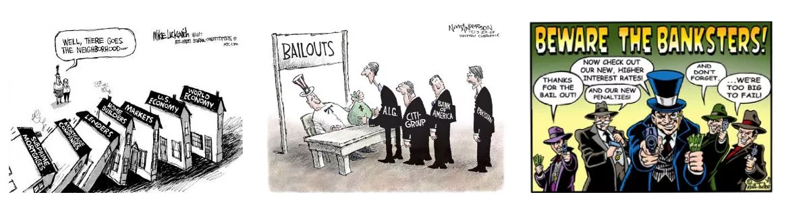

# Un voyage vers vos premiers bitcoins

L’écosystème Bitcoin connaît une croissance spectaculaire et sans précédent. Les transformations technologiques, économiques et sociales portées par l'invention de Satoshi Nakamoto s’intensifient jour après jour et ouvrent progressivement les portes d'un monde nouveau, dont vous pouvez dès maintenant tirer pleinement profit.

Plonger dans le Terrier de Bitcoin, c’est se lancer dans une aventure intellectuelle passionnante, qui stimulera votre esprit critique et vous poussera à remettre en question bon nombre de vos convictions. Cette exploration vous offrira non seulement une compréhension approfondie du fonctionnement de Bitcoin, mais aussi une occasion concrète de reconquérir votre liberté individuelle, de protéger votre vie privée, et de retrouver une véritable souveraineté financière.

Pour vous guider efficacement dans cette démarche, j’ai conçu ce cours entièrement gratuit. Ici, une seule règle : uniquement Bitcoin. Pas de discours creux, aucune autre cryptomonnaie, uniquement du contenu clair, précis, et sans détour.

Structuré de façon à vous laisser pleinement maître de votre apprentissage, ce cours vous permet de tracer votre propre parcours sur Bitcoin, à votre rythme, en fonction de vos intérêts et de vos objectifs personnels.

+++

# Introduction

<partId>008c49b7-5e17-5973-87f2-ba28429b2697</partId>

## Présentation de la formation

<chapterId>bfc96999-0ee1-5c41-8297-1b629f50cffc</chapterId>

Bienvenue dans la formation BTC102 ! Vous avez peut-être déjà suivi la formation BTC101 et découvert les concepts théoriques fondamentaux qui font de Bitcoin une révolution technologique majeure. Avec BTC102, il est maintenant temps de passer à la pratique : cette formation a été spécialement conçue pour vous aider à mettre en place concrètement votre plan Bitcoin personnel. Dans les prochains chapitres, nous allons donc vous accompagner étape par étape pour **obtenir vos premiers bitcoins**, les **sécuriser** efficacement et réussir votre entrée dans cet écosystème en pleine expansion.

https://planb.network/courses/2b7dc507-81e3-4b70-88e6-41ed44239966

Malgré son existence depuis plus de 16 ans, l'industrie de Bitcoin demeure jeune, dynamique et profondément libre. En effet, son protocole sous-jacent, entièrement décentralisé et impossible à contrôler totalement par une autorité centrale, permet à cet écosystème de se développer de manière naturelle et organique. Si cette liberté favorise une incroyable vague d'innovations et de possibilités, elle expose aussi ses utilisateurs à certains risques, notamment des arnaques, des erreurs courantes ou des pièges liés à un manque de connaissance. L'objectif principal de cette formation est justement de vous aider à naviguer sereinement et en toute sécurité dans ce nouvel écosystème.

Pour cela, la formation BTC102 est structurée en plusieurs sections, chacune abordant un aspect essentiel pour votre parcours personnel avec Bitcoin :

La première section, intitulée "Prérequis pour comprendre Bitcoin", vous prépare efficacement au parcours qui suit. Vous y apprendrez à identifier clairement les principaux pièges liés aux arnaques et fraudes financières qui peuvent exister dans l’écosystème Bitcoin. Nous vous enseignerons ensuite les bases essentielles de la sécurité en ligne. Enfin, je vous donnerai quelques conseils pratiques spécialement conçus pour les novices, destinés à éviter les erreurs fréquentes lors de vos premières interactions avec Bitcoin.

IMAGE

La deuxième section, "Comprendre dans quoi on se lance", vous permettra d'approfondir votre compréhension globale de Bitcoin. Nous commencerons par un rappel pour vous assurer que vous maîtrisez parfaitement les concepts essentiels. Puis, nous détaillerons précisément pourquoi Bitcoin revêt une importance fondamentale d'un point de vue technologique, économique et social, afin de renforcer vos convictions. Vous découvrirez ensuite l’industrie de Bitcoin dans sa globalité : ses acteurs, son organisation et son évolution au fil des années. Enfin, nous aborderons l'architecture en couches de l'écosystème Bitcoin, un concept important pour comprendre comment ce système continue sans cesse d'innover sans pour autant affaiblir le protocole de base.

IMAGE

La troisième section, "Mise en place de votre plan", se focalise sur votre approche personnelle de Bitcoin. Nous commencerons par vous aider à définir votre profil d’utilisateur parmi quatre grandes catégories : 
- *le hodler*, focalisé sur la détention de long terme ;
- *le stacker*, qui réalise des achats réguliers et méthodiques ;
- *l'utilisateur*, qui privilégie un usage quotidien ;
- et enfin *le parano*, soucieux d'une sécurité maximale pour protéger efficacement son patrimoine et sa confidentialité.

Vous serez accompagné pas à pas dans la mise en place d'une stratégie adaptée à votre profil personnel et à vos objectifs spécifiques.

IMAGE

Enfin, la quatrième partie, "Protéger ses héritiers et son patrimoine", aborde un sujet crucial souvent oublié : comment assurer la transmission de vos bitcoins à vos proches en cas d’événement imprévu. Vous apprendrez concrètement à créer et à mettre en place un plan d’héritage Bitcoin, afin de garantir la pérennité de votre patrimoine au-delà de votre propre existence.

IMAGE

À l'issue de cette formation, vous disposerez de toutes les clés pratiques nécessaires pour évoluer sereinement dans l’écosystème Bitcoin et figurer ainsi parmi les utilisateurs les plus avancés !

Bonne chance dans votre parcours !

# Prérequis pour comprendre Bitcoin

<partId>4481fc4b-0f83-489e-ad07-81517c5d6bad</partId>

## Arnaques et fraudes financières

<chapterId>8af2948b-2ab5-54c4-862c-3414b8a285a2</chapterId>

L’écosystème Bitcoin et son environnement restent relativement jeunes et faiblement régulés en fonction des pays. Si cette liberté offre d’immenses possibilités, elle constitue aussi un terrain fertile pour les fraudes financières, les escroqueries et toutes sortes de manipulations. C'est précisément pour cette raison que ce premier chapitre est important : connaître les pièges typiques permet de mieux s’en protéger. Votre sécurité financière est une priorité, car une mauvaise expérience nuit non seulement à vous, mais également à la réputation de toute la communauté Bitcoin.

### Bitcoin vs. cryptos : comprendre les différences

Avant d’aller plus loin, il est important de distinguer clairement deux univers distincts :

- **L’industrie Bitcoin**, axée sur une monnaie saine, une décentralisation forte, la résilience, la vie privée et la souveraineté individuelle. Le protocole Bitcoin est développé avec une approche à long terme et représente une valeur stable, existante depuis 2009, et bénéficiant du travail sérieux d’une large communauté de développeurs.

- **L’industrie des cryptomonnaies**, beaucoup plus vaste, qui inclut des dizaines de milliers de projets différents, chacun avec son token. Cette industrie est davantage orientée vers l’innovation rapide, les effets de mode et la spéculation financière à court terme. Les projets y sont souvent centralisés, peu sécurisés, et beaucoup n’apportent aucune valeur réelle, malgré leur marketing agressif.

001

Si vous souhaitez en savoir plus sur les origines de Bitcoin et sur ce qui distingue profondément ce protocole des autres, je vous recommande de suivre ultérieurement cette autre formation gratuite de deuxième année sur l'histoire de Bitcoin :

https://planb.network/courses/a51c7ceb-e079-4ac3-bf69-6700b985a082

Comme vous le savez, la plateforme Plan ₿ Network est exclusivement dédiée à Bitcoin. Cependant, comprendre la distinction avec les autres cryptomonnaies vous permettra de mieux éviter les pièges liés aux projets inutiles, voire parfois frauduleux.

002

### Les principales escroqueries à éviter

Voici les arnaques les plus courantes que vous rencontrerez dans votre parcours :

#### Systèmes pyramidaux et Ponzi

Les pyramides financières et les systèmes de Ponzi figurent parmi les escroqueries les plus fréquentes dans l’écosystème crypto. Dans un système de Ponzi, les premiers investisseurs sont rémunérés avec l'argent des nouveaux entrants. Aucun produit ou valeur réelle n'est créé. La viabilité du système dépend uniquement de l’arrivée constante de nouveaux participants.

003

Ces arnaques présentent généralement :
- Des promesses de rendements garantis irréalistes (par exemple : 20% de rendement garanti) ;
- Des délais ou des difficultés pour retirer vos fonds investis ;
- Des incitations fortes à parrainer de nouveaux membres pour maintenir le système en vie ;
- Un manque total de transparence sur la source réelle du rendement promis.

Finalement, tous les systèmes pyramidaux et de Ponzi sont par essence condamnés à l’échec. Leur faiblesse fondamentale réside dans le besoin permanent d'attirer de nouveaux investisseurs afin de rémunérer les anciens participants. Or, cette nécessité finit par devenir mathématiquement impossible à satisfaire, car le nombre de nouveaux entrants exigés augmente exponentiellement au fur et à mesure que le système grandit. Lorsque ce seuil critique est atteint, les participants commencent à douter, la confiance disparaît rapidement, et l'ensemble de la pyramide financière s'effondre brusquement. À ce stade, les derniers arrivants, souvent les moins informés, perdent la totalité de leur investissement sans aucun recours possible, tandis que les organisateurs ou les premiers investisseurs ont généralement déjà récupéré leurs fonds et quitté le système.

Dans l'univers des cryptomonnaies, ces systèmes Ponzi  peuvent prendre des formes très variées, conçues spécialement pour masquer leur fonctionnement frauduleux derrière un voile technologique ou financier. Ils peuvent ainsi apparaître sous la forme de nouvelles offres de tokens ou d’*Initial Coin Offerings* (ICO), c’est-à-dire des opérations de levée de fonds via la vente publique d'une nouvelle cryptomonnaie. Derrière des termes techniques comme "blockchain", "contrats intelligents", ou "staking", certains projets cachent en réalité des schémas pyramidaux complexes. D’autres encore prétendent offrir des rendements élevés en combinant crypto-actifs douteux et systèmes de rémunération basés exclusivement sur l'arrivée continue de nouveaux investisseurs.

Plus récemment, les escroqueries de type Ponzi se sont également étendues à la Finance Décentralisée (DeFi). La DeFi, censée permettre des services financiers sans intermédiaires, est parfois utilisée pour donner une apparence légitime à ces arnaques. Certains projets DeFi promettent ainsi des rendements très élevés et garantis en échange de dépôts de cryptomonnaies sur des protocoles automatisés. Ces promesses attractives sont souvent justifiées par des mécanismes opaques et non vérifiables, avec des jetons spécifiquement créés pour l’occasion. En réalité, ces systèmes n’ont pas de modèle économique viable : les intérêts versés proviennent uniquement des fonds apportés par les nouveaux utilisateurs, exactement comme dans un Ponzi traditionnel. Lorsque la confiance s’érode ou lorsque l’afflux de nouveaux entrants ralentit, ces systèmes s’effondrent inévitablement, entraînant des pertes considérables pour les investisseurs naïfs.

Il convient de souligner que le contenu de ce cours est destiné à des fins purement éducatives et ne doit pas être interprété comme un conseil financier. Votre sécurité financière dépend de votre capacité à rester prudent, sceptique et informé dans chacune de vos décisions financières.

La meilleure protection est de toujours poser cette question simple : **D’où vient réellement le rendement promis ?** Si la réponse est floue, fuyez immédiatement.

#### Pump & Dump

Cette autre escroquerie consiste à manipuler artificiellement le prix d’un actif (souvent un token de cryptomonnaie peu liquide) à travers une campagne marketing coordonnée, généralement orchestrée par un groupe d’investisseurs. Le mécanisme typique d’un Pump & Dump est le suivant :
- Un leader d'opinion ou un groupe d'investisseurs accumule d'abord un grand nombre d'actions ou d'autres actifs ciblés ;
- Ils lancent ensuite une campagne de communication agressive pour provoquer une hausse rapide du prix ;
- Le public, animé par le "FOMO" (*Fear Of Missing Out*), achète massivement l’actif, faisant grimper encore davantage son prix ;
- Au pic de la manipulation, les initiateurs vendent brutalement leurs actifs en masse, ce qui provoque l’effondrement du prix ;
- Les investisseurs attirés par la manipulation subissent d’importantes pertes financières.

004

Il est important de rappeler que les stratégies de Pump & Dump sont totalement illégales et considérées comme une manipulation des marchés financiers dans de nombreux pays. Mais malgré leur caractère frauduleux, ces techniques continuent de proliférer, notamment au sein de l'univers des cryptomonnaies. Je vous conseille donc d'éviter les groupes de "signaux" privés sur Telegram, Discord ou d'autres réseaux sociaux, souvent dirigés par des influenceurs ou des pseudo-experts qui exigent même parfois des frais d’adhésion pour y accéder. Ces groupes créent l’illusion de fournir des opportunités financières exclusives, mais la réalité est que seuls les organisateurs gagnent véritablement, tandis que les participants finissent généralement par perdre leur argent.

005

Il est vrai que certains participants peuvent temporairement tirer profit de ces manipulations, mais ce succès éphémère repose avant tout sur la chance et le timing. Sur le long terme, ces pratiques ne sont pas rentables, car elles nécessitent une prise de risque permanente et une participation répétée à des schémas frauduleux qui finissent toujours par échouer. Ces pratiques entretiennent une illusion dangereuse : celle qu'il est possible de gagner rapidement et facilement beaucoup d’argent sans comprendre les mécanismes financiers réels.

Pour toutes ces raisons, la meilleure stratégie reste toujours de privilégier une approche d’investissement sérieuse, basée sur l’éducation financière, la compréhension des fondamentaux et une vision de long terme. En construisant patiemment vos connaissances, vous serez beaucoup moins sensible aux manipulations émotionnelles et aux promesses irréalistes, et bien mieux préparé pour éviter ces pièges financiers destructeurs.

#### Arnaques aux dons, loteries et fausses promotions

Cette arnaque consiste à promettre des bitcoins ou d’autres récompenses gratuites contre l’envoi préalable d’argent. Aucun individu ou entreprise sérieuse ne vous demandera d’envoyer des bitcoins pour vous en renvoyer davantage.

Des escrocs utilisent régulièrement l’identité de personnalités connues (comme Elon Musk ou d’autres célébrités) pour attirer leurs victimes sur les réseaux sociaux. Vérifiez toujours soigneusement les comptes et les sites internet avant d’interagir, et ne croyez jamais les promesses trop généreuses.

Parfois, ces escroqueries peuvent également prendre la forme d'une arnaque aux frais avancés. Cela consiste à vous promettre un gain ou un cadeau (argent, produit, service...), mais à exiger d'abord un paiement sous prétexte de couvrir des frais (livraison, taxes, frais de transaction...). Une fois le paiement effectué, l'escroc disparaît sans jamais envoyer ce qui était promis au départ.

006

#### Shitcoins et cryptomonnaies offertes

Des projets de crypto-monnaies centralisés offrent parfois des jetons gratuits ("*airdrops*") pour attirer les utilisateurs. Ces jetons n’ont généralement aucune valeur réelle et servent uniquement à créer une illusion de popularité ou à encourager la spéculation. Soyez extrêmement prudent face à ces offres promotionnelles.

#### Usurpation d’identité et phishing

Les attaquants emploient fréquemment des faux sites, faux comptes ou e-mails trompeurs pour tenter de dérober vos fonds. Ces tentatives de fraude peuvent provenir de tout moyen de communication : email, réseaux sociaux, téléphone, courrier postal...

Avant de cliquer sur un lien ou de prendre une quelconque action, assurez-vous toujours de vérifier l’identité exacte de l’expéditeur, ou préférez accéder au site manuellement, sans utiliser le lien fourni. De manière plus générale, ne divulguez jamais vos clés privées ou vos mots de passe à quiconque.

#### Hardforks de Bitcoin

Bitcoin a subi plusieurs *hardforks* au fil du temps, donnant naissance à des versions alternatives de la monnaie originale. Concrètement, un *hardforks* correspond à une scission du réseau en deux blockchains distinctes partageant un historique commun jusqu'au moment de la séparation. Ces divisions surviennent généralement lorsqu'une partie des développeurs ou de la communauté Bitcoin souhaite apporter des modifications radicales au protocole original, mais n'obtient pas un consensus suffisant. Incapables de convaincre la majorité, ils choisissent alors de créer une version alternative de Bitcoin, avec des règles modifiées, en espérant que la communauté les suive.

007

Certains *hardforks* ne sont pas directement des arnaques, car ils reposent simplement sur des désaccords techniques ou idéologiques au sein de la communauté, mais d'autres sont essentiellement motivés par des raisons commerciales, voire malhonnêtes. Les exemples les plus connus de ces hardforks sont **Bitcoin Cash (BCH)** et **Bitcoin Satoshi Vision (BSV)**. Apparues respectivement en 2017 et 2018, ces monnaies alternatives prétendent souvent être de meilleures versions du Bitcoin original en mettant en avant des avantages supposés, tels que des frais de transactions moins élevés ou des transactions plus rapides grâce à une taille de blocs augmentée. En réalité, ces modifications techniques comportent des compromis importants en matière de sécurité, de décentralisation et de robustesse, qui peuvent venir en contradiction avec les principes fondateurs de Bitcoin.

Au-delà des différences techniques, ces monnaies alternatives jouent souvent sur la confusion pour attirer des investisseurs peu informés. Ils peuvent parfois utiliser des outils marketing afin d’induire volontairement en erreur des novices pensant acheter du véritable Bitcoin (BTC).

Pour éviter de tomber dans ce genre de piège, vérifiez toujours la monnaie que vous achetez. Le Bitcoin original utilise le ticker **BTC**, tandis que Bitcoin Cash et ses dérivés utilisent des acronymes distincts (par exemple BCH ou BSV).

#### Influenceurs malhonnêtes et faux gourous

Avec la popularité croissante des cryptomonnaies, une multitude d'influenceurs, de faux experts et de prétendus gourous sont apparus sur les réseaux sociaux. Si certains apportent parfois une valeur éducative réelle, beaucoup d'autres profitent malheureusement de leur visibilité pour promouvoir des projets douteux ou des stratégies de trading particulièrement risquées, voire frauduleuses. Ces individus sont généralement motivés par leurs intérêts financiers personnels, recevant souvent des rémunérations directes ou indirectes en échange de la promotion de certains tokens ou plateformes.

008

Ces influenceurs adoptent des tactiques éprouvées pour séduire les débutants : ils publient des résultats financiers impressionnants (souvent truqués ou impossibles à vérifier), vantent leur succès personnel à travers un mode de vie luxueux et présentent des stratégies d'investissement miraculeuses. Ils cherchent à susciter le FOMO, la peur de manquer une opportunité, afin d’inciter leurs abonnés à prendre des décisions impulsives et à investir sans réfléchir.

Il est important de comprendre que la plupart des conseils gratuits diffusés par ces personnalités ne sont jamais réellement gratuits. Derrière les apparences altruistes se cachent généralement des stratégies de manipulation pour inciter à l'achat d'actifs douteux. Par ailleurs, même s'ils étaient honnêtes, il serait impossible de répliquer fidèlement leurs résultats, car ces derniers dépendent d’un timing précis ou d’un contexte particulier dont vous n'avez pas connaissance.

Les influenceurs vous proposeront parfois de rejoindre des groupes privés payants, où ils promettent d'offrir des signaux ou des conseils censés garantir des gains rapides et faciles. Dans la réalité, ces groupes profitent principalement aux organisateurs eux-mêmes, qui utilisent leur audience comme source de liquidité pour réaliser leurs propres profits. Les abonnés finissent généralement par subir des pertes importantes, faute de pouvoir réagir aussi rapidement que les initiateurs des opérations (voir la partie sur le Pump & Dump).

Face à cette réalité, voici quelques bonnes pratiques à adopter pour éviter les pièges tendus par ces influenceurs :
- **Soyez extrêmement prudent vis-à-vis de toute recommandation d’achat d’une cryptomonnaie**. Une personne honnête et compétente ne vous incitera jamais à acheter précipitamment un actif sans vous encourager à faire vos propres recherches ;
- **Les formations payantes en trading ou en investissement ne sont pas nécessairement synonymes de qualité**. Souvent, elles présentent des techniques risquées ou simplistes, disponibles gratuitement ailleurs sur internet ;
- **Gardez à l’esprit qu’il n’existe aucune méthode miracle** pour copier facilement les transactions d'un tiers et obtenir exactement les mêmes résultats. Chaque stratégie d’investissement dépend du contexte personnel, des connaissances spécifiques, du timing et d’une multitude d’autres facteurs qu’il est impossible de reproduire à l’identique ;
- **Soyez particulièrement vigilant face aux recommandations qui semblent trop belles** pour être vraies. Les promesses irréalistes ou les garanties de gains immédiats sont presque systématiquement des signes de manipulation. Rappelez-vous que ce n'est pas parce qu'une personne dit quelque chose que cela est nécessairement vrai.

Enfin, souvenez-vous que chaque personne que vous rencontrez dans l'écosystème Bitcoin ou crypto a nécessairement un agenda personnel, explicite ou implicite, et qu'il n’y a pas d’information totalement neutre. Même ce cours BTC102 que vous suivez actuellement poursuit l’objectif clair de promouvoir une meilleure compréhension de Bitcoin. Soyez donc attentif aux motivations réelles derrière chaque contenu auquel vous êtes exposé. Gardez toujours à l’esprit ce principe essentiel : Si un produit ou un service semble gratuit, c'est probablement que c'est vous le produit.

La meilleure protection reste l’éducation personnelle, le scepticisme bien placé, et surtout, l’habitude constante de vérifier les faits par vous-même.

### Comment éviter les arnaques ?

**Enfin, voici quelques conseils pour éviter les arnaques en ligne :**
- Ne faites jamais confiance aveuglément : "*Don't trust, verify*" ;
- Méfiez-vous des rendements trop élevés ou garantis ;
- Ne communiquez jamais vos clés privées à qui que ce soit ;
- N'envoyez jamais de bitcoins à une adresse inconnue ;
- Si vous avez un doute, attendez et prenez du recul avant toute décision. Le FOMO est votre pire ennemi ;
- Évitez de participer à des groupes de trading payants ou aux promesses irréalistes ;
- La plupart des cadeaux ou loteries gratuites sur internet sont frauduleux ou truqués ;
- Vous gagnerez toujours plus en apprenant qu'en jouant.

Se prémunir contre les arnaques est une première étape importante pour la protection de votre patrimoine, mais cela ne suffit pas. Il est tout aussi essentiel de maintenir une bonne hygiène numérique. C'est pourquoi, dans le chapitre suivant, nous explorerons comment renforcer votre sécurité numérique et les bonnes pratiques à adopter.

## Sécurité en ligne

<chapterId>f0873bf2-6a6f-5485-bb7a-d84be14f404d</chapterId>

Dès l’instant où vous vous intéressez à Bitcoin, les questions de cybersécurité deviennent essentielles. Les fraudes financières et les arnaques ne sont pas les seules menaces : la perte accidentelle de données, l’infection par un malware ou le vol de mots de passe peuvent eux aussi causer des dommages considérables. L’objectif de ce chapitre est de vous présenter des mesures de protection simples et efficaces, applicables à tout utilisateur désireux de renforcer son hygiène numérique.

Si vous souhaitez aller plus loin dans chacun de ces aspects, Plan ₿ Network propose une formation complète SEC101 qui entre dans le détail des stratégies de cybersécurité :

https://planb.network/courses/99c46148-7080-4915-a7e0-9df0e145cd47

### Pourquoi la sécurité informatique est importante ?

Bitcoin apporte la possibilité de détenir sa monnaie directement, sans aucun intermédiaire. Mais cette souveraineté financière a son revers : si quelqu’un dérobe vos bitcoins (à cause d’une faille de sécurité), il est impossible de revenir en arrière. Contrairement aux banques traditionnelles, il n’y a ni réclamation ni assurance si vous vous faites pirater vos actifs.

De plus, l’attrait économique de Bitcoin en fait une cible de choix pour des personnes malintentionnées : un hacker qui vole vos BTC peut les transférer instantanément sur son propre portefeuille, sans avoir à craindre un remboursement forcé. Dans ce contexte, une bonne hygiène informatique n’est pas un luxe : c’est la première ligne de défense pour éviter de voir ses efforts et son argent envolés.

### Un ordinateur propre et à jour

Un point souvent négligé est la mise à jour régulière de vos logiciels et de votre système d’exploitation. Certaines mises à jour corrigent des failles de sécurité susceptibles d’être exploitées par des pirates. Beaucoup hésitent à les installer, de crainte que leur machine devienne plus lente ; en réalité, ne pas mettre à jour son PC vous expose à des vulnérabilités documentées et déjà corrigées.

De même, l’utilisation d’un antivirus fiable est vivement recommandée. Sur Windows, Windows Defender (installé par défaut) peut convenir aux utilisateurs ordinaires ; si vous le souhaitez, vous pouvez opter pour un antivirus commercial (comme Kaspersky, par exemple). Sur Mac, la menace de malware est historiquement moindre, mais reste possible : il est toujours bon de prendre des précautions.

012

En plus de ces points, méfiez-vous des téléchargements provenant de sites douteux ou de portails de téléchargement universels. Lorsque vous avez besoin d’un logiciel, privilégiez la source officielle. Cela réduit drastiquement les risques que des programmes malveillants soient embarqués dans ce que vous pensez être un fichier légitime. Une autre bonne pratique est de toujours vérifier l'authenticité et l'intégrité d'un logiciel avant de l'installer sur votre machine. Si vous ne savez pas comment le faire, nous avons un tutoriel dédié à ce sujet :

https://planb.network/tutorials/computer-security/data/integrity-authenticity-21d0420a-be02-4663-94a3-8d487f23becc

Enfin, pensez à sauvegarder régulièrement vos données. Un disque dur externe (ou un SSD) vous permettra de conserver un duplicata de vos fichiers importants. Cela vous évitera de gros regrets en cas de panne soudaine, d’infection ou d’erreur de manipulation. Si vous préférez les solutions en ligne, il existe des services sécurisés comme Proton Drive par exemple.

https://planb.network/tutorials/computer-security/data/proton-drive-03cbe49f-6ddc-491f-8786-bc20d98ebb16

Une stratégie de sauvegarde généralement conseillée est la règle du "3-2-1". Elle vise à protéger vos données contre la perte accidentelle, les attaques informatiques ou les catastrophes naturelles. Cette règle implique de conserver au minimum **3 copies** de vos données importantes, stockées sur au moins **2 supports différents** (par exemple, un disque dur local et un stockage cloud), tout en gardant toujours **1 copie hors site** (physiquement éloignée de votre lieu principal). Cette méthode garantit une bonne résilience de vos données.

013

### La solution au cauchemar des identifiants

La première raison pour laquelle tant de gens se font pirater est la faiblesse de leurs mots de passe. On estime qu’une part importante des internautes utilise le même mot de passe pour plusieurs comptes, ou choisit une variante triviale facile à deviner. **Les gestionnaires de mots de passe** répondent précisément à ce problème.

Un gestionnaire de mots de passe vous permet :
- De stocker tous vos mots de passe sous forme chiffrée ;
- De générer automatiquement des identifiants longs, aléatoires, uniques et complexes ;
- D’avoir un seul mot de passe maître à mémoriser pour accéder à tous les autres.

Avec un gestionnaire de mot de passe, vous n’aurez plus jamais à cliquer sur "Mot de passe oublié" ou à inventer des mots de passe faibles. Vous pouvez facilement retrouver l'accès à tous vos identifiants. En prime, ces logiciels peuvent se synchroniser sur plusieurs appareils (ordinateur, téléphone, tablette) et facilitent la connexion automatique à vos sites habituels.

011

De nombreux logiciels de gestion de mots de passe sont disponibles, mais je peux vous en recommander deux selon vos besoins. Si vous recherchez un logiciel facile à utiliser et synchronisable sur plusieurs appareils, Bitwarden est une excellente option :

https://planb.network/tutorials/computer-security/authentication/bitwarden-0532f569-fb00-4fad-acba-2fcb1bf05de9

Si vous préférez un logiciel local, uniquement sur votre ordinateur, KeePass est une bonne solution :

https://planb.network/tutorials/computer-security/authentication/keepass-f8073bb7-5b4a-4664-9246-228e307be246

### 2FA : la double protection

Même avec un mot de passe fort, le risque zéro n’existe pas. C’est pourquoi l’**authentification à deux facteurs** (2FA) est une couche de sécurité supplémentaire désormais considérée comme indispensable. Dès qu'il est possible de l'utiliser, vous devriez la mettre en place, surtout pour vos comptes sensibles.

014

Le concept est très simple : après avoir entré votre mot de passe sur un site, vous devez fournir un code temporaire (composé de 6 chiffres en général) généré par une application sur votre téléphone (Google Authenticator, Authy...). Ainsi, un pirate qui détiendrait votre mot de passe mais pas l’accès physique à votre téléphone ne pourrait pas se connecter à votre compte.

https://planb.network/tutorials/computer-security/authentication/authy-a76ab26b-71b0-473c-aa7c-c49153705eb7

009

Lorsque vous activez la 2FA, veillez à conserver la clé de récupération de votre application, afin de pouvoir recréer vos codes en cas de perte ou de changement de téléphone. Quant à la double authentification par SMS ou par email, elle reste mieux que rien, mais est nettement moins sûre : un simple vol ou clonage de carte SIM (*SIM swap*) peut la mettre en échec. 

010

Pour ceux qui souhaitent aller plus loin, il existe des solutions par clé physique (comme YubiKey) qui offre un degré de sécurité encore supérieur.

https://planb.network/tutorials/computer-security/authentication/security-key-61438267-74db-4f1a-87e4-97c8e673533e

### Protéger sa vie privée

La protection de la vie privée et la cybersécurité sont étroitement liées : plus vous laissez d’informations en libre accès, plus vous risquez de devenir une cible.

Un **VPN** (*Virtual Private Network*) peut déjà constituer un pas simple pour masquer votre adresse IP et chiffrer vos échanges sur Internet. Cela ne vous rend pas invisible, puisque le fournisseur de VPN peut encore voir vos actions, mais cela rend la tâche plus compliquée à quiconque chercherait à vous espionner ou à cibler vos habitudes de navigation. L’important est de choisir un VPN de confiance, qui ne vous demande pas votre identité, qui permet un paiement su service en satoshis et qui ne conserve pas de journaux d’activité.

015

Nous disposons de plusieurs tutoriels sur Plan ₿ Network pour apprendre à configurer facilement un VPN. Je pourrais notamment vous recommander IVPN ou Mullvad :

https://planb.network/tutorials/computer-security/communication/ivpn-5a0cd5df-29f1-4382-a817-975a96646e68

https://planb.network/tutorials/computer-security/communication/mullvad-968ec5f5-b3f0-4d23-a9e0-c07a3e85aaa8

Les gestes essentiels pour préserver sa confidentialité en ligne incluent également  :

- L’utilisation de **messageries chiffrées** comme Signal, SimpleX ou encore Session ;
- L’utilisation de **navigateurs** plus respectueux de la vie privée, tels que Firefox, Brave ou Tor (pour un anonymat renforcé) ;

https://planb.network/tutorials/computer-security/communication/tor-browser-a847e83c-31ef-4439-9eac-742b255129bb

- L'utilisation d'une **boite mail sécurisée** (comme ProtonMail, par exemple) ;

https://planb.network/tutorials/computer-security/communication/proton-mail-c3b010ce-254d-4546-b382-19ab9261c6a2

- Le **chiffrement** de vos fichiers grâce à des outils comme Bitlocker (sur Windows) ou VeraCrypt (multi-plateformes).

https://planb.network/tutorials/computer-security/data/veracrypt-d5ed4c83-7c1c-4181-95ea-963fdf2d83c5

### Avancer par étapes

La sécurité informatique peut sembler un chantier immense. Beaucoup de débutants abandonnent l’idée de tout mettre en place d’un coup, jugeant la tâche trop complexe. Pour éviter cet écueil, abordez chaque outil pas à pas. Par exemple, commencez par installer un gestionnaire de mots de passe, laissez-vous quelques semaines pour vous familiariser avec celui-ci, puis passez à l’étape suivante : l’activation du 2FA sur un premier compte, etc.

Au fil du temps, vous prendrez confiance dans ces solutions et serez prêt à adopter d’autres pratiques, comme l’usage d’une adresse email secondaire, la migration vers ProtonMail, l’installation d’un VPN ou la navigation via Tor pour les situations qui l’exigent.

À mesure que vous avancerez dans l’univers de Bitcoin, vous vous rendrez compte que les menaces grandissent avec la valeur que peut prendre votre portefeuille. S’armer de bonnes pratiques, renforcer sa confidentialité et mettre en place les outils adéquats procurent non seulement une tranquillité d’esprit, mais renforcent aussi la souveraineté que prône l’esprit Bitcoin.

En résumé : ne sous-estimez jamais la cybersécurité, prenez le temps d’installer les protections de base, et rappelez-vous que le point central reste votre discipline : sans une hygiène numérique rigoureuse, les meilleurs outils du monde ne vous serviront pas.

Je vous conseille également d'aller faire un tour sur [nos tutoriels dédiés à la sécurité informatique](https://planb.network/tutorials/computer-security) sur Plan ₿ Network.

016

Dans le prochain chapitre, je vais vous donner quelques conseils supplémentaires pour commencer votre parcours sur Bitcoin dans les meilleures conditions et pour vous éviter de tomber dans les nombreux pièges.

## Conseils pour novice

<chapterId>33134b3f-92c1-5185-afb6-88599e47e801</chapterId>

Lorsque l’on découvre le Bitcoin, il est facile de se laisser emporter par l’engouement et d’adopter des comportements hasardeux. L’univers des cryptomonnaies est en effet très particulier : volatilité des prix, nouvelles technologies, risques de pertes définitives en raison d’erreurs techniques ou de mauvais choix d’investissement… Autant d’écueils à éviter.

Dans ce chapitre, je vous offre quelques conseils pratiques et une orientation générale pour celles et ceux qui se lancent dans l’achat de leurs premiers bitcoins, et plus largement, dans tout placement financier.

Voici le principaux conseils que nous allons détailler ensemble :
- Méfiez-vous des Shitcoins et autres cryptomonnaies dépourvues d'utilité ;
- Investissez uniquement ce que vous êtes prêt à perdre ;
- Comprenez bien la distinction entre le trading et l'investissement ;
- Soyez conscient des implications fiscales de vos investissements ;
- Gérez soigneusement votre clé privée ;
- Gardez une attitude humble et discrète ;
- Adoptez une vision à long terme.

017

### Les erreurs courantes à éviter

L'univers de Bitcoin est accessible à tous, mais cela ne signifie pas qu'il faut y entrer sans préparation. Voici quelques-unes des erreurs classiques commises par les investisseurs novices :

**Erreurs technologiques :**

- **Perte de la grain de votre portefeuille :** Votre graine (ou phrase mnémonique) est une série de 12 ou 24 mots permettant de récupérer l'accès à vos bitcoins. Si vous perdez cette phrase, vous perdez définitivement l’accès à vos fonds ;
- **Stocker ses bitcoins sur une plateforme tierce :** Garder vos bitcoins sur une plateforme d’échange signifie que vous ne détenez pas réellement vos bitcoins. Vous êtes alors exposé à des risques tels que le piratage, la faillite ou la confiscation ;
- **Négliger sa confidentialité :** Protéger votre vie privée doit faire partie de votre stratégie de sécurisation. Exposer publiquement la quantité de bitcoins que vous possédez peut attirer l'attention d'individus mal intentionnés ;
- **Sécurité en ligne insuffisante :** Un manque de précautions basiques peut rendre vos appareils vulnérables au piratage et causer des pertes importantes.

**Erreurs financières :**

- **Investir plus que ce que vous pouvez vous permettre de perdre :** N'investissez jamais en vous endettant ou avec l’argent destiné à vos dépenses essentielles ;
- **Ignorer la différence entre trading et investissement à long terme :** Le trading est une activité risquée qui demande beaucoup de temps et de compétences techniques avancées. L’investissement à long terme est mieux adapté aux débutants ;
- **Oublier les implications fiscales :** Chaque pays a ses propres règles fiscales concernant le bitcoin. Ignorer ces règles peut vous exposer à des pertes financières importantes ;
- **Céder au FOMO (*Fear Of Missing Out*) :** Acheter impulsivement parce que vous craignez de manquer une opportunité conduit souvent à des achats au pire moment.

019

### Définir une stratégie d’investissement

Avant d’acheter le moindre satoshi, il est important de savoir pourquoi et comment vous souhaitez investir dans le bitcoin. Cette démarche implique de mettre en place un plan financier clair, adapté à votre situation personnelle et à vos objectifs.

En premier lieu, définissez avec précision votre **budget**. Il ne s’agit pas simplement de décider d’un montant approximatif : prenez le temps de calculer vos revenus mensuels, puis d’en soustraire vos charges fixes (loyer, emprunts, impôts, factures...), ainsi que les frais liés à votre vie courante (nourriture, transport, loisirs...). Le reste disponible constitue votre marge d’épargne ; c’est seulement sur cette partie que vous pouvez envisager d’investir. En procédant ainsi, vous vous assurez de ne pas engager des sommes qui mettraient en péril votre stabilité financière si le marché connaissait une forte correction.

020

Ensuite, pensez à la méthode d’investissement la plus adaptée pour vous. Le **Dollar Cost Averaging (DCA)** consiste à acheter du bitcoin (ou tout autre actif) à intervalles réguliers, toutes les semaines, tous les mois... Cette technique permet de lisser le prix d’achat au fil du temps et de réduire l’impact émotionnel des fluctuations importantes du marché. C’est un choix judicieux pour la majorité des investisseurs, surtout pour les débutants.

Enfin, clarifiez votre **vision** : s’agit-il d’un placement à court terme, dans l’optique de faire des allers-retours fréquents (trading), ou d’un investissement moyen ou long terme, plus proche de l’esprit "hodl" (détenir ses bitcoins sur plusieurs années) ? Votre stratégie diffèrera considérablement selon votre horizon de placement. Un "hodler" aura tendance à moins s’inquiéter des variations quotidiennes et préférera stocker ses BTC en toute sécurité, tandis qu’un trader cherchera à tirer parti des mouvements de prix plus rapides, au risque de multiplier les transactions et de s’exposer davantage au stress et aux mauvaises décisions.

L'objectif n'est pas de concevoir un plan parfait, mais plutôt de disposer d'une structure claire à suivre et à respecter. Il est important de ne pas effectuer vos achats sous l'impulsion de l'émotion ou de la peur. Adoptez une stratégie que vous avez définie au préalable sur papier pour minimiser tout stress inutile.

En cas de doute : commencez par vous informer. Plongez dans l'univers de Bitcoin pendant quelques heures (vous trouverez une multitude de ressources sur Plan ₿ Network). Lisez deux ou trois livres, investissez cinq euros pour tester, visionnez des documentaires et des vidéos. Gardez l'esprit ouvert. Une fois que vous vous sentirez plus à l'aise avec Bitcoin, vous pourrez éventuellement réviser votre plan d'action et adapter votre utilisation.

### Connaître la volatilité du BTC

Le bitcoin subit des variations de prix parfois spectaculaires. Il n’est pas rare de voir des mouvements de 10 %, 20 % ou même 50 % en l’espace de quelques jours. Une telle volatilité peut dérouter les débutants, qui, sous l’effet de la panique, pourraient vendre à perte ou, à l’inverse, se laisser emporter par la frénésie d’un marché haussier.

021

Pour éviter ces réactions impulsives, il est indispensable d’accepter la nature volatile du bitcoin avant même de se lancer. Ne considérez pas ces fluctuations comme une anomalie, mais comme une caractéristique inhérente à cet actif encore jeune. De fait, si ces hausses ou baisses subites vous empêchent de dormir ou vous incitent à prendre des décisions contre-productives, il se peut que vous ayez investi une somme trop importante. Dans ce cas, réévaluez votre plan et votre tolérance au risque, quitte à réduire votre exposition pour retrouver une certaine sérénité.

Il va de soi qu'il ne faut donc investir que ce que vous pouvez vous permettre de perdre ! Ne vous endettez pas pour investir dans une monnaie dont vous ne comprenez peut-être pas encore tous les tenants et aboutissants.

### Gestion et sécurité de votre portefeuille Bitcoin

L’un des aspects les plus uniques de Bitcoin est la notion de **self-custody**. Vous pouvez disposer de votre propre portefeuille sur lequel vous êtes entièrement responsable. Celui-ci est généralement généré à partir d'une phrase mnémonique (une série de 12 ou 24 mots), qui vous donne un contrôle absolu sur vos BTC. Si vous la perdez ou si elle tombe entre de mauvaises mains, vos fonds deviennent irrécupérables.

023

Dès lors, la règle d’or sur Bitcoin est : "***Not your keys, not your coins***". Si vous ne possédez pas vous-même vos clés privées, vous n’êtes pas réellement propriétaire de vos bitcoins. Les plateformes d’échange peuvent être pratiques pour démarrer ou effectuer des transactions, mais elles conservent les clés de vos BTC ; si elles font faillite, se font pirater ou décident de geler votre compte, vous risquez de tout perdre.

024

Pour éviter ce scénario, il est vivement recommandé de configurer votre propre portefeuille, où vous seul détenez la phrase mnémonique. Cette dernière doit être notée à la main, sur un support physique, et conservée dans un lieu sûr, à l’abri. Certains optent même pour une double sauvegarde, conservée dans deux endroits géographiquement distincts. Quoi qu’il en soit, veillez à **ne jamais stocker votre phrase mnémonique sur un appareil connecté** à Internet ou sur un service cloud, car un simple piratage ou une fuite de données pourrait se révéler catastrophique.

Si vous souhaitez approfondir vos connaissances sur la sécurisation de votre phrase mnémonique, je vous recommande de consulter cet article. Il détaille les risques encourus et les bonnes pratiques à adopter pour les éviter :

https://planb.network/tutorials/wallet/backup/backup-mnemonic-22c0ddfa-fb9f-4e3a-96f9-46e2a7954270
 
### Confidentialité et discrétion

Dans le monde numérique, on sous-estime trop souvent l’importance de la discrétion. Or, plus vous divulguez publiquement vos avoirs en bitcoins, plus vous devenez une cible potentielle pour des escrocs, des cybercriminels ou, dans certains cas, pour des menaces plus ordinaires (extorsion, chantage, etc.). Inutile de vous vanter ouvertement de détenir d’importantes quantités de BTC, que ce soit sur les réseaux sociaux ou lors de discussions avec des connaissances. Malheureusement, il y eu de très nombreux cas d'enlèvements de Bitcoiners à travers différents pays.

Par ailleurs, il est important de cloisonner vos activités en ligne. Vous pouvez par exemple séparer votre adresse e-mail classique (pour le quotidien) de celle utilisée pour vos comptes liés à Bitcoin. Méfiez-vous des tentatives de phishing, des liens suspects et des sites imitant des plateformes officielles. En bref, la **discrétion** et la **vigilance** vous protègeront souvent des ennuis.

Si vous êtes intéressé par le sujet de la confidentialité sur Bitcoin, je vous recommande de suivre par la suite cette formation de deuxième année :

https://planb.network/courses/65c138b0-4161-4958-bbe3-c12916bc959c

### Implications fiscales

En dépit de son statut de monnaie décentralisée, le bitcoin n’échappe pas aux réglementations et aux lois fiscales de votre pays. Chaque juridiction possède ses propres règles quant à la taxation des gains issus des cryptomonnaies. Certains pays imposent la plus-value lors de la revente, d’autres prévoient des déclarations spécifiques pour tout échange, et d’autres encore peuvent adopter des approches moins courantes (impôts sur la fortune, charges sociales, etc.).

018

Avant de réaliser des transactions importantes, il est vivement recommandé de vous renseigner auprès d’un professionnel ou de consulter les sites gouvernementaux. Une **planification fiscale** en amont vous évitera des déconvenues (amendes, régularisations, pénalités...), particulièrement si vous prévoyez des reventes conséquentes.

022

### Différences entre trading, investissement et holding

L’univers de Bitcoin est souvent associé à des clichés dans le grand public, notamment l’idée d’un enrichissement rapide via le trading. Or, il convient de distinguer clairement trois approches différentes, chacune ayant ses propres exigences et risques.

- **Le trading :**

Vous ne devriez pas faire de trading. Le trading s’effectue sur de courtes périodes, avec parfois un usage de levier financier. Les traders cherchent à exploiter les mouvements de prix, souvent volatils, pour dégager des profits rapides. Il faut un solide bagage technique (analyse graphique, gestion du risque...) et une résistance au stress ; la plupart des débutants échouent faute d’expérience ou de méthode rigoureuse. Suivre constamment l'évolution du marché peut s'avérer complexe et exige un engagement à temps plein. Comme l'a bien dit Warren Buffet : "*Si vous n'êtes pas prêt à garder une action pendant 10 ans, ne songez même pas à la garder 10 minutes*".

- **L'investissement :**  

L’investisseur adopte un horizon de temps moyen ou long, sans recours au levier. Il cherche à acquérir du bitcoin en misant sur l’évolution de sa valeur au fil des mois, voire des années. Le risque reste présent, car le prix peut fluctuer, mais l’approche est généralement plus calme et mieux adaptée à la majorité du grand public, qui ne souhaite pas consacrer des heures quotidiennes à surveiller les marchés.

- **L'holding (HODL) :**

"*HODL*" est une déformation humoristique de "*hold*", devenue emblématique dans la communauté Bitcoin. Les "*hodlers*" conservent leurs BTC sur le très long terme, parfois dix ans ou plus, persuadés que Bitcoin prendra de la valeur à mesure que son adoption progresse. Cette stratégie exige une forte conviction dans le potentiel de Bitcoin et une indifférence relative aux secousses passagères du marché.

|                        | Trading     | Investissement | Holding         |
| ---------------------- | ----------- | -------------- | --------------- |
| Levier                 | Oui         | Non            | Non             |
| Temporalité            | Court terme | Moyen terme    | Très long terme |
| Type d'actif           | Contrat     | BTC            | BTC             |
| Risque                 | Très haut   | Haut           | Haut            |
| Difficulté             | Très dur    | Dur            | Dur             |
| Courbe d'apprentissage | Longue      | Longue         | Longue          |
| Pertes potentielles    | Illimitées  | Limitées       | Limitées        |
| Plus adapté à          | Certains    | La plupart     | Certains        |

### Se former continuellement

Il n'y a pas d'âge pour commencer à s'éduquer en matière d'investissement et pour comprendre le fonctionnement de l'argent et du système financier. Il n'est pas nécessaire de plonger dans les détails ; une compréhension globale est suffisante pour prendre des décisions éclairées, basées sur des faits plutôt que sur l'ignorance. Cela peut s'avérer précieux tout au long de votre vie, et vous permettre de détecter lorsque quelqu'un tente de vous vendre un mauvais produit d'investissement (comme pourrait le faire une banque).

En guise d’introduction à la logique d’investissement, l’ouvrage ***Rich Dad, Poor Dad* de Robert T. Kiyosaki** est réputé pour sa pédagogie et sa simplicité. Il aborde des principes fondamentaux tels que la différence entre un actif et un passif, ou encore le rôle de l’éducation financière dans la réussite personnelle.

Pour aller plus loin, des émissions comme ***The Investors Podcast*** approfondissent la finance et l’économie. Si vous travaillez déjà dans le domaine de la finance ou si cela vous passionne, écoutez quelques-uns de leurs épisodes. Certains d'entre eux parlent de Bitcoin.

025

### Règles d’or à retenir

Pour terminer, gardez à l’esprit quelques principes simples mais incontournables :

- **Règle n°1** : N’investissez jamais plus que ce que vous pouvez vous permettre de perdre. En d’autres termes, ne mettez pas votre sécurité financière en danger pour un actif volatile.

- **Règle n°2** : Ne vous fiez pas aveuglément à la tendance générale du marché ou aux conseils miracles. Évitez ce qui est à la mode. Concentrez-vous plutôt sur le fait de progresser en prenant des décisions rationnelles. En cas de doute, prenez une nuit de réflexion et discutez-en avec vos proches. Il est préférable de prendre son temps plutôt que de se précipiter. La meilleure stratégie consiste à avancer étape par étape.

- **Règle n°3** : Élaborez un plan et une vision à long terme. La patience, la régularité et la discipline sont souvent plus payantes que l’excitation à court terme. Planifiez et ne prenez pas trop de risques. Le but est d'éviter des échecs fatals tout en accumulant les succès.

En appliquant ces préceptes, vous pourrez aborder l’investissement de manière plus sereine et réfléchie. Malgré la volatilité du bitcoin et son aspect parfois déroutant, cette technologie recèle un potentiel indéniable à condition de l’approcher avec prudence et réalisme. Prenez le temps de renforcer vos connaissances, ajustez votre stratégie au besoin et, surtout, rappelez-vous qu’il vaut mieux progresser lentement mais sûrement, plutôt que de céder à l’impatience ou à la peur de manquer une opportunité.

# Comprendre dans quoi on se lance

<partId>a42355a3-9dd8-57ed-b590-32a333fe09ea</partId>

## Bitcoin en 5 minutes

<chapterId>ae122ad9-9b4d-5229-9038-e1b99d5cfc83</chapterId>

Dans cette formation, l’objectif principal consiste à vous guider dans l’obtention et la sécurisation de vos premiers bitcoins. Toutefois, avant de passer aux considérations pratiques (comment acquérir des BTC, quels portefeuilles utiliser, etc.), un bref rappel sur ce qu’est réellement Bitcoin s’impose. Comprendre la nature profonde de Bitcoin vous aidera à discerner les raisons pour lesquelles des millions de personnes s’intéressent à cette technologie, et pourquoi il est essentiel de bien maîtriser les concepts fondamentaux avant d’investir votre épargne dans un actif aussi novateur et volatile.

Au fil des ans, Bitcoin s'est imposé comme un réseau monétaire globalement reconnu. On l’a souvent qualifié de "nouvel or numérique", de "protocole de confiance", voire de "système financier parallèle". Mais qu’est-ce qui se cache derrière ces définitions ? Pour répondre à cette question, nous allons examiner les grandes lignes de Bitcoin : ses origines, son fonctionnement technique, ses propriétés monétaires et son impact potentiel sur les utilisateurs comme sur le système économique mondial.

### Les origines : un projet né d’une longue quête

#### Cypherpunks et invention d’un système hors du contrôle bancaire

Contrairement à ce que l’on pourrait penser, Bitcoin n’est pas simplement le fruit d’une inspiration soudaine. Avant 2009, de nombreux essais ont tenté de créer des formes de monnaie numérique : eCash, b-money, Bit Gold, RPOW etc. Tous se heurtaient à un problème resté célèbre dans le monde de l’informatique et des réseaux décentralisés : celui de la double dépense et de la synchronisation d’un registre unique à l’échelle mondiale sans passer par un organe central de validation.

C’est dans ce contexte qu’est publié, fin 2008, le **White Paper de Bitcoin** par un certain Satoshi Nakamoto (pseudonyme dont la véritable identité n’a jamais été révélée à ce jour). Au début de l’année 2009, Nakamoto lance le système Bitcoin et la première version fonctionnelle d'un logiciel client. Les idées majeures derrière cette invention s’inscrivent dans la lignée idéologique des **Cypherpunks**.

032

Les Cypherpunks sont une communauté informelle et internationale de personnes promouvant l'utilisation de la cryptographie comme moyen d'assurer les libertés individuelles sur Internet. Les cypherpunks défendent le droit fondamental pour l'individu de protéger sa vie privée, en particulier dans un contexte d'augmentation de la surveillance étatique et d'exploitation des données par des entités privées.

Le mouvement des cypherpunks remonte au début des années 1990, lorsque des groupes de cryptographes, de programmeurs et de libertariens ont commencé à discuter des implications politiques de la cryptographie au cours de leurs premières réunions dans la Silicon Valley. La personnalité principale au sein de la communauté était Tim May, qui avait écrit le *Crypto Anarchist Manifesto* en 1988, texte fondateur du mouvement. Parmi les moments clés de l'histoire des cypherpunks, il y a la fondation, en 1992, de la *Cypherpunks mailing list*, une liste de diffusion de courrier électronique qui a servi pour ces discussions. La publication par Eric Hughes en 1993 du *Cypherpunk's Manifesto*, document exposant les objectifs et les actions des cypherpunks, a également été un moment important.

L'idée d'une monnaie électronique qui ne s'établit pas sur une entité centrale, comme Bitcoin, est enracinée dans la philosophie des cypherpunks

#### Un timing post-crise financière

Le contexte économique n’était pas anodin : fin 2008, la planète subissait une crise financière d’une ampleur considérable, liée à la faillite de la banque Lehman Brothers, au gonflement de la bulle immobilière et à la méfiance grandissante envers le secteur bancaire. Dans le premier bloc de la blockchain Bitcoin (*Genesis block*), Satoshi Nakamoto a même laissé un message qui faisait référence à la crise : 

> The Times 03/Jan/2009 Chancellor on brink of second bailout for banks

Beaucoup y voient une référence à l’ambition de Bitcoin : proposer un système de transfert de valeur **sans intermédiaire** de confiance, régi par des règles transparentes, et non pas par les décisions souvent opaques de banques centrales ou de gouvernements.

Pour approfondir vos connaissances sur les origines de Bitcoin, nous proposons une formation gratuite, très complète et documentée sur le sujet :

https://planb.network/courses/a51c7ceb-e079-4ac3-bf69-6700b985a082

### Un réseau décentralisé pour transférer de la valeur

#### Peer-to-peer et absence d’organe central

Bitcoin se définit comme un "**Un système de cash électronique pair-à-pair**" : tout utilisateur peut se connecter au réseau à l’aide du logiciel approprié (un nœud Bitcoin) et communiquer directement avec les autres utilisateurs, sans passer par un serveur central unique. Cette décentralisation vise à éviter qu’une entité quelconque (banque, État, grande société...) puisse contrôler, censurer ou arrêter le système. Bitcoin est un **système d’échange de valeur** qui fonctionne 24 heures sur 24, 7 jours sur 7, partout sur la planète, accessible à tous sans condition.

En pratique, chaque participant au réseau (chaque nœud) possède une copie complète du registre des transactions, appelé la **blockchain**. Dès qu’une nouvelle transaction est émise, elle est propagée à travers le réseau. Des mineurs confirment ensuite à intervalles réguliers ces transactions en les regroupant dans des blocs, ajoutés ensuite à la fin de la chaîne (d’où le nom de "blockchain").

029

#### La blockchain : un grand livre comptable

Pour comprendre la blockchain, on peut la comparer à un registre comptable où chaque ligne représente une transaction. Dans un système bancaire classique, la base de données se trouve sur les serveurs d’une banque, qui peut, de manière unilatérale, apporter des modifications. À l’inverse, dans Bitcoin, **toutes les modifications sont validées de façon distribuée** : chaque nouveau bloc de transactions, une fois ajouté à la blockchain, est presque impossible à modifier à postériori.

027

### Le rôle des mineurs et la Proof-of-Work

#### Création des blocs par le minage

Le minage est l’opération par laquelle un ordinateur (ou une ferme d’ordinateurs) fournit de la **puissance de calcul** pour sécuriser l'historique économique et valider les blocs. Les mineurs tentent de résoudre un problème mathématique (trouver une collision partielle sur un hash), ce qui exige une certaine quantité d’énergie et de ressources. Une fois la solution trouvée, le mineur diffuse le nouveau bloc, et le réseau reconnaît la validité de ce bloc. Le mineur reçoit en récompense un certain nombre de bitcoins fraîchement créés, et les frais des transactions incluses dans son bloc.

#### La récompense décroissante et le halving

Afin de garantir la rareté de Bitcoin, la récompense pour le minage subit une division programmée de moitié tous les **210 000 blocs** (environ tous les quatre ans). On appelle ce mécanisme le **halving**. Au lancement de Bitcoin, la récompense était de 50 BTC par bloc. Aujourd’hui, elle n’est plus que de 3,125 BTC (en 2025), et continuera à diminuer dans les années à venir, jusqu’à cesser complètement vers 2140, lorsque la quantité maximale d'environ 21 millions de bitcoins aura été mise en circulation. Cette courbe d’émission prévisible confère à Bitcoin une dimension de **rareté numérique** semblable à celle de l’or, d’où parfois le surnom d'or numérique.

031

### Les propriétés monétaires du bitcoin

#### Rareté et politique monétaire programmée

L’un des points les plus importants de Bitcoin est d’avoir instauré une **politique monétaire immuable**. Dans le monde des monnaies fiduciaires (euro, dollar, yen...), les banques centrales peuvent émettre de la monnaie à volonté, ce qui entraîne une inflation importante ou divers déséquilibres économiques. À l’inverse, le bitcoin repose sur des règles inscrites dans le code source : il y aura au maximum environ 21 millions de bitcoins, et le rythme d’émission est connu à l’avance de tous les participants.

Personne, pas même un gouvernement, ne peut modifier unilatéralement ce plafond ou la manière dont les BTC sont distribués. La seule manière d'y parvenir serait de modifier les règles du protocole, une modification qui ne peut réussir que si la majorité économique des nœuds du réseau y consent.

Cette caractéristique suscite un fort intérêt, notamment auprès de celles et ceux qui souhaitent échapper aux politiques monétaires imprévisibles ou à la dévaluation constante de leur monnaie nationale. Cette innovation pourrait conduire, sur le long terme, à un changement de paradigme financier, où l’épargne serait mieux préservée de l’inflation.

#### Divisibilité et accessibilité

Il est important de souligner que **chaque bitcoin est divisible** jusqu’à la huitième décimale (unité appelée le "satoshi"). Cela signifie qu’il est parfaitement possible d’acheter ou d’envoyer de toutes petites fractions de BTC. Nul besoin de débourser des milliers d’euros pour commencer à acquérir vos premiers satoshis.

026

### Ouverture et transparence

#### Un protocole public, vérifiable par tous

Le protocole Bitcoin repose sur des clients qui sont **open source** (le plus important est Bitcoin Core). Autrement dit, le code qui définit son fonctionnement est publié librement, si bien que tout développeur peut l’examiner, l’auditer, et éventuellement proposer des améliorations. Il devient alors très difficile de cacher une fonctionnalité malveillante ou d’opérer une manipulation secrète : chacun peut, en théorie, déployer sa propre implémentation tout en respectant les règles de consensus.

030

Cette transparence contribue à la **confiance** dans le protocole, dans la mesure où elle évite qu’un groupe restreint de programmeurs ne manipule le réseau à son avantage. Bitcoin repose en effet sur le principe suivant : si vous n’êtes pas d’accord avec les modifications suggérées, vous pouvez tout simplement **refuser** de mettre à jour votre logiciel. Dans certains cas, vous pouvez rester synchronisé avec le reste du réseau, mais dans d'autres, cela peut provoquer ce que l'on appelle un "Hardfork". Cela créer un nouveau système Bitcoin distinct de l'original. C'est exactement ce qui s'est produit en 2017 avec la scission entre Bitcoin (BTC) et Bitcoin Cash (BCH).

Tout cela rend la gouvernance de Bitcoin très lente et parfois conflictuelle, mais garantit également une certaine stabilité et une résistance à la centralisation.

#### Validation individuelle : les nœuds

Bitcoin permet à tout un chacun de vérifier l’intégrité de la blockchain : en faisant **tourner un nœud** sur son propre ordinateur ou un serveur. Cela consiste à télécharger le logiciel Bitcoin Core (ou une autre implémentation du protocole), puis à vérifier toutes les transactions et tous les blocs depuis 2009. Une fois synchronisé, votre nœud agit comme une archive complète et participe au réseau.

Cette approche, certes plus technique, garantit aux utilisateurs les plus exigeants qu’ils peuvent s’affranchir de la confiance envers un tiers, participer au consensus et être incensurables. 

### Les cas d’usage

#### Un moyen d’échange transfrontalier et résilient

Par sa nature décentralisée, Bitcoin fonctionne jour et nuit, indépendamment des frontières et des fuseaux horaires. Dans certaines régions dépourvues d’infrastructures bancaires robustes, Bitcoin est parfois utilisé comme solution pour envoyer ou recevoir des fonds rapidement, sans intermédiaire coûteux. Les frais de transaction peuvent varier en fonction de la congestion du réseau, mais restent généralement inférieurs aux commissions que pratiquent certaines banques pour des virements internationaux. De plus, il existe des systèmes de surcouche tels que le Lightning Network, qui permettent de réaliser des transactions en bitcoins de manière rapide et à faible coût.

#### Une réserve de valeur

Grâce à sa rareté (21 millions de BTC) et sa robustesse, le bitcoin est parfois considéré comme une solution pour protéger son épargne sur le long terme. Son cours, qui peut être volatil sur le court terme, a néanmoins suivi une tendance haussière de long terme depuis sa création. Certains investisseurs achètent du BTC avec l’idée qu’il pourrait servir de réserve de valeur face à l’inflation ou à des crises financières.

#### Un outil de liberté financière et de résilience

Au-delà de l’investissement, Bitcoin représente un **moyen de protéger sa souveraineté financière**. Dans des pays soumis à des régimes autoritaires ou à de fortes restrictions monétaires, la possibilité d’avoir un portefeuille Bitcoin (avec ses propres clés privées) offre une forme de liberté. Personne ne peut bloquer ou confisquer ces BTC, dès lors que le détenteur prend soin de sécuriser sa phrase mnémonique.

Cette caractéristique séduit particulièrement ceux qui craignent la censure ou le gel de comptes bancaires. Elle intéresse également les populations victimes d’hyperinflation, comme ce fut le cas au Venezuela ou au Zimbabwe : détenir du BTC était plus stable que conserver la monnaie nationale qui se dépréciait à toute vitesse.

### Un chemin encore long

Bitcoin peut être vu comme un "*Zero to One*" : une rupture radicale avec les paradigmes financiers établis. Pour la première fois dans l’histoire, un réseau monétaire planétaire, accessible à tous, fonctionne sans organe central et permet de faire des transactions résistantes à la censure et confidentielles.

Quoi qu’il en soit, après plus d’une décennie d’existence, Bitcoin continue de susciter débats et passions. Son adoption progresse, des solutions de seconde couche (comme le Lightning Network) émergent pour améliorer la vitesse et réduire les frais, et des entreprises du monde entier expérimentent de nouveaux cas d’usage. Il est donc probable que Bitcoin influence durablement les systèmes de paiement et la perception même de la monnaie dans les décennies à venir.

028

Pour poursuivre votre apprentissage, vous pouvez suivre la formation BTC101 sur Plan ₿ Network, où les fondements techniques et économiques de Bitcoin sont abordés de manière plus approfondie.

https://planb.network/courses/2b7dc507-81e3-4b70-88e6-41ed44239966

Après cette introduction sur Bitcoin (certes un peu plus longue que 5 minutes !), vous voilà mieux armé pour envisager l’achat de bitcoins et leur sécurisation. Dans les chapitres suivants de la formation, nous étudierons en détail l'importance de Bitcoin, le fonctionnement de son industrie, et le développement de ses différentes couches. Ensuite, dans la section suivante, nous aborderons la mise en place de votre propre plan personnel.

## Pourquoi Bitcoin est important ?

<chapterId>d4327ac4-9ff8-5192-b542-cb78c0bd0aa7</chapterId>

Pourquoi l'importance de Bitcoin est-elle si cruciale ? C'est là la question centrale de cette université. Que cela concerne vos études ou votre stratégie d'investissement, sans une compréhension claire de l'importance de Bitcoin, vous risquez de dévier de votre plan d'action. L'objectif est donc de toujours garder à l'esprit les fondamentaux de Bitcoin, afin d'assurer que votre stratégie reste en phase avec vos convictions.

Barack Obama a un jour décrit Bitcoin comme "une banque suisse dans votre poche". Et en effet, Bitcoin offre les mêmes opportunités à tout le monde, indépendamment de qui vous êtes. Que vous soyez un adolescent, un président, un manifestant à Hong Kong ou un "gilet jaune" en France, tout le monde a accès à l'identique au même protocole et aux mêmes outils :

1. Création de comptes gratuits et illimités.
2. Possibilité d'envoyer de l'argent partout et à n'importe qui.
3. Absence de nécessité de pièce d'identité ou de paperasse.
4. Accessibilité pour tous, indépendamment de l'âge, du genre, de la religion, du pays ou du niveau de revenu.
5. Confidentialité et transparence à la demande.
6. Absence d'intermédiaires ou de frais cachés.
7. Bitcoin est natif d'Internet, le rendant accessible à tous ceux qui ont accès au web.

En somme, Bitcoin peut être considéré comme la "monnaie du peuple".
Question philosophique du jour : Dans le monde du bitcoin, deux idéologies se font face. Voulez-vous faire entrer dans le système bancaire les milliards de personnes qui n'y sont pas ? Ou voulez-vous faire sortir du système bancaire les milliards de personnes qui y sont ?

Cette question mérite réflexion, et nous y reviendrons ultérieurement.

Des milliards de personnes vivent sous l'effet néfaste de politiques monétaires mal gérées, qui entraînent souvent des crises financières graves sur le long terme. Ces types de crises ont surgi des centaines de fois dans notre histoire et continueront de le faire tant que la valeur de l'argent et du temps seront manipulés. Ces crises peuvent se manifester sous la forme d'hyperinflation, de contrôle monétaire et de dévaluation de la monnaie.

Bitcoin offre à chaque individu une chance de sortir de ce système. C'est un choix éthique que chacun sera probablement amené à faire un jour. Bitcoin facilite le passage de l'argent fiduciaire à l'argent sain, grâce à sa résistance à la censure, sa divisibilité et sa portabilité.

**Le saviez-vous** ? Au cours des 100 dernières années, il y a eu plus de 55 cas d'hyperinflation. La plupart ont complètement détruit l'économie de leur pays, anéanti les économies des citoyens et ont parfois créé une instabilité politique qui a conduit à l'établissement d'un régime dictatorial (comme ce fut le cas au Chili, en Allemagne, etc.). La destruction des monnaies fiduciaires n'est pas un phénomène nouveau et continuera de se produire. Cependant, grâce à Bitcoin, vous avez maintenant la possibilité de sortir de ce système.

L'aggravation des inégalités de richesse dans le monde a conduit à une montée de l'extrémisme, qui a parfois débouché sur l'établissement de régimes dictatoriaux. Peu importe qui vous êtes, un jour vous aurez peut-être besoin de confidentialité pour protéger votre famille, vous-même et vos économies. Où pourriez-vous cacher vos biens si vous étiez menacé politiquement?

- Votre compte bancaire peut être gelé, saisi ou vidé.
- L'or est difficile à diviser, compliqué à transporter et à utiliser.
- Le cash est encombrant, facile à voler et soumis à l'inflation.

Bitcoin offre une solution à ces problèmes en permettant aux gens de sécuriser leurs économies et de les transporter avec eux, sans aucun contrôle de la part de l'État. Près de la moitié de la population mondiale vit sous un régime hostile, ces personnes ont besoin de Bitcoin plus que quiconque.

Bitcoin est une forme de protestation passive contre l'injustice du système.

**Le saviez-vous**? Bitcoin est pseudo-anonyme. Une adresse anonyme sert à stocker et à échanger les Bitcoins entre les utilisateurs. Cependant, chaque transaction est inscrite dans un grand livre public (la blockchain) pour que tout le monde puisse la vérifier. Cela signifie que, bien que les noms des utilisateurs ne soient pas divulgués, l'historique de leurs transactions est entièrement transparent.

Les banques centrales continuent de diluer votre pouvoir d'achat à travers l'inflation et les politiques de création monétaire (quantitative easing). Ce sont des taxes cachées qui ont progressivement détruit la valeur de l'argent au fil des décennies. Si vous ne disposez pas d'un revenu solide provenant de dividendes, d'obligations ou de placements immobiliers, vous vous appauvrirez au fil du temps, tandis que les riches continueront à s'enrichir davantage. En raison de l'action des banques centrales, un dollar aujourd'hui vaut moins qu'un dollar demain.

Le système vous encourage à vous endetter, à dépenser et à enrichir les banquiers grâce aux intérêts payés pendant de nombreuses années de remboursement et d'endettement. Ce n'est pas une erreur, mais une stratégie délibérée mise en place par les banquiers et les politiciens pour stimuler les dépenses gouvernementales, la croissance économique et pousser la population à s'endetter toujours plus.

Notre système est corrompu par les banques centrales. Bitcoin est le remède.

Il n'y aura jamais plus de 21 millions de bitcoins et aucun politicien, banquier ou autre individu malveillant ne pourra changer cela. Cette limite a été établie dans le protocole de Bitcoin par Satoshi et ne peut être modifiée aujourd'hui. Cela fixe le taux d'inflation de Bitcoin pour les 100 prochaines années.

Dans le passé, l'or jouait un rôle de régulateur en tant que monnaie saine. Cependant, depuis 1971, plus aucune monnaie fiduciaire (euro, dollars, etc.) n'est liée à l'or, ce qui a ouvert la voie à une création monétaire illimitée. Brrrrrr (allusion au son de l'imprimante à billets).

Si vous avez de l'argent dans un compte bancaire, cet argent ne vous appartient plus. Vous avez en réalité prêté cet argent à la banque pour qu'elle puisse l'utiliser. Il est crucial de comprendre et de prendre conscience de cette réalité. Si vous avez de l'argent dans un compte bancaire, vous êtes en réalité créancier de la banque. Cela signifie deux choses :

1. Si la banque fait faillite, vous risquez de perdre votre argent.
2. Si la banque refuse de vous restituer votre argent, vous risquez également de le perdre.

Vous pensez peut-être que ces scénarios sont peu probables, mais nous explorerons dans un chapitre ultérieur pourquoi ils sont presque inévitables.

Bitcoin, en revanche, est un système ouvert et incorruptible. Les règles sont fixes et les mêmes pour tous. La célèbre phrase "Pas votre clé, Pas vos Bitcoins" souligne l'importance de détenir la clé privée d'un portefeuille Bitcoin. En possédant la clé privée, vous avez le contrôle total sur les Bitcoins qu'elle contient. Si vous ne détenez pas cette clé, cela signifie que quelqu'un d'autre détient vos Bitcoins pour vous. Dans ce cas, vos Bitcoins sont exposés à des risques similaires à ceux associés à une banque traditionnelle.

Pour retrouver votre souveraineté, il est essentiel de prendre le contrôle de votre clé privée et de sécuriser vos Bitcoins par vous-même.

Bitcoin offre une alternative puissante aux systèmes financiers traditionnels. Il permet à chacun de préserver sa vie privée, de se protéger contre l'inflation et la dévaluation monétaire, de contourner les régimes autoritaires et de regagner la souveraineté sur son argent. Bitcoin est une monnaie saine, accessible à tous sans distinction d'âge, de genre, de religion ou de revenus. En adoptant Bitcoin, les individus peuvent épargner pour l'avenir, se libérer de l'emprise des banques centrales et reprendre le contrôle de leur vie financière. C'est un outil qui permet de rééquilibrer les pouvoirs et de promouvoir la liberté économique à l'échelle mondiale.

Bitcoin, un mouvement politique ?
Les principaux promoteurs de Bitcoin aujourd'hui sont encore principalement des cyberpunks, des citoyens opprimés, des anarchistes, des adeptes de l'école autrichienne d'économie, des ingénieurs en informatique, des financiers et des défenseurs de la liberté d'expression.
Bitcoin possède une dimension hautement philosophique, éthique et politique tout en étant totalement indifférent à ces considérations. En effet, Bitcoin est un simple protocole qui reproduit le même processus encore et encore. Ce sont ses utilisateurs qui ont fait de lui une arme de libération contre le système financier actuel. Du point de vue Cyberpunk, Bitcoin s'oppose à une société sans espèces. Il permet de créer des transactions financières numériques entièrement privées et sans intermédiaire. Pour le mouvement cyberpunk, Bitcoin est l'équivalent électronique de l'argent liquide.

## Comprendre l'industrie du Bitcoin

<chapterId>e106c6f1-d75b-5a62-b245-0ea2e4d02ef8</chapterId>

Avec l'arrivé de Bitcoin en 2009 par Satoshi Nakamoto, une industrie de plusieurs milliard de dollars est née. Cette industrie malgres, ca jeunesse, a connu une croissance exponentielle au cours des dix dernières années. De nouveaux acteurs arrivent chaque jour avec de grosse somme d'argent et sont prêts à pénétrer en force dans cette nouvelle industrie. Aujorud'hui l'industrie a atteint un point de non-retour où les gouvernements, banques, géant d'internet ou autres ont rejoint le mouvement avec toute sorte d'intervention.

Bitcoin est un 0 à 1. Il ne peut pas être défait. Certains y verront le mal en personne, la boîte de Pandore est ouverte et elle leur ôte maintenant leur pouvoir et leur avantage. Ils vont le combattre. D'autres verront dans Bitcoin une opportunité de retrouver la liberté, de changer le système et d'améliorer notre société. Ils l'embrasseront.
Bitcoin s'en moque, il existe tout simplement.

Dans cette section nous tacherons de faire un rapide tour d'horizone des acteurs pour meiux comrpendre comment focntionne l'industrie dans laquelle on cherche a entré.

Il est possible pour quiconque de concevoir sa propre cryptomonnaie - une tâche qui ne demande que quelques minutes. Cependant, la valeur de ce token sera exclusivement déterminée par le marché. En décembre 2019, plus de 5000 tokens étaient répertoriés sur Coinmarketcap. Aujourd'hui, en 2023, ce nombre est passé à plus de 23 000, avec des NFT, de la DeFi et bien d'autres choses. Ces jetons cryptographiques peuvent prendre différentes formes : monnaie, titre de sécurité, carburant pour un écosystème, sidechain, art numérique, etc.

Il est crucial de comprendre que 99,8 % de ces nouvelles « cryptomonnaies » sont des arnaques, mises en place par des marketeurs dans le but de dérober vos bitcoins. Toutefois, parmi les rares 0,2 % de projets sérieux, un effort conséquent est déployé pour faire progresser, expérimenter et développer des technologies novatrices, capables d'apporter de nombreux avantages aux utilisateurs. Avec le temps, le secteur s'améliorera, faisant émerger des entreprises légitimes proposant de véritables produits. La question de savoir si cela se fera sur d'autres blockchains que Bitcoin reste entière. Pour le moment, une chose est sûre : Bitcoin est la seule cryptomonnaie véritablement décentralisée, résistante à la censure, libre et assez sérieuse pour justifier des milliers d'heures de travail.

| Caractéristique  | Bitcoin                  | Alt-Coin (99.9% d'entre eux) |
| ---------------- | ------------------------ | ---------------------------- |
| Liquidité        | Élevée                   | Faible                       |
| Adoption ( réel) | Élevée et globale        | Faible                       |
| Équipe           | Robuste et décentralisée | Faible et centralisée        |
| Réputation       | Élevée et globale        | Faible                       |
| Infrastructure   | Robuste et stable        | Faible                       |
| Décentralisation | Oui                      | Non                          |
| Arnaque ?        | Non                      | Probablement                 |
| Valeur ?         | Oui                      | Discutable                   |

Ne vous faites pas avoir avec des phrases comme :

- "Blockchain, pas Bitcoin"
- "XRP est le nouveau Bitcoin"
- "StableCoin est l'avenir"
- "Libra va éliminer Bitcoin"
- "Découvrez mon nouveau Bitcoin amélioré"
- "Fedcoin va rendre Bitcoin obsolète"

Il est essentiel de faire des recherches personnelles si vous décidez de vous plonger dans le monde des alt-coins mais ce n'est pas ici qu'on vous guidera.

À la suite de la bulle ICO de 2017, de nombreux acteurs majeurs ont commencé à développer leur propre base de données en utilisant la "blockchain". Les gouvernements et les banques centrales explorent la possibilité de créer une version numérique de leur monnaie Fiat (Suède, Europe, Russie, Chine, etc.). Les géants de la technologie se joignent également à cette course. Facebook a lancé son propre projet de stablecoin appelé "Libra". Des alternatives à la "blockchain" sont expérimentées par les banques, les corporations et d'autres géants technologiques avec des solutions comme Linux ou IBM "Hyperledger".

| Caractéristique        | Bitcoin | Alt-coin | Facebook-coin | Fed-coin |
| ---------------------- | ------- | -------- | ------------- | -------- |
| Publique               | Oui     | Varie    | Non           | Non      |
| Ouvert                 | Oui     | Varie    | Non           | Non      |
| Sans frontière         | Oui     | Varie    | Non           | Non      |
| Neutre                 | Oui     | Varie    | Non           | Non      |
| Résistant à la censure | Oui     | Varie    | Non           | Non      |

Alors qu'ils prétendent rivaliser avec Bitcoin, ces projets demeurent centralisés afin d'assurer le contrôle et de respecter les réglementations locales. Ils ne fourniront pas de protection de la vie privée, mais plutôt une surveillance de masse accrue. Le projet "Libra" de Facebook se positionnait en concurrence avec les banques, et non avec Bitcoin. De plus, sans preuve de travail, une "blockchain" n'a pas de véritable valeur. Il convient de noter que Libra a depuis été abandonné et qu'aucun vrai projet de blockchain privée n'est actuellement utilisé à l'échelle mondiale, contrairement à Bitcoin qui l'est.

Le protocole Bitcoin est hors de portée des réglementations. Seuls les acteurs qui gravitent autour de celui-ci peuvent être réglementés et, comme Bitcoin est décentralisé, les lois, taxes et régulations varient d'un pays à l'autre. La Chine a, par exemple, prohibé l'utilisation de Bitcoin à de nombreuses reprises, tandis que des pays comme le Canada, la Suisse et Malte adoptent une position plus favorable vis-à-vis de cette dernière. La plupart des nations ont mis sur pied des groupes de travail sur la cryptographie afin d'élaborer de nouvelles règles et régulations. Cependant, ce processus est lent et les règles peuvent changer assez fréquemment. Malgré ce rythme lent, Bitcoin et les cryptomonnaies sont au coeur de nombreuses conversations.

Il est recommandé de mener des recherches approfondies concernant la situation dans votre pays. Les banques sont également très réglementées concernant Bitcoin. Bon nombre d'entre elles ferment les comptes et limitent l'accès aux services financiers des entreprises traitant en Bitcoin, tout en constituant des équipes de recherche pour explorer cette nouvelle technologie dans le but d'améliorer leur propre infrastructure. Aucun régulateur, banque ou gouvernement ne souhaite perdre de pouvoir, ils se préparent donc à faire face à Bitcoin. Il est important de noter que Bitcoin, en tant que tel, ne peut être modifié ou contrôlé par une seule entité.

Les plateformes d'échange servent de lien entre la monnaie fiduciaire (monnaie gouvernementale) et les cryptomonnaies. Elles donnent la possibilité à leurs clients d'acheter ou de vendre des cryptomonnaies via leur plateforme. Chaque plateforme d'échange possède des spécificités différentes. Voici quelques aspects à considérer :

- une bonne réputation en matière de sécurité
- Une liquidité suffisante
- Un service client efficace
- Une interface utilisateur intuitiv
- Une option pour effectuer des achats automatiques
- Un retrait automatique des Bitcoins vers son portefeuille.

La plupart des plateformes d'échange légales respectent les réglementations bancaires en vigueur. Elles ont également mis en place des procédures de KYC ("Know Your Customer") rigoureuses, vous demandant ainsi de fournir une pièce d'identité pour créer un compte. Il faut donc diviser l'industrie des solutions d'achat en KYC et non KYC, comme nous l'explorerons en détail prochainement.

**Prudence** : Le "Big Brother" vous surveille, prétendument pour votre sécurité bien sure. Vos données peuvent être utilisées par votre gouvernement pour suivre vos activités.

Dans le spectre des plateformes d'échange on peut distinguer 5 gros types:

- Plateforme d'échange éthique : Nous parlons ici de solutions qui essaient de respecter l'utilisateur en lui offrant un service simple et honnête. Ces plateformes proposent généralement une solution de DCA (Dollar-Cost Averaging) et un retrait automatique des fonds vers le portefeuille de l'utilisateur. Ce sont les solutions les plus adaptées pour les débutants. (ex: relai, bull bitcoin, stackinsat)
- Plateformes d'échange en pair à pair: Elles vous permettent d'acheter et de vendre des bitcoins directement entre utilisateurs. Vous pourrez y trouver des personnes dans votre ville pour conclure des transactions. Soyez prudent lors de ces échanges et préférez des lieux sûrs et publics pour conclure les transactions. C'est solution dite non KYC sont tres bien pour les utilisateurs un peu avancé. nous les explorons en détail dans BTC 205; (exemple: Bisq, peach, robosat)
- Plateformes d'échange d'Altcoins: Ces plateformes vous permettent d'acheter et de vendre les divers Altcoins que vous souhaitez échanger. Pour ce faire, vous pouvez déposer des BTC ou utiliser une carte de crédit. Il est conseillé d'être extrêmement prudent avec les Altcoins et d'évaluer leur performance en Bitcoin, et non en dollars. En gros c'est plateforme sont des casinos géants d'actif nonrégulé ( souvent des sécurité). nous les déconsiellons (Exemple type: Bitfinex, kraken, bitstamp)
- Plateformes d'échange de trading: Elles permettent de trader des bitcoins et autres cryptomonnaies avec un effet de levier, en utilisant les BTC comme garantie. Vous pourrez ainsi trader des contrats dérivés. Attention si vous utilisez le levier! Il est probablement préférable de ne pas trader vos bitcoins. Pareil nous ne conseillons pas ce type de solution pour débutant (ex: Binance)
- Plateformes d'échange douteuses: Certaines plateformes non réglementées sont suspectes, elles peuvent manipuler leur volume de transactions et leur sécurité est souvent défaillante. Ces plateformes sont souvent russes, chinoises ou exclusivement sur le darknet. Le risque est à votre charge, mais il est recommandé de les éviter.

N'oubliez jamais de retirer vos bitcoins d'une plateforme d'échange Les plateformes d'échange peuvent être piratées, saisies, faire faillite ou tout simplement disparaître avec votre argent. Elles présentent des risques importants et doivent être évitées autant que possible. N'y laissez jamais vos fonds pendant une longue période. Rappelez-vous : si vous n'avez pas les clés, les bitcoins ne sont pas à vous.

Les bitcoins sont conservés dans ce qu'on appelle un "portefeuille", qui est un coffre-fort numérique pour votre argent. Seul le détenteur de la clé peut y accéder. Il peut s'agir d'un dispositif matériel, d'un logiciel d'application ou même d'un morceau de papier. Ces portefeuilles font le lien entre vos bitcoins et le monde extérieur.
Chaque portefeuille présente différentes caractéristiques :

- confidentialité
- sécurité
- facilité d'utilisation
- coût.

Dans notre industrie, nous pouvons donc diviser les acteurs des portefeuilles en plusieurs sections :

- Les créateurs de hardware wallets. Nous avons ici de nombreuses entreprises qui se concurrencent sur ce sujet. Certaines sont open source, d'autres proposent des hardware wallets plus ou moins chers avec plus ou moins de fonctionnalités (ex : Ledger, Trezor, Coinkite, Shiftcrypto).
- Les créateurs de software wallets ; ce sont des sociétés ou des acteurs indépendants qui souhaitent créer des portefeuilles logiciels sur mobile ou ordinateur (ex : Wizard Sardine, Galoy, Synonyme, Blockstream).
- Les portefeuilles DIY (Do It Yourself) ; ici, nous avons des solutions 100 % open source que l'on peut créer chez soi afin de réduire les risques de confiance envers les autres acteurs de la chaîne de production ou de création (ex : Seedsigner, Specter DIY).

Les portefeuilles sont un aspect primordial de Bitcoin et nous les explorerons en détail dans cette université.

Les mineurs sont chargés de sécuriser le réseau. Ils utilisent l'électricité pour effectuer les processus de preuve de travail de Bitcoin, ce qui crée un nouveau bloc. Nous avons déjà traité le sujet des mineurs en détail dans le cours BTC 101, au besoin. Pour aller plus loin, nous proposons le cours Minage 201.

Il est important de comprendre que cette industrie est vaste, très vaste.

Alors que cela a commencé de manière individuelle, les mineurs d'aujourd'hui sont généralement de grandes entreprises bien financées qui se font concurrence dans un secteur très difficile. Elles recherchent des sources d'énergie bon marché pour obtenir un avantage concurrentiel. Elles peuvent être publiques ou anonymes et se trouver n'importe où dans le monde.

Leur industrie se divise en de nombreux acteurs de tailles variées :

- Les créateurs de matériel de minage (ex: Bitmain) : ces sociétés sont le maillon essentiel de notre industrie, car il est extrêmement complexe de créer des ASIC performants.
- Les créateurs de logiciels de minage : que ce soit pour la création de pools de minage ou les outils utilisés par les ASIC, c'est un aspect primordial de l'industrie (ex: Braiins OS).
- Les developeurs qui travailles sur des solution innovante type StratumV2
- Les mineurs : ce sont eux qui utilisent les machines et les logiciels pour lancer leurs opérations de minage. On peut trouver aussi bien de petits mineurs amateurs utilisant un S9 (comme nous l'enseignons dans la formation Minage 201) que des mineurs internationaux comme Galaxy qui possèdent des gigantesques entrepôts au Texas pour miner.

Le minage est un domaine à part entière, donc si le sujet de l'énergie vous intéresse, vous serez servi.

Bitcoin est un protocole en source ouverte. Vous pouvez trouver son code sur GitHub : https://github.com/bitcoin/bitcoin. À partir de là, vous pouvez consulter toutes les propositions de mises à jour, toute la documentation et de nombreuses discussions communautaires. Tout est transparent, et c'est à l'utilisateur de décider de faire ou non une mise à jour. Les développeurs principaux de Bitcoin sont responsables de la gestion de ce GitHub. Ils mettent à jour le code source, vérifient les bugs et sont chargés de la gestion globale du projet.

On peut toujours subdiviser les développeurs de Bitcoin en différentes sections :

- Les développeurs de Bitcoin Core : Ils sont responsables du développement principal du protocole Bitcoin et de ses fonctionnalités centrales.
- Les développeurs de protocoles annexes (comme le Lightning Network ou RGB) : Ils travaillent sur des protocoles supplémentaires qui s'intègrent à l'écosystème Bitcoin et étendent ses fonctionnalités.
- Les développeurs amateurs qui créent des outils et des applications (comme Mempool ou Alby) : Ils contribuent à l'écosystème Bitcoin en développant des outils, des services ou des applications qui facilitent son utilisation.

Tout le monde peut commencer à contribuer au code, mais il est important de noter que modifier réellement le code de Bitcoin est un processus long et complexe. De plus, de nombreux développeurs de Bitcoin sont des passionnés qui consacrent de nombreuses années à développer des BIP (Bitcoin Improvement Proposals) qui pourraient ne jamais être utilisés. C'est donc une industrie complexe et parfois imprévisible. Nous explorerons ces aspects en détail.

Un pouvoir illimité ? Non. Les développeurs principaux n'ont pas un pouvoir illimité et ne peuvent pas modifier ou contrôler Bitcoin seuls. Ce sont les nœuds qui détiennent le pouvoir. Personne ne contrôle Bitcoin.

## L'architecture en couches de Bitcoin

<chapterId>03017765-53cf-5f14-9682-e99ca02d2241</chapterId>

Bitcoin, en tant que protocole open source, peut être complété et enrichi par des couches de protocoles/applications ajoutées par quiconque. Certaines de ces fonctionnalités sont plus significatives que d'autres, créant un écosystème dynamique avec une multitude d'entreprises contribuant à l'élaboration de l'infrastructure. Des exemples de tels projets incluent : les Sidechains (par exemple, Liquid Chain par Blockstream), le Lightning Network par Lightning Labs, et des concepts d'identité (par exemple, Microsoft ION). Ces projets sont comme des strates supplémentaires ajoutées au protocole Bitcoin initial.

**Le saviez-vous** ? Internet n'a pas été construit en un seul bloc. Il est plutôt le résultat de plusieurs couches de protocoles empilées les unes sur les autres - HTTP, TCP, IP. De cette manière, chaque couche est extrêmement efficace pour accomplir la tâche qui lui est spécifiquement attribuée, tandis que les autres niveaux répondent à d'autres besoins.

Lightning est maintenant accessible a tous, c'est la couche d’application de Bitcoin
Le Réseau Lightning est la seconde couche de Bitcoin. Il permet à Bitcoin de s'étendre et d'obtenir plus de fonctionnalités. Il fonctionne comme une ardoise dans un bar, les transactions restent sur papier et sont finaliser qu’à la fin. Nous l'étudierons en détail plus tard.

Pour finir, il va de soi que cette industrie compte également des millions d'acteurs plus traditionnels tels que des sociétés, des commerçants et des utilisateurs.

Aujourd'hui, accepter Bitcoin dans son commerce est devenu une réalité simple grâce à de nombreux outils qui ne nécessitent pas beaucoup de temps de mise en place :

- OpenNode
- Swiss Bitcoin Pay
- BTCPay

Nous avons donc atteint un point dans l'industrie où tout le monde peut participer, que ce soit en utilisant Bitcoin dans sa vie quotidienne en le dépensant, en l'acceptant dans son commerce, en contribuant à l'éducation ou au code, ou en innovant au-delà. En somme, Bitcoin ne peut plus s'arrêter.

La métaphore de "l'autoroute du Bitcoin" me paraît être l'une des illustrations les plus précises pour décrire le futur de l'industrie et de l'infrastructure du Bitcoin. Le Bitcoin se positionne comme un système financier alternatif. Jeune, en cours de maturation et doté de ses propres imperfections, il est néanmoins solide. Il ne disparaîtra pas, et comme un trou noir, il absorbera tout sur son passage avec le temps.

Le BTC peut être envisagé comme une route sur laquelle vous circulez. Lorsque vous avez besoin de réparer votre voiture, de faire le plein ou d'acheter de la nourriture, vous êtes contraint de quitter cette route du BTC, soit de revenir à l'ancien système financier pour vos besoins.

Toutefois, lorsque l'infrastructure sera suffisamment performante, il ne sera plus nécessaire de quitter cette route pour répondre à vos besoins fondamentaux. La route se sera alors transformée en une autoroute, où 90% du trafic se fait à pleine vitesse et seuls 10% ralentissent ou s'arrêtent.
Une fois que le Bitcoin se sera transformé en une telle autoroute, les gens ne la quitteront plus pour réaliser leurs achats. Les biens et services seront directement accessibles sur cette autoroute, et le retour vers l'ancien système deviendra rare, risqué et ennuyeux.

C'est la vision d'avenir que j'ai pour le Bitcoin. Il deviendra une autoroute pour le trafic internet et pour 90% de la population mondiale. L'ancien système et l'ancienne infrastructure ne disparaîtront pas, mais ils deviendront obsolètes s'ils ne s'adaptent pas à l'autoroute du Bitcoin.

C'est Andreas Antonopoulos, si je ne me trompe pas, qui m'a introduit à cette idée. @aantonop

# Mise en place de votre plan

<partId>3801faf6-7915-56fa-baf5-ee63ad03b7cf</partId>

## Choisir son profil

<chapterId>c5d87903-a5f2-5eec-887a-f662734ce49b</chapterId>

Maintenant que nous avons revu les bases fondamentales et appris comment éviter les arnaques et les pertes d'argent, nous pouvons élaborer notre plan. Le plan sera assez simple pour commencer, mais il est important de se lancer. Vous pourrez toujours le modifier à mesure que le temps passe.

Dans cette formation, nous considérerons que vous êtes débutant dans Bitcoin, et donc la solution doit être simple, rapide à mettre en place et efficace. Nous ne parlerons donc pas de l'exposition à Bitcoin par le biais du minage, des sociétés Bitcoin en bourse ou d'autres choses complexes. L'objectif est de choisir le bon portefeuille pour vous, puis la bonne solution pour obtenir vos premiers bitcoins.

Commençons par nous poser les questions suivantes :

- Combien êtes-vous prêt à investir dans Bitcoin chaque mois ?
- Quelle utilisation de Bitcoin envisagez-vous ?
- Quelle est la durée prévue de votre investissement ?
- Dans quelle mesure la vie privée est-elle importante pour vous ?

Avec ces 4 questions, nous pourrons choisir la voie qui vous correspond le mieux ! En effet il y a pas une solution magique pour s'exposer à bitcoin. À la place je vous propose de regarder des profils types et ainsi vous permettre de peut etre vous inspirer.

En règle général :

- Portfeuille chaud gratuit pour des petit montant
- Portfeuille froid pour des montants importants
- utilisation d'une solution de DCA pour achat récurrent sans stress
- Utilisation d'une soluiton non KYC pour de l'anonymat
- Utilisation d'une plateforme d'échange traditionelle pour un achat d'un coup.

Avec ca vous devriez trouver votre compte, choisir le plan adapté puis suivre le bon tutoriel de la section suivant.

**Rappel :** Si vous ne possédez pas la clé privée (une liste de 24 mots), une tierce partie est responsable de la sécurité de vos bitcoins. Autrement dit, vous ne détenez plus vos bitcoins. Ils sont soumis aux mêmes risques que les plateformes d'échange tel que le piratage, la saisie, la régulation ou la faillite.

## Le hodler

<chapterId>baf1adc2-3828-5265-8ee5-130be547585c</chapterId>

Que ce soit dans les investissements ou dans Bitcoin, le placement à long terme est généralement la norme. C'est statistiquement le plus rentable à long terme et le plus simple à mettre en place :

On achète puis on ne fait plus rien. (Notons que ne rien faire est la partie la plus difficile)

Dans Bitcoin, ce type de profil est appelé un Hodler, car il "hodl" (garde) du Bitcoin à long terme. Ces personnes s'exposent donc à Bitcoin, parient que BTC sera plus utilisé demain et donc plus rare. Elles continueront d'en acheter de temps en temps de manière automatique, le tout sécurisé dans leur portefeuille froid.

### Voici le plan :

1. Mettre en place un portefeuille froid pour sécuriser des montants importants.
2. Acheter du Bitcoin en une fois via une plateforme d'échange et mettre en place un plan d'achat récurrent.
3. Mettre en place un plan d'héritage.
4. Attendre longtemps (au moins un ou deux cycle)

Si on oublie qu'on avait des bitcoins pendant 3 ans, pas de souci, l'argent sera toujours là si on a respecté les instructions des experts.

Pour ce type de profil, il est conseillé d'utiliser un portefeuille de type froid pour commencer, tel que le Bitbox02, un Trezor ou un Ledger. Ces appareils coûtent environ 70 € mais offrent une certaine sécurité pour ses bitcoins sur le long terme. Un portefeuille mobile de type chaud gratuit peut également faire l'affaire, mais uniquement pour des montants relativement faibles.

Tutoriel Portfeuille pertinant:

https://planb.network/tutorials/wallet/hardware/ledger-c6fc7d82-91e7-4c74-bad7-cbff7fea7a88

https://planb.network/tutorials/wallet/hardware/bitbox02-6af8940f-e19b-4008-8c83-81017032608c

https://planb.network/tutorials/wallet/hardware/coldcard-5d44dd94-423d-4e37-9a8c-3fc38b45ce59

https://planb.network/tutorials/wallet/hardware/trezor-441fa7a1-4aac-4b6a-984f-3dd428ba0c84

Moyen d'échange qui permet de faire du volume:

https://planb.network/tutorials/exchange/centralized/bitstamp-5a36c896-bff5-46d7-b505-ff069c3ac47c

https://planb.network/tutorials/exchange/centralized/bitfinex-dc306d39-bd96-4ab9-a278-a322316716db

https://planb.network/tutorials/exchange/centralized/kraken-1ef03e25-9b42-49bd-a47d-249e1a13cfc6

Si le hold veut allez plus loins: mise en place d'un plan de DCA comme le stacker et un portfeuille chaud LN d'utilisation pour dépenser un peu de bitcoin

### Est-ce pour vous ?

Voici un petit portrait Psychologique du Hodler, si vous vous reconnesez c'ets peut etre pour vous !

- Patience :
  Un hodler fait preuve d'une patience exceptionnelle. Il est prêt à attendre des années pour voir la croissance de son investissement, sans se laisser influencer par les fluctuations à court terme du marché.

- Vision à Long Terme :
  Il possède une vision à long terme, croyant fermement à la valeur et à l'adoption croissante de Bitcoin malgré les obstacles et les critiques.

- Auto-Discipline :
  Le hodler est extrêmement discipliné. La partie la plus difficile, comme mentionné, est de ne rien faire, et cela nécessite une grande autodiscipline pour résister à la tentation de vendre lors des pics de prix à court terme.

- Résilience :
  Face aux chutes de prix et à la volatilité du marché, le hodler reste résilient, gardant la foi dans son investissement et la croissance future de Bitcoin.

- Croyance en la Technologie :
  Au-delà de la simple recherche de profit, le hodler croit souvent en la technologie blockchain et en la capacité de Bitcoin à provoquer un changement positif dans le monde.

En somme, le hodler est un investisseur patient, discipliné, et visionnaire, qui croit fermement à la valeur à long terme de Bitcoin et qui est prêt à supporter la volatilité à court terme pour réaliser des gains substantiels à l'avenir. Il est méthodique dans sa stratégie d'investissement et attentif à la sécurité et à la planification à long terme.

## Le stacker

<chapterId>0daf450d-1b91-5d99-9c31-b52ab52a5e21</chapterId>

Dans Bitcoin, le concept de "Stacker" est assez connu. L'idée est simple : il n'y a que 21 millions de bitcoins, et chaque petit bitcoin compte ! Ce petit bitcoin est en réalité appelé un satoshi (ou SAT). Le stacker se donne pour objectif d'en accumuler un maximum.

### Le plan

Pour y parvenir, il va essayer de maximiser son exposition au maximum. Il va donc créer un plan de DCA (Dollar-Cost Averaging) pour pouvoir acheter un peu chaque semaine. C'est la meilleure solution pour commencer à s'exposer à Bitcoin sans avoir un capital initial important. Que ce soit 10 € par semaine, 25 € par semaine ou 100 € par mois, l'important est d'accumuler des satoshis sans trop y réfléchir. Son plan sera assez simple :

1. Mise en place d'un portefeuille chaud.
2. Mise en place d'un plan DCA sur une plateforme d'échange.
3. Attendre et chercher d'autres solutions pour accumuler des satoshis.

D'autres solutions peuvent consister à commencer à vendre des biens ou des services en Bitcoin pour en accumuler davantage. Demander à être remboursé en Bitcoin auprès de ses amis ou commencer à s'impliquer dans l'écosystème pour être au plus près de la révolution.

### Tutorials:

Un portefuille chaud pour accumulé rapidement

https://planb.network/tutorials/wallet/mobile/blue-wallet-2f4093da-6d03-4f26-8378-b9351d0dbc90

https://planb.network/tutorials/wallet/mobile/blockstream-green-e84edaa9-fb65-48c1-a357-8a5f27996143

https://planb.network/tutorials/wallet/mobile/phoenix-0f681345-abff-4bdc-819c-4ae800129cdf

Un portefeuille froid pour la sécurisation long terme

https://planb.network/tutorials/wallet/hardware/ledger-c6fc7d82-91e7-4c74-bad7-cbff7fea7a88

https://planb.network/tutorials/wallet/hardware/bitbox02-6af8940f-e19b-4008-8c83-81017032608c

https://planb.network/tutorials/wallet/hardware/coldcard-5d44dd94-423d-4e37-9a8c-3fc38b45ce59

https://planb.network/tutorials/wallet/hardware/trezor-441fa7a1-4aac-4b6a-984f-3dd428ba0c84

Une plateforme de DCA pour acculumuer du bitccoin.

https://planb.network/tutorials/exchange/centralized/relai-v2-30a9671d-e407-459d-9203-4c3eae15b30e

https://planb.network/tutorials/exchange/centralized/bull-bitcoin-60a58596-e54c-41ba-855d-f9edb76cfb0e

Ce type de profile peut aussi bien evidement utilsier unbroker pour faire un gros achat d'un coup comme un holds, mais genement le stacking esty concepte de rajouter régulierement des sat a son portfeuille. Une approche plus courrente serait donc d'apprendre a utiliser bitcoin de facon pair a pair et ainsi acheter des bitcoin directement en cash avec des proche ou des membre de la communauté bitcoin

### Est-ce pour vous ?

Portrait Psychologique du Stacker

- Stratégique et Organisé:
  Le stacker est stratégique dans sa démarche d'accumulation de Bitcoin. Il planifie soigneusement ses investissements et est organisé dans la mise en œuvre de son plan de DCA.

- Focalisé sur les Objectifs :
  Son objectif principal est clair : accumuler le plus de satoshis possible. Cette focalisation guide ses actions et ses décisions d'investissement, peu importe si le prix explose ou chute drastiquement.

- Connaissance Financière :
  Il comprend l'importance de la diversification et de l'investissement régulier, minimisant ainsi le risque et optimisant les rendements potentiels. Ceci est possible par un lissage du prix et donc un désintérêt du cours.

- Proactif:
  Recherche activement des opportunités supplémentaires pour gagner des Bitcoins, que ce soit en vendant des biens ou des services ou en explorant d'autres avenues dans l'écosystème Bitcoin.

Le stacker est un individu méthodique et focalisé, avec un plan clair pour maximiser son accumulation de satoshis. Il fait preuve de proactivité et de connaissance financière, cherchant constamment des moyens d'optimiser et de sécuriser ses investissements en Bitcoin. Son approche est marquée par une régularité et une organisation sans faille, le mettant sur la voie d'une croissance stable et continue de son portefeuille Bitcoin.

## L'utilisateur

<chapterId>e0a022ab-207c-571f-b4ad-c432214a756c</chapterId>

Enfin, le dernier type de bitcoiner que l'on peut mentionner dans un cours d'introduction est le bitcoiner qui doit utiliser Bitcoin régulièrement. Que ce soit en raison d'une obligation professionnelle ou simplement par volonté de soutenir l'écosystème, il est nécessaire de prévoir des solutions adaptées à une utilisation fréquente.

### Le plan

Pour cet utilisateur, il sera probablement nécessaire d'avoir deux types de portefeuilles :

- Un portefeuille froid pour conserver les bitcoins à long terme en toute sécurité.
- Un portefeuille chaud pour envoyer et recevoir régulièrement des bitcoins pour une utilisation quotidienne.

Ce type de profil optera donc probablement pour un portefeuille basé sur le Lightning Network pour les transactions courantes, ainsi qu'un portefeuille matériel pour la conservation à long terme.

Pour s'exposer à Bitcoin, ce type de profil aura plusieurs options :

- Utiliser des solutions peer-to-peer telles que Peach pour acheter ou vendre rapidement des bitcoins de manière non KYC.
- Utiliser une plateforme d'échange pour pouvoir acheter et vendre régulièrement des bitcoins en fonction des besoins.

### Tutorial

Portefeuille chaud LN

https://planb.network/tutorials/wallet/mobile/phoenix-0f681345-abff-4bdc-819c-4ae800129cdf

https://planb.network/tutorials/wallet/mobile/wallet-of-satoshi-c4792842-b046-44f9-a6f1-351191b7cc2b

https://planb.network/tutorials/wallet/mobile/breez-46a6867b-c74b-45e7-869c-10a4e0263c06

Portefeuille froid

https://planb.network/tutorials/wallet/hardware/ledger-c6fc7d82-91e7-4c74-bad7-cbff7fea7a88

https://planb.network/tutorials/wallet/hardware/bitbox02-6af8940f-e19b-4008-8c83-81017032608c

https://planb.network/tutorials/wallet/hardware/coldcard-5d44dd94-423d-4e37-9a8c-3fc38b45ce59

https://planb.network/tutorials/wallet/hardware/trezor-441fa7a1-4aac-4b6a-984f-3dd428ba0c84

Plateforme d'achat

https://planb.network/tutorials/exchange/peer-to-peer/robosats-b60e4f7c-533a-4295-9f6d-5368152e8c06

https://planb.network/tutorials/exchange/centralized/kraken-1ef03e25-9b42-49bd-a47d-249e1a13cfc6

### Est-ce pour vous ?

- Pragmatique et Engagé:
  L'utilisateur est pragmatique et conscient des avantages et des inconvénients de Bitcoin. Il est engagé dans l'écosystème, souhaitant activement le soutenir par une utilisation fréquente.

- Compétent en Technologie:
  Possède une bonne compréhension des technologies, notamment des portefeuilles Bitcoin chauds et froids et du Lightning Network.

- Flexible et Adaptable:
  Prêt à utiliser diverses solutions et plateformes pour répondre à ses besoins en constante évolution.

L'utilisateur est une personne technologiquement avisée et engagée dans l'utilisation active de Bitcoin. Il recherche constamment des moyens d'améliorer l'efficacité et la sécurité de ses transactions et de ses holdings Bitcoin. Sa flexibilité et son engagement envers l'écosystème se reflètent dans sa volonté d'utiliser des solutions variées, des portefeuilles lightning aux solutions d'échange rapides. Bien qu'il soit activement impliqué dans les transactions Bitcoin, il ne néglige pas la sécurité, veillant à maintenir une division claire entre ses bitcoins pour une utilisation quotidienne et ceux conservés à long terme.

## Le parano

<chapterId>5c624acd-662e-5134-ab7a-fb75cde7c3f8</chapterId>

Je me permets d'ajouter ici le bitcoiner paranoïaque. Ce type de personne ne souhaite pas s'exposer au KYC (Know Your Customer), préfère rester proche de l'anonymat et accorde une grande importance à sa vie privée. Le paranoïaque utilisera aussi LN via son propre nœud et travaillera sur sa sécurité.

### Le plan

Pour ce type de profil, la solution pour les débutants est assez simple :

- Utilisation de distributeurs de Bitcoin en espèces
- Achat en espèces lors de rencontres en personne
- Vente de marchandises en Bitcoin

Il devra ensuite apprendre à mélanger ses coins, gérer ses UTXO (Unspent Transaction Outputs) et bien d'autres choses qui n'ont pas encore été abordées dans ce cours. Si nécessaire, toutes les informations sont disponibles sur l'université pour devenir petit à petit un "parano".

### Tutorial:

Portefeuille chaud :
https://planb.network/tutorials/wallet/mobile/samourai-46f88b20-5d1e-47e0-be53-237ff8737956

Portefeuille froid :
https://planb.network/tutorials/wallet/hardware/coldcard-5d44dd94-423d-4e37-9a8c-3fc38b45ce59

https://planb.network/tutorials/wallet/hardware/seed-signer-ee2c284a-0e23-49a4-b0ca-4a4702072973

Achat non KYC entre particuliers :

https://planb.network/tutorials/exchange/peer-to-peer/peach-c6143241-d900-4047-9b73-1caba5e1f874

https://planb.network/tutorials/exchange/peer-to-peer/robosats-b60e4f7c-533a-4295-9f6d-5368152e8c06

https://planb.network/tutorials/exchange/peer-to-peer/bisq-fe244bfa-dcc4-4522-8ec7-92223373ed04

https://planb.network/tutorials/exchange/peer-to-peer/hodlhodl-d7344cd5-6b18-40f5-8e78-2574a93a3879

### Est-ce pour vous ?

- Vigilant et Sécuritaire:
  Le Parano porte un grand intérêt à sa vie privée et à sa sécurité en ligne. Cette vigilance s'étend à toutes ses interactions, en particulier celles liées à Bitcoin et aux cryptomonnaies.

- Indépendant:
  Préférant la gestion autonome de ses actifs et de sa sécurité, il met en place son propre nœud et travaille de manière proactive sur sa sécurité en ligne, illustrant un fort désir d'indépendance et de contrôle.

- Méfiant:
  La méfiance envers les systèmes centralisés et les processus KYC est un trait distinctif du Parano. Sa réticence à partager des informations personnelles guide ses choix vers des plateformes et des services qui respectent et préservent l'anonymat.

- Érudit et Appliqué:
  Conscient de la complexité des cryptomonnaies, le Parano prend le temps de s'éduquer sur les meilleures pratiques pour protéger et gérer ses actifs, comme le mélange de ses coins et la gestion de ses UTXO.

- Pragmatique:
  Bien que valorisant l'anonymat et la sécurité, le Parano reste pragmatique dans ses choix, utilisant des solutions éprouvées et fiables pour sécuriser ses bitcoins tout en naviguant dans l'écosystème des cryptomonnaies.

Dans l'esprit du Parano, la prudence, la sécurité et l'anonymat sont primordiaux. Ces priorités dictent une approche délibérée et bien réfléchie de l'utilisation de Bitcoin, favorisant l'auto-suffisance et la prudence. Le Parano est prêt à investir du temps et des efforts pour assurer la sécurité et la confidentialité de ses bitcoin, tout en naviguant habilement dans l'écosystème pour éviter toute exposition inutile. Bien qu'il puisse sembler excessivement prudent pour certains, le Parano considère que sa diligence et son attention aux détails sont essentielles pour une participation réussie et sécurisée dans le monde du Bitcoin.

# Protéger ses héritiers et son patrimoine

<partId>0b8a9528-719b-4a2d-bd50-1e173a896570</partId>

## Création d'un plan d'héritage

<chapterId>233c88d3-2e8e-5eba-ac06-efe67a209038</chapterId>

Imaginons le scénario dramatique suivant.

Un accident de voiture, BOOM, vous n'êtes plus de ce monde. Vous disparaissez, laissant votre famille sans leur expert Bitcoin. Ils ignorent où se trouve l'argent, mais se rappellent que vous mentionniez sans cesse des termes tels que clé, liste de mots et l'irréversibilité des transactions Bitcoin. Ils sont effondrés, déconcertés et doivent désormais tout comprendre par eux-mêmes. Bien que cette situation puisse sembler terrifiante, elle constitue une éventualité réelle qui ne peut être négligée. Vous avez alors deux choix : consacrer entre 15 minutes et 1 heure pour établir un plan de succession, ou ne rien faire. Personne ne portera de jugement, mais si des personnes dépendent de vous, ces 15 minutes pourraient faire une grande différence un jour. À vous de décider.

- Option 1 : Vos proches ouvrent une lettre contenant un plan clair et facile à suivre pour récupérer en toute sécurité l'ensemble de vos actifs crypto.
- Option 2 : Laisser vos proches se débrouiller par eux-mêmes. S'il leur manque un portefeuille, un marché, des biens ou s'ils compromettent une transaction, tant pis pour eux, l'argent est perdu.

Selon Pamela Morgan dans "Cryptoasset Inheritance Planning" (page 10), les objectifs d'un plan de succession sont les suivants :

- Assurer que vos héritiers puissent prendre possession de vos crypto-actifs en temps voulu, mais pas avant.
- Minimiser le risque et la possibilité que quelqu'un vole vos crypto-actifs avant qu'ils ne soient remis à vos proches.
- Offrir à vos proches la possibilité de conserver les actifs en toute sécurité, s'ils le désirent.
- Éviter les conflits entre vos héritiers et prévenir les problèmes juridiques autant que possible.

**Droit d'auteur :** La prochaine leçon n'est pas de ma propre création...

La plupart des concepts, des idées et des actions proposés dans cette leçon (6.1 BRH) proviennent du livre de Pamela Morgan intitulé "Cryptoasset Inheritance Planning". Ce livre propose un processus facile à suivre, étape par étape, pour mettre en place rapidement votre plan de succession Bitcoin. Ce processus est validé par de nombreux experts en sécurité de l'industrie. Bien qu'il s'agisse d'un excellent point de départ pour créer un plan de succession, il ne constitue PAS un avis juridique et vous devez toujours (comme toujours) vérifier les sources, confronter les idées et faire vos propres recherches. Pamela m'a généreusement autorisé à utiliser son travail. Je la remercie chaleureusement.

Dans cette leçon, nous nous concentrerons uniquement sur la première partie de son livre. J'incarnerai le rôle d'un utilisateur Bitcoin typique pour créer sa propre lettre de succession. Le processus sera simple pour le moment, et nous créerons une version plus complexe avec différents types de profils plus tard : Nous suivrons le parcours de Cédric :

- Investisseur à long terme.
- Détenteur d'un portefeuille physique et d'un portefeuille mobile.
- Utilisateur d'une seule plateforme d'échange avec vérification d'identité (KYC).
- Initié au Bitcoin par son cousin.
- Ne possède pas de contrats intelligents, pas de Lightning Network (LN), ni de alt-coins.

### Prérequis :

Je sollicite 30 minutes de votre temps, non pas pour ma personne ou pour vous, mais pour vos êtres chers. La planification successorale est un sujet difficile, souvent nié et oublié. Comme c'est la dernière tâche à accomplir, trop de personnes se laissent distraire et finissent par perdre bêtement tous leurs BTC. Alors, consacrez 30 minutes et faites-le. C'est l'ÉTAPE FINALE !

Qu'est-ce dont vous avez besoin ?

- Un moment de tranquillité, sans distraction
- 4-5 feuilles de papier blanc
- Un stylo
- Deux enveloppes
- Un téléphone / carnet d'adresses
- Un ordinateur (à mon avis, c'est facultatif)

Selon Pamela Morgan dans "Cryptoasset Inheritance Planning" à la page 18 les idées fausses courantes sont :

- Je dois engager un avocat.
- Je dois faire confiance à un tiers.
- La planification rendra mes avoirs faciles à voler.
- La valeur de ma cryptomonnaie est trop faible pour être planifiée.
- Mes héritiers découvriront tout par eux-mêmes.
- Tout cela peut être réalisé avec un simple contrat intelligent.

### Étape 1 : Sélectionner les personnes adéquates pour aider vos héritiers

Il est nécessaire de désigner deux personnes qui aideront votre famille lorsque vous ne serez plus là. Ainsi, vos proches auront à leur disposition un utilisateur de Bitcoin de confiance, à jour technologiquement, sur lequel ils pourront s'appuyer pendant le processus de récupération. Ces personnes pourront :

- Fournir des conseils sur la gestion des clés et des portefeuilles.
- Aider à comprendre comment récupérer vos phrases secrètes (seeds) en toute sécurité.
- Apporter une assurance lors d'une transaction.

Il y aura toujours un compromis entre expertise technique, disponibilité et confiance. Si vous hésitez sur qui devrait assumer ce rôle, créez un tableau simple pour vous aider à décider.

Séparation des responsabilités : La personne de confiance ne devrait JAMAIS avoir accès à votre clé privée. Son rôle unique est d'aider vos proches à comprendre le système de sécurité de vos Bitcoins et à gagner en assurance. C'est pourquoi vous choisissez deux personnes de confiance. Si nécessaire, vous pouvez également recourir à une organisation tierce (avocat spécialisé ou services de planification successorale).

| Personne de confiance   | Confiance   | Connaissance en BTC | Info de Confiance      | Note                                                                                           |
| ----------------------- | ----------- | ------------------- | ---------------------- | ---------------------------------------------------------------------------------------------- |
| Mon frère Bob           | Très grande | Basse               | Téléphone & mail       | "Bob ne sait pas grand-chose sur les BTC, mais on peut lui faire confiance à 100% pour aider." |
| Mon cousin Nathan       | Grande      | Moyenne             | Téléphone & insta      | N°1 des personnes à qui parler. Il peut vous aider. Il est au courant.                         |
| Ricco (Crypto pote)     | Moyenne     | Très grande         | Twitter & mail & photo | Faire confiance sur les questions techniques. Jamais avec l'argent. Il faudra le contacter.    |
| Youtubeur & influenceur | Basse       | Grande              | Lien YTB               | Instruisez-vous en le suivant. Il ne peut pas vous aider directement.                          |

### Étape 2 : Réalisez un inventaire simple et rapide

Il est important de penser à tous les endroits où vous avez des dollars ou des BTC :

- Plateformes d'échange
- Portefeuille mobile
- Portefeuille physique

Envisagez comment vous les avez sécurisés et où ces sauvegardes sont stockées. Il n'est pas essentiel d'avoir deux lieux de sauvegarde pour l'instant. L'objectif est de réaliser une capture instantanée de votre sécurité ACTUELLE. Nous pourrons l'améliorer plus tard ! Il s'agit simplement d'une première version pour assurer votre sécurité pour le moment, nous reviendrons plus en détail sur cela plus tard.

| Général               | Logiciel / Matériel | Actifs        | Localisation         | Sauvegarde (clé privée)         | Mot de passe (PIN, passphrase) | Note                                                                                                                        |
| --------------------- | ------------------- | ------------- | -------------------- | ------------------------------- | ------------------------------ | --------------------------------------------------------------------------------------------------------------------------- |
| Plateforme d'échange  | Bitstamp            | BTC & Liquide | Accessible en ligne. | -                               | Domicile & Coffre de la banque | C'est là que j'ai acheté et transféré mes Bitcoins. Je me connecte en utilisant un gestionnaire de mots de passe et un 2FA. |
| Portefeuille physique | Trezor model One    | BTC           | En sécurité          | Oncle Bob & Coffre de la banque | Domicile & Mère                | J'ai deux portefeuilles, un normal et un avec passphrase.                                                                   |
| Portefeuille Samourai | Mobile – One Plus 6 | BTC           | Sur moi              | Oncle Bob & Coffre de la banque | Domicile & Mère                | L'application pourrait être en mode caché.                                                                                  |

NE VOUS LAISSEZ PAS DISTRAIRE ! Vous ressentez le besoin de transférer ces actifs pour :

- Améliorer votre sécurité ?
- Vendre certains biens ?
- En acheter d'autres ?

NE FAITES RIEN ! Vous risqueriez d'oublier le projet en cours. RESTEZ FOCALISÉ ! Vous pourrez toujours revoir et modifier votre portfolio plus tard.

### Étape 3 : Rédigez la lettre.

Pour des raisons de sécurité, utilisez un stylo et du papier pour rédiger une lettre à vos proches.

- J'ai un peu de crypto
- Contactez ces conseillers
- J'ai ces actifs ici
- Je vous aime
  Voici un modèle pour vous aider à démarrer. Si vous ne voulez pas rédiger la lettre vous-même, vous pouvez télécharger un modèle et simplement remplir les blancs. (lien ici)

Commencez par expliquer le but de la lettre et avertissez vos proches des dangers de l'autogestion de la crypto.

La lettre doit être claire et utile. Ce n'est pas un testament, ni une lettre pour les faire pleurer. Ce n'est pas non plus une lettre pour les forcer à ne jamais vendre, ni une lettre pour écrire les clés privées. C'est une lettre pour les aider à comprendre ce que vous avez fait, afin qu'ils puissent prendre la meilleure décision et agir en toute sécurité.

Voici un extrait du modèle de lettre à un proche, tiré de l'annexe E du livre de Pamela Morgan, "Cryptoasset Inheritance Planning". Pour l'adapter à notre exemple, j'ai modifié certains passages, que j'ai placés entre parenthèses et marqués en bleu. Le reste du texte est le texte original du livre. (Traduit par Découvre Bitcoin)

"Date : 26/06/2020
Chères Liz & Maia,
Je vous aime profondément et je sais que vous serez fortes.
J'écris cette lettre pour vous faire savoir que je possède des cryptoactifs qui pourraient avoir de la valeur.
Veuillez lire cette lettre attentivement et entièrement avant d'entreprendre toute action. Ces actifs sont différents des autres actifs, car une fois qu'ils sont transférés, il n'y a aucun moyen de les récupérer."

Ensuite, nous incluons la "section des conseillers". Cette partie peut être déroutante pour vos héritiers, surtout si vous mentionnez des personnes ou des organisations qu'ils ne connaissent pas. Soyez précis sur :

- Comment les contacter
- Comment les identifier
- Quels sont leurs domaines d'expertise.
- Comment ils peuvent se former par eux-mêmes.

"Vous trouverez ci-dessous une liste de personnes en qui j'ai confiance pour répondre à vos questions et vous aider dans le processus de découverte et de transfert de ces actifs. Contactez les personnes indiquées, mais ne faites pas confiance à une seule personne pour gérer le processus. Soyez vigilants avec tous les conseillers, y compris ceux figurant sur cette liste. Tout le monde peut faire des erreurs, alors assurez-vous de comprendre ce qu'ils font du mieux que vous le pouvez et n'ayez pas peur de poser des questions et de vérifier les réponses par vous-mêmes.

Voici les personnes qui peuvent vous aider à répondre aux questions et vous guider dans ce processus :

(Insérez ici le nom de vos conseillers, leur affiliation à une organisation (le cas échéant), leurs coordonnées et la façon dont ils doivent vérifier leur identité par exemple, base de données des clés, photos.)

- Mon frère Bob ; +33 09 XX 68 18 36 ; Bobmybrother@gmail.com. Vous pouvez faire confiance à Bob pour vous aider dans ce processus. Bien qu'il ne soit pas le plus doué techniquement, il est la bonne personne pour tout remettre en question et faire preuve de prudence afin de garantir votre réussite en toute sécurité. • Mon cousin Nathan ; +33 09 XX 29 35 ;
- NathanDeladzcroix@Hotmail.com. C'est Nathan qui m'a fait découvrir Bitcoin. Il est très compétent en technologie et pourra répondre à la plupart de vos questions. Il possède également quelques bitcoins et pourra vous guider sur le plan technique. Vous l'avez déjà vu à plusieurs reprises lors de réunions de famille, et j'ai inclus une photo de lui ici.
- Ricco ; @RiccoSFC sur Twitter ; Ricco425@protonmail.com. Je travaille en étroite collaboration avec Ricco depuis de nombreuses années. Vous ne l'avez jamais rencontré, alors assurez-vous de parler à la bonne personne en lui demandant "Quel est le nom du chien de Cédric". S'il répond "12", c'est bon. Ricco est un expert très amical et compétent en Bitcoin. Il répondra à toutes vos questions et vous pourrez vous fier à son jugement concernant la sécurité des bitcoins. N'ayez pas peur de le contacter, je l'ai rencontré plusieurs fois et il est au courant de tout ce qui concerne toi et Maia.
- Cela peut vous sembler étrange, mais contactez-les tous. De plus, vous pouvez vous former en écoutant Andreas Antonopoulos sur YouTube et en achetant le livre "Cryptoasset Inheritance Planning" de Pamela Morgan."

Et maintenant, nous ajoutons la section Inventaire. Commencez par lister vos appareils et les endroits où vous détenez des bitcoins.

- Téléphone : portefeuille mobile
- Bureau PC : plateformes d'échange, applications, jeux, sites web
- Passez aux portefeuilles physiques
- Phrase secrète (passphrase)
- Multisig

Lorsque vous mentionnez l'endroit où la sauvegarde est stockée, utilisez une localisation générale, pas une adresse précise. Si vous possédez autre chose que des bitcoins, faites-le savoir.

"Vous trouverez ci-dessous une liste des appareils, des logiciels et des portefeuilles que j'utilise pour accéder à ces actifs. Veuillez ranger tous ces appareils en lieu sûr et les conserver jusqu'à ce que les actifs soient transférés à mes héritiers. Ne laissez personne y accéder sans surveillance.

(Insérez ici votre inventaire de crypto-actifs)

- "J'ai utilisé mon téléphone (Samsung Galaxy S8) pour accéder à mon portefeuille Samourai. La clé privée qui protège le portefeuille est stockée dans le coffre de la banque et une autre copie est chez Oncle Bob. Le code PIN pour déverrouiller mon téléphone et le portefeuille est conservé à la maison et chez ma grand-mère.
- J'utilise mon ordinateur Dell 2018 pour accéder à une plateforme d'échange en ligne appelée Bitstamp. Il se peut que j'aie encore des Bitcoins ou des dollars sur cette plateforme. Pour accéder à mon compte, vous devrez les contacter directement ou vous connecter à mon compte (faites attention, cela peut être illégal - vérifiez votre législation locale).
- J'ai utilisé un gestionnaire de mots de passe pour y accéder, et vous trouverez ma sauvegarde dans le coffre de la banque. Le compte est également protégé par une authentification à deux facteurs, à laquelle vous pouvez accéder via mon téléphone (Samsung Galaxy S8) ou en utilisant le code de sauvegarde stocké à la maison.
- J'ai également des BTC sur un appareil Trezor Model One. J'y accède via mon PC et le site web Trezor.io. Les clés privées de sauvegarde sont stockées dans le coffre de la banque et chez Oncle Bob. Le code PIN est conservé à la maison et chez ma mère. L'appareil lui-même est probablement dans un coffre-fort à mon bureau.
- J'utilise une phrase secrète de sécurité avancée pour mon appareil Trezor. La sauvegarde de cette phrase secrète est située à la maison et chez ma mère." »

Nous allons maintenant conclure la lettre avec quelques informations juridiques si nécessaire, ainsi qu'avec des mots bienveillants.

" Veuillez noter : Vous trouverez une copie de mon testament, daté du 17 avril 2018, dans mon classeur à documents. Mon avocat, Dwight Schrute, basé à Scranton en Pennsylvanie, en possède également une copie. Soyez prudents et souvenez-vous toujours de mon amour pour vous". 26/06/2023, Cedric "

Vérifions maintenant notre travail (D'après "Cryptoasset Inheritance Planning" par Pamela Morgan, page 44 (traduit par Découvre Bitcoin).) :

- Aide : vérifiez que vous avez bien indiqué les noms, coordonnées, et si possible, des photos.
- Appareils : Assurez-vous que vous avez listé votre téléphone, votre ordinateur, vos portefeuilles physiques, vos portefeuilles papier.
- Actifs : Assurez-vous que vous avez inclus la liste de vos actifs.
- Echanges : Vérifiez que vous avez listé tous les échanges qui détiennent des fonds pour vous.
- Accès : Listez les informations qu'ils auront besoin pour trouver votre lieu de stockage ainsi que tous les codes d'accès nécessaires.

Si vous avez coché toutes les cases, alors vous êtes prêt pour les dernières étapes! Faites une copie de cette lettre et conservez les deux exemplaires dans une enveloppe. Fermez-la, signez le sceau et rangez cette enveloppe dans un lieu sûr mais accessible. Assurez-vous que vos héritiers savent qu'ils doivent récupérer cette enveloppe si nécessaire. N'hésitez pas à acheter le livre de Pamela pour approfondir ce sujet et planifiez un moment pour améliorer votre plan d'héritage. Discutez-en également avec votre notaire pour intégrer légalement ce plan à votre testament officiel.

Bravo! Vous avez une première version de votre plan d'héritage et c'est un excellent début!

_Cryptoasset Inheritance Planning, A simple guide for owners, Pamela Morgan, ESQ. Copyright 2018 by Merkle Bloom LLC, All rights reserved. CC-BY_ Un grand merci à Pamela Morgan pour son travail précieux et pour m'avoir autorisé à le partager. Merci également à tous ceux qui ont contribué à son écriture.
Vous êtes les meilleurs :D Mon équipe et mes étudiants vous remercient également!

## Féliciation ! VOUS ÊTES DANS LE TOP 0,1%

<chapterId>5f4cfab9-9af1-584b-a1fe-a0769a991f19</chapterId>

Si vous avez suivi notre contenu depuis le début, vous êtes maintenant un véritable citoyen du 21e siècle et l'un des plus aguerris dans le domaine du Bitcoin ! Vous utilisez un gestionnaire de mots de passe et la double authentification (2FA). Vous comprenez ce qu'est le Bitcoin et pourquoi il est important. Vous possédez des Bitcoins et avez un moyen sûr d'en acheter ou d'en gagner plus. Vous avez stocké vos Bitcoins dans un portefeuille "froid" et avez mis en place une gestion des clés adéquate. Vous avez créé un plan d'héritage pour vos proches. Vous êtes maintenant en sécurité et pouvez vous détendre! Savourez une bière et soyez fier de vous!

Je suis vraiment fier que vous ayez atteint ce stade. Je le pense sincèrement. Que faire ensuite ? Alors que vous devriez certainement vous détendre maintenant et être fier de vous-même, votre parcours avec Bitcoin est loin d'être terminé, et ne le sera jamais vraiment. Voici quelques options pour la suite :

1. Vous pourriez simplement continuer comme vous l'avez fait jusqu'à présent. Continuez à accumuler des bitcoins petit à petit et laissez votre stratégie se dérouler au fil du temps. Vous avez déjà un niveau de sécurité suffisant, tout est en place, et vous avez fait ce qu'il fallait pour vous et votre famille. Vous n'avez pas besoin de devenir un expert en trading, et vous n'avez pas besoin de savoir beaucoup plus sur l'investissement. Vous avez probablement un travail à côté, et même si Bitcoin est passionnant, votre objectif principal était d'arriver à ce stade. C'est le cas pour la majorité d'entre vous, et je respecte ça. Je suis très content que vous soyez arrivé jusqu'ici dans le "rabbit hole" du Bitcoin, et j'espère que le voyage a été agréable. Merci de m'avoir fait confiance pour vous aider à sécuriser vos premiers bitcoins.
2. Vous pourriez vouloir continuer à vous éduquer sur les aspects techniques, idéologiques et philosophiques de Bitcoin. Si vous avez l'impression que votre voyage ne fait que commencer, je vous encourage à continuer à vous renseigner sur Bitcoin. Il y a tellement de choses à apprendre qu'il est difficile des fois de savoir par ou commencer. voici donc une liste de cours et formation qui pourrait vous accompagner :

- nœud Bitcoin et Lightning Network : le Lightning Network, comme nous l'avons déjà vu à plusieurs reprises, apporte une toute autre vision de ce qu'est Bitcoin. Via cette couche deux, les possibilités sont multiples et une industrie entière se construit dessus. Pour vous accompagner dans la découverte, je vous invite à faire LN 201 pour un cours théorique ou alors LN 202 pour un cours pratique. Ces deux cours sont accessibles pour tous à ce stade de votre apprentissage et peuvent vous permettre de mieux comprendre ce nouvel aspect de Bitcoin.
- économie autrichienne : si l'économie et la finance sont des sujets qui vous intéressent, dans ce cas la formation ECON 201 est probablement la bonne pour explorer les aspects plus profonds de l'économie autrichienne. Vous découvrirez là-bas ce mouvement de pensée économique qui s'oppose au mouvement plus traditionnel du keynésianisme. C'est un bon début pour se questionner sur notre système et comprendre comment nous en sommes arrivés là d'un point de vue de l'inflation et de la manipulation monétaire.
- solution commerçante : enfin, si vous êtes plus du genre à vouloir vraiment utiliser Bitcoin, vous pouvez aller dans notre section tutoriels et ainsi explorer les nombreuses solutions pour les commerçants. Cela peut d'un côté vous offrir des opportunités dans notre milieu, mais aussi vous permettre d'aider votre entreprise ou vos amis à accepter Bitcoin dans leur commerce et ainsi faire tourner une économie locale basée sur Bitcoin dans votre ville !

Dans tous les cas, toutes nos formations restent gratuites et de nombreuses ressources ou tutoriels sont disponibles sur notre plateforme pour vous accompagner. Bonne continuation dans vos études !## Note la formation !

# Conclusion

<partId>a8425389-4a53-4b57-b9b4-36c1cab12de5</partId>

## Avis & Notes

<chapterId>3f43175a-fb7a-5b1c-a887-7dcf615d7a3a</chapterId>
<isCourseReview>true</isCourseReview>

## Examen final

<chapterId>f3ff8089-8f89-56a8-be8c-b60296b4d91f</chapterId>
<isCourseExam>true</isCourseExam>

## Conclusion

<chapterId>b082b8eb-dabc-5d79-94cf-eb8f48fc1968</chapterId>
<isCourseConclusion>true</isCourseConclusion>
