# Un viaggio verso i tuoi primi bitcoin

L'industria che ruota attorno a Bitcoin è in pieno boom.

I cambiamenti tecnologici e finanziari di questo nuovo mondo stanno solo accelerando, spetta a te cogliere l'opportunità e iniziare a scendere nella tana del Bitcoin. Questa avventura sarà ricca di conoscenze e ti spingerà a mettere in discussione molte delle tue convinzioni. Ti restituirà libertà e ti permetterà di riconquistare privacy, sovranità e indipendenza finanziaria.

Per aiutarti ad iniziare questa avventura, ho creato questo corso gratuito. Solo Bitcoin, niente sciocchezze, niente altre criptovalute, un corso diretto senza deviazioni. Questo corso è stato progettato per adattarsi a te e lasciarti libero di scegliere il percorso che preferisci.

+++

# Introduzione e prerequisiti per comprendere Bitcoin

## Introduzione al corso BTC102

Benvenuto in BTC 102! Un corso pratico che ti guiderà nella creazione del tuo piano Bitcoin! Attraverso questo corso, ci prepareremo ad ottenere i tuoi primi bitcoin, a conservarli correttamente e ad entrare nel settore in modo sicuro.

L'industria del bitcoin è ancora giovane e considerata un fenomeno in continua evoluzione. Nonostante molti anni di tentativi di regolamentare questo mercato, rimane estremamente libero a causa della natura del suo protocollo sottostante.

A causa di questa impossibilità di essere completamente regolamentato, Bitcoin è stato in grado di svilupparsi in modo organico e decentralizzato per oltre 14 anni. È quindi un'industria in piena esplosione embrionale e che continua a crescere.

Un'esplosione di innovazioni e opportunità comporta inevitabilmente truffe, frodi e rischi. È ovvio che il tuo percorso in Bitcoin non sarà privo di ostacoli o errori. Tuttavia, per aiutarti a evitarli il più possibile, questa formazione servirà come guida pratica per iniziare nel modo giusto. Il corso BTC 101, invece, è più teorico per comprendere il funzionamento di Bitcoin.

In questo corso, ci concentreremo su 4 aspetti:

- Rivedere le basi e i prerequisiti per evitare truffe o perdere denaro in modo sciocco.
- Rivedere fondamentalmente perché Bitcoin è importante e comprendere il suo settore. Ciò ci permetterà di rafforzare le nostre convinzioni e di capire bene in cosa ci stiamo imbarcando.
- Creare il tuo primo portafoglio Bitcoin e il tuo primo acquisto di Bitcoin tramite una piattaforma di scambio. Qui cercheremo la soluzione più adatta alle tue esigenze. Infine, l'ultima sezione affronterà un concetto fondamentale per la tua sicurezza, ma troppo poco esplorato nell'industria: come creare un piano di eredità Bitcoin.

Hai capito bene, questo corso ha davvero lo scopo di accompagnarti affinché tu rispetti le migliori pratiche della nostra industria fin dall'inizio, in modo semplice e veloce!

Buona fortuna :)

## Truffe e frodi finanziarie

Siamo in un'industria in cui emergono due principali settori nel campo delle "criptovalute":

1. L'industria del Bitcoin, incentrata su una valuta sana attraverso un protocollo decentralizzato di trasferimento di valore (Bitcoin). Valorizza la privacy e la sovranità individuale e sta gradualmente costruendo progetti a lungo termine con un alto livello di resilienza e sicurezza.

2. L'industria globale delle criptovalute, orientata verso la fintech, la "blockchain" e altre innovazioni centralizzate. Sta evolvendo rapidamente e cerca di posizionarsi come la nuova tendenza.

L'intero scopo di questa università è incentrato sull'universo Bitcoin e non sulle criptovalute.

Il campo delle criptovalute, compreso il Bitcoin, è ancora relativamente giovane e poco regolamentato. È quindi ricco di varie truffe. Comprendere i pericoli e riconoscere le trappole tipiche è essenziale. Ecco alcune situazioni di truffa frequentemente incontrate:

- Donazioni e lotterie online
- Schema Ponzi
- Pump & Dump
- Gruppi e influencer Shitcoin
- Deviazione / Hard Fork
- Hack
- Falsa richiesta di riscatto
- Truffa della password
- Cattura della SIM

Nel campo degli investimenti finanziari, i sistemi di vendita piramidale e Ponzi si distinguono come modelli illegali. Funzionano utilizzando i soldi dei nuovi investitori per pagare i vecchi partecipanti. Tuttavia, la loro natura non sostenibile e la dipendenza dai nuovi arrivati per mantenere il sistema in funzione li rendono suscettibili di crollare inevitabilmente.

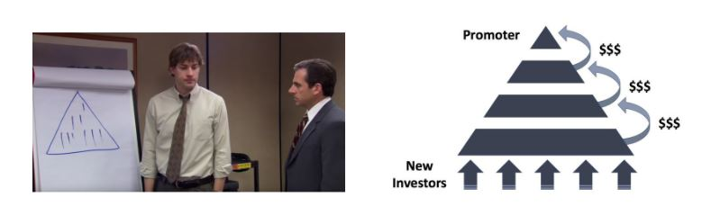

Questi sistemi sono spesso caratterizzati da elementi dubbi come l'assenza di valore intrinseco, promesse di rendimenti irrealistici e tattiche di marketing che incoraggiano le raccomandazioni per attirare nuovi investitori. I ritiri impossibili da comprimere e l'uso di profili falsi sui social media per la promozione sono anche segni rivelatori di queste truffe. Dato il loro carattere illegale e immorale e il rischio finanziario che rappresentano, è essenziale evitarli.
Alla fine, questi sistemi sono destinati al fallimento. Nel tempo, diventa insormontabile l'esigenza di un numero crescente di nuovi partecipanti per mantenere il sistema in piedi. Quando si raggiunge questo punto, l'illusione svanisce, il sistema collassa e gli investitori spesso si trovano senza possibilità di recuperare il loro investimento.

I sistemi Ponzi possono manifestarsi in vari modi. A volte si celano sotto forma di nuove offerte di token o Initial Coin Offerings (ICO), combinazioni di contratti intelligenti, tentativi di monopolizzare la valuta fiduciaria o persino programmi di marketing senza un prodotto reale. Tuttavia, un'indagine approfondita e una verifica diligente rivelano che questi sistemi non creano alcun valore reale. Ridistribuiscono semplicemente i soldi dei nuovi arrivati per pagare i vecchi partecipanti.

Recentemente, il mondo delle criptovalute ha visto una serie di progetti legati alla Finanza Decentralizzata (DeFi) che meritano particolare attenzione. Alcuni di questi progetti possono utilizzare una combinazione di criptovalute di bassa qualità, contratti intelligenti e sistemi di tassi di interesse per offrire soluzioni finanziarie presuntamente miracolose. È essenziale essere cauti e fare una verifica diligente di fronte a queste offerte estremamente truffaldine.

Va sottolineato che il contenuto di questo corso è destinato esclusivamente a scopi educativi e non deve essere interpretato come consulenza finanziaria. L'invito a "non fidarsi, ma verificare" rimane una linea guida importante. È essenziale che ognuno conduca le proprie ricerche e prenda decisioni finanziarie informate.

Il Pump and Dump (P&D) è una forma notoria di manipolazione finanziaria che può causare notevoli turbolenze sui mercati. Si caratterizza per un attacco coordinato volto a provocare un aumento artificiale del prezzo di un asset attraverso vari meccanismi, come il marketing aggressivo, l'uso di algoritmi o intelligenza artificiale. L'obiettivo è poi vendere questi asset sovrastimati per realizzare un profitto.

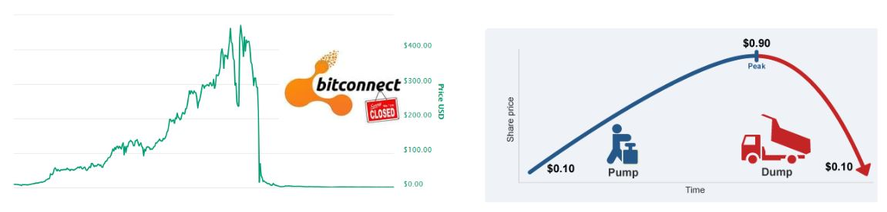

La strategia di Pump and Dump segue generalmente uno schema ben definito:

1. Un opinion leader o un gruppo di investitori acquista inizialmente un gran numero di azioni o altri asset mirati.
2. Successivamente, creano un hype intorno a questi asset e diffondono informazioni esagerate o ingannevoli per attirare altri investitori.
3. Questa pubblicità scatenata provoca un FOMO (Fear Of Missing Out), una paura di perdere un'opportunità, sia negli investitori umani che nei bot di investimento, che iniziano ad acquistare massicciamente questi asset.
4. Una volta che il prezzo è sufficientemente aumentato, i leader vendono i loro asset in massa, realizzando così un considerevole profitto.
5. La vendita massiccia provoca un brusco calo del prezzo dell'asset, lasciando molti investitori con perdite sostanziali.

È fondamentale comprendere che partecipare a tali strategie è illegale e può comportare azioni legali per manipolazione di mercato. Inoltre, queste strategie sono spesso orchestrare da gruppi di influencer che richiedono una quota di iscrizione. Sebbene alcuni partecipanti possano ottenere guadagni a breve termine, le strategie di Pump and Dump sono generalmente non redditizie a lungo termine.
È quindi consigliabile concentrarsi sull'educazione finanziaria e sull'investimento responsabile, anziché lasciarsi sedurre da tattiche manipolatorie. Acquisire solide conoscenze e adottare un approccio a lungo termine sono chiavi essenziali per avere successo nel mondo degli investimenti.

Le truffe legate a concorsi o donazioni online sono molto comuni nel settore delle criptovalute. Gli annunci che promettono bitcoin gratuiti sono spesso utilizzati per ingannare gli utenti inesperti. Alcuni principi chiave da tenere a mente sono di non inviare mai bitcoin con l'aspettativa di riceverne in cambio e diffidare delle promesse di rendimenti irrealistici. È essenziale non fidarsi ciecamente, soprattutto quando si tratta di un banner su internet.

Un esempio classico di questo tipo di truffa è l'offerta che sostiene di raddoppiare o moltiplicare in modo esagerato i bitcoin che invii. È importante capire che non esiste una soluzione magica per diventare ricchi istantaneamente.

Un'altra tattica comunemente utilizzata è la donazione di "shitcoins", o criptovalute di scarso valore. Alcuni progetti di criptovalute centralizzate fanno molta pubblicità e offrono token gratuiti come regalo. Bisogna essere molto cauti di fronte a queste offerte, poiché o il token ha un valore nullo o il regalo serve semplicemente a attirare l'attenzione e promuovere il trading, il gioco d'azzardo e altre truffe. Anche se queste offerte non sono sempre fraudolente, illegali o ingannevoli, è comunque necessaria prudenza.
Su Twitter, ad esempio, dei bot possono fingere di essere personaggi famosi e proporre offerte incredibili per ingannare le persone. Questi account utilizzano lo stesso nome e la stessa foto del profilo del personaggio in questione e possono così ingannare gli utenti meno esperti. Assicurati sempre di verificare la legittimità dell'account prima di interagire con esso.
È anche importante fare attenzione ai link inviati tramite email. Verifica sempre il link prima di cliccarci sopra e presta attenzione all'identità del mittente.

Infine, ecco alcuni consigli per evitare le truffe online:

- Le persone oneste non ti chiederanno mai di inviare denaro direttamente.
- Non inviare mai bitcoin a un indirizzo sconosciuto.
- Le promesse di rendimenti irrealistici sono sempre sospette.
- È molto probabile che i concorsi siano truccati.
- Imparerai sempre di più imparando anziché giocando.
- In caso di dubbio, non agire immediatamente. Prenditi il tempo per riflettere e fare delle ricerche. La FOMO (Fear Of Missing Out, paura di perdere qualcosa) può essere il tuo peggior nemico. Ricorda sempre di fare le tue ricerche prima di prendere una decisione di investimento.

Il Bitcoin ha subito diversi "hard fork" nel corso del tempo, dando origine a varie versioni alternative della valuta originale. Queste deviazioni sono spesso il risultato di sviluppatori che cercano di apportare modifiche significative al protocollo Bitcoin, o talvolta di persone malintenzionate che cercano di ingannare gli investitori inesperti. È essenziale distinguere il vero Bitcoin da queste derivazioni per evitare di cadere in potenziali trappole. Tra gli esempi notevoli di queste deviazioni ci sono Bitcoin Cash (BCH) e Bitcoin Satoshi Vision (BSV). Nonostante abbiano il nome di "Bitcoin", questi progetti si basano principalmente su tattiche di marketing e pubblicità ingannevoli per attirare l'attenzione degli investitori.

Un detto popolare nel mondo degli investimenti dice: "Se sembra una truffa, se si comporta come una truffa e se garantisce che non è una truffa, allora è molto probabile che sia una truffa".

È importante notare che alcune di queste deviazioni sono molto ben finanziate e spendono molto in comunicazione per ingannare gli utenti. Ad esempio, il sito web "Bitcoin.com" è associato a Bitcoin Cash e non al Bitcoin originale, il che può confondere i principianti. Il sito web ufficiale di Bitcoin è "bitcoin.org".

Il mondo delle criptovalute è un terreno fertile per ogni tipo di personalità, attratte dal potenziale di guadagni significativi. Tra di esse, purtroppo, ci sono individui malintenzionati che utilizzano diverse tattiche per ingannare e truffare gli investitori.

Queste tattiche possono includere la promozione aperta di schemi di vendita piramidali, l'usurpazione dell'identità del creatore di Bitcoin, Satoshi Nakamoto, il plagio del lavoro altrui o la creazione di false promesse. Inoltre, alcuni di questi individui creano criptovalute e offerte iniziali di monete (ICO) inutili al fine di ingannare gli investitori.

La comunità Bitcoin spesso si mobilita per denunciare questi atti, ma può passare del tempo prima che il sistema legale riesca ad agire contro questi individui.

È quindi fondamentale rimanere vigili e usare il discernimento nelle interazioni con il mondo delle criptovalute. Il mio consiglio personale sarebbe di ignorare questi individui e queste pratiche. Non meritano né il vostro tempo né la vostra energia. Preferite dedicare queste risorse all'acquisizione di conoscenze e alla comprensione del mercato delle criptovalute per poter navigare in questo universo in modo informato e sicuro.

È essenziale affrontare con cautela i "crypto-influencer" o "guru" delle criptovalute. Questi individui spesso hanno agende personali e possono essere coinvolti in numerosi progetti che cercheranno di promuovere, anche se non sempre nell'interesse degli investitori.

Questi influencer possono cercare di promuovere criptovalute poco affidabili, o "shitcoins", e mettere in atto varie strategie per aumentare il valore dei loro investimenti, anche se questi sono poco sicuri o potenzialmente fraudolenti.
Ecco alcuni consigli per navigare in questo ambiente:

- Diffidate di chiunque promuova una criptovaluta specifica o vi proponga transazioni.
- I "consigli gratuiti" spesso non lo sono realmente e possono nascondere altre intenzioni.
- Pensateci due volte prima di pagare per una formazione sul trading. Ci sono molte risorse gratuite disponibili per aiutarvi a comprendere il mercato delle criptovalute (ad esempio, il canale YouTube 'ukspreadbetting').
- Non è possibile semplicemente copiare le transazioni di un'altra persona e sperare di ottenere gli stessi risultati.
- Ricordatevi che solo perché una persona dice qualcosa non significa necessariamente che sia vero.

Il modo migliore per proteggersi è fare le proprie ricerche e verificare le fonti di informazione. Guardare un video su YouTube non è sufficiente per verificare le fonti.

È importante notare che tutti hanno un programma, compreso me. Credo in Bitcoin e il mio obiettivo è promuoverlo. Spero di trarre profitto da questa promozione, sia politicamente che finanziariamente. Nessun contenuto è mai completamente gratuito: se un prodotto o un servizio sembra gratuito, probabilmente è perché voi siete il prodotto.
Tenete sempre presente che non tutti saranno necessariamente trasparenti sulle proprie intenzioni. Interrogate sempre lo scopo delle azioni di qualcuno e non concedete ciecamente la vostra fiducia.

## Sicurezza online

Oltre alle truffe legate alle criptovalute e alla finanza, la prima ragione per perdere bitcoin è legata a una cattiva gestione della propria sicurezza online. Spesso le persone utilizzano la stessa password per tutti i loro account, dimenticano di aggiornare il proprio computer e trascurano di fare regolarmente il backup dei propri dati. Se vi sentite coinvolti in queste pratiche, non preoccupatevi, è sempre possibile migliorare le vostre abitudini di sicurezza online. Ecco alcune misure di base da adottare:

- Utilizzare un gestore di password (vedi il tutorial su LastPass),
- Attivare l'autenticazione a due fattori (2FA),
- Mantenere il proprio computer aggiornato e privo di malware,
- Valorizzare la propria privacy utilizzando strumenti dedicati (Signal, Tor, ProtonMail).

Se questo argomento vi è completamente sconosciuto, il corso SECU 101 potrebbe essere interessante per approfondirlo in dettaglio.

È fondamentale mantenere il proprio computer in uno stato di funzionamento ottimale, che siate interessati a Bitcoin o meno. Un aggiornamento non serve solo ad aggiungere nuove funzionalità: corregge anche bug e migliora la sicurezza del vostro software. Assicuratevi quindi di:

- Aggiornare sempre il vostro software,
- Utilizzare un software antivirus affidabile,
- Essere vigili durante il download di file,
- Fare regolarmente il backup dei vostri dati,
- Non condividere mai le vostre password.

Un consiglio aggiuntivo: prendete in considerazione l'acquisto di un disco rigido esterno e fate un backup completo dei vostri file importanti. Potrebbe rivelarsi prezioso in caso di guasto del vostro computer.

Un gestore di password è un software che memorizza e gestisce le vostre password. Vi aiuta a non utilizzare mai la stessa password due volte, a scegliere password complesse e sicure e semplifica la vostra gestione della sicurezza online. Dovete ricordare solo una password principale. È uno strumento gratuito di cui tutti dovrebbero approfittare. Potete iniziare ad usarlo gradualmente e una volta che vi sarete abituati, lo troverete estremamente pratico e facile da usare.

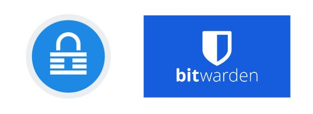

La 2FA offre un ulteriore livello di sicurezza ai tuoi account più sensibili, che si tratti di piattaforme di criptovalute, account Google/Email, banche o siti di acquisti online. È necessaria una seconda identificazione, di solito un codice a 6 cifre accessibile dal tuo telefono, per effettuare l'accesso. Ricorda di conservare una copia di backup della chiave in caso di perdita del telefono.

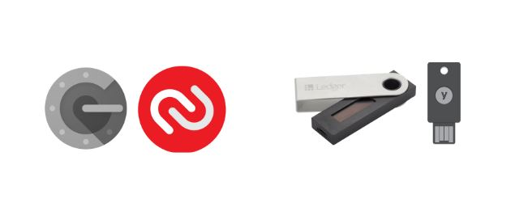
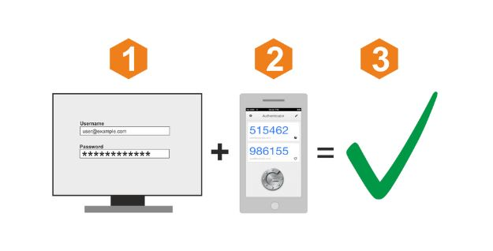

Una VPN, o rete virtuale privata, protegge la tua privacy nascondendo il tuo indirizzo IP. Sebbene ciò non ti renda completamente anonimo, è comunque un passo semplice ed efficace per migliorare la tua privacy online. Scegliere una VPN, scaricarla e usarla è un processo facile da configurare.

L'anonimato online è essenziale per una società libera e prospera. Permette la libertà di espressione, la protezione dei testimoni e l'innovazione. La privacy è un diritto umano fondamentale. Per continuare a proteggere la tua privacy, considera l'uso di:

- PGP per le tue email,
- Signal per i tuoi messaggi,
- Firefox o TOR per la tua navigazione,
- Sync per la condivisione di file,
- Bitlocker per crittografare i tuoi dati,
- Samurai Wallet per i trasferimenti di denaro.

Ancora una volta, se sei interessato a questo argomento, il corso SECU 101 è disponibile per accompagnarti.

## Consigli per i principianti

L'istruzione formale ci insegna poco sull'investimento. Di conseguenza, spesso ci avventuriamo da soli in questo nuovo e complesso panorama degli investimenti.

In questa sezione, esamineremo alcuni errori comuni che i principianti fanno quando entrano nel mondo del Bitcoin e come puoi evitare di cadere nelle stesse trappole. Affronteremo anche come pianificare saggiamente il tuo investimento in Bitcoin. Gli argomenti che affronteremo includono:

- Fare attenzione alle "Shitcoins" o altre criptovalute senza valore intrinseco.
- Investire solo ciò che puoi permetterti di perdere.
- Comprendere la differenza tra trading e investimento.
- Essere consapevoli delle implicazioni fiscali.
- Gestire correttamente la tua chiave privata.
- L'importanza di rimanere umili e discreti.
- Adottare una prospettiva a lungo termine.

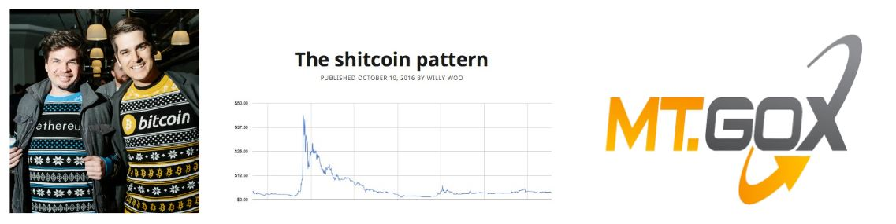

Prima di immergerti nell'investimento in Bitcoin, è essenziale prendersi il tempo per educarsi.
È facile commettere errori nell'industria del Bitcoin, e ogni errore può essere costoso. Condividendo alcuni dei problemi che ho incontrato nel mio percorso di investitore, così come quelli che ho osservato negli altri, spero di fornirvi preziosi consigli per navigare in questo spazio. Tra questi errori, possiamo citare:

| Problemi tecnologici                          | Problemi finanziari                                      |
| --------------------------------------------- | -------------------------------------------------------- |
| Perdita di una chiave privata                 | Sovrainvestimento                                        |
| Affidare la custodia dei propri asset a terzi | Mancanza di educazione finanziaria                       |
| Mancanza di privacy                           | Investire con denaro preso in prestito                   |
| Problemi di sicurezza online                  | Non comprendere la differenza tra trading e investimento |
| Manipolazione errata                          | Ignorare le implicazioni fiscali                         |
| Problemi con il computer                      | Non considerare i tempi di investimento                  |
| Perdita di BTC a causa di un hack             | Cadere vittima di frodi e truffe finanziarie             |

Indipendentemente dal vostro livello di istruzione o background, chiunque può capire e utilizzare Bitcoin. Non è necessario avere esperienza in finanza o programmazione. Come il 90% delle persone, potete semplicemente utilizzare Bitcoin in modo semplice.

Ognuno è diverso e deve adattare la propria strategia di investimento alla propria situazione finanziaria personale. Ecco alcune buone e cattive pratiche:

- Gli acquisti periodici medi sono una buona pratica.
- L'utilizzo della leva finanziaria, ad esempio prendendo in prestito denaro per investire, è generalmente sconsigliato.
- Evitate la FOMO (Fear Of Missing Out), ovvero la paura di perdere un'opportunità. Questo può spingervi a fare investimenti impulsivi.
- Allocare un budget specifico per il vostro investimento è una buona pratica.

L'obiettivo non è avere un piano perfetto, ma piuttosto avere una struttura da seguire e rispettare. Non volete comprare sotto l'effetto dell'emozione o della paura. Volete seguire una strategia che avete precedentemente scritto su carta per evitare stress inutile.

Non c'è età per imparare a investire; potete iniziare con una somma molto piccola e progredire nel tempo. L'educazione è un viaggio.

- Regola d'oro n. 1 dell'investimento: non investire mai più di quanto puoi permetterti di perdere! L'idea è prendere tutti i tuoi redditi mensili, sottrarre le tue spese obbligatorie (debiti e altre spese mensili come l'alloggio), sottrarre i tuoi costi di vita (cibo). Ti rimane quindi il tuo budget di risparmio. Se investi più di questo, prima o poi avrai problemi!
- La règle d'or de l'investissement n°2: evita ciò che è di moda. Concentrati sul progredire prendendo decisioni razionali. Se hai dei dubbi, lascia passare la notte e parlane con i tuoi cari. È meglio prendersi il proprio tempo anziché affrettarsi. La migliore strategia è progredire passo dopo passo.
- La regola d'oro n°3 dell'investimento: la pianificazione e avere una visione a lungo termine sono essenziali per avere successo nel campo finanziario. Pianifica e non prendere troppi rischi. L'obiettivo è evitare fallimenti fatali accumulando successi.

Nel dubbio: inizia informandoti. Esplora il mondo del Bitcoin per qualche ora (ci sono molte risorse disponibili su questa piattaforma). Leggi 2 o 3 libri. Acquista 5 euro per provare. Guarda documentari e video. Abbi una mente aperta.

Come per ogni investimento, è necessario conoscere il proprio mercato. Il Bitcoin è molto giovane e volatile, il che significa che le cose cambiano rapidamente e ciò comporta un certo rischio. Il Bitcoin potrebbe scomparire, scendere a zero o stagnare per anni. È ovvio che si dovrebbe investire solo ciò che si può permettere di perdere! Non indebitarti per investire in una valuta di cui forse non capisci ancora tutti gli aspetti.

Una volta che ti sentirai più a tuo agio con il Bitcoin, potrai rivedere il tuo piano d'azione. Nella stessa logica, è importante, se sei nuovo in questo mondo, capire bene le differenze tra il trading, l'investimento a lungo termine e una strategia molto, molto a lungo termine utilizzata da molti bitcoiners, chiamata "hold".

In generale:

|                        | Trading         | Investimento        | Holding             |
| ---------------------- | --------------- | ------------------- | ------------------- |
| Leva                   | Sì              | No                  | No                  |
| Temporalità            | Breve termine   | Breve/medio termine | Molto lungo termine |
| Tipo di asset          | Contratto       | BTC                 | BTC                 |
| Rischio                | Molto alto      | Alto                | Alto                |
| Difficoltà             | Molto difficile | Difficile           | Difficile           |
| Curva di apprendimento | Lunga           | Lunga               | Lunga               |
| Perdite potenziali     | Illimitate      | Limitate            | Limitate            |
| Più adatto a           | Alcuni          | La maggior parte    | Alcuni              |

Ecco i miei consigli:

- Optare per una prospettiva a lungo termine è spesso una strategia saggia. Seguire costantemente l'evoluzione del mercato può essere complesso e richiede un impegno a tempo pieno. Come ha detto Warren Buffet: "Se non sei disposto a tenere un'azione per dieci anni, è meglio non tenerla affatto, nemmeno per dieci minuti".
- È fondamentale essere estremamente vigili in materia di fiscalità: ogni paese ha le proprie leggi riguardanti i Bitcoin. È essenziale informarsi sulla legislazione vigente nel proprio paese, in particolare per quanto riguarda gli obblighi fiscali. Una cattiva pianificazione potrebbe portare a dover restituire più soldi all'amministrazione fiscale di quanto si sia guadagnato.

  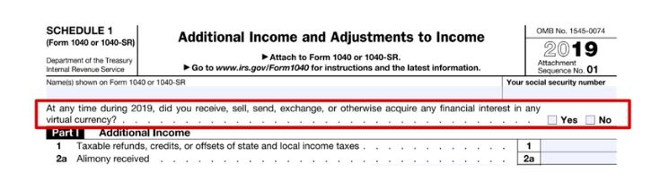

Imparare a investire non è qualcosa che di solito viene insegnato a scuola. Pertanto, molte persone considerano l'investimento come un'attività rischiosa, folle e fuori dalla loro portata. Per proteggersi, molti si rivolgono a un banchiere... il che può rivelarsi un errore.

Non c'è un'età per iniziare ad imparare sull'investimento e capire come funzionano i soldi e il sistema finanziario. Non è necessario immergersi completamente; avere una visione d'insieme è sufficiente per prendere decisioni adeguate, basate sui fatti e non sull'ignoranza. Questo può essere molto utile per tutta la vita, poiché sarete in grado di riconoscere quando qualcuno sta cercando di venderVi un prodotto di investimento scadente (ad esempio una banca).

Non dovreste fare trading. Sì, il trading è un lavoro a tempo pieno che comporta molto stress, rischi e un grande autocontrollo. Non è un'attività per tutti e può comportare seri rischi. Se volete comunque provare, allora seguite almeno una persona affidabile e con buon senso, come Mark di Ukspreadbetting.

Due buone risorse:

- Padre ricco, padre povero - Robert T Kiyosaki - È una buona prima introduzione al mondo degli investimenti. È perfetto per tutti.
- The Investors Podcast - Questo podcast è più tecnico, ma vi darà un'idea della complessità del mondo finanziario. Se già lavorate nel settore finanziario o se vi appassiona, ascoltate alcuni dei loro episodi. Alcuni di essi parlano di Bitcoin.

Per concludere questa sezione sui prerequisiti, torniamo alla prima causa di perdita finanziaria nella nostra industria: la cattiva gestione della chiave privata.

Come promemoria, la chiave privata è una lista di 24 parole che rappresenta il backup dei vostri Bitcoin. È essenziale essere estremamente prudenti al riguardo. Quando si conservano i propri Bitcoin su una piattaforma di scambio, è la piattaforma stessa a controllarli, non voi! Questa situazione comporta rischi come il fallimento della piattaforma, la confisca dei vostri Bitcoin o l'hacking della piattaforma.
La regola d'oro di Bitcoin n°1: Non la tua chiave, non i tuoi Bitcoin. La chiave in Bitcoin rappresenta la proprietà dei Bitcoin. Se possiedi la tua chiave, hai il controllo della tua sovranità finanziaria e sei responsabile della sicurezza dei tuoi soldi.
Se perdi la tua chiave, perdi anche i tuoi soldi. È meglio seguire le migliori pratiche dell'industria e evitare strategie complesse. Bitcoin è già abbastanza rischioso di per sé. Ascolta i consigli degli esperti. Inoltre, quando utilizzi Bitcoin, è meglio rimanere discreti: evita di parlarne. Esponendoti, diventeresti un potenziale bersaglio, aumentando così i rischi per te e la tua famiglia. La migliore sicurezza risiede nella discrezione. Non c'è bisogno di proclamare a tutti che possiedi Bitcoin.

Buona fortuna! Spero che mi seguirete nell'universo di Bitcoin e mi permetterete di guidarvi nell'acquisizione e nella sicurezza dei vostri primi Bitcoin senza correre rischi!

# Capire in cosa ci si sta imbarcando

## Bitcoin in 5 minuti

In questo corso, vogliamo concentrarci sul piano d'azione per ottenere i vostri primi Bitcoin. Se desiderate una spiegazione approfondita dei fondamenti di Bitcoin, vi consigliamo BTC 101, disponibile gratuitamente su questa piattaforma.

Bitcoin è un protocollo informatico che consente di inviare valore in tutto il mondo senza intermediari di fiducia. Questo valore è rappresentato da una valuta chiamata Bitcoin.

Il famoso Bitcoin di cui sentite parlare tutto il tempo è quindi questa valuta digitale. Gli utenti di Bitcoin si inviano Bitcoin tra portafogli, e tutto ciò funziona grazie a una rete di nodi (server Bitcoin) che propagano le transazioni di tutti gli utenti tra di loro. Per garantire la finalità delle transazioni, alcuni attori di questa rete sono anche dei minatori (i famosi minatori), il cui obiettivo è registrare le transazioni propagate nella blockchain di Bitcoin (ancora più famosa).

Grazie a questo meccanismo piuttosto strano, otteniamo un database (la blockchain) che è immutabile nel tempo, decentralizzato nello spazio e che funziona ininterrottamente in tutto il mondo.
Ciò consente quindi, per la prima volta nella storia dell'umanità, di avere un sistema contabile a tripla entrata che consente a chiunque di utilizzare un sistema finanziario alternativo costruito su Internet senza nessuno che lo controlli o lo distrugga.

Oltre al suo funzionamento tecnico (BTC 101 lo spiega), possiamo notare due caratteristiche che fanno di Bitcoin ciò che è oggi dopo 14 anni di esistenza:

- Il primo motivo è che il codice di Bitcoin è open source. Ciò significa che chiunque può vedere come funziona Bitcoin, è trasparente e quindi verificabile. Di conseguenza, chiunque può usarlo e il protocollo è uguale per tutti, non può esistere discriminazione. Questo rende Bitcoin estremamente interessante per l'uso come sistema di trasferimento di valore.
- Il secondo elemento risiede nelle sue proprietà monetarie. Infatti, Bitcoin è raro. Ce ne saranno solo 21 milioni nel mondo e mai più (e anche meno a causa delle perdite). Questo è possibile grazie alla natura stessa del protocollo, perché fin dal suo lancio, le sue caratteristiche monetarie (la curva di distribuzione dei bitcoin) sono state decise e nessuno può cambiarle unilateralmente. Questa caratteristica fa sì che Bitcoin, proprio come l'oro, non possa essere diluito da una stampa eccessiva di moneta.

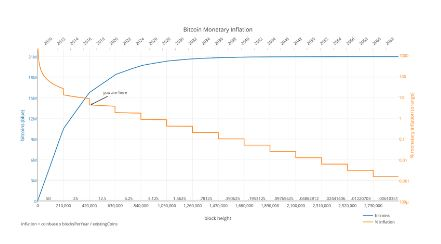

Queste due caratteristiche rendono Bitcoin uno strumento tecnologico e monetario potente che non solo innova nel nostro mondo, ma rompe anche le norme.

A causa di queste caratteristiche, molti bitcoiners, me compreso, sono pronti a dire che Bitcoin è un'innovazione importante per la nostra società, allo stesso livello della ruota, della contabilità a partita doppia, dell'elettricità o di Internet.

Bitcoin è quindi un "0 a 1" che sconvolge le nostre norme e abitudini.
Se questa è una novità per te, ti incoraggio vivamente a seguire BTC 101 prima di continuare ad esporre te stesso a una tecnologia di cui potresti non comprendere bene il ruolo e la ragione d'essere.

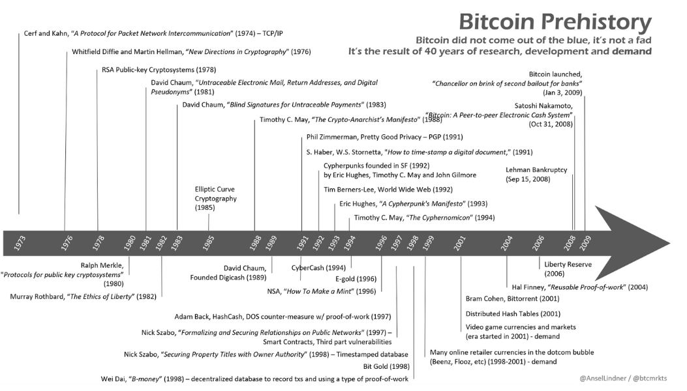

## Perché Bitcoin è importante?

Perché l'importanza di Bitcoin è così cruciale? Questa è la domanda centrale di questa università. Che si tratti dei tuoi studi o della tua strategia di investimento, senza una chiara comprensione dell'importanza di Bitcoin, rischi di deviare dal tuo piano d'azione. L'obiettivo è quindi mantenere sempre a mente i fondamentali di Bitcoin, per assicurarti che la tua strategia rimanga in linea con le tue convinzioni.

Barack Obama ha una volta descritto Bitcoin come "una banca svizzera nel tuo taschino". E infatti, Bitcoin offre le stesse opportunità a tutti, indipendentemente da chi sei. Che tu sia un adolescente, un presidente, un manifestante a Hong Kong o un "gilet giallo" in Francia, tutti hanno accesso allo stesso identico protocollo e agli stessi strumenti:

1. Creazione di account gratuiti e illimitati.
2. Possibilità di inviare denaro ovunque e a chiunque.
3. Non è necessario un documento d'identità o burocrazia.
4. Accessibilità per tutti, indipendentemente dall'età, dal genere, dalla religione, dal paese o dal livello di reddito.
5. Riservatezza e trasparenza su richiesta.
6. Assenza di intermediari o costi nascosti.
7. Bitcoin è nativo di Internet, rendendolo accessibile a tutti coloro che hanno accesso al web.

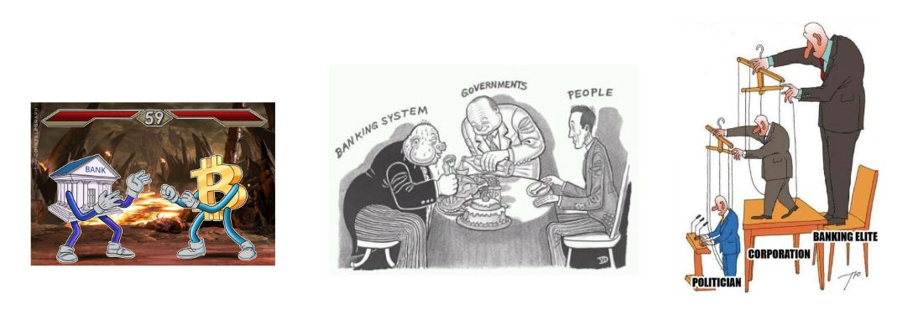

In sintesi, Bitcoin può essere considerato come la "valuta del popolo".
Domanda filosofica del giorno: Nel mondo del bitcoin, due ideologie si scontrano. Vuoi far entrare nel sistema bancario miliardi di persone che non ne fanno parte? O vuoi far uscire dal sistema bancario miliardi di persone che ne fanno parte?

Questa domanda merita riflessione e ne parleremo in seguito.

Miliardi di persone vivono sotto gli effetti negativi di politiche monetarie mal gestite, che spesso portano a gravi crisi finanziarie nel lungo termine. Questi tipi di crisi sono emersi centinaia di volte nella nostra storia e continueranno a farlo finché il valore del denaro e del tempo sarà manipolato. Queste crisi possono manifestarsi sotto forma di iperinflazione, controllo monetario e svalutazione della valuta.

Bitcoin offre a ogni individuo la possibilità di uscire da questo sistema. È una scelta etica che ognuno sarà probabilmente chiamato a fare un giorno. Bitcoin facilita il passaggio dalla moneta fiduciaria alla moneta sana, grazie alla sua resistenza alla censura, alla sua divisibilità e alla sua portabilità.

**Sapevi che**? Negli ultimi 100 anni ci sono stati più di 55 casi di iperinflazione. La maggior parte di essi ha completamente distrutto l'economia del loro paese, ha annientato le economie dei cittadini e talvolta ha creato instabilità politica che ha portato all'instaurazione di regimi dittatoriali (come è successo in Cile, in Germania, ecc.). La distruzione delle valute fiduciarie non è un fenomeno nuovo e continuerà a verificarsi. Tuttavia, grazie a Bitcoin, hai ora la possibilità di uscire da questo sistema.

L'aggravarsi delle disuguaglianze di ricchezza nel mondo ha portato all'aumento dell'estremismo, che a volte ha portato all'instaurazione di regimi dittatoriali. Non importa chi tu sia, un giorno potresti aver bisogno di riservatezza per proteggere la tua famiglia, te stesso e i tuoi risparmi. Dove potresti nascondere i tuoi beni se fossi minacciato politicamente?

- Il tuo conto bancario può essere bloccato, sequestrato o svuotato.
- L'oro è difficile da dividere, complicato da trasportare e utilizzare.
- Il contante è ingombrante, facile da rubare e soggetto all'inflazione.
  Bitcoin offre una soluzione a questi problemi permettendo alle persone di proteggere i propri risparmi e trasportarli con sé, senza alcun controllo da parte dello Stato. Quasi la metà della popolazione mondiale vive sotto un regime ostile, queste persone hanno bisogno di Bitcoin più di chiunque altro.
  Bitcoin è una forma di protesta passiva contro l'ingiustizia del sistema.

**Lo sapevate**? Bitcoin è pseudonimo. Un indirizzo anonimo viene utilizzato per conservare e scambiare Bitcoin tra gli utenti. Tuttavia, ogni transazione viene registrata in un grande libro pubblico (la blockchain) in modo che tutti possano verificarla. Ciò significa che, sebbene i nomi degli utenti non siano divulgati, la cronologia delle loro transazioni è completamente trasparente.

Le banche centrali continuano a diluire il potere d'acquisto attraverso l'inflazione e le politiche di creazione di moneta (quantitative easing). Queste sono tasse nascoste che hanno gradualmente distrutto il valore del denaro nel corso delle decadi. Se non si dispone di un reddito solido proveniente da dividendi, obbligazioni o investimenti immobiliari, ci si impoverirà nel tempo, mentre i ricchi continueranno ad arricchirsi sempre di più. A causa dell'azione delle banche centrali, un dollaro oggi vale meno di un dollaro domani.

Il sistema ti incoraggia ad indebitarti, a spendere e ad arricchire i banchieri attraverso gli interessi pagati durante molti anni di rimborso e indebitamento. Questo non è un errore, ma una strategia deliberata messa in atto dai banchieri e dai politici per stimolare la spesa pubblica, la crescita economica e spingere la popolazione ad indebitarsi sempre di più.

Il nostro sistema è corrotto dalle banche centrali. Bitcoin è la cura.

Non ci saranno mai più di 21 milioni di bitcoin e nessun politico, banchiere o individuo malintenzionato potrà cambiarlo. Questo limite è stato stabilito nel protocollo di Bitcoin da Satoshi e non può essere modificato oggi. Ciò fissa il tasso di inflazione di Bitcoin per i prossimi 100 anni.

In passato, l'oro svolgeva il ruolo di regolatore come moneta sana. Tuttavia, dal 1971, nessuna valuta fiduciaria (euro, dollari, ecc.) è più legata all'oro, aprendo la strada a una creazione illimitata di moneta. Brrrrrr (allusione al suono della stampante di banconote).
Se hai dei soldi in un conto bancario, quei soldi non ti appartengono più. In realtà, hai prestato quei soldi alla banca affinché li possa utilizzare. È fondamentale capire e prendere coscienza di questa realtà. Se hai dei soldi in un conto bancario, in realtà sei un creditore della banca. Ciò significa due cose:

1. Se la banca fallisce, rischi di perdere i tuoi soldi.
2. Se la banca rifiuta di restituirti i tuoi soldi, rischi anche in questo caso di perderli.

Potresti pensare che questi scenari siano poco probabili, ma esploreremo in un capitolo successivo perché sono quasi inevitabili.

Bitcoin, d'altra parte, è un sistema aperto e incorruttibile. Le regole sono fisse e le stesse per tutti. La famosa frase "Not your keys, not your Bitcoin" sottolinea l'importanza di possedere la chiave privata di un portafoglio Bitcoin. Possedendo la chiave privata, hai il pieno controllo sui Bitcoin che contiene. Se non possiedi questa chiave, significa che qualcun altro detiene i tuoi Bitcoin per te. In questo caso, i tuoi Bitcoin sono esposti a rischi simili a quelli associati a una banca tradizionale.

Per riacquistare la tua sovranità, è essenziale prendere il controllo della tua chiave privata e proteggere i tuoi Bitcoin da solo.

Bitcoin offre un'alternativa potente ai sistemi finanziari tradizionali. Consente a ciascuno di preservare la propria privacy, proteggersi dall'inflazione e dalla svalutazione monetaria, eludere regimi autoritari e riconquistare la sovranità sul proprio denaro. Bitcoin è una valuta sana, accessibile a tutti senza distinzioni di età, genere, religione o reddito. Adottando Bitcoin, le persone possono risparmiare per il futuro, liberarsi dall'egemonia delle banche centrali e riprendere il controllo della propria vita finanziaria. È uno strumento che permette di riequilibrare i poteri e promuovere la libertà economica a livello globale.

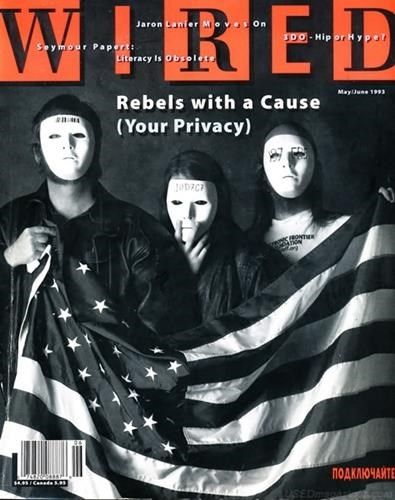

Bitcoin, un movimento politico?
I principali promotori di Bitcoin oggi sono ancora principalmente cyberpunk, cittadini oppressi, anarchici, sostenitori della scuola austriaca di economia, ingegneri informatici, finanziatori e difensori della libertà di espressione.
Bitcoin has a highly philosophical, ethical, and political dimension while being completely indifferent to these considerations. Indeed, Bitcoin is a simple protocol that reproduces the same process over and over again. It is its users who have turned it into a weapon of liberation against the current financial system. From a Cyberpunk perspective, Bitcoin opposes a cashless society. It allows for the creation of fully private and intermediary-free digital financial transactions. For the cyberpunk movement, Bitcoin is the electronic equivalent of cash.

## Understanding the Bitcoin Industry

With the arrival of Bitcoin in 2009 by Satoshi Nakamoto, a multi-billion dollar industry was born. Despite its youth, this industry has experienced exponential growth over the past decade. New players arrive every day with large sums of money and are ready to forcefully enter this new industry. Today, the industry has reached a point of no return where governments, banks, internet giants, and others have joined the movement with all sorts of interventions.

Bitcoin is a 0 to 1. It cannot be undone. Some will see it as evil personified, Pandora's box is open and it now takes away their power and advantage. They will fight against it. Others will see in Bitcoin an opportunity to regain freedom, change the system, and improve our society. They will embrace it. Bitcoin doesn't care, it simply exists.

In this section, we will take a quick overview of the actors to better understand how the industry we are seeking to enter works.

It is possible for anyone to design their own cryptocurrency - a task that only takes a few minutes. However, the value of this token will be exclusively determined by the market. In December 2019, more than 5000 tokens were listed on Coinmarketcap. Today, in 2023, this number has increased to over 23,000, with NFTs, DeFi, and many other things. These cryptographic tokens can take different forms: currency, security token, fuel for an ecosystem, sidechain, digital art, etc.
È fondamentale comprendere che il 99,8% di queste nuove "criptovalute" sono truffe messe in atto da marketer per rubare i tuoi bitcoin. Tuttavia, tra lo scarso 0,2% di progetti seri, viene fatto uno sforzo considerevole per far progredire, sperimentare e sviluppare tecnologie innovative in grado di offrire numerosi vantaggi agli utenti. Nel tempo, il settore migliorerà, portando all'emergere di aziende legittime che offrono prodotti reali. La questione se ciò avverrà su altre blockchain oltre a Bitcoin rimane aperta. Al momento, una cosa è certa: Bitcoin è l'unica criptovaluta veramente decentralizzata, resistente alla censura, libera e abbastanza seria da giustificare migliaia di ore di lavoro.
| Caratteristica | Bitcoin | Alt-Coin (99,9% di essi) |
| ---------------- | ------------------------ | ---------------------------- |
| Liquidità | Alta | Bassa |
| Adozione (reale) | Alta e globale | Bassa |
| Team | Robusto e decentralizzato | Debole e centralizzato |
| Reputazione | Alta e globale | Bassa |
| Infrastruttura | Robusta e stabile | Bassa |
| Decentralizzazione | Sì | No |
| Truffa ? | No | Probabilmente |
| Valore ? | Sì | Discutibile |

Non lasciarti ingannare da frasi come:

- "Blockchain, non Bitcoin"
- "XRP è il nuovo Bitcoin"
- "StableCoin è il futuro"
- "Libra eliminerà Bitcoin"
- "Scopri il mio nuovo Bitcoin migliorato"
- "Fedcoin renderà Bitcoin obsoleto"

È essenziale fare ricerche personali se decidi di immergerti nel mondo delle alt-coin, ma qui non ti guideremo.

Dopo la bolla delle ICO del 2017, molti attori principali hanno iniziato a sviluppare il proprio database utilizzando la "blockchain". I governi e le banche centrali stanno esplorando la possibilità di creare una versione digitale della propria valuta fiat (Svezia, Europa, Russia, Cina, ecc.). Anche i giganti della tecnologia si stanno unendo a questa corsa. Facebook ha lanciato il proprio progetto di stablecoin chiamato "Libra". Vengono sperimentate alternative alla "blockchain" da parte di banche, aziende e altri giganti tecnologici con soluzioni come Linux o IBM "Hyperledger".

| Caratteristica          | Bitcoin | Alt-coin | Facebook-coin | Fed-coin |
| ----------------------- | ------- | -------- | ------------- | -------- |
| Pubblico                | Sì      | Varia    | No            | No       |
| Aperto                  | Sì      | Varia    | No            | No       |
| Senza frontiere         | Sì      | Varia    | No            | No       |
| Neutrale                | Sì      | Varia    | No            | No       |
| Resistente alla censura | Sì      | Varie    | No            | No       |

Mentre affermano di competere con Bitcoin, questi progetti rimangono centralizzati per garantire il controllo e rispettare le regolamentazioni locali. Non forniranno protezione della privacy, ma piuttosto un aumento della sorveglianza di massa. Il progetto "Libra" di Facebook si posizionava in concorrenza con le banche, non con Bitcoin. Inoltre, senza prova del lavoro, una "blockchain" non ha un vero valore. È importante notare che Libra è stato abbandonato e attualmente non esiste alcun vero progetto di blockchain privata utilizzato a livello globale, a differenza di Bitcoin.

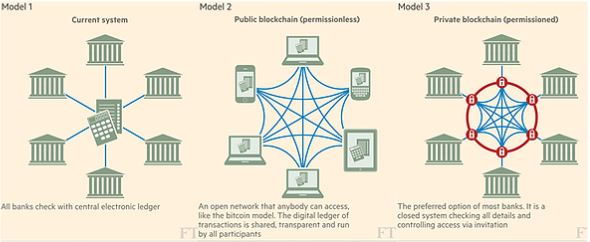

Il protocollo Bitcoin è al di fuori delle regolamentazioni. Solo gli attori che gravitano attorno ad esso possono essere regolamentati e, poiché Bitcoin è decentralizzato, le leggi, le tasse e le regolamentazioni variano da un paese all'altro. Ad esempio, la Cina ha vietato l'uso di Bitcoin molte volte, mentre paesi come Canada, Svizzera e Malta adottano una posizione più favorevole nei confronti di esso. La maggior parte delle nazioni ha istituito gruppi di lavoro sulla crittografia per sviluppare nuove regole e regolamentazioni. Tuttavia, questo processo è lento e le regole possono cambiare abbastanza frequentemente. Nonostante questo ritmo lento, Bitcoin e le criptovalute sono al centro di molte discussioni.

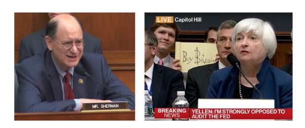

Si consiglia di condurre ricerche approfondite sulla situazione nel proprio paese. Anche le banche sono fortemente regolamentate per quanto riguarda Bitcoin. Molte di esse chiudono i conti e limitano l'accesso ai servizi finanziari delle aziende che operano con Bitcoin, mentre costituiscono team di ricerca per esplorare questa nuova tecnologia al fine di migliorare la propria infrastruttura. Nessun regolatore, banca o governo vuole perdere potere, quindi si stanno preparando ad affrontare Bitcoin. È importante notare che Bitcoin, come tale, non può essere modificato o controllato da un'unica entità.

Le piattaforme di scambio fungono da collegamento tra la valuta fiduciaria (valuta governativa) e le criptovalute. Consentono ai loro clienti di acquistare o vendere criptovalute tramite la loro piattaforma. Ogni piattaforma di scambio ha caratteristiche diverse. Ecco alcuni aspetti da considerare:

- Una buona reputazione per la sicurezza
- Una liquidità sufficiente
- Un servizio clienti efficiente
- Un'interfaccia utente intuitiva
- Un'opzione per effettuare acquisti automatici
- Un prelievo automatico dei Bitcoin nel proprio portafoglio.
  La maggior parte delle piattaforme di scambio legali rispettano le normative bancarie vigenti. Hanno anche implementato rigorose procedure di KYC ("Know Your Customer"), che richiedono di fornire un documento di identità per creare un account. Pertanto, è necessario distinguere l'industria delle soluzioni di acquisto tra KYC e non KYC, come esploreremo in dettaglio prossimamente.
  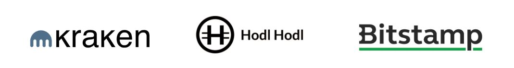

**Prudenza**: il "Grande Fratello" ti sta sorvegliando, presumibilmente per la tua sicurezza. I tuoi dati potrebbero essere utilizzati dal tuo governo per monitorare le tue attività.

Nello spettro delle piattaforme di scambio, possiamo distinguere 5 grandi tipi:

- Piattaforma di scambio etica: qui parliamo di soluzioni che cercano di rispettare l'utente offrendo un servizio semplice e onesto. Queste piattaforme di solito offrono una soluzione di DCA (Dollar-Cost Averaging) e un prelievo automatico dei fondi verso il portafoglio dell'utente. Sono le soluzioni più adatte per i principianti. (esempio: relai, bull bitcoin, stackinsat)
- Piattaforme di scambio peer-to-peer: ti consentono di acquistare e vendere bitcoin direttamente tra utenti. Puoi trovare persone nella tua città per concludere transazioni. Sii prudente durante questi scambi e preferisci luoghi sicuri e pubblici per concludere le transazioni. Queste soluzioni non KYC sono molto adatte per utenti un po' più esperti. Le esploreremo in dettaglio in BTC 205; (esempio: Bisq, peach, robosat)
- Piattaforme di scambio di Altcoin: queste piattaforme ti consentono di acquistare e vendere le diverse Altcoin che desideri scambiare. Puoi depositare BTC o utilizzare una carta di credito per farlo. Si consiglia di essere estremamente prudenti con le Altcoin e valutarne le prestazioni in Bitcoin, non in dollari. In sostanza, queste piattaforme sono dei giganteschi casinò di asset non regolamentati (spesso non sicuri). Sconsigliamo di utilizzarle (esempio: Bitfinex, kraken, bitstamp)
- Piattaforme di scambio per il trading: consentono di fare trading di bitcoin e altre criptovalute con leva, utilizzando i BTC come garanzia. Puoi quindi fare trading di contratti derivati. Attenzione se utilizzi la leva! Probabilmente è meglio non fare trading dei tuoi bitcoin. Allo stesso modo, sconsigliamo questo tipo di soluzione per i principianti (esempio: Binance)
- Piattaforme di scambio dubbie: alcune piattaforme non regolamentate sono sospette, possono manipolare il volume delle transazioni e la loro sicurezza spesso lascia a desiderare. Queste piattaforme sono spesso russe, cinesi o esclusivamente sul darknet. Il rischio è a tuo carico, ma è consigliabile evitarle.
  Non dimenticare mai di ritirare i tuoi bitcoin da una piattaforma di scambio. Le piattaforme di scambio possono essere hackerate, sequestrate, fallire o semplicemente scomparire con i tuoi soldi. Presentano rischi significativi e devono essere evitate il più possibile. Non lasciare mai i tuoi fondi su di esse per un lungo periodo. Ricorda: se non hai le chiavi, i bitcoin non sono tuoi.
  I bitcoin sono conservati in quello che viene chiamato un "portafoglio", che è una cassaforte digitale per i tuoi soldi. Solo il detentore della chiave può accedervi. Può essere un dispositivo hardware, un software o addirittura un pezzo di carta. Questi portafogli fungono da collegamento tra i tuoi bitcoin e il mondo esterno.
  Ogni portafoglio ha diverse caratteristiche:

- privacy
- sicurezza
- facilità d'uso
- costo.

Nella nostra industria, possiamo quindi suddividere gli attori dei portafogli in diverse sezioni:

- Produttori di portafogli hardware. Abbiamo qui molte aziende che competono su questo argomento. Alcune sono open source, altre offrono portafogli hardware più o meno costosi con più o meno funzionalità (es. Ledger, Trezor, Coinkite, Shiftcrypto).
- Produttori di portafogli software; sono società o attori indipendenti che desiderano creare portafogli software su dispositivi mobili o computer (es. Wizard Sardine, Galoy, Synonyme, Blockstream).
- Portafogli fai-da-te (Do It Yourself); qui abbiamo soluzioni 100% open source che è possibile creare a casa per ridurre i rischi di fiducia verso gli altri attori della catena di produzione o creazione (es. Seedsigner, Specter DIY).

I portafogli sono un aspetto fondamentale di Bitcoin e li esploreremo in dettaglio in questa università.

I minatori sono responsabili della sicurezza della rete. Utilizzano l'elettricità per eseguire i processi di proof of work di Bitcoin, che creano un nuovo blocco. Abbiamo già affrontato l'argomento dei minatori in dettaglio nel corso BTC 101, se necessario. Per approfondire, offriamo il corso Mining 201.

È importante capire che questa industria è vasta, molto vasta.

Mentre è iniziata in modo individuale, i minatori di oggi sono generalmente grandi aziende ben finanziate che competono in un settore molto difficile. Cercano fonti di energia a basso costo per ottenere un vantaggio competitivo. Possono essere pubbliche o anonime e si trovano ovunque nel mondo.

La loro industria si divide in molti attori di varie dimensioni:

- Produttori di hardware per il mining (es. Bitmain): queste aziende sono il fulcro della nostra industria, poiché è estremamente complesso creare ASIC performanti.
- Gli sviluppatori di software di mining: che si tratti della creazione di pool di mining o degli strumenti utilizzati dagli ASIC, è un aspetto fondamentale dell'industria (es. Braiins OS).
- Gli sviluppatori che lavorano su soluzioni innovative come StratumV2.
- I minatori: sono loro che utilizzano le macchine e il software per avviare le loro operazioni di mining. Si possono trovare sia piccoli minatori amatoriali che utilizzano un S9 (come insegnato nel corso di Mining 201), sia grandi minatori internazionali come Galaxy che possiedono enormi magazzini in Texas per il mining.

Il mining è un settore a sé stante, quindi se sei interessato all'argomento dell'energia, sarai servito.

Bitcoin è un protocollo open source. Puoi trovare il suo codice su GitHub: https://github.com/bitcoin/bitcoin. Da lì, puoi consultare tutte le proposte di aggiornamento, tutta la documentazione e molte discussioni della comunità. Tutto è trasparente, e spetta all'utente decidere se effettuare o meno un aggiornamento. Gli sviluppatori principali di Bitcoin sono responsabili della gestione di questo GitHub. Aggiornano il codice sorgente, verificano i bug e si occupano della gestione globale del progetto.

È possibile suddividere gli sviluppatori di Bitcoin in diverse sezioni:

- Gli sviluppatori di Bitcoin Core: sono responsabili dello sviluppo principale del protocollo Bitcoin e delle sue funzionalità centrali.
- Gli sviluppatori di protocolli aggiuntivi (come il Lightning Network o RGB): lavorano su protocolli aggiuntivi che si integrano nell'ecosistema Bitcoin e ne estendono le funzionalità.
- Gli sviluppatori amatoriali che creano strumenti e applicazioni (come Mempool o Alby): contribuiscono all'ecosistema Bitcoin sviluppando strumenti, servizi o applicazioni che ne facilitano l'uso.

Chiunque può iniziare a contribuire al codice, ma è importante notare che modificare effettivamente il codice di Bitcoin è un processo lungo e complesso. Inoltre, molti sviluppatori di Bitcoin sono appassionati che dedicano molti anni allo sviluppo di BIP (Bitcoin Improvement Proposals) che potrebbero non essere mai utilizzati. È quindi un'industria complessa e talvolta imprevedibile. Esploreremo questi aspetti in dettaglio.

Un potere illimitato? No. Gli sviluppatori principali non hanno un potere illimitato e non possono modificare o controllare Bitcoin da soli. Sono i nodi che detengono il potere. Nessuno controlla Bitcoin.

## L'architettura a strati di Bitcoin

Bitcoin, come protocollo open source, può essere completato e arricchito da strati di protocolli/applicazioni aggiunti da chiunque. Alcune di queste funzionalità sono più significative di altre, creando un ecosistema dinamico con molte aziende che contribuiscono alla costruzione dell'infrastruttura. Esempi di tali progetti includono: Sidechains (ad esempio, Liquid Chain di Blockstream), Lightning Network di Lightning Labs e concetti di identità (ad esempio, Microsoft ION). Questi progetti sono come strati aggiuntivi aggiunti al protocollo Bitcoin iniziale.
**Sapevi che?** Internet non è stato costruito in un unico blocco. È piuttosto il risultato di diversi strati di protocolli impilati l'uno sull'altro - HTTP, TCP, IP. In questo modo, ogni strato è estremamente efficiente nel compiere il compito specifico assegnatogli, mentre gli altri livelli soddisfano altre esigenze.

Lightning è ora accessibile a tutti, è il livello di applicazione di Bitcoin
La Rete Lightning è il secondo livello di Bitcoin. Permette a Bitcoin di espandersi e ottenere più funzionalità. Funziona come un conto aperto in un bar, le transazioni rimangono su carta e vengono finalizzate solo alla fine. Lo studieremo in dettaglio più avanti.

Infine, è ovvio che questa industria conta anche milioni di attori più tradizionali come aziende, commercianti e utenti.

Oggi, accettare Bitcoin nel proprio commercio è diventato una realtà semplice grazie a molti strumenti che non richiedono molto tempo per essere configurati:

- OpenNode
- Swiss Bitcoin Pay
- BTCPay

Abbiamo quindi raggiunto un punto nell'industria in cui chiunque può partecipare, che sia utilizzando Bitcoin nella propria vita quotidiana spendendolo, accettandolo nel proprio commercio, contribuendo all'educazione o al codice, o innovando oltre. In sostanza, Bitcoin non può più fermarsi.

La metafora dell'"autostrada di Bitcoin" sembra essere una delle illustrazioni più accurate per descrivere il futuro dell'industria e dell'infrastruttura di Bitcoin. Bitcoin si posiziona come un sistema finanziario alternativo. Giovane, in fase di maturazione e con le sue imperfezioni, è comunque solido. Non scomparirà e, come un buco nero, assorbirà tutto ciò che incontra nel tempo.

Il BTC può essere considerato come una strada su cui si viaggia. Quando hai bisogno di riparare la tua auto, fare rifornimento o comprare cibo, sei costretto a lasciare questa strada del BTC e tornare al vecchio sistema finanziario per le tue esigenze.
Tuttavia, quando l'infrastruttura sarà sufficientemente performante, non sarà più necessario abbandonare questa strada per soddisfare le vostre esigenze fondamentali. La strada si trasformerà in un'autostrada, dove il 90% del traffico si svolge a piena velocità e solo il 10% rallenta o si ferma. Una volta che il Bitcoin si sarà trasformato in un'autostrada del genere, le persone non la lasceranno più per fare i loro acquisti. Beni e servizi saranno direttamente accessibili su questa autostrada e tornare al vecchio sistema diventerà raro, rischioso e noioso.

Questa è la visione futura che ho per il Bitcoin. Diventerà un'autostrada per il traffico internet e per il 90% della popolazione mondiale. Il vecchio sistema e l'infrastruttura precedente non scompariranno, ma diventeranno obsoleti se non si adattano all'autostrada del Bitcoin.

È Andreas Antonopoulos, se non sbaglio, che mi ha introdotto a questa idea. @aantonop

# Implementazione del tuo piano

## Scegliere il proprio profilo

Ora che abbiamo ripassato le basi fondamentali e imparato come evitare truffe e perdite di denaro, possiamo elaborare il nostro piano. Il piano sarà abbastanza semplice per iniziare, ma è importante iniziare. Potrai sempre modificarlo man mano che il tempo passa.

In questo corso, considereremo che tu sei un principiante in Bitcoin, quindi la soluzione deve essere semplice, veloce da implementare ed efficace. Non parleremo quindi dell'esposizione a Bitcoin attraverso il mining, le società Bitcoin in borsa o altre cose complesse. L'obiettivo è scegliere il portafoglio giusto per te e poi la soluzione giusta per ottenere i tuoi primi bitcoin.

Cominciamo facendoci le seguenti domande:

- Quanto sei disposto a investire in Bitcoin ogni mese?
- Quali utilizzi di Bitcoin stai considerando?
- Qual è la durata prevista del tuo investimento?
- Quanto è importante per te la privacy?

Con queste 4 domande, potremo scegliere il percorso che ti si addice meglio! Infatti, non c'è una soluzione magica per esporsi a Bitcoin. Invece, ti propongo di guardare profili tipici e permetterti di trarne ispirazione.

In generale:

- Portafoglio caldo gratuito per piccole somme
- Portafoglio freddo per somme importanti
- Utilizzo di una soluzione DCA per acquisti ricorrenti senza stress
- Utilizzo di una soluzione non KYC per l'anonimato
- Utilizzo di una piattaforma di scambio tradizionale per un acquisto immediato.

Con questo dovresti trovare la soluzione adatta a te, scegliere il piano appropriato e seguire il tutorial corretto nella sezione successiva.
**Promemoria:** Se non si possiede la chiave privata (una lista di 24 parole), un terzo soggetto è responsabile della sicurezza dei propri bitcoin. In altre parole, non si detengono più i propri bitcoin. Sono soggetti agli stessi rischi delle piattaforme di scambio come l'hacking, il sequestro, la regolamentazione o il fallimento.

## L'Hodler

Che si tratti di investimenti o di Bitcoin, l'investimento a lungo termine è generalmente la norma. Statisticamente è il più redditizio a lungo termine e il più semplice da attuare:

Si acquista e poi non si fa più nulla. (Si noti che non fare nulla è la parte più difficile)

In Bitcoin, questo tipo di profilo è chiamato Hodler, perché "hodl" (mantengono) Bitcoin a lungo termine. Queste persone si espongono quindi a Bitcoin, scommettendo che BTC sarà più utilizzato domani e quindi più raro. Continueranno ad acquistarlo di tanto in tanto in modo automatico, il tutto protetto nel loro portafoglio freddo.

### Ecco il piano:

1. Creare un portafoglio freddo per proteggere importi significativi.
2. Acquistare Bitcoin in una sola volta tramite una piattaforma di scambio e creare un piano di acquisto ricorrente.
3. Creare un piano di eredità.
4. Aspettare a lungo (almeno un o due cicli)

Se ci si dimentica di avere dei bitcoin per 3 anni, nessun problema, i soldi saranno ancora lì se si sono seguite le istruzioni degli esperti.

Per questo tipo di profilo, è consigliabile utilizzare un portafoglio freddo per iniziare, come il Bitbox02, un Trezor o un Ledger. Questi dispositivi costano circa 70 € ma offrono una certa sicurezza per i propri bitcoin nel lungo termine. Un portafoglio mobile caldo gratuito può anche andare bene, ma solo per importi relativamente bassi.

Tutorial sul portafoglio rilevante:

- Ledger; Bitbox02; Cold card: Trezor

Modalità di scambio:

- Una grande piattaforma di scambio efficace come Bitstamp, Binance, Kraken

Se l'Hodler vuole andare oltre: creazione di un piano DCA come lo stacker e un portafoglio caldo LN per l'utilizzo di spendere un po' di bitcoin.

### È adatto a te?

Ecco un piccolo ritratto psicologico dell'Hodler, se ti riconosci potrebbe essere adatto a te!

- Pazienza:
  Un hodler dimostra una pazienza eccezionale. È disposto ad aspettare anni per vedere la crescita del suo investimento, senza farsi influenzare dalle fluttuazioni a breve termine del mercato.

- Visione a lungo termine:
  Ha una visione a lungo termine, credendo fermamente nel valore e nell'adozione crescente di Bitcoin nonostante gli ostacoli e le critiche.

- Auto-disciplina:
  Il stacker est extrêmement stratégique et organisé dans sa démarche d'accumulation de bitcoins. Il met en place un plan DCA et suit une méthode méthodique pour maximiser son exposition à Bitcoin.

- Patient et Persévérant: Le stacker est prêt à attendre et à accumuler des satoshis sur le long terme. Il est conscient que la valeur de Bitcoin peut fluctuer et est prêt à supporter la volatilité pour atteindre ses objectifs.

- Visionnaire: Le stacker croit en la valeur à long terme de Bitcoin et en sa capacité à provoquer un changement positif dans le monde. Il est motivé par sa vision d'un avenir où Bitcoin joue un rôle central dans le système financier mondial.

- Impliqué dans l'écosystème: Le stacker est souvent actif dans la communauté Bitcoin. Il cherche des opportunités pour accumuler davantage de satoshis, que ce soit en vendant des biens ou des services en Bitcoin, en demandant à être remboursé en Bitcoin ou en s'impliquant dans des projets liés à la technologie blockchain.

En somme, le stacker est un investisseur stratégique, patient et visionnaire, qui croit fermement en la valeur à long terme de Bitcoin et qui est prêt à accumuler des satoshis régulièrement pour atteindre ses objectifs. Il est organisé dans sa démarche et impliqué dans l'écosystème Bitcoin.
Lo stacker è strategico nel suo approccio all'accumulo di Bitcoin. Pianifica attentamente i suoi investimenti ed è organizzato nell'attuazione del suo piano di DCA.

- Focalizzato sugli Obiettivi:
  Il suo obiettivo principale è chiaro: accumulare il maggior numero possibile di satoshi. Questa focalizzazione guida le sue azioni e le sue decisioni di investimento, indipendentemente dal fatto che il prezzo aumenti o diminuisca drasticamente.

- Conoscenza Finanziaria:
  Comprende l'importanza della diversificazione e dell'investimento regolare, riducendo così il rischio e ottimizzando i rendimenti potenziali. Ciò è possibile attraverso una mediazione del prezzo e quindi un disinteresse per il corso.

- Proattivo:
  Cerca attivamente opportunità aggiuntive per guadagnare Bitcoin, che sia vendendo beni o servizi o esplorando altre strade nell'ecosistema Bitcoin.

Lo stacker è un individuo metodico e focalizzato, con un piano chiaro per massimizzare la sua accumulazione di satoshi. Dimostra proattività e conoscenza finanziaria, cercando costantemente modi per ottimizzare e proteggere i suoi investimenti in Bitcoin. Il suo approccio è caratterizzato da una regolarità e un'organizzazione impeccabile, mettendolo sulla strada di una crescita stabile e continua del suo portafoglio Bitcoin.

## L'utente

Infine, l'ultimo tipo di bitcoiner che può essere menzionato in un corso introduttivo è il bitcoiner che deve utilizzare Bitcoin regolarmente. Che sia per un obbligo professionale o semplicemente per volontà di sostenere l'ecosistema, è necessario prevedere soluzioni adatte a un utilizzo frequente.

### Il piano

Per questo utente, probabilmente sarà necessario avere due tipi di portafogli:

- Un portafoglio freddo per conservare i bitcoin a lungo termine in sicurezza.
- Un portafoglio caldo per inviare e ricevere regolarmente bitcoin per un utilizzo quotidiano.

Questo tipo di profilo probabilmente opterà per un portafoglio basato sulla Lightning Network per le transazioni comuni, oltre a un portafoglio hardware per la conservazione a lungo termine.

Per esporsi a Bitcoin, questo tipo di profilo avrà diverse opzioni:

- Utilizzare soluzioni peer-to-peer come Peach per acquistare o vendere rapidamente bitcoin in modo non KYC.
- Utilizzare una piattaforma di scambio per poter acquistare e vendere regolarmente bitcoin in base alle esigenze.

### Tutorial

- Portafoglio caldo LN

- Portafoglio freddo

- Piattaforma di acquisto
  **Necessità:** un portafoglio lightning come [Phoenix](https://phoenix.acinq.co/) o [Wallet of Satoshi](https://www.walletofsatoshi.com/), un portafoglio hardware come [Coldcard](https://coldcard.com/), [Trezor](https://trezor.io/), [Jade](https://blockstream.com/jade/), [Foundation](https://foundationdevices.com/), [Bitbox 02](https://bitcoin.org/en/wallets/hardware/bitbox/), [Ledger](https://www.ledger.com/) e una soluzione di acquisto/vendita rapida come [Kraken](https://www.kraken.com/) o [Robosats](https://learn.robosats.com/)

### È per te?

- Pragmatico e Impegnato:
  L'utente è pragmatico e consapevole dei vantaggi e degli svantaggi di Bitcoin. È impegnato nell'ecosistema e desidera attivamente supportarlo attraverso un utilizzo frequente.

- Competente in Tecnologia:
  Ha una buona comprensione delle tecnologie, inclusi i portafogli Bitcoin caldi e freddi e la Lightning Network.

- Flessibile e Adattabile:
  Pronto a utilizzare diverse soluzioni e piattaforme per soddisfare le sue esigenze in continua evoluzione.

L'utente è una persona tecnologicamente competente e impegnata nell'uso attivo di Bitcoin. Cerca costantemente modi per migliorare l'efficienza e la sicurezza delle sue transazioni e delle sue detenzioni di Bitcoin. La sua flessibilità e il suo impegno verso l'ecosistema si riflettono nella sua volontà di utilizzare soluzioni diverse, dai portafogli lightning alle soluzioni di scambio rapido. Sebbene sia attivamente coinvolto nelle transazioni Bitcoin, non trascura la sicurezza, assicurandosi di mantenere una chiara separazione tra i suoi bitcoin per l'uso quotidiano e quelli conservati a lungo termine.

## Il paranoico

Mi permetto di aggiungere qui il bitcoiner paranoico. Questo tipo di persona non desidera essere esposta al KYC (Know Your Customer), preferisce rimanere vicino all'anonimato e dà grande importanza alla sua privacy. Il paranoico utilizzerà anche LN tramite il proprio nodo e lavorerà sulla sua sicurezza.

### Il piano

Per questo tipo di profilo, la soluzione per i principianti è piuttosto semplice:

- Utilizzo di distributori di Bitcoin in contanti
- Acquisto in contanti durante incontri di persona
- Vendita di beni in Bitcoin

Successivamente dovrà imparare a mixare le sue monete, gestire le sue UTXO (Unspent Transaction Outputs) e molte altre cose che non sono ancora state affrontate in questo corso. Se necessario, tutte le informazioni sono disponibili nell'università per diventare gradualmente un "paranoico".

### Tutorial:

- Portafoglio caldo: [Samourai wallet](https://samouraiwallet.com/)
- Portafoglio freddo: [Coldcard](https://coldcard.com/) e/o [Seed Signer](https://seedsigner.com/) (portafoglio fai-da-te)
- Acquisto non KYC tra privati: [Peach](https://peachbitcoin.com/), [Robosats](https://learn.robosats.com/), [Bisq](https://bisq.network/), [HodlHodl](https://hodlhodl.com/)

### È per te?

- Vigilante e Sicuro:
  Il Paranoico presta grande attenzione alla sua privacy e alla sua sicurezza online. Questa vigilanza si estende a tutte le sue interazioni, in particolare quelle legate a Bitcoin e alle criptovalute.

- Indipendente:
  Preferendo la gestione autonoma dei suoi asset e della sua sicurezza, mette in piedi il suo nodo e lavora in modo proattivo sulla sua sicurezza online, dimostrando un forte desiderio di indipendenza e controllo.

- Diffidente:
  La diffidenza verso i sistemi centralizzati e i processi KYC è un tratto distintivo del Paranoico. La sua riluttanza a condividere informazioni personali guida le sue scelte verso piattaforme e servizi che rispettano e preservano l'anonimato.

- Erudito e Applicato:
  Consapevole della complessità delle criptovalute, il Paranoico si prende il tempo di educarsi sulle migliori pratiche per proteggere e gestire i suoi asset, come il mixing delle sue monete e la gestione delle sue UTXO.

- Pragmatico:
  Pur valorizzando l'anonimato e la sicurezza, il Paranoico rimane pragmatico nelle sue scelte, utilizzando soluzioni provate e affidabili per proteggere i suoi bitcoin mentre naviga nell'ecosistema delle criptovalute.

Nello spirito del Paranoico, la prudenza, la sicurezza e l'anonimato sono fondamentali. Queste priorità guidano un approccio deliberato e ben ponderato all'uso di Bitcoin, promuovendo l'autosufficienza e la cautela. Il Paranoico è disposto a investire tempo ed energie per garantire la sicurezza e la privacy dei suoi bitcoin, navigando abilmente nell'ecosistema per evitare esposizioni inutili. Sebbene possa sembrare eccessivamente prudente per alcuni, il Paranoico ritiene che la sua diligenza e attenzione ai dettagli siano essenziali per una partecipazione di successo e sicura nel mondo di Bitcoin.

# Il futuro con Bitcoin

## Creazione di un piano di eredità

Immaginiamo il seguente scenario drammatico.
Un incidente automobilistico, BOOM, non sei più di questo mondo. Svanisci, lasciando la tua famiglia senza il loro esperto di Bitcoin. Non sanno dove si trova il denaro, ma si ricordano che menzionavi costantemente termini come chiave, elenco di parole e l'irreversibilità delle transazioni Bitcoin. Sono devastati, confusi e ora devono capire tutto da soli. Sebbene questa situazione possa sembrare spaventosa, è una possibilità reale che non può essere trascurata. Hai quindi due scelte: dedicare tra 15 minuti e 1 ora per creare un piano di successione, o non fare nulla. Nessuno ti giudicherà, ma se ci sono persone che dipendono da te, quei 15 minuti potrebbero fare una grande differenza un giorno. Sta a te decidere.

- Opzione 1: I tuoi cari aprono una lettera contenente un piano chiaro e facile da seguire per recuperare in modo sicuro tutti i tuoi asset cripto.
- Opzione 2: Lasciare che i tuoi cari si arrangino da soli. Se mancano loro un portafoglio, un mercato, delle proprietà o se compromettono una transazione, pazienza per loro, i soldi sono persi.

Secondo Pamela Morgan in "Cryptoasset Inheritance Planning" (pagina 10), gli obiettivi di un piano di successione sono i seguenti:

- Assicurarsi che i tuoi eredi possano prendere possesso dei tuoi cripto-asset al momento opportuno, ma non prima.
- Minimizzare il rischio e la possibilità che qualcuno rubi i tuoi cripto-asset prima che vengano consegnati ai tuoi cari.
- Offrire ai tuoi cari la possibilità di conservare in modo sicuro gli asset, se lo desiderano.
- Evitare conflitti tra i tuoi eredi e prevenire problemi legali il più possibile.

Diritto d'autore: La prossima lezione non è di mia creazione...

La maggior parte dei concetti, delle idee e delle azioni proposte in questa lezione (6.1 BRH) provengono dal libro di Pamela Morgan intitolato "Cryptoasset Inheritance Planning". Questo libro offre un processo facile da seguire, passo dopo passo, per creare rapidamente il tuo piano di successione Bitcoin. Questo processo è stato convalidato da numerosi esperti di sicurezza del settore. Sebbene sia un ottimo punto di partenza per creare un piano di successione, non costituisce UN parere legale e dovresti sempre (come sempre) verificare le fonti, confrontare le idee e fare le tue ricerche. Pamela mi ha generosamente concesso il permesso di utilizzare il suo lavoro. La ringrazio calorosamente.

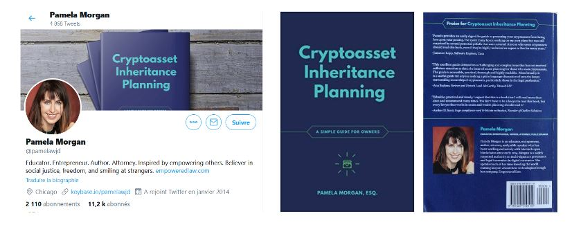

In questa lezione, ci concentreremo solo sulla prima parte del suo libro. Assumerò il ruolo di un utente Bitcoin tipico per creare la propria lettera di successione. Il processo sarà semplice per il momento, e creeremo una versione più complessa con diversi tipi di profili in seguito: Seguiremo il percorso di Cédric:

- Investitore a lungo termine.
- Détentore di un portafoglio fisico e di un portafoglio mobile.
- Utente di una singola piattaforma di scambio con verifica dell'identità (KYC).
- Introdotto al Bitcoin dal suo cugino.
- Non possiede smart contract, Lightning Network (LN) o alt-coin.

### Prerequisiti:

Chiedo 30 minuti del vostro tempo, non per me o per voi, ma per i vostri cari. La pianificazione successorale è un argomento difficile, spesso negato e dimenticato. Poiché è l'ultimo compito da completare, troppe persone si lasciano distrarre e finiscono per perdere stupidamente tutti i loro BTC. Quindi, dedicate 30 minuti e fatelo. Questo è il PASSO FINALE!

Di cosa avete bisogno?

- Un momento di tranquillità, senza distrazioni
- 4-5 fogli di carta bianca
- Una penna
- Due buste
- Un telefono / rubrica
- Un computer (a mio parere, è facoltativo)

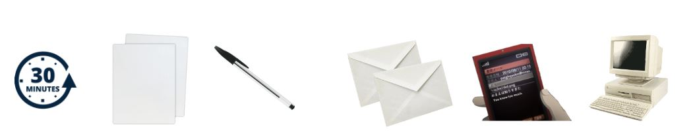

Secondo Pamela Morgan in "Cryptoasset Inheritance Planning" a pagina 18, i falsi miti comuni sono:

- Devo assumere un avvocato.
- Devo fidarmi di un terzo.
- La pianificazione renderà i miei beni facili da rubare.
- Il valore della mia criptovaluta è troppo basso per essere pianificato.
- I miei eredi scopriranno tutto da soli.
- Tutto questo può essere realizzato con un semplice smart contract.

### Passo 1: Selezionare le persone adeguate per aiutare i vostri eredi

È necessario designare due persone che aiuteranno la vostra famiglia quando non ci sarete più. In questo modo, i vostri cari avranno a disposizione un utente di Bitcoin di fiducia, aggiornato tecnologicamente, su cui potranno fare affidamento durante il processo di recupero. Queste persone potranno:

- Fornire consigli sulla gestione delle chiavi e dei portafogli.
- Aiutare a capire come recuperare in modo sicuro le vostre frasi segrete (seeds).
- Apportare una sicurezza durante una transazione.

Ci sarà sempre un compromesso tra competenza tecnica, disponibilità e fiducia. Se siete indecisi su chi dovrebbe assumere questo ruolo, create una semplice tabella per aiutarvi a decidere.

Separazione delle responsabilità: La persona di fiducia NON dovrebbe MAI avere accesso alla vostra chiave privata. Il suo unico ruolo è quello di aiutare i vostri cari a comprendere il sistema di sicurezza dei vostri Bitcoin e a guadagnare fiducia. Ecco perché si scelgono due persone di fiducia. Se necessario, è possibile ricorrere anche a un'organizzazione terza (avvocato specializzato o servizi di pianificazione successorale).

| Persona di fiducia    | Fiducia      | Conoscenza di BTC | Informazioni di fiducia | Nota                                                                           |
| --------------------- | ------------ | ----------------- | ----------------------- | ------------------------------------------------------------------------------ | --- | ----------------- | ------ | ----- | -------------------- | ------------------------------------------------------------------ |
| Mio fratello Bob      | Molto grande | Bassa             | Telefono e mail         | "Bob non sa molto sulle BTC, ma possiamo fidarci al 100% di lui per aiutarci." |     | Mio cugino Nathan | Grande | Media | Telefono e Instagram | Numero 1 delle persone con cui parlare. Può aiutarti. È informato. |
| Ricco (Crypto amico)  | Media        | Molto grande      | Twitter, mail e foto    | Fidati di lui per le domande tecniche. Mai con i soldi. Dovrai contattarlo.    |
| Youtuber e influencer | Bassa        | Grande            | Link YouTube            | Istruisciti seguendolo. Non può aiutarti direttamente.                         |

### Passaggio 2: Effettua un inventario semplice e veloce

È importante pensare a tutti i luoghi in cui hai dollari o BTC:

- Piattaforme di scambio
- Portafoglio mobile
- Portafoglio fisico

Considera come li hai protetti e dove sono conservati questi backup. Non è essenziale avere due luoghi di backup al momento. L'obiettivo è ottenere uno snapshot della tua sicurezza ATTUALE. Potremo migliorarla in seguito! Questa è solo una prima versione per garantire la tua sicurezza al momento, torneremo su questo argomento in dettaglio più avanti.

| Generale               | Software / Hardware | Attività        | Posizione          | Backup (chiave privata)       | Password (PIN, passphrase) | Nota                                                                                                     |
| ---------------------- | ------------------- | --------------- | ------------------ | ----------------------------- | -------------------------- | -------------------------------------------------------------------------------------------------------- |
| Piattaforma di scambio | Bitstamp            | BTC e Liquidità | Accessibile online | -                             | Casa e cassaforte bancaria | È qui che ho acquistato e trasferito i miei Bitcoin. Accedo utilizzando un gestore di password e un 2FA. |
| Portafoglio fisico     | Trezor modello One  | BTC             | Sicuro             | Zio Bob e cassaforte bancaria | Casa e madre               | Ho due portafogli, uno normale e uno con passphrase.                                                     |
| Portafoglio Samourai   | Mobile - One Plus 6 | BTC             | Con me             | Zio Bob e cassaforte bancaria | Casa e madre               | L'applicazione potrebbe essere in modalità nascosta.                                                     |

NON DISTRAETEVI! Avete l'impulso di trasferire questi asset per:

- Migliorare la vostra sicurezza?
- Vendere alcuni beni?
- Comprarne altri?

NON FATE NULLA! Potreste dimenticare il progetto in corso. RIMANETE FOCALIZZATI! Potrete sempre rivedere e modificare il vostro portafoglio in seguito.

### Passaggio 3: Scrivete la lettera.

Per motivi di sicurezza, utilizzate una penna e della carta per scrivere una lettera ai vostri cari.

- Ho un po' di criptovaluta
- Contattate questi consulenti
- Ho questi asset qui- Ti amo
  Ecco un modello per aiutarti a iniziare. Se non vuoi scrivere la lettera tu stesso, puoi scaricare un modello e semplicemente compilare gli spazi vuoti. (link qui)

Inizia spiegando lo scopo della lettera e avverti i tuoi cari dei pericoli dell'autogestione delle criptovalute.

La lettera deve essere chiara e utile. Non è un testamento, né una lettera per farli piangere. Non è nemmeno una lettera per costringerli a non vendere mai, né una lettera per scrivere le chiavi private. È una lettera per aiutarli a capire cosa hai fatto, in modo che possano prendere la migliore decisione e agire in sicurezza.

Ecco un estratto del modello di lettera a un caro, tratto dall'appendice E del libro di Pamela Morgan, "Cryptoasset Inheritance Planning". Per adattarlo al nostro esempio, ho modificato alcune parti, che ho inserito tra parentesi e contrassegnato in blu. Il resto del testo è il testo originale del libro. (Tradotto da Découvre Bitcoin)

"Data: 26/06/2020
Cara Liz e Maia,
Vi amo profondamente e so che sarete forti.
Scrivo questa lettera per farvi sapere che possiedo criptoasset che potrebbero avere valore.
Vi prego di leggere attentamente e completamente questa lettera prima di intraprendere qualsiasi azione. Questi asset sono diversi dagli altri asset, perché una volta trasferiti, non c'è modo di recuperarli."

Successivamente, includiamo la "sezione degli advisor". Questa parte potrebbe essere confusa per i tuoi eredi, soprattutto se menzioni persone o organizzazioni che non conoscono. Sii preciso su:

- Come contattarli
- Come identificarli
- Quali sono le loro aree di competenza.
- Come possono formarsi da soli.

"Sotto troverete un elenco di persone in cui ho fiducia per rispondere alle vostre domande e aiutarvi nel processo di scoperta e trasferimento di questi asset. Contattate le persone indicate, ma non fidatevi di una sola persona per gestire il processo. Siate vigili con tutti gli advisor, inclusi quelli presenti in questa lista. Tutti possono commettere errori, quindi assicuratevi di capire al meglio possibile cosa stanno facendo e non abbiate paura di fare domande e verificare le risposte da soli.

Ecco le persone che possono aiutarvi a rispondere alle domande e guidarvi in questo processo:

(Inserire qui il nome dei vostri advisor, la loro affiliazione a un'organizzazione (se presente), i loro contatti e come devono verificare la loro identità ad esempio, database delle chiavi, foto.)

- "J'ai utilisé mon ordinateur de bureau (MacBook Pro) pour accéder à différentes plateformes d'échange telles que Coinbase et Binance. J'ai également installé des applications de portefeuille telles que Electrum et Exodus. Les informations de connexion et les mots de passe sont stockés dans un coffre-fort à la maison et une copie est également chez mon cousin Nathan."

- "J'ai également utilisé des portefeuilles physiques tels que Ledger Nano S et Trezor pour stocker mes bitcoins. Les appareils sont conservés dans un coffre-fort à la banque et les mots de passe sont connus uniquement de moi."

- "J'ai également une phrase secrète (passphrase) pour accéder à certains de mes portefeuilles. La phrase est écrite sur un morceau de papier et est conservée dans un coffre-fort à la maison."

- "Enfin, j'ai également configuré des portefeuilles multisig pour une sécurité supplémentaire. Les clés nécessaires pour déverrouiller ces portefeuilles sont réparties entre moi, mon frère Bob et mon cousin Nathan."

Veuillez noter que les informations fournies ci-dessus sont fictives et ne doivent pas être utilisées dans un contexte réel.

- Utilizzo il mio computer Dell 2018 per accedere a una piattaforma di scambio online chiamata Bitstamp. Potrei ancora avere Bitcoin o dollari su questa piattaforma. Per accedere al mio account, dovrai contattarli direttamente o accedere al mio account (fai attenzione, potrebbe essere illegale - verifica la tua legislazione locale).
- Ho utilizzato un gestore di password per accedere, e troverai il mio backup nella cassetta di sicurezza della banca. L'account è anche protetto da un'autenticazione a due fattori, a cui puoi accedere tramite il mio telefono (Samsung Galaxy S8) o utilizzando il codice di backup conservato a casa.
- Ho anche BTC su un dispositivo Trezor Model One. Accedo ad esso tramite il mio PC e il sito web Trezor.io. Le chiavi private di backup sono conservate nella cassetta di sicurezza della banca e da zio Bob. Il codice PIN è conservato a casa e dalla mia madre. Il dispositivo stesso è probabilmente in una cassaforte nel mio ufficio.
- Utilizzo una frase segreta di sicurezza avanzata per il mio dispositivo Trezor. Il backup di questa frase segreta si trova a casa e dalla mia madre."

Ora concluderemo la lettera con alcune informazioni legali, se necessario, e con parole gentili.

"Si prega di notare: Troverete una copia del mio testamento, datato 17 aprile 2018, nella mia cartella dei documenti. Il mio avvocato, Dwight Schrute, con sede a Scranton, in Pennsylvania, ne possiede anche una copia. Fate attenzione e ricordate sempre il mio amore per voi". 26/06/2023, Cedric"

Ora verifichiamo il nostro lavoro (Tratto da "Cryptoasset Inheritance Planning" di Pamela Morgan, pagina 44 (tradotto da Découvre Bitcoin)):

- Assistenza: verifica di aver indicato correttamente i nomi, i contatti e, se possibile, le foto.
- Dispositivi: assicurati di aver elencato il tuo telefono, il tuo computer, i tuoi portafogli fisici, i tuoi portafogli di carta.
- Attività: assicurati di aver incluso l'elenco delle tue attività.
- Scambi: verifica di aver elencato tutti gli scambi che detengono fondi per te.
- Accesso: elenca le informazioni di cui avranno bisogno per trovare il tuo luogo di conservazione e tutti i codici di accesso necessari.
  Se hai spuntato tutte le caselle, allora sei pronto per gli ultimi passaggi! Fai una copia di questa lettera e conserva entrambe le copie in una busta. Chiudila, firma il sigillo e metti la busta in un luogo sicuro ma accessibile. Assicurati che i tuoi eredi sappiano che devono recuperare questa busta se necessario. Non esitare a comprare il libro di Pamela per approfondire questo argomento e pianifica un momento per migliorare il tuo piano di eredità. Discutine anche con il tuo notaio per integrare legalmente questo piano nel tuo testamento ufficiale.
  Bravo! Hai una prima versione del tuo piano di eredità ed è un ottimo inizio!

_Pianificazione dell'eredità di cryptoasset, una guida semplice per i proprietari, Pamela Morgan, ESQ. Copyright 2018 di Merkle Bloom LLC, tutti i diritti riservati. CC-BY_ Un grande ringraziamento a Pamela Morgan per il suo prezioso lavoro e per avermi autorizzato a condividerlo. Grazie anche a tutti coloro che hanno contribuito alla sua stesura.
Siete i migliori :D Anche il mio team e i miei studenti vi ringraziano!

# Ringraziamenti e continuate a scavare la tana del coniglio

## Congratulazioni! FAI PARTE DEL TOP 0,1%

Se hai seguito i nostri contenuti fin dall'inizio, sei ora un vero cittadino del 21° secolo e uno dei più esperti nel campo del Bitcoin! Utilizzi un gestore di password e l'autenticazione a due fattori (2FA). Capisci cosa è il Bitcoin e perché è importante. Possiedi Bitcoin e hai un modo sicuro per acquistarne o guadagnarne di più. Hai conservato i tuoi Bitcoin in un portafoglio "freddo" e hai implementato una gestione adeguata delle chiavi. Hai creato un piano di eredità per i tuoi cari. Ora sei al sicuro e puoi rilassarti! Goditi una birra e sii fiero di te stesso!

Sono davvero orgoglioso che tu abbia raggiunto questo punto. Lo penso sinceramente. Cosa fare dopo? Anche se dovresti sicuramente rilassarti ora e essere fiero di te stesso, il tuo percorso con il Bitcoin è lontano dall'essere finito e non lo sarà mai veramente. Ecco alcune opzioni per il futuro:

1. Potresti semplicemente continuare come hai fatto finora. Continua ad accumulare bitcoin gradualmente e lascia che la tua strategia si sviluppi nel tempo. Hai già un livello di sicurezza sufficiente, tutto è in ordine, e hai fatto ciò che era necessario per te e la tua famiglia. Non hai bisogno di diventare un esperto di trading, e non hai bisogno di sapere molto di più sugli investimenti. Probabilmente hai anche un lavoro a tempo pieno, e anche se Bitcoin è eccitante, il tuo obiettivo principale era arrivare a questo punto. Questo vale per la maggior parte di voi, e lo rispetto. Sono molto contento che tu sia arrivato fin qui nel "rabbit hole" di Bitcoin, e spero che il viaggio sia stato piacevole. Grazie per avermi dato fiducia nell'aiutarti a proteggere i tuoi primi bitcoin.
2. Potresti voler continuare ad approfondire gli aspetti tecnici, ideologici e filosofici di Bitcoin. Se hai la sensazione che il tuo viaggio sia appena iniziato, ti incoraggio a continuare ad informarti su Bitcoin. Ci sono così tante cose da imparare che a volte è difficile sapere da dove cominciare. Ecco quindi un elenco di corsi e formazioni che potrebbero accompagnarti:

- Nodo Bitcoin e Lightning Network: come abbiamo già visto più volte, il Lightning Network offre una visione completamente diversa di ciò che è Bitcoin. Attraverso questo secondo livello, le possibilità sono molteplici e un'intera industria si sta costruendo su di esso. Per accompagnarti nella scoperta, ti invito a seguire LN 201 per un corso teorico o LN 202 per un corso pratico. Entrambi i corsi sono accessibili a tutti a questo punto del tuo apprendimento e possono aiutarti a comprendere meglio questo nuovo aspetto di Bitcoin.
- Economia austriaca: se l'economia e la finanza sono argomenti che ti interessano, allora il corso ECON 201 è probabilmente quello giusto per esplorare gli aspetti più profondi dell'economia austriaca. Scoprirai lì quel movimento di pensiero economico che si oppone al più tradizionale movimento keynesiano. È un buon punto di partenza per interrogarsi sul nostro sistema e capire come siamo arrivati a questo punto dal punto di vista dell'inflazione e della manipolazione monetaria.
- Soluzione per i commercianti: infine, se sei più incline a voler utilizzare effettivamente Bitcoin, puoi andare nella nostra sezione tutorial e esplorare le numerose soluzioni per i commercianti. Questo può offrirti opportunità nel nostro settore, ma anche aiutarti a far accettare Bitcoin alla tua azienda o ai tuoi amici nel loro commercio e così far girare un'economia locale basata su Bitcoin nella tua città!

In ogni caso, tutti i nostri corsi rimangono gratuiti e molte risorse o tutorial sono disponibili sulla nostra piattaforma per accompagnarti. Buon proseguimento negli studi!## Nota la formazione!

## Sostieni la formazione!

Questo corso, così come l'intero contenuto presente su questa università, ti è stato offerto gratuitamente dalla nostra comunità. Per supportarci, puoi condividerlo con gli altri, diventare membro dell'università e persino contribuire al suo sviluppo tramite GitHub. A nome di tutto il team, grazie!

## Approfondisci
