# 첫 비트코인을 향한 여정

비트코인을 둘러싼 산업은 호황을 누리고 있습니다.

이 새로운 세상의 기술 및 금융 변화는 가속화되고 있으며, 비트코인 토끼굴에 빠져드는 것은 여러분에게 달려 있습니다. 이 모험은 풍부한 지식과 함께 여러분의 많은 신념에 의문을 제기하게 할 것입니다. 이를 통해 자유를 되찾고 프라이버시, 주권, 재정적 독립을 되찾을 수 있을 것입니다.

이 모험을 시작하는 데 도움을 드리기 위해 이 무료 강좌를 만들었습니다. 다른 암호화폐는 일절 포함하지 않고 비트코인만 다루며, 핵심만 짚어주는 과정입니다. 이 과정은 여러분에게 맞춰서 여러분에게 맞는 길을 선택할 수 있도록 설계되었습니다.

+++
# 비트코인을 이해하기 위한 소개 및 전제 조건

<partId>008c49b7-5e17-5973-87f2-ba28429b2697</partId>

## BTC102 과정 소개

<chapterId>bfc96999-0ee1-5c41-8297-1b629f50cffc</chapterId>

BTC 102에 오신 것을 환영합니다! 비트코인 플랜을 설정하는 방법을 안내하는 실용적인 강좌입니다! 이 과정을 통해 첫 비트코인을 얻고, 제대로 보호하고, 이 새로운 산업에 원활하게 진입할 수 있도록 준비합니다.

비트코인 산업은 아직 초기 단계이며 끊임없이 진화하는 현상으로 간주됩니다. 수년 동안 이 시장을 규제하려는 노력에도 불구하고 기본 프로토콜의 특성으로 인해 비트코인은 여전히 매우 자유로운 시장으로 남아 있습니다.

비트코인은 완전한 규제가 불가능하기 때문에 14년 이상 유기적이고 탈중앙화된 방식으로 성장할 수 있었습니다. 따라서 비트코인은 아직 태동기에 있는 산업이며 계속 성장하기를 열망하고 있습니다.

혁신과 가능성이 폭발적으로 증가함에 따라 사기, 사기, 위험도 함께 증가하고 있습니다. 비트코인 여정에 좌절이나 실수가 없는 것은 말할 필요도 없습니다. 그러나 이러한 실수를 최대한 피할 수 있도록 이 과정은 시작을 위한 실용적인 가이드 역할을 할 것입니다. 반면 BTC 101 과정은 비트코인의 작동 방식을 이해하기 위한 이론적인 과정입니다.

이 과정에서는 4가지 각도에 초점을 맞출 것입니다:

- 사기를 당하거나 어리석게 돈을 잃지 않도록 기본 사항과 전제 조건을 검토하세요.
- 비트코인이 중요한 이유를 근본적으로 검토하고 비트코인의 산업을 이해합니다. 이를 통해 우리의 신념을 강화하고 우리가 무엇을 하고 있는지 이해하는 데 도움이 될 것입니다.
- 첫 비트코인 지갑을 설정하고 거래소 플랫폼을 통해 첫 비트코인을 구매하세요. 여기서는 여러분의 필요에 가장 적합한 솔루션을 찾아보겠습니다. 마지막으로 마지막 섹션에서는 보안을 위한 기본 개념이지만 업계에서 간과하는 경우가 많은 비트코인 상속 계획을 만드는 방법을 다룹니다.

보시다시피, 이 과정의 목적은 간단하고 빠른 방법으로 처음부터 업계의 모범 사례를 준수할 수 있도록 여러분과 함께 하는 것입니다!

행운을 빕니다 :)

## 사기 및 금융 사기

<chapterId>8af2948b-2ab5-54c4-862c-3414b8a285a2</chapterId>

우리는 '암호화폐' 분야에서 두 가지 주요 분야가 부상하고 있는 업계에 속해 있습니다:

1. 비트코인 산업은 탈중앙화된 가치 전송 프로토콜(비트코인)을 통한 건전한 화폐에 중점을 두고 있습니다. 프라이버시와 개인 주권을 중시하며 높은 수준의 복원력과 보안을 갖춘 장기 프로젝트를 점진적으로 구축합니다.

2. 핀테크, '블록체인' 및 기타 중앙 집중식 혁신을 지향하는 글로벌 암호화폐 산업. 빠르게 진화하며 새로운 트렌드로 자리 잡기 위해 노력하고 있습니다.

이 대학교의 모든 초점은 암호화폐가 아닌 비트코인 세계에 맞춰져 있습니다.

비트코인을 포함한 암호화폐 분야는 비교적 역사가 짧고 규제가 느슨한 편입니다. 따라서 다양한 사기가 많습니다. 위험성을 이해하고 일반적인 함정을 인식하는 것은 필수적입니다. 다음은 자주 발생하는 몇 가지 사기 상황입니다:

- 온라인 기부 및 복권
- 폰지 사기
- 펌프 및 덤프
- 싯코인 그룹 및 인플루언서
- 편차 / 하드 포크
- 해킹
- 가짜 몸값
- 비밀번호 사기
- SIM 카드 하이재킹

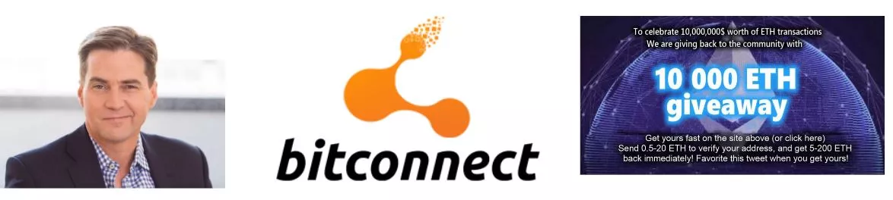

금융 투자 분야에서 피라미드 판매 시스템과 폰지 사기는 불법 모델로 두드러집니다. 이들은 신규 투자자의 돈으로 기존 참가자에게 수당을 지급하는 방식으로 운영됩니다. 그러나 지속 불가능하고 새로운 투자자에게 의존하여 시스템을 운영하기 때문에 결국에는 무너질 수밖에 없습니다.

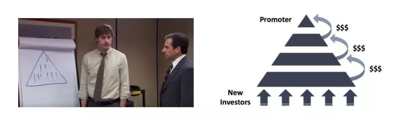

이러한 시스템은 내재적 가치의 부재, 비현실적인 수익률 약속, 신규 투자자를 유치하기 위해 추천을 유도하는 마케팅 전략 등 모호한 요소가 특징인 경우가 많습니다. 인출 지연과 소셜 네트워크에서 홍보를 위해 가짜 프로필을 사용하는 것도 이러한 사기의 대표적인 징후입니다. 불법적이고 비도덕적인 성격과 이로 인한 재정적 위험을 고려할 때 이러한 사기를 피하는 것이 중요합니다.

궁극적으로 이러한 시스템은 실패할 수밖에 없습니다. 시간이 지남에 따라 시스템을 유지하기 위해 점점 더 많은 신규 참여자가 필요하게 되고, 이를 감당할 수 없게 됩니다. 이 지점에 도달하면 환상은 사라지고 시스템은 붕괴되며 투자자들은 투자금을 회수할 수단이 없는 경우가 많습니다.

폰지 사기는 다양한 방식으로 나타날 수 있습니다. 때로는 새로운 토큰 제공이나 ICO(초기 코인 제공), 스마트 계약의 조합, 법정 화폐 독점 시도, 심지어는 실제 제품이 없는 마케팅 프로그램으로 위장하기도 합니다. 그러나 철저한 조사와 실사를 통해 이러한 시스템은 실질적인 가치를 창출하지 못한다는 사실이 밝혀졌습니다. 그저 신규 참가자의 돈을 재분배하여 기존 참가자에게 돈을 지불할 뿐입니다.

최근 암호화폐 세계에는 특별한 주의가 필요한 탈중앙화 금융(DeFi)과 관련된 프로젝트가 쏟아져 나오고 있습니다. 이러한 프로젝트 중 일부는 저품질 암호화폐, 스마트 컨트랙트, 이자율 시스템을 조합하여 기적적인 금융 솔루션을 제공한다고 주장할 수 있습니다. 이러한 극도로 사기성이 짙은 제안에 대해서는 주의를 기울이고 실사를 하는 것이 필수적입니다.

이 과정의 내용은 순수한 교육 목적으로 제공되며 재정적인 조언으로 해석되어서는 안 됩니다. "신뢰하되 확인하라"는 권고는 여전히 중요한 지침입니다. 모든 사람이 스스로 조사하고 정보에 입각한 재정적 결정을 내리는 것이 중요합니다.

펌프 앤 덤프(P&D)는 시장에 심각한 혼란을 야기할 수 있는 악명 높은 금융 조작의 한 형태입니다. 공격적인 마케팅, 알고리즘 사용, 인공 지능 등 다양한 메커니즘을 통해 자산 가격을 인위적으로 상승시키는 것을 목표로 하는 조직적인 공격이 특징입니다. 목표는 이렇게 고평가된 자산을 매각하여 수익을 창출하는 것입니다.

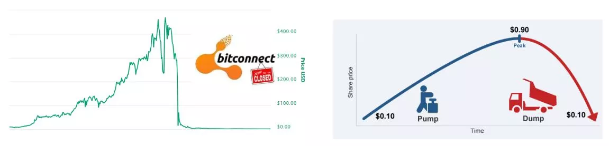

펌프 앤 덤프 전략은 일반적으로 잘 정의된 패턴을 따릅니다:

1. 오피니언 리더 또는 투자자 그룹이 먼저 목표 주식이나 기타 자산을 대량으로 매수합니다.

2. 그런 다음 이러한 자산에 대한 과대 광고를 만들고 다른 투자자를 유치하기 위해 과장되거나 오해의 소지가 있는 정보를 퍼뜨립니다.

3. 이러한 과대 광고는 인간 투자자와 투자 봇 사이에서 FOMO(Fear Of Missing Out)를 유발하여 이러한 자산을 대량으로 구매하기 시작합니다.

4. 가격이 충분히 상승하면 리더는 자산을 대량으로 매각하여 상당한 수익을 얻습니다.

5. 대규모 매도세는 자산 가격의 급격한 하락으로 이어져 많은 투자자가 상당한 손실을 입게 됩니다.

이러한 전략에 참여하는 것은 불법이며 시장 조작 혐의가 적용될 수 있다는 점을 이해해야 합니다. 또한 이러한 전략은 종종 회원비를 받는 영향력 있는 그룹에 의해 조율되는 경우가 많습니다. 일부 참여자는 단기적으로 이익을 얻을 수 있지만 펌프 앤 덤프 전략은 일반적으로 장기적으로 수익성이 없습니다.

따라서 이러한 조작 전술에 현혹되지 말고 금융 교육과 책임감 있는 투자에 집중하는 것이 좋습니다. 탄탄한 지식을 습득하고 장기적인 접근 방식을 채택하는 것은 투자 세계에서 성공하기 위한 필수 열쇠입니다.

온라인 콘테스트나 기부와 관련된 사기는 암호화폐 업계에서 매우 흔합니다. 무료 비트코인을 약속하는 광고는 경험이 없는 사용자를 속이기 위해 자주 사용됩니다. 명심해야 할 핵심 원칙은 비트코인을 돌려받을 수 있다는 기대감으로 비트코인을 보내지 말고 비현실적인 수익을 약속하는 것을 경계해야 한다는 것입니다. 특히 인터넷 배너의 경우 맹목적으로 신뢰하지 않는 것이 중요합니다.

이러한 유형의 사기의 대표적인 예는 송금한 비트코인을 두 배 또는 여러 배로 늘려주겠다는 제안입니다. 즉시 부자가 될 수 있는 마법의 해결책은 없다는 것을 이해하는 것이 중요합니다.

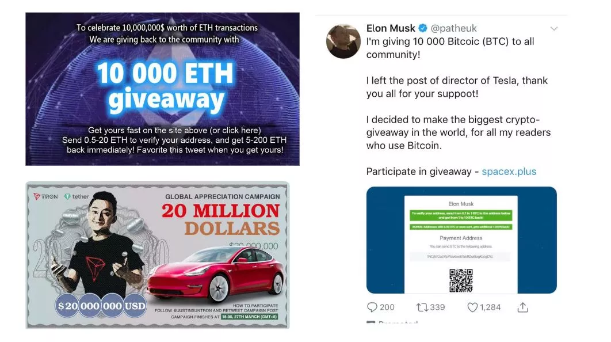

일반적으로 사용되는 또 다른 수법은 '싯코인' 또는 저가치 암호화폐를 기부하는 것입니다. 일부 중앙화된 암호화폐 프로젝트는 많은 마케팅을 통해 무료 토큰을 선물로 제공합니다. 이러한 선물은 토큰의 가치가 없거나 단순히 관심을 끌고 거래, 도박 및 기타 사기를 조장하기 위한 것이므로 매우 주의해야 합니다. 이러한 제안이 항상 사기, 불법 또는 오해의 소지가 있는 것은 아니더라도 여전히 주의가 필요합니다.

예를 들어 트위터에서는 봇이 유명 인물을 사칭하여 사람들을 속이기 위해 놀라운 거래를 제안할 수 있습니다. 이러한 계정은 해당 유명인과 동일한 이름과 프로필 사진을 사용하므로 잘 모르는 사용자를 속일 수 있습니다. 해당 계정과 상호작용하기 전에 항상 계정의 합법성을 확인해야 합니다.

이메일을 통해 전송된 링크에 주의하는 것도 중요합니다. 링크를 클릭하기 전에 항상 링크를 확인하고 발신자의 신원을 주의 깊게 확인하세요.

마지막으로 온라인 사기를 피하기 위한 몇 가지 팁을 알려드립니다:

- 정직한 개인은 절대로 직접 송금을 요청하지 않습니다.
- 알 수 없는 주소로 비트코인을 보내지 마세요.
- 비현실적인 수익률에 대한 약속은 항상 의심스럽습니다.
- 콘테스트는 조작될 가능성이 높습니다.
- 플레이하는 것보다 배우는 것이 항상 더 많은 것을 얻을 수 있습니다.
- 의심스러운 경우 즉시 행동하지 마세요. 시간을 갖고 생각하고 조사하세요. 실패에 대한 두려움(FOMO)은 최악의 적이 될 수 있습니다.

투자 결정을 내리기 전에 항상 직접 조사하는 것을 잊지 마세요.

비트코인은 시간이 지남에 따라 여러 차례 하드포크를 거치면서 원래 통화의 다양한 대체 버전이 생겨났습니다. 이러한 편차는 종종 비트코인 프로토콜을 크게 변경하려는 개발자나 순진한 투자자를 속이려는 악의적인 개인이 만들어낸 결과물입니다. 잠재적인 함정에 빠지지 않으려면 진짜 비트코인과 이러한 파생상품을 구별하는 것이 중요합니다. 이러한 편차의 대표적인 예로는 비트코인 캐시(BCH)와 비트코인 사토시 비전(BSV)이 있습니다. 이러한 프로젝트는 '비트코인'이라는 이름을 가지고 있지만, 주로 투자자의 관심을 끌기 위한 마케팅 전략과 허위 광고에 기반을 두고 있습니다.

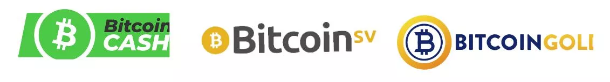

투자 업계에서는 이런 속담이 있습니다: "사기처럼 보이고, 사기처럼 행동하며, 사기가 아니라고 보장한다면 사기일 가능성이 높다."

이러한 편차 중 일부는 자금이 풍부하고 사용자를 속이기 위해 커뮤니케이션에 많은 비용을 지출한다는 점에 유의해야 합니다. 예를 들어, "Bitcoin.com"이라는 웹사이트는 원래 비트코인이 아닌 비트코인 캐시와 연결되어 있어 초보자에게 혼란을 줄 수 있습니다. 비트코인의 공식 웹사이트는 "bitcoin.org"입니다.

암호화폐의 세계는 엄청난 이득을 얻을 수 있다는 잠재력에 매료된 모든 종류의 사람들이 모여드는 비옥한 땅입니다. 안타깝게도 그중에는 투자자를 속이고 사기를 치기 위해 다양한 수법을 사용하는 악의적인 의도를 가진 사람들도 있습니다.

이러한 수법에는 다단계 사기를 공개적으로 홍보하거나 비트코인 창시자인 사토시 나카모토를 사칭하거나 타인의 저작물을 표절하거나 거짓 약속을 하는 행위가 포함됩니다. 또한 이들 중 일부는 투자자를 속이기 위해 쓸모없는 암호화폐 토큰과 암호화폐공개(ICO)를 진행하기도 합니다.

비트코인 커뮤니티는 종종 이러한 행동을 규탄하기 위해 힘을 모으지만, 법률 시스템이 이러한 개인에 대해 조치를 취하기까지는 다소 시간이 걸릴 수 있습니다.

따라서 암호화폐 세계와의 상호작용에서 경계를 늦추지 않고 분별력을 발휘하는 것이 중요합니다. 제 개인적인 조언은 이러한 개인과 관행을 무시하라는 것입니다. 그들은 여러분의 시간이나 에너지를 낭비할 가치가 없습니다. 대신, 정보에 입각한 안전한 방식으로 이 세계를 탐색하기 위해 암호화폐 시장에 대한 지식을 습득하고 이해하는 데 이러한 자원을 투자하세요.

"암호화폐 인플루언서" 또는 "구루"는 신중하게 접근하는 것이 중요합니다. 이들은 종종 개인적인 의제를 가지고 있으며, 투자자에게 항상 최선의 이익이 되는 것은 아니더라도 홍보하고자 하는 수많은 프로젝트에 관여할 수 있습니다.

이러한 인플루언서는 신뢰할 수 없는 암호화폐, 즉 '똥코인'을 홍보하고 안전하지 않거나 사기 가능성이 있는 경우에도 투자 가치를 높이기 위해 다양한 전략을 실행할 수 있습니다.

다음은 이 환경을 탐색하기 위한 몇 가지 팁입니다:

- 특정 암호화폐를 홍보하거나 거래를 제안하는 사람을 주의하세요.
- '무료 조언'은 종종 진정한 무료가 아니며 다른 의도가 숨겨져 있을 수 있습니다.
- 트레이딩 교육 비용을 지불하기 전에 두 번 생각하세요. 암호화폐 시장을 이해하는 데 도움이 되는 무료 자료가 많이 있습니다(예: 유튜브 채널 'ukspreadbetting').
- 단순히 다른 사람의 트레이딩을 복사하여 동일한 결과를 기대하는 것은 불가능합니다.
- 누군가가 어떤 말을 한다고 해서 그것이 반드시 진실이 되는 것은 아니라는 점을 기억하세요.

자신을 보호하는 가장 좋은 방법은 직접 조사하고 정보 출처를 확인하는 것입니다. YouTube에서 동영상을 시청하는 것만으로는 출처를 확인할 수 없습니다.

저를 포함한 모든 사람이 의제를 가지고 있다는 점에 유의하는 것이 중요합니다. 저는 비트코인을 믿으며 제 목표는 비트코인을 홍보하는 것입니다. 저는 이 프로모션을 통해 정치적으로나 재정적으로나 이익을 얻기를 바랍니다. 어떤 콘텐츠도 완전히 무료인 것은 없습니다. 제품이나 서비스가 무료인 것처럼 보인다면, 그것은 바로 제가 그 제품이기 때문일 가능성이 높습니다.

모든 사람이 자신의 의도를 반드시 투명하게 밝히지는 않는다는 점을 항상 염두에 두세요. 항상 다른 사람의 행동 목적에 의문을 제기하고 맹목적으로 신뢰하지 마세요.

## 온라인 보안

<chapterId>f0873bf2-6a6f-5485-bb7a-d84be14f404d</chapterId>

비트코인을 분실하는 주된 이유는 암호화폐 사기 및 금융 사기 외에도 부실한 온라인 보안 관리와 관련이 있습니다. 모든 계정에 동일한 비밀번호를 사용하고, 컴퓨터를 업데이트하는 것을 잊고, 정기적으로 데이터를 백업하는 것을 소홀히 하는 경우가 종종 있습니다. 이러한 관행이 걱정되시더라도 온라인 보안 습관을 개선하는 것은 언제나 가능하니 걱정하지 마세요. 다음은 몇 가지 기본적인 조치입니다:

- 비밀번호 관리자를 사용하세요(LastPass 튜토리얼 참조),
- 2단계 인증(2FA)을 사용 설정합니다,
- 컴퓨터를 최신 상태로 유지하고 멀웨어를 제거하세요,
- 전용 도구(시그널, 토르, 프로톤메일)를 사용해 개인 정보를 보호하세요.

이 주제가 완전히 생소하다면 SCU 101 강좌를 통해 자세히 알아보는 것도 흥미로울 수 있습니다.

https://planb.network/courses/99c46148-7080-4915-a7e0-9df0e145cd47
비트코인에 관심이 있든 없든 컴퓨터를 최적의 작동 상태로 유지하는 것은 매우 중요합니다. 업데이트는 새로운 기능을 추가할 뿐만 아니라 버그를 수정하고 소프트웨어의 보안을 개선하기도 합니다. 그러니 꼭 업데이트하세요:

- 항상 소프트웨어를 업데이트하세요,
- 신뢰할 수 있는 바이러스 백신 소프트웨어를 사용하세요,
- 파일을 다운로드할 때는 주의하세요,
- 정기적으로 데이터를 백업하세요,
- 비밀번호를 공유하지 마세요.

추가 팁: 외장 하드 드라이브를 구입해 중요한 파일의 전체 백업을 수행하는 것이 좋습니다. 컴퓨터에 장애가 발생했을 때 매우 유용할 수 있습니다.

비밀번호 관리자는 비밀번호를 저장하고 관리하는 소프트웨어입니다. 같은 비밀번호를 두 번 사용하지 않고, 복잡하고 안전한 비밀번호를 선택할 수 있으며, 온라인 보안 관리가 용이해집니다. 마스터 비밀번호는 하나만 기억하면 됩니다. 누구나 무료로 이용할 수 있는 도구입니다. 점진적으로 사용을 시작할 수 있으며 익숙해지면 매우 편리하고 사용하기 쉬울 것입니다.

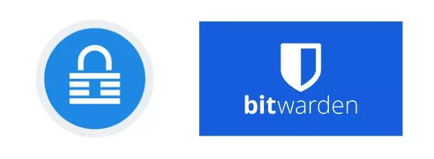

2단계 인증은 암호화폐 플랫폼, Google/이메일 계정, 은행, 온라인 쇼핑 사이트 등 가장 민감한 계정에 추가적인 보안 계층을 제공합니다. 로그인하려면 보통 휴대폰에서 액세스할 수 있는 6자리 코드인 두 번째 인증이 필요합니다. 휴대폰을 분실할 경우를 대비해 백업 키 사본을 어딘가에 보관해 두세요.

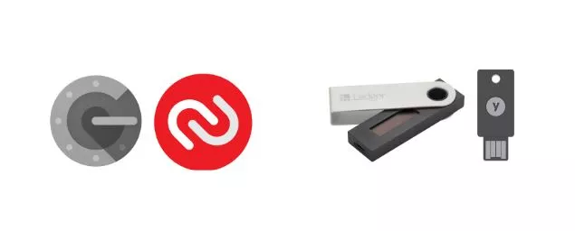

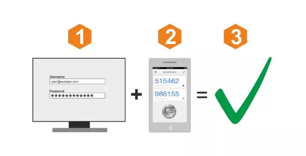

VPN 또는 가상 사설망은 IP 주소를 마스킹하여 사용자의 개인 정보를 보호합니다. 완전한 익명성을 보장하지는 않지만, 온라인 개인 정보 보호를 위한 간단하고 효과적인 단계입니다. VPN을 선택하고, 다운로드하고, 사용하는 과정은 매우 간단합니다.

온라인 익명성은 자유롭고 번영하는 사회를 위해 필수적입니다. 익명성은 표현의 자유, 증인 보호, 혁신을 가능하게 합니다. 개인정보 보호는 기본적인 인권입니다. 개인정보를 계속 보호하려면 다음을 사용하세요:

- 이메일용 PGP,
- 메시지에 대한 신호,
- 브라우징을 위한 Firefox 또는 TOR,
- 파일 공유를 위한 동기화,
- 비트락커로 데이터를 암호화하세요,
- 송금용 사무라이 월렛.

다시 한 번 말씀드리지만, 이 주제에 관심이 있으시다면 SECU 101 강좌를 통해 안내받을 수 있습니다.

## 초보자를 위한 팁

<chapterId>33134b3f-92c1-5185-afb6-88599e47e801</chapterId>

정규 교육은 투자에 대해 거의 가르쳐주지 않습니다. 그 결과, 우리는 종종 새롭고 복잡한 투자 환경에 홀로 뛰어드는 경우가 많습니다.

이 섹션에서는 초보 투자자가 비트코인 세계에 입문할 때 흔히 저지르는 실수와 같은 함정에 빠지지 않는 방법을 살펴볼 것입니다. 또한 현명하게 비트코인 투자를 계획하는 방법에 대해서도 논의할 것입니다. 다룰 주제는 다음과 같습니다:

- 내재적 가치가 없는 '똥코인' 또는 기타 암호화폐에 주의하세요.
- 손실을 감당할 수 있는 만큼만 투자하세요.
- 트레이딩과 투자의 차이점 이해하기.
- 세금 관련 사항을 숙지합니다.
- 개인 키를 올바르게 관리하세요.
- 겸손하고 신중함을 유지하는 것의 중요성.
- 장기적인 관점을 채택합니다.

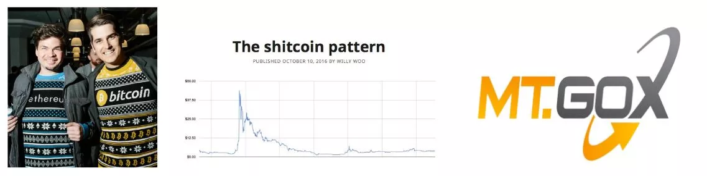

비트코인 투자에 뛰어들기 전에 시간을 내어 스스로를 교육하는 것이 중요합니다.

비트코인 업계에서는 실수를 저지르기 쉬우며, 실수 하나하나가 큰 손실로 이어질 수 있습니다. 제가 투자 여정에서 겪은 몇 가지 함정과 다른 투자자에게서 관찰한 함정을 공유함으로써 이 분야를 탐색하는 데 유용한 조언을 드리고자 합니다. 이러한 실수 중 일부는 다음과 같습니다:

| 기술 문제 | 재정 문제

| ------------------------------------------------------ | -------------------------------------------------------------- |

| 개인 키 분실 | 과잉 투자 | 과잉 투자

자산을 제3자에게 위탁하는 경우 | 금융 교육이 부족한 경우 | 자산을 제3자에게 위탁하는 경우 | 금융 교육이 부족한 경우

| 개인정보 보호 부족 | 빌린 돈으로 투자하기 | 빌린 돈으로 투자하기

| 온라인 보안 문제 | 트레이딩과 투자의 차이를 이해하지 못하는 경우 |

| 잘못 처리하기 | 세금 관련 사항 무시하기

| 컴퓨터 문제 | 투자 일정을 고려하지 않음 | 투자 일정을 고려하지 않음

| 해킹으로 인한 BTC 손실 | 금융 사기 및 사기에 당한 경우 | 금융 사기 및 사기에 당한 경우

교육 수준이나 배경에 관계없이 누구나 비트코인을 이해하고 사용할 수 있습니다. 금융이나 코딩에 대한 경험이 없어도 됩니다. 90%의 사람들과 마찬가지로 여러분도 간단한 방법으로 비트코인을 사용할 수 있습니다.

사람마다 상황이 다르기 때문에 각자의 재정 상황에 맞게 투자 전략을 조정해야 합니다. 다음은 몇 가지 좋은 사례와 나쁜 사례입니다:

- 정기적인 평균 구매는 좋은 습관입니다.
- 일반적으로 돈을 빌려 투자하는 등의 레버리지를 사용하는 것은 권장하지 않습니다.
- 충동적인 투자로 이어질 수 있는 FOMO(놓칠까 봐 두려워하는 마음)를 피하세요.
- 투자에 대한 구체적인 예산을 할당하는 것은 좋은 습관입니다.

목표는 완벽한 계획을 세우는 것이 아니라 따르고 준수할 수 있는 구조를 만드는 것입니다. 감정이나 두려움에 따라 구매하고 싶지 않습니다. 불필요한 스트레스를 피하기 위해 미리 적어둔 전략을 따르고 싶을 것입니다.

투자 방법을 배우는 데는 연령 제한이 없으며, 아주 적은 금액으로 시작하여 시간이 지남에 따라 진행할 수 있습니다. 교육은 여정입니다.

- 투자의 황금률: 손실 감당할 수 있는 금액 이상은 절대 투자하지 마세요! 월 수입에서 필수 지출(부채 및 주거비와 같은 기타 월별 지출)을 공제하고 생활비(식비)를 공제하는 것입니다. 그러면 저축 예산이 남습니다. 그 이상을 투자하면 조만간 문제가 발생할 것입니다!
- 황금 투자 규칙 2: 유행을 따르지 마세요. 합리적인 결정을 내리는 데 집중하세요. 의심스러운 점이 있으면 충분히 생각해보고 사랑하는 사람들과 상의하세요. 서두르는 것보다 천천히 하는 것이 좋습니다. 가장 좋은 전략은 단계별로 진행하는 것입니다.
- 황금 투자 법칙 #3: 재테크에서 성공하려면 계획과 장기적인 비전을 세우는 것이 필수입니다. 계획을 세우고 너무 많은 위험을 감수하지 마세요. 목표는 성공을 축적하면서 치명적인 실패를 피하는 것입니다.

의심스러운 경우: 먼저 스스로를 교육하는 것부터 시작하세요. 몇 시간 동안 비트코인의 세계를 살펴보세요(이 플랫폼에 많은 자료가 있습니다). 책을 두세 권 읽어보세요. 5유로 상당의 비트코인을 구입하여 사용해 보세요. 다큐멘터리와 동영상을 시청하세요. 열린 마음을 유지하세요.

모든 투자와 마찬가지로 시장을 잘 알아야 합니다. 비트코인은 매우 젊고 변동성이 크기 때문에 상황이 빠르게 변하고 어느 정도의 위험이 수반됩니다. 비트코인은 사라지거나 0으로 떨어지거나 몇 년 동안 정체될 수 있습니다. 잃을 수 있는 만큼만 투자해야 한다는 것은 말할 필요도 없습니다! 아직 완전히 이해하지 못하는 화폐에 투자하기 위해 빚을 내서 투자하지 마세요.

비트코인에 익숙해지면 실행 계획을 검토할 수 있습니다. 마찬가지로 비트코인이 처음이라면 트레이딩과 장기 투자, 그리고 많은 비트코인이 사용하는 매우 장기적인 전략인 '보유'의 차이점을 이해하는 것이 중요합니다.

일반적으로

| 트레이딩 | 투자 | 홀딩 |

| ----------------- | ---------- | ----------------- | -------------- |

| 레버리지 | 예 | 아니요 | 아니요 | 아니요

| 기간 | 단기 | 단기/중기 | 매우 장기 | 매우 장기

| 자산 유형 | 컨트랙트 | BTC | BTC | BTC

| 위험 | 매우 높음 | 높음 | 높음 | 높음

난이도 | 매우 어려움 | 어려움 | 어려움 | 어려움 | 어려움

| 학습 곡선 | 길다 | 길다 | 길다 | 길다

| 잠재적 손실 | 무제한 | 제한적 | 제한적 | 제한적

| 적합한 대상 | 일부 | 대부분 | 일부에 적합

제가 추천하는 방법은 다음과 같습니다:

- 장기적인 관점을 선택하는 것이 현명한 전략인 경우가 많습니다. 시장 상황을 지속적으로 모니터링하는 것은 복잡할 수 있으며 풀타임으로 헌신해야 합니다. 워렌 버핏은 "10년 동안 주식을 보유할 의향이 없다면 10분 동안은 보유할 생각조차 하지 말라"고 말했습니다
- 과세와 관련해서는 매우 주의해야 합니다: 각 국가마다 비트코인과 관련된 자체 법률이 있습니다. 특히 납세 의무와 관련하여 해당 국가에서 시행 중인 법률에 대해 문의하는 것이 필수적입니다. 계획을 잘못 세우면 소득보다 더 많은 돈을 세무 당국에 납부해야 할 수도 있습니다.

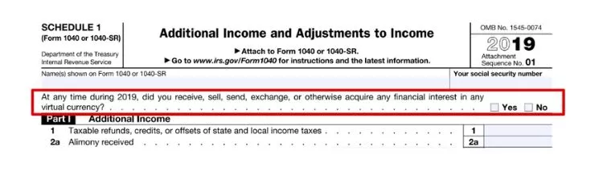

투자에 대해 배우는 것은 일반적으로 학교에서 가르치는 것이 아닙니다. 따라서 많은 사람들이 투자를 위험하고 미친 짓이며 접근하기 어려운 활동이라고 생각합니다. 자신을 보호하기 위해 많은 사람들이 은행원을 찾지만 이는 실수로 판명될 수 있습니다.

투자에 대한 교육을 시작하고 돈과 금융 시스템이 어떻게 작동하는지 이해하는 데는 나이 제한이 없습니다. 완전히 몰입할 필요는 없으며, 무지가 아닌 사실에 근거하여 적절한 결정을 내리기 위해서는 개괄적인 지식만 있으면 충분합니다. 이는 평생 동안 매우 유용할 수 있는데, 누군가(예: 은행) 나쁜 투자 상품을 판매하려고 할 때 이를 알아차릴 수 있기 때문입니다.

트레이딩에 관여해서는 안 됩니다. 트레이딩은 많은 스트레스와 위험, 자제력을 필요로 하는 풀타임 직업입니다. 트레이딩은 누구나 할 수 있는 활동이 아니며 심각한 위험을 수반할 수 있습니다. 그래도 시도해보고 싶다면 적어도 Ukspreadbetting의 마크처럼 신뢰할 수 있고 현명한 사람을 팔로우하세요.

두 가지 좋은 리소스입니다:

- 부자 아빠, 가난한 아빠 - 로버트 T 키요사키 - 투자의 세계에 대한 좋은 첫 입문서입니다. 누구에게나 완벽한 책입니다.
- 투자자 팟캐스트 - 이 팟캐스트는 좀 더 전문적인 내용이지만 금융의 복잡성 수준을 잘 보여 줍니다. 이미 금융 업계에서 일하고 있거나 금융에 관심이 있다면 몇 가지 에피소드를 들어보세요. 그들 중 일부는 비트코인에 대해 이야기합니다.

전제 조건에 대한 이 섹션을 마무리하기 위해, 업계에서 금전적 손실이 발생하는 첫 번째 이유인 개인 키의 관리 부실로 돌아가 보겠습니다.

다시 말씀드리자면, 개인 키는 비트코인의 백업을 나타내는 24개의 단어 목록입니다. 이 점에서 각별한 주의가 필요합니다. 비트코인을 거래소 플랫폼에 보관할 때 비트코인을 통제할 수 있는 것은 사용자가 아니라 플랫폼입니다! 이러한 상황에서는 플랫폼이 파산하거나 비트코인을 몰수당하거나 플랫폼이 해킹당하는 등의 위험이 따릅니다.

비트코인의 황금률 #1: 키가 아니라 비트코인을 소유하세요. 비트코인의 키는 비트코인의 소유권을 나타냅니다. 키를 보유하면 재정적 주권을 되찾고 자신의 돈에 대한 보안을 책임져야 합니다.

키를 분실하면 돈도 잃게 됩니다. 업계 모범 사례를 따르고 복잡한 전략을 피하는 것이 가장 좋습니다. 비트코인은 이미 그 자체로 충분히 위험합니다. 전문가의 조언에 귀를 기울이세요. 또한 비트코인을 사용할 때는 비트코인에 대해 이야기하지 않는 등 신중함을 유지하는 것이 가장 좋습니다. 자신을 노출하면 잠재적인 표적이 되어 자신과 가족의 위험이 커질 수 있습니다. 최고의 보안은 신중함에 있습니다. 모든 사람에게 비트코인을 보유하고 있다고 밝힐 필요는 없습니다.

행운을 빕니다! 저를 따라 비트코인의 세계로 들어가 위험을 감수하지 않고 첫 비트코인을 획득하고 보호할 수 있도록 안내해드리겠습니다!

# 우리가 무엇을 하고 있는지 이해하기

<partId>a42355a3-9dd8-57ed-b590-32a333fe09ea</partId>

## 5분 안에 비트코인

<chapterId>ae122ad9-9b4d-5229-9038-e1b99d5cfc83</chapterId>

이 강좌에서는 첫 비트코인을 얻기 위한 실행 계획에 초점을 맞추고자 합니다. 비트코인의 기초에 대한 자세한 설명을 원하신다면 이 플랫폼에서 무료로 제공되는 BTC 101을 추천합니다.

비트코인은 신뢰할 수 있는 중개자 없이 전 세계로 가치를 전송할 수 있는 컴퓨터 프로토콜입니다. 이 가치는 비트코인이라는 통화로 표현됩니다.

여러분이 항상 듣는 유명한 비트코인은 바로 이 디지털 화폐입니다. 비트코인 사용자는 지갑 간에 비트코인을 전송하며, 이 모든 것이 모든 사용자 간에 거래를 전파하는 노드 네트워크(비트코인 서버) 덕분에 작동합니다. 거래의 최종성을 보장하기 위해 이 네트워크의 일부 행위자는 채굴자(유명한 채굴자)이며, 이들의 목표는 전파된 거래를 비트코인 블록체인에 기록하는 것입니다(더 유명한 채굴자).

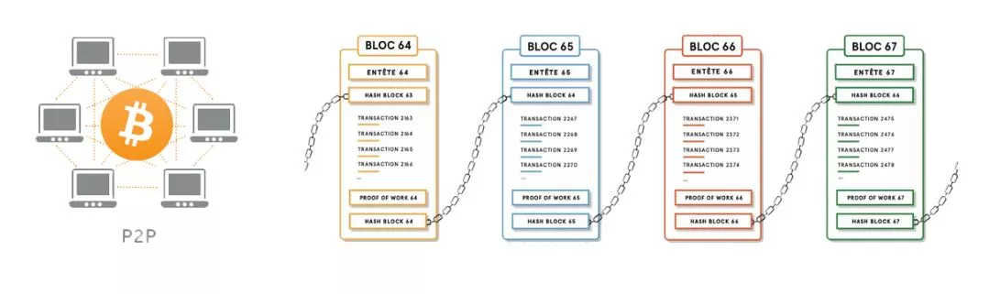

이 다소 기괴한 메커니즘 덕분에 시간이 지나도 변하지 않고 공간적으로 분산되어 있으며 전 세계에서 지속적으로 작동하는 데이터베이스(블록체인)를 확보할 수 있게 되었습니다. 이를 통해 인류 역사상 처음으로 삼중 입력 회계 시스템을 구축하여 누구도 통제하거나 파괴하지 않고도 인터넷에 구축된 대체 금융 시스템을 사용할 수 있게 되었습니다.

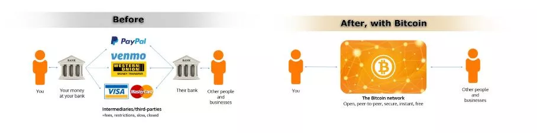

비트코인의 기술적 기능(BTC 101에서 설명) 외에도 14년이 지난 오늘날의 비트코인을 만든 두 가지 특징에 주목할 수 있습니다:

- 첫 번째는 비트코인의 코드가 오픈소스라는 점입니다. 이는 누구나 비트코인의 작동 방식을 살펴볼 수 있고, 투명하며, 따라서 감사할 수 있다는 것을 의미합니다. 따라서 누구나 사용할 수 있고 프로토콜은 누구에게나 평등하며 차별이 존재할 수 없습니다. 이는 비트코인을 가치 전송 시스템으로 사용하기에 매우 흥미로운 요소입니다.
- 두 번째 요소는 금전적 속성에 있습니다. 실제로 비트코인은 희소성이 있습니다. 전 세계에 2,100만 개밖에 없으며 그 이상은 절대 없을 것입니다(손실로 인해 더 줄어들 수도 있습니다). 이는 프로토콜의 특성 덕분에 가능한데, 출시 당시부터 금전적 특성(비트코인의 유통 곡선)이 결정되었고 누구도 이를 일방적으로 변경할 수 없기 때문입니다. 이러한 특성은 비트코인이 금과 마찬가지로 과도한 화폐 인쇄로 희석될 수 없음을 의미합니다.

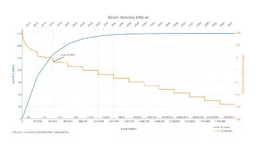

이 두 가지 특성으로 인해 비트코인은 세상을 혁신할 뿐만 아니라 규범을 깨는 강력한 기술 및 화폐 도구가 되었습니다.

이러한 특성 때문에 저를 포함한 많은 비트코인 사용자들은 비트코인이 바퀴, 복식부기, 전기, 심지어 인터넷과 같은 수준으로 우리 사회의 주요 혁신이라고 말할 준비가 되어 있습니다.

따라서 비트코인은 우리의 규범과 습관을 뒤흔드는 '0에서 1'입니다.

처음 접하는 기술이라면, 역할과 목적을 잘 이해하지 못할 수도 있는 기술에 계속 노출되기 전에 BTC 101을 따라해 보시길 적극 권장합니다.

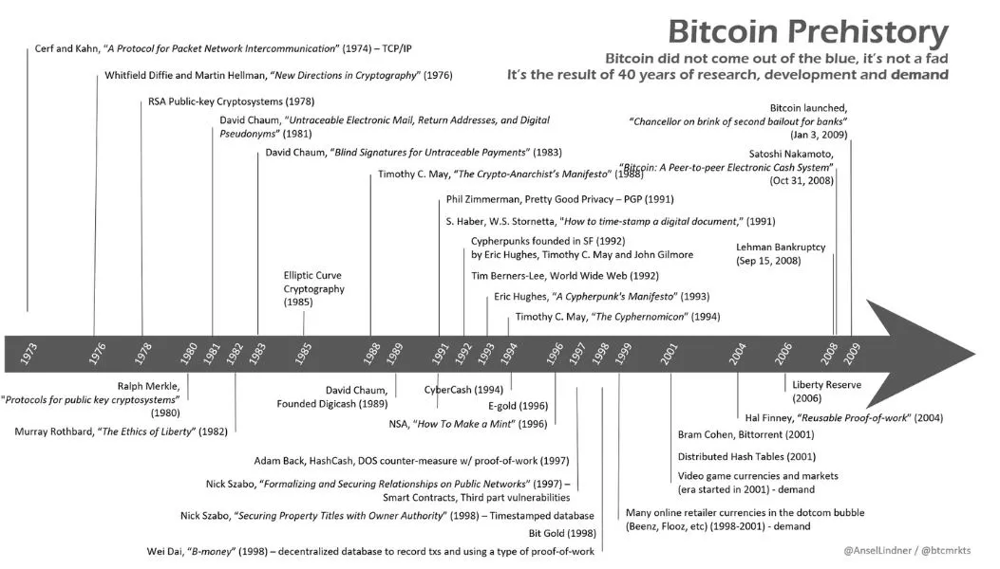

## 비트코인이 중요한 이유는 무엇인가요?

<chapterId>d4327ac4-9ff8-5192-b542-cb78c0bd0aa7</chapterId>

비트코인의 중요성이 왜 그렇게 중요한가요? 이것이 이 대학의 핵심 질문입니다. 공부든 투자 전략이든 비트코인의 중요성을 명확히 이해하지 못하면 실행 계획에서 벗어날 위험이 있습니다. 따라서 비트코인의 기본을 항상 염두에 두고 자신의 신념에 부합하는 전략을 세우는 것이 목표입니다.

버락 오바마는 비트코인을 "주머니 속의 스위스 은행"이라고 표현한 적이 있습니다. 실제로 비트코인은 신분에 관계없이 모든 사람에게 동일한 기회를 제공합니다. 10대 청소년이든, 대통령이든, 홍콩의 시위대이든, 프랑스의 '노란 조끼'이든, 누구나 동일한 프로토콜과 동일한 도구를 동등하게 이용할 수 있습니다:

1. 무료 및 무제한 계정 만들기.

2. 어디서나 누구에게나 송금할 수 있습니다.

3. 신분증이나 서류 작업이 필요 없습니다.

4. 연령, 성별, 종교, 국가, 소득 수준에 관계없이 모든 사람이 이용할 수 있습니다.

5. 온디맨드 개인정보 보호 및 투명성.

6. 중개자 또는 숨겨진 수수료가 없습니다.

7. 비트코인은 인터넷 기반이므로 인터넷에 액세스할 수 있는 사람이라면 누구나 이용할 수 있습니다.

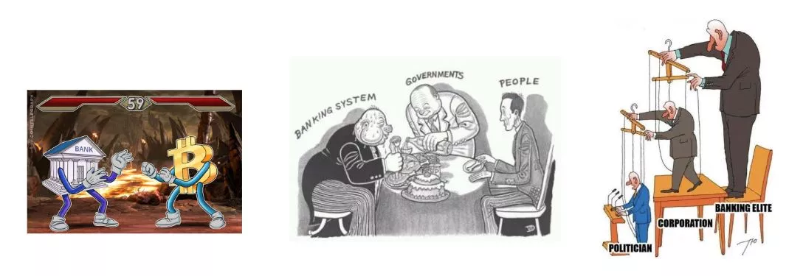

요약하자면 비트코인은 '인민의 화폐'라고 할 수 있습니다.

오늘의 철학적 질문: 비트코인 세계에서는 두 가지 이데올로기가 상충하고 있습니다. 은행 시스템에 속하지 않은 수십억 명의 사람들을 은행 시스템으로 끌어들이고 싶으신가요? 아니면 은행 시스템에 있는 수십억 명의 사람들을 은행 시스템에서 빼내고 싶으신가요?

이 질문은 다시 생각해 볼 필요가 있으며 나중에 다시 다룰 예정입니다.

수십억 명의 사람들이 제대로 관리되지 않는 통화 정책의 해로운 영향 아래 살고 있으며, 이는 장기적으로 심각한 금융 위기로 이어지는 경우가 많습니다. 이러한 유형의 위기는 인류의 역사에서 수백 번 발생했으며, 돈과 시간의 가치가 조작되는 한 계속 발생할 것입니다. 이러한 위기는 초인플레이션, 통화 통제, 통화 평가절하 등의 형태로 나타날 수 있습니다.

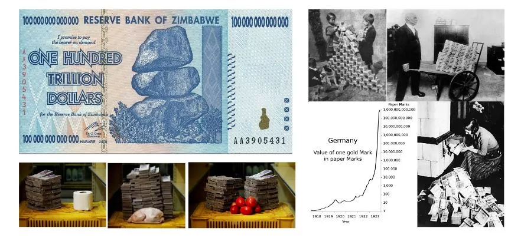

비트코인은 모든 개인에게 이 시스템을 벗어날 수 있는 기회를 제공합니다. 이는 모든 사람이 언젠가는 해야 할 윤리적 선택입니다. 비트코인은 검열에 대한 저항성, 분할 가능성, 휴대성 덕분에 법정화폐에서 건전한 화폐로의 전환을 촉진합니다.

**알고 계셨나요? 지난 100년 동안 55번 이상의 초인플레이션이 발생했습니다. 대부분 국가 경제를 완전히 파괴하고 국민의 저축을 소멸시켰으며 때로는 칠레, 독일 등의 사례처럼 독재 정권의 수립으로 이어진 정치적 불안정을 초래하기도 했습니다. 법정화폐의 파괴는 새로운 현상이 아니며 앞으로도 계속 일어날 것입니다. 하지만 비트코인 덕분에 이제 이 시스템을 벗어날 수 있는 기회가 생겼습니다.

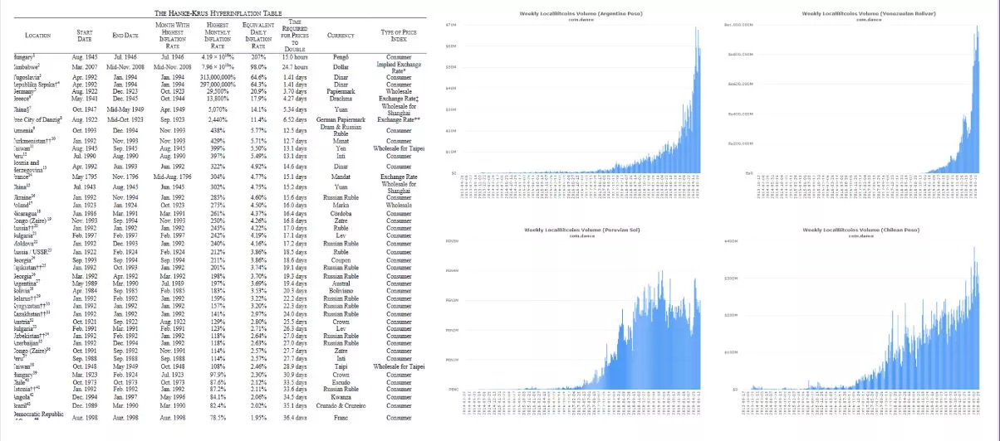

전 세계적으로 부의 불평등이 악화되면서 극단주의가 증가하고, 때로는 독재 정권이 수립되기도 합니다. 여러분이 누구든 언젠가는 가족, 자신, 재산을 보호하기 위해 프라이버시가 필요할 수 있습니다. 정치적으로 위협을 받는다면 자산을 어디에 숨길 수 있을까요?

- 은행 계좌는 동결, 압류 또는 비워질 수 있습니다.
- 금은 나누기 어렵고 운반과 사용이 복잡합니다.
- 현금은 부피가 크고 도난당하기 쉬우며 인플레이션의 영향을 받습니다.

비트코인은 정부의 통제 없이도 사람들이 저축을 안전하게 보호하고 휴대할 수 있게 함으로써 이러한 문제에 대한 해결책을 제시합니다. 전 세계 인구의 거의 절반이 적대적인 정권 아래 살고 있으며, 이들에게 비트코인은 그 누구보다 절실합니다.

비트코인은 시스템의 불공정에 대한 소극적인 항의의 한 형태입니다.

**알고 계셨나요**? 비트코인은 익명 주소입니다. 익명 주소는 사용자 간에 비트코인을 저장하고 교환하는 데 사용됩니다. 하지만 각 거래는 누구나 확인할 수 있도록 공개 원장(블록체인)에 기록됩니다. 즉, 사용자의 이름은 공개되지 않지만 거래 내역은 완전히 투명하게 공개됩니다.

중앙은행은 인플레이션과 통화 창출 정책(양적 완화)을 통해 계속해서 구매력을 희석시키고 있습니다. 이는 수십 년에 걸쳐 화폐의 가치를 서서히 약화시켜온 숨겨진 세금입니다. 배당금, 채권, 부동산 투자로 인한 확실한 소득이 없다면 시간이 지날수록 가난해지는 반면 부자들은 계속 부자가 될 것입니다. 중앙은행의 행동으로 인해 오늘 1달러의 가치는 내일 1달러보다 낮아질 수 있습니다.

이 시스템은 수년간의 상환과 부채에 대한 이자를 통해 빚을 지고, 소비하고, 은행가들을 배불리도록 부추깁니다. 이는 실수가 아니라 은행가와 정치인들이 정부 지출과 경제 성장을 촉진하고 국민에게 더 많은 빚을 지게 하기 위해 고의적으로 실행한 전략입니다.

우리의 시스템은 중앙은행에 의해 손상되었습니다. 비트코인이 해결책입니다.

비트코인은 2,100만 개를 초과할 수 없으며, 정치인, 은행가 또는 기타 악의적인 개인이 이를 변경할 수 없습니다. 이 제한은 사토시가 비트코인 프로토콜에 설정한 것으로 현재로서는 변경할 수 없습니다. 이는 향후 100년간 비트코인의 인플레이션율을 결정합니다.

과거에는 금이 건전한 화폐로서 규제 역할을 했습니다. 하지만 1971년 이후 유로화, 달러 등 어떤 법정화폐도 금에 묶이지 않게 되면서 무한한 화폐 창출의 문이 열렸습니다. 브르르르르(인쇄기 소리 암시).

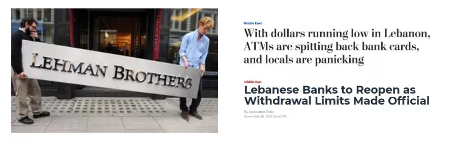

은행 계좌에 돈이 있다면 그 돈은 더 이상 내 소유가 아닙니다. 실제로는 은행이 그 돈을 사용할 수 있도록 빌려준 것입니다. 이러한 현실을 이해하고 인식하는 것이 중요합니다. 은행 계좌에 돈이 있다면 귀하는 실제로 은행의 채권자입니다. 이는 두 가지를 의미합니다:

1. 은행이 파산하면 돈을 잃을 위험이 있습니다.

2. 은행에서 환불을 거부하면 돈을 잃을 위험도 있습니다.

이러한 시나리오는 가능성이 낮다고 생각할 수도 있지만, 왜 이러한 시나리오가 거의 불가피한지 뒷장에서 살펴볼 것입니다.

반면 비트코인은 개방적이고 부패할 수 없는 시스템입니다. 규칙은 고정되어 있으며 모든 사람에게 동일하게 적용됩니다. "키가 아니라 비트코인을 소유하라"는 유명한 문구는 비트코인 지갑의 개인 키를 소유하는 것이 얼마나 중요한지를 강조합니다. 개인 키를 소유하면 그 안에 들어 있는 비트코인을 완전히 제어할 수 있습니다. 이 키를 갖고 있지 않다면 다른 사람이 대신 비트코인을 보유하고 있다는 뜻입니다. 이 경우 비트코인은 기존 은행과 관련된 위험과 유사한 위험에 노출됩니다.

주권을 되찾으려면 개인 키를 관리하고 비트코인을 직접 보호하는 것이 필수적입니다.

비트코인은 기존 금융 시스템에 대한 강력한 대안을 제공합니다. 비트코인을 사용하면 누구나 프라이버시를 보호하고, 인플레이션과 통화 평가절하로부터 보호하며, 권위주의 체제를 우회하고, 돈에 대한 주권을 되찾을 수 있습니다. 비트코인은 연령, 성별, 종교, 소득에 관계없이 누구나 이용할 수 있는 건전한 통화입니다. 비트코인을 채택함으로써 개인은 미래를 위해 저축하고, 중앙은행의 통제에서 벗어나 금융 생활에 대한 통제권을 되찾을 수 있습니다. 비트코인은 전 세계적으로 권력의 균형을 재조정하고 경제적 자유를 증진하는 도구입니다.

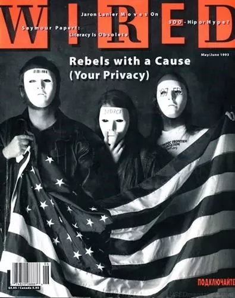

비트코인, 정치 운동?

오늘날 비트코인의 주요 지지자들은 여전히 주로 사이버 펑크족, 억압받는 시민, 무정부주의자, 오스트리아 경제학파의 추종자, 컴퓨터 엔지니어, 금융가, 표현의 자유 옹호자 등입니다.

비트코인은 고도의 철학적, 윤리적, 정치적 차원을 가지고 있으면서도 이러한 고려 사항에는 전혀 무관심합니다. 실제로 비트코인은 동일한 프로세스를 반복해서 재생산하는 단순한 프로토콜입니다. 비트코인을 현재의 금융 시스템에 대항하는 해방의 무기로 만든 것은 바로 비트코인 사용자들입니다. 사이버펑크의 관점에서 볼 때 비트코인은 현금 없는 사회에 반대합니다. 비트코인은 완전히 개인적이고 중개자 없는 디지털 금융 거래를 가능하게 합니다. 사이버펑크 운동에서 비트코인은 현금과 동등한 전자 화폐입니다.

## 비트코인 산업에 대한 이해

<chapterId>e106c6f1-d75b-5a62-b245-0ea2e4d02ef8</chapterId>

2009년 사토시 나카모토에 의해 비트코인이 등장하면서 수십억 달러 규모의 산업이 탄생했습니다. 이 산업은 아직 초기임에도 불구하고 지난 10년 동안 기하급수적으로 성장했습니다. 매일 새로운 플레이어들이 거액을 들고 이 새로운 산업에 뛰어들 준비를 하고 있습니다. 오늘날 이 산업은 정부, 은행, 거대 인터넷 기업 등이 다양한 개입을 통해 이 운동에 동참하면서 돌이킬 수 없는 지경에 이르렀습니다.

비트코인은 0 대 1로 되돌릴 수 없습니다. 어떤 사람들은 비트코인을 악의 화신으로 여기며 판도라의 상자가 열렸고 이제 자신들의 힘과 이점을 빼앗아간다고 생각할 것입니다. 그들은 이에 맞서 싸울 것입니다. 다른 이들은 비트코인에서 자유를 되찾고, 시스템을 바꾸고, 사회를 개선할 수 있는 기회를 발견할 것입니다. 그들은 그것을 받아들일 것입니다. 비트코인은 신경 쓰지 않고 그저 존재할 뿐입니다.

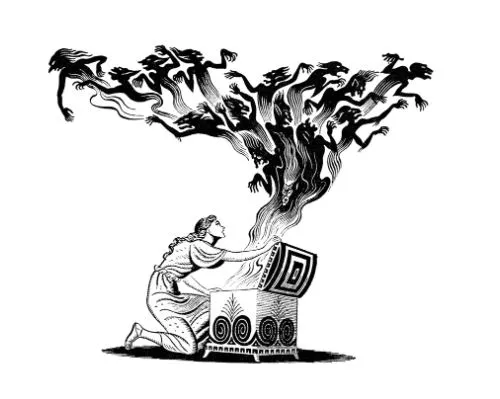

이 섹션에서는 우리가 진출하고자 하는 산업이 어떻게 작동하는지 더 잘 이해할 수 있도록 각 주체들에 대해 간략하게 살펴봅니다.

누구나 몇 분이면 자신만의 암호화폐를 설계할 수 있습니다. 그러나 이 토큰의 가치는 전적으로 시장에 의해 결정됩니다. 2019년 12월, 코인마켓캡에는 5000개 이상의 토큰이 상장되었습니다. 2023년 현재 이 숫자는 NFT, 탈중앙 금융 등을 포함해 23,000개 이상으로 증가했습니다. 이러한 암호화 토큰은 통화, 보안 토큰, 생태계를 위한 연료, 사이드체인, 디지털 아트 등 다양한 형태를 취할 수 있습니다.

이러한 새로운 '암호화폐'의 99.8%는 마케팅 담당자가 비트코인을 훔칠 목적으로 설정한 사기라는 사실을 이해하는 것이 중요합니다. 그러나 드물게 0.2%의 진지한 프로젝트 중에는 사용자에게 많은 혜택을 줄 수 있는 혁신적인 기술을 발전, 실험, 개발하기 위해 상당한 노력을 기울이고 있습니다. 시간이 지남에 따라 이 분야는 개선되어 실제 제품을 제공하는 합법적인 회사가 생겨날 것입니다. 비트코인이 아닌 다른 블록체인에서도 이런 일이 일어날지에 대한 질문은 여전히 열려 있습니다. 현재로서는 한 가지 확실한 것이 있습니다: 비트코인은 진정으로 탈중앙화되고, 검열에 저항하며, 무료이고, 수천 시간의 노동을 정당화하는 유일한 진지한 암호화폐라는 점입니다.

| 특징 | 비트코인 | 알트 코인 (99.9%) |

| ---------------- | ------------------------ | ------------------------ |

| 유동성 | 높음 | 낮음 | 낮음

| 채택(실제) | 높음 및 글로벌 | 낮음 | 낮음

| 팀 | 강력하고 분산된 팀 | 약하고 중앙 집중화된 팀 | 팀

| 평판 | 높음 및 글로벌 | 낮음 | 낮음

| 인프라 | 견고하고 안정적 | 약함

| 탈중앙화 | 예 | 아니요 | 아니요

| 사기?            | 아니요 | 아마도 |

| 가치?           | 예 | 논쟁의 여지가 있음 |

다음과 같은 문구에 속지 마세요:

- "비트코인이 아닌 블록체인"
- "XRP는 새로운 비트코인"
- "스테이블코인은 미래입니다"
- "리브라는 비트코인을 없앨 것이다"
- "개선된 새로운 비트코인을 만나보세요"
- "페드코인은 비트코인을 쓸모없게 만들 것이다"

알트코인의 세계를 탐구하기로 결정했다면 직접 조사하는 것이 필수적이지만 여기서는 안내해드리지 않습니다.

2017년의 ICO 버블 이후, 많은 주요 업체들이 '블록체인'을 사용하여 자체 데이터베이스를 개발하기 시작했습니다. 스웨덴, 유럽, 러시아, 중국 등 각국 정부와 중앙은행은 법정화폐의 디지털 버전을 만들 가능성을 모색하고 있습니다. 거대 기술 기업들도 이 경쟁에 동참하고 있습니다. 페이스북은 자체 스테이블코인 프로젝트인 "리브라"를 시작했습니다. 은행, 기업 및 기타 거대 기술 기업들은 Linux 또는 IBM "하이퍼레저"와 같은 솔루션을 통해 "블록체인"의 대안을 실험하고 있습니다.

| 특징 | 비트코인 | 알트 코인 | 페이스북 코인 | 페드 코인

| -------------------- | ------- | -------- | ------------- | -------- |

| 공개 | 예 | 다양함 | 아니요 | 아니요 | 아니요

| 열기 | 예 | 다양함 | 아니요 | 아니요 | 아니요

| 경계 없음 | 예 | 다양함 | 아니오 | 아니오 | 아니오

| 중립 | 예 | 다양함 | 아니오 | 아니오 | 아니오

| 검열 저항성 | 예 | 다양함 | 아니오 | 아니오 | 아니오

이러한 프로젝트는 비트코인과 경쟁한다고 주장하지만, 통제권을 보장하고 현지 규정을 준수하기 위해 중앙 집중식 구조를 유지하고 있습니다. 이러한 프로젝트는 개인 정보 보호가 아니라 오히려 대규모 감시를 강화할 것입니다. 페이스북의 '리브라' 프로젝트는 비트코인이 아닌 은행의 경쟁자로 자리매김했습니다. 또한 작업 증명 없이는 '블록체인'은 실질적인 가치가 없습니다. 리브라는 이후 폐기되었고, 비트코인과 달리 현재 전 세계적으로 진정한 프라이빗 블록체인 프로젝트가 사용되고 있지 않다는 점에 유의해야 합니다.

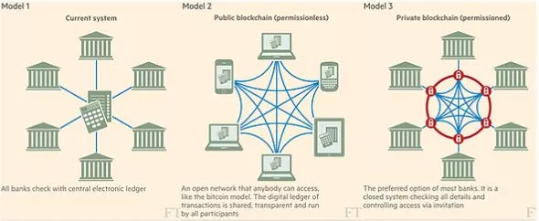

비트코인 프로토콜은 규제의 손이 닿지 않는 곳에 있습니다. 비트코인을 중심으로 활동하는 행위자만 규제할 수 있으며, 비트코인은 탈중앙화되어 있어 법률, 세금, 규정이 국가마다 다릅니다. 예를 들어 중국은 여러 차례 비트코인 사용을 금지한 반면 캐나다, 스위스, 몰타 같은 국가에서는 비트코인에 대해 보다 우호적인 입장을 취하고 있습니다. 대부분의 국가에서는 새로운 규칙과 규정을 개발하기 위해 암호화 태스크포스를 구성했습니다. 그러나 이 과정은 느리고 규칙이 자주 변경될 수 있습니다. 이러한 느린 속도에도 불구하고 비트코인과 암호화폐는 많은 대화의 중심에 있습니다.

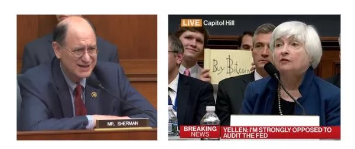

해당 국가의 상황에 대해 철저히 조사하는 것이 좋습니다. 은행도 비트코인과 관련하여 엄격한 규제를 받고 있습니다. 많은 은행이 비트코인을 거래하는 기업의 계좌를 폐쇄하고 금융 서비스 이용을 제한하는 한편, 자체 인프라를 개선하기 위해 이 새로운 기술을 연구하는 연구팀을 구성하기도 합니다. 어떤 규제 기관, 은행, 정부도 권력을 잃고 싶지 않기 때문에 비트코인을 다룰 준비를 하고 있습니다. 비트코인은 단일 주체에 의해 수정되거나 통제될 수 없다는 점에 유의하는 것이 중요합니다.

거래소 플랫폼은 법정화폐(정부 발행 화폐)와 암호화폐를 연결하는 역할을 합니다. 고객은 플랫폼을 통해 암호화폐를 구매하거나 판매할 수 있습니다. 거래소 플랫폼마다 각기 다른 특성이 있습니다. 다음은 고려해야 할 몇 가지 측면입니다:

- 보안에 대한 좋은 평판
- 충분한 유동성
- 효율적인 고객 서비스
- 직관적인 사용자 인터페이스
- 자동 구매 옵션
- 지갑으로 비트코인을 자동으로 출금합니다.

대부분의 합법 거래소 플랫폼은 현행 은행 규정을 준수합니다. 또한 계정을 만들기 위해 신분증을 제공해야 하는 엄격한 고객알기제도(KYC)를 시행하고 있습니다. 따라서 구매 솔루션 업계는 곧 자세히 살펴보겠지만 KYC와 비 KYC로 나눌 수 있습니다.

**주의**: '빅 브라더'는 당연히 사용자의 안전을 위해 사용자를 감시하고 있습니다. 정부에서 사용자의 데이터를 사용하여 사용자의 활동을 추적할 수 있습니다.

거래소 플랫폼의 스펙트럼에는 크게 5가지 유형이 있습니다:

- 윤리적 교환 플랫폼: 간단하고 정직한 서비스를 제공하여 사용자를 존중하는 솔루션입니다. 이러한 플랫폼은 일반적으로 달러 코스트 애버리징(DCA) 솔루션과 사용자 지갑으로 자금을 자동 출금하는 기능을 제공합니다. 이는 초보자에게 가장 적합한 솔루션입니다. (예: 릴라이, 불 비트코인, 스택인샛)
- P2P 거래소 플랫폼: 사용자 간에 직접 비트코인을 사고 팔 수 있습니다. 해당 도시에서 거래를 체결할 사람을 찾을 수 있습니다. 이러한 거래 시 주의해야 하며 안전한 공공장소에서 거래를 체결하는 것을 선호합니다. 이러한 비 KYC 솔루션은 약간 고급 사용자에게 매우 유용합니다. BTC 205에서 자세히 살펴보도록 하겠습니다. (예: 비스크, 피치, 로보샛)
- 알트코인 거래소 플랫폼: 이러한 플랫폼을 통해 거래하고자 하는 다양한 알트코인을 사고 팔 수 있습니다. 이를 위해 BTC를 입금하거나 신용카드를 사용할 수 있습니다. 알트코인은 매우 신중해야 하며 달러가 아닌 비트코인으로 성능을 평가하는 것이 좋습니다. 본질적으로 이러한 플랫폼은 규제되지 않은 자산(종종 안전하지 않은)으로 이루어진 거대한 카지노와 같습니다. 저희는 이를 권장하지 않습니다. (대표적인 예: 비트파이넥스, 크라켄, 비트스탬프)
- 트레이딩 거래소 플랫폼: 비트코인 및 기타 암호화폐를 레버리지로 거래할 수 있으며, BTC를 담보로 사용할 수 있습니다. 파생상품 계약도 거래할 수 있습니다. 레버리지를 사용할 때는 주의하세요! 비트코인을 거래하지 않는 것이 가장 좋습니다. 마찬가지로 초보자에게도 이러한 유형의 솔루션을 권장하지 않습니다. (예: 바이낸스)
- 의심스러운 거래소 플랫폼: 규제를 받지 않는 일부 플랫폼은 의심스럽고 거래량을 조작할 수 있으며 보안에 결함이 있는 경우가 많습니다. 이러한 플랫폼은 러시아, 중국 또는 다크넷 전용인 경우가 많습니다. 위험은 사용자가 감수해야 하지만 이러한 플랫폼은 피하는 것이 좋습니다.

거래소 플랫폼에서 비트코인을 출금하는 것을 잊지 마세요. 거래소 플랫폼은 해킹당하거나, 압류당하거나, 파산하거나, 단순히 돈과 함께 사라질 수 있습니다. 이는 상당한 위험을 수반하므로 가능한 한 피해야 합니다. 자금을 장시간 그곳에 맡겨두지 마세요. 키를 가지고 있지 않다면 비트코인은 내 것이 아니라는 점을 기억하세요.

비트코인은 돈을 보관하는 디지털 금고인 '지갑'에 저장됩니다. 키 소유자만 액세스할 수 있습니다. 지갑은 하드웨어 장치, 애플리케이션 소프트웨어, 심지어 종이 한 장일 수도 있습니다. 이러한 지갑은 비트코인과 외부 세계 사이의 간극을 메워주는 역할을 합니다.

지갑마다 특성이 다릅니다:

- 개인 정보 보호
- 보안
- 사용 편의성
- 비용.

따라서 업계에서는 지갑 공급업체를 여러 섹션으로 나눌 수 있습니다:

- 하드웨어 지갑 제작자. 이 분야에는 많은 회사가 경쟁하고 있습니다. 일부는 오픈 소스이고, 다른 일부는 다소 비싸고 기능이 다소 적은 하드웨어 지갑을 제공합니다(예: 레저, 트레저, 코인라이트, 시프트크립토).
- 소프트웨어 지갑 제작자; 모바일 또는 컴퓨터용 소프트웨어 지갑을 만들고자 하는 회사 또는 독립 행위자(예: Wizard Sardine, Galoy, Synonyme, Blockstream)입니다.
- DIY(스스로 해보세요) 지갑: 제작 또는 창작 체인의 다른 주체에 대한 신뢰 위험을 줄이기 위해 집에서 만들 수 있는 100% 오픈 소스 솔루션(예: 씨앗서명자, 스펙터 DIY)을 보유하고 있습니다.

지갑은 비트코인의 중요한 측면이며, 이번 강좌에서는 지갑에 대해 자세히 살펴보겠습니다.

채굴자는 네트워크 보안을 책임집니다. 이들은 전기를 사용하여 새로운 블록을 생성하는 비트코인의 작업 증명 프로세스를 수행합니다. 필요한 경우 BTC 101 강좌에서 채굴자에 대한 주제를 자세히 다루었습니다. 더 자세히 알아보시려면 마이닝 201 과정을 참고하시기 바랍니다.

이 산업은 매우 방대한 규모라는 점을 이해하는 것이 중요합니다.

개별적으로 시작했지만, 오늘날의 채굴 업체는 일반적으로 매우 어려운 분야에서 경쟁하는 대규모의 자금력을 갖춘 기업입니다. 이들은 경쟁 우위를 확보하기 위해 값싼 에너지원을 찾습니다. 채굴자는 공개 또는 익명으로 운영되며 전 세계 어느 곳에나 존재할 수 있습니다.

그들의 산업은 다양한 규모의 많은 행위자들로 나뉩니다:

- 채굴 하드웨어 제작자(예: 비트메인): 효율적인 ASIC을 만드는 것은 매우 복잡하기 때문에 이러한 회사는 업계에서 필수적인 연결고리입니다.
- 채굴 소프트웨어 제작자: 채굴 풀을 만들거나 ASIC에서 사용하는 도구를 만드는 등 채굴 소프트웨어는 업계에서 매우 중요한 부분입니다(예: Braiins OS).
- StratumV2와 같은 혁신적인 솔루션을 개발하는 개발자.
- 채굴자: 기계와 소프트웨어를 사용하여 채굴 작업을 시작하는 사람들입니다. 마이닝 201 강좌에서 배운 대로 S9을 사용하는 소규모 아마추어 채굴자부터 텍사스에 대규모 창고를 소유하고 채굴을 하는 Galaxy와 같은 국제적인 채굴자까지 있습니다.

채굴은 별도의 분야이므로 에너지 측면에 관심이 있으시다면 만족하실 것입니다.

비트코인은 오픈 소스 프로토콜입니다. 해당 코드는 GitHub(https://github.com/bitcoin/bitcoin)에서 찾을 수 있습니다. 여기에서 모든 업데이트 제안서, 문서 및 수많은 커뮤니티 토론에 액세스할 수 있습니다. 모든 것이 투명하게 공개되어 있으며 업데이트 여부는 사용자가 결정할 수 있습니다. 주요 비트코인 개발자가 이 GitHub를 관리합니다. 이들은 소스 코드를 업데이트하고, 버그를 확인하고, 전반적인 프로젝트 관리를 감독합니다.

비트코인 개발자는 여러 섹션으로 나눌 수 있습니다:

- 비트코인 코어 개발자: 비트코인 프로토콜의 주요 개발과 핵심 기능을 담당합니다.
- 보조 프로토콜 개발자(예: 라이트닝 네트워크 또는 RGB): 이들은 비트코인 생태계에 통합되고 기능을 확장하는 추가 프로토콜을 개발합니다.
- 도구와 애플리케이션을 만드는 아마추어 개발자(예: 멤풀 또는 앨비): 이들은 비트코인 사용을 용이하게 하는 도구, 서비스 또는 애플리케이션을 개발하여 비트코인 생태계에 기여합니다.

누구나 코드에 기여할 수 있지만, 실제로 비트코인 코드를 수정하는 것은 길고 복잡한 과정이라는 점에 유의해야 합니다. 또한, 많은 비트코인 개발자는 수년 동안 비트코인 개선 제안(BIP)을 개발하는 데 헌신하는 열성적인 분들입니다. 따라서 비트코인은 복잡하고 때로는 예측할 수 없는 산업입니다. 이러한 측면을 자세히 살펴보겠습니다.

무제한 권한? 아니요. 핵심 개발자는 무제한의 권한을 가지고 있지 않으며 비트코인을 수정하거나 제어할 수 없습니다. 권력을 쥐고 있는 것은 노드입니다. 아무도 비트코인을 통제할 수 없습니다.

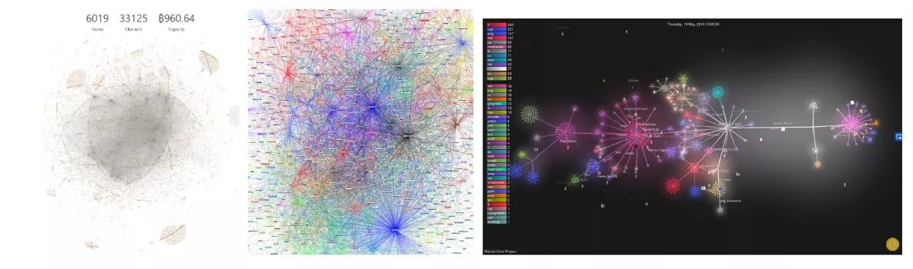

## 비트코인의 계층화된 아키텍처

<chapterId>03017765-53cf-5f14-9682-e99ca02d2241</chapterId>

오픈 소스 프로토콜인 비트코인은 누구나 추가할 수 있는 프로토콜/애플리케이션 레이어를 통해 보완하고 강화할 수 있습니다. 이러한 기능 중 일부는 다른 기능보다 더 중요하며, 수많은 기업이 인프라 개발에 기여하는 역동적인 생태계를 형성합니다. 이러한 프로젝트의 예로는 사이드체인(예: 블록스트림의 리퀴드 체인), 라이트닝 랩스의 라이트닝 네트워크, 신원 개념(예: 마이크로소프트 이온) 등이 있습니다. 이러한 프로젝트는 원래 비트코인 프로토콜에 추가된 추가 레이어와 같습니다.

**알고 계셨나요**? 인터넷은 한 조각으로 만들어진 것이 아닙니다. HTTP, TCP, IP 등 여러 계층의 프로토콜이 서로 겹겹이 쌓여 만들어진 결과물입니다. 이러한 방식으로 각 계층은 특별히 할당된 작업을 수행하는 데 매우 효율적이며, 다른 계층은 다른 요구 사항을 처리합니다.

이제 누구나 라이트닝에 액세스할 수 있으며, 비트코인의 애플리케이션 레이어입니다

라이트닝 네트워크는 비트코인의 두 번째 레이어입니다. 이를 통해 비트코인은 더 많은 기능을 확장하고 얻을 수 있습니다. 이는 거래가 종이에 남아 있다가 마지막에 정산되는 바의 탭처럼 작동합니다. 이에 대해서는 나중에 자세히 살펴보겠습니다.

마지막으로, 이 산업에는 기업, 판매자, 사용자 등 수백만 명의 전통적인 행위자들도 포함된다는 것은 말할 필요도 없습니다.

오늘날 비트코인을 비즈니스에 도입하는 것은 많은 설정 시간이 필요하지 않은 다양한 도구 덕분에 간단한 현실이 되었습니다:

- OpenNode
- 스위스 비트코인 페이
- BTCPay

비트코인을 일상 생활에서 사용하거나, 비즈니스에 도입하거나, 교육이나 코드에 기여하거나, 그 이상의 혁신을 이루는 등 누구나 참여할 수 있는 시점에 도달했습니다. 요컨대, 비트코인은 더 이상 멈출 수 없습니다.

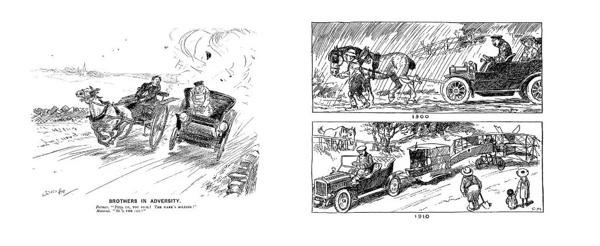

"비트코인 고속도로"라는 은유는 업계와 비트코인 인프라의 미래를 설명하는 가장 정확한 비유 중 하나인 것 같습니다. 비트코인은 대안 금융 시스템으로 자리매김하고 있습니다. 아직 젊고, 성숙해가는 과정에 있으며, 자체적인 결함이 있지만, 그럼에도 불구하고 견고합니다. 비트코인은 사라지지 않을 것이며, 블랙홀처럼 시간이 지남에 따라 경로에 있는 모든 것을 흡수할 것입니다.

BTC는 우리가 여행하는 도로로 볼 수 있습니다. 자동차를 수리하거나 주유를 하거나 식량을 구매해야 할 때, 여러분은 필요에 따라 기존 금융 시스템으로 돌아가기 위해 이 BTC 도로를 떠나야만 합니다.

그러나 인프라가 충분히 효율적이면 더 이상 기본적인 필요를 충족하기 위해 이 도로를 떠나지 않아도 됩니다. 그러면 이 도로는 교통량의 90%가 최고 속도로 달리고 10%만이 감속하거나 멈추는 고속도로로 변모할 것입니다. 비트코인이 이러한 고속도로로 변모하면 사람들은 더 이상 구매를 위해 도로를 떠나지 않을 것입니다. 이 고속도로에서 상품과 서비스에 직접 접근할 수 있게 될 것이며, 이전 시스템으로 돌아가는 것은 드물고 위험하며 지루한 일이 될 것입니다.

이것이 제가 생각하는 비트코인의 미래 비전입니다. 비트코인은 인터넷 트래픽과 전 세계 인구의 90%를 위한 고속도로가 될 것입니다. 기존 시스템과 인프라는 사라지지는 않겠지만 비트코인 고속도로에 적응하지 못하면 쓸모없는 존재가 될 것입니다.

이것이 제가 생각하는 비트코인의 미래 비전입니다. 비트코인은 인터넷 트래픽과 전 세계 인구의 90%를 위한 고속도로가 될 것입니다. 기존 시스템과 인프라는 사라지지는 않겠지만 비트코인 고속도로에 적응하지 못하면 쓸모없는 존재가 될 것입니다.

제가 착각하지 않았다면 안드레아스 안토노풀로스가 이 아이디어를 소개해 주었습니다. @aantonop

# 요금제 설정

<partId>3801faf6-7915-56fa-baf5-ee63ad03b7cf</partId>

## 프로필 선택

<chapterId>c5d87903-a5f2-5eec-887a-f662734ce49b</chapterId>

이제 기본적인 기본 사항을 검토하고 사기와 금전적 손실을 피하는 방법을 배웠으니 계획을 세울 수 있습니다. 계획은 시작하기는 매우 간단하지만 일단 시작하는 것이 중요합니다. 시간이 지나면서 언제든지 수정할 수 있습니다.

이 과정에서는 비트코인 초보자라고 가정하고, 따라서 솔루션은 간단하고 빠르게 구현할 수 있으며 효과적이어야 한다고 가정합니다. 채굴을 통한 비트코인 노출, 주식 시장의 비트코인 회사 또는 기타 복잡한 문제에 대해서는 다루지 않겠습니다. 목표는 여러분에게 적합한 지갑을 선택한 다음, 첫 비트코인을 얻기 위한 올바른 솔루션을 선택하는 것입니다.

다음 질문을 스스로에게 던져보는 것부터 시작하겠습니다:

- 매달 비트코인에 얼마를 투자할 의향이 있으신가요?
- 비트코인을 어떤 용도로 사용할 계획이신가요?
- 예상 투자 기간은 어떻게 되나요?
- 개인정보 보호가 얼마나 중요한가요?

이 4가지 질문을 통해 자신에게 가장 적합한 경로를 선택할 수 있습니다! 사실 비트코인을 접할 수 있는 마법의 해결책은 없습니다. 대신, 일반적인 프로필을 살펴보고 영감을 얻을 수 있도록 하는 것이 좋습니다.

일반적으로

- 소액을 위한 무료 핫월렛
- 대용량 콜드월렛
- 스트레스 없이 반복 구매를 위한 DCA 솔루션 사용
- 익명성을 위해 비 KYC 솔루션 사용
- 일회성 구매는 기존 거래소 플랫폼을 사용하세요.

이를 통해 자신에게 적합한 요금제를 찾아 적절한 요금제를 선택한 다음 다음 섹션의 올바른 튜토리얼을 따라야 합니다.

**참고: ** 개인 키(24단어 목록)를 소유하지 않은 경우, 제삼자가 비트코인의 보안을 책임집니다. 즉, 회원님은 더 이상 비트코인을 소유하지 않습니다. 해킹, 압류, 규제, 파산 등 거래소 플랫폼과 동일한 위험에 노출될 수 있습니다.

## 호들러

<chapterId>baf1adc2-3828-5265-8ee5-130be547585c</chapterId>

투자든 비트코인이든 일반적으로 장기 보유가 일반적입니다. 장기 보유는 통계적으로 장기적으로 가장 수익성이 높고 실행하기 가장 간단합니다:

구매 후 아무것도 하지 않습니다. (아무것도 하지 않는 것이 가장 어려운 부분입니다.)

비트코인에서는 이러한 유형의 프로필을 호들러라고 부르는데, 이는 비트코인을 장기적으로 '호들'(보유)하기 때문입니다. 따라서 이들은 비트코인이 미래에 더 널리 사용될 것이고 따라서 더 희소해질 것이라고 베팅하며 비트코인에 노출되어 있습니다. 이들은 수시로 자동으로 비트코인을 계속 구매하며, 모두 콜드월렛에 안전하게 보관합니다.

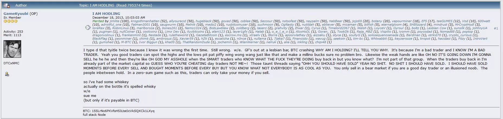

### 계획은 다음과 같습니다:

1. 콜드월렛을 설정하여 상당한 금액을 안전하게 보관하세요.

2. 거래소 플랫폼을 통해 한 번에 비트코인을 구매하고 정기 구매 플랜을 설정하세요.

3. 상속 계획을 설정하세요.

4. 오랜 시간 기다리기(최소 1~2주기)

3년 동안 비트코인을 보유하고 있었다는 사실을 잊어버려도 전문가의 지시를 따랐다면 돈은 여전히 존재할 것입니다.

이러한 유형의 프로필의 경우 Bitbox02, Trezor 또는 Ledger와 같은 콜드월렛을 사용하는 것이 좋습니다. 이러한 장치는 약 70유로 정도의 비용이 들지만 장기적으로 비트코인을 어느 정도 안전하게 보호해줍니다. 무료 핫월렛 모바일 앱도 이 기능을 수행할 수 있지만, 비교적 적은 금액만 보관할 수 있습니다.

관련 지갑 튜토리얼:

https://planb.network/tutorials/wallet/hardware/ledger-c6fc7d82-91e7-4c74-bad7-cbff7fea7a88
https://planb.network/tutorials/wallet/hardware/bitbox02-6af8940f-e19b-4008-8c83-81017032608c
https://planb.network/tutorials/wallet/hardware/coldcard-5d44dd94-423d-4e37-9a8c-3fc38b45ce59
https://planb.network/tutorials/wallet/hardware/trezor-441fa7a1-4aac-4b6a-984f-3dd428ba0c84
교환 옵션:

https://planb.network/tutorials/exchange/centralized/bitstamp-5a36c896-bff5-46d7-b505-ff069c3ac47c
https://planb.network/tutorials/exchange/centralized/bitfinex-dc306d39-bd96-4ab9-a278-a322316716db
https://planb.network/tutorials/exchange/centralized/kraken-1ef03e25-9b42-49bd-a47d-249e1a13cfc6
호들러가 더 나아가고 싶다면 스태커와 같은 DCA 플랜을 구현하고 비트코인을 사용할 때 핫 LN 지갑을 사용하세요.

### 여러분을 위한 건가요?

다음은 호들러의 간단한 심리 프로필로, 자신을 알아본다면 여러분을 위한 것일지도 모릅니다!

- 인내심:

호들러는 뛰어난 인내심을 보여줍니다. 이들은 단기적인 시장 변동에 영향을 받지 않고 투자한 자산의 성장을 확인하기 위해 몇 년을 기꺼이 기다립니다.

- 장기 비전:

이들은 장애물과 비판에도 불구하고 비트코인의 가치와 채택 증가를 굳게 믿고 장기적인 비전을 가지고 있습니다.

- 자기 훈련:

호들러는 극도로 절제된 투자자입니다. 앞서 언급했듯이 가장 어려운 부분은 아무것도 하지 않는 것이며, 단기적으로 가격이 최고조에 달했을 때 매도 유혹을 뿌리치려면 엄청난 자제력이 필요합니다.

- 복원력:

가격 하락과 시장 변동성에도 불구하고 호들러는 투자와 비트코인의 미래 성장에 대한 믿음을 유지하며 탄력적으로 대응하고 있습니다.

- 기술에 대한 믿음:

호들러는 단순한 이익 추구를 넘어 블록체인 기술과 비트코인이 세상에 긍정적인 변화를 가져올 수 있다고 믿습니다.

요약하자면, 호들러는 비트코인의 장기적인 가치를 굳게 믿고 미래에 상당한 수익을 얻기 위해 단기 변동성을 기꺼이 감내하는 인내심과 절제력, 선견지명이 있는 투자자입니다. 이들은 투자 전략을 체계적으로 세우고 보안과 장기 계획에 주의를 기울입니다.

## 스태커

<chapterId>0daf450d-1b91-5d99-9c31-b52ab52a5e21</chapterId>

비트코인에서 "스태커"라는 개념은 꽤 잘 알려져 있습니다. 아이디어는 간단합니다. 비트코인은 2,100만 개밖에 없으며, 모든 작은 비트코인이 중요합니다! 이 작은 비트코인을 실제로 사토시(또는 SAT)라고 부릅니다. 스태커의 목표는 가능한 한 많이 모으는 것입니다.

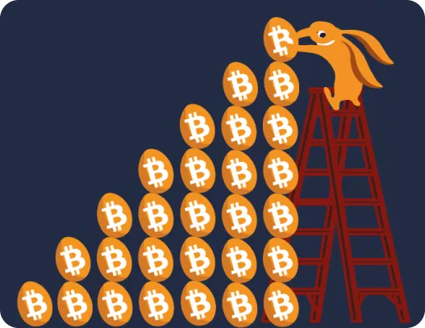

### 계획

이를 위해 가능한 한 노출을 극대화하려고 노력할 것입니다. 따라서 매주 조금씩 매수할 수 있는 달러 코스트 애버리징(DCA) 플랜을 만들 것입니다. 이는 큰 초기 자본 없이 비트코인에 노출되기 시작할 수 있는 최고의 솔루션입니다. 주당 10유로든, 주당 25유로든, 한 달에 100유로든, 중요한 것은 너무 많이 생각하지 않고 사토시를 모으는 것입니다. 계획은 아주 간단합니다:

1. 핫월렛을 설정합니다.

2. 거래소 플랫폼에서 DCA 플랜을 설정하세요.

3. 기다렸다가 사토시를 축적할 수 있는 다른 솔루션을 찾아보세요.

다른 해결책으로는 비트코인으로 상품이나 서비스를 판매하여 더 많이 모으는 방법이 있습니다. 친구에게 비트코인으로 상환을 요청하거나 혁명에 더 가까이 다가가기 위해 생태계에 참여하기 시작합니다.

### 튜토리얼:

빠른 적립을 위한 핫월렛

https://planb.network/tutorials/wallet/mobile/blue-wallet-2f4093da-6d03-4f26-8378-b9351d0dbc90
https://planb.network/tutorials/wallet/mobile/blockstream-green-e84edaa9-fb65-48c1-a357-8a5f27996143
https://planb.network/tutorials/wallet/mobile/phoenix-0f681345-abff-4bdc-819c-4ae800129cdf
장기적인 보안을 위한 콜드월렛

https://planb.network/tutorials/wallet/hardware/ledger-c6fc7d82-91e7-4c74-bad7-cbff7fea7a88
https://planb.network/tutorials/wallet/hardware/bitbox02-6af8940f-e19b-4008-8c83-81017032608c
https://planb.network/tutorials/wallet/hardware/coldcard-5d44dd94-423d-4e37-9a8c-3fc38b45ce59
https://planb.network/tutorials/wallet/hardware/trezor-441fa7a1-4aac-4b6a-984f-3dd428ba0c84
비트코인을 축적할 수 있는 DCA 플랫폼입니다.

https://planb.network/tutorials/exchange/centralized/relai-v2-30a9671d-e407-459d-9203-4c3eae15b30e
https://planb.network/tutorials/exchange/centralized/bull-bitcoin-60a58596-e54c-41ba-855d-f9edb76cfb0e
물론 이러한 유형의 프로필은 호들러처럼 브로커를 이용해 한 번에 대량으로 구매할 수도 있지만, 일반적으로 스태킹은 지갑에 정기적으로 사트를 추가하는 개념입니다. 더 일반적인 접근 방식은 P2P 방식으로 비트코인을 사용하는 방법을 배워 친구나 비트코인 커뮤니티의 회원과 함께 현금으로 직접 비트코인을 구매하는 것입니다.

### 여러분을 위한 건가요?

스태커의 심리적 초상화

- 전략적이고 체계적입니다:

스태커는 비트코인을 축적하는 방식에 있어 전략적으로 접근합니다. 이들은 신중하게 투자 계획을 세우고 DCA(달러 비용 평균화) 계획을 체계적으로 실행합니다.

- 목표 지향적:

이들의 주요 목표는 분명합니다. 가능한 한 많은 사토시를 모으는 것입니다. 이 초점은 가격이 급등하든 급락하든 상관없이 그들의 행동과 투자 결정을 안내합니다.

- 금융 지식:

이들은 분산투자와 정기적인 투자의 중요성을 이해하여 위험을 최소화하고 잠재적 수익을 최적화합니다. 이는 가격 평균화를 통해 달성되므로 단기적인 가격 변동에는 관심이 없습니다.

- 선제적:

상품이나 서비스를 판매하거나 비트코인 생태계 내에서 다른 방법을 모색하는 등 비트코인을 벌 수 있는 추가 기회를 적극적으로 찾습니다.

스태커는 사토시 축적을 극대화하기 위한 명확한 계획을 가지고 있는 체계적이고 집중력 있는 개인입니다. 이들은 적극성과 금융 지식을 보여주며 비트코인 투자를 최적화하고 안전하게 보호할 수 있는 방법을 끊임없이 모색합니다. 이들의 접근 방식은 일관성과 완벽한 조직이 특징이며, 비트코인 포트폴리오를 꾸준하고 지속적으로 성장시킬 수 있는 길을 열어줍니다.

## 사용자

<chapterId>e0a022ab-207c-571f-b4ad-c432214a756c</chapterId>

마지막으로, 입문 과정에서 언급할 수 있는 마지막 유형의 비트코이너는 비트코인을 정기적으로 사용해야 하는 비트코이너입니다. 직업적 의무 때문이든 단순히 생태계를 지원하고자 하는 욕구 때문이든, 자주 사용하기에 적합한 솔루션을 제공해야 합니다.

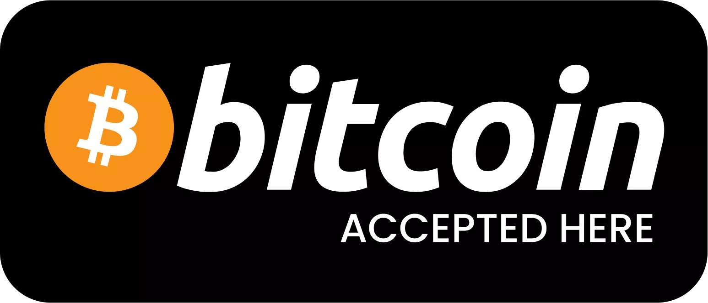

### 계획

이 사용자의 경우 두 가지 유형의 지갑이 필요할 수 있습니다:

- 비트코인을 장기간 안전하게 보관할 수 있는 콜드월렛입니다.
- 매일 사용하기 위해 정기적으로 비트코인을 주고받을 수 있는 핫월렛입니다.

이러한 유형의 프로필은 일상적인 거래에는 라이트닝 네트워크 기반 지갑을, 장기 보관에는 하드웨어 지갑을 선택할 가능성이 높습니다.

비트코인에 자신을 노출하기 위해 이 유형의 프로필에는 몇 가지 옵션이 있습니다:

- Peach와 같은 P2P 솔루션을 사용하여 KYC 없이 비트코인을 빠르게 구매하거나 판매할 수 있습니다.
- 거래소 플랫폼을 사용하여 필요에 따라 정기적으로 비트코인을 사고 팔 수 있습니다.

### 튜토리얼

핫월렛 LN

https://planb.network/tutorials/wallet/mobile/phoenix-0f681345-abff-4bdc-819c-4ae800129cdf
https://planb.network/tutorials/wallet/mobile/wallet-of-satoshi-c4792842-b046-44f9-a6f1-351191b7cc2b
https://planb.network/tutorials/wallet/mobile/breez-46a6867b-c74b-45e7-869c-10a4e0263c06
콜드 월렛

https://planb.network/tutorials/wallet/hardware/ledger-c6fc7d82-91e7-4c74-bad7-cbff7fea7a88
https://planb.network/tutorials/wallet/hardware/bitbox02-6af8940f-e19b-4008-8c83-81017032608c
https://planb.network/tutorials/wallet/hardware/coldcard-5d44dd94-423d-4e37-9a8c-3fc38b45ce59
https://planb.network/tutorials/wallet/hardware/trezor-441fa7a1-4aac-4b6a-984f-3dd428ba0c84
구매 플랫폼

https://planb.network/tutorials/exchange/peer-to-peer/robosats-b60e4f7c-533a-4295-9f6d-5368152e8c06
https://planb.network/tutorials/exchange/centralized/kraken-1ef03e25-9b42-49bd-a47d-249e1a13cfc6
### 이걸 받으시겠습니까?

- 실용적이고 헌신적입니다:

실용적이고 비트코인의 장단점을 잘 알고 있는 사용자. 이들은 생태계에 적극적으로 참여하고 있으며 자주 사용함으로써 적극적으로 지원합니다.

- 기술적으로 유능합니다:

이들은 핫/콜드 비트코인 지갑과 라이트닝 네트워크 등의 기술을 잘 이해하고 있습니다.

- 유연하고 적응력이 뛰어납니다:

이들은 끊임없이 변화하는 요구 사항을 충족하기 위해 다양한 솔루션과 플랫폼을 기꺼이 사용합니다.

사용자는 비트코인을 적극적으로 사용하는 기술에 정통한 개인입니다. 이들은 비트코인 거래와 보유 자산의 효율성과 보안을 개선할 방법을 끊임없이 모색하고 있습니다. 라이트닝 지갑부터 빠른 거래소 솔루션에 이르기까지 다양한 솔루션을 기꺼이 사용하는 유연성과 생태계에 대한 헌신은 그들의 의지에 반영되어 있습니다. 비트코인 거래에 적극적으로 참여하면서도 보안을 소홀히 하지 않고 일상적으로 사용하는 비트코인과 장기 보유 비트코인을 명확히 구분하여 관리합니다.

## 편집증적인 비트코인 사용자

<chapterId>5c624acd-662e-5134-ab7a-fb75cde7c3f8</chapterId>

여기에 편집증적인 비트코인을 추가하고 싶습니다. 이러한 유형의 사람은 KYC(고객알기제도)에 자신을 노출하고 싶지 않고 익명성에 가까운 상태를 선호하며 프라이버시를 매우 중요하게 생각합니다. 편집증적 비트코인은 또한 자체 노드를 통해 LN을 사용하며 보안을 위해 노력합니다.

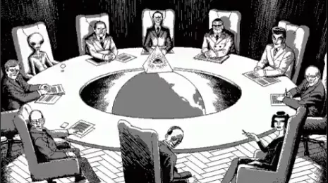

### 계획

이러한 유형의 프로필의 경우 초보자를 위한 솔루션은 매우 간단합니다:

- 비트코인 ATM 사용
- 대면 회의 중 현금 구매
- 비트코인으로 상품 판매

그런 다음 코인을 혼합하는 방법, 미사용 거래 출력(UTXO)을 관리하는 방법, 이 과정에서 아직 다루지 않은 다른 많은 것들을 배워야 합니다. 필요한 경우, 점차 "편집증적인" 비트코인이 되기 위한 모든 정보를 대학에서 이용할 수 있습니다.

### 튜토리얼:

핫월렛:

https://planb.network/tutorials/wallet/mobile/samourai-46f88b20-5d1e-47e0-be53-237ff8737956
콜드월렛:

https://planb.network/tutorials/wallet/hardware/coldcard-5d44dd94-423d-4e37-9a8c-3fc38b45ce59
https://planb.network/tutorials/wallet/hardware/seed-signer-ee2c284a-0e23-49a4-b0ca-4a4702072973
개인 간 비 KYC 구매:

https://planb.network/tutorials/exchange/peer-to-peer/peach-wallet-db64fe42-17ca-4b24-abb8-e7d4c03b2028
https://planb.network/tutorials/exchange/peer-to-peer/robosats-b60e4f7c-533a-4295-9f6d-5368152e8c06
https://planb.network/tutorials/exchange/peer-to-peer/bisq-fe244bfa-dcc4-4522-8ec7-92223373ed04
https://planb.network/tutorials/exchange/peer-to-peer/hodlhodl-d7344cd5-6b18-40f5-8e78-2574a93a3879
### 여러분을 위한 건가요?

- 경계와 보안:

편집증적 개인은 자신의 프라이버시와 온라인 보안을 매우 중요하게 생각합니다. 이러한 경계심은 모든 상호작용, 특히 비트코인 및 암호화폐와 관련된 모든 상호작용으로 확장됩니다.

- 독립:

자산과 보안에 대한 자율적인 관리를 선호하는 이들은 자체 노드를 설정하고 온라인 보안을 위해 적극적으로 노력하며 독립성과 통제에 대한 강한 열망을 보여줍니다.

- 불신:

중앙 집중식 시스템과 KYC 프로세스에 대한 불신은 편집증적 개인의 독특한 특징입니다. 개인 정보 공유를 꺼리는 이들은 익명성을 존중하고 보호하는 플랫폼과 서비스를 선택합니다.

- 지식이 풍부하고 부지런합니다:

암호화폐의 복잡성을 잘 알고 있는 편집증적인 개인은 코인 믹싱과 UTXO 관리 등 자산 보호 및 관리를 위한 모범 사례를 교육하는 데 시간을 할애합니다.

- 실용적인:

익명성과 보안을 중요하게 생각하면서도, 암호화폐 생태계를 탐색하는 동안 비트코인을 보호하기 위해 입증되고 신뢰할 수 있는 솔루션을 사용하는 등 실용적인 선택을 유지합니다.

편집증적인 개인의 사고방식에서는 주의, 보안, 익명성이 가장 중요합니다. 이러한 우선순위는 비트코인을 사용하는 데 있어 신중하고 신중한 접근 방식을 요구하며, 자급자족과 주의를 촉구합니다. 편집증적인 개인은 불필요한 노출을 피하기 위해 생태계를 능숙하게 탐색하면서 비트코인의 보안과 프라이버시를 보장하기 위해 시간과 노력을 기꺼이 투자합니다. 어떤 사람들에게는 지나치게 조심스러워 보일 수 있지만, 편집증적 개인은 비트코인 세계에 성공적이고 안전하게 참여하기 위해 근면함과 세심한 주의가 필수적이라고 생각합니다.

## 상속 계획 만들기

<chapterId>233c88d3-2e8e-5eba-ac06-efe67a209038</chapterId>

다음과 같은 극적인 시나리오를 상상해 보겠습니다.

교통사고가 나면, 쾅, 당신은 더 이상 이 세상에 존재하지 않게 됩니다. 여러분은 사라지고 가족은 비트코인 전문가 없이 남겨집니다. 가족들은 돈이 어디 있는지 모르지만 키, 단어 목록, 비트코인 거래의 비가역성 같은 용어를 끊임없이 언급했던 것을 기억합니다. 가족은 망연자실하고 당황한 나머지 이제 모든 것을 스스로 알아내야 합니다. 이러한 상황이 끔찍해 보일 수도 있지만, 무시할 수 없는 현실적인 가능성입니다. 그러면 15분에서 1시간 정도 시간을 투자하여 유산 계획을 수립하거나 아무것도 하지 않는 두 가지 선택지가 있습니다. 아무도 판단하지 않겠지만, 사람들이 여러분에게 의지한다면 그 15분이 언젠가 큰 차이를 만들 수 있습니다. 여러분에게 달려 있습니다.

- 옵션 1: 사랑하는 사람이 모든 암호화폐 자산을 안전하게 복구할 수 있는 명확하고 따라 하기 쉬운 계획이 담긴 편지를 열어봅니다.
- 옵션 2: 사랑하는 사람이 스스로 해결하도록 내버려둡니다. 지갑, 마켓플레이스, 자산이 없거나 거래가 손상되면 운이 나쁘게도 돈을 잃게 됩니다.

"암호화 자산 상속 계획"(10페이지)의 Pamela Morgan에 따르면 유산 상속 계획의 목적은 다음과 같습니다:

- 상속인이 제때에 암호화폐 자산을 소유할 수 있도록 하되, 그 전에 소유권을 넘겨받지 않도록 하세요.
- 암호화폐 자산을 사랑하는 사람에게 전달하기 전에 누군가 훔쳐갈 위험과 가능성을 최소화하세요.
- 원하는 경우 사랑하는 사람에게 자산을 안전하게 보관할 수 있는 옵션을 제공하세요.
- 상속인 간의 갈등을 피하고 법적 문제를 최대한 방지하세요.

**저작권:** 다음 강의는 제가 직접 만든 강의가 아닙니다...

이 레슨(6.1 BRH)에서 제안하는 대부분의 개념, 아이디어, 행동은 파멜라 모건의 저서 "암호화 자산 상속 계획"에서 가져온 것입니다 이 책은 비트코인 자산 상속 계획을 빠르게 수립할 수 있도록 따라하기 쉬운 단계별 프로세스를 제공합니다. 이 프로세스는 수많은 업계 보안 전문가들에 의해 검증되었습니다. 유산 계획을 세우는 데 훌륭한 출발점이 될 수 있지만, 법적 조언이 아니므로 항상 (항상 그렇듯이) 출처를 확인하고, 아이디어에 도전하고, 직접 조사해야 합니다. 파멜라는 자신의 저작물을 사용할 수 있도록 흔쾌히 허락해 주었습니다. 파멜라에게 진심으로 감사드립니다.

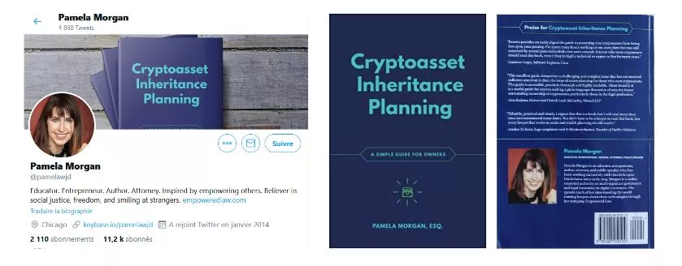

이 강의에서는 저자의 책의 첫 번째 부분에만 집중하겠습니다. 저는 일반적인 비트코인 사용자의 역할을 구현하여 자신만의 승계 편지를 만들 것입니다. 지금은 프로세스가 간단하며, 나중에 다양한 유형의 프로필이 포함된 더 복잡한 버전을 만들 것입니다.

세드릭의 여정을 따라가 보겠습니다:

- 장기 투자자.
- 실물 포트폴리오와 모바일 포트폴리오 보유자.
- 신원 확인(KYC)이 가능한 단일 거래소 플랫폼의 사용자.
- 사촌으로부터 비트코인을 소개받았습니다.
- 스마트 컨트랙트, 라이트닝 네트워크(LN) 또는 알트코인을 소유하지 않습니다.

### 전제 조건:

저나 여러분을 위해서가 아니라 사랑하는 가족을 위해 30분의 시간을 요청합니다. 유산 계획은 종종 거부되고 잊혀지는 어려운 주제입니다. 마지막으로 완료해야 하는 작업이기 때문에 너무 많은 사람들이 산만해져서 어리석게도 모든 BTC를 잃게 됩니다. 그러니 30분만 투자해서 해보세요. 마지막 단계입니다!

무엇이 필요하신가요?

- 방해 요소 없는 평온한 시간
- 백서 4~5장
- 펜
- 봉투 두 개
- 전화번호/주소록
- 컴퓨터(제 생각에는 선택 사항입니다)

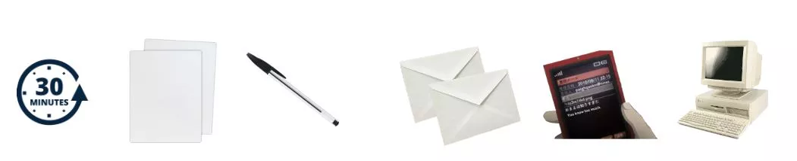

18페이지의 '암호화폐 자산 상속 계획'의 Pamela Morgan에 따르면 일반적인 오해는 다음과 같습니다:

- 변호사를 고용해야 합니다.
- 제3자를 신뢰해야 합니다.
- 계획을 세우면 내 자산을 쉽게 훔칠 수 있습니다.
- 내 암호화폐의 가치가 너무 낮아서 계획할 수 없습니다.
- 제 상속인들은 모든 것을 스스로 알아서 해결할 것입니다.
- 이 모든 작업은 간단한 스마트 컨트랙트로 수행할 수 있습니다.

### 1단계: 상속인을 도울 적합한 사람 선택하기

회원님이 부재 중일 때 가족을 도와줄 두 사람을 지정해야 합니다. 이렇게 하면 사랑하는 사람이 복구 과정에서 신뢰할 수 있는 최신 기술을 갖춘 신뢰할 수 있는 비트코인 사용자를 확보할 수 있습니다. 이러한 개인이 가능합니다:

- 키 및 지갑 관리에 대한 조언을 제공합니다.
- 비밀 문구(씨앗)를 안전하게 복구하는 방법에 대한 이해를 돕습니다.
- 거래 중에 보증을 제공하세요.

기술 전문성, 가용성, 신뢰 사이에는 항상 상충되는 부분이 있습니다. 누가 이 역할을 맡아야 할지 잘 모르겠다면 간단한 표를 만들어 결정에 도움을 받으세요.

책임의 분리: 신뢰하는 사람은 절대로 개인 키에 액세스할 수 없어야 합니다. 그들의 유일한 역할은 사랑하는 사람이 비트코인의 보안 시스템을 이해하고 신뢰를 얻도록 돕는 것입니다. 그렇기 때문에 신뢰할 수 있는 두 사람을 선택하는 것입니다. 필요한 경우 제3자 기관(전문 변호사 또는 유산 계획 서비스)에 의뢰할 수도 있습니다.

| 신뢰할 수 있는 사람 | 신뢰 | BTC 지식 | 신뢰 정보 | 참고 사항 | 참고 사항

| --------------------- | --------- | ------------- | ----------------------- | ----------------------------------------------------------------------------------- | --- | ---------------- | ---- | ------ | ------------- | ------------------------------------------------------ |

| 내 동생 밥 | 키가 매우 큼 | 키가 작음 | 전화 및 이메일 | "밥은 BTC에 대해 잘 모르지만 100% 믿을 수 있는 사람입니다."               | 내 사촌 네이선 | 키 | 중간 키 | 전화 및 인스타 | 대화하고 싶은 사람 1위. 그는 당신을 도울 수 있습니다. 그는 정보를 알고 있습니다. |

| 리코(암호화폐 친구) | 중간 크기 | 키가 매우 큼 | 트위터 & 이메일 & 사진 | 기술적인 질문은 리코를 믿어주세요. 돈은 절대 안 됩니다. 그에게 연락해야 합니다. |

| 유튜버 및 인플루언서 | 키가 작음 | 키가 큼 | 유튜브 링크 | 그를 팔로우하여 자신을 교육하세요. 직접적으로 도움을 줄 수 없습니다.                     |

### 2단계: 간단하고 빠른 인벤토리 수행

달러나 BTC가 있는 모든 곳을 생각하는 것이 중요합니다:

- 교환 플랫폼
- 모바일 지갑
- 실제 지갑

보안을 유지하는 방법과 백업이 저장되는 위치를 고려하세요. 현재 두 개의 백업 위치가 반드시 필요한 것은 아닙니다. 목표는 현재 보안의 즉각적인 스냅샷을 찍는 것입니다. 나중에 개선할 수 있습니다! 이것은 현재 보안을 보장하기 위한 첫 번째 버전일 뿐이며, 나중에 더 자세히 설명해 드리겠습니다.

| 일반 > 소프트웨어/하드웨어 > 자산 > 위치 > 백업(개인 키) > 비밀번호(PIN, 암호문구) > 참고 > 메모

| ----------------- | ------------------- | ---------- | ------------------ | ---------------------- | -------------------------- | ---------------------------------------------------------------------------------------------- |

| 거래소 플랫폼 | 비트스탬프 | BTC 및 현금 | 온라인에서 액세스 가능. | - | 홈 & 은행 금고 | 이곳에서 비트코인을 구매하고 이체했습니다. 비밀번호 관리자와 2FA를 사용하여 로그인합니다. |

| 실물 지갑 | 트레저 모델 1 | BTC | 보안 | 밥 아저씨와 은행 금고 | 집과 어머니 | 일반 지갑과 비밀번호가 있는 지갑이 두 개 있습니다.                                     |

| 사무라이 지갑 | 모바일 - One Plus 6 | BTC | 나에 대하여 | 밥 삼촌 및 은행 금고 | 집 및 어머니 | 앱이 숨김 모드일 수 있습니다.                                                               |

산만해지지 마세요! 이러한 자산을 이전해야 할 필요성을 느낄 수 있습니다:

- 보안을 강화하시겠습니까?
- 일부 자산을 판매하시나요?
- 다른 제품을 구매하시겠습니까?

아무것도 하지 마세요! 진행 중인 프로젝트를 잊어버릴 수 있습니다. 집중하세요! 나중에 언제든지 포트폴리오를 검토하고 수정할 수 있습니다.

### 3단계: 편지를 작성합니다.

보안상의 이유로 펜과 종이를 사용하여 사랑하는 사람에게 편지를 쓰세요.

- 암호 화폐가 있습니다
- 다음 어드바이저에게 문의하세요
- 다음과 같은 자산이 있습니다

다음은 시작하는 데 도움이 되는 템플릿입니다. 편지를 직접 작성하고 싶지 않다면 템플릿을 다운로드하여 빈칸을 채우기만 하면 됩니다. (여기 링크)

편지의 목적을 설명하는 것부터 시작하여 사랑하는 사람에게 암호화폐를 직접 관리하는 것의 위험성에 대해 경고하세요.

편지는 명확하고 도움이 되는 내용이어야 합니다. 유언장도 아니고 울음을 터뜨리게 하는 편지도 아닙니다. 또한 절대 판매하지 말라고 강요하는 편지나 개인 키를 적으라는 편지도 아닙니다. 고객이 최선의 결정을 내리고 안전하게 행동할 수 있도록 고객의 이해를 돕기 위한 편지입니다.

다음은 파멜라 모건의 저서 "암호화 자산 상속 계획"의 부록 E에서 발췌한 사랑하는 사람에게 보내는 편지 템플릿의 일부입니다. 이 예시에 맞게 일부 구절을 수정하여 괄호 안에 넣고 파란색으로 표시했습니다. 나머지 텍스트는 책의 원문입니다. (디스커버 비트코인에서 번역)

"날짜: 06/26/2020

리즈와 마이아에게,

저는 여러분을 깊이 사랑하며 여러분이 강해질 것을 믿습니다.

저는 가치가 있을 수 있는 암호화폐 자산을 소유하고 있다는 사실을 알려드리기 위해 이 편지를 작성합니다.

어떤 조치를 취하기 전에 이 서신 전문을 주의 깊게 읽어보시기 바랍니다. 이러한 자산은 다른 자산과 달리 일단 양도되면 복구할 수 있는 방법이 없습니다."

다음으로 '어드바이저 섹션'을 포함합니다. 이 부분은 특히 상속인이 잘 모르는 사람이나 조직을 언급하는 경우 상속인에게 혼란을 줄 수 있습니다. 구체적으로 작성하세요:

- 연락 방법
- 식별하는 방법
- 전문 분야가 무엇인지.
- 스스로 교육할 수 있는 방법

"아래는 이러한 자산을 발견하고 이전하는 과정에서 귀하의 질문에 답변하고 도움을 줄 수 있는 신뢰할 수 있는 사람들의 목록입니다. 목록에 있는 사람들에게 연락하되, 한 사람에게만 의존하여 절차를 관리하지 마세요. 이 목록에 있는 사람을 포함하여 모든 조언자를 경계하세요. 누구나 실수를 할 수 있으므로 그들이 하는 일을 최선을 다해 이해하고, 질문하고 답변을 직접 확인하는 것을 두려워하지 마세요.

다음은 질문에 답하고 이 과정을 안내하는 데 도움을 줄 수 있는 사람들입니다:

(여기에 어드바이저의 이름, 조직 소속(해당되는 경우), 연락처 정보, 신원 확인 방법(예: 키베이스, 사진)을 입력하세요

- 내 동생 밥; +33 09 XX 68 18 36; Bobmybrother@gmail.com. 이 과정에서 밥의 도움을 받을 수 있습니다. 그는 기술적으로 가장 숙련된 사람은 아니지만 모든 것에 의문을 제기하고 안전하게 성공할 수 있도록 주의를 기울일 수 있는 적임자입니다. - 내 사촌 Nathan; +33 09 XX 29 35; NathanDeladzcroix@Hotmail.com. 저에게 비트코인을 소개해준 사람은 네이선입니다. 그는 기술에 대한 지식이 풍부하고 대부분의 질문에 답할 수 있습니다. 그는 또한 비트코인을 보유하고 있으며 기술적 측면에 대해 안내해 줄 수 있습니다. 가족 모임에서 그를 여러 번 보셨을 텐데요, 여기에 그의 사진을 첨부했습니다.
- Ricco; @RiccoSFC 트위터; Ricco425@protonmail.com. 저는 리코와 수년 동안 긴밀히 협력해 왔습니다. 리코를 한 번도 만난 적이 없으니 "세드릭의 개 이름이 뭐죠?"라고 물어보면서 제대로 된 사람과 대화하고 있는지 확인하세요 리코가 "12"라고 대답하면 괜찮은 거예요. 리코는 매우 친절하고 비트코인에 대한 지식이 풍부한 전문가입니다. 리코는 여러분의 모든 질문에 답해줄 것이며 비트코인의 보안에 관한 그의 판단을 신뢰할 수 있습니다. 저는 리코를 여러 번 만났고 리코는 여러분과 마이아에 관한 모든 것을 잘 알고 있으니 주저하지 마시고 연락주세요.
- 이상하게 보일 수 있지만 모두 연락해 보세요. 또한 YouTube에서 Andreas Antonopoulos의 강의를 듣고 Pamela Morgan의 "암호화 자산 상속 계획"이라는 책을 구입하여 스스로 교육할 수도 있습니다."

이제 인벤토리 섹션을 추가합니다. 장치와 비트코인을 보유한 장소를 나열하는 것부터 시작하세요.

- 휴대폰: 모바일 지갑
- 데스크톱 PC: 거래소 플랫폼, 애플리케이션, 게임, 웹사이트
- 실제 지갑으로 이동
- 비밀 문구(암호 구문)
- 다중 서명

백업이 저장된 위치를 언급할 때는 특정 주소가 아닌 일반적인 위치를 사용하세요. 비트코인 이외의 다른 자산을 소유하고 계신 경우 알려주시기 바랍니다.

"아래는 제가 이러한 자산에 액세스하는 데 사용하는 기기, 소프트웨어 및 지갑 목록입니다. 이 모든 기기를 안전한 장소에 보관하고 자산이 상속인에게 양도될 때까지 보관해 주십시오. 다른 사람이 감독 없이 액세스하지 못하도록 하세요.

(여기에 암호화폐 자산 인벤토리 삽입)

- "제 휴대폰(삼성 갤럭시 S8)으로 사무라이 지갑에 액세스했습니다. 지갑을 보호하는 개인 키는 은행 금고에 보관되어 있고, 또 다른 사본은 밥 삼촌이 가지고 있습니다. 제 휴대폰과 지갑의 잠금을 해제하는 PIN 코드는 집과 할머니 댁에 보관되어 있습니다.
- 저는 2018 Dell 컴퓨터를 사용하여 Bitstamp라는 온라인 교환 플랫폼에 액세스합니다. 이 플랫폼에 아직 비트코인이나 달러가 있을 수 있습니다. 내 계정에 액세스하려면 직접 연락하거나 내 계정에 로그인해야 합니다(불법일 수 있으니 주의하세요. 현지 법률을 확인하세요).
- 비밀번호 관리자를 사용해 액세스했고, 은행 금고에 제 백업이 있습니다. 계정은 또한 2단계 인증으로 보호되며, 내 휴대폰(삼성 갤럭시 S8)을 통해 또는 집에 저장된 백업 코드를 사용하여 액세스할 수 있습니다.
- 트레저 모델 원 디바이스에도 BTC가 있습니다. PC와 Trezor.io 웹사이트를 통해 액세스합니다. 백업 개인 키는 은행 금고와 밥 삼촌에게 보관되어 있습니다. PIN 코드는 집과 어머니에게 보관되어 있습니다. 디바이스 자체는 사무실 금고에 보관하고 있습니다.
- 저는 Trezor 디바이스에 고급 보안 암호를 사용합니다. 이 암호의 백업은 집과 어머니와 함께 보관하고 있습니다."

이제 필요한 경우 몇 가지 법률 정보와 친절한 말로 편지를 마무리해 보겠습니다.

"참고: 2018년 4월 17일자 유언장 사본은 제 문서 폴더에서 찾을 수 있습니다. 펜실베이니아주 스크랜턴에 있는 제 변호사 드와이트 슈루트도 사본을 가지고 있습니다. 조심하고 항상 당신에 대한 나의 사랑을 기억해 주세요." 06/26/2023, Cedric"

이제 우리가 해온 일을 다시 한 번 살펴봅시다(파멜라 모건의 "암호화 자산 상속 계획", 44쪽(데쿠브르 비트코인 번역) 참조):

- 도움말: 이름, 연락처 정보, 가능한 경우 사진을 제공했는지 확인하세요.
- 장치: 휴대폰, 컴퓨터, 실물 지갑, 종이 지갑을 모두 나열했는지 확인하세요.
- 자산: 자산: 자산 목록을 포함했는지 확인하세요.
- 거래소: 자금을 보유하고 있는 거래소를 모두 나열했는지 확인합니다.
- 액세스: 액세스: 스토리지 위치를 찾는 데 필요한 정보와 필요한 모든 액세스 코드를 나열합니다.

모든 확인란을 선택했다면 마지막 단계가 준비된 것입니다! 이 편지를 복사하여 두 부를 봉투에 넣어 보관하세요. 봉투를 봉인하고 서명을 한 다음 이 봉투를 안전하고 접근하기 쉬운 곳에 보관하세요. 필요한 경우 상속인에게 이 봉투를 찾아야 한다는 사실을 알려주세요. 파멜라의 책을 구입하여 이 주제에 대해 더 자세히 알아보고 상속 계획을 개선할 시간을 계획하세요. 또한 공증인과 상의하여 이 계획을 공식 유언장에 합법적으로 포함시키세요.

축하합니다! 상속 계획의 첫 번째 버전이 완성되었으며, 좋은 시작입니다!

암호화 자산 상속 계획, 소유자를 위한 간단한 가이드, 파멜라 모건, ESQ. 저작권 2018 Merkle Bloom LLC, 판권 소유. CC-BY_ 귀중한 자료를 공유하고 공유할 수 있도록 허락해 주신 파멜라 모건에게 큰 감사를 드립니다. 이 글의 작성에 도움을 주신 모든 분들께도 감사드립니다.

당신은 최고입니다 :D 저희 팀과 학생들도 감사합니다!

## 축하합니다! 귀하는 상위 0.1%에 속합니다

<chapterId>5f4cfab9-9af1-584b-a1fe-a0769a991f19</chapterId>

처음부터 저희 콘텐츠를 팔로우하셨다면, 이제 21세기의 진정한 시민이자 비트코인 분야에서 가장 경험이 많은 분 중 한 분이 되셨습니다! 비밀번호 관리자와 2단계 인증(2FA)을 사용합니다. 비트코인이 무엇이며 왜 중요한지 이해합니다. 비트코인을 소유하고 있으며 비트코인을 안전하게 구매하거나 더 많이 벌 수 있는 방법을 알고 있습니다. 비트코인을 '콜드' 지갑에 보관하고 적절한 키 관리를 구현했습니다. 사랑하는 사람을 위한 상속 계획을 세웠습니다. 이제 안심하고 편히 쉬세요! 맥주 한 잔을 즐기며 스스로를 자랑스러워하세요!

여러분이 이 단계에 도달한 것이 정말 자랑스럽습니다. 진심입니다. 이제 무엇을 해야 할까요? 이제 긴장을 풀고 스스로를 자랑스러워해야 하지만, 비트코인과 함께하는 여정은 아직 끝나지 않았고 앞으로도 결코 끝나지 않을 것입니다. 다음은 다음 단계에 대한 몇 가지 옵션입니다:

1. 지금까지 해왔던 것처럼 계속 진행해도 됩니다. 천천히 비트코인을 축적하고 시간이 지남에 따라 전략을 펼치세요. 이미 충분한 수준의 보안을 갖추고 있고, 모든 것이 준비되어 있으며, 자신과 가족을 위해 필요한 일을 해왔습니다. 트레이딩 전문가가 될 필요도 없고 투자에 대해 더 많이 알 필요도 없습니다. 부업으로 다른 일을 하고 있고 비트코인이 흥미롭긴 하지만 이 단계에 도달하는 것이 주된 목표였을 수도 있습니다. 여러분 대다수가 그렇고 저는 그 점을 존중합니다. 비트코인의 '토끼굴'에서 여기까지 오신 것을 매우 기쁘게 생각하며, 즐거운 여정이 되셨기를 바랍니다. 첫 비트코인을 안전하게 보호할 수 있도록 저를 믿어주셔서 감사합니다.

2. 비트코인의 기술적, 이념적, 철학적 측면에 대해 계속 공부하고 싶으실 수도 있습니다. 이제 막 여정이 시작되었다고 느끼신다면 비트코인에 대해 계속 배우실 것을 권장합니다. 배워야 할 것이 너무 많아서 어디서부터 시작해야 할지 알기 어려울 때가 있습니다. 다음은 여러분과 함께할 수 있는 강좌와 코스의 목록입니다:

- 비트코인 노드와 라이트닝 네트워크: 이미 여러 차례 살펴본 것처럼 라이트닝 네트워크는 비트코인이 무엇인지에 대한 완전히 새로운 비전을 제시합니다. 이 두 번째 레이어를 통해 가능성은 무궁무진하며, 그 위에 전체 산업이 구축되고 있습니다. 이 발견의 여정에 여러분과 함께하시려면 이론 과정인 LN 201 또는 실습 과정인 LN 202를 수강해 보시기 바랍니다. 두 강좌 모두 학습 단계에 있는 누구나 수강할 수 있으며, 비트코인의 새로운 측면을 더 잘 이해하는 데 도움이 될 수 있습니다.
- 오스트리아 경제학: 경제와 금융이 관심 있는 주제라면 ECON 201 과목이 오스트리아 경제학의 심층적인 측면을 탐구하는 데 적합한 과목일 것입니다. 이 과목에서는 전통적인 케인즈주의에 반대하는 이 경제학파를 발견하게 될 것입니다. 인플레이션과 통화 조작의 관점에서 우리 시스템에 의문을 제기하고 우리가 어떻게 여기까지 왔는지 이해하는 좋은 출발점이 될 것입니다.
- 판매자 솔루션: 마지막으로, 비트코인을 실제로 사용하는 데 더 관심이 있으시다면 튜토리얼 섹션에서 판매자를 위한 다양한 솔루션을 살펴볼 수 있습니다. 이는 여러분에게 기회를 제공할 뿐만 아니라 여러분의 비즈니스나 친구들이 상거래에서 비트코인을 받아들여 여러분의 도시에서 비트코인에 기반한 지역 경제를 창출하는 데 도움이 될 수 있습니다!

어쨌든 모든 강좌는 무료이며, 플랫폼에서 많은 리소스나 튜토리얼을 이용할 수 있습니다. 공부에 행운을 빕니다!

# 결론

<partId>a8425389-4a53-4b57-b9b4-36c1cab12de5</partId>

## 리뷰 및 평가

<chapterId>3f43175a-fb7a-5b1c-a887-7dcf615d7a3a</chapterId>

<isCourseReview>true</isCourseReview>

## 기말 시험

<chapterId>f3ff8089-8f89-56a8-be8c-b60296b4d91f</chapterId>

<isCourseExam>true</isCourseExam>

## 결론

<chapterId>b082b8eb-dabc-5d79-94cf-eb8f48fc1968</chapterId>

<isCourseConclusion>true</isCourseConclusion>