# Uma jornada para seus primeiros bitcoins

A indústria que envolve o Bitcoin está em pleno crescimento.

As mudanças tecnológicas e financeiras deste novo mundo estão acelerando, e cabe a você aproveitar e começar a cair na toca do coelho do Bitcoin. Esta aventura será rica em conhecimento e o levará a questionar muitas de suas convicções. Isso lhe dará liberdade e permitirá que você recupere sua privacidade, soberania e independência financeira.

Para ajudá-lo a começar esta jornada, criei este curso gratuito. Apenas Bitcoin, sem bobagens, sem outras criptomoedas, um curso direto e sem rodeios. Este curso foi projetado para se adaptar a você e deixá-lo livre para escolher o caminho que melhor lhe convier.

+++

# Introdução ao curso BTC 102

Bem-vindo ao BTC 102! Um curso prático que o acompanhará na implementação de seu plano Bitcoin! Através deste curso, vamos nos preparar para obter seus primeiros bitcoins, protegê-los corretamente e garantir uma boa entrada nesta nova indústria.

A indústria do Bitcoin ainda é jovem e é considerada um fenômeno em constante evolução. De fato, apesar de muitos anos tentando regular este mercado, ele permanece extremamente livre devido à natureza de seu protocolo subjacente.

Devido a essa impossibilidade de ser totalmente regulamentado, o Bitcoin pôde se desenvolver de forma orgânica e descentralizada por mais de 14 anos. É, portanto, uma indústria em plena explosão embrionária e que só quer continuar a crescer.

Quando há explosão de inovações e possibilidades, há inevitavelmente golpes, fraudes e riscos. É claro que sua jornada no Bitcoin não será sem contratempos ou erros. No entanto, para ajudá-lo a evitá-los o máximo possível, esta formação servirá como um guia prático para começar bem. A formação BTC 101, por sua vez, é mais teórica para entender o funcionamento do Bitcoin.
Nesta formação, vamos nos concentrar em 4 aspectos:

- Rever as bases e os pré-requisitos para garantir que não sejamos enganados ou que percamos nosso dinheiro de forma boba.
- Rever fundamentalmente por que o Bitcoin é importante e entender sua indústria. Isso permitirá fortalecer nossas convicções e entender bem no que estamos nos metendo.
- Configurar sua primeira carteira Bitcoin e sua primeira compra de bitcoins por meio de uma plataforma de troca. Aqui, procuraremos a solução mais adequada às suas necessidades.
- Por fim, a última seção abordará um conceito fundamental para sua segurança, mas pouco explorado na indústria: como criar um plano de herança Bitcoin.

Você entendeu, esta formação tem como objetivo acompanhá-lo para que você respeite as melhores práticas de nossa indústria desde o início, de maneira simples e rápida!

Boa sorte :)

# Pré-requisitos para entender o Bitcoin

## Fraudes e golpes financeiros

Estamos em uma indústria em que duas principais vertentes emergem no setor de "criptomoedas":

1. A indústria do Bitcoin, centrada em uma moeda saudável por meio de um protocolo descentralizado de transferência de valor (Bitcoin). Ela valoriza a privacidade e a soberania individual e constrói gradualmente projetos de longo prazo com alto nível de resiliência e segurança.

2. A indústria global de criptomoedas, orientada para fintech, "blockchain" e outras inovações centralizadas. Ela evolui rapidamente e tenta se posicionar como a nova tendência.

Toda esta universidade é focada no universo Bitcoin e não em cripto.

O domínio das criptomoedas, incluindo o Bitcoin, ainda é relativamente jovem e pouco regulamentado. É, portanto, rico em várias fraudes. A compreensão dos perigos e o reconhecimento das armadilhas típicas são essenciais. Aqui estão algumas situações de fraude frequentemente encontradas:

- Doações e loterias online
- Pirâmide de Ponzi
- Pump & Dump
- Grupos e influenciadores Shitcoin
- Desvio / Hard Fork
- Hackeamento
- Falsa extorsão
- Fraude de senha
- Captura de cartão SIM

No domínio do investimento financeiro, os sistemas de venda em pirâmide e Ponzi se destacam como modelos ilegais. Eles funcionam usando o dinheiro de novos investidores para remunerar os antigos participantes. No entanto, sua natureza não sustentável e sua dependência de novos participantes para manter o sistema em funcionamento os tornam propensos a inevitavelmente desmoronar.

Estes sistemas são frequentemente caracterizados por elementos duvidosos, como a falta de valor intrínseco, promessas de retornos irreais e táticas de marketing que incentivam recomendações para atrair novos investidores. Prazos de retirada incompressíveis e o uso de perfis falsos nas redes sociais para promoção também são sinais reveladores dessas fraudes. Dado sua natureza ilegal e imoral e o risco financeiro que representam, é essencial evitá-los.

Finalmente, esses sistemas estão condenados ao fracasso. Com o tempo, a exigência de um número crescente de novos participantes para manter o sistema em funcionamento se torna insuperável. Quando esse ponto é atingido, a ilusão se dissipa, o sistema desmorona e os investidores muitas vezes ficam sem meios para recuperar seu investimento.

Os sistemas Ponzi podem se manifestar de várias maneiras. Às vezes, eles são disfarçados como novas ofertas de tokens ou Ofertas Iniciais de Moedas (ICO), combinações de contratos inteligentes, tentativas de monopolizar a moeda fiduciária ou até mesmo programas de marketing sem um produto real. No entanto, uma investigação aprofundada e uma verificação diligente revelam que esses sistemas não criam nenhum valor real. Eles simplesmente redistribuem o dinheiro dos novos participantes para pagar os antigos.

Recentemente, o mundo das criptomoedas experimentou uma onda de projetos relacionados à Finanças Descentralizadas (DeFi) que merecem atenção especial. Alguns desses projetos podem recorrer a uma combinação de criptomoedas de baixa qualidade, contratos inteligentes e sistemas de taxas de juros para oferecer soluções financeiras supostamente milagrosas. É essencial ter cuidado e diligência razoável diante dessas ofertas extremamente fraudulentas.

É importante ressaltar que o conteúdo deste curso é destinado apenas para fins educacionais e não deve ser interpretado como aconselhamento financeiro. O apelo para "não confiar, mas verificar" continua sendo uma diretriz importante. É essencial que cada um conduza suas próprias pesquisas e tome decisões financeiras informadas.

O Pump and Dump (P&D) é uma forma notória de manipulação financeira que pode causar grandes perturbações nos mercados. É caracterizada por um ataque coordenado visando provocar um aumento artificial do preço de um ativo por meio de vários mecanismos, como marketing agressivo, uso de algoritmos ou inteligência artificial. O objetivo é vender esses ativos supervalorizados para obter lucro.

A estratégia de Pump and Dump geralmente segue um padrão bem definido:

1. Um líder de opinião ou um grupo de investidores primeiro compra um grande número de ações ou outros ativos específicos.
2. Eles então criam um frenesi em torno desses ativos e disseminam informações exageradas ou enganosas para atrair outros investidores.
3. Esse frenesi desencadeia um FOMO (medo de perder uma oportunidade) em investidores humanos e bots de investimento, que começam a comprar esses ativos em massa.
4. Uma vez que o preço tenha aumentado o suficiente, os líderes vendem seus ativos em massa, realizando um lucro considerável.
5. A venda em massa leva a uma queda abrupta no preço do ativo, deixando muitos investidores com perdas substanciais.

É essencial entender que participar dessas estratégias é ilegal e pode resultar em processos por manipulação de mercado. Além disso, essas estratégias são frequentemente orquestradas por grupos de influência que cobram taxas de adesão. Embora alguns participantes possam obter ganhos a curto prazo, as estratégias de Pump and Dump geralmente não são rentáveis a longo prazo.
Portanto, é recomendável concentrar-se na educação financeira e no investimento responsável, em vez de se deixar seduzir por essas táticas manipuladoras. Adquirir conhecimentos sólidos e adotar uma abordagem de longo prazo são chaves essenciais para o sucesso no mundo dos investimentos.

As fraudes relacionadas a concursos ou doações online são muito comuns no setor de criptomoedas. Anúncios que prometem bitcoins gratuitos são frequentemente usados para enganar usuários inexperientes. Princípios-chave a serem lembrados são nunca enviar bitcoins com a expectativa de receber de volta e desconfiar de promessas de retornos irreais. É essencial não confiar cegamente, especialmente quando se trata de um banner na internet.

Um exemplo clássico desse tipo de fraude é a oferta que alega dobrar ou multiplicar exageradamente os bitcoins que você envia. É importante entender que não existe solução mágica para ficar rico instantaneamente.

Outra tática comumente usada é a doação de "shitcoins", ou criptomoedas de baixo valor. Alguns projetos de criptomoedas centralizadas farão muito marketing e oferecerão tokens gratuitos como presente. É preciso ter muito cuidado com essas ofertas, pois ou o token não tem valor ou o presente serve apenas para chamar a atenção e promover negociações, jogos e outras fraudes. Mesmo que essas ofertas nem sempre sejam fraudulentas, ilegais ou enganosas, a vigilância é necessária.
No Twitter, por exemplo, os bots podem fazer-se passar por pessoas famosas e oferecer ofertas incríveis para enganar as pessoas. Estas contas utilizam o mesmo nome e as mesmas fotografias de perfil que a celebridade em questão, podendo assim enganar os utilizadores menos sofisticados. Certifique-se sempre de que verifica a legitimidade da conta antes de interagir com ela.

Também é importante ter cuidado com as hiperligações enviadas por correio electrónico. Verifique sempre a ligação antes de clicar nela e preste atenção à identidade do remetente.

Por último, eis algumas dicas sobre como evitar as burlas em linha:

- As pessoas honestas nunca lhe pedirão para enviar dinheiro directamente.
- Nunca envie bitcoins para um endereço desconhecido.
- Promessas irrealistas de retorno são sempre suspeitas.
- Há uma boa hipótese de os concursos serem manipulados.
- Ganhará sempre mais a aprender do que a jogar.
- Em caso de dúvida, não actue imediatamente. Reserve algum tempo para pensar e fazer a sua pesquisa. O FOMO (Fear Of Missing Out) pode ser o seu pior inimigo.
  Lembre-se sempre de fazer a sua própria pesquisa antes de tomar uma decisão de investimento.

O Bitcoin passou por vários "hard forks" ao longo do tempo, dando origem a várias versões alternativas da moeda original. Estes desvios são frequentemente o resultado de programadores que procuram fazer alterações significativas ao protocolo Bitcoin ou, por vezes, de indivíduos mal intencionados que procuram enganar investidores ingénuos. É essencial distinguir a Bitcoin genuína destes derivados para evitar cair em potenciais armadilhas. Exemplos notáveis desses desvios incluem o Bitcoin Cash (BCH) e o Bitcoin Satoshi Vision (BSV). Apesar de ostentarem o nome "Bitcoin", estes projectos baseiam-se principalmente em tácticas de marketing e publicidade enganosa para atrair a atenção dos investidores.

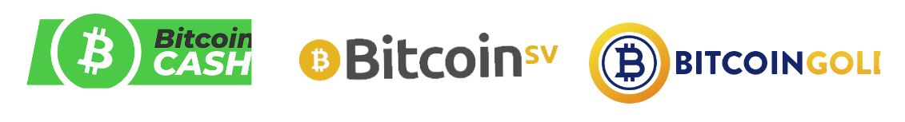

Um ditado popular no mundo dos investimentos diz: "Se parece uma burla, se comporta como uma burla e garante que não é uma burla, então é provável que seja uma burla".

Vale a pena notar que alguns destes desvios são muito bem financiados e gastam muito em comunicação para enganar os utilizadores. Por exemplo, o site "Bitcoin.com" está associado ao Bitcoin Cash, e não ao Bitcoin original, o que pode ser confuso para os novatos. O sítio Web oficial do Bitcoin é "bitcoin.org".

O mundo das criptomoedas é um terreno fértil para todo o tipo de personalidades atraídas pelo potencial de ganhos significativos. Entre eles, infelizmente, encontram-se indivíduos mal-intencionados que utilizam uma variedade de tácticas para enganar e defraudar os investidores.
Estas táticas podem incluir a promoção aberta de esquemas de pirâmide de vendas, a usurpação da identidade do criador do Bitcoin, Satoshi Nakamoto, a plagiatura do trabalho de outros, ou ainda a fabricação de falsas promessas. Além disso, alguns desses indivíduos criam tokens de criptomoeda e Ofertas Iniciais de Moedas (ICO) inúteis com o objetivo de enganar investidores.

A comunidade Bitcoin muitas vezes se mobiliza para denunciar esses atos, mas pode levar algum tempo para que o sistema jurídico tome medidas contra esses indivíduos.

Portanto, é crucial permanecer vigilante e exercer discernimento em suas interações com o mundo das criptomoedas. Meu conselho pessoal seria ignorar esses indivíduos e essas práticas. Eles não merecem seu tempo nem sua energia. Prefira dedicar esses recursos à aquisição de conhecimento e compreensão do mercado de criptomoedas para poder navegar nesse universo de forma esclarecida e segura.

É essencial abordar com cautela os "influenciadores" ou "gurus" de criptomoedas. Esses indivíduos muitas vezes têm agendas pessoais e podem estar envolvidos em muitos projetos que procurarão promover, mesmo que nem sempre estejam no interesse dos investidores.

Esses influenciadores podem tentar promover criptomoedas pouco confiáveis, ou "shitcoins", e implementar várias estratégias para aumentar o valor de seus investimentos, mesmo que estes sejam pouco seguros ou potencialmente fraudulentos.

Aqui estão algumas dicas para navegar neste ambiente:

- Desconfie de qualquer pessoa que promova uma criptomoeda específica ou ofereça transações.
- Os "conselhos gratuitos" muitas vezes não são realmente gratuitos e podem esconder outras intenções.
- Pense duas vezes antes de pagar por um curso de negociação. Existem muitos recursos gratuitos disponíveis para ajudá-lo a entender o mercado de criptomoedas (por exemplo, o canal do YouTube 'ukspreadbetting').
- Não é possível simplesmente copiar as transações de outra pessoa e esperar obter os mesmos resultados.
- Lembre-se de que só porque alguém diz algo não significa que seja necessariamente verdade.

A melhor maneira de se proteger é realizar suas próprias pesquisas e verificar as fontes de informação. Assistir a um vídeo no YouTube não é suficiente para verificar as fontes.

É importante notar que todos têm um programa, inclusive eu. Eu acredito no Bitcoin e meu objetivo é promovê-lo. Espero lucrar com essa promoção, tanto politicamente quanto financeiramente. Nenhum conteúdo é completamente gratuito - se um produto ou serviço parece gratuito, provavelmente é porque você é o produto.
Mantenha sempre em mente que nem todo mundo será necessariamente transparente em suas intenções. Sempre questione a finalidade das ações de alguém e não confie cegamente.

## Segurança online

Além das fraudes em criptomoedas e finanças, a principal razão para perder bitcoins está relacionada à má gestão da segurança online. Muitas vezes, as pessoas usam a mesma senha para todas as suas contas, esquecem de atualizar seus computadores e negligenciam a regularidade do backup de seus dados. Se você se preocupa com essas práticas, não se preocupe, ainda é possível melhorar seus hábitos de segurança online. Aqui estão algumas medidas básicas a serem implementadas:

- Use um gerenciador de senhas (veja o tutorial LastPass),
- Ative a autenticação de dois fatores (2FA),
- Mantenha seu computador atualizado e livre de malwares,
- Valorize sua privacidade usando ferramentas dedicadas (Signal, Tor, ProtonMail).

Se este assunto é completamente desconhecido para você, o treinamento SECU 101 pode ser interessante para aprofundá-lo em detalhes.

É crucial manter seu computador em um estado de funcionamento ideal, quer você esteja interessado em Bitcoin ou não. Uma atualização não está lá apenas para adicionar novos recursos: ela também corrige bugs e melhora a segurança de seus softwares. Portanto, certifique-se de:

- Sempre atualizar seus softwares,
- Usar um software antivírus confiável,
- Ser vigilante ao baixar arquivos,
- Fazer backup regularmente de seus dados,
- Nunca compartilhar suas senhas.

Uma dica adicional: considere comprar um disco rígido externo e fazer um backup completo de seus arquivos importantes. Isso pode ser valioso em caso de falha em seu computador.

Um gerenciador de senhas é um software que armazena e gerencia suas senhas. Ele ajuda você a nunca usar a mesma senha duas vezes, a escolher senhas complexas e seguras e facilita sua gestão de segurança online. Você só precisa se lembrar de uma única senha mestra. É uma ferramenta gratuita que todos devem aproveitar. Você pode começar a usá-lo gradualmente e, uma vez que se acostumar, encontrará extremamente prático e fácil de usar.

'
A 2FA oferece uma camada adicional de segurança para suas contas mais sensíveis, seja para plataformas de criptomoedas, contas do Google / Email, bancos ou sites de compras online. Uma segunda identificação, geralmente um código de 6 dígitos acessível pelo seu telefone, é necessária para fazer login. Não se esqueça de manter uma cópia de backup da chave em algum lugar caso perca seu telefone.

Um VPN, ou rede privada virtual, protege sua privacidade mascarando seu endereço IP. Embora isso não o torne completamente anônimo, é uma etapa simples e eficaz para melhorar sua privacidade online. Escolher um VPN, baixá-lo e usá-lo é um processo fácil de configurar.

O anonimato online é essencial para uma sociedade livre e próspera. Ele permite a liberdade de expressão, a proteção de testemunhas e a inovação. A privacidade é um direito humano fundamental. Para continuar protegendo sua privacidade, considere usar:

- PGP para seus e-mails,
- Signal para suas mensagens,
- Firefox ou TOR para sua navegação,
- Sync para compartilhamento de arquivos,
- Bitlocker para criptografar seus dados,
- Samurai Wallet para transferências de dinheiro.

Mais uma vez, se você está interessado neste assunto, o treinamento SECU 101 está disponível para acompanhá-lo.

## Dicas para iniciantes

A educação formal nos ensina pouco sobre investimentos. Como resultado, muitas vezes nos aventuramos sozinhos neste novo e complexo cenário de investimentos.

Nesta seção, examinaremos alguns erros comuns que os investidores iniciantes cometem ao entrar no mundo do Bitcoin e como você pode evitar cair nas mesmas armadilhas. Também abordaremos como planejar sabiamente seu investimento em Bitcoin. Os tópicos que abordaremos incluem:

- Cuidado com "Shitcoins" ou outras criptomoedas sem valor intrínseco.
- Investir apenas o que você pode perder.
- Compreender a diferença entre negociação e investimento.
- Esteja ciente das implicações fiscais.
- Gerencie corretamente sua chave privada.
- A importância de permanecer humilde e discreto.
- Adote uma perspectiva de longo prazo.

Antes de mergulhar no investimento em Bitcoin, é essencial dedicar tempo para se educar.
É fácil cometer erros na indústria da Bitcoin, e cada erro pode sair caro. Ao partilhar algumas das armadilhas que encontrei no meu percurso de investimento, bem como as que observei noutros, espero fornecer-lhe algumas dicas valiosas para navegar neste espaço. Estes erros incluem

| Problemas tecnológicos                                | Problemas financeiros                      | Problemas de gestão                                                             |
| ----------------------------------------------------- | ------------------------------------------ | ------------------------------------------------------------------------------- | ------------ |
| Perda de uma chave privada                            | Sobreinvestimento                          |
| Confiar os seus activos a terceiros                   | Falta de educação financeira               | Falta de confidencialidade                                                      | Investimento |
| Falta de confidencialidade                            | Investir com dinheiro emprestado           |
| Não compreender a diferença entre negociar e investir | Má manipulação                             |
| Ignorar as implicações fiscais                        | Problemas informáticos                     |
| Ignorar as implicações fiscais                        | Problemas informáticos                     |
| Perda de BTC devido a pirataria                       | Ser vítima de fraudes e burlas financeiras | Independentemente do seu nível de educação ou formação, pode fazer a diferença. |

Independentemente do seu nível de educação ou formação, qualquer pessoa pode entender e usar o Bitcoin. Não precisa de ter conhecimentos de finanças ou de programação. Tal como 90% das pessoas, pode simplesmente utilizar a Bitcoin de uma forma simples.

Cada pessoa é diferente e precisa de adaptar a sua estratégia de investimento à sua situação financeira pessoal. Aqui estão algumas boas e más práticas:

- As compras médias periódicas são uma boa prática.
- O uso de alavancagem, por exemplo, pedindo dinheiro emprestado para investir, geralmente não é recomendado.
- Evitar o FOMO (Fear Of Missing Out). Este pode levá-lo a fazer investimentos impulsivos.
- Atribuir um orçamento específico para o seu investimento é uma boa prática.

O objectivo não é ter um plano perfeito, mas sim ter uma estrutura para seguir e respeitar. Não se deve comprar com base na emoção ou no medo. O objectivo é seguir uma estratégia previamente definida para evitar stress desnecessário.

Não há limite de idade para aprender a investir; pode começar com uma quantia muito pequena e progredir ao longo do tempo. A educação é uma viagem.

- Regra de ouro n.º 1 do investimento: nunca invista mais do que pode perder! A ideia é pegar no seu rendimento mensal, deduzir as suas despesas obrigatórias (dívidas e outros custos mensais, como a habitação), deduzir o seu custo de vida (alimentação). Fica então com o seu orçamento de poupança. Se investires mais do que isso, mais cedo ou mais tarde terás problemas!
- Regra de ouro do investimento nº 2: evite o que está na moda. Concentre-se em progredir tomando decisões racionais. Se tiver dúvidas, deixe passar a noite e fale com seus entes queridos. É melhor levar o tempo necessário do que se apressar. A melhor estratégia é progredir passo a passo. - Regra de ouro do investimento nº 3: planejamento e ter uma visão de longo prazo são essenciais para o sucesso financeiro. Planeje e não assuma muitos riscos. O objetivo é evitar falhas fatais enquanto acumula sucessos.

Em caso de dúvida: comece se informando. Explore o mundo do Bitcoin por algumas horas (você tem muitos recursos disponíveis nesta plataforma). Leia 2 ou 3 livros. Compre 5 euros para experimentar. Assista documentários e vídeos. Mantenha a mente aberta.

Como em qualquer investimento, é preciso conhecer o mercado. O Bitcoin é muito jovem e volátil, o que significa que as coisas mudam rapidamente e isso implica em certo risco. O Bitcoin pode desaparecer, cair para zero ou estagnar por anos. É óbvio que você só deve investir o que pode perder! Não se endivide para investir em uma moeda cujos detalhes talvez você ainda não entenda completamente.

Uma vez que você se sentir mais confortável com o Bitcoin, poderá rever seu plano de ação. Da mesma forma, se você é novo neste mundo, é importante entender bem as diferenças entre trading, investimento de longo prazo e uma estratégia muito, muito longa usada por muitos bitcoiners, chamada "hold".

Em geral:

|                      | Trading       | Investimento      | Holding           |
| -------------------- | ------------- | ----------------- | ----------------- |
| Alavancagem          | Sim           | Não               | Não               |
| Temporalidade        | Curto prazo   | Curto/médio prazo | Muito longo prazo |
| Tipo de ativo        | Contrato      | BTC               | BTC               |
| Risco                | Muito alto    | Alto              | Alto              |
| Dificuldade          | Muito difícil | Difícil           | Difícil           |
| Curva de aprendizado | Longa         | Longa             | Longa             |
| Perdas potenciais    | Ilimitadas    | Limitadas         | Limitadas         |
| Mais adequado para   | Alguns        | A maioria         | Alguns            |

E aqui estão meus conselhos:

- Optar por uma perspectiva de longo prazo é frequentemente uma estratégia inteligente. Acompanhar constantemente a evolução do mercado pode ser complexo e exige um compromisso em tempo integral. Como Warren Buffet disse: "Se você não está disposto a manter uma ação por dez anos, é melhor não mantê-la de jeito nenhum, mesmo por dez minutos".
- É fundamental ser extremamente vigilante em relação à fiscalidade: Cada país tem suas próprias leis sobre Bitcoins. É essencial se informar sobre a legislação em vigor em seu país, especialmente no que diz respeito às obrigações fiscais. Um planejamento inadequado pode levar a ter que pagar mais dinheiro ao fisco do que o que foi ganho.

Aprender a investir não é algo que geralmente é ensinado na escola. Portanto, muitas pessoas consideram o investimento uma atividade arriscada, louca e inacessível. Para se proteger, muitos recorrem a um banqueiro... O que pode ser um erro.

Não há idade para começar a se instruir sobre investimentos e entender como o dinheiro e o sistema financeiro funcionam. Não é necessário se imergir completamente; ter uma visão geral é suficiente para tomar decisões adequadas, baseadas em fatos e não na ignorância. Isso pode ser muito útil ao longo da vida, pois você saberá reconhecer quando alguém está tentando vender um mau produto de investimento (por exemplo, um banco).

Você não deve fazer trading. Sim, o trading é um trabalho em tempo integral que envolve muito estresse, riscos e grande autocontrole. Não é uma atividade para todos e pode ter sérios riscos. Se você ainda quiser tentar, siga pelo menos uma pessoa confiável e sensata, como Mark em Ukspreadbetting.

Duas boas fontes:

- Pai Rico, Pai Pobre - Robert T Kiyosaki - É uma boa primeira introdução ao mundo dos investimentos. É perfeito para todos.
- O Podcast dos Investidores - Este podcast é mais técnico, mas lhe dará uma boa ideia do grau de complexidade do mundo financeiro. Se você já trabalha na área financeira ou se isso o apaixona, ouça alguns de seus episódios. Alguns deles falam sobre Bitcoin.

Para concluir esta seção sobre pré-requisitos, voltemos à primeira razão de perda financeira em nossa indústria: a má gestão da chave privada.

Lembre-se de que a chave privada é uma lista de 24 palavras que representa o backup de seus Bitcoins. É essencial ter extrema cautela a esse respeito. Quando você armazena seus Bitcoins em uma plataforma de troca, é a plataforma que detém o controle, não você! Essa situação apresenta riscos como a falência da plataforma, a apreensão de seus Bitcoins ou o hackeamento da plataforma.
A regra de ouro do Bitcoin nº 1: Se você não tem a chave, você não tem os Bitcoins. A chave do Bitcoin representa a propriedade dos Bitcoins. Se você possui sua chave, você recupera sua soberania financeira e é responsável pela segurança do seu próprio dinheiro. Se você perder sua chave, você também perde seu dinheiro. É melhor seguir as melhores práticas da indústria e evitar estratégias complexas. O Bitcoin já é arriscado o suficiente por si só. Ouça os conselhos dos especialistas. Além disso, quando você usa o Bitcoin, é melhor ficar discreto: evite falar sobre isso. Ao se expor, você se torna um alvo potencial, aumentando os riscos para você e sua família. A melhor segurança está na discrição. Não há necessidade de proclamar para todos que você possui Bitcoins.

Boa sorte! Espero que você me siga no universo do Bitcoin e me permita guiá-lo para adquirir e proteger seus primeiros Bitcoins sem correr riscos!

# Compreendendo o que estamos fazendo

## Bitcoin em 5 minutos

Neste curso, queremos nos concentrar no plano de ação para obter seus primeiros bitcoins. Se você deseja uma explicação aprofundada dos fundamentos do Bitcoin, recomendamos o BTC 101, disponível gratuitamente nesta plataforma.

O Bitcoin é um protocolo de computador que permite enviar valor em todo o mundo sem intermediários de confiança. Esse valor é representado por uma moeda chamada Bitcoin.

O famoso Bitcoin que você ouve falar o tempo todo é, portanto, essa moeda digital. Os usuários do Bitcoin enviam bitcoins entre carteiras, e tudo isso funciona graças a uma rede de nós (servidores Bitcoin) que propagam as transações de todos os usuários entre si. Para garantir a finalidade das transações, alguns atores dessa rede também são mineradores (os famosos mineradores), e seu objetivo é registrar as transações propagadas no blockchain do Bitcoin (ainda mais famoso).

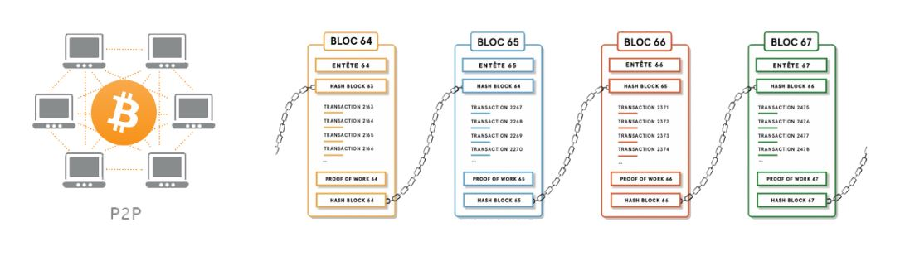

Graças a esse mecanismo bastante estranho, obtemos um banco de dados (o blockchain) que é imutável no tempo, descentralizado no espaço e que funciona continuamente em todo o mundo. Isso permite, pela primeira vez na história da humanidade, ter um sistema contábil de triplo registro que permite a qualquer pessoa usar um sistema financeiro alternativo construído na Internet sem ninguém para controlá-lo ou destruí-lo.

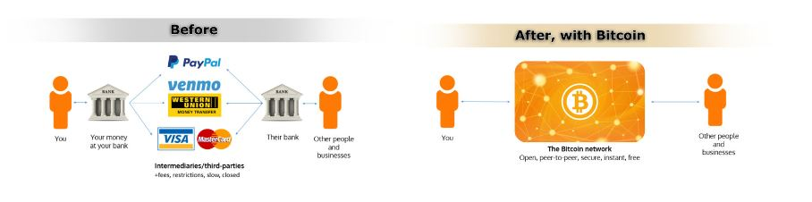

Além de seu funcionamento técnico (BTC 101 explica), podemos observar duas características que fazem do Bitcoin o que é hoje após 14 anos de existência:

- A première é que o código do Bitcoin é open source. Isso significa que qualquer pessoa pode ver como o Bitcoin funciona, é transparente e, portanto, auditável. Portanto, qualquer pessoa pode usá-lo e o protocolo é igual para todos, não pode haver discriminação. Isso torna o Bitcoin extremamente interessante para uso como sistema de envio de valor.
- O segundo elemento reside em suas propriedades monetárias. De fato, o Bitcoin é raro. Haverá apenas 21 milhões no mundo e nunca mais (e até menos devido a perdas). Isso é possível graças à própria natureza do protocolo, pois desde o seu lançamento, suas características monetárias (a curva de distribuição de bitcoins) foram decididas e ninguém pode unilateralmente mudá-las. Essa característica faz com que o Bitcoin, assim como o ouro, não possa ser diluído pela impressão excessiva de dinheiro.

Essas duas características tornam o Bitcoin uma ferramenta tecnológica e monetária poderosa que não apenas inova em nosso mundo, mas também quebra normas.

Devido a essas características, muitos bitcoiners, incluindo eu mesmo, estão prontos para dizer que o Bitcoin é uma inovação importante para nossa sociedade, no mesmo nível que a roda, a contabilidade de dupla entrada, a eletricidade ou a Internet.

Portanto, o Bitcoin é um "0 a 1" que vem perturbar nossas normas e hábitos.
Se isso é novo para você, eu o encorajo fortemente a seguir o BTC 101 antes de continuar a se expor a uma tecnologia cujo papel e razão de ser você talvez não entenda bem.

## Por que o Bitcoin é importante?

Por que a importância do Bitcoin é tão crucial? Essa é a questão central desta universidade. Seja para seus estudos ou sua estratégia de investimento, sem uma compreensão clara da importância do Bitcoin, você corre o risco de se desviar de seu plano de ação. O objetivo é sempre manter em mente os fundamentos do Bitcoin, para garantir que sua estratégia permaneça em sintonia com suas convicções.

Barack Obama descreveu o Bitcoin como "um banco suíço em seu bolso". E de fato, o Bitcoin oferece as mesmas oportunidades para todos, independentemente de quem você é. Se você é um adolescente, um presidente, um manifestante em Hong Kong ou um "colete amarelo" na França, todos têm acesso idêntico ao mesmo protocolo e às mesmas ferramentas:

1. Criação de contas gratuitas e ilimitadas.
2. Possibilidade de enviar dinheiro para qualquer lugar e para qualquer pessoa.
3. Ausência de necessidade de identidade ou papelada.
4. Acessibilidade para todos, independentemente da idade, gênero, religião, país ou nível de renda.
5. Confidencialidade e transparência sob demanda. 6. Ausência de intermediários ou taxas ocultas.
6. O Bitcoin é nativo da internet, tornando-o acessível a todos que têm acesso à web.

Em resumo, o Bitcoin pode ser considerado a "moeda do povo".
Questão filosófica do dia: No mundo do Bitcoin, duas ideologias se enfrentam. Você quer incluir no sistema bancário os bilhões de pessoas que não estão nele? Ou você quer tirar do sistema bancário os bilhões de pessoas que estão nele?

Essa questão merece reflexão e voltaremos a ela posteriormente.

Bilhões de pessoas vivem sob o efeito prejudicial de políticas monetárias mal gerenciadas, que muitas vezes levam a graves crises financeiras a longo prazo. Esses tipos de crises surgiram centenas de vezes em nossa história e continuarão a surgir enquanto o valor do dinheiro e do tempo for manipulado. Essas crises podem se manifestar na forma de hiperinflação, controle monetário e desvalorização da moeda.

O Bitcoin oferece a cada indivíduo uma chance de sair desse sistema. É uma escolha ética que cada um provavelmente terá que fazer um dia. O Bitcoin facilita a transição do dinheiro fiduciário para o dinheiro saudável, graças à sua resistência à censura, sua divisibilidade e portabilidade.

**Você sabia**? Nos últimos 100 anos, houve mais de 55 casos de hiperinflação. A maioria deles destruiu completamente a economia de seus países, aniquilou as economias dos cidadãos e às vezes criou instabilidade política que levou ao estabelecimento de um regime ditatorial (como foi o caso no Chile, Alemanha, etc.). A destruição das moedas fiduciárias não é um fenômeno novo e continuará a ocorrer. No entanto, graças ao Bitcoin, agora você tem a oportunidade de sair desse sistema.

O agravamento das desigualdades de riqueza no mundo levou a um aumento do extremismo, que às vezes resultou no estabelecimento de regimes ditatoriais. Não importa quem você é, um dia pode precisar de privacidade para proteger sua família, você mesmo e suas economias. Onde você poderia esconder seus bens se estivesse ameaçado politicamente?

- Sua conta bancária pode ser congelada, apreendida ou esvaziada.
- O ouro é difícil de dividir, complicado de transportar e usar.
- O dinheiro em espécie é volumoso, fácil de roubar e sujeito à inflação.
  Bitcoin oferece uma solução para esses problemas, permitindo que as pessoas protejam suas economias e as transportem consigo, sem nenhum controle do Estado. Quase metade da população mundial vive sob um regime hostil, essas pessoas precisam do Bitcoin mais do que qualquer outra pessoa. Bitcoin é uma forma de protesto passivo contra a injustiça do sistema.

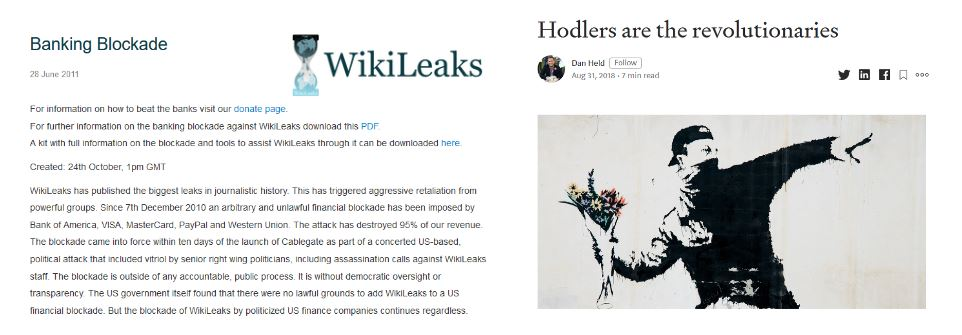

Você sabia que o Bitcoin é pseudoanônimo? Um endereço anônimo é usado para armazenar e trocar Bitcoins entre usuários. No entanto, cada transação é registrada em um grande livro público (o blockchain) para que todos possam verificar. Isso significa que, embora os nomes dos usuários não sejam divulgados, o histórico de suas transações é totalmente transparente.

Os bancos centrais continuam diluindo seu poder de compra por meio da inflação e das políticas de criação monetária (flexibilização quantitativa). Essas são taxas ocultas que gradualmente destruíram o valor do dinheiro ao longo das décadas. Se você não tem uma renda sólida proveniente de dividendos, títulos ou investimentos imobiliários, você se empobrecerá ao longo do tempo, enquanto os ricos continuarão a enriquecer ainda mais. Devido à ação dos bancos centrais, um dólar hoje vale menos do que um dólar amanhã.

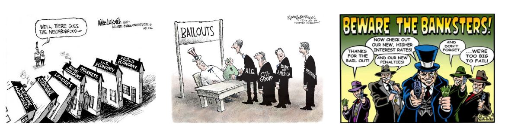

O sistema incentiva você a se endividar, gastar e enriquecer os banqueiros com juros pagos por muitos anos de reembolso e endividamento. Isso não é um erro, mas uma estratégia deliberada implementada pelos banqueiros e políticos para estimular os gastos do governo, o crescimento econômico e empurrar a população para se endividar cada vez mais.

Nosso sistema está corrompido pelos bancos centrais. Bitcoin é a cura.

Nunca haverá mais de 21 milhões de bitcoins e nenhum político, banqueiro ou indivíduo mal-intencionado poderá mudar isso. Esse limite foi estabelecido no protocolo do Bitcoin por Satoshi e não pode ser alterado hoje. Isso define a taxa de inflação do Bitcoin para os próximos 100 anos.

No passado, o ouro desempenhava um papel regulador como uma moeda saudável. No entanto, desde 1971, nenhuma moeda fiduciária (euro, dólares, etc.) está ligada ao ouro, o que abriu caminho para uma criação monetária ilimitada. Brrrrrr (alusão ao som da impressora de dinheiro).

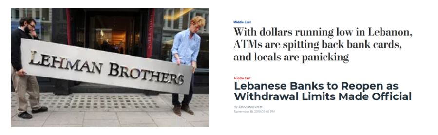
Si você tem dinheiro em uma conta bancária, esse dinheiro não é mais seu. Na verdade, você emprestou esse dinheiro ao banco para que ele possa usá-lo. É crucial entender e estar ciente dessa realidade. Se você tem dinheiro em uma conta bancária, na verdade é um credor do banco. Isso significa duas coisas:

1. Se o banco falir, você corre o risco de perder seu dinheiro.
2. Se o banco se recusar a devolver seu dinheiro, você também corre o risco de perdê-lo.

Você pode pensar que esses cenários são improváveis, mas exploraremos em um capítulo posterior por que eles são quase inevitáveis.

Bitcoin, por outro lado, é um sistema aberto e incorruptível. As regras são fixas e as mesmas para todos. A famosa frase "Não é sua chave, não são seus Bitcoins" destaca a importância de possuir a chave privada de uma carteira Bitcoin. Ao possuir a chave privada, você tem controle total sobre os Bitcoins que ela contém. Se você não possui essa chave, significa que outra pessoa possui seus Bitcoins para você. Nesse caso, seus Bitcoins estão expostos a riscos semelhantes aos associados a um banco tradicional.

Para recuperar sua soberania, é essencial assumir o controle de sua chave privada e proteger seus Bitcoins por si mesmo.

Bitcoin oferece uma alternativa poderosa aos sistemas financeiros tradicionais. Ele permite que cada um preserve sua privacidade, se proteja contra a inflação e a desvalorização monetária, contorne regimes autoritários e recupere a soberania sobre seu dinheiro. Bitcoin é uma moeda saudável, acessível a todos, independentemente de idade, gênero, religião ou renda. Ao adotar o Bitcoin, os indivíduos podem economizar para o futuro, se libertar do controle dos bancos centrais e retomar o controle de sua vida financeira. É uma ferramenta que permite reequilibrar os poderes e promover a liberdade econômica em escala global.

Bitcoin, um movimento político?
Os principais defensores do Bitcoin hoje ainda são principalmente ciberpunks, cidadãos oprimidos, anarquistas, seguidores da escola austríaca de economia, engenheiros de computação, financeiros e defensores da liberdade de expressão.
Bitcoin possui uma dimensão altamente filosófica, ética e política, enquanto é totalmente indiferente a essas considerações. Na verdade, Bitcoin é um simples protocolo que reproduz o mesmo processo repetidamente. São seus usuários que o transformaram em uma arma de libertação contra o sistema financeiro atual. Do ponto de vista Cyberpunk, Bitcoin se opõe a uma sociedade sem dinheiro. Ele permite criar transações financeiras digitais totalmente privadas e sem intermediários. Para o movimento cyberpunk, Bitcoin é o equivalente eletrônico do dinheiro em espécie.

## Compreendendo a indústria do Bitcoin

Com a chegada do Bitcoin em 2009 por Satoshi Nakamoto, uma indústria de vários bilhões de dólares nasceu. Essa indústria, apesar de sua juventude, experimentou um crescimento exponencial nos últimos dez anos. Novos atores chegam todos os dias com grandes somas de dinheiro e estão prontos para entrar com força nessa nova indústria. Hoje, a indústria atingiu um ponto sem retorno, onde governos, bancos, gigantes da internet ou outros se juntaram ao movimento com todo tipo de intervenção.

Bitcoin é um 0 a 1. Não pode ser desfeito. Alguns o verão como o mal em pessoa, a caixa de Pandora está aberta e agora tira deles seu poder e vantagem. Eles vão lutar contra isso. Outros verão no Bitcoin uma oportunidade de recuperar a liberdade, mudar o sistema e melhorar nossa sociedade. Eles o abraçarão. Bitcoin não se importa, simplesmente existe.

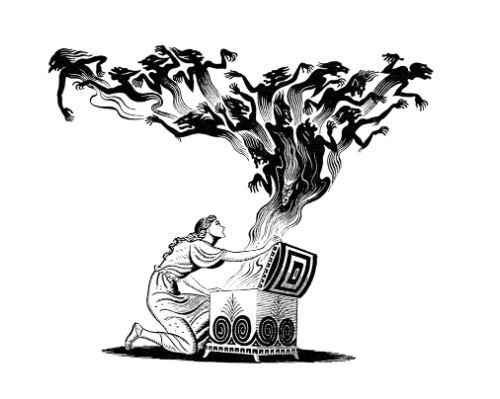

Nesta seção, tentaremos fazer uma rápida visão geral dos atores para entender melhor como funciona a indústria em que estamos tentando entrar.

Qualquer pessoa pode conceber sua própria criptomoeda - uma tarefa que leva apenas alguns minutos. No entanto, o valor desse token será exclusivamente determinado pelo mercado. Em dezembro de 2019, mais de 5000 tokens foram listados no Coinmarketcap. Hoje, em 2023, esse número aumentou para mais de 23.000, com NFTs, DeFi e muito mais. Esses tokens criptográficos podem assumir diferentes formas: moeda, título de segurança, combustível para um ecossistema, sidechain, arte digital, etc.
É crucial entender que 99,8% dessas novas "criptomoedas" são golpes criados por profissionais de marketing com o objetivo de roubar seus bitcoins. No entanto, entre os raros 0,2% de projetos sérios, um esforço significativo é feito para avançar, experimentar e desenvolver tecnologias inovadoras capazes de trazer muitas vantagens aos usuários. Com o tempo, o setor melhorará, surgindo empresas legítimas que oferecem produtos reais. A questão de saber se isso acontecerá em outras blockchains além do Bitcoin permanece em aberto. Por enquanto, uma coisa é certa: o Bitcoin é a única criptomoeda verdadeiramente descentralizada, resistente à censura, livre e séria o suficiente para justificar milhares de horas de trabalho.

| Característica   | Bitcoin                   | Alt-Coin (99,9% deles) |
| ---------------- | ------------------------- | ---------------------- |
| Liquidez         | Alta                      | Baixa                  |
| Adoção (real)    | Alta e global             | Baixa                  |
| Equipe           | Robusta e descentralizada | Fraca e centralizada   |
| Reputação        | Alta e global             | Baixa                  |
| Infraestrutura   | Robusta e estável         | Fraca                  |
| Descentralização | Sim                       | Não                    |
| Golpe?           | Não                       | Provavelmente          |
| Valor?           | Sim                       | Discutível             |

Não se deixe enganar por frases como:

- "Blockchain, não Bitcoin"
- "XRP é o novo Bitcoin"
- "StableCoin é o futuro"
- "Libra vai eliminar o Bitcoin"
- "Descubra minha nova Bitcoin aprimorada"
- "Fedcoin tornará o Bitcoin obsoleto"

É essencial fazer pesquisas pessoais se você decidir mergulhar no mundo das alt-coins, mas não é aqui que vamos orientá-lo.

Após a bolha ICO de 2017, muitos atores importantes começaram a desenvolver seu próprio banco de dados usando a "blockchain". Governos e bancos centrais estão explorando a possibilidade de criar uma versão digital de sua moeda fiduciária (Suécia, Europa, Rússia, China, etc.). Gigantes da tecnologia também estão entrando nessa corrida. O Facebook lançou seu próprio projeto de stablecoin chamado "Libra". Alternativas à "blockchain" estão sendo experimentadas por bancos, corporações e outros gigantes tecnológicos com soluções como Linux ou IBM "Hyperledger".

| Característica       | Bitcoin | Alt-coin | Facebook-coin | Fed-coin |
| -------------------- | ------- | -------- | ------------- | -------- |
| Público              | Sim     | Varia    | Não           | Não      |
| Aberto               | Sim     | Varia    | Não           | Não      |
| Sem fronteiras       | Sim     | Varia    | Não           | Não      |
| Neutro               | Sim     | Varia    | Não           | Não      |
| Resistente à censura | Sim     | Varia    | Não           | Não      |

Enquanto afirmam competir com o Bitcoin, esses projetos permanecem centralizados para garantir controle e cumprir regulamentações locais. Eles não fornecem proteção de privacidade, mas sim aumento da vigilância em massa. O projeto "Libra" do Facebook competia com bancos, não com o Bitcoin. Além disso, sem prova de trabalho, uma "blockchain" não tem valor real. É importante notar que o Libra foi abandonado e nenhum projeto real de blockchain privada é atualmente usado em escala global, ao contrário do Bitcoin.

O protocolo Bitcoin está fora do alcance das regulamentações. Apenas os atores que orbitam em torno dele podem ser regulamentados e, como o Bitcoin é descentralizado, as leis, impostos e regulamentações variam de país para país. A China, por exemplo, proibiu o uso do Bitcoin várias vezes, enquanto países como Canadá, Suíça e Malta adotam uma posição mais favorável em relação a ele. A maioria das nações criou grupos de trabalho sobre criptografia para elaborar novas regras e regulamentações. No entanto, esse processo é lento e as regras podem mudar com bastante frequência. Apesar desse ritmo lento, o Bitcoin e as criptomoedas estão no centro de muitas conversas.

Recomenda-se realizar pesquisas aprofundadas sobre a situação em seu país. Os bancos também são altamente regulamentados em relação ao Bitcoin. Muitos deles fecham contas e limitam o acesso a serviços financeiros de empresas que lidam com Bitcoin, enquanto formam equipes de pesquisa para explorar essa nova tecnologia com o objetivo de melhorar sua própria infraestrutura. Nenhum regulador, banco ou governo deseja perder poder, então estão se preparando para lidar com o Bitcoin. É importante notar que o Bitcoin, como tal, não pode ser modificado ou controlado por uma única entidade.

As plataformas de troca servem como ligação entre a moeda fiduciária (moeda governamental) e as criptomoedas. Elas permitem que seus clientes comprem ou vendam criptomoedas por meio de sua plataforma. Cada plataforma de troca possui especificidades diferentes. Aqui estão alguns aspectos a serem considerados:

- Boa reputação em segurança
- Liquidez suficiente
- Serviço ao cliente eficiente
- Interface do usuário intuitiva
- Opção para fazer compras automáticas
- Retirada automática de Bitcoins para sua carteira.
  A maioria das plataformas de troca legais respeitam as regulamentações bancárias em vigor. Elas também implementaram procedimentos rigorosos de KYC ("Know Your Customer"), exigindo que você forneça um documento de identidade para criar uma conta. Portanto, é necessário dividir a indústria de soluções de compra em KYC e não KYC, como exploraremos em detalhes em breve.
  

**Cuidado**: O "Big Brother" está de olho em você, supostamente para sua segurança, é claro. Seus dados podem ser usados pelo seu governo para rastrear suas atividades.

No espectro das plataformas de troca, podemos distinguir 5 grandes tipos:

- Plataforma de troca ética: estamos falando aqui de soluções que tentam respeitar o usuário oferecendo um serviço simples e honesto. Essas plataformas geralmente oferecem uma solução de DCA (Dollar-Cost Averaging) e uma retirada automática de fundos para a carteira do usuário. Essas são as soluções mais adequadas para iniciantes. (ex: relai, bull bitcoin, stackinsat)
- Plataformas de troca peer-to-peer: elas permitem que você compre e venda bitcoins diretamente entre usuários. Você pode encontrar pessoas em sua cidade para concluir transações. Seja cuidadoso durante essas transações e prefira locais seguros e públicos para concluí-las. Essas soluções não KYC são muito boas para usuários um pouco mais avançados. exploramos em detalhes no BTC 205; (exemplo: Bisq, peach, robosat)
- Plataformas de troca de Altcoins: essas plataformas permitem que você compre e venda várias Altcoins que deseja trocar. Para fazer isso, você pode depositar BTC ou usar um cartão de crédito. É aconselhável ser extremamente cuidadoso com as Altcoins e avaliar seu desempenho em Bitcoin, e não em dólares. Basicamente, essas plataformas são grandes cassinos de ativos não regulamentados (muitas vezes inseguros). não os recomendamos (Exemplo típico: Bitfinex, kraken, bitstamp)
- Plataformas de troca de negociação: elas permitem negociar bitcoins e outras criptomoedas com alavancagem, usando BTC como garantia. Você pode negociar contratos derivativos. Cuidado se você usar alavancagem! Provavelmente é melhor não negociar seus bitcoins. Da mesma forma, não recomendamos esse tipo de solução para iniciantes (ex: Binance)
- Plataformas de troca duvidosas: algumas plataformas não regulamentadas são suspeitas, podem manipular seu volume de transações e sua segurança geralmente é falha. Essas plataformas são frequentemente russas, chinesas ou exclusivas da darknet. O risco é de sua responsabilidade, mas é recomendável evitá-las.
  Nunca se esqueça de retirar seus bitcoins de uma plataforma de troca. As plataformas de troca podem ser hackeadas, apreendidas, falir ou simplesmente desaparecer com seu dinheiro. Elas apresentam riscos significativos e devem ser evitadas tanto quanto possível. Nunca deixe seus fundos lá por um longo período. Lembre-se: se você não tem as chaves, os bitcoins não são seus.

Os bitcoins são mantidos em um "carteira", que é um cofre digital para o seu dinheiro. Somente o detentor da chave pode acessá-lo. Pode ser um dispositivo de hardware, um software de aplicativo ou até mesmo um pedaço de papel. Essas carteiras fazem a conexão entre seus bitcoins e o mundo exterior.

Cada carteira apresenta diferentes características:

- privacidade
- segurança
- facilidade de uso
- custo.

Em nossa indústria, podemos dividir os atores das carteiras em várias seções:

- Criadores de carteiras de hardware. Aqui temos muitas empresas competindo nesse assunto. Algumas são de código aberto, outras oferecem carteiras de hardware mais ou menos caras com mais ou menos recursos (ex: Ledger, Trezor, Coinkite, Shiftcrypto).
- Criadores de carteiras de software; são empresas ou atores independentes que desejam criar carteiras de software em dispositivos móveis ou computadores (ex: Wizard Sardine, Galoy, Synonyme, Blockstream).
- Carteiras DIY (Do It Yourself); aqui, temos soluções 100% de código aberto que podem ser criadas em casa para reduzir os riscos de confiança em relação a outros atores na cadeia de produção ou criação (ex: Seedsigner, Specter DIY).

As carteiras são um aspecto fundamental do Bitcoin e as exploraremos em detalhes nesta universidade.

Os mineradores são responsáveis por garantir a segurança da rede. Eles usam eletricidade para realizar os processos de prova de trabalho do Bitcoin, criando um novo bloco. Já abordamos o assunto dos mineradores em detalhes no curso BTC 101, se necessário. Para ir mais longe, oferecemos o curso Mineração 201.

É importante entender que esta indústria é vasta, muito vasta.

Enquanto começou de forma individual, os mineradores de hoje são geralmente grandes empresas bem financiadas que competem em um setor muito difícil. Eles procuram fontes de energia baratas para obter uma vantagem competitiva. Eles podem ser públicos ou anônimos e estar em qualquer lugar do mundo.

Sua indústria é dividida em muitos atores de tamanhos variados:

- Criadores de hardware de mineração (ex: Bitmain): essas empresas são o elo essencial de nossa indústria, pois é extremamente complexo criar ASICs eficientes.
- Os criadores de software de mineração: seja para a criação de pools de mineração ou ferramentas usadas por ASIC, é um aspecto fundamental da indústria (ex: Braiins OS).- Os desenvolvedores que trabalham em soluções inovadoras como o StratumV2.
- Os mineradores: são eles que usam máquinas e software para iniciar suas operações de mineração. Pode-se encontrar desde pequenos mineradores amadores usando um S9 (como ensinamos no curso de Mineração 201) até mineradores internacionais como a Galaxy, que possuem enormes armazéns no Texas para minerar.

A mineração é um setor por si só, então se você está interessado no assunto de energia, você será atendido.

O Bitcoin é um protocolo de código aberto. Você pode encontrar seu código no GitHub: https://github.com/bitcoin/bitcoin. A partir daí, você pode consultar todas as propostas de atualização, toda a documentação e muitas discussões comunitárias. Tudo é transparente, e cabe ao usuário decidir se faz ou não uma atualização. Os principais desenvolvedores do Bitcoin são responsáveis pela gestão deste GitHub. Eles atualizam o código-fonte, verificam bugs e são responsáveis pela gestão global do projeto.

Ainda podemos subdividir os desenvolvedores do Bitcoin em diferentes seções:

- Os desenvolvedores do Bitcoin Core: são responsáveis pelo desenvolvimento principal do protocolo Bitcoin e suas funcionalidades centrais.
- Os desenvolvedores de protocolos adicionais (como a Lightning Network ou RGB): trabalham em protocolos adicionais que se integram ao ecossistema Bitcoin e estendem suas funcionalidades.
- Os desenvolvedores amadores que criam ferramentas e aplicativos (como Mempool ou Alby): contribuem para o ecossistema Bitcoin desenvolvendo ferramentas, serviços ou aplicativos que facilitam seu uso.

Qualquer um pode começar a contribuir com o código, mas é importante notar que modificar o código do Bitcoin é um processo longo e complexo. Além disso, muitos desenvolvedores do Bitcoin são entusiastas que dedicam muitos anos ao desenvolvimento de BIPs (Propostas de Melhoria do Bitcoin) que podem nunca ser usados. É, portanto, uma indústria complexa e às vezes imprevisível. Vamos explorar esses aspectos em detalhes.

Poder ilimitado? Não. Os principais desenvolvedores não têm poder ilimitado e não podem modificar ou controlar o Bitcoin sozinhos. São os nós que detêm o poder. Ninguém controla o Bitcoin.

Bitcoin, como um protocolo de código aberto, pode ser complementado e enriquecido por camadas de protocolos/aplicações adicionadas por qualquer pessoa. Algumas dessas funcionalidades são mais significativas do que outras, criando um ecossistema dinâmico com uma infinidade de empresas contribuindo para o desenvolvimento da infraestrutura. Exemplos desses projetos incluem: Sidechains (por exemplo, Liquid Chain da Blockstream), Lightning Network da Lightning Labs e conceitos de identidade (por exemplo, Microsoft ION). Esses projetos são como camadas adicionais adicionadas ao protocolo Bitcoin inicial.

Você sabia? A Internet não foi construída em um único bloco. É o resultado de várias camadas de protocolos empilhados uns sobre os outros - HTTP, TCP, IP. Dessa forma, cada camada é extremamente eficiente em realizar a tarefa atribuída especificamente a ela, enquanto outros níveis atendem a outras necessidades.

O Lightning agora está acessível a todos, é a camada de aplicação do Bitcoin
A Rede Lightning é a segunda camada do Bitcoin. Ele permite que o Bitcoin se expanda e obtenha mais recursos. Funciona como uma lousa em um bar, as transações permanecem no papel e são finalizadas apenas no final. Vamos estudá-lo em detalhes mais tarde.

Por fim, é óbvio que essa indústria também conta com milhões de atores mais tradicionais, como empresas, comerciantes e usuários.

Hoje, aceitar Bitcoin em seu comércio se tornou uma realidade simples graças a muitas ferramentas que não exigem muito tempo para serem configuradas:

- OpenNode
- Swiss Bitcoin Pay
- BTCPay

Chegamos a um ponto na indústria em que todos podem participar, seja usando Bitcoin em sua vida diária gastando-o, aceitando-o em seu comércio, contribuindo para a educação ou código, ou inovando além disso. Em resumo, o Bitcoin não pode mais parar.

A metáfora da "autoestrada do Bitcoin" parece ser uma das ilustrações mais precisas para descrever o futuro da indústria e da infraestrutura do Bitcoin. O Bitcoin se posiciona como um sistema financeiro alternativo. Jovem, em processo de amadurecimento e com suas próprias imperfeições, ainda assim é sólido. Não desaparecerá e, como um buraco negro, absorverá tudo em seu caminho com o tempo.

O BTC pode ser visto como uma estrada em que você circula. Quando você precisa consertar seu carro, abastecer ou comprar comida, é obrigado a sair dessa estrada do BTC, ou seja, voltar ao antigo sistema financeiro para suas necessidades.
Todavia, quando a infraestrutura for suficientemente eficiente, não será mais necessário sair dessa estrada para atender às suas necessidades básicas. A estrada se transformará em uma autoestrada, onde 90% do tráfego é feito em alta velocidade e apenas 10% diminuem ou param. Uma vez que o Bitcoin se transformar em uma autoestrada desse tipo, as pessoas não a deixarão mais para fazer suas compras. Bens e serviços serão diretamente acessíveis nessa autoestrada, e o retorno ao antigo sistema se tornará raro, arriscado e chato.

Essa é a visão de futuro que tenho para o Bitcoin. Ele se tornará uma autoestrada para o tráfego da internet e para 90% da população mundial. O antigo sistema e a antiga infraestrutura não desaparecerão, mas se tornarão obsoletos se não se adaptarem à autoestrada do Bitcoin.

Foi Andreas Antonopoulos, se não me engano, que me apresentou a essa ideia. @aantonop

# Estruturando seu plano

Agora que revisamos as bases fundamentais e aprendemos como evitar fraudes e perdas de dinheiro, podemos elaborar nosso plano. O plano será bastante simples para começar, mas é importante começar. Você sempre poderá modificá-lo à medida que o tempo passa.

Neste treinamento, consideraremos que você é um iniciante em Bitcoin, e, portanto, a solução deve ser simples, rápida de implementar e eficaz. Portanto, não falaremos sobre a exposição ao Bitcoin por meio de mineração, empresas Bitcoin na bolsa de valores ou outras coisas complexas. O objetivo é escolher a carteira certa para você e, em seguida, a solução certa para obter seus primeiros bitcoins.

Comecemos fazendo as seguintes perguntas:

- Quanto você está disposto a investir em Bitcoin a cada mês?
- Que uso do Bitcoin você está considerando?
- Qual é a duração prevista do seu investimento?
- Em que medida a privacidade é importante para você?

Com essas 4 perguntas, poderemos escolher o caminho que melhor lhe convém! Na verdade, não há uma solução mágica para se expor ao Bitcoin. Em vez disso, proponho que você olhe para perfis típicos e assim permita que você se inspire.

Em geral:

- Carteira quente gratuita para pequenas quantias
- Carteira fria para grandes quantias
- uso de uma solução DCA para compras recorrentes sem estresse
- Uso de uma solução não KYC para anonimato
- Uso de uma plataforma de troca tradicional para uma compra única.

Com isso, você deve encontrar o que procura, escolher o plano adequado e seguir o tutorial correto da seção seguinte.
**Rappel :** Se você não possui a chave privada (uma lista de 24 palavras), uma terceira parte é responsável pela segurança dos seus bitcoins. Em outras palavras, você não detém mais seus bitcoins. Eles estão sujeitos aos mesmos riscos que as plataformas de troca, como hacking, apreensão, regulamentação ou falência.

## O hodler

Seja em investimentos ou em Bitcoin, o investimento a longo prazo é geralmente a norma. Estatisticamente, é o mais rentável a longo prazo e o mais simples de implementar:

Compre e não faça mais nada. (Observe que não fazer nada é a parte mais difícil)

No Bitcoin, esse tipo de perfil é chamado de Hodler, porque ele "hodl" (mantém) Bitcoin a longo prazo. Essas pessoas, portanto, se expõem ao Bitcoin, apostando que o BTC será mais usado amanhã e, portanto, mais raro. Eles continuarão a comprá-lo de vez em quando automaticamente, tudo seguro em sua carteira fria.

Aqui está o plano:

1. Configure uma carteira fria para proteger quantias importantes.
2. Compre Bitcoin de uma só vez por meio de uma plataforma de troca e configure um plano de compra recorrente.
3. Configure um plano de herança.
4. Espere 8 anos.

Se esquecermos que tínhamos bitcoins por 3 anos, não há problema, o dinheiro ainda estará lá se seguirmos as instruções dos especialistas.

Para esse tipo de perfil, é recomendável usar uma carteira fria para começar, como o Bitbox02, Trezor ou Ledger. Esses dispositivos custam cerca de 70 €, mas oferecem uma certa segurança para seus bitcoins a longo prazo. Uma carteira móvel gratuita do tipo quente também pode funcionar, mas apenas para quantias relativamente pequenas.

**NECESSIDADE:** uma carteira fria do tipo [Coldcard](https://coldcard.com/), [Trezor](https://trezor.io/), [Jade](https://blockstream.com/jade/), [Foundation](https://foundationdevices.com/), [Bitbox 02](https://bitcoin.org/en/wallets/hardware/bitbox/), [Ledger](https://www.ledger.com/), e uma conta em uma exchange como [Bitstamp](https://www.bitstamp.net/) ou [Kraken](https://www.kraken.com/).

## O stacker

No Bitcoin, o conceito de "Stacker" é bastante conhecido. A ideia é simples: existem apenas 21 milhões de bitcoins, e cada pequeno bitcoin conta! Esse pequeno bitcoin é na verdade chamado de satoshi (ou SAT). O stacker tem como objetivo acumular o máximo possível.
Para alcançar esse objetivo, ele tentará maximizar sua exposição ao máximo. Ele criará um plano de DCA (Dollar-Cost Averaging) para poder comprar um pouco a cada semana. Essa é a melhor solução para começar a se expor ao Bitcoin sem ter um capital inicial importante. Seja 10 € por semana, 25 € por semana ou 100 € por mês, o importante é acumular satoshis sem pensar muito. Seu plano será bastante simples:

1. Configuração de uma carteira quente.
2. Configuração de um plano DCA em uma plataforma de troca.
3. Aguardar e procurar outras soluções para acumular satoshis.

Outras soluções podem incluir começar a vender bens ou serviços em Bitcoin para acumular mais. Pedir reembolso em Bitcoin aos amigos ou começar a se envolver no ecossistema para estar mais próximo da revolução.

**NECESSIDADE:** uma carteira quente como, por exemplo, [Blue wallet](https://bluewallet.io/), [Green wallet](https://blockstream.com/green/), [Samourai wallet](https://samouraiwallet.com/) e uma solução de DCA como [Relai](https://relai.app/), [Swan Bitcoin](https://www.swanbitcoin.com/) ou [StackinSat](https://stackinsat.com/). Quando a quantidade de satoshis acumulada se torna significativa, é necessário migrar para uma carteira fria.

## O usuário

Por fim, o último tipo de bitcoiner que pode ser mencionado em um curso introdutório é o bitcoiner que precisa usar o Bitcoin regularmente. Seja por obrigação profissional ou simplesmente por vontade de apoiar o ecossistema, é necessário prever soluções adaptadas a um uso frequente.

Para esse usuário, provavelmente será necessário ter dois tipos de carteiras:

- Uma carteira fria para armazenar bitcoins a longo prazo com segurança.
- Uma carteira quente para enviar e receber bitcoins regularmente para uso diário.

Esse tipo de perfil provavelmente optará por uma carteira baseada na Lightning Network para transações comuns, bem como uma carteira de hardware para armazenamento a longo prazo.

Para se expor ao Bitcoin, esse tipo de perfil terá várias opções:

- Usar soluções peer-to-peer como Peach para comprar ou vender bitcoins rapidamente sem KYC.
- Usar uma plataforma de troca para poder comprar e vender bitcoins regularmente conforme necessário.
  **Necessidade:** uma carteira lightning como [Phoenix](https://phoenix.acinq.co/) ou [Wallet of Satoshi](https://www.walletofsatoshi.com/), uma carteira fria como [Coldcard](https://coldcard.com/), [Trezor](https://trezor.io/), [Jade](https://blockstream.com/jade/), [Foundation](https://foundationdevices.com/), [Bitbox 02](https://bitcoin.org/en/wallets/hardware/bitbox/), [Ledger](https://www.ledger.com/) e uma solução rápida de compra/venda como [Kraken](https://www.kraken.com/) ou [Robosats](https://learn.robosats.com/)

## O paranoico

Eu gostaria de adicionar aqui o bitcoiner paranoico. Esse tipo de pessoa não quer se expor ao KYC (Know Your Customer), prefere permanecer próximo ao anonimato e dá grande importância à sua privacidade.

Para esse tipo de perfil, a solução para iniciantes é bastante simples:

- Carteira quente: [Samourai wallet](https://samouraiwallet.com/)
- Carteira fria: [Coldcard](https://coldcard.com/) e/ou [Seed Signer](https://seedsigner.com/) (carteira DIY)
- Compra não KYC entre particulares: [Peach](https://peachbitcoin.com/), [Robosats](https://learn.robosats.com/), [Bisq](https://bisq.network/), [HodlHodl](https://hodlhodl.com/)
- Uso de caixas eletrônicos de Bitcoin em dinheiro
- Compra em dinheiro em encontros pessoais
- Venda de mercadorias em Bitcoin

Ele então terá que aprender a misturar suas moedas, gerenciar seus UTXO (Unspent Transaction Outputs) e muitas outras coisas que ainda não foram abordadas neste curso. Se necessário, todas as informações estão disponíveis na universidade.

# Tutorial de carteiras

## Carteira quente

Agora vamos configurar sua carteira bitcoin ou lightning móvel. Como discutimos anteriormente no curso, esse tipo de carteira é perfeito para pequenas quantias ou uso regular.

### Wallet of Satoshi (ultra iniciantes)

### Phoenix

Phoenix é uma carteira lightning não custodial criada pela Acinq, a equipe por trás da implementação Lightning Eclair.

Para encontrar sua documentação oficial, consulte seu guia FAQ: https://phoenix.acinq.co/faq

### Green wallet

Sua configuração é fácil e sua interface é projetada para iniciantes.

Se você quiser dar uma olhada em seu site, é só clicar [aqui](https://blockstream.com/green/)

### Samouraï Wallet

Samouraï Wallet é uma carteira que se dedica à privacidade. Apesar de sua aparência quente, oferece muita flexibilidade em seu uso e segurança. Como é uma carteira não custodial, você deve fazer backup de suas 12 palavras em um local seguro e incluir obrigatoriamente uma frase secreta para não perdê-la de forma alguma.

Uma vez na carteira, o envio e recebimento é feito de forma clássica, mas com muitas ferramentas de privacidade, como **Ricochet**, **Stonewall**, **Whirlpool**, **JoinMarket**, **PayNyms** e outros.

Para obter explicações sobre cada uma dessas ferramentas, você pode consultar a seção **"Ferramentas de privacidade"** no tutorial ou visitar o [site oficial de documentação do Samouraï Wallet](https://docs.samourai.io/).

Aqui tentamos manter a lista relativamente curta para simplificar sua escolha. É claro que, se você é do tipo que gosta de examinar todas as soluções antes de começar, convido-o a visitar a página de tutorial desta universidade para obter a lista completa de carteiras.

## Carteira fria

Como vimos muitas vezes, uma carteira fria permite proteger grandes quantidades de bitcoins (atenção, acima de cerca de 50.000€, você deve usar pelo menos uma frase secreta ou uma carteira multi-sig). Existem muitas carteiras de hardware, aqui oferecemos 3. Você pode encontrá-los todos na seção de tutorial desta universidade, se necessário.

### Trezor modelo ONE

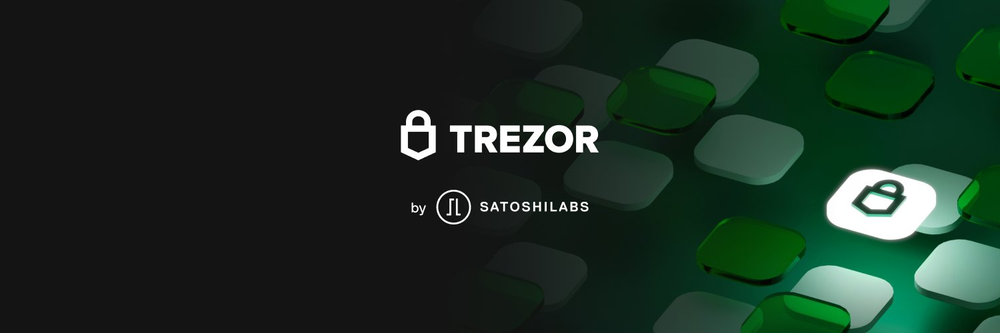

Uma carteira física fria Trezor é ideal para começar no Bitcoin. É fácil de usar, não muito caro e funcional.

Já realizamos tutoriais sobre seu uso:

1. Configuração https://www.youtube.com/watch?v=WB5lWEaaJOE
2. Recuperação de bitcoins https://www.youtube.com/watch?v=bwM0Xm_vSYM
3. Uso, envio e recebimento de bitcoins https://youtu.be/ks-VHtsqjig

### Ledger Nano S

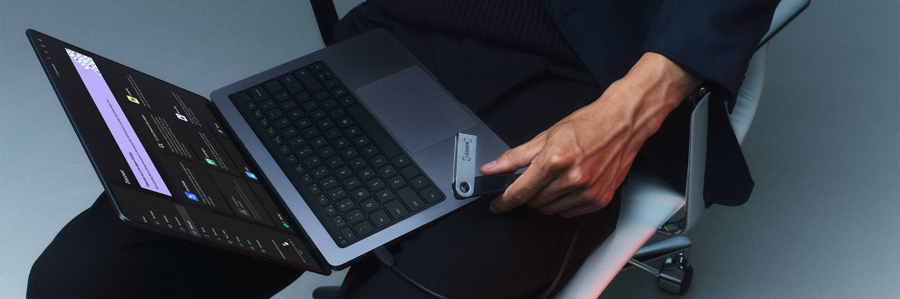

### BitBox02

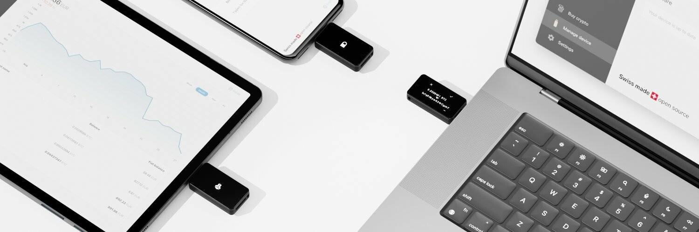

O BitBox02 é uma carteira de hardware suíça especialmente projetada para proteger seus bitcoins. Aqui estão algumas de suas principais características:

Embora essas 3 carteiras estejam entre as mais simples, existem muitas outras. Aqui estão alguns tutoriais rápidos:

- Jade: https://youtu.be/_U1jsTeqbTw
- Coldcard: https://youtu.be/FAYmE5-40PQ
- Fundação: https://youtu.be/_uGZHg64wwA

No mundo das carteiras Bitcoin, existe outro conceito além da distinção entre carteiras frias e quentes, que é a carteira de desktop (desktop wallet).

Se o seu dispositivo de armazenamento é na verdade um chaveiro (privado), a carteira de desktop é uma interface para usá-lo. É extremamente poderoso e conveniente para detentores de Bitcoin, pois essas soluções oferecem maior flexibilidade de uso. De fato, essas carteiras muitas vezes permitem ferramentas avançadas em termos de privacidade e oferecem maior flexibilidade no uso de UTXO. Alguns até se especializam em transações multiassinatura para reforçar ainda mais sua segurança.

O uso de soluções como Sparrow, Specter ou Liana é muito interessante, mas deixarei que você as descubra em um segundo momento!

# Tutorial para comprar bitcoin

## Solução DCA (compra recorrente)

Nesta seção do tutorial, veremos como configurar seu plano de DCA e começar a empilhar sats sem esforço.

### Relai (Suíça)

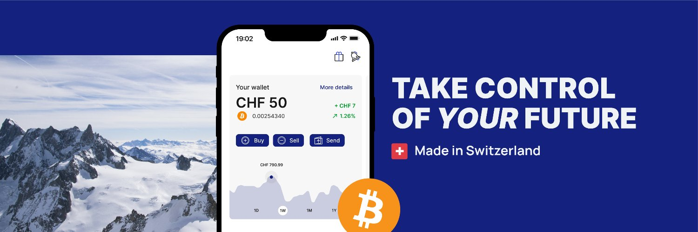

Relai é uma ótima solução de DCA Bitcoin sem complicações. Não é necessário KYC e você tem a segurança suíça por trás do projeto.

### Stakin Sat (francês)

StackinSat é a pequena francesa especializada no plano de poupança Bitcoin. O serviço é muito bom e falo muito sobre ele no canal. Eu até sou acionista deles!
Empilhe sats!

### Bull Bitcoin (canadense)

### Swan Bitcoin (EUA)

## Plataforma tradicional

### Kraken

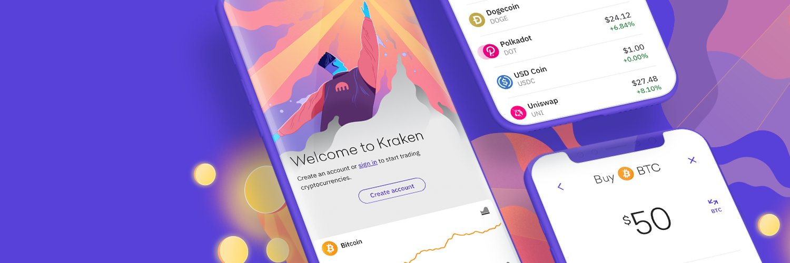

Kraken é uma plataforma de compra e venda de Bitcoin. O uso é KYC e também compatível com Lightning. Essa funcionalidade LN é particularmente útil para pessoas que estão entrando no universo da rede Lightning ou que usam Bitcoin regularmente.

### Bitstamp

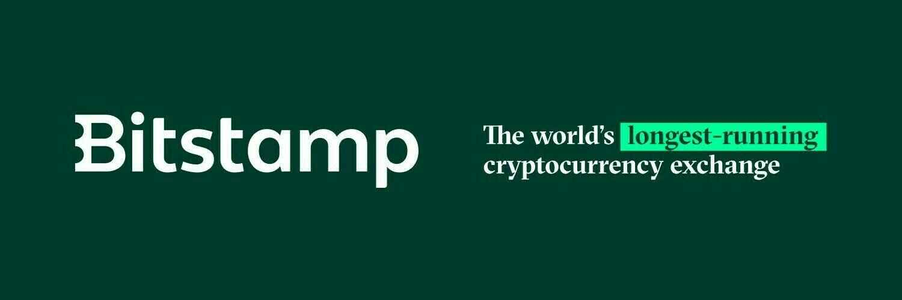

Bitstamp é um "corretor" de Bitcoin para comprar e vender Bitcoin, há muitos volumes e opções. É ideal para empresas ou compradores amadores.

## Soluções não-KYC

Não entraremos em detalhes sobre esse tipo de solução, já que existe um treinamento completo dedicado à compra sem KYC, chamado BTC 205.
O não-KYC é um aspecto fundamental da sua jornada com o Bitcoin e sua segurança. Ele permite que você se exponha sem revelar muitas informações pessoais a um terceiro de confiança. Isso evita que você seja comprometido com seu nome, sobrenome, endereço e outras informações sensíveis em bancos de dados de hackers.

Se esse tipo de solução lhe interessa, aqui está uma lista de soluções que você pode encontrar na seção de tutoriais ou BTC 205:

- Robosat
- Peach
- Hodl Hodl
- Bisq
- LN2t2Bot
- Distribuidor

# O futuro com o Bitcoin

## Criação de um plano de herança

Vamos imaginar o seguinte cenário dramático.

Um acidente de carro, BOOM, você não está mais neste mundo. Você desaparece, deixando sua família sem seu especialista em Bitcoin. Eles não sabem onde está o dinheiro, mas se lembram que você mencionava constantemente termos como chave, lista de palavras e a irreversibilidade das transações Bitcoin. Eles estão arrasados, confusos e agora precisam entender tudo sozinhos. Embora essa situação possa parecer assustadora, é uma possibilidade real que não pode ser ignorada. Você tem duas opções: dedicar entre 15 minutos e 1 hora para estabelecer um plano de sucessão ou não fazer nada. Ninguém vai julgar, mas se as pessoas dependem de você, esses 15 minutos podem fazer uma grande diferença um dia. A escolha é sua.

- Opção 1: Seus entes queridos abrem uma carta contendo um plano claro e fácil de seguir para recuperar com segurança todos os seus ativos cripto.
- Opção 2: Deixar seus entes queridos se virarem sozinhos. Se eles não tiverem uma carteira, um mercado, bens ou comprometerem uma transação, azar o deles, o dinheiro está perdido.

De acordo com Pamela Morgan em "Cryptoasset Inheritance Planning" (página 10), os objetivos de um plano de sucessão são os seguintes:

- Garantir que seus herdeiros possam assumir a posse de seus cripto-ativos no momento certo, mas não antes.
- Minimizar o risco e a possibilidade de alguém roubar seus cripto-ativos antes de serem entregues aos seus entes queridos.
- Oferecer aos seus entes queridos a oportunidade de manter os ativos com segurança, se desejarem.
- Evitar conflitos entre seus herdeiros e prevenir problemas legais tanto quanto possível.

**Direitos autorais:** A próxima lição não é de minha própria criação...
La maioria dos conceitos, ideias e ações propostos nesta lição (6.1 BRH) vêm do livro de Pamela Morgan intitulado "Cryptoasset Inheritance Planning". Este livro propõe um processo fácil de seguir, passo a passo, para estabelecer rapidamente seu plano de sucessão Bitcoin. Este processo é validado por muitos especialistas em segurança da indústria. Embora seja um excelente ponto de partida para criar um plano de sucessão, não constitui um conselho jurídico e você sempre deve (como sempre) verificar as fontes, confrontar as ideias e fazer suas próprias pesquisas. Pamela generosamente me permitiu usar seu trabalho. Agradeço-lhe calorosamente.

Nesta lição, nos concentraremos apenas na primeira parte de seu livro. Eu encarnarei o papel de um usuário Bitcoin típico para criar sua própria carta de sucessão. O processo será simples por enquanto, e criaremos uma versão mais complexa com diferentes tipos de perfis mais tarde: Seguiremos a jornada de Cédric:

- Investidor de longo prazo.
- Detentor de uma carteira física e uma carteira móvel.
- Usuário de uma única plataforma de câmbio com verificação de identidade (KYC).
- Introduzido ao Bitcoin por seu primo.
- Não possui contratos inteligentes, nem Lightning Network (LN), nem alt-coins.

### Pré-requisitos:

Peço 30 minutos do seu tempo, não para mim ou para você, mas para seus entes queridos. O planejamento sucessório é um assunto difícil, muitas vezes negado e esquecido. Como é a última tarefa a ser realizada, muitas pessoas se distraem e acabam perdendo todos os seus BTC de forma boba. Então, dedique 30 minutos e faça isso. É A ETAPA FINAL!

O que você precisa?

- Um momento de tranquilidade, sem distrações
- 4-5 folhas de papel branco
- Uma caneta
- Duas envelopes
- Um telefone / agenda
- Um computador (na minha opinião, é opcional)

De acordo com Pamela Morgan em "Cryptoasset Inheritance Planning" na página 18, os equívocos comuns são:

- Eu preciso contratar um advogado.
- Eu preciso confiar em um terceiro.
- O planejamento tornará meus ativos fáceis de roubar.
- O valor da minha criptomoeda é muito baixo para ser planejado.
- Meus herdeiros descobrirão tudo por si mesmos.
- Tudo isso pode ser feito com um simples contrato inteligente.

### Etapa 1: Selecionar as pessoas adequadas para ajudar seus herdeiros

É necessário designar duas pessoas que ajudarão sua família quando você não estiver mais presente. Assim, seus entes queridos terão à disposição um usuário de Bitcoin confiável e atualizado tecnologicamente, no qual poderão contar durante o processo de recuperação. Essas pessoas poderão:

- Fornecer conselhos sobre gerenciamento de chaves e carteiras.
- Ajudar a entender como recuperar suas frases secretas (seeds) com segurança.
- Oferecer garantia durante uma transação.

Sempre haverá um compromisso entre expertise técnica, disponibilidade e confiança. Se você está em dúvida sobre quem deve assumir esse papel, crie uma tabela simples para ajudá-lo a decidir.

Separação de responsabilidades: A pessoa de confiança NUNCA deve ter acesso à sua chave privada. Seu único papel é ajudar seus entes queridos a entender o sistema de segurança de seus Bitcoins e ganhar confiança. É por isso que você escolhe duas pessoas de confiança. Se necessário, você também pode recorrer a uma organização terceira (advogado especializado ou serviços de planejamento sucessório).

| Pessoa de confiança           | Confiança  | Conhecimento em BTC | Informações de confiança | Nota                                                                             |
| ----------------------------- | ---------- | ------------------- | ------------------------ | -------------------------------------------------------------------------------- |
| Meu irmão Bob                 | Muito alta | Baixa               | Telefone e e-mail        | "Bob não sabe muito sobre BTC, mas podemos confiar 100% nele para ajudar."       |
| Meu primo Nathan              | Alta       | Média               | Telefone e Instagram     | Número 1 das pessoas para conversar. Ele pode ajudar. Ele está ciente.           |
| Ricco (amigo de criptografia) | Média      | Muito alta          | Twitter, e-mail e foto   | Confie nele em questões técnicas. Nunca com dinheiro. Você precisará contatá-lo. |
| YouTuber e influenciador      | Baixa      | Alta                | Link do YouTube          | Eduque-se seguindo-o. Ele não pode ajudá-lo diretamente.                         |

### Etapa 2: Faça um inventário simples e rápido

É importante pensar em todos os lugares onde você tem dólares ou BTC:

- Plataformas de troca
- Carteira móvel
- Carteira física

Considere como você os protegeu e onde esses backups estão armazenados. Não é essencial ter dois locais de backup no momento. O objetivo é fazer uma captura instantânea de sua segurança ATUAL. Podemos melhorá-lo mais tarde! É apenas uma primeira versão para garantir sua segurança no momento, voltaremos a isso com mais detalhes mais tarde.

| Geral               | Software / Hardware | Ativos         | Localização       | Backup (chave privada)   | Senha (PIN, frase secreta) |
| ------------------- | ------------------- | -------------- | ----------------- | ------------------------ | -------------------------- | ------------------------------------------------------------------------------------------- | --- | ----------------- | ------------------ | --- | ------ | ------------------------ | ---------- | --------------------------------------- |
| Plataforma de troca | Bitstamp            | BTC e dinheiro | Acessível online. | -                        | Casa e cofre do banco      | É onde comprei e transferi meus Bitcoins. Faço login usando um gerenciador de senhas e 2FA. |
| Carteira física     | Trezor modelo One   | BTC            | Seguro            | Tio Bob & Cofre do banco | Casa & Mãe                 | Eu tenho duas carteiras, uma normal e outra com passphrase.                                 |     | Carteira Samourai | Móvel - One Plus 6 | BTC | Comigo | Tio Bob & Cofre do banco | Casa & Mãe | O aplicativo pode estar em modo oculto. |

NÃO SE DISTRAIA! Você sente a necessidade de transferir esses ativos para:

- Melhorar sua segurança?
- Vender alguns bens?
- Comprar outros?

NÃO FAÇA NADA! Você pode esquecer o projeto em andamento. PERMANEÇA FOCADO! Você sempre poderá revisar e modificar sua carteira mais tarde.

### Etapa 3: Escreva a carta.

Por motivos de segurança, use uma caneta e papel para escrever uma carta aos seus entes queridos.

- Eu tenho um pouco de criptomoeda
- Entre em contato com esses consultores
- Eu tenho esses ativos aqui
- Eu te amo
  Aqui está um modelo para ajudá-lo a começar. Se você não quiser escrever a carta sozinho, pode baixar um modelo e simplesmente preencher os espaços em branco. (link aqui)

Comece explicando o objetivo da carta e alertando seus entes queridos sobre os perigos da autogestão de criptomoedas.

A carta deve ser clara e útil. Não é um testamento, nem uma carta para fazê-los chorar. Também não é uma carta para forçá-los a nunca vender, nem uma carta para escrever as chaves privadas. É uma carta para ajudá-los a entender o que você fez, para que possam tomar a melhor decisão e agir com segurança.

Aqui está um trecho do modelo de carta para um ente querido, retirado do Apêndice E do livro de Pamela Morgan, "Cryptoasset Inheritance Planning". Para adaptá-lo ao nosso exemplo, eu modifiquei algumas passagens, que coloquei entre parênteses e marcadas em azul. O restante do texto é o texto original do livro. (Traduzido por Découvre Bitcoin)

"Data: 26/06/2020
Queridas Liz e Maia,
Eu amo vocês profundamente e sei que vocês serão fortes.
Estou escrevendo esta carta para informá-las que possuo criptoativos que podem ter valor.
Por favor, leiam esta carta com atenção e completamente antes de tomar qualquer ação. Esses ativos são diferentes de outros ativos, pois uma vez transferidos, não há como recuperá-los."

Em seguida, incluímos a "seção de consultores". Essa parte pode ser confusa para seus herdeiros, especialmente se você mencionar pessoas ou organizações que eles não conhecem. Seja preciso sobre:

- Como contatá-los
- Como identificá-los
- Quais são suas áreas de especialização.
- Como eles podem se educar por conta própria.
  Abaixo está uma lista de pessoas em quem confio para responder às suas perguntas e ajudá-lo no processo de descoberta e transferência desses ativos. Entre em contato com as pessoas indicadas, mas não confie em uma única pessoa para gerenciar o processo. Esteja atento a todos os consultores, incluindo aqueles listados aqui. Todo mundo pode cometer erros, então certifique-se de entender o que eles estão fazendo da melhor maneira possível e não tenha medo de fazer perguntas e verificar as respostas por si mesmo.

Aqui estão as pessoas que podem ajudá-lo a responder perguntas e orientá-lo neste processo:

(Insira aqui o nome de seus consultores, sua afiliação a uma organização (se houver), suas informações de contato e como eles devem verificar sua identidade, por exemplo, banco de dados de chaves, fotos.)

- Meu irmão Bob; +33 09 XX 68 18 36; Bobmybrother@gmail.com. Você pode confiar em Bob para ajudá-lo neste processo. Embora ele não seja o mais habilidoso tecnicamente, ele é a pessoa certa para questionar tudo e ser cauteloso para garantir sua segurança e sucesso.
- Meu primo Nathan; +33 09 XX 29 35; NathanDeladzcroix@Hotmail.com. Foi Nathan quem me apresentou ao Bitcoin. Ele é muito competente em tecnologia e poderá responder à maioria de suas perguntas. Ele também possui alguns bitcoins e poderá orientá-lo tecnicamente. Você já o viu várias vezes em reuniões de família e incluí uma foto dele aqui.
- Ricco; @RiccoSFC no Twitter; Ricco425@protonmail.com. Trabalho em estreita colaboração com Ricco há muitos anos. Você nunca o conheceu, então certifique-se de falar com a pessoa certa perguntando "Qual é o nome do cachorro de Cédric". Se ele responder "12", está tudo bem. Ricco é um especialista muito amigável e competente em Bitcoin. Ele responderá a todas as suas perguntas e você pode confiar em seu julgamento sobre a segurança do Bitcoin. Não tenha medo de contatá-lo, já o encontrei várias vezes e ele está ciente de tudo sobre você e Maia.
- Pode parecer estranho, mas entre em contato com todos eles. Além disso, você pode se educar ouvindo Andreas Antonopoulos no YouTube e comprando o livro "Cryptoasset Inheritance Planning" de Pamela Morgan.

Agora, adicionamos a seção Inventário. Comece listando seus dispositivos e onde você mantém seus bitcoins.

- Telefone: carteira móvel
- PC de mesa: plataformas de troca, aplicativos, jogos, sites
- Mova para carteiras físicas
- Frase secreta (passphrase)
- Multisig
  Quando mencionar onde a cópia de segurança está armazenada, utilize uma localização geral e não um endereço específico. Se possuir algo para além de bitcoins, deixe isso claro.

"Segue-se uma lista dos dispositivos, software e carteiras que utilizo para aceder a estes activos. Por favor, guarde todos estes dispositivos num local seguro e guarde-os até que os bens sejam transferidos para os meus herdeiros. Não permitam que ninguém tenha acesso sem supervisão.

(Insira aqui o seu inventário de activos criptográficos)

- "Utilizei o meu telemóvel (Samsung Galaxy S8) para aceder à minha carteira Samourai. A chave privada que protege a carteira está guardada no cofre do banco e outra cópia está na casa do tio Bob. O código PIN para desbloquear o meu telemóvel e a carteira está guardado em casa e na casa da minha avó.
- Utilizo o meu computador Dell 2018 para aceder a uma plataforma de negociação online chamada Bitstamp. Posso ainda ter Bitcoins ou dólares nesta plataforma. Para aceder à minha conta, terá de os contactar directamente ou entrar na minha conta (cuidado, isto pode ser ilegal - verifique a sua legislação local).
- Utilizei um gestor de palavras-passe para aceder à conta e a minha cópia de segurança encontra-se no cofre do banco. A conta também está protegida por uma autenticação de dois factores, à qual se pode aceder através do meu telemóvel (Samsung Galaxy S8) ou utilizando o código de segurança guardado em casa.
- Também tenho BTC num dispositivo Trezor Model One. Acedo-lhes através do meu PC e do site Trezor.io. As chaves de segurança privadas são guardadas no cofre do banco e em casa do tio Bob. O código PIN é guardado em casa e na casa da minha mãe. O dispositivo em si está provavelmente num cofre no meu escritório.
- Utilizo uma frase secreta de segurança avançada para o meu dispositivo Trezor. A cópia de segurança desta frase secreta encontra-se em casa e em casa da minha mãe".

Concluímos agora a carta com algumas informações legais, se necessário, bem como algumas palavras amáveis.

"Atenção: Encontrará uma cópia do meu testamento, datado de 17 de Abril de 2018, na minha pasta de documentos. O meu advogado, Dwight Schrute, com sede em Scranton, na Pensilvânia, também tem uma cópia. Por favor, tenham cuidado e lembrem-se sempre do meu amor por vós." 26/06/2023, Cedric "

Agora vamos verificar o nosso trabalho (De "Cryptoasset Inheritance Planning" por Pamela Morgan, página 44 (traduzido por Discover Bitcoin).) :

- Ajuda: verifique se incluiu nomes, dados de contacto e, se possível, fotografias.
- Dispositivos: Certifique-se de ter listado seu telefone, computador, carteiras físicas e carteiras de papel.
- Ativos: Certifique-se de ter incluído a lista de seus ativos.
- Exchanges: Verifique se você listou todas as exchanges que possuem fundos para você.
- Acesso: Liste as informações que eles precisarão para encontrar seu local de armazenamento, bem como todos os códigos de acesso necessários.

Se você marcou todas as caixas, então está pronto para as últimas etapas! Faça uma cópia desta carta e guarde as duas cópias em um envelope. Feche-o, assine o selo e guarde este envelope em um local seguro, mas acessível. Certifique-se de que seus herdeiros saibam que precisam recuperar este envelope, se necessário. Não hesite em comprar o livro de Pamela para aprofundar este assunto e planejar um momento para melhorar seu plano de herança. Discuta também com seu notário para integrar legalmente este plano ao seu testamento oficial.

Parabéns! Você tem uma primeira versão do seu plano de herança e é um excelente começo!

_Planejamento de Herança de Criptoativos, Um guia simples para proprietários, Pamela Morgan, ESQ. Copyright 2018 por Merkle Bloom LLC, Todos os direitos reservados. CC-BY_ Um grande obrigado a Pamela Morgan por seu valioso trabalho e por me permitir compartilhá-lo. Obrigado também a todos que contribuíram para sua escrita.
Vocês são os melhores :D Minha equipe e meus alunos também agradecem!

# Agradecimentos e continue a cavar a toca do coelho

## Parabéns! VOCÊ ESTÁ NO TOP 0,1%

Se você seguiu nosso conteúdo desde o início, agora é um verdadeiro cidadão do século 21 e um dos mais experientes no campo do Bitcoin! Você usa um gerenciador de senhas e autenticação de dois fatores (2FA). Você entende o que é o Bitcoin e por que é importante. Você possui Bitcoins e tem uma maneira segura de comprá-los ou ganhá-los. Você armazenou seus Bitcoins em uma carteira "fria" e implementou uma gestão adequada de chaves. Você criou um plano de herança para seus entes queridos. Agora você está seguro e pode relaxar! Desfrute de uma cerveja e fique orgulhoso de si mesmo!

Estou realmente orgulhoso de você ter alcançado este estágio. Eu realmente acredito nisso. O que fazer em seguida? Embora você deva definitivamente relaxar agora e se orgulhar de si mesmo, sua jornada com o Bitcoin está longe de terminar e nunca realmente terminará. Aqui estão algumas opções para o próximo passo:

1. Você pode simplesmente continuar como tem feito até agora. Continue acumulando bitcoins aos poucos e deixe sua estratégia se desenrolar ao longo do tempo. Você já tem um nível de segurança suficiente, tudo está em ordem e você fez o que era necessário para você e sua família. Você não precisa se tornar um especialista em negociação e não precisa saber muito mais sobre investimentos. Provavelmente você tem um trabalho ao lado e, embora o Bitcoin seja emocionante, seu objetivo principal era chegar a este ponto. Isso é verdade para a maioria de vocês e eu respeito isso. Estou muito feliz que você tenha chegado até aqui no "buraco do coelho" do Bitcoin e espero que a jornada tenha sido agradável. Obrigado por confiar em mim para ajudá-lo a proteger seus primeiros bitcoins.

2. Você pode querer continuar se educando sobre os aspectos técnicos, ideológicos e filosóficos do Bitcoin. Se você sente que sua jornada está apenas começando, eu o encorajo a continuar aprendendo sobre o Bitcoin. Há tanto para aprender que às vezes é difícil saber por onde começar. Aqui está uma lista de cursos e treinamentos que podem acompanhá-lo:

- Nó Bitcoin e Lightning Network: a Lightning Network, como já vimos várias vezes, traz uma visão completamente diferente do que é o Bitcoin. Através desta camada dois, as possibilidades são múltiplas e uma indústria inteira está sendo construída sobre ela. Para acompanhá-lo na descoberta, convido-o a fazer o LN 201 para um curso teórico ou o LN 202 para um curso prático. Esses dois cursos são acessíveis a todos neste estágio de aprendizado e podem ajudá-lo a entender melhor esse novo aspecto do Bitcoin.
- Economia austríaca: se a economia e as finanças são assuntos que lhe interessam, então o curso ECON 201 é provavelmente o certo para explorar os aspectos mais profundos da economia austríaca. Lá você descobrirá esse movimento de pensamento econômico que se opõe ao movimento mais tradicional do keynesianismo. É um bom começo para questionar nosso sistema e entender como chegamos aqui do ponto de vista da inflação e da manipulação monetária.
- Solução para comerciantes: finalmente, se você é mais do tipo que realmente quer usar o Bitcoin, pode ir para nossa seção de tutoriais e explorar as muitas soluções para comerciantes. Isso pode oferecer oportunidades em nosso meio, mas também pode ajudar sua empresa ou amigos a aceitar o Bitcoin em seus negócios e, assim, girar uma economia local baseada em Bitcoin em sua cidade!

Em qualquer caso, todos os nossos cursos são gratuitos e muitos recursos ou tutoriais estão disponíveis em nossa plataforma para acompanhá-lo. Boa sorte em seus estudos!

## Nota sobre o curso!

## Apoie o curso!

Este curso, assim como todo o conteúdo presente nesta universidade, foi oferecido gratuitamente pela nossa comunidade. Para nos apoiar, você pode compartilhá-lo com seus amigos, tornar-se um membro da universidade e até mesmo contribuir para o seu desenvolvimento através do GitHub. Em nome de toda a equipe, obrigado!
