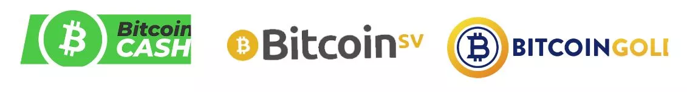
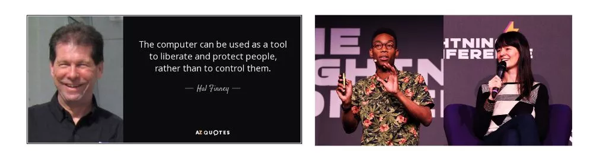
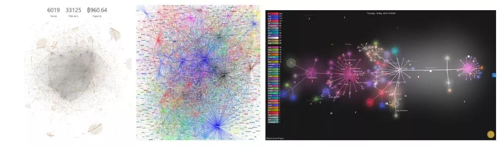
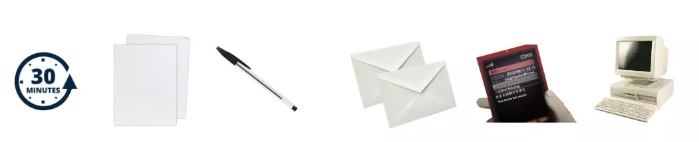

# Путешествие к вашим первым биткойнам

Индустрия вокруг Bitcoin процветает.

Технологические и финансовые изменения в этом новом мире только ускоряются, и от вас зависит воспользоваться этим и начать погружение в Кроличью Нору Bitcoin. Это приключение будет богатым на знания и заставит вас пересмотреть многие из ваших убеждений. Оно вернет вам свободу и позволит вновь обрести приватность, суверенитет и финансовую независимость.

Чтобы помочь вам начать это приключение, я создал этот бесплатный курс. Только Bitcoin, без лишних слов, без других криптовалют, курс прямо к делу. Этот курс был разработан с учетом ваших потребностей и позволяет вам выбрать путь, который подходит именно вам.

+++

# Введение и предпосылки для понимания Bitcoin
<partId>008c49b7-5e17-5973-87f2-ba28429b2697</partId>

## Введение в курс BTC102
<chapterId>bfc96999-0ee1-5c41-8297-1b629f50cffc</chapterId>

Добро пожаловать на BTC 102! Практический курс, который направит вас в настройке вашего плана Bitcoin! В рамках этого курса мы подготовимся к получению ваших первых биткойнов, их надлежащему обеспечению безопасности и обеспечим гладкий вход в эту новую индустрию.

Индустрия Bitcoin все еще молода и считается постоянно развивающимся явлением. Несмотря на многолетние попытки регулировать этот рынок, он остается крайне свободным из-за природы своего базового протокола.

Поскольку его нельзя полностью регулировать, Bitcoin смог органично и децентрализованно расти более 14 лет. Поэтому это индустрия в полном эмбриональном взрыве и стремится к дальнейшему росту.

С взрывом инноваций и возможностей приходят мошенничества, обман и риски. Само собой разумеется, что ваше путешествие в мире Bitcoin не будет без препятствий или ошибок. Однако, чтобы помочь вам избежать их насколько это возможно, этот курс будет служить практическим руководством для начала. С другой стороны, курс BTC 101 более теоретический для понимания работы Bitcoin.

В этом курсе мы сосредоточимся на 4 аспектах:

- Пересмотр основ и предпосылок, чтобы убедиться, что мы не станем жертвами мошенничества или не потеряем свои деньги глупо.
- Основательно рассмотреть, почему Bitcoin важен и понять его индустрию. Это укрепит наши убеждения и поможет нам понять, во что мы ввязываемся.
- Настроить ваш первый кошелек Bitcoin и совершить вашу первую покупку биткойнов через платформу обмена. Здесь мы будем искать наиболее подходящее решение для ваших потребностей. Наконец, последний раздел будет адресован фундаментальному концепту для вашей безопасности, но тот, который слишком часто упускается в индустрии: как создать план наследования Bitcoin.

Как видите, цель этого обучения - сопровождать вас, чтобы вы с самого начала придерживались лучших практик нашей индустрии простым и быстрым способом!

Удачи :)

## Мошенничества и финансовые аферы
<chapterId>8af2948b-2ab5-54c4-862c-3414b8a285a2</chapterId>

Мы находимся в индустрии, где в секторе "криптовалют" выделяются две основные ветви:
1. Индустрия Bitcoin, сосредоточенная на создании надежной валюты через децентрализованный протокол передачи ценностей (Bitcoin). Она ценит приватность и индивидуальный суверенитет и постепенно строит долгосрочные проекты с высоким уровнем устойчивости и безопасности.
2. Глобальная индустрия криптовалют, ориентированная на финтех, "блокчейн" и другие централизованные инновации. Она развивается стремительно и пытается позиционировать себя как новый тренд.

Весь акцент этого университета сделан на Вселенной Bitcoin, а не на крипто.

Домен криптовалют, включая Bitcoin, остается относительно молодым и слабо регулируемым. Поэтому он богат различными мошенничествами. Понимание опасностей и узнавание типичных ловушек имеет решающее значение. Вот некоторые часто встречающиеся ситуации мошенничества:

- Онлайн пожертвования и лотереи
- Схемы Понци
- Накачка и сброс
- Группы и влиятельные лица Shitcoin
- Отклонение / Хард Форк
- Взломы
- Фальшивый выкуп
- Мошенничество с паролями
- Угон SIM-карт

В области финансовых инвестиций системы продажи по пирамиде и схемы Понци выделяются как незаконные модели. Они работают, используя деньги новых инвесторов для выплаты старым участникам. Однако их неустойчивая природа и зависимость от новых приходящих, чтобы система продолжала работать, делают их склонными к неизбежному коллапсу.

Эти системы часто характеризуются сомнительными элементами, такими как отсутствие внутренней ценности, обещания нереалистичных доходов и маркетинговые тактики, которые поощряют рекомендации для привлечения новых инвесторов. Несжимаемые задержки с выводом средств и использование фальшивых профилей в социальных сетях для продвижения также являются явными признаками этих мошенничеств. Учитывая их незаконный и аморальный характер и финансовый риск, который они представляют, избегать их крайне важно.
В конечном итоге, эти системы обречены на провал. Со временем требование увеличения числа новых участников для поддержания системы становится непреодолимым. Когда этот момент наступает, иллюзия рассеивается, система рушится, и инвесторы часто оказываются без средств для восстановления своих инвестиций.

Схемы Понци могут проявляться различными способами. Иногда они маскируются под новые предложения токенов или первичные предложения монет (ICO), комбинации смарт-контрактов, попытки монополизировать фиатную валюту или даже маркетинговые программы без какого-либо реального продукта. Однако тщательное расследование и должная осмотрительность показывают, что эти системы не создают реальной ценности. Они просто перераспределяют деньги от новых участников, чтобы выплатить старым.

Недавно мир криптовалют увидел волну проектов, связанных с Децентрализованным Финансированием (DeFi), которые заслуживают особого внимания. Некоторые из этих проектов могут прибегать к комбинации криптовалют низкого качества, смарт-контрактов и систем процентных ставок, чтобы предложить якобы чудодейственные финансовые решения. Крайне важно проявлять осторожность и должную осмотрительность перед этими крайне мошенническими предложениями.

Следует отметить, что содержание этого курса предназначено исключительно для образовательных целей и не должно трактоваться как финансовый совет. Призыв "доверяй, но проверяй" остается важным руководством. Крайне важно, чтобы каждый проводил собственное исследование и принимал обоснованные финансовые решения.

Накачка и сброс (Pump and Dump, P&D) является печально известной формой финансовой манипуляции, которая может вызвать значительные сбои на рынках. Она характеризуется координированной атакой, направленной на искусственное увеличение цены актива через различные механизмы, такие как агрессивный маркетинг, использование алгоритмов или искусственного интеллекта. Цель состоит в том, чтобы затем продать эти переоцененные активы с целью получения прибыли.

Стратегия накачки и сброса обычно следует хорошо определенному паттерну:

1. Лидер мнений или группа инвесторов сначала покупает большое количество целевых акций или других активов.
2. Затем они создают ажиотаж вокруг этих активов и распространяют преувеличенную или вводящую в заблуждение информацию, чтобы привлечь других инвесторов.  
3. Этот ажиотаж вызывает FOMO (Fear Of Missing Out - Страх Упустить Возможность) среди человеческих инвесторов и инвестиционных ботов, которые начинают массово покупать эти активы.  
4. Как только цена достаточно повышается, лидеры продают свои активы оптом, таким образом получая значительную прибыль.  
5. Массовая распродажа приводит к резкому падению цены актива, оставляя многих инвесторов с существенными потерями.

Важно понимать, что участие в таких стратегиях является незаконным и может привести к обвинениям в манипуляции на рынке. Кроме того, эти стратегии часто организуются влиятельными группами, которые взимают плату за членство. Хотя некоторые участники могут достичь краткосрочных выгод, стратегии Pump and Dump в целом не являются прибыльными в долгосрочной перспективе.  
Поэтому рекомендуется сосредоточиться на финансовом образовании и ответственном инвестировании, а не поддаваться на такие манипулятивные тактики. Приобретение твердых знаний и принятие долгосрочного подхода являются ключевыми элементами успеха в мире инвестиций.

Мошенничества, связанные с онлайн-конкурсами или пожертвованиями, очень распространены в криптосекторе. Реклама, обещающая бесплатные биткойны, часто используется для обмана неопытных пользователей. Основные принципы, которые следует иметь в виду: никогда не отправляйте биткойны в ожидании их возврата и будьте осторожны с обещаниями нереалистичной прибыли. Крайне важно не доверять на слово, особенно когда речь идет о баннере в интернете.

Классическим примером такого мошенничества является предложение, утверждающее, что оно удвоит или увеличит в несколько раз биткойны, которые вы отправите. Важно понимать, что магического решения для мгновенного обогащения не существует.

Другой часто используемой тактикой является пожертвование "shitcoins" или криптовалютами с низкой стоимостью. Некоторые централизованные криптовалютные проекты проводят много маркетинга и предлагают бесплатные токены в качестве подарков. С этими предложениями следует быть очень осторожными, так как либо токен не имеет ценности, либо подарок просто используется для привлечения внимания и продвижения торговли, азартных игр и других мошенничеств. Даже если эти предложения не всегда являются мошенническими, незаконными или вводящими в заблуждение, все равно требуется бдительность.
Например, на Twitter боты могут выдавать себя за известных личностей и предлагать невероятные сделки, чтобы обмануть людей. Эти аккаунты используют то же имя и фотографии профиля, что и у соответствующей личности, и таким образом могут обмануть менее опытных пользователей. Всегда убедитесь в подлинности аккаунта перед взаимодействием с ним.
Также важно быть осторожным с ссылками, отправленными по электронной почте. Всегда проверяйте ссылку перед кликом по ней и обращайте внимание на идентичность отправителя.

Наконец, вот несколько советов, как избежать онлайн-мошенничества:

- Честные люди никогда не попросят вас напрямую отправить деньги.
- Никогда не отправляйте биткойны на неизвестный адрес.
- Обещания нереалистичной прибыли всегда вызывают подозрения.
- Конкурсы, скорее всего, будут сфальсифицированы.
- Вы всегда получите больше, обучаясь, чем играя.
- В случае сомнений не действуйте сразу. Уделите время на размышления и исследования. FOMO (Страх Упустить Возможность) может быть вашим худшим врагом.
  Всегда помните о необходимости проведения собственного исследования перед принятием инвестиционного решения.

Биткойн пережил несколько хардфорков за все время, что привело к появлению различных альтернативных версий оригинальной валюты. Эти отклонения часто являются работой разработчиков, стремящихся внести значительные изменения в протокол Биткойна, или иногда злонамеренных лиц, стремящихся обмануть наивных инвесторов. Важно отличать настоящий Биткойн от этих производных, чтобы избежать попадания в потенциальные ловушки. Заметные примеры этих отклонений включают Bitcoin Cash (BCH) и Bitcoin Satoshi Vision (BSV). Несмотря на название "Биткойн", эти проекты в основном основаны на маркетинговых тактиках и ложной рекламе для привлечения внимания инвесторов.

В мире инвестиций существует популярная поговорка: "Если это выглядит как мошенничество, ведет себя как мошенничество и гарантирует, что это не мошенничество, то, скорее всего, это мошенничество."
Следует отметить, что некоторые из этих отклонений хорошо финансируются и тратят много на коммуникации, чтобы обмануть пользователей. Например, веб-сайт "Bitcoin.com" ассоциируется с Bitcoin Cash, а не с оригинальным Bitcoin, что может сбивать с толку новичков. Официальный веб-сайт Bitcoin - "bitcoin.org".

Мир криптовалют является плодородной почвой для всех видов личностей, привлеченных потенциалом значительных прибылей. К сожалению, среди них есть лица с злонамеренными намерениями, которые прибегают к различным тактикам, чтобы обмануть и обворовать инвесторов.
Эти тактики могут включать открытое продвижение пирамид, выдавание себя за создателя Bitcoin, Сатоши Накамото, плагиат чужих работ или делание ложных обещаний. Кроме того, некоторые из этих лиц создают бесполезные криптовалютные токены и первичные предложения монет (ICO), чтобы обмануть инвесторов.

Сообщество Bitcoin часто мобилизуется, чтобы осудить эти действия, но может пройти некоторое время, прежде чем правовая система сможет принять меры против этих лиц.

Поэтому крайне важно оставаться бдительным и проявлять разборчивость во взаимодействиях с миром криптовалют. Мой личный совет - игнорировать этих лиц и их практики. Они не заслуживают вашего времени или энергии. Вместо этого посвятите эти ресурсы приобретению знаний и пониманию рынка криптовалют, чтобы навигировать в этом мире осознанно и безопасно.

Необходимо с осторожностью относиться к "крипто-инфлюенсерам" или "гуру". Эти лица часто имеют личные повестки дня и могут быть вовлечены в многочисленные проекты, которые они стремятся продвигать, даже если они не всегда соответствуют интересам инвесторов.

Эти инфлюенсеры могут пытаться продвигать ненадежные криптовалюты или "shitcoins" и реализовывать различные стратегии для увеличения стоимости своих инвестиций, даже если они небезопасны или потенциально мошеннические.
Вот несколько советов для навигации в этой среде:

- Будьте осторожны с любым, кто продвигает определенную криптовалюту или предлагает транзакции.
- "Бесплатные советы" часто на самом деле не бесплатны и могут скрывать другие намерения.
- Дважды подумайте, прежде чем платить за обучение торговле. Существует множество бесплатных ресурсов, которые помогут вам понять рынок криптовалют (например, YouTube-канал 'ukspreadbetting').
- Невозможно просто скопировать чьи-то сделки и ожидать тех же результатов.
- Помните, что не всегда то, что говорит кто-то, обязательно является правдой.

Лучший способ защитить себя - проводить собственное исследование и проверять источники информации. Просмотр видео на YouTube недостаточен для проверки источников.

Важно отметить, что у каждого есть своя повестка дня, включая меня. Я верю в Bitcoin и моя цель - его продвижение. Я надеюсь извлечь выгоду из этого продвижения, как в политическом, так и в финансовом плане. Никакой контент никогда не бывает совершенно бесплатным - если продукт или услуга кажутся бесплатными, скорее всего, это потому, что вы являетесь продуктом.
Всегда помните, что не все обязательно будут прозрачны в своих намерениях. Всегда ставьте под сомнение цель чьих-либо действий и не доверяйте им слепо.

## Онлайн-безопасность
<chapterId>f0873bf2-6a6f-5485-bb7a-d84be14f404d</chapterId>

Помимо мошенничества с криптовалютами и финансовых мошенничеств, основная причина потери биткойнов связана с плохим управлением онлайн-безопасностью. Часто бывает, что люди используют один и тот же пароль для всех своих аккаунтов, забывают обновлять свой компьютер и пренебрегают регулярным резервным копированием своих данных. Если вы обеспокоены этими практиками, не волнуйтесь, всегда есть возможность улучшить свои привычки в области онлайн-безопасности. Вот некоторые основные меры, которые следует реализовать:
- Используйте менеджер паролей (см. учебник по LastPass),
- Включите двухфакторную аутентификацию (2FA),
- Поддерживайте ваш компьютер в актуальном состоянии и без вредоносных программ,
- Цените вашу конфиденциальность, используя специализированные инструменты (Signal, Tor, ProtonMail).

Если эта тема вам совершенно неизвестна, обучение SECU 101 может быть интересным для детального изучения.

Крайне важно поддерживать ваш компьютер в оптимальном рабочем состоянии, независимо от того, интересуетесь вы Bitcoin или нет. Обновление не только добавляет новые функции: оно также исправляет ошибки и повышает безопасность вашего программного обеспечения. Поэтому обязательно:

- Всегда обновляйте ваше программное обеспечение,
- Используйте надежное антивирусное программное обеспечение,
- Будьте осторожны при скачивании файлов,
- Регулярно делайте резервные копии ваших данных,
- Никогда не делитесь вашими паролями.

Дополнительный совет: рассмотрите возможность покупки внешнего жесткого диска и выполните полное резервное копирование ваших важных файлов. Это может быть бесценным в случае сбоя компьютера.

Менеджер паролей — это программное обеспечение, которое хранит и управляет вашими паролями. Он помогает вам никогда не использовать один и тот же пароль дважды, выбирать сложные и безопасные пароли и облегчает управление вашей онлайн-безопасностью. Вам нужно запомнить только один главный пароль. Это бесплатный инструмент, которым должен воспользоваться каждый. Вы можете начать использовать его постепенно, и как только вы привыкнете к нему, вы найдете его чрезвычайно удобным и легким в использовании.

2FA обеспечивает дополнительный уровень безопасности для ваших наиболее чувствительных аккаунтов, будь то платформы криптовалют, аккаунты Google/Email, банки или сайты онлайн-покупок. Для входа требуется вторая идентификация, обычно 6-значный код, доступный с вашего телефона. Не забудьте сохранить резервную копию ключа где-нибудь на случай, если вы потеряете телефон.

VPN, или Виртуальная Частная Сеть, защищает вашу конфиденциальность, скрывая ваш IP-адрес. Хотя это не делает вас полностью анонимным, это все же простой и эффективный шаг для улучшения вашей онлайн-конфиденциальности. Выбор VPN, его скачивание и использование — это простой процесс настройки.

Онлайн-анонимность жизненно важна для свободного и процветающего общества. Она обеспечивает свободу выражения мнений, защиту свидетелей и инновации. Конфиденциальность является фундаментальным человеческим правом. Чтобы продолжать защищать вашу конфиденциальность, рассмотрите возможность использования:

- PGP для ваших электронных писем,
- Signal для ваших сообщений,
- Firefox или TOR для вашего серфинга в интернете,
- Sync для обмена файлами,
- Bitlocker для шифрования ваших данных,
- Samurai Wallet для переводов денег.

Еще раз, если вы заинтересованы в этой теме, обучение SECU 101 доступно для вашего руководства.

## Советы для начинающих
<chapterId>33134b3f-92c1-5185-afb6-88599e47e801</chapterId>

Формальное образование учит нас очень малому о инвестировании. В результате мы часто в одиночку проникаем в этот новый и сложный ландшафт инвестиций.

В этом разделе мы рассмотрим некоторые распространенные ошибки, которые начинающие инвесторы делают, входя в мир Bitcoin, и как вы можете избежать попадания в те же ловушки. Мы также обсудим, как мудро планировать ваше инвестирование в Bitcoin. Темы, которые мы рассмотрим, включают:

- Будьте осторожны с "Shitcoins" или другими криптовалютами без внутренней ценности.
- Инвестируйте только то, что вы можете позволить себе потерять.
- Понимайте разницу между торговлей и инвестированием.
- Будьте в курсе налоговых последствий.
- Правильно управляйте вашим приватным ключом.
- Важность оставаться скромным и дискретным.
- Принятие долгосрочной перспективы.

Прежде чем погружаться в инвестирование в Биткоин, крайне важно уделить время на обучение. В индустрии Биткоина легко совершить ошибки, и каждая ошибка может обойтись дорого. Делясь некоторыми из препятствий, с которыми я столкнулся на своем пути инвестирования, а также теми, которые наблюдал у других, я надеюсь предоставить ценные советы для ориентации в этой сфере. Некоторые из этих ошибок включают:

| Технические проблемы                                   | Финансовые проблемы                                           |
| ------------------------------------------------------ | -------------------------------------------------------------- |
| Потеря приватного ключа                                | Чрезмерное инвестирование                                      |
| Доверие хранения ваших активов третьей стороне         | Недостаток финансового образования                            |
| Недостаток конфиденциальности                          | Инвестирование заемными средствами                            |
| Проблемы с онлайн безопасностью                        | Непонимание разницы между торговлей и инвестированием         |
| Неправильное обращение                                 | Игнорирование налоговых последствий                           |
| Проблемы с компьютером                                 | Неучет временных рамок инвестирования                         |
| Потеря BTC из-за взлома                                | Попадание на финансовые мошенничества и аферы                 |

Независимо от вашего уровня образования или профессионального фона, каждый может понять и использовать Биткоин. Не нужно иметь опыт в финансах или программировании. Как и 90% людей, вы можете просто использовать Биткоин простым способом.

Каждый человек уникален и должен адаптировать свою инвестиционную стратегию к своему личному финансовому положению. Вот некоторые хорошие и плохие практики:

- Регулярные средние покупки - это хорошая практика.
- Использование кредитного плеча, например, заем денег для инвестирования, обычно не рекомендуется.
- Избегайте FOMO (Fear Of Missing Out), что может привести к импульсивным инвестициям.
- Выделение конкретного бюджета для вашего инвестирования - это хорошая практика.

Цель не в том, чтобы иметь идеальный план, а скорее иметь структуру для следования и придерживания. Вы не хотите покупать на основе эмоций или страха. Вы хотите следовать стратегии, которую вы предварительно записали, чтобы избежать ненужного стресса.

Нет возрастного предела для обучения инвестированию; вы можете начать с очень маленькой суммы и прогрессировать со временем. Образование - это путешествие.

- Золотое правило инвестирования: никогда не инвестируйте больше, чем вы можете себе позволить потерять! Идея состоит в том, чтобы взять все ваш месячный доход, вычесть ваши обязательные расходы (долги и другие ежемесячные расходы, такие как жилье), вычесть ваши расходы на жизнь (еда). Затем у вас останется ваш бюджет на сбережения. Если вы инвестируете больше, чем это, рано или поздно вы столкнетесь с проблемами!
- Золотое правило инвестирования №2: Избегайте того, что в моде. Сосредоточьтесь на прогрессе, принимая рациональные решения. Если у вас есть сомнения, подумайте над этим и обсудите с близкими. Лучше потратить время, чем спешить. Лучшая стратегия - это прогрессировать шаг за шагом.
- Золотое правило инвестирования №3: Планирование и наличие долгосрочного видения жизненно важны для успеха в финансах. Планируйте и не принимайте слишком много рисков. Цель - избежать фатальных неудач, накапливая успехи.

В случае сомнений: Начните с обучения. Изучите мир Биткоина несколько часов (на этой платформе доступно множество ресурсов). Прочитайте 2 или 3 книги. Купите на 5 евро, чтобы попробовать. Смотрите документальные фильмы и видео. Будьте открытыми.

Как и в любом инвестировании, вам нужно знать ваш рынок. Биткоин очень молод и волатилен, что означает, что ситуация быстро меняется, и существует определенный уровень риска. Биткоин может исчезнуть, упасть до нуля или застопориться на годы. Само собой разумеется, что вы должны инвестировать только то, что можете себе позволить потерять! Не влезайте в долги, чтобы инвестировать в валюту, чьи тонкости вы можете еще не полностью понимать.
Как только вы станете более уверенно ориентироваться в мире Bitcoin, вы можете пересмотреть свой план действий. Аналогично, если вы новичок в этой сфере, важно понимать различия между торговлей, долгосрочным инвестированием и очень, очень долгосрочной стратегией, которую используют многие биткоинеры, называемой "холд".
В общем:

|                   | Торговля   | Инвестирование    | Холдинг        |
| ----------------- | ---------- | ----------------- | -------------- |
| Плечо             | Да         | Нет               | Нет            |
| Временной период  | Краткосрочный | Кратко/среднесрочный | Очень долгосрочный |
| Тип актива        | Контракт   | BTC               | BTC            |
| Риск              | Очень высокий | Высокий          | Высокий        |
| Сложность         | Очень сложно | Сложно           | Сложно         |
| Кривая обучения   | Длинная    | Длинная           | Длинная        |
| Потенциальные потери | Неограниченные | Ограниченные    | Ограниченные   |
| Более подходит для | Некоторых  | Большинства       | Некоторых      |

И вот мои рекомендации:

- Выбор стратегии с долгосрочной перспективой часто является мудрым решением. Постоянное отслеживание рыночных изменений может быть сложным и требовать полной отдачи. Как сказал Уоррен Баффет, "Если вы не готовы владеть акцией десять лет, даже не думайте о том, чтобы владеть ей десять минут."
- Крайне важно быть крайне бдительным, когда речь идет о налогообложении: В каждой стране свои законы, касающиеся биткоинов. Необходимо узнать о действующем законодательстве в вашей стране, особенно в отношении налоговых обязательств. Плохое планирование может привести к тому, что вы будете должны налоговым органам больше денег, чем заработали.

  

Учиться инвестировать - это не то, что обычно преподают в школе. Поэтому многие люди считают инвестирование рискованным, безумным и недоступным занятием. Чтобы защитить себя, многие люди обращаются к банкиру... что может оказаться ошибкой.

Нет возраста для начала обучения инвестированию и понимания работы денег и финансовой системы. Не обязательно погружаться с головой; достаточно иметь общее представление, чтобы принимать адекватные решения, основанные на фактах, а не на незнании. Это может быть очень полезно на протяжении всей вашей жизни, так как вы сможете распознать, когда кто-то пытается продать вам плохой инвестиционный продукт (например, банк).

Не следует заниматься торговлей. Да, торговля - это работа на полную ставку, которая влечет за собой много стресса, рисков и требует самоконтроля. Это не занятие для каждого, и оно может влечь за собой серьезные риски. Если вы все же хотите попробовать, то по крайней мере следуйте за доверенным и разумным человеком, например, за Марком из Ukspreadbetting.

Два хороших ресурса:

- "Богатый папа, бедный папа" - Роберт Т. Кийосаки - Это хорошее первое введение в мир инвестиций. Идеально подходит для всех.
- The Investors Podcast - Этот подкаст более технический, но он даст вам хорошее представление о сложности мира финансов. Если вы уже работаете в финансовой отрасли или увлечены ею, послушайте некоторые из их эпизодов. Некоторые из них говорят о биткоине.

Заключая этот раздел о предпосылках, давайте вернемся к первой причине финансовых потерь в нашей отрасли: плохому управлению приватным ключом.

Напомним, приватный ключ - это список из 24 слов, который представляет собой резервную копию ваших биткоинов. В этом отношении крайне важно проявлять максимальную осторожность. Когда вы храните свои биткоины на платформе обмена, контроль над ними имеет платформа, а не вы! Эта ситуация несет риски, такие как банкротство платформы, конфискация ваших биткоинов или взлом платформы.
Золотое правило Биткойна №1: Если ключ не твой, то и биткойны не твои. Ключ в Биткойне означает владение биткойнами. Если вы держите свой ключ, вы возвращаете себе финансовый суверенитет и несете ответственность за безопасность своих денег.

Если вы потеряете свой ключ, вы также потеряете свои деньги. Лучше всего следовать лучшим практикам отрасли и избегать сложных стратегий. Биткойн и так достаточно рискован сам по себе. Слушайте советы экспертов. Кроме того, при использовании Биткойна лучше оставаться незаметным: избегайте говорить о нем. Обнародуя эту информацию, вы становитесь потенциальной целью, увеличивая риски для себя и своей семьи. Лучшая безопасность заключается в дискретности. Нет необходимости объявлять всем, что у вас есть Биткойны.

Удачи! Надеюсь, вы последуете за мной в мир Биткойна и позволите мне направить вас в приобретении и обеспечении безопасности ваших первых Биткойнов без рисков!

# Понимание, во что мы ввязываемся

<partId>a42355a3-9dd8-57ed-b590-32a333fe09ea</partId>

## Биткойн за 5 минут

<chapterId>ae122ad9-9b4d-5229-9038-e1b99d5cfc83</chapterId>

В этом курсе мы хотим сосредоточиться на плане действий по получению ваших первых биткойнов. Если вы хотите получить подробное объяснение основ Биткойна, мы рекомендуем BTC 101, доступный бесплатно на этой платформе.

Биткойн — это компьютерный протокол, который позволяет осуществлять передачу ценности по всему миру без доверенного посредника. Эта ценность представлена валютой, называемой биткойн.

Знаменитый Биткойн, о котором все время говорят, таким образом, является этой цифровой валютой. Пользователи Биткойна отправляют биткойны между кошельками, и все это работает благодаря сети узлов (серверов Биткойна), которые распространяют транзакции между всеми пользователями. Для обеспечения окончательности транзакций некоторые участники этой сети также являются майнерами (знаменитыми майнерами), и их цель — записывать распространяемые транзакции в блокчейн Биткойна (еще более знаменитый).

Благодаря этому довольно странному механизму мы получаем базу данных (блокчейн), которая неизменна со временем, децентрализована в пространстве и работает непрерывно по всему миру. Это позволяет впервые в истории человечества иметь систему учета с тройной записью, которая позволяет любому использовать альтернативную финансовую систему, построенную в Интернете, без контроля и возможности ее уничтожения.

Помимо его технического функционирования (объясненного в BTC 101), можно отметить две характеристики, которые делают Биткойн тем, чем он является сегодня после 14 лет существования:

- Первая заключается в том, что код Биткойна открыт. Это означает, что любой может посмотреть, как работает Биткойн, он прозрачен и, следовательно, аудитируем. Следовательно, любой может его использовать, и протокол равен для всех, дискриминация не может существовать. Это делает Биткойн чрезвычайно интересным для использования как системы передачи ценности.
- Второй элемент заключается в его денежных свойствах. Действительно, Биткойн ограничен. В мире будет только 21 миллион и никогда не будет больше (и даже меньше из-за потерь). Это возможно благодаря самой природе протокола, потому что с момента его запуска его денежные характеристики (кривая распределения биткойнов) были решены, и никто не может изменить их в одностороннем порядке. Эта характеристика означает, что Биткойн, как и золото, не может быть разбавлен избыточной печатью денег.

Эти две характеристики делают Биткойн мощным технологическим и денежным инструментом, который не только вносит инновации в наш мир, но и нарушает нормы.
Из-за этих характеристик многие биткойнеры, включая меня, готовы сказать, что Биткойн является крупным нововведением для нашего общества, наравне с изобретением колеса, двойной записи в бухгалтерии, электричества или даже Интернета.
Таким образом, Биткойн является "от 0 к 1", который нарушает наши нормы и привычки.
Если это для вас новость, я настоятельно рекомендую вам изучить BTC 101, прежде чем продолжить знакомство с технологией, роль и назначение которой вы можете плохо понимать.

## Почему Биткойн важен?
<chapterId>d4327ac4-9ff8-5192-b542-cb78c0bd0aa7</chapterId>

Почему важность Биткойна так критична? Это центральный вопрос этого университета. Будь то ваши учебы или стратегия инвестирования, без четкого понимания важности Биткойна, вы рискуете отклониться от вашего плана действий. Цель состоит в том, чтобы всегда помнить о фундаментальных аспектах Биткойна, чтобы обеспечить соответствие вашей стратегии вашим убеждениям.

Барак Обама однажды описал Биткойн как "швейцарский банк в вашем кармане". И действительно, Биткойн предлагает одинаковые возможности всем, независимо от того, кто вы. Будь вы подростком, президентом, протестующим в Гонконге или "желтым жилетом" во Франции, каждый имеет равный доступ к одному и тому же протоколу и одинаковым инструментам:

1. Создание бесплатных и неограниченных аккаунтов.
2. Возможность отправлять деньги куда угодно и кому угодно.
3. Нет необходимости в идентификации или документах.
4. Доступность для всех, независимо от возраста, пола, религии, страны или уровня дохода.
5. Конфиденциальность и прозрачность по требованию.
6. Отсутствие посредников или скрытых комиссий.
7. Биткойн изначально принадлежит интернету, делая его доступным для любого, у кого есть доступ в интернет.

В итоге, Биткойн можно считать "валютой народа".
Философский вопрос дня: В мире Биткойна существуют две противоположные идеологии. Хотите ли вы привлечь миллиарды людей, которые не участвуют в банковской системе, в неё? Или вы хотите вывести миллиарды людей, которые находятся в банковской системе, из неё?

Этот вопрос заслуживает размышлений, и мы вернемся к нему позже.

Миллиарды людей живут под вредным воздействием плохо управляемой денежно-кредитной политики, которая часто приводит к серьезным финансовым кризисам в долгосрочной перспективе. Такие типы кризисов происходили сотни раз в нашей истории и будут продолжаться, пока значение денег и времени манипулируется. Эти кризисы могут проявляться в форме гиперинфляции, денежного контроля и обесценения валюты.

Биткойн предлагает каждому человеку шанс выйти из этой системы. Это этический выбор, который, вероятно, каждому придется сделать однажды. Биткойн облегчает переход от фиатных денег к звуковым деньгам благодаря своей устойчивости к цензуре, делимости и портативности.

**Знаете ли вы**? За последние 100 лет произошло более 55 случаев гиперинфляции. Большинство из них полностью разрушили экономику своих стран, уничтожили сбережения граждан и иногда создавали политическую нестабильность, которая приводила к установлению диктаторского режима (как это было в Чили, Германии и т. д.). Разрушение фиатных валют не является новым явлением и будет продолжаться. Однако благодаря Биткойну у вас теперь есть возможность выйти из этой системы.

Ухудшение неравенства в богатстве в мире привело к росту экстремизма, который иногда приводил к установлению диктаторских режимов. Неважно, кто вы, однажды вам может понадобиться конфиденциальность, чтобы защитить вашу семью, себя и ваши сбережения. Где вы могли бы скрыть свои активы, если бы вас угрожали политически?
- Ваш банковский счет может быть заморожен, конфискован или опустошен.
- Золото сложно разделить, его трудно транспортировать и использовать.
- Наличные громоздки, их легко украсть и они подвержены инфляции.
  Биткойн предлагает решение этих проблем, позволяя людям защищать свои сбережения и носить их с собой, без какого-либо контроля со стороны правительства. Почти половина населения мира живет под властью враждебного режима, и эти люди нуждаются в Биткойне больше всех.
  Биткойн является формой пассивного протеста против несправедливости системы.

**Знаете ли вы**? Биткойн псевдонимен. Для хранения и обмена биткойнами между пользователями используется анонимный адрес. Однако каждая транзакция записывается в общедоступный реестр (блокчейн) для проверки всеми. Это означает, что, хотя имена пользователей не раскрываются, история их транзакций полностью прозрачна.

Центральные банки продолжают уменьшать вашу покупательную способность через инфляцию и политику монетарного создания (количественное смягчение). Это скрытые налоги, которые постепенно размывают стоимость денег на протяжении десятилетий. Если у вас нет твердого дохода от дивидендов, облигаций или инвестиций в недвижимость, вы со временем станете беднее, в то время как богатые продолжают богатеть. Из-за действий центральных банков доллар сегодня стоит меньше, чем доллар завтра.

Система поощряет вас брать в долг, тратить и обогащать банкиров за счет процентов, выплачиваемых на протяжении многих лет погашения долга и задолженности. Это не ошибка, а сознательная стратегия, реализуемая банкирами и политиками для стимулирования государственных расходов, экономического роста и побуждения населения к увеличению долга.

Наша система испорчена центральными банками. Биткойн - это лекарство.

Биткойнов никогда не будет больше 21 миллиона, и ни один политик, банкир или другой злонамеренный человек не может изменить это. Этот лимит был установлен в протоколе Биткойна Сатоши и сегодня изменить его нельзя. Это устанавливает инфляционный рост Биткойна на следующие 100 лет.

В прошлом золото играло регулирующую роль как звучная валюта. Однако с 1971 года ни одна фиатная валюта (евро, доллары и т.д.) не была привязана к золоту, что открыло двери для неограниченного создания денег. Brrrrrr (аллюзия на звук печатного станка).

Если у вас есть деньги на банковском счету, эти деньги больше не принадлежат вам. На самом деле, вы одолжили эти деньги банку для их использования. Важно понимать и осознавать эту реальность. Если у вас есть деньги на банковском счету, вы на самом деле являетесь кредитором банка. Это означает две вещи:

1. Если банк обанкротится, вы рискуете потерять свои деньги.
2. Если банк откажется вернуть ваши деньги, вы также рискуете их потерять.

Вы можете думать, что эти сценарии маловероятны, но мы рассмотрим в следующей главе, почему они почти неизбежны.

С другой стороны, Биткойн является открытой и неподкупной системой. Правила фиксированы и одинаковы для всех. Известная фраза "Не твои ключи, не твои Биткойны" подчеркивает важность владения приватным ключом к кошельку Биткойн. Владея приватным ключом, вы имеете полный контроль над содержащимися в нем Биткойнами. Если вы не держите этот ключ, это означает, что кто-то другой хранит ваши Биткойны за вас. В этом случае ваши Биткойны подвергаются рискам, аналогичным тем, которые связаны с традиционным банком.
Чтобы вернуть свой суверенитет, крайне важно взять под контроль свой приватный ключ и самостоятельно обеспечить безопасность своих биткоинов.
Биткоин предлагает мощную альтернативу традиционным финансовым системам. Он позволяет каждому сохранять свою конфиденциальность, защищаться от инфляции и девальвации валюты, обходить авторитарные режимы и возвращать суверенитет над своими деньгами. Биткоин является надежной валютой, доступной для всех, независимо от возраста, пола, религии или дохода. Приняв биткоин, люди могут копить на будущее, освободиться от власти центральных банков и взять под контроль свою финансовую жизнь. Это инструмент, который перераспределяет власть и способствует экономической свободе на глобальном уровне.

Биткоин, политическое движение?
Основными сторонниками биткоина сегодня все еще являются в первую очередь киберпанки, угнетенные граждане, анархисты, последователи Австрийской школы экономики, компьютерные инженеры, финансисты и сторонники свободы слова.
У биткоина есть глубоко философское, этическое и политическое измерение, хотя он полностью нейтрален к этим аспектам. На самом деле, биткоин - это простой протокол, который воспроизводит один и тот же процесс снова и снова. Его пользователи превратили его в оружие освобождения от текущей финансовой системы. С точки зрения киберпанка, биткоин противостоит обществу без наличных денег. Он позволяет создавать полностью приватные и без посредников цифровые финансовые транзакции. Для движения киберпанков биткоин является электронным эквивалентом наличных.

## Понимание индустрии биткоина
<chapterId>e106c6f1-d75b-5a62-b245-0ea2e4d02ef8</chapterId>

С появлением биткоина в 2009 году, созданным Сатоши Накамото, родилась многомиллиардная индустрия. Несмотря на свою молодость, эта индустрия за последнее десятилетие пережила экспоненциальный рост. Каждый день приходят новые игроки с большими суммами денег и готовы силой войти в эту новую индустрию. Сегодня индустрия достигла точки невозврата, где правительства, банки, интернет-гиганты и другие присоединились к движению с различными вмешательствами.

Биткоин - это от нуля к единице. Это необратимо. Некоторые увидят в нем воплощение зла, ящик Пандоры открыт, и теперь он отнимает у них власть и преимущество. Они будут бороться против него. Другие увидят в биткоине возможность вернуть свободу, изменить систему и улучшить наше общество. Они примут его. Биткоину все равно, он просто существует.

В этом разделе мы кратко рассмотрим актеров, чтобы лучше понять, как работает индустрия, в которую мы стремимся войти.

Любой может создать свою собственную криптовалюту - задача, которая занимает всего несколько минут. Однако стоимость этого токена будет исключительно определяться рынком. В декабре 2019 года на Coinmarketcap было перечислено более 5000 токенов. Сегодня, в 2023 году, это число увеличилось до более чем 23 000, с NFT, DeFi и многим другим. Эти криптографические токены могут принимать различные формы: валюта, токен безопасности, топливо для экосистемы, сайдчейн, цифровое искусство и т. д.
Крайне важно понимать, что 99,8% этих новых "криптовалют" являются мошенничеством, созданным маркетологами с целью украсть ваши биткоины. Однако среди редких 0,2% серьезных проектов ведется значительная работа по продвижению, экспериментированию и разработке инновационных технологий, которые могут принести множество преимуществ пользователям. Со временем сектор будет улучшаться, давая начало легитимным компаниям, предлагающим реальные продукты. Вопрос о том, произойдет ли это на блокчейнах, отличных от Bitcoin, остается открытым. На данный момент одно можно сказать наверняка: Bitcoin является единственной по-настоящему децентрализованной, устойчивой к цензуре, свободной и серьезной криптовалютой, которая оправдывает тысячи часов работы.

| Характеристика     | Bitcoin                  | Alt-Coin (99,9% из них) |
| ------------------ | ------------------------ | ----------------------- |
| Ликвидность        | Высокая                  | Низкая                  |
| Принятие (реальное)| Высокое и глобальное     | Низкое                  |
| Команда            | Надежная и децентрализованная | Слабая и централизованная |
| Репутация          | Высокая и глобальная     | Низкая                  |
| Инфраструктура     | Надежная и стабильная    | Слабая                  |
| Децентрализация    | Да                       | Нет                     |
| Мошенничество?     | Нет                      | Вероятно                |
| Ценность?          | Да                       | Спорно                  |

Не поддавайтесь на фразы вроде:

- "Блокчейн, а не Bitcoin"
- "XRP - это новый Bitcoin"
- "StableCoin - это будущее"
- "Libra уничтожит Bitcoin"
- "Откройте для себя мой улучшенный новый Bitcoin"
- "Fedcoin сделает Bitcoin устаревшим"

Если вы решите погрузиться в мир alt-coinов, крайне важно проводить собственное исследование, но мы не будем вас здесь направлять.

После пузыря ICO 2017 года многие крупные игроки начали разрабатывать свои собственные базы данных, используя "блокчейн". Правительства и центральные банки изучают возможность создания цифровой версии своей фиатной валюты (Швеция, Европа, Россия, Китай и т.д.). Технологические гиганты также присоединяются к этой гонке. Facebook запустил свой собственный проект стейблкоина под названием "Libra". Альтернативы "блокчейну" испытываются банками, корпорациями и другими технологическими гигантами с решениями вроде Linux или IBM "Hyperledger".

| Характеристика         | Bitcoin | Alt-coin | Facebook-coin | Fed-coin |
| ---------------------- | ------- | -------- | ------------- | -------- |
| Публичный              | Да      | Варьируется | Нет          | Нет      |
| Открытый               | Да      | Варьируется | Нет          | Нет      |
| Безграничный           | Да      | Варьируется | Нет          | Нет      |
| Нейтральный            | Да      | Варьируется | Нет          | Нет      |
| Устойчивость к цензуре | Да      | Варьируется | Нет          | Нет      |

Хотя они утверждают, что конкурируют с Bitcoin, эти проекты остаются централизованными, чтобы обеспечить контроль и соответствие местным регуляциям. Они не обеспечат защиту конфиденциальности, а скорее увеличат массовое наблюдение. Проект "Libra" от Facebook позиционировал себя как конкурента банкам, а не Bitcoin. Кроме того, без доказательства работы "блокчейн" не имеет реальной ценности. Следует отметить, что проект Libra с тех пор был заброшен, и в настоящее время не существует ни одного действительно частного блокчейн-проекта, используемого глобально, в отличие от Bitcoin.

Протокол Bitcoin находится вне досягаемости регулирования. Регулироваться могут только участники, вращающиеся вокруг него, и поскольку Bitcoin децентрализован, законы, налоги и регулирование различаются от страны к стране. Китай, например, неоднократно запрещал использование Bitcoin, в то время как такие страны, как Канада, Швейцария и Мальта, заняли более благосклонную позицию по отношению к нему. Большинство наций создали рабочие группы по криптографии для разработки новых правил и регулирований. Однако этот процесс медленный, и правила могут часто меняться. Несмотря на эту медленность, Bitcoin и криптовалюты находятся в центре многих обсуждений.

Рекомендуется провести тщательное исследование ситуации в вашей стране. Банки также подлежат строгому регулированию, когда речь идет о Bitcoin. Многие из них закрывают счета и ограничивают доступ к финансовым услугам для бизнеса, работающего с Bitcoin, а также формируют исследовательские группы для изучения этой новой технологии с целью улучшения собственной инфраструктуры. Ни один регулятор, банк или правительство не хочет терять власть, поэтому они готовятся к работе с Bitcoin. Важно отметить, что Bitcoin как таковой не может быть изменен или контролируем одной сущностью.

Платформы обмена служат связующим звеном между фиатной валютой (валютой, выпущенной государством) и криптовалютами. Они позволяют своим клиентам покупать или продавать криптовалюты через свою платформу. У каждой платформы обмена есть свои особенности. Вот некоторые аспекты, которые следует учитывать:

- Хорошая репутация в области безопасности
- Достаточная ликвидность
- Эффективное обслуживание клиентов
- Интуитивно понятный пользовательский интерфейс
- Возможность автоматических покупок
- Автоматическое вывод средств в Bitcoin на собственный кошелек.

Большинство законных платформ обмена соответствуют текущим банковским регулированиям. Они также внедрили строгие процедуры "Знай своего клиента" (KYC), которые требуют от вас предоставления идентификационных данных для создания аккаунта. Таким образом, индустрия покупательских решений может быть разделена на KYC и не-KYC, что мы подробно рассмотрим в ближайшее время.

**Осторожно**: "Большой брат" наблюдает за вами, якобы ради вашей безопасности, конечно. Ваши данные могут быть использованы вашим правительством для отслеживания ваших действий.

В спектре платформ обмена существует 5 основных типов:

- Этическая платформа обмена: Это решения, которые стараются уважать пользователя, предлагая простой и честный сервис. Эти платформы обычно предлагают решение для усреднения стоимости в долларах (DCA) и автоматический вывод средств на кошелек пользователя. Это наиболее подходящие решения для начинающих. (например, relai, bull bitcoin, stackinsat)
- Пиринговые платформы обмена: Они позволяют вам покупать и продавать биткойны напрямую между пользователями. Вы можете найти людей в вашем городе для заключения сделок. Будьте осторожны во время этих обменов и предпочитайте безопасные и общественные места для заключения сделок. Эти решения без KYC очень хороши для немного продвинутых пользователей. Мы подробно рассмотрим их в BTC 205. (например, Bisq, peach, robosat)
- Платформы обмена альткоинами: Эти платформы позволяют вам покупать и продавать различные альткоины, которыми вы хотите торговать. Для этого вы можете внести BTC или использовать кредитную карту. Рекомендуется быть крайне осторожным с альткоинами и оценивать их производительность в Bitcoin, а не в долларах. По сути, эти платформы являются гигантскими казино нерегулируемых активов (часто небезопасных). Мы не рекомендуем их. (Типичные примеры: Bitfinex, kraken, bitstamp)
- Торговые платформы для обмена: Они позволяют торговать биткойнами и другими криптовалютами с использованием кредитного плеча, используя BTC в качестве залога. Вы можете торговать деривативными контрактами. Будьте осторожны, если используете кредитное плечо! Вероятно, лучше вообще не торговать своими биткойнами. Аналогично, мы не рекомендуем этот тип решения для новичков. (например, Binance)
- Подозрительные платформы для обмена: Некоторые нерегулируемые платформы вызывают подозрения, они могут манипулировать своим объемом транзакций, и их безопасность часто оставляет желать лучшего. Эти платформы часто российские, китайские или исключительно на даркнете. Риск лежит на вас, но рекомендуется избегать их.
  Никогда не забывайте выводить свои биткойны с платформы обмена. Платформы обмена могут быть взломаны, арестованы, обанкротиться или просто исчезнуть вместе с вашими деньгами. Они представляют значительные риски и должны быть избегаемы насколько это возможно. Никогда не оставляйте свои средства там на длительный период времени. Помните: если у вас нет ключей, биткойны не вашы.
  Биткойны хранятся в так называемом "кошельке", который является цифровым сейфом для ваших денег. Доступ к нему имеет только владелец ключа. Это может быть аппаратное устройство, программное обеспечение или даже кусок бумаги. Эти кошельки служат мостом между вашими биткойнами и внешним миром.
  Каждый кошелек имеет разные характеристики:

- Конфиденциальность
- Безопасность
- Простота использования
- Стоимость.

В нашей отрасли мы можем, следовательно, разделить провайдеров кошельков на несколько секций:

- Создатели аппаратных кошельков. Здесь у нас много компаний, конкурирующих в этой области. Некоторые из них с открытым исходным кодом, другие предлагают аппаратные кошельки, которые более или менее дорогие с более или менее функциями (например, Ledger, Trezor, Coinkite, Shiftcrypto).
- Создатели программных кошельков; это компании или независимые действующие лица, которые хотят создать программные кошельки для мобильных телефонов или компьютеров (например, Wizard Sardine, Galoy, Synonyme, Blockstream).
- DIY (Сделай сам) кошельки; здесь у нас 100% решения с открытым исходным кодом, которые можно создать дома, чтобы снизить риски доверия к другим участникам производственной или творческой цепочки (например, Seedsigner, Specter DIY).

Кошельки являются ключевым аспектом биткойна, и мы подробно рассмотрим их в этом университете.

Майнеры отвечают за обеспечение безопасности сети. Они используют электроэнергию для выполнения процессов доказательства работы биткойна, что создает новый блок. Мы уже подробно рассмотрели тему майнеров в курсе BTC 101, если это необходимо. Чтобы углубиться, мы предлагаем курс Mining 201.

Важно понимать, что эта отрасль огромна, очень огромна.

Хотя изначально она начиналась с индивидуальных усилий, сегодня майнеры в основном представляют собой крупные, хорошо финансируемые компании, конкурирующие в очень сложном секторе. Они ищут дешевые источники энергии для получения конкурентного преимущества. Они могут быть публичными или анонимными и могут находиться в любой точке мира.

Их отрасль разделена на множество актеров различных размеров:

- Создатели оборудования для майнинга (например, Bitmain): эти компании являются неотъемлемой частью нашей отрасли, поскольку создание эффективных ASIC является чрезвычайно сложной задачей.
- Создатели программного обеспечения для майнинга: будь то для создания майнинговых пулов или инструментов, используемых ASIC, это критически важный аспект отрасли (например, Braiins OS).
- Разработчики, работающие над инновационными решениями, такими как StratumV2.
- Майнеры: это те, кто использует машины и программное обеспечение для запуска своих майнинговых операций. Существуют как малые любительские майнеры, использующие S9 (как учили в курсе Mining 201), так и международные майнеры, такие как Galaxy, которые владеют огромными складами в Техасе для майнинга.

Майнинг - это отдельная область, так что если вас интересует аспект энергии, вы останетесь довольны.
Bitcoin — это протокол с открытым исходным кодом. Его код можно найти на GitHub: https://github.com/bitcoin/bitcoin. Здесь вы можете получить доступ ко всем предложениям по обновлению, документации и многочисленным обсуждениям сообщества. Все процессы прозрачны, и пользователь сам решает, обновлять ли систему. Основные разработчики Bitcoin отвечают за управление этим репозиторием на GitHub. Они обновляют исходный код, проверяют на наличие ошибок и контролируют общее управление проектом.

Разработчики Bitcoin могут быть разделены на разные категории:

- Разработчики Bitcoin Core: Они отвечают за основную разработку протокола Bitcoin и его ключевых функций.
- Разработчики вспомогательных протоколов (таких как Lightning Network или RGB): Они работают над дополнительными протоколами, которые интегрируются в экосистему Bitcoin и расширяют ее функциональность.
- Любительские разработчики, создающие инструменты и приложения (такие как Mempool или Alby): Они вносят свой вклад в экосистему Bitcoin, разрабатывая инструменты, сервисы или приложения, которые облегчают ее использование.

Любой может начать вносить свой вклад в код, но важно отметить, что изменение кода Bitcoin — это долгий и сложный процесс. Кроме того, многие разработчики Bitcoin — это энтузиасты, которые посвящают многие годы разработке предложений по улучшению Bitcoin (BIPs), которые могут так и не быть использованы. Поэтому это сложная и иногда непредсказуемая отрасль. Мы рассмотрим эти аспекты подробнее.

Неограниченная власть? Нет. Основные разработчики не обладают неограниченной властью и не могут в одиночку изменять или контролировать Bitcoin. Власть находится у узлов. Никто не контролирует Bitcoin.

## Многоуровневая архитектура Bitcoin
<chapterId>03017765-53cf-5f14-9682-e99ca02d2241</chapterId>

Bitcoin, как протокол с открытым исходным кодом, может быть дополнен и обогащен слоями протоколов/приложений, добавленными кем угодно. Некоторые из этих функций более значимы, чем другие, создавая динамичную экосистему с множеством компаний, вносящих вклад в разработку инфраструктуры. Примеры таких проектов включают Sidechains (например, Liquid Chain от Blockstream), Lightning Network от Lightning Labs и концепции идентификации (например, Microsoft ION). Эти проекты подобны дополнительным слоям, добавленным к оригинальному протоколу Bitcoin.

**Знаете ли вы**? Интернет не был создан за один раз. Скорее, это результат нескольких слоев протоколов, сложенных друг на друга - HTTP, TCP, IP. Таким образом, каждый слой крайне эффективен в выполнении конкретно возложенной на него задачи, в то время как другие слои решают другие потребности.

Теперь Lightning доступен каждому, это прикладной слой Bitcoin
Lightning Network является вторым слоем Bitcoin. Он позволяет Bitcoin расширяться и получать больше функций. Это работает как счет в баре, где транзакции остаются на бумаге и урегулируются в конце. Мы изучим это подробнее позже.

Наконец, несомненно, что в эту отрасль также входят миллионы более традиционных участников, таких как компании, торговцы и пользователи.

Сегодня принятие Bitcoin в своем бизнесе стало простой реальностью благодаря множеству инструментов, которые не требуют много времени на настройку:

- OpenNode
- Swiss Bitcoin Pay
- BTCPay

Мы достигли точки в индустрии, где каждый может участвовать, будь то использование Bitcoin в повседневной жизни, принятие его в своем бизнесе, вклад в образование или код, или инновации за его пределами. Короче говоря, Bitcoin уже не остановить.

Метафора "автомагистрали Bitcoin" кажется мне одной из самых точных иллюстраций для описания будущего индустрии и инфраструктуры Bitcoin. Bitcoin позиционирует себя как альтернативная финансовая система. Молодая, находящаяся в процессе созревания и имеющая свои недостатки, она тем не менее прочна. Она не исчезнет, и как черная дыра, со временем поглотит все на своем пути.

BTC можно рассматривать как дорогу, по которой вы путешествуете. Когда вам нужно починить машину, заправиться или купить еду, вам приходится покидать эту дорогу BTC, чтобы вернуться к старой финансовой системе для удовлетворения ваших потребностей.

Однако, когда инфраструктура станет достаточно эффективной, вам больше не придется покидать эту дорогу, чтобы удовлетворить свои основные потребности. Тогда дорога превратится в автомагистраль, где 90% трафика идет на полной скорости, и только 10% замедляются или останавливаются. Как только Bitcoin превратится в такую автомагистраль, люди больше не будут покидать ее для совершения покупок. Товары и услуги будут непосредственно доступны на этой автомагистрали, и возвращение к старой системе станет редким, рискованным и скучным.

Это будущее видение, которое я имею для Bitcoin. Он станет автомагистралью для интернет-трафика и для 90% населения мира. Старая система и инфраструктура не исчезнут, но они станут устаревшими, если не адаптируются к автомагистрали Bitcoin.

Это будущее видение, которое я имею для Bitcoin. Он станет автомагистралью для интернет-трафика и для 90% населения мира. Старая система и инфраструктура не исчезнут, но они станут устаревшими, если не адаптируются к автомагистрали Bitcoin.

Андреас Антонопулос, если я не ошибаюсь, познакомил меня с этой идеей. @aantonop

# Создание вашего плана
<partId>3801faf6-7915-56fa-baf5-ee63ad03b7cf</partId>

## Выбор вашего профиля
<chapterId>c5d87903-a5f2-5eec-887a-f662734ce49b</chapterId>

Теперь, когда мы рассмотрели основные принципы и узнали, как избежать мошенничества и финансовых потерь, мы можем разработать наш план. План будет довольно простым на начальном этапе, но важно начать. Вы всегда можете его изменить по мере того, как время идет.

В этом обучении мы будем исходить из того, что вы новичок в Bitcoin, и поэтому решение должно быть простым, быстрым в реализации и эффективным. Мы не будем обсуждать вопросы, связанные с майнингом Bitcoin, компаниями Bitcoin на фондовом рынке или другими сложными вопросами. Цель - выбрать подходящий для вас кошелек, а затем правильное решение для получения ваших первых биткоинов.

Давайте начнем с задания себе следующих вопросов:

- Сколько вы готовы инвестировать в Bitcoin каждый месяц?
- Какое использование Bitcoin вы предвидите?
- Какова ожидаемая продолжительность вашего инвестиционного периода?
- Насколько важна для вас конфиденциальность?

С этими 4 вопросами мы можем выбрать путь, который вам наилучшим образом подходит! Действительно, нет волшебного решения для вовлечения в Bitcoin. Вместо этого я предлагаю рассмотреть типичные профили и позволить вам, возможно, найти вдохновение.

В общем:

- Бесплатный горячий кошелек для небольших сумм
- Холодный кошелек для больших сумм
- Использование решения DCA для регулярных покупок без стресса
- Использование решения без KYC для анонимности
- Использование традиционной биржевой платформы для разовой покупки.

С этим вы должны найти то, что вам подходит, выбрать соответствующий план, а затем следовать правильному учебнику в следующем разделе.
**Напоминание:** Если у вас нет приватного ключа (списка из 24 слов), за безопасность ваших биткоинов отвечает третья сторона. Другими словами, вы больше не владеете своими биткоинами. Они подвержены тем же рискам, что и платформы обмена, такие как взлом, конфискация, регулирование или банкротство.
## Ходлер
<chapterId>baf1adc2-3828-5265-8ee5-130be547585c</chapterId>

Будь то инвестиции или биткоин, долгосрочное хранение обычно является нормой. Статистически это самый прибыльный вариант в долгосрочной перспективе и самый простой в реализации:

Вы покупаете и затем ничего не делаете. (Заметьте, что ничего не делать - это самая сложная часть)

В мире биткоина такой тип профиля называется Ходлер, потому что они "hodl" (держат) биткоин на долгий срок. Такие люди, следовательно, подвергают себя воздействию биткоина, рассчитывая, что BTC будет более широко использоваться завтра и, следовательно, станет более дефицитным. Они будут продолжать время от времени автоматически покупать его, все хранится в их холодном кошельке.

### Вот план:

1. Настройте холодный кошелек для защиты значительных сумм.
2. Купите биткоин за один раз через платформу обмена и настройте план регулярных покупок.
3. Настройте план наследования.
4. Подождите долгое время (по крайней мере один или два цикла)

Если мы забудем, что у нас были биткоины на протяжении 3 лет, никаких проблем, деньги все равно будут там, если мы следовали инструкциям экспертов.

Для такого типа профиля рекомендуется начать с использования холодного кошелька, такого как Bitbox02, Trezor или Ledger. Эти устройства стоят около 70 евро, но предлагают некоторую безопасность для ваших биткоинов в долгосрочной перспективе. Бесплатное приложение для горячего кошелька на мобильном телефоне также может справиться с задачей, но только для относительно небольших сумм.

Актуальные учебные пособия по кошелькам:

- [Ledger](https://planb.network/tutorials/wallet/ledger)
- [bitbox02](https://planb.network/tutorials/wallet/bitbox02)
- [Cold card](https://planb.network/tutorials/wallet/coldcard)
- [Trezor](https://planb.network/tutorials/wallet/trezor)

Варианты обмена:

- [bitstamp](https://planb.network/tutorials/exchange/bitstamp)
- [bifinex](https://planb.network/tutorials/exchange/bitfinex)
- [kraken](https://planb.network/tutorials/exchange/kraken)

Если ходлер хочет пойти дальше: реализовать план DCA, как стекер, и использовать горячий LN кошелек для траты некоторых биткоинов.

### Это для вас?

Вот краткий психологический профиль Ходлера, если вы узнаете себя, это может быть для вас!

- Терпение:
  Ходлер демонстрирует исключительное терпение. Они готовы ждать годами, чтобы увидеть рост своих инвестиций, не поддаваясь влиянию краткосрочных колебаний рынка.

- Долгосрочное видение:
  У них долгосрочное видение, они твердо верят в ценность и увеличение использования биткоина несмотря на препятствия и критику.

- Самодисциплина:
  Ходлер чрезвычайно дисциплинирован. Как уже упоминалось, самая сложная часть - это ничего не делать, и для сопротивления искушению продать во время краткосрочных пиков цен требуется большая самодисциплина.

- Устойчивость:
  Перед лицом падения цен и рыночной волатильности ходлер остается устойчивым, сохраняя веру в свои инвестиции и будущий рост биткоина.

- Вера в технологию:
За пределами простого стремления к прибыли, ходлер часто верит в технологию блокчейна и в способность Биткоина принести положительные изменения в мир.
В итоге, ходлер - это терпеливый, дисциплинированный и видящий на далекое будущее инвестор, который твердо верит в долгосрочную ценность Биткоина и готов терпеть краткосрочные колебания для достижения значительных прибылей в будущем. Они методичны в своей инвестиционной стратегии и уделяют внимание безопасности и долгосрочному планированию.

## Стакер
<chapterId>0daf450d-1b91-5d99-9c31-b52ab52a5e21</chapterId>

В мире Биткоина концепция "Стакера" довольно известна. Идея проста: существует только 21 миллион биткоинов, и каждый маленький биткоин имеет значение! Этот маленький биткоин на самом деле называется сатоши (или SAT). Цель стакера - накопить как можно больше.

### План

Для достижения этой цели они будут стараться максимизировать свое воздействие насколько это возможно. Поэтому они создадут план усреднения стоимости инвестиций (DCA), чтобы иметь возможность покупать немного каждую неделю. Это лучшее решение для начала вовлечения в Биткоин без значительного начального капитала. Будь то €10 в неделю, €25 в неделю или €100 в месяц, главное - накапливать сатоши, не слишком задумываясь об этом. Их план будет довольно прост:

1. Настроить горячий кошелек.
2. Настроить план DCA на платформе обмена.
3. Ждать и искать другие решения для накопления сатоши.

Другие решения могут включать начало продажи товаров или услуг за Биткоин для накопления большего количества. Запросить возмещение в Биткоине от друзей или начать участвовать в экосистеме, чтобы быть ближе к революции.

### Учебные пособия:

Горячий кошелек для быстрого накопления

- [Blue Wallet](https://planb.network/tutorials/wallet/blue-wallet)
- [Green Wallet](https://planb.network/tutorials/wallet/green-wallet)
- [Phoenix](https://planb.network/tutorials/wallet/phoenix)

Холодный кошелек для долгосрочной безопасности

- [Ledger](https://planb.network/tutorials/wallet/ledger)
- [bitbox02](https://planb.network/tutorials/wallet/bitbox02)
- [Cold card](https://planb.network/tutorials/wallet/coldcard)
- [Trezor](https://planb.network/tutorials/wallet/trezor)

Платформа DCA для накопления Биткоина.

- [Relai](https://planb.network/tutorials/exchange/relai)
- [Bull Bitcoin](https://planb.network/tutorials/exchange/bull-bitcoin)

Этот тип профиля также, конечно, может использовать брокера для совершения крупной покупки за один раз, как ходлер, но в целом, стакинг - это концепция регулярного добавления сатов в их кошелек. Более распространенным подходом было бы научиться использовать Биткоин в равноправном порядке и таким образом покупать Биткоин напрямую за наличные у друзей или членов сообщества Биткоина.

### Это для вас?

Психологический портрет Стакера

- Стратегический и организованный:
  Стакер стратегически подходит к накоплению Биткоина. Они тщательно планируют свои инвестиции и организованно реализуют свой план DCA (усреднение стоимости инвестиций).

- Целеустремленный:
  Их основная цель ясна: накопить как можно больше сатоши. Этот фокус направляет их действия и инвестиционные решения, независимо от того, взлетит цена или упадет.

- Финансовые знания:
Они понимают важность диверсификации и регулярных инвестиций, тем самым минимизируя риски и оптимизируя потенциальную доходность. Это достигается за счет усреднения цены, и поэтому краткосрочные колебания цен их не интересуют.
- Проактивный:
  Активно ищет дополнительные возможности для заработка биткоинов, будь то продажа товаров или услуг или изучение других направлений в экосистеме биткоина.

Стекер - методичный и сосредоточенный индивид с четким планом максимизации накопления сатоши. Они демонстрируют проактивность и финансовые знания, постоянно ища способы оптимизации и обеспечения безопасности своих инвестиций в биткоины. Их подход характеризуется последовательностью и безупречной организацией, что ставит их на путь к стабильному и непрерывному росту их портфеля биткоинов.

## Пользователь
<chapterId>e0a022ab-207c-571f-b4ad-c432214a756c</chapterId>

Наконец, последний тип биткоинера, который можно упомянуть во вводном курсе, - это биткоинер, которому необходимо регулярно использовать биткоин. Будь то из-за профессиональных обязательств или просто желания поддержать экосистему, необходимо предоставить решения, подходящие для частого использования.

### План

Для этого пользователя, вероятно, потребуются два типа кошельков:

- Холодный кошелек для безопасного хранения биткоинов на долгий срок.
- Горячий кошелек для регулярной отправки и получения биткоинов для повседневного использования.

Такой тип профиля, вероятно, выберет кошелек на базе Lightning Network для повседневных транзакций, а также аппаратный кошелек для долгосрочного хранения.

Для вовлечения в биткоин этот тип профиля будет иметь несколько вариантов:

- Использовать решения peer-to-peer, такие как Peach, для быстрой покупки или продажи биткоинов без KYC.
- Использовать платформу обмена для регулярной покупки и продажи биткоинов в соответствии с их потребностями.

### Учебник

Горячий кошелек LN

- [Phoenix](https://planb.network/tutorials/wallet/phoenix)
- [Wallet of Satoshi](https://planb.network/tutorials/wallet/wallet-of-satoshi)
- [Breez](https://planb.network/tutorials/wallet/breez)

Холодный кошелек

- [Ledger](https://planb.network/tutorials/wallet/ledger)
- [bitbox02](https://planb.network/tutorials/wallet/bitbox02)
- [Cold card](https://planb.network/tutorials/wallet/coldcard)
- [Trezor](https://planb.network/tutorials/wallet/trezor)

Платформа для покупки

- [Robosats](https://planb.network/tutorials/exchange/robosats)
- [kraken](https://planb.network/tutorials/exchange/kraken)

### Это для вас?

- Прагматичный и преданный:
  Пользователь прагматичен и осведомлен о преимуществах и недостатках биткоина. Они активно участвуют в экосистеме и поддерживают ее за счет частого использования.

- Технологически компетентный:
  Они хорошо разбираются в технологиях, включая горячие и холодные биткоин-кошельки и сеть Lightning.

- Гибкий и адаптируемый:
  Они готовы использовать различные решения и платформы для удовлетворения своих постоянно меняющихся потребностей.

Пользователь - технологически подкованный индивид, активно участвующий в активном использовании биткоина. Они постоянно ищут способы улучшить эффективность и безопасность своих биткоин-транзакций и вложений. Их гибкость и преданность экосистеме отражаются в их готовности использовать разнообразные решения, от кошельков Lightning до быстрых решений для обмена. При активном участии в биткоин-транзакциях они не пренебрегают безопасностью, обеспечивая четкое разделение между биткоинами для повседневного использования и теми, которые хранятся на долгий срок.

## Параноидальный биткоинер
<chapterId>5c624acd-662e-5134-ab7a-fb75cde7c3f8</chapterId>
Я хотел бы добавить сюда параноидального биткойнера. Такой тип людей не хочет подвергаться KYC (Узнай своего клиента), предпочитает оставаться максимально анонимным и придает большое значение своей конфиденциальности. Параноидальный биткойнер также будет использовать LN через свой собственный узел и работать над своей безопасностью.

### План

Для такого типа профиля решение для начинающих довольно простое:

- Использовать биткойн-банкоматы
- Покупки за наличные на личных встречах
- Продажа товаров за биткойны

Затем им нужно будет научиться смешивать свои монеты, управлять своими UTXO (Непотраченные Выходы Транзакций) и многим другим, что еще не было рассмотрено в этом курсе. При необходимости вся информация доступна на университете для постепенного становления "параноидальным" биткойнером.

### Учебник:

Горячий кошелек: 
- [Samourai wallet](https://planb.network/tutorials/wallet/samourai)

Холодный кошелек:
- [Coldcard](https://planb.network/tutorials/wallet/coldcard) 
- [Seed Signer](https://planb.network/tutorials/wallet/seed-signer) (сделай сам кошелек)

Покупка без KYC между частными лицами: 
- [Peach](https://planb.network/tutorials/exchange/peach-wallet)
- [Robosats](https://planb.network/tutorials/exchange/robosats)
- [Bisq](https://planb.network/tutorials/exchange/bisq)
- [HodlHodl](https://planb.network/tutorials/exchange/hodlhodl)

### Это для вас?

- Бдительный и безопасный:
  Параноидальный человек придает большое значение своей конфиденциальности и онлайн-безопасности. Эта бдительность распространяется на все их взаимодействия, особенно те, что связаны с биткойнами и криптовалютами.

- Независимый:
  Предпочитая автономное управление своими активами и безопасностью, они настраивают свой собственный узел и активно работают над своей онлайн-безопасностью, демонстрируя сильное желание независимости и контроля.

- Недоверчивый:
  Недоверие к централизованным системам и процессам KYC является отличительной чертой параноидального человека. Их нежелание делиться личной информацией направляет их выбор в сторону платформ и услуг, которые уважают и сохраняют анонимность.

- Осведомленный и прилежный:
  Осознавая сложность криптовалют, параноидальный человек тратит время на обучение лучшим практикам защиты и управления своими активами, такими как смешивание монет и управление UTXO.

- Прагматичный:
  Ценя анонимность и безопасность, параноидальный человек остается прагматичным в своих выборах, используя проверенные и надежные решения для защиты своих биткойнов, перемещаясь по экосистеме криптовалют.

В менталитете параноидального человека осторожность, безопасность и анонимность имеют первостепенное значение. Эти приоритеты диктуют обдуманный и продуманный подход к использованию биткойна, способствуя самодостаточности и осторожности. Параноидальный человек готов инвестировать время и усилия для обеспечения безопасности и конфиденциальности своих биткойнов, умело перемещаясь по экосистеме, чтобы избежать ненужного внимания. Хотя для некоторых это может показаться чрезмерной осторожностью, параноидальный человек считает свою добросовестность и внимание к деталям необходимыми для успешного и безопасного участия в мире биткойна.

# Будущее с биткойном
<partId>98199b14-ad0f-5da7-ae99-8e5f5819f153</partId>

## Создание плана наследования
<chapterId>233c88d3-2e8e-5eba-ac06-efe67a209038</chapterId>
Давайте представим следующий драматический сценарий.
Автомобильная авария, БУМ, и вас больше нет в этом мире. Вы исчезаете, оставляя вашу семью без их эксперта по Bitcoin. Они не знают, где деньги, но помнят, как вы постоянно упоминали термины вроде ключ, список слов, и необратимость транзакций Bitcoin. Они опустошены, озадачены и теперь должны разобраться во всем самостоятельно. Хотя эта ситуация может показаться устрашающей, это реальная возможность, которую нельзя игнорировать. У вас тогда есть два выбора: потратить от 15 минут до 1 часа на составление плана наследования или ничего не делать. Никто не будет судить, но если на вас кто-то зависит, эти 15 минут могут однажды сыграть большую роль. Решать вам.

- Вариант 1: Ваши близкие открывают письмо, содержащее четкий и легкий для понимания план безопасного восстановления всех ваших криптоактивов.
- Вариант 2: Позвольте вашим близким разобраться самостоятельно. Если у них нет кошелька, площадки, активов, или если они нарушат транзакцию, им не повезло, деньги потеряны.

Согласно Памеле Морган в "Планирование наследования криптоактивов" (страница 10), цели плана наследования следующие:

- Обеспечить возможность ваших наследников вступить во владение вашими криптоактивами в должное время, но не раньше.
- Свести к минимуму риск и возможность кражи ваших криптоактивов до того, как они будут переданы вашим близким.
- Предоставить вашим близким возможность безопасно хранить активы, если они этого захотят.
- Избежать конфликтов между вашими наследниками и предотвратить юридические проблемы насколько это возможно.

**Авторское право:** Следующий урок не является моим собственным творением...

Большинство концепций, идей и предложенных действий в этом уроке (6.1 BRH) взяты из книги Памелы Морган под названием "Планирование наследования криптоактивов". Эта книга предлагает легкий для понимания, шаг за шагом процесс быстрого создания вашего плана наследования Bitcoin. Этот процесс подтвержден многочисленными экспертами в области безопасности отрасли. Хотя это отличная отправная точка для создания плана наследования, это НЕ юридическая консультация, и вы всегда должны (как всегда) проверять источники, ставить под сомнение идеи и проводить собственные исследования. Памела любезно разрешила мне использовать ее работу. Я благодарю ее тепло.

В этом уроке мы сосредоточимся только на первой части ее книги. Я буду играть роль типичного пользователя Bitcoin, создающего собственное письмо о наследовании. Процесс будет пока простым, и мы создадим более сложную версию с разными типами профилей позже.

Давайте последуем за путешествием Седрика:

- Долгосрочный инвестор.
- Владелец физического портфеля и мобильного портфеля.
- Пользователь единственной платформы обмена с верификацией личности (KYC).
- Познакомился с Bitcoin через своего кузена.
- Не владеет смарт-контрактами, сетью Lightning (LN) или альткоинами.

### Предварительные требования:

Я прошу у вас 30 минут вашего времени, не для себя и не для вас, а для ваших близких. Планирование наследования - это сложная тема, часто отрицаемая и забываемая. Поскольку это последняя задача, которую нужно выполнить, слишком много людей отвлекаются и в итоге глупо теряют все свои BTC. Поэтому уделите 30 минут и сделайте это. Это ПОСЛЕДНИЙ ШАГ!

Что вам нужно?

- Момент спокойствия, без отвлечений
- 4-5 листов белой бумаги
- Ручка
- Два конверта
- Телефонная книга/адресная книга
- Компьютер (по моему мнению, необязательно)

Согласно Памеле Морган в "Планировании наследования криптоактивов" на странице 18, распространенные заблуждения:

- Мне нужно нанять адвоката.
- Мне нужно доверять третьей стороне.
- Планирование сделает мои активы легкой добычей для воров.
- Стоимость моей криптовалюты слишком низка для планирования.
- Мои наследники разберутся без меня.
- Все это можно сделать с помощью простого смарт-контракта.

### Шаг 1: Выберите подходящих людей, чтобы помочь вашим наследникам

Необходимо назначить двух человек, которые помогут вашей семье, когда вас не станет. Таким образом, ваши близкие смогут полагаться на доверенного пользователя Bitcoin, который технологически подкован, в процессе восстановления. Эти люди могут:

- Давать советы по управлению ключами и кошельками.
- Помогать понять, как безопасно восстановить ваши секретные фразы (сиды).
- Обеспечивать поддержку во время транзакции.

Всегда будет компромисс между технической экспертизой, доступностью и доверием. Если вы не уверены, кто должен взять на себя эту роль, создайте простую таблицу, чтобы помочь вам решить.

Разделение обязанностей: Доверенное лицо НИКОГДА не должно иметь доступ к вашему приватному ключу. Их единственная роль - помочь вашим близким понять систему безопасности ваших Bitcoin и приобрести уверенность. Вот почему вы выбираете двух доверенных лиц. При необходимости вы также можете обратиться в организацию третьей стороны (специализированный адвокат или службы планирования наследства).

| Доверенное Лицо | Доверие | Знания BTC | Контактная Информация | Примечание |
| -------------- | ----- | ------------- | ---------- | ---- |
| Мой брат Боб         | Очень высокое  | Низкие               | Телефон & email          | "Боб мало что знает о BTC, но мы можем доверять ему на 100%, чтобы помочь." |
| Мой двоюродный брат Натан       | Высокое        | Средние              | Телефон & insta          | №1 человек для общения. Он может помочь. Он в курсе.                                        |
| Рикко (Крипто друг)  | Среднее      | Очень высокое           | Twitter & email & фото | Доверяйте ему по техническим вопросам. Никогда с деньгами. Вам нужно будет связаться с ним.           |
| YouTuber & инфлюенсер  | Низкое       | Высокое                | Ссылка на YouTube           | Образовывайтесь, следуя за ним. Он не может помочь напрямую.                               |

### Шаг 2: Проведите простой и быстрый инвентаризацию

Важно подумать обо всех местах, где у вас есть доллары или BTC:

- Платформы обмена
- Мобильный кошелек
- Физический кошелек

Рассмотрите, как вы их защитили и где хранятся эти резервные копии. На данный момент не обязательно иметь два места для резервного копирования. Цель - сделать мгновенный снимок вашей ТЕКУЩЕЙ безопасности. Мы сможем улучшить это позже! Это всего лишь первая версия, чтобы обеспечить вашу безопасность на данный момент, мы рассмотрим это более подробно позже.

| Общее               | Программное / Аппаратное | Активы        | Местоположение             | Резервная копия (приватный ключ)            | Пароль (PIN, парольная фраза)     | Примечание                                                                                                                        |
| --------------------- | ------------------- | ------------- | --------------------- | -------------------------------- | ------------------------------ | --------------------------------------------------------------------------------------------------------------------------- |
| Платформа обмена     | Bitstamp            | BTC & Наличные    | Доступно онлайн.   | -                                | Дом & Банковская ячейка              | Здесь я покупал и переводил мои Bitcoin. Я вхожу с использованием менеджера паролей и 2FA.                             |
| Физический кошелек       | Trezor model One    | BTC           | Надежно                | Дядя Боб & Банковская ячейка           | Дом & Мать                  | У меня два кошелька, один обычный и один с парольной фразой.                                                                  |
| Кошелек Samourai       | Мобильный - One Plus 6 | BTC           | Со мной                 | Дядя Боб & Банковский сейф           | Дома & Мама                  | Приложение может быть в скрытом режиме.                                                                                             |
НЕ ОТВЛЕКАЙТЕСЬ! Возможно, у вас возникнет желание перевести эти активы для:

- Улучшения вашей безопасности?
- Продажи некоторых активов?
- Покупки других?

НИЧЕГО НЕ ДЕЛАЙТЕ! Вы можете забыть о текущем проекте. ОСТАВАЙТЕСЬ СОСРЕДОТОЧЕННЫМИ! Вы всегда можете пересмотреть и изменить свой портфель позже.

### Шаг 3: Напишите письмо.

Из соображений безопасности используйте ручку и бумагу, чтобы написать письмо своим близким.

- У меня есть некоторые криптоактивы
- Свяжитесь с этими консультантами
- У меня есть эти активы здесь - Я вас люблю
  Вот шаблон, чтобы помочь вам начать. Если вы не хотите писать письмо самостоятельно, вы можете скачать шаблон и просто заполнить пропуски. (ссылка здесь)

Начните с объяснения цели письма и предупредите своих близких о опасностях самостоятельного управления криптоактивами.

Письмо должно быть ясным и полезным. Это не завещание, не письмо, чтобы заставить их плакать. Это также не письмо, чтобы заставить их никогда не продавать, ни письмо для записи приватных ключей. Это письмо, чтобы помочь им понять, что вы сделали, чтобы они могли принять лучшее решение и действовать безопасно.

Вот отрывок из шаблона письма любимому человеку, взятого из Приложения E книги Памелы Морган "Планирование наследования криптоактивов". Чтобы адаптировать его к нашему примеру, я изменил некоторые фрагменты, которые поместил в скобки и выделил синим цветом. Остальной текст - оригинальный текст из книги. (Переведено Discover Bitcoin)

"Дата: 26.06.2020
Дорогие Лиз и Майя,
Я люблю вас всем сердцем и знаю, что вы будете сильными.
Я пишу это письмо, чтобы сообщить вам, что владею криптоактивами, которые могут иметь ценность.
Пожалуйста, внимательно прочитайте это письмо целиком, прежде чем предпринимать какие-либо действия. Эти активы отличаются от других активов, так как после их перевода нет возможности их восстановить."

Далее мы включаем "раздел консультантов". Эта часть может сбивать с толку ваших наследников, особенно если вы упоминаете людей или организации, с которыми они не знакомы. Будьте конкретны относительно:

- Как с ними связаться
- Как их идентифицировать
- В чем их области экспертизы
- Как они могут обучаться

"Ниже приведен список людей, которым я доверяю для ответов на ваши вопросы и помощи в процессе обнаружения и передачи этих активов. Свяжитесь с указанными лицами, но не полагайтесь только на одного человека для управления процессом. Будьте бдительны со всеми консультантами, включая тех, кто находится в этом списке. Каждый может сделать ошибку, поэтому убедитесь, что вы понимаете, что они делают, наилучшим образом, не бойтесь задавать вопросы и проверять ответы самостоятельно.

Вот люди, которые могут помочь вам с ответами на вопросы и провести вас через этот процесс:

(Вставьте имена ваших консультантов здесь, их принадлежность к организации (если применимо), их контактную информацию и как они должны подтвердить свою личность, например, keybase, фотографии.)
- Мой брат Боб; +33 09 XX 68 18 36; Bobmybrother@gmail.com. Можете доверять Бобу, он поможет вам в этом процессе. Хотя он может и не обладать высокими техническими навыками, он — тот человек, который будет задавать вопросы и проявлять осторожность, чтобы обеспечить ваш успех безопасно.
- Мой двоюродный брат Натан; +33 09 XX 29 35; NathanDeladzcroix@Hotmail.com. Именно Натан познакомил меня с Биткоином. Он очень хорошо разбирается в технологиях и может ответить на большинство ваших вопросов. Также у него есть некоторое количество биткоинов, и он может помочь вам с технической стороны. Вы видели его несколько раз на семейных встречах, и я приложил здесь его фотографию.
- Рикко; @RiccoSFC в Twitter; Ricco425@protonmail.com. Я тесно сотрудничаю с Рикко уже много лет. Вы никогда не встречались с ним, поэтому убедитесь, что говорите с правильным человеком, спросив его: "Как зовут собаку Седрика?" Если он ответит "12", это хорошо. Рикко очень дружелюбный и компетентный эксперт по Биткоину. Он ответит на все ваши вопросы, и вы можете полагаться на его мнение касательно безопасности биткоинов. Не стесняйтесь обращаться к нему, я встречался с ним несколько раз, и он в курсе всего, что касается вас и Майи.
- Может показаться странным, но свяжитесь со всеми ними. Кроме того, вы можете обучаться, слушая Андреаса Антонопулоса на YouTube и купив книгу "Планирование наследования криптоактивов" Памелы Морган.

Теперь добавим раздел инвентаризации. Начнем с перечисления ваших устройств и мест, где вы храните биткоины.

- Телефон: мобильный кошелек
- Настольный ПК: платформы для обмена, приложения, игры, веб-сайты
- Переходите к физическим кошелькам
- Секретная фраза (парольная фраза)
- Мультиподпись

Указывая место, где хранится резервная копия, используйте общее местоположение, а не конкретный адрес. Если у вас есть что-то, кроме биткоинов, пожалуйста, сообщите нам об этом.

"Ниже приведен список устройств, программного обеспечения и кошельков, которые я использую для доступа к этим активам. Пожалуйста, храните все эти устройства в безопасном месте и сохраняйте их до передачи активов моим наследникам. Не позволяйте никому получать к ним доступ без присмотра.

(Вставьте сюда ваш инвентарь криптоактивов)

- "Я использовал свой телефон (Samsung Galaxy S8) для доступа к моему кошельку Samourai. Частный ключ, защищающий кошелек, хранится в банковской ячейке, а другая копия - у дяди Боба. ПИН-код для разблокировки моего телефона и кошелька хранится дома и у моей бабушки.
- Я использую свой компьютер 2018 года Dell для доступа к онлайн-платформе обмена Bitstamp. У меня там могут быть биткоины или доллары. Для доступа к моему аккаунту вам нужно будет связаться с ними напрямую или войти в мой аккаунт (будьте осторожны, это может быть незаконно - проверьте ваше местное законодательство).
- Я использовал менеджер паролей для доступа к нему, и вы найдете мою резервную копию в банковской ячейке. Аккаунт также защищен двухфакторной аутентификацией, к которой вы можете получить доступ через мой телефон (Samsung Galaxy S8) или используя резервный код, хранящийся дома.
- У меня также есть BTC на устройстве Trezor Model One. Я получаю к нему доступ через мой ПК и веб-сайт Trezor.io. Резервные частные ключи хранятся в банковской ячейке и у дяди Боба. ПИН-код хранится дома и у моей мамы. Само устройство, вероятно, находится в сейфе в моем офисе.
- Я использую продвинутую секретную фразу для моего устройства Trezor. Резервная копия этой фразы находится дома и у моей мамы."
Теперь давайте завершим письмо некоторой юридической информацией, если это необходимо, а также добрыми словами.
"Обратите внимание: копию моего завещания, датированного 17 апреля 2018 года, вы найдете в моей папке с документами. Мой адвокат, Дуайт Шрут, находящийся в Скрэнтоне, Пенсильвания, также имеет копию. Будьте осторожны и всегда помните о моей любви к вам." 26/06/2023, Седрик"

Теперь давайте пересмотрим нашу работу (На основе "Планирование наследования криптоактивов" Памелы Морган, страница 44 (перевод Découvre Bitcoin)):

- Помощь: Убедитесь, что вы предоставили имена, контактную информацию и, если возможно, фотографии.
- Устройства: Убедитесь, что вы перечислили ваш телефон, компьютер, физические кошельки и бумажные кошельки.
- Активы: Убедитесь, что вы включили список ваших активов.
- Биржи: Проверьте, что вы перечислили все биржи, которые хранят средства для вас.
- Доступ: Перечислите информацию, которая им понадобится для нахождения места хранения и всех необходимых кодов доступа.
Если вы проверили все пункты, то вы готовы к последним шагам! Сделайте копию этого письма и храните обе копии в конверте. Запечатайте его, подпишите печать и храните этот конверт в безопасном, но доступном месте. Убедитесь, что ваши наследники знают, что им нужно будет извлечь этот конверт при необходимости. Не стесняйтесь купить книгу Памелы, чтобы глубже погрузиться в эту тему и планировать время для улучшения вашего плана наследования. Также обсудите это с вашим нотариусом, чтобы юридически включить этот план в ваше официальное завещание.

Поздравляем! У вас есть первая версия вашего плана наследования, и это отличное начало!

_Планирование наследования криптоактивов, Простое руководство для владельцев, Памела Морган, ESQ. Copyright 2018 by Merkle Bloom LLC, Все права защищены. CC-BY_ Большое спасибо Памеле Морган за ее ценную работу и за разрешение мне поделиться ею. Спасибо также всем, кто внес свой вклад в ее написание.
Вы лучшие :D Моя команда и мои студенты также благодарят вас!

# Благодарности и продолжайте копать кроличью нору
<partId>2a6ec097-a3e7-5f1d-a1ec-ae2b0b199e40</partId>

## Поздравляем! ВЫ В ТОП 0.1%
<chapterId>5f4cfab9-9af1-584b-a1fe-a0769a991f19</chapterId>

Если вы следили за нашим контентом с самого начала, вы теперь настоящий гражданин 21-го века и один из самых опытных в области Биткойна! Вы используете менеджер паролей и двухфакторную аутентификацию (2FA). Вы понимаете, что такое Биткойн и почему это важно. У вас есть Биткойны и безопасный способ покупки или заработка больше. Вы храните свои Биткойны в "холодном" кошельке и реализовали надлежащее управление ключами. Вы создали план наследования для ваших близких. Теперь вы в безопасности и можете расслабиться! Наслаждайтесь пивом и гордитесь собой!

Я действительно горжусь тем, что вы достигли этого этапа. Я искренне это имею в виду. Что делать дальше? Хотя вы определенно должны теперь расслабиться и гордиться собой, ваше путешествие с Биткойном далеко не окончено, и оно никогда действительно не будет. Вот некоторые варианты того, что дальше:
1. Вы можете продолжать так же, как и до сих пор. Медленно накапливайте биткоины и позвольте вашей стратегии разворачиваться со временем. У вас уже достаточный уровень безопасности, все на месте, и вы сделали все необходимое для себя и вашей семьи. Вам не нужно становиться экспертом в трейдинге, и вам не нужно знать гораздо больше о инвестировании. Вероятно, у вас есть работа на стороне, и хотя Биткоин и волнующий, вашей основной целью было достичь этого этапа. Это касается большинства из вас, и я уважаю это. Я очень рад, что вы дошли так далеко в погружении в мир Биткоина, и надеюсь, что путешествие было приятным. Спасибо, что доверили мне помочь обезопасить ваши первые биткоины.

2. Возможно, вы захотите продолжить обучение техническим, идеологическим и философским аспектам Биткоина. Если вы чувствуете, что ваше путешествие только начинается, я призываю вас продолжать изучать Биткоин. Есть так много всего, что иногда сложно понять, с чего начать. Вот список курсов и тренингов, которые могут сопровождать вас:

- Узел Биткоина и Сеть Молния: Сеть Молния, как мы уже несколько раз видели, приносит совершенно новое видение того, что такое Биткоин. Через этот второй уровень возможностей множество, и на его основе строится целая индустрия. Чтобы сопровождать вас в открытии, я приглашаю вас пройти LN 201 для теоретического курса или LN 202 для практического курса. Оба курса доступны для всех на данном этапе вашего обучения и могут помочь вам лучше понять этот новый аспект Биткоина.

- Австрийская экономика: Если вас интересуют экономика и финансы, то курс ECON 201, вероятно, будет правильным выбором для изучения более глубоких аспектов австрийской экономики. Там вы узнаете об этой экономической школе мысли, которая противопоставляется более традиционному кейнсианству. Это хорошая отправная точка для вопросов о нашей системе и понимания того, как мы пришли сюда с точки зрения инфляции и монетарной манипуляции.

- Решение для продавцов: Наконец, если вы склонны к реальному использованию Биткоина, вы можете перейти в наш раздел учебных пособий и изучить множество решений для продавцов. Это может предложить вам возможности в нашей области, но также помочь вашему бизнесу или друзьям принимать Биткоин в их торговле и таким образом создать местную экономику на основе Биткоина в вашем городе!

В любом случае, все наши курсы бесплатны, и на нашей платформе доступно множество ресурсов или учебных пособий, чтобы сопровождать вас. Удачи в учебе!

## Оцените курс
<chapterId>3f43175a-fb7a-5b1c-a887-7dcf615d7a3a</chapterId>
<isCourseReview>true</isCourseReview>

## Выпускной экзамен
<chapterId>f3ff8089-8f89-56a8-be8c-b60296b4d91f</chapterId>
<isCourseExam>true</isCourseExam>

## Последующие действия
<chapterId>b082b8eb-dabc-5d79-94cf-eb8f48fc1968</chapterId>
Этот курс, как и весь доступный контент на этом университете, был предоставлен вам бесплатно нашим сообществом. Чтобы поддержать нас, вы можете поделиться им с другими, стать членом университета и даже внести свой вклад в его развитие через GitHub. От имени всей команды, спасибо!
