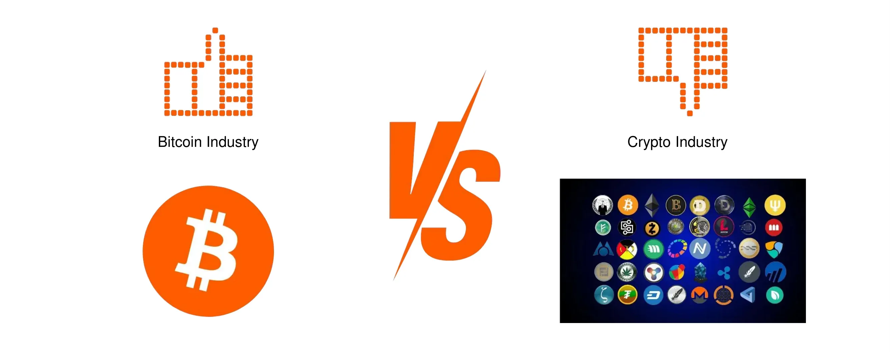
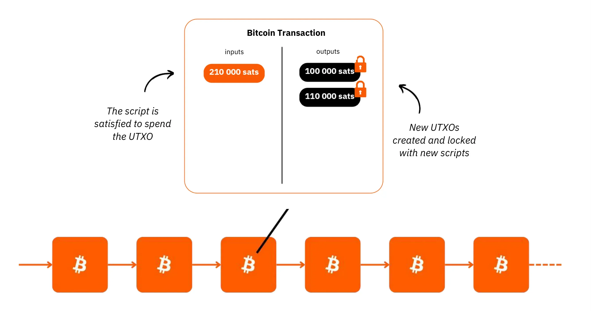
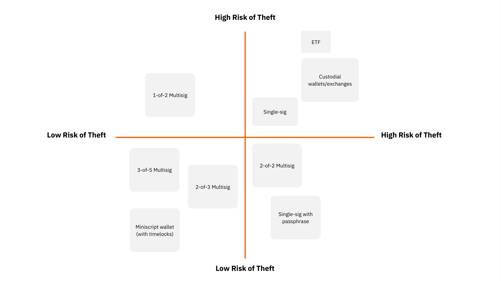

# Introduction

<partId>introduction-btc102v2</partId>

## Welcome to Your Bitcoin Journey

<chapterId>welcome-ch01</chapterId>

<!-- NEW -->

Welcome to the starting point of your practical Bitcoin journey!

If you've completed BTC101, you already understand the theoretical foundations of Bitcoin. Now it's time to put that knowledge into action. This hub course will guide you through the practical steps to acquire, secure, and manage your first bitcoins.

The Bitcoin ecosystem has grown tremendously since its creation in 2009. With this growth comes a wealth of learning resources, tools, and practices. Rather than overwhelming you with everything at once, we've organized the essential knowledge into focused, digestible courses that you can take based on your specific needs and goals.

### What This Course Offers

Think of this course as your personal roadmap. Instead of one massive 14-hour journey, you now have access to six specialized courses, each focusing on a critical aspect of Bitcoin ownership:

1. **Staying Safe** - Avoiding scams and protecting yourself online
2. **Understanding Bitcoin** - Why Bitcoin matters and how it works
3. **The Bitcoin Industry** - Understanding the ecosystem and its players
4. **Acquiring Bitcoin** - How to buy your first satoshis
5. **Securing Bitcoin** - Setting up your wallet and protecting your keys
6. **Inheritance Planning** - Ensuring your bitcoin passes to loved ones

By the end of this course, you'll know exactly which courses to take and in what order based on your personal situation and goals.

### Prerequisites

Before diving in, you should have completed:

- **BTC101** (Bitcoin and Cryptocurrency Fundamentals) - This gives you the theoretical foundation needed to understand what Bitcoin is and why it matters.

If you haven't completed BTC101 yet, we recommend starting there:

https://planb.academy/courses/2b7dc507-81e3-4b70-88e6-41ed44239966

Let's begin by helping you understand the full picture of what lies ahead.

<!-- END NEW -->

## Course Overview

<chapterId>overview-ch02</chapterId>

<!-- ORIGINAL: btc102/en.md lines 29-72 (adapted) -->

This hub course is designed to give you a clear view of your Bitcoin learning path and help you navigate it effectively. Here's an overview of the journey ahead:

### Section 1: Prerequisites - Staying Safe

Before handling real money, you need to understand the risks. The Bitcoin ecosystem, while revolutionary, attracts bad actors looking to take advantage of newcomers. The first specialized course covers:

- Identifying scams and financial fraud
- Essential online security practices
- Common mistakes newcomers make

### Section 2: Understanding Bitcoin

A solid understanding of why Bitcoin matters will strengthen your conviction and help you make better decisions. This section covers:

- Bitcoin fundamentals refresher
- Why Bitcoin is important economically and socially
- The Bitcoin industry landscape
- How Bitcoin's layered architecture enables innovation

### Section 3: Taking Action

With knowledge and safety practices in place, it's time to act. This section guides you through:

- Identifying your user profile (Hodler, Stacker, User, or Privacy-focused)
- Choosing the right acquisition methods
- Setting up your first wallet
- Receiving and securing your bitcoin

### Section 4: Long-term Planning

Bitcoin ownership is a long-term commitment. The final section ensures your wealth is protected:

- Creating an inheritance plan
- Ensuring loved ones can access your bitcoin
- Planning for the future

By understanding this complete picture, you can now dive into the specific courses that match your immediate needs.

<!-- END ORIGINAL (adapted) -->

# Your Learning Path

<partId>learning-path-btc102v2</partId>

## Understanding Your Profile

<chapterId>your-profile-ch03</chapterId>

<!-- NEW -->

Before choosing which courses to take, it helps to understand what type of Bitcoin user you want to be. Your profile will determine which courses are most relevant and in what order you should take them.

### The Four Bitcoin User Profiles

**1. The Hodler (Long-term Investor)**
- Primary goal: Accumulate bitcoin as a long-term store of value
- Behavior: Makes infrequent purchases, holds for years
- Priority courses: Security first, then acquisition methods
- Key concern: Protecting wealth over the long term

**2. The Stacker (Regular Buyer)**
- Primary goal: Consistently build bitcoin holdings over time
- Behavior: Uses Dollar Cost Averaging (DCA), buys regularly
- Priority courses: Acquisition methods, then security
- Key concern: Optimizing regular purchases and transfers

**3. The Active User**
- Primary goal: Use Bitcoin for payments and daily transactions
- Behavior: Sends and receives bitcoin frequently
- Priority courses: Security basics, Lightning Network, daily use
- Key concern: Convenience balanced with security

**4. The Privacy-Focused User**
- Primary goal: Maximize privacy and minimize personal data exposure
- Behavior: Prefers non-KYC acquisition, uses privacy tools
- Priority courses: Security, privacy-preserving acquisition methods
- Key concern: Keeping financial activity private

### Which Profile Are You?

Ask yourself these questions:

- **How often will you interact with Bitcoin?** (Rarely → Hodler, Often → User/Stacker)
- **What's your primary motivation?** (Save → Hodler/Stacker, Spend → User, Privacy → Privacy-focused)
- **How comfortable are you with technology?** (This affects which security solutions work for you)
- **How much time can you dedicate?** (More time → more advanced practices possible)

Most people start as a Hodler or Stacker and evolve their profile over time as they learn more. There's no wrong choice - the important thing is to start somewhere.

<!-- END NEW -->

## Recommended Course Sequences

<chapterId>course-sequences-ch04</chapterId>

<!-- NEW -->

Based on your profile, here are the recommended learning paths:

### Path A: The Cautious Beginner (Recommended for Most)

If you're new to Bitcoin and want to proceed carefully:

1. **SCU102** - Financial Fraud, Scams & Online Security (3 hours)
   - *Learn to protect yourself before handling real money*
2. **BTC103** - Why Bitcoin Matters (2 hours)
   - *Strengthen your understanding and conviction*
3. **BTC105** - How to Acquire Bitcoin (2-2.5 hours)
   - *Learn the different ways to buy bitcoin*
4. **BTC104** - How to Secure Bitcoin (1.5-2 hours)
   - *Set up your wallet and secure your keys*
5. **SOV102** - Bitcoin Inheritance Planning (1-1.5 hours)
   - *Protect your wealth for your loved ones*

**Total: ~10-11 hours**

### Path B: The Eager Acquirer

If you already understand security basics and want to get started quickly:

1. **BTC105** - How to Acquire Bitcoin (2-2.5 hours)
   - *Get your first satoshis*
2. **BTC104** - How to Secure Bitcoin (1.5-2 hours)
   - *Move them to your own wallet*
3. **SCU102** - Financial Fraud, Scams & Online Security (3 hours)
   - *Deepen your security knowledge*
4. **BTC103** - Why Bitcoin Matters (2 hours)
   - *Strengthen your understanding*
5. **SOV102** - Bitcoin Inheritance Planning (1-1.5 hours)
   - *Plan for the long term*

**Total: ~10-11 hours**

### Path C: The Industry Professional

If you're exploring Bitcoin for business or professional reasons:

1. **BTC103** - Why Bitcoin Matters (2 hours)
   - *Understand the value proposition*
2. **BIZ102** - Bitcoin Industry Overview (2 hours)
   - *Learn the ecosystem and key players*
3. **SCU102** - Financial Fraud, Scams & Online Security (3 hours)
   - *Understand the risks in the industry*
4. **BTC105** - How to Acquire Bitcoin (2-2.5 hours)
   - *Practical acquisition knowledge*
5. **BTC104** - How to Secure Bitcoin (1.5-2 hours)
   - *Security fundamentals*

**Total: ~10-11 hours**

### Path D: The Privacy-Focused User

If privacy is your primary concern:

1. **SCU102** - Financial Fraud, Scams & Online Security (3 hours)
   - *Essential security and privacy foundations*
2. **BTC103** - Why Bitcoin Matters (2 hours)
   - *Understand Bitcoin's privacy implications*
3. **BTC105** - How to Acquire Bitcoin (2-2.5 hours)
   - *Focus on No-KYC acquisition methods*
4. **BTC104** - How to Secure Bitcoin (1.5-2 hours)
   - *Privacy-preserving wallet setup*
5. **SOV102** - Bitcoin Inheritance Planning (1-1.5 hours)
   - *Inheritance with privacy considerations*

**Total: ~10-11 hours**

<!-- END NEW -->

# Course Directory

<partId>course-directory-btc102v2</partId>

## Safety & Security Courses

<chapterId>safety-courses-ch05</chapterId>

<!-- NEW -->

### SCU102 - Financial Fraud, Scams & Online Security

**Duration**: 3 hours | **Level**: Beginner | **Discipline**: Security

This comprehensive course prepares you to navigate the Bitcoin ecosystem safely by teaching you to identify and avoid common threats.

**What You'll Learn**:
- How to identify Ponzi schemes, pump & dump scams, and fake giveaways
- Recognizing phishing attempts and social engineering
- Essential cybersecurity practices (passwords, 2FA, backups)
- Privacy protection fundamentals
- Common mistakes newcomers make and how to avoid them

**Who Should Take This**:
- Everyone new to Bitcoin (recommended first course)
- Anyone who has been scammed before
- Those wanting to strengthen their online security

**Take this course**: https://planb.academy/courses/scu102

---

### BTC104 - How to Secure Bitcoin

**Duration**: 1.5-2 hours | **Level**: Beginner | **Discipline**: Bitcoin

A step-by-step guide to setting up your first Bitcoin wallet and securing your keys properly.

**What You'll Learn**:
- What a Bitcoin wallet is and how it works
- The difference between hot wallets, cold wallets, and custodial solutions
- How to choose your first wallet
- Setting up and securing your seed phrase
- Receiving your first bitcoin
- When and how to upgrade your security

**Who Should Take This**:
- Anyone about to receive their first bitcoin
- Those currently keeping bitcoin on exchanges
- Users wanting to improve their wallet security

**Prerequisites**: Basic understanding of Bitcoin (BTC101 or BTC103)

**Take this course**: https://planb.academy/courses/btc104

<!-- END NEW -->

## Understanding Bitcoin Courses

<chapterId>understanding-courses-ch06</chapterId>

<!-- NEW -->

### BTC103 - Why Bitcoin Matters

**Duration**: 2 hours | **Level**: Beginner | **Discipline**: Bitcoin

Deepen your understanding of Bitcoin's importance and strengthen your conviction in its value proposition.

**What You'll Learn**:
- Bitcoin's origins and the Cypherpunk movement
- How Bitcoin works as a decentralized network
- Bitcoin's monetary properties and transparency
- Why Bitcoin serves as universal money
- How Bitcoin protects against economic crises
- Bitcoin as a political and social movement

**Who Should Take This**:
- Those who want to understand the "why" behind Bitcoin
- Anyone looking to strengthen their conviction
- People who need to explain Bitcoin to others

**Prerequisites**: BTC101 recommended but not required

**Take this course**: https://planb.academy/courses/btc103

---

### BIZ102 - Bitcoin Industry Overview

**Duration**: 2 hours | **Level**: Beginner | **Discipline**: Business

Understand the Bitcoin ecosystem, its key players, and how the industry has evolved.

**What You'll Learn**:
- How the Bitcoin industry emerged
- The difference between Bitcoin and altcoins
- Institutional adoption trends
- Regulatory approaches worldwide
- Exchanges, wallets, and custody solutions
- Bitcoin's layered architecture (Lightning Network, sidechains)
- Merchant tools and services

**Who Should Take This**:
- Business professionals exploring Bitcoin
- Those curious about the broader ecosystem
- Anyone considering a career in the Bitcoin industry

**Take this course**: https://planb.academy/courses/biz102

<!-- END NEW -->

## Practical Bitcoin Courses

<chapterId>practical-courses-ch07</chapterId>

<!-- NEW -->

### BTC105 - How to Acquire Bitcoin

**Duration**: 2-2.5 hours | **Level**: Beginner | **Discipline**: Bitcoin

Learn the different methods to acquire your first bitcoin, from traditional exchanges to peer-to-peer options.

**What You'll Learn**:
- Defining your user profile and risk tolerance
- KYC vs Non-KYC acquisition methods
- Centralized exchanges and their trade-offs
- Peer-to-peer buying options
- Dollar Cost Averaging (DCA) strategies
- Earning bitcoin (salary, freelancing)
- Bitcoin ETFs and traditional finance options
- Tax considerations and selling

**Who Should Take This**:
- Anyone ready to buy their first bitcoin
- Those looking for alternative acquisition methods
- Users wanting to optimize their buying strategy

**Prerequisites**: Understanding of scams (SCU102) recommended

**Take this course**: https://planb.academy/courses/btc105

---

### SOV102 - Bitcoin Inheritance Planning

**Duration**: 1-1.5 hours | **Level**: Beginner | **Discipline**: Sovereignty

Ensure your bitcoin wealth passes to your loved ones with a practical inheritance plan.

**What You'll Learn**:
- Why Bitcoin inheritance planning is essential
- Common misconceptions about inheritance
- Selecting trusted assistants
- Creating a comprehensive inventory
- Writing an effective inheritance letter
- Securely storing your plan
- Advanced options (multisig with timelocks)

**Who Should Take This**:
- Anyone with bitcoin holdings (even small amounts)
- Those with family or dependents
- Users wanting to complete their Bitcoin setup

**Prerequisites**: Basic wallet setup (BTC104) recommended

**Take this course**: https://planb.academy/courses/sov102

<!-- END NEW -->

# Getting Started

<partId>getting-started-btc102v2</partId>

## Your First Steps

<chapterId>first-steps-ch08</chapterId>

<!-- NEW -->

You now have a complete map of your Bitcoin learning journey. Here's how to take action:

### Step 1: Choose Your Path

Based on the profiles and learning paths described earlier, decide which sequence makes the most sense for your situation:

- **New to Bitcoin?** Start with Path A (Safety first)
- **Want to buy immediately?** Follow Path B (Eager Acquirer)
- **Professional interest?** Take Path C (Industry focus)
- **Privacy priority?** Choose Path D (Privacy-focused)

### Step 2: Start Your First Course

Don't try to do everything at once. Pick the first course in your chosen path and complete it before moving on. Each course is designed to be self-contained while building toward the complete picture.

### Step 3: Practice What You Learn

Bitcoin education is practical. As you complete each course:

- **After SCU102**: Implement the security practices immediately
- **After BTC105**: Make your first small purchase
- **After BTC104**: Set up your wallet and transfer your bitcoin
- **After SOV102**: Create your inheritance plan

### Step 4: Continue Learning

The courses covered here represent the essential foundation. As you grow more comfortable, you'll discover:

- Advanced security practices
- Lightning Network for faster payments
- Running your own Bitcoin node
- Contributing to the Bitcoin ecosystem

The Plan B Network offers many more courses and tutorials to support your continued journey.

### Common Questions

**Do I need to complete all courses?**
The core courses (SCU102, BTC105, BTC104) are essential for anyone holding bitcoin. BTC103 and BIZ102 are valuable for understanding, while SOV102 becomes critical as your holdings grow.

**How long should this take?**
At your own pace. Some complete the essentials in a weekend; others spread it over weeks. The important thing is comprehension, not speed.

**What if I get stuck?**
Each course includes resources and references. The Plan B Network community is also available to help answer questions.

**Where do I go after these courses?**
Explore the full Plan B Network catalog for advanced topics, tutorials, and deeper dives into specific areas.

<!-- END NEW -->

## Going Further

<chapterId>going-further-ch09</chapterId>

<!-- NEW -->

Congratulations on completing this orientation course! You now understand the complete landscape of practical Bitcoin education and have a clear path forward.

### Summary of Available Courses

| Course | Focus | Duration | Priority |
|--------|-------|----------|----------|
| SCU102 | Safety & Security | 3 hours | Essential |
| BTC103 | Why Bitcoin Matters | 2 hours | Recommended |
| BIZ102 | Industry Overview | 2 hours | Optional |
| BTC105 | Acquiring Bitcoin | 2-2.5 hours | Essential |
| BTC104 | Securing Bitcoin | 1.5-2 hours | Essential |
| SOV102 | Inheritance Planning | 1-1.5 hours | Important |

### Quick Links

**Essential Courses**:
- SCU102: https://planb.academy/courses/scu102
- BTC105: https://planb.academy/courses/btc105
- BTC104: https://planb.academy/courses/btc104
- SOV102: https://planb.academy/courses/sov102

**Understanding Courses**:
- BTC103: https://planb.academy/courses/btc103
- BIZ102: https://planb.academy/courses/biz102

**Foundation Course**:
- BTC101: https://planb.academy/courses/2b7dc507-81e3-4b70-88e6-41ed44239966

### The Journey Ahead

Remember: Bitcoin is a marathon, not a sprint. The goal isn't to learn everything immediately, but to build solid foundations that will serve you for years to come.

Take your time. Ask questions. Practice what you learn. And most importantly - enjoy the journey down the Bitcoin rabbit hole.

Welcome to the Bitcoin community!

<!-- END NEW -->

# Conclusion

<partId>conclusion-btc102v2</partId>

## Conclusion

<chapterId>conclusion-ch10</chapterId>
<isCourseConclusion>true</isCourseConclusion>
