<!-- NEW -->
# Introduction

<partId>ee11de75-9a2c-443f-b6ac-7e3085567a14</partId>

## Welcome to BTC103

<chapterId>68cabb01-6fd0-4dd6-a84a-700c6ab210de</chapterId>

Welcome to BTC103: Why Bitcoin Matters!

This course is designed to help you understand what Bitcoin really is and why millions of people around the world are turning to this technology. Before diving into the practical aspects of buying and securing Bitcoin, it's essential to grasp the deeper significance of this revolutionary invention.

### What You'll Learn

In this course, we'll explore:

1. **Bitcoin's Origins**: How the Cypherpunk movement and the 2008 financial crisis led to Bitcoin's creation.

2. **How Bitcoin Works**: The basics of decentralization, the blockchain, mining, and proof-of-work.

3. **Bitcoin's Unique Properties**: Why Bitcoin's scarcity, divisibility, and transparency make it fundamentally different from traditional money.

4. **Why Bitcoin Matters**: How Bitcoin serves as protection against monetary crises, state control, and financial corruption.

### Prerequisites

This course assumes you have completed BTC101 or have a basic philosophical understanding of Bitcoin. If you haven't already, we recommend starting with:

https://planb.academy/courses/btc101

### Why This Matters

Understanding why Bitcoin exists is just as important as knowing how to use it. The deeper your comprehension of Bitcoin's significance, the more confident you'll be in your journey toward financial sovereignty.

Let's begin exploring what makes Bitcoin one of the most important inventions of our time.
<!-- END NEW -->

<!-- ORIGINAL: btc102/en.md lines 554-695 (chapter 3.1 Bitcoin in 5 minutes) -->
# Bitcoin in 5 Minutes

<partId>44cbcb19-f147-4afe-b2c0-c2f69d9193fd</partId>

## The Origins

<chapterId>c2103e99-8cf9-44d9-8681-10884fde134f</chapterId>

### A Project Born from a Longstanding Quest

#### Cypherpunks and the invention of a system beyond banking control

Bitcoin wasn't born overnight. Its the result of decades of research and experimentation in cryptography, computer science, and monetary theory. Prior to its launch in 2009, several projects (like eCash, b-money, Bit Gold, and RPOW) attempted to create digital currencies. All faced the same core issue: how to prevent double spending in a decentralized system without relying on a central authority.

That challenge remained unsolved until late 2008, when someone using the name Satoshi Nakamoto published the Bitcoin white paper. A few months later, the first version of Bitcoin's open-source software went live, launching a system that could operate independently of banks or governments.

The project was heavily influenced by the Cypherpunk ethos; a community of developers and thinkers who believed in using cryptography to protect individual freedoms online. For them, privacy and decentralization weren't technical preferences, but ideological necessities. Bitcoin emerged as the most successful embodiment of those ideals: a peer-to-peer monetary network that anyone could use, no one could control, and everyone could verify.

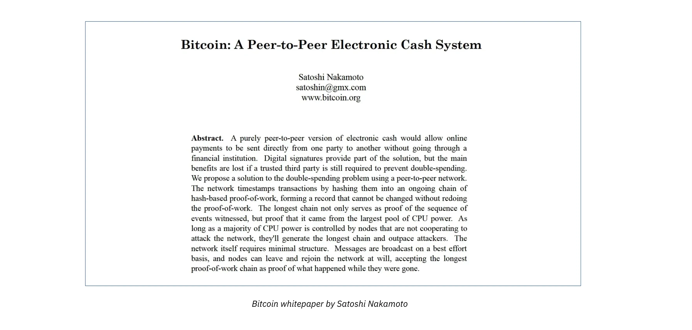

The Cypherpunks are an informal, international community of individuals who advocate for the use of cryptography to defend personal freedoms online. They strongly believe in the individual's right to privacy; especially in a world increasingly shaped by government surveillance and corporate data exploitation.

The roots of the Cypherpunk movement go back to the early 1990s, when groups of cryptographers, programmers, and libertarians began exploring the political implications of cryptography during meetups in Silicon Valley. One of the most prominent voices in the community was Tim May, who authored the Crypto Anarchist Manifesto in 1988; a foundational text outlining a vision for a world where encryption would empower individuals to operate beyond the reach of governments and centralized control.
A major milestone in the movement came in 1992 with the creation of the Cypherpunks mailing list, a forum where ideas, projects, and political discussions about privacy and cryptography could flourish. Then, in 1993, Eric Hughes published the Cypherpunk's Manifesto, a brief but powerful declaration that clearly expressed the community's mission and beliefs.

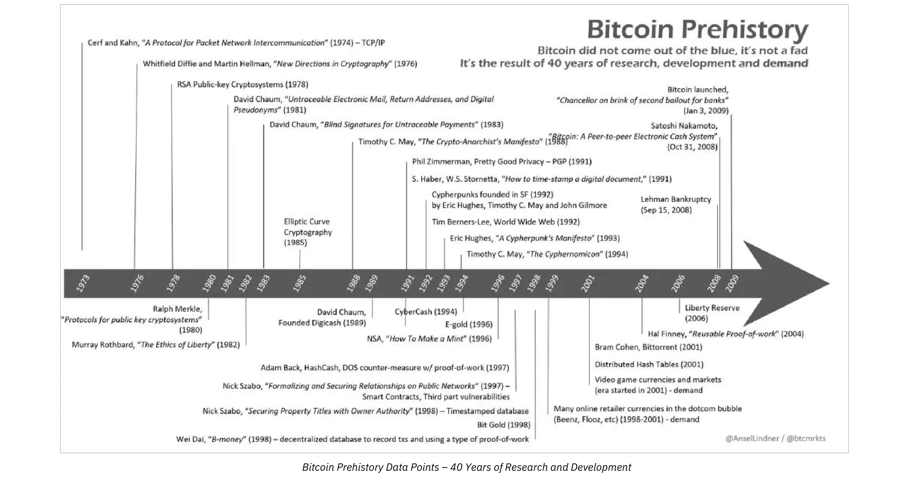

The idea of a digital currency that operates independently of any central authority (like Bitcoin) is deeply rooted in Cypherpunk philosophy.

#### Post-Financial Crisis Moment

Bitcoin didn't just appear out of nowhere. It was created at a very specific moment—right after the global financial crisis of 2008. The collapse of the U.S. housing market and the subprime loan crisis caused major banks to fail and shook people's trust in the entire financial system.

It was in this environment of fear and uncertainty that Bitcoin was born. The creator, known as Satoshi Nakamoto, included a very symbolic message in the very first block of the Bitcoin blockchain, known as the Genesis block. The message was:

>**"The Times 03/Jan/2009 Chancellor on brink of second bailout for banks"**

This wasn't just a date or a technical note; it was a quiet but powerful protest. It showed that Bitcoin was designed to be something radically different: a financial system that doesn't depend on banks, bailouts, or government decisions.

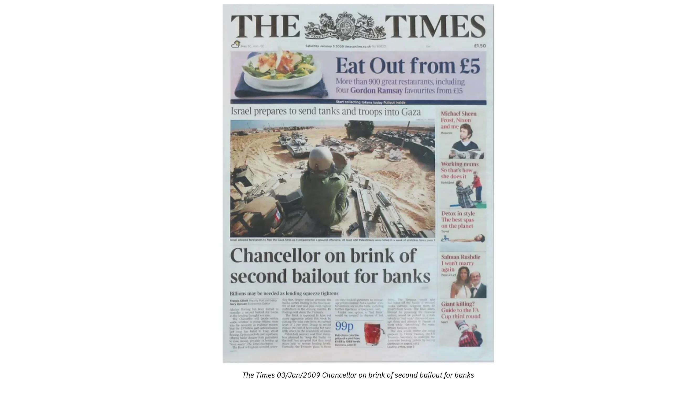

Many interpret this as Bitcoin's goal: to offer a way to transfer value without needing middlemen, controlled by clear rules instead of the often unclear decisions made by central banks or governments.

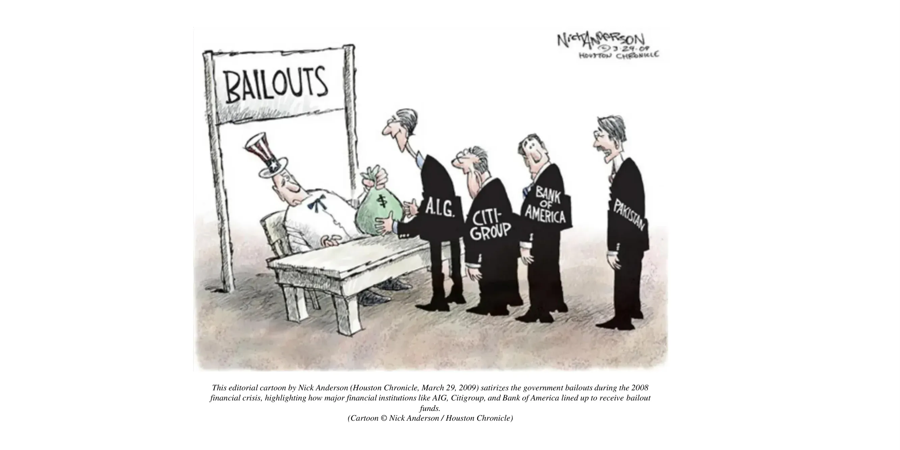

To deepen your knowledge of Bitcoin's origins, we offer a free, comprehensive and well-documented training course on the subject:

https://planb.academy/courses/a51c7ceb-e079-4ac3-bf69-6700b985a082
<!-- END ORIGINAL -->

## A Decentralized Network

<chapterId>690e52c8-2495-4005-93b0-888b5f799713</chapterId>

<!-- ORIGINAL: btc102/en.md lines 605-636 -->
### A decentralized network to transfer value

#### Peer-to-peer and no central body

Bitcoin is defined as a "peer-to-peer electronic cash system." This means that anyone can connect to the network using the appropriate software (a Bitcoin node) and interact directly with other users, without relying on a central server. The goal of this decentralization is to prevent any single entity (such as a bank, government, or large corporation) from controlling, censoring, or halting the system. Bitcoin operates 24/7, globally, and is accessible to everyone without any conditions.

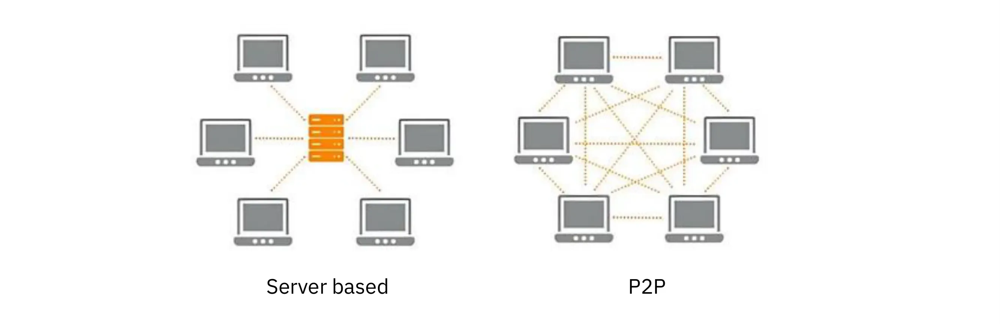

In simple terms, every participant in the Bitcoin network (called a "node") has a full copy of the transaction ledger, known as the blockchain. When a new transaction happens, it's broadcast to the network. Miners then confirm these transactions by grouping them into blocks which are then added to the end of the chain (hence the name "Blockchain").

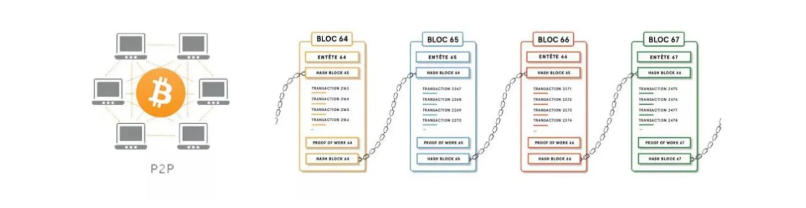

#### Blockchain: an accounting ledger

Think of the blockchain as a giant accounting ledger, where every line represents a transaction. In a traditional banking system, the database is stored on a bank's servers, which can make changes whenever they want. On the other hand, in Bitcoin, **all changes are validated across the entire network**: once a new block of transactions is added to the blockchain, it's nearly impossible to alter it later. This decentralized validation makes Bitcoin's ledger secure and transparent.

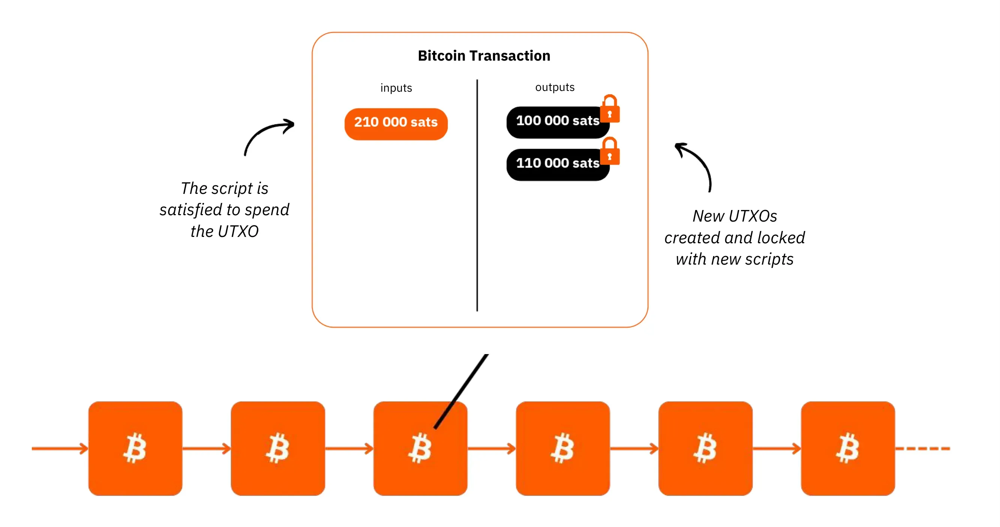

### The Role of Miners and Proof-of-Work

#### How Blocks Are Created: Mining

Mining is the process by which computers (or large mining farms) contribute **computational power** to secure Bitcoin's transaction history and create new blocks. Miners compete to solve a mathematical puzzle—specifically, finding a partial hash collision. This process requires significant energy and resources. Once a miner finds a valid solution, they broadcast the block to the network, which verifies and accepts it as valid.
As a reward, the miner receives newly created bitcoins (called the block subsidy) along with the transaction fees from all transactions included in that block.

#### The Halving: Decreasing Block Subsidy

To ensure Bitcoin's scarcity, the block subsidy is programmed to halve every 210,000 blocks; roughly every four years. This event is known as the "halving." When Bitcoin launched, miners earned 50 BTC per block. In 2025, that reward has dropped to 3.125 BTC and will continue to decrease over time.
Eventually, around the year 2140, the subsidy will reach zero, as Bitcoin's total supply will cap at 21 million coins. This predictable issuance curve mimics the scarcity of physical commodities like gold; one reason Bitcoin is often referred to as **digital gold**.

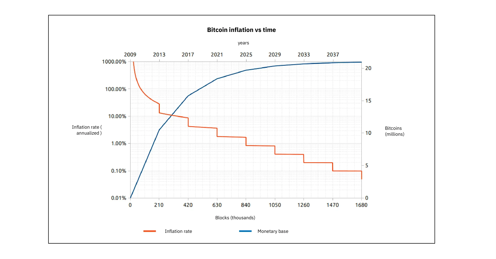
<!-- END ORIGINAL -->

## Monetary Properties & Transparency

<chapterId>4069bbba-eb66-4ab8-8a21-397e147b3564</chapterId>

<!-- ORIGINAL: btc102/en.md lines 637-672 -->
### Bitcoin Monetary Properties

#### Scarcity and a Fixed Monetary Policy

One of Bitcoin's most powerful features is its *predictable and unchangeable monetary policy*. Unlike traditional fiat currencies (like the dollar, euro, or yen), which can be printed at will by central banks (often leading to inflation or economic distortions) Bitcoin operates under a transparent set of rules embedded in its code.
There will only ever be 21 million bitcoins, and the rate at which new coins are issued is known in advance by everyone in the network.

No government, institution, or individual can unilaterally change this supply cap or the distribution rules. The only way to alter these parameters would be to change Bitcoin's protocol; and even that would require consensus from a majority of the network's economic participants.

This built-in scarcity is a major draw for those looking to opt out of unpredictable monetary policies or avoid the gradual erosion of their purchasing power through inflation. Over time, this could represent a shift in financial thinking, where saving in a deflationary asset like Bitcoin becomes more attractive than relying on traditional, inflation-prone currencies.

#### Divisibility and Accessibility

One of Bitcoin's most underrated strengths is its divisibility. Each bitcoin can be broken down into 100 million units, known as satoshis (or sats for short). This means you don't need to spend tens of thousands of euros or dollars to get started; you can buy just a few euros worth of bitcoin, down to tiny fractions.

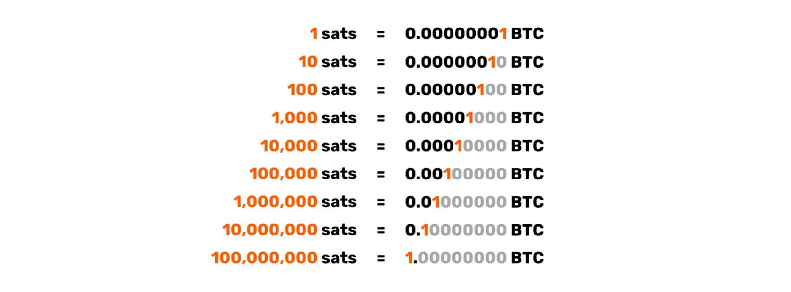

### Openness and Transparency

#### A public protocol, verifiable by all

Bitcoin runs on a public, **open-source** protocol (most notably through [Bitcoin Core](https://github.com/bitcoin/bitcoin)). This means its code is freely available for anyone to inspect, audit, and improve. There are no hidden mechanisms or closed systems; everything about how Bitcoin works is out in the open.
This level of transparency makes it incredibly difficult to introduce backdoors or make secret changes. Anyone with the technical skills can run a node, contribute to development, or build compatible tools. In Bitcoin, trust is earned through code and consensus, not through centralized control.

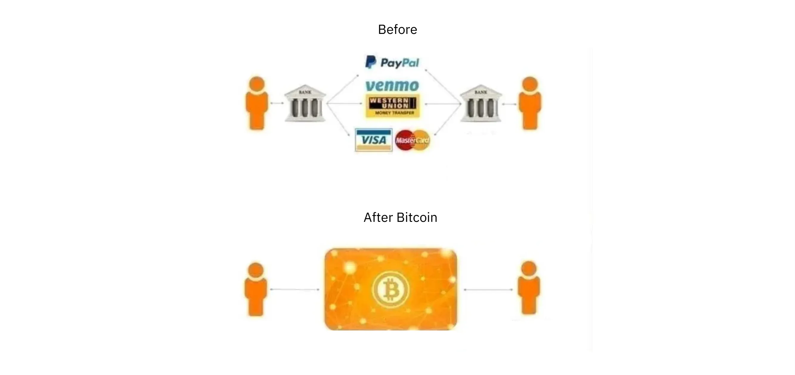

This transparency is one of the key reasons people trust the Bitcoin protocol; it prevents a small group of developers from manipulating the network for their own gain. Bitcoin operates on a simple but powerful principle: if you disagree with proposed changes, you're free not to update your software. In some cases, this won't cause any disruption; you'll still stay in sync with the rest of the network. But in other cases, this can lead to what's known as a hard fork, where the network splits in two,  and a new version of Bitcoin is created. That's exactly what happened in 2017 with the split between Bitcoin (BTC) and Bitcoin Cash (BCH).

While this kind of governance can be slow and sometimes messy, it's also a strength; it ensures that no single entity can unilaterally take control, helping Bitcoin remain stable, neutral, and resistant to centralization.

#### Individual Validation: nodes

Bitcoin allows anyone to check the accuracy of the blockchain by running a "node" on their computer or server. This means downloading the Bitcoin Core software (or another version of the Bitcoin protocol) and verifying all transactions and blocks since 2009. Once your node is set up and synced, it becomes a full copy of the blockchain and helps support the network.

Although this approach is more technical, it offers the most demanding users the ability to opt-out of trusting third parties. Running a node ensures that users can participate in the consensus process and remain uncensorable, contributing directly to the security and decentralization of the network.
<!-- END ORIGINAL -->

## Use Cases

<chapterId>b90c8bee-2136-4dcf-ae81-0b5298d96d11</chapterId>

<!-- ORIGINAL: btc102/en.md lines 673-695 -->
### A Resilient, Cross-Border Payment Method

Due to its decentralized nature, Bitcoin operates 24/7, unaffected by borders or time zones. In regions where traditional banking infrastructure is lacking, Bitcoin is often used as a fast, low-cost solution for sending or receiving funds without relying on expensive intermediaries. While transaction fees can vary based on network congestion, they are generally much lower than the fees charged by banks for international transfers. Additionally, layer-2 solutions like the Lightning Network allow for even faster and cheaper Bitcoin transactions.

### A store of value

Due to its scarcity (capped at 21 million BTC) and inherent resilience, Bitcoin is often seen as a long-term savings safeguard. While its price can be volatile in the short term, Bitcoin has generally followed an upward trend over the years since its inception. Some investors purchase BTC with the belief that it could serve as a store of value, particularly in the face of inflation or financial crises.

### A tool for financial freedom and resilience

Beyond investment, Bitcoin offers a way to protect financial sovereignty. In countries under authoritarian regimes or facing heavy monetary restrictions, having a Bitcoin wallet (with private keys) provides a form of freedom. No one can block or confiscate these BTC, as long as the holder secures their recovery phrase.

This characteristic is especially appealing to those who fear censorship or the freezing of bank accounts. It also resonates with populations suffering from hyperinflation, as seen in Venezuela or Zimbabwe, where holding BTC proved more stable than keeping local currency, which was rapidly depreciating.

### A long way to go

Bitcoin can be seen as a "Zero to One": a radical break with established financial paradigms. For the first time in history, a global monetary network, accessible to all, operates without a central authority, enabling censorship-resistant and private transactions.

Nevertheless, after more than a decade of existence, Bitcoin continues to spark debates and passions. Its adoption is growing, second-layer solutions (like the [Lightning Network](https://planb.academy/resources/glossary/lightning-network)) are emerging to improve transaction speed and lower fees, and businesses worldwide are experimenting with new use cases. It is likely that Bitcoin will continue to influence payment systems and even the way we perceive money for decades to come.

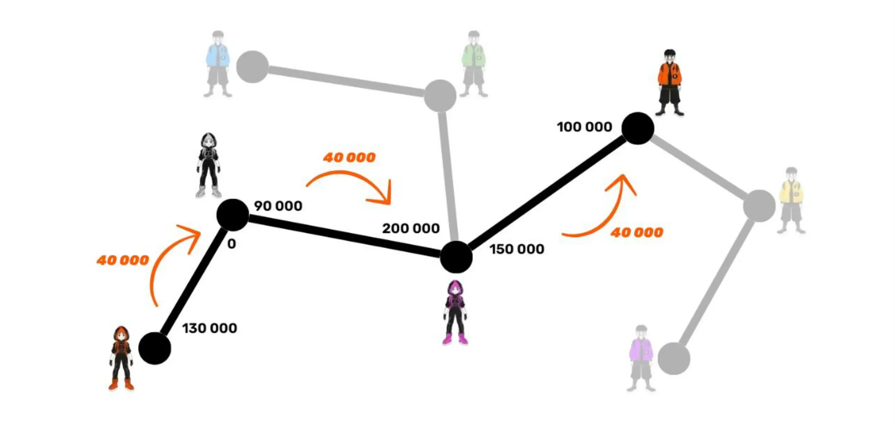

If you'd like to expand your knowledge further, you can take  the BTC101 course on Plan ₿ Academy, which offers a more in-depth exploration of Bitcoin's technical and economic fundamentals.

https://planb.academy/courses/2b7dc507-81e3-4b70-88e6-41ed44239966
<!-- END ORIGINAL -->

<!-- ORIGINAL: btc102/en.md lines 702-841 (chapter 3.2 Why is Bitcoin important?) -->
# Why Bitcoin Matters

<partId>1e76792a-d32d-41e8-b065-7d47f8907af4</partId>

## A Universal Currency

<chapterId>008f328a-0c6c-4a18-b931-357848e96294</chapterId>

Why is Bitcoin so important? That's the central question of this course. Whether it's related to your studies or your investment strategy, without a clear understanding of Bitcoin's significance, there's a risk of deviating from your plan. The goal is to always keep the fundamental principles of Bitcoin in mind to ensure that your strategy remains aligned with your beliefs.

Barack Obama once referred to Bitcoin as a "Swiss bank in your pocket," and for good reason. Bitcoin offers the same opportunities to everyone, no matter who they are. Whether you're a teenager, a president, a protester in Hong Kong, or a "Yellow Vest" in France, everyone has equal access to the same protocol and tools:

- Create free and unlimited wallets (with Bitcoin, we don't really talk about "accounts," but rather "wallets").
- Send money anywhere, to anyone.
- No need for identification or any administrative procedures.
- Accessible to all, regardless of age, gender, religion, country, or income level.
- Privacy and transparency available at your discretion.
- No intermediaries or hidden fees.
- Bitcoin is native to the internet, meaning anyone with web access can use it.

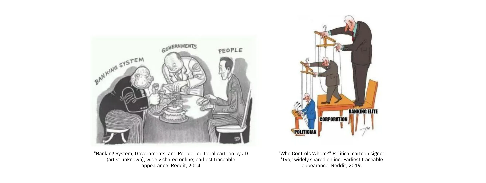

Bitcoin can be seen as the true "currency of the people," an alternative monetary system that doesn't rely on any central authority and is based on immutable rules rather than arbitrary decisions. Its open and accessible nature makes it a potentially revolutionary tool for billions of people worldwide, whether they are excluded from the traditional banking system or simply seeking a more sovereign alternative.

This leads us to a fundamental, almost philosophical question that divides Bitcoin enthusiasts into two main worldviews. On one side, some see Bitcoin as a solution to promote financial inclusion, enabling the billions of unbanked individuals to finally access a global monetary infrastructure. On the other side, some view Bitcoin as a financial liberation tool aimed at offering a way out for the billions of people already integrated into the banking system, but who wish to free themselves from its dependency and regain full control over their money. This reflection deserves our attention, and we will return to it in more detail later on.

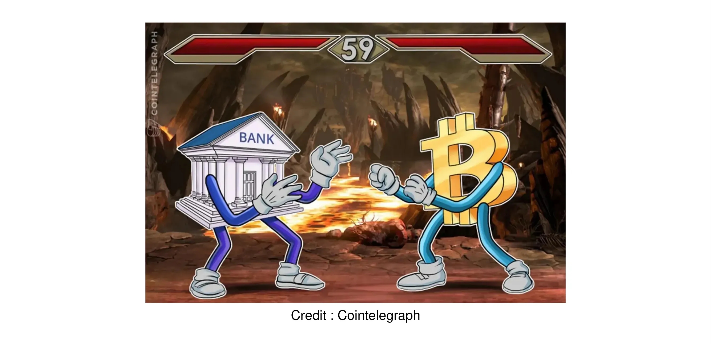

## Protection Against Crises

<chapterId>50f47586-6567-4427-b55d-dce1647f9213</chapterId>

### Protection against currency crises

For centuries, the world has experienced monetary crises that have had devastating effects on populations. Billions of people are still suffering from the consequences of poorly managed monetary policies, where the manipulation of money supply and interest rates creates systemic imbalances. These crises aren't just random events—they're the result of a system built on intervention and the manipulation of money and time values.

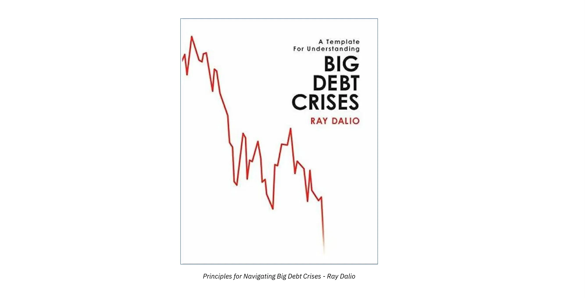

These crises can take many different forms. Hyperinflation, for instance, wipes out a currency by gradually destroying people's purchasing power; as seen in countries like Zimbabwe and Venezuela. On the other hand, strict monetary controls can limit access to funds and strip individuals of their economic freedom, as happened with banking restrictions in Greece and Lebanon.

And finally, when governments devalue their national currencies, it gradually erodes people's savings; an invisible but constant drain on their wealth. In many ways, it acts like a hidden tax. As long as monetary policy remains in the hands of centralized authorities, these cycles are destined to repeat.

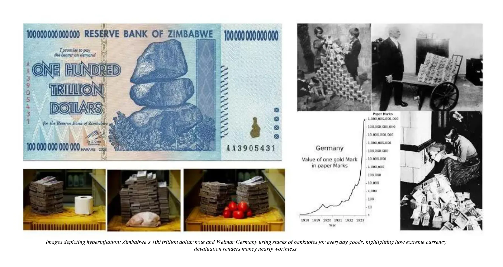

Bitcoin presents a bold alternative to this cycle of chronic monetary instability. Unlike state-issued currencies, it's built on unchangeable, math-based rules enforced by consensus; not by governments or central banks. Its issuance is predictable and capped at around 21 million coins, making it a form of sound money designed to hold its value over time. Because it resists censorship, anyone can store and transfer value without relying on an institution. And thanks to its divisibility and portability, it's both accessible and practical; financial infrastructure for anyone, anywhere.

**Did you know?** Throughout history, there have been at least 56 documented cases of hyperinflation worldwide. In many of those cases, entire economies collapsed, life savings were wiped out, and millions were pushed into extreme poverty. Even worse, these monetary failures often acted as a springboard for political upheaval; sometimes leading to authoritarian regimes, as happened in Germany in the 1920s and Chile in the 1970s.

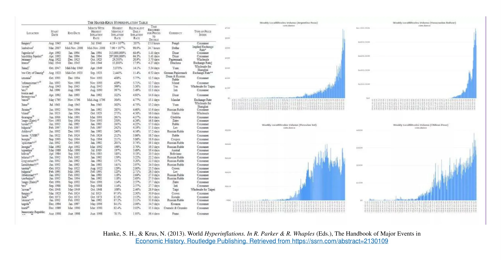

Hanke, S. H., & Krus, N. (2013). *World Hyperinflations*. In R. Parker & R. Whaples (Eds.), The Handbook of Major Events in Economic History. Routledge Publishing. Retrieved from https://ssrn.com/abstract=2130109

The collapse of fiat currencies isn't some historical fluke; it's a pattern that repeats itself. Today, Bitcoin offers a way out: a unique opportunity to protect your wealth outside of government-controlled monetary systems. At this point, the question isn't if another crisis will happen, but when. With Bitcoin, you now have the option to opt out of these destructive cycles and choose a monetary system built on transparency, predictability, and individual sovereignty.

### A response to state control and injustice

Growing economic inequality around the world has always been fertile ground for social unrest and the rise of political extremism. History shows that when the gap between rich and poor becomes too wide, it often leads to tension, crisis, and even the rise of authoritarian regimes. In the face of these risks, protecting your financial freedom isn't just a luxury; it's a necessity for anyone who wants to preserve their autonomy and safeguard their family's future.

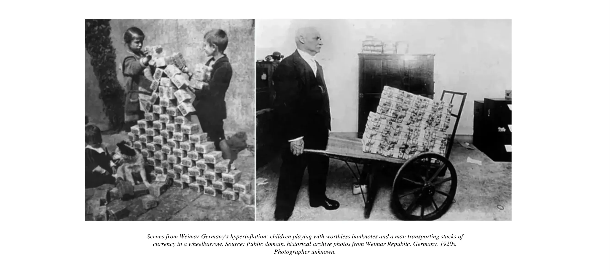

But in a world where the state can exercise full control over assets and transactions, what real options are there to protect your savings?

- **Bank accounts** can be frozen in an instant, seized by a simple government order, or drained through excessive monetary restrictions.

- **Gold**, though it has served as a store of value for millennia, is hard to divide, inconvenient to transport, and impractical for use in urgent crisis situations.

- **Cash**, while anonymous, is bulky, easy to confiscate, and constantly losing value due to inflation.

But Bitcoin is more than just a practical tool. It is also **a peaceful form of protest**; a declaration of independence from a financial system based on arbitrary power, centralization, and systemic inequality. Choosing Bitcoin means rejecting manipulation, devaluation, and surveillance. It's about reclaiming your **sovereignty**, securing your future, and defending your right to control your own wealth.

In this light, Bitcoin is more than technology. It's a tool of natural law, a way for individuals to assert their fundamental rights, even when those rights are denied by the laws of the land. It gives power back to the people, not through revolution, but through code.

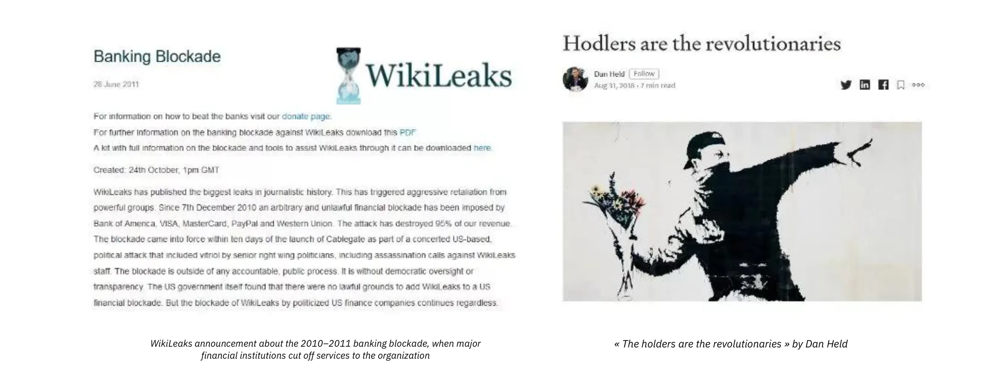

**Did you know**? Bitcoin is pseudonymous, not anonymous. Users can create wallet addresses without revealing their real identity, allowing them to send and receive funds outside the traditional banking system.

However, contrary to popular belief, Bitcoin does not offer full anonymity. Every transaction is recorded on a public ledger (the blockchain) which anyone can access and verify. While wallet addresses aren't tied to names, a user's financial activity can still be traced and analyzed if proper privacy practices aren't followed.

## Sound Money & Political Movement

<chapterId>3bf91676-d887-45d3-b12f-c2f487b86890</chapterId>

### A Solution to Monetary and Banking Corruption

Central banks, through their expansionary monetary policies, are constantly eroding your purchasing power. Through inflation and excessive money printing (often disguised as Quantitative Easing) they steadily dilute the value of the currency in circulation. This acts as an invisible tax that, year after year, diminishes the wealth of those who save in government-issued money.

Contrary to the common belief that inflation is a natural economic phenomenon, it is in fact a monetary control tool; one that slowly impoverishes the general population while benefiting those who hold financial assets.

If your wealth isn't secured in non-monetary assets (such as real estate, bonds, or stocks);your savings will inevitably lose value over time. Meanwhile, those with access to financial instruments continue to grow their wealth, widening the gap between the economic elite and the rest of society.

This isn't a flaw in the system; it's a deliberate mechanism. Central banks and governments use it to artificially stimulate economic growth and to push people toward constant consumption and increasing debt.

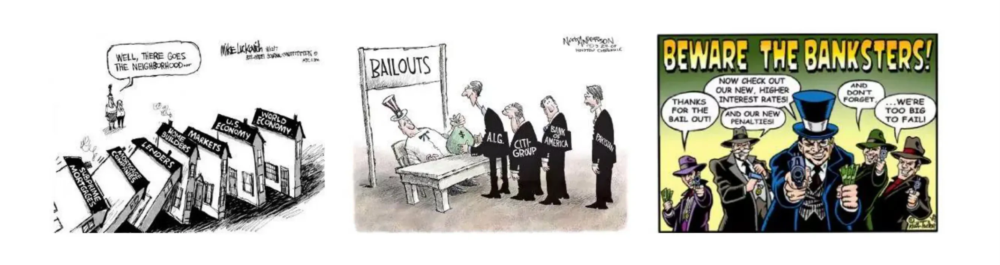

Our modern financial system is built on a cycle of debt; one where borrowing isn't just encouraged, it's practically unavoidable. Individuals take on loans to maintain their lifestyle, only to find themselves trapped in a system where they must repay interest to banks that create money out of thin air. This isn't accidental; it's a structural design meant to benefit financial institutions at the expense of everyday citizens.

The system is corrupted by central bank influence and their unchecked power to manipulate the monetary supply. **Bitcoin is the alternative.**

Unlike fiat currencies, Bitcoin is governed by rules enforced by consensus. Its supply is capped; there will never be more than 21 million bitcoins in existence (in fact, slightly fewer due to how issuance is structured). No government, central bank, or single economic actor can alter this limit.

This means Bitcoin operates under a predictable monetary framework; one where inflation is not only transparent, but designed to taper off completely once the final bitcoin is mined.

In the past, gold served as a check against unchecked monetary expansion. But since the collapse of the gold standard in 1971, no national currency (be it the dollar, euro, or yen) is backed by a tangible asset. This detachment gave central banks free rein to print money without restraint, paving the way for decades of aggressive monetary expansion, repeated asset bubbles, and recurring financial crises.

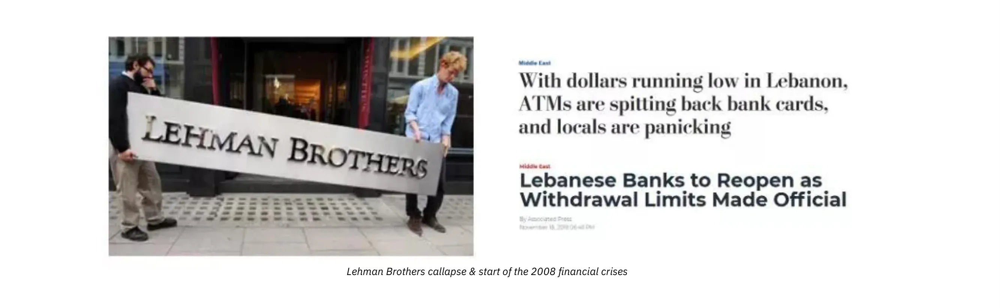

When You Deposit Money in a Bank, It's No Longer Truly Yours.
Most people don't realize this: the money you hold in a bank account is technically not your property. In legal and practical terms, it's a loan you're giving to your bank; one that the bank is free to use for its own operations and investments.
This system is built on blind public trust in financial institutions, but it carries serious risks:

- **If your bank collapses, your money could vanish.** Even with deposit insurance schemes, history has shown that these guarantees may fail during systemic crises.
- **If your bank restricts access to your funds, you may be unable to withdraw or use your own money**. This has happened many times; during economic meltdowns in Greece, Lebanon, and Argentina, or amid political crackdowns like the trucker protests in Canada.

Bitcoin offers a radically different mode; open, neutral, and incorruptible. Its rules are hardcoded by consensus and apply equally to all network participants.

This is where the core principle comes in:
**"Not your keys, not your Bitcoin."**
If you don't control the private keys to your bitcoins, then you don't truly own them. They're in the hands of a third party; just like fiat in a bank. But if you hold your private keys, you and you alone have full control over your funds. No institution, no government, no authority can freeze, seize, or restrict your access.
This is what makes Bitcoin a powerful alternative to the vulnerabilities and overreach of the traditional financial system: monetary sovereignty.

### Bitcoin: A Political Movement?

Bitcoin reshapes the balance of power between individuals and financial institutions. It empowers anyone to take full control of their money, protect their savings from inflation, and break free from the monetary restrictions imposed by states. As an open and borderless system, Bitcoin offers a fairer alternative; accessible to all, regardless of social status, nationality, or origin.
To embrace Bitcoin is to choose sound money. It's a refusal to remain just another cog in the inflationary, debt-driven machinery of the current financial system. It's an act of personal sovereignty and a peaceful resistance against monetary corruption and the erosion of wealth.

Bitcoiners come from all walks of life, yet they share a common vision: a world where monetary sovereignty lies in the hands of individuals, not institutions. Among them are:
- **Cypherpunks**, who champion privacy and resist surveillance;
- **Oppressed citizens**, seeking refuge from authoritarian regimes and capital controls;
- **Anarchists**, who view Bitcoin as a tool for liberation from state control;
- **Austrian economists**, advocating for sound money and freedom from government manipulation;
- **Engineers, financiers, and free speech advocates**, who recognize the profound societal implications of this new monetary paradigm.

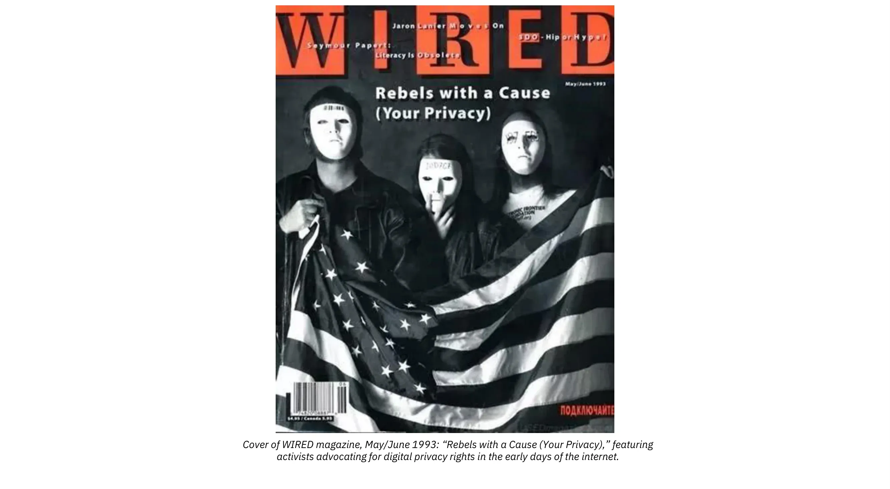

Bitcoin, by design, transcends political and ideological divides. It is not left or right, libertarian or collectivist. It is a neutral protocol, governed by rules (not ruler) applied equally to everyone. Yet its mere existence challenges the global financial status quo. Bitcoin has become a symbol of resistance because people have adopted it as an alternative to fiat currencies and centralized financial infrastructure; systems increasingly seen as unjust, manipulable, and exclusionary.

To the cypherpunk mind, Bitcoin is more than a digital asset. It stands against the steady erosion of privacy in a world where the disappearance of cash is often justified under the guise of "security."
Bitcoin enables censorship-resistant, peer-to-peer digital transactions; free from intermediaries or gatekeepers. As Satoshi Nakamoto envisioned, it offers the digital equivalent of cash: a way to exchange value freely, without needing permission.

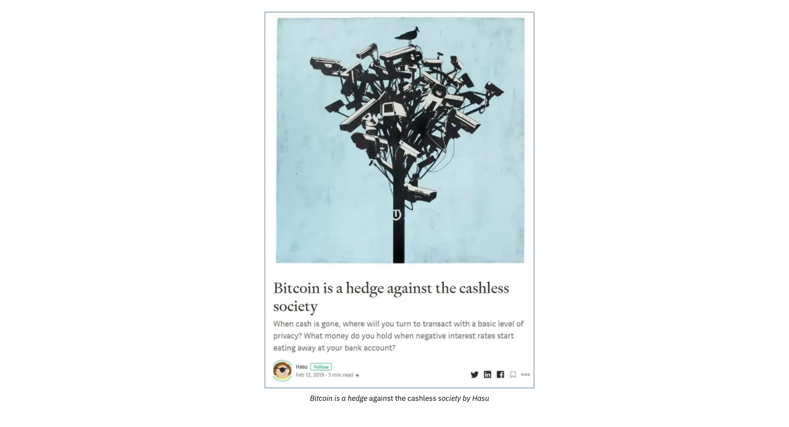

Bitcoin is not an organization or a political party, but it undeniably carries a powerful philosophical message. It redefines the relationship between the individual and the state, challenging central banks' monopoly on money creation and economic control.
Whether adopted by freedom fighters or by those simply seeking to preserve their purchasing power, Bitcoin marks the beginning of a new era; one where financial sovereignty becomes a basic human right, accessible to all.

<!-- END ORIGINAL -->

## Going Further

<chapterId>a7b8c9d0-e1f2-3a4b-5c6d-7e8f9a0b1c2d</chapterId>

<!-- NEW -->

### Resources & Next Steps

Now that you understand why Bitcoin matters, here are some resources and next steps to deepen your knowledge and begin your practical Bitcoin journey.

### Recommended Courses on Plan B Academy

1. **BTC105 - How to Acquire Bitcoin**: Learn the practical steps for buying your first satoshis, from choosing the right platform to making your first purchase.
2. **BTC104 - How to Secure Bitcoin**: Discover how to properly store and protect your bitcoin using wallets, private keys, and self-custody best practices.
3. **BIZ102 - Bitcoin Industry Overview**: Explore the broader Bitcoin ecosystem, including exchanges, mining, development, and the layered architecture.
4. **SCU102 - Financial Security**: Learn to protect yourself from scams, fraud, and common mistakes that newcomers face.

### Golden Rules to Remember

- **Don't trust, verify.** Run your own node, check your own transactions, and never blindly trust a third party with your bitcoin.
- **Not your keys, not your bitcoin.** Always take custody of your own private keys. Leaving bitcoin on an exchange means you don't truly own it.
- **Think long-term.** Bitcoin is designed to be sound money over decades, not a get-rich-quick scheme. Patience is rewarded.
- **Stay humble, stack sats.** The more you learn, the more you realize there is to learn. Keep stacking, keep studying.

### External Resources

- [Bitcoin Whitepaper](https://bitcoin.org/bitcoin.pdf) - Satoshi Nakamoto's original paper
- [The Bitcoin Standard](https://saifedean.com/thebitcoinstandard/) by Saifedean Ammous
- [Mastering Bitcoin](https://github.com/bitcoinbook/bitcoinbook) by Andreas Antonopoulos
- [Plan B Academy](https://planb.academy/) - Free Bitcoin education in multiple languages

### Community

Bitcoin is built by and for its community. Consider joining local Bitcoin meetups, contributing to open-source projects, or simply engaging in discussions online. The Bitcoin ecosystem thrives because of individuals like you who take the time to learn and share knowledge.

<!-- END NEW -->

# Conclusion

<partId>a2d82d2d-1cef-441b-8a27-896709bd3afc</partId>

## Conclusion

<chapterId>f1c2d3e4-a5b6-7c8d-9e0f-1a2b3c4d5e6f</chapterId>
<isCourseConclusion>true</isCourseConclusion>

Congratulations on completing BTC103: Why Bitcoin Matters!

Throughout this course, you've explored the foundations of what makes Bitcoin a revolutionary technology:

- **Bitcoin's Origins**: You learned how the Cypherpunk movement and the 2008 financial crisis gave birth to Bitcoin, and how Satoshi Nakamoto's creation embodies decades of cryptographic research and monetary theory.

- **How Bitcoin Works**: You gained an understanding of Bitcoin's decentralized architecture, including the blockchain, mining, proof-of-work, and the halving mechanism that ensures scarcity.

- **Bitcoin's Unique Properties**: You discovered why Bitcoin's fixed supply of 21 million coins, its divisibility, and its open-source transparency make it fundamentally different from traditional fiat currencies.

- **Why Bitcoin Matters**: Most importantly, you now understand the deeper significance of Bitcoin as a tool for financial freedom, protection against monetary crises, and resistance to state control and corruption.

### What's Next?

Now that you understand why Bitcoin matters, you're ready to take the next steps in your Bitcoin journey:

- **Learn How to Buy Bitcoin**: Continue with practical courses on acquiring your first satoshis
- **Secure Your Bitcoin**: Learn about wallets, private keys, and self-custody
- **Go Deeper**: Explore advanced topics like the Lightning Network, privacy practices, and running your own node

Remember: Bitcoin is more than just a technology or an investment. It's a tool for financial sovereignty, a peaceful protest against monetary corruption, and potentially the most important monetary innovation of our lifetime.

As the saying goes: **"Don't trust, verify."** Keep learning, keep questioning, and keep building your understanding of this revolutionary technology.

Thank you for joining us on this journey. Welcome to the Bitcoin community.
