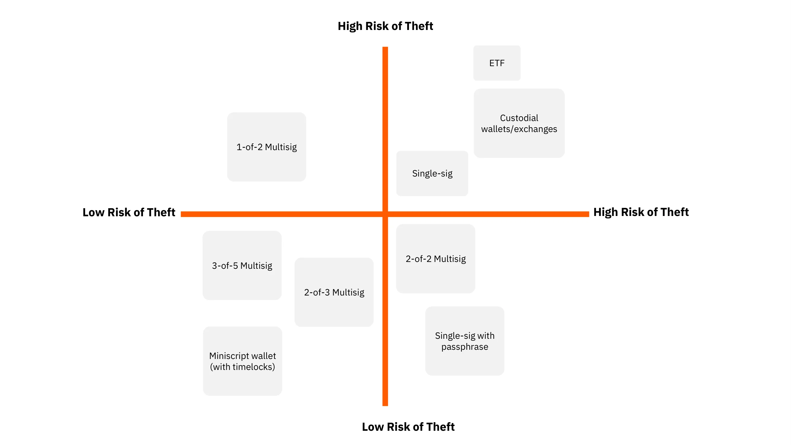
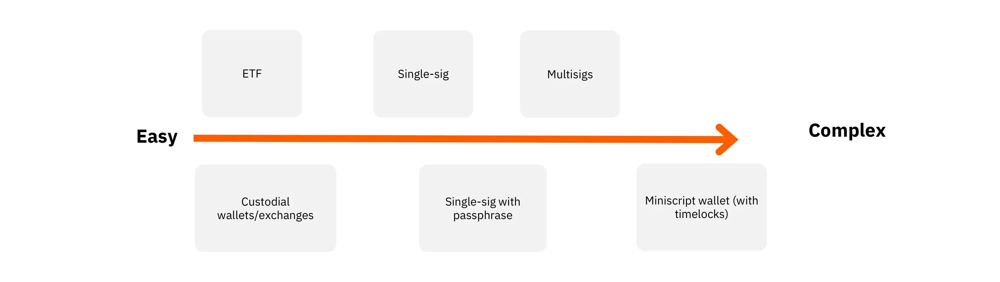
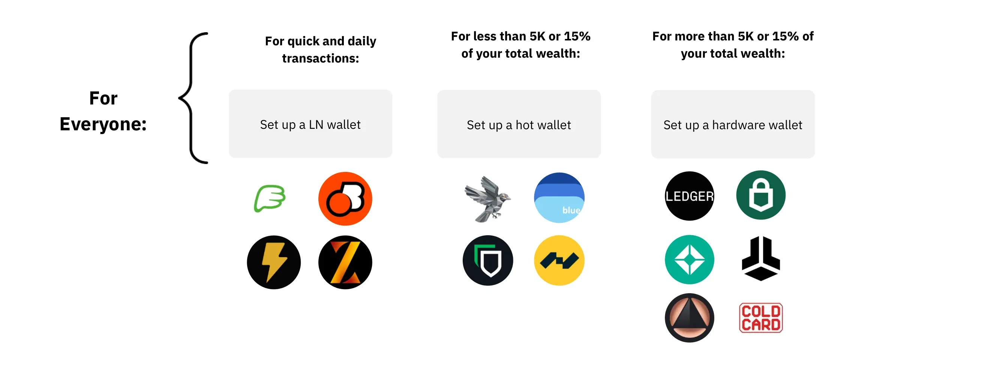

# Introduction

<partId>introduction-part1</partId>

## Welcome to BTC104

<chapterId>welcome-ch01</chapterId>

<!-- NEW -->

Congratulations on taking the next step in your Bitcoin journey! You've learned what Bitcoin is and why it matters. Now it's time to take control of your bitcoin by setting up your own wallet.

This course is designed for complete beginners. If you've never set up a Bitcoin wallet before, you're in the right place. We'll walk through every step together, from understanding what a wallet is to receiving your first bitcoin.

### What You'll Learn

By the end of this course, you will:

- Understand what a Bitcoin wallet really is (hint: it's not what you think!)
- Know the difference between hot wallets and hardware wallets
- Set up your first wallet on your phone or computer
- Secure your seed phrase properly so you never lose access
- Receive bitcoin from an exchange or another person
- Follow best practices to keep your bitcoin safe

### Prerequisites

Before starting this course, you should:

- Have a basic understanding of what Bitcoin is (take BTC101 or BTC103 if needed)
- Have a smartphone or computer available
- Be ready to take responsibility for your own money

### A Note on Complexity

Bitcoin security can get very complex. There are advanced techniques like multisignature wallets, passphrases, and running your own node. We won't cover those in this course.

Why? Because you need to walk before you can run. This course focuses on the fundamentals that every Bitcoin user needs. Once you're comfortable with the basics, you can explore advanced security in future courses.

Let's begin!

<!-- END NEW -->

## Why You Need Your Own Wallet

<chapterId>why-wallet-ch02</chapterId>

<!-- ORIGINAL: btc102/en.md lines 1286-1290 + NEW -->

Securing your private keys (the ones that give access to your bitcoins) is the most important part of owning and using Bitcoin. Unlike a traditional bank account, where a third party manages your funds, Bitcoin puts you in full control.

But with that freedom comes responsibility: **if you lose your keys, your bitcoin is gone forever.**

### "Not Your Keys, Not Your Coins"

This phrase is the most important lesson in Bitcoin. Here's what it means:

When you buy bitcoin on an exchange (like Coinbase, Kraken, or Binance) and leave it there, you don't actually own that bitcoin. The exchange does. They hold the keys, not you.

This matters because:

- **Exchanges can get hacked**: Mt. Gox (2014) lost 850,000 bitcoin. Customers lost everything.
- **Exchanges can go bankrupt**: FTX (2022) collapsed, and customers couldn't withdraw their funds.
- **Exchanges can freeze your account**: If they suspect fraud or receive a legal order, you could lose access.
- **Exchanges can be shut down**: Governments can force exchanges to close.

When you hold your own keys in your own wallet, none of these things can happen. You are in control. No one can freeze your account or lose your funds.

### Your Bitcoin, Your Responsibility

Self-custody means you're responsible for your own security. There's no "forgot password" button. There's no customer support that can recover your funds.

This might sound scary, but millions of people successfully manage their own bitcoin. The key is to follow the steps in this course carefully.

Think of it like cash: if you lose cash, it's gone. But if you keep it safe, no one can take it from you. Bitcoin is similar, except with proper backups, you can always recover it—even if your phone or computer is destroyed.



<!-- END ORIGINAL -->

# Understanding Wallets

<partId>understanding-wallets-part2</partId>

## What Is a Bitcoin Wallet?

<chapterId>what-is-wallet-ch03</chapterId>

<!-- NEW + concepts -->

Here's something that confuses many beginners: a Bitcoin wallet doesn't actually hold any bitcoin!

The bitcoin itself lives on the Bitcoin network—a giant, shared ledger spread across thousands of computers worldwide. What a wallet holds is your **keys**: the secret codes that prove you own your bitcoin and allow you to spend it.

### Keys: Public and Private

Every Bitcoin wallet has two types of keys:

**Public keys** (and the addresses derived from them):
- These are like your email address or bank account number
- You share them with people who want to send you bitcoin
- Anyone can see them; that's fine
- Think of it like your mailbox: anyone can put letters in

**Private keys**:
- These are like the key to your mailbox
- They let you spend your bitcoin
- You must NEVER share them with anyone
- If someone gets your private key, they can steal your bitcoin

### The Seed Phrase: Your Master Key

When you create a wallet, it generates a **seed phrase** (also called a recovery phrase or mnemonic). This is a list of 12 or 24 simple words, like:

```
abandon ability able about above absent absorb abstract absurd abuse access accident
```

This seed phrase is the master key to everything. From these words, your wallet can generate all your private keys and public keys.

**Why this matters:**
- If your phone breaks, you can restore your wallet on a new phone using the seed phrase
- If someone gets your seed phrase, they can steal ALL your bitcoin
- If you lose your seed phrase and your phone breaks, your bitcoin is gone forever

We'll cover how to protect your seed phrase in Chapter 8. For now, just understand: the seed phrase IS your bitcoin.

### A Simple Analogy

Imagine a mailbox on the street:
- **Public address** = The mailbox number that anyone can see
- **Private key** = The key that opens the mailbox
- **Seed phrase** = The master key that can create copies of your mailbox key

Anyone can drop letters (bitcoin) into your mailbox. But only you, with your key (private key), can open it and take them out.

<!-- END NEW -->

## Types of Wallets

<chapterId>wallet-types-ch04</chapterId>

<!-- ORIGINAL: btc102/en.md lines 1292-1371 adapted -->

There are several types of wallets you can use. Each has its own pros and cons depending on your needs and level of experience. For beginners, we'll focus on the two most important types.

### Hot Wallets

Hot wallets are apps or software connected to the internet. They store your private keys on the same device where they're installed—your phone or computer.

**Examples**: Green Wallet, Blue Wallet, Sparrow Wallet
**With Lightning support**: Phoenix, Wallet of Satoshi, BitKit

**Advantages**:
- Easy to use and quick access to your funds
- Free to download and use
- Great for learning and small amounts
- Some support the Lightning Network for fast, cheap payments

**Disadvantages**:
- Less secure: your keys are on a device connected to the internet
- If your phone is hacked, your bitcoin could be stolen
- Not ideal for storing large amounts long-term

**Best for**: Beginners, small balances, and frequent transactions.

### Hardware Wallets

Hardware wallets are physical devices (like a USB stick) that store your private keys completely offline. They're much more secure than hot wallets because the keys never touch the internet.

**Examples**: Ledger, Trezor, Coldcard, Jade, BitBox

**Advantages**:
- Keys are stored offline—much harder for hackers to reach
- Designed specifically for security
- Can store larger amounts safely

**Disadvantages**:
- You need to buy the device (typically $50-150)
- Slower to use—you need to connect it and confirm transactions physically
- More steps involved

**Best for**: Long-term savings, anyone with more than a few hundred dollars in bitcoin.

### Which Should You Choose?

**Our recommendation for beginners**: Start with a hot wallet.

Why? Because:
1. It's free
2. It's easy to set up
3. You can learn how wallets work with small amounts
4. When your holdings grow, you can upgrade to a hardware wallet

There's no shame in using a hot wallet. Many Bitcoiners use both: a hot wallet for spending and a hardware wallet for savings.



<!-- END ORIGINAL -->

## Custodial vs Self-Custody

<chapterId>custodial-vs-selfcustody-ch05</chapterId>

<!-- ORIGINAL: btc102/en.md lines 1351-1371 adapted -->

Before we continue, it's important to understand one more distinction: custodial vs self-custody.

### Custodial: Someone Else Holds Your Keys

When you use an exchange or certain apps, they hold the private keys for you. You have an account with them, but you don't control the actual bitcoin.

**Examples**:
- Leaving bitcoin on Coinbase, Kraken, or Binance
- Using certain apps that don't give you a seed phrase
- Bitcoin ETFs (you own shares, not bitcoin)

**The problem**: If the company gets hacked, goes bankrupt, freezes your account, or is shut down by the government—you could lose everything.

### Self-Custody: You Hold Your Keys

When you use a proper wallet (hot or hardware), you control the private keys. The wallet gives you a seed phrase that only you know.

**Examples**:
- Green Wallet on your phone
- Blue Wallet
- Sparrow Wallet on your computer
- Ledger, Trezor, or other hardware wallets

**The benefit**: No one can freeze your account, steal your funds through a hack on their servers, or prevent you from accessing your bitcoin.

### How to Tell the Difference

When you create a wallet, ask yourself: **Did they show me a seed phrase (12 or 24 words)?**

- **Yes** → Self-custody (good!)
- **No** → Probably custodial (be careful!)

Some apps look like wallets but are actually custodial. Always check if you control the keys.

### This Course Focuses on Self-Custody

We believe self-custody is essential for anyone who owns bitcoin. It's the whole point of Bitcoin—being your own bank.

In the next section, we'll set up your first self-custody wallet step by step.

<!-- END ORIGINAL -->

# Setting Up Your First Wallet

<partId>setup-wallet-part3</partId>

## Choosing Your First Wallet

<chapterId>choosing-first-wallet-ch06</chapterId>

<!-- NEW -->

For your first wallet, we recommend starting with a mobile hot wallet. Here are our top picks for beginners:

### Green Wallet (Blockstream)

**Best for**: Most beginners

- Made by Blockstream, a well-respected Bitcoin company
- Simple, clean interface
- Bitcoin-only (no confusing altcoins)
- Good security features built-in
- Available on iOS and Android

**Tutorial**: https://planb.academy/tutorials/wallet/mobile/blockstream-app-onchain-e84edaa9-fb65-48c1-a357-8a5f27996143

### Blue Wallet

**Best for**: Beginners who want more features

- User-friendly design
- Bitcoin-only
- Supports Lightning Network for small, fast payments
- Available on iOS and Android

**Tutorial**: https://planb.academy/tutorials/wallet/mobile/blue-wallet-2f4093da-6d03-4f26-8378-b9351d0dbc90

### Sparrow Wallet (Desktop)

**Best for**: Beginners comfortable with computers

- Desktop application (Windows, Mac, Linux)
- More features and information
- Slightly steeper learning curve
- Excellent for those who want to understand more

**Tutorial**: https://planb.academy/tutorials/wallet/desktop/sparrow-c674e2ac-d46f-4c82-92a7-7d1b0e262f5d

### Important: Download the Real App!

Scammers create fake wallet apps to steal bitcoin. Always:

1. **Go to the official website** of the wallet you choose
2. **Follow the link** to the app store from there
3. **Check the developer name** in the app store
4. **Read reviews** and check download numbers

For Green Wallet: https://blockstream.com/green/
For Blue Wallet: https://bluewallet.io/
For Sparrow: https://sparrowwallet.com/

Never download a wallet by searching in the app store directly—that's how people find fake apps.

<!-- END NEW -->

## Creating Your Wallet

<chapterId>creating-wallet-ch07</chapterId>

<!-- NEW + tutorial references -->

Let's walk through the process of creating your first wallet. The exact steps vary by app, but the core process is the same.

### Step 1: Download and Open the App

Download your chosen wallet from the official source (see previous chapter). Open the app.

### Step 2: Create a New Wallet

Look for a button that says "Create New Wallet," "Get Started," or similar. Tap it.

**Important**: Don't click "Restore Wallet" or "Import Wallet"—that's for people who already have a seed phrase.

### Step 3: The Seed Phrase Appears

This is the most important moment. The app will show you your seed phrase: 12 or 24 words in a specific order.

**Before you continue**:
- Get a pen and paper (not a computer or phone to type on)
- Make sure you're alone—no one should see these words
- Turn off any screen recording
- You cannot do this step over again later

### Step 4: Write Down the Words

Write down every word, in order, clearly and carefully. Double-check each word. Common mistakes include:
- Confusing "witch" with "which"
- Missing a word
- Writing in the wrong order

Take your time. This is the most important step in the entire process.

### Step 5: Verify Your Backup

Most wallets will ask you to verify your backup by selecting the words in order or filling in missing words. This proves you wrote them down correctly.

**Do not skip this step!** If you wrote something wrong, you'll find out now while you can still fix it.

### Step 6: Set a PIN or Password

After verifying your seed phrase, the app will ask you to set a PIN code or password. This protects the app from someone who picks up your phone.

Choose something:
- Not obvious (not 1234, not your birthday)
- That you can remember
- Different from your phone unlock code

### Step 7: You're Done!

Your wallet is created. You should see an empty wallet with a balance of 0 BTC.

**What just happened**:
- The app generated a seed phrase
- From that seed phrase, it created your private keys and public keys
- It's now ready to receive bitcoin

In the next chapter, we'll secure that seed phrase properly.

<!-- END NEW -->

## Securing Your Seed Phrase

<chapterId>securing-seed-ch08</chapterId>

<!-- ORIGINAL: btc102/en.md lines 1552-1555 + NEW -->

The seed phrase you just wrote down is everything. Let's make sure you understand why and how to protect it.

### What Can Go Wrong

**If you lose your seed phrase**:
- And your phone breaks/is stolen → Your bitcoin is gone forever
- No one can help you recover it
- Not the wallet company, not Bitcoin developers, no one

**If someone else sees your seed phrase**:
- They can steal all your bitcoin instantly
- They don't need your phone or computer
- They can do it from anywhere in the world

This is why we protect the seed phrase so carefully.

### How to Write It Down Properly

For most beginners, paper is fine. Here's how to do it right:

1. **Use a pen** (not pencil—it can fade or smear)
2. **Write clearly**—you need to read this years from now
3. **Number the words** (1-12 or 1-24)
4. **Double-check** each word against what the app shows
5. **Write on two separate pieces of paper**—one for storage, one as backup

### What NOT to Do

Never:
- **Type it on a computer or phone**—it could be stolen by malware
- **Take a photo**—photos can be hacked or synced to cloud storage
- **Store it in a notes app**—same problem
- **Email it to yourself**—email is not secure
- **Store it in cloud storage**—Google Drive, iCloud, Dropbox are not secure enough
- **Tell anyone**—not your friend, not "Bitcoin support" (scam!)

### Where to Store Your Paper Backup

Good options:
- A fireproof safe at home
- A locked drawer or cabinet
- A hidden spot only you know about

Consider:
- What if there's a fire? (Keep a second copy somewhere else)
- What if there's a flood?
- What if someone breaks in?

### For Larger Amounts: Upgrade Your Backup

If your bitcoin becomes valuable, consider:
- **Metal backup**: Special metal plates where you stamp your words—survives fire and flood
- **Multiple locations**: Keep copies in different places
- **Hardware wallet**: We'll discuss this in Chapter 11

For now, paper is fine while you're learning with small amounts.

**Tutorial for proper seed phrase backup**: https://planb.academy/tutorials/wallet/backup/backup-mnemonic-22c0ddfa-fb9f-4e3a-96f9-46e2a7954270

<!-- END ORIGINAL -->

## Receiving Your First Bitcoin

<chapterId>receiving-bitcoin-ch09</chapterId>

<!-- NEW + ORIGINAL adapted -->

Now that your wallet is set up and secured, let's receive some bitcoin!

### Step 1: Generate a Receiving Address

Open your wallet app and look for:
- "Receive" button
- QR code icon
- "Get Address" or similar

The app will show you a **receiving address**. It looks something like this:

```
bc1qxy2kgdygjrsqtzq2n0yrf2493p83kkfjhx0wlh
```

This is your public address—it's safe to share with anyone who wants to send you bitcoin.

### Why Addresses Look Different Each Time

You might notice that your wallet generates a new address each time you click "Receive." This is normal and good for privacy!

All these addresses belong to you. Bitcoin sent to any of them will appear in your wallet. Using new addresses makes it harder for others to track your transactions.

### Step 2: Share Your Address

There are two ways to share your address:

**QR Code**: The other person scans it with their phone
- Best for in-person transfers
- No chance of typos

**Copy/Paste**: You copy the text address and send it
- Works over text, email, etc.
- **Always double-check** after pasting!

### Step 3: Receiving from an Exchange

If you bought bitcoin on an exchange, here's how to withdraw it to your wallet:

1. Log into your exchange account
2. Go to "Withdraw" or "Send"
3. Select Bitcoin (not Lightning unless your wallet supports it)
4. Paste your address (double-check it!)
5. Enter the amount
6. Confirm the withdrawal

**Important**: Exchanges often charge a withdrawal fee. This is separate from the Bitcoin network fee.

The exchange will process your withdrawal. This might take a few minutes or up to an hour depending on the exchange and network conditions.

### Step 4: Verify the Transaction Arrived

After some time, you'll see the transaction in your wallet. It might show as:
- "Pending" or "Unconfirmed" at first
- After 10-60 minutes, it will be "Confirmed"

One confirmation is usually enough for small amounts. For large amounts, wait for 3-6 confirmations.

### Receiving from a Friend or P2P

If someone is sending you bitcoin directly:

1. Generate a new address in your wallet
2. Show them the QR code, or send them the address
3. They'll send from their wallet to your address
4. Wait for confirmation

### Tips

- **Start small**: First time? Try receiving a small amount to make sure you understand the process
- **Double-check addresses**: Always verify the first and last few characters
- **Be patient**: Bitcoin transactions take time to confirm

Congratulations! You now have bitcoin in your own self-custody wallet. No one can freeze it, confiscate it, or lose it for you. You're in control.

For detailed tutorials on withdrawing from specific exchanges, see our exchange tutorials at: https://planb.academy/tutorials/exchange

<!-- END NEW -->

# Best Practices & Growing Your Security

<partId>best-practices-part4</partId>

## Security Best Practices

<chapterId>best-practices-ch10</chapterId>

<!-- ORIGINAL adapted + NEW -->

Now that you have bitcoin in your wallet, let's make sure you keep it safe. Follow these rules:

### Rule #1: Never Share Your Seed Phrase

No one legitimate will ever ask for your seed phrase. Not:
- Wallet support
- Exchange support
- "Bitcoin experts" on social media
- Anyone claiming to help you

If anyone asks for your seed phrase, it's a scam. 100% of the time.

### Rule #2: Never Store Your Seed Phrase Digitally

Not on your computer, not on your phone, not in the cloud, not in email. Paper only (or metal for upgrades).

### Rule #3: Keep Your Wallet App Updated

Updates often include security fixes. When you see an update available:
- Check it's from the real developer
- Install it reasonably soon
- Don't postpone security updates

### Rule #4: Verify Addresses Before Sending

When sending bitcoin (not just receiving):
- Always double-check the address
- Verify at least the first and last 6 characters
- Some malware swaps addresses in your clipboard

If you send to the wrong address, the bitcoin is gone. There's no undo button.

### Rule #5: Don't Talk About How Much Bitcoin You Have

Discretion is important:
- Don't brag about your holdings online
- Be careful who you tell in person
- "I have some bitcoin" is enough—no need for amounts

People who know you have bitcoin might target you. The "$5 wrench attack" is real: someone threatens you physically to get your bitcoin.

### Common Scams to Avoid

**"Verify your wallet" emails/messages**: Scam. Your wallet never needs verification from you.

**Fake support**: Real support will never ask for your seed phrase or remote access.

**Too-good-to-be-true investment offers**: "Send me bitcoin and I'll send back double" is always a scam.

**Fake wallet apps**: Always download from official sources.

**Romance scams**: People pretending to be interested in you, then asking for bitcoin.

When in doubt, don't act. Legitimate Bitcoin doesn't require urgency.

<!-- END NEW -->

## When to Upgrade Your Security

<chapterId>upgrading-security-ch11</chapterId>

<!-- NEW + ORIGINAL adapted -->

The hot wallet you set up is perfect for learning and small amounts. But as your holdings grow, you should upgrade your security.

### When to Get a Hardware Wallet

Consider upgrading when:

- **Your bitcoin is worth more than the device** (hardware wallets cost $50-150)
- **You have more than a few hundred dollars** in bitcoin
- **You're planning to hold long-term**
- **You want extra peace of mind**

A hardware wallet keeps your keys offline, making it much harder for hackers to reach them—even if your computer is compromised.

### Hardware Wallet Options

Popular hardware wallets include:

**Ledger** (Nano S Plus, Flex)
- Tutorial: https://planb.academy/tutorials/wallet/hardware/ledger-nano-s-plus-75043cb3-2e8e-43e8-862d-ca243b8215a4

**Trezor** (Model One, Model T, Safe)
- Well-respected, open-source design

**Coldcard** (Advanced users)
- Air-gapped, advanced security features

**Jade** (Blockstream)
- Tutorial: https://planb.academy/tutorials/wallet/hardware/jade-plus-green-873099a4-35ec-4be8-b31a-6e7cd6a41ec0

**BitBox** (BitBox02)
- Tutorial: https://planb.academy/tutorials/wallet/hardware/bitbox02-6af8940f-e19b-4008-8c83-81017032608c

### The Hybrid Approach

Many Bitcoiners use both:
- **Hot wallet**: Small amount for spending
- **Hardware wallet**: Larger amount for savings

When your hot wallet accumulates too much, transfer some to cold storage. When you need spending money, withdraw a small amount from cold storage.



### Advanced Options (For Later)

As your holdings grow further, you might explore:

**Metal seed backups**: Stamp your seed words into metal plates that survive fire and flood.

**BIP39 Passphrase**: An extra word added to your seed phrase for additional security.

**Multisignature (Multisig)**: Requires multiple keys to spend—like needing 2-of-3 keys to open a vault.

These are advanced topics. Master the basics first. We'll cover advanced security in a future course.

<!-- END ORIGINAL -->

## Common Mistakes and How to Avoid Them

<chapterId>common-mistakes-ch12</chapterId>

<!-- NEW -->

Let's learn from others' mistakes. Here are the most common errors new Bitcoiners make:

### Mistake #1: Leaving Bitcoin on Exchanges Too Long

**The problem**: Exchanges can get hacked, go bankrupt, or freeze your account.

**The solution**: Withdraw to your own wallet regularly. Don't treat an exchange like a bank.

### Mistake #2: Losing the Seed Phrase Backup

**The problem**: Phone breaks, and the seed phrase is gone or unreadable.

**The solution**:
- Write it down carefully when you create the wallet
- Store it safely
- Make a backup copy in a different location
- Verify you can read it periodically

### Mistake #3: Sharing Seed Phrase with "Support"

**The problem**: You get a message from "wallet support" asking for your seed phrase to help with an issue.

**The solution**: It's always a scam. Real support never asks for your seed phrase. Ever.

### Mistake #4: Sending to the Wrong Address

**The problem**: You copy an address, but malware changes it, or you paste the wrong one.

**The solution**:
- Always verify addresses before sending
- Check first and last 6+ characters
- Send a small test amount first for large transfers

### Mistake #5: Not Verifying Addresses

**The problem**: You trust that the address you copied is correct without checking.

**The solution**: Take 10 seconds to verify. It could save you everything.

### Mistake #6: Over-Complicating Things Too Early

**The problem**: Trying to set up multisig, run a node, and use advanced tools before understanding the basics.

**The solution**: Walk before you run. Master hot wallets first, then hardware, then advanced techniques.

### Mistake #7: Thinking "I'm Too Small to Be Hacked"

**The problem**: Assuming hackers only target people with lots of bitcoin.

**The solution**: Hackers use automated tools that don't care how much you have. Practice good security from the start.

### Quick Checklist

Before you consider yourself "set up":

- [ ] I have my seed phrase written on paper
- [ ] It's stored somewhere safe
- [ ] I have a backup in a different location
- [ ] I verified I can read every word
- [ ] I know never to share it with anyone
- [ ] I know never to type it into a computer
- [ ] I've received a small test amount successfully
- [ ] I understand how to verify addresses

<!-- END NEW -->

## Your Security Journey

<chapterId>security-journey-ch13</chapterId>

<!-- NEW -->

Congratulations! You've taken a huge step in your Bitcoin journey.

### What You've Learned

Let's recap what you now know:

1. **What a wallet really is**: Not a storage container, but a key holder
2. **Public vs private keys**: Your address vs your secret key
3. **The seed phrase**: Your master key to everything
4. **Hot vs hardware wallets**: Software wallets vs physical devices
5. **Custodial vs self-custody**: Why holding your own keys matters
6. **How to set up a wallet**: Creating and securing your first wallet
7. **How to receive bitcoin**: Getting addresses and verifying transactions
8. **Security best practices**: The rules that keep you safe

### Your Next Steps

1. **Practice with small amounts**: Get comfortable with the process
2. **Keep learning**: Understanding grows with time
3. **Graduate to hardware wallet when ready**: When your holdings justify it
4. **Stay humble and careful**: Overconfidence leads to mistakes

### A Final Word

Bitcoin puts you in control of your money. That control comes with responsibility. But you're capable of handling it.

Millions of people around the world successfully secure their own bitcoin. Now you're one of them.

Welcome to financial sovereignty.

<!-- END NEW -->

## Going Further

<chapterId>going-further-ch14</chapterId>

<!-- NEW -->

### Recommended Courses

Now that you've secured your first bitcoin, here are the courses we recommend next:

- **BTC105 - How to Acquire Bitcoin**: Learn about different acquisition methods—exchanges, DCA, peer-to-peer, and more
- **SOV102 - Bitcoin Inheritance Planning**: When your holdings become significant, ensure your bitcoin can be passed on to your loved ones
- **SCU102 - Financial Fraud, Scams & Online Security**: Deepen your understanding of threats and protection strategies

### External Resources

- *Mastering Bitcoin* by Andreas M. Antonopoulos — a deep dive into how Bitcoin works technically
- Bitcoin.org — official resources and wallet recommendations
- Bitcoin Wiki — community-maintained knowledge base
- Local Bitcoin meetups — find your community at bitcoin-only.com

### Golden Rules for Bitcoin Security

1. **Not your keys, not your coins**: Always move bitcoin to your own wallet. Exchanges are for buying, not storing.
2. **Protect your seed phrase like gold**: Write it on paper, store it securely, never digitize it. Your seed phrase IS your bitcoin.
3. **Start small, learn big**: Practice with small amounts before committing larger sums. Every mistake is cheaper when it's small.
4. **Verify, don't trust**: Always double-check addresses, verify software sources, and question anyone asking for your private information.
5. **Security grows with your holdings**: Start with a hot wallet, upgrade to hardware when the time is right. Your security should match your exposure.

<!-- END NEW -->

# Conclusion

<partId>conclusion-part5</partId>

## Conclusion

<chapterId>conclusion-ch15</chapterId>
<isCourseConclusion>true</isCourseConclusion>
