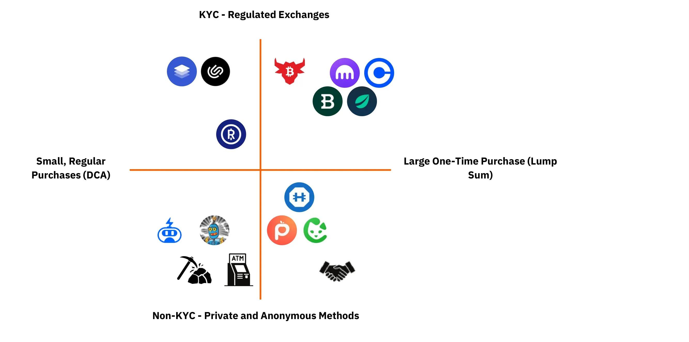
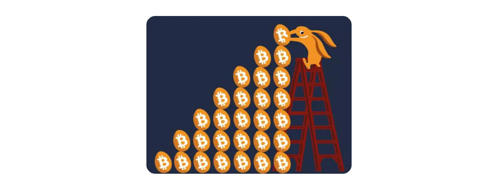
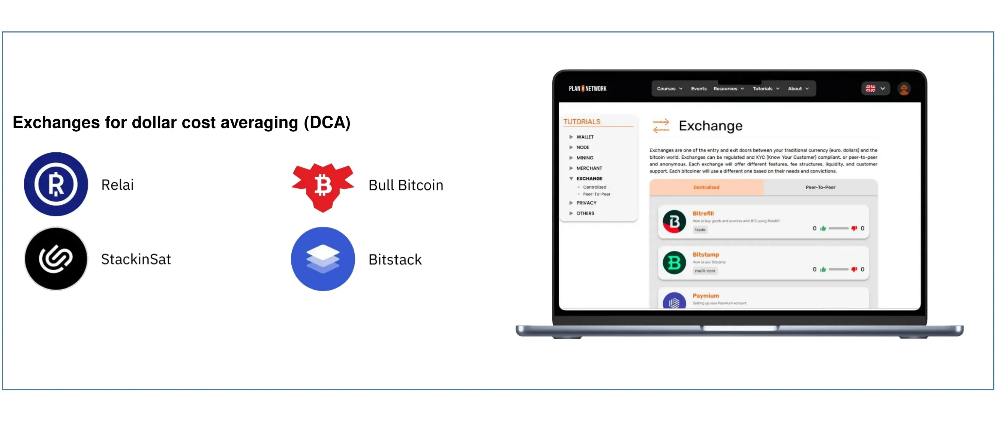
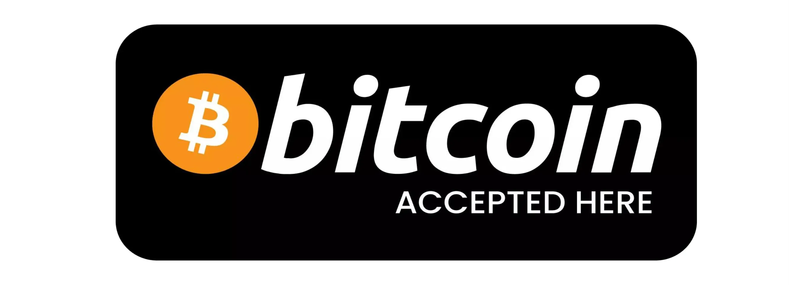

# Introduction

<partId>introduction-part1</partId>

## Welcome to BTC105

<chapterId>welcome-ch01</chapterId>

<!-- NEW -->

Now that you understand what Bitcoin is and why it matters, it's time to take the next step: acquiring your first bitcoins. This course will guide you through the different ways to buy bitcoin and help you choose the method that best fits your situation.

There's no single "right way" to acquire bitcoin. The best approach depends on your personal circumstances: how much you want to invest, how often you plan to buy, your privacy preferences, and where you live. By the end of this course, you'll have a clear understanding of all available options and be ready to make informed decisions.

### What You'll Learn

In this course, we'll cover:

- **The key questions to ask yourself** before making your first purchase
- **The trade-offs** between convenience, privacy, and cost
- **All major acquisition methods**: centralized exchanges, peer-to-peer platforms, DCA services, ETFs, and more
- **Alternative ways to acquire bitcoin**: earning, mining, gift cards
- **What happens after you buy**: securing your bitcoin, understanding taxes, and even selling if needed

### Prerequisites

Before diving in, make sure you have:

- A basic understanding of what Bitcoin is (if not, start with BTC101)
- An awareness of online security basics (covered in SCU102)
- A willingness to take responsibility for your own financial decisions

### A Note on This Course

This course focuses specifically on **acquiring** bitcoin. Securing your bitcoin properly is equally important but is covered in detail in BTC104 (How to Secure Bitcoin). We'll reference BTC104 throughout this course and strongly recommend taking it next.

Let's begin by understanding what you need to have in place before your first purchase.

<!-- END NEW -->

## Prerequisites Before Buying Bitcoin

<chapterId>prerequisites-ch02</chapterId>

<!-- NEW -->

Before you buy your first bitcoin, there are a few critical things you need to understand and prepare. Skipping these steps is one of the most common mistakes beginners make.

### Why You Need a Wallet BEFORE Buying

One of the fundamental principles of Bitcoin is: **"Not your keys, not your coins."**

When you buy bitcoin on an exchange and leave it there, you don't truly own that bitcoin. The exchange does. They could get hacked, go bankrupt, freeze your account, or be forced by regulators to seize your funds. History is full of examples: Mt. Gox, FTX, and many others.

Before making your first purchase, you should have a wallet ready to receive your bitcoin. This way, you can immediately withdraw your coins to your own custody.

### Wallet Types Overview

There are several types of wallets, each with different trade-offs:

<!-- ORIGINAL: btc102/en.md lines 1292-1371 (adapted) -->

**Hot Wallets** are apps or software connected to the internet. They store your private keys on the same device where they're installed. These wallets are great for everyday use or storing small amounts of bitcoin.

Examples: Blue Wallet, Green Wallet, Sparrow Wallet
With Lightning support: Phoenix, Wallet of Satoshi, BitKit

*Advantages*:
- Easy to use and quick access to your funds
- Great for small payments and daily use
- Some support the Lightning Network for fast and cheap transactions

*Disadvantages*:
- Less secure: your keys are on a device connected to the internet
- Not suitable for storing large amounts over the long term

**Hardware Wallets** are physical devices that store your private keys completely offline. They're much more secure than hot wallets because they reduce the risk of online attacks.

Examples: Ledger, Trezor, Coldcard, Jade, BitBox

*Advantages*:
- Keys are offline = much harder for hackers to access
- Designed specifically for security

*Disadvantages*:
- Slower to use; you need to connect the device and physically confirm transactions
- You'll need to buy the device, which can cost money

**For beginners**: Start with a hot wallet (like Green Wallet or Blue Wallet) for small amounts. As your holdings grow, invest in a hardware wallet.

For detailed wallet setup guides, see BTC104 (How to Secure Bitcoin) and our wallet tutorials at planb.academy/tutorials/wallet.

<!-- END ORIGINAL -->

### The Self-Custody Mindset

<!-- NEW -->

Understanding self-custody is crucial. When you control your own bitcoin:

- **You are responsible** for backing up your recovery phrase (the 12 or 24 words)
- **You must protect** that backup from theft, loss, fire, and water damage
- **No one can help you** if you lose access - there's no "forgot password" option

This might sound intimidating, but millions of people successfully self-custody their bitcoin. The key is to follow best practices, which we cover in BTC104.

### Security Basics Reminder

Before buying bitcoin, ensure you have good security hygiene:

- Use a **password manager** (see SCU101 tutorials)
- Enable **two-factor authentication (2FA)** on all exchange accounts
- Use a **dedicated email** for crypto-related accounts
- Be aware of **phishing attacks** and scams (covered in SCU102)

### Common Beginner Mistakes to Avoid

1. **Leaving bitcoin on exchanges** - Always withdraw to your own wallet
2. **Not backing up your recovery phrase** - Write it down on paper, store it safely
3. **Sharing your holdings publicly** - Discretion is important for security
4. **Buying more than you can afford to lose** - Especially as a beginner
5. **Trying to time the market** - Focus on a consistent strategy instead

With these foundations in place, you're ready to explore the different ways to acquire bitcoin.

<!-- END NEW -->

# Choosing Your Acquisition Strategy

<partId>strategy-decision-part2</partId>

## The Key Questions

<chapterId>key-questions-ch03</chapterId>

<!-- NEW + ORIGINAL: btc102/en.md lines 1213-1229 (adapted) -->

Before choosing how to buy bitcoin, you need to answer a few key questions about your situation. There's no one-size-fits-all approach; every user has a unique context shaped by their financial situation, technical knowledge, and expectations.

### How Much Do You Want to Invest?

**One-time investment**: If you have a lump sum you want to convert to bitcoin (from savings, an inheritance, or selling an asset), you'll want to use methods optimized for larger purchases with good exchange rates.

**Recurring investment**: If you plan to buy small amounts regularly from your income, a Dollar-Cost Averaging (DCA) approach makes more sense. This means buying a fixed amount at regular intervals, regardless of price.

**Small amounts to learn**: If you're just experimenting, start with a small amount (€10-50) to learn the process without significant risk.

### Privacy Preference: KYC or No-KYC?

<!-- ORIGINAL: btc102/en.md lines 1222 -->

Are you comfortable providing personal information and using centralized platforms to buy bitcoin? Or do you prefer privacy-first methods like peer-to-peer, no-KYC exchanges?

This is one of the most important decisions you'll make. We'll explore the trade-offs in detail in the next chapter.

### Time and Effort: Manual or Automated?

How much time do you want to spend managing your bitcoin purchases?

- **Automated**: Set up recurring buys on a platform, and your bitcoin accumulates automatically
- **Manual**: Place orders yourself each time you want to buy, giving you more control but requiring more effort

### Technical Comfort Level

<!-- ORIGINAL: btc102/en.md lines 1256-1264 (adapted) -->

Your day-to-day life also plays a role in how you'll manage your bitcoins.

**Limited time or interest?** Opt for simple, automated solutions like scheduled purchases that automatically transfer to secure storage.

**Tech-savvy or hands-on?** You might prefer more advanced solutions like peer-to-peer platforms or even running your own node.

### Regional Availability

<!-- ORIGINAL: btc102/en.md lines 1223 -->

Depending on where you live, access to certain exchanges might be restricted. Local laws and tax rules can also influence how you store and use your bitcoin.

Some platforms are region-specific (like Paymium for France, or Bitcoin.vn for Vietnam), while others operate globally.

<!-- END ORIGINAL -->

### Summary: Questions to Answer

Before proceeding, take a moment to consider:

1. Do I want to invest a lump sum or buy regularly?
2. How important is privacy to me?
3. Do I want an automated or manual process?
4. How technically comfortable am I?
5. What platforms are available in my country?

Your answers will guide you toward the right acquisition method.

<!-- END NEW -->

## Understanding the Trade-offs

<chapterId>tradeoffs-ch04</chapterId>

<!-- ORIGINAL: btc102/en.md lines 1388-1441 + NEW -->

Every acquisition method involves trade-offs. Understanding these will help you make informed decisions.

### KYC vs No-KYC: The Fundamental Trade-off

There are two main approaches to acquiring bitcoin, depending on how much privacy you need:



#### Acquisition with Identity Verification (KYC)

Regulated platforms typically require you to verify your identity before buying bitcoin. This means you'll need to provide official documents (passport, ID, proof of address, etc.) to create an account and access buying and selling services.

**Advantages**:

- Simple purchasing process, often suitable for beginners
- Possibility of purchasing large amounts at once
- Access to additional services (DCA, automatic conversion, easy fiat withdrawal)
- High liquidity with little difference between buying and selling prices

**Disadvantages**:

- High fees for conversions and withdrawals
- Some platforms are complicated and may overwhelm you with advanced trading features or altcoins
- Major privacy issues (explained below)

**The Privacy Risk of KYC**

The biggest downside of KYC exchanges is the privacy risk, which can also affect your personal security. KYC allows exchanges to link your real identity to your Bitcoin withdrawal addresses. This information becomes an ideal starting point for blockchain analysis. Once an address is identified, it's possible to track all associated transactions, which compromises your on-chain privacy.

Another risk is that the government, with access to regulated platforms' databases, can easily identify individuals who have bought BTC. While this may seem harmless today, it could become an issue if economic or political restrictions are imposed.

KYC platforms also store sensitive data, including IDs and proof of address. If a platform gets hacked or fails, this information can be exposed and used for phishing, extortion attempts, or even physical theft. Unlike other data breaches, Bitcoin-related leaks are especially risky because they might reveal that you own valuable assets.

#### Acquisition Without Identity Verification (No-KYC)

Buying Bitcoin without disclosing your identity is an option for those who prioritize privacy:

- **Peer-to-peer (P2P) between private individuals**: Buying directly in cash from a person you trust (friends, family, local network, meetups) avoids any official transaction records
- **P2P Platforms**: Platforms such as Bisq, RoboSats, and Peach facilitate exchanges between private individuals without identity verification, using escrow systems to secure transactions
- **Bitcoin ATMs**: Some ATMs allow you to buy Bitcoin with cash, though fees tend to be high
- **Mining**: Mining Bitcoin provides a non-traditional way to acquire coins without KYC
- **Earning Bitcoin**: Accepting Bitcoin as payment for goods or services

**Advantages**:

- Preserves your privacy by limiting links between your identity and your Bitcoin activity
- Reduces the risk of censorship, fund freezing, or state interference
- Allows access to Bitcoin even in highly regulated environments

**Disadvantages**:

- Usually more complicated than KYC platforms
- Lower liquidity and fewer transactions
- P2P buying often comes with a premium (5-15% above market price)
- Greater counterparty risk in exchanges between private individuals

### The Convenience vs Privacy Spectrum

Think of acquisition methods on a spectrum:

```
More Convenient ←————————————————→ More Private
     |                                    |
  KYC Exchange                      P2P Cash Trade
  DCA Service                       Bitcoin ATM
  Bitcoin ETF                       Mining
                                    Earning BTC
```

Most people start on the convenient side and gradually move toward more private methods as they learn.

### Fees Comparison

| Method | Typical Fees | Notes |
|--------|--------------|-------|
| KYC Exchange (Lump Sum) | 0.1-1% | Best rates for large amounts |
| DCA Service | 1-2% | Convenience premium |
| P2P Platforms | 3-10% premium | Privacy premium |
| Bitcoin ATM | 5-15% | High convenience, high cost |
| Earning BTC | 0% | No fees, but requires effort |

### Decision Framework

**Choose KYC if you:**
- Value convenience and simplicity
- Plan to invest larger amounts
- Are comfortable with regulatory compliance
- Live in a stable jurisdiction

**Choose No-KYC if you:**
- Prioritize privacy
- Are concerned about data breaches
- Want to minimize government visibility
- Are willing to pay a premium for privacy

**Many people use both**: KYC for the bulk of purchases (better rates) and No-KYC for smaller amounts (better privacy). Your strategy can evolve over time.

<!-- END ORIGINAL + NEW -->

# Acquisition Methods

<partId>acquisition-methods-part3</partId>

## Lump Sum Purchase (KYC)

<chapterId>lumpsum-kyc-ch05</chapterId>

<!-- NEW + ORIGINAL: adapted from Hodler chapter lines 1567-1581 -->

If you have a larger amount of fiat currency you want to convert to bitcoin at once, using a regulated exchange offers the best exchange rates and highest liquidity.

### When to Use This Method

- You have savings you want to convert to bitcoin
- You received an inheritance or bonus
- You sold an asset and want to move value into bitcoin
- You're comfortable with KYC requirements

### How It Works

1. **Create an account** on a reputable exchange
2. **Complete identity verification** (KYC) - usually takes 1-3 days
3. **Deposit fiat currency** via bank transfer, credit card, or other methods
4. **Place a buy order** - market order (instant) or limit order (at your price)
5. **Withdraw immediately** to your own wallet

### Recommended Platforms

Because you're investing larger amounts, you need exchanges with strong liquidity and good security practices:

https://planb.academy/tutorials/exchange/centralized/kraken-1ef03e25-9b42-49bd-a47d-249e1a13cfc6

https://planb.academy/tutorials/exchange/centralized/bitstamp-5a36c896-bff5-46d7-b505-ff069c3ac47c

https://planb.academy/tutorials/exchange/centralized/bitfinex-dc306d39-bd96-4ab9-a278-a322316716db

https://planb.academy/tutorials/exchange/centralized/bull-bitcoin-europe-0ccf713e-efcd-44ec-8205-211f49ac7d53

Regional options:
- **France**: Paymium
- **Vietnam**: Bitcoin.vn

### Step-by-Step Guidance

1. **Research the exchange** - Check reviews, security history, and available payment methods
2. **Start the KYC process early** - Don't wait until you're ready to buy
3. **Use bank transfer for lower fees** - Credit cards often have 3-5% fees
4. **Don't try to time the market** - If you've decided to buy, execute your plan
5. **Withdraw immediately** - Never leave significant amounts on an exchange

### Important Considerations

- **Withdrawal fees vary** - Factor this into your decision
- **Payment method matters** - Bank transfers are cheaper than cards
- **Timing of deposits** - Bank transfers can take 1-3 days
- **Tax implications** - KYC means the government knows about your purchase

<!-- END NEW + ORIGINAL -->

## Lump Sum Purchase (No-KYC)

<chapterId>lumpsum-nokyc-ch06</chapterId>

<!-- NEW + ORIGINAL: adapted from Paranoid chapter lines 2110-2140 -->

For those who prioritize privacy, peer-to-peer platforms allow you to buy bitcoin without providing identity documents. You'll pay a premium for this privacy, but for many users it's worth it.

### When to Use This Method

- Privacy is important to you
- You want to avoid linking your identity to your bitcoin
- You're willing to pay a premium (typically 5-15% above market price)
- You have time to manage the transaction manually

### How It Works

P2P platforms connect buyers and sellers directly. Most use an escrow system to protect both parties:

1. **Seller deposits bitcoin** into the platform's escrow
2. **Buyer sends fiat payment** (bank transfer, cash, gift cards, etc.)
3. **Seller confirms receipt** of payment
4. **Bitcoin is released** from escrow to buyer

### Recommended Platforms

https://planb.academy/tutorials/exchange/peer-to-peer/bisq-v2-c1c6a702-6c16-4101-8b90-62c424017b80

https://planb.academy/tutorials/exchange/peer-to-peer/peach-c6143241-d900-4047-9b73-1caba5e1f874

https://planb.academy/tutorials/exchange/peer-to-peer/robosats-b60e4f7c-533a-4295-9f6d-5368152e8c06

https://planb.academy/tutorials/exchange/peer-to-peer/hodlhodl-d7344cd5-6b18-40f5-8e78-2574a93a3879

**In-person trading** is also an option:
- Local Bitcoin meetups
- Conferences
- Trusted friends and family

https://planb.academy/courses/1c643dc9-a15f-4f9e-93b6-cb3c58b4ee35

### Premium and Fees

Expect to pay 5-15% above the market price. This premium reflects:
- The privacy benefit you receive
- The seller's risk in accepting various payment methods
- Lower liquidity compared to centralized exchanges

### Safety Considerations

- **Use escrow** - Never send payment before bitcoin is in escrow
- **Check reputation** - Most platforms show seller ratings
- **Start small** - Do a test transaction first
- **In-person trades** - Meet in public places, consider bringing a friend
- **Be patient** - Good offers may take time to find

### Payment Methods

P2P platforms support many payment methods:
- Bank transfers
- Cash by mail
- Gift cards
- Mobile payment apps
- In-person cash

Each has different trade-offs for privacy, convenience, and risk.

<!-- END NEW + ORIGINAL -->

## DCA - Dollar Cost Averaging (KYC)

<chapterId>dca-kyc-ch07</chapterId>

<!-- ORIGINAL: btc102/en.md lines 1633-1781 (Stacker chapter - adapted) -->

Dollar-Cost Averaging (DCA) is one of the most popular strategies for accumulating bitcoin. Instead of investing a large sum at once, you purchase small amounts at regular intervals, regardless of the price.



### Why Choose DCA?

DCA is a highly effective investment strategy for those looking to reduce their exposure to market volatility while gradually building a bitcoin position.

**The advantages of DCA**:

- **Reduced volatility impact**: Regular purchases help smooth out price fluctuations. You buy more sats when prices are low and fewer when prices are high, averaging your cost basis and reducing emotional stress.
- **Accessibility**: You don't need large initial capital. You can start with as little as €10 per month and increase over time.
- **Discipline and automation**: Stackers avoid emotional decision-making. Automated recurring purchases ensure consistency.
- **Long-term strategy**: Gradual investing increases the chances of benefiting from bull markets while mitigating risk during downturns.

This method is especially **well-suited for beginners** - it removes the pressure of timing the market and allows for steady, hands-off accumulation.

### Setting Up a DCA Plan

To set up an effective DCA plan, define two key elements:

**Purchase frequency**: Weekly, biweekly, or monthly. Choose based on your income and goals. Avoid too frequent buys if it results in many tiny UTXOs that are costly to spend later.

**Purchase amount**: Base this on your budget and risk tolerance. Consistency is more important than size - it's better to stack modest amounts for years than overcommit and drop out.



### DCA Platforms

Most regulated platforms now offer automated DCA. With enough fiat in your account, the platform will automatically execute your buy orders based on your parameters.

**Dedicated DCA services** (often with automatic withdrawal to your wallet):

https://planb.academy/tutorials/exchange/centralized/relai-v2-30a9671d-e407-459d-9203-4c3eae15b30e

https://planb.academy/tutorials/exchange/centralized/stackinsat-5af6a380-f3c6-4246-9f81-9957a16ab066

https://planb.academy/tutorials/exchange/centralized/bitstack-29fd71be-9570-42c6-8f6f-cd355d62e746

https://planb.academy/tutorials/exchange/centralized/bull-bitcoin-europe-0ccf713e-efcd-44ec-8205-211f49ac7d53

**Mainstream exchanges supporting DCA**:

https://planb.academy/tutorials/exchange/centralized/kraken-1ef03e25-9b42-49bd-a47d-249e1a13cfc6

https://planb.academy/tutorials/exchange/centralized/bitstamp-5a36c896-bff5-46d7-b505-ff069c3ac47c

### The DCA Workflow

1. **Choose a platform** and complete KYC
2. **Set your frequency** (weekly, biweekly, monthly)
3. **Set your amount** (what you can afford consistently)
4. **Enable automatic withdrawal** to your own wallet if available
5. **Periodically transfer** accumulated bitcoin to cold storage

### Important Tips

- **Don't check prices obsessively** - The point of DCA is to remove emotion
- **Set it and forget it** - Automate as much as possible
- **Consolidate UTXOs periodically** - When transferring to cold storage, merge small inputs to optimize future transaction fees
- **Your DCA amount can evolve** - Adjust as your financial situation changes

<!-- END ORIGINAL -->

## DCA Without KYC

<chapterId>dca-nokyc-ch08</chapterId>

<!-- ORIGINAL: Paranoid content + NEW -->

Can you do DCA while preserving privacy? Yes, but it requires more effort since automation is harder without KYC platforms.

### The Challenge

True DCA services typically require KYC because they need bank account details to automate purchases. Privacy-focused alternatives exist but require manual effort.

### Manual DCA Using P2P Platforms

The simplest approach is to manually buy on a P2P platform at regular intervals:

1. **Set a recurring reminder** (e.g., every Sunday)
2. **Open your P2P platform** (Bisq, Peach, RoboSats)
3. **Find a good offer** and complete the trade
4. **Withdraw to your wallet**

https://planb.academy/tutorials/exchange/peer-to-peer/robosats-b60e4f7c-533a-4295-9f6d-5368152e8c06

https://planb.academy/tutorials/exchange/peer-to-peer/peach-c6143241-d900-4047-9b73-1caba5e1f874

https://planb.academy/tutorials/exchange/peer-to-peer/lnp2pbot-v2-e6bcb210-610b-487d-970c-7cce85273e3c

### Semi-Automated Options

Some tools can help automate No-KYC purchases:

- **Bitcoin voucher bots**: Services that let you buy bitcoin vouchers with various payment methods
- **Lightning-based P2P**: Platforms like RoboSats work over Lightning, enabling faster trades
- **Telegram bots**: LNP2PBot operates via Telegram for P2P Lightning trades

### The Trade-offs

| Aspect | KYC DCA | No-KYC DCA |
|--------|---------|------------|
| Convenience | High (automated) | Low (manual) |
| Privacy | Low | High |
| Premium | 1-2% | 5-15% |
| Time required | Minimal | 15-30 min per purchase |

### Tips for No-KYC DCA Success

- **Discipline is key** - Without automation, you must maintain the habit
- **Batch your purchases** - Instead of tiny weekly buys, consider larger bi-weekly or monthly purchases
- **Keep records** - Track your purchases for your own reference
- **Be patient** - Good P2P offers may not always be available immediately

<!-- END ORIGINAL + NEW -->

## Bitcoin ETFs

<chapterId>etf-ch09</chapterId>

<!-- NEW -->

Bitcoin Exchange-Traded Funds (ETFs) have become a significant way for traditional investors to gain bitcoin exposure. While they don't give you actual bitcoin ownership, they're worth understanding as part of the acquisition landscape.

### What is a Bitcoin ETF?

An ETF is a financial product that trades on traditional stock exchanges and tracks the price of an underlying asset - in this case, bitcoin. When you buy shares of a Bitcoin ETF, you're buying a claim on bitcoin held by the fund, not actual bitcoin.

### Spot ETF vs Futures ETF

**Spot ETFs** (like BlackRock's IBIT or Fidelity's FBTC):
- The fund actually holds real bitcoin
- Price closely tracks bitcoin's spot price
- More direct exposure to bitcoin's price movement

**Futures ETFs** (like BITO):
- The fund holds bitcoin futures contracts, not actual bitcoin
- Can deviate from spot price due to "contango" and "backwardation"
- Generally considered less efficient for long-term holding

### Pros of Bitcoin ETFs

- **Familiar investment vehicle**: Trades through your existing brokerage account
- **Tax advantages**: Can be held in retirement accounts (IRA, 401k in the US)
- **Regulated**: Subject to securities regulations, which some investors find reassuring
- **No key management**: Don't need to worry about wallet security
- **Easy to buy/sell**: Same process as buying any stock

### Cons of Bitcoin ETFs

- **Not your keys, not your coins**: You don't own actual bitcoin
- **Counterparty risk**: You're trusting the fund manager and custodian
- **Fees**: Management fees (0.2-1.5% annually) eat into returns
- **No Bitcoin network access**: Can't use bitcoin for payments or transfers
- **Market hours only**: Can't trade 24/7 like actual bitcoin
- **Possible tracking error**: ETF price may deviate from actual bitcoin price

### Major Bitcoin ETFs

| ETF | Ticker | Fee | Custodian |
|-----|--------|-----|-----------|
| BlackRock iShares Bitcoin Trust | IBIT | 0.25% | Coinbase |
| Fidelity Wise Origin Bitcoin Fund | FBTC | 0.25% | Fidelity |
| Grayscale Bitcoin Trust | GBTC | 1.50% | Coinbase |
| ARK 21Shares Bitcoin ETF | ARKB | 0.21% | Coinbase |

### Who Should Consider ETFs?

ETFs make sense if you:
- Want exposure in a retirement account
- Are a traditional investor unfamiliar with crypto
- Can't or won't manage private keys
- Want a regulated investment vehicle
- Plan to hold in a brokerage alongside other investments

### The Important Caveat

**ETFs are not Bitcoin.** You're buying paper exposure to bitcoin's price, not actual censorship-resistant, self-sovereign money. The benefits of Bitcoin - true ownership, permissionless transactions, protection from seizure - don't apply to ETF holders.

If your goal is financial sovereignty and the unique properties of Bitcoin, you should eventually acquire actual bitcoin and learn to self-custody. ETFs can be a starting point or complement, but they're not the full Bitcoin experience.

<!-- END NEW -->

## Corporate Treasury & TradFi Solutions

<chapterId>treasury-tradfi-ch10</chapterId>

<!-- NEW -->

Beyond individual investors, businesses and institutions are increasingly acquiring bitcoin. This chapter briefly covers these approaches, which may be relevant if you're a business owner or work with institutional capital.

### Corporate Bitcoin Treasury

Following MicroStrategy's lead in 2020, some companies now hold bitcoin as a treasury reserve asset. The rationale:

- **Hedge against currency debasement**: Protection against fiat currency inflation
- **Diversification**: Adding an uncorrelated asset to the balance sheet
- **Signal to stakeholders**: Demonstrating belief in Bitcoin's future

Companies acquiring bitcoin for treasury typically:
- Use regulated OTC desks for large purchases
- Work with qualified custodians (Coinbase Prime, Fidelity Digital Assets, BitGo)
- May use multisig arrangements with institutional partners
- Consider accounting and tax implications carefully

### Institutional Custody Solutions

For large holdings, specialized custody services offer:

- **Qualified custody**: Meeting regulatory requirements for institutional investors
- **Insurance**: Coverage against theft or loss
- **Multisig with distributed key management**: Multiple parties control access
- **Compliance support**: Reporting and audit trails
- **SLA guarantees**: Service level agreements for availability

Examples: Coinbase Prime, Fidelity Digital Assets, BitGo, Anchorage

### Bitcoin-Backed Financial Products

Some traditional finance products now use bitcoin as collateral:

- **Bitcoin-collateralized loans**: Borrow fiat against your bitcoin holdings
- **Yield products**: Earn interest on deposited bitcoin (with significant risks)
- **Structured products**: Various financial instruments with bitcoin exposure

**Warning**: These products often involve significant counterparty risk. Many "yield" platforms have failed, losing customer funds. The 2022 crypto credit crisis (Celsius, BlockFi, Voyager) demonstrated these risks clearly. "Not your keys, not your coins" applies strongly here.

### Compliance Considerations

Businesses acquiring bitcoin must consider:

- **Accounting treatment**: How bitcoin is recorded on financial statements
- **Tax implications**: Capital gains, inventory accounting, or other treatment
- **Regulatory compliance**: Securities laws, money transmission, etc.
- **Audit requirements**: Proof of reserves and custody verification
- **Internal controls**: Policies for acquisition, storage, and potential sale

### Is This For You?

This chapter is most relevant if you:
- Own a business and are considering bitcoin for treasury
- Work with institutional investors
- Manage a family office
- Are curious about how larger entities acquire bitcoin

For most individual readers, the other acquisition methods in this course will be more directly applicable.

<!-- END NEW -->

# Alternative Acquisition Methods

<partId>alternatives-part4</partId>

## Common Alternatives

<chapterId>common-alternatives-ch11</chapterId>

<!-- ORIGINAL: Active User content lines 1893-1951 (adapted) + NEW -->

Beyond buying bitcoin directly, there are several other ways to acquire it that many people overlook.

### Earning Bitcoin for Work

Being a Bitcoin user isn't just about buying - it's also about earning. If you run a business, consider accepting Bitcoin as payment. If you're an employee, see if your employer offers the option to receive all or part of your salary in BTC.

**For businesses**:

https://planb.academy/tutorials/business/point-of-sale/swiss-bitcoin-pay-2-a78b057e-ed11-47ac-860c-71019fcb451a

https://planb.academy/tutorials/business/point-of-sale/btcpay-server-928eb01e-824b-4b57-a3e8-8727633beddc

**For freelancers and employees**:
- Discuss with your employer about partial payment in bitcoin
- Use freelancing platforms that support bitcoin payments
- Offer services in exchange for bitcoin in your local community



### Bitcoin-Back Rewards & Cashback

Some services offer bitcoin rewards on everyday purchases:

- **Debit cards with bitcoin rewards**: Earn sats on purchases
- **Shopping portals**: Get bitcoin back when shopping at partner stores
- **Browser extensions**: Earn bitcoin for online shopping

These usually involve small amounts but add up over time.

### Gift Cards and Spend-to-Earn

A practical workaround for merchants who don't accept bitcoin: buy gift cards with bitcoin (or buy bitcoin with gift cards on some P2P platforms).

https://planb.academy/tutorials/exchange/centralized/bitrefill-8c588412-1bfc-465b-9bca-e647a647fbc1

Services like Bitrefill, Coinsbee, and The Bitcoin Company offer gift cards for many major retailers, allowing you to:
- Convert bitcoin to purchasing power
- Use the "Spend and Replace" strategy

### Bitcoin ATMs

Bitcoin ATMs (BTMs) allow you to buy bitcoin with cash. They're convenient but typically have:

- **High fees**: 5-15% above market price
- **Varying KYC requirements**: Some require ID for larger amounts, others allow small purchases without ID
- **Limited availability**: Mostly in major cities

To find a Bitcoin ATM near you, use services like CoinATMRadar.

### Comparing Alternatives

| Method | KYC Required? | Effort | Typical "Cost" |
|--------|--------------|--------|----------------|
| Earn for work | No | High | 0% (you're paid) |
| Cashback rewards | Usually Yes | Low | 0% (bonus sats) |
| Gift cards | No | Low | Platform fees |
| Bitcoin ATMs | Varies | Low | 5-15% premium |

<!-- END ORIGINAL + NEW -->

## Obscure & Advanced Methods

<chapterId>obscure-methods-ch12</chapterId>

<!-- NEW + ORIGINAL: Paranoid content adapted -->

For completeness, here are some less common ways to acquire bitcoin.

### Mining

Mining is the original way to acquire bitcoin - running hardware that secures the network and earns block rewards.

**Home mining options**:
- USB miners (very low hashrate, mostly educational)
- ASIC miners (dedicated bitcoin mining hardware)
- Heating devices that mine while warming your space

https://planb.academy/tutorials/mining/hardware/attakai-0d177e6b-e167-4b25-8e38-4ec74213d1fb

https://planb.academy/tutorials/mining/hardware/bitaxe-d317e1a7-d775-401d-85df-51f2217566

**Considerations**:
- Electricity costs determine profitability
- Noise and heat from miners
- Mining pools required for regular payouts
- Hardware investment required

Mining is primarily for those interested in supporting the network or who have access to cheap electricity. For most people, buying bitcoin directly is more efficient.

### Bitcoin Vouchers & Prepaid Cards

Some services sell bitcoin vouchers that can be redeemed later:

- Purchase with cash or various payment methods
- Redeem for bitcoin using a code
- No account required for purchase

These bridge the gap between cash and bitcoin without needing an exchange account.

### In-Person Cash Trades

Meeting someone in person to exchange cash for bitcoin remains one of the most private acquisition methods:

- **Bitcoin meetups**: Regular gatherings of Bitcoin enthusiasts often include trading
- **Conferences**: Bitcoin events typically have areas for peer trading
- **Trusted networks**: Friends and family who also use bitcoin

**Safety tips**:
- Meet in public places
- Consider bringing a friend
- Verify the transaction on-chain before leaving
- Start with small amounts until you build trust

### Earning Through the Lightning Network

If you run a Lightning node, you can earn small amounts of bitcoin from routing fees:

- Set up a well-connected Lightning node
- Provide liquidity to the network
- Earn fees when payments route through your node

This is advanced and requires technical knowledge, but it's another way to stack sats.

### Accepting BTC for Your Business

If you sell goods or services, accepting bitcoin is a powerful way to acquire it:

- No premium over market price
- Builds the Bitcoin economy
- Can attract Bitcoin-enthusiast customers
- Various payment processors make it easy

See our business tutorials for setup guides.

### Summary

These methods aren't for everyone, but they show that acquisition isn't limited to exchanges. The Bitcoin economy offers many paths to acquiring sats.

<!-- END NEW + ORIGINAL -->

# After Your First Purchase

<partId>after-purchase-part5</partId>

## All Methods Are Valid

<chapterId>all-methods-valid-ch13</chapterId>

<!-- NEW -->

Congratulations - you've learned about the many ways to acquire bitcoin. Before moving forward, let's address a common concern: "Am I doing this the right way?"

### There's No "Wrong" Way to Acquire Bitcoin

If you've read this far and felt overwhelmed by the options, here's reassurance: **there's no perfect method**. Every acquisition approach has trade-offs, and what matters is that you start.

- **KYC exchange?** Valid. It's how most people begin.
- **P2P platform?** Valid. Great for privacy.
- **DCA service?** Valid. Removes emotional decisions.
- **Bitcoin ATM?** Valid. Convenient despite higher fees.
- **Earning bitcoin?** Valid. Builds the circular economy.

### Your Strategy Can Evolve

Your acquisition approach doesn't have to be permanent. It's common and healthy for it to evolve:

**Common progressions**:
- KYC → No-KYC (as privacy becomes more important)
- Lump sum → DCA (learning to remove emotion)
- Exchanges → P2P (seeking more privacy)
- Hot wallet → Hardware wallet (as holdings grow)
- Beginner → Running your own node (seeking sovereignty)

### Don't Let Perfect Be the Enemy of Good

Some people spend months researching the "best" way to buy bitcoin while the price moves without them. Analysis paralysis is real.

**Just start**:
- Buy a small amount to learn the process
- Make mistakes with small amounts, not large ones
- Your first purchase doesn't define your strategy forever
- Experience teaches better than research

### You Can Always Change Methods Later

Every bitcoin you acquire - regardless of method - is fungible with every other bitcoin. Your KYC bitcoin and your No-KYC bitcoin look the same on the blockchain. If privacy becomes more important to you later, you can:

- Start acquiring via No-KYC methods going forward
- Use privacy tools (covered in advanced courses)
- Mix different acquisition approaches

### The Most Important Thing

The most important thing is that you **take custody of your bitcoin**. Regardless of how you acquire it:

1. Withdraw to your own wallet
2. Back up your recovery phrase properly
3. Don't leave significant amounts on exchanges

This single habit - self-custody - is more important than optimizing your acquisition method.

### Moving Forward

With your bitcoin acquired, the next steps are:
1. Secure it properly (next chapter, and BTC104)
2. Understand tax implications (Chapter 15)
3. Know how to sell if needed (Chapter 16)

<!-- END NEW -->

## Securing Your Bitcoin

<chapterId>securing-bitcoin-ch14</chapterId>

<!-- NEW -->

You've acquired bitcoin. Now the critical question: how do you keep it safe? This chapter bridges to BTC104 (How to Secure Bitcoin), which covers this topic in depth.

### Why Security Matters AFTER Purchase

The moment you withdraw bitcoin to your own wallet, you become fully responsible for its security. There's no customer service, no "forgot password" option, no way to reverse mistakes.

This isn't meant to scare you - millions of people successfully self-custody their bitcoin. But it requires following best practices.

### The Basics: Moving from Exchange to Self-Custody

**Step 1**: Have your wallet ready BEFORE you buy (as we discussed in Chapter 2)

**Step 2**: Get your wallet's receiving address

**Step 3**: On the exchange, go to "Withdraw"

**Step 4**: Enter your wallet address (double-check it!)

**Step 5**: Confirm the transaction

**Step 6**: Wait for confirmations (1-6 depending on your security needs)

### Wallet Progression

As your holdings grow, your security setup should evolve:

**Small amounts (learning)**: Hot wallet on your phone
- Easy to use
- Good for learning
- Acceptable risk for small amounts

**Growing holdings**: Hardware wallet
- Keys stored offline
- Much higher security
- Worth the investment as holdings grow

**Significant holdings**: Advanced setups
- Multisig (multiple keys required)
- Geographic distribution
- Inheritance planning

### The Critical Importance of Backups

When you set up a wallet, you'll receive a 12 or 24-word recovery phrase. This is the ONLY way to recover your bitcoin if something happens to your device.

**Backup essentials**:
- Write it on paper or stamp it in metal
- Store in a secure location (fireproof, waterproof)
- Never store digitally (no photos, no cloud storage)
- Consider multiple backup locations
- Test recovery before storing significant amounts

https://planb.academy/tutorials/wallet/backup/backup-mnemonic-22c0ddfa-fb9f-4e3a-96f9-46e2a7954270

### Learn More in BTC104

This chapter is intentionally brief because security deserves its own course. BTC104 (How to Secure Bitcoin) covers:

- Detailed wallet setup guides
- Backup strategies
- Hardware wallet comparisons
- Advanced setups (multisig, passphrases)
- Inheritance planning
- Operational security

**Strongly recommended**: Take BTC104 as your next course.

### Quick Security Checklist

Before moving significant value into bitcoin:

- [ ] Wallet set up and tested
- [ ] Recovery phrase backed up securely
- [ ] Backup stored in secure location
- [ ] Small test transaction completed
- [ ] Understand how to restore from backup

Security is not optional - it's as important as acquisition itself.

<!-- END NEW -->

## Taxes & Compliance

<chapterId>taxes-compliance-ch15</chapterId>

<!-- NEW -->

Nobody's favorite topic, but an important one: taxes. How you acquire bitcoin can have significant tax implications, and understanding the basics can save you problems later.

**Disclaimer**: This is general educational information, not tax or legal advice. Tax laws vary by country and change frequently. Consult a qualified tax professional for your specific situation.

### The Basic Principle

In most jurisdictions, bitcoin is treated as property, not currency. This means:

- Buying bitcoin is generally not a taxable event
- Selling bitcoin for fiat usually triggers capital gains tax
- Spending bitcoin is typically treated as selling (also taxable)
- Earning bitcoin (as income) is usually taxed as income

### Tax Events - What Typically Triggers Taxes

**Usually taxable**:
- Selling bitcoin for fiat currency
- Trading bitcoin for other cryptocurrencies
- Spending bitcoin on goods or services
- Earning bitcoin as payment or income
- Mining bitcoin (often taxed as income when received)

**Usually not taxable**:
- Buying bitcoin with fiat
- Transferring bitcoin between your own wallets
- Gifting bitcoin (may have gift tax implications in some places)
- Donating bitcoin to charity (may actually provide a deduction)

### KYC vs No-KYC: Tax Reporting Differences

**KYC purchases**:
- Exchange reports your activity to tax authorities
- Your purchase history is known to the government
- Easier to calculate cost basis (what you paid)
- Less privacy, more straightforward compliance

**No-KYC purchases**:
- No automatic reporting to authorities
- You're still legally required to report and pay taxes
- Harder to prove cost basis without records
- More privacy, but same legal obligations

### Record-Keeping Best Practices

Regardless of acquisition method, keep records of:

- Date of each acquisition
- Amount acquired
- Price paid (cost basis)
- Fees paid
- Where/how you acquired it
- Date of any sale or spend
- Sale price
- Any relevant receipts or confirmations

**Tools that can help**:
- Cryptocurrency tax software (Koinly, CoinTracker, etc.)
- Spreadsheet tracking
- Exchange export features (for KYC platforms)

### Long-Term vs Short-Term

Many jurisdictions distinguish between:

- **Short-term gains**: Bitcoin held less than a year, taxed at higher rates
- **Long-term gains**: Bitcoin held more than a year, often taxed at lower rates

This affects strategy: holding for over a year before selling can significantly reduce tax burden in many places.

### When to Consult a Professional

Consider consulting a tax professional if:

- You've sold significant amounts
- You have complex situations (mining, business income, international holdings)
- You're unsure about reporting requirements
- You need to amend past returns
- Tax laws in your jurisdiction have changed

### The Bottom Line

- Tax obligations exist regardless of KYC status
- Keep good records from the start
- Understand the rules in your jurisdiction
- When in doubt, consult a professional
- Don't let tax concerns stop you from acquiring bitcoin - just be informed

<!-- END NEW -->

## Selling & Off-Ramping

<chapterId>selling-offramp-ch16</chapterId>

<!-- NEW -->

While the Bitcoin community often emphasizes holding ("HODL"), there are legitimate reasons you might need to sell or convert bitcoin to fiat. Understanding how to off-ramp is part of being a complete Bitcoin user.

### Why You Might Need to Sell

Let's be realistic - sometimes you need fiat currency:

- Emergency expenses
- Large purchases (house, car)
- Taking profits at the right time for you
- Business needs
- Tax obligations
- Life changes

There's no shame in selling when it serves your needs. Bitcoin is a tool for financial freedom, not a religion.

### Same Platforms Work in Reverse

The good news: most platforms that let you buy also let you sell. The process is essentially reversed:

**KYC Exchanges (for larger amounts)**:
- Send bitcoin to the exchange
- Place a sell order
- Withdraw fiat to your bank account
- Consider fees and processing time

**P2P Platforms (for privacy)**:
- List your bitcoin for sale (or find a buyer)
- Agree on payment method
- Put bitcoin in escrow
- Receive payment
- Release bitcoin from escrow

### KYC vs No-KYC Off-Ramping

**KYC off-ramps** (exchanges):
- Easier for large amounts
- Better exchange rates
- Bank transfer to your account
- Tax authorities will likely know

**No-KYC off-ramps**:
- P2P platforms (Bisq, Peach, RoboSats)
- In-person cash trades
- Gift cards (convert bitcoin to purchasing power)
- Spending directly (when merchants accept bitcoin)

### Spending as an Alternative to Selling

Instead of converting to fiat, consider:

- **Direct spending**: Many merchants now accept bitcoin
- **Gift cards**: Convert bitcoin to retailer credit
- **Debit cards**: Load cards with bitcoin to spend anywhere
- **Bill payment services**: Pay bills directly with bitcoin

This can be simpler and may have different tax implications (consult a professional).

### Tax Events When Selling

Remember: selling bitcoin typically triggers a tax event. You'll owe tax on any gains since you acquired the bitcoin.

- Keep records of your cost basis
- Calculate gains accurately
- Set aside money for taxes
- Consider timing (long-term vs short-term rates)

### Practical Tips for Selling

1. **Plan ahead**: Don't wait for an emergency to figure out how to sell
2. **Test the process**: Do a small sale first to understand the steps
3. **Factor in fees**: Exchange fees, withdrawal fees, transfer time
4. **Bank compatibility**: Some banks are unfriendly to crypto - know your bank's policy
5. **Document everything**: Keep records for taxes

### The Spend and Replace Strategy

Many Bitcoiners prefer a "spend and replace" approach:

1. Spend bitcoin on purchases
2. Replace the spent bitcoin with fiat (via DCA or purchase)
3. This way you use bitcoin as currency while maintaining your position

This keeps bitcoin in circulation, supporting the ecosystem while serving your needs.

<!-- END NEW -->

## Building Your Personal Strategy

<chapterId>personal-strategy-ch17</chapterId>

<!-- NEW -->

You now have all the knowledge needed to create your personal bitcoin acquisition strategy. Let's put it together.

### Decision Tree Summary

Use this to find your starting point:

```
Do you value privacy highly?
├── YES → Consider No-KYC methods (Chapter 6, 8)
└── NO → KYC methods are fine (Chapter 5, 7)

Do you have a lump sum to invest?
├── YES → Lump sum purchase (Chapter 5 or 6)
└── NO → DCA strategy (Chapter 7 or 8)

Do you want hands-off investing?
├── YES → Automated DCA service (Chapter 7)
└── NO → Manual purchases give more control

Are you comfortable with technology?
├── YES → More options available (P2P, self-hosted)
└── NO → Start with user-friendly platforms
```

### Combining Methods

Many successful Bitcoiners combine methods:

**Example 1: The Pragmatic Stacker**
- Monthly DCA via KYC platform (main accumulation)
- Occasional P2P purchases (some privacy)
- Hardware wallet for storage

**Example 2: The Privacy-Focused User**
- P2P purchases only (Bisq, RoboSats)
- Earns bitcoin for freelance work
- Runs own node

**Example 3: The Beginner**
- Starts with small KYC exchange purchase to learn
- Moves to DCA after understanding the process
- Upgrades to hardware wallet as holdings grow

### Your First 30 Days Checklist

**Week 1: Foundation**
- [ ] Set up a hot wallet (Green Wallet or Blue Wallet)
- [ ] Back up your recovery phrase properly
- [ ] Make a small test purchase (€10-50)
- [ ] Withdraw to your wallet

**Week 2: Learn**
- [ ] Complete a few more small purchases
- [ ] Practice sending and receiving
- [ ] Explore different platforms
- [ ] Start taking BTC104 (Security)

**Week 3: Strategy**
- [ ] Decide on KYC vs No-KYC approach
- [ ] Choose DCA vs Lump sum
- [ ] Set up your chosen platform(s)
- [ ] Consider hardware wallet if continuing

**Week 4: Implement**
- [ ] Start your regular acquisition strategy
- [ ] Set up automation if desired
- [ ] Establish your security practices
- [ ] Join a local Bitcoin community

### Resources and Next Steps

**Recommended Next Courses**:
- **BTC104**: How to Secure Bitcoin (essential)
- **SCU102**: Financial Fraud, Scams & Online Security
- **BTC101**: Bitcoin fundamentals (if not yet completed)

**Community Resources**:
- Local Bitcoin meetups
- Online communities
- planb.academy tutorials

**Stay Updated**:
- Bitcoin-only podcasts
- Quality newsletters
- Follow developments (but don't obsess over price)

### Final Thoughts

You now understand:
- The key questions to ask before buying
- The trade-offs between different methods
- All major acquisition options
- What to do after your first purchase
- How to build a sustainable strategy

The hardest step is the first one. Start small, learn by doing, and let your strategy evolve over time.

**Remember**:
- There's no perfect method - just start
- Self-custody is non-negotiable
- Your strategy can and should evolve
- The Bitcoin community is helpful - don't be afraid to ask questions

Welcome to your Bitcoin journey.

<!-- END NEW -->

## Going Further

<chapterId>going-further-ch18</chapterId>

<!-- NEW -->

### Recommended Courses

Continue your Bitcoin journey with these courses:

- **BTC104 - How to Secure Bitcoin** (essential next step): Learn to set up wallets, secure your seed phrase, and follow security best practices
- **SCU102 - Financial Fraud, Scams & Online Security**: Protect yourself from the most common threats in the Bitcoin ecosystem
- **BTC103 - Why Bitcoin Matters**: Deepen your understanding of Bitcoin's fundamental value proposition
- **SOV102 - Bitcoin Inheritance Planning**: Plan for the long term and protect your loved ones

### External Resources

- Plan B Academy (planb.academy) — additional tutorials and guides
- Bitcoin-only.com — curated directory of Bitcoin-only services and communities
- Local Bitcoin meetups — connect with your local community
- *The Bitcoin Standard* by Saifedean Ammous — understand the economics behind Bitcoin

### Golden Rules for Acquiring Bitcoin

1. **Self-custody is non-negotiable**: No matter how you acquire bitcoin, always withdraw to your own wallet. Exchanges are for buying, not storing.
2. **There's no perfect method — just start**: Don't let analysis paralysis prevent you from taking your first step. Every method is valid.
3. **Your strategy should evolve**: Start simple, learn by doing, and refine your approach over time. What works today may change as your knowledge grows.
4. **Privacy is a spectrum, not a binary**: Choose the level of privacy that fits your situation. You can always improve it later.
5. **Consistency beats timing**: Regular accumulation (DCA) almost always outperforms trying to time the market. Set a plan and stick to it.

<!-- END NEW -->

# Conclusion

<partId>conclusion-part6</partId>

## Conclusion

<chapterId>conclusion-ch19</chapterId>
<isCourseConclusion>true</isCourseConclusion>
