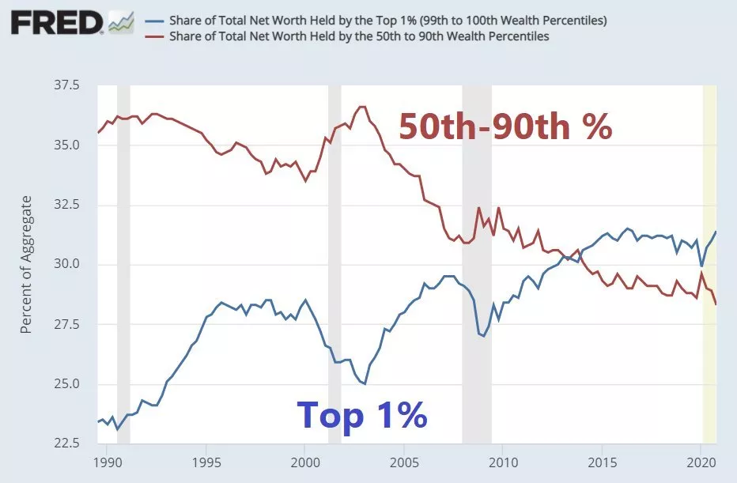

こんな疑問を持ったことはありませんか？

なぜ私の生活費はどんどん上がっているのか？
インフレは本当に私にとって良いことなのか？
インフレに対抗するための選択肢は何があるのか？
ビットコインやステーブルコインはこれら全てにどのように組み込まれるのか？

これらの質問に一つでも「はい」と答えたなら、あなたは正しい場所にいます。

「変化を選択する」へようこそ。ここでは、私たちの通貨システムの表面下を掘り下げ、ポジティブな変化を生み出すための利用可能なツールを見ていきます。私たちの世界が自由への脅威と人権侵害のエスカレーションに直面している中、このコースは個人の手にコントロールを戻す代替システムを提供するための指針を試みます。

ここまで読んで興味を持っていただけたなら、この教育的な旅に私たちと一緒に参加していただけることを願っています。

期待できること：

初心者向け
約3時間の自己ペースでのコンテンツ
知識をテストするインタラクティブなクイズ
業界のプロによる執筆
世界中、あらゆる人生の歩みからの例

要件：学ぶことへの情熱

このコースはTETHERによって提供されています

+++

# はじめに

## はじめに

### 私たちが生きる世界では：

● たった[20%](https://freedomhouse.org/sites/default/files/2022-02/FIW_2022_PDF_Booklet_Digital_Final_Web.pdf)の人々が「民主的に自由」とみなされる社会に住んでいます。しかし、この特権を持つ一部の人々でさえ、凍結された銀行口座から検閲に至るまで、人権侵害がますます一般的になっています。残りの80%は、権威主義的な支配の侵略に直面しています。わずか20年前、世界の人口のほぼ半分が最も基本的な自由を享受していました。

● 世界中で[1.4](https://www.worldbank.org/en/news/feature/2022/07/21/covid-19-boosted-the-adoption-of-digital-financial-services#:~:text=Globally%2C%20some%201.4%20billion%20adults,go%2C%20much%20more%20is%20needed.)億の成人が未銀行化のままであり、無数の他の人々は限定的な銀行サービスに制限されています。

● [2022年](https://elements.visualcapitalist.com/mapped-countries-with-highest-inflation-rate/)末までに、世界のほぼ半分が二桁のインフレ率に直面し、稼いだお金の価値が侵食されました。これを視点に置くと、10年間でインフレ率が10%だった場合、購買力の65%を失うことになります。

● そして、このようなインフレが持続する期間がなくても、おそらく最も強力なグローバル通貨であるUSDは、過去世紀にわたって購買力の[96%](https://www.visualcapitalist.com/purchasing-power-of-the-u-s-dollar-over-time/)を失いました。

これらは、私たちのグローバル経済環境の厳しい現実です。私たちの金融システムは、人口の大多数のニーズを満たすことに大きく失敗しています。これらのシステムは不平等を永続させ、多くの人々を排除し、全世界の数十億人の人々を力なき状態にしています。
もし現在のシステムにおける価格の上昇や金融包摂の欠如といった絶え間ない圧力に負担を感じているなら、少しの慰めになるかもしれませんが、あなた一人ではありません。これらは、現代の金融システムの副産物です。

私たちの見通しがどんなに暗く見えても、このコースでの私たちの焦点は、現在の状況の課題に固執することではありません。代わりに、解放と金融エンパワーメントを達成することに注意を向けたいと思います。

とはいえ、このコースは、激しいインフレーションに直面している人や、金融インフラや銀行サービスへのアクセスが限られている人だけのためのものではありません。これらの問題にすでに多少なじみがある人や、単に知識を広げたいと熱心な人でも、このコースは、理解を深め、これらの障壁を克服し、金融主権を取り戻すために必要なツールを獲得することを目指している人にとって有益です。

このことを念頭に置いて、私たちの使命は、現在の金融風景の最前線にあなたを連れて行き、既存の規範に挑戦し、代替解決策を提供することです。お金の歴史を掘り下げ、ビットコインを解明し、テザーとステーブルコインの世界を探求することで、個人が自分たちの金融未来を再想像することにインスピレーションを与えることを目指しています。

### 期待されること:

**モジュール1: 進歩の代償 - 私たちの金融システムをより深く見る**
私たちは、金融検閲、富の不平等、インフレが私たちの日常生活を苦しめている現在の金融システムの裏側を覗き込むことから探求を始めます。お金の簡単な歴史を通じて、私たちがどのようにして現在の状況に至ったかを見て、私たち全員が経験している主要な痛みの点に光を当てます。

**モジュール2: 金融の解放 - ビットコインへの導入**
このモジュールでは、ビットコインを解明し、従来の法定通貨とビットコインを何が異なるのかを理解するのに役立つ専門用語を超えます。ビットコインの仕組みから使い方まで、ビットコインとのやり取りの方法と機能性を案内します。

**モジュール3: 混乱の中の安定 - テザーとステーブルコインの世界への導入**
このモジュールでは、主要なステーブルコインであるテザーの内部を見て、このデジタル通貨がどのように価値を維持し、過度な政府、金融サービスの不足、または激しいインフレに直面している人々に自由を与える可能性があるかを探ります。

**モジュール4: 疑念の克服 - 一般的な誤解の解明と実世界の使用例**
最後に、ビットコインとステーブルコインを取り巻く一般的な誤解に挑戦し、これらの技術をすでに受け入れ、利益を得ている個人の実世界の使用例を提供します。

このコースを終えるころには、複雑な金融風景をナビゲートするための強力な知識と貴重なツールを得るだけでなく、ビットコインやテザーなどのステーブルコインが、個人に代替の金融システムに参加することを可能にし、誰もが自分の財政状況をより大きくコントロールできるようにする方法をよりよく理解するでしょう。この理解を持って、あなたは金融の自由、個人のエンパワーメント、解放を追求するためにより適切に装備されるでしょう。

私たちの金融システムの深みへのこの旅にあなたを迎えることに興奮しています。

# 進歩の代償 - 私たちの金融システムをより深く見る

## お金への導入

お金は、私たちの日常生活において魅力的で不可欠な部分です。私たちは毎日、食料品を買ったり、請求書を支払ったり、無数の取引を行ったりするためにそれを使用します。しかし、実際のところお金とは何でしょうか？その核心において、お金は単に交換の媒介、つまり私たちが互いに商品やサービスを交換するためのツールです。それは私たち全員が当たり前のように受け入れている抽象的な概念ですが、経済システムにとって基本的なものです。
しかし、すべてのお金が同じように作られているわけではありません。価値の保存、交換手段、計算単位としての機能によって、お金の形態には優れたものとそうでないものがあります。例えば、金はその耐久性と希少性のために何千年もの間、高く評価されてきました。一方、紙幣の価値は、それを発行する機関への信頼の度合いによってのみ決まります。

このモジュールでは、お金の異なる機能と特性、そして何が良いお金を作るのかを探求します。平均的なジョー、ビジネスオーナー、投資家、または単に金融の世界に興味がある人であれ、私たちの目標は、私たち全員の生活に触れるこの抽象的でありながら不可欠な概念について、より深い理解を得るお手伝いをすることです。では、始めましょう…

### お金とは何か？

最も単純な形で、お金は二者間の製品、商品、またはサービスの交換を決済するために合意された手段として理解することができます。

お金によって、私たちは資源やサービスを価値の保存と交換することができます。これにより、物々交換のような慣習に頼り続けた場合に比べて、私たちの文明ははるかに効率的に拡大し成長することができました。

平均的な人にとって、お金は価値を持ちます。お金を得る方法は2つしかありません：

1. 時間とエネルギーを費やしてお金を得る（例：仕事、労働、サービス）。
2. 物品や資源を交換してお金を得る。

重要なのは、上記の2点目で、これらの物品や資源を交換するためには、誰かがいつか時間とエネルギーを費やしてそれらを作り出さなければならなかったということです。したがって、私たちはお金を得るために時間とエネルギーを費やさなければなりません。従って：

お金 = 時間 + エネルギー

比喩的に言えば、お金を時間とエネルギーの保存庫として見ることで、お金が本質的には後で使用できるエネルギーの保存庫であるということをよりよく理解することができます。この類推を念頭に置くと、理論上、お金の進化は時間とエネルギーを最も効率的に保存する「バッテリー」を常に探すことです。

### 優れたお金とは何か？

序章を読んで、価値の保存、交換手段、計算単位という3つの重要な用語に気づいたかもしれません。この専門用語に馴染みがない場合でも心配はいりません。これら3つの機能は、お金がその保持者に価値を提供するために不可欠であり、一般にお金の機能として言及されます。

それぞれを見てみましょう：

1. **価値の保存：**お金は将来の使用のために価値を保存する手段として機能し、保持者が時間をかけて購買力を保持できるようにします。これにより、保持者は将来のために貯蓄し計画を立てる能力を持つことができます。金はこのような価値の保存の素晴らしい例であり、何世紀にもわたってわずか1オンスでまともなスーツを購入できるほど価値がありました。
2. **交換手段：**お金が商品やサービスの実用的な交換手段として機能するためには、容易に交換できる必要があります。技術的にはどの資産もお金として使用できますが、家のような大きくて動かせない資産は交換手段としては実用的ではありません。
3. **計算単位：**最後に、お金は商品やサービスの価格を測定する標準単位として機能すべきです。これは、アイテムがこのお金の観点から価格設定され、評価されることを意味し、異なる製品やサービスの相対的な価値を簡単に比較することができます。
これらの3つのお金の基本機能が完全に満たされると、そのようなお金は取引の厳しい要求を満たす能力を持ちます。これらの機能がなければ、お金ははるかに信頼性が低く、取引において不安定さと不確実性をもたらし、個人レベルと国家レベルの両方に損害を与える可能性があります。

このことを念頭に置いて、私たちが使用するお金が価値の保存の信頼できる手段、取引を容易にする効果的な方法、価値の共通の尺度を提供するとき、それは私たちが貯蓄し、富を築き、自信を持って取引し、容易に取引することを可能にします。これらの機能は、取引と貯蓄の能力を支援するだけでなく、安定した効率的な経済システムの基盤を築き、個人と社会により大きな経済成長と繁栄を促進します。

おそらく、「お金が価値を提供するためには、上記で述べたお金の機能を満たす必要があることは理解していますが、どのようにしてそれを実現するのですか？」と考えているかもしれません。

素晴らしい質問です...

素晴らしいお金の概念は複雑に思えるかもしれませんが、その核心では、価値の信頼できる効果的な保存手段、交換手段、および計算単位として機能することを可能にする特定の基本的な特性によって定義されます。これらの要素は、お金の特性としてまとめて知られています。お金の特性とその機能との関連性を理解することで、なぜ特定のお金が他よりも好ましいかについてのより深い理解を得ることができます。

### お金の特性

#### 価値の保存

お金が時間とともに購買力を維持するためには、以下のようでなければなりません：

**耐久性：**お金が耐久性があると言うとき、私たちはその時間と使用の摩耗に耐える能力を指しています。耐久性のある価値の保存手段は、物理的または環境的要因がそれを劣化させる可能性があっても、時間とともにその価値を保持することを意味します。例えば、金にお金を保存すれば、それが代表するコインが時代遅れになったとしても、その価値と輝きを保持します。耐久性のあるお金は重要です。なぜなら、私たちがその価値を失うことなく時間とともに私たちの富を保存できるからです。

**希少性：**お金が希少性を提供するとき、私たちは利用可能な供給が限られていることを意味します。これは価値の保存手段として重要です。なぜなら、特定の通貨が多すぎると、その価値が減少する可能性があるからです。希少な通貨は時間とともにその価値を保持する可能性が高く、富の信頼できる保存手段となります。限定版アイテムのように考えてみてください - もしそれらが数少ない場合、無限に供給がある場合よりも価値があり、求められます。同様に、希少な通貨はその価値を保持し、購買力を維持する可能性が高く、富を保存するためのより良い選択肢となります。

**不変性：**お金が不変性を提供するためには、取引が行われた後に逆転または変更されることがないようにする必要があります。これは信頼できる価値の保存手段の重要な特性です。なぜなら、お金の価値が恣意的な変更や操作の対象とならないことを保証するからです。例えば、現金で何かを購入した場合、後で気が変わって取引を逆転させることはできません。同様に、ビットコインのような暗号通貨では、取引がブロックチェーンに記録されると、それを変更または逆転させることはできません。この不変性は、金融取引において買い手と売り手の両方に安心感と信頼性を提供します。

#### 交換手段

お金が商品やサービスの購入と販売のための効果的な仲介者であるためには、以下のようでなければなりません：
**携帯性:** お金が「携帯性がある」と言うとき、それは一箇所から別の箇所へ簡単に持ち運びや輸送ができることを意味します。これは交換手段の重要な特性であり、異なる場所で商品やサービスを購入・販売するためにお金を使用できるようにするためです。例えば、カフェでコーヒーを購入したい場合、携帯性のあるお金（現金やクレジットカードなど）を使用して支払うことができます。これが、大きくて重い物を交換手段として持ち運ぶ必要がある場合、取引でそれらを使用することはずっと困難になります。

**分割可能性:** 良い交換手段の重要な特性であり、異なるサイズの取引を容易にするためにお金を小さな単位に分割できる能力を指します。例えば、大きな額面のお金しかなかった場合、小さな購入をすることは困難になります。分割可能性により、取引のサイズに関係なく正確な支払いが可能になり、日常生活でお金をより便利で実用的にします。基本的に、通貨がより分割可能であるほど、個人が使用し取引するのに便利です。

**受け入れられる:** 受容性について話すとき、特定の形態のお金が広く受け入れられているかどうかを指します。これは、人々が商品やサービスの交換手段としてこの形態のお金を受け入れ、使用する意思があることを意味します。通貨が広く受け入れられている場合、共通の通貨で商品やサービスを購入・販売するため、人々が取引に参加するのが容易になります。通貨が広く受け入れられるほど、より多くの人がそれを使用する意思があるため、より価値が高まります。逆に、通貨が広く受け入れられていない場合、交換手段として受け入れることをためらうため、その価値を失います。

#### 価値の単位

商品やサービスの価値の共通の尺度としてお金を使用するためには、以下の条件を満たす必要があります:

**代替可能性:** お金が代替可能であると言われるとき、ある通貨単位は他のどの単位とも交換可能です。簡単な言葉で言えば、お金は出所や所有者に関係なく、均一で同一であることを意味します。例えば、誰かに$10を借りていて、その人に$10紙幣を渡す場合、その紙幣があなたの財布から出たものであろうと他の誰かの財布から出たものであろうと関係ありません。それが本物の$10紙幣である限り、同等の価値と見なされます。代替可能性の概念は、お金が取引をよりシンプルで効率的にする共通の測定単位として機能することを可能にするため、重要です。

結論

お金は私たちの日常生活において重要で魅力的な部分です。それは仲介者として機能し、私たちが互いに商品やサービスを交換することを可能にします。しかし、すべてのお金が同じように作られているわけではありません。金貨のように価値の保存として優れた形態のお金もあれば、米ドルのように交換手段としてより効果的なものもあります。しかし、これらの機能が完全に満たされると、自信を持って取引ができ、それは個人だけでなく、経済全体の成長と繁栄を促進するのに役立ちます。

次のモジュールでは、ビットコインとステーブルコインという二つの人気のあるお金の形態を探ります。このセクションで議論された内容を通じてそれらを検討することで、通貨のさまざまな機能をどのように満たし、社会に大きな利益をもたらすことができるかを探ります。

物々交換から硬貨や紙幣の発明に至るまで、お金は社会の絶えず変化するニーズに適応するために一連の変革を遂げてきました。次の章に進むにあたり、お金の進化に向けて私たちの注意を変えましょう。

## ここに至るまでの検討
物々交換の時代からデジタル通貨の現代に至るまで、お金は魅力的な進化を遂げてきました。私たちの先祖は、交換手段として貝殻やビーズ、さらには家畜を使用していました。今日では、仮想ウォレットや非接触支払いがあります。これは、社会の絶えず変化するニーズに応えるために、数え切れないほどの反復、トレードオフ、適応を見てきた注目すべき旅です。

しかし、私たちが今日、生活に欠かせない部分となっているお金は、どのように進化してきたのでしょうか？このセクションでは、最も初期の形態から今日私たちが使用している現代のデジタル通貨に至るまで、お金の進化を探ります。私たちは、お金の各主要な反復を詳しく見ていき、それらがどのようにして私たちの現代社会を形作ってきたかを考察します。

_**速記メモ:** このセクションは、必ずしもお金の進化の年代記ではないことを強調することが重要です。代わりに、異なる形態のお金の興亡に関する教育的な旅です。これらの交換手段の多くは同時に存在しており、いくつかは今日でも何らかの形で存在しています。_

この導入を読んだ後、あなたは疑問に思うかもしれません：**なぜお金は時間とともに進化し、変化する必要があるのでしょうか？**

答えはシンプルです：社会と技術が進歩するにつれて、私たちのニーズと欲求は変化します。そして、私たちのニーズと欲求が変わるにつれて、お金の使い方と価値観も変わります。例えば、古代では人々は物々交換に頼って商品やサービスを交換していましたが、社会がより複雑になるにつれて、標準化された携帯可能な通貨形態が必要とされるようになりました。これが、金貨の開発につながり、最終的には紙幣に置き換えられ、さらに最近ではデジタル通貨に置き換えられました。お金の各反復には長所と短所があり、技術と社会が進化し続けるにつれて、私たちはお金の使い方と価値観にさらに多くの変化を見ることになるでしょう。

このお金の進化の概念を理解することは重要です。なぜなら、それは私たちが時間とともにお金がどのように変わってきたか、そして将来どのように変わり続けるかを見るのに役立つからです。

これを念頭に置いて、今日使用されているか、過去のある時点で使用されていた主要な交換形態を見てみましょう。

1. **物々交換:** お金を使用せずに直接商品やサービスを交換すること。
2. **商品貨幣:** 塩や貝殻のように価値があると合意された商品の交換。
3. **貨幣:** 金や銀のような貴重な金属を、交換手段としての硬貨の形で使用すること。
4. **金属裏付け紙幣:** 金や銀のような物理的な商品に裏付けられた紙幣。
5. **不換紙幣:** 物理的な商品に裏付けられていないが、政府が法定通貨であると宣言することで価値を持つ通貨。
6. **暗号通貨:** トランザクションを保護し、新しい単位の作成を制御するために暗号技術を使用するデジタルまたは仮想トークン。

これらを念頭に置いて、私たちが今日に至るまでどのようにしてきたかをより包括的に理解するために、それぞれを詳しく見ていきましょう。

### 物々交換

物々交換！それはシンプルな概念です：あなたが持っているものを、あなたが欲しいまたは必要とするものと交換します。

しかし、それは実用的でしょうか？

物々交換の問題点は、あなたが持っているものを欲しがり、あなたが欲しいものを持っている人を見つけるのが難しいことです。例えば、新しいシャツが必要な小麦農家だと想像してみてください。あなたは小麦と交換してくれるシャツメーカーを遠くまで探さなければならないかもしれません。しかし、そのシャツメーカーがあなたの小麦を欲しがらなかったらどうでしょう？この問題は「二重の偶然の一致」として知られています。成功した取引には、双方が交換したいものを持っている必要があります。つまり、両者が交換したいと思うものを持っている必要があります。
バーター取引におけるもう一つの問題は、特定のアイテムに対して非現実的であることです。例えば、生きている牛をどのように分割して靴と交換するのでしょうか？そして、標準化された価値の単位がないと、商品やサービスの価値を比較するのが難しいです。牛は十袋の小麦や二巻の布より価値があるのでしょうか？

その上、多くの商品やサービスは傷みやすく、時間とともに価値が下がります。ですから、バーター取引を交換手段として頼る場合、価値の損失を避けるために、継続的に商品やサービスを交換し消費する必要があります。

これらの課題にもかかわらず、バーター取引は特定の状況で今でも使用されています。オンラインマーケットプレイスの取引や、通貨が価値の保存手段として機能しない国々では、人々が商品に価値を保存しようとしてバーター取引がよく見られます。とはいえ、広く受け入れられているわけではありません。

全体として、バーター取引は古代において効果的で広く使用された交換手段でしたが、一つの大きな欠点がありました：「欲望の偶然性」です。言い換えれば、成功したバーター交換が行われるためには、二つの当事者が互いに欲するものを持っていなければなりません。これは本当の頭痛の種であり、多くの実りのない交渉につながります。幸いなことに、私たちはバーターを超えて進化し、商品やサービスを交換するより良い方法を開発しました。

### 商品

バーター取引が交易における弱点を見せ始めたとき、個人も経済も同様に、代替手段が切実に必要でした。幸いなことに、交換の媒介として商品が登場したことで、私たちのニーズは一時的に満たされました。価値があるとみんなが認識する商品を事前に定義することで、私たちは交易の摩擦を減らすための仲介者として機能する最初の形のお金を手に入れました。

事前に定義された交換媒介を選ぶことの素晴らしい点は、コミュニティが希少性があり、傷みにくいものを選ぶことができ、それがより持続可能な価値の保存手段となることです。ガラスビーズ、塩、貝殻などは、数えやすく、かなり耐久性があり、袋に入れて持ち運びやすいため、すぐに求められるようになりました。特に塩は、肉の保存などに利用できる実用性があるため、人気がありました。

しかし、旅行が容易になり、世界が開かれるにつれて、ある地域で希少な資源が他の地域では豊富にあることが認識されるようになりました。これは、供給の希釈、搾取、そして奴隷貿易のような出来事を引き起こしました。例えば、アフリカを探検したヨーロッパの入植者は、地元のコミュニティがガラスビーズをお金として使用しているのを見て驚きました。ヨーロッパではガラスの生産が容易であるため、入植者はこれらのビーズを大量にアフリカに持ち込み、その価値を希釈しました。この希釈がアフリカ経済の崩壊に寄与した[奴隷貿易](https://breedlove22.medium.com/masters-and-slaves-of-money-255ecc93404f)の引き金の一つだと主張する人もいます。

全体として、商品マネーは交易と商業の発展において重要な役割を果たしました。それは、広く受け入れられた標準化された交換手段を提供したからです。しかし、社会がより進化するにつれて、より便利で分割可能な他の形態のお金が出現し始めました。

これらの問題を解決するために、人々は世界的に認識された希少性を持つ商品を探し始めました。これが、交換の媒介として貴金属の使用が登場するきっかけとなりました。

### 鋳造貨幣

技術的にはまだ商品マネーであるにもかかわらず、人類が優れたお金を求めて探求を続ける中で、予期せぬヒーロー、貴金属に行き当たりました。これらの金属は美しく、宝飾品としての用途で欲しがられるだけでなく、優れた貨幣資産となるための多くの条件を満たしていました。その自然界での全世界的な希少性と、これらの金属を採掘、精錬、保管するために必要な大きな投資は、以前のお金の形態よりもプレミアムを与えました。
金や銀のような金属は、周期表で最も不活性な要素の一つであり、非常に耐久性があり、耐食性に優れていました。技術が進歩するにつれて、金や銀は変革的なプロセスを経て、溶かされ、形成され、コインに打ち出され、交換の容易さが向上しました。これらのコインに標準化された価値とマーキングが施されたことで、貴金属の重量と純度を検証するコストが顕著に減少しました。しかし、ほとんどの良いことと同様に、誰かが利益を得る方法を常に見つけ出します。コインの切り取りが横行し、個人や政府がコインの一部を切り取って貴金属の重量を減らしながら、元の額面価値を保持しようとしました。これは通貨価値の最初の形態の減少につながり、インフレーションを引き起こしました。

さらに悪いことに、世界がよりグローバル化するにつれて、金や銀は特に船乗りにとって、輸送や取引がますます煩雑になりました。

### 金裏付け紙幣

金裏付け紙幣が登場し、貴金属の輸送コストと損失リスクに関連する莫大なコストの解決策となりました。しかし、私たちが見るように、この解決策には克服すべき自身の課題がありました。

物々交換や商品の取引の日々から長い道のりを経てきました。貨幣金属の登場により、ついに普遍的に使用できる安定した価値の保存手段を手に入れました。しかし、金裏付け紙幣の導入が本当に私たちの取引方法を革命的に変えました。

考えてみてください：もう重い金の袋を運ぶことも、盗難を心配することもありません。代わりに、個人は金を倉庫に預け、物理的な金のように取引できる領収書を受け取ることができました。これにより、お金の流動性、分割性、携帯性が向上し、世界貿易が大幅に容易になりました。これらの領収書は長距離に容易に輸送することができ、莫大な輸送コストをかけずに国際貿易を行うことが可能になりました。金裏付け紙幣がお金の形態として普及するまでには少し時間がかかりましたが、イギリス帝国の拡大とともに、すぐに標準となりました。

しかし、新しい技術と同様に、問題が発生し始めました。

まず、金の倉庫は、領収書が主張する金を引き出しに顧客がほとんど戻ってこないことを認識し、金の裏付けのない紙の領収書を発行し始め、最初の部分準備金銀行制度（発行者は顧客の預金の一部を準備金として保持し、残りを貸し出す）の秘密の創造につながりました。そして、国が自国の通貨を金で裏付けようとしたときでさえ、しばしばシステムを悪用し、経済的混乱につながりました。

二つ目に、金裏付け紙幣は偽造から免れませんでした。セキュリティ機能があっても、偽造者は依然として検出が困難な偽の紙幣を作成することができました。

金裏付け紙幣はその公平な問題の割合を持っていましたが、その向上した流動性、分割性、携帯性は、今日私たちが使用する実用性が希少性をしばしば上回るフィアット通貨の便利さの道を開きました。

### フィアット通貨

フィアット通貨は数十年にわたって私たちの通貨システムの基盤を形成してきました。「フィアット」という言葉はラテン語で「それを成し遂げよ」という意味であり、国家が通貨を法定通貨として宣言する権限を指します。金や他の貴重品に裏付けられていた通貨とは異なり、フィアットの価値は、誰かがそれを商品やサービスと交換することを受け入れるという政府の約束から来ています。
フィアット通貨は、国々が金に裏打ちされた紙幣に対する不満を抱える中で登場しました。政府は、より多くの紙幣を印刷するためには、より多くの金を手に入れなければなりませんでした。これは障害であったため、国が資本を必要とするたびに、このペグを一時的に放棄し、通貨供給を拡大しました。この新しい通貨は、法定通貨であるという事実による政府への信頼以外に裏打ちされていませんでした。それだけでなく、この新しい通貨は、通貨供給を膨張させることで流通している残りの通貨を減価させ、より多くのドルが同じ量の商品を追いかけることで、価格が上昇しました。
金に裏打ちされた紙幣の終焉は、第二次世界大戦の末期に始まりました。米国への大きな信頼を背景に、世界の指導者たちはニューハンプシャー州ブレトンウッズで会合を開き、米国がドルを金にペグし、世界の他の国々が自国の通貨をドルにペグすることを決定しました。これは、世界のほとんどの金が安全保障のために米国に流入し、多くの国が国内の金蔵を枯渇させることを意味しました。

60年代後半から70年代初頭にかけて、米国は金への裏打ちによる制約を感じ、ベトナム戦争の資金調達のために通貨供給を拡大し始めました。フランスはこれに満足せず、自国の金の返還を要求しました。これにより金への殺到が起こり、米国が利用可能な金に比べて著しく多くのドルを印刷していたため、すぐにこのペグを完全に放棄しました。この出来事はニクソン・ショックとして知られ、個人や国々はもはや自分たちのドルを金に換えることができなくなりました。この日から、私たちはフィアット通貨の普及を目の当たりにしました。これは、債務と政府への信頼以外に裏打ちされていない通貨です。

しかし、通貨の進化はそこで止まりませんでした。技術の進歩に伴い、フィアット通貨は進化を続けています。今日では、インターネットバンキングやVisa、Mastercard、Paypal、Square、Venmoなどのデジタル決済システムが一般的になっています。

そして近年では、中央銀行デジタル通貨（CBDC）に関する議論が増加しています。これは、従来のフィアット通貨の完全に中央集権的でプログラマブルなバージョンを提供する、フィアット通貨の最新のイテレーションです。

CBDCは、発行者がすべての取引を完全に把握し、誰が通貨を使用できるか、または使用できないかを決定できるため、私たちが慣れ親しんだフィアット通貨とは異なります。政府と中央銀行は、中央集権的な管理、取引効率の向上、迅速な給付金の預金などの利点を引用して、CBDCの導入について積極的に発言しています。

CBDCは多くの利点を提供しますが、消費を促進するために私たちの現金に時間制限を設けたり、私たちが取引できる相手を制限したりするなど、いくつかの深刻な潜在的な欠点も伴います。さらに、中国でのCBDCと社会信用スコアの導入が示すように、デジタルアイデンティティへの移行の可能性がますます顕著になっており、住宅、金融機関、基本的な移動権へのアクセスを制限することで、国全体の自由に影響を与えています。

CBDCは大部分が未検証であるため、利点と欠点が何であるかを確実に言うことはできません。しかし、CBDCは政府と銀行に私たちの通貨システムに対する莫大な制御を与えることが確かです。

フィアット通貨は、デジタル経済の台頭によって大きな変化を遂げています。消費者の進化するニーズを満たすために、フィアット通貨はそれに応じて適応してきました。しかし、CBDCの出現により、速度と効率性の面での利点にもかかわらず、その潜在的な欠点に注意を払う必要があります。

これを念頭に置いて、購買力の浸食とフィアット通貨の普及に伴う政府の管理の増加を目の当たりにした個人は、代替オプションを探求し始めています。

### 仮想通貨
想像してみてください。仲介者や信頼できる第三者を必要とせずに、お金をデジタルで保管し、交換できる世界。お金の供給が改ざん不可能で、希少性があり、政府や銀行ではなくコミュニティの手にある世界。これが、2009年の誕生以来、主要な暗号通貨であるビットコインが作り出してきた世界です。

ビットコインは、愛されている貨幣金属の新しく改良されたバージョンを作り出すことを目指した暗号学者のクエストから生まれました。彼らはデジタルゴールド、価値を保存し、耐久性を提供し、デジタル取引に使用できる貨幣資産を探していました。そして、ビットコインは最初に成功した、デジタルネイティブで希少な貨幣資産として登場しました。

ビットコインが真にユニークなのは、デジタル所有証として機能することであり、仲介者や信頼できる第三者を必要としないことです。通貨政策はエコシステムに参加している人々によって制御されており、以前のお金の形態で常習的だったような方法で希釈したり改ざんしたりすることは不可能です。そして、ビットコインは政府や中央銀行の管理外に存在するため、操作できない代替の通貨システムとして急速に広く採用されています。

その誕生以来、ビットコインは通貨としての受け入れと採用が継続して成長しています。実際、現在は年率[137%](https://www.benzinga.com/markets/cryptocurrency/22/03/26114752/raoul-pal-declares-crypto-is-growing-far-faster-than-the-internet-says-bitcoin-could-reach)で成長しており、同じ年齢のインターネットの成長率76%と比較しています。そして、近年他の暗号通貨が導入されているにもかかわらず、ビットコインの優れた通貨としての地位に挑戦するものはありません。

一部の否定派は、ビットコインは遅く、取引に費用がかかり、エネルギーを無駄にすると主張していますが、そう急いで判断してはいけません。もし私たちが、ビットコインがお金と価値について考える方法においてパラダイムシフトを代表していると言ったらどうでしょうか？

これからのモジュールで、私たちは客観性と興味を持ってビットコインを別の視点から探求します。だから、我慢してください。

その間、中央銀行デジタル通貨はビットコインの直接の競争相手と見なされるかもしれませんが、多くの人がそれらは恐ろしい政治的および社会的意味を除けば、他のデジタル法定通貨と何ら変わりないと主張しています。

プログラマブルマネーの世界に向かって進むにつれて、ビットコインは独自のリーグに留まります。その供給は希釈されたり拡大されたりすることはなく、最大のネットワーク効果とユーザーベースを持ち、ネットワークが成長するにつれてその価値提案とセキュリティは強化され続けます。そして、それが最新のデジタル通貨ではないかもしれませんが、より価値のあるものを提供します：自分自身のお金に対する真の主権。

それは言ったとおり、デジタル通貨はお金の進化の新しいフロンティアを代表しており、高度なセキュリティ、プライバシー、便利さを提供しますが、それらをお金の形態として採用する前に慎重に考慮されるべき独自のリスクと課題も伴います。

歴史を通じてさまざまな形態のお金を検討した後、これは適切な質問を提起します：

### 私たちは正しい方向に進んでいるのでしょうか？

この旅を通じて、私たちはお金の魅力的な進化を探求してきました。物々交換から現在のデジタル時代に至るまでの進化をたどり、貝殻やビーズから貴金属や法定通貨に至るまで、さまざまな通貨の興亡を見てきました。

しかし、私たちが見てきたように、お金の進化の道は挑戦なしには進まなかった。コインの切り取りや通貨操作の台頭、一般に受け入れられた交換媒体からの中央集権化への移行は、私たちが途中で直面した障害のいくつかの例です。
私たちが未来へと進むにつれて、自問自答しなければならないことがあります。**通貨操作が私たちの財政的な幸福にどのような影響を続けていくのか？**
そして、物々交換から商品へ、そしてデジタル化された通貨へと移行してきた過程で利便性を優先してきたことは明らかですが、**私たちはお金の理想的な形態において最も価値を置くべき特性を再考すべきでしょうか？**

これらは慎重な考慮と反省を必要とする複雑な問いです。しかし、一つはっきりしていることがあります - お金の未来は私たちの手の中にあります。私たちはお金を形作る力を持っており、それが単に発行者や私たちの政府ではなく、社会のニーズに奉仕するように保証することができます。

お金の世界を探求し続ける中で、フィアット通貨の台頭以来、起こった重大な変化を認識することが重要です。これらの通貨は便利さと安定性をもたらしましたが、インフレーション、借金レベルの上昇、そして富の不平等など、新たな課題も提示しました。次のセクションでは、これらの問題についてさらに深く掘り下げ、続くモジュールでは、これらの難問に対する潜在的な解決策を探求します。

## 現状と今後についての展望

前章で議論したように、歴史的に、お金はしばしば金のような商品に裏打ちされていました。これの利点は過小評価できません。このつながりは、そのようなお金の価値が商品の価値に直接結びついていることを意味するだけでなく、通貨発行者、通常は政府が、より多くの金を得る必要があるため、印刷できるお金の量に制限があることも意味していました。

しかし、過去100年間で金本位制から離れるにつれて、お金はますます中央集権化され、連邦準備制度やアメリカの中央銀行のような中央銀行がお金の方向性をより多くコントロールするようになりました。

今日、中央銀行は財務省とともに、基本的にお金と金融システムの方向性に対して自由な裁量を持っています。必要と判断した場合にはお金の供給を増やす能力、経済成長を促進するための利率の調整、さらには失敗した銀行や企業への救済措置を提供する能力を持っています。

…しかし、どんな形の介入にも無料の昼食はありません。

中央銀行が介入を決定するとき、彼らは空からお金を印刷することはできても、価値を生み出すことはできません。この新しく印刷されたお金が何かの価値を持つためには、その価値は以前の通貨保持者から来なければなりません。

**どういう意味でしょうか？** お金の供給をピザと考え、それを4つのスライスに切ったと想像してください。お金の供給を倍にすることは、ピザの量を倍にすることと同じではありません。それは、4つのスライスを半分に切って8つのスライスを作ることに相当します。私たちは追加のピザを得ていません。ただ、より多くのスライスを持っているだけで、それぞれのサイズは小さくなっています。

私たちがより多くのお金を印刷すると、既に存在するお金の価値を下げます。

中央銀行が経済のある領域を救済するためには、別の領域から取らなければなりません。したがって、無料の昼食はありません。

そして、お金がもはや金のような商品に結びついていないため、政府が従わなければならないチェックとバランスが少なくなり、必要と感じたときに介入するためのより大きな力を持っています。たとえば、2000年、2008年、そして2020年に私たちが直面した経済的な低迷のように、中央銀行はこれまでにないレベルで介入することができました。金融市場を安定させる試みとして、経済に数兆ドルの新鮮なドルを注入しました。
この介入は、小規模企業、賃金労働者、そして経済の長期的な安定にとって、かなりのコストをもたらしました。なぜなら、この増加した介入が国の借金の膨張とインフレーションの上昇につながったからです。これは、ご想像の通り、生活費の上昇につながり、個人や家族が基本的な必需品を購入することをより困難にしています。

全体として、今日のお金の中央集権的な性質は、中央銀行に経済に介入する前例のない程度の権力を与えています。これは経済的な困難の時に有益に見えるかもしれませんが、増加した借金やインフレーションのような重大な欠点をもたらすこともあります。これを念頭に置いて、これらの一見無害な用語、借金とインフレーションと、それらの副産物をいくつか見てみましょう。

深く掘り下げる前に、以下のテキストを読む際に、私たちが米国を参照していることに気づくかもしれません。米ドルが世界の準備通貨であることを考えると、ドルに何が起こるかは、すべての世界経済と通貨に下流効果をもたらします。したがって、私たちは世界的な課題を示すために、米国システム内のいくつかの問題を強調します。しばしば、自国の地方管轄区域を調べると、自国の状況がさらに深刻である可能性があることがわかります。

### インフレーション

インフレーションは、通貨の拡大による消費者価格の上昇またはお金の購買力の低下として理解されます。そして、これは、十分な商品がないにもかかわらず追いかけるドルが多すぎるため、価格が上昇するとよりよく理解できます。

前述のように、お金の供給に対する有用な類推はピザです。中央銀行が新しく印刷されたお金を経済に注入するとき、彼らはピザをより多く作っているわけではありません。代わりに、彼らはピザをより小さなピースに切り分けています。これにより、私たちの通貨の価値が下落し、つまり、各スライスまたはドルの価値が時間とともに減少します。経済により多くのお金が注入されると、インフレが上昇し、ドルの購買力が低下し、商品やサービスの価格が上昇します。

私たちが話しているお金の印刷の規模を理解するために、過去10年間だけで印刷された米ドルの量は、通貨の全歴史を通じて印刷された米ドルの総量を上回ります。そうです - 過去10年間に印刷されたお金は、前の2世紀にわたって印刷されたものよりも多いのです！私たちのお金の価値が砂漠の水滴よりも速く蒸発しているように感じるのも不思議ではありません。

これを視覚化するのは難しいかもしれませんが、仮想の例を見てみましょう。

年収が30,000ドルで、15,000ドルの新車を購入する予定だとしましょう。少し計算をすると、年間5,000ドルを節約できるとわかります。つまり、インフレがゼロであれば、車のために3年間節約するのにかかります。合理的に聞こえます…

しかし、このようなシナリオでは、インフレを考慮に入れていません。上記のシナリオにインフレを含めると、全く異なる話になります。

収入と節約の可能性が同じままであると仮定すると、3年間の10％のインフレの後、車の価格は現在19,965ドルになります。私たちは今、4,965ドル不足しており、さらに1年間節約してついに19,965ドルを手に入れたとき、その価格は21,961ドルになっています。車はどんどん手の届かないものになっています。
全体として、インフレがゼロである場合、年間\$5,000を貯めることができれば、\$15,000の車を買うためには3年かかります。しかし、インフレが10%である場合、4.5年間貯金する必要があります。これは50%の時間が増えることを意味します！私たちの人生の1.5年は戻ってきません。

もし私たちの給料がインフレとともに増えなければ、時間が経つにつれて実質的にお金を少なく稼ぐことになります。これは、生活費は増えているのに給料が同じままであるためです。これにより、購買力が減少し、以前と同じ生活水準を維持することがより困難になります。

### 債務

歴史的に、政府は経済成長を促進するためにより多くの金を獲得する必要があったため、その能力に制約がありました。これは、物理法則に従わなければならなかったため、彼らが無限に成長し拡大する能力を制限しました。

しかし、ニクソン・ショック後、米国が金本位制を放棄したとき、世界中の政府と中央銀行は、物理的資産によってもはや裏付けられていない通貨を意のままに拡大する能力を得ました。この変化は当初、経済的なストレスの期間中に米国の中央銀行が経済をより容易に刺激することを可能にしました。しかし、経済成長を促進する手段として始まったものはすぐに常態化し、代わりに人工的な成長を刺激するために使用されました。

時間が経つにつれて、米国を含む他の政府は債務に対する不健全な欲求を発展させ、現在の状況に至りました。米国は過去21年のうち20年間で、税収や他の収入源を通じて得たもの以上に支出しました。もし私たちがこの支出パターンを私たちの個人的な財政に適用した場合、それがどれほど迅速に財政的な課題につながるかを知っています。

中央銀行は現在、困難な立場にあります。債務負担を考えると、債務の負担を軽減するために利息率を人工的に抑制する以外にほとんど選択肢がありません - もし利息率が低ければ、債務の支払いも低くなります。もし率が上昇すれば、経済の多くのセクターが利息の支払いをサービスできなくなり、迅速にデフォルトに至る可能性があります。

しかし、この利息率の抑制はコストがかかります：それは資本をより容易に利用可能にします。その結果、個人、企業、政府は追加の債務を負う傾向が強まり、全体的な債務負担を悪化させます。これは中央銀行にとって難しいバランスの取り方を生み出し、既存の債務を管理するために十分に低い利息率を維持しつつ、長期的に経済に害を及ぼす可能性のある新たな債務の蓄積を防ぐ必要があります。

このバランスの取り方は計画通りには進んでいません…

図 [債務対GDP](https://www.longtermtrends.net/us-debt-to-gdp/)

連邦、企業、家計の債務を合わせると、その結果の数字は驚異的な\$63.14兆であり、これはアメリカ合衆国の国内総生産(GDP)の\$26.13兆と対照的です。これは、米国が241%の総債務対GDP比率を持っていることを意味します。言い換えれば、GDPが\$1生成されるごとに、\$2.41の債務があります。

\$63.14t / \$26.13t = 241%

この債務の平均利息を保守的に3%と仮定しましょう。

3% \* 241% = 7.23%

米国の債務負担の規模は、債務の利息支払いをサービスするためには、年間7.23%の成長率が必要であることを意味します - これは過去70年間の平均GDP成長率[3.13%](https://tradingeconomics.com/united-states/gdp-growth-annual)よりもかなり高い率です。
7.23% - 3.13% = 4.1%

たとえ米国が赤字を出さずに収支をバランスさせることができたとしても、最良のシナリオであっても、国の債務は毎年4.1%増加します。これは、国のGDP成長が債務の利息を完全にカバーしていないためです。

この先どうなるか、おそらく予想がつくでしょう。債務の負担に対処するために、権力を持つ人々は経済にさらにお金を注入し、通貨の価値を下げ、インフレを高めることを余儀なくされます。私たちは、明確な解決策のない債務の渦中にいます。

このアプローチは一時的な救済を提供しますが、最終的には過剰な債務という根本的な問題を悪化させるだけです。債務を減らすための長期的な解決策を見つけるには、難しい選択をする意欲と短期的に厳しい決断をする勇気が必要になります。しかし、それは全く別のコースの話です。その間、債務とインフレがすべての人に均等に影響を与えない理由を見てみましょう。それは賃金労働者に不釣り合いな影響を与えます。

### 財産格差

お金が経済に入ると、特定の領域、つまり資産に集中します！

なぜかと言うと、中央銀行が新しい通貨を印刷して通貨供給を増やすと、各通貨単位の価値が減少します。これは、時間が経つにつれて商品やサービスの価格が上昇することを意味し、食料、住宅、医療などの基本的な必需品のコストが高くなります。このインフレ圧力は、収入のために賃金や給料に依存している人々の購買力を侵食します。

これを念頭に置いて、あなたは稼いだ貯金を通貨に保管することに動機付けられますか？もちろん違います。能力があれば、資産を購入に出かけます。資産に対する人工的な需要があるため、その価値は上昇します。したがって、株式、債券、不動産などの資産を保有する人々は、これらの資産の価値がインフレとともに増加する傾向があるため、ある程度、インフレから恩恵を受けます。結果として、インフレは資産を保有する人々と賃金や給料に依存する人々との間に格差を生み出し、上流階級の手に富を集中させることで、財産格差を悪化させます。

不動産を分析するために、私たちが新たに得た理解を使いましょう。

ソーシャルメディアやニュースの報道の絶え間ない攻撃により、世界規模での社会的不安と財産格差の問題に気づいているでしょう。この成長する不安の根底にある原因の一つは、1980年代には4をわずかに超えていた住宅価格と賃金の比率が、今日では7を超えるまでに増加したという事実による、平均的な人が家を手に入れることの増大する困難さです。言い換えれば、平均的な人は平均価格の家を手に入れるために、年間賃金の7倍を費やさなければなりません。

**なぜ家を購入するのがこんなに難しいのでしょうか？** 家を購入することが著しく難しくなっているのは2つの理由があります。

1. インフレが私たちの通貨の購買力を減少させています。通貨が悪化すると、人々はもはや貯蓄する動機を持ちません。これにより、富を持つ個人は資源を金融資産に向け、富を持たない個人は消費に向けます。消費が富裕層が保有する企業にお金を向け、スマートマネーが資産に現金を向けると、需要の増加による資産価格の上昇の連鎖反応が見られます。これはすべて、インフレが通貨の購買力に混乱を引き起こしている間に起こります。
過度な負債負担のため、政府は利息率を抑制する動機付けをされています。そうすることで、特に富裕層にとって、借金をすることがより魅力的になります。資本コストが非常に安いと、人々は自分の手段を超えて借り入れ、より多くの資本を資産に流入させ、価格を押し上げます。これは資産保有者にとっては素晴らしいことですが、しかし、不動産の階段を上がろうとする人々や金融市場に足を踏み入れようとする人々にとって、価格はますます手に入りにくくなっています。親指のルールは、利息率が低下すると、資本がより自由に利用可能になるため、資産価格が上昇するというものです。

**このインフレがどのようにして富の格差を拡大させるのか？** 上層階級が資産を保有し、下層階級が通貨を保有する傾向にあることを考えると、通貨の購買力が減少し、資産のコストが着実に上昇し、ますます手に入りにくくなるにつれて、より大きな富の格差が生じます。これは下記の「図X」で見ることができます。資産の価値上昇と賃金との顕著な差をご覧いただけるでしょう。

**資産クラス別パフォーマンス**

| 資産クラス         | 総成長率 (2010年1月 - 2021年1月) | 年間成長率 (2010年1月 - 2021年1月) |
| ------------------- | ---------------------------------- | --------------------------------------- |
| 株式市場        | 236.84%                            | 11.67%                                  |
| 不動産         | 66.38%                             | 4.74%                                   |
| 金                | 73.10%                             | 5.11%                                   |
| 平均時給 | 33.37%                             | 2.65%                                   |

図: 資産クラス別パフォーマンス ([株式](https://finance.yahoo.com/quote/%5EGSPC/history/), [不動産](https://dqydj.com/historical-home-prices/), [金](https://goldprice.org/), [賃金](https://tradingeconomics.com/united-states/wages.))

賃金の伸びが資産価格に追いつかないことで、近年、下層階級から上層階級への最大の富の移転が見られました。

図: 総[純資産](https://fred.stlouisfed.org/series/WFRBSN40188#0.)のシェア

### ブーム＆バスト

自然な自由市場のビジネスサイクルでは、拡大と収縮は市場の力によって駆動される経済の成長と衰退の繰り返しのパターンを指します。拡大フェーズでは、ビジネスが成長し、消費者支出が増加し、全体的な経済活動が拡大します。このフェーズは通常、投資の増加、雇用率の上昇、および利益の増加によって特徴づけられます。

しかし、経済拡大には自身の収縮の種も含まれています。過剰な投資、借金レベルの上昇、または市場センチメントの変化などの要因が経済活動の減速を引き起こす可能性があります。この収縮フェーズは、しばしば不況または経済的低迷として言及され、消費者支出の減少、ビジネス利益の低下、および潜在的な失業が特徴です。

経済的収縮は挑戦的ではありますが、無責任な行動や借金に苦しむ人々をその行動に対して責任を持たせる必要がある浄化過程として機能します。これは個人やビジネスに行動を正すか、結果に直面するように促す財政的圧力を生み出します。市場の拡大と収縮のこの自然な流れは、拡大中に革新と成長を促進し、収縮中に財政的無責任を浄化します。

しかし、このプロセスは、利息率が供給と需要に基づいて自由に調整されることを許される場合にのみ効果的に発生します。なぜでしょうか？利息率は経済リスクの尺度として機能し、借金の需要が利用可能な資本を超えるときに上昇し、資本が豊富だが需要が低いときに下降します。
残念ながら、現在のシステムはこの理想から逸脱しています。経済を安定させることを目的とした中央銀行の介入は、しばしば意図しない結果を招きます。利率の操作は自然な市場のシグナルを乱し、これらのサイクルの機能を歪めます。人為的に抑制された利率は過剰な借入れと投機的なバブルを助長し、インフレ制御のための急激な利率の上昇は金融不安定と経済の減速を引き起こします。
利率の操作の結果、経済拡大は長引き、債務レベルの増加と財政上の無責任が生じます。逆に、経済の収縮はより深刻になり、社会の底辺にいる人々の不安定と苦難を悪化させます。

### **結論**

現在の金融介入の道は持続可能ではありません。増加する債務負担に加え、不快なインフレと生活費の上昇は、より大きな富の不平等と社会的不安を引き起こしています。この道を続けるならば、これらの問題が悪化することが予想されます。

幸いなことに、私たちには選択肢があります。ビットコインの出現により、従来のフィアット通貨システムから離れ、コミュニティの手にコントロールを戻す代替システムに移行する能力を持つようになりました。ビットコインの分散型で透明性のある性質は、中央銀行や政府のコントロールから解放された、より公平で安全な金融システムを提供します。これにより、個人やコミュニティは、従来の金融政策によって生み出されるインフレ圧力や富の不平等の影響を受けることなく、より自由で自信を持って取引できます。そして、ステーブルコインを使えば、より大きな金融圧力の下にある人々も、自国通貨からより安定したもの、例えばUSDに簡単に移行できます。

前進するにあたり、この新しい技術に対してオープンマインドで批判的な目を持ち、現在の金融システムへの代替としてどのように役立つかを探求することをお勧めします。そうすることで、私たちは富の不平等と社会的不安の問題に対処し、より持続可能で公平な経済的未来を築く可能性を持っています。

## 試験

「進歩の代償」というモジュールを通じて、最後のセクションを理解したことを確認するために、新しく習得した知識をテストする必要があります。いくつかの記述式の質問から始め、その後に小さなクイズを行います。

1. 伝統的なフィアット通貨に代わるシステムとしてのビットコインとステーブルコインの出現を考えると、いくつかの潜在的な利点と欠点は何だと感じますか？また、それらがより公平な経済的未来にどのように貢献するかを考えてください。
2. アメリカ合衆国の債務対GDP比率からどのような情報を得ることができますか？あなたの国の債務対GDPはどのくらいですか？
3. 利率を抑制することは全体の債務負担にどのような影響を与えますか？
4. 現在の金融システムはどのようにして富の不平等を悪化させますか？
5. 債務とインフレに関する提供された情報を踏まえて、現在の金融システムの持続可能性についてどう思いますか？長期的に見て、現在のシステムは有益だと思いますか、それとも損害を与えるものだと思いますか？

# 金融の解放 - ビットコイン入門

## 先駆者、革新者、そしてビットコインの基礎

モジュール二へようこそ、ここではビットコインの魅力的な世界を探求します。お金の歴史に関する私たちの理解を基に、このモジュールでは以下のトピックをカバーします：

- ビットコインの背景と創設者
- デジタル通貨としてのビットコインの利点
- 資産としてのビットコインとネットワークとしてのビットコインの区別
- ビットコインおよびその様々なレイヤーとのやり取り方法

このモジュールの終わりまでに、ビットコインの起源、特徴、および潜在的な用途についての確かな理解を得ることができるでしょう。しかし、ビットコインの複雑さに飛び込む前に、まずこの技術がお金についての私たちの考え方を変える道を開いたデジタル通貨の歴史を探りましょう。

### このビットコインとは何か？
ビットコインは、信頼性がなく、許可が不要な分散型デジタル通貨です。これが混乱を招くかもしれませんので、説明させてください。政府や機関がビットコインを管理していないため、第三者を信頼したり、使用するための許可を必要としたりすることはありません。代わりに、世界中のユーザーのネットワークが、ブロックチェーンと呼ばれるもので取引を検証し処理することによって維持されています。

ブロックチェーンを、ビットコインを通じて行われたすべての取引の記録を保持する巨大な元帳やデジタルスプレッドシートと考えてください。インターネット接続を持つ全世界の誰もが取引を監視、検証、または処理できるため、この通貨は安全で偽造できないことが保証されます。

ビットコインはまた、限定供給を持つという点でユニークです。作成されるビットコインは2100万枚に限られており、これは金や他の貴金属のように希少性をもたらします。この希少性がビットコインの価値を生んでいます。

最後に、そしておそらく最も重要なこととして、政府や銀行から独立して運営されるため、ビットコインは人々が直接お互いに価値を交換できるようにします、まるで現金取引のように。しかし、現金とは異なり、ビットコインは従来の支払い方法に頼ることなく、オンラインで商品やサービスを購入するために使用できます。これは、その分散型デジタルの性質が、仲介者、実際の紙幣や硬貨の必要性を排除し、取引をより簡単で、速く、そしてより安全にすることを意味します。

長い間で初めて、ビットコインはお金と価値についての新しい考え方を代表しています。これが私たちがあなたをウサギの穴に連れて行くことに興奮している理由です。

### デジタル通貨の先駆者たち

ビットコインの創造前に、幾人かのビジョナリーが中間者なしで電子的にお金を転送できる世界を想像しながらビットコインの基礎を築きました。これらの個人は、彼らの暗号学への貢献なしにはビットコインは存在しなかったであろうため、知らず知らずのうちにビットコインの開発において重要な役割を果たしました。これらの先駆者の中で最も顕著な人物は以下の通りです：

#### サイファーパンクス

サイファーパンクスは、70年代に一つの強力なツール、暗号学を使用して個人の自由と市民の権利のために戦うために集まった技術に精通した反逆者のグループです。彼らは、情報を暗号化する能力が人々に中央集権的な権威からコントロールを取り戻す力を与えると信じていました。オンライン通信を好奇心旺盛な目からプライベートで安全に保つことができると想像してみてください - それが彼らが戦っていたことです！

サイファーパンクスの最も注目すべき成果の一つは、1992年に設立されたサイファーパンクスメーリングリストです。リストを通じて、個人はアイデアを共有し、暗号技術、デジタル通貨の概念、プライバシーに焦点を当てたイニシアチブについて議論することができました。これにより、開発者、活動家、研究者などの同じ考えを持つ個人のコミュニティが形成されました。

今日、サイファーパンクスのビジョナリーなアイデアは、データと通信に対する個人のコントロールを強化することで、私たちのデジタルランドスケープの進化を形作り続けています。彼らの最も重要な遺産の一つはビットコインであり、これは1997年にサイファーパンクのアダム・バックによって電子メールスパムと戦うために開発されたハッシュキャッシュから大きく影響を受けています。

他の注目すべきサイファーパンクスには以下のような人物がいます：

- **ティモシー・メイ：** サイファーパンクスメーリングリストの創設メンバーであり、90年代から2000年代初頭にかけて暗号学とプライバシーについて広範囲にわたって執筆しました。彼の執筆は、デジタルプライバシーと電子キャッシュシステムに関する議論の基礎を築きました。
- **エリック・ヒューズ：** サイファーパンクスのもう一人の創設メンバーであり、「サイファーパンクの宣言」の共著者です。これはデジタル時代におけるプライバシーと匿名性の重要性を強調しました。
- **ホイットフィールド・ディフィーとマーティン・ヘルマン：** 公開鍵暗号の概念を開発し、安全なインターネット通信を革命しました。
- **ジュリアン・アサンジ：** 機密情報やセンシティブな情報を公開し、透明性と説明責任を促進するWikiLeaksの創設者。
- **ブラム・コーエン:** BitTorrentを作成しました。これは、コンテンツ配布を分散化し、ダウンロード速度を向上させるピアツーピアのファイル共有プロトコルです。
- **ジョン・ギルモア:** 起業家でありリバタリアンの彼は、電子フロンティア財団（EFF）の共同設立者であり、デジタル権利とオンラインプライバシーを提唱しました。

...そして、このリストは続きます。

#### デビッド・チャウム（デジタル通貨の父）

1980年代初頭、デビッド・チャウムは「ブラインド署名」に関する画期的な研究でデジタル通貨の世界を革命しました。これにより、メッセージの内容を知らずに暗号学的に署名することが可能になり、デジタル取引におけるプライバシーとセキュリティを保証しました。1982年、デビッド・チャウムは、暗号学を使用した匿名の電子キャッシュシステムであるEcashを構想し、後に彼の企業Digicashを通じて実装されました。

Digicashは1995年から1998年までアメリカのある銀行でマイクロペイメントシステムとして使用されましたが、チャウムは最終的に破産を申請しました。それにもかかわらず、彼の革新的なアイデアは他の人々がデジタル通貨を探求するきっかけとなり、Bitcoinなどの現代の暗号通貨の開発への道を開きました。

#### E-gold

チャウムの足跡をたどり、1996年には、ダグラス・ジャクソンとバリー・ダウニーという2人の革新者がE-goldを紹介しました。これは、ユーザーが金の所有権を電子的に移転できる最初の広く使用されたデジタル通貨でした。このコンセプトはすぐに人気を博し、このユニークなお金の形態の可能性を見た何百万人ものユーザーを引き付けました。E-goldを使えば、人々は遅くて面倒な従来の銀行システムを扱うことなく、国境を越えて迅速かつ簡単に資金を移転できました。

しかし、新しい技術であるがゆえに、E-goldは規制上の課題やマネーロンダリングや詐欺などの違法活動といった問題に直面しました。その結果、同社は運営を停止せざるを得なくなり、デジタル通貨の初期開発に大きな打撃を与えました。

その最終的な失敗にもかかわらず、E-goldはデジタル通貨の進化において重要な一歩でした。E-goldの経験から得られた教訓は、将来の革新者が規制上の課題やセキュリティ上の懸念に対処するためのロードマップを提供しました。

Bitcoinの急速な台頭を考えると、多くの人々がそれが存在した最初のデジタル通貨だと誤って信じています。しかし、今お分かりのように、この仮定は真実からは程遠いものです。Bitcoinの出現は、暗号学分野の先駆者たちによる数十年にわたる研究と実験の結果です。上記の個人や他の多くの人々の貢献がなければ、Bitcoinは決して生まれなかったかもしれません。これらの初期のデジタル通貨が最終的に失敗したとしても、Bitcoinはそれらの過ちから学び、最終的に今日私たちが知るデジタル通貨になりました。

それにもかかわらず、ある個人...またはグループ（確かではありません）がいなければ、Bitcoinは存在しなかったでしょう。それがサトシ・ナカモトです。謎に包まれた創造者。

#### サトシ・ナカモト

Bitcoinはその破壊的な可能性とユニークな技術で何百万人もの心を捉えていますが、その人気にもかかわらず、その神秘的な起源は今でも人々を魅了し、困惑させています。Bitcoinの創造者であるサトシ・ナカモトの真の身元は、今日に至るまで未だに不明であり、彼の真の身元を明らかにしようとする数多くの試みにもかかわらずです。Bitcoinの登場から10年以上が経過しても、私たちは「サトシ・ナカモトは誰か？」という問いに近づくことはありません。しかし、Bitcoinの分散化された性質を考えると、それが本当に重要でしょうか？

いずれにせよ、神話と伝説を見てみましょう。
2008年、サトシ・ナカモトは革命的なアイデアを持ってインターネット上に現れました：ピアツーピアの電子キャッシュ。彼は「Bitcoin: A Peer-to-Peer Electronic Cash System」と題された[9ページの論文](https://bitcoin.org/bitcoin.pdf)をサイファーパンクのメーリングリストに共有しました。最初はほとんどのメーリングリストのメンバーから関心を引くことはありませんでしたが、一人のメンバー、ハル・フィニーの好奇心をかき立て、最終的にサトシに連絡を取りました。ハルのビットコイン開発への関与は転換点となり、より多くの人々がサポートを申し出ることになりました。
しかし、プロジェクトに2年間取り組んだ後、サトシは2011年4月23日に「他のことに移った」と述べた[彼の最後の信頼できるコミュニケーション](https://plan99.net/~mike/satoshi-emails/thread5.html)を残して、跡形もなく姿を消しました。

サトシ・ナカモトの神秘的な失踪は、彼がどこに行ったのかについて様々な理論を生み出しました。彼が自分が達成しようとしたことを成し遂げたと感じたのか、ビットコインが引き起こした注目に不快感を覚えたのか、と推測する人もいます。[2010年](https://www.forbes.com/sites/andygreenberg/2010/12/07/visa-mastercard-move-to-choke-wikileaks/?sh=614d78052cad)12月に、ウィキリークスが従来の支払い方法の使用を禁止された際、ビットコインに資金調達を求めたことで、ビットコインへの注目が高まり、通貨を作成して米国の地政学的利益に干渉する潜在的な法的な問題に対するサトシの懸念が彼を一歩引かせた可能性があります。あるいは、他のプロジェクトに焦点を移したか、別の名前でビットコインに貢献しているか、あるいは亡くなっているかもしれません。

サトシが誰であるかはわかりませんが、ビットコインの背後にある彼の意図についてはより明確な絵を持っています。彼は、2008年の世界金融危機とそれに伴う伝統的な銀行システムや政府管理の通貨への不信感に対する反応としてビットコインを作りました。

彼のオンラインでのコミュニケーションでは、お金と銀行の中央集権的な性質に対する懐疑心を表明し、中央銀行を信頼して通貨を切り下げないようにする危険性を強調しました。その証拠に、最初のビットコインブロックには次のように書かれています：

"The Times 03/Jan/2009 Chancellor on brink of second bailout for banks."

これは、銀行がリスクの高い行動に従事しており、それに対してほとんど影響がなく、損失が通貨保有者の間で共有されるだろうという彼の懸念を反映したタイムズ新聞の[記事](https://www.thetimes.co.uk/article/chancellor-alistair-darling-on-brink-of-second-bailout-for-banks-n9l382mn62h)への言及です。
さらに、彼のより最近のメッセージから、サトシは現在の通貨システムの機能に同意していないことがわかります：

"従来の通貨の根本的な問題は、それを機能させるために必要なすべての信頼です。中央銀行は通貨を切り下げないように信頼されなければなりませんが、法定通貨の歴史はその信頼の違反でいっぱいです。"

サトシの謎はビットコインの歴史に興味を加えるものですが、議論の余地がないことが一つあります。サトシが匿名を保つという決断は、ビットコインの設計の基礎となる分散化と個人の自由の核心原則を強調しています。サトシの匿名性は、技術とその潜在的な影響に焦点を当てることを保証し、個人崇拝に焦点を当てることから離れます。

**結論**

要約すると、ビットコインは私たちがお金と価値について考える方法を革命的に変えました。歴史上初めて、私たちは次の特徴を持つデジタル通貨を持っています：

- **ピアツーピア：** ビットコインは、銀行や支払い処理業者などの仲介者なしに、個人が直接支払いを送受信できるようにします。
- **分散型:** ビットコインは分散型ネットワーク上で運用されており、通貨の管理やコントロールを行う中央機関が存在しません。
- **安全:** ビットコインの取引は暗号技術を使用して保護されており、偽造や二重支払いのコインが難しくなっています。
- **供給量が限定されている & 分割可能:** ビットコインの供給量は有限で、存在するコインは2100万枚のみです。同時に、8桁の小数点まで分割可能で、1セントの一部での取引が可能です。この希少性は、通貨に価値を与え、インフレを防ぐために設計されています。
- **擬似匿名性:** ビットコインの取引は完全に匿名ではありませんが、従来の支払い方法では提供されないプライバシーと擬似匿名性を提供します。

これらの点を組み合わせると、ビットコインは誰にでも金融のプライバシー、安全性、そして最小限の手数料と摩擦でグローバルに取引する能力を提供します。最終的に、ビットコインは、より大きな経済的自由と自律を求める人々にとって強力なツールです。これは、安全な貯蓄手段を探している人はもちろん、権威主義的な政権の下で生活している人、ハイパーインフレを経験している人、戦争で荒廃した国から逃れている人、または海外の愛する人に送金している人にとって、ゲームチェンジャーです。ビットコインは従来の送金方法に比べて手頃な代替手段を提供するため、最も必要としている人々の手により多くのお金を残します。ビットコインを使えば、誰でも自分自身の銀行になり、自分の金融の未来をコントロールすることができます。

最後に、サトシ・ナカモトが誰であるかにかかわらず、ビットコインの発明が価値の移転についての新しい考え方を刺激したことは否定できません。

## ビットコインの仕組みは？この魔法のようなインターネットマネーの内部構造

ビットコインはしばしば魔法のようなインターネットマネーと呼ばれます…そしてそれには十分な理由があります。考えてみてください - ビットコインを使えば、銀行や政府のような仲介者なしで、世界中の誰にでも価値を送ることができます。自分自身の個人的な銀行をコントロールしているようなもので、ボタンを数回クリックするだけで国境を越えて資金を移動する力を持っています。

ビットコインが提供する数多くの利点を考えると、迅速で安全、低コストの取引方法を提供することから、中央集権的な権威なしに自分自身の金融の未来をコントロールすることを可能にすることまで、さらにはピアツーピアのデジタル通貨を現実のものとするために解決しなければならなかった複雑な暗号技術の障壁に至るまで、その機能性は理解するのが難しいと感じるかもしれません。分散型デジタル通貨のアイデアに少し圧倒されるかもしれません。しかし、実際には、ビットコインの内部構造を理解すれば、実際にはかなりシンプルです。

このセクションでは、ビットコインのエコシステムの主要なプレイヤーと、この魔法のようなインターネットマネーが機能するためにどのように協力しているかを詳しく見ていきます。

始めましょう！

このモジュールの導入で議論したように、ビットコインは、歴史上初めて完全に機能する、広く使用されているピアツーピアの分散型デジタル通貨であるという点でユニークです。これは、取引を管理するために銀行や政府のような中央機関に頼る代わりに、一緒に働く参加者のネットワークによって管理されていることを意味します。この革新的なアプローチにより、仲介者なしで互いに取引することが可能になります。

従来の銀行システムと比較すると、ビットコインは機能的に異なる方法で運用されていますが、果たさなければならない役割は変わりません。たとえば、銀行とビットコインの両方が次のことを行う必要があります：

1. 取引を検証し、処理する、
2. 不正行為や悪質な行動がないことを監視する、
3. すべてが最新の状態で、スムーズかつ安全に機能していることを確認する。
銀行がこれらの役割を社内で実行し、プロセスを完全にコントロールする一方で、Bitcoinはこれらの役割を実行するためにコミュニティによる協力を必要とします。言い換えれば、Bitcoinがこれらのプロセスを分散システムで再現するためには、システム上で一個人や中央集権的なエンティティが過度にコントロールを持たないように、これらのタスクをそれぞれ外部に委託しなければなりません。

この革命的な偉業を達成するために、Bitcoinはこれらのタスクを3つの主要な役割に分割しました：ノード、マイナー、そして開発者です。ノードは取引を検証し、ルールを設定・強制し、マイナーは取引を順序付けて確認し、開発者はネットワークを最新の状態に保ち、アップグレードを提案します。これらの主要なプレイヤー間でこれらのタスクを分配することにより、Bitcoinは全てのユーザーに対して安全で透明性があり、説明責任のあるシステムを作り出しました。

それでは、これらの役割をそれぞれ見ていきましょう…

### Bitcoinの役割

#### ノード

ノードはBitcoinネットワークの完全性とセキュリティに不可欠です。彼らはシステムのゲートキーパーとして機能し、取引が正確に、そしてルールに従って処理されることを保証します。各ノードはブロックチェーンの完全なコピーをダウンロードし、ローカルで検証します。これは、Bitcoinネットワーク上で行われたすべての取引を記録するデジタル台帳です。コンセンサスを通じて、ノードは各取引の有効性に同意し、ルールが守られていることを保証します。これは、誰かがシステムをだますような行為、例えば実際に持っている以上のビットコインを送信したり、同じビットコインを二度使おうとした場合、ノードはその取引を拒否することを意味します。

このコンセンサスのアイデアをさらに詳しく説明すると、開発者がBitcoinに変更やアップグレードを提案するとき、ノードはこれらの変更を採用するか拒否する役割を果たします。彼らは新しいバージョンのソフトウェアにアップグレードするか、古いバージョンを引き続き実行することでこれを行います。このプロセスは、コンセンサスを達成するためにBitcoinコミュニティ内での議論や討論をしばしば伴います。ただし、Bitcoinのコンセンサスは投票機のように単純ではありません。多数決が必ずしも支配するわけではありません。変更に同意しない個人がいる場合、彼らは新しいBitcoin派生トークンを立ち上げることができます。これで、変更なしの元のBitcoinと変更ありの新しいBitcoinが存在します。購入と販売を通じて、どちらのバージョンがより価値があるとコミュニティが判断するかが決まります。このコンセンサスメカニズムは、Bitcoinプロトコルに加えられた変更がコミュニティ全体によって合意されることを保証し、個人やグループが自分たちの利益のためにシステムを操作することが難しくなります。

また、ノードは単に自宅のコンピューターで実行できるソフトウェアの一部であることにも注意が必要です。唯一の要件はインターネット接続であり、ブロックチェーンのどれだけを保存したいかによって、5GBから500GBの空き容量が必要です。

#### マイナー

一方、Bitcoinマイナーは記録保持において重要な役割を果たします。彼らは取引を順序付けて確認する責任があります。これを行うために、マイナーはハッシングと呼ばれる機能を実行するために特殊なコンピューターを使用します。ハッシングの詳細に深入りすることなく、これをマイナーが新しい取引をブロックチェーン、つまり取引の公開台帳に追加するために互いに競争すると考えてください。彼らの仕事の対価として、マイナーは新しく作成されたビットコインと処理された任意の取引の取引手数料を報酬として受け取ります。マイニングプロセスは困難で競争的でランダム化されており、毎年限られた数の新しいビットコインのみがリリースされるように設計されています。これにより、ビットコインの供給が限定され、その価値が維持されます。マイナーがいなければ、取引は処理されません。
マイナーは、トランザクションの処理を競い合い、それによって報酬を得る必要があるため、この競争は単一のマイナーやエンティティがネットワークを制御する可能性を最小限に抑え、マイナーに正直に行動し、ルールに従うよう動機付けます。もしマイナーが不正を行ったりルールを破ったりしようとすると、報酬を失うリスクがあるため、ルールに従う強いインセンティブがあります。

#### 開発者

開発者は、Bitcoinコミュニティの中で高い技術を持ち、尊敬されるメンバーであり、ネットワークが安全で信頼性があり、最新の状態を保つために協力して働いています。彼らは、ネットワークを動かすソフトウェアの維持と改善によって、Bitcoinエコシステムにおいて重要な役割を果たします。Bitcoinのコードベースへの変更の提案と実装、バグの修正、パフォーマンスとセキュリティの向上を担当しています。

開発者がいなければ、Bitcoinネットワークは進化し、変化する状況に適応することができません。彼らは、ネットワークの長期的な生存可能性を確保し、それが今後も信頼される分散型の支払いシステムであり続けることを保証する責任があります。簡単に言えば、開発者はBitcoinエコシステムの中核であり、ネットワークの基盤技術を改善し、その成功を継続するために常に働いています。

最後に、強調したいもう一つの役割があります：コミュニティです。これはBitcoinに価値を与えるものです。コミュニティは、ネットワークを使用し、取引を行い、ノード、マイナー、開発者がBitcoinの作業を続けるよう動機付ける全ての人々で構成されています。コミュニティが成長するにつれて、Bitcoinネットワークの価値も高まります。

_**サイドノート:** Bitcoinの分散型の性質は、背景や地位に関係なく、誰でもネットワークに参加し、その機能に必要な役割を担うことができることを強調することが重要です。これはBitcoinを、中央銀行や政府による制御がしばしば存在する伝統的な通貨と区別します。言い換えれば、Bitcoinは中央集権的なシステムの受動的な消費者ではなく、ネットワークのアクティブな参加者であることによって、人々に力を与えます。_

### トランザクションの開始から終了まで

これらのプレイヤーがどのように協力しているかを理解するために、AliceとBobの間のシンプルなBitcoinトランザクションを想像してみましょう。AliceはBobに1千分の1ビットコイン、執筆時点で約29ドルを送りたいと考えています。

#### トランザクションの開始

すべてのBitcoinトランザクションは、この場合Aliceが送信者として、受取人Bobと金額0.00100000ビットコインを指定してトランザクションを作成することで開始されます。Aliceのウォレットに関連付けられたノードがその後、トランザクションをネットワークにブロードキャストし、ノードがその有効性を確認し、マイナーによる確認のために送信されます。

この時点で、トランザクションはmempoolとして知られる場所に入ります。これは、ブロックチェーンに追加される準備ができているトランザクションの待合室のようなものです。クレジットカードの明細で見るような、開始されたが処理を待っている保留中のトランザクションのリストと考えてください。トランザクションが開始され、mempoolに入っていると、今度はマイナーの手に委ねられます。

#### トランザクションの確認

マイナーはこれらの保留中のトランザクションを取り、新しいブロックにまとめ、Bitcoinを支えるソフトウェアによって定められた特定のタスクを実行するために互いに競争します。競争の勝者は、そのブロックと含まれるトランザクションをブロックチェーンに追加し、これらのトランザクションを最終的に確定します。勝者は新たに発行されたビットコインと処理されたトランザクションに関連する手数料を報酬として受け取り、トランザクションの処理を続けるためのインセンティブが与えられます。

#### トランザクションの検証
取引が確認されると、Bobは彼のウォレットで0.00100000ビットコインを見ることができるようになるはずです。しかし、それだけではありません。次に、ノードはマイナーが仕事を正しく行ったか、そしてこの新しいブロックに含まれる取引がノードによって合意されたルールを満たしているかを検証します。もしブロックがこれを行えなかった場合、新しいブロックは拒否され、マイナーはマイニング報酬を失います。
_**面白い事実:** ビットコイン取引が確認された後でも、ノードがブロックを拒否すれば、取引の逆転の可能性が存在します。しかし、取引後にブロックチェーンに新しいブロックが追加されるたびに、逆転の可能性は指数関数的に減少します。セキュリティを強化するために、取引所やウォレットは通常、複数の後続ブロック（通常は3から6）が追加されるまでビットコインを保留にします。これにより資金が保護され、取引の安心が保証されます。_

**結論**

このセクションを通じて説明したように、ビットコインは内部では複雑な暗号システムとして現れるかもしれませんが、実際には3つの重要な役割とコミュニティ間の協力努力に過ぎません。

- ノードは、取引の検証を通じて、ゲートキーパーとしてネットワークの完全性とセキュリティを保証します。
- マイナーは、取引の順序付けと確認を担当します。
- 開発者は、ビットコインコミュニティの高度にスキルを持つメンバーであり、ネットワークを動かすソフトウェアの維持と改善に協力しています。
- コミュニティは、ビットコインの使用を通じて、それに価値を与えます。

これらの役割は、ビットコインがデジタル通貨としての機能性と成功を実現するために不可欠です。これらの重要なタスクを主要なプレイヤーに委ねることで、ビットコインはすべてのユーザーにとって安全で透明性があり、説明責任のある交換媒体として機能することができ、通貨の歴史において重要な成果となります。

## ビットコインがフィアットと異なる点は何か？

前のセクションでは、ビットコインが伝統的な通貨と異なり、分散化された憧れのバッジを獲得する方法と、ビットコインのユニークな機能性について掘り下げました。今度は、焦点を変えて、ビットコインがフィアットと異なる、通貨として素晴らしい特性について探求しましょう。これらの重要な特性を検討することでのみ、ビットコインがなぜユニークで、お金の世界において独自のものであるかについて、より深い理解を得ることができます。

モジュールワンから思い出してみると、私たちはお金の機能と特性の両方を見てきました。これらは以下の通りです：

**価値の保存:** 時間が経っても購買力を保持します。

- _耐久性:_ 摩耗や損傷に強い。
- _希少性:_ 数量が限られている。
- _不変性:_ 変更や改変ができない。

**交換手段:** 商品やサービスを交換する手段として使用されます。

- _携帯性:_ 簡単に持ち運びや輸送が可能。
- _分割性:_ 小さな単位に分割できる。
- _受け入れられやすさ:_ 支払いの形態として広く認識され、受け入れられている。

**価値の尺度:** 価値を測るために使用されます。

- _代替可能性:_ 同じタイプの他の単位と交換可能。

これらの機能と特性の観点からフィアットとビットコインを分析することで、どのように異なるかをよりよく理解しましょう。

#### 価値の保存

フィアット通貨はインフレの影響を受けやすく、政府の政策によって時間とともに価値を失うことが歴史的に証明されていますが、ビットコインの有限の供給と分散化された性質は、中央権力による操作を受けない強力な価値の保存手段を提供します。ビットコインが強力な価値の保存手段である理由は以下の通りです：

- **耐久性:** ビットコインはデジタルであり、紙幣や金属通貨のように物理的な損傷や劣化の影響を受けません。さらに、その分散化された性質は攻撃のための単一の失敗点がないことを保証します。
- **希少性:** ビットコインの供給量は厳格に2100万枚に限定されており、政府が無限に発行できる法定通貨と比較して本質的に希少です。この限定供給は、ビットコインの価値が法定通貨のようなインフレ圧力の影響を受けないことを意味します。
- **不変性:** ビットコインのブロックチェーン技術は、一度ネットワーク上に記録された取引は変更や改ざんができないことを保証します。このレベルの不変性は、より多くの詐欺、偽造、または取引の逆転が見られる法定通貨では不可能です。

#### 交換手段

ビットコインはまだ法定通貨ほど世界的に受け入れられていませんが、そのピアツーピアの性質、迅速な取引時間、低い手数料は、特に国境を越えた取引において、魅力的な交換手段となっています。これは以下の事実によって可能になっています:

- **携帯性:** ビットコインはデジタルであるため、国境を越えた個人間の仲介者なしの転送を可能にし、便利でアクセスしやすい交換手段となります。一部の法定通貨もデジタルソリューションを提供していますが、発展途上国や戦争で荒廃した国々の人々は、このニーズを満たす銀行サービスにアクセスすることが困難かもしれません。ビットコインの分散型の性質は、インターネット接続があれば誰でもアクセスでき、金融サービスへのアクセスが限られている地域での伝統的な銀行システムへの実行可能な代替手段を提供します。
- **分割可能性:** ビットコインの極端な分割可能性は、通貨としての主要な利点の一つです。ビットコインは8桁まで分割可能で、最小単位であるサトシはわずかなセントの一部に過ぎません。取引の方法（例えば、レイヤー1または2）によって、ビットコインは小さな購入から大きな投資まで、あらゆるサイズの取引に適応可能です。
- **受け入れられている:** ビットコインの受け入れがまだ普遍的ではないものの、世界中の商人、機関、個人によるその増加する採用は、正当な支払い形態としてより広く受け入れられつつあることを示唆しています。

### 価値の単位

ビットコインが交換手段として認識を得るにつれて、法定通貨と同様に、商品やサービスの信頼できる価値の単位として急速にランクアップしています。しかし、ビットコインを法定通貨と区別するのは、安全で透明性があり、分散型の取引方法を提供する能力です。ビットコインの価値の単位としての採用が増加する主な要因は、以下の事実にあります:

- **代替可能性:** 各ビットコインは他と区別がつかないため、簡単に交換可能です。これは、ユニークな識別子を持つか、品質が異なる可能性がある物理通貨では常に当てはまるわけではありません。

### 資産 vs ネットワーク

上記で気付いたかもしれませんが、ビットコインは価値を保存するための強力な資産であるだけでなく、取引においても非常に安全で効率的なネットワークであるというユニークな特徴を持っています。これは少し混乱するかもしれませんが、説明しましょう。ビットコインは、法定通貨と同様に、二つのコンポーネントから成り立っています:

**資産（小文字の“b”で表されるbitcoin）** - これは私たちが購入し、ウォレットからアクセスできるものです。中央集権的な取引所やウォレットの外で保管された場合、私たちの信頼は主にハードウェアのセキュリティに集中し、最小限に抑えられます。それでも、シードフレーズを安全にバックアップするか、マルチシグネチャーなどのカストディアルオプションを使用することで、その信頼をさらに最小限に抑えることができます。さらに、ビットコインの基本属性、例えばその総供給量の変更を目指す決定は、コミュニティによって決定され、支持されるため、ユーザーに害を及ぼす可能性のある変更、例えば供給拡大による通貨価値の毀損に対する強固な防護があります。
**ネットワーク（大文字の「B」を使ってBitcoinと言及される）** - これはビットコイン（資産としてのビットコイン）の取引を容易にするためのレールです。このネットワークは、誰でも取引の送信、検証、または確認を行うことができます。ビットコインの分散型の性質は、多数のノード、マイナー、および開発者によって支えられており、単一のエンティティが他のエンティティを支配することのない分散構造を保証します。これは、取引を行う際に、取り消し、拒否、凍結、またはその他の中断に関する懸念を排除し、安心感を提供します。

フィアット通貨を「資産」と「ネットワーク」の観点から見ると、第三者や仲介者に対してはるかに大きな信頼と依存を置かなければならないことが明らかになります。例えば：

#### **資産** - _価値の保存手段として使用するフィアット通貨（例：米ドル、ユーロ、円、フラン、ポンドスターリングなど）。_

**中央銀行が金融政策を監督** - 金融政策とは、中央銀行が利率と流通するお金の総供給量を管理するために取る措置を指します。中央銀行が利率を下げたり、お金の供給量を増やしたりすると、経済に新しいお金が注入され、流通している既存の通貨の価値が希釈されます。これにより、通貨の購買力が低下し、インフレーションを引き起こします。

**政府が財政政策を監督** - 財政政策とは、税金と政府支出に関連する政府の行動を指します。例えば、政府が税金を下げて経済刺激策の小切手を提供することを決定した場合、人々の使える収入が増え、支出が増加します。この増加した支出は価格を押し上げ、インフレを引き起こし、時間とともに私たちの購買力を低下させる可能性があります。

私たちは、金融政策と財政政策を担当する人々の決定に従うことになり、彼らの判断に依存しなければなりません。私たちは、政府と選ばれていない中央銀行家が私たちの最善の利益のために行動することを信頼していますが、彼らの選択は私たちの通貨の購買力、そして結果として私たちの生活水準に大きな影響を与える可能性があります。そして歴史は、この信頼が何度も裏切られ、通貨の価値が下落したことを示しています。

#### **ネットワーク** - _私たちが互いに取引を行うためのレール。_

**クレジットカードを使用してコーヒーを購入する場合、4つ以上の異なる仲介者が関与します** - 最初はコーヒーショップが使用する銀行です。次に、銀行間で資金を転送するための通信ネットワークがあります。その後、Visa、Mastercard、またはDiscoverのような取引を処理する協会があります。最後に、取引を検証して記録する私たち自身の銀行があります。

**電信送金を行う場合、4つ以上の第三者に関わります** - 電信送金を開始するためには、受取人の銀行の詳細を自分の銀行に提供する必要があります。自分の銀行が受取人の銀行と直接接続していない場合、取引情報はSWIFT（国際銀行間通信協会）ネットワークを通じて、対応する仲介銀行を使用して送信されます。これらの銀行はその後、取引を完了するために受取人の銀行に連絡します。

**規制機関が私たちが日常使用する金融レールのさまざまな部門を監督します** - 私たちの政治的見解が金融ネットワークを管理する規制や仲介プロセスのいずれかと衝突する場合、私たちの取引がブロックされるリスクがあり、私たちの資産が押収される可能性があります。極端な場合、私たちは金融システム全体から排除される可能性さえあります。
これは恐ろしい、あるいはあり得ないことに聞こえますか？2022年初頭、カナダでのトラッカー集会の際、個人がその原因を支持するために寄付をしました。トルドー首相は、これらの個人の銀行口座を彼の命令によって凍結させました。この問題に対する意見はともかく、異なる見解を持つ人々の資産が押収された事実は、警告信号であるべきです。

これを念頭に置いて、貴重で希少な資産へのアクセスだけでなく、安全で効率的で、信頼できる、グローバルで、低料金のネットワークを通じて価値を交換することの大きな利点があります。そして、ここでビットコインが優れています。長々と議論されているように、ビットコインの分散型でデジタルな性質は、仲介者や第三者を必要とせずに、迅速で安全、かつ費用効果の高い取引を可能にする比類のないネットワークを作り出します。以下は、ビットコインの比類なき資産とネットワークから恩恵を受けている例のいくつかです：

#### コマース

ビットコインは、商人に彼らの取引に対する前例のないコントロールを与え、銀行やクレジットカード会社などの伝統的な金融仲介者を迂回することを可能にします。これは、より多くのお金が高額な取引手数料やその他の料金によって吸い取られることなく、商人の手元に残ることを意味します。ビットコインを使用することで、商人は通貨の変換やその他の仲介者を必要とせずに、世界中どこからでも支払いを受け入れることを選択でき、これによりコストをさらに削減し、利益率を高めることができます。取引に対するより大きなコントロールを商人に与えることで、ビットコインは私たちがコマースについて考える方法を変えており、あらゆる規模のビジネスがますますグローバル化する経済で競争する力を与えています。

#### インフレ

2022年末にかけて、世界のほぼ[半分](https://elements.visualcapitalist.com/mapped-countries-with-highest-inflation-rate/#:~:text=Inflation%20is%20surging%20nearly%20everywhere,digit%20inflation%20rates%20or%20higher.)が二桁のインフレに直面しており、これは切迫した懸念事項となっています。もしインフレ率が次の10年間このレベルで続くと、購買力の65%が失われることになります。しかし、ビットコインは今、誰もが逃れる方法を提供しています。真に希少な資産であるため、その価値は供給拡大を通じて侵食されることがなく、通貨の価値下落の負の影響から私たちを救います。

#### 戦争や不安定な国からの逃亡

ビットコインは、戦争や不安定な国から逃れる人々にとって、価値を移動する実行可能なオプションを提供します。多くの場合、これらの状況にある個人は、インフラの欠如や政府による金融システムの管理のために、伝統的な銀行サービスにアクセスできません。ビットコインは、これらの個人が仲介者や盗難や没収の可能性がある物理的資産を必要とせずに、分散型で安全な方法で価値を保存することを可能にします。ビットコインを使えば、個人は自分の富を頭の中に持ち、国境を越えて、物理的または政治的な混乱による資産の損失の恐れなく移動することができます。これは、伝統的な金融システムでは比類のない金融の自由と独立を提供します。

#### 送金

次のモジュールでより詳細に議論しますが、今のところ、ビットコインが海外の愛する人々にお金を送金するための効率的で費用効果の高い方法を個人に提供していることを言及したいと思います。従来の送金方法とは異なり、高額な取引手数料や長い処理時間を伴うことが多いのに対し、ビットコインの取引は迅速に完了し、手数料は最小限です。
このことを踏まえると、ビットコイン（資産）は、インフレから逃れたい人やより安全な通貨で価値を保存したい人にとって大きな利益をもたらす可能性がありますが、多くの個人が資産を利用できない可能性があることを認識しています。つまり、資産としてのビットコインのボラティリティは、短期間の価値保存や限られた貯蓄を持つ人には適していないかもしれません。幸いなことに、ビットコインのネットワークはここで重要な役割を果たします。特に、銀行や金融資産へのアクセスがない個人にとっては、ネットワークの支払いレールが、携帯電話とインターネット接続を持つ人なら誰でもデジタル金融取引を容易にするからです。

ビットコインはまた、インターネットの基本的な価値移転プロトコルとして急速に普及しています。低コストの取引能力のために、コンテンツクリエーターを直接視聴者とつなぐ価値ストリーミングなどのサービスが増え始めています。同様に、この低コストのストリーミング能力は、エネルギーメータリングのような有料サービスでのブレークスルーを見ており、ユーザーは即時の需要に対してビットコインを使用料ベースで支払うことができます。摩擦のないピアツーピアの支払いオファリングは、デジタル領域を通じて商品やサービスとの人々のやり取りの方法を革命的に変えています。

**結論**

価値の保存、交換手段、および計算単位としてのビットコインのユニークな特性は、それを独自のクラスの通貨にします。その分散化、希少性、耐久性、不変性、携帯性、受け入れ、分割可能性、および代替性は、最終性、セキュリティ、効率性、および低い手数料で取引ができる強力で効率的なネットワークを作り出します。

さらに、これらの組み合わせた属性は、ビットコインを長期にわたって財富を蓄積し構築するための強力な手段（ビットコイン資産）としてだけでなく、取引媒体としてビットコインを利用したい人々に多くの利点を提供することで、ビットコインを位置づけています。これは、両方のシナリオで信頼と仲介者を必要とする法定通貨とは鮮明に対照的です。これにより、ビットコインは個人やビジネスにとって魅力的な通貨となり、それが貯蓄や取引に使用されるかどうかにかかわらず。

## ビットコインとのやり取り

ビットコインは金融システムに嵐のように登場し、発展途上国、テクノロジーに精通した個人、投資家の注目を集めています。しかし、その急速な成長により、多くの人が、このデジタル資産がVisaやMastercardのような従来の支払い方法とどのように競合するか疑問に思っています。さらに、個人がビットコインとどのように個人的に関わることができるかについても興味を持っています。

このセクションでは、法定通貨であろうとビットコインであろうと、取引の異なる層について詳しく説明します。また、適切なウォレットを選択することの重要性を含む、ビットコインを安全に保つためのベストプラクティスについても探ります。

### ビットコインの層

ビットコインのブロックチェーンは、その名が示す通り、ブロックで構成されています。これらのブロックには理論上の最大サイズが4メガバイトあります。_ただし、執筆時点での平均ブロックサイズは約1.5MBです。_この制限のため、ビットコインが1秒あたりに処理できる取引数には制限があり、7から10の取引（tps）です。

したがって、ビットコインのブロックチェーンが、[1,700 tps](https://towardsdatascience.com/the-blockchain-scalability-problem-the-race-for-visa-like-transaction-speed-5cce48f9d44)で取引するVisaやMastercardのようなネットワークとどのように競合するか疑問に思うかもしれません。

答えはシンプルです。それは競合していません。

ビットコインのブロックチェーンをVisaやMastercardと比較することは、国際コンテナ船を地元のハードウェアストアのチェックアウトと比較するようなものです。コンテナ船は、まれな大量取引用に設計されているのに対し、チェックアウトは高頻度の小規模取引を想定して構築されています。両者は商品を移動させますが、それらを比較することは、リンゴとオレンジを比較するようなものです。
この点を念頭に置いて、ビットコインは信頼性があり、許可が不要なトランザクションを最終決済とともに提供しますが、VisaやMastercardは利便性と使いやすさを提供します。しかし、それはビットコインのブロックチェーンがこれらのことを提供しないという意味ではありません。それは単に、一般的に知られている基本チェーンや基本層でそれらを達成しようとはしません。

これが何を意味するのか見てみましょう...

どんな通貨システムを検討しても、通常、異なる方法、または層での取引があり、各方法はユーザーにさまざまな利点を提供します。現在の通貨システムにおける取引の層には以下が含まれます：

**レイヤーワン：** これらの取引は通常、大量のお金を関与させますが、処理能力が低いため、秒間に処理できる取引の数が限られています。伝統的な通貨システムにおけるレイヤーワンの取引の例には、銀行電信送金やFed Wireの銀行間送金が含まれます。これらの取引は高額取引に使用されますが、しばしば遅く、費用がかかります。電信送金の手数料は10ドルから50ドルの範囲であり、処理には数日かかることがあります。レイヤーワンの取引は安全で信頼性がありますが、小額の取引を迅速かつ費用効果的に行いたい消費者にとって最適な選択ではないかもしれません。

**レイヤーツー：** この層は通常、小額で高頻度の取引を含み、秒間に多くの取引を処理することができます。手数料は通常、取引価値の1-3%程度で、より速く、より安価な取引を提供します。伝統的な通貨システムにおけるレイヤーツーの取引の一般的な例には、クレジットカードとデビットカードの支払い、オンライン決済サービス、ギフトカードの取引があります。

**ビットコインブロックチェーンはレイヤーワンとレイヤーツーの取引にどのように適合するのでしょうか？**

ビットコインブロックチェーンは、レイヤーワンの取引に対する素晴らしい代替手段です。レイヤーツーのVisa支払いの速度には及ばないかもしれませんが、伝統的なレイヤーワンの方法の速度と費用の一部で高額取引を処理する能力があります。さらに、ビットコインは許可不要で信頼性がない方法で運用されているため、仲介者なしで取引を行うことができます。

しかし、レイヤーワンソリューションとしての利点にもかかわらず、ビットコインはレイヤーツーの取引方法とも競合することができます。ビットコインネットワークの上に構築された技術、例えばLightningのようなものは、ユーザーがほぼ瞬時に、そしてセントの一部で取引できるようにします。これらの技術はビットコインネットワークのレイヤーツーのソリューションと考えることができます。この点を踏まえると、伝統的な通貨システムがレイヤーワンとレイヤーツーの取引を持っているように、ビットコインもそうです。

大量のお金を比較的迅速（ただし即時ではない）、費用効果的かつ安全に送金したい場合、ビットコインレイヤーワンが最適です。一方、ほぼ瞬時に、そしてセントの一部で取引したい場合は、Lightningなどのビットコイン上に構築された技術に注目することをお勧めします。

ビットコインLightning Networkは、ビットコインレイヤーワンの上に構築されたレイヤーツーのスケーリングソリューションです。これにより、ほぼ瞬時の取引が極めて少ない手数料で可能になり、マイクロトランザクションや小さな購入が可能になります。
エルサルバドルが法定通貨としてビットコインを採用して以来、多くの人々がその利点のために標準のレイヤーワンではなくLightning Networkを使用してビットコインを取引しています。Lightning Networkを使用すると、ユーザーはほぼ瞬時の取引をセントの一部で支払うことができ、これは伝統的なオンチェーンのビットコイン取引のより高い手数料や遅い取引時間を受け入れたくない商人にとって完璧な選択です。これにより、エルサルバドルの人々が日常の取引にビットコインを使用することがより簡単でアクセスしやすくなり、ビットコインのグローバル通貨としての可能性が高まりました。

それでは、ビットコインを取得した後、または購入を決めた後に何をすべきかに焦点を当てましょう。
### ビットコインを安全に保管する方法

ビットコインが革命的なのは、歴史上初めてデジタル資産の自己保管が可能になったことです。この偉業は過小評価できません！現金を枕の下に保管するように、ビットコインもデジタル上で同じことができます。しかし、お金を管理する新しいレベルのコントロールは、新しい責任を伴います。ビットコインを安全に保つためには、適切に保護する方法を学ぶ必要があります。これには、紛失、盗難、ハッキングの試みから保護するための措置を講じることを意味します。

#### ビットコインを保管する場所

ビットコインを保護する最初のステップは、適切なウォレットを選択することです。あまり深入りせずに言うと、主に2種類のウォレットがあります：カストディアル（預託管理）とノンカストディアル（自己保管）です。

**カストディアルウォレット**
これらのウォレットでは、ウォレットにアクセスして資金を移動できますが、第三者がビットコインを保管し、保護します。

カストディアルウォレットの一般的な例は、取引所のアカウントです。取引所を通じてビットコインを購入し、そのビットコインを取引所に残しておくと、カストディアルウォレットを使用していることになります。取引所はあなたのビットコインを保管し、資金を保護する責任があります。

また、ビットコインに簡単にアクセスできる多数の他のカストディアルウォレットソリューションがモバイルデバイスで利用可能です。これらのウォレットは通常、ユーザーフレンドリーであり、ビットコインを管理する簡単な方法を提供しますが、依然としてビットコインの鍵を保持しています。

**ノンカストディアルウォレット（自己保管）**
ノンカストディアルウォレットは、資金の唯一の保管者であるタイプのビットコインウォレットです。つまり、プライベートキーを完全にコントロールしています。プライベートキーはウォレットのパスワードのようなもので、取引を署名し、承認するために使用されます。これらがなければ、ビットコインにアクセスしたり、転送したりすることはできません。

ノンカストディアルウォレットは、カストディアルウォレットよりも高いレベルのセキュリティとプライバシーを提供します。なぜなら、資金の安全を担当するのはあなただけだからです。ノンカストディアルウォレットの例には、プライベートキーをオフラインで保管し、追加のセキュリティ層を提供する物理デバイスである[Coldcard](https://store.coinkite.com/store/coldcard)や[Trezor](https://trezor.io/)などのハードウェアウォレットが含まれます。その他の人気のノンカストディアルウォレットには、[Sparrow](https://sparrowwallet.com/)、[Electrum](https://electrum.org/#home)、[Blockstream Green](https://blockstream.com/green/)などのソフトウェアウォレットがあり、これらはコンピューターやモバイルデバイスにダウンロードしてインストールできます。

\*_特定のウォレットを推奨することはできませんが、自己保管または共同保管を通じてビットコインをコントロールし、ニーズと好みに合ったウォレットを選択することを強くお勧めします。ウォレットを決定する前に、セキュリティと使いやすさの要件と一致するかどうかを確認するために、徹底的な調査を行うことが不可欠です。_

カストディアルウォレットは便利に見えるかもしれませんが、大きなリスクを伴います。プライベートキーの保管を第三者に委ねることで、実質的に資金のコントロールを彼らに与えることになります。保管者が破産したり、ハッキングされたり、閉鎖したりした場合、ビットコインへのアクセスを失う可能性があります。そして、これは数え切れないほどの機会に起こっており、Mt. GoxやQuadrigaCXのハックによる顧客資金の損失や、FTX、Voyager、BlockFi、Celsiusが壊滅的な破産を経験し、顧客資金の損失につながった高プロファイルな例があります。特に貯蓄に関しては、自己保管を実践し、ビットコインを保護する責任を負うことが重要です。

#### 安全対策
ウォレットを選んだ後も、楽しみはまだ終わりません。これからは、損失のリスクを最小限に抑える時です。ビットコインを守るために、ウォレットを選んだ後に検討すべきステップは以下の通りです：
1. まず最初に、自己管理を行う際にはウォレットのバックアップを取ります。ハードウェアウォレットには、デバイスが紛失または損傷した場合にプライベートキーを回復するために使用できる単語のセットであるリカバリーシードフレーズが付属しています。この[シードフレーズ](https://coincodex.com/article/23147/best-metal-crypto-wallets-for-seed-phrase-storage/)の物理的なコピー（例えば、金属製のシードプレート）を作成し、安全な場所に保管してください。このリカバリーシードフレーズを安全に保管することが重要です。決して誰とも共有しないでください。
2. あなたが失いたくない閾値を超える大量のビットコインを保護する際には、予期せぬあなたの死亡時に家族や愛する人がビットコインにアクセスし、効果的に管理できるように、遺産計画のオプションを探ることが重要です。
3. フィッシング試みやその他の詐欺に対して警戒してください。詐欺師はしばしば、信頼できる会社や個人を装ってあなたからビットコインへのアクセスを詐取しようと試みます。信頼できる会社は決してあなたのプライベートキーを求めることはないので、プライベートキーを誰とも共有せず、ビットコインを送る前にウェブサイトや個人の真正性を常に確認してください。

自己管理が我々の推奨するアプローチである一方で、それが全ての人に適しているわけではないことを理解しています。リスクを最小限に抑えるための一般的なガイドラインは以下の通りです：

- ビットコインを購入するために取引所を使用し、日常取引にはモバイルウォレットを、長期間のビットコイン貯蓄にはハードウェアウォレットを使用してください。
- 取引所やモバイルウォレットをあなたの物理的な財布のように扱い、日常の財布に入れるであろうビットコインの量のみを保持してください。
- ハードウェアウォレットをあなたの貯蓄口座として考えてください。これは頻繁にアクセスするためのものではなく、長期にわたる安全性とセキュリティを優先します。

そして、取引所を使用している場合は：

1. 強力でユニークなパスワードを作成してください。一般的なフレーズや簡単に推測できるパスワードの使用を避けてください。パスワードマネージャーの使用を検討してください。
2. 可能な限り二要素認証（2FA）を有効にしてください。これは、パスワードに加えて、あなたの電話やハードウェアデバイスからのコードを要求することで、セキュリティの追加層を提供します。

まだ不安な場合は、YouTubeの[BTCsessions](https://www.youtube.com/c/BTCSessions)のBenをチェックすることを強くお勧めします。

大きな力には大きな責任が伴うことを覚えておいてください。ビットコインを適切に保護するために時間をかけることは、あなたの財政的未来を守るために不可欠です。

このモジュールを閉じる前に、もう一つ考えておきたいことがあります...

### より深く掘り下げる

ビットコインの世界をさらに探求することに興味がある場合、多くのオプションが利用可能です。例えば：

1. **ノード：** ノードの運用は、基本的な取引を超えてビットコインに興味がある人にとって優れた入門点です。これにより、ブロックチェーンを検証し、新しいアップデートや変更に影響を与えることでビットコインネットワークに貢献するだけでなく、自分の取引と残高を検証する能力を持つことで信頼を最小限に抑え、プライバシーを強化することができます。ノードを運用することで、あなたは分散型ネットワークの一部となり、そのセキュリティと完全性を保証するのに役立ちます。
2. **マイニング：** マイニングは、ビットコインネットワークに貢献し、潜在的にビットコインを稼ぐ別の方法です。ノードの運用よりも少し多くのリソースを必要とし、以前ほど利益が出なくなったとはいえ、ネットワークの技術的側面に興味がある人にとっては報われる活動です。
3. **開発：** ソフトウェア開発の経験があり、ビットコインの開発に貢献することに興味がある場合、ビットコインの[GitHub](https://github.com/bitcoin/bitcoin)リポジトリは素晴らしい出発点です。
あなたの興味に関わらず、Bitcoinについてもっと学び、関与するための多くのリソースが利用可能です。

### **結論**

BitcoinがVisaやMastercardと競合することは決してないとよく聞かれますが、このセクションがその考えが誤りであることを証明したことを願っています。Bitcoinの基本層は、従来の方法よりも高価値の取引をはるかに効率的に処理するように設計されているため、これらの企業と直接競合するのではなく、従来のレイヤー1ソリューションに対する素晴らしい代替手段となります。さらに、Bitcoinのレイヤー1の上に構築されたThe Lightning Networkのような技術は、ほんの一部のセントでほぼ瞬時に取引を可能にします。したがって、BitcoinはVisaやMastercardと競合することができ、企業と個人の両方にソリューションを提供することができます。

Bitcoinの最大の利点は、これまでになかったデジタル資産の自己保管を可能にすることです。このセクションを読んだ後で圧倒されたと感じても心配しないでください。自分自身のBitcoinをコントロールすることは、財務の自由に向けた強力な一歩ですが、新しい責任も伴います。しかし、少しの研究と注意深さで、これらの新しい責任はすぐにあなたにとって第二の性質となり、Bitcoinを安全に保管する任務を快適に引き受けることができるようになります。

## 試験

「ここまでの経緯の検討」というモジュールを通して学んだことをテストし、最後のセクションを理解していることを確認する必要があります。いくつかの開放型質問から始め、その後小さなクイズを行います。

1. Bitcoinのような信頼性がなく、許可が不要な分散型デジタル通貨の概念についてどう思いますか？従来の通貨形態と比較してどう思いますか？
2. Bitcoinの供給が2100万コインに限定されていることが、その価値を与え、より望ましいものにすると思いますか？なぜですか、またはなぜではありませんか？
3. Satoshi Nakamotoに関して提供された情報に基づいて、Bitcoinの創造者の真の身元を知ることが重要だと思いますか？なぜですか、またはなぜではありませんか？
4. 中央銀行システムと従来の通貨に必要な信頼に関するSatoshi Nakamotoの懸念に同意しますか？なぜですか、またはなぜではありませんか？
5. 高いインフレを経験している国に住んでいると想像してください。Bitcoinはどのようにして購買力を保持する解決策を提供できますか？
6. 別の国にいる家族にお金を送る必要があるシナリオを考えてみてください。Bitcoinのピアツーピアの性質と低い手数料がこの状況でどのようにあなたに利益をもたらすか？

# 混乱の中の安定 - Tetherとステーブルコインの世界への導入

## Tetherとステーブルコインの世界への導入

以前に議論されたように、お金は何千年もの間、人類にとって不可欠な部分でした。それは私たちが商品やサービスを購入するのを助け、互いに取引を可能にし、富を蓄えるのを助けました。

しかし、社会が進化するにつれて、お金との関係も変化しました。コインから紙幣、デジタル銀行口座、そしてBitcoinへ、私たちのお金は時代とともに進化する必要がありました。

近年、インターネットは私たちが互いに交流する方法を革命的に変え、私たちのお金もそれに合わせて進化する必要がありました。Bitcoinのような暗号通貨が登場し、莫大な人気を集め、現代の金融システムに失望した人々に希望を提供しましたが、従来の銀行の限界も浮き彫りにしました。
ビットコインのデジタルな性質を考えると、ビットコインは常に営業中であり、1年365日、1日24時間、毎秒ごとに人々が購入や売却を行っています。一方で、世界中には銀行サービスにアクセスできない無数の個人がいます。それはさておき、幸運にも「銀行利用者」であったとしても、平均的な銀行は1日のほんの一部の時間しか営業しておらず、私たちは大きくその営業時間に左右されます。
これらの事実は、数字を詳しく見るまで見過ごされがちです。

まず、[四分の一](https://www.worldbank.org/en/publication/globalfindex)の世界の個人が非銀行利用者と見なされています。つまり、デジタルで取引を行うことはおろか、安全に貯蓄することもできない10億人以上の個人がいるということです。

そして二つ目に、1年は8760時間あり、平均的な銀行は月曜日から土曜日までの午前10時から午後5時までのみ営業し、日曜日と祝日は閉店していることを考えると、平均的な銀行は年間わずか2100時間しか開いていません。それは時間のわずか24％に過ぎません！

したがって、銀行サービスやオンラインバンキングサービスにアクセスできない何十億もの人々を除いて、多くの人にとって効率的かつタイムリーにお金にアクセスすることは依然として課題です。

さらに悪いことに、現金に頼らない限り、私たちのすべての資金は従来の銀行の制約を受けます。これは、ギリシャ政府の2015年の破産時に見られたような、政府が過剰な銀行改革を課す場合、重大なリスクを提示します。

この危機の間、銀行は閉鎖され、ATMからの引き出しは1日あたりわずか67ドルに制限され、その上で政府はまだ個人の銀行預金の大きな[部分](https://cointelegraph.com/news/greek-banks-plan-for-bail-in-withdrawals-from-consumer-deposits)を引き出して、その財政不責任を賄いました。

このような危機に対処するための現金は一時的な解決策を提供するかもしれませんが、デジタル取引が必要不可欠な世界で物理通貨に依存することは、長期的な解決策としては現実的ではありません。

これは疑問を投げかけます：従来の銀行との摩擦と、ビットコインの短期的なボラティリティが最小限の貯蓄を持つ人々にとって障害と見なされることを考えると、これらのリスクや制限に直面することなく、デジタル時代にどのように安全に取引できるのでしょうか？

私たちがいつでも必要な時に、週の時間や曜日に関係なく利用できる、相対的な価値に結びついた通貨が必要です。それはデジタルネイティブでなければなりません。

そして、ここでテザーが登場します。

#### テザーとは？

フィアット通貨の絶えず進化する風景の中で、テザーは現代世界の金融ニーズに対処するビジョンを持って重要な役割を果たしてきました。伝統的な通貨が私たちの急速に変化するグローバル経済の要求に追いつくのに苦労する中、ビットコインの短期的なボラティリティが貯蓄能力が乏しい人々にとって挑戦となる中、テザーの創設者たちはこれらの世界を橋渡しする機会を認識しました。

テザーは「従来の金融システムへの挑戦者であり、伝統的な通貨のデジタル利用における先駆者です。」彼らの主な目的は、伝統的な金融世界とビットコインのデジタル世界を橋渡しすることによってビットコインの採用を促進することです。彼らはこれを、物理的な世界の資産に—冗談はさておき—「テザー」された価値を持つという理由で「ステーブルコイン」と呼ばれるさまざまなデジタルトークンを提供することによって達成します。テザーはまた、ビットコインのマイニング、ビットコイン教育、ビットコインの支払いインフラ、およびビットコインの研究開発にも投資しています。

#### ステーブルコインとは？
上述の通り、ステーブルコインは、金や米ドルのような広く流通している法定通貨など、現在の市場が価値あるものに対して安定した価値を維持するよう設計されたデジタルトークンです。これらは、少なくともある程度まで、ビットコインのデジタル自己管理特性と、伝統的通貨の相対的な短期価格安定性の両方を提供します。
テザーのステーブルコイン、例えば米ドルに裏打ちされたUSDtや金に裏打ちされたXAUtは、伝統的通貨に対して独立して運用され、伝統的な銀行の営業時間や制限の枠外で機能するという明確な利点を提供します。その結果、これらは24時間365日アクセス可能であり、個人により大きなコントロールと柔軟性をお金に対して提供します。

これを念頭に置いて、人々は銀行が開いているかどうかに関わらず、自分の条件に合わせて取引を行うことができ、伝統的な銀行システムでは実現できないセキュリティレベルにアクセスできます。2015年のギリシャでの政府による銀行改革のような事態が発生した場合、ステーブルコインは伝統的な銀行の枠組み内でお金を保持することに関連するリスクを避ける方法を提供することができます。ステーブルコインを使用することで、個人は不確実な時期であっても自分のお金をコントロールし続けることができます。

#### テザーのステーブルコインの提供がビットコインや法定通貨とどのように異なるのか？

ビットコインとは異なり、短期間で価値が大きく変動する可能性がある（保有者にとっては利益または損失になる）ビットコインとは異なり、テザーの様々なステーブルコインは、その名が示す通り、短期的な価値の安定性を提供しようと試みます。これにより、伝統的な法定通貨の世界と常に進化するビットコインの世界を橋渡しするための完璧なオプションとなり、ユーザーが伝統的な銀行の枠組みに戻ることなくビットコインの出入りを可能にします。これはテザーが登場する前には不可能でした。

この安定性を実現するために、テザーは各デジタルトークンが担保（およびその評判）で裏打ちされていることを保証し、他の暗号通貨のブロックチェーンを含む様々なピアツーピアシステムを介して取引を容易にします。これにより透明性が向上し、銀行などの仲介者の必要性がなくなります。これはインターネット接続を持つ人々に銀行サービスへのアクセスを提供するだけでなく、伝統的な銀行の営業時間や休日に関係なく、年中無休で迅速かつ低コストの取引を完了できる結果となります。

そうは言っても、テザーが提供するステーブルコイン、例えばUSDtは、伝統的な法定通貨とも異なります。これらはUSDなどの資産の価値にペッグされている間、政府が発行する通貨ではなく、どの国にも忠誠を誓っていません。この特性は、特にインフレに直面している国々で、USDのようなより安定した通貨へのアクセスが困難な場合に、独自の利点を提供します。物理的な現金とは異なり、オンライン交換を通じてUSDtや他のステーブルコインを取得することは、インターネット接続があれば、地理的な位置に関係なくアクセス可能を保証します。したがって、法定通貨とテザーの様々なステーブルコインとの間の主な違いは、管轄区域の無関心にあります：それは国境を越えてシームレスに機能し、安定したデジタル通貨へのグローバルアクセスを可能にします。さらに、ステーブルコインは取引手数料の削減、国境を越えた取引の加速、および金融包摂の向上などの利点を提供し、伝統的な法定通貨に対する魅力的な代替手段となります。

#### どれくらいの種類のステーブルコインがありますか？

テザーの登場後、多くの他の企業やイニシアチブが類似のステーブルコイン製品を発売しました。これらの試みは大まかに三つの主要なタイプに分類されます：法定通貨に裏打ちされたステーブルコイン、商品に裏打ちされたステーブルコイン、およびアルゴリズムステーブルコイン。

- **法定通貨に裏打ちされたステーブルコイン**は、テザーのUSDtのように、米ドルやユーロのような伝統的な通貨に裏打ちされており、その価値は基礎となる法定通貨の価値に直接結びついています。
- **商品担保型ステーブルコイン**は、金や石油のような商品によって担保されています。例えば、Tetherの金ステーブルコイン、XAUtがあります。
- **アルゴリズム型ステーブルコイン**は、その価値を維持するために一連のルールやアルゴリズムに依存しています。しかしながら、市場で純粋にアルゴリズムに基づくステーブルコインが成功した例はまだ見られていません。

結論として、私たちの社会が進化し、技術が進歩するにつれて、お金との関係も変化しています。硬貨からデジタル通貨へ、私たちはお金とのやり取りや取引の方法が変わっていくのを目の当たりにしています。伝統的な銀行システムにはその限界がありますが、Tetherはそのステーブルコインの選択を通じて、これらの課題に対する潜在的な解決策を提供しています。伝統的な通貨の相対的な短期的安定性と、ネイティブデジタル通貨の柔軟性およびアクセシビリティを提供することで、そのステーブルコインはユーザーにお金のより大きなコントロールを提供します。銀行サービスへのアクセスがない、政府の過剰介入に直面している、または単に伝統的な銀行の営業時間外に取引を必要とする場合でも、USDtのようなステーブルコインは信頼できる代替手段を提供するかもしれません。その結果、彼らは私たちの金融システムの不可欠な部分に急速になっています。

_**サイドノート:** これらの用語が完全に理解できなくても心配しないでください。このモジュールを通じて、各トピックをより詳細に探求していきます。_

## ステーブルコインの歴史

ステーブルコインは、暗号通貨の世界で人気のトピックとなっており、ビットコインのような暗号通貨に比べて短期間でのボラティリティが少ない代替手段を提供しています。このモジュールの導入部で詳述されているように、ステーブルコインは法定通貨や貴金属のような安定した資産に連動して設計されたデジタル資産であり、安定した価値を維持することを目的としています。したがって、ステーブルコインの歴史を探り、TetherのUSDtを含むいくつかの最初のステーブルコインについて詳しく見ていきましょう。USDtは、最もよく知られ、広く使用されているステーブルコインです。

_**楽しい事実:** 執筆時点で、TetherのUSDtは1日あたり200億ドルの取引量を平均しています。これは、ビットコインの最近の1日あたりの取引量150億ドルを上回っています。さらに、USDtはビットコインとイーサリアムの後に市場資本金で第三位に位置しています。_

ステーブルコインのアイデアは、暗号通貨の初期の日々にさかのぼり、2012年にMastercoinプロジェクトによって提案された安定した資産担保型暗号通貨の概念から始まりました。しかし、ステーブルコインが勢いを得たのは数年後のことで、2014年にBitsharesやNuBitsのようなプロジェクトが立ち上がりました。

Bitsharesは、米ドルに連動するように設計された最初のステーブルコイン「bitUSD」を導入しました。1bitUSDの価値は常に1米ドルと等しく、bitUSDは市場のボラティリティの時にその価値が安定するように、米ドルで保有される準備金によって裏打ちされていました。一方、NuBitsは、その米ドルへのペッグを維持するために供給と需要のメカニズムを使用しました。しかし、その詳細については次の章で触れます。

これらの初期の試みにもかかわらず、2014年にTetherのUSDtが発売されるまで、ステーブルコインは主流の注目を集めませんでした。USDtは、bitUSDと同様に、1USDtの価値が1米ドルと等しいように設計されたステーブルコインです。USDtは、暗号通貨取引所Bitfinexを所有する親会社も持つTether Limitedという会社によって作成されました。
当初、Tetherは主にトレーダーによって、フィアット通貨への変換なしに取引所間で資金を移動するために使用されていました。しかし、より多くの人々がTetherを使用し始めると、それ自体の勢いと人気を得ました。今日、Tetherは世界で最も広く使用されているステーブルコインであり、毎日300億ドル以上を処理しています。この数字を視野に入れるために、[MasterCard](https://www.cardrates.com/advice/number-of-credit-card-transactions-per-day-year/#:~:text=4%20billion%20transactions%20were%20processed,a%20Japanese%20credit%20card%20company))と[Visa](https://blog.unibulmerchantservices.com/processing-24000-visa-transactions-per-second-how-its-done/#:~:text=VisaNet%2C%20the%20card%20network's%20payment,24%2C000%20Visa%20transactions%20per%20second.)はそれぞれ平均で、1日あたり81億ドルと120億ドルを処理しています。本質的に、VisaとMastercardを合わせたものよりも50%多くのUSドルがUSDtで毎日取引されています。

その広範な使用にもかかわらず、Tetherは論争を免れてはいません。2017年、iFinex Incが所有するTetherとBitFinexは、ビットコインの価格を人為的に吊り上げたと非難されました。これらの非難は、TetherとBitFinexが対応するUSドルの額を持たずに新しいUSDtトークンを発行していたという主張に関連していました。これによりUSDtの供給が増え、その結果、ビットコインの価格を人為的に吊り上げるために使用されたとされています。

Tetherはこのような非難を一貫して否定しています。実際、2017年に行われた独立した監査では、価格操作の試みの証拠は見つかりませんでした。さらに、この点を考えてみてください：もしBitfinexがビットコインの価値を人為的に高め、自社の価値を膨らませるために、どこからともなくUSDを生み出すことを意図していたとしたら、USDtのような公開台帳でそのような行動を実行するよりも、自社のUSD内部アカウント内で私的かつ否定可能な方法で行う方が、検出がより困難になるため、より簡単ではないでしょうか？

しかし、批評家は依然としてTetherが流通しているすべてのUSDtを支えるための十分なUSドルを持っているかどうかを疑問視しています。これらの懸念に対処し、透明性を高めるために、Tetherは現在、国際会計事務所BDOによって実施された四半期ごとの予備報告書を公開しています。これらの報告書は、Tetherの予備に関する詳細な情報を提供しています。一部には依然としてTetherの予備慣行に疑問を持つ人もいますが、同社の透明性向上への努力は、ユーザーや広範な暗号通貨コミュニティとの信頼構築に役立っています。

それにもかかわらず、これらの論争や予備に関する疑問に直面しても、USDtは設立以来価格の安定性を維持してきました。その結果、多くの他のステーブルコインが登場し市場シェアを競っている中でも、市場で最も人気のあるステーブルコインの地位を保っています。今日では、安定した価値を維持するための独自のメカニズムを持つ多数のステーブルコインが利用可能です。
さらに、ステーブルコイン市場が成長するにつれて、Tetherは需要に応えるためにそのリーチを拡大しました。当初、TetherはOmni「メタプロトコル」を使用してBitcoinブロックチェーン上でのみUSDtを提供していましたが、市場が成長し、オンチェーンのスケーラビリティ問題がより明らかになるにつれて、Ethereum、Tron、Algorandなど他の暗号通貨のブロックチェーン上でUSDtの表現を[提供](https://tether.to/en/transparency/)し始めました。今日では、[RGB](https://www.rgbfaq.com/faq/what-is-rgb)や[Pear Credit](https://tether.to/en/tether-holepunch-and-synonym-launch-pear-credit-a-p2p-credit-system/)を通じて、再びBitcoinの上にTetherのステーブルコインを追加するための積極的な研究開発が行われています。Tetherはまた、ユーロ、円、中国元など、異なる法定通貨にペッグされた新しいステーブルコイン製品を発売しました。
結論として、ステーブルコインはその発祥以来、長い道のりを歩んできました。bitUSDやNuBitsの初期の日々から、Tether製品の主流の人気と他のステーブルコインの出現に至るまで、ステーブルコイン市場は急速に進化しました。Tetherを巡る論争がステーブルコイン発行者の透明性と説明責任に関する懸念を引き起こしている一方で、ステーブルコイン市場は成長を続け、Bitcoinへのグローバルで柔軟な橋渡しを提供しています。しかし、この便利さは、中央集権化と信頼への依存の増加というコストを伴います。

## ステーブルコインの特徴

今までの説明から明らかなように、ステーブルコインは、ペッグされた資産に基づいて安定した価値を維持するよう設計されたデジタルトークンの一種です。これらの資産には、法定通貨、貴金属、商品、またはこれらの組み合わせ（例えば、法定通貨のバスケット）が含まれることがあります。

ステーブルコインの目的、例えばUSDtのようなものは、他の暗号通貨だけでなく、アルゼンチンペソのような他の法定通貨が経験するボラティリティに比べて、比較的安定したデジタルの価値の保存手段を提供することです。アルゼンチンペソは、2012年から2022年の間に購買力の[97%](https://www.statista.com/statistics/316750/inflation-rate-in-argentina/)を失いました。

基本的に、ステーブルコインは伝統的な資産とBitcoinの間の橋渡しとして機能し、ユーザーがより自信を持って、予測可能に取引できるようにします。

価格の安定性をどのように維持するかについて見てみましょう…

多くのステーブルコインは、そのペッグとして法定通貨を使用することを選択しており、USドルはペッグするためのより人気のある法定通貨の一つです。このため、まずは法定通貨に裏打ちされたステーブルコインについて詳しく見ていきます。しかし、商品に裏打ちされたものやアルゴリズムに基づくものなど、複数のタイプのステーブルコインも探究します。

### 法定通貨に裏打ちされた

ステーブルコインは、ペッグされた資産に対して安定した価値を維持するよう設計されています。法定通貨に裏打ちされたステーブルコイン、例えばUSDtの場合、トークンがその価値を維持する最も単純な方法は、トークンの発行者がトークンがペッグされている通貨を1:1の比率で保持することです。

少し混乱するかもしれませんが、心配しないでください。ここに例を挙げます：
あなたが50ドルを持っていて、それをUSDtを使って友人や家族に送金したいとします。このプロセスを開始するために、オンラインの取引所にログインし、50ドルを50USDtに交換します。しかし、この取引所は単に50ドル相当の新しいUSDtを生み出すわけではありません。代わりに、定期的に取引所のUSDtの予備が少なくなると、このシナリオではTetherが発行者として、USDと引き換えに新しいUSDtを取引所に提供します。これら新しく作成されたUSDtトークンはUSDによって裏打ちされています。これにより、流通している1USDtが現金または現金同等物によって裏打ちされていることが保証されます。

これを念頭に置いて、USDtを取得するとき、それは新たに発行されたものではありません。むしろ、以前に取引所がUSDとUSDtを交換し、今あなたが取引所から取得しているものです。時間が経つにつれて、より多くのユーザーがUSDtを購入すると、取引所の予備は減少し、そのUSD保有量は増加します。これにより、取引所は再びTetherに連絡し、USDと引き換えに追加のUSDtを生成するよう促されます。

資産の予備によってステーブルコインを「裏打ち」するこのシステムは、ステーブルコインの価値が有形資産に結びついていることを保証することで、ユーザーに安定性と信頼性を提供するように設計されています。USDtを持っている全員がトークンを米ドルに交換することを決定した場合、Tetherが保持する予備は需要を満たし、USDtの価値の損失を防ぐのに十分であるべきです。

しかし、すべてのステーブルコインが同じように作られているわけではないことに注意する価値があります。一部は機能の観点から異なる方法で運用される一方で、他のものは異なるレベルの担保化や分散化を持ち、価値の保存としての安定性と信頼性に影響を与える可能性があります。にもかかわらず、それらはすべて同じ結果を達成しようとしています：安定した価格。

これらの機関のほとんどは、信頼できることを保証するために厳格に規制され監査されていますが、この中央集権的なアプローチは潜在的なリスクをもたらします。

例えば、これらのステーブルコインは中央集権的な発行者だけでなく、予備に保持されている通貨を管理する金融機関にも依存しているため、これらのエンティティのいずれかが失敗した場合、ステーブルコインの価値の低下と発行者への公衆の信頼の喪失が起こる可能性があります。

USDtに次いで2番目に人気のあるステーブルコインであるUSDCを考えてみましょう。2023年3月にシリコンバレーバンクが[崩壊](https://www.circle.com/blog/an-update-on-usdc-and-silicon-valley-bank)したとき、USDCは一時的にUSDとの1:1のペッグを失い、[0.88ドル](https://www.coingecko.com/en/coins/usd-coin)まで取引されました。これは、価格が安定していることを意味するものにとっては、一晩で12%の購買力の損失であり、懸念されます。
この価格の下落の背後にある理由は、USDCの発行者であるCircleが、その予備の一部をシリコンバレーバンクに保持していたためです。その結果、人々が気づき始めると、Circleがすべての償還要求を満たすことができないのではないかという恐れから、彼らはUSDCの保有を売り始めました。幸いなことに、連邦準備制度と連邦預金保険公社（FDIC）が介入し、銀行のすべての預金を保証しました。これにより、Circleは予備を失うことはなく、USDCはすぐに1ドルに回復しました。しかし、状況は容易に逆転し、USDCは過去の遺物となる可能性がありました。これを念頭に置いて、投資または取引を選択する前に、利用可能な異なるステーブルコインについて調査することが重要です。

これらの欠点にもかかわらず、信頼できるステーブルコインの大多数は法定通貨で裏打ちされています。TetherのUSDtのようなトークンはこの裏打ち方法を使用し、定期的に50億ドル以上を動かしています。
それでは、次のタイプのステーブルコインについて見ていきましょう…

### 商品担保

フィアット（法定通貨）担保ステーブルコインと同様に、商品担保ステーブルコインは、物理的な世界で価値があるとみなされる有形資産をデジタル世界に持ち込むことを可能にします。

しかし、政府発行の通貨を担保とするフィアット担保ステーブルコインとは異なり、商品担保ステーブルコインは、貴金属、株式、あるいは不動産などの資産を使用します。

商品担保ステーブルコインの場合、発行者は通常、金融機関と協力して、物理資産を取得し、これらの資産に相当する価値のステーブルコインを発行しながら、それらを準備金として保持します。その後、ステーブルコインの所有者は、基礎となる物理資産を直接扱うことなく、トークンを取引することができますし、場合によっては、必要に応じてトークンを物理的な商品と交換することもできます。

[Tether Gold](https://gold.tether.to/) (XAUt) は、Tetherが発行するトークン一つにつき一トロイオンスの純金を保有する、商品担保ステーブルコインの一例です。これにより、その価格は基礎となる商品、この場合は金の価格と同期して動くことが保証されます。

XAUtについて興味深い点は、トークン保有者が会社の金保有量を追跡して透明性を確保できること、不正行為を最小限に抑えることができることです。さらに、いつでもトークンを金と交換することができ、追加のセキュリティと柔軟性を提供します。

これを踏まえると、増加した相手方リスクと引き換えに、XAUtは物理金に対していくつかの利点を提供します。

まず、XAUtはデジタルであり、デジタルウォレットで簡単に取引および保管できるため、金への投資をより便利でアクセスしやすいものにします。これにより、物理金に関連する物理的な保管や輸送コストが不要になります。

次に、分割所有を可能にし、投資家がより少ない量の金を購入しやすくします。

**なぜこれを望むか？** 物理的な世界では、1900ドルで一オンスの金を購入することは多くの人にとって手が届かないかもしれません。しかし、トークンを分割することで、1/1000オンスの金が手に入るようになります。デジタルの領域では、金塵の一部を主張することが可能になります—これは物理的な領域では実現不可能なことです。

最後に、XAUtは物理金よりもしばしば流動性が高く、必要に応じて迅速に保有物を現金やビットコインに変換できることを意味します。

しかし、フィアット担保ステーブルコインと同様に、商品担保ステーブルコインも中央集権的な機関に依存して運営されるため、同じ弱点にさらされます。さらに、金や不動産などの物理的な商品はスペースを必要とするため、これらのステーブルコインは保管コストを考慮する必要があります。したがって、サービスのために小額の手数料を支払うことを期待するべきです。

それでは、ステーブルコインの第三の形態を見てみましょう...

### アルゴリズミック

アルゴリズミックステーブルコインは、私たちが議論する最後のタイプのステーブルコインであり、他のものと同様に、安定した価値を維持するように設計されています。

物理資産によって裏打ちされる他のステーブルコインとは異なり、アルゴリズミックステーブルコインは、価格の安定性を維持するために需要に対する供給を調整するために、しばしば資産と組み合わせて、数学的な公式やアルゴリズムを使用します。

アルゴリズムという用語に馴染みがない方のために、アルゴリズムを単に一連の規則と考えることができます。これは混乱するかもしれませんので、リベース方法と呼ばれる一種のアルゴリズミック安定メカニズムを例に見てみましょう。
新しいアルゴリズム安定コイン「AlgoCoin」をリリースしたとしましょう。これは、1ドルの価格を保証するためにリベース方法を使用します。このシナリオでは、AlgoCoinは自動的にトークンの供給量を調整して安定した価格を維持します。これは、トークンの価格変動に基づいてトークンの供給量を増減させることによって達成されます。
もしAlgoCoinの価格が1ドルを超えた場合、アルゴリズムはトークンの供給量を増やし、各トークンの価格を効果的に下げます。逆に、AlgoCoinの価格が1ドルを下回った場合、プロトコルは何らかの方法でトークンの供給量を減らして各トークンの価格を上げることができます。

この方法により、市場の需要の変動があっても、AlgoCoinの価格が時間とともに安定することが保証されます。

重要な点として、例えば市場価格で自動的に購入するか、手数料や保管コストで一部の供給を破壊することによって、トークンの流通供給量を減らすことは、その有用性とそれによる需要を損なわずに行うことは、思われるほど簡単ではありません。アルゴリズム安定コインが価格安定を維持するために複雑なルールセットに依存している場合、これは技術的および財務的な脆弱性にさらされやすくなります。これは、この分野に精通している人なら定期的に利用されていることを知っています。

2022年5月、いくつかのトレーダーがTerraUSD（UST）という主要なアルゴリズム安定コインの脆弱性を悪用しました。その結果、USTの価値は1か月以内に187億ドルから1億ドル未満に急落し、[99.5%](https://www.coingecko.com/en/coins/terraclassicusd)の驚異的な減少を記録しました。

これを踏まえると、アルゴリズム安定コインはデジタル世界での安定した価値についての考え方を革命的に変える可能性があると注目されていますが、まだ比較的新しい概念であり、バグや脆弱性に悩まされていることを覚えておくことが重要です。物理的な資産に部分的にしか、あるいは全く裏付けられていない場合があり、開発者やコーディング、そして繊細な金融エンジニアリングの試みに大きく依存しているため、アルゴリズム安定コインを使用する前に慎重に調査し、注意を払うことをお勧めします。

結論として、安定コインは伝統的な世界とビットコインの間の橋渡しを提供し、主権と実用性の間で異なるトレードオフを可能にします。フィアット通貨、貴金属、またはアルゴリズムに裏打ちされた3つの主要なタイプの安定コインがありますが、フィアット裏付けの安定コインが最も人気があります。

安定コインはその「安定した」性質からしばしば安全と考えられていますが、完全にリスクフリーではないことを覚えておくことが重要です。安定コインは中央集権的な発行者（例えば、Tether）や金融機関に依存しているため、損失の可能性があります。これらのリスクを軽減するためには、投資する前に異なる安定コインを徹底的に調査することが重要です。そうすることで、情報に基づいた決定を下し、予期せぬ損失の可能性を最小限に抑えることができます。

## Tetherの安定コインオファリングの利点

アダンナという若い女性に会いましょう。彼女はアフリカの農村部に住んでおり、過去70年間で購買力が[99.5%](https://bitcoinmagazine.com/culture/bitcoin-a-currency-of-decolonization)も失われたCFAフランが唯一の通貨であり、貯蓄が不可能です。
アダンナは常に自分のお金をコントロールするという考えに魅了されていましたが、それは最近まで不可能な夢でした。彼女が使用している通貨は、人々の最善の利益を心に留めていないことを示した個人によって監視されており、彼女の田舎の場所は銀行サービスへのアクセスを制限しています。その結果、アダンナは物理的な現金に頼るしかなく、盗難や紛失のリスクに加えて、購買力の低下にもさらされています。
しかし、それはすべて変わることになります。

ある日、友人が彼女にBitcoinとUSDtを紹介しました。これらの新しいデジタル通貨は、従来の銀行システムとは独立して運営されています。アダンナはBitcoinのメリットを認識していますが、その変動性は障壁となります。彼女の控えめな貯蓄と直面している即時の財政的な課題を考えると、現在のところ実現可能なオプションではありません。しかし、USDtを使うことで、彼女はUSドルで取引できるだけでなく、自分のお金を自己管理し、基本的なインターネット接続を使って銀行支店を訪れることなく、どこでも誰とでも取引ができることを学びました。

これはアダンナにとってゲームチェンジャーです。資金を安全に保管しアクセスできる能力を持つことで、彼女はもはや現金を持ち歩くことに伴うリスクや過度の通貨価値の下落を心配する必要がありません。そしてもっと重要なことに、彼女は今、オンラインで購入したり、アフリカの他の地域にいる家族にお金を送ったりすることができます。これは、従来の銀行業務の面倒を扱うことなく行えます。

USDtの可能性をさらに探求するにつれて、アダンナはこの技術が同様の状況にある人々の生活を変える可能性があることに気づきます。USDtを使えば、多くの人にとって手の届かなかった財政的自由と安全を誰もが手に入れることができます。

これらはUSDtのようなステーブルコインに関連する数多くの利点のうちの2つに過ぎません：

1. **財政的選択：** ステーブルコインは、信頼できる銀行サービスへのアクセスが限られている田舎の地域に住むアダンナのような個人にとって、人生を変える機会を提供します。基本的なインターネット接続を使って、個人はステーブルコインを使用して自分の選択した通貨、例えばUSドルにアクセスし、急速に悪化する地元の通貨から脱出することができます。これは、通貨の不安定さを心配することなく、彼らが自分のお金をよりコントロールできることを意味します。
2. **銀行口座を持たない人々への銀行業務：** ステーブルコインは、遠隔地に住んでいる人々や従来の銀行口座を開設することが困難な人々を含む、銀行口座を持たない人口にとって必要な解決策を提供します。デジタル通貨へのアクセスを可能にすることで、ステーブルコインはデジタルかつグローバルに取引するための便利で効率的な方法を提供し、以前はそのような機会を持たなかった個人を力づけます。
   したがって、Tetherのステーブルコインの出現以来、私たちに与えられた他の機会を見てみましょう。

#### 海外送金

一瞬、あなたがトンガで生まれ育ったと想像してみてください。しかし、あなたが故郷を愛しているにもかかわらず、若い頃に地元のコミュニティでの仕事の機会が限られていることに気づきます。そこで、あなたは引っ越しを決め、より多くの仕事の機会がある国に移動することにします。そうすることで、あなたは今、給料の一部を家に送ることで家族をよりよくサポートすることができます。
このシナリオが非現実的に思えるかもしれませんが、実際には世界中の何十億もの人々、特にトンガの人々にとっては現実です。2021年時点で、送金―愛する人への支援のためにお金を送る行為―は、トンガの国内総生産（GDP）の驚異的な[45.5%](https://www.theglobaleconomy.com/Tonga/remittances_percent_GDP/#:~:text=Remittances%20as%20percent%20of%20GDP&text=The%20average%20value%20for%20Tonga,171%20countries%20is%205.66%20percent.)を占めています。
おそらく疑問に思うでしょう：ここでの問題は何ですか？

ウェスタンユニオンのような送金サービスを通じて海外にお金を送ることは無料ではありません。それには費用がかかり、少しではなく、かなりの額です。

トンガに100米ドルを送ると、[12.61米ドル](https://www.westernunion.com/content/dam/wu/EU/EN/feeTableRetailEN-ES.PDF)の費用がかかり、さらに不利な為替レートにより8.60米ドルの損失が生じます。これは送られた総額の21%以上がウェスタンユニオンという多国籍企業に渡ってしまうことを意味します。その結果、トンガの家族に渡るはずだったかなりの額が、送金サービス提供者のポケットに入ってしまいます。
収入に21%もの追加があったらどれほど有益か想像できますか？

さらに、2021年のトンガのGDPが[4億6900万](https://tradingeconomics.com/tonga/gdp)ドルであり、その45.5%が送金からのものであることを考えると、送金にかかる法外な手数料はトンガが追加で4520万ドルを失っていることを意味します。これらの手数料がなければ、GDPの9.6%増加に相当する額です。

そして、トンガだけがこの状況にあると思ったら、もう一度考えてみてください。

以下は、ウェスタンユニオンが100米ドルをいくつかの主要国に送金する際に[請求する](https://www.westernunion.com/content/dam/wu/EU/EN/feeTableRetailEN-ES.PDF)手数料のサンプルです：

- **中国：**21.21ドルの手数料 + 2.60ドルの為替レート損失（23.81%の損失）
- **カナダ、USA、メキシコ：**16.86ドルの手数料 + 1.20ドルの為替レート損失（18.06%の損失）
- **英国、アルバニア、ボスニア、セルビア、スロベニア：**17.92ドルの手数料 + 3.10ドルの為替レート損失（21.02%の損失）
- **オセアニアおよび東南アジア：**12.61ドルの手数料 + 8.60ドルの為替レート損失（21.21%の損失）
これは、主要な米国企業の手に渡る驚くべき額のお金です。そして、ここでUSDtが登場します。彼らは高額な送金手数料の問題に対する解決策を提供します。

従来の送金サービスとは異なり、USDtは取引の目的でブロックチェーンのレール上を移動するデジタル通貨です。銀行や送金サービスなどの仲介者が不要なため、手数料は大幅に低くなります。さらに、取引は公開されたブロックチェーン上で実行されるため、より大きな透明性とプライバシーが保証されます。これは、個人が他国の愛する人にほぼ瞬時に、安全に、そしてはるかに低いコストでお金を送ることができることを意味します。
例えば、EthereumやTronのブロックチェーンを主に利用しているUSDtは、過去1年間にそれぞれ平均で[\$1.02](https://ycharts.com/indicators/ethereum_average_transaction_fee#:~:text=Ethereum%20Average%20Transaction%20Fee%20is,20.90%25%20from%20one%20year%20ago.)と[\$0.000005](https://bitpowr.com/blog/how-to-send-fee-less-tron-transactions)の取引手数料がかかっていますが、送金額に関係なく手数料は同じです— \$5を送ろうが\$10,000を送ろうが手数料は変わりません。そして現在、開発者たちはBitcoinのLightningネットワーク上に構築された[stablecoins](https://www.coindesk.com/tech/2022/09/28/lightning-labs-releases-software-to-allow-bitcoin-developers-to-mint-and-transfer-assets-on-the-blockchain/)に取り組んでおり、その手数料は約[\$0.0003](https://www.nasdaq.com/articles/the-state-of-lightning-network-adoption)になると見込まれています。

USDtを使用することで、トンガ人を含む海外送金を行う全ての人々が、送金額の大部分を家族に送ることができ、これにより彼らの生活の質が大幅に向上し、国の経済発展に貢献することができます。

Tetherのステーブルコインが不安定な状況にある人々に安定性を提供する方法を見てみましょう。

#### 安定性

アダンナの話が示したように、インフレは世界中の無数の個人にとって痛みを伴う現実です。特に経済が不安定な国に住む人々にとってはそうです。しかし、かつては発展途上国だけの問題だった大幅なインフレが、過去2年間で[37の先進経済国のうち44](https://www.weforum.org/agenda/2022/06/inflation-stats-usa-and-world/)でインフレ率が2倍になりました。つまり、2022年10月時点で[81](https://www.visualcapitalist.com/mapped-which-countries-have-the-highest-inflation/)の国が二桁のインフレを報告しています。これは、インフレを報告している国のほぼ半数に相当します！

二桁のインフレの影響を示すために、2022年10月のヨーロッパで経験した10%のインフレ率は、10年間で61.5%の購買力の損失を意味します。

_**図:** 購買力に対するインフレの影響 [Power](https://anilsaidso.gumroad.com/)_

インフレは、日常の商品やサービスのコストが上昇する中で何百万人もの人々が生活を維持するのに苦労するだけでなく、彼らの購買力を侵食し、将来のためにお金を貯めることがますます困難になります。さらに、低所得家庭、固定収入の退職者、金融サービスへのアクセスが限られている個人など、最も脆弱な人々に最も大きな打撃を与えることが多いです。

ここで再び、Tetherのステーブルコインが大きな違いを生むことができます。

彼らのステーブルコインは、米ドルや金などの基礎資産の価値に連動しているため、暴走するインフレを経験している他の通貨と比較して価格が比較的安定しています。その結果、不安定な通貨を持つ国に住む人々にとって実行可能な代替手段を提供します。これらの個人が自国通貨と同じインフレ率の影響を受けない通貨にお金を移す方法を提供し、インフレによる購買力の侵食から自分たちを守り、貯蓄の価値を維持するのに役立ちます。

しかし、これは次の疑問を投げかけます：米国のような通貨が高いインフレを経験している場合はどうでしょうか？
USDにペッグされたUSDtに加えて、Tetherは金に裏打ちされたXAUtを提供しており、高インフレ率から逃れようとする人々にさらに強固な代替手段を提供しています。金はその希少性と価格の安定性のおかげで、何世紀にもわたって信頼される価値の保存手段とされてきました。しかし、最近まで金をデジタル決済の手段として使用することはできませんでした。金に裏打ちされたXAUtは、物理的な所有を必要とせずに金で取引を行う方法を提供することで、この問題を解決します。その結果、人々は自国の通貨やUSDが高インフレを経験しているかどうかにかかわらず、購買力を守ることができます。

あなたは言うかもしれませんが、90年代のe-goldはどうでしょうか？

まず、eGoldの運用と予備構造は非常に中央集権的であり、XAUtのような現代のステーブルコインの透明性に欠けていました。その結果、eGoldトークンを支える真の金の裏付けについて疑問が生じました。

次に、eGoldは暗号通貨市場がかなり未発達だった時期に登場しました。その結果、広く認知されることに苦労しました。これらの課題が組み合わさり、eGoldは重大な規制上の障壁や法的な問題に直面し、最終的にその失敗に至りました。

対照的に、XAUtのような製品はこれらの障壁を克服しており、強化された暗号通貨規制の枠組み、過去の失敗から得られた知恵、そして高まった透明性へのコミットメントから恩恵を受けています。

これにより、インフレや経済的不確実性の時期に富を守りたい人々にとって、金に裏打ちされたステーブルコインは安全で信頼性の高いオプションとなります。

最終的に、ステーブルコインは不安定さや高インフレを抱える国に住む人々にとって魅力的な解決策を提供します。より安定した通貨へのアクセスを提供することや、金での取引を可能にすることにより、ステーブルコインは人々が貯蓄の価値を守り、インフレの悪影響から逃れる手段を提供します。ステーブルコインの利点をより多くの人が認識するにつれて、不確実な世界での財政的安定を提供する手段として、その人気はおそらく続くでしょう。

#### 改善された使いやすさ

ここまで触れてきたことから、あなたはステーブルコインが伝統的な通貨よりも使いやすさを増していることを理解し始めている気がするでしょう。しかし、確認するためにもう少し詳しく見ていきましょう。
Tetherのステーブルコインの提供は、伝統的な法定通貨が単に匹敵できない使いやすさを提供することで、金融の世界を革命的に変えました。

使いやすさが増したとは具体的に何を意味するのでしょうか？いくつかの主要な利点を掘り下げて、なぜ彼らのステーブルコインの利用が急速に増えているのかを探ってみましょう。

まず第一に、**セルフカストディ**により、中央集権的な銀行サービスに頼ることなく、私たち自身のお金を所有することができます。これは、私たちが資金を完全にコントロールし、必要なときにいつでもアクセスできることを意味します。中間者が必要なく、銀行が取引をクリアするのを待つ必要もなく、理由もなくアカウントが凍結される心配もありません。ステーブルコインを使えば、私たちは自分たちのことを管理できます。ただし、セルフカストディを取ることで中央集権的な監視を完全に取り除いたわけではありません。Tetherを含むほとんどのステーブルコインは、EthereumやTronのような中央集権的なブロックチェーン上に構築された中央集権的な企業によって発行されています。したがって、これらの企業やシステムに一定レベルの信頼を置いています。

次に、USDtやXAUtのようなステーブルコインが**デジタルな性質**を持っているため、24時間365日、デジタルで取引ができます。もう銀行の営業時間や異なるタイムゾーンによる遅延を心配する必要はありません。ステーブルコインを使えば、世界中のどこにいても、私たちに都合の良いときに取引ができます。
上述の通り、Tetherのステーブルコインが提供するもう一つの大きな利点は、手数料の削減です。伝統的な法定通貨とは異なり、USDtやその他のオファリングは、各取引に関わる仲介者が少ないため、私たちは購買力の大部分を保持することができます。ステーブルコインを使用すると、私たちは稼いだもののより多くを保持することができます。

最終的に、ステーブルコインは**監視の軽減**を提供します。これは、私たちが自分のお金を適切だと思う場所に自由に向けることができることを意味します。伝統的な法定通貨は様々な規制や制限の対象となりますが、ステーブルコインは現金のようであり、取引に関わる仲介者がはるかに少ないことを意味します。これにより、政府の監視や煩雑な手続きを心配することなく、より簡単にお金を動かす自由が得られます。

全体として、Tetherの様々なステーブルコインは、伝統的な法定通貨では単に匹敵することのできない柔軟性と自由を提供します。自己管理、デジタル取引、手数料の削減、監視の軽減により、ますます多くの人々が安全で信頼性の高い取引や資産の保管方法としてステーブルコインに頼るようになっているのは驚くことではありません。

#### ビットコインの採用拡大

最後になりますが、Tetherは伝統的な銀行業とビットコインの分散型、信頼性のない、許可不要のレールとの間の橋渡しとして機能することで、ビットコインの採用を増加させる上で重要な役割を果たしています。

USDtのようなステーブルコインの登場前は、ビットコインの取引は複雑でリスクが伴うプロセスでした。私たちは、自分のお金とビットコインを交換してくれる人を見つけるか、ビットコインに友好的な銀行や取引所を探さなければなりませんでした。これは、特にビットコインに敵対的な管轄区域に住んでいる場合、ビットコインの購入や販売を困難にしました。そして、取引の方法を見つけたとしても、伝統的な銀行セクターに大きく依存し、彼らが私たちのアカウントを凍結したり、ビットコインの購入や販売の能力を損なうことがないと信頼しなければなりませんでした。

Tetherの様々なステーブルコインの台頭により、状況は変わりました。USDtやXAUtは、伝統的な銀行のレールとビットコインの分散型で信頼性のないレールをつなぐ、信頼できるデジタルな交換媒体を提供しています。これらのステーブルコインを使用することで、個人はビットコインの取引を容易に行うことができ、伝統的な銀行のレールに戻る必要がなくなります。これにより、ビットコインの採用が増加しています。なぜなら、人々は伝統的な金融システムによって課される障壁を心配することなく、取引を行うことができるからです。

例えば、ユーザーがビットコインを購入したい場合、取引所でUSDtを購入し、そのステーブルコインを使用して直接ビットコインを購入することができます。これにより、銀行を通じて資金を移動する必要がなくなります。また、ビットコインを売りたい場合は、それをUSDtに交換することができ、地元の通貨に戻す必要がありません。

これを踏まえると、ステーブルコインはビットコインのような主権資産との取引方法を変えています。伝統的な銀行と分散型デジタル世界の間にシームレスで使いやすい橋を提供しています。ステーブルコインの採用がさらに進むにつれて、ステーブルコインの使い勝手とデジタルな性質を考えると、伝統的な銀行の世界に再び入る必要がないことに気づく人が増えるにつれて、ビットコインのさらなる採用を期待することができます。

結論として、Tetherのステーブルコインの提供は、日常の個人だけでなく、信頼できる銀行サービスへのアクセスが限られている遠隔地や不安定な地域に住む人々にとっても、金融の自由と安全を支援します。
例えば、アダンナの話を取り上げてみましょう。これは、USDtが彼女のような人々が急速に悪化する地元の通貨から脱出し、通貨の不安定性やUSDtが銀行を利用できない人口にとって重要な解決策を提供し、デジタル通貨へのアクセスを可能にすることで、以前はそのような機会を持たなかった個人を力づけることができる点について心配することなく、自分のお金をよりコントロールできる方法を示しています。
そして、それだけでは十分ではないかのように、これらのステーブルコインは伝統的な通貨の使いやすさを高めるだけでなく、送金に関連するコストを削減し、高額な手数料をかけることなく、個人が愛する人にお金を送ることを可能にします。

全体として、USDtやXAUtのようなステーブルコインは、包括的で必要とされる金融サービスへのアクセスを提供することで、何十億もの人々の生活を変える可能性を持っています。

## 試験

「混沌の中の安定性」モジュールを通して学んだ後、最後のセクションを理解したことを確認するために、新しく習得した知識をテストする必要があります。いくつかの記述式の質問から始め、その後に小さなクイズを行います。

1. 米ドルのような伝統的な法定通貨と比較して、法定通貨に裏打ちされたステーブルコインを使用することの利点と欠点は何ですか？
2. 銀行サービスにアクセスできない個人にとって、USDtの潜在的な利点は何だと思いますか？
3. ステーブルコインがインフレの負の影響から個人を保護する上での役割はどれほど重要だと思いますか？ステーブルコインは本当に不確実な世界での金融安定を提供できるのでしょうか？
4. ステーブルコインは、発展途上国の金融包摂と経済発展にどのように貢献できると思いますか？
5. ステーブルコイン発行者は、ステーブルコインの安定性と信頼性を確保するためにどのような措置を講じるべきだと思いますか？ステーブルコイン発行者が自社のリザーブ慣行について透明性を持ち、定期的な報告を提供することはどれほど重要だと思いますか？

# 疑念の克服 - 一般的な誤解と実際の使用例の解明

## 誤解

ビットコインは2009年の誕生以来、反発、批判、誤解に囲まれてきました。人気と採用が増すにつれて、多くの人々はそれを弾けるのを待っているバブルと考えています。同様に、ステーブルコインも同様の注意と懐疑論を引き寄せています。安定した資産に裏打ちされた通貨のアイデアは魅力的に聞こえますが、多くの人々はステーブルコインの仕組みと金融システムへの潜在的な影響を誤解しています。

このセクションでは、ビットコインとステーブルコインを取り巻く最も一般的な誤解を探ります。これらの誤解の背後にある真実に踏み込み、最も混乱と懐疑論を引き起こしたものを明らかにします。ビットコインが実用的な通貨としては不安定すぎるという信念から、そのエネルギー使用に関する懸念に至るまで、各問題を検討することで、あなた自身の意見を形成できるようになります。この章の終わりまでに、これらの技術に関するはるかに深い理解を得て、これらの反発に正当性があるかどうかを判断できるようになるでしょう。
ビットコインの誤解
ビットコインを取り巻く数多くの誤解がありますが、ここでは最も顕著な9つに触れましょう：

1. ビットコインは弾けるのを待っているバブルである
2. ビットコインは価値があるには不安定すぎる
3. 何も裏打ちされていないため、ビットコインは価値がない
4. ビットコインの技術はすでに時代遅れである
5. ビットコインは効果的な交換手段としては遅すぎるし、高すぎる
6. ビットコインは主に違法活動に使用されている
7. 誰でもビットコインのコードを複製できるため、価値がない
8. ビットコインはあまりにも多くのエネルギーを消費する

さあ、掘り下げてみましょう…

誤解その一：ビットコインは弾けるのを待っているバブルである
ビットコインは誕生以来、主流メディアで[473](https://99bitcoins.com/bitcoin-obituaries/)回（2023年3月時点）死宣告されてきましたが、それでも問題なく機能し続けています。
これは疑問を呼びます：ビットコインについて、人々がそれが弾けるのを待っているバブルだという印象を持つのはなぜでしょうか？歴史を通じて、何かが価格で劇的な上昇を経験したとき、それは通常、この価格が持続不可能であり、しばしば投機と欲望によって煽られるため、壊滅的な崩壊を見る傾向があります。では、ビットコインを異なるものにしているのは何でしょうか？

まず、ビットコインは2100万コインという限定供給があります。これは、伝統的な法定通貨とは異なり、通貨の拡大によって価値が下落することがないことを意味します。この希少性は、ビットコインのグローバルな採用が増加するにつれて、時間をかけて価値が安定的だが不安定に増加することにつながりました。これは、価格が上昇するにつれて供給も増える他の資産とは異なります。これは、いずれ供給が需要を上回り、価格が崩壊しなければならないことを意味します。

次に、ビットコインのコードに組み込まれている機能に、ハービングと呼ばれるものがあります。およそ4年ごとに、このイベントはマイニング報酬を半分に減らし、マイナーの名目収入に影響を与えます。ビットコインの価格が倍増しない限り、マイナーは収益の大幅な減少を経験します。この側面が、ビットコインを「価格が上がる」技術として特徴づける要因となりました。この機能は、マイナーがブロックチェーンのセキュリティを確保するための適切な報酬を受け取ることを保証するために、4年ごとに価格に上向きの圧力をかけます。結果として、私たちはおよそ4年ごとにこれらの不安定な価格変動を目撃します。

_**サイドノート:** もし財務を勉強したことがあれば、「効率的市場仮説」について聞いたことがあるかもしれません。これは、市場が合理的な行動によって完全に効率的であるという考えに基づいて構築されています。したがって、金融市場の資産価格は利用可能なすべての情報を反映しており、歴史的データや他の市場情報を分析することによって一貫して平均以上のリターンを達成することは不可能であると主張しています。_

_しかし、この理論は市場が個人で構成されており、人間の性質は本質的に非合理的であり、感情に影響されるということを忘れています。この非合理性は、バイアス、群衆行動、認知的エラーを引き起こし、価格をその真の価値から逸脱させます。例えば、ビットコインのハービングイベントの文脈では、合理的な市場は将来の供給減少を予測し、ビットコインの現在の価格に反映させるべきです。しかし、周期的な価格の急騰は、参加者がそのような情報を考慮に入れていないことを示しています。この非合理性は、忍耐強い長期保有者にとって重要な財務的報酬を提供することが証明されています。_

第三に、ビットコインは世界の交換を革命的に変える可能性を持っています。歴史上初めて、信頼できない、許可不要、分散型の方法で取引を行う方法を手に入れました。このコースの前半で議論したように、これは比類のないものであり、先進国と発展途上国の両方に莫大な利益を提供します。

最後に、ビットコインの総市場価値は、ちょうど5500億米ドルに達しています。これは天文学的な金額のように思えるかもしれませんが、金の価値が、計算方法によっては10兆ドルから20兆ドルの範囲であることを考えると、ビットコインが金と同様の利点を提供しながら、価値で1/40しか取引されていないことを実現します。そして、他の資産を見ると、その乖離はさらに大きくなります。

- 世界の株式市場：[124.4兆ドル](https://www.sifma.org/resources/research/fact-book/)
- 世界の固定収入/債券市場：126.9兆ドル
- 世界の不動産市場：[326.5兆ドル](https://www.savills.com/impacts/market-trends/the-total-value-of-global-real-estate.html)
- 世界のデリバティブ市場：[1京ドル](https://www.investopedia.com/ask/answers/052715/how-big-derivatives-market.asp)以上と推定

全体として、人々がビットコインをバブルと呼ぶとき、彼らはその数多くの利点と使用例を理解するための研究をしていないか、またはしていません。
2. または、ビットコインの機能や、ビットコインが時間をかけてシェアを取る可能性のある上記の資産に蓄積された総価値を誤解している。

#### 誤解その二：ビットコインは価値を持つにはあまりにも不安定すぎる

批評家はしばしば、ビットコインの不安定さがそれを貧弱な投資オプションにしていると指摘しますが、この議論はビットコインがこのような不安定さを経験している理由についてのいくつかの重要な事実を無視しています。

まず、ビットコインの不安定さは熱い議論のトピックであり、その急激な価格変動のために資産を批判する人もいます。私たちはこれを不安定さの狭い視点だと考えています。なぜなら、不安定さは資産の価格動きを測るものであり、単にその下落だけではないからです。変動を通じてビットコインを保持する勇気を持つ人々は、豊かに報われてきました。例えば、資産Aと資産Bを見てみましょう。資産Aは平均して年間10%増加し、偏差は15%ですが、資産Bは年間5%動き、偏差は10%です。資産Bは資産Aよりも不安定さが低いにもかかわらず、長期的には資産Aが資産Bを上回ります。ビットコインの価格動きの報酬を得るためには、その不安定さを受け入れる必要があります。さらに、USDは日々不安定さが少ないかもしれません。しかし、過去100年間で通貨を保持していたなら、あなたは購買力の[96%](https://www.visualcapitalist.com/purchasing-power-of-the-u-s-dollar-over-time/)を失っています。

次に、技術の採用に関しては、不安定さは自然な現象です。新しい技術が導入されると、その潜在能力についての不確実性と推測が生じ、価格変動につながります。人工知能（AI）は、非常に不安定なセクターの主要な例です。[2021年から2022年](https://www.precedenceresearch.com/artificial-intelligence-market#:~:text=The%20global%20artificial%20intelligence%20(AI,USD%2051%20billion%20in%202021.)にかけて、AIの総価値は510億ドルから1190億ドルに増加しました。しかし、その不安定さにもかかわらず、AIに投資する利点は無視できません。自動運転車からパーソナライズされたヘルスケアまで、AIの潜在的な応用は膨大です。ですから、AIに興味があるなら、その不安定さのために機会を逃したくないでしょう。

さらに、ビットコインの不安定さはユニークなものではありません。伝統的な金融市場も、株式市場、商品市場、さらには通貨など、資産価格の変動を経験しています。実際、ビットコインの不安定さは多くの他の資産よりも軽微であると言えます。

最後に、ビットコインが過度に不安定であるという議論は、重要な側面を考慮に入れていません：その評価は現在、法定通貨に結びついています。ビットコインの価値の観測された変動は、ドルや他の通貨など、基礎となる計測単位の固有の不安定さに主に駆り立てられています。ローレンス・ホワイトが彼の本[Better Money](https://amzn.to/3NZnCTm)で適切に指摘しているように、これらの価格変動は主に、インフレに対するヘッジを求める人々の結果です。別の言い方をすると、中央銀行によって統治される私たちの部分準備制度では、権力を持つ人々が流通しているお金の供給を変更する能力を持っています。その結果、彼らが金融政策を実行するとき、例えば量的緩和を行うと、資産価格は上昇し、引き締めると価格は下落します。この振り子効果は、中央集権的な金融システムの副産物であり、金融市場における不確実性と不安定さを生み出します。したがって、法定基準の下でのビットコインの不安定さを評価することは誤解を招くものです。本質的に、それは単に法定通貨の固有の不安定さを強調しているに過ぎません。
対照的に、ビットコインは中央機関による操作ができない分散型ネットワーク上で運用されており、供給量は固定されています。これは短期的なボラティリティがあるかもしれませんが、ビットコインの供給の希少性と予測可能性は、長期的にはボラティリティを減少させ、安定性を高める可能性が高いです。
これを説明するために：

1. 2018年に、Charles SchwabとGrayscale Investmentsによって行われた2つの独立した研究は、ビットコインのボラティリティが2011年から2013年の間に大幅に減少したことを明らかにしました。
2. 2019年にBitwise Asset Managementによる報告書は、ビットコインのボラティリティが2014年以降大幅に減少し、株式などの他の伝統的な資産と同等であることを発見しました。
3. 2020年にCoin Metricsによって発表された研究は、過去2年間でビットコインのボラティリティが大幅に減少したことを発見しました。

これを念頭に置いて、ビットコインのボラティリティを広い経済システムの文脈で見ることが重要であり、単に欠陥として却下するべきではありません。ビットコインの価値保存手段および交換手段としての潜在力は、短期的な価格変動に基づいて軽視されるべきではありません。

#### 誤解三：ビットコインは何も裏付けられていないため価値がない

ビットコインは、金や政府通貨のような価値あるものに裏付けられていないため、価値がないとしばしば却下されます。ビットコインが何も具体的なものに裏付けられていないため、価値がないという考えは誤りです。

価値は主観的であり、見る人の目によります。何かが価値があると人々が信じるから価値があるのです。
例えば、芸術を見てみましょう。絵画はただのキャンバスと絵の具ですが、一部の作品は数百万ドルの価値があります。なぜでしょうか？ 十分な数の人々がそれほど高く評価しているからです。他の人が何と思おうと、絵画は所有者に価値を提供するため、彼らはそれを購入したのです。

ビットコインについても同じことが言えます。人々は、政府や銀行によって制御されない分散型通貨であるため、ビットコインに価値を見出しています。供給量が限られており、その背後にある技術によって安全性が確保されています。これらの特性が価値を提供すると見なさない人もいるかもしれませんが、それで構いません。しかし、それがビットコインが価値がないという意味ではありません。

価格は、人々が何かに対して支払う意思があることの反映です。もしビットコインが何も裏付けられていないため本当に価値がないのであれば、誰もが自分の稼いだお金をそれと交換する意思がないため、価格は$0で取引されるでしょう。

さらに、通貨は価値ある何かに裏付けられていなければならないという考えは不正確です。米ドルのようなフィアット通貨は、金や具体的なものに裏付けられていません。代わりに、それらの価値は、それらを発行する政府への信頼と、商品やサービスと交換できるという信念に基づいています。ビットコインの場合、その価値はそれを支える技術への信頼と、価値を保存したり商品やサービスと交換したりする手段として使用できるという信念に基づいています。

結局のところ、何かが価値あるものに裏付けられていなければ価値がないという考えは誤りです。価値は主観的であり、人々の経験や信念に基づいています。ある人が何かを価値がないと判断しても、それが全員に当てはまるわけではなく、その逆もまた真です。

#### 誤解四：ビットコインの技術は既に時代遅れである

ここで、ビットコインが時代遅れであるという繰り返される主張を分析し、これが真実からは程遠い理由を明らかにしましょう。

まず、暗号通貨の世界にはブロックチェーンのトリレンマと呼ばれる考えがあります。本質的に、暗号通貨が重点を置く3つの主要な特性があります：

1. スケーラビリティ
2. セキュリティ
3. 分散化
深入詳細に触れずに、暗号通貨の領域では、暗号通貨がその進路と価値を決定する際に、三つ巴のジレンマが生じます。暗号通貨は、前述の3つの特性のうち2つのみを優先することができ、難しい決断とトレードオフを迫られます。
ビットコインは、スケーラビリティよりも分散化とセキュリティを優先して選択しています。それでもなお、スケーラビリティは達成されています。ただし、それは代替手段を通じて実現されます（次の誤解で議論されます）。しかし、他の暗号通貨はしばしばスケーラビリティを優先しますが、そうすることで分散化を犠牲にし、攻撃に対して脆弱になったり、法定通貨やセキュリティと変わらなくなったりします。

第二に、ビットコインはコンセンサスに基づいて構築されており、世界中の誰であっても、どこに住んでいても、ソフトウェアの一部を実行することで、ビットコインの方向性に発言権を持つことができます。これは、世界が進歩するにつれて、ビットコインが変化する環境に適応できることを意味します。これは、SegWit（スケーラビリティを向上させた）やLightning Network（より速く、より安価な取引を可能にする）など、年月を経てビットコインに加えられた多くのアップグレードによって示されています。

最後に、異なる利点を提供する何千もの他の暗号通貨が存在する一方で、ビットコインはすべての人にとって全てのものになろうとはしていません。代わりに、一つのことを非常にうまく行うことを目指しています：分散化され、信頼できる、許可不要の通貨であること。そして...それは他のどの暗号通貨よりも優れていることが、その市場価値で証明されています。

しかし、「暗号通貨」の風景はしばしばバズワードで満ちており、その多くはOG暗号学者やビットコイン開発者によって提案され、テストされ、その後放棄されたアイデアに根ざしていることに注意すべきです。例の配列はこの傾向を強調しています：今や話題のゼロ知識（ZK）技術は、2010年にサトシ自身、2013年にグレゴリー・マクスウェルによる議論でその起源を見つけます。MoneroやGrinに不可欠な、機密取引（CT）やbulletproofの概念は、ビットコインの2つのサイドチェーン、ElementsとLiquidで作成され、実現されました。「ブレイディング」の概念—複数のブロックチェーンチェーンを相互に組み合わせて、特定の利点や機能を達成する—は、特定のスケーラビリティと相互運用性の課題に対する潜在的な解決策としてビットコイン開発者によって元々提案され、現在はKaspa、Byteball、Nano、Hederaによって採用されています。「NFT」の革新の起源の多くは、2013/14/15年のビットコインの先駆的な努力にさかのぼります。広くマーケティングされた「Proof of Stake」も、Peercoin、Bitshares、NXT、Ethereumを通じて知名度を得ましたが、これは1998年にWei Daiが最初に考案した第二のb-moneyプロトコルから派生した復活した概念であり、サトシは最終的にこれを却下し、Proof of Workを好みました。すべての詳細に踏み込む必要はありませんが、多くの代替コインの下にある「革新」は、ビットコイン自体の進化にその根を持っていることは明らかです。

したがって、再び、ビットコインが時代遅れであるという主張は根拠がありません。すべての人にとって完璧ではないかもしれませんが、それは進化し、改善し続けています。

#### 誤解五：ビットコインは効果的な交換手段としては遅すぎて高すぎる

もし第二モジュール第四セクションを思い出していただければ、ビットコインのブロックチェーンは、各ブロックが最大約1MBのサイズで構成されています。限られたブロックサイズのため、ビットコインの基本層は、秒間約7トランザクション（tps）を処理する上限を持っており、これはVisaやMastercardのようなネットワークが秒間1,700tpsで取引することと比較してはるかに低いです。したがって、ビットコインは実行可能な交換手段として機能するには遅すぎるとしばしば言われます。
しかし、ビットコインがVisaやMastercardと競合しようとしていないことを指摘することは重要です。代わりに、それはレイヤー1により類似しており、高価値の取引を処理する能力を持ちながら、従来のレイヤー1メソッドの速度やコストの一部であり、信頼性がなく、許可が不要で、最終決済を伴う取引を提供します。
しかし、ビットコインはレイヤー1の上に構築されたLightningのような技術を持つレイヤー2の取引方法とも競合します。Lightningは、ほぼ瞬時の取引を極めて少ない手数料で可能にし、マイクロトランザクションや小規模な購入を可能にします。エルサルバドルがビットコインを法定通貨として採用して以来、一般の人々は、ほぼ瞬時の取引時間とセントの一部の手数料という比類のない利点のためにビットコインでの取引にLightningを使用しています。これは、小規模な商人や個人にとって完璧な適合です。

#### 誤解六：ビットコインは主に違法行為に使用されている

多くの研究が偽の主張を否定しているにもかかわらず、ビットコインは依然として主に違法行為に使用されていると批判されがちです。しかし、これは真実からは程遠いものです。

ある[研究](https://cryptoforinnovation.org/resources/Analysis_of_Bitcoin_in_Illicit_Finance.pdf)では、CIAの元副局長が「ビットコインの違法金融での使用に関する広範な一般化は、著しく誇張されている」と発見しました。実際、2016年以降、ビットコインの総取引量の1%未満が違法行為に使用されています。比較すると、「一部はアメリカの国内総生産の11%から12%を地下経済が占めていると推定しており」、その大部分は米ドルを使用して行われています。

また、Chainalysisによる2020年の報告によると、違法行為はビットコイン取引の約[0.34%](https://www.europol.europa.eu/cms/sites/default/files/documents/Europol Spotlight - Cryptocurrencies - Tracing the evolution of criminal finances.pdf)にしか過ぎません。

しかし、この証拠があるにもかかわらず、米国財務長官のジャネット・イエレンが「暗号通貨はオンラインの薬物売買業者の利益を洗浄するために使用されてきた; 彼らはテロ資金調達のツールとなっている」と[主張](https://home.treasury.gov/news/press-releases/jy0023)するなど、権力を持つ人々によって誤解を招く発言がなされ続けています。

無数の研究がそのような偽の主張を否定しているにもかかわらず、特定の個人がアジェンダを持ち、ビットコインを巡る否定的で事実に基づかない物語を構築しようと決意していることは明らかです。実際、ビットコインは銀行口座を持たない人々に金融サービスへのアクセスを提供することから、取引コストの削減や金融の自由の増加に至るまで、世界に大きな肯定的な変化をもたらす可能性を持っています。

このことを踏まえると、ビットコインの世界内で違法行為が発生することを否定するものではありませんが、それが主要な使用例であると信じることは誤りであることが証拠によって示されています。実際、違法目的に使用されるビットコイン取引の割合は、伝統的な金融よりも著しく低いです。

しかし、すべての違法行為を同じ筆で塗るべきではありません。ある管轄区域で「違法」と見なされる特定の活動が、別の管轄区域では基本的な権利と見なされることがあります。例えば：

- サウジアラビアでの非イスラム教の実践、
- ロシアやイランのような国々での同性婚、
- パキスタンでの女の子への教育へのアクセス

...はそれぞれの管轄区域で違法と見なされています。これは、何が違法であるかが黒か白かではないことを強調しています。法的定義と異なる地域で支持される多様な価値観との間には複雑な関係があります。

#### 誤解七：誰でもビットコインのコードを複製して、それを価値のないものにすることができる
ビットコインのコードは簡単にコピーできるため、価値がないという主張は、ビットコインの価値を生み出す重要な側面を見落としています。ビットコインのコードがオープンソースであり、コピー可能であることは事実ですが、ビットコインの価値は、それが提供するユーティリティーからだけではなく、そのネットワークからも生まれます。
ビットコインの最も重要な側面の一つは、そのネットワークです。ビットコインは2009年から存在し、時間をかけて大きなユーザーベースを築き上げました。このユーザーベースには、ビットコインに投資し、価値の保存手段や交換手段として使用している個人、企業、国が含まれます。

このネットワークは、人々がビットコインを使い続ける強力なインセンティブを生み出します。ビットコインと同じ機能を持つ新しいトークンが作られたとしても、同じレベルの信頼と採用を得ることはできません。これは、確立されたユーザーネットワークと取引の歴史が欠けているためです。

簡単に言うと、明日新しいFacebookを立ち上げても、元のFacebookと同じ価値を持つことはできないのと同じように、新しいトークンが一晩でビットコインのネットワークを単純に複製することはできません。ビットコインの価値は、そのコードだけでなく、時間をかけて築き上げた信頼と採用にあります。

要約すると、ビットコインのコードはオープンソースでコピー可能かもしれませんが、その価値はユーザーネットワークと時間をかけて築き上げた信頼と採用から生まれます。ビットコインと同じ機能を持つ新しいトークンは、同じレベルの信頼と採用を得られず、したがってビットコインの実行可能な代替品にはなり得ません。

#### 誤解八：ビットコインはあまりにも多くのエネルギーを消費する

ビットコインは、小さな国々よりも多くのエネルギーを消費する、または海を沸騰させると主張する中傷キャンペーンの標的になることがよくあります。しかし、これらの批判者は、参照のために他のエネルギー消費活動の比較例を便利に見落としています。

また、ビットコインのエネルギー使用に関する批判は、通常、特権的で発展した社会の個人から発生することにも注意する価値があります。これらの個人は通常、銀行施設にアクセスし、衣類乾燥機を使用し、暖房や冷房にエアコンを頼り、クリスマスライトで家を飾り、頻繁に海外や長距離の休暇に参加します。これらの活動はすべてエネルギーを消費します。
このことを念頭に置いて、3つのポイントについて議論したいと思います：

1. **価値の主観性：**「あまりにも多くの」エネルギー消費というものは存在しない理由。特定の活動や産業が消費するエネルギーの量は、人々がそれに割り当てる価値を反映しています。何かが運用するためにエネルギーを必要とする場合、それはそれに関連する需要と認識された利益があるからです。
2. **エネルギーの直接的な収益化：**歴史上初めて、エネルギーを直接収益化する方法があります。
3. **公正な比較：**ビットコインのエネルギー使用量を他のセクターと比較することで、よりバランスの取れた視点を得て、それに対する主張の妥当性を評価することができます。

しかし、まず明らかな疑問に答えましょう：**ビットコインはなぜエネルギーを消費するのか？**

物理的な金を採掘する際にエネルギーが消費されるのと同様に、ビットコインのマイナーはビットコインを獲得するためにエネルギーを消費します。この実世界のエネルギーの要求は、そうでなければ無形のデジタル資産を物理的な世界に固定します。さらに、世界中の広大なネットワークのマイナーがビットコインネットワークを保護するためにエネルギーを費やすことで、ビットコインを獲得するためのエネルギー消費は、中央集権化や不当な操作に対する強力な防御機構として機能します。このため、中央集権的なエンティティがネットワークを乗っ取ったり、自分たちに有利なルールを操作したりすることは極めて困難です。なぜなら、彼らは無数に存在する世界中に分散したマイナーと競争しなければならないからです。

これを踏まえて、上記の3つの議論ポイントを見てみましょう。

#### 価値の主観性
ある時点で、ビットコインには本質的な価値がないという議論に遭遇したことがあるかもしれません。これは、なぜビットコインがエネルギーを消費することを許されるべきかという疑問につながります。
第三の誤解で議論されたように、本質的価値は主観的であり、個々の状況やニーズに依存します。例えば、灼熱の砂漠にいる自分を想像してみてください。そして、誰かがあなたに厚いダウンジャケットを提供したとします。それは無用の長物です。今度は、凍えるような寒さの北極にいる自分を想像してみてください。突然、そのジャケットは非常に価値のあるものになります。これは、価値が物体に固有のものではなく、特定の文脈、条件、および物体が個人のニーズを満たすために提供する利便性によって決定されることを示しています。しかし、主観性は価値に限定されるものではありません。エネルギーの消費にも及びます。何かが動作するためにエネルギーを必要とする場合、それは人々がそれに価値を見出し、自分の時間、リソース、エネルギーをそれに捧げる意志があることを明確に示しています。

毎日、私たちは個人が特定の活動や産業の価値を認識することから生じる無数のエネルギー消費の例を目の当たりにしています。エネルギー消費は、私たちの家庭での家電製品の使用からビットコインマイニング、私たちの経済を動かす広大なインフラストラクチャーを動力するために必要なエネルギーまで、価値創造に密接に結びついています。

時間が経つにつれて出現した技術、交通、エンターテイメントの進歩を考えてみてください。これらの革新はしばしば大量のエネルギーを要求しますが、私たちの生活を根本的に変え、莫大な価値をもたらしました。ビットコインも例外ではありません。現代の交通の便利さ、ピアツーピアのデジタル通貨、さまざまな形態のエンターテイメントから得られる楽しみであれ、これらの経験や利益はエネルギー消費によって可能になります。

このことを念頭に置いて、価値の認識は個人やコミュニティ間で異なることが重要です。ある人が価値あるエネルギー使用とみなすものを、別の人は過剰または不必要と見なすかもしれません。しかし、この主観性は、特定の取り組みに人々が帰する価値にエネルギー消費が本質的に結びついているという認識を減じるべきではありません。

例えば、多くの個人は、ビットコインが仲介者なしに取引を行うための分散型、信頼できる、許可不要の手段を提供する能力のために、エネルギーの価値ある使用とみなしています。開発された国々の人々がこの価値提案を完全には評価しないかもしれませんが、政府の管理が厳格でインフレが横行している国々に住む人々にとっては、莫大な意義を持ちます。そのような状況では、ビットコインのような通貨は莫大な価値を提供し、これらの状況にある人々がその運用を支援するために自分のエネルギーとリソースを捧げる意志があります。

#### エネルギーの直接的な収益化

過去には、発電所、太陽光発電所、水力ダムなどは、収益を上げるためにエネルギーグリッド、個人、またはビジネスにエネルギーを販売することに依存していました。しかし、十分な買い手がいないときに未使用のエネルギーが無駄になることがしばしばあり、この依存は地元の買い手に対するものでした。その結果、エネルギーが生産されるものの、代替の目的や買い手がなく、最終的には無駄になるという、一般に「ストランドエネルギー」と呼ばれる状況が生まれます。余剰エネルギーをバッテリーに蓄えることを提案するかもしれませんが、残念ながらバッテリー技術の限界により、これは実用的な解決策ではありません。

そしてここでビットコインが登場します。歴史上初めて、ビットコインはエネルギーの直接的な収益化を可能にします。

エネルギー生産者は今、ストランドエネルギーをビットコインマイニングに向けることができ、未使用のエネルギーからビットコインを稼ぐことができます。この革新的なアプローチは、無駄なエネルギーを大幅に削減するだけでなく、以前はアクセスできなかった追加の収益源を開放します。逆に、この新たな収益は、従来のエネルギー市場ではエネルギーの価格に無駄なストランドエネルギーのコストが含まれているため、他のすべての人の全体的なエネルギーコストを下げるのに役立ちます。なぜなら、ビットコインマイニングを利用して以前に使用できなかったエネルギーを収益化することにより、エネルギー生産者はコストを相殺し、消費者に利益を還元し、エネルギー価格を下げることができるからです。
この概念をさらに展開すると、私たちのエネルギーグリッドは余剰容量で運用されるように設計されており、通常、任意の時点で生産可能なエネルギーの40-60%のみを利用しています。この予防策により、極端な天候条件時など、人々がエアコンや暖房システムの使用を強化する際に、予期せぬエネルギー需要の急増に迅速に対応できます。エネルギー生産者は需要の急増に即座に出力を増加させることができないため、余剰エネルギーを生成することが必要となり、余剰資本コストとエネルギーの無駄遣いの可能性をもたらします。
そして、この無駄遣いは近いうちに改善されそうにありません。風の強さが変わり、雲の覆いによって太陽の強度が減少するため、風力エネルギーは最大で約[15-30%](http://anemoiservices.com/industry-news/how-much-electricity-does-a-wind-turbine-produce/#:~:text=When%20there%20are%20slow%20wind,at%20about%2015%E2%80%9330%25.)の効率しかなく、太陽エネルギーは約[16-24%](https://www.cleanenergyreviews.info/blog/most-efficient-solar-panels)の効率です。グリッドの最大需要の少なくとも3倍のエネルギー容量を持つことが、100%再生可能エネルギー源への移行を計画する上で必要になります。この余剰容量は、供給中断時にグリッドが安定した状態を維持し、停電の脅威を最小限に抑えるために必要です。しかし、それはまた、私たちのエネルギー生産の大部分がいつでも使われずに残されることを意味します！このエネルギーには他の用途がありません。それを買う意思がある人はいません。

しかし、今ではエネルギー生産者は、そうでなければ無駄になるであろうこの余剰エネルギーを活用する方法を持っています。余剰エネルギーをビットコインマイニングを通じて収益化することで、エネルギー生産者は運用を最適化し、財政的な利益を得て、最終的にはグリッド上の全員のコストを削減することができます。

最後に、ビットコインマイナーはエネルギーのコストに依存する利益のため、安価なエネルギー源を求める動機があります。その結果、彼らは積極的に使われないであろう余剰エネルギーや他の形態のエネルギーを探します。注目すべき例の一つは、石油会社が地面から石油を抽出する際に放出されるフレアガスです。フレアガスはこのプロセスの副産物であり、通常、それを捕捉することに関連する高コストのために燃焼させられます。この実践は、フレアリングとして知られており、エネルギーの無駄遣いだけでなく、メタンや様々な他のガスを大気中に放出する結果となります。

_**図:** フレア[ガス](https://arstechnica.com/science/2022/09/oil-industry-flaring-less-effective-than-thought-study/)_

しかし、ビットコインを用いることで、エンジニアはこのそうでなければ無駄になる天然ガスを利用してビットコインマイナーを動力とするエネルギーに変換する方法を考案しました。このブレークスルーは、これらの会社に追加の収益源を提供するだけでなく、重要な環境上の利点ももたらします。フレアガスを利用してビットコインマイニングのための電力を生成することにより、これらの会社は、そうでなければ私たちが呼吸する空気を汚染するであろう排出を[削減する](https://batcoinz.com/quantifying-the-impact-of-using-stranded-methane-on-the-bitcoin-network/)ことができます。本質的に、ビットコインはこのシナリオでカーボンネガティブであり、排出を削減し、以前は捨てられていたエネルギー源の有効利用を提供する手段を提供します。
全体として、ビットコインのマイナーがコスト効率の良いエネルギー源を求めることにインセンティブを与えられており、しばしば再生可能エネルギーを好むことから、ビットコインは産業や国々の中でも[最も持続可能な](https://bitcoinminingcouncil.com/wp-content/uploads/2021/07/2021.07.01-BMC-Q2-2021-Materials.pdf)エネルギーミックスの一つを誇っています。ですので、次に誰かがビットコインの環境への足跡について懸念を表明したときは、ビットコインが持続可能なエネルギー実践の最前線にいるという事実で自信を持って反論できます。
そして最後に…

#### 公平な比較

まず言いたいのは、**すべてがエネルギーを消費する**ということです。私たちが気づいているかどうかにかかわらずです。犬と走るような単純な行為でさえ、自分自身とあなたのふわふわした仲間を燃料とする必要があります。あなたとあなたの犬は、エネルギーの消費者です。

ここでの意図は、上述のように、他の産業のエネルギー消費を批判することではありません。なぜなら、エネルギーの使用は、人々が提供されるサービスや製品に見出す価値を示しているからです。しかし、ビットコインのエネルギー使用量を適切な視点で見ることが不可欠です。以下の[比較](https://bitcoinmagazine.com/business/bitcoin-energy-use-compare-industry)を考えてみてください：

- 洗濯機はビットコインよりも[18%](https://energypedia.info/wiki/The_Overall_Worldwide_Saving_Potential_from_Domestic_Washing_Machines#:~:text=Today%2C%20840%20million%20domestic%20washing,about%2019%20km3%20of%20water.)多くのエネルギーを消費します。
- 金の採掘とジュエリーの生産はビットコインよりも10倍多くのエネルギーを消費します。
- 海上輸送はビットコインよりも51倍以上のエネルギーを消費します。
- 金融および保険セクターはビットコインよりも驚異的な62倍のエネルギーを消費します。
- そして驚くべきことに、建設セクターはビットコインよりも驚異的な457倍のエネルギーを消費します。

これらの比較例を検討することで、ビットコインのエネルギー消費について判断を下す前に、他の産業のエネルギー使用量を考慮する必要があることが明らかになります。この視点により、より広いエネルギー環境についての包括的な理解が可能になります。

さらに、ビットコインが提供する広範な利点を考慮すると、以下を含みます：

- 銀行口座を持たない人々への銀行アクセス
- 仲介者なしのグローバルなピアツーピア取引
- 家族に送金するためのコスト効率の良い送金オプション
- 信頼性がなく、許可が不要なデジタル通貨システム
- 権威主義的な体制下で生活する人々が安全に価値を貯蓄し、輸送する手段
- ストランドエネルギーの直接的な収益化

これらを理解することで、人々がビットコインに大きな価値を見出し、その運用にエネルギーを向ける意欲がある理由がより深く理解できます。

最後に、これらのビットコインに関する誤解が、表面的な批判を超えたビットコインのより深い理解を提供したことを願っています。より詳細に検討すると、これらの批判の多くが根拠のないものであることが明らかになるはずです。これを念頭に置いて、ビットコインに対する誤解導かれた描写から焦点を移し、より広範な金融システムの包括的な理解に向けて進む時が来ました。そうすることで、権力を持つ者だけでなく、すべての人に利益をもたらすより公平で公正なシステムの構築に向けて努力できます。

さて、ステーブルコインに関する一般的な誤解について注目を向けましょう…

### ステーブルコインの誤解

1. ほとんどのステーブルコインは完全に準備金で裏付けられていない
2. 最も安定したステーブルコインでさえペッグを外れる
3. ほとんどのステーブルコインが中央集権的であるため、発行者はあなたの資金を凍結できる
4. 基盤となるチェーンがダウンした場合、資金を失う
5. ビットコインとステーブルコインは、発展途上国の富裕層に利益をもたらす
ステーブルコインを理解する上で、各ステーブルコインが独自の原則とフレームワークの下で運用されていることを認識することが不可欠です。一部のステーブルコインプロジェクトは、彼らのリザーブに関する詳細な情報を提供し、それを定期的に検証する証明を公開することで、非常に厳格な注意深さと透明性を示しています。
例えば、Tetherはその証明によって透明性を強く支持しており、ここから彼らのリザーブの裏付けに関する洞察を得ることができます。これらの証明は、顧客を最優先に考えるという彼らのコミットメントの証として機能します。

しかし、すべてのステーブルコインが同じレベルの透明性を提供しているわけではありません。したがって、特定のステーブルコインに大きな富を託す前に、徹底的な調査を行うことの重要性を強調することはできません。さらに、ユーザーは透明性のレベルに関係なく、ステーブルコイン発行者に一定の信頼を置く必要があります。

もう一つの一般的な批判は、ステーブルコインがしばしば現金ではなく「現金及び現金同等物」に完全に裏打ちされていないことです。_これは、容易に現金に変換できる現金及び現金類似のリザーブを指す専門用語です。_しかし、2点を考慮することが重要です：

まず、ステーブルコイン発行者は現金を保持するよりも現金同等物に投資することが多いです。なぜなら、現金はステーブルコイン発行者の貸借対照表に大きな影響を与える可能性があるからです。現行の銀行規制では、現金などの貸借対照表資産は破産の際に損失の可能性があり、連邦預金保険公社（FDIC）は最大\$250,000 USDまでの保険を提供していますが、この限度を超える金額はリスクにさらされます。この露出を軽減するために、予期せぬ事態に対してユーザーを保護することを目指すステーブルコインは、しばしば政府発行の財務省証券に投資します。財務省証券のような資産に投資することで、彼らは利回りを生み出すだけでなく、これらの資産を貸借対照表外証券とみなすことができます。その結果、ステーブルコイン発行者は銀行が破産した場合にも、これらの証券を顧客に返還することで資金を保護することができます。この鮮明な例は、2023年2月/3月にSilicon Valley Bank（SVB）と、ステーブルコインUSDCの背後にある会社Circleに関連して発生しました。当時、CircleはSVBに大量の[\$3.3 billion](https://www.coindesk.com/business/2023/03/11/circle-confirms-33b-of-usdcs-cash-reserves-stuck-at-failed-silicon-valley-bank/#:~:text=Stablecoin%20issuer%20Circle%20said%20late,reserves%20backing%20Circle's%20stablecoin%20USDC.)を預けていました。そして、SVBは破産しました。金融災害を回避するため、FDICはCircleや他の影響を受けた会社を救うために介入し、不足分をカバーしました。しかし、これは標準的な対応ではありません。この前例のない出来事は、そのような状況が展開された史上初めての時でした。FDICの介入がなければ、Circleは破産に直面していたかもしれません。

第二に、私たちはしばしばステーブルコイン発行者が非現金資産に投資していることを批判しますが、既存の銀行システムは部分準備制の基礎で運営されています。簡単に言うと、銀行は顧客の引き出し要求を満たすのに十分な準備金を保有していません。もし国民の大部分が預金を引き出そうとすれば、銀行セクターはすぐに崩壊します。実際、2020年以降、アメリカ合衆国では準備金要件が[ゼロ](https://www.federalreserve.gov/monetarypolicy/reservereq.htm)に設定されており、銀行は**どんな**顧客の預金も保持する義務がありません。
私たちは明確にしたいと思います。この観察が、価値が下落する可能性のある資産に現金準備金を置き換えることに関する懸念を無視すべきだという意味ではありません。それどころか、伝統的な金融と現代の暗号通貨金融の間の二重基準を認識すべきです。

全体として、安定コインに関する誤解が存在し、多くの場合それには正当な理由があるものの、各安定コインが独自の運用をしており、透明性や注意深さの度合いに違いがあることを認識することが重要です。どの安定コインに価値を保存するかを決定する際に徹底的な調査を行うことで、暗号通貨に関連する一般的な落とし穴の多くを回避することができます。

#### 誤解二：最も安定した安定コインでさえペッグを外れる

最も安定した安定コインでさえペッグを外れるという誤解については、一次市場と二次市場を区別することが重要です。

一次市場は、安定コインの発行者（例：Tether）と、USDなどの価値のある基礎資産を引き換える能力を持つ主要な取引所の間に存在します。または、価格安定性を維持するために安定コインを発行します。これらの一次市場取引は、安定コインがその意図した価値に密接にペッグされたままでいることを保証します。

一方、二次市場は顧客と取引所の間です。ここでは、個人が安定コインを購入したり売却したりできます。これには取引、投資、またはその他何でも含まれます。

ペッグを外れるとは、安定コインが保有者の引き出し要求を満たすための必要な準備金を持っていない場合、またはハックによって安定コインが危険にさらされた場合に発生します。しかし、安定コインが短期的な価格変動を経験することがペッグを外れることを示すわけではないことに注意することが重要です。その代わり、これはしばしば流動性の問題の結果です。

説明しましょう。もし小規模な取引所が価値のある基礎資産を引き換える能力を欠き、人々が安定コインを支える基礎資産を引き出そうとする強い売り圧力がある場合、安定コインの価格は一時的に理想的なペッグ価格を下回るかもしれません。このペッグからの一時的な逸脱は短期的な出来事であり、取引所が顧客のニーズを満たすために必要な基礎資産を取得すると正常化するはずです。この一時的な価格変動は、必ずしも安定コインが失敗して崩壊していることを示すわけではありません。その代わり、ユーザーがタイムリーに資金を引き出す能力に影響を与える低い流動性レベルを反映しています。

逆に、安定コインがそのペッグ価格を上回って取引されることも観察されます。この状況は、安定コインへの需要が取引所の顧客の要求を満たす能力を超えた場合に発生します。通常、この現象は、安定コインと直接リンクを持たない小規模な取引所で発生し、基礎資産が重要な価値を持つ場合、個人がそれを取得するためにプレミアムを支払うことを促します。例えば、激しいインフレを経験している権威主義的な国に住む個人がUSDtのような安定コインに避難を求めるシナリオを考えてみてください。このような場合、人々はUSDtの形でドルを取得するためにプレミアムを支払うことをいとわないかもしれません。この意欲は、そうしないことでインフレ環境によって引き起こされる購買力のさらなる低下にさらされることを理解しているからです。

このことから、価格変動はTetherのような安定コインの発行者の手の届かないところにあります。なぜなら、彼らは顧客と直接対面しないからです。代わりに、顧客は取引所を通じてUSDtを取得します。したがって、彼らは取引所が顧客のニーズを満たすために十分な安定コイン/基礎資産の流動性を維持することに依存しています。

要約すると、次に安定コインが意図した価格を上回るか下回るかを見たときは、流動性の問題によって引き起こされる短期的な価格変動と、本物のペッグを外れるイベントとの区別を認識してください。

#### 誤解三：ほとんどの安定コインが中央集権的であるため、発行者はあなたの資金を凍結することができる
安定通貨が中央集権的な性質のために資金を凍結する可能性があるという誤解に対処する際、中央集権的なエンティティと分散型エンティティの区別を強調することが重要です。それぞれには独自の利点と欠点があります。私たちは分散型資産、例えばビットコインを強く支持していますが、これは中央集権的な安定通貨が価値や利点を欠いているという意味ではありません。

中央集権化の主な利点の一つは、ユーザーやシステム全体の最善の利益のために介入できる能力です。確かに、安定通貨の発行者が資金を凍結する可能性があるというのは事実です。しかし、実質的にすべての場合で、これは安定通貨保有者に対する悪意のある攻撃として使用されるわけではありません。代わりに、消費者を保護するために法執行機関と協力して行われます。注目すべき例は、FTX取引所の崩壊のケースです。法執行機関との協力のもと、Tetherは消費者の資金を保護するために[46百万ドル](https://www.coindesk.com/business/2022/11/10/tether-freezes-46m-of-usdt-following-law-enforcement-request/)相当のUSDtを凍結しました。

中央集権的な介入の利点を示す別の例は、2020年9月の[KuCoinハック](https://cointelegraph.com/news/tether-freezes-150-million-in-usdt)の後に発生しました。Tetherは約3500万ドル相当のUSDtを凍結し、ハッカーが不正な活動から利益を得るのを防ぎました。これらの例は、特定のシナリオにおいて、中央集権的な安定通貨が迅速に悪意のある行為者に対応し、ユーザーの利益を守ることができることを強調しています。

これを念頭に置き、ネットワークを乗っ取ることができる中間者や個人が存在しないため、長期的な貯蓄にはビットコインを優先する一方で、中央集権的な安定通貨はいくつかの利点を持っています。つまり、安定通貨の中央集権的な性質が資金の凍結の可能性を許す一方で、この特性は不正行為と戦い、ユーザーを保護する貴重なツールになり得ます。

#### 誤解四：基盤となるチェーンがダウンすると資金を失う

安定通貨に関する一般的な誤解の一つは、安定通貨の基盤となるチェーンがダウンすると資金を失うというものです。したがって、TRON、Ethereum、Algorandなど、安定通貨が運用されるトランスポート層について説明することが重要だと感じています。基盤となるチェーンに問題が発生した際に安定通貨へのアクセスを失うことは初めは心配かもしれませんが、資金を守るための措置が講じられていることを知って安心するでしょう。

例えば、USDtを取り上げてみましょう。多くの人が、USDtを支えるUSDがトランスポート層上にあると誤解しています。実際には、USDは基盤となるチェーンではなく、Tetherによって準備金として保持されています。したがって、USDtを保持するチェーンが中断した場合でも、それが基盤となるUSD準備金が失われることを意味するわけではありません。代わりに、以下の二つのシナリオが考えられます：

1. ほとんどの場合、基盤となるチェーンの中断は一時的な問題であり、チェーンは間もなく機能を再開します。これらの中断はしばしば解決され、ユーザーは安定通貨へのアクセスを回復できます。
2. 大規模なハックやチェーンの故障など、より重大なケースでは、Tetherが対処措置を講じることがあります。彼らは機能しないチェーンのUSDt保有者のためにステージングウェブサイトを設立するかもしれません。このウェブサイトを通じて、ユーザーは自分のプライベートキーを使用してUSDtトークンの所有権を証明できます。所有権が確認されると、Tetherはユーザーが保持する機能しないUSDtトークンを焼却し、機能するチェーン上で再発行します。これらの再発行されたUSDtトークンはユーザーに送られ、資金の継続性が保証されます。
このことを念頭に置いて、ステーブルコインの基盤となるチェーンに問題が発生した場合でも、ステーブルコインの発行者が講じることができる措置があり、あなたが資金を回収できるようになっています。
要約すると、ステーブルコインの基盤となるチェーンがダウンした場合に資金へのアクセスを失うことについて心配するのは自然なことですが、ステーブルコインの発行者によって確立された緊急計画とプロセスを認識することが重要です。

次に進む前に、再度強調したいのは、すべてのステーブルコインが異なって機能するということです。したがって、使用を検討しているステーブルコインについて調査し、顧客の資金を保護するために実施されている安全対策に慣れることが不可欠です。

**結論**

最後に... 覚えておいてください、ビットコインとステーブルコインは本質的に、政府の既存の権力構造と権威に挑戦し、自然と反発を招きます。この抵抗の多くは、既存の金融システムを乱すことや、政府の通貨および金融政策に対するコントロールを問うことへの恐れから生じることがよくあります。ただし、この反発のすべてが事実に基づいているわけではありません。したがって、これらの批判に対しては批判的な考え方でアプローチすることが不可欠です。

遭遇する反発を客観的に評価することで、根拠のない批判の海をよりよく航行できます。ビットコインとステーブルコインの複雑さを自ら学び、その基盤技術に深く潜り込み、金融イノベーションとエンパワーメントの可能性をさらに探求することを主導しましょう。

最終的に、分散型金融の未来は、従来の枠を超えて冒険し、先入観に挑戦し、情報を客観的に評価する意欲のある人々にかかっています。ビットコインとステーブルコインに関する正確な知識と、その能力と限界をバランスよく理解した上で、情報に基づいた決定を下すよう努めましょう。

## ロヤ・マフブーブ

今日のグローバル化された世界では、金融サービスへのアクセスは経済参加と独立の重要な要素です。にもかかわらず、依然として多くの個人が従来の銀行システムから除外されており、特に女性がこの除外の重荷を背負っています。驚くべきことに、世界人口の[四分の一](https://www.worldbank.org/en/publication/globalfindex)が未銀行化であるにもかかわらず、サウジアラビアのような国では、[36.5%](https://content.11fs.com/article/financial-exclusion-and-the-gender-gap-in-the-middle-east#:~:text=In%20the%20last%20few%20years,63.5%25%20%2D%20a%20huge%20shift.)の女性が基本的な銀行サービスへのアクセスを欠いており、彼女たちは自国の経済や社会への完全な参加を阻まれています。

以下は、今日でも世界中の女性が依然として耐えている条件のほんのいくつかの例です：

1. 銀行口座の開設に関する制限：世界中の[72](https://www3.weforum.org/docs/WEF_GGGR_2020.pdf)カ国で、女性は自分の名前で銀行口座を開設することが許されていません。これは、彼女たちが金融サービスにアクセスしたり、お金を貯めたり、自分の財政生活をコントロールすることができないことを意味します。
2. 男性親族への依存：多くの父権社会では、女性は金銭的な支援のために男性親族に依存しています。これは、彼女たちが自分自身で財政的な決定を下すことができず、しばしば男性親族の慈悲に委ねられていることを意味します。例えば、アフガニスタンでは、女性はしばしば男性家族のメンバーに金銭的な援助を頼らなければならず、男性の保護者の許可なしに金融サービスにアクセスすることができない場合があります。
3. 雇用に関する制限：特定の国では、女性が家の外で働くことが許されておらず、これが彼女たちが経済的独立を達成することを困難にしています。例えば、シリア、イラク、アフガニスタン、アルジェリア、パレスチナ、ヨルダン、イランでは、女性は労働力のわずか[15 - 18%](https://www.worldatlas.com/articles/countries-where-women-are-least-likely-to-join-the-labor-force.html)を占めています。4. 財産権の欠如：世界にはまだ[75](https://blogs.worldbank.org/opendata/where-world-do-women-still-face-legal-barriers-own-and-administer-assets)の国があり、女性に財産権がないため、土地やその他の資産を所有する能力に制限があります。これにより、彼女たちはビジネスを始めたり、信用を得ることが困難になります。なぜなら、担保として提供できるものが何もないからです。例えば、インドの一部地域では、女性が財産を所有することが許されておらず、男性の親族の許可なしに信用を得ることができないかもしれません。

これらは、現代社会において女性が金融サービスにアクセスし、経済的独立を達成する際に直面する障害のいくつかの例に過ぎません。

基本的なサービスへのアクセスがないことは、これらの女性が経済的独立を達成し、自分たちの財政生活をコントロールすることを非常に困難にしています。しかし、希望が見えています。ビットコインの台頭以来、これらの女性にはこの問題の解決策が提供されています。シンプルなインターネット接続を通じて、彼女たちは伝統的な銀行業界が提供できなかった、信頼性がなく、許可不要で、分散型の交換手段へのアクセスを得ています。ビットコインは、伝統的な金融システムに置き去りにされた女性たちを力づけています。

ビットコインが女性の生活をどのように変えたかの一例を見てみましょう...

アフガニスタンは何十年もの間、紛争に悩まされてきた国であり、特に女性の状況は極めて厳しいものがあります。1996年から2001年にかけて支配したタリバンの抑圧的な政権は、教育を受ける権利や働く権利を含む女性の基本的な権利を奪いました。タリバンが倒れた後も、アフガニスタンの女性は教育や雇用の機会への限られたアクセス、財政的な独立の欠如といった重大な課題に直面し続けています。

しかし、近年、ビットコインは特に周縁化されがちな女性のための財政的エンパワーメントの強力なツールとして現れました。ビットコインの可能性を活用した一人が、アフガニスタンの女性が金融サービスにアクセスし、彼女たちの尊厳を取り戻すのを助けるためにデジタル通貨を使用したアフガニスタンの起業家、[Roya Mahboob](https://twitter.com/royamahboob)です。

タリバンが[1996](https://bitcoinmagazine.com/culture/bitcoin-financial-freedom-in-afghanistan#:~:text=She%20and%20the%20women%20liked,privacy%20and%20peace%20of%20mind.%E2%80%9D)年にアフガニスタンを掌握したとき、世界が恐怖で見守る中、この若い女性ロヤは紛争の中心で生活していました。たった7歳のとき、彼女はタリバンに侵略され占領された故郷で戦争の混乱と不確実性に巻き込まれました。学校に行くことができないという事実に加え、彼女が直面した危険と逆境にもかかわらず、ロヤは敗北を拒否しました。代わりに、彼女は自分の状況によって課された制限を克服する方法として教育に目を向けました。

**図:** [Roya Mahboob](https://www.forbes.com/sites/emilydrewry/2017/08/31/seat-of-power-episode-4-roya-mahboob-on-using-bitcoin-to-empower-women/?sh=df9cbbb59724)  
Roya Mahboobは、アフガニスタンの技術と起業家精神の分野で先駆者です。彼女は「アフガニスタンの高校にインターネット教室を建設した」後、2013年のTIME誌の世界で最も影響力のある100人に[選ばれました](https://www.wto.org/english/thewto_e/acc_e/01_b_roya_mahboob_bio.pdf)。さらに、彼女は2010年にアフガン・シタデル・ソフトウェア・カンパニーを設立し、「特に女性のために、最近の大学卒業生のための仕事を創出する」ことを目指しました。そしてそれだけではなく、その後デジタル・シチズン・ファンドを立ち上げました。この非営利団体は、技術を通じて発展途上国の女性と子供たちを力づけることを目的としています。

しかし、この旅の中で、Royaは一人ではありませんでした。Bitcoinは、女性を力づけるという彼女の使命において、かけがえのないツールであることが証明されました。女性が働いたり銀行口座を開設することを阻む法的障壁を含む数多くの障害に直面しながらも、Royaは彼女と一緒に働く女性たちに支払いをする方法を見つけることを決意しました。

ここでBitcoinが登場します…Bitcoinを保持するには従来の銀行口座が必要ないため、インターネット接続があれば誰でも使用できます。これは、従来の銀行サービスにアクセスできないかもしれないアフガニスタンの女性たちが、Bitcoinを通じて金融サービスにアクセスできることを意味します。

したがって、信頼できる、許可不要、分散型の特性を持つことで、従来の金融システムから締め出されていたこれらの女性たちにとって命綱となりました。

Roya Mahboobはこの可能性を早期に認識し、デジタル・シチズン・ファンドでの仕事にそれを取り入れ始めました。彼女は、Bitcoinがアフガニスタンの女性たちに金融サービスへのアクセスを提供し、彼女たちの金融生活をコントロールする方法を提供できると見ました。

Roya MahboobがBitcoinを使用した方法の一つは、ウィメンズ・アネックス・ファンデーションというプログラムを通じてです。ウィメンズ・アネックス・ファンデーションは、アフガニスタンの女性に教育と雇用の機会を提供するプラットフォームです。これにより、女性はブログ、ビデオ、ソーシャルメディアの投稿などのコンテンツを作成する機会を得ます。このコンテンツはウィメンズ・アネックスのプラットフォームで共有され、グローバルな視聴者と繋がり、彼女たちの作業と引き換えにビットコインでお金を稼ぐことができます。これは、Bitcoinの出現以前には不可能だったことです。
ウィメンズ・アネックス・ファンデーションは設立以来、アフガニスタンの無数の女性が金融独立を達成し、彼女たちの金融生活をコントロールするのを助ける大きな成功を収めています。ビットコインを稼ぐことで、これらの女性は従来の金融機関を迂回し、そうでなければ利用できない金融サービスにアクセスできます。

金融独立を提供するだけでなく、Bitcoinはアフガニスタンの女性たちに彼女たちの尊厳を取り戻させました。Bitcoinが分散型であるため、男性の保護者が必要なく、女性たちは自分たちの金融生活をコントロールできるようになりました。これは、女性がしばしば二級市民として扱われる国で、大きな前進です。

さらに、MahboobとBitcoinの助けを借りて、これらのアフガニスタンの女性たちは今やグローバルな視聴者と繋がることができます。願わくば、これからの年月で、これらの女性は世界と彼女たちの物語や視点を共有し続け、異なる文化やコミュニティ間に存在する障壁を打ち破るのに役立つでしょう。

全体として、Bitcoinは女性の金融エンパワーメントのための強力なツールでした。
1949年、メキシコで貧しい環境に生まれたメルセデスは、幼い頃から社会にはびこる深刻な不平等を目の当たりにしました。彼女の子供時代を通じて、学生運動への政府の弾圧や、貧困にあえぐ女性が直面する特有の困難など、数多くの挑戦に直面しました。さらに、富裕層と貧困層の広大な格差と、質の高い教育への限られたアクセスは、彼女の家族を含む無数の人々を貧困に閉じ込めました。これらの不正義にフラストレーションを感じたメルセデスは、マルクス主義（共産主義）に傾倒し、社会変革と経済改革を提唱しました。

強固なマルクス主義の信念を持ちながらも、メルセデスは最終的に、権力と富の分配に関してこれらの伝統的なシステムの固有の制約を認めるようになりました。この実現が彼女を他の場所を探すきっかけとなり、長年批判してきた金融システムに挑戦する可能性を秘めたビットコインに出会いました。金融の自由化とエンパワーメントを促進する見込みに動機づけられ、メルセデスはビットコインの変革的な可能性を提唱することにエネルギーを向け直しました。

麻薬関連の暴力と経済的不安定が女性に不釣り合いに影響を与える彼女の母国メキシコで、メルセデスはこれらの個人にビットコインを安全で代替的な財務管理手段として提供するために疲れ知らずに働いています。デジタルウォレットの設定と使用方法を教えることで、彼女は彼らがお金をよりコントロールできるようにし、伝統的な貧困と犯罪のサイクルから脱却することを可能にします。

メルセデスは、女性をエンパワーメントすることがビットコインの全潜在能力を解き放つ鍵であると信じています。世界中の女性にビットコインへのアクセスとそれを理解し使用するための必要なツールを提供することで、彼女は彼らが貧困と抑圧から脱却し、自分たちと家族のためにより明るい未来を創造することを可能にすることを望んでいます。

モザンビーク、メキシコ、ベネズエラ、アルゼンチンなどの国々での彼女の経験は、ビットコインを通じて女性をエンパワーメントするための彼女の揺るぎないコミットメントを示しています。モザンビークでは、農村地域の女性が金融サービスへのアクセスが限られている中、メルセデスは積極的にこれらの女性がビットコインについて学び、より安全な取引、安全な貯蓄、そして増加した財政的自立を実現するためにどのように利用できるかを支援しています。

経済的不安定と高いインフレ率に悩まされるベネズエラとアルゼンチンの両国では、メルセデスはビットコインの採用を積極的に促進しています。彼女は、無数の女性が家族を養うために苦労しているベネズエラの抑圧的なハイパーインフレーションに対抗し、より安定した通貨としてビットコインを導入することで、彼らが苦労して稼いだ貯蓄を守り、必要な商品やサービスへのアクセスを確保することを可能にします。一方、アルゼンチンでは、メルセデスは女性起業家がビットコイン支払いを受け入れるビジネスを設立するプロセスをガイドすることに焦点を当て、困難な経済環境での成長と財政的独立の新たな機会を開きます。

貧困に生きる人々が耐える特有の困難に対するメルセデスの揺るぎないコミットメントと、技術と現実世界の影響の間の隔たりを埋めるための先駆的な努力は、ビットコインと人類の精神の深い変革的影響の証として立ちます。マルクス主義からビットコイン愛好家への彼女の旅を振り返り、彼女はお金と権力が人間関係と人生の真の意味において、つながり、思いやり、そしてポジティブな影響ほど重要ではないことを実現しました。

希望と興奮に満ちたメルセデスは、情熱を持ち、コミットメントを持つ個人の手に委ねられた場合、ビットコインが世界をより良い方向に変える可能性を見ています。この変化の最前線に女性がいることで、彼女は一緒に達成できることに限界はないと信じています。

メルセデスの人生は信じられないほどの旅であり、彼女の人生におけるビットコインの影響は本当に注目に値します。彼女の物語は、ビットコインが意味のある変化をもたらし、あらゆる歩みの人々をエンパワーメントする希望の光として機能します。金融平等の提唱者として、彼女は豊富な知識と旅行経験を活用して、伝統的な金融システムによって疎外された人々を教育し、向上させるために努力を続けています。彼女の継続的な努力は、一人の人の情熱と決意が世界中のコミュニティでポジティブな変化を触発することができる方法の例です。
このコースの終わりに近づくにつれて、私たちは刺激的なステーブルコインのストーリーのコレクションを紹介したいと思います。これらの証言は、ステーブルコインの力を活用して彼らの生活を向上させた個人、事業主、そして企業からの実生活の経験を紹介しています。
以下の例では、この多様なグループの人々が、より簡単かつ効率的に現代の金融風景の複雑さをナビゲートするためにステーブルコインがどのように彼らを力づけたかについての第一人者の話を聞くことができます。シームレスな国際取引や拡大するビジネスチャンスから、強化された金融包摂性、より安定した価値の保存まで、各ストーリーはステーブルコインがそれぞれの旅に与えた影響を強調しています。

Loc
ベトナムのカフェオーナー

「ビンタン地区の私のカフェでは、若い顧客層と時折観光客に向けて、コーヒー、ソフトドリンク、カクテルを含む様々な飲み物を提供しています。Tetherは、現地通貨や銀行口座を持たない外国人顧客からの支払いを処理するための私たちの主要な解決策となっています。Tetherを通じた売上は現在小さいかもしれませんが、通貨のギャップを埋め、国際的な顧客を受け入れる便利な方法を提供してくれます。顧客は私たちが暗号通貨の支払いを受け入れることによく驚き、彼らの経験に長く残る印象を与えます。」

Parvinee Ratchaphokhinpiti
タイの退職者

「USDtは私の国際送金を革命的に変えました。退職者として、私は以前は遅い銀行送金に頼っていました。USDtのおかげで、今ではデジタル資産交換を通じて努力なくお金を送ることができます。30分以内に、私の妹は資金を受け取りました。時間を節約する利点は非常に貴重で、迅速かつ手間のかからない取引を保証します。」

Jamie Tran
ベトナムのピアノ教師

「海外の親戚にお金を送ることは頻繁に必要でしたが、地元の両替所で通貨を変換するプロセスは時間がかかり、費用もかかりました。これらの課題に対処するため、私は親戚にUSDtの利便性を紹介しました。この単純な変更により、私たちの家族は金融取引で大幅な時間とお金を節約することができました。USDtを使うことで、私たちは今、効率的でコスト効果の高い海外送金を楽しんでいます。」

Roman
ベトナムに住むロシア人駐在員

「ベトナムに住んでいる私は、頻繁にロシアの親戚やいとこにTetherを送金しています。Tetherを使った海外送金は、従来の銀行方法を使うよりも手間がかかりません。銀行訪問、公証文書、説明などは必要ありません。送金限度額がなく、手数料が最小限で、取引が迅速なため、資金は数分以内に届きます。」

Luis Graterol
ベネズエラのオーディオビジュアル

「私の名前はLuis Graterolで、Tetherは私が別の方法で私の貯蓄を確保するのを助けてくれました。ベネズエラでは高いインフレに苦しんでおり、Tetherは大いに助けになりました。その使いやすさはシンプルで、多くの場合、手数料なしで取引を行うことができます。USDtは私の生活を楽にしてくれます！また、オーディオビジュアルメディアでの使用を促進し教育するのにも役立ちます。その使いやすさを発見して以来、私はUSDtで支払いを受け取り、多くの人々に影響を与える面倒な地元の法定通貨を節約しています！」

Dubraska Villanloga
ベネズエラ、カラカスのTu Cachapa CaricuaoのCEO

「私はベネズエラ出身で、小さな朝食配達ビジネスを運営しています。Tether USDtは、私にとって現金の問題の実行可能な解決策でした。USDtはまた、私の貯蓄にも役立ちました。なぜなら、もし私がビジネス口座をベネズエラボリバルで持っていたら、絶え間ない価値の下落のために食品の調達計画を立てることができなかったでしょう。」
マルセラ・ロメロ
マーケティングおよびPRマネージャー、コスタリカ、グアナカステ

「数年前、私は夫の国に移住しました。パンデミックのため、特殊な移民状況に直面し、居住権または市民権を得るまでに長い時間がかかりました。約3年間、私は銀行口座を持つことができず、合法的に働くこともできませんでした。しかし、オンラインでの仕事を活用し、給与をUSDtで受け取ることで、国際企業とリモートでキャリアを続けることができました。Tetherを使えば、高い手数料や遅延なしに即座に故郷に送金することができます。Tetherは、政府の制限にもかかわらず、私がプロフェッショナルな目標を追求し、財政的な独立を維持することを可能にしました。」

シモネス・ゴメス
QAエンジニア、ベネズエラ出身、アルゼンチン在住

「こんにちは、私の名前はシモネス・ゴメスです。私はベネズエラ出身ですが、現在はブエノスアイレスに住んでおり、ソフトウェア品質アナリストとして働いています。アルゼンチンに来たとき、私の職場と家族に送金するために両替をする場所との間には12kmの距離がありました。そこでUSDtを紹介され、使用を始めました。バスで5ドルや10ドルかけてその距離を移動する代わりに、デスクから2分で解決できたのです。」

カルロス・カバジェロ
心理学者、アルゼンチン

「Tetherは、パンデミックの年月を通じて私の専門職で働き続けることを可能にした解決策でした。ドルに固定されているため、国際的な参照価値を持つという事実。そして、他の暗号通貨のボラティリティに対するその安定性と安全性が、私がそれを選んだ主な理由です。」

エロイーザ・パソス
CEO Sp4ce Games、ブラジル

「私は約5年間、国際企業でリモートワークをしていますが、そのほとんどの時間、国内銀行からの高い利率に悩まされてきました。国際送金ごとに大きなパーセンテージの手数料を請求される上、Swiftシステムを通じた支払いのクリアリングには約24時間かかります。Tetherで給与を受け取り始めたとき、USDtで支払われるだけで、どれだけの時間とお金を節約できたかに気づきました。」

サミュエル
貿易会社、ナイジェリア

「USDtの使用は、私たちのビジネスに多くの時間を節約してくれました。なぜなら、ナイジェリアのビジネスとしてUSDを入手するには、銀行に行き、フォームを記入し、数時間並んで引き出しや送金をする貴重な時間を費やす必要があるからです。しかし、USDtでは、地元の通貨と交換して5分未満で任意の取引を実行できます。」

ジョシュア
学生、ナイジェリア

「Tetherは多くの面で私を助けてくれました。Tetherで稼ぐことで、国のインフレ上昇のプレッシャーを克服し、無駄な支出を減らすことができました。また、ナイラの価値下落の影響を受けにくいため、私の貯蓄は価値を保つことができます。」

エスター
HRエージェンシー、ナイジェリア

「HR業界では、異なる国々の多くの人々に支払いをする必要があります。そして、私たちは単に全員に彼らの国の通貨で支払うことはできません。Tether USDtを使えば、彼らの国籍やどこで働いているかにかかわらず、全員に支払うことができ、彼らはいつでも自分でUSDtを交換することができます。」

### **結論**
これらの物語が皆さんにとって刺激的であったことを願っています。そうは言っても、USDtのようなステーブルコインが、個人が迅速かつ効率的な国際送金、USDでの請求と支払い、USDで表示される賃金、そして何よりも無数の変動する通貨と比較して比較的安定した価値の保存手段を利用することを可能にする上で、中心的な役割を果たしていることは明らかです。ステーブルコインがなければ、これらの個人は多くの場合、グローバルマーケットに参入したり、国際的な家族と繋がったり、そうでなければ手の届かない顧客に到達したりする際に、大きな障壁に直面するでしょう。ステーブルコインは間違いなく彼らの金融的なつながりを強化し、私たちのグローバル経済の複雑さをナビゲートするための貴重なツールを提供しました。

## 試験

「疑念を克服する」モジュールを経て、最後のセクションを理解したことを確認するために、新しく習得した知識をテストする必要があります。いくつかの記述式の質問から始め、その後に小さなクイズを行います。

1. ビットコインに関連して価値の概念をどのように見ていますか？通貨が価値を持つためには、何か具体的なものに裏打ちされる必要があると思いますか？
2. ロヤ・マフブーブがデジタル・シチズン・ファンドおよびウィメンズ・アネックス・ファウンデーションで行った仕事を振り返って、発展途上国の女性を力づけるための取り組みにテクノロジーとビットコインを取り入れることの主な利点は何だと思いますか？
3. 特にさまざまな形の差別に直面し、限られた機会しか持たない国々の女性のエンパワーメントにおいて、金融的な独立はどれほど重要だと思いますか？ビットコイン以外に、そのような状況で女性が金融的な独立を達成するのを助ける他の方法を考えることができますか？
4. ビットコインがエネルギー生産者に直接エネルギーを収益化する能力を提供することを考えると、これがエネルギー生産者および全体のエネルギー市場にとって重要な利点をもたらすと思いますか？
5. ビットコインのエネルギー消費と他の産業との比較を考えると、そのエネルギー使用についてビットコインを特別扱いすることは公平ですか？なぜですか、またはなぜではありませんか？

# 終わりに

## 終わりに

このコースの最後まで来てくれておめでとうございます！長い道のりでした。この旅を通じて、私たちは以下を含む幅広いトピックに深く潜り込みました：

- お金の魅力的な歴史。
- ビットコインという革命的な発明。
- テザーとその様々なステーブルコインの提供。
- ビットコインとステーブルコインに関連する多くの誤解を事実から分離する。
- これらの技術が私たちのダイナミックで常に変化する世界で積極的に利用されている様々な実例。

そうは言っても、このコースからの最も重要な持ち帰りは、ビットコインとステーブルコインの間の区別を理解し、これらの技術が提供するユニークな価値提案を認識することに関するものでしょう。

テザーのステーブルコインは、経済的な課題に直面している人々、権威主義的な体制の下で生活している人々、または安定した通貨や伝統的な銀行システムへのアクセスがない人々にとって貴重な解決策を提供します。これらは、より安定した通貨へのアクセス、デジタル支払いの促進、および国境を越えた資産の移動を可能にする手段を誰にでも提供します。しかし、ステーブルコインがリスクを伴わないわけではないことを認識することが重要です。法定通貨が長期的に価値を失うことが証明されているだけでなく、ほとんどのステーブルコインは第三者の発行者に依存しており、本質的な信頼が必要です。これは軽視すべきではありません。したがって、ステーブルコインに資産を保存する前に、徹底的なデューデリジェンスを行うことが最も重要です。
一方で、ビットコインは、中央集権的で価値の毀損に弱いという、ほとんどの通貨形態に関連する歴史的な問題に対する解決策を提供します。これは、供給の希少性を中心に構築された分散型デジタル基盤を通じて、長期的に購買力を増加させる潜在力を提供することで、ガバナンスをユーザーの手に委ねます。ビットコインの短期的なボラティリティは、資本が限られている人々にとって参入の障壁となるかもしれませんが、長期的に見る能力を持つ人々にとって、その長期的な富の蓄積を通じて人生を変える能力は顕著であり、無類です。

私たちの共同の旅を通じて、私たちの目標は二つありました。お金が将来を形作る潜在力を持つ方法についてより深い理解を提供すること、そしてより重要なことに、より情報に基づいた決定を下し、グローバルなデジタル世界により自信を持って参加するために必要な知識をあなたに与えることです。願わくば、これらの目標を達成できたことを願っています。

このコースを終えるにあたり、ここで得た知識をあなたの個人的または専門的な追求に応用していただけることを願っています。財務上の課題に直面しているか、好奇心に駆られているか、投資を目指しているか、またはこれらの技術をビジネスの取り組みに活用しようとしているかにかかわらず、このコースから得られた貴重な洞察があなたの旅にとって無価値なものとなることを願っています。

この新たな理解が、あなたが自信と目的を持って進化する金融の世界を航海する力となることを願っています。成長と発見の道での幸運を祈ります！

未来は明るいです！