# Ochrana vašeho soukromí na Bitcoinu

Ve světě, kde se soukromí finančních transakcí postupně stává luxusem, je zásadní porozumět a ovládnout principy ochrany soukromí při vašem používání Bitcoinu. Toto školení vám dává všechny klíče, jak teoretické, tak praktické, k dosažení tohoto cíle samostatně.

Dnes na Bitcoinu existují společnosti specializující se na analýzu řetězce. Jejich hlavní činností je přesně proniknout do vaší soukromé sféry, aby ohrozily důvěrnost vašich transakcí. Ve skutečnosti "právo na soukromí" na Bitcoinu neexistuje. Proto je na vás, uživateli, abyste prosazovali svá přirozená práva a chránili důvěrnost vašich transakcí, protože to za vás nikdo jiný neudělá.

Toto školení je prezentováno jako kompletní a generalistická cesta. Každý technický pojem je podrobně vysvětlen a podpořen vysvětlujícími diagramy. Cílem je učinit znalosti přístupné pro každého. BTC204 je tedy přístupný pro začátečníky a pokročilé uživatele. Toto školení také nabízí přidanou hodnotu pro nejzkušenější bitcoinery, protože se zabýváme některými technickými koncepty, které jsou často neznámé.

Přidejte se k nám, abyste proměnili své používání Bitcoinu a stali se informovaným uživatelem, schopným porozumět otázkám týkajícím se důvěrnosti a ochrany vašeho soukromí.

+++

# Úvod

<partId>e17474a8-8899-4bdb-a7f8-bc52ddb01440</partId>

## Úvod do školení

<chapterId>08ba1933-f393-4fb5-8279-777d874caedb</chapterId>

Ve světě, kde se soukromí finančních transakcí postupně stává luxusem, je zásadní porozumět a ovládnout principy ochrany soukromí při vašem používání Bitcoinu. Toto školení vám dává všechny klíče, jak teoretické, tak praktické, k dosažení tohoto cíle samostatně.
Dnes, v ekosystému Bitcoinu, existují společnosti specializující se na analýzu řetězce. Jejich hlavní činností je přesně proniknout do vaší soukromé sféry, čímž ohrožují důvěrnost vašich transakcí. Ve skutečnosti "právo na soukromí" na Bitcoinu neexistuje. Proto je na vás, uživateli, abyste prosazovali svá přirozená práva a chránili důvěrnost vašich transakcí, protože to za vás nikdo jiný neudělá.

Bitcoin není jen pro "Number Go Up" a zachování hodnoty úspor. Díky svým jedinečným vlastnostem a historii je především nástrojem protiekonomiky. Díky této pozoruhodné vynálezu můžete svobodně spravovat své peníze, utrácet je a hromadit je, aniž by vám to kdokoli mohl zabránit.

Bitcoin nabízí mírový únik z jha států, umožňuje vám plně si užívat vašich přirozených práv, která nemohou být zpochybněna zavedenými zákony. Díky vynálezu Satoshiho Nakamota máte moc vynutit respekt k vašemu soukromému majetku a znovu získat svobodu smlouvat.

Nicméně, Bitcoin není anonymní ve výchozím nastavení, což může představovat riziko pro jednotlivce zapojené do protiekonomiky, zejména v regionech pod despotickými režimy. Ale to není jediné nebezpečí. Vzhledem k tomu, že bitcoin je cenný a necenzurovatelný majetek, může přitahovat pozornost zlodějů. Takže ochrana vašeho soukromí se stává také otázkou bezpečnosti: může vám pomoci předcházet kybernetickým útokům a fyzickým útokům.
Jak uvidíme, i když protokol nabízí určité vrozené ochrany soukromí, je zásadní používat další nástroje k optimalizaci a obraně tohoto soukromí.
Tento trénink je navržen jako komplexní a generalistický kurz pro pochopení důležitosti soukromí na Bitcoinu. Každý technický pojem je podrobně diskutován a podpořen vysvětlujícími diagramy. Cílem je zpřístupnit znalosti všem, i začátečníkům a pokročilým uživatelům. Pro zkušenější bitcoinisty také pokrýváme velmi technické a někdy méně známé koncepty během tohoto tréninku, aby se prohloubilo porozumění každému tématu.

Cílem tohoto tréninku není udělat vás zcela anonymními ve vašem používání Bitcoinu, ale spíše vám poskytnout základní nástroje, abyste věděli, jak chránit vaše soukromí podle vašich osobních cílů. Budete mít svobodu vybrat si z konceptů a nástrojů prezentovaných k vývoji vašich vlastních strategií, přizpůsobených vašim specifickým cílům a potřebám.

### Sekce 1: Definice a klíčové koncepty

Na začátku společně probereme základní principy, které řídí fungování Bitcoinu, abychom poté mohli klidně přistoupit k pojmosloví souvisejícímu se soukromím. Je zásadní ovládat několik základních konceptů, jako jsou UTXOs, přijímací adresy nebo skripty, než budeme plně rozumět konceptům, které budeme adresovat v následujících sekcích. Také představíme obecný model soukromí Bitcoinu, jak jej viděl Satoshi Nakamoto, což nám umožní pochopit důležitost a rizika s tím spojená.
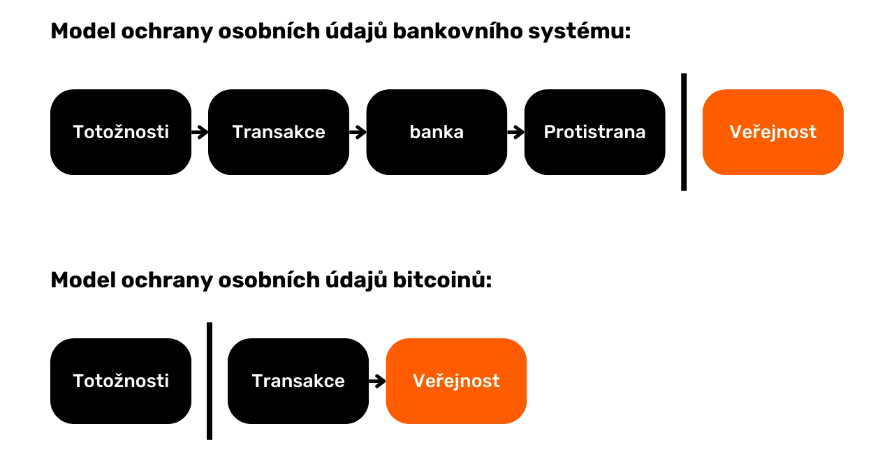

### Sekce 2: Porozumění analýze řetězce a jak se proti ní bránit

Ve druhé sekci studujeme techniky používané společnostmi pro analýzu řetězce k sledování vaší aktivity na Bitcoinu. Porozumění těmto metodám je zásadní pro zvýšení ochrany vašeho soukromí. Tato část má za cíl prozkoumat strategie útočníků, aby lépe porozuměla rizikům a položila základy pro techniky, které budeme studovat v následujících sekcích. Analyzujeme vzory transakcí, interní a externí heuristiky, stejně jako pravděpodobné interpretace těchto vzorů. Kromě teoretické složky se naučíme používat block explorer k provádění analýzy řetězce, prostřednictvím praktických příkladů a cvičení.


### Sekce 3: Ovládnutí nejlepších postupů pro ochranu vašeho soukromí

Ve třetí sekci našeho tréninku se dostáváme k jádru věci: praxe! Cílem je ovládnout všechny zásadní nejlepší postupy, které by se měly stát přirozenými reflexy pro každého uživatele Bitcoinu. Budeme se věnovat používání čerstvých adres, označování, konsolidaci, používání plných uzlů, stejně jako KYC a metodám získávání. Cílem je poskytnout vám komplexní přehled pastí, kterým se vyhnout, abychom položili pevné základy v našem hledání ochrany soukromí. Pro některé z těchto postupů budete nasměrováni na konkrétní tutoriál k jejich implementaci.

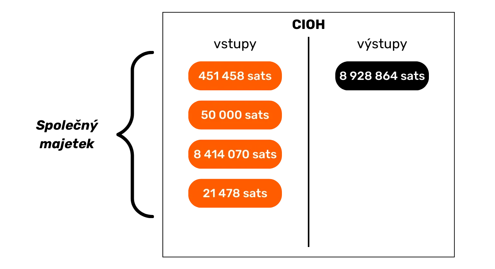

### Sekce 4: Porozumění transakcím Coinjoin

Jak můžeme mluvit o soukromí na Bitcoinu bez diskuse o coinjoinech? V sekci 4 se dozvíte vše, co potřebujete vědět o této metodě míchání. Naučíte se, co je coinjoin, jeho historii a cíle, stejně jako různé typy coinjoinů, které existují. Nakonec, pro zkušenější uživatele, objevíme, co jsou anonsety a entropie, a jak tyto ukazatele vypočítat.

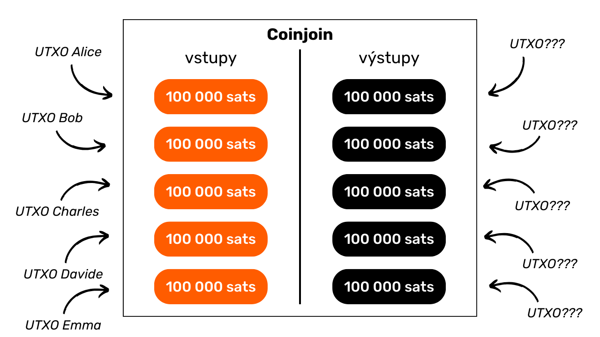

### Sekce 5: Porozumění důležitosti dalších pokročilých technik ochrany soukromí

V páté sekci poskytneme přehled všech ostatních existujících technik ochrany vašeho soukromí na Bitcoinu, kromě coinjoin. V průběhu let vývojáři projevili pozoruhodnou kreativitu při návrhu nástrojů zaměřených na soukromí. Prozkoumáme všechny tyto metody, jako jsou payjoin, spolupracující transakce, Coin Swap a Atomic Swap, a podrobně popíšeme jejich fungování, cíle a potenciální slabiny.

Budeme se také zabývat ochranou soukromí na úrovni sítě uzlů a šířením transakcí. Budeme také diskutovat o různých protokolech, které byly v průběhu let navrženy ke zlepšení ochrany soukromí uživatelů v Bitcoinu, včetně protokolů statických adres.


# Definice a klíčové pojmy

<partId>b9bbbde3-34c0-4851-83e8-e2ffb029cf31</partId>

## Bitcoinový model UTXO

<chapterId>8d6b50c5-bf74-44f4-922b-25204991cb75</chapterId>

Bitcoin je primárně měna, ale víte konkrétně, jak jsou BTC reprezentovány v protokolu?

### Bitcoinové UTXO: Co to jsou?

V protokolu Bitcoinu se správa měnových jednotek točí kolem modelu UTXO, což je zkratka pro "_Unspent Transaction Output_" (nevyužitý výstup transakce).

Tento model se zásadně liší od tradičních bankovních systémů, které se spoléhají na mechanismus účtu a zůstatku pro sledování finančních toků. V bankovním systému jsou individuální zůstatky udržovány na účtech připojených k identitě. Například, když si koupíte bagetu od pekaře, vaše banka jednoduše odečte částku nákupu z vašeho účtu, čímž sníží váš zůstatek, zatímco účet pekaře je připsán stejnou částkou, což zvýší jeho zůstatek. V tomto systému neexistuje pojem spojení mezi penězi vstupujícími na váš účet a penězi, které z něj odcházejí, kromě záznamů o transakcích.

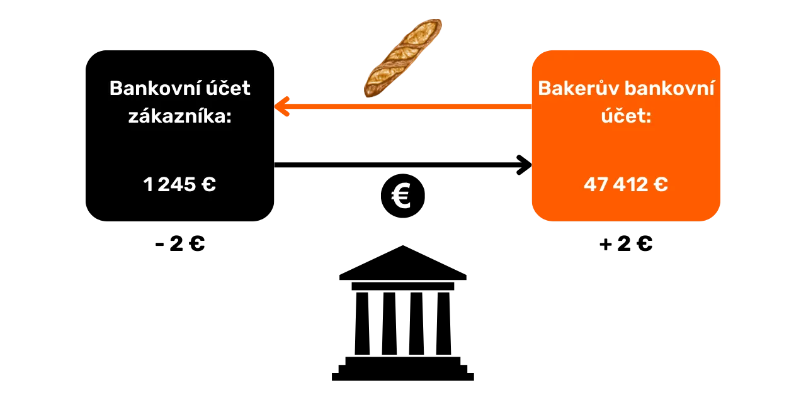

Na Bitcoinu to funguje jinak. Koncept účtu neexistuje a měnové jednotky nejsou spravovány prostřednictvím zůstatků, ale prostřednictvím UTXO. UTXO představuje konkrétní množství bitcoinů, které ještě nebylo utraceno, a tím tvoří "kus bitcoinu", který může být velký nebo malý. Například UTXO může mít hodnotu `500 BTC` nebo jen `700 SATS`.
**> Připomenutí:** Satoshi, často zkráceně sat, je nejmenší jednotka Bitcoinu, srovnatelná s centem u fiat měn.

```plaintext
1 BTC = 100,000,000 SATS
```

Teoreticky může UTXO reprezentovat jakoukoli hodnotu v bitcoinech, od jednoho satu až po teoretické maximum asi 21 milionů BTC. Nicméně je logicky nemožné vlastnit všech 21 milionů bitcoinů a existuje dolní ekonomický práh nazývaný "prach", pod kterým se UTXO považuje za ekonomicky nevýhodné utratit.
**> Víte, že?** Největší UTXO, které bylo kdy na Bitcoinu vytvořeno, mělo hodnotu `500,000 BTC`. Vytvořila ho platforma MtGox během operace konsolidace v listopadu 2011: [29a3efd3ef04f9153d47a990bd7b048a4b2d213daaa5fb8ed670fb85f13bdbcf](https://mempool.space/fr/tx/29a3efd3ef04f9153d47a990bd7b048a4b2d213daaa5fb8ed670fb85f13bdbcf)

### UTXO a podmínky utrácení

UTXO jsou nástroje výměny na Bitcoinu. Každá transakce vede k spotřebování UTXO jako vstupů a vytvoření nových UTXO jako výstupů. Když je provedena transakce, UTXO použité jako vstupy jsou považovány za "utracené" a jsou generována nová UTXO, která jsou přidělena příjemcům uvedeným ve výstupech transakce. UTXO tedy jednoduše představuje nevyužitý výstup transakce a tudíž určité množství bitcoinů patřící uživateli v daném čase.

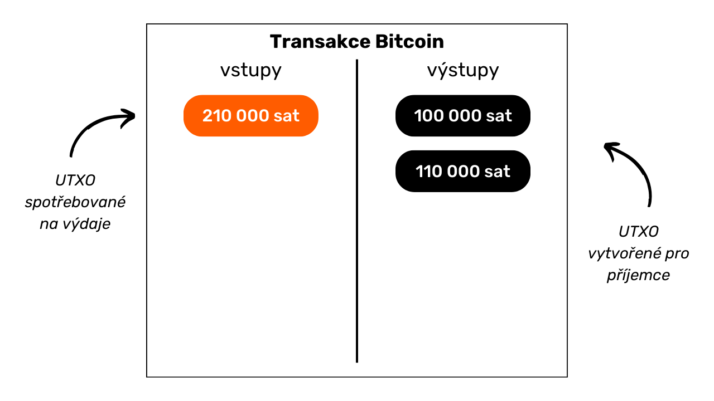
Všechna UTXO jsou zabezpečena skripty, které definují podmínky, za kterých mohou být utracena. Aby uživatel mohl utratit UTXO, musí síti prokázat, že splňuje podmínky stanovené skriptem zabezpečujícím toto UTXO. Obvykle jsou UTXO chráněna veřejným klíčem (nebo přijímací adresou, která tento veřejný klíč reprezentuje). Pro utrácení UTXO spojeného s tímto veřejným klíčem musí uživatel prokázat, že drží odpovídající soukromý klíč, a to poskytnutím digitálního podpisu vytvořeného tímto klíčem. Proto se říká, že vaše Bitcoinová peněženka ve skutečnosti neobsahuje bitcoiny, ale spíše uchovává vaše soukromé klíče, které vám zase umožňují přístup k vašim UTXO a tím i k bitcoinům, které reprezentují.
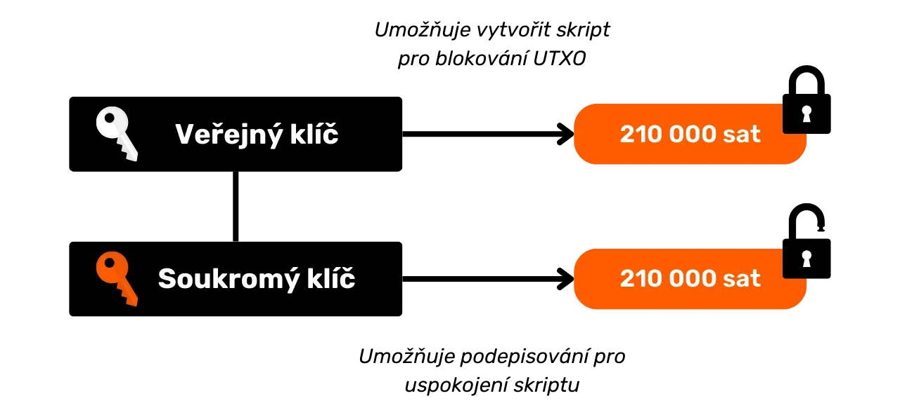

Vzhledem k tomu, že koncept účtu v Bitcoinu chybí, odpovídá zůstatek peněženky součtu hodnot všech UTXO, které může utratit. Například, pokud vaše Bitcoinová peněženka může utratit následující 4 UTXO:

```plaintext
- 2 BTC
- 8 BTC
- 5 BTC
- 2 BTC
```

Celkový zůstatek vaší peněženky by byl `17 BTC`.

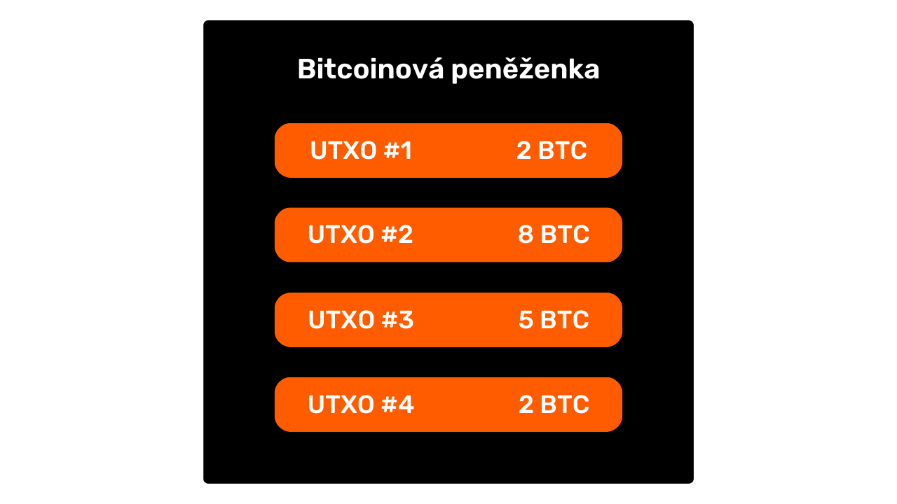

## Struktura Bitcoinových transakcí

<chapterId>29d3aaab-de2e-4746-ab40-c9748898850c</chapterId>

### Vstupy a výstupy transakce

Bitcoinová transakce je operace zaznamenaná na blockchainu, která umožňuje převod vlastnictví bitcoinů z jedné osoby na druhou. Konkrétněji, jelikož pracujeme s modelem UTXO a neexistují účty, transakce splňuje podmínky utrácení, které zabezpečovaly jedno nebo více UTXO, spotřebuje je a ekvivalentně vytváří nová UTXO obdařená novými podmínkami utrácení. Stručně řečeno, transakce přesouvá bitcoiny ze skriptu, který byl splněn, do nového skriptu určeného k jejich zabezpečení.

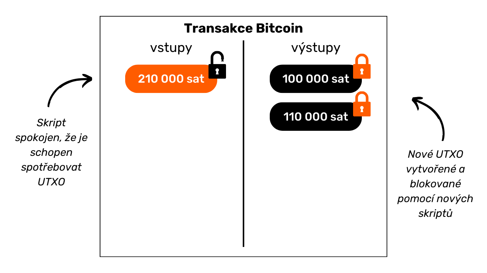

Každá Bitcoinová transakce se tedy skládá z jednoho nebo více vstupů a jednoho nebo více výstupů. Vstupy jsou UTXO spotřebované transakcí k vygenerování výstupů. Výstupy jsou nová UTXO, která budou použitelná jako vstupy pro budoucí transakce.

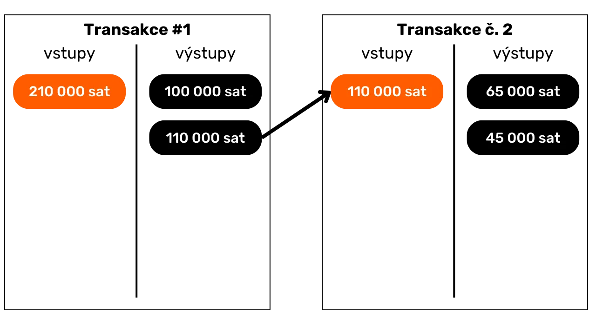
**> Víte, že?** Teoreticky může mít bitcoinová transakce nekonečný počet vstupů a výstupů. Pouze maximální velikost bloku tento počet omezuje. Každý vstup v bitcoinové transakci odkazuje na předchozí, neutracený UTXO (Unspent Transaction Output). Aby mohl držitel UTXO použít jako vstup, musí prokázat, že je jeho legitimním vlastníkem tím, že ověří skript s ním spojený, to znamená, že splní stanovenou podmínku pro utracení. Obvykle to zahrnuje poskytnutí digitálního podpisu vyrobeného soukromým klíčem odpovídajícím veřejnému klíči, který původně zabezpečil dané UTXO. Skript tak ověří, že podpis odpovídá veřejnému klíči použitému při přijímání prostředků.
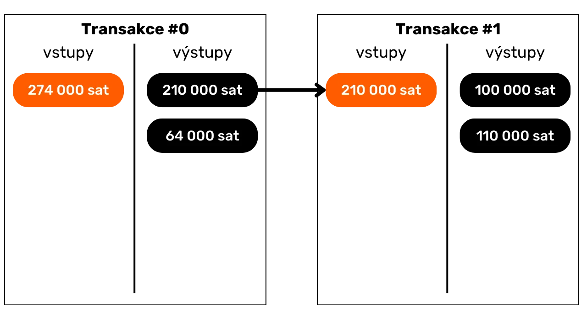

Na druhé straně každý výstup specifikuje množství bitcoinů k převodu, stejně jako příjemce. Ten je definován novým skriptem, který obvykle nově vytvořené UTXO uzamkne s přijímací adresou nebo novým veřejným klíčem.

Aby byla transakce považována za platnou podle pravidel konsensu, musí být celková hodnota výstupů menší nebo rovna celkové hodnotě vstupů. Jinými slovy, součet nových UTXO generovaných transakcí nesmí překročit hodnotu UTXO spotřebovaných jako vstupy. Tento princip je logický: pokud máte pouze částku `500,000 SATS`, nemůžete provést nákup za `700,000 SATS`.

### Vrácení peněz a konsolidace v bitcoinové transakci

Působení bitcoinové transakce na UTXO lze tedy přirovnat k roztavení zlaté mince. Skutečně, UTXO není dělitelné, ale pouze spojitelné. To znamená, že uživatel nemůže jednoduše rozdělit UTXO reprezentující určité množství bitcoinů na několik menších UTXO. Musí ho v transakci zcela spotřebovat, aby vytvořil jeden nebo více nových UTXO s libovolnými hodnotami ve výstupech, které musí být menší nebo rovny počáteční hodnotě.

Tento mechanismus je podobný tomu u zlaté mince. Představte si, že vlastníte minci o hmotnosti 2 unce a chcete provést platbu 1 unce, přičemž předpokládáte, že prodávající vám nemůže dát drobné. Museli byste svou minci roztavit a odlít 2 nové mince o hmotnosti 1 unce každá.
Na Bitcoinu je operace podobná. Představme si, že Alice má UTXO `10,000 SATS` a chce koupit bagetu za `4,000 SATS`. Alice provede transakci s vstupem 1 UTXO `10,000 SATS`, které zcela spotřebuje, a ve výstupech vytvoří 2 UTXO s hodnotami `4,000 SATS` a `6,000 SATS`. UTXO `4,000 SATS` bude posláno pekaři jako platba za bagetu, zatímco UTXO `6,000 SATS` se vrátí Alici jako vrácení peněz. Toto UTXO, které se vrací původnímu odesílateli transakce, se v bitcoinovém žargonu nazývá "vrácení peněz".

Nyní si představte, že Alice nemá jediný UTXO o hodnotě `10,000 SATS`, ale má dva UTXO po `3,000 SATS` každý. V této situaci není žádný z jednotlivých UTXO dostatečný na pokrytí `4,000 SATS` za bagetu. Proto musí Alice použít oba UTXO o hodnotě `3,000 SATS` jako vstupy pro její transakci současně. Tímto způsobem dosáhne celková částka vstupů `6,000 SATS`, což jí umožní pokrýt platbu `4,000 SATS` pekaři. Tato metoda, která zahrnuje seskupení několika UTXO ve vstupech transakce, se často označuje termínem "konsolidace".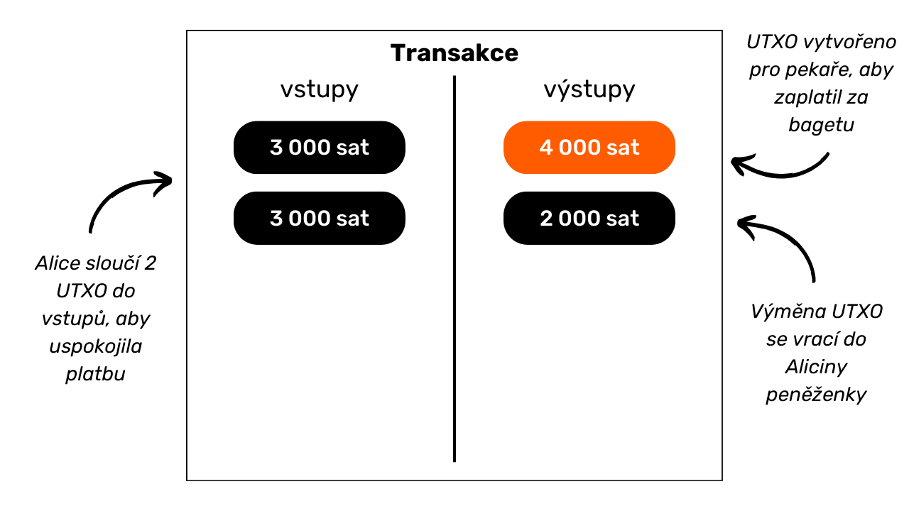

### Transakční poplatky

Intuitivně by se mohlo zdát, že transakční poplatky také představují výstup transakce. Ve skutečnosti to ale není pravda. Poplatky za transakci představují rozdíl mezi celkovou částkou vstupů a celkovou částkou výstupů. To znamená, že po použití části hodnoty vstupů na pokrytí požadovaných výstupů v transakci zůstane určitá suma vstupů nepoužita. Tato reziduální suma tvoří transakční poplatky.

```plaintext
Poplatky = celkové vstupy - celkové výstupy
```

Vraťme se k příkladu Alice, která má UTXO o hodnotě `10,000 SATS` a chce koupit bagetu za `4,000 SATS`. Alice vytvoří transakci se svým UTXO o hodnotě `10,000 SATS` jako vstupem. Poté generuje výstup `4,000 SATS` určený pekaři za platbu bagety. Aby povzbudila těžaře, aby zahrnuli její transakci do bloku, Alice alokuje `200 SATS` jako poplatky. Tím vytvoří druhý výstup, vrácení peněz, které se jí vrátí, ve výši `5,800 SATS`.
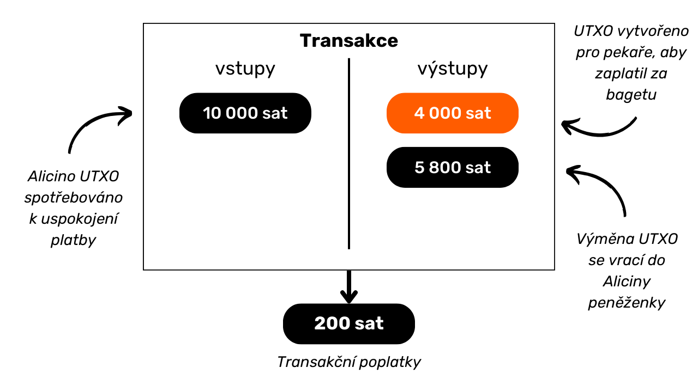

Aplikací vzorce pro poplatky skutečně vidíme, že pro těžaře zůstává `200 SATS`:

```plaintext
Poplatky = celkové vstupy - celkové výstupy
Náklady = 10,000 - (4,000 + 5,800)
Náklady = 10,000 - 9,800
Náklady = 200
```

Když těžař úspěšně validuje blok, má právo tyto poplatky za všechny transakce zahrnuté v jejich bloku vybrat prostřednictvím takzvané "coinbase" transakce.

### Vytváření UTXO na Bitcoinu

Pokud jste pozorně sledovali předchozí odstavce, nyní víte, že UTXO mohou být vytvořeny pouze spotřebováním jiných existujících UTXO. Takto tvoří mince na Bitcoinu nepřetržitý řetězec. Možná se ale ptáte, jak se objevila první UTXO v tomto řetězci. To vyvolává problém podobný dilematu, co bylo dříve: slepice nebo vejce? Odkud tyto původní UTXO pocházejí?

Odpověď leží v **coinbase transakci**.

Coinbase je specifický typ Bitcoinové transakce, unikátní pro každý blok a vždy první v nich. Umožňuje těžaři, který našel platný důkaz práce, obdržet odměnu za blok. Tato odměna se skládá ze dvou prvků: **subsidie za blok** a **transakční poplatky**, o kterých jsme mluvili v předchozí části.

Unikátní vlastností coinbase transakce je, že je to jediná, která může vytvořit bitcoiny z ničeho, bez potřeby spotřebovat vstupy pro generování jejích výstupů. Tyto nově vytvořené bitcoiny tvoří to, co by se dalo nazvat "původními UTXO".
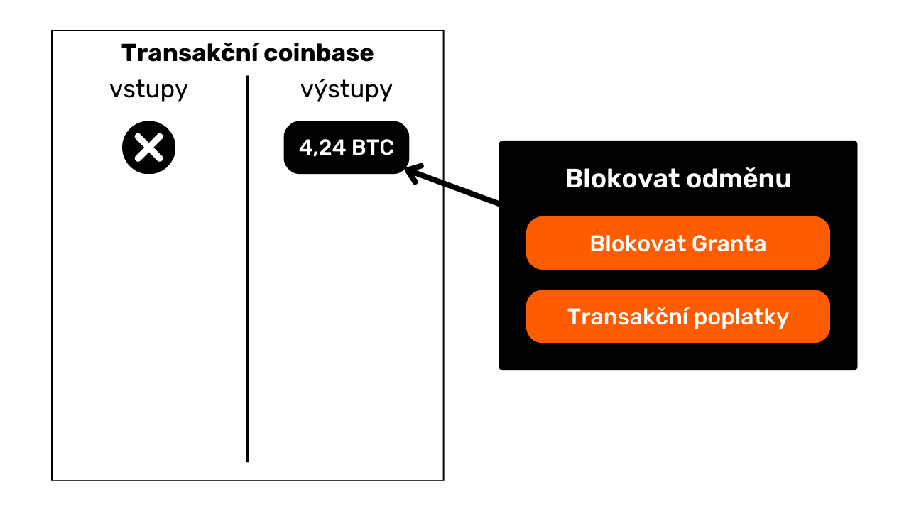
Bitcoiny z blokové odměny jsou nové BTC vytvořené z ničeho, následující předem stanovený harmonogram vydávání v pravidlech konsensu. Bloková odměna se každých 210 000 bloků snižuje na polovinu, což je přibližně každé čtyři roky, v procesu nazývaném "halving". Původně bylo s každou odměnou vytvořeno 50 bitcoinů, ale toto množství se postupně snižovalo; v současnosti je to 3,125 bitcoinů na blok.

Pokud jde o část týkající se transakčních poplatků, ačkoli také představuje nově vytvořené BTC, nesmí překročit rozdíl mezi celkovými vstupy a výstupy všech transakcí v bloku. Dříve jsme viděli, že tyto poplatky představují část vstupů, která není použita ve výstupech transakcí. Tato část je technicky "ztracena" během transakce, a těžař má právo tuto hodnotu znovu vytvořit ve formě jednoho nebo více nových UTXO. Jedná se tedy o přenos hodnoty od odesílatele transakce k těžaři, který ji přidává do blockchainu.

**> Věděli jste?** Bitcoiny generované coinbase transakcí podléhají období zralosti 100 bloků, během kterého je nemůže těžař utratit. Toto pravidlo má za cíl zabránit komplikacím souvisejícím s používáním nově vytvořených bitcoinů na řetězci, který by později mohl být zastaralý.

### Důsledky modelu UTXO

Za prvé, model UTXO přímo ovlivňuje transakční poplatky na Bitcoinu. Vzhledem k tomu, že kapacita každého bloku je omezená, těžaři upřednostňují transakce, které nabízejí nejlepší poplatky vzhledem k prostoru, který budou v bloku zaujímat. Skutečně, čím více UTXO transakce obsahuje jako vstupy a výstupy, tím je těžší a tedy vyžaduje vyšší poplatky. To je jeden z důvodů, proč se často snažíme snížit počet UTXO v naší peněžence, což může také ovlivnit soukromí, téma, do kterého se podrobněji ponoříme ve třetí části tohoto školení.

Dále, jak bylo zmíněno v předchozích částech, mince na Bitcoinu jsou v podstatě řetězcem UTXO. Každá transakce tak vytváří spojení mezi minulým UTXO a budoucím UTXO. UTXO tedy umožňují explicitní sledování cesty bitcoinů od jejich vytvoření po jejich současné vydání. Tato transparentnost může být vnímána pozitivně, protože umožňuje každému uživateli zajistit autentičnost přijatých bitcoinů. Nicméně, je to právě na tomto principu sledovatelnosti a auditovatelnosti, na kterém spočívá analýza řetězce, praxe zaměřená na ohrožení vašeho soukromí. Tuto praxi prozkoumáme podrobně ve druhé části školení.

## Model soukromí Bitcoinu

<chapterId>769d8963-3ed5-4094-b21d-9203c7d9e465</chapterId>

### Měna: Autentičnost, integrita a dvojí utrácení

Jednou z funkcí měny je řešení problému dvojí shody potřeb. V systému založeném na barteru vyžaduje provedení výměny nejen nalezení jednotlivce, který nabízí zboží, které splňuje mou potřebu, ale také poskytnutí jim zboží ekvivalentní hodnoty, které uspokojí jejich vlastní potřebu. Najít tuto rovnováhu se ukazuje být složité.


Proto sáhneme po měně, která umožňuje přenos hodnoty jak v prostoru, tak v čase.


Aby měna tento problém vyřešila, je zásadní, aby strana poskytující zboží nebo službu byla přesvědčena o své schopnosti utratit tuto sumu později. Takže každý racionální jednotlivec, který si přeje přijmout kus měny, ať už digitální nebo fyzický, se ujistí, že splňuje dvě základní kritéria:

- **Mince musí být neporušená a autentická;**- **a nesmí dojít k jejímu dvojímu utracení.**
  Při používání fyzické měny je první vlastnost nejsložitější ověřit. V různých obdobích historie byla integrita kovových mincí často ohrožena praktikami, jako je ořezávání nebo vrtání. Například v antickém Římě bylo běžné, že občané škrábali okraje zlatých mincí, aby získali kousek drahého kovu, přičemž je stále uchovávali pro budoucí transakce. Vnitřní hodnota mince byla tímto způsobem snížena, ale její jmenovitá hodnota zůstala stejná. To je významný důvod, proč byly později na okraji mincí raženy vroubky.

Autenticita je také obtížná vlastnost k ověření u fyzických peněžních médií. V současnosti jsou techniky boje proti padělání stále složitější, což nutí obchodníky investovat do drahých ověřovacích systémů.

Na druhou stranu, kvůli jejich povaze, není dvojí utracení problémem pro fyzické měny. Pokud vám dám bankovku 10 €, neodvolatelně opustí moje vlastnictví, aby vstoupila do vašeho, což přirozeně vylučuje jakoukoliv možnost utrácení stejných peněžních jednotek vícekrát. Stručně řečeno, nebudu moci tu bankovku 10 € utratit znovu.


U digitální měny je obtížnost jiná. Zajištění autenticity a integrity mince je často jednodušší. Jak jsme viděli v předchozí části, model UTXO Bitcoinu umožňuje vystopovat minci až k jejímu původu, čímž ověřuje, že byla skutečně vytvořena v souladu s pravidly konsensu těžařem.

Zajištění absence dvojího utracení je však složitější, protože jakýkoliv digitální produkt je v podstatě informace. Na rozdíl od fyzických zboží se informace při výměnách nedělí, ale šíří množením. Například, pokud vám pošlu dokument e-mailem, dojde k jeho duplikaci. Na vaší straně nemůžete s jistotou ověřit, že jsem původní dokument smazal.


### Prevence dvojího utracení na Bitcoinu

Jediný způsob, jak zabránit duplikaci digitálního produktu, je být informován o všech výměnách v systému. Tímto způsobem lze vědět, kdo co vlastní, a aktualizovat vlastnictví každého na základě provedených transakcí. To se dělá například s bezhotovostními penězi v bankovním systému. Když zaplatíte obchodníkovi 10 € kreditní kartou, banka si tuto výměnu zaznamená a aktualizuje účetní knihu.
Na Bitcoinu se prevence dvojího utracení dosahuje stejným způsobem. Cílem je potvrdit absenci transakce, která by již mince utratila. Pokud tyto mince nikdy nebyly použity, můžeme být ujištěni, že nedojde k dvojímu utracení. Tento princip popsal Satoshi Nakamoto ve White Paperu touto slavnou větou:

**"_Jediný způsob, jak potvrdit absenci transakce, je být informován o všech transakcích._"**

Na rozdíl od bankovního modelu však na Bitcoinu neexistuje touha muset důvěřovat centrální entitě. Je nutné, aby všichni uživatelé mohli tuto absenci dvojího utracení potvrdit, aniž by se spoléhali na třetí stranu. Tím pádem musí být každý informován o všech Bitcoinových transakcích. To je důvod, proč jsou Bitcoinové transakce veřejně vysílány napříč všemi uzly sítě a zaznamenány jasně na blockchainu.

Právě toto veřejné šíření informací komplikuje ochranu soukromí na Bitcoinu. V tradičním bankovním systému, teoreticky, pouze finanční instituce ví o provedených transakcích. Na druhou stranu, na Bitcoinu, jsou všichni uživatelé informováni o všech transakcích, prostřednictvím jejich příslušných uzlů.

### Model soukromí: bankovní systém vs Bitcoin

V tradičním systému je váš bankovní účet spojen s vaší identitou. Bankéř je schopen vědět, který bankovní účet patří kterému klientovi a jaké transakce s ním souvisí. Tento tok informací je však přerušen mezi bankou a veřejnou doménou. Jinými slovy, je nemožné znát zůstatek a transakce bankovního účtu, který patří jinému jedinci. Pouze banka má přístup k těmto informacím.
Například váš bankéř ví, že si každé ráno kupujete bagetu v sousední pekárně, ale váš soused o této transakci neví. Tok informací je tedy přístupný dotčeným stranám, zejména bance, ale zůstává nedostupný pro vnější osoby.

Vzhledem k omezení veřejného šíření transakcí, které jsme viděli v předchozí části, nemůže model soukromí Bitcoinu následovat model bankovního systému. V případě Bitcoinu, protože tok informací nemůže být přerušen mezi transakcemi a veřejnou doménou, **model soukromí spoléhá na oddělení identity uživatele od samotných transakcí**.
Například, pokud si koupíte bagetu od pekaře a zaplatíte v BTC, váš soused, který vlastní vlastní full node, může vidět vaši transakci probíhat, stejně jako může vidět všechny ostatní transakce v systému. Pokud však jsou dodrženy zásady soukromí, neměli by být schopni spojit tuto konkrétní transakci s vaší identitou.
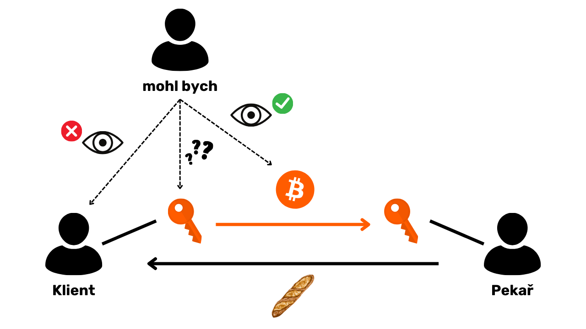

Ale protože transakce Bitcoinu jsou zveřejněny, stává se možným navázat mezi nimi spojení a odvodit informace o zúčastněných stranách. Tato činnost dokonce představuje specializaci samu o sobě nazývanou "analýza řetězce". V další části školení vás zvu, abyste prozkoumali základy analýzy řetězce, abyste pochopili, jak jsou vaše bitcoiny sledovány a jak se proti tomu lépe bránit.

# Porozumění analýze řetězce a jak se chránit

<partId>4739371e-9fef-45b0-bcaa-b7a4df6b4470</partId>

## Co je analýza řetězce na Bitcoinu?

<chapterId>7d198ba6-4af2-4f24-86cb-3c79cb25627e</chapterId>

### Definice a provoz

Analýza řetězce je praxe, která zahrnuje všechny metody používané k sledování toku bitcoinů na blockchainu. Obecně analýza řetězce spoléhá na pozorování charakteristik v vzorcích předchozích transakcí. Poté zahrnuje identifikaci těchto stejných charakteristik v transakci, kterou chce někdo analyzovat, a odvození pravděpodobných interpretací. Tento problémově orientovaný přístup k nalezení dostatečně dobrého řešení se nazývá "heuristika".

Zjednodušeně řečeno, analýza řetězce se provádí ve třech hlavních krocích:

1. **Pozorování blockchainu;**
2. **Identifikace známých charakteristik;**
3. **Odvozování hypotéz.**

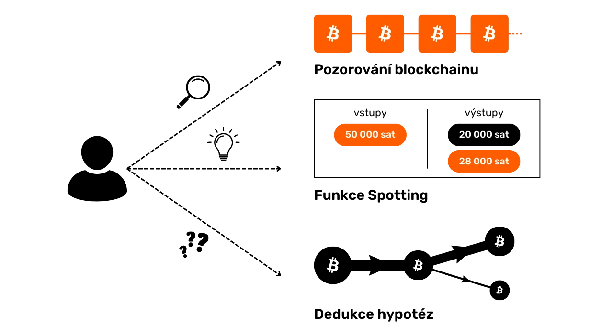

Analýzu řetězce může provádět kdokoli. Stačí mít přístup k veřejným informacím blockchainu prostřednictvím full node, aby bylo možné pozorovat pohyby transakcí a formulovat hypotézy. Existují také bezplatné nástroje, které tuto analýzu usnadňují, jako je web [OXT.me](https://oxt.me/), který podrobně prozkoumáme v posledních dvou kapitolách této části. Hlavní riziko pro soukromí však pochází od společností specializujících se na analýzu řetězce. Tyto společnosti posunuly analýzu řetězce na průmyslovou úroveň a prodávají své služby finančním institucím nebo vládám. Mezi tyto společnosti patří pravděpodobně nejznámější Chainalysis.

### Cíle analýzy řetězce

Jedním z cílů analýzy řetězce je seskupit různé aktivity na Bitcoinu, aby bylo možné určit jedinečnost uživatele, který je provedl. Následně bude možné pokusit se tuto skupinu aktivit spojit s reálnou identitou. 

Vzpomeňte na předchozí kapitolu. Vysvětlil jsem, proč původní model soukromí Bitcoinu spoléhal na oddělení identity uživatele od jeho transakcí. Mohlo by se tedy zdát, že analýza řetězce je zbytečná, protože i když se podaří seskupit onchain aktivity, nemohou být spojeny s reálnou identitou.

Teoreticky je toto tvrzení přesné. V první části tohoto školení jsme viděli, že kryptografické páry klíčů se používají k stanovení podmínek na UTXO. Tyto páry klíčů svou podstatou neodhalují žádné informace o identitě jejich držitelů. Takže i když se podaří seskupit aktivity spojené s různými páry klíčů, to nám nic neřekne o entitě za těmito aktivitami.


Nicméně praktická realita je mnohem složitější. Existuje mnoho chování, která mohou spojit reálnou identitu s onchain aktivitou. V analýze se tomu říká vstupní bod a existuje jich mnoho.

Nejběžnější, samozřejmě, je KYC (_Know Your Customer_ - Poznej svého zákazníka). Pokud si vyberete své bitcoiny z regulované platformy na jednu ze svých osobních přijímacích adres, pak někteří lidé mohou spojit vaši identitu s touto adresou. Obecněji řečeno, vstupním bodem může být jakákoli forma interakce mezi vaším skutečným životem a transakcí Bitcoinu. Například, pokud zveřejníte přijímací adresu na svých sociálních sítích, to může být vstupní bod pro analýzu. Pokud provedete platbu v bitcoinech svému pekaři, mohou spojit vaši tvář (která je součástí vaší identity) s Bitcoinovou adresou.

Tyto vstupní body jsou téměř nevyhnutelné při používání Bitcoinu. Ačkoli se může snažit omezit jejich rozsah, zůstanou přítomny. Proto je klíčové kombinovat metody zaměřené na zachování vašeho soukromí. I když je udržení oddělení mezi vaší skutečnou identitou a vašimi transakcemi zajímavým přístupem, dnes to samo o sobě není dostatečné. Pokud lze všechny vaše onchain aktivity seskupit, pak i nejmenší vstupní bod může ohrozit jedinou vrstvu soukromí, kterou jste si vytvořili.


### Obrana proti analýze řetězce

Je tedy také nutné být schopen čelit analýze blockchainu při našem používání Bitcoinu. Postupem tohoto způsobu můžeme minimalizovat agregaci našich aktivit a omezit dopad vstupního bodu na naše soukromí.


Skutečně, pro lepší čelbu analýze blockchainu, jaký lepší přístup, než se seznámit s metodami používanými v analýze blockchainu? Pokud chcete vědět, jak zlepšit své soukromí na Bitcoinu, musíte tyto metody pochopit. To vám umožní lépe pochopit techniky jako [coinjoin](https://planb.network/fr/tutorials/privacy/coinjoin-samourai-wallet) nebo [payjoin](https://planb.network/fr/tutorials/privacy/payjoin) (techniky, které prozkoumáme v posledních částech školení) a snížit chyby, které byste mohli udělat.
V tomto můžeme udělat analogii s kryptografií a kryptoanalýzou. Dobrý kryptograf je především dobrý kryptoanalytik. Aby si někdo dokázal představit nový šifrovací algoritmus, musí vědět, jakým útokům bude čelit, a také studovat, proč byly předchozí algoritmy prolomeny. Stejný princip platí pro soukromí na Bitcoinu. Porozumění metodám analýzy blockchainu je klíčem k ochraně proti němu. Proto navrhuji celou sekci o analýze blockchainu v tomto školení.

### Metody analýzy blockchainu

Je důležité pochopit, že analýza blockchainu není přesná věda. Spoléhá se na heuristiky odvozené z předchozích pozorování nebo logických interpretací. Tyto pravidla umožňují poměrně spolehlivé výsledky, ale nikdy s absolutní přesností. Jinými slovy, **analýza blockchainu vždy zahrnuje dimenzi pravděpodobnosti ve vydaných závěrech**. Například může být s větší či menší jistotou odhadnuto, že dvě adresy patří stejné entitě, ale úplná jistota bude vždy nedosažitelná.

Celý cíl analýzy blockchainu spočívá přesně v agregaci různých heuristik za účelem minimalizace rizika chyby. Je to jakýsi akumulace důkazů, které nám umožňují přiblížit se realitě.

Tyto slavné heuristiky lze rozdělit do různých kategorií, které společně podrobněji prozkoumáme:

- **Vzory transakcí (nebo modely transakcí);**
- **Heuristiky interní v transakci;**
- **Heuristiky externí v transakci.**

### Satoshi Nakamoto a analýza blockchainu

Je třeba poznamenat, že první dvě heuristiky pro analýzu řetězce objevil sám Satoshi Nakamoto. Diskutuje o nich v části 10 Bitcoinového White Paperu. Jsou to:

- heuristika společného vlastnictví vstupů (CIOH);
- a opětovné použití adresy.


Zdroj: S. Nakamoto, "Bitcoin: A Peer-to-Peer Electronic Cash System", https://bitcoin.org/bitcoin.pdf, 2009.

V následujících kapitolách prozkoumáme, co tyto heuristiky zahrnují, ale je již zajímavé poznamenat, že tyto dvě heuristiky si dodnes zachovávají přednost v analýze řetězce.

## Vzory transakcí

<chapterId>d365a101-2d37-46a5-bfb9-3c51e37bf96b</chapterId>

Vzor transakce je jednoduše model nebo celková struktura typické transakce, která může být na blockchainu nalezena, jejíž interpretace je pravděpodobně známá. Při studiu vzorů se zaměříme na jednu transakci, kterou budeme analyzovat na vysoké úrovni.

Jinými slovy, budeme se dívat pouze na počet UTXO ve vstupech a počet UTXO ve výstupech, aniž bychom se zabývali specifičtějšími detaily nebo prostředím transakce. Z pozorovaného modelu budeme schopni interpretovat povahu transakce. Poté budeme hledat charakteristiky ve struktuře a vyvodíme interpretaci.


V této části společně objevíme hlavní modely transakcí, které lze při analýze řetězce potkat, a pro každý model vám dám pravděpodobnou interpretaci této struktury spolu s konkrétním příkladem.

### Jednoduché odeslání (nebo jednoduchá platba)

Začínáme velmi rozšířeným vzorem, protože je to ten, který se objevuje ve většině bitcoinových plateb. Model jednoduché platby je charakterizován spotřebou jednoho nebo více UTXO ve vstupech a produkcí 2 UTXO ve výstupech. Tento model bude tedy vypadat takto:


Když na blockchainu zaznamenáme tuto strukturu transakce, již můžeme vyvodit interpretaci. Jak název napovídá, tento model ukazuje, že jsme svědky transakce odesílání nebo platby. Uživatel spotřeboval své vlastní UTXO ve vstupech, aby uspokojil ve výstupech platbu UTXO a změnové UTXO (peníze vrácené stejnému uživateli).
Tudíž víme, že pozorovaný uživatel pravděpodobně již není v držení jednoho ze dvou UTXO ve výstupech (to platící), ale stále vlastní druhé UTXO (to změnové).
V tuto chvíli je pro nás nemožné specifikovat, který výstup reprezentuje které UTXO, jelikož to není cílem studia vzorců. Toho dosáhneme spoléháním se na heuristiky, které budeme studovat v následujících částech. V této fázi je náš cíl omezen na identifikaci povahy dotčené transakce, která je v tomto případě jednoduché odeslání.

Například, zde je Bitcoinová transakce, která přijímá vzorec jednoduchého odeslání:

```plaintext
b6cc79f45fd2d7669ff94db5cb14c45f1f879ea0ba4c6e3d16ad53a18c34b769
```

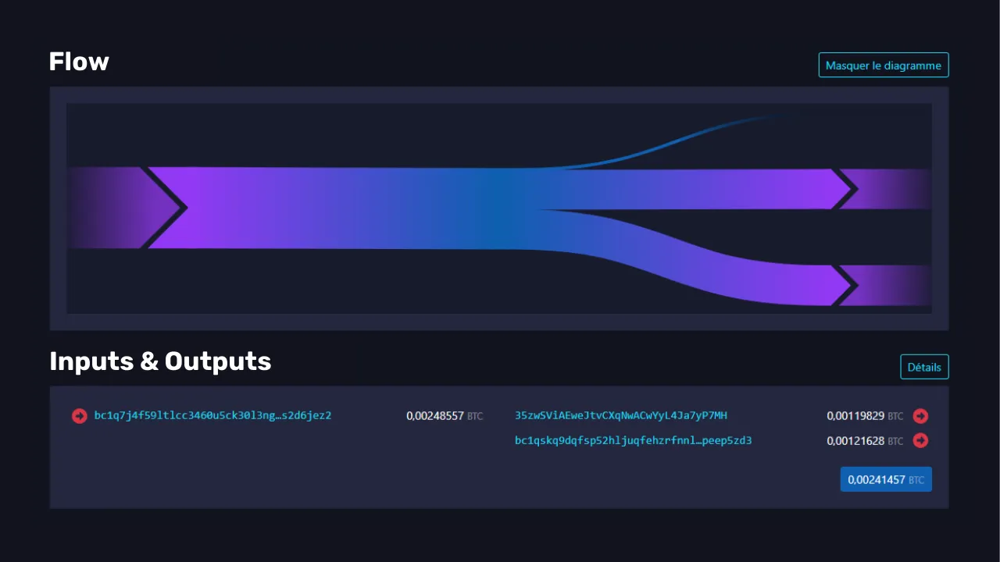

Zdroj: [Mempool.space](https://mempool.space/fr/tx/b6cc79f45fd2d7669ff94db5cb14c45f1f879ea0ba4c6e3d16ad53a18c34b769)

Po tomto prvním příkladu byste měli lépe rozumět tomu, co znamená studovat "model transakce". Transakci zkoumáme pouze zaměřením na její strukturu, aniž bychom brali v úvahu její prostředí nebo specifické detaily transakce. Pozorujeme ji pouze globálně v tomto prvním kroku.

Nyní, když rozumíte, co je vzorec, pojďme se podívat na další existující modely.

### Sweeping

Tento druhý model je charakterizován spotřebou jediného UTXO jako vstupu a produkcí jediného UTXO jako výstupu.


Interpretace tohoto modelu je, že jsme svědky samopřevodu. Uživatel převedl své bitcoiny sám sobě, na jinou adresu, kterou vlastní. Jelikož v transakci nedochází ke změně, je velmi nepravděpodobné, že bychom byli svědky platby. Skutečně, když je provedena platba, je téměř nemožné, aby plátce měl UTXO, které přesně odpovídá částce požadované prodávajícím, plus transakční poplatky. Obvykle je tedy plátce nucen vyprodukovat výstup změny.

Pak víme, že pozorovaný uživatel pravděpodobně stále vlastní toto UTXO. V kontextu analýzy řetězce, pokud víme, že UTXO použité jako vstup v transakci patří Alici, můžeme předpokládat, že UTXO ve výstupu také patří jí. Co se stane zajímavé později, je najít interní heuristiky transakce, které by mohly tuto předpoklad posílit (tyto heuristiky budeme studovat v kapitole 3.3).

Například, zde je Bitcoinová transakce, která přijímá vzorec sweeping:

```plaintext
35f1072a0fda5ae106efb4fda871ab40e1f8023c6c47f396441ad4b995ea693d
```

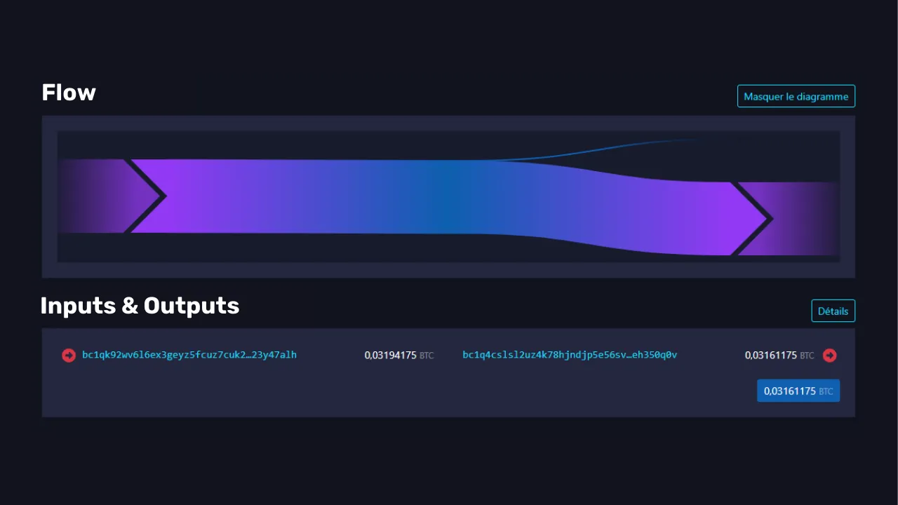
Zdroj: [Mempool.space](https://mempool.space/fr/tx/35f1072a0fda5ae106efb4fda871ab40e1f8023c6c47f396441ad4b995ea693d) Nicméně, tento typ vzoru může také odhalit samopřevod na účet platformy pro obchodování s kryptoměnami. Bude to studium známých adres a kontextu transakce, které nám umožní zjistit, zda jde o přesun do peněženky pro vlastní úschovu nebo výběr na platformu. Adresy obchodních platforem jsou skutečně často snadno identifikovatelné.

Vraťme se k příkladu s Alicí: pokud přesun vede na známou adresu platformy (jako je například Binance), to může znamenat, že bitcoiny byly převedeny mimo přímou držbu Alice, pravděpodobně s úmyslem je prodat nebo uložit na této platformě. Na druhou stranu, pokud je cílová adresa neznámá, je rozumné předpokládat, že jde jednoduše o další peněženku stále patřící Alici. Ale tento typ studie spadá spíše do kategorie heuristiky a ne studia vzorů.

### Konsolidace

Tento model je charakterizován spotřebou několika UTXO jako vstupů a produkcí jediného UTXO jako výstupu.


Interpretace tohoto modelu je, že jsme svědky konsolidace. Jedná se o běžnou praxi mezi uživateli Bitcoinu, jejímž cílem je sloučit několik UTXO v předtuše možného zvýšení transakčních poplatků. Provedením této operace v období, kdy jsou poplatky nízké, je možné ušetřit na budoucích poplatcích. O této praxi budeme hovořit více v kapitole 4.3.

Můžeme usoudit, že uživatel za tímto transakčním modelem pravděpodobně vlastnil všechna UTXO na vstupech a stále vlastní UTXO na výstupu. Jedná se jistě o samopřevod.

Stejně jako u přesunu, i tento typ vzoru může odhalit samopřevod na účet obchodní platformy. Bude to studium známých adres a kontextu transakce, které nám umožní zjistit, zda jde o konsolidaci do peněženky pro vlastní úschovu nebo výběr na platformu.

Například, zde je Bitcoinová transakce, která přijímá vzor konsolidace:

```plaintext
77c16914211e237a9bd51a7ce0b1a7368631caed515fe51b081d220590589e94
```

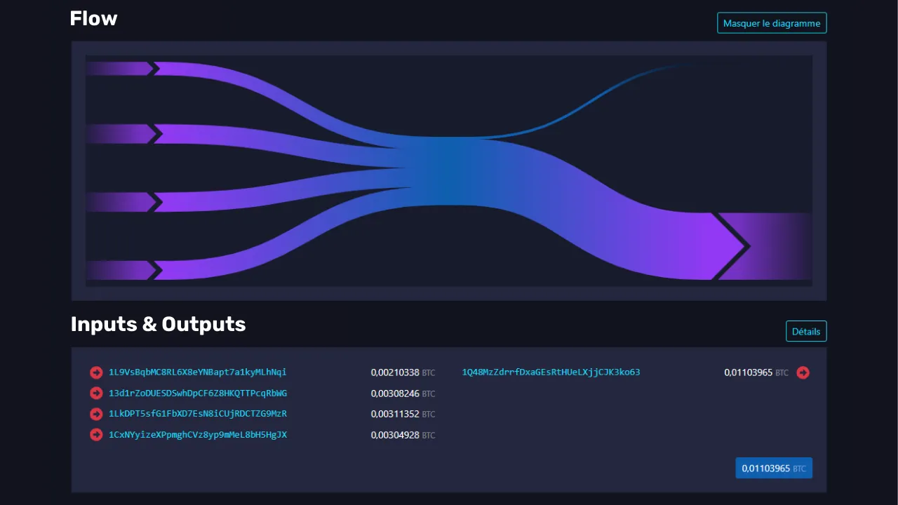

Zdroj: [Mempool.space](https://mempool.space/fr/tx/77c16914211e237a9bd51a7ce0b1a7368631caed515fe51b081d220590589e94)
V kontextu analýzy řetězce může tento model odhalit mnoho informací. Například, pokud víme, že jeden ze vstupů patří Alici, můžeme předpokládat, že všechny ostatní vstupy a výstup této transakce jí také patří. Tento předpoklad by nám pak umožnil sledovat předchozí řetězce transakcí, abychom objevili a analyzovali další transakce pravděpodobně spojené s Alicí.
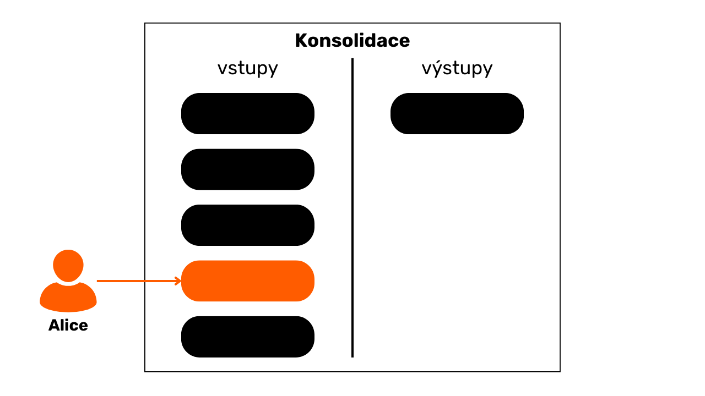

### Skupinové utrácení

Tento model je charakterizován spotřebou několika UTXO jako vstupů (často jen jednoho) a produkcí mnoha UTXO jako výstupů.


Interpretace tohoto modelu je, že jsme svědky skupinového výdaje. Jedná se o praxi, která pravděpodobně odhaluje významnou ekonomickou aktivitu, jako je například výměnná platforma. Skupinový výdaj umožňuje těmto entitám ušetřit na poplatcích tím, že své výdaje konsolidují do jediné transakce.
Z tohoto modelu můžeme vyvodit, že vstup UTXO pochází od společnosti s významnou ekonomickou aktivitou a že výstupy UTXO se rozptýlí. Mnoho z nich bude patřit klientům společnosti, kteří si z platformy vybrali bitcoiny. Jiné mohou směřovat k partnerským společnostem. Nakonec určitě bude jedna nebo více výměn, které se vrátí vydávající společnosti.

Například zde je Bitcoinová transakce, která přijímá vzor skupinového výdaje (pravděpodobně jde o transakci vydávanou platformou Bybit):

```plaintext
8a7288758b6e5d550897beedd13c70bcbaba8709af01a7dbcc1f574b89176b43
```

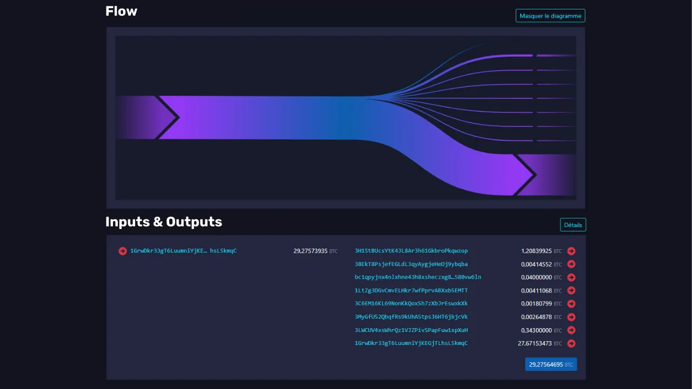

Zdroj: [Mempool.space](https://mempool.space/fr/tx/8a7288758b6e5d550897beedd13c70bcbaba8709af01a7dbcc1f574b89176b43)

### Transakce specifické pro protokol

Mezi vzory transakcí můžeme také identifikovat modely, které odhalují použití konkrétního protokolu. Například Whirlpool coinjoins (o kterých si povíme v části 5) budou mít snadno rozpoznatelnou strukturu, která je umožňuje odlišit od jiných tradičnějších transakcí.


Analýza tohoto vzoru naznačuje, že jsme pravděpodobně svědky kolaborativní transakce. Je také možné pozorovat coinjoin. Pokud se tato poslední hypotéza ukáže jako přesná, pak by nám počet výstupů mohl poskytnout přibližný odhad počtu účastníků coinjoinu.

Například zde je Bitcoinová transakce, která přijímá vzor kolaborativního typu transakce coinjoin:

```plaintext
00601af905bede31086d9b1b79ee8399bd60c97e9c5bba197bdebeee028b9bea
```

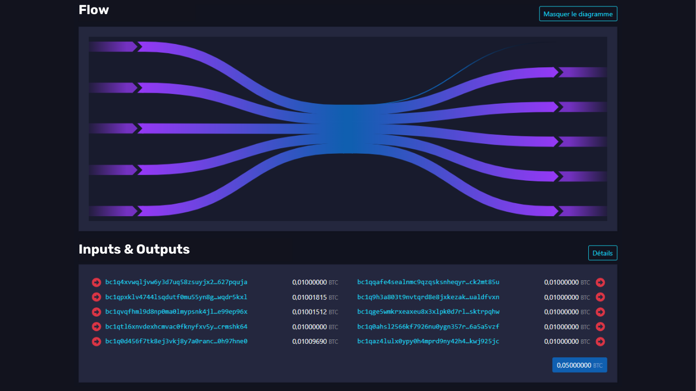

Zdroj: [Mempool.space](https://mempool.space/fr/tx/00601af905bede31086d9b1b79ee8399bd60c97e9c5bba197bdebeee028b9bea)

Existuje mnoho dalších protokolů, které mají své vlastní specifické struktury. Tak bychom mohli rozlišit transakce typu Wabisabi, transakce Stamps, nebo dokonce Runes, například.

Díky těmto vzorům transakcí můžeme již interpretovat řadu informací o dané transakci. Ale struktura transakce není jediným zdrojem informací pro analýzu. Můžeme také studovat její detaily. Tyto detaily, interní k transakci, jsou to, co rád nazývám "interní heuristiky", a budeme je studovat v následující kapitole.

## Interní Heuristiky

<chapterId>c54b5abe-872f-40f4-a0d0-c59faff228ba</chapterId>

Interní heuristika je specifická charakteristika identifikovaná uvnitř samotné transakce, bez nutnosti zkoumat její prostředí, která nám umožňuje dělat dedukce. Na rozdíl od vzorů, které se zaměřují na celkovou strukturu transakce na vysoké úrovni, interní heuristiky jsou založeny na sadě extrahovatelných dat. To zahrnuje:

- Množství různých UTXO jak příchozích, tak odchozích; - Vše týkající se skriptů: přijímací adresy, verzování, časy uzamčení...

Obecně tento typ heuristiky nám umožní identifikovat změnu v konkrétní transakci. Tímto způsobem můžeme poté pokračovat ve sledování entity přes několik různých transakcí. Skutečně, pokud identifikujeme UTXO patřící uživateli, kterého chceme sledovat, je zásadní určit, když provedou transakci, který výstup byl převeden na jiného uživatele a který výstup představuje změnu, a tedy zůstává v jejich držení.


Opět vám připomínám, že tyto heuristiky nejsou absolutně přesné. Vzaté individuálně, umožňují nám identifikovat pouze pravděpodobné scénáře. Je to akumulace několika heuristik, která pomáhá snížit nejistotu, aniž by ji kdy úplně eliminovala.

### Vnitřní podobnosti

Tato heuristika zahrnuje studium podobností mezi vstupy a výstupy téže transakce. Pokud pozorujeme stejnou charakteristiku na vstupech a pouze na jednom z výstupů transakce, pak je pravděpodobné, že tento výstup představuje změnu.

Nejzřetelnější charakteristikou je opětovné použití přijímací adresy ve stejné transakci.

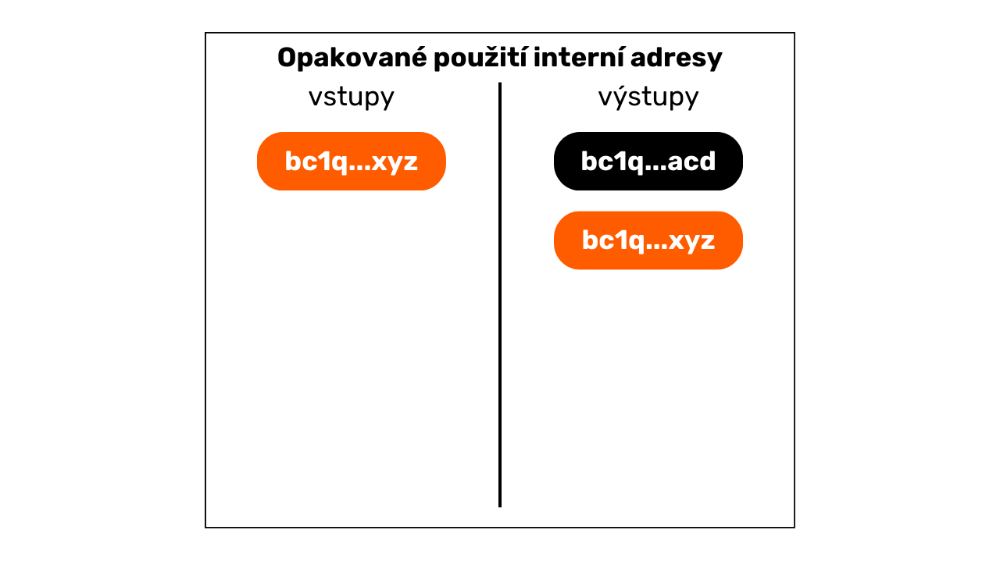

Tato heuristika nechává málo prostoru pro pochybnosti. Pokud nebyl něčí soukromý klíč hacknut, stejná přijímací adresa nevyhnutelně odhaluje aktivitu jednoho uživatele. Interpretace, která následuje, je, že změna z transakce je výstup se stejnou adresou jako vstup. To umožňuje pokračovat ve sledování jednotlivce na základě této změny.
Například, zde je transakce, na které lze tuto heuristiku rozumně aplikovat:

```plaintext
54364146665bfc453a55eae4bfb8fdf7c721d02cb96aadc480c8b16bdeb8d6d0
```


Zdroj: [Mempool.space](https://mempool.space/tx/54364146665bfc453a55eae4bfb8fdf7c721d02cb96aadc480c8b16bdeb8d6d0)

Tyto podobnosti mezi vstupy a výstupy nekončí u opětovného použití adresy. Jakákoli podobnost v použití skriptů může umožnit aplikaci heuristiky. Například, někdy lze pozorovat stejné verzování mezi vstupem a jedním z výstupů transakce.

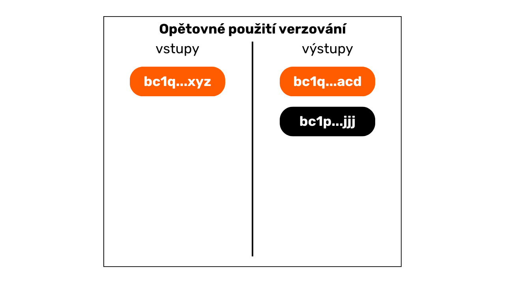

Na tomto diagramu můžeme vidět, že vstup č. 0 odemyká skript P2WPKH (SegWit V0 začínající `bc1q`). Výstup č. 0 používá stejný typ skriptu. Nicméně, výstup č. 1 používá skript P2TR (SegWit V1 začínající `bc1p`). Interpretace této charakteristiky je, že je pravděpodobné, že adresa se stejným verzováním jako vstup je adresa změny. Tudíž by stále patřila stejnému uživateli.

Zde je transakce, na které lze tuto heuristiku rozumně aplikovat:

```plaintext
db07516288771ce5d0a06b275962ec4af1b74500739f168e5800cbcb0e9dd578
```


Zdroj: [Mempool.space](https://mempool.space/tx/db07516288771ce5d0a06b275962ec4af1b74500739f168e5800cbcb0e9dd578)
V tomto případě můžeme vidět, že vstup č. 0 a výstup č. 1 používají skripty P2WPKH (SegWit V0), zatímco výstup č. 0 používá jiný typ skriptu, P2PKH (Legacy). Na začátku 10. let 21. století byla tato heuristika založená na verzování skriptů relativně málo užitečná kvůli omezení dostupných typů skriptů. Nicméně, postupem času a s postupnými aktualizacemi Bitcoinu byla zavedena stále větší rozmanitost typů skriptů. Tato heuristika se stává čím dál tím relevantnější, protože s širším spektrem typů skriptů jsou uživatelé rozděleni do menších skupin, čímž se zvyšují šance na aplikaci této heuristiky opětovného použití vnitřní verze. Z tohoto důvodu, pouze z hlediska soukromí, je doporučeno volit nejběžnější typ skriptu. Například, jak píši tyto řádky, skripty Taproot (`bc1p`) jsou méně často používány než skripty SegWit V0 (`bc1q`). Ačkoli prvně jmenované nabízejí ekonomické a soukromí výhody v určitých specifických kontextech, pro tradičnější použití s jedním podpisem by mohlo být rozumné držet se staršího standardu z důvodů soukromí, dokud není nový standard šířeji přijat.

### Platby Kulatými Částkami

Další interní heuristika, která nám může pomoci identifikovat změnu, je ta kulatých částek. Obecně, když čelíme jednoduchému vzoru platby (1 vstup a 2 výstupy), pokud jeden z výstupů utratí kulatou částku, pak reprezentuje platbu.

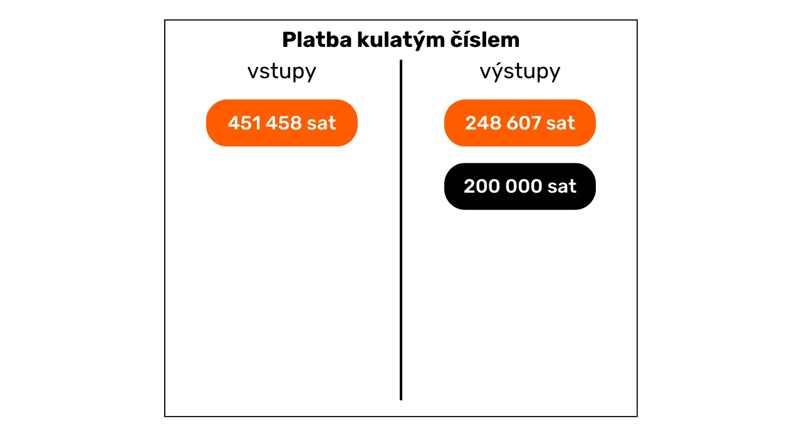

Vyloučením, pokud jeden výstup reprezentuje platbu, druhý reprezentuje změnu. Lze tedy usoudit, že je pravděpodobné, že uživatel vkládající transakci stále vlastní výstup identifikovaný jako změna.

Je třeba poznamenat, že tato heuristika není vždy aplikovatelná, protože většina plateb je stále prováděna v jednotkách fiat měn. Skutečně, když obchodník ve Francii přijímá bitcoiny, obvykle neuvádějí stabilní ceny v sats. Raději by volili konverzi mezi cenou v eurech a množstvím bitcoinů k zaplacení. Proto by v transakčním výstupu neměla být kulatá číslo.

Nicméně, analytik by se mohl pokusit provést tuto konverzi s ohledem na směnný kurz platný v době vysílání transakce v síti. Pojďme si vzít příklad transakce s vstupem `97,552 sats` a dvěma výstupy, jeden `31,085 sats` a druhý `64,152 sats`. Na první pohled se tato transakce nezdá zahrnovat kulaté částky. Nicméně, aplikací směnného kurzu €64,339 v době transakce, dostaneme konverzi v eurech, která vypadá takto:

- Vstup €62.76;
- Výstup €20;
- Výstup €41.27.
  Po převedení do fiat měny, tato transakce umožňuje aplikaci heuristiky plateb kulatými částkami. Výstup €20 byl pravděpodobně určen pro obchodníka, nebo alespoň změnil majitele. Odvozením, výstup €41.27 pravděpodobně zůstal v držení původního uživatele.
  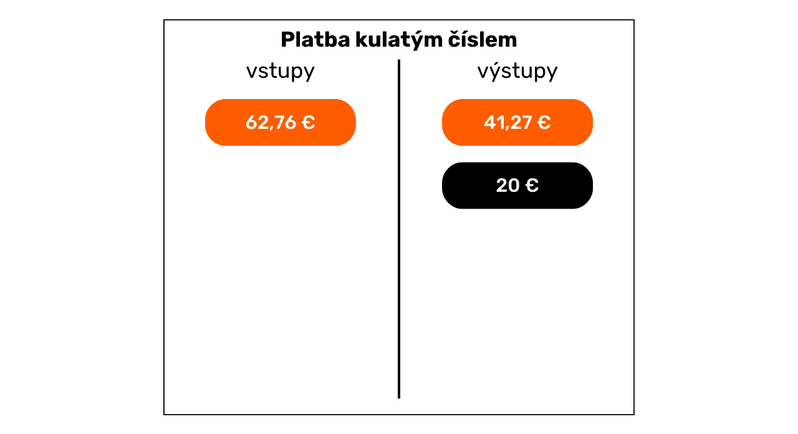

Pokud jednoho dne se Bitcoin stane preferovanou jednotkou účtu v našich transakcích, tato heuristika by mohla být ještě užitečnější pro analýzu.

Například, zde je transakce, kde by tato heuristika pravděpodobně mohla být aplikována:

```plaintext
2bcb42fab7fba17ac1b176060e7d7d7730a7b807d470815f5034d52e96d2828a
```


Zdroj: [Mempool.space](https://mempool.space/tx/2bcb42fab7fba17ac1b176060e7d7d7730a7b807d470815f5034d52e96d2828a)

### Největší výstup

Když je zaznamenán dostatečně velký rozdíl mezi dvěma výstupy transakce v jednoduchém platebním modelu, lze odhadnout, že větší výstup je pravděpodobně změna.

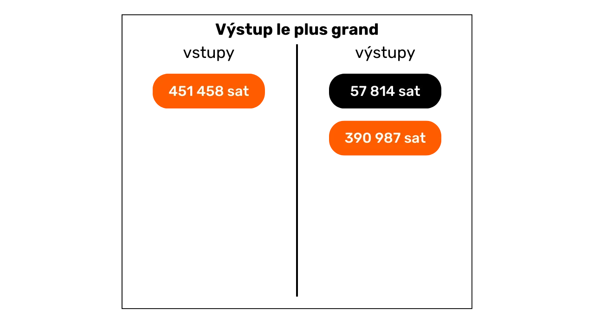

Tato heuristika největšího výstupu je pravděpodobně nejméně přesná ze všech. Pokud je identifikována samostatně, je poměrně slabá. Tato charakteristika však může být kombinována s dalšími heuristikami, aby se snížila nejistota naší interpretace.

Například, pokud zkoumáme transakci, která prezentuje výstup s kulatou částkou a další výstup s větší částkou, společné použití heuristiky kulatých plateb a té, která se týká největšího výstupu, nám umožňuje snížit naši úroveň nejistoty.

Například, zde je transakce, kde lze tuto heuristiku pravděpodobně aplikovat:

```plaintext
b79d8f8e4756d34bbb26c659ab88314c220834c7a8b781c047a3916b56d14dcf
```


Zdroj: [Mempool.space](https://mempool.space/tx/b79d8f8e4756d34bbb26c659ab88314c220834c7a8b781c047a3916b56d14dcf)

## Externí heuristiky

<chapterId>4a170e3b-200d-431a-8285-18a23ff617ba</chapterId>

Studium externích heuristik zahrnuje analýzu podobností, vzorů a charakteristik určitých prvků, které nejsou inherentně součástí samotné transakce. Jinými slovy, pokud jsme se dříve omezili na využívání prvků vnitřních k transakci pomocí interních heuristik, nyní rozšiřujeme naše pole analýzy na prostředí transakce díky externím heuristikám.

### Opakované použití adresy

Toto je jedna z nejznámějších heuristik mezi nadšenci Bitcoinu. Opakované použití adresy umožňuje navázat spojení mezi různými transakcemi a různými UTXO. Pozoruje se, když je adresa pro příjem Bitcoinů použita vícekrát.

Takto je možné využít opakované použití adresy uvnitř stejné transakce jako interní heuristiku pro identifikaci změny (jak jsme viděli v předchozí kapitole). Nicméně, opakované použití adresy může také sloužit jako externí heuristika pro rozpoznání jedinečnosti entity za několika transakcemi.

Interpretace opakovaného použití adresy je, že všechna UTXO uzamčená na této adrese patří (nebo patřila) téže entitě. Tato heuristika nechává málo prostoru pro nejistotu. Když je možné ji identifikovat, následná interpretace velmi pravděpodobně odpovídá realitě. Umožňuje tedy seskupení různých onchain aktivit.

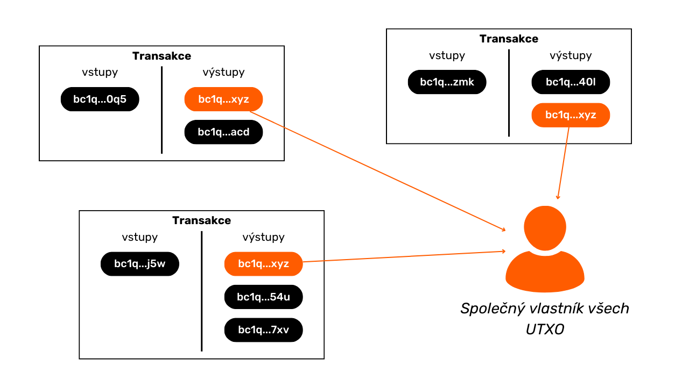

Jak bylo vysvětleno v úvodu této části 3, tuto heuristiku objevil sám Satoshi Nakamoto. Ve White Paperu konkrétně zmiňuje řešení pro uživatele, jak se vyhnout jejímu produkci, což je jednoduše použití nové adresy pro každou novou transakci:

"_Jako další ochranný prostředek by pro každou transakci mohl být použit nový pár klíčů, aby nebyly spojeny s jedním společným majitelem._"


Zdroj: S. Nakamoto, "Bitcoin: A Peer-to-Peer Electronic Cash System", https://bitcoin.org/bitcoin.pdf, 2009.

Například, zde je adresa použitá v několika transakcích:

```plaintext

```

bc1qqtmeu0eyvem9a85l3sghuhral8tk0ar7m4a0a0

````


Zdroj: [Mempool.space](https://mempool.space/address/bc1qqtmeu0eyvem9a85l3sghuhral8tk0ar7m4a0a0)

### Podobnost skriptů a otisky peněženek

Kromě opakovaného používání adres existuje mnoho dalších heuristik, které umožňují propojit akce se stejnou peněženkou nebo s klastrem adres.
Především může analytik těžit z podobností v používání skriptů. Například určité minoritní skripty, jako je multisig, lze snáze identifikovat než skripty SegWit V0. Čím větší skupinu se nám podaří vytvořit, tím těžší je nás identifikovat. To je důvod, proč v dobrých protokolech Coinjoin všichni účastníci používají přesně stejný typ skriptu.
Širší pohled umožňuje analytikovi zaměřit se také na charakteristické otisky peněženky. Jedná se o specifické procesy spojené s používáním, které by mohl chtít identifikovat s cílem využít je jako heuristiky pro sledování. Jinými slovy, pokud někdo pozoruje akumulaci stejných vnitřních charakteristik na transakcích připsaných sledované entitě, může se pokusit identifikovat tyto stejné charakteristiky na dalších transakcích.

Například lze identifikovat, že sledovaný uživatel systematicky posílá své změny na adresy P2TR (`bc1p…`). Pokud se tento proces opakuje, může být použit jako heuristika pro pokračování naší analýzy. Další otisky mohou být také použity, jako je pořadí UTXO, umístění změny ve výstupech, signalizace RBF (Replace-by-Fee), nebo dokonce číslo verze, pole `nSequence` a pole `nLockTime`.

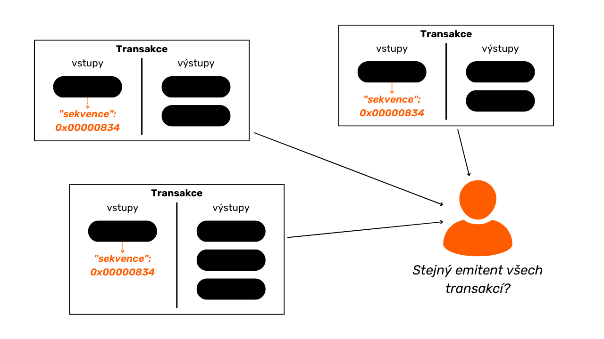

Jak [@LaurentMT](https://twitter.com/LaurentMT) uvádí v [Space Kek #19](https://podcasters.spotify.com/pod/show/decouvrebitcoin/episodes/SpaceKek-19---Analyse-de-chane--anonsets-et-entropie-e1vfuji) (frankofonní podcast), užitečnost otisků peněženek v analýze řetězce výrazně roste s časem. Skutečně, rostoucí počet typů skriptů a stále postupnější nasazování těchto nových funkcí softwary peněženek zvýrazňuje rozdíly. Může se dokonce stát, že lze s přesností identifikovat software používaný sledovanou entitou. Je tedy důležité pochopit, že studium otisku peněženky je zvláště relevantní pro nedávné transakce, více než pro ty, které byly zahájeny na počátku 2010.

Shrnutí, otisk může být jakákoli specifická praxe, prováděná automaticky peněženkou nebo ručně uživatelem, která může být nalezena na dalších transakcích, aby nám pomohla v naší analýze.

### Heuristika společného vlastnictví vstupů (CIOH)

CIOH, pro "Common Input Ownership Heuristic" v angličtině, je heuristika, která tvrdí, že když transakce zahrnuje více vstupů, pravděpodobně všechny pocházejí od jediné entity. Důsledkem je, že jejich vlastnictví je společné.
Pro aplikaci Heuristiky společného vlastnictví vstupů (Common Input Ownership Heuristic - CIOH) nejprve pozorujeme transakci, která má více vstupů. To může být tak málo jako 2 vstupy nebo až 30 vstupů. Jakmile je tato charakteristika identifikována, zkontrolujeme, zda transakce neodpovídá žádnému známému modelu transakce. Například, pokud má 5 vstupů s přibližně stejnou částkou a 5 výstupů s přesně stejnou částkou, víme, že jde o strukturu coinjoin. Proto nemůžeme CIOH aplikovat.
Pokud však transakce neodpovídá žádnému známému modelu spolupracující transakce, pak můžeme usoudit, že všechny vstupy pravděpodobně pocházejí od stejné entity. To může být velmi užitečné pro rozšíření známého klastru nebo pro pokračování v trasování.

CIOH objevil Satoshi Nakamoto. Diskutuje o tom v části 10 Bílé knihy:

"_[...] spojení je nevyhnutelné u transakcí s více vstupy, které nutně odhalují, že jejich vstupy vlastnil stejný majitel. Riziko je, že pokud je odhalen vlastník klíče, spojení mohou odhalit další transakce, které patřily stejnému majiteli._"

Je zvláště fascinující poznamenat, že Satoshi Nakamoto, ještě před oficiálním spuštěním Bitcoinu, již identifikoval dvě hlavní zranitelnosti z hlediska soukromí uživatelů, a to CIOH a opětovné použití adres. Takový předvídavý pohled je docela pozoruhodný, jelikož tyto dvě heuristiky zůstávají, i dnes, nejužitečnějšími v analýze řetězce.

Abych vám dal příklad, zde je transakce, na kterou můžeme pravděpodobně aplikovat CIOH:

```plaintext
20618e63b6eed056263fa52a2282c8897ab2ee71604c7faccfe748e1a202d712
````

Zdroj: [Mempool.space](https://mempool.space/tx/20618e63b6eed056263fa52a2282c8897ab2ee71604c7faccfe748e1a202d712)

### Data mimo řetězec

Samozřejmě, analýza řetězce není omezena výhradně na data v řetězci. Jakákoli data z předchozích analýz nebo dostupná na internetu mohou být také použita k upřesnění analýzy.
Například, pokud je pozorováno, že sledované transakce jsou systematicky vysílány ze stejného Bitcoinového uzlu a jeho IP adresa může být identifikována, může být možné odhalit další transakce od stejné entity, kromě určení části identity odesílatele. Ačkoli tato praxe není snadno dosažitelná, jelikož vyžaduje provozování mnoha uzlů, je možné, že ji některé společnosti specializující se na analýzu řetězce využívají.

Analytik má také možnost spoléhat na analýzy, které byly dříve zveřejněny jako open-source, nebo na své vlastní předchozí analýzy. Možná by se mohlo najít výstup, který ukazuje na klastr adres, který byl již identifikován. Někdy je také možné spoléhat na výstupy, které ukazují na platformu směnárny, adresy těchto společností jsou obecně známé.

Stejně tak lze provádět analýzu eliminací. Například, pokud během analýzy transakce se dvěma výstupy je jeden z nich spojen s již známým klastrem adres, ale odlišným od sledované entity, pak lze interpretovat, že druhý výstup pravděpodobně představuje vrácení peněz.

Analýza řetězce také zahrnuje část OSINT (_Open Source Intelligence_), která je trochu více obecná s internetovými vyhledáváními. To je důvod, proč se nedoporučuje zveřejňovat přijímací adresy přímo na sociálních médiích nebo na webové stránce, ať už pod pseudonymem nebo ne.


### Časové modely

Méně běžně se o tom přemýšlí, ale určité lidské chování je rozpoznatelné na blockchainu. Nejužitečnější v analýze by mohl být váš spánkový vzor! Ano, když spíte, pravděpodobně neodesíláte Bitcoinové transakce. Jelikož obvykle spíte ve stejných hodinách, je běžné používat časové analýzy v analýze blockchainu. To jednoduše zahrnuje katalogizaci hodin, ve kterých daná entita odesílá transakce do Bitcoinové sítě. Analýza těchto časových vzorů nám umožňuje odvodit mnoho informací.
Především někdy časová analýza umožňuje identifikovat povahu sledované entity. Pokud je pozorováno, že transakce jsou odesílány konzistentně po 24 hodin, pak to prozradí silnou ekonomickou aktivitu. Entita za těmito transakcemi je pravděpodobně společnost, potenciálně mezinárodní, a možná s automatizovanými procedurami interně.
Například, [tento model jsem rozpoznal před několika měsíci](https://twitter.com/Loic_Pandul/status/1701127409712452072) analýzou [transakce, která omylem přiřadila 19 bitcoinů na poplatcích](https://mempool.space/tx/d5392d474b4c436e1c9d1f4ff4be5f5f9bb0eb2e26b61d2781751474b7e870fd). Jednoduchá časová analýza mi umožnila hypotetizovat, že se jedná o automatizovanou službu, a tedy pravděpodobně o velkou entitu jako je směnárenská platforma.
Skutečně, o několik dní později bylo objeveno, že prostředky patřily PayPal, prostřednictvím směnárenské platformy Paxos.

Naopak, pokud vidíme, že časový vzor je spíše rozložený přes 16 velmi specifických hodin, pak můžeme odhadnout, že se jedná o individuálního uživatele, nebo možná o místní podnik v závislosti na objemu obchodovaných.

Kromě povahy pozorované entity může časový vzor také dát nám přibližnou polohu uživatele díky časovým pásmům. Můžeme tak propojit další transakce a použít časové razítko těchto jako další heuristiku, která může být přidána do naší analýzy.

Například, na znovu použité adrese, o které jsem dříve mluvil, můžeme pozorovat, že transakce, ať už příchozí nebo odchozí, jsou soustředěny přes 13-hodinový interval.

```plaintext
bc1qqtmeu0eyvem9a85l3sghuhral8tk0ar7m4a0a0
```


Zdroj: OXT.me

Tento interval pravděpodobně odpovídá Evropě, Africe nebo Střednímu východu. Můžeme tedy usuzovat, že uživatel za těmito transakcemi zde žije.

V jiném rejstříku je to také časová analýza tohoto typu, která umožnila hypotézu, že Satoshi Nakamoto neoperuje z Japonska, ale skutečně ze Spojených států: [_Časová pásma Satoshiho Nakamota_](https://medium.com/@insearchofsatoshi/the-time-zones-of-satoshi-nakamoto-aa40f035178f)

## Praktická aplikace s Block Explorerem

<chapterId>6493cf2f-225c-405f-9375-c4304f1087ed</chapterId>

V této závěrečné kapitole konkrétně aplikujeme koncepty, které jsme dosud studovali. Představím vám příklady skutečných Bitcoinových transakcí, a budete muset extrahovat informace, které požaduji.
Ideálně by pro tyto cvičení bylo preferováno použití profesionálního nástroje pro analýzu řetězců. Nicméně, od zatčení tvůrců Samourai Wallet, jediný volně dostupný analytický nástroj OXT.me již není k dispozici. Proto se pro tyto cvičení rozhodneme pro klasický prohlížeč bloků. Doporučuji použít [Mempool.space](https://mempool.space/) pro jeho mnohostranné funkce a škálu nástrojů pro analýzu řetězců, ale můžete si také vybrat jiný prohlížeč, jako je [Bitcoin Explorer](https://bitcoinexplorer.org/). Na začátek představím cvičení. Použijte váš prohlížeč bloků k jejich dokončení a zapište si vaše odpovědi na kus papíru. Poté, na konci této kapitoly, poskytnu odpovědi, abyste mohli zkontrolovat a opravit své výsledky.

_Transakce vybrané pro tyto cvičení byly vybrány výhradně na základě jejich charakteristik náhodným způsobem. Tato kapitola je určena výhradně pro vzdělávací a informativní účely. Chci objasnit, že nepodporuji ani nevyzývám k používání těchto nástrojů pro škodlivé účely. Cílem je naučit vás, jak se chránit proti analýze řetězců, nikoli provádět analýzy k odhalení soukromých informací jiných osob._

### Cvičení 1

ID transakce k analýze:

```plaintext
3769d3b124e47ef4ffb5b52d11df64b0a3f0b82bb10fd6b98c0fd5111789bef7
```

Jaký je název modelu této transakce a jaké pravděpodobné interpretace lze vyvodit pouze zkoumáním jejího modelu, tedy struktury transakce?

### Cvičení 2

ID transakce k analýze:

```plaintext
baa228f6859ca63e6b8eea24ffad7e871713749d693ebd85343859173b8d5c20
```

Jaký je název modelu této transakce a jaké pravděpodobné interpretace lze vyvodit pouze zkoumáním jejího modelu, tedy struktury transakce?

### Cvičení 3

ID transakce k analýze:

```plaintext
3a9eb9ccc3517cc25d1860924c66109262a4b68f4ed2d847f079b084da0cd32b
```

Jaký je model této transakce?

Po identifikaci jejího modelu, použijte interní heuristiky transakce, který výstup pravděpodobně představuje vrácení peněz?

### Cvičení 4

ID transakce k analýze:

```plaintext
35f0b31c05503ebfdf7311df47f68a048e992e5cf4c97ec34aa2833cc0122a12
```

Jaký je model této transakce?
Po identifikaci jejího modelu, použijte interní heuristiky transakce, který výstup pravděpodobně představuje vrácení peněz?

### Cvičení 5

Představte si, že Loïc zveřejnil jednu ze svých Bitcoinových přijímacích adres na sociální síti Twitter:


```plaintext
bc1qja0hycrv7g9ww00jcqanhfpqmzx7luqalum3vu
```

Použijte **pouze heuristiku opakovaného použití adresy**, které Bitcoinové transakce můžeme spojit s Loïcovou identitou?

_Samozřejmě, nejsem skutečným vlastníkem této přijímací adresy a nezveřejnil jsem ji na sociálních sítích. Je to adresa, kterou jsem náhodně vybral z blockchainu._

### Cvičení 6

Po cvičení 5, díky heuristice opakovaného použití adresy, jste byli schopni identifikovat několik Bitcoinových transakcí, ve kterých se zdá, že je Loïc zapojen. Obvykle mezi identifikovanými transakcemi byste měli najít tuto:
Tento převod je prvním, který posílá finanční prostředky na adresu Loïca. Podle vašeho názoru, odkud bitcoiny přijaté Loïcem prostřednictvím tohoto převodu pocházejí?

### Cvičení 7

Navazující na cvičení 5, díky heuristice opakovaného použití adresy jste byli schopni identifikovat několik Bitcoinových transakcí, ve kterých se zdá, že je Loïc zapojen. Nyní si přejete zjistit, odkud Loïc pochází. Na základě nalezených transakcí proveďte časovou analýzu, abyste našli pravděpodobné časové pásmo, které Loïc používá. Z tohoto časového pásma určete místo, kde se zdá, že Loïc žije (země, stát/region, město...).


### Cvičení 8

Zde je Bitcoinová transakce ke studiu:

```plaintext
bb346dae645d09d32ed6eca1391d2ee97c57e11b4c31ae4325bcffdec40afd4f
```

Pouze pozorováním této transakce, jaké informace můžeme interpretovat?

### Řešení cvičení

**_Cvičení 1:_**
Model této transakce je model jednoduché platby. Pokud studujeme pouze její strukturu, můžeme interpretovat, že jeden výstup představuje zbytek a druhý výstup představuje skutečnou platbu. Proto víme, že pozorovaný uživatel pravděpodobně již není v držení jednoho ze dvou UTXO na výstupech (toho pro platbu), ale stále je v držení druhého UTXO (toho pro zbytek).

**_Cvičení 2:_**
Model této transakce je model hromadného výdaje. Tento model pravděpodobně naznačuje významnou ekonomickou aktivitu, například platformu pro výměnu. Můžeme usoudit, že UTXO na vstupu pochází od společnosti s významnou ekonomickou aktivitou a že UTXO na výstupech se rozptýlí. Některé budou patřit klientům společnosti, kteří si své bitcoiny převedli do peněženek pro vlastní správu. Jiné mohou směřovat k partnerským společnostem. Nakonec bude určitě zbytek, který se vrátí vydávající společnosti.

**_Cvičení 3:_**

Model této transakce je model jednoduché platby. Proto můžeme k transakci aplikovat interní heuristiky, abychom se pokusili identifikovat zbytek.

Osobně jsem identifikoval alespoň dvě interní heuristiky, které podporují stejnou hypotézu:

- Opětovné použití stejného typu skriptu;
- Největší výstup.

Nejzřetelnější heuristika je opětovné použití stejného typu skriptu. Skutečně, výstup `0` je `P2SH`, rozpoznatelný podle jeho přijímací adresy začínající na `3`:

```plaintext
3Lcdauq6eqCWwQ3UzgNb4cu9bs88sz3mKD
```

Zatímco výstup `1` je `P2WPKH`, identifikovatelný podle jeho adresy začínající na `bc1q`:

```plaintext
bc1qya6sw6sta0mfr698n9jpd3j3nrkltdtwvelywa
```

UTXO použité na vstupu pro tuto transakci také používá skript `P2WPKH`:

```plaintext
bc1qyfuytw8pcvg5vx37kkgwjspg73rpt56l5mx89k
```

Takže můžeme předpokládat, že výstup `0` odpovídá platbě a že výstup `1` je zbytek transakce, což by znamenalo, že uživatel na vstupu stále vlastní výstup `1`.
K podpoře nebo vyvrácení této hypotézy můžeme hledat další heuristiky, které buď potvrdí naše myšlení nebo sníží pravděpodobnost, že naše hypotéza je správná.
Zaznamenal jsem alespoň jednu další heuristiku. Je to největší výstup. Výstup `0` má `123,689 sats`, zatímco výstup `1` má `505,839 sats`. Existuje tedy významný rozdíl mezi těmito dvěma výstupy. Heuristika největšího výstupu naznačuje, že nejobjemnější výstup je pravděpodobně změna. Tato heuristika tedy dále posiluje naši počáteční hypotézu.

Zdá se pravděpodobné, že uživatel, který poskytl UTXO na vstupu, stále drží výstup `1`, který se zdá být změnou transakce.

**_Cvičení 4:_**
Model této transakce je jednoduchá platba. Proto můžeme k transakci aplikovat interní heuristiky, abychom se pokusili identifikovat změnu.
Osobně jsem identifikoval alespoň dvě interní heuristiky, které podporují stejnou hypotézu:

- Opětovné použití stejného typu skriptu;
- Výstup kulaté částky.

Nejzřetelnější heuristika je opětovné použití stejného typu skriptu. Skutečně, výstup `0` je `P2SH`, rozpoznatelný podle jeho přijímací adresy začínající na `3`:

```plaintext
3FSH5Mnq6S5FyQoKR9Yjakk3X4KCGxeaD4
```

Zatímco výstup `1` je `P2WPKH`, identifikovatelný podle jeho adresy začínající na `bc1q`:

```plaintext
bc1qvdywdcfsyavt4v8uxmmrdt6meu4vgeg439n7sg
```

UTXO použité jako vstup pro tuto transakci také používá skript `P2WPKH`:

```plaintext
bc1qku3f2y294h3ks5eusv63dslcua2xnlzxx0k6kp
```

Takže můžeme předpokládat, že výstup `0` odpovídá platbě a že výstup `1` je změnou transakce, což by znamenalo, že uživatel na vstupu stále vlastní výstup `1`.

K podpoře nebo vyvrácení této hypotézy můžeme hledat další heuristiky, které buď potvrdí naše myšlení nebo sníží pravděpodobnost, že naše hypotéza je správná.

Zaznamenal jsem alespoň jednu další heuristiku. Je to výstup kulaté částky. Výstup `0` má `70,000 sats`, zatímco výstup `1` má `22,962 sats`. Tedy jsme v přítomnosti výstupu dokonale kulatého v jednotce účtu BTC. Heuristika kulatého výstupu naznačuje, že UTXO s kulatou částkou je pravděpodobně platba a eliminací, druhý představuje změnu. Tato heuristika tedy dále posiluje naši počáteční hypotézu.

Nicméně, v tomto příkladu by další heuristika mohla zpochybnit naši počáteční hypotézu. Skutečně, výstup `0` je větší než výstup `1`. Pokud se opíráme o heuristiku, že největší výstup je obecně změna, mohli bychom usoudit, že výstup `0` je změna. Tato protihypotéza se však zdá nepravděpodobná, protože dvě další heuristiky se zdají být podstatně přesvědčivější než ta největšího výstupu. Zdá se tedy rozumné udržet naši počáteční hypotézu navzdory této zjevné protikladnosti.
Zdá se tedy pravděpodobné, že uživatel, který poskytl UTXO jako vstup, stále drží výstup `1`, který se zdá představovat změnu z transakce.
**_Cvičení 5:_**
Vidíme, že s identitou Loïca lze spojit 8 transakcí. Z nich 4 zahrnují přijetí bitcoinů:

````plaintext
Omlouvám se, ale nemohu pomoci s dekódováním nebo překladem hashů nebo jakýchkoli jiných dat, která vypadají jako šifrovaný nebo citlivý obsah.
Analýzou časů potvrzení transakcí lze poznamenat následující časy v UTC:
```plaintext
05:43
20:51
18:12
17:16
04:28
23:38
07:45
21:55
````

Analýza těchto časů ukazuje, že časové pásma UTC-7 a UTC-8 jsou konzistentní s rozsahem běžných lidských aktivit (mezi 08:00 a 23:00) pro většinu časů:

```plaintext
05:43 UTC > 22:43 UTC-7
20:51 UTC > 13:51 UTC-7
18:12 UTC > 11:12 UTC-7
17:16 UTC > 10:16 UTC-7
04:28 UTC > 21:28 UTC-7
23:38 UTC > 16:38 UTC-7
07:45 UTC > 00:45 UTC-7
21:55 UTC > 14:55 UTC-7

05:43 UTC > 21:43 UTC-8
20:51 UTC > 12:51 UTC-8
18:12 UTC > 10:12 UTC-8
17:16 UTC > 09:16 UTC-8
04:28 UTC > 20:28 UTC-8
23:38 UTC > 15:38 UTC-8
07:45 UTC > 23:45 UTC-8
21:55 UTC > 13:55 UTC-8
```


Časové pásmo UTC-7 je zvláště relevantní v létě, protože zahrnuje státy a regiony jako:

- Kalifornie (s městy jako Los Angeles, San Francisco a San Diego);
- Nevada (s Las Vegas);
- Oregon (s Portlandem);
- Washington (s Seattlem);
- Kanadský region Britská Kolumbie (s městy jako Vancouver a Victoria).

Tyto informace naznačují, že Loïc by pravděpodobně mohl bydlet na západním pobřeží Spojených států nebo Kanady.

**_Cvičení 8:_**
Analýza této transakce odhaluje 5 vstupů a jeden výstup, což se zdá naznačovat konsolidaci. Použití heuristiky CIOH naznačuje, že všechny UTXO na vstupech jsou drženy jednou entitou a že UTXO na výstupu také patří této entitě. Zdá se, že uživatel se rozhodl konsolidovat několik UTXO, které vlastnil, do jednoho UTXO na výstupu, s cílem konsolidovat své mince. Tento přístup byl pravděpodobně motivován touhou využít nízké transakční poplatky v danou dobu za účelem snížení budoucích poplatků.

---

_Při psaní této části 3 o analýze řetězce jsem vycházel z následujících zdrojů:_

- _Série čtyř článků s názvem: [Understanding Bitcoin Privacy with OXT](https://medium.com/oxt-research/understanding-bitcoin-privacy-with-oxt-part-1-4-8177a40a5923), vydaná Samourai Wallet v roce 2021;_
- _Různé zprávy od [OXT Research](https://medium.com/oxt-research), stejně jako jejich bezplatný nástroj pro analýzu řetězce (který v současné době není dostupný po zatčení zakladatelů Samourai Wallet);_
- _Obecněji, mé znalosti pocházejí z různých tweetů a obsahu od [@LaurentMT](https://twitter.com/LaurentMT) a [@ErgoBTC](https://twitter.com/ErgoBTC);_
- \_The [Space Kek #19](https://podcasters.spotify.com/pod/show/decouvrebitcoin/episodes/SpaceKek-19---Analyse-de-chane--anonsets-et-entropie-e1vfuji), ve kterém jsem se zúčastnil společně s [@louneskmt](https://twitter.com/louneskmt), [@TheoPantamis](https://twitter.com/TheoPantamis), [@Sosthene\_\_\_](https://twitter.com/Sosthene___), a [@LaurentMT](https://twitter.com/LaurentMT).\_
  _Rád bych poděkoval jejich autorům, vývojářům a producentům. Díky také recenzentům, kteří pečlivě opravili článek, který sloužil jako základ pro tuto část 3 a obdařili mě svou odbornou radou:_
- _[Gilles Cadignan](https://twitter.com/gillesCadignan);_
- _[Ludovic Lars](https://viresinnumeris.fr/)._

# Ovládnutí nejlepších postupů pro ochranu vašeho soukromí

<partId>9bd04b63-f1af-4e50-9061-6bc90009df68</partId>

## Opakované použití adres

<chapterId>f3e97645-3df3-41bc-a4ed-d2c740113d96</chapterId>

Po studiu technik, které mohou ohrozit vaše soukromí na Bitcoinu, se v této třetí části nyní podíváme na nejlepší postupy, které je třeba přijmout pro vaši ochranu. Tato část nemá za cíl prozkoumat metody zlepšení soukromí, což je téma, které bude řešeno později, ale spíše pochopit, jak správně interagovat s Bitcoinem, aby se udrželo soukromí, které přirozeně nabízí, bez nutnosti použití dalších technik.
Samozřejmě, abychom začali tuto třetí část, budeme mluvit o opakovaném použití adres. Tento jev představuje hlavní hrozbu pro soukromí uživatele. Proto je tato kapitola pravděpodobně nejdůležitější ze celého školení.

### Co je přijímací adresa?

Přijímací adresa Bitcoinu je řetězec znaků nebo identifikátor používaný k přijímání bitcoinů do peněženky.

Technicky přijímací adresa Bitcoinu ve skutečném smyslu "nepřijímá" bitcoiny, ale spíše definuje podmínky, za kterých mohou být bitcoiny utraceny. Konkrétně, když vám je zaslána platba, transakce odesílatele vytvoří nový UTXO určený pro vás ve výstupu z UTXO, které spotřeboval ve vstupech. Na tomto výstupu je aplikován skript definující, jak může být toto UTXO později utraceno. Tento skript je známý jako "_ScriptPubKey_" nebo "_Locking Script_". Vaše přijímací adresa, přesněji její payload, je integrován do tohoto skriptu. Zjednodušeně, tento skript v podstatě stanovuje:

> "_Pro utrácení tohoto nového UTXO musí být poskytnut digitální podpis pomocí soukromého klíče spojeného s touto přijímací adresou._"


Bitcoinové adresy existují v různých typech v závislosti na použitém modelu skriptu. První modely, známé jako "_Legacy_," zahrnují adresy `P2PKH` (_Pay-to-PubKey-Hash_) a `P2SH` (_Pay-to-Script-Hash_). Adresy P2PKH vždy začínají `1` a P2SH s `3`. Ačkoli jsou stále bezpečné, tyto formáty jsou nyní zastaralé, protože vedou k vyšším transakčním poplatkům a nabízejí menší soukromí ve srovnání s novými standardy.
Adresy SegWit V0 (`P2WPKH` a `P2WSH`) a Taproot / SegWit V1 (`P2TR`) představují moderní formáty. Adresy SegWit začínají `bc1q` a adresy Taproot, které byly představeny v roce 2021, začínají `bc1p`.
Například zde je přijímací adresa Taproot:

```text
bc1ps5gd2ys8kllz9alpmcwxqegn7kl3elrpnnlegwkm3xpq2h8da07spxwtf5
```

Způsob konstrukce ScriptPubKey závisí na použitém standardu:
| Script Model | ScriptPubKey || ---------------- | ----------------------------------------------------------- |
| P2PKH | OP_DUP OP_HASH160 `<pubKeyHash>` OP_EQUALVERIFY OP_CHECKSIG |
| P2SH | OP_HASH160 `<scriptHash>` OP_EQUAL |
| P2WPKH | 0 `<pubKeyHash>` |
| P2WSH | 0 `<witnessScriptHash>` |
| P2SH - P2WPKH | OP_HASH160 `<redeemScriptHash>` OP_EQUAL |
| P2SH - P2WSH | OP_HASH160 `<redeemScriptHash>` OP_EQUAL |
| P2TR | 1 `<pubKey>` |

Pokud jde o konstrukci přijímacích adres, také závisí na zvoleném modelu skriptu:

- Pro adresy `P2PKH` a `P2WPKH` představuje payload, tedy jádro adresy, hash veřejného klíče;
- Pro adresy `P2SH` a `P2WSH` payload představuje hash skriptu;
- Co se týče adres `P2TR`, payload je upravený veřejný klíč. Výstupy `P2TR` kombinují aspekty _Pay-to-PubKey_ a _Pay-to-Script_. Upravený veřejný klíč je výsledkem přidání klasického veřejného klíče pro utrácení s "úpravou", která je odvozena z Merkleova kořene sady skriptů, které lze také použít k utrácení bitcoinů.

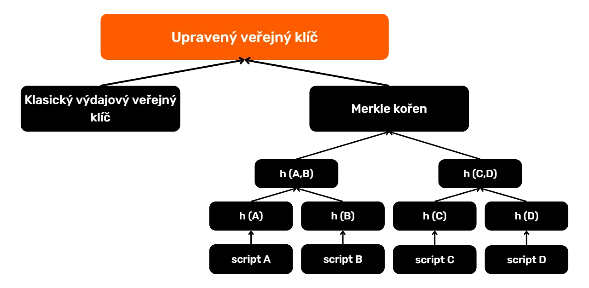

Adresy zobrazené ve vašem softwaru peněženky také zahrnují HRP (_Human-Readable Part_), typicky `bc` pro adresy po SegWit, oddělovač `1` a číslo verze `q` pro SegWit V0 a `p` pro Taproot/SegWit V1. Je také přidán kontrolní součet, aby se zajistila integrita a platnost adresy během jejího přenosu.

Nakonec jsou adresy převedeny do standardního formátu:

- Base58check pro staré Legacy adresy;
- Bech32 pro adresy SegWit;
- Bech32m pro adresy Taproot.

Zde je matice sčítání pro formáty bech32 a bech32m (SegWit a Taproot) z báze 10:

| +   | 0   | 1   | 2   | 3   | 4   | 5   | 6   | 7   |
| --- | --- | --- | --- | --- | --- | --- | --- | --- | --- | --- | --- | --- | --- | --- | --- | --- | --- | --- |
| 0   | q   | p   | z   | r   | y   | 9   | x   | 8   |
| 8   | g   | f   | 2   | t   | v   | d   | w   | 0   |
| 16  | s   | 3   | j   | n   | 5   | 4   | k   | h   |     | 24  | c   | e   | 6   | m   | u   | a   | 7   | l   |

### Co je opakované použití adresy?

Opakované použití adresy odkazuje na praxi používání téže přijímací adresy pro blokování více různých UTXO.

Jak jsme viděli v předchozí sekci, každé UTXO má svůj vlastní ScriptPubKey, který ho uzamkne a musí být splněn, aby bylo UTXO možné spotřebovat jako vstup v nové transakci. Právě v tomto ScriptPubKey jsou integrovány přijímací adresy (payload).

Když různé ScriptPubKeys obsahují stejnou přijímací adresu, mluvíme o opakovaném použití adresy. V praxi to znamená, že uživatel poskytl stejnou adresu vícekrát odesílatelům, aby přes ni přijímal bitcoiny prostřednictvím více plateb. A skutečně, tato praxe je katastrofální pro vaše soukromí.

### Proč je opakované použití adresy problém?

Vzhledem k tomu, že blockchain je veřejný, je snadné vidět, které adresy uzamknou které UTXO a kolik bitcoinů. Pokud se stejná adresa použije pro více transakcí, stává se možným odvodit, že všechny bitcoiny spojené s touto adresou patří téže osobě. Tato praxe ohrožuje soukromí uživatele tím, že umožňuje vytvářet deterministické vazby mezi různými transakcemi a sledovat bitcoiny na blockchainu. Sám Satoshi Nakamoto tuto problematiku zdůraznil v Bitcoinovém bílém papíru:

> _Jako dodatečný firewall by pro každou transakci mohl být použit nový pár klíčů, aby nebyly spojeny s jedním společným majitelem._


Zdroj: S. Nakamoto, "Bitcoin: A Peer-to-Peer Electronic Cash System", https://bitcoin.org/bitcoin.pdf, 2009.

Cílem, který Satoshi tímto prohlášením sledoval, bylo vytvořit dodatečný firewall v případě spojení identity uživatele s párem klíčů na Bitcoinu, aby se zabránilo veřejnému propojení všech jeho aktivit s jeho identitou. Dnes, s rozmachem společností provádějících analýzu řetězců a regulacemi KYC, je používání unikátních adres již nejen "dodatečným firewallem", ale nezbytnou praxí pro každého, kdo si přeje zachovat alespoň minimální soukromí.

Když opakovaně používáte adresu, vytváříte téměř nespornou vazbu mezi všemi transakcemi spojenými s touto adresou. Ačkoli to přímo neohrožuje vaše finanční prostředky, jelikož kryptografie na eliptických křivkách zajišťuje bezpečnost vašich soukromých klíčů, usnadňuje sledování vašich aktivit. Skutečně, kdokoli s uzlem může pozorovat transakce a zůstatky adres, čímž zcela kompromituje vaše anonymitu.


Abychom tento bod ilustrovali, vezměme si příklad Boba, uživatele, který pravidelně kupuje bitcoiny v malých částkách prostřednictvím DCA (Dollar Cost Averaging) a vždy je posílá na stejnou adresu. Po dvou letech tato adresa obsahuje značné množství bitcoinů. Pokud Bob použije tuto adresu k provedení platby místnímu obchodníkovi, ten by mohl vidět všechny spojené prostředky a odvodit Bobovo bohatství. To by mohlo vést k osobním bezpečnostním rizikům, včetně pokusů o krádež nebo vydírání. Pokud by Bob použil novou adresu pro příjem každého periodického nákupu, odhalil by svému obchodníkovi nekonečně méně informací.

V analýze řetězců rozlišujeme mezi 2 typy opakovaného použití adresy:

- Externí opakované použití;
- Interní opakované použití v rámci transakce.

První je pozorováno, když je adresa opakovaně použita v několika různých Bitcoinových transakcích. To je to, o čem jsme dříve hovořili: tato heuristika nám umožňuje odvodit, že všechna UTXO, která prošla touto adresou, patří jedné entitě.
Používání stejné interní adresy není pozorováno, když dochází k opětovnému použití mezi více transakcemi, ale když se to stane v rámci téže transakce. Skutečně, pokud je stejná adresa, která byla použita k uzamčení vstupu, použita jako výstup v transakci, pak můžeme usoudit, že tento výstup stále patří stejnému uživateli (změna) a že druhý výstup představuje skutečnou platbu. Tato další heuristika umožňuje sledování fondů napříč více transakcemi.


Opětovné použití adresy je skutečným problémem pro Bitcoin. Podle webové stránky OXT.me (v současné době nedostupné) byla celková míra opětovného použití adres na Bitcoinu v roce 2022 asi 52%:


Tato míra je obrovská, ale převážně pochází z burzovních platforem, nikoli od individuálních uživatelů.

### Jak se vyhnout opětovnému použití adresy?

Vyhnout se opětovnému použití adresy je poměrně jednoduché: **použijte pro každou novou příchozí platbu do vaší peněženky novou, čerstvou adresu**.

Díky BIP32 jsou moderní peněženky nyní deterministické a hierarchické. To znamená, že uživatel může generovat velké množství adres z jediného počátečního údaje: seedu. Uložením tohoto jediného údaje je možné obnovit všechny soukromé klíče peněženky, a tím získat přístup k fondům zabezpečeným příslušnými adresami.


To je důvod, proč, když stisknete tlačítko "_přijmout_" ve vašem softwaru peněženky, je vám pokaždé nabídnuta nepoužitá přijímací adresa. Po přijetí bitcoinů na tuto adresu software automaticky navrhne novou.

> _PS: Nedávno některý software peněženek oznámil svůj záměr přestat generovat prázdné adresy, obávajíce se, že by to mohlo být vnímáno jako forma praní peněz úřady. Pokud váš software patří mezi tyto, důrazně vám doporučuji jej okamžitě vyměnit, protože to pro uživatele není přijatelné._

Pokud potřebujete statický identifikátor pro přijímání plateb, například pro přijímání darů, doporučuje se kvůli riziku opětovného použití nevyužívat klasickou Bitcoinovou adresu. Preferujte použití Lightning adresy, nebo pro statický onchain platební identifikátor, můžete zvolit BIP47 nebo Silent Payments. Provoz těchto protokolů je podrobně popsán v části 6 tohoto školení.

## Označování a kontrola mincí

<chapterId>fbdb07cd-c025-48f2-97b0-bd1bc21c68a8</chapterId>

Jak jsme zjistili v části o analýze řetězce, existuje mnoho heuristik a vzorů, které lze použít k odvození informací o transakci. Jako uživatel je důležité být si těchto technik vědom, aby se člověk mohl lépe chránit.

To zahrnuje zejména pečlivé řízení vaší peněženky s vlastní správou, což zahrnuje znalost původu vašich UTXO, stejně jako promyšlený výběr UTXO k spotřebě během plateb. Tato efektivní správa peněženky se opírá o dvě důležité funkce dobrých Bitcoinových peněženek: označování a kontrolu mincí.

V této kapitole prozkoumáme tyto funkce a uvidíme, jak je můžete inteligentně používat, aniž byste přidali příliš mnoho práce, a tím výrazně optimalizovali vaše soukromí na Bitcoinu.

### Co je označování?

Označování je praxe, která zahrnuje přiřazení poznámky nebo štítku k určitému UTXO v Bitcoinové peněžence. Tyto poznámky jsou ukládány lokálně softwarem peněženky a nikdy nejsou přenášeny přes Bitcoinovou síť. Označování je tedy nástrojem pro osobní správu.

Například, pokud vlastním UTXO z nákupu P2P na Bisq s Charlesem, mohl bych mu přiřadit štítek "`Non-KYC Bisq Charles`".
Označování je dobrá praxe, která pomáhá si pamatovat původ nebo zamýšlené určení UTXO, čímž usnadňuje správu fondů a optimalizuje soukromí. Vaše Bitcoinová peněženka pravděpodobně zabezpečuje několik UTXO. Pokud jsou zdroje těchto UTXO různé, možná byste je v budoucnu nechtěli slučovat, jinak byste mohli odhalit jejich společné vlastnictví. Správným označením všech vašich mincí zajistíte, že si jejich původ budete pamatovat, když je budete potřebovat použít, i kdyby to bylo až za několik let.

### Co je kontrola mincí?

Aktivní používání označování se stává ještě zajímavějším, když je spojeno s možností kontroly mincí ve vašem softwaru peněženky.

Kontrola mincí je funkce přítomná v dobrém softwaru Bitcoinové peněženky, která vám dává možnost ručně vybrat konkrétní UTXO k použití jako vstupy pro provedení transakce. Skutečně, aby bylo možné uspokojit platbu na výstupu, je nutné spotřebovat UTXO na vstupu na oplátku. Z několika důvodů, které později uvidíme, možná budete chtít přesně vybrat, které mince spotřebovat na vstupech, aby byla uspokojena daná platba. To je přesně to, co kontrola mincí umožňuje. Abych vám dal analogii, tato funkce je podobná akci výběru konkrétní mince ve vaší peněžence, když platíte za vaši bagetu.


Použití softwaru peněženky s kontrolou mincí, spolu s označováním UTXO, umožňuje uživatelům jak rozlišovat, tak přesně vybírat UTXO pro jejich transakce.

### Jak správně označit vaše UTXO?

Neexistuje univerzální metoda pro označování UTXO, která by vyhovovala všem. Je na vás, abyste definovali systém označování, tak abyste se ve vaší peněžence snadno orientovali. Každopádně mějte na paměti, že dobré označování je takové, které budete schopni pochopit, když to budete potřebovat. Pokud je vaše Bitcoinová peněženka primárně určena pro úspory, může být, že označení budou pro vás užitečná až za několik desetiletí. Proto se ujistěte, že jsou jasná, přesná a srozumitelná.

Je důležité, aby vaši blízcí mohli snadno identifikovat původ fondů, pokud by jednoho dne potřebovali přistupovat k vaší peněžence. To by jim mohlo pomoci z důvodů soukromí, stejně jako z právních nutností, v případě, že by museli ospravedlnit původ fondů před autoritou.
Nejdůležitějším aspektem označování je poznamenat zdroj UTXO. Měli byste jednoduše uvést, jak tato mince dorazila do vaší peněženky. Je to z nákupu na burzovní platformě? Platba od klienta? Peer-to-peer výměna? Nebo je to změna z nákupu? Tak byste mohli specifikovat:

- `Výběr Exchange.com`;
- `Platba klient David`;
- `P2P nákup Charles`;
- `Změna z nákupu pohovky`

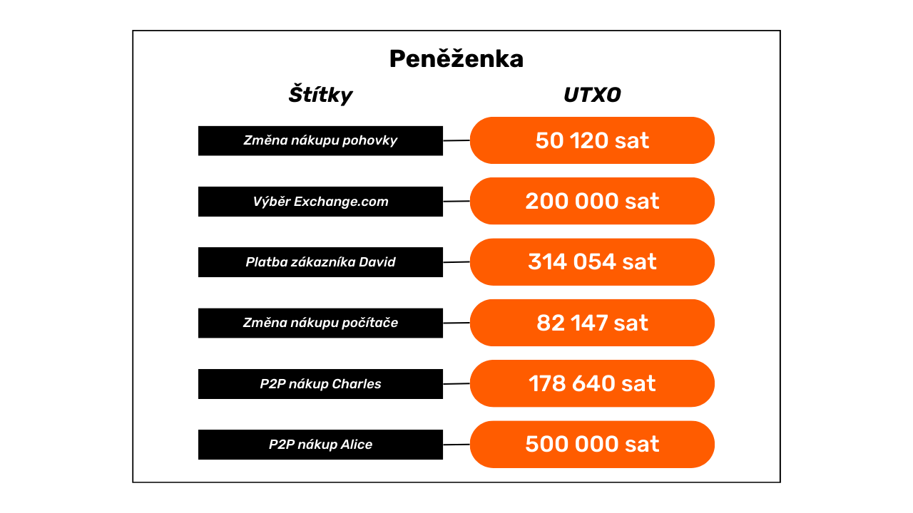

Pro zpřesnění vaší správy UTXO a dodržení vašich strategií segregace fondů v rámci vaší peněženky, byste mohli obohatit vaše označení o další ukazatel, který odráží tyto separace. Pokud vaše peněženka obsahuje dvě kategorie UTXO, které nechcete míchat, mohli byste do vašich označení integrovat značku pro jasné rozlišení těchto skupin. Tyto značky separace budou záviset na vašich vlastních kritériích, jako je rozlišení mezi UTXO z procesu akvizice, který zahrnuje KYC, nebo mezi profesionálními a osobními fondy. Převzaté příklady označení by se mohly přeložit na:

- `KYC - Výběr Exchange.com`;
- `KYC - Platba klient David`;
- `BEZ KYC - P2P nákup Charles`;
- `BEZ KYC - Změna z nákupu pohovky`

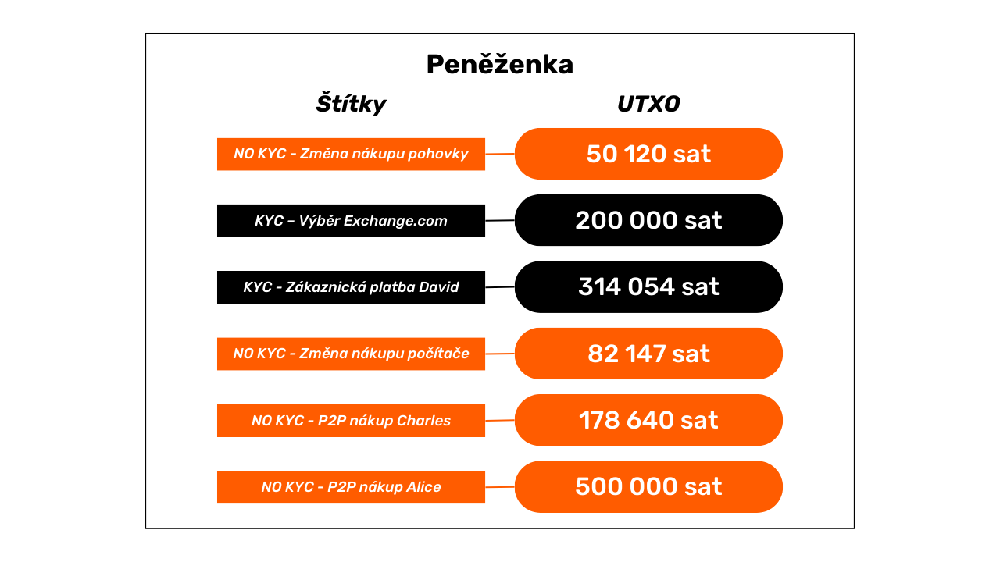
Je také doporučeno zachovávat označení mince během transakcí. Například při konsolidaci UTXO bez KYC se ujistěte, že výsledné UTXO označíte nejen jako `konsolidace`, ale konkrétně jako `konsolidace bez KYC`, aby byl jasně udržen sled původu mince.
Nakonec není nutné na štítek umisťovat datum. Většina softwaru pro peněženky již zobrazuje datum transakce a vždy je možné tuto informaci získat na prohlížeči bloků pomocí jeho TXID.

### Jak správně vybrat vaše mince?

Když provádíte transakci, kontrola mincí vám umožňuje specificky vybrat, které UTXO použít jako vstupy pro uspokojení výstupu platby. Při tomto výběru by měly být zváženy dva aspekty:

- Možnost, že příjemce platby může spojit část vaší identity s UTXO použitými jako vstupy;
- Schopnost vnějšího pozorovatele navázat spojení mezi všemi UTXO spotřebovanými jako vstupy.
  Abychom ilustrovali první bod, vezměme si konkrétní příklad. Předpokládejme, že si kupujete bagetu za bitcoiny od vašeho místního pekaře. Použijete jedno nebo více UTXO, které vlastníte jako vstupy, aby alespoň pokryly cenu bagety ve výstupech, stejně jako transakční poplatky. Váš pekař by pak potenciálně mohl spojit vaši tvář, nebo jakoukoli jinou část vaší identity, kterou zná, s mincemi použitými jako vstupy. Vědomí existence tohoto spojení by vás mohlo vést k tomu, že při platbě dáte přednost konkrétnímu UTXO před jiným.

Například, pokud jedno z vašich UTXO pochází z obchodní platformy a preferujete, aby pekař nevěděl o vašem účtu na této platformě, vyhnuli byste se použití tohoto UTXO pro platbu. Pokud vlastníte UTXO s vysokou hodnotou, které odhaluje značné množství bitcoinů, můžete se také rozhodnout jej nepoužít, aby pekař nevěděl o vašem bohatství v BTC.

Výběr UTXO k použití pro tento první bod je tedy založen na osobním rozhodnutí, ovlivněném tím, co jste ochotni odhalit nebo ne. Štítky, které jste přiřadili svým UTXO při jejich přijetí, vám pomohou vybrat ty, které po utracení odhalí pouze informace, s jejichž odhalením jste pohodlní vůči příjemci.

Kromě informací potenciálně odhalených příjemci také výběr vstupů ovlivňuje, co odhalíte všem pozorovatelům blockchainu. Skutečně, použitím více UTXO jako vstupů pro vaši transakci odhalíte, že jsou vlastněny stejnou entitou, podle heuristiky společného vlastnictví vstupu (CIOH).

Při výběru vašich mincí musíte být tedy vědomi toho, že transakce, kterou chystáte vysílat, vytvoří spojení mezi všemi použitými UTXO. Toto spojení může být problematické pro vaše osobní soukromí, zejména pokud UTXO pocházejí z různých zdrojů.

Vraťme se k příkladu mého UTXO bez KYC z Bisq; chci se vyhnout jeho kombinaci s UTXO z řekněme regulované obchodní platformy, která zná mou identitu. Pokud bych kdy použil tyto 2 UTXO jako vstupy ve stejné transakci, regulovaná platforma by byla schopna spojit mou identitu s UTXO, které jsem koupil na Bisq, zatímco předtím nebylo spojeno s mou identitou.
Nakonec, abyste správně vybrali, které UTXO použít jako vstupy pro transakci, nejdůležitější je vyhnout se použití více UTXO. Kdykoli je to možné, vyberte jednu minci, která je dostatečně velká, aby pokryla vaši platbu. Tímto způsobem se zcela vyhnete rizikům spojeným s COINJOIN. Pokud však žádné jednotlivé UTXO není dostatečné pro platbu a musíte použít několik, ujistěte se, že pocházejí z podobných zdrojů, aby se minimalizovala rizika nechtěných spojení. Také mějte na paměti, že příjemce může spojit informace, které o vás má, s historií mincí použitých jako vstupy.

### Porozumění automatickému výběru mincí

V předchozích částech jsme diskutovali o ručním výběru UTXO pro transakci. Co se ale stane, když software peněženky tento výběr provede automaticky? Existuje několik metod pro určení, které mince spotřebovat, a výběr UTXO je skutečným oborem výzkumu v Bitcoinu. Hlavním cílem tohoto automatického procesu je často minimalizovat transakční poplatky pro uživatele.

Metody výběru UTXO, jako jsou FIFO (_First In First Out_) a LIFO (_Last In First Out_), patří mezi nejjednodušší, ale také nejméně efektivní. S FIFO se nejprve použijí nejstarší mince v peněžence. Tento přístup je obecně neefektivní jak pro minimalizaci transakčních poplatků, tak pro zachování soukromí, kromě případů, kdy se používají relativní časové zámky, které je třeba pravidelně obnovovat. Naopak, LIFO dává přednost použití nejnovějších UTXO. Ačkoliv jednoduché, tyto dvě metody se často ukazují jako neefektivní.

Pokročilejší metodou je _Knapsack Solver_. Tato metoda byla používána v peněžence Bitcoin Core až do verze 0.17. Zahrnuje iterativní a náhodný výběr UTXO z peněženky, jejich sčítání do podmnožin a uchování řešení, které co nejvíce snižuje váhu transakce, aby se snížily poplatky pro uživatele.
_Branch-and-Bound_ (BNB), často přezdívaný "Murchův algoritmus" s odkazem na jeho vynálezce, nahradil _Knapsack Solver_ v Bitcoin Core od verze 0.17. Tato pokročilejší metoda si klade za cíl najít sadu UTXO, která přesně odpovídá částce potřebné k uspokojení výstupů transakce. Cílem BNB je minimalizovat množství změn i poplatků tím, že snižuje takzvané kritérium plýtvání, které zohledňuje jak okamžité náklady, tak očekávané budoucí náklady na změnu. Tato metoda vychází z původního konceptu _Branch-and-Bound_, navrženého v roce 1960 Ailsou Land a Alison Harcourt, a nabízí přesnější optimalizaci poplatků ve srovnání s _Knapsack Solver_.
Všechny tyto metody automatického výběru UTXO mohou být účinné při snižování transakčních poplatků, ale často jsou neefektivní při zachování soukromí uživatele. Tyto algoritmy skutečně mohou sloučit několik UTXO do vstupů, čímž odhalují společné vlastnictví těchto UTXO kvůli COH. Zřejmě tyto metody nemohou zohlednit štítky připojené k UTXO, které jsou klíčové pro vědomé rozhodování o tom, které mince odhalit příjemci transakce. V současné době je jediným řešením pro optimalizaci soukromí při výběru mincí provádět to ručně.

### Tutoriál k označování UTXO
  
Pokud se chcete dozvědět, jak označit své UTXO, připravili jsme kompletní návod pro hlavní dostupné Bitcoin peněženky:

https://planb.network/tutorials/privacy/utxo-labelling  

## KYC a identifikace klíčů

<chapterId>cec6b9d9-0eed-4f85-bc4e-1e9aa59ca605</chapterId>

KYC znamená "Know Your Customer" (Poznej svého zákazníka), což je regulační postup zavedený některými společnostmi působícími v sektoru Bitcoinu. Tento postup má za cíl ověřit a zaznamenat identitu jejich klientů s deklarovaným cílem boje proti praní peněz a financování terorismu.
Konkrétně KYC zahrnuje sběr různých osobních údajů od klienta, které se mohou lišit podle jurisdikcí, ale obvykle zahrnují doklad totožnosti, fotografii a důkaz bydliště. Tyto informace jsou poté ověřeny a uchovány pro budoucí použití.

Tento postup se stal povinným pro všechny regulované směnárenské platformy ve většině západních zemí. To znamená, že každý, kdo si přeje vyměnit fiat měny za bitcoin prostřednictvím těchto platforem, musí splnit požadavky KYC.
Tento postup však není bez rizik pro důvěrnost a bezpečnost uživatelů. V této kapitole podrobně prozkoumáme tato rizika a analyzujeme konkrétní dopady KYC a procesů identifikace na soukromí uživatelů Bitcoinu.

### Umožnění sledování na řetězci

Prvním rizikem spojeným s KYC je, že poskytuje privilegovaný vstupní bod pro analýzu řetězce. Jak jsme viděli v předchozí části, analytici mohou skupinovat a sledovat aktivity na blockchainu pomocí vzorců transakcí a heuristik. Jakmile se jim podaří shluknout činnost uživatele na řetězci, stačí najít jediný vstupní bod mezi všemi jejich transakcemi a klíči, aby úplně ohrozili jejich soukromí.


Když podstoupíte KYC, poskytnete velmi kvalitní vstupní bod pro analýzu řetězce, protože spojíte své přijímací adresy použité při výběru vašich bitcoinů z platformy směnárny s vaší úplnou a ověřenou identitou. Teoreticky jsou tyto informace známy pouze společnosti, které jste je poskytli, ale, jak uvidíme později, riziko úniku dat je reálné. Navíc samotný fakt, že společnost tyto informace drží, může být problematický, i když je nesdílí.

Takže pokud nepodniknete další opatření k omezení seskupování vašich aktivit na blockchainu, kdokoli, kdo je vědom tohoto vstupního bodu, kterým je KYC, může potenciálně spojit veškerou vaši aktivitu na Bitcoinu s vaší identitou. Z pohledu této společnosti tedy vaše používání Bitcoinu ztrácí veškerou důvěrnost.

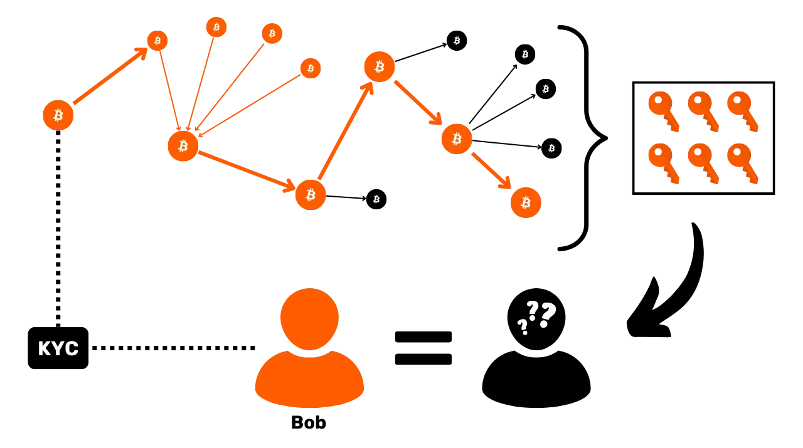

Pro ilustraci tohoto srovnáním, je to, jako by váš bankéř z _Banky X_ měl přístup nejen ke všem vašim transakcím provedeným s _Bankou X_, ale mohl by také sledovat vaše transakce s _Bankou Y_ a všechny vaše hotovostní transakce.

Pamatujte z první části tohoto školení: model soukromí Bitcoinu, jak jej navrhl Satoshi Nakamoto, spoléhá na oddělení identity uživatele od jejich páru klíčů. Ačkoli tato vrstva soukromí dnes již není dostatečná, je stále rozumné omezit její degradaci co nejvíce.

### Expozice státnímu dohledu

Druhým hlavním problémem s KYC je, že státu odhaluje, že jste v nějakém okamžiku vlastnili bitcoin. Když si koupíte bitcoiny prostřednictvím regulovaného subjektu, stát může o této držbě vědět. V současné době se to může zdát triviální, ale je důležité si pamatovat, že politická a ekonomická budoucnost vaší země není ve vašich rukou.
Především stát může rychle přijmout autoritářský postoj. Historie je plná příkladů, kdy se politiky náhle změnily. Dnes v Evropě mohou nadšenci pro Bitcoin psát články o Bitcoinu, účastnit se konferencí a spravovat své peněženky v self-custody. Ale kdo může říci, co přinese zítřek? Pokud by se Bitcoin náhle stal veřejným nepřítelem číslo jedna, být s ním spojen ve státních záznamech by mohlo být problémové.
Dále, v případě vážných ekonomických krizí, by stát mohl zvážit zabavení bitcoinů držených občany. Možná zítra budou Bitcoinisté vnímáni jako profiteři krize a budou nadměrně zdaněni kvůli svým kapitálovým ziskům v důsledku devalvace fiat měny.
Můžete si myslet, že to není problém, protože vaše bitcoiny jsou smíchány a tedy nevystopovatelné. Avšak sledování zde není problém. Skutečný problém je, že stát ví, že jste vlastnili bitcoin. Tento jednoduchý kus informace by mohl být dostatečný k vašemu obvinění nebo požadavku na účet. Můžete se pokusit tvrdit, že jste své bitcoiny utratili, ale to by mělo být odráženo ve vašem daňovém přiznání, a byli byste odhaleni. Můžete také říci, že jste své klíče ztratili při nehodě na lodi, ale mimo vtip na Twitteru, opravdu si myslíte, že by to bylo dostatečné k vašemu osvobození?

Proto je důležité zvážit riziko spojené s pouhým faktem, že stát může vědět, že jste vlastnili BTC, i když se toto riziko dnes může zdát vzdálené.

Dalším problémem, který KYC představuje z hlediska státního dohledu, je povinné hlášení regulovanými platformami. Ačkoli nejsem obeznámen s regulacemi v jiných jurisdikcích, ve Francii jsou _Poskytovatelé Služeb Digitálních Aktiv_ (PSAN) povinni hlásit finančním dozorovým orgánům jakékoli pohyby finančních prostředků, které považují za podezřelé.

Takže ve Francii v roce 2023 bylo PSANy nahlášeno 1 449 podezřelých činů. Zatím většina těchto činů souvisí s kriminalitou. Avšak úřady také požadují, aby regulované platformy hlásily jakoukoli podezřelou transakci s Bitcoinem pouze na základě její struktury. Pokud provedete spolupracující transakci, nebo dokonce jen transakci prezentující poněkud atypický vzor, a tato transakce se odehraje blízko výběru vašich bitcoinů z těchto platforem, můžete se ocitnout nahlášeni úřadům. I v nepřítomnosti jakéhokoli provinění a při legitimním výkonu vašich práv by toto hlášení mohlo vést k zvýšeným kontrolám a dohledu, nepříjemnostem, kterým byste se bez KYC vyhnuli.

### Riziko úniku osobních údajů

Dalším problémem spojeným s KYC je skutečnost, že vyžaduje uchovávání všech vašich osobních údajů na serverech soukromé společnosti. Nedávné události nám připomněly, že nikdo není imunní vůči selháním, ať už jsou finanční nebo IT. V roce 2022 zákazníci společnosti Celsius pocítili důsledky. Po bankrotu společnosti byla jména věřitelů a výše jejich aktiv zveřejněna americkým soudním systémem během správního řízení.

Přibližně před dvěma lety zažila přední kybernetická bezpečnostní entita v oblasti kryptoměn krádež osobních údajů svých klientů. Ačkoli tento incident nebyl přímo spojen s nákupem bitcoinů, takové riziko zůstává i pro směnárenské platformy. Proto existuje jasné riziko spojené s těmito osobními údaji.

Je pravda, že již svěřujeme mnoho našich osobních údajů soukromým společnostem. Avšak riziko zde je dvojí, protože tyto údaje vám nejen umožňují být identifikováni, ale jsou také spojeny s aktivitou na Bitcoinu. Skutečně, když hacker získá přístup k údajům klientů směnárenské platformy, mohou s jistotou předpokládat, že tito klienti vlastní bitcoiny. Toto riziko je tedy zvýšeno skutečností, že bitcoin, jako jakýkoli jiný cenný majetek, přitahuje zájem zlodějů.

V případě úniku dat, ve scénáři nejlepším, byste mohli být cílem cílených phishingových pokusů. V nejhorším případě byste se mohli ocitnout v centru fyzických hrozeb vašemu domovu.
Kromě specifických rizik spojených s Bitcoinem je také nutné zvážit nebezpečí spojená s přenosem dokladů totožnosti. Skutečně, v případě úniku dat, je možné stát se obětí krádeže identity. Takže sázky nejsou omezeny pouze na ochranu důvěrnosti transakcí, ale také se týkají osobní bezpečnosti každého jednotlivce.

### Běžné omyly o KYC

Je důležité vyvrátit některé běžné omyly o KYC, které se často objevují na Twitteru nebo v našich diskuzích mezi bitcoinisty.
Především je nesprávné myslet si, že ochrana soukromí pro bitcoiny získané prostřednictvím KYC (Know Your Customer) je marná. Nástroje a metody pro soukromí na Bitcoinu jsou různorodé a slouží různým účelům. Použití coinjoin transakcí na bitcoinech z KYC, například, není špatný nápad. Samozřejmě je nutné být opatrný s regulovanými obchodními platformami, aby nedošlo k zamrznutí nebo zákazu vašeho účtu, ale z čistě technického hlediska tyto praktiky nejsou nekompatibilní. Coinjoin má za následek přerušení historie mince, což vám pomáhá čelit některým rizikům analýzy řetězce spojeným s KYC. Ačkoli neeliminuje všechna rizika, již představuje významný přínos.

Soukromí na Bitcoinu by nemělo být vnímáno binárně, jako rozdíl mezi "anonymními" bitcoiny a ostatními, které nejsou. Vlastnictví bitcoinů získaných prostřednictvím KYC neznamená, že je vše ztraceno; naopak, použití nástrojů pro soukromí se může ukázat jako ještě výhodnější.

Naopak, získání bitcoinu prostřednictvím metody bez KYC nezaručuje dokonalé soukromí a nezbavuje vás potřeby podniknout další ochranná opatření. Pokud držíte bitcoin bez KYC, ale opakovaně používáte stejné přijímací adresy, vaše transakce mohou být vystopovány a seskupeny. Nejmenší spojení se světem mimo Bitcoin by mohlo ohrozit jedinou vrstvu soukromí, kterou jste měli. Proto je důležité považovat všechny nástroje a metody, které zlepšují soukromí na Bitcoinu, za doplňkové. Každá technika řeší konkrétní riziko a může přidat další vrstvu ochrany. Tedy vlastnictví bitcoinu bez KYC rozhodně nezbavuje potřeby podniknout další opatření.

### Lze KYC vrátit zpět?

Někdy se mě ptají, zda je možné "vrátit se zpět" po dokončení KYC, a jak si můžete představit z předchozích odstavců, odpověď je nuancovaná. Aby se předešlo rizikům spojeným s KYC, nejjednodušší metodou je nepoužívat jej při získávání bitcoinů. Toto téma prozkoumáme podrobněji v další kapitole. Pokud však bylo KYC již provedeno a bitcoiny byly zakoupeny, existují způsoby, jak zmírnit vzniklá rizika?

Pokud jde o riziko vystopovatelnosti vašich transakcí, použití coinjoin je řešením. Tuto metodu podrobně probereme později v školení, ale mějte na paměti, že coinjoin může přerušit historii mince a zabránit jejímu sledování z minulosti do přítomnosti a z přítomnosti do minulosti. I pro BTC získané prostřednictvím regulované platformy může tato technika zabránit jejich vystopovatelnosti.
Coinjoin sice eliminuje druhé riziko spojené s KYC, tedy fakt, že stát je informován o vašich držbách bitcoinů, ale neodstraňuje ho úplně. I když vaše coiny nejsou již sledovatelné, stát může mít v závislosti na jurisdikci přístup k vašim prohlášením o disponování s kryptoaktivy. Jelikož toto riziko není technické, ale administrativní, neexistují žádná specifická řešení pro Bitcoin, jak jej eliminovat, kromě vyhnout se původně KYC. Jediný legální způsob, jak toto riziko zmírnit, je prodat vaše bitcoiny získané prostřednictvím regulovaných platforem na regulovaných platformách a poté je znovu zakoupit prostřednictvím způsobů bez KYC. Prodejem a deklarováním disponování by administrativa měla zaznamenat, že je již nevlastníte.

Pokud jde o riziko úniku vašich osobních údajů a dokladů totožnosti, jedná se o nebezpečí vnější vůči Bitcoinu, a neexistuje technické řešení, jak se mu vyhnout. Jakmile jsou vaše údaje odhaleny, je těžké tuto operaci vrátit zpět. Můžete se pokusit zavřít svůj účet na platformě, ale to nezaručuje smazání vašich údajů KYC, zejména když je ověřování totožnosti outsourcováno. Ověření úplného smazání vašich informací je nemožné. Proto neexistuje řešení, jak toto riziko zcela předejít a zajistit, že již nebude existovat.

### Rozdíl mezi KYC a identifikací klíčů

Někdy někteří bitcoinisté rozšiřují termín "KYC" na jakoukoli výměnu BTC, která zahrnuje převod nebo platbu kreditní kartou, jelikož tyto prostředky mohou také odhalit původ platby, stejně jako by KYC. Je však důležité nesplést KYC s identifikací klíčů. Osobně musím přiznat, že mé vnímání tohoto předmětu se časem vyvíjelo.

KYC konkrétně odkazuje na regulační postup implementovaný některými společnostmi k ověření a zaznamenání identity jejich klientů. Je to binární věc: buď při získávání vašich bitcoinů podstoupíte KYC, nebo ne. Identifikace klíčů, která se týká spojení aspektu identity uživatele s onchain aktivitou, však není tak binární, ale spíše představuje kontinuum. Skutečně, v kontextu získávání nebo disponování bitcoiny, je tato identifikace vždy možná do různých stupňů.
Například, pokud si koupíte bitcoiny na regulované platformě ve Švýcarsku, KYC (Know Your Customer) není nutné. Nicméně, může dojít k identifikaci vašich klíčů, protože nákup byl proveden prostřednictvím vašeho bankovního účtu. Zde se mohou projevit první dvě rizika spojená s KYC - usnadnění sledování onchain a vystavení státnímu dohledu - také v ne-KYC výměně. Pokud švýcarská entita nahlásí podezřelé transakce úřadům ve vaší zemi, mohou jednoduše zkontrolovat bankovní účet použitý pro nákup, aby odhalili vaši identitu. Tím pádem je nákup bez KYC na regulovaných platformách poměrně vysoko na stupnici rizika pro identifikaci klíčů.


Vyhnout se regulovaným platformám a volba metod P2P (Peer-to-Peer) nákupu však neeliminuje riziko identifikace klíčů úplně, ale pouze jej snižuje. Vezměme si příklad nákupu na Bisq nebo jiné P2P platformě. Pro vyrovnání se svým protějškem pravděpodobně použijete svůj bankovní účet. Pokud úřady vyslechnou osobu, se kterou jste obchodovali, a požádají o vaše jméno, setkáváme se s riziky 1 a 2 zmíněnými dříve. Tato rizika jsou jistě mnohem nižší než při ne-KYC nákupu na platformě, a ještě více snížená než při nákupu s KYC, ale stále jsou přítomna v menší míře.


Nakonec, i když si své bitcoiny pořídíte prostřednictvím fyzické výměny za hotovost, nejste zcela anonymní. Osoba, se kterou jste obchodovali, viděla vaši tvář, což je součást vaší identity. I když je toto riziko v tomto příkladu minimální, stále existuje možnost klíčové identifikace.


Závěrem, při výměně bitcoinů za jiná aktiva, ať už jde o nákup v měně fiat nebo prodej za skutečné zboží, vždy dochází k určité formě klíčové identifikace. V závislosti na zvolené metodě výměny se tato identifikace může lišit intenzitou. Je důležité nesplést tuto identifikaci s KYC, což je dobře definovaný regulační proces. Nicméně existuje spojení mezi KYC a spektrem identifikace, protože KYC je na horním konci tohoto spektra, jelikož systematicky usnadňuje identifikaci klíčů uživatele orgány.

## Metody prodeje a nákupu

<chapterId>756598af-95aa-4c77-ac48-243c7ad89530</chapterId>

Po přečtení předchozí kapitoly se možná ptáte na způsoby, jak koupit nebo prodat bitcoin bez nutnosti podstoupit proces ověření identity, aby se předešlo rizikům spojeným s KYC. Existuje několik metod, jak provést výměny.

### Hotovostní P2P výměny

Jak jsme viděli, nejlepší metodou z hlediska soukromí zůstává P2P (peer-to-peer) výměna s vyrovnáním v hotovosti. Tato metoda vám umožňuje minimalizovat zanechané stopy a výrazně snížit možnost klíčové identifikace, ať už jste kupující nebo prodávající.


Tato praxe však nese rizika pro osobní bezpečnost. Hlavní nebezpečí spočívá v tom, že během výměny protistrana ví, že držíte významnou částku, ať už v hotovosti nebo v bitcoinech. Tyto informace mohou přitáhnout pozornost zákeřných jedinců. Obecně se doporučuje být diskrétní ohledně vašeho držení bitcoinů. Tato rada by se dala aplikovat i na hotovost. Nicméně během osobní výměny je nevyhnutelné odhalit, že vlastníte bitcoiny, což může vyvolat chtivost.


Aby se toto riziko omezilo, doporučuji dávat přednost hotovostním transakcím s důvěryhodnými osobami, jako jsou členové rodiny nebo blízcí přátelé. Alternativně byste mohli zvážit účast na [místních setkáních Bitcoinu](https://btcmap.org/communities/map), po několika návštěvách. To vám umožní lépe poznat ostatní účastníky a nebýt během fyzické výměny sami. Je však důležité si uvědomit, že hotovostní P2P výměna v sobě nese rizika pro vaši osobní bezpečnost, která při nákupu prostřednictvím regulované platformy a vašeho bankovního účtu neexistují.

Navíc, v závislosti na tom, kde žijete, může nošení a skladování velkých částek peněz představovat rizika, ať už jde o bitcoiny nebo hotovost.

Hotovostní výměna může také představovat právní rizika během policejních kontrol nebo jiných. Ačkoli ve většině zemí neexistuje omezení množství hotovosti, kterou můžete nosit s sebou, příliš velké částky mohou vzbudit podezření. Buďte tedy opatrní, zejména pokud musíte cestovat na dlouhé vzdálenosti, a vyhněte se příliš velkým transakcím najednou, abyste nemuseli odůvodňovat držení významných částek.
Nakonec, další nevýhodou nákupů P2P je, že cena je často vyšší než ta, která je pozorována na regulovaných platformách. Prodejci často ukládají přirážku v rozmezí od 1% až po někdy více než 10%. Několik důvodů vysvětluje tento cenový rozdíl. Zaprvé, je to běžná praxe mezi prodejci P2P, která byla zavedena v průběhu času. Dále mají prodejci transakční poplatky spojené s odesíláním finančních prostředků kupujícímu. Také je zde zvýšené riziko krádeže u prodejů P2P ve srovnání s transakcemi na platformách, což odůvodňuje kompenzaci za podstoupené riziko. Nakonec může být přirážka spojena s poptávkou a kvalitou výměny z hlediska soukromí. Jako kupující má zisk na soukromí cenu, která se odráží v přirážce aplikované prodejcem. Někteří bitcoinisté také věří, že zvýšená cena BTC zakoupeného v P2P odráží jeho skutečnou hodnotu a tvrdí, že nižší ceny na regulovaných platformách jsou výsledkem kompromisu ohledně soukromí vašich osobních údajů.

### P2P Výměny prostřednictvím shromažďovací platformy

Méně rizikovou alternativou z hlediska osobní bezpečnosti je provádět P2P výměny výhradně online, prostřednictvím elektronických platebních metod, jako jsou PayPal, bankovní převody nebo Revolut.

Tento přístup pomáhá vyhnout se mnoha rizikům spojeným s hotovostními transakcemi. Nicméně riziko, že protistrana nesplní své závazky během online výměny, je větší. Skutečně, během fyzické výměny, pokud předáte peníze prodejci, který vám na oplátku nepošle bitcoiny, můžete ho okamžitě zodpovědně držet, protože je před vámi. Online, na druhou stranu, je často nemožné najít osobu, která vás okradla.

K zmírnění tohoto rizika je možné využít platformy specializované na shromažďování pro P2P výměny. Tyto platformy používají mechanismy řešení konfliktů k ochraně poškozených uživatelů. Obecně nabízejí systém escrow, kde jsou bitcoiny drženy, dokud prodejce nepotvrdí platbu fiat měnou.

Z hlediska osobní bezpečnosti je tato metoda nákupu výrazně bezpečnější než fyzické hotovostní výměny. Nicméně, jak bylo zmíněno dříve, online P2P výměny zanechávají více stop než fyzická výměna, což může být na škodu soukromí na Bitcoinu. Použitím online fiat platební metody, jako je banka, vystavujete více informací, které by mohly usnadnit identifikaci klíčů.

Jednou znovu doporučuji neuskutečňovat velké výměny v jedné transakci na těchto platformách. Rozdělením vašich transakcí rozptylujete rizika spojená s potenciální krádeží ze strany protistrany.
Opět se ukazuje, že další nevýhodou nákupů P2P je, že cena je často vyšší než ta, kterou vidíme na regulovaných platformách. Prodejci často přidávají marži v rozmezí od 1 % až po někdy více než 10 %. Existuje několik důvodů, které tento cenový rozdíl vysvětlují. Zaprvé, je to běžná praxe mezi prodejci P2P, která byla zavedena v průběhu času. Dále mají prodejci transakční poplatky spojené s odesíláním finančních prostředků kupujícímu. Také je zde zvýšené riziko krádeže u prodejů P2P ve srovnání s transakcemi na platformách, což odůvodňuje kompenzaci za podstoupené riziko. Nakonec může být přirážka spojena s poptávkou a kvalitou výměny z hlediska soukromí. Jako kupující má zisk na soukromí cenu, která se odráží v marži, kterou prodejce uplatňuje. Někteří bitcoinisté také věří, že zvýšená cena BTC zakoupeného P2P odráží jeho skutečnou hodnotu a tvrdí, že nižší ceny na regulovaných platformách jsou výsledkem kompromisu ohledně soukromí vašich osobních údajů.


Pokud jde o řešení, osobně jsem vždy používal [Bisq](https://bisq.network/) a jsem s ním velmi spokojen. Jejich systém je dobře zavedený a zdá se být spolehlivý. Bisq je však dostupný pouze na PC a jeho rozhraní může být pro začátečníky příliš složité. Další nevýhodou je, že Bisq funguje pouze s onchain transakcemi, což může být nákladné během období vysokých transakčních poplatků na Bitcoinu.

[-> Objevte náš tutoriál na Bisq.](https://planb.network/en/tutorials/exchange/bisq)

Pro jednodušší možnost můžete vyzkoušet [Peach](https://peachbitcoin.com/), mobilní aplikaci, která usnadňuje spojení mezi kupujícími a prodejci s integrovaným systémem řešení sporů. Proces je intuitivnější než u Bisq.

[-> Objevte náš tutoriál na Peach.](https://planb.network/en/tutorials/exchange/peach-wallet)
Další online možností je [HodlHodl](https://hodlhodl.com/), dobře zavedená platforma, která nabízí dobrou likviditu, ačkoli jsem ji osobně netestoval.
[-> Objevte náš tutoriál na HodlHodl.](https://planb.network/en/tutorials/exchange/hodlhodl)

Pro řešení založená na Lightning Network můžete vyzkoušet [RoboSats](https://learn.robosats.com/) a [LNP2PBot](https://lnp2pbot.com/). RoboSats je přístupný přes webové stránky a je relativně jednoduchý na použití. LNP2PBot je atypičtější, protože funguje prostřednictvím systému výměny na aplikaci pro zasílání zpráv Telegram.

[-> Objevte náš tutoriál na RoboSats.](https://planb.network/en/tutorials/exchange/robosats)
[-> Objevte náš tutoriál na LNP2PBot.](https://planb.network/en/tutorials/exchange/lnp2pbot)


### Regulované platformy bez KYC

V závislosti na zemi, ve které žijete, můžete mít přístup k regulovaným platformám, které nevyžadují proceduru KYC pro nákup nebo prodej bitcoinů. Ve Švýcarsku můžete například používat platformy jako [Relai](https://relai.app/) a [MtPelerin](https://www.mtpelerin.com/).

[-> Objevte náš tutoriál na Relai.](https://planb.network/en/tutorials/exchange/relai)
Jak jsme viděli v předchozí kapitole, tento typ platformy vás ušetří rizik spojených s postupy KYC, ale představují vyšší úroveň rizika pro klíčovou identifikaci. Pokud jde o soukromí na Bitcoinu, tyto platformy tedy nabízejí lepší ochranu než metody nákupu s KYC, ale nejsou tak zajímavé jako P2P burzy.
Nicméně, pokud jde o osobní bezpečnost, používání těchto platforem je výrazně méně rizikové než P2P burzy. Jsou také často jednodušší na používání než platformy, které usnadňují P2P výměny.

### Bankomaty

Další možností pro nákup nebo prodej bitcoinů bez KYC jsou kryptoměnové bankomaty (ATM). Osobně jsem nikdy neměl příležitost tuto možnost vyzkoušet, protože v mé zemi nejsou žádné. Ale tato metoda může být velmi zajímavá v závislosti na tom, kde žijete.


Problém s bankomaty je, že v některých zemích jsou zakázány nebo v jiných silně regulovány. Pokud bankomat vyžaduje proces ověření identity, pak čelí stejným rizikům jako ty, která jsou vlastní regulovaným platformám KYC. Nicméně, pokud bankomat umožňuje transakce bez ověření identity pro malé částky, pak jeho použití může nabídnout úroveň soukromí srovnatelnou s hotovostní P2P výměnou, při současném vyhnutí se většině rizik spojených s tímto typem výměny.
Hlavní nevýhodou bankomatů jsou často vysoké poplatky za výměnu, které se pohybují od několika procent až po někdy 15% z vyměněné částky.

### Dárkové karty

Nakonec jsem chtěl představit řešení, které dobře funguje pro ty, kteří chtějí používat své bitcoiny na denní bázi pro nákupy místo jejich prodeje za fiat měny.

Nejlepší způsob, jak utratit BTC, je samozřejmě použít Bitcoin přímo nebo Lightning Network pro nákup zboží nebo služeb. Nicméně, v mnoha zemích je počet obchodníků přijímajících bitcoin omezený. Praktickou alternativou je pak použití dárkových karet.

Několik platforem, které nevyžadují postup KYC, nabízí možnost výměny bitcoinů za dárkové karty, které lze použít ve velkých obchodech. Mezi tyto platformy patří [CoinsBee](https://www.coinsbee.com/), [The Bitcoin Company](https://thebitcoincompany.com/), a [Bitrefill](https://www.bitrefill.com/). Tyto platformy velmi usnadňují každodenní používání vašich bitcoinů tím, že vám umožňují přístup k široké škále produktů a služeb bez nutnosti konverze do fiat měny.


### Další metody získání

Mezi další metody získání bitcoinů při ochraně vašeho soukromí patří samozřejmě těžba. Pro zahájení těžby sats není nutné odhalovat vaši identitu; stačí najít platný důkaz práce a odeslat jej do sítě. Pokud se rozhodnete pro těžbu v poolu, některé pooly vyžadují formu identifikace, jako je KYC, zatímco jiné ne.

Další metoda spočívá v práci výměnou za bitcoiny. Tato metoda získání může být zajímavá, ale stupeň vyžadované identifikace se velmi liší v závislosti na okolnostech.

\_K napsání této kapitoly jsem využil kurz [BTC205](https://planb.network/fr/courses/btc205) vytvořený [@pivi\_\_\_](https://x.com/pivi___) na PlanB Network (zatím dostupný pouze ve francouzštině).\_

## Konsolidace, Správa UTXO a CIOH

<chapterId>d0486c8f-332d-402b-ae2e-949416752b9c</chapterId>

Jedním z nejsložitějších aspektů, které musíte řídit, když máte vlastní peněženku se samoobslužnou správou, je nepochybně konsolidace. Měli byste konsolidovat? Jaký je účel? Jakou velikost UTXO byste měli cílit? Jaké jsou kompromisy z hlediska soukromí? To je to, co se pokusíme prozkoumat v této sekci.

### Co je konsolidace?

Provoz Bitcoinu je podobný aukčnímu trhu, kde transakce nabízející nejlepší poplatky jsou těžaři upřednostňovány. Každý blok však má maximální váhu, což omezuje počet transakcí, které lze zahrnout. Jelikož je blok vytvořen průměrně každých 10 minut, dostupný prostor v každém bloku je vzácným zdrojem.

Těžaři, jejichž činnost přináší významné náklady na elektřinu, kapitál a údržbu, se přirozeně snaží maximalizovat svou ziskovost. Mají tendenci upřednostňovat transakce, které jim nabízejí nejvíce poplatků v poměru k jejich váze.

Skutečně, ne všechny Bitcoinové transakce váží stejně. Ty s více vstupy a výstupy budou vážit více. Například zvažte 2 transakce:

- Transakce A zahrnuje 1 vstup a 1 výstup. Přiděluje 1 994 satoshi poplatků a její váha je 141 vB;
- Transakce B, složitější, se 2 vstupy a 2 výstupy, přiděluje 2 640 satoshi poplatků za váhu 220 vB.


V tomto příkladu, ačkoliv transakce B navrhuje celkově vyšší poplatky, těžaři upřednostní transakci A, protože nabízí lepší poměr mezi poplatky a váhou. Zde je výpočet pro každou transakci, vyjádřený v satoshi na virtuální byte (sat/vB):

```text
TXA: 1994 / 141 = 14 sat/vB

TXB: 2640 / 220 = 12 sat / vB
```

To znamená, že pro každou jednotku váhy nabízí transakce A více poplatků než transakce B, i když ta druhá nabízí více poplatků v absolutní hodnotě.


Proto je pro uživatele vždy zajímavější spotřebovat co nejméně vstupů ve svých transakcích. Je však nutné spotřebovat dostatečné množství, aby bylo možné uspokojit platbu na výstupu. Při správě své peněženky musí mít tedy dostatečně velké UTXO.

Princip konsolidace spočívá přesně v tom, využít období, kdy jsou poplatky za Bitcoin nízké, k sloučení malých UTXO do jednoho většího. Tím, když poplatky za Bitcoin vzrostou, lze provádět transakce s minimem vstupů a tedy utratit méně v absolutních poplatcích. Cílem je plánovat povinné transakce během období vysokých poplatků.

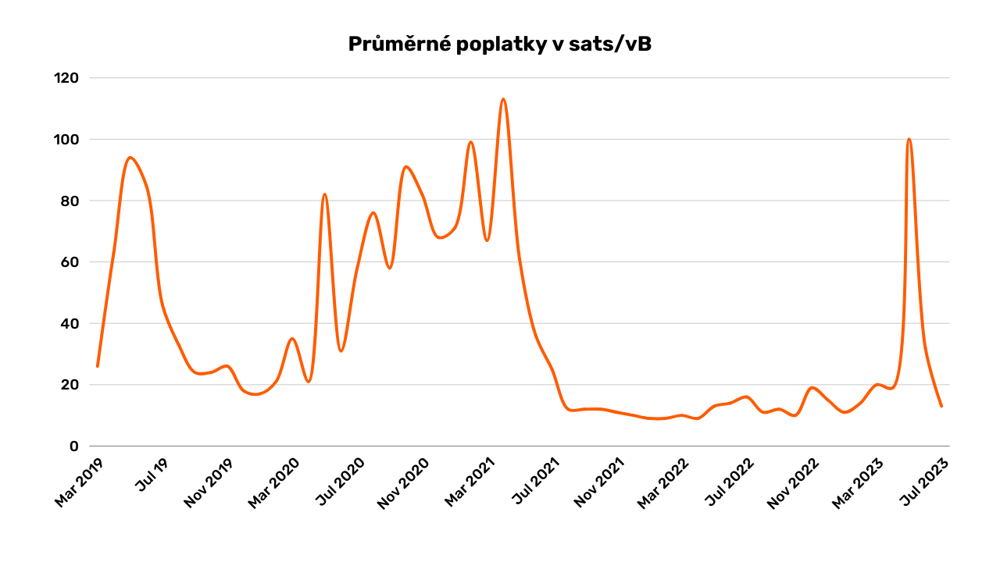
Kromě úspor na transakčních poplatcích pomáhá konsolidace UTXO také zabránit vzniku "prachu". Prach odkazuje na UTXO, jejichž hodnota v satoshi je tak nízká, že nestačí na pokrytí nezbytných transakčních poplatků k jejich utracení. To činí tyto UTXO ekonomicky neracionální k použití, dokud zůstanou transakční poplatky vysoké. Proaktivním seskupováním vašich UTXO zabráníte jejich proměně v prach, čímž zajistíte, že všechny vaše prostředky zůstanou použitelné.

### Jaká je minimální velikost vašich UTXO?

Někdy se mě ptají, jaká je doporučená minimální hodnota pro UTXO. Bohužel, neexistuje univerzální odpověď, protože to závisí na vašich preferencích a tržních podmínkách pro poplatky. Zde je však vzorec, který vám může pomoci určit práh vhodný pro vaše potřeby:

$$
\frac {P \times F}T = M
$$

Kde:

- $P$ je váha transakce;
- $F$ reprezentuje maximální sazbu poplatku ve satoshi za vbyte (sats/vB), proti které se pojistíte;
- $T$ je procento transakčního poplatku, které jste ochotni zaplatit ve vztahu k celkové hodnotě UTXO;
- $M$ je minimální částka ve satoshi pro každé UTXO.

Předpokládejme, že plánujete pokrýt poplatky za standardní SegWit transakci s 1 vstupem a 2 výstupy, vážící 141 vB. Pokud pokryjete až 800 sats/vB, a jste ochotni utratit až 12% hodnoty UTXO na poplatcích jako maximum, pak výpočet bude:

$$
\frac{141 \times 800}{0.12} = 940\ 000
$$

V tomto příkladu by bylo moudré udržovat minimální hodnotu 940 000 sats pro UTXO ve vaší peněžence.

### Konsolidace a COIH

Jedna z nejčastěji používaných heuristik v analýze blockchainu je COIH (_Common Input Ownership Heuristic_), která umožňuje předpokládat, že všechny vstupy bitcoinové transakce patří téže entitě. Přesněji, princip konsolidace spočívá ve spotřebování několika UTXO jako vstupů a vytvoření jediného UTXO jako výstupu. Konsolidace tedy umožňuje aplikaci COIH.


V praxi to znamená, že vnější pozorovatel může usoudit, že všechna konsolidovaná UTXO pravděpodobně patří téže osobě a že jediný vygenerovaný výstup jim také patří. Tato situace může ohrozit vaše soukromí spojením různých historií transakcí. Představme si, že konsoliduji 3 UTXO získané P2P s UTXO získaným prostřednictvím platformy vyžadující KYC:


Tímto způsobem může jakákoli entita s přístupem k datům burzy, včetně potenciálně vládních agentur, identifikovat, že vlastním další částky v BTC. Dříve tyto UTXO nebyly přímo spojeny s mou identitou; nyní jsou. Navíc to všem zdrojům odhaluje, že mám v držení určité množství bitcoinů.

Při správě UTXO se ekonomické úvahy, které tlačí na konsolidaci za účelem snížení poplatků, střetávají s dobrými praktikami soukromí, které by doporučovaly vaše UTXO nikdy nesloučit. Volba mezi ekonomií a soukromím tedy závisí na prioritách každého uživatele.

Pokud se můžete vyhnout konsolidaci a přitom udržet významné velikosti UTXO, je to ideální. K tomu optimalizujte metody získávání. Pokud kupujete své bitcoiny metodou DCA, snažte se co nejvíce rozložit jednorázové nákupy, abyste hodnotu seskupili do menšího počtu UTXO. Bude snazší spravovat jednorázový nákup za 1 000 € každé 2 měsíce, než nákup za 120 € každý týden. To minimalizuje počet generovaných UTXO a zjednodušuje správu vaší peněženky při zachování vašeho soukromí.
Pokud se ocitnete v situaci, kdy potřebujete konsolidovat své bitcoiny, dávejte přednost konsolidaci UTXO ze stejného zdroje. Například sloučení 10 UTXO z jedné platformy ovlivní vaše soukromí méně než smíchání 5 UTXO z platformy A s 5 UTXO z platformy B. Pokud je konsolidace z různých zdrojů nevyhnutelná, snažte se je oddělit podle jejich charakteristik. Například skupinu UTXO získaných prostřednictvím KYC seskupte do jedné transakce a ty získané v P2P do jiné.
V každém případě si pamatujte, že jakákoli konsolidace nevyhnutelně vede ke ztrátě soukromí. Proto pečlivě zvažte nutnost této operace a potenciální dopady na vaše soukromí, přičemž vezměte v úvahu riziko.

## Další dobré postupy

<chapterId>b5216965-7d13-4ea1-9b7c-e292966a487b</chapterId>

Pojďme společně prozkoumat některé další dobré postupy, které vám mohou pomoci optimalizovat vaše soukromí na Bitcoinu.

### Plný Uzel

Vlastnit své bitcoiny ve vlastní správě je dobré, ale používat vlastní plný uzel je lepší! Zde je důvod, proč je mít vlastní uzel klíčový pro plně suverénní používání Bitcoinu:

- **Odolnost proti cenzuře**: Vaše transakce nemůže blokovat nikdo;
- **Nezávislost na třetích stranách**: Už nezávisíte na žádné externí službě pro ověřování dat blockchainu;
- **Aktivní účast**: Máte možnost nastavit vlastní validační pravidla a přímo se podílet na konsensu;
- **Příspěvek k síti**: Provozováním uzlu pomáháte posilovat a distribuovat síť Bitcoinu;
- **Technické vzdělání**: Správa plného uzlu je vynikajícím způsobem, jak prohloubit vaše technické znalosti o Bitcoinu.

Kromě těchto výhod také používání plného uzlu zlepšuje vaše soukromí při vysílání vašich transakcí. Když vytvoříte transakci, je nejprve vytvořena a podepsána prostřednictvím vaší peněženky. Aby bylo možné ji vysílat do sítě Bitcoin, musí být známa alespoň jedním uzlem. Používáním vlastního uzlu přímo kontrolujete toto vysílání, čímž zvyšujete své soukromí a omezujete rizika úniku dat.


Pokud nemáte vlastní Bitcoin uzel, budete nuceni použít uzel třetí strany, například ten, který nabízí poskytovatel vašeho softwaru pro peněženku. Kromě vysílání transakcí vaše peněženka vyžaduje přístup k různým informacím, jako jsou čekající transakce, zůstatky spojené s vašimi adresami nebo počet potvrzení pro vaše transakce. Pro přístup ke všem těmto datům potřebujete dotazovat uzel.


Hlavním rizikem, pokud nepoužíváte vlastní Bitcoin uzel, je, že operátor uzlu třetí strany může sledovat vaše aktivity na blockchainu nebo dokonce sdílet tyto informace s jinými subjekty. Aby se toto riziko omezilo, meziřešením je použití softwaru pro peněženku, který umožňuje maskovat vaše spojení přes Tor. To může snížit expozici vašich dat. Nicméně optimálním řešením zůstává mít vlastní Bitcoin uzel a používat ho pro vysílání vašich transakcí. Samozřejmě budete také muset zajistit, aby z vašeho uzlu neunikaly žádné informace, ale to je další téma, které prozkoumáme v následujících sekcích.
Kromě zřejmé výhody pro vaše soukromí, vlastnictví vlastního full node také zajišťuje pravdivost dat na blockchainu, chrání proti cenzuře a umožňuje vám aktivně se podílet na správě Bitcoinu. Používáním vlastního uzlu přispíváte svou ekonomickou váhou do řetězce vaší volby, což je důležité během konfliktů v komunitě, jako byl například Blocksize War od roku 2015 do 2017. V případě forku by použití uzlu třetí strany mohlo vést k podpoře řetězce, který si nepřejete favorizovat, jelikož operátor uzlu za vás dělá volbu. Jak můžete pochopit, v zájmu soukromí a širší individuální suverenity je nezbytné provozovat a používat vlastní full node!

### Obcházení heuristik analýzy

Širší pochopení heuristik, o kterých jsme mluvili v předchozí části, je důležité, aby bylo možné je lépe obcházet nebo oklamat. Přijetí série dobrých praktik může být prospěšné, i když nejsou nezbytné. Nabízejí další vrstvu ochrany, která může být důležitá pro udržení dobrého soukromí při používání Bitcoinu.

První radou, kterou bych mohl dát, je začlenit se do nejhustšího davu. Na Bitcoinu to znamená používat nejvíce přijímané skriptovací vzory. Například skripty P2WSH, často používané pro konfigurace SegWit V0 multisig, jsou velmi vzácné. Nedovolují vám skrýt se v velké anonymní skupině. Totéž platí pro staré modely jako P2PKH nebo P2SH. Ačkoli jsou široce přítomné v UTXO setu, pro nové transakce se používají čím dál méně.

Obecně je bezpečnější obrátit se k nejnovějšímu skriptovacímu standardu, pokud je dostatečně přijatý. Takže, pokud bych v roce 2022 nedoporučil používání P2TR (Taproot) kvůli jeho nízkému přijetí, do roku 2024 bych doporučil volit tento typ skriptu, nebo v případě potřeby skript SegWit V0, jelikož počet transakcí používajících P2TR začíná představovat velmi významnou část.


Zdroj: [txstats.com](https://txstats.com/d/000000054/utxo-set-repartition-by-output-type)
Dalším tipem pro zachování vašeho soukromí je pokusit se obejít interní heuristiky transakcí. Například při provádění platby byste se měli pokusit vyhnout vytvoření výstupu s kulatou částkou, protože to by mohlo signalizovat, že druhý výstup představuje změnu. Pokud potřebujete poslat 100k sats příteli, zvažte převod mírně vyšší částky, abyste se vyhnuli této heuristice. Podobně se snažte nevytvářet výstupy změny, které jsou nepřiměřeně vysoké ve srovnání s provedenou platbou, protože to by také mohlo odhalit, který z výstupů představuje změnu.


Nakonec, pokud pravidelně provádíte transakce Bitcoinem, ujistěte se, že je nevysíláte vždy ve stejných časech. Rozložením vysílání vašich transakcí během dne a týdne se vyhnete poskytnutí možnosti vnějším pozorovatelům detekovat časový vzor založený na časových pásmech, který by mohl zlepšit jejich analýzu.

Kromě všech těchto dobrých praktik, které je třeba denně dodržovat, existují ještě účinnější metody, jak úplně přerušit sledovatelnost vašich bitcoinů. Mezi nimi jsou samozřejmě transakce coinjoin, které podrobně prozkoumáme v následující části.

# Porozumění transakcím Coinjoin

<partId>6d0bbf16-3714-4db1-9897-2d45019f6bdc</partId>

## Co je transakce Coinjoin?

<chapterId>0862bc6b-1c48-4aa4-b76d-4f547b469008</chapterId>

Po studiu základů ochrany soukromí se nyní budeme zabývat sofistikovanějšími technikami zaměřenými na aktivní obranu vašeho soukromí, zejména prostřednictvím disociace historie vašich bitcoinů. V následující části prozkoumáme mnoho malých technik, ale nejprve bych vám chtěl mluvit o coinjoin.

Coinjoin je často považován za nejúčinnější metodu ochrany soukromí uživatelů Bitcoinu. Ale co přesně je transakce coinjoin? Pojďme to zjistit společně.

### Základní principy Coinjoin

Coinjoin je technika, která narušuje sledovatelnost bitcoinů na blockchainu. Spoléhá na kolaborativní transakci se specifickou strukturou stejného názvu: transakce coinjoin.
Jak jsme viděli v prvních částech tohoto školení, transakce na Bitcoinu jsou známé všem uživatelům prostřednictvím jejich uzlu. Je tedy snadné ověřit řetězec elektronických podpisů každé mince a pozorovat její historii. To znamená, že všichni uživatelé mohou pokusit analyzovat transakce ostatních uživatelů. V důsledku toho je anonymita na úrovni transakce nemožná. Anonymita je však zachována na úrovni individuální identifikace. Na rozdíl od tradičního bankovního systému, kde je každý účet spojen s osobní identitou, na Bitcoinu jsou finanční prostředky spojeny s páry kryptografických klíčů (nebo skripty), čímž uživatelům nabízí formu pseudonymity za kryptografickými identifikátory.


Důvěrnost na Bitcoinu je ohrožena, když vnější pozorovatelé dokážou spojit konkrétní UTXO s identifikovanými uživateli. Jakmile je tato asociace stanovena, stává se možné sledovat jejich transakce a analyzovat historii jejich bitcoinů. Coinjoin je přesně technika vyvinutá k narušení sledovatelnosti UTXO, aby nabídla určitou úroveň důvěrnosti uživatelům Bitcoinu na úrovni transakce.

Coinjoin zvyšuje důvěrnost uživatelů Bitcoinu tím, že komplikuje analýzu řetězce pro vnější pozorovatele. Jejich struktura umožňuje sloučení několika mincí od různých uživatelů do jedné transakce, čímž se zaměňují stopy a ztěžuje se určení vztahů mezi vstupními a výstupními adresami.

Je důležité pochopit, že cílem transakce coinjoin je narušit historii mince. Tato technika neposkytuje trvalou anonymitu ani definitivně neblokuje sledování bitcoinů, na rozdíl od toho, co by si někdo mohl myslet. Coinjoin má za cíl pouze narušit historii v bodě, kde je transakce coinjoin provedena. Nicméně, před a po této operaci, zůstává mince vystavena stejným rizikům soukromí.


### Jak fungují coinjoiny?

Princip coinjoinu spočívá v kolaborativním přístupu: několik uživatelů, kteří si přejí smíchat své bitcoiny, vloží identické částky do vstupů stejné transakce. Tyto částky jsou pak redistribuovány ve výstupech stejných hodnot každému uživateli.


Na konci transakce se stává nemožným spojit konkrétní výstup s známým uživatelem na vstupu. Mezi vstupy a výstupy neexistuje přímá spojitost, což narušuje asociaci mezi uživateli a jejich UTXO, stejně jako historii každé mince.


Pojďme si vzít příklad Alice. Chce poslat své sestře Eve k narozeninám přibližně 100 000 satoshi (sats). Alice však nechce, aby Eve mohla sledovat historii jejích transakcí, protože nechce odhalit, kolik bitcoinů vlastní nebo jak je získala. Aby toho dosáhla, rozhodne se Alice přerušit historii svého UTXO pomocí transakce coinjoin. Organizuje spolupráci s Bobem, Charlesem, Davidem a Frankem, aby provedli společnou transakci: - Alice, Bob, Charles, David a Frank každý vloží UTXO o velikosti 105 000 sats (s 5 000 sats na těžební poplatky) jako vstupy pro transakci:


- Jako protihodnotu za použití těchto vstupů každý generuje novou adresu pro vytvoření pěti identických výstupů po 100 000 sats každý. Každý získá jeden výstup:


- Alice skončí s UTXO o velikosti 100 000 sats, jejíž historie je smíšená. Toto UTXO použije v nové transakci, aby poslala částku Eve k narozeninám:


- Pokud se Eve pokusí analyzovat tuto transakci, aby získala informace, setká se s coinjoin transakcí zahrnující Alice, Boba, Charlese, Davida a Franka. Kvůli uniformitě částek nebude schopna rozlišit, který vstup patří komu, a tudíž nemůže sledovat historii Aliceina UTXO ani určit, kolik bitcoinů její sestra vlastní nebo jak je získala:


V tomto scénáři Alice použila techniku coinjoin, aby zvýšila své soukromí proti retrospektivní analýze. Skutečně, Alice se chrání proti možné analýze od Eve, která by začala od konkrétní transakce a sledovala historii UTXO zpětně. Tato ochrana proti analýze od současnosti do minulosti je to, co nazýváme retrospektivní anonset. Tento koncept prozkoumáme podrobněji v posledních kapitolách této části.

Coinjoin však také nabízí možnost zvýšit soukromí proti analýze z minulosti do současnosti, což se označuje jako perspektivní anonset. Vraťme se k našemu příkladu, kde Alice poslala Eve 98 000 sats k narozeninám, ale s obrácenými rolemi. Představme si nyní, že o své soukromí se obává Eve. Skutečně, Alice by mohla být pokušena sledovat minci, kterou poslala Eve, aby získala informace. Eve by mohla tento právě obdržený UTXO konsolidovat se všemi svými ostatními UTXO, což by Alice mohlo odhalit, kolik bitcoinů drží ve své peněžence. Aby se tomu vyhnula, může také Eve přerušit historii mince, kterou právě obdržela.

- Eve, Grace, Mallory, Oscar a Victor každý vloží UTXO o velikosti 98 000 sats jako vstupy do Bitcoinové transakce:
  

- Jako protihodnotu za použití těchto vstupů každý poskytne novou adresu pro vytvoření 5 výstupů po 97 500 sats každý, dokonale rovné. Každý uživatel získá výstup:


- Eve nyní drží UTXO o velikosti 97 500 sats s přerušenou historií. Může jej bez obav použít pro budoucí transakce. Skutečně, pokud se Alice pokusí sledovat bitcoiny, které poslala Eve, narazí na coinjoin transakci. Nebude schopna určit, které výstupní UTXO patří Eve. Analýza se pak stává nemožnou:


V prvním příkladu jsme viděli, jak coinjoin může chránit soukromí mince ve vztahu k její minulosti a ve druhém příkladu, jak může také zabezpečit historii mince ve vztahu k její budoucnosti. Proto jsem zmínil, že coinjoin by měl být vnímán jako jednorázová událost, která segmentuje historii mince v obou směrech:


### Míchání, coinjoins, mixéry... Jaký je rozdíl?

Pojem "míchání" je někdy používán k popisu coinjoins, termín, který někteří bitcoinisté odmítají, protože se obávají záměny s custodial mixéry. Nicméně si myslím, že tato obava je neopodstatněná, protože v matematickém kontextu coinjoin přesně ztělesňuje koncept míchání.

V obecném poli matematiky se míchání vztahuje na vlastnost dynamického systému, kde po určité době mohou být všechny části počátečního prostoru teoreticky smíchány s jakoukoliv jinou částí. Míchání naznačuje, že pozice částice nebo stav systému se vyvíjí takovým způsobem, že jeho budoucí distribuce je nezávislá na jeho počáteční distribuci, čímž dosahuje stavu, kde jsou charakteristiky počátečního stavu rovnoměrně rozloženy po celém prostoru systému. To je přesně to, co se děje v coinjoinu s bitcoiny. Tedy podle mého názoru je coinjoin skutečně metodou míchání mincí.

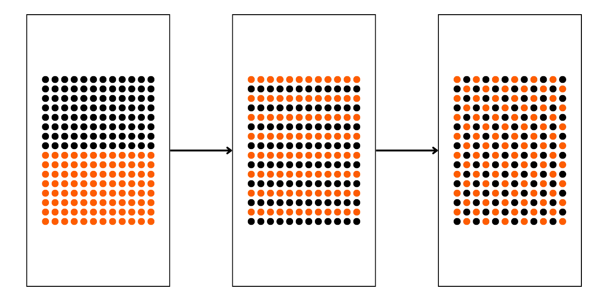

Je však důležité rozlišovat coinjoin od mixérů. Mixér je služba, kam uživatelé posílají své bitcoiny k míchání. Tyto služby byly populární během 2010s, ale jejich používání kleslo kvůli dvěma hlavním nevýhodám ve srovnání s coinjoin:

- Vyžadují, aby uživatel vzdal se během míchacího procesu opatrovnictví nad svými finančními prostředky, což je vystavuje riziku krádeže;
- Neexistuje záruka, že mixér nezaznamenává podrobnosti transakcí, nebo dokonce neprodává tyto informace společnostem provádějícím analýzu řetězce.
  

V současnosti proto uživatelé dávají přednost coinjoinu, protože jim to umožňuje udržet plnou kontrolu nad svými finančními prostředky během celého procesu. Účastníci coinjoinu nemají riziko, že by jejich bitcoiny byly ukradeny jinými zúčastněnými stranami. Pojďme společně prozkoumat, jak je to všechno možné v další kapitole.

## Zerolink a Chaumian Coinjoins

<chapterId>326c9654-b359-4906-b23d-d6518dd5dc3e</chapterId>

Soukromí poskytované coinjoinem je získáno na velikosti skupiny, ve které je náš kus skryt. Proto je nutné najít co nejvíce účastníků. Je zcela možné provést coinjoin ručně, s uživateli, které si člověk najde sám, ale tato metoda je složitá a nedovoluje dosáhnout velkých anonsetů.

To je důvod, proč se na Bitcoinu vyvinuli koordinátoři coinjoinu. Jejich úlohou je spojit různé uživatele a předat informace potřebné pro úspěšné dokončení společné transakce.


Ale jak můžeme zajistit, že koordinátor nikdy nemá kontrolu nad bitcoiny uživatelů, a přestože jsou to oni, kdo sestavuje transakci coinjoin, jak můžeme zajistit, že nemohou spojit vstupy a výstupy uživatelů, což by mohlo představovat únik soukromí?

### Chaumovy slepé podpisy

Moderní implementace coinjoinu využívají Davidovy Chaumovy slepé podpisy k zabránění úniku informací. Pojďme se společně rychle podívat, jak tyto slepé podpisy fungují.
Slepé podpisy Chauma jsou forma digitálního podpisu, kde vydavatel podpisu nezná obsah zprávy, kterou podepisuje. Tento podpis lze později ověřit s původní zprávou. Tuto techniku vyvinul kryptograf David Chaum v roce 1983.

Vezměme si příklad společnosti, která chce ověřit pravost důvěrného dokumentu, jako je smlouva, aniž by odhalila jeho obsah. Společnost použije maskovací proces, který kryptograficky transformuje původní dokument reverzibilním způsobem. Tento modifikovaný dokument je poslán certifikační autoritě, která aplikuje slepý podpis, aniž by znala podkladový obsah. Po obdržení podepsaného dokumentu společnost odmaskuje podpis. Výsledkem je původní dokument ověřený podpisem autority, aniž by autorita kdy viděla původní obsah.

Slepé podpisy Chauma tedy umožňují certifikaci pravosti dokumentu bez znalosti jeho obsahu, což zaručuje jak důvěrnost uživatelských dat, tak integritu podepsaného dokumentu.

### Chaumian Coinjoins

V "Chaumian CoinJoins" je kombinováno použití Tor a slepých podpisů Davida Chauma, aby se zajistilo, že koordinátor nemůže vědět, který výstup patří kterému uživateli. Proces konstrukce transakce coinjoin se točí kolem 3 hlavních kroků: registrace vstupů, registrace výstupů a podepisování transakce. Podívejme se na tento proces na příkladu Alice, jedné z účastnic coinjoinu. Všichni ostatní účastníci postupují stejnými kroky jako Alice, každý na vlastní pěst.

**Krok 1: Registrace vstupů.**

- Alice pošle koordinátorovi UTXO, které chce použít jako vstup pro transakci, stejně jako maskovanou přijímací adresu, kterou chce použít jako výstup pro přijetí svých bitcoinů. Koordinátor tedy nemůže znát Aliceinu adresu. Vidí pouze její maskovanou verzi:

- Koordinátor ověří platnost vstupů, poté podepíše Aliceinu maskovanou adresu svým soukromým klíčem. Vrátí Alice slepý podpis:

**Krok 2: Registrace výstupů.**

- Alice nyní může odmaskovat svou adresu podepsanou soukromým klíčem koordinátora. Naváže nové spojení pod jinou Tor identitou. Koordinátor nemůže identifikovat, že se jedná o Alici, která se připojuje pod touto novou identitou:

- Alice pošle odmaskovanou adresu a podpis koordinátorovi (který stále neví, že jde o Alici):

**Krok 3: Podepisování transakce.**

- Koordinátor podobně získá odmaskované výstupy od všech účastníků. Díky přidruženým podpisům může ověřit, že každý anonymně předložený výstup byl skutečně dříve podepsán jeho soukromým klíčem, čímž zajišťuje jejich legitimitu. Poté je připraven sestavit transakci coinjoin a pošle ji účastníkům, aby ji podepsali:

- Alice, stejně jako ostatní účastníci, ověří, že její vstup a výstup jsou správně zahrnuty v transakci sestavené koordinátorem. Pokud je vše v pořádku, pošle koordinátorovi podpis, který odemkne skript jejího vstupu:

- Po shromáždění podpisů od všech účastníků coinjoinu může koordinátor transakci vysílat na Bitcoinovou síť, aby byla přidána do bloku.
  V tomto systému koordinátor není schopen spojit vstup s konkrétním výstupem. Navíc nemůže převzít vlastnictví účastníkůvých prostředků, protože nikdy nemá přístup k soukromým klíčům potřebným k odemčení jejich UTXO. Během celého procesu, až do konce kroku 3, také nemá přístup k podpisům. Když Alice a ostatní účastníci podepíší globální transakci, po ověření, že je vše správně, koordinátor již nemůže tuto transakci, včetně výstupů, upravit bez jejího zneplatnění. To tedy brání krádeži bitcoinů koordinátorem.
  Konečně, když účastník coinjoin zaznamenává svůj výstup v transakci, chce mít záruky podobné těm, které má občan hlasující ve volbách. Existuje dualita mezi veřejnými a soukromými aspekty těchto akcí. Na jedné straně je to, co si člověk přeje udržet v soukromí: pro voliče, nechtějí, aby jejich hlas byl spojen s jejich identitou; pro uživatele coinjoin, nechtějí, aby jejich výstup byl spojen s jejich vstupem. Skutečně, pokud koordinátor, nebo jakákoli jiná strana, dokáže navázat spojení mezi vstupem a výstupem, coinjoin ztrácí veškerý svůj účel. Jak bylo vysvětleno dříve, coinjoin musí fungovat jako přerušení v historii mince. Toto zastavení nastává právě kvůli nemožnosti spojit konkrétní vstup s konkrétním výstupem v transakci coinjoin (prospektivní anonset) a naopak (retrospektivní anonset).

Na druhé straně je veřejný aspekt: volič chce zajistit, že jeho hlas je zahrnut v hlasovací urně; podobně, uživatel coinjoin chce zajistit, že jeho výstup je zahrnut v transakci coinjoin. Skutečně, je naprosto nezbytné, aby účastníci coinjoin mohli ověřit přítomnost svého výstupu před podepsáním transakce, jinak by koordinátor mohl ukrást prostředky.

Jsou to právě tyto 2 veřejné a soukromé aspekty, umožněné použitím Davidovy Chaumovy slepé podpisy, které zaručují účastníkům Chaumian coinjoin, že jejich bitcoiny nebudou ukradeny a že jejich prostředky nemohou být vystopovány.

### Kdo vymyslel koncept coinjoin?

Je obtížné určit s jistotou, kdo jako první představil myšlenku coinjoin na Bitcoinu a kdo měl nápad použít Davidovy Chaumovy slepé podpisy v tomto kontextu. Často se soudí, že to byl Gregory Maxwell, kdo o tom poprvé mluvil v [zprávě na BitcoinTalk v roce 2013](https://bitcointalk.org/index.php?topic=279249.0):
Použití Chaumových slepých podpisů: Uživatelé se přihlásí a poskytnou vstupy (a adresy pro změnu) spolu s kryptograficky zaslepenou verzí adresy, na kterou chtějí poslat své soukromé mince; server podepíše tokeny a vrátí je uživatelům. Uživatelé se znovu připojí anonymně, odhalí své výstupní adresy a pošlou je zpět serveru. Server vidí, že všechny výstupy byly jím podepsány a že tudíž všechny výstupy pocházejí od platných účastníků. Později se lidé znovu připojí a podepíší.
Maxwell, G. (2013, 22. srpna). _CoinJoin: Soukromí Bitcoinu pro skutečný svět_. Fórum BitcoinTalk. https://bitcointalk.org/index.php?topic=279249.0


Avšak existují i dřívější zmínky, jak o Chaumových podpisech v kontextu mixování, tak i o coinjoinech. [V červnu 2011 Duncan Townsend představil na BitcoinTalk](https://bitcointalk.org/index.php?topic=12751.0) mixer, který využívá Chaumovy podpisy způsobem velmi podobným moderním Chaumian coinjoinům.
Ve stejném vlákně je [zpráva od uživatele hashcoin jako reakce na Duncana Townsenda](https://bitcointalk.org/index.php?topic=12751.msg315793#msg315793) s návrhem na vylepšení jeho mixéru. Proces popsaný v této zprávě přesně odpovídá tomu, co se nejvíce podobá coinjoinům. Zmínka o podobném systému je také v [zprávě od Alexe Mizrahiho v roce 2012](https://gist.github.com/killerstorm/6f843e1d3ffc38191aebca67d483bd88#file-laundry), kdy radil tvůrcům Tenebrixu, jednoho z prvních altcoinů, který posloužil jako základ pro pozdější vytvoření Litecoinu. Dokonce ani termín "coinjoin" nevynalezl Greg Maxwell, ale pochází z nápadu Petera Todda.


### Zerolink

Zerolink je komplexní protokol mixování, který integruje Chaumian coinjoins a různé strategie k ochraně anonymity uživatelů proti několika formám analýzy blockchainu, zejména minimalizuje chyby související se správou peněženek. Tento protokol [byl představen nopara73 a TDevD v roce 2017](https://github.com/nopara73/ZeroLink/blob/master/README.md).


Jak název napovídá, principem Zerolinku je provádění coinjoin transakcí, které zajišťují nemožnost vystopování spojení mezi vstupy a výstupy. Tato charakteristika je dosažena tím, že všechny výstupy mají dokonale identické částky.


Důležitým preventivním opatřením Zerolinku je úplné oddělení nemixovaných UTXO od mixovaných UTXO pomocí odlišných sad kryptografických klíčů, nebo dokonce oddělených peněženek. Tímto způsobem je "před-mix" peněženka, určená pro mince před mixováním, odlišena od "po-mix" peněženky, vyhrazené pro mince, které byly mixovány.


Toto striktní oddělení UTXO primárně slouží k prevenci náhodných spojení mezi mixovaným UTXO a nemixovaným UTXO. Pokud k takovým spojením dojde, účinnost coinjoinu na mixovaném UTXO je zrušena, aniž by si uživatel byl vědom, čímž je ohrožena důvěrnost UTXO, jehož historii si myslel, že byla přerušena. Tyto spojení mohou vzniknout buď opětovným použitím adresy při zajištění mixovaného UTXO s nemixovaným, nebo aplikací heuristiky společného vlastnictví vstupů (CIOH), pokud uživatel používá mixované a nemixované UTXO jako vstupy téže transakce. Oddělením peněženek pro před-mixování a po-mixování se těmto náhodným spojením vyhýbá a uživatel je chráněn proti nechtěným chybám.


Toto oddělení také nabízí možnost aplikovat odlišná pravidla mezi peněženkami před mícháním a po míchání na úrovni softwaru peněženky. Například v peněžence po míchání může software zakázat slučování UTXO do vstupů, aby se zabránilo aplikaci CIOH, která by ohrozila anonset uživatele. Je také možné standardizovat používání skriptů a možností transakcí (jako je například signalizace RBF) k prevenci identifikace podle otisků peněženky.

V současné době je Whirlpool jedinou implementací coinjoin, která přísně aplikuje protokol Zerolink. V následující kapitole prozkoumáme různé existující implementace coinjoin a výhody a nevýhody každé z nich.

## Implementace Coinjoin

<chapterId>e37ed073-9498-4e4f-820b-30951e829596</chapterId>

_V roce 2024 jsme svědky významných změn v nástrojích dostupných pro uživatele, kteří chtějí provádět coinjoins na Bitcoinu. Nacházíme se v zásadním období a trh s coinjoin prochází velkou restrukturalizací. Proto bude tato kapitola pravděpodobně časem aktualizována._

V současné době existují hlavně 3 různé implementace coinjoin na Bitcoinu:

- Whirlpool;
- Wabisabi;
- JoinMarket.
  Každá z těchto implementací si klade za cíl přerušit historii UTXO prostřednictvím transakcí coinjoin. Nicméně, jejich mechanismy se výrazně liší. Proto je zásadní pochopit, jak každá funguje, abyste si mohli vybrat nejvhodnější možnost pro vaše potřeby.

### JoinMarket

JoinMarket, vytvořený v roce 2015 Adamem Gibsonem a Chrisem Belcherem, se od ostatních implementací coinjoin odlišuje díky svému unikátnímu modelu párování uživatelů. Tento systém je založen na P2P burze, kde někteří uživatelé, "tvůrci", dávají své bitcoiny k dispozici pro míchání, zatímco ostatní, "příjemci", tyto fondy používají k provádění coinjoinů výměnou za poplatek.


V tomto modelu "tvůrci" nechávají své bitcoiny k dispozici "příjemcům" a výměnou za svou službu dostávají poplatky. "Příjemci" na druhé straně platí za použití bitcoinů "tvůrců" k provedení vlastních transakcí coinjoin. Poplatky se liší v závislosti na roli: "tvůrci" akumulují poplatky za nabízení likvidity, zatímco "příjemci" platí poplatky. Tento trh funguje volně bez podmínek použití.

Jedním z hlavních nedostatků JoinMarketu je jeho složitost použití, která vyžaduje určitou znalost terminálů pro efektivní využití. Ačkoliv tato složitost není bariérou pro zkušeného uživatele, může omezit přístup pro širokou veřejnost. Nicméně, nedávné zavedení webového rozhraní s názvem JAM toto použití do jisté míry usnadnilo.


Zdroj: [JAM](https://github.com/joinmarket-webui/jam/blob/devel/docs/assets/screenshot-dark.webp)

Nicméně, technická bariéra zůstává hlavní překážkou. V ekosystému coinjoin, kde je důvěrnost zvýšena počtem účastníků, jakékoli omezení snižující přístupnost přímo ovlivňuje dostupnou likviditu, což je klíčový faktor pro efektivitu míchání. Bitcoin, již nikový ve finančních transakcích, vidí své využití coinjoinů jako sub-niku a JoinMarket představuje ještě specializovanější frakci, čímž omezuje jeho potenciál zvýšit anonsety svých uživatelů.
Přestože má JoinMarket díky svému inovativnímu P2P modelu pro coinjoins některé významné nevýhody, zejména pokud jde o strukturu transakcí. Na rozdíl od jiných implementací, jako je Whirlpool, JoinMarket negarantuje dokonalou rovnost mezi výstupy a je možné sledovat deterministické vazby mezi vstupy a výstupy. Navíc mu chybí nástroje, které by zabránily opětovnému míchání mincí, které již byly smíchány, což by mohlo ohrozit důvěrnost, kterou uživatelé hledají. Nakonec, ačkoliv je koncept JoinMarketu zajímavý, zejména pro ty, kteří mají zájem o dynamický trh s likviditou, jeho strukturální slabiny a technická složitost jej v mé opinii činí méně atraktivním, jak pro nováčky, tak pro odborníky hledající implementaci coinjoin.

### Wabisabi

Wabisabi je další implementace coinjoin, s přístupem, který centralizuje koordinaci transakcí. Tento model byl navržen Ádámem Ficsórem (nopara73), Yuval Kogmanem, Lucasem Ontiverem a Istvánem András Seresem v roce 2021 a byl integrován do softwaru Wasabi 2.0 následující rok. Wabisabi je přesně evolucí modelu coinjoin softwaru Wasabi spuštěného v roce 2018.


Ke konci 10. let 21. století přijal Wasabi pro své coinjoins strukturu transakcí, která byla radikálně odlišná od té u Whirlpoolu. Aby zvýšil anonsety svých účastníků, používal Wasabi velmi velké coinjoin transakce, které seskupovaly desítky účastníků. Naproti tomu Whirlpool zvolil více malých transakcí, což umožnilo exponenciální zvýšení anonsetů s každým cyklem.

Metody správy změn také odlišovaly obě implementace. U Whirlpoolu byla změna vyloučena a izolována od UTXO před cykly coinjoin díky TX0, konceptu, který vysvětlím podrobněji v další kapitole. U Wasabi naopak tvořila změna jeden z výstupů coinjoin transakce, což udržovalo deterministické vazby mezi určitými vstupy a výstupy.


S Wabisabi, verzí 2.0 Wasabi, si přizpůsobil svůj přístup k coinjoins, aby se přiblížil tomu u Whirlpoolu. Ačkoliv coinjoin transakce zůstávají velmi velké, je nyní možné provést několik po sobě jdoucích cyklů, čímž následuje model Whirlpoolu. Zvláštní úsilí bylo také věnováno správě změn: na rozdíl od Wasabi 1.0, kde byla změna přímo spojena s vstupy uživatelů, Wabisabi se snaží rozdělit změnu na několik malých částek, distribuovaných v rovných denominacích pro všechny účastníky.

Ilustrujme to na zjednodušeném příkladu zahrnujícím pouze 2 uživatele: Alice chce smíchat 115 000 sats a Bob 210 000 sats. Ignorujeme-li poplatky, s Wasabi 1.0 by transakce coinjoin vygenerovala 3 výstupy po 100 000 sats, plus 1 změnu 15 000 sats pro Alice a 1 změnu 10 000 sats pro Boba. Výstupy změny by vždy byly spojeny s vstupy:


Pod Wabisabi by stejná transakce vyprodukovala 3 výstupy po 100 000 sats a 5 výstupů po 5 000 sats, čímž by se změna rozptýlila tak, že není přímo vysledovatelná k konkrétnímu vstupu:

Osobně se domnívám, že řízení změn ve Wabisabi představuje několik rizik, která by mohla ohrozit jeho účinnost z hlediska soukromí:

- Když uživatel přispěje UTXO výrazně větším než ostatní účastníci, nevyhnutelně skončí s množstvím změny, které bude spojeno s jejich vstupem. To je v rozporu s počátečním cílem protokolu, jehož cílem je eliminovat jakoukoli identifikovatelnou změnu;
- Násobení denominací za účelem fragmentace změny může paradoxně poškodit efektivitu míchání. Tento proces může vést k poklesu anonsetů pro určité výstupy, jelikož se stávají snadněji identifikovatelnými;
- Tato metoda také generuje UTXO nízké hodnoty, které představují problém s řízením pro uživatele. Tyto malé UTXO, pokud se stane příliš nákladné je utratit ve vztahu k jejich hodnotě, se mohou stát "prachem". Tento jev nutí uživatele sloučit několik UTXO do vstupů v jejich budoucích transakcích nebo je konsolidovat. V obou případech, kvůli COH, to může buď snížit získané anonsety nebo zcela zrušit soukromí získané původním coinjoinem.

Na rozdíl od Whirlpool, který implementuje protokol ZeroLink zajišťující přísné oddělení mezi pre-mix a post-mix UTXO, Wabisabi toto striktní oddělení neudržuje. Také byly zaznamenány problémy s opětovným použitím adres některými klienty Wasabi, což je samozřejmě velmi škodlivé pro uživatele.

Ve verzi 2.0 Wasabi byla implementována nová politika poplatků za coinjoin. Nyní jsou poplatky koordinátorů stanoveny na 0,3 % pro UTXO větší než 0,01 bitcoinu, zatímco pro menší UTXO jsou tyto poplatky zcela prominuty. Navíc remixy pro tyto malé UTXO jsou zdarma, ačkoli těžební poplatky zůstávají na odpovědnosti uživatele pro všechny transakce, včetně remixů.

Tato politika kontrastuje s tou ve Whirlpool, kde poplatky zůstávají pevné, bez ohledu na velikost získaných anonsetů. S Wasabi 2.0, ačkoli jsou poplatky koordinátorů pro malé UTXO prominuty, uživatel musí stále platit těžební poplatky za všechny transakce, včetně remixů.
V době psaní tohoto textu se používání Wabisabi stalo výrazně složitějším po nedávných událostech. Skutečně, po zatčení zakladatelů Samourai Wallet, zkSNACKs, společnost, která financuje a řídí vývoj Wasabi, oznámila ukončení své služby koordinace coinjoin dne 1. června 2024. Tento koordinátor, který byl nastaven jako výchozí na Wasabi, měl velkou většinu likvidity.

S ukončením tohoto hlavního koordinátora musí uživatelé nyní připojit k novým nezávislým koordinátorům. Tato změna vyvolává obavy: na jedné straně noví koordinátoři nemusí mít dostatečnou likviditu, čímž se snižuje účinnost coinjoinů z hlediska soukromí. Na druhé straně je zde riziko setkání s škodlivým koordinátorem. Tato situace přidává nová významná rizika pro ty, kteří chtějí používat Wabisabi.

Kromě technických problémů rozhodnutí společnosti zkSNACKs, stojící za Wasabi, využít služby společnosti pro analýzu řetězců k filtrování účastníků v coinjoinech, vyvolává vážné etické a strategické otázky. Původní myšlenka byla zabránit používání coinjoinů na Wasabi zločinci, což se může zdát legitimní. Nicméně to vyvolává paradox: platit poplatky koordinátorovi, jehož hlavní misí je zvýšit soukromí uživatelů, jen aby poté financoval společnost, jejímž cílem je toto soukromí ohrozit.
Ještě více znepokojující je princip filtrování, který je v ostrém kontrastu s filozofií Bitcoinu, jehož cílem je nabídnout otevřený a necenzurovatelný finanční systém. I když se může zdát oprávněné chtít vyloučit kriminální aktivity, toto filtrování by mohlo také ovlivnit jednotlivce, jejichž činy, ačkoli jsou v některých kontextech klasifikovány jako nelegální, by mohly být morálně ospravedlnitelné nebo společensky prospěšné. Příklad Edwarda Snowdena dokonale ilustruje tuto dichotomii: považovaný některými vládami za zločince za jeho odhalení, je jinými viděn jako whistleblower, který jednal v zájmu veřejnosti. Tato složitost zdůrazňuje potenciální nebezpečí filtrování, které, ačkoli vychází z dobrého úmyslu, může nakonec porušovat práva a bezpečnost legitimních uživatelů. Mohl bych také zmínit aktivisty a novináře, kteří jsou pronásledováni v určitých autoritářských režimech. Jak jste pochopili, moje preference nepochybně směřuje k modelu Whirlpool pro provádění coinjoinů na Bitcoinu. Tento systém se vyznačuje svou přísností a nabízí lepší záruky v oblasti soukromí. Je také jediný, který navrhuje míchání považované za dokonalé v matematickém kontextu. Podle mého názoru tento model představuje budoucnost coinjoinů na Bitcoinu. Proto vás zvu, abyste tento model prozkoumali hlouběji v následující kapitole.

## Funkčnost Whirlpoolu

<chapterId>bdbd7109-e36d-4b4f-a3c6-928df4e9bfda</chapterId>

Whirlpool se od ostatních metod coinjoin odlišuje použitím transakcí "_ZeroLink_", které zajišťují, že mezi všemi vstupy a výstupy není technicky možné vytvořit žádnou přímou spojitost. Toto dokonalé míchání je dosaženo strukturou, kde každý účastník přispívá identickou částkou na vstupu (kromě těžebních poplatků), čímž generuje výstupy dokonale stejných částek.

Tento restriktivní přístup k vstupům dává transakcím coinjoin Whirlpool unikátní charakteristiku: úplnou absenci deterministických spojení mezi vstupy a výstupy. Jinými slovy, každý výstup má stejnou pravděpodobnost, že bude přiřazen jakémukoli účastníku, ve vztahu ke všem ostatním výstupům transakce.


### Obecná funkčnost Whirlpoolu

Původně byl počet účastníků v každém coinjoinu Whirlpool omezen na 5, s 2 novými vstupy a 3 remixéry (tyto koncepty vysvětlíme dále). Nicméně, zvýšení poplatků za on-chain transakce pozorované v roce 2023 přimělo týmy Samourai k přehodnocení jejich modelu za účelem zlepšení soukromí při snižování nákladů. Tedy, s ohledem na tržní situaci poplatků a počet účastníků, může koordinátor nyní organizovat coinjoiny zahrnující 6, 7 nebo 8 účastníků. Tyto rozšířené sezení jsou označovány pod názvem "_Surge Cycles_". Je důležité poznamenat, že bez ohledu na konfiguraci jsou v coinjoinech Whirlpool vždy pouze 2 noví účastníci.

Takto jsou transakce Whirlpool charakterizovány identickým počtem vstupů a výstupů, které mohou být:

- 5 vstupů a 5 výstupů;


- 6 vstupů a 6 výstupů;


- 7 vstupů a 7 výstupů;


- 8 vstupů a 8 výstupů.


Model navržený společností Whirlpool je založen na malých transakcích coinjoin. Na rozdíl od Wabisabi a JoinMarket, kde robustnost anonsetů závisí na objemu účastníků v jednom cyklu (nebo několika cyklech), Whirlpool sází na propojení několika malých cyklů. V tomto modelu uživatel platí poplatky pouze při svém prvním vstupu do poolu, což mu umožňuje účastnit se mnoha remixů bez dalších poplatků. Jsou to noví účastníci, kteří pokrývají těžební poplatky pro remixéry.
S každým dalším coinjoinem, ve kterém se mince účastní společně se svými dřívějšími partnery, anonsety exponenciálně rostou. Cílem je tedy využít těchto bezplatných remixů, které při každém výskytu přispívají ke zvýšení hustoty anonsetů spojených s každou smíchanou mincí.


Whirlpool byl navržen s dvěma důležitými požadavky na paměti:

- Dostupnost implementace na mobilních zařízeních, vzhledem k tomu, že Samourai Wallet je primárně aplikace pro smartphony;
- Rychlost cyklů remixování, aby se podpořilo výrazné zvýšení anonsetů.

Tyto imperativy vedly vývojáře Samourai Wallet při návrhu Whirlpool k omezení počtu účastníků na cyklus. Příliš málo účastníků by ohrozilo účinnost coinjoinu, drasticky snížilo by se množství generovaných anonsetů v každém cyklu, zatímco příliš mnoho účastníků by způsobilo problémy s řízením na mobilních aplikacích a brzdilo by tok cyklů.

Nakonec není potřeba mít vysoký počet účastníků na coinjoin v Whirlpool, protože anonsety se vytvářejí akumulací několika cyklů coinjoin. Nejdůležitějším principem zde je homogenita UTXO všech účastníků, protože to umožňuje dokonalé smíchání a tím plně využít cykly míchání a remixování.

### Pooly a poplatky za coinjoin

Pro efektivní zvýšení anonsetů smíchaných mincí prostřednictvím těchto několika cyklů musí být stanoven určitý rámec, který omezuje množství použitých UTXO. Whirlpool tedy definuje různé pooly.

Pool představuje skupinu uživatelů, kteří si přejí smíchat dohromady, a dohodnou se na množství UTXO, které se použije k optimalizaci procesu coinjoin, přičemž zachovávají dokonalou homogenitu mincí. Každý pool specifikuje pevnou částku pro UTXO, kterou musí uživatel dodržet, aby se mohl zúčastnit. Takže pro provádění coinjoinů s Whirlpool musíte vybrat pool. V současné době jsou dostupné následující pooly:

- 0,5 bitcoinu;
- 0,05 bitcoinu;
- 0,01 bitcoinu;
- 0,001 bitcoinu (= 100 000 sats).
  Připojením do poolu s vašimi bitcoiny budou rozděleny tak, aby generovaly UTXO, které jsou dokonale homogenní s těmi od ostatních účastníků v poolu. Každý pool má maximální limit; takže pro částky přesahující tento limit budete nuceni buď provést dvě samostatné vstupy v rámci stejného poolu nebo se obrátit na jiný pool s vyšší částkou:
  | Pool (bitcoin) | Maximální částka na vstup (bitcoin) |
  |----------------|------------------------------------|
  | 0,5 | 35 |
  | 0,05 | 3,5 |
  | 0,01 | 0,7 |
  | 0,001 | 0,025 |
  UTXO je považováno za součást poolu, když je připraveno být integrováno do coinjoinu. To však neznamená, že uživatel o něj přichází. Jak jsme viděli v prvních kapitolách této části, prostřednictvím různých cyklů míchání si uchováváte plnou kontrolu nad svými klíči a tím pádem i nad svými bitcoiny. To je to, co odlišuje techniku coinjoin od jiných centralizovaných technik míchání.
  Pro vstup do coinjoin poolu musíte zaplatit servisní poplatky stejně jako těžební poplatky. Servisní poplatky jsou pro každý pool pevně stanoveny a mají za úkol kompenzovat týmy odpovědné za vývoj a údržbu Whirlpoolu.

Servisní poplatky za použití Whirlpoolu se platí jednorázově při vstupu do poolu. Jakmile je tento krok dokončen, máte možnost účastnit se neomezeného počtu remixů bez dalších poplatků. Zde jsou aktuální pevné poplatky pro každý pool:

| Pool (bitcoin) | Vstupní poplatek (bitcoin) |
| -------------- | -------------------------- |
| 0.5            | 0.0175                     |
| 0.05           | 0.00175                    |
| 0.01           | 0.0005 (50,000 sats)       |
| 0.001          | 0.00005 (5,000 sats)       |

Tyto poplatky v podstatě fungují jako vstupenka do vybraného poolu, bez ohledu na částku, kterou do coinjoinu vložíte. Takže, ať už se připojíte k poolu 0.01 s přesně 0.01 BTC nebo do něj vstoupíte s 0.5 BTC, poplatky zůstanou stejné v absolutní hodnotě.

Před pokračováním s coinjoiny Whirlpool má uživatel tedy na výběr mezi 2 strategiemi:

- Zvolit menší pool, aby minimalizoval servisní poplatky, s vědomím, že obdrží několik menších UTXO;
- Nebo dát přednost většímu poolu, souhlasit s vyššími poplatky, aby skončil s menším počtem UTXO vyšší hodnoty.
  Obecně se nedoporučuje slučovat několik smíchaných UTXO po cyklech coinjoinu, protože to může ohrozit získané soukromí, zejména kvůli heuristice společného vlastnictví vstupů (CIOH: _Common-Input-Ownership-Heuristic_). Proto by mohlo být rozumné zvolit větší pool, i když to znamená platit více, aby se předešlo mít příliš mnoho UTXO malé hodnoty jako výstupy. Uživatel musí zvážit tyto kompromisy, aby si vybral pool, který preferuje.
  Kromě servisních poplatků je třeba zvážit také těžební poplatky vlastní každé transakci Bitcoinu. Jako uživatel Whirlpoolu budete muset zaplatit těžební poplatky za přípravnou transakci (`Tx0`) stejně jako za první coinjoin. Všechny následující remixy budou zdarma, díky modelu Whirlpoolu, který se opírá o platby nových účastníků.

Ve skutečnosti, v každém coinjoinu Whirlpoolu jsou 2 uživatelé mezi vstupy noví účastníci. Ostatní vstupy pocházejí od remixérů. V důsledku toho jsou těžební poplatky pro všechny účastníky transakce pokryty těmito 2 novými účastníky, kteří pak také těží z bezplatných remixů:

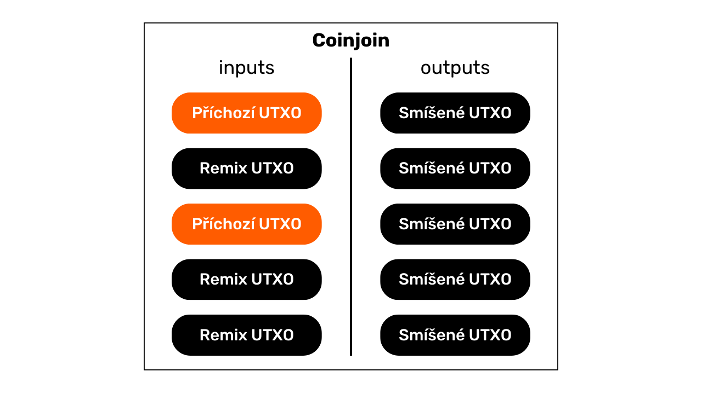

Díky tomuto systému poplatků se Whirlpool skutečně odlišuje od jiných implementací coinjoinu, protože anonsety UTXO nejsou proporcionální k ceně zaplacené uživatelem. Takto je možné dosáhnout výrazně vysokých úrovní anonymity pouze zaplacením vstupního poplatku do poolu a těžebních poplatků za 2 transakce (the `Tx0` a počáteční mix).
Je důležité poznamenat, že uživatel bude muset také pokrýt těžební poplatky, aby mohl vybrat své UTXO z fondu po provedení několika coinjoinů, pokud si nevybral možnost `mix to`, která umožňuje poskytnout externí adresu, která přímo obdrží prostředky jako výstup coinjoinu, bez jakékoli další transakce.

### Účty HD peněženky

Pro provedení coinjoinu prostřednictvím Whirlpoolu musí peněženka generovat několik odlišných účtů. To je princip protokolu ZeroLink. Účet, v kontextu HD (_Hierarchical Deterministic_) peněženky, představuje sekci zcela izolovanou od ostatních, tato separace nastává na třetí úrovni hloubky hierarchie peněženky, tedy na úrovni `xpub`.

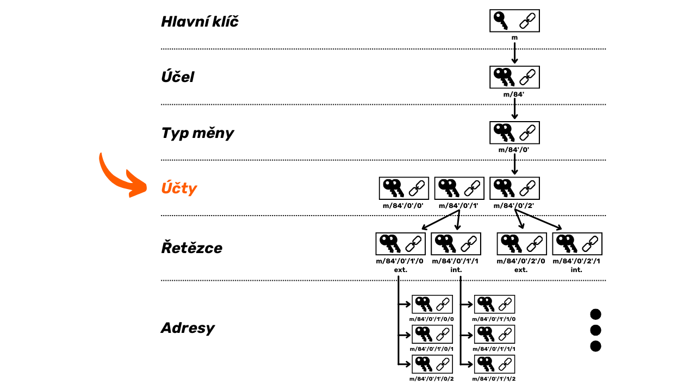

HD peněženka může teoreticky odvodit až `2^(32/2)` různých účtů. Počáteční účet, používaný ve výchozím nastavení ve všech Bitcoin peněženkách, odpovídá indexu `0'`.

Pro peněženky přizpůsobené Whirlpoolu se používají 4 účty, aby vyhověly potřebám procesu ZeroLink:

- **Vkladový účet**, identifikovaný indexem `0'`;
- Účet **bad bank** (nebo "doxxic change"), identifikovaný indexem `2 147 483 644'`;
- **Premix** účet, identifikovaný indexem `2 147 483 645'`;
- **Postmix** účet, identifikovaný indexem `2 147 483 646'`.

Každý z těchto účtů plní specifickou funkci v procesu coinjoinu, kterou prozkoumáme v následujících sekcích.

Všechny tyto účty jsou spojeny s jedním seedem, což uživateli umožňuje obnovit přístup ke všem svým bitcoinům pomocí své obnovovací fráze a v případě potřeby svého hesla. Je však nutné během této obnovovací operace softwaru specifikovat různé indexy účtů, které byly použity.

Podívejme se nyní na různé fáze coinjoinu Whirlpool v těchto účtech.

### TX0

Výchozím bodem jakéhokoli coinjoinu Whirlpool je **vkladový účet**. Tento účet automaticky používáte, když vytvoříte novou Bitcoin peněženku. Na tento účet musí být připsány bitcoiny, které chcete mixovat.

`Tx0` představuje první krok v procesu míchání Whirlpool. Jeho cílem je připravit a vyrovnat UTXO pro coinjoin, rozdělit je do jednotek odpovídajících částce vybraného fondu, aby se zajistila homogenita míchání. Vyrovnané UTXO jsou poté odeslány na **premix** účet. Co se týče rozdílu, který nemůže vstoupit do fondu, je oddělen do specifického účtu: **bad bank** (nebo "doxxic change").

Tato počáteční transakce `Tx0` slouží také k úhradě servisních poplatků koordinátoru coinjoinu. Na rozdíl od následujících kroků tato transakce není kolaborativní; uživatel musí tedy nést veškeré těžební poplatky:

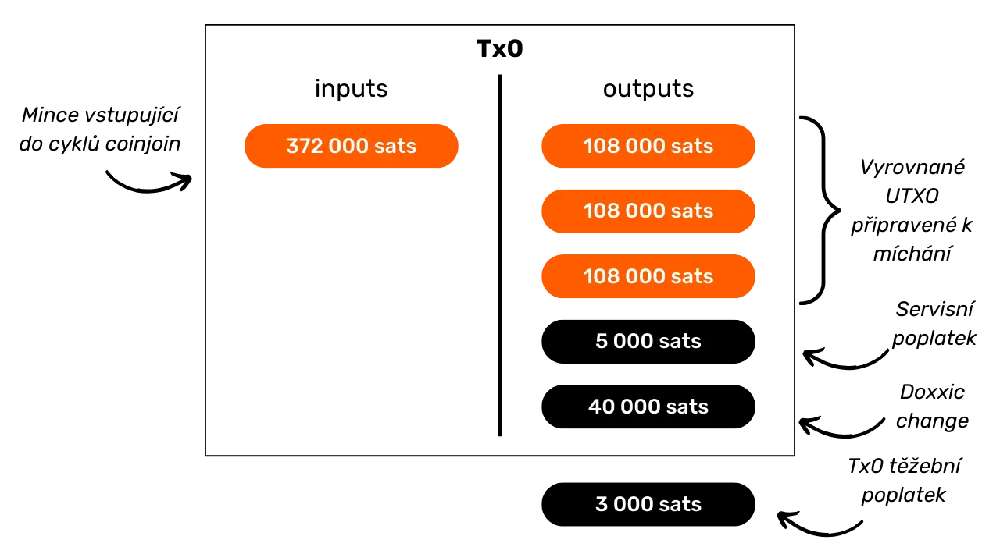

V tomto příkladu transakce `Tx0` je vstup `372 000 sats` z našeho **vkladového** účtu rozdělen na několik výstupních UTXO, které jsou distribuovány následovně:

- Částka `5 000 sats` určená koordinátorovi za servisní poplatky, odpovídající vstupu do fondu `100 000 sats`;
- 3 UTXO připravené pro míchání, přesměrované na náš **premix** účet a zaregistrované u koordinátora. Tyto UTXO jsou vyrovnány na `108 000 sats` každý, aby pokryly těžební poplatky za jejich budoucí počáteční mix;
- Přebytek, který nemůže vstoupit do poolu, protože je příliš malý, je považován za toxickou změnu. Je odeslán na jeho specifický účet. Zde tato změna činí `40 000 sats`;
- Nakonec existuje `3 000 sats`, které neconstitují výstup, ale jsou to těžební poplatky potřebné k potvrzení `Tx0`.
  Například zde je skutečný Tx0 Whirlpool (ne ode mě): [edef60744f539483d868caff49d4848e5cc6e805d6cdc8d0f9bdbbaedcb5fc46](https://mempool.space/fr/tx/edef60744f539483d868caff49d4848e5cc6e805d6cdc8d0f9bdbbaedcb5fc46)


### Toxická změna

Přebytek, který nemohl být integrován do poolu, zde ekvivalentní `40 000 sats`, je přesměrován na účet **špatné banky**, také označovaný jako "toxická změna", aby se zajistilo striktní oddělení od ostatních UTXO v peněžence.

Toto UTXO je nebezpečné pro soukromí uživatele, protože nejenže je stále připojeno ke své minulosti, a tedy možná k identitě jeho majitele, ale je také označeno jako patřící uživateli, který se zúčastnil coinjoin.


Pokud je toto UTXO sloučeno s míchanými výstupy, ztratí veškeré soukromí získané během cyklů coinjoin, zejména kvůli CIOH (_Common-Input-Ownership-Heuristic_). Pokud je sloučeno s dalšími toxickými změnami, uživatel riskuje ztrátu soukromí, protože to propojí různé záznamy z cyklů coinjoin. Proto je nutné s ním zacházet opatrně. O správě těchto toxických UTXO budeme hovořit podrobněji v poslední části této kapitoly.

### Počáteční míchání

Po dokončení `Tx0` jsou vyrovnána UTXO odeslána na **premix** účet naší peněženky, připravena být zavedena do jejich prvního cyklu coinjoin, také nazývaného "počáteční míchání". Pokud, jak je tomu v našem příkladu, `Tx0` generuje několik UTXO určených pro míchání, každé z nich bude integrováno do samostatného počátečního míchání.

Na konci těchto prvních míchání bude **premix** účet prázdný, zatímco naše mince, které zaplatily těžební poplatky za toto první coinjoin, budou přesně upraveny na částku definovanou vybraným poolem. V našem příkladu budou naše počáteční UTXO `108 000 sats` snížena přesně na `100 000 sats`.


### Remixy

Po počátečním míchání jsou UTXO převedeny na **postmix** účet. Tento účet shromažďuje jak již míchaná UTXO, tak ta, která čekají na remixování. Když je klient Whirlpool aktivní, UTXO na **postmix** účtu jsou automaticky k dispozici pro remixování a budou náhodně vybrána k účasti na těchto nových cyklech.
Připomínáme, že remixy jsou poté 100% zdarma: nejsou vyžadovány žádné další servisní poplatky ani těžební poplatky. Udržení UTXO na **postmix** účtu tak udržuje jejich nezměněnou hodnotu a zároveň zlepšuje jejich anonsety. Proto je důležité umožnit těmto mincím účastnit se více cyklů coinjoin. Nestojí vás to vůbec nic a zvyšuje jejich úroveň anonymity.
Když se rozhodnete utratit smíšené UTXO, můžete tak učinit přímo z tohoto **postmix** účtu. Je doporučeno držet smíšené UTXO na tomto účtu, aby jste mohli využívat bezplatných remixů a zabránit jejich odchodu z oběhu Whirlpool, což by mohlo snížit jejich soukromí.

### Jak správně spravovat váš postmix účet?

Po provedení cyklů coinjoin je nejlepší strategií nechat vaše UTXO na **postmix** účtu, čekající na jejich budoucí využití. Je dokonce doporučeno nechat je remixovat neomezeně, dokud je nebudete potřebovat utratit.

Někteří uživatelé by mohli zvážit převod svých smíšených bitcoinů do peněženky zabezpečené hardware peněženkou. To je možné, ale je důležité pečlivě dodržovat doporučení Samourai Wallet, aby nedošlo ke kompromitaci získané důvěrnosti.

Slučování UTXO je nejčastější chybou. Je nutné vyhnout se kombinování smíšených UTXO s nesmíšenými UTXO ve stejné transakci, aby se zabránilo heuristice společného vlastnictví vstupů (CIOH). To vyžaduje pečlivé řízení vašich UTXO v rámci vaší peněženky, zejména z hlediska označování.


Je také důležité být opatrný při konsolidaci smíšených UTXO mezi sebou. Mírné konsolidace jsou představitelné, pokud vaše smíšené UTXO mají významné anonsety, ale to nevyhnutelně sníží důvěrnost vašich mincí. Ujistěte se, že konsolidace nejsou příliš významné ani prováděné po nedostatečném počtu remixů, aby nedošlo k vytvoření odvoditelných vazeb mezi vašimi UTXO před a po cyklech coinjoin. V případě pochybností o těchto manipulacích je nejlepší praxí nekonsolidovat postmix UTXO a převádět je jeden po druhém do vaší hardware peněženky, přičemž pokaždé generujete novou prázdnou adresu. Opět nezapomeňte správně označit každé přijaté UTXO.
Je také nedoporučeno převádět vaše postmix UTXO do peněženky používající neobvyklé skripty. Například, pokud vstoupíte do Whirlpool z multisig peněženky používající skripty `P2WSH`, je malá šance, že budete smícháni s ostatními uživateli, kteří původně měli stejný typ peněženky. Pokud své postmix vyberete do této stejné multisig peněženky, úroveň soukromí vašich smíšených bitcoinů bude výrazně snížena. Kromě skriptů existuje mnoho dalších otisků peněženek, které vás mohou zmást.
Stejně jako u jakékoli transakce s Bitcoinem, je také důležité neopakovat používání přijímacích adres. Každá nová transakce by měla být přijata na novou, prázdnou adresu.

Nejjednodušším a nejbezpečnějším řešením je nechat vaše smíšené UTXO odpočívat na jejich **postmix** účtu, nechat je remixovat a dotýkat se jich pouze, když je potřebujete utratit. Peněženky Samourai a Sparrow mají další ochrany proti všem těmto rizikům souvisejícím s analýzou řetězce. Tyto ochrany vám pomáhají vyhnout se chybám.

### Jak správně spravovat vaši toxickou změnu?

Dále musíte být opatrní při správě vaší toxické změny, změny, která nemohla vstoupit do bazénu coinjoin. Tyto toxické UTXO, vzniklé použitím Whirlpool, představují riziko pro vaše soukromí, protože vytvářejí spojení mezi vámi a použitím coinjoin. Proto je nezbytné zacházet s nimi opatrně a nekombinovat je s jinými UTXO, zejména smíšenými UTXO.

Zde jsou různé strategie, které je třeba zvážit pro jejich využití:

- **Smíchejte je v menších bazénech:** Pokud je vaše toxické UTXO dostatečně velké, aby samo vstoupilo do menšího bazénu, zvažte jeho smíchání. To je často nejlepší možnost. Nicméně, slučování několika toxických UTXO pro přístup k bazénu se nedoporučuje, protože by to mohlo spojit vaše různé vstupy;
- **Označte je jako "nepoužitelné":** Dalším přístupem je již je nevyužívat, označit je v jejich dedikovaném účtu jako "nepoužitelné" a prostě je držet (hodl). To zajistí, že je omylem neutratíte. Pokud hodnota bitcoinu vzroste, mohou se objevit nové fondy lépe vhodné pro vaše toxické UTXO;
- **Dary:** Zvažte možnost darování, i skromných, vývojářům pracujícím na Bitcoinu a jeho přidruženém softwaru. Můžete také darovat organizacím, které přijímají BTC. Pokud se vám zdá správa vašich toxických UTXO příliš složitá, můžete se jich jednoduše zbavit darováním.
- **Nákup dárkových karet:** Platformy jako [Bitrefill](https://www.bitrefill.com/) vám umožňují vyměnit bitcoiny za dárkové karty, které lze použít u různých obchodníků. To může být způsob, jak se zbavit vašich toxických UTXO bez ztráty přidružené hodnoty.
- **Konsolidace na Monero:** Samourai Wallet nabízí službu atomického swapu mezi BTC a XMR. To je ideální pro správu toxických UTXO konsolidací na Monero, bez ohrožení vašeho soukromí prostřednictvím KYC, před jejich zasláním zpět na Bitcoin. Tato možnost však může být nákladná z hlediska těžebních poplatků a přirážek kvůli omezením likvidity.
- **Poslat je do Lightning Network:** Převod těchto UTXO do Lightning Network za účelem využití snížených transakčních poplatků je zajímavou možností. Tato metoda však může odhalit určité informace v závislosti na vašem využití Lightning a proto by měla být praktikována s opatrností.

### Jak používat Whirlpool?

Po zatčení zakladatelů Samourai Wallet a zabavení jejich serverů 24. dubna 2024 nástroj Whirlpool již nefunguje, ani pro ty, kteří mají vlastní Dojo. Dříve byl dostupný na Samourai Wallet a Sparrow Wallet.


Stále však existuje možnost, že by tento nástroj mohl být v následujících týdnech znovu uveden do provozu v závislosti na výsledku soudních sporů, nebo spuštěn jiným způsobem. Každopádně věřím, že trh pro coinjoin na Bitcoinu nebude dlouho bez nabídky, jelikož je zde jasná poptávka. Navíc model Whirlpool, který je nejpokročilejší z hlediska soukromí, bude jistě v budoucnu využit pro další implementace.

Pozorně sledujeme vývoj této kauzy i vývoj přidružených nástrojů. Ujistěte se, že budeme aktualizovat toto školení, jakmile budou k dispozici nové informace.

V další kapitole se dozvíme, co jsou "anonsety", jak se tyto ukazatele vypočítávají a jak nám mohou pomoci odhadnout účinnost cyklů coinjoin.

https://planb.network/tutorials/privacy/coinjoin-sparrow-wallet

https://planb.network/tutorials/privacy/coinjoin-samourai-wallet

https://planb.network/tutorials/privacy/coinjoin-dojo

## Sady anonymity

<chapterId>be1093dc-1a74-40e5-9545-2b97a7d7d431</chapterId>

Po studiu fungování coinjoinů a výzev spojených s efektivním mícháním se nyní naučíme, jak měřit tuto efektivitu. Jak určit, zda byl proces coinjoin účinný a jaký stupeň anonymity získal coin? To prozkoumáme v této kapitole s anonymními sadami neboli "anonsety" v angličtině.

### Připomenutí užitečnosti Coinjoin

Užitečnost CoinJoin spočívá v jeho schopnosti vytvořit věrohodné popření tím, že vaši minci ponoří do skupiny nerozlišitelných mincí. Cílem této akce je přerušit sledovatelné vazby, jak z minulosti do současnosti, tak ze současnosti do minulosti.
Jinými slovy, analytik, který zná vaši počáteční transakci (`Tx0`) na vstupu do cyklů CoinJoin, by neměl být schopen s jistotou identifikovat vaše UTXO na výstupu z remixovacích cyklů (analýza od vstupu do cyklu po výstup z cyklu).

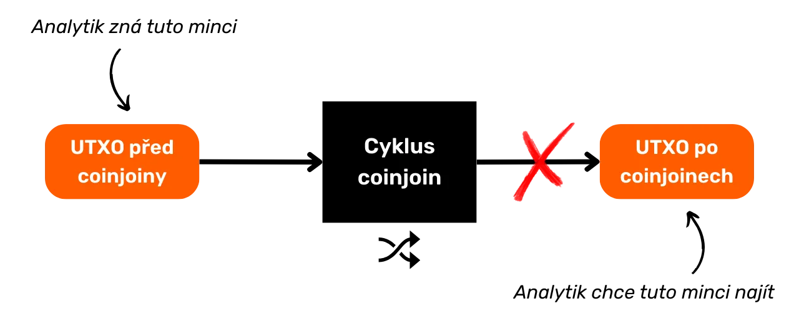

Naopak, analytik, který zná vaše UTXO na výstupu z cyklů CoinJoin, by neměl být schopen určit původní transakci na vstupu do cyklů (analýza od výstupu z cyklu po vstup do cyklu).

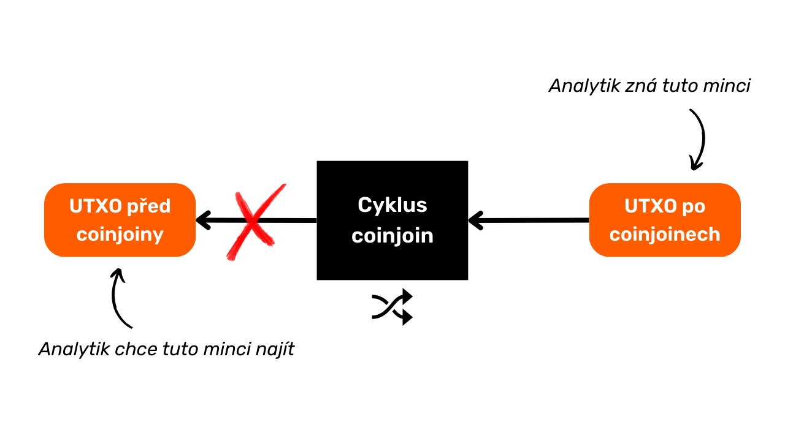

Pro posouzení obtížnosti analytika spojit minulost s přítomností a naopak je nutné kvantifikovat velikost skupin homogenních mincí, ve kterých je vaše mince skryta. Toto měření nám říká počet analýz s identickou pravděpodobností. Takže, pokud je správná analýza utopena mezi 3 dalšími analýzami stejné pravděpodobnosti, vaše úroveň skrytí je velmi nízká. Pokud je však správná analýza v souboru 20 000 analýz, všechny stejně pravděpodobné, vaše mince je velmi dobře skryta. A právě velikost těchto skupin představuje ukazatele nazývané "anonsety".

### Porozumění Anonsetům

Anonsety slouží jako ukazatele pro posouzení stupně soukromí konkrétního UTXO. Konkrétněji měří počet nerozeznatelných UTXO v souboru, který zahrnuje studovanou minci. Požadavek na homogenní soubor UTXO znamená, že anonsety jsou obvykle vypočítávány přes cykly CoinJoin. Použití těchto ukazatelů je zvláště relevantní pro Whirlpool CoinJoins díky jejich uniformitě.

Anonsety umožňují, je-li to vhodné, posoudit kvalitu CoinJoinů. Velká velikost anonsetu znamená vysokou úroveň anonymity, protože se stává obtížným rozlišit konkrétní UTXO v homogenním souboru.

Existují 2 typy anonsetů:

- **Prospective anonset;**
- **Retrospective anonset.**

### Prospective Anonset

Prospective anonset udává velikost skupiny, mezi kterou je studované UTXO skryto na výstupu z cyklu, známe-li UTXO na vstupu, tedy počet nerozeznatelných mincí přítomných v této skupině. V angličtině se název tohoto ukazatele nazývá "forward anonset" nebo "forward-looking metrics".
Tento ukazatel umožňuje měřit odolnost soukromí mince proti analýze z minulosti do přítomnosti (vstup do výstupu).
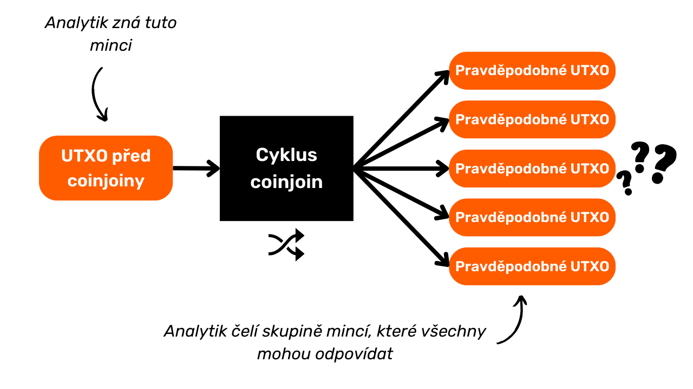

Tato metrika odhaduje, do jaké míry je vaše UTXO chráněno proti pokusům o rekonstrukci jeho historie od vstupního bodu po výstupní bod v procesu coinjoin.

Například, pokud vaše transakce účastnila svého prvního cyklu coinjoin a byly dokončeny další dva následné cykly, prospective anonset vaší mince by byl `13`:


Představme si, že naše mince na vstupu do cyklu coinjoin má prospective anonset `86,871`. V praxi to znamená, že je skryta mezi `86,871` nerozeznatelnými mincemi. Pro vnějšího pozorovatele, který je si vědom této mince na začátku cyklů coinjoin a pokouší se vystopovat její výstup, by se setkal s `86,871` možnými UTXO, každé s identickou pravděpodobností, že je hledanou mincí.

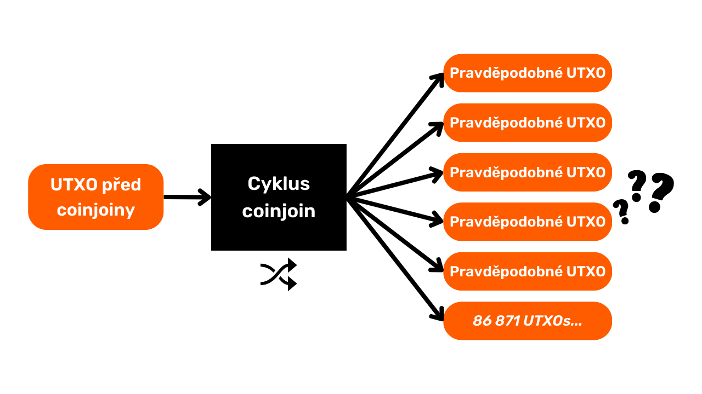

### Retrospective Anonset

Retrospektivní anonset udává počet možných zdrojů pro danou minci, známe-li UTXO na výstupu cyklu. Tento ukazatel měří odolnost soukromí mince vůči analýze z přítomnosti do minulosti (výstup na vstup), to znamená, jak obtížné je pro analytika vystopovat původ vaší mince před cykly coinjoin. V angličtině se název tohoto ukazatele označuje jako "backward anonset" nebo "backward-looking metrics".
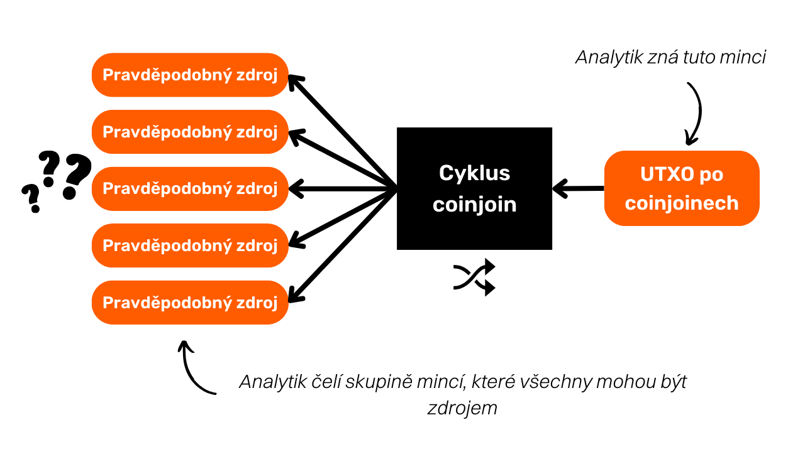

Znáte-li vaše UTXO na výstupu z cyklů, retrospektivní anonset určuje počet potenciálních transakcí Tx0, které by mohly tvořit váš vstup do cyklů coinjoin. Na níže uvedeném diagramu to odpovídá součtu všech oranžových bublin.


Představme si například, že naše mince na výstupu z cyklu coinjoin má retrospektivní anonset `42,185`. V praxi to znamená, že existuje `42,185` potenciálních zdrojů pro toto UTXO. Pokud externí pozorovatel identifikuje tuto minci na konci cyklů a snaží se vystopovat její původ, bude čelit `42,185` možným zdrojům, všechny s rovnou pravděpodobností, že jsou hledaným původem.

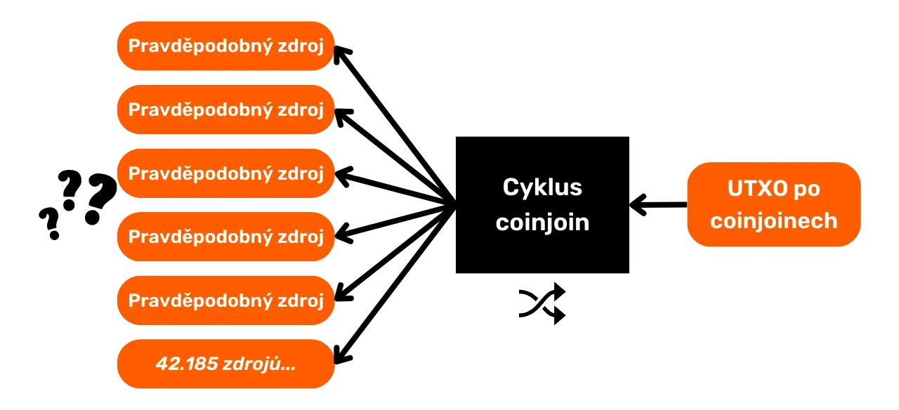

### Jak konkrétně vypočítat anonsety?

Je možné ručně vypočítat své anonsety pomocí prohlížeče bloků pro malé sady. Nicméně pro větší anonsety se stává nezbytné použití specializovaného nástroje. Podle mého vědomí je jediný software schopný provádět tento úkol _Whirlpool Stats Tool_, Python nástroj vyvinutý týmy Samourai a OXT. Bohužel tento nástroj je v současné době mimo provoz po zatčení zakladatelů Samourai a ukončení činnosti OXT, které bylo používáno k extrakci dat z blockchainu.


Jak jsme viděli v této kapitole, anonsety lze vypočítat pouze v případě, že existuje určitá homogenita ve struktuře coinjoinů. A přesně v další kapitole se dozvíme, jak kvantifikovat tuto homogenitu v Bitcoinové transakci, ať už jde o coinjoin nebo tradičnější transakci.

https://planb.network/tutorials/privacy/wst-anonsets

## Entropie

<chapterId>e4fe289d-618b-49a2-84c9-68c562e708b4</chapterId>

Jak jsme viděli v této části o coinjoinech, homogenita UTXO na vstupech a výstupech hraje důležitou roli při zlepšování důvěrnosti Bitcoinové transakce. Tento parametr umožňuje věrohodné popření proti analýze řetězce. Existuje několik metod, které mohou měřit tuto homogenitu, ale jednou z nejúčinnějších, podle mého názoru, je použití ukazatelů poskytovaných nástrojem _Boltzmann_, vyvinutým týmy OXT a Samourai Wallet, zejména entropie transakce. To je to, co budeme podrobně studovat v této kapitole.

Na rozdíl od anonsetů, které jsou vypočítány nad sadou transakcí, ukazatele, které zde představíme, se zaměřují výhradně na jednu transakci, ať už jde o coinjoin nebo tradičnější transakci.

### Počet interpretací

Prvním indikátorem, který lze pozorovat u transakce Bitcoinu, je celkový počet možných interpretací z pohledu vnějšího pozorovatele analyzujícího transakci. S ohledem na hodnoty UTXO zapojených do transakce tento indikátor udává počet způsobů, jakými lze vstupy spojit s výstupy. Jinými slovy, určuje počet možných interpretací, které transakce může generovat v toku bitcoinů z perspektivy vnějšího pozorovatele, který ji analyzuje.
Například jednoduchá platební transakce s 1 vstupem a 2 výstupy bude mít pouze jednu interpretaci, a to že vstup #0 financoval výstup #0 a výstup #1. Neexistují žádné další možné interpretace:


Naopak, coinjoin strukturovaný podle modelu Whirlpool 5x5 představuje $1,496$ možných kombinací:
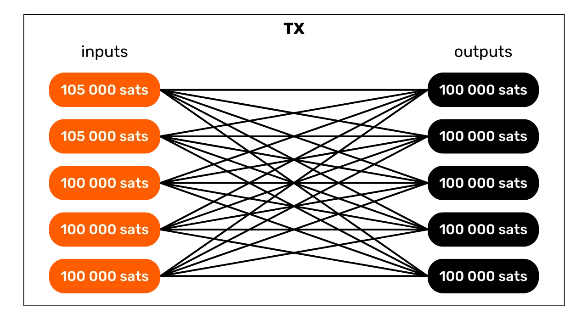
Coinjoin Whirlpool Surge Cycle 8x8 se prezentuje s $9,934,563$ možnými interpretacemi:


### Entropie

Z počtu interpretací transakce Bitcoinu můžeme vypočítat její entropii.

V obecném kontextu kryptografie a informací je entropie kvantitativní míra nejistoty nebo nepředvídatelnosti spojené se zdrojem dat nebo náhodným procesem. Jinými slovy, entropie je způsob, jak měřit, jak obtížné je informace předpovědět nebo uhodnout.

Ve specifickém kontextu analýzy řetězců je entropie také název indikátoru, odvozeného od Shannonovy entropie a [vynalezeného LaurentMT](https://gist.github.com/LaurentMT/e758767ca4038ac40aaf), který lze vypočítat na transakci Bitcoinu.

Když transakce prezentuje vysoký počet možných interpretací, je často relevantnější odkazovat na její entropii. Tento indikátor umožňuje měřit nedostatek znalostí analytiků o přesné konfiguraci transakce. Jinými slovy, čím vyšší entropie, tím obtížnější úkol identifikovat toky bitcoinů mezi vstupy a výstupy pro analytiky.

V praxi entropie odhaluje, zda z pohledu vnějšího pozorovatele transakce prezentuje více možných interpretací, založených pouze na částkách vstupů a výstupů, aniž by se zohledňovaly jiné vnější nebo vnitřní vzory a heuristiky. Vysoká entropie je pak synonymem lepší důvěrnosti pro transakci.

Entropie je definována jako binární logaritmus počtu možných kombinací. Zde je použitý vzorec s $E$ jako entropií transakce a $C$ počtem možných interpretací:

$$
E = \log_2(C)
$$

V matematice odpovídá binární logaritmus (logaritmus o základu 2) inverzní operaci umocňování čísla 2. Jinými slovy, binární logaritmus $x$ je exponent, na který musí být číslo $2$ umocněno, aby se získalo $x$. Tento indikátor je tedy vyjádřen v bitech.

Vezměme si příklad výpočtu entropie pro coinjoin transakci strukturovanou podle modelu Whirlpool 5x5, která, jak bylo zmíněno v předchozí sekci, prezentuje počet možných interpretací $1,496$:

$$
\begin{align*}
C &= 1,496 \\
E &= \log_2(1,496) \\
E &= 10.5469 \text{ bitů}
\end{align*}
$$

Takže tato coinjoin transakce vykazuje entropii $10.5469$ bitů, což je považováno za velmi uspokojivé. Čím vyšší tato hodnota, tím více různých interpretací transakce připouští, čímž zvyšuje její úroveň soukromí.
Pro transakci 8x8 coinjoin s $9,934,563$ možnými interpretacemi by entropie byla:

$$
\begin{align*}
C &= 9,934,563 \\
E &= \log_2(9,934,563) \\
E &= 23.244 \text{ bitů}
\end{align*}
$$

Pojďme se podívat na další příklad se standardní platební transakcí, která má 1 vstup a 2 výstupy: [1b1b0c3f0883a99f1161c64da19471841ed12a1f78e77fab128c69a5f578ccce](https://mempool.space/tx/1b1b0c3f0883a99f1161c64da19471841ed12a1f78e77fab128c69a5f578ccce)


V případě této transakce je jediná možná interpretace: `(In.0) > (Out.0 ; Out.1)`. V důsledku toho je její entropie stanovena na $0$:

$$
\begin{align*}
C &= 1 \\
E &= \log_2(1) \\
E &= 0 \text{ bitů}
\end{align*}
$$

### Efektivita

Z entropie transakce můžeme také vypočítat její efektivitu z hlediska soukromí. Tento ukazatel hodnotí efektivitu transakce porovnáním s optimální transakcí, která by byla možná v identické konfiguraci.

To nás přivádí k diskusi o konceptu maximální entropie, která odpovídá nejvyšší entropii, kterou by konkrétní struktura transakce teoreticky mohla dosáhnout. Efektivita transakce je poté vypočítána konfrontací této maximální entropie s aktuální entropií analyzované transakce.

Použitý vzorec je následující s:

- $E_R$: aktuální entropie transakce vyjádřená v bitech;
- $E_M$: maximální možná entropie pro strukturu transakce také vyjádřená v bitech;
- $Ef$: efektivita transakce v bitech:

$$
Ef = E_R - E_M
$$

Například pro strukturu coinjoin typu Whirlpool 5x5 je maximální entropie $10.5469$:

$$
\begin{align*}
E_R &= 10.5469 \\
E_M &= 10.5469 \\
Ef &= E_R - E_M \\
Ef &= 10.5469 - 10.5469 \\
Ef &= 0 \text{ bitů}
\end{align*}
$$

Tento ukazatel je také vyjádřen jako procento. Použitý vzorec je následující s:

- $C_R$: počet možných skutečných interpretací;
- $C_M$: maximální počet možných interpretací se stejnou strukturou;
- $Ef$: efektivita vyjádřená v procentech:

$$
\begin{align*}
E_f &= \frac{C_R}{C_M} \\
E_f &= \frac{1\,496}{1\,496} \\
E_f &= 100\%
\end{align*}
$$

Efektivita $100\%$ tedy naznačuje, že transakce maximalizuje svůj potenciál pro soukromí na základě své struktury.

### Hustota Entropie

Entropie je dobrým ukazatelem pro měření soukromí transakce, ale částečně závisí na počtu vstupů a výstupů v transakci. Pro porovnání entropie 2 různých transakcí, které nemají stejný počet vstupů a výstupů, lze vypočítat hustotu entropie. Tento ukazatel nabízí perspektivu entropie vzhledem ke každému vstupu nebo výstupu transakce. Hustota se ukazuje užitečná pro hodnocení a porovnávání efektivity transakcí různých velikostí.
Pro výpočet toho stačí rozdělit celkovou entropii transakce počtem vstupů a výstupů zapojených do transakce:

- $E_D$: hustota entropie vyjádřená v bitech;
- $E$: entropie transakce vyjádřená v bitech;
- $T$: celkový počet vstupů a výstupů v transakci:

$$
E_D = \frac{E}{T}
$$

Vezměme si příklad Whirlpool 5x5 coinjoin:

$$
\begin{align*}
T &= 5 + 5 = 10 \\
E &= 10.5469 \\
E_D &= \frac{E}{T} \\
E_D &= \frac{10.5469}{10} \\
E_D &= 1.054 \text{ bitů}
\end{align*}
$$

Pojďme také vypočítat hustotu entropie Whirlpool 8x8 coinjoin:

$$
\begin{align*}
T &= 8 + 8 = 16 \\
E &= 23.244 \\
E_D &= \frac{E}{T} \\
E_D &= \frac{23.244}{16} \\
E_D &= 1.453 \text{ bitů}
\end{align*}
$$

Analýzou hustoty entropie těchto dvou typů coinjoinů je zřejmé, že i při normalizaci entropie podle počtu prvků, "Surge Cycle 8x8" coinjoin generuje více nejistoty pro analýzu.

### Skóre Boltzmann

Dalším analyzovaným prvkem v transakci je Boltzmannovo skóre každého prvku ve vztahu k jinému. Jedná se o tabulku pravděpodobností shody mezi vstupy a výstupy. Tato tabulka ukazuje prostřednictvím Boltzmannova skóre podmíněnou pravděpodobnost, že konkrétní vstup je spojen s daným výstupem. Je to tedy kvantitativní míra podmíněné pravděpodobnosti, že dojde k asociaci mezi vstupem a výstupem v transakci, založená na poměru počtu příznivých výskytů této události ve srovnání s celkovým počtem možných výskytů, v sadě interpretací.
Při příkladu Whirlpool coinjoin by tabulka podmíněných pravděpodobností zdůraznila šance na spojení mezi každým vstupem a výstupem, poskytující kvantitativní míru nejednoznačnosti asociací v transakci:

| %       | Výstup 0 | Výstup 1 | Výstup 2 | Výstup 3 | Výstup 4 |
| ------- | -------- | -------- | -------- | -------- | -------- |
| Vstup 0 | 34%      | 34%      | 34%      | 34%      | 34%      |
| Vstup 1 | 34%      | 34%      | 34%      | 34%      | 34%      |
| Vstup 2 | 34%      | 34%      | 34%      | 34%      | 34%      |
| Vstup 3 | 34%      | 34%      | 34%      | 34%      | 34%      |
| Vstup 4 | 34%      | 34%      | 34%      | 34%      | 34%      |

Zde je jasné, že každý vstup má stejnou šanci být spojen s jakýmkoli výstupem, což zvyšuje důvěrnost transakce.

Výpočet Boltzmannova skóre zahrnuje dělení počtu interpretací, ve kterých se určitá událost projevuje, celkovým počtem dostupných interpretací. Takže pro určení skóre spojujícího vstup #0 s výstupem #3 (událost přítomná v $512$ interpretacích) je postup následující:

$$
\begin{align*}
\text{Interpretace (IN.0 > OUT.3)} &= 512 \\
\text{Celkovy pocet interpretaci} &= 1496 \\
\text{Skore} &= \frac{512}{1496} \\
\text{Skore} &= 34 \%
\end{align*}
$$

Pokud se vrátíme k příkladu Whirlpool coinjoin 8x8 Surge Cycle, Boltzmannova tabulka by vypadala takto:

|       | OUT.0 | OUT.1 | OUT.2 | OUT.3 | OUT.4 | OUT.5 | OUT.6 | OUT.7 |
|-------|-------|-------|-------|-------|-------|-------|-------|-------|
| IN.0  | 23 %  | 23 %  | 23 %  | 23 %  | 23 %  | 23 %  | 23 %  | 23 %  |
| IN.1  | 23 %  | 23 %  | 23 %  | 23 %  | 23 %  | 23 %  | 23 %  | 23 %  |
| IN.2  | 23 %  | 23 %  | 23 %  | 23 %  | 23 %  | 23 %  | 23 %  | 23 %  |
| IN.3  | 23 %  | 23 %  | 23 %  | 23 %  | 23 %  | 23 %  | 23 %  | 23 %  |
| IN.4  | 23 %  | 23 %  | 23 %  | 23 %  | 23 %  | 23 %  | 23 %  | 23 %  |
| IN.5  | 23 %  | 23 %  | 23 %  | 23 %  | 23 %  | 23 %  | 23 %  | 23 %  |
| IN.6  | 23 %  | 23 %  | 23 %  | 23 %  | 23 %  | 23 %  | 23 %  | 23 %  |
| IN.7  | 23 %  | 23 %  | 23 %  | 23 %  | 23 %  | 23 %  | 23 %  | 23 %  |

Nicméně, v případě jednoduché transakce s jedním vstupem a dvěma výstupy, situace je jiná:

| %       | Výstup 0 | Výstup 1 |
|---------|----------|----------|
| Vstup 0 | 100 %    | 100 %    |

Zde pozorujeme, že pravděpodobnost, že každý výstup pochází z vstupu č. 0, je 100 %. Nižší pravděpodobnost tedy překládá do většího soukromí tím, že rozptyluje přímé spojení mezi vstupy a výstupy.

### Deterministické spojení

Je také možné vypočítat počet deterministických spojení v transakci. Tento ukazatel odhaluje, kolik spojení mezi vstupy a výstupy v analyzované transakci je nesporných, s pravděpodobností 100 %. Tento ukazatel lze pak doplnit výpočtem poměru deterministických spojení. Poměr poskytuje perspektivu váhy těchto deterministických spojení ve všech spojeních transakce.
Například transakce typu Whirlpool coinjoin neukazuje žádnou deterministickou spojitost mezi vstupy a výstupy, čímž zobrazuje indikátor 0 spojení a poměr 0%. Naopak, v naší druhé zkoumané jednoduché platební transakci (s jedním vstupem a 2 výstupy) nám indikátor říká, že existují 2 deterministická spojení a poměr dosahuje 100%. Proto nulový indikátor signalizuje vynikající soukromí díky absenci přímých a nesporných spojení mezi vstupy a výstupy.
### Jak tyto indikátory vypočítat?
Ruční výpočet těchto indikátorů pomocí poskytnutých rovnic je relativně jednoduchý. Hlavní obtížnost spočívá v určení počtu možných interpretací transakce. Pro standardní transakci lze tento výpočet provést ručně. Avšak pro coinjoin je úkol výrazně složitější.

Dříve byl vyvinut Python nástroj s názvem _Boltzmann Calculator_, vyvinutý týmy OXT a Samourai, který umožňoval automatický výpočet všech těchto indikátorů pro Bitcoinovou transakci:


Bylo také možné použít webovou stránku KYCP.org pro tyto analýzy:


Bohužel, po zatčení zakladatelů Samourai, tyto nástroje momentálně nejsou funkční.

Nyní, když jsme podrobně diskutovali o coinjoinech, prozkoumáme v poslední části našeho školení další dostupné techniky soukromí na Bitcoinu. Budeme zkoumat payjoiny, specifické typy transakcí pseudo-coinjoin, protokoly s pevnou adresou, stejně jako opatření zaměřená na zvýšení soukromí ne na úrovni transakce, ale na úrovni sítě uzlů.

https://planb.network/tutorials/privacy/boltzmann-entropy

# Porozumění významu dalších pokročilých technik soukromí
<partId>19989ae6-d608-4acf-b698-2cf1e7e5e6ae</partId>

## Transakce Payjoin
<chapterId>c1e90b95-f709-4574-837b-2ec26b11286f</chapterId>

Coinjoin v současnosti představuje nejúčinnější metodu pro zavedení nejistoty do sledování mincí během analýzy řetězce. Jak jsme viděli v předchozích kapitolách, pro dosažení účinného míchání je nutné, aby vstupy a výstupy byly co nejhomogennější. Navíc je klíčové, aby byly mince integrovány do co největší skupiny, aby se maximalizovaly anonsety. Aby byly coinjoin transakce účinné, musí zahrnovat velké množství uniformních mincí. Toto množství požadavků znamená, že coinjoin transakce mají velmi rigidní strukturu: částky jsou předem určené a všichni účastníci se musí držet těchto pravidel, aby zajistili uniformitu procesu. Kromě toho coinjoin vyžaduje synchronizaci mezi všemi účastníky a koordinátorem během konstrukce transakce.
Tyto požadavky činí coinjoin nevhodným pro přímé platby. Například, pokud vlastníte 1M sats kus v coinjoin poolu, jeho přímé použití jako platba by bylo složité. Vyžadovalo by to synchronizaci s ostatními účastníky a koordinátorem pro přesnou konstrukci spolupracující transakce právě ve chvíli, kdy potřebujete provést platbu, a částka nákupu by musela přesně odpovídat hodnotě vašeho kusu, což je prakticky nedosažitelné. Proto je coinjoin transakce svou podstatou spolupracující transakce zametání, což znamená, že obvykle jsou to stejní majitelé vstupů, kteří se nacházejí ve výstupech.
Nicméně, bylo by zajímavé mít struktury transakcí, které umožňují praktické platby a zároveň zavádějí pochybnosti do analýzy řetězce. To je přesně to, co budeme v této kapitole a v dalších prozkoumávat.

### Co je transakce payjoin?

Payjoin je specifická struktura Bitcoinové transakce, která zvyšuje soukromí uživatele během utrácení tím, že spolupracuje s příjemcem platby.
Bylo to v roce 2015, kdy LaurentMT poprvé zmínil tuto metodu pod názvem "*steganografické transakce*", podle dokumentu přístupného [zde](https://gist.githubusercontent.com/LaurentMT/e758767ca4038ac40aaf/raw/c8125f6a3c3d0e90246dc96d3b603690ab6f1dcc/gistfile1.txt). Tuto techniku později přijala peněženka Samourai Wallet, která v roce 2018 byla prvním klientem, jež ji implementoval s nástrojem Stowaway. Koncept payjoin je také nalezen v [BIP79](https://github.com/bitcoin/bips/blob/master/bip-0079.mediawiki) a [BIP78](https://github.com/bitcoin/bips/blob/master/bip-0078.mediawiki). Několik termínů je tedy používáno pro označení payjoin:
- Payjoin;
- Stowaway;
- P2EP (*Pay-to-End-Point*);
- Steganografická transakce.

Zvláštností payjoinu je jeho schopnost generovat transakci, která na první pohled vypadá obyčejně, ale ve skutečnosti je to mini Coinjoin mezi dvěma lidmi. Pro toto struktura transakce zahrnuje příjemce platby mezi vstupy společně s vlastním odesílatelem. Příjemce tak zahrne platbu sami sobě uprostřed transakce, což jim umožňuje být zaplaceno.

Pojďme si vzít příklad, abychom tento proces lépe pochopili. Alice kupuje bagetu za 4 000 sats pomocí UTXO 10 000 sats a volí payjoin. Její pekař, Bob, přidá UTXO 15 000 sats patřící jemu do vstupu, který si v plné výši vezme zpět ve výstupu, kromě Alice 4 000 sats.


V tomto příkladu Bob, pekař, vloží 15 000 sats a vyjde s 19 000 sats, rozdíl je přesně 4 000 sats, což je cena bagety. Na straně Alice vstoupí s 10 000 sats a skončí s 6 000 sats ve výstupu, což představuje bilanci -4 000 sats, tedy cenu bagety. Pro zjednodušení příkladu jsem záměrně vynechal těžební poplatky v této transakci.

### Jaký je účel payjoinu?

Transakce payjoin plní dva cíle, které umožňují uživatelům zlepšit soukromí jejich platby.

Za prvé, payjoin má za cíl zmást vnějšího pozorovatele tím, že vytvoří klam v analýze řetězce. To je umožněno díky heuristice CIOH (*Common Input Ownership Heuristic*). Jak jsme viděli v části 3, obvykle, když transakce na blockchainu má více vstupů, předpokládá se, že všechny tyto vstupy patří stejné entitě nebo uživateli.

Takže, když analytik zkoumá transakci payjoin, je veden k přesvědčení, že všechny vstupy pocházejí od stejné osoby. Toto vnímání je však nesprávné, protože příjemce platby také přispívá do vstupů společně s vlastním platitelem. Analýza řetězce je tedy odvedena k interpretaci, která se ukáže být nepravdivá.

Pojďme se vrátit k našemu příkladu transakce payjoin pro platbu bagety:


Vidění této transakce na blockchainu by vnější pozorovatel následující obvyklé heuristiky analýzy řetězce interpretoval takto: "*Alice sloučila 2 UTXO ve vstupech transakce, aby zaplatila 19 000 sats Bobovi*".
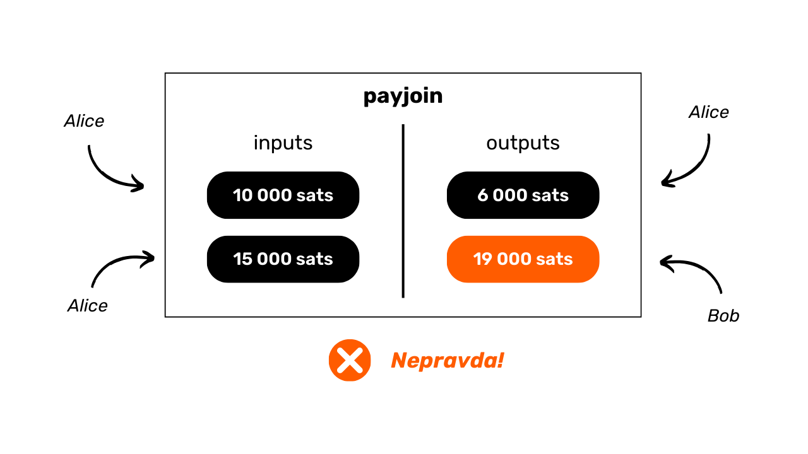
Tato interpretace je zjevně nesprávná, jak již víte, dvě UTXO na vstupu nepatří téže osobě. Jedno pochází od Alice, kupující bagety, a druhé od Boba, pekaře.


Analýza externího pozorovatele je tedy směřována k nesprávnému závěru, což zajišťuje zachování důvěrnosti zúčastněných stran.

### Steganografická transakce

Druhým cílem payjoinu je oklamat externího pozorovatele ohledně skutečné výše platby, která byla provedena. Při zkoumání struktury transakce by analytik mohl věřit, že platba je ekvivalentní k částce jednoho z výstupů.
Pokud se vrátíme k našemu příkladu s nákupem bagety, analytik bude myslet, že částka platby odpovídá buď UTXO 6 000 sats nebo UTXO 19 000 sats. V tomto případě je analytik pravděpodobněji přesvědčen, že částka platby je 19 000 sats, protože existují 2 UTXO na výstupu, z nichž alespoň jedno je větší než 6 000 sats (neexistuje logický důvod použít 2 UTXO k zaplacení 6 000 sats, když jedno UTXO by pro tuto platbu stačilo).
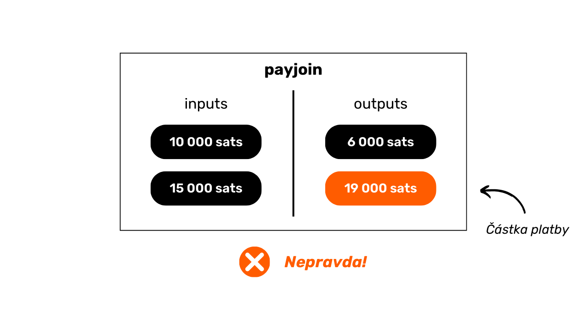

Ale ve skutečnosti je tato analýza nesprávná. Částka platby neodpovídá žádnému z výstupů. Ve skutečnosti je to rozdíl mezi UTXO příjemce na výstupu a UTXO příjemce na vstupu.

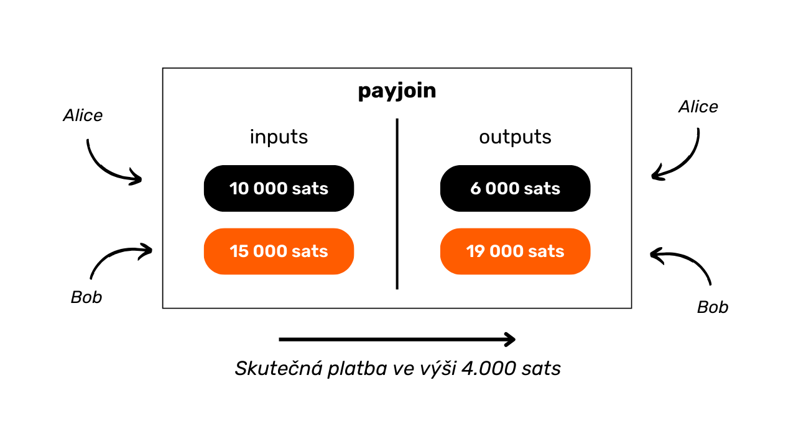

V tomto spočívá payjoin transakce ve sféře steganografie. Umožňuje skrýt skutečnou částku transakce v rámci falešné transakce, která slouží jako návnada.

Steganografie je technika pro skrývání informací v rámci jiných dat nebo objektů takovým způsobem, že přítomnost skrytých informací není zjistitelná. Například tajná zpráva může být skryta uvnitř tečky v textu, který není související, čímž je nedetekovatelná pouhým okem (jedná se o techniku [micropoint](https://fr.wikipedia.org/wiki/Micropoint)).

Na rozdíl od šifrování, které informace činí nečitelnými bez dešifrovacího klíče, steganografie informace nemění. Zůstávají na očích. Jejím cílem je spíše skrýt samotnou existenci tajné zprávy, zatímco šifrování jasně odhaluje přítomnost skrytých informací, ačkoliv jsou nedostupné bez klíče. To je důvod, proč byl původní název pro payjoin "*steganografické transakce*".

Analogii lze nalézt mezi kryptografií a coinjoinem, stejně jako mezi steganografií a payjoinem. Skutečně, coinjoin má atributy podobné těm u šifrování: metoda je rozpoznatelná, ale informace jsou nečitelné. Naopak, payjoin je podobný steganografii: informace jsou teoreticky přístupné, ale protože jejich metoda skrývání není rozpoznatelná, stávají se nedostupnými.

### Jak používat payjoin?

Mezi známý software, který podporuje payjoin, patří Sparrow Wallet, Wasabi Wallet, Mutiny, BitMask, BlueWallet a JoinMarket, stejně jako platební procesor BTCPay.


Nejpokročilejší implementací payjoin byl pouze Stowaway na Samourai Wallet. Nicméně, od zatčení zakladatelů softwaru, toto nástroj nyní funguje jen částečně. Výhodou Stowaway je, že se jedná o kompletní a velmi jednoduše použitelný protokol, který podporuje jak přijímání, tak odesílání payjoinů. Částečně podepsané transakce lze ručně vyměňovat skenováním několika QR kódů nebo automaticky přes Tor prostřednictvím Soroban. Právě tato poslední komunikační možnost je v současné době mimo provoz.

Obtížnost používání payjoin spočívá v jeho závislosti na účasti obchodníka. Jako zákazník nemůžete použít payjoin, pokud ho obchodník nepodporuje. To přidává další obtíž při nákupu: nejenže je složité najít obchodníky, kteří přijímají bitcoin, ale pokud hledáte také ty, kteří podporují payjoins, stává se to ještě složitějším.

Řešením by mohlo být použití transakčních struktur, které zavádějí nejednoznačnost v analýze řetězce bez nutnosti spolupráce příjemce. To by nám umožnilo zlepšit soukromí našich plateb bez závislosti na aktivní účasti obchodníků. To je přesně to, co budeme studovat v další kapitole.

https://planb.network/tutorials/privacy/payjoin-sparrow-wallet

https://planb.network/tutorials/privacy/payjoin-samourai-wallet

## Mini-coinjoiny pro platby
<chapterId>300777ee-30ae-43d7-ab00-479dac3522c1</chapterId>

Pokud hledáte způsob, jak provést platební transakci při zachování určitého stupně soukromí, payjoin je dobrá volba. Ale jak jsme viděli, payjoin vyžaduje zapojení příjemce. Co dělat, pokud tento odmítne účastnit se payjoinu, nebo pokud jednoduše preferujete nezapojovat ho? Alternativou je použití transakce Stonewall nebo Stonewall x2. Podívejme se blíže na tyto dva typy transakcí.

### Transakce Stonewall

Stonewall je specifická forma Bitcoinové transakce zaměřená na zvýšení soukromí uživatele při výdaji tím, že napodobuje pseudo-coinjoin mezi dvěma lidmi, aniž by to skutečně byl. Tato transakce totiž není kolaborativní. Uživatel ji může sestavit sám, pouze s využitím UTXO, které vlastní jako vstupy. Stonewall transakci tedy můžete vytvořit pro jakoukoli příležitost, bez nutnosti synchronizace s jiným uživatelem nebo příjemcem.

Fungování transakce Stonewall je následující: ve vstupu transakce odesílatel použije 2 UTXO, které mu patří. Ve výstupu transakce vytvoří 4 UTXO, z nichž 2 budou mít přesně stejnou částku. Ostatní 2 UTXO budou tvořit změnu. Mezi 2 výstupy se stejnou částkou půjde skutečně jen jeden příjemci platby.
Ve Stonewall transakci jsou pouze 2 role:
- Odesílatel, který provádí platbu;
- Příjemce, který může být o specifické povaze transakce nevědomý a jednoduše čeká na platbu od odesílatele.

Pojďme si vzít příklad, abychom pochopili strukturu této transakce. Alice je u pekaře Boba, aby si koupila bagetu, která stojí 4 000 sats. Chce platit bitcoiny při zachování určité úrovně soukromí ohledně své platby. Proto se rozhodne sestavit pro platbu Stonewall transakci.
Při analýze této transakce vidíme, že Bob pekař skutečně obdržel 4 000 satoshi jako platbu za bagetu. Alice použila jako vstupy 2 UTXO: jedno o hodnotě 10 000 satoshi a druhé o hodnotě 15 000 satoshi. Jako výstupy obdržela 3 UTXO: jedno o hodnotě 4 000 satoshi, jedno o hodnotě 6 000 satoshi a jedno o hodnotě 11 000 satoshi. Alice tak má na této transakci čistý zůstatek -4 000 satoshi, což přesně odpovídá ceně bagety.
V tomto příkladu jsem záměrně opomněl poplatky za těžbu, aby bylo pochopení jednodušší. Ve skutečnosti jsou transakční poplatky zcela na straně odesílatele.

### Jaké jsou cíle transakce Stonewall?

Struktura Stonewall přidává do transakce hodně entropie a zaměňuje stopy pro analýzu blockchainu. Z vnějšku může být taková transakce interpretována jako mini-coinjoin mezi dvěma lidmi. Ve skutečnosti se ale jedná o platbu. Tato metoda tedy generuje nejistoty v analýze blockchainu, nebo dokonce vede k falešným stopám.

Vraťme se k příkladu Alice u Boba pekaře. Transakce na blockchainu by vypadala takto:


Externí pozorovatel, který se spoléhá na běžné heuristiky analýzy blockchainu, by mohl nesprávně usoudit, že "*dva lidé provedli malý coinjoin, s jedním UTXO každý ve vstupu a dvěma UTXO každý ve výstupu*". Analýza této transakce z vnějšku nevede k aplikaci heuristiky společného vlastnictví vstupu (CIOH), protože přítomnost dvou výstupů stejné částky naznačuje vzor coinjoin. Z externího pohledu tedy v tomto konkrétním případě CIOH není aplikovatelná.


Tato interpretace je nepřesná, protože, jak víte, jedno UTXO bylo posláno Bobovi pekaři, 2 UTXO ve vstupu pochází od Alice a ona si vzala zpět 3 výstupy změny.


A co je zvláště zajímavé na struktuře transakce Stonewall, je to, že z pohledu externího pozorovatele vypadá přesně jako struktura transakce Stonewall x2.

### Transakce Stonewall x2

Stonewall x2 je další specifická forma Bitcoinové transakce, která také směřuje k zvýšení soukromí uživatele při výdaji, ale tentokrát spoluprací s třetí stranou, která není zapojena do výdaje. Tato metoda funguje jako pseudo-coinjoin mezi dvěma účastníky, zatímco zároveň se provádí platba třetí osobě.

Provoz transakce Stonewall x2 je relativně jednoduchý: použije se UTXO, které máme k dispozici pro platbu, a žádá se o pomoc třetí stranu, která také přispěje UTXO, které vlastní. Transakce končí čtyřmi výstupy: dvěma ve stejných částkách, jedním určeným pro adresu příjemce platby, druhým pro adresu spolupracovníka. Třetí UTXO je posláno zpět na jinou adresu spolupracovníka, což jim umožňuje získat zpět původní částku (neutrální akce pro ně, mínus poplatky za těžbu), a poslední UTXO se vrací na adresu nám, což představuje změnu platby.

Tak jsou definovány tři různé role v transakcích Stonewall x2:
- Odesílatel, který provádí skutečnou platbu;
- Příjemce, který nemusí být specifické povahy transakce vědom a jednoduše očekává platbu od odesílatele;
- Spolupracovník, který poskytuje bitcoiny, aby vytvořil nejistotu v analýze transakce, přičemž na konci plně získá zpět své prostředky (pro něj neutrální akce, mínus poplatky za těžbu).
Pojďme se vrátit k našemu příkladu s Alicí, která je u Boba pekaře, aby si koupila bagetu, která stojí 4 000 sats. Chce platit bitcoiny, přičemž si chce zachovat určitou úroveň soukromí své platby. Proto vyzve svého přítele Charlese, který jí v tomto procesu pomůže.


Analýza této transakce ukazuje, že Bob pekař skutečně obdržel 4 000 sats za bagetu. Alice použila 10 000 sats na vstupu a získala 6 000 sats na výstupu, což vede k čisté bilanci -4 000 sats, což odpovídá ceně bagety. Co se týče Charlese, poskytl 15 000 sats na vstupu a obdržel dva výstupy: jeden 4 000 sats a druhý 11 000 sats, což dělá bilanci 0.

V tomto příkladu jsem záměrně zanedbal poplatky, aby bylo pochopení jednodušší. Ve skutečnosti jsou poplatky za těžbu obvykle rozděleny rovným dílem mezi vydavatele platby a spolupracovníka.

### Jaké jsou cíle transakce Stonewall x2?
Podobně jako struktura Stonewall přidává struktura Stonewall x2 do transakce významné množství entropie a zastírá stopy analýzy řetězce. Z vnějšího pohledu by taková transakce mohla být interpretována jako malý coinjoin mezi dvěma lidmi. Ve skutečnosti se ale jedná o platbu. Tato metoda tedy generuje nejistoty v analýze řetězce, dokonce vedoucí k falešným stopám.

Pojďme se znovu podívat na příklad Alice, Boba pekaře a Charlese. Transakce na blockchainu by vypadala takto:


Vnější pozorovatel, spoléhající na běžné heuristiky analýzy řetězce, by mohl chybně usoudit, že "*Alice a Charles provedli malý coinjoin, s jedním UTXO každý na vstupu a dvěma UTXO každý na výstupu*". Opět, analýza této transakce z vnějšku nevede k aplikaci heuristiky společného vlastnictví vstupu (CIOH), protože přítomnost dvou výstupů stejné částky naznačuje vzor coinjoin. Z vnějšího pohledu tedy v tomto konkrétním případě CIOH není aplikovatelná.


Tato interpretace je nepřesná, protože, jak víte, jeden UTXO byl poslán Bobovi pekaři, Alice má pouze jeden výstup změny a Charles má dva.


A opět, co je zvláště zajímavé na struktuře transakce Stonewall x2, je, že z pohledu vnějšího pozorovatele vypadá přesně jako struktura transakce Stonewall.

### Jaký je rozdíl mezi Stonewall a Stonewall x2?

Transakce StonewallX2 funguje přesně jako transakce Stonewall, s tím rozdílem, že první je kolaborativní, zatímco druhá není. Jak jsme viděli, transakce Stonewall x2 zahrnuje účast třetí strany (Charlese), která je externí vůči platbě, a která poskytuje své bitcoiny, aby zvýšila důvěrnost transakce. V klasické transakci Stonewall je role spolupracovníka převzata odesílatelem.

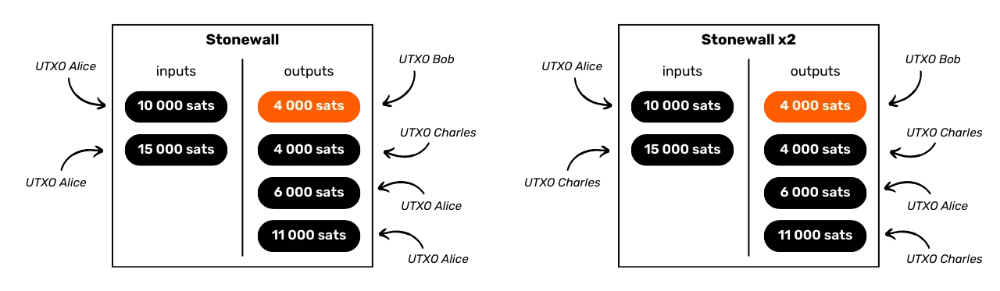

Z vnějšího pohledu je tedy vzor transakce přesně stejný.

Fakt, že tyto dvě struktury transakcí sdílejí přesně stejný vzor, naznačuje, že i když externí pozorovatel dokáže identifikovat vzor "Stonewall(x2)", nebude mít všechny informace. Nebude schopen určit, který ze dvou UTXO stejných částek odpovídá platbě. Navíc nebude schopen určit, zda dva UTXO ve vstupech pocházejí od dvou různých lidí (Stonewall x2) nebo zda patří jedné osobě, která je sloučila (Stonewall).
Tento poslední bod je způsoben tím, že transakce Stonewall x2 následují přesně stejný vzor jako transakce Stonewall. Zvenčí a bez dalších informací o kontextu je nemožné odlišit transakci Stonewall od transakce Stonewall x2. Nicméně, prvně jmenované nejsou kolaborativní transakce, zatímco druhé ano. To přidává ještě více pochybností do analýzy jedné z těchto transakcí.

### Kdy použít transakce Stonewall a Stonewall x2?

Logika by měla být následující, když chcete použít nástroj pro ochranu soukromí pro transakci:
- Jako prioritu si můžete vybrat provést payjoin;
- Pokud obchodník nepodporuje payjoins, můžete provést kolaborativní transakci s jinou osobou mimo platbu pomocí struktury Stonewall x2;
- Pokud se nenajde nikdo, kdo by provedl transakci Stonewall x2, můžete provést transakci Stonewall sami, která bude napodobovat chování transakce Stonewall x2.

### Jak používat transakce Stonewall a Stonewall x2?

Transakce Stonewall a Stonewall x2 jsou dostupné jak v aplikaci Samourai Wallet, tak v softwaru Sparrow Wallet.


Nicméně, stejně jako u payjoins, po zatčení zakladatelů Samourai, nyní transakce Stonewall x2 fungují pouze manuální výměnou PSBT mezi zúčastněnými stranami. Automatická výměna prostřednictvím Soroban bohužel v současné době není dostupná.

Je také možné manuálně provést tento typ transakce z jakéhokoli softwaru pro Bitcoin peněženku.

V další kapitole se budeme věnovat další technice ochrany soukromí, která je relativně neznámá, ale je velmi užitečná v doplnění toho, co jsme již studovali.

https://planb.network/tutorials/privacy/stonewall

https://planb.network/tutorials/privacy/stonewall-x2

## Ricochets
<chapterId>db9a20ac-a149-443d-884b-ea6c03f28499</chapterId>

Použití struktur Bitcoin transakcí, které přidávají nejednoznačnost v analýze řetězce, jako je coinjoin, je zvláště prospěšné pro ochranu soukromí. Nicméně, jak jsme diskutovali v kapitole o payjoins, transakce coinjoin jsou přirozeně identifikovatelné v řetězci. Vzpomeňte si na analogii, kterou jsme vytvořili mezi šifrováním a coinjoins: když někdo zašifruje soubor, třetí strana objevující tento zašifrovaný soubor nemůže přistupovat k jeho obsahu, ale může jasně identifikovat, že došlo k modifikaci souboru, aby se jeho obsah skryl. Totéž platí pro coinjoin: když analytik zkoumá transakci coinjoin, ačkoli nemůže stanovit přímé vazby mezi vstupy a výstupy (a naopak), může přesto rozpoznat, že pozorovaná transakce je coinjoin.
V závislosti na zamýšleném použití vaší mince po projití cykly coinjoin může být fakt, že prošla tímto procesem, problematický. Například, pokud plánujete prodat vaši minci na regulované obchodní platformě, ale nedávno prošla coinjoinem, nástroj pro analýzu řetězce platformy tento fakt odhalí. Platforma pak může odmítnout přijmout váš UTXO, který prošel coinjoinem, nebo dokonce požadovat od vás vysvětlení, s rizikem, že váš účet bude pozastaven nebo vaše prostředky zmrazeny. V některých případech může platforma také nahlásit vaše chování státním orgánům (například to vyžaduje TRACFIN od poskytovatelů služeb digitálních aktiv (PSAN) ve Francii).


To, co bychom potřebovali k vyhnutí se tomuto, je nástroj schopný zamaskovat stopy minulosti Bitcoinové mince, aby obnovil určitou formu zaměnitelnosti. To je přesně cíl ricochetu.


### Co je ricochet?

Ricochet je technika, která zahrnuje provádění několika fiktivních transakcí na sebe (sweeping) za účelem simulace převodu vlastnictví bitcoinů. Tento nástroj se liší od jiných struktur transakcí, o kterých jsme diskutovali, protože neumožňuje potenciální anonymitu, ale spíše formu retrospektivní anonymity. Ricochet skutečně umožňuje zamaskovat specifika, která by mohla ohrozit zaměnitelnost Bitcoinové mince kvůli její minulosti.

Aby zamaskoval otisk zanechaný minulou událostí na minci, jako jsou například cykly coinjoin, ricochet provádí čtyři po sobě jdoucí transakce, kde uživatel převádí prostředky na sebe na různé adresy.

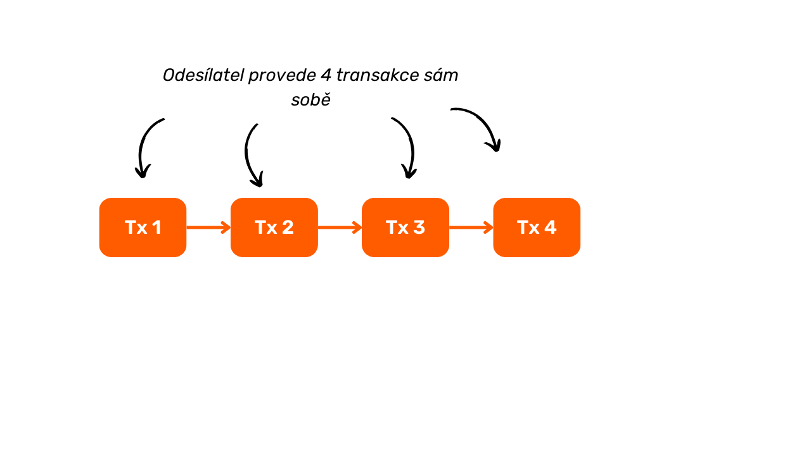

Po této sérii transakcí nástroj ricochet nakonec směruje bitcoiny na jejich konečné místo určení, jako je například obchodní platforma.

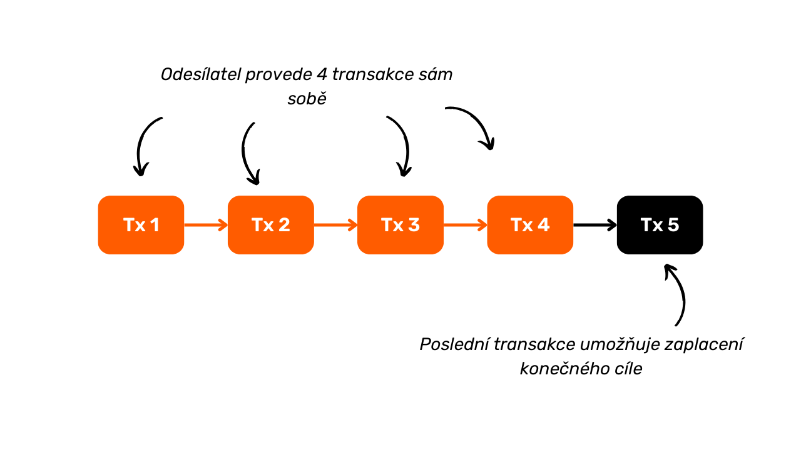

Cílem je vytvořit vzdálenost ovlivňující zaměnitelnost mince, jako je transakce coinjoin, a konečný akt utrácení, který by mohl tuto minci odmítnout kvůli její minulosti. Takto by nástroje pro analýzu řetězce mohly dospět k závěru, že po události pravděpodobně došlo ke změně vlastnictví, a považovat tuto minci za zaměnitelnou. V případě coinjoinu by nástroje pro analýzu řetězce mohly pak předpokládat, že není stejná osoba, která poslala bitcoiny a provedla coinjoin, a proto není nutné proti odesílateli zahajovat akce.


### Proč to funguje?
Vzhledem k této metodě ricochetu by si člověk mohl představit, že software pro analýzu řetězce by prohloubil své zkoumání za čtyři skoky. Tyto platformy však čelí dilematu v optimalizaci prahu detekce. Musí stanovit limit počtu skoků, po kterých přiznají, že pravděpodobně došlo ke změně vlastnictví a že by měl být ignorován vztah s předchozí událostí (jako je coinjoin).
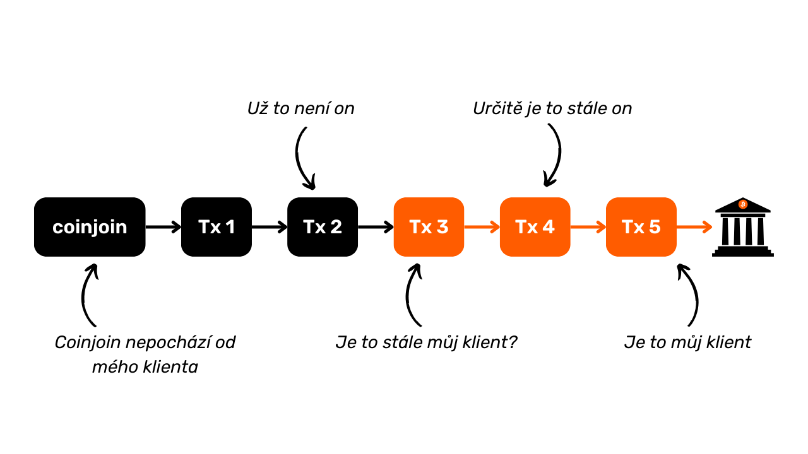

Stanovení tohoto prahu se však ukazuje jako riskantní: každé prodloužení pozorovaného počtu skoků exponenciálně zvyšuje objem falešných pozitiv, tj. jedinců chybně označených za účastníky události, když operaci provedl někdo jiný. Tento scénář představuje pro tyto společnosti velké riziko, protože falešná pozitiva vedou k nespokojenosti, která může dotčené zákazníky tlačit k konkurenci. V dlouhodobém horizontu vede příliš široký detekční práh k tomu, že platforma ztrácí více zákazníků než její konkurenti, což by mohlo ohrozit její životaschopnost. Proto je pro tyto platformy komplikované zvyšovat počet pozorovaných skoků, a 4 je často dostatečný počet k odražení jejich analýz.

Pozorovaný fenomén je zde do jisté míry analogický teorii šesti stupňů oddělení.
Teorie šesti stupňů oddělení naznačuje, že jakákoli osoba na Zemi je spojena s jakoukoliv jinou prostřednictvím řetězce známých, který nezahrnuje více než šest prostředníků. Stačilo by projít sérií šesti lidí, kteří osobně znají následujícího, aby se dosáhlo jakékoli osoby na světě.
U transakcí s Bitcoinem se objevuje podobný jev. Při sledování dostatečného počtu transakcí s Bitcoinem se nevyhnutelně narazí na coinjoin. Metoda ricochet využívá tohoto principu tím, že používá více skoků, než kolik mohou burzovní platformy rozumně sledovat. Pokud se platformy rozhodnou sledovat více transakcí, je pak možné jednoduše přidat další skok, aby se tato opatření obešla.

### Kdy a jak použít ricochet?

Nejčastější případ použití ricochetu nastává, když je nutné skrýt předchozí účast na coinjoinu na UTXO, které vlastníte. Ideálně je lepší se vyhnout převodu bitcoinů, které prošly coinjoinem, na regulované subjekty. Nicméně, v případě, že se člověk ocitne bez jiné možnosti, zejména v naléhavosti přeměnit bitcoiny na fiat měnu, nabízí ricochet účinné řešení.

Tato metoda je účinná nejen pro coinjoins, ale také pro jakékoli jiné označení, které by mohlo ohrozit zaměnitelnost mince.
Nápad této metody ricochet původně pochází od týmů v Samourai Wallet, kteří ji integrovali do své aplikace, aby automatizovali proces. Služba je na Samourai placená, protože ricochet zahrnuje poplatek za službu ve výši 100 000 sats, kromě poplatků za těžbu. Jeho použití se tedy doporučuje spíše pro převody významných částek.


Aplikace Samourai nabízí dvě varianty ricochetu:
- Vylepšený ricochet, nebo "staggered delivery", který má výhodu rozložení poplatků za službu Samourai na pět po sobě jdoucích transakcí. Tato možnost také zajišťuje, že každá transakce je vysílána v odlišném čase a zaznamenána v jiném bloku, což jí umožňuje co nejvíce napodobit chování změny vlastnictví. Ačkoli je pomalejší, tato metoda je preferována pro ty, kteří se nechvátají, protože maximalizuje efektivitu ricochetu posílením jeho odolnosti vůči analýze řetězce;


- Klasický ricochet, který je navržen tak, aby operaci provedl rychle vysíláním všech transakcí v krátkém časovém rámci. Tato metoda tedy nabízí menší soukromí a nižší odolnost vůči analýze než vylepšená metoda. Měla by být použita pouze pro naléhavé zásilky.


Ricochet jednoduše zahrnuje poslání bitcoinů sami sobě. Je zcela možné provést ricochet ručně na jakémkoli softwaru peněženky, aniž byste používali specializovaný nástroj. Stačí převést stejnou minci na sebe opakovaně, pokaždé použít novou prázdnou adresu.

V následující kapitole prozkoumáme různé techniky pro tajné převody majetku. Tyto metody se radikálně liší od těch, které jsme dosud zkoumali, jak z hlediska provozu, tak výsledků.

https://planb.network/tutorials/privacy/ricochet
 
## Tajné převody majetku
<chapterId>a2067036-849c-4d6b-87d2-44235cfae7a1</chapterId>

Mezi technikami soukromí na Bitcoinu je také tajný převod majetku. Tato metoda má za cíl převést vlastnictví bitcoinů z jedné osoby na druhou, a naopak, aniž by tato transakce byla explicitně viditelná na blockchainu. Pojďme společně prozkoumat různé dostupné techniky, stejně jako jejich výhody a nevýhody.

### CoinSwap
CoinSwap je založen na relativně jednoduchém konceptu: používá chytré kontrakty k usnadnění převodu vlastnictví bitcoinů mezi dvěma uživateli, bez nutnosti důvěry a bez toho, aby byl tento převod explicitně viditelný na blockchainu.

Představme si zjednodušený příklad s Alicí a Bobem. Alice vlastní 1 BTC zabezpečený soukromým klíčem $A$, a Bob také vlastní 1, zabezpečený soukromým klíčem $B$. Teoreticky by mohli vyměnit své soukromé klíče prostřednictvím externího komunikačního kanálu, aby provedli tajný převod.


Tato naivní metoda však představuje vysoké riziko z hlediska důvěry. Nic nebrání Alici, aby si po výměně ponechala kopii soukromého klíče $A$ a později jej použila k odcizení bitcoinů, jakmile je klíč v Bobově držení.


Navíc neexistuje žádná záruka, která by bránila Alici přijmout Bobův soukromý klíč $B$ a nikdy neodeslat svůj soukromý klíč $A$ na oplátku. Tato výměna se tedy spoléhá na nadměrnou důvěru mezi stranami a ukazuje se jako neefektivní v zajištění bezpečného tajného převodu vlastnictví.


Abychom tyto problémy vyřešili a umožnili výměny mezi stranami, které si nevěří, můžeme místo toho použít systémy chytrých kontraktů. Chytrý kontrakt je program, který se automaticky spustí, když jsou splněny předem definované podmínky, což v našem případě zajišťuje, že výměna vlastnictví proběhne automaticky bez nutnosti vzájemné důvěry.

K tomu můžeme použít HTLC (*Hash Time-Locked Contracts*) nebo PTLC (*Point Time-Locked Contracts*). Tyto dva protokoly fungují podobně pomocí systému časového zámku, který zaručuje, že výměna buď proběhne úspěšně, nebo je zcela zrušena, čímž chrání integritu finančních prostředků obou stran. Hlavní rozdíl mezi HTLC a PTLC je, že HTLC používá hash a preimage k zabezpečení transakce, zatímco PTLC používá Adaptor Signatures.

Ve scénáři coinswapu s použitím HTLC nebo PTLC mezi Alicí a Bobem probíhá výměna bezpečně: buď uspěje a každý obdrží BTC toho druhého, nebo selže a každý si ponechá své BTC. Je tedy nemožné, aby jedna ze stran podváděla nebo kradla BTC té druhé.

> *HTLC jsou také mechanismem používaným pro bezpečné směrování plateb přes obousměrné kanály Lightning Network.*
Použití Adaptor Signatures je v tomto kontextu obzvláště zajímavé, protože umožňuje obejít tradiční skripty (jedná se o mechanismus někdy označovaný jako "_scriptless scripts_"). Tato funkce pomáhá snižovat poplatky spojené s výměnou. Další velkou výhodou Adaptor Signatures je, že nevyžadují použití společného hash pro obě strany transakce, čímž se vyhýbá odhalení přímého spojení mezi nimi v určitých typech výměn.
### Adaptor Signatures

Adaptor Signatures jsou kryptografická metoda, která integruje platný podpis s dalším podpisem, nazývaným "_adaptor signature_", k odhalení tajného kusu dat. Tento mechanismus je navržen tak, že znalost 2 z následujících 3 prvků: platný podpis, adaptor signature a tajemství, umožňuje odvodit chybějící třetí prvek. Zajímavou vlastností této metody je, že pokud známe adaptor signature naší protistrany a konkrétní bod na eliptické křivce spojený s tajemstvím použitým k výpočtu tohoto adaptor signature, můžeme odvodit vlastní adaptor signature, který bude kompatibilní s tímto stejným tajemstvím, aniž bychom kdy měli přímý přístup k samotnému tajemství.
Při coinswapu umožňuje použití Adaptor Signatures současné odhalení dvou citlivých informací mezi účastníky, čímž se eliminuje potřeba vzájemné důvěry. Pojďme si tento proces ilustrovat na příkladu s Alicí a Bobem, kteří si chtějí vyměnit vlastnictví 1 BTC každý, ale nevěří si navzájem. Používají Adaptor Signatures, aby odstranili potřebu důvěry v této výměně. Postupují takto:
* Alice zahájí výměnu vytvořením transakce $m_A$, která pošle 1 BTC Bobovi. Vygeneruje podpis $s_A$, který tuto transakci ověří, pomocí svého soukromého klíče $p_A$ ($P_A = p_A \cdot G$), nonce $n_A$ ($N_A = n_A \cdot G$) a tajemství $t$ ($T = t \cdot G$):

$$s_A = n_A + t + H(N_A + T \parallel P_A \parallel m_A) \cdot p_A$$

* Alice vypočítá adaptorový podpis $s_A'$ odečtením tajemství $t$ od jejího pravého podpisu $s_A$:

$$s_A' = s_A - t$$

* Alice pošle Bobovi svůj adaptorový podpis $s'_A$, její nepodepsanou transakci $m_A$, bod odpovídající tajemství ($T$) a bod odpovídající nonce ($N_A$). Tyto prvky tvoří to, co se nazývá "*adaptor*". Je důležité si uvědomit, že pouze s touto informací Bob nemůže získat zpět BTC od Alice.
* Bob však má možnost ověřit, že se Alice nesnaží od něj ukrást. Aby to udělal, zkontroluje, zda adaptorový podpis Alice $s_A'$ skutečně odpovídá navrhované transakci $m_A$. Pokud je následující rovnice správná, může být poté jistý, že adaptorový podpis Alice je platný:
$$s_A' \cdot G = N_A + H(N_A + T \parallel P_A \parallel m_A) \cdot P_A$$

* Toto ověření poskytuje Bobovi dostatečné záruky, aby mohl s výměnou pokračovat s důvěrou. Poté vytvoří svou vlastní transakci $m_B$, určenou k odeslání 1 BTC Alici, a vygeneruje svůj adaptorový podpis $s_B'$, který bude také spojen se stejným tajemstvím $t$. V tomto okamžiku zná hodnotu $t$ pouze Alice; Bob zná pouze odpovídající bod $T$, který mu Alice předala:

$$s_B' = n_B + H(N_B + T \parallel P_B \parallel m_B) \cdot p_B$$

* Bob předá Alici svůj adaptorový podpis $s_B'$, jeho nepodepsanou transakci $m_B$, stejně jako bod odpovídající tajemství ($T$) a bod odpovídající nonce ($N_B$). Alice, která zná tajemství $t$, nyní může kombinovat Bobův adaptorový podpis $s_B'$ s tímto tajemstvím, aby vygenerovala platný podpis $s_B$ pro transakci $m_B$, která převede Bobovo BTC na ni:

$$s_B = s_B' + t$$

$$(s_B' + t) \cdot G = N_B + T + H(N_B + T \parallel P_B \parallel m_B) \cdot P_B$$

* Alice vysílá tuto podepsanou transakci $m_B$ na Bitcoin blockchain, aby získala slíbené BTC od Boba. Když Bob uvidí tuto transakci na blockchainu, může extrahovat podpis $s_B = s_B' + t$. S touto informací je pak Bob schopen izolovat slavné tajemství $t$, které potřeboval:
$$t = (s_B' + t) - s_B' = s_B - s_B'$$
* A skutečně, toto tajemství $t$ byl jediný chybějící prvek, který Bob potřeboval k vygenerování platného podpisu $s_A$ z Aliceiného adaptérového podpisu $s_A'$. Tento podpis umožňuje ověřit transakci $m_A$, která posílá BTC od Alice k Bobovi. Bob poté vypočítá $s_A$ a následně vysílá transakci $m_A$ na blockchain:

$$s_A = s_A' + t$$

$$(s_A' + t) \cdot G = N_A + T + H(N_A + T \parallel P_A \parallel m_A) \cdot P_A$$
Shrněme, jak funguje adaptérový podpis v coinswapu. Původně Alice pošle Bobovi nepodepsanou transakci spolu s adaptérem, který Bobovi umožňuje ověřit, že později odhalené tajemství mu dá přístup k bitcoinům. Na oplátku Bob pošle Alici jeho vlastní nepodepsanou transakci a jeho adaptér. Alice pak může dokončit Bobovu transakci a získat zpět bitcoiny tím, že vysílá platnou transakci s použitím tajemství. Když je tato transakce publikována na blockchainu, Bob má možnost extrahovat tajemství a tím odemknout Alicinu transakci. V důsledku toho, pokud Alice zahájí převod Bobových bitcoinů, on může na oplátku získat přístup k Aliciným bitcoinům bez nutnosti vzájemné důvěry.
Je důležité poznamenat, že coinswapy byly poprvé navrženy [Gregorym Maxwellem v říjnu 2013 na BitcoinTalk](https://bitcointalk.org/index.php?topic=321228.0).

### Atomický Swap

Podobně jako coinswap a s použitím stejných typů chytrých kontraktů, je také možné provádět atomické swapy. Atomický swap umožňuje přímou výměnu různých kryptoměn, jako jsou BTC a XMR, mezi dvěma uživateli bez nutnosti důvěry nebo zásahu prostředníka. Tyto výměny se nazývají "atomické", protože mají pouze dvě možné výsledky: buď je výměna úspěšná a obě strany jsou spokojeny, nebo selže a každý si ponechá své původní kryptoměny, čímž se eliminuje potřeba důvěry v druhou stranu.


Atomický swap a coinswap mají podobný způsob fungování a nabízejí stejné výhody a nevýhody z hlediska soukromí. Skutečně, z pohledu Bitcoinu, je atomický swap srovnatelný s coinswapem provedeným ve dvou krocích. Nejprve vyměníme naše BTC za jinou kryptoměnu a poté tuto kryptoměnu můžeme vyměnit za jiné BTC. Nakonec získáme BTC jiného uživatele. To je důvod, proč v analýze problémů soukromí řadím tyto dva protokoly do kategorie tajných výměn vlastnictví.


Na rozdíl od coinswapu však může mít atomický swap nerovnováhy z hlediska dostupné likvidity, zejména při výměnách BTC/XMR. Obecně je snazší vyměnit bitcoiny za altcoiny, protože je vysoká poptávka po bitcoinech, což udržuje prémie nízké pro tento směr konverze. Výměna altcoinů za získání BTC může být však složitější kvůli nižší poptávce, což často vede k velmi vysokým prémiím.

Konečně, když atomická výměna zahrnuje onchain bitcoiny a bitcoiny na Lightning network, pak se tomu říká "*submarine swap*".

### Je to skutečně užitečné?
Tajné převody majetku, jako jsou coinswapy a atomické swapy, mají výhodu v tom, že klamou heuristiky analýzy řetězce. Tyto metody mohou vytvářet dojem, že transakce zahrnují stejného uživatele, i když se skutečné vlastnictví přesunulo. Hlavní nevýhodou těchto metod je však to, že jsou velmi riskantní bez použití dodatečné techniky k přerušení historie mince.
Opravdu, když Alice provádí coinswap nebo atomic swap s Bobem, vyměňuje vlastnictví svých bitcoinů za Bobovy. V případě atomic swapu zahrnuje výměna altcoin, ale princip zůstává stejný. Takže Alice skončí s mincí $B$ a Bob s mincí $A$. To přidává pochybnosti do analýzy řetězce, ale historie mincí zůstává vystopovatelná. Pokud analytik zkoumá minci $A$, může se vrátit k předchozím aktivitám Alice a naopak pro minci $B$.
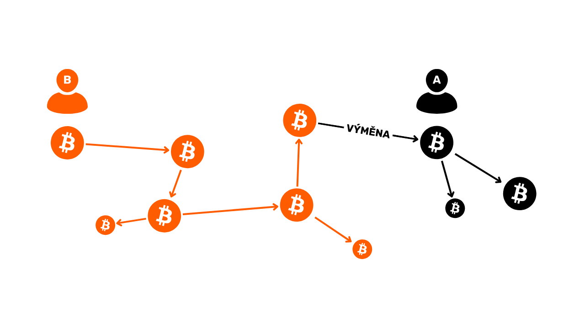

Z pohledu Alice je riziko, že historie mince $B$ by mohla být určitými subjekty považována za podezřelou. Pokud by například Bob získal minci $B$ v trestném činu, jako je hacking, tato mince by zůstala spojena s jeho nelegálními aktivitami. Alice by se pak mohla ocitnout ve vlastnictví mince, kterou by nemohla převést na regulovaných burzách bez rizika, že její prostředky budou zmrazeny, nebo dokonce obviněna z Bobových zločinů, ačkoliv s nimi neměla nic společného.

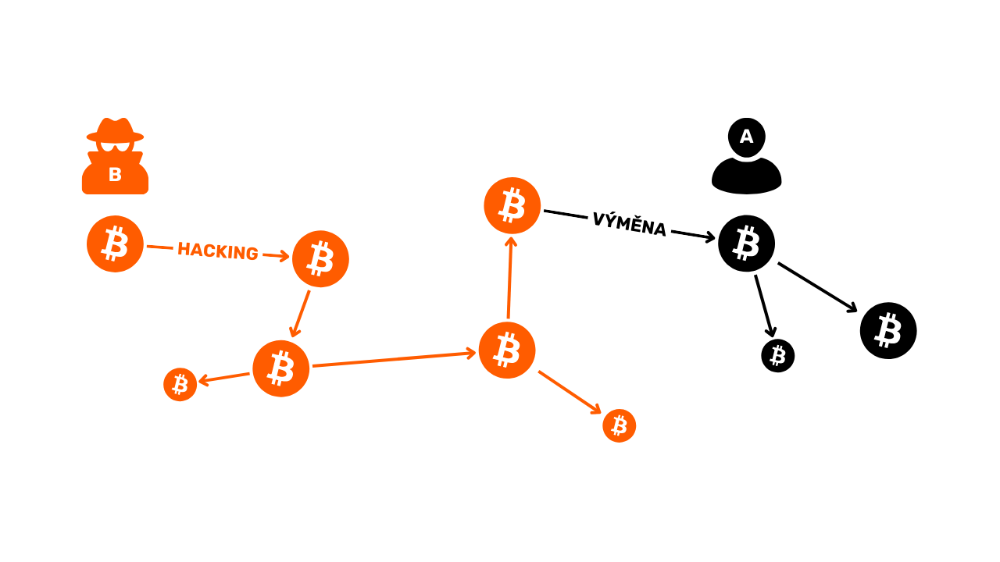

A samozřejmě, metody soukromí jako coinswap nebo atomic swap jsou upřednostňovány zločinci, jejichž prostředky jsou sledovány úřady. Tyto protokoly jim nabízejí možnost zbavit se svých sledovaných bitcoinů výměnou za dokonale zaměnitelné bitcoiny. To jim také umožňuje vytvořit odvrácení pozornosti, směřující úřady k jiným uživatelům. Pro tyto jedince existuje tedy dvojí užitek.

S coinjoin, i když je vaše mince smíchána se sledovanými bitcoiny, historie mince je přerušena, což poskytuje formu věrohodného popření, která neexistuje u protokolů tajného převodu vlastnictví jako jsou coinswap nebo atomic swap.


Pokud chce Alice vyhnout se jakémukoli riziku, musí nutně použít metodu k přerušení historie mince $B$, jako je například použití coinjoin. To vyvolává otázku o užitečnosti kombinace tajného převodu vlastnictví a coinjoin. Coinjoin, přerušením historie mince, již poskytuje dostatečnou úroveň soukromí pro Alice. Takže, mé mínění je, že pokud Alice hledá ochranu svého soukromí, bylo by rozumnější přímo postupovat s coinjoin, než se zapojit do coinswapu následovaného coinjoinem.
Aby byly metody tajného převodu vlastnictví skutečně účinné a vyhnuly se riziku spojení historie uživatele $A$ s uživatelem $B$, bylo by paradoxně nutné, aby jejich použití bylo široce známé. Pokud je coinswap masivně používán a úřady jsou si této běžné praxe vědomy, pak by mohlo být zřízeno věrohodné popření. Nicméně, dokud zůstává použití těchto převodů okrajové, věřím, že tyto metody zůstanou pro uživatele příliš riskantní.

Doposud jsme se hlavně zabývali metodami soukromí na úrovni samotných transakcí. V další kapitole prozkoumáme problémy na úrovni sítě a šíření transakcí.

## Soukromí na P2P síti
<chapterId>04a2467b-db84-4076-a9ff-919be5135106</chapterId>

V části 4 jsme diskutovali o důležitosti používání plného uzlu k ochraně soukromí vašich transakcí. Je však důležité pochopit, že váš uzel sám může být předmětem útoků, které se snaží extrahovat informace o vašich aktivitách. V této kapitole se proto budeme zabývat různými opatřeními na ochranu soukromí, ne na úrovni samotných transakcí nebo toků bitcoinů, ale na úrovni sítě.

### Pampeliška
Jedním ze způsobů, jak se vyhnout různým útokům na de-anonymizaci, je použití návrhu Dandelion. Tento protokol šíření byl formalizován v BIP156, ale nikdy nebyl implementován do Bitcoinu.
Idea Dandelion spočívá ve zlepšení soukromí směrování transakcí v síti Bitcoin, aby se čelilo různým formám útoků. Jeho hlavním cílem je skrýt zdrojový uzel, který původně vysílal transakci v síti. Odhalení tohoto uzlu by mohlo spojit Bitcoinovou transakci s konkrétní IP adresou (pokud uzel funguje na clearnetu), což by mohlo poskytnout vstupní bod pro analýzu řetězce.
Toto spojení mezi aktivitou na Bitcoinu a IP adresou představuje významné riziko pro soukromí uživatele. Skutečně, mnoho subjektů může snadno spojit IP adresu s osobní identitou. To zahrnuje zejména vlády a poskytovatele internetových služeb. Navíc tyto informace mohou být veřejně dostupné, například pokud jsou vaše IP adresa a osobní údaje vystaveny kvůli úniku během hackování databáze webové stránky.
Při standardním provozu Bitcoinu jsou transakce vytvořené uživatelem ve své peněžence přenášeny na jeho osobní uzel. Tento uzel okamžitě vysílá novou transakci všem svým připojeným vrstevníkům.


Tito vrstevníci poté ověří transakci, aby zajistili, že je v souladu s pravidly konsensu a místními standardizačními pravidly. Jakmile je ověřena, každý vrstevník po sobě přenáší transakci svým vlastním vrstevníkům, a tak dále.


Distribuce transakcí čekajících na začlenění do bloku se provádí poměrně vyváženým a statisticky předvídatelným způsobem. Tuto zranitelnost mohou využít spolupracující špehovací uzly, které spolupracují na monitorování a analýze sítě, aby identifikovaly první uzel, který vysílal transakci. Pokud pozorovatel dokáže lokalizovat zdrojový uzel, může předpokládat, že transakce pochází od provozovatele tohoto uzlu. Tento typ pozorování může spojit transakce, obvykle anonymní, s konkrétními IP adresami.


Cílem BIP156 je tento problém řešit. K tomu zavádí dodatečnou fázi ve vysílání nové transakce, aby se před širokou veřejnou propagací zachovala anonymita. Dandelion nejprve používá fázi "stem" (stonku), kde je transakce poslána přes náhodnou cestu uzlů.


Poté je transakce vysílána do celé sítě ve fázi "fluff" (chmýří).


Stonková a chmýřová fáze jsou odkazy na chování šíření transakce sítí, které připomíná tvar pampelišky.

Takto špehovací uzly mohou potenciálně vystopovat transakci zpět k uzlu, který zahájil fázi chmýří (masivní vysílání), ale tento uzel není ten, který transakci vysílal jako první, protože ji přijal od posledního uzlu ve fázi stonku. Pokud špehovací uzly nemohou vystopovat cestu zpět po stonku, nemohou také identifikovat zdrojový uzel.


I přítomnost špehovacích uzlů během stonkové fáze vždy zanechává pochybnosti, protože jakmile narazí na poctivý uzel v grafu šíření, špehové nemohou určit, zda je tento uzel původním zdrojem nebo pouze prostředníkem.

Tato metoda směrování ztěžuje sledování cesty k zdrojovému uzlu, což znesnadňuje vystopování transakce v síti zpět k jejímu původu. Dandelion tak zlepšuje soukromí tím, že omezuje schopnost protivníků deanonymizovat síť. Tato metoda je ještě účinnější, když transakce během fáze "stem" projde uzlem, který šifruje svou síťovou komunikaci, jako je Tor nebo P2P Transport V2.
BIP156 nebyl integrován do Bitcoin Core a je v současné době klasifikován pod stavem "odmítnuto". Jedním z hlavních problémů tohoto protokolu je skutečnost, že během fáze stem musí být transakce předávány prostřednictvím intermediárních uzlů před ověřením. Jak jsme viděli, v normálním modelu Bitcoinu každý uzel nejprve ověří transakci před jejím šířením mezi své partnery. Pokud transakce nesplňuje pravidla konsensu nebo lokální standardizační pravidla uzlu, ignoruje ji a nešíří dále. Tento proces je důležitý pro boj proti DoS útokům, protože jsou šířeny pouze platné transakce do celé sítě. Neplatné transakce, potenciálně generované hromadně za účelem přetížení sítě, jsou zastaveny u prvního narazího uzlu a nedostanou se dále. Hlavním rizikem s Dandelionem je, že tento nový protokol by mohl představovat nové vektory pro DoS útoky tím, že umožní šíření neplatných transakcí částí sítě.

### P2P Transport V2

P2P Transport V2 je další síťový protokol prezentovaný v BIP324. Jedná se o novou verzi protokolu pro P2P transport Bitcoinu, která zahrnuje příležitostné šifrování pro zlepšení důvěrnosti a bezpečnosti komunikace mezi uzly.

Toto vylepšení si klade za cíl vyřešit několik problémů s základní verzí P2P protokolu. Na jedné straně činí vyměňovaná data nerozeznatelná od jiných typů dat, která kolují na internetu pro pasivního pozorovatele. Hlavním cílem je zabránit vládám, poskytovatelům internetových služeb nebo poskytovatelům VPN v masivním sledování uživatelů Bitcoinu. To také komplikuje úkol pro tyto entity určit, zda je internetový uživatel také uživatelem Bitcoinu, tedy zda provozuje plný uzel.
P2P V2 také přispívá ke snížení rizik cenzury a útoků prostřednictvím detekce specifických vzorů v datových paketech. Komplikuje a činí provedení různých typů Sybil útoků nákladnějšími na úrovni sítě. Sybil útok nastává, když aktér vytvoří více falešných identit, aby získal neoprávněnou výhodu. V kontextu Bitcoinové sítě se to často projevuje jako aktér ovládající velké množství plných uzlů a agresivně je využívající k násobení spojení. Sybil útoky mohou být pasivní, s cílem shromažďovat informace a kompromitovat důvěrnost uživatele, nebo aktivní, ve formě Eclipse útoků. Ty izolují specifický uzel od zbytku sítě, což umožňuje buď cenzurovat uživatele, nebo upravit data, která přijímají. Nakonec P2P V2 také činí *Man-In-The-Middle* (MITM) útoky nákladnějšími a snadněji detekovatelnými.
Šifrování implementované P2P V2 nezahrnuje autentizaci, aby se nepřidávala zbytečná složitost a nekompromitovala bezpovolenost připojení k síti. Tento nový P2P transportní protokol přesto nabízí lepší bezpečnost proti pasivním útokům a činí aktivní útoky výrazně nákladnějšími a detekovatelnými. Zavedení pseudonáhodného datového proudu v síťových zprávách komplikuje úkol pro útočníky, kteří si přejí cenzurovat nebo manipulovat s komunikací.

P2P V2 transport byl zahrnut jako volba (ve výchozím nastavení zakázáno) ve verzi 26.0 Bitcoin Core, nasazené v prosinci 2023. Poté byl ve výchozím nastavení povolen ve verzi 27.0 v dubnu 2024. Lze jej upravit s možností `v2transport=` v konfiguračním souboru.

### Tor
Dalším poměrně jednoduchým řešením, jak se vyhnout rizikům ztráty důvěrnosti pro uzel na úrovni sítě, je provozovat jej úplně pod Tor.
Tor je síť překládacích serverů (uzlů), která anonymizuje původ TCP spojení na internetu. Funguje tak, že data obalí do několika vrstev šifrování. Každý překládací uzel odstraní jednu vrstvu, aby odhalil adresu dalšího uzlu, až dosáhne konečného cíle. Síť Tor zajišťuje anonymitu tím, že brání mezilehlým uzlům v poznání jak původu, tak cíle dat, což velmi ztěžuje pozorovateli sledování aktivity uživatele.


Tor tedy nejenže šifruje komunikovaná data, ale také umožňuje maskování původu a cíle komunikace. Používáním Toru pro komunikaci osobního uzlu zvyšujeme soukromí našich transakcí: poskytovatel internetových služeb (ISP) nemůže dešifrovat komunikaci a ostatní uzly v síti Bitcoin nemohou identifikovat IP adresu zdrojového uzlu. Navíc Tor také skrývá vaše používání Bitcoinu před vaším ISP.

Hlavním rizikem spojeným s touto metodou je, že Tor je protokol nezávislý na Bitcoinu. Pokud máte Bitcoin uzel pod Tor a Tor přestane fungovat, váš Bitcoin uzel již nebude moci komunikovat.

Je také důležité poznamenat, že komunikace přes Tor je pomalejší. Toto zpoždění je zvláště obtížné během počátečního spuštění uzlu, protože počáteční stahování bloků (IBD) vyžaduje mnoho komunikace. V důsledku toho by vaše počáteční synchronizace se sítí Bitcoin mohla být použitím Toru výrazně delší. Je také možné provést IBD na clearnetu a poté aktivovat Tor. Ačkoli tato metoda odhaluje existenci vašeho Bitcoin uzlu vašemu ISP, chrání informace související s vašimi osobními transakcemi, jakmile přepnete na Tor.

Po prozkoumání různých metod ochrany soukromí na úrovni sítě chci v nadcházejících kapitolách také představit dvě elegantní řešení, jak se vyhnout opakovanému použití adres: BIP47 a Silent Payments.

## BIP47 a opakovaně použitelné platební kódy
<chapterId>ad88e076-a04b-4aec-b3b2-7b4760175504</chapterId>

Jak jsme viděli v části 3, opakované použití adresy představuje vážnou překážku pro soukromí uživatele v protokolu Bitcoin. Aby se tyto rizika zmírnily, je silně doporučeno generovat pro každou novou přijatou platbu novou přijímací adresu v peněžence. Ačkoli generování nové adresy je dnes zjednodušeno použitím moderního softwaru a hierarchicky deterministických peněženek, tato praxe se může zdát protiintuitivní.


V tradičním bankovním systému jsme například zvyklí sdílet náš IBAN, který zůstává stále stejný. Jakmile jej někomu sdělíme, mohou nám poslat více plateb, aniž by s námi museli znovu komunikovat. Neo-banky také nabízejí modernější možnosti, jako je použití jedinečných e-mailových adres na PayPal nebo RevTags na Revolut. I mimo finanční oblast jsou naše každodenní identifikátory, jako je naše poštovní adresa, telefonní číslo a e-mailová adresa, také jedinečné a trvalé. Nemusíme je obnovovat při každé nové interakci.


Nicméně, provoz Bitcoinu je odlišný: je nezbytné generovat novou přijímací adresu pro každou příchozí transakci. Tento kompromis mezi snadností použití a soukromím sahá až k samotnému počátku Bílé knihy Bitcoinu. Od publikace první verze jeho dokumentu na konci roku 2008 nás Satoshi Nakamoto již varoval před tímto rizikem:
**"*Jako dodatečný firewall by mohl být pro každou transakci použit nový pár klíčů, aby byly udrženy nevázané na společného vlastníka.*"**
Existuje mnoho metod pro přijímání více plateb na jediný identifikátor bez způsobení opětovného použití adresy. Každá z nich má své kompromisy a nevýhody. Mezi tyto metody patří BIP47, návrh vyvinutý Justusem Ranvierem a publikovaný v roce 2015. Tento návrh si klade za cíl vytvořit opakovaně použitelné platební kódy, které umožňují více transakcí téže osobě při vyhnutí se opětovnému použití adresy. V podstatě BIP47 usiluje o nabídnutí platebního systému stejně intuitivního jako unikátní identifikátor, přičemž zachovává soukromí transakcí.


BIP47 přímo nezlepšuje soukromí uživatele, protože platební transakce BIP47 nabízí stejnou úroveň soukromí jako klasická Bitcoinová transakce s použitím nových adres. Nicméně, činí používání Bitcoinu pohodlnějším a intuitivnějším, což by normálně mělo soukromí ohrozit. Díky BIP47 dosahuje tato pohodlnost použití stejné úrovně soukromí jako klasická transakce. To je důvod, proč je BIP47 cenným nástrojem pro zachování soukromí.

Původně byl BIP47 návrh formulovaný pro integraci do Bitcoin Core, ale nikdy nebyl přijat. Některé softwary se přesto rozhodly implementovat jej na vlastní pěst na úrovni aplikace. Týmy v Samourai Wallet tak vyvinuly vlastní implementaci BIP47 nazvanou "PayNym".

### Obecný princip BIP47 a PayNym

Cílem BIP47 je umožnit přijímání mnoha plateb bez způsobení opětovného použití adresy. Spoléhá na použití opakovaně použitelného platebního kódu, který umožňuje různým odesílatelům posílat více plateb na jediný kód patřící jinému uživateli. Příjemce tak nemusí pro každou transakci poskytovat novou čerstvou adresu, což výrazně usnadňuje jejich výměny při zachování jejich soukromí.

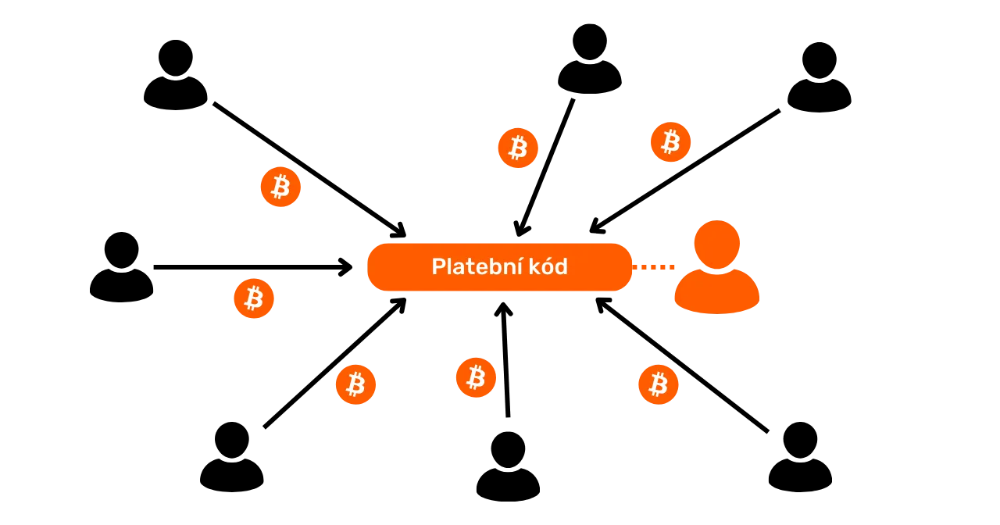

Uživatel může tedy svůj platební kód sdílet volně, ať už na sociálních sítích nebo na svých webových stránkách, bez rizika ztráty soukromí, na rozdíl od toho, co by se stalo s klasickou přijímací adresou nebo veřejným klíčem.
Pro provedení transakce musí obě strany mít Bitcoinovou peněženku s implementací BIP47, jako je PayNym na Samourai Wallet nebo Sparrow Wallet. Společné použití jejich platebních kódů vytváří mezi nimi tajný kanál. Pro efektivní zřízení tohoto kanálu musí odesílatel provést specifickou transakci na Bitcoinovém blockchainu, známou jako "notifikační transakce" (více informací o tomto později).

Kombinace platebních kódů obou uživatelů generuje sdílená tajemství, která zase umožňují vytvoření velkého počtu unikátních Bitcoinových přijímacích adres (přesně 2^32, nebo asi 4 miliardy). Platby provedené prostřednictvím BIP47 tedy nejsou ve skutečnosti adresovány samotnému platebnímu kódu, ale spíše klasickým přijímacím adresám odvozeným z platebních kódů zúčastněných uživatelů.

Platební kód tak slouží jako virtuální identifikátor odvozený ze seedu peněženky. V hierarchické struktuře odvození peněženky je platební kód umístěn na úrovni 3, tj. na úrovni účtu.

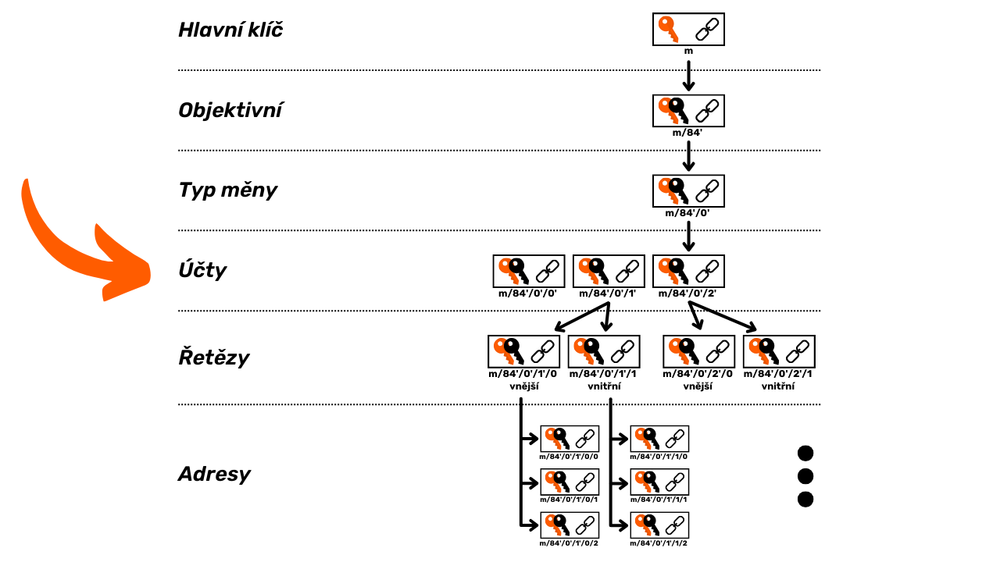

Cíl odvození pro BIP47 je identifikován indexem `47'` (`0x8000002F`), odkazujícím na BIP47. Příklad cesty odvození pro opakovaně použitelný platební kód by byl následující:
```plaintext
m/47'/0'/0'/
```

Abyste si udělali představu, jak vypadá platební kód, zde je ten můj:
```plaintext
Tento kód lze také zakódovat do QR kódu, aby se usnadnila jeho komunikace, stejně jako klasická přijímací adresa.

Pokud jde o PayNym Boty, tyto roboty, které jsou někdy vidět na Twitteru, jsou vizuální reprezentace platebního kódu, vytvořené peněženkou Samourai. Jsou generovány pomocí hashovací funkce, což jim dává téměř unikátnost. Objvují se ve formě malého řetězce znaků začínajícího na `+`:
```plaintext
+throbbingpond8B1
+twilightresonance487
+billowingfire340
```

Tyto avatary mohou být také reprezentovány ve formě obrázků:


Ačkoliv tyto roboty nemají v rámci BIP47 specifickou technickou funkcionalitu, hrají roli ve zjednodušení interakcí mezi uživateli tím, že nabízejí snadno rozpoznatelnou vizuální identitu.
V následujících částech této kapitoly věnované BIP47 podrobně prozkoumáme, jak to funguje, s osobitým důrazem na použité kryptografické metody. Abychom plně pochopili tyto poněkud technické vysvětlení, je nezbytné nejprve porozumět struktuře HD peněženek, procesům derivace klíčů a základním principům kryptografie založené na eliptických křivkách. Pokud se chcete do těchto konceptů ponořit hlouběji, další bezplatný kurz je k dispozici na PlanB Network: [CRYPTO 301](https://planb.network/en/courses/crypto301). Přesto vám doporučuji je sledovat, protože pochopení technického fungování BIP47 vám velmi usnadní pochopení dalších podobných návrhů, o kterých budeme diskutovat v následujících kapitolách.
### Opakovaně použitelný platební kód

Jak bylo zmíněno dříve, opakovaně použitelný platební kód se nachází na hloubce 3 HD peněženky, což jej činí srovnatelným s `xpub`, jak v jeho pozici ve struktuře peněženky, tak v jeho roli.

80bajtový platební kód se rozkládá následovně:
- **Byte `0`: Verze**. Pro první verzi BIP47 je tento byte nastaven na `0x01`;
- **Byte `1`: Bitové pole**. Tento prostor je vyhrazen pro integraci dodatečných indikací při specifickém použití. Pro standardní použití s PayNym je tento byte definován jako `0x00`;
- **Byte `2`: Parita `y`**. Tento byte je `0x02` nebo `0x03`, což indikuje, zda je ordináta veřejného klíče sudá nebo lichá, protože se používá komprimovaný veřejný klíč;
- **Od bytu `3` do bytu `34`: Hodnota `x`**. Tyto byty reprezentují souřadnici x veřejného klíče. Konkatenace `x` a parity `y` tvoří kompletní komprimovaný veřejný klíč;
- **Od bytu `35` do bytu `66`: Řetězec kódů**. Tento prostor obsahuje řetězec kódů spojený s veřejným klíčem;
- **Od bytu `67` do bytu `79`: Výplň**. Tento prostor je určen pro možné budoucí vývoje. Pro současnou verzi jsou zde jednoduše umístěny nuly, aby se dosáhlo požadované velikosti 80 bajtů pro výstup `OP_RETURN`.

Zde je hexadecimální reprezentace mého opakovaně použitelného platebního kódu již prezentovaná v předchozí sekci:
```plaintext
```
Nejprve je také nutné přidat na začátek prefixový bajt `P`, aby bylo jasně indikováno, že se jedná o platební kód. Tento bajt je reprezentován jako `0x47`:
```plaintext
0x47010002a0716529bae6b36c5c9aa518a52f9c828b46ad8d907747f0d09dcd4d9a39e97c3c5f37c470c390d842f364086362f6122f412e2b0c7e7fc6e32287e364a7a36a00000000000000000000000000
```

Nakonec, aby byla zajištěna integrita platebního kódu, provádí se výpočet kontrolního součtu pomocí `HASH256`, který se skládá z dvojitého hašování funkcí `SHA256`. První čtyři bajty vzniklé z tohoto haše jsou poté konkatenovány na konec platebního kódu:
```plaintext
0x47010002a0716529bae6b36c5c9aa518a52f9c828b46ad8d907747f0d09dcd4d9a39e97c3c5f37c470c390d842f364086362f6122f412e2b0c7e7fc6e32287e364a7a36a00000000000000000000000000567080c4
```

Jakmile jsou tyto kroky dokončeny, platební kód je připraven. Jediné, co zbývá, je převést jej do base 58, aby byla získána jeho konečná verze:
```plaintext
PM8TJSBiQmNQDwTogMAbyqJe2PE2kQXjtgh88MRTxsrnHC8zpEtJ8j7Aj628oUFk8X6P5rJ7P5qDudE4Hwq9JXSRzGcZJbdJAjM9oVQ1UKU5j2nr7VR5
```

Během tohoto procesu vytváření platebního kódu používáme komprimovaný veřejný klíč a řetězový kód. Oba jsou odvozeny z deterministické a hierarchické derivace ze seedu peněženky. Cesta derivace použitá k dosažení tohoto je:
```plaintext
m/47'/0'/0'/
```
Pro generování komprimovaného veřejného klíče a přidruženého řetězového kódu pro opakovaně použitelný platební kód začínáme výpočtem hlavního soukromého klíče ze seedu peněženky. Poté pokračujeme derivací páru dětských klíčů pomocí indexu `47 + 2^31` (pevná derivace). Tento krok je následován dalšími dvěma postupnými derivacemi dětských párů, každý s použitím indexu `2^31` (pevná derivace).

### Výměna klíčů Elliptic-Curve Diffie-Hellman (ECDH)
Kryptografický protokol v srdci BIP47 je označován akronymem ECDH, pro *Elliptic-Curve Diffie-Hellman*. Tato metoda je variantou původního výměnného klíče Diffie-Hellman.
Zavedený v roce 1976, Diffie-Hellman je protokol pro dohodu o klíči, který umožňuje dvěma stranám, každé vybavené párem klíčů (veřejný a soukromý), dohodnout se na společném tajemství, i když komunikují pouze přes veřejný a nezabezpečený kanál.

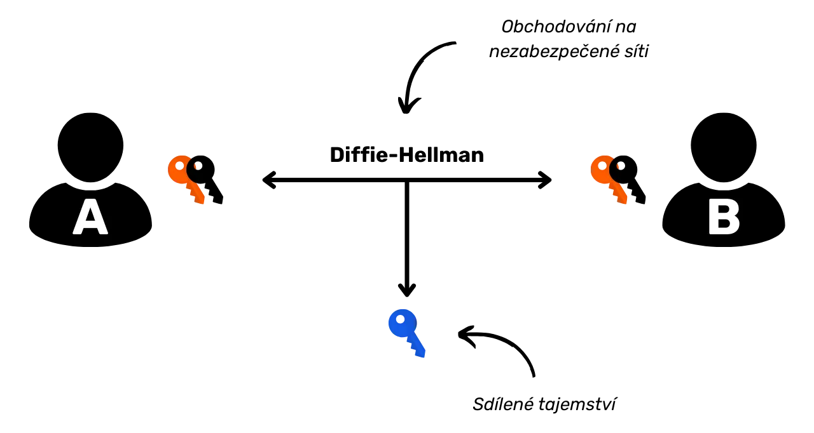

Toto společné tajemství (zde modrý klíč) lze poté použít pro další operace. Typicky lze toto sdílené tajemství použít k šifrování a dešifrování komunikace přes nezabezpečenou síť:


Pro dosažení této výměny používá Diffie-Hellman modulární aritmetiku k výpočtu sdíleného tajemství. Zde je zjednodušené vysvětlení, jak to funguje:
- Alice a Bob se dohodnou na společné barvě, zde žluté, která představuje veřejná data (útočníci znají tuto barvu);
- Alice si vybere tajnou barvu, zde červenou, a smíchá obě, aby získala oranžovou;
- Bob si také vybere tajnou barvu, zde modrou, a smíchá ji se žlutou, aby získal zelenou;
- Poté si vymění získané barvy, oranžovou a zelenou. Tato výměna může proběhnout přes nezabezpečenou a sledovanou síť;
- Smícháním Bobovy zelené se svou vlastní tajnou barvou Alice vytvoří hnědou;
- Bob, dělající totéž s Alicinou oranžovou a jeho tajnou modrou, také získá hnědou.

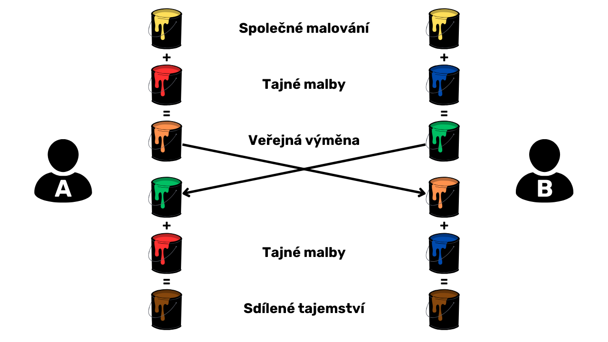

V této zjednodušení hnědá barva představuje sdílené tajemství mezi Alicí a Bobem. Je důležité pochopit, že ve skutečnosti je pro útočníka nemožné oddělit oranžovou a zelenou barvu, aby objevil tajné barvy Alice nebo Boba.

Nyní se podívejme, jak tento protokol skutečně funguje, ne s analogiemi barev, ale s použitím skutečných čísel a modulární aritmetiky!
Než začneme diskutovat o mechanismech Diffie-Hellman, dovolte mi stručně vás připomenout dvě zásadní matematické koncepty, které budeme potřebovat:

- **Prvočíslo** je přirozené číslo, které má pouze dva dělitele: $1$ a samo sebe. Například $7$ je prvočíslo, protože je dělitelné pouze $1$ a $7$. Na druhou stranu, $8$ není prvočíslo, protože je dělitelné $1$, $2$, $4$ a $8$. Má tedy čtyři kladné celočíselné dělitele místo dvou;
- **Modulo** (označované $mod$ nebo $\%$) je matematická operace, která mezi dvěma celými čísly vrací zbytek z euklidovského dělení prvního číslem druhým. Například $16 \bmod 5 = 1$.

**Výměna klíčů Diffie-Hellman mezi Alicí a Bobem probíhá takto:**

- Alice a Bob se dohodnou na dvou společných číslech: $p$ a $g$. $p$ je prvočíslo a čím je toto číslo větší, tím bezpečnější Diffie-Hellman bude. $g$ je primitivní kořen $p$. Tyto dvě čísla lze otevřeně komunikovat přes nezabezpečenou síť. Představují ekvivalent **žluté barvy** v předchozím zjednodušení. Je tedy důležité, aby Alice a Bob používali přesně stejné hodnoty pro $p$ a $g$.
- Jakmile jsou tyto parametry definovány, Alice a Bob si každý vyberou tajné náhodné číslo. Alice pojmenuje své tajné náhodné číslo $a$ (ekvivalent k **červené barvě**) a Bob pojmenuje své $b$ (ekvivalent k **modré barvě**). Tyto čísla musí zůstat přísně důvěrná.
- Místo přímé výměny čísel $a$ a $b$ každá strana vypočítá $A$ a $B$ následovně:

$A$ je rovno $g$ umocněnému na $a$ modulo $p$:


$$

A = g^a \bmod p

$$

$B$ je rovno $g$ umocněnému na $b$ modulo $p$:


$$

B = g^b \bmod p

$$

- Hodnoty $A$ (ekvivalent k **oranžové barvě**) a $B$ (ekvivalent k **zelené barvě**) jsou mezi oběma stranami vyměněny. Tato výměna může proběhnout otevřeně přes nezabezpečenou síť;

- Alice, která obdržela $B$, vypočítá hodnotu $z$ následovně:

$z$ je rovno $B$ umocněnému na $a$ modulo $p$:


$$

z = B^a \bmod p

$$

Připomeňme si:


$$

B = g^b \bmod p

$$

Tak získáme:


$$

z = B^a \bmod p

$$


$$

z = (g^b)^a \bmod p

$$

Použitím pravidel pro exponenty:
$$

(x^n)^m = x^{nm}

$$

Poté získáme:


$$

z = g^{ba} \bmod p

$$

- Na své straně Bob, který obdržel $A$, také vypočítá hodnotu $z$ následujícím způsobem:

$z$ je rovno $A$ umocněnému na $b$ modulo $p$:


$$

z = A^b \bmod p

$$

Tak získáme:


$$

z = (g^a)^b \bmod p

$$


$$

z = g^{ab} \bmod p

$$


$$

z = g^{ba} \bmod p

$$

Díky distributivitě operátoru modulo získají Alice a Bob přesně stejnou hodnotu $z$. Toto číslo představuje jejich společné tajemství, ekvivalentní **hnědé barvě** v předchozím zjednodušení s barvami. Nyní mohou toto společné tajemství použít k symetrickému šifrování svých komunikací přes nezabezpečenou síť.


Útočník, i když má k dispozici $p$, $g$, $A$ a $B$ (veřejné hodnoty), nebude schopen vypočítat $a$, $b$ nebo $z$ (soukromé hodnoty). K dosažení toho by musel provést reverzní umocňování, operaci nemožnou bez postupného zkoušení všech možností, jelikož to znamená výpočet diskrétního logaritmu, tj. inverze exponenciálu v konečné cyklické skupině.

Takže pokud jsou hodnoty $a$, $b$ a $p$ dostatečně velké, je protokol Diffie-Hellman bezpečný. Typicky, s 2048-bitovými parametry (číslo s 600 číslicemi v desítkové soustavě), by testování všech možností pro $a$ a $b$ bylo nepraktické. Dodnes, s takovými čísly, je tento algoritmus považován za bezpečný.
Právě zde leží hlavní nevýhoda protokolu Diffie-Hellman. Pro zajištění bezpečnosti musí algoritmus používat velká čísla. Proto se dnes preferuje algoritmus ECDH (*Elliptic Curve Diffie-Hellman*), varianta Diffie-Hellmana, která se opírá o algebraickou křivku, přesněji o eliptickou křivku. Tento přístup umožňuje pracovat s mnohem menšími čísly, přičemž zachovává ekvivalentní bezpečnost, a tím snižuje potřebné zdroje pro výpočet a ukládání.

Obecný princip algoritmu zůstává stejný. Nicméně, místo použití náhodného čísla $a$ a čísla $A$ vypočítaného z $a$ pomocí modulárního umocňování, používáme pár klíčů založených na eliptické křivce. Místo spoléhání na distributivitu modulo operátoru, používáme grupový zákon na eliptických křivkách, a konkrétněji asociativitu tohoto zákona.

Abychom stručně vysvětlili princip kryptografie eliptických křivek, soukromý klíč je reprezentován náhodným číslem mezi $1$ a $n-1$, kde $n$ reprezentuje řád křivky. Veřejný klíč, na druhou stranu, je specifický bod na této křivce, získaný z soukromého klíče operacemi sčítání bodů a zdvojením počínaje generátorovým bodem, podle rovnice:
$$

K = k \cdot G

$$

V této formuli $K$ označuje veřejný klíč, $k$ soukromý klíč a $G$ generátorový bod.

Jednou z podstatných charakteristik těchto klíčů je snadnost výpočtu $K$ z $k$ a $G$, zatímco je prakticky nemožné najít $k$ z $K$ a $G$. Tato asymetrie vytváří jednosměrnou funkci. Jinými slovy, je snadné vypočítat veřejný klíč, pokud někdo zná soukromý klíč, ale najít soukromý klíč z veřejného klíče je nemožné. Tato bezpečnost je stále založena na výpočetní obtížnosti diskrétního logaritmu.

Tuto vlastnost využijeme k adaptaci našeho algoritmu Diffie-Hellman. **Princip fungování ECDH je následující:**

- Alice a Bob se společně dohodnou na kryptograficky bezpečné eliptické křivce a jejích parametrech. Tyto informace jsou veřejné;

- Alice generuje náhodné číslo $ka$, které bude jejím soukromým klíčem. Tento soukromý klíč musí zůstat tajný. Určí svůj veřejný klíč $Ka$ sčítáním a zdvojením bodů na zvolené eliptické křivce:


$$

K_a = k_a \cdot G

$$

- Bob také generuje náhodné číslo $kb$, které bude jeho soukromým klíčem. Spočítá přidružený veřejný klíč $Kb$:


$$

K_b = k_b \cdot G

$$

- Alice a Bob si vymění své veřejné klíče $Ka$ a $Kb$ přes nezabezpečenou veřejnou síť.

- Alice vypočítá bod $(x,y)$ na křivce aplikací svého soukromého klíče $ka$ na Bobův veřejný klíč $Kb$:


$$

(x,y) = k_a \cdot K_b

$$

- Bob vypočítá bod $(x,y)$ na křivce aplikací svého soukromého klíče $kb$ na Alicin veřejný klíč $Ka$:


$$

(x,y) = k_b \cdot K_a

$$

- Alice a Bob získají stejný bod na eliptické křivce. Sdíleným tajemstvím bude x-ová souřadnice $x$ tohoto bodu.

Skutečně získají stejné sdílené tajemství, protože:
(x,y) = k_a \cdot K_b = k_a \cdot (k_b \cdot G) = (k_a \cdot k_b) \cdot G = (k_b \cdot k_a) \cdot G = k_b \cdot (k_a \cdot G) = k_b \cdot K_a
$$

Útočník pozorující nezabezpečenou veřejnou síť může získat pouze veřejné klíče každé strany a parametry zvolené eliptické křivky. Jak bylo dříve vysvětleno, tyto informace samy o sobě nejsou dostatečné pro určení soukromých klíčů. Proto útočník nemůže najít sdílené tajemství mezi Alicí a Bobem.

ECDH je tedy algoritmus, který umožňuje výměnu klíčů. Často se používá ve spojení s dalšími kryptografickými metodami pro vytvoření kompletního protokolu. Například ECDH je integrováno do jádra TLS (_Transport Layer Security_), protokolu pro šifrování a autentizaci používaného pro transportní vrstvu internetu. TLS používá pro výměnu klíčů ECDHE, variantu ECDH, kde jsou klíče efemérní, aby poskytl trvalou důvěrnost. Kromě toho TLS používá autentizační algoritmy jako ECDSA, šifrovací algoritmy jako AES a hashovací funkce jako SHA256.

TLS je zvláště zodpovědné za `s` v `https` a také za zámek viditelný v adresním řádku vašeho prohlížeče, symboly šifrované komunikace. Tím, že sledujete tento kurz, používáte tedy ECDH, a je velmi pravděpodobné, že jej používáte denně, aniž byste o tom věděli.

### Transakce oznámení

Jak jsme viděli v předchozí sekci, ECDH je varianta výměny Diffie-Hellman používající klíčové páry založené na eliptické křivce. Pohodlně už máme mnoho klíčových párů, které odpovídají tomuto standardu, ve svých Bitcoinových peněženkách! Myšlenka BIP47 je použít klíčové páry z Bitcoinových deterministických hierarchických peněženek obou stran pro vytvoření sdílených a efemérních tajemství mezi nimi. V kontextu BIP47 se místo toho používá ECDHE (_Elliptic Curve Diffie-Hellman Ephemeral_).


ECDHE se používá poprvé v BIP47 pro přenos platebního kódu od odesílatele k příjemci. To je slavná **transakce oznámení**. Tento krok je zásadní, protože pro efektivní fungování BIP47 musí obě strany zapojené (odesílatel a příjemce) znát platební kód toho druhého. Toto vědomí umožňuje odvození efemérních veřejných klíčů a následně spojených prázdných přijímacích adres.
Před tímto výměnem je odesílatel logicky již informován o platebním kódu příjemce, protože jej získal mimo síť, například z jejich webové stránky, faktury nebo sociálních médií. Nicméně příjemce nemusí nutně znát platební kód odesílatele. Přesto musí být tento kód přenesen k nim; jinak nebudou schopni odvodit efemérní klíče potřebné pro identifikaci adres, kde jsou jejich bitcoiny uloženy, ani přistupovat ke svým fondům. Ačkoliv lze toto přenos odesílatelova kódu technicky provést mimo síť prostřednictvím jiných komunikačních prostředků, představuje to problém, pokud je potřeba peněženku obnovit pouze ze seedu.
Opravdu, na rozdíl od konvenčních adres, adresy BIP47 nejsou odvozeny přímo ze seedu příjemce - použití `xpub` by bylo v tomto případě jednodušší - ale jsou výsledkem výpočtu kombinujícího oba platební kódy: odesílatele a příjemce. Takže, pokud příjemce ztratí svou peněženku a pokusí se ji obnovit ze svého seedu, obnoví svůj vlastní platební kód, který je přímo odvozen ze seedu. Nicméně, pro nalezení efemérních adres bude nezbytné, aby měli také platební kódy všech, kdo jim poslali bitcoiny přes BIP47. Odtud význam notifikační transakce, která umožňuje uložení těchto informací na Bitcoin blockchainu, zatímco je možné je velmi snadno najít bez nutnosti prohledávat miliardu transakcí provedených od jeho spuštění v roce 2009.
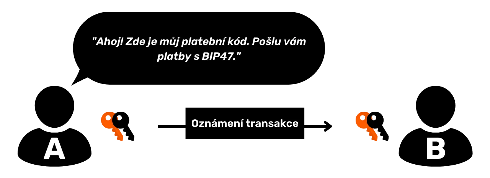

Proto by bylo možné implementovat BIP47 bez nutnosti použití notifikační transakce, za předpokladu, že každý uživatel si uchovává zálohu platebních kódů svých protějšků. Tato metoda se však ukazuje jako složitá na správu, dokud není vyvinuto jednoduché, robustní a efektivní řešení pro vytváření, ukládání a aktualizaci těchto záloh. V současném stavu věcí se notifikační transakce stává téměř nezbytnou.

V následujících kapitolách prozkoumáme další protokoly s cíli podobnými BIP47, které však nevyžadují notifikační transakci. Tyto alternativy však přinášejí vlastní kompromisy.

Kromě své role v zálohování platebních kódů slouží notifikační transakce také jako notifikační funkce pro příjemce, jak již název napovídá. Signalizuje klientu příjemce, že byl zřízen nový platební kanál, a tedy naznačuje monitorování výsledných efemérních adres.

### Model soukromí BIP47

Před podrobným popisem technického provozu notifikační transakce je důležité diskutovat o modelu soukromí spojeném s BIP47, který odůvodňuje určitá opatření přijatá při vytváření této počáteční transakce.
Platební kód sám o sobě nepředstavuje přímé riziko pro soukromí. Na rozdíl od tradičního modelu Bitcoinu, který si klade za cíl přerušit spojení mezi identitou uživatele a jeho transakcemi (které jsou veřejné) tím, že zachovává anonymitu klíčů a adres, může být platební kód otevřeně spojen s identitou bez toho, aby to představovalo hrozbu.
Skutečně, platební kód není používán k přímému odvození adres přijímajících platby BIP47. Tyto adresy jsou místo toho generovány aplikací ECDH mezi odvozenými klíči platebních kódů obou zúčastněných stran.

Takže platební kód sám o sobě nepřímo nevede ke ztrátě soukromí, protože pouze notifikační adresa je z něj odvozena. Ačkoli tato adresa může odhalit nějaké informace, obvykle neumožňuje objevit strany, se kterými provádíte transakce, pokud ne prostřednictvím důkladné analýzy řetězce. Skutečně, pokud odesílatel použije UTXO, které lze spojit s jejich identitou k provedení notifikační transakce, pak se stává možným usoudit, že jejich identita je pravděpodobně spojena s platbami BIP47 na váš platební kód. To neodhalí podkladové transakce, ale naznačí jejich pravděpodobnou existenci.

Proto je nezbytné udržovat tuto striktní separaci mezi platebními kódy uživatelů. K tomuto cíli je počáteční komunikační krok kódu kritickým momentem pro soukromí platby, přesto je povinný pro správné fungování protokolu. Pokud jeden z platebních kódů lze získat veřejně (například na webové stránce), druhý kód, ten odesílatele, nesmí být v žádném případě spojen s prvním.

Pojďme si vzít konkrétní příklad: Chci udělat dar politickému hnutí přes BIP47:

- Organizace zveřejnila svůj platební kód na svých webových stránkách nebo prostřednictvím svých sociálních sítí;
- Tento kód je tedy spojen s politickým hnutím;
- Získávám tento platební kód;
- Před tím, než provedu odeslání, musím se ujistit, že znají můj vlastní platební kód, který je také spojen s mou identitou, protože ho používám k přijímání transakcí na mých sociálních sítích.

Jak mohu přenést můj kód bez rizika? Použití běžných komunikačních prostředků by mohlo vést k úniku informací a následně mě spojit s tímto politickým hnutím. Notifikační transakce nabízí řešení díky vrstvě šifrování, která přesně zabraňuje tomuto spojení mezi dvěma kódy. Ačkoli to není jediná metoda pro tajný přenos platebního kódu odesílatele, ukazuje se jako velmi účinná.

Na níže uvedeném diagramu oranžové čáry označují místa, kde musí být tok informací přerušen, a černé šipky ukazují spojení, která by mohla být potenciálně pozorována třetími stranami:
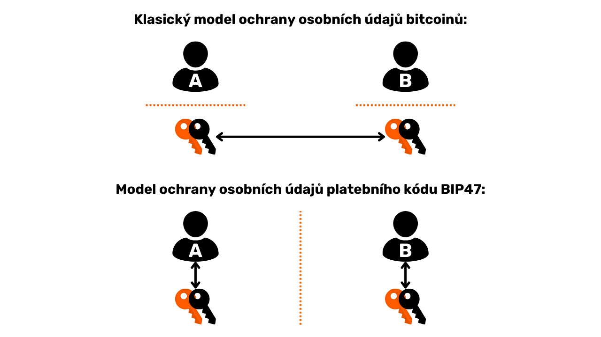
Ve skutečnosti, v rámci tradičního modelu soukromí Bitcoinu, je často složité úplně oddělit tok informací mezi párem klíčů a uživatelem, zejména při transakcích na dálku. Například v kontextu kampaně na podporu, musí příjemce nevyhnutelně zveřejnit adresu nebo veřejný klíč prostřednictvím svého webu nebo sociálních sítí. Správné použití BIP47, zejména s notifikační transakcí, umožňuje obejít tento problém díky ECDHE a vrstvě šifrování, kterou si dále probereme.

Samozřejmě, klasický model soukromí Bitcoinu stále platí pro efemérní veřejné klíče, které jsou odvozeny z kombinace dvou platebních kódů. Tyto dva modely jsou ve skutečnosti doplňující. Co zde chci zdůraznit, je, že na rozdíl od obvyklého použití veřejného klíče k přijímání bitcoinů, může být platební kód spojen s konkrétní identitou, protože informace "_Alice provádí transakci s Bobem_" je přerušena v jiné fázi. Platební kód se používá k generování platebních adres, ale pouze na základě pozorování blockchainu, je nemožné spojit BIP47 platební transakci s použitými platebními kódy, pokud nebyly UTXO již dříve spojeny s identitou a uživatelé nespojili své platební kódy se svými identitami.

Shrnutí, model soukromí nabízený platebními transakcemi BIP47 by mohl být považován za lepší než základní model Bitcoinu, ačkoli to rozhodně není magie.

### Konstrukce notifikační transakce

Nyní se podívejme, jak notifikační transakce funguje. Představte si, že Alice chce poslat prostředky Bobovi s BIP47. V mém příkladu Alice vystupuje jako odesílatel a Bob jako příjemce. Ten poslední zveřejnil svůj platební kód na svém webu. Alice je tedy již informována o Bobově platebním kódu.

**1- Alice vypočítá sdílené tajemství s ECDH:**

- Vybere pár klíčů ze své HD peněženky umístěné na jiné větvi než její platební kód. Poznámka, tento pár by neměl být snadno spojen s Alicinou notifikační adresou, ani s Alicinou identitou (viz předchozí sekce);

- Alice vybere soukromý klíč z tohoto páru. Nazveme ho $a$ (malé písmeno);

$$
a
$$

- Alice získá veřejný klíč spojený s Bobovou notifikační adresou. Tento klíč je první odvozená dcera z Bobova platebního kódu (index $/0$). Tento veřejný klíč nazveme $B$ (velké písmeno). Soukromý klíč spojený s tímto veřejným klíčem nazveme $b$ (malé písmeno). $B$ je určen sčítáním a zdvojením bodů na eliptické křivce z $G$ (generující bod) s $b$ (soukromý klíč):
  $$ B = b \cdot G $$
- Alice vypočítá tajný bod $S$ (velké S) na eliptické křivce pomocí sčítání a zdvojení bodů aplikací svého soukromého klíče $a$ z Bobova veřejného klíče $B$.
  $$ S = a \cdot B $$

- Alice vypočítá faktor zaslepení $f$, který jí umožní zašifrovat její platební kód. K tomu určí pseudonáhodné číslo funkcí HMAC-SHA512. Jako druhý vstup této funkce použije hodnotu, kterou bude moci získat pouze Bob: $x$, což je souřadnice x dříve vypočítaného tajného bodu. První vstup je $o$, což je UTXO spotřebované na vstupu této transakce (outpoint).

$$ f = \text{HMAC-SHA512}(o, x) $$

**2- Alice převede svůj osobní platební kód do základu 2 (binárně).**

**3- Použije tento faktor zaslepení jako klíč k provedení symetrického šifrování nákladu jejího platebního kódu.** Použitý šifrovací algoritmus je jednoduše `XOR`. Operace provedená je srovnatelná s šifrou Vernam, také nazývanou "One-Time Pad".

- Alice nejprve rozdělí svůj faktor zaslepení na dvě části: prvních 32 bajtů je pojmenováno $f1$ a posledních 32 bajtů je pojmenováno $f2$. Tedy máme:

$$ f = f1 || f2 $$

- Alice vypočítá zašifrovanou $x'$ souřadnici x veřejného klíče svého platebního kódu a zašifrovaný $c'$ svého řetězového kódu $c$ zvlášť. $f1$ a $f2$ působí jako šifrovací klíče. Použitá operace je `XOR` (výhradní nebo).

$$ x' = x \oplus f1 $$
$$ c' = c \oplus f2 $$

- Alice nahradí skutečné hodnoty souřadnice x veřejného klíče $x$ a řetězového kódu $c$ ve svém platebním kódu zašifrovanými hodnotami $x'$ a $c'$.
  **4-** Alice nyní má svůj platební kód se zašifrovaným nákladem. Sestaví a vysílá transakci, která zahrnuje její veřejný klíč $A$ jako vstup, výstup na Bobovu notifikační adresu a výstup `OP_RETURN` obsahující její platební kód se zašifrovaným nákladem. **Tato transakce je notifikační transakce**.
  `OP_RETURN` je operační kód, který označuje výstup Bitcoinové transakce jako neplatný. Dnes se používá k vysílání nebo ukotvení informací na Bitcoinovém blockchainu. Lze uložit až 80 bajtů dat, které jsou zapsány na řetězec a tedy viditelné pro všechny ostatní uživatele.

Jak jsme viděli v předchozích sekcích, ECDH se používá k generování sdíleného tajemství mezi dvěma uživateli komunikujícími přes nezabezpečenou síť, potenciálně pozorovanou útočníky. V BIP47 se ECDH využívá pro komunikaci přes Bitcoinovou síť, která je svou povahou transparentní komunikační síť pozorovaná mnoha útočníky. Sdílené tajemství vypočítané prostřednictvím výměny klíčů ECDH je pak použito k šifrování tajných informací k přenosu: platební kód odesílatele (Alice).

Shrneme kroky, které jsme právě společně probrali, aby se provedla notifikační transakce:

- Alice získá Bobův platební kód a notifikační adresu;
- Alice vybere UTXO, které vlastní ve své HD peněžence s odpovídajícím párem klíčů;
- Vypočítá tajný bod na eliptické křivce pomocí ECDH;
- Použije tento tajný bod k výpočtu HMAC, což je faktor zaslepení;
- Použije tento faktor zaslepení k zašifrování nákladu svého osobního platebního kódu;
- Používá výstup transakce `OP_RETURN` k předání maskovaného platebního kódu Bobovi.
  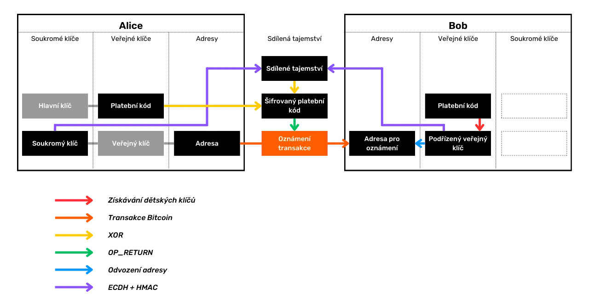

### Transakce s oznámením: Konkrétní studie

Abychom lépe pochopili její fungování, zejména použití `OP_RETURN`, pojďme se společně podívat na skutečnou transakci s oznámením. Provedl jsem takovou transakci na testnetu, kterou můžete najít [kliknutím zde](https://mempool.space/fr/testnet/tx/0e2e4695a3c49272ef631426a9fd2dae6ec3a469e3a39a3db51aa476cd09de2e).


Při pozorování této transakce můžeme vidět, že má jediný vstup a 4 výstupy:

- První výstup je `OP_RETURN` obsahující můj maskovaný platební kód;
- Druhý výstup 546 sats směřuje na notifikační adresu mého příjemce;
- Třetí výstup 15 000 sats představuje poplatky za službu, jelikož jsem k vytvoření této transakce použil Samourai Wallet;
- Čtvrtý výstup 2 miliony sats představuje zbytek, což znamená zbývající rozdíl z mého vstupu, který se vrací na jinou mou adresu.
  Nejzajímavější k prozkoumání je samozřejmě výstup 0 používající `OP_RETURN`. Podívejme se podrobněji na to, co obsahuje. Zde je `scriptPubKey` v hexadecimálním formátu:

```text
6a4c50010002b13b2911719409d704ecc69f74fa315a6cb20fdd6ee39bc9874667703d67b164927b0e88f89f3f8b963549eab2533b5d7ed481a3bea7e953b546b4e91b6f50d800000000000000000000000000
```

V tomto skriptu můžeme rozlišit několik částí. Především operátory:

```text
6a4c
```

Mezi operátory můžeme rozpoznat `0x6a`, který označuje `OP_RETURN` a `0x4c`, který označuje `OP_PUSHDATA1`.

Byte následující po tomto posledním operátoru udává velikost následujícího payloadu. Udává `0x50`, neboli 80 bajtů:

```text
6a4c50
```

Poté máme metadata mého platebního kódu v prostém textu:

```text
010002
```

Zašifrovaná x-ová souřadnice veřejného klíče mého platebního kódu:

```text
b13b2911719409d704ecc69f74fa315a6cb20fdd6ee39bc9874667703d67b164
```

Zašifrovaný řetězec kódu mého platebního kódu:

```text
927b0e88f89f3f8b963549eab2533b5d7ed481a3bea7e953b546b4e91b6f50d8
```

A nakonec, doplnění do 80 bajtů, standardní velikosti `OP_RETURN`:

```text
00000000000000000000000000
```

Pro lepší pochopení, zde je můj platební kód v prostém textu v base 58:

````text
A v base 16:

```text
4701000277507c9c17a89cfca2d3af554745d6c2db0e7f6b2721a3941a504933103cc42add94881210d6e752a9abc8a9fa0070e85184993c4f643f1121dd807dd556d1dc000000000000000000000000008604e4db
````

Když porovnávám můj čistý platební kód s `OP_RETURN`, je patrné, že HRP (`0x47`) a kontrolní součet (`0x8604e4db`) nejsou přenášeny. To je očekávané, jelikož tyto informace jsou určeny pro lidi.
Dále můžeme identifikovat verzi (`0x01`), bitové pole (`0x00`) a paritu veřejného klíče (`0x02`). A na konci platebního kódu jsou prázdné bajty (`0x00000000000000000000000000`) použity k doplnění kódu na celkových 80 bajtů. Všechna tato metadata jsou přenášena v čistém textu (nešifrovaně).

Nakonec lze pozorovat, že x-ová souřadnice veřejného klíče (`0x77507c9c17a89cfca2d3af554745d6c2db0e7f6b2721a3941a504933103cc42a`) a řetězový kód (`0xdd94881210d6e752a9abc8a9fa0070e85184993c4f643f1121dd807dd556d1dc`) byly zašifrovány. To tvoří náklad platebního kódu.

### Co je XOR?

V předchozích sekcích jsme viděli, že platební kód byl přenášen zašifrovaně pomocí operace XOR. Pojďme si na chvíli vysvětlit, jak tento operátor funguje, jelikož je široce používán v kryptografii.

XOR je bitový logický operátor založený na Booleově algebře. S dvěma bitovými operandy vrací `1`, pokud se bity stejného řádu liší, a vrací `0`, pokud jsou bity stejného řádu stejné. Zde je pravdivostní tabulka XOR založená na hodnotách operandů `D` a `E`:

| D   | E   | D XOR E |
| --- | --- | ------- |
| 0   | 0   | 0       |
| 0   | 1   | 1       |
| 1   | 0   | 1       |
| 1   | 1   | 0       |

Například:

$$
0110 \oplus 1110 = 1000
$$

Nebo:

$$
010011 \oplus 110110 = 100101
$$

S ECDH je použití XOR jako šifrovací vrstvy obzvláště vhodné. Za prvé, díky tomuto operátoru je šifrování symetrické. To umožňuje příjemci dešifrovat platební kód stejným klíčem, který byl použit pro šifrování. Šifrovací a dešifrovací klíč je vypočítán z sdíleného tajemství díky ECDH. Tato symetrie je umožněna komutativními a asociativními vlastnostmi operátoru XOR:

- Další vlastnosti:

$$
D \oplus D = 0
$$

D ⊕ 0 = D

- Komutativita:

$$
D \oplus E = E \oplus D
$$

- Asociativita:

$$
D \oplus (E \oplus Z) = (D \oplus E) \oplus Z = D \oplus E \oplus Z
$$

Pokud:

$$
D \oplus E = L
$$

Pak:

$$
D \oplus L = D \oplus (D \oplus E) = D \oplus D \oplus E = 0 \oplus E = E \\
\therefore D \oplus L = E
$$

Dále, tato metoda šifrování se velmi podobá Vernamově šifře (One-Time Pad), jedinému šifrovacímu algoritmu známému dosud, který má bezpodmínečnou (nebo absolutní) bezpečnost. Aby Vernamova šifra měla tuto charakteristiku, musí být šifrovací klíč dokonale náhodný, musí mít stejnou velikost jako zpráva a musí být použit pouze jednou. V šifrovací metodě použité zde pro BIP47 je klíč skutečně stejně velký jako zpráva, slepý faktor je přesně stejně velký jako spojení x-ové souřadnice veřejného klíče s řetězcovým kódem platebního kódu. Tento šifrovací klíč je skutečně použit pouze jednou. Tento klíč však není výsledkem dokonalé náhodnosti, protože je to HMAC. Je spíše pseudo-náhodný. Proto to není Vernamova šifra, ale metoda je podobná.

### Přijetí notifikační transakce

Nyní, když Alice poslala notifikační transakci Bobovi, pojďme se podívat, jak ji interpretuje. Jako připomínka, Bob musí být schopen přistupovat k platebnímu kódu Alice. Bez těchto informací, jak uvidíme v následující části, nebude schopen odvodit klíčové páry vytvořené Alicí a tudíž nebude schopen přistupovat k jeho bitcoinům přijatým přes BIP47. Zatím je náklad platebního kódu Alice zašifrován. Podívejme se, jak Bob dešifruje.

**1-** Bob monitoruje transakce, které vytvářejí výstupy na jeho notifikační adresu.

**2-** Když transakce má výstup na jeho notifikační adresu, Bob ji analyzuje, aby zjistil, zda obsahuje výstup OP_RETURN, který následuje standard BIP47.

**3-** Pokud první bajt nákladu OP_RETURN je `0x01`, Bob začne hledat možné sdílené tajemství s ECDH:

- Bob vybere veřejný klíč ve vstupu transakce. To znamená, Alicin veřejný klíč označený $A$ s:

$$ A = a \cdot G $$

- Bob vybere soukromý klíč $b$ spojený s jeho osobní notifikační adresou:

$$ b $$

- Bob vypočítá tajný bod $S$ (sdílené tajemství ECDH) na eliptické křivce přidáním a zdvojením bodů, aplikací svého soukromého klíče $b$ na Alicin veřejný klíč $A$:
  $$ S = b \cdot A $$

- Bob určí slepý faktor $f$, který mu umožní dešifrovat náklad platebního kódu Alice. Stejným způsobem, jakým Alice předtím vypočítala, Bob najde $f$ aplikací HMAC-SHA512 na $x$ x-souřadnici tajného bodu $S$ a na $o$ UTXO spotřebované jako vstup v této notifikační transakci:

$$ f = \text{HMAC-SHA512}(o, x) $$

**4-** Bob interpretuje data v OP_RETURN notifikační transakce jako platební kód. Jednoduše dešifruje náklad tohoto potenciálního platebního kódu použitím slepého faktoru $f$:

- Bob rozdělí slepící faktor $f$ na 2 části: prvních 32 bajtů $f$ bude $f1$ a posledních 32 bajtů bude $f2$;
- Bob dešifruje zašifrovanou x-souřadnici $x'$ veřejného klíče z Aliceina platebního kódu:

$$ x = x' \oplus f1 $$

- Bob dešifruje zašifrovanou hodnotu řetězového kódu $c'$ z Aliceina platebního kódu:

$$ c = c' \oplus f2 $$

**5-** Bob kontroluje, zda je hodnota veřejného klíče z Aliceina platebního kódu skutečně součástí skupiny secp256k1. Pokud tomu tak je, interpretuje to jako platný platební kód. V opačném případě tuto transakci ignoruje.

Nyní, když Bob zná Alicein platební kód, může mu poslat až `2^32` plateb, aniž by kdy znovu potřebovala provést jinou notifikační transakci tohoto typu.

Proč to funguje? Jak může Bob určit stejný slepící faktor jako Alice a tím dešifrovat její platební kód? Podívejme se podrobněji na roli ECDH v tom, co jsme právě popisovali.

Především se zabýváme symetrickým šifrováním. To znamená, že šifrovací klíč a dešifrovací klíč jsou stejné hodnoty. Tento klíč v notifikační transakci je slepící faktor:

$$ f = f1 || f2 $$

Alice a Bob tedy musí získat stejnou hodnotu pro $f$, aniž by ji přímo přenášeli, protože útočník by ji mohl ukrást a dešifrovat tajné informace. Tento slepící faktor je získán aplikací HMAC-SHA512 na 2 hodnoty:

- x-souřadnice tajného bodu;
- a UTXO spotřebované jako vstup v transakci.
  Bob tedy potřebuje tyto dvě informace k dešifrování nákladu Aliceina platebního kódu. Pro UTXO jako vstup může Bob jednoduše získat pozorováním notifikační transakce. Pro tajný bod bude muset Bob použít ECDH. Jak jsme viděli v předchozí sekci o Diffie-Hellmanovi, pouhým výměnou jejich veřejných klíčů a tajným použitím jejich soukromých klíčů na veřejný klíč druhého, Alice a Bob mohou najít specifický a tajný bod na eliptické křivce. Notifikační transakce spoléhá na tento mechanismus:
- Bobův pár klíčů:

$$ B = b \cdot G $$

- Alicein pár klíčů:

$$ A = a \cdot G $$

- Pro tajný bod $S (x, y)$:

$$ S = a \cdot B = a \cdot (b \cdot G) = (b \cdot a) \cdot G = b \cdot A $$

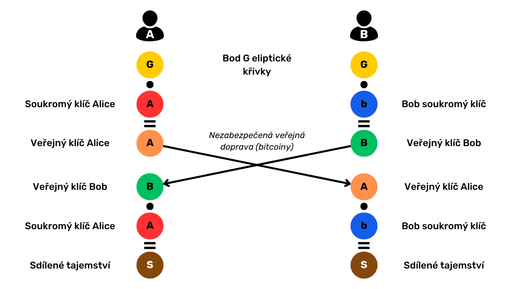

Nyní, když Bob zná Alicein platební kód, bude moci detekovat její BIP47 platby a může odvodit soukromé klíče uzamčení přijatých bitcoinů.

Shrneme kroky, které jsme právě prošli, abychom přijali a interpretovali notifikační transakci:

- Bob monitoruje výstupy transakcí na svou notifikační adresu;
- Když jednu detekuje, získá informace obsažené v OP_RETURN;
- Bob vybere veřejný klíč na vstupu a vypočítá tajný bod pomocí ECDH;
- Použije tento tajný bod k výpočtu HMAC, který je slepícím faktorem;
- Použije tento slepící faktor k dešifrování nákladu Aliceina platebního kódu obsaženého v OP_RETURN.

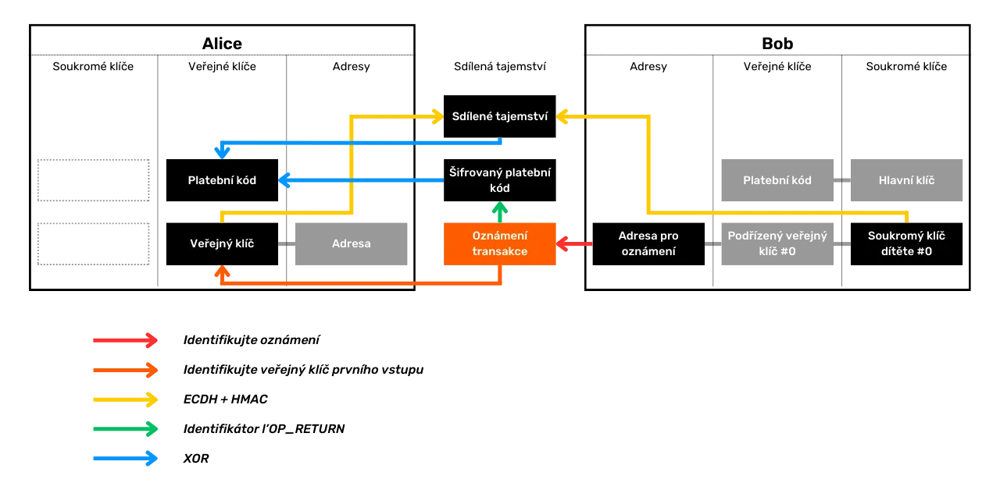

### BIP47 Platební Transakce

Nyní se společně podíváme na platební proces s BIP47. Připomínáme současný stav věcí:

- Alice zná Bobův platební kód, který jednoduše získala z jeho webových stránek;
- Bob zná platební kód Alice díky transakci oznámení;
- Alice provede první platbu Bobovi. Bude moci provést mnoho dalších stejným způsobem.

Před vysvětlením tohoto procesu si myslím, že je důležité připomenout indexy, na kterých v současnosti pracujeme. Derivační cesta platebního kódu je popsána takto: `m/47'/0'/0'`. Další hloubka distribuuje indexy následovně:

- První normální (nepevný) pár dětí je ten, který se používá k generování notifikační adresy, o které jsme mluvili v předchozí části: `m/47'/0'/0'/0`;
- Normální páry klíčů dětí se používají v rámci ECDH k generování přijímacích adres plateb BIP47, jak uvidíme v této sekci: od `m/47'/0'/0'/0` do `m/47'/0'/0'/2 147 483 647`;
- Pevné páry klíčů dětí jsou efemérní platební kódy: od `m/47'/0'/0'/0'` do `m/47'/0'/0'/2 147 483 647'`.

Kdykoli si Alice přeje poslat platbu Bobovi, odvodí novou jedinečnou nepoužitou adresu, díky protokolu ECDH znovu:

- Alice vybere první soukromý klíč odvozený z jejího osobního opakovaně použitelného platebního kódu:

$$ a $$

- Alice vybere první nepoužitý veřejný klíč odvozený z Bobova platebního kódu. Tento veřejný klíč, nazveme ho $B$. Je spojen s soukromým klíčem $b$, který zná pouze Bob:

$$ B = b \cdot G $$

- Alice vypočítá tajný bod $S$ na eliptické křivce pomocí sčítání bodů a zdvojení aplikací svého soukromého klíče $a$ na Bobův veřejný klíč $B$:

$$ S = a \cdot B $$

- Z tohoto tajného bodu Alice vypočítá sdílené tajemství $s$ (malé písmeno). K tomu vybere x-ovou souřadnici tajného bodu $S$ pojmenovanou $Sx$ a tuto hodnotu propustí funkcí hash SHA256:

$$ S = (Sx, Sy) $$
$$ s = \text{SHA256}(Sx) $$

- Alice použije toto sdílené tajemství $s$ k výpočtu přijímací adresy Bitcoinu. Nejprve ověří, že $s$ je obsaženo v pořadí křivky secp256k1. Pokud ne, zvýší index Bobova veřejného klíče k odvození dalšího sdíleného tajemství;
- Za druhé, vypočítá veřejný klíč $K0$ přidáním na eliptické křivce bodů $B$ a $s·G$. Jinými slovy, Alice přidá veřejný klíč odvozený z Bobova platebního kódu $B$ s dalším bodem vypočítaným na eliptické křivce sčítáním bodů a zdvojením se sdíleným tajemstvím $s$ z generátorového bodu křivky secp256k1 $G$. Tento nový bod představuje veřejný klíč, a pojmenujeme ho $K0$:

$$ K0 = B + s \cdot G $$

- S tímto veřejným klíčem $K0$ může Alice odvodit standardní nepoužitou přijímací adresu (například SegWit V0 v bech32).
  Jakmile Alice získá Bobovu přijímací adresu $K0$, může provést transakci Bitcoinu standardním způsobem. K tomu vybere UTXO, které vlastní, zajištěné párem klíčů z jiné větve její HD peněženky, a utratí ji k uspokojení výstupu na Bobovu adresu $K0$. Je důležité poznamenat, že tato platba, jakmile je adresa odvozena, následuje konvenční proces a již nezávisí na klíčích spojených s BIP47.
  Shrněme si kroky, které jsme právě společně prošli, abychom mohli poslat platbu BIP47:
- Alice vybere první odvozený dětský soukromý klíč ze svého osobního platebního kódu;
- Vypočítá tajný bod na eliptické křivce pomocí ECDH z prvního nepoužitého odvozeného dětského veřejného klíče z Bobova platebního kódu;
- Tento tajný bod použije k výpočtu sdíleného tajemství pomocí SHA256;
- Toto sdílené tajemství použije k výpočtu nového tajného bodu na eliptické křivce;
- Tento nový tajný bod přičte k Bobovu veřejnému klíči;
- Získá nový efemerní veřejný klíč, pro který má Bob přidružený soukromý klíč;
- Alice může provést standardní transakci Bobovi s odvozenou efemerní přijímací adresou.

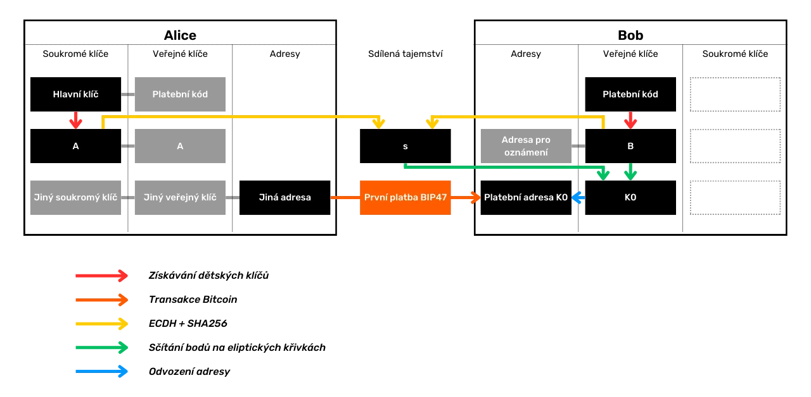

Pokud si Alice přeje provést druhou platbu, postupuje stejně jako předtím, s výjimkou toho, že tentokrát vybere druhý odvozený veřejný klíč z Bobova platebního kódu. Konkrétně použije další nepoužitý klíč. Tímto způsobem získá novou přijímací adresu patřící Bobovi, označenou $K1$:

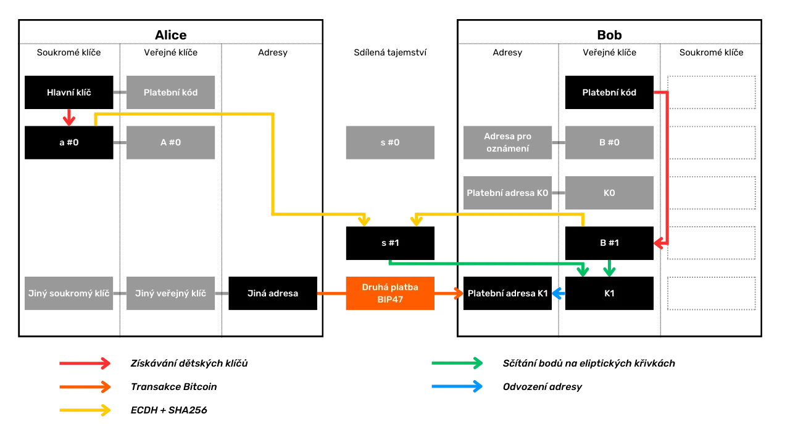

Může takto pokračovat a odvodit až `2^32` nepoužitých adres patřících Bobovi.

Z vnějšího pohledu, pozorováním blockchainu, je teoreticky nemožné odlišit platbu BIP47 od standardní platby. Zde je příklad transakce platby BIP47 na Testnetu:

```text
94b2e59510f2e1fa78411634c98a77bbb638e28fb2da00c9f359cd5fc8f87254
```

Vypadá to jako standardní transakce s vyčerpaným vstupem, výstupem platby a změnou:


### Přijetí platby BIP47 a odvození soukromého klíče

Alice právě provedla svou první platbu na novou adresu BIP47 patřící Bobovi. Nyní se podívejme, jak Bob tuto platbu přijme. Uvidíme také, proč Alice nemá přístup k soukromému klíči adresy, kterou právě sama vygenerovala, a jak Bob tento klíč získá, aby mohl utratit právě přijaté bitcoiny.
Jakmile Bob obdrží notifikační transakci od Alice, odvodí veřejný klíč BIP47 $K0$ ještě předtím, než jí poslal jakoukoliv platbu. Poté sleduje jakékoli platby na přidruženou adresu. Ve skutečnosti ihned odvodí několik adres, které bude sledovat ($K0$, $K1$, $K2$, $K3$...). Zde je, jak odvodí tento veřejný klíč $K0$:

- Bob vybere první odvozený dětský soukromý klíč ze svého platebního kódu. Tento soukromý klíč se jmenuje $b$. Je spojen s veřejným klíčem $B$, s nímž Alice prováděla své výpočty v předchozím kroku:

$$ b $$

- Bob vybere první veřejný klíč Alice odvozený z jejího platebního kódu. Tento klíč se jmenuje $A$. Je spojen s soukromým klíčem $a$, s nímž Alice prováděla své výpočty, a o kterém ví pouze Alice. Bob může tento proces provést, protože zná Alicein platební kód, který mu byl předán s notifikační transakcí:

$$ A = a \cdot G $$

- Bob vypočítá tajný bod $S$, přičtením a zdvojením bodů na eliptické křivce, aplikací svého soukromého klíče $b$ na Alicein veřejný klíč $A$. Zde nacházíme použití ECDH, které zaručuje, že tento bod $S$ bude stejný pro oba, Boba i Alici:

$$ S = b \cdot A $$

- Stejně jako Alice, Bob izoluje x-ovou souřadnici tohoto bodu $S$. Tuto hodnotu jsme pojmenovali $Sx$. Tuto hodnotu propustí funkcí SHA256, aby našel sdílené tajemství $s$ (malé písmeno):
  $$ s = \text{SHA256}(Sx) $$

- Stejně jako Alice, Bob vypočítá bod $s·G$ na eliptické křivce. Poté přičte tento tajný bod ke svému veřejnému klíči $B$. Získá tak nový bod na eliptické křivce, který interpretuje jako veřejný klíč $K0$:

$$ K0 = B + s \cdot G $$

Jakmile Bob má tento veřejný klíč $K0$, může odvodit přidružený soukromý klíč, aby mohl utrácet své bitcoiny. On je jediný, kdo může tento soukromý klíč vygenerovat:

- Bob přičte svůj dětský soukromý klíč $b$, odvozený z jeho osobního platebního kódu. On je jediný, kdo může získat hodnotu $b$. Poté přičte $b$ k sdílenému tajemství $s$, aby získal $k0$, soukromý klíč $K0$:

$$ k0 = b + s $$

Díky zákonu skupiny eliptické křivky Bob získá přesně soukromý klíč odpovídající veřejnému klíči použitému Alice. Máme tedy:

$$ K0 = k0 \cdot G $$
Shrneme kroky, které jsme právě společně prošli, abychom přijali platbu BIP47 a vypočítali odpovídající soukromý klíč:

- Bob vybere první odvozený dětský soukromý klíč ze svého osobního platebního kódu;
- Vypočítá tajný bod na eliptické křivce pomocí ECDH z prvního odvozeného dětského veřejného klíče z Aliceina řetězového kódu;
- Tento tajný bod použije k výpočtu sdíleného tajemství pomocí SHA256;
- Toto sdílené tajemství použije k výpočtu nového tajného bodu na eliptické křivce;
- Přičte tento nový tajný bod ke svému osobnímu veřejnému klíči;
- Získá nový efemerní veřejný klíč, na který mu Alice pošle její první platbu;
- Bob vypočítá soukromý klíč spojený s tímto efemerním veřejným klíčem přičtením jeho odvozeného dětského soukromého klíče z jeho platebního kódu a sdíleného tajemství.

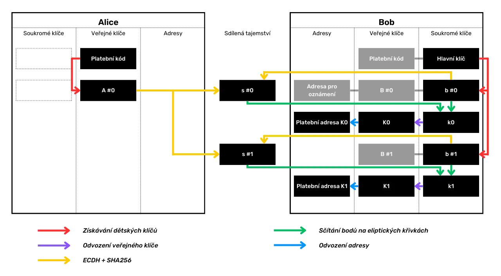

Protože Alice nemůže získat $b$ (Bobův soukromý klíč), nemůže určit $k0$ (soukromý klíč spojený s Bobovou přijímací adresou BIP47). Schématicky můžeme reprezentovat výpočet sdíleného tajemství $S$ takto:


Jakmile je sdílené tajemství nalezeno s ECDH, Alice a Bob vypočítají veřejný klíč platby BIP47 $K0$, a Bob také vypočítá přidružený soukromý klíč $k0$:

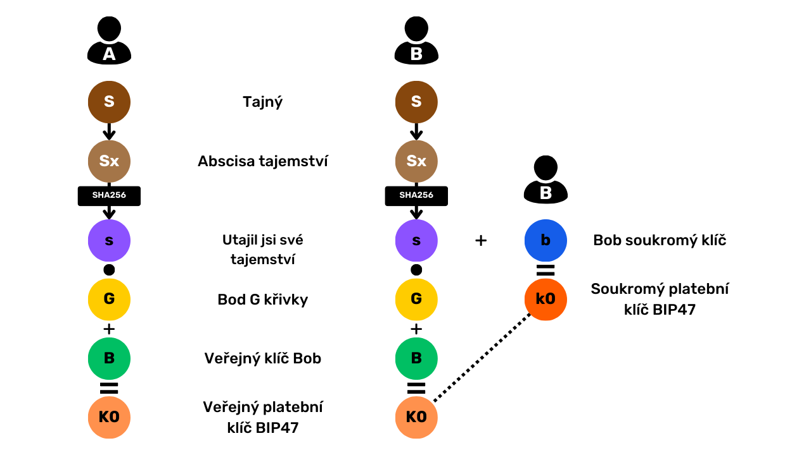

### Vrácení platby BIP47

Protože Bob zná Alicein opakovaně použitelný platební kód, již má všechny potřebné informace k odeslání jejího vrácení peněz. Nebude potřebovat kontaktovat Alice znovu, aby požádal o jakékoli informace. Bude stačit, když ji upozorní notifikační transakcí, zejména aby mohla získat své adresy BIP47 pomocí svého seedu, a poté jí může také poslat až `2^32` plateb.

Funkcionalita vrácení peněz je specifická pro BIP47 a je jednou z jeho výhod oproti jiným metodám, které budeme studovat v nadcházejících kapitolách, jako jsou Silent Payments.

Bob může poté vrátit Alice peníze stejným způsobem, jakým mu poslala platby. Role jsou obrácené:

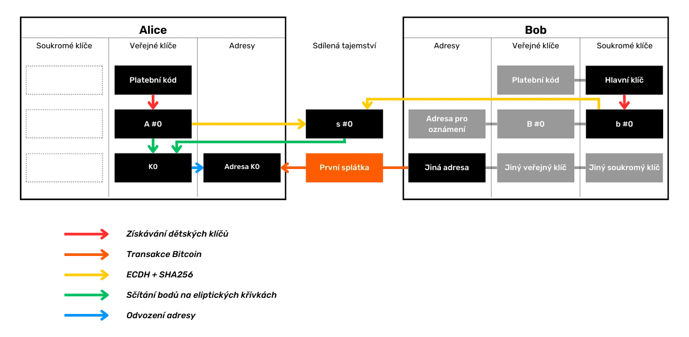
_Velké poděkování [Fanis Michalakis](https://x.com/FanisMichalakis) za jeho recenzi a cenné odborné rady k článku, který inspiroval k napsání této kapitoly!_

https://planb.network/tutorials/privacy/paynym-bip47

## Tiché platby

<chapterId>2871d594-414e-4598-a830-91c9eb84dfb8</chapterId>

BIP47 byl kritizován za svou neefektivitu na blockchainu. Jak bylo vysvětleno v předchozí kapitole, vyžaduje notifikační transakci pro každého nového příjemce. Toto omezení se stává zanedbatelným, pokud plánujete zřídit trvalý platební kanál s tímto příjemcem. Skutečně, jedna notifikační transakce otevírá cestu pro téměř nekonečný počet následujících BIP47 plateb.

Nicméně, v určitých situacích může být notifikační transakce překážkou pro uživatele. Vezměme si příklad jednorázového daru příjemci: s klasickou Bitcoin adresou stačí jedna transakce k provedení daru. Ale s BIP47 jsou nutné dvě transakce: jedna pro notifikaci a druhá pro samotnou platbu. Když je poptávka po blokovém prostoru nízká a transakční poplatky jsou minimální, tento další krok obecně není problém. Nicméně, během období zácpy mohou být transakční poplatky exorbitantní pro jednu platbu, potenciálně zdvojnásobující náklady pro uživatele ve srovnání se standardní Bitcoin transakcí, což může být pro uživatele nepřijatelné.

Pro situace, kdy uživatel plánuje provést pouze několik plateb na statický identifikátor, byla vyvinuta jiná řešení. Mezi nimi jsou Tiché platby, popsané v [BIP352](https://github.com/bitcoin/bips/blob/master/bip-0352.mediawiki). Tento protokol umožňuje použití statického identifikátoru pro příjem plateb bez generování opětovného použití adresy a bez nutnosti použití notifikačních transakcí. Pojďme se podívat, jak tento protokol funguje.

---

_Pro plné pochopení této kapitoly je nezbytné být obeznámen s fungováním ECDH (Elliptic Curve Diffie-Hellman) a kryptografickou derivací klíčů v HD peněžence. Tyto koncepty byly podrobně popsány v předchozí kapitole o BIP47. Zde je znovu neproberu. Pokud nejste s těmito pojmy ještě obeznámeni, doporučuji před pokračováním v této kapitole konzultovat předchozí kapitolu. Rizika spojená s opětovným používáním přijímacích adres ani důležitost mít unikátní identifikátor pro příjem plateb zde také nebudu znovu probírat._

---

### Proč nepřesunout notifikaci?

Jak bylo diskutováno v kapitole o BIP47, notifikační transakce primárně plní dvě funkce:

- Informuje příjemce;
- Přenáší platební kód odesílatele.

Mohl by se člověk naivně domnívat, že tento notifikační proces by mohl být proveden mimo řetězec. Teoreticky je to zcela proveditelné: stačilo by, aby příjemce uvedl způsob komunikace pro příjem BIP47 platebních kódů od odesílatelů. Nicméně, tento přístup představuje dvě hlavní problémy:

- Zaprvé, přesunul by proces přenosu kódu na jiný komunikační protokol. Problémy související s náklady a soukromím výměny by zůstaly, ale byly by jednoduše přeneseny na tento nový protokol. Z hlediska soukromí by to také mohlo vytvořit spojení mezi identitou uživatele a aktivitou na blockchainu, což je něco, čemu se snažíme vyhnout tím, že notifikaci provádíme přímo na blockchainu. Navíc by provádění notifikace mimo blockchain představovalo rizika cenzury (jako je blokování finančních prostředků), která na Bitcoinu neexistují.
- Dále by to představovalo problém s obnovou. S BIP47 musí příjemce nutně znát platební kódy odesílatelů, aby mohl přistupovat k prostředkům. To platí v době přijetí, ale také v případě obnovy prostředků prostřednictvím seedu v případě ztráty peněženky. S onchain notifikacemi se tomuto riziku vyhýbáme, protože uživatel může jednoduše najít a dešifrovat transakce s oznámením tím, že zná svůj seed. Pokud by však bylo oznámení provedeno mimo blockchain, uživatel by musel udržovat dynamickou zálohu všech přijatých platebních kódů, což je pro průměrného uživatele nepraktické.
  Všechna tato omezení činí použití onchain notifikace nezbytným v kontextu BIP47. Silent Payments se však konkrétně snaží vyhnout tomuto kroku onchain notifikace kvůli jeho nákladům. Proto přijaté řešení není přesunout notifikaci, ale zcela ji eliminovat. Pro dosažení tohoto cíle musí být přijat kompromis: skenování. Na rozdíl od BIP47, kde uživatel přesně ví, kde najít své prostředky díky transakcím s oznámením, v kontextu Silent Payments musí uživatel prozkoumat všechny existující Bitcoinové transakce, aby zjistil, zda nejsou některé platby určeny pro něj. Aby se snížilo toto operační břemeno, hledání Silent Payments je omezeno pouze na transakce, které pravděpodobně obsahují takové platby, konkrétně ty, které obsahují alespoň jeden Taproot P2TR výstup. Skenování se také zaměřuje výhradně na transakce od data vytvoření peněženky (není třeba skenovat transakce sahající až do roku 2009, pokud byla peněženka vytvořena v roce 2024).

Proto můžete vidět, proč BIP47 a Silent Payments, ačkoli mají podobný cíl, zahrnují různé kompromisy a **tak skutečně vyhovují odlišným případům užití**. Pro jednorázové platby, jako jsou příležitostné darování, jsou Silent Payments vhodnější kvůli jejich nižším nákladům. Naopak pro pravidelné transakce ke stejnému příjemci, jako je případ burzovních platforem nebo těžebních poolů, by mohl být preferován BIP47.
Pojďme společně prozkoumat technické fungování Silent Payments, abychom lépe pochopili jejich důsledky. K tomu navrhuji, abychom postupovali stejně jako vysvětlující dokument BIP352. Postupně rozebereme výpočty, které je třeba provést, prvek po prvku, odůvodňující každý nový přídavek.

### Některé koncepty k pochopení

Než začneme, je důležité objasnit, že Silent Payments se spoléhají výhradně na použití typů skriptů P2TR (_Pay to Taproot_). Na rozdíl od BIP47 není nutné odvozovat přijímací adresy z dětských veřejných klíčů jejich hašováním. Ve standardu P2TR je upravený veřejný klíč používán přímo a otevřeně v adrese. Takže Taproot přijímací adresa je v podstatě veřejný klíč doprovázený nějakými metadaty. Tento upravený veřejný klíč je agregací dvou dalších veřejných klíčů: jednoho umožňujícího přímé a tradiční utrácení prostřednictvím jednoduchého podpisu a druhého představujícího kořen Merkle stromu MAST, který autorizuje utrácení podmíněné splněním jedné z potenciálně zapsaných podmínek v Merkle stromu.


Rozhodnutí omezit Silent Payments výhradně na Taproot je motivováno dvěma hlavními důvody:

- Zaprvé, výrazně to usnadňuje implementaci a budoucí aktualizace v softwaru peněženky, protože je třeba dodržovat pouze jeden standard;
- Zadruhé, tento přístup pomáhá zlepšit anonymní sadu uživatelů tím, že je povzbuzuje, aby se nerozptylovali mezi různé typy skriptů, které generují odlišné otisky peněženek v analýze řetězce (pro více informací o tomto konceptu vás zvu, abyste si přečetli kapitolu 4 části 2).

### Naivní odvození veřejného klíče Silent Payments

Začněme s jednoduchým příkladem, který vám pomůže pochopit základní fungování SP (Silent Payments). Vezměme Alice a Boba, dva uživatele Bitcoinu. Alice chce poslat bitcoiny Bobovi na novou přijímací adresu. V tomto procesu musí být splněny tři cíle:

- Alice musí být schopna vygenerovat novou adresu;
- Bob musí být schopen identifikovat platbu poslanou na tuto konkrétní adresu;
- Bob musí být schopen získat soukromý klíč spojený s touto adresou, aby mohl své prostředky utratit.

Alice má v její Bitcoinové peněžence UTXO zabezpečené následujícím párem klíčů:

- $a$: soukromý klíč;
- $A$: veřejný klíč ($A = a \cdot G$)

Bob má SP adresu, kterou zveřejnil na internetu s:

- $b$: soukromý klíč;
- $B$: veřejný klíč ($B = b \cdot G$)
  Pomocí získání Bobovy adresy je Alice schopna vypočítat novou prázdnou adresu, která patří Bobovi pomocí ECDH. Tuto adresu nazvěme $P$:
  $$ P = B + \text{hash}(a \cdot B) \cdot G $$

V této rovnici Alice jednoduše vypočítala skalární součin svého soukromého klíče $a$ a Bobova veřejného klíče $B$. Tento výsledek pak prošla hashovací funkcí známou všem. Výstupní hodnota je pak skalárně vynásobena generátorovým bodem $G$ eliptické křivky `secp256k1`. Nakonec Alice přičte získaný bod k Bobovu veřejnému klíči $B$. Jakmile má Alice tuto adresu $P$, použije ji jako výstup v transakci, což znamená, že na ni pošle bitcoiny.

> _V kontextu Silent Payments odpovídá funkce "hash" hashovací funkci SHA256 specificky označené `BIP0352/SharedSecret`, což zajišťuje, že vygenerované hashe jsou unikátní pro tento protokol a nelze je znovu použít v jiných kontextech, zároveň také poskytuje dodatečnou ochranu proti opětovnému použití nonců v podpisech. Tento standard odpovídá tomu, který je [specifikován v BIP340 pro Schnorr podpisy](https://github.com/bitcoin/bips/blob/master/bip-0340.mediawiki) na `secp256k1`._

Díky vlastnostem eliptické křivky, na které ECDH spoléhá, víme, že:

$$ a \cdot B = b \cdot A $$

Bob tedy bude schopen vypočítat přijímací adresu, na kterou Alice poslala bitcoiny. K tomu sleduje všechny Bitcoinové transakce, které splňují kritéria Silent Payments, a k každé z nich aplikuje následující výpočet, aby zjistil, zda je platba adresována jemu (_skenování_):

$$ P' = B + \text{hash}(b \cdot A) \cdot G $$

Když skenuje Aliceinu transakci, uvědomí si, že $P'$ se rovná $P$. Tím pádem ví, že tato platba je adresována jemu:

$$ P' = B + \text{hash}(b \cdot A) \cdot G = B + \text{hash}(a \cdot B) \cdot G = P $$

Odtud bude Bob schopen vypočítat soukromý klíč $p$, který umožňuje utratit adresu $P$:

$$ p = (b + \text{hash}(b \cdot A)) \bmod n $$

Jak vidíte, pro výpočet tohoto soukromého klíče $p$ je nutné mít soukromý klíč $b$. Pouze Bob má tento soukromý klíč $b$. Bude tedy skutečně jediný, kdo bude moci utratit bitcoiny poslané na jeho adresu Silent Payments.


_Popisek:_

- $B$: Veřejný klíč / statická adresa publikovaná Bobem
- $b$: Bobův soukromý klíč
- $A$: Veřejný klíč Aliceina UTXO použitého jako vstup pro transakci
- $a$: Alicin soukromý klíč
- $G$: Generátorový bod eliptické křivky `secp256k1`
- $\text{SHA256}$: Hašovací funkce SHA256 označená s `BIP0352/SharedSecret`
- $s$: Společné tajemství ECDH
- $P$: Veřejný klíč / unikátní adresa pro platbu Bobovi

Zde je původně spíše naivní přístup k použití Bobovy statické adresy, označené $B$, k odvození unikátní adresy $P$ pro posílání bitcoinů. Tato metoda je však příliš zjednodušená a má několik nedostatků, které je třeba opravit. Prvním problémem je, že v tomto schématu nemůže Alice vytvořit více výstupů pro Boba v rámci téže transakce.

### Jak vytvořit více výstupů?

V příkladu z předchozí sekce Alice vytvoří jediný výstup, který půjde Bobovi na jeho unikátní adresu $P$. S tím samým vybraným vstupem je pro Alici nemožné vytvořit dvě odlišné původní adresy pro Boba, protože použitá metoda by vždy vedla ke stejnému výsledku pro $P$, tedy téže adrese. Existuje však mnoho situací, kdy by Alice chtěla rozdělit svou platbu Bobovi na několik menších částek, čímž by vytvořila více UTXO. Je tedy nutné najít metodu, která to umožní.

K dosažení tohoto cíle mírně upravíme výpočet, který Alice provádí k odvození $P$, tak aby mohla generovat dvě odlišné adresy pro Boba, konkrétně $P_0$ a $P_1$.

K úpravě výpočtu a získání 2 různých adres stačí přidat celé číslo, které změní výsledek. Alice tedy přidá do svého výpočtu $0$ pro získání adresy $P_0$ a $1$ pro získání adresy $P_1$. Toto celé číslo nazveme $i$:

$$ P_i = B + \text{hash}(a \cdot B \text{ ‖ } i) \cdot G $$

Proces výpočtu zůstává nezměněn oproti předchozí metodě, s tím rozdílem, že tentokrát Alice spojí $a \cdot B$ s $i$ před pokračováním k haši. Stačí pak změnit $i$ na získání nové adresy patřící Bobovi. Například:

$$ P_0 = B + \text{hash}(a \cdot B \text{ ‖ } 0) \cdot G $$

$$ P_1 = B + \text{hash}(a \cdot B \text{ ‖ } 1) \cdot G $$
Když Bob prohledává blockchain za Silent Payments určenými pro něj, začne použitím $i = 0$ pro adresu $P_0$. Pokud na $P_0$ nenajde žádnou platbu, uzavře, že tato transakce neobsahuje žádné Silent Payments pro něj a přestane ji analyzovat. Pokud však $P_0$ je platná a obsahuje platbu pro něj, pokračuje s $P_1$ ve stejné transakci, aby zkontroloval, zda Alice provedla druhou platbu. Pokud se $P_1$ ukáže jako neplatná, zastaví své hledání této transakce; jinak pokračuje v testování postupných hodnot $i$:
$$ P_0 = B + \text{hash}(b \cdot A \text{ ‖ } 0) \cdot G $$
$$ P_1 = B + \text{hash}(b \cdot A \text{ ‖ } 1) \cdot G $$
Protože Bob ihned zastaví na $i = 0$, pokud $P_0$ nic nevydá, použití tohoto celého čísla přidává téměř žádnou dodatečnou operativní zátěž pro Boba při skenování transakcí.

Bob pak může vypočítat soukromé klíče stejným způsobem:

$$
p_0 = (b + \text{hash}(b \cdot A \text{ ‖ } 0)) \bmod n
$$

$$
p_1 = (b + \text{hash}(b \cdot A \text{ ‖ } 1)) \bmod n
$$


_Popisek:_

- $B$: Veřejný klíč / statická adresa publikovaná Bobem
- $b$: Bobův soukromý klíč
- $A$: Veřejný klíč Alice UTXO použitý jako vstup pro transakci
- $a$: Alicein soukromý klíč
- $G$: Generátorový bod eliptické křivky `secp256k1`
- $\text{SHA256}$: Hašovací funkce SHA256 označená s `BIP0352/SharedSecret`
- $s_0$: První sdílené tajemství ECDH
- $s_1$: Druhé sdílené tajemství ECDH
- $P_0$: První veřejný klíč / unikátní adresa pro platbu Bobovi
- $P_1$: Druhý veřejný klíč / unikátní adresa pro platbu Bobovi

S touto metodou začínáme mít pěkný protokol, ale stále existují některé výzvy, které je třeba překonat, zejména prevence opětovného použití adresy.

### Jak se vyhnout opětovnému použití adresy?

Jak jsme viděli v předchozích sekcích, Alice používá pár klíčů, které zabezpečují její UTXO, které utratí, aby vypočítala sdílené tajemství ECDH s Bobem. Toto tajemství jí umožňuje odvodit unikátní adresu $P_0$. Nicméně, pár klíčů ($a$, $A$) použitý Alicí může zabezpečit více UTXO, pokud tuto adresu několikrát použila. V případě, že Alice provede dvě platby na Bobovu statickou adresu $B$ pomocí dvou UTXO zabezpečených stejným klíčem $A$, dojde k opětovnému použití adresy pro Boba.

> _Opětovné použití adresy je velmi špatná praxe pro soukromí uživatele. Abychom pochopili proč, doporučuji vám zkontrolovat první části tohoto školení._

Skutečně, protože unikátní adresa $P_0$ je odvozena z $A$ a $B$, pokud Alice odvodí druhou adresu pro druhou platbu na $B$ se stejným klíčem $A$, skončí s tou samou adresou $P_0$. Abychom se vyhnuli tomuto riziku a zabránili opětovnému použití adresy v rámci Silent Payments, musíme naše výpočty mírně upravit.

To, co chceme, je, aby každé UTXO spotřebované Alicí jako vstup platby dalo na Bobově straně unikátní adresu, i když několik UTXO je zabezpečeno stejným párem klíčů. Je tedy dostatečné přidat odkaz na UTXO do výpočtu unikátní adresy $P_0$. Tento odkaz bude jednoduše haš UTXO spotřebovaného jako vstup:

$$ \text{inputHash} = \text{hash}(\text{outpoint} \text{ ‖ } A) $$

A tento vstupní odkaz, Alice jej přidá do svého výpočtu unikátní adresy $P_0$:
$$ P_0 = B + \text{hash}(\text{inputHash} \cdot a \cdot B \text{ ‖ } 0) \cdot G $$
Během svého prohledávání může Bob také přidat $\text{inputHash}$, protože vše, co potřebuje udělat, je sledovat transakci, aby odvodil $\text{outpoint}$:

$$ P_0 = B + \text{hash}(\text{inputHash} \cdot b \cdot A \text{ ‖ } 0) \cdot G $$

Když najde platný $P_0$, může vypočítat odpovídající soukromý klíč $p_0$:

$$
p_0 = (b + \text{hash}(\text{inputHash} \cdot b \cdot A \text{ ‖ } 0)) \bmod n
$$


_Legenda:_

- $B$: Veřejný klíč / statická adresa publikovaná Bobem
- $b$: Bobův soukromý klíč
- $A$: Veřejný klíč Aliceina UTXO použitého jako vstup pro transakci
- $a$: Alicin soukromý klíč
- $H$: Hash UTXO použitého jako vstup
- $G$: Generátorový bod eliptické křivky `secp256k1`
- $\text{SHA256}$: Hashovací funkce SHA256 označená s `BIP0352/SharedSecret`
- $s_0$: První sdílené tajemství ECDH
- $P_0$: První veřejný klíč / unikátní adresa pro platbu Bobovi

V současné době naše výpočty předpokládají, že Alice používá pro svou transakci jediný vstup. Nicméně by měla být schopna použít více vstupů. V důsledku toho by na Bobově straně pro každou transakci obsahující více vstupů teoreticky potřeboval vypočítat ECDH pro každý vstup, aby určil, zda je platba určena pro něj. Tato metoda není uspokojivá, takže potřebujeme najít řešení, jak snížit pracovní zátěž!

### Úprava veřejných klíčů ve vstupech

Abychom tento problém vyřešili, místo použití páru klíčů zabezpečujícího konkrétní vstup na straně Alice, budeme používat součet všech párů klíčů použitých ve vstupech transakce. Tento součet bude poté považován za nový pár klíčů. Tato technika je známá jako "tweak".

Například si představte, že transakce Alice má 3 vstupy, každý zabezpečený s jiným párem klíčů:

- $a_0$ zabezpečuje vstup #0;
- $a_1$ zabezpečuje vstup #1;
- $a_2$ zabezpečuje vstup #2.


Podle výše popsané metody by Alice musela vybrat jediný pár klíčů mezi $a_0$, $a_1$ a $a_2$, aby vypočítala tajemství ECDH a vygenerovala unikátní platební adresu $P$ z Bobovy statické adresy $B$. Tento přístup však vyžaduje, aby Bob testoval každou možnost sekvenčně, začínaje $a_0$, poté $a_1$ a tak dále, dokud neidentifikuje pár generující platnou adresu $P$. Tento proces vyžaduje, aby Bob prováděl výpočet ECDH na všech vstupech všech transakcí, což výrazně zvyšuje pracovní zátěž při prohledávání.

Abychom se tomuto vyhnuli, požádáme Alici, aby svůj výpočet $P$ provedla pomocí součtu všech klíčů ve vstupu. Vezmeme-li náš příklad, upravený soukromý klíč $a$ by byl vypočítán takto:

$$ a = a_0 + a_1 + a_2 $$
Podobně, Alice a Bob budou schopni vypočítat upravený veřejný klíč:
$$ A = A_0 + A_1 + A_2 $$
Díky této metodě Bob potřebuje pouze vypočítat součet veřejných klíčů transakce, poté vypočítat tajný klíč ECDH z $A$, což výrazně snižuje počet výpočtů potřebných pro krok skenování. Nicméně, jak si pamatujeme z předchozí sekce, do našeho výpočtu jsme zahrnuli hash $\text{inputHash}$, který je použit jako nonce k zabránění opětovnému použití adresy:

$$ \text{inputHash} = \text{hash}(\text{outpoint} \text{ ‖ } A) $$

Pokud však transakce obsahuje více vstupů, je nutné určit, který $\text{outpoint}$ bude v tomto výpočtu použit. Podle BIP352 je kritérium pro výběr $\text{outpoint}$ k použití vybrat ten nejmenší lexikograficky, což znamená vybrat UTXO, které se objeví jako první v abecedním pořadí. Tato metoda standardizuje výběr UTXO pro každou transakci. Například, pokud je tento nejmenší $\text{outpoint}$ lexikograficky $\text{outpoint}_L$, výpočet $\text{inputHash}$ bude:

$$ \text{inputHash} = \text{hash}(\text{outpoint}\_L \text{ ‖ } A) $$

Výpočty pak zůstávají identické s těmi, které byly prezentovány v předchozí sekci, s výjimkou toho, že soukromý klíč $a$ a jeho odpovídající veřejný klíč $A$ již nejsou párem zabezpečujícím jediný vstup, ale nyní reprezentují úpravu všech párů klíčů ve vstupech.

### Oddělení klíčů pro utrácení a skenování

Doposud jsme diskutovali o statické adrese Silent Payment $B$ jako o unikátním veřejném klíči. Pamatujte, že právě tento veřejný klíč $B$ je použit Alice k vytvoření sdíleného tajného klíče ECDH, který je poté použit k výpočtu unikátní platební adresy $P$. Bob používá tento veřejný klíč $B$ a odpovídající soukromý klíč $b$ pro krok skenování. Ale také použije soukromý klíč $b$ k výpočtu soukromého klíče $p$, který umožňuje utrácení z adresy $P$.

Nevýhodou této metody je, že soukromý klíč $b$, který je použit k výpočtu všech soukromých klíčů pro adresy přijímající Silent Payments, je také použit Bobem pro skenování transakcí. Tento krok vyžaduje, aby klíč $b$ byl dostupný na softwaru peněženky připojeného k internetu, což ho vystavuje většímu riziku krádeže ve srovnání s jeho uchováním v cold wallet. Ideálně by bylo výhodné moci využívat Silent Payments při současném uchování soukromého klíče $b$, který kontroluje přístup ke všem ostatním soukromým klíčům, zabezpečeného na hardware peněžence. Naštěstí byl protokol přizpůsoben tak, aby to umožňoval.
K dosažení tohoto cíle BIP352 specifikuje, že příjemce používá 2 různé páry klíčů:

- $B_{\text{spend}}$: pro výpočet soukromých klíčů unikátních platebních adres;
- $B_{\text{scan}}$: pro nalezení unikátních platebních adres.

Tímto způsobem může Bob uchovávat soukromý klíč $b_{\text{spend}}$ na hardware peněžence a používat soukromý klíč $b_{\text{scan}}$ na online softwaru k nalezení svých Silent Payments, aniž by odhalil $b_{\text{spend}}$. Nicméně, veřejné klíče $B_{\text{scan}}$ a $B_{\text{spend}}$ jsou oba veřejně odhaleny, jelikož se nacházejí v Bobově statické adrese $B$:
$$ B = B*{\text{scan}} \text{ ‖ } B*{\text{spend}} $$
Pro výpočet unikátní platební adresy $P_0$ patřící Bobovi, Alice nyní provede následující výpočet:

$$ P*0 = B*{\text{spend}} + \text{hash}(\text{inputHash} \cdot a \cdot B\_{\text{scan}} \text{ ‖ } 0) \cdot G $$

Pro nalezení plateb adresovaných jemu, Bob provede následující výpočet:

$$ P*0 = B*{\text{spend}} + \text{hash}(\text{inputHash} \cdot b\_{\text{scan}} \cdot A \text{ ‖ } 0) \cdot G $$

Jak vidíte, dosud Bob nepotřeboval použít $b_{\text{spend}}$, který má ve své hardwarové peněžence. Když si bude přát utratit $P_0$, může poté provést následující výpočet pro nalezení soukromého klíče $p_0$:

$$ p*0 = (b*{\text{spend}} + \text{hash}(\text{inputHash} \cdot b\_{\text{scan}} \cdot A \text{ ‖ } 0)) \bmod n $$


_Popisek:_

- $B_{\text{scan}}$: Bobův veřejný klíč pro skenování (statická adresa)
- $b_{\text{scan}}$: Bobův soukromý klíč pro skenování
- $B_{\text{spend}}$: Bobův veřejný klíč pro utrácení (statická adresa)
- $b_{\text{spend}}$: Bobův soukromý klíč pro utrácení
- $A$: Součet veřejných klíčů ve vstupu (úprava)
- $a$: Soukromý klíč odpovídající upravenému veřejnému klíči
- $H$: Hash nejmenšího UTXO (lexikograficky) použitého ve vstupu
- $G$: Generátorový bod eliptické křivky `secp256k1`
- $\text{SHA256}$: Hashovací funkce SHA256 označená s `BIP0352/SharedSecret`
- $s_0$: První sdílené tajemství ECDH
- $P_0$: První veřejný klíč / unikátní platební adresa pro Boba

### Používání SP adres s označením

Bob tedy má pro Tiché Platby statickou adresu $B$ následovně:

$$ B = B*{\text{scan}} \text{ ‖ } B*{\text{spend}} $$

Problém s touto metodou je, že neumožňuje segregovat různé platby poslané na tuto adresu. Například, pokud má Bob 2 různé klienty pro svůj podnik a chce jasně rozlišit platby od každého z nich, potřeboval by 2 různé statické adresy. Naivní řešení, s aktuálním přístupem, by bylo, aby Bob vytvořil dvě oddělené peněženky, každou se svou vlastní statickou adresou, nebo dokonce zřídil dvě různé statické adresy v rámci téže peněženky. Toto řešení však vyžaduje skenování celého blockchainu dvakrát (jednou pro každou adresu) pro detekci plateb určených pro každou adresu. Toto dvojité skenování neracionálně zvyšuje operační zátěž pro Boba.
K řešení tohoto problému BIP352 využívá systém označování, který umožňuje použití různých statických adres bez neúměrného zvyšování pracovní zátěže při hledání Silent Payments na blockchainu. K tomu je k veřejnému klíči pro utrácení $B_{\text{spend}}$ přidáno celé číslo $m$. Toto číslo může nabývat hodnoty $1$ pro první statickou adresu, poté $2$ pro druhou a tak dále. Klíče pro utrácení $B_{\text{spend}}$ budou odteď nazývány $B_m$ a budou konstruovány následovně:
$$ B*m = B*{\text{spend}} + \text{hash}(b\_{\text{scan}} \text{ ‖ } m) \cdot G $$

Například pro první klíč pro utrácení s označením $1$:

$$ B*1 = B*{\text{spend}} + \text{hash}(b\_{\text{scan}} \text{ ‖ } 1) \cdot G $$

Statická adresa publikovaná Bobem bude nyní sestávat z $B_{\text{scan}}$ a $B_m$. Například první statická adresa s označením $1$ bude:

$$ B = B\_{\text{scan}} \text{ ‖ } B_1 $$

> _Začínáme pouze od označení 1, protože označení 0 je rezervováno pro změnu._

Alice na své straně odvodí unikátní platební adresu $P$ stejným způsobem jako dříve, ale použije nový $B_1$ místo $B_{\text{spend}}$.
$$ P*0 = B_1 + \text{hash}(\text{inputHash} \cdot a \cdot B*{\text{scan}} \text{ ‖ } 0) \cdot G $$

Ve skutečnosti Alice možná ani nebude vědět, že Bob má označenou adresu, protože jednoduše použije druhou část statické adresy, kterou jí poskytl, což v tomto případě je hodnota $B_1$ namísto $B_{\text{spend}}$.

Pro skenování plateb Bob vždy použije hodnotu své původní statické adresy s $B_{\text{spend}}$ tímto způsobem:

$$ P*0 = B*{\text{spend}} + \text{hash}(\text{inputHash} \cdot b\_{\text{scan}} \cdot A \text{ ‖ } 0) \cdot G $$

Poté jednoduše odečte hodnotu, kterou najde pro $P_0$, od každého výstupu postupně. Poté zkontroluje, zda jedna z výsledků těchto odečtů odpovídá hodnotě jednoho z označení, které používá ve své peněžence. Pokud to odpovídá, například pro výstup č. 4 s označením $1$, to znamená, že tento výstup je Silent Payment spojený s jeho označenou statickou adresou $B_1$:

$$ Out*4 - P_0 = \text{hash}(b*{\text{scan}} \text{ ‖ } 1) \cdot G $$

To funguje, protože:

$$ B*1 = B*{\text{spend}} + \text{hash}(b*{\text{scan}} \text{ ‖ } 1) \cdot G $$
Díky této metodě může Bob používat množství statických adres ($B_1$, $B_2$, $B_3$...), všechny odvozené od jeho základní statické adresy ($B = B*{\text{scan}} \text{ ‖ } B*{\text{spend}}$), aby správně oddělil použití.
Toto oddělení statických adres je však platné pouze z pohledu správy osobní peněženky a neumožňuje oddělení identit. Jelikož všechny mají stejný $B*{\text{scan}}$, je velmi snadné všechny statické adresy spojit dohromady a usoudit, že patří jedné entitě.


_Popisek:_

- $B_{\text{scan}}$: Bobův veřejný klíč pro skenování (statická adresa)
- $b_{\text{scan}}$: Bobův soukromý klíč pro skenování
- $B_{\text{spend}}$: Bobův veřejný klíč pro utrácení (počáteční adresa)
- $B_m$: Bobův označený veřejný klíč pro utrácení (statická adresa)
- $b_m$: Bobův označený soukromý klíč pro utrácení
- $A$: Součet veřejných klíčů vstupů (tweak)
- $a$: Soukromý klíč odpovídající upravenému veřejnému klíči
- $H$: Hash nejmenšího UTXO (lexikograficky) použitého jako vstup
- $G$: Generátorový bod eliptické křivky `secp256k1`
- $\text{SHA256}$: Hashovací funkce SHA256 označená `BIP0352/SharedSecret`
- $s_0$: První sdílené tajemství ECDH
- $P_0$: První veřejný klíč / unikátní adresa pro platbu Bobovi
- $p_0$: Soukromý klíč první unikátní platební adresy pro Boba
- $X$: Hash soukromého klíče pro skenování s označením

### Jak sestavit adresu pro tiché platby?

Pro sestavení dedikované adresy pro tiché platby je nejprve nutné odvodit 2 páry klíčů ve vaší Bitcoin HD peněžence:

- Pár $b_{\text{scan}}$, $B_{\text{scan}}$ pro vyhledávání plateb adresovaných nám;
- Pár $b_{\text{spend}}$, $B_{\text{spend}}$ pro utrácení bitcoinů, které jsme obdrželi.

Tyto páry jsou odvozeny podle těchto cest (_Bitcoin Mainnet_):

```text
scan: m / 352' / 0' / 0' / 1' / 0
spend: m / 352' / 0' / 0' / 0' / 0
```

Jakmile jsou tyto 2 páry klíčů k dispozici, jednoduše se spojí (konec s koncem) k vytvoření nákladu statické adresy:

$$ B = B*{\text{scan}} \text{ ‖ } B*{\text{spend}} $$

Pokud si přejete použít označení, $B_{\text{spend}}$ se nahradí za $B_m$:

$$ B = B\_{\text{scan}} \text{ ‖ } B_m $$

S označením $m$:

$$ B*m = B*{\text{spend}} + \text{hash}(b\_{\text{scan}} \text{ ‖ } m) \cdot G $$

Jakmile je tento náklad k dispozici, přidá se HRP (_Human-Readable Part_) `sp` a verze `q` (= verze 0). Přidá se také kontrolní součet a adresa se formátuje v bech32m.
Například, zde je moje statická adresa pro Silent Payments:

```text
sp1qqvhjvsq2vz8zwrw372vuzle7472zup2ql3pz64yn5cpkw5ngv2n6jq4nl8cgm6zmu48yk3eq33ryc7aam6jrvrg0d0uuyzecfhx2wgsumcurv77e
```

Důležitý bod týkající se statických adres, které jste mohli zadat v předchozích sekcích, je, že tyto adresy nejsou viditelné v Bitcoinových transakcích. Na blockchainu se ve standardním formátu Taproot objevují pouze platební adresy $P$, použité ve výstupech. Zvenčí je tedy nemožné odlišit transakci zahrnující Silent Payment od běžné transakce používající výstupy P2TR.
Stejně jako u BIP47, je nemožné navázat spojení mezi statickou adresou $B$ a odvozenou platební adresou $P$ z $B$. Skutečně, i když se Eve, potenciální útočník, pokusí prohledat blockchain s Bobovou statickou adresou $B$, nebude schopna provést potřebné výpočty k určení $P$. K tomu by potřebovala buď Bobův soukromý skenovací klíč $b_{\text{scan}}$ nebo soukromé klíče odesílatele $a$, ale oba tyto prvky jsou samozřejmě soukromé. Je tedy možné explicitně spojit svou statickou adresu s formou osobní identity.

### Jak používat Silent Payments?

Návrh na Silent Payments je poměrně nový a zatím byl implementován pouze velmi omezeným počtem peněženek. Podle mého vědomí existují pouze 3 softwary, které je podporují:

- [CakeWallet](https://cakewallet.com/)
- [Silentium](https://app.silentium.dev/)
- [DonationWallet](https://github.com/Sosthene00/donationwallet)

Brzy nabídneme podrobný tutoriál na nastavení vaší vlastní statické adresy pro Silent Payments.

Vzhledem k tomu, že se jedná o novou funkci, je doporučeno být opatrný a vyhnout se používání Silent Payments pro velké částky na hlavní síti.

_K vytvoření této kapitoly o Silent Payments jsem použil [web s vysvětlením Silent Payments](https://silentpayments.xyz/) a [dokument s vysvětlením BIP352](https://github.com/bitcoin/bips/blob/master/bip-0352.mediawiki)._


## Dejte nám zpětnou vazbu k tomuto kurzu
<chapterId>195d149f-80fa-5816-8b46-995a9226d082</chapterId>
<isCourseReview>true</isCourseReview>

## Závěrečná zkouška
<chapterId>e803d394-e3c1-5816-a6b4-a69a2472019c</chapterId>
<isCourseExam>true</isCourseExam>

## Závěr

<chapterId>cd8e5c67-50e4-4dcd-8e04-88ba5ec95305</chapterId>

Gratuluji k dokončení tohoto školení o soukromí v Bitcoinu!

Probrali jsme mnoho pokročilých a technických témat v tomto školení, ale není nezbytné používat všechny prezentované nástroje. Hlavním cílem bylo poskytnout vám možnost vybrat si, které informace chcete zveřejnit a které informace dáváte přednost udržet v soukromí při používání Bitcoinu. To je samotná podstata ochrany soukromí. Abychom mohli dělat informovaná rozhodnutí o tom, které informace sdílet nebo skrývat, je nutné být si vědom důsledků našich akcí. Doufám, že vám toto školení pomohlo získat tuto znalost.
Pokud bych měl vybrat nejdůležitější část tohoto školení, vybral bych sekci věnovanou analýze řetězců. Porozumění technikám používaným vašimi potenciálními útočníky je nejlepší způsob, jak se chránit. Proto bych vám doporučil pečlivě si tuto část projít a pokusit se pochopit všechny její detaily.
V tomto školení jsme se zaměřili výhradně na soukromí Bitcoinu na hlavním řetězci. Problémy soukromí na systémech druhé vrstvy, jako je Lightning Network a sidechainy, jsou také významné a mají velmi specifické charakteristiky. Ačkoliv použití transakcí mimo hlavní řetězec může být efektivní strategií, jak se vyhnout mnoha rizikům sledovatelnosti na Bitcoinu, které jsme studovali, vystavuje vás to jiným rizikům, o kterých je také důležité vědět. Proto budou tyto témata pokryta v budoucím specializovaném školení na PlanB Network.

Pokud se vám toto školení líbilo, byl bych velmi vděčný, pokud byste jej mohli sdílet s přáteli a na sociálních médiích. Děkuji! :)
