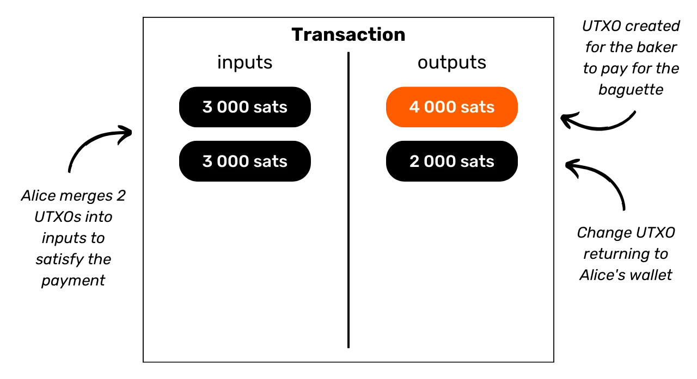

# Ochrana vašeho soukromí na Bitcoinu

Ve světě, kde se soukromí finančních transakcí postupně stává luxusem, je zásadní porozumět a ovládnout principy ochrany soukromí při vašem používání Bitcoinu. Toto školení vám dává všechny klíče, jak teoretické, tak praktické, k dosažení tohoto cíle samostatně.

Dnes na Bitcoinu existují společnosti specializované na analýzu řetězců. Jejich hlavní činností je přesně proniknout do vaší soukromé sféry, aby ohrozily důvěrnost vašich transakcí. Ve skutečnosti "právo na soukromí" na Bitcoinu neexistuje. Proto je na vás, uživateli, abyste prosazovali svá přirozená práva a chránili důvěrnost vašich transakcí, protože to za vás nikdo jiný neudělá.

Toto školení se prezentuje jako kompletní a generalistická cesta. Každý technický pojem je podrobně diskutován a podpořen vysvětlujícími diagramy. Cílem je učinit znalosti přístupné pro každého. BTC204 je tedy přístupný pro začátečníky i pokročilé uživatele. Toto školení také nabízí přidanou hodnotu pro nejzkušenější bitcoinery, protože se zabýváme některými technickými koncepty, které jsou často neznámé.

Přidejte se k nám, abyste proměnili své používání Bitcoinu a stali se informovaným uživatelem, schopným pochopit důležitost důvěrnosti a ochrany vašeho soukromí.

+++

# Úvod
<partId>e17474a8-8899-4bdb-a7f8-bc52ddb01440</partId>

## Úvod do školení
<chapterId>08ba1933-f393-4fb5-8279-777d874caedb</chapterId>

Ve světě, kde se soukromí finančních transakcí postupně stává luxusem, je zásadní porozumět a ovládnout principy ochrany soukromí při vašem používání Bitcoinu. Toto školení vám dává všechny klíče, jak teoretické, tak praktické, k dosažení tohoto cíle samostatně.
Dnes, v ekosystému Bitcoinu, existují společnosti specializované na analýzu řetězců. Jejich hlavní činností je přesně proniknout do vaší soukromé sféry, ohrožujíc důvěrnost vašich transakcí. Ve skutečnosti "právo na soukromí" na Bitcoinu neexistuje. Proto je na vás, uživateli, abyste prosazovali svá přirozená práva a chránili důvěrnost vašich transakcí, protože to za vás nikdo jiný neudělá.

Bitcoin není jen o "Number Go Up" a zachování hodnoty úspor. Díky svým jedinečným vlastnostem a historii je především nástrojem protiekonomiky. Díky této pozoruhodné vynálezu můžete svobodně spravovat své peníze, utrácet je a hromadit je, aniž by vám to kdokoli mohl zabránit.

Bitcoin nabízí mírový únik z jha států, umožňuje vám plně si užívat vašich přirozených práv, která nemohou být zpochybněna zavedenými zákony. Díky vynálezu Satoshiho Nakamota máte moc vynutit si respekt k vašemu soukromému majetku a znovu získat svobodu uzavírat smlouvy.

Nicméně, Bitcoin není anonymní ve výchozím nastavení, což může představovat riziko pro jednotlivce zapojené do protiekonomiky, zejména v regionech pod despotickými režimy. Ale to není jediné nebezpečí. Vzhledem k tomu, že bitcoin je cenný a necenzurovatelný majetek, může přilákat chamtivost zlodějů. Takže ochrana vašeho soukromí se stává také otázkou bezpečnosti: může vám pomoci předcházet kybernetickým útokům a fyzickým útokům.
Jak uvidíme, ačkoliv protokol nabízí určité vnitřní ochrany soukromí, je zásadní používat další nástroje k optimalizaci a obraně tohoto soukromí.
Tento trénink je navržen jako kompletní a generalistická cesta k pochopení důležitosti soukromí na Bitcoinu. Každý technický pojem je podrobně vysvětlen a podpořen vysvětlujícími diagramy. Cílem je učinit znalosti přístupnými pro každého, včetně začátečníků a pokročilých uživatelů. Pro zkušenější bitcoinisty také během tohoto tréninku pokrýváme velmi technické a někdy neznámé koncepty, aby se prohloubilo porozumění každému tématu.

Cílem tohoto tréninku není udělat vás zcela anonymními ve vašem používání Bitcoinu, ale spíše vám poskytnout základní nástroje, abyste věděli, jak chránit vaše soukromí podle vašich osobních cílů. Budete mít svobodu vybrat si z konceptů a nástrojů prezentovaných k vývoji vlastních strategií, přizpůsobených vašim cílům a specifickým potřebám.

### Sekce 1: Definice a klíčové koncepty
Na začátku společně probereme základní principy, které řídí fungování Bitcoinu, abychom poté mohli klidně přistoupit k pojmosloví souvisejícímu se soukromím. Je zásadní ovládat několik základních konceptů, jako jsou UTXO, přijímací adresy nebo skripty, než budeme plně schopni pochopit koncepty, které budeme řešit v následujících sekcích. Také představíme obecný model soukromí Bitcoinu, jak jej viděl Satoshi Nakamoto, což nám umožní pochopit důležitost a rizika s tím spojená.


### Sekce 2: Porozumění analýze řetězců a jak se proti ní bránit

Ve druhé sekci studujeme techniky používané společnostmi provádějícími analýzu řetězců k sledování vaší aktivity na Bitcoinu. Porozumění těmto metodám je klíčové pro zvýšení ochrany vašeho soukromí. Tato část má za cíl prozkoumat strategie útočníků, aby lépe porozuměla rizikům a položila základy pro techniky, které budeme studovat v následujících sekcích. Analyzujeme vzory transakcí, interní a externí heuristiky, stejně jako pravděpodobné interpretace těchto vzorů. Kromě teoretické složky se naučíme používat prohlížeč bloků k provádění analýzy řetězců, prostřednictvím praktických příkladů a cvičení.


### Sekce 3: Ovládnutí nejlepších postupů k ochraně vašeho soukromí

Ve třetí sekci našeho tréninku se dostáváme k jádru věci: praxe! Cílem je ovládnout všechny zásadní nejlepší postupy, které by se měly stát přirozenými reflexy pro každého uživatele Bitcoinu. Budeme se věnovat používání čerstvých adres, označování, konsolidaci, používání úplných uzlů, stejně jako KYC a metodám získávání. Cílem je poskytnout vám komplexní přehled o pastech, kterým je třeba se vyhnout, abychom položili pevné základy v našem hledání ochrany soukromí. U některých z těchto postupů budete nasměrováni na konkrétní tutoriál k jejich implementaci.


### Sekce 4: Porozumění transakcím Coinjoin

Jak můžeme mluvit o soukromí na Bitcoinu bez diskuse o coinjoinech? V sekci 4 se dozvíte vše, co potřebujete vědět o této metodě míchání. Naučíte se, co je coinjoin, jeho historii a cíle, stejně jako různé typy coinjoinů, které existují. Nakonec, pro zkušenější uživatele, prozkoumáme, co jsou anonsety a entropie, a jak tyto ukazatele vypočítat.


### Sekce 5: Porozumění důležitosti dalších pokročilých technik ochrany soukromí
V páté sekci poskytneme přehled všech ostatních existujících technik ochrany vašeho soukromí na Bitcoinu, kromě coinjoin. Během let vývojáři projevili pozoruhodnou kreativitu při návrhu nástrojů zaměřených na soukromí. Prozkoumáme všechny tyto metody, jako jsou Payjoin, spolupracující transakce, Coin Swap a Atomic Swap, a podrobně popíšeme jejich fungování, cíle a potenciální slabiny. 

### Sekce 6: Prozkoumávání návrhů na vylepšení protokolu souvisejících se soukromím

Zatímco předchozí sekce se zaměřovaly na řešení soukromí na úrovni aplikací, tato šestá sekce se ponoří do výzev na úrovni protokolu pro soukromí uživatelů. Budeme diskutovat o soukromí na úrovni sítě uzlů a vysílání transakcí. Také probereme různé protokoly, které byly během let navrženy k zlepšení soukromí uživatelů na Bitcoinu. Na závěr prozkoumáme dopady na soukromí, jak pozitivní, tak negativní, posledního velkého soft forku Bitcoinu, Taproot.

***(WIP: LOIC: PŘIDEJTE SEM PŘÍKLAD DIAGRAMU)***

### Bonusová sekce: Soukromí na protokolech druhé vrstvy

Jak jste pochopili, jádro tohoto školení se zaměřuje výhradně na soukromí onchain. V této závěrečné bonusové části bych chtěl téma rozšířit na soukromí na dalších protokolech souvisejících s Bitcoinem. Konkrétně budeme mluvit o soukromí na Lightning Network. Někteří tvrdí, že Lightning je soukromý ve výchozím nastavení, zatímco jiní tvrdí, že soukromí uživatelů je nedostatečné. Tak co je pravda? Odhalíme pravdu od nepravdy, abychom lépe pochopili výzvy související se soukromím na Lightning Network. Také probereme sidechainy jako Liquid Network a Chaumian banky jako Cashu nebo Fedimint.


# Definice a klíčové koncepty
<partId>b9bbbde3-34c0-4851-83e8-e2ffb029cf31</partId>


## Bitcoinův model UTXO
<chapterId>8d6b50c5-bf74-44f4-922b-25204991cb75</chapterId>

Bitcoin je primárně měna, ale víte konkrétně, jak jsou BTC reprezentovány na protokolu?

### Bitcoinovy UTXO: Co to jsou?

V protokolu Bitcoinu se správa peněžních jednotek točí kolem modelu UTXO, což je zkratka pro "_Unspent Transaction Output_" (neutracený transakční výstup).
Tento model se zásadně liší od tradičních bankovních systémů, které se spoléhají na mechanismus účtu a zůstatku pro sledování finančních toků. Skutečně, v bankovním systému jsou jednotlivé zůstatky udržovány na účtech vázaných na identitu. Například, když si koupíte bagetu od pekaře, vaše banka jednoduše strhne částku nákupu z vašeho účtu, čímž sníží váš zůstatek, zatímco účet pekaře je připsán stejnou částkou, což zvýší jeho zůstatek. V tomto systému neexistuje žádná představa o spojení mezi penězi vstupujícími na váš účet a penězi odcházejícími z něj, kromě záznamů o transakcích.


Na Bitcoinu to funguje jinak. Koncept účtu neexistuje a peněžní jednotky nejsou spravovány prostřednictvím zůstatků, ale prostřednictvím UTXO. UTXO představuje konkrétní množství bitcoinů, které ještě nebylo utraceno, a tím tvoří "kus bitcoinu", který může být velký nebo malý. Například UTXO může mít hodnotu `500 BTC` nebo jen `700 SATS`.

**> Připomínka:** Satoshi, často zkráceně sat, je nejmenší jednotka Bitcoinu, srovnatelná s centem u fiat měn.

```plaintext
1 BTC = 100 000 000 SATS
```
Teoreticky může UTXO reprezentovat jakoukoliv hodnotu v bitcoinech, od jednoho satu až po teoretické maximum přibližně 21 milionů BTC. Avšak je logicky nemožné vlastnit všech 21 milionů bitcoinů, a existuje ekonomická hranice nazývaná "prach", pod kterou je UTXO považováno za ekonomicky nevýhodné k utracení.
**> Věděli jste?** Největší UTXO, které bylo kdy na Bitcoinu vytvořeno, mělo hodnotu `500 000 BTC`. Bylo vytvořeno platformou MtGox během operace konsolidace v listopadu 2011: [29a3efd3ef04f9153d47a990bd7b048a4b2d213daaa5fb8ed670fb85f13bdbcf](https://mempool.space/en/tx/29a3efd3ef04f9153d47a990bd7b048a4b2d213daaa5fb8ed670fb85f13bdbcf)

### UTXO a podmínky utracení

UTXO jsou nástroje výměny na Bitcoinu. Každá transakce vede k spotřebě UTXO jako vstupů a vytvoření nových UTXO jako výstupů. Když je transakce provedena, UTXO použité jako vstupy jsou považovány za "utracené", a nová UTXO jsou generována a přiřazena příjemcům uvedeným ve výstupech transakce. Tedy UTXO jednoduše reprezentuje neutracený výstup transakce, a tedy množství bitcoinů patřící uživateli v daném čase.

Všechna UTXO jsou zabezpečena skripty, které definují podmínky, za kterých mohou být utracena. Aby uživatel mohl utratit UTXO, musí síti prokázat, že splňuje podmínky stanovené skriptem zabezpečujícím toto UTXO. Obecně jsou UTXO chráněna veřejným klíčem (nebo přijímací adresou, která tento veřejný klíč reprezentuje). Pro utracení UTXO spojeného s tímto veřejným klíčem musí uživatel prokázat, že drží odpovídající soukromý klíč, poskytnutím digitálního podpisu vytvořeného tímto klíčem. Proto se říká, že vaše Bitcoinová peněženka ve skutečnosti neobsahuje bitcoiny, ale spíše uchovává vaše soukromé klíče, které vám zase umožňují přístup k vašim UTXO a tím i k bitcoinům, které reprezentují.


Vzhledem k tomu, že koncept účtu v Bitcoinu chybí, zůstatek peněženky jednoduše odpovídá součtu hodnot všech UTXO, které může utratit. Například, pokud vaše Bitcoinová peněženka může utratit následující 4 UTXO:

```plaintext
- 2 BTC
- 8 BTC
- 5 BTC
- 2 BTC
```

Celkový zůstatek vaší peněženky by byl `17 BTC`.


## Struktura Bitcoinových transakcí
<chapterId>29d3aaab-de2e-4746-ab40-c9748898850c</chapterId>

### Vstupy a výstupy transakce

Bitcoinová transakce je operace zaznamenaná na blockchainu, která umožňuje převod vlastnictví bitcoinů z jedné osoby na druhou. Konkrétněji, jelikož jsme v modelu UTXO a neexistují účty, transakce splňuje podmínky utracení, které zabezpečovaly jedno nebo více UTXO, spotřebuje je a vytvoří v ekvivalenci nová UTXO obdařená novými podmínkami utracení. Stručně řečeno, transakce přesouvá bitcoiny ze skriptu, který je uspokojen, do nového skriptu určeného k jejich zabezpečení.


Každá Bitcoinová transakce se tedy skládá z jednoho nebo více vstupů a jednoho nebo více výstupů. Vstupy jsou UTXO spotřebované transakcí pro generování výstupů. Výstupy jsou nová UTXO, která budou použitelná jako vstupy pro budoucí transakce.


**> Víte, že?** Teoreticky by bitcoinová transakce mohla mít nekonečný počet vstupů a výstupů. Pouze maximální velikost bloku omezuje tento počet.
Každý vstup v Bitcoinové transakci odkazuje na předchozí nevyužité UTXO. Aby mohl držitel použít UTXO jako vstup, musí prokázat, že je jeho legitimním vlastníkem tím, že ověří skript s ním spojený, tj. splní stanovenou podmínku pro výdaj. Obvykle to zahrnuje poskytnutí digitálního podpisu vyrobeného soukromým klíčem odpovídajícím veřejnému klíči, který původně toto UTXO zabezpečil. Skript tedy spočívá v ověření, že podpis odpovídá veřejnému klíči použitému při přijímání prostředků.


Každý výstup na druhou stranu určuje množství převáděných bitcoinů, stejně jako příjemce. Ten je definován novým skriptem, který obecně uzamkne nově vytvořené UTXO pomocí přijímací adresy nebo nového veřejného klíče.

Aby byla transakce považována za platnou podle pravidel konsensu, musí být celková hodnota výstupů menší nebo rovna celkové hodnotě vstupů. Jinými slovy, součet nových UTXO generovaných transakcí nesmí překročit hodnotu UTXO spotřebovaných jako vstupy. Tento princip je logický: pokud máte pouze částku `500,000 SATS`, nemůžete provést nákup za `700,000 SATS`.

### Změna a konsolidace v Bitcoinové transakci

Akce Bitcoinové transakce na UTXO lze tedy přirovnat k roztavení zlaté mince. Skutečně, UTXO není dělitelné, ale pouze spojitelné. To znamená, že uživatel nemůže jednoduše rozdělit UTXO reprezentující určité množství bitcoinů na několik menších UTXO. Musí jej v transakci zcela spotřebovat, aby vytvořil jeden nebo více nových UTXO s libovolnými hodnotami ve výstupech, které musí být menší nebo rovny počáteční hodnotě.

Tento mechanismus je podobný tomu u zlaté mince. Představte si, že vlastníte 2unčovou minci a chcete provést platbu 1 unce, přičemž prodávající vám nemůže dát drobné. Museli byste svou minci roztavit a odlít 2 nové mince po 1 unci.
Na Bitcoinu je operace podobná. Představme si, že Alice má UTXO o hodnotě `10,000 SATS` a chce koupit bagetu za `4,000 SATS`. Alice provede transakci s vstupem 1 UTXO o hodnotě `10,000 SATS`, které zcela spotřebuje, a ve výstupech vytvoří 2 UTXO o hodnotách `4,000 SATS` a `6,000 SATS`. UTXO o hodnotě `4,000 SATS` bude posláno pekaři jako platba za bagetu, zatímco UTXO o hodnotě `6,000 SATS` se vrátí Alici jako drobné. Toto UTXO, které se vrátí původnímu odesílateli transakce, se v Bitcoinovém žargonu nazývá "drobné".

Nyní si představme, že Alice nemá jediný UTXO o hodnotě `10,000 SATS`, ale má dva UTXO, každý o hodnotě `3,000 SATS`. V této situaci není žádný z jednotlivých UTXO dostatečný na pokrytí `4,000 SATS` za bagetu. Proto musí Alice použít oba UTXO o hodnotě `3,000 SATS` jako vstupy pro její transakci. Tímto způsobem dosáhne celková částka vstupů `6,000 SATS`, což jí umožní pokrýt platbu `4,000 SATS` pekaři. Tato metoda, která zahrnuje seskupení několika UTXO ve vstupech transakce, se často označuje termínem "konsolidace".


### Transakční poplatky

Intuitivně by se mohlo zdát, že transakční poplatky také představují výstup transakce. Ve skutečnosti to ale není pravda. Poplatky za transakci představují rozdíl mezi celkovou částkou vstupů a celkovou částkou výstupů. To znamená, že po použití části hodnoty vstupů na pokrytí požadovaných výstupů v transakci zůstane určitá suma vstupů nepoužita. Tato reziduální suma tvoří transakční poplatky.

```plaintext
Poplatky = celkové vstupy - celkové výstupy
```

Pojďme se vrátit k příkladu s Alicí, která má UTXO o hodnotě `10,000 SATS` a chce koupit bagetu za `4,000 SATS`. Alice vytvoří transakci se svým UTXO o hodnotě `10,000 SATS` jako vstupem. Poté vygeneruje výstup o hodnotě `4,000 SATS` určený pekaři za platbu bagety. Aby povzbudila těžaře, aby zahrnuli její transakci do bloku, Alice alokuje `200 SATS` jako poplatky. Tím vytvoří druhý výstup, zbytek, který se jí vrátí, ve výši `5,800 SATS`.


Použitím vzorce pro poplatky skutečně vidíme, že pro těžaře zůstává `200 SATS`:

```plaintext
Poplatky = celkové vstupy - celkové výstupy
Poplatky = 10,000 - (4,000 + 5,800)
Poplatky = 10,000 - 9,800
Poplatky = 200
```

Když těžař úspěšně validuje blok, má právo tyto poplatky za všechny transakce zahrnuté v jejich bloku shromáždit prostřednictvím takzvané "coinbase" transakce.

### Vytváření UTXO na Bitcoinu

Pokud jste pozorně sledovali předchozí odstavce, nyní víte, že UTXO mohou být vytvořeny pouze spotřebováním jiných existujících UTXO. Takto tvoří mince na Bitcoinu nepřetržitý řetězec. Možná se ale ptáte, jak se objevily první UTXO v tomto řetězci. To vyvolává problém podobný dilematu slepice a vejce: odkud tyto původní UTXO pocházejí?

Odpověď leží v **coinbase transakci**.

Coinbase je specifický typ Bitcoinové transakce, který je jedinečný pro každý blok a vždy je první. Umožňuje těžaři, který našel platný důkaz práce, přijmout odměnu za blok. Tato odměna se skládá ze dvou prvků: **subsidia za blok** a **transakčních poplatků**, o kterých jsme diskutovali v předchozí části.

Unikátní vlastností coinbase transakce je, že je jediná, která může vytvořit bitcoiny z ničeho, bez nutnosti spotřebovat vstupy pro generování jejích výstupů. Tyto nově vytvořené bitcoiny tvoří to, co bychom mohli nazvat "původními UTXO".

Bitcoiny z blokové odměny jsou nové BTC vytvořené z ničeho, podle předem stanoveného harmonogramu vydávání v pravidlech konsensu. Bloková odměna se každých 210 000 bloků snižuje na polovinu, což je přibližně každé čtyři roky, v procesu nazývaném "halving". Původně bylo s každou odměnou vytvořeno 50 bitcoinů, ale tato částka se postupně snižuje; v současnosti je to 3,125 bitcoinu na blok.

Pokud jde o část týkající se transakčních poplatků, ačkoli také představuje nově vytvořené BTC, nesmí překročit rozdíl mezi celkovými vstupy a výstupy všech transakcí v bloku. Dříve jsme viděli, že tyto poplatky představují část vstupů, která není použita ve výstupech transakcí. Tato část je technicky "ztracena" během transakce, a těžař má právo znovu vytvořit tuto hodnotu ve formě jednoho nebo více nových UTXO. Jedná se tedy o převod hodnoty od odesílatele transakce k těžaři, který ji přidává do blockchainu.

**> Věděli jste?** Bitcoiny generované coinbase transakcí podléhají zrání po dobu 100 bloků, během kterých je nemůže těžař utratit. Toto pravidlo má zabránit komplikacím spojeným s používáním nově vytvořených bitcoinů na řetězci, který by později mohl být zastaralý.
### Důsledky modelu UTXO
Za prvé, model UTXO přímo ovlivňuje transakční poplatky na Bitcoinu. Vzhledem k tomu, že kapacita každého bloku je omezená, těžaři dávají přednost transakcím, které nabízejí nejlepší poplatky ve vztahu k prostoru, který budou v bloku zabírat. Skutečně, čím více UTXO transakce obsahuje jako vstupy a výstupy, tím je těžší a vyžaduje vyšší poplatky. To je jeden z důvodů, proč se často snažíme snížit počet UTXO v naší peněžence, což může také ovlivnit soukromí, téma, které podrobně probereme ve třetí části tohoto školení.

Dále, jak bylo zmíněno v předchozích částech, mince na Bitcoinu jsou v podstatě řetězec UTXO. Každá transakce tak vytváří spojení mezi minulým UTXO a budoucím UTXO. UTXO tedy umožňují explicitní sledování bitcoinů od jejich vytvoření po jejich současné vydání. Tato transparentnost může být vnímána pozitivně, protože umožňuje každému uživateli ověřit pravost přijatých bitcoinů. Avšak právě na tomto principu sledovatelnosti a auditovatelnosti spočívá analýza řetězce, praxe zaměřená na ohrožení vašeho soukromí. Tuto praxi podrobně prozkoumáme ve druhé části školení.

## Model soukromí Bitcoinu
<chapterId>769d8963-3ed5-4094-b21d-9203c7d9e465</chapterId>

### Měna: Autenticita, integrita a dvojí utrácení

Jednou z funkcí peněz je řešení problému dvojí shody potřeb. V systému založeném na barteru vyžaduje výměna nejen nalezení jednotlivce, který nabízí zboží odpovídající mé potřebě, ale také poskytnutí zboží ekvivalentní hodnoty, které uspokojí jeho vlastní potřebu. Najít tuto rovnováhu se ukazuje být složité.


Proto využíváme peníze, které umožňují přenos hodnoty jak prostorově, tak časově.


Aby peníze tento problém vyřešily, je nezbytné, aby strana poskytující zboží nebo službu byla přesvědčena o své schopnosti později danou částku utratit. Takže každý racionální jednotlivec, který chce přijmout kus peněz, ať už digitální nebo fyzické, se ujistí, že splňuje dvě základní kritéria:
- **Mince musí být neporušená a pravá;** - **a nesmí dojít k jejímu dvojitému utracení.**
Při používání fyzické měny je první vlastnost nejsložitější ověřit. V různých obdobích historie byla integrita kovových mincí často ohrožena praktikami jako je ořezávání nebo vrtání. Například v antickém Římě bylo běžné, že občané škrábali okraje zlatých mincí, aby získali kousek drahého kovu, přičemž je stále uchovávali pro budoucí transakce. Vnitřní hodnota mince byla tímto snížena, ale její jmenovitá hodnota zůstala stejná. To je významný důvod, proč byly později na okraji mincí raženy rýhy.

Autenticita je také obtížná vlastnost k ověření u fyzických peněžních médií. V současnosti jsou techniky boje proti padělání stále složitější, což nutí obchodníky investovat do drahých ověřovacích systémů.

Na druhou stranu, kvůli jejich povaze, není dvojité utracení problém pro fyzické měny. Pokud vám dám bankovku 10 €, neodvolatelně opustí moje vlastnictví a vstoupí do vašeho, přirozeně vylučuje jakoukoliv možnost utrácení stejných peněžních jednotek vícekrát. Stručně řečeno, nebudu moci utratit tu bankovku 10 € znovu.


U digitální měny je obtížnost jiná. Zajištění autenticity a integrity mince je často jednodušší. Jak jsme viděli v předchozí sekci, model UTXO Bitcoinu umožňuje sledovat minci zpět k jejímu původu, čímž ověřuje, že byla skutečně vytvořena v souladu s pravidly konsensu těžařem.

Zajištění absence dvojitého utracení je však složitější, protože jakýkoliv digitální statek je v podstatě informace. Na rozdíl od fyzických statků se informace při výměnách nedělí, ale šíří jejich násobením. Například, pokud vám pošlu dokument e-mailem, pak se zduplikuje. Na vaší straně nemůžete s jistotou ověřit, že jsem původní dokument smazal.


### Prevence dvojitého utracení na Bitcoinu
Jediný způsob, jak zabránit duplikaci digitálního statku, je být informován o všech výměnách v systému. Tímto způsobem může někdo vědět, kdo co vlastní, a aktualizovat majetek každého podle provedených transakcí. To se dělá například s knižními penězi v bankovním systému. Když zaplatíte obchodníkovi 10 € kreditní kartou, banka si tuto výměnu poznamená a aktualizuje účetní knihu.
Na Bitcoinu se prevence dvojitého utracení dosahuje stejným způsobem. Cílem je potvrdit absenci transakce, která již mince utratila. Pokud tyto mince nikdy nebyly použity, pak můžeme být ujištěni, že nedojde k dvojitému utracení. Tento princip popsal Satoshi Nakamoto ve White Paperu touto slavnou větou:

**"*Jediný způsob, jak potvrdit absenci transakce, je být informován o všech transakcích.*"**

Na rozdíl od bankovního modelu však na Bitcoinu neexistuje touha muset důvěřovat centrální entitě. Je nutné, aby všichni uživatelé mohli potvrdit tuto absenci dvojitého utracení, aniž by se spoléhali na třetí stranu. Tím pádem musí být každý informován o všech Bitcoinových transakcích. To je důvod, proč jsou Bitcoinové transakce veřejně vysílány napříč všemi uzly sítě a zaznamenány jasně na blockchainu.

Právě toto veřejné šíření informací komplikuje ochranu soukromí na Bitcoinu. V tradičním bankovním systému, teoreticky, pouze finanční instituce ví o provedených transakcích. Na druhou stranu, na Bitcoinu jsou všichni uživatelé informováni o všech transakcích, prostřednictvím jejich příslušných uzlů.

### Model soukromí: bankovní systém vs Bitcoin
V tradičním systému je váš bankovní účet spojen s vaší identitou. Bankéř ví, který bankovní účet patří kterému klientovi a jaké transakce s ním souvisí. Tento tok informací je však přerušen mezi bankou a veřejnou doménou. Jinými slovy, není možné znát zůstatek a transakce bankovního účtu, který patří jinému jedinci. Pouze banka má přístup k těmto informacím.
Například váš bankéř ví, že si každé ráno kupujete bagetu v sousední pekárně, ale váš soused o této transakci neví. Tok informací je tedy přístupný dotčeným stranám, zejména bance, ale zůstává nedostupný pro vnější osoby.

Vzhledem k omezení veřejného šíření transakcí, které jsme viděli v předchozí části, nemůže model soukromí Bitcoinu následovat model bankovního systému. V případě Bitcoinu, protože tok informací nemůže být přerušen mezi transakcemi a veřejnou doménou, **model soukromí spočívá na oddělení mezi identitou uživatele a samotnými transakcemi**.
Například, pokud si od pekaře koupíte bagetu a zaplatíte v BTC, váš soused, který vlastní vlastní full node, může vidět vaši transakci probíhat, stejně jako může vidět všechny ostatní transakce v systému. Pokud jsou však dodrženy zásady soukromí, neměli by být schopni spojit tuto konkrétní transakci s vaší identitou.


Ale protože transakce Bitcoinu jsou zveřejněny, stává se možným navázat mezi nimi spojení a odvodit informace o zúčastněných stranách. Tato činnost dokonce představuje samostatnou specializaci nazývanou "analýza řetězce". V další části školení vás pozvu k prozkoumání základů analýzy řetězce, abyste pochopili, jak jsou vaše bitcoiny sledovány a jak se lépe bránit proti tomu.

# Porozumění analýze řetězce a jak se chránit
<partId>4739371e-9fef-45b0-bcaa-b7a4df6b4470</partId>

## Co je analýza řetězce na Bitcoinu?
<chapterId>7d198ba6-4af2-4f24-86cb-3c79cb25627e</chapterId>

### Definice a provoz

Analýza řetězce je praxe, která zahrnuje všechny metody sledování toku bitcoinů na blockchainu. Obecně analýza řetězce spočívá v pozorování charakteristik v vzorcích předchozích transakcí. Poté zahrnuje identifikaci těchto stejných charakteristik v transakci, kterou chceme analyzovat, a odvození pravděpodobných interpretací. Tento problémově orientovaný přístup k nalezení dostatečně dobrého řešení se nazývá "heuristika".

Zjednodušeně řečeno, analýza řetězce probíhá ve třech hlavních krocích:
1. **Pozorování blockchainu;**
2. **Identifikace známých charakteristik;**
3. **Odvozování hypotéz.**


Analýzu řetězce může provádět kdokoli. Vyžaduje pouze přístup k veřejným informacím blockchainu prostřednictvím full node k pozorování pohybů transakcí a formulování hypotéz. Existují také bezplatné nástroje, které tuto analýzu usnadňují, jako je web [OXT.me](https://oxt.me/), který podrobně prozkoumáme v posledních dvou kapitolách této části. Hlavním rizikem pro soukromí však jsou společnosti specializující se na analýzu řetězce. Tyto společnosti posunuly analýzu řetězce na průmyslovou úroveň a prodávají své služby finančním institucím nebo vládám. Mezi tyto společnosti patří pravděpodobně nejznámější Chainalysis.

### Cíle analýzy řetězce
Jedním z cílů analýzy řetězce je seskupit různé aktivity na Bitcoinu za účelem určení jedinečnosti uživatele, který je provedl. Následně bude možné pokusit se spojit tento svazek aktivit s reálnou identitou. 

Vzpomeňte si na předchozí kapitolu. Vysvětlil jsem, proč původní model soukromí Bitcoinu spoléhal na oddělení identity uživatele od jeho transakcí. Proto by mohlo být lákavé myslet si, že analýza řetězce je zbytečná, protože i když se někomu podaří seskupit onchain aktivity, nemohou být spojeny s reálnou identitou.

Teoreticky je toto tvrzení přesné. V první části tohoto školení jsme viděli, že kryptografické páry klíčů se používají k stanovení podmínek na UTXO. Tyto páry klíčů svou podstatou neodhalují žádné informace o identitě svých držitelů. Takže i když se někomu podaří seskupit aktivity spojené s různými páry klíčů, to nám nic neříká o entitě za těmito aktivitami.


Nicméně praktická realita je mnohem složitější. Existuje mnoho chování, která riskují spojení reálné identity s onchain aktivitou. V analýze se tomu říká vstupní bod a existuje jich mnoho.

Nejběžnější, samozřejmě, je KYC (*Know Your Customer* - Poznej svého zákazníka). Pokud si vyberete své bitcoiny z regulované platformy na jednu ze svých osobních přijímacích adres, pak někteří lidé mohou spojit vaši identitu s touto adresou. Obecněji řečeno, vstupním bodem může být jakákoli forma interakce mezi vaším skutečným životem a bitcoinovou transakcí. Například, pokud zveřejníte přijímací adresu na svých sociálních sítích, může to být vstupní bod pro analýzu. Pokud provedete platbu v bitcoinech svému pekaři, mohou spojit vaši tvář (která je součástí vaší identity) s bitcoinovou adresou.

Tyto vstupní body jsou při používání Bitcoinu téměř nevyhnutelné. Ačkoli se člověk může snažit omezit jejich rozsah, zůstanou přítomny. Proto je zásadní kombinovat metody zaměřené na ochranu vašeho soukromí. I když udržení oddělení mezi vaší skutečnou identitou a vašimi transakcemi je zajímavý přístup, dnes je to nedostatečné. Skutečně, pokud lze všechny vaše onchain aktivity seskupit, pak i nejmenší vstupní bod pravděpodobně ohrozí jedinou vrstvu soukromí, kterou jste si zřídili.


### Obrana proti analýze řetězce
Je tedy také nutné být schopen čelit analýze blockchainu při našem používání Bitcoinu. Postupem tohoto způsobu můžeme minimalizovat agregaci našich aktivit a omezit dopad vstupního bodu na naše soukromí.


Skutečně, pro lepší čelění analýze blockchainu, jaký lepší přístup, než se seznámit s metodami používanými v analýze blockchainu? Pokud chcete vědět, jak zlepšit své soukromí na Bitcoinu, musíte tyto metody pochopit. To vám umožní lépe pochopit techniky jako [Coinjoin](https://planb.network/en/tutorials/privacy/coinjoin-samourai-wallet) nebo [Payjoin](https://planb.network/en/tutorials/privacy/payjoin) (techniky, které budeme studovat v posledních částech školení) a snížit chyby, které byste mohli udělat.
V tomto případě můžeme udělat analogii s kryptografií a kryptoanalýzou. Dobrý kryptograf je především dobrý kryptoanalytik. Aby si člověk dokázal představit nový šifrovací algoritmus, musí vědět, jakým útokům bude muset čelit, a také studovat, proč byly předchozí algoritmy prolomeny. Stejný princip platí pro soukromí na Bitcoinu. Porozumění metodám analýzy blockchainu je klíčem k ochraně proti ní. Proto navrhuji celou sekci o analýze blockchainu v tomto školení.
### Metody analýzy blockchainu

Je důležité pochopit, že analýza blockchainu není přesná věda. Spoléhá se na heuristiky odvozené z předchozích pozorování nebo logických interpretací. Tyto pravidla umožňují poměrně spolehlivé výsledky, ale nikdy s absolutní přesností. Jinými slovy, **analýza blockchainu vždy zahrnuje dimenzi pravděpodobnosti ve vydaných závěrech**. Například může být s větší či menší jistotou odhadnuto, že dvě adresy patří stejné entitě, ale úplná jistota bude vždy nedosažitelná.

Celý cíl analýzy blockchainu spočívá přesně v agregaci různých heuristik za účelem minimalizace rizika chyby. Je to jakýsi akumulace důkazů, které nám umožňují přiblížit se realitě.

Tyto slavné heuristiky lze seskupit do různých kategorií, které společně podrobněji prozkoumáme:
- **Vzory transakcí (nebo modely transakcí);**
- **Heuristiky uvnitř transakce;**
- **Heuristiky vně transakce.**

### Satoshi Nakamoto a analýza blockchainu
Je důležité poznamenat, že první dvě heuristiky pro analýzu řetězce byly objeveny samotným Satoshi Nakamotem. Diskutuje o nich v části 10 Bitcoinového White Paperu. Jsou to:
- heuristika společného vlastnictví vstupů (CIOH);
- a opětovné použití adresy.


Zdroj: S. Nakamoto, "Bitcoin: A Peer-to-Peer Electronic Cash System", https://bitcoin.org/bitcoin.pdf, 2009.

V následujících kapitolách prozkoumáme, co tyto heuristiky zahrnují, ale již teď je zajímavé poznamenat, že tyto dvě heuristiky si dodnes udržují přednostní postavení v analýze řetězce.

## Vzory transakcí
<chapterId>d365a101-2d37-46a5-bfb9-3c51e37bf96b</chapterId>

Vzor transakce je jednoduše model nebo celková struktura typické transakce, která může být na blockchainu nalezena, jejíž interpretace je pravděpodobně známá. Při studiu vzorů se zaměříme na jednu jedinou transakci, kterou budeme analyzovat na vysoké úrovni.

Jinými slovy, budeme se zabývat pouze počtem UTXO na vstupech a počtem UTXO na výstupech, aniž bychom se zabývali specifičtějšími detaily nebo prostředím transakce. Z pozorovaného modelu budeme schopni interpretovat povahu transakce. Poté budeme hledat charakteristiky její struktury a vyvodíme interpretaci.


V této části společně objevíme hlavní modely transakcí, které lze při analýze řetězce potkat, a pro každý model vám poskytnu pravděpodobnou interpretaci této struktury spolu s konkrétním příkladem.

### Jednoduché odeslání (nebo jednoduchá platba)

Začneme velmi rozšířeným vzorem, jelikož je to ten, který se objevuje ve většině bitcoinových plateb. Model jednoduché platby je charakterizován spotřebou jednoho nebo více UTXO na vstupech a produkcí 2 UTXO na výstupech. Tento model tedy bude vypadat takto:


Když na blockchainu zaznamenáme tuto strukturu transakce, můžeme již vyvodit interpretaci. Jak název napovídá, tento model naznačuje, že jsme svědky transakce odesílání nebo platby. Uživatel spotřeboval své vlastní UTXO na vstupech, aby na výstupech uspokojil platbu UTXO a změnové UTXO (změna se vrací stejnému uživateli).
Tudíž víme, že pozorovaný uživatel pravděpodobně již není v držení jednoho ze dvou UTXO na výstupech (to platící), ale stále vlastní druhé UTXO (to změnové).
V tuto chvíli pro nás není možné specifikovat, který výstup reprezentuje které UTXO, jelikož to není cílem studia vzorců. Toho dosáhneme spoléháním se na heuristiky, které budeme studovat v následujících částech. Na této úrovni je náš cíl omezen na identifikaci povahy dotčené transakce, která je v tomto případě jednoduché odeslání.

Například zde je Bitcoinová transakce, která přijímá vzorec jednoduchého odeslání:

```plaintext
b6cc79f45fd2d7669ff94db5cb14c45f1f879ea0ba4c6e3d16ad53a18c34b769
```


Zdroj: [Mempool.space](https://mempool.space/en/tx/b6cc79f45fd2d7669ff94db5cb14c45f1f879ea0ba4c6e3d16ad53a18c34b769)

Po tomto prvním příkladu byste měli lépe rozumět tomu, co znamená studovat "vzorec transakce". Transakci zkoumáme pouze zaměřením na její strukturu, aniž bychom brali v úvahu její prostředí nebo specifické detaily transakce. Pozorujeme ji pouze globálně v tomto prvním kroku.

Nyní, když rozumíte, co vzorec znamená, pojďme se podívat na další existující modely.

### Sweeping

Tento druhý model je charakterizován spotřebou jediného UTXO na vstupu a produkcí jediného UTXO na výstupu.


Interpretace tohoto modelu je, že jsme svědky samopřevodu. Uživatel převedl své bitcoiny sám sobě na jinou adresu, kterou vlastní. Jelikož v transakci nedochází ke změně, je velmi nepravděpodobné, že bychom byli svědky platby. Skutečně, když je provedena platba, je téměř nemožné, aby platící měl UTXO, které přesně odpovídá částce požadované prodávajícím, plus transakční poplatky. Obvykle je tedy platící nucen vyprodukovat výstup změny.

Pak víme, že pozorovaný uživatel pravděpodobně stále vlastní toto UTXO. V kontextu analýzy řetězce, pokud víme, že UTXO použité na vstupu transakce patří Alici, můžeme předpokládat, že UTXO na výstupu také patří jí. Co se později stane zajímavým, je najít interní heuristiky transakce, které by mohly toto předpoklad posílit (tyto heuristiky budeme studovat v kapitole 3.3).

Například zde je Bitcoinová transakce, která přijímá vzorec sweeping:

```plaintext
35f1072a0fda5ae106efb4fda871ab40e1f8023c6c47f396441ad4b995ea693d
```


Zdroj: [Mempool.space](https://mempool.space/en/tx/35f1072a0fda5ae106efb4fda871ab40e1f8023c6c47f396441ad4b995ea693d) Tento typ vzoru může také odhalit samotransfer na účet platformy pro obchodování s kryptoměnami. Bude to studium známých adres a kontextu transakce, které nám umožní zjistit, zda jde o přesun do peněženky s vlastní správou nebo výběr na platformu. Adresy platform pro obchodování jsou často snadno identifikovatelné.

Vraťme se k příkladu s Alicí: pokud přesun směřuje na známou adresu platformy (jako je například Binance), může to znamenat, že bitcoiny byly převedeny mimo přímou držbu Alice, pravděpodobně s úmyslem je prodat nebo uložit na této platformě. Na druhou stranu, pokud je cílová adresa neznámá, je rozumné předpokládat, že jde jednoduše o další peněženku stále patřící Alici. Ale tento typ studia spadá spíše do kategorie heuristik a ne studia vzorů.

### Konsolidace

Tento model je charakterizován spotřebou několika UTXO jako vstupů a produkcí jediného UTXO jako výstupu.


Interpretace tohoto modelu je, že jsme svědky konsolidace. Jedná se o běžnou praxi mezi uživateli Bitcoinu, jejímž cílem je sloučit několik UTXO v předtušení možného nárůstu poplatků za transakce. Provedením této operace v období, kdy jsou poplatky nízké, je možné ušetřit na budoucích poplatcích. O této praxi budeme více hovořit v kapitole 4.3.

Můžeme usoudit, že uživatel za tímto modelem transakce pravděpodobně vlastnil všechna UTXO na vstupech a stále vlastní UTXO na výstupu. Jedná se jistě o samotransfer.

Stejně jako u přesunů, i tento typ vzoru může odhalit samotransfer na účet platformy pro obchodování s kryptoměnami. Bude to studium známých adres a kontextu transakce, které nám umožní zjistit, zda jde o konsolidaci do peněženky s vlastní správou nebo výběr na platformu.

Například zde je Bitcoinová transakce, která přijímá vzor konsolidace:

```plaintext
77c16914211e237a9bd51a7ce0b1a7368631caed515fe51b081d220590589e94
```


Zdroj: [Mempool.space](https://mempool.space/en/tx/77c16914211e237a9bd51a7ce0b1a7368631caed515fe51b081d220590589e94)
V kontextu analýzy řetězce může tento model odhalit mnoho informací. Například, pokud víme, že jeden ze vstupů patří Alici, můžeme předpokládat, že všechny ostatní vstupy a výstup této transakce také patří jí. Tento předpoklad by nám pak umožnil sledovat předchozí řetězce transakcí, abychom objevili a analyzovali další transakce pravděpodobně spojené s Alicí.


### Agregované Výdaje

Tento model je charakterizován spotřebou několika UTXO jako vstupů (často pouze jednoho) a produkcí mnoha UTXO jako výstupů.


Interpretace tohoto modelu je, že se zabýváme agregovanými výdaji. Jedná se o praxi, která pravděpodobně odhaluje významnou ekonomickou aktivitu, například platformu pro výměnu. Agregované výdaje těmto entitám umožňují ušetřit na poplatcích kombinací jejich výdajů do jediné transakce.
Z tohoto modelu můžeme vyvodit, že vstup UTXO pochází od společnosti s významnou ekonomickou aktivitou a že výstupy UTXO se rozptýlí. Mnoho z nich bude patřit klientům společnosti, kteří vybrali bitcoiny z platformy. Jiné mohou směřovat k partnerským společnostem. Nakonec určitě bude jedna nebo více výměn, které se vrátí vydávající společnosti.

Například zde je Bitcoinová transakce, která přijímá vzor agregovaných výdajů (pravděpodobně jde o transakci vydávanou platformou Bybit):

```plaintext
8a7288758b6e5d550897beedd13c70bcbaba8709af01a7dbcc1f574b89176b43
```


Zdroj: [Mempool.space](https://mempool.space/en/tx/8a7288758b6e5d550897beedd13c70bcbaba8709af01a7dbcc1f574b89176b43)

### Transakce specifické pro protokol

Mezi vzory transakcí můžeme také identifikovat modely, které odhalují použití konkrétního protokolu. Například Whirlpool coinjoins (o kterých si povíme v části 5) budou mít snadno rozpoznatelnou strukturu, která je umožňuje odlišit od jiných tradičnějších transakcí.


Analýza tohoto vzoru naznačuje, že pravděpodobně máme co do činění se spolupracující transakcí. Je také možné pozorovat coinjoin. Pokud se tato poslední hypotéza ukáže jako přesná, pak nám počet výstupů může poskytnout přibližný odhad počtu účastníků coinjoinu.

Například zde je Bitcoinová transakce, která přijímá vzor spolupracujícího typu transakce coinjoin:

```plaintext
00601af905bede31086d9b1b79ee8399bd60c97e9c5bba197bdebeee028b9bea
```


Zdroj: [Mempool.space](https://mempool.space/en/tx/00601af905bede31086d9b1b79ee8399bd60c97e9c5bba197bdebeee028b9bea)

Existuje mnoho dalších protokolů, které mají své vlastní specifické struktury. Tak bychom mohli rozlišovat transakce typu Wabisabi, transakce Stamps nebo transakce Runes, například.

Díky těmto vzorům transakcí již můžeme interpretovat řadu informací o dané transakci. Ale struktura transakce není jediným zdrojem informací pro analýzu. Můžeme také studovat její detaily. Tyto detaily, interní pouze pro transakci, jsou to, co rád nazývám "interní heuristiky," a ty budeme prozkoumávat v následující kapitole.

## Interní Heuristiky
<chapterId>c54b5abe-872f-40f4-a0d0-c59faff228ba</chapterId>

Interní heuristika je specifická charakteristika identifikovaná uvnitř samotné transakce, bez nutnosti zkoumat její prostředí, která nám umožňuje činit dedukce. Na rozdíl od vzorů, které se zaměřují na celkovou strukturu transakce na vysoké úrovni, jsou interní heuristiky založeny na celku extrahovatelných dat. To zahrnuje:
- Množství různých UTXO příchozích i odchozích; - Vše týkající se skriptů: přijímací adresy, verzování, časy uzamčení...

Obecně tento typ heuristiky nám umožní identifikovat změnu v konkrétní transakci. Tímto způsobem pak můžeme pokračovat ve sledování entity napříč několika různými transakcemi. Skutečně, pokud identifikujeme UTXO patřící uživateli, kterého chceme sledovat, je zásadní určit, když provedou transakci, který výstup byl převeden na jiného uživatele a který výstup představuje změnu, a tedy zůstává v jejich držení.


Opět připomínám, že tyto heuristiky nejsou absolutně přesné. Vzaté jednotlivě nám umožňují identifikovat pouze pravděpodobné scénáře. Je to akumulace několika heuristik, která pomáhá snížit nejistotu, aniž by ji kdy bylo možné zcela eliminovat.

### Vnitřní podobnosti

Tato heuristika zahrnuje studium podobností mezi vstupy a výstupy téže transakce. Pokud pozorujeme stejnou charakteristiku na vstupech a pouze na jednom z výstupů transakce, pak je pravděpodobné, že tento výstup představuje změnu.

Nejzřetelnější charakteristikou je opětovné použití přijímací adresy ve stejné transakci.


Tato heuristika nechává málo prostoru pro pochybnosti. Pokud někomu nebyl hacknut soukromý klíč, stejná přijímací adresa nevyhnutelně odhaluje aktivitu jednoho uživatele. Interpretace, která následuje, je, že změna z transakce je výstup se stejnou adresou jako vstup. To umožňuje pokračovat ve sledování jednotlivce na základě této změny.
Například zde je transakce, kde lze tuto heuristiku rozumně aplikovat:

```plaintext
54364146665bfc453a55eae4bfb8fdf7c721d02cb96aadc480c8b16bdeb8d6d0
```


Zdroj: [Mempool.space](https://mempool.space/tx/54364146665bfc453a55eae4bfb8fdf7c721d02cb96aadc480c8b16bdeb8d6d0)

Tyto podobnosti mezi vstupy a výstupy nekončí pouze u opětovného použití adresy. Jakákoli podobnost v použití skriptů může umožnit aplikaci heuristiky. Například někdy lze pozorovat stejné verzování mezi vstupem a jedním z výstupů transakce.


Na tomto diagramu vidíme, že vstup č. 0 odemyká skript P2WPKH (SegWit V0 začínající na `bc1q`). Výstup č. 0 používá stejný typ skriptu. Avšak výstup č. 1 používá skript P2TR (SegWit V1 začínající na `bc1p`). Interpretace této charakteristiky je, že je pravděpodobné, že adresa se stejným verzováním jako vstup je adresa změny. Tudíž by stále patřila stejnému uživateli.

Zde je transakce, kde lze tuto heuristiku rozumně aplikovat:

```plaintext
db07516288771ce5d0a06b275962ec4af1b74500739f168e5800cbcb0e9dd578
```


Zdroj: [Mempool.space](https://mempool.space/tx/db07516288771ce5d0a06b275962ec4af1b74500739f168e5800cbcb0e9dd578)
V tomto případě vidíme, že vstup č. 0 a výstup č. 1 používají skripty P2WPKH (SegWit V0), zatímco výstup č. 0 používá jiný typ skriptu, P2PKH (Legacy). Na začátku 10. let 21. století byla tato heuristika založená na verzování skriptů relativně málo užitečná kvůli omezení dostupných typů skriptů. Avšak časem a s postupnými aktualizacemi Bitcoinu byla zavedena stále větší rozmanitost typů skriptů. Tato heuristika se stává čím dál tím relevantnější, protože s širším spektrem typů skriptů jsou uživatelé rozděleni do menších skupin, čímž se zvyšují šance na použití této heuristiky opakovaného využívání interní verze. Z tohoto důvodu, pouze z hlediska soukromí, je doporučeno volit nejběžnější typ skriptu. Například, jak píši tyto řádky, skripty Taproot (`bc1p`) jsou méně často používány než skripty SegWit V0 (`bc1q`). Ačkoli prvně jmenované nabízejí ekonomické a soukromí výhody v určitých specifických kontextech, pro tradičnější použití jednoho podpisu by bylo moudré držet se staršího standardu z důvodů soukromí, dokud není nový standard šířeji přijat.
### Platby Kulatými Čísly

Další interní heuristika, která nám může pomoci identifikovat změnu, je ta kulatých čísel. Obecně, když čelíme jednoduchému vzoru platby (1 vstup a 2 výstupy), pokud jeden z výstupů utratí kulatou částku, pak představuje platbu.


Vyloučením, pokud jeden výstup představuje platbu, druhý představuje změnu. Proto lze usoudit, že je pravděpodobné, že uživatel vstupu je stále ve vlastnictví výstupu identifikovaného jako změna.

Je třeba poznamenat, že tato heuristika není vždy použitelná, protože většina plateb je stále prováděna v jednotkách fiat měn. Skutečně, když obchodník ve Francii přijímá bitcoiny, obvykle neuvádí stabilní ceny v sats. Raději by volil konverzi mezi cenou v eurech a množstvím bitcoinů k zaplacení. Proto by v transakčním výstupu nemělo být kulaté číslo.

Nicméně, analytik by se mohl pokusit provést tuto konverzi s přihlédnutím k směnnému kurzu platnému v době vysílání transakce v síti. Pojďme si vzít příklad transakce s vstupem `97,552 sats` a dvěma výstupy, jeden `31,085 sats` a druhý `64,152 sats`. Na první pohled se tato transakce nezdá zahrnovat kulaté částky. Avšak aplikací směnného kurzu 64,339 € v době transakce dostaneme konverzi v eurech, která vypadá takto:
- Vstup 62.76 €;
- Výstup 20 €;
- Výstup 41.27 €.
Po převedení na fiat měnu umožňuje tato transakce použití heuristiky platby kulatou částkou. Výstup 20 € byl pravděpodobně určen obchodníkovi, nebo alespoň změnil majitele. Odvozením, výstup 41.27 € pravděpodobně zůstal ve vlastnictví původního uživatele.


Pokud se jednoho dne Bitcoin stane preferovanou jednotkou účtu v našich transakcích, tato heuristika by mohla být ještě užitečnější pro analýzu.

Například, zde je transakce, na které by tato heuristika pravděpodobně mohla být použita:

```plaintext
2bcb42fab7fba17ac1b176060e7d7d7730a7b807d470815f5034d52e96d2828a
```

Zdroj: [Mempool.space](https://mempool.space/tx/2bcb42fab7fba17ac1b176060e7d7d7730a7b807d470815f5034d52e96d2828a)

### Největší výstup

Když je zaznamenán dostatečně velký rozdíl mezi dvěma výstupy transakce v jednoduchém platebním modelu, lze odhadnout, že největší výstup je pravděpodobně vrácení peněz.


Tato heuristika největšího výstupu je pravděpodobně nejméně přesná ze všech. Pokud je identifikována samostatně, je poměrně slabá. Tato charakteristika však může být kombinována s dalšími heuristikami, aby se snížila nejistota naší interpretace.

Například, pokud zkoumáme transakci, která prezentuje jeden výstup s kulatou částkou a další výstup s větší částkou, společné použití heuristiky kulatých plateb a té, která se týká největšího výstupu, nám umožňuje snížit naši úroveň nejistoty.

Například zde je transakce, na kterou lze pravděpodobně aplikovat tuto heuristiku:

```plaintext
b79d8f8e4756d34bbb26c659ab88314c220834c7a8b781c047a3916b56d14dcf
```


Zdroj: [Mempool.space](https://mempool.space/tx/b79d8f8e4756d34bbb26c659ab88314c220834c7a8b781c047a3916b56d14dcf)

## Externí heuristiky
<chapterId>4a170e3b-200d-431a-8285-18a23ff617ba</chapterId>
Studium externích heuristik zahrnuje analýzu podobností, vzorů a charakteristik určitých prvků, které nejsou vlastní samotné transakci. Jinými slovy, pokud jsme se dříve omezili na využívání prvků vnitřních k transakci pomocí interních heuristik, nyní rozšiřujeme naše pole analýzy na prostředí transakce díky externím heuristikám.

### Opakované použití adresy

Toto je jedna z nejznámějších heuristik mezi bitcoinisty. Opakované použití adresy umožňuje navázat spojení mezi různými transakcemi a různými UTXO. Pozoruje se, když je adresa pro příjem bitcoinů použita vícekrát.

Takto je možné využít opakované použití adresy uvnitř stejné transakce jako interní heuristiku k identifikaci vrácení peněz (jak jsme viděli v předchozí kapitole). Ale opakované použití adresy může také sloužit jako externí heuristika k rozpoznání jedinečnosti entity za několika transakcemi.

Interpretace opakovaného použití adresy je, že všechna UTXO uzamčená na této adrese patří (nebo patřila) téže entitě. Tato heuristika nechává málo prostoru pro nejistotu. Když je možné ji identifikovat, následná interpretace velmi pravděpodobně odpovídá realitě. Umožňuje tedy seskupení různých onchain aktivit.


Jak bylo vysvětleno v úvodu této části 3, tuto heuristiku objevil sám Satoshi Nakamoto. Ve White Paperu konkrétně zmiňuje řešení, jak se vyhnout jejímu produkci, které spočívá jednoduše v použití nové adresy pro každou novou transakci:

"_Jako další ochrannou bariéru by pro každou transakci mohl být použit nový pár klíčů, aby nebyly spojeny s jedním majitelem._"


Zdroj: S. Nakamoto, "Bitcoin: A Peer-to-Peer Electronic Cash System", https://bitcoin.org/bitcoin.pdf, 2009.
Například zde je adresa použitá v několika transakcích:
```plaintext
bc1qqtmeu0eyvem9a85l3sghuhral8tk0ar7m4a0a0
```


Zdroj: [Mempool.space](https://mempool.space/address/bc1qqtmeu0eyvem9a85l3sghuhral8tk0ar7m4a0a0)

### Podobnost skriptů a otisky peněženek

Kromě opětovného použití adres existuje mnoho dalších heuristik, které umožňují propojit akce se stejnou peněženkou nebo s klastrem adres.
Především může analytik těžit z podobností ve využívání skriptů. Například určité minoritní skripty jako multisig mohou být snáze identifikovatelné než skripty SegWit V0. Čím větší skupinu se nám podaří skrýt, tím těžší je nás najít. To je přesně důvod, proč v dobrých protokolech Coinjoin všichni účastníci používají přesně stejný typ skriptu.
Šířeji vzato se analytik může zaměřit také na charakteristické otisky peněženky. Jsou to specifické procesy využití, které by mohl hledat, aby je využil jako sledovací heuristiky. Jinými slovy, pokud někdo pozoruje akumulaci stejných vnitřních charakteristik na transakcích připisovaných sledované entitě, může se pokusit tyto stejné charakteristiky identifikovat i na dalších transakcích.

Například lze identifikovat, že sledovaný uživatel systematicky posílá své změny na adresy P2TR (`bc1p…`). Pokud se tento proces opakuje, může být použit jako heuristika pro pokračování naší analýzy. Další otisky mohou být také použity, jako je pořadí UTXO, umístění změny ve výstupech, signalizace RBF (Replace-by-Fee), nebo dokonce číslo verze, pole `nSequence` a pole `nLockTime`.


Jak [@LaurentMT](https://twitter.com/LaurentMT) uvádí v [Space Kek #19](https://podcasters.spotify.com/pod/show/decouvrebitcoin/episodes/SpaceKek-19---Analyse-de-chane--anonsets-et-entropie-e1vfuji) (frankofonní podcast), užitečnost otisků peněženek v analýze řetězce výrazně roste s časem. Skutečně, rostoucí počet typů skriptů a stále postupnější nasazování těchto nových funkcí softwary peněženek zvýrazňuje rozdíly. Může se dokonce stát, že lze s přesností identifikovat software používaný sledovanou entitou. Je tedy důležité pochopit, že studium otisku peněženky je zvláště relevantní pro nedávné transakce, více než pro ty, které byly iniciálně v 2010s.

Shrnutí, otisk může být jakákoli specifická praxe, prováděná automaticky peněženkou nebo ručně uživatelem, která může být nalezena na dalších transakcích, aby pomohla v naší analýze.

### Heuristika společného vlastnictví vstupů (CIOH)

CIOH, pro "Common Input Ownership Heuristic" v angličtině, je heuristika tvrdící, že když transakce zahrnuje více vstupů, pravděpodobně všechny pocházejí od jediné entity. Důsledkem je, že jejich vlastnictví je společné.

Pro aplikaci heuristiky společného vlastnictví vstupů (CIOH) nejprve pozorujeme transakci, která má více vstupů. Může jít o 2 vstupy nebo až o 30 vstupů. Jakmile je tato charakteristika identifikována, zkontrolujeme, zda transakce neodpovídá žádnému známému modelu transakce. Například, pokud má 5 vstupů s přibližně stejnou částkou a 5 výstupů s přesně stejnou částkou, víme, že jde o strukturu coinjoin. V takovém případě nemůžeme CIOH aplikovat.


Pokud však transakce neodpovídá žádnému známému modelu spolupracující transakce, pak můžeme usoudit, že všechny vstupy pravděpodobně pocházejí od stejné entity. To může být velmi užitečné pro rozšíření již známého klastru nebo pro pokračování v sledování.


Heuristiku společného vlastnictví vstupů objevil Satoshi Nakamoto. Diskutuje o ní v části 10 bílé knihy:

"_[...] spojení je nevyhnutelné u transakcí s více vstupy, které nutně odhalují, že jejich vstupy vlastnil stejný majitel. Riziko je, že pokud je majitel klíče odhalen, spojení mohou odhalit další transakce, které patřily stejnému majiteli._"


Je obzvláště fascinující poznamenat, že Satoshi Nakamoto, ještě před oficiálním spuštěním Bitcoinu, již identifikoval dvě hlavní zranitelnosti z hlediska soukromí uživatelů, a to CIOH a opětovné použití adres. Taková předvídavost je poměrně pozoruhodná, jelikož tyto dvě heuristiky zůstávají, i dnes, nejužitečnějšími v analýze řetězce.

Abych vám dal příklad, zde je transakce, na které pravděpodobně můžeme aplikovat CIOH:

```plaintext
20618e63b6eed056263fa52a2282c8897ab2ee71604c7faccfe748e1a202d712
```


Zdroj: [Mempool.space](https://mempool.space/tx/20618e63b6eed056263fa52a2282c8897ab2ee71604c7faccfe748e1a202d712)

### Offchain Data

Samozřejmě analýza řetězce není omezena výhradně na onchain data. Jakákoli data z předchozích analýz nebo přístupná na internetu mohou být také použita k upřesnění analýzy.
Například, pokud je pozorováno, že sledované transakce jsou konzistentně vysílány ze stejného Bitcoinového uzlu a je možné identifikovat jeho IP adresu, může být možné identifikovat další transakce od stejné entity, kromě určení části identity odesílatele. Ačkoli tato praxe není snadno dosažitelná, jelikož vyžaduje provozování mnoha uzlů, je možné, že ji některé společnosti specializující se na analýzu řetězce využívají.

Analytik má také možnost spoléhat na analýzy, které byly dříve zveřejněny jako open-source, nebo na vlastní předchozí analýzy. Možná bude možné najít výstup, který ukazuje na klastr adres, který byl již dříve identifikován. Někdy je také možné spoléhat na výstupy, které směřují k platformě pro výměnu, adresy těchto společností jsou obecně známé.

Stejně tak lze provést analýzu vyloučením. Například, pokud při analýze transakce se dvěma výstupy jeden z nich odkazuje na známý klastr adres, ale odlišný od sledované entity, pak lze vyvodit, že druhý výstup pravděpodobně představuje zbytek.
Analýza řetězce také zahrnuje obecnější část OSINT (*Open Source Intelligence*) s vyhledáváním na internetu. Proto se nedoporučuje zveřejňovat přijímací adresy přímo na sociálních médiích nebo na webových stránkách, ať už pod pseudonymem nebo ne.


### Časové Modely

Méně často zvažovaným aspektem, ale určité lidské chování je rozpoznatelné na řetězci. Nejužitečnější v analýze by mohl být váš spánkový vzor! Ano, když spíte, pravděpodobně neodesíláte Bitcoinové transakce. A obvykle spíte ve stejných hodinách. Proto je běžné používat časové analýzy v analýze řetězce. Jednoduše to zahrnuje zaznamenávání časů, kdy jsou transakce dané entity vysílány do Bitcoinové sítě. Analýza těchto časových vzorů nám umožňuje odvodit mnoho informací.

Především někdy časová analýza umožňuje identifikovat povahu sledované entity. Pokud je pozorováno, že transakce jsou vysílány konzistentně po 24 hodin, pak to prozradí silnou ekonomickou aktivitu. Entita za těmito transakcemi je pravděpodobně podnik, možná mezinárodní a možná s automatizovanými procedurami interně.
Například, [tento model jsem rozpoznal před několika měsíci](https://twitter.com/Loic_Pandul/status/1701127409712452072) analýzou [transakce, která omylem přidělila 19 bitcoinů na poplatcích](https://mempool.space/tx/d5392d474b4c436e1c9d1f4ff4be5f5f9bb0eb2e26b61d2781751474b7e870fd). Jednoduchá časová analýza mi umožnila hypotetizovat, že se jedná o automatizovanou službu, a tedy pravděpodobně o velkou entitu jako je směnárenská platforma.
Skutečně, o několik dní později bylo zjištěno, že prostředky patří PayPalu, prostřednictvím směnárenské platformy Paxos.

Naopak, pokud vidíme, že časový vzor je spíše rozložený přes 16 specifických hodin, pak můžeme odhadnout, že se jedná o individuálního uživatele, nebo možná o místní podnik v závislosti na objemu obchodovaných.

Kromě povahy pozorované entity může časový vzor také poskytnout přibližnou polohu uživatele díky časovým pásmům. Můžeme tedy korelovat další transakce a použít časové razítko těchto jako další heuristiku, která může být přidána do naší analýzy.

Například, na adrese, která byla vícekrát použita, o které jsem dříve mluvil, můžeme pozorovat, že transakce, ať už příchozí nebo odchozí, jsou soustředěny přes 13hodinový interval.

```plaintext
bc1qqtmeu0eyvem9a85l3sghuhral8tk0ar7m4a0a0
```


Zdroj: OXT.me

Tento interval pravděpodobně odpovídá Evropě, Africe nebo Střednímu východu. Proto můžeme interpretovat, že uživatel za těmito transakcemi zde žije.

V jiném rejstříku, je to také časová analýza tohoto typu, která umožnila hypotézu, že Satoshi Nakamoto neoperuje z Japonska, ale skutečně ze Spojených států: [*Časová pásma Satoshi Nakamota*](https://medium.com/@insearchofsatoshi/the-time-zones-of-satoshi-nakamoto-aa40f035178f)

## Praktická aplikace s prohlížečem bloků
<chapterId>6493cf2f-225c-405f-9375-c4304f1087ed</chapterId>
V tomto závěrečném kapitole konkrétně aplikujeme koncepty, které jsme dosud studovali. Představím vám příklady skutečných Bitcoinových transakcí, a budete muset extrahovat informace, o které požádám. Ideálně by pro tyto cvičení bylo preferováno použití profesionálního nástroje pro analýzu řetězce. Avšak od zatčení tvůrců peněženky Samourai Wallet, jediný volně dostupný analytický nástroj, OXT.me, již není k dispozici. Proto se pro tyto cvičení rozhodneme použít klasický prohlížeč bloků. Doporučuji použít [Mempool.space](https://mempool.space/) pro jeho mnohostranné funkce a škálu nástrojů pro analýzu řetězce, ale můžete si také vybrat jiný prohlížeč, jako je [Bitcoin Explorer](https://bitcoinexplorer.org/).
Na začátek vám představím cvičení. Použijte váš prohlížeč bloků k jejich dokončení a zapište si vaše odpovědi na kus papíru. Poté, na konci této kapitoly, poskytnu odpovědi, abyste mohli ověřit a opravit vaše výsledky.

*Transakce vybrané pro tyto cvičení byly vybrány výhradně na základě jejich charakteristik v poněkud náhodném způsobu. Tato kapitola je určena výhradně pro vzdělávací a informativní účely. Chci objasnit, že nepodporuji ani nevyzývám k používání těchto nástrojů pro škodlivé účely. Cílem je naučit vás, jak se chránit proti analýze řetězce, nikoli provádět analýzy k odhalení soukromých informací ostatních.*

### Cvičení 1

ID transakce k analýze:

```plaintext
3769d3b124e47ef4ffb5b52d11df64b0a3f0b82bb10fd6b98c0fd5111789bef7
```

Jaký je název modelu této transakce a jaké pravděpodobné interpretace lze vyvodit pouze zkoumáním jejího modelu, tedy struktury transakce?

### Cvičení 2

ID transakce k analýze:

```plaintext
baa228f6859ca63e6b8eea24ffad7e871713749d693ebd85343859173b8d5c20
```

Jaký je název modelu této transakce a jaké pravděpodobné interpretace lze vyvodit pouze zkoumáním jejího modelu, tedy struktury transakce?

### Cvičení 3

ID transakce k analýze:

```plaintext
3a9eb9ccc3517cc25d1860924c66109262a4b68f4ed2d847f079b084da0cd32b
```

Jaký je model této transakce?

Po identifikaci jejího modelu, použijte interní heuristiky transakce, který výstup pravděpodobně představuje vrácené peníze?

### Cvičení 4

ID transakce k analýze:

```plaintext
35f0b31c05503ebfdf7311df47f68a048e992e5cf4c97ec34aa2833cc0122a12
```

Jaký je model této transakce?
Po identifikaci jejího modelu, použijte interní heuristiky transakce, který výstup pravděpodobně představuje vrácené peníze?
### Cvičení 5

Představte si, že Loïc zveřejnil jednu ze svých Bitcoinových přijímacích adres na sociální síti Twitter:


```plaintext
bc1qja0hycrv7g9ww00jcqanhfpqmzx7luqalum3vu
```

Použijte **pouze heuristiku opakovaného použití adresy**, které Bitcoinové transakce můžeme spojit s Loïcovou identitou?

*Samozřejmě, nejsem skutečný majitel této přijímací adresy a nezveřejnil jsem ji na sociálních sítích. Je to adresa, kterou jsem náhodně vybral z blockchainu.*

### Cvičení 6
Po cvičení 5, díky heuristice opětovného použití adresy, jste byli schopni identifikovat několik Bitcoinových transakcí, ve kterých se zdá, že je zapojen Loïc. Obvykle mezi identifikovanými transakcemi byste měli zaznamenat tuto:
```plaintext
2d9575553c99578268ffba49a1b2adc3b85a29926728bd0280703a04d051eace
```

Tato transakce je úplně první, která posílá prostředky na Loïcovu adresu. Jaký je váš názor, odkud bitcoiny přijaté Loïcem prostřednictvím této transakce pocházejí?

### Cvičení 7

Po cvičení 5, díky heuristice opětovného použití adresy, jste byli schopni identifikovat několik Bitcoinových transakcí, ve kterých se zdá, že je zapojen Loïc. Nyní si přejete zjistit, odkud Loïc pochází. Na základě nalezených transakcí proveďte časovou analýzu, abyste našli pravděpodobné časové pásmo používané Loïcem. Z tohoto časového pásma určete místo, kde se zdá, že Loïc žije (země, stát/region, město...).


### Cvičení 8

Zde je Bitcoinová transakce ke studiu:

```plaintext
bb346dae645d09d32ed6eca1391d2ee97c57e11b4c31ae4325bcffdec40afd4f
```

Pouze pozorováním této transakce, jaké informace můžeme interpretovat?

### Řešení cvičení

***Cvičení 1:***
Model této transakce je model jednoduché platby. Pokud studujeme pouze její strukturu, můžeme interpretovat, že jeden výstup představuje vrácení peněz a druhý výstup představuje skutečnou platbu. Proto víme, že pozorovaný uživatel pravděpodobně již není v držení jednoho ze dvou UTXO na výstupech (toho platby), ale stále je v držení druhého UTXO (toho vrácení peněz).

***Cvičení 2:***
Model této transakce je model hromadného utrácení. Tento model pravděpodobně naznačuje významnou ekonomickou aktivitu, například platformu pro výměnu. Můžeme usoudit, že UTXO na vstupu pochází od společnosti s významnou ekonomickou aktivitou a že UTXO na výstupech se rozptýlí. Některé budou patřit klientům společnosti, kteří si své bitcoiny převedli do peněženek pro vlastní úschovu. Jiné mohou směřovat k partnerským společnostem. Nakonec bude určitě existovat změna, která se vrátí vydávající společnosti.

***Cvičení 3:***

Model této transakce je model jednoduché platby. Proto můžeme k transakci aplikovat interní heuristiky, abychom se pokusili identifikovat změnu.

Osobně jsem identifikoval alespoň dvě interní heuristiky, které podporují stejnou hypotézu:
- Opětovné použití stejného typu skriptu;
- Největší výstup.

Nejzřetelnější heuristika je opětovné použití stejného typu skriptu. Skutečně, výstup `0` je `P2SH`, rozpoznatelný podle jeho přijímací adresy začínající na `3`:

```plaintext
3Lcdauq6eqCWwQ3UzgNb4cu9bs88sz3mKD
```

Zatímco výstup `1` je `P2WPKH`, identifikovatelný podle jeho adresy začínající na `bc1q`:

```plaintext
bc1qya6sw6sta0mfr698n9jpd3j3nrkltdtwvelywa
```

UTXO použité na vstupu pro tuto transakci také používá skript `P2WPKH`:

```plaintext
bc1qyfuytw8pcvg5vx37kkgwjspg73rpt56l5mx89k
```
Takže můžeme předpokládat, že výstup `0` odpovídá platbě a výstup `1` je vrácením peněz z transakce, což by znamenalo, že uživatel, který poskytl UTXO na vstupu, stále vlastní výstup `1`.
K podpoře nebo vyvrácení této hypotézy můžeme hledat další heuristiky, které buď potvrdí naši myšlenku, nebo sníží pravděpodobnost, že naše hypotéza je správná.

Identifikoval jsem alespoň jednu další heuristiku. Je to ta největšího výstupu. Výstup `0` má `123,689 sats`, zatímco výstup `1` má `505,839 sats`. Existuje tedy významný rozdíl mezi těmito dvěma výstupy. Heuristika největšího výstupu naznačuje, že nejobjemnější výstup je pravděpodobně změna. Tato heuristika tedy dále posiluje naši počáteční hypotézu.

Zdá se tedy pravděpodobné, že uživatel, který poskytl UTXO na vstupu, stále drží výstup `1`, který zdánlivě představuje změnu transakce.

***Cvičení 4:***
Model této transakce je jednoduchá platba. Proto můžeme na transakci aplikovat interní heuristiky, abychom se pokusili identifikovat změnu.
Osobně jsem identifikoval alespoň dvě interní heuristiky, které podporují stejnou hypotézu:
- Opětovné použití stejného typu skriptu;
- Výstup kulaté částky.

Nejzřetelnější heuristika je opětovné použití stejného typu skriptu. Skutečně, výstup `0` je `P2SH`, rozpoznatelný podle jeho přijímací adresy začínající na `3`:

```plaintext
3FSH5Mnq6S5FyQoKR9Yjakk3X4KCGxeaD4
```

Zatímco výstup `1` je `P2WPKH`, identifikovatelný podle jeho adresy začínající na `bc1q`:

```plaintext
bc1qvdywdcfsyavt4v8uxmmrdt6meu4vgeg439n7sg
```

UTXO použité jako vstup pro tuto transakci také používá skript `P2WPKH`:

```plaintext
bc1qku3f2y294h3ks5eusv63dslcua2xnlzxx0k6kp
```

Takže můžeme předpokládat, že výstup `0` odpovídá platbě a výstup `1` je změnou z transakce, což by znamenalo, že uživatel na vstupu stále vlastní výstup `1`.

K podpoře nebo vyvrácení této hypotézy můžeme hledat další heuristiky, které buď potvrdí naši myšlenku, nebo sníží pravděpodobnost, že naše hypotéza je správná.

Identifikoval jsem alespoň jednu další heuristiku. Je to výstup kulaté částky. Výstup `0` má `70,000 sats`, zatímco výstup `1` má `22,962 sats`. Jsme tedy přítomni výstupu dokonale kulatého v jednotce BTC. Heuristika kulatého výstupu naznačuje, že UTXO s kulatou částkou je pravděpodobně platba, a tím pádem druhý představuje změnu. Tato heuristika tedy dále posiluje naši počáteční hypotézu.

Nicméně, v tomto příkladu by další heuristika mohla zpochybnit naši počáteční hypotézu. Skutečně, výstup `0` je větší než výstup `1`. Pokud bychom se opírali o heuristiku, že největší výstup je obvykle změna, mohli bychom usoudit, že výstup `0` je změnou. Tato protihypotéza se nicméně jeví jako nepravděpodobná, jelikož dvě ostatní heuristiky se jeví podstatně přesvědčivější než ta největšího výstupu. Zdá se tedy rozumné udržet naši počáteční hypotézu navzdory této zjevné protikladnosti.
Zdá se tedy pravděpodobné, že uživatel, který poskytl UTXO jako vstup, stále drží výstup `1`, který zdánlivě představuje změnu z transakce.
***Cvičení 5:*** Vidíme, že s identitou Loïca může být spojeno 8 transakcí. Z nich 4 zahrnují příjem bitcoinů:

```plaintext
2d9575553c99578268ffba49a1b2adc3b85a29926728bd0280703a04d051eace
8b70bd322e6118b8a002dbdb731d16b59c4a729c2379af376ae230cf8cdde0dd
d5864ea93e7a8db9d3fb113651d2131567e284e868021e114a67c3f5fb616ac4
bc4dcf2200c88ac1f976b8c9018ce70f9007e949435841fc5681fd33308dd762
```

Další 4 zahrnují odesílání bitcoinů:

```plaintext
8b52fe3c2cf8bef60828399d1c776c0e9e99e7aaeeff721fff70f4b68145d540
c12499e9a865b9e920012e39b4b9867ea821e44c047d022ebb5c9113f2910ed6
a6dbebebca119af3d05c0196b76f80fdbf78f20368ebef1b7fd3476d0814517d
3aeb7ce02c35eaecccc0a97a771d92c3e65e86bedff42a8185edd12ce89d89cc
```

***Cvičení 6:***
Pokud prozkoumáme model této transakce, je zřejmé, že se jedná o seskupený výdaj. Transakce má jediný vstup a 51 výstupů, což ukazuje na významnou ekonomickou aktivitu. Můžeme tedy předpokládat, že Loïc provedl výběr bitcoinů z platformy pro směnu.

Několik prvků posiluje tuto hypotézu. Za prvé, typ skriptu použitého k zabezpečení UTXO na vstupu je multisig P2SH 2/3 skript, což ukazuje na pokročilou úroveň zabezpečení typickou pro směnárenské platformy:

```plaintext
OP_PUSHNUM_2
OP_PUSHBYTES_33 03eae02975918af86577e1d8a257773118fd6ceaf43f1a543a4a04a410e9af4a59
OP_PUSHBYTES_33 03ba37b6c04aaf7099edc389e22eeb5eae643ce0ab89ac5afa4fb934f575f24b4e
OP_PUSHBYTES_33 03d95ef2dc0749859929f3ed4aa5668c7a95baa47133d3abec25896411321d2d2d
OP_PUSHNUM_3
OP_CHECKMULTISIG
```
Dále, adresa pod studiem `3PUv9tQMSDCEPSMsYSopA5wDW86pwRFbNF` je znovu použita ve více než 220 000 různých transakcích, což je často charakteristické pro směnárenské platformy, které obvykle nekladou důraz na své soukromí. Časová heuristika aplikovaná na tuto adresu také ukazuje pravidelné rozložení transakcí téměř denně po dobu 3 měsíců, s prodlouženou aktivitou přes 24 hodin, což naznačuje nepřetržitou aktivitu směnárenské platformy.
Nakonec, objemy zpracované touto entitou jsou kolosální. Skutečně, adresa přijala a odeslala 44 BTC během 222 262 transakcí mezi prosincem 2022 a březnem 2023. Tyto významné objemy dále potvrzují pravděpodobnou povahu činnosti platformy pro výměnu.

***Cvičení 7:***
Analýzou časů potvrzení transakcí lze poznamenat následující časy v UTC:

```plaintext
05:43
20:51
18:12
17:16
04:28
23:38
07:45
21:55
```

Analýza těchto časů ukazuje, že časová pásma UTC-7 a UTC-8 jsou konzistentní s rozsahem běžných lidských aktivit (mezi 08:00 a 23:00) pro většinu časů:

```plaintext
05:43 UTC > 22:43 UTC-7
20:51 UTC > 13:51 UTC-7
18:12 UTC > 11:12 UTC-7
17:16 UTC > 10:16 UTC-7
04:28 UTC > 21:28 UTC-7
23:38 UTC > 16:38 UTC-7
07:45 UTC > 00:45 UTC-7
21:55 UTC > 14:55 UTC-7

05:43 UTC > 21:43 UTC-8
20:51 UTC > 12:51 UTC-8
18:12 UTC > 10:12 UTC-8
17:16 UTC > 09:16 UTC-8
04:28 UTC > 20:28 UTC-8
23:38 UTC > 15:38 UTC-8
07:45 UTC > 23:45 UTC-8
21:55 UTC > 13:55 UTC-8
```

Časové pásmo UTC-7 je obzvláště relevantní v létě, protože zahrnuje státy a regiony jako:
- Kalifornie (s městy jako Los Angeles, San Francisco a San Diego);
- Nevada (s Las Vegas);
- Oregon (s Portlandem);
- Washington (se Seattlem);
- Kanadský region Britská Kolumbie (s městy jako Vancouver a Victoria).

Tyto informace naznačují, že Loïc by pravděpodobně mohl bydlet na západním pobřeží Spojených států nebo Kanady.

***Cvičení 8:***
Analýza této transakce odhaluje 5 vstupů a jediný výstup, což naznačuje konsolidaci. Použití heuristiky CIOH naznačuje, že všechny UTXO na vstupech jsou drženy jednou entitou a že UTXO na výstupu také patří této entitě. Zdá se, že uživatel se rozhodl seskupit několik UTXO, které vlastnil, aby vytvořil jediné UTXO na výstupu, s cílem konsolidovat své mince. Tento přístup byl pravděpodobně motivován touhou využít nízké transakční poplatky v daném okamžiku za účelem snížení budoucích poplatků.

*Pro psaní této části 3 o analýze řetězce jsem využil následující zdroje:*
- *Série čtyř článků nazvaných: [Understanding Bitcoin Privacy with OXT](https://medium.com/oxt-research/understanding-bitcoin-privacy-with-oxt-part-1-4-8177a40a5923), vydaná peněženkou Samourai v roce 2021;*
- *Různé zprávy od [OXT Research](https://medium.com/oxt-research), stejně jako jejich bezplatný nástroj pro analýzu řetězce (který v současné době není k dispozici po zatčení zakladatelů peněženky Samourai);*
- *Obecněji řečeno, mé znalosti pocházejí z různých tweetů a obsahu od [@LaurentMT](https://twitter.com/LaurentMT) a [@ErgoBTC](https://twitter.com/ErgoBTC);*
- *V [Space Kek #19](https://podcasters.spotify.com/pod/show/decouvrebitcoin/episodes/SpaceKek-19---Analyse-de-chane--anonsets-et-entropie-e1vfuji), kde jsem se zúčastnil společně s [@louneskmt](https://twitter.com/louneskmt), [@TheoPantamis](https://twitter.com/TheoPantamis), [@Sosthene___](https://twitter.com/Sosthene___), a [@LaurentMT](https://twitter.com/LaurentMT).*

*Rád bych poděkoval jejich autorům, vývojářům a producentům. Díky také recenzentům, kteří pečlivě opravili článek, který sloužil jako základ pro tuto část 3 a obdařili mě svými odbornými radami:*
- *[@GillesCadignan](https://twitter.com/gillesCadignan);*
- *[@LudovicLars](https://viresinnumeris.fr/).*

# Ovládnutí nejlepších postupů pro ochranu vašeho soukromí
<partId>9bd04b63-f1af-4e50-9061-6bc90009df68</partId>


## Opakované použití adres
<chapterId>f3e97645-3df3-41bc-a4ed-d2c740113d96</chapterId>

Tato kapitola je aktuálně ve vývoji a brzy bude publikována!


## Označování a kontrola mincí
<chapterId>fbdb07cd-c025-48f2-97b0-bd1bc21c68a8</chapterId>

Tato kapitola je aktuálně ve vývoji a brzy bude publikována!

## Konsolidace, správa UTXO a CIOH
<chapterId>b5216965-7d13-4ea1-9b7c-e292966a487b</chapterId>

Tato kapitola je aktuálně ve vývoji a brzy bude publikována!

## Plný uzel
<chapterId>fc80d2a3-cd9c-4b25-b17a-b853f9a1d99d</chapterId>

Tato kapitola je aktuálně ve vývoji a brzy bude publikována!

## KYC a identifikace klíčů
<chapterId>cec6b9d9-0eed-4f85-bc4e-1e9aa59ca605</chapterId>

KYC znamená "Know Your Customer" (Poznej svého zákazníka), což je regulační procedura implementovaná některými společnostmi působícími v sektoru Bitcoinu. Tato procedura má za cíl ověřit a zaznamenat identitu jejich klientů s uvedeným účelem boje proti praní peněz a financování terorismu.

Konkrétně KYC zahrnuje sběr různých osobních údajů od klienta, které se mohou lišit podle jurisdikcí, ale obvykle zahrnují doklad totožnosti, fotografii a důkaz o bydlišti. Tyto informace jsou poté ověřeny a uchovány pro budoucí použití.

Tato procedura se stala povinnou pro všechny regulované směnárenské platformy ve většině západních zemí. To znamená, že každý, kdo si přeje směnit fiat měny za bitcoin prostřednictvím těchto platforem, musí splnit požadavky KYC.

Tato procedura není bez rizik pro soukromí a bezpečnost uživatelů. V této kapitole podrobně prozkoumáme tyto rizika a analyzujeme konkrétní dopady KYC a procesů identifikace na soukromí uživatelů Bitcoinu.

### Umožnění sledování na řetězci
Prvním rizikem spojeným s KYC (znalost vašeho zákazníka) je, že poskytuje privilegovaný vstupní bod pro analýzu řetězce. Jak jsme viděli v předchozí části, analytici mohou seskupovat a sledovat aktivity na blockchainu pomocí vzorců transakcí a heuristik. Jakmile se jim podaří shluknout onchain aktivitu uživatele, nalezení jen jednoho vstupního bodu mezi všemi jejich transakcemi a klíči stačí k úplnému kompromitování jejich soukromí.

Když provádíte KYC, poskytujete velmi kvalitní vstupní bod pro analýzu řetězce, protože spojujete své přijímací adresy používané při výběru vašich bitcoinů z burzovní platformy s vaší úplnou a ověřenou identitou. Teoreticky jsou tyto údaje známy pouze společnosti, které jste je poskytli, ale, jak uvidíme později, riziko úniku dat je skutečné. Navíc samotný fakt, že společnost tyto informace drží, může být problematický, i když je nesdílí.

Pokud tedy nepodniknete další opatření k omezení seskupování vašich aktivit na blockchainu, kdokoli vědomý tohoto vstupního bodu, KYC, může potenciálně spojit veškerou vaši aktivitu na Bitcoinu s vaší identitou. Z perspektivy této společnosti tak vaše používání Bitcoinu ztrácí veškerou důvěrnost.


Pro ilustraci tohoto srovnáním, je to, jako by váš bankéř v *Bance X* měl přístup nejen ke všem vašim transakcím provedeným s *Bankou X*, ale mohl také pozorovat vaše transakce s *Bankou Y* a všechny vaše hotovostní transakce.

Pamatujte si z první části tohoto školení: model soukromí Bitcoinu, jak jej navrhl Satoshi Nakamoto, spočívá v oddělení identity uživatele od jejich páru klíčů. Ačkoli dnes tato vrstva soukromí již není dostatečná, je stále rozumné omezit její degradaci co nejvíce.

### Expozice státnímu dohledu

Druhým hlavním problémem s KYC je, že státu odhaluje, že jste v nějakém okamžiku vlastnili bitcoin. Když kupujete bitcoiny prostřednictvím regulované entity, stát může o této držbě vědět. V současné době se to může zdát neškodné, ale je důležité si pamatovat, že politická a ekonomická budoucnost vaší země není ve vašich rukou.

Za prvé, stát může rychle přijmout autoritářský postoj. Historie je plná příkladů, kdy došlo k náhlé změně politik. Dnes mohou v Evropě bitcoinisté psát články o Bitcoinu, účastnit se konferencí a spravovat své peněženky v self-custody. Ale kdo může říci, co přinese zítřek? Pokud by se Bitcoin náhle stal veřejným nepřítelem číslo jedna, být s ním spojen ve státních záznamech by mohlo být problematické.

Dále, v případě vážných ekonomických krizí by stát mohl zvážit zabavení bitcoinů držených občany. Možná zítra budou bitcoinisté vnímáni jako krizoví spekulanti a budou nadměrně zdaněni kvůli svým kapitálovým ziskům v důsledku devalvace fiat měny.
Můžete si myslet, že to není problém, protože vaše bitcoiny jsou smíchány a tedy nevystopovatelné. Avšak sledování zde není problém. Skutečným problémem je, že stát ví, že jste vlastnili bitcoin. Tento jednoduchý údaj by mohl být dostatečný k obvinění vás nebo požadavku na vysvětlení. Můžete se pokusit tvrdit, že jste své bitcoiny utratili, ale to by se mělo odrážet ve vašem daňovém přiznání a byli byste odhaleni. Můžete také říci, že jste své klíče ztratili při nehodě lodi, ale mimo vtip na Twitteru, opravdu si myslíte, že by to bylo dostatečné k vašemu ospravedlnění?
Je tedy důležité zvážit riziko spojené s pouhým faktem, že stát by mohl vědět, že jste vlastnili BTC, i když se toto riziko může zdát vzdálené dnes.
Dalším problémem, který KYC představuje z hlediska státního dohledu, je povinné hlášení regulovanými platformami. Ačkoli nejsem obeznámen s regulacemi v jiných jurisdikcích, ve Francii jsou *Poskytovatelé služeb digitálních aktiv* (PSAN) povinni hlásit finančním dozorovým orgánům jakékoli pohyby finančních prostředků, které považují za podezřelé.
Takže ve Francii v roce 2023 bylo PSANy nahlášeno 1 449 podezřelých činů. Zatím většina těchto činů souvisí s kriminalitou. Orgány však také žádají regulované platformy, aby hlásily jakoukoli podezřelou transakci s Bitcoinem, pouze na základě její struktury. Pokud provedete spolupracující transakci, nebo dokonce jen transakci, která vykazuje mírně neobvyklý vzor, a tato transakce se odehraje blízko výběru vašich bitcoinů z těchto platforem, můžete se ocitnout nahlášeni orgánům. I v případě, že nedochází k žádnému protiprávnímu jednání a jednáte v legitimním výkonu svých práv, toto hlášení by mohlo vést k kontrolám a zvýšenému dohledu, nepříjemnostem, kterým byste se bez KYC vyhnuli.

### Riziko úniku osobních údajů

Dalším problémem s KYC je, že vyžaduje uchovávání všech vašich osobních údajů na serverech soukromé společnosti.

Nedávné události nám připomněly, že nikdo není imunní vůči selháním, ať už finančním nebo počítačovým. V roce 2022 zákazníci společnosti Celsius zažili důsledky. Po bankrotu společnosti byla jména věřitelů a výše jejich aktiv zveřejněna americkým soudním systémem během správního řízení.
Před více než dvěma lety se přední postava v kybernetické bezpečnosti kryptoměn stala obětí krádeže osobních údajů svých zákazníků. Ačkoli tento incident nebyl přímo spojen s nákupem bitcoinů, takové riziko zůstává i pro směnárenské platformy. Existuje tedy jasné riziko spojené s těmito osobními údaji.

Je pravda, že již svěřujeme spoustu našich osobních údajů soukromým společnostem. Riziko zde je však dvojí, protože tyto údaje vám nejen umožňují být identifikován, ale jsou také spojeny s aktivitou na Bitcoinu. Skutečně, když hacker získá přístup k údajům klientů směnárenské platformy, může rozumně předpokládat, že tito klienti vlastní bitcoiny. Toto riziko je tedy zvýšené tím, že bitcoin, jako jakýkoli jiný cenný majetek, přitahuje zájem zlodějů.

V případě úniku dat, v nejlepším případě, byste mohli být terčem cílených phishingových pokusů. V nejhorším případě byste se mohli ocitnout v centru fyzických hrozeb vaší domácnosti.

Kromě specifických rizik spojených s Bitcoinem je také nutné zvážit nebezpečí spojená s přenosem dokladů totožnosti. Skutečně, v případě úniku dat, je možné stát se obětí krádeže identity. Sázky tedy nejsou omezeny pouze na ochranu důvěrnosti transakcí, ale také se týkají osobní bezpečnosti každého jednotlivce.

### Některé mylné představy o KYC

Je důležité vyvrátit určité mylné představy o KYC, které se často objevují na Twitteru nebo v našich diskusích mezi bitcoinery.

Za prvé, je nesprávné myslet si, že ochrana vašeho soukromí pro bitcoiny získané prostřednictvím KYC je zbytečná. Nástroje a metody soukromí na Bitcoinu jsou rozmanité a slouží různým účelům. Použití transakcí coinjoin na bitcoinech získaných prostřednictvím KYC například není špatný nápad. Samozřejmě je nutné být opatrný s regulovanými směnárenskými platformami, aby nedošlo k zamrznutí nebo zákazu vašeho účtu, ale z čistě technického hlediska tyto praktiky nejsou nekompatibilní. Coinjoin má za následek přerušení historie mince, což vám pomáhá čelit některým rizikům analýzy řetězce spojeným s KYC. Ačkoli neeliminuje všechna rizika, již představuje významný přínos.


Ochrana soukromí na Bitcoinu by neměla být vnímána binárně, jako rozdíl mezi "anonymními" bitcoiny a ostatními, které by nebyly. Vlastnictví bitcoinů získaných prostřednictvím KYC neznamená, že je vše ztraceno; naopak, použití nástrojů pro ochranu soukromí se může ukázat jako ještě výhodnější. Na druhou stranu, získání bitcoinu metodou bez KYC negarantuje dokonalou důvěrnost a nezbavuje vás potřeby podniknout další ochranná opatření. Pokud držíte bitcoin bez KYC, ale opakovaně používáte stejné přijímací adresy, vaše transakce mohou být vystopovány a seskupeny. Nejmenší spojení se světem mimo Bitcoin může ohrozit jedinou vrstvu soukromí, kterou jste měli. Je proto důležité považovat všechny nástroje a metody zvyšující soukromí na Bitcoinu za doplňkové. Každá technika řeší konkrétní riziko a může přidat další vrstvu ochrany. Takže vlastnictví bitcoinu bez KYC vás nezbavuje nutnosti podniknout další opatření.

### Lze KYC vrátit zpět?

Někdy se mě ptají, zda je možné "vrátit se zpět" po provedení KYC, a jak si můžete představit z předchozích odstavců, odpověď je nuancovaná. Aby se předešlo rizikům spojeným s KYC, nejjednodušší metodou je při získávání bitcoinů nevyužívat jej. Toto téma prozkoumáme podrobněji v další kapitole. Pokud však bylo KYC již provedeno a bitcoiny byly zakoupeny, existují způsoby, jak zmírnit vzniklá rizika?

Pokud jde o riziko vystopovatelnosti vašich transakcí, použití coinjoin je řešením. Tuto metodu podrobně probereme později v školení, ale je důležité vědět, že coinjoin může přerušit historii mince a zabránit jejímu sledování z minulosti do současnosti a naopak. I pro BTC získané prostřednictvím regulované platformy může tato technika zabránit jejich vystopovatelnosti.

Coinjoin však neeliminuje druhé riziko spojené s KYC: fakt, že stát je informován o vašem držení bitcoinů. I když vaše mince již nejsou vystopovatelné, stát může mít v závislosti na jurisdikci přístup k vašim prohlášením o disponování kryptoaktivy. Jelikož toto riziko není technické, ale administrativní, neexistují žádná specifická řešení pro Bitcoin, jak jej eliminovat, kromě vyhnout se původně KYC. Jediným legálním způsobem, jak toto riziko zmírnit, je prodat vaše bitcoiny získané prostřednictvím regulovaných platforem na regulovaných platformách a poté je znovu zakoupit prostřednictvím metod bez KYC. Prodejem a deklarováním likvidace by měla správa zaznamenat, že je již nevlastníte.
Pokud jde o riziko úniku vašich osobních údajů a identifikačních dokumentů, jedná se o vnější nebezpečí pro Bitcoin, a neexistuje žádné technické řešení, jak se mu vyhnout. Jakmile jsou vaše údaje odhaleny, je těžké tuto operaci vrátit zpět. Můžete se pokusit zrušit svůj účet na platformě, ale to nezaručuje odstranění vašich údajů KYC, zejména když je ověřování identity outsourcováno. Ověření úplného odstranění vašich informací je nemožné. Proto neexistuje řešení, jak toto riziko zcela předejít a zajistit, že již neexistuje.

### Rozdíl mezi KYC a identifikací klíče

Někdy někteří bitcoinisté mají tendenci rozšiřovat termín "KYC" na jakoukoli výměnu BTC zahrnující bankovní převod nebo platbu kreditní kartou, protože tyto metody také mohou odhalit původ platby, stejně jako by KYC. Nicméně KYC a identifikace klíče by neměly být zaměňovány. Osobně musím přiznat, že mé vnímání tohoto předmětu se časem vyvíjelo.
KYC konkrétně odkazuje na regulační proceduru, kterou provádějí určité společnosti za účelem ověření a zaznamenání identity svých klientů. Je to binární záležitost: když získáváte své bitcoiny, buď podstoupíte KYC, nebo ne. Avšak klíčová identifikace, která se týká spojení určitého aspektu identity uživatele s onchain aktivitou, není takto binární, ale spíše představuje kontinuum. Skutečně, v kontextu získávání nebo likvidace bitcoinů, je tato identifikace vždy možná do různých stupňů.

Například, pokud kupujete bitcoiny na regulované platformě ve Švýcarsku, KYC není nutné. Nicméně, může dojít k identifikaci vašich klíčů, protože nákup byl proveden přes váš bankovní účet. Zde se objevují první dvě rizika spojená s KYC — usnadnění onchain sledování a vystavení státnímu dohledu — která se mohou projevit i na burze bez KYC. Pokud švýcarská entita nahlásí podezřelé transakce úřadům ve vaší zemi, mohou jednoduše zkontrolovat bankovní účet použitý pro nákup a odhalit vaši identitu. Tím pádem je nákup bez KYC na regulovaných platformách poměrně vysoko na stupnici rizika pro identifikaci klíčů.


Nicméně, vyhýbání se regulovaným platformám a volba metod P2P (peer-to-peer) nákupu neeliminuje riziko identifikace klíčů úplně, ale pouze jej snižuje. Vezměte v úvahu příklad nákupu na Bisq nebo jiné P2P platformě. Pro vyrovnání s vaším protějškem pravděpodobně použijete svůj bankovní účet. Pokud úřady vyslýchají osobu, se kterou jste obchodovali, a požádají o vaše jméno, setkáváme se s riziky 1 a 2, které byly dříve zmíněny. Tato rizika jsou skutečně mnohem nižší než při nákupu bez KYC na platformě, a ještě více snížená než při nákupu s KYC, ale stále do určité míry přítomná.


Nakonec, i když získáte své bitcoiny prostřednictvím fyzické výměny za hotovost, nejste zcela anonymní. Osoba, se kterou jste obchodovali, viděla vaši tvář, což je součást vaší identity. Ačkoliv je toto riziko v tomto příkladu minimální, stále existuje možnost identifikace klíčů.


Závěrem, při výměně bitcoinů za jiná aktiva, ať už jde o nákup v měně fiat nebo prodej za skutečné zboží, vždy existuje určitá forma identifikace klíčů. V závislosti na zvolené metodě výměny se může intenzita této identifikace lišit. Je důležité nesplést tuto identifikaci s KYC, která je dobře definovaným regulačním procesem. Existuje však spojení mezi KYC a spektrem identifikace, protože KYC je na horním konci tohoto spektra, jelikož systematicky usnadňuje identifikaci klíčů uživatele úřady.

## Metody prodeje a nákupu
<chapterId>756598af-95aa-4c77-ac48-243c7ad89530</chapterId>

Po přečtení předchozí kapitoly se možná ptáte na způsoby, jak koupit nebo prodat bitcoin bez nutnosti podstoupit proceduru ověření identity, aby se předešlo rizikům spojeným s KYC. Existuje několik metod, jak provést výměny.

### P2P hotovostní výměny

Jak jsme viděli, nejlepší metodou z hlediska soukromí zůstává P2P (osoba na osobu) výměna s vyrovnáním v hotovosti. Tato metoda vám umožňuje minimalizovat stopy, které zanecháváte, a výrazně snižuje možnost identifikace klíčů, ať už jste kupující nebo prodávající.


Přesto tato praxe nese rizika pro osobní bezpečnost. Hlavní nebezpečí spočívá ve skutečnosti, že během výměny bude protistrana vědět, že držíte významnou částku, ať už v hotovosti nebo v bitcoinech. Tyto informace mohou přitáhnout pozornost zákeřných jedinců. Obecně se doporučuje držet své vlastnictví bitcoinů v tajnosti. Tato rada by se dala aplikovat i na hotovost. Avšak během osobní výměny je nevyhnutelné odhalit, že bitcoiny vlastníte, což může vyvolat závist.


Aby se toto riziko omezilo, doporučuji upřednostňovat hotovostní transakce s důvěryhodnými jedinci, jako jsou členové rodiny nebo blízcí přátelé. Alternativně byste mohli zvážit účast na [místních setkáních bitcoinové komunity](https://btcmap.org/communities/map) po několika návštěvách. To vám umožní lépe poznat ostatní účastníky a během fyzické výměny nebudete sami. Je však důležité uznat, že P2P výměna hotovosti nese v sobě rizika pro vaši osobní bezpečnost, která při nákupu prostřednictvím regulované platformy a vašeho bankovního účtu neexistují.

Navíc, v závislosti na tom, kde žijete, může přeprava a skladování velkých částek peněz představovat rizika, ať už jde o bitcoiny nebo hotovost.

Hotovostní výměny mohou také představovat právní rizika během policejních kontrol nebo jinak. Ačkoli ve většině zemí neexistuje omezení pro množství hotovosti, kterou můžete nosit u sebe, příliš velké částky mohou vzbudit podezření. Proto buďte opatrní, zejména pokud musíte cestovat na dlouhé vzdálenosti, a vyhněte se příliš velkým transakcím najednou, abyste nemuseli ospravedlňovat držení významných částek.
Nakonec další nevýhodou P2P nákupů je, že cena je často vyšší než ta pozorovaná na regulovaných platformách. Prodejci často ukládají přirážku v rozmezí od 1% až někdy více než 10%. Několik důvodů vysvětluje tento cenový rozdíl. Za prvé, je to běžná praxe mezi P2P prodejci, která byla časem zavedena. Dále mají prodejci transakční poplatky spojené s odesíláním prostředků kupujícímu. Existuje také zvýšené riziko krádeže u P2P prodejů ve srovnání s transakcemi na platformách, což odůvodňuje kompenzaci za přijaté riziko. Nakonec, dodatečná cena může souviset s poptávkou a kvalitou výměny z hlediska důvěrnosti. Jako kupující má zisk na důvěrnosti cenu, která se odráží v přirážce uplatněné prodejcem. Někteří bitcoinisté také věří, že zvýšená cena BTC zakoupeného P2P odráží jeho skutečnou hodnotu a tvrdí, že nižší ceny na regulovaných platformách jsou výsledkem kompromisu ohledně důvěrnosti vašich osobních údajů.


### P2P Výměny prostřednictvím shodovací platformy

Méně rizikovou alternativou z hlediska osobní bezpečnosti je provádět P2P výměny výhradně online, pomocí elektronických platebních metod, jako jsou PayPal, bankovní převody nebo Revolut.


Tento přístup pomáhá vyhnout se mnoha rizikům spojeným s hotovostními transakcemi. Avšak riziko, že protistrana nesplní své závazky během online výměny, je větší. Skutečně, během fyzické výměny, pokud předáte peníze prodejci, který vám na oplátku nepošle bitcoiny, můžete ho okamžitě zodpovědně držet, protože je před vámi. Online je však často nemožné najít osobu, která vás okradla.


Aby se minimalizovalo toto riziko, je možné využít platformy specializované na zprostředkování P2P výměn. Tyto platformy používají mechanismy řešení konfliktů k ochraně poškozených uživatelů. Obvykle nabízejí systém escrow, kde jsou bitcoiny drženy až do potvrzení platby fiat měnou prodávajícím.

Z hlediska osobní bezpečnosti je tato metoda nákupu výrazně bezpečnější než fyzické výměny hotovosti. Avšak, jak bylo dříve zmíněno, P2P online výměny zanechávají více stop než fyzická výměna, což může být na škodu soukromí na Bitcoinu. Použitím online fiat platební metody, jako je banka, vystavujete více informací, které by mohly usnadnit identifikaci klíčů.


Opět doporučuji na těchto platformách neprovádět velké výměny v jedné transakci. Rozdělením vašich transakcí rozložíte rizika spojená s možným krádežemi ze strany protistrany.

Další nevýhodou P2P nákupů je, že cena je často vyšší než na regulovaných platformách. Prodejci často přidávají marži od 1% až po více než 10%. Několik důvodů vysvětluje tento cenový rozdíl. Za prvé, je to běžná praxe mezi P2P prodejci, která se časem ustálila. Dále mají prodejci transakční poplatky spojené s odesíláním prostředků kupujícímu. Existuje také zvýšené riziko krádeže u P2P prodejů ve srovnání s transakcemi na platformách, což odůvodňuje kompenzaci za přijaté riziko. Nakonec může být přirážka spojena s poptávkou a kvalitou výměny z hlediska soukromí. Jako kupující má zisk na soukromí svou cenu, která se odráží v marži aplikované prodejcem. Někteří bitcoinisté také věří, že zvýšená cena BTC zakoupeného P2P odráží jeho skutečnou sazbu a tvrdí, že nižší ceny na regulovaných platformách jsou výsledkem kompromisu na soukromí vašich osobních údajů.


Pokud jde o řešení, osobně jsem vždy používal [Bisq](https://bisq.network/) a jsem s ním velmi spokojen. Jejich systém je dobře zavedený a zdá se spolehlivý. Bisq je však k dispozici pouze na PC a jeho rozhraní může být pro začátečníky příliš složité. Další nevýhodou je, že Bisq funguje pouze s onchain transakcemi, což může být nákladné v obdobích vysokých transakčních poplatků na Bitcoinu.

[-> Objevte náš tutoriál na Bisq.](https://planb.network/en/tutorials/exchange/bisq)

Pro jednodušší možnost můžete vyzkoušet [Peach](https://peachbitcoin.com/), mobilní aplikaci, která usnadňuje spojení mezi kupujícími a prodávajícími s integrovaným systémem řešení sporů. Proces je intuitivnější než u Bisq.

[-> Objevte náš tutoriál na Peach.](https://planb.network/en/tutorials/exchange/peach-wallet)
Další online možností je [HodlHodl](https://hodlhodl.com/), dobře zavedená platforma, která nabízí dobrou likviditu, ačkoli jsem ji osobně netestoval.
[-> Objevte náš tutoriál na HodlHodl.](https://planb.network/en/tutorials/exchange/hodlhodl)

Pro řešení založená na Lightning Network můžete vyzkoušet [RoboSats](https://learn.robosats.com/) a [LNP2PBot](https://lnp2pbot.com/). RoboSats je přístupný přes webové stránky a je poměrně jednoduchý na použití. LNP2PBot je atypičtější, protože funguje prostřednictvím systému výměny na aplikaci pro zasílání zpráv Telegram.
[-> Objevte náš tutoriál na RoboSats.](https://planb.network/en/tutorials/exchange/robosats)[-> Objevte náš tutoriál na LNP2PBot.](https://planb.network/en/tutorials/exchange/lnp2pbot)


### Regulované platformy bez KYC

V závislosti na zemi, ve které žijete, můžete mít přístup k regulovaným platformám, které nevyžadují proceduru KYC pro nákup nebo prodej bitcoinů. Ve Švýcarsku například můžete používat platformy jako [Relai](https://relai.app/) a [MtPelerin](https://www.mtpelerin.com/).

[-> Objevte náš tutoriál na Relai.](https://planb.network/en/tutorials/exchange/relai)

Jak jsme viděli v předchozí kapitole, tento typ platformy vás ušetří rizik spojených s procedurami KYC, ale představují vyšší úroveň rizika pro klíčovou identifikaci. Z hlediska soukromí na Bitcoinu tedy tyto platformy nabízejí lepší ochranu než metody nákupu s KYC, ale nejsou tak zajímavé jako P2P burzy.

Nicméně, z hlediska osobní bezpečnosti, používání těchto platforem je výrazně méně rizikové než P2P burzy. Jsou také často jednodušší na používání než platformy, které usnadňují P2P výměny.

### Bankomaty

Další možností pro nákup nebo prodej bitcoinů bez KYC jsou kryptoměnové bankomaty (ATM). Osobně jsem nikdy neměl příležitost tuto možnost vyzkoušet, protože v mé zemi žádné nejsou. Ale tato metoda může být velmi zajímavá v závislosti na tom, kde žijete.


Problémem bankomatů je, že jsou v některých zemích zakázány nebo v jiných silně regulovány. Pokud bankomat vyžaduje proceduru ověření identity, pak je vystaven stejným rizikům jako ty, které jsou vlastní regulovaným platformám s KYC. Pokud však bankomat umožňuje transakce bez ověření identity pro malé částky, pak jeho použití může nabídnout úroveň soukromí srovnatelnou s hotovostními P2P výměnami, při současném vyhnutí se většině rizik spojených s tímto typem výměny.
Hlavní nevýhodou bankomatů jsou často vysoké poplatky za směnu, které se pohybují od několika procent až po někdy 15% z vyměněné částky.

### Dárkové karty

Nakonec jsem chtěl představit řešení, které dobře funguje pro ty, kteří chtějí používat své bitcoiny na denní bázi pro nákupy místo jejich prodeje za fiat měny.

Nejlepším způsobem, jak utratit BTC, je samozřejmě použití Bitcoinu přímo nebo Lightning Network pro nákup zboží nebo služeb. Nicméně, v mnoha zemích je počet obchodníků přijímajících bitcoin omezený. Praktickou alternativou je pak použití dárkových karet.

Několik platforem, které nevyžadují proceduru KYC, nabízí možnost výměny bitcoinů za dárkové karty použitelné u hlavních značek. Mezi tyto platformy patří [CoinsBee](https://www.coinsbee.com/), [The Bitcoin Company](https://thebitcoincompany.com/), a [Bitrefill](https://www.bitrefill.com/). Tyto platformy velmi usnadňují denní používání vašich bitcoinů tím, že vám umožňují přístup k široké škále produktů a služeb bez nutnosti konverze do fiat měny.


__

*K napsání této kapitoly jsem použil kurz [BTC205](https://planb.network/en/courses/btc205) vytvořený [@pivi___](https://x.com/pivi___) na PlanB Network (dostupný zatím pouze ve francouzštině).*

# Porozumění transakcím Coinjoin
<partId>6d0bbf16-3714-4db1-9897-2d45019f6bdc</partId>

## Co je Coinjoin transakce?
<chapterId>0862bc6b-1c48-4aa4-b76d-4f547b469008</chapterId>

Tato kapitola je aktuálně ve vývoji a brzy bude publikována!

## Zerolink a Chaumian Coinjoins
<chapterId>326c9654-b359-4906-b23d-d6518dd5dc3e</chapterId>

Tato kapitola je aktuálně ve vývoji a brzy bude publikována!

## Různé implementace Coinjoin
<chapterId>e37ed073-9498-4e4f-820b-30951e829596</chapterId>
Tato kapitola je aktuálně ve vývoji a brzy bude publikována!

## Sady anonymity
<chapterId>be1093dc-1a74-40e5-9545-2b97a7d7d431</chapterId>

Tato kapitola je aktuálně ve vývoji a brzy bude publikována!

## Entropie
<chapterId>e4fe289d-618b-49a2-84c9-68c562e708b4</chapterId>

Tato kapitola je aktuálně ve vývoji a brzy bude publikována!

# Pochopení výzev dalších pokročilých technik ochrany soukromí
<partId>19989ae6-d608-4acf-b698-2cf1e7e5e6ae</partId>

## Payjoin transakce
<chapterId>c1e90b95-f709-4574-837b-2ec26b11286f</chapterId>

Tato kapitola je aktuálně ve vývoji a brzy bude publikována!

## Specifické Samourai transakce
<chapterId>300777ee-30ae-43d7-ab00-479dac3522c1</chapterId>

Tato kapitola je aktuálně ve vývoji a brzy bude publikována!

## Tajné převody vlastnictví
<chapterId>a2067036-849c-4d6b-87d2-44235cfae7a1</chapterId>

Tato kapitola je aktuálně ve vývoji a brzy bude publikována!
### Coin Swap

### Atomic Swap

### Peer-to-peer výměna

# Objevování návrhů na vylepšení protokolu souvisejících s ochranou soukromí
<partId>a7827171-3a2f-4399-99d1-9b822b565792</partId>

## Soukromí na P2P síti
<chapterId>04a2467b-db84-4076-a9ff-919be5135106</chapterId>

Tato kapitola je aktuálně ve vývoji a brzy bude publikována!
### P2P transport V2

### TOR

### Dandelion

## BIP47 a opakovaně použitelné platební kódy
<chapterId>ad88e076-a04b-4aec-b3b2-7b4760175504</chapterId>

Jak jsme viděli v části 3, opakované používání adres představuje vážnou překážku pro uživatelské soukromí v protokolu Bitcoin. Aby se tyto rizika minimalizovala, doporučuje se pro každou novou přijatou platbu generovat novou přijímací adresu. Ačkoliv generování nové adresy je nyní zjednodušeno použitím moderního softwaru a hierarchických deterministických peněženek, tato praxe se může jevit jako protiintuitivní.


V tradičním bankovním systému, například, jsme zvyklí sdílet naše IBAN, který zůstává vždy stejný. Jakmile jej sdělíme někomu, mohou nám poslat více plateb bez nutnosti další interakce s námi. Neo-banky také nabízejí modernější možnosti jako použití unikátních emailových adres na PayPal nebo RevTags na Revolutu. I mimo finanční oblast jsou naše každodenní identifikátory, jako je naše poštovní adresa, telefonní číslo a emailová adresa, také unikátní a trvalé. Nemusíme je obnovovat při každé nové interakci.

Nicméně, fungování Bitcoinu je odlišné: je nezbytné generovat novou přijímací adresu pro každou příchozí transakci. Tento kompromis mezi jednoduchostí použití a soukromím sahá až k samotnému počátku Bitcoin White Paperu. Od publikace první verze jeho dokumentu na konci roku 2008 nás Satoshi Nakamoto již upozornil na toto riziko:

**"*Jako další firewall by mohl být pro každou transakci použit nový pár klíčů, aby byly udrženy odděleně od společného majitele.*"**

Existuje mnoho metod, které umožňují přijímat více plateb na unikátní identifikátor bez nutnosti opětovného použití adresy. Každá z nich představuje vlastní kompromisy a nevýhody. Mezi tyto metody patří BIP47, návrh vyvinutý Justusem Ranvierem a publikovaný v roce 2015. Tento návrh má za cíl vytvořit opakovaně použitelné platební kódy, které umožňují více transakcí téže osobě při zamezení opětovného použití adresy. V podstatě BIP47 usiluje o nabídnutí platebního systému stejně intuitivního jako unikátní identifikátor, při zachování soukromí transakcí.

BIP47 přímo nezlepšuje soukromí uživatele, protože platba BIP47 nabízí stejnou úroveň soukromí jako klasická Bitcoinová transakce s použitím nových adres. Nicméně, činí použití Bitcoinu pohodlnějším a intuitivnějším, což by normálně mělo ohrozit soukromí. Díky BIP47 dosahuje tato pohodlnost použití stejné úrovně soukromí jako klasická transakce. To je důvod, proč je BIP47 cenným nástrojem pro ochranu soukromí.

Původně byl BIP47 návrh formulovaný pro integraci do Bitcoin Core, ale nikdy nebyl přijat. Některé software si jej přesto zvolily k implementaci na vlastní úrovni aplikace. Týmy v Samourai Wallet tak vyvinuly vlastní implementaci BIP47 nazvanou "PayNym".

### Obecný princip BIP47 a PayNym
BIP47 má za cíl umožnit přijímání mnoha plateb bez výsledku opětovného použití adresy. Spoléhá na použití opakovaně použitelného platebního kódu, který umožňuje různým odesílatelům posílat více plateb na jediný kód vlastněný jiným uživatelem. Tímto způsobem nemusí příjemce poskytovat novou, nepoužitou adresu pro každou transakci, což výrazně usnadňuje jejich výměny při zachování jejich soukromí.

Uživatel tedy může svůj platební kód sdílet volně, ať už na sociálních médiích nebo na svých webových stránkách, bez rizika ztráty soukromí, na rozdíl od toho, co by se stalo s tradiční přijímací adresou nebo veřejným klíčem.

Pro provedení transakce musí obě strany mít Bitcoin peněženku s implementací BIP47, jako je PayNym na Samourai Wallet nebo Sparrow Wallet. Společné použití jejich platebních kódů vytváří mezi nimi tajný kanál. Pro efektivní zřízení tohoto kanálu musí odesílatel provést specifickou transakci na Bitcoin blockchainu, známou jako "notifikační transakce" (o tom vám poskytnu více informací později).
Asociace platebních kódů dvou uživatelů umožňuje generování sdílených tajemství, která následně umožňují vytvoření velkého počtu unikátních přijímacích adres Bitcoinu (přesně 2^32, neboli asi 4 miliardy). Platby provedené prostřednictvím BIP47 tedy nejsou skutečně adresovány samotnému platebnímu kódu, ale spíše tradičním přijímacím adresám odvozeným od platebních kódů zúčastněných uživatelů.
Platební kód tak slouží jako virtuální identifikátor odvozený ze seedu peněženky. V hierarchické struktuře odvozování peněženky je platební kód umístěn na úrovni 3, tedy na úrovni účtu.


Cílem odvození pro BIP47 je identifikován indexem `47'` (`0x8000002F`), odkazujícím na BIP47. Příkladem cesty odvození pro opakovaně použitelný platební kód by bylo:
```plaintext
m/47'/0'/0'/
```

Abyste měli představu, jak platební kód vypadá, zde je můj:
```plaintext
PM8TJSBiQmNQDwTogMAbyqJe2PE2kQXjtgh88MRTxsrnHC8zpEtJ8j7Aj628oUFk8X6P5rJ7P5qDudE4Hwq9JXSRzGcZJbdJAjM9oVQ1UKU5j2nr7VR5
```

Tento kód lze také zakódovat do QR kódu, aby se usnadnila jeho komunikace, stejně jako tradiční přijímací adresa.
Pokud jde o PayNym Boty, tyto roboty, které občas vidíme na Twitteru, jsou vizuální reprezentace platebního kódu, vytvořené peněženkou Samourai. Jsou generovány prostřednictvím hašovací funkce, což jim dává téměř jedinečnost. Objvují se jako malý řetězec znaků začínající na `+`:
```plaintext
+throbbingpond8B1
+twilightresonance487
+billowingfire340
```

Tyto avatary lze také reprezentovat ve formě obrázků:


Ačkoliv tyto roboty nemají žádnou specifickou technickou funkcionalitu v rámci BIP47, hrají roli ve zjednodušení interakcí mezi uživateli tím, že nabízejí snadno rozpoznatelnou vizuální identitu.

---

*V následujících částech této kapitoly věnované BIP47 se podrobněji zaměříme na jeho fungování, s konkrétním důrazem na použité kryptografické metody. Pro plné pochopení těchto poněkud technických vysvětlení je nezbytné předem rozumět struktuře HD peněženek, procesům odvození klíčů a základním principům kryptografie založené na eliptických křivkách. Pokud se chcete do těchto konceptů ponořit hlouběji, další bezplatný výcvik je k dispozici na PlanB Network: [CRYPTO 301](https://planb.network/en/courses/crypto301). Doporučuji vám ho sledovat, protože porozuměním technickému fungování BIP47 mnohem snáze pochopíte i další podobné návrhy, o kterých budeme diskutovat v následujících kapitolách.*

### Opakovaně použitelný platební kód

Jak bylo zmíněno dříve, opakovaně použitelný platební kód se nachází na hloubce 3 HD peněženky, což jej činí srovnatelným s `xpub`, jak svou pozicí ve struktuře peněženky, tak svou rolí.

80-bajtový platební kód se rozkládá takto:
- **Byte `0`: Verze**. Pro první verzi BIP47 je tento bajt nastaven na `0x01`;
- **Byte `1`: Bitové pole**. Tento prostor je vyhrazen pro integraci dodatečných indikací při specifickém použití. Pro standardní použití s PayNym je tento byte definován jako `0x00`;
- **Byte `2`: Parita `y`**. Tento byte je `0x02` nebo `0x03`, což indikuje, zda je ordináta veřejného klíče sudá nebo lichá, jelikož je použit komprimovaný veřejný klíč;
- **Od bytu `3` do bytu `34`: Hodnota `x`**. Tyto byty reprezentují abscesu veřejného klíče. Konkatenace `x` a parity `y` tvoří kompletní komprimovaný veřejný klíč.
- **Od bytu `35` do bytu `66`: Řetězový kód**. Tento prostor obsahuje řetězový kód spojený s veřejným klíčem;
- **Od bytu `67` do bytu `79`: Výplň**. Tato oblast je určena pro možný budoucí vývoj. Pro současnou verzi jsou zde jednoduše umístěny nuly, aby se dosáhlo požadované velikosti 80 bytů pro výstup `OP_RETURN`.

Zde je šestnáctková reprezentace mého opakovaně použitelného platebního kódu již prezentovaná v předchozí sekci:
```plaintext
0x010002a0716529bae6b36c5c9aa518a52f9c828b46ad8d907747f0d09dcd4d9a39e97c3c5f37c470c390d842f364086362f6122f412e2b0c7e7fc6e32287e364a7a36a00000000000000000000000000
```


Dále je také nutné přidat na začátek prefixový byte `P`, aby bylo jasně indikováno, že se jedná o platební kód. Tento byte je reprezentován `0x47`:

```plaintext
0x47010002a0716529bae6b36c5c9aa518a52f9c828b46ad8d907747f0d09dcd4d9a39e97c3c5f37c470c390d842f364086362f6122f412e2b0c7e7fc6e32287e364a7a36a00000000000000000000000000
```

Nakonec, aby byla zajištěna integrita platebního kódu, je proveden výpočet kontrolního součtu pomocí `HASH256`, který se skládá z dvojitého hashování funkcí `SHA256`. První čtyři byty vzniklé z tohoto hashování jsou poté konkatenovány na konec platebního kódu:

```plaintext
0x47010002a0716529bae6b36c5c9aa518a52f9c828b46ad8d907747f0d09dcd4d9a39e97c3c5f37c470c390d842f364086362f6122f412e2b0c7e7fc6e32287e364a7a36a00000000000000000000000000567080c4
```


Jakmile jsou tyto kroky dokončeny, platební kód je připraven. Zbývá jej pouze převést do base 58, aby byla získána jeho finální verze:
Během tohoto procesu vytváření platebního kódu používáme komprimovaný veřejný klíč spolu s řetězovým kódem. Oba jsou odvozeny z deterministické a hierarchické derivace ze seedu peněženky. Cesta derivace použitá k dosažení tohoto je:
```plaintext
m/47'/0'/0'/
```

Konkrétně, pro generování komprimovaného veřejného klíče a řetězového kódu spojeného s opakovaně použitelným platebním kódem, začínáme výpočtem hlavního soukromého klíče ze seedu peněženky. Poté pokračujeme odvozením páru dětských klíčů pomocí indexu `47 + 2^31` (pevná derivace). Tento krok je následován dalšími dvěma postupnými derivacemi dětských párů, každý používající index `2^31` (pevná derivace).


### Výměna klíčů Elliptic-Curve Diffie-Hellman (ECDH)

Kryptografický protokol v srdci BIP47 je označován zkratkou ECDH, pro *Elliptic-Curve Diffie-Hellman*. Tato metoda je variantou původní výměny klíčů Diffie-Hellman.

Představená v roce 1976, Diffie-Hellman je protokol dohody o klíči, který umožňuje dvěma stranám, každá vybavená párem klíčů (veřejný a soukromý), dohodnout se na společném tajemství, i když komunikují pouze přes veřejný a nezabezpečený kanál.


Toto společné tajemství (zde modrý klíč) pak může být použito pro další operace. Typicky, toto sdílené tajemství může být použito k šifrování a dešifrování komunikace přes nezabezpečenou síť:


Pro dosažení této výměny používá Diffie-Hellman modulární aritmetiku k výpočtu sdíleného tajemství. Zde je zjednodušené vysvětlení, jak to funguje:
- Alice a Bob se dohodnou na společné barvě, zde žluté, která představuje veřejná data (útočníci znají tuto barvu);
- Alice si vybere tajnou barvu, zde červenou, a smíchá obě, aby získala oranžovou;
- Bob si také vybere tajnou barvu, zde modrou, a smíchá ji se žlutou, aby získal zelenou;
- Poté si vymění výsledné barvy, oranžovou a zelenou. Tato výměna může proběhnout přes nezabezpečenou síť pozorovanou útočníky;
- Smícháním Bobovy zelené s její vlastní tajnou barvou, Alice vytvoří hnědou;
- Bob, dělající totéž s Alicinou oranžovou a jeho tajnou modrou, také získá hnědou.


V této zjednodušení, hnědá barva představuje sdílené tajemství mezi Alicí a Bobem. Představte si, že ve skutečnosti je pro útočníka nemožné oddělit oranžovou a zelenou barvu, aby našel tajné barvy Alice nebo Boba.
Nyní se podívejme, jak tento protokol skutečně funguje, ne s analogiemi barev, ale používáním skutečných čísel a modulární aritmetiky!

Před diskusí o mechanismech Diffie-Hellman mi dovolte krátce připomenout dvě zásadní matematické koncepty, které budeme potřebovat:
- **Prvočíslo** je přirozené celé číslo, které má pouze dva dělitele: `1` a samo sebe. Například `7` je prvočíslo, protože je dělitelné pouze čísly `1` a `7`. Na druhou stranu, `8` není prvočíslo, protože je dělitelné čísly `1`, `2`, `4` a `8`. Má čtyři kladné celočíselné dělitele místo dvou.
- **Modulo** (označované `mod` nebo `%`) je matematická operace, která mezi dvěma celými čísly vrátí zbytek po Euklidově dělení prvního číslem druhým. Například, `16 mod 5 = 1`.

**Výměna klíčů Diffie-Hellman mezi Alicí a Bobem probíhá následovně:**

- Alice a Bob se dohodnou na dvou společných číslech: `p` a `g`. `p` je prvočíslo a čím je toto číslo větší, tím bezpečnější Diffie-Hellman bude. `g` je primitivní kořen `p`. Tyto dvě čísla mohou být otevřeně komunikována po nezabezpečené síti. Představují ekvivalent **žluté barvy** v předchozím zjednodušení. Je tedy důležité, aby Alice a Bob používali přesně stejné hodnoty pro `p` a `g`.

- Jakmile jsou tyto parametry definovány, Alice a Bob si každý vyberou tajné náhodné číslo. Alice pojmenuje své tajné náhodné číslo `a` (ekvivalent **červené barvy**) a Bob pojmenuje své `b` (ekvivalent **modré barvy**). Tyto čísla musí zůstat absolutně tajná.

- Místo přímé výměny čísel `a` a `b` každá strana vypočítá `A` a `B` následovně:

`A` je rovno `g` umocněnému na `a` modulo `p`:

```plaintext
A = g^a % p 
```

`B` je rovno `g` umocněnému na `b` modulo `p`:

```plaintext
B = g^b % p
```

- Hodnoty `A` (ekvivalent **oranžové barvy**) a `B` (ekvivalent **zelené barvy**) jsou mezi oběma stranami vyměněny. Tato výměna může proběhnout otevřeně po nezabezpečené síti.

- Alice, po obdržení `B`, vypočítá hodnotu `z` následovně:
`z` je rovno `B` umocněnému na `a` modulo `p`:
```plaintext
z = B^a % p
```

Pro připomenutí:

```plaintext
B = g^b % p
```

Takto získáme:

```plaintext
z = B^a % p
z = (g^b)^a % p
```

Použitím pravidel pro mocniny:

```plaintext
(x^n)^m = x^(nm)
```

Poté získáme:

```plaintext
z = g^(ba) % p
```

- Na své straně Bob, po obdržení `A`, také vypočítá hodnotu `z` následujícím způsobem:

`z` je rovno `A` umocněnému na `b` modulo `p`:

```plaintext
z = A^b % p
```

Takto získáme:

```plaintext
z = (g^a)^b % p
z = g^(ab) % p
z = g^(ba) % p
```
Díky distributivitě operátoru modulo získají Alice a Bob přesně stejnou hodnotu `z`. Toto číslo představuje jejich společné tajemství, ekvivalentní **barvě hnědé** v předchozím zjednodušení s nádobami na barvu. Nyní mohou toto společné tajemství použít k symetrickému šifrování jejich komunikace přes nezabezpečenou síť.


Útočník, i když má k dispozici `p`, `g`, `A` a `B` (veřejné hodnoty), nebude schopen vypočítat `a`, `b` nebo `z` (soukromé hodnoty). K dosažení toho by musel provést reverzní exponentiaci, operaci, která je bez zkoušení všech možností jednu po druhé nemožná, jelikož se jedná o výpočet diskrétního logaritmu, tj. inverze exponenciálu v konečné cyklické skupině.

Tak dlouho, dokud jsou hodnoty `a`, `b` a `p` dostatečně velké, je protokol Diffie-Hellman bezpečný. Typicky, s 2048-bitovými parametry (číslo o 600 číslicích v desítkové soustavě), by zkoušení všech možností pro `a` a `b` bylo nepraktické. K dnešnímu dni je tento algoritmus s takovými čísly považován za bezpečný.

Právě zde leží hlavní nevýhoda protokolu Diffie-Hellman. Pro zajištění bezpečnosti musí algoritmus používat velká čísla. To je důvod, proč se dnes upřednostňuje algoritmus ECDH (*Elliptic Curve Diffie-Hellman*), varianta Diffie-Hellmana, která se opírá o algebraickou křivku, přesněji o eliptickou křivku. Tento přístup umožňuje pracovat s mnohem menšími čísly při zachování ekvivalentního stupně bezpečnosti, čímž se snižují potřebné zdroje pro výpočet a úložiště.
Obecný princip algoritmu zůstává stejný. Avšak místo použití náhodného čísla `a` a čísla `A` vypočítaného z `a` pomocí modulární exponentiace používáme pár klíčů založených na eliptické křivce. Místo spoléhání na distributivitu operátoru modulo používáme zákon skupiny na eliptických křivkách, a konkrétněji asociativitu tohoto zákona.

Abychom stručně vysvětlili princip kryptografie na eliptických křivkách, soukromý klíč je reprezentován náhodným číslem mezi `1` a `n-1`, kde `n` představuje řád křivky. Veřejný klíč, na druhé straně, je specifický bod na této křivce, získaný z soukromého klíče prostřednictvím operací sčítání bodů a zdvojení od generátorového bodu, podle rovnice:

```plaintext
K = k·G
```

V této formuli `K` označuje veřejný klíč, `k` soukromý klíč a `G` generátorový bod.

Jednou z podstatných charakteristik těchto klíčů je snadnost výpočtu `K` z `k` a `G`, zatímco je prakticky nemožné najít `k` z `K` a `G`. Tato asymetrie vytváří jednosměrnou funkci. Jinými slovy, je snadné vypočítat veřejný klíč, pokud známe soukromý klíč, ale najít soukromý klíč z veřejného klíče je nemožné. Tato bezpečnost stále spočívá na výpočetní obtížnosti diskrétního logaritmu.

Tuto vlastnost tedy využijeme k adaptaci našeho algoritmu Diffie-Hellman. **Princip fungování ECDH je následující:**

- Alice a Bob se společně dohodnou na kryptograficky bezpečné eliptické křivce a jejích parametrech. Tyto informace jsou veřejné;

- Alice generuje náhodné číslo `ka`, které bude jejím soukromým klíčem. Tento soukromý klíč musí zůstat tajný. Svůj veřejný klíč `Ka` určí sčítáním a zdvojením bodů na vybrané eliptické křivce:
Ka = ka·G

- Bob také generuje náhodné číslo `kb`, které bude jeho soukromým klíčem. Spočítá přidružený veřejný klíč `Kb`:

```plaintext
Kb = kb·G
```

- Alice a Bob si vymění své veřejné klíče `Ka` a `Kb` přes nezabezpečenou veřejnou síť.

- Alice vypočítá bod `(x,y)` na křivce aplikací svého soukromého klíče `ka` na Bobův veřejný klíč `Kb`:

```plaintext
(x,y) = ka·Kb
```

- Bob vypočítá bod `(x,y)` na křivce aplikací svého soukromého klíče `kb` na Alicin veřejný klíč `Ka`:

```plaintext
(x,y) = kb·Ka
```
- Alice a Bob získají stejný bod na eliptické křivce. Sdíleným tajemstvím bude `x` souřadnice tohoto bodu.
Skutečně získají stejné sdílené tajemství, protože:

```plaintext
(x,y) = ka·Kb = ka·(kb·G) = (ka·kb)·G = (kb·ka)·G = kb·(ka·G) = kb·Ka
```

Potenciální útočník pozorující nezabezpečenou veřejnou síť může získat pouze veřejné klíče jednotlivců a parametry zvolené eliptické křivky. Jak bylo vysvětleno dříve, tyto informace samy o sobě nejsou dostatečné k určení soukromých klíčů. Proto útočník nemůže najít sdílené tajemství mezi Alicí a Bobem.

ECDH je tedy algoritmus, který umožňuje výměnu klíčů. Často se používá ve spojení s dalšími kryptografickými metodami k zavedení kompletního protokolu. Například ECDH je integrován do jádra TLS (*Transport Layer Security*), protokolu pro šifrování a autentizaci používaného pro transportní vrstvu internetu. TLS používá pro výměnu klíčů ECDHE, variantu ECDH, kde jsou klíče efemerní, aby poskytl trvalou důvěrnost. Kromě toho TLS používá autentizační algoritmy jako ECDSA, šifrovací algoritmy jako AES a hashovací funkce jako SHA256.

TLS je zvláště zodpovědný za `s` v `https` stejně jako za zámek viditelný v adresním řádku vašeho prohlížeče, symboly šifrované komunikace. Sledováním tohoto kurzu tedy používáte ECDH, a je velmi pravděpodobné, že ho používáte denně, aniž byste o tom věděli.

### Transakce oznámení

Jak jsme viděli v předchozí sekci, ECDH je variantou výměny Diffie-Hellman používající páry klíčů založené na eliptické křivce. Pohodlně už máme mnoho párů klíčů, které vyhovují tomuto standardu v našich Bitcoinových peněženkách! Myšlenka BIP47 je použít páry klíčů z deterministických hierarchických Bitcoinových peněženek obou stran k zavedení sdílených a efemerních tajemství mezi nimi. V kontextu BIP47 se místo toho používá ECDHE (*Eliptická křivka Diffie-Hellman **Efemerní***). 


ECDHE je poprvé použito v BIP47 pro přenos platebního kódu od odesílatele k příjemci. Jedná se o slavnou **notifikační transakci**. Tento krok je zásadní, protože pro efektivní fungování BIP47 musí obě zúčastněné strany (odesílatel a příjemce) znát platební kód toho druhého. Toto znalost umožňuje odvození efemérních veřejných klíčů a následně přidružených prázdných přijímacích adres. Před tímto výměnou logicky odesílatel již zná platební kód příjemce, protože si jej získal mimo síť, například z jejich webové stránky, faktury nebo sociálních médií. Příjemce ovšem nemusí nutně znát platební kód odesílatele. Přesto musí být přenesen; jinak nebudou schopni odvodit efemérní klíče potřebné pro identifikaci adres, kde jsou jejich bitcoiny uloženy, ani přistupovat k jejich prostředkům. Přestože technicky lze přenos kódu odesílatele provést mimo síť jinými komunikačními prostředky, představuje to problém, pokud je potřeba peněženku obnovit pouze ze seedu.

Na rozdíl od konvenčních adres nejsou adresy BIP47 odvozeny přímo ze seedu příjemce - použití `xpub` by bylo v tomto případě jednodušší - ale jsou výsledkem výpočtu kombinujícího oba platební kódy: odesílatele i příjemce. Takže pokud příjemce ztratí svou peněženku a pokusí se ji obnovit ze seedu, získá zpět svůj vlastní platební kód, který je přímo odvozen ze seedu. Avšak pro nalezení efemérních adres bude zásadní, aby měli také platební kódy všech, kdo jim poslali bitcoiny prostřednictvím BIP47. Odtud význam notifikační transakce, která umožňuje uložení těchto informací na Bitcoin blockchain, zatímco je velmi snadno najít bez nutnosti prohledávat miliardu transakcí provedených od jeho spuštění v roce 2009.

Proto by bylo možné implementovat BIP47 bez nutnosti použití notifikační transakce, za předpokladu, že každý uživatel si uchovává zálohu platebních kódů svých protějšků. Tato metoda se ovšem ukazuje jako složitá na správu, dokud není vyvinuto jednoduché, robustní a efektivní řešení pro vytváření, ukládání a aktualizaci těchto záloh. V současném stavu věcí se notifikační transakce jeví jako téměř nezbytná.

V následujících kapitolách prozkoumáme další protokoly s cíli podobnými BIP47, které ale nevyžadují notifikační transakci. Tyto alternativy ovšem přinášejí vlastní kompromisy.
Kromě své role v ochraně platebních kódů notifikační transakce také plní notifikační funkci pro příjemce, jak napovídá její název. Signalizuje klientu příjemce, že byl zřízen nový platební kanál, a tedy naznačuje sledování výsledných efemérních adres.

### Model soukromí BIP47

Před podrobným popisem technického fungování notifikační transakce je důležité diskutovat o modelu soukromí spojeném s BIP47, který odůvodňuje určitá opatření přijatá při vytváření této počáteční transakce.

Platební kód sám o sobě nepředstavuje přímé riziko pro soukromí. Na rozdíl od tradičního modelu Bitcoinu, který si klade za cíl přerušit spojení mezi identitou uživatele a jeho transakcemi (které jsou veřejné) tím, že zachovává anonymitu klíčů a adres, může být platební kód otevřeně spojen s identitou bez toho, aby to představovalo hrozbu.

Skutečně, platební kód není použit k přímému odvození adres přijímajících platby BIP47. Tyto adresy jsou místo toho generovány aplikací ECDH mezi odvozenými klíči platebních kódů obou zúčastněných stran.
Takže platební kód sám o sobě přímo nevede ke ztrátě soukromí, protože je odvozen pouze oznámení adresy. I když tato adresa může odhalit určité informace, obvykle neumožňuje zjistit, s kým transakce provádíte, pokud nedojde k hluboké analýze řetězce. Pokud odesílatel používá UTXO, které lze spojit s jejich identitou pro provedení oznámení transakce, pak je možné usoudit, že jejich identita je pravděpodobně spojena s BIP47 platbami na váš platební kód. To neodhalí podkladové transakce, ale naznačí jejich pravděpodobnou existenci.
Proto je zásadní udržet striktní oddělení mezi platebními kódy uživatelů. K tomuto cíli je počáteční komunikační krok kódu kritickým okamžikem pro soukromí platby, přesto je nutný pro správné fungování protokolu. Pokud lze jeden z platebních kódů získat veřejně (například na webové stránce), druhý kód, tj. kód odesílatele, nesmí být v žádném případě spojen s prvním.

Pojďme si vzít konkrétní příklad: Přeji si udělat dar politickému hnutí prostřednictvím BIP47:
- Organizace zveřejnila svůj platební kód na svých webových stránkách nebo prostřednictvím svých sociálních sítí;
- Tento kód je tedy spojen s politickým hnutím;
- Získám tento platební kód;
- Před provedením odeslání musím zajistit, aby byli informováni o mém vlastním platebním kódu, který je také spojen s mou identitou, protože ho používám k přijímání transakcí na mých sociálních sítích.
Jak mohu přenést můj kód bez rizika? Použití běžných komunikačních prostředků by mohlo vést k úniku informací a následně mě spojit s tímto politickým hnutím. Oznámení transakce nabízí řešení prostřednictvím vrstvy šifrování, která přesně brání tomuto spojení mezi dvěma kódy. Ačkoli to není jediná metoda pro tajný přenos platebního kódu odesílatele, ukazuje se jako velmi účinná.
Na níže uvedeném diagramu oranžové čáry ukazují místa, kde musí být tok informací přerušen, a černé šipky ukazují spojení, která by mohla být potenciálně pozorována třetími stranami:


Ve skutečnosti je v tradičním modelu soukromí Bitcoinu často složité úplně oddělit tok informací mezi klíčovým párem a uživatelem, zejména během vzdálených transakcí. Například v kontextu kampaně na shromažďování darů musí příjemce nevyhnutelně zveřejnit adresu nebo veřejný klíč prostřednictvím svého webu nebo sociálních sítí. Správné použití BIP47, zejména s oznámení transakcí, umožňuje obejít tento problém díky ECDHE a vrstvě šifrování, kterou budeme dále studovat.

Samozřejmě, klasický model soukromí Bitcoinu je stále dodržován pro efemérní veřejné klíče, které jsou odvozeny z asociace dvou platebních kódů. Obě modely jsou ve skutečnosti doplňující. Co zde chci zdůraznit, je, že na rozdíl od obvyklého použití veřejného klíče k přijímání bitcoinů, může být platební kód spojen s konkrétní identitou, protože informace "_Alice provádí transakci s Bobem_" je přerušena v jiné fázi. Platební kód se používá k generování platebních adres, ale pouze na základě pozorování blockchainu, je nemožné spojit BIP47 platební transakci s použitými platebními kódy, pokud nebyly UTXO zapojené již dříve spojeny s identitou a uživatelé nespojili své platební kódy se svými identitami.

Shrnutí, model soukromí nabízený platbami BIP47 by mohl být považován za lepší než základní Bitcoin, ačkoli to není magické.

### Konstrukce oznámení transakce
Nyní se podívejme, jak funguje transakce s oznámením. Představme si, že Alice chce poslat prostředky Bobovi pomocí BIP47. V mém příkladu Alice vystupuje jako odesílatel a Bob jako příjemce. Ten druhý zveřejnil svůj platební kód na svém webu. Alice tedy už zná Bobův platební kód.
1. **Alice vypočítá sdílené tajemství pomocí ECDH:**
- Vybere pár klíčů ze své HD peněženky, která se nachází na jiné větvi než její platební kód. Pozor, tento pár by neměl být snadno spojitelný s Aliceinou notifikační adresou ani s Aliceinou identitou (viz předchozí sekce);
- Alice vybere soukromý klíč z tohoto páru. Nazveme ho `a` (malé písmeno);

```plaintext
a
```

- Alice načte veřejný klíč spojený s Bobovou notifikační adresou. Tento klíč je první odvozená dcera z Bobova platebního kódu (index `/0`). Tento veřejný klíč nazveme `B` (velké písmeno). Soukromý klíč spojený s tímto veřejným klíčem nazveme `b` (malé písmeno). `B` je určeno sčítáním a zdvojením bodů na eliptické křivce z `G` (generující bod) s `b` (soukromý klíč):

```plaintext
B = b·G
```

- Alice vypočítá tajný bod `S` (velké písmeno) na eliptické křivce sčítáním a zdvojením bodů aplikací svého soukromého klíče `a` na Bobův veřejný klíč `B`.

```plaintext
S = a·B
```

- Alice vypočítá slepící faktor `f`, který jí umožní zašifrovat její platební kód. Pro toto určí pseudonáhodné číslo funkcí HMAC-SHA512. Ve druhém vstupu této funkce použije hodnotu, kterou bude moci načíst pouze Bob: `x`, což je souřadnice x dříve vypočítaného tajného bodu. První vstup je `o`, což je UTXO spotřebované na vstupu této transakce (outpoint).

```plaintext
f = HMAC-SHA512(o, x)
```

2. **Alice převede svůj osobní platební kód do binární podoby (base 2).**

3. **Tento slepící faktor použije jako klíč k provedení symetrického šifrování nákladu svého platebního kódu.** Použitý šifrovací algoritmus je jednoduše `XOR`. Operace provedená je srovnatelná s šifrou Vernam, také nazývanou "One-Time Pad".

- Alice nejprve rozdělí svůj slepící faktor na dva: prvních 32 bajtů nazveme `f1` a posledních 32 bajtů nazveme `f2`. Tedy máme:

```plaintext
f = f1 || f2
```

- Alice vypočítá zašifrovanou `x'` souřadnici x veřejného klíče `x` svého platebního kódu a zašifrovaný `c'` svého řetězového kódu `c` odděleně. `f1` a `f2` působí jako šifrovací klíče. Použitá operace je `XOR` (výhradní nebo).

```plaintext
x' = x XOR f1
c' = c XOR f2
```
- Alice nahradí skutečné hodnoty souřadnice x veřejného klíče `x` a řetězového kódu `c` ve svém platebním kódu zašifrovanými hodnotami `x'` a `c'`.
4. Alice nyní má svůj platební kód se zašifrovaným nákladem. Sestaví a vysílá transakci zahrnující její veřejný klíč `A` jako vstup, výstup na Bobovu notifikační adresu a výstup `OP_RETURN` obsahující její platební kód se zašifrovaným nákladem. **Tato transakce je transakce s oznámením**.
`OP_RETURN` je operační kód, který označuje výstup transakce Bitcoinu jako neplatný. Dnes se používá k vysílání nebo ukotvení informací na blockchainu Bitcoinu. Lze uložit až 80 bajtů dat, které jsou zapsány na řetězec a tím viditelné pro všechny ostatní uživatele.
Jak jsme viděli v předchozích částech, ECDH se používá k generování sdíleného tajemství mezi dvěma uživateli komunikujícími přes nezabezpečenou síť, kterou mohou pozorovat útočníci. V BIP47 se ECDH používá k umožnění komunikace přes síť Bitcoinu, která je svou podstatou transparentní komunikační síť pozorovaná mnoha útočníky. Sdílené tajemství vypočítané prostřednictvím výměny klíčů ECDH je poté použito k šifrování tajných informací k přenosu: platební kód odesílatele (Alice).

Shrneme kroky, které jsme právě společně prošli, aby bylo možné provést notifikační transakci:
- Alice získá Bobův platební kód a notifikační adresu;
- Alice vybere UTXO, které vlastní ve své HD peněžence s odpovídajícím párem klíčů;
- Vypočítá tajný bod na eliptické křivce pomocí ECDH;
- Tento tajný bod použije k výpočtu HMAC, který je slepým faktorem;
- Tento slepý faktor použije k šifrování nákladu svého osobního platebního kódu;
- Použije výstup transakce `OP_RETURN` k předání maskovaného platebního kódu Bobovi.

### Notifikační transakce: Konkrétní studie

Tato podsekce je aktuálně ve vývoji a brzy bude publikována!

### Co je XOR?

Než budeme pokračovat v technickém popisu této notifikační transakce, pojďme si na chvíli promluvit o operaci XOR. XOR je bitový logický operátor založený na Booleově algebře. S dvěma bitovými operandy vrací 1, pokud se bity stejného řádu liší, a vrací 0, pokud jsou bity stejného řádu stejné. Zde je pravdivostní tabulka pro XOR na základě hodnot operandů D a E:

### Přijetí notifikační transakce

### Platební transakce BIP47

### Přijetí platební transakce BIP47 a odvození soukromého klíče
### Vrácení peněz za platební transakci BIP47

## Tiché platby
<chapterId>2871d594-414e-4598-a830-91c9eb84dfb8</chapterId>

Tato kapitola je aktuálně ve vývoji a brzy bude publikována!

## Soft fork Taproot
<chapterId>f6baa32e-f292-448c-a543-0635d3a7329e</chapterId>

Tato kapitola je aktuálně ve vývoji a brzy bude publikována!

### Střednědobé a dlouhodobé výhody

### Krátkodobé nevýhody

# Bonus: Soukromí na protokolech druhé vrstvy
<partId>40fc3ce1-78eb-45c0-9629-089e486746f6</partId>

## Soukromí na Lightning Network
<chapterId>99e57c42-daff-4a40-95e6-d9543bdc1809</chapterId>

Tato kapitola je aktuálně ve vývoji a brzy bude publikována!

## Soukromí na sidechainech
<chapterId>025409a9-3c4f-426c-901a-46de74ef496d</chapterId>

Tato kapitola je aktuálně ve vývoji a brzy bude publikována!

## Soukromí v Chaumian Bankách
<chapterId>04ddfbe9-787c-4e41-aa31-518c328a3165</chapterId>

Tato kapitola je aktuálně ve vývoji a brzy bude publikována!

### Fedimint

### Cashu