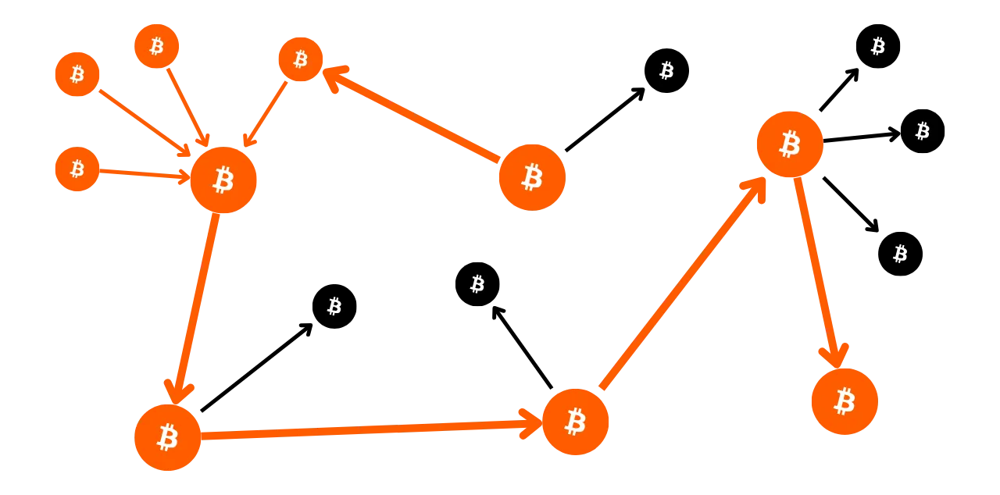
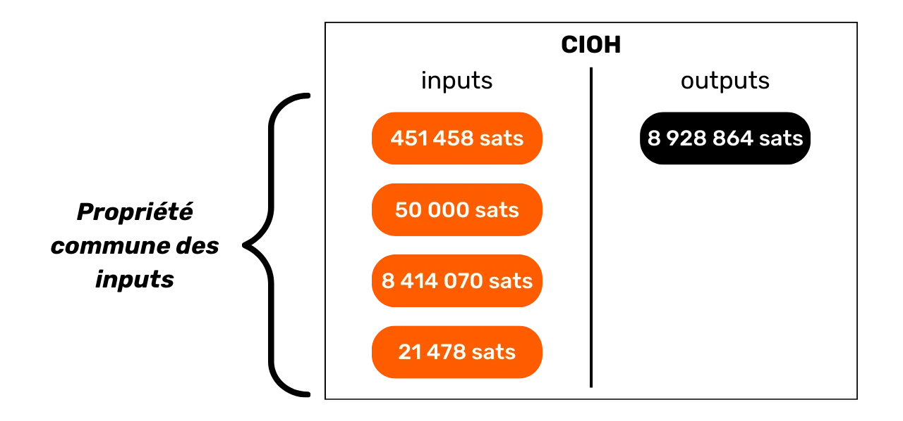

# Schützen Sie Ihre Privatsphäre bei Bitcoin

In einer Welt, in der die Privatsphäre finanzieller Transaktionen zunehmend zu einem Luxus wird, ist es wesentlich, die Prinzipien des Datenschutzes bei der Nutzung von Bitcoin zu verstehen und zu beherrschen. Dieses Training gibt Ihnen sowohl theoretisch als auch praktisch alle Schlüssel in die Hand, um dies autonom zu erreichen.

Heute gibt es bei Bitcoin Unternehmen, die auf Kettenanalyse spezialisiert sind. Ihr Kerngeschäft besteht genau darin, in Ihre Privatsphäre einzudringen, um die Vertraulichkeit Ihrer Transaktionen zu kompromittieren. Tatsächlich existiert das "Recht auf Privatsphäre" bei Bitcoin nicht. Es liegt daher an Ihnen, dem Nutzer, Ihre natürlichen Rechte zu behaupten und die Vertraulichkeit Ihrer Transaktionen zu schützen, denn niemand sonst wird es für Sie tun.

Dieses Training präsentiert sich als eine vollständige und generalistische Reise. Jeder technische Begriff wird detailliert besprochen und durch erläuternde Diagramme unterstützt. Das Ziel ist es, das Wissen für jeden zugänglich zu machen. BTC204 ist daher sowohl für Anfänger als auch für fortgeschrittene Nutzer geeignet. Dieses Training bietet auch einen Mehrwert für die erfahrensten Bitcoiner, da wir einige technische Konzepte vertiefen, die oft unbekannt sind.

Begleiten Sie uns, um Ihren Einsatz von Bitcoin zu transformieren und ein informierter Nutzer zu werden, der in der Lage ist, die Belange rund um die Vertraulichkeit zu verstehen und Ihre Privatsphäre zu schützen.
+++

# Einleitung
<partId>e17474a8-8899-4bdb-a7f8-bc52ddb01440</partId>

## Einführung in das Training
<chapterId>08ba1933-f393-4fb5-8279-777d874caedb</chapterId>

In einer Welt, in der die Privatsphäre finanzieller Transaktionen zunehmend zu einem Luxus wird, ist es wesentlich, die Prinzipien des Datenschutzes bei der Nutzung von Bitcoin zu verstehen und zu beherrschen. Dieses Training gibt Ihnen sowohl theoretisch als auch praktisch alle Schlüssel in die Hand, um dies autonom zu erreichen.
Heute gibt es im Bitcoin-Ökosystem Unternehmen, die auf Kettenanalyse spezialisiert sind. Ihr Kerngeschäft besteht genau darin, in Ihre Privatsphäre einzudringen und die Vertraulichkeit Ihrer Transaktionen zu kompromittieren. In Wirklichkeit existiert das "Recht auf Privatsphäre" bei Bitcoin nicht. Es liegt daher an Ihnen, dem Nutzer, Ihre natürlichen Rechte zu behaupten und die Vertraulichkeit Ihrer Transaktionen zu schützen, denn niemand sonst wird es für Sie tun.

Bitcoin ist nicht nur da für das "Number Go Up" und die Erhaltung des Werts von Ersparnissen. Aufgrund seiner einzigartigen Eigenschaften und Geschichte ist es in erster Linie das Werkzeug der Gegenökonomie. Dank dieser bemerkenswerten Erfindung können Sie Ihr Geld frei verwalten, ausgeben und ansammeln, ohne dass jemand Sie daran hindern kann.

Bitcoin bietet einen friedlichen Ausweg aus dem Joch der Staaten und ermöglicht es Ihnen, Ihre natürlichen Rechte vollständig zu genießen, die durch bestehende Gesetze nicht angefochten werden können. Dank der Erfindung von Satoshi Nakamoto haben Sie die Macht, den Respekt für Ihr Privateigentum durchzusetzen und die Freiheit des Vertrags zurückzugewinnen.
Bitcoin ist standardmäßig nicht anonym, was für Personen, die in der Schattenwirtschaft tätig sind, insbesondere in Regionen unter despotischen Regimen, ein Risiko darstellen kann. Aber das ist nicht die einzige Gefahr. Angesichts der Tatsache, dass Bitcoin ein wertvolles und unzensierbares Gut ist, könnte es die Gier von Dieben auf sich ziehen. Daher wird der Schutz Ihrer Privatsphäre auch zu einer Sicherheitsfrage: Es kann Ihnen helfen, Cyberangriffe und körperliche Übergriffe zu verhindern.
Wie wir sehen werden, bietet das Protokoll zwar einige intrinsische Datenschutzmaßnahmen, es ist jedoch entscheidend, zusätzliche Tools zu verwenden, um diesen Datenschutz zu optimieren und zu verteidigen.

Diese Schulung ist als vollständige und generalistische Reise konzipiert, um die Bedeutung des Datenschutzes bei Bitcoin zu verstehen. Jede technische Vorstellung wird detailliert und durch erklärende Diagramme unterstützt. Das Ziel ist es, das Wissen für jeden zugänglich zu machen, einschließlich Anfänger und fortgeschrittene Nutzer. Für die erfahreneren Bitcoiner decken wir auch sehr technische und manchmal unbekannte Konzepte im Laufe dieser Schulung ab, um das Verständnis jedes Themas zu vertiefen.

Das Ziel dieser Schulung ist es nicht, Sie in der Nutzung von Bitcoin vollständig anonym zu machen, sondern Ihnen die wesentlichen Werkzeuge an die Hand zu geben, um zu wissen, wie Sie Ihren Datenschutz gemäß Ihren persönlichen Zielen schützen können. Sie haben die Freiheit, aus den vorgestellten Konzepten und Werkzeugen auszuwählen, um Ihre eigenen Strategien zu entwickeln, zugeschnitten auf Ihre Ziele und spezifischen Bedürfnisse.

### Abschnitt 1: Definitionen und Schlüsselkonzepte
Zu Beginn werden wir gemeinsam die grundlegenden Prinzipien, die den Betrieb von Bitcoin regeln, überprüfen, um dann ruhig an Begriffe im Zusammenhang mit Datenschutz heranzugehen. Es ist wesentlich, einige grundlegende Konzepte zu beherrschen, wie UTXO, Empfangsadressen oder Skripte, bevor man die Konzepte, die wir in den folgenden Abschnitten ansprechen werden, vollständig verstehen kann. Wir werden auch das allgemeine Modell der Bitcoin-Privatsphäre vorstellen, wie es von Satoshi Nakamoto vorgesehen war, was es uns ermöglichen wird, die Einsätze und Risiken zu erfassen.


### Abschnitt 2: Verständnis der Chain-Analyse und Schutz davor

Im zweiten Abschnitt untersuchen wir die Techniken, die von Chain-Analyse-Unternehmen verwendet werden, um Ihre Aktivitäten auf Bitcoin nachzuverfolgen. Das Verständnis dieser Methoden ist entscheidend für die Verbesserung des Schutzes Ihrer Privatsphäre. Dieser Teil zielt darauf ab, die Strategien der Angreifer besser zu verstehen, um die Risiken zu erkennen und die Grundlagen für die Techniken zu legen, die wir in den folgenden Abschnitten untersuchen werden. Wir werden Transaktionsmuster, interne und externe Heuristiken sowie plausible Interpretationen dieser Muster analysieren. Neben einem theoretischen Teil werden wir lernen, einen Block-Explorer zur Durchführung von Chain-Analysen zu verwenden, durch praktische Beispiele und Übungen.


### Abschnitt 3: Beherrschung der besten Praktiken zum Schutz Ihrer Privatsphäre

Im dritten Abschnitt unserer Schulung kommen wir zum Kern der Sache: die Praxis! Das Ziel ist es, alle wesentlichen Best Practices zu beherrschen, die für jeden Bitcoin-Nutzer zu natürlichen Reflexen werden sollten. Wir werden die Verwendung von frischen Adressen, Beschriftung, Konsolidierung, die Verwendung von Full Nodes sowie KYC- und Erwerbsmethoden behandeln. Ziel ist es, Ihnen einen umfassenden Überblick über die Fallstricke zu geben, die es zu vermeiden gilt, um solide Grundlagen in unserem Streben nach Datenschutz zu etablieren. Für einige dieser Praktiken werden Sie zu einem spezifischen Tutorial geleitet, um sie umzusetzen.


### Abschnitt 4: Verständnis von Coinjoin-Transaktionen

Wie können wir über Privatsphäre bei Bitcoin sprechen, ohne Coinjoins zu diskutieren? Im Abschnitt 4 werden Sie alles erfahren, was Sie über diese Mischmethode wissen müssen. Sie lernen, was ein Coinjoin ist, seine Geschichte und Ziele sowie die verschiedenen Arten von Coinjoins, die es gibt. Schließlich werden wir für die erfahreneren Nutzer untersuchen, was Anonsets und Entropie sind und wie man diese Indikatoren berechnet.
### Abschnitt 5: Verständnis der Bedeutung anderer fortgeschrittener Datenschutztechniken
Im fünften Abschnitt werden wir einen Überblick über alle anderen existierenden Techniken zum Schutz Ihrer Privatsphäre bei Bitcoin geben, abgesehen von CoinJoin. Im Laufe der Jahre haben Entwickler bemerkenswerte Kreativität bei der Entwicklung von Werkzeugen zum Datenschutz gezeigt. Wir werden all diese Methoden untersuchen, wie Payjoin, kollaborative Transaktionen, Coin Swap und Atomic Swap, und ihre Funktionsweise, Ziele und potenzielle Schwächen detailliert beschreiben.

### Abschnitt 6: Erkundung von Protokollverbesserungsvorschlägen im Zusammenhang mit Datenschutz

Während sich die vorherigen Abschnitte auf Datenschutzlösungen auf Anwendungsebene konzentrierten, wird dieser sechste Abschnitt die Herausforderungen auf Protokollebene für die Privatsphäre der Nutzer vertiefen. Wir werden den Datenschutz auf der Ebene des Netzwerks von Knoten und die Übertragung von Transaktionen diskutieren. Wir werden auch die verschiedenen Protokolle besprechen, die im Laufe der Jahre vorgeschlagen wurden, um den Datenschutz bei Bitcoin zu verbessern. Abschließend werden wir die Auswirkungen auf den Datenschutz, sowohl positive als auch negative, des letzten großen Soft Forks von Bitcoin, Taproot, untersuchen.

***(WIP: LOIC: HIER BEISPIELDIAGRAMM HINZUFÜGEN)***

### Bonusabschnitt: Datenschutz bei Second-Layer-Protokollen

Wie Sie verstanden haben, konzentriert sich der Kern dieses Trainings ausschließlich auf Onchain-Datenschutz. In diesem abschließenden Bonus-Teil möchte ich das Thema auf Datenschutz bei anderen mit Bitcoin verbundenen Protokollen erweitern. Wir werden speziell über den Datenschutz im Lightning-Netzwerk sprechen. Einige behaupten, dass Lightning standardmäßig privat ist, während andere argumentieren, dass der Datenschutz der Nutzer unzureichend ist. Also, was ist die Wahrheit? Wir werden die Wahrheit von der Falschheit trennen, um die Herausforderungen im Zusammenhang mit dem Datenschutz im Lightning-Netzwerk besser zu verstehen. Wir werden auch über Sidechains wie das Liquid Network und Chaumian-Banken wie Cashu oder Fedimint sprechen.


# Definitionen und Schlüsselkonzepte
<partId>b9bbbde3-34c0-4851-83e8-e2ffb029cf31</partId>

## Bitcoins UTXO-Modell
<chapterId>8d6b50c5-bf74-44f4-922b-25204991cb75</chapterId>

Bitcoin ist in erster Linie eine Währung, aber wissen Sie konkret, wie BTC im Protokoll dargestellt werden?

### Bitcoins UTXOs: Was sind sie?

Im Bitcoin-Protokoll dreht sich die Verwaltung von Geldeinheiten um das UTXO-Modell, ein Akronym für "_Unspent Transaction Output_".
Dieses Modell unterscheidet sich grundlegend von traditionellen Bankensystemen, die sich auf einen Konten- und Saldenmechanismus stützen, um Finanzflüsse zu verfolgen. Tatsächlich werden in dem Bankensystem individuelle Salden auf Konten geführt, die an eine Identität gebunden sind. Wenn Sie beispielsweise eine Baguette bei einem Bäcker kaufen, bucht Ihre Bank einfach den Kaufbetrag von Ihrem Konto ab, wodurch Ihr Saldo verringert wird, während das Konto des Bäckers mit demselben Betrag gutgeschrieben wird, was deren Saldo erhöht. In diesem System gibt es keine Vorstellung von einer Verbindung zwischen dem Geld, das auf Ihr Konto eingeht, und dem Geld, das es verlässt, abgesehen von den Transaktionsaufzeichnungen.

Bei Bitcoin funktioniert es anders. Das Konzept eines Kontos existiert nicht, und Geldeinheiten werden nicht über Salden, sondern über UTXOs verwaltet. Ein UTXO stellt eine bestimmte Menge an Bitcoins dar, die noch nicht ausgegeben wurde, und bildet somit ein "Stück Bitcoin", das groß oder klein sein kann. Zum Beispiel könnte ein UTXO `500 BTC` oder nur `700 SATS` wert sein.
**> Erinnerung:** Der Satoshi, oft als Sat abgekürzt, ist die kleinste Einheit von Bitcoin, vergleichbar mit einem Cent bei Fiat-Währungen.

```bash
1 BTC = 100 000 000 SATS
```

Theoretisch kann ein UTXO jeden beliebigen Wert in Bitcoins darstellen, von einem Sat bis zum theoretischen Maximum von etwa 21 Millionen BTC. Es ist jedoch logisch unmöglich, alle 21 Millionen Bitcoins zu besitzen, und es gibt eine untere wirtschaftliche Schwelle, genannt "Staub", unterhalb derer ein UTXO als wirtschaftlich unrentabel zum Ausgeben betrachtet wird.

**> Wussten Sie schon?** Das größte jemals auf Bitcoin erstellte UTXO hatte einen Wert von `500 000 BTC`. Es wurde von der Plattform MtGox während einer Konsolidierungsoperation im November 2011 erstellt: [29a3efd3ef04f9153d47a990bd7b048a4b2d213daaa5fb8ed670fb85f13bdbcf](https://mempool.space/fr/tx/29a3efd3ef04f9153d47a990bd7b048a4b2d213daaa5fb8ed670fb85f13bdbcf)

### UTXOs und Ausgabebedingungen

UTXOs sind die Tauschmittel bei Bitcoin. Jede Transaktion führt zum Verbrauch von UTXOs als Eingaben und zur Erstellung neuer UTXOs als Ausgaben. Wenn eine Transaktion durchgeführt wird, gelten die als Eingaben verwendeten UTXOs als "ausgegeben", und es werden neue UTXOs generiert und den in den Transaktionsausgaben angegebenen Empfängern zugewiesen. Ein UTXO stellt daher einfach eine unverbrauchte Transaktionsausgabe dar und somit eine Menge an Bitcoins, die einem Benutzer zu einem bestimmten Zeitpunkt gehören.


Alle UTXOs werden durch Skripte gesichert, die die Bedingungen definieren, unter denen sie ausgegeben werden können. Um ein UTXO zu verbrauchen, muss ein Benutzer dem Netzwerk nachweisen, dass er die vom Skript festgelegten Bedingungen erfüllt. Üblicherweise werden UTXOs durch einen öffentlichen Schlüssel (oder eine Empfangsadresse, die diesen öffentlichen Schlüssel repräsentiert) geschützt. Um ein mit diesem öffentlichen Schlüssel verbundenes UTXO auszugeben, muss der Benutzer nachweisen, dass er den entsprechenden privaten Schlüssel besitzt, indem er eine digitale Signatur vorlegt, die mit diesem Schlüssel erstellt wurde. Deshalb sagt man, dass Ihre Bitcoin-Wallet tatsächlich keine Bitcoins enthält, sondern sie speichert Ihre privaten Schlüssel, die Ihnen wiederum Zugang zu Ihren UTXOs und damit zu den Bitcoins, die sie repräsentieren, geben.


Da das Konzept eines Kontos bei Bitcoin fehlt, entspricht der Saldo einer Wallet einfach der Summe der Werte aller UTXOs, die sie ausgeben kann. Wenn Ihre Bitcoin-Wallet beispielsweise die folgenden 4 UTXOs ausgeben kann:

```bash
- 2 BTC
- 8 BTC
- 5 BTC
- 2 BTC
```

Wäre der Gesamtsaldo Ihrer Wallet `17 BTC`.


## Die Struktur von Bitcoin-Transaktionen
<chapterId>29d3aaab-de2e-4746-ab40-c9748898850c</chapterId>

### Die Eingaben und Ausgaben einer Transaktion
Eine Bitcoin-Transaktion ist eine auf der Blockchain verzeichnete Operation, die den Eigentumsübergang von Bitcoins von einer Person zur anderen ermöglicht. Genauer gesagt, da wir uns im UTXO-Modell befinden und es keine Konten gibt, erfüllt die Transaktion die Ausgabenbedingungen, die ein oder mehrere UTXOs gesichert haben, verbraucht diese und schafft im Äquivalent neue UTXOs, die mit neuen Ausgabenbedingungen ausgestattet sind. Kurz gesagt, eine Transaktion bewegt Bitcoins von einem Skript, das erfüllt ist, zu einem neuen Skript, das dazu bestimmt ist, sie zu sichern.


Jede Bitcoin-Transaktion besteht daher aus einem oder mehreren Eingaben und einem oder mehreren Ausgaben. Die Eingaben sind UTXOs, die von der Transaktion verbraucht werden, um die Ausgaben zu erzeugen. Die Ausgaben sind neue UTXOs, die als Eingaben für zukünftige Transaktionen verwendet werden können.


**> Wussten Sie schon?** Theoretisch könnte eine Bitcoin-Transaktion eine unendliche Anzahl von Eingaben und Ausgaben haben. Nur die maximale Größe eines Blocks begrenzt diese Zahl.
Jede Eingabe in einer Bitcoin-Transaktion bezieht sich auf ein zuvor unverbrauchtes UTXO. Um ein UTXO als Eingabe zu verwenden, muss sein Inhaber nachweisen, dass er der rechtmäßige Eigentümer ist, indem er das mit ihm verbundene Skript validiert, das heißt, indem er die auferlegte Ausgabenbedingung erfüllt. Im Allgemeinen beinhaltet dies die Bereitstellung einer digitalen Signatur, die mit dem privaten Schlüssel erstellt wurde, der dem öffentlichen Schlüssel entspricht, der dieses UTXO ursprünglich gesichert hat. Das Skript besteht also darin, zu überprüfen, ob die Signatur mit dem öffentlichen Schlüssel übereinstimmt, der beim Empfang der Mittel verwendet wurde.


Jede Ausgabe gibt andererseits den zu übertragenden Betrag an Bitcoins sowie den Empfänger an. Letzterer wird durch ein neues Skript definiert, das im Allgemeinen das neu erstellte UTXO mit einer Empfangsadresse oder einem neuen öffentlichen Schlüssel sperrt.

Damit eine Transaktion gemäß den Konsensregeln als gültig betrachtet wird, muss die Summe der Ausgaben kleiner oder gleich der Summe der Eingaben sein. Mit anderen Worten, die Summe der durch die Transaktion erzeugten neuen UTXOs darf die der als Eingaben verbrauchten UTXOs nicht überschreiten. Dieses Prinzip ist logisch: Wenn Sie nur einen Betrag von `500.000 SATS` haben, können Sie keinen Kauf von `700.000 SATS` tätigen.

### Wechselgeld und Konsolidierung in einer Bitcoin-Transaktion

Die Wirkung einer Bitcoin-Transaktion auf UTXOs kann somit mit dem Einschmelzen einer Goldmünze verglichen werden. Tatsächlich ist ein UTXO nicht teilbar, sondern nur verschmelzbar. Das bedeutet, dass ein Benutzer ein UTXO, das einen bestimmten Betrag an Bitcoins repräsentiert, nicht einfach in mehrere kleinere UTXOs aufteilen kann. Er muss es vollständig in einer Transaktion verbrauchen, um ein oder mehrere neue UTXOs mit beliebigen Werten in Ausgaben zu erstellen, die kleiner oder gleich dem Anfangswert sein müssen.

Dieser Mechanismus ähnelt dem einer Goldmünze. Stellen Sie sich vor, Sie besitzen eine 2-Unzen-Münze und möchten eine Zahlung von 1 Unze tätigen, unter der Annahme, dass der Verkäufer Ihnen kein Wechselgeld geben kann. Sie müssten Ihre Münze einschmelzen und 2 neue von je 1 Unze gießen.
Bei Bitcoin funktioniert der Vorgang ähnlich. Stellen wir uns vor, Alice besitzt ein UTXO von `10.000 SATS` und möchte damit ein Baguette kaufen, das `4.000 SATS` kostet. Alice wird eine Transaktion durchführen, bei der sie 1 UTXO von `10.000 SATS` vollständig verbraucht, und in den Ausgängen wird sie 2 UTXOs im Wert von `4.000 SATS` und `6.000 SATS` erstellen. Das UTXO von `4.000 SATS` wird als Bezahlung für das Baguette an den Bäcker gesendet, während das UTXO von `6.000 SATS` als Wechselgeld zu Alice zurückkehrt. Dieses UTXO, das zum ursprünglichen Sender der Transaktion zurückkehrt, wird im Bitcoin-Jargon als "Wechselgeld" bezeichnet.

Nun stellen wir uns vor, Alice hat nicht ein einzelnes UTXO von `10.000 SATS`, sondern zwei UTXOs von jeweils `3.000 SATS`. In dieser Situation reicht keines der einzelnen UTXOs aus, um die `4.000 SATS` für das Baguette zu decken. Daher muss Alice beide UTXOs von `3.000 SATS` als Eingaben für ihre Transaktion verwenden. Auf diese Weise erreicht die Gesamtsumme der Eingaben `6.000 SATS`, was es ihr ermöglicht, die Zahlung von `4.000 SATS` an den Bäcker zu leisten. Diese Methode, bei der mehrere UTXOs in den Eingaben einer Transaktion zusammengefasst werden, wird oft mit dem Begriff "Konsolidierung" bezeichnet.

### Transaktionsgebühren

Intuitiv könnte man denken, dass Transaktionsgebühren ebenfalls einen Ausgang einer Transaktion darstellen. Aber in Wirklichkeit ist dies nicht der Fall. Die Gebühren einer Transaktion stellen die Differenz zwischen der Gesamtsumme der Eingaben und der Gesamtsumme der Ausgänge dar. Das bedeutet, dass nach der Verwendung eines Teils des Werts der Eingaben zur Deckung der gewünschten Ausgänge in einer Transaktion eine gewisse Summe der Eingaben ungenutzt bleibt. Diese verbleibende Summe bildet die Transaktionsgebühren.

```bash
Gebühren = Gesamteingaben - Gesamtausgänge
```

Lassen Sie uns das Beispiel von Alice wiederholen, die ein UTXO von `10.000 SATS` besitzt und ein Baguette für `4.000 SATS` kaufen möchte. Alice erstellt eine Transaktion mit ihrem UTXO von `10.000 SATS` als Eingabe. Sie erzeugt dann einen Ausgang von `4.000 SATS`, der für die Bezahlung des Baguettes an den Bäcker bestimmt ist. Um die Miner zu ermutigen, ihre Transaktion in einen Block aufzunehmen, weist Alice `200 SATS` als Gebühren zu. Sie erstellt somit einen zweiten Ausgang, das Wechselgeld, das zu ihr zurückkehrt und `5.800 SATS` beträgt.

Durch Anwendung der Gebührenformel sehen wir in der Tat, dass `200 SATS` für die Miner übrig bleiben:
```bash
Gebühren = Gesamteingaben - Gesamtausgänge
Gebühren = 10.000 - (4.000 + 5.800)
Gebühren = 10.000 - 9.800
Gebühren = 200
```

Wenn ein Miner erfolgreich einen Block validiert, darf er diese Gebühren für alle Transaktionen, die in ihrem Block enthalten sind, über die sogenannte "Coinbase"-Transaktion einsammeln.

### Die Erstellung von UTXOs bei Bitcoin
Wenn Sie den vorherigen Absätzen aufmerksam gefolgt sind, wissen Sie jetzt, dass UTXOs nur durch Verbrauch anderer existierender UTXOs erstellt werden können. Somit bilden die Coins auf Bitcoin eine durchgehende Kette. Sie fragen sich jedoch vielleicht, wie die ersten UTXOs in dieser Kette erschienen sind. Dies wirft ein Problem auf, das dem des Huhns und des Eis ähnelt: Woher kamen diese ursprünglichen UTXOs?
Die Antwort liegt in der **Coinbase-Transaktion**.

Die Coinbase ist ein spezifischer Typ einer Bitcoin-Transaktion, die für jeden Block einzigartig ist und immer die erste ist. Sie ermöglicht es dem Miner, der einen gültigen Proof of Work gefunden hat, seine Blockbelohnung zu erhalten. Diese Belohnung besteht aus zwei Elementen: **der Blocksubvention** und **den Transaktionsgebühren**, die wir im vorherigen Teil besprochen haben.

Das einzigartige Merkmal der Coinbase-Transaktion ist, dass sie die einzige ist, die Bitcoins aus dem Nichts erschaffen kann, ohne Eingaben verbrauchen zu müssen, um ihre Ausgaben zu generieren. Diese neu erstellten Bitcoins stellen das dar, was wir als "ursprüngliche UTXOs" bezeichnen könnten.


Die Bitcoins aus der Blocksubvention sind neue BTC, die aus dem Nichts erschaffen werden, gemäß einem vorab festgelegten Ausgabefahrplan in den Konsensregeln. Die Blocksubvention wird alle 210.000 Blöcke halbiert, was etwa alle vier Jahre geschieht, in einem Prozess, der als "Halving" bezeichnet wird. Anfangs wurden 50 Bitcoins mit jeder Subvention erschaffen, aber dieser Betrag hat sich allmählich verringert; derzeit sind es 3,125 Bitcoins pro Block.

Was den Teil der Transaktionsgebühren betrifft, obwohl er ebenfalls neu erschaffene BTC darstellt, dürfen sie nicht die Differenz zwischen den gesamten Eingaben und Ausgaben aller Transaktionen in einem Block überschreiten. Wir haben früher gesehen, dass diese Gebühren den Teil der Eingaben darstellen, der nicht in den Ausgaben der Transaktionen verwendet wird. Dieser Teil geht technisch gesehen während der Transaktion "verloren", und der Miner hat das Recht, diesen Wert in Form von einem oder mehreren neuen UTXOs neu zu erschaffen. Dies ist daher eine Wertübertragung vom Transaktionssender zum Miner, der sie der Blockchain hinzufügt.

**> Wussten Sie schon?** Die durch eine Coinbase-Transaktion generierten Bitcoins unterliegen einer Reifezeit von 100 Blöcken, während derer sie vom Miner nicht ausgegeben werden können. Diese Regel soll Komplikationen verhindern, die im Zusammenhang mit der Verwendung von neu erschaffenen Bitcoins auf einer Kette entstehen könnten, die später obsolet werden könnte.

### Die Implikationen des UTXO-Modells

Erstens beeinflusst das UTXO-Modell direkt die Transaktionsgebühren auf Bitcoin. Da die Kapazität jedes Blocks begrenzt ist, priorisieren Miner Transaktionen, die im Verhältnis zum Platz, den sie im Block einnehmen werden, die besten Gebühren bieten. Tatsächlich gilt: Je mehr UTXOs eine Transaktion als Eingaben und Ausgaben enthält, desto schwerer ist sie und daher sind höhere Gebühren erforderlich. Dies ist einer der Gründe, warum wir oft versuchen, die Anzahl der UTXOs in unserem Wallet zu reduzieren, was auch die Privatsphäre beeinflussen kann, ein Thema, das wir im dritten Teil dieses Trainings detailliert besprechen werden.

Weiterhin, wie in den vorherigen Teilen erwähnt, sind Coins auf Bitcoin im Wesentlichen eine Kette von UTXOs. Jede Transaktion schafft somit eine Verbindung zwischen einem vergangenen UTXO und einem zukünftigen UTXO. UTXOs ermöglichen daher das explizite Nachverfolgen von Bitcoins von ihrer Erstellung bis zu ihrer aktuellen Ausgabe. Diese Transparenz kann positiv wahrgenommen werden, da sie jedem Benutzer ermöglicht, die Echtheit der erhaltenen Bitcoins zu überprüfen. Allerdings beruht auch auf diesem Prinzip der Nachverfolgbarkeit und Prüfbarkeit die Kettenanalyse, eine Praxis, die darauf abzielt, Ihre Privatsphäre zu kompromittieren. Wir werden diese Praxis im zweiten Teil des Trainings eingehend untersuchen.

## Das Bitcoin-Privatsphärenmodell
<chapterId>769d8963-3ed5-4094-b21d-9203c7d9e465</chapterId>

### Währung: Authentizität, Integrität und Doppelausgaben

Eine der Funktionen von Geld besteht darin, das Problem der doppelten Koinzidenz der Wünsche zu lösen. In einem auf Tauschhandel basierenden System erfordert ein Austausch nicht nur, eine Person zu finden, die ein Gut anbietet, das meinen Bedarf deckt, sondern auch ihnen ein Gut von äquivalentem Wert zu bieten, das ihren eigenen Bedarf befriedigt. Diese Balance zu finden, erweist sich als komplex.


Deshalb greifen wir auf Geld zurück, das den Transfer von Wert sowohl räumlich als auch zeitlich ermöglicht.


Damit Geld dieses Problem lösen kann, ist es wesentlich, dass die Partei, die ein Gut oder eine Dienstleistung bereitstellt, von ihrer Fähigkeit überzeugt ist, diesen Betrag später ausgeben zu können. Daher wird jede vernünftige Person, die ein Stück Geld, ob digital oder physisch, akzeptieren möchte, sicherstellen, dass es zwei grundlegende Kriterien erfüllt:
- **Die Münze muss intakt und authentisch sein;**
- **und sie darf nicht doppelt ausgegeben worden sein.**
Bei der Verwendung physischer Währung ist die erste Eigenschaft am schwierigsten zu behaupten. Zu verschiedenen Zeiten in der Geschichte wurde die Integrität von Metallmünzen oft durch Praktiken wie Beschneiden oder Bohren kompromittiert. Zum Beispiel war es im alten Rom üblich, dass Bürger die Ränder von Goldmünzen abschabten, um ein wenig des kostbaren Metalls zu sammeln, während sie sie für zukünftige Transaktionen aufbewahrten. Der intrinsische Wert der Münze wurde dadurch reduziert, aber ihr Nennwert blieb gleich. Dies ist insbesondere der Grund, warum später Rillen am Rand der Münzen geprägt wurden.

Auch die Authentizität ist bei physischen Geldmedien eine schwierig zu überprüfende Eigenschaft. Heutzutage werden die Techniken zur Bekämpfung von Fälschungen immer komplexer, was Händler zwingt, in teure Verifikationssysteme zu investieren.

Andererseits ist Doppelausgaben bei physischen Währungen kein Problem. Wenn ich Ihnen einen 10-Euro-Schein gebe, verlässt er unwiderruflich meinen Besitz, um in Ihren überzugehen, und schließt natürlich jede Möglichkeit aus, die gleichen Geldeinheiten mehrmals auszugeben. Kurz gesagt, ich werde nicht in der Lage sein, diesen 10-Euro-Schein erneut auszugeben.


Bei digitaler Währung ist die Schwierigkeit anders. Die Authentizität und Integrität einer Münze zu gewährleisten, ist oft einfacher. Wie wir im vorherigen Abschnitt gesehen haben, ermöglicht es das UTXO-Modell von Bitcoin, eine Münze bis zu ihrem Ursprung zurückzuverfolgen und damit zu überprüfen, dass sie tatsächlich gemäß den Konsensregeln von einem Miner erstellt wurde.

Die Sicherstellung der Abwesenheit von Doppelausgaben ist jedoch komplexer, da jedes digitale Gut im Wesentlichen Information ist. Im Gegensatz zu physischen Gütern teilt sich Information bei Austauschen nicht, sondern verbreitet sich durch Vervielfältigung. Wenn ich Ihnen beispielsweise ein Dokument per E-Mail sende, wird es dann dupliziert. Auf Ihrer Seite können Sie nicht mit Sicherheit überprüfen, dass ich das Originaldokument gelöscht habe.


### Doppelausgaben bei Bitcoin verhindern

Die einzige Möglichkeit, die Duplikation eines digitalen Gutes zu vermeiden, besteht darin, über alle Austausche im System informiert zu sein. Auf diese Weise kann man wissen, wer was besitzt und die Bestände aller gemäß den getätigten Transaktionen aktualisieren. Dies wird beispielsweise mit Buchgeld im Bankensystem gemacht. Wenn Sie 10 Euro per Kreditkarte an einen Händler zahlen, vermerkt die Bank diesen Austausch und aktualisiert das Hauptbuch.
Bei Bitcoin wird die Verhinderung von Doppelausgaben auf die gleiche Weise erreicht. Das Ziel ist es, die Abwesenheit einer Transaktion zu bestätigen, die die fraglichen Münzen bereits ausgegeben hat. Wenn diese Münzen nie verwendet wurden, dann können wir sicher sein, dass keine Doppelausgaben stattfinden werden. Dieses Prinzip wurde von Satoshi Nakamoto im White Paper mit diesem berühmten Satz beschrieben:
**"*Der einzige Weg, die Abwesenheit einer Transaktion zu bestätigen, ist, über alle Transaktionen informiert zu sein.*"**

Anders als im Bankenmodell besteht jedoch bei Bitcoin nicht der Wunsch, einer zentralen Entität vertrauen zu müssen. Es ist notwendig, dass alle Benutzer diese Abwesenheit von Doppelausgaben bestätigen können, ohne sich auf eine dritte Partei verlassen zu müssen. Daher muss jeder über alle Bitcoin-Transaktionen informiert sein. Deshalb werden Bitcoin-Transaktionen öffentlich über alle Netzwerkknoten übertragen und klar in der Blockchain aufgezeichnet.

Genau diese öffentliche Verbreitung von Informationen erschwert den Datenschutz bei Bitcoin. Im traditionellen Bankensystem sind theoretisch nur die Finanzinstitutionen über die getätigten Transaktionen informiert. Bei Bitcoin hingegen sind alle Benutzer über alle Transaktionen informiert, über ihre jeweiligen Knoten.

### Das Datenschutzmodell: Bankensystem vs. Bitcoin

Im traditionellen System ist Ihr Bankkonto mit Ihrer Identität verknüpft. Der Banker kann wissen, welches Bankkonto zu welchem Kunden gehört und welche Transaktionen damit verbunden sind. Allerdings wird dieser Informationsfluss zwischen der Bank und der Öffentlichkeit unterbrochen. Mit anderen Worten, es ist unmöglich, den Kontostand und die Transaktionen eines Bankkontos zu kennen, das einer anderen Person gehört. Nur die Bank hat Zugang zu diesen Informationen.

Zum Beispiel weiß Ihr Banker, dass Sie jeden Morgen Ihre Baguette in der Nachbarschaftsbäckerei kaufen, aber Ihr Nachbar ist sich dieser Transaktion nicht bewusst. Somit ist der Informationsfluss den betroffenen Parteien zugänglich, insbesondere der Bank, bleibt aber Außenstehenden unzugänglich.

Aufgrund der Notwendigkeit der öffentlichen Verbreitung von Transaktionen, die wir im vorherigen Teil gesehen haben, kann das Datenschutzmodell von Bitcoin nicht dem Modell des Bankensystems folgen. Im Falle von Bitcoin, da der Informationsfluss zwischen den Transaktionen und der Öffentlichkeit nicht unterbrochen werden kann, **beruht das Datenschutzmodell auf der Trennung zwischen der Identität des Benutzers und den Transaktionen** selbst.
Zum Beispiel, wenn Sie eine Baguette vom Bäcker kaufen und in BTC bezahlen, kann Ihr Nachbar, der seinen eigenen Vollknoten besitzt, Ihre Transaktion sehen, genauso wie er alle anderen Transaktionen im System sehen kann. Wenn jedoch die Datenschutzprinzipien eingehalten werden, sollte er diese spezifische Transaktion nicht mit Ihrer Identität verknüpfen können.


Da Bitcoin-Transaktionen jedoch öffentlich gemacht werden, wird es dennoch möglich, Verbindungen zwischen ihnen herzustellen, um Informationen über die beteiligten Parteien abzuleiten. Diese Aktivität stellt sogar eine Spezialität an sich dar, die als "Chain-Analyse" bezeichnet wird. Im nächsten Teil des Trainings lade ich Sie ein, die Grundlagen der Chain-Analyse zu erkunden, um zu verstehen, wie Ihre Bitcoins verfolgt werden und wie Sie sich besser dagegen verteidigen können.

# Verständnis der Chain-Analyse und wie man sich schützt
<partId>4739371e-9fef-45b0-bcaa-b7a4df6b4470</partId>

## Was ist Chain-Analyse bei Bitcoin?
<chapterId>7d198ba6-4af2-4f24-86cb-3c79cb25627e</chapterId>

### Definition und Funktion
Chain-Analyse ist eine Praxis, die alle Methoden zur Nachverfolgung des Flusses von Bitcoins auf der Blockchain umfasst. Generell stützt sich die Chain-Analyse auf die Beobachtung von Merkmalen in Proben vorheriger Transaktionen. Dann geht es darum, diese gleichen Merkmale in einer Transaktion zu identifizieren, die man analysieren möchte, und plausible Interpretationen abzuleiten. Diese Problemlösungsmethode aus einem praktischen Ansatz heraus, um eine hinreichend gute Lösung zu finden, wird als "Heuristik" bezeichnet.
Vereinfacht gesagt, wird die Chain-Analyse in drei Hauptphasen durchgeführt:
1. **Beobachtung der Blockchain;**
2. **Identifizierung bekannter Merkmale;**
3. **Ableitung von Hypothesen.**


Chain-Analyse kann von jedem durchgeführt werden. Es erfordert nur Zugang zu den öffentlichen Informationen der Blockchain über einen Vollknoten, um die Bewegungen von Transaktionen zu beobachten und Hypothesen aufzustellen. Es gibt auch kostenlose Tools, die diese Analyse erleichtern, wie die Website [OXT.me](https://oxt.me/), die wir in den letzten beiden Kapiteln dieses Teils im Detail erkunden werden. Das Hauptproblem für die Privatsphäre geht jedoch von Unternehmen aus, die sich auf Chain-Analyse spezialisiert haben. Diese Unternehmen haben die Chain-Analyse auf industrielle Skala gebracht und verkaufen ihre Dienstleistungen an Finanzinstitutionen oder Regierungen. Unter diesen Unternehmen ist Chainalysis wahrscheinlich das bekannteste.

### Die Ziele der Chain-Analyse
Eines der Ziele der Chain-Analyse ist es, verschiedene Aktivitäten auf Bitcoin zu gruppieren, um die Einzigartigkeit des Benutzers, der sie durchgeführt hat, zu bestimmen. Anschließend wird es möglich sein, zu versuchen, dieses Bündel von Aktivitäten mit einer realen Identität zu verknüpfen.


Erinnern Sie sich an das vorherige Kapitel. Ich erklärte, warum das Datenschutzmodell von Bitcoin ursprünglich auf der Trennung der Identität des Benutzers von seinen Transaktionen beruhte. Daher könnte man versucht sein zu denken, dass Chain-Analyse unnötig ist, da selbst wenn es gelingt, Onchain-Aktivitäten zu gruppieren, sie nicht mit einer realen Identität in Verbindung gebracht werden können.

Theoretisch ist diese Aussage korrekt. Im ersten Teil dieses Trainings sahen wir, dass kryptographische Schlüsselpaare verwendet werden, um Bedingungen an das UTXO zu knüpfen. Ihrer Natur nach geben diese Schlüsselpaare keine Informationen über die Identität ihrer Inhaber preis. Also, selbst wenn es gelingt, Aktivitäten, die mit verschiedenen Schlüsselpaaren verbunden sind, zu gruppieren, sagt uns das nichts über die Entität hinter diesen Aktivitäten aus.


Die praktische Realität ist jedoch viel komplexer. Es gibt eine Vielzahl von Verhaltensweisen, die das Risiko bergen, eine reale Identität mit einer Onchain-Aktivität zu verknüpfen. In der Analyse wird dies als Eintrittspunkt bezeichnet, und es gibt viele davon.

Der häufigste ist natürlich KYC (*Know Your Customer*). Wenn Sie Ihre Bitcoins von einer regulierten Plattform an eine Ihrer persönlichen Empfangsadressen abheben, dann sind einige Personen in der Lage, Ihre Identität mit dieser Adresse zu verknüpfen. Allgemeiner gesagt, kann ein Eintrittspunkt jede Form der Interaktion zwischen Ihrem realen Leben und einer Bitcoin-Transaktion sein. Zum Beispiel, wenn Sie eine Empfangsadresse in Ihren sozialen Netzwerken veröffentlichen, kann dies einen Eintrittspunkt für die Analyse darstellen. Wenn Sie eine Zahlung in Bitcoins an Ihren Bäcker machen, können sie Ihr Gesicht (das Teil Ihrer Identität ist) mit einer Bitcoin-Adresse in Verbindung bringen.

Diese Eintrittspunkte sind bei der Nutzung von Bitcoin fast unvermeidlich. Obwohl man versuchen kann, ihren Umfang zu begrenzen, werden sie präsent bleiben. Deshalb ist es entscheidend, Methoden zu kombinieren, die darauf abzielen, Ihre Privatsphäre zu bewahren. Obwohl die Aufrechterhaltung einer Trennung zwischen Ihrer realen Identität und Ihren Transaktionen ein interessanter Ansatz ist, bleibt er heute unzureichend. Tatsächlich, wenn alle Ihre Onchain-Aktivitäten gruppiert werden können, dann ist der geringste Eintrittspunkt wahrscheinlich in der Lage, die einzige Datenschutzebene, die Sie etabliert hatten, zu kompromittieren.


### Verteidigung gegen Chain-Analyse

Daher ist es auch notwendig, in der Lage zu sein, der Blockchain-Analyse im Umgang mit Bitcoin zu begegnen. Indem wir auf diese Weise vorgehen, können wir die Aggregation unserer Aktivitäten minimieren und die Auswirkungen eines Einstiegspunkts auf unsere Privatsphäre begrenzen. 


Tatsächlich ist, um der Blockchain-Analyse besser entgegenzuwirken, was könnte besser sein, als sich mit den in der Blockchain-Analyse verwendeten Methoden vertraut zu machen? Wenn Sie wissen möchten, wie Sie Ihre Privatsphäre bei Bitcoin verbessern können, müssen Sie diese Methoden verstehen. Dies ermöglicht es Ihnen, Techniken wie [Coinjoin](https://planb.network/fr/tutorials/privacy/coinjoin-samourai-wallet) oder [Payjoin](https://planb.network/fr/tutorials/privacy/payjoin) (Techniken, die wir in den letzten Teilen des Trainings untersuchen werden) besser zu erfassen und die Fehler, die Sie möglicherweise machen, zu reduzieren.

In diesem Zusammenhang können wir eine Analogie zur Kryptographie und Kryptoanalyse ziehen. Ein guter Kryptograph ist in erster Linie ein guter Kryptoanalytiker. Um einen neuen Verschlüsselungsalgorithmus zu entwerfen, muss man wissen, welchen Angriffen er ausgesetzt sein wird, und auch untersuchen, warum frühere Algorithmen gebrochen wurden. Das gleiche Prinzip gilt für die Privatsphäre bei Bitcoin. Das Verständnis der Methoden der Blockchain-Analyse ist der Schlüssel zum Schutz davor. Deshalb schlage ich einen ganzen Abschnitt über Blockchain-Analyse in diesem Training vor.

### Die Methoden der Blockchain-Analyse

Es ist wichtig zu verstehen, dass Blockchain-Analyse keine exakte Wissenschaft ist. Sie stützt sich auf Heuristiken, die aus früheren Beobachtungen oder logischen Interpretationen abgeleitet sind. Diese Regeln ermöglichen ziemlich zuverlässige Ergebnisse, aber niemals mit absoluter Präzision. Mit anderen Worten, **Blockchain-Analyse beinhaltet immer eine Dimension der Wahrscheinlichkeit in den getroffenen Schlussfolgerungen**. Zum Beispiel kann es mit mehr oder weniger Sicherheit geschätzt werden, dass zwei Adressen zur selben Entität gehören, aber totale Sicherheit wird immer außer Reichweite sein.

Das gesamte Ziel der Blockchain-Analyse liegt genau in der Aggregation verschiedener Heuristiken, um das Risiko eines Fehlers zu minimieren. Es ist gewissermaßen eine Ansammlung von Beweisen, die es uns ermöglicht, der Realität näher zu kommen.

Diese berühmten Heuristiken können in verschiedene Kategorien gruppiert werden, die wir zusammen im Detail betrachten werden:
- **Transaktionsmuster (oder Transaktionsmodelle);**
- **Heuristiken innerhalb der Transaktion;**
- **Heuristiken außerhalb der Transaktion.**

### Satoshi Nakamoto und Blockchain-Analyse
Es ist erwähnenswert, dass die ersten zwei Heuristiken für die Kettenanalyse von Satoshi Nakamoto selbst entdeckt wurden. Er diskutiert sie in Teil 10 des Bitcoin White Paper. Diese sind:
- die Common Input Ownership Heuristic (CIOH);
- und die Wiederverwendung von Adressen.


Quelle: S. Nakamoto, "Bitcoin: Ein Peer-to-Peer Electronic Cash System", https://bitcoin.org/bitcoin.pdf, 2009.

In den folgenden Kapiteln werden wir untersuchen, woraus diese bestehen, aber es ist bereits interessant festzustellen, dass diese zwei Heuristiken auch heute noch eine Vorherrschaft in der Kettenanalyse haben.

## Transaktionsmuster
<chapterId>d365a101-2d37-46a5-bfb9-3c51e37bf96b</chapterId>

Ein Transaktionsmuster ist einfach ein Modell oder eine Gesamtstruktur einer typischen Transaktion, die auf der Blockchain gefunden werden kann, deren Interpretation wahrscheinlich bekannt ist. Bei der Untersuchung von Mustern werden wir uns auf eine einzelne Transaktion konzentrieren, die wir auf hoher Ebene analysieren werden.
Mit anderen Worten, wir werden uns nur die Anzahl der UTXOs in den Eingängen und die Anzahl der UTXOs in den Ausgängen anschauen, ohne uns auf die spezifischeren Details oder das Umfeld der Transaktion zu konzentrieren. Aus dem beobachteten Modell werden wir in der Lage sein, die Natur der Transaktion zu interpretieren. Dann werden wir nach Merkmalen ihrer Struktur suchen und eine Interpretation ableiten.


In diesem Teil werden wir gemeinsam die Haupttransaktionsmodelle entdecken, die bei der Kettenanalyse auftreten können, und für jedes Modell gebe ich Ihnen die wahrscheinliche Interpretation dieser Struktur zusammen mit einem konkreten Beispiel.

### Einfache Überweisung (oder einfache Zahlung)

Wir beginnen mit einem sehr verbreiteten Muster, da es das ist, welches bei den meisten Bitcoin-Zahlungen erscheint. Das einfache Zahlungsmodell zeichnet sich durch den Verbrauch von einem oder mehreren UTXOs in den Eingängen und die Erzeugung von 2 UTXOs in den Ausgängen aus. Dieses Modell sieht also folgendermaßen aus:


Wenn wir diese Transaktionsstruktur auf der Blockchain erkennen, können wir bereits eine Interpretation ableiten. Wie der Name schon sagt, zeigt dieses Modell an, dass wir in Anwesenheit einer Sendungs- oder Zahlungstransaktion sind. Der Benutzer hat seine eigenen UTXOs in den Eingängen verbraucht, um in den Ausgängen ein Zahlungs-UTXO und ein Wechselgeld-UTXO (Wechselgeld, das zum selben Benutzer zurückkommt) zu befriedigen.

Wir wissen daher, dass der beobachtete Benutzer wahrscheinlich nicht mehr im Besitz eines der beiden UTXOs in den Ausgängen ist (das Zahlungs-UTXO), aber sie sind immer noch im Besitz des anderen UTXOs (das Wechselgeld-UTXO).
In diesem Moment ist es uns unmöglich zu spezifizieren, welcher Ausgang welches UTXO repräsentiert, da dies nicht das Ziel der Untersuchung von Mustern ist. Wir werden dies erreichen, indem wir uns auf die Heuristiken stützen, die wir in den folgenden Teilen untersuchen werden. In dieser Phase ist unser Ziel darauf beschränkt, die Natur der in Frage stehenden Transaktion zu identifizieren, die in diesem Fall eine einfache Sendung ist.

Hier ist zum Beispiel eine Bitcoin-Transaktion, die das Muster einer einfachen Sendung annimmt:

```bash
b6cc79f45fd2d7669ff94db5cb14c45f1f879ea0ba4c6e3d16ad53a18c34b769
```


Quelle: [Mempool.space](https://mempool.space/fr/tx/b6cc79f45fd2d7669ff94db5cb14c45f1f879ea0ba4c6e3d16ad53a18c34b769)

Nach diesem ersten Beispiel sollten Sie ein besseres Verständnis dafür haben, was es bedeutet, ein "Transaktionsmuster" zu studieren. Wir untersuchen eine Transaktion, indem wir uns nur auf ihre Struktur konzentrieren, ohne ihr Umfeld oder die spezifischen Details der Transaktion zu berücksichtigen. Wir beobachten sie nur auf eine globale Weise in diesem ersten Schritt.

Jetzt, da Sie verstehen, was ein Muster ist, lassen Sie uns zu den anderen existierenden Modellen übergehen.

### Zusammenfegen

Dieses zweite Modell zeichnet sich durch den Verbrauch eines einzelnen UTXO im Eingang und die Erzeugung eines einzelnen UTXO im Ausgang aus.


Die Interpretation dieses Modells ist, dass wir in Anwesenheit eines Selbsttransfers sind. Der Nutzer hat seine Bitcoins an sich selbst übertragen, an eine andere Adresse, die er besitzt. Da es bei der Transaktion keine Änderung gibt, ist es sehr unwahrscheinlich, dass wir in Anwesenheit einer Zahlung sind. Tatsächlich ist es fast unmöglich, dass der Zahler ein UTXO besitzt, das genau dem vom Verkäufer geforderten Betrag plus den Transaktionsgebühren entspricht. In der Regel ist der Zahler daher gezwungen, einen Wechsel-Ausgang zu erzeugen.

Wir wissen dann, dass der beobachtete Nutzer wahrscheinlich immer noch im Besitz dieses UTXO ist. Im Kontext einer Kettenanalyse, wenn wir wissen, dass das UTXO, das bei der Transaktion als Eingabe verwendet wurde, Alice gehört, können wir annehmen, dass das UTXO in der Ausgabe ihr ebenfalls gehört. Was später interessant wird, ist, interne Heuristiken zur Transaktion zu finden, die diese Annahme verstärken könnten (wir werden diese Heuristiken in Kapitel 3.3 studieren).

Zum Beispiel, hier ist eine Bitcoin-Transaktion, die das Sweeping-Muster annimmt:

```bash
35f1072a0fda5ae106efb4fda871ab40e1f8023c6c47f396441ad4b995ea693d
```


Quelle: [Mempool.space](https://mempool.space/fr/tx/35f1072a0fda5ae106efb4fda871ab40e1f8023c6c47f396441ad4b995ea693d)
Jedoch kann dieser Typ von Muster auch einen Selbsttransfer auf das Konto einer Kryptowährungsbörsen-Plattform offenbaren. Es wird die Untersuchung bekannter Adressen und der Kontext der Transaktion sein, die es uns ermöglichen zu wissen, ob es sich um ein Sweep zu einem Wallet in Eigenverwahrung oder eine Auszahlung an eine Plattform handelt. Tatsächlich sind die Adressen von Börsenplattformen oft leicht identifizierbar.

Kehren wir zurück zu Alices Beispiel: Wenn das Sweep zu einer bekannten Adresse einer Plattform führt (wie zum Beispiel Binance), könnte das bedeuten, dass die Bitcoins aus Alices direktem Besitz übertragen wurden, wahrscheinlich mit der Absicht, sie zu verkaufen oder auf dieser Plattform zu lagern. Andererseits, wenn die Zieladresse unbekannt ist, ist es vernünftig anzunehmen, dass es sich einfach um ein weiteres Wallet handelt, das immer noch Alice gehört. Aber diese Art von Studie fällt mehr in die Kategorie der Heuristiken und nicht in die Untersuchung von Mustern.

### Konsolidierung

Dieses Modell ist durch den Verbrauch mehrerer UTXOs als Eingabe und die Produktion eines einzelnen UTXO als Ausgabe gekennzeichnet.


Die Interpretation dieses Modells ist, dass wir in Anwesenheit einer Konsolidierung sind. Dies ist eine gängige Praxis unter Bitcoin-Nutzern, die darauf abzielt, mehrere UTXOs im Vorfeld einer möglichen Erhöhung der Transaktionsgebühren zusammenzuführen. Indem diese Operation in einer Zeit durchgeführt wird, in der die Gebühren niedrig sind, ist es möglich, bei zukünftigen Gebühren zu sparen. Wir werden mehr über diese Praxis in Kapitel 4.3 sprechen.

Wir können ableiten, dass der Nutzer hinter diesem Transaktionsmodell wahrscheinlich im Besitz aller UTXOs in den Eingaben war und immer noch im Besitz des UTXO in der Ausgabe ist. Dies ist sicherlich ein Selbsttransfer.

Genau wie beim Sweeping kann dieser Typ von Muster auch einen Selbsttransfer auf das Konto einer Austauschplattform offenbaren. Es wird die Untersuchung bekannter Adressen und der Kontext der Transaktion sein, die es uns ermöglichen zu wissen, ob es sich um eine Konsolidierung zu einem Wallet in Eigenverwahrung oder eine Auszahlung an eine Plattform handelt.

Zum Beispiel, hier ist eine Bitcoin-Transaktion, die das Konsolidierungsmuster annimmt:

```bash
77c16914211e237a9bd51a7ce0b1a7368631caed515fe51b081d220590589e94
```


Quelle: [Mempool.space](https://mempool.space/fr/tx/77c16914211e237a9bd51a7ce0b1a7368631caed515fe51b081d220590589e94)
Im Kontext einer Kettenanalyse kann dieses Modell viele Informationen offenbaren. Wenn wir zum Beispiel wissen, dass einer der Eingänge Alice gehört, können wir annehmen, dass auch alle anderen Eingänge und der Ausgang dieser Transaktion ihr gehören. Diese Annahme würde es uns dann ermöglichen, frühere Transaktionsketten zurückzuverfolgen, um andere Transaktionen zu entdecken und zu analysieren, die wahrscheinlich mit Alice in Verbindung stehen.


### Aggregiertes Ausgeben

Dieses Modell zeichnet sich durch die Verwendung von wenigen UTXOs als Eingänge (oft nur einer) und die Erzeugung von vielen UTXOs als Ausgänge aus.


Die Interpretation dieses Modells ist, dass wir es mit aggregiertem Ausgeben zu tun haben. Dies ist eine Praxis, die bedeutende wirtschaftliche Aktivität offenbart, wie zum Beispiel eine Austauschplattform. Aggregiertes Ausgeben ermöglicht es diesen Entitäten, Gebühren zu sparen, indem sie ihre Ausgaben in einer einzigen Transaktion zusammenfassen.

Aus diesem Modell können wir ableiten, dass der UTXO-Eingang von einem Unternehmen mit bedeutender wirtschaftlicher Aktivität stammt und dass die UTXO-Ausgänge sich verteilen werden. Viele gehören zu Kunden des Unternehmens, die Bitcoins von der Plattform abgehoben haben. Andere könnten an Partnerunternehmen gehen. Schließlich wird es sicherlich einen oder mehrere Umtausche geben, die an das ausstellende Unternehmen zurückgehen.

Zum Beispiel hier ist eine Bitcoin-Transaktion, die das Muster des aggregierten Ausgebens annimmt (vermutlich ist es eine Transaktion, die von der Bybit-Plattform ausgegeben wurde):

```bash
8a7288758b6e5d550897beedd13c70bcbaba8709af01a7dbcc1f574b89176b43
```


Quelle: [Mempool.space](https://mempool.space/fr/tx/8a7288758b6e5d550897beedd13c70bcbaba8709af01a7dbcc1f574b89176b43)

### Protokollspezifische Transaktionen

Unter den Transaktionsmustern können wir auch Modelle identifizieren, die die Verwendung eines spezifischen Protokolls offenbaren. Zum Beispiel werden Whirlpool-Coinjoins (die wir in Teil 5 besprechen werden) eine leicht identifizierbare Struktur haben, die es ermöglicht, sie von anderen traditionelleren Transaktionen zu unterscheiden.


Die Analyse dieses Musters legt nahe, dass wir es wahrscheinlich mit einer kollaborativen Transaktion zu tun haben. Es ist auch möglich, einen Coinjoin zu beobachten. Wenn sich diese letztere Hypothese als zutreffend erweist, könnte die Anzahl der Ausgänge uns eine ungefähre Schätzung der Anzahl der Teilnehmer am Coinjoin geben.

Zum Beispiel hier ist eine Bitcoin-Transaktion, die das Muster des kollaborativen Transaktionstyps Coinjoin annimmt:

```bash
00601af905bede31086d9b1b79ee8399bd60c97e9c5bba197bdebeee028b9bea
```


Quelle: [Mempool.space](https://mempool.space/fr/tx/00601af905bede31086d9b1b79ee8399bd60c97e9c5bba197bdebeee028b9bea)
Es gibt viele andere Protokolle, die ihre eigenen spezifischen Strukturen haben. So könnten wir beispielsweise Transaktionen vom Typ Wabisabi, Stamps-Transaktionen oder Runes-Transaktionen unterscheiden.

Dank dieser Transaktionsmuster können wir bereits eine Reihe von Informationen über eine bestimmte Transaktion interpretieren. Aber die Struktur der Transaktion ist nicht die einzige Informationsquelle für die Analyse. Wir können auch ihre Details studieren. Diese Details, die nur intern einer Transaktion sind, bezeichne ich gerne als "interne Heuristiken", und wir werden sie im folgenden Kapitel erkunden.

## Interne Heuristiken
<chapterId>c54b5abe-872f-40f4-a0d0-c59faff228ba</chapterId>

Eine interne Heuristik ist eine spezifische Eigenschaft, die innerhalb einer Transaktion selbst identifiziert wird, ohne dass ihr Umfeld untersucht werden muss, und die es uns ermöglicht, Schlussfolgerungen zu ziehen. Im Gegensatz zu Mustern, die sich auf die Gesamtstruktur der Transaktion auf einer hohen Ebene konzentrieren, basieren interne Heuristiken auf der Gesamtheit der extrahierbaren Daten. Dies beinhaltet:
- Die Beträge der verschiedenen UTXOs, sowohl eingehend als auch ausgehend;
- Alles, was Skripte betrifft: die Empfangsadressen, Versionierung, Locktimes…

Generell wird diese Art von Heuristik es uns ermöglichen, das Wechselgeld in einer spezifischen Transaktion zu identifizieren. Indem wir dies tun, können wir dann weiterhin eine Entität über mehrere verschiedene Transaktionen hinweg verfolgen. Tatsächlich, wenn wir ein UTXO identifizieren, das einem Benutzer gehört, den wir verfolgen möchten, ist es entscheidend zu bestimmen, welcher Output bei einer Transaktion an einen anderen Benutzer übertragen wurde und welcher Output das Wechselgeld darstellt und somit in ihrem Besitz bleibt.


Noch einmal möchte ich Sie daran erinnern, dass diese Heuristiken nicht absolut präzise sind. Einzeln genommen erlauben sie uns nur, plausible Szenarien zu identifizieren. Es ist die Ansammlung mehrerer Heuristiken, die hilft, die Unsicherheit zu reduzieren, ohne sie jemals vollständig ausschließen zu können.

### Interne Ähnlichkeiten

Diese Heuristik beinhaltet die Untersuchung von Ähnlichkeiten zwischen den Eingaben und Ausgaben der gleichen Transaktion. Wenn wir die gleiche Eigenschaft bei den Eingaben und nur bei einer der Ausgaben der Transaktion beobachten, dann ist es wahrscheinlich, dass diese Ausgabe das Wechselgeld darstellt.

Die offensichtlichste Eigenschaft ist die Wiederverwendung einer Empfangsadresse in der gleichen Transaktion.


Diese Heuristik lässt wenig Raum für Zweifel. Es sei denn, jemandes privater Schlüssel wurde gehackt, offenbart die gleiche Empfangsadresse unweigerlich die Aktivität eines einzelnen Benutzers. Die daraus folgende Interpretation ist, dass das Wechselgeld aus der Transaktion die Ausgabe mit der gleichen Adresse wie die Eingabe ist. Dies ermöglicht die fortgesetzte Verfolgung der Person basierend auf diesem Wechselgeld.
Hier ist zum Beispiel eine Transaktion, bei der diese Heuristik vernünftigerweise angewendet werden kann:

```bash
54364146665bfc453a55eae4bfb8fdf7c721d02cb96aadc480c8b16bdeb8d6d0
```


Quelle: [Mempool.space](https://mempool.space/tx/54364146665bfc453a55eae4bfb8fdf7c721d02cb96aadc480c8b16bdeb8d6d0)
Diese Ähnlichkeiten zwischen Eingaben und Ausgaben beschränken sich nicht nur auf die Wiederverwendung von Adressen. Jede Ähnlichkeit in der Verwendung von Skripten kann die Anwendung einer Heuristik ermöglichen. Zum Beispiel kann manchmal die gleiche Versionierung zwischen einer Eingabe und einem der Ausgänge einer Transaktion beobachtet werden.


In diesem Diagramm können wir sehen, dass Eingabe Nr. 0 ein P2WPKH-Skript entsperrt (SegWit V0 beginnend mit `bc1q`). Ausgang Nr. 0 verwendet den gleichen Typ von Skript. Jedoch verwendet Ausgang Nr. 1 ein P2TR-Skript (SegWit V1 beginnend mit `bc1p`). Die Interpretation dieser Eigenschaft ist, dass es wahrscheinlich ist, dass die Adresse mit der gleichen Versionierung wie die Eingabe die Wechseladresse ist. Sie würde daher immer noch dem gleichen Benutzer gehören.

Hier ist eine Transaktion, bei der diese Heuristik vernünftigerweise angewendet werden kann:

```bash
db07516288771ce5d0a06b275962ec4af1b74500739f168e5800cbcb0e9dd578
```


Quelle: [Mempool.space](https://mempool.space/tx/db07516288771ce5d0a06b275962ec4af1b74500739f168e5800cbcb0e9dd578)

In diesem Fall können wir sehen, dass Eingabe Nr. 0 und Ausgang Nr. 1 P2WPKH-Skripte verwenden (SegWit V0), während Ausgang Nr. 0 einen anderen Typ von Skript verwendet, P2PKH (Legacy).
Zu Beginn der 2010er Jahre war diese auf der Versionierung von Skripten basierende Heuristik aufgrund der Begrenzung der verfügbaren Skripttypen relativ wenig nützlich. Im Laufe der Zeit und mit aufeinanderfolgenden Updates von Bitcoin wurde jedoch eine zunehmende Vielfalt von Skripttypen eingeführt. Diese Heuristik wird immer relevanter, denn mit einer breiteren Palette von Skripttypen werden Benutzer in kleinere Gruppen unterteilt, wodurch die Chancen, diese Heuristik der internen Versionierungswiederverwendung anzuwenden, steigen. Aus diesem Grund ist es, nur aus Datenschutzperspektive, ratsam, den am häufigsten verwendeten Skripttyp zu wählen. Zum Beispiel sind zum Zeitpunkt des Schreibens dieser Zeilen Taproot-Skripte (`bc1p`) weniger häufig verwendet als SegWit V0-Skripte (`bc1q`). Obwohl erstere in bestimmten spezifischen Kontexten wirtschaftliche und Datenschutzvorteile bieten, könnte es klug sein, aus Datenschutzgründen bei traditionelleren Einzelunterschriftsanwendungen an einem älteren Standard festzuhalten, bis der neue Standard breiter angenommen wird.

### Rundzahl-Zahlungen

Eine weitere interne Heuristik, die uns helfen kann, das Wechselgeld zu identifizieren, ist die der Rundzahl. Allgemein, wenn man mit einem einfachen Zahlungsmuster konfrontiert ist (1 Eingabe und 2 Ausgänge), wenn einer der Ausgänge einen runden Betrag ausgibt, dann repräsentiert dieser die Zahlung.


Durch Eliminierung, wenn ein Ausgang die Zahlung darstellt, repräsentiert der andere das Wechselgeld. Daher kann gefolgert werden, dass es wahrscheinlich ist, dass der Benutzer der Eingabe immer noch im Besitz des als Wechselgeld identifizierten Ausgangs ist.

Es sollte beachtet werden, dass diese Heuristik nicht immer anwendbar ist, da die Mehrheit der Zahlungen immer noch in Fiat-Währungseinheiten gemacht wird. Tatsächlich, wenn ein Händler in Frankreich Bitcoin akzeptiert, zeigen sie in der Regel keine stabilen Preise in Sats an. Sie würden eher eine Umrechnung zwischen dem Preis in Euro und dem in Bitcoin zu zahlenden Betrag bevorzugen. Daher sollte es keine runde Zahl im Transaktionsausgang geben.
Dennoch könnte ein Analyst versuchen, diese Umwandlung vorzunehmen, indem er den Wechselkurs berücksichtigt, der zum Zeitpunkt der Übertragung im Netzwerk galt. Nehmen wir das Beispiel einer Transaktion mit einem Input von `97,552 sats` und zwei Outputs, einer von `31,085 sats` und der andere von `64,152 sats`. Auf den ersten Blick scheint diese Transaktion keine runden Beträge zu beinhalten. Jedoch ergibt die Anwendung des Wechselkurses von 64,339 € zum Zeitpunkt der Transaktion eine Umrechnung in Euro, die wie folgt aussieht:
- Ein Input von 62,76 €;
- Ein Output von 20 €;
- Ein Output von 41,27 €.
Einmal in Fiatwährung umgerechnet, ermöglicht diese Transaktion die Anwendung der Heuristik der Zahlung mit runden Beträgen. Der Output von 20 € war wahrscheinlich für einen Händler bestimmt oder wechselte zumindest den Besitzer. Durch Deduktion blieb der Output von 41,27 € wahrscheinlich im Besitz des ursprünglichen Nutzers.


Wenn eines Tages Bitcoin zur bevorzugten Recheneinheit in unseren Transaktionen wird, könnte diese Heuristik noch nützlicher für die Analyse werden.

Zum Beispiel, hier ist eine Transaktion, bei der diese Heuristik wahrscheinlich angewendet werden kann:

```bash
2bcb42fab7fba17ac1b176060e7d7d7730a7b807d470815f5034d52e96d2828a
```


Quelle: [Mempool.space](https://mempool.space/tx/2bcb42fab7fba17ac1b176060e7d7d7730a7b807d470815f5034d52e96d2828a)

### Der größte Output

Wenn eine ausreichend große Lücke zwischen zwei Transaktionsoutputs in einem einfachen Zahlungsmodell festgestellt wird, kann geschätzt werden, dass der größte Output wahrscheinlich das Wechselgeld ist.


Diese Heuristik des größten Outputs ist wahrscheinlich die ungenaueste von allen. Wenn sie allein identifiziert wird, ist sie ziemlich schwach. Diese Eigenschaft kann jedoch mit anderen Heuristiken kombiniert werden, um die Unsicherheit unserer Interpretation zu verringern.

Zum Beispiel, hier ist eine Transaktion, bei der diese Heuristik wahrscheinlich angewendet werden kann:

```bash
b79d8f8e4756d34bbb26c659ab88314c220834c7a8b781c047a3916b56d14dcf
```


Quelle: [Mempool.space](https://mempool.space/tx/b79d8f8e4756d34bbb26c659ab88314c220834c7a8b781c047a3916b56d14dcf)

## Externe Heuristiken
<chapterId>4a170e3b-200d-431a-8285-18a23ff617ba</chapterId>

Die Untersuchung externer Heuristiken beinhaltet die Analyse der Ähnlichkeiten, Muster und Merkmale bestimmter Elemente, die nicht inhärent zur Transaktion selbst sind. Mit anderen Worten, wenn wir uns zuvor darauf beschränkten, Elemente zu nutzen, die intrinsisch zur Transaktion gehören, mit internen Heuristiken, erweitern wir nun unser Analysefeld auf die Umgebung der Transaktion dank externer Heuristiken.

### Adresswiederverwendung

Dies ist eine der bekanntesten Heuristiken unter Bitcoin-Nutzern. Die Adresswiederverwendung ermöglicht es, eine Verbindung zwischen verschiedenen Transaktionen und verschiedenen UTXOs herzustellen. Sie wird beobachtet, wenn eine Bitcoin-Empfangsadresse mehrmals verwendet wird.

Daher ist es möglich, die Adresswiederverwendung innerhalb derselben Transaktion als interne Heuristik zu nutzen, um das Wechselgeld zu identifizieren (wie wir im vorherigen Kapitel gesehen haben). Aber die Adresswiederverwendung kann auch als externe Heuristik dienen, um die Einzigartigkeit einer Entität hinter mehreren Transaktionen zu erkennen.

Die Interpretation der Adresswiederverwendung ist, dass alle auf dieser Adresse gesperrten UTXOs derselben Entität gehören (oder gehört haben). Diese Heuristik lässt wenig Raum für Unsicherheit. Wenn es möglich ist, sie zu identifizieren, entspricht die darauffolgende Interpretation höchstwahrscheinlich der Realität. Sie ermöglicht somit die Gruppierung verschiedener Onchain-Aktivitäten.


Wie in der Einleitung zu diesem Teil 3 erklärt, wurde diese Heuristik von Satoshi Nakamoto selbst entdeckt. Im White Paper erwähnt er speziell eine Lösung für Benutzer, um dies zu vermeiden, nämlich einfach für jede neue Transaktion eine frische Adresse zu verwenden:

"_Als zusätzliche Firewall könnte ein neues Schlüsselpaar für jede Transaktion verwendet werden, um zu verhindern, dass sie mit einem gemeinsamen Eigentümer verknüpft werden._"


Quelle: S. Nakamoto, "Bitcoin: A Peer-to-Peer Electronic Cash System", https://bitcoin.org/bitcoin.pdf, 2009.

Hier ist zum Beispiel eine Adresse, die bei mehreren Transaktionen wiederverwendet wurde:

```bash
bc1qqtmeu0eyvem9a85l3sghuhral8tk0ar7m4a0a0
```


Quelle: [Mempool.space](https://mempool.space/address/bc1qqtmeu0eyvem9a85l3sghuhral8tk0ar7m4a0a0)

### Skriptähnlichkeit und Wallet-Fingerabdrücke

Über die Adresswiederverwendung hinaus gibt es viele andere Heuristiken, die es ermöglichen, Aktionen demselben Wallet oder einem Cluster von Adressen zuzuordnen.
Zuallererst kann ein Analyst von Ähnlichkeiten in der Verwendung von Skripten profitieren. Zum Beispiel können bestimmte Minderheitsskripte wie Multisig leichter identifiziert werden als SegWit V0-Skripte. Je größer die Gruppe, in der wir uns verstecken, desto schwieriger ist es, uns zu entdecken. Dies ist insbesondere der Grund, warum in guten Coinjoin-Protokollen alle Teilnehmer genau denselben Skripttyp verwenden.
Allgemeiner kann sich ein Analyst auch auf die charakteristischen Fingerabdrücke eines Wallets konzentrieren. Dies sind spezifische Prozesse einer Nutzung, die man zu identifizieren versuchen könnte, um sie als Verfolgungsheuristiken zu nutzen. Mit anderen Worten, wenn man eine Ansammlung derselben internen Merkmale bei Transaktionen beobachtet, die der verfolgten Entität zugeschrieben werden, kann man versuchen, diese Merkmale auch bei anderen Transaktionen zu identifizieren.

Zum Beispiel kann identifiziert werden, dass der verfolgte Benutzer systematisch sein Wechselgeld an P2TR-Adressen (`bc1p…`) sendet. Wenn sich dieser Prozess wiederholt, kann er als Heuristik für die Fortsetzung unserer Analyse verwendet werden. Andere Fingerabdrücke können ebenfalls verwendet werden, wie die Reihenfolge der UTXOs, die Platzierung des Wechselgelds in den Ausgängen, das Signalisieren von RBF (Replace-by-Fee) oder sogar die Versionsnummer, das `nSequence`-Feld und das `nLockTime`-Feld.


Wie [@LaurentMT](https://twitter.com/LaurentMT) in [Space Kek #19](https://podcasters.spotify.com/pod/show/decouvrebitcoin/episodes/SpaceKek-19---Analyse-de-chane--anonsets-et-entropie-e1vfuji) (ein frankophoner Podcast) spezifiziert, nimmt der Nutzen von Wallet-Fingerabdrücken in der Kettenanalyse mit der Zeit erheblich zu. Tatsächlich betonen die wachsende Anzahl von Skripttypen und die zunehmend schrittweise Einführung dieser neuen Funktionen durch Wallet-Software die Unterschiede. Es kann sogar vorkommen, dass man mit Genauigkeit die Software identifizieren kann, die von der verfolgten Entität verwendet wird. Es ist daher wichtig zu verstehen, dass die Untersuchung eines Wallet-Fingerabdrucks besonders relevant für jüngste Transaktionen ist, mehr als für solche, die Anfang der 2010er Jahre initiiert wurden.
Zusammenfassend kann ein Fingerabdruck jede spezifische Praxis sein, die automatisch durch das Wallet oder manuell durch den Benutzer durchgeführt wird, die bei anderen Transaktionen gefunden werden kann, um unsere Analyse zu unterstützen.

### Die Common Input Ownership Heuristic (CIOH)

Die CIOH, für "Common Input Ownership Heuristic" auf Englisch, ist eine Heuristik, die besagt, dass, wenn eine Transaktion mehrere Eingaben umfasst, diese wahrscheinlich alle von einer einzigen Entität stammen. Folglich ist ihr Besitz gemeinsam.



Um die Common Input Ownership Heuristic (CIOH) anzuwenden, beobachten wir zuerst eine Transaktion, die mehrere Eingaben hat. Das könnten 2 Eingaben sein oder auch bis zu 30 Eingaben. Sobald diese Eigenschaft identifiziert ist, überprüfen wir, ob die Transaktion nicht in ein bekanntes Transaktionsmodell passt. Wenn sie beispielsweise 5 Eingaben mit ungefähr dem gleichen Betrag und 5 Ausgaben mit genau dem gleichen Betrag hat, wissen wir, dass es die Struktur eines Coinjoin ist. Daher können wir die CIOH nicht anwenden.


Wenn die Transaktion jedoch in kein bekanntes Modell einer kollaborativen Transaktion passt, dann können wir folgern, dass alle Eingaben wahrscheinlich von der gleichen Entität stammen. Dies kann sehr nützlich sein, um einen bereits bekannten Cluster zu erweitern oder die Nachverfolgung fortzusetzen.


Die CIOH wurde von Satoshi Nakamoto entdeckt. Er diskutiert sie in Teil 10 des White Papers:

"_[...] die Verbindung ist unvermeidlich bei Multi-Input-Transaktionen, die zwangsläufig offenbaren, dass ihre Eingaben vom gleichen Besitzer gehalten wurden. Das Risiko besteht darin, dass, wenn der Besitzer eines Schlüssels offenbart wird, die Verbindungen andere Transaktionen offenbaren können, die demselben Besitzer gehörten._"


Es ist besonders faszinierend festzustellen, dass Satoshi Nakamoto, sogar vor dem offiziellen Start von Bitcoin, bereits die zwei Hauptanfälligkeiten in Bezug auf die Privatsphäre der Nutzer identifiziert hatte, nämlich die CIOH und die Wiederverwendung von Adressen. Eine solche Weitsicht ist bemerkenswert, da diese beiden Heuristiken auch heute noch die nützlichsten in der Kettenanalyse bleiben.

Um Ihnen ein Beispiel zu geben, hier ist eine Transaktion, auf die wir wahrscheinlich die CIOH anwenden können:

```bash
20618e63b6eed056263fa52a2282c8897ab2ee71604c7faccfe748e1a202d712
```


Quelle: [Mempool.space](https://mempool.space/tx/20618e63b6eed056263fa52a2282c8897ab2ee71604c7faccfe748e1a202d712)

### Offchain-Daten
Offensichtlich beschränkt sich die Kettenanalyse nicht ausschließlich auf Onchain-Daten. Jegliche Daten aus vorherigen Analysen oder die im Internet zugänglich sind, können ebenfalls verwendet werden, um eine Analyse zu verfeinern. Zum Beispiel, wenn beobachtet wird, dass die verfolgten Transaktionen konsequent vom selben Bitcoin-Knoten gesendet werden und es möglich ist, dessen IP-Adresse zu identifizieren, könnte es möglich sein, andere Transaktionen desselben Akteurs zu erkennen, zusätzlich zu einem Teil der Identität des Senders zu bestimmen. Obwohl diese Praxis nicht leicht zu erreichen ist, da sie den Betrieb vieler Knoten erfordert, ist es möglich, dass einige Unternehmen, die sich auf Kettenanalyse spezialisieren, sie einsetzen.

Der Analyst hat auch die Möglichkeit, sich auf zuvor öffentlich gemachte Analysen oder auf eigene vorherige Analysen zu stützen. Vielleicht wird es möglich sein, einen Ausgang zu finden, der auf einen Cluster von Adressen hinweist, der bereits identifiziert wurde. Manchmal ist es auch möglich, sich auf Ausgänge zu stützen, die auf eine Austauschplattform hinweisen, wobei die Adressen dieser Unternehmen im Allgemeinen bekannt sind.

Auf die gleiche Weise kann eine Analyse durch Ausschluss durchgeführt werden. Zum Beispiel, wenn bei der Analyse einer Transaktion mit zwei Ausgängen einer davon mit einem bekannten Adresscluster verknüpft ist, aber unterschiedlich von der verfolgten Entität, dann kann interpretiert werden, dass der andere Ausgang wahrscheinlich das Wechselgeld darstellt.

Kettenanalyse beinhaltet auch einen allgemeineren Teil von OSINT (*Open Source Intelligence*) mit Internetsuchen. Deshalb wird davon abgeraten, Empfangsadressen direkt in sozialen Medien oder auf einer Webseite zu veröffentlichen, egal ob unter einem Pseudonym oder nicht.


### Zeitliche Modelle

Es wird seltener in Betracht gezogen, aber bestimmte menschliche Verhaltensweisen sind onchain erkennbar. Das nützlichste in einer Analyse könnte Ihr Schlafmuster sein! Ja, wenn Sie schlafen, senden Sie vermutlich keine Bitcoin-Transaktionen. Und Sie schlafen im Allgemeinen zu den gleichen Stunden. Daher ist es üblich, zeitliche Analysen in der Kettenanalyse zu verwenden. Dies beinhaltet einfach die Aufzeichnung der Zeiten, zu denen die Transaktionen einer bestimmten Entität im Bitcoin-Netzwerk gesendet werden. Die Analyse dieser zeitlichen Muster erlaubt es uns, zahlreiche Informationen abzuleiten.

Zuerst einmal erlaubt eine zeitliche Analyse manchmal, die Natur der verfolgten Entität zu identifizieren. Wenn beobachtet wird, dass Transaktionen konsequent über 24 Stunden gesendet werden, dann wird dies eine starke wirtschaftliche Aktivität verraten. Die Entität hinter diesen Transaktionen ist wahrscheinlich ein Geschäft, möglicherweise international und vielleicht mit automatisierten Verfahren intern.
Zum Beispiel hatte ich dieses Modell vor ein paar Monaten erkannt, indem ich [die Transaktion analysierte, die irrtümlich 19 Bitcoins in Gebühren zugeteilt hatte](https://mempool.space/tx/d5392d474b4c436e1c9d1f4ff4be5f5f9bb0eb2e26b61d2781751474b7e870fd). Eine einfache zeitliche Analyse hatte es mir erlaubt zu hypothetisieren, dass wir es mit einem automatisierten Dienst zu tun hatten, und daher wahrscheinlich eine große Entität wie eine Austauschplattform.
Tatsächlich wurde ein paar Tage später entdeckt, dass die Mittel PayPal gehörten, über die Austauschplattform Paxos.

Im Gegenteil, wenn wir sehen, dass das zeitliche Muster eher über 16 spezifische Stunden verteilt ist, dann können wir schätzen, dass wir es mit einem individuellen Nutzer zu tun haben, oder vielleicht einem lokalen Geschäft, abhängig von den gehandelten Volumen.

Über die Natur der beobachteten Entität hinaus kann das zeitliche Muster uns auch einen ungefähren Standort des Benutzers dank der Zeitzonen geben. Wir können so andere Transaktionen korrelieren und den Zeitstempel dieser als zusätzliche Heuristik verwenden, die zu unserer Analyse hinzugefügt werden kann.
Zum Beispiel, bei der mehrfach verwendeten Adresse, über die ich zuvor gesprochen habe, können wir beobachten, dass die Transaktionen, egal ob eingehend oder ausgehend, sich über ein 13-Stunden-Intervall konzentrieren.

```bash
bc1qqtmeu0eyvem9a85l3sghuhral8tk0ar7m4a0a0
```


Quelle: OXT.me

Dieses Intervall entspricht wahrscheinlich Europa, Afrika oder dem Nahen Osten. Daher können wir interpretieren, dass der Nutzer hinter diesen Transaktionen dort lebt.

In einem anderen Register ist es auch eine zeitliche Analyse dieser Art, die die Hypothese ermöglichte, dass Satoshi Nakamoto nicht aus Japan, sondern tatsächlich aus den Vereinigten Staaten operierte: [*Die Zeitzonen von Satoshi Nakamoto*](https://medium.com/@insearchofsatoshi/the-time-zones-of-satoshi-nakamoto-aa40f035178f)

## Praktische Anwendung mit einem Block Explorer
<chapterId>6493cf2f-225c-405f-9375-c4304f1087ed</chapterId>

In diesem letzten Kapitel werden wir die Konzepte, die wir bisher studiert haben, konkret anwenden. Ich werde Ihnen Beispiele für echte Bitcoin-Transaktionen präsentieren, und Sie müssen die Informationen extrahieren, die ich anfrage.
Idealerweise wäre für diese Übungen die Verwendung eines professionellen Chain-Analyse-Tools vorzuziehen. Da jedoch die Schöpfer des Samourai Wallets verhaftet wurden, ist das einzige kostenlose Analyse-Tool, OXT.me, nicht mehr verfügbar. Daher werden wir uns für einen klassischen Block Explorer für diese Übungen entscheiden. Ich empfehle die Verwendung von [Mempool.space](https://mempool.space/) aufgrund seiner zahlreichen Funktionen und des Umfangs an Chain-Analyse-Tools, aber Sie können auch einen anderen Explorer wie [Bitcoin Explorer](https://bitcoinexplorer.org/) wählen.
Zum Start werde ich die Übungen präsentieren. Verwenden Sie Ihren Block Explorer, um sie zu vervollständigen, und notieren Sie Ihre Antworten auf einem Stück Papier. Dann werde ich am Ende dieses Kapitels die Antworten geben, damit Sie Ihre Ergebnisse überprüfen und korrigieren können.

*Die Transaktionen, die für diese Übungen ausgewählt wurden, wurden allein aufgrund ihrer Merkmale auf eine etwas zufällige Weise ausgewählt. Dieses Kapitel dient ausschließlich Bildungs- und Informationszwecken. Ich möchte klarstellen, dass ich die Verwendung dieser Tools zu bösartigen Zwecken weder unterstütze noch ermutige. Das Ziel ist es, Ihnen beizubringen, wie Sie sich vor Chain-Analysen schützen können, und nicht, Analysen durchzuführen, um private Informationen anderer zu offenbaren.*

### Übung 1

Zu analysierende Transaktions-ID:

```bash
3769d3b124e47ef4ffb5b52d11df64b0a3f0b82bb10fd6b98c0fd5111789bef7
```

Was ist der Name des Modells dieser Transaktion und welche plausiblen Interpretationen können allein durch die Untersuchung ihres Modells, das heißt, der Struktur der Transaktion, gezogen werden?

### Übung 2

Zu analysierende Transaktions-ID:

```bash
baa228f6859ca63e6b8eea24ffad7e871713749d693ebd85343859173b8d5c20
```

Was ist der Name des Modells dieser Transaktion und welche plausiblen Interpretationen können allein durch die Untersuchung ihres Modells, das heißt, der Struktur der Transaktion, gezogen werden?

### Übung 3

Zu analysierende Transaktions-ID:

```bash
3a9eb9ccc3517cc25d1860924c66109262a4b68f4ed2d847f079b084da0cd32b
```

Was ist das Modell dieser Transaktion?
Nachdem das Modell der Transaktion identifiziert wurde, unter Verwendung der internen Heuristiken der Transaktion, welcher Ausgang stellt wahrscheinlich das Wechselgeld dar?
### Übung 4

Zu analysierende Transaktions-ID:

```bash
35f0b31c05503ebfdf7311df47f68a048e992e5cf4c97ec34aa2833cc0122a12
```

Was ist das Modell dieser Transaktion?
Nachdem das Modell der Transaktion identifiziert wurde, unter Verwendung der internen Heuristiken der Transaktion, welcher Ausgang stellt wahrscheinlich das Wechselgeld dar?
### Übung 5

Stellen Sie sich vor, Loïc hat eine seiner Bitcoin-Empfangsadressen im sozialen Netzwerk Twitter gepostet:


```bash
bc1qja0hycrv7g9ww00jcqanhfpqmzx7luqal3um3vu
```

Unter Verwendung **nur der Heuristik der Adresswiederverwendung**, welche Bitcoin-Transaktionen können wir mit Loïcs Identität in Verbindung bringen?

*Offensichtlich bin ich nicht der echte Besitzer dieser Empfangsadresse und habe sie nicht in sozialen Netzwerken gepostet. Es ist eine Adresse, die ich zufällig aus der Blockchain ausgewählt habe.*

### Übung 6

Im Anschluss an Übung 5 konnten Sie dank der Heuristik der Adresswiederverwendung mehrere Bitcoin-Transaktionen identifizieren, an denen Loïc beteiligt zu sein scheint. Normalerweise sollten Sie unter den identifizierten Transaktionen diese hier entdeckt haben:

```bash
2d9575553c99578268ffba49a1b2adc3b85a29926728bd0280703a04d051eace
```

Diese Transaktion ist die allererste, die Mittel an Loïcs Adresse sendet. Ihrer Meinung nach, woher kommen die Bitcoins, die Loïc durch diese Transaktion erhalten hat?

### Übung 7

Im Anschluss an Übung 5 konnten Sie dank der Heuristik der Adresswiederverwendung mehrere Bitcoin-Transaktionen identifizieren, an denen Loïc beteiligt zu sein scheint. Nun möchten Sie herausfinden, woher Loïc kommt. Basierend auf den gefundenen Transaktionen, führen Sie eine zeitliche Analyse durch, um die wahrscheinliche Zeitzone zu finden, die Loïc verwendet. Bestimmen Sie anhand dieser Zeitzone einen Ort, an dem Loïc zu leben scheint (Land, Bundesland/Region, Stadt...).


### Übung 8

Hier ist die zu untersuchende Bitcoin-Transaktion:

```bash
bb346dae645d09d32ed6eca1391d2ee97c57e11b4c31ae4325bcffdec40afd4f
```

Indem wir nur diese Transaktion beobachten, welche Informationen können wir interpretieren?

### Lösungen zu den Übungen

***Übung 1:***
Das Modell dieser Transaktion ist das eines einfachen Zahlungsvorgangs. Wenn wir nur ihre Struktur studieren, können wir interpretieren, dass ein Ausgang das Wechselgeld darstellt und der andere Ausgang eine tatsächliche Zahlung darstellt. Daher wissen wir, dass der beobachtete Nutzer wahrscheinlich nicht mehr im Besitz eines der beiden UTXOs in den Ausgängen ist (der der Zahlung), aber immer noch im Besitz des anderen UTXOs (der des Wechselgelds).

***Übung 2:***
Das Modell dieser Transaktion ist das eines Batch-Spendings. Dieses Modell deutet wahrscheinlich auf bedeutende wirtschaftliche Aktivität hin, wie zum Beispiel eine Austauschplattform. Wir können ableiten, dass das UTXO im Eingang von einem Unternehmen mit bedeutender wirtschaftlicher Aktivität stammt und dass die UTXOs in den Ausgängen sich verteilen werden. Einige werden zu Kunden des Unternehmens gehören, die ihre Bitcoins in Wallets zur Selbstverwahrung abgezogen haben. Andere könnten an Partnerunternehmen gehen. Schließlich wird es sicherlich ein Wechselgeld geben, das an das ausstellende Unternehmen zurückgeht.

***Übung 3:***
Das Modell dieser Transaktion ist das einer einfachen Zahlung. Daher können wir interne Heuristiken auf die Transaktion anwenden, um zu versuchen, das Wechselgeld zu identifizieren.
Ich habe persönlich mindestens zwei interne Heuristiken identifiziert, die dieselbe Hypothese unterstützen:
- Die Wiederverwendung desselben Skripttyps;
- Der größte Ausgang.

Die offensichtlichste Heuristik ist die Wiederverwendung desselben Skripttyps. Tatsächlich ist Ausgang `0` ein `P2SH`, erkennbar an seiner Empfangsadresse, die mit `3` beginnt:

```bash
3Lcdauq6eqCWwQ3UzgNb4cu9bs88sz3mKD
```

Während Ausgang `1` ein `P2WPKH` ist, identifizierbar durch seine Adresse, die mit `bc1q` beginnt:

```bash
bc1qya6sw6sta0mfr698n9jpd3j3nrkltdtwvelywa
```

Das UTXO, das als Eingabe für diese Transaktion verwendet wird, verwendet ebenfalls ein `P2WPKH`-Skript:

```bash
bc1qyfuytw8pcvg5vx37kkgwjspg73rpt56l5mx89k
```

Daher können wir annehmen, dass Ausgang `0` einer Zahlung entspricht und dass Ausgang `1` das Wechselgeld der Transaktion ist, was bedeuten würde, dass der Benutzer in der Eingabe immer noch Ausgang `1` besitzt.

Um diese Hypothese zu unterstützen oder zu widerlegen, können wir nach anderen Heuristiken suchen, die entweder unseren Gedanken bestätigen oder die Wahrscheinlichkeit verringern, dass unsere Hypothese korrekt ist.

Ich habe mindestens eine weitere Heuristik entdeckt. Es ist die des größten Ausgangs. Ausgang `0` misst `123,689 Sats`, während Ausgang `1` `505,839 Sats` misst. Es gibt also einen signifikanten Unterschied zwischen diesen beiden Ausgängen. Die Heuristik des größten Ausgangs legt nahe, dass der voluminöseste Ausgang wahrscheinlich das Wechselgeld ist. Diese Heuristik stärkt somit unsere anfängliche Hypothese weiter.

Es scheint daher wahrscheinlich, dass der Benutzer, der das UTXO in der Eingabe bereitgestellt hat, immer noch Ausgang `1` besitzt, der das Wechselgeld der Transaktion zu verkörpern scheint.

***Übung 4:***
Das Modell dieser Transaktion ist das einer einfachen Zahlung. Daher können wir interne Heuristiken auf die Transaktion anwenden, um zu versuchen, das Wechselgeld zu identifizieren.
Ich habe persönlich mindestens zwei interne Heuristiken identifiziert, die dieselbe Hypothese unterstützen:
- Die Wiederverwendung desselben Skripttyps;
- Der Ausgang eines runden Betrags.

Die offensichtlichste Heuristik ist die Wiederverwendung desselben Skripttyps. Tatsächlich ist Ausgang `0` ein `P2SH`, erkennbar an seiner Empfangsadresse, die mit `3` beginnt:

```bash
3FSH5Mnq6S5FyQoKR9Yjakk3X4KCGxeaD4
```

Während Ausgang `1` ein `P2WPKH` ist, identifizierbar durch seine Adresse, die mit `bc1q` beginnt:

```bash
bc1qvdywdcfsyavt4v8uxmmrdt6meu4vgeg439n7sg
```

Das UTXO, das als Eingabe für diese Transaktion verwendet wird, verwendet ebenfalls ein `P2WPKH`-Skript:

```bash
bc1qku3f2y294h3ks5eusv63dslcua2xnlzxx0k6kp
```

Daher können wir annehmen, dass Ausgang `0` einer Zahlung entspricht und dass Ausgang `1` das Wechselgeld aus der Transaktion ist, was bedeuten würde, dass der Benutzer in der Eingabe immer noch Ausgang `1` besitzt.
Um diese Hypothese zu unterstützen oder zu widerlegen, können wir nach weiteren Heuristiken suchen, die entweder unsere Annahme bestätigen oder die Wahrscheinlichkeit verringern, dass unsere Hypothese korrekt ist.
Ich habe mindestens eine weitere Heuristik entdeckt. Es ist das Ergebnis einer runden Menge. Ausgabe `0` misst `70.000 Sats`, während Ausgabe `1` `22.962 Sats` misst. Daher sind wir in Anwesenheit einer Ausgabe, die perfekt rund in der BTC-Einheit ist. Die Heuristik der runden Ausgabe legt nahe, dass das UTXO mit einem runden Betrag wahrscheinlich die Zahlung ist und durch Eliminierung das andere die Wechselgeld darstellt. Diese Heuristik stärkt somit unsere anfängliche Hypothese weiter.

Jedoch könnte in diesem Beispiel eine andere Heuristik unsere anfängliche Hypothese in Frage stellen. Tatsächlich ist Ausgabe `0` größer als Ausgabe `1`. Wenn wir uns auf die Heuristik stützen, dass die größte Ausgabe in der Regel das Wechselgeld ist, könnten wir ableiten, dass Ausgabe `0` das Wechselgeld ist. Diese Gegenhypothese scheint jedoch unwahrscheinlich, da die zwei anderen Heuristiken wesentlich überzeugender erscheinen als die der größten Ausgabe. Folglich scheint es vernünftig, unsere anfängliche Hypothese trotz dieses offensichtlichen Widerspruchs beizubehalten.
Es erscheint daher wahrscheinlich, dass der Benutzer, der das UTXO als Eingabe bereitgestellt hat, immer noch die Ausgabe `1` hält, die das Wechselgeld aus der Transaktion zu repräsentieren scheint.

***Übung 5:***
Wir können sehen, dass 8 Transaktionen mit Loïcs Identität in Verbindung gebracht werden können. Unter diesen sind 4, die den Empfang von Bitcoins beinhalten:

```bash
2d9575553c99578268ffba49a1b2adc3b85a29926728bd0280703a04d051eace
8b70bd322e6118b8a002dbdb731d16b59c4a729c2379af376ae230cf8cdde0dd
d5864ea93e7a8db9d3fb113651d2131567e284e868021e114a67c3f5fb616ac4
bc4dcf2200c88ac1f976b8c9018ce70f9007e949435841fc5681fd33308dd762
```

Die anderen 4 beinhalten das Senden von Bitcoins:

```bash
8b52fe3c2cf8bef60828399d1c776c0e9e99e7aaeeff721fff70f4b68145d540
c12499e9a865b9e920012e39b4b9867ea821e44c047d022ebb5c9113f2910ed6
a6dbebebca119af3d05c0196b76f80fdbf78f20368ebef1b7fd3476d0814517d
3aeb7ce02c35eaecccc0a97a771d92c3e65e86bedff42a8185edd12ce89d89cc
```

***Übung 6:***
Wenn wir das Modell dieser Transaktion untersuchen, ist offensichtlich, dass es sich um eine gruppierte Ausgabe handelt. Tatsächlich hat die Transaktion eine einzelne Eingabe und 51 Ausgaben, was auf eine bedeutende wirtschaftliche Aktivität hinweist. Wir können daher die Hypothese aufstellen, dass Loïc eine Abhebung von Bitcoins von einer Austauschplattform getätigt hat.

Mehrere Elemente verstärken diese Hypothese. Zuerst, der Typ des Skripts, das verwendet wurde, um das UTXO in der Eingabe zu sichern, ist ein Multisig P2SH 2/3 Skript, was auf ein fortgeschrittenes Sicherheitsniveau hinweist, das typisch für Austauschplattformen ist:

```bash
OP_PUSHNUM_2
OP_PUSHBYTES_33 03eae02975918af86577e1d8a257773118fd6ceaf43f1a543a4a04a410e9af4a59OP_PUSHBYTES_33 03ba37b6c04aaf7099edc389e22eeb5eae643ce0ab89ac5afa4fb934f575f24b4e
OP_PUSHBYTES_33 03d95ef2dc0749859929f3ed4aa5668c7a95baa47133d3abec25896411321d2d2d
OP_CHECKNUM_3
OP_CHECKMULTISIG
```
Darüber hinaus wird die untersuchte Adresse `3PUv9tQMSDCEPSMsYSopA5wDW86pwRFbNF` in mehr als 220.000 verschiedenen Transaktionen wiederverwendet, was oft charakteristisch für Austauschplattformen ist, die in der Regel wenig Wert auf ihre Privatsphäre legen. Die zeitliche Heuristik, die auf diese Adresse angewendet wird, zeigt auch eine regelmäßige Streuung von Transaktionen beinahe täglich über einen Zeitraum von 3 Monaten, mit ausgedehnten Zeiten über 24 Stunden, was auf die kontinuierliche Aktivität einer Austauschplattform hindeutet.

Schließlich sind die von dieser Entität verarbeiteten Volumina kolossal. Tatsächlich hat die Adresse zwischen Dezember 2022 und März 2023 während 222.262 Transaktionen 44 BTC empfangen und gesendet. Diese bedeutenden Volumina bestätigen weiter die wahrscheinliche Natur der Aktivität einer Austauschplattform.

***Übung 7:***
Durch die Analyse der Bestätigungszeiten der Transaktionen können die folgenden UTC-Zeiten festgestellt werden:

```bash
05:43
20:51
18:12
17:16
04:28
23:38
07:45
21:55
```

Bei der Analyse dieser Zeiten scheint es, dass die Zeitzone UTC-7 und UTC-8 mit einem Bereich von üblichen menschlichen Aktivitäten (zwischen 08:00 und 23:00) für eine Mehrheit der Zeiten übereinstimmen:

```bash
05:43 UTC > 22:43 UTC-7
20:51 UTC > 13:51 UTC-7
18:12 UTC > 11:12 UTC-7
17:16 UTC > 10:16 UTC-7
04:28 UTC > 21:28 UTC-7
23:38 UTC > 16:38 UTC-7
07:45 UTC > 00:45 UTC-7
21:55 UTC > 14:55 UTC-7

05:43 UTC > 21:43 UTC-8
20:51 UTC > 12:51 UTC-8
18:12 UTC > 10:12 UTC-8
17:16 UTC > 09:16 UTC-8
04:28 UTC > 20:28 UTC-8
23:38 UTC > 15:38 UTC-8
07:45 UTC > 23:45 UTC-8
21:55 UTC > 13:55 UTC-8
```

Die Zeitzone UTC-7 ist besonders im Sommer relevant, da sie Staaten und Regionen wie folgt umfasst:
- Kalifornien (mit Städten wie Los Angeles, San Francisco und San Diego);
- Nevada (mit Las Vegas);
- Oregon (mit Portland);
- Washington (mit Seattle);
- Die kanadische Region British Columbia (mit Städten wie Vancouver und Victoria).

Diese Informationen legen nahe, dass Loïc plausiblerweise an der Westküste der Vereinigten Staaten oder Kanadas wohnen könnte.

***Übung 8:***
Die Analyse dieser Transaktion offenbart 5 Eingaben und eine einzelne Ausgabe, was auf eine Konsolidierung hindeutet. Die Anwendung der CIOH-Heuristik legt nahe, dass alle UTXOs in den Eingaben von einer einzigen Entität gehalten werden und dass der UTXO in der Ausgabe ebenfalls zu dieser Entität gehört. Es scheint, dass der Benutzer beschlossen hat, mehrere UTXOs, die ihm gehörten, zu einem einzigen UTXO in der Ausgabe zusammenzufassen, mit dem Ziel, seine Münzen zu konsolidieren. Dieser Ansatz wurde wahrscheinlich durch den Wunsch motiviert, die niedrigen Transaktionsgebühren zu diesem Zeitpunkt zu nutzen, um zukünftige Gebühren zu reduzieren.

*Für das Verfassen dieses Teils 3 zur Chain-Analyse habe ich mich auf die folgenden Ressourcen gestützt:*
- *Die Serie von vier Artikeln mit dem Namen: [Understanding Bitcoin Privacy with OXT](https://medium.com/oxt-research/understanding-bitcoin-privacy-with-oxt-part-1-4-8177a40a5923), produziert von Samourai Wallet im Jahr 2021;*
- *Die verschiedenen Berichte von [OXT Research](https://medium.com/oxt-research), sowie ihr kostenloses Chain-Analyse-Tool (das momentan nach der Verhaftung der Gründer von Samourai Wallet nicht verfügbar ist);*
- *Im Allgemeinen stammt mein Wissen aus den verschiedenen Tweets und Inhalten von [@LaurentMT](https://twitter.com/LaurentMT) und [@ErgoBTC](https://twitter.com/ErgoBTC);*
- *Der [Space Kek #19](https://podcasters.spotify.com/pod/show/decouvrebitcoin/episodes/SpaceKek-19---Analyse-de-chane--anonsets-et-entropie-e1vfuji), an dem ich neben [@louneskmt](https://twitter.com/louneskmt), [@TheoPantamis](https://twitter.com/TheoPantamis), [@Sosthene___](https://twitter.com/Sosthene___) und [@LaurentMT](https://twitter.com/LaurentMT) teilgenommen habe.*

*Ich möchte ihren Autoren, Entwicklern und Produzenten danken. Dank auch an die Rezensenten, die den Artikel, der als Grundlage für diesen Teil 3 diente, akribisch korrigiert und mich mit ihrem Expertenrat beglückt haben:*
- *[@GillesCadignan](https://twitter.com/gillesCadignan);*
- *[@LudovicLars](https://viresinnumeris.fr/).*

# Beherrschung der besten Praktiken zum Schutz Ihrer Privatsphäre
<partId>9bd04b63-f1af-4e50-9061-6bc90009df68</partId>

## Adressenwiederverwendung
<chapterId>f3e97645-3df3-41bc-a4ed-d2c740113d96</chapterId>

Dieses Kapitel wird derzeit geschrieben und wird bald veröffentlicht!

## Beschriftung und Kontrolle von Münzen
<chapterId>fbdb07cd-c025-48f2-97b0-bd1bc21c68a8</chapterId>

Dieses Kapitel wird derzeit geschrieben und wird bald veröffentlicht!

## Konsolidierung, UTXO-Management und CIOH
<chapterId>b5216965-7d13-4ea1-9b7c-e292966a487b</chapterId>

Dieses Kapitel wird derzeit geschrieben und wird bald veröffentlicht!

## Der Vollknoten
<chapterId>fc80d2a3-cd9c-4b25-b17a-b853f9a1d99d</chapterId>
Dieses Kapitel wird derzeit geschrieben und wird bald veröffentlicht!
## KYC und Schlüsselidentifikation
<chapterId>cec6b9d9-0eed-4f85-bc4e-1e9aa59ca605</chapterId>

KYC steht für "Know Your Customer" (Kenne deinen Kunden), ein regulatorisches Verfahren, das von einigen Unternehmen im Bitcoin-Sektor umgesetzt wird. Dieses Verfahren zielt darauf ab, die Identität ihrer Kunden zu überprüfen und zu dokumentieren, mit dem erklärten Ziel, Geldwäsche und die Finanzierung von Terrorismus zu bekämpfen.

Speziell beinhaltet KYC die Sammlung verschiedener persönlicher Daten vom Kunden, die je nach Rechtsprechung variieren können, aber im Allgemeinen ein Ausweisdokument, ein Foto und einen Wohnsitznachweis umfassen. Diese Informationen werden dann überprüft und für zukünftige Zwecke aufbewahrt.

Dieses Verfahren ist für alle regulierten Austauschplattformen in der Mehrheit der westlichen Länder verpflichtend geworden. Das bedeutet, dass jeder, der Fiat-Währungen gegen Bitcoin über diese Plattformen tauschen möchte, den KYC-Anforderungen entsprechen muss.

Dieses Verfahren birgt jedoch Risiken für die Privatsphäre und Sicherheit der Nutzer. In diesem Kapitel werden wir diese Risiken im Detail untersuchen und die spezifischen Auswirkungen von KYC und Identifikationsprozessen auf die Privatsphäre der Bitcoin-Nutzer analysieren.

### Erleichterung der Onchain-Nachverfolgung

Das erste Risiko, das mit KYC verbunden ist, besteht darin, dass es einen privilegierten Einstiegspunkt für die Kettenanalyse bietet. Wie wir im vorherigen Teil gesehen haben, können Analysten Aktivitäten auf der Blockchain anhand von Transaktionsmustern und Heuristiken gruppieren und verfolgen. Sobald es ihnen gelungen ist, die Onchain-Aktivität eines Nutzers zu clustern, reicht es aus, einen Einstiegspunkt unter all ihren Transaktionen und Schlüsseln zu finden, um ihre Privatsphäre vollständig zu kompromittieren.


Wenn Sie ein KYC durchführen, bieten Sie einen sehr hochwertigen Einstiegspunkt für die Kettenanalyse, da Sie Ihre Empfangsadressen, die beim Abheben Ihrer Bitcoins von einer Austauschplattform verwendet werden, mit Ihrer vollständigen und verifizierten Identität verknüpfen. Theoretisch sind diese Details nur dem Unternehmen bekannt, dem Sie sie zur Verfügung gestellt haben, aber, wie wir später sehen werden, ist das Risiko eines Datenlecks real. Darüber hinaus kann allein die Tatsache, dass ein Unternehmen diese Informationen besitzt, problematisch sein, selbst wenn es sie nicht teilt.

Wenn Sie also keine weiteren Maßnahmen ergreifen, um die Gruppierung Ihrer Aktivitäten auf der Blockchain zu begrenzen, kann jeder, der von diesem Einstiegspunkt, dem KYC, weiß, potenziell all Ihre Aktivitäten auf Bitcoin mit Ihrer Identität verknüpfen. Aus der Perspektive dieses Unternehmens verliert Ihre Nutzung von Bitcoin somit jegliche Vertraulichkeit.


Um dies mit einem Vergleich zu veranschaulichen: Es ist, als ob Ihr Banker bei *Bank X* nicht nur Zugang zu all Ihren Transaktionen mit *Bank X* hätte, sondern auch Ihre Transaktionen mit *Bank Y* und all Ihre Bargeldtransaktionen beobachten könnte.

Erinnern Sie sich an den ersten Teil dieser Schulung: Das Datenschutzmodell von Bitcoin, wie es von Satoshi Nakamoto entworfen wurde, beruht auf der Trennung zwischen der Identität des Nutzers und ihren Schlüsselpaaren. Obwohl diese Datenschutzebene heute nicht mehr ausreichend ist, ist es dennoch klug, ihre Verschlechterung so weit wie möglich zu begrenzen.

### Exposition gegenüber staatlicher Überwachung

Das zweite große Problem mit KYC ist, dass es dem Staat offenbart, dass Sie irgendwann Bitcoin besessen haben. Wenn Sie Bitcoins über eine regulierte Einheit kaufen, wird es für den Staat möglich, von diesem Besitz zu wissen. Derzeit mag dies harmlos erscheinen, aber es ist wichtig zu bedenken, dass die politische und wirtschaftliche Zukunft Ihres Landes nicht in Ihren Händen liegt.
Zuerst kann der Staat schnell eine autoritäre Haltung einnehmen. Die Geschichte ist voll von Beispielen, in denen sich Politiken abrupt geändert haben. Heute können Bitcoiner in Europa Artikel über Bitcoin schreiben, an Konferenzen teilnehmen und ihre Wallets in Eigenverwahrung führen. Aber wer kann schon sagen, was morgen sein wird? Wenn Bitcoin plötzlich zum Staatsfeind Nummer eins würde, könnte eine Verbindung damit in staatlichen Aufzeichnungen problematisch werden.

Als Nächstes könnte der Staat in Zeiten schwerer wirtschaftlicher Krisen erwägen, Bitcoins, die von Bürgern gehalten werden, zu beschlagnahmen. Vielleicht werden Bitcoiner morgen als Krisengewinnler angesehen und aufgrund ihrer Kapitalgewinne in Zeiten der Abwertung von Fiatwährungen übermäßig besteuert.

Man könnte denken, dass dies kein Problem sei, weil die eigenen Bitcoins gemischt und daher nicht zurückverfolgbar sind. Das Zurückverfolgen ist hier jedoch nicht das Problem. Das eigentliche Problem ist, dass der Staat weiß, dass man Bitcoin besessen hat. Diese einfache Information könnte ausreichen, um einen zu belasten oder Erklärungen zu fordern. Man könnte versuchen zu behaupten, dass man seine Bitcoins ausgegeben hat, aber das müsste in der Steuererklärung vermerkt sein, und man würde erwischt werden. Man könnte auch sagen, dass man seine Schlüssel bei einem Bootsunfall verloren hat, aber abgesehen vom Scherz auf Twitter, glaubt man wirklich, dass das ausreichen würde, um einen zu entlasten?

Es ist daher wichtig, das Risiko zu berücksichtigen, das allein mit der Tatsache verbunden ist, dass der Staat wissen könnte, dass man BTC besessen hat, auch wenn dieses Risiko heute vielleicht fern erscheint.

Ein weiteres Problem, das durch KYC in Bezug auf staatliche Überwachung entsteht, ist die verpflichtende Meldung durch regulierte Plattformen. Obwohl ich mit den Vorschriften in anderen Rechtsordnungen nicht vertraut bin, sind in Frankreich die *Digital Asset Service Providers* (PSAN) verpflichtet, den Finanzüberwachungsbehörden jegliche Geldbewegungen zu melden, die sie als verdächtig erachten.

So wurden in Frankreich im Jahr 2023 1.449 verdächtige Handlungen von den PSANs gemeldet. Bis jetzt stehen die meisten dieser Handlungen im Zusammenhang mit Kriminalität. Die Behörden fordern jedoch auch von regulierten Plattformen, jede verdächtige Bitcoin-Transaktion allein aufgrund ihrer Struktur zu melden. Wenn man eine kollaborative Transaktion durchführt oder sogar nur eine Transaktion, die ein leicht ungewöhnliches Muster aufweist, und diese Transaktion in der Nähe des Abzugs der eigenen Bitcoins von diesen Plattformen stattfindet, könnte man sich bei den Behörden gemeldet finden. Selbst in Abwesenheit eines Fehlverhaltens und bei der legitimen Ausübung der eigenen Rechte könnte diese Meldung zu Überprüfungen und erhöhter Überwachung führen, Unannehmlichkeiten, die man ohne KYC vermieden hätte.

### Das Risiko des Datenlecks persönlicher Daten

Ein weiteres Problem mit KYC ist, dass es die Speicherung aller persönlichen Daten auf den Servern eines privaten Unternehmens erfordert.

Jüngste Ereignisse haben uns daran erinnert, dass niemand vor Ausfällen sicher ist, sei es finanziell oder computerbezogen. Im Jahr 2022 erlebten die Kunden von Celsius die Konsequenzen. Nach der Insolvenz des Unternehmens wurden die Namen der Gläubiger und die Höhe ihrer Vermögenswerte durch das amerikanische Justizsystem während des Verwaltungsverfahrens öffentlich gemacht.
Vor etwas mehr als zwei Jahren sah eine führende Figur in der Cybersicherheit für Kryptowährungen, wie die persönlichen Daten ihrer Kunden gestohlen wurden. Obwohl dieser Vorfall nicht direkt mit dem Kauf von Bitcoins zusammenhing, bleibt ein solches Risiko auch für Austauschplattformen bestehen. Es besteht also ein definitives Risiko im Zusammenhang mit diesen persönlichen Daten.

Es ist wahr, dass wir bereits viele unserer persönlichen Daten privaten Unternehmen anvertrauen. Das Risiko hier ist jedoch zweifach, da diese Daten nicht nur zur Identifizierung dienen, sondern auch mit Aktivitäten auf Bitcoin verknüpft sind. Tatsächlich kann, wenn ein Hacker auf die Daten von Kunden einer Austauschplattform zugreift, vernünftigerweise angenommen werden, dass diese Kunden Bitcoins besitzen. Dieses Risiko wird daher durch die Tatsache erhöht, dass Bitcoin, wie jeder andere wertvolle Vermögenswert, die Begehrlichkeiten von Dieben weckt.
Im Falle eines Datenlecks könnten Sie im besten Fall Ziel von gezielten Phishing-Versuchen werden. Im schlimmsten Fall könnten Sie sich im Zentrum physischer Bedrohungen für Ihr Zuhause wiederfinden.
Neben den spezifischen Risiken, die mit Bitcoin verbunden sind, ist es auch notwendig, die Gefahren zu berücksichtigen, die mit der Übermittlung von Identitätsdokumenten verbunden sind. Tatsächlich kann man im Falle eines Datenlecks Opfer von Identitätsdiebstahl werden. Somit beschränken sich die Einsätze nicht ausschließlich auf den Schutz der Vertraulichkeit von Transaktionen, sondern betreffen auch die persönliche Sicherheit jedes Einzelnen.

### Einige Missverständnisse über KYC

Es ist wichtig, bestimmte Missverständnisse über KYC zu entkräften, die häufig auf Twitter oder in unseren Austauschen unter Bitcoinern zu finden sind.

Erstens ist es falsch zu denken, dass der Schutz Ihrer Privatsphäre für über KYC erworbene Bitcoins nutzlos ist. Die Werkzeuge und Methoden der Privatsphäre bei Bitcoin sind vielfältig und dienen unterschiedlichen Zwecken. Die Verwendung von Coinjoin-Transaktionen bei über KYC erworbenen Bitcoins ist beispielsweise keine schlechte Idee. Natürlich ist es notwendig, bei regulierten Handelsplattformen vorsichtig zu sein, um das Einfrieren oder Verbannen Ihres Kontos zu vermeiden, aber aus rein technischer Sicht sind diese Praktiken nicht unvereinbar. Coinjoin hat den Effekt, die Historie einer Münze zu durchbrechen, was Ihnen hilft, einige der mit KYC verbundenen Chain-Analyse-Risiken zu bekämpfen. Obwohl es nicht alle Risiken eliminiert, stellt es bereits einen bedeutenden Vorteil dar.


Die Privatsphäre bei Bitcoin sollte nicht binär betrachtet werden, als eine Unterscheidung zwischen "anonymen" Bitcoins und solchen, die es nicht wären. Der Besitz von über KYC erworbenen Bitcoins bedeutet nicht, dass alles verloren ist; im Gegenteil, die Verwendung von Datenschutztools kann sich als noch vorteilhafter erweisen.
Umgekehrt garantiert der Erwerb von Bitcoin über eine nicht-KYC-Methode keine perfekte Vertraulichkeit und befreit einen nicht von der Notwendigkeit, zusätzliche Schutzmaßnahmen zu ergreifen. Wenn Sie nicht-KYC Bitcoin besitzen, aber Empfangsadressen mehrmals wiederverwenden, können Ihre Transaktionen zurückverfolgt und gruppiert werden. Die geringste Verbindung mit der Welt außerhalb von Bitcoin könnte die einzige Datenschutzebene, die Sie hatten, kompromittieren. Es ist daher wichtig, alle Werkzeuge und Methoden, die die Privatsphäre bei Bitcoin verbessern, als ergänzend zu betrachten. Jede Technik adressiert ein spezifisches Risiko und kann eine zusätzliche Schutzebene hinzufügen. Somit entbindet der Besitz von nicht-KYC Bitcoin einen nicht davon, andere Vorsichtsmaßnahmen zu ergreifen.

### Kann KYC rückgängig gemacht werden?

Manchmal werde ich gefragt, ob es möglich ist, "zurückzugehen", nachdem man ein KYC durchgeführt hat, und wie Sie sich aus den vorherigen Absätzen vorstellen können, ist die Antwort nuanciert. Um die mit KYC verbundenen Risiken zu vermeiden, ist die einfachste Methode, es beim Erwerb von Bitcoins nicht zu verwenden. Wir werden dieses Thema im nächsten Kapitel vertiefen. Wenn jedoch bereits ein KYC durchgeführt wurde und Bitcoins gekauft wurden, gibt es Möglichkeiten, die eingegangenen Risiken zu mindern?

Bezüglich des Risikos der Nachverfolgbarkeit Ihrer Transaktionen ist die Verwendung von Coinjoin eine Lösung. Wir werden diese Methode später im Training detailliert besprechen, aber es ist wichtig zu wissen, dass Coinjoin die Historie einer Münze durchbrechen und ihre Nachverfolgung von Vergangenheit zu Gegenwart und von Gegenwart zu Vergangenheit verhindern kann. Selbst für BTC, die über eine regulierte Plattform erworben wurden, kann diese Technik ihre Nachverfolgbarkeit verhindern.
Coinjoin eliminiert jedoch nicht das zweite mit KYC verbundene Risiko: die Tatsache, dass der Staat über Ihren Besitz von Bitcoins informiert ist. Tatsächlich, selbst wenn Ihre Coins nicht mehr zurückverfolgbar sind, kann der Staat, abhängig von der Gerichtsbarkeit, Zugang zu Ihren Erklärungen über die Veräußerung von Krypto-Assets haben. Da dieses Risiko nicht technisch, sondern administrativ ist, gibt es keine Bitcoin-spezifischen Lösungen, um es zu beseitigen, außer sich anfänglich nicht dem KYC auszusetzen. Der einzige gesetzliche Ansatz, um dieses Risiko zu mindern, besteht darin, Ihre über regulierte Plattformen erworbene Bitcoins auf regulierten Plattformen zu verkaufen und sie dann über nicht-KYC-Wege wiederzukaufen. Indem Sie verkaufen und die Veräußerung deklarieren, sollte die Verwaltung zur Kenntnis nehmen, dass Sie sie nicht mehr besitzen. Bezüglich des Risikos des Datenlecks Ihrer persönlichen Daten und Identitätsdokumente handelt es sich um eine externe Gefahr für Bitcoin, und es gibt keine technische Lösung, um es zu vermeiden. Sobald Ihre Daten offenbart sind, ist es schwierig, diese Operation rückgängig zu machen. Sie können versuchen, Ihr Konto auf der Plattform zu schließen, aber dies garantiert nicht die Löschung Ihrer KYC-Daten, insbesondere wenn die Identitätsverifizierung ausgelagert ist. Die vollständige Löschung Ihrer Informationen zu überprüfen, ist unmöglich. Daher gibt es keine Lösung, um dieses Risiko vollständig zu verhindern und sicherzustellen, dass es nicht mehr existiert.

### Der Unterschied zwischen KYC und Schlüsselidentifikation

Manchmal neigen einige Bitcoiner dazu, den Begriff "KYC" auf jeden BTC-Austausch auszudehnen, der eine Überweisung oder eine Kreditkartenzahlung beinhaltet, weil diese Methoden auch den Ursprung der Zahlung offenbaren können, genau wie KYC es würde. KYC und Schlüsselidentifikation sollten jedoch nicht verwechselt werden. Persönlich muss ich zugeben, dass meine Wahrnehmung dieses Themas sich im Laufe der Zeit entwickelt hat.

KYC bezieht sich speziell auf ein von bestimmten Unternehmen implementiertes regulatorisches Verfahren, um die Identität ihrer Kunden zu überprüfen und aufzuzeichnen. Es ist eine binäre Sache: Beim Erwerb Ihrer Bitcoins unterziehen Sie sich entweder KYC, oder Sie tun es nicht. Die Schlüsselidentifikation, die das Verknüpfen eines Aspekts der Identität eines Benutzers mit Onchain-Aktivitäten betrifft, ist jedoch nicht so binär, sondern stellt eher ein Kontinuum dar. Tatsächlich ist im Kontext des Erwerbs oder der Veräußerung von Bitcoins diese Identifikation immer in unterschiedlichem Maße möglich.

Zum Beispiel, wenn Sie Bitcoins auf einer regulierten Plattform in der Schweiz kaufen, ist KYC nicht notwendig. Es könnte jedoch eine Identifikation Ihrer Schlüssel geben, weil der Kauf über Ihr Bankkonto erfolgte. Hier manifestieren sich die ersten beiden mit KYC verbundenen Risiken — Erleichterung der Onchain-Rückverfolgung und Exposition gegenüber staatlicher Überwachung — auch bei einem Austausch ohne KYC. Wenn die Schweizer Entität verdächtige Transaktionen den Behörden in Ihrem Land meldet, können diese einfach das für den Kauf verwendete Bankkonto überprüfen, um Ihre Identität zu entdecken. Somit ist der Kauf ohne KYC auf regulierten Plattformen ziemlich hoch auf der Risikoskala für Schlüsselidentifikation.


Das Vermeiden von regulierten Plattformen und die Wahl von P2P (Peer-to-Peer)-Erwerbsmethoden eliminiert jedoch nicht vollständig das Risiko der Schlüsselidentifikation, sondern reduziert es lediglich. Betrachten Sie das Beispiel eines Kaufs auf Bisq oder einer anderen P2P-Plattform. Um mit Ihrem Gegenüber abzurechnen, werden Sie wahrscheinlich Ihr Bankkonto verwenden. Wenn die Behörden die Person, mit der Sie gehandelt haben, befragen und nach Ihrem Namen fragen, stoßen wir auf die zuvor erwähnten Risiken 1 und 2. Diese Risiken sind in der Tat viel niedriger als bei einem Kauf ohne KYC auf einer Plattform und noch mehr reduziert als bei einem Kauf mit KYC, aber sie bleiben in geringerem Maße vorhanden.


Schließlich sind Sie auch dann nicht vollständig anonym, wenn Sie Ihre Bitcoins über einen physischen Austausch gegen Bargeld erwerben. Die Person, mit der Sie gehandelt haben, hat Ihr Gesicht gesehen, welches Teil Ihrer Identität ist. Obwohl in diesem Beispiel minimal, besteht dennoch die Möglichkeit einer Schlüsselidentifikation.


Zusammenfassend lässt sich sagen, dass bei einem Austausch von Bitcoins gegen andere Vermögenswerte, egal ob es sich um einen Kauf in Fiat-Währung oder einen Verkauf gegen einen realen Gegenstand handelt, immer eine Form der Schlüsselidentifikation vorhanden ist. Je nach gewählter Austauschmethode kann diese Identifikation unterschiedlich intensiv sein. Es ist wichtig, diese Identifikation nicht mit KYC zu verwechseln, welches ein gut definierter regulatorischer Prozess ist. Es besteht jedoch eine Verbindung zwischen KYC und dem Spektrum der Identifikation, da KYC am oberen Ende dieses Spektrums steht, da es systematisch die Identifikation der Schlüssel des Benutzers durch die Behörden erleichtert.

## Methoden des Verkaufs und Erwerbs
<chapterId>756598af-95aa-4c77-ac48-243c7ad89530</chapterId>

Nachdem Sie das vorherige Kapitel gelesen haben, fragen Sie sich vielleicht nach Wegen, Bitcoin zu kaufen oder zu verkaufen, ohne ein Identitätsprüfungsverfahren durchlaufen zu müssen, um die mit KYC verbundenen Risiken zu vermeiden. Es gibt mehrere Methoden, um Austausche durchzuführen.

### P2P-Bargeldaustausche

Wie wir gesehen haben, bleibt die beste Methode in Bezug auf die Privatsphäre der P2P (Person-zu-Person) Austausch mit einer Barzahlung. Diese Methode ermöglicht es Ihnen, die hinterlassenen Spuren zu minimieren und reduziert die Möglichkeit einer Schlüsselidentifikation erheblich, egal ob Sie Käufer oder Verkäufer sind.


Dennoch birgt diese Praxis Risiken für die persönliche Sicherheit. Die Hauptgefahr liegt in der Tatsache, dass während des Austauschs die Gegenpartei weiß, dass Sie einen bedeutenden Betrag halten, entweder in Bargeld oder in Bitcoins. Diese Information kann die Aufmerksamkeit bösartiger Personen auf sich ziehen. Tatsächlich wird allgemein empfohlen, den Besitz von Bitcoins diskret zu halten. Dieser Rat könnte auch auf Bargeld angewendet werden. Jedoch ist es bei einem persönlichen Austausch unvermeidlich, zu offenbaren, dass Sie Bitcoins besitzen, was Begehrlichkeiten wecken kann.


Um dieses Risiko zu begrenzen, rate ich Ihnen, Bargeldtransaktionen mit vertrauenswürdigen Personen, wie Familienmitgliedern oder engen Freunden, zu bevorzugen. Alternativ könnten Sie auch in Erwägung ziehen, an [lokalen Bitcoin-Treffen](https://btcmap.org/communities/map) teilzunehmen, nachdem Sie mehrmals teilgenommen haben. Dies ermöglicht es Ihnen, die anderen Teilnehmer besser kennenzulernen und nicht allein bei dem physischen Austausch zu sein. Es ist jedoch wichtig zu erkennen, dass der P2P-Bargeldaustausch inhärente Risiken für Ihre persönliche Sicherheit birgt, die bei Käufen über eine regulierte Plattform und Ihr Bankkonto nicht existieren.

Darüber hinaus können, abhängig davon, wo Sie leben, der Transport und die Lagerung großer Geldsummen Risiken darstellen, egal ob es sich um Bitcoin oder Bargeld handelt.

Bargeldaustausche können auch rechtliche Risiken bei Polizeikontrollen oder anderweitig mit sich bringen. Obwohl in den meisten Ländern keine Beschränkung für den Betrag besteht, den Sie bei sich tragen können, können zu große Summen Verdacht erregen. Seien Sie daher vorsichtig, besonders wenn Sie weite Strecken zurücklegen müssen, und vermeiden Sie es, zu große Transaktionen auf einmal zu tätigen, um nicht die Besitz großer Beträge rechtfertigen zu müssen.
Schließlich ist ein weiterer Nachteil von P2P-Käufen, dass der Preis oft höher ist als der auf regulierten Plattformen beobachtete. Verkäufer legen häufig einen Aufschlag fest, der von 1% bis manchmal mehr als 10% reicht. Mehrere Gründe erklären diese Preisdifferenz. Zunächst ist es eine unter P2P-Verkäufern etablierte Praxis, die sich über die Zeit herausgebildet hat. Weiterhin haben Verkäufer Transaktionsgebühren, die mit dem Senden von Geldern an den Käufer verbunden sind. Es besteht auch ein erhöhtes Diebstahlrisiko bei P2P-Verkäufen im Vergleich zu Transaktionen auf Plattformen, was eine Entschädigung für das eingegangene Risiko rechtfertigt. Zuletzt kann der zusätzliche Kostenpunkt mit der Nachfrage und der Qualität des Austauschs in Bezug auf Vertraulichkeit zusammenhängen. Als Käufer hat der Gewinn an Vertraulichkeit einen Preis, der sich im vom Verkäufer angewandten Aufschlag widerspiegelt. Einige Bitcoiner glauben auch, dass der erhöhte Preis von BTC, der P2P gekauft wurde, seinen wahren Wert widerspiegelt und argumentieren, dass die niedrigeren Preise auf regulierten Plattformen das Ergebnis eines Kompromisses bezüglich der Vertraulichkeit Ihrer persönlichen Daten sind.

### P2P-Austausch über eine Matching-Plattform

Eine weniger riskante Alternative in Bezug auf die persönliche Sicherheit besteht darin, P2P-Austausche ausschließlich online durchzuführen, unter Verwendung elektronischer Zahlungsmethoden wie PayPal, Banküberweisungen oder Revolut.

Dieser Ansatz hilft, viele mit Bargeldtransaktionen verbundene Risiken zu vermeiden. Allerdings ist das Risiko, dass die Gegenpartei ihre Verpflichtungen bei einem Online-Austausch nicht erfüllt, größer. Tatsächlich können Sie bei einem physischen Austausch, wenn Sie Geld an den Verkäufer übergeben, der Ihnen im Gegenzug keine Bitcoins sendet, diesen sofort zur Verantwortung ziehen, da er sich vor Ihnen befindet. Online ist es jedoch oft unmöglich, eine Person zu finden, die von Ihnen gestohlen hat.

Um dieses Risiko zu mindern, ist es möglich, Plattformen zu nutzen, die auf die Vermittlung von P2P-Austauschen spezialisiert sind. Diese Plattformen verwenden Konfliktlösungsmechanismen, um geschädigte Nutzer zu schützen. Allgemein bieten sie ein Treuhand-System an, bei dem Bitcoins zurückgehalten werden, bis die Zahlung der Fiat-Währung durch den Verkäufer bestätigt ist.

In Bezug auf die persönliche Sicherheit ist diese Kaufmethode deutlich sicherer als physische Bargeldaustausche. Wie zuvor erwähnt, hinterlassen P2P-Online-Austausche jedoch mehr Spuren als ein physischer Austausch, was die Privatsphäre bei Bitcoin beeinträchtigen kann. Indem Sie eine Online-Fiat-Zahlungsmethode wie eine Bank verwenden, legen Sie mehr Informationen offen, die die Identifizierung von Schlüsseln erleichtern könnten.

Noch einmal, ich empfehle, auf diesen Plattformen keine großen Austausche in einer einzigen Transaktion durchzuführen. Indem Sie Ihre Transaktionen aufteilen, verteilen Sie die Risiken, die mit einem potenziellen Diebstahl durch die Gegenpartei verbunden sind.
Ein weiterer Nachteil von P2P-Käufen ist, dass der Preis oft höher ist als auf regulierten Plattformen. Verkäufer legen häufig einen Aufschlag fest, der von 1% bis manchmal mehr als 10% reicht. Mehrere Gründe erklären diesen Preisunterschied. Zunächst ist es eine gängige Praxis unter P2P-Verkäufern, die sich im Laufe der Zeit etabliert hat. Weiterhin haben Verkäufer Transaktionsgebühren, die mit dem Senden von Geldern an den Käufer verbunden sind. Es gibt auch ein erhöhtes Diebstahlrisiko bei P2P-Verkäufen im Vergleich zu Transaktionen auf Plattformen, was eine Entschädigung für das eingegangene Risiko rechtfertigt. Schließlich kann der Aufschlag mit der Nachfrage und der Qualität des Austauschs in Bezug auf die Privatsphäre zusammenhängen. Als Käufer hat der Gewinn an Privatsphäre einen Preis, der sich im vom Verkäufer angewandten Aufschlag widerspiegelt. Einige Bitcoiner glauben auch, dass der erhöhte Preis von BTC, der P2P gekauft wurde, seinen wahren Tarif widerspiegelt und argumentieren, dass die niedrigeren Preise auf regulierten Plattformen das Ergebnis eines Kompromisses bezüglich der Privatsphäre Ihrer persönlichen Daten sind.


Bezüglich Lösungen habe ich persönlich immer [Bisq](https://bisq.network/) verwendet und bin sehr zufrieden damit. Ihr System ist gut etabliert und scheint zuverlässig zu sein. Allerdings ist Bisq nur auf dem PC verfügbar und seine Schnittstelle könnte für Anfänger zu komplex sein. Ein weiterer Nachteil ist, dass Bisq ausschließlich mit Onchain-Transaktionen arbeitet, was während Perioden hoher Transaktionsgebühren auf Bitcoin kostspielig werden kann.

[-> Entdecken Sie unser Tutorial zu Bisq.](https://planb.network/en/tutorials/exchange/bisq)

Für eine einfachere Option können Sie [Peach](https://peachbitcoin.com/) ausprobieren, eine mobile App, die die Verbindung zwischen Käufern und Verkäufern mit einem integrierten Streitbeilegungssystem erleichtert. Der Prozess ist intuitiver als bei Bisq.

[-> Entdecken Sie unser Tutorial zu Peach.](https://planb.network/en/tutorials/exchange/peach-wallet)
Eine weitere Online-Option ist [HodlHodl](https://hodlhodl.com/), eine gut etablierte Plattform, die eine gute Liquidität bietet, obwohl ich sie persönlich nicht getestet habe.
[-> Entdecken Sie unser Tutorial zu HodlHodl.](https://planb.network/en/tutorials/exchange/hodlhodl)

Für Lösungen, die auf dem Lightning Network basieren, können Sie [RoboSats](https://learn.robosats.com/) und [LNP2PBot](https://lnp2pbot.com/) ausprobieren. RoboSats ist über eine Website zugänglich und relativ einfach zu bedienen. LNP2PBot ist untypischer, da er über ein Austauschsystem in der Telegram-Messaging-App funktioniert.

[-> Entdecken Sie unser Tutorial zu RoboSats.](https://planb.network/en/tutorials/exchange/robosats)
[-> Entdecken Sie unser Tutorial zu LNP2PBot.](https://planb.network/en/tutorials/exchange/lnp2pbot)


### Regulierte Plattformen ohne KYC

Je nachdem, in welchem Land Sie leben, haben Sie möglicherweise Zugang zu regulierten Plattformen, die kein KYC-Verfahren zum Kauf oder Verkauf von Bitcoins erfordern. In der Schweiz können Sie beispielsweise Plattformen wie [Relai](https://relai.app/) und [MtPelerin](https://www.mtpelerin.com/) nutzen.

[-> Entdecken Sie unser Tutorial zu Relai.](https://planb.network/en/tutorials/exchange/relai)
Wie wir im vorherigen Kapitel gesehen haben, erspart Ihnen diese Art von Plattform die Risiken, die mit KYC-Verfahren verbunden sind, aber sie präsentieren ein höheres Risiko für die Schlüsselidentifikation. In Bezug auf die Privatsphäre bei Bitcoin bieten diese Plattformen daher einen besseren Schutz als Kaufmethoden mit KYC, aber sie sind weniger interessant als P2P-Börsen.
Jedoch ist in Bezug auf die persönliche Sicherheit die Verwendung dieser Plattformen deutlich weniger riskant als P2P-Börsen. Sie sind auch oft einfacher zu verwenden als Plattformen, die P2P-Börsen erleichtern.

### Geldautomaten

Eine weitere Option für den Kauf oder Verkauf von Bitcoins ohne KYC sind Kryptowährungs-Geldautomaten (ATM). Persönlich hatte ich nie die Gelegenheit, diese Lösung zu testen, da es keine in meinem Land gibt. Aber diese Methode kann je nach Wohnort sehr interessant sein.


Das Problem bei Geldautomaten ist, dass sie in einigen Ländern verboten oder in anderen stark reguliert sind. Wenn ein Geldautomat ein Identitätsprüfungsverfahren erfordert, ist er dann denselben Risiken ausgesetzt wie diejenigen, die für regulierte KYC-Plattformen inhärent sind. Wenn jedoch der Geldautomat Transaktionen ohne Identitätsprüfung für kleine Beträge erlaubt, dann kann seine Nutzung ein Maß an Privatsphäre bieten, das mit dem eines Bargeld-P2P-Austauschs vergleichbar ist, während die Mehrheit der Risiken vermieden wird, die mit dieser Art von Austausch verbunden sind.
Der Hauptnachteil von Geldautomaten liegt in ihren oft hohen Wechselgebühren, die von einigen Prozent bis manchmal 15% des getauschten Betrags reichen.

### Geschenkkarten

Schließlich wollte ich auch eine Lösung vorstellen, die gut für diejenigen funktioniert, die ihre Bitcoins im Alltag für Käufe verwenden möchten, anstatt sie gegen Fiat-Währungen zu verkaufen.

Der beste Weg, BTC auszugeben, ist natürlich die direkte Verwendung von Bitcoin oder das Lightning-Netzwerk, um Waren oder Dienstleistungen zu kaufen. Jedoch ist in vielen Ländern die Anzahl der Händler, die Bitcoin akzeptieren, begrenzt. Eine praktische Alternative ist dann die Verwendung von Geschenkkarten.

Mehrere Plattformen, die kein KYC-Verfahren erfordern, bieten die Möglichkeit, Bitcoins gegen Geschenkkarten einzutauschen, die bei großen Marken verwendbar sind. Unter diesen Plattformen finden wir [CoinsBee](https://www.coinsbee.com/), [The Bitcoin Company](https://thebitcoincompany.com/) und [Bitrefill](https://www.bitrefill.com/). Diese Plattformen erleichtern die tägliche Verwendung Ihrer Bitcoins erheblich, indem sie Ihnen den Zugang zu einer breiten Palette von Produkten und Dienstleistungen ermöglichen, ohne dass eine Umwandlung in Fiat-Währung erforderlich ist.


*Um dieses Kapitel zu schreiben, habe ich den [BTC205](https://planb.network/fr/courses/btc205) Kurs verwendet, der von [@pivi___](https://x.com/pivi___) im PlanB Netzwerk erstellt wurde (derzeit nur auf Französisch verfügbar).*

# Verständnis von Coinjoin-Transaktionen
<partId>6d0bbf16-3714-4db1-9897-2d45019f6bdc</partId>


## Was ist eine Coinjoin-Transaktion?
<chapterId>0862bc6b-1c48-4aa4-b76d-4f547b469008</chapterId>

Dieses Kapitel wird derzeit geschrieben und wird sehr bald veröffentlicht!

## Zerolink und Chaumian Coinjoins
<chapterId>326c9654-b359-4906-b23d-d6518dd5dc3e</chapterId>


Dieses Kapitel wird derzeit geschrieben und wird sehr bald veröffentlicht!

## Die verschiedenen Implementierungen von Coinjoin
<chapterId>e37ed073-9498-4e4f-820b-30951e829596</chapterId>
Dieses Kapitel wird derzeit geschrieben und wird sehr bald veröffentlicht!
## Anonymitätsmengen
<chapterId>be1093dc-1a74-40e5-9545-2b97a7d7d431</chapterId>

Dieses Kapitel wird derzeit geschrieben und wird sehr bald veröffentlicht!

## Entropie
<chapterId>e4fe289d-618b-49a2-84c9-68c562e708b4</chapterId>

Dieses Kapitel wird derzeit geschrieben und wird sehr bald veröffentlicht!

# Herausforderungen anderer fortschrittlicher Datenschutztechniken verstehen
<partId>19989ae6-d608-4acf-b698-2cf1e7e5e6ae</partId>

## Payjoin-Transaktionen
<chapterId>c1e90b95-f709-4574-837b-2ec26b11286f</chapterId>

Dieses Kapitel wird derzeit geschrieben und wird sehr bald veröffentlicht!

## Spezifische Samourai-Transaktionen
<chapterId>300777ee-30ae-43d7-ab00-479dac3522c1</chapterId>

Dieses Kapitel wird derzeit geschrieben und wird sehr bald veröffentlicht!

## Geheime Eigentumsübertragungen
<chapterId>a2067036-849c-4d6b-87d2-44235cfae7a1</chapterId>

Dieses Kapitel wird derzeit geschrieben und wird sehr bald veröffentlicht!
### Coin Swap

### Atomic Swap

### Peer-to-Peer-Austausch

# Entdecken von Protokollverbesserungsvorschlägen in Bezug auf Datenschutz
<partId>a7827171-3a2f-4399-99d1-9b822b565792</partId>

## Datenschutz im P2P-Netzwerk
<chapterId>04a2467b-db84-4076-a9ff-919be5135106</chapterId>

Dieses Kapitel wird derzeit geschrieben und wird sehr bald veröffentlicht!
### P2P-Transport V2

### TOR

### Löwenzahn

## BIP47 und wiederverwendbare Zahlungscodes
<chapterId>ad88e076-a04b-4aec-b3b2-7b4760175504</chapterId>

Wie wir in Teil 3 gesehen haben, stellt das Wiederverwenden von Adressen ein ernsthaftes Hindernis für die Privatsphäre der Nutzer im Bitcoin-Protokoll dar. Um diese Risiken zu mindern, wird dringend empfohlen, für jede neue Zahlung, die in einer Wallet empfangen wird, eine frische Empfangsadresse zu generieren. Obwohl das Generieren einer neuen Adresse durch die Verwendung moderner Software und hierarchisch deterministischer Wallets mittlerweile vereinfacht wurde, mag diese Praxis kontraintuitiv erscheinen.


Im traditionellen Bankensystem sind wir beispielsweise daran gewöhnt, unsere IBAN zu teilen, die immer dieselbe bleibt. Einmal jemandem mitgeteilt, können sie uns mehrere Zahlungen senden, ohne erneut mit uns interagieren zu müssen. Neo-Banken bieten auch modernere Möglichkeiten wie die Verwendung einzigartiger E-Mail-Adressen bei PayPal oder RevTags bei Revolut. Auch außerhalb des Finanzbereichs sind unsere täglichen Kennungen wie unsere Postanschrift, unsere Telefonnummer und unsere E-Mail-Adresse einzigartig und dauerhaft. Wir müssen sie nicht bei jeder neuen Interaktion erneuern.


Die Funktionsweise von Bitcoin ist jedoch anders: Es ist zwingend erforderlich, für jede eingehende Transaktion eine neue Empfangsadresse zu generieren. Dieser Kompromiss zwischen Benutzerfreundlichkeit und Privatsphäre geht auf den allerersten Ursprung des Bitcoin-Whitepapers zurück. Bereits mit der Veröffentlichung der ersten Version seines Dokuments Ende 2008 machte uns Satoshi Nakamoto auf dieses Risiko aufmerksam:
**"*Als zusätzliche Firewall könnte für jede Transaktion ein neues Schlüsselpaar verwendet werden, um sie nicht mit einem gemeinsamen Besitzer in Verbindung zu bringen.*"**
Es gibt zahlreiche Methoden, die es ermöglichen, mehrere Zahlungen auf einem einzigartigen Identifikator zu empfangen, ohne dass dies zu einer Wiederverwendung von Adressen führt. Jede dieser Methoden hat ihre eigenen Kompromisse und Nachteile. Zu diesen Methoden gehört BIP47, ein Vorschlag, der von Justus Ranvier entwickelt und 2015 veröffentlicht wurde. Dieser Vorschlag zielt darauf ab, wiederverwendbare Zahlungscodes zu erstellen, die mehrere Transaktionen an dieselbe Person ermöglichen, während die Wiederverwendung von Adressen vermieden wird. Im Wesentlichen sucht BIP47 ein Zahlungssystem anzubieten, das so intuitiv wie ein einzigartiger Identifikator ist, während es die Privatsphäre der Transaktionen bewahrt.


BIP47 verbessert die Privatsphäre der Nutzer nicht direkt, da eine BIP47-Zahlung dasselbe Maß an Privatsphäre bietet wie eine klassische Bitcoin-Transaktion mit frischen Adressen. Es macht jedoch die Nutzung von Bitcoin bequemer und intuitiver, eine Bequemlichkeit, die normalerweise die Privatsphäre beeinträchtigen sollte. Dank BIP47 erreicht diese Benutzerfreundlichkeit dasselbe Maß an Privatsphäre wie eine klassische Transaktion. Deshalb ist BIP47 ein wertvolles Werkzeug für die Bewahrung der Privatsphäre.

Ursprünglich war BIP47 ein Vorschlag, der in Bitcoin Core integriert werden sollte, aber er wurde nie übernommen. Einige Software hat sich dennoch entschieden, es auf eigene Faust auf Anwendungsebene zu implementieren. So haben die Teams bei Samourai Wallet ihre eigene Implementierung von BIP47 namens "PayNym" entwickelt.

### Allgemeines Prinzip von BIP47 und PayNym
BIP47 zielt darauf ab, den Empfang zahlreicher Zahlungen zu ermöglichen, ohne dass es zu einer Wiederverwendung von Adressen kommt. Es stützt sich auf die Verwendung eines wiederverwendbaren Zahlungscodes, der es verschiedenen Sendern ermöglicht, mehrere Zahlungen an einen einzigen Code zu senden, der einem anderen Benutzer gehört. So muss der Empfänger nicht für jede Transaktion eine neue, unbenutzte Adresse angeben, was ihre Austausche erheblich erleichtert und ihre Privatsphäre bewahrt.


Ein Benutzer kann daher seinen Zahlungscode frei teilen, sei es in sozialen Medien oder auf seiner Website, ohne einen Verlust der Privatsphäre zu riskieren, anders als es bei einer traditionellen Empfangsadresse oder einem öffentlichen Schlüssel der Fall wäre.

Um eine Transaktion durchzuführen, müssen beide Parteien ein Bitcoin-Wallet mit einer Implementierung von BIP47 haben, wie PayNym im Samourai Wallet oder Sparrow Wallet. Die gemeinsame Nutzung ihrer Zahlungscodes schafft einen geheimen Kanal zwischen ihnen. Um diesen Kanal effizient zu etablieren, muss der Sender eine spezifische Transaktion auf der Bitcoin-Blockchain durchführen, bekannt als "Benachrichtigungstransaktion" (Ich werde Ihnen später mehr Details dazu geben).

Die Verbindung der Zahlungscodes der beiden Benutzer ermöglicht die Erzeugung von gemeinsamen Geheimnissen, die wiederum die Erstellung einer großen Anzahl von einzigartigen Bitcoin-Empfangsadressen ermöglichen (genau 2^32 oder etwa 4 Milliarden). Zahlungen über BIP47 werden also nicht wirklich an den Zahlungscode selbst gerichtet, sondern an traditionelle Empfangsadressen, die aus den Zahlungscodes der beteiligten Benutzer abgeleitet sind.

Der Zahlungscode dient somit als virtueller Identifikator, der aus dem Seed des Wallets abgeleitet ist. In der hierarchischen Ableitungsstruktur des Wallets ist der Zahlungscode auf Ebene 3 positioniert, das heißt, auf der Kontenebene.


Das Ableitungsziel für BIP47 wird durch den Index `47'` (`0x8000002F`) identifiziert, was auf BIP47 verweist. Ein Beispiel für einen Ableitungspfad für einen wiederverwendbaren Zahlungscode wäre wie folgt:
```bash
m/47'/0'/0'/
```

Um Ihnen eine Vorstellung davon zu geben, wie ein Zahlungscode aussieht, hier ist meiner:
```bash
Dieser Code kann auch in einen QR-Code kodiert werden, um seine Kommunikation zu erleichtern, genau wie eine traditionelle Empfangsadresse.
Bezüglich PayNym Bots, diese Roboter, die man manchmal auf Twitter sieht, sind visuelle Darstellungen des Zahlungscodes, erstellt von Samourai Wallet. Sie werden über eine Hash-Funktion generiert, was ihnen fast Einzigartigkeit verleiht. Sie erscheinen als eine kleine Zeichenkette, die mit `+` beginnt:
```bash
+throbbingpond8B1
+twilightresonance487
+billowingfire340
```

Diese Avatare können auch in Form von Bildern dargestellt werden:


Obwohl diese Roboter keine spezifische technische Funktionalität im Rahmen von BIP47 haben, spielen sie eine Rolle bei der Erleichterung der Interaktionen zwischen Benutzern, indem sie eine leicht erkennbare visuelle Identität bieten.

---

*In den folgenden Abschnitten dieses Kapitels, das BIP47 gewidmet ist, werden wir dessen Funktionsweise im Detail untersuchen, mit besonderem Schwerpunkt auf den verwendeten kryptografischen Methoden. Um diese etwas technischen Erklärungen vollständig zu erfassen, ist es wesentlich, die Struktur von HD-Wallets, die Schlüsselableitungsprozesse und die grundlegenden Prinzipien der auf elliptischen Kurven basierenden Kryptografie zu verstehen. Wenn Sie tiefer in diese Konzepte eintauchen möchten, steht ein weiteres kostenloses Training im PlanB Network zur Verfügung: [CRYPTO 301](https://planb.network/en/courses/crypto301). Ich rate Ihnen dennoch, sie zu verfolgen, denn durch das Verständnis der technischen Funktionsweise von BIP47 werden Sie andere ähnliche Vorschläge, die wir in den folgenden Kapiteln besprechen werden, viel leichter verstehen.*

### Der wiederverwendbare Zahlungscode

Wie zuvor erwähnt, befindet sich der wiederverwendbare Zahlungscode auf Tiefe 3 des HD-Wallets, was ihn sowohl durch seine Position in der Wallet-Struktur als auch durch seine Rolle mit einem `xpub` vergleichbar macht.

Der 80-Byte-Zahlungscode gliedert sich wie folgt:
- **Byte `0`: Die Version**. Für die erste Version von BIP47 ist dieses Byte auf `0x01` gesetzt;
- **Byte `1`: Das Bitfeld**. Dieser Raum ist für die Integration zusätzlicher Angaben bei spezifischen Verwendungen reserviert. Für die Standardnutzung mit PayNym wird dieses Byte als `0x00` definiert;
- **Byte `2`: Die Parität von `y`**. Dieses Byte ist `0x02` oder `0x03`, was angibt, ob die Ordinate des öffentlichen Schlüssels gerade oder ungerade ist, da ein komprimierter öffentlicher Schlüssel verwendet wird;
- **Von Byte `3` bis Byte `34`: Der Wert von `x`**. Diese Bytes stellen die Abszisse des öffentlichen Schlüssels dar. Die Verkettung von `x` und der Parität von `y` bildet den vollständigen komprimierten öffentlichen Schlüssel.
- **Von Byte `35` bis Byte `66`: Der Kettencode**. Dieser Raum enthält den Kettencode, der mit dem öffentlichen Schlüssel verbunden ist;
- **Von Byte `67` bis Byte `79`: Das Padding**. Dieser Bereich ist für mögliche zukünftige Entwicklungen vorgesehen. Für die aktuelle Version werden hier einfach Nullen platziert, um die erforderliche Größe von 80 Bytes für ein `OP_RETURN`-Output zu erreichen.

Hier ist die hexadezimale Darstellung meines wiederverwendbaren Zahlungscodes, der bereits im vorherigen Abschnitt vorgestellt wurde:
```bash
0x010002a0716529bae6b36c5c9aa518a52f9c828b46ad8d907747f0d09dcd4d9a39e97c3c5f37c470c390d842f364086362f6122f412e2b0c7e7fc6e32287e364a7a36a00000000000000000000000000


Als Nächstes ist es ebenfalls notwendig, am Anfang das Präfix-Byte `P` hinzuzufügen, um deutlich zu machen, dass es sich um einen Zahlungscode handelt. Dieses Byte wird durch `0x47` dargestellt:
```bash
0x47010002a0716529bae6b36c5c9aa518a52f9c828b46ad8d907747f0d09dcd4d9a39e97c3c5f37c470c390d842f364086362f6122f412e2b0c7e7fc6e32287e364a7a36a00000000000000000000000000
```

Schließlich wird zur Sicherstellung der Integrität des Zahlungscodes eine Prüfsummenberechnung durchgeführt, die `HASH256` verwendet, bestehend aus einem doppelten Hash mit der Funktion `SHA256`. Die ersten vier Bytes, die aus diesem Hash resultieren, werden dann am Ende des Zahlungscodes angehängt:
```bash
0x47010002a0716529bae6b36c5c9aa518a52f9c828b46ad8d907747f0d09dcd4d9a39e97c3c5f37c470c390d842f364086362f6122f412e2b0c7e7fc6e32287e364a7a36a00000000000000000000000000567080c4
```


Sind diese Schritte abgeschlossen, ist der Zahlungscode fertig. Alles, was bleibt, ist seine Umwandlung in Base 58, um seine endgültige Version zu erhalten:
```bash
PM8TJSBiQmNQDwTogMAbyqJe2PE2kQXjtgh88MRTxsrnHC8zpEtJ8j7Aj628oUFk8X6P5rJ7P5qDudE4Hwq9JXSRzGcZJbdJAjM9oVQ1UKU5j2nr7VR5
```

Während dieses Prozesses der Erstellung des Zahlungscodes verwenden wir einen komprimierten öffentlichen Schlüssel sowie einen Ketten-Code. Beide werden aus einer deterministischen und hierarchischen Ableitung aus dem Seed der Wallet abgeleitet. Der verwendete Ableitungspfad ist:
```bash
m/47'/0'/0'/
```

Speziell zur Generierung des komprimierten öffentlichen Schlüssels und des Ketten-Codes, die mit dem wiederverwendbaren Zahlungscode verbunden sind, beginnen wir mit der Berechnung des Master-Privatschlüssels aus dem Seed der Wallet. Anschließend leiten wir ein Paar von Kinderschlüsseln unter Verwendung des Index `47 + 2^31` (gehärtete Ableitung) ab. Diesem Schritt folgen zwei weitere aufeinanderfolgende Ableitungen von Kinderschlüsselpaaren, jeweils unter Verwendung des Index `2^31` (gehärtete Ableitung).


### Der Elliptic-Curve Diffie-Hellman (ECDH) Schlüsselaustausch
Das kryptografische Protokoll im Kern von BIP47 wird mit dem Akronym ECDH bezeichnet, für *Elliptic-Curve Diffie-Hellman*. Diese Methode ist eine Variante des ursprünglichen Diffie-Hellman-Schlüsselaustauschs.
Eingeführt im Jahr 1976, ist Diffie-Hellman ein Schlüsselvereinbarungsprotokoll, das es zwei Parteien, die jeweils mit einem Paar von Schlüsseln (öffentlich und privat) ausgestattet sind, ermöglicht, sich auf ein gemeinsames Geheimnis zu einigen, selbst wenn sie ausschließlich über einen öffentlichen und unsicheren Kanal kommunizieren.


Dieses gemeinsame Geheimnis (hier der blaue Schlüssel) kann dann für andere Operationen verwendet werden. Typischerweise kann dieses geteilte Geheimnis verwendet werden, um Kommunikation über ein unsicheres Netzwerk zu verschlüsseln und zu entschlüsseln:


Um diesen Austausch zu erreichen, verwendet Diffie-Hellman modulare Arithmetik, um das geteilte Geheimnis zu berechnen. Hier ist eine vereinfachte Erklärung, wie es funktioniert:
- Alice und Bob einigen sich auf eine gemeinsame Farbe, hier Gelb, die öffentliche Daten darstellt (Angreifer kennen diese Farbe);
- Alice wählt eine geheime Farbe, hier Rot, und mischt die beiden, um Orange zu erhalten;
- Bob wählt ebenfalls eine geheime Farbe, hier Blau, und mischt sie mit dem Gelb, um Grün zu erhalten;
- Sie tauschen dann die resultierenden Farben, Orange und Grün, aus. Dieser Austausch kann über ein ungesichertes Netzwerk stattfinden, das von Angreifern beobachtet wird;
- Indem sie Bobs Grün mit ihrer eigenen geheimen Farbe mischt, erzeugt Alice Braun;
- Bob, der dasselbe mit Alices Orange und seinem geheimen Blau macht, erhält ebenfalls Braun.


In dieser Vereinfachung repräsentiert die braune Farbe das gemeinsame Geheimnis zwischen Alice und Bob. Stellen Sie sich vor, dass es in Wirklichkeit unmöglich ist, die Farben Orange und Grün zu trennen, um die geheimen Farben von Alice oder Bob zu finden.
Nun, lassen Sie uns untersuchen, wie dieses Protokoll tatsächlich funktioniert, nicht mit Farbanalogien, sondern mit echten Zahlen und modularer Arithmetik!

Bevor wir die Mechanismen von Diffie-Hellman besprechen, erlauben Sie mir, Sie kurz an zwei wesentliche mathematische Konzepte zu erinnern, die wir benötigen werden:
- Eine **Primzahl** ist eine natürliche ganze Zahl, die nur zwei Teiler hat: `1` und sich selbst. Zum Beispiel ist `7` eine Primzahl, weil sie nur durch `1` und `7` geteilt werden kann. Andererseits ist `8` keine Primzahl, da sie durch `1`, `2`, `4` und `8` teilbar ist. Sie hat vier positive ganze Zahlenteiler statt zwei;
- Der **Modulo** (bezeichnet als `mod` oder `%`) ist eine mathematische Operation, die zwischen zwei Ganzzahlen den Rest der euklidischen Division des Ersten durch den Zweiten zurückgibt. Zum Beispiel, `16 mod 5 = 1`.

**Der Diffie-Hellman-Schlüsselaustausch zwischen Alice und Bob erfolgt wie folgt:**

- Alice und Bob einigen sich auf zwei gemeinsame Zahlen: `p` und `g`. `p` ist eine Primzahl, und je größer diese Zahl ist, desto sicherer wird Diffie-Hellman sein. `g` ist eine primitive Wurzel von `p`. Diese beiden Zahlen können offen über ein ungesichertes Netzwerk kommuniziert werden. Sie repräsentieren das Äquivalent der **gelben Farbe** in der vorherigen Vereinfachung. Es ist daher wichtig, dass Alice und Bob genau die gleichen Werte für `p` und `g` verwenden.

- Sobald diese Parameter definiert sind, wählt jeder von ihnen eine geheime Zufallszahl. Alice nennt ihre geheime Zufallszahl `a` (Äquivalent der **roten Farbe**) und Bob nennt seine `b` (Äquivalent der **blauen Farbe**). Diese Zahlen müssen absolut geheim bleiben.
- Anstatt die Zahlen `a` und `b` direkt auszutauschen, berechnen beide Parteien `A` und `B` wie folgt:
`A` entspricht `g` hoch `a` modulo `p`:

```bash
A = g^a % p 
```

`B` entspricht `g` hoch `b` modulo `p`:

```bash
B = g^b % p
```

- Die Werte `A` (entspricht **der orangen Farbe**) und `B` (entspricht **der grünen Farbe**) werden zwischen den beiden Parteien ausgetauscht. Dieser Austausch kann offen über ein ungesichertes Netzwerk stattfinden;

- Alice, nachdem sie `B` erhalten hat, berechnet den Wert von `z` wie folgt:
`z` entspricht `B` hoch `a` modulo `p`:
```bash
z = B^a % p
```

Zur Erinnerung:

```bash
B = g^b % p
```

Dadurch erhalten wir:

```bash
z = B^a % p
z = (g^b)^a % p
```

Durch Anwenden der Potenzregeln:

```bash
(x^n)^m = x^(nm)
```

Erhalten wir dann:

```bash
z = g^(ba) % p
```

- Auf seiner Seite berechnet Bob, nachdem er `A` erhalten hat, ebenfalls den Wert von `z` auf folgende Weise:

`z` entspricht `A` hoch `b` modulo `p`:

```bash
z = A^b % p
```

Dadurch erhalten wir:

```bash
z = (g^a)^b % p
z = g^(ab) % p
z = g^(ba) % p
```

Dank der Distributivität des Modulo-Operators erhalten Alice und Bob genau denselben Wert `z`. Diese Zahl repräsentiert ihr gemeinsames Geheimnis, das in der vorherigen Vereinfachung mit den Farbtöpfen **der braunen Farbe** entspricht. Sie können dieses gemeinsame Geheimnis nun verwenden, um ihre Kommunikation symmetrisch über ein ungesichertes Netzwerk zu verschlüsseln.


Ein Angreifer, selbst im Besitz von `p`, `g`, `A` und `B` (den öffentlichen Werten), wird nicht in der Lage sein, `a`, `b` oder `z` (die privaten Werte) zu berechnen. Um dies zu erreichen, müsste man die Exponentiation umkehren, eine Operation, die ohne das Ausprobieren aller Möglichkeiten nacheinander unmöglich ist, da sie auf das Berechnen des diskreten Logarithmus hinausläuft, das heißt, die Umkehrung der Exponentialfunktion in einer endlichen zyklischen Gruppe.

Solange die Werte von `a`, `b` und `p` ausreichend groß sind, ist das Diffie-Hellman-Protokoll sicher. Typischerweise wäre es mit 2048-Bit-Parametern (eine Zahl mit 600 Ziffern in Dezimal) unpraktisch, alle Möglichkeiten für `a` und `b` zu testen. Bis heute gilt dieser Algorithmus mit solchen Zahlen als sicher.

Hier liegt genau der Hauptnachteil des Diffie-Hellman-Protokolls. Um sicher zu sein, muss der Algorithmus große Zahlen verwenden. Deshalb wird heutzutage der ECDH-Algorithmus (*Elliptic Curve Diffie-Hellman*), eine Variante des Diffie-Hellman, die auf einer algebraischen Kurve, genauer gesagt einer elliptischen Kurve, basiert, bevorzugt. Dieser Ansatz ermöglicht es, mit viel kleineren Zahlen zu arbeiten und dabei eine äquivalente Sicherheit zu gewährleisten, wodurch die benötigten Ressourcen für Berechnung und Speicherung reduziert werden.
Das allgemeine Prinzip des Algorithmus bleibt gleich. Jedoch verwenden wir anstelle einer zufälligen Zahl `a` und einer Zahl `A`, die aus `a` durch modulare Exponentiation berechnet wird, ein Paar von Schlüsseln, die auf einer elliptischen Kurve basieren. Anstatt auf die Distributivität des Modulo-Operators zu setzen, nutzen wir das Gruppengesetz auf elliptischen Kurven und speziell die Assoziativität dieses Gesetzes.

Um das Prinzip der Kryptografie auf elliptischen Kurven kurz zu erklären, wird ein privater Schlüssel durch eine zufällige Zahl zwischen `1` und `n-1` dargestellt, wobei `n` die Ordnung der Kurve repräsentiert. Der öffentliche Schlüssel hingegen ist ein spezifischer Punkt auf dieser Kurve, der aus dem privaten Schlüssel durch Operationen der Punktaddition und -verdopplung vom Generatorpunkt aus erhalten wird, gemäß der Gleichung:

```bash
K = k·G
```

In dieser Formel bezeichnet `K` den öffentlichen Schlüssel, `k` den privaten Schlüssel und `G` den Generatorpunkt.

Eine der wesentlichen Eigenschaften dieser Schlüssel ist die Leichtigkeit, `K` aus `k` und `G` zu berechnen, während es praktisch unmöglich ist, `k` aus `K` und `G` zu finden. Diese Asymmetrie schafft eine Einwegfunktion. Mit anderen Worten, es ist einfach, den öffentlichen Schlüssel zu berechnen, wenn man den privaten Schlüssel kennt, aber den privaten Schlüssel aus dem öffentlichen Schlüssel zu finden, ist unmöglich. Diese Sicherheit beruht immer noch auf der rechnerischen Schwierigkeit des diskreten Logarithmus.

Wir werden daher diese Eigenschaft nutzen, um unseren Diffie-Hellman-Algorithmus anzupassen. **Das Betriebsprinzip von ECDH ist wie folgt:**

- Alice und Bob einigen sich gemeinsam auf eine kryptografisch sichere elliptische Kurve und ihre Parameter. Diese Informationen sind öffentlich;

- Alice erzeugt eine zufällige Zahl `ka`, die ihr privater Schlüssel sein wird. Dieser private Schlüssel muss geheim bleiben. Sie bestimmt ihren öffentlichen Schlüssel `Ka` durch Addition und Verdopplung von Punkten auf der gewählten elliptischen Kurve:

```bash
Ka = ka·G
```

- Bob erzeugt ebenfalls eine zufällige Zahl `kb`, die sein privater Schlüssel sein wird. Er berechnet den zugehörigen öffentlichen Schlüssel `Kb`:

```bash
Kb = kb·G
```

- Alice und Bob tauschen ihre öffentlichen Schlüssel `Ka` und `Kb` über ein ungesichertes öffentliches Netzwerk aus.

- Alice berechnet einen Punkt `(x,y)` auf der Kurve, indem sie ihren privaten Schlüssel `ka` auf Bobs öffentlichen Schlüssel `Kb` anwendet:

```bash
(x,y) = ka·Kb
```

- Bob berechnet einen Punkt `(x,y)` auf der Kurve, indem er seinen privaten Schlüssel `kb` auf Alices öffentlichen Schlüssel `Ka` anwendet:

```bash
(x,y) = kb·Ka
```
- Alice und Bob erhalten denselben Punkt auf der elliptischen Kurve. Das gemeinsame Geheimnis wird die `x`-Koordinate dieses Punktes sein.
Sie erhalten tatsächlich dasselbe gemeinsame Geheimnis, weil:

```bash
(x,y) = ka·Kb = ka·(kb·G) = (ka·kb)·G = (kb·ka)·G = kb·(ka·G) = kb·Ka
```

Ein potenzieller Angreifer, der das ungesicherte öffentliche Netzwerk beobachtet, kann nur die öffentlichen Schlüssel jedes Einzelnen und die Parameter der gewählten elliptischen Kurve erhalten. Wie zuvor erklärt, reicht diese Information allein nicht aus, um die privaten Schlüssel zu bestimmen. Daher kann der Angreifer das gemeinsame Geheimnis zwischen Alice und Bob nicht finden.
ECDH ist somit ein Algorithmus, der den Schlüsselaustausch ermöglicht. Er wird oft in Verbindung mit anderen kryptografischen Methoden verwendet, um ein vollständiges Protokoll zu etablieren. Zum Beispiel ist ECDH im Kern von TLS (*Transport Layer Security*), einem Verschlüsselungs- und Authentifizierungsprotokoll, das für die Transportschicht des Internets verwendet wird, integriert. TLS verwendet ECDHE für den Schlüsselaustausch, eine Variante von ECDH, bei der die Schlüssel ephemeral sind, um dauerhafte Vertraulichkeit zu gewährleisten. Zusätzlich verwendet TLS Authentifizierungsalgorithmen wie ECDSA, Verschlüsselungsalgorithmen wie AES und Hash-Funktionen wie SHA256.
TLS ist insbesondere verantwortlich für das `s` in `https` sowie das Schlosssymbol in der Adressleiste Ihres Browsers, Symbole für verschlüsselte Kommunikation. Indem Sie diesem Kurs folgen, verwenden Sie also ECDH, und es ist sehr wahrscheinlich, dass Sie es täglich nutzen, ohne es zu wissen.

### Die Benachrichtigungstransaktion

Wie wir im vorherigen Abschnitt gesehen haben, ist ECDH eine Variante des Diffie-Hellman-Austauschs, der Paare von Schlüsseln verwendet, die auf einer elliptischen Kurve basieren. Praktischerweise besitzen wir bereits viele Schlüsselpaare, die diesem Standard entsprechen, in unseren Bitcoin-Wallets! Die Idee von BIP47 besteht darin, die Schlüsselpaare aus den deterministischen hierarchischen Bitcoin-Wallets beider Parteien zu verwenden, um zwischen ihnen geteilte und ephemere Geheimnisse zu etablieren. Im Kontext von BIP47 wird ECDHE (*Elliptic Curve Diffie-Hellman **Ephemeral***) stattdessen verwendet.


ECDHE wird in BIP47 zum ersten Mal verwendet, um den Zahlungscode vom Sender zum Empfänger zu übertragen. Dies ist die berühmte **Benachrichtigungstransaktion**. Dieser Schritt ist wesentlich, denn damit BIP47 effizient funktioniert, müssen beide beteiligten Parteien (der Sender und der Empfänger) den Zahlungscode des jeweils anderen kennen. Dieses Wissen ermöglicht die Ableitung von ephemeren öffentlichen Schlüsseln und folglich die zugehörigen leeren Empfangsadressen. Vor diesem Austausch kennt der Sender logischerweise bereits den Zahlungscode des Empfängers, da sie diesen off-chain abgerufen haben, zum Beispiel von deren Website, einer Rechnung oder ihren sozialen Medien. Der Empfänger kennt jedoch möglicherweise nicht den Zahlungscode des Senders. Dennoch muss dieser übermittelt werden; sonst können sie die ephemeren Schlüssel, die notwendig sind, um die Adressen zu identifizieren, wo ihre Bitcoins gespeichert sind, nicht ableiten, noch auf ihre Gelder zugreifen. Obwohl diese Übermittlung des Senderscodes technisch off-chain durch andere Kommunikationsmittel erfolgen kann, stellt dies ein Problem dar, wenn das Wallet nur aus dem Seed wiederhergestellt werden muss.

Tatsächlich werden BIP47-Adressen im Gegensatz zu herkömmlichen Adressen nicht direkt vom Seed des Empfängers abgeleitet – in diesem Fall wäre die Verwendung eines `xpub` einfacher –, sondern resultieren aus einer Berechnung, die beide Zahlungscodes kombiniert: den des Senders und den des Empfängers. Wenn also der Empfänger sein Wallet verliert und versucht, es aus seinem Seed wiederherzustellen, wird er seinen eigenen Zahlungscode wiederherstellen, der direkt aus seinem Seed abgeleitet ist. Um jedoch die ephemeren Adressen zu finden, wird es wesentlich sein, dass sie auch die Zahlungscodes von jedem haben, der ihnen Bitcoins über BIP47 gesendet hat. Daher die Wichtigkeit der Benachrichtigungstransaktion, die es ermöglicht, diese Informationen auf der Bitcoin-Blockchain zu speichern, während sie sehr leicht gefunden werden können, ohne dass man die Milliarden von Transaktionen durchsuchen muss, die seit ihrem Start im Jahr 2009 ausgeführt wurden.


Daher wäre es möglich, BIP47 zu implementieren, ohne auf die Benachrichtigungstransaktion zurückgreifen zu müssen, vorausgesetzt, dass jeder Benutzer eine Sicherung der Zahlungscodes seiner Peers behält. Diese Methode erweist sich jedoch als komplex zu verwalten, solange keine einfache, robuste und effiziente Lösung für das Erstellen, Speichern und Aktualisieren dieser Sicherungen entwickelt wurde. Im aktuellen Zustand der Dinge erweist sich die Benachrichtigungstransaktion somit als fast unverzichtbar.
In den folgenden Kapiteln werden wir andere Protokolle mit ähnlichen Zielen wie BIP47 untersuchen, die jedoch keine Benachrichtigungstransaktion erfordern. Diese Alternativen führen jedoch ihre eigenen Kompromisse ein.
Zusätzlich zu ihrer Rolle beim Schutz von Zahlungscodes dient die Benachrichtigungstransaktion auch als Benachrichtigungsfunktion für den Empfänger, wie der Name schon sagt. Sie signalisiert dem Client des Empfängers, dass ein neuer Zahlungskanal eingerichtet wurde, und schlägt somit vor, die resultierenden ephemeren Adressen zu überwachen.

### Das Datenschutzmodell von BIP47

Bevor wir die technischen Abläufe der Benachrichtigungstransaktion im Detail besprechen, ist es wichtig, das Datenschutzmodell zu diskutieren, das mit BIP47 verbunden ist und bestimmte Maßnahmen während der Erstellung dieser anfänglichen Transaktion rechtfertigt.

Der Zahlungscode selbst stellt kein direktes Risiko für die Privatsphäre dar. Im Gegensatz zum traditionellen Bitcoin-Modell, das darauf abzielt, die Verbindung zwischen der Identität eines Benutzers und seinen Transaktionen (die öffentlich sind) zu unterbrechen, indem die Anonymität von Schlüsseln und Adressen bewahrt wird, kann ein Zahlungscode offen mit einer Identität verbunden werden, ohne eine Bedrohung darzustellen.

Tatsächlich wird der Zahlungscode nicht direkt verwendet, um die Adressen abzuleiten, die BIP47-Zahlungen erhalten. Diese Adressen werden stattdessen durch die Anwendung von ECDH zwischen den abgeleiteten Schlüsseln der Zahlungscodes der beiden beteiligten Parteien generiert.

Somit führt ein Zahlungscode an sich nicht direkt zu einem Verlust der Privatsphäre, da nur die Benachrichtigungsadresse davon abgeleitet wird. Obwohl diese Adresse einige Informationen preisgeben kann, erlaubt sie normalerweise nicht die Entdeckung der Parteien, mit denen Sie Transaktionen durchführen, es sei denn durch eine tiefe Kettenanalyse. Tatsächlich, wenn der Sender UTXOs verwendet, die mit ihrer Identität verknüpft werden können, um die Benachrichtigungstransaktion durchzuführen, dann wird es möglich, zu folgern, dass ihre Identität wahrscheinlich mit BIP47-Zahlungen an Ihren Zahlungscode verknüpft ist. Dies wird die zugrunde liegenden Transaktionen nicht offenlegen, aber auf ihre wahrscheinliche Existenz hinweisen.

Daher ist es wesentlich, diese strikte Trennung zwischen den Zahlungscodes der Benutzer aufrechtzuerhalten. Zu diesem Ziel ist der anfängliche Kommunikationsschritt des Codes ein kritischer Moment für die Zahlungsprivatsphäre, jedoch obligatorisch für das ordnungsgemäße Funktionieren des Protokolls. Wenn einer der Zahlungscodes öffentlich zugänglich gemacht werden kann (wie auf einer Website), darf der zweite Code, der des Senders, in keinem Fall mit dem ersten verknüpft werden.

Nehmen wir ein konkretes Beispiel: Ich möchte eine Spende an eine politische Bewegung über BIP47 machen:
- Die Organisation hat ihren Zahlungscode auf ihrer Website oder über ihre sozialen Netzwerke öffentlich gemacht;
- Dieser Code ist somit mit der politischen Bewegung verknüpft;
- Ich rufe diesen Zahlungscode ab;
- Bevor ich mit einer Sendung fortfahre, muss ich sicherstellen, dass sie von meinem eigenen Zahlungscode, der auch mit meiner Identität verknüpft ist, da ich ihn verwende, um Transaktionen auf meinen sozialen Netzwerken zu erhalten, Kenntnis haben.
Wie kann ich meinen Code ohne Risiko übermitteln? Die Verwendung herkömmlicher Kommunikationsmittel könnte zu einem Informationsleck führen und mich folglich mit dieser politischen Bewegung in Verbindung bringen. Die Benachrichtigungstransaktion bietet eine Lösung durch eine Verschlüsselungsschicht, die genau diese Verknüpfung zwischen zwei Codes verhindert. Obwohl es nicht die einzige Methode ist, den Zahlungscode des Senders geheim zu übertragen, erweist sie sich als sehr effektiv.
Im Diagramm unten zeigen die orangefarbenen Linien die Punkte, an denen der Informationsfluss unterbrochen werden muss, und die schwarzen Pfeile zeigen die Verbindungen, die potenziell von Dritten beobachtet werden könnten:


In der Realität ist es im traditionellen Bitcoin-Privatsphärenmodell oft komplex, den Informationsfluss zwischen dem Schlüsselpaar und dem Benutzer vollständig zu trennen, insbesondere bei Ferntransaktionen. Zum Beispiel muss im Kontext einer Spendenkampagne der Empfänger zwangsläufig eine Adresse oder einen öffentlichen Schlüssel über ihre Website oder soziale Netzwerke preisgeben. Die korrekte Verwendung von BIP47, insbesondere mit der Benachrichtigungstransaktion, ermöglicht es, dieses Problem zu umgehen, dank ECDHE und der Verschlüsselungsschicht, die wir weiter untersuchen werden.
Natürlich wird das klassische Bitcoin-Privatsphärenmodell weiterhin für ephemere öffentliche Schlüssel beobachtet, die aus der Verbindung der beiden Zahlungscodes abgeleitet werden. Die beiden Modelle ergänzen sich tatsächlich. Was ich hier hervorheben möchte, ist, dass im Gegensatz zur üblichen Verwendung eines öffentlichen Schlüssels zum Empfang von Bitcoins, der Zahlungscode mit einer spezifischen Identität verknüpft werden kann, weil die Information "_Alice führt eine Transaktion mit Bob durch_" auf einer anderen Stufe unterbrochen wird. Der Zahlungscode wird verwendet, um Zahlungsadressen zu generieren, aber basierend allein auf der Beobachtung der Blockchain ist es unmöglich, eine BIP47-Zahlungstransaktion den verwendeten Zahlungscodes zuzuordnen, es sei denn, die involvierten UTXOs waren bereits zuvor mit einer Identität verknüpft und die Benutzer haben ihre Zahlungscodes mit ihren jeweiligen Identitäten assoziiert.

Zusammenfassend könnte das durch BIP47-Zahlungen angebotene Privatsphärenmodell als überlegen gegenüber dem von grundlegendem Bitcoin betrachtet werden, obwohl es nicht magisch ist.

### Aufbau der Benachrichtigungstransaktion

Nun sehen wir uns an, wie diese Benachrichtigungstransaktion funktioniert. Stellen Sie sich vor, Alice möchte mit BIP47 Gelder an Bob senden. In meinem Beispiel agiert Alice als Senderin und Bob als Empfänger. Letzterer hat seinen Zahlungscode auf seiner Website veröffentlicht. Daher ist Alice bereits über Bobs Zahlungscode informiert.

1. **Alice berechnet ein gemeinsames Geheimnis mit ECDH:**
- Sie wählt ein Schlüsselpaar aus ihrem HD-Wallet aus, das sich auf einem anderen Zweig als ihr Zahlungscode befindet. Beachten Sie, dieses Paar sollte nicht leicht mit Alices Benachrichtigungsadresse oder mit Alices Identität in Verbindung gebracht werden können (siehe vorheriger Abschnitt);
- Alice wählt den privaten Schlüssel aus diesem Paar. Wir nennen ihn `a` (Kleinbuchstabe);

```bash
a
```

- Alice ruft den öffentlichen Schlüssel ab, der mit Bobs Benachrichtigungsadresse assoziiert ist. Dieser Schlüssel ist die erste abgeleitete Tochter aus Bobs Zahlungscode (Index `/0`). Wir nennen diesen öffentlichen Schlüssel `B` (Großbuchstabe). Der private Schlüssel, der mit diesem öffentlichen Schlüssel assoziiert ist, wird `b` (Kleinbuchstabe) genannt. `B` wird durch Addition und Verdopplung von Punkten auf der elliptischen Kurve von `G` (dem Generatorpunkt) mit `b` (dem privaten Schlüssel) bestimmt:

```bash
B = b·G
```

- Alice berechnet einen geheimen Punkt `S` (Großbuchstabe) auf der elliptischen Kurve durch Addition und Verdopplung von Punkten, indem sie ihren privaten Schlüssel `a` auf Bobs öffentlichen Schlüssel `B` anwendet.

```bash
S = a·B
```

- Alice berechnet den Verschleierungsfaktor `f`, der es ihr ermöglichen wird, ihren Zahlungscode zu verschlüsseln. Dafür wird sie eine Pseudozufallszahl mit der HMAC-SHA512-Funktion bestimmen. Im zweiten Eingang dieser Funktion verwendet sie einen Wert, den nur Bob abrufen kann: `x`, welcher die Abszisse des zuvor berechneten geheimen Punktes ist. Der erste Eingang ist `o`, welcher das in der Eingabe dieser Transaktion verbrauchte UTXO (Outpoint) ist.

```bash
f = HMAC-SHA512(o, x)
```

2. **Alice wandelt ihren persönlichen Zahlungscode in Basis 2 (Binär) um.**
3. **Sie verwendet diesen Verblenderfaktor als Schlüssel, um eine symmetrische Verschlüsselung auf den Nutzlastteil ihres Zahlungscodes durchzuführen.** Das verwendete Verschlüsselungsalgorithmus ist einfach ein `XOR`. Die durchgeführte Operation ist vergleichbar mit dem Vernam-Chiffre, auch bekannt als "One-Time Pad".
- Alice teilt ihren Verblenderfaktor zunächst in zwei Teile: die ersten 32 Bytes werden `f1` genannt und die letzten 32 Bytes werden `f2` genannt. Somit haben wir:

```bash
f = f1 || f2
```

- Alice berechnet das verschlüsselte `x'` der Abszisse des öffentlichen Schlüssels `x` ihres Zahlungscodes und das verschlüsselte `c'` ihres Ketten-Codes `c` separat. `f1` und `f2` fungieren jeweils als Verschlüsselungsschlüssel. Die verwendete Operation ist das `XOR` (exklusives Oder).

```bash
x' = x XOR f1
c' = c XOR f2
```
- Alice ersetzt die echten Werte der x-Koordinate des öffentlichen Schlüssels `x` und des Ketten-Codes `c` in ihrem Zahlungscode durch die verschlüsselten Werte `x'` und `c'`.
4. Alice hat nun ihren Zahlungscode mit einer verschlüsselten Nutzlast. Sie wird eine Transaktion erstellen und übertragen, die ihren öffentlichen Schlüssel `A` als Eingabe, einen Ausgang zur Benachrichtigungsadresse von Bob und einen `OP_RETURN` Ausgang, der ihren Zahlungscode mit der verschlüsselten Nutzlast enthält, beinhaltet. **Diese Transaktion ist die Benachrichtigungstransaktion**.

Ein `OP_RETURN` ist ein Opcode, der einen Bitcoin-Transaktionsausgang als ungültig kennzeichnet. Heute wird er verwendet, um Informationen auf der Bitcoin-Blockchain zu übertragen oder zu verankern. Bis zu 80 Bytes Daten können gespeichert werden, die auf der Kette geschrieben und somit für alle anderen Benutzer sichtbar sind.

Wie wir in den vorherigen Abschnitten gesehen haben, wird ECDH verwendet, um ein gemeinsames Geheimnis zwischen zwei Benutzern zu generieren, die über ein unsicheres Netzwerk kommunizieren, das möglicherweise von Angreifern beobachtet wird. In BIP47 wird ECDH verwendet, um die Kommunikation über das Bitcoin-Netzwerk zu ermöglichen, das seiner Natur nach ein transparentes Kommunikationsnetzwerk ist, das von vielen Angreifern beobachtet wird. Das durch den ECDH-Schlüsselaustausch berechnete gemeinsame Geheimnis wird dann verwendet, um die zu übertragenden geheimen Informationen zu verschlüsseln: den Zahlungscode des Senders (Alice).

Lassen Sie uns die Schritte, die wir gerade gemeinsam zur Durchführung einer Benachrichtigungstransaktion überprüft haben, zusammenfassen:
- Alice ruft Bobs Zahlungscode und Benachrichtigungsadresse ab;
- Alice wählt ein UTXO, das sie in ihrem HD-Wallet besitzt, mit dem entsprechenden Schlüsselpaar;
- Sie berechnet einen geheimen Punkt auf der elliptischen Kurve mit ECDH;
- Sie verwendet diesen geheimen Punkt, um ein HMAC zu berechnen, das der Verblenderfaktor ist;
- Sie verwendet diesen Verblenderfaktor, um die Nutzlast ihres persönlichen Zahlungscodes zu verschlüsseln;
- Sie verwendet einen `OP_RETURN` Transaktionsausgang, um den maskierten Zahlungscode an Bob zu kommunizieren.

### Benachrichtigungstransaktion: Konkrete Studie

Dieser Unterabschnitt wird derzeit geschrieben und wird sehr bald veröffentlicht!

### Was ist XOR?

Bevor wir mit der technischen Beschreibung dieser Benachrichtigungstransaktion fortfahren, nehmen wir uns einen Moment Zeit, um über die XOR-Operation zu sprechen. XOR ist ein bitweiser logischer Operator, der auf der Booleschen Algebra basiert. Mit zwei Bitoperanden gibt er 1 zurück, wenn die Bits desselben Ranges unterschiedlich sind, und er gibt 0 zurück, wenn die Bits desselben Ranges gleich sind. Hier ist die Wahrheitstabelle für XOR basierend auf den Operandenwerten D und E:

### Empfang der Benachrichtigungstransaktion

### Die BIP47-Zahlungstransaktion

### Empfang der BIP47-Zahlung und Ableitung des privaten Schlüssels
### BIP47-Zahlungsrückerstattung

## Stille Zahlungen
<chapterId>2871d594-414e-4598-a830-91c9eb84dfb8</chapterId>
Dieses Kapitel wird derzeit geschrieben und wird sehr bald veröffentlicht!

## Der Taproot-Soft-Fork
<chapterId>f6baa32e-f292-448c-a543-0635d3a7329e</chapterId>

Dieses Kapitel wird derzeit geschrieben und wird sehr bald veröffentlicht!

### Mittel- und Langfristige Vorteile

### Kurzfristige Nachteile

# Bonus: Datenschutz bei Second-Layer-Protokollen
<partId>40fc3ce1-78eb-45c0-9629-089e486746f6</partId>

## Datenschutz im Lightning-Netzwerk
<chapterId>99e57c42-daff-4a40-95e6-d9543bdc1809</chapterId>

Dieses Kapitel wird derzeit geschrieben und wird sehr bald veröffentlicht!

## Datenschutz bei Sidechains
<chapterId>025409a9-3c4f-426c-901a-46de74ef496d</chapterId>

Dieses Kapitel wird derzeit geschrieben und wird sehr bald veröffentlicht!

## Datenschutz in Chaumian-Banken
<chapterId>04ddfbe9-787c-4e41-aa31-518c328a3165</chapterId>

Dieses Kapitel wird derzeit geschrieben und wird sehr bald veröffentlicht!

### Fedimint

### Cashu
