# Schützen Sie Ihre Privatsphäre bei Bitcoin

In einer Welt, in der die Privatsphäre finanzieller Transaktionen allmählich zum Luxus wird, ist es wesentlich, die Prinzipien des Datenschutzes bei der Nutzung von Bitcoin zu verstehen und zu beherrschen. Diese Schulung gibt Ihnen alle theoretischen und praktischen Schlüssel, um dies autonom zu erreichen.

Heute gibt es bei Bitcoin Unternehmen, die sich auf Kettenanalyse spezialisiert haben. Ihr Kerngeschäft besteht genau darin, in Ihre Privatsphäre einzudringen, um die Vertraulichkeit Ihrer Transaktionen zu kompromittieren. Tatsächlich existiert das "Recht auf Privatsphäre" bei Bitcoin nicht. Es liegt daher an Ihnen, dem Nutzer, Ihre natürlichen Rechte zu behaupten und die Vertraulichkeit Ihrer Transaktionen zu schützen, denn niemand sonst wird es für Sie tun.

Diese Schulung wird als vollständige und generalistische Reise präsentiert. Jeder technische Begriff wird detailliert und durch erläuternde Diagramme unterstützt. Das Ziel ist es, das Wissen für jeden zugänglich zu machen. BTC204 ist daher sowohl für Anfänger als auch für fortgeschrittene Nutzer geeignet. Diese Schulung bietet auch einen Mehrwert für die erfahrensten Bitcoiner, da wir einige oft unbekannte technische Konzepte vertiefen.

Begleiten Sie uns, um Ihre Nutzung von Bitcoin zu transformieren und ein informierter Nutzer zu werden, der in der Lage ist, die Probleme rund um die Vertraulichkeit zu verstehen und Ihre Privatsphäre zu schützen.

+++

# Einführung

<partId>e17474a8-8899-4bdb-a7f8-bc52ddb01440</partId>

## Einführung in die Schulung

<chapterId>08ba1933-f393-4fb5-8279-777d874caedb</chapterId>

In einer Welt, in der die Privatsphäre finanzieller Transaktionen allmählich zum Luxus wird, ist es wesentlich, die Prinzipien des Datenschutzes bei der Nutzung von Bitcoin zu verstehen und zu beherrschen. Diese Schulung gibt Ihnen alle theoretischen und praktischen Schlüssel, um dies autonom zu erreichen.
Heute gibt es im Bitcoin-Ökosystem Unternehmen, die sich auf Kettenanalyse spezialisiert haben. Ihr Kerngeschäft besteht genau darin, in Ihre Privatsphäre einzudringen und die Vertraulichkeit Ihrer Transaktionen zu kompromittieren. In Wirklichkeit existiert das "Recht auf Privatsphäre" bei Bitcoin nicht. Es liegt daher an Ihnen, dem Nutzer, Ihre natürlichen Rechte zu behaupten und die Vertraulichkeit Ihrer Transaktionen zu schützen, denn niemand sonst wird es für Sie tun.

Bitcoin ist nicht nur da für das "Number Go Up" und die Erhaltung des Werts von Ersparnissen. Aufgrund seiner einzigartigen Eigenschaften und Geschichte ist es in erster Linie das Werkzeug der Gegenökonomie. Dank dieser bemerkenswerten Erfindung können Sie Ihr Geld frei verwalten, ausgeben und ansammeln, ohne dass jemand Sie daran hindern kann.

Bitcoin bietet einen friedlichen Ausweg aus dem Joch der Staaten und ermöglicht es Ihnen, Ihre natürlichen Rechte vollständig zu genießen, die durch bestehende Gesetze nicht in Frage gestellt werden können. Dank der Erfindung von Satoshi Nakamoto haben Sie die Macht, den Respekt für Ihr Privateigentum durchzusetzen und die Freiheit des Vertrags wiederzugewinnen.

Jedoch ist Bitcoin standardmäßig nicht anonym, was ein Risiko für Personen darstellen kann, die in der Gegenökonomie tätig sind, insbesondere in Regionen unter despotischen Regimen. Aber das ist nicht die einzige Gefahr. Da Bitcoin ein wertvolles und unzensierbares Gut ist, kann es die Aufmerksamkeit von Dieben auf sich ziehen. Daher wird der Schutz Ihrer Privatsphäre auch zu einer Sicherheitsfrage: Er kann Ihnen helfen, Cyberangriffe und körperliche Übergriffe zu verhindern.
Wie wir sehen werden, bietet das Protokoll zwar bestimmte inhärente Datenschutzschutzmaßnahmen, es ist jedoch entscheidend, zusätzliche Werkzeuge zu verwenden, um diesen Datenschutz zu optimieren und zu verteidigen. Diese Schulung ist als umfassender und generalistischer Kurs konzipiert, um die Bedeutung des Datenschutzes bei Bitcoin zu verstehen. Jede technische Vorstellung wird detailliert besprochen und durch erläuternde Diagramme unterstützt. Das Ziel ist es, Wissen für jeden zugänglich zu machen, auch für Anfänger und fortgeschrittene Nutzer. Für die erfahreneren Bitcoiner behandeln wir auch sehr technische und manchmal weniger bekannte Konzepte im Verlauf dieser Schulung, um das Verständnis jedes Themas zu vertiefen.

Das Ziel dieser Schulung ist es nicht, Sie in der Nutzung von Bitcoin vollständig anonym zu machen, sondern Ihnen die wesentlichen Werkzeuge an die Hand zu geben, um zu wissen, wie Sie Ihren Datenschutz gemäß Ihren persönlichen Zielen schützen können. Sie haben die Freiheit, aus den vorgestellten Konzepten und Werkzeugen auszuwählen, um Ihre eigenen Strategien zu entwickeln, die auf Ihre spezifischen Ziele und Bedürfnisse zugeschnitten sind.

### Abschnitt 1: Definitionen und Schlüsselkonzepte

Zunächst werden wir gemeinsam die grundlegenden Prinzipien, die den Betrieb von Bitcoin regeln, überprüfen, um dann ruhig an die mit dem Datenschutz verbundenen Vorstellungen heranzugehen. Es ist wesentlich, einige grundlegende Konzepte zu beherrschen, wie UTXOs, Empfangsadressen oder Skripte, bevor man die Konzepte, die wir in den folgenden Abschnitten behandeln werden, vollständig verstehen kann. Wir werden auch das allgemeine Modell der Bitcoin-Datenschutzvorstellung, wie von Satoshi Nakamoto vorgesehen, einführen, was es uns ermöglichen wird, die Einsätze und Risiken zu erfassen.

### Abschnitt 2: Verständnis der Chain-Analyse und wie man sich dagegen schützt

Im zweiten Abschnitt untersuchen wir die Techniken, die von Chain-Analyse-Unternehmen verwendet werden, um Ihre Aktivitäten auf Bitcoin nachzuverfolgen. Das Verständnis dieser Methoden ist entscheidend für die Verbesserung des Schutzes Ihrer Privatsphäre. Dieser Teil zielt darauf ab, die Strategien der Angreifer besser zu verstehen, um die Risiken zu erkennen und die Grundlagen für die Techniken zu legen, die wir in den folgenden Abschnitten studieren werden. Wir werden Transaktionsmuster, interne und externe Heuristiken sowie plausible Interpretationen dieser Muster analysieren. Zusätzlich zu einem theoretischen Teil werden wir lernen, einen Block-Explorer zur Durchführung von Chain-Analysen zu verwenden, durch praktische Beispiele und Übungen.

### Abschnitt 3: Beherrschung der besten Praktiken zum Schutz Ihrer Privatsphäre

Im dritten Abschnitt unserer Schulung kommen wir zum Kern der Sache: die Praxis! Das Ziel ist es, alle wesentlichen Best Practices zu beherrschen, die für jeden Bitcoin-Nutzer zu natürlichen Reflexen werden sollten. Wir werden die Verwendung von frischen Adressen, Beschriftung, Konsolidierung, die Verwendung von Full Nodes sowie KYC- und Erwerbsmethoden behandeln. Ziel ist es, Ihnen einen umfassenden Überblick über die Fallstricke zu geben, die es zu vermeiden gilt, um solide Grundlagen in unserem Streben nach Datenschutz zu etablieren. Für einige dieser Praktiken werden Sie zu einem spezifischen Tutorial geleitet, um sie zu implementieren.

### Abschnitt 4: Verständnis von Coinjoin-Transaktionen

Wie können wir über Datenschutz bei Bitcoin sprechen, ohne Coinjoins zu diskutieren? In Abschnitt 4 entdecken Sie alles, was Sie über diese Mischmethode wissen müssen. Sie erfahren, was ein Coinjoin ist, seine Geschichte und Ziele sowie die verschiedenen Arten von Coinjoins, die es gibt. Schließlich werden wir für die erfahreneren Nutzer entdecken, was Anonsets und Entropie sind und wie man diese Indikatoren berechnet.

### Abschnitt 5: Verständnis der Einsätze anderer fortgeschrittener Datenschutztechniken

Im fünften Abschnitt werden wir einen Überblick über alle anderen bestehenden Techniken zum Schutz Ihrer Privatsphäre bei Bitcoin geben, abgesehen von CoinJoin. Im Laufe der Jahre haben Entwickler bemerkenswerte Kreativität bei der Entwicklung von Werkzeugen zum Schutz der Privatsphäre gezeigt. Wir werden all diese Methoden untersuchen, wie PayJoin, kollaborative Transaktionen, Coin Swap und Atomic Swap, und ihre Funktionsweise, Ziele und potenzielle Schwächen detailliert beschreiben.

Wir werden auch die Privatsphäre auf der Ebene des Knotennetzwerks und die Verbreitung von Transaktionen ansprechen. Wir werden auch die verschiedenen Protokolle diskutieren, die im Laufe der Jahre vorgeschlagen wurden, um die Privatsphäre der Benutzer auf Bitcoin zu verbessern, einschließlich statischer Adressprotokolle.

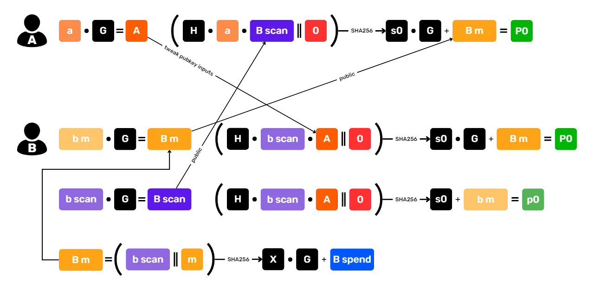


# Definitionen und Schlüsselkonzepte

<partId>b9bbbde3-34c0-4851-83e8-e2ffb029cf31</partId>

## Das Bitcoin UTXO-Modell

<chapterId>8d6b50c5-bf74-44f4-922b-25204991cb75</chapterId>

Bitcoin ist in erster Linie eine Währung, aber wissen Sie konkret, wie BTC im Protokoll dargestellt werden?

### Bitcoin UTXOs: Was sind sie?

Im Bitcoin-Protokoll dreht sich die Verwaltung von Geldeinheiten um das UTXO-Modell, ein Akronym für "_Unspent Transaction Output_".

Dieses Modell unterscheidet sich grundlegend von traditionellen Bankensystemen, die sich auf ein Konto- und Saldomechanismus stützen, um Finanzflüsse zu verfolgen. Tatsächlich werden in dem Bankensystem individuelle Salden in Konten geführt, die an eine Identität gebunden sind. Wenn Sie beispielsweise ein Baguette bei einem Bäcker kaufen, bucht Ihre Bank einfach den Kaufbetrag von Ihrem Konto ab, wodurch Ihr Saldo verringert wird, während das Konto des Bäckers mit demselben Betrag gutgeschrieben wird, was seinen Saldo erhöht. In diesem System gibt es keine Vorstellung von einer Verbindung zwischen dem Geld, das auf Ihr Konto eingeht, und dem Geld, das es verlässt, abgesehen von den Transaktionsaufzeichnungen.

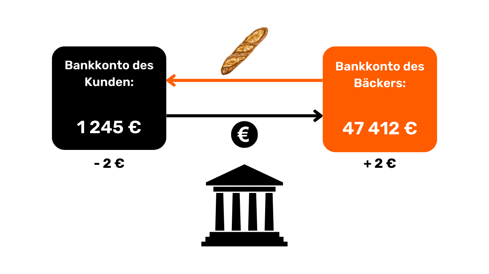
Bei Bitcoin funktionieren die Dinge anders. Das Konzept eines Kontos existiert nicht, und Geldeinheiten werden nicht über Salden, sondern über UTXOs verwaltet. Ein UTXO stellt eine bestimmte Menge an Bitcoins dar, die noch nicht ausgegeben wurde, und bildet somit ein "Stück Bitcoin", das groß oder klein sein kann. Ein UTXO könnte beispielsweise `500 BTC` oder nur `700 SATS` wert sein.
**> Erinnerung:** Der Satoshi, oft als Sat abgekürzt, ist die kleinste Einheit von Bitcoin, vergleichbar mit einem Cent bei Fiat-Währungen.

```plaintext
1 BTC = 100,000,000 SATS
```

Theoretisch kann ein UTXO jeden Wert in Bitcoins darstellen, von einem Sat bis zum theoretischen Maximum von etwa 21 Millionen BTC. Es ist jedoch logisch unmöglich, alle 21 Millionen Bitcoins zu besitzen, und es gibt eine untere wirtschaftliche Schwelle, genannt "Dust", unterhalb derer ein UTXO als wirtschaftlich nicht rentabel zum Ausgeben betrachtet wird.
**> Wussten Sie schon?** Das größte jemals auf Bitcoin erstellte UTXO hatte einen Wert von `500.000 BTC`. Es wurde von der Plattform MtGox während einer Konsolidierungsoperation im November 2011 erstellt: [29a3efd3ef04f9153d47a990bd7b048a4b2d213daaa5fb8ed670fb85f13bdbcf](https://mempool.space/fr/tx/29a3efd3ef04f9153d47a990bd7b048a4b2d213daaa5fb8ed670fb85f13bdbcf)

### UTXOs und Ausgabebedingungen

UTXOs sind die Tauschmittel auf Bitcoin. Jede Transaktion führt zum Verbrauch von UTXOs als Eingaben und zur Erstellung neuer UTXOs als Ausgaben. Wenn eine Transaktion durchgeführt wird, gelten die als Eingaben verwendeten UTXOs als "ausgegeben", und es werden neue UTXOs generiert und den in den Transaktionsausgaben angegebenen Empfängern zugewiesen. Ein UTXO repräsentiert also einfach eine unverbrauchte Transaktionsausgabe und somit eine Menge an Bitcoins, die einem Benutzer zu einem bestimmten Zeitpunkt gehören.

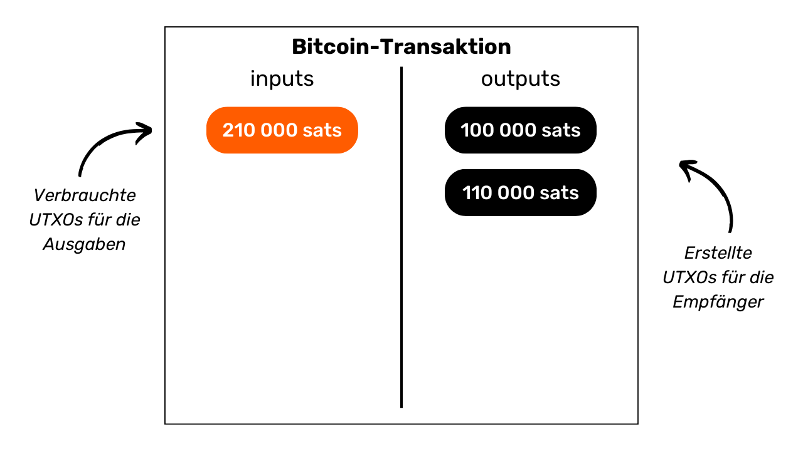
Alle UTXOs werden durch Skripte gesichert, die die Bedingungen definieren, unter denen sie ausgegeben werden können. Um ein UTXO zu verbrauchen, muss ein Benutzer dem Netzwerk nachweisen, dass er die durch das Skript festgelegten Bedingungen erfüllt. Im Allgemeinen werden UTXOs durch einen öffentlichen Schlüssel (oder eine Empfangsadresse, die diesen öffentlichen Schlüssel repräsentiert) geschützt. Um ein mit diesem öffentlichen Schlüssel verknüpftes UTXO auszugeben, muss der Benutzer nachweisen, dass er den entsprechenden privaten Schlüssel besitzt, indem er eine digitale Signatur vorlegt, die mit diesem Schlüssel erstellt wurde. Deshalb sagt man, dass Ihr Bitcoin-Wallet tatsächlich keine Bitcoins enthält, sondern Ihre privaten Schlüssel speichert, die Ihnen wiederum Zugang zu Ihren UTXOs und damit zu den Bitcoins, die sie repräsentieren, geben.
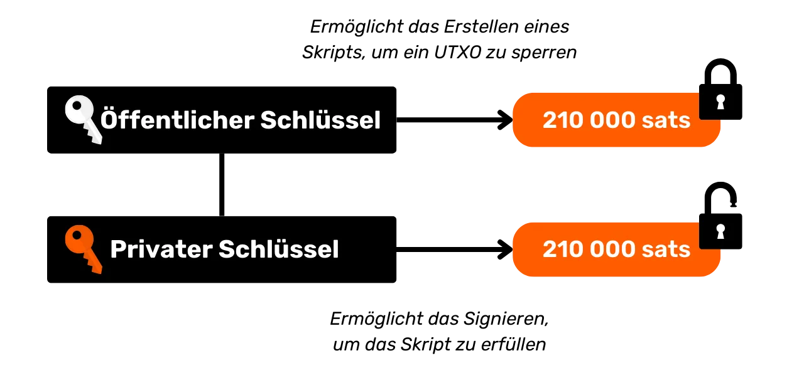

Da das Konzept eines Kontos in Bitcoin fehlt, entspricht der Saldo eines Wallets einfach der Summe der Werte aller UTXOs, die es ausgeben kann. Wenn Ihr Bitcoin-Wallet beispielsweise die folgenden 4 UTXOs ausgeben kann:

```plaintext
- 2 BTC
- 8 BTC
- 5 BTC
- 2 BTC
```

Wäre der Gesamtsaldo Ihres Wallets `17 BTC`.

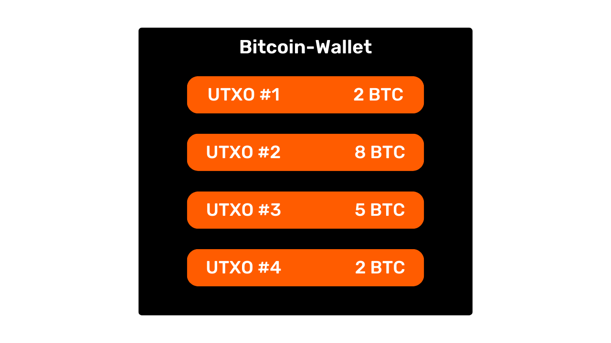

## Die Struktur von Bitcoin-Transaktionen

<chapterId>29d3aaab-de2e-4746-ab40-c9748898850c</chapterId>

### Die Eingaben und Ausgaben einer Transaktion

Eine Bitcoin-Transaktion ist eine auf der Blockchain aufgezeichnete Operation, die den Eigentumsübergang von Bitcoins von einer Person auf eine andere ermöglicht. Genauer gesagt, da wir uns in einem UTXO-Modell befinden und es keine Konten gibt, erfüllt die Transaktion die Ausgabebedingungen, die ein oder mehrere UTXOs gesichert haben, verbraucht sie und erstellt äquivalent neue UTXOs mit neuen Ausgabebedingungen. Kurz gesagt, eine Transaktion bewegt Bitcoins von einem Skript, das erfüllt ist, zu einem neuen Skript, das dazu bestimmt ist, sie zu sichern.

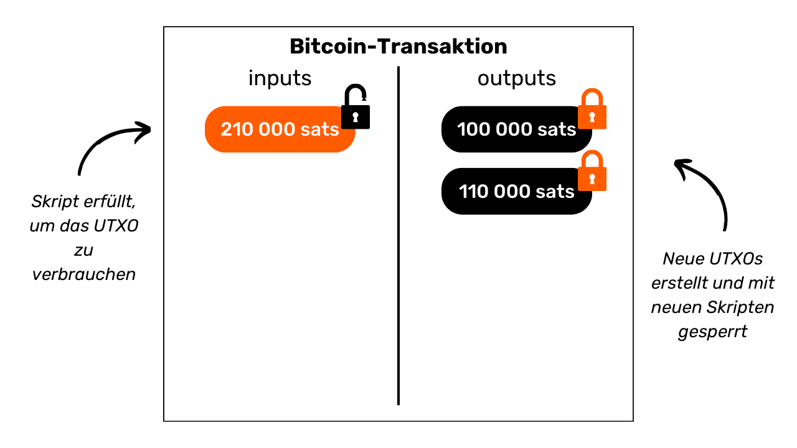

Jede Bitcoin-Transaktion besteht somit aus einer oder mehreren Eingaben und einer oder mehreren Ausgaben. Die Eingaben sind UTXOs, die von der Transaktion verbraucht werden, um die Ausgaben zu generieren. Die Ausgaben sind neue UTXOs, die als Eingaben für zukünftige Transaktionen verwendbar sein werden.

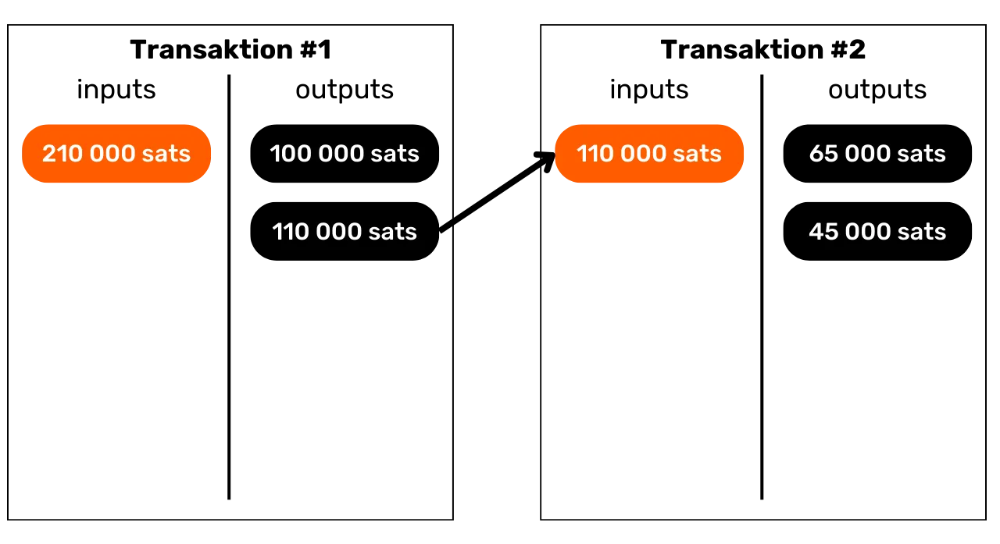
**> Wussten Sie schon?** Theoretisch könnte eine Bitcoin-Transaktion eine unendliche Anzahl von Eingaben und Ausgaben haben. Nur die maximale Größe eines Blocks begrenzt diese Zahl. Jede Eingabe in einer Bitcoin-Transaktion bezieht sich auf einen vorherigen, unverbrauchten UTXO (Unspent Transaction Output). Um einen UTXO als Eingabe zu verwenden, muss sein Inhaber nachweisen, dass er der rechtmäßige Eigentümer ist, indem er das damit verbundene Skript validiert, das heißt, indem er die auferlegte Ausgabebedingung erfüllt. In der Regel beinhaltet dies die Bereitstellung einer digitalen Signatur, die mit dem privaten Schlüssel erstellt wurde, der dem öffentlichen Schlüssel entspricht, der ursprünglich diesen UTXO gesichert hat. Das Skript überprüft somit, ob die Signatur mit dem öffentlichen Schlüssel übereinstimmt, der beim Empfang der Mittel verwendet wurde.
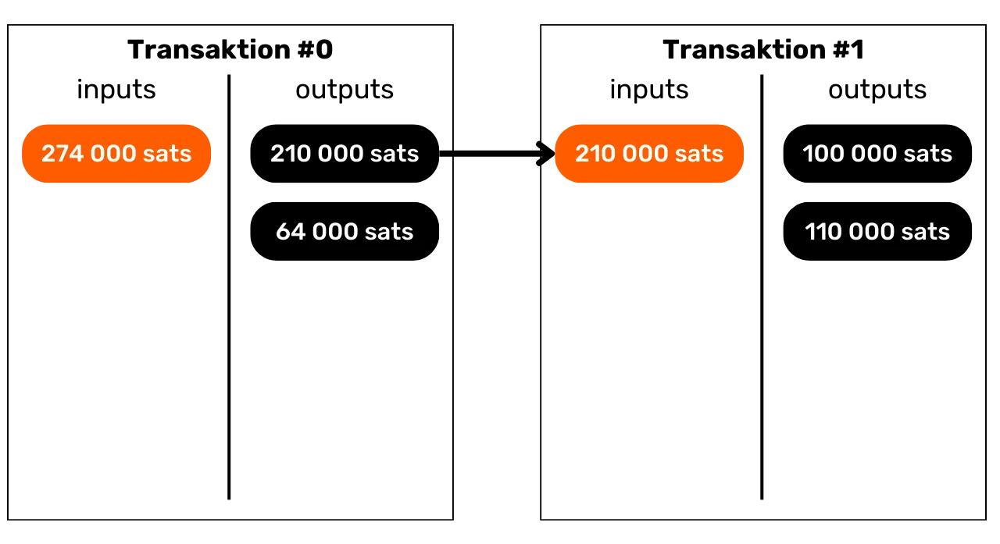

Jede Ausgabe hingegen spezifiziert die Menge der zu übertragenden Bitcoins sowie den Empfänger. Letzterer wird durch ein neues Skript definiert, das im Allgemeinen den neu erstellten UTXO mit einer Empfangsadresse oder einem neuen öffentlichen Schlüssel sperrt.

Damit eine Transaktion gemäß den Konsensregeln als gültig betrachtet wird, muss die Summe der Ausgaben kleiner oder gleich der Summe der Eingaben sein. Mit anderen Worten, die Summe der durch die Transaktion generierten neuen UTXOs darf die der als Eingaben verbrauchten UTXOs nicht überschreiten. Dieses Prinzip ist logisch: Wenn Sie nur einen Betrag von `500.000 SATS` haben, können Sie keinen Kauf von `700.000 SATS` tätigen.

### Wechselgeld und Konsolidierung in einer Bitcoin-Transaktion

Die Aktion einer Bitcoin-Transaktion auf UTXOs kann somit mit dem Einschmelzen einer Goldmünze verglichen werden. Tatsächlich ist ein UTXO nicht teilbar, sondern nur zusammenführbar. Das bedeutet, dass ein Benutzer einen UTXO, der eine bestimmte Menge an Bitcoins repräsentiert, nicht einfach in mehrere kleinere UTXOs aufteilen kann. Er muss ihn vollständig in einer Transaktion verbrauchen, um einen oder mehrere neue UTXOs mit beliebigen Werten in den Ausgaben zu erstellen, die kleiner oder gleich dem Anfangswert sein müssen.

Dieser Mechanismus ist ähnlich wie bei einer Goldmünze. Stellen Sie sich vor, Sie besitzen eine 2-Unzen-Münze und möchten eine Zahlung von 1 Unze tätigen, unter der Annahme, dass der Verkäufer Ihnen kein Wechselgeld geben kann. Sie müssten Ihre Münze einschmelzen und 2 neue von je 1 Unze gießen.
Bei Bitcoin ist der Vorgang ähnlich. Stellen wir uns vor, Alice hat einen UTXO von `10.000 SATS` und sie möchte ein Baguette kaufen, das `4.000 SATS` kostet. Alice wird eine Transaktion mit einer Eingabe von 1 UTXO von `10.000 SATS` durchführen, den sie vollständig verbraucht, und in den Ausgaben wird sie 2 UTXOs im Wert von `4.000 SATS` und `6.000 SATS` erstellen. Der UTXO von `4.000 SATS` wird als Zahlung für das Baguette an den Bäcker gesendet, während der UTXO von `6.000 SATS` als Wechselgeld zu Alice zurückkehrt. Dieser UTXO, der zum ursprünglichen Absender der Transaktion zurückkehrt, wird im Bitcoin-Jargon als "Wechselgeld" bezeichnet.

Stellen Sie sich nun vor, dass Alice nicht ein einzelnes UTXO von `10.000 SATS` besitzt, sondern zwei UTXOs von jeweils `3.000 SATS`. In dieser Situation ist keines der einzelnen UTXOs ausreichend, um die `4.000 SATS` für das Baguette zu decken. Daher muss Alice beide UTXOs von `3.000 SATS` gleichzeitig als Eingaben für ihre Transaktion verwenden. Auf diese Weise erreicht die Gesamtsumme der Eingaben `6.000 SATS`, was es ihr ermöglicht, die Zahlung von `4.000 SATS` an den Bäcker zu leisten. Diese Methode, die das Gruppieren mehrerer UTXOs in den Eingaben einer Transaktion beinhaltet, wird oft mit dem Begriff "Konsolidierung" bezeichnet. 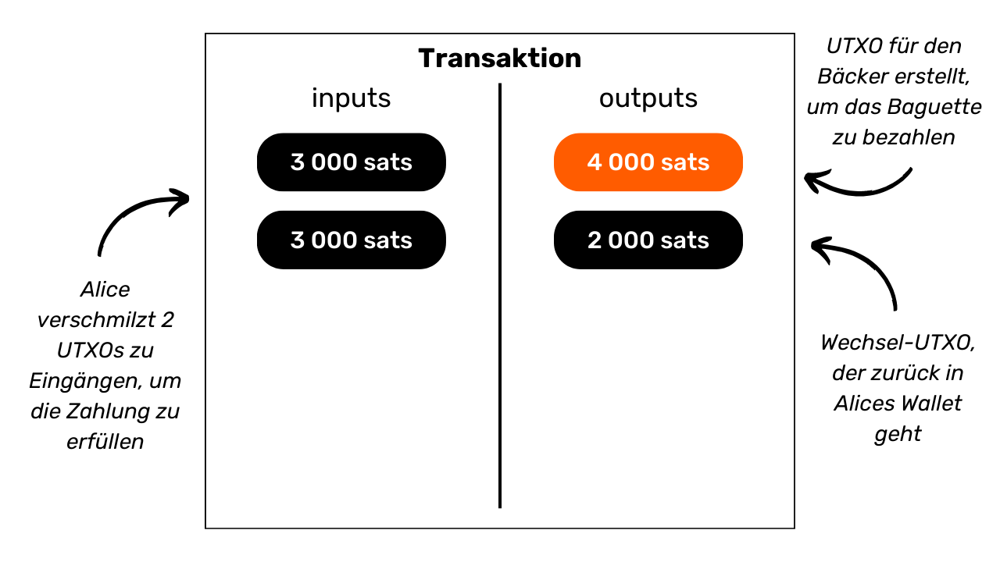

### Transaktionsgebühren

Intuitiv könnte man denken, dass Transaktionsgebühren ebenfalls einen Ausgang einer Transaktion darstellen. Aber in Wirklichkeit ist das nicht der Fall. Die Gebühren einer Transaktion stellen die Differenz zwischen der Gesamtsumme der Eingaben und der Gesamtsumme der Ausgänge dar. Das bedeutet, dass nach der Verwendung eines Teils des Werts der Eingaben zur Deckung der gewünschten Ausgänge in einer Transaktion eine bestimmte Summe der Eingaben ungenutzt bleibt. Diese Restsumme bildet die Transaktionsgebühren.

```plaintext
Gebühren = Gesamteingaben - Gesamtausgänge
```

Kehren wir zurück zum Beispiel von Alice, die ein UTXO von `10.000 SATS` hat und ein Baguette für `4.000 SATS` kaufen möchte. Alice erstellt eine Transaktion mit ihrem UTXO von `10.000 SATS` als Eingabe. Sie erzeugt dann einen Ausgang von `4.000 SATS`, der für den Bäcker für die Zahlung des Baguettes bestimmt ist. Um die Miner zu ermutigen, ihre Transaktion in einen Block aufzunehmen, weist Alice `200 SATS` als Gebühren zu. Sie erstellt somit einen zweiten Ausgang, das Wechselgeld, das zu ihr zurückkehrt, in Höhe von `5.800 SATS`.
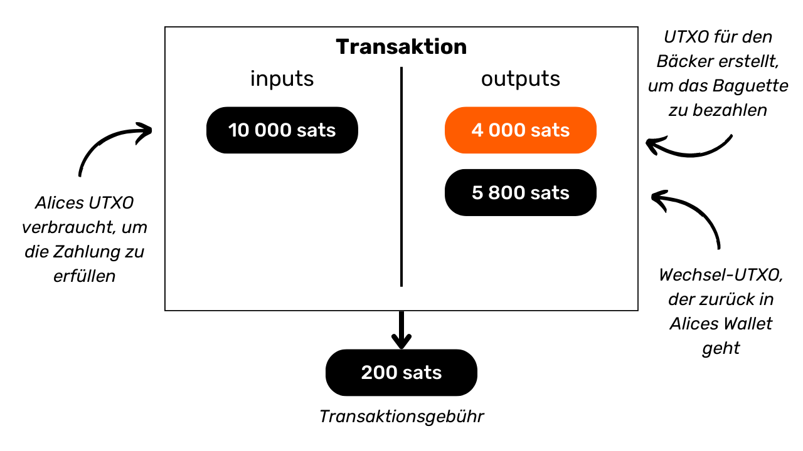

Durch Anwendung der Gebührenformel sehen wir in der Tat, dass `200 SATS` für die Miner übrig bleiben:

```plaintext
Gebühren = Gesamteingaben - Gesamtausgänge
Ausgaben = 10.000 - (4.000 + 5.800)
Ausgaben = 10.000 - 9.800
Ausgaben = 200
```

Wenn ein Miner erfolgreich einen Block validiert, darf er diese Gebühren für alle Transaktionen einsammeln, die in ihrem Block enthalten sind, durch die sogenannte "Coinbase"-Transaktion.

### Die Erstellung von UTXOs bei Bitcoin

Wenn Sie den vorherigen Abschnitten aufmerksam gefolgt sind, wissen Sie nun, dass UTXOs nur durch das Verbrauchen anderer existierender UTXOs erstellt werden können. Somit bilden die Münzen auf Bitcoin eine kontinuierliche Kette. Sie fragen sich jedoch vielleicht, wie die ersten UTXOs in dieser Kette erschienen sind. Dies wirft ein Problem ähnlich dem von Huhn und Ei auf: Woher kamen diese ursprünglichen UTXOs?

Die Antwort liegt in der **Coinbase-Transaktion**.

Die Coinbase ist eine spezifische Art von Bitcoin-Transaktion, die für jeden Block einzigartig und immer die erste darin ist. Sie ermöglicht es dem Miner, der einen gültigen Proof of Work gefunden hat, ihre Blockbelohnung zu erhalten. Diese Belohnung besteht aus zwei Elementen: **der Blocksubvention** und **den Transaktionsgebühren**, über die wir im vorherigen Teil gesprochen haben.

Das einzigartige Merkmal der Coinbase-Transaktion ist, dass sie die einzige ist, die Bitcoins aus dem Nichts erschaffen kann, ohne Eingaben verbrauchen zu müssen, um ihre Ausgänge zu generieren. Diese neu erstellten Bitcoins stellen das dar, was man die "ursprünglichen UTXOs" nennen könnte.
Die Bitcoins aus der Blocksubvention sind neu geschaffene BTC, die aus dem Nichts entstehen, gemäß einem vorher festgelegten Ausgabefahrplan in den Konsensregeln. Die Blocksubvention wird alle 210.000 Blöcke halbiert, was ungefähr alle vier Jahre geschieht, in einem Prozess, der als "Halbierung" bezeichnet wird. Ursprünglich wurden mit jeder Subvention 50 Bitcoins geschaffen, aber diese Menge hat sich allmählich verringert; derzeit sind es 3,125 Bitcoins pro Block.

Was den Teil, der sich auf Transaktionsgebühren bezieht, betrifft, obwohl er ebenfalls neu geschaffene BTC darstellt, dürfen sie nicht die Differenz zwischen den gesamten Eingängen und Ausgängen aller Transaktionen in einem Block überschreiten. Wir haben früher gesehen, dass diese Gebühren den Teil der Eingänge darstellen, der nicht in den Ausgängen der Transaktionen verwendet wird. Dieser Teil geht technisch gesehen während der Transaktion "verloren", und der Miner hat das Recht, diesen Wert in Form von einem oder mehreren neuen UTXOs neu zu schaffen. Dies ist also eine Übertragung von Wert vom Transaktionssender zum Miner, der ihn zur Blockchain hinzufügt.

**> Wussten Sie schon?** Die durch eine Coinbase-Transaktion generierten Bitcoins unterliegen einer Reifezeit von 100 Blöcken, während derer sie vom Miner nicht ausgegeben werden können. Diese Regel soll Komplikationen vermeiden, die mit der Verwendung von neu geschaffenen Bitcoins in einer Kette entstehen könnten, die später obsolet werden könnte.

### Die Implikationen des UTXO-Modells

Zunächst beeinflusst das UTXO-Modell direkt die Transaktionsgebühren bei Bitcoin. Da die Kapazität jedes Blocks begrenzt ist, bevorzugen Miner Transaktionen, die die besten Gebühren im Verhältnis zum Platz, den sie im Block einnehmen werden, bieten. Tatsächlich, je mehr UTXOs eine Transaktion als Eingänge und Ausgänge enthält, desto schwerer ist sie und erfordert daher höhere Gebühren. Dies ist einer der Gründe, warum oft versucht wird, die Anzahl der UTXOs in unserem Wallet zu reduzieren, was auch die Privatsphäre beeinflussen kann, ein Thema, das wir im dritten Teil dieses Trainings ausführlich behandeln werden.

Als nächstes, wie in den vorherigen Teilen erwähnt, sind Münzen auf Bitcoin im Wesentlichen eine Kette von UTXOs. Jede Transaktion schafft also eine Verbindung zwischen einem vergangenen UTXO und einem zukünftigen UTXO. UTXOs ermöglichen daher das explizite Nachverfolgen des Weges von Bitcoins von ihrer Schöpfung bis zu ihrer aktuellen Ausgabe. Diese Transparenz kann positiv gesehen werden, da sie jedem Benutzer ermöglicht, die Authentizität der erhaltenen Bitcoins zu überprüfen. Es ist jedoch auch auf diesem Prinzip der Nachverfolgbarkeit und Prüfbarkeit, dass die Kettenanalyse beruht, eine Praxis, die darauf abzielt, Ihre Privatsphäre zu kompromittieren. Wir werden diese Praxis im zweiten Teil des Trainings eingehend studieren.

## Bitcoins Datenschutzmodell

<chapterId>769d8963-3ed5-4094-b21d-9203c7d9e465</chapterId>

### Währung: Authentizität, Integrität und Doppelausgaben

Eine der Funktionen von Währung ist es, das Problem der doppelten Koinzidenz der Wünsche zu lösen. In einem auf Tauschhandel basierenden System erfordert ein Austausch nicht nur, eine Person zu finden, die ein Gut anbietet, das meinen Bedarf deckt, sondern auch ihnen ein Gut von äquivalentem Wert zu bieten, das ihren eigenen Bedarf befriedigt. Diese Balance zu finden, erweist sich als komplex.


Deshalb greifen wir auf Währung zurück, die den Transfer von Wert sowohl im Raum als auch in der Zeit ermöglicht.


Damit Währung dieses Problem lösen kann, ist es wesentlich, dass die Partei, die ein Gut oder eine Dienstleistung bereitstellt, von ihrer Fähigkeit überzeugt ist, diese Summe später ausgeben zu können. Daher wird jede rationale Person, die bereit ist, ein Stück Währung, ob digital oder physisch, zu akzeptieren, sicherstellen, dass es zwei grundlegende Kriterien erfüllt:

- **Die Münze muss intakt und authentisch sein;**
- **und sie darf nicht doppelt ausgegeben werden.**
  Bei der Verwendung von physischem Geld ist die erste Eigenschaft am schwierigsten zu bestätigen. In verschiedenen Epochen der Geschichte wurde die Integrität von Metallmünzen oft durch Praktiken wie Beschneiden oder Bohren kompromittiert. Zum Beispiel war es im antiken Rom üblich, dass Bürger die Ränder von Goldmünzen abschabten, um ein wenig des kostbaren Metalls zu sammeln, während sie diese für zukünftige Transaktionen behielten. Der intrinsische Wert der Münze wurde dadurch reduziert, aber ihr Nennwert blieb gleich. Dies ist insbesondere der Grund, warum später Rillen am Rand der Münzen geprägt wurden.

Auch die Authentizität ist bei physischen Geldmedien schwer zu überprüfen. Heutzutage sind die Techniken zur Bekämpfung von Fälschungen zunehmend komplex, was Händler dazu zwingt, in teure Verifizierungssysteme zu investieren.

Andererseits ist Doppelausgaben bei physischen Währungen aufgrund ihrer Natur kein Problem. Wenn ich Ihnen einen 10-Euro-Schein gebe, verlässt er unwiderruflich meinen Besitz, um in Ihren überzugehen, und schließt jede Möglichkeit aus, dieselben Geldeinheiten mehrmals auszugeben. Kurz gesagt, ich werde nicht in der Lage sein, diesen 10-Euro-Schein erneut auszugeben.


Bei digitaler Währung ist die Schwierigkeit anders. Die Authentizität und Integrität einer Münze zu gewährleisten, ist oft einfacher. Wie wir im vorherigen Abschnitt gesehen haben, ermöglicht das UTXO-Modell von Bitcoin, eine Münze bis zu ihrem Ursprung zurückzuverfolgen und damit zu verifizieren, dass sie tatsächlich in Übereinstimmung mit den Konsensregeln von einem Miner erstellt wurde.

Die Sicherstellung der Abwesenheit von Doppelausgaben ist jedoch komplexer, da jedes digitale Gut im Wesentlichen Information ist. Im Gegensatz zu physischen Gütern teilt sich Information bei Austauschvorgängen nicht, sondern verbreitet sich durch Vervielfältigung. Wenn ich Ihnen beispielsweise ein Dokument per E-Mail sende, wird es dann dupliziert. Von Ihrer Seite aus können Sie nicht mit Sicherheit überprüfen, dass ich das Originaldokument gelöscht habe.


### Doppelausgaben bei Bitcoin verhindern

Die einzige Möglichkeit, die Duplizierung eines digitalen Gutes zu vermeiden, besteht darin, über alle Transaktionen innerhalb des Systems informiert zu sein. Auf diese Weise kann man wissen, wer was besitzt und die Bestände aller basierend auf den getätigten Transaktionen aktualisieren. Dies wird beispielsweise mit Buchgeld im Bankensystem gemacht. Wenn Sie einem Händler 10 Euro per Kreditkarte zahlen, notiert die Bank diesen Austausch und aktualisiert das Hauptbuch.
Bei Bitcoin wird Doppelausgaben auf die gleiche Weise verhindert. Ziel ist es, die Abwesenheit einer Transaktion zu bestätigen, die die fraglichen Münzen bereits ausgegeben hat. Wenn diese Münzen nie verwendet wurden, können wir sicher sein, dass keine Doppelausgaben stattfinden werden. Dieses Prinzip wurde von Satoshi Nakamoto im White Paper mit diesem berühmten Satz beschrieben:

**"_Der einzige Weg, die Abwesenheit einer Transaktion zu bestätigen, besteht darin, über alle Transaktionen informiert zu sein._"**

Im Gegensatz zum Bankenmodell besteht jedoch bei Bitcoin nicht der Wunsch, einer zentralen Entität vertrauen zu müssen. Es ist notwendig, dass alle Benutzer diese Abwesenheit von Doppelausgaben bestätigen können, ohne sich auf eine dritte Partei verlassen zu müssen. Daher muss jeder über alle Bitcoin-Transaktionen informiert sein. Deshalb werden Bitcoin-Transaktionen öffentlich über alle Netzwerkknoten übertragen und klar auf der Blockchain aufgezeichnet.

Gerade diese öffentliche Verbreitung von Informationen erschwert den Schutz der Privatsphäre bei Bitcoin. Im traditionellen Bankensystem sind theoretisch nur die Finanzinstitutionen über die getätigten Transaktionen informiert. Bei Bitcoin hingegen sind alle Benutzer über alle Transaktionen informiert, über ihre jeweiligen Knoten.

### Das Datenschutzmodell: Bankensystem vs. Bitcoin

Im traditionellen System ist Ihr Bankkonto mit Ihrer Identität verknüpft. Der Bankangestellte kann wissen, welches Bankkonto zu welchem Kunden gehört und welche Transaktionen damit verbunden sind. Der Informationsfluss wird jedoch zwischen der Bank und der Öffentlichkeit unterbrochen. Mit anderen Worten, es ist unmöglich, den Kontostand und die Transaktionen eines Bankkontos zu kennen, das einer anderen Person gehört. Nur die Bank hat Zugang zu diesen Informationen.

Zum Beispiel weiß Ihr Banker, dass Sie jeden Morgen Ihre Baguette in der Nachbarschaftsbäckerei kaufen, aber Ihr Nachbar ist sich dieser Transaktion nicht bewusst. Somit ist der Informationsfluss den betroffenen Parteien, insbesondere der Bank, zugänglich, bleibt aber für Außenstehende unzugänglich.

Aufgrund der Einschränkung der öffentlichen Verbreitung von Transaktionen, die wir im vorherigen Teil gesehen haben, kann das Datenschutzmodell von Bitcoin nicht dem Modell des Bankensystems folgen. Im Falle von Bitcoin, da der Informationsfluss zwischen den Transaktionen und dem öffentlichen Bereich nicht unterbrochen werden kann, **beruht das Datenschutzmodell auf der Trennung zwischen der Identität des Benutzers und den Transaktionen** selbst.

Zum Beispiel, wenn Sie eine Baguette vom Bäcker kaufen, indem Sie in BTC bezahlen, kann Ihr Nachbar, der seinen eigenen Full Node besitzt, Ihre Transaktion durchgehen sehen, genauso wie er alle anderen Transaktionen im System sehen kann. Wenn jedoch die Datenschutzprinzipien respektiert werden, sollten sie nicht in der Lage sein, diese spezifische Transaktion mit Ihrer Identität zu verknüpfen.

Aber da Bitcoin-Transaktionen öffentlich gemacht werden, wird es dennoch möglich, Verbindungen zwischen ihnen herzustellen, um Informationen über die beteiligten Parteien abzuleiten. Diese Aktivität stellt sogar eine Spezialität an sich dar, die als "Chain-Analyse" bezeichnet wird. Im nächsten Teil der Schulung lade ich Sie ein, die Grundlagen der Chain-Analyse zu erkunden, um zu verstehen, wie Ihre Bitcoins verfolgt werden und wie Sie sich besser dagegen verteidigen können.

# Verständnis der Chain-Analyse und wie Sie sich schützen können

<partId>4739371e-9fef-45b0-bcaa-b7a4df6b4470</partId>

## Was ist Chain-Analyse bei Bitcoin?

<chapterId>7d198ba6-4af2-4f24-86cb-3c79cb25627e</chapterId>

### Definition und Funktionsweise

Chain-Analyse umfasst alle Methoden, die verwendet werden, um den Fluss von Bitcoins auf der Blockchain zu verfolgen. Allgemein beruht die Chain-Analyse auf der Beobachtung von Merkmalen in Proben vorheriger Transaktionen. Es beinhaltet dann, diese gleichen Merkmale in einer Transaktion zu identifizieren, die man analysieren möchte, und plausible Interpretationen abzuleiten. Diese Problemlösungsmethode aus einem praktischen Ansatz, um eine hinreichend gute Lösung zu finden, wird als "Heuristik" bezeichnet.

Vereinfacht gesagt, wird die Chain-Analyse in drei Hauptschritten durchgeführt:

1. **Beobachten der Blockchain;**
2. **Identifizieren bekannter Merkmale;**
3. **Ableiten von Hypothesen.**

Chain-Analyse kann von jedem durchgeführt werden. Es reicht, Zugang zu den öffentlichen Informationen der Blockchain über einen Full Node zu haben, um die Bewegungen von Transaktionen zu beobachten und Hypothesen zu machen. Es gibt auch kostenlose Tools, die diese Analyse erleichtern, wie die Website [OXT.me](https://oxt.me/), die wir in den letzten beiden Kapiteln dieses Teils im Detail erkunden werden. Das Hauptproblem für die Privatsphäre kommt jedoch von Unternehmen, die sich auf Chain-Analyse spezialisiert haben. Diese Unternehmen haben die Chain-Analyse auf industrielle Skala gebracht und verkaufen ihre Dienstleistungen an Finanzinstitutionen oder Regierungen. Unter diesen Unternehmen ist Chainalysis wahrscheinlich das bekannteste.

### Die Ziele der Chain-Analyse

Eines der Ziele der Kettenanalyse besteht darin, verschiedene Aktivitäten auf Bitcoin zu gruppieren, um die Einzigartigkeit des Benutzers zu bestimmen, der sie durchgeführt hat. Anschließend wird es möglich sein, zu versuchen, dieses Bündel von Aktivitäten mit einer realen Identität zu verknüpfen.


Erinnern Sie sich an das vorherige Kapitel. Ich erklärte, warum das Datenschutzmodell von Bitcoin ursprünglich darauf basierte, die Identität des Benutzers von seinen Transaktionen zu trennen. Es wäre daher verlockend zu denken, dass eine Kettenanalyse unnötig ist, da selbst wenn es gelingt, Onchain-Aktivitäten zu gruppieren, diese nicht mit einer realen Identität in Verbindung gebracht werden können.

Theoretisch ist diese Aussage korrekt. Im ersten Teil dieses Trainings sahen wir, dass kryptografische Schlüsselpaare verwendet werden, um Bedingungen für das UTXO festzulegen. Diese Schlüsselpaare geben an sich keine Informationen über die Identität ihrer Inhaber preis. Somit sagt uns selbst der Erfolg beim Gruppieren von Aktivitäten, die mit verschiedenen Schlüsselpaaren verbunden sind, nichts über die Entität hinter diesen Aktivitäten aus.


Die praktische Realität ist jedoch viel komplexer. Es gibt eine Vielzahl von Verhaltensweisen, die das Risiko bergen, eine reale Identität mit einer Onchain-Aktivität zu verknüpfen. In der Analyse wird dies als Eintrittspunkt bezeichnet, und es gibt viele davon.

Der häufigste ist natürlich KYC (_Know Your Customer_). Wenn Sie Ihre Bitcoins von einer regulierten Plattform auf eine Ihrer persönlichen Empfangsadressen abheben, dann sind einige Personen in der Lage, Ihre Identität mit dieser Adresse zu verknüpfen. Allgemeiner gesagt, kann ein Eintrittspunkt jede Form der Interaktion zwischen Ihrem realen Leben und einer Bitcoin-Transaktion sein. Zum Beispiel, wenn Sie eine Empfangsadresse in Ihren sozialen Netzwerken veröffentlichen, kann dies ein Eintrittspunkt für die Analyse sein. Wenn Sie eine Zahlung in Bitcoins an Ihren Bäcker machen, können sie Ihr Gesicht (welches Teil Ihrer Identität ist) mit einer Bitcoin-Adresse in Verbindung bringen.

Diese Eintrittspunkte sind bei der Nutzung von Bitcoin fast unvermeidlich. Obwohl man versuchen kann, ihren Umfang zu begrenzen, werden sie präsent bleiben. Deshalb ist es entscheidend, Methoden zu kombinieren, die darauf abzielen, Ihre Privatsphäre zu bewahren. Obwohl die Aufrechterhaltung einer Trennung zwischen Ihrer realen Identität und Ihren Transaktionen ein interessanter Ansatz ist, bleibt er heute unzureichend. Tatsächlich, wenn alle Ihre Onchain-Aktivitäten gruppiert werden können, dann ist der geringste Eintrittspunkt wahrscheinlich in der Lage, die einzige Datenschutzebene, die Sie etabliert hatten, zu kompromittieren.


### Verteidigung gegen Kettenanalyse

Daher ist es auch notwendig, sich in unserer Nutzung von Bitcoin der Blockchain-Analyse stellen zu können. Indem wir auf diese Weise vorgehen, können wir die Aggregation unserer Aktivitäten minimieren und die Auswirkungen eines Eintrittspunkts auf unsere Privatsphäre begrenzen.


Um die Blockchain-Analyse besser zu bekämpfen, was gibt es für einen besseren Ansatz, als sich mit den Methoden vertraut zu machen, die in der Blockchain-Analyse verwendet werden? Wenn Sie wissen möchten, wie Sie Ihre Privatsphäre bei Bitcoin verbessern können, müssen Sie diese Methoden verstehen. Dies wird es Ihnen ermöglichen, Techniken wie [coinjoin](https://planb.network/fr/tutorials/privacy/coinjoin-samourai-wallet) oder [payjoin](https://planb.network/fr/tutorials/privacy/payjoin) (Techniken, die wir in den letzten Teilen des Trainings studieren werden) besser zu erfassen und die Fehler zu reduzieren, die Sie möglicherweise machen.
In diesem Zusammenhang können wir eine Analogie zur Kryptographie und Kryptoanalyse ziehen. Ein guter Kryptograph ist zuallererst ein guter Kryptoanalytiker. Um einen neuen Verschlüsselungsalgorithmus zu entwerfen, muss man wissen, welchen Angriffen er ausgesetzt sein wird, und auch studieren, warum frühere Algorithmen gebrochen wurden. Das gleiche Prinzip gilt für die Privatsphäre bei Bitcoin. Das Verständnis der Methoden der Blockchain-Analyse ist der Schlüssel zum Schutz dagegen. Deshalb schlage ich einen ganzen Abschnitt über Blockchain-Analyse in dieser Schulung vor.

### Die Methoden der Blockchain-Analyse

Es ist wichtig zu verstehen, dass Blockchain-Analyse keine exakte Wissenschaft ist. Sie stützt sich auf Heuristiken, die von früheren Beobachtungen oder logischen Interpretationen abgeleitet sind. Diese Regeln ermöglichen ziemlich zuverlässige Ergebnisse, aber nie mit absoluter Präzision. Mit anderen Worten, **Blockchain-Analyse beinhaltet immer eine Dimension der Wahrscheinlichkeit in den gezogenen Schlussfolgerungen**. Zum Beispiel kann mit mehr oder weniger Sicherheit geschätzt werden, dass zwei Adressen derselben Entität gehören, aber totale Sicherheit wird immer unerreichbar sein.

Das gesamte Ziel der Blockchain-Analyse liegt genau in der Aggregation verschiedener Heuristiken, um das Risiko eines Fehlers zu minimieren. Es ist gewissermaßen eine Ansammlung von Beweisen, die es uns erlaubt, der Realität näher zu kommen.

Diese berühmten Heuristiken können in verschiedene Kategorien eingeteilt werden, die wir gemeinsam im Detail betrachten werden:

- **Transaktionsmuster (oder Transaktionsmodelle);**
- **Heuristiken innerhalb der Transaktion;**
- **Heuristiken außerhalb der Transaktion.**

### Satoshi Nakamoto und Blockchain-Analyse

Es sollte angemerkt werden, dass die ersten zwei Heuristiken für die Kettenanalyse von Satoshi Nakamoto selbst entdeckt wurden. Er diskutiert sie in Teil 10 des Bitcoin White Papers. Diese sind:

- die Common Input Ownership Heuristic (CIOH);
- und Adresswiederverwendung.


Quelle: S. Nakamoto, "Bitcoin: A Peer-to-Peer Electronic Cash System", https://bitcoin.org/bitcoin.pdf, 2009.

In den folgenden Kapiteln werden wir erforschen, woraus diese bestehen, aber es ist bereits interessant zu bemerken, dass diese zwei Heuristiken auch heute noch eine Vorrangstellung in der Kettenanalyse einnehmen.

## Transaktionsmuster

<chapterId>d365a101-2d37-46a5-bfb9-3c51e37bf96b</chapterId>

Ein Transaktionsmuster ist einfach ein Modell oder eine Gesamtstruktur einer typischen Transaktion, die auf der Blockchain gefunden werden kann, deren Interpretation wahrscheinlich bekannt ist. Bei der Untersuchung von Mustern werden wir uns auf eine einzelne Transaktion konzentrieren, die wir auf hoher Ebene analysieren werden.

Mit anderen Worten, wir werden uns nur die Anzahl der UTXOs in Eingängen und die Anzahl der UTXOs in Ausgängen ansehen, ohne uns auf die spezifischeren Details oder das Umfeld der Transaktion zu konzentrieren. Aus dem beobachteten Modell werden wir in der Lage sein, die Natur der Transaktion zu interpretieren. Wir werden dann nach Merkmalen in ihrer Struktur suchen und eine Interpretation ableiten.


In diesem Teil werden wir gemeinsam die Haupttransaktionsmodelle entdecken, die in der Kettenanalyse angetroffen werden können, und für jedes Modell werde ich Ihnen die wahrscheinliche Interpretation dieser Struktur geben, zusammen mit einem konkreten Beispiel.

### Einfache Überweisung (oder einfache Zahlung)

Wir beginnen mit einem sehr verbreiteten Muster, da es dasjenige ist, das bei den meisten Bitcoin-Zahlungen erscheint. Das Modell der einfachen Zahlung ist gekennzeichnet durch den Verbrauch von einem oder mehreren UTXOs in Eingängen und die Erzeugung von 2 UTXOs in Ausgängen. Dieses Modell wird also folgendermaßen aussehen:


Wenn wir diese Transaktionsstruktur auf der Blockchain erkennen, können wir bereits eine Interpretation vornehmen. Wie der Name schon sagt, deutet dieses Modell darauf hin, dass wir in Anwesenheit einer Sendungs- oder Zahlungstransaktion sind. Der Benutzer hat seine eigenen UTXO in Inputs verbraucht, um in Outputs ein Zahlungs-UTXO und ein Wechselgeld-UTXO (Geld, das an denselben Benutzer zurückgeht) zu befriedigen.
Wir wissen daher, dass der beobachtete Benutzer wahrscheinlich nicht mehr im Besitz eines der beiden UTXOs in Outputs (das Zahlungs-UTXO) ist, aber sie sind immer noch im Besitz des anderen UTXO (das Wechselgeld-UTXO).
Im Moment ist es uns unmöglich zu spezifizieren, welcher Output welches UTXO repräsentiert, da dies nicht das Ziel der Untersuchung von Mustern ist. Dies werden wir erreichen, indem wir uns auf die Heuristiken verlassen, die wir in den folgenden Teilen studieren werden. In diesem Stadium ist unser Ziel darauf beschränkt, die Natur der in Frage stehenden Transaktion zu identifizieren, die in diesem Fall eine einfache Sendung ist.

Zum Beispiel, hier ist eine Bitcoin-Transaktion, die das einfache Sendemuster annimmt:

```plaintext
b6cc79f45fd2d7669ff94db5cb14c45f1f879ea0ba4c6e3d16ad53a18c34b769
```


Quelle: [Mempool.space](https://mempool.space/fr/tx/b6cc79f45fd2d7669ff94db5cb14c45f1f879ea0ba4c6e3d16ad53a18c34b769)

Nach diesem ersten Beispiel sollten Sie ein besseres Verständnis dafür haben, was es bedeutet, ein "Transaktionsmodell" zu studieren. Wir untersuchen eine Transaktion, indem wir uns nur auf ihre Struktur konzentrieren, ohne ihre Umgebung oder die spezifischen Details der Transaktion zu berücksichtigen. Wir beobachten sie nur in einer globalen Weise in diesem ersten Schritt.

Jetzt, da Sie verstehen, was ein Muster ist, lassen Sie uns zu den anderen existierenden Modellen übergehen.

### Sweeping

Dieses zweite Modell ist durch den Verbrauch eines einzigen UTXO als Input und die Produktion eines einzigen UTXO als Output gekennzeichnet.


Die Interpretation dieses Modells ist, dass wir in Anwesenheit einer Selbstübertragung sind. Der Benutzer hat seine Bitcoins an sich selbst, an eine andere Adresse, die er besitzt, übertragen. Da es keine Änderung in der Transaktion gibt, ist es sehr unwahrscheinlich, dass wir in Anwesenheit einer Zahlung sind. Tatsächlich ist es fast unmöglich, dass der Zahler ein UTXO hat, das genau dem vom Verkäufer geforderten Betrag plus den Transaktionsgebühren entspricht. Im Allgemeinen ist der Zahler daher gezwungen, einen Wechselgeld-Output zu produzieren.

Wir wissen dann, dass der beobachtete Benutzer wahrscheinlich immer noch im Besitz dieses UTXO ist. Im Kontext einer Kettenanalyse, wenn wir wissen, dass das UTXO, das als Input in der Transaktion verwendet wurde, Alice gehört, können wir annehmen, dass das UTXO im Output ihr ebenfalls gehört. Was später interessant werden wird, ist interne Heuristiken zur Transaktion zu finden, die diese Annahme verstärken könnten (wir werden diese Heuristiken in Kapitel 3.3 studieren).

Zum Beispiel, hier ist eine Bitcoin-Transaktion, die das Sweeping-Muster annimmt:

```plaintext
35f1072a0fda5ae106efb4fda871ab40e1f8023c6c47f396441ad4b995ea693d
```


Quelle: [Mempool.space](https://mempool.space/fr/tx/35f1072a0fda5ae106efb4fda871ab40e1f8023c6c47f396441ad4b995ea693d) Allerdings kann dieser Typ von Muster auch eine Selbstüberweisung auf das Konto einer Kryptowährungsbörse offenbaren. Es wird die Untersuchung bekannter Adressen und der Kontext der Transaktion sein, die es uns ermöglichen zu wissen, ob es sich um einen Sweep zu einem Wallet in Eigenverwahrung oder eine Abhebung auf eine Plattform handelt. Tatsächlich sind die Adressen von Austauschplattformen oft leicht identifizierbar.

Kehren wir zu Alices Beispiel zurück: Wenn der Sweep zu einer bekannten Adresse einer Plattform führt (wie zum Beispiel Binance), könnte dies bedeuten, dass die Bitcoins aus dem direkten Besitz von Alice übertragen wurden, wahrscheinlich mit der Absicht, sie zu verkaufen oder auf dieser Plattform zu lagern. Andererseits, wenn die Zieladresse unbekannt ist, ist es vernünftig anzunehmen, dass es sich einfach um ein weiteres Wallet handelt, das immer noch Alice gehört. Aber diese Art von Studie fällt mehr in die Kategorie der Heuristiken und nicht in die Untersuchung von Mustern.

### Konsolidierung

Dieses Modell ist durch den Verbrauch mehrerer UTXOs als Eingabe und die Produktion eines einzigen UTXOs als Ausgabe gekennzeichnet.


Die Interpretation dieses Modells ist, dass wir in der Gegenwart einer Konsolidierung sind. Dies ist eine gängige Praxis unter Bitcoin-Nutzern, mit dem Ziel, mehrere UTXOs in Erwartung eines möglichen Anstiegs der Transaktionsgebühren zusammenzuführen. Indem diese Operation in einer Zeit durchgeführt wird, in der die Gebühren niedrig sind, ist es möglich, bei zukünftigen Gebühren zu sparen. Wir werden über diese Praxis in Kapitel 4.3 mehr sprechen.

Wir können ableiten, dass der Benutzer hinter diesem Transaktionsmodell wahrscheinlich im Besitz aller UTXOs in den Eingaben war und immer noch im Besitz des UTXOs in der Ausgabe ist. Dies ist sicherlich eine Selbstüberweisung.

Genau wie beim Sweeping kann dieser Typ von Muster auch eine Selbstüberweisung auf das Konto einer Austauschplattform offenbaren. Es wird die Untersuchung bekannter Adressen und der Kontext der Transaktion sein, die es uns ermöglichen zu wissen, ob es sich um eine Konsolidierung zu einem Wallet in Eigenverwahrung oder eine Abhebung auf eine Plattform handelt.

Zum Beispiel, hier ist eine Bitcoin-Transaktion, die das Konsolidierungsmuster annimmt:

```plaintext
77c16914211e237a9bd51a7ce0b1a7368631caed515fe51b081d220590589e94
```

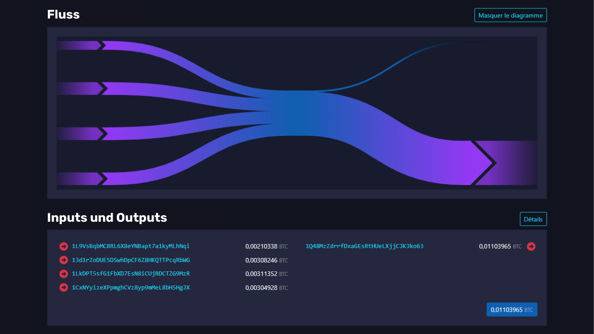

Quelle: [Mempool.space](https://mempool.space/fr/tx/77c16914211e237a9bd51a7ce0b1a7368631caed515fe51b081d220590589e94)
Im Kontext einer Kettenanalyse kann dieses Modell viele Informationen offenbaren. Zum Beispiel, wenn wir wissen, dass einer der Eingänge Alice gehört, können wir annehmen, dass alle anderen Eingänge und der Ausgang dieser Transaktion ihr ebenfalls gehören. Diese Annahme würde es uns dann ermöglichen, durch vorherige Transaktionsketten zurückzuverfolgen, um andere Transaktionen zu entdecken und zu analysieren, die wahrscheinlich mit Alice in Verbindung stehen.


### Gruppierte Ausgaben

Dieses Modell ist durch den Verbrauch einiger UTXOs als Eingänge (oft nur einer) und die Produktion zahlreicher UTXOs als Ausgänge gekennzeichnet.


Die Interpretation dieses Modells ist, dass wir in Anwesenheit von gruppierten Ausgaben sind. Dies ist eine Praxis, die wahrscheinlich eine signifikante wirtschaftliche Aktivität offenbart, wie zum Beispiel eine Austauschplattform. Gruppierte Ausgaben ermöglichen es diesen Entitäten, an Gebühren zu sparen, indem sie ihre Ausgaben in einer einzigen Transaktion konsolidieren.

Aus diesem Modell können wir ableiten, dass der UTXO-Eingang von einem Unternehmen mit signifikanter wirtschaftlicher Aktivität stammt und dass die UTXO-Ausgänge sich verteilen werden. Viele werden zu Kunden des Unternehmens gehören, die Bitcoins von der Plattform abgehoben haben. Andere könnten an Partnerunternehmen gehen. Schließlich wird es sicherlich einen oder mehrere Umtausche geben, die an das ausstellende Unternehmen zurückgehen.

Zum Beispiel, hier ist eine Bitcoin-Transaktion, die das Muster der gruppierten Ausgaben annimmt (wahrscheinlich ist es eine Transaktion, die von der Bybit-Plattform ausgegeben wurde):

```plaintext
8a7288758b6e5d550897beedd13c70bcbaba8709af01a7dbcc1f574b89176b43
```

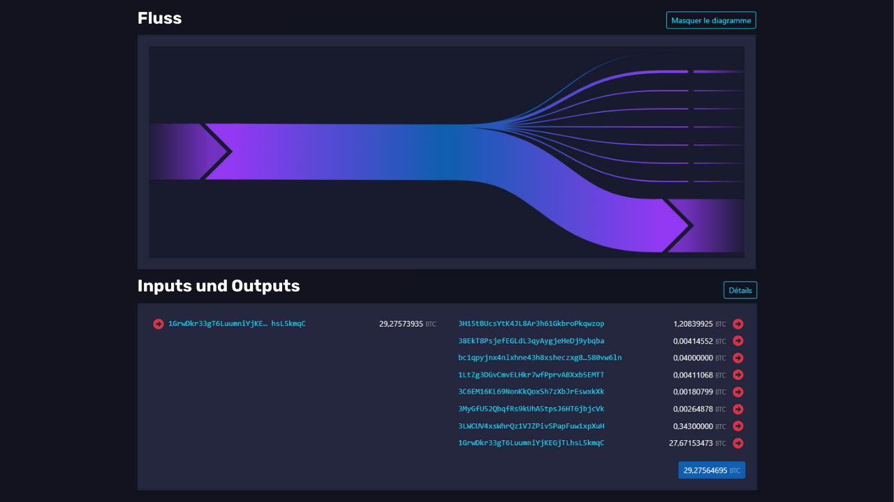

Quelle: [Mempool.space](https://mempool.space/fr/tx/8a7288758b6e5d550897beedd13c70bcbaba8709af01a7dbcc1f574b89176b43)

### Protokollspezifische Transaktionen

Unter den Transaktionsmustern können wir auch Modelle identifizieren, die die Verwendung eines spezifischen Protokolls offenbaren. Zum Beispiel werden Whirlpool-Coinjoins (die wir in Teil 5 besprechen werden) eine leicht identifizierbare Struktur haben, die sie von anderen traditionelleren Transaktionen unterscheidet.


Die Analyse dieses Musters legt nahe, dass wir wahrscheinlich in Anwesenheit einer kollaborativen Transaktion sind. Es ist auch möglich, einen Coinjoin zu beobachten. Wenn diese letztere Hypothese zutrifft, könnte uns die Anzahl der Ausgänge eine ungefähre Schätzung der Anzahl der Teilnehmer am Coinjoin geben.

Zum Beispiel, hier ist eine Bitcoin-Transaktion, die das Muster des kollaborativen Transaktionstyps Coinjoin annimmt:

```plaintext
00601af905bede31086d9b1b79ee8399bd60c97e9c5bba197bdebeee028b9bea
```

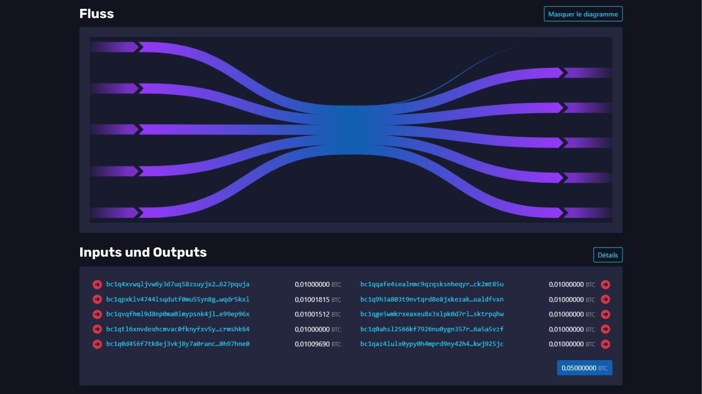

Quelle: [Mempool.space](https://mempool.space/fr/tx/00601af905bede31086d9b1b79ee8399bd60c97e9c5bba197bdebeee028b9bea)

Es gibt viele andere Protokolle, die ihre eigenen spezifischen Strukturen haben. So könnten wir zum Beispiel Transaktionen des Typs Wabisabi, Stamps-Transaktionen oder sogar Runes unterscheiden.

Dank dieser Transaktionsmuster können wir bereits eine Reihe von Informationen über eine gegebene Transaktion interpretieren. Aber die Struktur der Transaktion ist nicht die einzige Informationsquelle für die Analyse. Wir können auch ihre Details studieren. Diese Details, intern zu einer Transaktion, sind das, was ich gerne "interne Heuristiken" nenne, und wir werden sie im folgenden Kapitel studieren.

## Interne Heuristiken

<chapterId>c54b5abe-872f-40f4-a0d0-c59faff228ba</chapterId>

Eine interne Heuristik ist eine spezifische Eigenschaft, die innerhalb einer Transaktion selbst identifiziert wird, ohne dass es notwendig ist, ihre Umgebung zu untersuchen, was uns erlaubt, Schlussfolgerungen zu ziehen. Im Gegensatz zu Mustern, die sich auf die Gesamtstruktur der Transaktion auf hoher Ebene konzentrieren, basieren interne Heuristiken auf dem Satz extrahierbarer Daten. Dies umfasst:

- Die Mengen der verschiedenen UTXOs, sowohl eingehend als auch ausgehend;
- Alles, was die Skripte betrifft: die Empfangsadressen, die Versionierung, die Locktimes…

Generell wird uns diese Art von Heuristik ermöglichen, die Änderung in einer spezifischen Transaktion zu identifizieren. Indem wir dies tun, können wir dann weiterhin eine Entität über mehrere verschiedene Transaktionen hinweg verfolgen. Tatsächlich, wenn wir ein UTXO identifizieren, das einem Benutzer gehört, dem wir folgen möchten, ist es entscheidend zu bestimmen, welcher Output bei einer Transaktion an einen anderen Benutzer übertragen wurde und welcher Output die Änderung darstellt und somit in ihrem Besitz bleibt.


Ich erinnere Sie noch einmal daran, dass diese Heuristiken nicht absolut präzise sind. Einzeln genommen, erlauben sie uns nur, plausible Szenarien zu identifizieren. Es ist die Ansammlung mehrerer Heuristiken, die hilft, die Unsicherheit zu reduzieren, ohne sie jemals vollständig zu eliminieren.

### Interne Ähnlichkeiten

Diese Heuristik beinhaltet die Untersuchung von Ähnlichkeiten zwischen den Inputs und Outputs derselben Transaktion. Wenn wir dieselbe Charakteristik bei den Inputs und bei nur einem der Outputs der Transaktion beobachten, dann ist es wahrscheinlich, dass dieser Output die Änderung darstellt.

Die offensichtlichste Charakteristik ist die Wiederverwendung einer Empfangsadresse in derselben Transaktion.

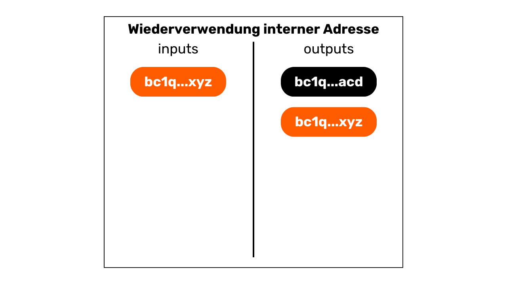
Diese Heuristik lässt wenig Raum für Zweifel. Es sei denn, der private Schlüssel wurde gehackt, offenbart dieselbe Empfangsadresse unweigerlich die Aktivität eines einzelnen Benutzers. Die daraus folgende Interpretation ist, dass die Änderung aus der Transaktion der Output mit derselben Adresse wie der Input ist. Dies ermöglicht die fortgesetzte Verfolgung der Person basierend auf dieser Änderung.
Zum Beispiel, hier ist eine Transaktion, auf die diese Heuristik vernünftigerweise angewendet werden kann:

```plaintext
54364146665bfc453a55eae4bfb8fdf7c721d02cb96aadc480c8b16bdeb8d6d0
```


Quelle: [Mempool.space](https://mempool.space/tx/54364146665bfc453a55eae4bfb8fdf7c721d02cb96aadc480c8b16bdeb8d6d0)

Diese Ähnlichkeiten zwischen Inputs und Outputs beschränken sich nicht auf die Wiederverwendung von Adressen. Jede Ähnlichkeit in der Verwendung von Skripten kann die Anwendung einer Heuristik ermöglichen. Zum Beispiel kann manchmal dieselbe Versionierung zwischen einem Input und einem der Outputs der Transaktion beobachtet werden.

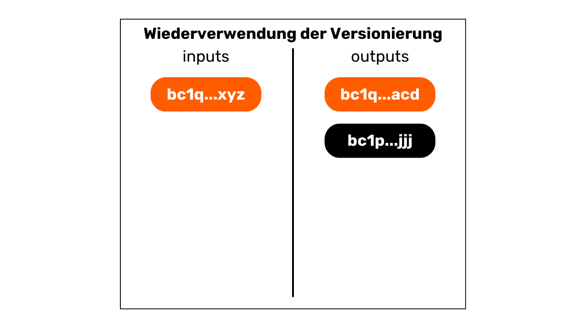

In diesem Diagramm können wir sehen, dass Input Nr. 0 ein P2WPKH-Skript (SegWit V0, beginnend mit `bc1q`) entsperrt. Output Nr. 0 verwendet denselben Typ von Skript. Output Nr. 1 jedoch verwendet ein P2TR-Skript (SegWit V1, beginnend mit `bc1p`). Die Interpretation dieser Charakteristik ist, dass es wahrscheinlich ist, dass die Adresse mit derselben Versionierung wie der Input die Änderungsadresse ist. Sie würde daher immer noch demselben Benutzer gehören.

Hier ist eine Transaktion, auf die diese Heuristik vernünftigerweise angewendet werden kann:

```plaintext
db07516288771ce5d0a06b275962ec4af1b74500739f168e5800cbcb0e9dd578
```


Quelle: [Mempool.space](https://mempool.space/tx/db07516288771ce5d0a06b275962ec4af1b74500739f168e5800cbcb0e9dd578)
In diesem Fall können wir sehen, dass Eingabe Nr. 0 und Ausgabe Nr. 1 P2WPKH-Skripte (SegWit V0) verwenden, während Ausgabe Nr. 0 einen anderen Skripttyp verwendet, P2PKH (Legacy). Zu Beginn der 2010er Jahre war diese auf der Versionierung von Skripten basierende Heuristik aufgrund der Begrenzung der verfügbaren Skripttypen relativ wenig nützlich. Im Laufe der Zeit und mit aufeinanderfolgenden Updates von Bitcoin wurde jedoch eine zunehmende Vielfalt von Skripttypen eingeführt. Diese Heuristik wird immer relevanter, denn mit einer breiteren Palette von Skripttypen werden die Nutzer in kleinere Gruppen aufgeteilt, wodurch die Chancen erhöht werden, diese Heuristik der internen Versionierungswiederverwendung anzuwenden. Aus diesem Grund ist es, ausschließlich aus Datenschutzperspektive, ratsam, sich für den am häufigsten verwendeten Skripttyp zu entscheiden. Zum Beispiel sind zum Zeitpunkt des Schreibens dieser Zeilen Taproot-Skripte (`bc1p`) weniger häufig verwendet als SegWit V0-Skripte (`bc1q`). Obwohl erstere in bestimmten spezifischen Kontexten wirtschaftliche und Datenschutzvorteile bieten, könnte es aus Datenschutzgründen klug sein, sich an einen älteren Standard zu halten, bis der neue Standard breiter angenommen wird.

### Zahlungen mit runden Beträgen

Eine weitere interne Heuristik, die uns helfen kann, das Wechselgeld zu identifizieren, ist die der runden Beträge. Allgemein gesagt, wenn man mit einem einfachen Zahlungsmuster konfrontiert ist (1 Eingabe und 2 Ausgaben), und eine der Ausgaben einen runden Betrag ausgibt, dann stellt dies die Zahlung dar.

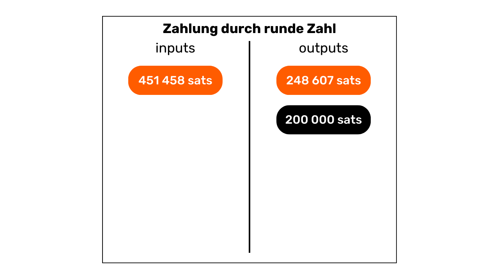

Durch Eliminierung, wenn eine Ausgabe die Zahlung darstellt, repräsentiert die andere das Wechselgeld. Es kann daher gefolgert werden, dass es wahrscheinlich ist, dass der Nutzer, der die Transaktion eingibt, immer noch den als Wechselgeld identifizierten Ausgang besitzt.

Es sollte beachtet werden, dass diese Heuristik nicht immer anwendbar ist, da die Mehrheit der Zahlungen immer noch in Fiat-Währungseinheiten getätigt wird. Tatsächlich, wenn ein Händler in Frankreich Bitcoin akzeptiert, zeigen sie in der Regel keine stabilen Preise in Sats an. Sie würden eher eine Umrechnung zwischen dem Preis in Euro und dem zu zahlenden Bitcoin-Betrag vorziehen. Daher sollte es keinen runden Betrag im Transaktionsausgang geben.

Dennoch könnte ein Analyst versuchen, diese Umrechnung unter Berücksichtigung des zum Zeitpunkt der Transaktion gültigen Wechselkurses vorzunehmen. Nehmen wir das Beispiel einer Transaktion mit einem Eingang von `97.552 Sats` und zwei Ausgängen, einem von `31.085 Sats` und dem anderen von `64.152 Sats`. Auf den ersten Blick scheint diese Transaktion keine runden Beträge zu beinhalten. Jedoch ergibt die Anwendung des Wechselkurses von €64.339 zum Zeitpunkt der Transaktion eine Umrechnung in Euro, die wie folgt aussieht:

- Ein Eingang von €62,76;
- Ein Ausgang von €20;
- Ein Ausgang von €41,27.
  Einmal in Fiat-Währung umgerechnet, ermöglicht diese Transaktion die Anwendung der Heuristik der Zahlungen mit runden Beträgen. Der Ausgang von €20 war wahrscheinlich für einen Händler bestimmt oder hat zumindest den Besitzer gewechselt. Durch Deduktion blieb der Ausgang von €41,27 wahrscheinlich im Besitz des ursprünglichen Nutzers.
  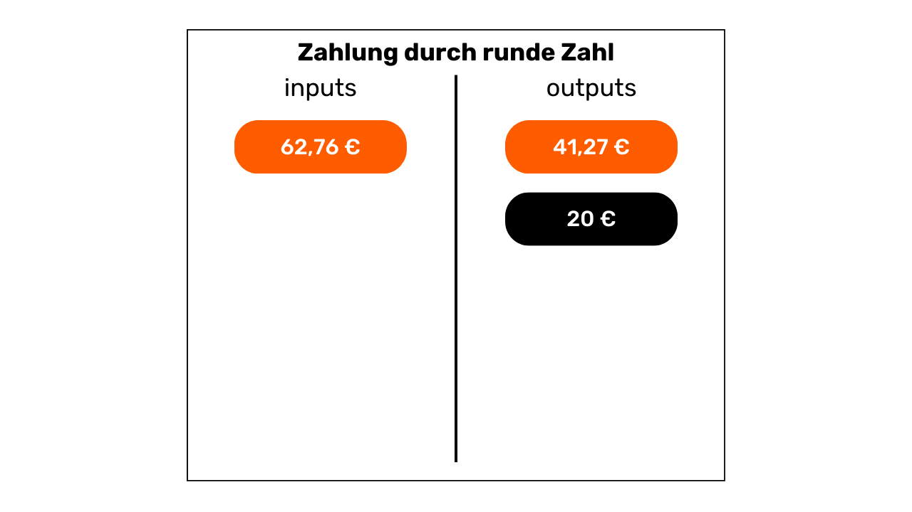

Wenn eines Tages Bitcoin zur bevorzugten Rechnungseinheit in unseren Transaktionen wird, könnte diese Heuristik noch nützlicher für die Analyse werden.

Hier ist zum Beispiel eine Transaktion, bei der diese Heuristik wahrscheinlich angewendet werden kann:

```plaintext
2bcb42fab7fba17ac1b176060e7d7d7730a7b807d470815f5034d52e96d2828a
```


Quelle: [Mempool.space](https://mempool.space/tx/2bcb42fab7fba17ac1b176060e7d7d7730a7b807d470815f5034d52e96d2828a)

### Der größte Output

Wenn eine ausreichend große Lücke zwischen zwei Transaktionsoutputs in einem einfachen Zahlungsmodell erkannt wird, kann geschätzt werden, dass der größere Output wahrscheinlich das Wechselgeld ist.

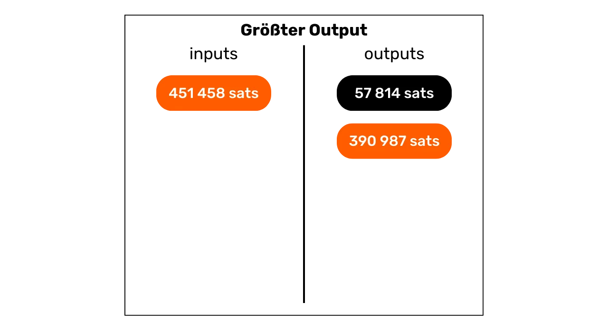

Diese Heuristik des größten Outputs ist wahrscheinlich die ungenaueste von allen. Wenn sie allein identifiziert wird, ist sie ziemlich schwach. Diese Eigenschaft kann jedoch mit anderen Heuristiken kombiniert werden, um die Unsicherheit unserer Interpretation zu verringern.

Zum Beispiel, wenn wir eine Transaktion untersuchen, die einen Output mit einem runden Betrag und einen anderen Output mit einem größeren Betrag aufweist, ermöglicht die gemeinsame Anwendung der Heuristik der runden Zahlungen und derjenigen bezüglich des größten Outputs, unser Unsicherheitsniveau zu reduzieren.

Hier ist zum Beispiel eine Transaktion, bei der diese Heuristik wahrscheinlich angewendet werden kann:

```plaintext
b79d8f8e4756d34bbb26c659ab88314c220834c7a8b781c047a3916b56d14dcf
```


Quelle: [Mempool.space](https://mempool.space/tx/b79d8f8e4756d34bbb26c659ab88314c220834c7a8b781c047a3916b56d14dcf)

## Externe Heuristiken

<chapterId>4a170e3b-200d-431a-8285-18a23ff617ba</chapterId>
Die Untersuchung externer Heuristiken beinhaltet die Analyse der Ähnlichkeiten, Muster und Merkmale bestimmter Elemente, die nicht inhärent zur Transaktion selbst sind. Mit anderen Worten, wenn wir uns zuvor darauf beschränkt haben, Elemente zu nutzen, die intrinsisch zur Transaktion gehören mit internen Heuristiken, erweitern wir nun unser Analysefeld auf die Transaktionsumgebung dank externer Heuristiken.

### Adresswiederverwendung

Dies ist eine der bekanntesten Heuristiken unter Bitcoin-Enthusiasten. Die Adresswiederverwendung ermöglicht es, eine Verbindung zwischen verschiedenen Transaktionen und verschiedenen UTXOs herzustellen. Sie wird beobachtet, wenn eine Bitcoin-Empfangsadresse mehrmals verwendet wird.

So ist es möglich, die Adresswiederverwendung innerhalb derselben Transaktion als interne Heuristik zu nutzen, um das Wechselgeld zu identifizieren (wie wir im vorherigen Kapitel gesehen haben). Die Adresswiederverwendung kann jedoch auch als externe Heuristik dienen, um die Einzigartigkeit einer Entität hinter mehreren Transaktionen zu erkennen.

Die Interpretation der Adresswiederverwendung ist, dass alle auf dieser Adresse gesperrten UTXOs derselben Entität gehören (oder gehört haben). Diese Heuristik lässt wenig Raum für Unsicherheit. Wenn es möglich ist, sie zu identifizieren, entspricht die darauffolgende Interpretation höchstwahrscheinlich der Realität. Sie ermöglicht somit die Gruppierung verschiedener Onchain-Aktivitäten.

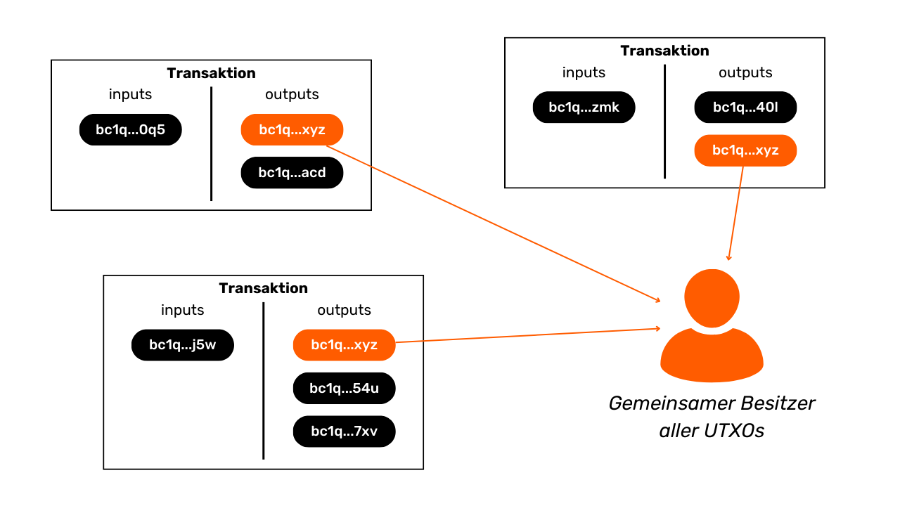

Wie in der Einleitung zu diesem Teil 3 erklärt, wurde diese Heuristik von Satoshi Nakamoto selbst entdeckt. Im White Paper erwähnt er speziell eine Lösung für Benutzer, um sie zu vermeiden, die einfach darin besteht, für jede neue Transaktion eine frische Adresse zu verwenden:

"_Als zusätzliche Firewall könnte für jede Transaktion ein neues Schlüsselpaar verwendet werden, um sie nicht mit einem gemeinsamen Besitzer in Verbindung zu bringen._"


Quelle: S. Nakamoto, "Bitcoin: A Peer-to-Peer Electronic Cash System", https://bitcoin.org/bitcoin.pdf, 2009.

Hier ist zum Beispiel eine Adresse, die in mehreren Transaktionen wiederverwendet wurde:

```plaintext
bc1qqtmeu0eyvem9a85l3sghuhral8tk0ar7m4a0a0
```


Quelle: [Mempool.space](https://mempool.space/address/bc1qqtmeu0eyvem9a85l3sghuhral8tk0ar7m4a0a0)

### Skriptähnlichkeit und Wallet-Fingerabdrücke

Neben der Wiederverwendung von Adressen gibt es zahlreiche andere Heuristiken, die es ermöglichen, Aktionen demselben Wallet oder einem Cluster von Adressen zuzuordnen.
Zuallererst kann ein Analyst von Ähnlichkeiten in der Verwendung von Skripten profitieren. Zum Beispiel können bestimmte Minderheitsskripte wie Multisig leichter identifiziert werden als SegWit V0-Skripte. Je größer die Gruppe, in der wir uns verstecken, desto schwieriger ist es, uns zu entdecken. Dies ist insbesondere der Grund, warum in guten Coinjoin-Protokollen alle Teilnehmer genau denselben Skripttyp verwenden.
Allgemeiner kann sich ein Analyst auch auf die charakteristischen Fingerabdrücke eines Wallets konzentrieren. Dies sind spezifische Prozesse, die mit einer Nutzung verbunden sind und die man zu identifizieren versuchen könnte, um sie als Verfolgungsheuristiken zu nutzen. Mit anderen Worten, wenn man eine Ansammlung derselben internen Merkmale bei Transaktionen beobachtet, die der verfolgten Entität zugeschrieben werden, kann man versuchen, diese gleichen Merkmale bei anderen Transaktionen zu identifizieren.

Zum Beispiel kann identifiziert werden, dass der verfolgte Benutzer systematisch sein Wechselgeld an P2TR-Adressen (`bc1p…`) sendet. Wiederholt sich dieser Prozess, kann er als Heuristik für die Fortsetzung unserer Analyse verwendet werden. Andere Fingerabdrücke können ebenfalls verwendet werden, wie die Reihenfolge der UTXOs, die Platzierung des Wechselgelds in den Ausgängen, das Signalisieren von RBF (Replace-by-Fee) oder sogar die Versionsnummer, das `nSequence`-Feld und das `nLockTime`-Feld.

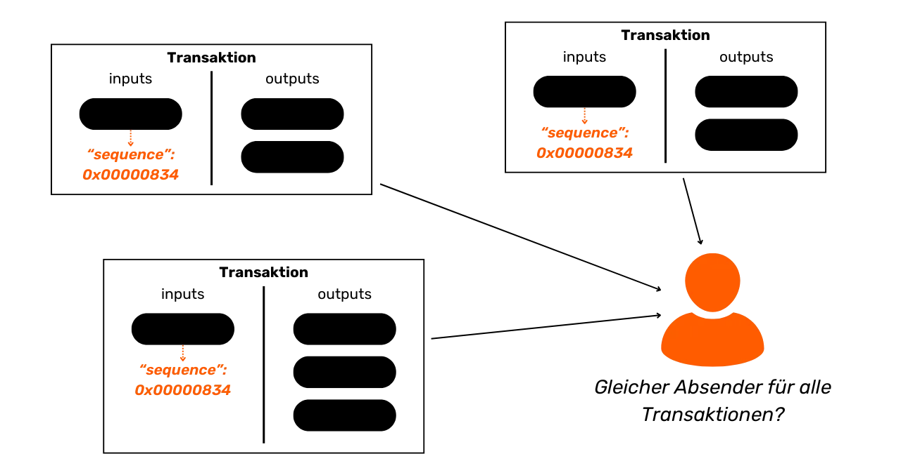

Wie [@LaurentMT](https://twitter.com/LaurentMT) in der [Space Kek #19](https://podcasters.spotify.com/pod/show/decouvrebitcoin/episodes/SpaceKek-19---Analyse-de-chane--anonsets-et-entropie-e1vfuji) (ein frankophoner Podcast) spezifiziert, nimmt der Nutzen von Wallet-Fingerabdrücken in der Kettenanalyse mit der Zeit deutlich zu. Tatsächlich betonen die wachsende Anzahl von Skripttypen und die zunehmend schrittweise Einführung dieser neuen Funktionen durch Wallet-Software die Unterschiede. Es kann sogar vorkommen, dass man mit Genauigkeit die von der verfolgten Entität verwendete Software identifizieren kann. Es ist daher wichtig zu verstehen, dass die Untersuchung eines Wallet-Fingerabdrucks besonders relevant für jüngste Transaktionen ist, mehr als für solche, die Anfang der 2010er Jahre initiiert wurden.

Zusammenfassend kann ein Fingerabdruck jede spezifische Praxis sein, die automatisch vom Wallet oder manuell vom Benutzer durchgeführt wird und die bei anderen Transaktionen gefunden werden kann, um uns in unserer Analyse zu unterstützen.

### Die Heuristik des gemeinsamen Eingentums an Eingaben (CIOH)

Die CIOH, für "Common Input Ownership Heuristic" auf Englisch, ist eine Heuristik, die besagt, dass, wenn eine Transaktion mehrere Eingaben umfasst, diese wahrscheinlich alle von einer einzigen Entität stammen. Folglich ist ihr Besitz gemeinsam.
Um die Common Input Ownership Heuristik (CIOH) anzuwenden, beobachten wir zunächst eine Transaktion, die mehrere Eingaben hat. Dies könnte so wenig wie 2 Eingaben oder so viele wie 30 Eingaben sein. Sobald diese Eigenschaft identifiziert ist, prüfen wir, ob die Transaktion nicht in ein bekanntes Transaktionsmodell passt. Zum Beispiel, wenn sie 5 Eingaben mit ungefähr dem gleichen Betrag und 5 Ausgaben mit genau dem gleichen Betrag hat, wissen wir, dass es die Struktur eines Coinjoin ist. Daher können wir die CIOH nicht anwenden.
Wenn die Transaktion jedoch in kein bekanntes Modell einer kollaborativen Transaktion passt, dann können wir folgern, dass alle Eingaben wahrscheinlich von derselben Entität stammen. Dies kann sehr nützlich sein, um einen bekannten Cluster zu erweitern oder die Nachverfolgung fortzusetzen.

Die CIOH wurde von Satoshi Nakamoto entdeckt. Er diskutiert sie in Teil 10 des White Papers:

"_[...] der Link ist unvermeidlich bei Multi-Input-Transaktionen, die notwendigerweise offenbaren, dass ihre Eingaben vom selben Besitzer gehalten wurden. Das Risiko besteht darin, dass, wenn der Besitzer eines Schlüssels enthüllt wird, die Links andere Transaktionen offenbaren können, die demselben Besitzer gehörten._"

Es ist besonders faszinierend festzustellen, dass Satoshi Nakamoto, noch vor dem offiziellen Start von Bitcoin, bereits die zwei Hauptanfälligkeiten in Bezug auf die Privatsphäre der Nutzer identifiziert hatte, nämlich die CIOH und die Wiederverwendung von Adressen. Eine solche Weitsicht ist bemerkenswert, da diese zwei Heuristiken auch heute noch die nützlichsten in der Kettenanalyse sind.

Um Ihnen ein Beispiel zu geben, hier ist eine Transaktion, bei der wir wahrscheinlich die CIOH anwenden können:

```plaintext
20618e63b6eed056263fa52a2282c8897ab2ee71604c7faccfe748e1a202d712
```

Quelle: [Mempool.space](https://mempool.space/tx/20618e63b6eed056263fa52a2282c8897ab2ee71604c7faccfe748e1a202d712)

### Offchain-Daten

Offensichtlich ist die Kettenanalyse nicht ausschließlich auf Onchain-Daten beschränkt. Jegliche Daten aus vorherigen Analysen oder die im Internet verfügbar sind, können ebenfalls verwendet werden, um eine Analyse zu verfeinern.
Zum Beispiel, wenn beobachtet wird, dass nachverfolgte Transaktionen systematisch von demselben Bitcoin-Knoten gesendet werden und dessen IP-Adresse identifiziert werden kann, könnte es möglich sein, andere Transaktionen derselben Entität zu erkennen, zusätzlich zur Bestimmung eines Teils der Identität des Senders. Obwohl diese Praxis nicht leicht zu erreichen ist, da sie den Betrieb vieler Knoten erfordert, ist es möglich, dass einige Unternehmen, die sich auf Kettenanalyse spezialisieren, sie einsetzen.

Der Analyst hat auch die Möglichkeit, sich auf zuvor veröffentlichte Open-Source-Analysen oder auf seine eigenen vorherigen Analysen zu stützen. Vielleicht findet man einen Ausgang, der auf einen Cluster von Adressen hinweist, der bereits identifiziert wurde. Manchmal ist es auch möglich, sich auf Ausgänge zu stützen, die auf eine Austauschplattform hinweisen, wobei die Adressen dieser Unternehmen im Allgemeinen bekannt sind.

Auf die gleiche Weise kann man eine Analyse durch Eliminierung durchführen. Zum Beispiel, wenn bei der Analyse einer Transaktion mit zwei Ausgängen einer von ihnen mit einem bereits bekannten, aber von der verfolgten Entität verschiedenen Adressencluster verknüpft ist, dann kann interpretiert werden, dass der andere Ausgang wahrscheinlich das Wechselgeld darstellt.

Kettenanalyse beinhaltet auch einen Teil von OSINT (_Open Source Intelligence_), der etwas allgemeiner mit Internetsuchen ist. Deshalb wird davon abgeraten, Empfangsadressen direkt in sozialen Medien oder auf einer Webseite zu veröffentlichen, ob unter einem Pseudonym oder nicht.


### Zeitliche Modelle

Es wird weniger häufig daran gedacht, aber bestimmte menschliche Verhaltensweisen sind on-chain erkennbar. Das nützlichste in der Analyse könnte Ihr Schlafmuster sein! Ja, wenn Sie schlafen, senden Sie vermutlich keine Bitcoin-Transaktionen. Da Sie im Allgemeinen zu den gleichen Stunden schlafen, ist es üblich, zeitliche Analysen in der Kettenanalyse zu verwenden. Dies beinhaltet einfach das Katalogisieren der Stunden, zu denen die Transaktionen einer gegebenen Entität im Bitcoin-Netzwerk übertragen werden. Die Analyse dieser zeitlichen Muster ermöglicht es uns, viele Informationen abzuleiten.
Zunächst erlaubt eine zeitliche Analyse manchmal, die Natur der verfolgten Entität zu identifizieren. Wenn beobachtet wird, dass Transaktionen konsequent über 24 Stunden gesendet werden, dann verrät dies eine starke wirtschaftliche Aktivität. Die Entität hinter diesen Transaktionen ist wahrscheinlich ein Unternehmen, möglicherweise international, und vielleicht mit automatisierten Verfahren intern.
Zum Beispiel hatte ich dieses Modell vor ein paar Monaten erkannt, indem ich [die Transaktion analysierte, die versehentlich 19 Bitcoins in Gebühren zugeteilt hatte](https://mempool.space/tx/d5392d474b4c436e1c9d1f4ff4be5f5f9bb0eb2e26b61d2781751474b7e870fd). Eine einfache zeitliche Analyse hatte mir erlaubt zu hypothetisieren, dass wir es mit einem automatisierten Dienst zu tun hatten, und daher wahrscheinlich eine große Entität wie eine Austauschplattform.
Tatsächlich wurde ein paar Tage später entdeckt, dass die Gelder zu PayPal gehörten, über die Austauschplattform Paxos.

Im Gegenteil, wenn wir sehen, dass das zeitliche Muster eher über 16 sehr spezifische Stunden verteilt ist, dann können wir schätzen, dass wir es mit einem individuellen Benutzer oder vielleicht einem lokalen Geschäft zu tun haben, abhängig von den gehandelten Volumen.

Über die Natur der beobachteten Entität hinaus kann das zeitliche Muster uns auch einen ungefähren Standort des Benutzers dank der Zeitzonen geben. Wir können somit andere Transaktionen verknüpfen und den Zeitstempel dieser als zusätzliche Heuristik verwenden, die zu unserer Analyse hinzugefügt werden kann.

Zum Beispiel, bei der wiederverwendeten Adresse, über die ich zuvor gesprochen habe, können wir beobachten, dass die Transaktionen, ob eingehend oder ausgehend, über ein 13-Stunden-Intervall konzentriert sind.

```plaintext
bc1qqtmeu0eyvem9a85l3sghuhral8tk0ar7m4a0a0
```


Quelle: OXT.me

Dieses Intervall entspricht wahrscheinlich Europa, Afrika oder dem Nahen Osten. Wir können daher schließen, dass der Benutzer hinter diesen Transaktionen dort lebt.

In einem anderen Register ist es auch eine zeitliche Analyse dieser Art, die die Hypothese erlaubte, dass Satoshi Nakamoto nicht aus Japan operierte, sondern tatsächlich aus den Vereinigten Staaten: [_Die Zeitzonen von Satoshi Nakamoto_](https://medium.com/@insearchofsatoshi/the-time-zones-of-satoshi-nakamoto-aa40f035178f)

## Praktische Anwendung mit einem Block Explorer

<chapterId>6493cf2f-225c-405f-9375-c4304f1087ed</chapterId>

In diesem letzten Kapitel werden wir die Konzepte, die wir bisher studiert haben, konkret anwenden. Ich werde Ihnen Beispiele für echte Bitcoin-Transaktionen präsentieren, und Sie müssen die Informationen extrahieren, die ich frage.
Idealerweise wäre für diese Übungen die Verwendung eines professionellen Chain-Analyse-Tools vorzuziehen. Da jedoch seit der Verhaftung der Schöpfer von Samourai Wallet das einzige kostenlose Analyse-Tool OXT.me nicht mehr verfügbar ist, werden wir uns für diese Übungen für einen klassischen Block-Explorer entscheiden. Ich empfehle die Verwendung von [Mempool.space](https://mempool.space/) aufgrund seiner zahlreichen Funktionen und der Bandbreite an Chain-Analyse-Tools, aber Sie können auch einen anderen Explorer wie [Bitcoin Explorer](https://bitcoinexplorer.org/) wählen. Um zu beginnen, werde ich die Übungen präsentieren. Verwenden Sie Ihren Block-Explorer, um sie zu bearbeiten und notieren Sie Ihre Antworten auf einem Stück Papier. Dann werde ich am Ende dieses Kapitels die Antworten geben, damit Sie Ihre Ergebnisse überprüfen und korrigieren können.

_Die Transaktionen, die für diese Übungen ausgewählt wurden, wurden ausschließlich aufgrund ihrer Merkmale in einer etwas zufälligen Weise gewählt. Dieses Kapitel dient ausschließlich Bildungs- und Informationszwecken. Ich möchte klarstellen, dass ich die Verwendung dieser Tools zu böswilligen Zwecken weder unterstütze noch fördere. Das Ziel ist es, Ihnen beizubringen, wie Sie sich gegen Chain-Analysen schützen können, und nicht, Analysen durchzuführen, um private Informationen anderer zu offenbaren._

### Übung 1

Zu analysierende Transaktions-ID:

```plaintext
3769d3b124e47ef4ffb5b52d11df64b0a3f0b82bb10fd6b98c0fd5111789bef7
```

Was ist der Name des Modells dieser Transaktion und welche plausiblen Interpretationen können allein durch die Untersuchung ihres Modells, also der Struktur der Transaktion, gezogen werden?

### Übung 2

Zu analysierende Transaktions-ID:

```plaintext
baa228f6859ca63e6b8eea24ffad7e871713749d693ebd85343859173b8d5c20
```

Was ist der Name des Modells dieser Transaktion und welche plausiblen Interpretationen können allein durch die Untersuchung ihres Modells, also der Struktur der Transaktion, gezogen werden?

### Übung 3

Zu analysierende Transaktions-ID:

```plaintext
3a9eb9ccc3517cc25d1860924c66109262a4b68f4ed2d847f079b084da0cd32b
```

Was ist das Modell dieser Transaktion?

Nachdem Sie ihr Modell identifiziert haben, welcher Ausgang repräsentiert wahrscheinlich das Wechselgeld, basierend auf den internen Heuristiken der Transaktion?

### Übung 4

Zu analysierende Transaktions-ID:

```plaintext
35f0b31c05503ebfdf7311df47f68a048e992e5cf4c97ec34aa2833cc0122a12
```

Was ist das Modell dieser Transaktion?
Nachdem Sie ihr Modell identifiziert haben, welcher Ausgang repräsentiert wahrscheinlich das Wechselgeld, basierend auf den internen Heuristiken der Transaktion?

### Übung 5

Stellen Sie sich vor, Loïc hat eine seiner Bitcoin-Empfangsadressen im sozialen Netzwerk Twitter gepostet:


```plaintext
bc1qja0hycrv7g9ww00jcqanhfpqmzx7luqalum3vu
```

Unter Verwendung **nur der Heuristik der Adresswiederverwendung**, welche Bitcoin-Transaktionen können wir mit Loïcs Identität verknüpfen?

_Offensichtlich bin ich nicht der echte Besitzer dieser Empfangsadresse und habe sie nicht in sozialen Netzwerken gepostet. Es ist eine Adresse, die ich zufällig aus der Blockchain ausgewählt habe._

### Übung 6

Im Anschluss an Übung 5 konnten Sie dank der Heuristik der Adresswiederverwendung mehrere Bitcoin-Transaktionen identifizieren, an denen Loïc anscheinend beteiligt war. Normalerweise sollten Sie unter den identifizierten Transaktionen diese hier entdeckt haben:

```plaintext
2d9575553c99578268ffba49a1b2adc3b85a29926728bd0280703a04d051eace
```

Diese Transaktion ist die allererste, die Gelder an Loïcs Adresse sendet. Ihrer Meinung nach, woher kommen die Bitcoins, die Loïc durch diese Transaktion erhält?

### Übung 7

Nach Übung 5 konnten Sie dank der Heuristik der Adresswiederverwendung mehrere Bitcoin-Transaktionen identifizieren, in die Loïc anscheinend involviert ist. Nun möchten Sie herausfinden, woher Loïc stammt. Basierend auf den gefundenen Transaktionen führen Sie eine zeitliche Analyse durch, um die wahrscheinliche Zeitzone zu finden, die von Loïc verwendet wird. Bestimmen Sie anhand dieser Zeitzone einen Ort, an dem Loïc zu leben scheint (Land, Bundesland/Region, Stadt...).


### Übung 8

Hier ist die zu untersuchende Bitcoin-Transaktion:

```plaintext
bb346dae645d09d32ed6eca1391d2ee97c57e11b4c31ae4325bcffdec40afd4f
```

Wenn wir nur diese Transaktion beobachten, welche Informationen können wir interpretieren?

### Lösungen zu den Übungen

**_Übung 1:_**
Das Modell dieser Transaktion ist das eines einfachen Zahlungsvorgangs. Wenn wir nur ihre Struktur studieren, können wir interpretieren, dass eine Ausgabe das Wechselgeld und die andere Ausgabe eine tatsächliche Zahlung darstellt. Wir wissen daher, dass der beobachtete Nutzer wahrscheinlich nicht mehr im Besitz eines der beiden UTXOs in den Ausgaben ist (das für die Zahlung), aber immer noch im Besitz des anderen UTXOs (das für das Wechselgeld).

**_Übung 2:_**
Das Modell dieser Transaktion ist das eines Batch-Spendings. Dieses Modell deutet wahrscheinlich auf eine signifikante wirtschaftliche Aktivität hin, wie zum Beispiel eine Austauschplattform. Wir können ableiten, dass das UTXO in der Eingabe von einem Unternehmen mit signifikanter wirtschaftlicher Aktivität stammt und dass die UTXOs in den Ausgaben sich verteilen werden. Einige werden zu Kunden des Unternehmens gehören, die ihre Bitcoins in Wallets zur Selbstverwahrung abgezogen haben. Andere könnten zu Partnerunternehmen gehen. Schließlich wird es sicherlich ein Wechselgeld geben, das an das ausstellende Unternehmen zurückgeht.

**_Übung 3:_**

Das Modell dieser Transaktion ist das eines einfachen Zahlungsvorgangs. Daher können wir interne Heuristiken auf die Transaktion anwenden, um zu versuchen, das Wechselgeld zu identifizieren.

Ich habe persönlich mindestens zwei interne Heuristiken identifiziert, die dieselbe Hypothese unterstützen:

- Die Wiederverwendung desselben Skripttyps;
- Die größte Ausgabe.

Die offensichtlichste Heuristik ist die Wiederverwendung desselben Skripttyps. Tatsächlich ist Ausgabe `0` ein `P2SH`, erkennbar an seiner Empfangsadresse, die mit `3` beginnt:

```plaintext
3Lcdauq6eqCWwQ3UzgNb4cu9bs88sz3mKD
```

Während Ausgabe `1` ein `P2WPKH` ist, erkennbar an seiner Adresse, die mit `bc1q` beginnt:

```plaintext
bc1qya6sw6sta0mfr698n9jpd3j3nrkltdtwvelywa
```

Das UTXO, das in der Eingabe für diese Transaktion verwendet wird, verwendet ebenfalls ein `P2WPKH`-Skript:

```plaintext
bc1qyfuytw8pcvg5vx37kkgwjspg73rpt56l5mx89k
```

Daher können wir annehmen, dass Ausgabe `0` einer Zahlung entspricht und dass Ausgabe `1` das Wechselgeld der Transaktion ist, was bedeuten würde, dass der Nutzer in der Eingabe immer noch Eigentümer von Ausgabe `1` ist.
Um diese Hypothese zu unterstützen oder zu widerlegen, können wir nach weiteren Heuristiken suchen, die entweder unsere Annahme bestätigen oder die Wahrscheinlichkeit verringern, dass unsere Hypothese korrekt ist.
Ich habe mindestens eine weitere Heuristik entdeckt. Es ist der größte Output. Output `0` misst `123,689 Sats`, während Output `1` `505,839 Sats` misst. Es besteht also ein signifikanter Unterschied zwischen diesen beiden Outputs. Die Heuristik des größten Outputs legt nahe, dass der voluminöseste Output wahrscheinlich das Wechselgeld ist. Diese Heuristik stärkt somit unsere anfängliche Hypothese weiter.

Es scheint wahrscheinlich, dass der Benutzer, der das UTXO als Eingabe bereitgestellt hat, immer noch Output `1` hält, der den Wechsel der Transaktion zu verkörpern scheint.

**_Übung 4:_**
Das Modell dieser Transaktion ist das einer einfachen Zahlung. Daher können wir interne Heuristiken auf die Transaktion anwenden, um zu versuchen, das Wechselgeld zu identifizieren.
Ich habe persönlich mindestens zwei interne Heuristiken identifiziert, die dieselbe Hypothese unterstützen:

- Die Wiederverwendung desselben Skripttyps;
- Der Output eines runden Betrags.

Die offensichtlichste Heuristik ist die Wiederverwendung desselben Skripttyps. Tatsächlich ist Output `0` ein `P2SH`, erkennbar an seiner Empfangsadresse, die mit `3` beginnt:

```plaintext
3FSH5Mnq6S5FyQoKR9Yjakk3X4KCGxeaD4
```

Während Output `1` ein `P2WPKH` ist, identifizierbar durch seine Adresse, die mit `bc1q` beginnt:

```plaintext
bc1qvdywdcfsyavt4v8uxmmrdt6meu4vgeg439n7sg
```

Das als Eingabe für diese Transaktion verwendete UTXO verwendet ebenfalls ein `P2WPKH`-Skript:

```plaintext
bc1qku3f2y294h3ks5eusv63dslcua2xnlzxx0k6kp
```

Daher können wir annehmen, dass Output `0` einer Zahlung entspricht und dass Output `1` das Wechselgeld der Transaktion ist, was bedeuten würde, dass der Benutzer in der Eingabe immer noch Output `1` besitzt.

Um diese Hypothese zu unterstützen oder zu widerlegen, können wir nach weiteren Heuristiken suchen, die entweder unsere Annahme bestätigen oder die Wahrscheinlichkeit verringern, dass unsere Hypothese korrekt ist.

Ich habe mindestens eine weitere Heuristik entdeckt. Es ist der Output eines runden Betrags. Output `0` misst `70,000 Sats`, während Output `1` `22,962 Sats` misst. Daher befinden wir uns in der Gegenwart eines Outputs, der perfekt rund in der BTC-Rechnungseinheit ist. Die Heuristik des runden Outputs legt nahe, dass das UTXO mit einem runden Betrag wahrscheinlich die Zahlung ist und durch Eliminierung das andere das Wechselgeld darstellt. Diese Heuristik stärkt somit unsere anfängliche Hypothese weiter.

In diesem Beispiel könnte jedoch eine weitere Heuristik unsere anfängliche Hypothese in Frage stellen. Tatsächlich ist Output `0` größer als Output `1`. Wenn wir uns auf die Heuristik stützen, dass der größte Output in der Regel das Wechselgeld ist, könnten wir ableiten, dass Output `0` das Wechselgeld ist. Diese Gegenhypothese scheint jedoch unplausibel, da die beiden anderen Heuristiken wesentlich überzeugender erscheinen als die des größten Outputs. Folglich scheint es vernünftig, unsere anfängliche Hypothese trotz dieses scheinbaren Widerspruchs beizubehalten.
Es scheint daher wahrscheinlich, dass der Benutzer, der das UTXO als Eingabe bereitgestellt hat, immer noch den `1` Output hält, der den Wechsel der Transaktion zu repräsentieren scheint.
**_Übung 5:_**
Wir können sehen, dass 8 Transaktionen mit Loïcs Identität in Verbindung gebracht werden können. Unter diesen sind 4, die das Empfangen von Bitcoins beinhalten:

```
2d9575553c99578268ffba49a1b2adc3b85a29926728bd0280703a04d051eace
8b70bd322e6118b8a002dbdb731d16b59c4a729c2379af376ae230cf8cdde0dd
d5864ea93e7a8db9d3fb113651d2131567e284e868021e114a67c3f5fb616ac4
bc4dcf2200c88ac1f976b8c9018ce70f9007e949435841fc5681fd33308dd762
```

Die anderen 4 beinhalten das Versenden von Bitcoins:

```plaintext
8b52fe3c2cf8bef60828399d1c776c0e9e99e7aaeeff721fff70f4b68145d540
c12499e9a865b9e920012e39b4b9867ea821e44c047d022ebb5c9113f2910ed6
a6dbebebca119af3d05c0196b76f80fdbf78f20368ebef1b7fd3476d0814517d
3aeb7ce02c35eaecccc0a97a771d92c3e65e86bedff42a8185edd12ce89d89cc
```

**_Übung 6:_**
Betrachtet man das Modell dieses Vorgangs, so wird deutlich, dass es sich um eine gruppierte Ausgabe handelt. In der Tat hat die Transaktion einen einzigen Input und 51 Outputs, was auf eine bedeutende wirtschaftliche Aktivität hinweist. Wir können daher die Hypothese aufstellen, dass Loïc Bitcoins von einer Tauschplattform abgehoben hat.

Mehrere Elemente untermauern diese Hypothese. Erstens handelt es sich bei der Art des Skripts, das zur Sicherung der UTXO-Eingabe verwendet wird, um ein 2/3-Multisig-P2SH-Skript, was auf ein für Tauschplattformen typisches fortgeschrittenes Sicherheitsniveau hindeutet:

```plaintext
OP_PUSHNUM_2
OP_PUSHBYTES_33 03eae02975918af86577e1d8a257773118fd6ceaf43f1a543a4a04a410e9af4a59
OP_PUSHBYTES_33 03ba37b6c04aaf7099edc389e22eeb5eae643ce0ab89ac5afa4fb934f575f24b4e
OP_PUSHBYTES_33 03d95ef2dc0749859929f3ed4aa5668c7a95baa47133d3abec25896411321d2d2d
OP_PUSHNUM_3
OP_CHECKMULTISIG
```

Darüber hinaus wird die analysierte Adresse "3PUv9tQMSDCEPSMsYSopA5wDW86pwRFbNF" in mehr als 220.000 verschiedenen Transaktionen wiederverwendet, was häufig für Tauschbörsen charakteristisch ist, die sich im Allgemeinen nicht um ihre Privatsphäre kümmern. Die zeitliche Heuristik, die auf diese Adresse angewandt wird, zeigt ebenfalls eine regelmäßige Verteilung von Transaktionen fast täglich über einen Zeitraum von drei Monaten, mit ausgedehnten Stunden über 24 Stunden, was auf die kontinuierliche Aktivität einer Tauschplattform hindeutet.

Schließlich sind die von dieser Einrichtung verarbeiteten Mengen enorm. So hat die Adresse zwischen Dezember 2022 und März 2023 bei 222.262 Transaktionen 44 BTC empfangen und versendet. Diese beträchtlichen Volumina bestätigen die wahrscheinliche Aktivität einer Tauschplattform.

**_Übung 7:_**
Bei der Analyse der Bestätigungszeiten der Transaktionen lassen sich die folgenden UTC-Zeiten feststellen:

```plaintext
05:43
20:51
18:12
17:16
04:28
23:38
07:45
21:55
```

Die Analyse dieser Zeiten zeigt, dass die Zeitzonen UTC-7 und UTC-8 in den meisten Fällen mit den üblichen menschlichen Aktivitäten (zwischen 08:00 und 23:00 Uhr) übereinstimmen:

```plaintext
05:43 UTC > 22:43 UTC-7
20:51 UTC > 13:51 UTC-7
18:12 UTC > 11:12 UTC-7
17:16 UTC > 10:16 UTC-7
04:28 UTC > 21:28 UTC-7
23:38 UTC > 16:38 UTC-7
07:45 UTC > 00:45 UTC-7
21:55 UTC > 14:55 UTC-7

05:43 UTC > 21:43 UTC-8
20:51 UTC > 12:51 UTC-8
18:12 UTC > 10:12 UTC-8
17:16 UTC > 09:16 UTC-8
04:28 UTC > 20:28 UTC-8
23:38 UTC > 15:38 UTC-8
07:45 UTC > 23:45 UTC-8
21:55 UTC > 13:55 UTC-8
```


Die Zeitzone UTC-7 ist besonders im Sommer relevant, da sie Staaten und Regionen wie:

- Kalifornien (mit Städten wie Los Angeles, San Francisco und San Diego);
- Nevada (mit Las Vegas);
- Oregon (mit Portland);
- Washington (mit Seattle);
- Die kanadische Region British Columbia (mit Städten wie Vancouver und Victoria).

Diese Informationen deuten darauf hin, dass Loïc plausibel an der Westküste der Vereinigten Staaten oder Kanadas wohnen könnte.

**_Übung 8:_**
Die Analyse dieser Transaktion offenbart 5 Eingänge und einen einzigen Ausgang, was auf eine Konsolidierung hindeutet. Die Anwendung der CIOH-Heuristik legt nahe, dass alle UTXOs in den Eingängen von einer einzigen Entität gehalten werden und dass das UTXO im Ausgang ebenfalls zu dieser Entität gehört. Es scheint, dass der Benutzer beschlossen hat, mehrere UTXOs, die sie besaßen, in einem einzigen UTXO im Ausgang zu konsolidieren, mit dem Ziel, ihre Münzen zu konsolidieren. Dieser Ansatz wurde wahrscheinlich durch den Wunsch motiviert, die niedrigen Transaktionsgebühren zu diesem Zeitpunkt zu nutzen, um zukünftige Gebühren zu reduzieren.

---

_Für das Verfassen dieses Teils 3 der Kettenanalyse stützte ich mich auf die folgenden Ressourcen:_

- _Die Serie von vier Artikeln mit dem Namen: [Understanding Bitcoin Privacy with OXT](https://medium.com/oxt-research/understanding-bitcoin-privacy-with-oxt-part-1-4-8177a40a5923), produziert von Samourai Wallet im Jahr 2021;_
- _Die verschiedenen Berichte von [OXT Research](https://medium.com/oxt-research), sowie deren kostenloses Kettenanalyse-Tool (das momentan nicht verfügbar ist, nach der Verhaftung der Gründer von Samourai Wallet);_
- _Im Allgemeinen stammt mein Wissen aus den verschiedenen Tweets und Inhalten von [@LaurentMT](https://twitter.com/LaurentMT) und [@ErgoBTC](https://twitter.com/ErgoBTC);_
- \_Der [Space Kek #19](https://podcasters.spotify.com/pod/show/decouvrebitcoin/episodes/SpaceKek-19---Analyse-de-chane--anonsets-et-entropie-e1vfuji), an dem ich neben [@louneskmt](https://twitter.com/louneskmt), [@TheoPantamis](https://twitter.com/TheoPantamis), [@Sosthene\_\_\_](https://twitter.com/Sosthene___) und [@LaurentMT](https://twitter.com/LaurentMT) teilgenommen habe.\_
  _Ich möchte ihren Autoren, Entwicklern und Produzenten danken. Dank auch an die Rezensenten, die den Artikel, der als Grundlage für diesen Teil 3 diente, sorgfältig korrigiert und mich mit ihrem Expertenrat geehrt haben:_
- _[Gilles Cadignan](https://twitter.com/gillesCadignan);_
- _[Ludovic Lars](https://viresinnumeris.fr/)._

# Beherrschung der besten Praktiken zum Schutz Ihrer Privatsphäre

<partId>9bd04b63-f1af-4e50-9061-6bc90009df68</partId>

## Wiederverwendung von Adressen

<chapterId>f3e97645-3df3-41bc-a4ed-d2c740113d96</chapterId>
Nachdem wir die Techniken studiert haben, die Ihre Privatsphäre bei Bitcoin gefährden können, werden wir in diesem dritten Teil nun die besten Praktiken betrachten, die man anwenden sollte, um sich zu schützen. Dieser Teil zielt nicht darauf ab, Methoden zur Verbesserung der Privatsphäre zu erforschen, ein Thema, das später behandelt wird, sondern zu verstehen, wie man korrekt mit Bitcoin interagiert, um die Privatsphäre, die es von Natur aus bietet, zu bewahren, ohne auf zusätzliche Techniken zurückzugreifen.
Offensichtlich werden wir zu Beginn dieses dritten Teils über die Wiederverwendung von Adressen sprechen. Dieses Phänomen stellt die Hauptbedrohung für die Privatsphäre der Nutzer dar. Daher ist dieses Kapitel wohl das wichtigste des gesamten Trainings.

### Was ist eine Empfangsadresse?

Eine Bitcoin-Empfangsadresse ist eine Zeichenfolge oder ein Kennzeichen, das verwendet wird, um Bitcoins in einer Wallet zu empfangen.

Technisch gesehen "empfängt" eine Bitcoin-Empfangsadresse keine Bitcoins im wörtlichen Sinne, sondern definiert die Bedingungen, unter denen Bitcoins ausgegeben werden können. Speziell, wenn eine Zahlung an Sie gesendet wird, erstellt die Transaktion des Senders ein neues UTXO für Sie im Output aus den UTXOs, die es in Inputs verbraucht hat. Auf diesem Output wird ein Skript angewendet, das definiert, wie dieses UTXO später ausgegeben werden kann. Dieses Skript ist bekannt als "_ScriptPubKey_" oder "_Locking Script_". Ihre Empfangsadresse, genauer gesagt ihr Payload, ist in dieses Skript integriert. Vereinfacht ausgedrückt, besagt dieses Skript:

> "_Um dieses neue UTXO auszugeben, muss eine digitale Signatur mit dem privaten Schlüssel, der mit dieser Empfangsadresse verknüpft ist, bereitgestellt werden._"


Bitcoin-Adressen gibt es in verschiedenen Typen, abhängig vom verwendeten Skriptmodell. Die ersten Modelle, bekannt als "_Legacy_", umfassen `P2PKH` (_Pay-to-PubKey-Hash_) und `P2SH` (_Pay-to-Script-Hash_) Adressen. P2PKH-Adressen beginnen immer mit `1` und P2SH mit `3`. Obwohl sie immer noch sicher sind, gelten diese Formate mittlerweile als veraltet, da sie höhere Transaktionsgebühren verursachen und im Vergleich zu den neuen Standards weniger Privatsphäre bieten.
Die SegWit V0 (`P2WPKH` und `P2WSH`) und Taproot / SegWit V1 (`P2TR`) Adressen repräsentieren die modernen Formate. SegWit-Adressen beginnen mit `bc1q` und Taproot-Adressen, eingeführt im Jahr 2021, beginnen mit `bc1p`.
Zum Beispiel, hier ist eine Taproot-Empfangsadresse:

```text
bc1ps5gd2ys8kllz9alpmcwxqegn7kl3elrpnnlegwkm3xpq2h8da07spxwtf5
```

Die Art und Weise, wie das ScriptPubKey konstruiert wird, hängt von dem Standard ab, den Sie verwenden:
| Script-Modell | ScriptPubKey || ---------------- | ----------------------------------------------------------- |
| P2PKH | OP_DUP OP_HASH160 `<pubKeyHash>` OP_EQUALVERIFY OP_CHECKSIG |
| P2SH | OP_HASH160 `<scriptHash>` OP_EQUAL |
| P2WPKH | 0 `<pubKeyHash>` |
| P2WSH | 0 `<witnessScriptHash>` |
| P2SH - P2WPKH | OP_HASH160 `<redeemScriptHash>` OP_EQUAL |
| P2SH - P2WSH | OP_HASH160 `<redeemScriptHash>` OP_EQUAL |
| P2TR | 1 `<pubKey>` |

Bezüglich der Konstruktion von Empfangsadressen hängt es ebenfalls vom gewählten Script-Modell ab:

- Für `P2PKH` und `P2WPKH` Adressen repräsentiert die Nutzlast, also der Kern der Adresse, den Hash des öffentlichen Schlüssels;
- Für `P2SH` und `P2WSH` Adressen repräsentiert die Nutzlast den Hash eines Skripts;
- Bei `P2TR` Adressen ist die Nutzlast ein modifizierter öffentlicher Schlüssel. `P2TR` Ausgaben kombinieren Aspekte von _Pay-to-PubKey_ und _Pay-to-Script_. Der modifizierte öffentliche Schlüssel ist das Ergebnis der Addition eines klassischen Ausgaben-öffentlichen Schlüssels mit einer "Modifikation", abgeleitet aus der Merkle-Wurzel eines Sets von Skripten, die ebenfalls zum Ausgeben von Bitcoins verwendet werden können.

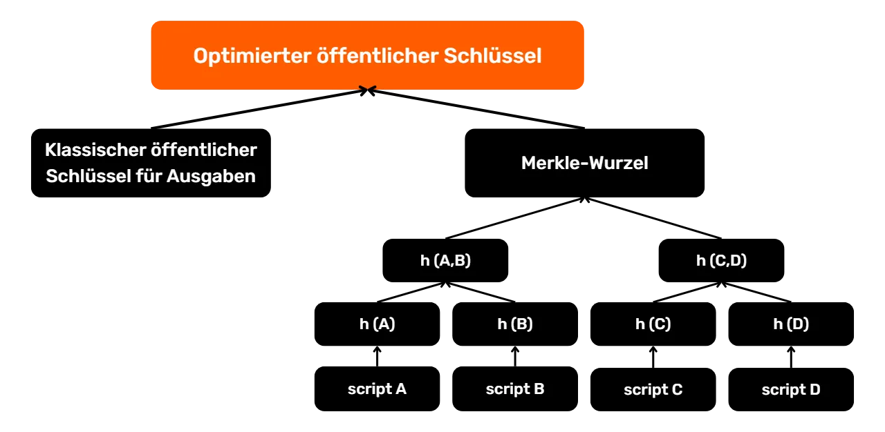

Die Adressen, die in Ihrer Wallet-Software angezeigt werden, enthalten auch einen HRP (_Human-Readable Part_), typischerweise `bc` für Post-SegWit-Adressen, einen Separator `1` und eine Versionsnummer `q` für SegWit V0 und `p` für Taproot/SegWit V1. Eine Prüfsumme wird ebenfalls hinzugefügt, um die Integrität und Gültigkeit der Adresse während ihrer Übertragung sicherzustellen.

Schließlich werden Adressen in ein Standardformat gebracht:

- Base58check für alte Legacy-Adressen;
- Bech32 für SegWit-Adressen;
- Bech32m für Taproot-Adressen.

Hier ist die Additions-Matrix für die Bech32- und Bech32m-Formate (SegWit und Taproot) von Basis 10:

| +   | 0   | 1   | 2   | 3   | 4   | 5   | 6   | 7   |
| --- | --- | --- | --- | --- | --- | --- | --- | --- | --- | --- | --- | --- | --- | --- | --- | --- | --- | --- |
| 0   | q   | p   | z   | r   | y   | 9   | x   | 8   |
| 8   | g   | f   | 2   | t   | v   | d   | w   | 0   |
| 16  | s   | 3   | j   | n   | 5   | 4   | k   | h   |     | 24  | c   | e   | 6   | m   | u   | a   | 7   | l   |

### Was ist Adresswiederverwendung?

Adresswiederverwendung bezieht sich auf die Praxis, dieselbe Empfangsadresse zu verwenden, um mehrere unterschiedliche UTXOs zu blockieren.

Wie wir im vorherigen Abschnitt gesehen haben, hat jedes UTXO sein eigenes ScriptPubKey, das es sperrt und erfüllt sein muss, damit das UTXO als Eingabe in einer neuen Transaktion verbraucht werden kann. Innerhalb dieses ScriptPubKey werden die Empfangsadressen (Payload) integriert.

Wenn verschiedene ScriptPubKeys dieselbe Empfangsadresse enthalten, spricht man von Adresswiederverwendung. In der Praxis bedeutet dies, dass ein Benutzer dieselbe Adresse mehrmals an Sender angegeben hat, um Bitcoins durch mehrere Zahlungen zu erhalten. Und tatsächlich ist diese Praxis katastrophal für Ihre Privatsphäre.

### Warum ist Adresswiederverwendung ein Problem?

Da die Blockchain öffentlich ist, ist es leicht zu sehen, welche Adressen welche UTXOs sperren und wie viele Bitcoins. Wenn dieselbe Adresse für mehrere Transaktionen verwendet wird, wird es möglich zu deduzieren, dass alle mit dieser Adresse verbundenen Bitcoins derselben Person gehören. Diese Praxis gefährdet die Privatsphäre des Benutzers, indem sie deterministische Verbindungen zwischen verschiedenen Transaktionen herstellt und das Nachverfolgen der Bitcoins auf der Blockchain ermöglicht. Satoshi Nakamoto selbst hob dieses Problem im Bitcoin-Whitepaper hervor:

> _Als zusätzliche Firewall könnte für jede Transaktion ein neues Schlüsselpaar verwendet werden, um sie nicht mit einem gemeinsamen Eigentümer in Verbindung zu bringen._


Quelle: S. Nakamoto, "Bitcoin: A Peer-to-Peer Electronic Cash System", https://bitcoin.org/bitcoin.pdf, 2009.

Das Ziel, das Satoshi mit dieser Aussage verfolgte, war die Schaffung einer zusätzlichen Firewall im Falle einer Verbindung zwischen der Identität des Benutzers und einem Schlüsselpaar auf Bitcoin, um zu vermeiden, dass all ihre Aktivitäten öffentlich mit ihrer Identität verknüpft werden. Heute, mit der Verbreitung von Chain-Analyse-Unternehmen und KYC-Regelungen, ist die Verwendung einzigartiger Adressen nicht mehr nur eine "zusätzliche Firewall", sondern eine notwendige Praxis für jeden, der seine Privatsphäre minimal bewahren möchte.

Wenn Sie eine Adresse wiederverwenden, stellen Sie eine fast unbestreitbare Verbindung zwischen allen Transaktionen her, die mit dieser Adresse verbunden sind. Obwohl dies Ihre Mittel nicht direkt gefährdet, da die Kryptographie auf elliptischen Kurven die Sicherheit Ihrer privaten Schlüssel gewährleistet, erleichtert es die Überwachung Ihrer Aktivitäten. Tatsächlich kann jeder mit einem Knoten die Transaktionen und Salden von Adressen beobachten und somit Ihre Anonymität vollständig kompromittieren.


Um diesen Punkt zu veranschaulichen, nehmen wir das Beispiel von Bob, einem Benutzer, der regelmäßig in kleinen Beträgen Bitcoins kauft durch DCA (Dollar Cost Averaging) und sie immer an dieselbe Adresse sendet. Nach zwei Jahren enthält diese Adresse eine erhebliche Menge an Bitcoins. Wenn Bob diese Adresse verwendet, um eine Zahlung an einen lokalen Händler zu tätigen, könnte dieser alle zugehörigen Mittel sehen und Bobs Vermögen ableiten. Dies könnte zu persönlichen Sicherheitsrisiken führen, einschließlich Versuchen von Diebstahl oder Erpressung. Hätte Bob für jeden periodischen Kauf eine frische Adresse verwendet, hätte er seinem Händler unendlich weniger Informationen preisgegeben.

In der Kettenanalyse unterscheiden wir zwischen 2 Arten der Adresswiederverwendung:

- Externe Wiederverwendung;
- Interne Wiederverwendung innerhalb einer Transaktion.

Die erste wird beobachtet, wenn eine Adresse in mehreren verschiedenen Bitcoin-Transaktionen wiederverwendet wird. Das ist das, was wir zuvor besprochen haben: Diese Heuristik ermöglicht es uns zu deduzieren, dass alle UTXOs, die durch diese Adresse gegangen sind, einer einzigen Entität gehören.
Interne Adresswiederverwendung wird nicht beobachtet, wenn die Wiederverwendung über mehrere Transaktionen hinweg erfolgt, sondern wenn sie innerhalb derselben Transaktion auftritt. Tatsächlich, wenn dieselbe Adresse, die verwendet wurde, um einen Input zu sperren, als Output in einer Transaktion verwendet wird, dann können wir ableiten, dass dieser Output immer noch demselben Benutzer gehört (Wechselgeld), und dass der zweite Output die eigentliche Zahlung darstellt. Diese weitere Heuristik ermöglicht die Verfolgung von Geldern über mehrere Transaktionen hinweg.


Die Wiederverwendung von Adressen ist ein echtes Übel bei Bitcoin. Laut der Website OXT.me (derzeit nicht zugänglich) lag die Gesamtrate der Adresswiederverwendung bei Bitcoin im Jahr 2022 bei etwa 52%:


Diese Rate ist enorm, aber sie stammt überwiegend von Handelsplattformen und nicht von einzelnen Benutzern.

### Wie kann man Adresswiederverwendung vermeiden?

Die Vermeidung von Adresswiederverwendung ist ziemlich einfach: **verwenden Sie einfach für jede neue eingehende Zahlung an Ihr Wallet eine neue, frische Adresse**.

Dank BIP32 sind moderne Wallets nun deterministisch und hierarchisch. Das bedeutet, dass ein Benutzer eine große Anzahl von Adressen aus einem einzigen anfänglichen Informationsstück generieren kann: dem Seed. Indem man diese einzelne Information speichert, ist es möglich, alle privaten Schlüssel des Wallets wiederherzustellen und somit auf die durch die entsprechenden Adressen gesicherten Gelder zuzugreifen.


Das ist der Grund, warum Ihnen jedes Mal, wenn Sie den "_empfangen_" Knopf in Ihrer Wallet-Software drücken, eine unbenutzte Empfangsadresse angeboten wird. Nachdem Sie Bitcoins auf dieser Adresse erhalten haben, schlägt die Software automatisch eine neue vor.

> _PS: Kürzlich haben einige Wallet-Software angekündigt, ihre Absicht, leere Adressen zu generieren, einzustellen, aus Angst, dies könnte von den Behörden als eine Form der Geldwäsche wahrgenommen werden. Wenn Ihre Software zu diesen gehört, rate ich Ihnen dringend, sie sofort zu ersetzen, da dies für den Benutzer nicht akzeptabel ist._

Wenn Sie einen statischen Identifikator benötigen, um Zahlungen zu erhalten, wie zum Beispiel für Spenden, wird davon abgeraten, eine klassische Bitcoin-Adresse aufgrund des Risikos der Wiederverwendung zu verwenden. Bevorzugen Sie die Verwendung einer Lightning-Adresse oder für einen statischen Onchain-Zahlungsidentifikator können Sie sich für BIP47 oder Silent Payments entscheiden. Die Funktionsweise dieser Protokolle wird in Teil 6 dieses Trainings detailliert beschrieben.

## Beschriftung und Coin-Kontrolle

<chapterId>fbdb07cd-c025-48f2-97b0-bd1bc21c68a8</chapterId>

Wie wir im Teil über Kettenanalyse entdeckt haben, gibt es eine Vielzahl von Heuristiken und Mustern, die verwendet werden können, um Informationen über eine Transaktion abzuleiten. Als Benutzer ist es wichtig, sich dieser Techniken bewusst zu sein, um sich besser schützen zu können.

Dies beinhaltet insbesondere ein rigoroses Management Ihres Selbstverwahrungs-Wallets, das das Kennen der Herkunft Ihrer UTXOs sowie eine durchdachte Auswahl von UTXOs zum Verbrauch während Zahlungen umfasst. Dieses effektive Wallet-Management stützt sich auf zwei wichtige Funktionen guter Bitcoin-Wallets: Beschriftung und Coin-Kontrolle.

In diesem Kapitel werden wir diese Funktionen untersuchen und sehen, wie Sie sie intelligent nutzen können, ohne zu viel Arbeitsaufwand hinzuzufügen, um Ihre Privatsphäre bei Bitcoin erheblich zu optimieren.

### Was ist Beschriftung?

Beschriftung ist eine Praxis, die darin besteht, einem spezifischen UTXO in einem Bitcoin-Wallet eine Anmerkung oder ein Etikett zuzuweisen. Diese Anmerkungen werden lokal von der Wallet-Software gespeichert und nie über das Bitcoin-Netzwerk übertragen. Beschriftung ist somit ein Werkzeug für das persönliche Management.

Zum Beispiel, wenn ich einen UTXO aus einem P2P-Kauf auf Bisq mit Charles besitze, könnte ich ihm das Etikett "`Non-KYC Bisq Charles`" zuweisen.
Das Beschriften ist eine gute Praxis, die dabei hilft, sich an den Ursprung oder das beabsichtigte Ziel eines UTXO zu erinnern, wodurch die Verwaltung von Mitteln erleichtert und die Privatsphäre optimiert wird. Tatsächlich sichert Ihre Bitcoin-Wallet wahrscheinlich mehrere UTXOs. Wenn die Quellen dieser UTXOs unterschiedlich sind, möchten Sie diese UTXOs in Zukunft möglicherweise nicht zusammenführen, da Sie sonst deren gemeinsamen Besitz offenlegen könnten. Indem Sie alle Ihre Münzen ordnungsgemäß beschriften, stellen Sie sicher, dass Sie sich an ihren Ursprung erinnern, wenn Sie sie verwenden müssen, selbst wenn das erst in mehreren Jahren ist.

### Was ist Münzenkontrolle?

Die aktive Nutzung von Beschriftungen wird noch interessanter, wenn sie mit einer Münzenkontrolloption in Ihrer Wallet-Software gekoppelt wird.

Münzenkontrolle ist eine Funktion, die in guter Bitcoin-Wallet-Software vorhanden ist und Ihnen die Möglichkeit gibt, spezifische UTXOs manuell auszuwählen, um sie als Eingaben für die Durchführung einer Transaktion zu verwenden. Tatsächlich ist es notwendig, einen UTXO als Eingabe zu verbrauchen, um eine Ausgabezahlung zu befriedigen. Aus mehreren Gründen, die wir später sehen werden, möchten Sie möglicherweise genau wählen, welche Münzen als Eingaben verbraucht werden sollen, um eine bestimmte Zahlung zu befriedigen. Genau das ermöglicht die Münzenkontrolle. Um Ihnen eine Analogie zu geben, diese Funktion ähnelt der Handlung, eine spezifische Münze in Ihrer Brieftasche auszuwählen, wenn Sie für Ihr Baguette bezahlen.


Die Nutzung von Wallet-Software mit Münzenkontrolle, gekoppelt mit der Beschriftung von UTXOs, ermöglicht es den Benutzern, die UTXOs sowohl zu unterscheiden als auch präzise für ihre Transaktionen auszuwählen.

### Wie beschriften Sie Ihre UTXOs richtig?

Es gibt keine universelle Methode zur Beschriftung von UTXOs, die für jeden passt. Es liegt an Ihnen, ein Beschriftungssystem zu definieren, damit Sie sich in Ihrer Wallet leicht zurechtfinden können. Auf jeden Fall sollten Sie im Hinterkopf behalten, dass eine gute Beschriftung eine ist, die Sie verstehen werden, wenn Sie sie benötigen. Wenn Ihre Bitcoin-Wallet hauptsächlich zum Sparen gedacht ist, kann es sein, dass die Beschriftungen erst in mehreren Jahrzehnten nützlich für Sie sein werden. Stellen Sie daher sicher, dass sie klar, präzise und umfassend sind.

Es ist wichtig, dass Ihre Angehörigen den Ursprung der Mittel leicht identifizieren können, falls sie eines Tages auf Ihre Wallet zugreifen müssen. Dies könnte ihnen aus Gründen der Privatsphäre sowie aus rechtlichen Notwendigkeiten helfen, falls sie die Herkunft der Mittel vor einer Behörde rechtfertigen müssten.
Der wichtigste Aspekt der Beschriftung ist, die Quelle des UTXO zu notieren. Sie sollten einfach angeben, wie diese Münze in Ihre Wallet gelangt ist. Stammt sie von einem Kauf auf einer Austauschplattform? Eine Zahlung von einem Kunden? Ein Peer-to-Peer-Austausch? Oder ist es das Wechselgeld von einem Kauf? So könnten Sie spezifizieren:

- `Abhebung Exchange.com`;
- `Zahlung Kunde David`;
- `P2P Kauf Charles`;
- `Wechselgeld vom Sofakauf`

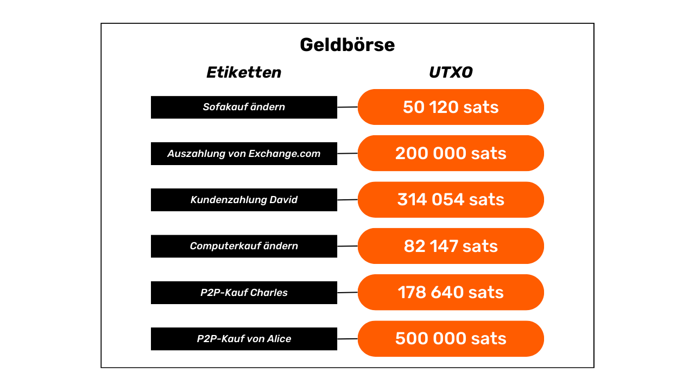

Um Ihre Verwaltung von UTXOs zu verfeinern und Ihren Strategien zur Trennung von Mitteln innerhalb Ihrer Wallet zu entsprechen, könnten Sie Ihre Beschriftungen mit einem zusätzlichen Indikator anreichern, der diese Trennungen widerspiegelt. Wenn Ihre Wallet zwei Kategorien von UTXOs enthält, die Sie nicht mischen möchten, könnten Sie einen Marker in Ihren Beschriftungen integrieren, um diese Gruppen klar zu unterscheiden. Diese Trennmarker hängen von Ihren eigenen Kriterien ab, wie der Unterscheidung zwischen UTXOs aus einem Erwerbsprozess, der KYC beinhaltet, oder zwischen beruflichen und persönlichen Mitteln. Unter Berücksichtigung der zuvor genannten Beschriftungsbeispiele könnte dies übersetzt werden zu:

- `KYC - Abhebung Exchange.com`;
- `KYC - Zahlung Kunde David`;
- `NO KYC - P2P Kauf Charles`;
- `NO KYC - Wechselgeld vom Sofakauf`

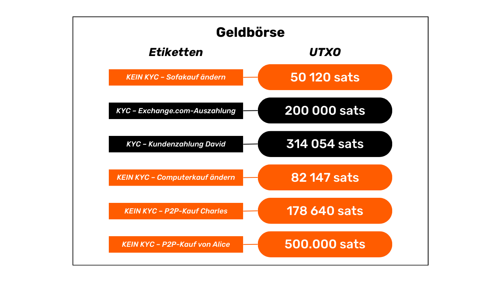
Es ist ebenfalls ratsam, die Kennzeichnung einer Münze bei Transaktionen beizubehalten. Wenn Sie beispielsweise no-KYC UTXOs konsolidieren, sollten Sie das resultierende UTXO nicht nur als `Konsolidierung`, sondern spezifisch als `no-KYC Konsolidierung` markieren, um eine klare Spur des Münzursprungs zu bewahren.
Schließlich ist es nicht zwingend erforderlich, ein Datum auf ein Label zu setzen. Die meisten Wallet-Software zeigt bereits das Transaktionsdatum an, und es ist immer möglich, diese Information auf einem Block Explorer mit dessen TXID abzurufen.

### Wie wählt man seine Münzen richtig aus?

Wenn Sie eine Transaktion durchführen, ermöglicht Ihnen die Münzkontrolle, spezifisch zu wählen, welche UTXOs als Eingaben verwendet werden sollen, um den Ausgang der Zahlung zu erfüllen. Zwei Aspekte sollten bei dieser Wahl berücksichtigt werden:

- Die Möglichkeit für den Zahlungsempfänger, einen Teil Ihrer Identität mit den als Eingaben verwendeten UTXOs zu verknüpfen;
- Die Fähigkeit eines externen Beobachters, Verbindungen zwischen allen als Eingaben verbrauchten UTXOs herzustellen.
  Um den ersten Punkt zu veranschaulichen, nehmen wir ein konkretes Beispiel. Angenommen, Sie kaufen mit Bitcoins eine Baguette bei Ihrem lokalen Bäcker. Sie verwenden einen oder mehrere UTXOs, die Sie besitzen, als Eingaben, um mindestens den Preis der Baguette in Ausgängen sowie die Transaktionsgebühren zu decken. Ihr Bäcker könnte dann möglicherweise Ihr Gesicht oder einen anderen Teil Ihrer Identität, den er kennt, mit den als Eingaben verwendeten Münzen in Verbindung bringen. In Kenntnis dieser Verbindung könnten Sie es vorziehen, einen spezifischen UTXO über einen anderen zu wählen, wenn Sie die Zahlung vornehmen.

Zum Beispiel, wenn einer Ihrer UTXOs von einer Austauschplattform stammt und Sie bevorzugen, dass der Bäcker nichts von Ihrem Konto auf dieser Plattform weiß, würden Sie diesen UTXO für die Zahlung vermeiden. Wenn Sie einen hochwertigen UTXO besitzen, der eine bedeutende Menge an Bitcoins offenbart, könnten Sie sich auch entscheiden, diesen nicht zu verwenden, um zu verhindern, dass der Bäcker von Ihrem BTC-Vermögen erfährt.

Die Wahl der UTXOs für diesen ersten Punkt basiert daher auf einer persönlichen Entscheidung, beeinflusst durch das, was Sie bereit sind zu offenbaren oder nicht. Die Labels, die Sie Ihren UTXOs bei deren Empfang zugewiesen haben, helfen Ihnen, jene auszuwählen, die, einmal ausgegeben, nur Informationen preisgeben, die Sie bereit sind, dem Empfänger zu offenbaren.

Über die Informationen, die möglicherweise dem Empfänger offenbart werden, hinaus beeinflusst die Wahl der Eingaben auch, was Sie allen Beobachtern der Blockchain offenlegen. Tatsächlich offenbaren Sie durch die Verwendung mehrerer UTXOs als Eingaben für Ihre Transaktion, dass diese von derselben Entität besessen werden, gemäß der Common Input Ownership Heuristic (CIOH).

Bei der Auswahl Ihrer Münzen müssen Sie sich daher bewusst sein, dass die Transaktion, die Sie gleich übertragen werden, eine Verbindung zwischen allen verwendeten UTXOs herstellt. Diese Verbindung kann problematisch für Ihre persönliche Privatsphäre sein, insbesondere wenn die UTXOs aus verschiedenen Quellen stammen.

Kehren wir zurück zum Beispiel meines no-KYC UTXO von Bisq; ich möchte vermeiden, ihn mit einem UTXO von beispielsweise einer regulierten Austauschplattform, die meine Identität kennt, zu kombinieren. Tatsächlich, wenn ich diese 2 UTXOs als Eingaben in derselben Transaktion verwende, wird die regulierte Plattform in der Lage sein, meine Identität mit dem UTXO, den ich auf Bisq gekauft habe, zu verknüpfen, obwohl er vorher nicht mit meiner Identität verknüpft war.
Um bei einer Transaktion richtig auszuwählen, welche UTXOs als Eingaben verbraucht werden sollen, ist das Wichtigste, die Verwendung mehrerer UTXOs zu vermeiden. Wann immer möglich, wählen Sie eine einzelne Münze, die groß genug ist, um Ihre Zahlung zu decken. Indem Sie dies tun, vermeiden Sie vollständig die Risiken, die mit COINJOIN verbunden sind. Sollte jedoch kein einzelner UTXO ausreichend für die Zahlung sein und Sie müssen mehrere verbrauchen, stellen Sie sicher, dass diese aus ähnlichen Quellen stammen, um die Risiken unerwünschter Verbindungen zu minimieren. Beachten Sie auch, dass der Empfänger die Informationen, die er über Sie hat, mit der Historie der Münzen, die als Eingaben verwendet wurden, in Verbindung bringen könnte.

### Verständnis der automatischen Münzauswahl

In den vorherigen Abschnitten haben wir die manuelle Auswahl von UTXOs für eine Transaktion besprochen. Aber was passiert, wenn die Wallet-Software diese Auswahl automatisch trifft? Es gibt mehrere Methoden, um zu bestimmen, welche Münzen verbraucht werden sollen, und die Auswahl von UTXOs ist ein echtes Forschungsfeld bei Bitcoin. Das Hauptziel dieses automatischen Prozesses ist es oft, die Transaktionsgebühren für den Benutzer zu minimieren.

UTXO-Auswahlmethoden wie FIFO (_First In First Out_) und LIFO (_Last In First Out_) gehören zu den einfachsten, aber auch zu den am wenigsten effizienten. Mit FIFO werden die ältesten Münzen im Wallet zuerst verwendet. Dieser Ansatz ist im Allgemeinen ineffizient, sowohl um Transaktionsgebühren zu minimieren als auch die Privatsphäre zu bewahren, außer in Fällen, in denen relative Zeitbeschränkungen verwendet werden und regelmäßig erneuert werden müssen. Im Gegensatz dazu priorisiert LIFO die Verwendung der neuesten UTXOs. Obwohl einfach, erweisen sich diese beiden Methoden oft als ineffizient.

Eine fortschrittlichere Methode ist der _Knapsack Solver_. Dies war die Methode, die im Bitcoin Core Wallet bis zur Version 0.17 verwendet wurde. Sie beinhaltet das iterative und zufällige Auswählen von UTXOs aus dem Wallet, deren Addition in Untergruppen und das Beibehalten der Lösung, die das Transaktionsgewicht so weit wie möglich reduziert, um die Gebühren für den Benutzer zu reduzieren.
Der _Branch-and-Bound_ (BNB), oft auch "Murch's Algorithmus" in Anlehnung an seinen Erfinder genannt, hat den _Knapsack Solver_ in Bitcoin Core ab Version 0.17 ersetzt. Diese fortschrittlichere Methode zielt darauf ab, eine Gruppe von UTXOs zu finden, die genau dem benötigten Betrag entspricht, um die Ausgaben einer Transaktion zu befriedigen. Das Ziel von BNB ist es, die Menge des Wechselgelds sowie die Gebühren zu minimieren, indem das sogenannte Waste-Kriterium reduziert wird, das sowohl die sofortigen Kosten als auch die zukünftig erwarteten Kosten für das Wechselgeld berücksichtigt. Diese Methode leitet sich vom ursprünglichen Konzept des _Branch-and-Bound_ ab, das 1960 von Ailsa Land und Alison Harcourt entworfen wurde, und bietet eine präzisere Optimierung der Gebühren im Vergleich zum _Knapsack Solver_.
All diese Methoden der automatischen UTXO-Auswahl können effektiv sein, um Transaktionsgebühren zu reduzieren, aber sie sind oft ineffizient im Bewahren der Privatsphäre des Benutzers. Tatsächlich können diese Algorithmen mehrere UTXOs zu Eingaben zusammenführen und somit einen gemeinsamen Besitz dieser UTXOs aufgrund des COH offenlegen. Offensichtlich können diese Methoden die an den UTXOs angebrachten Labels nicht berücksichtigen, die entscheidend sind, um bewusst zu wählen, welche Münzen dem Transaktionsempfänger offenbart werden sollen. Derzeit ist die einzige Lösung, die Privatsphäre bei der Auswahl von Münzen zu optimieren, dies manuell zu tun.

### Tutorial zur UTXO-Beschriftung

Wenn Sie erfahren möchten, wie Sie Ihre UTXOs etikettieren können, haben wir ein vollständiges Tutorial zu den wichtigsten Bitcoin-Wallet-Softwarelösungen erstellt:

https://planb.network/tutorials/privacy/utxo-labelling


## KYC und Schlüsselidentifikation

<chapterId>cec6b9d9-0eed-4f85-bc4e-1e9aa59ca605</chapterId>
KYC steht für "Know Your Customer" (Kenne deinen Kunden), ein regulatorisches Verfahren, das von einigen Unternehmen im Bitcoin-Sektor implementiert wird. Dieses Verfahren zielt darauf ab, die Identität ihrer Kunden zu verifizieren und zu dokumentieren, mit dem erklärten Ziel, Geldwäsche und Terrorismusfinanzierung zu bekämpfen.
Konkret beinhaltet KYC die Sammlung verschiedener persönlicher Daten des Kunden, die je nach Rechtsprechung variieren können, aber im Allgemeinen ein Identitätsdokument, ein Foto und einen Wohnsitznachweis umfassen. Diese Informationen werden dann verifiziert und für zukünftige Zwecke aufbewahrt.

Dieses Verfahren ist für alle regulierten Austauschplattformen in der Mehrheit der westlichen Länder verpflichtend geworden. Das bedeutet, dass jeder, der Fiat-Währungen über diese Plattformen in Bitcoin tauschen möchte, die KYC-Anforderungen erfüllen muss.
Dieses Verfahren birgt jedoch Risiken für die Vertraulichkeit und Sicherheit der Nutzer. In diesem Kapitel werden wir diese Risiken im Detail untersuchen und die spezifischen Auswirkungen von KYC und Identifikationsprozessen auf die Privatsphäre der Bitcoin-Nutzer analysieren.

### Erleichterung der Onchain-Verfolgung

Das erste Risiko, das mit KYC verbunden ist, besteht darin, dass es einen privilegierten Zugangspunkt für die Kettenanalyse bietet. Wie wir im vorherigen Teil gesehen haben, können Analysten Aktivitäten auf der Blockchain anhand von Transaktionsmustern und Heuristiken gruppieren und verfolgen. Sobald es ihnen gelungen ist, die Onchain-Aktivität eines Nutzers zu clustern, reicht es, einen einzigen Zugangspunkt unter all ihren Transaktionen und Schlüsseln zu finden, um ihre Privatsphäre vollständig zu kompromittieren.


Wenn Sie KYC durchlaufen, bieten Sie einen sehr hochwertigen Zugangspunkt für die Kettenanalyse, da Sie Ihre Empfangsadressen, die beim Abheben Ihrer Bitcoins von einer Austauschplattform verwendet werden, mit Ihrer vollständigen und verifizierten Identität verknüpfen. Theoretisch sind diese Informationen nur dem Unternehmen bekannt, dem Sie sie zur Verfügung gestellt haben, aber wie wir später sehen werden, ist das Risiko eines Datenlecks real. Darüber hinaus kann allein die Tatsache, dass ein Unternehmen diese Informationen besitzt, problematisch sein, selbst wenn es sie nicht teilt.

Wenn Sie also keine anderen Maßnahmen ergreifen, um die Gruppierung Ihrer Aktivitäten auf der Blockchain zu begrenzen, kann jeder, der von diesem KYC-Zugangspunkt weiß, potenziell all Ihre Aktivitäten auf Bitcoin mit Ihrer Identität verknüpfen. Aus der Perspektive dieses Unternehmens verliert Ihre Nutzung von Bitcoin daher jegliche Vertraulichkeit.


Um dies mit einem Vergleich zu veranschaulichen: Es ist, als hätte Ihr Banker von _Bank X_ nicht nur Zugang zu all Ihren Transaktionen mit _Bank X_, sondern könnte auch Ihre Transaktionen mit _Bank Y_ und all Ihre Bargeldtransaktionen beobachten.

Erinnern Sie sich an den ersten Teil dieses Trainings: Das Datenschutzmodell von Bitcoin, wie es von Satoshi Nakamoto entworfen wurde, beruht auf der Trennung zwischen der Identität des Nutzers und ihren Schlüsselpaaren. Obwohl diese Datenschutzebene heute nicht mehr ausreichend ist, ist es dennoch ratsam, ihre Verschlechterung so weit wie möglich zu begrenzen.

### Exposition gegenüber staatlicher Überwachung

Das zweite große Problem mit KYC ist, dass es dem Staat offenbart, dass Sie irgendwann Bitcoin besessen haben. Wenn Sie Bitcoins über einen regulierten Akteur kaufen, wird es für den Staat möglich, von diesem Besitz zu erfahren. Derzeit mag dies trivial erscheinen, aber es ist wichtig zu bedenken, dass die politische und wirtschaftliche Zukunft Ihres Landes nicht in Ihren Händen liegt.
Zuallererst kann der Staat schnell eine autoritäre Haltung einnehmen. Die Geschichte ist voll von Beispielen, in denen sich Politiken abrupt geändert haben. Heute können Bitcoin-Enthusiasten in Europa Artikel über Bitcoin schreiben, an Konferenzen teilnehmen und ihre Wallets in Eigenverwahrung verwalten. Aber wer kann sagen, was morgen passiert? Wenn Bitcoin plötzlich zum Staatsfeind Nummer eins würde, könnte eine Assoziation damit in staatlichen Aufzeichnungen problematisch werden.
Als Nächstes könnte der Staat in Anbetracht schwerer Wirtschaftskrisen in Erwägung ziehen, die von Bürgern gehaltenen Bitcoins zu beschlagnahmen. Vielleicht werden Bitcoin-Besitzer morgen als Krisengewinnler angesehen und aufgrund ihrer Kapitalgewinne im Angesicht der Abwertung von Fiatwährungen übermäßig besteuert.

Man könnte denken, das sei kein Problem, weil die eigenen Bitcoins gemischt und daher nicht zurückverfolgbar sind. Das Zurückverfolgen ist hier jedoch nicht das Problem. Das eigentliche Problem ist, dass der Staat weiß, dass man Bitcoin besessen hat. Diese einfache Information könnte ausreichen, um einen zu belasten oder zur Rechenschaft zu ziehen. Man könnte versuchen zu behaupten, man habe seine Bitcoins ausgegeben, aber das müsste in der Steuererklärung reflektiert sein, und man würde erwischt werden. Man könnte auch sagen, man habe seine Schlüssel bei einem Bootsunfall verloren, aber abgesehen vom Scherz auf Twitter, glaubt man wirklich, dass das ausreichen würde, um entlastet zu werden?

Daher ist es wichtig, das Risiko zu berücksichtigen, das allein mit der Tatsache verbunden ist, dass der Staat wissen könnte, dass man BTC besessen hat, auch wenn dieses Risiko heute vielleicht noch fern erscheint.

Ein weiteres Problem, das sich durch KYC in Bezug auf staatliche Überwachung ergibt, ist die verpflichtende Meldung durch regulierte Plattformen. Obwohl ich mit den Vorschriften in anderen Rechtsordnungen nicht vertraut bin, sind in Frankreich _Digital Asset Service Providers_ (PSAN) verpflichtet, den Finanzaufsichtsbehörden alle Geldbewegungen zu melden, die sie als verdächtig erachten.

So wurden in Frankreich im Jahr 2023 1.449 verdächtige Handlungen von den PSANs gemeldet. Bis jetzt stehen die meisten dieser Handlungen im Zusammenhang mit Kriminalität. Allerdings bitten die Behörden regulierte Plattformen auch, jede verdächtige Bitcoin-Transaktion allein aufgrund ihrer Struktur zu melden. Wenn man eine kollaborative Transaktion durchführt oder sogar nur eine Transaktion mit einem etwas atypischen Muster, und diese Transaktion in der Nähe des Abzugs der eigenen Bitcoins von diesen Plattformen stattfindet, könnte man sich bei den Behörden gemeldet finden. Selbst in Abwesenheit von Fehlverhalten und in der legitimen Ausübung der eigenen Rechte könnte diese Meldung zu verstärkten Überprüfungen und Überwachungen führen, Unannehmlichkeiten, die man ohne KYC vermieden hätte.

### Das Risiko des Datenlecks persönlicher Daten

Ein weiteres Problem mit KYC liegt darin, dass es die Speicherung aller persönlichen Daten auf den Servern eines privaten Unternehmens erfordert. Jüngste Ereignisse haben uns daran erinnert, dass niemand vor Ausfällen sicher ist, sei es finanzieller oder IT-bezogener Natur. Im Jahr 2022 litten Kunden von Celsius unter den Konsequenzen. Nach der Insolvenz des Unternehmens wurden die Namen der Gläubiger und die Höhe ihrer Vermögenswerte durch das amerikanische Justizsystem während des Verwaltungsverfahrens öffentlich gemacht.

Vor etwas mehr als zwei Jahren erlebte eine führende Cybersicherheitsentität im Kryptowährungsbereich den Diebstahl der persönlichen Daten ihrer Kunden. Obwohl dieser Vorfall nicht direkt mit dem Kauf von Bitcoins zusammenhing, bleibt ein solches Risiko auch für Austauschplattformen bestehen. Daher besteht ein definitives Risiko im Zusammenhang mit diesen persönlichen Daten.

Es ist wahr, dass wir bereits viele unserer persönlichen Daten privaten Unternehmen anvertrauen. Das Risiko hier ist jedoch zweifach, da diese Daten nicht nur zur Identifizierung dienen, sondern auch mit einer Aktivität auf Bitcoin verknüpft sind. Tatsächlich, wenn ein Hacker Zugang zu den Daten von Kunden einer Austauschplattform erhält, kann er vernünftigerweise annehmen, dass diese Kunden Bitcoins besitzen. Dieses Risiko wird also durch die Tatsache verstärkt, dass Bitcoin, wie jeder andere wertvolle Vermögenswert, das Interesse von Dieben weckt.

Im Falle eines Datenlecks könnte man im besten Fall Ziel von gezielten Phishing-Versuchen werden. Im schlimmsten Fall könnte man sich im Zentrum physischer Bedrohungen für das eigene Zuhause wiederfinden.
Neben den spezifischen Risiken, die mit Bitcoin verbunden sind, ist es ebenfalls notwendig, die Gefahren zu berücksichtigen, die mit der Übermittlung von Identitätsdokumenten einhergehen. Tatsächlich kann man im Falle eines Datenlecks Opfer von Identitätsdiebstahl werden. Somit beschränken sich die Einsätze nicht nur auf den Schutz der Vertraulichkeit von Transaktionen, sondern betreffen auch die persönliche Sicherheit jedes Einzelnen.

### Häufige Missverständnisse über KYC

Es ist wichtig, einige häufige Missverständnisse über KYC zu entkräften, die oft auf Twitter oder in unseren Diskussionen unter Bitcoinern zu finden sind.
Zuallererst ist es falsch zu denken, dass der Schutz der Privatsphäre für über KYC (Know Your Customer) erworbene Bitcoins zwecklos ist. Die Werkzeuge und Methoden für Privatsphäre bei Bitcoin sind vielfältig und dienen unterschiedlichen Zwecken. Die Verwendung von Coinjoin-Transaktionen bei Bitcoins aus KYC ist beispielsweise keine schlechte Idee. Natürlich ist es notwendig, bei regulierten Austauschplattformen vorsichtig zu sein, um das Einfrieren oder Sperren des eigenen Kontos zu vermeiden, aber aus rein technischer Sicht sind diese Praktiken nicht unvereinbar. Coinjoin hat die Wirkung, die Historie einer Münze zu unterbrechen, was Ihnen hilft, einige der mit KYC verbundenen Chain-Analyse-Risiken zu bekämpfen. Obwohl es nicht alle Risiken eliminiert, stellt es bereits einen bedeutenden Vorteil dar.

Privatsphäre bei Bitcoin sollte nicht binär betrachtet werden, als eine Unterscheidung zwischen "anonymen" Bitcoins und solchen, die es nicht sind. Der Besitz von über KYC erworbenen Bitcoins bedeutet nicht, dass alles verloren ist; im Gegenteil, die Verwendung von Datenschutztools kann sich als noch vorteilhafter erweisen.

Umgekehrt garantiert der Erwerb von Bitcoin über eine nicht-KYC-Methode keine perfekte Privatsphäre und befreit einen nicht von der Notwendigkeit, andere Schutzmaßnahmen zu ergreifen. Wenn Sie nicht-KYC Bitcoin besitzen, aber Empfangsadressen mehrmals wiederverwenden, können Ihre Transaktionen zurückverfolgt und gruppiert werden. Die geringste Verbindung mit der Welt außerhalb von Bitcoin könnte die einzige Datenschutzebene, die Sie hatten, kompromittieren. Daher ist es wichtig, alle Werkzeuge und Methoden, die die Privatsphäre bei Bitcoin verbessern, als ergänzend zu betrachten. Jede Technik adressiert ein spezifisches Risiko und kann eine zusätzliche Schutzebene hinzufügen. Somit befreit der Besitz von nicht-KYC Bitcoin einen absolut nicht davon, andere Vorsichtsmaßnahmen zu ergreifen.

### Kann KYC rückgängig gemacht werden?

Manchmal werde ich gefragt, ob es möglich ist, "zurückzugehen", nachdem KYC abgeschlossen wurde, und wie Sie sich aus den vorherigen Absätzen vorstellen können, ist die Antwort nuanciert. Um die mit KYC verbundenen Risiken zu vermeiden, ist die einfachste Methode, es beim Erwerb von Bitcoins nicht zu verwenden. Wir werden dieses Thema im nächsten Kapitel näher betrachten. Wenn jedoch KYC bereits durchgeführt wurde und Bitcoins gekauft wurden, gibt es Möglichkeiten, die eingegangenen Risiken zu mindern?

Bezüglich des Risikos der Nachverfolgbarkeit Ihrer Transaktionen ist die Verwendung von Coinjoin eine Lösung. Wir werden diese Methode später im Training detailliert besprechen, aber seien Sie sich bewusst, dass Coinjoin die Historie einer Münze unterbrechen und ihre Nachverfolgung von Vergangenheit-Gegenwart und Gegenwart-Vergangenheit verhindern kann. Selbst für BTC, die über eine regulierte Plattform erhalten wurden, kann diese Technik ihre Nachverfolgbarkeit verhindern.
CoinJoin eliminiert jedoch nicht das zweite Risiko, das mit KYC verbunden ist: die Tatsache, dass der Staat über Ihre Bitcoin-Bestände informiert ist. Tatsächlich, selbst wenn Ihre Coins nicht mehr nachverfolgbar sind, kann der Staat, abhängig von der Gerichtsbarkeit, Zugang zu Ihren Erklärungen über die Veräußerung von Krypto-Assets haben. Da dieses Risiko nicht technischer, sondern administrativer Natur ist, gibt es keine Bitcoin-spezifischen Lösungen, um es zu beseitigen, außer sich ursprünglich nicht dem KYC auszusetzen. Der einzige legale Ansatz, um dieses Risiko zu mindern, besteht darin, Ihre durch regulierte Plattformen erworbene Bitcoins auf regulierten Plattformen zu verkaufen und sie dann über Mittel ohne KYC wieder zu erwerben. Indem Sie verkaufen und die Veräußerung deklarieren, sollte die Verwaltung zur Kenntnis nehmen, dass Sie sie nicht mehr besitzen.
Was das Risiko betrifft, dass Ihre persönlichen Daten und Identitätsdokumente durchsickern, handelt es sich hierbei um eine Gefahr, die extern zu Bitcoin ist, und es gibt keine technische Lösung, um dies zu vermeiden. Einmal offenbart, ist es schwierig, diese Operation rückgängig zu machen. Sie können versuchen, Ihr Konto auf der Plattform zu schließen, aber dies garantiert nicht die Löschung Ihrer KYC-Daten, insbesondere wenn die Identitätsverifizierung ausgelagert ist. Die vollständige Löschung Ihrer Informationen zu überprüfen, ist unmöglich. Daher gibt es keine Lösung, um dieses Risiko vollständig zu verhindern und sicherzustellen, dass es nicht mehr existiert.

### Der Unterschied zwischen KYC und Schlüsselidentifikation

Manchmal neigen einige Bitcoiner dazu, den Begriff "KYC" auf jeden BTC-Austausch auszudehnen, der eine Überweisung oder eine Kreditkartenzahlung beinhaltet, da diese Mittel auch den Ursprung der Zahlung offenbaren können, genau wie KYC es würde. Es ist jedoch wichtig, KYC nicht mit Schlüsselidentifikation zu verwechseln. Persönlich muss ich zugeben, dass sich meine Wahrnehmung dieses Themas im Laufe der Zeit entwickelt hat.

KYC bezieht sich speziell auf ein regulatorisches Verfahren, das von einigen Unternehmen implementiert wird, um die Identität ihrer Kunden zu überprüfen und aufzuzeichnen. Es ist eine binäre Sache: Wenn Sie Ihre Bitcoins erwerben, unterziehen Sie sich entweder KYC, oder Sie tun es nicht. Die Schlüsselidentifikation, die das Verknüpfen eines Aspekts der Identität eines Benutzers mit Onchain-Aktivität betrifft, ist jedoch nicht so binär, sondern stellt eher ein Kontinuum dar. Tatsächlich ist im Kontext des Erwerbs oder der Veräußerung von Bitcoins diese Identifikation immer in unterschiedlichem Maße möglich.
Zum Beispiel, wenn Sie Bitcoins auf einer regulierten Plattform in der Schweiz kaufen, ist KYC (Know Your Customer) nicht notwendig. Es könnte jedoch eine Identifikation Ihrer Schlüssel geben, da der Kauf über Ihr Bankkonto getätigt wurde. Hier können die ersten beiden mit KYC verbundenen Risiken — die Erleichterung der Onchain-Verfolgung und die Exposition gegenüber staatlicher Überwachung — auch bei einem nicht-KYC-Austausch auftreten. Wenn die Schweizer Entität verdächtige Transaktionen den Behörden in Ihrem Land meldet, können diese einfach das für den Kauf verwendete Bankkonto überprüfen, um Ihre Identität zu entdecken. Somit ist der Kauf ohne KYC auf regulierten Plattformen eher hoch auf der Risikoskala für Schlüsselidentifikation.

Das Vermeiden von regulierten Plattformen und die Wahl von P2P (Peer-to-Peer)-Erwerbsmethoden eliminiert das Risiko der Schlüsselidentifikation jedoch nicht vollständig, sondern reduziert es lediglich. Betrachten Sie das Beispiel eines Kaufs auf Bisq oder einer anderen P2P-Plattform. Um sich mit Ihrem Gegenüber abzurechnen, werden Sie wahrscheinlich Ihr Bankkonto verwenden. Wenn die Behörden die Person, mit der Sie gehandelt haben, befragen und nach Ihrem Namen fragen, stoßen wir auf die Risiken 1 und 2, die zuvor erwähnt wurden. Diese Risiken sind sicherlich viel geringer als bei einem nicht-KYC-Kauf auf einer Plattform und noch mehr reduziert als bei einem Kauf mit KYC, aber sie sind immer noch in geringerem Maße vorhanden.
Schließlich sind Sie auch dann nicht völlig anonym, wenn Sie Ihre Bitcoins über einen physischen Austausch gegen Bargeld erwerben. Die Person, mit der Sie gehandelt haben, hat Ihr Gesicht gesehen, welches Teil Ihrer Identität ist. Auch wenn dies in diesem Beispiel minimal ist, besteht dennoch die Möglichkeit einer Schlüsselidentifikation.


Zusammenfassend lässt sich sagen, dass bei einem Austausch von Bitcoins gegen andere Vermögenswerte, egal ob es sich um einen Kauf in Fiat-Währung oder einen Verkauf für eine reale Ware handelt, immer eine Form der Schlüsselidentifikation vorhanden ist. Je nach gewählter Austauschmethode kann diese Identifikation unterschiedlich intensiv sein. Es ist wichtig, diese Identifikation nicht mit KYC zu verwechseln, welches ein gut definierter regulatorischer Prozess ist. Es besteht jedoch eine Verbindung zwischen KYC und dem Spektrum der Identifikation, da KYC am oberen Ende dieses Spektrums steht, da es systematisch die Identifikation der Schlüssel des Benutzers durch die Behörden erleichtert.

## Methoden des Verkaufs und Erwerbs

<chapterId>756598af-95aa-4c77-ac48-243c7ad89530</chapterId>
Nachdem Sie das vorherige Kapitel gelesen haben, fragen Sie sich vielleicht, wie Sie Bitcoin kaufen oder verkaufen können, ohne einen Identitätsnachweisprozess durchlaufen zu müssen, um die mit KYC verbundenen Risiken zu vermeiden. Es gibt mehrere Methoden, um Austausche durchzuführen.

### Bargeld P2P-Austausche

Wie wir gesehen haben, bleibt die beste Methode in Bezug auf die Privatsphäre der P2P (Peer-to-Peer)-Austausch mit einer Barzahlung. Diese Methode ermöglicht es Ihnen, die hinterlassenen Spuren zu minimieren und die Möglichkeit einer Schlüsselidentifikation erheblich zu reduzieren, egal ob Sie Käufer oder Verkäufer sind.


Diese Praxis birgt jedoch Risiken für die persönliche Sicherheit. Die Hauptgefahr liegt in der Tatsache, dass während des Austauschs die Gegenpartei weiß, dass Sie einen bedeutenden Betrag halten, entweder in Bargeld oder in Bitcoins. Diese Information kann die Aufmerksamkeit bösartiger Personen auf sich ziehen. Tatsächlich wird allgemein empfohlen, diskret über Ihren Bitcoin-Besitz zu bleiben. Dieser Rat könnte auch auf Bargeld angewendet werden. Allerdings ist es bei einem persönlichen Austausch unvermeidlich, zu offenbaren, dass Sie Bitcoins besitzen, was Begehrlichkeiten wecken kann.


Um dieses Risiko zu begrenzen, rate ich Ihnen, Bargeldtransaktionen mit vertrauenswürdigen Personen, wie Familienmitgliedern oder engen Freunden, zu priorisieren. Alternativ könnten Sie auch in Erwägung ziehen, Austausche bei [lokalen Bitcoin-Treffen](https://btcmap.org/communities/map) zu machen, nachdem Sie mehrmals teilgenommen haben. Dies ermöglicht es Ihnen, die anderen Teilnehmer besser kennenzulernen und nicht allein bei dem physischen Austausch zu sein. Es ist jedoch wichtig zu erkennen, dass der Bargeld-P2P-Austausch inhärente Risiken für Ihre persönliche Sicherheit birgt, die bei Käufen über eine regulierte Plattform und Ihr Bankkonto nicht existieren.

Zudem können, abhängig davon, wo Sie leben, das Tragen und Aufbewahren großer Geldsummen Risiken bergen, egal ob es sich um Bitcoin oder Bargeld handelt.

Bargeldaustausch kann auch rechtliche Risiken bei Polizeikontrollen oder anderen Situationen mit sich bringen. Obwohl in den meisten Ländern keine Beschränkung für den Betrag besteht, den Sie bei sich tragen können, können zu große Summen Verdacht erregen. Seien Sie also vorsichtig, besonders wenn Sie weite Strecken zurücklegen müssen, und vermeiden Sie es, zu große Transaktionen auf einmal zu tätigen, um sich nicht für den Besitz bedeutender Summen rechtfertigen zu müssen.
Schließlich ist ein weiterer Nachteil von P2P-Käufen, dass der Preis oft höher ist als der auf regulierten Plattformen beobachtete. Verkäufer legen häufig einen Aufschlag fest, der von 1% bis manchmal mehr als 10% reicht. Mehrere Gründe erklären diese Preisunterschiede. Zunächst ist es eine gängige Praxis unter P2P-Verkäufern, die sich im Laufe der Zeit etabliert hat. Weiterhin haben Verkäufer Transaktionsgebühren, die mit dem Senden von Geldern an den Käufer verbunden sind. Es besteht auch ein erhöhtes Risiko des Diebstahls bei P2P-Verkäufen im Vergleich zu Transaktionen auf Plattformen, was eine Entschädigung für das eingegangene Risiko rechtfertigt. Zuletzt kann der Aufschlag mit der Nachfrage und der Qualität des Austauschs in Bezug auf die Privatsphäre zusammenhängen. Als Käufer hat der Gewinn an Privatsphäre einen Preis, der sich im vom Verkäufer angewandten Aufschlag widerspiegelt. Einige Bitcoiner glauben auch, dass der erhöhte Preis von BTC, der in P2P gekauft wurde, seinen wahren Wert widerspiegelt und argumentieren, dass die niedrigeren Preise auf regulierten Plattformen das Ergebnis eines Kompromisses bezüglich der Privatsphäre Ihrer persönlichen Daten sind.

### P2P-Austausch über eine Matching-Plattform

Eine weniger riskante Alternative in Bezug auf die persönliche Sicherheit besteht darin, P2P-Austausche ausschließlich online über elektronische Zahlungsmethoden wie PayPal, Banküberweisungen oder Revolut durchzuführen.

Dieser Ansatz hilft, viele Risiken zu vermeiden, die mit Bargeldtransaktionen verbunden sind. Allerdings ist das Risiko, dass die Gegenpartei ihre Verpflichtungen bei einem Online-Austausch nicht erfüllt, größer. Tatsächlich können Sie bei einem physischen Austausch, wenn Sie Geld an den Verkäufer übergeben, der Ihnen im Gegenzug die Bitcoins nicht sendet, diesen sofort zur Verantwortung ziehen, da er vor Ihnen steht. Online ist es hingegen oft unmöglich, eine Person zu finden, die Sie bestohlen hat.

Um dieses Risiko zu mindern, ist es möglich, Plattformen zu nutzen, die auf Matching für P2P-Austausche spezialisiert sind. Diese Plattformen verwenden Konfliktlösungsmechanismen, um geschädigte Nutzer zu schützen. Im Allgemeinen bieten sie ein Treuhand-System an, bei dem Bitcoins gehalten werden, bis die Zahlung der Fiat-Währung vom Verkäufer bestätigt wird.

In Bezug auf die persönliche Sicherheit ist diese Kaufmethode deutlich sicherer als physische Bargeldaustausche. Wie jedoch zuvor erwähnt, hinterlassen Online-P2P-Austausche mehr Spuren als ein physischer Austausch, was sich nachteilig auf die Privatsphäre bei Bitcoin auswirken kann. Durch die Verwendung einer Online-Fiat-Zahlungsmethode wie einer Bank legen Sie mehr Informationen offen, die die Identifizierung von Schlüsseln erleichtern könnten.

Noch einmal, ich empfehle, auf diesen Plattformen keine großen Austausche in einer einzigen Transaktion zu tätigen. Indem Sie Ihre Transaktionen aufteilen, verteilen Sie die Risiken, die mit einem potenziellen Diebstahl durch die Gegenpartei verbunden sind.
Ein weiterer Nachteil von P2P-Käufen ist, dass der Preis oft höher ist als auf regulierten Plattformen. Verkäufer legen häufig einen Aufschlag fest, der von 1% bis manchmal mehr als 10% reicht. Mehrere Gründe erklären diese Preisunterschiede. Zunächst ist es eine gängige Praxis unter P2P-Verkäufern, die sich im Laufe der Zeit etabliert hat. Weiterhin haben Verkäufer Transaktionsgebühren, die mit dem Senden von Geldern an den Käufer verbunden sind. Es besteht auch ein erhöhtes Risiko des Diebstahls bei P2P-Verkäufen im Vergleich zu Transaktionen auf Plattformen, was eine Entschädigung für das eingegangene Risiko rechtfertigt. Schließlich kann der Aufschlag mit der Nachfrage und der Qualität des Austauschs in Bezug auf die Privatsphäre zusammenhängen. Als Käufer hat der Gewinn an Privatsphäre einen Preis, der sich im vom Verkäufer angewendeten Aufschlag widerspiegelt. Einige Bitcoiner glauben auch, dass der erhöhte Preis von P2P gekauftem BTC seinen wahren Wert widerspiegelt und argumentieren, dass die niedrigeren Preise auf regulierten Plattformen das Ergebnis eines Kompromisses bei der Privatsphäre Ihrer persönlichen Daten sind.


Bezüglich Lösungen habe ich persönlich immer [Bisq](https://bisq.network/) verwendet und bin damit sehr zufrieden. Ihr System ist gut etabliert und scheint zuverlässig zu sein. Allerdings ist Bisq nur auf dem PC verfügbar und seine Schnittstelle könnte für Anfänger zu komplex sein. Ein weiterer Nachteil ist, dass Bisq ausschließlich mit Onchain-Transaktionen arbeitet, was während Perioden hoher Transaktionsgebühren auf Bitcoin kostspielig werden kann.

[-> Entdecken Sie unser Tutorial zu Bisq.](https://planb.network/en/tutorials/exchange/bisq)

Für eine einfachere Option können Sie [Peach](https://peachbitcoin.com/) ausprobieren, eine mobile App, die die Verbindung zwischen Käufern und Verkäufern mit einem integrierten Streitbeilegungssystem erleichtert. Der Prozess ist intuitiver als bei Bisq.

[-> Entdecken Sie unser Tutorial zu Peach.](https://planb.network/en/tutorials/exchange/peach-wallet)
Eine weitere Online-Option ist [HodlHodl](https://hodlhodl.com/), eine gut etablierte Plattform, die eine gute Liquidität bietet, obwohl ich sie persönlich nicht getestet habe.
[-> Entdecken Sie unser Tutorial zu HodlHodl.](https://planb.network/en/tutorials/exchange/hodlhodl)

Für Lösungen, die auf dem Lightning Network basieren, können Sie [RoboSats](https://learn.robosats.com/) und [LNP2PBot](https://lnp2pbot.com/) ausprobieren. RoboSats ist über eine Website zugänglich und relativ einfach zu bedienen. LNP2PBot ist untypischer, da er über ein Austauschsystem in der Messaging-App Telegram funktioniert.

[-> Entdecken Sie unser Tutorial zu RoboSats.](https://planb.network/en/tutorials/exchange/robosats)
[-> Entdecken Sie unser Tutorial zu LNP2PBot.](https://planb.network/en/tutorials/exchange/lnp2pbot)


### Regulierte Plattformen ohne KYC

Je nachdem, in welchem Land Sie leben, haben Sie möglicherweise Zugang zu regulierten Plattformen, die kein KYC-Verfahren zum Kauf oder Verkauf von Bitcoins erfordern. In der Schweiz können Sie beispielsweise Plattformen wie [Relai](https://relai.app/) und [MtPelerin](https://www.mtpelerin.com/) nutzen.

[-> Entdecken Sie unser Tutorial zu Relai.](https://planb.network/en/tutorials/exchange/relai)
Wie wir im vorherigen Kapitel gesehen haben, erspart Ihnen diese Art von Plattform die Risiken, die mit KYC-Verfahren verbunden sind, aber sie präsentieren ein höheres Risiko für die Schlüsselidentifikation. In Bezug auf die Privatsphäre bei Bitcoin bieten diese Plattformen daher einen besseren Schutz als Kaufmethoden mit KYC, aber sie sind weniger interessant als P2P-Börsen.
Jedoch ist in Bezug auf die persönliche Sicherheit die Nutzung dieser Plattformen deutlich weniger riskant als P2P-Börsen. Sie sind auch oft einfacher zu nutzen als Plattformen, die P2P-Börsen erleichtern.

### Geldautomaten

Eine weitere Option für den Kauf oder Verkauf von Bitcoins ohne KYC sind Kryptowährungs-Geldautomaten (ATM). Persönlich hatte ich nie die Gelegenheit, diese Lösung zu testen, da es in meinem Land keine gibt. Aber diese Methode kann je nach Wohnort sehr interessant sein.


Das Problem bei Geldautomaten ist, dass sie in einigen Ländern verboten oder in anderen stark reguliert sind. Wenn ein Geldautomat einen Identitätsverifizierungsprozess erfordert, dann steht er vor denselben Risiken wie diejenigen, die für regulierte KYC-Plattformen typisch sind. Wenn der Geldautomat jedoch Transaktionen ohne Identitätsverifizierung für kleine Beträge zulässt, dann kann seine Nutzung ein Maß an Privatsphäre bieten, das mit dem eines bargeldbasierten P2P-Austauschs vergleichbar ist, während die meisten Risiken, die mit dieser Art von Austausch verbunden sind, vermieden werden.
Der Hauptnachteil von Geldautomaten liegt in ihren oft hohen Wechselgebühren, die von einigen Prozent bis manchmal 15% des getauschten Betrags reichen.

### Geschenkkarten

Schließlich wollte ich auch eine Lösung vorstellen, die gut für diejenigen funktioniert, die ihre Bitcoins im Alltag für Käufe nutzen möchten, anstatt sie gegen Fiat-Währungen zu verkaufen.

Der beste Weg, BTC auszugeben, ist natürlich, Bitcoin direkt oder das Lightning Network zu nutzen, um Waren oder Dienstleistungen zu kaufen. In vielen Ländern bleibt jedoch die Anzahl der Händler, die Bitcoin akzeptieren, begrenzt. Eine praktische Alternative ist dann die Nutzung von Geschenkkarten.

Mehrere Plattformen, die kein KYC-Verfahren erfordern, bieten die Möglichkeit, Bitcoins gegen Geschenkkarten einzutauschen, die in großen Geschäften verwendet werden können. Unter diesen Plattformen finden wir [CoinsBee](https://www.coinsbee.com/), [The Bitcoin Company](https://thebitcoincompany.com/) und [Bitrefill](https://www.bitrefill.com/). Diese Plattformen erleichtern die tägliche Nutzung Ihrer Bitcoins erheblich, indem sie Ihnen Zugang zu einer breiten Palette von Produkten und Dienstleistungen ermöglichen, ohne dass eine Umwandlung in Fiat-Währung erforderlich ist.


### Andere Erwerbsmethoden

Unter anderen Methoden, um Bitcoins zu erwerben und dabei Ihre Privatsphäre zu schützen, steht natürlich das Mining. Um mit dem Mining von Sats zu beginnen, ist es nicht notwendig, Ihre Identität preiszugeben; Sie müssen lediglich einen gültigen Proof of Work finden und ihn dem Netzwerk vorlegen. Wenn Sie sich für Pool-Mining entscheiden, benötigen einige Pools eine Form der Identifikation, wie KYC, während andere dies nicht tun.

Eine weitere Methode besteht darin, im Austausch für Bitcoins zu arbeiten. Diese Erwerbsmethode kann interessant sein, aber der Grad der erforderlichen Identifikation variiert stark je nach den Umständen.

\_Um dieses Kapitel zu schreiben, habe ich den Kurs [BTC205](https://planb.network/fr/courses/btc205) verwendet, der von [@pivi\_\_\_](https://x.com/pivi___) auf PlanB Network (zurzeit nur auf Französisch verfügbar) erstellt wurde.\_

## Konsolidierung, UTXO-Management und CIOH

<chapterId>d0486c8f-332d-402b-ae2e-949416752b9c</chapterId>
Einer der kompliziertesten Aspekte, die es zu verwalten gilt, wenn man sein eigenes Self-Custody-Wallet besitzt, ist zweifellos die Konsolidierung. Sollten Sie konsolidieren? Was ist der Zweck? Welche Größe von UTXO sollten Sie anstreben? Welche Kompromisse gibt es in Bezug auf die Privatsphäre? Dies ist es, was wir in diesem Abschnitt zu erkunden versuchen.

### Was ist Konsolidierung?

Die Funktionsweise von Bitcoin ähnelt einem Auktionsmarkt, bei dem Transaktionen, die die besten Gebühren bieten, von den Minern bevorzugt werden. Jeder Block hat jedoch ein maximales Gewicht, was die Anzahl der Transaktionen, die aufgenommen werden können, begrenzt. Da im Durchschnitt alle 10 Minuten ein Block produziert wird, ist der verfügbare Platz in jedem Block eine seltene Ressource.

Miner, deren Tätigkeit erhebliche Kosten für Strom, Kapital und Wartung verursacht, streben natürlich danach, ihre Rentabilität zu maximieren. Sie bevorzugen Transaktionen, die ihnen die meisten Gebühren im Verhältnis zu ihrem Gewicht bieten.

Tatsächlich wiegen nicht alle Bitcoin-Transaktionen gleich viel. Diejenigen mit mehr Eingängen und Ausgängen werden mehr wiegen. Betrachten Sie zum Beispiel 2 Transaktionen:

- Transaktion A beinhaltet 1 Eingang und 1 Ausgang. Sie weist 1.994 Sats an Gebühren auf und ihr Gewicht beträgt 141 vB;
- Transaktion B, komplexer, mit 2 Eingängen und 2 Ausgängen, weist 2.640 Sats an Gebühren für ein Gewicht von 220 vB auf.


In diesem Beispiel, obwohl Transaktion B insgesamt höhere Gebühren vorschlägt, werden die Miner Transaktion A bevorzugen, weil sie ein besseres Verhältnis zwischen Gebühren und Gewicht bietet. Hier ist die Berechnung für jede Transaktion, ausgedrückt in Sats pro virtuellem Byte (sat/vB):

```text
TXA: 1994 / 141 = 14 sats/vB

TXB: 2640 / 220 = 12 sats / vB
```

Das bedeutet, dass Transaktion A für jede Gewichtseinheit mehr Gebühren bietet als Transaktion B, obwohl letztere in absoluten Werten mehr Gebühren bietet.


Daher ist es für den Benutzer immer interessanter, die geringstmögliche Anzahl von Eingängen in ihren Transaktionen zu verbrauchen. Es ist jedoch notwendig, ausreichende Mengen zu verbrauchen, um die Zahlung im Ausgang befriedigen zu können. Bei der Verwaltung ihres Wallets muss man daher ausreichend große UTXOs haben.

Das Prinzip der Konsolidierung besteht genau darin, Zeiträume zu nutzen, in denen die Gebühren bei Bitcoin niedrig sind, um die eigenen kleinen UTXOs zu einem einzigen größeren zu verschmelzen. So kann man, wenn die Gebühren bei Bitcoin steigen, Transaktionen mit einer Mindestanzahl von Eingängen durchführen und somit weniger in absoluten Gebühren ausgeben. Das Ziel ist es, die obligatorischen Transaktionen während Zeiträumen hoher Gebühren durchzuführen.

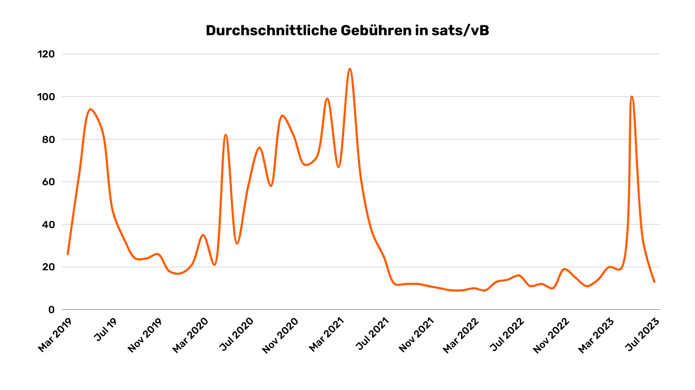
Neben Einsparungen bei den Transaktionsgebühren hilft die Konsolidierung von UTXOs dabei, die Entstehung von "Staub" zu vermeiden. Staub bezieht sich auf UTXOs, deren Wert in Sats so niedrig ist, dass er nicht ausreicht, um die notwendigen Transaktionsgebühren für ihre Verwendung zu decken. Dies macht diese UTXOs wirtschaftlich irrational zu verwenden, solange die Transaktionsgebühren hoch bleiben. Durch das proaktive Gruppieren Ihrer UTXOs verhindern Sie, dass sie zu Staub werden, und stellen sicher, dass alle Ihre Mittel nutzbar bleiben.

### Was ist die Mindestgröße für Ihre UTXOs?

Manchmal werde ich gefragt, welcher empfohlene Mindestwert für ein UTXO ist. Leider gibt es keine universelle Antwort, da dies von Ihren Vorlieben und den Marktbedingungen für Gebühren abhängt. Hier ist jedoch eine Formel, die Ihnen helfen kann, eine Schwelle zu bestimmen, die Ihren Bedürfnissen entspricht:

$$
\frac {P \times F}T = M
$$

Wo:

- $P$ ist das Gewicht der Transaktion;
- $F$ repräsentiert die maximale Gebührenrate in Satoshis pro vbyte (sats/vB), gegen die Sie sich absichern;
- $T$ ist der Prozentsatz der Transaktionsgebühr, den Sie im Verhältnis zum Gesamtwert des UTXO zu zahlen bereit sind;
- $M$ ist der Mindestbetrag in Satoshis für jedes UTXO.

Angenommen, Sie planen, Gebühren für eine Standard-SegWit-Transaktion mit 1 Eingabe und 2 Ausgaben zu übernehmen, die 141 vB wiegt. Wenn Sie bis zu 800 sats/vB abdecken und bereit sind, maximal 12% des Wertes des UTXO an Gebühren zu zahlen, dann wäre die Berechnung:

$$
\frac{141 \times 800}{0.12} = 940\ 000
$$

In diesem Beispiel wäre es klug, einen Mindestwert von 940.000 Sats für die UTXOs in Ihrer Wallet zu halten.

### Konsolidierung und die COIH

Eine der am häufigsten verwendeten Heuristiken in der Kettenanalyse ist die COIH (_Common Input Ownership Heuristic_), die die Annahme erlaubt, dass alle Eingaben einer Bitcoin-Transaktion derselben Entität gehören. Genau genommen besteht das Prinzip der Konsolidierung darin, mehrere UTXOs als Eingaben zu verbrauchen und ein einzelnes UTXO als Ausgabe zu erstellen. Daher ermöglicht die Konsolidierung die Anwendung der COIH.


In der Praxis bedeutet dies, dass ein externer Beobachter ableiten kann, dass alle konsolidierten UTXOs wahrscheinlich derselben Person gehören und dass die erzeugte einzelne Ausgabe ebenfalls ihnen gehört. Diese Situation kann Ihre Privatsphäre gefährden, indem sie verschiedene Transaktionshistorien verknüpft. Nehmen wir zum Beispiel an, ich konsolidiere 3 UTXOs, die im P2P erworben wurden, mit einem UTXO, der über eine Plattform erworben wurde, die KYC erfordert:


Indem ich das tue, kann jede Entität mit Zugang zu den Daten der Austauschplattform, einschließlich möglicherweise Regierungsbehörden, identifizieren, dass ich andere Beträge in BTC besitze. Zuvor waren diese UTXOs nicht direkt mit meiner Identität verknüpft; jetzt sind sie es. Darüber hinaus offenbart dies allen Quellen, dass ich im Besitz einer bestimmten Menge an Bitcoins bin.

Bei der Verwaltung von UTXOs stehen wirtschaftliche Überlegungen, die zur Konsolidierung drängen, um Gebühren zu reduzieren, im Konflikt mit guten Datenschutzpraktiken, die empfehlen würden, Ihre UTXOs niemals zu verschmelzen. Die Wahl zwischen Wirtschaftlichkeit und Privatsphäre hängt daher von den Prioritäten jedes Benutzers ab.

Wenn Sie die Konsolidierung vermeiden können, während Sie erhebliche UTXO-Größen beibehalten, ist das ideal. Um dies zu tun, optimieren Sie Ihre Erwerbsmethoden. Wenn Sie Ihre Bitcoins in DCA kaufen, versuchen Sie, Ihre Einmalkäufe so weit wie möglich zu staffeln, um Wert in weniger UTXOs zu gruppieren. Es wird einfacher sein, einen einmaligen Kauf von 1.000 € alle 2 Monate zu verwalten, anstatt einen Kauf von 120 € jede Woche. Dies minimiert die Anzahl der generierten UTXOs und vereinfacht die Verwaltung Ihrer Wallet, während Ihre Privatsphäre bewahrt bleibt.
Wenn Sie feststellen, dass Sie Ihre Bitcoins konsolidieren müssen, priorisieren Sie zuerst die Konsolidierung von UTXOs aus derselben Quelle. Wenn Sie beispielsweise 10 UTXOs von einer einzigen Plattform zusammenführen, wirkt sich dies weniger auf Ihre Privatsphäre aus, als wenn Sie 5 UTXOs von Plattform A mit 5 UTXOs von Plattform B mischen. Wenn eine Konsolidierung aus verschiedenen Quellen unvermeidlich ist, versuchen Sie, sie nach ihren Eigenschaften zu trennen. Gruppieren Sie zum Beispiel die UTXOs, die durch KYC erworben wurden, in einer Transaktion und diejenigen, die in P2P erhalten wurden, in einer anderen.

In jedem Fall sollten Sie sich daran erinnern, dass jede Konsolidierung unweigerlich zu einem Verlust der Privatsphäre führt. Bewerten Sie daher sorgfältig die Notwendigkeit dieser Operation und die potenziellen Auswirkungen auf Ihre Privatsphäre unter Berücksichtigung des Risikos.

## Andere gute Praktiken

<chapterId>b5216965-7d13-4ea1-9b7c-e292966a487b</chapterId>

Lassen Sie uns gemeinsam einige andere gute Praktiken erkunden, die Ihnen helfen können, Ihre Privatsphäre bei Bitcoin zu optimieren.

### Der Full Node

Ihre Bitcoins in Eigenverwahrung zu haben, ist gut, aber Ihren eigenen Full Node zu nutzen, ist besser! Hier sind die Gründe, warum das Besitzen Ihres eigenen Nodes entscheidend für eine vollständig souveräne Nutzung von Bitcoin ist:

- **Zensurresistenz**: Ihre Transaktionen können von niemandem blockiert werden;
- **Unabhängigkeit von Drittanbietern**: Sie sind nicht mehr von einem externen Dienst abhängig, um Blockchain-Daten zu verifizieren;
- **Aktive Teilnahme**: Sie haben die Möglichkeit, Ihre eigenen Validierungsregeln festzulegen und direkt am Konsens teilzunehmen;
- **Beitrag zum Netzwerk**: Durch das Betreiben eines Nodes helfen Sie, das Bitcoin-Netzwerk zu stärken und zu verteilen;
- **Technische Bildung**: Das Verwalten eines Full Nodes ist eine ausgezeichnete Möglichkeit, Ihr technisches Wissen über Bitcoin zu vertiefen.

Zusätzlich zu diesen Vorteilen verbessert die Nutzung eines Full Nodes auch Ihre Privatsphäre beim Übertragen Ihrer Transaktionen. Wenn Sie eine Transaktion ausführen, wird diese zunächst über Ihre Wallet erstellt und signiert. Um sie im Bitcoin-Netzwerk zu übertragen, muss sie von mindestens einem Node bekannt sein. Indem Sie Ihren eigenen Node verwenden, kontrollieren Sie diese Übertragung direkt, wodurch Ihre Privatsphäre verbessert und das Risiko von Datenlecks begrenzt wird.


Wenn Sie keinen eigenen Bitcoin-Node haben, sind Sie gezwungen, einen Node eines Drittanbieters zu verwenden, wie den, der von Ihrem Wallet-Softwareanbieter angeboten wird. Zusätzlich zur Übertragung von Transaktionen benötigt Ihre Wallet Zugriff auf verschiedene Informationen wie ausstehende Transaktionen, mit Ihren Adressen verbundene Guthaben oder die Anzahl der Bestätigungen für Ihre Transaktionen. Um auf all diese Daten zugreifen zu können, müssen Sie einen Node abfragen.


Das Hauptrisiko, wenn Sie keinen eigenen Bitcoin-Node verwenden, besteht darin, dass der Betreiber des Nodes eines Drittanbieters Ihre Aktivitäten auf der Blockchain beobachten oder diese Informationen sogar mit anderen Entitäten teilen kann. Um dieses Risiko zu begrenzen, ist eine Zwischenlösung die Verwendung von Wallet-Software, die es Ihnen ermöglicht, Ihre Verbindungen über Tor zu maskieren. Dies kann die Exposition Ihrer Daten verringern. Die optimale Lösung bleibt jedoch, Ihren eigenen Bitcoin-Node zu haben und ihn für die Übertragung Ihrer Transaktionen zu nutzen. Offensichtlich müssen Sie auch sicherstellen, dass keine Informationen von Ihrem Node durchsickern, aber das ist ein anderes Thema, das wir in den folgenden Abschnitten erkunden werden.
Neben dem offensichtlichen Vorteil für Ihre Privatsphäre stellt das Betreiben Ihres eigenen Full Nodes auch die Wahrheit der Daten auf der Blockchain sicher, schützt vor Zensur und ermöglicht es Ihnen, aktiv an der Governance von Bitcoin teilzunehmen. Indem Sie Ihren eigenen Node verwenden, tragen Sie Ihr ökonomisches Gewicht zur Kette Ihrer Wahl bei, was während Konflikten innerhalb der Gemeinschaft wichtig ist, wie zum Beispiel während des Blocksize-Krieges von 2015 bis 2017. Im Falle eines Forks könnte die Verwendung eines Nodes eines Dritten dazu führen, dass Sie eine Kette unterstützen, die Sie nicht bevorzugen möchten, da der Node-Betreiber die Wahl für Sie trifft. Wie Sie verstehen können, ist es im Interesse der Privatsphäre und im weiteren Sinne der individuellen Souveränität wesentlich, Ihren eigenen Full Node zu betreiben und zu verwenden!

### Analyse-Heuristiken überlisten

Allgemeiner gesprochen ist es wichtig, die Heuristiken, über die wir im vorherigen Teil gesprochen haben, zu verstehen, um sie besser vermeiden oder überlisten zu können. Die Annahme einer Reihe von guten Praktiken kann vorteilhaft sein, auch wenn sie nicht unverzichtbar sind. Sie bieten eine zusätzliche Schutzebene, die für die Aufrechterhaltung einer guten Privatsphäre bei der Verwendung von Bitcoin wichtig sein kann.

Der erste Ratschlag, den ich geben könnte, ist, sich in die dichteste Menge zu mischen. Bei Bitcoin bedeutet dies, die am meisten adoptierten Skriptmuster zu verwenden. Zum Beispiel sind P2WSH-Skripte, die oft für SegWit V0 Multisig-Konfigurationen verwendet werden, sehr selten. Sie erlauben es Ihnen nicht, sich in einer großen Anonymitätsmenge zu verstecken. Das Gleiche gilt für alte Modelle wie P2PKH oder P2SH. Obwohl sie weit verbreitet im UTXO-Set vorhanden sind, werden sie für neue Transaktionen immer weniger verwendet.

Im Allgemeinen ist es sicherer, sich dem neuesten Skriptstandard zuzuwenden, vorausgesetzt, er ist ausreichend adoptiert. So hätte ich im Jahr 2022 davon abgeraten, P2TR (Taproot) aufgrund seiner geringen Adoption zu verwenden, aber bis 2024 würde ich empfehlen, diesen Skripttyp zu wählen, oder notfalls ein SegWit V0-Skript, da die Anzahl der Transaktionen, die P2TR verwenden, zu einem sehr signifikanten Anteil zu werden beginnt.


Quelle: [txstats.com](https://txstats.com/d/000000054/utxo-set-repartition-by-output-type)
Ein weiterer Tipp, um Ihre Privatsphäre zu bewahren, ist zu versuchen, die internen Heuristiken von Transaktionen zu umgehen. Wenn Sie zum Beispiel eine Zahlung tätigen, könnten Sie versuchen, eine Ausgabe mit einem runden Betrag zu vermeiden, da dies signalisieren könnte, dass die andere Ausgabe das Wechselgeld darstellt. Wenn Sie 100k Sats an einen Freund senden müssen, erwägen Sie, einen etwas höheren Betrag zu übertragen, um dieser Heuristik zu entkommen. Versuchen Sie ähnlich, keine Wechselgeldausgaben zu erstellen, die im Vergleich zur getätigten Zahlung unverhältnismäßig hoch sind, da dies ebenfalls offenbaren könnte, welche der Ausgaben das Wechselgeld darstellt.


Schließlich, wenn Sie regelmäßig Bitcoin-Transaktionen durchführen, stellen Sie sicher, dass Sie sie nicht immer zu den gleichen Zeiten übertragen. Indem Sie die Übertragung Ihrer Transaktionen über den Tag und die Woche verteilen, vermeiden Sie, dass externe Beobachter die Fähigkeit erhalten, ein zeitliches Muster basierend auf Zeitzonen zu erkennen, das ihre Analyse verbessern könnte.

Über all diese guten Praktiken, die täglich zu adoptieren sind, hinaus gibt es noch effektivere Methoden, um die Rückverfolgbarkeit Ihrer Bitcoins vollständig zu brechen. Unter ihnen gibt es offensichtlich Coinjoin-Transaktionen, die wir im folgenden Teil ausführlich untersuchen werden.

# Verständnis von Coinjoin-Transaktionen

<partId>6d0bbf16-3714-4db1-9897-2d45019f6bdc</partId>

## Was ist eine Coinjoin-Transaktion?

<chapterId>0862bc6b-1c48-4aa4-b76d-4f547b469008</chapterId>
Nachdem wir die Grundlagen des Datenschutzes studiert haben, werden wir nun ausgefeiltere Techniken besprechen, die darauf abzielen, Ihre Privatsphäre aktiv zu verteidigen, insbesondere durch das Trennen der Historie Ihrer Bitcoins. Im folgenden Teil werden wir viele kleine Techniken erkunden, aber zuerst möchte ich mit Ihnen über Coinjoin sprechen.

Coinjoin wird oft als die effektivste Methode zum Schutz der Privatsphäre von Bitcoin-Nutzern betrachtet. Aber was genau ist eine Coinjoin-Transaktion? Lassen Sie uns das gemeinsam herausfinden.

### Die Grundprinzipien von Coinjoin

Coinjoin ist eine Technik, die die Nachverfolgbarkeit von Bitcoins in der Blockchain bricht. Sie stützt sich auf eine kollaborative Transaktion mit einer spezifischen Struktur gleichen Namens: die Coinjoin-Transaktion.
Wie wir in den ersten Teilen dieses Trainings gesehen haben, sind Transaktionen auf Bitcoin für alle Nutzer durch ihren Knoten bekannt. Es ist daher einfach, die elektronische Signaturkette jeder Münze zu überprüfen und ihre Historie zu beobachten. Das bedeutet, dass alle Nutzer versuchen können, die Transaktionen anderer Nutzer zu analysieren. Infolgedessen ist Anonymität auf Transaktionsebene unmöglich. Jedoch wird die Anonymität auf der Ebene der individuellen Identifikation bewahrt. Im Gegensatz zum traditionellen Bankensystem, wo jedes Konto mit einer persönlichen Identität verknüpft ist, sind auf Bitcoin die Mittel mit kryptografischen Schlüsselpaaren (oder Skripten) verbunden, was den Nutzern eine Form von Pseudonymität hinter kryptografischen Identifikatoren bietet.
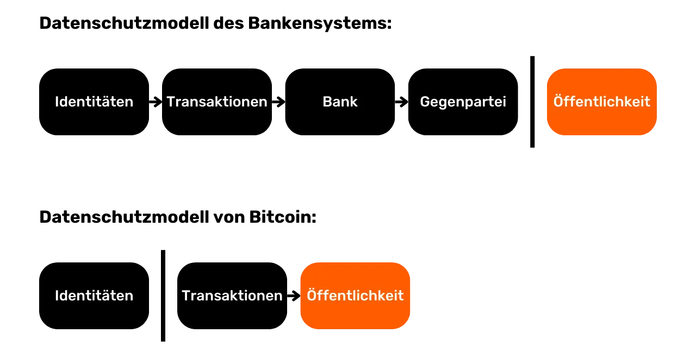

Somit ist die Vertraulichkeit auf Bitcoin gefährdet, wenn externe Beobachter es schaffen, spezifische UTXOs mit identifizierten Nutzern zu verbinden. Sobald diese Verbindung hergestellt ist, wird es möglich, ihre Transaktionen nachzuverfolgen und die Historie ihrer Bitcoins zu analysieren. Coinjoin ist genau eine Technik, die entwickelt wurde, um die Nachverfolgbarkeit von UTXOs zu brechen, um Bitcoin-Nutzern auf Transaktionsebene eine gewisse Schicht an Vertraulichkeit zu bieten.

Coinjoins erhöhen die Vertraulichkeit von Bitcoin-Nutzern, indem sie die Kettenanalyse für externe Beobachter komplizieren. Ihre Struktur ermöglicht es, mehrere Münzen von verschiedenen Nutzern in einer einzigen Transaktion zusammenzuführen, wodurch die Spuren verwischt und es schwierig gemacht wird, die Verbindungen zwischen Eingabe- und Ausgabeadressen zu bestimmen.

Es ist wichtig zu verstehen, dass das Ziel einer Coinjoin-Transaktion darin besteht, die Historie einer Münze zu brechen. Diese Technik verleiht keine dauerhafte Anonymität, noch blockiert sie endgültig die Nachverfolgung von Bitcoins, im Gegensatz zu dem, was man vielleicht denken könnte. Das Coinjoin zielt nur darauf ab, die Historie an dem Punkt zu brechen, an dem die Coinjoin-Transaktion durchgeführt wird. Jedoch, vor und nach dieser Operation, bleibt die Münze denselben Datenschutzrisiken unterworfen.


### Wie funktionieren Coinjoins?

Das Prinzip des Coinjoin beruht auf einem kollaborativen Ansatz: Mehrere Nutzer, die ihre Bitcoins mischen möchten, hinterlegen identische Beträge in Eingängen derselben Transaktion. Diese Beträge werden dann in Ausgängen mit gleichen Werten an jeden Nutzer umverteilt.


Am Ende der Transaktion wird es unmöglich, einen spezifischen Ausgang mit einem bekannten Nutzer in Eingang zu verbinden. Es besteht keine direkte Verbindung zwischen den Eingängen und Ausgängen, was die Verbindung zwischen den Nutzern und ihren UTXOs sowie die Historie jeder Münze bricht.


Lassen Sie uns das Beispiel von Alice nehmen. Sie möchte etwa 100.000 Sats an ihre Schwester Eve zu ihrem Geburtstag senden. Allerdings möchte Alice nicht, dass Eve die Historie ihrer Transaktionen nachverfolgen kann, da sie nicht offenlegen möchte, wie viele Bitcoins sie besitzt oder wie sie diese erhalten hat. Um dies zu tun, entscheidet sich Alice, die Historie ihres UTXO mit einer Coinjoin-Transaktion zu unterbrechen. Sie organisiert mit Bob, Charles, David und Frank eine kollaborative Transaktion:

- Alice, Bob, Charles, David und Frank verpflichten sich jeweils einen UTXO von 105.000 Sats (mit 5.000 Sats für Mining-Gebühren) als Eingaben für die Transaktion:


- Als Gegenleistung für das Verbrauchen dieser Eingaben erzeugt jeder eine frische Adresse, um fünf identische Ausgaben von jeweils 100.000 Sats zu erstellen. Jeder erhält eine Ausgabe:


- Alice endet mit einem UTXO von 100.000 Sats, dessen Historie gemischt ist. Sie verwendet diesen UTXO in einer neuen Transaktion, um den Betrag an Eve zu ihrem Geburtstag zu senden:


- Wenn Eve versucht, diese Transaktion zu analysieren, um Informationen zu extrahieren, wird sie mit der Coinjoin-Transaktion konfrontiert, die Alice, Bob, Charles, David und Frank involviert. Da sie aufgrund der Einheitlichkeit der Beträge nicht unterscheiden kann, welcher Eingang wem gehört, kann Eve die Historie von Alices UTXO nicht nachverfolgen, noch bestimmen, wie viele Bitcoins ihre Schwester besitzt oder wie sie diese erworben hat:


In diesem Szenario verwendete Alice die Coinjoin-Technik, um ihre Privatsphäre gegen retrospektive Analyse zu erhöhen. Tatsächlich schützt sich Alice gegen eine mögliche Analyse durch Eve, die von einer spezifischen Transaktion ausginge, um die Historie des UTXO rückwärts zu verfolgen. Dieser Schutz gegen Analyse von der Gegenwart in die Vergangenheit ist das, was wir retrospektives Anonset nennen. Wir werden dieses Konzept in den letzten Kapiteln dieses Teils detaillierter betrachten.

Coinjoin bietet jedoch auch die Möglichkeit, die Privatsphäre gegen Analyse von der Vergangenheit in die Gegenwart zu verbessern, was als prospektives Anonset bezeichnet wird. Gehen wir zurück zu unserem Beispiel, in dem Alice 98.000 Sats an Eve zu ihrem Geburtstag gesendet hat, aber die Rollen umkehrt. Stellen Sie sich jetzt vor, dass Eve um ihre Privatsphäre besorgt ist. Tatsächlich könnte Alice versucht sein, der Münze, die sie an Eve gesendet hat, zu folgen, um Informationen zu sammeln. Eve könnte diesen UTXO, den sie gerade erhalten hat, mit all ihren anderen UTXOs konsolidieren, was Alice die Menge an Bitcoins offenbaren könnte, die sie in ihrem Wallet hält. Um dies zu vermeiden, kann auch Eve die Historie der Münze, die sie gerade erhalten hat, unterbrechen.

- Eve, Grace, Mallory, Oscar und Victor legen jeweils einen UTXO von 98.000 Sats als Eingaben in einer Bitcoin-Transaktion ein:
  

- Im Austausch für das Verbrauchen dieser Eingaben stellt jeder eine frische Adresse bereit, um 5 Ausgaben von jeweils 97.500 Sats zu erstellen, perfekt gleich. Jeder Benutzer erhält eine Ausgabe:


- Eve hält nun einen UTXO von 97.500 Sats mit einer unterbrochenen Historie. Sie kann ihn ohne Angst für zukünftige Transaktionen verwenden. Tatsächlich, wenn Alice versucht, den Bitcoins zu folgen, die sie an Eve gesendet hat, wird sie auf eine Coinjoin-Transaktion stoßen. Sie wird nicht bestimmen können, welcher Ausgabe-UTXO zu Eve gehört. Die Analyse wird dann unmöglich:


Im ersten Beispiel haben wir gesehen, wie Coinjoin die Privatsphäre einer Münze in Bezug auf ihre Vergangenheit schützen kann, und im zweiten Beispiel, wie es auch die Geschichte einer Münze in Bezug auf ihre Zukunft sichern kann. Deshalb habe ich erwähnt, dass Coinjoin als einmaliges Ereignis betrachtet werden sollte, das die Geschichte einer Münze in beide Richtungen segmentiert:


### Mixing, Coinjoins, Mixer... Was ist der Unterschied?

Der Begriff "Mixing" wird manchmal verwendet, um Coinjoins zu beschreiben, ein Begriff, den einige Bitcoiner ablehnen, weil sie eine Verwechslung mit verwahrten Mixern befürchten. Ich denke jedoch, diese Besorgnis ist unbegründet, denn in einem mathematischen Kontext verkörpert Coinjoin genau das Konzept des Mixings.

Im allgemeinen Bereich der Mathematik bezieht sich Mixing auf die Eigenschaft eines dynamischen Systems, bei dem nach einiger Zeit alle Teile des Anfangsraums theoretisch mit jedem anderen Teil gemischt werden können. Mixing impliziert, dass die Position eines Partikels oder der Zustand eines Systems sich so entwickelt, dass seine zukünftige Verteilung unabhängig von seiner anfänglichen Verteilung ist, und erreicht somit einen Zustand, in dem die Merkmale des Anfangszustands gleichmäßig im Raum des Systems verteilt sind. Genau das passiert bei einem Coinjoin mit Bitcoins. Daher ist meiner Meinung nach Coinjoin wirklich eine Methode des Münzen-Mixens.


Es ist jedoch wichtig, Coinjoin von Mixern zu unterscheiden. Ein Mixer ist ein Dienst, bei dem Benutzer ihre Bitcoins zum Mischen senden. Diese Dienste waren in den 2010er Jahren beliebt, aber ihre Nutzung ist aufgrund von zwei großen Nachteilen im Vergleich zu Coinjoin zurückgegangen:

- Sie erfordern, dass der Benutzer während des Mischvorgangs die Kontrolle über seine Gelder aufgibt, was sie Diebstahlrisiken aussetzt;
- Es gibt keine Garantie, dass der Mixer die Details der Transaktionen nicht aufzeichnet oder sogar diese Informationen an Chain-Analyse-Unternehmen verkauft.
  

Heutzutage bevorzugen Benutzer daher Coinjoin, da es ihnen ermöglicht, während des gesamten Prozesses die volle Kontrolle über ihre Gelder zu behalten. Teilnehmer an einem Coinjoin riskieren nicht, dass ihre Bitcoins von anderen beteiligten Parteien gestohlen werden. Lassen Sie uns im nächsten Kapitel gemeinsam erkunden, wie all dies möglich ist.

## Zerolink und Chaumian Coinjoins

<chapterId>326c9654-b359-4906-b23d-d6518dd5dc3e</chapterId>

Die durch einen Coinjoin gebotene Privatsphäre wird durch die Größe der Gruppe gewonnen, in der unser Stück versteckt ist. Daher ist es notwendig, so viele Teilnehmer wie möglich zu finden. Es ist durchaus möglich, einen Coinjoin manuell durchzuführen, mit Benutzern, die man selbst gefunden hat, aber diese Methode ist komplex und erlaubt es nicht, große Anonsets zu erreichen.

Aus diesem Grund haben sich auf Bitcoin Coinjoin-Koordinatoren entwickelt. Ihre Rolle besteht darin, verschiedene Benutzer zu verbinden und die für den erfolgreichen Abschluss der kollaborativen Transaktion notwendigen Informationen zu übermitteln.


Aber wie können wir sicherstellen, dass der Koordinator niemals die Kontrolle über die Bitcoins der Benutzer hat, und trotz der Tatsache, dass sie die Person sind, die die Coinjoin-Transaktion konstruiert, wie können wir sicherstellen, dass sie die Eingaben und Ausgaben der Benutzer nicht verknüpfen können, was einen Datenschutzverlust darstellen könnte?

### Chaums Blinde Signaturen

Moderne Implementierungen von Coinjoin verwenden David Chaums blinde Signaturen, um das Durchsickern von Informationen zu vermeiden. Lassen Sie uns schnell gemeinsam studieren, wie diese blinden Signaturen funktionieren.
Chaums blinde Signaturen sind eine Form der digitalen Signatur, bei der der Aussteller einer Signatur den Inhalt der Nachricht, die er signiert, nicht kennt. Die Signatur kann jedoch später zusammen mit der Originalnachricht verifiziert werden. Diese Technik wurde 1983 vom Kryptographen David Chaum entwickelt.


Nehmen wir das Beispiel eines Unternehmens, das ein vertrauliches Dokument, wie einen Vertrag, authentifizieren möchte, ohne dessen Inhalt preiszugeben. Das Unternehmen wendet einen Maskierungsprozess an, der das Originaldokument auf kryptographische Weise reversibel transformiert. Dieses modifizierte Dokument wird an eine Zertifizierungsstelle gesendet, die eine blinde Signatur anwendet, ohne den zugrundeliegenden Inhalt zu kennen. Nachdem das signierte Dokument erhalten wurde, entfernt das Unternehmen die Maskierung der Signatur. Das Ergebnis ist ein durch die Signatur der Behörde authentifiziertes Originaldokument, ohne dass die Behörde jemals den ursprünglichen Inhalt gesehen hat.

Chaums blinde Signaturen ermöglichen somit die Zertifizierung der Authentizität eines Dokuments, ohne dessen Inhalt zu kennen, was sowohl die Vertraulichkeit der Benutzerdaten als auch die Integrität des signierten Dokuments gewährleistet.

### Chaumian Coinjoins

Bei "Chaumian CoinJoins" wird die Nutzung von Tor und David Chaums blinden Signaturen kombiniert, um sicherzustellen, dass der Koordinator nicht wissen kann, welcher Ausgang zu welchem Benutzer gehört. Der Prozess der Erstellung der Coinjoin-Transaktion dreht sich um 3 Hauptschritte: die Registrierung der Eingaben, die Registrierung der Ausgänge und die Signierung der Transaktion. Betrachten wir diesen Prozess am Beispiel von Alice, einer der Teilnehmerinnen am Coinjoin. Alle anderen Teilnehmer folgen den gleichen Schritten wie Alice, jeder für sich.

**Schritt 1: Registrierung der Eingaben.**

- Alice sendet dem Koordinator das UTXO, das sie als Eingabe für die Transaktion verwenden möchte, sowie die maskierte Empfangsadresse, die sie als Ausgang verwenden möchte, um ihre Bitcoins zu erhalten. Daher kann der Koordinator Alices Adresse nicht kennen. Er sieht nur deren maskierte Version:


- Der Koordinator überprüft die Gültigkeit der Eingaben und signiert dann Alices maskierte Adresse mit seinem privaten Schlüssel. Er sendet Alice die blinde Signatur zurück:


**Schritt 2: Registrierung der Ausgänge.**

- Alice kann nun ihre Adresse, die vom privaten Schlüssel des Koordinators signiert wurde, demaskieren. Sie stellt eine neue Verbindung unter einer anderen Tor-Identität her. Der Koordinator kann nicht identifizieren, dass es Alice ist, die sich unter dieser neuen Identität verbindet:


- Alice sendet die demaskierte Adresse und Signatur an den Koordinator (der immer noch nicht weiß, dass es Alice ist):


**Schritt 3: Signierung der Transaktion.**

- Der Koordinator holt ähnlich die demaskierten Ausgänge von allen Teilnehmern ein. Dank der zugehörigen Signaturen kann er überprüfen, dass jeder anonym eingereichte Ausgang tatsächlich zuvor von seinem privaten Schlüssel signiert wurde, was ihre Legitimität sicherstellt. Er ist dann bereit, die Coinjoin-Transaktion zu konstruieren und sendet sie an die Teilnehmer, damit sie sie signieren:


- Alice, wie auch die anderen Teilnehmer, überprüft, ob ihr Eingang und Ausgang korrekt in der vom Koordinator konstruierten Transaktion enthalten sind. Wenn alles zufriedenstellend ist, sendet sie die Signatur, die das Skript ihres Eingangs entsperrt, an den Koordinator:


- Nachdem er die Signaturen von allen Teilnehmern des Coinjoins gesammelt hat, kann der Koordinator die Transaktion im Bitcoin-Netzwerk verbreiten, damit sie zu einem Block hinzugefügt werden kann.
  In diesem System kann der Koordinator einen Eingang nicht mit einem spezifischen Ausgang verknüpfen. Darüber hinaus können sie nicht in den Besitz der Gelder der Teilnehmer gelangen, da sie niemals Zugang zu den privaten Schlüsseln haben, die benötigt werden, um ihre UTXOs zu entsperren. Während des gesamten Prozesses, und bis zum Ende von Schritt 3, haben sie auch keinen Zugang zu den Signaturen. Wenn Alice und die anderen Teilnehmer die globale Transaktion unterschreiben, nachdem sie sichergestellt haben, dass alles korrekt ist, kann der Koordinator diese Transaktion nicht mehr ändern, einschließlich der Ausgänge, ohne sie zu invalidieren. Dies verhindert daher den Diebstahl von Bitcoins durch den Koordinator.

Letztendlich, wenn sie ihren Ausgang in der Transaktion aufzeichnen, möchten die CoinJoin-Benutzer Garantien, die denen eines Bürgers, der in einer Wahl abstimmt, ähnlich sind. Es gibt eine Dualität zwischen den öffentlichen und privaten Aspekten dieser Handlungen. Einerseits gibt es das, was man privat halten möchte: Der Wähler möchte nicht, dass sein Stimmzettel mit seiner Identität verknüpft wird; für den CoinJoin-Benutzer möchten sie nicht, dass ihr Ausgang mit ihrem Eingang assoziiert wird. Tatsächlich, wenn der Koordinator oder eine andere Partei es schafft, eine Verbindung zwischen einem Eingang und einem Ausgang herzustellen, verliert der CoinJoin seinen gesamten Zweck. Wie zuvor erklärt, muss der CoinJoin als Unterbrechung in der Geschichte einer Münze funktionieren. Dieser Stopp tritt genau wegen der Unmöglichkeit auf, einen spezifischen Eingang mit einem spezifischen Ausgang in der CoinJoin-Transaktion (prospektives Anonset) und umgekehrt (retrospektives Anonset) zu assoziieren.

Andererseits gibt es den öffentlichen Aspekt: Der Wähler möchte sicherstellen, dass sein Stimmzettel in die Wahlurne aufgenommen wird; ähnlich möchte der CoinJoin-Benutzer sicherstellen, dass ihr Ausgang in der CoinJoin-Transaktion enthalten ist. Tatsächlich ist es absolut notwendig, dass die Teilnehmer des CoinJoin die Anwesenheit ihres Ausgangs vor der Unterzeichnung der Transaktion überprüfen können, sonst könnte der Koordinator die Gelder stehlen.

Es sind genau diese 2 öffentlichen und privaten Aspekte, die durch die Verwendung von David Chaums Blindunterschriften ermöglicht werden, die den Teilnehmern von Chaumian CoinJoins garantieren, dass ihre Bitcoins nicht gestohlen werden und dass ihre Gelder nicht zurückverfolgt werden können.

### Wer hat das Konzept von CoinJoin erfunden?

Es ist schwierig, mit Sicherheit zu bestimmen, wer die Idee von CoinJoin bei Bitcoin zuerst eingeführt hat und wer die Idee hatte, David Chaums Blindunterschriften in diesem Kontext zu verwenden. Oft wird angenommen, dass es Gregory Maxwell war, der 2013 in [einer Nachricht auf BitcoinTalk](https://bitcointalk.org/index.php?topic=279249.0) darüber sprach:
Mit Chaum Blindunterschriften: Benutzer loggen sich ein und stellen Eingänge (und Wechseladressen) sowie eine kryptografisch geblendete Version der Adresse zur Verfügung, an die sie ihre privaten Münzen senden möchten; der Server signiert die Token und gibt sie an die Benutzer zurück. Benutzer verbinden sich anonym erneut, demaskieren ihre Ausgangsadressen und senden sie zurück an den Server. Der Server kann sehen, dass alle Ausgänge von ihm signiert wurden und dass folglich alle Ausgänge von gültigen Teilnehmern stammen. Später verbinden sich die Leute erneut und unterschreiben.
Maxwell, G. (2013, 22. August). _CoinJoin: Bitcoin-Privatsphäre für die reale Welt_. BitcoinTalk Forum. https://bitcointalk.org/index.php?topic=279249.0


Allerdings gibt es frühere Erwähnungen, sowohl für Chaum-Signaturen im Kontext des Mixens als auch für CoinJoins. [Im Juni 2011 präsentierte Duncan Townsend auf BitcoinTalk](https://bitcointalk.org/index.php?topic=12751.0) einen Mixer, der Chaum-Signaturen auf eine Weise verwendet, die modernen Chaumian CoinJoins sehr ähnlich ist.
Im selben Thread gibt es [eine Nachricht von hashcoin als Antwort an Duncan Townsend](https://bitcointalk.org/index.php?topic=12751.msg315793#msg315793), um seinen Mixer zu verbessern. Der in dieser Nachricht beschriebene Prozess stellt genau das dar, was CoinJoins am nächsten kommt. Es wird auch ein ähnliches System in [einer Nachricht von Alex Mizrahi aus dem Jahr 2012](https://gist.github.com/killerstorm/6f843e1d3ffc38191aebca67d483bd88#file-laundry) erwähnt, während er die Schöpfer von Tenebrix beriet, einer der ersten Altcoins, der später als Basis für die Schaffung von Litecoin diente. Selbst der Begriff "CoinJoin" wurde nicht von Greg Maxwell erfunden, sondern stammt aus einer Idee von Peter Todd.


### Zerolink

Zerolink ist ein umfassendes Mixing-Protokoll, das Chaumian CoinJoins und verschiedene Strategien integriert, um die Anonymität der Benutzer gegen mehrere Formen der Kettenanalyse zu schützen, insbesondere um Fehler im Zusammenhang mit der Wallet-Verwaltung zu minimieren. Dieses Protokoll [wurde 2017 von nopara73 und TDevD eingeführt](https://github.com/nopara73/ZeroLink/blob/master/README.md).


Wie der Name schon sagt, besteht das Prinzip von Zerolink darin, CoinJoin-Transaktionen durchzuführen, die die Unmöglichkeit sicherstellen, die Verbindungen zwischen den Eingängen und Ausgängen zurückzuverfolgen. Diese Eigenschaft wird dadurch erreicht, dass alle Ausgänge perfekt identische Beträge aufweisen.

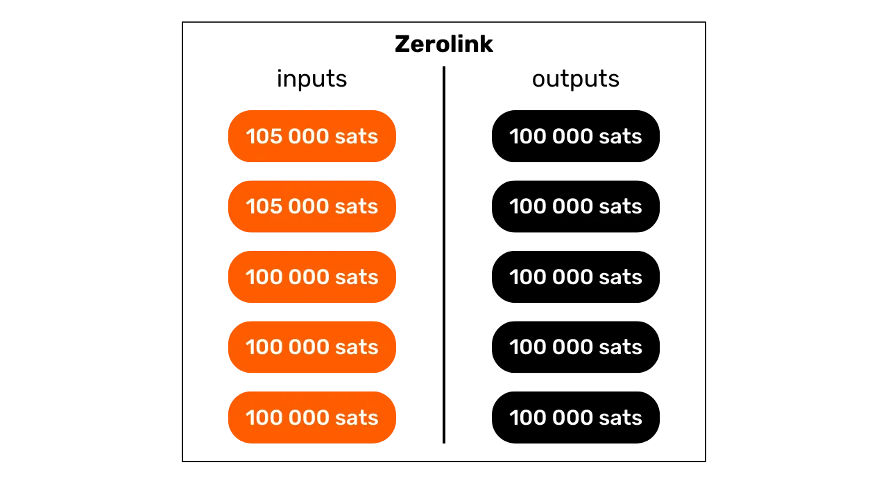
Eine wichtige präventive Maßnahme von Zerolink besteht darin, ungemischte UTXOs vollständig von gemischten UTXOs zu trennen, indem unterschiedliche Sätze von kryptografischen Schlüsseln oder sogar separate Wallets verwendet werden. Auf diese Weise wird das "Pre-Mix"-Wallet, das für Münzen vor dem Mischen vorgesehen ist, vom "Post-Mix"-Wallet unterschieden, das für Münzen reserviert ist, die gemischt wurden.


Diese strikte Trennung der UTXOs dient in erster Linie dazu, zufällige Verbindungen zwischen einem gemischten UTXO und einem ungemischten UTXO zu verhindern. Tatsächlich, wenn solche Verbindungen auftreten, wird die Wirksamkeit des CoinJoins auf dem gemischten UTXO zunichte gemacht, ohne dass der Benutzer sich dessen bewusst ist, was die Vertraulichkeit eines UTXO, dessen Geschichte er für getrennt hielt, kompromittiert. Diese Verbindungen können entweder durch die Wiederverwendung von Adressen beim Sichern eines gemischten UTXO mit einem ungemischten oder durch Anwendung der Common-Input-Ownership Heuristic (CIOH) entstehen, wenn der Benutzer gemischte und ungemischte UTXOs als Eingaben derselben Transaktion verbraucht. Durch die Trennung der Pre-Mixing- und Post-Mixing-Wallets werden diese zufälligen Verbindungen vermieden und der Benutzer vor unfreiwilligen Fehlern geschützt.


Diese Trennung bietet auch die Möglichkeit, unterschiedliche Regeln zwischen den Wallets vor und nach dem Mixing auf der Ebene der Wallet-Software anzuwenden. Zum Beispiel kann in der Wallet nach dem Mixing die Software das Zusammenführen von UTXOs zu Inputs verbieten, um die Anwendung des CIOH zu verhindern, was den Anonset des Benutzers kompromittieren würde. Es ist auch möglich, die Verwendung von Skripten und Transaktionsoptionen (wie das Signalisieren von RBF, zum Beispiel) zu standardisieren, um eine Identifizierung durch Wallet-Fingerabdrücke zu verhindern.
Derzeit ist Whirlpool die einzige Implementierung von Coinjoin, die das Zerolink-Protokoll streng anwendet. Im folgenden Kapitel werden wir die verschiedenen vorhandenen Coinjoin-Implementierungen und die Vor- und Nachteile jeder einzelnen erkunden.

## Coinjoin-Implementierungen

<chapterId>e37ed073-9498-4e4f-820b-30951e829596</chapterId>

_Im Jahr 2024 erleben wir signifikante Veränderungen in den für Benutzer verfügbaren Tools, die Coinjoins auf Bitcoin durchführen möchten. Wir befinden uns derzeit in einer entscheidenden Periode, und der Coinjoin-Markt durchläuft eine große Umstrukturierung. Daher wird dieses Kapitel wahrscheinlich im Laufe der Zeit aktualisiert._

Momentan gibt es hauptsächlich 3 verschiedene Coinjoin-Implementierungen auf Bitcoin:

- Whirlpool;
- Wabisabi;
- JoinMarket.
  Jede dieser Implementierungen zielt darauf ab, die Historie von UTXOs durch Coinjoin-Transaktionen zu brechen. Ihre Mechanismen variieren jedoch erheblich. Daher ist es wesentlich zu verstehen, wie jede funktioniert, um die am besten geeignete Option für Ihre Bedürfnisse auszuwählen.

### JoinMarket

JoinMarket, 2015 von Adam Gibson und Chris Belcher kreiert, hebt sich durch sein einzigartiges Benutzer-Matching-Modell von anderen Coinjoin-Implementierungen ab. Dieses System basiert auf einem P2P-Tauschmarkt, auf dem einige Benutzer, die "Makers", ihre Bitcoins für das Mixing zur Verfügung stellen, während andere, die "Takers", diese Mittel nutzen, um Coinjoins gegen eine Gebühr durchzuführen.


In diesem Modell lassen die "Makers" ihre Bitcoins für die "Takers" verfügbar und erhalten im Gegenzug Gebühren für ihren Dienst. Die "Takers" hingegen zahlen, um die Bitcoins der "Makers" für ihre eigenen Coinjoin-Transaktionen zu nutzen. Die Servicegebühren variieren je nach Rolle: "Makers" sammeln Gebühren für ihr Liquiditätsangebot, während "Takers" die Gebühren zahlen. Dieser Markt funktioniert frei ohne Nutzungsbedingungen.

Einer der Hauptnachteile von JoinMarket ist seine Nutzungskomplexität, die eine gewisse Vertrautheit mit Terminals erfordert, um es effizient zu nutzen. Obwohl diese Komplexität für einen erfahrenen Benutzer keine Barriere darstellt, kann sie den Zugang für die breite Öffentlichkeit einschränken. Die kürzliche Einführung einer Web-Schnittstelle namens JAM hat jedoch seine Nutzung etwas erleichtert.


Quelle: [JAM](https://github.com/joinmarket-webui/jam/blob/devel/docs/assets/screenshot-dark.webp)

Die technische Barriere bleibt jedoch ein großes Hindernis. Im Coinjoin-Ökosystem, wo die Vertraulichkeit durch die Anzahl der Teilnehmer erhöht wird, wirkt sich jede Einschränkung, die die Zugänglichkeit direkt verringert, direkt auf die verfügbare Liquidität aus, die ein entscheidender Faktor für die Effizienz des Mixings ist. Bitcoin, bereits eine Nische in finanziellen Transaktionen, sieht seine Nutzung von Coinjoins als eine Unter-Nische, und JoinMarket repräsentiert einen noch spezialisierteren Teil, wodurch sein Potenzial, die Anonsets seiner Benutzer zu erhöhen, eingeschränkt wird.
Trotz seines innovativen P2P-Matching-Modells für Coinjoins weist JoinMarket einige erhebliche Nachteile auf, insbesondere in Bezug auf die Transaktionsstruktur. Anders als andere Implementierungen wie Whirlpool garantiert JoinMarket keine perfekte Gleichheit zwischen den Ausgängen, und es ist möglich, deterministische Verbindungen zwischen Eingängen und Ausgängen nachzuverfolgen. Darüber hinaus fehlen Werkzeuge, um zu verhindern, dass bereits gemischte Coins erneut gemischt werden, was die von den Nutzern gesuchte Vertraulichkeit beeinträchtigen könnte. Abschließend, obwohl das Konzept von JoinMarket interessant ist, insbesondere für diejenigen, die an einem dynamischen Liquiditätsmarkt interessiert sind, machen seine strukturellen Schwächen und technische Komplexität es meiner Meinung nach sowohl für Anfänger als auch für Experten, die eine Coinjoin-Implementierung suchen, weniger ansprechend.

### Wabisabi

Wabisabi ist eine weitere Implementierung von Coinjoin, mit einem Ansatz, der die Koordination von Transaktionen zentralisiert. Dieses Modell wurde 2021 von Ádám Ficsór (nopara73), Yuval Kogman, Lucas Ontivero und István András Seres entworfen und im folgenden Jahr in die Software Wasabi 2.0 integriert. Wabisabi ist genau eine Evolution des Coinjoin-Modells der Wasabi-Software, die 2018 eingeführt wurde.


Gegen Ende der 2010er Jahre adoptierte Wasabi eine Transaktionsstruktur für seine Coinjoins, die sich radikal von der von Whirlpool unterschied. Um die Anonsets seiner Teilnehmer zu erhöhen, verwendete Wasabi sehr große Coinjoin-Transaktionen, die Dutzende von Teilnehmern gruppierten. Im Gegensatz dazu optierte Whirlpool für mehrere kleine Transaktionen, die eine exponentielle Erhöhung der Anonsets mit jedem Zyklus ermöglichten.

Die Methoden des Umgangs mit Wechselgeld unterschieden auch die beiden Implementierungen. Bei Whirlpool wurde das Wechselgeld ausgeschlossen und von den UTXOs vor den Coinjoin-Zyklen dank des TX0 isoliert, ein Konzept, das ich im nächsten Kapitel weiter erläutern werde. Bei Wasabi hingegen bildete das Wechselgeld einen der Ausgänge der Coinjoin-Transaktion, was deterministische Verbindungen zwischen bestimmten Eingängen und Ausgängen aufrechterhielt.


Mit Wabisabi hat die Version 2.0 von Wasabi seinen Ansatz zu Coinjoins angepasst, um sich dem von Whirlpool anzunähern. Obwohl die Coinjoin-Transaktionen weiterhin sehr groß bleiben, ist es nun möglich, mehrere aufeinanderfolgende Zyklen zu verketten, und folgt damit dem Modell von Whirlpool. Ein besonderes Augenmerk wurde auch auf die Verwaltung des Wechselgelds gelegt: Im Gegensatz zu Wasabi 1.0, wo das Wechselgeld direkt mit den Eingängen der Benutzer verknüpft war, strebt Wabisabi an, das Wechselgeld in mehrere kleine Beträge zu unterteilen, die in gleichen Nennwerten für alle Teilnehmer verteilt werden.

Lassen Sie uns dies mit einem vereinfachten Beispiel mit nur 2 Benutzern illustrieren: Alice möchte 115.000 Sats mischen und Bob 210.000 Sats. Ohne Gebühren zu berücksichtigen, hätte eine Coinjoin-Transaktion mit Wasabi 1.0 3 Ausgänge von 100.000 Sats erzeugt, plus 1 Wechselgeld von 15.000 Sats für Alice und 1 Wechselgeld von 10.000 Sats für Bob. Die Wechselgeld-Ausgänge wären immer mit den Eingängen verknüpft:


Unter Wabisabi hätte dieselbe Transaktion 3 Ausgänge von 100.000 Sats und 5 Ausgänge von 5.000 Sats produziert, wodurch das Wechselgeld so verteilt wird, dass es nicht direkt einem spezifischen Eingang zuzuordnen ist:

Persönlich finde ich, dass das Management von Veränderungen in Wabisabi mehrere Risiken birgt, die seine Wirksamkeit in Bezug auf die Privatsphäre beeinträchtigen könnten:

- Wenn ein Benutzer mit einem UTXO beiträgt, der deutlich größer ist als die der anderen Teilnehmer, endet er unweigerlich mit einer Menge an Wechselgeld, die mit seinem Input verknüpft wird. Dies widerspricht dem ursprünglichen Ziel des Protokolls, das darauf abzielt, jegliches identifizierbares Wechselgeld zu eliminieren;
- Die Vervielfachung von Stückelungen, um das Wechselgeld zu fragmentieren, kann paradoxerweise die Effizienz des Mixens beeinträchtigen. Dieser Prozess kann zu einer Abnahme der Anonsets für bestimmte Outputs führen, da sie leichter identifizierbar werden;
- Diese Methode erzeugt auch UTXOs mit geringem Wert, die ein Managementproblem für den Benutzer darstellen. Diese kleinen UTXOs, wenn sie im Verhältnis zu ihrem Wert zu kostspielig zu verwenden werden, können zu "Staub" werden. Dieses Phänomen zwingt den Benutzer, mehrere UTXOs in Inputs in ihren zukünftigen Transaktionen zu verschmelzen oder sie zu konsolidieren. In beiden Fällen kann dies aufgrund des COH entweder die erhaltenen Anonsets verringern oder die durch den ursprünglichen Coinjoin erworbenen Datenschutzvorteile vollständig aufheben.

Im Gegensatz zu Whirlpool, das das ZeroLink-Protokoll implementiert und eine strenge Trennung zwischen Pre-Mix- und Post-Mix-UTXOs gewährleistet, hält Wabisabi diese strikte Segregation nicht aufrecht. Es gab auch Probleme mit der Wiederverwendung von Adressen durch einige Wasabi-Clients, was offensichtlich sehr nachteilig für den Benutzer ist.

In Version 2.0 von Wasabi wurde eine neue Coinjoin-Gebührenpolitik implementiert. Nun sind die Koordinatorgebühren auf 0,3 % für UTXOs festgelegt, die größer als 0,01 Bitcoin sind, während für kleinere UTXOs diese Gebühren vollständig erlassen werden. Darüber hinaus sind Remixes für diese kleinen UTXOs kostenlos, obwohl die Mining-Gebühren weiterhin vom Benutzer für alle Transaktionen, einschließlich Remixes, getragen werden müssen.

Diese Politik steht im Kontrast zu der von Whirlpool, wo die Gebühren unabhängig von der Größe der erhaltenen Anonsets fest bleiben. Mit Wasabi 2.0, obwohl Koordinatorgebühren für kleine UTXOs erlassen werden, muss der Benutzer immer noch Mining-Gebühren für alle Transaktionen, einschließlich Remixes, zahlen.
Zum Zeitpunkt des Schreibens ist die Nutzung von Wabisabi aufgrund jüngster Ereignisse deutlich komplexer geworden. Tatsächlich kündigte nach der Verhaftung der Gründer von Samourai Wallet zkSNACKs, das Unternehmen, das die Entwicklung von Wasabi finanziert und verwaltet, die Einstellung seines Coinjoin-Koordinierungsdienstes am 1. Juni 2024 an. Dieser Koordinator, der standardmäßig auf Wasabi eingestellt war, hatte den Großteil der Liquidität.

Mit der Schließung dieses Hauptkoordinators müssen Benutzer sich nun mit neuen unabhängigen Koordinatoren verbinden. Diese Änderung wirft Bedenken auf: Einerseits könnten die neuen Koordinatoren möglicherweise nicht über ausreichende Liquidität verfügen, was die Wirksamkeit von Coinjoins in Bezug auf die Privatsphäre verringert. Andererseits besteht das Risiko, auf einen bösartigen Koordinator zu treffen. Diese Situation fügt neuen erheblichen Risiken für diejenigen hinzu, die Wabisabi nutzen möchten.

Über die technischen Probleme hinaus wirft die Entscheidung von zkSNACKs, dem Unternehmen hinter Wasabi, die Dienste eines Chain-Analyse-Unternehmens zu nutzen, um die Teilnehmer in Coinjoins zu filtern, ernsthafte ethische und strategische Fragen auf. Die ursprüngliche Idee war, die Nutzung von Coinjoins auf Wasabi durch Kriminelle zu verhindern, ein Schritt, der legitim erscheinen mag. Dies wirft jedoch ein Paradoxon auf: Gebühren an einen Koordinator zu zahlen, dessen Hauptaufgabe es ist, die Privatsphäre der Benutzer zu erhöhen, nur damit dieser dann ein Unternehmen finanziert, dessen Ziel es ist, genau diese Privatsphäre zu kompromittieren.
Noch besorgniserregender ist das Prinzip der Filterung, das im starken Kontrast zur Philosophie von Bitcoin steht, die darauf abzielt, ein offenes und unzensierbares Finanzsystem anzubieten. Es mag gerechtfertigt erscheinen, kriminelle Aktivitäten ausschließen zu wollen, doch könnte diese Filterung auch Individuen betreffen, deren Handlungen, obwohl sie in einigen Kontexten als illegal eingestuft werden, moralisch vertretbar oder gesellschaftlich nützlich sein könnten. Das Beispiel von Edward Snowden veranschaulicht diese Dichotomie perfekt: Von einigen Regierungen wegen seiner Enthüllungen als Krimineller betrachtet, wird er von anderen als Whistleblower gesehen, der im öffentlichen Interesse gehandelt hat. Diese Komplexität unterstreicht die potenzielle Gefahr der Filterung, die, obwohl sie von einer guten Absicht ausgeht, letztendlich die Rechte und die Sicherheit legitimer Nutzer verletzen könnte. Ich könnte auch Aktivisten und Journalisten erwähnen, die unter bestimmten autoritären Regimen verfolgt werden. Wie Sie verstanden haben werden, geht meine Vorliebe zweifellos zum Whirlpool-Modell für die Durchführung von Coinjoins auf Bitcoin. Dieses System zeichnet sich durch seine Strenge aus und bietet überlegene Garantien in Bezug auf die Privatsphäre. Es ist auch das einzige, das ein in einem mathematischen Kontext als perfekt betrachtetes Mischen vorschlägt. Meiner Meinung nach repräsentiert dieses Modell die Zukunft der Coinjoins auf Bitcoin. Ich lade Sie daher ein, dieses Modell im nächsten Kapitel tiefergehend zu erkunden.

## Die Funktionsweise von Whirlpool

<chapterId>bdbd7109-e36d-4b4f-a3c6-928df4e9bfda</chapterId>

Whirlpool unterscheidet sich von anderen Coinjoin-Methoden durch die Verwendung von "_ZeroLink_"-Transaktionen, die sicherstellen, dass zwischen allen Eingaben und Ausgaben technisch keinerlei Verbindung möglich ist. Dieses perfekte Mischen wird durch eine Struktur erreicht, in der jeder Teilnehmer mit einem identischen Betrag in Eingabe (außer den Mining-Gebühren) beiträgt, wodurch Ausgaben von perfekt gleichen Beträgen erzeugt werden.

Dieser restriktive Ansatz bei den Eingaben verleiht den Whirlpool-Coinjoin-Transaktionen eine einzigartige Eigenschaft: die totale Abwesenheit von deterministischen Verbindungen zwischen den Eingaben und den Ausgaben. Mit anderen Worten, jede Ausgabe hat eine gleich hohe Wahrscheinlichkeit, jedem Teilnehmer zugeordnet zu werden, im Verhältnis zu allen anderen Ausgaben der Transaktion.


### Die allgemeine Funktionsweise von Whirlpool

Ursprünglich war die Anzahl der Teilnehmer in jedem Whirlpool-Coinjoin auf 5 begrenzt, mit 2 neuen Teilnehmern und 3 Remixern (wir werden diese Konzepte weiter unten erklären). Jedoch hat der Anstieg der On-Chain-Transaktionsgebühren im Jahr 2023 das Samourai-Team dazu veranlasst, ihr Modell zu überdenken, um die Privatsphäre zu verbessern und gleichzeitig die Kosten zu reduzieren. Unter Berücksichtigung der Marktsituation der Gebühren und der Anzahl der Teilnehmer kann der Koordinator nun Coinjoins organisieren, die 6, 7 oder 8 Teilnehmer umfassen. Diese erweiterten Sitzungen werden unter dem Namen "_Surge Cycles_" bezeichnet. Es ist wichtig zu beachten, dass unabhängig von der Konfiguration immer nur 2 neue Teilnehmer in den Whirlpool-Coinjoins sind.

So sind Whirlpool-Transaktionen durch eine identische Anzahl von Eingaben und Ausgaben gekennzeichnet, die sein können:

- 5 Eingaben und 5 Ausgaben;


- 6 Eingaben und 6 Ausgaben;


- 7 Eingaben und 7 Ausgaben;


- 8 Eingaben und 8 Ausgaben.


Das von Whirlpool vorgeschlagene Modell basiert somit auf kleinen Coinjoin-Transaktionen. Anders als bei Wabisabi und JoinMarket, wo die Robustheit der Anonsets auf dem Volumen der Teilnehmer in einem einzigen Zyklus (oder einigen wenigen Zyklen) beruht, setzt Whirlpool auf die Verkettung mehrerer kleiner Zyklen. In diesem Modell fallen für den Benutzer nur Gebühren bei seinem ersten Eintritt in einen Pool an, was es ihm ermöglicht, an einer Vielzahl von Remixen ohne zusätzliche Kosten teilzunehmen. Es sind die neuen Teilnehmer, die die Mining-Gebühren für die Remixer übernehmen.
Mit jedem zusätzlichen Coinjoin, an dem eine Münze zusammen mit ihren früheren Begegnungen teilnimmt, wachsen die Anonsets exponentiell. Das Ziel ist daher, diese kostenlosen Remixe zu nutzen, die bei jedem Vorkommen zur Stärkung der Dichte der Anonsets beitragen, die mit jeder gemischten Münze verbunden sind.


Whirlpool wurde mit zwei wichtigen Anforderungen im Sinn entworfen:

- Die Zugänglichkeit der Implementierung auf mobilen Geräten, da Samourai Wallet hauptsächlich eine Smartphone-Anwendung ist;
- Die Geschwindigkeit der Remix-Zyklen, um einen signifikanten Anstieg der Anonsets zu fördern.

Diese Imperative leiteten die Entscheidungen der Entwickler von Samourai Wallet bei der Gestaltung von Whirlpool, was sie dazu brachte, die Anzahl der Teilnehmer pro Zyklus zu begrenzen. Zu wenige Teilnehmer hätten die Wirksamkeit des Coinjoin kompromittiert, indem sie die in jedem Zyklus generierten Anonsets drastisch reduziert hätten, während zu viele Teilnehmer Managementprobleme auf mobilen Anwendungen verursacht hätten und den Fluss der Zyklen behindert hätten.

Letztendlich ist es nicht notwendig, eine hohe Anzahl von Teilnehmern pro Coinjoin bei Whirlpool zu haben, da die Anonsets über die Ansammlung mehrerer Coinjoin-Zyklen gebildet werden. Das wichtigste Prinzip hier ist die Homogenität der UTXOs aller Teilnehmer, da dies eine perfekte Mischung ermöglicht und somit den vollen Nutzen aus den Misch- und Remix-Zyklen zieht.

### Die Pools und Coinjoin-Gebühren

Damit diese mehrfachen Zyklen die Anonsets der gemischten Münzen effektiv erhöhen können, muss ein bestimmter Rahmen festgelegt werden, um die Beträge der verwendeten UTXOs zu beschränken. Whirlpool definiert daher verschiedene Pools.

Ein Pool stellt eine Gruppe von Benutzern dar, die zusammen mischen möchten und sich auf den Betrag der UTXOs einigen, um den Coinjoin-Prozess zu optimieren und dabei eine perfekte Homogenität der Münzen zu bewahren. Jeder Pool gibt einen festen Betrag für das UTXO an, den der Benutzer einhalten muss, um teilnehmen zu können. Um also Coinjoins mit Whirlpool durchzuführen, müssen Sie einen Pool auswählen. Die derzeit verfügbaren Pools sind wie folgt:

- 0,5 Bitcoins;
- 0,05 Bitcoin;
- 0,01 Bitcoin;
- 0,001 Bitcoin (= 100.000 Sats).
  Indem Sie einem Pool mit Ihren Bitcoins beitreten, werden diese geteilt, um UTXOs zu generieren, die perfekt homogen mit denen der anderen Teilnehmer im Pool sind. Jeder Pool hat ein maximales Limit; somit werden Sie für Beträge, die dieses Limit überschreiten, gezwungen sein, entweder zwei separate Eintritte innerhalb desselben Pools zu machen oder sich an einen anderen Pool mit einem höheren Betrag zu wenden:
  | Pool (Bitcoin) | Maximalbetrag pro Eintritt (Bitcoin) |
  |----------------|--------------------------------------|
  | 0,5 | 35 |
  | 0,05 | 3,5 |
  | 0,01 | 0,7 |
  | 0,001 | 0,025 |
  Ein UTXO gilt als Teil eines Pools, wenn es bereit ist, in einen Coinjoin integriert zu werden. Das bedeutet jedoch nicht, dass der Benutzer den Besitz daran verliert. Wie wir in den ersten Kapiteln dieses Teils gesehen haben, behalten Sie durch die verschiedenen Mischzyklen die volle Kontrolle über Ihre Schlüssel und somit über Ihre Bitcoins. Dies unterscheidet die Coinjoin-Technik von anderen zentralisierten Mischtechniken.

Um einem Coinjoin-Pool beizutreten, müssen Sie Servicegebühren sowie Mining-Gebühren zahlen. Die Servicegebühren sind für jeden Pool festgelegt und sollen die Teams entschädigen, die für die Entwicklung und Wartung von Whirlpool verantwortlich sind.

Die Servicegebühren für die Nutzung von Whirlpool sind einmalig beim Eintritt in den Pool zu entrichten. Sobald dieser Schritt abgeschlossen ist, haben Sie die Möglichkeit, an einer unbegrenzten Anzahl von Remixes ohne zusätzliche Gebühren teilzunehmen. Hier sind die aktuellen festen Gebühren für jeden Pool:

| Pool (Bitcoin) | Eintrittsgebühr (Bitcoin) |
| -------------- | ------------------------- |
| 0.5            | 0.0175                    |
| 0.05           | 0.00175                   |
| 0.01           | 0.0005 (50.000 Sats)      |
| 0.001          | 0.00005 (5.000 Sats)      |

Diese Gebühren funktionieren im Wesentlichen als Eintrittskarte für den gewählten Pool, unabhängig von dem Betrag, den Sie in Coinjoin einbringen. Ob Sie also dem 0,01-Pool mit genau 0,01 BTC beitreten oder ihn mit 0,5 BTC betreten, die Gebühren bleiben absolut gesehen gleich.

Bevor Sie mit Whirlpool-Coinjoins fortfahren, hat der Benutzer daher die Wahl zwischen 2 Strategien:

- Sich für einen kleineren Pool entscheiden, um die Servicegebühren zu minimieren, wissend, dass sie mehrere kleinere UTXOs zurückbekommen;
- Oder einen größeren Pool bevorzugen, indem höhere Gebühren akzeptiert werden, um mit einer reduzierten Anzahl von UTXOs mit höherem Wert zu enden.
  Es wird im Allgemeinen nicht empfohlen, mehrere gemischte UTXOs nach den Coinjoin-Zyklen zusammenzuführen, da dies die gewonnene Privatsphäre gefährden könnte, insbesondere aufgrund der Heuristik des gemeinsamen Eingentums (CIOH: _Common-Input-Ownership-Heuristic_). Daher könnte es klug sein, einen größeren Pool zu wählen, auch wenn dies bedeutet, mehr zu zahlen, um nicht zu viele UTXOs mit geringem Wert als Ausgaben zu haben. Der Benutzer muss diese Kompromisse abwägen, um den Pool zu wählen, den er bevorzugt.
  Neben den Servicegebühren müssen auch die Mining-Gebühren, die jeder Bitcoin-Transaktion innewohnen, berücksichtigt werden. Als Whirlpool-Benutzer müssen Sie die Mining-Gebühren für die Vorbereitungstransaktion (`Tx0`) sowie die für den ersten Coinjoin zahlen. Alle nachfolgenden Remixes sind kostenlos, dank des Whirlpool-Modells, das auf den Zahlungen neuer Teilnehmer basiert.

Tatsächlich sind bei jedem Whirlpool-Coinjoin 2 Benutzer unter den Eingaben neue Teilnehmer. Die anderen Eingaben stammen von Remixern. Als Ergebnis werden die Mining-Gebühren für alle Teilnehmer an der Transaktion von diesen 2 neuen Teilnehmern gedeckt, die dann ebenfalls von kostenlosen Remixes profitieren:

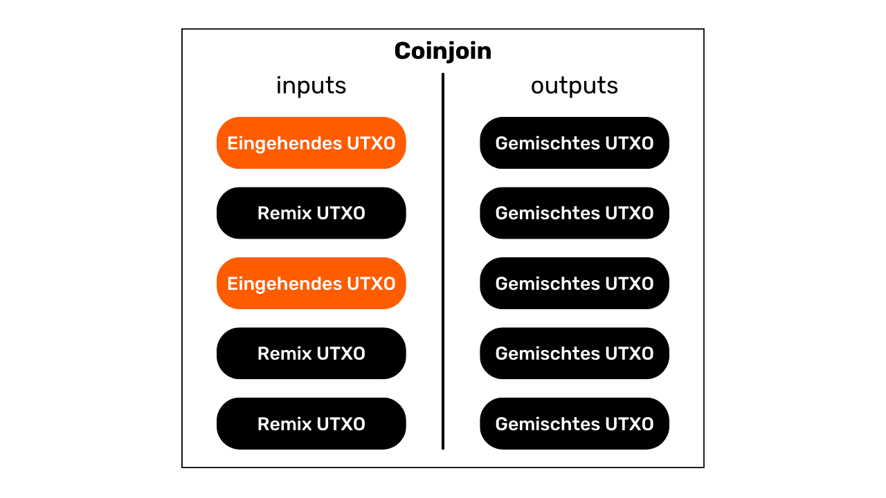

Dank dieses Gebührensystems unterscheidet sich Whirlpool wirklich von anderen Coinjoin-Implementierungen, da die Anonsets der UTXOs nicht proportional zum vom Benutzer gezahlten Preis sind. So ist es möglich, erheblich hohe Anonymitätsniveaus zu erreichen, indem nur die Eintrittsgebühr des Pools und die Mining-Gebühren für 2 Transaktionen (die `Tx0` und der anfängliche Mix) gezahlt werden.
Es ist wichtig zu beachten, dass der Benutzer auch die Mining-Gebühren decken muss, um seine UTXOs nach der Durchführung mehrerer CoinJoins aus dem Pool abzuheben, es sei denn, er hat die Option `mix to` gewählt, die es ermöglicht, eine externe Adresse anzugeben, die die Mittel direkt als CoinJoin-Ausgabe erhält, ohne eine zusätzliche Transaktion.

### HD Wallet Konten

Um einen CoinJoin über Whirlpool durchzuführen, muss das Wallet mehrere unterschiedliche Konten generieren. Dies ist das Prinzip des ZeroLink-Protokolls. Ein Konto, im Kontext eines HD (_Hierarchical Deterministic_) Wallets, stellt einen Abschnitt dar, der vollständig von den anderen isoliert ist, wobei diese Trennung auf der dritten Tiefeebene der Wallet-Hierarchie erfolgt, das heißt, auf der Ebene des `xpub`.


Ein HD-Wallet kann theoretisch bis zu `2^(32/2)` verschiedene Konten ableiten. Das anfängliche Konto, das standardmäßig bei allen Bitcoin-Wallets verwendet wird, entspricht dem Index `0'`.

Für an Whirlpool angepasste Wallets werden 4 Konten verwendet, um den Anforderungen des ZeroLink-Prozesses gerecht zu werden:

- Das **Einzahlungskonto**, identifiziert durch den Index `0'`;
- Das **Bad Bank**-Konto (oder "doxxic change"), identifiziert durch den Index `2 147 483 644'`;
- Das **Premix**-Konto, identifiziert durch den Index `2 147 483 645'`;
- Das **Postmix**-Konto, identifiziert durch den Index `2 147 483 646'`.

Jedes dieser Konten erfüllt eine spezifische Funktion im CoinJoin-Prozess, die wir in den folgenden Abschnitten untersuchen werden.

Alle diese Konten sind mit einem einzigen Seed verbunden, was es dem Benutzer ermöglicht, Zugang zu all seinen Bitcoins mithilfe seiner Wiederherstellungsphrase und, falls notwendig, seiner Passphrase wiederherzustellen. Es ist jedoch notwendig, der Software während dieser Wiederherstellungsoperation die verschiedenen verwendeten Kontenindizes anzugeben.

Lassen Sie uns nun die verschiedenen Stadien eines Whirlpool-CoinJoins innerhalb dieser Konten betrachten.

### Der TX0

Der Ausgangspunkt eines jeden Whirlpool-CoinJoins ist das **Einzahlungskonto**. Dieses Konto ist dasjenige, das Sie automatisch verwenden, wenn Sie ein neues Bitcoin-Wallet erstellen. Dieses Konto muss mit den Bitcoins aufgeladen werden, die Sie mischen möchten.

Der `Tx0` stellt den ersten Schritt im Whirlpool-Mixing-Prozess dar. Er zielt darauf ab, die UTXOs vorzubereiten und zu vereinheitlichen für den CoinJoin, indem sie in Einheiten aufgeteilt werden, die dem Betrag des ausgewählten Pools entsprechen, um die Homogenität des Mixings zu gewährleisten. Die vereinheitlichten UTXOs werden dann an das **Premix**-Konto gesendet. Was den Unterschied betrifft, der nicht in den Pool eingehen kann, wird er in ein spezifisches Konto getrennt: die **Bad Bank** (oder "doxxic change").

Diese anfängliche Transaktion `Tx0` dient auch dazu, die Servicegebühren an den CoinJoin-Koordinator zu begleichen. Im Gegensatz zu den folgenden Schritten ist diese Transaktion nicht kollaborativ; der Benutzer muss daher die vollen Mining-Gebühren tragen:

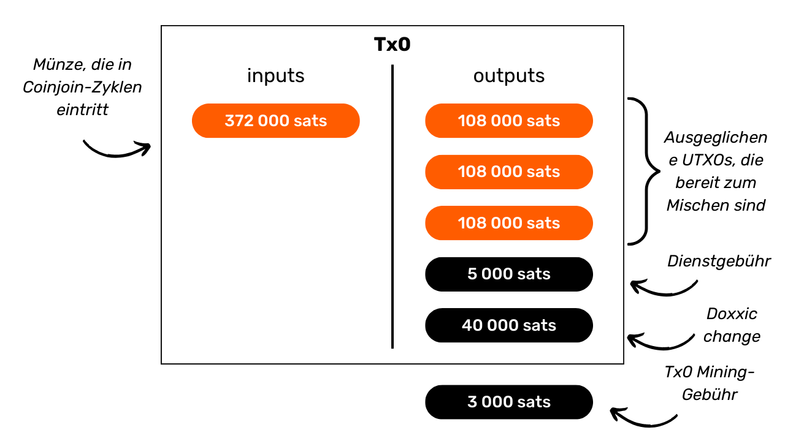

In diesem Beispiel einer `Tx0`-Transaktion wird ein Eingang von `372 000 Sats` von unserem **Einzahlungskonto** in mehrere Ausgabe-UTXOs aufgeteilt, die wie folgt verteilt sind:

- Ein Betrag von `5 000 Sats` für den Koordinator für Servicegebühren, entsprechend dem Eintritt in den Pool von `100 000 Sats`;
- 3 UTXOs, vorbereitet für das Mixing, umgeleitet an unser **Premix**-Konto und beim Koordinator registriert. Diese UTXOs werden auf `108 000 Sats` jeder gleichgemacht, um die Mining-Gebühren für ihr zukünftiges erstes Mixen zu decken;
- Der Überschuss, der zu klein ist, um in den Pool einzugehen, wird als toxisches Wechselgeld betrachtet. Es wird auf sein spezifisches Konto gesendet. Hier beläuft sich dieses Wechselgeld auf `40 000 Sats`;
- Schließlich gibt es `3.000 Sats`, die keinen Ausgang darstellen, sondern die Mining-Gebühren sind, die erforderlich sind, um die `Tx0` zu bestätigen.
  Zum Beispiel, hier ist eine echte Tx0 Whirlpool (nicht von mir): [edef60744f539483d868caff49d4848e5cc6e805d6cdc8d0f9bdbbaedcb5fc46](https://mempool.space/fr/tx/edef60744f539483d868caff49d4848e5cc6e805d6cdc8d0f9bdbbaedcb5fc46)


### Das toxische Wechselgeld

Der Überschuss, der nicht in den Pool integriert werden konnte, hier äquivalent zu `40.000 Sats`, wird auf das **Schlechtbank**-Konto umgeleitet, auch als "toxisches Wechselgeld" bezeichnet, um eine strikte Trennung von den anderen UTXOs im Wallet zu gewährleisten.

Dieses UTXO ist gefährlich für die Privatsphäre des Benutzers, weil es nicht nur noch an seine Vergangenheit gebunden ist und somit möglicherweise an die Identität seines Besitzers, sondern es wird auch als zu einem Benutzer gehörend markiert, der an einem Coinjoin teilgenommen hat.


Wenn dieses UTXO mit gemischten Ausgängen zusammengeführt wird, verlieren sie alle während der Coinjoin-Zyklen gewonnene Privatsphäre, insbesondere wegen der CIOH (_Common-Input-Ownership-Heuristic_). Wird es mit anderen toxischen Wechselgeldern zusammengeführt, riskiert der Benutzer den Verlust der Privatsphäre, da dies die verschiedenen Einträge aus den Coinjoin-Zyklen verbinden wird. Daher muss es mit Vorsicht behandelt werden. Wir werden im letzten Abschnitt dieses Kapitels ausführlicher über die Verwaltung dieser toxischen UTXOs sprechen.

### Der initiale Mix

Nachdem die `Tx0` abgeschlossen ist, werden die gleichwertigen UTXOs auf das **Premix**-Konto unseres Wallets gesendet, bereit, in ihren ersten Coinjoin-Zyklus eingeführt zu werden, auch "initialer Mix" genannt. Wenn, wie in unserem Beispiel, die `Tx0` mehrere UTXOs für das Mischen generiert, wird jeder von ihnen in einen separaten initialen Mix integriert.

Am Ende dieser ersten Mixe wird das **Premix**-Konto leer sein, während unsere Münzen, nachdem sie die Mining-Gebühren für diesen ersten Coinjoin bezahlt haben, genau auf den Betrag angepasst werden, der vom gewählten Pool definiert wurde. In unserem Beispiel werden unsere ursprünglichen UTXOs von `108.000 Sats` genau auf `100.000 Sats` reduziert sein.


### Die Remixes

Nach dem initialen Mix werden die UTXOs auf das **Postmix**-Konto übertragen. Dieses Konto sammelt sowohl die bereits gemischten UTXOs als auch diejenigen, die auf ein Remixing warten. Wenn der Whirlpool-Client aktiv ist, sind die UTXOs im **Postmix**-Konto automatisch für ein Remixing verfügbar und werden zufällig ausgewählt, um an diesen neuen Zyklen teilzunehmen.
Zur Erinnerung, Remixes sind dann 100% kostenlos: Es fallen keine zusätzlichen Servicegebühren oder Mining-Gebühren an. Die UTXOs im **Postmix**-Konto zu halten, erhält somit ihren unveränderten Wert und verbessert gleichzeitig ihre Anonsets. Deshalb ist es wichtig, diese Münzen an mehreren Coinjoin-Zyklen teilnehmen zu lassen. Es kostet Sie absolut nichts, und es erhöht ihre Anonymitätsstufen.
Wenn Sie sich entscheiden, gemischte UTXOs auszugeben, können Sie dies direkt von diesem **Postmix**-Konto aus tun. Es ist ratsam, die gemischten UTXOs auf diesem Konto zu belassen, um von kostenlosen Remixen zu profitieren und zu verhindern, dass sie den Whirlpool-Kreislauf verlassen, was ihre Privatsphäre verringern könnte.

### Wie verwaltet man sein Postmix-Konto richtig?

Nachdem Sie Coinjoin-Zyklen durchgeführt haben, ist die beste Strategie, Ihre UTXOs im **Postmix**-Konto zu belassen, in Erwartung ihrer zukünftigen Verwendung. Es ist sogar ratsam, sie unendlich remixen zu lassen, bis Sie sie ausgeben müssen.

Einige Benutzer könnten in Erwägung ziehen, ihre gemischten Bitcoins auf ein Wallet zu übertragen, das durch ein Hardware-Wallet gesichert ist. Dies ist möglich, aber es ist wichtig, den Empfehlungen von Samourai Wallet sorgfältig zu folgen, um die erworbene Vertraulichkeit nicht zu kompromittieren.

Das Zusammenführen von UTXOs ist der am häufigsten gemachte Fehler. Es ist notwendig, gemischte UTXOs nicht mit ungemischten UTXOs in derselben Transaktion zu kombinieren, um die Common-Input-Ownership-Heuristic (CIOH) zu vermeiden. Dies erfordert eine sorgfältige Verwaltung Ihrer UTXOs innerhalb Ihres Wallets, insbesondere in Bezug auf die Beschriftung.


Es ist auch wichtig, bei der Konsolidierung von gemischten UTXOs untereinander vorsichtig zu sein. Moderate Konsolidierungen sind denkbar, wenn Ihre gemischten UTXOs signifikante Anonsets haben, aber dies wird unweigerlich die Vertraulichkeit Ihrer Münzen verringern. Stellen Sie sicher, dass Konsolidierungen weder zu signifikant sind noch nach einer unzureichenden Anzahl von Remixen durchgeführt werden, um das Risiko zu vermeiden, deduzierbare Verbindungen zwischen Ihren UTXOs vor und nach den Coinjoin-Zyklen herzustellen. Im Zweifelsfall ist es die beste Praxis, die Postmix-UTXOs nicht zu konsolidieren und sie einzeln auf Ihr Hardware-Wallet zu übertragen, jedes Mal eine neue leere Adresse generierend. Denken Sie auch daran, jedes empfangene UTXO ordnungsgemäß zu beschriften.
Es wird auch davon abgeraten, Ihre Postmix-UTXOs auf ein Wallet zu übertragen, das ungewöhnliche Skripte verwendet. Wenn Sie beispielsweise Whirlpool von einem Multisig-Wallet mit `P2WSH`-Skripten betreten, besteht eine geringe Chance, dass Sie mit anderen Benutzern gemischt werden, die ursprünglich denselben Wallet-Typ haben. Wenn Sie Ihre Postmix auf dasselbe Multisig-Wallet abheben, wird die Privatsphäre Ihrer gemischten Bitcoins stark verringert. Über Skripte hinaus gibt es viele andere Wallet-Fingerabdrücke, die Sie täuschen können.
Wie bei jeder Bitcoin-Transaktion ist es auch wichtig, Empfangsadressen nicht wiederzuverwenden. Jede neue Transaktion sollte auf einer neuen, leeren Adresse empfangen werden.

Die einfachste und sicherste Lösung ist, Ihre gemischten UTXOs in ihrem **Postmix**-Konto ruhen zu lassen, sie remixen zu lassen und sie nur anzufassen, um sie auszugeben. Samourai- und Sparrow-Wallets bieten zusätzlichen Schutz gegen alle diese Risiken im Zusammenhang mit der Kettenanalyse. Diese Schutzmaßnahmen helfen Ihnen, Fehler zu vermeiden.

### Wie verwaltet man seinen toxischen Wechsel richtig?

Als Nächstes müssen Sie vorsichtig sein, wenn Sie Ihren doxxischen Wechsel verwalten, den Wechsel, der nicht in den Coinjoin-Pool eintreten konnte. Diese toxischen UTXOs, die aus der Nutzung von Whirlpool resultieren, stellen ein Risiko für Ihre Privatsphäre dar, da sie eine Verbindung zwischen Ihnen und der Nutzung von Coinjoin herstellen. Daher ist es zwingend erforderlich, sie mit Vorsicht zu behandeln und nicht mit anderen UTXOs, insbesondere gemischten UTXOs, zu kombinieren.

Hier sind verschiedene Strategien zu berücksichtigen, um sie zu verwenden:

- **Mischen Sie sie in kleineren Pools:** Wenn Ihr toxisches UTXO groß genug ist, um allein in einen kleineren Pool einzutreten, sollten Sie das Mischen in Betracht ziehen. Dies ist oft die beste Option. Das Zusammenführen mehrerer toxischer UTXOs, um Zugang zu einem Pool zu erhalten, wird jedoch abgeraten, da dies Ihre verschiedenen Eingaben verknüpfen könnte.
- **Markiere sie als "nicht ausgebbar":** Ein anderer Ansatz besteht darin, sie nicht mehr zu verwenden, sie in ihrem dedizierten Konto als "nicht ausgebbar" zu markieren und einfach zu hodln. Dies stellt sicher, dass Sie sie nicht versehentlich ausgeben. Wenn der Wert von Bitcoin steigt, könnten neue Pools, die besser zu Ihren toxischen UTXOs passen, entstehen;
- **Mache Spenden:** Erwäge Spenden, auch bescheidene, an Entwickler, die an Bitcoin und der zugehörigen Software arbeiten. Du kannst auch an Organisationen spenden, die BTC akzeptieren. Wenn das Verwalten deiner toxischen UTXOs zu kompliziert erscheint, kannst du sie einfach loswerden, indem du eine Spende machst.
- **Kaufe Geschenkkarten:** Plattformen wie [Bitrefill](https://www.bitrefill.com/) ermöglichen es dir, Bitcoins gegen Geschenkkarten einzutauschen, die bei verschiedenen Händlern verwendet werden können. Dies kann eine Möglichkeit sein, deine toxischen UTXOs loszuwerden, ohne den damit verbundenen Wert zu verlieren.
- **Konsolidiere sie auf Monero:** Samourai Wallet bietet einen Atomic Swap-Service zwischen BTC und XMR. Dies ist ideal, um toxische UTXOs zu verwalten, indem sie auf Monero konsolidiert werden, ohne deine Privatsphäre durch KYC zu kompromittieren, bevor sie zurück zu Bitcoin gesendet werden. Diese Option kann jedoch aufgrund von Mining-Gebühren und Prämien wegen Liquiditätsbeschränkungen kostspielig sein.
- **Sende sie zum Lightning-Netzwerk:** Diese UTXOs zum Lightning-Netzwerk zu übertragen, um von reduzierten Transaktionsgebühren zu profitieren, ist eine interessante Option. Diese Methode kann jedoch je nach Nutzung von Lightning bestimmte Informationen offenlegen und sollte daher mit Vorsicht praktiziert werden.

### Wie benutzt man Whirlpool?

Nach der Verhaftung der Gründer von Samourai Wallet und der Beschlagnahmung ihrer Server am 24. April 2024 funktioniert das Whirlpool-Tool nicht mehr, auch nicht für diejenigen, die ihr eigenes Dojo haben. Zuvor war es auf Samourai Wallet und Sparrow Wallet verfügbar.


Es bleibt jedoch möglich, dass dieses Tool in den kommenden Wochen wieder in Betrieb genommen wird, abhängig vom Ausgang der Prozesse, oder auf andere Weise neu gestartet wird. Auf jeden Fall glaube ich, dass der Markt für Coinjoin auf Bitcoin nicht lange ohne Angebot bleiben wird, da eine klare Nachfrage besteht. Darüber hinaus wird das Whirlpool-Modell, das in Bezug auf Privatsphäre am fortschrittlichsten ist, sicherlich in Zukunft für andere Implementierungen verwendet werden.

Wir verfolgen die Entwicklung dieses Falls sowie Entwicklungen bezüglich zugehöriger Tools genau. Seien Sie versichert, dass wir dieses Training aktualisieren werden, sobald neue Informationen verfügbar sind.

Im nächsten Kapitel werden wir entdecken, was "Anonsets" sind, wie diese Indikatoren berechnet werden und wie sie uns helfen können, die Wirksamkeit von Coinjoin-Zyklen einzuschätzen.

https://planb.network/tutorials/privacy/coinjoin-sparrow-wallet

https://planb.network/tutorials/privacy/coinjoin-samourai-wallet

https://planb.network/tutorials/privacy/coinjoin-dojo

## Anonymitätssets

<chapterId>be1093dc-1a74-40e5-9545-2b97a7d7d431</chapterId>

Nachdem wir untersucht haben, wie Coinjoins funktionieren und welche Herausforderungen mit dem effektiven Mischen verbunden sind, werden wir nun lernen, wie man diese Wirksamkeit misst. Wie bestimmt man, ob ein Coinjoin-Prozess wirksam war und welchen Grad an Anonymität eine Münze erworben hat? Dies werden wir in diesem Kapitel mit Anonymitätssets oder "Anonsets" auf Englisch erkunden.

### Erinnerung an den Nutzen von Coinjoin

Der Nutzen von CoinJoin liegt in seiner Fähigkeit, plausible Abstreitbarkeit zu erzeugen, indem deine Münze in eine Gruppe von nicht unterscheidbaren Münzen eingetaucht wird. Das Ziel dieser Aktion ist es, die Nachverfolgbarkeitslinks sowohl von der Vergangenheit in die Gegenwart als auch von der Gegenwart in die Vergangenheit zu brechen.
Mit anderen Worten, ein Analyst, der Ihre anfängliche Transaktion (`Tx0`) am Eingang der CoinJoin-Zyklen kennt, sollte nicht in der Lage sein, mit Sicherheit Ihr UTXO am Ausgang der Remix-Zyklen zu identifizieren (Analyse vom Zykluseingang bis zum Zyklusausgang).
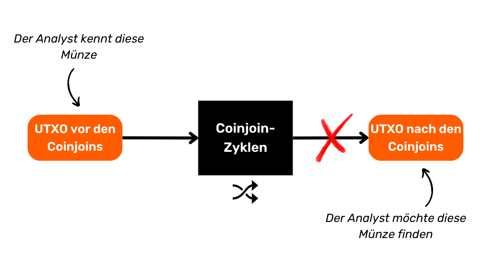

Umgekehrt sollte ein Analyst, der Ihr UTXO am Ausgang der CoinJoin-Zyklen kennt, nicht in der Lage sein, die ursprüngliche Transaktion am Eingang der Zyklen zu bestimmen (Analyse vom Zyklusausgang zum Zykluseingang).

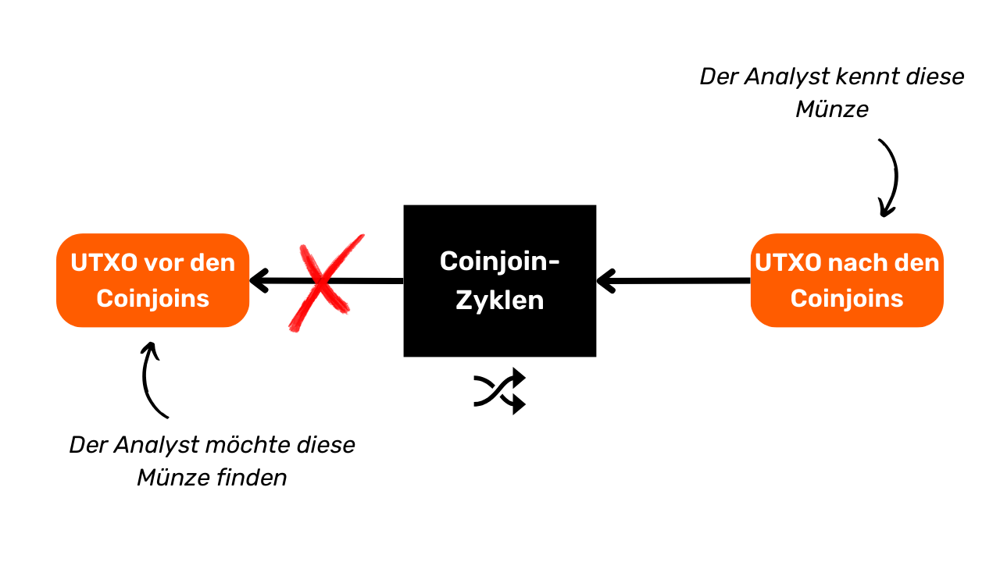

Um die Schwierigkeit für einen Analysten zu bewerten, die Vergangenheit mit der Gegenwart und umgekehrt zu verknüpfen, ist es notwendig, die Größe der Gruppen von homogenen Münzen zu quantifizieren, innerhalb derer Ihre Münze verborgen ist. Dieses Maß teilt uns die Anzahl der Analysen mit, die eine identische Wahrscheinlichkeit haben. Wenn also die korrekte Analyse unter 3 anderen Analysen gleicher Wahrscheinlichkeit untergeht, ist Ihr Verschleierungsgrad sehr niedrig. Wenn jedoch die korrekte Analyse innerhalb einer Gruppe von 20.000 Analysen, alle gleichermaßen wahrscheinlich, liegt, ist Ihre Münze sehr gut versteckt. Und genau die Größe dieser Gruppen repräsentiert Indikatoren, die als "Anonsets" bezeichnet werden.

### Verständnis von Anonsets

Anonsets dienen als Indikatoren zur Bewertung des Datenschutzgrades eines bestimmten UTXO. Genauer gesagt, messen sie die Anzahl der ununterscheidbaren UTXOs innerhalb des Sets, das die untersuchte Münze enthält. Die Anforderung eines homogenen UTXO-Sets bedeutet, dass Anonsets üblicherweise über CoinJoin-Zyklen berechnet werden. Die Verwendung dieser Indikatoren ist besonders relevant für Whirlpool CoinJoins aufgrund ihrer Einheitlichkeit.

Anonsets ermöglichen es, gegebenenfalls die Qualität der CoinJoins zu beurteilen. Eine große Anonset-Größe signalisiert ein hohes Maß an Anonymität, da es schwierig wird, ein spezifisches UTXO innerhalb des homogenen Sets zu unterscheiden.

Es gibt 2 Arten von Anonsets:

- **Das prospektive Anonset;**
- **Das retrospektive Anonset.**

### Das prospektive Anonset

Das prospektive Anonset gibt die Größe der Gruppe an, unter der das untersuchte UTXO am Zyklusausgang verborgen ist, unter Kenntnis des UTXO am Eingang, das heißt, die Anzahl der ununterscheidbaren Münzen innerhalb dieser Gruppe. Im Englischen wird dieser Indikator als "forward anonset" oder "forward-looking metrics" bezeichnet.
Dieser Indikator ermöglicht es, den Widerstand der Privatsphäre der Münze gegen eine Analyse von der Vergangenheit zur Gegenwart (Eingabe zu Ausgabe) zu messen.
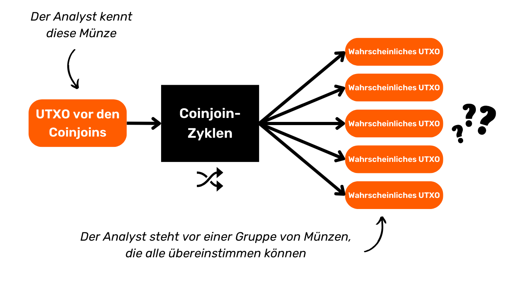

Diese Metrik schätzt, inwieweit Ihr UTXO gegen Versuche geschützt ist, seine Geschichte vom Eintrittspunkt bis zum Austrittspunkt im Coinjoin-Prozess zu rekonstruieren.

Zum Beispiel, wenn Ihre Transaktion an ihrem ersten Coinjoin-Zyklus teilgenommen hat und zwei zusätzliche Nachfolgezyklen abgeschlossen wurden, wäre das prospektive Anonset Ihrer Münze `13`:


Stellen wir uns vor, dass unsere Münze am Eingang des Coinjoin-Zyklus von einem prospektiven Anonset von `86,871` profitiert. Praktisch bedeutet dies, dass sie unter `86,871` ununterscheidbaren Münzen verborgen ist. Für einen externen Beobachter, der diese Münze zu Beginn der Coinjoin-Zyklen kennt und versucht, ihren Ausgang zu verfolgen, würde er mit `86,871` möglichen UTXOs konfrontiert, von denen jedes eine identische Wahrscheinlichkeit hat, die gesuchte Münze zu sein.

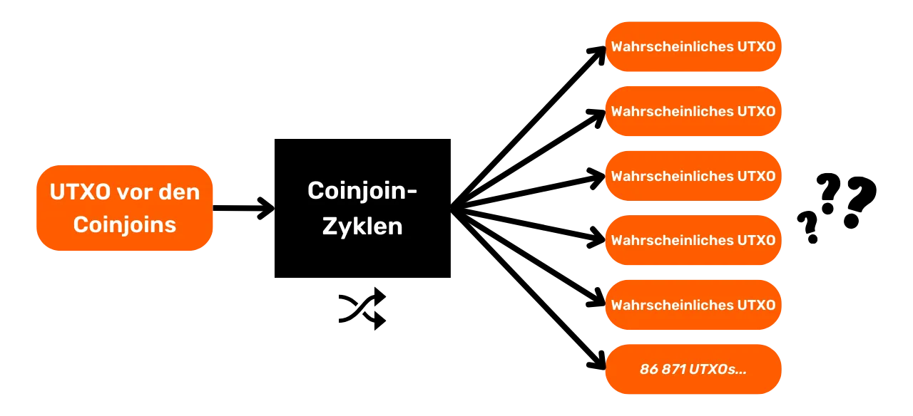

### Das retrospektive Anonset

Das retrospektive Anonset gibt die Anzahl möglicher Quellen für eine bestimmte Münze an, wenn man das UTXO am Ausgang des Zyklus kennt. Dieser Indikator misst den Widerstand der Privatsphäre der Münze gegen eine Analyse von der Gegenwart in die Vergangenheit (Ausgang zu Eingang), das heißt, wie schwierig es für einen Analysten ist, den Ursprung Ihrer Münze vor den Coinjoin-Zyklen zurückzuverfolgen. Auf Englisch wird dieser Indikator als "backward anonset" oder "backward-looking metrics" bezeichnet.
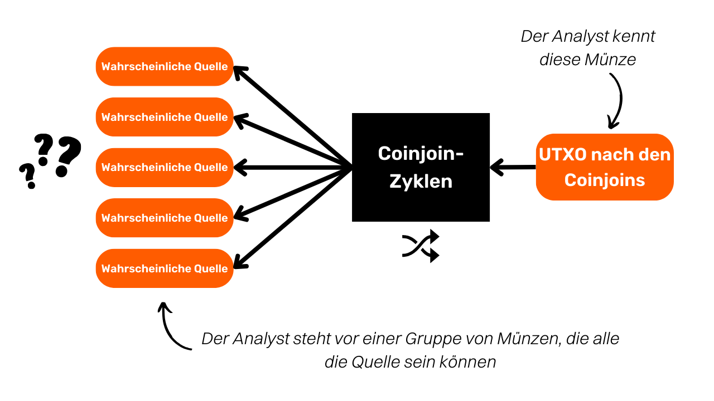

Wenn man sein UTXO am Ausgang der Zyklen kennt, bestimmt das retrospektive Anonset die Anzahl potenzieller Tx0-Transaktionen, die Ihren Einstieg in die Coinjoin-Zyklen hätten darstellen können. Im Diagramm unten entspricht dies der Summe aller orangefarbenen Blasen.


Stellen wir uns zum Beispiel vor, dass unsere Münze am Ausgang des Coinjoin-Zyklus von einem retrospektiven Anonset von `42,185` profitiert. Praktisch bedeutet dies, dass es `42,185` potenzielle Quellen für dieses UTXO gibt. Wenn ein externer Beobachter diese Münze am Ende der Zyklen identifiziert und versucht, ihren Ursprung zurückzuverfolgen, steht er vor `42,185` möglichen Quellen, alle mit einer gleich hohen Wahrscheinlichkeit, der gesuchte Ursprung zu sein.

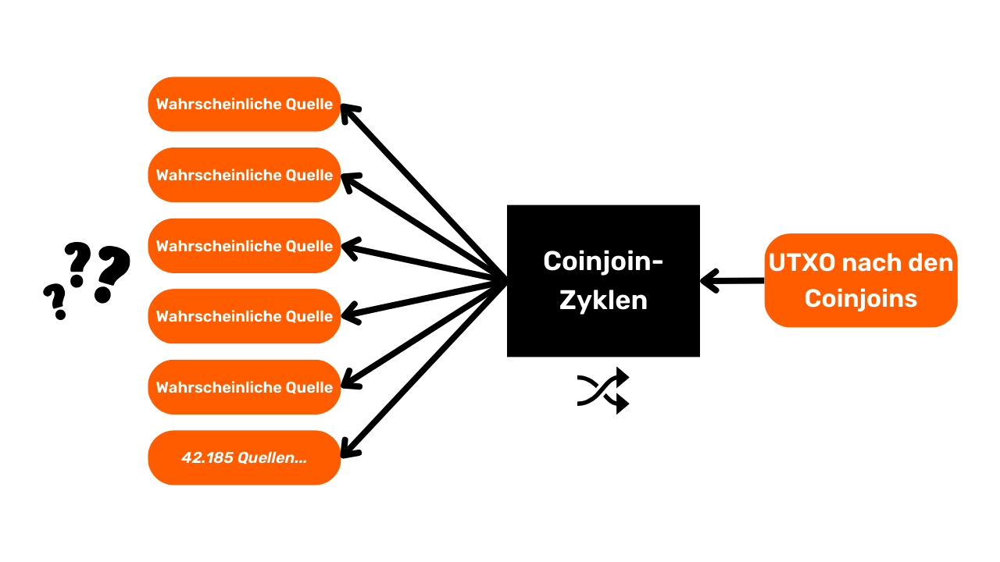

### Wie berechnet man konkret die Anonsets?

Es ist möglich, seine Anonsets manuell mit einem Block-Explorer für kleine Sets zu berechnen. Für größere Anonsets wird jedoch die Verwendung eines spezialisierten Tools unerlässlich. Meines Wissens ist die einzige Software, die diese Aufgabe ausführen kann, das _Whirlpool Stats Tool_, ein Python-Tool, das von den Teams bei Samourai und OXT entwickelt wurde. Leider ist dieses Tool derzeit außer Betrieb, nachdem die Gründer von Samourai verhaftet wurden und die Weiterführung von OXT, das zur Extraktion von Daten aus der Blockchain verwendet wurde, eingestellt wurde.


Wie wir in diesem Kapitel gesehen haben, können Anonsets nur berechnet werden, wenn es eine gewisse Homogenität in der Struktur der Coinjoins gibt. Und genau das werden wir im nächsten Kapitel entdecken, wie man diese Homogenität in einer Bitcoin-Transaktion quantifiziert, egal ob es sich um einen Coinjoin oder eine traditionellere Transaktion handelt.

https://planb.network/tutorials/privacy/wst-anonsets

## Entropie

<chapterId>e4fe289d-618b-49a2-84c9-68c562e708b4</chapterId>

Wie wir in diesem Teil über Coinjoins gesehen haben, spielt die Homogenität der UTXOs in Eingängen und Ausgängen eine wichtige Rolle bei der Verbesserung der Vertraulichkeit einer Bitcoin-Transaktion. Dieser Parameter ermöglicht eine plausible Abstreitbarkeit gegenüber Kettenanalysen. Es gibt mehrere Methoden, um diese Homogenität zu messen, aber eine der effektivsten ist meiner Meinung nach die Verwendung von Indikatoren, die vom _Boltzmann_-Tool bereitgestellt werden, das von den Teams bei OXT und Samourai Wallet entwickelt wurde, insbesondere die Entropie der Transaktion. Dies werden wir in diesem Kapitel im Detail untersuchen.

Im Gegensatz zu Anonsets, die über eine Reihe von Transaktionen berechnet werden, konzentrieren sich die Indikatoren, die wir hier vorstellen werden, ausschließlich auf eine einzelne Transaktion, egal ob es sich um einen Coinjoin oder eine traditionellere Transaktion handelt.

### Die Anzahl der Interpretationen

Das erste beobachtbare Indiz bei einer Bitcoin-Transaktion ist die Gesamtzahl der möglichen Interpretationen aus der Sicht eines externen Beobachters, der die Transaktion analysiert. Unter Berücksichtigung der Werte der in der Transaktion involvierten UTXOs zeigt dieses Indiz die Anzahl der Wege, wie die Eingaben den Ausgaben zugeordnet werden können. Mit anderen Worten, es bestimmt die Anzahl der möglichen Interpretationen, die eine Transaktion im Fluss der Bitcoins aus der Perspektive eines externen Beobachters analysierend generieren kann.

Zum Beispiel wird eine einfache Zahlungstransaktion mit 1 Eingabe und 2 Ausgaben nur eine Interpretation haben, nämlich dass Eingabe #0 die Ausgabe #0 und Ausgabe #1 finanziert hat. Es gibt keine anderen möglichen Interpretationen:


Im Gegensatz dazu präsentiert sich ein Coinjoin, strukturiert nach dem Whirlpool 5x5-Modell, mit $1.496$ möglichen Kombinationen:

Ein Whirlpool Surge Cycle 8x8 Coinjoin präsentiert sich mit $9.934.563$ möglichen Interpretationen:


### Entropie

Aus der Anzahl der Interpretationen einer Bitcoin-Transaktion können wir ihre Entropie berechnen.

Im allgemeinen Kontext der Kryptografie und Information ist Entropie ein quantitatives Maß für die Unsicherheit oder Unvorhersehbarkeit, die mit einer Datenquelle oder einem zufälligen Prozess verbunden ist. Mit anderen Worten, Entropie ist eine Möglichkeit, zu messen, wie schwierig es ist, Informationen vorherzusagen oder zu erraten.

Im spezifischen Kontext der Kettenanalyse ist Entropie auch der Name eines Indikators, der von der Shannon-Entropie abgeleitet und [von LaurentMT erfunden](https://gist.github.com/LaurentMT/e758767ca4038ac40aaf) wurde, der auf einer Bitcoin-Transaktion berechnet werden kann.

Wenn eine Transaktion eine hohe Anzahl möglicher Interpretationen aufweist, ist es oft relevanter, auf ihre Entropie zu verweisen. Dieser Indikator ermöglicht es, das Fehlen von Wissen der Analysten über die genaue Konfiguration der Transaktion zu messen. Mit anderen Worten, je höher die Entropie, desto schwieriger wird die Aufgabe für Analysten, die Flüsse von Bitcoins zwischen Eingaben und Ausgaben zu identifizieren.

In der Praxis zeigt die Entropie, ob eine Transaktion aus der Perspektive eines externen Beobachters mehrere mögliche Interpretationen aufweist, basierend allein auf den Beträgen von Eingaben und Ausgaben, ohne andere externe oder interne Muster und Heuristiken zu berücksichtigen. Eine hohe Entropie ist dann gleichbedeutend mit besserer Vertraulichkeit für die Transaktion.

Entropie wird als der binäre Logarithmus der Anzahl möglicher Kombinationen definiert. Hier ist die Formel, die verwendet wird, wobei $E$ die Entropie der Transaktion und $C$ die Anzahl der möglichen Interpretationen ist:

$$
E = \log_2(C)
$$

In der Mathematik entspricht der binäre Logarithmus (Logarithmus zur Basis 2) der inversen Operation des Potenzierens von 2. Mit anderen Worten, der binäre Logarithmus von $x$ ist der Exponent, zu dem $2$ erhoben werden muss, um $x$ zu erhalten. Dieser Indikator wird also in Bits ausgedrückt.

Nehmen wir das Beispiel der Berechnung der Entropie für eine Coinjoin-Transaktion, strukturiert nach dem Whirlpool 5x5-Modell, das, wie im vorherigen Abschnitt erwähnt, eine Anzahl möglicher Interpretationen von $1.496$ aufweist:

$$
\begin{align*}
C &= 1.496 \\
E &= \log_2(1.496) \\
E &= 10.5469 \text{ Bits}
\end{align*}
$$

Somit zeigt diese Coinjoin-Transaktion eine Entropie von $10.5469$ Bits, was als sehr zufriedenstellend betrachtet wird. Je höher dieser Wert, desto mehr verschiedene Interpretationen lässt die Transaktion zu, wodurch ihr Datenschutzniveau erhöht wird.
Für eine 8x8 CoinJoin-Transaktion, die $9,934,563$ Interpretationen darstellt, wäre die Entropie:

$$
\begin{align*}
C &= 9,934,563 \\
E &= \log_2(9,934,563) \\
E &= 23.244 \text{ bits}
\end{align*}
$$

Nehmen wir ein weiteres Beispiel mit einer Standard-Zahlungstransaktion, die 1 Eingang und 2 Ausgänge aufweist: [1b1b0c3f0883a99f1161c64da19471841ed12a1f78e77fab128c69a5f578ccce](https://mempool.space/tx/1b1b0c3f0883a99f1161c64da19471841ed12a1f78e77fab128c69a5f578ccce)


Im Fall dieser Transaktion ist die einzige mögliche Interpretation: `(In.0) > (Out.0 ; Out.1)`. Folglich wird ihre Entropie auf $0$ festgelegt:

$$
\begin{align*}
C &= 1 \\
E &= \log_2(1) \\
E &= 0 \text{ bits}
\end{align*}
$$

### Effizienz

Aus der Entropie der Transaktion können wir auch ihre Effizienz in Bezug auf die Privatsphäre berechnen. Dieser Indikator bewertet die Effizienz der Transaktion, indem er sie mit der optimalen Transaktion vergleicht, die in einer identischen Konfiguration denkbar wäre.

Dies führt uns zur Diskussion des Konzepts der maximalen Entropie, die der höchsten Entropie entspricht, die eine spezifische Transaktionsstruktur theoretisch erreichen könnte. Die Effizienz der Transaktion wird dann berechnet, indem diese maximale Entropie mit der tatsächlichen Entropie der analysierten Transaktion konfrontiert wird.

Die verwendete Formel lautet wie folgt mit:

- $E_R$: die tatsächliche Entropie der Transaktion, ausgedrückt in Bits;
- $E_M$: die maximal mögliche Entropie für eine Transaktionsstruktur, ebenfalls ausgedrückt in Bits;
- $Ef$: die Effizienz der Transaktion in Bits:

$$
Ef = E_R - E_M
$$

Zum Beispiel, für eine Whirlpool 5x5 Typ CoinJoin-Struktur, ist die maximale Entropie $10.5469$:

$$
\begin{align*}
E_R &= 10.5469 \\
E_M &= 10.5469 \\
Ef &= E_R - E_M \\
Ef &= 10.5469 - 10.5469 \\
Ef &= 0 \text{ bits}
\end{align*}
$$

Dieser Indikator wird auch als Prozentsatz ausgedrückt. Die verwendete Formel lautet wie folgt mit:

- $C_R$: die Anzahl der möglichen realen Interpretationen;
- $C_M$: die maximale Anzahl möglicher Interpretationen mit derselben Struktur;
- $Ef$: Effizienz ausgedrückt in Prozent:

$$
\begin{align*}
E_f &= \frac{C_R}{C_M} \\
E_f &= \frac{1\,496}{1\,496} \\
E_f &= 100\%
\end{align*}
$$

Eine Effizienz von $100\%$ zeigt also an, dass die Transaktion ihr Potenzial für Privatsphäre basierend auf ihrer Struktur maximiert.

### Die Entropiedichte

Entropie ist ein guter Indikator, um die Privatsphäre einer Transaktion zu messen, hängt aber teilweise von der Anzahl der Eingänge und Ausgänge in der Transaktion ab. Um die Entropie von 2 verschiedenen Transaktionen, die nicht dieselbe Anzahl von Eingängen und Ausgängen haben, zu vergleichen, kann man die Entropiedichte berechnen. Dieser Indikator bietet eine Perspektive auf die Entropie relativ zu jedem Eingang oder Ausgang der Transaktion. Die Dichte erweist sich als nützlich, um die Effizienz von Transaktionen unterschiedlicher Größe zu bewerten und zu vergleichen.
Um es zu berechnen, teilen Sie einfach die gesamte Entropie der Transaktion durch die Gesamtzahl der Inputs und Outputs, die an der Transaktion beteiligt sind:

- $E_D$: die Entropiedichte, ausgedrückt in Bits;
- $E$: die Entropie der Transaktion, ausgedrückt in Bits;
- $T$: die Gesamtzahl der Inputs und Outputs in der Transaktion:

$$
E_D = \frac{E}{T}
$$

Nehmen wir das Beispiel eines Whirlpool 5x5 Coinjoin:

$$
\begin{align*}
T &= 5 + 5 = 10 \\
E &= 10.5469 \\
E_D &= \frac{E}{T} \\
E_D &= \frac{10.5469}{10} \\
E_D &= 1.054 \text{ Bits}
\end{align*}
$$

Berechnen wir auch die Entropiedichte eines Whirlpool 8x8 Coinjoin:

$$
\begin{align*}
T &= 8 + 8 = 16 \\
E &= 23.244 \\
E_D &= \frac{E}{T} \\
E_D &= \frac{23.244}{16} \\
E_D &= 1.453 \text{ Bits}
\end{align*}
$$

Durch die Analyse der Entropiedichte dieser beiden Arten von Coinjoins wird deutlich, dass, selbst wenn die Entropie durch die Anzahl der Elemente normalisiert wird, der "Surge Cycle 8x8" Coinjoin mehr Unsicherheit für die Analyse erzeugt.

### Der Boltzmann-Score

Ein weiteres analysiertes Element in einer Transaktion ist der Boltzmann-Score jedes Elements im Verhältnis zu einem anderen. Dies ist eine Tabelle der Übereinstimmungswahrscheinlichkeiten zwischen den Inputs und Outputs. Diese Tabelle zeigt durch den Boltzmann-Score die bedingte Wahrscheinlichkeit, dass ein spezifischer Input mit einem gegebenen Output verknüpft ist. Es ist daher ein quantitatives Maß für die bedingte Wahrscheinlichkeit, dass eine Verknüpfung zwischen einem Input und einem Output in einer Transaktion auftritt, basierend auf dem Verhältnis der Anzahl der günstigen Vorkommnisse dieses Ereignisses im Vergleich zur Gesamtzahl der möglichen Vorkommnisse in einer Menge von Interpretationen.
Nehmen wir das Beispiel eines Whirlpool-Coinjoin, würde die Tabelle der bedingten Wahrscheinlichkeiten die Chancen einer Verknüpfung zwischen jedem Input und Output hervorheben und ein quantitatives Maß für die Mehrdeutigkeit der Verknüpfungen in der Transaktion bieten:

| %       | Output 0 | Output 1 | Output 2 | Output 3 | Output 4 |
| ------- | -------- | -------- | -------- | -------- | -------- |
| Input 0 | 34%      | 34%      | 34%      | 34%      | 34%      |
| Input 1 | 34%      | 34%      | 34%      | 34%      | 34%      |
| Input 2 | 34%      | 34%      | 34%      | 34%      | 34%      |
| Input 3 | 34%      | 34%      | 34%      | 34%      | 34%      |
| Input 4 | 34%      | 34%      | 34%      | 34%      | 34%      |

Hier ist klar, dass jeder Input eine gleiche Chance hat, mit jedem Output assoziiert zu werden, was die Vertraulichkeit der Transaktion erhöht.

Die Berechnung des Boltzmann-Scores beinhaltet die Teilung der Anzahl der Interpretationen, in denen ein bestimmtes Ereignis manifestiert, durch die Gesamtzahl der verfügbaren Interpretationen. Um also den Score zu bestimmen, der Input #0 mit Output #3 verbindet (ein Ereignis, das in $512$ Interpretationen präsent ist), erfolgt der Prozess wie folgt:

$$
\begin{align*}
\text{Interpretationen (IN.0 > OUT.3)} &= 512 \\
\text{Gesamtinterpretationen} &= 1496 \\
\text{Punktzahl} &= \frac{512}{1496} \\
\text{Punktzahl} &= 34 \%
\end{align*}
$$

Wenn wir das Beispiel eines Whirlpool-Coinjoin 8x8 Surge Cycle erneut betrachten, würde die Boltzmann-Tabelle wie folgt aussehen:

|       | OUT.0 | OUT.1 | OUT.2 | OUT.3 | OUT.4 | OUT.5 | OUT.6 | OUT.7 |
|-------|-------|-------|-------|-------|-------|-------|-------|-------|
| IN.0  | 23 %  | 23 %  | 23 %  | 23 %  | 23 %  | 23 %  | 23 %  | 23 %  |
| IN.1  | 23 %  | 23 %  | 23 %  | 23 %  | 23 %  | 23 %  | 23 %  | 23 %  |
| IN.2  | 23 %  | 23 %  | 23 %  | 23 %  | 23 %  | 23 %  | 23 %  | 23 %  |
| IN.3  | 23 %  | 23 %  | 23 %  | 23 %  | 23 %  | 23 %  | 23 %  | 23 %  |
| IN.4  | 23 %  | 23 %  | 23 %  | 23 %  | 23 %  | 23 %  | 23 %  | 23 %  |
| IN.5  | 23 %  | 23 %  | 23 %  | 23 %  | 23 %  | 23 %  | 23 %  | 23 %  |
| IN.6  | 23 %  | 23 %  | 23 %  | 23 %  | 23 %  | 23 %  | 23 %  | 23 %  |
| IN.7  | 23 %  | 23 %  | 23 %  | 23 %  | 23 %  | 23 %  | 23 %  | 23 %  |

Jedoch ist die Situation bei einer einfachen Transaktion, die einen einzelnen Eingang und 2 Ausgänge umfasst, anders:

| %       | Ausgang 0 | Ausgang 1 |
|---------|-----------|-----------|
| Eingang 0 | 100 %     | 100 %     |

Hier beobachten wir, dass die Wahrscheinlichkeit, dass jeder Ausgang von Eingang #0 stammt, 100 % beträgt. Eine niedrigere Wahrscheinlichkeit führt somit zu größerer Privatsphäre, indem die direkten Verbindungen zwischen den Eingängen und Ausgängen verdünnt werden.

### Deterministische Verbindungen

Es ist auch möglich, die Anzahl der deterministischen Verbindungen in einer Transaktion zu berechnen. Dieser Indikator zeigt, wie viele Verbindungen zwischen den Eingängen und Ausgängen in der analysierten Transaktion unbestreitbar sind, mit einer Wahrscheinlichkeit von 100 %. Dieser Indikator kann dann durch Berechnung des Verhältnisses der deterministischen Verbindungen ergänzt werden. Das Verhältnis bietet eine Perspektive auf das Gewicht dieser deterministischen Verbindungen innerhalb aller Transaktionsverbindungen.
Zum Beispiel zeigt eine Whirlpool-Typ-Coinjoin-Transaktion keinen deterministischen Zusammenhang zwischen den Eingaben und Ausgaben, was einen Indikator von 0 Verbindungen und ein Verhältnis von 0% anzeigt. Im Gegensatz dazu zeigt unser zweites untersuchtes einfaches Zahlungsgeschäft (mit einer Eingabe und 2 Ausgaben), dass es 2 deterministische Verbindungen gibt und das Verhältnis 100% erreicht. Daher signalisiert ein Nullindikator eine ausgezeichnete Privatsphäre aufgrund der Abwesenheit von direkten und unbestreitbaren Verbindungen zwischen den Eingaben und Ausgaben.
### Wie berechnet man diese Indikatoren?
Die manuelle Berechnung dieser Indikatoren mit den von mir bereitgestellten Gleichungen ist relativ einfach. Die Hauptschwierigkeit liegt in der Bestimmung der Anzahl möglicher Interpretationen einer Transaktion. Für eine Standardtransaktion kann diese Berechnung von Hand durchgeführt werden. Bei einem Coinjoin ist die Aufgabe jedoch deutlich komplexer.

Früher gab es ein Python-Tool namens _Boltzmann Calculator_, entwickelt von den Teams bei OXT und Samourai, das die automatische Berechnung all dieser Indikatoren für eine Bitcoin-Transaktion ermöglichte:


Es war auch möglich, die Website KYCP.org für diese Analysen zu verwenden:


Leider sind diese Tools derzeit nicht betriebsbereit, nachdem die Gründer von Samourai verhaftet wurden.

Nun, da wir Coinjoins im Detail besprochen haben, werden wir im letzten Abschnitt unseres Trainings andere verfügbare Datenschutztechniken bei Bitcoin erkunden. Wir werden Payjoins, spezifische Transaktionstypen Pseudo-Coinjoins, statische Adressprotokolle sowie Maßnahmen untersuchen, die darauf abzielen, die Privatsphäre nicht auf Transaktionsebene, sondern auf der Ebene des Netzwerks von Knoten zu verbessern.

https://planb.network/tutorials/privacy/boltzmann-entropy

# Verständnis der Herausforderungen anderer fortgeschrittener Datenschutztechniken
<partId>19989ae6-d608-4acf-b698-2cf1e7e5e6ae</partId>

## Payjoin-Transaktionen
<chapterId>c1e90b95-f709-4574-837b-2ec26b11286f</chapterId>

Coinjoin stellt derzeit die effektivste Methode dar, um Unsicherheit in die Rückverfolgung von Münzen während einer Kettenanalyse einzuführen. Wie wir in den vorherigen Kapiteln gesehen haben, ist es für eine effektive Mischung notwendig, dass die Eingaben und Ausgaben so homogen wie möglich sind. Darüber hinaus ist es entscheidend, dass die Münzen in eine möglichst große Gruppe integriert werden, um die Anonsets zu maximieren. Daher müssen Coinjoin-Transaktionen eine große Anzahl einheitlicher Münzen umfassen, was bedeutet, dass Coinjoin-Transaktionen eine sehr starre Struktur haben: Die Beträge sind vorbestimmt, und alle Teilnehmer müssen sich daran halten, um die Einheitlichkeit des Prozesses zu gewährleisten. Zusätzlich erfordern Coinjoins eine Synchronisation zwischen allen Teilnehmern und dem Koordinator während der Transaktionskonstruktion.
Diese Anforderungen machen Coinjoin für direkte Zahlungen ungeeignet. Wenn Sie beispielsweise ein 1M Sats-Stück in einem Coinjoin-Pool besitzen, wäre dessen direkte Verwendung als Zahlung komplex. Es würde eine Synchronisation mit den anderen Teilnehmern und dem Koordinator erfordern, um die kollaborative Transaktion genau in dem Moment zu konstruieren, in dem Sie eine Zahlung tätigen müssen, und der Kaufbetrag müsste genau dem Wert Ihres Stücks entsprechen, was praktisch unerreichbar ist. Daher ist eine Coinjoin-Transaktion von Natur aus eine umfassende kollaborative Transaktion, was bedeutet, dass es im Allgemeinen dieselben Besitzer der Eingaben sind, die in den Ausgaben gefunden werden.
Es wäre jedoch interessant, Transaktionsstrukturen zu haben, die praktische Zahlungen ermöglichen und gleichzeitig Zweifel in der Kettenanalyse einführen. Genau das werden wir in diesem Kapitel und dem nächsten erkunden.

### Was ist eine Payjoin-Transaktion?

Payjoin ist eine spezifische Bitcoin-Transaktionsstruktur, die die Privatsphäre des Benutzers während einer Ausgabe durch Zusammenarbeit mit dem Zahlungsempfänger verbessert.
Es war im Jahr 2015, dass LaurentMT erstmals diese Methode unter dem Namen "*steganographic transactions*" erwähnte, gemäß einem Dokument, das [hier](https://gist.githubusercontent.com/LaurentMT/e758767ca4038ac40aaf/raw/c8125f6a3c3d0e90246dc96d3b603690ab6f1dcc/gistfile1.txt) zugänglich ist. Diese Technik wurde später von der Samourai Wallet übernommen, die 2018 als erster Client sie mit dem Stowaway-Tool implementierte. Das Konzept von Payjoin findet sich auch in [BIP79](https://github.com/bitcoin/bips/blob/master/bip-0079.mediawiki) und [BIP78](https://github.com/bitcoin/bips/blob/master/bip-0078.mediawiki). Mehrere Begriffe werden somit verwendet, um einen Payjoin zu bezeichnen:
- Payjoin;
- Stowaway;
- P2EP (*Pay-to-End-Point*);
- Steganographische Transaktion.

Die Besonderheit von Payjoin liegt in seiner Fähigkeit, eine Transaktion zu generieren, die auf den ersten Blick gewöhnlich erscheint, aber in Wirklichkeit ein Mini-Coinjoin zwischen zwei Personen ist. Dafür bezieht die Transaktionsstruktur den Zahlungsempfänger in die Inputs neben dem eigentlichen Sender mit ein. Der Empfänger schließt somit eine Zahlung an sich selbst inmitten der Transaktion ein, die es ihm ermöglicht, bezahlt zu werden.

Nehmen wir ein Beispiel, um diesen Prozess besser zu verstehen. Alice kauft eine Baguette für 4.000 Sats mit einem UTXO von 10.000 Sats und entscheidet sich für einen Payjoin. Ihr Bäcker, Bob, fügt einen UTXO von 15.000 Sats, der ihm gehört, im Input hinzu, den er im Output vollständig zurückerhält, zusätzlich zu Alices 4.000 Sats.


In diesem Beispiel gibt Bob, der Bäcker, 15.000 Sats ein und kommt mit 19.000 Sats heraus, wobei der Unterschied genau 4.000 Sats beträgt, was dem Preis der Baguette entspricht. Auf Alices Seite geht sie mit 10.000 Sats ein und endet mit 6.000 Sats im Output, was einem Saldo von -4.000 Sats entspricht, nämlich dem Preis der Baguette. Um das Beispiel zu vereinfachen, habe ich die Mining-Gebühren in dieser Transaktion absichtlich weggelassen.

### Was ist der Zweck von Payjoin?

Die Payjoin-Transaktion erfüllt zwei Ziele, die es den Benutzern ermöglichen, die Privatsphäre ihrer Zahlung zu verbessern.

Erstens zielt der Payjoin darauf ab, einen externen Beobachter durch die Erstellung eines Köders in der Kettenanalyse in die Irre zu führen. Dies wird dank der CIOH-Heuristik (*Common Input Ownership Heuristic*) ermöglicht. Wie wir in Teil 3 gesehen haben, wird normalerweise angenommen, dass alle diese Inputs bei einer Transaktion auf der Blockchain derselben Entität oder demselben Benutzer gehören, wenn eine Transaktion mehrere Inputs hat.

Wenn also ein Analyst eine Payjoin-Transaktion untersucht, wird er dazu verleitet zu glauben, dass alle Inputs von derselben Person stammen. Diese Wahrnehmung ist jedoch falsch, da der Zahlungsempfänger ebenfalls zu den Inputs neben dem eigentlichen Zahler beiträgt. Die Kettenanalyse wird daher zu einer Interpretation umgeleitet, die sich als falsch herausstellt.

Kehren wir zu unserem Beispiel einer Payjoin-Transaktion für die Zahlung einer Baguette zurück:


Wenn ein externer Beobachter diese Transaktion auf der Blockchain sieht und den üblichen Heuristiken der Kettenanalyse folgt, würde er sie folgendermaßen interpretieren: "*Alice hat 2 UTXOs in Inputs der Transaktion zusammengeführt, um 19.000 Sats an Bob zu zahlen*".
Diese Interpretation ist offensichtlich falsch, wie Sie bereits wissen, gehören die beiden UTXOs in den Eingaben nicht derselben Person. Einer stammt von Alice, der Käuferin des Baguettes, und der andere von Bob, dem Bäcker.

Die Analyse des externen Beobachters führt somit zu einer falschen Schlussfolgerung, was die Wahrung der Vertraulichkeit der Beteiligten sicherstellt.

### Die steganografische Transaktion

Das zweite Ziel des Payjoin besteht darin, einen externen Beobachter über den tatsächlichen Betrag der Zahlung, die geleistet wurde, zu täuschen. Durch die Untersuchung der Struktur der Transaktion könnte der Analyst glauben, dass die Zahlung dem Betrag eines der Ausgänge entspricht.
Wenn wir unser Beispiel des Kaufs eines Baguettes erneut betrachten, wird der Analyst denken, dass der Zahlungsbetrag entweder dem UTXO von 6.000 Sats oder dem UTXO von 19.000 Sats entspricht. In diesem Fall ist der Analyst eher geneigt zu denken, dass der Zahlungsbetrag 19.000 Sats beträgt, da es 2 UTXOs in den Ausgängen gibt, von denen mindestens einer größer als 6.000 Sats ist (es gibt keinen logischen Grund, 2 UTXOs zu verwenden, um 6.000 Sats zu bezahlen, wenn ein einzelner UTXO für diese Zahlung ausgereicht hätte).

Aber in Wirklichkeit ist diese Analyse falsch. Der Zahlungsbetrag entspricht keinem der Ausgänge. Es ist tatsächlich die Differenz zwischen dem UTXO des Empfängers im Ausgang und dem UTXO des Empfängers im Eingang.

In diesem Sinne fällt die Payjoin-Transaktion in den Bereich der Steganografie. Sie ermöglicht es, den wahren Betrag einer Transaktion innerhalb einer Scheintransaktion zu verbergen, die als Täuschung dient.

Steganografie ist eine Technik zum Verbergen von Informationen innerhalb anderer Daten oder Objekte, auf eine Weise, dass die Anwesenheit der versteckten Informationen nicht wahrnehmbar ist. Zum Beispiel kann eine geheime Nachricht innerhalb eines Punktes in einem Text versteckt werden, der nicht zusammenhängt, was sie mit bloßem Auge unentdeckbar macht (dies ist die Technik des [Micropoint](https://fr.wikipedia.org/wiki/Micropoint)).

Im Gegensatz zur Verschlüsselung, die Informationen ohne den Entschlüsselungsschlüssel unverständlich macht, verändert die Steganografie die Informationen nicht. Sie bleibt offen sichtbar. Ihr Ziel ist es eher, die Existenz der geheimen Nachricht selbst zu verbergen, während die Verschlüsselung deutlich die Anwesenheit von versteckten Informationen offenbart, obwohl sie ohne den Schlüssel unzugänglich sind. Deshalb war der ursprüngliche Name für Payjoin "*steganografische Transaktionen*".

Eine Analogie könnte zwischen Kryptografie und Coinjoin sowie zwischen Steganografie und Payjoin gemacht werden. Tatsächlich hat Coinjoin Attribute, die denen der Verschlüsselung ähneln: Die Methode ist erkennbar, aber die Informationen sind unentzifferbar. Im Gegensatz dazu ähnelt Payjoin der Steganografie: Die Informationen sind theoretisch zugänglich, aber da ihre Methode der Verschleierung nicht erkennbar ist, wird sie unzugänglich.

### Wie verwendet man Payjoin?

Unter der bekannten Software, die Payjoin unterstützt, befinden sich Sparrow Wallet, Wasabi Wallet, Mutiny, BitMask, BlueWallet und JoinMarket, sowie der Zahlungsprozessor BTCPay.
Die fortschrittlichste Implementierung von Payjoin war nur der Stowaway im Samourai Wallet. Allerdings funktioniert dieses Tool seit der Verhaftung der Softwaregründer nur noch teilweise. Der Vorteil von Stowaway ist, dass es ein vollständiges und sehr einfach zu bedienendes Protokoll ist, das sowohl das Empfangen als auch das Senden von Payjoins unterstützt. Teilweise signierte Transaktionen können manuell durch das Scannen mehrerer QR-Codes oder automatisch über Tor mittels Soroban ausgetauscht werden. Es ist diese letztere Kommunikationsoption, die derzeit außer Betrieb ist.

Die Schwierigkeit bei der Verwendung von Payjoin liegt in seiner Abhängigkeit von der Teilnahme des Händlers. Als Kunde ist die Verwendung eines Payjoin unmöglich, wenn der Händler es nicht unterstützt. Dies fügt einem Kauf eine zusätzliche Schwierigkeit hinzu: Es ist nicht nur kompliziert, Händler zu finden, die Bitcoin akzeptieren, sondern wenn man auch nach solchen sucht, die Payjoins unterstützen, wird es noch komplizierter.

Eine Lösung wäre die Verwendung von Transaktionsstrukturen, die in der Kettenanalyse Ambiguität einführen, ohne die Zusammenarbeit des Empfängers zu erfordern. Dies würde es uns ermöglichen, die Privatsphäre unserer Zahlungen zu verbessern, ohne auf die aktive Teilnahme von Händlern angewiesen zu sein. Genau das werden wir im nächsten Kapitel untersuchen.

https://planb.network/tutorials/privacy/payjoin-sparrow-wallet

https://planb.network/tutorials/privacy/payjoin-samourai-wallet

## Mini-Coinjoins für Zahlungen
<chapterId>300777ee-30ae-43d7-ab00-479dac3522c1</chapterId>

Wenn man eine Zahlungstransaktion durchführen möchte, während man einen gewissen Grad an Privatsphäre bewahrt, ist Payjoin eine gute Option. Aber wie wir gesehen haben, erfordert Payjoin die Beteiligung des Empfängers. Was tun, wenn dieser sich weigert, an einem Payjoin teilzunehmen, oder wenn man es einfach vorzieht, ihn nicht einzubeziehen? Eine Alternative ist die Verwendung einer Stonewall- oder Stonewall x2-Transaktion. Lassen Sie uns diese beiden Arten von Transaktionen genauer betrachten.

### Die Stonewall-Transaktion

Stonewall ist eine spezifische Form der Bitcoin-Transaktion, die darauf abzielt, die Privatsphäre des Benutzers während einer Ausgabe zu erhöhen, indem sie einen Pseudo-Coinjoin zwischen zwei Personen nachahmt, ohne tatsächlich einer zu sein. Tatsächlich ist diese Transaktion nicht kollaborativ. Ein Benutzer kann sie alleine konstruieren, indem er nur die UTXOs verwendet, die ihm als Eingaben gehören. Sie können daher für jeden Anlass eine Stonewall-Transaktion erstellen, ohne sich mit einem anderen Benutzer oder dem Empfänger synchronisieren zu müssen.

Die Funktionsweise der Stonewall-Transaktion ist wie folgt: Im Eingang der Transaktion verwendet der Sender 2 UTXOs, die ihm gehören. Im Ausgang produziert die Transaktion 4 UTXOs, von denen 2 genau denselben Betrag haben werden. Die anderen 2 UTXOs werden das Wechselgeld darstellen. Unter den 2 Ausgängen mit demselben Betrag wird nur einer tatsächlich an den Empfänger der Zahlung gehen.
Es gibt nur 2 Rollen in einer Stonewall-Transaktion:
- Der Sender, der die Zahlung leistet;
- Der Empfänger, der möglicherweise nichts von der spezifischen Natur der Transaktion weiß und einfach auf eine Zahlung vom Sender wartet.

Lassen Sie uns ein Beispiel nehmen, um diese Transaktionsstruktur zu verstehen. Alice ist bei Bob dem Bäcker, um ihre Baguette zu kaufen, die 4.000 Sats kostet. Sie möchte in Bitcoins zahlen und dabei ein gewisses Maß an Privatsphäre bezüglich ihrer Zahlung bewahren. Daher entscheidet sie sich, eine Stonewall-Transaktion für die Zahlung zu konstruieren.
Bei der Analyse dieser Transaktion können wir sehen, dass Bob der Bäcker tatsächlich 4.000 Sats als Zahlung für das Baguette erhalten hat. Alice verwendete 2 UTXOs als Eingaben: eines mit 10.000 Sats und eines mit 15.000 Sats. Bei den Ausgaben erhielt sie 3 UTXOs: eines mit 4.000 Sats, eines mit 6.000 Sats und eines mit 11.000 Sats. Alice hat also bei dieser Transaktion ein Netto-Saldo von -4.000 Sats, was genau dem Preis des Baguettes entspricht.
In diesem Beispiel habe ich die Mining-Gebühren absichtlich vernachlässigt, um das Verständnis zu erleichtern. In Wirklichkeit werden die Transaktionsgebühren vollständig vom Sender getragen.

### Was sind die Ziele einer Stonewall-Transaktion?

Die Stonewall-Struktur fügt der Transaktion viel Entropie hinzu und verwischt die Spuren der Kettenanalyse. Von außen kann eine solche Transaktion als ein Mini-Coinjoin zwischen zwei Personen interpretiert werden. Aber in Wirklichkeit ist es eine Zahlung. Diese Methode erzeugt also Unsicherheiten in der Kettenanalyse oder führt sogar zu falschen Spuren.

Kehren wir zum Beispiel von Alice bei Bob dem Bäcker zurück. Die Transaktion in der Blockchain würde so aussehen:


Ein externer Beobachter, der sich auf gängige Heuristiken der Kettenanalyse verlässt, könnte fälschlicherweise schlussfolgern, dass "*zwei Personen einen kleinen Coinjoin gemacht haben, mit jeweils einem UTXO in Eingabe und zwei UTXOs in Ausgabe*". Die Analyse dieser Transaktion von außen führt nicht zur Anwendung der Common Input Ownership Heuristic (CIOH), weil die Präsenz von zwei Ausgaben gleicher Menge ein Coinjoin-Muster nahelegt. Aus externer Sicht ist die CIOH daher in diesem spezifischen Fall nicht anwendbar.


Diese Interpretation ist ungenau, denn wie Sie wissen, wurde ein UTXO an Bob den Bäcker gesendet, die 2 UTXOs in Eingaben kommen von Alice, und sie hat 3 Wechselgeld-Ausgaben zurückerhalten.


Und was besonders interessant an der Struktur der Stonewall-Transaktion ist, ist, dass sie aus der Perspektive eines externen Beobachters genau wie die einer Stonewall x2-Transaktion aussieht.

### Die Stonewall x2-Transaktion

Stonewall x2 ist eine weitere spezifische Form der Bitcoin-Transaktion, die ebenfalls darauf abzielt, die Privatsphäre des Benutzers bei einer Ausgabe zu erhöhen, diesmal jedoch durch die Zusammenarbeit mit einer dritten Partei, die nicht an der Ausgabe beteiligt ist. Diese Methode funktioniert wie ein Pseudo-Coinjoin zwischen zwei Teilnehmern, während gleichzeitig eine Zahlung an eine dritte Person erfolgt.

Die Funktionsweise der Stonewall x2-Transaktion ist relativ einfach: Man verwendet ein UTXO in seinem Besitz, um die Zahlung zu tätigen, und bittet eine dritte Partei um Hilfe, die ebenfalls mit einem UTXO beiträgt, das sie besitzt. Die Transaktion endet mit vier Ausgaben: zwei davon in gleichen Beträgen, eine für die Adresse des Zahlungsempfängers bestimmt, die andere für eine Adresse, die dem Mitwirkenden gehört. Ein drittes UTXO wird an eine andere Adresse des Mitwirkenden gesendet, was es ihm ermöglicht, den ursprünglichen Betrag zurückzuerhalten (eine neutrale Aktion für ihn, abzüglich der Mining-Gebühren), und ein letztes UTXO kehrt zu einer Adresse zurück, die uns gehört, was den Wechsel der Zahlung darstellt.

Somit werden drei verschiedene Rollen in den Stonewall x2-Transaktionen definiert:
- Der Sender, der die eigentliche Zahlung vornimmt;
- Der Empfänger, der möglicherweise nicht über die spezifische Natur der Transaktion informiert ist und einfach eine Zahlung vom Sender erwartet;
- Der Mitwirkende, der Bitcoins bereitstellt, um Zweifel an der Transaktionsanalyse zu säen, während er am Ende seine Mittel vollständig zurückerhält (eine neutrale Aktion für ihn, abzüglich der Mining-Gebühren).
Lassen Sie uns zu unserem Beispiel mit Alice zurückkehren, die bei Bob dem Bäcker ist, um ihre Baguette zu kaufen, die 4.000 Sats kostet. Sie möchte in Bitcoins zahlen und dabei ein gewisses Maß an Privatsphäre bei ihrer Zahlung wahren. Also ruft sie ihren Freund Charles an, der ihr in diesem Prozess helfen wird.


Bei der Analyse dieser Transaktion können wir sehen, dass Bob der Bäcker tatsächlich 4.000 Sats als Zahlung für das Baguette erhalten hat. Alice hat 10.000 Sats eingesetzt und 6.000 Sats zurückbekommen, was zu einem Netto-Saldo von -4.000 Sats führt, was dem Preis des Baguettes entspricht. Was Charles betrifft, so hat er 15.000 Sats eingesetzt und zwei Ausgänge erhalten: einen von 4.000 Sats und den anderen von 11.000 Sats, was einen Saldo von 0 ergibt.

In diesem Beispiel habe ich die Gebühren absichtlich vernachlässigt, um das Verständnis zu erleichtern. In der Realität werden die Mining-Gebühren im Allgemeinen gleichmäßig zwischen dem Zahlungsaussteller und dem Mitwirkenden geteilt.

### Was sind die Ziele einer Stonewall x2 Transaktion?
Wie die Stonewall-Struktur fügt auch die Stonewall x2-Struktur der Transaktion eine erhebliche Menge an Entropie hinzu und verschleiert die Spuren der Kettenanalyse. Aus externer Sicht könnte eine solche Transaktion als ein kleiner Coinjoin zwischen zwei Personen interpretiert werden. Aber in Wirklichkeit handelt es sich um eine Zahlung. Diese Methode erzeugt daher Unsicherheiten in der Kettenanalyse, die sogar zu falschen Spuren führen können.

Lassen Sie uns das Beispiel von Alice, Bob dem Bäcker und Charles erneut besuchen. Die Transaktion auf der Blockchain würde so aussehen:


Ein externer Beobachter, der sich auf gängige Heuristiken der Kettenanalyse verlässt, könnte fälschlicherweise schlussfolgern, dass "*Alice und Charles einen kleinen Coinjoin durchgeführt haben, mit jeweils einem UTXO im Eingang und zwei UTXOs im Ausgang*". Auch die Analyse dieser Transaktion von außen führt nicht zur Anwendung der Common Input Ownership Heuristic (CIOH), weil die Präsenz von zwei Ausgängen gleicher Menge ein Coinjoin-Muster nahelegt. Aus externer Sicht ist die CIOH daher in diesem spezifischen Fall nicht anwendbar.


Diese Interpretation ist ungenau, denn wie Sie wissen, wurde ein UTXO an Bob den Bäcker gesendet, Alice hat nur einen Wechsel-Ausgang, und Charles hat zwei.


Und noch einmal, was besonders interessant an der Stonewall x2 Transaktionsstruktur ist, ist, dass sie aus der Sicht eines externen Beobachters genau wie die einer Stonewall-Transaktion aussieht.

### Was ist der Unterschied zwischen Stonewall und Stonewall x2?

Eine StonewallX2-Transaktion funktioniert genau wie eine Stonewall-Transaktion, außer dass erstere kollaborativ ist, während letztere es nicht ist. Wie wir gesehen haben, beinhaltet eine Stonewall x2-Transaktion die Beteiligung einer dritten Partei (Charles), die extern zur Zahlung steht und seine Bitcoins bereitstellt, um die Vertraulichkeit der Transaktion zu erhöhen. In einer klassischen Stonewall-Transaktion wird die Rolle des Mitwirkenden vom Sender übernommen.


Aus externer Sicht ist das Muster der Transaktion daher genau dasselbe.

Die Tatsache, dass diese beiden Transaktionsstrukturen genau dasselbe Muster aufweisen, bedeutet, dass selbst wenn ein externer Beobachter ein "Stonewall(x2)"-Muster identifizieren kann, er nicht alle Informationen haben wird. Er wird nicht in der Lage sein zu bestimmen, welches der beiden UTXOs mit denselben Beträgen der Zahlung entspricht. Darüber hinaus wird er nicht feststellen können, ob die beiden UTXOs in den Eingängen von zwei verschiedenen Personen stammen (Stonewall x2) oder ob sie einer einzelnen Person gehören, die sie zusammengeführt hat (Stonewall).
Dieser letzte Punkt ist darauf zurückzuführen, dass Stonewall x2-Transaktionen genau demselben Muster wie Stonewall-Transaktionen folgen. Von außen und ohne zusätzliche Informationen über den Kontext ist es unmöglich, eine Stonewall-Transaktion von einer Stonewall x2-Transaktion zu unterscheiden. Die ersteren sind jedoch keine kollaborativen Transaktionen, während die letzteren es sind. Dies fügt der Analyse einer dieser Transaktionen noch mehr Zweifel hinzu.

### Wann sollte man Stonewall- und Stonewall x2-Transaktionen verwenden?

Die Logik sollte wie folgt sein, wenn man ein Datenschutztool für eine Transaktion verwenden möchte:
- Als Priorität kann man sich entscheiden, ein Payjoin durchzuführen;
- Wenn der Händler keine Payjoins unterstützt, kann man eine kollaborative Transaktion mit einer anderen Person außerhalb der Zahlung unter Verwendung der Stonewall x2-Struktur durchführen;
- Wenn niemand gefunden wird, um eine Stonewall x2-Transaktion durchzuführen, kann man alleine eine Stonewall-Transaktion durchführen, die das Verhalten einer Stonewall x2-Transaktion nachahmt.

### Wie verwendet man Stonewall- und Stonewall x2-Transaktionen?

Stonewall- und Stonewall x2-Transaktionen sind sowohl in der Samourai Wallet-App als auch in der Sparrow Wallet-Software verfügbar.


Jedoch funktionieren Stonewall x2-Transaktionen nach der Verhaftung der Gründer von Samourai jetzt nur noch durch manuellen Austausch der PSBTs zwischen den beteiligten Parteien. Der automatische Austausch über Soroban ist leider momentan nicht verfügbar.

Es ist auch möglich, diesen Typ von Transaktion manuell von jeder Bitcoin-Wallet-Software aus durchzuführen.

Im nächsten Kapitel werden wir eine weitere Datenschutztechnik untersuchen, die relativ unbekannt ist, aber zusätzlich zu dem, was wir bereits studiert haben, sehr nützlich ist.

https://planb.network/tutorials/privacy/stonewall

https://planb.network/tutorials/privacy/stonewall-x2

## Ricochets

<chapterId>db9a20ac-a149-443d-884b-ea6c03f28499</chapterId>

Die Verwendung von Bitcoin-Transaktionsstrukturen, die in der Kettenanalyse Mehrdeutigkeit hinzufügen, wie Coinjoin, ist besonders vorteilhaft für den Datenschutz. Wie wir jedoch im Kapitel über Payjoins besprochen haben, sind Coinjoin-Transaktionen auf der Kette natürlich identifizierbar. Erinnern Sie sich an die Analogie, die wir zwischen Verschlüsselung und Coinjoins hergestellt haben: Wenn man eine Datei verschlüsselt, kann eine dritte Partei, die diese verschlüsselte Datei entdeckt, nicht auf ihren Inhalt zugreifen, aber klar erkennen, dass eine Modifikation der Datei vorgenommen wurde, um ihren Inhalt zu verbergen. Das Gleiche gilt für Coinjoin: Wenn ein Analyst eine Coinjoin-Transaktion untersucht, obwohl er keine direkten Verbindungen zwischen den Eingängen und Ausgängen (und umgekehrt) herstellen kann, kann er dennoch erkennen, dass die beobachtete Transaktion eine Coinjoin ist.
Je nachdem, für welchen Zweck Sie Ihre Münze nach dem Durchlaufen von Coinjoin-Zyklen verwenden möchten, kann die Tatsache, dass sie diesen Prozess durchlaufen hat, problematisch sein. Zum Beispiel, wenn Sie planen, Ihre Münze auf einer regulierten Austauschplattform zu verkaufen, aber sie kürzlich einem Coinjoin unterzogen wurde, wird das Chain-Analyse-Tool der Plattform dies erkennen. Die Plattform könnte dann die Annahme Ihres UTXO, der einem Coinjoin unterzogen wurde, verweigern oder sogar Erklärungen von Ihnen verlangen, mit dem Risiko, dass Ihr Konto suspendiert oder Ihre Gelder eingefroren werden. In einigen Fällen kann die Plattform auch Ihr Verhalten den staatlichen Behörden melden (zum Beispiel ist dies das, was TRACFIN von Digital Asset Service Providern (PSAN) in Frankreich verlangt).


Was wir benötigen würden, um dies zu vermeiden, ist ein Werkzeug, das in der Lage ist, die Spuren der Vergangenheit einer Bitcoin-Münze zu verwischen, um eine gewisse Form der Fungibilität wiederherzustellen. Dies ist genau das Ziel von Ricochet.


### Was ist ein Ricochet?

Ricochet ist eine Technik, die darin besteht, mehrere fiktive Transaktionen an sich selbst (Sweeping) durchzuführen, um eine Übertragung des Eigentums an Bitcoins zu simulieren. Dieses Werkzeug unterscheidet sich von anderen Transaktionsstrukturen, die wir besprochen haben, weil es keine prospektive Anonymität ermöglicht, sondern eher eine Form der retrospektiven Anonymität. Tatsächlich ermöglicht Ricochet das Verwischen der Spezifikationen, die die Fungibilität einer Bitcoin-Münze aufgrund ihrer Vergangenheit kompromittieren könnten.

Um den Abdruck, den ein vergangenes Ereignis wie zum Beispiel Coinjoin-Zyklen auf einer Münze hinterlassen hat, zu verwischen, führt Ricochet vier aufeinanderfolgende Transaktionen durch, bei denen der Benutzer Gelder auf verschiedene Adressen an sich selbst überweist.

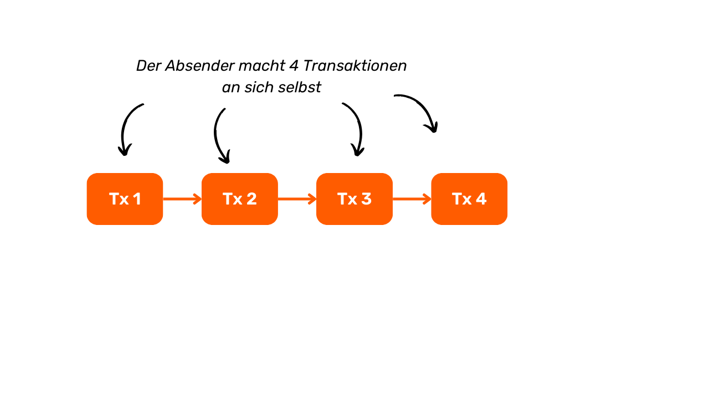

Nach dieser Sequenz von Transaktionen leitet das Ricochet-Werkzeug die Bitcoins schließlich an ihr endgültiges Ziel weiter, wie zum Beispiel eine Austauschplattform.

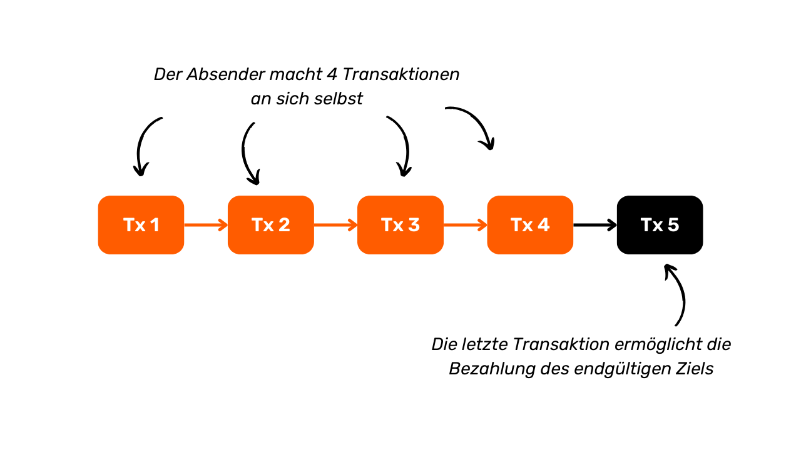

Das Ziel ist es, eine Distanz zu schaffen, die die Fungibilität der Münze, wie eine Coinjoin-Transaktion, und den letzten Akt des Ausgebens, der diese Münze aufgrund ihrer Vergangenheit ablehnen könnte, betrifft. So könnten Chain-Analyse-Tools zu dem Schluss kommen, dass es wahrscheinlich zu einem Eigentümerwechsel nach dem Ereignis gekommen ist und dass diese Münze als fungibel betrachtet werden kann. Im Falle eines Coinjoin könnten Chain-Analyse-Tools dann annehmen, dass es nicht dieselbe Person ist, die die Bitcoins gesendet und den Coinjoin durchgeführt hat, und daher ist es unnötig, Maßnahmen gegen den Absender einzuleiten.

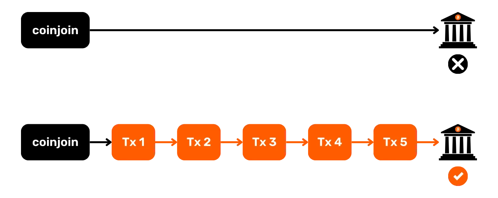

### Warum funktioniert das?
Angesichts dieser Ricochet-Methode könnte man sich vorstellen, dass Chain-Analyse-Software ihre Untersuchung über vier Sprünge hinaus vertiefen würde. Diese Plattformen stehen jedoch vor einem Dilemma bei der Optimierung der Erkennungsschwelle. Sie müssen eine Grenze festlegen, nach wie vielen Sprüngen sie zugeben, dass wahrscheinlich ein Eigentümerwechsel stattgefunden hat und dass der Zusammenhang mit einem vorherigen Ereignis (wie einem Coinjoin) ignoriert werden sollte.
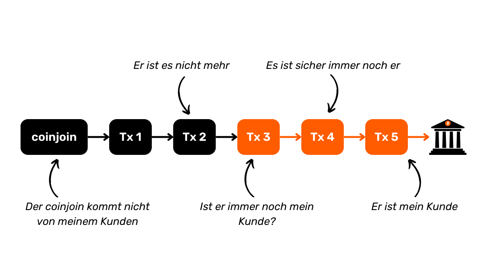

Die Festlegung dieser Schwelle erweist sich jedoch als riskant: Jede Erweiterung der beobachteten Anzahl von Sprüngen erhöht exponentiell das Volumen der Falschpositiven, das heißt, Personen, die fälschlicherweise als Teilnehmer an einem Ereignis markiert werden, wenn die Operation von jemand anderem durchgeführt wurde. Dieses Szenario stellt ein großes Risiko für diese Unternehmen dar, da Falschpositive zu Unzufriedenheit führen, die betroffene Kunden zur Konkurrenz treiben kann. Langfristig führt eine zu breite Erkennungsschwelle dazu, dass eine Plattform mehr Kunden verliert als ihre Wettbewerber, was ihre Lebensfähigkeit bedrohen könnte. Daher ist es für diese Plattformen kompliziert, die Anzahl der beobachteten Sprünge zu erhöhen, und 4 ist oft eine ausreichende Zahl, um ihre Analysen zu kontern.

Das hier beobachtete Phänomen ist in gewisser Weise analog zur Theorie der sechs Trennungsgrade.
Die Theorie der sechs Handshakes besagt, dass jede Person auf der Erde mit jeder anderen über eine Kette von Bekanntschaften verbunden ist, die nicht mehr als sechs Vermittler umfasst. Es würde ausreichen, eine Reihe von sechs Personen zu durchlaufen, wobei jede die nächste persönlich kennt, um jede beliebige Person auf der Welt zu erreichen.
Bei Bitcoin-Transaktionen findet sich ein ähnliches Phänomen. Indem man eine ausreichende Anzahl von Bitcoin-Transaktionen zurückverfolgt, stößt man unweigerlich auf einen CoinJoin. Die Ricochet-Methode nutzt dieses Prinzip, indem sie eine Anzahl von Sprüngen verwendet, die höher ist, als was Austauschplattformen vernünftigerweise verfolgen können. Wenn Plattformen sich entscheiden, mehr Transaktionen zu verfolgen, ist es dann möglich, einfach einen zusätzlichen Sprung hinzuzufügen, um diese Maßnahme zu umgehen.

### Wann und wie verwendet man Ricochet?

Der häufigste Anwendungsfall für Ricochet tritt auf, wenn es notwendig ist, eine vorherige Beteiligung an einem CoinJoin bei einem UTXO, den man besitzt, zu verbergen. Idealerweise ist es besser, Bitcoins, die einem CoinJoin unterzogen wurden, nicht an regulierte Einheiten zu übertragen. Dennoch, falls man sich ohne eine andere Option wiederfindet, insbesondere in der Dringlichkeit, Bitcoins in Fiat-Währung zu liquidieren, bietet Ricochet eine effektive Lösung.

Diese Methode ist nicht nur für CoinJoins effektiv, sondern auch für jedes andere Merkmal, das die Fungibilität einer Münze kompromittieren könnte.
Die Idee dieser Ricochet-Methode stammt ursprünglich von den Teams bei Samourai Wallet, die sie in ihre Anwendung integriert haben, um den Prozess zu automatisieren. Der Dienst ist bei Samourai kostenpflichtig, da ein Ricochet eine Servicegebühr von 100.000 Sats zusätzlich zu den Mining-Gebühren beinhaltet. Daher wird seine Verwendung eher für Überweisungen von signifikanten Beträgen empfohlen.


Die Samourai-Anwendung bietet zwei Varianten von Ricochet:
- Das erweiterte Ricochet oder "gestaffelte Lieferung", das den Vorteil hat, die Samourai-Servicegebühren über fünf aufeinanderfolgende Transaktionen zu verteilen. Diese Option stellt auch sicher, dass jede Transaktion zu einem unterschiedlichen Zeitpunkt gesendet und in einem anderen Block aufgezeichnet wird, was es ermöglicht, das Verhalten eines Besitzwechsels so genau wie möglich nachzuahmen. Obwohl langsamer, ist diese Methode für diejenigen vorzuziehen, die es nicht eilig haben, da sie die Effizienz des Ricochets maximiert, indem sie seine Widerstandsfähigkeit gegen Kettenanalysen stärkt;


- Das klassische Ricochet, das darauf ausgelegt ist, die Operation schnell durchzuführen, indem alle Transaktionen innerhalb eines kurzen Zeitrahmens gesendet werden. Diese Methode bietet daher weniger Privatsphäre und geringere Widerstandsfähigkeit gegen Analysen als die erweiterte Methode. Sie sollte nur für dringende Sendungen verwendet werden.


Ricochet besteht einfach darin, Bitcoins an sich selbst zu senden. Es ist durchaus möglich, ein Ricochet manuell auf jeder Wallet-Software durchzuführen, ohne ein spezialisiertes Werkzeug zu verwenden. Übertragen Sie einfach dieselbe Münze nacheinander an sich selbst, indem Sie jedes Mal eine neue leere Adresse verwenden.

Im folgenden Kapitel erkunden wir verschiedene Techniken für geheime Eigentumsübertragungen. Diese Methoden unterscheiden sich radikal von denen, die wir bisher untersucht haben, sowohl in Bezug auf die Funktionsweise als auch die Ergebnisse.

https://planb.network/tutorials/privacy/ricochet
 
## Geheime Eigentumsübertragungen
<chapterId>a2067036-849c-4d6b-87d2-44235cfae7a1</chapterId>

Unter den Datenschutztechniken bei Bitcoin gibt es auch die geheime Eigentumsübertragung. Diese Methode zielt darauf ab, das Eigentum an Bitcoins von einer Person auf eine andere und umgekehrt zu übertragen, ohne dass diese Transaktion explizit auf der Blockchain sichtbar ist. Lassen Sie uns gemeinsam die verschiedenen verfügbaren Techniken sowie ihre Vor- und Nachteile studieren.

### Der CoinSwap
CoinSwap basiert auf einem relativ einfachen Konzept: Es verwendet Smart Contracts, um einen Transfer von Bitcoin-Besitz zwischen zwei Nutzern zu erleichtern, ohne dass Vertrauen benötigt wird und ohne dass dieser Transfer explizit auf der Blockchain sichtbar ist.

Stellen wir uns ein vereinfachtes Beispiel mit Alice und Bob vor. Alice besitzt 1 BTC, gesichert mit dem privaten Schlüssel $A$, und Bob besitzt ebenfalls 1, gesichert mit dem privaten Schlüssel $B$. Theoretisch könnten sie ihre privaten Schlüssel über einen externen Kommunikationskanal austauschen, um einen geheimen Transfer durchzuführen.


Diese naive Methode birgt jedoch ein hohes Risiko in Bezug auf Vertrauen. Nichts hindert Alice daran, eine Kopie des privaten Schlüssels $A$ nach dem Austausch zu behalten und diesen später zu verwenden, um die Bitcoins zu stehlen, sobald der Schlüssel in Bobs Besitz ist.


Darüber hinaus gibt es keine Garantie, die Alice davon abhält, Bobs privaten Schlüssel $B$ zu erhalten und niemals ihren privaten Schlüssel $A$ im Gegenzug zu senden. Dieser Austausch beruht daher auf übermäßigem Vertrauen zwischen den Parteien und erweist sich als ineffizient, um einen sicheren geheimen Transfer des Eigentums zu gewährleisten.


Um diese Probleme zu lösen und Austausche zwischen Parteien zu ermöglichen, die einander nicht vertrauen, können wir stattdessen Smart-Contract-Systeme verwenden. Ein Smart Contract ist ein Programm, das automatisch ausgeführt wird, wenn vordefinierte Bedingungen erfüllt sind, was in unserem Fall sicherstellt, dass der Austausch des Eigentums automatisch ohne gegenseitiges Vertrauen erfolgt.

Hierfür können wir HTLC (*Hash Time-Locked Contracts*) oder PTLC (*Point Time-Locked Contracts*) verwenden. Diese beiden Protokolle funktionieren ähnlich, indem sie ein zeitliches Sperrsystem verwenden, das garantiert, dass der Austausch entweder erfolgreich abgeschlossen oder vollständig abgebrochen wird, wodurch die Integrität der Gelder beider Parteien geschützt wird. Der Hauptunterschied zwischen HTLCs und PTLCs besteht darin, dass HTLCs Hashes und Preimages zur Sicherung der Transaktion verwenden, während PTLCs Adaptor Signatures nutzen.

In einem Coinswap-Szenario unter Verwendung eines HTLC oder eines PTLC zwischen Alice und Bob erfolgt der Austausch sicher: Entweder er gelingt, und jeder erhält die BTC des anderen, oder er scheitert, und jeder behält seine eigenen BTC. Es ist somit unmöglich für eine der Parteien, zu betrügen oder die BTC der anderen zu stehlen.

> *HTLCs sind auch der Mechanismus, der für die sichere Weiterleitung von Zahlungen über die bidirektionalen Kanäle des Lightning-Netzwerks verwendet wird.*
Die Verwendung von Adaptor Signatures ist in diesem Kontext besonders interessant, da sie das Umgehen traditioneller Skripte ermöglicht (dies ist ein Mechanismus, der manchmal als "_scriptless scripts_" bezeichnet wird). Diese Funktion hilft, die mit dem Austausch verbundenen Gebühren zu reduzieren. Ein weiterer großer Vorteil von Adaptor Signatures ist, dass sie die Verwendung eines gemeinsamen Hashs für beide Parteien der Transaktion nicht erfordern, wodurch ein direkter Link zwischen ihnen in bestimmten Arten von Austauschen vermieden wird.
### Adaptor Signatures

Adaptor Signatures sind eine kryptografische Methode, die eine gültige Signatur mit einer zusätzlichen Signatur, genannt "_adaptor signature_", integriert, um ein geheimes Stück Daten zu offenbaren. Diese Mechanik ist so konzipiert, dass das Kennen von 2 der folgenden 3 Elemente: die gültige Signatur, die Adaptor-Signatur und das Geheimnis, die Deduktion des fehlenden dritten Elements ermöglicht. Eine interessante Eigenschaft dieser Methode ist, dass, wenn wir die Adaptor-Signatur unseres Gegenübers und den spezifischen Punkt auf der elliptischen Kurve kennen, der mit dem Geheimnis verbunden ist, das zur Berechnung dieser Adaptor-Signatur verwendet wurde, wir unsere eigene Adaptor-Signatur ableiten können, die mit diesemselben Geheimnis kompatibel sein wird, ohne jemals direkten Zugang zu dem Geheimnis selbst zu haben.
Bei einem Coinswap ermöglicht die Verwendung von Adaptor-Signaturen das gleichzeitige Enthüllen von zwei sensiblen Informationen zwischen den Teilnehmern, wodurch die Notwendigkeit gegenseitigen Vertrauens vermieden wird. Nehmen wir ein Beispiel, um diesen Prozess mit Alice und Bob zu veranschaulichen, die den Besitz von jeweils 1 BTC austauschen möchten, sich aber nicht vertrauen. Sie verwenden Adaptor-Signaturen, um die Notwendigkeit von Vertrauen bei diesem Austausch zu eliminieren. Hier ist, wie sie vorgehen:
* Alice initiiert den Austausch, indem sie eine Transaktion $m_A$ erstellt, die 1 BTC an Bob sendet. Sie generiert eine Signatur $s_A$, die diese Transaktion validiert, indem sie ihren privaten Schlüssel $p_A$ ($P_A = p_A \cdot G$), einen Nonce $n_A$ ($N_A = n_A \cdot G$) und ein Geheimnis $t$ ($T = t \cdot G$) verwendet:

$$s_A = n_A + t + H(N_A + T \parallel P_A \parallel m_A) \cdot p_A$$

* Alice berechnet die Adaptor-Signatur $s_A'$, indem sie das Geheimnis $t$ von ihrer wahren Signatur $s_A$ abzieht:

$$s_A' = s_A - t$$

* Alice sendet Bob ihre Adaptor-Signatur $s'_A$, ihre nicht signierte Transaktion $m_A$, den Punkt, der dem Geheimnis entspricht ($T$), und den Punkt, der dem Nonce entspricht ($N_A$). Diese Elemente bilden das, was als "*Adaptor*" bezeichnet wird. Es ist wichtig zu beachten, dass Bob mit nur diesen Informationen nicht in der Lage ist, Alices BTC zu erlangen.
* Bob hat jedoch die Möglichkeit zu überprüfen, dass Alice nicht versucht, ihn zu bestehlen. Dazu prüft er, ob Alices Adaptor-Signatur $s_A'$ tatsächlich der vorgeschlagenen Transaktion $m_A$ entspricht. Wenn die folgende Gleichung korrekt ist, kann er dann sicher sein, dass Alices Adaptor-Signatur gültig ist:
$$s_A' \cdot G = N_A + H(N_A + T \parallel P_A \parallel m_A) \cdot P_A$$

* Diese Überprüfung bietet Bob ausreichende Garantien, um den Austausch zuversichtlich fortzusetzen. Er erstellt dann seine eigene Transaktion $m_B$, die darauf abzielt, 1 BTC an Alice zu senden, und generiert seine Adaptor-Signatur $s_B'$, die ebenfalls mit demselben Geheimnis $t$ verknüpft wird. Zu diesem Zeitpunkt kennt nur Alice den Wert von $t$; Bob kennt nur den entsprechenden Punkt $T$, den Alice ihm übermittelt hat:

$$s_B' = n_B + H(N_B + T \parallel P_B \parallel m_B) \cdot p_B$$

* Bob übermittelt Alice seine Adaptor-Signatur $s_B'$, seine nicht signierte Transaktion $m_B$, sowie den Punkt, der dem Geheimnis entspricht ($T$) und den Punkt, der dem Nonce entspricht ($N_B$). Alice, die das Geheimnis $t$ kennt, kann nun Bobs Adaptor-Signatur $s_B'$ mit diesem Geheimnis kombinieren, um eine gültige Signatur $s_B$ für die Transaktion $m_B$ zu generieren, die Bobs BTC an sie überträgt:

$$s_B = s_B' + t$$

$$(s_B' + t) \cdot G = N_B + T + H(N_B + T \parallel P_B \parallel m_B) \cdot P_B$$

* Alice sendet diese signierte Transaktion $m_B$ in die Bitcoin-Blockchain, um die von Bob versprochenen BTC zu erhalten. Wenn Bob diese Transaktion in der Blockchain sieht, kann er die Signatur $s_B = s_B' + t$ extrahieren. Mit diesen Informationen ist Bob dann in der Lage, das berühmte Geheimnis $t$ zu isolieren, das er benötigte:
$$t = (s_B' + t) - s_B' = s_B - s_B'$$
* Und in der Tat war dieses geheime $t$ das einzige fehlende Element, das Bob benötigte, um die gültige Signatur $s_A$ aus Alices Adapter-Signatur $s_A'$ zu generieren. Diese Signatur ermöglicht die Validierung der Transaktion $m_A$, die einen BTC von Alice zu Bob sendet. Bob berechnet dann $s_A$ und überträgt daraufhin die Transaktion $m_A$ auf die Blockchain:

$$s_A = s_A' + t$$

$$(s_A' + t) \cdot G = N_A + T + H(N_A + T \parallel P_A \parallel m_A) \cdot P_A$$
Fassen wir zusammen, wie eine Adapter-Signatur bei einem Coinswap funktioniert. Anfangs sendet Alice Bob eine nicht signierte Transaktion zusammen mit einem Adapter, der es Bob ermöglicht zu verifizieren, dass das später offenbarte Geheimnis ihm Zugang zu den Bitcoins gibt. Im Gegenzug sendet Bob Alice seine eigene nicht signierte Transaktion und seinen Adapter. Alice kann dann Bobs Transaktion abschließen und die Bitcoins durch Übertragen einer gültigen Transaktion mit dem Geheimnis wiedererlangen. Wenn diese Transaktion auf der Blockchain veröffentlicht wird, hat Bob die Möglichkeit, das Geheimnis zu extrahieren und somit Alices Transaktion freizuschalten. Folglich, wenn Alice eine Übertragung von Bobs Bitcoin initiiert, kann er seinerseits auf Alices Bitcoin zugreifen, ohne gegenseitiges Vertrauen zu benötigen.
Es ist erwähnenswert, dass Coinswaps erstmals im Oktober 2013 von [Gregory Maxwell auf BitcoinTalk](https://bitcointalk.org/index.php?topic=321228.0) vorgeschlagen wurden.

### Der Atomic Swap

Ähnlich wie der Coinswap und unter Verwendung der gleichen Arten von Smart Contracts ist es auch möglich, Atomic Swaps durchzuführen. Ein Atomic Swap ermöglicht einen direkten Austausch verschiedener Kryptowährungen, wie BTC und XMR, zwischen zwei Nutzern, ohne Vertrauen oder die Intervention eines Vermittlers zu erfordern. Diese Austausche werden als "atomar" bezeichnet, weil sie nur zwei mögliche Ergebnisse haben: Entweder der Austausch ist erfolgreich und beide Parteien sind zufrieden, oder er scheitert und jeder behält seine ursprünglichen Kryptowährungen, wodurch die Notwendigkeit von Vertrauen in die andere Partei entfällt.


Der Atomic Swap und der Coinswap teilen eine ähnliche Betriebsweise und bieten die gleichen Vor- und Nachteile in Bezug auf die Privatsphäre. Tatsächlich ist aus der Perspektive von Bitcoin ein Atomic Swap vergleichbar mit einem in zwei Schritten durchgeführten Coinswap. Zuerst tauschen wir unsere BTC gegen eine andere Kryptowährung, und dann kann diese Kryptowährung gegen andere BTC getauscht werden. Letztendlich erlangen wir die BTC eines anderen Nutzers wieder. Deshalb fasse ich diese beiden Protokolle unter der Kategorie der geheimen Eigentumsübertragungen zusammen.


Im Gegensatz zum Coinswap kann der Atomic Swap jedoch Ungleichgewichte in Bezug auf die verfügbare Liquidität aufweisen, insbesondere bei BTC/XMR-Austauschen. Es ist im Allgemeinen einfacher, Bitcoins gegen Altcoins zu tauschen, da eine hohe Nachfrage nach Bitcoins besteht, was die Prämien für diese Umwandlungsrichtung niedrig hält. Der Tausch von Altcoins, um BTC zu erhalten, kann jedoch aufgrund der geringeren Nachfrage komplexer sein und oft sehr hohe Prämien zur Folge haben.

Schließlich, wenn ein atomarer Austausch Onchain-Bitcoins und Bitcoins im Lightning-Netzwerk umfasst, sprechen wir dann von einem "*Submarine Swap*".

### Ist es wirklich nützlich?
Geheime Eigentumsübertragungen, wie Coinswaps und Atomic Swaps, haben den Vorteil, Heuristiken der Kettenanalyse zu täuschen. Diese Methoden können den Eindruck erwecken, dass Transaktionen denselben Nutzer betreffen, obwohl das tatsächliche Eigentum den Besitzer gewechselt hat. Der Hauptnachteil dieser Methoden besteht jedoch darin, dass sie ohne die Verwendung einer zusätzlichen Technik zur Unterbrechung der Münzgeschichte sehr riskant sind.
Tatsächlich, wenn Alice einen Coinswap oder einen Atomic Swap mit Bob durchführt, tauscht sie das Eigentum ihrer Bitcoins mit Bobs. Im Falle eines Atomic Swaps beinhaltet der Austausch eine Altcoin, aber das Prinzip bleibt dasselbe. Somit endet Alice mit Münze $B$ und Bob mit Münze $A$. Dies fügt Zweifel in der Kettenanalyse hinzu, aber die Geschichte der Münzen bleibt nachverfolgbar. Wenn ein Analyst Münze $A$ untersucht, kann er zurück zu Alices vorherigen Aktivitäten verfolgen, und umgekehrt für Münze $B$.
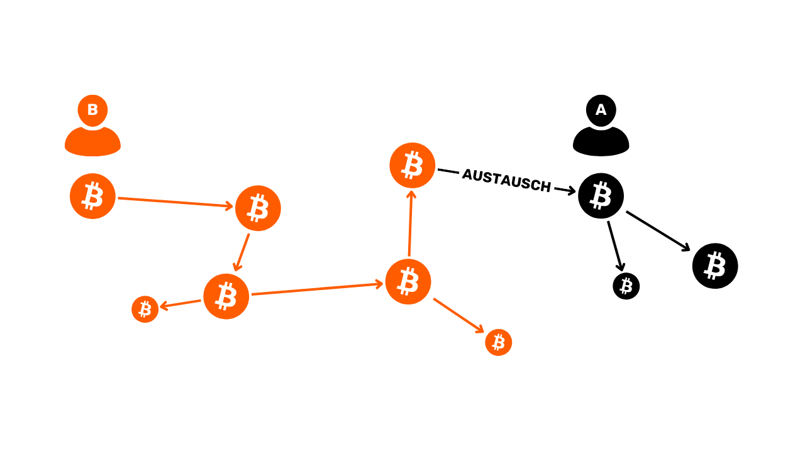

Aus Alices Perspektive besteht das Risiko darin, dass die Geschichte von Münze $B$ von bestimmten Entitäten als verdächtig angesehen werden könnte. Wenn Bob zum Beispiel Münze $B$ in einer kriminellen Handlung wie Hacking erworben hätte, würde diese Münze mit seinen illegalen Aktivitäten verbunden bleiben. Alice könnte sich dann im Besitz einer Münze befinden, die sie auf regulierten Austauschplattformen nicht übertragen könnte, ohne das Risiko einzugehen, dass ihre Gelder eingefroren werden, oder sogar beschuldigt zu werden, Bobs Verbrechen begangen zu haben, obwohl sie nichts damit zu tun hatte.

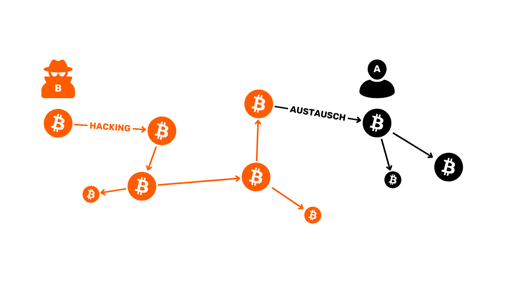

Und natürlich werden Privatsphäre-Methoden wie Coinswap oder Atomic Swap von Kriminellen bevorzugt, deren Gelder von den Behörden überwacht werden. Diese Protokolle bieten ihnen die Möglichkeit, ihre überwachten Bitcoins gegen perfekt fungible Bitcoins einzutauschen. Dies ermöglicht es ihnen auch, eine Ablenkung zu schaffen, indem sie die Behörden auf andere Nutzer hinweisen. Es gibt also eine doppelte Nützlichkeit für diese Individuen.

Mit Coinjoin, selbst wenn Ihre Münze mit überwachten Bitcoins gemischt wird, wird die Geschichte der Münze unterbrochen, was eine Form der plausiblen Abstreitbarkeit bietet, die in geheimen Eigentumsübertragungsprotokollen wie Coinswap oder Atomic Swap nicht existiert.


Wenn Alice jedes Risiko vermeiden möchte, muss sie notwendigerweise eine Methode verwenden, um die Geschichte von Münze $B$ zu unterbrechen, wie zum Beispiel durch Coinjoins. Dies wirft eine Frage über den Nutzen der Kombination der geheimen Übertragung des Eigentums und des Coinjoin auf. Der Coinjoin, indem er die Geschichte einer Münze bricht, bietet bereits ein ausreichendes Maß an Privatsphäre für Alice. Somit ist meine Meinung, dass, wenn Alice ihre Privatsphäre schützen möchte, es klüger wäre, direkt mit einem Coinjoin zu verfahren, anstatt sich in einen Coinswap gefolgt von einem Coinjoin einzulassen.
Damit die Methoden der geheimen Eigentumsübertragung wirklich effektiv sind und das Risiko vermeiden, die Geschichte eines Benutzers $A$ mit einem Benutzer $B$ zu verknüpfen, wäre es paradoxerweise notwendig, dass ihre Verwendung weit bekannt ist. Wenn der Coinswap massiv genutzt wird und die Behörden sich dieser gängigen Praxis bewusst sind, dann könnte eine Form der plausiblen Abstreitbarkeit etabliert werden. Solange jedoch die Nutzung dieser Übertragungen marginal bleibt, glaube ich, dass diese Methoden für die Benutzer zu riskant bleiben werden.

Bisher haben wir hauptsächlich Privatsphäre-Methoden auf der Transaktionsebene selbst untersucht. Im nächsten Kapitel werden wir die Probleme auf der Netzwerkebene und die Verbreitung von Transaktionen erkunden.

## Privatsphäre im P2P-Netzwerk
<chapterId>04a2467b-db84-4076-a9ff-919be5135106</chapterId>

In Teil 4 haben wir die Bedeutung der Verwendung eines Vollknotens zum Schutz der Privatsphäre Ihrer Transaktionen besprochen. Es ist jedoch wichtig zu verstehen, dass Ihr Knoten selbst Angriffen ausgesetzt sein kann, die darauf abzielen, Informationen über Ihre Aktivitäten zu extrahieren. In diesem Kapitel werden wir daher die verschiedenen Datenschutzmaßnahmen untersuchen, nicht auf der Ebene der Transaktionen selbst oder der Flüsse von Bitcoins, sondern auf der Netzwerkebene.

### Löwenzahn
Eine Möglichkeit, verschiedene De-Anonymisierungsangriffe zu vermeiden, besteht darin, den Dandelion-Vorschlag zu nutzen. Dieses Broadcast-Protokoll wurde in BIP156 formalisiert, aber es wurde nie auf Bitcoin implementiert.
Die Idee von Dandelion besteht darin, die Privatsphäre des Transaktionsroutings im Bitcoin-Netzwerk zu verbessern, um verschiedenen Formen von Angriffen entgegenzuwirken. Das Hauptziel ist es, den Quellknoten, der eine Transaktion im Netzwerk zuerst überträgt, zu verbergen. Die Offenlegung dieses Knotens könnte eine Bitcoin-Transaktion mit einer spezifischen IP-Adresse verknüpfen (wenn der Knoten im Clearnet operiert), was einen Einstiegspunkt für die Kettenanalyse bieten könnte.
Diese Verbindung zwischen einer Aktivität auf Bitcoin und einer IP-Adresse stellt ein erhebliches Risiko für die Privatsphäre des Benutzers dar. Tatsächlich können zahlreiche Entitäten eine IP-Adresse leicht mit einer persönlichen Identität verknüpfen. Dazu gehören insbesondere Regierungen und Internetdienstanbieter. Darüber hinaus können diese Informationen öffentlich zugänglich werden, zum Beispiel, wenn Ihre IP-Adresse und persönlichen Daten aufgrund eines Lecks beim Hacken einer Website-Datenbank offengelegt werden.
Im Standardbetrieb von Bitcoin werden von einem Benutzer in seiner Wallet-Software erstellte Transaktionen an seinen persönlichen Knoten übermittelt. Dieser Knoten überträgt die neue Transaktion sofort an alle Peers, mit denen er verbunden ist.


Diese Peers überprüfen dann die Transaktion, um sicherzustellen, dass sie den Konsensregeln und lokalen Standardisierungsregeln entspricht. Einmal validiert, überträgt jeder Peer seinerseits die Transaktion an seine eigenen Peers, und so weiter.


Die Verteilung von Transaktionen, die zur Integration in einen Block anstehen, erfolgt auf eine ziemlich ausgeglichene und statistisch vorhersehbare Weise. Diese Schwachstelle kann von kolludierenden Spionageknoten ausgenutzt werden, die zusammenarbeiten, um das Netzwerk zu überwachen und zu analysieren, um den ersten Knoten zu identifizieren, der eine Transaktion übertragen hat. Wenn ein Beobachter den Quellknoten lokalisieren kann, kann er davon ausgehen, dass die Transaktion vom Betreiber dieses Knotens stammt. Diese Art der Beobachtung kann Transaktionen, die normalerweise anonym sind, mit spezifischen IP-Adressen verknüpfen.


Das Ziel von BIP156 ist es, dieses Problem anzugehen. Zu diesem Zweck führt es eine zusätzliche Phase in der Übertragung einer neuen Transaktion ein, um die Anonymität vor der weit verbreiteten öffentlichen Verbreitung zu bewahren. Dandelion verwendet zunächst eine "Stem"-Phase, in der die Transaktion über einen zufälligen Pfad von Knoten gesendet wird.


Die Transaktion wird dann in der "Fluff"-Phase im gesamten Netzwerk übertragen.


Stem und Fluff sind Referenzen auf das Verhalten der Transaktionsverbreitung durch das Netzwerk, ähnlich der Form eines Löwenzahns.

So können Spionageknoten möglicherweise die Transaktion bis zu dem Knoten zurückverfolgen, der die Fluff-Phase (die massive Übertragung) initiiert hat, aber dieser Knoten ist nicht derjenige, der die Transaktion zuerst übertragen hat, da er sie vom letzten Knoten im Stem erhalten hat. Wenn Spionageknoten nicht den Stem zurückverfolgen können, können sie auch den Quellknoten nicht identifizieren.


Selbst in Anwesenheit von Spionageknoten während der Stem-Phase bleibt immer ein Zweifel bestehen, denn sobald sie auf einen ehrlichen Knoten im Diffusionsgraphen treffen, können die Spione nicht bestimmen, ob dieser Knoten die ursprüngliche Quelle ist oder einfach ein Zwischenknoten.

Diese Routing-Methode verschleiert den Pfad, der zur Quellknoten führt, und macht es schwierig, eine Transaktion durch das Netzwerk zurück zu ihrem Ursprung zu verfolgen. Dandelion verbessert somit die Privatsphäre, indem es die Fähigkeit der Gegner einschränkt, das Netzwerk zu deanonymisieren. Diese Methode ist noch effektiver, wenn die Transaktion während der "Stem"-Phase einen Knoten durchquert, der seine Netzwerkkommunikation verschlüsselt, wie bei Tor oder P2P Transport V2.

BIP156 wurde nicht in Bitcoin Core integriert und ist derzeit unter dem Status "abgelehnt" klassifiziert. Eine der Hauptbedenken bezüglich dieses Protokolls liegt in der Tatsache, dass Transaktionen während der Stem-Phase von Zwischenknoten weitergeleitet werden müssen, bevor sie verifiziert werden. Wie wir gesehen haben, verifiziert im normalen Modell von Bitcoin jeder Knoten zuerst die Transaktion, bevor er sie an seine Peers sendet. Wenn eine Transaktion nicht den Konsensregeln oder den lokalen Standardisierungsregeln des Knotens entspricht, ignoriert er sie und sendet sie nicht weiter. Dieser Prozess ist wichtig, um DoS-Angriffe abzuwehren, da nur gültige Transaktionen im gesamten Netzwerk verbreitet werden. Ungültige Transaktionen, die möglicherweise en masse erzeugt werden, um das Netzwerk zu überlasten, werden beim ersten angetroffenen Knoten gestoppt und nicht weitergeleitet. Das Hauptrisiko bei Dandelion besteht darin, dass dieses neue Protokoll neue Vektoren für DoS-Angriffe einführen könnte, indem es die Übertragung ungültiger Transaktionen durch einen Teil des Netzwerks ermöglicht.

### P2P Transport V2

P2P Transport V2 ist ein weiteres Netzwerkprotokoll, das in BIP324 vorgestellt wurde. Es handelt sich um eine neue Version des Bitcoin P2P-Transportprotokolls, das opportunistische Verschlüsselung integriert, um die Vertraulichkeit und Sicherheit der Kommunikation zwischen Knoten zu verbessern.

Diese Verbesserung zielt darauf ab, mehrere Probleme mit der Basisversion des P2P-Protokolls zu lösen. Einerseits macht es die ausgetauschten Daten für einen passiven Beobachter ununterscheidbar von anderen Datentypen, die im Internet zirkulieren. Das Hauptziel ist es, die massenhafte Überwachung von Bitcoin-Nutzern durch Regierungen, Internetdienstanbieter oder VPN-Anbieter zu verhindern. Dies erschwert es diesen Entitäten auch festzustellen, ob ein Internetnutzer auch ein Bitcoin-Nutzer ist, das heißt, ob sie einen Vollknoten betreiben.
P2P V2 trägt auch dazu bei, die Risiken von Zensur und Angriffen durch die Erkennung spezifischer Muster in Datenpaketen zu reduzieren. Es kompliziert und verteuert die Ausführung verschiedener Arten von Sybil-Angriffen auf Netzwerkebene. Ein Sybil-Angriff tritt auf, wenn ein Akteur mehrere falsche Identitäten erstellt, um einen unangemessenen Vorteil zu erlangen. Im Kontext des Bitcoin-Netzwerks manifestiert sich dies oft als ein Akteur, der eine große Anzahl von Vollknoten kontrolliert und diese aggressiv nutzt, um Verbindungen zu vervielfachen. Sybil-Angriffe können passiv sein, mit dem Ziel, Informationen zu sammeln und die Vertraulichkeit der Nutzer zu kompromittieren, oder aktiv, in Form von Eclipse-Angriffen. Letztere isolieren einen bestimmten Knoten vom Rest des Netzwerks, was entweder dazu dient, den Benutzer zu zensieren oder die Daten, die sie erhalten, zu verändern. Schließlich macht P2P V2 auch *Man-In-The-Middle* (MITM)-Angriffe kostspieliger und leichter zu erkennen.
Die von P2P V2 implementierte Verschlüsselung beinhaltet keine Authentifizierung, um keine unnötige Komplexität hinzuzufügen und die erlaubnisfreie Natur der Netzwerkverbindung nicht zu kompromittieren. Dieses neue P2P-Transportprotokoll bietet dennoch eine bessere Sicherheit gegen passive Angriffe und macht aktive Angriffe deutlich kostspieliger und erkennbarer. Die Einführung eines pseudozufälligen Datenstroms in Netzwerknachrichten erschwert es Angreifern, die Kommunikation zu zensieren oder zu manipulieren.

P2P V2-Transport wurde als Option (standardmäßig deaktiviert) in Version 26.0 von Bitcoin Core, die im Dezember 2023 bereitgestellt wurde, aufgenommen. Es wurde dann standardmäßig in Version 27.0 im April 2024 aktiviert. Es kann mit der Option `v2transport=` in der Konfigurationsdatei geändert werden.

### Tor
Eine relativ einfache Lösung, um das Risiko des Verlusts der Vertraulichkeit für einen Knoten auf Netzwerkebene zu vermeiden, besteht darin, ihn vollständig unter Tor zu betreiben.
Tor ist ein Netzwerk aus Relay-Servern (Knoten), das den Ursprung von TCP-Verbindungen im Internet anonymisiert. Es funktioniert, indem Daten in mehreren Schichten verschlüsselt werden. Jeder Relay-Knoten entfernt eine Schicht, um die Adresse des nächsten Knotens zu enthüllen, bis das endgültige Ziel erreicht ist. Das Tor-Netzwerk gewährleistet Anonymität, indem es verhindert, dass Zwischenknoten sowohl den Ursprung als auch das Ziel der Daten kennen, was es einem Beobachter sehr schwer macht, die Aktivitäten des Benutzers zurückzuverfolgen.


Tor verschlüsselt daher nicht nur die kommunizierten Daten, sondern ermöglicht auch die Maskierung von Ursprung und Ziel der Kommunikation. Indem wir Tor für die Kommunikation unseres persönlichen Knotens verwenden, erhöhen wir die Privatsphäre unserer Transaktionen: Der Internetdienstanbieter (ISP) kann die Kommunikation nicht entschlüsseln, und andere Knoten im Bitcoin-Netzwerk können die IP-Adresse des Quellknotens nicht identifizieren. Darüber hinaus verbirgt Tor auch Ihre Nutzung von Bitcoin vor Ihrem ISP.

Das Hauptrisiko, das mit dieser Methode verbunden ist, besteht darin, dass Tor ein Protokoll ist, das unabhängig von Bitcoin ist. Wenn Sie einen Bitcoin-Knoten unter Tor haben und Tor nicht mehr funktioniert, dann wird Ihr Bitcoin-Knoten nicht mehr kommunizieren können.

Es ist auch wichtig zu beachten, dass Kommunikationen über Tor langsamer sind. Diese Latenz ist besonders störend während des anfänglichen Starts eines Knotens, da der Initial Block Download (IBD) viele Kommunikationen erfordert. Als Ergebnis könnte Ihre anfängliche Synchronisierung mit dem Bitcoin-Netzwerk unter Verwendung von Tor deutlich länger sein. Es ist auch möglich, den IBD im Clearnet durchzuführen und dann später Tor zu aktivieren. Obwohl diese Methode die Existenz Ihres Bitcoin-Knotens Ihrem ISP offenbart, schützt sie die Informationen zu Ihren persönlichen Transaktionen, sobald Sie zu Tor wechseln.

Nachdem wir die verschiedenen Methoden zur Wahrung der Privatsphäre auf Netzwerkebene erkundet haben, möchte ich in den kommenden Kapiteln auch zwei elegante Lösungen vorstellen, um die Wiederverwendung von Adressen zu vermeiden: BIP47 und Silent Payments.

## BIP47 und wiederverwendbare Zahlungscodes
<chapterId>ad88e076-a04b-4aec-b3b2-7b4760175504</chapterId>

Wie wir in Teil 3 gesehen haben, stellt die Wiederverwendung von Adressen ein ernsthaftes Hindernis für die Privatsphäre der Benutzer im Bitcoin-Protokoll dar. Um diese Risiken zu mindern, wird dringend empfohlen, für jede neue Zahlung, die in einer Wallet empfangen wird, eine frische Empfangsadresse zu generieren. Obwohl die Generierung einer neuen Adresse heute durch die Verwendung moderner Software und hierarchisch deterministischer Wallets vereinfacht wird, mag diese Praxis kontraintuitiv erscheinen.


Im traditionellen Bankensystem sind wir beispielsweise daran gewöhnt, unsere IBAN zu teilen, die immer gleich bleibt. Einmal jemandem mitgeteilt, können sie uns mehrere Zahlungen senden, ohne erneut mit uns interagieren zu müssen. Neo-Banken bieten auch modernere Möglichkeiten wie die Verwendung einzigartiger E-Mail-Adressen bei PayPal oder RevTags bei Revolut. Auch außerhalb des Finanzbereichs sind unsere täglichen Kennungen wie unsere Postadresse, Telefonnummer und E-Mail-Adresse einzigartig und dauerhaft. Wir müssen sie bei jeder neuen Interaktion nicht erneuern.

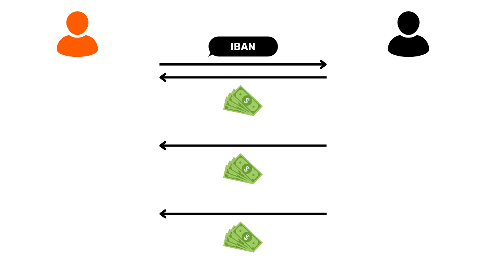
Die Funktionsweise von Bitcoin ist jedoch anders: Es ist zwingend erforderlich, für jede eingehende Transaktion eine neue Empfangsadresse zu generieren. Dieser Kompromiss zwischen Benutzerfreundlichkeit und Privatsphäre geht auf den allerersten Ursprung des Bitcoin-Whitepapers zurück. Seit der Veröffentlichung der ersten Version seines Dokuments Ende 2008 warnte uns Satoshi Nakamoto bereits vor diesem Risiko:
**"*Als zusätzliche Schutzmaßnahme könnte für jede Transaktion ein neues Schlüsselpaar verwendet werden, um sie nicht mit einem gemeinsamen Besitzer in Verbindung zu bringen.*"**
Es gibt zahlreiche Methoden, um mehrere Zahlungen an einen einzigen Identifikator zu erhalten, ohne eine Adresswiederverwendung zu verursachen. Jede Methode hat ihre eigenen Kompromisse und Nachteile. Zu diesen Methoden gehört BIP47, ein Vorschlag, der von Justus Ranvier entwickelt und 2015 veröffentlicht wurde. Dieser Vorschlag zielt darauf ab, wiederverwendbare Zahlungscodes zu erstellen, die mehrere Transaktionen an dieselbe Person ermöglichen, während die Adresswiederverwendung vermieden wird. Im Wesentlichen sucht BIP47 ein Zahlungssystem anzubieten, das so intuitiv wie ein einzigartiger Identifikator ist, während die Privatsphäre der Transaktionen gewahrt bleibt.


BIP47 verbessert die Privatsphäre der Nutzer nicht direkt, da eine BIP47-Zahlung dasselbe Maß an Privatsphäre bietet wie eine klassische Bitcoin-Transaktion mit frischen Adressen. Es macht jedoch die Nutzung von Bitcoin bequemer und intuitiver, eine Leichtigkeit, die normalerweise die Privatsphäre beeinträchtigen sollte. Dank BIP47 erreicht diese Benutzerfreundlichkeit dasselbe Maß an Privatsphäre wie eine klassische Transaktion. Deshalb ist BIP47 ein wertvolles Werkzeug für die Bewahrung der Privatsphäre.

Ursprünglich war BIP47 ein Vorschlag, der zur Integration in Bitcoin Core formuliert wurde, aber nie angenommen wurde. Einige Software hat sich dennoch entschieden, es auf eigene Faust auf Anwendungsebene zu implementieren. So haben die Teams bei Samourai Wallet ihre eigene Implementierung von BIP47 namens "PayNym" entwickelt.

### Allgemeines Prinzip von BIP47 und PayNym

Das Ziel von BIP47 ist es, den Empfang zahlreicher Zahlungen zu ermöglichen, ohne eine Adresswiederverwendung zu verursachen. Es stützt sich auf die Verwendung eines wiederverwendbaren Zahlungscodes, der es verschiedenen Sendern ermöglicht, mehrere Zahlungen an einen einzelnen Code zu senden, der einem anderen Benutzer gehört. So muss der Empfänger nicht für jede Transaktion eine neue frische Adresse bereitstellen, was ihre Austausche erheblich erleichtert und gleichzeitig ihre Privatsphäre bewahrt.

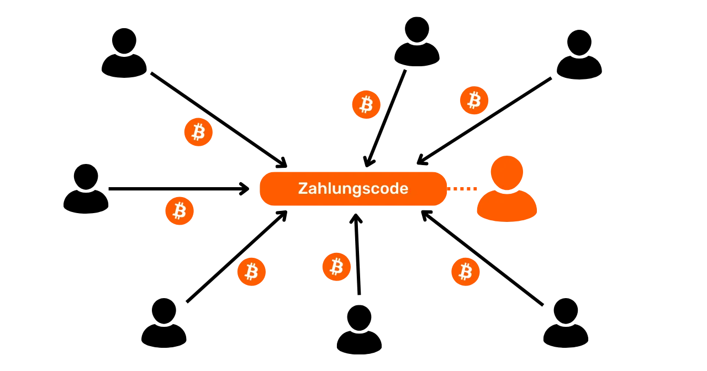

Ein Benutzer kann daher seinen Zahlungscode frei teilen, sei es in sozialen Netzwerken oder auf seiner Website, ohne die Privatsphäre zu verlieren, im Gegensatz zu dem, was mit einer klassischen Empfangsadresse oder einem öffentlichen Schlüssel passieren würde.
Um eine Transaktion durchzuführen, müssen beide Parteien ein Bitcoin-Wallet mit einer Implementierung von BIP47 haben, wie PayNym auf Samourai Wallet oder Sparrow Wallet. Die gemeinsame Nutzung ihrer Zahlungscodes schafft einen geheimen Kanal zwischen ihnen. Um diesen Kanal effizient zu etablieren, muss der Sender eine spezifische Transaktion auf der Bitcoin-Blockchain durchführen, bekannt als "Benachrichtigungstransaktion" (Ich werde Ihnen später mehr Details dazu geben).

Die Kombination der Zahlungscodes beider Benutzer generiert gemeinsame Geheimnisse, die wiederum die Erstellung einer großen Anzahl von einzigartigen Bitcoin-Empfangsadressen ermöglichen (genau 2^32 oder etwa 4 Milliarden). Zahlungen, die über BIP47 getätigt werden, sind also nicht tatsächlich an den Zahlungscode selbst gerichtet, sondern an klassische Empfangsadressen, die aus den Zahlungscodes der beteiligten Benutzer abgeleitet sind.

Der Zahlungscode dient somit als virtueller Identifikator, der vom Seed der Wallet abgeleitet ist. In der hierarchischen Ableitungsstruktur der Wallet ist der Zahlungscode auf Ebene 3 positioniert, das heißt, auf der Kontenebene.

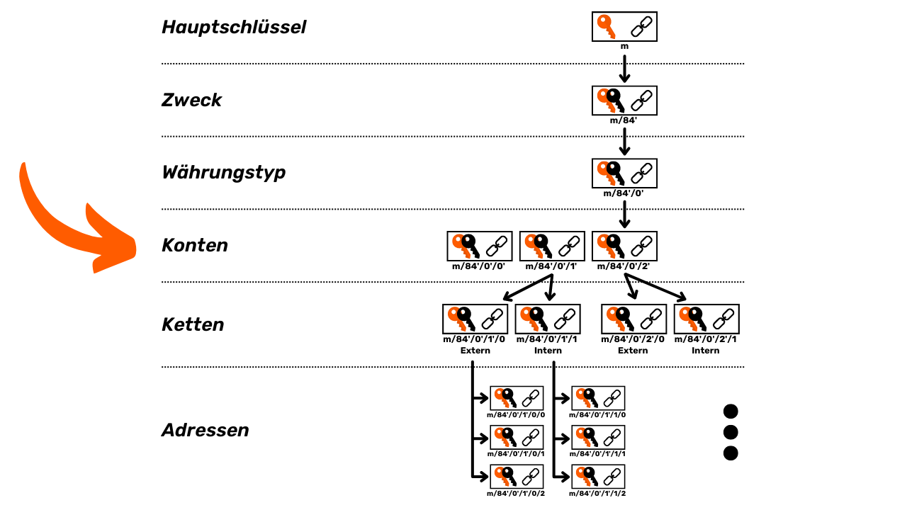

Das Ableitungsziel für BIP47 wird durch den Index `47'` (`0x8000002F`) identifiziert, was auf BIP47 verweist. Ein Beispiel für einen Ableitungspfad für einen wiederverwendbaren Zahlungscode wäre wie folgt:
```plaintext
m/47'/0'/0'/
```

Um Ihnen eine Vorstellung davon zu geben, wie ein Zahlungscode aussieht, hier ist meiner:

```plaintext
PM8TJSBiQmNQDwTogMAbyqJe2PE2kQXjtgh88MRTxsrnHC8zpEtJ8j7Aj628oUFk8X6P5rJ7P5qDudE4Hwq9JXSRzGcZJbdJAjM9oVQ1UKU5j2nr7VR5
```

Dieser Code kann auch in einen QR-Code kodiert werden, um seine Kommunikation zu erleichtern, genau wie eine klassische Empfangsadresse.

Bezüglich PayNym Bots, diese Roboter, die manchmal auf Twitter zu sehen sind, sind visuelle Darstellungen des Zahlungscodes, erstellt von Samourai Wallet. Sie werden über eine Hash-Funktion generiert, was ihnen fast Einzigartigkeit verleiht. Sie erscheinen in Form einer kleinen Zeichenkette, die mit `+` beginnt:
```plaintext
+throbbingpond8B1
+twilightresonance487
+billowingfire340
```

Diese Avatare können auch in Form von Bildern dargestellt werden:


Obwohl diese Roboter innerhalb des Rahmens von BIP47 keine spezifische technische Funktionalität haben, spielen sie eine Rolle dabei, Interaktionen zwischen Benutzern zu erleichtern, indem sie eine leicht erkennbare visuelle Identität bieten.
In den folgenden Abschnitten dieses Kapitels, das BIP47 gewidmet ist, werden wir detailliert untersuchen, wie es funktioniert, mit besonderem Schwerpunkt auf den verwendeten kryptografischen Methoden. Um diese etwas technischen Erklärungen vollständig zu verstehen, ist es wesentlich, zunächst die Struktur von HD-Wallets, die Schlüsselableitungsprozesse und die grundlegenden Prinzipien der elliptischen Kurven-basierten Kryptografie zu verstehen. Wenn Sie tiefer in diese Konzepte eintauchen möchten, steht ein weiterer kostenloser Kurs auf PlanB Network zur Verfügung: [CRYPTO 301](https://planb.network/en/courses/crypto301). Ich rate Ihnen dennoch, ihnen zu folgen, da das Verständnis der technischen Funktionsweise von BIP47 es Ihnen viel leichter machen wird, andere ähnliche Vorschläge zu verstehen, die wir in den folgenden Kapiteln besprechen werden.
### Wiederverwendbarer Zahlungscode

Wie zuvor erwähnt, befindet sich der wiederverwendbare Zahlungscode auf der Tiefe 3 des HD-Wallets, was ihn vergleichbar mit einem `xpub` macht, sowohl in seiner Position innerhalb der Wallet-Struktur als auch in seiner Rolle.

Der 80-Byte-Zahlungscode gliedert sich wie folgt:
- **Byte `0`: Die Version**. Für die erste Version von BIP47 ist dieses Byte auf `0x01` gesetzt;
- **Byte `1`: Das Bitfeld**. Dieser Raum ist für die Integration zusätzlicher Angaben bei spezifischen Verwendungen reserviert. Für die Standardnutzung mit PayNym wird dieses Byte als `0x00` definiert;
- **Byte `2`: Die `y`-Parität**. Dieses Byte ist `0x02` oder `0x03`, was angibt, ob die Ordinate des öffentlichen Schlüssels gerade oder ungerade ist, da ein komprimierter öffentlicher Schlüssel verwendet wird;
- **Von Byte `3` bis Byte `34`: Der `x`-Wert**. Diese Bytes repräsentieren die Abszisse des öffentlichen Schlüssels. Die Verkettung von `x` und der `y`-Parität bildet den vollständigen komprimierten öffentlichen Schlüssel;
- **Von Byte `35` bis Byte `66`: Der Kettenkode**. Dieser Raum enthält den Kettenkode, der mit dem öffentlichen Schlüssel assoziiert ist;
- **Von Byte `67` bis Byte `79`: Das Padding**. Dieser Raum ist für mögliche zukünftige Entwicklungen vorgesehen. Für die aktuelle Version werden hier einfach Nullen platziert, um die erforderliche 80-Byte-Größe für ein `OP_RETURN`-Output zu erreichen.

Hier ist die hexadezimale Darstellung meines wiederverwendbaren Zahlungscodes, die bereits im vorherigen Abschnitt vorgestellt wurde:
```plaintext
0x010002a0716529bae6b36c5c9aa518a52f9c828b46ad8d907747f0d09dcd4d9a39e97c3c5f37c470c390d842f364086362f6122f412e2b0c7e7fc6e32287e364a7a36a00000000000000000000000000
```
```
Zuerst ist es notwendig, das Präfix-Byte `P` am Anfang hinzuzufügen, um klar zu kennzeichnen, dass es sich um einen Zahlungscode handelt. Dieses Byte wird durch `0x47` repräsentiert:
```plaintext
0x47010002a0716529bae6b36c5c9aa518a52f9c828b46ad8d907747f0d09dcd4d9a39e97c3c5f37c470c390d842f364086362f6122f412e2b0c7e7fc6e32287e364a7a36a00000000000000000000000000
```

Schließlich, um die Integrität des Zahlungscodes zu gewährleisten, wird eine Prüfsummenberechnung durchgeführt, die `HASH256` verwendet, was aus einer doppelten Hashing mit der `SHA256`-Funktion besteht. Die ersten vier Bytes, die aus diesem Hash resultieren, werden dann am Ende des Zahlungscodes angehängt:
```plaintext
0x47010002a0716529bae6b36c5c9aa518a52f9c828b46ad8d907747f0d09dcd4d9a39e97c3c5f37c470c390d842f364086362f6122f412e2b0c7e7fc6e32287e364a7a36a00000000000000000000000000567080c4
```

Sobald diese Schritte abgeschlossen sind, ist der Zahlungscode fertig. Das Einzige, was noch bleibt, ist, ihn in Base 58 zu konvertieren, um seine endgültige Version zu erhalten:
```plaintext
PM8TJSBiQmNQDwTogMAbyqJe2PE2kQXjtgh88MRTxsrnHC8zpEtJ8j7Aj628oUFk8X6P5rJ7P5qDudE4Hwq9JXSRzGcZJbdJAjM9oVQ1UKU5j2nr7VR5
```

Während dieses Prozesses der Zahlungscode-Erstellung verwenden wir einen komprimierten öffentlichen Schlüssel und einen Ketten-Code. Beide werden aus einer deterministischen und hierarchischen Ableitung vom Seed der Wallet abgeleitet. Der verwendete Ableitungspfad ist:
```plaintext
m/47'/0'/0'/
```
Um den komprimierten öffentlichen Schlüssel und den zugehörigen Ketten-Code für den wiederverwendbaren Zahlungscode zu generieren, beginnen wir mit der Berechnung des Master-Privatschlüssels aus dem Seed der Wallet. Dann gehen wir dazu über, ein Paar von Kinderschlüsseln unter Verwendung des Index `47 + 2^31` (gehärtete Ableitung) abzuleiten. Diesem Schritt folgen zwei weitere aufeinanderfolgende Ableitungen von Kinderschlüsselpaaren, jeweils unter Verwendung des Index `2^31` (gehärtete Ableitung).

### Der Elliptic-Curve Diffie-Hellman (ECDH) Schlüsselaustausch
Das kryptografische Protokoll im Kern von BIP47 wird mit dem Akronym ECDH bezeichnet, für *Elliptic-Curve Diffie-Hellman*. Diese Methode ist eine Variante des ursprünglichen Diffie-Hellman-Schlüsselaustauschs.
Eingeführt im Jahr 1976, ist Diffie-Hellman ein Schlüsselvereinbarungsprotokoll, das es zwei Parteien, die jeweils mit einem Paar von Schlüsseln (öffentlich und privat) ausgestattet sind, ermöglicht, sich auf ein gemeinsames Geheimnis zu einigen, selbst wenn sie ausschließlich über einen öffentlichen und unsicheren Kanal kommunizieren.

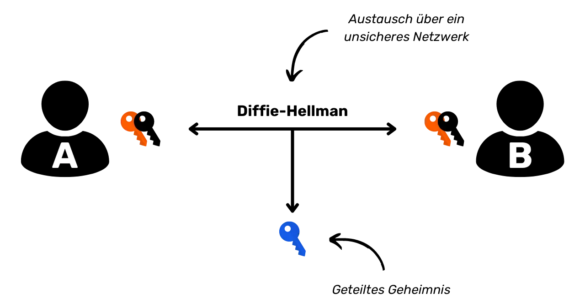

Dieses gemeinsame Geheimnis (hier der blaue Schlüssel) kann dann für andere Operationen verwendet werden. Typischerweise kann dieses geteilte Geheimnis verwendet werden, um Kommunikation über ein unsicheres Netzwerk zu verschlüsseln und zu entschlüsseln:


Um diesen Austausch zu erreichen, verwendet Diffie-Hellman modulare Arithmetik, um das gemeinsame Geheimnis zu berechnen. Hier ist eine vereinfachte Erklärung, wie es funktioniert:
- Alice und Bob einigen sich auf eine gemeinsame Farbe, hier gelb, die öffentliche Daten darstellt (Angreifer kennen diese Farbe);
- Alice wählt eine geheime Farbe, hier rot, und mischt die beiden, um orange zu erhalten;
- Bob wählt ebenfalls eine geheime Farbe, hier blau, und mischt sie mit dem Gelb, um grün zu erhalten;
- Sie tauschen dann die erhaltenen Farben, orange und grün, aus. Dieser Austausch kann über ein unsicheres und beobachtetes Netzwerk stattfinden;
- Indem Alice Bobs grün mit ihrer eigenen geheimen Farbe mischt, erzeugt sie braun;
- Bob, der dasselbe mit Alices Orange und seinem geheimen Blau macht, erhält ebenfalls braun.

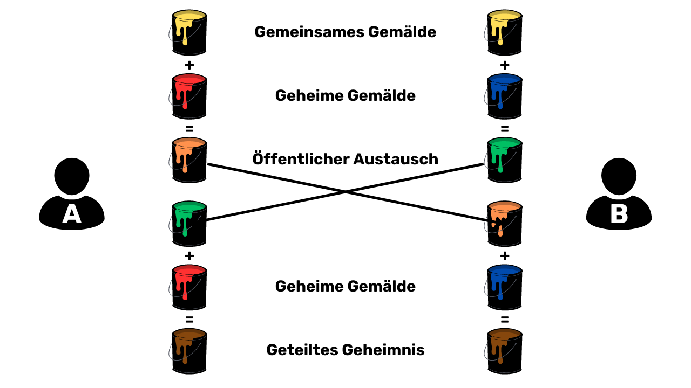

In dieser Vereinfachung repräsentiert die braune Farbe das gemeinsame Geheimnis zwischen Alice und Bob. Es ist wichtig zu verstehen, dass es in Wirklichkeit unmöglich ist, die Farben Orange und Grün zu trennen, um die geheimen Farben von Alice oder Bob zu entdecken.

Lassen Sie uns nun untersuchen, wie dieses Protokoll tatsächlich funktioniert, nicht mit Farbanalogien, sondern mit echten Zahlen und modularer Arithmetik!
Bevor wir die Mechanismen von Diffie-Hellman besprechen, erlauben Sie mir, Sie kurz an zwei wesentliche mathematische Konzepte zu erinnern, die wir benötigen werden:

- Eine **Primzahl** ist eine natürliche Zahl, die nur zwei Teiler hat: $1$ und sich selbst. Zum Beispiel ist $7$ eine Primzahl, weil sie nur durch $1$ und $7$ geteilt werden kann. Andererseits ist $8$ keine Primzahl, da sie durch $1$, $2$, $4$ und $8$ teilbar ist. Daher hat sie vier positive ganze Zahlenteiler statt zwei;
- Der **Modulo** (bezeichnet als $mod$ oder $\%$) ist eine mathematische Operation, die zwischen zwei Ganzzahlen den Rest der euklidischen Division des Ersten durch den Zweiten zurückgibt. Zum Beispiel ist $16 \bmod 5 = 1$.

**Der Diffie-Hellman-Schlüsselaustausch zwischen Alice und Bob erfolgt wie folgt:**

- Alice und Bob einigen sich auf zwei gemeinsame Zahlen: $p$ und $g$. $p$ ist eine Primzahl, und je größer diese Zahl ist, desto sicherer wird Diffie-Hellman sein. $g$ ist eine primitive Wurzel von $p$. Diese beiden Zahlen können offen über ein ungesichertes Netzwerk kommuniziert werden. Sie repräsentieren das Äquivalent von **der Farbe Gelb** in der vorherigen Vereinfachung. Es ist daher wichtig, dass Alice und Bob genau die gleichen Werte für $p$ und $g$ verwenden.
- Sobald diese Parameter definiert sind, wählen Alice und Bob jeweils eine geheime Zufallszahl. Alice nennt ihre geheime Zufallszahl $a$ (entspricht **der Farbe Rot**) und Bob nennt seine $b$ (entspricht **der Farbe Blau**). Diese Zahlen müssen streng vertraulich bleiben.
- Anstatt die Zahlen $a$ und $b$ direkt auszutauschen, berechnet jede Partei $A$ und $B$ wie folgt:

$A$ ist gleich $g$ hoch $a$ modulo $p$:


$$

A = g^a \bmod p

$$

$B$ ist gleich $g$ hoch $b$ modulo $p$:


$$

B = g^b \bmod p

$$

- Die Werte $A$ (entspricht **der Farbe Orange**) und $B$ (entspricht **der Farbe Grün**) werden zwischen den beiden Parteien ausgetauscht. Dieser Austausch kann offen über ein ungesichertes Netzwerk stattfinden;

- Alice, nachdem sie $B$ erhalten hat, berechnet den Wert von $z$ wie folgt:

$z$ ist gleich $B$ hoch $a$ modulo $p$:


$$

z = B^a \bmod p

$$

Zur Erinnerung:


$$

B = g^b \bmod p

$$

Dadurch erhalten wir:


$$

z = B^a \bmod p

$$


$$

z = (g^b)^a \bmod p

$$

Durch Anwendung der Potenzregeln:
$$

(x^n)^m = x^{nm}

$$

Erhalten wir dann:


$$

z = g^{ba} \bmod p

$$

- Auf seiner Seite berechnet Bob, nachdem er $A$ erhalten hat, ebenfalls den Wert von $z$ auf folgende Weise:

$z$ ist gleich $A$ hoch $b$ modulo $p$:


$$

z = A^b \bmod p

$$

Dadurch erhalten wir:


$$

z = (g^a)^b \bmod p

$$


$$

z = g^{ab} \bmod p

$$


$$

z = g^{ba} \bmod p

$$

Dank der Distributivität des Modulo-Operators erhalten Alice und Bob genau denselben Wert $z$. Diese Zahl repräsentiert ihr gemeinsames Geheimnis, das in der vorherigen Vereinfachung mit den Farbtöpfen **der braunen Farbe** entspricht. Sie können dieses gemeinsame Geheimnis nun verwenden, um ihre Kommunikation symmetrisch über ein ungesichertes Netzwerk zu verschlüsseln.


Ein Angreifer, selbst im Besitz von $p$, $g$, $A$ und $B$ (den öffentlichen Werten), wird nicht in der Lage sein, $a$, $b$ oder $z$ (die privaten Werte) zu berechnen. Um dies zu erreichen, müsste man die Exponentiation umkehren, eine Operation, die ohne das Ausprobieren aller Möglichkeiten nacheinander unmöglich ist, da sie darauf hinausläuft, den diskreten Logarithmus zu berechnen, das heißt, das Inverse der Exponentialfunktion in einer endlichen zyklischen Gruppe.

Solange die Werte von $a$, $b$ und $p$ ausreichend groß sind, ist das Diffie-Hellman-Protokoll sicher. Typischerweise wäre es mit 2048-Bit-Parametern (eine Zahl mit 600 Ziffern in Dezimal) unpraktisch, alle Möglichkeiten für $a$ und $b$ zu testen. Bis heute gilt dieser Algorithmus mit solchen Zahlen als sicher.
Genau hier liegt der Hauptnachteil des Diffie-Hellman-Protokolls. Um sicher zu sein, muss der Algorithmus große Zahlen verwenden. Deshalb wird heutzutage der ECDH-Algorithmus (*Elliptic Curve Diffie-Hellman*), eine Variante von Diffie-Hellman, die auf einer algebraischen Kurve basiert, genauer gesagt einer elliptischen Kurve, bevorzugt. Dieser Ansatz ermöglicht es, mit wesentlich kleineren Zahlen zu arbeiten und dabei eine äquivalente Sicherheit zu gewährleisten, wodurch die benötigten Ressourcen für Berechnung und Speicherung reduziert werden.
Das allgemeine Prinzip des Algorithmus bleibt gleich. Jedoch verwenden wir anstelle einer zufälligen Zahl $a$ und einer Zahl $A$, die aus $a$ durch modulare Exponentiation berechnet wird, ein Paar von Schlüsseln, die auf einer elliptischen Kurve basieren. Anstatt auf die Distributivität des Modulo-Operators zu setzen, nutzen wir das Gruppengesetz auf elliptischen Kurven und speziell die Assoziativität dieses Gesetzes.
Um das Prinzip der elliptischen Kurvenkryptografie kurz zu erklären, wird ein privater Schlüssel durch eine zufällige Zahl zwischen $1$ und $n-1$ dargestellt, wobei $n$ die Ordnung der Kurve repräsentiert. Der öffentliche Schlüssel hingegen ist ein spezifischer Punkt auf dieser Kurve, der aus dem privaten Schlüssel durch Operationen der Punktaddition und -verdopplung ausgehend vom Generatorpunkt, gemäß der Gleichung:
$$

K = k \cdot G

$$
erhalten wird.

In dieser Formel bezeichnet $K$ den öffentlichen Schlüssel, $k$ den privaten Schlüssel und $G$ den Generatorpunkt.

Eine der wesentlichen Eigenschaften dieser Schlüssel ist die Leichtigkeit, $K$ aus $k$ und $G$ zu berechnen, während es praktisch unmöglich ist, $k$ aus $K$ und $G$ zu finden. Diese Asymmetrie schafft eine Einwegfunktion. Mit anderen Worten, es ist einfach, den öffentlichen Schlüssel zu berechnen, wenn man den privaten Schlüssel kennt, aber den privaten Schlüssel aus dem öffentlichen Schlüssel zu finden, ist unmöglich. Diese Sicherheit basiert immer noch auf der rechnerischen Schwierigkeit des diskreten Logarithmus.

Wir werden diese Eigenschaft nutzen, um unseren Diffie-Hellman-Algorithmus anzupassen. **Das Betriebsprinzip von ECDH ist wie folgt:**

- Alice und Bob einigen sich gemeinsam auf eine kryptografisch sichere elliptische Kurve und ihre Parameter. Diese Informationen sind öffentlich;

- Alice generiert eine zufällige Zahl $ka$, die ihr privater Schlüssel sein wird. Dieser private Schlüssel muss geheim bleiben. Sie bestimmt ihren öffentlichen Schlüssel $Ka$ durch Addition und Verdopplung von Punkten auf der gewählten elliptischen Kurve:


$$

K_a = k_a \cdot G

$$

- Bob generiert ebenfalls eine zufällige Zahl $kb$, die sein privater Schlüssel sein wird. Er berechnet den zugehörigen öffentlichen Schlüssel $Kb$:


$$

K_b = k_b \cdot G

$$

- Alice und Bob tauschen ihre öffentlichen Schlüssel $Ka$ und $Kb$ über ein ungesichertes öffentliches Netzwerk aus.

- Alice berechnet einen Punkt $(x,y)$ auf der Kurve, indem sie ihren privaten Schlüssel $ka$ auf Bobs öffentlichen Schlüssel $Kb$ anwendet:


$$

(x,y) = k_a \cdot K_b

$$

- Bob berechnet einen Punkt $(x,y)$ auf der Kurve, indem er seinen privaten Schlüssel $kb$ auf Alices öffentlichen Schlüssel $Ka$ anwendet:


$$

(x,y) = k_b \cdot K_a

$$

- Alice und Bob erhalten denselben Punkt auf der elliptischen Kurve. Das gemeinsame Geheimnis wird die x-Koordinate $x$ dieses Punktes sein.

Sie erhalten tatsächlich dasselbe gemeinsame Geheimnis, weil:
(x,y) = k_a \cdot K_b = k_a \cdot (k_b \cdot G) = (k_a \cdot k_b) \cdot G = (k_b \cdot k_a) \cdot G = k_b \cdot (k_a \cdot G) = k_b \cdot K_a
$$

Ein Angreifer, der das ungesicherte öffentliche Netzwerk beobachtet, kann nur die öffentlichen Schlüssel jeder Partei und die Parameter der gewählten elliptischen Kurve erhalten. Wie zuvor erklärt, reicht diese Information allein nicht aus, um die privaten Schlüssel zu bestimmen. Daher kann der Angreifer das gemeinsame Geheimnis zwischen Alice und Bob nicht finden.

ECDH ist somit ein Algorithmus, der den Schlüsselaustausch ermöglicht. Er wird oft in Verbindung mit anderen kryptografischen Methoden verwendet, um ein vollständiges Protokoll zu etablieren. Zum Beispiel ist ECDH in den Kern von TLS (_Transport Layer Security_), einem Verschlüsselungs- und Authentifizierungsprotokoll, das für die Transportschicht des Internets verwendet wird, integriert. TLS verwendet ECDHE für den Schlüsselaustausch, eine Variante von ECDH, bei der die Schlüssel ephemeral sind, um anhaltende Vertraulichkeit zu gewährleisten. Zusätzlich verwendet TLS Authentifizierungsalgorithmen wie ECDSA, Verschlüsselungsalgorithmen wie AES und Hash-Funktionen wie SHA256.

TLS ist insbesondere verantwortlich für das `s` in `https` sowie das Vorhängeschloss, das in der Adressleiste Ihres Browsers sichtbar ist, Symbole für verschlüsselte Kommunikation. Indem Sie diesem Kurs folgen, verwenden Sie daher ECDH, und es ist sehr wahrscheinlich, dass Sie es täglich nutzen, ohne es zu wissen.

### Die Benachrichtigungstransaktion

Wie wir im vorherigen Abschnitt gesehen haben, ist ECDH eine Variante des Diffie-Hellman-Austauschs, der Schlüsselpaare verwendet, die auf einer elliptischen Kurve etabliert sind. Bequemerweise besitzen wir bereits viele Schlüsselpaare, die diesem Standard entsprechen, in unseren Bitcoin-Wallets! Die Idee von BIP47 besteht darin, die Schlüsselpaare aus den Bitcoin deterministischen hierarchischen Wallets beider Parteien zu verwenden, um gemeinsame und ephemere Geheimnisse zwischen ihnen zu etablieren. Im Kontext von BIP47 wird stattdessen ECDHE (_Elliptic Curve Diffie-Hellman Ephemeral_) verwendet.


ECDHE wird in BIP47 zum ersten Mal verwendet, um den Zahlungscode vom Sender zum Empfänger zu übertragen. Dies ist die berühmte **Benachrichtigungstransaktion**. Dieser Schritt ist wesentlich, denn damit BIP47 effizient funktioniert, müssen beide beteiligten Parteien (der Sender und der Empfänger) den Zahlungscode des jeweils anderen kennen. Dieses Wissen ermöglicht die Ableitung von ephemeren öffentlichen Schlüsseln und folglich zugehörigen leeren Empfangsadressen.
Vor diesem Austausch ist der Sender logischerweise bereits über den Zahlungscode des Empfängers informiert, da sie ihn off-chain abgerufen haben, zum Beispiel von deren Webseite, einer Rechnung oder ihren Social-Media-Kanälen. Der Empfänger kennt jedoch möglicherweise nicht den Zahlungscode des Senders. Dennoch muss dieser Code an sie übermittelt werden; sonst können sie die ephemeren Schlüssel, die notwendig sind, um die Adressen zu identifizieren, wo ihre Bitcoins gespeichert sind, nicht ableiten, noch auf ihre Gelder zugreifen. Obwohl diese Übermittlung des Senderscodes technisch off-chain durch andere Kommunikationsmittel durchgeführt werden kann, stellt dies ein Problem dar, wenn das Wallet nur aus dem Seed wiederhergestellt werden muss.
Tatsächlich sind BIP47-Adressen, anders als herkömmliche Adressen, nicht direkt vom Seed des Empfängers abgeleitet – in diesem Fall wäre die Verwendung eines `xpub` einfacher – sondern resultieren aus einer Berechnung, die beide Zahlungscodes kombiniert: den des Senders und den des Empfängers. Wenn also der Empfänger seine Wallet verliert und versucht, sie aus seinem Seed wiederherzustellen, wird er seinen eigenen Zahlungscode wiedererlangen, der direkt von seinem Seed abgeleitet ist. Um jedoch die ephemeren Adressen zu finden, ist es wesentlich, dass er auch die Zahlungscodes aller Personen hat, die ihm über BIP47 Bitcoins gesendet haben. Daher ist die Bedeutung der Benachrichtigungstransaktion so groß, da sie es ermöglicht, diese Informationen auf der Bitcoin-Blockchain zu speichern, während sie sehr leicht gefunden werden können, ohne dass man die Milliarde Transaktionen durchsuchen muss, die seit ihrem Start im Jahr 2009 ausgeführt wurden.
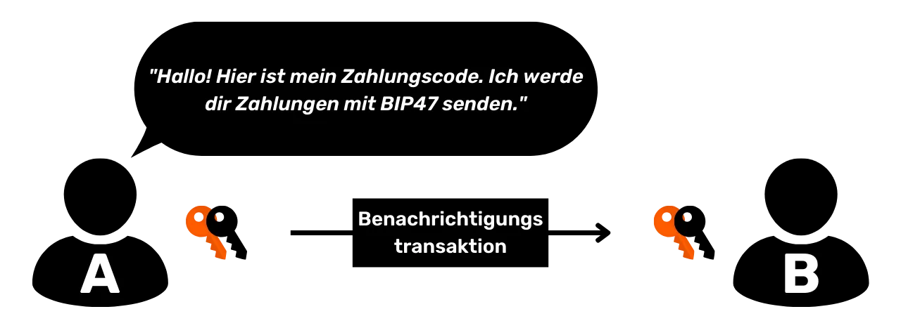

Daher wäre es möglich, BIP47 ohne Rückgriff auf die Benachrichtigungstransaktion zu implementieren, vorausgesetzt, dass jeder Benutzer eine Sicherung der Zahlungscodes seiner Peers behält. Diese Methode erweist sich jedoch als komplex zu verwalten, solange keine einfache, robuste und effiziente Lösung für das Erstellen, Speichern und Aktualisieren dieser Sicherungen entwickelt wird. Im aktuellen Zustand der Dinge wird die Benachrichtigungstransaktion somit fast unverzichtbar.

In den folgenden Kapiteln werden wir andere Protokolle mit Zielen ähnlich denen von BIP47 studieren, die jedoch keine Benachrichtigungstransaktion erfordern. Diese Alternativen führen jedoch ihre eigenen Kompromisse ein.

Neben ihrer Rolle bei der Sicherung von Zahlungscodes dient die Benachrichtigungstransaktion auch als Benachrichtigungsfunktion für den Empfänger, wie der Name schon sagt. Sie signalisiert dem Client des Empfängers, dass ein neuer Zahlungskanal eingerichtet wurde, und schlägt daher vor, die resultierenden ephemeren Adressen zu überwachen.

### Das Datenschutzmodell von BIP47

Bevor wir die technische Funktionsweise der Benachrichtigungstransaktion im Detail besprechen, ist es wichtig, das Datenschutzmodell zu diskutieren, das mit BIP47 verbunden ist und bestimmte Maßnahmen rechtfertigt, die bei der Erstellung dieser initialen Transaktion ergriffen wurden.
Der Zahlungscode an sich stellt kein direktes Risiko für die Privatsphäre dar. Im Gegensatz zum traditionellen Bitcoin-Modell, das darauf abzielt, die Verbindung zwischen der Identität eines Benutzers und seinen Transaktionen (die öffentlich sind) durch die Wahrung der Anonymität von Schlüsseln und Adressen zu brechen, kann der Zahlungscode offen mit einer Identität assoziiert werden, ohne eine Bedrohung darzustellen.
Tatsächlich werden die Adressen, die BIP47-Zahlungen erhalten, nicht direkt aus dem Zahlungscode abgeleitet. Diese Adressen werden stattdessen durch die Anwendung von ECDH zwischen den abgeleiteten Schlüsseln der Zahlungscodes der beiden beteiligten Parteien generiert.

Ein Zahlungscode an sich führt also nicht direkt zu einem Verlust der Privatsphäre, da nur die Benachrichtigungsadresse daraus abgeleitet wird. Obwohl diese Adresse einige Informationen preisgeben kann, erlaubt sie normalerweise nicht die Entdeckung der Parteien, mit denen Sie Transaktionen durchführen, es sei denn durch eine gründliche Kettenanalyse. Tatsächlich, wenn der Sender UTXOs verwendet, die mit ihrer Identität verknüpft werden können, um die Benachrichtigungstransaktion durchzuführen, dann wird es möglich, zu deduzieren, dass ihre Identität wahrscheinlich mit BIP47-Zahlungen an Ihren Zahlungscode verknüpft ist. Dies wird die zugrundeliegenden Transaktionen nicht offenlegen, aber auf ihre wahrscheinliche Existenz hinweisen.

Daher ist es wesentlich, diese strikte Trennung zwischen den Zahlungscodes der Benutzer aufrechtzuerhalten. Zu diesem Ziel ist der initiale Kommunikationsschritt des Codes ein kritischer Moment für die Privatsphäre der Zahlung, jedoch obligatorisch für das ordnungsgemäße Funktionieren des Protokolls. Wenn einer der Zahlungscodes öffentlich erhältlich ist (wie auf einer Webseite), darf der zweite Code, der des Senders, in keinem Fall mit dem ersten verknüpft werden.

Nehmen wir ein konkretes Beispiel: Ich möchte eine Spende an eine politische Bewegung über BIP47 machen:

- Die Organisation hat ihren Zahlungscode auf ihrer Webseite oder über ihre sozialen Netzwerke öffentlich gemacht;
- Dieser Code ist somit mit der politischen Bewegung verbunden;
- Ich rufe diesen Zahlungscode ab;
- Bevor ich mit einem Versand fortfahre, muss ich sicherstellen, dass sie meinen eigenen Zahlungscode kennen, der ebenfalls mit meiner Identität verknüpft ist, da ich ihn verwende, um Transaktionen auf meinen sozialen Netzwerken zu empfangen.

Wie übermittle ich meinen Code ohne Risiko? Die Verwendung herkömmlicher Kommunikationsmittel könnte zu einem Informationsleck führen und mich folglich mit dieser politischen Bewegung in Verbindung bringen. Die Benachrichtigungstransaktion bietet dank einer Verschlüsselungsschicht eine Lösung, die genau diese Verbindung zwischen zwei Codes verhindert. Obwohl dies nicht die einzige Methode ist, den Zahlungscode des Absenders geheim zu übertragen, erweist sie sich als sehr effektiv.

Im Diagramm unten zeigen die orangefarbenen Linien die Punkte an, an denen der Informationsfluss unterbrochen werden muss, und die schwarzen Pfeile zeigen die Verbindungen, die potenziell von Dritten beobachtet werden könnten:
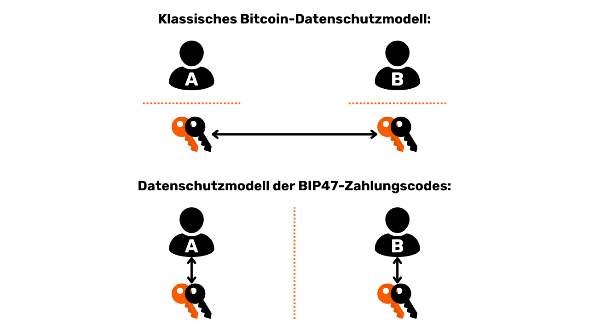
In der Realität ist es innerhalb des traditionellen Datenschutzmodells von Bitcoin oft komplex, den Informationsfluss zwischen dem Schlüsselpaar und dem Benutzer vollständig zu trennen, insbesondere bei Ferntransaktionen. Zum Beispiel muss der Empfänger im Kontext einer Spendenkampagne unweigerlich eine Adresse oder einen öffentlichen Schlüssel über seine Website oder sozialen Netzwerke preisgeben. Die korrekte Verwendung von BIP47, insbesondere mit der Benachrichtigungstransaktion, ermöglicht es, dieses Problem dank ECDHE und der Verschlüsselungsschicht, die wir weiter untersuchen werden, zu umgehen.

Natürlich gilt das klassische Datenschutzmodell von Bitcoin immer noch für ephemere öffentliche Schlüssel, die aus der Kombination der beiden Zahlungscodes abgeleitet werden. Die beiden Modelle ergänzen sich tatsächlich. Was ich hier hervorheben möchte, ist, dass im Gegensatz zur üblichen Verwendung eines öffentlichen Schlüssels zum Empfangen von Bitcoins, der Zahlungscode mit einer spezifischen Identität verknüpft werden kann, weil die Information "_Alice führt eine Transaktion mit Bob durch_" auf einer anderen Stufe unterbrochen wird. Der Zahlungscode wird verwendet, um Zahlungsadressen zu generieren, aber allein aufgrund der Beobachtung der Blockchain ist es unmöglich, eine BIP47-Zahlungstransaktion mit den zur Ausführung verwendeten Zahlungscodes zu verknüpfen, es sei denn, die beteiligten UTXOs waren bereits zuvor mit einer Identität verknüpft und die Benutzer haben ihre Zahlungscodes mit ihren jeweiligen Identitäten assoziiert.

Zusammenfassend könnte das Datenschutzmodell, das durch BIP47-Zahlungen angeboten wird, als überlegen gegenüber dem von Bitcoins Basis angesehen werden, obwohl es keineswegs magisch ist.

### Aufbau der Benachrichtigungstransaktion

Nun, sehen wir uns an, wie diese Benachrichtigungstransaktion funktioniert. Stellen Sie sich vor, Alice möchte mit BIP47 Gelder an Bob senden. In meinem Beispiel agiert Alice als Senderin und Bob als Empfänger. Letzterer hat seinen Zahlungscode auf seiner Website veröffentlicht. Daher ist Alice bereits über Bobs Zahlungscode informiert.

**1- Alice berechnet ein gemeinsames Geheimnis mit ECDH:**

- Sie wählt ein Schlüsselpaar aus ihrer HD-Wallet, das sich auf einem anderen Zweig als ihr Zahlungscode befindet. Beachten Sie, dieses Paar sollte nicht leicht mit Alices Benachrichtigungsadresse oder mit Alices Identität in Verbindung gebracht werden können (siehe vorheriger Abschnitt);

- Alice wählt den privaten Schlüssel aus diesem Paar. Wir nennen ihn $a$ (kleingeschrieben);

$$
a
$$

- Alice ruft den öffentlichen Schlüssel ab, der mit Bobs Benachrichtigungsadresse assoziiert ist. Dieser Schlüssel ist die erste abgeleitete Tochter aus Bobs Zahlungscode (Index $/0$). Wir nennen diesen öffentlichen Schlüssel $B$ (großgeschrieben). Der private Schlüssel, der mit diesem öffentlichen Schlüssel assoziiert ist, wird $b$ (kleingeschrieben) genannt. $B$ wird durch Addition und Verdopplung von Punkten auf der elliptischen Kurve von $G$ (dem Generatorpunkt) mit $b$ (dem privaten Schlüssel) bestimmt:
  $$ B = b \cdot G $$
- Alice berechnet einen geheimen Punkt $S$ (Großbuchstabe) auf der elliptischen Kurve durch Addition und Verdopplung von Punkten, indem sie ihren privaten Schlüssel $a$ auf Bobs öffentlichen Schlüssel $B$ anwendet.
  $$ S = a \cdot B $$

- Alice berechnet den Blinding-Faktor $f$, der es ihr ermöglichen wird, ihren Zahlungscode zu verschlüsseln. Dazu bestimmt sie eine Pseudozufallszahl mit der HMAC-SHA512-Funktion. Im zweiten Eingabewert dieser Funktion verwendet sie einen Wert, den nur Bob abrufen kann: $x$, welcher die Abszisse des zuvor berechneten geheimen Punktes ist. Der erste Eingabewert ist $o$, welcher das in dieser Transaktion verbrauchte UTXO (Outpoint) ist.

$$ f = \text{HMAC-SHA512}(o, x) $$

**2- Alice wandelt ihren persönlichen Zahlungscode in Basis 2 (Binär) um.**

**3- Sie verwendet diesen Blinding-Faktor als Schlüssel, um eine symmetrische Verschlüsselung auf den Payload ihres Zahlungscodes durchzuführen.** Der verwendete Verschlüsselungsalgorithmus ist einfach ein `XOR`. Die durchgeführte Operation ist vergleichbar mit dem Vernam-Chiffre, auch bekannt als "One-Time Pad".

- Alice teilt ihren Blinding-Faktor zunächst in zwei: die ersten 32 Bytes werden $f1$ genannt und die letzten 32 Bytes werden $f2$ genannt. Somit haben wir:

$$ f = f1 || f2 $$

- Alice berechnet das verschlüsselte $x'$ der Abszisse des öffentlichen Schlüssels $x$ ihres Zahlungscodes und das verschlüsselte $c'$ ihres Chain Codes $c$ separat. $f1$ und $f2$ fungieren jeweils als Verschlüsselungsschlüssel. Die verwendete Operation ist das `XOR` (exklusives Oder).

$$ x' = x \oplus f1 $$
$$ c' = c \oplus f2 $$

- Alice ersetzt die echten Werte der Abszisse des öffentlichen Schlüssels $x$ und des Chain Codes $c$ in ihrem Zahlungscode durch die verschlüsselten Werte $x'$ und $c'$.
  **4-** Alice hat nun ihren Zahlungscode mit einem verschlüsselten Payload. Sie wird eine Transaktion konstruieren und senden, die ihren öffentlichen Schlüssel $A$ als Eingabe, eine Ausgabe an Bobs Benachrichtigungsadresse und eine `OP_RETURN`-Ausgabe enthält, die ihren Zahlungscode mit dem verschlüsselten Payload enthält. **Diese Transaktion ist die Benachrichtigungstransaktion**.
  Ein `OP_RETURN` ist ein Opcode, der eine Bitcoin-Transaktionsausgabe als ungültig markiert. Heute wird er verwendet, um Informationen im Bitcoin-Blockchain zu senden oder zu verankern. Bis zu 80 Bytes Daten können gespeichert werden, die auf der Kette geschrieben und somit für alle anderen Benutzer sichtbar sind.

Wie wir in den vorherigen Abschnitten gesehen haben, wird ECDH verwendet, um ein gemeinsames Geheimnis zwischen zwei Benutzern zu generieren, die über ein unsicheres Netzwerk kommunizieren, das möglicherweise von Angreifern beobachtet wird. In BIP47 wird ECDH für die Kommunikation über das Bitcoin-Netzwerk genutzt, das von Natur aus ein transparentes Kommunikationsnetzwerk ist, das von vielen Angreifern beobachtet wird. Das durch den ECDH-Schlüsselaustausch berechnete gemeinsame Geheimnis wird dann verwendet, um die zu übertragenden geheimen Informationen zu verschlüsseln: den Zahlungscode des Senders (Alice).

Lassen Sie uns die Schritte, die wir gerade gemeinsam durchgegangen sind, um eine Benachrichtigungstransaktion durchzuführen, zusammenfassen:

- Alice holt sich Bobs Zahlungscode und Benachrichtigungsadresse;
- Alice wählt ein UTXO, das sie in ihrem HD-Wallet besitzt, mit dem entsprechenden Schlüsselpaar;
- Sie berechnet einen geheimen Punkt auf der elliptischen Kurve unter Verwendung von ECDH;
- Sie verwendet diesen geheimen Punkt, um einen HMAC zu berechnen, der der Blinding-Faktor ist;
- Sie verwendet diesen Blinding-Faktor, um den Payload ihres persönlichen Zahlungscodes zu verschlüsseln.
- Sie verwendet eine `OP_RETURN` Transaktionsausgabe, um den maskierten Zahlungscode an Bob zu kommunizieren.
  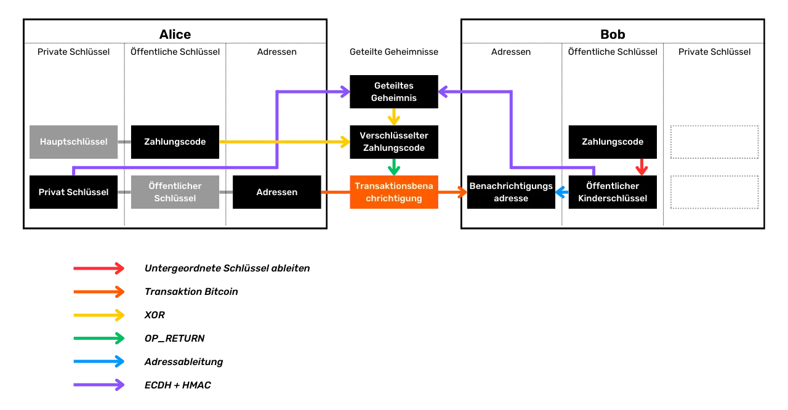

### Benachrichtigungstransaktion: Konkrete Studie

Um ihre Funktionsweise genauer zu verstehen, insbesondere die Verwendung von `OP_RETURN`, betrachten wir gemeinsam eine echte Benachrichtigungstransaktion. Ich habe eine solche Transaktion im Testnet durchgeführt, die Sie [hier klicken können](https://mempool.space/fr/testnet/tx/0e2e4695a3c49272ef631426a9fd2dae6ec3a469e3a39a3db51aa476cd09de2e).


Bei der Beobachtung dieser Transaktion können wir sehen, dass sie ein einzelnes Eingang und 4 Ausgänge hat:

- Der erste Ausgang ist der `OP_RETURN`, der meinen maskierten Zahlungscode enthält;
- Der zweite Ausgang von 546 Sats weist auf die Benachrichtigungsadresse meines Empfängers hin;
- Der dritte Ausgang von 15.000 Sats repräsentiert die Servicegebühren, da ich Samourai Wallet verwendet habe, um diese Transaktion zu konstruieren;
- Der vierte Ausgang von 2 Millionen Sats repräsentiert das Wechselgeld, also den verbleibenden Unterschied aus meinem Eingang, der zurück zu einer anderen Adresse geht, die mir gehört.
  Am interessantesten zu studieren ist natürlich Ausgang 0, der den `OP_RETURN` verwendet. Schauen wir uns genauer an, was er enthält. Hier ist das `scriptPubKey` in Hexadezimal:

```text
6a4c50010002b13b2911719409d704ecc69f74fa315a6cb20fdd6ee39bc9874667703d67b164927b0e88f89f3f8b963549eab2533b5d7ed481a3bea7e953b546b4e91b6f50d800000000000000000000000000
```

In diesem Skript können wir mehrere Teile zerlegen. Zuerst die Opcodes:

```text
6a4c
```

Unter den Opcodes können wir `0x6a` erkennen, das den `OP_RETURN` bezeichnet, und `0x4c`, das den `OP_PUSHDATA1` bezeichnet.

Das Byte nach diesem letzten Opcode gibt die Größe der folgenden Nutzlast an. Es zeigt `0x50` oder 80 Bytes an:

```text
6a4c50
```

Dann haben wir die Metadaten meines Zahlungscodes im Klartext:

```text
010002
```

Die verschlüsselte x-Koordinate des öffentlichen Schlüssels meines Zahlungscodes:

```text
b13b2911719409d704ecc69f74fa315a6cb20fdd6ee39bc9874667703d67b164
```

Der verschlüsselte Kettenkode meines Zahlungscodes:

```text
927b0e88f89f3f8b963549eab2533b5d7ed481a3bea7e953b546b4e91b6f50d8
```

Und schließlich ein Padding, um 80 Bytes zu erreichen, die Standardgröße eines `OP_RETURN`:

```text
00000000000000000000000000
```

Um besser zu verstehen, hier ist mein Zahlungscode im Klartext in Base 58:

```text
PM8TJQCyt6ovbozreUCBrfKqmSVmTzJ5vjqse58LnBzKFFZTwny3KfCDdwTqAEYVasn11tTMPc2FJsFygFd3YzsHvwNXLEQNADgxeGnMK8Ugmin62TZU
```

Beim Vergleich meines Klartext-Zahlungscodes mit dem `OP_RETURN` fällt auf, dass das HRP (`0x47`) und die Prüfsumme (`0x8604e4db`) nicht übertragen werden. Dies ist zu erwarten, da diese Informationen für Menschen bestimmt sind.
Als Nächstes können wir die Version (`0x01`), das Bitfeld (`0x00`) und die Parität des öffentlichen Schlüssels (`0x02`) identifizieren. Und am Ende des Zahlungscodes werden die leeren Bytes (`0x00000000000000000000000000`) verwendet, um den Code auf insgesamt 80 Bytes aufzufüllen. All diese Metadaten werden im Klartext (unverschlüsselt) übertragen.

Schließlich kann beobachtet werden, dass die x-Koordinate des öffentlichen Schlüssels (`0x77507c9c17a89cfca2d3af554745d6c2db0e7f6b2721a3941a504933103cc42a`) und der Ketten-Code (`0xdd94881210d6e752a9abc8a9fa0070e85184993c4f643f1121dd807dd556d1dc`) verschlüsselt wurden. Dies stellt die Nutzlast des Zahlungscodes dar.

### Was ist XOR?

In den vorherigen Abschnitten haben wir gesehen, dass der Zahlungscode mit der XOR-Operation verschlüsselt übertragen wurde. Nehmen wir uns einen Moment Zeit, um zu verstehen, wie dieser Operator funktioniert, da er in der Kryptographie weit verbreitet ist.

XOR ist ein bitweiser logischer Operator, der auf der Booleschen Algebra basiert. Mit zwei Bitoperanden gibt er `1` zurück, wenn die Bits desselben Ranges unterschiedlich sind, und er gibt `0` zurück, wenn die Bits desselben Ranges gleich sind. Hier ist die Wahrheitstabelle von XOR basierend auf den Operandenwerten `D` und `E`:

| D   | E   | D XOR E |
| --- | --- | ------- |
| 0   | 0   | 0       |
| 0   | 1   | 1       |
| 1   | 0   | 1       |
| 1   | 1   | 0       |

Zum Beispiel:

$$
0110 \oplus 1110 = 1000
$$

Oder:

$$
010011 \oplus 110110 = 100101
$$

Mit ECDH ist die Verwendung von XOR als Verschlüsselungsschicht besonders passend. Erstens, wegen dieses Operators, ist die Verschlüsselung symmetrisch. Dies ermöglicht es dem Empfänger, den Zahlungscode mit demselben Schlüssel zu entschlüsseln, der für die Verschlüsselung verwendet wurde. Der Verschlüsselungs- und Entschlüsselungsschlüssel wird aus dem gemeinsamen Geheimnis dank ECDH berechnet. Diese Symmetrie wird durch die kommutativen und assoziativen Eigenschaften des XOR-Operators ermöglicht:

- Weitere Eigenschaften:

$$
D \oplus D = 0
$$

D ⊕ 0 = D

- Kommutativität:

$$
D \oplus E = E \oplus D
$$

- Assoziativität:

$$
D \oplus (E \oplus Z) = (D \oplus E) \oplus Z = D \oplus E \oplus Z
$$

Wenn:

$$
D \oplus E = L
$$

Dann:

$$
D \oplus L = D \oplus (D \oplus E) = D \oplus D \oplus E = 0 \oplus E = E \\
\therefore D \oplus L = E
$$

Als Nächstes ähnelt diese Verschlüsselungsmethode stark dem Vernam-Chiffre (One-Time Pad), dem einzigen Verschlüsselungsalgorithmus, der bis heute als unbedingt (oder absolut) sicher gilt. Damit der Vernam-Chiffre diese Eigenschaft hat, muss der Verschlüsselungsschlüssel perfekt zufällig sein, er muss dieselbe Größe wie die Nachricht haben und er darf nur einmal verwendet werden. Bei der hier für BIP47 verwendeten Verschlüsselungsmethode ist der Schlüssel tatsächlich dieselbe Größe wie die Nachricht, der Blinding-Faktor ist genau dieselbe Größe wie die Verkettung der x-Koordinate des öffentlichen Schlüssels mit dem Chain-Code des Zahlungscodes. Dieser Verschlüsselungsschlüssel wird tatsächlich nur einmal verwendet. Allerdings ist dieser Schlüssel nicht das Ergebnis perfekter Zufälligkeit, da es sich um ein HMAC handelt. Er ist eher pseudo-zufällig. Daher handelt es sich nicht um einen Vernam-Chiffre, aber die Methode ist ähnlich.

### Empfang der Benachrichtigungstransaktion

Nun, da Alice die Benachrichtigungstransaktion an Bob gesendet hat, sehen wir uns an, wie er sie interpretiert. Zur Erinnerung, Bob muss in der Lage sein, auf den Zahlungscode von Alice zuzugreifen. Ohne diese Information, wie wir im folgenden Abschnitt sehen werden, wird er nicht in der Lage sein, die von Alice erstellten Schlüsselpaare abzuleiten und somit nicht in der Lage sein, auf seine über BIP47 erhaltenen Bitcoins zuzugreifen. Derzeit ist der Payload von Alices Zahlungscode verschlüsselt. Sehen wir, wie Bob ihn entschlüsselt.

**1-** Bob überwacht Transaktionen, die Ausgaben mit seiner Benachrichtigungsadresse erzeugen.

**2-** Wenn eine Transaktion eine Ausgabe an seiner Benachrichtigungsadresse hat, analysiert Bob sie, um zu sehen, ob sie eine OP_RETURN-Ausgabe enthält, die dem BIP47-Standard folgt.

**3-** Wenn das erste Byte des OP_RETURN-Payloads `0x01` ist, beginnt Bob seine Suche nach einem möglichen gemeinsamen Geheimnis mit ECDH:

- Bob wählt den öffentlichen Schlüssel im Input der Transaktion aus. Das heißt, Alices öffentlichen Schlüssel $A$ mit:

$$ A = a \cdot G $$

- Bob wählt den privaten Schlüssel $b$ aus, der mit seiner persönlichen Benachrichtigungsadresse verbunden ist:

$$ b $$

- Bob berechnet den geheimen Punkt $S$ (gemeinsames ECDH-Geheimnis) auf der elliptischen Kurve durch Punkteaddition und -verdopplung, indem er seinen privaten Schlüssel $b$ auf Alices öffentlichen Schlüssel $A$ anwendet:
  $$ S = b \cdot A $$

- Bob bestimmt den Blinding-Faktor $f$, der es ihm ermöglichen wird, den Payload von Alices Zahlungscode zu entschlüsseln. Auf die gleiche Weise, wie Alice zuvor berechnet hatte, wird Bob $f$ finden, indem er HMAC-SHA512 auf $x$ die x-Koordinate des geheimen Punktes $S$ und auf $o$ das als Input in dieser Benachrichtigungstransaktion verbrauchte UTXO anwendet:

$$ f = \text{HMAC-SHA512}(o, x) $$

**4-** Bob interpretiert die Daten im OP_RETURN der Benachrichtigungstransaktion als einen Zahlungscode. Er wird einfach den Payload dieses potenziellen Zahlungscodes mit dem Blinding-Faktor $f$ entschlüsseln:

- Bob teilt den Verblindungsfaktor $f$ in 2 Teile: die ersten 32 Bytes von $f$ werden $f1$ und die letzten 32 Bytes werden $f2$ sein;
- Bob entschlüsselt die verschlüsselte x-Koordinate $x'$ des öffentlichen Schlüssels aus Alices Zahlungscode:

$$ x = x' \oplus f1 $$

- Bob entschlüsselt den verschlüsselten Kettenkodewert $c'$ aus Alices Zahlungscode:

$$ c = c' \oplus f2 $$

**5-** Bob prüft, ob der Wert des öffentlichen Schlüssels aus Alices Zahlungscode tatsächlich Teil der secp256k1-Gruppe ist. Wenn dies der Fall ist, interpretiert er dies als einen gültigen Zahlungscode. Andernfalls ignoriert er diese Transaktion.

Jetzt, da Bob über Alices Zahlungscode Bescheid weiß, kann sie ihm bis zu `2^32` Zahlungen senden, ohne jemals wieder eine Benachrichtigungstransaktion dieser Art machen zu müssen.

Warum funktioniert das? Wie kann Bob es schaffen, denselben Verblindungsfaktor wie Alice zu bestimmen und somit ihren Zahlungscode zu entschlüsseln? Schauen wir uns die Rolle von ECDH in dem, was wir gerade beschrieben haben, genauer an.

Zunächst einmal haben wir es mit symmetrischer Verschlüsselung zu tun. Das bedeutet, dass der Verschlüsselungsschlüssel und der Entschlüsselungsschlüssel denselben Wert haben. Dieser Schlüssel in der Benachrichtigungstransaktion ist der Verblindungsfaktor:

$$ f = f1 || f2 $$

Daher müssen Alice und Bob denselben Wert für $f$ erhalten, ohne ihn direkt zu übertragen, da ein Angreifer ihn stehlen und die geheimen Informationen entschlüsseln könnte. Dieser Verblindungsfaktor wird durch Anwenden von HMAC-SHA512 auf 2 Werte erhalten:

- die x-Koordinate eines geheimen Punktes;
- und das UTXO, das als Eingabe in der Transaktion verbraucht wird.
  Bob benötigt daher diese beiden Informationen, um den Payload von Alices Zahlungscode zu entschlüsseln. Für das UTXO als Eingabe kann Bob es einfach durch Beobachten der Benachrichtigungstransaktion abrufen. Für den geheimen Punkt muss Bob ECDH verwenden. Wie im vorherigen Abschnitt über Diffie-Hellman gesehen, können Alice und Bob einfach durch Austauschen ihrer jeweiligen öffentlichen Schlüssel und geheimes Anwenden ihrer privaten Schlüssel auf den öffentlichen Schlüssel des anderen einen spezifischen und geheimen Punkt auf der elliptischen Kurve finden. Die Benachrichtigungstransaktion beruht auf diesem Mechanismus:
- Bobs Schlüsselpaar:

$$ B = b \cdot G $$

- Alices Schlüsselpaar:

$$ A = a \cdot G $$

- Für einen geheimen $S (x, y)$:

$$ S = a \cdot B = a \cdot (b \cdot G) = (b \cdot a) \cdot G = b \cdot A $$

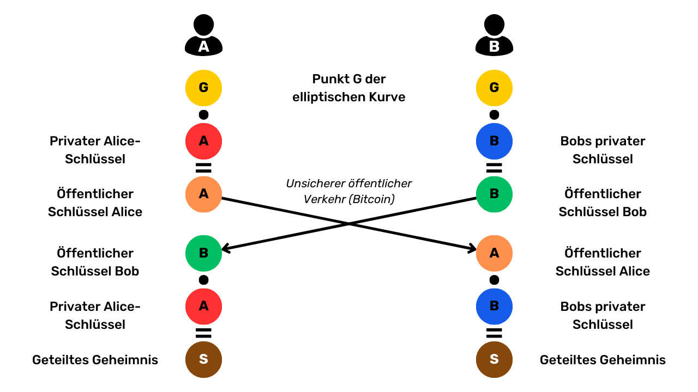

Jetzt, da Bob Alices Zahlungscode kennt, wird er ihre BIP47-Zahlungen erkennen können, und er kann die privaten Schlüssel ableiten, die die empfangenen Bitcoins sperren.

Lassen Sie uns die Schritte zusammenfassen, die wir gerade durchgegangen sind, um eine Benachrichtigungstransaktion zu empfangen und zu interpretieren:

- Bob überwacht Transaktionsausgänge an seine Benachrichtigungsadresse;
- Wenn er eine entdeckt, ruft er die Informationen ab, die im OP_RETURN enthalten sind;
- Bob wählt den öffentlichen Schlüssel im Eingang aus und berechnet einen geheimen Punkt mit ECDH;
- Er verwendet diesen geheimen Punkt, um einen HMAC zu berechnen, der der Verblindungsfaktor ist;
- Er verwendet diesen Verblindungsfaktor, um den Payload von Alices Zahlungscode zu entschlüsseln, der im OP_RETURN enthalten ist.

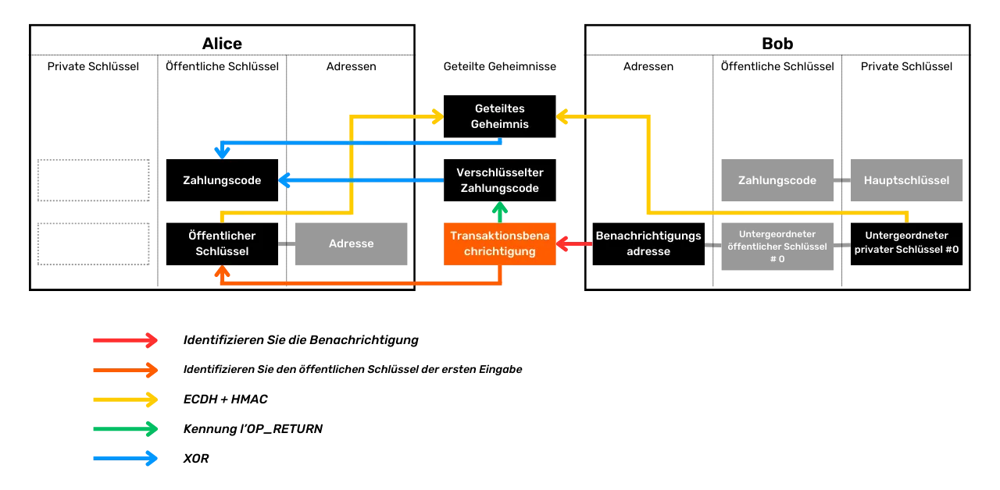

### Die BIP47-Zahlungstransaktion

Lassen Sie uns nun gemeinsam den Zahlungsprozess mit BIP47 studieren. Zur Erinnerung an den aktuellen Stand der Dinge:

- Alice kennt Bobs Zahlungscode, den sie einfach von seiner Website abgerufen hat;
- Bob kennt den Zahlungscode von Alice dank der Benachrichtigungstransaktion;
- Alice wird eine erste Zahlung an Bob leisten. Sie wird in der Lage sein, viele weitere auf die gleiche Weise zu machen.

Bevor ich diesen Prozess erkläre, denke ich, dass es wichtig ist, sich die Indizes, an denen wir derzeit arbeiten, in Erinnerung zu rufen. Der Ableitungspfad eines Zahlungscodes wird wie folgt beschrieben: `m/47'/0'/0'`. Die nächste Tiefe verteilt die Indizes auf diese Weise:

- Das erste normale (nicht abgehärtete) Kindpaar wird verwendet, um die Benachrichtigungsadresse zu generieren, über die wir im vorherigen Teil gesprochen haben: `m/47'/0'/0'/0`;
- Normale Kind-Schlüsselpaare werden innerhalb von ECDH verwendet, um BIP47-Zahlungsempfangsadressen zu generieren, wie wir in diesem Abschnitt sehen werden: von `m/47'/0'/0'/0` bis `m/47'/0'/0'/2 147 483 647`;
- Abgehärtete Kind-Schlüsselpaare sind ephemere Zahlungscodes: von `m/47'/0'/0'/0'` bis `m/47'/0'/0'/2 147 483 647'`.

Immer wenn Alice eine Zahlung an Bob senden möchte, leitet sie eine neue einzigartige Jungfrauadresse ab, dank des ECDH-Protokolls erneut:

- Alice wählt den ersten privaten Schlüssel, der von ihrem persönlichen wiederverwendbaren Zahlungscode abgeleitet ist:

$$ a $$

- Alice wählt den ersten unbenutzten öffentlichen Schlüssel, der von Bobs Zahlungscode abgeleitet ist. Diesen öffentlichen Schlüssel nennen wir $B$. Er ist mit dem privaten Schlüssel $b$ assoziiert, den nur Bob kennt:

$$ B = b \cdot G $$

- Alice berechnet einen geheimen Punkt $S$ auf der elliptischen Kurve durch Punktaddition und Verdopplung, indem sie ihren privaten Schlüssel $a$ auf Bobs öffentlichen Schlüssel $B$ anwendet:

$$ S = a \cdot B $$

- Aus diesem geheimen Punkt wird Alice das gemeinsame Geheimnis $s$ (Kleinbuchstabe) berechnen. Dazu wählt sie die x-Koordinate des geheimen Punktes $S$, genannt $Sx$, und lässt diesen Wert durch die SHA256-Hashfunktion laufen:

$$ S = (Sx, Sy) $$
$$ s = \text{SHA256}(Sx) $$

- Alice verwendet dieses gemeinsame Geheimnis $s$, um eine Bitcoin-Zahlungsempfangsadresse zu berechnen. Zunächst überprüft sie, ob $s$ innerhalb der Ordnung der secp256k1-Kurve enthalten ist. Wenn nicht, erhöht sie den Index von Bobs öffentlichem Schlüssel, um ein anderes gemeinsames Geheimnis abzuleiten;
- Zweitens berechnet sie einen öffentlichen Schlüssel $K0$, indem sie auf der elliptischen Kurve die Punkte $B$ und $s·G$ addiert. Mit anderen Worten, Alice addiert den öffentlichen Schlüssel, der von Bobs Zahlungscode $B$ abgeleitet wurde, mit einem anderen Punkt, der auf der elliptischen Kurve durch Punktaddition und Verdopplung mit dem gemeinsamen Geheimnis $s$ vom Generatorpunkt $G$ der secp256k1-Kurve berechnet wurde. Dieser neue Punkt repräsentiert einen öffentlichen Schlüssel, und wir nennen ihn $K0$:

$$ K0 = B + s \cdot G $$

- Mit diesem öffentlichen Schlüssel $K0$ kann Alice eine standardmäßige Jungfrau-Empfangsadresse ableiten (zum Beispiel SegWit V0 in bech32).
  Sobald Alice Bobs Empfangsadresse $K0$ erhalten hat, kann sie eine Bitcoin-Transaktion auf standardmäßige Weise durchführen. Dazu wählt sie ein UTXO, das sie besitzt, gesichert durch ein Schlüsselpaar aus einem anderen Zweig ihres HD-Wallets, und gibt es aus, um eine Ausgabe an Bobs Adresse $K0$ zu erfüllen. Es ist wichtig zu beachten, dass diese Zahlung, sobald die Adresse abgeleitet ist, einem konventionellen Prozess folgt und nicht mehr von den Schlüsseln abhängt, die mit BIP47 assoziiert sind.
  Lassen Sie uns die Schritte, die wir gerade gemeinsam durchgegangen sind, um eine BIP47-Zahlung zu senden, zusammenfassen:

- Alice wählt den ersten abgeleiteten privaten Kinderschlüssel aus ihrem persönlichen Zahlungscode aus;
- Sie berechnet einen geheimen Punkt auf der elliptischen Kurve mit ECDH aus dem ersten ungenutzten abgeleiteten öffentlichen Kinderschlüssel aus Bobs Zahlungscode;
- Sie verwendet diesen geheimen Punkt, um ein gemeinsames Geheimnis mit SHA256 zu berechnen;
- Sie verwendet dieses gemeinsame Geheimnis, um einen neuen geheimen Punkt auf der elliptischen Kurve zu berechnen;
- Sie fügt diesen neuen geheimen Punkt zu Bobs öffentlichem Schlüssel hinzu;
- Sie erhält einen neuen ephemeren öffentlichen Schlüssel, für den nur Bob den zugehörigen privaten Schlüssel hat;
- Alice kann eine Standardtransaktion an Bob mit der abgeleiteten ephemeren Empfangsadresse durchführen.

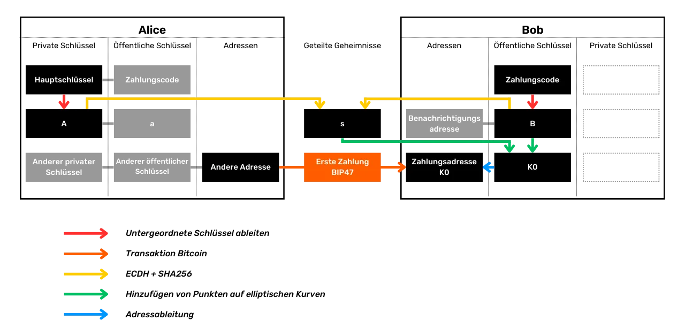

Wenn Alice eine zweite Zahlung tätigen möchte, folgt sie den gleichen Schritten wie zuvor, außer dass sie dieses Mal den zweiten abgeleiteten öffentlichen Schlüssel aus Bobs Zahlungscode auswählt. Speziell wird sie den nächsten ungenutzten Schlüssel verwenden. Sie wird somit eine neue Empfangsadresse erhalten, die Bob gehört, bezeichnet als $K1$:

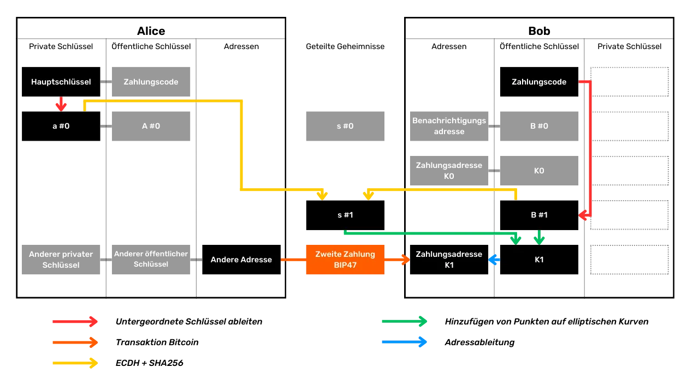

Sie kann auf diese Weise fortfahren und bis zu `2^32` ungenutzte Adressen ableiten, die Bob gehören.

Von einem externen Standpunkt aus, durch die Beobachtung der Blockchain, ist es theoretisch unmöglich, eine BIP47-Zahlung von einer Standardzahlung zu unterscheiden. Hier ist ein Beispiel für eine BIP47-Zahlungstransaktion im Testnet:

```text
94b2e59510f2e1fa78411634c98a77bbb638e28fb2da00c9f359cd5fc8f87254
```

Dies sieht aus wie eine Standardtransaktion mit einem verbrauchten Eingang, einem Zahlungsausgang und einem Wechsel:


### Die BIP47-Zahlung empfangen und den privaten Schlüssel ableiten

Alice hat gerade ihre erste Zahlung an eine neue BIP47-Adresse gemacht, die Bob gehört. Jetzt sehen wir, wie Bob diese Zahlung erhält. Wir werden auch sehen, warum Alice keinen Zugang zum privaten Schlüssel der Adresse hat, die sie gerade selbst generiert hat, und wie Bob diesen Schlüssel abruft, um die Bitcoins auszugeben, die er gerade erhalten hat.
Sobald Bob die Benachrichtigungstransaktion von Alice erhält, leitet er den öffentlichen Schlüssel BIP47 $K0$ ab, sogar bevor sie irgendeine Zahlung gesendet hat. Er überwacht dann jegliche Zahlungen an die zugehörige Adresse. Tatsächlich leitet er sofort mehrere Adressen ab, die er überwachen wird ($K0$, $K1$, $K2$, $K3$...). Hier ist, wie er diesen öffentlichen Schlüssel $K0$ ableitet:

- Bob wählt den ersten privaten Kinderschlüssel ab, der aus seinem Zahlungscode abgeleitet wurde. Dieser private Schlüssel wird als $b$ bezeichnet. Er ist mit dem öffentlichen Schlüssel $B$ assoziiert, mit dem Alice ihre Berechnungen im vorherigen Schritt durchgeführt hatte:

$$ b $$

- Bob wählt den ersten öffentlichen Schlüssel von Alice aus, der aus ihrem Zahlungscode abgeleitet wurde. Dieser Schlüssel wird als $A$ bezeichnet. Er ist mit dem privaten Schlüssel $a$ assoziiert, mit dem Alice ihre Berechnungen durchgeführt hatte und von dem nur Alice Kenntnis hat. Bob kann diesen Prozess durchführen, da er von Alice's Zahlungscode Kenntnis hat, der ihm mit der Benachrichtigungstransaktion übermittelt wurde:

$$ A = a \cdot G $$

- Bob berechnet den geheimen Punkt $S$, durch Addition und Verdoppelung von Punkten auf der elliptischen Kurve, indem er seinen privaten Schlüssel $b$ auf Alice's öffentlichen Schlüssel $A$ anwendet. Hier finden wir die Verwendung von ECDH, die garantiert, dass dieser Punkt $S$ sowohl für Bob als auch für Alice gleich sein wird:

$$ S = b \cdot A $$

- Genau wie Alice isoliert Bob die x-Koordinate dieses Punktes $S$. Wir haben diesen Wert $Sx$ genannt. Er leitet diesen Wert durch die SHA256-Funktion, um das gemeinsame Geheimnis $s$ (kleingeschrieben) zu finden:
  $$ s = \text{SHA256}(Sx) $$

- Genau wie Alice berechnet Bob den Punkt $s·G$ auf der elliptischen Kurve. Dann addiert er diesen geheimen Punkt zu seinem öffentlichen Schlüssel $B$. Er erhält dann einen neuen Punkt auf der elliptischen Kurve, den er als öffentlichen Schlüssel $K0$ interpretiert:

$$ K0 = B + s \cdot G $$

Sobald Bob diesen öffentlichen Schlüssel $K0$ hat, kann er den zugehörigen privaten Schlüssel ableiten, um seine Bitcoins ausgeben zu können. Er ist der Einzige, der diesen privaten Schlüssel generieren kann:

- Bob fügt seinen abgeleiteten Kind-privaten Schlüssel $b$ aus seinem persönlichen Zahlungscode hinzu. Er ist der Einzige, der den Wert von $b$ erhalten kann. Dann addiert er $b$ mit dem gemeinsamen Geheimnis $s$, um $k0$, den privaten Schlüssel von $K0$, zu erhalten:

$$ k0 = b + s $$

Dank des Gruppengesetzes der elliptischen Kurve erhält Bob genau den privaten Schlüssel, der dem von Alice verwendeten öffentlichen Schlüssel entspricht. Wir haben also:

$$ K0 = k0 \cdot G $$

Ich fasse die Schritte zusammen, die wir gerade gemeinsam durchgegangen sind, um eine BIP47-Zahlung zu erhalten und den entsprechenden privaten Schlüssel zu berechnen:

- Bob wählt den ersten abgeleiteten Kind-privaten Schlüssel aus seinem persönlichen Zahlungscode;
- Er berechnet einen geheimen Punkt auf der elliptischen Kurve mit ECDH aus dem ersten abgeleiteten Kind-öffentlichen Schlüssel aus Alices Kettenkode;
- Er verwendet diesen geheimen Punkt, um ein gemeinsames Geheimnis mit SHA256 zu berechnen;
- Er verwendet dieses gemeinsame Geheimnis, um einen neuen geheimen Punkt auf der elliptischen Kurve zu berechnen;
- Er addiert diesen neuen geheimen Punkt zu seinem persönlichen öffentlichen Schlüssel;
- Er erhält einen neuen ephemeren öffentlichen Schlüssel, an den Alice ihre erste Zahlung senden wird;
- Bob berechnet den privaten Schlüssel, der mit diesem ephemeren öffentlichen Schlüssel verbunden ist, indem er seinen abgeleiteten Kind-privaten Schlüssel aus seinem Zahlungscode und das gemeinsame Geheimnis addiert.

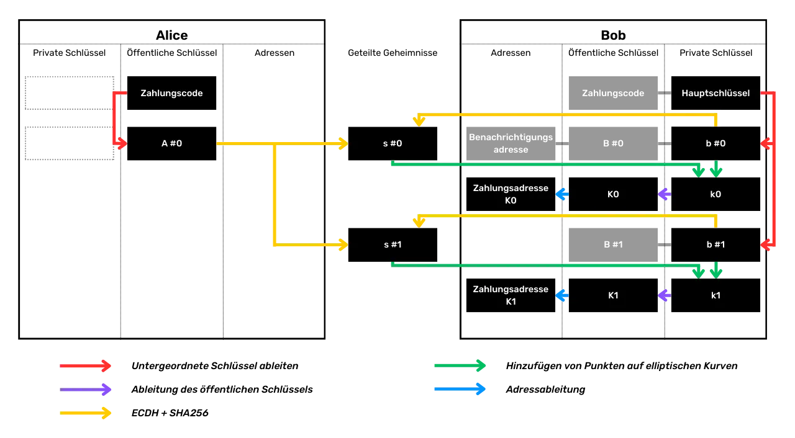

Da Alice $b$ (Bobs privaten Schlüssel) nicht erhalten kann, ist sie nicht in der Lage, $k0$ (den privaten Schlüssel, der mit Bobs BIP47-Empfangsadresse verbunden ist) zu bestimmen. Schematisch können wir die Berechnung des gemeinsamen Geheimnisses $S$ so darstellen:


Sobald das gemeinsame Geheimnis mit ECDH gefunden ist, berechnen Alice und Bob den BIP47-Zahlungsöffentlichen Schlüssel $K0$, und Bob berechnet auch den zugehörigen privaten Schlüssel $k0$:

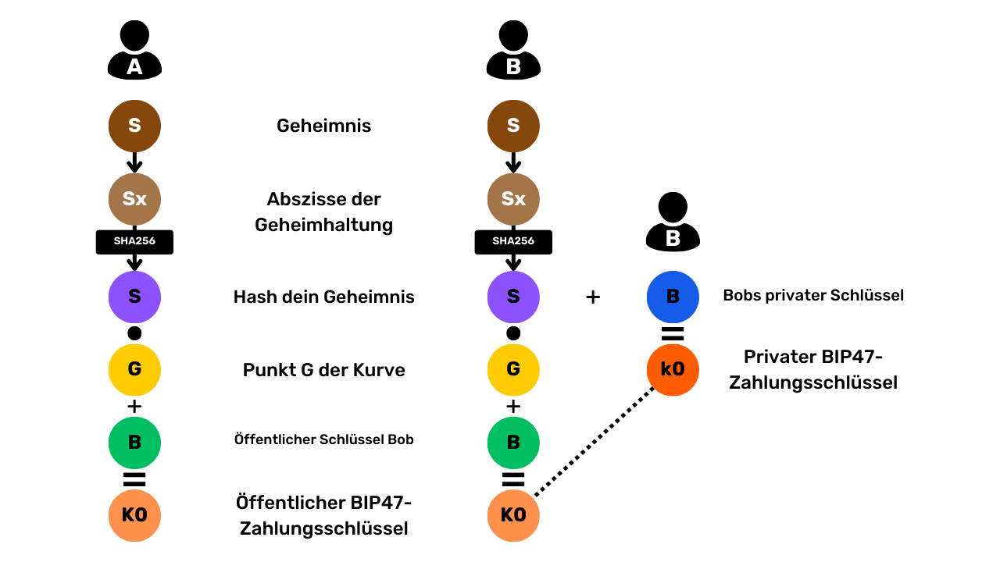

### Rückerstattung der BIP47-Zahlung

Da Bob über Alices wiederverwendbaren Zahlungscode Bescheid weiß, hat er bereits alle notwendigen Informationen, um ihr eine Rückerstattung zu senden. Er muss Alice nicht erneut kontaktieren, um Informationen anzufordern. Er muss sie lediglich mit einer Benachrichtigungstransaktion informieren, insbesondere damit sie ihre BIP47-Adressen mit ihrem Seed abrufen kann, und dann kann er ihr auch bis zu `2^32` Zahlungen senden.

Die Rückerstattungsfunktionalität ist spezifisch für BIP47 und ist einer seiner Vorteile gegenüber anderen Methoden, die wir in den kommenden Kapiteln studieren werden, wie Silent Payments.

Bob kann dann Alice auf die gleiche Weise eine Rückerstattung senden, wie sie ihm Zahlungen gesendet hat. Die Rollen sind umgekehrt:

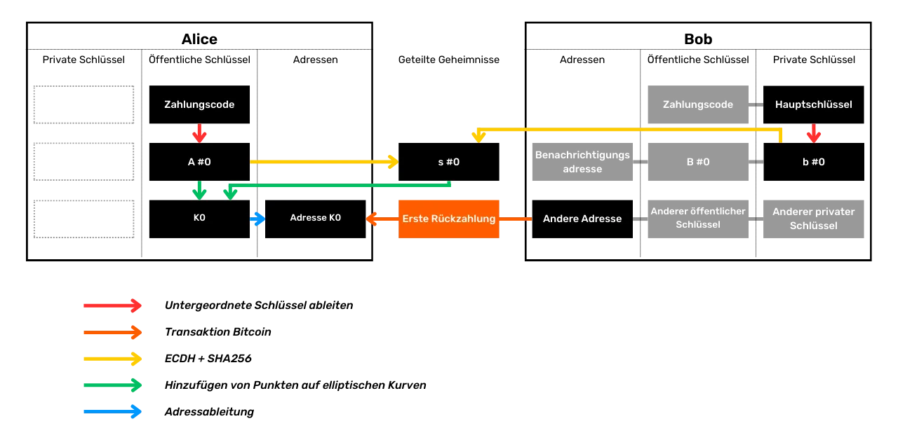
_Ein großes Dankeschön an [Fanis Michalakis](https://x.com/FanisMichalakis) für seine Überprüfung und wertvollen Expertenrat zu dem Artikel, der die Inspiration für das Schreiben dieses Kapitels war!_

https://planb.network/tutorials/privacy/paynym-bip47

## Stille Zahlungen

<chapterId>2871d594-414e-4598-a830-91c9eb84dfb8</chapterId>
BIP47 wurde wegen seiner Ineffizienz auf der Blockchain kritisiert. Wie im vorherigen Kapitel erklärt, erfordert es eine Benachrichtigungstransaktion für jeden neuen Empfänger. Diese Einschränkung wird vernachlässigbar, wenn man plant, einen dauerhaften Zahlungskanal mit diesem Empfänger zu etablieren. Tatsächlich ebnet eine einzige Benachrichtigungstransaktion den Weg für eine nahezu unendliche Anzahl nachfolgender BIP47-Zahlungen.

In bestimmten Situationen kann die Benachrichtigungstransaktion jedoch ein Hindernis für den Benutzer darstellen. Nehmen wir das Beispiel einer einmaligen Spende an einen Empfänger: Mit einer klassischen Bitcoin-Adresse reicht eine einzige Transaktion aus, um die Spende zu tätigen. Aber mit BIP47 sind zwei Transaktionen notwendig: eine für die Benachrichtigung und eine weitere für die eigentliche Zahlung. Wenn die Nachfrage nach Blockplatz gering ist und die Transaktionsgebühren minimal sind, stellt dieser zusätzliche Schritt im Allgemeinen kein Problem dar. Jedoch können während Zeiten der Überlastung die Transaktionsgebühren für eine einzelne Zahlung exorbitant werden und potenziell die Kosten für den Benutzer im Vergleich zu einer Standard-Bitcoin-Transaktion verdoppeln, was für den Benutzer unannehmbar sein kann.

Für Situationen, in denen der Benutzer plant, nur wenige Zahlungen an einen statischen Identifikator zu tätigen, wurden andere Lösungen entwickelt. Unter ihnen befinden sich Stille Zahlungen, beschrieben im [BIP352](https://github.com/bitcoin/bips/blob/master/bip-0352.mediawiki). Dieses Protokoll ermöglicht die Verwendung eines statischen Identifikators, um Zahlungen zu empfangen, ohne eine Adresswiederverwendung zu generieren und ohne die Verwendung von Benachrichtigungstransaktionen zu erfordern. Lassen Sie uns untersuchen, wie dieses Protokoll funktioniert.

---

_Um dieses Kapitel vollständig zu verstehen, ist es wesentlich, mit den Funktionsweisen von ECDH (Elliptic Curve Diffie-Hellman) und der kryptografischen Schlüsselableitung in einem HD-Wallet vertraut zu sein. Diese Konzepte wurden im vorherigen Kapitel über BIP47 detailliert beschrieben. Ich werde sie hier nicht erneut durchgehen. Wenn Sie mit diesen Begriffen noch nicht vertraut sind, empfehle ich, das vorherige Kapitel zu konsultieren, bevor Sie mit diesem hier fortfahren. Ich werde auch nicht die Risiken, die mit der Wiederverwendung von Empfangsadressen verbunden sind, noch die Bedeutung eines einzigartigen Identifikators für den Zahlungsempfang erneut besprechen._

---

### Warum nicht die Benachrichtigung verlegen?

Wie im Kapitel über BIP47 diskutiert, erfüllt die Benachrichtigungstransaktion hauptsächlich zwei Funktionen:

- Sie benachrichtigt den Empfänger;
- Sie übermittelt den Zahlungscode des Senders.

Man könnte naiverweise denken, dass dieser Benachrichtigungsprozess off-chain durchgeführt werden könnte. Theoretisch ist dies durchaus machbar: Es würde ausreichen, wenn der Empfänger ein Kommunikationsmittel angibt, um BIP47-Zahlungscodes von Sendern zu erhalten. Dieser Ansatz stellt jedoch zwei große Probleme dar:

- Erstens würde dies den Codeübertragungsprozess auf ein anderes Kommunikationsprotokoll verlagern. Die Probleme im Zusammenhang mit Kosten und der Privatsphäre des Austauschs würden bestehen bleiben, aber einfach auf dieses neue Protokoll übertragen. In Bezug auf die Privatsphäre könnte dies auch eine Verbindung zwischen der Identität eines Benutzers und der Onchain-Aktivität schaffen, was wir durch die Durchführung der Benachrichtigung direkt auf der Blockchain vermeiden möchten. Darüber hinaus würde die Durchführung der Benachrichtigung außerhalb der Blockchain Zensurrisiken (wie die Blockierung von Geldern) einführen, die bei Bitcoin nicht existieren.
- Als nächstes würde dies ein Wiederherstellungsproblem darstellen. Mit BIP47 muss der Empfänger unbedingt die Zahlungscodes der Sender kennen, um auf die Mittel zugreifen zu können. Dies gilt zum Zeitpunkt des Empfangs, aber auch im Falle einer Fondswiederherstellung über den Seed im Falle eines Wallet-Verlusts. Mit Onchain-Benachrichtigungen wird dieses Risiko vermieden, da der Benutzer die Benachrichtigungstransaktionen einfach durch Kenntnis seines Seeds finden und entschlüsseln kann. Wird die Benachrichtigung jedoch außerhalb der Blockchain durchgeführt, müsste der Benutzer ein dynamisches Backup aller erhaltenen Zahlungscodes pflegen, was für den durchschnittlichen Benutzer unpraktisch ist.
  All diese Einschränkungen machen die Verwendung von Onchain-Benachrichtigungen im Kontext von BIP47 unverzichtbar. Dennoch suchen Silent Payments speziell danach, diesen Schritt der Onchain-Benachrichtigung aufgrund seiner Kosten zu vermeiden. Daher ist die angenommene Lösung nicht, die Benachrichtigung zu verschieben, sondern sie vollständig zu eliminieren. Um dies zu erreichen, muss ein Kompromiss akzeptiert werden: der des Scannens. Im Gegensatz zu BIP47, wo der Benutzer genau weiß, wo er seine Mittel dank der Benachrichtigungstransaktionen finden kann, muss der Benutzer im Kontext von Silent Payments alle existierenden Bitcoin-Transaktionen untersuchen, um Zahlungen zu erkennen, die für ihn bestimmt sein könnten. Um diese operative Belastung zu reduzieren, ist die Suche nach Silent Payments nur auf Transaktionen beschränkt, die wahrscheinlich solche Zahlungen enthalten, nämlich solche, die mindestens einen Taproot P2TR-Ausgang enthalten. Das Scannen konzentriert sich auch ausschließlich auf Transaktionen ab dem Erstellungsdatum des Wallets (es ist nicht notwendig, Transaktionen bis zurück ins Jahr 2009 zu scannen, wenn das Wallet im Jahr 2024 erstellt wurde).

Daher können Sie sehen, warum BIP47 und Silent Payments, obwohl sie ein ähnliches Ziel verfolgen, unterschiedliche Kompromisse beinhalten und **somit tatsächlich unterschiedliche Anwendungsfälle bedienen**. Für einmalige Zahlungen, wie gelegentliche Spenden, sind Silent Payments aufgrund ihrer geringeren Kosten geeigneter. Umgekehrt könnten für regelmäßige Transaktionen an denselben Empfänger, wie im Fall von Austauschplattformen oder Mining-Pools, BIP47 bevorzugt werden.
Lassen Sie uns gemeinsam die technischen Abläufe von Silent Payments erkunden, um ihre Implikationen besser zu verstehen. Dazu schlage ich vor, dass wir denselben Ansatz wie das Erklärungsdokument von BIP352 verfolgen. Wir werden schrittweise die durchzuführenden Berechnungen, Element für Element, abbauen und jede neue Ergänzung rechtfertigen.

### Einige Konzepte zum Verständnis

Bevor wir beginnen, ist es wichtig zu klären, dass Silent Payments ausschließlich auf die Verwendung von P2TR (_Pay to Taproot_) Skripttypen angewiesen sind. Im Gegensatz zu BIP47 ist es nicht notwendig, Empfangsadressen aus Kind-Public-Keys durch Hashing abzuleiten. Tatsächlich wird im P2TR-Standard der modifizierte Public-Key direkt und offen in der Adresse verwendet. Somit ist eine Taproot-Empfangsadresse im Wesentlichen ein Public-Key begleitet von einigen Metadaten. Dieser modifizierte Public-Key ist die Aggregation von zwei anderen Public-Keys: einem, der direkte und traditionelle Ausgaben über eine einfache Signatur ermöglicht, und dem anderen, der die Merkle-Wurzel des MAST darstellt, welche Ausgaben unter der Bedingung der Erfüllung einer der potenziell im Merkle-Baum eingeschriebenen Bedingungen autorisiert.


Die Entscheidung, Silent Payments ausschließlich auf Taproot zu beschränken, wird aus zwei Hauptgründen motiviert:

- Erstens erleichtert es die Implementierung und zukünftige Updates in Wallet-Software erheblich, da nur ein Standard eingehalten werden muss;
- Zweitens hilft dieser Ansatz, die Anonymitätsmenge der Benutzer zu verbessern, indem sie ermutigt werden, sich nicht unter verschiedenen Arten von Skripten zu verteilen, die unterschiedliche Wallet-Fingerabdrücke in der Kettenanalyse erzeugen (für weitere Informationen zu diesem Konzept lade ich Sie ein, Kapitel 4 von Teil 2 zu konsultieren).

### Naive Ableitung eines Silent Payments Public-Key

Lassen Sie uns mit einem einfachen Beispiel beginnen, das Ihnen die Kernfunktionalität von SP (Silent Payments) näherbringt. Nehmen wir Alice und Bob, zwei Bitcoin-Nutzer. Alice möchte Bitcoins an Bob auf eine neue Empfangsadresse senden. Drei Ziele müssen in diesem Prozess erreicht werden:

- Alice muss in der Lage sein, eine neue Adresse zu generieren;
- Bob muss in der Lage sein, eine Zahlung an diese spezifische Adresse zu identifizieren;
- Bob muss in der Lage sein, den privaten Schlüssel, der mit dieser Adresse verbunden ist, zu erhalten, um seine Mittel ausgeben zu können.

Alice hat ein UTXO in ihrem Bitcoin-Wallet, gesichert mit dem folgenden Schlüsselpaar:

- $a$: der private Schlüssel;
- $A$: der öffentliche Schlüssel ($A = a \cdot G$)

Bob hat eine SP-Adresse, die er im Internet veröffentlicht hat mit:

- $b$: der private Schlüssel;
- $B$: der öffentliche Schlüssel ($B = b \cdot G$)
  Indem Alice Bobs Adresse abruft, kann sie eine neue leere Adresse berechnen, die Bob gehört, indem sie ECDH verwendet. Nennen wir diese Adresse $P$:
  $$ P = B + \text{hash}(a \cdot B) \cdot G $$

In dieser Gleichung hat Alice einfach das Skalarprodukt ihres privaten Schlüssels $a$ und Bobs öffentlichen Schlüssel $B$ berechnet. Sie hat dieses Ergebnis durch eine allen bekannte Hash-Funktion geleitet. Der Ausgabewert wird dann mit dem Generatorpunkt $G$ der elliptischen Kurve `secp256k1` skalar multipliziert. Schließlich addiert Alice den erhaltenen Punkt zu Bobs öffentlichem Schlüssel $B$. Sobald Alice diese Adresse $P$ hat, verwendet sie sie als Ausgabe in einer Transaktion, was bedeutet, dass sie Bitcoins dorthin sendet.

> _Im Kontext von Silent Payments entspricht die "Hash"-Funktion einer SHA256-Hash-Funktion, die speziell mit `BIP0352/SharedSecret` getaggt ist, um sicherzustellen, dass die generierten Hashes einzigartig für dieses Protokoll sind und nicht in anderen Kontexten wiederverwendet werden können, während sie auch zusätzlichen Schutz gegen die Wiederverwendung von Nonces in Signaturen bietet. Dieser Standard entspricht dem, der [im BIP340 für Schnorr-Signaturen](https://github.com/bitcoin/bips/blob/master/bip-0340.mediawiki) auf `secp256k1` spezifiziert ist._

Dank der Eigenschaften der elliptischen Kurve, auf der ECDH basiert, wissen wir, dass:

$$ a \cdot B = b \cdot A $$

Bob wird daher in der Lage sein, die Empfangsadresse zu berechnen, auf die Alice die Bitcoins gesendet hat. Um dies zu tun, überwacht er alle Bitcoin-Transaktionen, die den Kriterien von Silent Payments entsprechen, und wendet die folgende Berechnung auf jede von ihnen an, um zu sehen, ob die Zahlung an ihn gerichtet ist (_Scanning_):

$$ P' = B + \text{hash}(b \cdot A) \cdot G $$

Wenn er Alices Transaktion scannt, stellt er fest, dass $P'$ gleich $P$ ist. Er weiß also, dass diese Zahlung an ihn gerichtet ist:

$$ P' = B + \text{hash}(b \cdot A) \cdot G = B + \text{hash}(a \cdot B) \cdot G = P $$

Von dort aus wird Bob in der Lage sein, den privaten Schlüssel $p$ zu berechnen, der das Ausgeben der Adresse $P$ ermöglicht:

$$ p = (b + \text{hash}(b \cdot A)) \bmod n $$

Wie Sie sehen können, muss man, um diesen privaten Schlüssel $p$ zu berechnen, notwendigerweise den privaten Schlüssel $b$ haben. Nur Bob besitzt diesen privaten Schlüssel $b$. Er wird daher tatsächlich der Einzige sein, der die an seine Silent Payments-Adresse gesendeten Bitcoins ausgeben kann.


_Unterschrift:_

- $B$: Der öffentliche Schlüssel / statische Adresse, die von Bob veröffentlicht wurde
- $b$: Bobs privater Schlüssel
- $A$: Der öffentliche Schlüssel von Alices UTXO, der als Eingabe für die Transaktion verwendet wird
- $a$: Alices privater Schlüssel
- $G$: Der Generatorpunkt der elliptischen Kurve `secp256k1`
- $\text{SHA256}$: Die SHA256-Hashfunktion, markiert mit `BIP0352/SharedSecret`
- $s$: Das gemeinsame ECDH-Geheimnis
- $P$: Der öffentliche Schlüssel / eindeutige Adresse für Zahlungen an Bob

Hier ist ein zunächst eher naiver Ansatz, um Bobs statische Adresse, bezeichnet mit $B$, zu verwenden, um eine eindeutige Adresse $P$ für das Senden von Bitcoins abzuleiten. Allerdings ist diese Methode zu simpel und weist mehrere Mängel auf, die korrigiert werden müssen. Das erste Problem ist, dass Alice in diesem Schema nicht mehrere Ausgaben an Bob innerhalb derselben Transaktion erstellen kann.

### Wie kann man mehrere Ausgaben erstellen?

Im Beispiel aus dem vorherigen Abschnitt erstellt Alice eine einzelne Ausgabe, die an Bobs eindeutige Adresse $P$ gehen wird. Mit demselben ausgewählten Eingang ist es für Alice unmöglich, zwei verschiedene neue Adressen für Bob zu erstellen, da die verwendete Methode immer zum selben Ergebnis für $P$ führen würde, also zur selben Adresse. Es gibt jedoch viele Situationen, in denen Alice ihre Zahlung an Bob in mehrere kleinere Beträge aufteilen möchte, um so mehrere UTXOs zu erstellen. Es ist daher notwendig, eine Methode zu finden, die dies ermöglicht.

Um dies zu erreichen, werden wir die Berechnung, die Alice durchführt, um $P$ abzuleiten, leicht modifizieren, sodass sie zwei verschiedene Adressen für Bob generieren kann, nämlich $P_0$ und $P_1$.

Um die Berechnung zu modifizieren und 2 verschiedene Adressen zu erhalten, genügt es, eine ganze Zahl hinzuzufügen, die das Ergebnis verändert. So wird Alice $0$ in ihrer Berechnung hinzufügen, um die Adresse $P_0$ zu erhalten, und $1$, um die Adresse $P_1$ zu erhalten. Nennen wir diese ganze Zahl $i$:

$$ P_i = B + \text{hash}(a \cdot B \text{ ‖ } i) \cdot G $$

Der Berechnungsprozess bleibt unverändert gegenüber der vorherigen Methode, außer dass Alice diesmal $a \cdot B$ mit $i$ vor dem Hashen verknüpft. Es reicht dann, $i$ zu ändern, um eine neue Adresse zu haben, die Bob gehört. Zum Beispiel:

$$ P_0 = B + \text{hash}(a \cdot B \text{ ‖ } 0) \cdot G $$

$$ P_1 = B + \text{hash}(a \cdot B \text{ ‖ } 1) \cdot G $$
Wenn Bob die Blockchain nach Silent Payments durchsucht, die für ihn bestimmt sind, beginnt er mit $i = 0$ für die Adresse $P_0$. Wenn er keine Zahlung auf $P_0$ findet, schließt er daraus, dass diese Transaktion keine Silent Payments für ihn enthält und stoppt die Analyse. Wenn jedoch $P_0$ gültig ist und eine Zahlung für ihn enthält, fährt er mit $P_1$ in derselben Transaktion fort, um zu prüfen, ob Alice eine zweite Zahlung gemacht hat. Wenn sich $P_1$ als ungültig herausstellt, stoppt er seine Suche nach dieser Transaktion; andernfalls setzt er seine Tests mit aufeinanderfolgenden Werten von $i$ fort:
$$ P_0 = B + \text{hash}(b \cdot A \text{ ‖ } 0) \cdot G $$
$$ P_1 = B + \text{hash}(b \cdot A \text{ ‖ } 1) \cdot G $$

Da Bob sofort bei $i = 0$ stoppt, wenn $P_0$ nichts ergibt, fügt die Verwendung dieser Ganzzahl Bob fast keine zusätzliche operationelle Belastung beim Scannen der Transaktionen hinzu.

Bob kann dann die privaten Schlüssel auf die gleiche Weise berechnen:

$$
p_0 = (b + \text{hash}(b \cdot A \text{ ‖ } 0)) \bmod n
$$

$$
p_1 = (b + \text{hash}(b \cdot A \text{ ‖ } 1)) \bmod n
$$


_Bildunterschrift:_

- $B$: Der öffentliche Schlüssel / statische Adresse, veröffentlicht von Bob
- $b$: Bobs privater Schlüssel
- $A$: Der öffentliche Schlüssel von Alices UTXO, verwendet als Eingabe für die Transaktion
- $a$: Alices privater Schlüssel
- $G$: Der Generatorpunkt der elliptischen Kurve `secp256k1`
- $\text{SHA256}$: Die SHA256-Hash-Funktion, gekennzeichnet mit `BIP0352/SharedSecret`
- $s_0$: Das erste gemeinsame ECDH-Geheimnis
- $s_1$: Das zweite gemeinsame ECDH-Geheimnis
- $P_0$: Der erste öffentliche Schlüssel / eindeutige Adresse für die Zahlung an Bob
- $P_1$: Der zweite öffentliche Schlüssel / eindeutige Adresse für die Zahlung an Bob

Mit dieser Methode beginnen wir, ein schönes Protokoll zu haben, aber es gibt noch einige Herausforderungen zu überwinden, insbesondere die Vermeidung der Wiederverwendung von Adressen.

### Wie kann man die Wiederverwendung von Adressen vermeiden?

Wie wir in den vorherigen Abschnitten gesehen haben, verwendet Alice das Schlüsselpaar, das ihr UTXO sichert, welches sie ausgeben wird, um das gemeinsame ECDH-Geheimnis mit Bob zu berechnen. Dieses Geheimnis ermöglicht es ihr, die eindeutige Adresse $P_0$ abzuleiten. Das Schlüsselpaar ($a$, $A$), das von Alice verwendet wird, kann jedoch mehrere UTXOs sichern, wenn sie diese Adresse mehrmals wiederverwendet hat. Für den Fall, dass Alice zwei Zahlungen an Bobs statische Adresse $B$ mit zwei UTXOs tätigt, die durch denselben Schlüssel $A$ gesichert sind, würde dies zu einer Adresswiederverwendung für Bob führen.

> _Die Wiederverwendung von Adressen ist eine sehr schlechte Praxis für die Privatsphäre der Nutzer. Um zu verstehen, warum, rate ich Ihnen, die ersten Teile dieses Trainings zu überprüfen._

Tatsächlich, da die eindeutige Adresse $P_0$ von $A$ und $B$ abgeleitet wird, wenn Alice eine zweite Adresse für eine zweite Zahlung an $B$ mit demselben Schlüssel $A$ ableitet, wird sie mit derselben Adresse $P_0$ enden. Um dieses Risiko zu vermeiden und die Wiederverwendung von Adressen innerhalb von Silent Payments zu verhindern, müssen wir unsere Berechnungen leicht modifizieren.

Was wir wollen, ist, dass jedes von Alice als Eingabe einer Zahlung verbrauchte UTXO auf Bobs Seite eine eindeutige Adresse ergibt, auch wenn mehrere UTXOs durch dasselbe Schlüsselpaar gesichert sind. Es reicht daher aus, einen Verweis auf das UTXO in die Berechnung der eindeutigen Adresse $P_0$ einzufügen. Dieser Verweis wird einfach der Hash des als Eingabe verbrauchten UTXO sein:

$$ \text{inputHash} = \text{hash}(\text{outpoint} \text{ ‖ } A) $$

Und diesen Eingabeverweis wird Alice in ihre Berechnung der eindeutigen Adresse $P_0$ einfügen:
$$ P_0 = B + \text{hash}(\text{inputHash} \cdot a \cdot B \text{ ‖ } 0) \cdot G $$
Während seines Scannens kann Bob auch $\text{inputHash}$ hinzufügen, da alles, was er tun muss, die Transaktion beobachten ist, um $\text{outpoint}$ zu deduzieren:

$$ P_0 = B + \text{hash}(\text{inputHash} \cdot b \cdot A \text{ ‖ } 0) \cdot G $$

Wenn er ein gültiges $P_0$ findet, kann er den entsprechenden privaten Schlüssel $p_0$ berechnen:

$$
p_0 = (b + \text{hash}(\text{inputHash} \cdot b \cdot A \text{ ‖ } 0)) \bmod n
$$


_Legende:_

- $B$: Der öffentliche Schlüssel / statische Adresse, veröffentlicht von Bob
- $b$: Bobs privater Schlüssel
- $A$: Der öffentliche Schlüssel von Alices UTXO, verwendet als Eingabe für die Transaktion
- $a$: Alices privater Schlüssel
- $H$: Der Hash des als Eingabe verwendeten UTXO
- $G$: Der Generatorpunkt der elliptischen Kurve `secp256k1`
- $\text{SHA256}$: Die SHA256-Hashfunktion, gekennzeichnet mit `BIP0352/SharedSecret`
- $s_0$: Das erste gemeinsame ECDH-Geheimnis
- $P_0$: Der erste öffentliche Schlüssel / eindeutige Adresse für Zahlungen an Bob

Im Moment gehen unsere Berechnungen davon aus, dass Alice eine einzelne Eingabe für ihre Transaktion verwendet. Sie sollte jedoch in der Lage sein, mehrere Eingaben zu verwenden. Folglich müsste Bob auf seiner Seite für jede Transaktion, die mehrere Eingaben enthält, theoretisch das ECDH für jede Eingabe berechnen, um festzustellen, ob eine Zahlung für ihn bestimmt ist. Diese Methode ist nicht zufriedenstellend, daher müssen wir eine Lösung finden, um die Arbeitsbelastung zu reduzieren!

### Anpassung der öffentlichen Schlüssel in Eingaben

Um dieses Problem zu lösen, werden wir anstelle der Verwendung des Schlüsselpaares, das eine spezifische Eingabe auf Alices Seite sichert, die Summe aller Schlüsselpaare verwenden, die in den Eingaben der Transaktion verwendet werden. Diese Summe wird dann als neues Schlüsselpaar betrachtet. Diese Technik ist als "Tweak" bekannt.

Stellen Sie sich zum Beispiel vor, dass Alices Transaktion 3 Eingaben hat, jede gesichert mit einem anderen Schlüsselpaar:

- $a_0$ sichert Eingabe #0;
- $a_1$ sichert Eingabe #1;
- $a_2$ sichert Eingabe #2.


Nach der oben beschriebenen Methode müsste Alice ein einzelnes Schlüsselpaar unter $a_0$, $a_1$ und $a_2$ wählen, um das ECDH-Geheimnis zu berechnen und die eindeutige Zahlungsadresse $P$ aus Bobs statischer Adresse $B$ zu generieren. Dieser Ansatz erfordert jedoch, dass Bob jede Möglichkeit sequenziell testet, beginnend mit $a_0$, dann $a_1$ und so weiter, bis er ein Paar identifiziert, das eine gültige Adresse $P$ generiert. Dieser Prozess verlangt, dass Bob die ECDH-Berechnung für alle Eingaben aller Transaktionen ausführt, was die operationelle Scanning-Arbeitsbelastung erheblich erhöht.

Um dies zu vermeiden, werden wir Alice bitten, ihre Berechnung von $P$ unter Verwendung der Summe aller Schlüssel in Eingabe durchzuführen. Unter Berücksichtigung unseres Beispiels würde der angepasste private Schlüssel $a$ wie folgt berechnet:

$$ a = a_0 + a_1 + a_2 $$
Ebenso werden Alice und Bob in der Lage sein, den modifizierten öffentlichen Schlüssel zu berechnen:
$$ A = A_0 + A_1 + A_2 $$
Dank dieser Methode muss Bob nur die Summe der öffentlichen Schlüssel der Transaktion berechnen und dann das ECDH-Geheimnis aus $A$ berechnen, was die Anzahl der Berechnungen, die für den Scan-Schritt gemacht werden müssen, erheblich reduziert. Denken Sie jedoch an den vorherigen Abschnitt. Wir hatten in unserer Berechnung den Hash $\text{inputHash}$ einbezogen, der als Nonce verwendet wird, um die Wiederverwendung von Adressen zu verhindern:

$$ \text{inputHash} = \text{hash}(\text{outpoint} \text{ ‖ } A) $$

Wenn es jedoch mehrere Eingaben in einer Transaktion gibt, ist es notwendig zu bestimmen, welcher $\text{outpoint}$ in dieser Berechnung gewählt wird. Gemäß BIP352 ist das Auswahlkriterium für $\text{outpoint}$, den kleinsten lexikografisch zu wählen, was bedeutet, das UTXO auszuwählen, das alphabetisch an erster Stelle steht. Diese Methode standardisiert das UTXO, das in jeder Transaktion gewählt wird. Zum Beispiel, wenn dieses kleinste $\text{outpoint}$ lexikografisch $\text{outpoint}_L$ ist, wird die Berechnung von $\text{inputHash}$ sein:

$$ \text{inputHash} = \text{hash}(\text{outpoint}\_L \text{ ‖ } A) $$

Die Berechnungen bleiben dann identisch mit denen, die im vorherigen Abschnitt vorgestellt wurden, außer dass der private Schlüssel $a$ und sein entsprechender öffentlicher Schlüssel $A$ nicht mehr ein Paar sichern, das einen einzelnen Eingang schützt, sondern nun die Modifikation aller Schlüsselpaare in Eingängen darstellen.

### Trennung von Ausgabe- und Scan-Schlüsseln

Bisher haben wir die statische Adresse der Silent Payments $B$ als einen einzigartigen öffentlichen Schlüssel besprochen. Denken Sie daran, es ist dieser öffentliche Schlüssel $B$, der von Alice verwendet wird, um das gemeinsame ECDH-Geheimnis zu erstellen, das wiederum verwendet wird, um die einzigartige Zahlungsadresse $P$ zu berechnen. Bob verwendet diesen öffentlichen Schlüssel $B$ und den entsprechenden privaten Schlüssel $b$ für den Scan-Schritt. Aber er wird auch den privaten Schlüssel $b$ verwenden, um den privaten Schlüssel $p$ zu berechnen, der das Ausgeben von der Adresse $P$ ermöglicht.

Der Nachteil dieser Methode ist, dass der private Schlüssel $b$, der verwendet wird, um alle privaten Schlüssel für Adressen zu berechnen, die Silent Payments erhalten, auch von Bob verwendet wird, um Transaktionen zu scannen. Dieser Schritt erfordert, dass der Schlüssel $b$ auf einer mit dem Internet verbundenen Wallet-Software verfügbar ist, was ihn einem größeren Diebstahlrisiko aussetzt im Vergleich zur Aufbewahrung in einer Cold Wallet. Idealerweise wäre es vorteilhaft, die Vorteile von Silent Payments nutzen zu können, während der private Schlüssel $b$, der den Zugang zu allen anderen privaten Schlüsseln kontrolliert, auf einer Hardware-Wallet gesichert wird. Glücklicherweise wurde das Protokoll angepasst, um genau das zu ermöglichen.
Um dies zu erreichen, spezifiziert BIP352, dass der Empfänger 2 verschiedene Schlüsselpaare verwendet:

- $B_{\text{spend}}$: um die privaten Schlüssel einzigartiger Zahlungsadressen zu berechnen;
- $B_{\text{scan}}$: um einzigartige Zahlungsadressen zu finden.

Auf diese Weise kann Bob den privaten Schlüssel $b_{\text{spend}}$ auf einer Hardware-Wallet aufbewahren und den privaten Schlüssel $b_{\text{scan}}$ auf Online-Software verwenden, um seine Silent Payments zu finden, ohne $b_{\text{spend}}$ preiszugeben. Die öffentlichen Schlüssel $B_{\text{scan}}$ und $B_{\text{spend}}$ werden jedoch beide öffentlich bekannt gegeben, da sie in Bobs statischer Adresse $B$ zu finden sind:
Um eine einzigartige Zahlungsadresse $P_0$, die Bob gehört, zu berechnen, wird Alice nun die folgende Berechnung durchführen:

$$ P*0 = B*{\text{spend}} + \text{hash}(\text{inputHash} \cdot a \cdot B\_{\text{scan}} \text{ ‖ } 0) \cdot G $$

Um die an ihn gerichteten Zahlungen zu finden, wird Bob die folgende Berechnung durchführen:

$$ P*0 = B*{\text{spend}} + \text{hash}(\text{inputHash} \cdot b\_{\text{scan}} \cdot A \text{ ‖ } 0) \cdot G $$

Wie Sie sehen können, hat Bob bisher nicht $b_{\text{spend}}$ verwenden müssen, das sich auf seinem Hardware-Wallet befindet. Wenn er $P_0$ ausgeben möchte, kann er dann die folgende Berechnung durchführen, um den privaten Schlüssel $p_0$ zu finden:

$$ p*0 = (b*{\text{spend}} + \text{hash}(\text{inputHash} \cdot b\_{\text{scan}} \cdot A \text{ ‖ } 0)) \bmod n $$


_Beschriftung:_

- $B_{\text{scan}}$: Bobs öffentlicher Scan-Schlüssel (statische Adresse)
- $b_{\text{scan}}$: Bobs privater Scan-Schlüssel
- $B_{\text{spend}}$: Bobs öffentlicher Ausgabe-Schlüssel (statische Adresse)
- $b_{\text{spend}}$: Bobs privater Ausgabe-Schlüssel
- $A$: Die Summe der öffentlichen Schlüssel in Eingabe (Tweak)
- $a$: Der private Schlüssel, der dem getweakten öffentlichen Schlüssel entspricht
- $H$: Der Hash des kleinsten UTXO (lexikografisch), der in der Eingabe verwendet wird
- $G$: Der Generatorpunkt der elliptischen Kurve `secp256k1`
- $\text{SHA256}$: Die SHA256-Hashfunktion, gekennzeichnet mit `BIP0352/SharedSecret`
- $s_0$: Das erste gemeinsame ECDH-Geheimnis
- $P_0$: Der erste öffentliche Schlüssel / einzigartige Zahlungsadresse für Bob

### Verwendung von SP-Adressen mit einem Label

Bob hat also eine statische Adresse $B$ für stille Zahlungen wie folgt:

$$ B = B*{\text{scan}} \text{ ‖ } B*{\text{spend}} $$

Das Problem mit dieser Methode ist, dass sie es nicht erlaubt, die verschiedenen an diese Adresse gesendeten Zahlungen zu trennen. Wenn Bob beispielsweise 2 verschiedene Kunden für sein Geschäft hat und er die Zahlungen von jedem klar unterscheiden möchte, würde er 2 verschiedene statische Adressen benötigen. Eine naive Lösung mit dem aktuellen Ansatz wäre, dass Bob zwei separate Wallets erstellt, jedes mit seiner eigenen statischen Adresse, oder sogar zwei verschiedene statische Adressen innerhalb derselben Wallet einrichtet. Diese Lösung erfordert jedoch das zweimalige Scannen der gesamten Blockchain (einmal für jede Adresse), um die jeweils für jede Adresse bestimmten Zahlungen zu erkennen. Dieses doppelte Scannen erhöht den Betriebsaufwand für Bob unangemessen.
Um dieses Problem zu lösen, verwendet BIP352 ein Etikettierungssystem, das verschiedene statische Adressen erlaubt, ohne die Arbeitslast zur Auffindung von Silent Payments auf der Blockchain unangemessen zu erhöhen. Dazu wird ein Integer $m$ zum Spend-Public-Key $B_{\text{spend}}$ hinzugefügt. Dieser Integer kann den Wert $1$ für die erste statische Adresse annehmen, dann $2$ für die zweite und so weiter. Die Spend-Keys $B_{\text{spend}}$ werden fortan $B_m$ genannt und auf diese Weise konstruiert:
$$ B*m = B*{\text{spend}} + \text{hash}(b\_{\text{scan}} \text{ ‖ } m) \cdot G $$

Zum Beispiel für den ersten Spend-Key mit dem Etikett $1$:

$$ B*1 = B*{\text{spend}} + \text{hash}(b\_{\text{scan}} \text{ ‖ } 1) \cdot G $$

Die von Bob veröffentlichte statische Adresse besteht nun aus $B_{\text{scan}}$ und $B_m$. Zum Beispiel wird die erste statische Adresse mit dem Etikett $1$ sein:

$$ B = B\_{\text{scan}} \text{ ‖ } B_1 $$

> _Wir beginnen nur mit Etikett 1, weil Etikett 0 für Wechselgeld reserviert ist._

Alice wird auf ihrer Seite die einzigartige Zahlungsadresse $P$ auf die gleiche Weise wie zuvor ableiten, aber unter Verwendung des neuen $B_1$ anstelle von $B_{\text{spend}}$.
$$ P*0 = B_1 + \text{hash}(\text{inputHash} \cdot a \cdot B*{\text{scan}} \text{ ‖ } 0) \cdot G $$

In Wirklichkeit weiß Alice vielleicht gar nicht, dass Bob eine etikettierte Adresse hat, da sie einfach den zweiten Teil der statischen Adresse verwendet, die er ihr gegeben hat, was in diesem Fall der Wert $B_1$ anstelle von $B_{\text{spend}}$ ist.

Um nach Zahlungen zu suchen, wird Bob immer den Wert seiner ursprünglichen statischen Adresse mit $B_{\text{spend}}$ auf diese Weise verwenden:

$$ P*0 = B*{\text{spend}} + \text{hash}(\text{inputHash} \cdot b\_{\text{scan}} \cdot A \text{ ‖ } 0) \cdot G $$

Dann subtrahiert er einfach den Wert, den er für $P_0$ findet, von jedem Ausgang einzeln. Anschließend prüft er, ob eines der Ergebnisse dieser Subtraktionen dem Wert eines der Etiketten entspricht, die er in seiner Wallet verwendet. Wenn es übereinstimmt, zum Beispiel für Ausgang #4 mit dem Etikett $1$, bedeutet dies, dass dieser Ausgang ein Silent Payment ist, das mit seiner etikettierten statischen Adresse $B_1$ verbunden ist:

$$ Out*4 - P_0 = \text{hash}(b*{\text{scan}} \text{ ‖ } 1) \cdot G $$

Das funktioniert, weil:

$$ B*1 = B*{\text{spend}} + \text{hash}(b*{\text{scan}} \text{ ‖ } 1) \cdot G $$
Dank dieser Methode kann Bob eine Vielzahl von statischen Adressen ($B_1$, $B_2$, $B_3$...), die alle von seiner Basis-statischen Adresse ($B = B*{\text{scan}} \text{ ‖ } B*{\text{spend}}$) abgeleitet sind, nutzen, um Verwendungen ordnungsgemäß zu trennen. Diese Trennung von statischen Adressen ist jedoch nur aus der Perspektive der persönlichen Wallet-Verwaltung gültig und erlaubt keine Trennung von Identitäten. Da sie alle denselben $B*{\text{scan}}$ haben, ist es sehr einfach, alle statischen Adressen zusammenzufassen und zu folgern, dass sie zu einer einzigen Entität gehören.


_Beschriftung:_

- $B_{\text{scan}}$: Bobs öffentlicher Scan-Schlüssel (statische Adresse)
- $b_{\text{scan}}$: Bobs privater Scan-Schlüssel
- $B_{\text{spend}}$: Bobs öffentlicher Ausgabe-Schlüssel (Anfangsadresse)
- $B_m$: Bobs beschrifteter öffentlicher Ausgabe-Schlüssel (statische Adresse)
- $b_m$: Bobs beschrifteter privater Ausgabe-Schlüssel
- $A$: Die Summe der öffentlichen Eingabeschlüssel (Tweak)
- $a$: Der private Schlüssel, der zum getweakten öffentlichen Schlüssel gehört
- $H$: Der Hash des kleinsten UTXO (lexikografisch), der als Eingabe verwendet wird
- $G$: Der Generatorpunkt der elliptischen Kurve `secp256k1`
- $\text{SHA256}$: Die SHA256-Hashfunktion, gekennzeichnet mit `BIP0352/SharedSecret`
- $s_0$: Das erste gemeinsame ECDH-Geheimnis
- $P_0$: Der erste öffentliche Schlüssel / eindeutige Adresse für Zahlungen an Bob
- $p_0$: Der private Schlüssel der ersten eindeutigen Zahlungsadresse an Bob
- $X$: Der Hash des privaten Scan-Schlüssels mit dem Label

### Wie konstruiert man eine Silent Payments Adresse?

Um eine dedizierte Silent Payments Adresse zu konstruieren, muss man zunächst 2 Paare von Schlüsseln in seiner Bitcoin HD-Wallet ableiten:

- Das Paar $b_{\text{scan}}$, $B_{\text{scan}}$ zum Suchen der an uns adressierten Zahlungen;
- Das Paar $b_{\text{spend}}$, $B_{\text{spend}}$ zum Ausgeben der Bitcoins, die wir erhalten haben.

Diese Paare werden entlang dieser Pfade abgeleitet (_Bitcoin Mainnet_):

```text
scan: m / 352' / 0' / 0' / 1' / 0
spend: m / 352' / 0' / 0' / 0' / 0
```

Sobald diese 2 Paare von Schlüsseln verfügbar sind, werden sie einfach (Ende-zu-Ende) verkettet, um den Payload der statischen Adresse zu erstellen:

$$ B = B*{\text{scan}} \text{ ‖ } B*{\text{spend}} $$

Wenn man Labels verwenden möchte, wird $B_{\text{spend}}$ durch $B_m$ ersetzt:

$$ B = B\_{\text{scan}} \text{ ‖ } B_m $$

Mit dem Label $m$:

$$ B*m = B*{\text{spend}} + \text{hash}(b\_{\text{scan}} \text{ ‖ } m) \cdot G $$

Sobald dieser Payload verfügbar ist, fügt man den HRP (_Human-Readable Part_) `sp` und die Version `q` (= Version 0) hinzu. Ein Prüfsumme wird ebenfalls hinzugefügt, und die Adresse wird im bech32m-Format formatiert.
Zum Beispiel, hier ist meine statische Silent Payments Adresse:

```text
sp1qqvhjvsq2vz8zwrw372vuzle7472zup2ql3pz64yn5cpkw5ngv2n6jq4nl8cgm6zmu48yk3eq33ryc7aam6jrvrg0d0uuyzecfhx2wgsumcurv77e
```

Ein wichtiger Punkt bezüglich statischer Adressen, den Sie vielleicht in den vorherigen Abschnitten eingegeben haben, ist, dass diese Adressen in Bitcoin-Transaktionen nicht sichtbar sind. Nur die Zahlungsadressen $P$, die in den Ausgängen verwendet werden, erscheinen auf der Blockchain im standardmäßigen Taproot-Format. Somit ist es von außen unmöglich, eine Transaktion, die eine Silent Payment involviert, von einer gewöhnlichen Transaktion, die P2TR-Ausgänge verwendet, zu unterscheiden.
Genau wie bei BIP47 ist es unmöglich, eine Verbindung zwischen einer statischen Adresse $B$ und einer daraus abgeleiteten Zahlungsadresse $P$ herzustellen. Tatsächlich kann selbst wenn Eve, eine potenzielle Angreiferin, versucht, die Blockchain mit Bobs statischer Adresse $B$ zu scannen, sie nicht die notwendigen Berechnungen durchführen, um $P$ zu bestimmen. Dazu bräuchte sie entweder Bobs privaten Scan-Schlüssel $b_{\text{scan}}$ oder die privaten Schlüssel des Senders $a$, aber beide Elemente sind natürlich privat. Es ist daher möglich, seine statische Adresse explizit mit einer Form der persönlichen Identität zu verknüpfen.

### Wie verwendet man Silent Payments?

Der Vorschlag für Silent Payments ist relativ neu und wurde bisher nur von einer sehr begrenzten Anzahl von Wallets implementiert. Meines Wissens gibt es nur 3 Software, die sie unterstützen:

- [CakeWallet](https://cakewallet.com/)
- [Silentium](https://app.silentium.dev/)
- [DonationWallet](https://github.com/Sosthene00/donationwallet)

Wir werden bald ein detailliertes Tutorial anbieten, wie Sie Ihre eigene Silent Payments statische Adresse einrichten.

Da dieses Feature neu ist, ist es ratsam, Vorsicht walten zu lassen und Silent Payments für große Beträge im Mainnet zu vermeiden.

_Um dieses Kapitel über Silent Payments zu erstellen, habe ich [die Silent Payments Erklärungsseite](https://silentpayments.xyz/) und [das BIP352 Erklärungsdokument](https://github.com/bitcoin/bips/blob/master/bip-0352.mediawiki) verwendet._


## Geben Sie uns Ihr Feedback zu diesem Kurs
<chapterId>195d149f-80fa-5816-8b46-995a9226d082</chapterId>
<isCourseReview>true</isCourseReview>

## Abschlussprüfung
<chapterId>e803d394-e3c1-5816-a6b4-a69a2472019c</chapterId>
<isCourseExam>true</isCourseExam>

## Schlussfolgerung

<chapterId>cd8e5c67-50e4-4dcd-8e04-88ba5ec95305</chapterId>

Herzlichen Glückwunsch zum Abschluss dieses Trainings über Privatsphäre in Bitcoin!

Wir haben viele fortgeschrittene und technische Themen in diesem Training behandelt, aber es ist nicht zwingend notwendig, alle vorgestellten Werkzeuge zu verwenden. Das Hauptziel war, Sie zu befähigen, die Informationen, die Sie offenlegen möchten, und die Informationen, die Sie vertraulich behandeln möchten, in Ihrer Nutzung von Bitcoin auszuwählen. Dies verkörpert das Wesen des Datenschutzes. Um informierte Entscheidungen über die zu teilenden oder zu verbergenden Informationen treffen zu können, ist es notwendig, sich der Implikationen unserer Handlungen bewusst zu sein. Ich hoffe, dieses Training hat Ihnen geholfen, dieses Wissen zu erlangen.
Wenn ich den wichtigsten Teil dieses Trainings wählen müsste, würde ich den Abschnitt, der der Kettenanalyse gewidmet ist, auswählen. Die Techniken zu verstehen, die von Ihren potenziellen Angreifern verwendet werden, ist der beste Weg, sich zu schützen. Daher wäre mein Rat, diesen Teil sorgfältig zu überprüfen und alle seine Details zu erfassen.
In diesem Training haben wir uns ausschließlich auf die Privatsphäre von Bitcoin auf der Hauptkette konzentriert. Die Datenschutzprobleme bei Second-Layer-Systemen, wie dem Lightning-Netzwerk und Sidechains, sind ebenfalls bedeutend und weisen sehr spezifische Eigenschaften auf. Obwohl die Verwendung von Off-Chain-Transaktionen eine effektive Strategie sein kann, um die vielen Nachverfolgbarkeitsrisiken bei Bitcoin, die wir untersucht haben, zu umgehen, setzt sie Sie anderen Risiken aus, die ebenfalls wichtig zu kennen sind. Deshalb werden diese Themen in einem zukünftigen speziellen Training im PlanB-Netzwerk behandelt.

Wenn Ihnen dieses Training gefallen hat, wäre ich Ihnen sehr dankbar, wenn Sie es mit Ihren Freunden und in sozialen Medien teilen könnten. Vielen Dank! :)
