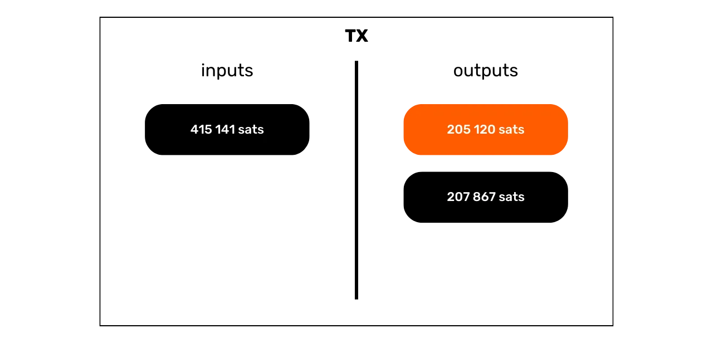

# Protect Your Privacy on Bitcoin

In a world where the privacy of financial transactions is gradually becoming a luxury, understanding and mastering the principles of privacy protection in your use of Bitcoin is essential. This training gives you all the keys, both theoretical and practical, to achieve this autonomously.

Today, on Bitcoin, there are companies specialized in chain analysis. Their core business is precisely to intrude into your private sphere, in order to compromise the confidentiality of your transactions. In fact, the "right to privacy" on Bitcoin does not exist. It is therefore up to you, the user, to assert your natural rights and protect the confidentiality of your transactions, because no one else will do it for you.

This training presents itself as a complete and generalist journey. Each technical notion is discussed in detail and supported by explanatory diagrams. The goal is to make the knowledge accessible to everyone. BTC204 is therefore approachable for beginner and intermediate users. This training also offers added value to the most seasoned bitcoiners, as we delve into some technical concepts that are often unknown.

Join us to transform your use of Bitcoin and become an informed user, capable of understanding the stakes around confidentiality and protecting your privacy.

+++

# Introduction
<partId>e17474a8-8899-4bdb-a7f8-bc52ddb01440</partId>

## Introduction to the Training
<chapterId>08ba1933-f393-4fb5-8279-777d874caedb</chapterId>

In a world where the privacy of financial transactions is gradually becoming a luxury, understanding and mastering the principles of privacy protection in your use of Bitcoin is essential. This training gives you all the keys, both theoretical and practical, to achieve this autonomously.
Today, in the Bitcoin ecosystem, there are companies specialized in chain analysis. Their core business is precisely to intrude into your private sphere, compromising the confidentiality of your transactions. In reality, the "right to privacy" on Bitcoin does not exist. It is therefore up to you, the user, to assert your natural rights and protect the confidentiality of your transactions, because no one else will do it for you.

Bitcoin is not just there for the "Number Go Up" and the preservation of the value of savings. Due to its unique characteristics and history, it is primarily the tool of the counter-economy. Thanks to this remarkable invention, you can freely manage your money, spend it, and accumulate it, without anyone being able to prevent you. 

Bitcoin offers a peaceful escape from the yoke of states, allowing you to fully enjoy your natural rights, which cannot be challenged by established laws. Thanks to Satoshi Nakamoto's invention, you have the power to enforce respect for your private property and regain the freedom to contract.

However, Bitcoin is not anonymous by default, which can pose a risk for individuals engaged in the counter-economy, especially in regions under despotic regimes. But this is not the only danger. Given that bitcoin is a valuable and uncensorable asset, it may attract the greed of thieves. Thus, protecting your privacy also becomes a matter of security: it can help you prevent cyber attacks and physical assaults.

As we will see, although the protocol offers some intrinsic privacy protections, it is crucial to use additional tools to optimize and defend this privacy.

This training is designed as a complete and generalist journey to understand the stakes of privacy on Bitcoin. Each technical notion is detailed and supported by explanatory diagrams. The goal is to make the knowledge accessible to everyone, including beginner and intermediate users. For the more seasoned bitcoiners, we also cover very technical and sometimes unknown concepts throughout this training to deepen the understanding of each topic.

The goal of this training is not to make you completely anonymous in your use of Bitcoin, but rather to provide you with the essential tools to know how to protect your privacy according to your personal goals. You will have the freedom to choose from the concepts and tools presented to develop your own strategies, tailored to your objectives and specific needs.

### Section 1: Definitions and Key Concepts
To begin, we will review together the fundamental principles that govern the operation of Bitcoin, in order to then calmly approach notions related to privacy. It is essential to master a few basic concepts, such as UTXO, receiving addresses, or scripts, before being able to fully understand the concepts that we will address in the following sections. We will also introduce the general model of Bitcoin privacy, as envisioned by Satoshi Nakamoto, which will allow us to grasp the stakes and risks associated.


### Section 2: Understanding Chain Analysis and How to Protect Against It

In the second section, we study the techniques used by chain analysis companies to trace your activity on Bitcoin. Understanding these methods is crucial for enhancing the protection of your privacy. This part aims to examine the strategies of attackers to better understand the risks and lay the groundwork for the techniques that we will study in the following sections. We will analyze transaction patterns, internal and external heuristics, as well as plausible interpretations of these patterns. In addition to a theoretical component, we will learn to use a block explorer to perform chain analysis, through practical examples and exercises.


### Section 3: Mastering Best Practices to Protect Your Privacy

In the third section of our training, we get to the heart of the matter: practice! The goal is to master all the essential best practices that should become natural reflexes for any Bitcoin user. We will cover the use of fresh addresses, labeling, consolidation, the use of full nodes, as well as KYC and acquisition methods. The aim is to provide you with a comprehensive overview of the pitfalls to avoid to establish solid foundations in our quest for privacy protection. For some of these practices, you will be guided to a specific tutorial to implement them.


### Section 4: Understanding Coinjoin Transactions

How can we talk about privacy on Bitcoin without discussing coinjoins? In section 4, you will discover everything you need to know about this mixing method. You will learn what a coinjoin is, its history and objectives, as well as the different types of coinjoins that exist. Finally, for the more experienced users, we will explore what anonsets and entropy are, and how to calculate these indicators.


### Section 5: Understanding the Stakes of Other Advanced Privacy Techniques
In the fifth section, we will provide an overview of all the other existing techniques to protect your privacy on Bitcoin, aside from coinjoin. Over the years, developers have shown remarkable creativity in designing tools dedicated to privacy. We will examine all these methods, such as Payjoin, collaborative transactions, Coin Swap, and Atomic Swap, detailing their operation, goals, and potential weaknesses.


### Section 6: Exploring Protocol Enhancement Proposals Related to Privacy

While the previous sections focused on application-level privacy solutions, this sixth section will delve into the challenges at the protocol level for user privacy. We will discuss privacy at the network of nodes level and the broadcasting of transactions. We will also discuss the various protocols that have been proposed over the years to enhance user privacy on Bitcoin. To conclude, we will examine the impacts on privacy, both positive and negative, of Bitcoin's last major soft fork, Taproot.

***(WIP: LOIC: ADD DIAGRAM EXAMPLE HERE)***

### Bonus Section: Privacy on Second-Layer Protocols

As you have understood, the core of this training focuses exclusively on onchain privacy. In this final bonus part, I wish to broaden the topic to privacy on other protocols related to Bitcoin. We will specifically talk about privacy on the Lightning Network. Some claim that Lightning is private by default, while others argue that user privacy is insufficient. So, what is the truth? We will unravel the truth from the falsehood to better understand the challenges related to privacy on the Lightning Network. We will also discuss sidechains like Liquid Network and Chaumian banks like Cashu or Fedimint.


# Definitions and Key Concepts
<partId>b9bbbde3-34c0-4851-83e8-e2ffb029cf31</partId>


## Bitcoin's UTXO Model
<chapterId>8d6b50c5-bf74-44f4-922b-25204991cb75</chapterId>

Bitcoin is primarily a currency, but do you know concretely how BTC are represented on the protocol?

### Bitcoin's UTXOs: What Are They?

On the Bitcoin protocol, the management of monetary units revolves around the UTXO model, an acronym for "_Unspent Transaction Output_".
This model is profoundly different from traditional banking systems that rely on an account and balance mechanism to track financial flows. Indeed, in the banking system, individual balances are maintained in accounts tied to an identity. For example, when you buy a baguette from a baker, your bank simply debits the purchase amount from your account, thus reducing your balance, while the baker's account is credited with the same amount, increasing their balance. In this system, there is no notion of a link between the money entering your account and the money leaving it, apart from transaction records.


On Bitcoin, it works differently. The concept of an account does not exist, and monetary units are not managed via balances but through UTXOs. A UTXO represents a specific amount of bitcoins that has not yet been spent, thus forming a "piece of bitcoin," which can be large or small. For example, a UTXO could be worth `500 BTC` or just `700 SATS`.

**> Reminder:** The satoshi, often abbreviated as sat, is the smallest unit of Bitcoin, comparable to a cent in fiat currencies.

```bash
1 BTC = 100 000 000 SATS
```

Theoretically, a UTXO can represent any value in bitcoins, ranging from one sat up to the theoretical maximum of about 21 million BTC. However, it is logically impossible to own all 21 million bitcoins, and there is a lower economic threshold called "dust," below which a UTXO is considered economically unprofitable to spend.

**> Did you know?** The largest UTXO ever created on Bitcoin had a value of `500 000 BTC`. It was created by the MtGox platform during a consolidation operation in November 2011: [29a3efd3ef04f9153d47a990bd7b048a4b2d213daaa5fb8ed670fb85f13bdbcf](https://mempool.space/fr/tx/29a3efd3ef04f9153d47a990bd7b048a4b2d213daaa5fb8ed670fb85f13bdbcf)

### UTXOs and Spending Conditions

UTXOs are the instruments of exchange on Bitcoin. Each transaction results in the consumption of UTXOs as inputs and the creation of new UTXOs as outputs. When a transaction is made, the UTXOs used as inputs are considered "spent," and new UTXOs are generated and assigned to the recipients indicated in the transaction outputs. Thus, a UTXO simply represents an unspent transaction output, and therefore a quantity of bitcoins belonging to a user at a given time.

All UTXOs are secured by scripts that define the conditions under which they can be spent. To consume a UTXO, a user must demonstrate to the network that they meet the conditions stipulated by the script securing that UTXO. Generally, UTXOs are protected by a public key (or a receiving address that represents this public key). To spend a UTXO associated with this public key, the user must prove that they hold the corresponding private key, by providing a digital signature made with this key. This is why it is said that your Bitcoin wallet does not actually contain bitcoins, but rather it stores your private keys, which in turn give you access to your UTXOs and, by extension, to the bitcoins they represent.


Given that the concept of an account is absent in Bitcoin, the balance of a wallet simply corresponds to the sum of the values of all the UTXOs it can spend. For example, if your Bitcoin wallet can spend the following 4 UTXOs:

```bash
- 2 BTC
- 8 BTC
- 5 BTC
- 2 BTC
```

The total balance of your wallet would be `17 BTC`.


## The structure of Bitcoin transactions
<chapterId>29d3aaab-de2e-4746-ab40-c9748898850c</chapterId>

### The inputs and outputs of a transaction

A Bitcoin transaction is an operation recorded on the blockchain that allows for the transfer of ownership of bitcoins from one person to another. More specifically, since we are on a UTXO model and there are no accounts, the transaction satisfies the spending conditions that secured one or more UTXOs, consumes them, and creates in equivalence new UTXOs endowed with new spending conditions. In short, a transaction moves bitcoins from a script that is satisfied to a new script intended to secure them.


Each Bitcoin transaction is thus made up of one or more inputs and one or more outputs. The inputs are UTXOs consumed by the transaction to generate the outputs. The outputs are new UTXOs that will be usable as inputs for future transactions.


**> Did you know?** Theoretically, a bitcoin transaction could have an infinite number of inputs and outputs. Only the maximum size of a block limits this number.
Every input in a Bitcoin transaction refers to a previous unspent UTXO. To use a UTXO as an input, its holder must demonstrate that they are the legitimate owner by validating the script associated with it, that is, by satisfying the imposed spending condition. Generally, this involves providing a digital signature produced with the private key corresponding to the public key that initially secured that UTXO. The script thus consists of verifying that the signature matches the public key used when receiving the funds.


Each output, on the other hand, specifies the amount of bitcoins to be transferred, as well as the recipient. The latter is defined by a new script which, in general, locks the newly created UTXO with a receiving address or a new public key.

For a transaction to be considered valid according to the consensus rules, the total of the outputs must be less than or equal to the total of the inputs. In other words, the sum of the new UTXOs generated by the transaction must not exceed that of the UTXOs consumed as inputs. This principle is logical: if you only have an amount of `500,000 SATS`, you cannot make a purchase of `700,000 SATS`.

### Change and Consolidation in a Bitcoin Transaction

The action of a Bitcoin transaction on UTXOs can thus be compared to the melting down of a gold coin. Indeed, a UTXO is not divisible, but only mergeable. This means that a user cannot simply divide a UTXO representing a certain amount of bitcoins into several smaller UTXOs. They must consume it entirely in a transaction to create one or more new UTXOs of arbitrary values in outputs, which must be less than or equal to the initial value.

This mechanism is similar to that of a gold coin. Imagine you own a 2-ounce coin and you want to make a payment of 1 ounce, assuming the seller cannot give you change. You would need to melt your coin and cast 2 new ones of 1 ounce each.
On Bitcoin, the operation is similar. Let's imagine that Alice has a UTXO of `10,000 SATS` and she wants to buy a baguette costing `4,000 SATS`. Alice will make a transaction with an input of 1 UTXO of `10,000 SATS` which she will consume entirely, and in outputs, she will create 2 UTXOs valued at `4,000 SATS` and `6,000 SATS`. The UTXO of `4,000 SATS` will be sent to the baker as payment for the baguette, while the UTXO of `6,000 SATS` will return to Alice as change. This UTXO that returns to the initial sender of the transaction is what is called "change" in Bitcoin jargon.


Now let's imagine that Alice doesn't have a single UTXO of `10,000 SATS`, but rather two UTXOs of `3,000 SATS` each. In this situation, none of the individual UTXOs is sufficient to cover the `4,000 SATS` for the baguette. Therefore, Alice must use both UTXOs of `3,000 SATS` as inputs for her transaction. In this way, the total amount of inputs will reach `6,000 SATS`, allowing her to cover the payment of `4,000 SATS` to the baker. This method, which involves grouping several UTXOs in the inputs of a transaction, is often referred to by the term "consolidation".


### Transaction Fees

Intuitively, one might think that transaction fees also represent an output of a transaction. But in reality, this is not the case. The fees of a transaction represent the difference between the total of the inputs and the total of the outputs. This means that, after using part of the value of the inputs to cover the desired outputs in a transaction, a certain sum of the inputs remains unused. This residual sum constitutes the transaction fees.

```bash
Fees = total inputs - total outputs
```

Let's revisit the example of Alice who has a UTXO of `10,000 SATS` and wants to buy a baguette for `4,000 SATS`. Alice creates a transaction with her UTXO of `10,000 SATS` as input. She then generates an output of `4,000 SATS` intended for the baker for the payment of the baguette. To encourage miners to include her transaction in a block, Alice allocates `200 SATS` as fees. She thus creates a second output, the change, which will return to her, amounting to `5,800 SATS`.


By applying the fee formula, we indeed see that there remains `200 SATS` for the miners:

```bash
Fees = total inputs - total outputs
Fees = 10,000 - (4,000 + 5,800)
Fees = 10,000 - 9,800
Fees = 200
```

When a miner successfully validates a block, they are allowed to collect these fees for all transactions included in their block, through the so-called "coinbase" transaction.

### The Creation of UTXOs on Bitcoin

If you have been following the previous paragraphs closely, you now know that UTXOs can only be created by consuming other existing UTXOs. Thus, coins on Bitcoin form a continuous chain. However, you might be wondering how the first UTXOs in this chain appeared. This raises a problem similar to the chicken and the egg: where did these original UTXOs come from?

The answer lies in the **coinbase transaction**.

The coinbase is a specific type of Bitcoin transaction, which is unique for each block and is always the first one. It allows the miner who found a valid proof of work to receive their block reward. This reward consists of two elements: **the block subsidy** and **the transaction fees** we discussed in the previous part.

The unique feature of the coinbase transaction is that it is the only one that can create bitcoins out of thin air, without needing to consume inputs to generate its outputs. These newly created bitcoins constitute what we might call the "original UTXOs".


The bitcoins from the block subsidy are new BTC created from nothing, following a pre-established issuance schedule in the consensus rules. The block subsidy is halved every 210,000 blocks, which is about every four years, in a process called "halving". Initially, 50 bitcoins were created with each subsidy, but this amount has gradually decreased; currently, it is 3.125 bitcoins per block.

As for the part related to transaction fees, although it also represents newly created BTC, they must not exceed the difference between the total inputs and outputs of all the transactions in a block. We saw earlier that these fees represent the portion of the inputs that is not used in the transactions' outputs. This part is technically "lost" during the transaction, and the miner has the right to recreate this value in the form of one or more new UTXOs. This is, therefore, a transfer of value from the transaction sender to the miner who adds it to the blockchain.

**> Did you know?** The bitcoins generated by a coinbase transaction are subject to a maturity period of 100 blocks during which they cannot be spent by the miner. This rule is intended to prevent complications related to the use of newly created bitcoins on a chain that could later be rendered obsolete.
### The Implications of the UTXO Model
Firstly, the UTXO model directly influences transaction fees on Bitcoin. Given that the capacity of each block is limited, miners prioritize transactions that offer the best fees relative to the space they will occupy in the block. Indeed, the more UTXOs a transaction includes as inputs and outputs, the heavier it is, and therefore, it requires higher fees. This is one of the reasons why we often try to reduce the number of UTXOs in our wallet, which can also affect privacy, a topic that we will discuss in detail in the third part of this training.

Next, as mentioned in previous parts, coins on Bitcoin are essentially a chain of UTXOs. Each transaction thus creates a link between a past UTXO and a future UTXO. UTXOs therefore allow for the explicit tracking of bitcoins from their creation to their current expenditure. This transparency can be perceived positively, as it allows each user to verify the authenticity of the bitcoins received. However, it is also on this principle of traceability and auditability that chain analysis rests, a practice aimed at compromising your privacy. We will study this practice in depth in the second part of the training.

## The Bitcoin Privacy Model
<chapterId>769d8963-3ed5-4094-b21d-9203c7d9e465</chapterId>

### Currency: Authenticity, Integrity, and Double Spending

One of the functions of money is to solve the problem of the double coincidence of wants. In a system based on barter, making an exchange requires not only finding an individual who is offering a good that meets my need but also providing them with a good of equivalent value that satisfies their own need. Finding this balance proves to be complex.


That's why we resort to money, which allows for the transfer of value both spatially and temporally.


For money to solve this problem, it is essential that the party providing a good or service is convinced of their ability to spend that sum later on. Thus, any rational individual wishing to accept a piece of money, whether digital or physical, will ensure that it meets two fundamental criteria:
- **The coin must be intact and authentic;**
- **and it must not be double-spent.**
When using physical currency, the first characteristic is the most complex to assert. At different times in history, the integrity of metal coins has often been compromised by practices such as clipping or drilling. For example, during ancient Rome, it was common for citizens to scrape the edges of gold coins to collect a bit of the precious metal, while still keeping them for future transactions. The intrinsic value of the coin was thus reduced, but its face value remained the same. This is notably why ridges were later minted on the edge of coins.

Authenticity is also a difficult characteristic to verify with physical monetary media. Nowadays, techniques to combat counterfeiting are increasingly complex, forcing merchants to invest in expensive verification systems.

On the other hand, due to their nature, double spending is not a problem for physical currencies. If I give you a €10 bill, it irrevocably leaves my possession to enter yours, naturally excluding any possibility of spending the same monetary units multiple times. In short, I will not be able to spend that €10 bill again.


For digital currency, the difficulty is different. Ensuring the authenticity and integrity of a coin is often simpler. As we saw in the previous section, Bitcoin's UTXO model allows tracing a coin back to its origin, thereby verifying that it was indeed created in accordance with the consensus rules by a miner.

However, ensuring the absence of double spending is more complex, since any digital good is essentially information. Unlike physical goods, information does not divide during exchanges but propagates by multiplying. For example, if I send you a document by email, it then gets duplicated. On your end, you cannot verify with certainty that I have deleted the original document.


### Preventing Double Spending on Bitcoin
The only way to avoid the duplication of a digital good is to be aware of all the exchanges on the system. In this way, one can know who owns what and update everyone's holdings according to the transactions made. This is what is done, for example, with scriptural money in the banking system. When you pay €10 to a merchant by credit card, the bank notes this exchange and updates the ledger.
On Bitcoin, preventing double spending is achieved in the same way. The goal is to confirm the absence of a transaction that has already spent the coins in question. If these coins have never been used, then we can be assured that no double spending will occur. This principle was described by Satoshi Nakamoto in the White Paper with this famous phrase:

**"*The only way to confirm the absence of a transaction is to be aware of all transactions.*"**

However, unlike the banking model, there is no desire to have to trust a central entity on Bitcoin. It is necessary for all users to be able to confirm this absence of double spending, without relying on a third party. Thus, everyone must be aware of all Bitcoin transactions. This is why Bitcoin transactions are publicly broadcast across all network nodes and recorded in clear on the blockchain.

It is precisely this public dissemination of information that complicates privacy protection on Bitcoin. In the traditional banking system, in theory, only the financial institution is aware of the transactions made. On the other hand, on Bitcoin, all users are informed of all transactions, via their respective nodes.

### The privacy model: banking system vs Bitcoin

In the traditional system, your bank account is linked to your identity. The banker is able to know which bank account belongs to which client, and what transactions are associated with it. However, this flow of information is cut off between the bank and the public domain. In other words, it is impossible to know the balance and transactions of a bank account that belongs to another individual. Only the bank has access to this information.

For example, your banker knows that you buy your baguette every morning at the neighborhood bakery, but your neighbor is not aware of this transaction. Thus, the flow of information is accessible to the concerned parties, notably the bank, but remains inaccessible to outsiders.

Due to the constraint of public dissemination of transactions that we saw in the previous part, Bitcoin's privacy model cannot follow the model of the banking system. In the case of Bitcoin, since the flow of information cannot be broken between the transactions and the public domain, **the privacy model relies on the separation between the user's identity and the transactions** themselves.
For example, if you buy a baguette from the baker by paying in BTC, your neighbor, who owns their own full node, can see your transaction go through, just as they can see all other transactions in the system. However, if privacy principles are respected, they should not be able to link this specific transaction to your identity.


But since Bitcoin transactions are made public, it still becomes possible to establish links between them to deduce information about the parties involved. This activity even constitutes a specialty in itself called "chain analysis". In the next part of the training, I invite you to explore the fundamentals of chain analysis to understand how your bitcoins are traced and to know how to better defend against it.

# Understanding Chain Analysis and How to Protect Yourself
<partId>4739371e-9fef-45b0-bcaa-b7a4df6b4470</partId>

## What is Chain Analysis on Bitcoin?
<chapterId>7d198ba6-4af2-4f24-86cb-3c79cb25627e</chapterId>

### Definition and Operation

Chain analysis is a practice that encompasses all methods for tracing the flow of bitcoins on the blockchain. Generally, chain analysis relies on observing characteristics in samples of previous transactions. It then involves identifying these same characteristics in a transaction one wishes to analyze and deducing plausible interpretations. This problem-solving method from a practical approach, to find a sufficiently good solution, is what is called a "heuristic".

To simplify, chain analysis is done in three major steps:
1. **Observing the blockchain;**
2. **Identifying known characteristics;**
3. **Deducing hypotheses.**


Chain analysis can be performed by anyone. It only requires access to the public information of the blockchain via a full node to observe the movements of transactions and make hypotheses. There are also free tools that facilitate this analysis, like the website [OXT.me](https://oxt.me/) that we will explore in detail in the last two chapters of this part. However, the main risk to privacy comes from companies specialized in chain analysis. These companies have taken chain analysis to an industrial scale and sell their services to financial institutions or governments. Among these companies, Chainalysis is probably the most well-known.

### The Objectives of Chain Analysis
One of the goals of chain analysis is to group various activities on Bitcoin in order to determine the uniqueness of the user who carried them out. Subsequently, it will be possible to attempt to link this bundle of activities to a real identity.


Remember the previous chapter. I explained why Bitcoin's privacy model originally relied on separating the user's identity from their transactions. Therefore, it might be tempting to think that chain analysis is unnecessary, since even if one manages to group onchain activities, they cannot be associated with a real identity.

Theoretically, this statement is accurate. In the first part of this training, we saw that cryptographic key pairs are used to establish conditions on the UTXO. By essence, these key pairs do not disclose any information about the identity of their holders. Thus, even if one succeeds in grouping activities associated with different key pairs, this tells us nothing about the entity behind these activities.


However, the practical reality is much more complex. There are a multitude of behaviors that risk linking a real identity to an onchain activity. In analysis, this is called an entry point, and there are many of them.

The most common, of course, is KYC (*Know Your Customer*). If you withdraw your bitcoins from a regulated platform to one of your personal receiving addresses, then some people are able to link your identity to this address. More broadly, an entry point can be any form of interaction between your real life and a Bitcoin transaction. For example, if you publish a receiving address on your social networks, this can constitute an entry point for analysis. If you make a payment in bitcoins to your baker, they can associate your face (which is part of your identity) with a Bitcoin address.

These entry points are almost inevitable in the use of Bitcoin. Although one can seek to limit their scope, they will remain present. That's why it is crucial to combine methods aimed at preserving your privacy. While maintaining a separation between your real identity and your transactions is an interesting approach, it remains insufficient today. Indeed, if all your onchain activities can be grouped, then the slightest entry point is likely to compromise the only layer of privacy you had established.


### Defending Against Chain Analysis
Thus, it is also necessary to be able to face blockchain analysis in our use of Bitcoin. By proceeding in this manner, we can minimize the aggregation of our activities and limit the impact of an entry point on our privacy.


Indeed, to better counter blockchain analysis, what better approach than to familiarize oneself with the methods used in blockchain analysis? If you want to know how to improve your privacy on Bitcoin, you must understand these methods. This will allow you to better grasp techniques like [Coinjoin](https://planb.network/fr/tutorials/privacy/coinjoin-samourai-wallet) or [Payjoin](https://planb.network/fr/tutorials/privacy/payjoin) (techniques that we will study in the last parts of the training), and to reduce the mistakes you might make.

In this, we can make an analogy with cryptography and cryptanalysis. A good cryptographer is first and foremost a good cryptanalyst. To imagine a new encryption algorithm, one must know what attacks it will have to face, and also study why previous algorithms were broken. The same principle applies to privacy on Bitcoin. Understanding the methods of blockchain analysis is the key to protecting against it. This is why I propose an entire section on blockchain analysis in this training.

### The methods of blockchain analysis

It is important to understand that blockchain analysis is not an exact science. It relies on heuristics derived from previous observations or logical interpretations. These rules allow for fairly reliable results, but never with absolute precision. In other words, **blockchain analysis always involves a dimension of probability in the conclusions issued**. For example, it may be estimated with more or less certainty that two addresses belong to the same entity, but total certainty will always be out of reach.

The whole objective of blockchain analysis lies precisely in the aggregation of various heuristics in order to minimize the risk of error. It is, in a way, an accumulation of evidence that allows us to approach reality more closely.

These famous heuristics can be grouped into different categories that we will detail together:
- **Transaction patterns (or transaction models);**
- **Heuristics internal to the transaction;**
- **Heuristics external to the transaction.**

### Satoshi Nakamoto and blockchain analysis
It's worth noting that the first two heuristics for chain analysis were discovered by Satoshi Nakamoto himself. He discusses them in part 10 of the Bitcoin White Paper. These are:
- the Common Input Ownership Heuristic (CIOH);
- and address reuse.


Source: S. Nakamoto, "Bitcoin: A Peer-to-Peer Electronic Cash System", https://bitcoin.org/bitcoin.pdf, 2009.

In the following chapters, we will explore what these consist of, but it is already interesting to note that these two heuristics still maintain a preeminence in chain analysis today.

## Transaction Patterns
<chapterId>d365a101-2d37-46a5-bfb9-3c51e37bf96b</chapterId>

A transaction pattern is simply a model or an overall structure of a typical transaction that can be found on the blockchain, whose interpretation is likely known. When studying patterns, we will focus on a single transaction that we will analyze at a high level.

In other words, we will only look at the number of UTXOs in inputs and the number of UTXOs in outputs, without dwelling on the more specific details or the transaction's environment. From the observed model, we will be able to interpret the nature of the transaction. We will then look for characteristics of its structure and deduce an interpretation.


In this part, we will discover together the main transaction models that can be encountered in chain analysis, and for each model, I will give you the likely interpretation of this structure, along with a concrete example.

### Simple Sending (or Simple Payment)

We start with a very widespread pattern, as it is the one that appears in most bitcoin payments. The simple payment model is characterized by the consumption of one or more UTXOs in inputs and the production of 2 UTXOs in outputs. This model will therefore look like this:


When we spot this transaction structure on the blockchain, we can already draw an interpretation. As its name suggests, this model indicates that we are in the presence of a sending or payment transaction. The user has consumed their own UTXO in inputs to satisfy in outputs a payment UTXO and a change UTXO (change coming back to the same user).

We therefore know that the observed user is likely no longer in possession of one of the two UTXOs in outputs (the payment one), but they are still in possession of the other UTXO (the change one).
At the moment, it is impossible for us to specify which output represents which UTXO, as this is not the goal of the study of patterns. We will achieve this by relying on the heuristics that we will study in the following parts. At this stage, our goal is limited to identifying the nature of the transaction in question, which is, in this case, a simple send.

For example, here is a Bitcoin transaction that adopts the simple send pattern:

```bash
b6cc79f45fd2d7669ff94db5cb14c45f1f879ea0ba4c6e3d16ad53a18c34b769
```


Source: [Mempool.space](https://mempool.space/fr/tx/b6cc79f45fd2d7669ff94db5cb14c45f1f879ea0ba4c6e3d16ad53a18c34b769)

After this first example, you should have a better understanding of what it means to study a "transaction pattern". We examine a transaction by focusing only on its structure, without taking into account its environment or the specific details of the transaction. We observe it only in a global manner in this first step.

Now that you understand what a pattern is, let's move on to the other existing models.

### Sweeping

This second model is characterized by the consumption of a single UTXO in input and the production of a single UTXO in output.


The interpretation of this model is that we are in the presence of a self-transfer. The user has transferred his bitcoins to himself, to another address he owns. Since there is no change in the transaction, it is very unlikely that we are in the presence of a payment. Indeed, when a payment is made, it is almost impossible for the payer to have a UTXO that exactly matches the amount required by the seller, plus the transaction fees. Generally, the payer is therefore forced to produce a change output.

We then know that the observed user is likely still in possession of this UTXO. In the context of a chain analysis, if we know that the UTXO used in input of the transaction belongs to Alice, we can assume that the UTXO in output also belongs to her. What will become interesting later on is to find internal heuristics to the transaction that could reinforce this assumption (we will study these heuristics in chapter 3.3).

For example, here is a Bitcoin transaction that adopts the sweeping pattern:

```bash
35f1072a0fda5ae106efb4fda871ab40e1f8023c6c47f396441ad4b995ea693d
```


Source: [Mempool.space](https://mempool.space/fr/tx/35f1072a0fda5ae106efb4fda871ab40e1f8023c6c47f396441ad4b995ea693d)
However, this type of pattern can also reveal a self-transfer to the account of a cryptocurrency exchange platform. It will be the study of known addresses and the context of the transaction that will allow us to know if it's a sweep to a self-custody wallet or a withdrawal to a platform. Indeed, the addresses of exchange platforms are often easily identifiable.

Let's go back to Alice's example: if the sweep leads to a known address of a platform (like Binance, for example), it may mean that the bitcoins were transferred out of Alice's direct possession, probably with the intention of selling them or storing them on this platform. On the other hand, if the destination address is unknown, it is reasonable to assume that it is simply another wallet still belonging to Alice. But this type of study falls more into the category of heuristics and not the study of patterns.

### Consolidation

This model is characterized by the consumption of several UTXOs as input and the production of a single UTXO as output.


The interpretation of this model is that we are in the presence of a consolidation. This is a common practice among Bitcoin users, aiming to merge several UTXOs in anticipation of a possible increase in transaction fees. By performing this operation during a period when fees are low, it is possible to save on future fees. We will talk more about this practice in chapter 4.3.

We can deduce that the user behind this transaction model was likely in possession of all the UTXOs in inputs and is still in possession of the UTXO in output. This is surely a self-transfer.

Just like sweeping, this type of pattern can also reveal a self-transfer to the account of an exchange platform. It will be the study of known addresses and the context of the transaction that will allow us to know if it's a consolidation to a self-custody wallet or a withdrawal to a platform.

For example, here is a Bitcoin transaction that adopts the consolidation pattern:

```bash
77c16914211e237a9bd51a7ce0b1a7368631caed515fe51b081d220590589e94
```


Source: [Mempool.space](https://mempool.space/fr/tx/77c16914211e237a9bd51a7ce0b1a7368631caed515fe51b081d220590589e94)
In the context of a chain analysis, this model can reveal a lot of information. For example, if we know that one of the inputs belongs to Alice, we can assume that all the other inputs and the output of this transaction also belong to her. This assumption would then allow us to trace back through previous transaction chains to discover and analyze other transactions likely associated with Alice.


### Aggregated Spending

This model is characterized by the consumption of a few UTXOs as inputs (often only one) and the production of many UTXOs as outputs.


The interpretation of this model is that we are dealing with aggregated spending. This is a practice that likely reveals significant economic activity, such as an exchange platform, for example. Aggregated spending allows these entities to save on fees by combining their expenses into a single transaction.

From this model, we can deduce that the UTXO input comes from a company with significant economic activity and that the UTXOs outputs will disperse. Many will belong to clients of the company who have withdrawn bitcoins from the platform. Others may go towards partner companies. Finally, there will certainly be one or more exchanges that return to the issuing company.

For example, here is a Bitcoin transaction that adopts the aggregated spending pattern (presumably, it's a transaction issued by the Bybit platform):

```bash
8a7288758b6e5d550897beedd13c70bcbaba8709af01a7dbcc1f574b89176b43
```


Source: [Mempool.space](https://mempool.space/fr/tx/8a7288758b6e5d550897beedd13c70bcbaba8709af01a7dbcc1f574b89176b43)

### Protocol-Specific Transactions

Among the transaction patterns, we can also identify models that reveal the use of a specific protocol. For example, Whirlpool coinjoins (which we will discuss in part 5) will have an easily identifiable structure that allows them to be differentiated from other more traditional transactions.


The analysis of this pattern suggests that we are likely dealing with a collaborative transaction. It is also possible to observe a coinjoin. If this latter hypothesis proves to be accurate, then the number of outputs could provide us with an approximate estimation of the number of participants in the coinjoin.

For example, here is a Bitcoin transaction that adopts the pattern of the collaborative transaction type coinjoin:

```bash
00601af905bede31086d9b1b79ee8399bd60c97e9c5bba197bdebeee028b9bea
```


Source: [Mempool.space](https://mempool.space/fr/tx/00601af905bede31086d9b1b79ee8399bd60c97e9c5bba197bdebeee028b9bea)

There are many other protocols that have their own specific structures. Thus, we could distinguish transactions of the Wabisabi type, Stamps transactions, or Runes transactions, for example.

Thanks to these transaction patterns, we can already interpret a number of pieces of information about a given transaction. But the structure of the transaction is not the only source of information for analysis. We can also study its details. These details, internal to a transaction only, are what I like to call "internal heuristics," and we will explore them in the following chapter.

## Internal Heuristics
<chapterId>c54b5abe-872f-40f4-a0d0-c59faff228ba</chapterId>

An internal heuristic is a specific characteristic identified within a transaction itself, without needing to examine its environment, and which allows us to make deductions. Unlike patterns that focus on the overall structure of the transaction at a high level, internal heuristics are based on the entirety of extractable data. This includes:
- The amounts of the different UTXOs both incoming and outgoing;
- Everything concerning scripts: the receiving addresses, versioning, locktimes…

Generally, this type of heuristic will allow us to identify the change in a specific transaction. By doing so, we can then continue to track an entity across several different transactions. Indeed, if we identify a UTXO belonging to a user we wish to follow, it is crucial to determine, when they make a transaction, which output was transferred to another user and which output represents the change, thus remaining in their possession.


Once again, I remind you that these heuristics are not absolutely precise. Taken individually, they only allow us to identify plausible scenarios. It is the accumulation of several heuristics that helps to reduce uncertainty, without ever being able to eliminate it completely.

### Internal Similarities

This heuristic involves the study of similarities between the inputs and outputs of the same transaction. If we observe the same characteristic on the inputs and on only one of the outputs of the transaction, then it is likely that this output constitutes the change.

The most obvious characteristic is the reuse of a receiving address in the same transaction.


This heuristic leaves little room for doubt. Unless someone's private key has been hacked, the same receiving address inevitably reveals the activity of a single user. The interpretation that follows is that the change from the transaction is the output with the same address as the input. This allows for the continued tracking of the individual based on this change.
For example, here is a transaction where this heuristic can reasonably be applied:

```bash
54364146665bfc453a55eae4bfb8fdf7c721d02cb96aadc480c8b16bdeb8d6d0
```


Source: [Mempool.space](https://mempool.space/tx/54364146665bfc453a55eae4bfb8fdf7c721d02cb96aadc480c8b16bdeb8d6d0)

These similarities between inputs and outputs do not stop at address reuse. Any resemblance in the use of scripts can allow for the application of a heuristic. For example, sometimes the same versioning between an input and one of the transaction's outputs can be observed.


In this diagram, we can see that input No. 0 unlocks a P2WPKH script (SegWit V0 starting with `bc1q`). Output No. 0 uses the same type of script. However, output No. 1 uses a P2TR script (SegWit V1 starting with `bc1p`). The interpretation of this characteristic is that it is likely that the address with the same versioning as the input is the change address. It would therefore still belong to the same user.

Here is a transaction where this heuristic can reasonably be applied:

```bash
db07516288771ce5d0a06b275962ec4af1b74500739f168e5800cbcb0e9dd578
```


Source: [Mempool.space](https://mempool.space/tx/db07516288771ce5d0a06b275962ec4af1b74500739f168e5800cbcb0e9dd578)

In this case, we can see that input No. 0 and output No. 1 use P2WPKH scripts (SegWit V0), while output No. 0 uses a different type of script, P2PKH (Legacy).
At the beginning of the 2010s, this heuristic based on the versioning of scripts was relatively little useful due to the limitation of the types of scripts available. However, over time and with successive updates to Bitcoin, an increasing diversity of script types has been introduced. This heuristic is becoming more and more relevant because, with a wider range of script types, users are divided into smaller groups, thus increasing the chances of applying this heuristic of internal versioning reuse. For this reason, from a privacy perspective only, it is advisable to opt for the most common script type. For example, as I write these lines, Taproot scripts (`bc1p`) are less frequently used than SegWit V0 scripts (`bc1q`). Although the former offer economic and privacy benefits in certain specific contexts, for more traditional single-signature uses, it might be wise to stick to an older standard for privacy reasons, until the new standard is more widely adopted.
### Round Number Payments

Another internal heuristic that can help us identify change is that of the round number. Generally, when faced with a simple payment pattern (1 input and 2 outputs), if one of the outputs spends a round amount, then it represents the payment.


By elimination, if one output represents the payment, the other represents the change. Therefore, it can be inferred that it is likely that the input user is still in possession of the output identified as being the change.

It should be noted that this heuristic is not always applicable, since the majority of payments are still made in fiat currency units. Indeed, when a merchant in France accepts bitcoin, generally, they do not display stable prices in sats. They would rather opt for a conversion between the price in euros and the amount in bitcoins to be paid. Therefore, there should not be a round number in the transaction output.

Nevertheless, an analyst could attempt to make this conversion by taking into account the exchange rate in effect when the transaction was broadcast on the network. Let's take the example of a transaction with an input of `97,552 sats` and two outputs, one of `31,085 sats` and the other of `64,152 sats`. At first glance, this transaction does not seem to involve round amounts. However, by applying the exchange rate of 64,339 € at the time of the transaction, we get a conversion in euros that looks as follows:
- An input of 62.76 €;
- An output of 20 €;
- An output of 41.27 €.
Once converted into fiat currency, this transaction allows for the application of the heuristic of payment by round amount. The output of €20 was likely intended for a merchant, or at least changed ownership. By deduction, the output of €41.27 likely remained in possession of the original user.


If one day, Bitcoin becomes the preferred unit of account in our transactions, this heuristic could become even more useful for analysis.

For example, here is a transaction on which this heuristic can likely be applied:

```bash
2bcb42fab7fba17ac1b176060e7d7d7730a7b807d470815f5034d52e96d2828a
```


Source: [Mempool.space](https://mempool.space/tx/2bcb42fab7fba17ac1b176060e7d7d7730a7b807d470815f5034d52e96d2828a)

### The Largest Output

When a sufficiently large gap is spotted between two transaction outputs in a simple payment model, it can be estimated that the largest output is likely the change.


This heuristic of the largest output is probably the most imprecise of all. If identified by itself, it is quite weak. However, this characteristic can be combined with other heuristics to reduce the uncertainty of our interpretation.

For example, if we examine a transaction presenting one output with a round amount and another output with a larger amount, the joint application of the heuristic of round payments and that concerning the largest output allows us to reduce our level of uncertainty.

For example, here is a transaction on which this heuristic can likely be applied:

```bash
b79d8f8e4756d34bbb26c659ab88314c220834c7a8b781c047a3916b56d14dcf
```


Source: [Mempool.space](https://mempool.space/tx/b79d8f8e4756d34bbb26c659ab88314c220834c7a8b781c047a3916b56d14dcf)

## External Heuristics
<chapterId>4a170e3b-200d-431a-8285-18a23ff617ba</chapterId>
The study of external heuristics involves analyzing the similarities, patterns, and characteristics of certain elements that are not inherent to the transaction itself. In other words, if previously we limited ourselves to exploiting elements intrinsic to the transaction with internal heuristics, we are now expanding our field of analysis to the transaction's environment thanks to external heuristics.

### Address Reuse

This is one of the most well-known heuristics among Bitcoiners. Address reuse allows establishing a link between different transactions and different UTXOs. It is observed when a Bitcoin receiving address is used multiple times.

Thus, it is possible to exploit address reuse within the same transaction as an internal heuristic to identify the change (as we saw in the previous chapter). But address reuse can also serve as an external heuristic to recognize the uniqueness of an entity behind several transactions.

The interpretation of address reuse is that all UTXOs locked on this address belong (or have belonged) to the same entity. This heuristic leaves little room for uncertainty. When it is possible to identify it, the interpretation that follows is highly likely to correspond to reality. It thus allows the grouping of different onchain activities.


As explained in the introduction to this part 3, this heuristic was discovered by Satoshi Nakamoto himself. In the White Paper, he specifically mentions a solution for users to avoid producing it, which is simply to use a fresh address for each new transaction:

"_As an additional firewall, a new pair of keys could be used for each transaction to keep them from being linked to a common owner._"


Source: S. Nakamoto, "Bitcoin: A Peer-to-Peer Electronic Cash System", https://bitcoin.org/bitcoin.pdf, 2009.

For example, here is an address reused on several transactions:

```bash
bc1qqtmeu0eyvem9a85l3sghuhral8tk0ar7m4a0a0
```


Source: [Mempool.space](https://mempool.space/address/bc1qqtmeu0eyvem9a85l3sghuhral8tk0ar7m4a0a0)

### Script Similarity and Wallet Fingerprints

Beyond address reuse, there are many other heuristics that allow linking actions to the same wallet or to a cluster of addresses.
First and foremost, an analyst can benefit from similarities in the use of scripts. For example, certain minority scripts like multisig can be more easily identified than SegWit V0 scripts. The larger the group we hide in, the harder it is to spot us. This is particularly why, in good Coinjoin protocols, all participants use exactly the same type of script.
More broadly, an analyst can also focus on the characteristic fingerprints of a wallet. These are specific processes to a usage that one might seek to identify in order to exploit them as tracing heuristics. In other words, if one observes an accumulation of the same internal characteristics on transactions attributed to the traced entity, one can attempt to identify these same characteristics on other transactions.

For example, it can be identified that the traced user systematically sends their change to P2TR addresses (`bc1p…`). If this process repeats, it can be used as a heuristic for the continuation of our analysis. Other fingerprints can also be used, such as the order of the UTXOs, the placement of the change in the outputs, the signaling of RBF (Replace-by-Fee), or even, the version number, the `nSequence` field, and the `nLockTime` field.


As [@LaurentMT](https://twitter.com/LaurentMT) specifies in [Space Kek #19](https://podcasters.spotify.com/pod/show/decouvrebitcoin/episodes/SpaceKek-19---Analyse-de-chane--anonsets-et-entropie-e1vfuji) (a Francophone podcast), the utility of wallet fingerprints in chain analysis significantly increases over time. Indeed, the growing number of script types and the increasingly gradual deployment of these new features by wallet software accentuate the differences. It can even happen that one can identify with accuracy the software used by the traced entity. It is therefore important to understand that the study of a wallet's fingerprint is particularly relevant for recent transactions, more so than for those initiated in the early 2010s.

In summary, a fingerprint can be any specific practice, performed automatically by the wallet or manually by the user, that can be found on other transactions to assist in our analysis.

### The Common Input Ownership Heuristic (CIOH)

The CIOH, for "Common Input Ownership Heuristic" in English, is a heuristic stating that when a transaction includes multiple inputs, these likely all come from a single entity. Consequently, their ownership is common.

To apply the Common Input Ownership Heuristic (CIOH), we first observe a transaction that has multiple inputs. This could be 2 inputs, or as many as 30 inputs. Once this characteristic is identified, we check if the transaction does not fit into a known transaction model. For example, if it has 5 inputs with roughly the same amount and 5 outputs with exactly the same amount, we know it's the structure of a coinjoin. Therefore, we cannot apply the CIOH.


However, if the transaction does not fit into any known model of collaborative transaction, then we can infer that all the inputs likely come from the same entity. This can be very useful for expanding an already known cluster or for continuing tracing.


The CIOH was discovered by Satoshi Nakamoto. He discusses it in part 10 of the White Paper:

"_[...] the link is inevitable with multi-input transactions, which necessarily reveal that their inputs were owned by the same owner. The risk is that if the owner of a key is revealed, the links can reveal other transactions that belonged to the same owner._"


It is particularly fascinating to note that Satoshi Nakamoto, even before the official launch of Bitcoin, had already identified the two main vulnerabilities in terms of privacy for users, namely the CIOH and address reuse. Such foresight is quite remarkable, as these two heuristics remain, even today, the most useful in chain analysis.

To give you an example, here is a transaction on which we can likely apply the CIOH:

```bash
20618e63b6eed056263fa52a2282c8897ab2ee71604c7faccfe748e1a202d712
```


Source: [Mempool.space](https://mempool.space/tx/20618e63b6eed056263fa52a2282c8897ab2ee71604c7faccfe748e1a202d712)

### Offchain Data

Obviously, chain analysis is not limited exclusively to onchain data. Any data from previous analyses or accessible on the internet can also be used to refine an analysis.
For example, if it is observed that transactions being traced are consistently broadcast from the same Bitcoin node and it is possible to identify its IP address, it might be possible to spot other transactions from the same entity, in addition to determining a part of the sender's identity. Although this practice is not easily achievable, as it requires operating many nodes, it is possible that some companies specializing in chain analysis employ it.

The analyst also has the option to rely on analyses previously made open-source, or on their own prior analyses. Perhaps it will be possible to find an output that points to a cluster of addresses that had already been identified. Sometimes, it is also possible to rely on outputs that point towards an exchange platform, the addresses of these companies being generally known.

In the same way, an analysis by elimination can be conducted. For example, if during the analysis of a transaction with two outputs, one of them is linked to a known address cluster, but distinct from the entity being traced, then it can be interpreted that the other output likely represents the change.

Chain analysis also includes a more general part of OSINT (*Open Source Intelligence*) with internet searches. This is why it is advised against publishing receiving addresses directly on social media or on a website, whether under a pseudonym or not.


### Temporal Models

It's less often considered, but certain human behaviors are recognizable onchain. The most useful in an analysis might be your sleep pattern! Yes, when you are sleeping, you presumably are not broadcasting Bitcoin transactions. And, you generally sleep around the same hours. Therefore, it is common to use temporal analyses in chain analysis. This simply involves recording the times at which a given entity's transactions are broadcast to the Bitcoin network. Analyzing these temporal patterns allows us to deduce numerous pieces of information.

First of all, a temporal analysis sometimes allows us to identify the nature of the entity being traced. If it is observed that transactions are broadcast consistently over 24 hours, then this will betray a strong economic activity. The entity behind these transactions is likely a business, potentially international and perhaps with automated procedures internally.
For example, [I had recognized this model a few months ago](https://twitter.com/Loic_Pandul/status/1701127409712452072) by analyzing [the transaction that had mistakenly allocated 19 bitcoins in fees](https://mempool.space/tx/d5392d474b4c436e1c9d1f4ff4be5f5f9bb0eb2e26b61d2781751474b7e870fd). A simple temporal analysis had allowed me to hypothesize that we were dealing with an automated service, and therefore likely a large entity like an exchange platform.
Indeed, a few days later, it was discovered that the funds belonged to PayPal, via the exchange platform Paxos.

On the contrary, if we see that the temporal pattern is rather spread over 16 specific hours, then we can estimate that we are dealing with an individual user, or perhaps a local business depending on the volumes traded.

Beyond the nature of the observed entity, the temporal pattern can also give us an approximate location of the user thanks to time zones. We can thus correlate other transactions, and use the timestamp of these as an additional heuristic that can be added to our analysis.

For example, on the address reused multiple times that I previously talked about, we can observe that the transactions, whether incoming or outgoing, are concentrated over a 13-hour interval.

```bash
bc1qqtmeu0eyvem9a85l3sghuhral8tk0ar7m4a0a0
```


Source: OXT.me

This interval likely corresponds to Europe, Africa, or the Middle East. Therefore, we can interpret that the user behind these transactions lives there.

In a different register, it's also a temporal analysis of this type that allowed the hypothesis that Satoshi Nakamoto did not operate from Japan, but indeed from the United States: [*The Time Zones of Satoshi Nakamoto*](https://medium.com/@insearchofsatoshi/the-time-zones-of-satoshi-nakamoto-aa40f035178f)

## Practical Application with a Block Explorer
<chapterId>6493cf2f-225c-405f-9375-c4304f1087ed</chapterId>

In this final chapter, we will concretely apply the concepts we have studied so far. I will present you with examples of real Bitcoin transactions, and you will need to extract the information I ask for.
Ideally, for these exercises, the use of a professional chain analysis tool would be preferable. However, since the arrest of the creators of Samourai Wallet, the only free analysis tool, OXT.me, is no longer available. Therefore, we will opt for a classic block explorer for these exercises. I recommend using [Mempool.space](https://mempool.space/) for its numerous features and range of chain analysis tools, but you can also choose another explorer such as [Bitcoin Explorer](https://bitcoinexplorer.org/).
To start, I will present the exercises. Use your block explorer to complete them and write down your answers on a piece of paper. Then, at the end of this chapter, I will provide the answers so you can check and correct your results.

*The transactions selected for these exercises have been chosen solely for their characteristics in a somewhat random manner. This chapter is intended solely for educational and informative purposes. I want to clarify that I do not support or encourage the use of these tools for malicious purposes. The goal is to teach you how to protect yourself against chain analysis, not to conduct analyses to expose private information of others.*

### Exercise 1

Transaction ID to analyze:

```bash
3769d3b124e47ef4ffb5b52d11df64b0a3f0b82bb10fd6b98c0fd5111789bef7
```

What is the name of the model of this transaction and what plausible interpretations can be drawn by examining only its model, that is, the structure of the transaction?

### Exercise 2

Transaction ID to analyze:

```bash
baa228f6859ca63e6b8eea24ffad7e871713749d693ebd85343859173b8d5c20
```

What is the name of the model of this transaction and what plausible interpretations can be drawn by examining only its model, that is, the structure of the transaction?

### Exercise 3

Transaction ID to analyze:

```bash
3a9eb9ccc3517cc25d1860924c66109262a4b68f4ed2d847f079b084da0cd32b
```

What is the model of this transaction?

After identifying its model, using the internal heuristics of the transaction, which output likely represents the change?

### Exercise 4

Transaction ID to analyze:

```bash
35f0b31c05503ebfdf7311df47f68a048e992e5cf4c97ec34aa2833cc0122a12
```

What is the model of this transaction?
After identifying its model, using the internal heuristics of the transaction, which output likely represents the change?
### Exercise 5

Imagine that Loïc posted one of his Bitcoin receiving addresses on the social network Twitter:


```bash
bc1qja0hycrv7g9ww00jcqanhfpqmzx7luqal3um3vu
```

Using **only the address reuse heuristic**, which Bitcoin transactions can we associate with Loïc's identity?

*Obviously, I am not the real owner of this receiving address and I did not post it on social networks. It's an address I randomly picked from the blockchain.*

### Exercise 6

Following Exercise 5, thanks to the address reuse heuristic, you were able to identify several Bitcoin transactions in which Loïc appears to be involved. Normally, among the identified transactions, you should have spotted this one:

```bash
2d9575553c99578268ffba49a1b2adc3b85a29926728bd0280703a04d051eace
```

This transaction is the very first one that sends funds to Loïc's address. In your opinion, where do the bitcoins received by Loïc through this transaction come from?

### Exercise 7

Following Exercise 5, thanks to the address reuse heuristic, you were able to identify several Bitcoin transactions in which Loïc appears to be involved. You now wish to find out where Loïc is from. Based on the transactions found, conduct a temporal analysis to find the likely time zone used by Loïc. From this time zone, determine a location where Loïc seems to live (country, state/region, city...).


### Exercise 8

Here is the Bitcoin transaction to study:

```bash
bb346dae645d09d32ed6eca1391d2ee97c57e11b4c31ae4325bcffdec40afd4f
```

By observing only this transaction, what information can we interpret?

### Solutions to the exercises

***Exercise 1:***
The model of this transaction is that of a simple payment. If we study only its structure, we can interpret that one output represents the change and the other output represents an actual payment. Therefore, we know that the observed user is likely no longer in possession of one of the two UTXOs in outputs (the one of the payment), but is still in possession of the other UTXO (the one of change).

***Exercise 2:***
The model of this transaction is that of a batch spending. This model likely indicates significant economic activity, such as an exchange platform, for example. We can deduce that the UTXO in input comes from a company with significant economic activity and that the UTXOs in outputs will disperse. Some will belong to clients of the company who have withdrawn their bitcoins to self-custody wallets. Others may go towards partner companies. Finally, there will certainly be a change that returns to the issuing company.

***Exercise 3:***

The model of this transaction is that of a simple payment. Therefore, we can apply internal heuristics to the transaction to try and identify the change.

I have personally identified at least two internal heuristics that support the same hypothesis:
- The reuse of the same type of script;
- The largest output.

The most obvious heuristic is the reuse of the same type of script. Indeed, output `0` is a `P2SH`, recognizable by its receiving address starting with `3`:

```bash
3Lcdauq6eqCWwQ3UzgNb4cu9bs88sz3mKD
```

While output `1` is a `P2WPKH`, identifiable by its address starting with `bc1q`:

```bash
bc1qya6sw6sta0mfr698n9jpd3j3nrkltdtwvelywa
```

The UTXO used in input for this transaction also uses a `P2WPKH` script:

```bash
bc1qyfuytw8pcvg5vx37kkgwjspg73rpt56l5mx89k
```

Thus, we can assume that output `0` corresponds to a payment and that output `1` is the change of the transaction, which would mean that the user in input still owns output `1`.

To support or refute this hypothesis, we can look for other heuristics that either confirm our thought or decrease the probability that our hypothesis is correct.

I have spotted at least one other heuristic. It's that of the largest output. Output `0` measures `123,689 sats`, while output `1` measures `505,839 sats`. There is, therefore, a significant difference between these two outputs. The heuristic of the largest output suggests that the most voluminous output is likely the change. This heuristic thus further strengthens our initial hypothesis.

It seems, therefore, likely that the user who provided the UTXO in input still holds output `1`, which appears to embody the change of the transaction.

***Exercise 4:***
The model of this transaction is that of a simple payment. Therefore, we can apply internal heuristics to the transaction to try and identify the change.
I have personally identified at least two internal heuristics that support the same hypothesis:
- The reuse of the same type of script;
- The output of a round amount.

The most obvious heuristic is the reuse of the same type of script. Indeed, output `0` is a `P2SH`, recognizable by its receiving address starting with `3`:

```bash
3FSH5Mnq6S5FyQoKR9Yjakk3X4KCGxeaD4
```

While output `1` is a `P2WPKH`, identifiable by its address starting with `bc1q`:

```bash
bc1qvdywdcfsyavt4v8uxmmrdt6meu4vgeg439n7sg
```

The UTXO used as input for this transaction also uses a `P2WPKH` script:

```bash
bc1qku3f2y294h3ks5eusv63dslcua2xnlzxx0k6kp
```

Thus, we can assume that output `0` corresponds to a payment and that output `1` is the change from the transaction, which would mean that the user in input still owns output `1`.

To support or refute this hypothesis, we can look for other heuristics that either confirm our thought or decrease the probability that our hypothesis is correct.

I have spotted at least one other heuristic. It's the output of a round amount. Output `0` measures `70,000 sats`, while output `1` measures `22,962 sats`. Therefore, we are in the presence of an output perfectly round in BTC unit of account. The heuristic of the round output suggests that the UTXO with a round amount is likely the payment, and by elimination, the other represents the change. This heuristic thus further strengthens our initial hypothesis.

However, in this example, another heuristic could question our initial hypothesis. Indeed, output `0` is larger than output `1`. If we base ourselves on the heuristic that the largest output is generally the change, we could deduce that output `0` is the change. However, this counter-hypothesis seems implausible, as the two other heuristics appear substantially more convincing than that of the largest output. Consequently, it seems reasonable to maintain our initial hypothesis despite this apparent contradiction.
It therefore seems likely that the user who provided the UTXO as input still holds the `1` output, which appears to represent the change from the transaction.

***Exercise 5:***
We can see that 8 transactions can be associated with Loïc's identity. Among these, 4 involve receiving bitcoins:

```bash
2d9575553c99578268ffba49a1b2adc3b85a29926728bd0280703a04d051eace
8b70bd322e6118b8a002dbdb731d16b59c4a729c2379af376ae230cf8cdde0dd
d5864ea93e7a8db9d3fb113651d2131567e284e868021e114a67c3f5fb616ac4
bc4dcf2200c88ac1f976b8c9018ce70f9007e949435841fc5681fd33308dd762
```

The other 4 involve sending bitcoins:

```bash
8b52fe3c2cf8bef60828399d1c776c0e9e99e7aaeeff721fff70f4b68145d540
c12499e9a865b9e920012e39b4b9867ea821e44c047d022ebb5c9113f2910ed6
a6dbebebca119af3d05c0196b76f80fdbf78f20368ebef1b7fd3476d0814517d
3aeb7ce02c35eaecccc0a97a771d92c3e65e86bedff42a8185edd12ce89d89cc
```

***Exercise 6:***
If we examine the model of this transaction, it is apparent that it is a grouped expenditure. Indeed, the transaction has a single input and 51 outputs, which indicates significant economic activity. We can therefore hypothesize that Loïc made a withdrawal of bitcoins from an exchange platform.

Several elements reinforce this hypothesis. First, the type of script used to secure the UTXO in input is a multisig P2SH 2/3 script, which indicates an advanced level of security typical of exchange platforms:

```bash
OP_PUSHNUM_2
OP_PUSHBYTES_33 03eae02975918af86577e1d8a257773118fd6ceaf43f1a543a4a04a410e9af4a59
OP_PUSHBYTES_33 03ba37b6c04aaf7099edc389e22eeb5eae643ce0ab89ac5afa4fb934f575f24b4e
OP_PUSHBYTES_33 03d95ef2dc0749859929f3ed4aa5668c7a95baa47133d3abec25896411321d2d2d
OP_PUSHNUM_3
OP_CHECKMULTISIG
```
Furthermore, the address under study `3PUv9tQMSDCEPSMsYSopA5wDW86pwRFbNF` is reused in more than 220,000 different transactions, which is often characteristic of exchange platforms, generally unconcerned with their privacy. The temporal heuristic applied to this address also shows a regular spread of transactions almost daily over a period of 3 months, with extended hours over 24 hours, suggesting the continuous activity of an exchange platform.

Finally, the volumes processed by this entity are colossal. Indeed, the address received and sent 44 BTC during 222,262 transactions between December 2022 and March 2023. These significant volumes further confirm the likely nature of the activity of an exchange platform.

***Exercise 7:***
By analyzing the confirmation times of the transactions, the following UTC times can be noted:

```bash
05:43
20:51
18:12
17:16
04:28
23:38
07:45
21:55
```

Analyzing these times, it appears that the UTC-7 and UTC-8 time zones are consistent with a range of common human activities (between 08:00 and 23:00) for a majority of the times:

```bash
05:43 UTC > 22:43 UTC-7
20:51 UTC > 13:51 UTC-7
18:12 UTC > 11:12 UTC-7
17:16 UTC > 10:16 UTC-7
04:28 UTC > 21:28 UTC-7
23:38 UTC > 16:38 UTC-7
07:45 UTC > 00:45 UTC-7
21:55 UTC > 14:55 UTC-7

05:43 UTC > 21:43 UTC-8
20:51 UTC > 12:51 UTC-8
18:12 UTC > 10:12 UTC-8
17:16 UTC > 09:16 UTC-8
04:28 UTC > 20:28 UTC-8
23:38 UTC > 15:38 UTC-8
07:45 UTC > 23:45 UTC-8
21:55 UTC > 13:55 UTC-8
```

The UTC-7 time zone is particularly relevant in summer, as it includes states and regions such as:
- California (with cities like Los Angeles, San Francisco, and San Diego);
- Nevada (with Las Vegas);
- Oregon (with Portland);
- Washington (with Seattle);
- The Canadian region of British Columbia (with cities like Vancouver and Victoria).

These pieces of information suggest that Loïc could plausibly reside on the west coast of the United States or Canada.

***Exercise 8:***
The analysis of this transaction reveals 5 inputs and a single output, which seems to indicate a consolidation. The application of the CIOH heuristic suggests that all the UTXOs in inputs are held by a single entity, and that the UTXO in output also belongs to this entity. It appears that the user has chosen to group several UTXOs they owned to form a single UTXO in output, with the aim of consolidating their coins. This approach was probably motivated by the desire to take advantage of the low transaction fees at the time in order to reduce future fees.


*For the writing of this part 3 on chain analysis, I relied on the following resources:*
- *The series of four articles named: [Understanding Bitcoin Privacy with OXT](https://medium.com/oxt-research/understanding-bitcoin-privacy-with-oxt-part-1-4-8177a40a5923), produced by Samourai Wallet in 2021;*
- *The various reports from [OXT Research](https://medium.com/oxt-research), as well as their free chain analysis tool (which is no longer available at the moment following the arrest of the founders of Samourai Wallet);*
- *More broadly, my knowledge comes from the different tweets and content from [@LaurentMT](https://twitter.com/LaurentMT) and [@ErgoBTC](https://twitter.com/ErgoBTC);*
- *The [Space Kek #19](https://podcasters.spotify.com/pod/show/decouvrebitcoin/episodes/SpaceKek-19---Analyse-de-chane--anonsets-et-entropie-e1vfuji) in which I participated alongside [@louneskmt](https://twitter.com/louneskmt), [@TheoPantamis](https://twitter.com/TheoPantamis), [@Sosthene___](https://twitter.com/Sosthene___), and [@LaurentMT](https://twitter.com/LaurentMT).*

*I would like to thank their authors, developers, and producers. Thanks also to the reviewers who meticulously corrected the article that served as the basis for this part 3 and graced me with their expert advice:*
- *[@GillesCadignan](https://twitter.com/gillesCadignan);*
- *[@LudovicLars](https://viresinnumeris.fr/).*

# Mastering Best Practices to Protect Your Privacy
<partId>9bd04b63-f1af-4e50-9061-6bc90009df68</partId>


## Address Reuse
<chapterId>f3e97645-3df3-41bc-a4ed-d2c740113d96</chapterId>

This Chapter is currently being written and will be published soon!


## Labeling and Control of Coins
<chapterId>fbdb07cd-c025-48f2-97b0-bd1bc21c68a8</chapterId>

This Chapter is currently being written and will be published soon!

## Consolidation, UTXO Management, and CIOH
<chapterId>b5216965-7d13-4ea1-9b7c-e292966a487b</chapterId>

This Chapter is currently being written and will be published soon!

## The Full Node
<chapterId>fc80d2a3-cd9c-4b25-b17a-b853f9a1d99d</chapterId>

This Chapter is currently being written and will be published soon!

## KYC and Key Identification
<chapterId>cec6b9d9-0eed-4f85-bc4e-1e9aa59ca605</chapterId>

KYC stands for "Know Your Customer," which is a regulatory procedure implemented by some companies operating in the Bitcoin sector. This procedure aims to verify and record the identity of their clients with the stated purpose of combating money laundering and the financing of terrorism.

Specifically, KYC involves the collection of various personal data from the client, which can vary according to jurisdictions but generally includes an ID document, a photograph, and proof of residence. This information is then verified and kept for future use.

This procedure has become mandatory for all regulated exchange platforms in the majority of Western countries. This means that anyone wishing to exchange fiat currencies for bitcoin through these platforms must comply with KYC requirements.

This procedure is not without risks to the privacy and security of users. In this chapter, we will examine these risks in detail and analyze the specific impacts of KYC and identification processes on the privacy of Bitcoin users.

### Facilitating Onchain Tracing

The first risk associated with KYC is that it provides a privileged entry point for chain analysis. As we saw in the previous part, analysts can group and track activities on the blockchain using transaction patterns and heuristics. Once they have managed to cluster an user's onchain activity, finding just one entry point among all their transactions and keys is enough to completely compromise their privacy.


When you perform a KYC (Know Your Customer), you provide a very high-quality entry point for chain analysis because you link your receiving addresses used when withdrawing your bitcoins from an exchange platform to your complete and verified identity. In theory, these details are only known by the company to which you have provided them, but, as we will see later, the risk of data leakage is real. Moreover, the mere fact that a company holds this information can be problematic, even if it does not share it.

Thus, if you do not take other measures to limit the grouping of your activities on the blockchain, anyone aware of this entry point, the KYC, can potentially link all your activity on Bitcoin to your identity. From the perspective of this company, your use of Bitcoin thus loses all confidentiality.


To illustrate this with a comparison, it's as if your banker at *Bank X* had access not only to all your transactions made with *Bank X*, but could also observe your transactions with *Bank Y* and all your cash transactions.

Remember from the first part of this training: the privacy model of Bitcoin, as designed by Satoshi Nakamoto, relies on the separation between the user's identity and their key pairs. Although this layer of privacy is no longer sufficient today, it is still wise to limit its degradation as much as possible.

### Exposure to State Surveillance

The second major issue with KYC is that it reveals to the state that you have owned bitcoin at some point. When you buy bitcoins through a regulated entity, it becomes possible for the state to know about this possession. Currently, this might seem benign, but it is important to remember that the political and economic future of your country is not in your hands.

Firstly, the state can quickly adopt an authoritarian stance. History is full of examples where policies have changed abruptly. Today, in Europe, bitcoiners can write articles about Bitcoin, participate in conferences, and manage their wallets in self-custody. But who can say what tomorrow holds? If Bitcoin suddenly became public enemy number one, being associated with it in state records could prove to be problematic.

Next, in the face of severe economic crises, the state could consider seizing bitcoins held by citizens. Perhaps tomorrow, bitcoiners will be perceived as crisis profiteers and will be taxed excessively due to their capital gains in the face of fiat currency devaluation.
You might think that it's not a problem because your bitcoins are mixed and therefore untraceable. However, tracing is not the issue here. The real problem is that the state knows you have owned bitcoin. This simple piece of information could be enough to incriminate you or demand explanations. You could try to claim that you spent your bitcoins, but this should be reflected in your tax return, and you would get caught. You could also say that you lost your keys in a boating accident, but beyond the joke on Twitter, do you really think that would be enough to exonerate you?
It is therefore important to consider the risk associated with the mere fact that the state could know you have owned BTC, even if this risk may seem remote today.

Another problem posed by KYC in terms of state surveillance is the mandatory reporting by regulated platforms. Although I am not familiar with regulations in other jurisdictions, in France, the *Digital Asset Service Providers* (PSAN) are required to report to the financial surveillance authorities any fund movements they consider suspicious.

Thus, in France in 2023, 1,449 suspicious acts were reported by the PSANs. For now, the majority of these acts are related to criminality. However, the authorities also ask regulated platforms to report any suspicious Bitcoin transaction solely based on its structure. If you perform a collaborative transaction, or even just a transaction that presents a slightly unusual pattern, and this transaction occurs close to the withdrawal of your bitcoins from these platforms, you could find yourself reported to the authorities. Even in the absence of wrongdoing and in the legitimate exercise of your rights, this reporting could lead to checks and increased surveillance, inconveniences that you would have avoided without KYC.

### The risk of personal data leakage

Another issue with KYC is that it requires the storage of all your personal data on the servers of a private company.

Recent events have reminded us that no one is immune to failures, whether financial or computer-related. In 2022, the clients of Celsius experienced the consequences. Following the company's bankruptcy, the names of the creditors and the amount of their assets were made public by the American justice system during the administrative procedure.
Just over two years ago, a leading figure in cryptocurrency cybersecurity saw its customers' personal data stolen. Although this incident was not directly related to the purchase of bitcoins, such a risk also remains for exchange platforms. There is, therefore, a definite risk associated with these personal data.

It is true that we already entrust a lot of our personal data to private companies. However, the risk here is twofold since this data not only allows you to be identified but is also linked to activity on Bitcoin. Indeed, when a hacker manages to access the data of an exchange platform's clients, they can reasonably assume that these clients own bitcoins. This risk is therefore heightened by the fact that bitcoin, like any other valuable asset, attracts the covetousness of thieves.

In the event of a data breach, in the best-case scenario, you could be the target of targeted phishing attempts. In the worst case, you could find yourself at the center of physical threats to your home.

Besides the specific risks related to Bitcoin, it is also necessary to consider the dangers associated with the transmission of identity documents. Indeed, in the case of a data leak, it is possible to become a victim of identity theft. Thus, the stakes are not limited solely to the protection of the confidentiality of transactions but also concern the personal safety of each individual.

### Some misconceptions about KYC

It is important to debunk certain misconceptions about KYC that are frequently found on Twitter or in our exchanges among bitcoiners.

First, it is incorrect to think that protecting your privacy for bitcoins acquired via KYC is useless. The tools and methods of privacy on Bitcoin are varied and serve different purposes. Using coinjoin transactions on bitcoins obtained through KYC, for example, is not a bad idea. Of course, it is necessary to be cautious with regulated exchange platforms to avoid freezing or banning of your account, but from a strictly technical standpoint, these practices are not incompatible. Coinjoin has the effect of breaking the history of a coin, which helps you counter some of the chain analysis risks associated with KYC. Although it does not eliminate all risks, it already represents a significant benefit.


Privacy on Bitcoin should not be viewed in a binary manner, as a distinction between "anonymous" bitcoins and others that would not be. Owning bitcoins acquired via KYC does not mean all is lost; on the contrary, the use of privacy tools can prove to be even more beneficial.
Conversely, acquiring bitcoin through a non-KYC method does not guarantee perfect confidentiality and does not exempt one from the need to take additional protective measures. If you hold non-KYC bitcoin but reuse receiving addresses multiple times, your transactions can be traced and grouped. The slightest link with the world outside of Bitcoin could compromise the only layer of privacy you had. It is therefore important to consider all tools and methods that enhance privacy on Bitcoin as complementary. Each technique addresses a specific risk and can add an additional layer of protection. Thus, owning non-KYC bitcoin does not absolve one from taking other precautions.

### Can KYC be undone?

I am sometimes asked if it is possible to "go back" after performing a KYC, and as you can imagine from the previous paragraphs, the answer is nuanced. To avoid the risks associated with KYC, the simplest method is not to use it when acquiring bitcoins. We will delve deeper into this topic in the next chapter. However, if KYC has already been performed and bitcoins have been purchased, are there ways to mitigate the risks incurred?

Regarding the risk of traceability of your transactions, using coinjoin is a solution. We will discuss this method in detail later in the training, but it is important to know that coinjoin can break the history of a coin and prevent its past-present and present-past tracing. Even for BTC obtained through a regulated platform, this technique can prevent their traceability.

However, coinjoin does not eliminate the second risk associated with KYC: the fact that the state is informed of your possession of bitcoins. Indeed, even if your coins are no longer traceable, the state, depending on the jurisdiction, may have access to your declarations of crypto-asset disposals. As this risk is not technical but administrative, there are no Bitcoin-specific solutions to eliminate it, other than not exposing oneself to KYC initially. The only legal approach to mitigate this risk is to sell your bitcoins acquired through regulated platforms on regulated platforms, and then repurchase them via non-KYC means. By selling and declaring the disposal, the administration should note that you no longer possess them.
Regarding the risk of leakage of your personal data and identity documents, it's an external danger to Bitcoin, and there is no technical solution to avoid it. Once your data is revealed, it's difficult to reverse this operation. You can try to close your account on the platform, but this does not guarantee the deletion of your KYC data, especially when identity verification is outsourced. Verifying the complete deletion of your information is impossible. Therefore, there is no solution to completely prevent this risk and ensure it no longer exists.

### The difference between KYC and key identification

Sometimes, some bitcoiners tend to extend the term "KYC" to any BTC exchange involving a wire transfer or a credit card payment, because these methods can also reveal the origin of the payment, just as KYC would. However, KYC and key identification should not be confused. Personally, I must admit that my perception of this subject has evolved over time.

KYC specifically refers to a regulatory procedure implemented by certain companies to verify and record the identity of their clients. It's a binary thing: when acquiring your bitcoins, either you undergo KYC, or you do not. However, key identification, which concerns linking an aspect of a user's identity to onchain activity, is not as binary but rather represents a continuum. Indeed, in the context of acquiring or disposing of bitcoins, this identification is always possible to different degrees.

For example, if you buy bitcoins on a regulated platform in Switzerland, KYC is not necessary. However, there might be an identification of your keys, because the purchase was made via your bank account. This is where the first two risks associated with KYC — facilitating onchain tracing and exposure to state surveillance — can also manifest in an exchange without KYC. If the Swiss entity reports suspicious transactions to the authorities in your country, they can simply check the bank account used for the purchase to discover your identity. Thus, buying without KYC on regulated platforms is rather high on the risk scale for key identification.


However, avoiding regulated platforms and opting for P2P (peer-to-peer) acquisition methods does not completely eliminate the risk of key identification, but merely reduces it. Consider the example of a purchase on Bisq or another P2P platform. To settle with your counterpart, you will likely use your bank account. If authorities question the person you traded with and ask for your name, we encounter risks 1 and 2 previously mentioned. These risks are indeed much lower than during a purchase without KYC on a platform, and even more reduced than during a purchase with KYC, but they remain present to a lesser extent.


Finally, even if you acquire your bitcoins through a physical exchange for cash, you are not completely anonymous. The person you traded with has seen your face, which is part of your identity. Although minimal in this example, there is still a possibility of key identification.


In conclusion, during an exchange of bitcoins for other assets, whether it's a purchase in fiat currency or a sale for a real good, there is always some form of key identification. Depending on the chosen method of exchange, this identification can vary in intensity. It is important not to confuse this identification with KYC, which is a well-defined regulatory process. However, there is a link between KYC and the spectrum of identification, since KYC is at the upper end of this spectrum, as it systematically facilitates the identification of the user's keys by the authorities.

## Methods of Sale and Acquisition
<chapterId>756598af-95aa-4c77-ac48-243c7ad89530</chapterId>

After reading the previous chapter, you might be wondering about ways to buy or sell bitcoin without having to undergo an identity verification procedure, in order to avoid the risks associated with KYC. There are several methods to carry out exchanges.

### P2P Cash Exchanges

As we have seen, the best method in terms of privacy remains the P2P (person-to-person) exchange with a cash settlement. This method allows you to minimize the traces left and significantly reduces the possibility of key identification, whether you are a buyer or a seller.


Nevertheless, this practice carries risks to personal safety. The main danger lies in the fact that during the exchange, the counterparty will know that you hold a significant amount, either in cash or in bitcoins. This information can attract the attention of malicious individuals. Indeed, it is generally recommended to keep one's possession of bitcoins discreet. This advice could also be applied to cash. However, during an in-person exchange, it is inevitable to reveal that you possess bitcoins, which can arouse covetousness.


To limit this risk, I advise you to favor cash transactions with trusted individuals, such as family members or close friends. Alternatively, you could also consider engaging in exchanges at [local Bitcoin meetups](https://btcmap.org/communities/map) after attending several times. This will allow you to get to know the other participants better and not to be alone during the physical exchange. However, it is important to recognize that P2P cash exchange inherently carries risks to your personal safety that do not exist when making purchases through a regulated platform and your bank account.

Moreover, depending on where you live, transporting and storing large sums of money can pose risks, whether it's for bitcoin or cash.

Cash exchanges can also pose legal risks during police checks or otherwise. Although in most countries, there is no restriction on the amount of cash you can carry on you, too large sums can raise suspicions. Therefore, be cautious, especially if you have to travel long distances, and avoid making too large transactions at once so as not to have to justify the possession of significant amounts.
Finally, another disadvantage of P2P purchases is that the price is often higher than that observed on regulated platforms. Sellers often impose a markup ranging from 1% to sometimes more than 10%. Several reasons explain this price difference. First, it is a common practice among P2P sellers that has been established over time. Next, sellers have transaction fees associated with sending funds to the buyer. There is also an increased risk of theft in P2P sales compared to transactions on platforms, which justifies compensation for the risk taken. Lastly, the additional cost can be related to the demand and the quality of the exchange in terms of confidentiality. As a buyer, the gain in confidentiality has a price that is reflected in the markup applied by the seller. Some bitcoiners also believe that the increased price of BTC bought in P2P reflects its true value, and argue that the lower prices on regulated platforms are the result of a compromise on the confidentiality of your personal data.


### P2P Exchanges via a Matching Platform

A less risky alternative in terms of personal security is to conduct P2P exchanges exclusively online, using electronic payment methods such as PayPal, bank transfers, or Revolut.



This approach helps to avoid many risks associated with cash transactions. However, the risk that the counterparty does not honor their commitments during an online exchange is greater. Indeed, during a physical exchange, if you hand over money to the seller who does not send you the bitcoins in return, you can immediately hold them accountable since they are in front of you. Online, however, it is often impossible to find a person who has stolen from you.


To mitigate this risk, it is possible to use platforms specialized in matchmaking for P2P exchanges. These platforms use conflict resolution mechanisms to protect aggrieved users. Generally, they offer an escrow system, where bitcoins are held until the fiat currency payment is confirmed by the seller.


In terms of personal security, this purchasing method is significantly safer than physical cash exchanges. However, as previously mentioned, P2P online exchanges leave more traces than a physical exchange, which can be detrimental to privacy on Bitcoin. By using an online fiat payment method like a bank, you expose more information that could facilitate the identification of keys.


Once again, I recommend not to make large exchanges in a single transaction on these platforms. By splitting your transactions, you spread the risks associated with potential theft by the counterparty.

Once more, another downside of P2P purchases is that the price is often higher than that seen on regulated platforms. Sellers often impose a markup ranging from 1% to sometimes more than 10%. Several reasons explain this price difference. First, it is a common practice among P2P sellers that has established over time. Next, sellers have transaction fees associated with sending funds to the buyer. There is also an increased risk of theft in P2P sales compared to transactions on platforms, which justifies a compensation for the risk taken. Finally, the surcharge can be related to the demand and the quality of the exchange in terms of privacy. As a buyer, the gain in privacy has a price that is reflected in the markup applied by the seller. Some bitcoiners also believe that the increased price of BTC bought P2P reflects its true rate, and argue that the lower prices on regulated platforms are the result of a compromise on the privacy of your personal data.


Regarding solutions, I have personally always used [Bisq](https://bisq.network/) and am very satisfied with it. Their system is well-established and seems reliable. However, Bisq is only available on PC and its interface may be too complex for beginners. Another drawback is that Bisq operates solely with onchain transactions, which can become costly during periods of high transaction fees on Bitcoin.

[-> Discover our tutorial on Bisq.](https://planb.network/en/tutorials/exchange/bisq)

For a simpler option, you can try [Peach](https://peachbitcoin.com/), a mobile app that facilitates the connection between buyers and sellers with an integrated dispute resolution system. The process is more intuitive than that of Bisq.

[-> Discover our tutorial on Peach.](https://planb.network/en/tutorials/exchange/peach-wallet)
Another online option is [HodlHodl](https://hodlhodl.com/), a well-established platform that offers good liquidity, although I have not personally tested it.
[-> Discover our tutorial on HodlHodl.](https://planb.network/en/tutorials/exchange/hodlhodl)

For solutions based on the Lightning Network, you can try [RoboSats](https://learn.robosats.com/) and [LNP2PBot](https://lnp2pbot.com/). RoboSats is accessible via a website and is relatively simple to use. LNP2PBot is more atypical, as it operates through an exchange system on the Telegram messaging app.

[-> Discover our tutorial on RoboSats.](https://planb.network/en/tutorials/exchange/robosats)
[-> Discover our tutorial on LNP2PBot.](https://planb.network/en/tutorials/exchange/lnp2pbot)


### Regulated Platforms without KYC

Depending on the country you live in, you might have access to regulated platforms that do not require a KYC procedure to buy or sell bitcoins. In Switzerland, for example, you can use platforms like [Relai](https://relai.app/) and [MtPelerin](https://www.mtpelerin.com/).

[-> Discover our tutorial on Relai.](https://planb.network/en/tutorials/exchange/relai)

As we saw in the previous chapter, this type of platform spares you the risks associated with KYC procedures, but they present a higher level of risk for key identification. In terms of privacy on Bitcoin, these platforms therefore offer better protection than buying methods with KYC, but they are less interesting than P2P exchanges.

However, in terms of personal security, using these platforms is significantly less risky than P2P exchanges. They are also often simpler to use than platforms that facilitate P2P exchanges.

### ATMs

Another option for buying or selling bitcoins without KYC are cryptocurrency ATMs (ATM). Personally, I have never had the opportunity to test this solution, as there are none in my country. But this method can be very interesting depending on where you live.


The issue with ATMs is that they are prohibited in some countries or heavily regulated in others. If an ATM requires an identity verification procedure, it is then exposed to the same risks as those inherent to regulated KYC platforms. However, if the ATM allows transactions without identity verification for small amounts, then its use can offer a level of privacy comparable to that of a cash P2P exchange, while avoiding the majority of risks associated with this type of exchange.
The main disadvantage of ATMs lies in their often high exchange fees, which range from a few percent to sometimes 15% of the exchanged amount.

### Gift Cards

Finally, I also wanted to present a solution that works well for those who wish to use their bitcoins on a daily basis for purchases rather than selling them for fiat currencies.

The best way to spend BTC is obviously to use Bitcoin directly or the Lightning Network to purchase goods or services. However, in many countries, the number of merchants accepting bitcoin remains limited. A practical alternative is then the use of gift cards.

Several platforms that do not require a KYC procedure offer the possibility of exchanging bitcoins for gift cards usable in major brands. Among these platforms, we find [CoinsBee](https://www.coinsbee.com/), [The Bitcoin Company](https://thebitcoincompany.com/), and [Bitrefill](https://www.bitrefill.com/). These platforms greatly facilitate the daily use of your bitcoins by allowing you to access a wide range of products and services without having to go through a conversion into fiat currency.


__

*To write this chapter, I used the [BTC205](https://planb.network/fr/courses/btc205) course created by [@pivi___](https://x.com/pivi___) on PlanB Network (available only in French for the moment).*

# Understanding Coinjoin Transactions
<partId>6d0bbf16-3714-4db1-9897-2d45019f6bdc</partId>


## What is a Coinjoin Transaction?
<chapterId>0862bc6b-1c48-4aa4-b76d-4f547b469008</chapterId>

This chapter is currently being written and will be published very soon!

## Zerolink and Chaumian Coinjoins
<chapterId>326c9654-b359-4906-b23d-d6518dd5dc3e</chapterId>


This chapter is currently being written and will be published very soon!

## The Different Implementations of Coinjoin
<chapterId>e37ed073-9498-4e4f-820b-30951e829596</chapterId>
This chapter is currently being written and will be published very soon!

## Anonymity Sets
<chapterId>be1093dc-1a74-40e5-9545-2b97a7d7d431</chapterId>

This chapter is currently being written and will be published very soon!

## Entropy
<chapterId>e4fe289d-618b-49a2-84c9-68c562e708b4</chapterId>

This chapter is currently being written and will be published very soon!

# Understanding the challenges of other advanced privacy techniques
<partId>19989ae6-d608-4acf-b698-2cf1e7e5e6ae</partId>

## Payjoin transactions
<chapterId>c1e90b95-f709-4574-837b-2ec26b11286f</chapterId>

This chapter is currently being written and will be published very soon!

## Specific Samourai transactions
<chapterId>300777ee-30ae-43d7-ab00-479dac3522c1</chapterId>

This chapter is currently being written and will be published very soon!

## Secret ownership transfers
<chapterId>a2067036-849c-4d6b-87d2-44235cfae7a1</chapterId>

This chapter is currently being written and will be published very soon!
### Coin Swap

### Atomic Swap

### Peer-to-peer exchange

# Discovering protocol improvement proposals related to privacy
<partId>a7827171-3a2f-4399-99d1-9b822b565792</partId>

## Privacy on the P2P network
<chapterId>04a2467b-db84-4076-a9ff-919be5135106</chapterId>

This chapter is currently being written and will be published very soon!
### P2P transport V2

### TOR

### Dandelion

## BIP47 and reusable payment codes
<chapterId>ad88e076-a04b-4aec-b3b2-7b4760175504</chapterId>

As we saw in part 3, reusing addresses poses a serious obstacle to user privacy on the Bitcoin protocol. To mitigate these risks, it is strongly recommended to generate a fresh receiving address for each new payment received in a wallet. Although generating a new address is now simplified by the use of modern software and hierarchical deterministic wallets, this practice may seem counterintuitive.


In the traditional banking system, for example, we are accustomed to sharing our IBAN, which remains always the same. Once communicated to someone, they can send us multiple payments without having to interact with us again. Neo-banks also offer more modern possibilities like the use of unique email addresses on PayPal or RevTags on Revolut. Even outside the financial domain, our daily identifiers such as our postal address, our phone number, and our email address are also unique and permanent. We do not have to renew them with each new interaction.


However, the operation of Bitcoin is different: it is imperative to generate a new receiving address for each incoming transaction. This compromise between ease of use and privacy goes back to the very origin of the Bitcoin White Paper. From the publication of the first version of his document at the end of 2008, Satoshi Nakamoto already alerted us to this risk:

**"*As an additional firewall, a new pair of keys could be used for each transaction to keep them unlinked to a common owner.*"**

There are numerous methods that allow receiving multiple payments on a unique identifier without leading to address reuse. Each presents its own compromises and drawbacks. Among these methods is BIP47, a proposal developed by Justus Ranvier and published in 2015. This proposal aims to create reusable payment codes that enable multiple transactions to the same person while avoiding address reuse. In essence, BIP47 seeks to offer a payment system as intuitive as a unique identifier, while preserving the privacy of transactions.


BIP47 does not directly improve user privacy, as a BIP47 payment offers the same level of privacy as a classic Bitcoin transaction using fresh addresses. However, it makes the use of Bitcoin more convenient and intuitive, an ease that, normally, should compromise privacy. Thanks to BIP47, this ease of use achieves the same level of privacy as a classic transaction. This is why BIP47 is a valuable tool for the preservation of privacy.

Initially, BIP47 was a proposal formulated to be integrated into Bitcoin Core, but it was never adopted. Some software has still chosen to implement it on their own at the application level. Thus, the teams at Samourai Wallet have developed their own implementation of BIP47 named "PayNym".

### General Principle of BIP47 and PayNym
BIP47 aims to enable the receipt of numerous payments without resulting in address reuse. It relies on the use of a reusable payment code, which allows different senders to send multiple payments to a single code owned by another user. Thus, the recipient does not have to provide a new, unused address for each transaction, greatly facilitating their exchanges while preserving their privacy.


A user can therefore share their payment code freely, whether on social media or on their website, without risking a loss of privacy, unlike what would happen with a traditional receiving address or a public key.

To perform a transaction, both parties must have a Bitcoin wallet with an implementation of BIP47, such as PayNym on Samourai Wallet or Sparrow Wallet. The joint use of their payment codes creates a secret channel between them. To establish this channel efficiently, the sender must perform a specific transaction on the Bitcoin blockchain, known as a "notification transaction" (I will give you more details on this later).

The association of the payment codes of the two users allows for the generation of shared secrets, which in turn enable the creation of a large number of unique Bitcoin receiving addresses (exactly 2^32, or about 4 billion). Thus, payments made via BIP47 are not really addressed to the payment code itself, but rather to traditional receiving addresses derived from the payment codes of the users involved.

The payment code thus serves as a virtual identifier derived from the wallet's seed. In the hierarchical derivation structure of the wallet, the payment code is positioned at level 3, that is, at the account level.


The derivation goal for BIP47 is identified by the index `47'` (`0x8000002F`), referring to BIP47. An example of a derivation path for a reusable payment code would be as follows:
```bash
m/47'/0'/0'/
```

To give you an idea of what a payment code looks like, here is mine:
```bash
PM8TJSBiQmNQDwTogMAbyqJe2PE2kQXjtgh88MRTxsrnHC8zpEtJ8j7Aj628oUFk8X6P5rJ7P5qDudE4Hwq9JXSRzGcZJbdJAjM9oVQ1UKU5j2nr7VR5
```

This code can also be encoded in a QR code, to facilitate its communication, just like a traditional receiving address.
Regarding PayNym Bots, these robots that one sometimes sees on Twitter, they are visual representations of the payment code, created by Samourai Wallet. They are generated via a hashing function, which gives them almost uniqueness. They appear as a small string of characters starting with `+`:
```bash
+throbbingpond8B1
+twilightresonance487
+billowingfire340
```

These avatars can also be represented in the form of images:


Although these robots do not have any specific technical functionality within the framework of BIP47, they play a role in facilitating interactions between users by offering an easily recognizable visual identity.

---

*In the following sections of this chapter dedicated to BIP47, we will examine its operation in detail, with a particular emphasis on the cryptographic methods used. To fully grasp these somewhat technical explanations, it is essential to understand beforehand the structure of HD wallets, the key derivation processes, and the fundamental principles of cryptography based on elliptical curves. If you wish to delve deeper into these concepts, another free training is available on PlanB Network: [CRYPTO 301](https://planb.network/en/courses/crypto301). I still advise you to follow them, because by understanding the technical operation of BIP47, you will much more easily understand other similar proposals that we will discuss in the following chapters.*

### The Reusable Payment Code

As mentioned before, the reusable payment code is located at depth 3 of the HD wallet, which makes it comparable to an `xpub`, both by its position in the wallet structure and by its role.

The 80-byte payment code breaks down as follows:
- **Byte `0`: The version**. For the first version of BIP47, this byte is set to `0x01`;
- **Byte `1`: The bit field**. This space is reserved for integrating additional indications during specific uses. For standard use with PayNym, this byte is defined as `0x00`;
- **Byte `2`: The parity of `y`**. This byte is `0x02` or `0x03`, indicating whether the ordinate of the public key is even or odd, as a compressed public key is used;
- **From byte `3` to byte `34`: The value of `x`**. These bytes represent the abscissa of the public key. The concatenation of `x` and the parity of `y` forms the complete compressed public key.
- **From byte `35` to byte `66`: The chain code**. This space contains the chain code associated with the public key;
- **From byte `67` to byte `79`: The padding**. This area is intended for possible future developments. For the current version, zeros are simply placed here to reach the required size of 80 bytes for an `OP_RETURN` output.

Here is the hexadecimal representation of my reusable payment code already presented in the previous section:
```bash
0x010002a0716529bae6b36c5c9aa518a52f9c828b46ad8d907747f0d09dcd4d9a39e97c3c5f37c470c390d842f364086362f6122f412e2b0c7e7fc6e32287e364a7a36a00000000000000000000000000
```


Next, it is also necessary to add at the beginning the prefix byte `P` to clearly indicate that it is a payment code. This byte is represented by `0x47`:

```bash
0x47010002a0716529bae6b36c5c9aa518a52f9c828b46ad8d907747f0d09dcd4d9a39e97c3c5f37c470c390d842f364086362f6122f412e2b0c7e7fc6e32287e364a7a36a00000000000000000000000000
```

Finally, to ensure the integrity of the payment code, a checksum calculation is performed using `HASH256`, which consists of a double hash with the `SHA256` function. The first four bytes resulting from this hash are then concatenated to the end of the payment code:

```bash
0x47010002a0716529bae6b36c5c9aa518a52f9c828b46ad8d907747f0d09dcd4d9a39e97c3c5f37c470c390d842f364086362f6122f412e2b0c7e7fc6e32287e364a7a36a00000000000000000000000000567080c4
```


Once these steps are completed, the payment code is ready. All that remains is to convert it into base 58 to obtain its final version:
```bash
PM8TJSBiQmNQDwTogMAbyqJe2PE2kQXjtgh88MRTxsrnHC8zpEtJ8j7Aj628oUFk8X6P5rJ7P5qDudE4Hwq9JXSRzGcZJbdJAjM9oVQ1UKU5j2nr7VR5
```

During this process of creating the payment code, we use a compressed public key as well as a chain code. Both are derived from a deterministic and hierarchical derivation from the wallet's seed. The derivation path used to achieve this is:
```bash
m/47'/0'/0'/
```

Specifically, to generate the compressed public key and the chain code associated with the reusable payment code, we start by calculating the master private key from the wallet's seed. We then proceed to derive a pair of child keys using the index `47 + 2^31` (hardened derivation). This step is followed by two more successive derivations of child pairs, each using the index `2^31` (hardened derivation).


### The Elliptic-Curve Diffie-Hellman (ECDH) Key Exchange

The cryptographic protocol at the heart of BIP47 is referred to by the acronym ECDH, for *Elliptic-Curve Diffie-Hellman*. This method is a variant of the original Diffie-Hellman key exchange.

Introduced in 1976, Diffie-Hellman is a key agreement protocol that allows two parties, each equipped with a pair of keys (public and private), to agree on a common secret, even while communicating solely over a public and insecure channel.


This common secret (here the blue key), can then be used for other operations. Typically, this shared secret can be used to encrypt and decrypt communication over an insecure network:


To achieve this exchange, Diffie-Hellman uses modular arithmetic to calculate the shared secret. Here is a simplified explanation of how it works:
- Alice and Bob agree on a common color, here yellow, which constitutes public data (attackers know this color);
- Alice selects a secret color, here red, and mixes the two to obtain orange;
- Bob also chooses a secret color, here blue, and mixes it with the yellow to obtain green;
- They then exchange the resulting colors, orange and green. This exchange can take place over an unsecured network observed by attackers;
- By mixing Bob's green with her own secret color, Alice produces brown;
- Bob, doing the same with Alice's orange and his secret blue, also obtains brown.


In this simplification, the brown color represents the shared secret between Alice and Bob. Imagine that, in reality, it is impossible for the attacker to separate the orange and green colors to find the secret colors of Alice or Bob.
Now, let's examine how this protocol actually works, not with color analogies, but using real numbers and modular arithmetic!

Before discussing the Diffie-Hellman mechanisms, allow me to briefly remind you of two essential mathematical concepts we will need:
- A **prime number** is a natural integer that has only two divisors: `1` and itself. For example, `7` is a prime number because it can only be divided by `1` and `7`. On the other hand, `8` is not a prime number since it is divisible by `1`, `2`, `4`, and `8`. It has four positive integer divisors instead of two;
- The **modulo** (denoted `mod` or `%`) is a mathematical operation that, between two integers, returns the remainder of the Euclidean division of the first by the second. For example, `16 mod 5 = 1`.

**The Diffie-Hellman key exchange between Alice and Bob proceeds as follows:**

- Alice and Bob agree on two common numbers: `p` and `g`. `p` is a prime number, and the larger this number is, the more secure Diffie-Hellman will be. `g` is a primitive root of `p`. These two numbers can be communicated openly on an unsecured network. They represent the equivalent of **the yellow color** in the previous simplification. It is therefore important that Alice and Bob use exactly the same values for `p` and `g`.

- Once these parameters are defined, Alice and Bob each choose a secret random number. Alice names her secret random number `a` (equivalent of **the red color**) and Bob names his `b` (equivalent of **the blue color**). These numbers must absolutely remain secret.

- Rather than directly exchanging the numbers `a` and `b`, each party calculates `A` and `B` as follows:

`A` is equal to `g` raised to the power of `a` modulo `p`:

```bash
A = g^a % p 
```

`B` is equal to `g` raised to the power of `b` modulo `p`:

```bash
B = g^b % p
```

- The values `A` (equivalent of **the orange color**) and `B` (equivalent of **the green color**) are exchanged between the two parties. This exchange can take place openly on an unsecured network;

- Alice, having received `B`, calculates the value of `z` as follows:
`z` is equal to `B` raised to the power of `a` modulo `p`:
```bash
z = B^a % p
```

For reminder:

```bash
B = g^b % p
```

Thus, we obtain:

```bash
z = B^a % p
z = (g^b)^a % p
```

By applying the power rules:

```bash
(x^n)^m = x^(nm)
```

We then obtain:

```bash
z = g^(ba) % p
```

- On his side, Bob, having received `A`, also calculates the value of `z` in the following manner:

`z` is equal to `A` raised to the power of `b` modulo `p`:

```bash
z = A^b % p
```

Thus, we obtain:

```bash
z = (g^a)^b % p
z = g^(ab) % p
z = g^(ba) % p
```

Thanks to the distributivity of the modulo operator, Alice and Bob obtain exactly the same value `z`. This number represents their common secret, equivalent to **the color brown** in the previous simplification with the paint pots. They can now use this common secret to encrypt their communications symmetrically over an unsecured network.


An attacker, even in possession of `p`, `g`, `A`, and `B` (the public values), will not be able to calculate `a`, `b`, or `z` (the private values). To achieve this, one would have to reverse the exponentiation, an operation impossible without trying all possibilities one by one, as it amounts to calculating the discrete logarithm, that is, the inverse of the exponential in a finite cyclic group.

Thus, as long as the values of `a`, `b`, and `p` are sufficiently large, the Diffie-Hellman protocol is secure. Typically, with 2048-bit parameters (a number of 600 digits in decimal), testing all possibilities for `a` and `b` would be impractical. To date, with such numbers, this algorithm is considered secure.

This is precisely where the main disadvantage of the Diffie-Hellman protocol lies. To be secure, the algorithm must use large numbers. This is why, nowadays, the ECDH algorithm (*Elliptic Curve Diffie-Hellman*), a variant of Diffie-Hellman that relies on an algebraic curve, more precisely an elliptic curve, is preferred. This approach allows working with much smaller numbers while maintaining equivalent security, thus reducing the resources needed for computation and storage.
The general principle of the algorithm remains the same. However, instead of using a random number `a` and a number `A` calculated from `a` by modular exponentiation, we use a pair of keys established on an elliptical curve. Instead of relying on the distributivity of the modulo operator, we use the group law on elliptical curves, and more specifically the associativity of this law.

To briefly explain the principle of cryptography on elliptical curves, a private key is represented by a random number between `1` and `n-1`, where `n` represents the order of the curve. The public key, on the other hand, is a specific point on this curve, obtained from the private key through operations of point addition and doubling from the generator point, according to the equation:

```bash
K = k·G
```

In this formula, `K` designates the public key, `k` the private key, and `G` the generator point.

One of the essential characteristics of these keys is the ease of calculating `K` from `k` and `G`, while it is practically impossible to find `k` from `K` and `G`. This asymmetry creates a one-way function. In other words, it is easy to calculate the public key if one knows the private key, but finding the private key from the public key is impossible. This security still relies on the computational difficulty of the discrete logarithm.

We will therefore use this property to adapt our Diffie-Hellman algorithm. **The operating principle of ECDH is as follows:**

- Alice and Bob agree together on a cryptographically secure elliptical curve and its parameters. This information is public;

- Alice generates a random number `ka` which will be her private key. This private key must remain secret. She determines her public key `Ka` by addition and doubling of points on the chosen elliptical curve:

```bash
Ka = ka·G
```

- Bob also generates a random number `kb` which will be his private key. He calculates the associated public key `Kb`:

```bash
Kb = kb·G
```

- Alice and Bob exchange their public keys `Ka` and `Kb` over an unsecured public network.

- Alice calculates a point `(x,y)` on the curve by applying her private key `ka` to Bob's public key `Kb`:

```bash
(x,y) = ka·Kb
```

- Bob calculates a point `(x,y)` on the curve by applying his private key `kb` to Alice's public key `Ka`:

```bash
(x,y) = kb·Ka
```
- Alice and Bob obtain the same point on the elliptical curve. The shared secret will be the `x` coordinate of this point.
They indeed obtain the same shared secret because:

```bash
(x,y) = ka·Kb = ka·(kb·G) = (ka·kb)·G = (kb·ka)·G = kb·(ka·G) = kb·Ka
```

A potential attacker observing the unsecured public network can only obtain each individual's public keys and the parameters of the chosen elliptical curve. As explained earlier, this information alone is not enough to determine the private keys. Therefore, the attacker cannot find the shared secret between Alice and Bob.

ECDH is thus an algorithm that allows for key exchange. It is often used in conjunction with other cryptographic methods to establish a complete protocol. For example, ECDH is integrated at the core of TLS (*Transport Layer Security*), an encryption and authentication protocol used for the internet's transport layer. TLS uses ECDHE for key exchange, a variant of ECDH where the keys are ephemeral, to provide persistent confidentiality. Additionally, TLS uses authentication algorithms like ECDSA, encryption algorithms such as AES, and hash functions like SHA256.

TLS is notably responsible for the `s` in `https` as well as the padlock visible in your browser's address bar, symbols of encrypted communications. By following this course, you are thus using ECDH, and it is very likely that you use it daily without even knowing it.

### The Notification Transaction

As we saw in the previous section, ECDH is a variant of the Diffie-Hellman exchange using pairs of keys established on an elliptical curve. Conveniently, we already possess many pairs of keys that comply with this standard in our Bitcoin wallets! The idea of BIP47 is to use the key pairs from the deterministic hierarchical Bitcoin wallets of both parties to establish shared and ephemeral secrets between them. In the context of BIP47, ECDHE (*Elliptic Curve Diffie-Hellman **Ephemeral***) is used instead.


ECDHE is used for the first time in BIP47 to transmit the payment code from the sender to the recipient. This is the famous **notification transaction**. This step is essential because for BIP47 to function efficiently, both parties involved (the sender and the recipient) must know each other's payment code. This knowledge allows for the derivation of ephemeral public keys and, consequently, the associated blank receiving addresses. Before this exchange, the sender logically already knows the recipient's payment code since they have retrieved it off-chain, for example, from their website, an invoice, or their social media. However, the recipient may not necessarily know the sender's payment code. Yet, it must be transmitted to them; otherwise, they will not be able to derive the ephemeral keys necessary for identifying the addresses where their bitcoins are stored, nor access their funds. Although this transmission of the sender's code can technically be done off-chain by other means of communication, this poses a problem if the wallet needs to be recovered from the seed only.

Indeed, unlike conventional addresses, BIP47 addresses are not derived directly from the recipient's seed—using an `xpub` would be simpler in this case—but result from a calculation combining both payment codes: that of the sender and that of the recipient. Thus, if the recipient loses their wallet and tries to restore it from their seed, they will recover their own payment code, which is directly derived from their seed. However, to find the ephemeral addresses, it will be essential for them to also have the payment codes of everyone who has sent them bitcoins via BIP47. Hence the importance of the notification transaction, which allows saving this information on the Bitcoin blockchain, while being able to find it very easily without having to search through the billion transactions executed since its launch in 2009.


Therefore, it would be possible to implement BIP47 without resorting to the notification transaction, provided that each user keeps a backup of their peers' payment codes. However, this method proves complex to manage as long as a simple, robust, and efficient solution for making, storing, and updating these backups is not developed. In the current state of affairs, the notification transaction thus proves almost indispensable.

In the following chapters, we will study other protocols with objectives similar to those of BIP47, but which do not require a notification transaction. These alternatives, however, introduce their own compromises.
In addition to its role in safeguarding payment codes, the notification transaction also serves a notification function for the recipient, as its name suggests. It signals to the recipient's client that a new payment channel has been established, and thus suggests monitoring the resulting ephemeral addresses.

### The Privacy Model of BIP47

Before detailing the technical workings of the notification transaction, it's important to discuss the privacy model associated with BIP47, which justifies certain measures taken during the creation of this initial transaction.

The payment code itself does not pose a direct risk to privacy. Unlike the traditional Bitcoin model, which aims to break the link between a user's identity and their transactions (which are public) by preserving the anonymity of keys and addresses, a payment code can be openly associated with an identity without constituting a threat.

Indeed, the payment code is not used to directly derive the addresses receiving BIP47 payments. These addresses are instead generated through the application of ECDH between the payment codes' derived keys of the two parties involved.

Thus, a payment code in itself does not directly lead to a loss of privacy since only the notification address is derived from it. Although this address can reveal some information, it normally does not allow the discovery of the parties with whom you are transacting, unless through a deep chain analysis. Indeed, if the sender uses UTXOs that can be linked to their identity to perform the notification transaction, then it becomes possible to deduce that their identity is likely linked to BIP47 payments to your payment code. This will not reveal the underlying transactions, but will indicate their likely existence.

Therefore, it is essential to maintain this strict separation between users' payment codes. Towards this goal, the initial communication step of the code is a critical moment for payment privacy, yet mandatory for the proper functioning of the protocol. If one of the payment codes can be obtained publicly (such as on a website), the second code, that of the sender, must in no case be linked to the first.

Let's take a concrete example: I wish to make a donation to a political movement via BIP47:
- The organization has made its payment code public on its website or through its social networks;
- This code is thus linked to the political movement;
- I retrieve this payment code;
- Before proceeding with a sending, I must ensure that they are aware of my own payment code, which is also linked to my identity since I use it to receive transactions on my social networks.
How can I transmit my code without risk? Using conventional communication means could lead to an information leak, and consequently, associate me with this political movement. The notification transaction offers a solution through an encryption layer that precisely prevents this association between two codes. Although it is not the only method for secretly transmitting the sender's payment code, it proves to be very effective.
In the diagram below, the orange lines indicate the points where the information flow must be interrupted, and the black arrows show the connections that could potentially be observed by third parties:


In reality, in the traditional Bitcoin privacy model, it is often complex to completely dissociate the information flow between the key pair and the user, especially during remote transactions. For example, in the context of a donation campaign, the recipient must inevitably disclose an address or a public key via their website or social networks. The correct use of BIP47, especially with the notification transaction, allows to circumvent this problem thanks to ECDHE and the encryption layer that we will study further.

Of course, the classic Bitcoin privacy model is still observed for ephemeral public keys, which are derived from the association of the two payment codes. The two models are in fact complementary. What I want to highlight here is that, contrary to the usual use of a public key to receive bitcoins, the payment code can be linked to a specific identity, because the information "_Alice performs a transaction with Bob_" is broken at another stage. The payment code is used to generate payment addresses, but based solely on the observation of the blockchain, it is impossible to link a BIP47 payment transaction to the payment codes used to execute it, unless the UTXOs involved were already linked to an identity previously and the users have associated their payment codes with their respective identities.

In summary, the privacy model offered by BIP47 payments could be considered superior to that of basic Bitcoin, although it is not magical.

### Construction of the Notification Transaction

Now, let's see how this notification transaction works. Imagine that Alice wants to send funds to Bob with BIP47. In my example, Alice acts as the sender and Bob as the recipient. The latter has published his payment code on his website. Therefore, Alice is already aware of Bob's payment code.

1. **Alice calculates a shared secret with ECDH:**
- She selects a pair of keys from her HD wallet located on a different branch from her payment code. Note, this pair should not be easily associated with Alice's notification address, nor with Alice's identity (see previous section);
- Alice selects the private key from this pair. We name it `a` (lowercase);

```bash
a
```

- Alice retrieves the public key associated with Bob's notification address. This key is the first derived daughter from Bob's payment code (index `/0`). We name this public key `B` (uppercase). The private key associated with this public key is named `b` (lowercase). `B` is determined by addition and doubling of points on the elliptical curve from `G` (the generator point) with `b` (the private key):

```bash
B = b·G
```

- Alice calculates a secret point `S` (uppercase) on the elliptical curve by addition and doubling of points by applying her private key `a` to Bob's public key `B`.

```bash
S = a·B
```

- Alice calculates the blinding factor `f` that will allow her to encrypt her payment code. For this, she will determine a pseudo-random number with the HMAC-SHA512 function. In the second entry of this function, she uses a value that only Bob will be able to retrieve: `x` which is the abscissa of the previously calculated secret point. The first entry is `o` which is the UTXO consumed in input of this transaction (outpoint).

```bash
f = HMAC-SHA512(o, x)
```

2. **Alice converts her personal payment code into base 2 (binary).**

3. **She uses this blinding factor as a key to perform symmetric encryption on the payload of her payment code.** The encryption algorithm used is simply a `XOR`. The operation performed is comparable to the Vernam cipher, also named "One-Time Pad".

- Alice first splits her blinding factor into two: the first 32 bytes are named `f1` and the last 32 bytes are named `f2`. Thus, we have:

```bash
f = f1 || f2
```

- Alice calculates the encrypted `x'` of the abscissa of the public key `x` of her payment code, and the encrypted `c'` of her chain code `c` separately. `f1` and `f2` act respectively as encryption keys. The operation used is the `XOR` (exclusive or).

```bash
x' = x XOR f1
c' = c XOR f2
```
- Alice replaces the real values of the public key's x-coordinate `x` and the chain code `c` in her payment code with the encrypted values `x'` and `c'`.
4. Alice now has her payment code with an encrypted payload. She will construct and broadcast a transaction involving her public key `A` as input, an output to Bob's notification address, and an `OP_RETURN` output consisting of her payment code with the encrypted payload. **This transaction is the notification transaction**.

An `OP_RETURN` is an opcode that marks a Bitcoin transaction output as invalid. Today, it is used to broadcast or anchor information on the Bitcoin blockchain. Up to 80 bytes of data can be stored, which are written on the chain and thus visible to all other users.

As we have seen in the previous sections, ECDH is used to generate a shared secret between two users communicating over an insecure network, potentially observed by attackers. In BIP47, ECDH is used to enable communication over the Bitcoin network, which by nature is a transparent communication network observed by many attackers. The shared secret calculated through the ECDH key exchange is then used to encrypt the secret information to be transmitted: the sender's (Alice's) payment code.

Let's recap the steps we've just reviewed together to perform a notification transaction:
- Alice retrieves Bob's payment code and notification address;
- Alice selects a UTXO that she owns in her HD wallet with the corresponding key pair;
- She calculates a secret point on the elliptic curve using ECDH;
- She uses this secret point to calculate an HMAC, which is the blinding factor;
- She uses this blinding factor to encrypt the payload of her personal payment code;
- She uses an `OP_RETURN` transaction output to communicate the masked payment code to Bob.

### Notification Transaction: Concrete Study

This subsection is currently being written and will be published very soon!

### What is XOR?

Before continuing with the technical description of this notification transaction, let's take a moment to discuss the XOR operation. XOR is a bitwise logical operator based on Boolean algebra. With two bit operands, it returns 1 if the bits of the same rank are different, and it returns 0 if the bits of the same rank are equal. Here is the truth table for XOR based on the operand values D and E:

### Receiving the Notification Transaction

### The BIP47 Payment Transaction

### Receiving the BIP47 Payment and Deriving the Private Key
### BIP47 Payment Reimbursement

## Silent Payments
<chapterId>2871d594-414e-4598-a830-91c9eb84dfb8</chapterId>

This Chapter is currently being written and will be published very soon!

## The Taproot soft fork
<chapterId>f6baa32e-f292-448c-a543-0635d3a7329e</chapterId>

This Chapter is currently being written and will be published very soon!

### Medium and Long-Term Benefits

### Short-Term Disadvantages

# Bonus: Privacy on Second Layer Protocols
<partId>40fc3ce1-78eb-45c0-9629-089e486746f6</partId>

## Privacy on the Lightning Network
<chapterId>99e57c42-daff-4a40-95e6-d9543bdc1809</chapterId>

This Chapter is currently being written and will be published very soon!

## Privacy on Sidechains
<chapterId>025409a9-3c4f-426c-901a-46de74ef496d</chapterId>

This Chapter is currently being written and will be published very soon!

## Privacy in Chaumian Banks
<chapterId>04ddfbe9-787c-4e41-aa31-518c328a3165</chapterId>

This Chapter is currently being written and will be published very soon!

### Fedimint

### Cashu
