# Protect Your Privacy on Bitcoin

In a world where the privacy of financial transactions is gradually becoming a luxury, understanding and mastering the principles of privacy protection in your use of Bitcoin is essential. This training gives you all the keys, both theoretical and practical, to achieve this autonomously.

Today, on Bitcoin, there are companies specialized in chain analysis. Their core business is precisely to intrude into your private sphere, in order to compromise the confidentiality of your transactions. In fact, the "right to privacy" on Bitcoin does not exist. It is therefore up to you, the user, to assert your natural rights and protect the confidentiality of your transactions, because no one else will do it for you.

This training is presented as a complete and generalist journey. Each technical notion is detailed and supported by explanatory diagrams. The goal is to make the knowledge accessible to everyone. BTC204 is therefore approachable for beginner and intermediate users. This training also offers added value to the most seasoned bitcoiners, as we delve into some technical concepts that are often unknown.

Join us to transform your use of Bitcoin and become an informed user, capable of understanding the issues surrounding confidentiality and protecting your privacy.

+++

# Introduction
<partId>e17474a8-8899-4bdb-a7f8-bc52ddb01440</partId>

## Introduction to the Training
<chapterId>08ba1933-f393-4fb5-8279-777d874caedb</chapterId>

In a world where the privacy of financial transactions is gradually becoming a luxury, understanding and mastering the principles of privacy protection in your use of Bitcoin is essential. This training gives you all the keys, both theoretical and practical, to achieve this autonomously.
Today, in the Bitcoin ecosystem, there are companies that specialize in chain analysis. Their core business is precisely to intrude into your private sphere, compromising the confidentiality of your transactions. In reality, the "right to privacy" on Bitcoin does not exist. It is therefore up to you, the user, to assert your natural rights and protect the confidentiality of your transactions, because no one else will do it for you.

Bitcoin is not just there for the "Number Go Up" and the preservation of the value of savings. Due to its unique characteristics and history, it is primarily the tool of the counter-economy. Thanks to this remarkable invention, you can freely manage your money, spend it, and accumulate it, without anyone being able to prevent you. 

Bitcoin offers a peaceful escape from the yoke of states, allowing you to fully enjoy your natural rights, which cannot be challenged by established laws. Thanks to Satoshi Nakamoto's invention, you have the power to enforce respect for your private property and regain the freedom to contract.

However, Bitcoin is not anonymous by default, which can pose a risk for individuals engaged in the counter-economy, especially in regions under despotic regimes. But this is not the only danger. Given that bitcoin is a valuable and uncensorable asset, it may attract the attention of thieves. Thus, protecting your privacy also becomes a matter of security: it can help you prevent cyber attacks and physical assaults.

As we will see, although the protocol offers certain intrinsic privacy protections, it is crucial to use additional tools to optimize and defend this privacy.

This training is designed as a comprehensive and generalist course to understand the stakes of privacy on Bitcoin. Each technical notion is discussed in detail and supported by explanatory diagrams. The goal is to make knowledge accessible to everyone, even to beginner and intermediate users. For the more experienced bitcoiners, we also cover very technical and sometimes lesser-known concepts throughout this training to deepen the understanding of each topic.

The goal of this training is not to make you completely anonymous in your use of Bitcoin, but rather to provide you with the essential tools to know how to protect your privacy according to your personal goals. You will have the freedom to choose from the concepts and tools presented to develop your own strategies, tailored to your specific objectives and needs.

### Section 1: Definitions and Key Concepts
To begin, we will review together the fundamental principles that govern the operation of Bitcoin, in order to then calmly approach notions related to privacy. It is essential to master a few basic concepts, such as UTXOs, receiving addresses, or scripts, before being able to fully understand the concepts that we will address in the following sections. We will also introduce the general model of Bitcoin privacy, as envisioned by Satoshi Nakamoto, which will allow us to grasp the stakes and risks associated.
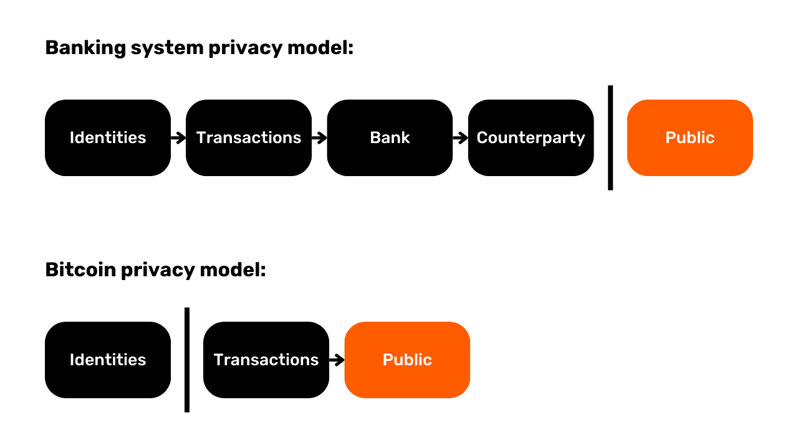

### Section 2: Understanding Chain Analysis and How to Protect Against It

In the second section, we study the techniques used by chain analysis companies to trace your activity on Bitcoin. Understanding these methods is crucial for enhancing the protection of your privacy. This part aims to examine the strategies of attackers to better understand the risks and lay the groundwork for the techniques that we will study in the following sections. We will analyze transaction patterns, internal and external heuristics, as well as plausible interpretations of these patterns. In addition to a theoretical component, we will learn to use a block explorer to perform chain analysis, through practical examples and exercises.


### Section 3: Mastering Best Practices to Protect Your Privacy

In the third section of our training, we get to the heart of the matter: practice! The goal is to master all the essential best practices that should become natural reflexes for any Bitcoin user. We will cover the use of fresh addresses, labeling, consolidation, the use of full nodes, as well as KYC and acquisition methods. The aim is to provide you with a comprehensive overview of the pitfalls to avoid to establish solid foundations in our quest for privacy protection. For some of these practices, you will be guided to a specific tutorial to implement them.

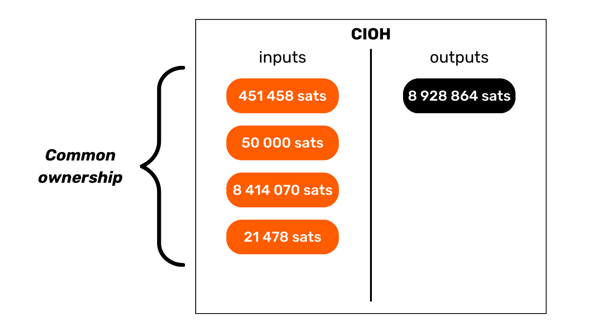

### Section 4: Understanding Coinjoin Transactions

How can we talk about privacy on Bitcoin without discussing coinjoins? In section 4, you will discover everything you need to know about this mixing method. You will learn what a coinjoin is, its history and objectives, as well as the different types of coinjoins that exist. Finally, for the more experienced users, we will discover what anonsets and entropy are, and how to calculate these indicators.


### Section 5: Understanding the Stakes of Other Advanced Privacy Techniques
In the fifth section, we will provide an overview of all the other existing techniques to protect your privacy on Bitcoin, aside from coinjoin. Over the years, developers have shown remarkable creativity in designing tools dedicated to privacy. We will examine all these methods, such as payjoin, collaborative transactions, Coin Swap, and Atomic Swap, detailing their operation, goals, and potential weaknesses.

We will also address privacy at the level of the node network and the dissemination of transactions. We will also discuss the various protocols that have been proposed over the years to enhance user privacy on Bitcoin, including static address protocols.


# Definitions and Key Concepts
<partId>b9bbbde3-34c0-4851-83e8-e2ffb029cf31</partId>


## The Bitcoin UTXO Model
<chapterId>8d6b50c5-bf74-44f4-922b-25204991cb75</chapterId>

Bitcoin is primarily a currency, but do you know concretely how BTC are represented on the protocol?

### Bitcoin UTXOs: What Are They?

In the Bitcoin protocol, the management of monetary units revolves around the UTXO model, an acronym for "_Unspent Transaction Output_".

This model is profoundly different from traditional banking systems, which rely on an account and balance mechanism to track financial flows. Indeed, in the banking system, individual balances are maintained in accounts attached to an identity. For example, when you buy a baguette from a baker, your bank simply debits the purchase amount from your account, thus reducing your balance, while the baker's account is credited with the same amount, increasing his balance. In this system, there is no notion of a link between the money entering your account and the money leaving it, apart from transaction records.

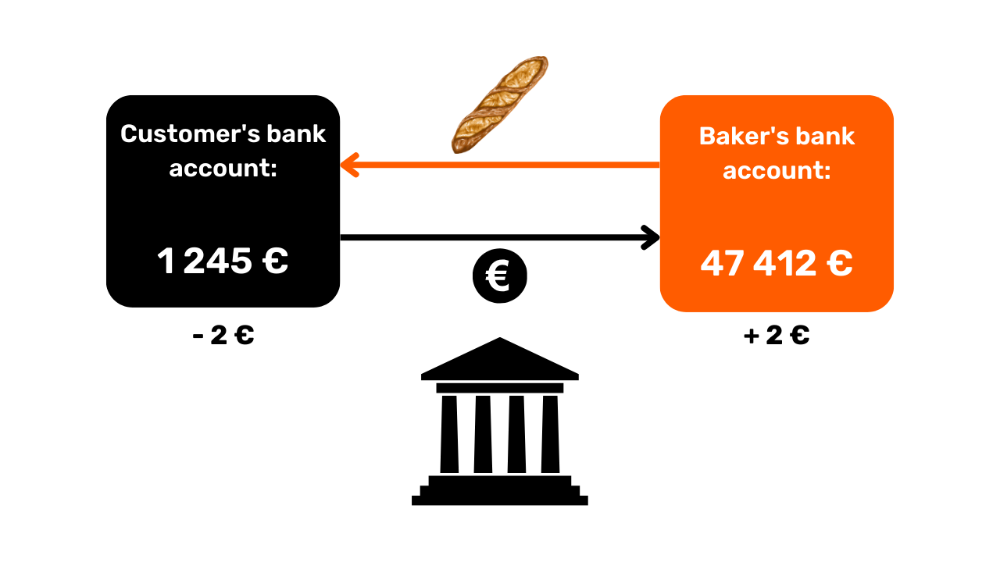
On Bitcoin, things work differently. The concept of an account does not exist, and monetary units are not managed via balances but through UTXOs. A UTXO represents a specific amount of bitcoins that has not yet been spent, thus forming a "piece of bitcoin," which can be large or small. For example, a UTXO could be worth `500 BTC` or just `700 SATS`.
**> Reminder:** The satoshi, often abbreviated as sat, is the smallest unit of Bitcoin, comparable to a cent in fiat currencies.

```plaintext
1 BTC = 100,000,000 SATS
```

Theoretically, a UTXO can represent any value in bitcoins, ranging from one sat up to the theoretical maximum of about 21 million BTC. However, it is logically impossible to own all 21 million bitcoins, and there is a lower economic threshold called "dust," below which a UTXO is considered economically unviable to spend.

**> Did you know?** The largest UTXO ever created on Bitcoin was valued at `500,000 BTC`. It was created by the MtGox platform during a consolidation operation in November 2011: [29a3efd3ef04f9153d47a990bd7b048a4b2d213daaa5fb8ed670fb85f13bdbcf](https://mempool.space/fr/tx/29a3efd3ef04f9153d47a990bd7b048a4b2d213daaa5fb8ed670fb85f13bdbcf)

### UTXOs and Spending Conditions

UTXOs are the instruments of exchange on Bitcoin. Each transaction results in the consumption of UTXOs as inputs and the creation of new UTXOs as outputs. When a transaction is made, the UTXOs used as inputs are considered "spent," and new UTXOs are generated and allocated to the recipients indicated in the transaction outputs. Thus, a UTXO simply represents an unspent transaction output, and therefore an amount of bitcoins belonging to a user at a given time.


All UTXOs are secured by scripts that define the conditions under which they can be spent. To consume a UTXO, a user must demonstrate to the network that they meet the conditions stipulated by the script securing that UTXO. Generally, UTXOs are protected by a public key (or a receiving address that represents this public key). To spend a UTXO associated with this public key, the user must prove they hold the corresponding private key by providing a digital signature made with this key. This is why it is said that your Bitcoin wallet does not actually contain bitcoins, but rather it stores your private keys, which in turn give you access to your UTXOs and, by extension, to the bitcoins they represent.
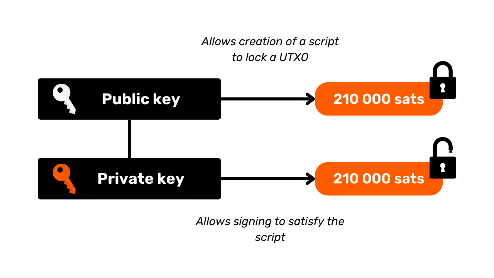

Given that the concept of an account is absent in Bitcoin, the balance of a wallet simply corresponds to the sum of the values of all the UTXOs it can spend. For example, if your Bitcoin wallet can spend the following 4 UTXOs:

```plaintext
- 2 BTC
- 8 BTC
- 5 BTC
- 2 BTC
```

The total balance of your wallet would be `17 BTC`.

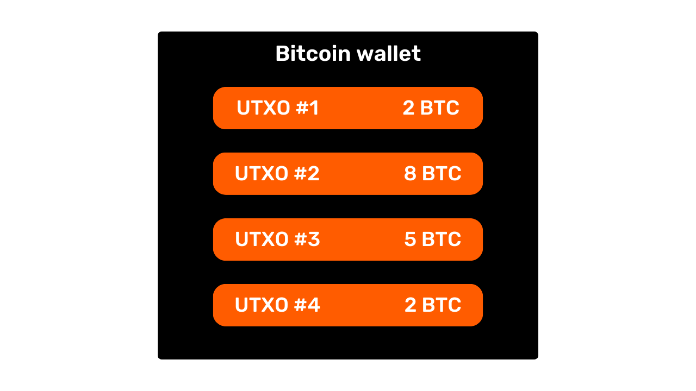

## The structure of Bitcoin transactions
<chapterId>29d3aaab-de2e-4746-ab40-c9748898850c</chapterId>

### The inputs and outputs of a transaction

A Bitcoin transaction is an operation recorded on the blockchain that allows for the transfer of ownership of bitcoins from one person to another. More specifically, since we are on a UTXO model and there are no accounts, the transaction satisfies the spending conditions that secured one or more UTXOs, consumes them, and equivalently creates new UTXOs endowed with new spending conditions. In short, a transaction moves bitcoins from a script that is satisfied to a new script intended to secure them.

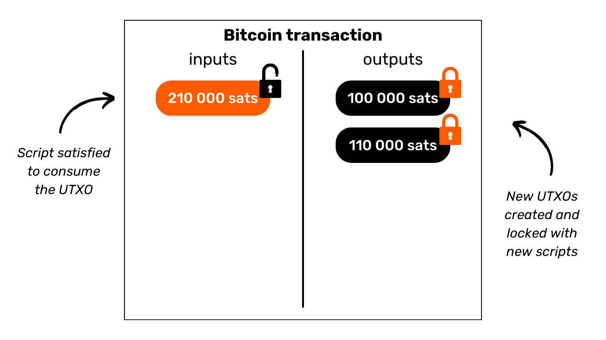

Each Bitcoin transaction is thus made up of one or more inputs and one or more outputs. The inputs are UTXOs consumed by the transaction to generate the outputs. The outputs are new UTXOs that will be usable as inputs for future transactions.

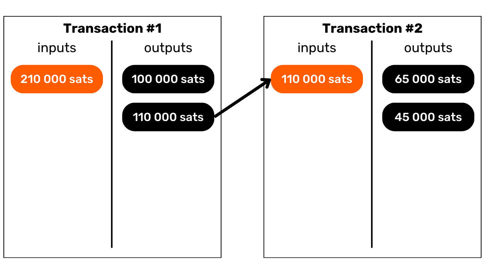

**> Did you know?** Theoretically, a bitcoin transaction could have an infinite number of inputs and outputs. Only the maximum size of a block limits this number.
Every input in a Bitcoin transaction refers to a previous, unspent UTXO (Unspent Transaction Output). To use a UTXO as input, its holder must demonstrate that they are the legitimate owner by validating the script associated with it, that is, by meeting the imposed spending condition. Generally, this involves providing a digital signature produced with the private key corresponding to the public key that initially secured that UTXO. The script thus verifies that the signature matches the public key used when receiving the funds.
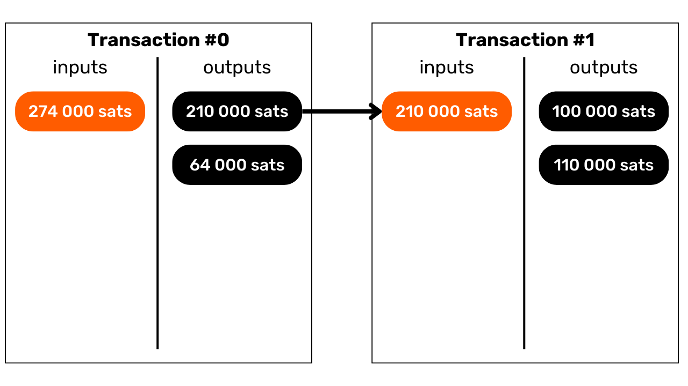

Each output, on the other hand, specifies the amount of bitcoins to be transferred, as well as the recipient. The latter is defined by a new script which, generally, locks the newly created UTXO with a receiving address or a new public key.

For a transaction to be considered valid according to consensus rules, the total of the outputs must be less than or equal to the total of the inputs. In other words, the sum of the new UTXOs generated by the transaction must not exceed that of the UTXOs consumed as inputs. This principle is logical: if you only have an amount of `500,000 SATS`, you cannot make a purchase of `700,000 SATS`.

### Change and Consolidation in a Bitcoin Transaction

The action of a Bitcoin transaction on UTXOs can thus be compared to the melting down of a gold coin. Indeed, a UTXO is not divisible, but only mergeable. This means that a user cannot simply divide a UTXO representing a certain amount of bitcoins into several smaller UTXOs. They must consume it entirely in a transaction to create one or more new UTXOs of arbitrary values in outputs, which must be less than or equal to the initial value.

This mechanism is similar to that of a gold coin. Imagine you own a 2-ounce coin and you want to make a payment of 1 ounce, assuming the seller cannot give you change. You would need to melt your coin and cast 2 new ones of 1 ounce each.
On Bitcoin, the operation is similar. Let's imagine that Alice has a UTXO of `10,000 SATS` and she wants to buy a baguette costing `4,000 SATS`. Alice will make a transaction with an input of 1 UTXO of `10,000 SATS` which she will consume entirely, and in outputs, she will create 2 UTXOs valued at `4,000 SATS` and `6,000 SATS`. The UTXO of `4,000 SATS` will be sent to the baker as payment for the baguette, while the UTXO of `6,000 SATS` will return to Alice as change. This UTXO that returns to the initial sender of the transaction is what is called "change" in Bitcoin jargon.


Now imagine that Alice does not have a single UTXO of `10,000 SATS`, but rather two UTXOs of `3,000 SATS` each. In this situation, none of the individual UTXOs is sufficient to cover the `4,000 SATS` for the baguette. Therefore, Alice must use both UTXOs of `3,000 SATS` as inputs for her transaction simultaneously. In this way, the total amount of inputs will reach `6,000 SATS`, allowing her to cover the payment of `4,000 SATS` to the baker. This method, which involves grouping several UTXOs in the inputs of a transaction, is often referred to by the term "consolidation".
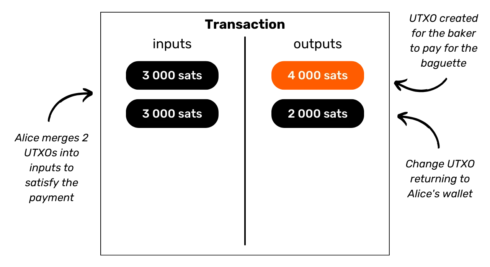

### Transaction Fees

Intuitively, one might think that transaction fees also represent an output of a transaction. But in reality, this is not the case. The fees of a transaction represent the difference between the total of the inputs and the total of the outputs. This means that, after using part of the value of the inputs to cover the desired outputs in a transaction, a certain sum of the inputs remains unused. This residual sum constitutes the transaction fees.

```plaintext
Fees = total inputs - total outputs
```

Let's go back to the example of Alice who has a UTXO of `10,000 SATS` and wants to buy a baguette for `4,000 SATS`. Alice creates a transaction with her UTXO of `10,000 SATS` as input. She then generates an output of `4,000 SATS` intended for the baker for the payment of the baguette. To encourage miners to include her transaction in a block, Alice allocates `200 SATS` as fees. She thus creates a second output, the change, which will return to her, amounting to `5,800 SATS`.

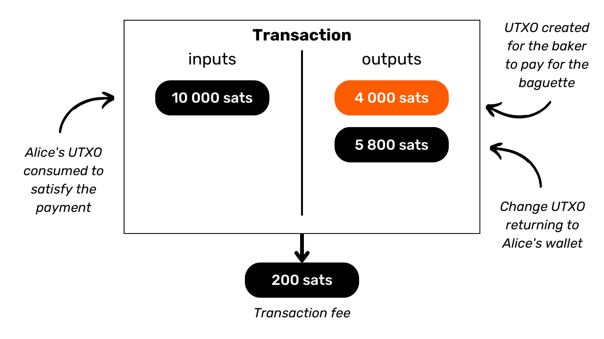

By applying the fee formula, we indeed see that there remains `200 SATS` for the miners:
```plaintext
Fees = total inputs - total outputs
Expenses = 10,000 - (4,000 + 5,800)
Expenses = 10,000 - 9,800
Expenses = 200
```

When a miner successfully validates a block, they are allowed to collect these fees for all transactions included in their block, through the so-called "coinbase" transaction.

### The Creation of UTXOs on Bitcoin

If you have been following the previous paragraphs attentively, you now know that UTXOs can only be created by consuming other existing UTXOs. Thus, the coins on Bitcoin form a continuous chain. However, you might be wondering how the first UTXOs in this chain appeared. This raises a problem similar to the chicken and the egg: where did these original UTXOs come from?

The answer lies in the **coinbase transaction**.

The coinbase is a specific type of Bitcoin transaction, unique to each block and always the first one in them. It allows the miner who found a valid proof of work to receive their block reward. This reward consists of two elements: **the block subsidy** and **the transaction fees** we talked about in the previous part.

The unique feature of the coinbase transaction is that it is the only one that can create bitcoins out of thin air, without needing to consume inputs to generate its outputs. These newly created bitcoins constitute what could be called the "original UTXOs".

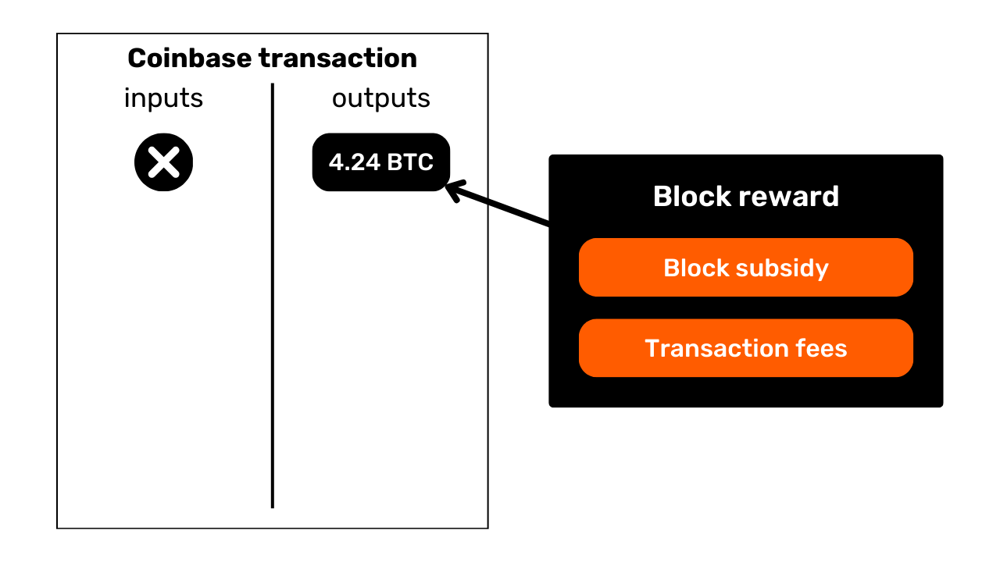

The bitcoins from the block subsidy are new BTC created from nothing, following a pre-established issuance schedule in the consensus rules. The block subsidy is halved every 210,000 blocks, which is about every four years, in a process called "halving". Initially, 50 bitcoins were created with each subsidy, but this amount has gradually decreased; currently, it is 3.125 bitcoins per block.

As for the part related to transaction fees, although it also represents newly created BTC, they must not exceed the difference between the total inputs and outputs of all transactions in a block. We saw earlier that these fees represent the portion of the inputs that is not used in the transactions' outputs. This part is technically "lost" during the transaction, and the miner has the right to recreate this value in the form of one or more new UTXOs. This is, therefore, a transfer of value from the transaction sender to the miner who adds it to the blockchain.

**> Did you know?** The bitcoins generated by a coinbase transaction are subject to a maturity period of 100 blocks during which they cannot be spent by the miner. This rule is intended to avoid complications related to the use of newly created bitcoins on a chain that could later be rendered obsolete.

### The Implications of the UTXO Model

Firstly, the UTXO model directly influences transaction fees on Bitcoin. Given that the capacity of each block is limited, miners favor transactions that offer the best fees relative to the space they will occupy in the block. Indeed, the more UTXOs a transaction includes as inputs and outputs, the heavier it is, and therefore, it requires higher fees. This is one of the reasons why there's often an effort to reduce the number of UTXOs in our wallet, which can also affect privacy, a topic we will delve into in detail in the third part of this training.

Next, as mentioned in the previous parts, coins on Bitcoin are essentially a chain of UTXOs. Each transaction thus creates a link between a past UTXO and a future UTXO. UTXOs therefore allow for the explicit tracking of the path of bitcoins from their creation to their current expenditure. This transparency can be seen positively, as it allows each user to ensure the authenticity of the bitcoins received. However, it is also on this principle of traceability and auditability that chain analysis rests, a practice aimed at compromising your privacy. We will study this practice in depth in the second part of the training.

## Bitcoin's Privacy Model
<chapterId>769d8963-3ed5-4094-b21d-9203c7d9e465</chapterId>

### Currency: Authenticity, Integrity, and Double Spending

One of the functions of currency is to solve the problem of the double coincidence of wants. In a system based on barter, making an exchange requires not only finding an individual who is offering a good that meets my need but also providing them with a good of equivalent value that satisfies their own need. Finding this balance proves to be complex.


That's why we resort to currency, which allows for the transfer of value both in space and time.


For currency to solve this problem, it is essential that the party providing a good or service is convinced of their ability to spend that sum later on. Thus, any rational individual wishing to accept a piece of currency, whether digital or physical, will ensure that it meets two fundamental criteria:
- **The coin must be intact and authentic;**
- **and it must not be double-spent.**
When using physical currency, the first characteristic is the most complex to assert. Throughout different periods in history, the integrity of metal coins has often been compromised by practices such as clipping or drilling. For example, during ancient Rome, it was common for citizens to scrape the edges of gold coins to collect a bit of the precious metal, while still keeping them for future transactions. The intrinsic value of the coin was thus reduced, but its face value remained the same. This is notably why ridges were later minted on the edge of coins.

Authenticity is also a difficult characteristic to verify with physical monetary media. Nowadays, techniques to combat counterfeiting are increasingly complex, forcing merchants to invest in expensive verification systems.

On the other hand, due to their nature, double spending is not a problem for physical currencies. If I give you a €10 bill, it irrevocably leaves my possession to enter yours, naturally excluding any possibility of spending the same monetary units multiple times. In short, I will not be able to spend that €10 bill again.


For digital currency, the difficulty is different. Ensuring the authenticity and integrity of a coin is often simpler. As we saw in the previous section, Bitcoin's UTXO model allows tracing a coin back to its origin, thereby verifying that it was indeed created in accordance with the consensus rules by a miner.

However, ensuring the absence of double spending is more complex, since any digital good is essentially information. Unlike physical goods, information does not divide during exchanges but propagates by multiplying. For example, if I send you a document by email, it then becomes duplicated. On your end, you cannot verify with certainty that I have deleted the original document.


### Preventing Double Spending on Bitcoin

The only way to avoid the duplication of a digital good is to be aware of all the exchanges within the system. In this way, one can know who owns what and update everyone's holdings based on the transactions made. This is what is done, for example, with book-entry money in the banking system. When you pay €10 to a merchant by credit card, the bank notes this exchange and updates the ledger.
On Bitcoin, preventing double spending is achieved in the same manner. The aim is to confirm the absence of a transaction that has already spent the coins in question. If these coins have never been used, then we can be assured that no double spending will occur. This principle was described by Satoshi Nakamoto in the White Paper with this famous phrase:

**"*The only way to confirm the absence of a transaction is to be aware of all transactions.*"**

However, unlike the banking model, there is no desire to have to trust a central entity on Bitcoin. It is necessary for all users to be able to confirm this absence of double spending, without relying on a third party. Thus, everyone must be aware of all Bitcoin transactions. This is why Bitcoin transactions are publicly broadcast across all network nodes and recorded in clear on the blockchain.

It is precisely this public dissemination of information that complicates the protection of privacy on Bitcoin. In the traditional banking system, in theory, only the financial institution is aware of the transactions made. On the other hand, on Bitcoin, all users are informed of all transactions, via their respective nodes.

### The privacy model: banking system vs Bitcoin

In the traditional system, your bank account is linked to your identity. The banker is able to know which bank account belongs to which client, and what transactions are associated with it. However, this flow of information is cut off between the bank and the public domain. In other words, it is impossible to know the balance and transactions of a bank account that belongs to another individual. Only the bank has access to this information.

For example, your banker knows that you buy your baguette every morning at the neighborhood bakery, but your neighbor is not aware of this transaction. Thus, the flow of information is accessible to the concerned parties, notably the bank, but remains inaccessible to outsiders.

Due to the constraint of public dissemination of transactions that we saw in the previous part, the privacy model of Bitcoin cannot follow the model of the banking system. In the case of Bitcoin, since the flow of information cannot be broken between the transactions and the public domain, **the privacy model relies on the separation between the user's identity and the transactions** themselves.
For example, if you buy a baguette from the baker by paying in BTC, your neighbor, who owns their own full node, can see your transaction go through, just as they can see all the other transactions in the system. However, if privacy principles are respected, they should not be able to link this specific transaction to your identity.


But since Bitcoin transactions are made public, it still becomes possible to establish links between them to deduce information about the parties involved. This activity even constitutes a specialty in itself called "chain analysis". In the next part of the training, I invite you to explore the fundamentals of chain analysis to understand how your bitcoins are traced and to know how to better defend against it.

# Understanding Chain Analysis and How to Protect Yourself
<partId>4739371e-9fef-45b0-bcaa-b7a4df6b4470</partId>

## What is Chain Analysis on Bitcoin?
<chapterId>7d198ba6-4af2-4f24-86cb-3c79cb25627e</chapterId>

### Definition and Operation

Chain analysis is a practice that encompasses all the methods used to trace the flow of bitcoins on the blockchain. Generally, chain analysis relies on observing characteristics in samples of previous transactions. It then involves identifying these same characteristics in a transaction that one wishes to analyze, and deducing plausible interpretations. This problem-solving method from a practical approach, to find a sufficiently good solution, is what is called a "heuristic".

To simplify, chain analysis is done in three main steps:
1. **Observing the blockchain;**
2. **Identifying known characteristics;**
3. **Deducing hypotheses.**

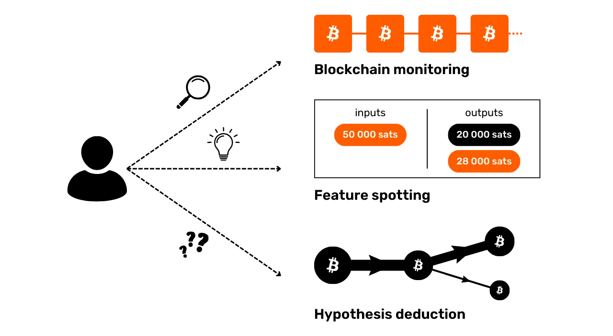

Chain analysis can be performed by anyone. It is enough to have access to the public information of the blockchain via a full node to observe the movements of transactions and make hypotheses. There are also free tools that facilitate this analysis, like the website [OXT.me](https://oxt.me/) that we will explore in detail in the last two chapters of this part. However, the main risk to privacy comes from companies specialized in chain analysis. These companies have taken chain analysis to an industrial scale and sell their services to financial institutions or governments. Among these companies, Chainalysis is probably the most well-known.

### The Objectives of Chain Analysis

One of the objectives of chain analysis is to group various activities on Bitcoin in order to determine the uniqueness of the user who carried them out. Subsequently, it will be possible to attempt to link this bundle of activities to a real identity.


Remember the previous chapter. I explained why Bitcoin's privacy model originally relied on separating the user's identity from their transactions. It would therefore be tempting to think that chain analysis is unnecessary, since even if one manages to group onchain activities, they cannot be associated with a real identity.

Theoretically, this statement is accurate. In the first part of this training, we saw that cryptographic key pairs are used to establish conditions on the UTXO. By essence, these key pairs do not disclose any information about the identity of their holders. Thus, even if one succeeds in grouping activities associated with different key pairs, this tells us nothing about the entity behind these activities.


However, the practical reality is much more complex. There are a multitude of behaviors that risk linking a real identity to an onchain activity. In analysis, this is called an entry point, and there are many of them.

The most common, of course, is KYC (*Know Your Customer*). If you withdraw your bitcoins from a regulated platform to one of your personal receiving addresses, then some people are able to link your identity to this address. More broadly, an entry point can be any form of interaction between your real life and a Bitcoin transaction. For example, if you publish a receiving address on your social networks, this can be an entry point for analysis. If you make a payment in bitcoins to your baker, they can associate your face (which is part of your identity) with a Bitcoin address.

These entry points are almost inevitable in the use of Bitcoin. Although one can seek to limit their scope, they will remain present. That's why it is crucial to combine methods aimed at preserving your privacy. While maintaining a separation between your real identity and your transactions is an interesting approach, it remains insufficient today. Indeed, if all your onchain activities can be grouped, then the slightest entry point is likely to compromise the only layer of privacy you had established.


### Defending Against Chain Analysis
Thus, it is also necessary to be able to face blockchain analysis in our use of Bitcoin. By proceeding in this manner, we can minimize the aggregation of our activities and limit the impact of an entry point on our privacy.


Indeed, to better counter blockchain analysis, what better approach than to familiarize oneself with the methods used in blockchain analysis? If you want to know how to improve your privacy on Bitcoin, you must understand these methods. This will allow you to better grasp techniques like [coinjoin](https://planb.network/fr/tutorials/privacy/coinjoin-samourai-wallet) or [payjoin](https://planb.network/fr/tutorials/privacy/payjoin) (techniques that we will study in the last parts of the training), and to reduce the mistakes you might make.

In this, we can make an analogy with cryptography and cryptanalysis. A good cryptographer is first and foremost a good cryptanalyst. To imagine a new encryption algorithm, one must know what attacks it will have to face, and also study why previous algorithms were broken. The same principle applies to privacy on Bitcoin. Understanding the methods of blockchain analysis is the key to protecting against it. That is why I propose an entire section on blockchain analysis in this training.

### The methods of blockchain analysis

It is important to understand that blockchain analysis is not an exact science. It relies on heuristics derived from previous observations or logical interpretations. These rules allow for fairly reliable results, but never with absolute precision. In other words, **blockchain analysis always involves a dimension of probability in the conclusions issued**. For example, it may be estimated with more or less certainty that two addresses belong to the same entity, but total certainty will always be out of reach.

The whole objective of blockchain analysis lies precisely in the aggregation of various heuristics in order to minimize the risk of error. It is, in a way, an accumulation of evidence that allows us to approach reality more closely.

These famous heuristics can be grouped into different categories that we will detail together:
- **Transaction patterns (or transaction models);**
- **Heuristics internal to the transaction;**
- **Heuristics external to the transaction.**

### Satoshi Nakamoto and blockchain analysis
It should be noted that the first two heuristics for chain analysis were discovered by Satoshi Nakamoto himself. He discusses them in part 10 of the Bitcoin White Paper. These are:
- the Common Input Ownership Heuristic (CIOH);
- and address reuse.


Source: S. Nakamoto, "Bitcoin: A Peer-to-Peer Electronic Cash System", https://bitcoin.org/bitcoin.pdf, 2009.

In the following chapters, we will explore what these consist of, but it is already interesting to note that these two heuristics still retain a preeminence in chain analysis today.

## Transaction Patterns
<chapterId>d365a101-2d37-46a5-bfb9-3c51e37bf96b</chapterId>

A transaction pattern is simply a model or an overall structure of a typical transaction that can be found on the blockchain, whose interpretation is likely known. When studying patterns, we will focus on a single transaction that we will analyze at a high level.

In other words, we will only look at the number of UTXOs in inputs and the number of UTXOs in outputs, without dwelling on the more specific details or the transaction's environment. From the observed model, we will be able to interpret the nature of the transaction. We will then look for characteristics in its structure and deduce an interpretation.


In this part, we will discover together the main transaction models that can be encountered in chain analysis, and for each model, I will give you the likely interpretation of this structure, along with a concrete example.

### Simple Sending (or Simple Payment)

We start with a very widespread pattern, since it is the one that appears in most bitcoin payments. The simple payment model is characterized by the consumption of one or more UTXOs in inputs and the production of 2 UTXOs in outputs. This model will therefore look like this:


When we spot this transaction structure on the blockchain, we can already draw an interpretation. As its name suggests, this model indicates that we are in the presence of a sending or payment transaction. The user has consumed their own UTXO in inputs to satisfy in outputs a payment UTXO and a change UTXO (money returned to the same user).

We therefore know that the observed user is likely no longer in possession of one of the two UTXOs in outputs (the payment one), but they are still in possession of the other UTXO (the change one).
At the moment, it is impossible for us to specify which output represents which UTXO, as this is not the goal of the study of patterns. We will achieve this by relying on the heuristics that we will study in the following parts. At this stage, our goal is limited to identifying the nature of the transaction in question, which is, in this case, a simple send.

For example, here is a Bitcoin transaction that adopts the simple send pattern:

```plaintext
b6cc79f45fd2d7669ff94db5cb14c45f1f879ea0ba4c6e3d16ad53a18c34b769
```


Source: [Mempool.space](https://mempool.space/fr/tx/b6cc79f45fd2d7669ff94db5cb14c45f1f879ea0ba4c6e3d16ad53a18c34b769)

After this first example, you should have a better understanding of what it means to study a "transaction model". We examine a transaction by focusing only on its structure, without taking into account its environment or the specific details of the transaction. We observe it only in a global manner in this first step.

Now that you understand what a pattern is, let's move on to the other existing models.

### Sweeping

This second model is characterized by the consumption of a single UTXO as input and the production of a single UTXO as output.


The interpretation of this model is that we are in the presence of a self-transfer. The user has transferred his bitcoins to himself, to another address he owns. Since there is no change in the transaction, it is very unlikely that we are in the presence of a payment. Indeed, when a payment is made, it is almost impossible for the payer to have a UTXO that exactly matches the amount required by the seller, plus the transaction fees. Generally, the payer is therefore forced to produce a change output.

We then know that the observed user is likely still in possession of this UTXO. In the context of a chain analysis, if we know that the UTXO used as input in the transaction belongs to Alice, we can assume that the UTXO in output also belongs to her. What will become interesting later on is to find internal heuristics to the transaction that could strengthen this assumption (we will study these heuristics in chapter 3.3).

For example, here is a Bitcoin transaction that adopts the sweeping pattern:

```plaintext
35f1072a0fda5ae106efb4fda871ab40e1f8023c6c47f396441ad4b995ea693d
```


Source: [Mempool.space](https://mempool.space/fr/tx/35f1072a0fda5ae106efb4fda871ab40e1f8023c6c47f396441ad4b995ea693d)
However, this type of pattern can also reveal a self-transfer to the account of a cryptocurrency exchange platform. It will be the study of known addresses and the context of the transaction that will allow us to know if it's a sweep to a self-custody wallet or a withdrawal to a platform. Indeed, the addresses of exchange platforms are often easily identifiable.

Let's go back to Alice's example: if the sweep leads to a known address of a platform (like Binance, for example), this may mean that the bitcoins were transferred out of Alice's direct possession, probably with the intention of selling them or storing them on this platform. On the other hand, if the destination address is unknown, it is reasonable to assume that it is simply another wallet still belonging to Alice. But this type of study falls more into the category of heuristics and not the study of patterns.

### Consolidation

This model is characterized by the consumption of several UTXOs as input and the production of a single UTXO as output.


The interpretation of this model is that we are in the presence of a consolidation. This is a common practice among Bitcoin users, aiming to merge several UTXOs in anticipation of a possible increase in transaction fees. By performing this operation during a period when fees are low, it is possible to save on future fees. We will talk more about this practice in chapter 4.3.

We can deduce that the user behind this transaction model was likely in possession of all the UTXOs in inputs and is still in possession of the UTXO in output. This is surely a self-transfer.

Just like sweeping, this type of pattern can also reveal a self-transfer to the account of an exchange platform. It will be the study of known addresses and the context of the transaction that will allow us to know if it's a consolidation to a self-custody wallet or a withdrawal to a platform.

For example, here is a Bitcoin transaction that adopts the consolidation pattern:

```plaintext
77c16914211e237a9bd51a7ce0b1a7368631caed515fe51b081d220590589e94
```


Source: [Mempool.space](https://mempool.space/fr/tx/77c16914211e237a9bd51a7ce0b1a7368631caed515fe51b081d220590589e94)
In the context of a chain analysis, this model can reveal a lot of information. For example, if we know that one of the inputs belongs to Alice, we can assume that all the other inputs and the output of this transaction belong to her as well. This assumption would then allow us to trace back through previous transaction chains to discover and analyze other transactions likely associated with Alice.
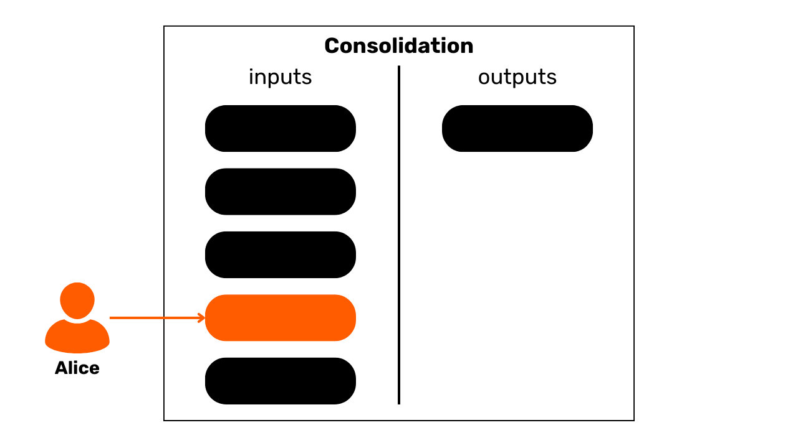

### Grouped Spending

This model is characterized by the consumption of a few UTXOs as inputs (often only one) and the production of numerous UTXOs as outputs.


The interpretation of this model is that we are in the presence of a grouped spending. This is a practice that likely reveals significant economic activity, such as an exchange platform, for example. Grouped spending allows these entities to save on fees by consolidating their expenditures into a single transaction.

We can deduce from this model that the UTXO input comes from a company with significant economic activity and that the UTXOs outputs will disperse. Many will belong to clients of the company who have withdrawn bitcoins from the platform. Others may go towards partner companies. Finally, there will certainly be one or more exchanges that return to the issuing company.

For example, here is a Bitcoin transaction that adopts the pattern of grouped spending (likely, it's a transaction issued by the Bybit platform):

```plaintext
8a7288758b6e5d550897beedd13c70bcbaba8709af01a7dbcc1f574b89176b43
```


Source: [Mempool.space](https://mempool.space/fr/tx/8a7288758b6e5d550897beedd13c70bcbaba8709af01a7dbcc1f574b89176b43)

### Protocol-Specific Transactions

Among the transaction patterns, we can also identify models that reveal the use of a specific protocol. For example, Whirlpool coinjoins (which we will discuss in part 5) will have an easily identifiable structure that allows them to be differentiated from other more traditional transactions.


The analysis of this pattern suggests that we are likely in the presence of a collaborative transaction. It is also possible to observe a coinjoin. If this latter hypothesis proves accurate, then the number of outputs could provide us with an approximate estimation of the number of participants in the coinjoin.

For example, here is a Bitcoin transaction that adopts the pattern of the collaborative transaction type coinjoin:

```plaintext
00601af905bede31086d9b1b79ee8399bd60c97e9c5bba197bdebeee028b9bea
```


Source: [Mempool.space](https://mempool.space/fr/tx/00601af905bede31086d9b1b79ee8399bd60c97e9c5bba197bdebeee028b9bea)

There are many other protocols that have their own specific structures. Thus, we could distinguish transactions of the Wabisabi type, Stamps transactions, or even Runes, for example.

Thanks to these transaction patterns, we can already interpret a number of pieces of information about a given transaction. But the structure of the transaction is not the only source of information for analysis. We can also study its details. These details, internal to a transaction, are what I like to call "internal heuristics," and we will study them in the following chapter.

## Internal Heuristics
<chapterId>c54b5abe-872f-40f4-a0d0-c59faff228ba</chapterId>

An internal heuristic is a specific characteristic identified within a transaction itself, without the need to examine its environment, which allows us to make deductions. Unlike patterns that focus on the overall structure of the transaction at a high level, internal heuristics are based on the set of extractable data. This includes:
- The amounts of the different UTXOs both incoming and outgoing;
- Everything concerning the scripts: the receiving addresses, the versioning, the locktimes…

Generally, this type of heuristic will allow us to identify the change in a specific transaction. By doing so, we can then continue to trace an entity across several different transactions. Indeed, if we identify a UTXO belonging to a user we wish to follow, it is crucial to determine, when they make a transaction, which output was transferred to another user and which output represents the change, thus remaining in their possession.


Once again, I remind you that these heuristics are not absolutely precise. Taken individually, they only allow us to identify plausible scenarios. It is the accumulation of several heuristics that helps to reduce uncertainty, without ever completely eliminating it.

### Internal Similarities

This heuristic involves the study of similarities between the inputs and outputs of the same transaction. If we observe the same characteristic on the inputs and on only one of the outputs of the transaction, then it is likely that this output constitutes the change.

The most obvious characteristic is the reuse of a receiving address in the same transaction.

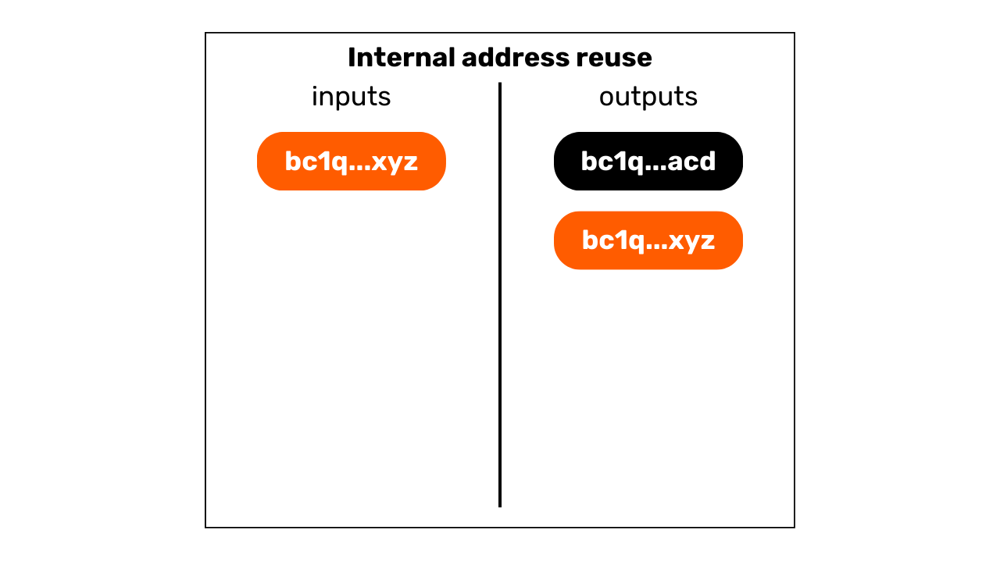
This heuristic leaves little room for doubt. Unless one's private key has been hacked, the same receiving address inevitably reveals the activity of a single user. The interpretation that follows is that the change from the transaction is the output with the same address as the input. This allows for the continued tracking of the individual based on this change.
For example, here is a transaction on which this heuristic can reasonably be applied:

```plaintext
54364146665bfc453a55eae4bfb8fdf7c721d02cb96aadc480c8b16bdeb8d6d0
```


Source: [Mempool.space](https://mempool.space/tx/54364146665bfc453a55eae4bfb8fdf7c721d02cb96aadc480c8b16bdeb8d6d0)

These similarities between inputs and outputs do not stop at address reuse. Any resemblance in the use of scripts can allow for the application of a heuristic. For example, sometimes the same versioning between an input and one of the outputs of the transaction can be observed.

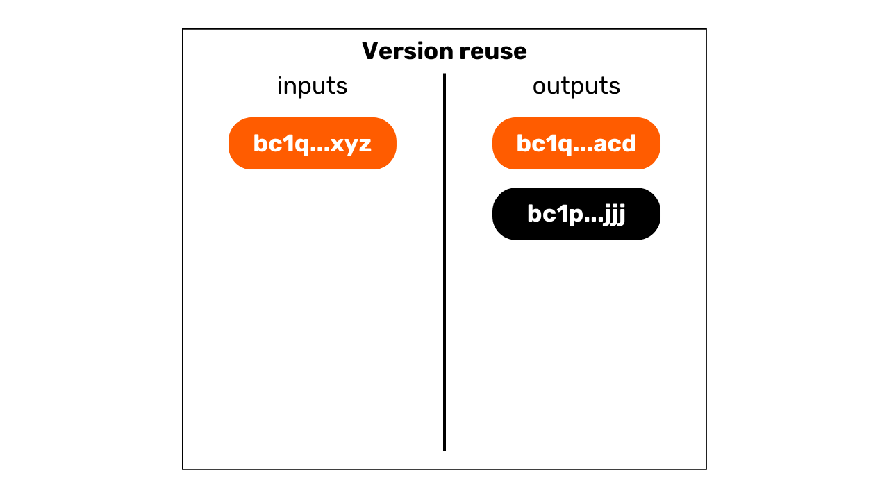

In this diagram, we can see that input No. 0 unlocks a P2WPKH script (SegWit V0 starting with `bc1q`). Output No. 0 uses the same type of script. However, output No. 1 uses a P2TR script (SegWit V1 starting with `bc1p`). The interpretation of this characteristic is that it is likely that the address with the same versioning as the input is the change address. It would therefore still belong to the same user.

Here is a transaction on which this heuristic can reasonably be applied:

```plaintext
db07516288771ce5d0a06b275962ec4af1b74500739f168e5800cbcb0e9dd578
```


Source: [Mempool.space](https://mempool.space/tx/db07516288771ce5d0a06b275962ec4af1b74500739f168e5800cbcb0e9dd578)

In this case, we can see that input No. 0 and output No. 1 use P2WPKH scripts (SegWit V0), while output No. 0 uses a different type of script, P2PKH (Legacy).
At the beginning of the 2010s, this heuristic based on the versioning of scripts was relatively little useful due to the limitation of the types of scripts available. However, over time and with successive updates to Bitcoin, an increasing diversity of script types has been introduced. This heuristic is becoming more and more relevant because, with a wider range of script types, users are divided into smaller groups, thus increasing the chances of applying this heuristic of internal versioning reuse. For this reason, from a privacy perspective only, it is advisable to opt for the most common script type. For example, as I write these lines, Taproot scripts (`bc1p`) are less frequently used than SegWit V0 scripts (`bc1q`). Although the former offer economic and privacy benefits in certain specific contexts, for more traditional single-signature uses, it might be wise to stick to an older standard for privacy reasons, until the new standard is more widely adopted.
### Round Number Payments

Another internal heuristic that can help us identify change is that of the round number. Generally, when faced with a simple payment pattern (1 input and 2 outputs), if one of the outputs spends a round amount, then it represents the payment.

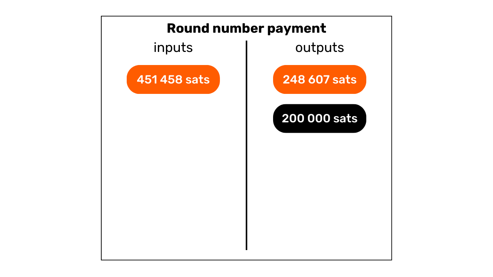

By elimination, if one output represents the payment, the other represents the change. It can therefore be inferred that it is likely that the user inputting the transaction still possesses the output identified as being the change.

It should be noted that this heuristic is not always applicable, since the majority of payments are still made in fiat currency units. Indeed, when a merchant in France accepts bitcoin, generally, they do not display stable prices in sats. They would rather opt for a conversion between the price in euros and the amount in bitcoins to be paid. Therefore, there should not be a round number in the transaction output.

Nevertheless, an analyst could attempt to make this conversion by taking into account the exchange rate in effect when the transaction was broadcast on the network. Let's take the example of a transaction with an input of `97,552 sats` and two outputs, one of `31,085 sats` and the other of `64,152 sats`. At first glance, this transaction does not seem to involve round amounts. However, by applying the exchange rate of €64,339 at the time of the transaction, we get a conversion in euros that looks as follows:
- An input of €62.76;
- An output of €20;
- An output of €41.27.
Once converted into fiat currency, this transaction allows for the application of the heuristic of round amount payments. The output of €20 was likely intended for a merchant, or at least changed ownership. By deduction, the output of €41.27 likely remained in possession of the original user.


If one day, Bitcoin becomes the preferred unit of account in our transactions, this heuristic could become even more useful for analysis.

For example, here is a transaction where this heuristic can likely be applied:

```plaintext
2bcb42fab7fba17ac1b176060e7d7d7730a7b807d470815f5034d52e96d2828a
```


Source: [Mempool.space](https://mempool.space/tx/2bcb42fab7fba17ac1b176060e7d7d7730a7b807d470815f5034d52e96d2828a)

### The Largest Output

When a sufficiently large gap is spotted between two transaction outputs in a simple payment model, it can be estimated that the larger output is likely the change.

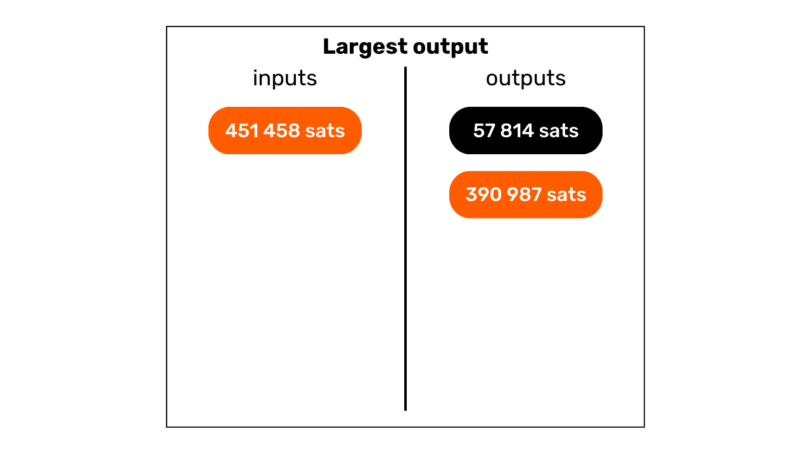

This heuristic of the largest output is probably the most imprecise of all. If identified by itself, it is quite weak. However, this characteristic can be combined with other heuristics to reduce the uncertainty of our interpretation.

For example, if we examine a transaction presenting an output with a round amount and another output with a larger amount, the joint application of the heuristic of round payments and that concerning the largest output allows us to reduce our level of uncertainty.

For example, here is a transaction where this heuristic can likely be applied:

```plaintext
b79d8f8e4756d34bbb26c659ab88314c220834c7a8b781c047a3916b56d14dcf
```


Source: [Mempool.space](https://mempool.space/tx/b79d8f8e4756d34bbb26c659ab88314c220834c7a8b781c047a3916b56d14dcf)

## External Heuristics
<chapterId>4a170e3b-200d-431a-8285-18a23ff617ba</chapterId>

The study of external heuristics involves analyzing the similarities, patterns, and characteristics of certain elements that are not inherent to the transaction itself. In other words, if previously we limited ourselves to exploiting elements intrinsic to the transaction with internal heuristics, we are now expanding our field of analysis to the transaction environment thanks to external heuristics.

### Address Reuse

This is one of the most well-known heuristics among Bitcoin enthusiasts. Address reuse allows establishing a link between different transactions and different UTXOs. It is observed when a Bitcoin receiving address is used multiple times.

Thus, it is possible to exploit address reuse within the same transaction as an internal heuristic to identify the change (as we saw in the previous chapter). However, address reuse can also serve as an external heuristic to recognize the uniqueness of an entity behind several transactions.

The interpretation of address reuse is that all UTXOs locked on this address belong (or have belonged) to the same entity. This heuristic leaves little room for uncertainty. When it is possible to identify it, the interpretation that follows is highly likely to correspond to reality. It thus allows the grouping of different onchain activities.

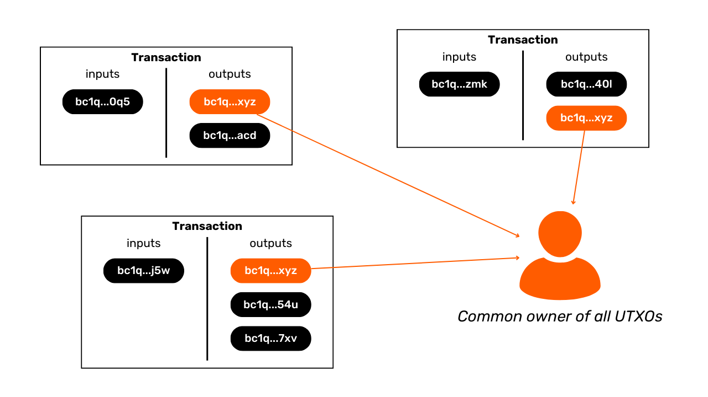

As explained in the introduction to this part 3, this heuristic was discovered by Satoshi Nakamoto himself. In the White Paper, he specifically mentions a solution for users to avoid producing it, which is simply to use a fresh address for each new transaction:

"_As an additional firewall, a new pair of keys could be used for each transaction to keep them from being linked to a common owner._"


Source: S. Nakamoto, "Bitcoin: A Peer-to-Peer Electronic Cash System", https://bitcoin.org/bitcoin.pdf, 2009.

For example, here is an address reused across multiple transactions:

```plaintext
bc1qqtmeu0eyvem9a85l3sghuhral8tk0ar7m4a0a0
```


Source: [Mempool.space](https://mempool.space/address/bc1qqtmeu0eyvem9a85l3sghuhral8tk0ar7m4a0a0)

### Script Similarity and Wallet Fingerprints

Beyond address reuse, there are numerous other heuristics that allow linking actions to the same wallet or to a cluster of addresses.
First and foremost, an analyst can benefit from similarities in the use of scripts. For example, certain minority scripts like multisig can be more easily identified than SegWit V0 scripts. The larger the group we hide in, the harder it is to spot us. This is notably why, in good Coinjoin protocols, all participants use exactly the same type of script.
More broadly, an analyst can also focus on the characteristic fingerprints of a wallet. These are specific processes tied to a usage that one might seek to identify with the aim of exploiting them as tracing heuristics. In other words, if one observes an accumulation of the same internal characteristics on transactions attributed to the traced entity, one can attempt to identify these same characteristics on other transactions.

For example, it can be identified that the traced user systematically sends their change to P2TR addresses (`bc1p…`). If this process repeats, it can be used as a heuristic for the continuation of our analysis. Other fingerprints can also be used, such as the order of the UTXOs, the placement of the change in the outputs, the signaling of RBF (Replace-by-Fee), or even, the version number, the `nSequence` field, and the `nLockTime` field.

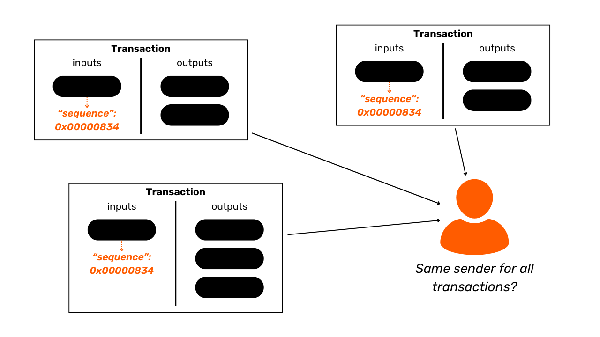

As [@LaurentMT](https://twitter.com/LaurentMT) specifies in the [Space Kek #19](https://podcasters.spotify.com/pod/show/decouvrebitcoin/episodes/SpaceKek-19---Analyse-de-chane--anonsets-et-entropie-e1vfuji) (a Francophone podcast), the utility of wallet fingerprints in chain analysis significantly increases over time. Indeed, the growing number of script types and the increasingly gradual deployment of these new features by wallet software accentuate the differences. It can even happen that one can identify with accuracy the software used by the traced entity. It is therefore important to understand that the study of a wallet's fingerprint proves particularly relevant for recent transactions, more so than for those initiated in the early 2010s.

To summarize, a fingerprint can be any specific practice, carried out automatically by the wallet or manually by the user, that can be found on other transactions to assist us in our analysis.

### The Common Input Ownership Heuristic (CIOH)

The CIOH, for "Common Input Ownership Heuristic" in English, is a heuristic stating that when a transaction includes multiple inputs, these likely all stem from a single entity. Consequently, their ownership is common.
To apply the Common Input Ownership Heuristic (CIOH), we first observe a transaction that has multiple inputs. This could be as few as 2 inputs or as many as 30 inputs. Once this characteristic is identified, we check if the transaction does not fit into a known transaction model. For example, if it has 5 inputs with roughly the same amount and 5 outputs with exactly the same amount, we know it's the structure of a coinjoin. Therefore, we cannot apply the CIOH.

However, if the transaction does not fit into any known model of collaborative transaction, then we can infer that all the inputs likely come from the same entity. This can be very useful for expanding a known cluster or for continuing tracing.

The CIOH was discovered by Satoshi Nakamoto. He discusses it in part 10 of the White Paper:

"_[...] the link is inevitable with multi-input transactions, which necessarily reveal that their inputs were owned by the same owner. The risk is that if the owner of a key is revealed, the links can reveal other transactions that belonged to the same owner._"

It is particularly fascinating to note that Satoshi Nakamoto, even before the official launch of Bitcoin, had already identified the two main vulnerabilities in terms of privacy for users, namely the CIOH and address reuse. Such foresight is quite remarkable, as these two heuristics remain, even today, the most useful in chain analysis.

To give you an example, here is a transaction on which we can likely apply the CIOH:

```plaintext
20618e63b6eed056263fa52a2282c8897ab2ee71604c7faccfe748e1a202d712
```

Source: [Mempool.space](https://mempool.space/tx/20618e63b6eed056263fa52a2282c8897ab2ee71604c7faccfe748e1a202d712)

### Offchain Data

Obviously, chain analysis is not limited exclusively to onchain data. Any data from previous analyses or available on the internet can also be used to refine an analysis.
For example, if it is observed that traced transactions are systematically broadcast from the same Bitcoin node and its IP address can be identified, it might be possible to spot other transactions from the same entity, in addition to determining a part of the sender's identity. Although this practice is not easily achievable, as it requires operating many nodes, it is possible that some companies specializing in chain analysis employ it.

The analyst also has the option to rely on analyses previously made open-source, or on their own prior analyses. Perhaps one might find an output that points to a cluster of addresses that had already been identified. Sometimes, it is also possible to rely on outputs that point to an exchange platform, the addresses of these companies being generally known.

In the same way, one can perform an analysis by elimination. For example, if during the analysis of a transaction with two outputs, one of them is linked to a cluster of addresses already known but distinct from the entity being traced, then it can be interpreted that the other output likely represents the change.

Chain analysis also includes a part of OSINT (*Open Source Intelligence*) that is a bit more generalist with internet searches. This is why it is advised against publishing receiving addresses directly on social media or on a website, whether under a pseudonym or not.


### Temporal Models

It is less commonly thought of, but certain human behaviors are recognizable on-chain. The most useful in analysis might be your sleep pattern! Yes, when you are sleeping, you presumably are not broadcasting Bitcoin transactions. Since you generally sleep around the same hours, it is common to use temporal analyses in chain analysis. This simply involves cataloging the hours at which a given entity's transactions are broadcast to the Bitcoin network. Analyzing these temporal patterns allows us to deduce many pieces of information.

First of all, a temporal analysis sometimes allows identifying the nature of the traced entity. If it is observed that transactions are broadcast consistently over 24 hours, then this will betray a strong economic activity. The entity behind these transactions is likely a company, potentially international, and perhaps with automated procedures internally.
For example, [I had recognized this model a few months ago](https://twitter.com/Loic_Pandul/status/1701127409712452072) by analyzing [the transaction that had mistakenly allocated 19 bitcoins in fees](https://mempool.space/tx/d5392d474b4c436e1c9d1f4ff4be5f5f9bb0eb2e26b61d2781751474b7e870fd). A simple temporal analysis had allowed me to hypothesize that we were dealing with an automated service, and therefore likely a large entity like an exchange platform.
Indeed, a few days later, it was discovered that the funds belonged to PayPal, via the exchange platform Paxos.

On the contrary, if we see that the temporal pattern is rather spread over 16 very specific hours, then we can estimate that we are dealing with an individual user, or perhaps a local business depending on the volumes traded.

Beyond the nature of the observed entity, the temporal pattern can also give us an approximate location of the user thanks to time zones. We can thus link other transactions, and use the timestamp of these as an additional heuristic that can be added to our analysis.

For example, on the reused address I previously talked about, we can observe that the transactions, whether incoming or outgoing, are concentrated over a 13-hour interval.

```plaintext
bc1qqtmeu0eyvem9a85l3sghuhral8tk0ar7m4a0a0
```


Source: OXT.me

This interval likely corresponds to Europe, Africa, or the Middle East. We can therefore infer that the user behind these transactions lives there.

In a different register, it is also a temporal analysis of this type that allowed the hypothesis that Satoshi Nakamoto did not operate from Japan, but indeed from the United States: [*The Time Zones of Satoshi Nakamoto*](https://medium.com/@insearchofsatoshi/the-time-zones-of-satoshi-nakamoto-aa40f035178f)

## Practical Application with a Block Explorer
<chapterId>6493cf2f-225c-405f-9375-c4304f1087ed</chapterId>

In this final chapter, we will concretely apply the concepts we have studied so far. I will present you with examples of real Bitcoin transactions, and you will need to extract the information I ask for.
Ideally, for these exercises, the use of a professional chain analysis tool would be preferable. However, since the arrest of the creators of Samourai Wallet, the only free analysis tool OXT.me is no longer available. Therefore, we will opt for a classic block explorer for these exercises. I recommend using [Mempool.space](https://mempool.space/) for its numerous features and range of chain analysis tools, but you can also choose another explorer such as [Bitcoin Explorer](https://bitcoinexplorer.org/).
To start, I will present the exercises. Use your block explorer to complete them and write down your answers on a piece of paper. Then, at the end of this chapter, I will provide the answers so you can check and correct your results.

*The transactions selected for these exercises were chosen solely for their characteristics in a somewhat random manner. This chapter is intended solely for educational and informative purposes. I want to clarify that I do not support or encourage the use of these tools for malicious purposes. The goal is to teach you how to protect yourself against chain analysis, not to conduct analyses to expose private information of others.*

### Exercise 1

Transaction ID to analyze:

```plaintext
3769d3b124e47ef4ffb5b52d11df64b0a3f0b82bb10fd6b98c0fd5111789bef7
```

What is the name of the model of this transaction and what plausible interpretations can be drawn by examining only its model, that is, the structure of the transaction?

### Exercise 2

Transaction ID to analyze:

```plaintext
baa228f6859ca63e6b8eea24ffad7e871713749d693ebd85343859173b8d5c20
```

What is the name of the model of this transaction and what plausible interpretations can be drawn by examining only its model, that is, the structure of the transaction?

### Exercise 3

Transaction ID to analyze:

```plaintext
3a9eb9ccc3517cc25d1860924c66109262a4b68f4ed2d847f079b084da0cd32b
```

What is the model of this transaction?

After identifying its model, using the internal heuristics of the transaction, which output likely represents the change?

### Exercise 4

Transaction ID to analyze:

```plaintext
35f0b31c05503ebfdf7311df47f68a048e992e5cf4c97ec34aa2833cc0122a12
```

What is the model of this transaction?
After identifying its model, using the transaction's internal heuristics, which output likely represents the change?
### Exercise 5

Imagine that Loïc posted one of his Bitcoin receiving addresses on the social network Twitter:


```plaintext
bc1qja0hycrv7g9ww00jcqanhfpqmzx7luqalum3vu
```

Using **only the address reuse heuristic**, which Bitcoin transactions can we link to Loïc's identity?

*Obviously, I am not the real owner of this receiving address and I did not post it on social networks. It's an address I randomly picked from the blockchain.*

### Exercise 6

Following Exercise 5, thanks to the address reuse heuristic, you were able to identify several Bitcoin transactions in which Loïc seems to be involved. Normally, among the identified transactions, you should have spotted this one:

```plaintext
2d9575553c99578268ffba49a1b2adc3b85a29926728bd0280703a04d051eace
```

This transaction is the very first one that sends funds to Loïc's address. In your opinion, where do the bitcoins received by Loïc through this transaction come from?

### Exercise 7

Following Exercise 5, thanks to the address reuse heuristic, you were able to identify several Bitcoin transactions in which Loïc seems to be involved. You now wish to find out where Loïc is from. Based on the transactions found, conduct a temporal analysis to find the likely time zone used by Loïc. From this time zone, determine a location where Loïc seems to live (country, state/region, city...).


### Exercise 8

Here is the Bitcoin transaction to study:

```plaintext
bb346dae645d09d32ed6eca1391d2ee97c57e11b4c31ae4325bcffdec40afd4f
```

By observing only this transaction, what information can we interpret?

### Solutions to the exercises

***Exercise 1:***
The model of this transaction is that of a simple payment. If we study only its structure, we can interpret that one output represents the change and the other output represents an actual payment. We therefore know that the observed user is likely no longer in possession of one of the two UTXOs in outputs (the one for payment), but is still in possession of the other UTXO (the one for change).

***Exercise 2:***
The model of this transaction is that of a batch spending. This model likely indicates significant economic activity, such as an exchange platform, for example. We can deduce that the UTXO in input comes from a company with significant economic activity and that the UTXOs in outputs will disperse. Some will belong to clients of the company who have withdrawn their bitcoins to self-custody wallets. Others may go towards partner companies. Finally, there will certainly be a change that returns to the issuing company.

***Exercise 3:***

The model of this transaction is that of a simple payment. Therefore, we can apply internal heuristics to the transaction to try and identify the change.

I have personally identified at least two internal heuristics that support the same hypothesis:
- The reuse of the same type of script;
- The largest output.

The most obvious heuristic is the reuse of the same type of script. Indeed, output `0` is a `P2SH`, recognizable by its receiving address starting with `3`:

```plaintext
3Lcdauq6eqCWwQ3UzgNb4cu9bs88sz3mKD
```

While output `1` is a `P2WPKH`, identifiable by its address starting with `bc1q`:

```plaintext
bc1qya6sw6sta0mfr698n9jpd3j3nrkltdtwvelywa
```

The UTXO used in input for this transaction also uses a `P2WPKH` script:

```plaintext
bc1qyfuytw8pcvg5vx37kkgwjspg73rpt56l5mx89k
```

Thus, we can assume that output `0` corresponds to a payment and that output `1` is the change of the transaction, which would mean that the user in input still owns output `1`.

To support or refute this hypothesis, we can look for other heuristics that either confirm our thought or decrease the probability that our hypothesis is correct.

I have spotted at least one other heuristic. It's the largest output. Output `0` measures `123,689 sats`, while output `1` measures `505,839 sats`. There is, therefore, a significant difference between these two outputs. The heuristic of the largest output suggests that the most voluminous output is likely the change. This heuristic thus further strengthens our initial hypothesis.

It seems likely that the user who provided the UTXO in input still holds output `1`, which appears to embody the change of the transaction.

***Exercise 4:***
The model of this transaction is that of a simple payment. Therefore, we can apply internal heuristics to the transaction to try and identify the change.
I have personally identified at least two internal heuristics that support the same hypothesis:
- The reuse of the same type of script;
- The output of a round amount.

The most obvious heuristic is the reuse of the same type of script. Indeed, output `0` is a `P2SH`, recognizable by its receiving address starting with `3`:

```plaintext
3FSH5Mnq6S5FyQoKR9Yjakk3X4KCGxeaD4
```

While output `1` is a `P2WPKH`, identifiable by its address starting with `bc1q`:

```plaintext
bc1qvdywdcfsyavt4v8uxmmrdt6meu4vgeg439n7sg
```

The UTXO used as input for this transaction also uses a `P2WPKH` script:

```plaintext
bc1qku3f2y294h3ks5eusv63dslcua2xnlzxx0k6kp
```

Thus, we can assume that output `0` corresponds to a payment and that output `1` is the change of the transaction, which would mean that the user in input still owns output `1`.

To support or refute this hypothesis, we can look for other heuristics that either confirm our thought or decrease the probability that our hypothesis is correct.

I have spotted at least one other heuristic. It's the output of a round amount. Output `0` measures `70,000 sats`, while output `1` measures `22,962 sats`. Therefore, we are in the presence of an output perfectly round in BTC unit of account. The heuristic of the round output suggests that the UTXO with a round amount is likely the payment, and by elimination, the other represents the change. This heuristic thus further strengthens our initial hypothesis.

However, in this example, another heuristic could question our initial hypothesis. Indeed, output `0` is larger than output `1`. If we base ourselves on the heuristic that the largest output is generally the change, we could deduce that output `0` is the change. However, this counter-hypothesis seems implausible, as the two other heuristics appear substantially more convincing than that of the largest output. Consequently, it seems reasonable to maintain our initial hypothesis despite this apparent contradiction.
It therefore seems likely that the user who provided the UTXO as input still holds the `1` output, which appears to represent the change from the transaction.
***Exercise 5:***
We can see that 8 transactions can be associated with Loïc's identity. Among these, 4 involve receiving bitcoins:

```plaintext
2d9575553c99578268ffba49a1b2adc3b85a29926728bd0280703a04d051eace
8b70bd322e6118b8a002dbdb731d16b59c4a729c2379af376ae230cf8cdde0dd
d5864ea93e7a8db9d3fb113651d2131567e284e868021e114a67c3f5fb616ac4
bc4dcf2200c88ac1f976b8c9018ce70f9007e949435841fc5681fd33308dd762
```

The other 4 involve sending bitcoins:

```plaintext
8b52fe3c2cf8bef60828399d1c776c0e9e99e7aaeeff721fff70f4b68145d540
c12499e9a865b9e920012e39b4b9867ea821e44c047d022ebb5c9113f2910ed6
a6dbebebca119af3d05c0196b76f80fdbf78f20368ebef1b7fd3476d0814517d
3aeb7ce02c35eaecccc0a97a771d92c3e65e86bedff42a8185edd12ce89d89cc
```

***Exercise 6:***
If we examine the model of this transaction, it is apparent that it is a grouped expenditure. Indeed, the transaction has a single input and 51 outputs, which indicates significant economic activity. We can therefore hypothesize that Loïc has made a withdrawal of bitcoins from an exchange platform.

Several elements reinforce this hypothesis. First, the type of script used to secure the UTXO in input is a 2/3 multisig P2SH script, which indicates an advanced level of security typical of exchange platforms:

```plaintext
OP_PUSHNUM_2
OP_PUSHBYTES_33 03eae02975918af86577e1d8a257773118fd6ceaf43f1a543a4a04a410e9af4a59
OP_PUSHBYTES_33 03ba37b6c04aaf7099edc389e22eeb5eae643ce0ab89ac5afa4fb934f575f24b4e
OP_PUSHBYTES_33 03d95ef2dc0749859929f3ed4aa5668c7a95baa47133d3abec25896411321d2d2d
OP_PUSHNUM_3
OP_CHECKMULTISIG
```
Furthermore, the analyzed address `3PUv9tQMSDCEPSMsYSopA5wDW86pwRFbNF` is reused in more than 220,000 different transactions, which is often characteristic of exchange platforms, generally unconcerned with their privacy. The temporal heuristic applied to this address also shows a regular spread of transactions almost daily over a period of 3 months, with extended hours over 24 hours, suggesting the continuous activity of an exchange platform.

Finally, the volumes processed by this entity are enormous. Indeed, the address received and sent 44 BTC during 222,262 transactions between December 2022 and March 2023. These significant volumes further confirm the likely nature of the activity of an exchange platform.

***Exercise 7:***
By analyzing the confirmation times of the transactions, the following UTC times can be noted:

```plaintext
05:43
20:51
18:12
17:16
04:28
23:38
07:45
21:55
```

Analyzing these times, it appears that the UTC-7 and UTC-8 time zones are consistent with a range of common human activities (between 08:00 and 23:00) for a majority of the times:

```plaintext
05:43 UTC > 22:43 UTC-7
20:51 UTC > 13:51 UTC-7
18:12 UTC > 11:12 UTC-7
17:16 UTC > 10:16 UTC-7
04:28 UTC > 21:28 UTC-7
23:38 UTC > 16:38 UTC-7
07:45 UTC > 00:45 UTC-7
21:55 UTC > 14:55 UTC-7

05:43 UTC > 21:43 UTC-8
20:51 UTC > 12:51 UTC-8
18:12 UTC > 10:12 UTC-8
17:16 UTC > 09:16 UTC-8
04:28 UTC > 20:28 UTC-8
23:38 UTC > 15:38 UTC-8
07:45 UTC > 23:45 UTC-8
21:55 UTC > 13:55 UTC-8
```


The UTC-7 time zone is particularly relevant in summer, as it includes states and regions such as:
- California (with cities like Los Angeles, San Francisco, and San Diego);
- Nevada (with Las Vegas);
- Oregon (with Portland);
- Washington (with Seattle);
- The Canadian region of British Columbia (with cities like Vancouver and Victoria).

These pieces of information suggest that Loïc could plausibly reside on the west coast of the United States or Canada.

***Exercise 8:***
The analysis of this transaction reveals 5 inputs and a single output, which seems to indicate a consolidation. The application of the CIOH heuristic suggests that all the UTXOs in inputs are held by a single entity, and that the UTXO in output also belongs to this entity. It appears that the user has chosen to consolidate several UTXOs they owned into a single UTXO in output, with the aim of consolidating their coins. This approach was probably motivated by the desire to take advantage of the low transaction fees at the time in order to reduce future fees.
___

*For the writing of this part 3 on chain analysis, I relied on the following resources:*
- *The series of four articles named: [Understanding Bitcoin Privacy with OXT](https://medium.com/oxt-research/understanding-bitcoin-privacy-with-oxt-part-1-4-8177a40a5923), produced by Samourai Wallet in 2021;*
- *The various reports from [OXT Research](https://medium.com/oxt-research), as well as their free chain analysis tool (which is no longer available at the moment following the arrest of the founders of Samourai Wallet);*
- *More broadly, my knowledge comes from the various tweets and content from [@LaurentMT](https://twitter.com/LaurentMT) and [@ErgoBTC](https://twitter.com/ErgoBTC);*
- *The [Space Kek #19](https://podcasters.spotify.com/pod/show/decouvrebitcoin/episodes/SpaceKek-19---Analyse-de-chane--anonsets-et-entropie-e1vfuji) in which I participated alongside [@louneskmt](https://twitter.com/louneskmt), [@TheoPantamis](https://twitter.com/TheoPantamis), [@Sosthene___](https://twitter.com/Sosthene___), and [@LaurentMT](https://twitter.com/LaurentMT).*

*I would like to thank their authors, developers, and producers. Thanks also to the reviewers who meticulously corrected the article that served as the basis for this part 3 and graced me with their expert advice:*
- *[Gilles Cadignan](https://twitter.com/gillesCadignan);*
- *[Ludovic Lars](https://viresinnumeris.fr/).*

# Mastering Best Practices to Protect Your Privacy
<partId>9bd04b63-f1af-4e50-9061-6bc90009df68</partId>


## Address Reuse
<chapterId>f3e97645-3df3-41bc-a4ed-d2c740113d96</chapterId>
After studying the techniques that can compromise your privacy on Bitcoin, in this third part, we will now look at the best practices to adopt to protect yourself. This part does not aim to explore methods of improving privacy, a subject that will be addressed later, but rather to understand how to interact correctly with Bitcoin to maintain the privacy it naturally offers, without resorting to additional techniques.
Obviously, to start this third part, we will talk about address reuse. This phenomenon constitutes the main threat to user privacy. Therefore, this chapter is arguably the most important of the entire training.

### What is a receiving address?

A Bitcoin receiving address is a string of characters or an identifier used to receive bitcoins in a wallet.

Technically, a Bitcoin receiving address does not "receive" bitcoins in the literal sense, but rather defines the conditions under which bitcoins can be spent. Specifically, when a payment is sent to you, the sender's transaction creates a new UTXO intended for you in the output from the UTXOs it consumed in inputs. On this output, a script defining how this UTXO can be spent later is applied. This script is known as "*ScriptPubKey*" or "*Locking Script*". Your receiving address, more precisely its payload, is integrated into this script. To simplify, this script essentially stipulates:

> "*To spend this new UTXO, a digital signature must be provided using the private key associated with this receiving address.*"


Bitcoin addresses come in different types depending on the script model used. The first models, known as "*Legacy*," include `P2PKH` (*Pay-to-PubKey-Hash*) and `P2SH` (*Pay-to-Script-Hash*) addresses. P2PKH addresses always start with `1` and P2SH with `3`. Although still secure, these formats are now obsolete, as they result in higher transaction fees and offer less privacy compared to the new standards.

The SegWit V0 (`P2WPKH` and `P2WSH`) and Taproot / SegWit V1 (`P2TR`) addresses represent the modern formats. SegWit addresses start with `bc1q` and Taproot addresses, introduced in 2021, start with `bc1p`.

For example, here is a Taproot receiving address:

```text
bc1ps5gd2ys8kllz9alpmcwxqegn7kl3elrpnnlegwkm3xpq2h8da07spxwtf5
```

The way the ScriptPubKey is constructed will depend on the standard you are using:
| Script Model    | ScriptPubKey                                                || ---------------- | ----------------------------------------------------------- |
| P2PKH           | OP_DUP OP_HASH160 `<pubKeyHash>` OP_EQUALVERIFY OP_CHECKSIG |
| P2SH            | OP_HASH160 `<scriptHash>` OP_EQUAL                          |
| P2WPKH          | 0 `<pubKeyHash>`                                            |
| P2WSH           | 0 `<witnessScriptHash>`                                     |
| P2SH - P2WPKH   | OP_HASH160 `<redeemScriptHash>` OP_EQUAL                    |
| P2SH - P2WSH    | OP_HASH160 `<redeemScriptHash>` OP_EQUAL                    |
| P2TR            | 1 `<pubKey>`                                                |

Regarding the construction of receiving addresses, it also depends on the chosen script model:
- For `P2PKH` and `P2WPKH` addresses, the payload, that is, the core of the address, represents the hash of the public key;
- For `P2SH` and `P2WSH` addresses, the payload represents the hash of a script;
- As for `P2TR` addresses, the payload is a tweaked public key. `P2TR` outputs combine aspects of _Pay-to-PubKey_ and _Pay-to-Script_. The tweaked public key is the result of adding a classic spending public key with a "tweak", derived from the Merkle root of a set of scripts that can also be used to spend bitcoins.

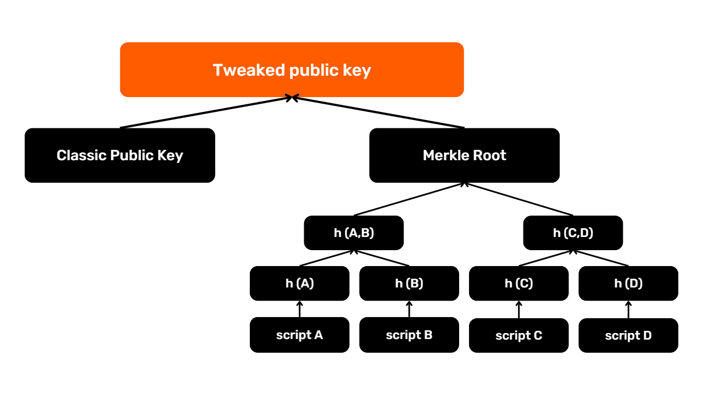

The addresses displayed on your wallet software also include a HRP (*Human-Readable Part*), typically `bc` for post-SegWit addresses, a separator `1`, and a version number `q` for SegWit V0 and `p` for Taproot/SegWit V1. A checksum is also added to ensure the integrity and validity of the address during its transmission.

Finally, addresses are put into a standard format:
- Base58check for old Legacy addresses;
- Bech32 for SegWit addresses;
- Bech32m for Taproot addresses.

Here is the addition matrix for the bech32 and bech32m formats (SegWit and Taproot) from base 10:

| +   | 0   | 1   | 2   | 3   | 4   | 5   | 6   | 7   |
| --- | --- | --- | --- | --- | --- | --- | --- | --- |
| 0   | q   | p   | z   | r   | y   | 9   | x   | 8   |
| 8   | g   | f   | 2   | t   | v   | d   | w   | 0   |
| 16  | s   | 3   | j   | n   | 5   | 4   | k   | h   |
| 24  | c   | e   | 6   | m   | u   | a   | 7   | l   |
### What is Address Reuse?

Address reuse refers to the practice of using the same receiving address to block multiple different UTXOs.

As we saw in the previous section, each UTXO has its own ScriptPubKey that locks it and must be satisfied for the UTXO to be consumed as input in a new transaction. It is within this ScriptPubKey that the receiving addresses (payload) are integrated.

When different ScriptPubKeys contain the same receiving address, this is known as address reuse. In practice, this means that a user has provided the same address multiple times to senders to receive bitcoins through multiple payments. And indeed, this practice is catastrophic for your privacy.

### Why is Address Reuse a Problem?

Given that the blockchain is public, it is easy to see which addresses lock which UTXOs and how many bitcoins. If the same address is used for multiple transactions, it becomes possible to deduce that all the bitcoins associated with that address belong to the same person. This practice compromises the user's privacy by allowing deterministic links to be established between different transactions and tracing the bitcoins on the blockchain. Satoshi Nakamoto himself highlighted this issue in the Bitcoin White Paper:

> *As an additional firewall, a new pair of keys could be used for each transaction to keep them from being linked to a common owner.*


Source: S. Nakamoto, "Bitcoin: A Peer-to-Peer Electronic Cash System", https://bitcoin.org/bitcoin.pdf, 2009.

The goal sought by Satoshi in this statement was to create an additional firewall in case of association between the user's identity and a pair of keys on Bitcoin, to avoid having all of their activity publicly linked to their identity. Today, with the proliferation of chain analysis companies and KYC regulations, the use of unique addresses is no longer an "additional firewall," but a necessary practice for anyone wishing to preserve their privacy to a minimum.

When you reuse an address, you make an almost undeniable link between all the transactions associated with that address. Although this does not directly endanger your funds, as the cryptography on elliptic curves ensures the security of your private keys, it facilitates the monitoring of your activities. Indeed, anyone with a node can observe the transactions and balances of addresses, thus completely compromising your anonymity.


To illustrate this point, let's take the example of Bob, a user who regularly buys bitcoins in small amounts through DCA (Dollar Cost Averaging) and always sends them to the same address. After two years, this address contains a substantial amount of bitcoins. If Bob uses this address to make a payment to a local merchant, the latter could see all the associated funds and deduce Bob's wealth. This could lead to personal security risks, including attempts at theft or extortion. If Bob had used a fresh address to receive each periodic purchase, he would have revealed infinitely less information to his merchant.

In chain analysis, we differentiate between 2 types of address reuse:
- External reuse;
- Internal reuse within a transaction.

The first is observed when an address is reused in several different Bitcoin transactions. This is what we discussed earlier: this heuristic allows us to deduce that all the UTXOs that passed through this address belong to a single entity.

Internal address reuse is observed not when reuse occurs across multiple transactions, but when it occurs within the same transaction. Indeed, if the same address that was used to lock an input is used as an output in a transaction, then we can deduce that this output still belongs to the same user (change), and that the second output represents the actual payment. This other heuristic allows for the tracking of funds across multiple transactions.


Address reuse is a real scourge on Bitcoin. According to the website OXT.me (currently inaccessible), the overall rate of address reuse on Bitcoin was about 52% in 2022:


This rate is huge, but it comes overwhelmingly from exchange platforms rather than individual users.

### How to avoid address reuse?

Avoiding address reuse is quite simple: **just use a new, fresh address for every new incoming payment to your wallet**.

Thanks to BIP32, modern wallets are now deterministic and hierarchical. This means that a user can generate a large number of addresses from a single initial piece of information: the seed. By saving this single piece of information, it is possible to restore all the private keys of the wallet, thus accessing the funds secured by the corresponding addresses.


This is why, when you press the "*receive*" button in your wallet software, an unused receiving address is offered to you each time. After receiving bitcoins on this address, the software automatically suggests a new one.
> *PS: Recently, some wallet software has announced their intention to stop generating blank addresses, fearing that this could be perceived as a form of money laundering by the authorities. If your software is among these, I strongly advise you to replace it immediately, as this is not acceptable for the user.*

If you need a static identifier to receive payments, such as for receiving donations, for example, it is advised against using a classic Bitcoin address due to the risk of reuse. Prefer using a Lightning address, or for a static onchain payment identifier, you can opt for BIP47 or Silent Payments. The operation of these protocols is detailed in part 6 of this training.

## Labeling and Coin Control
<chapterId>fbdb07cd-c025-48f2-97b0-bd1bc21c68a8</chapterId>

As we have discovered in the part about chain analysis, there are a multitude of heuristics and patterns that can be used to infer information about a transaction. As a user, it is important to be aware of these techniques to better protect yourself.

This involves notably a rigorous management of your self-custody wallet, which includes knowing the origin of your UTXOs, as well as a thoughtful selection of UTXOs to consume during payments. This effective wallet management relies on two important features of good Bitcoin wallets: labeling and coin control.

In this chapter, we will study these features and see how you could use them intelligently, without adding too much workload, to greatly optimize your privacy on Bitcoin.

### What is Labeling?

Labeling is a practice that involves assigning an annotation or a label to a specific UTXO in a Bitcoin wallet. These annotations are stored locally by the wallet software and are never transmitted over the Bitcoin network. Labeling is thus a tool for personal management.

For example, if I own a UTXO from a P2P purchase on Bisq with Charles, I could assign it the label "`Non-KYC Bisq Charles`".
Labeling is a good practice that helps to remember the origin or intended destination of a UTXO, thereby facilitating fund management and optimizing privacy. Indeed, your Bitcoin wallet likely secures several UTXOs. If the sources of these UTXOs are different, you might not want to merge these UTXOs in the future, otherwise, you could reveal their common ownership. By properly labeling all your coins, you ensure that you remember their origin when you need to use them, even if that is only in several years.

### What is coin control?

The active use of labeling becomes even more interesting when coupled with a coin control option on your wallet software.

Coin control is a feature present in good Bitcoin wallet software, which gives you the ability to manually select specific UTXOs to use as inputs to perform a transaction. Indeed, to satisfy a payment in output, it is necessary to consume a UTXO in input in return. For several reasons that we will see later, you may want to precisely choose which coins to consume in inputs to satisfy a given payment. This is exactly what coin control allows you to do. To give you an analogy, this feature is similar to the action of choosing a specific coin in your wallet when you pay for your baguette.


The use of wallet software with coin control, coupled with the labeling of UTXOs, allows users to both distinguish and precisely select the UTXOs for their transactions.

### How to properly label your UTXOs?

There is no universal method for labeling UTXOs that suits everyone. It's up to you to define a labeling system so that you can easily find your way around your wallet. In any case, keep in mind that good labeling is labeling that you will be able to understand when you need it. If your Bitcoin wallet is primarily intended for savings, it may be that the labels will only be useful to you in several decades. Therefore, make sure they are clear, precise, and comprehensive.

It is important that your loved ones can easily identify the origin of the funds if, one day, they need to access your wallet. This could help them for reasons of privacy as well as for legal necessities, in the event that they would have to justify the provenance of the funds before an authority.
The most important aspect of labeling is to note the source of the UTXO. You should simply indicate how this coin arrived in your wallet. Is it from a purchase on an exchange platform? A payment from a client? A peer-to-peer exchange? Or is it the change from a purchase? Thus, you could specify:
- `Withdrawal Exchange.com`;
- `Payment Client David`;
- `P2P Purchase Charles`;
- `Change from sofa purchase`

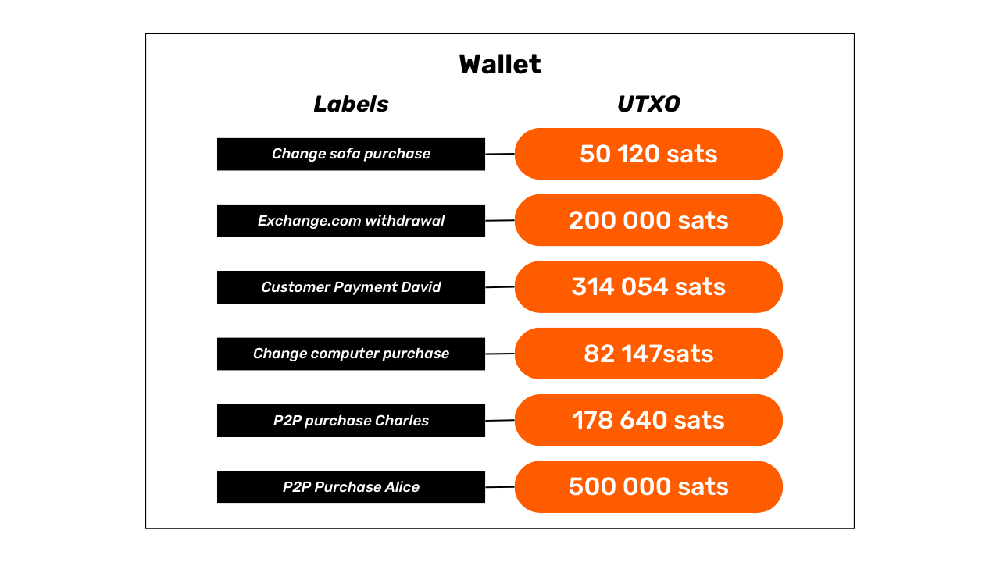

To refine your management of UTXOs and adhere to your fund segregation strategies within your wallet, you could enrich your labels with an additional indicator that reflects these separations. If your wallet contains two categories of UTXOs that you do not wish to mix, you could integrate a marker in your labels to clearly distinguish these groups. These separation markers will depend on your own criteria, such as the distinction between UTXOs from an acquisition process that involves KYC, or between professional and personal funds. Taking the previously mentioned label examples, this could translate to:
- `KYC - Withdrawal Exchange.com`;
- `KYC - Payment Client David`;
- `NO KYC - P2P Purchase Charles`;
- `NO KYC - Change from sofa purchase`

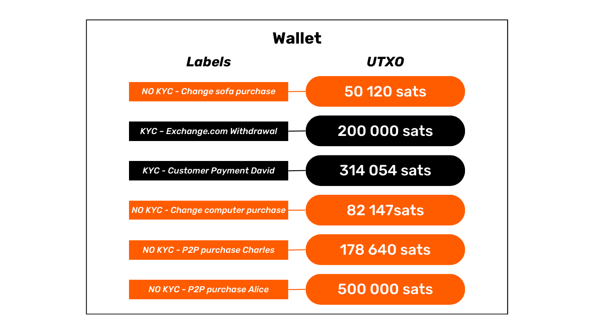

It is also advisable to perpetuate the labeling of a coin throughout transactions. For example, when consolidating no-KYC UTXOs, make sure to mark the resulting UTXO not just as `consolidation`, but specifically as `no-KYC consolidation` to maintain a clear trace of the coin's origin.

Finally, it is not mandatory to put a date on a label. Most wallet software already displays the transaction date, and it is always possible to retrieve this information on a block explorer using its TXID.

### How to Choose Your Coins Properly?

When you make a transaction, coin control allows you to specifically choose which UTXOs to consume as inputs to satisfy the payment's output. Two aspects should be considered in this choice:
- The possibility for the payment recipient to link a part of your identity to the UTXOs used as inputs;
- The ability of an external observer to establish links between all the UTXOs consumed as inputs.
To illustrate the first point, let's take a concrete example. Suppose you buy a baguette with bitcoins from your local baker. You use one or more UTXOs that you own as inputs to at least cover the price of the baguette in outputs, as well as the transaction fees. Your baker could then potentially associate your face, or any other part of your identity they know, with the coins used as inputs. Knowing the existence of this link, you might prefer to choose a specific UTXO over another when making the payment.


For example, if one of your UTXOs comes from an exchange platform and you prefer that the baker is unaware of your account on this platform, you would avoid using this UTXO for the payment. If you own a high-value UTXO that reveals a significant amount of bitcoins, you might also choose not to use it to prevent the baker from knowing about your BTC fortune.

The choice of UTXOs to use for this first point is therefore based on a personal decision, influenced by what you are willing to reveal or not. The labels you have assigned to your UTXOs upon receiving them will help you select those that, once spent, only expose information you are comfortable revealing to the recipient.

Beyond the information potentially revealed to the recipient, the choice of inputs also influences what you disclose to all observers of the blockchain. Indeed, by using multiple UTXOs as inputs for your transaction, you reveal that they are owned by the same entity, according to the Common Input Ownership Heuristic (CIOH).


When selecting your coins, you must therefore be aware that the transaction you are about to broadcast will create a link between all the UTXOs used. This link can be problematic for your personal privacy, especially if the UTXOs come from different sources.


Let's go back to the example of my no-KYC UTXO from Bisq; I want to avoid combining it with a UTXO from, say, a regulated exchange platform that knows my identity. Indeed, if I ever use these 2 UTXOs as inputs in the same transaction, the regulated platform will be able to link my identity with the UTXO I bought on Bisq, whereas it was not linked to my identity before.

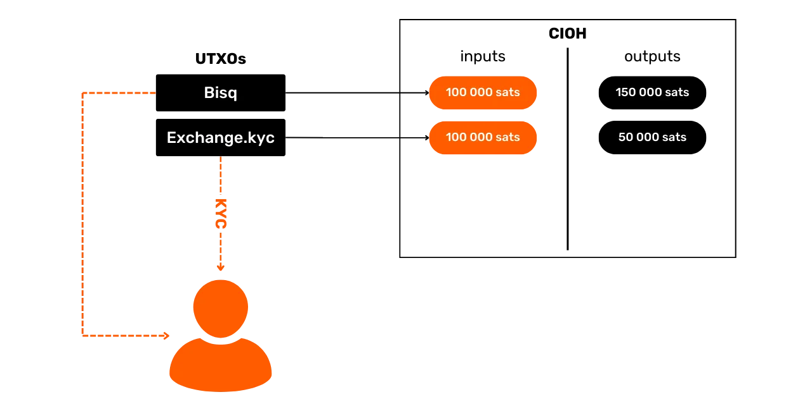
Finally, to properly choose which UTXOs to consume as inputs for a transaction, the most important thing is to avoid using multiple UTXOs. Whenever possible, select a single coin that is large enough to cover your payment. By doing this, you completely avoid the risks associated with COINJOIN. However, if no individual UTXO is sufficient for the payment and you must consume several, ensure they come from similar sources to minimize the risks of unwanted links. Also, keep in mind that the recipient might associate the information they have about you with the history of the coins used as inputs.

### Understanding Automatic Coin Selection

In the previous sections, we discussed the manual selection of UTXOs for a transaction. But what happens when the wallet software makes this selection automatically? Several methods exist for determining which coins to consume, and the selection of UTXOs is a real field of research in Bitcoin. The main goal of this automatic process is often to minimize transaction fees for the user.

UTXO selection methods such as FIFO (*First In First Out*) and LIFO (*Last In First Out*) are among the simplest but also the least efficient. With FIFO, the oldest coins in the wallet are used first. This approach is generally inefficient both for minimizing transaction fees and for preserving privacy, except in cases where relative timelocks are used and must be renewed regularly. Conversely, LIFO prioritizes the use of the most recent UTXOs. Although simple, these two methods often prove to be inefficient.

A more advanced method is the *Knapsack Solver*. This was the method used in the Bitcoin Core wallet until version 0.17. It involves iteratively and randomly selecting UTXOs from the wallet, adding them up in subsets, and keeping the solution that reduces the transaction weight as much as possible, in order to reduce fees for the user.
The *Branch-and-Bound* (BNB), often nicknamed "Murch's algorithm" in reference to its inventor, has replaced the *Knapsack Solver* in Bitcoin Core starting from version 0.17. This more advanced method aims to find a set of UTXOs that exactly matches the amount needed to satisfy the outputs of a transaction. The goal of BNB is to minimize the amount of change as well as the fees, by reducing what is called the waste criterion which takes into account both the immediate costs and the future costs expected for the change. This method is derived from the original concept of *Branch-and-Bound*, designed in 1960 by Ailsa Land and Alison Harcourt, and offers a more precise optimization of fees compared to the *Knapsack Solver*.
All these methods of automatic UTXO selection can be effective in reducing transaction fees, but they are often inefficient in preserving user privacy. Indeed, these algorithms can merge several UTXOs into inputs, thus revealing a common ownership of these UTXOs because of the COH. Obviously, these methods cannot take into account the labels attached to the UTXOs, which are crucial for consciously choosing the coins to reveal to the transaction recipient. Currently, the only solution to optimize privacy when selecting coins is to do it manually.

### Tutorial on UTXO Labeling

If you want to learn how to label your UTXOs, we have created a complete tutorial on the main existing Bitcoin wallet software:

https://planb.network/tutorials/privacy/utxo-labelling


## KYC and Key Identification
<chapterId>cec6b9d9-0eed-4f85-bc4e-1e9aa59ca605</chapterId>

KYC stands for "Know Your Customer", which is a regulatory procedure implemented by some companies operating in the Bitcoin sector. This procedure aims to verify and record the identity of their clients with the stated goal of combating money laundering and terrorism financing.

Concretely, KYC involves the collection of various personal data from the client, which can vary according to jurisdictions, but generally includes an identity document, a photograph, and a proof of residence. These pieces of information are then verified and kept for future use.

This procedure has become mandatory for all regulated exchange platforms in the majority of Western countries. This means that anyone wishing to exchange fiat currencies for bitcoin via these platforms must comply with KYC requirements.
This procedure is not without risks for the confidentiality and security of users. In this chapter, we will examine these risks in detail and analyze the specific impacts of KYC and identification processes on the privacy of Bitcoin users.
### Facilitating Onchain Tracking

The first risk associated with KYC is that it provides a privileged entry point for chain analysis. As we saw in the previous part, analysts can group and track activities on the blockchain using transaction patterns and heuristics. Once they have managed to cluster an user's onchain activity, finding just one entry point among all their transactions and keys is enough to fully compromise their privacy.


When you undergo KYC, you provide a very high-quality entry point for chain analysis, as you link your receiving addresses used when withdrawing your bitcoins from an exchange platform to your complete and verified identity. In theory, this information is only known by the company to which you have provided it, but, as we will see later, the risk of data leakage is real. Moreover, the mere fact that a company holds this information can be problematic, even if it does not share it.

Thus, if you do not take other measures to limit the grouping of your activities on the blockchain, anyone aware of this entry point that is KYC can potentially link all your activity on Bitcoin to your identity. From the perspective of this company, your use of Bitcoin therefore loses all confidentiality.


To illustrate this with a comparison, it's as if your banker from *Bank X* had access not only to all your transactions made with *Bank X*, but could also observe your transactions with *Bank Y* and all your cash transactions.

Remember from the first part of this training: the privacy model of Bitcoin, as designed by Satoshi Nakamoto, relies on the separation between the user's identity and their key pairs. Although this layer of privacy is no longer sufficient today, it is still wise to limit its degradation as much as possible.

### Exposure to State Surveillance

The second major issue with KYC is that it reveals to the state that you have owned bitcoin at some point. When you buy bitcoins through a regulated actor, it becomes possible for the state to know about this possession. Currently, this may seem trivial, but it is important to remember that the political and economic future of your country is not in your hands.
First and foremost, the state can quickly adopt an authoritarian stance. History is full of examples where policies have changed abruptly. Today, in Europe, Bitcoin enthusiasts can write articles about Bitcoin, participate in conferences, and manage their wallets in self-custody. But who can say what tomorrow holds? If Bitcoin suddenly became public enemy number one, being associated with it in state records could prove problematic.

Next, in the face of severe economic crises, the state could consider seizing bitcoins held by citizens. Perhaps tomorrow, Bitcoiners will be seen as crisis profiteers and will be excessively taxed due to their capital gains in the face of fiat currency devaluation.

You might think this isn't a problem because your bitcoins are mixed, and therefore untraceable. However, tracing is not the issue here. The real problem is that the state knows you've owned bitcoin. This simple piece of information could be enough to incriminate you or demand an account. You could try to claim you've spent your bitcoins, but this should be reflected in your tax return, and you would get caught. You could also say you lost your keys in a boating accident, but beyond the joke on Twitter, do you really think that would be enough to exonerate you?

Therefore, it's important to consider the risk associated with the mere fact that the state could know you've owned BTC, even if this risk may seem distant today.

Another problem posed by KYC in terms of state surveillance is the mandatory reporting by regulated platforms. Although I am not familiar with regulations in other jurisdictions, in France, *Digital Asset Service Providers* (PSAN) are required to report to financial oversight authorities any fund movements they consider suspicious.

Thus, in France in 2023, 1,449 suspicious acts were reported by the PSANs. For now, the majority of these acts are related to criminality. However, authorities also ask regulated platforms to report any suspicious Bitcoin transaction solely based on its structure. If you perform a collaborative transaction, or even just a transaction presenting a somewhat atypical pattern, and this transaction occurs close to the withdrawal of your bitcoins from these platforms, you could find yourself reported to the authorities. Even in the absence of wrongdoing and in the legitimate exercise of your rights, this reporting could lead to increased checks and surveillance, inconveniences that you would have avoided without KYC.

### The risk of personal data leakage
Another issue with KYC lies in the fact that it requires the storage of all your personal data on the servers of a private company. Recent events have reminded us that no one is immune to failures, whether they are financial or IT-related. In 2022, Celsius customers suffered the consequences. Following the company's bankruptcy, the names of the creditors and the amount of their assets were made public by the American justice system during the administrative procedure.

A little over two years ago, a leading cybersecurity entity in the cryptocurrency domain experienced the theft of its clients' personal data. Although this incident was not directly related to the purchase of bitcoins, such a risk also remains for exchange platforms. Therefore, there is a definite risk associated with these personal data.

It is true that we already entrust a lot of our personal data to private companies. However, the risk here is twofold since these data not only allow you to be identified but are also linked to an activity on Bitcoin. Indeed, when a hacker manages to access the data of clients of an exchange platform, they can reasonably assume that these clients possess bitcoins. This risk is thus heightened by the fact that bitcoin, like any other valuable asset, attracts the interest of thieves.

In the event of a data breach, in the best-case scenario, you could be the target of targeted phishing attempts. In the worst case, you could find yourself at the center of physical threats to your home.

Besides the specific risks related to Bitcoin, it is also necessary to consider the dangers associated with the transmission of identity documents. Indeed, in the case of a data leak, it is possible to become a victim of identity theft. Thus, the stakes are not limited solely to the protection of the confidentiality of transactions but also concern the personal safety of each individual.

### Common Misconceptions about KYC

It is important to debunk some common misconceptions about KYC that are frequently found on Twitter or in our discussions among bitcoiners.
First and foremost, it is incorrect to think that protecting one's privacy for bitcoins acquired via KYC (Know Your Customer) is futile. The tools and methods for privacy on Bitcoin are varied and serve different purposes. The use of coinjoin transactions on bitcoins from KYC, for example, is not a bad idea. Of course, it is necessary to be cautious with regulated exchange platforms to avoid freezing or banning of one's account, but from a strictly technical standpoint, these practices are not incompatible. Coinjoin has the effect of breaking the history of a coin, which helps you counter some of the chain analysis risks associated with KYC. Although it does not eliminate all risks, it already represents a significant benefit.


Privacy on Bitcoin should not be viewed in a binary manner, as a distinction between "anonymous" bitcoins and others that are not. Owning bitcoins acquired via KYC does not mean all is lost; on the contrary, the use of privacy tools can prove to be even more beneficial.

Conversely, acquiring bitcoin through a non-KYC method does not guarantee perfect privacy and does not exempt one from the need to take other protective measures. If you hold non-KYC bitcoin but reuse receiving addresses multiple times, your transactions can be traced and grouped. The slightest link with the world outside of Bitcoin could compromise the only layer of privacy you had. Therefore, it is important to consider all tools and methods that improve privacy on Bitcoin as complementary. Each technique addresses a specific risk and can add an additional layer of protection. Thus, owning non-KYC bitcoin absolutely does not exempt one from taking other precautions.

### Can KYC be undone?

I am sometimes asked if it is possible to "go back" after having completed KYC, and as you can imagine from the previous paragraphs, the answer is nuanced. To avoid the risks associated with KYC, the simplest method is not to use it when acquiring bitcoins. We will delve deeper into this topic in the next chapter. However, if KYC has already been carried out and bitcoins have been purchased, are there ways to mitigate the risks incurred?

Regarding the risk of traceability of your transactions, the use of coinjoin is a solution. We will discuss this method in detail later in the training, but be aware that coinjoin can break the history of a coin and prevent its past-present and present-past tracing. Even for BTC obtained via a regulated platform, this technique can prevent their traceability.
However, coinjoin does not eliminate the second risk associated with KYC: the fact that the state is informed of your bitcoin holdings. Indeed, even if your coins are no longer traceable, the state, depending on the jurisdiction, may have access to your declarations of crypto-asset disposals. Since this risk is not technical but administrative, there are no Bitcoin-specific solutions to eliminate it, other than not exposing yourself to KYC initially. The only legal approach to mitigate this risk is to sell your bitcoins acquired through regulated platforms on regulated platforms, and then repurchase them through means without KYC. By selling and declaring the disposal, the administration should note that you no longer possess them.

As for the risk of your personal data and identity documents leaking, this is a danger external to Bitcoin, and there is no technical solution to avoid it. Once your data is revealed, it is difficult to reverse this operation. You can try to close your account on the platform, but this does not guarantee the deletion of your KYC data, especially when identity verification is outsourced. Verifying the complete deletion of your information is impossible. Therefore, there is no solution to completely prevent this risk and ensure it no longer exists.

### The difference between KYC and key identification

Sometimes, some bitcoiners tend to extend the term "KYC" to any BTC exchange involving a transfer or a credit card payment, as these means can also reveal the origin of the payment, just as KYC would. However, it is important not to confuse KYC with key identification. Personally, I must admit that my perception of this subject has evolved over time.

KYC specifically refers to a regulatory procedure implemented by some companies to verify and record the identity of their clients. It's a binary thing: when acquiring your bitcoins, either you undergo KYC, or you do not. However, key identification, which concerns linking an aspect of a user's identity to onchain activity, is not as binary but rather represents a continuum. Indeed, in the context of acquiring or disposing of bitcoins, this identification is always possible to different degrees.
For example, if you buy bitcoins on a regulated platform in Switzerland, KYC (Know Your Customer) is not necessary. However, there might be an identification of your keys since the purchase was made through your bank account. This is where the first two risks associated with KYC — facilitating onchain tracking and exposure to state surveillance — can also manifest in a non-KYC exchange. If the Swiss entity reports suspicious transactions to the authorities in your country, they can simply check the bank account used for the purchase to discover your identity. Thus, buying without KYC on regulated platforms is rather high on the risk scale for key identification.


However, avoiding regulated platforms and opting for P2P (Peer-to-Peer) acquisition methods does not completely eliminate the risk of key identification but merely reduces it. Consider the example of a purchase on Bisq or another P2P platform. To settle with your counterpart, you will probably use your bank account. If the authorities question the person you traded with and ask for your name, we encounter risks 1 and 2 mentioned earlier. These risks are certainly much lower than during a non-KYC purchase on a platform, and even more reduced than during a purchase with KYC, but they are still present to a lesser extent.


Finally, even if you acquire your bitcoins through a physical exchange for cash, you are not completely anonymous. The person you traded with has seen your face, which is part of your identity. Although minimal in this example, there is still a possibility of key identification.


In conclusion, during an exchange of bitcoins for other assets, whether it's a purchase in fiat currency or a sale for a real good, there is always some form of key identification. Depending on the chosen method of exchange, this identification can vary in intensity. It is important not to confuse this identification with KYC, which is a well-defined regulatory process. However, there is a link between KYC and the spectrum of identification, since KYC is at the upper end of this spectrum, as it systematically facilitates the identification of the user's keys by the authorities.

## Methods of Sale and Acquisition
<chapterId>756598af-95aa-4c77-ac48-243c7ad89530</chapterId>
After reading the previous chapter, you might be wondering about ways to buy or sell bitcoin without having to undergo an identity verification process, in order to avoid the risks associated with KYC. There are several methods to carry out exchanges.

### Cash P2P Exchanges

As we have seen, the best method in terms of privacy remains the P2P (peer-to-peer) exchange with a cash settlement. This method allows you to minimize the traces left and significantly reduces the possibility of key identification, whether you are a buyer or seller.


However, this practice carries risks to personal safety. The main danger lies in the fact that during the exchange, the counterparty will know that you hold a significant amount, either in cash or in bitcoins. This information can attract the attention of malicious individuals. Indeed, it is generally recommended to remain discreet about your bitcoin possession. This advice could also be applied to cash. However, during an in-person exchange, it is inevitable to reveal that you possess bitcoins, which can arouse covetousness.


To limit this risk, I advise you to prioritize cash transactions with trusted individuals, such as family members or close friends. Alternatively, you could also consider making exchanges at [local Bitcoin meetups](https://btcmap.org/communities/map), after having attended several times. This will allow you to get to know the other participants better and not to be alone during the physical exchange. However, it is important to recognize that cash P2P exchange inherently carries risks to your personal safety that do not exist when making purchases via a regulated platform and your bank account.

Moreover, depending on where you live, carrying and storing large sums of money can pose risks, whether it's for bitcoin or cash.

Cash exchange can also pose legal risks during police checks or others. Although in most countries, there is no restriction on the amount of cash you can carry on you, too large sums can raise suspicions. So, be cautious, especially if you have to travel long distances, and avoid making too large transactions at once to not have to justify the possession of significant amounts.
Finally, another disadvantage of P2P purchases is that the price is often higher than that observed on regulated platforms. Sellers often impose a markup ranging from 1% to sometimes more than 10%. Several reasons explain this price difference. First, it is a common practice among P2P sellers that has been established over time. Next, sellers have transaction fees associated with sending funds to the buyer. There is also an increased risk of theft in P2P sales compared to transactions on platforms, which justifies compensation for the risk taken. Lastly, the surcharge can be related to the demand and the quality of the exchange in terms of privacy. As a buyer, the gain in privacy has a price that is reflected in the markup applied by the seller. Some bitcoiners also believe that the increased price of BTC bought in P2P reflects its true value, and argue that the lower prices on regulated platforms are the result of a compromise on the privacy of your personal data.


### P2P Exchanges via a Matching Platform

A less risky alternative in terms of personal security is to conduct P2P exchanges exclusively online, via electronic payment methods such as PayPal, bank transfers, or Revolut.


This approach helps to avoid many risks associated with cash transactions. However, the risk that the counterparty does not honor their commitments during an online exchange is greater. Indeed, during a physical exchange, if you hand over money to the seller who does not send you the bitcoins in return, you can immediately hold them accountable since they are in front of you. Online, on the other hand, it is often impossible to find a person who has stolen from you.


To mitigate this risk, it is possible to use platforms specialized in matching for P2P exchanges. These platforms use conflict resolution mechanisms to protect aggrieved users. Generally, they offer an escrow system, where bitcoins are held until the fiat currency payment is confirmed by the seller.


In terms of personal security, this purchasing method is significantly safer than physical cash exchanges. However, as mentioned earlier, online P2P exchanges leave more traces than a physical exchange, which can be detrimental to privacy on Bitcoin. By using an online fiat payment method like a bank, you expose more information that could facilitate the identification of keys.


Once again, I recommend not to make large exchanges in a single transaction on these platforms. By splitting your transactions, you spread the risks associated with potential theft by the counterparty.

Once again, another downside of P2P purchases is that the price is often higher than that seen on regulated platforms. Sellers often impose a markup ranging from 1% to sometimes more than 10%. Several reasons explain this price difference. First, it is a common practice among P2P sellers that has been established over time. Next, sellers have transaction fees associated with sending funds to the buyer. There is also an increased risk of theft in P2P sales compared to transactions on platforms, which justifies compensation for the risk taken. Finally, the surcharge can be related to the demand and the quality of the exchange in terms of privacy. As a buyer, the gain in privacy has a price that is reflected in the markup applied by the seller. Some bitcoiners also believe that the increased price of BTC bought P2P reflects its true value, and argue that the lower prices on regulated platforms are the result of a compromise on the privacy of your personal data.


Regarding solutions, I have personally always used [Bisq](https://bisq.network/) and am very satisfied with it. Their system is well-established and seems reliable. However, Bisq is only available on PC and its interface may be too complex for beginners. Another drawback is that Bisq operates solely with onchain transactions, which can become costly during periods of high transaction fees on Bitcoin.

[-> Discover our tutorial on Bisq.](https://planb.network/en/tutorials/exchange/bisq)

For a simpler option, you can try [Peach](https://peachbitcoin.com/), a mobile app that facilitates the connection between buyers and sellers with an integrated dispute resolution system. The process is more intuitive than that of Bisq.

[-> Discover our tutorial on Peach.](https://planb.network/en/tutorials/exchange/peach-wallet)
Another online option is [HodlHodl](https://hodlhodl.com/), a well-established platform that offers good liquidity, although I have not personally tested it.
[-> Discover our tutorial on HodlHodl.](https://planb.network/en/tutorials/exchange/hodlhodl)

For solutions based on the Lightning Network, you can try [RoboSats](https://learn.robosats.com/) and [LNP2PBot](https://lnp2pbot.com/). RoboSats is accessible via a website and is relatively simple to use. LNP2PBot is more atypical, as it operates through an exchange system on the Telegram messaging app.

[-> Discover our tutorial on RoboSats.](https://planb.network/en/tutorials/exchange/robosats)
[-> Discover our tutorial on LNP2PBot.](https://planb.network/en/tutorials/exchange/lnp2pbot)


### Regulated Platforms without KYC

Depending on the country you live in, you might have access to regulated platforms that do not require a KYC procedure to buy or sell bitcoins. In Switzerland, for example, you can use platforms like [Relai](https://relai.app/) and [MtPelerin](https://www.mtpelerin.com/).

[-> Discover our tutorial on Relai.](https://planb.network/en/tutorials/exchange/relai)

As we saw in the previous chapter, this type of platform spares you the risks associated with KYC procedures, but they present a higher level of risk for key identification. In terms of privacy on Bitcoin, these platforms therefore offer better protection than purchasing methods with KYC, but they are less interesting than P2P exchanges.

However, in terms of personal security, using these platforms is significantly less risky than P2P exchanges. They are also often simpler to use than platforms that facilitate P2P exchanges.

### ATMs

Another option for buying or selling bitcoins without KYC are cryptocurrency ATMs (ATM). Personally, I have never had the opportunity to test this solution, as there are none in my country. But this method can be very interesting depending on where you live.


The issue with ATMs is that they are prohibited in some countries or heavily regulated in others. If an ATM requires an identity verification process, it then faces the same risks as those inherent to regulated KYC platforms. However, if the ATM allows transactions without identity verification for small amounts, then its use can offer a level of privacy comparable to that of a cash-based P2P exchange, while avoiding most of the risks associated with this type of exchange.
The main drawback of ATMs lies in their often high exchange fees, which range from a few percent to sometimes 15% of the exchanged amount.

### Gift Cards

Finally, I also wanted to present a solution that works well for those who wish to use their bitcoins on a daily basis for purchases rather than selling them for fiat currencies.

The best way to spend BTC is obviously to use Bitcoin directly or the Lightning Network to purchase goods or services. However, in many countries, the number of merchants accepting bitcoin remains limited. A practical alternative is then the use of gift cards.

Several platforms that do not require a KYC procedure offer the possibility of exchanging bitcoins for gift cards that can be used in major stores. Among these platforms, we find [CoinsBee](https://www.coinsbee.com/), [The Bitcoin Company](https://thebitcoincompany.com/), and [Bitrefill](https://www.bitrefill.com/). These platforms greatly facilitate the daily use of your bitcoins by allowing you to access a wide range of products and services without having to go through a conversion into fiat currency.

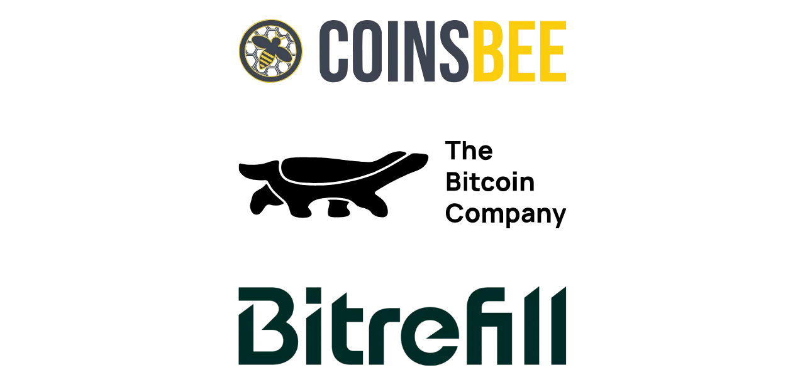

### Other Acquisition Methods

Among other methods to acquire bitcoins while protecting your privacy, there is obviously mining. To start mining sats, it is not necessary to reveal your identity; you simply need to find a valid proof of work and submit it to the network. If you opt for pool mining, some pools require a form of identification, such as KYC, while others do not.

Another method consists of working in exchange for bitcoins. This acquisition method can be interesting, but the degree of identification required varies greatly depending on the circumstances.

*To write this chapter, I used the course [BTC205](https://planb.network/fr/courses/btc205) created by [@pivi___](https://x.com/pivi___) on PlanB Network (available only in French for the moment).*

## Consolidation, UTXO Management, and CIOH
<chapterId>d0486c8f-332d-402b-ae2e-949416752b9c</chapterId>
One of the most complicated aspects to manage when you have your own self-custody wallet is undoubtedly consolidation. Should you consolidate? What's the purpose? What size of UTXO should you aim for? What are the trade-offs in terms of privacy? This is what we will try to explore in this section.
### What is consolidation?

The operation of Bitcoin is similar to an auction market where transactions offering the best fees are favored by miners. However, each block has a maximum weight, limiting the number of transactions that can be included. Since a block is produced on average every 10 minutes, the available space in each block is a rare resource.

Miners, whose activity incurs significant costs in electricity, capital, and maintenance, naturally seek to maximize their profitability. They tend to favor transactions that offer them the most fees relative to their weight.

Indeed, not all Bitcoin transactions weigh the same. Those with more inputs and outputs will weigh more. For example, consider 2 transactions:
- Transaction A includes 1 input and 1 output. It allocates 1,994 sats of fees and its weight is 141 vB;
- Transaction B, more complex, with 2 inputs and 2 outputs, allocates 2,640 sats of fees for a weight of 220 vB.


In this example, although transaction B proposes a total of higher fees, miners will favor transaction A because it offers a better ratio between fees and weight. Here is the calculation for each transaction, expressed in sats per virtual byte (sat/vB):

```text
TXA: 1994 / 141 = 14 sats/vB

TXB: 2640 / 220 = 12 sats / vB
```

This means that for each unit of weight, transaction A offers more fees than transaction B, even though the latter offers more fees in absolute value.


Therefore, it is always more interesting for the user to consume the least amount of inputs possible in their transactions. However, it is necessary to consume sufficient amounts to be able to satisfy the payment in output. In managing their wallet, one must therefore have sufficiently large UTXOs.

The principle of consolidation is precisely to take advantage of periods when fees are low on Bitcoin to merge one's small UTXOs into a single larger one. Thus, when fees increase on Bitcoin, one can make transactions with a minimum of inputs, and therefore spend less in absolute fees. The goal is to plan for the mandatory transactions to be carried out during periods of high fees.

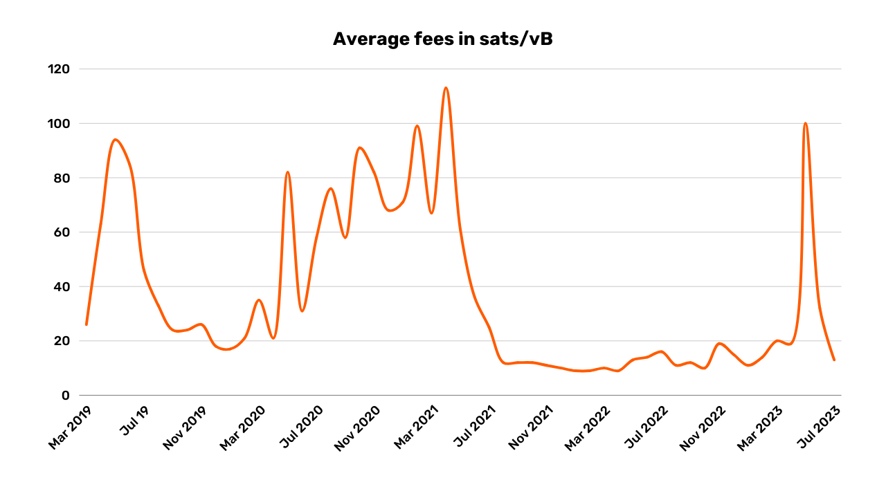
In addition to savings on transaction fees, consolidating UTXOs helps to avoid the creation of "dust." Dust refers to UTXOs whose value in sats is so low that it is not enough to cover the necessary transaction fees to spend them. This makes these UTXOs economically irrational to use as long as transaction fees remain high. By proactively grouping your UTXOs, you prevent them from turning into dust, ensuring that all your funds remain usable.

### What is the minimum size for your UTXOs?

Sometimes, I am asked what the recommended minimum value for a UTXO is. Unfortunately, there is no universal answer, as it depends on your preferences and market conditions for fees. However, here is a formula that can help you determine a threshold suited to your needs:

$$
\frac {P \times F}T = M
$$

Where:
- $P$ is the weight of the transaction;
- $F$ represents the maximum fee rate in satoshis per vbyte (sats/vB) you are covering against;
- $T$ is the percentage of the transaction fee you are willing to pay relative to the total value of the UTXO;
- $M$ is the minimum amount in satoshis for each UTXO.

Assuming you plan to cover fees for a standard SegWit transaction with 1 input and 2 outputs, weighing 141 vB. If you cover up to 800 sats/vB, and you are willing to spend up to 12% of the UTXO's value in fees at most, then the calculation would be:

$$
\frac{141 \times 800}{0.12} = 940\ 000
$$

In this example, it would be wise to maintain a minimum value of 940,000 sats for the UTXOs in your wallet.

### Consolidation and the COIH

One of the most used heuristics in chain analysis is the COIH (*Common Input Ownership Heuristic*), which allows the assumption that all inputs of a Bitcoin transaction belong to the same entity. Precisely, the principle of consolidation is to consume several UTXOs as inputs and create a single UTXO as output. Therefore, consolidation allows the application of the COIH.


In practice, this means that an external observer can deduce that all the consolidated UTXOs likely belong to the same person and that the single output generated also belongs to them. This situation can compromise your privacy by linking different transaction histories. For example, let's say I consolidate 3 UTXOs acquired in P2P with a UTXO obtained via a platform that requires KYC:
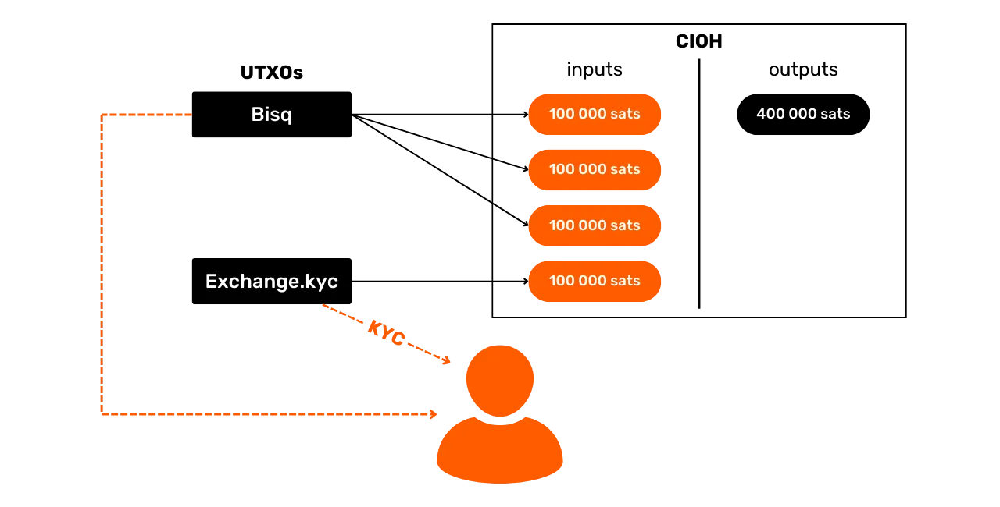

By doing so, any entity with access to the exchange platform's data, including potentially government agencies, can identify that I own other amounts in BTC. Previously, these UTXOs were not directly linked to my identity; now, they are. Moreover, this reveals to all sources that I am in possession of a certain amount of bitcoins.

In managing UTXOs, economic considerations, which push for consolidation to reduce fees, thus conflict with good privacy practices, which would recommend never merging your UTXOs. The choice between economy and privacy therefore depends on the priorities of each user.

If you can avoid consolidation while maintaining substantial UTXO sizes, that's ideal. To do this, optimize your acquisition methods. If you buy your bitcoins in DCA, try to space your one-time purchases as much as possible to group value into fewer UTXOs. It will be easier to manage a one-time purchase of €1,000 every 2 months, rather than a purchase of €120 every week. This minimizes the number of UTXOs generated and simplifies the management of your wallet while preserving your privacy.

If you find yourself needing to consolidate your bitcoins, first prioritize the consolidation of UTXOs from the same source. For example, merging 10 UTXOs from a single platform will affect your privacy less than mixing 5 UTXOs from platform A with 5 UTXOs from platform B. If consolidation from various sources is inevitable, try to separate them according to their characteristics. For example, group the UTXOs acquired through KYC in one transaction, and those obtained in P2P in another.

In any case, remember that any consolidation inevitably leads to a loss of privacy. Therefore, carefully evaluate the necessity of this operation and the potential impacts on your privacy, taking into account the risk.

## Other Good Practices
<chapterId>b5216965-7d13-4ea1-9b7c-e292966a487b</chapterId>

Let's explore together some other good practices that can help you optimize your privacy on Bitcoin.

### The Full Node
Owning your bitcoins in self-custody is good, but using your own full node is better! Here's why having your own node is crucial for a fully sovereign use of Bitcoin:
- **Censorship Resistance**: Your transactions cannot be blocked by anyone;
- **Independence from Third Parties**: You no longer depend on any external service to verify blockchain data;
- **Active Participation**: You have the ability to set your own validation rules and directly participate in the consensus;
- **Contribution to the Network**: By running a node, you help to strengthen and distribute the Bitcoin network;
- **Technical Education**: Managing a full node is an excellent way to deepen your technical knowledge about Bitcoin.

In addition to these benefits, using a full node also improves your privacy when broadcasting your transactions. When you issue a transaction, it is first created and signed via your wallet. To broadcast it on the Bitcoin network, it must be known by at least one node. By using your own node, you directly control this broadcast, thereby enhancing your privacy and limiting the risks of data leakage.


If you do not have your own Bitcoin node, you will be forced to use a third party's, such as the one offered by your wallet software provider. In addition to transaction broadcasting, your wallet requires access to various information such as pending transactions, balances associated with your addresses, or the number of confirmations for your transactions. To access all this data, you need to query a node.


The main risk when you do not use your own Bitcoin node is that the operator of the third-party node may observe your activities on the blockchain, or even share this information with other entities. To limit this risk, an intermediate solution is to use wallet software that allows you to mask your connections via Tor. This can reduce the exposure of your data. However, the optimal solution remains to have your own Bitcoin node and use it for the broadcasting of your transactions. Obviously, you will also need to ensure that no information leaks from your node, but that is another topic we will explore in the following sections.
Beyond the obvious advantage for your privacy, having your own full node also ensures the veracity of data on the blockchain, protects against censorship, and allows you to actively participate in the governance of Bitcoin. By using your own node, you contribute your economic weight to the chain of your choice, which is important during conflicts within the community, such as during the Blocksize War from 2015 to 2017, for example. In the event of a fork, using a third party's node could lead you to support a chain you do not wish to favor, as the node operator makes the choice for you.
As you can understand, in a concern for privacy and more broadly individual sovereignty, it is essential to run and use your own full node!

### Fooling Analysis Heuristics

More broadly, it's important to understand the heuristics we talked about in the previous part, in order to better avoid or fool them. Adopting a series of good practices can prove beneficial, even if they are not indispensable. They offer an additional layer of protection that can be important for maintaining good privacy when using Bitcoin.

The first piece of advice I could give is to blend into the densest crowd. On Bitcoin, this means using the most adopted script patterns. For example, P2WSH scripts, often used for SegWit V0 multisig configurations, are very rare. They do not allow you to hide in a large anonymity set. The same goes for old models like P2PKH or P2SH. Although they are widely present in the UTXO set, they are being used less and less for new transactions.

In general, it is safer to turn to the most recent script standard, provided it is sufficiently adopted. Thus, if in 2022, I would have advised against using P2TR (Taproot) due to its low adoption, by 2024, I would recommend opting for this type of script, or failing that, for SegWit V0 script, as the number of transactions using P2TR is starting to represent a very significant portion.


Source: [txstats.com](https://txstats.com/d/000000054/utxo-set-repartition-by-output-type)
Another tip for preserving your privacy is to try to circumvent the internal heuristics of transactions. For example, when making a payment, you might try to avoid creating an output with a round amount, as this could signal that the other output represents the change. If you need to send 100k sats to a friend, consider transferring a slightly higher amount to escape this heuristic. Similarly, try not to create change outputs that are disproportionately high compared to the payment made, as this could also reveal which of the outputs represents the change.


Finally, if you perform Bitcoin transactions on a regular basis, make sure not to always broadcast them at the same times. By spreading out the broadcasting of your transactions throughout the day and week, you avoid giving external observers the ability to detect a temporal pattern based on time zones that could enhance their analysis.

Beyond all these good practices to adopt daily, there are even more effective methods to completely break the traceability of your bitcoins. Among them, there are obviously coinjoin transactions that we will study in depth in the following part.

# Understanding Coinjoin Transactions
<partId>6d0bbf16-3714-4db1-9897-2d45019f6bdc</partId>

## What is a Coinjoin Transaction?
<chapterId>0862bc6b-1c48-4aa4-b76d-4f547b469008</chapterId>

After studying the fundamentals of privacy protection, we will now discuss more sophisticated techniques aimed at actively defending your privacy, particularly by dissociating the history of your bitcoins. In the following part, we will explore many small techniques, but first, I want to talk to you about coinjoin.

Coinjoin is often considered the most effective method for protecting the privacy of Bitcoin users. But what exactly is a coinjoin transaction? Let's find out together.

### The Basic Principles of Coinjoin

Coinjoin is a technique that breaks the traceability of bitcoins on the blockchain. It relies on a collaborative transaction with a specific structure of the same name: the coinjoin transaction.
As we have seen in the first parts of this training, transactions on Bitcoin are known to all users through their node. It is therefore easy to verify the electronic signature chain of each coin and observe its history. This means that all users can attempt to analyze other users' transactions. As a result, anonymity at the transaction level is impossible. However, anonymity is preserved at the level of individual identification. Unlike the traditional banking system where each account is linked to a personal identity, on Bitcoin, funds are associated with cryptographic key pairs (or scripts), thus offering users a form of pseudonymity behind cryptographic identifiers.
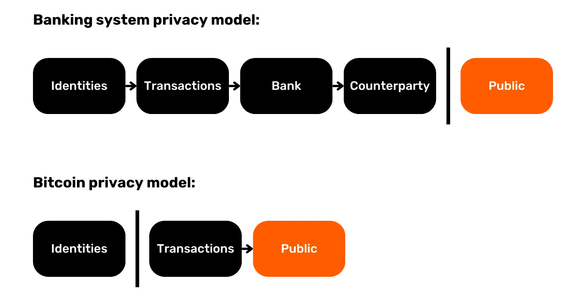

Thus, confidentiality on Bitcoin is compromised when external observers manage to associate specific UTXOs with identified users. Once this association is established, it becomes possible to trace their transactions and analyze the history of their bitcoins. Coinjoin is precisely a technique developed to break the traceability of UTXOs, in order to offer a certain layer of confidentiality to Bitcoin users at the transaction level.

Coinjoins enhance the confidentiality of Bitcoin users by complicating chain analysis for external observers. Their structure allows merging several coins from different users into a single transaction, thus blurring the tracks and making it difficult to determine the links between input and output addresses.

It is important to understand that the goal of a coinjoin transaction is to break the history of a coin. This technique does not confer permanent anonymity nor does it definitively block the tracing of bitcoins, contrary to what one might think. The coinjoin aims only to break the history at the point where the coinjoin transaction is performed. However, before and after this operation, the coin remains subject to the same privacy risks.


### How do coinjoins work?

The principle of the coinjoin relies on a collaborative approach: several users who wish to mix their bitcoins deposit identical amounts in inputs of the same transaction. These amounts are then redistributed in outputs of equal values to each user.


At the end of the transaction, it becomes impossible to associate a specific output with a known user in input. No direct link exists between the inputs and outputs, which breaks the association between the users and their UTXOs, as well as the history of each coin.


Let's take the example of Alice. She wants to send about 100,000 sats to her sister Eve for her birthday. However, Alice does not want Eve to be able to trace the history of her transactions because she does not want to reveal how many bitcoins she holds or how she obtained them. To do this, Alice decides to break the history of her UTXO with a coinjoin transaction. She organizes with Bob, Charles, David, and Frank to carry out a collaborative transaction:
- Alice, Bob, Charles, David, and Frank each commit a UTXO of 105,000 sats (with 5,000 sats for mining fees) as inputs for the transaction:


- In return for consuming these inputs, each generates a fresh address to create five identical outputs of 100,000 sats each. Each retrieves an output:


- Alice ends up with a UTXO of 100,000 sats whose history is mixed. She uses this UTXO in a new transaction to send the amount to Eve for her birthday:


- If Eve tries to analyze this transaction to extract information, she will be faced with the coinjoin transaction involving Alice, Bob, Charles, David, and Frank. Being unable to distinguish which input belongs to whom due to the uniformity of the amounts, Eve cannot trace the history of Alice's UTXO, nor determine how many bitcoins her sister owns or how she acquired them:


In this scenario, Alice used the coinjoin technique to increase her privacy against retrospective analysis. Indeed, Alice protects herself against a possible analysis by Eve that would start from a specific transaction to trace the history of the UTXO backward. This protection against analysis from the present to the past is what we call retrospective anonset. We will delve into this concept in more detail in the last chapters of this part.

However, coinjoin also offers the possibility to enhance privacy against analysis from the past to the present, which is referred to as prospective anonset. Let's go back to our example where Alice sent 98,000 sats to Eve for her birthday, but reversing the roles. Now imagine that it's Eve who is concerned about her privacy. Indeed, Alice might be tempted to follow the coin she sent to Eve to gather information. Eve could consolidate this UTXO she just received with all her other UTXOs, which could reveal to Alice the amount of bitcoins she holds in her wallet. To avoid this, Eve can also break the history of the coin she just received.
- Eve, Grace, Mallory, Oscar, and Victor each put a UTXO of 98,000 sats as inputs in a Bitcoin transaction:


- In exchange for consuming these inputs, each provides a fresh address to create 5 outputs of 97,500 sats each, perfectly equal. Each user retrieves an output:


- Eve now holds a UTXO of 97,500 sats with a broken history. She can use it without fear for future transactions. Indeed, if Alice tries to follow the bitcoins she sent to Eve, she will encounter a coinjoin transaction. She will be unable to determine which output UTXO belongs to Eve. Analysis then becomes impossible:


In the first example, we saw how coinjoin can protect the privacy of a coin in relation to its past, and in the second example, how it can also secure the history of a coin in relation to its future. That's why I mentioned that coinjoin should be seen as a one-time event that segments a coin's history in both directions:


### Mixing, coinjoins, mixers... What's the difference?

The term "mixing" is sometimes used to describe coinjoins, a term some bitcoiners reject because they fear confusion with custodial mixers. However, I think this apprehension is unfounded, because, in a mathematical context, coinjoin embodies the concept of mixing precisely.

In the general field of mathematics, mixing refers to the property of a dynamic system where, after some time, all portions of the initial space can theoretically be mixed with any other portion. Mixing implies that the position of a particle or the state of a system evolves in such a way that its future distribution is independent of its initial distribution, thus reaching a state where the characteristics of the initial state are uniformly distributed throughout the system's space. This is exactly what happens in a coinjoin with bitcoins. Thus, in my opinion, coinjoin is truly a method of mixing coins.


However, it is important to distinguish coinjoin from mixers. A mixer is a service where users send their bitcoins to be mixed. These services were popular during the 2010s, but their use has declined due to two major disadvantages compared to coinjoin:
- They require the user to relinquish custody of their funds during the mixing process, which exposes them to theft risks;
- There is no guarantee that the mixer does not record the details of transactions, or even sell this information to chain analysis companies.


Nowadays, users therefore prefer coinjoin, as it allows them to maintain full control over their funds throughout the process. Participants in a coinjoin do not risk having their bitcoins stolen by other parties involved. Let's explore together how all this is possible in the next chapter.

## Zerolink and Chaumian Coinjoins
<chapterId>326c9654-b359-4906-b23d-d6518dd5dc3e</chapterId>

The privacy provided by a coinjoin is won on the size of the group in which our piece is hidden. Therefore, it is necessary to find as many participants as possible. It is entirely possible to perform a coinjoin manually, with users one has found themselves, but this method is complex, and it does not allow for large anonsets to be achieved.

This is why coinjoin coordinators have developed on Bitcoin. Their role is to connect different users and transmit the information necessary for the successful completion of the collaborative transaction.

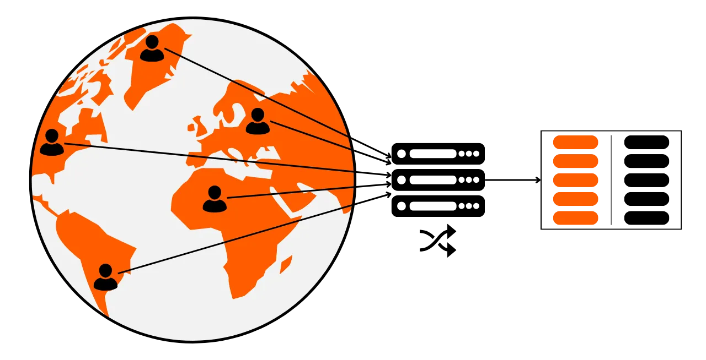

But how can we ensure that the coordinator never has control over the users' bitcoins, and despite the fact that they are the person who constructs the coinjoin transaction, how can we ensure they cannot link the inputs and outputs of the users, which could constitute a privacy leak?

### Chaum's Blind Signatures

Modern implementations of coinjoin use David Chaum's blind signatures to avoid leaking information. Let's quickly study together how these blind signatures work.

Chaum's blind signatures are a form of digital signature where the issuer of a signature does not know the content of the message they are signing. However, the signature can later be verified with the original message. This technique was developed by cryptographer David Chaum in 1983.


Take the example of a company wanting to authenticate a confidential document, such as a contract, without revealing its content. The company applies a masking process that cryptographically transforms the original document in a reversible manner. This modified document is sent to a certification authority that applies a blind signature without knowing the underlying content. After receiving the signed document, the company un-masks the signature. The result is an original document authenticated by the authority's signature, without the authority ever having seen the original content.

Chaum's blind signatures thus allow for the certification of a document's authenticity without knowing its content, which guarantees both the confidentiality of the user's data and the integrity of the signed document.

### Chaumian Coinjoins
In "Chaumian CoinJoins," the use of Tor and David Chaum's blind signatures are combined to ensure that the coordinator cannot know which output belongs to which user. The process of constructing the coinjoin transaction revolves around 3 main steps: registering the inputs, registering the outputs, and signing the transaction. Let's examine this process through the example of Alice, one of the participants in the coinjoin. All other participants follow the same steps as Alice, each on their own.

**Step 1: Registering the inputs.**
- Alice sends to the coordinator the UTXO she wishes to use as the input for the transaction, as well as the masked receiving address she wants to use as the output to receive her bitcoins. Therefore, the coordinator cannot know Alice's address. He sees only its masked version:


- The coordinator verifies the validity of the inputs, then signs Alice's masked address with his private key. He sends back to Alice the blind signature:


**Step 2: Registering the outputs.**
- Alice can now unmask her address signed by the coordinator's private key. She establishes a new connection under a different Tor identity. The coordinator cannot identify that it is Alice connecting under this new identity:


- Alice sends the unmasked address and signature to the coordinator (who still does not know it's Alice):


**Step 3: Signing the transaction.**
- The coordinator similarly retrieves the unmasked outputs from all participants. Thanks to the associated signatures, he can verify that each output submitted anonymously was indeed signed by his private key previously, ensuring their legitimacy. He is then ready to construct the coinjoin transaction and sends it to the participants for them to sign:


- Alice, like the other participants, verifies that her input and output are correctly included in the transaction constructed by the coordinator. If everything is satisfactory, she sends the signature that unlocks the script of her input to the coordinator:


- After collecting the signatures from all the participants of the coinjoin, the coordinator can broadcast the transaction on the Bitcoin network, so that it can be added to a block.
In this system, the coordinator is unable to link an input to a specific output. Moreover, they cannot take possession of the participants' funds, as they never have access to the private keys needed to unlock their UTXOs. Throughout the process, and until the end of step 3, they also do not have access to the signatures. When Alice and the other participants sign the global transaction, after ensuring everything is correct, the coordinator can no longer modify this transaction, including the outputs, without invalidating it. This therefore prevents the theft of bitcoins by the coordinator.

Ultimately, when recording their output in the transaction, the coinjoin user wants guarantees similar to those of a citizen voting in an election. There is a duality between the public and private aspects of these actions. On one hand, there is what one wishes to keep private: for the voter, they do not want their ballot to be linked to their identity; for the coinjoin user, they do not want their output to be associated with their input. Indeed, if the coordinator, or any other party, manages to establish a link between an input and an output, the coinjoin loses all its purpose. As explained earlier, the coinjoin must function as a break in the history of a coin. This stop occurs precisely because of the impossibility of associating a specific input with a specific output in the coinjoin transaction (prospective anonset) and vice versa (retrospective anonset).

On the other hand, there is the public aspect: the voter wants to ensure their ballot is included in the ballot box; similarly, the coinjoin user wants to ensure their output is included in the coinjoin transaction. Indeed, it is absolutely necessary for the participants of the coinjoin to be able to verify the presence of their output before signing the transaction, otherwise the coordinator could steal the funds.

It is precisely these 2 public and private aspects, made possible by the use of David Chaum's blind signatures, that guarantee to participants of Chaumian coinjoins that their bitcoins will not be stolen, and that their funds cannot be traced.

### Who invented the concept of coinjoin?

It is difficult to determine with certainty who first introduced the idea of coinjoin on Bitcoin, and who had the idea of using David Chaum's blind signatures in this context. It is often thought that it was Gregory Maxwell who first talked about it in [a message on BitcoinTalk in 2013](https://bitcointalk.org/index.php?topic=279249.0):
Using Chaum Blind Signatures: Users log in and provide inputs (and change addresses) as well as a cryptographically blinded version of the address to which they wish to send their private coins; the server signs the tokens and returns them to the users. Users reconnect anonymously, unmask their output addresses, and send them back to the server. The server can see that all the outputs have been signed by it and that, consequently, all the outputs come from valid participants. Later, people reconnect and sign.
Maxwell, G. (2013, August 22). *CoinJoin: Bitcoin privacy for the real world*. BitcoinTalk Forum. https://bitcointalk.org/index.php?topic=279249.0


However, there are earlier mentions, both for Chaum signatures in the context of mixing, as well as for coinjoins. [In June 2011, Duncan Townsend presented on BitcoinTalk](https://bitcointalk.org/index.php?topic=12751.0) a mixer that uses Chaum signatures in a way quite similar to modern Chaumian coinjoins.

In the same thread, there is [a message from hashcoin in response to Duncan Townsend](https://bitcointalk.org/index.php?topic=12751.msg315793#msg315793) to improve his mixer. The process described in this message represents precisely what most closely resembles coinjoins. There is also a mention of a similar system in [a message from Alex Mizrahi in 2012](https://gist.github.com/killerstorm/6f843e1d3ffc38191aebca67d483bd88#file-laundry), while he was advising the creators of Tenebrix, one of the first altcoins that served as a basis for creating Litecoin later on. Even the term "coinjoin" itself was not invented by Greg Maxwell, but it came from an idea by Peter Todd.


### Zerolink

Zerolink is a comprehensive mixing protocol that integrates Chaumian coinjoins and various strategies to protect users' anonymity against several forms of chain analysis, notably minimizing errors related to wallet management. This protocol [was introduced by nopara73 and TDevD in 2017](https://github.com/nopara73/ZeroLink/blob/master/README.md).


As its name suggests, the principle of Zerolink is to carry out coinjoin transactions that ensure the impossibility of tracing the links between the inputs and outputs. This characteristic is achieved by ensuring that all outputs present perfectly identical amounts.


An important preventive measure by Zerolink involves completely separating unmixed UTXOs from mixed UTXOs by using distinct sets of cryptographic keys, or even separate wallets. This way, the "pre-mix" wallet, intended for coins before mixing, is differentiated from the "post-mix" wallet, reserved for coins that have been mixed.


This strict separation of UTXOs primarily serves to prevent accidental associations between a mixed UTXO and an unmixed UTXO. Indeed, if such links occur, the effectiveness of the coinjoin on the mixed UTXO is nullified without the user being aware, thus compromising the confidentiality of a UTXO whose history they believed had been severed. These links can arise either through address reuse on securing a mixed UTXO with an unmixed one, or by applying the Common-Input-Ownership Heuristic (CIOH), if the user consumes mixed and unmixed UTXOs as inputs of the same transaction. By separating the pre-mixing and post-mixing wallets, these accidental associations are avoided, and the user is protected against involuntary errors.


This separation also offers the possibility to apply distinct rules between the pre-mixing and post-mixing wallets at the wallet software level. For example, in the post-mix wallet, the software can prohibit the merging of UTXOs into inputs to prevent the application of the CIOH which would compromise the user's anonset. It is also possible to standardize the use of scripts and transaction options (like the signaling of RBF, for example) to prevent identification by wallet fingerprints.

Currently, Whirlpool is the only implementation of coinjoin that rigorously applies the Zerolink protocol. In the following chapter, we will explore the different existing coinjoin implementations and the advantages and disadvantages of each.

## Coinjoin Implementations
<chapterId>e37ed073-9498-4e4f-820b-30951e829596</chapterId>

*In 2024, we are witnessing significant changes in the tools available for users wishing to perform coinjoins on Bitcoin. We are currently in a pivotal period, and the coinjoin market is undergoing major restructuring. Therefore, this chapter will likely be updated over time.*

For the moment, there are mainly 3 different coinjoin implementations on Bitcoin:
- Whirlpool;
- Wabisabi;
- JoinMarket.
Each of these implementations aims to break the history of UTXOs through coinjoin transactions. However, their mechanisms vary significantly. Therefore, it is essential to understand how each works to choose the most suitable option for your needs.

### JoinMarket

JoinMarket, created in 2015 by Adam Gibson and Chris Belcher, stands out from other coinjoin implementations thanks to its unique user-matching model. This system is based on a P2P exchange market where some users, the "makers," make their bitcoins available for mixing, while others, the "takers," use these funds to perform coinjoins in exchange for a fee.


In this model, the "makers" leave their bitcoins available to the "takers" and receive fees in return for their service. The "takers," on the other hand, pay to use the "makers'" bitcoins to carry out their own coinjoin transactions. The service fees vary depending on the role: "makers" accumulate fees for their liquidity offer, while "takers" pay the fees. This market operates freely without usage conditions.

One of the main drawbacks of JoinMarket is its complexity of use, which requires a certain familiarity with terminals to exploit it efficiently. Although this complexity is not a barrier for an experienced user, it can limit access to the general public. However, the recent introduction of a web interface named JAM has somewhat facilitated its use.


Source: [JAM](https://github.com/joinmarket-webui/jam/blob/devel/docs/assets/screenshot-dark.webp)

However, the technical barrier remains a major obstacle. In the coinjoin ecosystem, where confidentiality is enhanced by the number of participants, any limitation reducing accessibility directly affects the available liquidity, which is a crucial factor for the efficiency of mixing. Bitcoin, already a niche in financial transactions, sees its use of coinjoins as a sub-niche, and JoinMarket represents an even more specialized fraction, thus restricting its potential to increase the anonsets of its users.

Despite its innovative P2P matching model for coinjoins, JoinMarket has some significant disadvantages, especially in terms of transactional structure. Unlike other implementations like Whirlpool, JoinMarket does not guarantee perfect equality between outputs, and it is possible to trace deterministic links between inputs and outputs. Moreover, it lacks tools to prevent coins that have already been mixed together from being mixed again, which could compromise the confidentiality sought by users.
Finally, although the concept of JoinMarket is interesting, especially for those interested in a dynamic liquidity market, its structural weaknesses and technical complexity make it, in my opinion, less appealing, both for novices and for experts seeking a coinjoin implementation.
### Wabisabi

Wabisabi is another implementation of coinjoin, with an approach that centralizes the coordination of transactions. This model was designed by Ádám Ficsór (nopara73), Yuval Kogman, Lucas Ontivero, and István András Seres in 2021, and was integrated into the Wasabi 2.0 software the following year. Wabisabi is precisely an evolution of the coinjoin model of the Wasabi software launched in 2018.


Towards the end of the 2010s, Wasabi adopted a transaction structure for its coinjoins that was radically different from that of Whirlpool. To increase the anonsets of its participants, Wasabi used very large coinjoin transactions grouping dozens of participants. In contrast, Whirlpool opted for multiple small transactions, allowing for an exponential increase in anonsets with each cycle.

The methods of managing change also distinguished the two implementations. With Whirlpool, the change was excluded and isolated from the UTXOs before the coinjoin cycles thanks to the TX0, a concept that I will explain further in the next chapter. At Wasabi, on the other hand, the change formed one of the outputs of the coinjoin transaction, which maintained deterministic links between certain inputs and outputs.

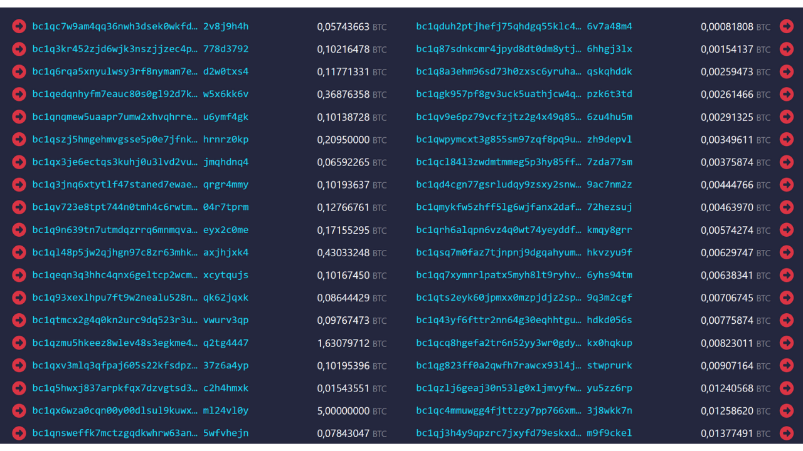

With Wabisabi, the version 2.0 of Wasabi adapted its approach to coinjoins to get closer to that of Whirlpool. Although the coinjoin transactions remain very large, it is now possible to chain several successive cycles, thus following the model of Whirlpool. A particular effort has also been made on the management of change: unlike Wasabi 1.0, where the change was directly linked to the inputs of the users, Wabisabi seeks to subdivide the change into several small amounts, distributed in equal denominations for all participants.

Let's illustrate this with a simplified example involving only 2 users: Alice wants to mix 115,000 sats and Bob, 210,000 sats. Ignoring fees, with Wasabi 1.0, a coinjoin transaction would have generated 3 outputs of 100,000 sats, plus 1 change of 15,000 sats for Alice and 1 change of 10,000 sats for Bob. The change outputs would always be linked to the inputs:


Under Wabisabi, the same transaction would have produced 3 outputs of 100,000 sats and 5 outputs of 5,000 sats, thus dispersing the change in a way that it is not directly traceable to a specific input:


Personally, I find that the management of change in Wabisabi presents several risks that could compromise its effectiveness in terms of privacy:
- When a user contributes with a UTXO significantly larger than those of other participants, they inevitably end up with an amount of change that will be linked to their input. This goes against the initial goal of the protocol, which aims to eliminate any identifiable change;
- The multiplication of denominations in order to fragment the change can paradoxically harm the efficiency of the mixing. This process can lead to a decrease in anonsets for certain outputs, as they become more easily identifiable;
- This method also generates low-value UTXOs that pose a management problem for the user. These small UTXOs, if they become too costly to spend relative to their value, can become "dust". This phenomenon pushes the user to merge several UTXOs into inputs in their future transactions or to consolidate them. In both cases, because of the COH, this can either decrease the anonsets obtained or completely cancel the privacy benefits acquired by the initial coinjoin.

Unlike Whirlpool, which implements the ZeroLink protocol ensuring a rigorous separation between pre-mix and post-mix UTXOs, Wabisabi does not maintain this strict segregation. There have also been issues with address reuse by some Wasabi clients, which are obviously very detrimental to the user.

In version 2.0 of Wasabi, a new coinjoin fee policy has been implemented. Now, coordinator fees are set at 0.3% for UTXOs larger than 0.01 bitcoin, while for smaller UTXOs, these fees are completely waived. Moreover, remixes for these small UTXOs are free, although mining fees remain the responsibility of the user for all transactions, including remixes.

This policy contrasts with that of Whirlpool, where fees remain fixed, regardless of the size of the anonsets obtained. With Wasabi 2.0, although coordinator fees are waived for small UTXOs, the user must still pay mining fees on all transactions, including remixes.
As of the time of writing, the use of Wabisabi has become notably more complex following recent events. Indeed, after the arrest of the founders of Samourai Wallet, zkSNACKs, the company that finances and manages the development of Wasabi, announced the discontinuation of its coinjoin coordination service on June 1, 2024. This coordinator, which was set by default on Wasabi, had the vast majority of liquidity.

With the shutdown of this main coordinator, users must now connect to new independent coordinators. This change raises concerns: on one hand, the new coordinators might not have sufficient liquidity, thus reducing the effectiveness of coinjoins in terms of privacy. On the other hand, there is the risk of encountering a malicious coordinator. This situation adds new significant risks for those looking to use Wabisabi.

Beyond the technical issues, the decision by zkSNACKs, the company behind Wasabi, to use the services of a chain analysis company to filter the participants in coinjoins poses serious ethical and strategic questions. The initial idea was to prevent the use of coinjoins on Wasabi by criminals, a move that may seem legitimate. However, this raises a paradox: paying fees to a coordinator, whose main mission is to enhance the privacy of users, only for it to then finance a company whose goal is to compromise that same privacy.

Even more concerning is the principle of filtering, which contrasts sharply with the philosophy of Bitcoin aimed at offering an open and uncensorable financial system. While it may seem justified to want to exclude criminal activities, this filtering could also affect individuals whose actions, although classified as illegal in some contexts, could be morally justifiable or socially beneficial. The example of Edward Snowden perfectly illustrates this dichotomy: considered a criminal by some governments for his revelations, he is seen by others as a whistleblower who acted in the public interest. This complexity underscores the potential danger of filtering which, although starting from a good intention, may ultimately infringe on the rights and security of legitimate users. I could also have mentioned activists and journalists who are persecuted under certain authoritarian regimes.
As you will have understood, my preference undoubtedly goes towards the Whirlpool model for conducting coinjoins on Bitcoin. This system stands out for its rigor and offers superior guarantees in terms of privacy. It is also the only one to propose a mixing considered perfect in a mathematical context. In my view, this model represents the future of coinjoins on Bitcoin. I therefore invite you to explore this model more deeply in the next chapter.

## The Functioning of Whirlpool
<chapterId>bdbd7109-e36d-4b4f-a3c6-928df4e9bfda</chapterId>

Whirlpool distinguishes itself from other coinjoin methods by using "_ZeroLink_" transactions, which ensure that there is strictly no technical link possible between all the inputs and all the outputs. This perfect mixing is achieved through a structure where each participant contributes with an identical amount in input (except for mining fees), thus generating outputs of perfectly equal amounts.

This restrictive approach on inputs gives Whirlpool coinjoin transactions a unique characteristic: the total absence of deterministic links between the inputs and the outputs. In other words, each output has an equal probability of being attributed to any participant, in relation to all the other outputs of the transaction.


### The General Functioning of Whirlpool

Initially, the number of participants in each Whirlpool coinjoin was limited to 5, with 2 new entrants and 3 remixers (we will explain these concepts further on). However, the increase in on-chain transaction fees observed in 2023 has prompted the Samourai teams to rethink their model to improve privacy while reducing costs. Thus, taking into account the market situation of fees and the number of participants, the coordinator can now organize coinjoins including 6, 7, or 8 participants. These enhanced sessions are designated under the name "_Surge Cycles_". It is important to note that, regardless of the configuration, there are always only 2 new entrants in the Whirlpool coinjoins.

Thus, Whirlpool transactions are characterized by an identical number of inputs and outputs, which can be:
- 5 inputs and 5 outputs;

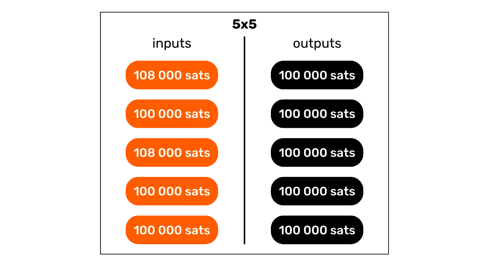

- 6 inputs and 6 outputs;


- 7 inputs and 7 outputs;


- 8 inputs and 8 outputs.


The model proposed by Whirlpool is thus based on small coinjoin transactions. Unlike Wabisabi and JoinMarket, where the robustness of the anonsets relies on the volume of participants in a single cycle (or a few cycles), Whirlpool bets on the chaining of multiple small-sized cycles. In this model, the user only incurs fees upon their initial entry into a pool, allowing them to participate in a multitude of remixes without additional charges. It is the new entrants who cover the mining fees for the remixers.

With each additional coinjoin in which a coin participates, along with its peers encountered in the past, the anonsets will grow exponentially. The goal, therefore, is to take advantage of these free remixes which, with each occurrence, contribute to strengthening the density of the anonsets associated with each mixed coin.


Whirlpool was designed with two important requirements in mind:
- The accessibility of implementation on mobile devices, given that Samourai Wallet is primarily a smartphone application;
- The speed of the remixing cycles to encourage a significant increase in anonsets.

These imperatives guided the choices of the Samourai Wallet developers in the design of Whirlpool, leading them to limit the number of participants per cycle. Too few participants would have compromised the effectiveness of the coinjoin, drastically reducing the anonsets generated in each cycle, while too many participants would have posed management problems on mobile applications and would have impeded the flow of cycles.

Ultimately, there is no need to have a high number of participants per coinjoin on Whirlpool since the anonsets are made over the accumulation of several coinjoin cycles. The most important principle here is the homogeneity of the UTXOs of all participants, as this allows for a perfect mix, and thus to fully benefit from the mixing and remixing cycles.

### The pools and coinjoin fees

For these multiple cycles to effectively increase the anonsets of the mixed coins, a certain framework must be established to restrict the amounts of UTXOs used. Whirlpool thus defines different pools.

A pool represents a group of users wishing to mix together, who agree on the amount of UTXOs to use to optimize the coinjoin process while maintaining perfect homogeneity of the coins. Each pool specifies a fixed amount for the UTXO, which the user must comply with to participate. Thus, to perform coinjoins with Whirlpool, you need to select a pool. The pools available at the moment are as follows:
- 0.5 bitcoins;
- 0.05 bitcoin;
- 0.01 bitcoin;
- 0.001 bitcoin (= 100,000 sats).
By joining a pool with your bitcoins, they will be divided to generate UTXOs that are perfectly homogeneous with those of the other participants in the pool. Each pool has a maximum limit; thus, for amounts exceeding this limit, you will be forced either to make two separate entries within the same pool or to turn to another pool with a higher amount:
| Pool (bitcoin) | Maximum amount per entry (bitcoin) |
|----------------|------------------------------------|
| 0.5            | 35                                 |
| 0.05           | 3.5                                |
| 0.01           | 0.7                                |
| 0.001          | 0.025                              |

A UTXO is considered to belong to a pool when it is ready to be integrated into a coinjoin. However, this does not mean that the user loses possession of it. As we have seen in the first chapters of this part, through the different mixing cycles, you retain full control of your keys and, consequently, your bitcoins. This is what differentiates the coinjoin technique from other centralized mixing techniques.

To enter a coinjoin pool, you must pay service fees as well as mining fees. The service fees are fixed for each pool and are intended to compensate the teams responsible for the development and maintenance of Whirlpool.

The service fees for using Whirlpool are to be paid a single time upon entering the pool. Once this step is completed, you have the possibility to participate in an unlimited number of remixes without additional fees. Here are the current fixed fees for each pool:

| Pool (bitcoin) | Entry fee (bitcoin)         |
|----------------|-----------------------------|
| 0.5            | 0.0175                      |
| 0.05           | 0.00175                     |
| 0.01           | 0.0005 (50,000 sats)        |
| 0.001          | 0.00005 (5,000 sats)        |

These fees essentially function as an entry ticket for the chosen pool, regardless of the amount you put in coinjoin. Thus, whether you join the 0.01 pool with exactly 0.01 BTC or enter it with 0.5 BTC, the fees will remain the same in absolute value.

Before proceeding with Whirlpool coinjoins, the user therefore has a choice between 2 strategies:
- Opt for a smaller pool to minimize service fees, knowing that they will receive several smaller UTXOs in return;
- Or prefer a larger pool, agreeing to pay higher fees to end up with a reduced number of larger-value UTXOs.
It is generally not recommended to merge several mixed UTXOs after the coinjoin cycles, as this could compromise the privacy gained, especially due to the heuristic of common input ownership (CIOH: *Common-Input-Ownership-Heuristic*). Therefore, it might be wise to choose a larger pool, even if it means paying more, to avoid having too many small-value UTXOs as outputs. The user must weigh these trade-offs to choose the pool they prefer.
Besides the service fees, the mining fees inherent to any Bitcoin transaction must also be considered. As a Whirlpool user, you will be required to pay the mining fees for the preparation transaction (`Tx0`) as well as those for the first coinjoin. All subsequent remixes will be free, thanks to Whirlpool's model which relies on the payment of new entrants.

Indeed, in each Whirlpool coinjoin, 2 users among the inputs are new entrants. The other inputs come from remixers. As a result, the mining fees for all participants in the transaction are covered by these 2 new participants, who will then also benefit from free remixes:

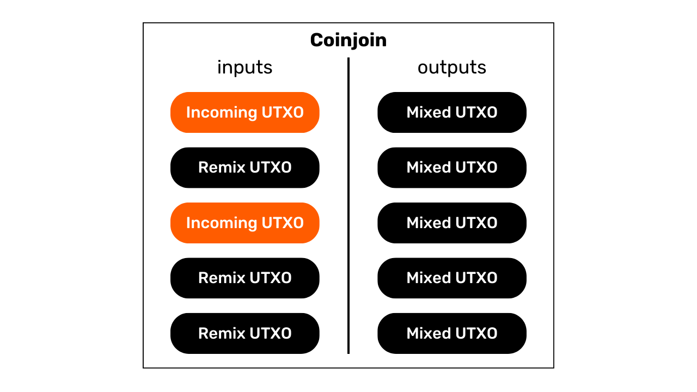

Thanks to this fee system, Whirlpool truly differentiates itself from other coinjoin implementations since the anonsets of the UTXOs are not proportional to the price paid by the user. Thus, it is possible to achieve considerably high levels of anonymity by only paying the entry fee of the pool and the mining fees for 2 transactions (the `Tx0` and the initial mix).

It is important to note that the user will also have to cover the mining fees to withdraw their UTXOs from the pool after performing their multiple coinjoins, unless they have selected the `mix to` option, which allows providing an external address that will directly receive the funds as a coinjoin output, without any additional transaction.

### HD Wallet Accounts

To perform a coinjoin via Whirlpool, the wallet must generate several distinct accounts. This is the principle of the ZeroLink protocol. An account, in the context of an HD (*Hierarchical Deterministic*) wallet, constitutes a section entirely isolated from the others, this separation occurring at the third depth level of the wallet's hierarchy, that is, at the level of the `xpub`.


An HD wallet can theoretically derive up to `2^(32/2)` different accounts. The initial account, used by default on all Bitcoin wallets, corresponds to the index `0'`.

For wallets adapted to Whirlpool, 4 accounts are used to meet the needs of the ZeroLink process:
- The **deposit account**, identified by the index `0'`;
- The **bad bank** account (or "doxxic change"), identified by the index `2 147 483 644'`;
- The **premix** account, identified by the index `2 147 483 645'`;
- The **postmix** account, identified by the index `2 147 483 646'`.

Each of these accounts fulfills a specific function in the coinjoin process, which we will explore in the following sections.

All these accounts are linked to a single seed, allowing the user to recover access to all their bitcoins using their recovery phrase and, if necessary, their passphrase. However, it is necessary to specify to the software, during this recovery operation, the different account indexes that were used.

Let's now look at the different stages of a Whirlpool coinjoin within these accounts.

### The TX0

The starting point of any Whirlpool coinjoin is the **deposit account**. This account is the one you automatically use when you create a new Bitcoin wallet. This account must be credited with the bitcoins you wish to mix.

The `Tx0` represents the first step in the Whirlpool mixing process. It aims to prepare and equalize the UTXOs for the coinjoin, dividing them into units corresponding to the amount of the selected pool, to ensure the homogeneity of the mixing. The equalized UTXOs are then sent to the **premix** account. As for the difference that cannot enter the pool, it is separated into a specific account: the **bad bank** (or "doxxic change").

This initial transaction `Tx0` also serves to settle the service fees due to the coinjoin coordinator. Unlike the following steps, this transaction is not collaborative; the user must therefore bear the full mining fees:

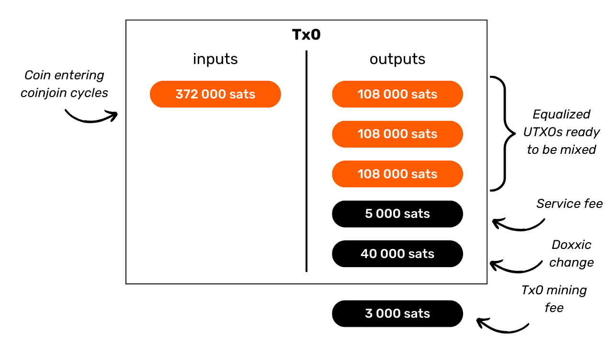

In this example of a `Tx0` transaction, an input of `372 000 sats` from our **deposit** account is divided into several output UTXOs, which are distributed as follows:
- An amount of `5 000 sats` intended for the coordinator for service fees, corresponding to the entry into the pool of `100 000 sats`;
- 3 UTXOs prepared for mixing, redirected to our **premix** account and registered with the coordinator. These UTXOs are equalized at `108 000 sats` each, to cover the mining fees for their future initial mix;
- The surplus that cannot enter the pool, being too small, is considered toxic change. It is sent to its specific account. Here, this change amounts to `40 000 sats`;
- Finally, there are `3,000 sats` that do not constitute an output, but are the mining fees required to confirm the `Tx0`.
For example, here is a real Tx0 Whirlpool (not from me): [edef60744f539483d868caff49d4848e5cc6e805d6cdc8d0f9bdbbaedcb5fc46](https://mempool.space/fr/tx/edef60744f539483d868caff49d4848e5cc6e805d6cdc8d0f9bdbbaedcb5fc46)


### The Toxic Change

The excess that could not be integrated into the pool, here equivalent to `40,000 sats`, is redirected to the **bad bank** account, also referred to as "toxic change," to ensure a strict separation from the other UTXOs in the wallet.

This UTXO is dangerous for the user's privacy because not only is it still attached to its past, and thus possibly to the identity of its owner, but it is also marked as belonging to a user who has participated in a coinjoin.


If this UTXO is merged with mixed outputs, they will lose all the privacy gained during the coinjoin cycles, notably because of the CIOH (*Common-Input-Ownership-Heuristic*). If it is merged with other toxic changes, the user risks losing privacy since this will link the different entries from the coinjoin cycles. Therefore, it must be handled with caution. We will talk more in detail about the management of these toxic UTXOs in the last section of this chapter.

### The Initial Mix

After the `Tx0` is completed, the equalized UTXOs are sent to the **premix** account of our wallet, ready to be introduced into their first coinjoin cycle, also called "initial mix." If, as in our example, the `Tx0` generates several UTXOs intended for mixing, each of them will be integrated into a separate initial mix.

At the end of these first mixes, the **premix** account will be empty, while our coins, having paid the mining fees for this first coinjoin, will be adjusted exactly to the amount defined by the chosen pool. In our example, our initial UTXOs of `108,000 sats` will have been reduced to exactly `100,000 sats`.


### The Remixes
After the initial mix, the UTXOs are transferred to the **postmix** account. This account gathers both the already mixed UTXOs and those waiting for remixing. When the Whirlpool client is active, the UTXOs in the **postmix** account are automatically available for remixing and will be randomly chosen to participate in these new cycles.
As a reminder, remixes are then 100% free: no additional service fees or mining fees are required. Keeping the UTXOs in the **postmix** account thus maintains their intact value and simultaneously improves their anonsets. That's why it's important to allow these coins to participate in multiple coinjoin cycles. It costs you strictly nothing, and it increases their levels of anonymity.

When you decide to spend mixed UTXOs, you can do so directly from this **postmix** account. It is advisable to keep the mixed UTXOs in this account to benefit from free remixes and to prevent them from leaving the Whirlpool circuit, which could decrease their privacy.

### How to properly manage your postmix?

After performing coinjoin cycles, the best strategy is to keep your UTXOs in the **postmix** account, waiting for their future use. It is even advisable to let them remix indefinitely until you need to spend them.

Some users might consider transferring their mixed bitcoins to a wallet secured by a hardware wallet. This is possible, but it is important to meticulously follow the recommendations of Samourai Wallet to not compromise the acquired confidentiality.

Merging UTXOs is the most frequently made mistake. It is necessary to avoid combining mixed UTXOs with unmixed UTXOs in the same transaction, to avoid the Common-Input-Ownership-Heuristic (CIOH). This requires careful management of your UTXOs within your wallet, especially in terms of labeling.


It is also important to be cautious about consolidating mixed UTXOs among themselves. Moderate consolidations are conceivable if your mixed UTXOs have significant anonsets, but this will inevitably decrease the confidentiality of your coins. Ensure that consolidations are neither too significant nor performed after an insufficient number of remixes, at the risk of establishing deducible links between your UTXOs before and after the coinjoin cycles. In case of doubt about these manipulations, the best practice is not to consolidate the postmix UTXOs, and to transfer them one by one to your hardware wallet, generating a new blank address each time. Again, remember to properly label each received UTXO.
It is also advised against transferring your postmix UTXOs to a wallet using uncommon scripts. For example, if you enter Whirlpool from a multisig wallet using `P2WSH` scripts, there's a slim chance you'll be mixed with other users who have the same type of wallet originally. If you withdraw your postmix to this same multisig wallet, the privacy level of your mixed bitcoins will be greatly diminished. Beyond scripts, there are many other wallet fingerprints that can trick you.
As with any Bitcoin transaction, it is also important not to reuse receiving addresses. Each new transaction should be received on a new, blank address.

The simplest and safest solution is to let your mixed UTXOs rest in their **postmix** account, letting them remix and only touching them to spend. Samourai and Sparrow wallets have additional protections against all these chain analysis-related risks. These protections help you avoid making mistakes.

### How to properly manage your toxic change?

Next, you must be careful in managing your doxxic change, the change that couldn't enter the coinjoin pool. These toxic UTXOs, resulting from the use of Whirlpool, pose a risk to your privacy since they establish a link between you and the use of coinjoin. Therefore, it's imperative to handle them with caution and not to combine them with other UTXOs, especially mixed UTXOs.

Here are different strategies to consider for using them:
- **Mix them in smaller pools:** If your toxic UTXO is large enough to enter a smaller pool on its own, consider mixing it. This is often the best option. However, merging several toxic UTXOs to access a pool is discouraged, as this could link your different entries;
- **Mark them as "non-spendable":** Another approach is to no longer use them, to mark them as "non-spendable" in their dedicated account, and to just hodl. This ensures you don't accidentally spend them. If the value of bitcoin increases, new pools more suited to your toxic UTXOs might emerge;
- **Make donations:** Consider making donations, even modest ones, to developers working on Bitcoin and its associated software. You can also donate to organizations accepting BTC. If managing your toxic UTXOs seems too complicated, you can simply get rid of them by making a donation.
- **Buy Gift Cards:** Platforms such as [Bitrefill](https://www.bitrefill.com/) allow you to exchange bitcoins for gift cards that can be used at various merchants. This can be a way to dispose of your toxic UTXOs without losing the associated value.
- **Consolidate them on Monero:** Samourai Wallet offers an atomic swap service between BTC and XMR. This is ideal for managing toxic UTXOs by consolidating them on Monero, without compromising your privacy through KYC, before sending them back to Bitcoin. However, this option can be costly in terms of mining fees and premiums due to liquidity constraints.
- **Send them to the Lightning Network:** Transferring these UTXOs to the Lightning Network to benefit from reduced transaction fees is an interesting option. However, this method may reveal certain information depending on your use of Lightning and should therefore be practiced with caution.

### How to use Whirlpool?

Following the arrest of the founders of Samourai Wallet and the seizure of their servers on April 24, 2024, the Whirlpool tool no longer works, even for those who have their own Dojo. Previously, it was available on Samourai Wallet and Sparrow Wallet.


However, it remains possible that this tool could be put back into service in the coming weeks, depending on the outcome of the trials, or relaunched in a different way. In any case, I believe that the market for coinjoin on Bitcoin will not remain without an offer for long, as there is a clear demand. Moreover, the Whirlpool model, being the most advanced in terms of privacy, will surely be used in the future for other implementations.

We are closely following the evolution of this case as well as developments concerning associated tools. Rest assured that we will update this training as new information becomes available.

In the next chapter, we will discover what "anonsets" are, how these indicators are calculated, and how they can help us estimate the effectiveness of coinjoin cycles.

https://planb.network/tutorials/privacy/coinjoin-sparrow-wallet

https://planb.network/tutorials/privacy/coinjoin-samourai-wallet

https://planb.network/tutorials/privacy/coinjoin-dojo

## Anonymity Sets
<chapterId>be1093dc-1a74-40e5-9545-2b97a7d7d431</chapterId>

After studying how coinjoins work and the challenges associated with effective mixing, we will now learn how to measure this effectiveness. How to determine if a coinjoin process has been effective and what degree of anonymity a coin has acquired? This is what we will explore in this chapter with anonymity sets or "anonsets" in English.

### Reminder on the Utility of Coinjoin
The utility of CoinJoin lies in its ability to produce plausible deniability by immersing your coin within a group of indistinguishable coins. The goal of this action is to break the traceability links, both from the past to the present and from the present to the past. 
In other words, an analyst who knows your initial transaction (`Tx0`) at the entry of the CoinJoin cycles should not be able to identify with certainty your UTXO at the exit of the remix cycles (analysis from cycle entry to cycle exit).

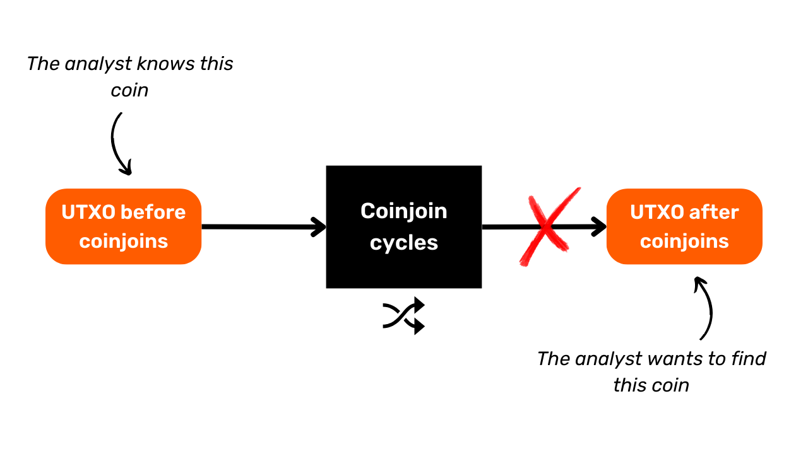

Conversely, an analyst who knows your UTXO at the exit of the CoinJoin cycles should be unable to determine the original transaction at the entry of the cycles (analysis from cycle exit to cycle entry).

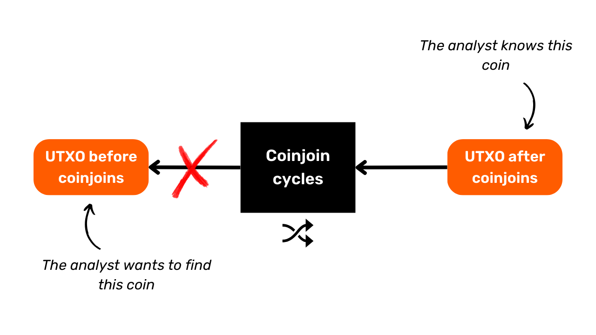

To assess the difficulty for an analyst to link the past to the present and vice versa, it is necessary to quantify the size of the groups of homogeneous coins within which your coin is concealed. This measure tells us the number of analyses having an identical probability. Thus, if the correct analysis is drowned among 3 other analyses of equal probability, your level of concealment is very low. However, if the correct analysis is within a set of 20,000 analyses all equally probable, your coin is very well hidden. And precisely, the size of these groups represents indicators called "anonsets".

### Understanding Anonsets

Anonsets serve as indicators to assess the degree of privacy of a particular UTXO. More specifically, they measure the number of indistinguishable UTXOs within the set that includes the studied coin. The requirement of a homogeneous UTXO set means that anonsets are usually calculated over CoinJoin cycles. The use of these indicators is particularly relevant for Whirlpool CoinJoins due to their uniformity.

Anonsets allow, where appropriate, to judge the quality of the CoinJoins. A large anonset size signifies a high level of anonymity, as it becomes difficult to distinguish a specific UTXO within the homogeneous set.

There are 2 types of anonsets:
- **The prospective anonset;**
- **The retrospective anonset.**

### The Prospective Anonset

The prospective anonset indicates the size of the group among which the studied UTXO is hidden at the cycle exit, knowing the UTXO at entry, that is, the number of indistinguishable coins present within this group. In English, the name of this indicator is "forward anonset", or "forward-looking metrics".
This indicator allows measuring the privacy resistance of the coin against a past-to-present analysis (input to output).
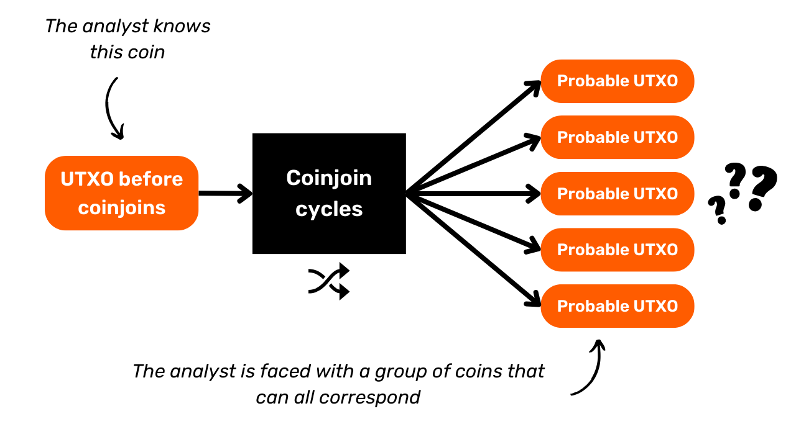

This metric estimates to what extent your UTXO is protected against attempts to reconstruct its history from its entry point to its exit point in the coinjoin process.

For example, if your transaction participated in its first coinjoin cycle and two additional descendant cycles were completed, the prospective anonset of your coin would be `13`:


For instance, let's imagine that our coin at the entry of the coinjoin cycle benefits from a prospective anonset of `86,871`. Practically, this means it is hidden among `86,871` indistinguishable coins. For an external observer aware of this coin at the beginning of the coinjoin cycles and attempting to trace its exit, they would be faced with `86,871` possible UTXOs, each with an identical probability of being the sought-after coin.

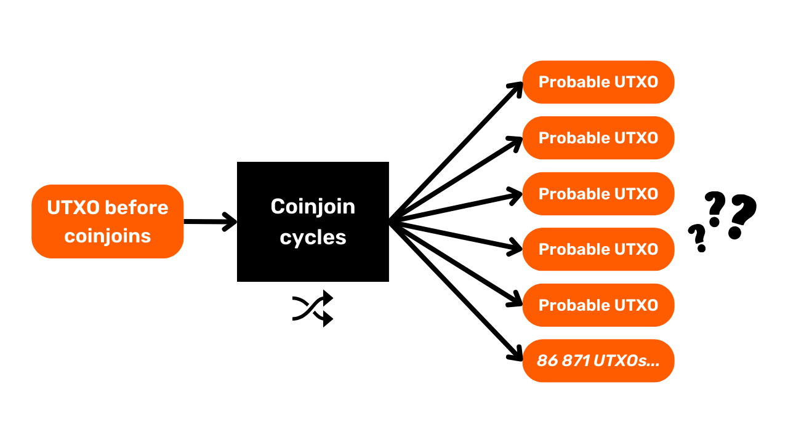

### The retrospective anonset

The retrospective anonset indicates the number of possible sources for a given coin, knowing the UTXO at the cycle's exit. This indicator measures the privacy resistance of the coin against a present-to-past analysis (exit to input), that is, how difficult it is for an analyst to trace back to the origin of your coin, before the coinjoin cycles. In English, the name of this indicator is "backward anonset," or "backward-looking metrics."

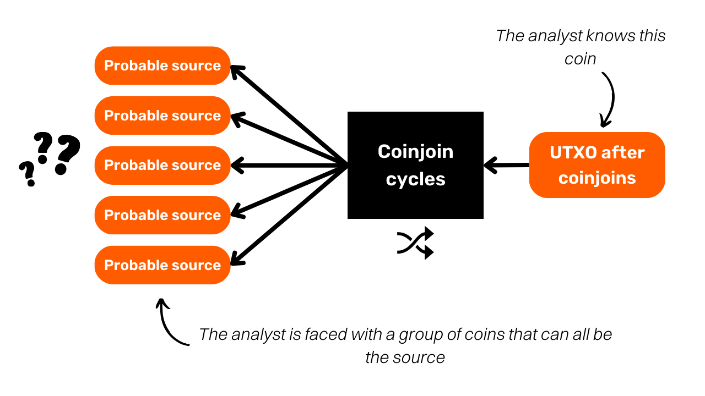

Knowing your UTXO at the exit of the cycles, the retrospective anonset determines the number of potential Tx0 transactions that could have constituted your entry into the coinjoin cycles. In the diagram below, this corresponds to the sum of all the orange bubbles.

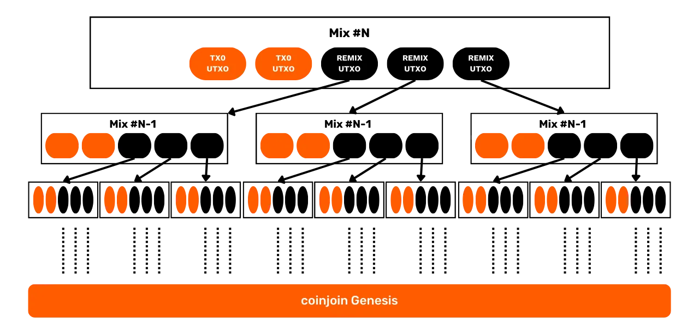

For example, let's imagine that our coin at the exit of the coinjoin cycle benefits from a retrospective anonset of `42,185`. Practically, this means there are `42,185` potential sources for this UTXO. If an external observer identifies this coin at the end of the cycles and seeks to trace its origin, they will face `42,185` possible sources, all with an equal probability of being the sought-after origin.

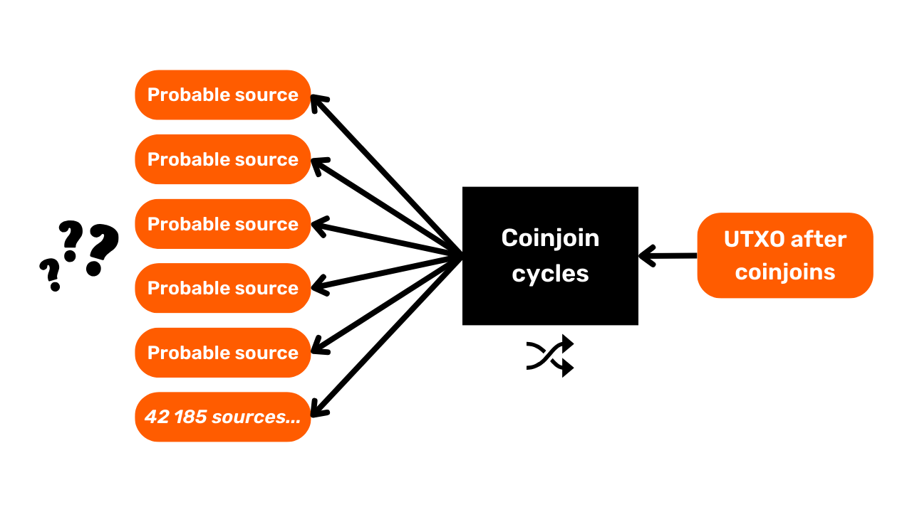

### How to concretely calculate the anonsets?
It is possible to manually calculate one's anonsets using a block explorer for small sets. However, for larger anonsets, the use of a specialized tool becomes imperative. To my knowledge, the only software capable of performing this task is *Whirlpool Stats Tool*, a Python tool developed by the teams at Samourai and OXT. Unfortunately, this tool is currently out of service following the arrest of the founders of Samourai and the discontinuation of OXT, which was used to extract data from the blockchain.


As we have seen in this chapter, anonsets can only be calculated if there is a certain homogeneity in the structure of the coinjoins. And precisely, in the next chapter, we will discover how to quantify this homogeneity in a Bitcoin transaction, whether it is a coinjoin or a more traditional transaction.

https://planb.network/tutorials/privacy/wst-anonsets

## Entropy
<chapterId>e4fe289d-618b-49a2-84c9-68c562e708b4</chapterId>

As we have seen in this part on coinjoins, the homogeneity of UTXOs in inputs and outputs plays an important role in improving the confidentiality of a Bitcoin transaction. This parameter allows for plausible deniability against chain analysis. Several methods can measure this homogeneity, but one of the most effective, in my opinion, is the use of indicators provided by the *Boltzmann* tool, developed by the teams at OXT and Samourai Wallet, especially the transaction's entropy. This is what we will study in detail in this chapter.

Unlike anonsets, which are calculated over a set of transactions, the indicators we will present here focus solely on a single transaction, whether it is a coinjoin or a more traditional transaction.

### The number of interpretations

The first indicator that can be observed on a Bitcoin transaction is the total number of possible interpretations in the eyes of an external observer analyzing the transaction. Taking into account the values of the UTXOs involved in the transaction, this indicator indicates the number of ways the inputs can be associated with the outputs. In other words, it determines the number of possible interpretations a transaction can generate in the flow of bitcoins from the perspective of an external observer analyzing it.

For example, a simple payment transaction with 1 input and 2 outputs will only have one interpretation, namely that input #0 funded output #0 and output #1. There are no other possible interpretations:


In contrast, a coinjoin structured according to the Whirlpool 5x5 model presents $1,496$ possible combinations:

A Whirlpool Surge Cycle 8x8 coinjoin presents itself with $9,934,563$ possible interpretations:


### Entropy

From the number of interpretations of a Bitcoin transaction, we can calculate its entropy.

In the general context of cryptography and information, entropy is a quantitative measure of the uncertainty or unpredictability associated with a data source or a random process. In other words, entropy is a way to measure how difficult information is to predict or guess.

In the specific context of chain analysis, entropy is also the name of an indicator, derived from Shannon entropy and [invented by LaurentMT](https://gist.github.com/LaurentMT/e758767ca4038ac40aaf), which can be calculated on a Bitcoin transaction.

When a transaction presents a high number of possible interpretations, it is often more relevant to refer to its entropy. This indicator allows measuring the lack of knowledge of analysts about the exact configuration of the transaction. In other words, the higher the entropy, the more difficult the task of identifying the flows of bitcoins between inputs and outputs becomes for analysts.

In practice, entropy reveals whether, from the perspective of an external observer, a transaction presents multiple possible interpretations, based solely on the amounts of inputs and outputs, without considering other external or internal patterns and heuristics. High entropy is then synonymous with better confidentiality for the transaction.

Entropy is defined as the binary logarithm of the number of possible combinations. Here is the formula used with $E$ being the entropy of the transaction and $C$ the number of possible interpretations:

$$
E = \log_2(C)
$$

In mathematics, the binary logarithm (base 2 logarithm) corresponds to the inverse operation of exponentiating 2. In other words, the binary logarithm of $x$ is the exponent to which $2$ must be raised to obtain $x$. This indicator is thus expressed in bits.

Let's take the example of calculating the entropy for a coinjoin transaction structured according to the Whirlpool 5x5 model, which, as mentioned in the previous section, presents a number of possible interpretations of $1,496$:

$$
\begin{align*}
C &= 1,496 \\
E &= \log_2(1,496) \\
E &= 10.5469 \text{ bits}
\end{align*}
$$
Thus, this coinjoin transaction displays an entropy of $10.5469$ bits, which is considered very satisfactory. The higher this value, the more different interpretations the transaction admits, thereby enhancing its level of privacy.
For an 8x8 coinjoin transaction presenting $9,934,563$ interpretations, the entropy would be:

$$
\begin{align*}
C &= 9,934,563 \\
E &= \log_2(9,934,563) \\
E &= 23.244 \text{ bits}
\end{align*}
$$

Let's take another example with a standard payment transaction, featuring 1 input and 2 outputs: [1b1b0c3f0883a99f1161c64da19471841ed12a1f78e77fab128c69a5f578ccce](https://mempool.space/tx/1b1b0c3f0883a99f1161c64da19471841ed12a1f78e77fab128c69a5f578ccce)


In the case of this transaction, the only possible interpretation is: `(In.0) > (Out.0 ; Out.1)`. Consequently, its entropy is established at $0$:

$$
\begin{align*}
C &= 1 \\
E &= \log_2(1) \\
E &= 0 \text{ bits}
\end{align*}
$$

### Efficiency

From the transaction's entropy, we can also calculate its efficiency in terms of privacy. This indicator assesses the transaction's efficiency by comparing it to the optimal transaction conceivable in an identical configuration.

This leads us to discuss the concept of maximum entropy, which corresponds to the highest entropy a specific transaction structure could theoretically achieve. The transaction's efficiency is then calculated by confronting this maximum entropy with the actual entropy of the analyzed transaction.

The formula used is as follows with:
- $E_R$: the actual entropy of the transaction expressed in bits;
- $E_M$: the maximum possible entropy for a transaction structure also expressed in bits;
- $Ef$: the efficiency of the transaction in bits:

$$
Ef = E_R - E_M
$$

For example, for a Whirlpool 5x5 type coinjoin structure, the maximum entropy is $10.5469$:

$$
\begin{align*}
E_R &= 10.5469 \\
E_M &= 10.5469 \\
Ef &= E_R - E_M \\
Ef &= 10.5469 - 10.5469 \\
Ef &= 0 \text{ bits}
\end{align*}
$$

This indicator is also expressed as a percentage. The formula used is as follows with:
- $C_R$: the number of possible real interpretations;
- $C_M$: the maximum number of possible interpretations with the same structure;
- $Ef$: efficiency expressed in percentage:

$$
\begin{align*}
E_f &= \frac{C_R}{C_M} \\
E_f &= \frac{1\,496}{1\,496} \\
E_f &= 100\%
\end{align*}
$$

An efficiency of $100\%$ thus indicates that the transaction maximizes its potential for privacy based on its structure.

### The Entropy Density

Entropy is a good indicator for measuring the privacy of a transaction, but it partly depends on the number of inputs and outputs in the transaction. To compare the entropy of 2 different transactions that do not have the same number of inputs and outputs, one can calculate the entropy density. This indicator offers a perspective on the entropy relative to each input or output of the transaction. The density proves useful for evaluating and comparing the efficiency of transactions of different sizes.

To calculate it, simply divide the total entropy of the transaction by the total number of inputs and outputs involved in the transaction:
- $E_D$: the entropy density expressed in bits;
- $E$: the entropy of the transaction expressed in bits;
- $T$: the total number of inputs and outputs in the transaction:

$$
E_D = \frac{E}{T}
$$

Let's take the example of a Whirlpool 5x5 coinjoin:

$$
\begin{align*}
T &= 5 + 5 = 10 \\
E &= 10.5469 \\
E_D &= \frac{E}{T} \\
E_D &= \frac{10.5469}{10} \\
E_D &= 1.054 \text{ bits}
\end{align*}
$$

Let's also calculate the entropy density of a Whirlpool 8x8 coinjoin:

$$
\begin{align*}
T &= 8 + 8 = 16 \\
E &= 23.244 \\
E_D &= \frac{E}{T} \\
E_D &= \frac{23.244}{16} \\
E_D &= 1.453 \text{ bits}
\end{align*}
$$

By analyzing the entropy density of these two types of coinjoins, it becomes evident that, even when normalizing the entropy by the number of elements, the "Surge Cycle 8x8" coinjoin generates more uncertainty for analysis.

### The Boltzmann Score
Another piece of information analyzed in a transaction is the Boltzmann score of each element relative to another. This is a table of the matching probabilities between the inputs and the outputs. This table indicates, through the Boltzmann score, the conditional probability that a specific input is linked to a given output. It is therefore a quantitative measure of the conditional probability that an association between an input and an output in a transaction occurs, established on the ratio of the number of favorable occurrences of this event compared to the total number of possible occurrences, in a set of interpretations.
Taking the example of a Whirlpool coinjoin, the table of conditional probabilities would highlight the chances of a link between each input and output, providing a quantitative measure of the ambiguity of associations in the transaction:

| %       | Output 0 | Output 1 | Output 2 | Output 3 | Output 4 |
| ------- | -------- | -------- | -------- | -------- | -------- |
| Input 0 | 34%      | 34%      | 34%      | 34%      | 34%      |
| Input 1 | 34%      | 34%      | 34%      | 34%      | 34%      |
| Input 2 | 34%      | 34%      | 34%      | 34%      | 34%      |
| Input 3 | 34%      | 34%      | 34%      | 34%      | 34%      |
| Input 4 | 34%      | 34%      | 34%      | 34%      | 34%      |

Here, it is clear that each input has an equal chance of being associated with any output, which enhances the confidentiality of the transaction.

The calculation of the Boltzmann score involves dividing the number of interpretations in which a certain event manifests by the total number of available interpretations. Thus, to determine the score associating input #0 with output #3 (an event present in $512$ interpretations), the process is as follows:

$$
\begin{align*}
\text{Interpretations (IN.0 > OUT.3)} &= 512 \\
\text{Total Interpretations} &= 1496 \\
\text{Score} &= \frac{512}{1496} \\
\text{Score} &= 34 \%
\end{align*}
$$

If we revisit the example of a Whirlpool coinjoin 8x8 Surge Cycle, the Boltzmann table would look like this:

|       | OUT.0 | OUT.1 | OUT.2 | OUT.3 | OUT.4 | OUT.5 | OUT.6 | OUT.7 |
|-------|-------|-------|-------|-------|-------|-------|-------|-------|
| IN.0  | 23%   | 23%   | 23%   | 23%   | 23%   | 23%   | 23%   | 23%   |
| IN.1  | 23%   | 23%   | 23%   | 23%   | 23%   | 23%   | 23%   | 23%   || IN.2  | 23%   | 23%   | 23%   | 23%   | 23%   | 23%   | 23%   | 23%   |
| IN.3  | 23%   | 23%   | 23%   | 23%   | 23%   | 23%   | 23%   | 23%   |
| IN.4  | 23%   | 23%   | 23%   | 23%   | 23%   | 23%   | 23%   | 23%   |
| IN.5  | 23%   | 23%   | 23%   | 23%   | 23%   | 23%   | 23%   | 23%   |
| IN.6  | 23%   | 23%   | 23%   | 23%   | 23%   | 23%   | 23%   | 23%   |
| IN.7  | 23%   | 23%   | 23%   | 23%   | 23%   | 23%   | 23%   | 23%   |

However, in the case of a simple transaction involving a single input and 2 outputs, the situation is different:

| %       | Output 0 | Output 1 |
|---------|----------|----------|
| Input 0 | 100%     | 100%     |

Here, we observe that the probability for each output to originate from input #0 is 100%. A lower probability thus translates to greater privacy by diluting the direct links between the inputs and outputs.

### Deterministic Links

It is also possible to calculate the number of deterministic links in a transaction. This indicator reveals how many connections between the inputs and outputs in the analyzed transaction are indisputable, with a probability of 100%. This indicator can then be complemented by calculating the ratio of deterministic links. The ratio provides a perspective on the weight of these deterministic links within all the transaction links.

For example, a Whirlpool-type coinjoin transaction shows no deterministic link between the inputs and outputs, thus displaying an indicator of 0 links and a ratio of 0%. Conversely, in our second examined simple payment transaction (with one input and 2 outputs), the indicator tells us that there are 2 deterministic links and the ratio reaches 100%. Therefore, a null indicator signals excellent privacy due to the absence of direct and indisputable connections between the inputs and outputs.

### How to Calculate These Indicators?
Calculating these indicators manually using the equations I have provided is relatively simple. The main difficulty lies in determining the number of possible interpretations of a transaction. For a standard transaction, this calculation can be performed by hand. However, for a coinjoin, the task is significantly more complex.

Previously, there was a Python tool named _Boltzmann Calculator_, developed by the teams at OXT and Samourai, which allowed for the automatic calculation of all these indicators for a Bitcoin transaction:


It was also possible to use the website KYCP.org for these analyses:


Unfortunately, following the arrest of the founders of Samourai, these tools are currently not operational.

Now that we have discussed coinjoins in detail, we will explore other privacy techniques available on Bitcoin in the last section of our training. We will examine payjoins, specific transaction types pseudo-coinjoins, static address protocols, as well as measures aimed at enhancing privacy not at the transaction level, but at the network of nodes level.

https://planb.network/tutorials/privacy/boltzmann-entropy

# Understanding the stakes of other advanced privacy techniques
<partId>19989ae6-d608-4acf-b698-2cf1e7e5e6ae</partId>

## Payjoin transactions
<chapterId>c1e90b95-f709-4574-837b-2ec26b11286f</chapterId>

Coinjoin currently represents the most effective method for introducing uncertainty into the tracing of coins during a chain analysis. As we have seen in the previous chapters, to achieve effective mixing, it is necessary for the inputs and outputs to be as homogeneous as possible. Moreover, it is crucial for the coins to be integrated into as large a group as possible to maximize the anonsets. Thus, for coinjoins to be effective, they must involve a large number of uniform coins. This multitude of requirements means that coinjoin transactions have a very rigid structure: the amounts are predetermined, and all participants must adhere to them to ensure the uniformity of the process. Additionally, coinjoins require synchronization between all participants and the coordinator during the transaction construction.
These requirements make coinjoin ill-suited for direct payments. For instance, if you own a 1M sats piece in a coinjoin pool, using it directly as a payment would be complex. It would require synchronization with the other participants and the coordinator to construct the collaborative transaction precisely at the moment you need to make a payment, and the purchase amount would have to match exactly the value of your piece, which is practically unachievable. Therefore, a coinjoin transaction is by nature a sweeping collaborative transaction, meaning that it is generally the same owners of the inputs that are found in the outputs.
However, it would be interesting to have transaction structures that allow for practical payments while introducing doubt in chain analysis. This is precisely what we will explore in this chapter and the next.

### What is a payjoin transaction?

Payjoin is a specific Bitcoin transaction structure that enhances user privacy during a spending by collaborating with the payment recipient.

It was in 2015 that LaurentMT first mentioned this method under the name of "*steganographic transactions*", according to a document accessible [here](https://gist.githubusercontent.com/LaurentMT/e758767ca4038ac40aaf/raw/c8125f6a3c3d0e90246dc96d3b603690ab6f1dcc/gistfile1.txt). This technique was later adopted by the Samourai Wallet, which in 2018, was the first client to implement it with the Stowaway tool. The concept of payjoin is also found in [BIP79](https://github.com/bitcoin/bips/blob/master/bip-0079.mediawiki) and [BIP78](https://github.com/bitcoin/bips/blob/master/bip-0078.mediawiki). Several terms are thus used to designate a payjoin:
- Payjoin;
- Stowaway;
- P2EP (*Pay-to-End-Point*);
- Steganographic transaction.

The particularity of payjoin lies in its ability to generate a transaction that appears ordinary at first glance, but is in reality a mini Coinjoin between two people. For this, the transaction structure involves the payment recipient in the inputs alongside the actual sender. The recipient thus includes a payment to themselves in the middle of the transaction that allows them to be paid.

Let's take an example to better understand this process. Alice buys a baguette for 4,000 sats using a UTXO of 10,000 sats and opts for a payjoin. Her baker, Bob, adds a UTXO of 15,000 sats belonging to him in input, which he retrieves in full in output, in addition to Alice's 4,000 sats.


In this example, Bob the baker inputs 15,000 sats and comes out with 19,000 sats, the difference being exactly 4,000 sats, which is the price of the baguette. On Alice's side, she enters with 10,000 sats and ends up with 6,000 sats in output, which represents a balance of -4,000 sats, namely the price of the baguette. To simplify the example, I have deliberately omitted the mining fees in this transaction.

### What is the purpose of payjoin?

The payjoin transaction fulfills two objectives that allow users to improve the privacy of their payment.

Firstly, the payjoin aims to mislead an external observer by creating a decoy in the chain analysis. This is made possible thanks to the CIOH heuristic (*Common Input Ownership Heuristic*). As we saw in part 3, usually, when a transaction on the blockchain has multiple inputs, it is assumed that all these inputs belong to the same entity or user.

Thus, when an analyst examines a payjoin transaction, they are led to believe that all the inputs come from the same person. However, this perception is incorrect, as the recipient of the payment also contributes to the inputs alongside the actual payer. The chain analysis is therefore diverted to an interpretation that turns out to be false.

Let's go back to our example of a payjoin transaction for the payment of a baguette:

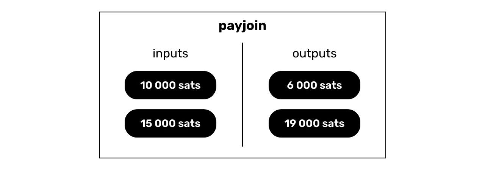

Seeing this transaction on the blockchain, an external observer following the usual heuristics of chain analysis would interpret it as follows: "*Alice merged 2 UTXOs in inputs of the transaction to pay 19,000 sats to Bob*".

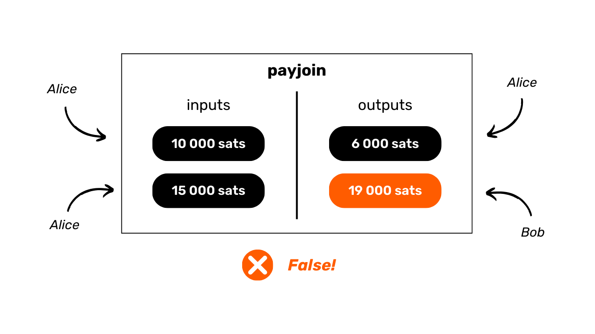

This interpretation is obviously incorrect, as you already know, the two UTXOs in inputs do not belong to the same person. One comes from Alice, the buyer of the baguette, and the other from Bob, the baker.


The analysis of the external observer is thus directed towards a wrong conclusion, which ensures the preservation of the confidentiality of the stakeholders.

### The steganographic transaction

The second objective of the payjoin is to deceive an external observer about the actual amount of the payment that was made. By examining the structure of the transaction, the analyst might believe that the payment is equivalent to the amount of one of the outputs.
If we revisit our example of buying a baguette, the analyst will think that the payment amount corresponds either to the UTXO of 6,000 sats or to the UTXO of 19,000 sats. In this case, the analyst is more likely to think that the payment amount is 19,000 sats, because there are 2 UTXOs in outputs, at least one of which is greater than 6,000 sats (there is no logical reason to use 2 UTXOs to pay 6,000 sats when a single UTXO would have sufficed for this payment).
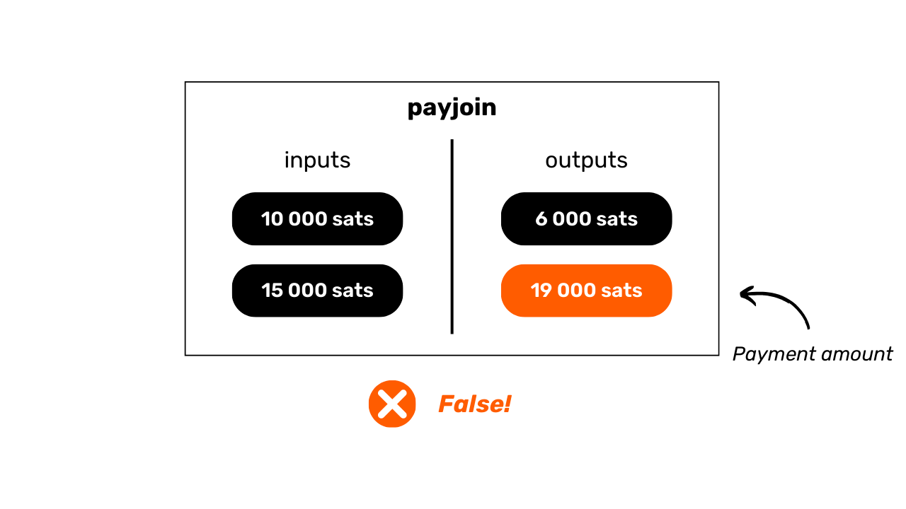

But in reality, this analysis is incorrect. The payment amount does not correspond to any of the outputs. It is actually the difference between the recipient's UTXO in output and the recipient's UTXO in input.

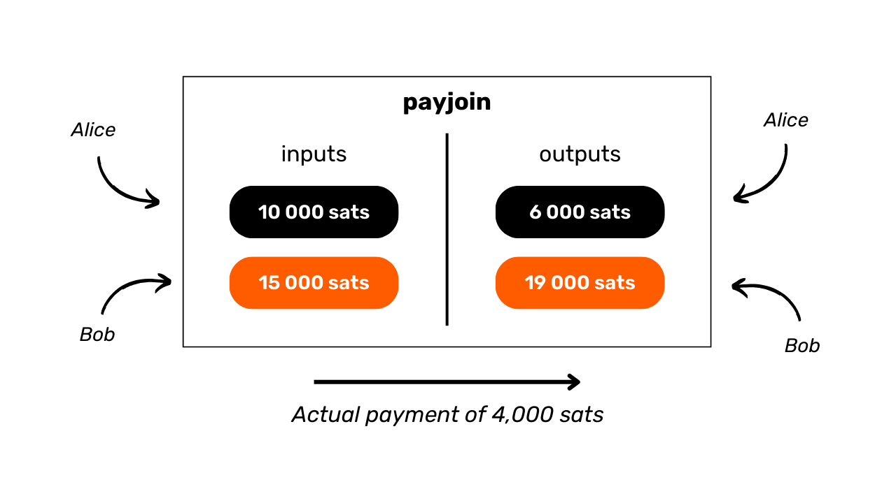

In this, the payjoin transaction falls into the realm of steganography. It allows hiding the real amount of a transaction within a fake transaction that acts as a decoy.

Steganography is a technique for concealing information within other data or objects, in such a way that the presence of the hidden information is not perceptible. For example, a secret message can be hidden inside a dot in a text that is unrelated, making it undetectable to the naked eye (this is the technique of [micropoint](https://fr.wikipedia.org/wiki/Micropoint)).

Unlike encryption, which makes information unintelligible without the decryption key, steganography does not alter the information. It remains in plain sight. Its goal is rather to hide the very existence of the secret message, whereas encryption clearly reveals the presence of hidden information, although inaccessible without the key. This is why the initial name for payjoin was "*steganographic transactions*".

An analogy could be made between cryptography and coinjoin, as well as between steganography and payjoin. Indeed, coinjoin has attributes similar to those of encryption: the method is recognizable, but the information is indecipherable. Conversely, payjoin is akin to steganography: the information is theoretically accessible, but since its method of concealment is not recognizable, it becomes inaccessible.

### How to use payjoin?

Among the known software that supports payjoin, there are Sparrow Wallet, Wasabi Wallet, Mutiny, BitMask, BlueWallet, and JoinMarket, as well as the payment processor BTCPay.


The most advanced implementation of payjoin was only the Stowaway on Samourai Wallet. However, since the arrest of the software's founders, this tool now only works partially. The advantage of Stowaway is that it's a complete and very simple-to-use protocol, which supports both receiving and sending payjoins. Partially signed transactions can be manually exchanged via scanning multiple QR codes or automatically through Tor via Soroban. It's this latter communication option that is currently out of service.


The difficulty of using payjoin lies in its dependence on the merchant's participation. As a customer, using a payjoin is impossible if the merchant does not support it. This adds an additional difficulty during a purchase: not only is it complicated to find merchants accepting bitcoin, but if one also looks for those who support payjoins, it becomes even more complicated.

A solution would be to use transactional structures that introduce ambiguity in the chain analysis without requiring the cooperation of the recipient. This would allow us to improve the privacy of our payments without depending on the active participation of merchants. This is precisely what we will study in the next chapter.

https://planb.network/tutorials/privacy/payjoin-sparrow-wallet

https://planb.network/tutorials/privacy/payjoin-samourai-wallet

## Payment Mini-Coinjoins
<chapterId>300777ee-30ae-43d7-ab00-479dac3522c1</chapterId>

When looking to make a payment transaction while preserving a certain degree of privacy, payjoin is a good option. But as we have seen, payjoin requires the involvement of the recipient. What to do then if the latter refuses to participate in a payjoin, or if you simply prefer not to involve them? An alternative is to use a Stonewall or Stonewall x2 transaction. Let's take a closer look at these two types of transactions.

### The Stonewall Transaction

Stonewall is a specific form of Bitcoin transaction aimed at increasing user privacy during a spend by mimicking a pseudo-coinjoin between two people, without actually being one. Indeed, this transaction is not collaborative. A user can construct it alone, only involving the UTXOs they own as inputs. You can therefore create a Stonewall transaction for any occasion, without needing to synchronize with another user or the recipient.

The operation of the Stonewall transaction is as follows: in the input of the transaction, the sender uses 2 UTXOs that belong to them. In the output, the transaction produces 4 UTXOs, 2 of which will be exactly the same amount. The other 2 UTXOs will constitute change. Among the 2 outputs of the same amount, only one will actually go to the recipient of the payment.
There are only 2 roles in a Stonewall transaction:
- The sender, who makes the payment;
- The recipient, who may be unaware of the specific nature of the transaction and is simply waiting for a payment from the sender.

Let's take an example to understand this transaction structure. Alice is at Bob the baker's to buy her baguette, which costs 4,000 sats. She wants to pay in bitcoins while maintaining a certain level of privacy regarding her payment. Therefore, she decides to construct a Stonewall transaction for the payment.


Analyzing this transaction, we can see that Bob the baker indeed received 4,000 sats in payment for the baguette. Alice used 2 UTXOs as inputs: one of 10,000 sats and one of 15,000 sats. In outputs, she received 3 UTXOs: one of 4,000 sats, one of 6,000 sats, and one of 11,000 sats. Alice thus has a net balance of -4,000 sats on this transaction, which corresponds exactly to the price of the baguette.

In this example, I intentionally neglected the mining fees to facilitate understanding. In reality, the transaction fees are entirely borne by the sender.

### What are the objectives of a Stonewall transaction?

The Stonewall structure adds a lot of entropy to the transaction and blurs the tracks of chain analysis. From the outside, such a transaction can be interpreted as a mini-coinjoin between two people. But in reality, it is a payment. This method thus generates uncertainties in chain analysis, or even leads to false trails.

Let's go back to the example of Alice at Bob the baker's. The transaction on the blockchain would look like this:


An external observer relying on common chain analysis heuristics might wrongly conclude that "*two people have made a small coinjoin, with one UTXO each in input and two UTXOs each in output*". The analysis of this transaction from the outside does not lead to the application of the Common Input Ownership Heuristic (CIOH), because the presence of two outputs of the same amount suggests a coinjoin pattern. From an external point of view, the CIOH is therefore not applicable in this specific case.


This interpretation is inaccurate, because, as you know, one UTXO was sent to Bob the baker, the 2 UTXOs in inputs come from Alice, and she retrieved 3 change outputs.


And what is particularly interesting about the structure of the Stonewall transaction is that from the perspective of an external observer, it looks exactly like that of a Stonewall x2 transaction.

### The Stonewall x2 Transaction

Stonewall x2 is another specific form of Bitcoin transaction that also aims to increase user privacy during a spending, but this time by collaborating with a third party not involved in the spending. This method works like a pseudo-coinjoin between two participants, while making a payment to a third person at the same time.

The operation of the Stonewall x2 transaction is relatively simple: one uses a UTXO in their possession to make the payment and solicits the help of a third party who also contributes with a UTXO they own. The transaction ends with four outputs: two of them of equal amounts, one intended for the address of the payment recipient, the other to an address belonging to the collaborator. A third UTXO is sent back to another address of the collaborator, allowing them to recover the initial amount (a neutral action for them, minus the mining fees), and a last UTXO returns to an address belonging to us, which constitutes the change of the payment.

Thus, three different roles are defined in the Stonewall x2 transactions:
- The sender, who makes the actual payment;
- The recipient, who may be unaware of the specific nature of the transaction and simply awaits a payment from the sender;
- The collaborator, who provides bitcoins to cast doubt in the transaction analysis, while fully recovering their funds at the end (a neutral action for them, minus the mining fees).

Let's go back to our example with Alice who is at Bob the baker's to buy her baguette which costs 4,000 sats. She wants to pay in bitcoins while maintaining a certain level of privacy on her payment. So, she calls on her friend Charles, who will help her in this process.


Analyzing this transaction, we can see that Bob the baker has indeed received 4,000 sats in payment for the baguette. Alice used 10,000 sats in input and recovered 6,000 sats in output, resulting in a net balance of -4,000 sats, which corresponds to the price of the baguette. As for Charles, he provided 15,000 sats in input and received two outputs: one of 4,000 sats and the other of 11,000 sats, making a balance of 0.

In this example, I intentionally neglected the fees to facilitate understanding. In reality, mining fees are generally shared equally between the payment issuer and the collaborator.

### What are the objectives of a Stonewall x2 transaction?
Like the Stonewall structure, the Stonewall x2 structure adds a significant amount of entropy to the transaction and obscures the tracks of chain analysis. From an external viewpoint, such a transaction could be interpreted as a small coinjoin between two people. But in reality, it is a payment. This method, therefore, generates uncertainties in chain analysis, even leading to false trails.

Let's revisit the example of Alice, Bob the Baker, and Charles. The transaction on the blockchain would look like this:


An external observer relying on common chain analysis heuristics might mistakenly conclude that "*Alice and Charles have conducted a small coinjoin, with one UTXO each in input and two UTXOs each in output*". Again, the analysis of this transaction from the outside does not lead to the application of the Common Input Ownership Heuristic (CIOH), because the presence of two outputs of the same amount suggests a coinjoin pattern. From an external viewpoint, the CIOH is therefore not applicable in this specific case.


This interpretation is inaccurate because, as you know, one UTXO was sent to Bob the Baker, Alice has only one change output, and Charles has two.


And once again, what is particularly interesting with the Stonewall x2 transaction structure is that from the viewpoint of an external observer, it looks exactly like that of a Stonewall transaction.

### What is the difference between Stonewall and Stonewall x2?

A StonewallX2 transaction operates exactly like a Stonewall transaction, except that the former is collaborative, while the latter is not. As we have seen, a Stonewall x2 transaction involves the participation of a third party (Charles), who is external to the payment, and who provides his bitcoins to enhance the confidentiality of the transaction. In a classic Stonewall transaction, the role of the collaborator is taken by the sender.


From an external viewpoint, the pattern of the transaction is therefore exactly the same.


The fact that these two transaction structures share exactly the same pattern implies that even if an external observer manages to identify a "Stonewall(x2)" pattern, they will not have all the information. They will not be able to determine which of the two UTXOs of the same amounts corresponds to the payment. Moreover, they will not be able to determine if the two UTXOs in inputs come from two different people (Stonewall x2) or if they belong to a single person who has merged them (Stonewall).
This last point is due to the fact that Stonewall x2 transactions follow exactly the same pattern as Stonewall transactions. From the outside and without additional information about the context, it is impossible to differentiate a Stonewall transaction from a Stonewall x2 transaction. However, the former are not collaborative transactions, while the latter are. This adds even more doubt in the analysis of one of these transactions.

### When to use Stonewall and Stonewall x2 transactions?

The logic should be as follows when wanting to use a privacy tool for a transaction:
- As a priority, one can choose to make a payjoin;
- If the merchant does not support payjoins, one can make a collaborative transaction with another person outside of the payment using the Stonewall x2 structure;
- If no one is found to make a Stonewall x2 transaction, one can make a Stonewall transaction alone, which will mimic the behavior of a Stonewall x2 transaction.

### How to use Stonewall and Stonewall x2 transactions?

Stonewall and Stonewall x2 transactions are available both on the Samourai Wallet app and on the Sparrow Wallet software.


However, just like with payjoins, following the arrest of the founders of Samourai, Stonewall x2 transactions now only work by manually exchanging the PSBTs between the parties involved. The automatic exchange via Soroban is unfortunately not available at the moment.

It is also possible to manually perform this type of transaction from any Bitcoin wallet software.

In the next chapter, we will study another privacy technique that is relatively unknown, but is very useful in addition to what we have already studied.

https://planb.network/tutorials/privacy/stonewall

https://planb.network/tutorials/privacy/stonewall-x2

## Ricochets

<chapterId>db9a20ac-a149-443d-884b-ea6c03f28499</chapterId>

The use of Bitcoin transaction structures that add ambiguity in chain analysis, such as coinjoin, is particularly beneficial for privacy protection. However, as we discussed in the chapter on payjoins, coinjoin transactions are naturally identifiable on the chain. Remember the analogy we established between encryption and coinjoins: when one encrypts a file, a third party discovering this encrypted file cannot access its content, but can clearly identify that there has been a modification of the file to hide its content. The same is true for coinjoin: when an analyst examines a coinjoin transaction, although they cannot establish direct links between the inputs and outputs (and vice versa), they can nevertheless recognize that the observed transaction is a coinjoin.
Depending on the intended use for your coin after undergoing coinjoin cycles, the fact that it has undergone this process can be problematic. For example, if you plan to sell your coin on a regulated exchange platform, but it has recently undergone a coinjoin, the platform's chain analysis tool will detect this fact. The platform might then refuse to accept your UTXO that has undergone a coinjoin, or even demand explanations from you, with the risk of having your account suspended or your funds frozen. In some cases, the platform may also report your behavior to state authorities (for example, this is what TRACFIN requires from Digital Asset Service Providers (PSAN) in France).


What we would need to avoid this is a tool capable of blurring the traces of a Bitcoin coin's past, in order to restore a certain form of fungibility. This is precisely the goal of ricochet.


### What is a ricochet?

Ricochet is a technique that involves carrying out several fictitious transactions to oneself (sweeping) to simulate a transfer of ownership of bitcoins. This tool is different from other transaction structures we have discussed because it does not allow for prospective anonymity, but rather a form of retrospective anonymity. Indeed, ricochet allows for blurring the specifics that could compromise the fungibility of a Bitcoin coin due to its past.

To blur the imprint left by a past event on a coin, such as coinjoin cycles, for example, ricochet executes four successive transactions where the user transfers funds to themselves on different addresses.

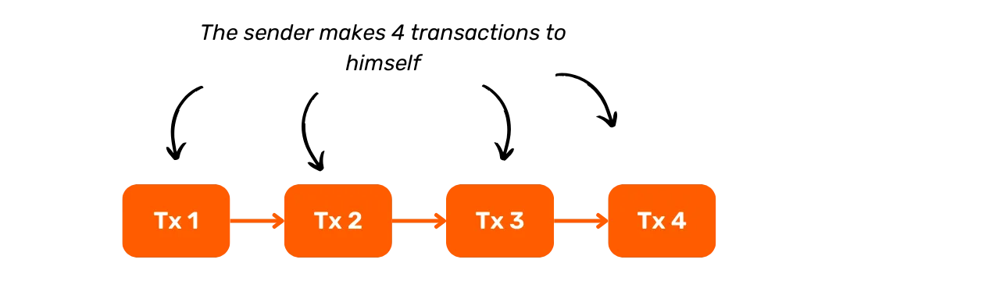

After this sequence of transactions, the ricochet tool finally routes the bitcoins to their final destination, such as an exchange platform.


The goal is to create distance affecting the fungibility of the coin, such as a coinjoin transaction, and the final act of spending that could reject this coin because of its past. Thus, chain analysis tools might conclude that there has probably been a change of ownership after the event, and consider that this coin is fungible. In the case of a coinjoin, chain analysis tools might then assume that it is not the same person who sent the bitcoins and performed the coinjoin, and therefore it is unnecessary to initiate actions against the sender.


### Why does this work?
Facing this ricochet method, one might imagine that chain analysis software would deepen their examination beyond four hops. However, these platforms face a dilemma in optimizing the detection threshold. They must establish a limit on the number of jumps after which they admit that a change of ownership has likely occurred and that the link with a previous event (such as a coinjoin) should be ignored.


However, determining this threshold proves risky: each extension of the observed number of hops exponentially increases the volume of false positives, that is, individuals erroneously marked as participants in an event, when the operation was carried out by someone else. This scenario poses a major risk for these companies, as false positives lead to dissatisfaction, which can push affected customers towards the competition. In the long term, a too broad detection threshold leads a platform to lose more customers than its competitors, which could threaten its viability. Therefore, it is complicated for these platforms to increase the number of observed hops, and 4 is often a sufficient number to counter their analyses.

The phenomenon observed here is somewhat analogous to the theory of six degrees of separation.

The theory of six degrees of separation suggests that any person on Earth is connected to any other through a chain of acquaintances that includes no more than six intermediaries. It would suffice to go through a series of six people, each personally knowing the next, to reach any individual in the world.

For Bitcoin transactions, a similar phenomenon is found. By tracing back a sufficient number of Bitcoin transactions, one inevitably ends up encountering a coinjoin. The ricochet method takes advantage of this principle by using a number of hops higher than what exchange platforms can reasonably follow. If platforms decide to follow more transactions, it is then possible to simply add an additional hop to circumvent this measure.

### When and how to use ricochet?

The most common use case for ricochet occurs when it is necessary to conceal previous participation in a coinjoin on a UTXO that you own. Ideally, it is better to avoid transferring bitcoins that have undergone a coinjoin to regulated entities. Nevertheless, in the event that one finds oneself without any other option, especially in the urgency of liquidating bitcoins into fiat currency, ricochet offers an effective solution.

This method is effective not only for coinjoins but also for any other mark that could compromise the fungibility of a coin.
The idea of this ricochet method originally comes from the teams at Samourai Wallet, who integrated it into their application to automate the process. The service is paid on Samourai, as a ricochet involves a service fee of 100,000 sats, in addition to mining fees. Thus, its use is rather recommended for transfers of significant amounts.


The Samourai application offers two variants of ricochet:
- The enhanced ricochet, or "staggered delivery," which has the advantage of spreading the Samourai service fees over five successive transactions. This option also ensures that each transaction is broadcast at a distinct time and recorded in a different block, which allows it to mimic the behavior of a change of ownership as closely as possible. Although slower, this method is preferable for those who are not in a hurry, as it maximizes the efficiency of the ricochet by strengthening its resistance to chain analysis;


- The classic ricochet, which is designed to execute the operation quickly by broadcasting all transactions within a short time frame. This method, therefore, offers less privacy and lower resistance to analysis than the enhanced method. It should only be used for urgent sendings.


Ricochet simply involves sending bitcoins to oneself. It is entirely possible to perform a ricochet manually on any wallet software, without using a specialized tool. Just transfer the same coin to yourself successively, using a new blank address each time.

In the following chapter, we explore different techniques for secret property transfers. These methods differ radically from those we have examined so far, both in terms of operation and results.

https://planb.network/tutorials/privacy/ricochet
 
## Secret Property Transfers
<chapterId>a2067036-849c-4d6b-87d2-44235cfae7a1</chapterId>

Among the privacy techniques on Bitcoin, there is also the secret property transfer. This method aims to transfer the ownership of bitcoins from one person to another, and vice versa, without this transaction being explicitly visible on the blockchain. Let's study together the different techniques available as well as their advantages and disadvantages.

### The CoinSwap

The CoinSwap is based on a relatively simple concept: it uses smart contracts to facilitate a transfer of bitcoin ownership between two users, without the need for trust and without this transfer being explicitly visible on the blockchain.


Let's imagine a simplistic example with Alice and Bob. Alice owns 1 BTC secured with the private key $A$, and Bob also owns 1, secured with the private key $B$. Theoretically, they could exchange their private keys via an external communication channel to carry out a secret transfer.


However, this naive method presents a high risk in terms of trust. Nothing prevents Alice from keeping a copy of the private key $A$ after the exchange and using it later to steal the bitcoins, once the key is in Bob's possession.


Moreover, there is no guarantee preventing Alice from receiving Bob's private key $B$ and never sending her private key $A$ in return. This exchange, therefore, relies on excessive trust between the parties and proves inefficient in ensuring a secret transfer of ownership securely.


To solve these problems and allow exchanges between parties who do not trust each other, we can instead use smart contract systems. A smart contract is a program that automatically executes when predefined conditions are met, which, in our case, ensures that the exchange of ownership happens automatically without requiring mutual trust.

To do this, we can use HTLC (*Hash Time-Locked Contracts*) or PTLC (*Point Time-Locked Contracts*). These two protocols function similarly by using a time-locking system that guarantees the exchange is either completed successfully or entirely canceled, thus protecting the integrity of both parties' funds. The main difference between HTLCs and PTLCs is that HTLCs use hashes and preimages to secure the transaction, while PTLCs use Adaptor Signatures.

In a coinswap scenario using an HTLC or a PTLC between Alice and Bob, the exchange occurs securely: either it succeeds, and each receives the other's BTC, or it fails, and each retains their own BTC. It is thus impossible for one of the parties to cheat or steal the BTC of the other.

> *HTLCs are also the mechanism used for routing payments securely across the bidirectional channels of the Lightning Network.*

The use of Adaptor Signatures is particularly interesting in this context, as it allows for the bypassing of traditional scripts (this is a mechanism sometimes referred to as "_scriptless scripts_"). This feature helps to reduce the fees associated with the exchange. Another major advantage of Adaptor Signatures is that they do not require the use of a common hash for both parties of the transaction, thus avoiding revealing a direct link between them in certain types of exchanges.
### Adaptor Signatures

Adaptor Signatures are a cryptographic method that integrates a valid signature with an additional signature, called an "_adaptor signature_," to reveal a secret piece of data. This mechanism is designed in such a way that knowing 2 of the following 3 elements: the valid signature, the adaptor signature, and the secret, allows for the deduction of the missing third element. An interesting property of this method is that, if we know our counterpart's adaptor signature and the specific point on the elliptical curve associated with the secret used to calculate this adaptor signature, we can derive our own adaptor signature that will be compatible with that same secret, without ever having direct access to the secret itself.

In a coinswap, the use of Adaptor Signatures allows for the simultaneous unveiling of two sensitive pieces of information between participants, thus avoiding the need for mutual trust. Let's take an example to illustrate this process with Alice and Bob, who wish to exchange the ownership of 1 BTC each, but do not trust each other. They use Adaptor Signatures to eliminate the need for trust in this exchange. Here is how they proceed:

* Alice initiates the exchange by creating a transaction $m_A$ that sends 1 BTC to Bob. She generates a signature $s_A$, which validates this transaction, using her private key $p_A$ ($P_A = p_A \cdot G$), a nonce $n_A$ ($N_A = n_A \cdot G$), and a secret $t$ ($T = t \cdot G$):

$$s_A = n_A + t + H(N_A + T \parallel P_A \parallel m_A) \cdot p_A$$

* Alice calculates the adaptor signature $s_A'$ by subtracting the secret $t$ from her true signature $s_A$:

$$s_A' = s_A - t$$

* Alice sends to Bob her adaptor signature $s'_A$, her unsigned transaction $m_A$, the point corresponding to the secret ($T$), and the point corresponding to the nonce ($N_A$). These elements constitute what is called an "*adaptor*". It is important to note that, with only this information, Bob cannot recover Alice's BTC.
* However, Bob has the ability to verify that Alice is not trying to steal from him. To do this, he checks if Alice's adaptor signature $s_A'$ actually corresponds to the proposed transaction $m_A$. If the following equation is correct, he can then be sure that Alice's adaptor signature is valid:
$$s_A' \cdot G = N_A + H(N_A + T \parallel P_A \parallel m_A) \cdot P_A$$

* This verification provides Bob with sufficient guarantees to proceed with the exchange confidently. He then creates his own transaction $m_B$, intended to send 1 BTC to Alice, and generates his adaptor signature $s_B'$, which will also be linked to the same secret $t$. At this point, only Alice knows the value of $t$; Bob only knows the corresponding point $T$ that Alice has transmitted to him:

$$s_B' = n_B + H(N_B + T \parallel P_B \parallel m_B) \cdot p_B$$

* Bob transmits to Alice his adaptor signature $s_B'$, his unsigned transaction $m_B$, as well as the point corresponding to the secret ($T$) and the point corresponding to the nonce ($N_B$). Alice, who knows the secret $t$, can now combine Bob's adaptor signature $s_B'$ with this secret to generate a valid signature $s_B$ for the transaction $m_B$ that will transfer Bob's BTC to her:

$$s_B = s_B' + t$$

$$(s_B' + t) \cdot G = N_B + T + H(N_B + T \parallel P_B \parallel m_B) \cdot P_B$$

* Alice broadcasts this signed transaction $m_B$ on the Bitcoin blockchain to recover the BTC promised by Bob. When Bob sees this transaction on the blockchain, he can extract the signature $s_B = s_B' + t$. With this information, Bob is then able to isolate the famous secret $t$ he needed:

$$t = (s_B' + t) - s_B' = s_B - s_B'$$

* And indeed, this secret $t$ was the only missing element for Bob to generate the valid signature $s_A$ from Alice's adaptor signature $s_A'$. This signature allows validating the transaction $m_A$ that sends a BTC from Alice to Bob. Bob then calculates $s_A$ and in turn broadcasts the transaction $m_A$ on the blockchain:

$$s_A = s_A' + t$$

$$(s_A' + t) \cdot G = N_A + T + H(N_A + T \parallel P_A \parallel m_A) \cdot P_A$$
Let's summarize how an Adaptor Signature works in a coinswap. Initially, Alice sends Bob an unsigned transaction along with an adaptor, which allows Bob to verify that the secret revealed later will give him access to the bitcoins. In return, Bob sends Alice his own unsigned transaction and his adaptor. Alice can then finalize Bob's transaction and recover the bitcoins by broadcasting a valid transaction using the secret. When this transaction is published on the blockchain, Bob has the ability to extract the secret and thus unlock Alice's transaction. Consequently, if Alice initiates a transfer of Bob's bitcoin, he can, in turn, access Alice's bitcoin without requiring mutual trust.
It's worth noting that coinswaps were first proposed by [Gregory Maxwell in October 2013 on BitcoinTalk](https://bitcointalk.org/index.php?topic=321228.0).

### The Atomic Swap

Similar to the coinswap and using the same types of smart contracts, it is also possible to perform atomic swaps. An atomic swap allows for a direct exchange of different cryptocurrencies, such as BTC and XMR, between two users without requiring trust or the intervention of an intermediary. These exchanges are termed "atomic" because they have only two possible outcomes: either the exchange is successful and both parties are satisfied, or it fails and each retains their original cryptocurrencies, thus eliminating the need for trust in the other party.


The atomic swap and the coinswap share a similar method of operation and offer the same advantages and disadvantages in terms of privacy. Indeed, from the perspective of Bitcoin, an atomic swap is comparable to a coinswap performed in two steps. First, we exchange our BTC for another cryptocurrency, and then this cryptocurrency can be exchanged for other BTC. Ultimately, we recover the BTC of another user. This is why, in the analysis of privacy issues, I group these two protocols under the category of secret exchanges of ownership.


However, unlike the coinswap, the atomic swap can have imbalances in terms of available liquidity, especially in BTC/XMR exchanges. It is generally easier to exchange bitcoins for altcoins, as there is a high demand for bitcoins, which keeps the premiums low for this direction of conversion. However, exchanging altcoins to get BTC can be more complex due to lower demand, often resulting in very high premiums.

Finally, when an atomic exchange involves onchain bitcoins and bitcoins on the Lightning network, we then refer to it as a "*submarine swap*".

### Is It Really Useful?
Secret property transfers, such as coinswaps and atomic swaps, have the advantage of deceiving chain analysis heuristics. These methods can give the impression that transactions involve the same user, even though the actual ownership has changed hands. However, the main drawback of these methods is that they are very risky without the use of an additional technique to break the coin's history.

Indeed, when Alice performs a coinswap or an atomic swap with Bob, she exchanges the ownership of her bitcoins with Bob's. In the case of an atomic swap, the exchange includes an altcoin, but the principle remains the same. Thus, Alice ends up with coin $B$ and Bob with coin $A$. This adds doubt in chain analysis, but the history of the coins remains traceable. If an analyst examines coin $A$, they can trace back to Alice's previous activities, and vice versa for coin $B$.

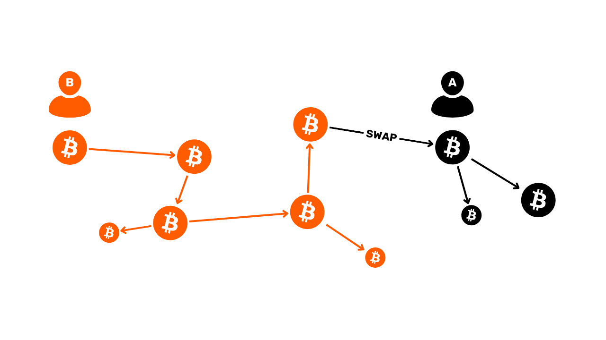

From Alice's perspective, the risk is that the history of coin $B$ could be deemed suspicious by certain entities. If, for example, Bob had acquired coin $B$ in a criminal act such as hacking, this coin would remain linked to his illegal activities. Alice could then find herself in possession of a coin that she could not transfer on regulated exchange platforms without risking having her funds frozen, or even being accused of Bob's crimes, although she had nothing to do with them.

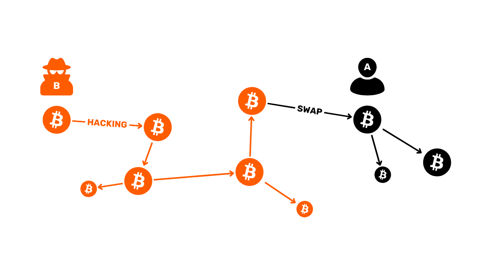

And of course, privacy methods like coinswap or atomic swap are favored by criminals whose funds are monitored by authorities. These protocols offer them the opportunity to dispose of their monitored bitcoins in exchange for perfectly fungible bitcoins. This also allows them to create a diversion, directing authorities towards other users. There is thus a dual utility for these individuals.

With coinjoin, even if your coin is mixed with monitored bitcoins, the coin's history is broken, which provides a form of plausible deniability that is nonexistent in secret property transfer protocols like coinswap or atomic swap.


If Alice wants to avoid any risk, she must necessarily use a method to break the history of coin $B$, such as running it through coinjoins, for example. This raises a question about the utility of combining the secret transfer of ownership and the coinjoin. The coinjoin, by breaking the history of a coin, already provides a sufficient level of privacy for Alice. Thus, my opinion is that if Alice is looking to protect her privacy, it would be more prudent to proceed directly with a coinjoin rather than engaging in a coinswap followed by a coinjoin.
For the methods of secret ownership transfer to be truly effective and avoid the risk of linking the history of a user $A$ to a user $B$, it would paradoxically be necessary for their use to be widely known. If the coinswap is used massively and the authorities are aware of this common practice, then a form of plausible deniability could be established. However, as long as the use of these transfers remains marginal, I believe these methods will remain too risky for users.

So far, we have mainly studied privacy methods at the transaction level themselves. In the next chapter, we will explore the issues at the network level and the dissemination of transactions.

## Privacy on the P2P Network
<chapterId>04a2467b-db84-4076-a9ff-919be5135106</chapterId>

In part 4, we discussed the importance of using a full node to protect the privacy of your transactions. However, it is important to understand that your node itself can be subject to attacks seeking to extract information about your activities. In this chapter, we will therefore examine the different privacy protection measures, not at the level of the transactions themselves or the flows of bitcoins, but at the network level.

### Dandelion

One way to avoid various de-anonymization attacks is to use the Dandelion proposal. This broadcast protocol was formalized in BIP156, but it has never been implemented on Bitcoin.

The idea of Dandelion is to improve the privacy of transaction routing in the Bitcoin network to counter various forms of attacks. Its main goal is to hide the source node that initially broadcast a transaction on the network. The disclosure of this node could link a Bitcoin transaction to a specific IP address (if the node operates on the clearnet), which could provide an entry point for chain analysis.
This association between an activity on Bitcoin and an IP address represents a significant risk to the user's privacy. Indeed, numerous entities can easily link an IP address to a personal identity. This notably includes governments and Internet service providers. Moreover, this information can become publicly accessible, for example, if your IP address and personal data are exposed due to a leak during the hacking of a website's database.
In the standard operation of Bitcoin, transactions constructed by a user on their wallet software are transmitted to their personal node. This node immediately broadcasts the new transaction to all the peers it is connected to.


These peers then verify the transaction to ensure it complies with the consensus rules and local standardization rules. Once validated, each peer in turn transmits the transaction to its own peers, and so on.


The distribution of transactions pending integration into a block is done in a fairly balanced and statistically predictable manner. This vulnerability can be exploited by colluding spy nodes, which collaborate to monitor and analyze the network, in order to identify the first node to have broadcast a transaction. If an observer manages to locate the source node, they can assume that the transaction originates from the operator of that node. This type of observation can link transactions, normally anonymous, to specific IP addresses.


The goal of BIP156 is to address this problem. To do this, it introduces an additional phase in the broadcasting of a new transaction to preserve anonymity before widespread public propagation. Dandelion first uses a "stem" phase where the transaction is sent through a random path of nodes.


The transaction is then broadcast to the entire network in the "fluff" phase.


The stem and fluff are references to the behavior of the transaction's propagation through the network, resembling the shape of a dandelion.

Thus, spy nodes can potentially trace the transaction back to the node that initiated the fluff phase (the massive broadcast), but this node is not the one that first broadcast the transaction, as it received it from the last node in the stem. If spy nodes cannot trace back up the stem, they also cannot identify the source node.


Even in the presence of spy nodes during the stem phase, doubt always remains because as soon as they encounter an honest node in the diffusion graph, the spies cannot determine if this node is the original source or simply an intermediary.


This routing method blurs the trail leading to the source node, making it difficult to trace a transaction through the network back to its origin. Dandelion thus improves privacy by limiting the adversaries' ability to deanonymize the network. This method is even more effective when the transaction crosses during the "stem" phase a node that encrypts its network communications, as with Tor or P2P Transport V2.

BIP156 has not been integrated into Bitcoin Core and is currently classified under the status "rejected". One of the main concerns about this protocol lies in the fact that, during the stem phase, transactions must be relayed by intermediary nodes before being verified. As we have seen, in the normal model of Bitcoin, each node first verifies the transaction before broadcasting it to its peers. If a transaction does not comply with the consensus rules or the local standardization rules of the node, it ignores and does not broadcast it. This process is important to counter DoS attacks, as only valid transactions are broadcast to the entire network. Invalid transactions, potentially generated en masse to overload the network, are stopped at the first node encountered and do not propagate. The main risk with Dandelion is that this new protocol could introduce new vectors for DoS attacks by allowing the broadcast of invalid transactions through part of the network.

### P2P Transport V2

P2P Transport V2 is another network protocol presented in BIP324. It is a new version of the Bitcoin P2P transport protocol that incorporates opportunistic encryption to improve the confidentiality and security of communications between nodes.

This improvement aims to solve several issues with the basic version of the P2P protocol. On one hand, it makes the data exchanged indistinguishable from other types of data circulating on the Internet to a passive observer. The main goal is to prevent governments, Internet service providers, or VPN providers from massively monitoring Bitcoin users. This also complicates the task for these entities to determine if an Internet user is also a Bitcoin user, that is, if they are operating a full node.
P2P V2 also contributes to reducing the risks of censorship and attacks through the detection of specific patterns in data packets. It complicates and makes the execution of various types of Sybil attacks more costly at the network level. A Sybil attack occurs when an actor creates multiple false identities to gain an undue advantage. In the context of the Bitcoin network, this often manifests as an actor controlling a large number of full nodes and using them aggressively to multiply connections. Sybil attacks can be passive, aiming to collect information and compromise user confidentiality, or active, in the form of Eclipse attacks. The latter isolate a specific node from the rest of the network, allowing either to censor the user or to alter the data they receive. Finally, P2P V2 also makes *Man-In-The-Middle* (MITM) attacks more costly and easier to detect.
The encryption implemented by P2P V2 does not include authentication in order not to add unnecessary complexity, and to not compromise the permissionless nature of network connection. This new P2P transport protocol nevertheless offers better security against passive attacks and makes active attacks significantly more costly and detectable. The introduction of a pseudo-random data stream in network messages complicates the task for attackers wishing to censor or manipulate communications.

P2P V2 transport was included as an option (disabled by default) in version 26.0 of Bitcoin Core, deployed in December 2023. It was then enabled by default in version 27.0 in April 2024. It can be modified with the `v2transport=` option in the configuration file.

### Tor

Another relatively simple solution to avoid the risks of confidentiality loss for a node at the network level is to run it entirely under Tor.

Tor is a network of relay servers (nodes) that anonymizes the origin of TCP connections on the internet. It works by encapsulating data in multiple layers of encryption. Each relay node removes a layer to reveal the address of the next node, until reaching the final destination. The Tor network ensures anonymity by preventing intermediate nodes from knowing both the origin and destination of the data, making it very difficult for an observer to trace the user's activity.


Tor therefore not only encrypts the data communicated but also allows for the masking of the origin and destination of communications. By using Tor for the communications of one's personal node, we enhance the privacy of our transactions: the Internet Service Provider (ISP) cannot decrypt the communications, and other nodes in the Bitcoin network cannot identify the IP address of the source node. Moreover, Tor also hides your use of Bitcoin from your ISP.

The main risk associated with this method is that Tor is a protocol independent of Bitcoin. If you have a Bitcoin node under Tor and Tor stops working, then your Bitcoin node will no longer be able to communicate.

Also, it is important to note that communications over Tor are slower. This latency is particularly bothersome during the initial launch of a node, as the Initial Block Download (IBD) requires a lot of communications. As a result, your initial synchronization with the Bitcoin network could be significantly longer using Tor. It is also possible to perform the IBD on the clearnet, then activate Tor later. Although this method reveals the existence of your Bitcoin node to your ISP, it protects the information related to your personal transactions once you switch to Tor.

After exploring the different network-level privacy methods, I also want to introduce in the coming chapters two elegant solutions to avoid address reuse: BIP47 and Silent Payments.

## BIP47 and Reusable Payment Codes
<chapterId>ad88e076-a04b-4aec-b3b2-7b4760175504</chapterId>

As we saw in part 3, address reuse poses a serious obstacle to user privacy on the Bitcoin protocol. To mitigate these risks, it is strongly recommended to generate a fresh receiving address for each new payment received in a wallet. Although generating a new address is today simplified by the use of modern software and hierarchical deterministic wallets, this practice may seem counterintuitive.


In the traditional banking system, for example, we are accustomed to sharing our IBAN, which always remains the same. Once communicated to someone, they can send us multiple payments without having to interact with us again. Neo-banks also offer more modern possibilities like the use of unique email addresses on PayPal or RevTags on Revolut. Even outside the financial domain, our daily identifiers such as our postal address, phone number, and email address are also unique and permanent. We do not have to renew them with each new interaction.


However, the operation of Bitcoin is different: it is imperative to generate a new receiving address for each incoming transaction. This compromise between ease of use and privacy dates back to the very origin of the Bitcoin White Paper. From the publication of the first version of his document at the end of 2008, Satoshi Nakamoto already warned us about this risk:
**"*As an additional firewall, a new pair of keys could be used for each transaction to keep them unlinked to a common owner.*"**

There are numerous methods for receiving multiple payments to a single identifier without causing address reuse. Each has its own compromises and drawbacks. Among these methods is BIP47, a proposal developed by Justus Ranvier and published in 2015. This proposal aims to create reusable payment codes that allow for multiple transactions to the same person while avoiding address reuse. In essence, BIP47 seeks to offer a payment system as intuitive as a unique identifier, while preserving the privacy of transactions.


BIP47 does not directly improve user privacy, as a BIP47 payment offers the same level of privacy as a classic Bitcoin transaction using fresh addresses. However, it makes the use of Bitcoin more convenient and intuitive, an ease that, normally, should compromise privacy. Thanks to BIP47, this ease of use achieves the same level of privacy as a classic transaction. This is why BIP47 is a valuable tool for the preservation of privacy.

Initially, BIP47 was a proposal formulated to be integrated into Bitcoin Core, but it was never adopted. Some software has still chosen to implement it on their own at the application level. Thus, the teams at Samourai Wallet have developed their own implementation of BIP47 named "PayNym".

### General Principle of BIP47 and PayNym

The goal of BIP47 is to allow the reception of numerous payments without causing address reuse. It relies on the use of a reusable payment code, which allows different senders to send multiple payments to a single code belonging to another user. Thus, the recipient does not have to provide a new fresh address for each transaction, which greatly facilitates their exchanges while preserving their privacy.

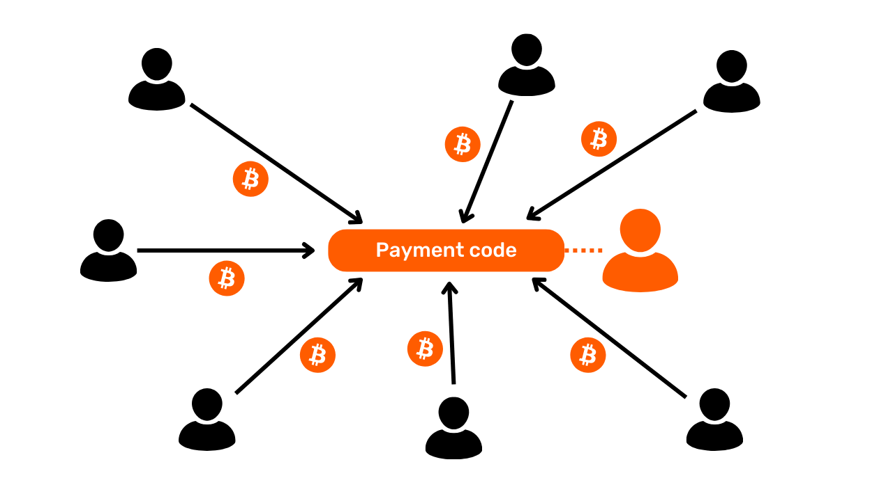

A user can therefore share their payment code freely, whether on social networks or on their website, without risking losing privacy, unlike what would happen with a classic receiving address or a public key.
To conduct a transaction, both parties must have a Bitcoin wallet with an implementation of BIP47, such as PayNym on Samourai Wallet or Sparrow Wallet. The joint use of their payment codes creates a secret channel between them. To establish this channel efficiently, the sender must perform a specific transaction on the Bitcoin blockchain, known as a "notification transaction" (I will give you more details on this later).

The combination of the payment codes of both users generates shared secrets, which in turn allow for the creation of a large number of unique Bitcoin receiving addresses (exactly 2^32, or about 4 billion). Thus, payments made via BIP47 are not actually addressed to the payment code itself, but rather to classic receiving addresses derived from the payment codes of the involved users.

The payment code thus serves as a virtual identifier derived from the wallet's seed. In the hierarchical derivation structure of the wallet, the payment code is positioned at level 3, that is, at the account level.

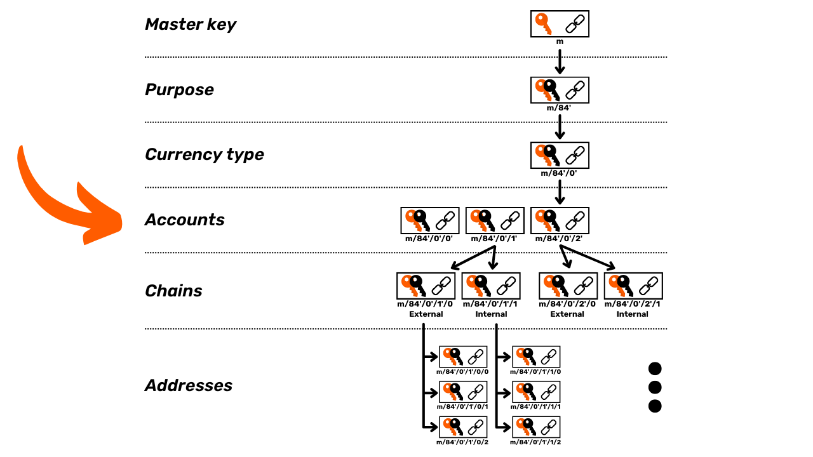

The derivation goal for BIP47 is identified by the index `47'` (`0x8000002F`), referring to BIP47. An example of a derivation path for a reusable payment code would be as follows:
```plaintext
m/47'/0'/0'/
```

To give you an idea of what a payment code looks like, here is mine:
```plaintext
PM8TJSBiQmNQDwTogMAbyqJe2PE2kQXjtgh88MRTxsrnHC8zpEtJ8j7Aj628oUFk8X6P5rJ7P5qDudE4Hwq9JXSRzGcZJbdJAjM9oVQ1UKU5j2nr7VR5
```

This code can also be encoded in a QR code, to facilitate its communication, just like a classic receiving address.

Regarding PayNym Bots, these robots that are sometimes seen on Twitter, they are visual representations of the payment code, created by Samourai Wallet. They are generated via a hashing function, which gives them almost uniqueness. They appear in the form of a small string of characters starting with `+`:
```plaintext
+throbbingpond8B1
+twilightresonance487
+billowingfire340
```

These avatars can also be represented in the form of images:


Although these robots do not have a specific technical functionality within the framework of BIP47, they play a role in facilitating interactions between users by offering an easily recognizable visual identity.
In the following sections of this chapter dedicated to BIP47, we will examine in detail how it works, with a particular emphasis on the cryptographic methods used. To fully grasp these somewhat technical explanations, it is essential to first understand the structure of HD wallets, the key derivation processes, and the fundamental principles of elliptic curve-based cryptography. If you wish to delve deeper into these concepts, another free course is available on PlanB Network: [CRYPTO 301](https://planb.network/en/courses/crypto301). I still advise you to follow them, as understanding the technical workings of BIP47 will make it much easier for you to comprehend other similar proposals that we will discuss in the following chapters.
### Reusable Payment Code

As mentioned before, the reusable payment code is located at depth 3 of the HD wallet, making it comparable to an `xpub`, both in its position within the wallet structure and in its role.

The 80-byte payment code breaks down as follows:
- **Byte `0`: The version**. For the first version of BIP47, this byte is set to `0x01`;
- **Byte `1`: The bit field**. This space is reserved for integrating additional indications during specific uses. For standard use with PayNym, this byte is defined as `0x00`;
- **Byte `2`: The `y` parity**. This byte is `0x02` or `0x03`, indicating whether the public key's ordinate is even or odd, as a compressed public key is used;
- **From byte `3` to byte `34`: The `x` value**. These bytes represent the abscissa of the public key. The concatenation of `x` and the `y` parity forms the complete compressed public key;
- **From byte `35` to byte `66`: The chain code**. This space contains the chain code associated with the public key;
- **From byte `67` to byte `79`: The padding**. This space is intended for possible future developments. For the current version, zeros are simply placed here to reach the required 80-byte size for an `OP_RETURN` output.

Here is the hexadecimal representation of my reusable payment code already presented in the previous section:
```plaintext
0x010002a0716529bae6b36c5c9aa518a52f9c828b46ad8d907747f0d09dcd4d9a39e97c3c5f37c470c390d842f364086362f6122f412e2b0c7e7fc6e32287e364a7a36a00000000000000000000000000
```

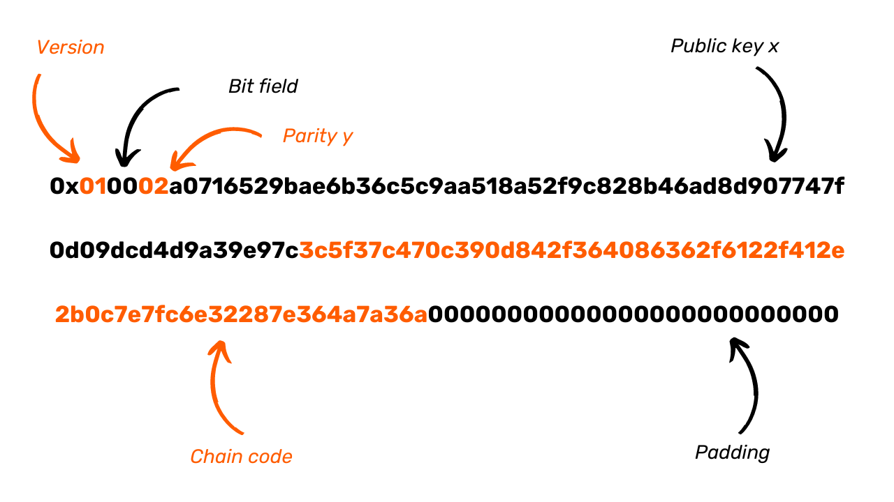

First, it's also necessary to add the prefix byte `P` at the beginning to clearly indicate that it is a payment code. This byte is represented by `0x47`:
```plaintext
0x47010002a0716529bae6b36c5c9aa518a52f9c828b46ad8d907747f0d09dcd4d9a39e97c3c5f37c470c390d842f364086362f6122f412e2b0c7e7fc6e32287e364a7a36a00000000000000000000000000
```

Finally, to ensure the integrity of the payment code, a checksum calculation is performed using `HASH256`, which consists of a double hashing with the `SHA256` function. The first four bytes resulting from this hash are then concatenated to the end of the payment code:
```plaintext
0x47010002a0716529bae6b36c5c9aa518a52f9c828b46ad8d907747f0d09dcd4d9a39e97c3c5f37c470c390d842f364086362f6122f412e2b0c7e7fc6e32287e364a7a36a00000000000000000000000000567080c4
```

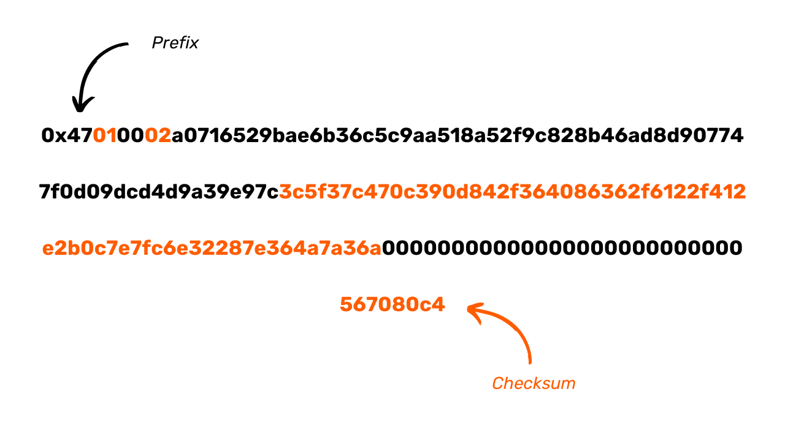

Once these steps are completed, the payment code is ready. The only thing left is to convert it into base 58 to obtain its final version:
```plaintext
PM8TJSBiQmNQDwTogMAbyqJe2PE2kQXjtgh88MRTxsrnHC8zpEtJ8j7Aj628oUFk8X6P5rJ7P5qDudE4Hwq9JXSRzGcZJbdJAjM9oVQ1UKU5j2nr7VR5
```

During this payment code creation process, we use a compressed public key and a chain code. Both are derived from a deterministic and hierarchical derivation from the wallet's seed. The derivation path used to achieve this is:
```plaintext
m/47'/0'/0'/
```
To generate the compressed public key and the associated chain code for the reusable payment code, we start by calculating the master private key from the wallet's seed. We then proceed to derive a pair of child keys using the index `47 + 2^31` (hardened derivation). This step is followed by two more successive derivations of child pairs, each using the index `2^31` (hardened derivation).
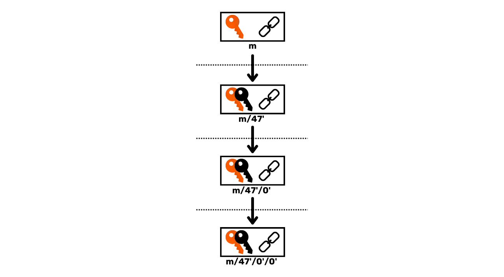

### The Elliptic-Curve Diffie-Hellman (ECDH) Key Exchange

The cryptographic protocol at the heart of BIP47 is referred to by the acronym ECDH, for *Elliptic-Curve Diffie-Hellman*. This method is a variant of the original Diffie-Hellman key exchange.

Introduced in 1976, Diffie-Hellman is a key agreement protocol that allows two parties, each equipped with a pair of keys (public and private), to agree on a common secret, even while communicating solely over a public and insecure channel.

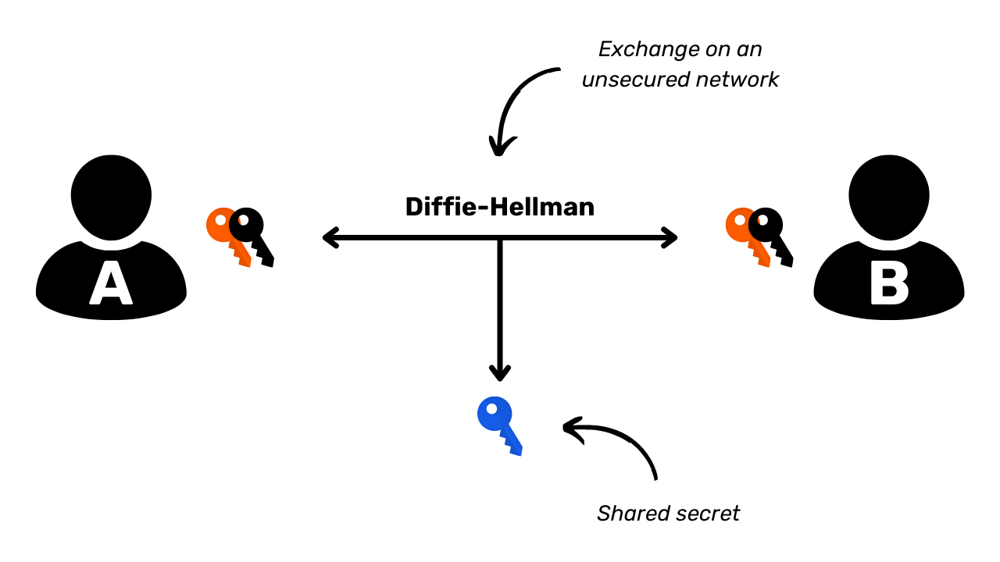

This common secret (here, the blue key), can then be used for other operations. Typically, this shared secret can be used to encrypt and decrypt communication over an insecure network:


To achieve this exchange, Diffie-Hellman uses modular arithmetic to calculate the shared secret. Here is a simplified explanation of how it works:
- Alice and Bob agree on a common color, here yellow, which constitutes public data (attackers know this color);
- Alice selects a secret color, here red, and mixes the two to obtain orange;
- Bob also chooses a secret color, here blue, and mixes it with the yellow to obtain green;
- They then exchange the obtained colors, orange and green. This exchange can take place over an insecure and observed network;
- By mixing Bob's green with her own secret color, Alice produces brown;
- Bob, doing the same with Alice's orange and his secret blue, also obtains brown.

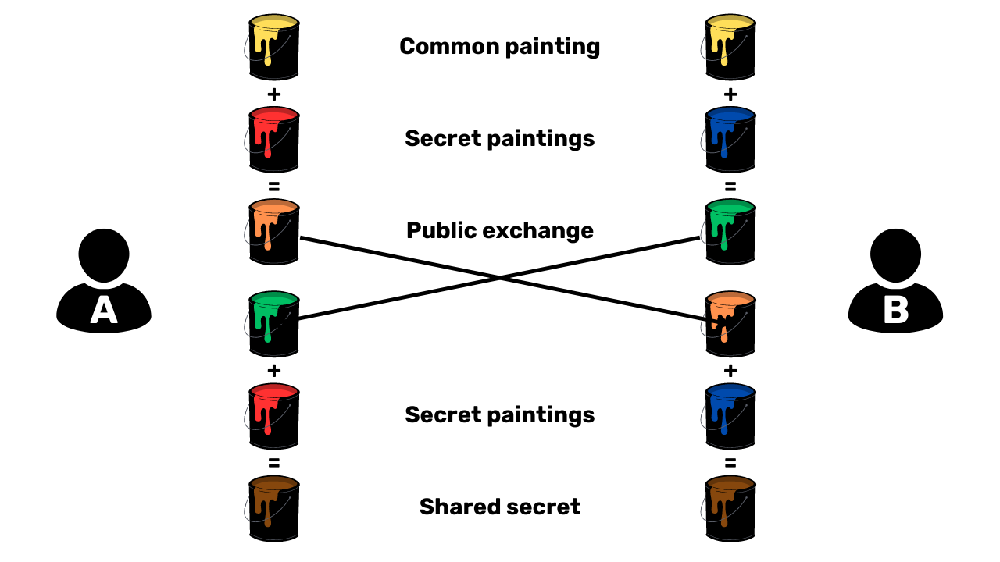

In this simplification, the brown color represents the shared secret between Alice and Bob. It's important to understand that, in reality, it's impossible for the attacker to separate the orange and green colors to discover the secret colors of Alice or Bob.

Now, let's examine how this protocol actually works, not with color analogies, but using real numbers and modular arithmetic!
Before discussing the Diffie-Hellman mechanisms, allow me to briefly remind you of two essential mathematical concepts that we will need:

- A **prime number** is a natural number that has only two divisors: $1$ and itself. For example, $7$ is a prime number because it can only be divided by $1$ and $7$. On the other hand, $8$ is not a prime number since it is divisible by $1$, $2$, $4$, and $8$. Therefore, it has four positive integer divisors instead of two;
- The **modulo** (denoted $mod$ or $\%$) is a mathematical operation that, between two integers, returns the remainder of the Euclidean division of the first by the second. For example, $16 \bmod 5 = 1$.

**The Diffie-Hellman key exchange between Alice and Bob proceeds as follows:**

- Alice and Bob agree on two common numbers: $p$ and $g$. $p$ is a prime number, and the larger this number is, the more secure Diffie-Hellman will be. $g$ is a primitive root of $p$. These two numbers can be communicated openly over an unsecured network. They represent the equivalent of **the color yellow** in the previous simplification. It is therefore important that Alice and Bob use exactly the same values for $p$ and $g$.

- Once these parameters are defined, Alice and Bob each choose a secret random number. Alice names her secret random number $a$ (equivalent to **the color red**) and Bob names his $b$ (equivalent to **the color blue**). These numbers must remain strictly confidential.

- Instead of directly exchanging the numbers $a$ and $b$, each party calculates $A$ and $B$ as follows:

$A$ is equal to $g$ raised to the power of $a$ modulo $p$:

$$
A = g^a \bmod p
$$

$B$ is equal to $g$ raised to the power of $b$ modulo $p$:

$$
B = g^b \bmod p
$$

- The values $A$ (equivalent to **the color orange**) and $B$ (equivalent to **the color green**) are exchanged between the two parties. This exchange can take place openly over an unsecured network;

- Alice, having received $B$, calculates the value of $z$ as follows:

$z$ is equal to $B$ raised to the power of $a$ modulo $p$:

$$
z = B^a \bmod p
$$

To recall:

$$
B = g^b \bmod p
$$

Thus, we obtain:

$$
z = B^a \bmod p
$$

$$
z = (g^b)^a \bmod p
$$

By applying the rules of exponents:
$$
(x^n)^m = x^{nm}
$$

We then obtain:

$$
z = g^{ba} \bmod p
$$

- On his side, Bob, having received $A$, also calculates the value of $z$ in the following manner:

$z$ is equal to $A$ raised to the power of $b$ modulo $p$:

$$
z = A^b \bmod p
$$

Thus, we obtain:

$$
z = (g^a)^b \bmod p
$$

$$
z = g^{ab} \bmod p
$$

$$
z = g^{ba} \bmod p
$$

Thanks to the distributivity of the modulo operator, Alice and Bob obtain exactly the same value $z$. This number represents their common secret, equivalent to **the brown color** in the previous simplification with the paint pots. They can now use this common secret to encrypt their communications symmetrically over an unsecured network.


An attacker, even in possession of $p$, $g$, $A$, and $B$ (the public values), will not be able to calculate $a$, $b$, or $z$ (the private values). To achieve this, one would have to reverse the exponentiation, an operation impossible without trying all possibilities one by one, as it amounts to calculating the discrete logarithm, that is, the inverse of the exponential in a finite cyclic group.

Thus, as long as the values of $a$, $b$, and $p$ are sufficiently large, the Diffie-Hellman protocol is secure. Typically, with 2048-bit parameters (a number with 600 digits in decimal), testing all possibilities for $a$ and $b$ would be impractical. To this day, with such numbers, this algorithm is considered secure.

This is precisely where the main disadvantage of the Diffie-Hellman protocol lies. To be secure, the algorithm must use large numbers. That's why, nowadays, the ECDH algorithm (*Elliptic Curve Diffie-Hellman*), a variant of Diffie-Hellman that relies on an algebraic curve, more precisely an elliptical curve, is preferred. This approach allows working with much smaller numbers while maintaining equivalent security, thus reducing the resources needed for calculation and storage.

The general principle of the algorithm remains the same. However, instead of using a random number $a$ and a number $A$ calculated from $a$ by modular exponentiation, we use a pair of keys established on an elliptical curve. Instead of relying on the distributivity of the modulo operator, we use the group law on elliptical curves, and more specifically the associativity of this law.
To briefly explain the principle of elliptical curve cryptography, a private key is represented by a random number between $1$ and $n-1$, where $n$ represents the order of the curve. The public key, on the other hand, is a specific point on this curve, obtained from the private key through operations of point addition and doubling starting from the generator point, according to the equation:
$$
K = k \cdot G
$$

In this formula, $K$ denotes the public key, $k$ the private key, and $G$ the generator point.

One of the essential characteristics of these keys is the ease of calculating $K$ from $k$ and $G$, while it is practically impossible to find $k$ from $K$ and $G$. This asymmetry creates a one-way function. In other words, it is easy to compute the public key if one knows the private key, but finding the private key from the public key is impossible. This security is still based on the computational difficulty of the discrete logarithm.

We will use this property to adapt our Diffie-Hellman algorithm. **The operating principle of ECDH is as follows:**

- Alice and Bob agree together on a cryptographically secure elliptical curve and its parameters. This information is public;

- Alice generates a random number $ka$ which will be her private key. This private key must remain secret. She determines her public key $Ka$ by addition and doubling of points on the chosen elliptical curve:

$$
K_a = k_a \cdot G
$$

- Bob also generates a random number $kb$ which will be his private key. He calculates the associated public key $Kb$:

$$
K_b = k_b \cdot G
$$

- Alice and Bob exchange their public keys $Ka$ and $Kb$ over an unsecured public network.

- Alice calculates a point $(x,y)$ on the curve by applying her private key $ka$ to Bob's public key $Kb$:

$$
(x,y) = k_a \cdot K_b
$$

- Bob calculates a point $(x,y)$ on the curve by applying his private key $kb$ to Alice's public key $Ka$:

$$
(x,y) = k_b \cdot K_a
$$

- Alice and Bob obtain the same point on the elliptical curve. The shared secret will be the x-coordinate $x$ of this point.

They indeed obtain the same shared secret because:

$$
(x,y) = k_a \cdot K_b = k_a \cdot (k_b \cdot G) = (k_a \cdot k_b) \cdot G = (k_b \cdot k_a) \cdot G = k_b \cdot (k_a \cdot G) = k_b \cdot K_a
$$
An attacker observing the unsecured public network can only obtain the public keys of each party and the parameters of the chosen elliptic curve. As previously explained, this information alone is not enough to determine the private keys. Therefore, the attacker cannot find the shared secret between Alice and Bob.

ECDH is thus an algorithm that allows for key exchange. It is often used in conjunction with other cryptographic methods to establish a complete protocol. For example, ECDH is integrated into the core of TLS (*Transport Layer Security*), an encryption and authentication protocol used for the internet's transport layer. TLS uses ECDHE for key exchange, a variant of ECDH where the keys are ephemeral, to provide persistent confidentiality. Additionally, TLS uses authentication algorithms like ECDSA, encryption algorithms such as AES, and hash functions like SHA256.

TLS is notably responsible for the `s` in `https` as well as the padlock visible in your browser's address bar, symbols of encrypted communications. By following this course, you are therefore using ECDH, and it is very likely that you use it daily without even knowing it.

### The Notification Transaction

As we saw in the previous section, ECDH is a variant of the Diffie-Hellman exchange using key pairs established on an elliptic curve. Conveniently, we already possess many key pairs adhering to this standard in our Bitcoin wallets! The idea of BIP47 is to use the key pairs from the Bitcoin deterministic hierarchical wallets of both parties to establish shared and ephemeral secrets between them. In the context of BIP47, ECDHE (*Elliptic Curve Diffie-Hellman Ephemeral*) is used instead.


ECDHE is used for the first time in BIP47 to transmit the payment code from the sender to the recipient. This is the famous **notification transaction**. This step is essential because for BIP47 to work efficiently, both parties involved (the sender and the recipient) must know each other's payment code. This knowledge allows for the derivation of ephemeral public keys and, consequently, associated blank receiving addresses.
Before this exchange, the sender is logically already aware of the recipient's payment code since they have retrieved it off-chain, for example, from their website, an invoice, or their social media. However, the recipient may not necessarily know the sender's payment code. Yet, this code must be transmitted to them; otherwise, they will not be able to derive the ephemeral keys necessary for identifying the addresses where their bitcoins are stored, nor access their funds. Although this transmission of the sender's code can technically be carried out off-chain through other means of communication, this poses a problem if the wallet needs to be recovered from the seed only.

Indeed, unlike conventional addresses, BIP47 addresses are not derived directly from the recipient's seed—using an `xpub` would be simpler in this case—but result from a calculation combining both payment codes: that of the sender and that of the recipient. Thus, if the recipient loses their wallet and tries to restore it from their seed, they will recover their own payment code, which is directly derived from their seed. However, to find the ephemeral addresses, it will be essential for them to also have the payment codes of everyone who has sent them bitcoins via BIP47. Hence the importance of the notification transaction, which allows saving this information on the Bitcoin blockchain, while being able to find it very easily without having to search through the billion transactions executed since its launch in 2009.

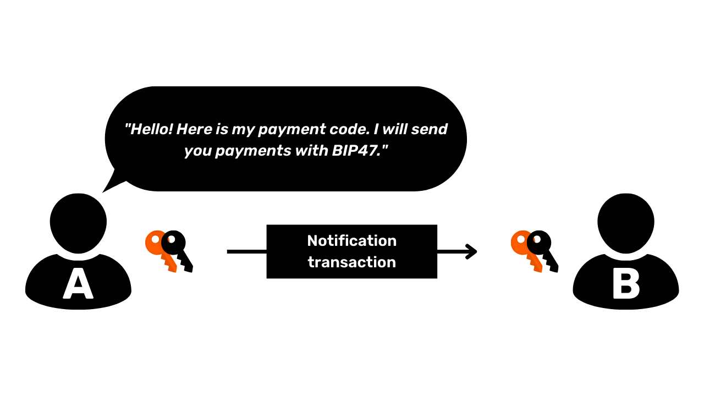

Therefore, it would be possible to implement BIP47 without resorting to the notification transaction, provided that each user keeps a backup of their peers' payment codes. However, this method proves complex to manage as long as a simple, robust, and efficient solution for creating, storing, and updating these backups is not developed. In the current state of affairs, the notification transaction thus becomes almost indispensable.

In the following chapters, we will study other protocols with objectives similar to those of BIP47, but which do not require a notification transaction. These alternatives, however, introduce their own compromises.

Besides its role in backing up payment codes, the notification transaction also serves a notification function for the recipient, as its name suggests. It signals to the recipient's client that a new payment channel has been established, and thus suggests monitoring the resulting ephemeral addresses.

### The Privacy Model of BIP47

Before detailing the technical operation of the notification transaction, it is important to discuss the privacy model associated with BIP47, which justifies certain measures taken during the creation of this initial transaction.
The payment code, in itself, does not pose a direct risk to privacy. Unlike the traditional Bitcoin model, which aims to break the link between a user's identity and their transactions (which are public) by preserving the anonymity of keys and addresses, the payment code can be openly associated with an identity without posing a threat.
Indeed, the payment code is not used to directly derive the addresses receiving BIP47 payments. These addresses are instead generated through the application of ECDH between the payment codes' derived keys of the two parties involved.

Thus, a payment code in itself does not directly lead to a loss of privacy since only the notification address is derived from it. Although this address can reveal some information, it normally does not allow the discovery of the parties with whom you are conducting transactions, unless through a thorough chain analysis. Indeed, if the sender uses UTXOs that can be linked to their identity to perform the notification transaction, then it becomes possible to deduce that their identity is probably linked to BIP47 payments to your payment code. This will not reveal the underlying transactions but will indicate their likely existence.

Therefore, it is essential to maintain this strict separation between users' payment codes. Towards this goal, the initial communication step of the code is a critical moment for the privacy of the payment, yet mandatory for the proper functioning of the protocol. If one of the payment codes can be obtained publicly (such as on a website), the second code, that of the sender, must not be linked to the first in any case.

Let's take a concrete example: I want to make a donation to a political movement via BIP47:
- The organization has made its payment code public on its website or through its social networks;
- This code is thus linked to the political movement;
- I retrieve this payment code;
- Before proceeding with a sending, I must ensure that they know my own payment code, which is also linked to my identity since I use it to receive transactions on my social networks.

How to transmit my code without risk? The use of conventional communication means could lead to an information leak, and consequently, associate me with this political movement. The notification transaction offers a solution thanks to an encryption layer that precisely prevents this association between two codes. Although this is not the only method to secretly transmit the sender's payment code, it proves to be very effective.

In the diagram below, the orange lines indicate the points where the flow of information must be interrupted, and the black arrows show the connections that could potentially be observed by third parties:
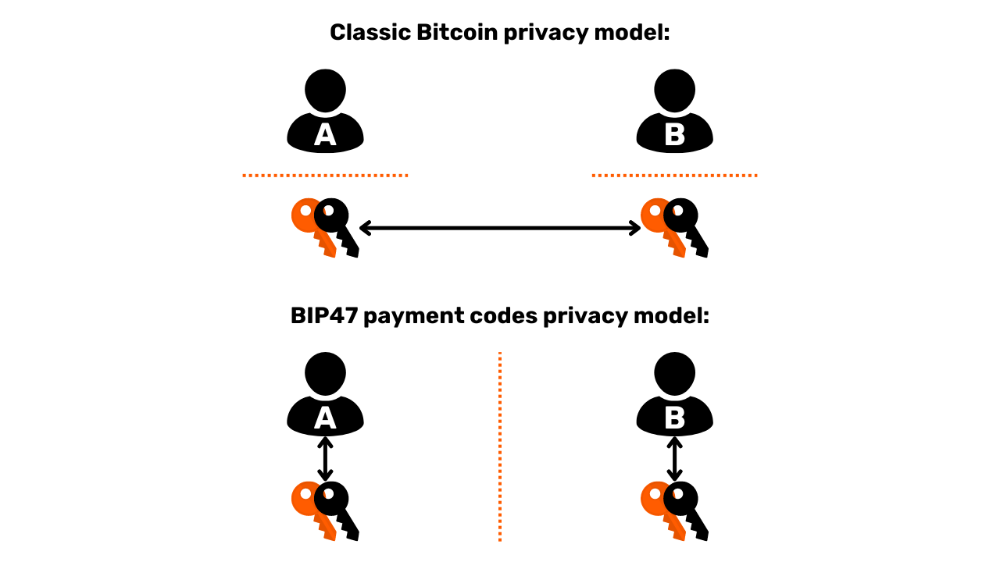
In reality, within the traditional privacy model of Bitcoin, it is often complex to completely dissociate the flow of information between the key pair and the user, especially during remote transactions. For example, in the context of a donation campaign, the recipient must inevitably disclose an address or a public key via their website or social networks. The correct use of BIP47, particularly with the notification transaction, allows for circumventing this problem thanks to ECDHE and the encryption layer that we will study further.

Of course, the classic privacy model of Bitcoin still applies to ephemeral public keys, which are derived from the combination of the two payment codes. The two models are actually complementary. What I want to highlight here is that, contrary to the usual use of a public key to receive bitcoins, the payment code can be linked to a specific identity, because the information "_Alice performs a transaction with Bob_" is broken at another stage. The payment code is used to generate payment addresses, but based solely on the observation of the blockchain, it is impossible to link a BIP47 payment transaction to the payment codes used to execute it, unless the UTXOs involved were already linked to an identity previously and the users have associated their payment codes with their respective identities.

To summarize, the privacy model offered by BIP47 payments could be considered superior to that of Bitcoin's base, although it is not magical by any means.

### Construction of the Notification Transaction

Now, let's see how this notification transaction works. Imagine that Alice wants to send funds to Bob with BIP47. In my example, Alice acts as the sender and Bob as the recipient. The latter has published his payment code on his website. Therefore, Alice is already aware of Bob's payment code.

**1- Alice calculates a shared secret with ECDH:**

- She selects a key pair from her HD wallet located on a different branch from her payment code. Note, this pair should not be easily associated with Alice's notification address, nor with Alice's identity (see previous section);

- Alice selects the private key from this pair. We name it $a$ (lowercase);

$$
a
$$
- Alice retrieves the public key associated with Bob's notification address. This key is the first daughter derived from Bob's payment code (index $/0$). We name this public key $B$ (uppercase). The private key associated with this public key is named $b$ (lowercase). $B$ is determined by addition and doubling of points on the elliptical curve from $G$ (the generator point) with $b$ (the private key):
$$ B = b \cdot G $$

- Alice calculates a secret point $S$ (uppercase) on the elliptical curve by addition and doubling of points by applying her private key $a$ from Bob's public key $B$.

$$ S = a \cdot B $$

- Alice calculates the blinding factor $f$ which will allow her to encrypt her payment code. To do this, she will determine a pseudo-random number with the HMAC-SHA512 function. In the second input of this function, she uses a value that only Bob will be able to retrieve: $x$ which is the abscissa of the previously calculated secret point. The first input is $o$ which is the UTXO consumed in input of this transaction (outpoint).

$$ f = \text{HMAC-SHA512}(o, x) $$

**2- Alice converts her personal payment code into base 2 (binary).**

**3- She uses this blinding factor as a key to perform symmetric encryption on the payload of her payment code.** The encryption algorithm used is simply a `XOR`. The operation performed is comparable to the Vernam cipher, also named "One-Time Pad".

- Alice first splits her blinding factor into two: the first 32 bytes are named $f1$ and the last 32 bytes are named $f2$. Thus, we have:

$$ f = f1 || f2 $$

- Alice calculates the encrypted $x'$ of the abscissa of the public key $x$ of her payment code, and the encrypted $c'$ of her chain code $c$ separately. $f1$ and $f2$ act respectively as encryption keys. The operation used is the `XOR` (exclusive or).

$$ x' = x \oplus f1 $$
$$ c' = c \oplus f2 $$

- Alice replaces the real values of the abscissa of the public key $x$ and the chain code $c$ in her payment code with the encrypted values $x'$ and $c'$.
**4-** Alice currently has her payment code with an encrypted payload. She will construct and broadcast a transaction involving her public key $A$ as input, an output to Bob's notification address, and an `OP_RETURN` output containing her payment code with the encrypted payload. **This transaction is the notification transaction**.
An `OP_RETURN` is an opcode that marks a Bitcoin transaction output as invalid. Today, it is used to broadcast or anchor information on the Bitcoin blockchain. Up to 80 bytes of data can be stored, which are written on the chain and thus visible to all other users.

As we have seen in the previous sections, ECDH is used to generate a shared secret between two users communicating over an insecure network, potentially observed by attackers. In BIP47, ECDH is utilized for communication over the Bitcoin network, which by nature is a transparent communication network observed by many attackers. The shared secret calculated through the ECDH key exchange is then used to encrypt the secret information to be transmitted: the sender's (Alice's) payment code.

Let's recap the steps we've just reviewed together to perform a notification transaction:
- Alice retrieves Bob's payment code and notification address;
- Alice selects a UTXO that she owns in her HD wallet with the corresponding key pair;
- She calculates a secret point on the elliptical curve using ECDH;
- She uses this secret point to calculate an HMAC, which is the blinding factor;
- She uses this blinding factor to encrypt the payload of her personal payment code;
- She uses an `OP_RETURN` transaction output to communicate the masked payment code to Bob.

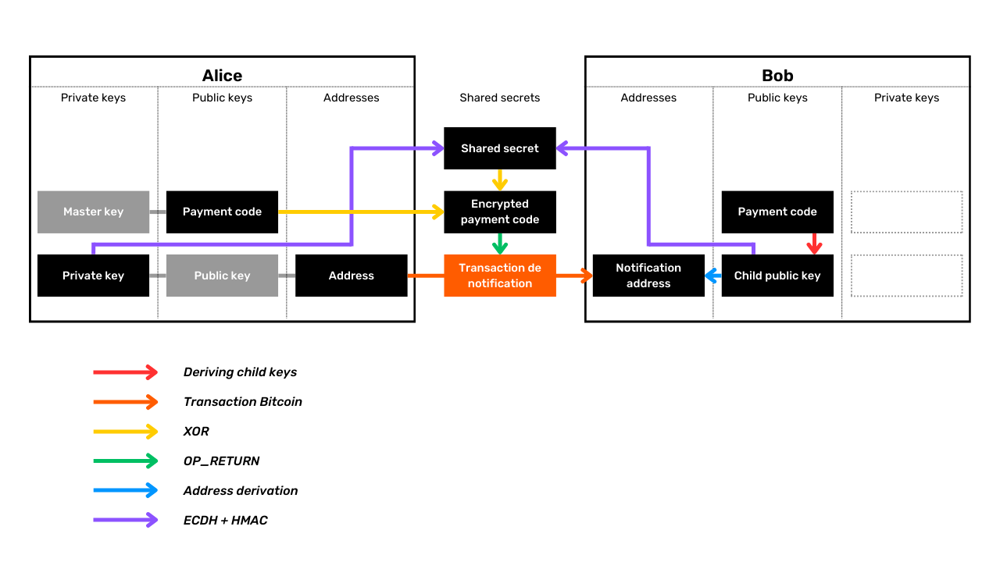

### Notification Transaction: Concrete Study

To understand its functioning in more detail, especially the use of the `OP_RETURN`, let's examine a real notification transaction together. I performed such a transaction on the testnet, which you can find [by clicking here](https://mempool.space/fr/testnet/tx/0e2e4695a3c49272ef631426a9fd2dae6ec3a469e3a39a3db51aa476cd09de2e).


Observing this transaction, we can see that it has a single input and 4 outputs:
- The first output is the `OP_RETURN` containing my masked payment code;
- The second output of 546 sats points to my recipient's notification address;
- The third output of 15,000 sats represents the service fees, as I used Samourai Wallet to construct this transaction;
- The fourth output of 2 million sats represents the change, meaning the remaining difference from my input that goes back to another address belonging to me.
The most interesting to study is obviously output 0 using the `OP_RETURN`. Let's look more closely at what it contains. Here is the `scriptPubKey` in hexadecimal:

```text
6a4c50010002b13b2911719409d704ecc69f74fa315a6cb20fdd6ee39bc9874667703d67b164927b0e88f89f3f8b963549eab2533b5d7ed481a3bea7e953b546b4e91b6f50d800000000000000000000000000
```

In this script, we can dissect several parts. First of all, the opcodes:

```text
6a4c
```

Among the opcodes, we can recognize `0x6a` which designates the `OP_RETURN` and `0x4c` which designates the `OP_PUSHDATA1`.

The byte following this last opcode indicates the size of the payload that follows. It indicates `0x50`, or 80 bytes:

```text
6a4c50
```

Then, we have the metadata of my payment code in plaintext:

```text
010002
```

The encrypted x-coordinate of the public key of my payment code:

```text
b13b2911719409d704ecc69f74fa315a6cb20fdd6ee39bc9874667703d67b164
```

The encrypted chain code of my payment code:

```text
927b0e88f89f3f8b963549eab2533b5d7ed481a3bea7e953b546b4e91b6f50d8
```

And finally, padding to reach 80 bytes, the standard size of an `OP_RETURN`:

```text
00000000000000000000000000
```

To understand better, here is my payment code in plaintext in base 58:

```text
PM8TJQCyt6ovbozreUCBrfKqmSVmTzJ5vjqse58LnBzKFFZTwny3KfCDdwTqAEYVasn11tTMPc2FJsFygFd3YzsHvwNXLEQNADgxeGnMK8Ugmin62TZU
```

And in base 16:

```text
4701000277507c9c17a89cfca2d3af554745d6c2db0e7f6b2721a3941a504933103cc42add94881210d6e752a9abc8a9fa0070e85184993c4f643f1121dd807dd556d1dc000000000000000000000000008604e4db
```
When comparing my plaintext payment code with the `OP_RETURN`, it's noticeable that the HRP (`0x47`) and the checksum (`0x8604e4db`) are not transmitted. This is expected, as these pieces of information are intended for humans.
Next, we can identify the version (`0x01`), the bit field (`0x00`), and the public key parity (`0x02`). And, at the end of the payment code, the empty bytes (`0x00000000000000000000000000`) are used to pad the code to a total of 80 bytes. All these metadata are transmitted in plaintext (unencrypted).

Finally, it can be observed that the public key's x-coordinate (`0x77507c9c17a89cfca2d3af554745d6c2db0e7f6b2721a3941a504933103cc42a`) and the chain code (`0xdd94881210d6e752a9abc8a9fa0070e85184993c4f643f1121dd807dd556d1dc`) have been encrypted. This constitutes the payload of the payment code.

### What is XOR?

In the previous sections, we saw that the payment code was transmitted encrypted using the XOR operation. Let's take a moment to understand how this operator works, as it is widely used in cryptography.

XOR is a bitwise logical operator based on Boolean algebra. With two bit operands, it returns `1` if the bits of the same rank are different, and it returns `0` if the bits of the same rank are the same. Here is the truth table of XOR based on the operand values `D` and `E`:

| D   | E   | D XOR E |
| --- | --- | ------- |
| 0   | 0   | 0       |
| 0   | 1   | 1       |
| 1   | 0   | 1       |
| 1   | 1   | 0       |

For example:

$$
0110 \oplus 1110 = 1000
$$

Or:

$$
010011 \oplus 110110 = 100101
$$

With ECDH, using XOR as an encryption layer is particularly fitting. Firstly, because of this operator, the encryption is symmetric. This allows the recipient to decrypt the payment code with the same key used for encryption. The encryption and decryption key is calculated from the shared secret thanks to ECDH. This symmetry is enabled by the commutative and associative properties of the XOR operator:

- Other properties:

$$
D \oplus D = 0
$$
D ⊕ 0 = D

- Commutativity:

$$
D \oplus E = E \oplus D
$$

- Associativity:

$$
D \oplus (E \oplus Z) = (D \oplus E) \oplus Z = D \oplus E \oplus Z
$$

If:

$$
D \oplus E = L
$$

Then:

$$
D \oplus L = D \oplus (D \oplus E) = D \oplus D \oplus E = 0 \oplus E = E \\
\therefore D \oplus L = E
$$

Next, this encryption method closely resembles the Vernam cipher (One-Time Pad), the only encryption algorithm known to date that has unconditional (or absolute) security. For the Vernam cipher to have this characteristic, the encryption key must be perfectly random, it must be the same size as the message, and it must be used only once. In the encryption method used here for BIP47, the key is indeed the same size as the message, the blinding factor is exactly the same size as the concatenation of the public key's x-coordinate with the payment code's chain code. This encryption key is indeed used only once. However, this key is not the result of perfect randomness since it is an HMAC. It is rather pseudo-random. Therefore, it is not a Vernam cipher, but the method is similar.

### Receiving the Notification Transaction

Now that Alice has sent the notification transaction to Bob, let's see how he interprets it. As a reminder, Bob must be able to access Alice's payment code. Without this information, as we will see in the following section, he will not be able to derive the key pairs created by Alice, and therefore, he will not be able to access his bitcoins received via BIP47. For now, the payload of Alice's payment code is encrypted. Let's see how Bob decrypts it.

**1-** Bob monitors transactions that create outputs with his notification address.

**2-** When a transaction has an output on his notification address, Bob analyzes it to see if it contains an OP_RETURN output that follows the BIP47 standard.

**3-** If the first byte of the OP_RETURN payload is `0x01`, Bob begins his search for a possible shared secret with ECDH:
- Bob selects the public key in the input of the transaction. That is, Alice's public key named $A$ with:

$$ A = a \cdot G $$

- Bob selects the private key $b$ associated with his personal notification address:

$$ b $$
- Bob calculates the secret point $S$ (shared ECDH secret) on the elliptical curve by adding and doubling points, applying his private key $b$ to Alice's public key $A$:
$$ S = b \cdot A $$

- Bob determines the blinding factor $f$ that will allow him to decrypt the payload of Alice's payment code. In the same way that Alice had previously calculated, Bob will find $f$ by applying HMAC-SHA512 on $x$ the x-coordinate of the secret point $S$, and on $o$ the UTXO consumed as input in this notification transaction:

$$ f = \text{HMAC-SHA512}(o, x) $$

**4-** Bob interprets the data in the OP_RETURN of the notification transaction as a payment code. He will simply decrypt the payload of this potential payment code using the blinding factor $f$:
- Bob splits the blinding factor $f$ into 2 parts: the first 32 bytes of $f$ will be $f1$ and the last 32 bytes will be $f2$;
- Bob decrypts the encrypted x-coordinate $x'$ of the public key from Alice's payment code:

$$ x = x' \oplus f1 $$

- Bob decrypts the encrypted chain code value $c'$ from Alice's payment code:

$$ c = c' \oplus f2 $$

**5-** Bob checks if the value of the public key from Alice's payment code is indeed part of the secp256k1 group. If this is the case, he interprets this as a valid payment code. Otherwise, he ignores this transaction.

Now that Bob is aware of Alice's payment code, she can send him up to `2^32` payments, without ever needing to make another notification transaction of this type again.

Why does this work? How can Bob manage to determine the same blinding factor as Alice, and thus decrypt her payment code? Let's look more closely at the role of ECDH in what we have just described.

First of all, we are dealing with symmetric encryption. This means that the encryption key and the decryption key are the same value. This key in the notification transaction is the blinding factor:

$$ f = f1 || f2 $$

Therefore, Alice and Bob must obtain the same value for $f$, without directly transmitting it since an attacker could steal it and decrypt the secret information. This blinding factor is obtained by applying HMAC-SHA512 on 2 values:
- the x-coordinate of a secret point;
- and the UTXO consumed as input in the transaction.
Bob, therefore, needs these two pieces of information to decrypt the payload of Alice's payment code. For the UTXO as input, Bob can simply retrieve it by observing the notification transaction. For the secret point, Bob will have to use ECDH. As seen in the previous section on Diffie-Hellman, simply by exchanging their respective public keys and secretly applying their private keys to the other's public key, Alice and Bob can find a specific and secret point on the elliptical curve. The notification transaction relies on this mechanism:
- Bob's key pair:

$$ B = b \cdot G $$

- Alice's key pair:

$$ A = a \cdot G $$

- For a secret $S (x, y)$:

$$ S = a \cdot B = a \cdot (b \cdot G) = (b \cdot a) \cdot G = b \cdot A $$


Now that Bob knows Alice's payment code, he will be able to detect her BIP47 payments, and he can derive the private keys locking the received bitcoins.

Let's recap the steps we've just gone through to receive and interpret a notification transaction:
- Bob monitors transaction outputs to his notification address;
- When he detects one, he retrieves the information contained in the OP_RETURN;
- Bob selects the public key in input and calculates a secret point using ECDH;
- He uses this secret point to calculate an HMAC which is the blinding factor;
- He uses this blinding factor to decrypt the payload of Alice's payment code contained in the OP_RETURN.

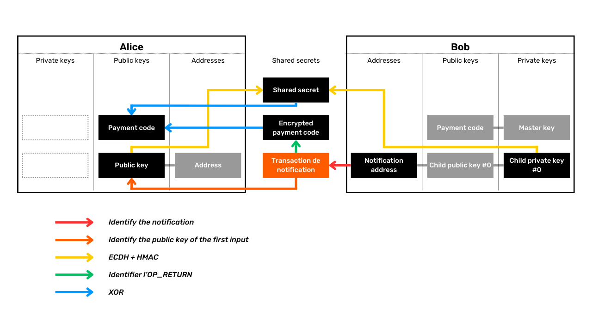

### The BIP47 Payment Transaction

Let's now study the payment process with BIP47 together. To remind you of the current state of affairs:
- Alice knows Bob's payment code, which she simply retrieved from his website;
- Bob knows Alice's payment code thanks to the notification transaction;
- Alice will make a first payment to Bob. She will be able to make many others in the same way.

Before explaining this process, I think it's important to recall the indexes we are currently working on. The derivation path of a payment code is described as follows: `m/47'/0'/0'`. The next depth distributes the indexes in this manner:
- The first normal (non-hardened) child pair is the one used to generate the notification address we talked about in the previous part: `m/47'/0'/0'/0`;
- Normal child key pairs are used within ECDH to generate BIP47 payment receiving addresses as we will see in this section: from `m/47'/0'/0'/0` to `m/47'/0'/0'/2 147 483 647`;
- Hardened child key pairs are ephemeral payment codes: from `m/47'/0'/0'/0'` to `m/47'/0'/0'/2 147 483 647'`.

Whenever Alice wishes to send a payment to Bob, she derives a new unique virgin address, thanks again to the ECDH protocol:
- Alice selects the first private key derived from her personal reusable payment code:

$$ a $$

- Alice selects the first unused public key derived from Bob's payment code. This public key, we will call it $B$. It is associated with the private key $b$ which only Bob knows:

$$ B = b \cdot G $$

- Alice calculates a secret point $S$ on the elliptical curve by point addition and doubling by applying her private key $a$ to Bob's public key $B$:

$$ S = a \cdot B $$

- From this secret point, Alice will calculate the shared secret $s$ (lowercase). To do this, she selects the x-coordinate of the secret point $S$ named $Sx$, and she passes this value through the SHA256 hash function:

$$ S = (Sx, Sy) $$
$$ s = \text{SHA256}(Sx) $$

- Alice uses this shared secret $s$ to calculate a Bitcoin payment receiving address. Initially, she verifies that $s$ is contained within the order of the secp256k1 curve. If not, she increments the index of Bob's public key to derive another shared secret;
- Secondly, she calculates a public key $K0$ by adding on the elliptical curve the points $B$ and $s·G$. In other words, Alice adds the public key derived from Bob's payment code $B$ with another point calculated on the elliptical curve by point addition and doubling with the shared secret $s$ from the secp256k1 curve's generator point $G$. This new point represents a public key, and we name it $K0$:

$$ K0 = B + s \cdot G $$

- With this public key $K0$, Alice can derive a standard virgin receiving address (for example, SegWit V0 in bech32).
Once Alice has obtained Bob's receiving address $K0$, she can perform a Bitcoin transaction in a standard way. To do this, she selects a UTXO that she owns, secured by a pair of keys from a different branch of her HD wallet, and spends it to satisfy an output to Bob's address $K0$. It is important to note that this payment, once the address is derived, follows a conventional process and no longer depends on the keys associated with BIP47.
Let's recap the steps we've just gone through together to send a BIP47 payment:
- Alice selects the first derived child private key from her personal payment code;
- She calculates a secret point on the elliptical curve using ECDH from the first unused derived child public key from Bob's payment code;
- She uses this secret point to calculate a shared secret with SHA256;
- She uses this shared secret to calculate a new secret point on the elliptical curve;
- She adds this new secret point to Bob's public key;
- She obtains a new ephemeral public key for which only Bob has the associated private key;
- Alice can make a standard transaction to Bob with the derived ephemeral receiving address.

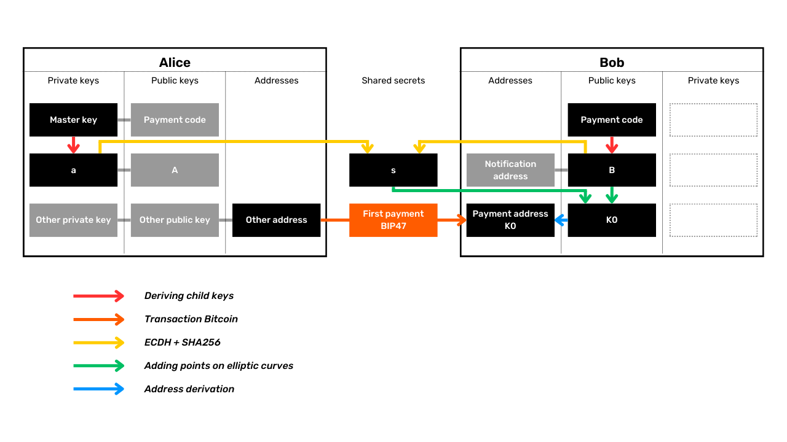

If Alice wants to make a second payment, she will follow the same steps as before, except this time she will select the second derived public key from Bob's payment code. Specifically, she will use the next unused key. She will thus obtain a new receiving address belonging to Bob, designated $K1$:

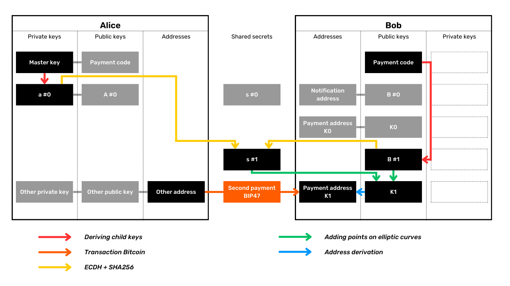

She can continue in this manner and derive up to `2^32` unused addresses belonging to Bob.

From an external viewpoint, by observing the blockchain, it is theoretically impossible to differentiate a BIP47 payment from a standard payment. Here is an example of a BIP47 payment transaction on the Testnet:

```text
94b2e59510f2e1fa78411634c98a77bbb638e28fb2da00c9f359cd5fc8f87254
```

This looks like a standard transaction with a consumed input, a payment output, and a change:


### Receiving the BIP47 Payment and Deriving the Private Key

Alice has just made her first payment to a new BIP47 address belonging to Bob. Now let's see how Bob receives this payment. We will also see why Alice does not have access to the private key of the address she has just generated herself, and how Bob retrieves this key to spend the bitcoins he has just received.
As soon as Bob receives the notification transaction from Alice, he derives the public key BIP47 $K0$ even before she has sent any payment. He then monitors any payments to the associated address. In fact, he immediately derives several addresses that he will monitor ($K0$, $K1$, $K2$, $K3$...). Here is how he derives this public key $K0$:
- Bob selects the first private child key derived from his payment code. This private key is named $b$. It is associated with the public key $B$ with which Alice had done her calculations in the previous step:

$$ b $$

- Bob selects the first public key of Alice derived from her payment code. This key is named $A$. It is associated with the private key $a$ with which Alice had done her calculations, and of which only Alice is aware. Bob can carry out this process since he is aware of Alice's payment code which was transmitted to him with the notification transaction:

$$ A = a \cdot G $$

- Bob calculates the secret point $S$, by addition and doubling of points on the elliptical curve, applying his private key $b$ to Alice's public key $A$. Here we find the use of ECDH which guarantees that this point $S$ will be the same for both Bob and Alice:

$$ S = b \cdot A $$

- Just as Alice did, Bob isolates the x-coordinate of this point $S$. We have named this value $Sx$. He passes this value through the SHA256 function to find the shared secret $s$ (lowercase):

$$ s = \text{SHA256}(Sx) $$

- Just like Alice, Bob calculates the point $s·G$ on the elliptical curve. Then, he adds this secret point to his public key $B$. He then obtains a new point on the elliptical curve which he interprets as a public key $K0$:

$$ K0 = B + s \cdot G $$

Once Bob has this public key $K0$, he can derive the associated private key in order to be able to spend his bitcoins. He is the only one who can generate this private key:

- Bob adds his child private key $b$ derived from his personal payment code. He is the only one who can obtain the value of $b$. Then, he adds $b$ with the shared secret $s$ to obtain $k0$, the private key of $K0$:

$$ k0 = b + s $$

Thanks to the group law of the elliptical curve, Bob obtains exactly the private key corresponding to the public key used by Alice. We thus have:

$$ K0 = k0 \cdot G $$
I'll summarize the steps we just went through together to receive a BIP47 payment and calculate the corresponding private key:
- Bob selects the first derived child private key from his personal payment code;
- He calculates a secret point on the elliptic curve using ECDH from the first derived child public key from Alice's chain code;
- He uses this secret point to calculate a shared secret with SHA256;
- He uses this shared secret to calculate a new secret point on the elliptic curve;
- He adds this new secret point to his personal public key;
- He obtains a new ephemeral public key, to which Alice will send her first payment;
- Bob calculates the private key associated with this ephemeral public key by adding his derived child private key from his payment code and the shared secret.

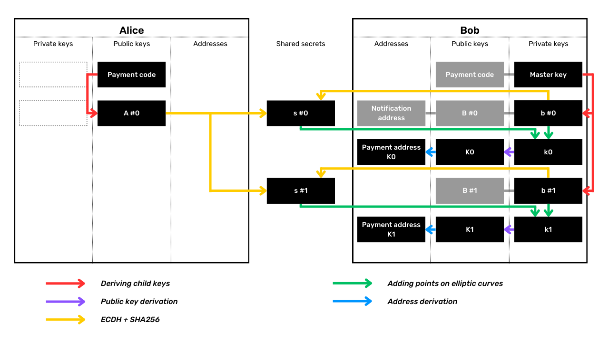

Since Alice cannot obtain $b$ (Bob's private key), she is unable to determine $k0$ (the private key associated with Bob's BIP47 receiving address). Schematically, we can represent the calculation of the shared secret $S$ like this:


Once the shared secret is found with ECDH, Alice and Bob calculate the BIP47 payment public key $K0$, and Bob also calculates the associated private key $k0$:

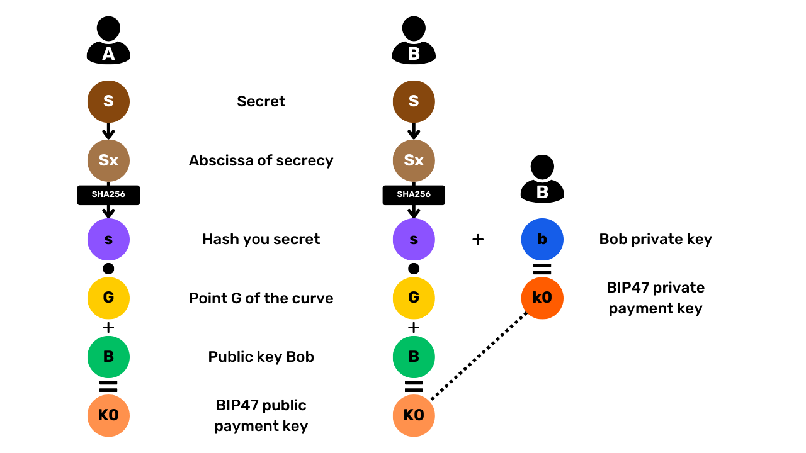

### Refunding the BIP47 Payment

Since Bob is aware of Alice's reusable payment code, he already has all the necessary information to send her a refund. He will not need to contact Alice again to ask for any information. He will simply need to notify her with a notification transaction, especially so that she can retrieve her BIP47 addresses with her seed, and then he can also send her up to `2^32` payments.

The refund functionality is specific to BIP47 and is one of its advantages over other methods that we will study in the coming chapters, such as Silent Payments.

Bob can then refund Alice in the same way she sent him payments. The roles are reversed:

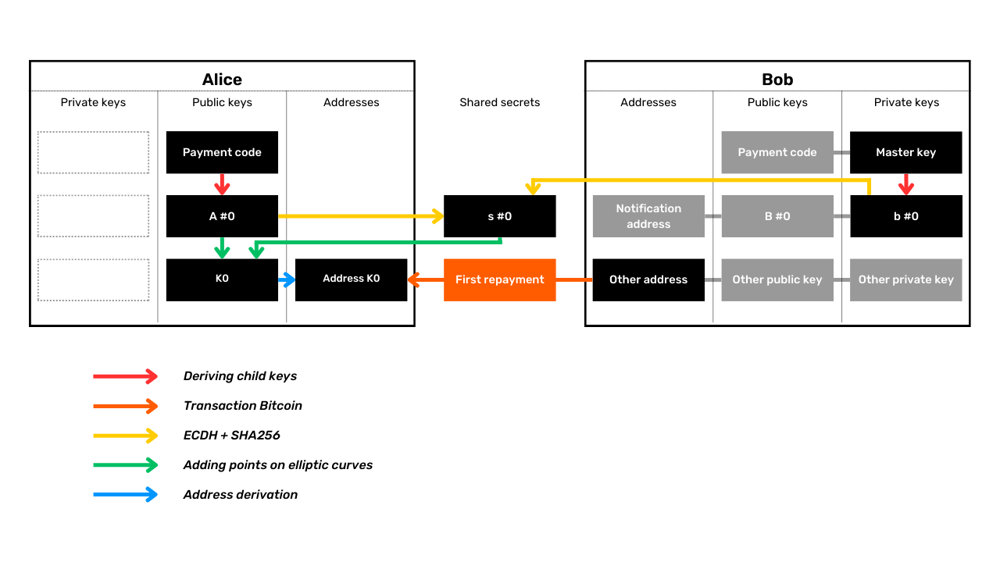

*A big thank you to [Fanis Michalakis](https://x.com/FanisMichalakis) for his review and valuable expert advice on the article that inspired the writing of this chapter!*

https://planb.network/tutorials/privacy/paynym-bip47

## Silent Payments
<chapterId>2871d594-414e-4598-a830-91c9eb84dfb8</chapterId>
BIP47 has been criticized for its inefficiency onchain. As explained in the previous chapter, it requires a notification transaction for each new recipient. This constraint becomes negligible if one plans to establish a lasting payment channel with this recipient. Indeed, a single notification transaction paves the way for an almost infinite number of subsequent BIP47 payments.

However, in certain situations, the notification transaction can be a hurdle for the user. Take the example of a one-time donation to a recipient: with a classic Bitcoin address, a single transaction is enough to make the donation. But with BIP47, two transactions are necessary: one for the notification and another for the actual payment. When the demand for block space is low and transaction fees are minimal, this additional step is generally not a problem. However, during periods of congestion, transaction fees can become exorbitant for a single payment, potentially doubling the cost for the user compared to a standard Bitcoin transaction, which may be unacceptable for the user.

For situations where the user plans to make only a few payments to a static identifier, other solutions have been developed. Among them are Silent Payments, described in the [BIP352](https://github.com/bitcoin/bips/blob/master/bip-0352.mediawiki). This protocol allows the use of a static identifier to receive payments without generating address reuse, and without requiring the use of notification transactions. Let's examine how this protocol works.

---

*To fully understand this chapter, it is essential to be familiar with the workings of ECDH (Elliptic Curve Diffie-Hellman) and cryptographic key derivation in an HD wallet. These concepts were detailed in the previous chapter on BIP47. I will not go over them again here. If you are not yet familiar with these notions, I recommend consulting the previous chapter before continuing with this one. I will also not revisit the risks associated with reusing receiving addresses, nor the importance of having a unique identifier to receive payments.*

---

### Why not move the notification?

As discussed in the chapter on BIP47, the notification transaction primarily serves two functions:
- It notifies the recipient;
- It transmits the sender's payment code.

One might naively think that this notification process could be carried out off-chain. In theory, this is entirely feasible: it would suffice for the recipient to indicate a means of communication to receive BIP47 payment codes from senders. However, this approach presents two major problems:
- First, this would shift the code transmission process to another communication protocol. The issues related to costs and the privacy of the exchange would remain, but would simply be transferred to this new protocol. In terms of privacy, this could also create a link between a user's identity and onchain activity, which is something we aim to avoid by performing the notification directly on the blockchain. Moreover, carrying out the notification off the blockchain would introduce censorship risks (such as the blocking of funds) that do not exist on Bitcoin;
- Next, this would pose a recovery problem. With BIP47, the recipient must absolutely know the payment codes of the senders to access the funds. This is true at the time of receipt, but also in the event of fund recovery via the seed in case of wallet loss. With onchain notifications, this risk is avoided, as the user can find and decrypt the notification transactions simply by knowing their seed. However, if the notification is performed off the blockchain, the user would need to maintain a dynamic backup of all received payment codes, which is impractical for the average user.

All these constraints make the use of onchain notification indispensable in the context of BIP47. Yet, Silent Payments specifically seek to avoid this onchain notification step due to its cost. Therefore, the adopted solution is not to move the notification, but to eliminate it entirely. To achieve this, a compromise must be accepted: that of scanning. Unlike BIP47, where the user knows exactly where to find their funds thanks to notification transactions, in the context of Silent Payments, the user must examine all existing Bitcoin transactions to detect any payments that might be intended for them. To reduce this operational burden, the search for Silent Payments is limited only to transactions likely to contain such payments, namely those including at least one Taproot P2TR output. The scanning also focuses exclusively on transactions from the creation date of the wallet (there is no need to scan transactions going back to 2009 if the wallet was created in 2024).

Therefore, you can see why BIP47 and Silent Payments, although aiming for a similar objective, involve different compromises and **thus actually cater to distinct use cases**. For one-time payments, such as occasional donations, Silent Payments are more appropriate due to their lower cost. Conversely, for regular transactions to the same recipient, as in the case of exchange platforms or mining pools, BIP47 might be preferred.
Let's explore together the technical workings of Silent Payments to better understand their implications. To do this, I suggest we take the same approach as the explanatory document of BIP352. We will gradually break down the calculations to be performed, element by element, justifying each new addition.
### Some concepts to understand

Before we begin, it's important to clarify that Silent Payments rely exclusively on the use of P2TR (*Pay to Taproot*) script types. Unlike BIP47, it's not necessary to derive receiving addresses from child public keys by hashing them. Indeed, in the P2TR standard, the tweaked public key is used directly and openly in the address. Thus, a Taproot receiving address is essentially a public key accompanied by some metadata. This tweaked public key is the aggregation of two other public keys: one allowing direct and traditional spending via a simple signature, and the other representing the Merkle root of the MAST, which authorizes spending subject to the satisfaction of one of the conditions potentially inscribed in the Merkle tree.


The decision to limit Silent Payments exclusively to Taproot is motivated by two main reasons:
- First, it significantly facilitates implementation and future updates in wallet software, since only one standard needs to be adhered to;
- Secondly, this approach helps to improve the anonymity set of users by encouraging them not to spread out among different types of scripts, which generate distinct wallet fingerprints in chain analysis (for more information on this concept, I invite you to consult chapter 4 of part 2).

### Naive derivation of a Silent Payments public key

Let's start with a simple example that will help you understand the core functioning of SP (Silent Payments). Take Alice and Bob, two Bitcoin users. Alice wants to send bitcoins to Bob on a fresh receiving address. Three objectives must be achieved in this process:
- Alice must be able to generate a fresh address;
- Bob must be able to identify a payment sent to this specific address;
- Bob must be able to obtain the private key associated with this address to be able to spend his funds.

Alice has a UTXO in her Bitcoin wallet secured with the following key pair:
- $a$: the private key;
- $A$: the public key ($A = a \cdot G$)

Bob has an SP address that he has published on the internet with:
- $b$: the private key;
- $B$: the public key ($B = b \cdot G$)
By retrieving Bob's address, Alice is able to calculate a new blank address that belongs to Bob using ECDH. Let's call this address $P$:
$$  P = B + \text{hash}(a \cdot B) \cdot G  $$

In this equation, Alice simply calculated the dot product of her private key $a$ and Bob's public key $B$. She passed this result through a hash function known to all. The output value is then scalar multiplied by the generator point $G$ of the elliptic curve `secp256k1`. Finally, Alice adds the obtained point to Bob's public key $B$. Once Alice has this address $P$, she uses it as an output in a transaction, meaning she sends bitcoins to it.

> *In the context of Silent Payments, the "hash" function corresponds to a SHA256 hash function tagged specifically with `BIP0352/SharedSecret`, ensuring that the hashes generated are unique to this protocol and cannot be reused in other contexts, while also providing additional protection against the reuse of nonces in signatures. This standard corresponds to the one [specified in the BIP340 for Schnorr signatures](https://github.com/bitcoin/bips/blob/master/bip-0340.mediawiki) on `secp256k1`.*

Thanks to the properties of the elliptic curve on which ECDH relies, we know that:

$$  a \cdot B = b \cdot A  $$

Bob will therefore be able to calculate the receiving address on which Alice sent the bitcoins. To do this, he monitors all Bitcoin transactions that meet the criteria of Silent Payments and applies the following calculation to each of them to see if the payment is addressed to him (*scanning*):

$$  P' = B + \text{hash}(b \cdot A) \cdot G  $$

When he scans Alice's transaction, he realizes that $P'$ is equal to $P$. He thus knows that this payment is addressed to him:

$$  P' = B + \text{hash}(b \cdot A) \cdot G = B + \text{hash}(a \cdot B) \cdot G = P   $$

From there, Bob will be able to calculate the private key $p$ that allows spending the address $P$:

$$  p = (b + \text{hash}(b \cdot A)) \bmod n  $$

As you can see, to calculate this private key $p$, one must necessarily have the private key $b$. Only Bob has this private key $b$. He will therefore indeed be the only one able to spend the bitcoins sent to his Silent Payments address.


*Caption:*
- $B$: The public key / static address published by Bob
- $b$: Bob's private key
- $A$: The public key of Alice's UTXO used as input for the transaction
- $a$: Alice's private key
- $G$: The generator point of the elliptic curve `secp256k1`
- $\text{SHA256}$: The SHA256 hashing function tagged with `BIP0352/SharedSecret`
- $s$: The common ECDH secret
- $P$: The public key / unique address for payment to Bob

Here is an initially rather naive approach to using Bob's static address, denoted $B$, to derive a unique address $P$ for sending bitcoins. However, this method is too simplistic and has several flaws that need correction. The first problem is that, in this scheme, Alice cannot create multiple outputs to Bob within the same transaction.

### How to create multiple outputs?

In the example from the previous section, Alice creates a single output that will go to Bob at his unique address $P$. With the same input selected, it is impossible for Alice to create two distinct virgin addresses for Bob, as the method used would always lead to the same result for $P$, hence the same address. However, there may be many situations where Alice wishes to split her payment to Bob into several smaller amounts, thus creating multiple UTXOs. It is therefore necessary to find a method that allows this to be done.

To achieve this, we will slightly modify the calculation that Alice performs to derive $P$, so that she can generate two distinct addresses for Bob, namely $P_0$ and $P_1$.

To modify the calculation and obtain 2 different addresses, it is sufficient to add an integer that modifies the result. Thus, Alice will add $0$ in her calculation to obtain the address $P_0$ and $1$ to obtain the address $P_1$. Let's call this integer $i$:

$$  P_i = B + \text{hash}(a \cdot B \text{ ‖ } i) \cdot G  $$

The calculation process remains unchanged from the previous method, except that this time Alice will concatenate $a \cdot B$ with $i$ before proceeding to the hash. It is then enough to change $i$ to have a new address belonging to Bob. For example:

$$  P_0 = B + \text{hash}(a \cdot B \text{ ‖ } 0) \cdot G  $$

$$  P_1 = B + \text{hash}(a \cdot B \text{ ‖ } 1) \cdot G  $$
When Bob scans the blockchain for Silent Payments intended for him, he starts by using $i = 0$ for the address $P_0$. If he finds no payment on $P_0$, he concludes that this transaction does not contain any Silent Payments for him and stops analyzing it. However, if $P_0$ is valid and contains a payment for him, he proceeds with $P_1$ in the same transaction to check if Alice made a second payment. If $P_1$ turns out to be invalid, he stops his search for this transaction; otherwise, he continues to test successive values of $i$:
$$  P_0 = B + \text{hash}(b \cdot A \text{ ‖ } 0) \cdot G  $$

$$  P_1 = B + \text{hash}(b \cdot A \text{ ‖ } 1) \cdot G  $$

Since Bob immediately stops at $i = 0$ if $P_0$ yields nothing, the use of this integer adds almost no additional operational burden on Bob for the scanning step of the transactions.

Bob can then calculate the private keys in the same way:

$$ 
p_0 = (b + \text{hash}(b \cdot A \text{ ‖ } 0)) \bmod n
 $$

$$ 
p_1 = (b + \text{hash}(b \cdot A \text{ ‖ } 1)) \bmod n 
 $$


*Caption:*
- $B$: The public key / static address published by Bob
- $b$: Bob's private key
- $A$: The public key of Alice's UTXO used as input for the transaction
- $a$: Alice's private key
- $G$: The generator point of the elliptic curve `secp256k1`
- $\text{SHA256}$: The SHA256 hash function tagged with `BIP0352/SharedSecret`
- $s_0$: The first shared ECDH secret
- $s_1$: The second shared ECDH secret
- $P_0$: The first public key / unique address for the payment to Bob
- $P_1$: The second public key / unique address for the payment to Bob

With this method, we start to have a nice protocol, but there are still some challenges to overcome, notably the prevention of address reuse.

### How to avoid address reuse?
As we have seen in the previous sections, Alice uses the pair of keys that secure her UTXO, which she will spend to calculate the shared ECDH secret with Bob. This secret allows her to derive the unique address $P_0$. However, the pair of keys ($a$, $A$) used by Alice can secure multiple UTXOs if she has reused this address several times. In the event that Alice makes two payments to Bob's static address $B$ using two UTXOs secured by the same key $A$, this would result in address reuse for Bob.
> *Address reuse is a very bad practice for user privacy. To understand why, I advise you to review the first parts of this training.*

Indeed, since the unique address $P_0$ is derived from $A$ and $B$, if Alice derives a second address for a second payment to $B$, with the same key $A$, she will end up with the same address $P_0$. To avoid this risk and prevent address reuse within Silent Payments, we need to modify our calculations slightly.

What we want is for each UTXO consumed by Alice as an input of a payment to give a unique address on Bob's side, even if several UTXOs are secured by the same pair of keys. It is therefore sufficient to add a reference to the UTXO in the calculation of the unique address $P_0$. This reference will simply be the hash of the UTXO consumed as input:

$$  \text{inputHash} = \text{hash}(\text{outpoint} \text{ ‖ } A)  $$

And this input reference, Alice will add it in her calculation of the unique address $P_0$:

$$  P_0 = B + \text{hash}(\text{inputHash} \cdot a \cdot B \text{ ‖ } 0) \cdot G  $$

During his scanning, Bob can also add $\text{inputHash}$, since all he needs to do is observe the transaction to deduce $\text{outpoint}$:

$$  P_0 = B + \text{hash}(\text{inputHash} \cdot b \cdot A \text{ ‖ } 0) \cdot G  $$

When he finds a valid $P_0$, he can calculate the corresponding private key $p_0$:

$$ 
p_0 = (b + \text{hash}(\text{inputHash} \cdot b \cdot A \text{ ‖ } 0)) \bmod n
 $$

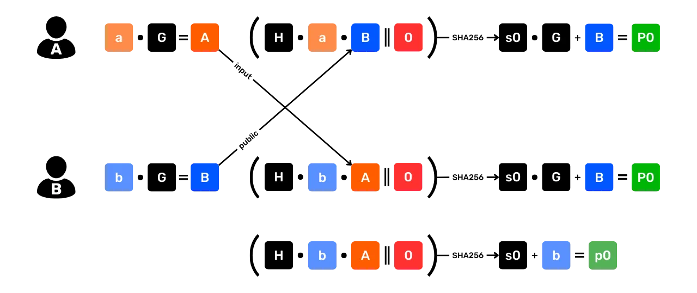

*Legend:*
- $B$: The public key / static address published by Bob
- $b$: Bob's private key
- $A$: The public key of Alice's UTXO used as input for the transaction
- $a$: Alice's private key
- $H$: The hash of the UTXO used as input
- $G$: The generator point of the elliptic curve `secp256k1`
- $\text{SHA256}$: The SHA256 hash function tagged with `BIP0352/SharedSecret`
- $s_0$: The first shared ECDH secret
- $P_0$: The first public key / unique address for payment to Bob

At the moment, our calculations assume that Alice uses a single input for her transaction. However, she should be able to use multiple inputs. Consequently, on Bob's side, for each transaction containing multiple inputs, he would theoretically need to compute the ECDH for each input to determine if a payment is intended for him. This method is not satisfactory, so we need to find a solution to reduce the workload!

### Tweaking the public keys in inputs

To solve this problem, instead of using the pair of keys securing a specific input on Alice's side, we will use the sum of all the pairs of keys used in the inputs of the transaction. This sum will then be considered as a new pair of keys. This technique is known as "tweak".

For example, imagine that Alice's transaction has 3 inputs, each secured with a different pair of keys:
- $a_0$ secures input #0;
- $a_1$ secures input #1;
- $a_2$ secures input #2.


Following the method described above, Alice would have to choose a single pair of keys among $a_0$, $a_1$, and $a_2$ to calculate the ECDH secret and generate the unique payment address $P$ from Bob's static address $B$. However, this approach requires Bob to test each possibility sequentially, starting with $a_0$, then $a_1$, and so on, until identifying a pair generating a valid address $P$. This process demands that Bob executes the ECDH calculation on all inputs of all transactions, significantly increasing the operational scanning workload.

To avoid this, we will ask Alice to perform her calculation of $P$ using the sum of all the keys in input. Taking our example, the tweaked private key $a$ would be calculated as follows:

$$  a = a_0 + a_1 + a_2  $$

Similarly, Alice and Bob will be able to calculate the tweaked public key:

$$  A = A_0 + A_1 + A_2  $$
Thanks to this method, Bob only needs to calculate the sum of the public keys of the transaction, then compute the ECDH secret from $A$ only, which greatly reduces the number of calculations to be done for the scanning step. However, remember from the previous section. We had included in our calculation the hash $\text{inputHash}$ which is used as a nonce to prevent address reuse:

$$  \text{inputHash} = \text{hash}(\text{outpoint} \text{ ‖ } A)  $$

But if there are multiple inputs in a transaction, it is necessary to determine which $\text{outpoint}$ is chosen in this calculation. According to BIP352, the selection criterion for $\text{outpoint}$ to use is to choose the smallest lexicographically, which means selecting the UTXO that appears first in alphabetical order. This method standardizes the UTXO to choose in each transaction. For example, if this smallest $\text{outpoint}$ lexicographically is $\text{outpoint}_L$, the calculation of $\text{inputHash}$ will be:

$$  \text{inputHash} = \text{hash}(\text{outpoint}_L \text{ ‖ } A)  $$

The calculations then remain identical to those presented in the previous section, except that the private key $a$ and its corresponding public key $A$ are no longer a pair securing a single input, but now represent the tweak of all key pairs in inputs.

### Separating Spending and Scanning Keys

So far, we have discussed the Silent Payment static address $B$ as a unique public key. Remember, it is this public key $B$ that is used by Alice to create the shared ECDH secret, which in turn is used to compute the unique payment address $P$. Bob uses this public key $B$ and the corresponding private key $b$ for the scanning step. But he will also use the private key $b$ to compute the private key $p$ that allows spending from the address $P$.

The downside of this method is that the private key $b$, which is used to compute all the private keys for addresses receiving Silent Payments, is also used by Bob to scan transactions. This step requires that the key $b$ be available on a wallet software connected to the internet, which exposes it to a greater risk of theft compared to keeping it on a cold wallet. Ideally, it would be beneficial to be able to take advantage of Silent Payments while keeping the private key $b$, which controls access to all other private keys, secured on a hardware wallet. Fortunately, the protocol has been adapted to allow exactly that.
To achieve this, BIP352 specifies that the receiver uses 2 different pairs of keys:
- $B_{\text{spend}}$: to calculate the private keys of unique payment addresses;
- $B_{\text{scan}}$: to find unique payment addresses.

In this way, Bob can keep the private key $b_{\text{spend}}$ on a hardware wallet and use the private key $b_{\text{scan}}$ on online software to find his Silent Payments, without revealing $b_{\text{spend}}$. However, the public keys $B_{\text{scan}}$ and $B_{\text{spend}}$ are both publicly revealed, as they are found in Bob's static address $B$:

$$  B = B_{\text{scan}} \text{ ‖ } B_{\text{spend}} $$

To calculate a unique payment address $P_0$ belonging to Bob, Alice will now perform the following calculation:

$$  P_0 = B_{\text{spend}} + \text{hash}(\text{inputHash} \cdot a \cdot B_{\text{scan}} \text{ ‖ } 0) \cdot G  $$

To find the payments addressed to him, Bob will perform the following calculation:

$$  P_0 = B_{\text{spend}} + \text{hash}(\text{inputHash} \cdot b_{\text{scan}} \cdot A \text{ ‖ } 0) \cdot G  $$

As you can see, so far, Bob has not needed to use $b_{\text{spend}}$ which is on his hardware wallet. When he wishes to spend $P_0$, he can then perform the following calculation to find the private key $p_0$:

$$ p_0 = (b_{\text{spend}} + \text{hash}(\text{inputHash} \cdot b_{\text{scan}} \cdot A \text{ ‖ } 0)) \bmod n $$


*Caption:*
- $B_{\text{scan}}$: Bob's scan public key (static address)
- $b_{\text{scan}}$: Bob's scan private key
- $B_{\text{spend}}$: Bob's spend public key (static address)
- $b_{\text{spend}}$: Bob's spend private key
- $A$: The sum of public keys in input (tweak)
- $a$: The private key corresponding to the tweaked public key
- $H$: The hash of the smallest UTXO (lexicographically) used in input
- $G$: The generator point of the elliptic curve `secp256k1`
- $\text{SHA256}$: The SHA256 hashing function tagged with `BIP0352/SharedSecret`
- $s_0$: The first shared ECDH secret
- $P_0$: The first public key / unique payment address for Bob

### Using SP addresses with a label

Bob thus has a static address $B$ for Silent Payments as follows:

$$ B = B_{\text{scan}} \text{ ‖ } B_{\text{spend}} $$

The problem with this method is that it does not allow for segregating the different payments sent to this address. For example, if Bob has 2 different clients for his business and he wants to clearly differentiate the payments from each, he would need 2 different static addresses. A naive solution, with the current approach, would be for Bob to create two separate wallets, each with its own static address, or even to establish two different static addresses within the same wallet. However, this solution requires scanning the entire blockchain twice (once for each address) to respectively detect the payments intended for each address. This double scanning unreasonably increases the operational burden for Bob.

To solve this problem, BIP352 uses a labeling system that allows for different static addresses without unreasonably increasing the workload to find Silent Payments on the blockchain. To do this, an integer $m$ is added to the spend public key $B_{\text{spend}}$. This integer can take the value of $1$ for the first static address, then $2$ for the second, and so on. The spend keys $B_{\text{spend}}$ will henceforth be called $B_m$ and will be constructed in this manner:

$$  B_m = B_{\text{spend}} + \text{hash}(b_{\text{scan}} \text{ ‖ } m) \cdot G  $$

For example, for the first spend key with the label $1$:

$$  B_1 = B_{\text{spend}} + \text{hash}(b_{\text{scan}} \text{ ‖ } 1) \cdot G  $$

The static address published by Bob will now consist of $B_{\text{scan}}$ and $B_m$. For example, the first static address with the label $1$ will be:

$$ B = B_{\text{scan}} \text{ ‖ } B_1 $$

> *We start only from label 1 because label 0 is reserved for change.*

Alice, on her part, will derive the unique payment address $P$ in the same way as before, but using the new $B_1$ instead of $B_{\text{spend}}$.
$$  P_0 = B_1 + \text{hash}(\text{inputHash} \cdot a \cdot B_{\text{scan}} \text{ ‖ } 0) \cdot G  $$

In reality, Alice may not even know that Bob has a labeled address, as she simply uses the second part of the static address he provided her, which in this case, is the value $B_1$ rather than $B_{\text{spend}}$.

To scan for payments, Bob will always use the value of his initial static address with $B_{\text{spend}}$ in this manner:

$$   P_0 = B_{\text{spend}} + \text{hash}(\text{inputHash} \cdot b_{\text{scan}} \cdot A \text{ ‖ } 0) \cdot G  $$

Then, he simply subtracts the value he finds for $P_0$ from each output one by one. He then checks if one of the results of these subtractions matches the value of one of the labels he uses on his wallet. If it matches, for example, for output #4 with the label $1$, this means that this output is a Silent Payment associated with his labeled static address $B_1$:

$$ Out_4 - P_0 = \text{hash}(b_{\text{scan}} \text{ ‖ } 1) \cdot G $$

This works because:

$$  B_1 = B_{\text{spend}} + \text{hash}(b_{\text{scan}} \text{ ‖ } 1) \cdot G  $$

Thanks to this method, Bob can use a multitude of static addresses ($B_1$, $B_2$, $B_3$...), all derived from his base static address ($B = B_{\text{scan}} \text{ ‖ } B_{\text{spend}}$), in order to properly separate uses.

However, this separation of static addresses is only valid from a personal wallet management perspective and does not allow for the separation of identities. Since they all have the same $B_{\text{scan}}$, it is very easy to associate all the static addresses together and deduce that they belong to a single entity.


*Caption:*
- $B_{\text{scan}}$: Bob's scan public key (static address)
- $b_{\text{scan}}$: Bob's scan private key
- $B_{\text{spend}}$: Bob's spend public key (initial address)
- $B_m$: Bob's labeled spend public key (static address)
- $b_m$: Bob's labeled spend private key
- $A$: The sum of input public keys (tweak)
- $a$: The private key corresponding to the tweaked public key
- $H$: The hash of the smallest UTXO (lexicographically) used as input
- $G$: The generator point of the elliptic curve `secp256k1`
- $\text{SHA256}$: The SHA256 hashing function tagged with `BIP0352/SharedSecret`
- $s_0$: The first shared ECDH secret
- $P_0$: The first public key / unique address for payment to Bob
- $p_0$: The private key of the first unique payment address to Bob
- $X$: The hash of the scan private key with the label

### How to Construct a Silent Payments Address?

To construct a dedicated Silent Payments address, one must first derive 2 pairs of keys in their Bitcoin HD wallet:
- The pair $b_{\text{scan}}$, $B_{\text{scan}}$ for searching the payments addressed to us;
- The pair $b_{\text{spend}}$, $B_{\text{spend}}$ for spending the bitcoins we have received.

These pairs are derived following these paths (*Bitcoin Mainnet*):

```text
scan: m / 352' / 0' / 0' / 1' / 0
spend: m / 352' / 0' / 0' / 0' / 0
```

Once these 2 pairs of keys are available, one simply concatenates them (end-to-end) to create the payload of the static address:

$$ B = B_{\text{scan}} \text{ ‖ } B_{\text{spend}} $$

If one wishes to use labels, $B_{\text{spend}}$ is replaced with $B_m$:

$$ B = B_{\text{scan}} \text{ ‖ } B_m $$

With the label $m$:

$$  B_m = B_{\text{spend}} + \text{hash}(b_{\text{scan}} \text{ ‖ } m) \cdot G  $$

Once this payload is available, one adds the HRP (*Human-Readable Part*) `sp` and the version `q` (= version 0). A checksum is also added, and the address is formatted in bech32m.

For example, here is my static Silent Payments address:

```text
sp1qqvhjvsq2vz8zwrw372vuzle7472zup2ql3pz64yn5cpkw5ngv2n6jq4nl8cgm6zmu48yk3eq33ryc7aam6jrvrg0d0uuyzecfhx2wgsumcurv77e
```
An important point regarding static addresses, which you may have entered in the previous sections, is that these addresses are not visible in Bitcoin transactions. Only the payment addresses $P$, used in the outputs, appear on the blockchain in the standard Taproot format. Thus, from the outside, it is impossible to distinguish a transaction involving a Silent Payment from an ordinary transaction using P2TR outputs.
Just like with BIP47, it is impossible to establish a connection between a static address $B$ and a payment address $P$ derived from $B$. Indeed, even if Eve, a potential attacker, tries to scan the blockchain with Bob's static address $B$, she will not be able to perform the necessary calculations to determine $P$. To do this, she would need either Bob's private scan key $b_{\text{scan}}$ or the sender's private keys $a$, but both of these elements are, of course, private. It is therefore possible to explicitly link one's static address with a form of personal identity.

### How to use Silent Payments?

The proposal for Silent Payments is relatively recent and has only been implemented by a very limited number of wallets so far. To my knowledge, there are only 3 software that support them:
- [CakeWallet](https://cakewallet.com/)
- [Silentium](https://app.silentium.dev/)
- [DonationWallet](https://github.com/Sosthene00/donationwallet)

We will soon offer a detailed tutorial on setting up your own Silent Payments static address.

Since this feature is recent, it is advisable to exercise caution and avoid using Silent Payments for large amounts on the mainnet.

*To create this chapter on Silent Payments, I used [the Silent Payments explanation site](https://silentpayments.xyz/) and [the BIP352 explanation document](https://github.com/bitcoin/bips/blob/master/bip-0352.mediawiki).*


## Give us some feedback about this course
<chapterId>195d149f-80fa-5816-8b46-995a9226d082</chapterId>
<isCourseReview>true</isCourseReview>

## Final Exam
<chapterId>e803d394-e3c1-5816-a6b4-a69a2472019c</chapterId>
<isCourseExam>true</isCourseExam>

## Conclusion
<chapterId>cd8e5c67-50e4-4dcd-8e04-88ba5ec95305</chapterId>

Congratulations on completing this training on privacy in Bitcoin!

We have covered many advanced and technical topics in this training, but it is not imperative to use all the tools presented. The main goal was to empower you to choose the information you wish to disclose and the information you prefer to keep confidential in your use of Bitcoin. This embodies the very essence of privacy protection. To make informed choices about the information to share or hide, it is necessary to be aware of the implications of our actions. I hope this training has helped you gain this knowledge.
If I had to choose the most important part of this training, I would pick the section dedicated to chain analysis. Understanding the techniques used by your potential attackers is the best way to protect yourself. Therefore, my advice would be to carefully review this part and try to grasp all its details.

In this training, we focused exclusively on Bitcoin's privacy on the main chain. The privacy issues on second-layer systems, such as the Lightning Network and sidechains, are also significant and have very specific characteristics. Although the use of off-chain transactions can be an effective strategy to circumvent the many traceability risks on Bitcoin that we have studied, it exposes you to other risks that are also essential to be aware of. That's why these topics will be covered in a future dedicated training on PlanB Network.

If you enjoyed this training, I would be very grateful if you could share it with your friends and on social media. Thank you! :)
