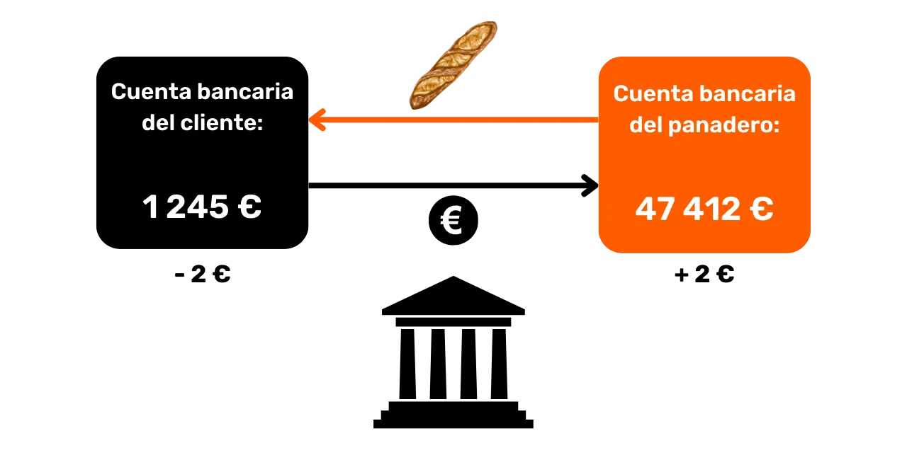
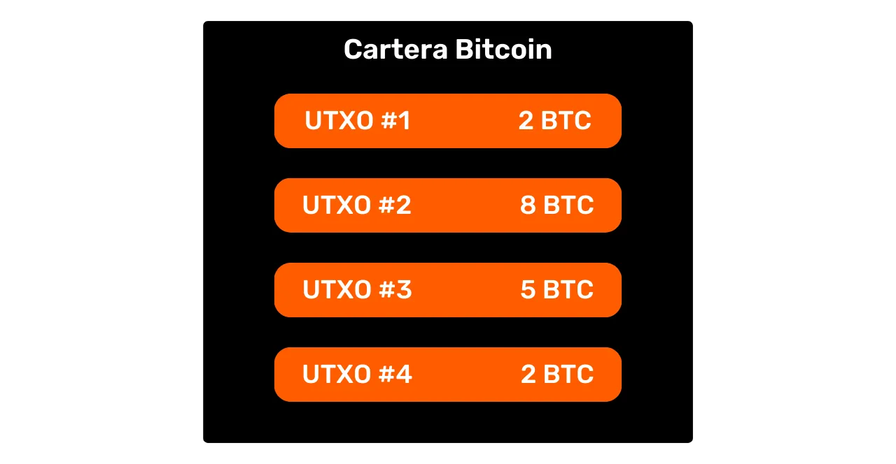
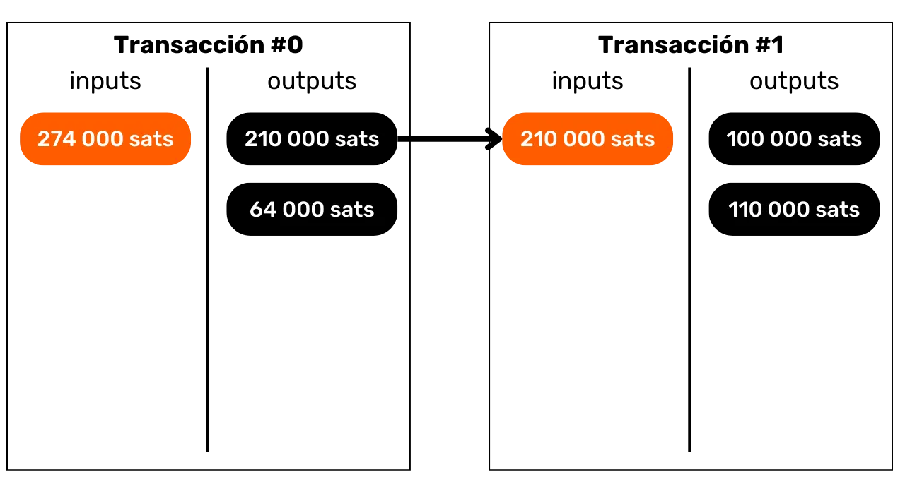
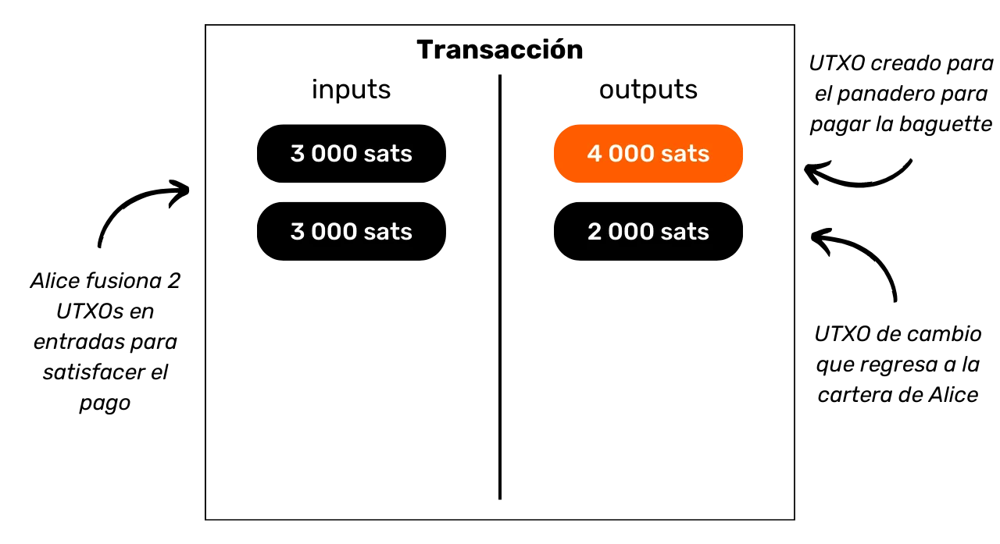
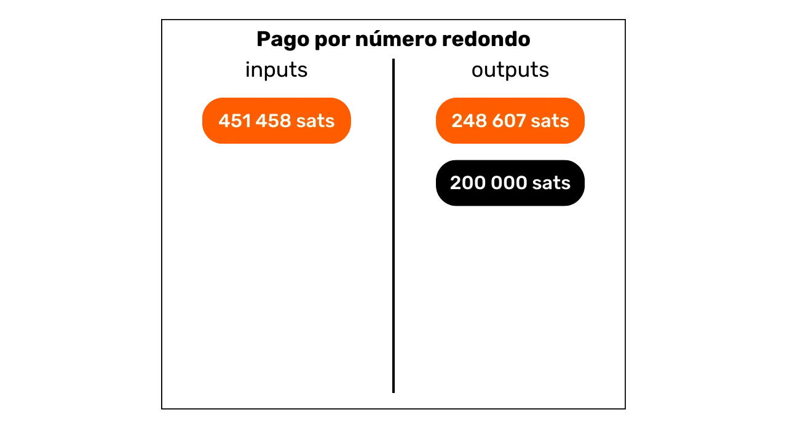
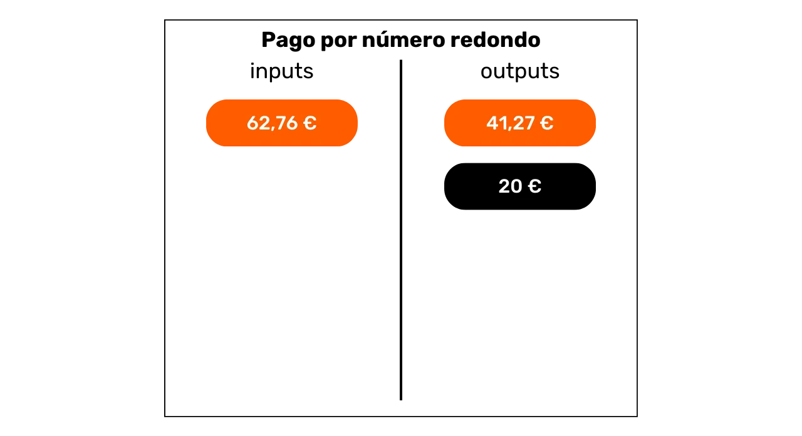
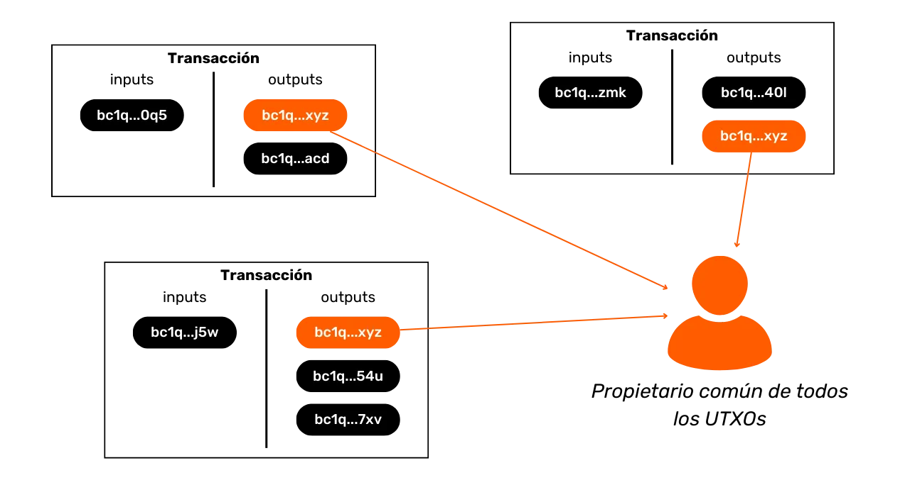
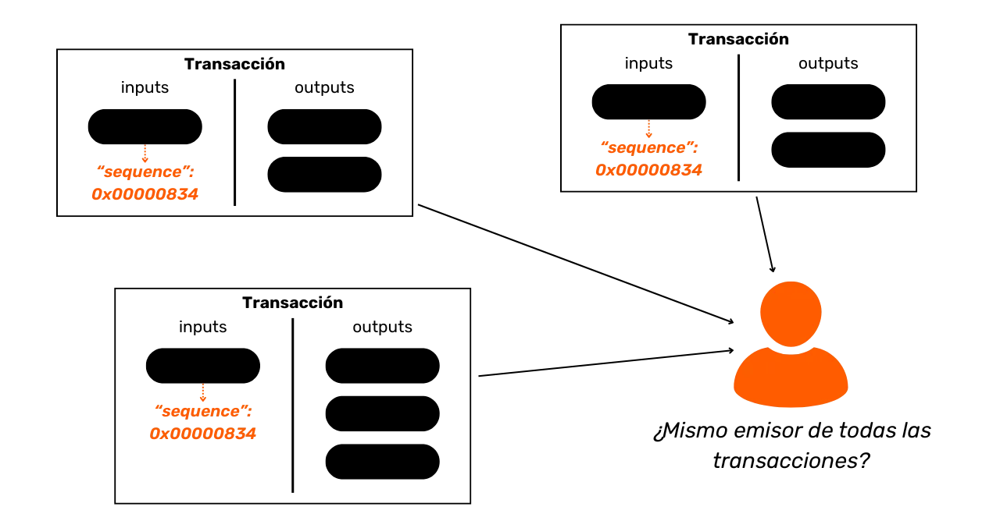
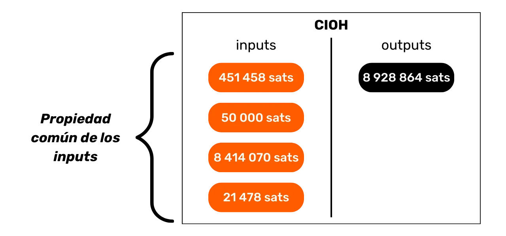

# Protege Tu Privacidad en Bitcoin

En un mundo donde la privacidad de las transacciones financieras se está convirtiendo gradualmente en un lujo, entender y dominar los principios de protección de la privacidad en tu uso de Bitcoin es esencial. Este entrenamiento te proporciona todas las claves, tanto teóricas como prácticas, para lograrlo de manera autónoma.

Hoy en día, en Bitcoin, existen empresas especializadas en análisis de cadena. Su negocio principal es precisamente intruir en tu esfera privada, con el fin de comprometer la confidencialidad de tus transacciones. De hecho, el "derecho a la privacidad" en Bitcoin no existe. Por lo tanto, eres tú, el usuario, quien debe afirmar tus derechos naturales y proteger la confidencialidad de tus transacciones, porque nadie más lo hará por ti.

Este entrenamiento se presenta como un viaje completo y generalista. Cada noción técnica se discute en detalle y se apoya con diagramas explicativos. El objetivo es hacer el conocimiento accesible para todos. BTC204 es, por lo tanto, accesible para usuarios principiantes e intermedios. Este entrenamiento también ofrece valor agregado a los bitcoiners más experimentados, ya que profundizamos en algunos conceptos técnicos que a menudo son desconocidos.

Únete a nosotros para transformar tu uso de Bitcoin y convertirte en un usuario informado, capaz de entender los desafíos en torno a la confidencialidad y proteger tu privacidad.

+++

# Introducción
<partId>e17474a8-8899-4bdb-a7f8-bc52ddb01440</partId>

## Introducción al Entrenamiento
<chapterId>08ba1933-f393-4fb5-8279-777d874caedb</chapterId>

En un mundo donde la privacidad de las transacciones financieras se está convirtiendo gradualmente en un lujo, entender y dominar los principios de protección de la privacidad en tu uso de Bitcoin es esencial. Este entrenamiento te proporciona todas las claves, tanto teóricas como prácticas, para lograrlo de manera autónoma.
Hoy en día, en el ecosistema de Bitcoin, existen empresas especializadas en análisis de cadena. Su negocio principal es precisamente intruir en tu esfera privada, comprometiendo la confidencialidad de tus transacciones. En realidad, el "derecho a la privacidad" en Bitcoin no existe. Por lo tanto, eres tú, el usuario, quien debe afirmar tus derechos naturales y proteger la confidencialidad de tus transacciones, porque nadie más lo hará por ti.

Bitcoin no está ahí solo para que el "Número Aumente" y la preservación del valor de los ahorros. Debido a sus características únicas y su historia, es principalmente la herramienta de la contraeconomía. Gracias a esta notable invención, puedes gestionar libremente tu dinero, gastarlo y acumularlo, sin que nadie pueda impedírtelo.

Bitcoin ofrece una escapatoria pacífica del yugo de los estados, permitiéndote disfrutar plenamente de tus derechos naturales, los cuales no pueden ser impugnados por las leyes establecidas. Gracias a la invención de Satoshi Nakamoto, tienes el poder de hacer respetar tu propiedad privada y recuperar la libertad de contratar.
Sin embargo, Bitcoin no es anónimo por defecto, lo que puede representar un riesgo para las personas involucradas en la contraeconomía, especialmente en regiones bajo regímenes despóticos. Pero este no es el único peligro. Dado que bitcoin es un activo valioso e incensurable, puede atraer la codicia de los ladrones. Por lo tanto, proteger tu privacidad también se convierte en una cuestión de seguridad: puede ayudarte a prevenir ciberataques y asaltos físicos.
Como veremos, aunque el protocolo ofrece algunas protecciones intrínsecas de privacidad, es crucial usar herramientas adicionales para optimizar y defender esta privacidad.

Este entrenamiento está diseñado como un viaje completo y generalista para entender los desafíos de la privacidad en Bitcoin. Cada noción técnica se detalla y se apoya con diagramas explicativos. El objetivo es hacer el conocimiento accesible para todos, incluyendo usuarios principiantes e intermedios. Para los bitcoiners más experimentados, también cubrimos conceptos muy técnicos y a veces desconocidos a lo largo de este entrenamiento para profundizar la comprensión de cada tema.

El objetivo de este entrenamiento no es hacerte completamente anónimo en tu uso de Bitcoin, sino más bien proporcionarte las herramientas esenciales para saber cómo proteger tu privacidad según tus metas personales. Tendrás la libertad de elegir entre los conceptos y herramientas presentados para desarrollar tus propias estrategias, adaptadas a tus objetivos y necesidades específicas.

### Sección 1: Definiciones y Conceptos Clave
Para comenzar, revisaremos juntos los principios fundamentales que rigen el funcionamiento de Bitcoin, para luego abordar con calma nociones relacionadas con la privacidad. Es esencial dominar algunos conceptos básicos, como UTXO, direcciones de recepción o scripts, antes de poder entender completamente los conceptos que abordaremos en las siguientes secciones. También introduciremos el modelo general de privacidad de Bitcoin, tal como lo concibió Satoshi Nakamoto, lo que nos permitirá comprender los desafíos y riesgos asociados.


### Sección 2: Entendiendo el Análisis de Cadena y Cómo Protegerse Contra Él

En la segunda sección, estudiamos las técnicas utilizadas por las empresas de análisis de cadena para rastrear tu actividad en Bitcoin. Entender estos métodos es crucial para mejorar la protección de tu privacidad. Esta parte tiene como objetivo examinar las estrategias de los atacantes para entender mejor los riesgos y sentar las bases de las técnicas que estudiaremos en las siguientes secciones. Analizaremos patrones de transacciones, heurísticas internas y externas, así como interpretaciones plausibles de estos patrones. Además de un componente teórico, aprenderemos a usar un explorador de bloques para realizar análisis de cadena, mediante ejemplos prácticos y ejercicios.


### Sección 3: Dominando las Mejores Prácticas para Proteger Tu Privacidad

En la tercera sección de nuestro entrenamiento, llegamos al corazón del asunto: ¡la práctica! El objetivo es dominar todas las mejores prácticas esenciales que deberían convertirse en reflejos naturales para cualquier usuario de Bitcoin. Cubriremos el uso de direcciones frescas, etiquetado, consolidación, el uso de nodos completos, así como KYC y métodos de adquisición. El objetivo es proporcionarte una visión completa de las trampas a evitar para establecer bases sólidas en nuestra búsqueda de protección de la privacidad. Para algunas de estas prácticas, serás guiado a un tutorial específico para implementarlas.


### Sección 4: Entendiendo las Transacciones Coinjoin

¿Cómo podemos hablar de privacidad en Bitcoin sin discutir sobre coinjoins? En la sección 4, descubrirás todo lo que necesitas saber sobre este método de mezcla. Aprenderás qué es un coinjoin, su historia y objetivos, así como los diferentes tipos de coinjoins que existen. Finalmente, para los usuarios más experimentados, exploraremos qué son los anonsets y la entropía, y cómo calcular estos indicadores.


### Sección 5: Entendiendo las Implicaciones de Otras Técnicas Avanzadas de Privacidad
En la quinta sección, proporcionaremos una visión general de todas las demás técnicas existentes para proteger tu privacidad en Bitcoin, aparte de coinjoin. A lo largo de los años, los desarrolladores han mostrado una creatividad notable al diseñar herramientas dedicadas a la privacidad. Examinaremos todos estos métodos, tales como Payjoin, transacciones colaborativas, Coin Swap y Atomic Swap, detallando su funcionamiento, objetivos y potenciales debilidades.


### Sección 6: Explorando Propuestas de Mejora del Protocolo Relacionadas con la Privacidad

Mientras que las secciones anteriores se centraron en soluciones de privacidad a nivel de aplicación, esta sexta sección profundizará en los desafíos a nivel del protocolo para la privacidad del usuario. Discutiremos la privacidad en la red de nodos y la difusión de transacciones. También discutiremos los diversos protocolos que se han propuesto a lo largo de los años para mejorar la privacidad del usuario en Bitcoin. Para concluir, examinaremos los impactos en la privacidad, tanto positivos como negativos, del último gran soft fork de Bitcoin, Taproot.

***(WIP: LOIC: AÑADIR EJEMPLO DE DIAGRAMA AQUÍ)***

### Sección Bonus: Privacidad en Protocolos de Segunda Capa

Como has entendido, el núcleo de este entrenamiento se centra exclusivamente en la privacidad onchain. En esta parte final y de bonificación, deseo ampliar el tema a la privacidad en otros protocolos relacionados con Bitcoin. Hablaremos específicamente sobre la privacidad en la Lightning Network. Algunos afirman que Lightning es privado por defecto, mientras que otros argumentan que la privacidad del usuario es insuficiente. Entonces, ¿cuál es la verdad? Desentrañaremos la verdad de la falsedad para entender mejor los desafíos relacionados con la privacidad en la Lightning Network. También discutiremos sobre sidechains como Liquid Network y bancos Chaumian como Cashu o Fedimint.


# Definiciones y Conceptos Clave
<partId>b9bbbde3-34c0-4851-83e8-e2ffb029cf31</partId>


## Modelo UTXO de Bitcoin
<chapterId>8d6b50c5-bf74-44f4-922b-25204991cb75</chapterId>

Bitcoin es principalmente una moneda, pero ¿sabes concretamente cómo se representan los BTC en el protocolo?

### UTXOs de Bitcoin: ¿Qué Son?

En el protocolo de Bitcoin, la gestión de unidades monetarias gira en torno al modelo UTXO, un acrónimo de "_Unspent Transaction Output_" (Salida de Transacción No Gastada).
Este modelo es profundamente diferente de los sistemas bancarios tradicionales que se basan en un mecanismo de cuenta y saldo para rastrear los flujos financieros. De hecho, en el sistema bancario, los saldos individuales se mantienen en cuentas vinculadas a una identidad. Por ejemplo, cuando compras una baguette a un panadero, tu banco simplemente debita el monto de la compra de tu cuenta, reduciendo así tu saldo, mientras que la cuenta del panadero se acredita con la misma cantidad, aumentando su saldo. En este sistema, no hay noción de un vínculo entre el dinero que entra en tu cuenta y el dinero que sale de ella, aparte de los registros de transacciones.


En Bitcoin, funciona de manera diferente. El concepto de una cuenta no existe, y las unidades monetarias no se gestionan a través de saldos sino mediante UTXOs. Un UTXO representa una cantidad específica de bitcoins que aún no se ha gastado, formando así una "pieza de bitcoin", que puede ser grande o pequeña. Por ejemplo, un UTXO podría valer `500 BTC` o simplemente `700 SATS`.
**> Recordatorio:** El satoshi, a menudo abreviado como sat, es la unidad más pequeña de Bitcoin, comparable a un centavo en las monedas fiduciarias.

```plaintext
1 BTC = 100 000 000 SATS
```

Teóricamente, un UTXO puede representar cualquier valor en bitcoins, desde un sat hasta el máximo teórico de unos 21 millones de BTC. Sin embargo, es lógicamente imposible poseer los 21 millones de bitcoins, y existe un umbral económico inferior llamado "polvo", por debajo del cual se considera económicamente no rentable gastar un UTXO.

**> ¿Sabías que?** El UTXO más grande jamás creado en Bitcoin tuvo un valor de `500 000 BTC`. Fue creado por la plataforma MtGox durante una operación de consolidación en noviembre de 2011: [29a3efd3ef04f9153d47a990bd7b048a4b2d213daaa5fb8ed670fb85f13bdbcf](https://mempool.space/es/tx/29a3efd3ef04f9153d47a990bd7b048a4b2d213daaa5fb8ed670fb85f13bdbcf)

### UTXOs y Condiciones de Gasto

Los UTXOs son los instrumentos de intercambio en Bitcoin. Cada transacción resulta en el consumo de UTXOs como entradas y la creación de nuevos UTXOs como salidas. Cuando se realiza una transacción, los UTXOs utilizados como entradas se consideran "gastados", y se generan nuevos UTXOs que se asignan a los destinatarios indicados en las salidas de la transacción. Así, un UTXO simplemente representa una salida de transacción no gastada, y por lo tanto, una cantidad de bitcoins perteneciente a un usuario en un momento dado.

Todos los UTXOs están asegurados por scripts que definen las condiciones bajo las cuales pueden ser gastados. Para consumir un UTXO, un usuario debe demostrar a la red que cumple con las condiciones estipuladas por el script que asegura ese UTXO. Generalmente, los UTXOs están protegidos por una clave pública (o una dirección de recepción que representa esta clave pública). Para gastar un UTXO asociado con esta clave pública, el usuario debe probar que posee la clave privada correspondiente, proporcionando una firma digital hecha con esta clave. Es por esto que se dice que tu billetera de Bitcoin en realidad no contiene bitcoins, sino que almacena tus claves privadas, que a su vez te dan acceso a tus UTXOs y, por extensión, a los bitcoins que representan.


Dado que el concepto de una cuenta está ausente en Bitcoin, el saldo de una billetera simplemente corresponde a la suma de los valores de todos los UTXOs que puede gastar. Por ejemplo, si tu billetera de Bitcoin puede gastar los siguientes 4 UTXOs:

```plaintext
- 2 BTC
- 8 BTC
- 5 BTC
- 2 BTC
```

El saldo total de tu billetera sería `17 BTC`.



## La estructura de las transacciones de Bitcoin
<chapterId>29d3aaab-de2e-4746-ab40-c9748898850c</chapterId>

### Las entradas y salidas de una transacción
Una transacción de Bitcoin es una operación registrada en la blockchain que permite la transferencia de propiedad de bitcoins de una persona a otra. Más específicamente, dado que estamos en un modelo UTXO y no hay cuentas, la transacción satisface las condiciones de gasto que aseguraban uno o más UTXOs, los consume y crea en equivalencia nuevos UTXOs dotados con nuevas condiciones de gasto. En resumen, una transacción mueve bitcoins de un script que se satisface a un nuevo script destinado a asegurarlos.


Cada transacción de Bitcoin se compone así de una o más entradas y una o más salidas. Las entradas son UTXOs consumidos por la transacción para generar las salidas. Las salidas son nuevos UTXOs que serán utilizables como entradas para futuras transacciones.


**> ¿Sabías que?** Teóricamente, una transacción de bitcoin podría tener un número infinito de entradas y salidas. Solo el tamaño máximo de un bloque limita este número.
Cada entrada en una transacción de Bitcoin se refiere a un UTXO no gastado anterior. Para usar un UTXO como entrada, su titular debe demostrar que es el propietario legítimo validando el script asociado con él, es decir, satisfaciendo la condición de gasto impuesta. Generalmente, esto implica proporcionar una firma digital producida con la clave privada correspondiente a la clave pública que inicialmente aseguró ese UTXO. El script consiste así en verificar que la firma coincide con la clave pública utilizada al recibir los fondos.



Cada salida, por otro lado, especifica la cantidad de bitcoins a transferir, así como al destinatario. Este último se define por un nuevo script que, en general, bloquea el UTXO recién creado con una dirección de recepción o una nueva clave pública.

Para que una transacción sea considerada válida según las reglas de consenso, el total de las salidas debe ser menor o igual al total de las entradas. En otras palabras, la suma de los nuevos UTXOs generados por la transacción no debe exceder la de los UTXOs consumidos como entradas. Este principio es lógico: si solo tienes una cantidad de `500,000 SATS`, no puedes realizar una compra de `700,000 SATS`.

### Cambio y Consolidación en una Transacción de Bitcoin

La acción de una transacción de Bitcoin sobre los UTXOs puede compararse así con la fundición de una moneda de oro. De hecho, un UTXO no es divisible, sino solo fusionable. Esto significa que un usuario no puede simplemente dividir un UTXO que representa una cierta cantidad de bitcoins en varios UTXOs más pequeños. Deben consumirlo completamente en una transacción para crear uno o más nuevos UTXOs de valores arbitrarios en salidas, que deben ser menores o iguales al valor inicial.

Este mecanismo es similar al de una moneda de oro. Imagina que posees una moneda de 2 onzas y quieres hacer un pago de 1 onza, suponiendo que el vendedor no pueda darte cambio. Necesitarías fundir tu moneda y crear 2 nuevas de 1 onza cada una.
En Bitcoin, el funcionamiento es similar. Imaginemos que Alice tiene un UTXO de `10,000 SATS` y quiere comprar una baguette que cuesta `4,000 SATS`. Alice realizará una transacción con una entrada de 1 UTXO de `10,000 SATS` que consumirá por completo, y en las salidas, creará 2 UTXOs valorados en `4,000 SATS` y `6,000 SATS`. El UTXO de `4,000 SATS` será enviado al panadero como pago por la baguette, mientras que el UTXO de `6,000 SATS` regresará a Alice como cambio. Este UTXO que retorna al emisor inicial de la transacción es lo que se llama "cambio" en la jerga de Bitcoin. 

Ahora imaginemos que Alice no tiene un único UTXO de `10,000 SATS`, sino dos UTXOs de `3,000 SATS` cada uno. En esta situación, ninguno de los UTXOs individuales es suficiente para cubrir los `4,000 SATS` de la baguette. Por lo tanto, Alice debe usar ambos UTXOs de `3,000 SATS` como entradas para su transacción. De esta manera, el total de las entradas alcanzará `6,000 SATS`, permitiéndole cubrir el pago de `4,000 SATS` al panadero. Este método, que implica agrupar varios UTXOs en las entradas de una transacción, a menudo se refiere con el término "consolidación".



### Tarifas de Transacción

Intuitivamente, uno podría pensar que las tarifas de transacción también representan una salida de una transacción. Pero en realidad, este no es el caso. Las tarifas de una transacción representan la diferencia entre el total de las entradas y el total de las salidas. Esto significa que, después de usar parte del valor de las entradas para cubrir las salidas deseadas en una transacción, cierta suma de las entradas permanece sin usar. Esta suma residual constituye las tarifas de la transacción.

```plaintext
Tarifas = entradas totales - salidas totales
```

Revisitemos el ejemplo de Alice que tiene un UTXO de `10,000 SATS` y quiere comprar una baguette por `4,000 SATS`. Alice crea una transacción con su UTXO de `10,000 SATS` como entrada. Luego genera una salida de `4,000 SATS` destinada al panadero para el pago de la baguette. Para incentivar a los mineros a incluir su transacción en un bloque, Alice asigna `200 SATS` como tarifas. Así, crea una segunda salida, el cambio, que le retornará, ascendiendo a `5,800 SATS`.


Aplicando la fórmula de tarifas, efectivamente vemos que quedan `200 SATS` para los mineros:

```plaintext
Tarifas = entradas totales - salidas totales
Tarifas = 10,000 - (4,000 + 5,800)
Tarifas = 10,000 - 9,800
Tarifas = 200
```

Cuando un minero valida exitosamente un bloque, tiene derecho a recoger estas tarifas por todas las transacciones incluidas en su bloque, a través de la llamada transacción "coinbase".

### La Creación de UTXOs en Bitcoin

Si has estado siguiendo los párrafos anteriores detenidamente, ahora sabes que los UTXOs solo pueden ser creados consumiendo otros UTXOs existentes. Así, las monedas en Bitcoin forman una cadena continua. Sin embargo, podrías estar preguntándote cómo aparecieron los primeros UTXOs en esta cadena. Esto plantea un problema similar al del huevo y la gallina: ¿de dónde vinieron estos UTXOs originales?
La respuesta se encuentra en la **transacción coinbase**.

La coinbase es un tipo específico de transacción de Bitcoin, que es única para cada bloque y siempre es la primera. Permite al minero que encontró una prueba de trabajo válida recibir su recompensa de bloque. Esta recompensa consiste en dos elementos: **la subvención de bloque** y **las tasas de transacción** que discutimos en la parte anterior.

La característica única de la transacción coinbase es que es la única que puede crear bitcoins de la nada, sin necesidad de consumir entradas para generar sus salidas. Estos bitcoins recién creados constituyen lo que podríamos llamar los "UTXOs originales".


Los bitcoins de la subvención de bloque son nuevos BTC creados de la nada, siguiendo un calendario de emisión preestablecido en las reglas de consenso. La subvención de bloque se reduce a la mitad cada 210,000 bloques, lo que ocurre aproximadamente cada cuatro años, en un proceso llamado "halving". Inicialmente, se creaban 50 bitcoins con cada subvención, pero esta cantidad ha disminuido gradualmente; actualmente, es de 3.125 bitcoins por bloque.

En cuanto a la parte relacionada con las tasas de transacción, aunque también representa BTC recién creado, no deben exceder la diferencia entre las entradas totales y las salidas de todas las transacciones en un bloque. Vimos anteriormente que estas tasas representan la porción de las entradas que no se utiliza en las salidas de las transacciones. Esta parte se pierde técnicamente durante la transacción, y el minero tiene el derecho de recrear este valor en forma de uno o más UTXOs nuevos. Esto es, por lo tanto, una transferencia de valor del remitente de la transacción al minero que lo añade a la blockchain.

**> ¿Sabías que?** Los bitcoins generados por una transacción coinbase están sujetos a un período de madurez de 100 bloques durante el cual no pueden ser gastados por el minero. Esta regla tiene como objetivo prevenir complicaciones relacionadas con el uso de bitcoins recién creados en una cadena que podría ser obsoleta más tarde.

### Las Implicaciones del Modelo UTXO

En primer lugar, el modelo UTXO influye directamente en las tasas de transacción en Bitcoin. Dado que la capacidad de cada bloque es limitada, los mineros priorizan las transacciones que ofrecen las mejores tasas en relación al espacio que ocuparán en el bloque. De hecho, cuantos más UTXOs incluya una transacción como entradas y salidas, más pesada es, y por lo tanto, requiere tasas más altas. Esta es una de las razones por las cuales a menudo tratamos de reducir el número de UTXOs en nuestra billetera, lo que también puede afectar la privacidad, un tema que discutiremos en detalle en la tercera parte de esta formación.

A continuación, como se mencionó en partes anteriores, las monedas en Bitcoin son esencialmente una cadena de UTXOs. Cada transacción crea así un vínculo entre un UTXO pasado y un UTXO futuro. Los UTXOs, por lo tanto, permiten el seguimiento explícito de bitcoins desde su creación hasta su gasto actual. Esta transparencia puede percibirse positivamente, ya que permite a cada usuario verificar la autenticidad de los bitcoins recibidos. Sin embargo, también es sobre este principio de rastreabilidad y auditabilidad que se basa el análisis de cadena, una práctica destinada a comprometer tu privacidad. Estudiaremos esta práctica en profundidad en la segunda parte de la formación.

## El Modelo de Privacidad de Bitcoin
<chapterId>769d8963-3ed5-4094-b21d-9203c7d9e465</chapterId>

### Moneda: Autenticidad, Integridad y Doble Gasto

Una de las funciones del dinero es resolver el problema de la doble coincidencia de deseos. En un sistema basado en el trueque, realizar un intercambio requiere no solo encontrar a un individuo que ofrezca un bien que satisfaga mi necesidad, sino también proporcionarles un bien de valor equivalente que satisfaga su propia necesidad. Encontrar este equilibrio resulta ser complejo.


Es por eso que recurrimos al dinero, que permite la transferencia de valor tanto espacial como temporalmente.


Para que el dinero resuelva este problema, es esencial que la parte que proporciona un bien o servicio esté convencida de su capacidad para gastar esa suma más adelante. Por lo tanto, cualquier individuo racional que desee aceptar una pieza de dinero, ya sea digital o física, se asegurará de que cumpla con dos criterios fundamentales:
- **La moneda debe estar intacta y ser auténtica;**
- **y no debe haber sido gastada dos veces.**
Al usar moneda física, la primera característica es la más compleja de afirmar. En diferentes momentos de la historia, la integridad de las monedas metálicas a menudo ha sido comprometida por prácticas como el recorte o la perforación. Por ejemplo, durante la antigua Roma, era común que los ciudadanos rasparan los bordes de las monedas de oro para recolectar un poco del metal precioso, mientras las conservaban para transacciones futuras. El valor intrínseco de la moneda se reducía así, pero su valor nominal permanecía igual. Esto es notablemente por qué más tarde se acuñaron bordes estriados en el borde de las monedas.

La autenticidad también es una característica difícil de verificar con medios monetarios físicos. Hoy en día, las técnicas para combatir la falsificación son cada vez más complejas, obligando a los comerciantes a invertir en sistemas de verificación costosos.

Por otro lado, debido a su naturaleza, el doble gasto no es un problema para las monedas físicas. Si te doy un billete de €10, este irrevocablemente deja mi posesión para entrar en la tuya, excluyendo naturalmente cualquier posibilidad de gastar las mismas unidades monetarias múltiples veces. En resumen, no podré gastar ese billete de €10 nuevamente.


Para la moneda digital, la dificultad es diferente. Asegurar la autenticidad y la integridad de una moneda es a menudo más simple. Como vimos en la sección anterior, el modelo UTXO de Bitcoin permite rastrear una moneda hasta su origen, verificando así que fue creada de acuerdo con las reglas de consenso por un minero.

Sin embargo, asegurar la ausencia de doble gasto es más complejo, ya que cualquier bien digital es esencialmente información. A diferencia de los bienes físicos, la información no se divide durante los intercambios sino que se propaga multiplicándose. Por ejemplo, si te envío un documento por correo electrónico, este se duplica. Por tu parte, no puedes verificar con certeza que he eliminado el documento original.


### Previniendo el Doble Gasto en Bitcoin
La única manera de evitar la duplicación de un bien digital es estar al tanto de todos los intercambios en el sistema. De esta manera, se puede saber quién posee qué y actualizar las posesiones de todos según las transacciones realizadas. Esto es lo que se hace, por ejemplo, con el dinero scriptural en el sistema bancario. Cuando pagas €10 a un comerciante con tarjeta de crédito, el banco anota este intercambio y actualiza el libro mayor.
En Bitcoin, la prevención del doble gasto se logra de la misma manera. El objetivo es confirmar la ausencia de una transacción que ya haya gastado las monedas en cuestión. Si estas monedas nunca se han utilizado, entonces podemos estar seguros de que no ocurrirá un doble gasto. Este principio fue descrito por Satoshi Nakamoto en el White Paper con esta famosa frase:
**"*La única manera de confirmar la ausencia de una transacción es estar al tanto de todas las transacciones.*"**

Sin embargo, a diferencia del modelo bancario, no hay deseo de tener que confiar en una entidad central en Bitcoin. Es necesario que todos los usuarios puedan confirmar esta ausencia de doble gasto, sin depender de un tercero. Así, todos deben estar al tanto de todas las transacciones de Bitcoin. Es por esto que las transacciones de Bitcoin se transmiten públicamente a través de todos los nodos de la red y se registran de manera clara en la blockchain.

Es precisamente esta difusión pública de información la que complica la protección de la privacidad en Bitcoin. En el sistema bancario tradicional, en teoría, solo la institución financiera está al tanto de las transacciones realizadas. Por otro lado, en Bitcoin, todos los usuarios están informados de todas las transacciones, a través de sus respectivos nodos.

### El modelo de privacidad: sistema bancario vs Bitcoin

En el sistema tradicional, tu cuenta bancaria está vinculada a tu identidad. El banquero es capaz de saber a qué cliente pertenece cada cuenta bancaria y qué transacciones están asociadas con ella. Sin embargo, este flujo de información se corta entre el banco y el dominio público. En otras palabras, es imposible conocer el saldo y las transacciones de una cuenta bancaria que pertenece a otro individuo. Solo el banco tiene acceso a esta información.

Por ejemplo, tu banquero sabe que compras tu baguette todas las mañanas en la panadería del barrio, pero tu vecino no está al tanto de esta transacción. Así, el flujo de información es accesible para las partes concernidas, notablemente el banco, pero permanece inaccesible para los externos.

Debido a la restricción de difusión pública de transacciones que vimos en la parte anterior, el modelo de privacidad de Bitcoin no puede seguir el modelo del sistema bancario. En el caso de Bitcoin, dado que el flujo de información no puede interrumpirse entre las transacciones y el dominio público, **el modelo de privacidad se basa en la separación entre la identidad del usuario y las transacciones** mismas.
Por ejemplo, si compras una baguette al panadero pagando en BTC, tu vecino, que posee su propio nodo completo, puede ver pasar tu transacción, así como puede ver todas las demás transacciones en el sistema. Sin embargo, si se respetan los principios de privacidad, no deberían poder vincular esta transacción específica con tu identidad.


Pero dado que las transacciones de Bitcoin se hacen públicas, todavía se vuelve posible establecer vínculos entre ellas para deducir información sobre las partes involucradas. Esta actividad incluso constituye una especialidad en sí misma llamada "análisis de cadena". En la siguiente parte de la formación, te invito a explorar los fundamentos del análisis de cadena para entender cómo se rastrean tus bitcoins y saber cómo defenderte mejor contra ello.

# Entendiendo el Análisis de Cadena y Cómo Protegerte
<partId>4739371e-9fef-45b0-bcaa-b7a4df6b4470</partId>

## ¿Qué es el Análisis de Cadena en Bitcoin?
<chapterId>7d198ba6-4af2-4f24-86cb-3c79cb25627e</chapterId>

### Definición y Operación
El análisis de cadena es una práctica que abarca todos los métodos para rastrear el flujo de bitcoins en la blockchain. Generalmente, el análisis de cadena se basa en observar características en muestras de transacciones anteriores. Luego implica identificar estas mismas características en una transacción que se desea analizar y deducir interpretaciones plausibles. Este método de resolución de problemas desde un enfoque práctico, para encontrar una solución suficientemente buena, es lo que se llama una "heurística".
Para simplificar, el análisis de cadena se realiza en tres pasos principales:
1. **Observar la blockchain;**
2. **Identificar características conocidas;**
3. **Deducir hipótesis.**


El análisis de cadena puede ser realizado por cualquiera. Solo requiere acceso a la información pública de la blockchain a través de un nodo completo para observar los movimientos de las transacciones y hacer hipótesis. También hay herramientas gratuitas que facilitan este análisis, como el sitio web [OXT.me](https://oxt.me/) que exploraremos en detalle en los últimos dos capítulos de esta parte. Sin embargo, el principal riesgo para la privacidad proviene de las empresas especializadas en análisis de cadena. Estas empresas han llevado el análisis de cadena a una escala industrial y venden sus servicios a instituciones financieras o gobiernos. Entre estas empresas, Chainalysis es probablemente la más conocida.

### Los Objetivos del Análisis de Cadena
Uno de los objetivos del análisis de cadena es agrupar diversas actividades en Bitcoin con el fin de determinar la singularidad del usuario que las llevó a cabo. Posteriormente, será posible intentar vincular este conjunto de actividades a una identidad real.


Recuerda el capítulo anterior. Expliqué por qué el modelo de privacidad de Bitcoin originalmente se basaba en separar la identidad del usuario de sus transacciones. Por lo tanto, podría ser tentador pensar que el análisis de cadena es innecesario, ya que incluso si uno logra agrupar actividades en la cadena, no se pueden asociar con una identidad real.

Teóricamente, esta afirmación es precisa. En la primera parte de esta formación, vimos que se utilizan pares de claves criptográficas para establecer condiciones sobre el UTXO. Por esencia, estos pares de claves no revelan ninguna información sobre la identidad de sus titulares. Así, incluso si uno tiene éxito en agrupar actividades asociadas con diferentes pares de claves, esto no nos dice nada sobre la entidad detrás de estas actividades.


Sin embargo, la realidad práctica es mucho más compleja. Existe una multitud de comportamientos que arriesgan vincular una identidad real con una actividad en la cadena. En análisis, esto se llama un punto de entrada, y hay muchos de ellos.

El más común, por supuesto, es el KYC (*Know Your Customer* o Conoce a Tu Cliente). Si retiras tus bitcoins de una plataforma regulada a una de tus direcciones de recepción personales, entonces algunas personas pueden vincular tu identidad a esta dirección. Más ampliamente, un punto de entrada puede ser cualquier forma de interacción entre tu vida real y una transacción de Bitcoin. Por ejemplo, si publicas una dirección de recepción en tus redes sociales, esto puede constituir un punto de entrada para el análisis. Si haces un pago en bitcoins a tu panadero, ellos pueden asociar tu rostro (que es parte de tu identidad) con una dirección de Bitcoin.

Estos puntos de entrada son casi inevitables en el uso de Bitcoin. Aunque uno puede buscar limitar su alcance, permanecerán presentes. Por eso es crucial combinar métodos destinados a preservar tu privacidad. Si bien mantener una separación entre tu identidad real y tus transacciones es un enfoque interesante, sigue siendo insuficiente hoy en día. De hecho, si todas tus actividades en la cadena pueden ser agrupadas, entonces el más mínimo punto de entrada es probable que comprometa la única capa de privacidad que habías establecido.


### Defendiendo Contra el Análisis de Cadena
Por lo tanto, también es necesario poder enfrentar el análisis de blockchain en nuestro uso de Bitcoin. Procediendo de esta manera, podemos minimizar la agregación de nuestras actividades y limitar el impacto de un punto de entrada en nuestra privacidad. 

De hecho, para contrarrestar mejor el análisis de blockchain, ¿qué mejor enfoque que familiarizarse con los métodos utilizados en el análisis de blockchain? Si quieres saber cómo mejorar tu privacidad en Bitcoin, debes entender estos métodos. Esto te permitirá comprender mejor técnicas como [Coinjoin](https://planb.network/es/tutorials/privacy/coinjoin-samourai-wallet) o [Payjoin](https://planb.network/es/tutorials/privacy/payjoin) (técnicas que estudiaremos en las últimas partes del entrenamiento), y reducir los errores que podrías cometer.

En esto, podemos hacer una analogía con la criptografía y la criptoanálisis. Un buen criptógrafo es, ante todo, un buen criptoanalista. Para imaginar un nuevo algoritmo de cifrado, uno debe saber a qué ataques tendrá que enfrentarse, y también estudiar por qué se rompieron los algoritmos anteriores. El mismo principio se aplica a la privacidad en Bitcoin. Entender los métodos de análisis de blockchain es la clave para protegerse contra él. Es por esto que propongo una sección completa sobre análisis de blockchain en este entrenamiento.

### Los métodos de análisis de blockchain

Es importante entender que el análisis de blockchain no es una ciencia exacta. Se basa en heurísticas derivadas de observaciones previas o interpretaciones lógicas. Estas reglas permiten resultados bastante confiables, pero nunca con precisión absoluta. En otras palabras, **el análisis de blockchain siempre implica una dimensión de probabilidad en las conclusiones emitidas**. Por ejemplo, se puede estimar con más o menos certeza que dos direcciones pertenecen a la misma entidad, pero la certeza total siempre estará fuera de alcance.

El objetivo completo del análisis de blockchain radica precisamente en la agregación de varias heurísticas para minimizar el riesgo de error. Es, de cierta manera, una acumulación de evidencia que nos permite acercarnos más a la realidad.

Estas famosas heurísticas se pueden agrupar en diferentes categorías que detallaremos juntos:
- **Patrones de transacción (o modelos de transacción);**
- **Heurísticas internas a la transacción;**
- **Heurísticas externas a la transacción.**

### Satoshi Nakamoto y el análisis de blockchain
Vale la pena señalar que las primeras dos heurísticas para el análisis de cadena fueron descubiertas por el mismo Satoshi Nakamoto. Él las discute en la parte 10 del White Paper de Bitcoin. Estas son:
- la Heurística de Propiedad de Entrada Común (CIOH, por sus siglas en inglés);
- y la reutilización de direcciones.


Fuente: S. Nakamoto, "Bitcoin: A Peer-to-Peer Electronic Cash System", https://bitcoin.org/bitcoin.pdf, 2009.

En los siguientes capítulos, exploraremos en qué consisten estas, pero ya es interesante notar que estas dos heurísticas todavía mantienen una preeminencia en el análisis de cadena hoy en día.

## Patrones de Transacción
<chapterId>d365a101-2d37-46a5-bfb9-3c51e37bf96b</chapterId>

Un patrón de transacción es simplemente un modelo o una estructura general de una transacción típica que se puede encontrar en la blockchain, cuya interpretación es probablemente conocida. Al estudiar patrones, nos centraremos en una sola transacción que analizaremos a un alto nivel.
En otras palabras, solo observaremos el número de UTXOs en las entradas y el número de UTXOs en las salidas, sin detenernos en los detalles más específicos o el entorno de la transacción. A partir del modelo observado, podremos interpretar la naturaleza de la transacción. Luego buscaremos características de su estructura y deduciremos una interpretación.


En esta parte, descubriremos juntos los principales modelos de transacción que se pueden encontrar en el análisis de cadena, y para cada modelo, te daré la interpretación probable de esta estructura, junto con un ejemplo concreto.

### Envío Simple (o Pago Simple)

Comenzamos con un patrón muy extendido, ya que es el que aparece en la mayoría de los pagos con bitcoin. El modelo de pago simple se caracteriza por el consumo de uno o más UTXOs en las entradas y la producción de 2 UTXOs en las salidas. Por lo tanto, este modelo se verá así:


Cuando identificamos esta estructura de transacción en la blockchain, ya podemos hacer una interpretación. Como sugiere su nombre, este modelo indica que estamos ante una transacción de envío o pago. El usuario ha consumido su propio UTXO en las entradas para satisfacer en las salidas un UTXO de pago y un UTXO de cambio (cambio que vuelve al mismo usuario).

Por lo tanto, sabemos que el usuario observado probablemente ya no está en posesión de uno de los dos UTXOs en las salidas (el de pago), pero todavía está en posesión del otro UTXO (el de cambio).
En este momento, nos es imposible especificar qué salida representa a qué UTXO, ya que este no es el objetivo del estudio de patrones. Lograremos esto apoyándonos en las heurísticas que estudiaremos en las siguientes partes. En esta etapa, nuestro objetivo se limita a identificar la naturaleza de la transacción en cuestión, que es, en este caso, un envío simple.

Por ejemplo, aquí hay una transacción de Bitcoin que adopta el patrón de envío simple:

```plaintext
b6cc79f45fd2d7669ff94db5cb14c45f1f879ea0ba4c6e3d16ad53a18c34b769
```


Fuente: [Mempool.space](https://mempool.space/es/tx/b6cc79f45fd2d7669ff94db5cb14c45f1f879ea0ba4c6e3d16ad53a18c34b769)

Después de este primer ejemplo, deberías tener una mejor comprensión de lo que significa estudiar un "patrón de transacción". Examinamos una transacción centrándonos solo en su estructura, sin tener en cuenta su entorno ni los detalles específicos de la transacción. La observamos solo de manera global en este primer paso.

Ahora que entiendes qué es un patrón, pasemos a los otros modelos existentes.

### Barrido

Este segundo modelo se caracteriza por el consumo de un único UTXO en la entrada y la producción de un único UTXO en la salida.


La interpretación de este modelo es que estamos ante una auto-transferencia. El usuario ha transferido sus bitcoins a sí mismo, a otra dirección que posee. Dado que no hay cambio en la transacción, es muy poco probable que estemos ante un pago. De hecho, cuando se realiza un pago, es casi imposible que el pagador tenga un UTXO que coincida exactamente con el monto requerido por el vendedor, más las comisiones de la transacción. Generalmente, el pagador se ve obligado a producir un cambio de salida.

Entonces sabemos que el usuario observado probablemente todavía está en posesión de este UTXO. En el contexto de un análisis de cadena, si sabemos que el UTXO utilizado en la entrada de la transacción pertenece a Alice, podemos asumir que el UTXO en salida también le pertenece. Lo que se volverá interesante más adelante es encontrar heurísticas internas a la transacción que podrían reforzar esta suposición (estudiaremos estas heurísticas en el capítulo 3.3).

Por ejemplo, aquí hay una transacción de Bitcoin que adopta el patrón de barrido:

```plaintext
35f1072a0fda5ae106efb4fda871ab40e1f8023c6c47f396441ad4b995ea693d
```


Fuente: [Mempool.space](https://mempool.space/es/tx/35f1072a0fda5ae106efb4fda871ab40e1f8023c6c47f396441ad4b995ea693d)
Sin embargo, este tipo de patrón también puede revelar una auto-transferencia a la cuenta de una plataforma de intercambio de criptomonedas. Será el estudio de direcciones conocidas y el contexto de la transacción lo que nos permitirá saber si es un barrido a una cartera de auto-custodia o una retirada a una plataforma. De hecho, las direcciones de las plataformas de intercambio suelen ser fácilmente identificables.

Volviendo al ejemplo de Alice: si el barrido conduce a una dirección conocida de una plataforma (como Binance, por ejemplo), puede significar que los bitcoins fueron transferidos fuera de la posesión directa de Alice, probablemente con la intención de venderlos o almacenarlos en esta plataforma. Por otro lado, si la dirección de destino es desconocida, es razonable asumir que simplemente es otra cartera que todavía pertenece a Alice. Pero este tipo de estudio cae más en la categoría de heurísticas y no el estudio de patrones.

### Consolidación

Este modelo se caracteriza por el consumo de varios UTXOs como entrada y la producción de un único UTXO como salida.


La interpretación de este modelo es que estamos ante una consolidación. Esta es una práctica común entre los usuarios de Bitcoin, con el objetivo de fusionar varios UTXOs en anticipación a un posible aumento en las comisiones de transacción. Al realizar esta operación durante un período en que las comisiones son bajas, es posible ahorrar en comisiones futuras. Hablaremos más sobre esta práctica en el capítulo 4.3.

Podemos deducir que el usuario detrás de este modelo de transacción probablemente estaba en posesión de todos los UTXOs en entradas y sigue estando en posesión del UTXO en salida. Esto seguramente es una auto-transferencia.

Al igual que el barrido, este tipo de patrón también puede revelar una auto-transferencia a la cuenta de una plataforma de intercambio. Será el estudio de direcciones conocidas y el contexto de la transacción lo que nos permitirá saber si es una consolidación a una cartera de auto-custodia o una retirada a una plataforma.

Por ejemplo, aquí hay una transacción de Bitcoin que adopta el patrón de consolidación:

```plaintext
77c16914211e237a9bd51a7ce0b1a7368631caed515fe51b081d220590589e94
```


Fuente: [Mempool.space](https://mempool.space/es/tx/77c16914211e237a9bd51a7ce0b1a7368631caed515fe51b081d220590589e94)
En el contexto de un análisis de cadena, este modelo puede revelar mucha información. Por ejemplo, si sabemos que una de las entradas pertenece a Alice, podemos asumir que todas las demás entradas y la salida de esta transacción también le pertenecen. Esta suposición nos permitiría entonces rastrear a través de cadenas de transacciones anteriores para descubrir y analizar otras transacciones probablemente asociadas con Alice.


### Gasto Agregado

Este modelo se caracteriza por el consumo de unos pocos UTXOs como entradas (a menudo solo uno) y la producción de muchos UTXOs como salidas.


La interpretación de este modelo es que estamos tratando con un gasto agregado. Esta es una práctica que probablemente revela una actividad económica significativa, como una plataforma de intercambio, por ejemplo. El gasto agregado permite a estas entidades ahorrar en tarifas combinando sus gastos en una única transacción.

A partir de este modelo, podemos deducir que la entrada de UTXO proviene de una empresa con actividad económica significativa y que los UTXOs de salida se dispersarán. Muchos pertenecerán a clientes de la empresa que han retirado bitcoins de la plataforma. Otros pueden ir hacia empresas asociadas. Finalmente, ciertamente habrá uno o más intercambios que regresen a la empresa emisora.

Por ejemplo, aquí hay una transacción de Bitcoin que adopta el patrón de gasto agregado (presumiblemente, es una transacción emitida por la plataforma Bybit):

```plaintext
8a7288758b6e5d550897beedd13c70bcbaba8709af01a7dbcc1f574b89176b43
```


Fuente: [Mempool.space](https://mempool.space/es/tx/8a7288758b6e5d550897beedd13c70bcbaba8709af01a7dbcc1f574b89176b43)

### Transacciones Específicas del Protocolo

Entre los patrones de transacción, también podemos identificar modelos que revelan el uso de un protocolo específico. Por ejemplo, los coinjoins de Whirlpool (que discutiremos en la parte 5) tendrán una estructura fácilmente identificable que permite diferenciarlos de otras transacciones más tradicionales.


El análisis de este patrón sugiere que probablemente estamos tratando con una transacción colaborativa. También es posible observar un coinjoin. Si esta última hipótesis resulta ser precisa, entonces el número de salidas podría proporcionarnos una estimación aproximada del número de participantes en el coinjoin.

Por ejemplo, aquí hay una transacción de Bitcoin que adopta el patrón del tipo de transacción colaborativa coinjoin:

```plaintext
00601af905bede31086d9b1b79ee8399bd60c97e9c5bba197bdebeee028b9bea
```


Fuente: [Mempool.space](https://mempool.space/es/tx/00601af905bede31086d9b1b79ee8399bd60c97e9c5bba197bdebeee028b9bea)
Existen muchos otros protocolos que tienen sus propias estructuras específicas. Así, podríamos distinguir transacciones del tipo Wabisabi, transacciones Stamps, o transacciones Runes, por ejemplo.

Gracias a estos patrones de transacción, ya podemos interpretar una serie de información sobre una transacción dada. Pero la estructura de la transacción no es la única fuente de información para el análisis. También podemos estudiar sus detalles. Estos detalles, internos a una transacción solamente, son lo que me gusta llamar "heurísticas internas", y las exploraremos en el siguiente capítulo.

## Heurísticas Internas
<chapterId>c54b5abe-872f-40f4-a0d0-c59faff228ba</chapterId>

Una heurística interna es una característica específica identificada dentro de una transacción misma, sin necesidad de examinar su entorno, y que nos permite hacer deducciones. A diferencia de los patrones que se centran en la estructura general de la transacción a un nivel alto, las heurísticas internas se basan en la totalidad de los datos extraíbles. Esto incluye:
- Las cantidades de los diferentes UTXOs tanto entrantes como salientes;
- Todo lo concerniente a scripts: las direcciones de recepción, versionado, locktimes…

Generalmente, este tipo de heurística nos permitirá identificar el cambio en una transacción específica. Al hacerlo, podemos continuar rastreando una entidad a través de varias transacciones diferentes. De hecho, si identificamos un UTXO perteneciente a un usuario que deseamos seguir, es crucial determinar, cuando realizan una transacción, qué salida fue transferida a otro usuario y qué salida representa el cambio, permaneciendo así en su posesión.


Una vez más, les recuerdo que estas heurísticas no son absolutamente precisas. Tomadas individualmente, solo nos permiten identificar escenarios plausibles. Es la acumulación de varias heurísticas lo que ayuda a reducir la incertidumbre, sin poder eliminarla completamente.

### Similitudes Internas

Esta heurística implica el estudio de similitudes entre las entradas y salidas de la misma transacción. Si observamos la misma característica en las entradas y en solo una de las salidas de la transacción, entonces es probable que esta salida constituya el cambio.

La característica más obvia es la reutilización de una dirección de recepción en la misma transacción.


Esta heurística deja poco margen para la duda. A menos que la clave privada de alguien haya sido hackeada, la misma dirección de recepción inevitablemente revela la actividad de un único usuario. La interpretación que sigue es que el cambio de la transacción es la salida con la misma dirección que la entrada. Esto permite el seguimiento continuo del individuo basado en este cambio.
Por ejemplo, aquí hay una transacción donde esta heurística puede aplicarse razonablemente:

```plaintext
54364146665bfc453a55eae4bfb8fdf7c721d02cb96aadc480c8b16bdeb8d6d0
```


Fuente: [Mempool.space](https://mempool.space/tx/54364146665bfc453a55eae4bfb8fdf7c721d02cb96aadc480c8b16bdeb8d6d0)
Estas similitudes entre entradas y salidas no se detienen en la reutilización de direcciones. Cualquier parecido en el uso de scripts puede permitir la aplicación de una heurística. Por ejemplo, a veces se puede observar la misma versión entre una entrada y una de las salidas de la transacción.


En este diagrama, podemos ver que la entrada N.º 0 desbloquea un script P2WPKH (SegWit V0 que comienza con `bc1q`). La salida N.º 0 usa el mismo tipo de script. Sin embargo, la salida N.º 1 utiliza un script P2TR (SegWit V1 que comienza con `bc1p`). La interpretación de esta característica es que es probable que la dirección con la misma versión que la entrada sea la dirección de cambio. Por lo tanto, todavía pertenecería al mismo usuario.

Aquí hay una transacción donde esta heurística puede aplicarse razonablemente:

```plaintext
db07516288771ce5d0a06b275962ec4af1b74500739f168e5800cbcb0e9dd578
```


Fuente: [Mempool.space](https://mempool.space/tx/db07516288771ce5d0a06b275962ec4af1b74500739f168e5800cbcb0e9dd578)

En este caso, podemos ver que la entrada N.º 0 y la salida N.º 1 usan scripts P2WPKH (SegWit V0), mientras que la salida N.º 0 utiliza un tipo diferente de script, P2PKH (Legacy).
A principios de la década de 2010, esta heurística basada en la versión de los scripts era relativamente poco útil debido a la limitación de los tipos de scripts disponibles. Sin embargo, con el tiempo y con sucesivas actualizaciones de Bitcoin, se ha introducido una creciente diversidad de tipos de scripts. Esta heurística se está volviendo cada vez más relevante porque, con una gama más amplia de tipos de scripts, los usuarios se dividen en grupos más pequeños, aumentando así las posibilidades de aplicar esta heurística de reutilización de versión interna. Por esta razón, solo desde una perspectiva de privacidad, es aconsejable optar por el tipo de script más común. Por ejemplo, mientras escribo estas líneas, los scripts Taproot (`bc1p`) se utilizan menos frecuentemente que los scripts SegWit V0 (`bc1q`). Aunque los primeros ofrecen beneficios económicos y de privacidad en ciertos contextos específicos, para usos de firma única más tradicionales, podría ser prudente apegarse a un estándar más antiguo por razones de privacidad, hasta que el nuevo estándar sea más ampliamente adoptado.

### Pagos de Número Redondo

Otra heurística interna que puede ayudarnos a identificar el cambio es la del número redondo. Generalmente, cuando se enfrenta a un patrón de pago simple (1 entrada y 2 salidas), si una de las salidas gasta una cantidad redonda, entonces representa el pago.



Por eliminación, si una salida representa el pago, la otra representa el cambio. Por lo tanto, se puede inferir que es probable que el usuario de la entrada todavía esté en posesión de la salida identificada como el cambio.

Cabe señalar que esta heurística no siempre es aplicable, ya que la mayoría de los pagos todavía se realizan en unidades de moneda fiat. De hecho, cuando un comerciante en Francia acepta bitcoin, generalmente, no muestran precios estables en sats. Preferirían optar por una conversión entre el precio en euros y la cantidad en bitcoins a ser pagada. Por lo tanto, no debería haber un número redondo en la salida de la transacción.
Sin embargo, un analista podría intentar hacer esta conversión teniendo en cuenta el tipo de cambio vigente cuando la transacción fue difundida en la red. Tomemos el ejemplo de una transacción con una entrada de `97,552 sats` y dos salidas, una de `31,085 sats` y la otra de `64,152 sats`. A primera vista, esta transacción no parece involucrar cantidades redondas. Sin embargo, al aplicar el tipo de cambio de 64,339 € en el momento de la transacción, obtenemos una conversión en euros que se ve de la siguiente manera:
- Una entrada de 62.76 €;
- Una salida de 20 €;
- Una salida de 41.27 €.
Una vez convertida en moneda fiduciaria, esta transacción permite la aplicación de la heurística de pago por cantidad redonda. La salida de 20 € probablemente estaba destinada a un comerciante, o al menos cambió de propietario. Por deducción, la salida de 41.27 € probablemente permaneció en posesión del usuario original.



Si algún día, Bitcoin se convierte en la unidad de cuenta preferida en nuestras transacciones, esta heurística podría volverse aún más útil para el análisis.

Por ejemplo, aquí hay una transacción en la que probablemente se pueda aplicar esta heurística:

```plaintext
2bcb42fab7fba17ac1b176060e7d7d7730a7b807d470815f5034d52e96d2828a
```


Fuente: [Mempool.space](https://mempool.space/tx/2bcb42fab7fba17ac1b176060e7d7d7730a7b807d470815f5034d52e96d2828a)

### La Salida Más Grande

Cuando se detecta una brecha suficientemente grande entre dos salidas de una transacción en un modelo de pago simple, se puede estimar que la salida más grande es probablemente el cambio.


Esta heurística de la salida más grande es probablemente la más imprecisa de todas. Si se identifica por sí sola, es bastante débil. Sin embargo, esta característica se puede combinar con otras heurísticas para reducir la incertidumbre de nuestra interpretación.

Por ejemplo, si examinamos una transacción que presenta una salida con una cantidad redonda y otra salida con una cantidad mayor, la aplicación conjunta de la heurística de pagos redondos y la que concierne a la salida más grande nos permite reducir nuestro nivel de incertidumbre.

Por ejemplo, aquí hay una transacción en la que probablemente se pueda aplicar esta heurística:

```plaintext
b79d8f8e4756d34bbb26c659ab88314c220834c7a8b781c047a3916b56d14dcf
```


Fuente: [Mempool.space](https://mempool.space/tx/b79d8f8e4756d34bbb26c659ab88314c220834c7a8b781c047a3916b56d14dcf)

## Heurísticas Externas
<chapterId>4a170e3b-200d-431a-8285-18a23ff617ba</chapterId>

El estudio de las heurísticas externas implica analizar las similitudes, patrones y características de ciertos elementos que no son inherentes a la transacción misma. En otras palabras, si anteriormente nos limitábamos a explotar elementos intrínsecos a la transacción con heurísticas internas, ahora estamos expandiendo nuestro campo de análisis al entorno de la transacción gracias a las heurísticas externas.

### Reutilización de Direcciones

Esta es una de las heurísticas más conocidas entre los Bitcoiners. La reutilización de direcciones permite establecer un vínculo entre diferentes transacciones y diferentes UTXOs. Se observa cuando una dirección de recepción de Bitcoin se utiliza múltiples veces.

Así, es posible explotar la reutilización de direcciones dentro de la misma transacción como una heurística interna para identificar el cambio (como vimos en el capítulo anterior). Pero la reutilización de direcciones también puede servir como una heurística externa para reconocer la singularidad de una entidad detrás de varias transacciones.

La interpretación de la reutilización de direcciones es que todos los UTXOs bloqueados en esta dirección pertenecen (o han pertenecido) a la misma entidad. Esta heurística deja poco margen para la incertidumbre. Cuando es posible identificarla, la interpretación que sigue es muy probable que corresponda a la realidad. Esto permite agrupar diferentes actividades onchain.



Como se explicó en la introducción a esta parte 3, esta heurística fue descubierta por el propio Satoshi Nakamoto. En el White Paper, menciona específicamente una solución para que los usuarios eviten producirla, que es simplemente usar una dirección nueva para cada nueva transacción:

"_Como un cortafuegos adicional, un nuevo par de claves podría ser utilizado para cada transacción para evitar que sean vinculadas a un propietario común._"


Fuente: S. Nakamoto, "Bitcoin: A Peer-to-Peer Electronic Cash System", https://bitcoin.org/bitcoin.pdf, 2009.

Por ejemplo, aquí hay una dirección reutilizada en varias transacciones:

```plaintext
bc1qqtmeu0eyvem9a85l3sghuhral8tk0ar7m4a0a0
```


Fuente: [Mempool.space](https://mempool.space/address/bc1qqtmeu0eyvem9a85l3sghuhral8tk0ar7m4a0a0)

### Similitud de Scripts y Huellas Digitales de Carteras

Más allá de la reutilización de direcciones, hay muchas otras heurísticas que permiten vincular acciones a la misma cartera o a un cluster de direcciones.
En primer lugar, un analista puede beneficiarse de las similitudes en el uso de scripts. Por ejemplo, ciertos scripts minoritarios como multisig pueden ser más fácilmente identificados que los scripts SegWit V0. Cuanto más grande es el grupo en el que nos ocultamos, más difícil es que nos detecten. Esto es particularmente por qué, en buenos protocolos de Coinjoin, todos los participantes utilizan exactamente el mismo tipo de script.
Más ampliamente, un analista también puede centrarse en las huellas digitales características de una cartera. Estos son procesos específicos a un uso que uno podría buscar identificar para explotarlos como heurísticas de rastreo. En otras palabras, si se observa una acumulación de las mismas características internas en transacciones atribuidas a la entidad rastreada, se puede intentar identificar estas mismas características en otras transacciones.

Por ejemplo, se puede identificar que el usuario rastreado envía sistemáticamente su cambio a direcciones P2TR (`bc1p…`). Si este proceso se repite, puede utilizarse como una heurística para la continuación de nuestro análisis. Otras huellas digitales también pueden utilizarse, como el orden de los UTXOs, la colocación del cambio en las salidas, la señalización de RBF (Replace-by-Fee), o incluso, el número de versión, el campo `nSequence` y el campo `nLockTime`.


Como [@LaurentMT](https://twitter.com/LaurentMT) especifica en [Space Kek #19](https://podcasters.spotify.com/pod/show/decouvrebitcoin/episodes/SpaceKek-19---Analyse-de-chane--anonsets-et-entropie-e1vfuji) (un podcast francófono), la utilidad de las huellas digitales de las billeteras en el análisis de cadena aumenta significativamente con el tiempo. De hecho, el creciente número de tipos de scripts y la implementación cada vez más gradual de estas nuevas características por parte del software de billeteras acentúan las diferencias. Incluso puede suceder que uno pueda identificar con precisión el software utilizado por la entidad rastreada. Por lo tanto, es importante entender que el estudio de la huella digital de una billetera es particularmente relevante para las transacciones recientes, más aún que para aquellas iniciadas a principios de la década de 2010.
En resumen, una huella digital puede ser cualquier práctica específica, realizada automáticamente por la billetera o manualmente por el usuario, que se puede encontrar en otras transacciones para ayudar en nuestro análisis.

### La Heurística de Propiedad Común de Entrada (CIOH)

La CIOH, por sus siglas en inglés "Common Input Ownership Heuristic", es una heurística que establece que cuando una transacción incluye múltiples entradas, es probable que todas provengan de una única entidad. Consecuentemente, su propiedad es común.

Para aplicar la Heurística de Propiedad Común de Entrada (CIOH), primero observamos una transacción que tiene múltiples entradas. Esto podría ser 2 entradas, o hasta 30 entradas. Una vez identificada esta característica, verificamos si la transacción no se ajusta a un modelo de transacción conocido. Por ejemplo, si tiene 5 entradas con cantidades aproximadamente iguales y 5 salidas con exactamente la misma cantidad, sabemos que es la estructura de un coinjoin. Por lo tanto, no podemos aplicar la CIOH.


Sin embargo, si la transacción no se ajusta a ningún modelo conocido de transacción colaborativa, entonces podemos inferir que todas las entradas probablemente provienen de la misma entidad. Esto puede ser muy útil para expandir un cluster ya conocido o para continuar rastreando.


La CIOH fue descubierta por Satoshi Nakamoto. Él la discute en la parte 10 del White Paper:

"_[...] el vínculo es inevitable con transacciones de múltiples entradas, que necesariamente revelan que sus entradas eran propiedad del mismo dueño. El riesgo es que si se revela el propietario de una clave, los vínculos pueden revelar otras transacciones que pertenecieron al mismo propietario._"


Es particularmente fascinante notar que Satoshi Nakamoto, incluso antes del lanzamiento oficial de Bitcoin, ya había identificado las dos principales vulnerabilidades en términos de privacidad para los usuarios, a saber, la CIOH y la reutilización de direcciones. Tal previsión es bastante notable, ya que estas dos heurísticas siguen siendo, incluso hoy, las más útiles en el análisis de cadena.

Para darte un ejemplo, aquí hay una transacción en la que probablemente podemos aplicar la CIOH:

```plaintext
20618e63b6eed056263fa52a2282c8897ab2ee71604c7faccfe748e1a202d712
```


Fuente: [Mempool.space](https://mempool.space/tx/20618e63b6eed056263fa52a2282c8897ab2ee71604c7faccfe748e1a202d712)

### Datos Offchain

Obviamente, el análisis de cadena no se limita exclusivamente a datos onchain. Cualquier dato de análisis previos o accesible en internet también puede utilizarse para refinar un análisis. Por ejemplo, si se observa que las transacciones que se están rastreando se emiten consistentemente desde el mismo nodo de Bitcoin y es posible identificar su dirección IP, podría ser posible detectar otras transacciones de la misma entidad, además de determinar una parte de la identidad del remitente. Aunque esta práctica no es fácilmente alcanzable, ya que requiere operar muchos nodos, es posible que algunas empresas especializadas en análisis de cadena la empleen.

El analista también tiene la opción de confiar en análisis previamente hechos de código abierto, o en sus propios análisis anteriores. Tal vez sea posible encontrar una salida que apunte a un clúster de direcciones que ya había sido identificado. A veces, también es posible confiar en salidas que apuntan hacia una plataforma de intercambio, siendo las direcciones de estas empresas generalmente conocidas.

De la misma manera, se puede llevar a cabo un análisis por eliminación. Por ejemplo, si durante el análisis de una transacción con dos salidas, una de ellas está vinculada a un clúster de direcciones conocido, pero distinto de la entidad que se está rastreando, entonces se puede interpretar que la otra salida probablemente representa el cambio.

El análisis de cadena también incluye una parte más general de OSINT (*Inteligencia de Fuentes Abiertas*) con búsquedas en internet. Es por esto que se aconseja no publicar direcciones de recepción directamente en redes sociales o en un sitio web, ya sea bajo un pseudónimo o no.


### Modelos Temporales

Se considera menos a menudo, pero ciertos comportamientos humanos son reconocibles onchain. ¡Lo más útil en un análisis podría ser tu patrón de sueño! Sí, cuando estás durmiendo, presumiblemente no estás emitiendo transacciones de Bitcoin. Y, generalmente duermes alrededor de las mismas horas. Por lo tanto, es común usar análisis temporales en el análisis de cadena. Esto simplemente implica registrar los momentos en los que las transacciones de una entidad dada se emiten a la red de Bitcoin. Analizar estos patrones temporales nos permite deducir numerosas piezas de información.

En primer lugar, un análisis temporal a veces permite identificar la naturaleza de la entidad que se está rastreando. Si se observa que las transacciones se emiten consistentemente durante 24 horas, entonces esto revelará una fuerte actividad económica. La entidad detrás de estas transacciones es probablemente un negocio, potencialmente internacional y quizás con procedimientos automatizados internamente.
Por ejemplo, [había reconocido este modelo hace unos meses](https://twitter.com/Loic_Pandul/status/1701127409712452072) al analizar [la transacción que había asignado erróneamente 19 bitcoins en tarifas](https://mempool.space/tx/d5392d474b4c436e1c9d1f4ff4be5f5f9bb0eb2e26b61d2781751474b7e870fd). Un simple análisis temporal me había permitido hipotetizar que estábamos tratando con un servicio automatizado, y por lo tanto probablemente una gran entidad como una plataforma de intercambio.
De hecho, unos días después, se descubrió que los fondos pertenecían a PayPal, a través de la plataforma de intercambio Paxos.

Por el contrario, si vemos que el patrón temporal está más bien distribuido durante 16 horas específicas, entonces podemos estimar que estamos tratando con un usuario individual, o quizás un negocio local dependiendo de los volúmenes comerciados.

Más allá de la naturaleza de la entidad observada, el patrón temporal también puede darnos una ubicación aproximada del usuario gracias a las zonas horarias. Así podemos correlacionar otras transacciones, y usar el sello de tiempo de estas como una heurística adicional que se puede añadir a nuestro análisis.
Por ejemplo, en la dirección reutilizada múltiples veces de la que hablé anteriormente, podemos observar que las transacciones, ya sean entrantes o salientes, están concentradas en un intervalo de 13 horas.

```plaintext
bc1qqtmeu0eyvem9a85l3sghuhral8tk0ar7m4a0a0
```


Fuente: OXT.me

Este intervalo probablemente corresponde a Europa, África o Medio Oriente. Por lo tanto, podemos interpretar que el usuario detrás de estas transacciones vive allí.

En un registro diferente, también es un análisis temporal de este tipo el que permitió la hipótesis de que Satoshi Nakamoto no operaba desde Japón, sino de hecho desde Estados Unidos: [*Las Zonas Horarias de Satoshi Nakamoto*](https://medium.com/@insearchofsatoshi/the-time-zones-of-satoshi-nakamoto-aa40f035178f)

## Aplicación Práctica con un Explorador de Bloques
<chapterId>6493cf2f-225c-405f-9375-c4304f1087ed</chapterId>

En este último capítulo, aplicaremos concretamente los conceptos que hemos estudiado hasta ahora. Te presentaré ejemplos de transacciones reales de Bitcoin, y necesitarás extraer la información que te pida.
Idealmente, para estos ejercicios, sería preferible el uso de una herramienta profesional de análisis de cadena. Sin embargo, desde la detención de los creadores de Samourai Wallet, la única herramienta de análisis gratuita, OXT.me, ya no está disponible. Por lo tanto, optaremos por un explorador de bloques clásico para estos ejercicios. Recomiendo usar [Mempool.space](https://mempool.space/) por sus numerosas características y rango de herramientas de análisis de cadena, pero también puedes elegir otro explorador como [Bitcoin Explorer](https://bitcoinexplorer.org/).
Para comenzar, te presentaré los ejercicios. Usa tu explorador de bloques para completarlos y anota tus respuestas en un papel. Luego, al final de este capítulo, proporcionaré las respuestas para que puedas verificar y corregir tus resultados.

*Las transacciones seleccionadas para estos ejercicios han sido elegidas únicamente por sus características de manera algo aleatoria. Este capítulo está destinado únicamente a fines educativos e informativos. Quiero aclarar que no apoyo ni fomento el uso de estas herramientas con fines maliciosos. El objetivo es enseñarte cómo protegerte contra el análisis de cadena, no realizar análisis para exponer información privada de otros.*

### Ejercicio 1

ID de la transacción a analizar:

```plaintext
3769d3b124e47ef4ffb5b52d11df64b0a3f0b82bb10fd6b98c0fd5111789bef7
```

¿Cuál es el nombre del modelo de esta transacción y qué interpretaciones plausibles se pueden deducir al examinar solo su modelo, es decir, la estructura de la transacción?

### Ejercicio 2

ID de la transacción a analizar:

```plaintext
baa228f6859ca63e6b8eea24ffad7e871713749d693ebd85343859173b8d5c20
```

¿Cuál es el nombre del modelo de esta transacción y qué interpretaciones plausibles se pueden deducir al examinar solo su modelo, es decir, la estructura de la transacción?

### Ejercicio 3

ID de la transacción a analizar:

```plaintext
3a9eb9ccc3517cc25d1860924c66109262a4b68f4ed2d847f079b084da0cd32b
```

¿Cuál es el modelo de esta transacción?
Después de identificar su modelo, utilizando las heurísticas internas de la transacción, ¿cuál salida probablemente representa el cambio?
### Ejercicio 4

ID de la transacción a analizar:

```plaintext
35f0b31c05503ebfdf7311df47f68a048e992e5cf4c97ec34aa2833cc0122a12
```

¿Cuál es el modelo de esta transacción?
Después de identificar su modelo, utilizando las heurísticas internas de la transacción, ¿cuál salida probablemente representa el cambio?
### Ejercicio 5

Imagina que Loïc publicó una de sus direcciones de recepción de Bitcoin en la red social Twitter:


```plaintext
bc1qja0hycrv7g9ww00jcqanhfpqmzx7luqalum3vu
```

Usando **solo la heurística de reutilización de direcciones**, ¿con qué transacciones de Bitcoin podemos asociar la identidad de Loïc?

*Obviamente, no soy el verdadero propietario de esta dirección de recepción y no la publiqué en redes sociales. Es una dirección que elegí al azar de la blockchain.*

### Ejercicio 6

Siguiendo el Ejercicio 5, gracias a la heurística de reutilización de direcciones, pudiste identificar varias transacciones de Bitcoin en las que parece estar involucrado Loïc. Normalmente, entre las transacciones identificadas, deberías haber encontrado esta:

```plaintext
2d9575553c99578268ffba49a1b2adc3b85a29926728bd0280703a04d051eace
```

Esta transacción es la primera que envía fondos a la dirección de Loïc. En tu opinión, ¿de dónde provienen los bitcoins recibidos por Loïc a través de esta transacción?

### Ejercicio 7

Siguiendo el Ejercicio 5, gracias a la heurística de reutilización de direcciones, pudiste identificar varias transacciones de Bitcoin en las que parece estar involucrado Loïc. Ahora deseas averiguar de dónde es Loïc. Basado en las transacciones encontradas, realiza un análisis temporal para encontrar la zona horaria probable utilizada por Loïc. A partir de esta zona horaria, determina una ubicación donde Loïc parece vivir (país, estado/región, ciudad...).


### Ejercicio 8

Aquí está la transacción de Bitcoin a estudiar:

```plaintext
bb346dae645d09d32ed6eca1391d2ee97c57e11b4c31ae4325bcffdec40afd4f
```

Observando solo esta transacción, ¿qué información podemos interpretar?

### Soluciones a los ejercicios

***Ejercicio 1:***
El modelo de esta transacción es el de un pago simple. Si estudiamos solo su estructura, podemos interpretar que una salida representa el cambio y la otra salida representa un pago real. Por lo tanto, sabemos que el usuario observado probablemente ya no está en posesión de uno de los dos UTXOs en salidas (el del pago), pero aún está en posesión del otro UTXO (el del cambio).

***Ejercicio 2:***
El modelo de esta transacción es el de un gasto por lotes. Este modelo probablemente indica una actividad económica significativa, como una plataforma de intercambio, por ejemplo. Podemos deducir que el UTXO en entrada proviene de una empresa con actividad económica significativa y que los UTXOs en salidas se dispersarán. Algunos pertenecerán a clientes de la empresa que han retirado sus bitcoins a carteras de auto-custodia. Otros pueden ir hacia empresas asociadas. Finalmente, ciertamente habrá un cambio que regresa a la empresa emisora.
El modelo de esta transacción es el de un pago simple. Por lo tanto, podemos aplicar heurísticas internas a la transacción para intentar identificar el cambio.
Personalmente, he identificado al menos dos heurísticas internas que apoyan la misma hipótesis:
- La reutilización del mismo tipo de script;
- El output más grande.

La heurística más obvia es la reutilización del mismo tipo de script. De hecho, el output `0` es un `P2SH`, reconocible por su dirección de recepción que comienza con `3`:

```plaintext
3Lcdauq6eqCWwQ3UzgNb4cu9bs88sz3mKD
```

Mientras que el output `1` es un `P2WPKH`, identificable por su dirección que comienza con `bc1q`:

```plaintext
bc1qya6sw6sta0mfr698n9jpd3j3nrkltdtwvelywa
```

El UTXO utilizado en input para esta transacción también utiliza un script `P2WPKH`:

```plaintext
bc1qyfuytw8pcvg5vx37kkgwjspg73rpt56l5mx89k
```

Por lo tanto, podemos asumir que el output `0` corresponde a un pago y que el output `1` es el cambio de la transacción, lo que significaría que el usuario en input todavía posee el output `1`.

Para apoyar o refutar esta hipótesis, podemos buscar otras heurísticas que confirmen nuestro pensamiento o disminuyan la probabilidad de que nuestra hipótesis sea correcta.

He identificado al menos otra heurística. Es la del output más grande. El output `0` mide `123,689 sats`, mientras que el output `1` mide `505,839 sats`. Hay, por lo tanto, una diferencia significativa entre estos dos outputs. La heurística del output más grande sugiere que el output más voluminoso probablemente sea el cambio. Esta heurística, por lo tanto, refuerza aún más nuestra hipótesis inicial.

Parece, por lo tanto, probable que el usuario que proporcionó el UTXO en input todavía posea el output `1`, que parece encarnar el cambio de la transacción.

***Ejercicio 4:***
El modelo de esta transacción es el de un pago simple. Por lo tanto, podemos aplicar heurísticas internas a la transacción para intentar identificar el cambio.
Personalmente, he identificado al menos dos heurísticas internas que apoyan la misma hipótesis:
- La reutilización del mismo tipo de script;
- El output de una cantidad redonda.

La heurística más obvia es la reutilización del mismo tipo de script. De hecho, el output `0` es un `P2SH`, reconocible por su dirección de recepción que comienza con `3`:

```plaintext
3FSH5Mnq6S5FyQoKR9Yjakk3X4KCGxeaD4
```

Mientras que el output `1` es un `P2WPKH`, identificable por su dirección que comienza con `bc1q`:

```plaintext
bc1qvdywdcfsyavt4v8uxmmrdt6meu4vgeg439n7sg
```

El UTXO utilizado como input para esta transacción también utiliza un script `P2WPKH`:

```plaintext
bc1qku3f2y294h3ks5eusv63dslcua2xnlzxx0k6kp
```

Por lo tanto, podemos asumir que el output `0` corresponde a un pago y que el output `1` es el cambio de la transacción, lo que significaría que el usuario en input todavía posee el output `1`.
Para apoyar o refutar esta hipótesis, podemos buscar otras heurísticas que confirmen nuestro pensamiento o disminuyan la probabilidad de que nuestra hipótesis sea correcta.
He identificado al menos otra heurística. Es el resultado de una cantidad redonda. La salida `0` mide `70,000 sats`, mientras que la salida `1` mide `22,962 sats`. Por lo tanto, estamos ante una salida perfectamente redonda en unidad de cuenta BTC. La heurística de la salida redonda sugiere que el UTXO con una cantidad redonda probablemente es el pago, y por eliminación, el otro representa el cambio. Esta heurística, por lo tanto, refuerza aún más nuestra hipótesis inicial.

Sin embargo, en este ejemplo, otra heurística podría cuestionar nuestra hipótesis inicial. De hecho, la salida `0` es mayor que la salida `1`. Si nos basamos en la heurística de que la salida más grande generalmente es el cambio, podríamos deducir que la salida `0` es el cambio. Sin embargo, esta contrahipótesis parece improbable, ya que las otras dos heurísticas parecen sustancialmente más convincentes que la de la salida más grande. Por lo tanto, parece razonable mantener nuestra hipótesis inicial a pesar de esta aparente contradicción.
Por lo tanto, parece probable que el usuario que proporcionó el UTXO como entrada aún posea la salida `1`, que parece representar el cambio de la transacción.

***Ejercicio 5:***
Podemos ver que 8 transacciones pueden asociarse con la identidad de Loïc. Entre estas, 4 involucran recibir bitcoins:

```plaintext
2d9575553c99578268ffba49a1b2adc3b85a29926728bd0280703a04d051eace
8b70bd322e6118b8a002dbdb731d16b59c4a729c2379af376ae230cf8cdde0dd
d5864ea93e7a8db9d3fb113651d2131567e284e868021e114a67c3f5fb616ac4
bc4dcf2200c88ac1f976b8c9018ce70f9007e949435841fc5681fd33308dd762
```

Las otras 4 involucran enviar bitcoins:

```plaintext
8b52fe3c2cf8bef60828399d1c776c0e9e99e7aaeeff721fff70f4b68145d540
c12499e9a865b9e920012e39b4b9867ea821e44c047d022ebb5c9113f2910ed6
a6dbebebca119af3d05c0196b76f80fdbf78f20368ebef1b7fd3476d0814517d
3aeb7ce02c35eaecccc0a97a771d92c3e65e86bedff42a8185edd12ce89d89cc
```

***Ejercicio 6:***
Si examinamos el modelo de esta transacción, es evidente que se trata de un gasto agrupado. De hecho, la transacción tiene una sola entrada y 51 salidas, lo que indica una actividad económica significativa. Por lo tanto, podemos hipotetizar que Loïc realizó un retiro de bitcoins de una plataforma de intercambio.

Varios elementos refuerzan esta hipótesis. Primero, el tipo de script utilizado para asegurar el UTXO en entrada es un script multisig P2SH 2/3, lo que indica un nivel avanzado de seguridad típico de las plataformas de intercambio:

```plaintext
OP_PUSHNUM_2
OP_PUSHBYTES_33 03eae02975918af86577e1d8a257773118fd6ceaf43f1a543a4a04a410e9af4a59OP_PUSHBYTES_33 03ba37b6c04aaf7099edc389e22eeb5eae643ce0ab89ac5afa4fb934f575f24b4e
OP_PUSHBYTES_33 03d95ef2dc0749859929f3ed4aa5668c7a95baa47133d3abec25896411321d2d2d
OP_PUSHNUM_3
OP_CHECKMULTISIG
```
Además, la dirección bajo estudio `3PUv9tQMSDCEPSMsYSopA5wDW86pwRFbNF` se reutiliza en más de 220,000 transacciones diferentes, lo que a menudo es característico de las plataformas de intercambio, generalmente despreocupadas por su privacidad. La heurística temporal aplicada a esta dirección también muestra una distribución regular de transacciones casi diarias durante un período de 3 meses, con horas extendidas durante las 24 horas, lo que sugiere la actividad continua de una plataforma de intercambio.

Finalmente, los volúmenes procesados por esta entidad son colosales. De hecho, la dirección recibió y envió 44 BTC durante 222,262 transacciones entre diciembre de 2022 y marzo de 2023. Estos volúmenes significativos confirman aún más la probable naturaleza de la actividad de una plataforma de intercambio.

***Ejercicio 7:***
Al analizar los tiempos de confirmación de las transacciones, se pueden notar los siguientes horarios UTC:

```plaintext
05:43
20:51
18:12
17:16
04:28
23:38
07:45
21:55
```

Analizando estos horarios, parece que las zonas horarias UTC-7 y UTC-8 son consistentes con un rango de actividades humanas comunes (entre las 08:00 y las 23:00) para la mayoría de los horarios:

```plaintext
05:43 UTC > 22:43 UTC-7
20:51 UTC > 13:51 UTC-7
18:12 UTC > 11:12 UTC-7
17:16 UTC > 10:16 UTC-7
04:28 UTC > 21:28 UTC-7
23:38 UTC > 16:38 UTC-7
07:45 UTC > 00:45 UTC-7
21:55 UTC > 14:55 UTC-7

05:43 UTC > 21:43 UTC-8
20:51 UTC > 12:51 UTC-8
18:12 UTC > 10:12 UTC-8
17:16 UTC > 09:16 UTC-8
04:28 UTC > 20:28 UTC-8
23:38 UTC > 15:38 UTC-8
07:45 UTC > 23:45 UTC-8
21:55 UTC > 13:55 UTC-8
```

La zona horaria UTC-7 es particularmente relevante en verano, ya que incluye estados y regiones como:
- California (con ciudades como Los Ángeles, San Francisco y San Diego);
- Nevada (con Las Vegas);
- Oregón (con Portland);
- Washington (con Seattle);
- La región canadiense de Columbia Británica (con ciudades como Vancouver y Victoria).

Estos datos sugieren que Loïc podría residir plausiblemente en la costa oeste de los Estados Unidos o Canadá.

***Ejercicio 8:***
El análisis de esta transacción revela 5 entradas y una única salida, lo que parece indicar una consolidación. La aplicación de la heurística CIOH sugiere que todos los UTXOs en las entradas son propiedad de una única entidad, y que el UTXO en la salida también pertenece a esta entidad. Parece que el usuario ha decidido agrupar varios UTXOs que poseían para formar un único UTXO en la salida, con el objetivo de consolidar sus monedas. Este enfoque probablemente fue motivado por el deseo de aprovechar las bajas comisiones de transacción en ese momento para reducir las comisiones futuras.

*Para la redacción de esta parte 3 sobre análisis de cadena, me basé en los siguientes recursos:*
- *La serie de cuatro artículos titulada: [Understanding Bitcoin Privacy with OXT](https://medium.com/oxt-research/understanding-bitcoin-privacy-with-oxt-part-1-4-8177a40a5923), producida por Samourai Wallet en 2021;*
- *Los diversos informes de [OXT Research](https://medium.com/oxt-research), así como su herramienta gratuita de análisis de cadena (que no está disponible en este momento tras la detención de los fundadores de Samourai Wallet);*
- *Más ampliamente, mis conocimientos provienen de los diferentes tweets y contenido de [@LaurentMT](https://twitter.com/LaurentMT) y [@ErgoBTC](https://twitter.com/ErgoBTC);*
- *El [Space Kek #19](https://podcasters.spotify.com/pod/show/decouvrebitcoin/episodes/SpaceKek-19---Analyse-de-chane--anonsets-et-entropie-e1vfuji) en el que participé junto a [@louneskmt](https://twitter.com/louneskmt), [@TheoPantamis](https://twitter.com/TheoPantamis), [@Sosthene___](https://twitter.com/Sosthene___), y [@LaurentMT](https://twitter.com/LaurentMT).*

*Me gustaría agradecer a sus autores, desarrolladores y productores. Gracias también a los revisores que meticulosamente corrigieron el artículo que sirvió de base para esta parte 3 y me honraron con su experto consejo:*
- *[@GillesCadignan](https://twitter.com/gillesCadignan);*
- *[@LudovicLars](https://viresinnumeris.fr/).*

# Dominando las Mejores Prácticas para Proteger Tu Privacidad
<partId>9bd04b63-f1af-4e50-9061-6bc90009df68</partId>

## Reutilización de Direcciones
<chapterId>f3e97645-3df3-41bc-a4ed-d2c740113d96</chapterId>

¡Este capítulo está actualmente en proceso de escritura y será publicado pronto!

## Etiquetado y Control de Monedas
<chapterId>fbdb07cd-c025-48f2-97b0-bd1bc21c68a8</chapterId>

¡Este capítulo está actualmente en proceso de escritura y será publicado pronto!

## Consolidación, Gestión de UTXO y CIOH
<chapterId>b5216965-7d13-4ea1-9b7c-e292966a487b</chapterId>

¡Este capítulo está actualmente en proceso de escritura y será publicado pronto!

## El Nodo Completo
<chapterId>fc80d2a3-cd9c-4b25-b17a-b853f9a1d99d</chapterId>
Este capítulo está actualmente en proceso de redacción y será publicado pronto.
## KYC y Identificación Clave
<chapterId>cec6b9d9-0eed-4f85-bc4e-1e9aa59ca605</chapterId>

KYC significa "Conoce a Tu Cliente", que es un procedimiento regulatorio implementado por algunas empresas que operan en el sector de Bitcoin. Este procedimiento tiene como objetivo verificar y registrar la identidad de sus clientes con el propósito declarado de combatir el lavado de dinero y la financiación del terrorismo.

Específicamente, KYC implica la recolección de varios datos personales del cliente, que pueden variar según las jurisdicciones pero generalmente incluyen un documento de identidad, una fotografía y prueba de residencia. Esta información es luego verificada y guardada para uso futuro.

Este procedimiento se ha vuelto obligatorio para todas las plataformas de intercambio reguladas en la mayoría de los países occidentales. Esto significa que cualquier persona que desee intercambiar monedas fiduciarias por bitcoin a través de estas plataformas debe cumplir con los requisitos de KYC.

Este procedimiento no está exento de riesgos para la privacidad y seguridad de los usuarios. En este capítulo, examinaremos estos riesgos en detalle y analizaremos los impactos específicos de KYC y los procesos de identificación en la privacidad de los usuarios de Bitcoin.

### Facilitando el Rastreo en la Cadena

El primer riesgo asociado con KYC es que proporciona un punto de entrada privilegiado para el análisis de cadena. Como vimos en la parte anterior, los analistas pueden agrupar y rastrear actividades en la blockchain usando patrones de transacciones y heurísticas. Una vez que han logrado agrupar la actividad en cadena de un usuario, encontrar solo un punto de entrada entre todas sus transacciones y claves es suficiente para comprometer completamente su privacidad.


Cuando realizas un KYC (Conoce a Tu Cliente), proporcionas un punto de entrada de muy alta calidad para el análisis de cadena porque enlazas tus direcciones de recepción utilizadas al retirar tus bitcoins de una plataforma de intercambio a tu identidad completa y verificada. En teoría, estos detalles solo son conocidos por la empresa a la que se los has proporcionado, pero, como veremos más adelante, el riesgo de fuga de datos es real. Además, el simple hecho de que una empresa posea esta información puede ser problemático, incluso si no la comparte.

Así, si no tomas otras medidas para limitar la agrupación de tus actividades en la blockchain, cualquiera que conozca este punto de entrada, el KYC, puede potencialmente vincular toda tu actividad en Bitcoin a tu identidad. Desde la perspectiva de esta empresa, tu uso de Bitcoin pierde toda confidencialidad.


Para ilustrar esto con una comparación, es como si tu banquero en *Banco X* tuviera acceso no solo a todas tus transacciones realizadas con *Banco X*, sino que también pudiera observar tus transacciones con *Banco Y* y todas tus transacciones en efectivo.

Recuerda de la primera parte de esta formación: el modelo de privacidad de Bitcoin, tal como fue diseñado por Satoshi Nakamoto, se basa en la separación entre la identidad del usuario y sus pares de claves. Aunque esta capa de privacidad ya no es suficiente hoy en día, todavía es prudente limitar su degradación tanto como sea posible.

### Exposición a la Vigilancia Estatal

El segundo problema importante con KYC es que revela al estado que has poseído bitcoin en algún momento. Cuando compras bitcoins a través de una entidad regulada, se vuelve posible para el estado saber sobre esta posesión. Actualmente, esto puede parecer benigno, pero es importante recordar que el futuro político y económico de tu país no está en tus manos.
En primer lugar, el estado puede adoptar rápidamente una postura autoritaria. La historia está llena de ejemplos donde las políticas han cambiado abruptamente. Hoy, en Europa, los bitcoiners pueden escribir artículos sobre Bitcoin, participar en conferencias y gestionar sus carteras en auto-custodia. Pero, ¿quién puede decir qué nos depara el mañana? Si Bitcoin de repente se convirtiera en el enemigo público número uno, estar asociado con él en los registros estatales podría resultar problemático.

A continuación, frente a severas crisis económicas, el estado podría considerar confiscar los bitcoins en posesión de los ciudadanos. Quizás mañana, los bitcoiners serán percibidos como aprovechadores de la crisis y serán gravados excesivamente debido a sus ganancias de capital frente a la devaluación de la moneda fiat.

Podrías pensar que no es un problema porque tus bitcoins están mezclados y, por lo tanto, son imposibles de rastrear. Sin embargo, el rastreo no es el problema aquí. El verdadero problema es que el estado sabe que has poseído bitcoin. Este simple dato podría ser suficiente para incriminarte o exigir explicaciones. Podrías intentar afirmar que gastaste tus bitcoins, pero esto debería reflejarse en tu declaración de impuestos, y serías atrapado. También podrías decir que perdiste tus llaves en un accidente de barco, pero más allá de la broma en Twitter, ¿realmente crees que eso sería suficiente para exonerarte?

Por lo tanto, es importante considerar el riesgo asociado con el simple hecho de que el estado podría saber que has poseído BTC, incluso si este riesgo puede parecer remoto hoy.

Otro problema planteado por el KYC en términos de vigilancia estatal es la notificación obligatoria por parte de las plataformas reguladas. Aunque no estoy familiarizado con las regulaciones en otras jurisdicciones, en Francia, los *Proveedores de Servicios de Activos Digitales* (PSAN) están obligados a informar a las autoridades de vigilancia financiera cualquier movimiento de fondos que consideren sospechoso.

Así, en Francia en 2023, 1,449 actos sospechosos fueron reportados por los PSANs. Por ahora, la mayoría de estos actos están relacionados con la criminalidad. Sin embargo, las autoridades también piden a las plataformas reguladas que informen cualquier transacción de Bitcoin sospechosa basada únicamente en su estructura. Si realizas una transacción colaborativa, o incluso solo una transacción que presente un patrón ligeramente inusual, y esta transacción ocurre cerca de la retirada de tus bitcoins de estas plataformas, podrías encontrarte reportado a las autoridades. Incluso en ausencia de irregularidades y en el ejercicio legítimo de tus derechos, este reporte podría llevar a controles y una vigilancia aumentada, inconvenientes que habrías evitado sin KYC.

### El riesgo de fuga de datos personales

Otro problema con el KYC es que requiere el almacenamiento de todos tus datos personales en los servidores de una empresa privada.

Eventos recientes nos han recordado que nadie es inmune a fallos, ya sean financieros o informáticos. En 2022, los clientes de Celsius experimentaron las consecuencias. Tras la quiebra de la empresa, los nombres de los acreedores y la cantidad de sus activos se hicieron públicos por el sistema de justicia estadounidense durante el procedimiento administrativo.
Hace poco más de dos años, una figura líder en ciberseguridad de criptomonedas vio cómo se robaban los datos personales de sus clientes. Aunque este incidente no estaba directamente relacionado con la compra de bitcoins, tal riesgo también permanece para las plataformas de intercambio. Existe, por lo tanto, un riesgo definitivo asociado con estos datos personales.

Es cierto que ya confiamos muchos de nuestros datos personales a empresas privadas. Sin embargo, el riesgo aquí es doble ya que estos datos no solo te permiten ser identificado sino que también están vinculados a la actividad en Bitcoin. De hecho, cuando un hacker logra acceder a los datos de los clientes de una plataforma de intercambio, pueden asumir razonablemente que estos clientes poseen bitcoins. Este riesgo, por lo tanto, se ve aumentado por el hecho de que bitcoin, como cualquier otro activo valioso, atrae la codicia de los ladrones.
En caso de una violación de datos, en el mejor de los casos, podrías ser el objetivo de intentos de phishing dirigidos. En el peor de los casos, podrías encontrarte en el centro de amenazas físicas a tu hogar.
Además de los riesgos específicos relacionados con Bitcoin, también es necesario considerar los peligros asociados con la transmisión de documentos de identidad. De hecho, en caso de una fuga de datos, es posible convertirse en víctima de robo de identidad. Por lo tanto, los riesgos no se limitan únicamente a la protección de la confidencialidad de las transacciones, sino que también conciernen la seguridad personal de cada individuo.

### Algunos conceptos erróneos sobre KYC

Es importante desmentir ciertos conceptos erróneos sobre KYC que se encuentran frecuentemente en Twitter o en nuestros intercambios entre bitcoiners.

Primero, es incorrecto pensar que proteger tu privacidad para bitcoins adquiridos vía KYC es inútil. Las herramientas y métodos de privacidad en Bitcoin son variados y sirven para diferentes propósitos. Usar transacciones coinjoin en bitcoins obtenidos a través de KYC, por ejemplo, no es una mala idea. Por supuesto, es necesario tener precaución con las plataformas de intercambio reguladas para evitar el congelamiento o la prohibición de tu cuenta, pero desde un punto de vista estrictamente técnico, estas prácticas no son incompatibles. Coinjoin tiene el efecto de romper el historial de una moneda, lo que te ayuda a contrarrestar algunos de los riesgos de análisis de cadena asociados con KYC. Aunque no elimina todos los riesgos, ya representa un beneficio significativo.


La privacidad en Bitcoin no debe verse de manera binaria, como una distinción entre bitcoins "anónimos" y otros que no lo serían. Poseer bitcoins adquiridos vía KYC no significa que todo esté perdido; por el contrario, el uso de herramientas de privacidad puede resultar aún más beneficioso.
Por el contrario, adquirir bitcoin a través de un método no KYC no garantiza una confidencialidad perfecta y no exime a uno de la necesidad de tomar medidas protectoras adicionales. Si posees bitcoin no KYC pero reutilizas direcciones de recepción múltiples veces, tus transacciones pueden ser rastreadas y agrupadas. El más mínimo vínculo con el mundo fuera de Bitcoin podría comprometer la única capa de privacidad que tenías. Por lo tanto, es importante considerar todas las herramientas y métodos que mejoran la privacidad en Bitcoin como complementarios. Cada técnica aborda un riesgo específico y puede agregar una capa adicional de protección. Así, poseer bitcoin no KYC no exime a uno de tomar otras precauciones.

### ¿Se puede deshacer KYC?

A veces se me pregunta si es posible "volver atrás" después de realizar un KYC, y como puedes imaginar por los párrafos anteriores, la respuesta es matizada. Para evitar los riesgos asociados con KYC, el método más simple es no usarlo al adquirir bitcoins. Profundizaremos más en este tema en el próximo capítulo. Sin embargo, si ya se ha realizado KYC y se han comprado bitcoins, ¿existen formas de mitigar los riesgos incurridos?

En cuanto al riesgo de rastreabilidad de tus transacciones, usar coinjoin es una solución. Discutiremos este método en detalle más adelante en la formación, pero es importante saber que coinjoin puede romper el historial de una moneda y prevenir su rastreo pasado-presente y presente-pasado. Incluso para BTC obtenidos a través de una plataforma regulada, esta técnica puede prevenir su rastreabilidad.
Sin embargo, coinjoin no elimina el segundo riesgo asociado con KYC: el hecho de que el estado esté informado de tu posesión de bitcoins. De hecho, incluso si tus monedas ya no son rastreables, el estado, dependiendo de la jurisdicción, puede tener acceso a tus declaraciones de disposición de criptoactivos. Como este riesgo no es técnico sino administrativo, no existen soluciones específicas de Bitcoin para eliminarlo, aparte de no exponerse inicialmente al KYC. El único enfoque legal para mitigar este riesgo es vender tus bitcoins adquiridos a través de plataformas reguladas en plataformas reguladas, y luego recomprarlos por medios no-KYC. Al vender y declarar la disposición, la administración debería notar que ya no los posees. En cuanto al riesgo de fuga de tus datos personales y documentos de identidad, es un peligro externo a Bitcoin, y no hay solución técnica para evitarlo. Una vez que tus datos son revelados, es difícil revertir esta operación. Puedes intentar cerrar tu cuenta en la plataforma, pero esto no garantiza la eliminación de tus datos KYC, especialmente cuando la verificación de identidad es externalizada. Verificar la eliminación completa de tu información es imposible. Por lo tanto, no hay solución para prevenir completamente este riesgo y asegurar que ya no exista.

### La diferencia entre KYC y la identificación de claves

A veces, algunos bitcoiners tienden a extender el término "KYC" a cualquier intercambio de BTC que involucre una transferencia bancaria o un pago con tarjeta de crédito, porque estos métodos también pueden revelar el origen del pago, justo como lo haría KYC. Sin embargo, KYC y la identificación de claves no deben confundirse. Personalmente, debo admitir que mi percepción de este tema ha evolucionado con el tiempo.

KYC se refiere específicamente a un procedimiento regulatorio implementado por ciertas empresas para verificar y registrar la identidad de sus clientes. Es algo binario: al adquirir tus bitcoins, o pasas por KYC, o no lo haces. Sin embargo, la identificación de claves, que concierne vincular un aspecto de la identidad de un usuario con la actividad onchain, no es tan binaria sino que representa un continuo. De hecho, en el contexto de adquirir o disponer de bitcoins, esta identificación siempre es posible en diferentes grados.

Por ejemplo, si compras bitcoins en una plataforma regulada en Suiza, KYC no es necesario. Sin embargo, podría haber una identificación de tus claves, porque la compra se realizó a través de tu cuenta bancaria. Aquí es donde los primeros dos riesgos asociados con KYC — facilitar el rastreo onchain y la exposición a la vigilancia estatal — también pueden manifestarse en un intercambio sin KYC. Si la entidad suiza informa transacciones sospechosas a las autoridades de tu país, simplemente pueden verificar la cuenta bancaria utilizada para la compra para descubrir tu identidad. Así, comprar sin KYC en plataformas reguladas está bastante alto en la escala de riesgo para la identificación de claves.


Sin embargo, evitar plataformas reguladas y optar por métodos de adquisición P2P (peer-to-peer) no elimina completamente el riesgo de identificación de claves, sino que simplemente lo reduce. Considera el ejemplo de una compra en Bisq u otra plataforma P2P. Para liquidar con tu contraparte, probablemente usarás tu cuenta bancaria. Si las autoridades interrogan a la persona con la que comerciaste y piden tu nombre, nos encontramos con los riesgos 1 y 2 mencionados anteriormente. Estos riesgos son de hecho mucho menores que durante una compra sin KYC en una plataforma, y aún más reducidos que durante una compra con KYC, pero siguen estando presentes en menor medida.


Finalmente, incluso si adquieres tus bitcoins a través de un intercambio físico por efectivo, no eres completamente anónimo. La persona con la que comerciaste ha visto tu rostro, que es parte de tu identidad. Aunque es mínimo en este ejemplo, todavía existe la posibilidad de una identificación clave.


En conclusión, durante un intercambio de bitcoins por otros activos, ya sea una compra en moneda fiat o una venta por un bien real, siempre hay alguna forma de identificación clave. Dependiendo del método de intercambio elegido, esta identificación puede variar en intensidad. Es importante no confundir esta identificación con KYC, que es un proceso regulatorio bien definido. Sin embargo, existe un vínculo entre KYC y el espectro de identificación, ya que KYC está en el extremo superior de este espectro, ya que facilita sistemáticamente la identificación de las claves del usuario por parte de las autoridades.

## Métodos de Venta y Adquisición
<chapterId>756598af-95aa-4c77-ac48-243c7ad89530</chapterId>

Después de leer el capítulo anterior, es posible que te estés preguntando sobre formas de comprar o vender bitcoin sin tener que someterte a un procedimiento de verificación de identidad, con el fin de evitar los riesgos asociados con KYC. Hay varios métodos para llevar a cabo intercambios.

### Intercambios P2P en Efectivo

Como hemos visto, el mejor método en términos de privacidad sigue siendo el intercambio P2P (persona a persona) con liquidación en efectivo. Este método te permite minimizar las huellas dejadas y reduce significativamente la posibilidad de identificación clave, ya seas comprador o vendedor.


Sin embargo, esta práctica conlleva riesgos para la seguridad personal. El principal peligro radica en el hecho de que durante el intercambio, la contraparte sabrá que posees una cantidad significativa, ya sea en efectivo o en bitcoins. Esta información puede atraer la atención de individuos malintencionados. De hecho, generalmente se recomienda mantener discreta la posesión de bitcoins. Este consejo también podría aplicarse al efectivo. Sin embargo, durante un intercambio en persona, es inevitable revelar que posees bitcoins, lo que puede despertar la codicia.


Para limitar este riesgo, te aconsejo que favorezcas las transacciones en efectivo con personas de confianza, como miembros de la familia o amigos cercanos. Alternativamente, también podrías considerar participar en intercambios en [reuniones locales de Bitcoin](https://btcmap.org/communities/map) después de asistir varias veces. Esto te permitirá conocer mejor a los otros participantes y no estar solo durante el intercambio físico. Sin embargo, es importante reconocer que el intercambio P2P en efectivo conlleva inherentemente riesgos para tu seguridad personal que no existen al realizar compras a través de una plataforma regulada y tu cuenta bancaria.

Además, dependiendo de dónde vivas, transportar y almacenar grandes sumas de dinero puede suponer riesgos, ya sea para bitcoin o efectivo.

Los intercambios en efectivo también pueden plantear riesgos legales durante controles policiales o de otro tipo. Aunque en la mayoría de los países, no hay restricción sobre la cantidad de efectivo que puedes llevar contigo, sumas demasiado grandes pueden levantar sospechas. Por lo tanto, sé cauteloso, especialmente si tienes que viajar largas distancias, y evita realizar transacciones demasiado grandes de una sola vez para no tener que justificar la posesión de cantidades significativas.
Finalmente, otra desventaja de las compras P2P es que el precio suele ser más alto que el observado en plataformas reguladas. Los vendedores a menudo imponen un margen que varía desde el 1% hasta, a veces, más del 10%. Varias razones explican esta diferencia de precio. Primero, es una práctica común entre los vendedores P2P que se ha establecido con el tiempo. A continuación, los vendedores tienen tarifas de transacción asociadas con el envío de fondos al comprador. También hay un riesgo aumentado de robo en las ventas P2P en comparación con las transacciones en plataformas, lo que justifica una compensación por el riesgo asumido. Por último, el costo adicional puede estar relacionado con la demanda y la calidad del intercambio en términos de confidencialidad. Como comprador, la ganancia en confidencialidad tiene un precio que se refleja en el margen aplicado por el vendedor. Algunos bitcoiners también creen que el precio aumentado de BTC comprado en P2P refleja su verdadero valor, y argumentan que los precios más bajos en plataformas reguladas son el resultado de un compromiso sobre la confidencialidad de tus datos personales. 

### Intercambios P2P a través de una Plataforma de Emparejamiento

Una alternativa menos riesgosa en términos de seguridad personal es realizar intercambios P2P exclusivamente en línea, utilizando métodos de pago electrónicos como PayPal, transferencias bancarias o Revolut.


Este enfoque ayuda a evitar muchos riesgos asociados con las transacciones en efectivo. Sin embargo, el riesgo de que la contraparte no cumpla con sus compromisos durante un intercambio en línea es mayor. De hecho, durante un intercambio físico, si entregas dinero al vendedor que no te envía los bitcoins a cambio, puedes responsabilizarlos de inmediato ya que están frente a ti. En línea, sin embargo, a menudo es imposible encontrar a una persona que te haya robado.


Para mitigar este riesgo, es posible utilizar plataformas especializadas en emparejamiento para intercambios P2P. Estas plataformas utilizan mecanismos de resolución de conflictos para proteger a los usuarios agraviados. Generalmente, ofrecen un sistema de depósito en garantía, donde los bitcoins se retienen hasta que el pago en moneda fiat es confirmado por el vendedor.


En términos de seguridad personal, este método de compra es significativamente más seguro que los intercambios físicos en efectivo. Sin embargo, como se mencionó anteriormente, los intercambios P2P en línea dejan más rastros que un intercambio físico, lo que puede ser perjudicial para la privacidad en Bitcoin. Al usar un método de pago fiat en línea como un banco, expones más información que podría facilitar la identificación de claves.


Una vez más, recomiendo no realizar grandes intercambios en una sola transacción en estas plataformas. Al dividir tus transacciones, distribuyes los riesgos asociados con el robo potencial por parte de la contraparte.
Una vez más, otra desventaja de las compras P2P es que el precio suele ser más alto que el visto en plataformas reguladas. Los vendedores a menudo imponen un margen que varía desde el 1% hasta a veces más del 10%. Varias razones explican esta diferencia de precio. Primero, es una práctica común entre los vendedores P2P que se ha establecido con el tiempo. Luego, los vendedores tienen tarifas de transacción asociadas con el envío de fondos al comprador. También hay un riesgo aumentado de robo en las ventas P2P en comparación con las transacciones en plataformas, lo que justifica una compensación por el riesgo asumido. Finalmente, el recargo puede estar relacionado con la demanda y la calidad del intercambio en términos de privacidad. Como comprador, la ganancia en privacidad tiene un precio que se refleja en el margen aplicado por el vendedor. Algunos bitcoiners también creen que el precio aumentado de BTC comprado P2P refleja su verdadera tarifa, y argumentan que los precios más bajos en plataformas reguladas son el resultado de un compromiso sobre la privacidad de tus datos personales.


En cuanto a soluciones, personalmente siempre he usado [Bisq](https://bisq.network/) y estoy muy satisfecho con ello. Su sistema está bien establecido y parece confiable. Sin embargo, Bisq solo está disponible en PC y su interfaz puede ser demasiado compleja para principiantes. Otro inconveniente es que Bisq opera únicamente con transacciones onchain, lo que puede volverse costoso durante períodos de tarifas de transacción altas en Bitcoin.

[-> Descubre nuestro tutorial sobre Bisq.](https://planb.network/en/tutorials/exchange/bisq)

Para una opción más simple, puedes probar [Peach](https://peachbitcoin.com/), una aplicación móvil que facilita la conexión entre compradores y vendedores con un sistema integrado de resolución de disputas. El proceso es más intuitivo que el de Bisq.

[-> Descubre nuestro tutorial sobre Peach.](https://planb.network/en/tutorials/exchange/peach-wallet)
Otra opción en línea es [HodlHodl](https://hodlhodl.com/), una plataforma bien establecida que ofrece buena liquidez, aunque personalmente no la he probado.
[-> Descubre nuestro tutorial sobre HodlHodl.](https://planb.network/en/tutorials/exchange/hodlhodl)

Para soluciones basadas en la Lightning Network, puedes probar [RoboSats](https://learn.robosats.com/) y [LNP2PBot](https://lnp2pbot.com/). RoboSats es accesible a través de un sitio web y es relativamente simple de usar. LNP2PBot es más atípico, ya que opera a través de un sistema de intercambio en la aplicación de mensajería Telegram.

[-> Descubre nuestro tutorial sobre RoboSats.](https://planb.network/en/tutorials/exchange/robosats)
[-> Descubre nuestro tutorial sobre LNP2PBot.](https://planb.network/en/tutorials/exchange/lnp2pbot)


### Plataformas Reguladas sin KYC

Dependiendo del país en el que vivas, podrías tener acceso a plataformas reguladas que no requieren un procedimiento KYC para comprar o vender bitcoins. En Suiza, por ejemplo, puedes usar plataformas como [Relai](https://relai.app/) y [MtPelerin](https://www.mtpelerin.com/).

[-> Descubre nuestro tutorial sobre Relai.](https://planb.network/en/tutorials/exchange/relai)
Como vimos en el capítulo anterior, este tipo de plataforma te ahorra los riesgos asociados con los procedimientos KYC, pero presentan un nivel de riesgo más alto para la identificación clave. En términos de privacidad en Bitcoin, estas plataformas ofrecen mejor protección que los métodos de compra con KYC, pero son menos interesantes que los intercambios P2P.
Sin embargo, en términos de seguridad personal, usar estas plataformas es significativamente menos arriesgado que los intercambios P2P. También suelen ser más simples de usar que las plataformas que facilitan los intercambios P2P.

### Cajeros automáticos

Otra opción para comprar o vender bitcoins sin KYC son los cajeros automáticos de criptomonedas (ATM). Personalmente, nunca he tenido la oportunidad de probar esta solución, ya que no hay ninguno en mi país. Pero este método puede ser muy interesante dependiendo de dónde vivas.


El problema con los cajeros automáticos es que están prohibidos en algunos países o están muy regulados en otros. Si un cajero automático requiere un procedimiento de verificación de identidad, entonces está expuesto a los mismos riesgos que aquellos inherentes a las plataformas KYC reguladas. Sin embargo, si el cajero automático permite transacciones sin verificación de identidad por pequeñas cantidades, entonces su uso puede ofrecer un nivel de privacidad comparable al de un intercambio P2P en efectivo, evitando la mayoría de los riesgos asociados con este tipo de intercambio.
La principal desventaja de los cajeros automáticos radica en sus tarifas de cambio a menudo altas, que varían desde unos pocos por cientos hasta a veces el 15% del monto intercambiado.

### Tarjetas de Regalo

Finalmente, también quería presentar una solución que funciona bien para aquellos que desean usar sus bitcoins a diario para compras en lugar de venderlos por monedas fiat.

La mejor manera de gastar BTC es obviamente usar Bitcoin directamente o la Red Lightning para comprar bienes o servicios. Sin embargo, en muchos países, el número de comerciantes que aceptan bitcoin sigue siendo limitado. Una alternativa práctica es entonces el uso de tarjetas de regalo.

Varias plataformas que no requieren un procedimiento KYC ofrecen la posibilidad de intercambiar bitcoins por tarjetas de regalo utilizables en marcas importantes. Entre estas plataformas, encontramos [CoinsBee](https://www.coinsbee.com/), [The Bitcoin Company](https://thebitcoincompany.com/), y [Bitrefill](https://www.bitrefill.com/). Estas plataformas facilitan enormemente el uso diario de tus bitcoins al permitirte acceder a una amplia gama de productos y servicios sin tener que pasar por una conversión a moneda fiat.


*Para escribir este capítulo, utilicé el curso [BTC205](https://planb.network/es/courses/btc205) creado por [@pivi___](https://x.com/pivi___) en PlanB Network (disponible solo en francés por el momento).*

# Entendiendo las Transacciones Coinjoin
<partId>6d0bbf16-3714-4db1-9897-2d45019f6bdc</partId>


## ¿Qué es una Transacción Coinjoin?
<chapterId>0862bc6b-1c48-4aa4-b76d-4f547b469008</chapterId>

¡Este capítulo está actualmente siendo escrito y será publicado muy pronto!

## Zerolink y Chaumian Coinjoins
<chapterId>326c9654-b359-4906-b23d-d6518dd5dc3e</chapterId>


¡Este capítulo está actualmente siendo escrito y será publicado muy pronto!

## Las Diferentes Implementaciones de Coinjoin
<chapterId>e37ed073-9498-4e4f-820b-30951e829596</chapterId>
Este capítulo se encuentra actualmente en redacción y será publicado muy pronto.

## Conjuntos de Anonimato
<chapterId>be1093dc-1a74-40e5-9545-2b97a7d7d431</chapterId>

Este capítulo se encuentra actualmente en redacción y será publicado muy pronto.

## Entropía
<chapterId>e4fe289d-618b-49a2-84c9-68c562e708b4</chapterId>

Este capítulo se encuentra actualmente en redacción y será publicado muy pronto.

# Entendiendo los desafíos de otras técnicas avanzadas de privacidad
<partId>19989ae6-d608-4acf-b698-2cf1e7e5e6ae</partId>

## Transacciones Payjoin
<chapterId>c1e90b95-f709-4574-837b-2ec26b11286f</chapterId>

Este capítulo se encuentra actualmente en redacción y será publicado muy pronto.

## Transacciones específicas de Samourai
<chapterId>300777ee-30ae-43d7-ab00-479dac3522c1</chapterId>

Este capítulo se encuentra actualmente en redacción y será publicado muy pronto.

## Transferencias secretas de propiedad
<chapterId>a2067036-849c-4d6b-87d2-44235cfae7a1</chapterId>

Este capítulo se encuentra actualmente en redacción y será publicado muy pronto.

### Coin Swap

### Atomic Swap

### Intercambio entre pares

# Descubriendo propuestas de mejora de protocolo relacionadas con la privacidad
<partId>a7827171-3a2f-4399-99d1-9b822b565792</partId>

## Privacidad en la red P2P
<chapterId>04a2467b-db84-4076-a9ff-919be5135106</chapterId>

Este capítulo se encuentra actualmente en redacción y será publicado muy pronto.
### Transporte P2P V2

### TOR

### Dandelion

## BIP47 y códigos de pago reutilizables
<chapterId>ad88e076-a04b-4aec-b3b2-7b4760175504</chapterId>

Como vimos en la parte 3, reutilizar direcciones representa un serio obstáculo para la privacidad del usuario en el protocolo de Bitcoin. Para mitigar estos riesgos, se recomienda encarecidamente generar una nueva dirección de recepción para cada nuevo pago recibido en una cartera. Aunque generar una nueva dirección ahora se ha simplificado con el uso de software moderno y carteras deterministas jerárquicas, esta práctica puede parecer contraintuitiva.


En el sistema bancario tradicional, por ejemplo, estamos acostumbrados a compartir nuestro IBAN, que siempre permanece igual. Una vez comunicado a alguien, pueden enviarnos múltiples pagos sin tener que interactuar nuevamente con nosotros. Los neo-bancos también ofrecen posibilidades más modernas como el uso de direcciones de correo electrónico únicas en PayPal o RevTags en Revolut. Incluso fuera del dominio financiero, nuestros identificadores diarios como nuestra dirección postal, nuestro número de teléfono y nuestra dirección de correo electrónico también son únicos y permanentes. No tenemos que renovarlos con cada nueva interacción.


Sin embargo, el funcionamiento de Bitcoin es diferente: es imperativo generar una nueva dirección de recepción para cada transacción entrante. Este compromiso entre facilidad de uso y privacidad se remonta al origen mismo del Libro Blanco de Bitcoin. Desde la publicación de la primera versión de su documento a finales de 2008, Satoshi Nakamoto ya nos alertaba sobre este riesgo:
**"*Como un cortafuegos adicional, se podría utilizar un nuevo par de llaves para cada transacción para mantenerlas sin vincular a un propietario común.*"**
Existen numerosos métodos que permiten recibir múltiples pagos en un identificador único sin llevar a la reutilización de direcciones. Cada uno presenta sus propios compromisos y desventajas. Entre estos métodos se encuentra BIP47, una propuesta desarrollada por Justus Ranvier y publicada en 2015. Esta propuesta tiene como objetivo crear códigos de pago reutilizables que permitan múltiples transacciones a la misma persona evitando la reutilización de direcciones. En esencia, BIP47 busca ofrecer un sistema de pago tan intuitivo como un identificador único, mientras preserva la privacidad de las transacciones.


BIP47 no mejora directamente la privacidad del usuario, ya que un pago BIP47 ofrece el mismo nivel de privacidad que una transacción clásica de Bitcoin utilizando direcciones frescas. Sin embargo, hace que el uso de Bitcoin sea más conveniente e intuitivo, una facilidad que, normalmente, debería comprometer la privacidad. Gracias a BIP47, esta facilidad de uso logra el mismo nivel de privacidad que una transacción clásica. Es por esto que BIP47 es una herramienta valiosa para la preservación de la privacidad.

Inicialmente, BIP47 fue una propuesta formulada para ser integrada en Bitcoin Core, pero nunca fue adoptada. Algunos software aún han elegido implementarlo por su cuenta a nivel de aplicación. Así, los equipos de Samourai Wallet han desarrollado su propia implementación de BIP47 llamada "PayNym".

### Principio General de BIP47 y PayNym
BIP47 tiene como objetivo permitir la recepción de numerosos pagos sin resultar en la reutilización de direcciones. Se basa en el uso de un código de pago reutilizable, que permite a diferentes remitentes enviar múltiples pagos a un único código propiedad de otro usuario. Así, el destinatario no tiene que proporcionar una nueva dirección sin usar para cada transacción, facilitando enormemente sus intercambios mientras preserva su privacidad.


Un usuario puede, por lo tanto, compartir su código de pago libremente, ya sea en redes sociales o en su sitio web, sin arriesgar una pérdida de privacidad, a diferencia de lo que sucedería con una dirección de recepción tradicional o una clave pública.

Para realizar una transacción, ambas partes deben tener una billetera Bitcoin con una implementación de BIP47, como PayNym en Samourai Wallet o Sparrow Wallet. El uso conjunto de sus códigos de pago crea un canal secreto entre ellos. Para establecer este canal de manera eficiente, el remitente debe realizar una transacción específica en la cadena de bloques de Bitcoin, conocida como una "transacción de notificación" (te daré más detalles sobre esto más adelante).

La asociación de los códigos de pago de los dos usuarios permite la generación de secretos compartidos, que a su vez habilitan la creación de un gran número de direcciones de recepción de Bitcoin únicas (exactamente 2^32, o alrededor de 4 mil millones). Así, los pagos realizados a través de BIP47 no se dirigen realmente al código de pago en sí, sino a direcciones de recepción tradicionales derivadas de los códigos de pago de los usuarios involucrados.

El código de pago sirve así como un identificador virtual derivado de la semilla de la billetera. En la estructura de derivación jerárquica de la billetera, el código de pago se posiciona en el nivel 3, es decir, en el nivel de cuenta.


El objetivo de derivación para BIP47 se identifica por el índice `47'` (`0x8000002F`), refiriéndose a BIP47. Un ejemplo de un camino de derivación para un código de pago reutilizable sería el siguiente:
```plaintext
m/47'/0'/0'/
```

Para darte una idea de cómo luce un código de pago, aquí está el mío:
```plaintext
PM8TJSBiQmNQDwTogMAbyqJe2PE2kQXjtgh88MRTxsrnHC8zpEtJ8j7Aj628oUFk8X6P5rJ7P5qDudE4Hwq9JXSRzGcZJbdJAjM9oVQ1UKU5j2nr7VR5
```
Este código también puede codificarse en un código QR, para facilitar su comunicación, al igual que una dirección de recepción tradicional.
En cuanto a los PayNym Bots, estos robots que a veces se ven en Twitter, son representaciones visuales del código de pago, creados por Samourai Wallet. Se generan mediante una función de hashing, lo que les otorga casi unicidad. Aparecen como una pequeña cadena de caracteres que comienza con `+`:
```plaintext
+throbbingpond8B1
+twilightresonance487
+billowingfire340
```

Estos avatares también pueden representarse en forma de imágenes:


Aunque estos robots no tienen ninguna funcionalidad técnica específica dentro del marco de BIP47, juegan un papel en facilitar las interacciones entre usuarios al ofrecer una identidad visual fácilmente reconocible.

---

*En las siguientes secciones de este capítulo dedicado a BIP47, examinaremos su funcionamiento en detalle, con un énfasis particular en los métodos criptográficos utilizados. Para comprender completamente estas explicaciones algo técnicas, es esencial entender previamente la estructura de las billeteras HD, los procesos de derivación de claves y los principios fundamentales de la criptografía basada en curvas elípticas. Si deseas profundizar en estos conceptos, otro entrenamiento gratuito está disponible en PlanB Network: [CRYPTO 301](https://planb.network/en/courses/crypto301). Aún te aconsejo que los sigas, porque al entender el funcionamiento técnico de BIP47, comprenderás mucho más fácilmente otras propuestas similares que discutiremos en los siguientes capítulos.*

### El Código de Pago Reutilizable

Como se mencionó antes, el código de pago reutilizable se encuentra en la profundidad 3 de la billetera HD, lo que lo hace comparable a un `xpub`, tanto por su posición en la estructura de la billetera como por su rol.

El código de pago de 80 bytes se desglosa de la siguiente manera:
- **Byte `0`: La versión**. Para la primera versión de BIP47, este byte se establece en `0x01`;
- **Byte `1`: El campo de bits**. Este espacio está reservado para integrar indicaciones adicionales durante usos específicos. Para el uso estándar con PayNym, este byte se define como `0x00`;
- **Byte `2`: La paridad de `y`**. Este byte es `0x02` o `0x03`, indicando si la ordenada de la clave pública es par o impar, ya que se utiliza una clave pública comprimida;
- **Desde el byte `3` hasta el byte `34`: El valor de `x`**. Estos bytes representan la abscisa de la clave pública. La concatenación de `x` y la paridad de `y` forma la clave pública comprimida completa.
- **Desde el byte `35` hasta el byte `66`: El código de cadena**. Este espacio contiene el código de cadena asociado con la clave pública;
- **Desde el byte `67` hasta el byte `79`: El relleno**. Esta área está destinada para posibles desarrollos futuros. Para la versión actual, simplemente se colocan ceros aquí para alcanzar el tamaño requerido de 80 bytes para una salida `OP_RETURN`.

Aquí está la representación hexadecimal de mi código de pago reutilizable ya presentado en la sección anterior:

```plaintext
0x010002a0716529bae6b36c5c9aa518a52f9c828b46ad8d907747f0d09dcd4d9a39e97c3c5f37c470c390d842f364086362f6122f412e2b0c7e7fc6e32287e364a7a36a00000000000000000000000000
```


A continuación, también es necesario añadir al principio el byte prefijo `P` para indicar claramente que se trata de un código de pago. Este byte está representado por `0x47`:

```plaintext
0x47010002a0716529bae6b36c5c9aa518a52f9c828b46ad8d907747f0d09dcd4d9a39e97c3c5f37c470c390d842f364086362f6122f412e2b0c7e7fc6e32287e364a7a36a00000000000000000000000000
```

Finalmente, para asegurar la integridad del código de pago, se realiza un cálculo de suma de verificación usando `HASH256`, que consiste en un doble hash con la función `SHA256`. Los primeros cuatro bytes resultantes de este hash se concatenan entonces al final del código de pago:

```plaintext
0x47010002a0716529bae6b36c5c9aa518a52f9c828b46ad8d907747f0d09dcd4d9a39e97c3c5f37c470c390d842f364086362f6122f412e2b0c7e7fc6e32287e364a7a36a00000000000000000000000000567080c4
```


Una vez completados estos pasos, el código de pago está listo. Todo lo que queda es convertirlo en base 58 para obtener su versión final:

```plaintext
PM8TJSBiQmNQDwTogMAbyqJe2PE2kQXjtgh88MRTxsrnHC8zpEtJ8j7Aj628oUFk8X6P5rJ7P5qDudE4Hwq9JXSRzGcZJbdJAjM9oVQ1UKU5j2nr7VR5
```

Durante este proceso de creación del código de pago, utilizamos una clave pública comprimida así como un código de cadena. Ambos se derivan de una derivación determinista y jerárquica de la semilla de la billetera. El camino de derivación utilizado para lograr esto es:

```plaintext
m/47'/0'/0'/
```

Específicamente, para generar la clave pública comprimida y el código de cadena asociado con el código de pago reutilizable, comenzamos calculando la clave privada maestra a partir de la semilla de la billetera. Luego procedemos a derivar un par de claves hijo usando el índice `47 + 2^31` (derivación endurecida). Este paso es seguido por dos derivaciones sucesivas más de pares de hijos, cada una usando el índice `2^31` (derivación endurecida).


### El Intercambio de Claves Diffie-Hellman de Curva Elíptica (ECDH)
El protocolo criptográfico en el corazón de BIP47 es referido por el acrónimo ECDH, por *Elliptic-Curve Diffie-Hellman*. Este método es una variante del original intercambio de claves Diffie-Hellman.
Introducido en 1976, Diffie-Hellman es un protocolo de acuerdo de claves que permite a dos partes, cada una equipada con un par de claves (pública y privada), acordar un secreto común, incluso mientras se comunican únicamente a través de un canal público e inseguro.


Este secreto común (aquí la llave azul), puede entonces ser utilizado para otras operaciones. Típicamente, este secreto compartido puede ser utilizado para cifrar y descifrar comunicación a través de una red insegura:


Para lograr este intercambio, Diffie-Hellman utiliza aritmética modular para calcular el secreto compartido. Aquí hay una explicación simplificada de cómo funciona:
- Alice y Bob acuerdan un color común, aquí amarillo, que constituye datos públicos (los atacantes conocen este color);
- Alice selecciona un color secreto, aquí rojo, y mezcla los dos para obtener naranja;
- Bob también elige un color secreto, aquí azul, y lo mezcla con el amarillo para obtener verde;
- Luego intercambian los colores resultantes, naranja y verde. Este intercambio puede tener lugar sobre una red no segura observada por atacantes;
- Mezclando el verde de Bob con su propio color secreto, Alice produce marrón;
- Bob, haciendo lo mismo con el naranja de Alice y su azul secreto, también obtiene marrón.


En esta simplificación, el color marrón representa el secreto compartido entre Alice y Bob. Imagina que, en realidad, es imposible para el atacante separar los colores naranja y verde para encontrar los colores secretos de Alice o Bob.
Ahora, examinemos cómo funciona este protocolo en realidad, no con analogías de colores, sino usando números reales y aritmética modular.

Antes de discutir los mecanismos de Diffie-Hellman, permíteme recordarte brevemente dos conceptos matemáticos esenciales que necesitaremos:
- Un **número primo** es un entero natural que tiene solo dos divisores: `1` y él mismo. Por ejemplo, `7` es un número primo porque solo puede ser dividido por `1` y `7`. Por otro lado, `8` no es un número primo ya que es divisible por `1`, `2`, `4`, y `8`. Tiene cuatro divisores enteros positivos en lugar de dos;
- El **módulo** (denotado `mod` o `%`) es una operación matemática que, entre dos enteros, devuelve el resto de la división euclidiana del primero por el segundo. Por ejemplo, `16 mod 5 = 1`.

**El intercambio de claves Diffie-Hellman entre Alice y Bob procede de la siguiente manera:**

- Alice y Bob acuerdan dos números comunes: `p` y `g`. `p` es un número primo, y cuanto mayor sea este número, más seguro será Diffie-Hellman. `g` es una raíz primitiva de `p`. Estos dos números pueden ser comunicados abiertamente en una red no segura. Representan el equivalente del **color amarillo** en la simplificación anterior. Por lo tanto, es importante que Alice y Bob usen exactamente los mismos valores para `p` y `g`.

- Una vez que estos parámetros están definidos, Alice y Bob cada uno elige un número aleatorio secreto. Alice nombra su número aleatorio secreto `a` (equivalente del **color rojo**) y Bob el suyo `b` (equivalente del **color azul**). Estos números deben permanecer absolutamente secretos.
- En lugar de intercambiar directamente los números `a` y `b`, cada parte calcula `A` y `B` de la siguiente manera:
`A` es igual a `g` elevado a la potencia de `a` módulo `p`:

```plaintext
A = g^a % p 
```

`B` es igual a `g` elevado a la potencia de `b` módulo `p`:

```plaintext
B = g^b % p
```

- Los valores `A` (equivalente del **color naranja**) y `B` (equivalente del **color verde**) son intercambiados entre las dos partes. Este intercambio puede tener lugar abiertamente en una red no segura;

- Alice, habiendo recibido `B`, calcula el valor de `z` de la siguiente manera:
`z` es igual a `B` elevado a la potencia de `a` módulo `p`:
```plaintext
z = B^a % p
```

Para recordar:

```plaintext
B = g^b % p
```

Así, obtenemos:

```plaintext
z = B^a % p
z = (g^b)^a % p
```

Aplicando las reglas de potencias:

```plaintext
(x^n)^m = x^(nm)
```

Entonces obtenemos:

```plaintext
z = g^(ba) % p
```

- Por su parte, Bob, habiendo recibido `A`, también calcula el valor de `z` de la siguiente manera:

`z` es igual a `A` elevado a la potencia de `b` módulo `p`:

```plaintext
z = A^b % p
```

Así, obtenemos:

```plaintext
z = (g^a)^b % p
z = g^(ab) % p
z = g^(ba) % p
```

Gracias a la distributividad del operador módulo, Alice y Bob obtienen exactamente el mismo valor `z`. Este número representa su secreto común, equivalente al **color marrón** en la simplificación anterior con los botes de pintura. Ahora pueden usar este secreto común para cifrar sus comunicaciones de manera simétrica sobre una red no segura.


Un atacante, incluso en posesión de `p`, `g`, `A`, y `B` (los valores públicos), no será capaz de calcular `a`, `b`, o `z` (los valores privados). Para lograr esto, tendría que revertir la exponenciación, una operación imposible sin probar todas las posibilidades una por una, ya que equivale a calcular el logaritmo discreto, es decir, el inverso de la exponencial en un grupo cíclico finito.

Así, mientras los valores de `a`, `b`, y `p` sean suficientemente grandes, el protocolo Diffie-Hellman es seguro. Típicamente, con parámetros de 2048 bits (un número de 600 dígitos en decimal), probar todas las posibilidades para `a` y `b` sería impracticable. Hasta la fecha, con tales números, este algoritmo se considera seguro.

Aquí es precisamente donde radica la principal desventaja del protocolo Diffie-Hellman. Para ser seguro, el algoritmo debe usar números grandes. Es por esto que, hoy en día, se prefiere el algoritmo ECDH (*Elliptic Curve Diffie-Hellman*), una variante de Diffie-Hellman que se basa en una curva algebraica, más precisamente una curva elíptica. Este enfoque permite trabajar con números mucho más pequeños manteniendo una seguridad equivalente, reduciendo así los recursos necesarios para el cálculo y almacenamiento.
El principio general del algoritmo permanece igual. Sin embargo, en lugar de usar un número aleatorio `a` y un número `A` calculado a partir de `a` mediante exponenciación modular, utilizamos un par de claves establecidas sobre una curva elíptica. En lugar de depender de la distributividad del operador módulo, utilizamos la ley de grupo en las curvas elípticas, y más específicamente la asociatividad de esta ley.

Para explicar brevemente el principio de la criptografía en curvas elípticas, una clave privada se representa por un número aleatorio entre `1` y `n-1`, donde `n` representa el orden de la curva. La clave pública, por otro lado, es un punto específico en esta curva, obtenido a partir de la clave privada mediante operaciones de adición y duplicación de puntos desde el punto generador, de acuerdo con la ecuación:

```plaintext
K = k·G
```

En esta fórmula, `K` designa la clave pública, `k` la clave privada, y `G` el punto generador.

Una de las características esenciales de estas claves es la facilidad de calcular `K` a partir de `k` y `G`, mientras que es prácticamente imposible encontrar `k` a partir de `K` y `G`. Esta asimetría crea una función unidireccional. En otras palabras, es fácil calcular la clave pública si se conoce la clave privada, pero encontrar la clave privada a partir de la clave pública es imposible. Esta seguridad todavía depende de la dificultad computacional del logaritmo discreto.

Por lo tanto, utilizaremos esta propiedad para adaptar nuestro algoritmo de Diffie-Hellman. **El principio de funcionamiento de ECDH es el siguiente:**

- Alice y Bob acuerdan juntos sobre una curva elíptica criptográficamente segura y sus parámetros. Esta información es pública;

- Alice genera un número aleatorio `ka` que será su clave privada. Esta clave privada debe permanecer secreta. Ella determina su clave pública `Ka` mediante la adición y duplicación de puntos en la curva elíptica elegida:

```plaintext
Ka = ka·G
```

- Bob también genera un número aleatorio `kb` que será su clave privada. Él calcula la clave pública asociada `Kb`:

```plaintext
Kb = kb·G
```

- Alice y Bob intercambian sus claves públicas `Ka` y `Kb` a través de una red pública no segura.

- Alice calcula un punto `(x,y)` en la curva aplicando su clave privada `ka` a la clave pública de Bob `Kb`:

```plaintext
(x,y) = ka·Kb
```

- Bob calcula un punto `(x,y)` en la curva aplicando su clave privada `kb` a la clave pública de Alice `Ka`:

```plaintext
(x,y) = kb·Ka
```
- Alice y Bob obtienen el mismo punto en la curva elíptica. El secreto compartido será la coordenada `x` de este punto.
De hecho, obtienen el mismo secreto compartido porque:

```plaintext
(x,y) = ka·Kb = ka·(kb·G) = (ka·kb)·G = (kb·ka)·G = kb·(ka·G) = kb·Ka
```

Un posible atacante que observe la red pública no segura solo puede obtener las claves públicas individuales y los parámetros de la curva elíptica elegida. Como se explicó anteriormente, esta información por sí sola no es suficiente para determinar las claves privadas. Por lo tanto, el atacante no puede encontrar el secreto compartido entre Alice y Bob.
ECDH es, por lo tanto, un algoritmo que permite el intercambio de claves. A menudo se utiliza en conjunto con otros métodos criptográficos para establecer un protocolo completo. Por ejemplo, ECDH está integrado en el núcleo de TLS (*Transport Layer Security*), un protocolo de cifrado y autenticación utilizado para la capa de transporte de internet. TLS utiliza ECDHE para el intercambio de claves, una variante de ECDH donde las claves son efímeras, para proporcionar confidencialidad persistente. Además, TLS utiliza algoritmos de autenticación como ECDSA, algoritmos de cifrado como AES y funciones hash como SHA256.
TLS es notablemente responsable de la `s` en `https` así como del candado visible en la barra de direcciones de tu navegador, símbolos de comunicaciones cifradas. Al seguir este curso, estás utilizando ECDH, y es muy probable que lo uses a diario sin siquiera saberlo.

### La Transacción de Notificación

Como vimos en la sección anterior, ECDH es una variante del intercambio de Diffie-Hellman que utiliza pares de claves establecidos en una curva elíptica. Convenientemente, ya poseemos muchos pares de claves que cumplen con este estándar en nuestras billeteras de Bitcoin. La idea de BIP47 es usar los pares de claves de las billeteras de Bitcoin jerárquicas deterministas de ambas partes para establecer secretos compartidos y efímeros entre ellos. En el contexto de BIP47, se utiliza ECDHE (*Elliptic Curve Diffie-Hellman **Ephemeral***) en su lugar.


ECDHE se utiliza por primera vez en BIP47 para transmitir el código de pago del remitente al destinatario. Este es el famoso **notification transaction**. Este paso es esencial porque para que BIP47 funcione eficientemente, ambas partes involucradas (el remitente y el destinatario) deben conocer el código de pago del otro. Este conocimiento permite la derivación de claves públicas efímeras y, consecuentemente, las direcciones de recepción en blanco asociadas. Antes de este intercambio, el remitente lógicamente ya conoce el código de pago del destinatario ya que lo ha obtenido fuera de la cadena, por ejemplo, de su sitio web, una factura o sus redes sociales. Sin embargo, el destinatario puede no necesariamente conocer el código de pago del remitente. Sin embargo, debe ser transmitido a ellos; de lo contrario, no podrán derivar las claves efímeras necesarias para identificar las direcciones donde se almacenan sus bitcoins, ni acceder a sus fondos. Aunque esta transmisión del código del remitente técnicamente puede realizarse fuera de la cadena por otros medios de comunicación, esto plantea un problema si la billetera necesita ser recuperada solo desde la semilla.

De hecho, a diferencia de las direcciones convencionales, las direcciones BIP47 no se derivan directamente de la semilla del destinatario—usar un `xpub` sería más simple en este caso—sino que resultan de un cálculo que combina ambos códigos de pago: el del remitente y el del destinatario. Por lo tanto, si el destinatario pierde su billetera e intenta restaurarla desde su semilla, recuperarán su propio código de pago, que se deriva directamente de su semilla. Sin embargo, para encontrar las direcciones efímeras, será esencial que también tengan los códigos de pago de todos los que les han enviado bitcoins a través de BIP47. De ahí la importancia de la transacción de notificación, que permite guardar esta información en la blockchain de Bitcoin, mientras se puede encontrar muy fácilmente sin tener que buscar entre los mil millones de transacciones ejecutadas desde su lanzamiento en 2009.


Por lo tanto, sería posible implementar BIP47 sin recurrir a la transacción de notificación, siempre y cuando cada usuario mantenga una copia de seguridad de los códigos de pago de sus pares. Sin embargo, este método resulta complejo de gestionar mientras no se desarrolle una solución simple, robusta y eficiente para realizar, almacenar y actualizar estas copias de seguridad. En el estado actual de las cosas, la transacción de notificación resulta casi indispensable.
En los siguientes capítulos, estudiaremos otros protocolos con objetivos similares a los de BIP47, pero que no requieren una transacción de notificación. Sin embargo, estas alternativas introducen sus propios compromisos.
Además de su papel en la protección de los códigos de pago, la transacción de notificación también cumple una función de notificación para el destinatario, como sugiere su nombre. Señala al cliente del destinatario que se ha establecido un nuevo canal de pago, y sugiere así la monitorización de las direcciones efímeras resultantes.

### El Modelo de Privacidad de BIP47

Antes de detallar el funcionamiento técnico de la transacción de notificación, es importante discutir el modelo de privacidad asociado con BIP47, que justifica ciertas medidas tomadas durante la creación de esta transacción inicial.

El código de pago en sí mismo no representa un riesgo directo para la privacidad. A diferencia del modelo tradicional de Bitcoin, que busca romper el vínculo entre la identidad de un usuario y sus transacciones (que son públicas) preservando el anonimato de las claves y direcciones, un código de pago puede asociarse abiertamente con una identidad sin constituir una amenaza.

De hecho, el código de pago no se utiliza para derivar directamente las direcciones que reciben pagos BIP47. Estas direcciones se generan en cambio mediante la aplicación de ECDH entre las claves derivadas de los códigos de pago de las dos partes involucradas.

Así, un código de pago en sí mismo no conduce directamente a una pérdida de privacidad, ya que solo la dirección de notificación se deriva de él. Aunque esta dirección puede revelar cierta información, normalmente no permite descubrir las partes con las que estás realizando transacciones, a menos que se realice un análisis profundo de la cadena. De hecho, si el remitente utiliza UTXOs que pueden vincularse a su identidad para realizar la transacción de notificación, entonces se vuelve posible deducir que su identidad probablemente está vinculada a pagos BIP47 a su código de pago. Esto no revelará las transacciones subyacentes, pero indicará su probable existencia.

Por lo tanto, es esencial mantener esta estricta separación entre los códigos de pago de los usuarios. Hacia este objetivo, el paso de comunicación inicial del código es un momento crítico para la privacidad de los pagos, pero obligatorio para el correcto funcionamiento del protocolo. Si uno de los códigos de pago se puede obtener públicamente (como en un sitio web), el segundo código, el del remitente, no debe en ningún caso estar vinculado al primero.

Tomemos un ejemplo concreto: Deseo hacer una donación a un movimiento político a través de BIP47:
- La organización ha hecho público su código de pago en su sitio web o a través de sus redes sociales;
- Este código está así vinculado al movimiento político;
- Recupero este código de pago;
- Antes de proceder con un envío, debo asegurarme de que están al tanto de mi propio código de pago, que también está vinculado a mi identidad ya que lo uso para recibir transacciones en mis redes sociales.
¿Cómo puedo transmitir mi código sin riesgo? Usar medios de comunicación convencionales podría llevar a una fuga de información y, consecuentemente, asociarme con este movimiento político. La transacción de notificación ofrece una solución a través de una capa de cifrado que precisamente evita esta asociación entre dos códigos. Aunque no es el único método para transmitir secretamente el código de pago del remitente, resulta ser muy efectivo.
En el diagrama a continuación, las líneas naranjas indican los puntos donde el flujo de información debe interrumpirse, y las flechas negras muestran las conexiones que podrían potencialmente ser observadas por terceros:


En realidad, en el modelo tradicional de privacidad de Bitcoin, a menudo es complejo disociar completamente el flujo de información entre el par de claves y el usuario, especialmente durante transacciones remotas. Por ejemplo, en el contexto de una campaña de donación, el destinatario debe inevitablemente divulgar una dirección o una clave pública a través de su sitio web o redes sociales. El uso correcto de BIP47, especialmente con la transacción de notificación, permite sortear este problema gracias a ECDHE y la capa de cifrado que estudiaremos más adelante.
Por supuesto, el modelo clásico de privacidad de Bitcoin todavía se observa para las claves públicas efímeras, que se derivan de la asociación de los dos códigos de pago. Los dos modelos son de hecho complementarios. Lo que quiero resaltar aquí es que, a diferencia del uso habitual de una clave pública para recibir bitcoins, el código de pago puede estar vinculado a una identidad específica, porque la información "_Alice realiza una transacción con Bob_" se rompe en otra etapa. El código de pago se utiliza para generar direcciones de pago, pero basándose únicamente en la observación de la blockchain, es imposible vincular una transacción de pago BIP47 con los códigos de pago utilizados para ejecutarla, a menos que los UTXOs involucrados ya estuvieran vinculados previamente a una identidad y los usuarios hayan asociado sus códigos de pago con sus respectivas identidades.

En resumen, el modelo de privacidad ofrecido por los pagos BIP47 podría considerarse superior al de Bitcoin básico, aunque no es mágico.

### Construcción de la Transacción de Notificación

Ahora, veamos cómo funciona esta transacción de notificación. Imagina que Alice quiere enviar fondos a Bob con BIP47. En mi ejemplo, Alice actúa como la remitente y Bob como el destinatario. Este último ha publicado su código de pago en su sitio web. Por lo tanto, Alice ya conoce el código de pago de Bob.

1. **Alice calcula un secreto compartido con ECDH:**
- Ella selecciona un par de claves de su monedero HD ubicado en una rama diferente de su código de pago. Nota, este par no debería asociarse fácilmente con la dirección de notificación de Alice, ni con la identidad de Alice (ver sección anterior);
- Alice selecciona la clave privada de este par. La llamamos `a` (minúscula);

```plaintext
a
```

- Alice recupera la clave pública asociada con la dirección de notificación de Bob. Esta clave es la primera hija derivada del código de pago de Bob (índice `/0`). Nombramos esta clave pública `B` (mayúscula). La clave privada asociada con esta clave pública se llama `b` (minúscula). `B` se determina por la adición y duplicación de puntos en la curva elíptica desde `G` (el punto generador) con `b` (la clave privada):

```plaintext
B = b·G
```

- Alice calcula un punto secreto `S` (mayúscula) en la curva elíptica por la adición y duplicación de puntos aplicando su clave privada `a` a la clave pública de Bob `B`.

```plaintext
S = a·B
```

- Alice calcula el factor de cegamiento `f` que le permitirá cifrar su código de pago. Para esto, determinará un número pseudoaleatorio con la función HMAC-SHA512. En la segunda entrada de esta función, utiliza un valor que solo Bob podrá recuperar: `x` que es la abscisa del punto secreto previamente calculado. La primera entrada es `o` que es el UTXO consumido en la entrada de esta transacción (outpoint).

```plaintext
f = HMAC-SHA512(o, x)
```

2. **Alice convierte su código de pago personal en base 2 (binario).**
3. **Ella utiliza este factor de cegamiento como una clave para realizar el cifrado simétrico en el contenido de su código de pago.** El algoritmo de cifrado utilizado es simplemente un `XOR`. La operación realizada es comparable al cifrado de Vernam, también denominado "One-Time Pad".
- Alice primero divide su factor de cegamiento en dos: los primeros 32 bytes se denominan `f1` y los últimos 32 bytes se denominan `f2`. Así, tenemos:

```plaintext
f = f1 || f2
```

- Alice calcula el `x'` cifrado de la abscisa de la clave pública `x` de su código de pago, y el `c'` cifrado de su código de cadena `c` por separado. `f1` y `f2` actúan respectivamente como claves de cifrado. La operación utilizada es el `XOR` (o exclusivo).

```plaintext
x' = x XOR f1
c' = c XOR f2
```
- Alice reemplaza los valores reales de la coordenada x de la clave pública `x` y el código de cadena `c` en su código de pago con los valores cifrados `x'` y `c'`.
4. Alice ahora tiene su código de pago con un contenido cifrado. Construirá y transmitirá una transacción que involucra su clave pública `A` como entrada, una salida a la dirección de notificación de Bob, y una salida `OP_RETURN` que consiste en su código de pago con el contenido cifrado. **Esta transacción es la transacción de notificación**.

Un `OP_RETURN` es un opcode que marca una salida de transacción de Bitcoin como inválida. Hoy en día, se utiliza para transmitir o anclar información en la blockchain de Bitcoin. Se pueden almacenar hasta 80 bytes de datos, que se escriben en la cadena y, por lo tanto, son visibles para todos los demás usuarios.

Como hemos visto en las secciones anteriores, ECDH se utiliza para generar un secreto compartido entre dos usuarios que se comunican a través de una red insegura, potencialmente observada por atacantes. En BIP47, ECDH se utiliza para habilitar la comunicación a través de la red Bitcoin, que por su naturaleza es una red de comunicación transparente observada por muchos atacantes. El secreto compartido calculado a través del intercambio de claves ECDH se utiliza entonces para cifrar la información secreta a transmitir: el código de pago del remitente (de Alice).

Repasemos los pasos que acabamos de revisar juntos para realizar una transacción de notificación:
- Alice recupera el código de pago de Bob y la dirección de notificación;
- Alice selecciona un UTXO que posee en su billetera HD con el par de claves correspondiente;
- Calcula un punto secreto en la curva elíptica usando ECDH;
- Utiliza este punto secreto para calcular un HMAC, que es el factor de cegamiento;
- Utiliza este factor de cegamiento para cifrar el contenido de su código de pago personal;
- Utiliza una salida de transacción `OP_RETURN` para comunicar el código de pago enmascarado a Bob.

### Transacción de Notificación: Estudio Concreto

Esta subsección está actualmente en proceso de redacción y será publicada muy pronto.

### ¿Qué es XOR?

Antes de continuar con la descripción técnica de esta transacción de notificación, tomemos un momento para discutir la operación XOR. XOR es un operador lógico a nivel de bits basado en el álgebra booleana. Con dos operandos de bit, devuelve 1 si los bits del mismo rango son diferentes, y devuelve 0 si los bits del mismo rango son iguales. Aquí está la tabla de verdad para XOR basada en los valores de los operandos D y E:

### Recibiendo la Transacción de Notificación

### La Transacción de Pago BIP47

### Recibiendo el Pago BIP47 y Derivando la Clave Privada
### Reembolso del Pago BIP47

## Pagos Silenciosos
<chapterId>2871d594-414e-4598-a830-91c9eb84dfb8</chapterId>
¡Este capítulo se encuentra actualmente en proceso de escritura y será publicado muy pronto!

## La bifurcación suave Taproot
<chapterId>f6baa32e-f292-448c-a543-0635d3a7329e</chapterId>

¡Este capítulo se encuentra actualmente en proceso de escritura y será publicado muy pronto!

### Beneficios a Mediano y Largo Plazo

### Desventajas a Corto Plazo

# Bonus: Privacidad en Protocolos de Segunda Capa
<partId>40fc3ce1-78eb-45c0-9629-089e486746f6</partId>

## Privacidad en la Red Lightning
<chapterId>99e57c42-daff-4a40-95e6-d9543bdc1809</chapterId>

¡Este capítulo se encuentra actualmente en proceso de escritura y será publicado muy pronto!

## Privacidad en Sidechains
<chapterId>025409a9-3c4f-426c-901a-46de74ef496d</chapterId>

¡Este capítulo se encuentra actualmente en proceso de escritura y será publicado muy pronto!

## Privacidad en Bancos Chaumianos
<chapterId>04ddfbe9-787c-4e41-aa31-518c328a3165</chapterId>

¡Este capítulo se encuentra actualmente en proceso de escritura y será publicado muy pronto!

### Fedimint

### Cashu
