# Protege Tu Privacidad en Bitcoin

En un mundo donde la privacidad de las transacciones financieras se está convirtiendo gradualmente en un lujo, entender y dominar los principios de protección de la privacidad en tu uso de Bitcoin es esencial. Este entrenamiento te brinda todas las claves, tanto teóricas como prácticas, para lograrlo de manera autónoma.

Hoy en día, en Bitcoin, existen empresas especializadas en el análisis de cadena. Su negocio principal es precisamente intruir en tu esfera privada, con el fin de comprometer la confidencialidad de tus transacciones. De hecho, el "derecho a la privacidad" en Bitcoin no existe. Por lo tanto, depende de ti, el usuario, afirmar tus derechos naturales y proteger la confidencialidad de tus transacciones, porque nadie más lo hará por ti.

Este entrenamiento se presenta como un recorrido completo y generalista. Cada noción técnica se detalla y se apoya con diagramas explicativos. El objetivo es hacer que el conocimiento sea accesible para todos. BTC204 es, por lo tanto, accesible para usuarios principiantes e intermedios. Este entrenamiento también ofrece valor agregado a los bitcoiners más experimentados, ya que profundizamos en algunos conceptos técnicos que a menudo son desconocidos.

Únete a nosotros para transformar tu uso de Bitcoin y convertirte en un usuario informado, capaz de entender los problemas que rodean la confidencialidad y proteger tu privacidad.

+++

# Introducción

<partId>e17474a8-8899-4bdb-a7f8-bc52ddb01440</partId>

## Introducción al Entrenamiento

<chapterId>08ba1933-f393-4fb5-8279-777d874caedb</chapterId>

En un mundo donde la privacidad de las transacciones financieras se está convirtiendo gradualmente en un lujo, entender y dominar los principios de protección de la privacidad en tu uso de Bitcoin es esencial. Este entrenamiento te brinda todas las claves, tanto teóricas como prácticas, para lograrlo de manera autónoma.
Hoy en día, en el ecosistema de Bitcoin, existen empresas que se especializan en el análisis de cadena. Su negocio principal es precisamente intruir en tu esfera privada, comprometiendo la confidencialidad de tus transacciones. En realidad, el "derecho a la privacidad" en Bitcoin no existe. Por lo tanto, depende de ti, el usuario, afirmar tus derechos naturales y proteger la confidencialidad de tus transacciones, porque nadie más lo hará por ti.

Bitcoin no está ahí solo para que el "Número Aumente" y la preservación del valor de los ahorros. Debido a sus características únicas y su historia, es principalmente la herramienta de la contraeconomía. Gracias a esta notable invención, puedes gestionar libremente tu dinero, gastarlo y acumularlo, sin que nadie pueda impedírtelo.

Bitcoin ofrece una escapatoria pacífica del yugo de los estados, permitiéndote disfrutar plenamente de tus derechos naturales, que no pueden ser impugnados por las leyes establecidas. Gracias a la invención de Satoshi Nakamoto, tienes el poder de hacer respetar tu propiedad privada y recuperar la libertad de contratar.

Sin embargo, Bitcoin no es anónimo por defecto, lo que puede representar un riesgo para las personas involucradas en la contraeconomía, especialmente en regiones bajo regímenes despóticos. Pero este no es el único peligro. Dado que bitcoin es un activo valioso e incensurable, puede atraer la atención de los ladrones. Así, proteger tu privacidad también se convierte en una cuestión de seguridad: puede ayudarte a prevenir ataques cibernéticos y agresiones físicas.
Como veremos, aunque el protocolo ofrece ciertas protecciones intrínsecas de privacidad, es crucial usar herramientas adicionales para optimizar y defender esta privacidad.
Este entrenamiento está diseñado como un curso comprensivo y generalista para entender los desafíos de la privacidad en Bitcoin. Cada noción técnica se discute en detalle y se apoya con diagramas explicativos. El objetivo es hacer el conocimiento accesible para todos, incluso para usuarios principiantes e intermedios. Para los bitcoiners más experimentados, también cubrimos conceptos muy técnicos y a veces menos conocidos a lo largo de este entrenamiento para profundizar la comprensión de cada tema.

El objetivo de este entrenamiento no es hacerte completamente anónimo en tu uso de Bitcoin, sino más bien proporcionarte las herramientas esenciales para saber cómo proteger tu privacidad según tus metas personales. Tendrás la libertad de elegir entre los conceptos y herramientas presentados para desarrollar tus propias estrategias, adaptadas a tus objetivos y necesidades específicas.

### Sección 1: Definiciones y Conceptos Clave

Para comenzar, revisaremos juntos los principios fundamentales que rigen el funcionamiento de Bitcoin, para luego abordar con calma las nociones relacionadas con la privacidad. Es esencial dominar algunos conceptos básicos, como UTXOs, direcciones de recepción o scripts, antes de poder comprender completamente los conceptos que abordaremos en las siguientes secciones. También introduciremos el modelo general de privacidad de Bitcoin, tal como lo concibió Satoshi Nakamoto, lo que nos permitirá comprender los desafíos y riesgos asociados.
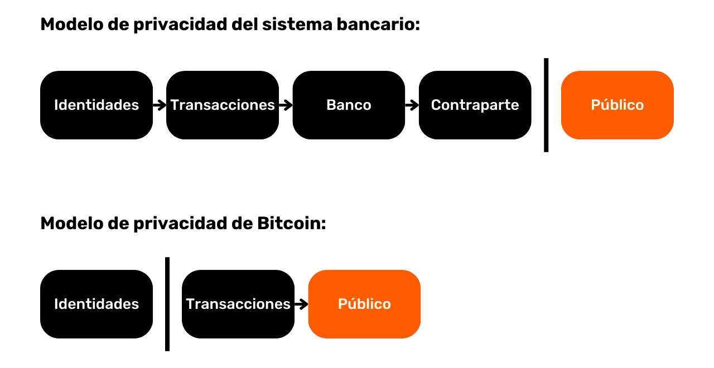

### Sección 2: Entendiendo el Análisis de Cadena y Cómo Protegerse Contra Él

En la segunda sección, estudiamos las técnicas utilizadas por las empresas de análisis de cadena para rastrear tu actividad en Bitcoin. Entender estos métodos es crucial para mejorar la protección de tu privacidad. Esta parte tiene como objetivo examinar las estrategias de los atacantes para comprender mejor los riesgos y sentar las bases para las técnicas que estudiaremos en las siguientes secciones. Analizaremos patrones de transacción, heurísticas internas y externas, así como interpretaciones plausibles de estos patrones. Además de un componente teórico, aprenderemos a usar un explorador de bloques para realizar análisis de cadena, a través de ejemplos prácticos y ejercicios.


### Sección 3: Dominando las Mejores Prácticas para Proteger Tu Privacidad

En la tercera sección de nuestro entrenamiento, llegamos al meollo del asunto: ¡la práctica! El objetivo es dominar todas las mejores prácticas esenciales que deberían convertirse en reflejos naturales para cualquier usuario de Bitcoin. Cubriremos el uso de direcciones frescas, etiquetado, consolidación, el uso de nodos completos, así como KYC y métodos de adquisición. El objetivo es proporcionarte una visión completa de las trampas a evitar para establecer bases sólidas en nuestra búsqueda de protección de la privacidad. Para algunas de estas prácticas, serás guiado a un tutorial específico para implementarlas.

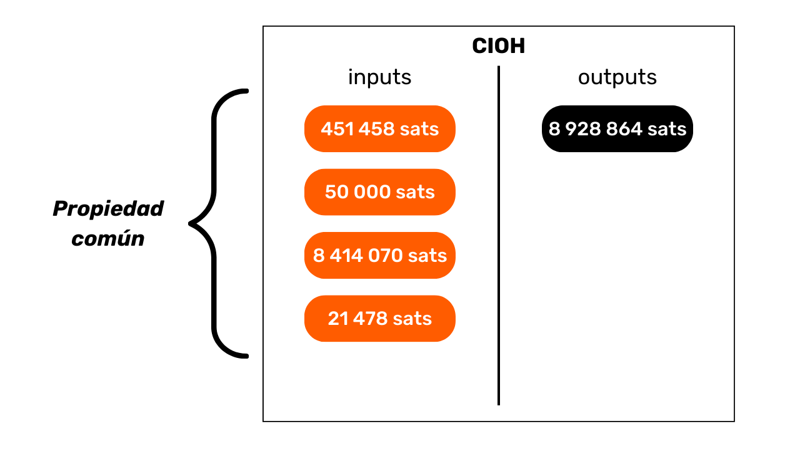

### Sección 4: Entendiendo las Transacciones Coinjoin

¿Cómo podemos hablar de privacidad en Bitcoin sin discutir sobre coinjoins? En la sección 4, descubrirás todo lo que necesitas saber sobre este método de mezcla. Aprenderás qué es un coinjoin, su historia y objetivos, así como los diferentes tipos de coinjoins que existen. Finalmente, para los usuarios más experimentados, descubriremos qué son los anonsets y la entropía, y cómo calcular estos indicadores.


### Sección 5: Entendiendo los Desafíos de Otras Técnicas Avanzadas de Privacidad

En la quinta sección, proporcionaremos una visión general de todas las demás técnicas existentes para proteger tu privacidad en Bitcoin, aparte de coinjoin. A lo largo de los años, los desarrolladores han mostrado una creatividad notable en el diseño de herramientas dedicadas a la privacidad. Examinaremos todos estos métodos, como payjoin, transacciones colaborativas, Coin Swap y Atomic Swap, detallando su funcionamiento, objetivos y posibles debilidades. 

También abordaremos la privacidad a nivel de la red de nodos y la difusión de las transacciones. También discutiremos los diferentes protocolos que se han propuesto a lo largo de los años para mejorar la privacidad de los usuarios en Bitcoin, incluidos los protocolos de direcciones estáticas.


# Definiciones y Conceptos Clave

<partId>b9bbbde3-34c0-4851-83e8-e2ffb029cf31</partId>

## El Modelo UTXO de Bitcoin

<chapterId>8d6b50c5-bf74-44f4-922b-25204991cb75</chapterId>

Bitcoin es principalmente una moneda, pero ¿sabes concretamente cómo se representan los BTC en el protocolo?

### Bitcoin UTXOs: ¿Qué Son?

En el protocolo de Bitcoin, la gestión de unidades monetarias gira en torno al modelo UTXO, un acrónimo de "_Unspent Transaction Output_" (Salida de Transacción No Gastada).

Este modelo es profundamente diferente de los sistemas bancarios tradicionales, que se basan en un mecanismo de cuenta y saldo para rastrear los flujos financieros. De hecho, en el sistema bancario, los saldos individuales se mantienen en cuentas vinculadas a una identidad. Por ejemplo, cuando compras una baguette de un panadero, tu banco simplemente debita el monto de la compra de tu cuenta, reduciendo así tu saldo, mientras que la cuenta del panadero se acredita con el mismo monto, aumentando su saldo. En este sistema, no hay noción de un vínculo entre el dinero que entra en tu cuenta y el dinero que sale de ella, aparte de los registros de transacciones.

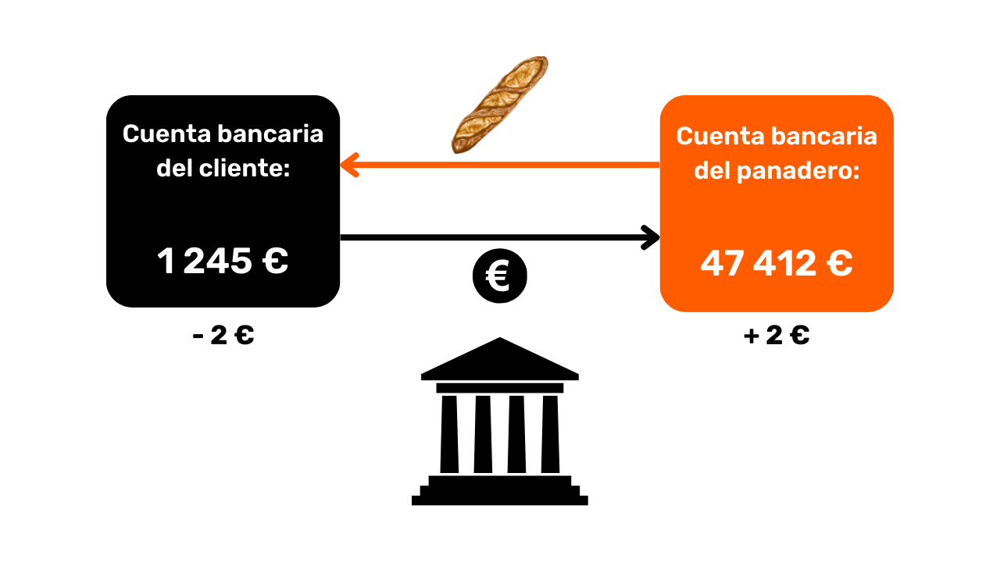
En Bitcoin, las cosas funcionan de manera diferente. El concepto de una cuenta no existe, y las unidades monetarias no se gestionan a través de saldos sino mediante UTXOs. Un UTXO representa una cantidad específica de bitcoins que aún no se ha gastado, formando así una "pieza de bitcoin", que puede ser grande o pequeña. Por ejemplo, un UTXO podría valer `500 BTC` o solo `700 SATS`.
**> Recordatorio:** El satoshi, a menudo abreviado como sat, es la unidad más pequeña de Bitcoin, comparable a un centavo en las monedas fiduciarias.

```plaintext
1 BTC = 100,000,000 SATS
```

Teóricamente, un UTXO puede representar cualquier valor en bitcoins, que va desde un sat hasta el máximo teórico de unos 21 millones de BTC. Sin embargo, es lógicamente imposible poseer todos los 21 millones de bitcoins, y hay un umbral económico inferior llamado "polvo", por debajo del cual se considera que un UTXO no es económicamente viable para gastar.
**> ¿Sabías?** El UTXO más grande jamás creado en Bitcoin tenía un valor de `500,000 BTC`. Fue creado por la plataforma MtGox durante una operación de consolidación en noviembre de 2011: [29a3efd3ef04f9153d47a990bd7b048a4b2d213daaa5fb8ed670fb85f13bdbcf](https://mempool.space/fr/tx/29a3efd3ef04f9153d47a990bd7b048a4b2d213daaa5fb8ed670fb85f13bdbcf)

### UTXOs y Condiciones de Gasto

Los UTXOs son los instrumentos de intercambio en Bitcoin. Cada transacción resulta en el consumo de UTXOs como entradas y la creación de nuevos UTXOs como salidas. Cuando se realiza una transacción, los UTXOs utilizados como entradas se consideran "gastados", y se generan nuevos UTXOs que se asignan a los destinatarios indicados en las salidas de la transacción. Así, un UTXO simplemente representa una salida de transacción no gastada, y por lo tanto, una cantidad de bitcoins que pertenece a un usuario en un momento dado.


Todos los UTXOs están asegurados por scripts que definen las condiciones bajo las cuales pueden ser gastados. Para consumir un UTXO, un usuario debe demostrar a la red que cumple con las condiciones estipuladas por el script que asegura ese UTXO. Generalmente, los UTXOs están protegidos por una clave pública (o una dirección de recepción que representa esta clave pública). Para gastar un UTXO asociado con esta clave pública, el usuario debe probar que posee la clave privada correspondiente proporcionando una firma digital hecha con esta clave. Es por esto que se dice que tu billetera de Bitcoin no contiene realmente bitcoins, sino que almacena tus claves privadas, que a su vez te dan acceso a tus UTXOs y, por extensión, a los bitcoins que representan.
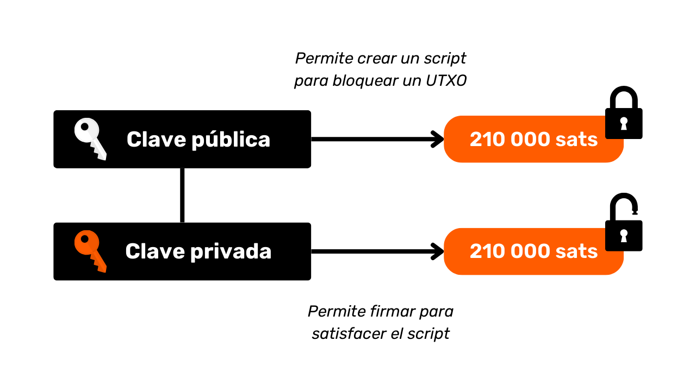

Dado que el concepto de una cuenta está ausente en Bitcoin, el saldo de una billetera simplemente corresponde a la suma de los valores de todos los UTXOs que puede gastar. Por ejemplo, si tu billetera de Bitcoin puede gastar los siguientes 4 UTXOs:

```plaintext
- 2 BTC
- 8 BTC
- 5 BTC
- 2 BTC
```

El saldo total de tu billetera sería `17 BTC`.

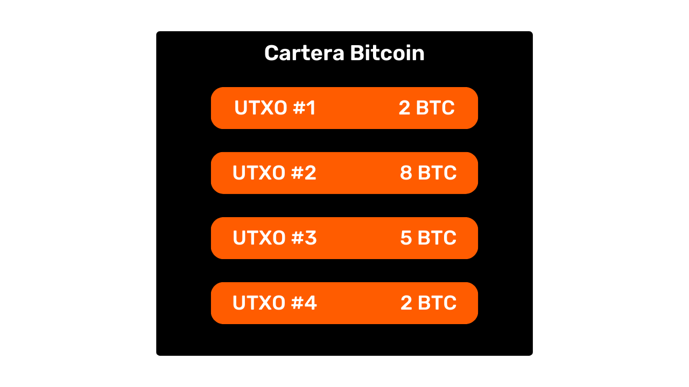

## La estructura de las transacciones de Bitcoin

<chapterId>29d3aaab-de2e-4746-ab40-c9748898850c</chapterId>

### Las entradas y salidas de una transacción

Una transacción de Bitcoin es una operación registrada en la blockchain que permite la transferencia de propiedad de bitcoins de una persona a otra. Más específicamente, dado que estamos en un modelo UTXO y no hay cuentas, la transacción satisface las condiciones de gasto que aseguraban uno o más UTXOs, los consume y, de manera equivalente, crea nuevos UTXOs dotados de nuevas condiciones de gasto. En resumen, una transacción mueve bitcoins de un script que está satisfecho a un nuevo script destinado a asegurarlos.

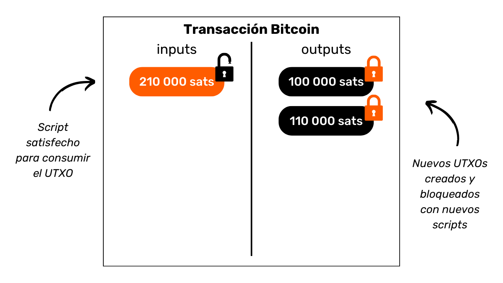

Cada transacción de Bitcoin está compuesta, por lo tanto, de una o más entradas y una o más salidas. Las entradas son UTXOs consumidos por la transacción para generar las salidas. Las salidas son nuevos UTXOs que serán utilizables como entradas para futuras transacciones.

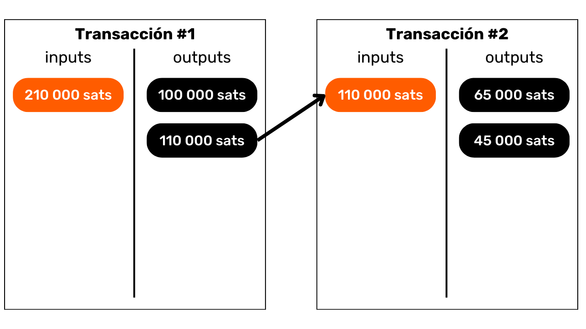
**> ¿Sabías que?** Teóricamente, una transacción de bitcoin podría tener un número infinito de entradas y salidas. Solo el tamaño máximo de un bloque limita este número. Cada entrada en una transacción de Bitcoin se refiere a un UTXO (Unspent Transaction Output - Salida de Transacción No Gastada) previo no gastado. Para usar un UTXO como entrada, su poseedor debe demostrar que es el legítimo propietario validando el script asociado con él, es decir, cumpliendo con la condición de gasto impuesta. Generalmente, esto implica proporcionar una firma digital producida con la clave privada correspondiente a la clave pública que inicialmente aseguró ese UTXO. El script verifica así que la firma coincide con la clave pública utilizada al recibir los fondos.
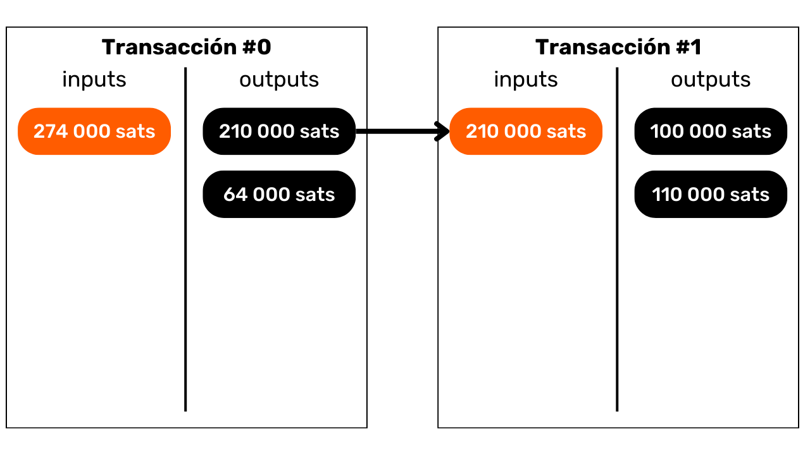

Cada salida, por otro lado, especifica la cantidad de bitcoins a transferir, así como al destinatario. Este último se define por un nuevo script que, generalmente, bloquea el UTXO recién creado con una dirección de recepción o una nueva clave pública.

Para que una transacción sea considerada válida según las reglas de consenso, el total de las salidas debe ser menor o igual al total de las entradas. En otras palabras, la suma de los nuevos UTXOs generados por la transacción no debe exceder la de los UTXOs consumidos como entradas. Este principio es lógico: si solo tienes una cantidad de `500,000 SATS`, no puedes realizar una compra de `700,000 SATS`.

### Cambio y Consolidación en una Transacción de Bitcoin

La acción de una transacción de Bitcoin sobre los UTXOs puede compararse así con el derretimiento de una moneda de oro. De hecho, un UTXO no es divisible, sino solo fusionable. Esto significa que un usuario no puede simplemente dividir un UTXO que representa una cierta cantidad de bitcoins en varios UTXOs más pequeños. Deben consumirlo completamente en una transacción para crear uno o más nuevos UTXOs de valores arbitrarios en las salidas, los cuales deben ser menores o iguales al valor inicial.

Este mecanismo es similar al de una moneda de oro. Imagina que posees una moneda de 2 onzas y quieres hacer un pago de 1 onza, suponiendo que el vendedor no puede darte cambio. Necesitarías fundir tu moneda y acuñar 2 nuevas de 1 onza cada una.
En Bitcoin, la operación es similar. Imaginemos que Alice tiene un UTXO de `10,000 SATS` y quiere comprar una baguette que cuesta `4,000 SATS`. Alice realizará una transacción con una entrada de 1 UTXO de `10,000 SATS` que consumirá por completo, y en las salidas, creará 2 UTXOs valorados en `4,000 SATS` y `6,000 SATS`. El UTXO de `4,000 SATS` será enviado al panadero como pago por la baguette, mientras que el UTXO de `6,000 SATS` regresará a Alice como cambio. Este UTXO que regresa al remitente inicial de la transacción es lo que se llama "cambio" en la jerga de Bitcoin.

Ahora imagina que Alice no tiene un único UTXO de `10,000 SATS`, sino dos UTXOs de `3,000 SATS` cada uno. En esta situación, ninguno de los UTXOs individuales es suficiente para cubrir los `4,000 SATS` por la baguette. Por lo tanto, Alice debe usar ambos UTXOs de `3,000 SATS` como entradas para su transacción simultáneamente. De esta manera, el total de las entradas alcanzará `6,000 SATS`, permitiéndole cubrir el pago de `4,000 SATS` al panadero. Este método, que implica agrupar varios UTXOs en las entradas de una transacción, a menudo se refiere con el término "consolidación". 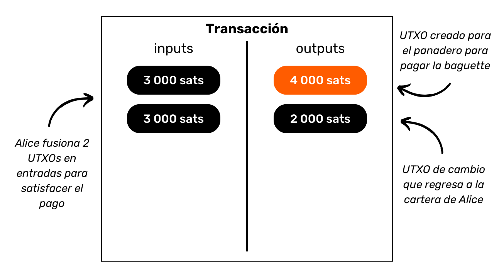

### Tarifas de Transacción

Intuitivamente, uno podría pensar que las tarifas de transacción también representan una salida de una transacción. Pero en realidad, este no es el caso. Las tarifas de una transacción representan la diferencia entre el total de las entradas y el total de las salidas. Esto significa que, después de usar parte del valor de las entradas para cubrir las salidas deseadas en una transacción, cierta suma de las entradas permanece sin usar. Esta suma residual constituye las tarifas de la transacción.

```plaintext
Tarifas = total entradas - total salidas
```

Volvamos al ejemplo de Alice que tiene un UTXO de `10,000 SATS` y quiere comprar una baguette por `4,000 SATS`. Alice crea una transacción con su UTXO de `10,000 SATS` como entrada. Luego genera una salida de `4,000 SATS` destinada al panadero para el pago de la baguette. Para incentivar a los mineros a incluir su transacción en un bloque, Alice asigna `200 SATS` como tarifas. Así, crea una segunda salida, el cambio, que le retornará, ascendiendo a `5,800 SATS`.
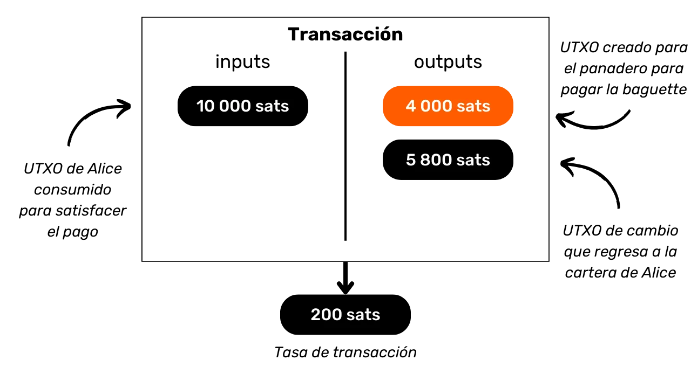

Aplicando la fórmula de tarifas, vemos que efectivamente quedan `200 SATS` para los mineros:

```plaintext
Tarifas = total entradas - total salidas
Gastos = 10,000 - (4,000 + 5,800)
Gastos = 10,000 - 9,800
Gastos = 200
```

Cuando un minero valida exitosamente un bloque, tiene derecho a recoger estas tarifas por todas las transacciones incluidas en su bloque, a través de la llamada transacción "coinbase".

### La Creación de UTXOs en Bitcoin

Si has seguido los párrafos anteriores atentamente, ahora sabes que los UTXOs solo pueden ser creados consumiendo otros UTXOs existentes. Así, las monedas en Bitcoin forman una cadena continua. Sin embargo, podrías estar preguntándote cómo aparecieron los primeros UTXOs en esta cadena. Esto plantea un problema similar al del huevo y la gallina: ¿de dónde vinieron estos UTXOs originales?

La respuesta yace en la **transacción coinbase**.

El coinbase es un tipo específico de transacción de Bitcoin, único para cada bloque y siempre el primero en ellos. Permite al minero que encontró una prueba de trabajo válida recibir su recompensa de bloque. Esta recompensa consiste en dos elementos: **la subvención de bloque** y **las tarifas de transacción** de las que hablamos en la parte anterior.

La característica única de la transacción coinbase es que es la única que puede crear bitcoins de la nada, sin necesidad de consumir entradas para generar sus salidas. Estos bitcoins recién creados constituyen lo que podría llamarse los "UTXOs originales".
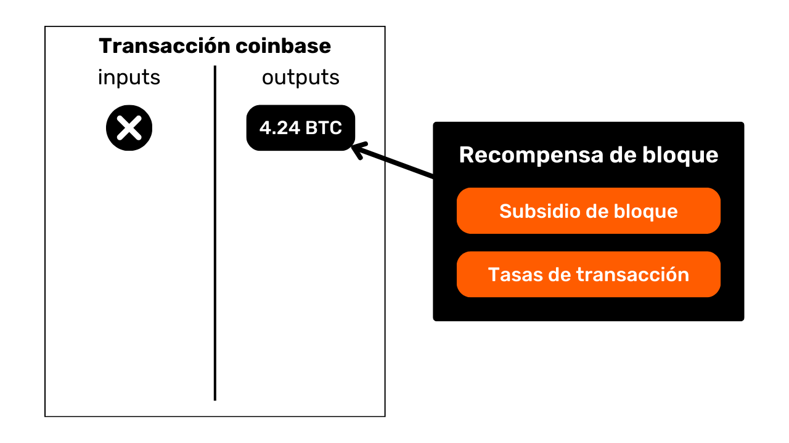
Los bitcoins del subsidio de bloque son BTC nuevos creados de la nada, siguiendo un calendario de emisión preestablecido en las reglas de consenso. El subsidio de bloque se reduce a la mitad cada 210,000 bloques, lo que ocurre aproximadamente cada cuatro años, en un proceso llamado "halving". Inicialmente, se creaban 50 bitcoins con cada subsidio, pero esta cantidad ha disminuido gradualmente; actualmente, es de 3.125 bitcoins por bloque.

En cuanto a la parte relacionada con las tasas de transacción, aunque también representa BTC recién creado, no deben exceder la diferencia entre los inputs totales y los outputs de todas las transacciones en un bloque. Vimos anteriormente que estas tasas representan la porción de los inputs que no se utiliza en los outputs de las transacciones. Esta parte se pierde técnicamente durante la transacción, y el minero tiene el derecho de recrear este valor en forma de uno o más UTXOs nuevos. Por lo tanto, esto es una transferencia de valor del emisor de la transacción al minero que lo añade a la blockchain.

**> ¿Sabías que?** Los bitcoins generados por una transacción coinbase están sujetos a un período de madurez de 100 bloques durante el cual no pueden ser gastados por el minero. Esta regla tiene como objetivo evitar complicaciones relacionadas con el uso de bitcoins recién creados en una cadena que podría ser declarada obsoleta más tarde.

### Las Implicaciones del Modelo UTXO

En primer lugar, el modelo UTXO influye directamente en las tasas de transacción en Bitcoin. Dado que la capacidad de cada bloque es limitada, los mineros favorecen las transacciones que ofrecen las mejores tasas en relación con el espacio que ocuparán en el bloque. De hecho, cuantos más UTXOs incluya una transacción como inputs y outputs, más pesada es y, por lo tanto, requiere tasas más altas. Esta es una de las razones por las que a menudo se hace un esfuerzo por reducir el número de UTXOs en nuestra billetera, lo que también puede afectar la privacidad, un tema en el que profundizaremos en detalle en la tercera parte de esta formación.

A continuación, como se mencionó en las partes anteriores, las monedas en Bitcoin son esencialmente una cadena de UTXOs. Cada transacción crea así un enlace entre un UTXO pasado y un UTXO futuro. Los UTXOs permiten, por lo tanto, el seguimiento explícito del camino de los bitcoins desde su creación hasta su gasto actual. Esta transparencia puede verse positivamente, ya que permite a cada usuario asegurar la autenticidad de los bitcoins recibidos. Sin embargo, también es sobre este principio de rastreabilidad y auditabilidad que se basa el análisis de cadena, una práctica destinada a comprometer tu privacidad. Estudiaremos esta práctica en profundidad en la segunda parte de la formación.

## Modelo de Privacidad de Bitcoin

<chapterId>769d8963-3ed5-4094-b21d-9203c7d9e465</chapterId>

### Moneda: Autenticidad, Integridad y Doble Gasto

Una de las funciones de la moneda es resolver el problema de la doble coincidencia de deseos. En un sistema basado en el trueque, realizar un intercambio requiere no solo encontrar a un individuo que ofrezca un bien que satisfaga mi necesidad, sino también proporcionarles un bien de valor equivalente que satisfaga su propia necesidad. Encontrar este equilibrio resulta ser complejo.


Por eso recurrimos a la moneda, que permite la transferencia de valor tanto en el espacio como en el tiempo.


Para que la moneda resuelva este problema, es esencial que la parte que proporciona un bien o servicio esté convencida de su capacidad para gastar esa suma más adelante. Por lo tanto, cualquier individuo racional que desee aceptar una pieza de moneda, ya sea digital o física, se asegurará de que cumpla con dos criterios fundamentales:

- **La moneda debe estar intacta y ser auténtica;**- **y no debe haber sido gastada doblemente.**
  Cuando se utiliza moneda física, la primera característica es la más compleja de afirmar. A lo largo de diferentes períodos en la historia, la integridad de las monedas metálicas a menudo ha sido comprometida por prácticas como el recorte o la perforación. Por ejemplo, durante la antigua Roma, era común que los ciudadanos rasparan los bordes de las monedas de oro para recolectar un poco del metal precioso, mientras aún las conservaban para futuras transacciones. El valor intrínseco de la moneda se reducía así, pero su valor nominal permanecía igual. Esto es notablemente por qué más tarde se acuñaron bordes estriados en el borde de las monedas.

La autenticidad también es una característica difícil de verificar con medios monetarios físicos. Hoy en día, las técnicas para combatir la falsificación son cada vez más complejas, obligando a los comerciantes a invertir en sistemas de verificación costosos.

Por otro lado, debido a su naturaleza, el doble gasto no es un problema para las monedas físicas. Si te doy un billete de €10, este irrevocablemente deja mi posesión para entrar en la tuya, excluyendo naturalmente cualquier posibilidad de gastar las mismas unidades monetarias múltiples veces. En resumen, no podré gastar ese billete de €10 nuevamente.


Para la moneda digital, la dificultad es diferente. Asegurar la autenticidad e integridad de una moneda es a menudo más simple. Como vimos en la sección anterior, el modelo UTXO de Bitcoin permite rastrear una moneda hasta su origen, verificando así que fue creada de acuerdo con las reglas de consenso por un minero.

Sin embargo, asegurar la ausencia de doble gasto es más complejo, ya que cualquier bien digital es esencialmente información. A diferencia de los bienes físicos, la información no se divide durante los intercambios sino que se propaga multiplicándose. Por ejemplo, si te envío un documento por correo electrónico, este se duplica. Por tu parte, no puedes verificar con certeza que he eliminado el documento original.


### Previniendo el Doble Gasto en Bitcoin

La única manera de evitar la duplicación de un bien digital es estar al tanto de todos los intercambios dentro del sistema. De esta manera, se puede saber quién posee qué y actualizar las tenencias de todos basado en las transacciones realizadas. Esto es lo que se hace, por ejemplo, con el dinero de anotación en cuenta en el sistema bancario. Cuando pagas €10 a un comerciante con tarjeta de crédito, el banco anota este intercambio y actualiza el libro mayor.
En Bitcoin, prevenir el doble gasto se logra de la misma manera. El objetivo es confirmar la ausencia de una transacción que ya haya gastado las monedas en cuestión. Si estas monedas nunca han sido usadas, entonces podemos estar seguros de que no ocurrirá un doble gasto. Este principio fue descrito por Satoshi Nakamoto en el White Paper con esta famosa frase:

**"_La única manera de confirmar la ausencia de una transacción es estar al tanto de todas las transacciones._"**

Sin embargo, a diferencia del modelo bancario, no hay deseo de tener que confiar en una entidad central en Bitcoin. Es necesario que todos los usuarios puedan confirmar esta ausencia de doble gasto, sin depender de un tercero. Así, todos deben estar al tanto de todas las transacciones de Bitcoin. Es por esto que las transacciones de Bitcoin se transmiten públicamente a través de todos los nodos de la red y se registran de manera clara en la blockchain.

Es precisamente esta diseminación pública de información lo que complica la protección de la privacidad en Bitcoin. En el sistema bancario tradicional, en teoría, solo la institución financiera está al tanto de las transacciones realizadas. Por otro lado, en Bitcoin, todos los usuarios están informados de todas las transacciones, a través de sus respectivos nodos.

### El modelo de privacidad: sistema bancario vs Bitcoin

En el sistema tradicional, tu cuenta bancaria está vinculada a tu identidad. El banquero puede saber a qué cliente pertenece cada cuenta bancaria y qué transacciones están asociadas con ella. Sin embargo, este flujo de información se corta entre el banco y el dominio público. En otras palabras, es imposible conocer el saldo y las transacciones de una cuenta bancaria que pertenece a otra persona. Solo el banco tiene acceso a esta información.
Por ejemplo, tu banquero sabe que compras tu baguette todas las mañanas en la panadería del barrio, pero tu vecino no está al tanto de esta transacción. Así, el flujo de información es accesible para las partes concernidas, notablemente el banco, pero permanece inaccesible para los externos.

Debido a la restricción de la difusión pública de transacciones que vimos en la parte anterior, el modelo de privacidad de Bitcoin no puede seguir el modelo del sistema bancario. En el caso de Bitcoin, dado que el flujo de información no puede interrumpirse entre las transacciones y el dominio público, **el modelo de privacidad se basa en la separación entre la identidad del usuario y las transacciones** mismas.
Por ejemplo, si compras una baguette al panadero pagando en BTC, tu vecino, que posee su propio nodo completo, puede ver pasar tu transacción, al igual que puede ver todas las demás transacciones en el sistema. Sin embargo, si se respetan los principios de privacidad, no deberían poder vincular esta transacción específica con tu identidad.
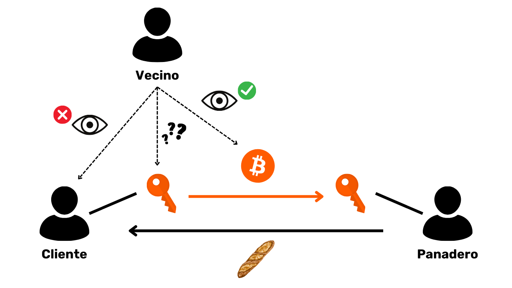

Pero dado que las transacciones de Bitcoin se hacen públicas, aún se vuelve posible establecer vínculos entre ellas para deducir información sobre las partes involucradas. Esta actividad incluso constituye una especialidad en sí misma llamada "análisis de cadena". En la próxima parte de la formación, te invito a explorar los fundamentos del análisis de cadena para entender cómo se rastrean tus bitcoins y saber cómo defenderte mejor contra ello.

# Entendiendo el Análisis de Cadena y Cómo Protegerte

<partId>4739371e-9fef-45b0-bcaa-b7a4df6b4470</partId>

## ¿Qué es el Análisis de Cadena en Bitcoin?

<chapterId>7d198ba6-4af2-4f24-86cb-3c79cb25627e</chapterId>

### Definición y Operación

El análisis de cadena es una práctica que abarca todos los métodos utilizados para rastrear el flujo de bitcoins en la blockchain. Generalmente, el análisis de cadena se basa en observar características en muestras de transacciones anteriores. Luego implica identificar estas mismas características en una transacción que se desea analizar y deducir interpretaciones plausibles. Este método de resolución de problemas desde un enfoque práctico, para encontrar una solución suficientemente buena, es lo que se llama una "heurística".

Para simplificar, el análisis de cadena se realiza en tres pasos principales:

1. **Observar la blockchain;**
2. **Identificar características conocidas;**
3. **Deducir hipótesis.**

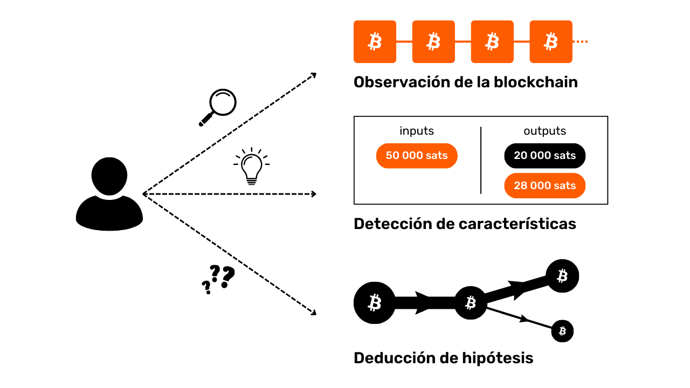

El análisis de cadena puede ser realizado por cualquiera. Es suficiente tener acceso a la información pública de la blockchain a través de un nodo completo para observar los movimientos de transacciones y hacer hipótesis. También hay herramientas gratuitas que facilitan este análisis, como el sitio web [OXT.me](https://oxt.me/) que exploraremos en detalle en los últimos dos capítulos de esta parte. Sin embargo, el principal riesgo para la privacidad proviene de empresas especializadas en análisis de cadena. Estas empresas han llevado el análisis de cadena a una escala industrial y venden sus servicios a instituciones financieras o gobiernos. Entre estas empresas, Chainalysis es probablemente la más conocida.

### Los Objetivos del Análisis de Cadena

Uno de los objetivos del análisis de cadena es agrupar diversas actividades en Bitcoin para determinar la singularidad del usuario que las llevó a cabo. Posteriormente, será posible intentar vincular este conjunto de actividades a una identidad real.


Recuerda el capítulo anterior. Expliqué por qué el modelo de privacidad de Bitcoin originalmente se basaba en separar la identidad del usuario de sus transacciones. Por lo tanto, sería tentador pensar que el análisis de cadena es innecesario, ya que incluso si uno logra agrupar actividades en la cadena, no pueden asociarse con una identidad real.

Teóricamente, esta afirmación es precisa. En la primera parte de esta formación, vimos que se utilizan pares de claves criptográficas para establecer condiciones sobre el UTXO. Por esencia, estos pares de claves no revelan ninguna información sobre la identidad de sus poseedores. Así, incluso si uno tiene éxito en agrupar actividades asociadas con diferentes pares de claves, esto no nos dice nada sobre la entidad detrás de estas actividades.


Sin embargo, la realidad práctica es mucho más compleja. Existe una multitud de comportamientos que arriesgan vincular una identidad real con una actividad en la cadena. En análisis, esto se llama un punto de entrada, y hay muchos de ellos.

El más común, por supuesto, es el KYC (_Know Your Customer_ o Conoce a Tu Cliente). Si retiras tus bitcoins de una plataforma regulada a una de tus direcciones personales de recepción, entonces algunas personas pueden vincular tu identidad a esta dirección. Más ampliamente, un punto de entrada puede ser cualquier forma de interacción entre tu vida real y una transacción de Bitcoin. Por ejemplo, si publicas una dirección de recepción en tus redes sociales, esto puede ser un punto de entrada para el análisis. Si haces un pago en bitcoins a tu panadero, ellos pueden asociar tu rostro (que es parte de tu identidad) con una dirección de Bitcoin.

Estos puntos de entrada son casi inevitables en el uso de Bitcoin. Aunque uno puede buscar limitar su alcance, permanecerán presentes. Por eso es crucial combinar métodos destinados a preservar tu privacidad. Aunque mantener una separación entre tu identidad real y tus transacciones es un enfoque interesante, sigue siendo insuficiente hoy en día. De hecho, si todas tus actividades en la cadena pueden agruparse, entonces el más mínimo punto de entrada es probable que comprometa la única capa de privacidad que habías establecido.


### Defendiendo Contra el Análisis de Cadena

Así, también es necesario poder enfrentarse al análisis de blockchain en nuestro uso de Bitcoin. Procediendo de esta manera, podemos minimizar la agregación de nuestras actividades y limitar el impacto de un punto de entrada en nuestra privacidad.


De hecho, para contrarrestar mejor el análisis de blockchain, ¿qué mejor enfoque que familiarizarse con los métodos utilizados en el análisis de blockchain? Si quieres saber cómo mejorar tu privacidad en Bitcoin, debes entender estos métodos. Esto te permitirá comprender mejor técnicas como [coinjoin](https://planb.network/fr/tutorials/privacy/coinjoin-samourai-wallet) o [payjoin](https://planb.network/fr/tutorials/privacy/payjoin) (técnicas que estudiaremos en las últimas partes de la formación), y reducir los errores que podrías cometer.
En esto, podemos hacer una analogía con la criptografía y el criptoanálisis. Un buen criptógrafo es, ante todo, un buen criptoanalista. Para imaginar un nuevo algoritmo de encriptación, uno debe saber a qué ataques se enfrentará y también estudiar por qué se rompieron los algoritmos anteriores. El mismo principio se aplica a la privacidad en Bitcoin. Entender los métodos de análisis de blockchain es la clave para protegerse contra él. Es por eso que propongo una sección completa sobre análisis de blockchain en esta formación.

### Los métodos de análisis de blockchain

Es importante entender que el análisis de blockchain no es una ciencia exacta. Se basa en heurísticas derivadas de observaciones previas o interpretaciones lógicas. Estas reglas permiten obtener resultados bastante fiables, pero nunca con precisión absoluta. En otras palabras, **el análisis de blockchain siempre implica una dimensión de probabilidad en las conclusiones emitidas**. Por ejemplo, se puede estimar con más o menos certeza que dos direcciones pertenecen a la misma entidad, pero la certeza total siempre estará fuera de alcance.

El objetivo completo del análisis de blockchain radica precisamente en la agregación de varias heurísticas para minimizar el riesgo de error. Es, de cierta manera, una acumulación de evidencia que nos permite acercarnos más a la realidad.

Estas famosas heurísticas se pueden agrupar en diferentes categorías que detallaremos juntos:

- **Patrones de transacción (o modelos de transacción);**
- **Heurísticas internas a la transacción;**
- **Heurísticas externas a la transacción.**

### Satoshi Nakamoto y el análisis de blockchain

Cabe señalar que las primeras dos heurísticas para el análisis de cadena fueron descubiertas por el propio Satoshi Nakamoto. Él las discute en la parte 10 del White Paper de Bitcoin. Estas son:

- la Heurística de Propiedad de Entrada Común (CIOH, por sus siglas en inglés);
- y la reutilización de direcciones.


Fuente: S. Nakamoto, "Bitcoin: A Peer-to-Peer Electronic Cash System", https://bitcoin.org/bitcoin.pdf, 2009.

En los siguientes capítulos, exploraremos en qué consisten estas, pero ya es interesante notar que estas dos heurísticas todavía retienen una preeminencia en el análisis de cadena hoy en día.

## Patrones de Transacción

<chapterId>d365a101-2d37-46a5-bfb9-3c51e37bf96b</chapterId>

Un patrón de transacción es simplemente un modelo o una estructura general de una transacción típica que se puede encontrar en la blockchain, cuya interpretación es probablemente conocida. Al estudiar patrones, nos centraremos en una sola transacción que analizaremos a un alto nivel.

En otras palabras, solo miraremos el número de UTXOs en entradas y el número de UTXOs en salidas, sin detenernos en los detalles más específicos o el entorno de la transacción. A partir del modelo observado, seremos capaces de interpretar la naturaleza de la transacción. Luego buscaremos características en su estructura y deduciremos una interpretación.


En esta parte, descubriremos juntos los principales modelos de transacción que se pueden encontrar en el análisis de cadena, y para cada modelo, les daré la interpretación probable de esta estructura, junto con un ejemplo concreto.

### Envío Simple (o Pago Simple)

Comenzamos con un patrón muy extendido, ya que es el que aparece en la mayoría de los pagos de bitcoin. El modelo de pago simple se caracteriza por el consumo de uno o más UTXOs en entradas y la producción de 2 UTXOs en salidas. Este modelo se verá así:


Cuando observamos esta estructura de transacción en la blockchain, ya podemos hacer una interpretación. Como su nombre sugiere, este modelo indica que estamos en presencia de una transacción de envío o pago. El usuario ha consumido su propio UTXO en las entradas para satisfacer en las salidas un UTXO de pago y un UTXO de cambio (dinero devuelto al mismo usuario).
Por lo tanto, sabemos que el usuario observado probablemente ya no está en posesión de uno de los dos UTXOs en las salidas (el de pago), pero aún posee el otro UTXO (el de cambio).
En este momento, nos es imposible especificar cuál salida representa cuál UTXO, ya que este no es el objetivo del estudio de patrones. Lograremos esto apoyándonos en las heurísticas que estudiaremos en las siguientes partes. En esta etapa, nuestro objetivo se limita a identificar la naturaleza de la transacción en cuestión, que es, en este caso, un envío simple.

Por ejemplo, aquí hay una transacción de Bitcoin que adopta el patrón de envío simple:

```plaintext
b6cc79f45fd2d7669ff94db5cb14c45f1f879ea0ba4c6e3d16ad53a18c34b769
```

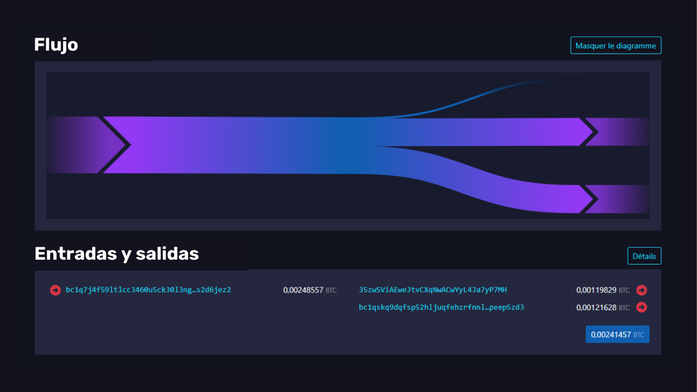

Fuente: [Mempool.space](https://mempool.space/fr/tx/b6cc79f45fd2d7669ff94db5cb14c45f1f879ea0ba4c6e3d16ad53a18c34b769)

Después de este primer ejemplo, deberías tener una mejor comprensión de lo que significa estudiar un "modelo de transacción". Examinamos una transacción enfocándonos solo en su estructura, sin tener en cuenta su entorno o los detalles específicos de la transacción. La observamos solo de manera global en este primer paso.

Ahora que entiendes qué es un patrón, pasemos a los otros modelos existentes.

### Barrido

Este segundo modelo se caracteriza por el consumo de un único UTXO como entrada y la producción de un único UTXO como salida.


La interpretación de este modelo es que estamos en presencia de un auto-transferencia. El usuario ha transferido sus bitcoins a sí mismo, a otra dirección que posee. Dado que no hay cambio en la transacción, es muy improbable que estemos en presencia de un pago. De hecho, cuando se realiza un pago, es casi imposible que el pagador tenga un UTXO que coincida exactamente con el monto requerido por el vendedor, más las comisiones de la transacción. Generalmente, el pagador por lo tanto se ve obligado a producir una salida de cambio.

Entonces sabemos que el usuario observado probablemente aún está en posesión de este UTXO. En el contexto de un análisis de cadena, si sabemos que el UTXO utilizado como entrada en la transacción pertenece a Alice, podemos asumir que el UTXO en salida también le pertenece. Lo que se volverá interesante más adelante es encontrar heurísticas internas a la transacción que podrían fortalecer esta suposición (estudiaremos estas heurísticas en el capítulo 3.3).

Por ejemplo, aquí hay una transacción de Bitcoin que adopta el patrón de barrido:

```plaintext
35f1072a0fda5ae106efb4fda871ab40e1f8023c6c47f396441ad4b995ea693d
```

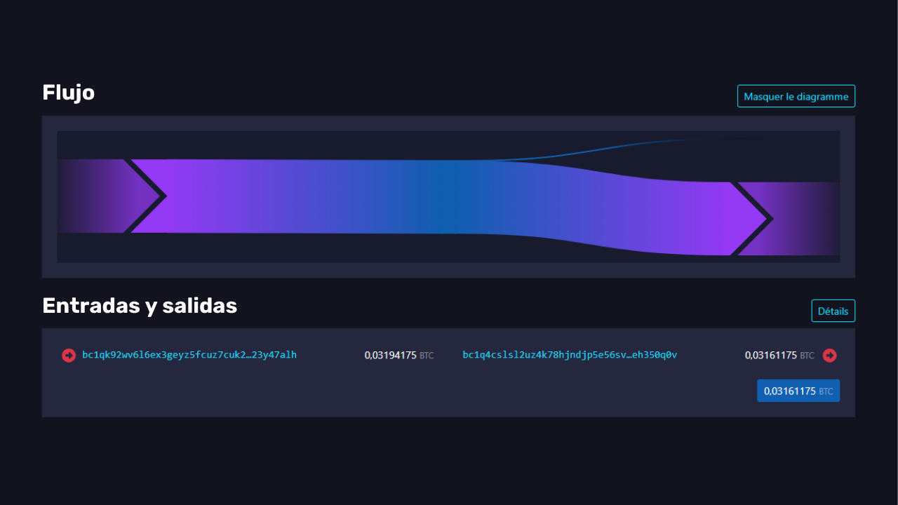
Fuente: [Mempool.space](https://mempool.space/fr/tx/35f1072a0fda5ae106efb4fda871ab40e1f8023c6c47f396441ad4b995ea693d) Sin embargo, este tipo de patrón también puede revelar una auto-transferencia a la cuenta de una plataforma de intercambio de criptomonedas. Será el estudio de direcciones conocidas y el contexto de la transacción lo que nos permitirá saber si se trata de un barrido a una cartera de auto-custodia o una retirada a una plataforma. De hecho, las direcciones de las plataformas de intercambio suelen ser fácilmente identificables.

Volviendo al ejemplo de Alice: si el barrido conduce a una dirección conocida de una plataforma (como Binance, por ejemplo), esto puede significar que los bitcoins fueron transferidos fuera de la posesión directa de Alice, probablemente con la intención de venderlos o almacenarlos en esta plataforma. Por otro lado, si la dirección de destino es desconocida, es razonable suponer que simplemente es otra cartera que aún pertenece a Alice. Pero este tipo de estudio cae más en la categoría de heurísticas y no en el estudio de patrones.

### Consolidación

Este modelo se caracteriza por el consumo de varios UTXOs como entrada y la producción de un único UTXO como salida.


La interpretación de este modelo es que estamos en presencia de una consolidación. Esta es una práctica común entre los usuarios de Bitcoin, con el objetivo de fusionar varios UTXOs en anticipación a un posible aumento en las tarifas de transacción. Al realizar esta operación durante un período en el que las tarifas son bajas, es posible ahorrar en tarifas futuras. Hablaremos más sobre esta práctica en el capítulo 4.3.

Podemos deducir que el usuario detrás de este modelo de transacción probablemente estaba en posesión de todos los UTXOs en las entradas y sigue en posesión del UTXO en la salida. Esto seguramente es una auto-transferencia.

Al igual que el barrido, este tipo de patrón también puede revelar una auto-transferencia a la cuenta de una plataforma de intercambio. Será el estudio de direcciones conocidas y el contexto de la transacción lo que nos permitirá saber si se trata de una consolidación a una cartera de auto-custodia o una retirada a una plataforma.

Por ejemplo, aquí hay una transacción de Bitcoin que adopta el patrón de consolidación:

```plaintext
77c16914211e237a9bd51a7ce0b1a7368631caed515fe51b081d220590589e94
```


Fuente: [Mempool.space](https://mempool.space/fr/tx/77c16914211e237a9bd51a7ce0b1a7368631caed515fe51b081d220590589e94)
En el contexto de un análisis de cadena, este modelo puede revelar mucha información. Por ejemplo, si sabemos que una de las entradas pertenece a Alice, podemos asumir que todas las demás entradas y la salida de esta transacción le pertenecen también. Esta suposición nos permitiría entonces rastrear a través de cadenas de transacciones anteriores para descubrir y analizar otras transacciones probablemente asociadas con Alice.
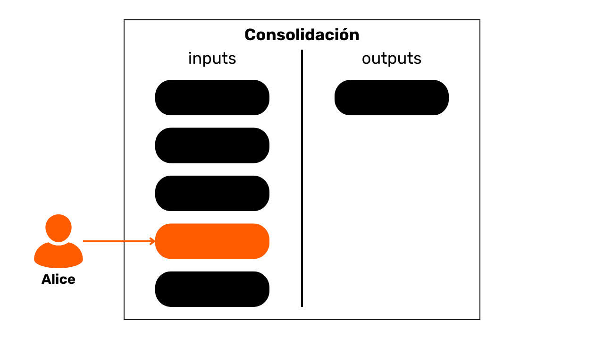

### Gasto Agrupado

Este modelo se caracteriza por el consumo de unos pocos UTXOs como entradas (a menudo solo uno) y la producción de numerosos UTXOs como salidas.


La interpretación de este modelo es que estamos en presencia de un gasto agrupado. Esta es una práctica que probablemente revela una actividad económica significativa, como una plataforma de intercambio, por ejemplo. El gasto agrupado permite a estas entidades ahorrar en tarifas al consolidar sus gastos en una única transacción.
Podemos deducir de este modelo que la entrada UTXO proviene de una empresa con actividad económica significativa y que las salidas de los UTXOs se dispersarán. Muchos pertenecerán a clientes de la empresa que han retirado bitcoins de la plataforma. Otros pueden ir hacia empresas asociadas. Finalmente, ciertamente habrá uno o más intercambios que regresen a la empresa emisora.

Por ejemplo, aquí hay una transacción de Bitcoin que adopta el patrón de gasto agrupado (probablemente, es una transacción emitida por la plataforma Bybit):

```plaintext
8a7288758b6e5d550897beedd13c70bcbaba8709af01a7dbcc1f574b89176b43
```

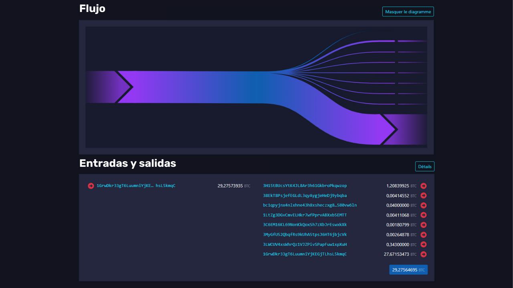

Fuente: [Mempool.space](https://mempool.space/fr/tx/8a7288758b6e5d550897beedd13c70bcbaba8709af01a7dbcc1f574b89176b43)

### Transacciones Específicas del Protocolo

Entre los patrones de transacción, también podemos identificar modelos que revelan el uso de un protocolo específico. Por ejemplo, los coinjoins de Whirlpool (que discutiremos en la parte 5) tendrán una estructura fácilmente identificable que les permite diferenciarse de otras transacciones más tradicionales.


El análisis de este patrón sugiere que probablemente estamos en presencia de una transacción colaborativa. También es posible observar un coinjoin. Si esta última hipótesis resulta precisa, entonces el número de salidas podría proporcionarnos una estimación aproximada del número de participantes en el coinjoin.

Por ejemplo, aquí hay una transacción de Bitcoin que adopta el patrón del tipo de transacción colaborativa coinjoin:

```plaintext
00601af905bede31086d9b1b79ee8399bd60c97e9c5bba197bdebeee028b9bea
```

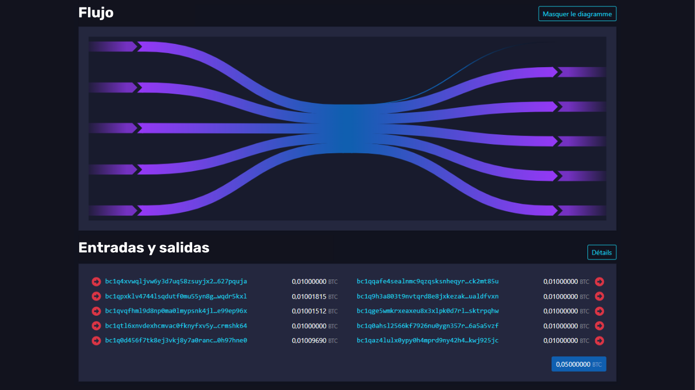

Fuente: [Mempool.space](https://mempool.space/fr/tx/00601af905bede31086d9b1b79ee8399bd60c97e9c5bba197bdebeee028b9bea)

Existen muchos otros protocolos que tienen sus propias estructuras específicas. Así, podríamos distinguir transacciones del tipo Wabisabi, transacciones Stamps, o incluso Runes, por ejemplo.

Gracias a estos patrones de transacción, ya podemos interpretar una serie de informaciones sobre una transacción dada. Pero la estructura de la transacción no es la única fuente de información para el análisis. También podemos estudiar sus detalles. Estos detalles, internos a una transacción, son lo que me gusta llamar "heurísticas internas", y las estudiaremos en el siguiente capítulo.

## Heurísticas Internas

<chapterId>c54b5abe-872f-40f4-a0d0-c59faff228ba</chapterId>

Una heurística interna es una característica específica identificada dentro de una transacción misma, sin necesidad de examinar su entorno, que nos permite hacer deducciones. A diferencia de los patrones que se centran en la estructura general de la transacción a un alto nivel, las heurísticas internas se basan en el conjunto de datos extraíbles. Esto incluye:

- Las cantidades de los diferentes UTXOs tanto entrantes como salientes;
- Todo lo concerniente a los scripts: las direcciones de recepción, la versioning, los locktimes...

Generalmente, este tipo de heurística nos permitirá identificar el cambio en una transacción específica. Al hacerlo, podemos continuar rastreando una entidad a través de varias transacciones diferentes. De hecho, si identificamos un UTXO perteneciente a un usuario que deseamos seguir, es crucial determinar, cuando realizan una transacción, qué salida fue transferida a otro usuario y qué salida representa el cambio, permaneciendo así en su posesión.


Una vez más, les recuerdo que estas heurísticas no son absolutamente precisas. Tomadas individualmente, solo nos permiten identificar escenarios plausibles. Es la acumulación de varias heurísticas lo que ayuda a reducir la incertidumbre, sin eliminarla por completo.

### Similitudes Internas

Esta heurística implica el estudio de similitudes entre las entradas y salidas de la misma transacción. Si observamos la misma característica en las entradas y en solo una de las salidas de la transacción, entonces es probable que esta salida constituya el cambio.

La característica más obvia es la reutilización de una dirección de recepción en la misma transacción.

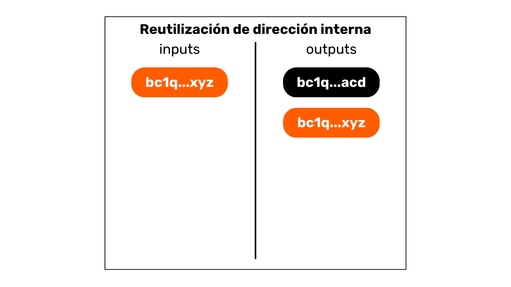
Esta heurística deja poco lugar a dudas. A menos que la clave privada de uno haya sido hackeada, la misma dirección de recepción revela inevitablemente la actividad de un único usuario. La interpretación que sigue es que el cambio de la transacción es la salida con la misma dirección que la entrada. Esto permite el seguimiento continuo del individuo basado en este cambio.
Por ejemplo, aquí hay una transacción en la que esta heurística puede aplicarse razonablemente:

```plaintext
54364146665bfc453a55eae4bfb8fdf7c721d02cb96aadc480c8b16bdeb8d6d0
```


Fuente: [Mempool.space](https://mempool.space/tx/54364146665bfc453a55eae4bfb8fdf7c721d02cb96aadc480c8b16bdeb8d6d0)

Estas similitudes entre entradas y salidas no se detienen en la reutilización de direcciones. Cualquier semejanza en el uso de scripts puede permitir la aplicación de una heurística. Por ejemplo, a veces se puede observar la misma versioning entre una entrada y una de las salidas de la transacción.

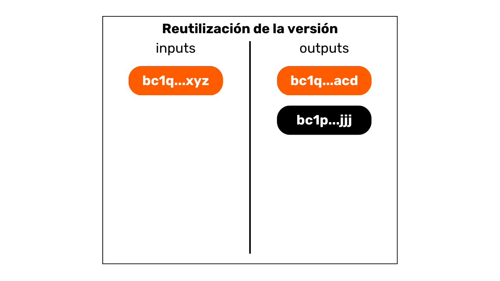

En este diagrama, podemos ver que la entrada No. 0 desbloquea un script P2WPKH (SegWit V0 que comienza con `bc1q`). La salida No. 0 utiliza el mismo tipo de script. Sin embargo, la salida No. 1 utiliza un script P2TR (SegWit V1 que comienza con `bc1p`). La interpretación de esta característica es que es probable que la dirección con la misma versioning que la entrada sea la dirección de cambio. Por lo tanto, todavía pertenecería al mismo usuario.

Aquí hay una transacción en la que esta heurística puede aplicarse razonablemente:

```plaintext
db07516288771ce5d0a06b275962ec4af1b74500739f168e5800cbcb0e9dd578
```


Fuente: [Mempool.space](https://mempool.space/tx/db07516288771ce5d0a06b275962ec4af1b74500739f168e5800cbcb0e9dd578)
En este caso, podemos ver que la entrada N.º 0 y la salida N.º 1 utilizan scripts P2WPKH (SegWit V0), mientras que la salida N.º 0 utiliza un tipo de script diferente, P2PKH (Legacy). Al principio de la década de 2010, esta heurística basada en la versión de los scripts era relativamente poco útil debido a la limitación de los tipos de scripts disponibles. Sin embargo, con el tiempo y con sucesivas actualizaciones de Bitcoin, se ha introducido una diversidad creciente de tipos de scripts. Esta heurística se está volviendo cada vez más relevante porque, con una gama más amplia de tipos de scripts, los usuarios se dividen en grupos más pequeños, aumentando así las posibilidades de aplicar esta heurística de reutilización de versión interna. Por esta razón, solo desde una perspectiva de privacidad, es aconsejable optar por el tipo de script más común. Por ejemplo, mientras escribo estas líneas, los scripts de Taproot (`bc1p`) se utilizan menos frecuentemente que los scripts de SegWit V0 (`bc1q`). Aunque los primeros ofrecen beneficios económicos y de privacidad en ciertos contextos específicos, para usos de firma única más tradicionales, podría ser prudente apegarse a un estándar más antiguo por razones de privacidad, hasta que el nuevo estándar sea más ampliamente adoptado.

### Pagos de Número Redondo

Otra heurística interna que puede ayudarnos a identificar el cambio es la del número redondo. Generalmente, cuando nos enfrentamos a un patrón de pago simple (1 entrada y 2 salidas), si una de las salidas gasta una cantidad redonda, entonces representa el pago.

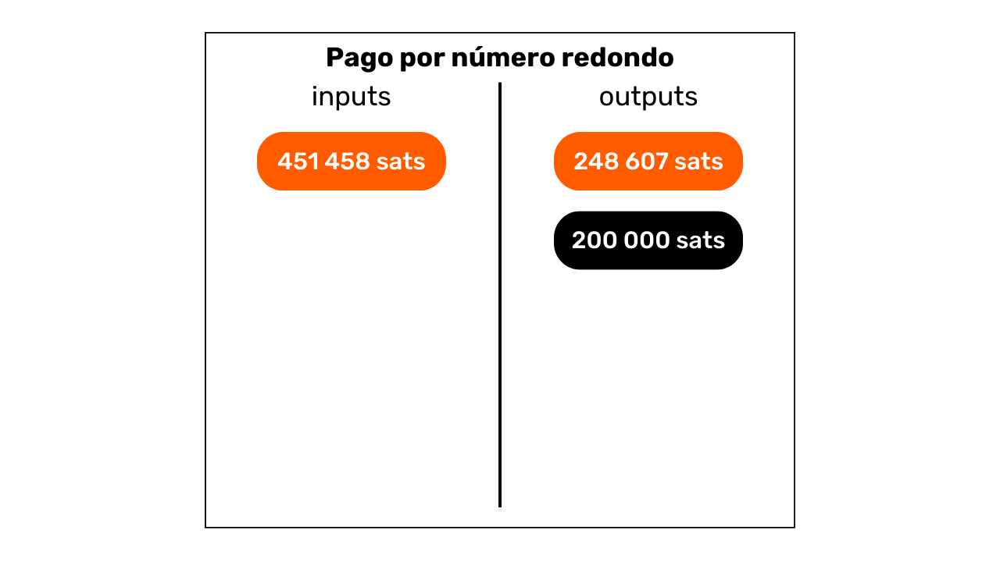

Por eliminación, si una salida representa el pago, la otra representa el cambio. Por lo tanto, se puede inferir que es probable que el usuario que introduce la transacción todavía posea la salida identificada como el cambio.

Cabe señalar que esta heurística no siempre es aplicable, ya que la mayoría de los pagos todavía se realizan en unidades de moneda fiat. De hecho, cuando un comerciante en Francia acepta bitcoin, generalmente, no muestran precios estables en sats. Preferirían optar por una conversión entre el precio en euros y la cantidad en bitcoins a pagar. Por lo tanto, no debería haber un número redondo en la salida de la transacción.

Sin embargo, un analista podría intentar hacer esta conversión teniendo en cuenta el tipo de cambio vigente cuando se transmitió la transacción en la red. Tomemos el ejemplo de una transacción con una entrada de `97,552 sats` y dos salidas, una de `31,085 sats` y la otra de `64,152 sats`. A primera vista, esta transacción no parece involucrar cantidades redondas. Sin embargo, aplicando el tipo de cambio de €64,339 en el momento de la transacción, obtenemos una conversión en euros que se ve de la siguiente manera:

- Una entrada de €62.76;
- Una salida de €20;
- Una salida de €41.27.
  Una vez convertida en moneda fiat, esta transacción permite la aplicación de la heurística de pagos de cantidad redonda. La salida de €20 probablemente estaba destinada a un comerciante, o al menos cambió de propietario. Por deducción, la salida de €41.27 probablemente permaneció en posesión del usuario original.
  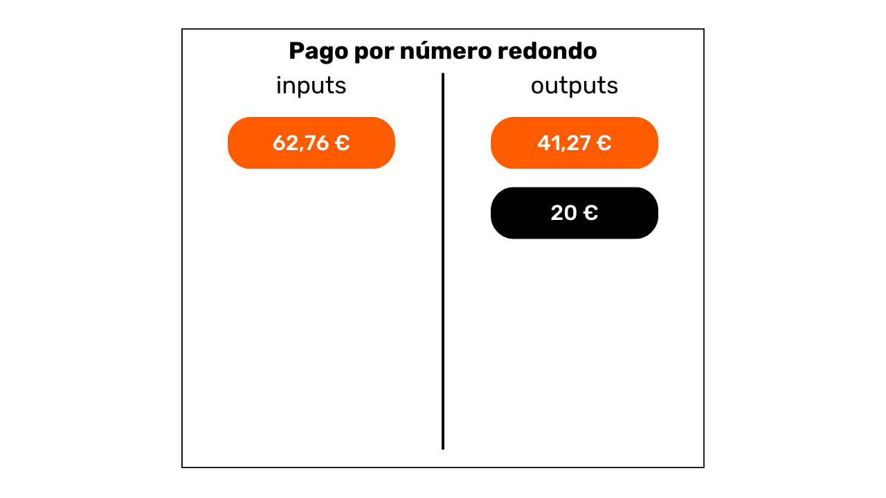

Si algún día, Bitcoin se convierte en la unidad de cuenta preferida en nuestras transacciones, esta heurística podría volverse aún más útil para el análisis.

Por ejemplo, aquí hay una transacción donde esta heurística probablemente se pueda aplicar:

```plaintext
2bcb42fab7fba17ac1b176060e7d7d7730a7b807d470815f5034d52e96d2828a
```


Fuente: [Mempool.space](https://mempool.space/tx/2bcb42fab7fba17ac1b176060e7d7d7730a7b807d470815f5034d52e96d2828a)

### La Salida Más Grande

Cuando se detecta una brecha suficientemente grande entre dos salidas de una transacción en un modelo de pago simple, se puede estimar que la salida más grande probablemente sea el cambio.

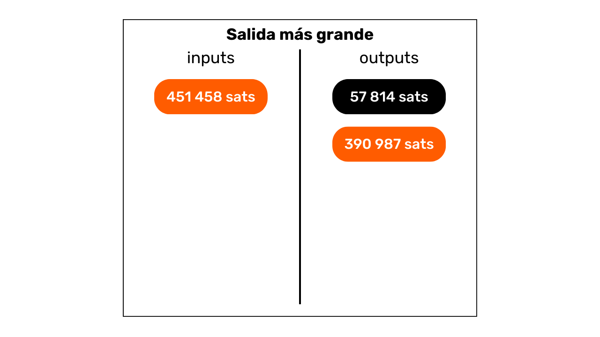

Esta heurística de la salida más grande es probablemente la más imprecisa de todas. Si se identifica por sí misma, es bastante débil. Sin embargo, esta característica se puede combinar con otras heurísticas para reducir la incertidumbre de nuestra interpretación.

Por ejemplo, si examinamos una transacción que presenta una salida con una cantidad redonda y otra salida con una cantidad mayor, la aplicación conjunta de la heurística de pagos redondos y la que concierne a la salida más grande nos permite reducir nuestro nivel de incertidumbre.

Por ejemplo, aquí hay una transacción donde esta heurística probablemente se pueda aplicar:

```plaintext
b79d8f8e4756d34bbb26c659ab88314c220834c7a8b781c047a3916b56d14dcf
```


Fuente: [Mempool.space](https://mempool.space/tx/b79d8f8e4756d34bbb26c659ab88314c220834c7a8b781c047a3916b56d14dcf)

## Heurísticas Externas

<chapterId>4a170e3b-200d-431a-8285-18a23ff617ba</chapterId>
El estudio de las heurísticas externas implica analizar las similitudes, patrones y características de ciertos elementos que no son inherentes a la transacción misma. En otras palabras, si anteriormente nos limitábamos a explotar elementos intrínsecos a la transacción con heurísticas internas, ahora estamos expandiendo nuestro campo de análisis al entorno de la transacción gracias a las heurísticas externas.

### Reutilización de Direcciones

Esta es una de las heurísticas más conocidas entre los entusiastas de Bitcoin. La reutilización de direcciones permite establecer un vínculo entre diferentes transacciones y diferentes UTXOs. Se observa cuando una dirección de recepción de Bitcoin se utiliza múltiples veces.

Así, es posible explotar la reutilización de direcciones dentro de la misma transacción como una heurística interna para identificar el cambio (como vimos en el capítulo anterior). Sin embargo, la reutilización de direcciones también puede servir como una heurística externa para reconocer la unicidad de una entidad detrás de varias transacciones.

La interpretación de la reutilización de direcciones es que todos los UTXOs bloqueados en esta dirección pertenecen (o han pertenecido) a la misma entidad. Esta heurística deja poco espacio para la incertidumbre. Cuando es posible identificarla, la interpretación que sigue es muy probable que corresponda a la realidad. Así permite agrupar diferentes actividades onchain.


Como se explicó en la introducción a esta parte 3, esta heurística fue descubierta por el propio Satoshi Nakamoto. En el White Paper, menciona específicamente una solución para que los usuarios eviten producirla, que es simplemente usar una dirección fresca para cada nueva transacción:

"_Como un cortafuegos adicional, un nuevo par de claves podría ser utilizado para cada transacción para evitar que sean vinculadas a un propietario común._"


Fuente: S. Nakamoto, "Bitcoin: Un Sistema de Efectivo Electrónico Peer-to-Peer", https://bitcoin.org/bitcoin.pdf, 2009.

Por ejemplo, aquí hay una dirección reutilizada en múltiples transacciones:

```plaintext
bc1qqtmeu0eyvem9a85l3sghuhral8tk0ar7m4a0a0
```


Fuente: [Mempool.space](https://mempool.space/address/bc1qqtmeu0eyvem9a85l3sghuhral8tk0ar7m4a0a0)

### Similitud de Scripts y Huellas Digitales de Carteras

Más allá del reuso de direcciones, existen numerosas otras heurísticas que permiten vincular acciones a la misma cartera o a un grupo de direcciones.
En primer lugar, un analista puede beneficiarse de las similitudes en el uso de scripts. Por ejemplo, ciertos scripts minoritarios como multisig pueden ser más fácilmente identificados que los scripts SegWit V0. Cuanto mayor sea el grupo en el que nos ocultamos, más difícil es ser detectados. Esto es notablemente por qué, en buenos protocolos de Coinjoin, todos los participantes usan exactamente el mismo tipo de script.
Más ampliamente, un analista también puede enfocarse en las huellas digitales características de una cartera. Estos son procesos específicos vinculados a un uso que uno podría buscar identificar con el objetivo de explotarlos como heurísticas de rastreo. En otras palabras, si uno observa una acumulación de las mismas características internas en transacciones atribuidas a la entidad rastreada, uno puede intentar identificar estas mismas características en otras transacciones.

Por ejemplo, se puede identificar que el usuario rastreado envía sistemáticamente su cambio a direcciones P2TR (`bc1p…`). Si este proceso se repite, puede ser utilizado como una heurística para la continuación de nuestro análisis. Otras huellas digitales también pueden ser utilizadas, como el orden de los UTXOs, la colocación del cambio en las salidas, la señalización de RBF (Replace-by-Fee), o incluso, el número de versión, el campo `nSequence` y el campo `nLockTime`.

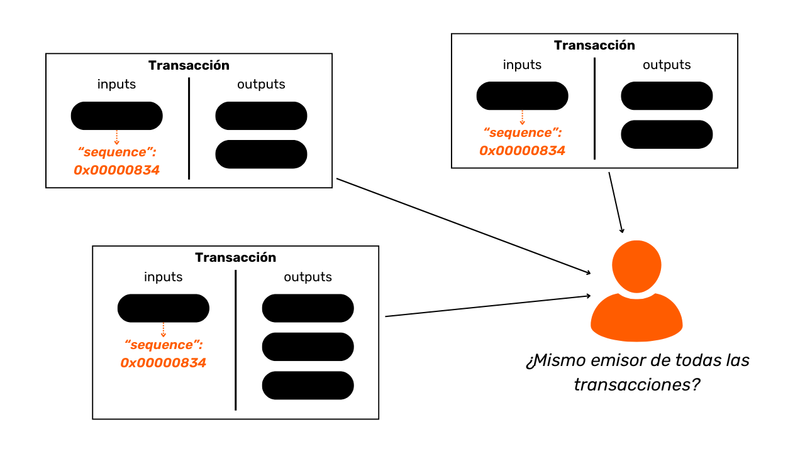

Como [@LaurentMT](https://twitter.com/LaurentMT) especifica en el [Space Kek #19](https://podcasters.spotify.com/pod/show/decouvrebitcoin/episodes/SpaceKek-19---Analyse-de-chane--anonsets-et-entropie-e1vfuji) (un podcast francófono), la utilidad de las huellas digitales de carteras en el análisis de cadena aumenta significativamente con el tiempo. De hecho, el creciente número de tipos de script y la implementación cada vez más gradual de estas nuevas características por el software de carteras acentúan las diferencias. Incluso puede suceder que uno pueda identificar con precisión el software utilizado por la entidad rastreada. Por lo tanto, es importante entender que el estudio de la huella digital de una cartera resulta particularmente relevante para las transacciones recientes, más que para aquellas iniciadas a principios de la década de 2010.

Para resumir, una huella digital puede ser cualquier práctica específica, llevada a cabo automáticamente por la cartera o manualmente por el usuario, que puede encontrarse en otras transacciones para asistirnos en nuestro análisis.

### La Heurística de Propiedad Común de Entradas (CIOH)

La CIOH, por sus siglas en inglés "Common Input Ownership Heuristic", es una heurística que establece que cuando una transacción incluye múltiples entradas, estas probablemente provienen de una única entidad. Por consiguiente, su propiedad es común.
Para aplicar la Heurística de Propiedad Común de Entradas (CIOH, por sus siglas en inglés), primero observamos una transacción que tiene múltiples entradas. Esto podría ser tan pocas como 2 entradas o hasta 30 entradas. Una vez identificada esta característica, verificamos si la transacción no se ajusta a un modelo de transacción conocido. Por ejemplo, si tiene 5 entradas con cantidades aproximadamente iguales y 5 salidas con exactamente la misma cantidad, sabemos que es la estructura de un coinjoin. Por lo tanto, no podemos aplicar la CIOH.
Sin embargo, si la transacción no se ajusta a ningún modelo conocido de transacción colaborativa, entonces podemos inferir que todas las entradas probablemente provienen de la misma entidad. Esto puede ser muy útil para expandir un clúster conocido o para continuar con el rastreo.

La CIOH fue descubierta por Satoshi Nakamoto. Él la discute en la parte 10 del White Paper:

"_[...] el enlace es inevitable con transacciones de múltiples entradas, que necesariamente revelan que sus entradas eran propiedad del mismo dueño. El riesgo es que si el dueño de una clave se revela, los enlaces pueden revelar otras transacciones que pertenecieron al mismo dueño._"

Es particularmente fascinante notar que Satoshi Nakamoto, incluso antes del lanzamiento oficial de Bitcoin, ya había identificado las dos principales vulnerabilidades en términos de privacidad para los usuarios, a saber, la CIOH y la reutilización de direcciones. Tal previsión es bastante notable, ya que estas dos heurísticas permanecen, incluso hoy, las más útiles en el análisis de cadena.

Para darte un ejemplo, aquí hay una transacción en la que probablemente podemos aplicar la CIOH:

```plaintext
20618e63b6eed056263fa52a2282c8897ab2ee71604c7faccfe748e1a202d712
```

Fuente: [Mempool.space](https://mempool.space/tx/20618e63b6eed056263fa52a2282c8897ab2ee71604c7faccfe748e1a202d712)

### Datos Offchain

Obviamente, el análisis de cadena no se limita exclusivamente a datos onchain. Cualquier dato de análisis previos o disponible en internet también puede ser utilizado para refinar un análisis.
Por ejemplo, si se observa que las transacciones rastreadas se emiten sistemáticamente desde el mismo nodo de Bitcoin y se puede identificar su dirección IP, podría ser posible detectar otras transacciones de la misma entidad, además de determinar una parte de la identidad del remitente. Aunque esta práctica no es fácilmente alcanzable, ya que requiere operar muchos nodos, es posible que algunas empresas especializadas en análisis de cadena la empleen.

El analista también tiene la opción de confiar en análisis previamente hechos de código abierto, o en sus propios análisis anteriores. Quizás se encuentre una salida que apunte a un clúster de direcciones que ya había sido identificado. A veces, también es posible confiar en salidas que apuntan a una plataforma de intercambio, siendo las direcciones de estas compañías generalmente conocidas.

De la misma manera, se puede realizar un análisis por eliminación. Por ejemplo, si durante el análisis de una transacción con dos salidas, una de ellas está vinculada a un clúster de direcciones ya conocido pero distinto de la entidad que se está rastreando, entonces se puede interpretar que la otra salida probablemente representa el cambio.

El análisis de cadena también incluye una parte de OSINT (_Open Source Intelligence_) que es un poco más generalista con búsquedas en internet. Es por esto que se aconseja no publicar direcciones de recepción directamente en redes sociales o en un sitio web, ya sea bajo un seudónimo o no.


### Modelos Temporales

Es menos comúnmente pensado, pero ciertos comportamientos humanos son reconocibles en la cadena. ¡Lo más útil en análisis podría ser tu patrón de sueño! Sí, cuando estás durmiendo, presumiblemente no estás transmitiendo transacciones de Bitcoin. Dado que generalmente duermes alrededor de las mismas horas, es común usar análisis temporales en el análisis de cadena. Esto simplemente implica catalogar las horas en las que las transacciones de una entidad dada se transmiten a la red de Bitcoin. Analizar estos patrones temporales nos permite deducir muchas piezas de información.

En primer lugar, un análisis temporal a veces permite identificar la naturaleza de la entidad rastreada. Si se observa que las transacciones se transmiten consistentemente durante 24 horas, entonces esto revelará una fuerte actividad económica. La entidad detrás de estas transacciones probablemente es una compañía, potencialmente internacional, y quizás con procedimientos automatizados internamente.

Por ejemplo, [había reconocido este modelo hace unos meses](https://twitter.com/Loic_Pandul/status/1701127409712452072) al analizar [la transacción que había asignado erróneamente 19 bitcoins en tarifas](https://mempool.space/tx/d5392d474b4c436e1c9d1f4ff4be5f5f9bb0eb2e26b61d2781751474b7e870fd). Un simple análisis temporal me había permitido hipotetizar que estábamos tratando con un servicio automatizado, y por lo tanto probablemente una gran entidad como una plataforma de intercambio.

De hecho, unos días después, se descubrió que los fondos pertenecían a PayPal, a través de la plataforma de intercambio Paxos.

Por el contrario, si vemos que el patrón temporal está más bien distribuido durante 16 horas muy específicas, entonces podemos estimar que estamos tratando con un usuario individual, o quizás un negocio local dependiendo de los volúmenes negociados.

Más allá de la naturaleza de la entidad observada, el patrón temporal también puede darnos una ubicación aproximada del usuario gracias a las zonas horarias. Así podemos vincular otras transacciones, y usar el sello de tiempo de estas como una heurística adicional que se puede agregar a nuestro análisis.

Por ejemplo, en la dirección reutilizada de la que hablé anteriormente, podemos observar que las transacciones, ya sean entrantes o salientes, están concentradas en un intervalo de 13 horas.

```plaintext
bc1qqtmeu0eyvem9a85l3sghuhral8tk0ar7m4a0a0
```


Fuente: OXT.me

Este intervalo probablemente corresponde a Europa, África o Medio Oriente. Por lo tanto, podemos inferir que el usuario detrás de estas transacciones vive allí.

En un registro diferente, también es un análisis temporal de este tipo el que permitió la hipótesis de que Satoshi Nakamoto no operaba desde Japón, sino de hecho desde Estados Unidos: [_Las Zonas Horarias de Satoshi Nakamoto_](https://medium.com/@insearchofsatoshi/the-time-zones-of-satoshi-nakamoto-aa40f035178f)

## Aplicación Práctica con un Explorador de Bloques

<chapterId>6493cf2f-225c-405f-9375-c4304f1087ed</chapterId>

En este capítulo final, aplicaremos concretamente los conceptos que hemos estudiado hasta ahora. Te presentaré ejemplos de transacciones reales de Bitcoin, y necesitarás extraer la información que te pido.
Idealmente, para estos ejercicios, sería preferible el uso de una herramienta profesional de análisis de cadenas. Sin embargo, desde la detención de los creadores de Samourai Wallet, la única herramienta de análisis gratuita OXT.me ya no está disponible. Por lo tanto, optaremos por un explorador de bloques clásico para estos ejercicios. Recomiendo usar [Mempool.space](https://mempool.space/) por sus numerosas características y gama de herramientas de análisis de cadena, pero también puedes elegir otro explorador como [Bitcoin Explorer](https://bitcoinexplorer.org/). Para comenzar, presentaré los ejercicios. Usa tu explorador de bloques para completarlos y anota tus respuestas en un papel. Luego, al final de este capítulo, proporcionaré las respuestas para que puedas verificar y corregir tus resultados.

_Las transacciones seleccionadas para estos ejercicios fueron elegidas únicamente por sus características de manera algo aleatoria. Este capítulo está destinado únicamente a fines educativos e informativos. Quiero aclarar que no apoyo ni fomento el uso de estas herramientas con fines maliciosos. El objetivo es enseñarte cómo protegerte contra el análisis de cadenas, no realizar análisis para exponer información privada de otros._

### Ejercicio 1

ID de la transacción a analizar:

```plaintext
3769d3b124e47ef4ffb5b52d11df64b0a3f0b82bb10fd6b98c0fd5111789bef7
```

¿Cuál es el nombre del modelo de esta transacción y qué interpretaciones plausibles se pueden extraer al examinar solo su modelo, es decir, la estructura de la transacción?

### Ejercicio 2

ID de la transacción a analizar:

```plaintext
baa228f6859ca63e6b8eea24ffad7e871713749d693ebd85343859173b8d5c20
```

¿Cuál es el nombre del modelo de esta transacción y qué interpretaciones plausibles se pueden extraer al examinar solo su modelo, es decir, la estructura de la transacción?

### Ejercicio 3

ID de la transacción a analizar:

```plaintext
3a9eb9ccc3517cc25d1860924c66109262a4b68f4ed2d847f079b084da0cd32b
```

¿Cuál es el modelo de esta transacción?

Después de identificar su modelo, utilizando las heurísticas internas de la transacción, ¿cuál salida probablemente representa el cambio?

### Ejercicio 4

ID de la transacción a analizar:

```plaintext
35f0b31c05503ebfdf7311df47f68a048e992e5cf4c97ec34aa2833cc0122a12
```

¿Cuál es el modelo de esta transacción?
Después de identificar su modelo, utilizando las heurísticas internas de la transacción, ¿cuál salida probablemente representa el cambio?

### Ejercicio 5

Imagina que Loïc publicó una de sus direcciones de recepción de Bitcoin en la red social Twitter:


```plaintext
bc1qja0hycrv7g9ww00jcqanhfpqmzx7luqalum3vu
```

Usando **solo la heurística de reutilización de direcciones**, ¿qué transacciones de Bitcoin podemos vincular a la identidad de Loïc?

_Obviamente, no soy el verdadero propietario de esta dirección de recepción y no la publiqué en redes sociales. Es una dirección que elegí al azar de la blockchain._

### Ejercicio 6

Siguiendo el Ejercicio 5, gracias a la heurística de reutilización de direcciones, pudiste identificar varias transacciones de Bitcoin en las que parece estar involucrado Loïc. Normalmente, entre las transacciones identificadas, deberías haber detectado esta:
Esta transacción es la primera que envía fondos a la dirección de Loïc. En tu opinión, ¿de dónde provienen los bitcoins recibidos por Loïc a través de esta transacción?

### Ejercicio 7

Siguiendo el Ejercicio 5, gracias a la heurística de reutilización de direcciones, pudiste identificar varias transacciones de Bitcoin en las que parece estar involucrado Loïc. Ahora deseas averiguar de dónde es Loïc. Basado en las transacciones encontradas, realiza un análisis temporal para encontrar la zona horaria probable utilizada por Loïc. A partir de esta zona horaria, determina un lugar donde parece vivir Loïc (país, estado/región, ciudad...).


### Ejercicio 8

Aquí está la transacción de Bitcoin a estudiar:

```plaintext
bb346dae645d09d32ed6eca1391d2ee97c57e11b4c31ae4325bcffdec40afd4f
```

Observando solo esta transacción, ¿qué información podemos interpretar?

### Soluciones a los ejercicios

**_Ejercicio 1:_**
El modelo de esta transacción es el de un pago simple. Si estudiamos solo su estructura, podemos interpretar que una salida representa el cambio y la otra salida representa un pago real. Por lo tanto, sabemos que el usuario observado probablemente ya no está en posesión de uno de los dos UTXOs en salidas (el destinado al pago), pero aún posee el otro UTXO (el destinado al cambio).

**_Ejercicio 2:_**
El modelo de esta transacción es el de un gasto por lotes. Este modelo probablemente indica una actividad económica significativa, como una plataforma de intercambio, por ejemplo. Podemos deducir que el UTXO en entrada proviene de una empresa con actividad económica significativa y que los UTXOs en salidas se dispersarán. Algunos pertenecerán a clientes de la empresa que han retirado sus bitcoins a carteras de auto-custodia. Otros pueden dirigirse hacia empresas asociadas. Finalmente, ciertamente habrá un cambio que regresa a la empresa emisora.

**_Ejercicio 3:_**

El modelo de esta transacción es el de un pago simple. Por lo tanto, podemos aplicar heurísticas internas a la transacción para intentar identificar el cambio.

Personalmente he identificado al menos dos heurísticas internas que apoyan la misma hipótesis:

- La reutilización del mismo tipo de script;
- La salida más grande.

La heurística más obvia es la reutilización del mismo tipo de script. De hecho, la salida `0` es un `P2SH`, reconocible por su dirección de recepción que comienza con `3`:

```plaintext
3Lcdauq6eqCWwQ3UzgNb4cu9bs88sz3mKD
```

Mientras que la salida `1` es un `P2WPKH`, identificable por su dirección que comienza con `bc1q`:

```plaintext
bc1qya6sw6sta0mfr698n9jpd3j3nrkltdtwvelywa
```

El UTXO utilizado en entrada para esta transacción también utiliza un script `P2WPKH`:

```plaintext
bc1qyfuytw8pcvg5vx37kkgwjspg73rpt56l5mx89k
```

Así, podemos asumir que la salida `0` corresponde a un pago y que la salida `1` es el cambio de la transacción, lo que significaría que el usuario en entrada aún posee la salida `1`.
Para apoyar o refutar esta hipótesis, podemos buscar otras heurísticas que confirmen nuestro pensamiento o disminuyan la probabilidad de que nuestra hipótesis sea correcta.
He identificado al menos otra heurística. Es la salida más grande. La salida `0` mide `123,689 sats`, mientras que la salida `1` mide `505,839 sats`. Por lo tanto, hay una diferencia significativa entre estas dos salidas. La heurística de la salida más grande sugiere que la salida más voluminosa probablemente sea el cambio. Esta heurística, por lo tanto, refuerza aún más nuestra hipótesis inicial.

Parece probable que el usuario que proporcionó el UTXO en la entrada todavía posea la salida `1`, que parece encarnar el cambio de la transacción.

**_Ejercicio 4:_**
El modelo de esta transacción es el de un pago simple. Por lo tanto, podemos aplicar heurísticas internas a la transacción para intentar identificar el cambio.
Personalmente, he identificado al menos dos heurísticas internas que apoyan la misma hipótesis:

- El reuso del mismo tipo de script;
- La salida de una cantidad redonda.

La heurística más obvia es el reuso del mismo tipo de script. De hecho, la salida `0` es un `P2SH`, reconocible por su dirección de recepción que comienza con `3`:

```plaintext
3FSH5Mnq6S5FyQoKR9Yjakk3X4KCGxeaD4
```

Mientras que la salida `1` es un `P2WPKH`, identificable por su dirección que comienza con `bc1q`:

```plaintext
bc1qvdywdcfsyavt4v8uxmmrdt6meu4vgeg439n7sg
```

El UTXO utilizado como entrada para esta transacción también utiliza un script `P2WPKH`:

```plaintext
bc1qku3f2y294h3ks5eusv63dslcua2xnlzxx0k6kp
```

Por lo tanto, podemos asumir que la salida `0` corresponde a un pago y que la salida `1` es el cambio de la transacción, lo que significaría que el usuario en la entrada todavía posee la salida `1`.

Para apoyar o refutar esta hipótesis, podemos buscar otras heurísticas que confirmen nuestro pensamiento o disminuyan la probabilidad de que nuestra hipótesis sea correcta.

He identificado al menos otra heurística. Es la salida de una cantidad redonda. La salida `0` mide `70,000 sats`, mientras que la salida `1` mide `22,962 sats`. Por lo tanto, estamos en presencia de una salida perfectamente redonda en la unidad de cuenta de BTC. La heurística de la salida redonda sugiere que el UTXO con una cantidad redonda probablemente sea el pago, y por eliminación, la otra representa el cambio. Esta heurística, por lo tanto, refuerza aún más nuestra hipótesis inicial.

Sin embargo, en este ejemplo, otra heurística podría cuestionar nuestra hipótesis inicial. De hecho, la salida `0` es más grande que la salida `1`. Si nos basamos en la heurística de que la salida más grande generalmente es el cambio, podríamos deducir que la salida `0` es el cambio. Sin embargo, esta contrahipótesis parece implausible, ya que las otras dos heurísticas parecen sustancialmente más convincentes que la de la salida más grande. En consecuencia, parece razonable mantener nuestra hipótesis inicial a pesar de esta aparente contradicción.
Por lo tanto, parece probable que el usuario que proporcionó el UTXO como entrada todavía posea la salida `1`, que parece representar el cambio de la transacción.
**_Ejercicio 5:_**
Podemos ver que 8 transacciones pueden asociarse con la identidad de Loïc. Entre estas, 4 involucran recibir bitcoins:

```plaintext
2d9575553c99578268ffba49a1b2adc3b85a29926728bd0280703a04d051eace
8b70bd322e6118b8a002dbdb731d16b59c4a729c2379af376ae230cf8cdde0dd
d5864ea93e7a8db9d3fb113651d2131567e284e868021e114a67c3f5fb616ac4
bc4dcf2200c88ac1f976b8c9018ce70f9007e949435841fc5681fd33308dd762
```

Los otros 4 implican el envío de bitcoins:

```plaintext
8b52fe3c2cf8bef60828399d1c776c0e9e99e7aaeeff721fff70f4b68145d540
c12499e9a865b9e920012e39b4b9867ea821e44c047d022ebb5c9113f2910ed6
a6dbebebca119af3d05c0196b76f80fdbf78f20368ebef1b7fd3476d0814517d
3aeb7ce02c35eaecccc0a97a771d92c3e65e86bedff42a8185edd12ce89d89cc
```

**_Ejercicio 6:_**
Si examinamos el modelo de esta transacción, es evidente que se trata de un gasto agrupado. De hecho, la transacción tiene una sola entrada y 51 salidas, lo que indica una actividad económica significativa. Por lo tanto, podemos suponer que Loïc ha realizado un retiro de bitcoins desde una plataforma de intercambio.

Varios elementos refuerzan esta hipótesis. En primer lugar, el tipo de script utilizado para asegurar el UTXO en la entrada es un script P2SH multisig 2/3, que indica un nivel avanzado de seguridad típico de las plataformas de intercambio:

```plaintext
OP_PUSHNUM_2
OP_PUSHBYTES_33 03eae02975918af86577e1d8a257773118fd6ceaf43f1a543a4a04a410e9af4a59
OP_PUSHBYTES_33 03ba37b6c04aaf7099edc389e22eeb5eae643ce0ab89ac5afa4fb934f575f24b4e
OP_PUSHBYTES_33 03d95ef2dc0749859929f3ed4aa5668c7a95baa47133d3abec25896411321d2d2d
OP_PUSHNUM_3
OP_CHECKMULTISIG
```

Además, la dirección analizada 3PUv9tQMSDCEPSMsYSopA5wDW86pwRFbNF se reutiliza en más de 220,000 transacciones diferentes, lo cual es a menudo característico de las plataformas de intercambio, generalmente despreocupadas por su privacidad. La heurística temporal aplicada a esta dirección también muestra una distribución regular de transacciones casi diarias durante un período de 3 meses, con un horario extendido durante las 24 horas, lo que sugiere la actividad continua de una plataforma de intercambio.

Finalmente, los volúmenes procesados por esta entidad son enormes. De hecho, la dirección recibió y envió 44 BTC durante 222,262 transacciones entre diciembre de 2022 y marzo de 2023. Estos volúmenes significativos confirman aún más la probable naturaleza de la actividad de una plataforma de intercambio.

**_Ejercicio 7:_**
Al analizar los tiempos de confirmación de las transacciones, se pueden notar los siguientes horarios UTC:

```plaintext
05:43
20:51
18:12
17:16
04:28
23:38
07:45
21:55
```

Analizando estos horarios, parece que las zonas horarias UTC-7 y UTC-8 son consistentes con un rango de actividades humanas comunes (entre las 08:00 y las 23:00) para la mayoría de los horarios:

```plaintext
05:43 UTC > 22:43 UTC-7
20:51 UTC > 13:51 UTC-7
18:12 UTC > 11:12 UTC-7
17:16 UTC > 10:16 UTC-7
04:28 UTC > 21:28 UTC-7
23:38 UTC > 16:38 UTC-7
07:45 UTC > 00:45 UTC-7
21:55 UTC > 14:55 UTC-7

05:43 UTC > 21:43 UTC-8
20:51 UTC > 12:51 UTC-8
18:12 UTC > 10:12 UTC-8
17:16 UTC > 09:16 UTC-8
04:28 UTC > 20:28 UTC-8
23:38 UTC > 15:38 UTC-8
07:45 UTC > 23:45 UTC-8
21:55 UTC > 13:55 UTC-8
```


La zona horaria UTC-7 es particularmente relevante en verano, ya que incluye estados y regiones como:

- California (con ciudades como Los Ángeles, San Francisco y San Diego);
- Nevada (con Las Vegas);
- Oregón (con Portland);
- Washington (con Seattle);
- La región canadiense de Columbia Británica (con ciudades como Vancouver y Victoria).

Estos datos sugieren que Loïc podría residir plausiblemente en la costa oeste de los Estados Unidos o Canadá.

**_Ejercicio 8:_**
El análisis de esta transacción revela 5 entradas y una única salida, lo que parece indicar una consolidación. La aplicación de la heurística CIOH sugiere que todos los UTXOs en las entradas son mantenidos por una única entidad, y que el UTXO en la salida también pertenece a esta entidad. Parece que el usuario ha elegido consolidar varios UTXOs que poseían en un único UTXO en la salida, con el objetivo de consolidar sus monedas. Este enfoque probablemente fue motivado por el deseo de aprovechar las bajas comisiones de transacción en ese momento para reducir las comisiones futuras.

---

_Para la redacción de esta parte 3 sobre análisis de cadena, me basé en los siguientes recursos:_

- _La serie de cuatro artículos titulada: [Understanding Bitcoin Privacy with OXT](https://medium.com/oxt-research/understanding-bitcoin-privacy-with-oxt-part-1-4-8177a40a5923), producida por Samourai Wallet en 2021;_
- _Los diversos informes de [OXT Research](https://medium.com/oxt-research), así como su herramienta gratuita de análisis de cadena (que no está disponible en este momento tras el arresto de los fundadores de Samourai Wallet);_
- _De manera más amplia, mi conocimiento proviene de los diversos tuits y contenidos de [@LaurentMT](https://twitter.com/LaurentMT) y [@ErgoBTC](https://twitter.com/ErgoBTC);_
- \_El [Space Kek #19](https://podcasters.spotify.com/pod/show/decouvrebitcoin/episodes/SpaceKek-19---Analyse-de-chane--anonsets-et-entropie-e1vfuji) en el que participé junto a [@louneskmt](https://twitter.com/louneskmt), [@TheoPantamis](https://twitter.com/TheoPantamis), [@Sosthene\_\_\_](https://twitter.com/Sosthene___), y [@LaurentMT](https://twitter.com/LaurentMT).\_
  _Quisiera agradecer a sus autores, desarrolladores y productores. También agradezco a los revisores que meticulosamente corrigieron el artículo que sirvió de base para esta parte 3 y me honraron con su consejo experto:_
- _[Gilles Cadignan](https://twitter.com/gillesCadignan);_
- _[Ludovic Lars](https://viresinnumeris.fr/)._

# Dominando las Mejores Prácticas para Proteger tu Privacidad

<partId>9bd04b63-f1af-4e50-9061-6bc90009df68</partId>

## Reutilización de Direcciones

<chapterId>f3e97645-3df3-41bc-a4ed-d2c740113d96</chapterId>
Después de estudiar las técnicas que pueden comprometer tu privacidad en Bitcoin, en esta tercera parte, ahora veremos las mejores prácticas a adoptar para protegerte. Esta parte no tiene como objetivo explorar métodos para mejorar la privacidad, un tema que se abordará más adelante, sino entender cómo interactuar correctamente con Bitcoin para mantener la privacidad que naturalmente ofrece, sin recurrir a técnicas adicionales.
Obviamente, para comenzar esta tercera parte, hablaremos sobre la reutilización de direcciones. Este fenómeno constituye la principal amenaza para la privacidad del usuario. Por lo tanto, este capítulo es posiblemente el más importante de todo el entrenamiento.

### ¿Qué es una dirección de recepción?

Una dirección de recepción de Bitcoin es una cadena de caracteres o un identificador utilizado para recibir bitcoins en una billetera.

Técnicamente, una dirección de recepción de Bitcoin no "recibe" bitcoins en el sentido literal, sino que define las condiciones bajo las cuales los bitcoins pueden ser gastados. Específicamente, cuando se te envía un pago, la transacción del remitente crea un nuevo UTXO destinado a ti en la salida de los UTXOs que consumió en las entradas. En esta salida, se aplica un script que define cómo este UTXO puede ser gastado más tarde. Este script es conocido como "_ScriptPubKey_" o "_Script de Bloqueo_". Tu dirección de recepción, más precisamente su carga útil, se integra en este script. Para simplificar, este script estipula esencialmente:

> "_Para gastar este nuevo UTXO, se debe proporcionar una firma digital usando la clave privada asociada con esta dirección de recepción._"


Las direcciones de Bitcoin vienen en diferentes tipos dependiendo del modelo de script utilizado. Los primeros modelos, conocidos como "_Legacy_", incluyen direcciones `P2PKH` (_Pay-to-PubKey-Hash_) y `P2SH` (_Pay-to-Script-Hash_). Las direcciones P2PKH siempre comienzan con `1` y las P2SH con `3`. Aunque todavía son seguras, estos formatos ahora son obsoletos, ya que resultan en tarifas de transacción más altas y ofrecen menos privacidad en comparación con los nuevos estándares.
Las direcciones SegWit V0 (`P2WPKH` y `P2WSH`) y Taproot / SegWit V1 (`P2TR`) representan los formatos modernos. Las direcciones SegWit comienzan con `bc1q` y las direcciones Taproot, introducidas en 2021, comienzan con `bc1p`.
Por ejemplo, aquí hay una dirección de recepción Taproot:

```text
bc1ps5gd2ys8kllz9alpmcwxqegn7kl3elrpnnlegwkm3xpq2h8da07spxwtf5
```

La forma en que se construye el ScriptPubKey dependerá del estándar que estés utilizando:
| Modelo de Script | ScriptPubKey || ---------------- | ----------------------------------------------------------- |
| P2PKH | OP_DUP OP_HASH160 `<pubKeyHash>` OP_EQUALVERIFY OP_CHECKSIG |
| P2SH | OP_HASH160 `<scriptHash>` OP_EQUAL |
| P2WPKH | 0 `<pubKeyHash>` |
| P2WSH | 0 `<witnessScriptHash>` |
| P2SH - P2WPKH | OP_HASH160 `<redeemScriptHash>` OP_EQUAL |
| P2SH - P2WSH | OP_HASH160 `<redeemScriptHash>` OP_EQUAL |
| P2TR | 1 `<pubKey>` |

En cuanto a la construcción de direcciones de recepción, también depende del modelo de script elegido:

- Para las direcciones `P2PKH` y `P2WPKH`, la carga útil, es decir, el núcleo de la dirección, representa el hash de la clave pública;
- Para las direcciones `P2SH` y `P2WSH`, la carga útil representa el hash de un script;
- En cuanto a las direcciones `P2TR`, la carga útil es una clave pública modificada. Las salidas `P2TR` combinan aspectos de _Pago-a-PubKey_ y _Pago-a-Script_. La clave pública modificada es el resultado de sumar una clave pública de gasto clásica con una "modificación", derivada de la raíz de Merkle de un conjunto de scripts que también se pueden usar para gastar bitcoins.

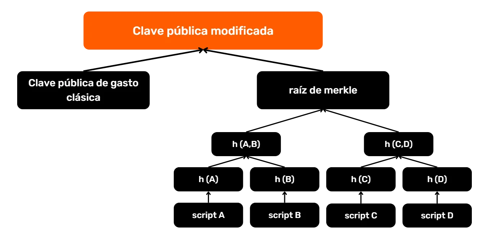

Las direcciones mostradas en tu software de billetera también incluyen una HRP (_Parte Legible por Humanos_), típicamente `bc` para direcciones post-SegWit, un separador `1`, y un número de versión `q` para SegWit V0 y `p` para Taproot/SegWit V1. También se añade un checksum para asegurar la integridad y validez de la dirección durante su transmisión.

Finalmente, las direcciones se ponen en un formato estándar:

- Base58check para direcciones Legacy antiguas;
- Bech32 para direcciones SegWit;
- Bech32m para direcciones Taproot.

Aquí está la matriz de adición para los formatos bech32 y bech32m (SegWit y Taproot) desde base 10:

| +   | 0   | 1   | 2   | 3   | 4   | 5   | 6   | 7   |
| --- | --- | --- | --- | --- | --- | --- | --- | --- | --- | --- | --- | --- | --- | --- | --- | --- | --- | --- |
| 0   | q   | p   | z   | r   | y   | 9   | x   | 8   |
| 8   | g   | f   | 2   | t   | v   | d   | w   | 0   |
| 16  | s   | 3   | j   | n   | 5   | 4   | k   | h   |     | 24  | c   | e   | 6   | m   | u   | a   | 7   | l   |

### ¿Qué es la Reutilización de Direcciones?

La reutilización de direcciones se refiere a la práctica de usar la misma dirección de recepción para bloquear múltiples UTXOs diferentes.

Como vimos en la sección anterior, cada UTXO tiene su propio ScriptPubKey que lo bloquea y debe ser satisfecho para que el UTXO sea consumido como entrada en una nueva transacción. Es dentro de este ScriptPubKey donde las direcciones de recepción (carga útil) se integran.

Cuando diferentes ScriptPubKeys contienen la misma dirección de recepción, esto se conoce como reutilización de direcciones. En la práctica, esto significa que un usuario ha proporcionado la misma dirección múltiples veces a los remitentes para recibir bitcoins a través de múltiples pagos. Y de hecho, esta práctica es catastrófica para tu privacidad.

### ¿Por Qué es un Problema la Reutilización de Direcciones?

Dado que la blockchain es pública, es fácil ver qué direcciones bloquean qué UTXOs y cuántos bitcoins. Si se usa la misma dirección para múltiples transacciones, se vuelve posible deducir que todos los bitcoins asociados con esa dirección pertenecen a la misma persona. Esta práctica compromete la privacidad del usuario al permitir que se establezcan enlaces determinísticos entre diferentes transacciones y rastrear los bitcoins en la blockchain. El propio Satoshi Nakamoto destacó este problema en el White Paper de Bitcoin:

> _Como un cortafuegos adicional, un nuevo par de claves podría ser utilizado para cada transacción para evitar que sean vinculadas a un propietario común._


Fuente: S. Nakamoto, "Bitcoin: A Peer-to-Peer Electronic Cash System", https://bitcoin.org/bitcoin.pdf, 2009.

El objetivo buscado por Satoshi en esta declaración era crear un cortafuegos adicional en caso de asociación entre la identidad del usuario y un par de claves en Bitcoin, para evitar tener toda su actividad públicamente vinculada a su identidad. Hoy, con la proliferación de empresas de análisis de cadena y regulaciones KYC, el uso de direcciones únicas ya no es un "cortafuegos adicional", sino una práctica necesaria para cualquiera que desee preservar su privacidad al mínimo.

Cuando reutilizas una dirección, haces un vínculo casi indiscutible entre todas las transacciones asociadas con esa dirección. Aunque esto no pone directamente en peligro tus fondos, ya que la criptografía en curvas elípticas asegura la seguridad de tus claves privadas, facilita el monitoreo de tus actividades. De hecho, cualquier persona con un nodo puede observar las transacciones y saldos de direcciones, comprometiendo completamente tu anonimato.


Para ilustrar este punto, tomemos el ejemplo de Bob, un usuario que regularmente compra bitcoins en pequeñas cantidades a través de DCA (Dollar Cost Averaging) y siempre los envía a la misma dirección. Después de dos años, esta dirección contiene una cantidad sustancial de bitcoins. Si Bob usa esta dirección para hacer un pago a un comerciante local, este último podría ver todos los fondos asociados y deducir la riqueza de Bob. Esto podría llevar a riesgos de seguridad personal, incluidos intentos de robo o extorsión. Si Bob hubiera usado una dirección fresca para recibir cada compra periódica, habría revelado infinitamente menos información a su comerciante.

En el análisis de cadena, diferenciamos entre 2 tipos de reutilización de direcciones:

- Reutilización externa;
- Reutilización interna dentro de una transacción.

La primera se observa cuando una dirección se reutiliza en varias transacciones de Bitcoin diferentes. Esto es lo que discutimos anteriormente: esta heurística nos permite deducir que todos los UTXOs que pasaron por esta dirección pertenecen a una sola entidad.
La reutilización de direcciones internas se observa no cuando la reutilización ocurre a través de múltiples transacciones, sino cuando ocurre dentro de la misma transacción. De hecho, si la misma dirección que se utilizó para bloquear una entrada se usa como salida en una transacción, entonces podemos deducir que esta salida todavía pertenece al mismo usuario (cambio), y que la segunda salida representa el pago real. Esta otra heurística permite el seguimiento de fondos a través de múltiples transacciones.


La reutilización de direcciones es un verdadero azote en Bitcoin. Según el sitio web OXT.me (actualmente inaccesible), la tasa general de reutilización de direcciones en Bitcoin fue de aproximadamente el 52% en 2022:


Esta tasa es enorme, pero proviene abrumadoramente de plataformas de intercambio más que de usuarios individuales.

### ¿Cómo evitar la reutilización de direcciones?

Evitar la reutilización de direcciones es bastante simple: **solo usa una nueva dirección fresca para cada nuevo pago entrante a tu billetera**.

Gracias a BIP32, las billeteras modernas son ahora deterministas y jerárquicas. Esto significa que un usuario puede generar un gran número de direcciones a partir de una única pieza inicial de información: la semilla. Al guardar esta única pieza de información, es posible restaurar todas las claves privadas de la billetera, accediendo así a los fondos asegurados por las direcciones correspondientes.


Es por esto que, cuando presionas el botón de "_recibir_" en el software de tu billetera, se te ofrece una dirección de recepción no utilizada cada vez. Después de recibir bitcoins en esta dirección, el software automáticamente sugiere una nueva.

> _PS: Recientemente, algunos softwares de billetera han anunciado su intención de dejar de generar direcciones en blanco, temiendo que esto pueda ser percibido como una forma de lavado de dinero por las autoridades. Si tu software está entre estos, te aconsejo fuertemente que lo reemplaces inmediatamente, ya que esto no es aceptable para el usuario._

Si necesitas un identificador estático para recibir pagos, como para recibir donaciones, por ejemplo, se aconseja no usar una dirección de Bitcoin clásica debido al riesgo de reutilización. Prefiere usar una dirección Lightning, o para un identificador de pago onchain estático, puedes optar por BIP47 o Pagos Silenciosos. El funcionamiento de estos protocolos se detalla en la parte 6 de esta formación.

## Etiquetado y Control de Monedas

<chapterId>fbdb07cd-c025-48f2-97b0-bd1bc21c68a8</chapterId>

Como hemos descubierto en la parte sobre análisis de cadena, hay una multitud de heurísticas y patrones que se pueden usar para inferir información sobre una transacción. Como usuario, es importante estar consciente de estas técnicas para protegerte mejor.

Esto implica, notablemente, una gestión rigurosa de tu billetera de autogestión, que incluye conocer el origen de tus UTXOs, así como una selección reflexiva de UTXOs a consumir durante los pagos. Esta gestión efectiva de la billetera se basa en dos características importantes de las buenas billeteras de Bitcoin: el etiquetado y el control de monedas.

En este capítulo, estudiaremos estas características y veremos cómo podrías usarlas inteligentemente, sin agregar demasiada carga de trabajo, para optimizar en gran medida tu privacidad en Bitcoin.

### ¿Qué es el Etiquetado?

El etiquetado es una práctica que implica asignar una anotación o una etiqueta a un UTXO específico en una billetera de Bitcoin. Estas anotaciones se almacenan localmente por el software de la billetera y nunca se transmiten a través de la red de Bitcoin. Por lo tanto, el etiquetado es una herramienta para la gestión personal.

Por ejemplo, si poseo un UTXO de una compra P2P en Bisq con Charles, podría asignarle la etiqueta "`Non-KYC Bisq Charles`".
Etiquetar es una buena práctica que ayuda a recordar el origen o destino previsto de un UTXO, facilitando así la gestión de fondos y optimizando la privacidad. De hecho, es probable que tu billetera de Bitcoin asegure varios UTXOs. Si las fuentes de estos UTXOs son diferentes, es posible que no quieras fusionar estos UTXOs en el futuro, de lo contrario, podrías revelar su propiedad común. Al etiquetar correctamente todas tus monedas, te aseguras de recordar su origen cuando necesites usarlas, incluso si eso es solo en varios años.

### ¿Qué es el control de monedas?

El uso activo de etiquetas se vuelve aún más interesante cuando se combina con una opción de control de monedas en el software de tu billetera.

El control de monedas es una característica presente en el buen software de billeteras de Bitcoin, que te da la capacidad de seleccionar manualmente UTXOs específicos para usar como entradas para realizar una transacción. De hecho, para satisfacer un pago en salida, es necesario consumir un UTXO en entrada a cambio. Por varias razones que veremos más adelante, es posible que quieras elegir precisamente qué monedas consumir en entradas para satisfacer un pago dado. Esto es exactamente lo que te permite hacer el control de monedas. Para darte una analogía, esta característica es similar a la acción de elegir una moneda específica en tu billetera cuando pagas por tu baguette.


El uso de software de billetera con control de monedas, junto con el etiquetado de UTXOs, permite a los usuarios distinguir y seleccionar precisamente los UTXOs para sus transacciones.

### ¿Cómo etiquetar correctamente tus UTXOs?

No hay un método universal para etiquetar UTXOs que se adapte a todos. Depende de ti definir un sistema de etiquetado para que puedas encontrar fácilmente tu camino en tu billetera. En cualquier caso, ten en cuenta que un buen etiquetado es aquel que podrás entender cuando lo necesites. Si tu billetera de Bitcoin está destinada principalmente para ahorros, puede ser que las etiquetas solo te sean útiles en varias décadas. Por lo tanto, asegúrate de que sean claras, precisas y comprensivas.

Es importante que tus seres queridos puedan identificar fácilmente el origen de los fondos si, algún día, necesitan acceder a tu billetera. Esto podría ayudarles por razones de privacidad así como por necesidades legales, en el evento de que tuvieran que justificar la procedencia de los fondos ante una autoridad.
El aspecto más importante del etiquetado es anotar la fuente del UTXO. Simplemente deberías indicar cómo llegó esta moneda a tu billetera. ¿Es de una compra en una plataforma de intercambio? ¿Un pago de un cliente? ¿Un intercambio entre pares? ¿O es el cambio de una compra? Así, podrías especificar:

- `Retiro Exchange.com`;
- `Pago Cliente David`;
- `Compra P2P Charles`;
- `Cambio de compra de sofá`

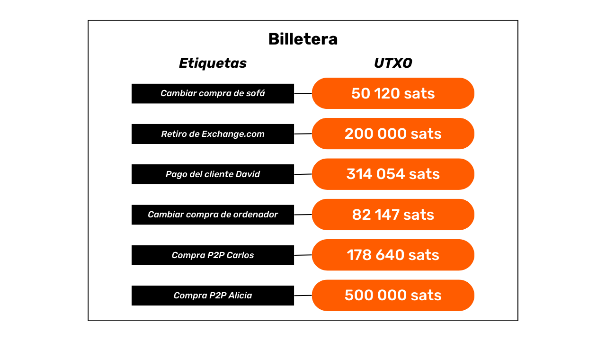

Para refinar tu gestión de UTXOs y adherirte a tus estrategias de segregación de fondos dentro de tu billetera, podrías enriquecer tus etiquetas con un indicador adicional que refleje estas separaciones. Si tu billetera contiene dos categorías de UTXOs que no deseas mezclar, podrías integrar un marcador en tus etiquetas para distinguir claramente estos grupos. Estos marcadores de separación dependerán de tus propios criterios, como la distinción entre UTXOs de un proceso de adquisición que involucra KYC, o entre fondos profesionales y personales. Tomando los ejemplos de etiquetas mencionados anteriormente, esto podría traducirse en:

- `KYC - Retiro Exchange.com`;
- `KYC - Pago Cliente David`;
- `NO KYC - Compra P2P Charles`;
- `NO KYC - Cambio de compra de sofá`

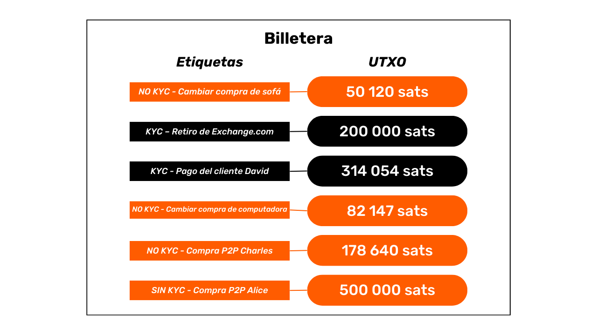
También es aconsejable perpetuar el etiquetado de una moneda a lo largo de las transacciones. Por ejemplo, al consolidar UTXOs sin KYC, asegúrate de marcar el UTXO resultante no solo como `consolidación`, sino específicamente como `consolidación sin KYC` para mantener un rastro claro del origen de la moneda.
Finalmente, no es obligatorio poner una fecha en una etiqueta. La mayoría del software de billetera ya muestra la fecha de la transacción, y siempre es posible recuperar esta información en un explorador de bloques usando su TXID.

### ¿Cómo Elegir Tus Monedas Adecuadamente?

Cuando realizas una transacción, el control de monedas te permite elegir específicamente qué UTXOs consumir como entradas para satisfacer la salida del pago. Dos aspectos deben considerarse en esta elección:

- La posibilidad de que el receptor del pago pueda vincular una parte de tu identidad con los UTXOs utilizados como entradas;
- La capacidad de un observador externo para establecer vínculos entre todos los UTXOs consumidos como entradas.
  Para ilustrar el primer punto, tomemos un ejemplo concreto. Supongamos que compras una baguette con bitcoins a tu panadero local. Utilizas uno o más UTXOs que posees como entradas para al menos cubrir el precio de la baguette en salidas, así como las comisiones de la transacción. Tu panadero podría entonces potencialmente asociar tu rostro, o cualquier otra parte de tu identidad que conozcan, con las monedas utilizadas como entradas. Conociendo la existencia de este vínculo, podrías preferir elegir un UTXO específico sobre otro al realizar el pago.
  

Por ejemplo, si uno de tus UTXOs proviene de una plataforma de intercambio y prefieres que el panadero no esté al tanto de tu cuenta en esta plataforma, evitarías usar este UTXO para el pago. Si posees un UTXO de alto valor que revela una cantidad significativa de bitcoins, también podrías elegir no usarlo para evitar que el panadero sepa sobre tu fortuna en BTC.

La elección de UTXOs para usar en este primer punto se basa, por lo tanto, en una decisión personal, influenciada por lo que estás dispuesto a revelar o no. Las etiquetas que has asignado a tus UTXOs al recibirlos te ayudarán a seleccionar aquellos que, una vez gastados, solo exponen información con la que te sientes cómodo revelando al destinatario.

Más allá de la información potencialmente revelada al destinatario, la elección de entradas también influye en lo que revelas a todos los observadores de la blockchain. De hecho, al usar múltiples UTXOs como entradas para tu transacción, revelas que son propiedad de la misma entidad, según la Heurística de Propiedad de Entrada Común (CIOH).


Al seleccionar tus monedas, debes ser consciente de que la transacción que estás a punto de transmitir creará un vínculo entre todos los UTXOs utilizados. Este vínculo puede ser problemático para tu privacidad personal, especialmente si los UTXOs provienen de diferentes fuentes.


Volvamos al ejemplo de mi UTXO sin KYC de Bisq; quiero evitar combinarlo con un UTXO de, digamos, una plataforma de intercambio regulada que conoce mi identidad. De hecho, si alguna vez uso estos 2 UTXOs como entradas en la misma transacción, la plataforma regulada podrá vincular mi identidad con el UTXO que compré en Bisq, mientras que antes no estaba vinculado a mi identidad.


Finalmente, para elegir adecuadamente qué UTXOs consumir como entradas para una transacción, lo más importante es evitar usar múltiples UTXOs. Siempre que sea posible, selecciona una sola moneda que sea lo suficientemente grande para cubrir tu pago. Al hacer esto, evitas completamente los riesgos asociados con COINJOIN. Sin embargo, si ningún UTXO individual es suficiente para el pago y debes consumir varios, asegúrate de que provengan de fuentes similares para minimizar los riesgos de enlaces no deseados. Además, ten en cuenta que el destinatario podría asociar la información que tiene sobre ti con el historial de las monedas utilizadas como entradas.

### Entendiendo la Selección Automática de Monedas

En las secciones anteriores, discutimos la selección manual de UTXOs para una transacción. Pero, ¿qué sucede cuando el software de la billetera hace esta selección automáticamente? Existen varios métodos para determinar qué monedas consumir, y la selección de UTXOs es un verdadero campo de investigación en Bitcoin. El objetivo principal de este proceso automático es a menudo minimizar las comisiones de transacción para el usuario.

Métodos de selección de UTXO como FIFO (_First In First Out_) y LIFO (_Last In First Out_) están entre los más simples pero también los menos eficientes. Con FIFO, las monedas más antiguas en la billetera se usan primero. Este enfoque generalmente es ineficiente tanto para minimizar las comisiones de transacción como para preservar la privacidad, excepto en casos donde se usan bloqueos temporales relativos y deben renovarse regularmente. Por el contrario, LIFO prioriza el uso de los UTXOs más recientes. Aunque simples, estos dos métodos a menudo resultan ser ineficientes.

Un método más avanzado es el _Knapsack Solver_. Este fue el método utilizado en la billetera Bitcoin Core hasta la versión 0.17. Implica seleccionar iterativa y aleatoriamente UTXOs de la billetera, sumándolos en subconjuntos y manteniendo la solución que reduce el peso de la transacción tanto como sea posible, para reducir las comisiones para el usuario.
El _Branch-and-Bound_ (BNB), a menudo apodado "el algoritmo de Murch" en referencia a su inventor, ha reemplazado al _Knapsack Solver_ en Bitcoin Core a partir de la versión 0.17. Este método más avanzado tiene como objetivo encontrar un conjunto de UTXOs que coincida exactamente con la cantidad necesaria para satisfacer las salidas de una transacción. El objetivo de BNB es minimizar la cantidad de cambio así como las comisiones, reduciendo lo que se llama el criterio de desperdicio que toma en cuenta tanto los costos inmediatos como los costos futuros esperados para el cambio. Este método se deriva del concepto original de _Branch-and-Bound_, diseñado en 1960 por Ailsa Land y Alison Harcourt, y ofrece una optimización más precisa de las comisiones en comparación con el _Knapsack Solver_.
Todos estos métodos de selección automática de UTXO pueden ser efectivos en reducir las comisiones de transacción, pero a menudo son ineficientes en preservar la privacidad del usuario. De hecho, estos algoritmos pueden fusionar varios UTXOs en entradas, revelando así una propiedad común de estos UTXOs debido al COH. Obviamente, estos métodos no pueden tener en cuenta las etiquetas adjuntas a los UTXOs, que son cruciales para elegir conscientemente las monedas a revelar al destinatario de la transacción. Actualmente, la única solución para optimizar la privacidad al seleccionar monedas es hacerlo manualmente.

### Tutorial sobre Etiquetado de UTXO

Si desea descubrir cómo etiquetar sus UTXOs, hemos hecho un tutorial completo sobre los principales softwares de monedero de Bitcoin existentes:

https://planb.network/tutorials/privacy/utxo-labelling


## KYC y Identificación Clave

<chapterId>cec6b9d9-0eed-4f85-bc4e-1e9aa59ca605</chapterId>
KYC significa "Conoce a Tu Cliente", que es un procedimiento regulatorio implementado por algunas empresas que operan en el sector de Bitcoin. Este procedimiento tiene como objetivo verificar y registrar la identidad de sus clientes con el objetivo declarado de combatir el lavado de dinero y la financiación del terrorismo.
Concretamente, KYC implica la recolección de varios datos personales del cliente, que pueden variar según las jurisdicciones, pero generalmente incluyen un documento de identidad, una fotografía y un comprobante de residencia. Esta información es luego verificada y guardada para uso futuro.

Este procedimiento se ha vuelto obligatorio para todas las plataformas de intercambio reguladas en la mayoría de los países occidentales. Esto significa que cualquier persona que desee intercambiar monedas fiduciarias por bitcoin a través de estas plataformas debe cumplir con los requisitos de KYC.
Este procedimiento no está exento de riesgos para la confidencialidad y seguridad de los usuarios. En este capítulo, examinaremos estos riesgos en detalle y analizaremos los impactos específicos de KYC y los procesos de identificación en la privacidad de los usuarios de Bitcoin.

### Facilitando el Seguimiento en la Cadena

El primer riesgo asociado con KYC es que proporciona un punto de entrada privilegiado para el análisis de cadena. Como vimos en la parte anterior, los analistas pueden agrupar y rastrear actividades en la blockchain usando patrones de transacción y heurísticas. Una vez que han logrado agrupar la actividad en cadena de un usuario, encontrar solo un punto de entrada entre todas sus transacciones y claves es suficiente para comprometer completamente su privacidad.


Cuando te sometes a KYC, proporcionas un punto de entrada de muy alta calidad para el análisis de cadena, ya que enlazas tus direcciones de recepción utilizadas al retirar tus bitcoins de una plataforma de intercambio a tu identidad completa y verificada. En teoría, esta información solo es conocida por la empresa a la que se la has proporcionado, pero, como veremos más adelante, el riesgo de fuga de datos es real. Además, el mero hecho de que una empresa posea esta información puede ser problemático, incluso si no la comparte.

Así, si no tomas otras medidas para limitar la agrupación de tus actividades en la blockchain, cualquiera que esté al tanto de este punto de entrada que es KYC puede potencialmente vincular toda tu actividad en Bitcoin a tu identidad. Desde la perspectiva de esta empresa, tu uso de Bitcoin, por lo tanto, pierde toda confidencialidad.


Para ilustrar esto con una comparación, es como si tu banquero de _Banco X_ tuviera acceso no solo a todas tus transacciones realizadas con _Banco X_, sino que también pudiera observar tus transacciones con _Banco Y_ y todas tus transacciones en efectivo.

Recuerda de la primera parte de esta formación: el modelo de privacidad de Bitcoin, tal como fue diseñado por Satoshi Nakamoto, se basa en la separación entre la identidad del usuario y sus pares de claves. Aunque esta capa de privacidad ya no es suficiente hoy en día, sigue siendo prudente limitar su degradación tanto como sea posible.

### Exposición a la Vigilancia Estatal

El segundo problema importante con KYC es que revela al estado que has poseído bitcoin en algún momento. Cuando compras bitcoins a través de un actor regulado, se vuelve posible para el estado saber sobre esta posesión. Actualmente, esto puede parecer trivial, pero es importante recordar que el futuro político y económico de tu país no está en tus manos.
En primer lugar, el estado puede adoptar rápidamente una postura autoritaria. La historia está llena de ejemplos donde las políticas han cambiado abruptamente. Hoy, en Europa, los entusiastas de Bitcoin pueden escribir artículos sobre Bitcoin, participar en conferencias y gestionar sus billeteras en auto-custodia. Pero, ¿quién puede decir qué depara el mañana? Si Bitcoin de repente se convirtiera en el enemigo público número uno, estar asociado con él en los registros estatales podría resultar problemático.
A continuación, ante severas crisis económicas, el estado podría considerar la incautación de bitcoins en posesión de los ciudadanos. Quizás mañana, los Bitcoiners sean vistos como aprovechadores de crisis y sean excesivamente gravados debido a sus ganancias de capital frente a la devaluación de la moneda fiat.
Podrías pensar que esto no es un problema porque tus bitcoins están mezclados y, por lo tanto, son inrastreables. Sin embargo, el rastreo no es el problema aquí. El verdadero problema es que el estado sabe que has poseído bitcoin. Esta simple pieza de información podría ser suficiente para incriminarte o exigirte una cuenta. Podrías intentar afirmar que has gastado tus bitcoins, pero esto debería reflejarse en tu declaración de impuestos, y serías atrapado. También podrías decir que perdiste tus llaves en un accidente de bote, pero más allá de la broma en Twitter, ¿realmente crees que eso sería suficiente para exonerarte?

Por lo tanto, es importante considerar el riesgo asociado con el mero hecho de que el estado podría saber que has poseído BTC, incluso si este riesgo puede parecer lejano hoy.

Otro problema planteado por el KYC en términos de vigilancia estatal es la notificación obligatoria por parte de plataformas reguladas. Aunque no estoy familiarizado con las regulaciones en otras jurisdicciones, en Francia, los _Proveedores de Servicios de Activos Digitales_ (PSAN) están obligados a informar a las autoridades de supervisión financiera cualquier movimiento de fondos que consideren sospechoso.

Así, en Francia en 2023, 1,449 actos sospechosos fueron reportados por los PSANs. Por ahora, la mayoría de estos actos están relacionados con la criminalidad. Sin embargo, las autoridades también piden a las plataformas reguladas que informen cualquier transacción de Bitcoin sospechosa basada únicamente en su estructura. Si realizas una transacción colaborativa, o incluso solo una transacción que presente un patrón algo atípico, y esta transacción ocurre cerca del retiro de tus bitcoins de estas plataformas, podrías encontrarte reportado a las autoridades. Incluso en ausencia de irregularidades y en el ejercicio legítimo de tus derechos, este reporte podría llevar a controles e inspecciones aumentados, inconvenientes que habrías evitado sin el KYC.

### El riesgo de fuga de datos personales

Otro problema con el KYC radica en el hecho de que requiere el almacenamiento de todos tus datos personales en los servidores de una empresa privada. Eventos recientes nos han recordado que nadie es inmune a fallos, ya sean financieros o relacionados con TI. En 2022, los clientes de Celsius sufrieron las consecuencias. Tras la bancarrota de la compañía, los nombres de los acreedores y la cantidad de sus activos fueron hechos públicos por el sistema de justicia estadounidense durante el procedimiento administrativo.

Hace poco más de dos años, una entidad líder en ciberseguridad en el dominio de la criptomoneda experimentó el robo de datos personales de sus clientes. Aunque este incidente no estaba directamente relacionado con la compra de bitcoins, tal riesgo también permanece para las plataformas de intercambio. Por lo tanto, existe un riesgo definitivo asociado con estos datos personales.

Es cierto que ya confiamos muchos de nuestros datos personales a empresas privadas. Sin embargo, el riesgo aquí es doble ya que estos datos no solo permiten que seas identificado sino que también están vinculados a una actividad en Bitcoin. De hecho, cuando un hacker logra acceder a los datos de clientes de una plataforma de intercambio, pueden asumir razonablemente que estos clientes poseen bitcoins. Este riesgo se ve así intensificado por el hecho de que el bitcoin, como cualquier otro activo valioso, atrae el interés de los ladrones.

En caso de una violación de datos, en el mejor de los casos, podrías ser el objetivo de intentos de phishing dirigidos. En el peor de los casos, podrías encontrarte en el centro de amenazas físicas a tu hogar.
Además de los riesgos específicos relacionados con Bitcoin, también es necesario considerar los peligros asociados con la transmisión de documentos de identidad. De hecho, en caso de una fuga de datos, es posible convertirse en víctima de robo de identidad. Por lo tanto, los riesgos no se limitan únicamente a la protección de la confidencialidad de las transacciones, sino que también conciernen a la seguridad personal de cada individuo.

### Conceptos erróneos comunes sobre KYC

Es importante desmentir algunos conceptos erróneos comunes sobre KYC que se encuentran frecuentemente en Twitter o en nuestras discusiones entre bitcoiners.
En primer lugar, es incorrecto pensar que proteger la privacidad de los bitcoins adquiridos a través de KYC (Conozca a Su Cliente) es inútil. Las herramientas y métodos para la privacidad en Bitcoin son variados y sirven para diferentes propósitos. El uso de transacciones coinjoin en bitcoins de KYC, por ejemplo, no es una mala idea. Por supuesto, es necesario ser cauteloso con las plataformas de intercambio reguladas para evitar el congelamiento o la prohibición de la cuenta, pero desde un punto de vista estrictamente técnico, estas prácticas no son incompatibles. Coinjoin tiene el efecto de romper el historial de una moneda, lo que te ayuda a contrarrestar algunos de los riesgos de análisis de cadena asociados con KYC. Aunque no elimina todos los riesgos, ya representa un beneficio significativo.
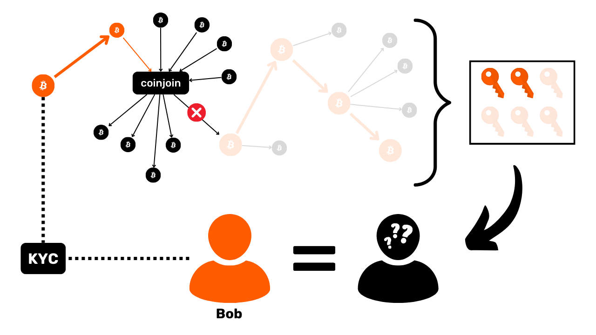

La privacidad en Bitcoin no debe verse de manera binaria, como una distinción entre bitcoins "anónimos" y otros que no lo son. Poseer bitcoins adquiridos a través de KYC no significa que todo esté perdido; por el contrario, el uso de herramientas de privacidad puede resultar aún más beneficioso.

Por el contrario, adquirir bitcoin a través de un método no-KYC no garantiza una privacidad perfecta y no exime a uno de la necesidad de tomar otras medidas de protección. Si posees bitcoin no-KYC pero reutilizas direcciones de recepción múltiples veces, tus transacciones pueden ser rastreadas y agrupadas. El más mínimo vínculo con el mundo fuera de Bitcoin podría comprometer la única capa de privacidad que tenías. Por lo tanto, es importante considerar todas las herramientas y métodos que mejoran la privacidad en Bitcoin como complementarios. Cada técnica aborda un riesgo específico y puede agregar una capa adicional de protección. Así, poseer bitcoin no-KYC absolutamente no exime a uno de tomar otras precauciones.

### ¿Se puede deshacer KYC?

A veces me preguntan si es posible "volver atrás" después de haber completado KYC, y como puedes imaginar a partir de los párrafos anteriores, la respuesta es matizada. Para evitar los riesgos asociados con KYC, el método más simple es no usarlo al adquirir bitcoins. Profundizaremos más en este tema en el próximo capítulo. Sin embargo, si ya se ha llevado a cabo KYC y se han comprado bitcoins, ¿existen formas de mitigar los riesgos incurridos?

En cuanto al riesgo de rastreabilidad de tus transacciones, el uso de coinjoin es una solución. Discutiremos este método en detalle más adelante en la formación, pero ten en cuenta que coinjoin puede romper el historial de una moneda y prevenir su rastreo pasado-presente y presente-pasado. Incluso para BTC obtenidos a través de una plataforma regulada, esta técnica puede prevenir su rastreabilidad.
Sin embargo, coinjoin no elimina el segundo riesgo asociado con KYC: el hecho de que el estado esté informado de tus tenencias de bitcoin. De hecho, incluso si tus monedas ya no son rastreables, el estado, dependiendo de la jurisdicción, puede tener acceso a tus declaraciones de disposición de criptoactivos. Dado que este riesgo no es técnico sino administrativo, no existen soluciones específicas de Bitcoin para eliminarlo, aparte de no exponerse inicialmente al KYC. El único enfoque legal para mitigar este riesgo es vender tus bitcoins adquiridos a través de plataformas reguladas en plataformas reguladas, y luego recomprarlos por medios sin KYC. Al vender y declarar la disposición, la administración debería notar que ya no los posees.
En cuanto al riesgo de que tus datos personales y documentos de identidad se filtren, este es un peligro externo a Bitcoin, y no hay una solución técnica para evitarlo. Una vez que tus datos se revelan, es difícil revertir esta operación. Puedes intentar cerrar tu cuenta en la plataforma, pero esto no garantiza la eliminación de tus datos de KYC, especialmente cuando la verificación de identidad es externalizada. Verificar la eliminación completa de tu información es imposible. Por lo tanto, no hay solución para prevenir completamente este riesgo y asegurar que ya no exista.

### La diferencia entre KYC y la identificación de claves

A veces, algunos bitcoiners tienden a extender el término "KYC" a cualquier intercambio de BTC que involucre una transferencia o un pago con tarjeta de crédito, ya que estos medios también pueden revelar el origen del pago, tal como lo haría KYC. Sin embargo, es importante no confundir KYC con la identificación de claves. Personalmente, debo admitir que mi percepción de este tema ha evolucionado con el tiempo.

KYC se refiere específicamente a un procedimiento regulatorio implementado por algunas empresas para verificar y registrar la identidad de sus clientes. Es algo binario: al adquirir tus bitcoins, o pasas por KYC, o no lo haces. Sin embargo, la identificación de claves, que concierne vincular un aspecto de la identidad de un usuario con la actividad onchain, no es tan binaria sino que representa un continuo. De hecho, en el contexto de adquirir o disponer de bitcoins, esta identificación siempre es posible en diferentes grados.
Por ejemplo, si compras bitcoins en una plataforma regulada en Suiza, KYC (Conoce a Tu Cliente) no es necesario. Sin embargo, podría haber una identificación de tus claves ya que la compra se realizó a través de tu cuenta bancaria. Aquí es donde los primeros dos riesgos asociados con KYC — facilitar el rastreo onchain y la exposición a la vigilancia estatal — también pueden manifestarse en un intercambio no-KYC. Si la entidad suiza informa transacciones sospechosas a las autoridades de tu país, simplemente pueden verificar la cuenta bancaria utilizada para la compra para descubrir tu identidad. Así, comprar sin KYC en plataformas reguladas está bastante alto en la escala de riesgo para la identificación de claves.


Sin embargo, evitar las plataformas reguladas y optar por métodos de adquisición P2P (Peer-to-Peer) no elimina completamente el riesgo de identificación de claves, sino que simplemente lo reduce. Considera el ejemplo de una compra en Bisq u otra plataforma P2P. Para liquidar con tu contraparte, probablemente usarás tu cuenta bancaria. Si las autoridades interrogan a la persona con la que comerciaste y piden tu nombre, nos encontramos con los riesgos 1 y 2 mencionados anteriormente. Estos riesgos son ciertamente mucho menores que durante una compra no-KYC en una plataforma, e incluso más reducidos que durante una compra con KYC, pero aún están presentes en menor medida.


Finalmente, incluso si adquieres tus bitcoins a través de un intercambio físico por efectivo, no eres completamente anónimo. La persona con la que intercambiaste ha visto tu rostro, que es parte de tu identidad. Aunque es mínimo en este ejemplo, todavía existe la posibilidad de una identificación clave.


En conclusión, durante un intercambio de bitcoins por otros activos, ya sea una compra en moneda fiduciaria o una venta por un bien real, siempre hay alguna forma de identificación clave. Dependiendo del método de intercambio elegido, esta identificación puede variar en intensidad. Es importante no confundir esta identificación con KYC, que es un proceso regulatorio bien definido. Sin embargo, hay una conexión entre KYC y el espectro de identificación, ya que KYC está en el extremo superior de este espectro, ya que facilita sistemáticamente la identificación de las claves del usuario por parte de las autoridades.

## Métodos de Venta y Adquisición

<chapterId>756598af-95aa-4c77-ac48-243c7ad89530</chapterId>
Después de leer el capítulo anterior, podrías estar preguntándote sobre maneras de comprar o vender bitcoin sin tener que someterte a un proceso de verificación de identidad, para evitar los riesgos asociados con KYC. Hay varios métodos para llevar a cabo intercambios.

### Intercambios P2P en Efectivo

Como hemos visto, el mejor método en términos de privacidad sigue siendo el intercambio P2P (peer-to-peer) con liquidación en efectivo. Este método te permite minimizar las huellas dejadas y reduce significativamente la posibilidad de identificación clave, ya seas comprador o vendedor.


Sin embargo, esta práctica conlleva riesgos para la seguridad personal. El principal peligro radica en el hecho de que durante el intercambio, la contraparte sabrá que posees una cantidad significativa, ya sea en efectivo o en bitcoins. Esta información puede atraer la atención de individuos malintencionados. De hecho, generalmente se recomienda ser discreto acerca de tu posesión de bitcoin. Este consejo también podría aplicarse al efectivo. Sin embargo, durante un intercambio en persona, es inevitable revelar que posees bitcoins, lo que puede despertar codicia.


Para limitar este riesgo, te aconsejo priorizar las transacciones en efectivo con personas de confianza, como miembros de la familia o amigos cercanos. Alternativamente, también podrías considerar hacer intercambios en [reuniones locales de Bitcoin](https://btcmap.org/communities/map), después de haber asistido varias veces. Esto te permitirá conocer mejor a los otros participantes y no estar solo durante el intercambio físico. Sin embargo, es importante reconocer que el intercambio P2P en efectivo conlleva inherentemente riesgos para tu seguridad personal que no existen al realizar compras a través de una plataforma regulada y tu cuenta bancaria.

Además, dependiendo de dónde vivas, llevar y almacenar grandes sumas de dinero puede representar riesgos, ya sea para bitcoin o efectivo.

El intercambio en efectivo también puede plantear riesgos legales durante controles policiales u otros. Aunque en la mayoría de los países, no hay restricción sobre la cantidad de efectivo que puedes llevar contigo, sumas demasiado grandes pueden levantar sospechas. Por lo tanto, sé cauteloso, especialmente si tienes que viajar largas distancias, y evita realizar transacciones demasiado grandes de una vez para no tener que justificar la posesión de cantidades significativas.
Finalmente, otra desventaja de las compras P2P es que el precio suele ser más alto que el observado en plataformas reguladas. Los vendedores a menudo imponen un recargo que varía desde el 1% hasta, a veces, más del 10%. Varias razones explican esta diferencia de precio. Primero, es una práctica común entre los vendedores P2P que se ha establecido con el tiempo. A continuación, los vendedores tienen tarifas de transacción asociadas con el envío de fondos al comprador. También hay un riesgo aumentado de robo en las ventas P2P en comparación con las transacciones en plataformas, lo que justifica una compensación por el riesgo asumido. Por último, el recargo puede estar relacionado con la demanda y la calidad del intercambio en términos de privacidad. Como comprador, la ganancia en privacidad tiene un precio que se refleja en el recargo aplicado por el vendedor. Algunos bitcoiners también creen que el precio aumentado de BTC comprado en P2P refleja su verdadero valor, y argumentan que los precios más bajos en plataformas reguladas son el resultado de un compromiso sobre la privacidad de tus datos personales. 

### Intercambios P2P a través de una Plataforma de Emparejamiento

Una alternativa menos riesgosa en términos de seguridad personal es realizar intercambios P2P exclusivamente en línea, a través de métodos de pago electrónicos como PayPal, transferencias bancarias o Revolut.


Este enfoque ayuda a evitar muchos riesgos asociados con las transacciones en efectivo. Sin embargo, el riesgo de que la contraparte no cumpla con sus compromisos durante un intercambio en línea es mayor. De hecho, durante un intercambio físico, si entregas dinero al vendedor que no te envía los bitcoins a cambio, puedes responsabilizarlo inmediatamente ya que está frente a ti. En línea, por otro lado, a menudo es imposible encontrar a una persona que te haya robado.


Para mitigar este riesgo, es posible utilizar plataformas especializadas en emparejamiento para intercambios P2P. Estas plataformas utilizan mecanismos de resolución de conflictos para proteger a los usuarios agraviados. Generalmente, ofrecen un sistema de depósito en garantía, donde los bitcoins se retienen hasta que el pago en moneda fiat es confirmado por el vendedor.


En términos de seguridad personal, este método de compra es significativamente más seguro que los intercambios físicos en efectivo. Sin embargo, como se mencionó anteriormente, los intercambios P2P en línea dejan más rastros que un intercambio físico, lo cual puede ser perjudicial para la privacidad en Bitcoin. Al usar un método de pago fiat en línea como un banco, expones más información que podría facilitar la identificación de claves.


Una vez más, recomiendo no realizar grandes intercambios en una sola transacción en estas plataformas. Al dividir tus transacciones, dispersas los riesgos asociados con el robo potencial por parte de la contraparte.
Una vez más, otra desventaja de las compras P2P es que el precio suele ser más alto que el visto en plataformas reguladas. Los vendedores a menudo imponen un margen que varía desde el 1% hasta a veces más del 10%. Varias razones explican esta diferencia de precio. Primero, es una práctica común entre los vendedores P2P que se ha establecido con el tiempo. Luego, los vendedores tienen tarifas de transacción asociadas con el envío de fondos al comprador. También hay un riesgo aumentado de robo en las ventas P2P en comparación con las transacciones en plataformas, lo que justifica una compensación por el riesgo asumido. Finalmente, el recargo puede estar relacionado con la demanda y la calidad del intercambio en términos de privacidad. Como comprador, la ganancia en privacidad tiene un precio que se refleja en el margen aplicado por el vendedor. Algunos bitcoiners también creen que el precio aumentado de BTC comprado P2P refleja su verdadero valor, y argumentan que los precios más bajos en plataformas reguladas son el resultado de un compromiso sobre la privacidad de tus datos personales.


En cuanto a soluciones, personalmente siempre he usado [Bisq](https://bisq.network/) y estoy muy satisfecho con ello. Su sistema está bien establecido y parece confiable. Sin embargo, Bisq solo está disponible en PC y su interfaz puede ser demasiado compleja para principiantes. Otro inconveniente es que Bisq opera únicamente con transacciones onchain, lo que puede volverse costoso durante períodos de altas tarifas de transacción en Bitcoin.

[-> Descubre nuestro tutorial sobre Bisq.](https://planb.network/en/tutorials/exchange/bisq)

Para una opción más simple, puedes probar [Peach](https://peachbitcoin.com/), una aplicación móvil que facilita la conexión entre compradores y vendedores con un sistema integrado de resolución de disputas. El proceso es más intuitivo que el de Bisq.

[-> Descubre nuestro tutorial sobre Peach.](https://planb.network/en/tutorials/exchange/peach-wallet)
Otra opción en línea es [HodlHodl](https://hodlhodl.com/), una plataforma bien establecida que ofrece buena liquidez, aunque personalmente no la he probado.
[-> Descubre nuestro tutorial sobre HodlHodl.](https://planb.network/en/tutorials/exchange/hodlhodl)

Para soluciones basadas en la Lightning Network, puedes probar [RoboSats](https://learn.robosats.com/) y [LNP2PBot](https://lnp2pbot.com/). RoboSats es accesible a través de un sitio web y es relativamente simple de usar. LNP2PBot es más atípico, ya que opera a través de un sistema de intercambio en la aplicación de mensajería Telegram.

[-> Descubre nuestro tutorial sobre RoboSats.](https://planb.network/en/tutorials/exchange/robosats)
[-> Descubre nuestro tutorial sobre LNP2PBot.](https://planb.network/en/tutorials/exchange/lnp2pbot)


### Plataformas Reguladas sin KYC

Dependiendo del país en el que vivas, podrías tener acceso a plataformas reguladas que no requieren un procedimiento KYC para comprar o vender bitcoins. En Suiza, por ejemplo, puedes usar plataformas como [Relai](https://relai.app/) y [MtPelerin](https://www.mtpelerin.com/).

[-> Descubre nuestro tutorial sobre Relai.](https://planb.network/en/tutorials/exchange/relai)
Como vimos en el capítulo anterior, este tipo de plataforma te ahorra los riesgos asociados con los procedimientos KYC, pero presentan un nivel de riesgo más alto para la identificación clave. En términos de privacidad en Bitcoin, estas plataformas por lo tanto ofrecen mejor protección que los métodos de compra con KYC, pero son menos interesantes que los intercambios P2P.
Sin embargo, en términos de seguridad personal, usar estas plataformas es significativamente menos riesgoso que los intercambios P2P. También suelen ser más simples de usar que las plataformas que facilitan los intercambios P2P.

### Cajeros automáticos

Otra opción para comprar o vender bitcoins sin KYC son los cajeros automáticos de criptomonedas (ATM). Personalmente, nunca he tenido la oportunidad de probar esta solución, ya que no hay ninguno en mi país. Pero este método puede ser muy interesante dependiendo de dónde vivas.


El problema con los cajeros automáticos es que están prohibidos en algunos países o están fuertemente regulados en otros. Si un cajero automático requiere un proceso de verificación de identidad, entonces enfrenta los mismos riesgos que aquellos inherentes a las plataformas KYC reguladas. Sin embargo, si el cajero automático permite transacciones sin verificación de identidad para pequeñas cantidades, entonces su uso puede ofrecer un nivel de privacidad comparable al de un intercambio P2P basado en efectivo, mientras se evitan la mayoría de los riesgos asociados con este tipo de intercambio.
El principal inconveniente de los cajeros automáticos radica en sus tarifas de cambio a menudo altas, que varían desde unos pocos por cientos hasta a veces el 15% del monto intercambiado.

### Tarjetas de Regalo

Finalmente, también quería presentar una solución que funciona bien para aquellos que desean usar sus bitcoins a diario para compras en lugar de venderlos por monedas fiat.

La mejor manera de gastar BTC es obviamente usar Bitcoin directamente o la Lightning Network para comprar bienes o servicios. Sin embargo, en muchos países, el número de comerciantes que aceptan bitcoin sigue siendo limitado. Una alternativa práctica es entonces el uso de tarjetas de regalo.

Varias plataformas que no requieren un procedimiento KYC ofrecen la posibilidad de intercambiar bitcoins por tarjetas de regalo que se pueden usar en tiendas importantes. Entre estas plataformas, encontramos [CoinsBee](https://www.coinsbee.com/), [The Bitcoin Company](https://thebitcoincompany.com/), y [Bitrefill](https://www.bitrefill.com/). Estas plataformas facilitan en gran medida el uso diario de tus bitcoins al permitirte acceder a una amplia gama de productos y servicios sin tener que pasar por una conversión a moneda fiat.


### Otros Métodos de Adquisición

Entre otros métodos para adquirir bitcoins mientras proteges tu privacidad, está obviamente la minería. Para comenzar a minar sats, no es necesario revelar tu identidad; simplemente necesitas encontrar una prueba de trabajo válida y enviarla a la red. Si optas por la minería en pool, algunos pools requieren una forma de identificación, como KYC, mientras que otros no.

Otro método consiste en trabajar a cambio de bitcoins. Este método de adquisición puede ser interesante, pero el grado de identificación requerido varía mucho dependiendo de las circunstancias.

\_Para escribir este capítulo, utilicé el curso [BTC205](https://planb.network/fr/courses/btc205) creado por [@pivi\_\_\_](https://x.com/pivi___) en PlanB Network (disponible solo en francés por el momento).\_

## Consolidación, Gestión de UTXO y CIOH

<chapterId>d0486c8f-332d-402b-ae2e-949416752b9c</chapterId>
Uno de los aspectos más complicados de gestionar cuando tienes tu propia cartera de autogestión es, sin duda, la consolidación. ¿Deberías consolidar? ¿Cuál es el propósito? ¿Qué tamaño de UTXO deberías buscar? ¿Cuáles son los compromisos en términos de privacidad? Esto es lo que intentaremos explorar en esta sección.

### ¿Qué es la consolidación?

El funcionamiento de Bitcoin es similar al de un mercado de subastas donde las transacciones que ofrecen las mejores comisiones son favorecidas por los mineros. Sin embargo, cada bloque tiene un peso máximo, limitando el número de transacciones que pueden incluirse. Dado que un bloque se produce en promedio cada 10 minutos, el espacio disponible en cada bloque es un recurso escaso.

Los mineros, cuya actividad incurre en costos significativos en electricidad, capital y mantenimiento, buscan naturalmente maximizar su rentabilidad. Tienden a favorecer transacciones que les ofrecen las comisiones más altas en relación con su peso.

De hecho, no todas las transacciones de Bitcoin pesan lo mismo. Aquellas con más entradas y salidas pesarán más. Por ejemplo, considera 2 transacciones:

- La transacción A incluye 1 entrada y 1 salida. Asigna 1,994 sats de comisiones y su peso es de 141 vB;
- La transacción B, más compleja, con 2 entradas y 2 salidas, asigna 2,640 sats de comisiones por un peso de 220 vB.


En este ejemplo, aunque la transacción B propone un total de comisiones más alto, los mineros favorecerán la transacción A porque ofrece una mejor relación entre comisiones y peso. Aquí está el cálculo para cada transacción, expresado en sats por byte virtual (sat/vB):

```text
TXA: 1994 / 141 = 14 sats/vB

TXB: 2640 / 220 = 12 sats / vB
```

Esto significa que por cada unidad de peso, la transacción A ofrece más comisiones que la transacción B, aunque esta última ofrezca más comisiones en valor absoluto.


Por lo tanto, siempre es más interesante para el usuario consumir la menor cantidad de entradas posible en sus transacciones. Sin embargo, es necesario consumir cantidades suficientes para poder satisfacer el pago en salida. Al gestionar su cartera, uno debe, por lo tanto, tener UTXOs suficientemente grandes.

El principio de la consolidación es precisamente aprovechar los períodos cuando las comisiones son bajas en Bitcoin para fusionar los pequeños UTXOs en uno solo más grande. Así, cuando las comisiones en Bitcoin aumentan, uno puede realizar transacciones con un mínimo de entradas, y por lo tanto, gastar menos en comisiones absolutas. El objetivo es planificar las transacciones obligatorias a realizar durante períodos de comisiones altas.

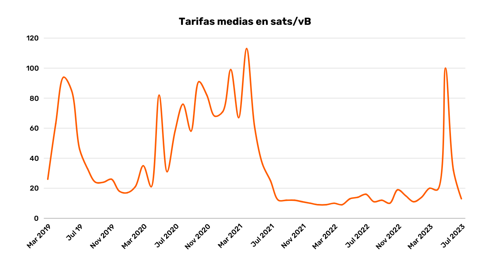
Además de ahorrar en comisiones de transacción, consolidar UTXOs ayuda a evitar la creación de "polvo". El polvo se refiere a UTXOs cuyo valor en sats es tan bajo que no es suficiente para cubrir las comisiones de transacción necesarias para gastarlos. Esto hace que estos UTXOs sean económicamente irracionales de usar mientras las comisiones de transacción permanezcan altas. Al agrupar proactivamente tus UTXOs, evitas que se conviertan en polvo, asegurando que todos tus fondos permanezcan utilizables.

### ¿Cuál es el tamaño mínimo para tus UTXOs?

A veces, me preguntan cuál es el valor mínimo recomendado para un UTXO. Desafortunadamente, no hay una respuesta universal, ya que depende de tus preferencias y de las condiciones del mercado para las comisiones. Sin embargo, aquí hay una fórmula que puede ayudarte a determinar un umbral adecuado a tus necesidades:

$$
\frac {P \times F}T = M
$$

Donde:

- $P$ es el peso de la transacción;
- $F$ representa la tasa máxima de comisión en satoshis por vbyte (sats/vB) que estás dispuesto a cubrir;
- $T$ es el porcentaje de la comisión de transacción que estás dispuesto a pagar en relación con el valor total del UTXO;
- $M$ es la cantidad mínima en satoshis para cada UTXO.

Suponiendo que planeas cubrir las comisiones para una transacción SegWit estándar con 1 entrada y 2 salidas, con un peso de 141 vB. Si cubres hasta 800 sats/vB, y estás dispuesto a gastar hasta un 12% del valor del UTXO en comisiones como máximo, entonces el cálculo sería:

$$
\frac{141 \times 800}{0.12} = 940\ 000
$$

En este ejemplo, sería prudente mantener un valor mínimo de 940,000 sats para los UTXOs en tu billetera.

### Consolidación y la COIH

Una de las heurísticas más utilizadas en el análisis de cadenas es la COIH (_Common Input Ownership Heuristic_), que permite asumir que todas las entradas de una transacción de Bitcoin pertenecen a la misma entidad. Precisamente, el principio de consolidación es consumir varios UTXOs como entradas y crear un único UTXO como salida. Por lo tanto, la consolidación permite la aplicación de la COIH.


En la práctica, esto significa que un observador externo puede deducir que todos los UTXOs consolidados probablemente pertenecen a la misma persona y que la única salida generada también les pertenece. Esta situación puede comprometer tu privacidad al vincular diferentes historias de transacciones. Por ejemplo, digamos que consolido 3 UTXOs adquiridos en P2P con un UTXO obtenido a través de una plataforma que requiere KYC:


Al hacerlo, cualquier entidad con acceso a los datos de la plataforma de intercambio, incluidas potencialmente las agencias gubernamentales, puede identificar que poseo otras cantidades en BTC. Anteriormente, estos UTXOs no estaban directamente vinculados a mi identidad; ahora, lo están. Además, esto revela a todas las fuentes que estoy en posesión de una cierta cantidad de bitcoins.

En la gestión de UTXOs, las consideraciones económicas, que impulsan la consolidación para reducir comisiones, entran en conflicto con las buenas prácticas de privacidad, que recomendarían nunca fusionar tus UTXOs. La elección entre economía y privacidad, por lo tanto, depende de las prioridades de cada usuario.

Si puedes evitar la consolidación mientras mantienes tamaños sustanciales de UTXO, eso es lo ideal. Para hacer esto, optimiza tus métodos de adquisición. Si compras tus bitcoins en DCA, intenta espaciar tus compras únicas tanto como sea posible para agrupar valor en menos UTXOs. Será más fácil gestionar una compra única de €1,000 cada 2 meses, en lugar de una compra de €120 cada semana. Esto minimiza el número de UTXOs generados y simplifica la gestión de tu billetera mientras preservas tu privacidad.
Si te encuentras en la necesidad de consolidar tus bitcoins, primero prioriza la consolidación de UTXOs de la misma fuente. Por ejemplo, fusionar 10 UTXOs de una sola plataforma afectará menos tu privacidad que mezclar 5 UTXOs de la plataforma A con 5 UTXOs de la plataforma B. Si la consolidación de diversas fuentes es inevitable, intenta separarlas según sus características. Por ejemplo, agrupa los UTXOs adquiridos a través de KYC en una transacción, y aquellos obtenidos en P2P en otra.
En cualquier caso, recuerda que cualquier consolidación lleva inevitablemente a una pérdida de privacidad. Por lo tanto, evalúa cuidadosamente la necesidad de esta operación y los impactos potenciales en tu privacidad, teniendo en cuenta el riesgo.

## Otras Buenas Prácticas

<chapterId>b5216965-7d13-4ea1-9b7c-e292966a487b</chapterId>

Exploraremos juntos algunas otras buenas prácticas que pueden ayudarte a optimizar tu privacidad en Bitcoin.

### El Nodo Completo

Tener tus bitcoins en auto-custodia es bueno, ¡pero usar tu propio nodo completo es mejor! Aquí te explicamos por qué tener tu propio nodo es crucial para un uso totalmente soberano de Bitcoin:

- **Resistencia a la Censura**: Tus transacciones no pueden ser bloqueadas por nadie;
- **Independencia de Terceros**: Ya no dependes de ningún servicio externo para verificar los datos de la blockchain;
- **Participación Activa**: Tienes la capacidad de establecer tus propias reglas de validación y participar directamente en el consenso;
- **Contribución a la Red**: Al ejecutar un nodo, ayudas a fortalecer y distribuir la red de Bitcoin;
- **Educación Técnica**: Gestionar un nodo completo es una excelente manera de profundizar tu conocimiento técnico sobre Bitcoin.

Además de estos beneficios, usar un nodo completo también mejora tu privacidad al transmitir tus transacciones. Cuando emites una transacción, primero se crea y firma a través de tu billetera. Para transmitirla en la red de Bitcoin, debe ser conocida por al menos un nodo. Al usar tu propio nodo, controlas directamente esta transmisión, mejorando así tu privacidad y limitando los riesgos de fuga de datos.


Si no tienes tu propio nodo de Bitcoin, te verás obligado a usar el de un tercero, como el que ofrece el proveedor de software de tu billetera. Además de la transmisión de transacciones, tu billetera requiere acceso a varios tipos de información, como transacciones pendientes, saldos asociados con tus direcciones o el número de confirmaciones para tus transacciones. Para acceder a todos estos datos, necesitas consultar un nodo.


El principal riesgo cuando no usas tu propio nodo de Bitcoin es que el operador del nodo de terceros pueda observar tus actividades en la blockchain, o incluso compartir esta información con otras entidades. Para limitar este riesgo, una solución intermedia es usar software de billetera que te permita enmascarar tus conexiones a través de Tor. Esto puede reducir la exposición de tus datos. Sin embargo, la solución óptima sigue siendo tener tu propio nodo de Bitcoin y usarlo para la transmisión de tus transacciones. Obviamente, también necesitarás asegurarte de que no se filtre ninguna información desde tu nodo, pero ese es otro tema que exploraremos en las siguientes secciones.
Más allá de la obvia ventaja para tu privacidad, tener tu propio nodo completo también asegura la veracidad de los datos en la blockchain, protege contra la censura y te permite participar activamente en la gobernanza de Bitcoin. Al usar tu propio nodo, contribuyes con tu peso económico a la cadena de tu elección, lo cual es importante durante conflictos dentro de la comunidad, como durante la Guerra del Tamaño de Bloque de 2015 a 2017, por ejemplo. En el evento de una bifurcación, usar el nodo de un tercero podría llevarte a apoyar una cadena que no deseas favorecer, ya que el operador del nodo toma la decisión por ti. Como puedes entender, en una preocupación por la privacidad y más ampliamente la soberanía individual, ¡es esencial ejecutar y usar tu propio nodo completo!

### Engañando a las Heurísticas de Análisis

Más ampliamente, es importante entender las heurísticas de las que hablamos en la parte anterior, para mejor evitarlas o engañarlas. Adoptar una serie de buenas prácticas puede resultar beneficioso, incluso si no son indispensables. Ofrecen una capa adicional de protección que puede ser importante para mantener una buena privacidad al usar Bitcoin.

El primer consejo que podría dar es mezclarse con la multitud más densa. En Bitcoin, esto significa usar los patrones de script más adoptados. Por ejemplo, los scripts P2WSH, a menudo utilizados para configuraciones multisig de SegWit V0, son muy raros. No te permiten esconderte en un gran conjunto de anonimato. Lo mismo ocurre con modelos antiguos como P2PKH o P2SH. Aunque están ampliamente presentes en el conjunto de UTXO, se están utilizando cada vez menos para nuevas transacciones.

En general, es más seguro optar por el estándar de script más reciente, siempre que esté suficientemente adoptado. Así, si en 2022, hubiera aconsejado contra el uso de P2TR (Taproot) debido a su baja adopción, para 2024, recomendaría optar por este tipo de script, o en su defecto, por el script de SegWit V0, ya que el número de transacciones que usan P2TR está empezando a representar una porción muy significativa.


Fuente: [txstats.com](https://txstats.com/d/000000054/utxo-set-repartition-by-output-type)
Otro consejo para preservar tu privacidad es intentar eludir las heurísticas internas de las transacciones. Por ejemplo, al hacer un pago, podrías intentar evitar crear una salida con una cantidad redonda, ya que esto podría señalar que la otra salida representa el cambio. Si necesitas enviar 100k sats a un amigo, considera transferir una cantidad ligeramente superior para escapar de esta heurística. De manera similar, intenta no crear salidas de cambio que sean desproporcionadamente altas en comparación con el pago realizado, ya que esto también podría revelar cuál de las salidas representa el cambio.


Finalmente, si realizas transacciones de Bitcoin de manera regular, asegúrate de no transmitirlas siempre a las mismas horas. Al esparcir la transmisión de tus transacciones a lo largo del día y la semana, evitas dar a los observadores externos la capacidad de detectar un patrón temporal basado en zonas horarias que podría mejorar su análisis.

Más allá de todas estas buenas prácticas a adoptar diariamente, hay métodos aún más efectivos para romper completamente la trazabilidad de tus bitcoins. Entre ellos, obviamente, están las transacciones coinjoin que estudiaremos en profundidad en la siguiente parte.

# Entendiendo las Transacciones Coinjoin

<partId>6d0bbf16-3714-4db1-9897-2d45019f6bdc</partId>

## ¿Qué es una Transacción Coinjoin?

<chapterId>0862bc6b-1c48-4aa4-b76d-4f547b469008</chapterId>
Después de estudiar los fundamentos de la protección de la privacidad, ahora discutiremos técnicas más sofisticadas dirigidas a defender activamente tu privacidad, particularmente mediante la disociación del historial de tus bitcoins. En la siguiente parte, exploraremos muchas técnicas pequeñas, pero primero, quiero hablarte sobre coinjoin.

Coinjoin es a menudo considerado el método más efectivo para proteger la privacidad de los usuarios de Bitcoin. Pero, ¿qué es exactamente una transacción coinjoin? Descubrámoslo juntos.

### Los Principios Básicos de Coinjoin

Coinjoin es una técnica que rompe la trazabilidad de los bitcoins en la blockchain. Se basa en una transacción colaborativa con una estructura específica del mismo nombre: la transacción coinjoin.
Como hemos visto en las primeras partes de esta formación, las transacciones en Bitcoin son conocidas por todos los usuarios a través de su nodo. Por lo tanto, es fácil verificar la cadena de firmas electrónicas de cada moneda y observar su historial. Esto significa que todos los usuarios pueden intentar analizar las transacciones de otros usuarios. Como resultado, la anonimidad a nivel de transacción es imposible. Sin embargo, la anonimidad se preserva a nivel de identificación individual. A diferencia del sistema bancario tradicional donde cada cuenta está vinculada a una identidad personal, en Bitcoin, los fondos están asociados con pares de claves criptográficas (o scripts), ofreciendo así a los usuarios una forma de pseudonimato detrás de identificadores criptográficos.


Por lo tanto, la confidencialidad en Bitcoin se ve comprometida cuando observadores externos logran asociar UTXOs específicos con usuarios identificados. Una vez que esta asociación se establece, se vuelve posible rastrear sus transacciones y analizar el historial de sus bitcoins. Coinjoin es precisamente una técnica desarrollada para romper la trazabilidad de los UTXOs, con el fin de ofrecer una cierta capa de confidencialidad a los usuarios de Bitcoin a nivel de transacción.

Los coinjoins mejoran la confidencialidad de los usuarios de Bitcoin complicando el análisis de cadena para observadores externos. Su estructura permite fusionar varias monedas de diferentes usuarios en una sola transacción, difuminando así las pistas y dificultando determinar los vínculos entre direcciones de entrada y salida.

Es importante entender que el objetivo de una transacción coinjoin es romper el historial de una moneda. Esta técnica no confiere anonimato permanente ni bloquea definitivamente el rastreo de bitcoins, contrario a lo que uno podría pensar. El coinjoin apunta solo a romper el historial en el punto donde se realiza la transacción coinjoin. Sin embargo, antes y después de esta operación, la moneda sigue sujeta a los mismos riesgos de privacidad.


### ¿Cómo funcionan los coinjoins?

El principio del coinjoin se basa en un enfoque colaborativo: varios usuarios que desean mezclar sus bitcoins depositan cantidades idénticas en entradas de la misma transacción. Estas cantidades luego se redistribuyen en salidas de valores iguales a cada usuario.


Al final de la transacción, se vuelve imposible asociar una salida específica con un usuario conocido en entrada. No existe un vínculo directo entre las entradas y salidas, lo que rompe la asociación entre los usuarios y sus UTXOs, así como el historial de cada moneda.


Tomemos el ejemplo de Alice. Ella quiere enviar alrededor de 100,000 sats a su hermana Eve por su cumpleaños. Sin embargo, Alice no quiere que Eve pueda rastrear el historial de sus transacciones porque no quiere revelar cuántos bitcoins posee o cómo los obtuvo. Para hacer esto, Alice decide romper el historial de su UTXO con una transacción coinjoin. Se organiza con Bob, Charles, David y Frank para llevar a cabo una transacción colaborativa: Alice, Bob, Charles, David y Frank comprometen cada uno un UTXO de 105,000 sats (con 5,000 sats para las tarifas de minería) como entradas para la transacción:

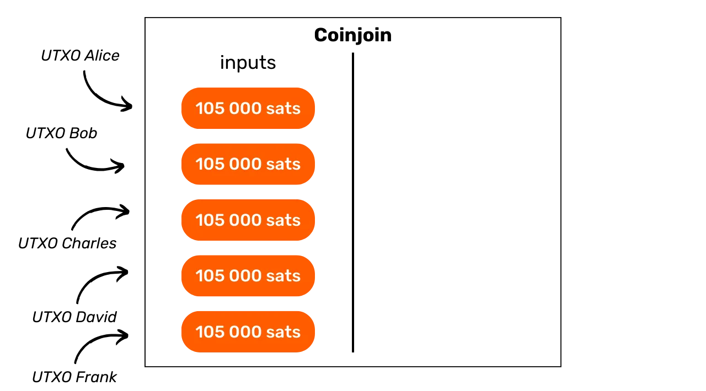

- A cambio de consumir estas entradas, cada uno genera una dirección nueva para crear cinco salidas idénticas de 100,000 sats cada una. Cada uno recupera una salida:


- Alice termina con un UTXO de 100,000 sats cuyo historial está mezclado. Ella usa este UTXO en una nueva transacción para enviar el monto a Eve por su cumpleaños:


- Si Eve intenta analizar esta transacción para extraer información, se enfrentará con la transacción coinjoin que involucra a Alice, Bob, Charles, David y Frank. Al no poder distinguir a qué entrada pertenece quién debido a la uniformidad de los montos, Eve no puede rastrear el historial del UTXO de Alice, ni determinar cuántos bitcoins posee su hermana o cómo los adquirió:


En este escenario, Alice utilizó la técnica coinjoin para aumentar su privacidad contra el análisis retrospectivo. De hecho, Alice se protege contra un posible análisis por parte de Eve que comenzaría desde una transacción específica para rastrear el historial del UTXO hacia atrás. Esta protección contra el análisis del presente al pasado es lo que llamamos anonset retrospectivo. Profundizaremos en este concepto con más detalle en los últimos capítulos de esta parte.

Sin embargo, coinjoin también ofrece la posibilidad de mejorar la privacidad contra el análisis del pasado al presente, lo que se denomina anonset prospectivo. Volvamos a nuestro ejemplo donde Alice envió 98,000 sats a Eve por su cumpleaños, pero invirtiendo los roles. Ahora imagina que es Eve quien está preocupada por su privacidad. De hecho, a Alice podría tentarle seguir la moneda que envió a Eve para recopilar información. Eve podría consolidar este UTXO que acaba de recibir con todos sus otros UTXOs, lo que podría revelar a Alice la cantidad de bitcoins que posee en su billetera. Para evitar esto, Eve también puede romper el historial de la moneda que acaba de recibir.

- Eve, Grace, Mallory, Oscar y Victor ponen cada uno un UTXO de 98,000 sats como entradas en una transacción de Bitcoin:
  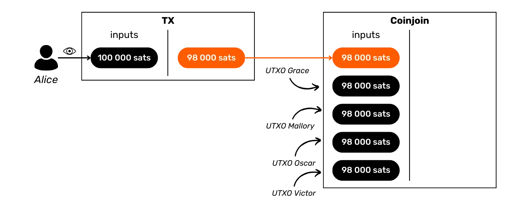

- A cambio de consumir estas entradas, cada uno proporciona una dirección nueva para crear 5 salidas de 97,500 sats cada una, perfectamente iguales. Cada usuario recupera una salida:


- Eve ahora posee un UTXO de 97,500 sats con un historial roto. Puede usarlo sin temor para futuras transacciones. De hecho, si Alice intenta seguir los bitcoins que envió a Eve, se encontrará con una transacción coinjoin. Será incapaz de determinar a qué UTXO de salida pertenece Eve. El análisis entonces se vuelve imposible:


En el primer ejemplo, vimos cómo coinjoin puede proteger la privacidad de una moneda en relación con su pasado, y en el segundo ejemplo, cómo también puede asegurar la historia de una moneda en relación con su futuro. Es por eso que mencioné que coinjoin debería ser visto como un evento único que segmenta la historia de una moneda en ambas direcciones:


### Mezclado, coinjoins, mezcladores... ¿Cuál es la diferencia?

El término "mezclado" a veces se usa para describir coinjoins, un término que algunos bitcoiners rechazan porque temen confusión con los mezcladores custodios. Sin embargo, creo que esta aprensión es infundada, porque, en un contexto matemático, coinjoin encarna el concepto de mezclado precisamente.

En el campo general de las matemáticas, mezclar se refiere a la propiedad de un sistema dinámico donde, después de algún tiempo, todas las porciones del espacio inicial pueden teóricamente mezclarse con cualquier otra porción. Mezclar implica que la posición de una partícula o el estado de un sistema evoluciona de tal manera que su distribución futura es independiente de su distribución inicial, alcanzando así un estado donde las características del estado inicial están uniformemente distribuidas a través del espacio del sistema. Esto es exactamente lo que sucede en un coinjoin con bitcoins. Por lo tanto, en mi opinión, coinjoin es verdaderamente un método de mezclar monedas.


Sin embargo, es importante distinguir coinjoin de los mezcladores. Un mezclador es un servicio donde los usuarios envían sus bitcoins para ser mezclados. Estos servicios fueron populares durante la década de 2010, pero su uso ha disminuido debido a dos desventajas principales en comparación con coinjoin:

- Requieren que el usuario renuncie a la custodia de sus fondos durante el proceso de mezcla, lo que los expone a riesgos de robo;
- No hay garantía de que el mezclador no registre los detalles de las transacciones, o incluso venda esta información a empresas de análisis de cadena.
  

Hoy en día, los usuarios prefieren por lo tanto coinjoin, ya que les permite mantener el control total sobre sus fondos durante todo el proceso. Los participantes en un coinjoin no corren el riesgo de que sus bitcoins sean robados por otras partes involucradas. Exploraremos juntos cómo todo esto es posible en el próximo capítulo.

## Zerolink y Chaumian Coinjoins

<chapterId>326c9654-b359-4906-b23d-d6518dd5dc3e</chapterId>

La privacidad proporcionada por un coinjoin se gana en el tamaño del grupo en el que nuestra pieza está oculta. Por lo tanto, es necesario encontrar tantos participantes como sea posible. Es totalmente posible realizar un coinjoin manualmente, con usuarios que uno ha encontrado por sí mismo, pero este método es complejo, y no permite lograr grandes anonsets.

Es por esto que los coordinadores de coinjoin se han desarrollado en Bitcoin. Su rol es conectar diferentes usuarios y transmitir la información necesaria para la finalización exitosa de la transacción colaborativa.


Pero, ¿cómo podemos asegurarnos de que el coordinador nunca tenga control sobre los bitcoins de los usuarios, y a pesar de que son ellos quienes construyen la transacción coinjoin, cómo podemos asegurarnos de que no puedan vincular las entradas y salidas de los usuarios, lo que podría constituir una fuga de privacidad?

### Firmas Ciegas de Chaum

Las implementaciones modernas de coinjoin utilizan las firmas ciegas de David Chaum para evitar la fuga de información. Estudiemos rápidamente juntos cómo funcionan estas firmas ciegas.
Las firmas ciegas de Chaum son una forma de firma digital donde el emisor de una firma no conoce el contenido del mensaje que está firmando. Sin embargo, la firma puede ser verificada más tarde con el mensaje original. Esta técnica fue desarrollada por el criptógrafo David Chaum en 1983.


Tomemos el ejemplo de una empresa que desea autenticar un documento confidencial, como un contrato, sin revelar su contenido. La empresa aplica un proceso de enmascaramiento que transforma criptográficamente el documento original de manera reversible. Este documento modificado se envía a una autoridad de certificación que aplica una firma ciega sin conocer el contenido subyacente. Después de recibir el documento firmado, la empresa desenmascara la firma. El resultado es un documento original autenticado por la firma de la autoridad, sin que la autoridad haya visto nunca el contenido original.

Las firmas ciegas de Chaum permiten así la certificación de la autenticidad de un documento sin conocer su contenido, lo que garantiza tanto la confidencialidad de los datos del usuario como la integridad del documento firmado.

### Chaumian Coinjoins

En los "Chaumian CoinJoins", el uso de Tor y las firmas ciegas de David Chaum se combinan para asegurar que el coordinador no pueda saber qué salida pertenece a qué usuario. El proceso de construcción de la transacción coinjoin gira en torno a 3 pasos principales: registrar las entradas, registrar las salidas y firmar la transacción. Examinemos este proceso a través del ejemplo de Alice, una de las participantes en el coinjoin. Todos los demás participantes siguen los mismos pasos que Alice, cada uno por su cuenta.

**Paso 1: Registrar las entradas.**

- Alice envía al coordinador el UTXO que desea usar como entrada para la transacción, así como la dirección de recepción enmascarada que quiere usar como salida para recibir sus bitcoins. Por lo tanto, el coordinador no puede conocer la dirección de Alice. Él ve solo su versión enmascarada:


- El coordinador verifica la validez de las entradas, luego firma la dirección enmascarada de Alice con su clave privada. Le envía a Alice la firma ciega:


**Paso 2: Registrar las salidas.**

- Alice ahora puede desenmascarar su dirección firmada por la clave privada del coordinador. Establece una nueva conexión bajo una identidad Tor diferente. El coordinador no puede identificar que es Alice conectándose bajo esta nueva identidad:


- Alice envía la dirección desenmascarada y la firma al coordinador (quien aún no sabe que es Alice):


**Paso 3: Firmar la transacción.**

- El coordinador recupera de manera similar las salidas desenmascaradas de todos los participantes. Gracias a las firmas asociadas, puede verificar que cada salida enviada anónimamente fue efectivamente firmada por su clave privada previamente, asegurando su legitimidad. Luego está listo para construir la transacción coinjoin y la envía a los participantes para que la firmen:


- Alice, al igual que los otros participantes, verifica que su entrada y salida estén correctamente incluidas en la transacción construida por el coordinador. Si todo es satisfactorio, envía la firma que desbloquea el script de su entrada al coordinador:


- Después de recopilar las firmas de todos los participantes del coinjoin, el coordinador puede transmitir la transacción en la red Bitcoin, para que pueda ser agregada a un bloque.
  En este sistema, el coordinador no puede vincular una entrada con una salida específica. Además, no pueden tomar posesión de los fondos de los participantes, ya que nunca tienen acceso a las claves privadas necesarias para desbloquear sus UTXOs. A lo largo del proceso, y hasta el final del paso 3, tampoco tienen acceso a las firmas. Cuando Alice y los demás participantes firman la transacción global, después de asegurarse de que todo está correcto, el coordinador ya no puede modificar esta transacción, incluidos los outputs, sin invalidarla. Esto, por lo tanto, previene el robo de bitcoins por parte del coordinador.
  Finalmente, al registrar su salida en la transacción, el usuario de coinjoin desea garantías similares a las de un ciudadano votando en una elección. Hay una dualidad entre los aspectos públicos y privados de estas acciones. Por un lado, está lo que uno desea mantener privado: para el votante, no quieren que su voto esté vinculado a su identidad; para el usuario de coinjoin, no quieren que su salida esté asociada con su entrada. De hecho, si el coordinador, o cualquier otra parte, logra establecer un vínculo entre una entrada y una salida, el coinjoin pierde todo su propósito. Como se explicó anteriormente, el coinjoin debe funcionar como una ruptura en la historia de una moneda. Esta parada ocurre precisamente debido a la imposibilidad de asociar una entrada específica con una salida específica en la transacción de coinjoin (anonset prospectivo) y viceversa (anonset retrospectivo).

Por otro lado, está el aspecto público: el votante quiere asegurarse de que su voto esté incluido en la urna; de manera similar, el usuario de coinjoin quiere asegurarse de que su salida esté incluida en la transacción de coinjoin. De hecho, es absolutamente necesario que los participantes del coinjoin puedan verificar la presencia de su salida antes de firmar la transacción, de lo contrario, el coordinador podría robar los fondos.

Son precisamente estos 2 aspectos públicos y privados, posibilitados por el uso de las firmas ciegas de David Chaum, los que garantizan a los participantes de los coinjoins de Chaum que sus bitcoins no serán robados, y que sus fondos no pueden ser rastreados.

### ¿Quién inventó el concepto de coinjoin?

Es difícil determinar con certeza quién introdujo por primera vez la idea de coinjoin en Bitcoin, y quién tuvo la idea de usar las firmas ciegas de David Chaum en este contexto. A menudo se piensa que fue Gregory Maxwell quien primero habló de ello en [un mensaje en BitcoinTalk en 2013](https://bitcointalk.org/index.php?topic=279249.0):
Usando Firmas Ciegas de Chaum: Los usuarios inician sesión y proporcionan entradas (y direcciones de cambio) así como una versión criptográficamente cegada de la dirección a la que desean enviar sus monedas privadas; el servidor firma los tokens y los devuelve a los usuarios. Los usuarios se reconectan de forma anónima, desenmascaran sus direcciones de salida y las envían de vuelta al servidor. El servidor puede ver que todas las salidas han sido firmadas por él y que, en consecuencia, todas las salidas provienen de participantes válidos. Más tarde, las personas se reconectan y firman.
Maxwell, G. (2013, 22 de agosto). _CoinJoin: Privacidad en Bitcoin para el mundo real_. Foro de BitcoinTalk. https://bitcointalk.org/index.php?topic=279249.0


Sin embargo, hay menciones anteriores, tanto para las firmas de Chaum en el contexto de mezclado, como para los coinjoins. [En junio de 2011, Duncan Townsend presentó en BitcoinTalk](https://bitcointalk.org/index.php?topic=12751.0) un mezclador que utiliza firmas de Chaum de una manera bastante similar a los coinjoins chaumianos modernos.
En el mismo hilo, hay [un mensaje de hashcoin en respuesta a Duncan Townsend](https://bitcointalk.org/index.php?topic=12751.msg315793#msg315793) para mejorar su mezclador. El proceso descrito en este mensaje representa precisamente lo que más se asemeja a los coinjoins. También hay una mención de un sistema similar en [un mensaje de Alex Mizrahi en 2012](https://gist.github.com/killerstorm/6f843e1d3ffc38191aebca67d483bd88#file-laundry), mientras asesoraba a los creadores de Tenebrix, una de las primeras altcoins que sirvió como base para crear Litecoin más adelante. Incluso el término "coinjoin" en sí no fue inventado por Greg Maxwell, sino que provino de una idea de Peter Todd.


### Zerolink

Zerolink es un protocolo de mezclado integral que integra coinjoins chaumianos y varias estrategias para proteger el anonimato de los usuarios contra varias formas de análisis de cadena, minimizando notablemente los errores relacionados con la gestión de billeteras. Este protocolo [fue introducido por nopara73 y TDevD en 2017](https://github.com/nopara73/ZeroLink/blob/master/README.md).


Como su nombre sugiere, el principio de Zerolink es llevar a cabo transacciones coinjoin que aseguran la imposibilidad de rastrear los enlaces entre las entradas y salidas. Esta característica se logra asegurando que todas las salidas presenten montos perfectamente idénticos.


Una medida preventiva importante por parte de Zerolink implica separar completamente los UTXOs no mezclados de los UTXOs mezclados utilizando conjuntos distintos de claves criptográficas, o incluso billeteras separadas. De esta manera, la billetera "pre-mezcla", destinada a monedas antes de mezclar, se diferencia de la billetera "post-mezcla", reservada para monedas que han sido mezcladas.


Esta estricta separación de UTXOs sirve principalmente para prevenir asociaciones accidentales entre un UTXO mezclado y uno no mezclado. De hecho, si tales enlaces ocurren, la efectividad del coinjoin en el UTXO mezclado se anula sin que el usuario sea consciente, comprometiendo así la confidencialidad de un UTXO cuya historia creían haber cortado. Estos enlaces pueden surgir ya sea por reutilización de direcciones al asegurar un UTXO mezclado con uno no mezclado, o aplicando la Heurística de Propiedad Común de Entrada (CIOH, por sus siglas en inglés), si el usuario consume UTXOs mezclados y no mezclados como entradas de la misma transacción. Al separar las billeteras de pre-mezcla y post-mezcla, se evitan estas asociaciones accidentales, y el usuario está protegido contra errores involuntarios.


Esta separación también ofrece la posibilidad de aplicar reglas distintas entre las carteras de pre-mezcla y post-mezcla a nivel del software de la cartera. Por ejemplo, en la cartera post-mezcla, el software puede prohibir la fusión de UTXOs en entradas para prevenir la aplicación del CIOH, lo cual comprometería el conjunto anónimo del usuario. También es posible estandarizar el uso de scripts y opciones de transacción (como la señalización de RBF, por ejemplo) para prevenir la identificación por huellas de cartera.

Actualmente, Whirlpool es la única implementación de coinjoin que aplica rigurosamente el protocolo Zerolink. En el siguiente capítulo, exploraremos las diferentes implementaciones de coinjoin existentes y las ventajas y desventajas de cada una.

## Implementaciones de Coinjoin

<chapterId>e37ed073-9498-4e4f-820b-30951e829596</chapterId>

_En 2024, estamos presenciando cambios significativos en las herramientas disponibles para los usuarios que desean realizar coinjoins en Bitcoin. Actualmente estamos en un período pivotal, y el mercado de coinjoin está experimentando una reestructuración mayor. Por lo tanto, es probable que este capítulo se actualice con el tiempo._

Por el momento, hay principalmente 3 diferentes implementaciones de coinjoin en Bitcoin:

- Whirlpool;
- Wabisabi;
- JoinMarket.
  Cada una de estas implementaciones tiene como objetivo romper el historial de los UTXOs a través de transacciones coinjoin. Sin embargo, sus mecanismos varían significativamente. Por lo tanto, es esencial entender cómo funciona cada una para elegir la opción más adecuada para tus necesidades.

### JoinMarket

JoinMarket, creado en 2015 por Adam Gibson y Chris Belcher, se distingue de otras implementaciones de coinjoin gracias a su modelo único de emparejamiento de usuarios. Este sistema se basa en un mercado de intercambio P2P donde algunos usuarios, los "creadores", ponen a disposición sus bitcoins para mezclar, mientras que otros, los "tomadores", usan estos fondos para realizar coinjoins a cambio de una tarifa.


En este modelo, los "creadores" dejan sus bitcoins disponibles para los "tomadores" y reciben tarifas a cambio de su servicio. Los "tomadores", por otro lado, pagan para usar los bitcoins de los "creadores" para llevar a cabo sus propias transacciones coinjoin. Las tarifas del servicio varían dependiendo del rol: los "creadores" acumulan tarifas por su oferta de liquidez, mientras que los "tomadores" pagan las tarifas. Este mercado opera libremente sin condiciones de uso.

Uno de los principales inconvenientes de JoinMarket es su complejidad de uso, que requiere cierta familiaridad con terminales para explotarlo eficientemente. Aunque esta complejidad no es una barrera para un usuario experimentado, puede limitar el acceso al público general. Sin embargo, la reciente introducción de una interfaz web llamada JAM ha facilitado algo su uso.


Fuente: [JAM](https://github.com/joinmarket-webui/jam/blob/devel/docs/assets/screenshot-dark.webp)

Sin embargo, la barrera técnica sigue siendo un obstáculo importante. En el ecosistema de coinjoin, donde la confidencialidad se mejora con el número de participantes, cualquier limitación que reduzca la accesibilidad afecta directamente la liquidez disponible, que es un factor crucial para la eficiencia de la mezcla. Bitcoin, ya de por sí un nicho en las transacciones financieras, ve su uso de coinjoins como un sub-nicho, y JoinMarket representa una fracción aún más especializada, restringiendo así su potencial para aumentar los conjuntos anónimos de sus usuarios.
A pesar de su innovador modelo P2P de emparejamiento para coinjoins, JoinMarket tiene algunas desventajas significativas, especialmente en términos de estructura transaccional. A diferencia de otras implementaciones como Whirlpool, JoinMarket no garantiza una igualdad perfecta entre las salidas, y es posible rastrear enlaces determinísticos entre entradas y salidas. Además, carece de herramientas para prevenir que monedas que ya han sido mezcladas juntas sean mezcladas de nuevo, lo que podría comprometer la confidencialidad buscada por los usuarios. Finalmente, aunque el concepto de JoinMarket es interesante, especialmente para aquellos interesados en un mercado de liquidez dinámico, sus debilidades estructurales y complejidad técnica lo hacen, en mi opinión, menos atractivo, tanto para novatos como para expertos que buscan una implementación de coinjoin.

### Wabisabi

Wabisabi es otra implementación de coinjoin, con un enfoque que centraliza la coordinación de transacciones. Este modelo fue diseñado por Ádám Ficsór (nopara73), Yuval Kogman, Lucas Ontivero e István András Seres en 2021, y fue integrado en el software Wasabi 2.0 el año siguiente. Wabisabi es precisamente una evolución del modelo de coinjoin del software Wasabi lanzado en 2018.


Hacia finales de la década de 2010, Wasabi adoptó una estructura de transacción para sus coinjoins que era radicalmente diferente a la de Whirlpool. Para aumentar los anonsets de sus participantes, Wasabi utilizó transacciones de coinjoin muy grandes agrupando docenas de participantes. En contraste, Whirlpool optó por múltiples transacciones pequeñas, permitiendo un aumento exponencial en anonsets con cada ciclo.

Los métodos de manejo de cambio también distinguieron las dos implementaciones. Con Whirlpool, el cambio fue excluido y aislado de los UTXOs antes de los ciclos de coinjoin gracias al TX0, un concepto que explicaré más adelante en el próximo capítulo. En Wasabi, por otro lado, el cambio formó una de las salidas de la transacción de coinjoin, lo que mantuvo enlaces determinísticos entre ciertas entradas y salidas.


Con Wabisabi, la versión 2.0 de Wasabi adaptó su enfoque a coinjoins para acercarse más al de Whirlpool. Aunque las transacciones de coinjoin siguen siendo muy grandes, ahora es posible encadenar varios ciclos sucesivos, siguiendo así el modelo de Whirlpool. También se ha hecho un esfuerzo particular en la gestión del cambio: a diferencia de Wasabi 1.0, donde el cambio estaba directamente vinculado a las entradas de los usuarios, Wabisabi busca subdividir el cambio en varias pequeñas cantidades, distribuidas en denominaciones iguales para todos los participantes.

Ilustremos esto con un ejemplo simplificado que involucra solo a 2 usuarios: Alice quiere mezclar 115,000 sats y Bob, 210,000 sats. Ignorando las comisiones, con Wasabi 1.0, una transacción de coinjoin habría generado 3 salidas de 100,000 sats, más 1 cambio de 15,000 sats para Alice y 1 cambio de 10,000 sats para Bob. Las salidas de cambio siempre estarían vinculadas a las entradas:


Bajo Wabisabi, la misma transacción habría producido 3 salidas de 100,000 sats y 5 salidas de 5,000 sats, dispersando así el cambio de manera que no es directamente rastreable a una entrada específica:

Personalmente, encuentro que la gestión del cambio en Wabisabi presenta varios riesgos que podrían comprometer su efectividad en términos de privacidad:

- Cuando un usuario contribuye con un UTXO significativamente mayor que los de otros participantes, inevitablemente termina con una cantidad de cambio que estará vinculada a su entrada. Esto va en contra del objetivo inicial del protocolo, que busca eliminar cualquier cambio identificable;
- La multiplicación de denominaciones para fragmentar el cambio puede, paradójicamente, dañar la eficiencia del mezclado. Este proceso puede llevar a una disminución en los anonsets para ciertas salidas, ya que se vuelven más fácilmente identificables;
- Este método también genera UTXOs de bajo valor que plantean un problema de gestión para el usuario. Estos pequeños UTXOs, si se vuelven demasiado costosos para gastar en relación con su valor, pueden convertirse en "polvo". Este fenómeno empuja al usuario a fusionar varios UTXOs en entradas en sus futuras transacciones o a consolidarlos. En ambos casos, debido al COH, esto puede disminuir los anonsets obtenidos o cancelar completamente los beneficios de privacidad adquiridos por el coinjoin inicial.

A diferencia de Whirlpool, que implementa el protocolo ZeroLink asegurando una separación rigurosa entre los UTXOs pre-mezcla y post-mezcla, Wabisabi no mantiene esta segregación estricta. También ha habido problemas con la reutilización de direcciones por algunos clientes de Wasabi, lo cual es obviamente muy perjudicial para el usuario.

En la versión 2.0 de Wasabi, se ha implementado una nueva política de tarifas de coinjoin. Ahora, las tarifas del coordinador se establecen en el 0.3% para UTXOs mayores a 0.01 bitcoin, mientras que para UTXOs más pequeños, estas tarifas se eximen completamente. Además, los remixes para estos pequeños UTXOs son gratuitos, aunque las tarifas de minería siguen siendo responsabilidad del usuario para todas las transacciones, incluidos los remixes.

Esta política contrasta con la de Whirlpool, donde las tarifas permanecen fijas, independientemente del tamaño de los anonsets obtenidos. Con Wasabi 2.0, aunque las tarifas del coordinador se eximen para pequeños UTXOs, el usuario aún debe pagar las tarifas de minería en todas las transacciones, incluidos los remixes.
Al momento de escribir, el uso de Wabisabi se ha vuelto notablemente más complejo tras eventos recientes. De hecho, después del arresto de los fundadores de Samourai Wallet, zkSNACKs, la compañía que financia y gestiona el desarrollo de Wasabi, anunció la discontinuación de su servicio de coordinación de coinjoin el 1 de junio de 2024. Este coordinador, que estaba configurado por defecto en Wasabi, tenía la gran mayoría de la liquidez.

Con el cierre de este coordinador principal, los usuarios ahora deben conectarse a nuevos coordinadores independientes. Este cambio plantea preocupaciones: por un lado, los nuevos coordinadores podrían no tener suficiente liquidez, reduciendo así la efectividad de los coinjoins en términos de privacidad. Por otro lado, existe el riesgo de encontrarse con un coordinador malicioso. Esta situación añade nuevos riesgos significativos para aquellos que buscan usar Wabisabi.

Más allá de los problemas técnicos, la decisión de zkSNACKs, la compañía detrás de Wasabi, de utilizar los servicios de una compañía de análisis de cadena para filtrar a los participantes en coinjoins plantea serias preguntas éticas y estratégicas. La idea inicial era prevenir el uso de coinjoins en Wasabi por criminales, un movimiento que puede parecer legítimo. Sin embargo, esto plantea un paradoja: pagar tarifas a un coordinador, cuya misión principal es mejorar la privacidad de los usuarios, solo para que luego financie a una compañía cuyo objetivo es comprometer esa misma privacidad.
Aún más preocupante es el principio de filtrado, que contrasta fuertemente con la filosofía de Bitcoin dirigida a ofrecer un sistema financiero abierto e incensurable. Aunque pueda parecer justificado querer excluir actividades criminales, este filtrado también podría afectar a individuos cuyas acciones, aunque clasificadas como ilegales en algunos contextos, podrían ser moralmente justificables o socialmente beneficiosas. El ejemplo de Edward Snowden ilustra perfectamente esta dicotomía: considerado un criminal por algunos gobiernos por sus revelaciones, es visto por otros como un informante que actuó en interés público. Esta complejidad subraya el potencial peligro del filtrado que, aunque parta de una buena intención, finalmente podría infringir los derechos y la seguridad de los usuarios legítimos. También podría haber mencionado a activistas y periodistas que son perseguidos bajo ciertos regímenes autoritarios. Como habrán entendido, mi preferencia sin duda se inclina hacia el modelo Whirlpool para realizar coinjoins en Bitcoin. Este sistema se destaca por su rigor y ofrece garantías superiores en términos de privacidad. También es el único que propone una mezcla considerada perfecta en un contexto matemático. En mi opinión, este modelo representa el futuro de los coinjoins en Bitcoin. Por lo tanto, les invito a explorar este modelo más profundamente en el próximo capítulo.

## El Funcionamiento de Whirlpool

<chapterId>bdbd7109-e36d-4b4f-a3c6-928df4e9bfda</chapterId>

Whirlpool se distingue de otros métodos de coinjoin al usar transacciones "_ZeroLink_", las cuales aseguran que no hay absolutamente ningún vínculo técnico posible entre todas las entradas y todas las salidas. Esta mezcla perfecta se logra a través de una estructura donde cada participante contribuye con una cantidad idéntica en entrada (excepto por las tarifas de minería), generando así salidas de cantidades perfectamente iguales.

Este enfoque restrictivo en las entradas otorga a las transacciones coinjoin de Whirlpool una característica única: la total ausencia de vínculos determinísticos entre las entradas y las salidas. En otras palabras, cada salida tiene una probabilidad igual de ser atribuida a cualquier participante, en relación con todas las otras salidas de la transacción.


### El Funcionamiento General de Whirlpool

Inicialmente, el número de participantes en cada coinjoin de Whirlpool estaba limitado a 5, con 2 nuevos participantes y 3 remezcladores (explicaremos estos conceptos más adelante). Sin embargo, el aumento en las tarifas de transacción en cadena observado en 2023 ha llevado a los equipos de Samourai a repensar su modelo para mejorar la privacidad mientras reducen los costos. Así, teniendo en cuenta la situación del mercado de tarifas y el número de participantes, el coordinador ahora puede organizar coinjoins incluyendo 6, 7 u 8 participantes. Estas sesiones mejoradas se designan bajo el nombre de "_Ciclos de Aumento_". Es importante notar que, independientemente de la configuración, siempre hay solo 2 nuevos participantes en los coinjoins de Whirlpool.

Así, las transacciones de Whirlpool se caracterizan por un número idéntico de entradas y salidas, que pueden ser:

- 5 entradas y 5 salidas;


- 6 entradas y 6 salidas;


- 7 entradas y 7 salidas;


- 8 entradas y 8 salidas.


El modelo propuesto por Whirlpool se basa así en pequeñas transacciones coinjoin. A diferencia de Wabisabi y JoinMarket, donde la robustez de los conjuntos anónimos depende del volumen de participantes en un solo ciclo (o unos pocos ciclos), Whirlpool apuesta por la cadena de múltiples ciclos de pequeño tamaño. En este modelo, el usuario solo incurre en tarifas al entrar inicialmente en un pool, permitiéndoles participar en una multitud de remixes sin cargos adicionales. Son los nuevos participantes quienes cubren las tarifas de minería para los remixers.
Con cada coinjoin adicional en el que participa una moneda, junto con sus pares encontrados en el pasado, los conjuntos anónimos crecerán exponencialmente. Por lo tanto, el objetivo es aprovechar estos remixes gratuitos que, con cada ocurrencia, contribuyen a fortalecer la densidad de los conjuntos anónimos asociados con cada moneda mezclada.


Whirlpool fue diseñado teniendo en cuenta dos requisitos importantes:

- La accesibilidad de implementación en dispositivos móviles, dado que Samourai Wallet es principalmente una aplicación para smartphones;
- La velocidad de los ciclos de remixing para fomentar un aumento significativo en los conjuntos anónimos.

Estos imperativos guiaron las elecciones de los desarrolladores de Samourai Wallet en el diseño de Whirlpool, llevándolos a limitar el número de participantes por ciclo. Demasiados pocos participantes habrían comprometido la efectividad del coinjoin, reduciendo drásticamente los conjuntos anónimos generados en cada ciclo, mientras que demasiados participantes habrían planteado problemas de gestión en aplicaciones móviles y habrían impedido el flujo de ciclos.

En última instancia, no es necesario tener un alto número de participantes por coinjoin en Whirlpool ya que los conjuntos anónimos se hacen sobre la acumulación de varios ciclos de coinjoin. El principio más importante aquí es la homogeneidad de los UTXOs de todos los participantes, ya que esto permite una mezcla perfecta, y así aprovechar al máximo los ciclos de mezcla y remixing.

### Los pools y las tarifas de coinjoin

Para que estos múltiples ciclos aumenten efectivamente los conjuntos anónimos de las monedas mezcladas, se debe establecer un cierto marco para restringir las cantidades de UTXOs utilizados. Whirlpool define así diferentes pools.

Un pool representa un grupo de usuarios que desean mezclarse juntos, quienes acuerdan la cantidad de UTXOs a usar para optimizar el proceso de coinjoin mientras mantienen una homogeneidad perfecta de las monedas. Cada pool especifica una cantidad fija para el UTXO, con la cual el usuario debe cumplir para participar. Así, para realizar coinjoins con Whirlpool, necesitas seleccionar un pool. Los pools disponibles en el momento son los siguientes:

- 0.5 bitcoins;
- 0.05 bitcoin;
- 0.01 bitcoin;
- 0.001 bitcoin (= 100,000 sats).
  Al unirte a un pool con tus bitcoins, estos serán divididos para generar UTXOs que son perfectamente homogéneos con los de los otros participantes en el pool. Cada pool tiene un límite máximo; así, para cantidades que excedan este límite, te verás obligado ya sea a hacer dos entradas separadas dentro del mismo pool o a recurrir a otro pool con una cantidad mayor:
  | Pool (bitcoin) | Cantidad máxima por entrada (bitcoin) |
  |----------------|--------------------------------------|
  | 0.5 | 35 |
  | 0.05 | 3.5 |
  | 0.01 | 0.7 |
  | 0.001 | 0.025 |
  Un UTXO se considera que pertenece a un pool cuando está listo para ser integrado en un coinjoin. Sin embargo, esto no significa que el usuario pierda la posesión de este. Como hemos visto en los primeros capítulos de esta parte, a través de los diferentes ciclos de mezcla, mantienes el control total de tus claves y, consecuentemente, de tus bitcoins. Esto es lo que diferencia la técnica de coinjoin de otras técnicas de mezcla centralizadas.

Para entrar a un pool de coinjoin, debes pagar tarifas de servicio así como tarifas de minería. Las tarifas de servicio son fijas para cada pool y están destinadas a compensar a los equipos responsables del desarrollo y mantenimiento de Whirlpool.

Las tarifas de servicio para usar Whirlpool se deben pagar una sola vez al entrar al pool. Una vez completado este paso, tienes la posibilidad de participar en un número ilimitado de remezclas sin tarifas adicionales. Aquí están las tarifas fijas actuales para cada pool:

| Pool (bitcoin) | Tarifa de entrada (bitcoin) |
| -------------- | --------------------------- |
| 0.5            | 0.0175                      |
| 0.05           | 0.00175                     |
| 0.01           | 0.0005 (50,000 sats)        |
| 0.001          | 0.00005 (5,000 sats)        |

Estas tarifas funcionan esencialmente como un boleto de entrada para el pool elegido, independientemente de la cantidad que pongas en coinjoin. Así, ya sea que te unas al pool de 0.01 con exactamente 0.01 BTC o entres con 0.5 BTC, las tarifas permanecerán iguales en valor absoluto.

Antes de proceder con los coinjoins de Whirlpool, el usuario, por lo tanto, tiene una elección entre 2 estrategias:

- Optar por un pool más pequeño para minimizar las tarifas de servicio, sabiendo que recibirán varios UTXOs más pequeños a cambio;
- O preferir un pool más grande, aceptando pagar tarifas más altas para terminar con un número reducido de UTXOs de mayor valor.
  Generalmente no se recomienda fusionar varios UTXOs mezclados después de los ciclos de coinjoin, ya que esto podría comprometer la privacidad ganada, especialmente debido a la heurística de propiedad de entrada común (CIOH: _Common-Input-Ownership-Heuristic_). Por lo tanto, podría ser prudente elegir un pool más grande, incluso si eso significa pagar más, para evitar tener demasiados UTXOs de pequeño valor como salidas. El usuario debe sopesar estos compromisos para elegir el pool que prefiera.
  Además de las tarifas de servicio, también se deben considerar las tarifas de minería inherentes a cualquier transacción de Bitcoin. Como usuario de Whirlpool, se te requerirá pagar las tarifas de minería para la transacción de preparación (`Tx0`) así como las del primer coinjoin. Todos los remezclas subsiguientes serán gratuitas, gracias al modelo de Whirlpool que se basa en el pago de los nuevos participantes.

De hecho, en cada coinjoin de Whirlpool, 2 usuarios entre las entradas son nuevos participantes. Las otras entradas provienen de remezcladores. Como resultado, las tarifas de minería para todos los participantes en la transacción son cubiertas por estos 2 nuevos participantes, quienes luego también se beneficiarán de remezclas gratuitas:

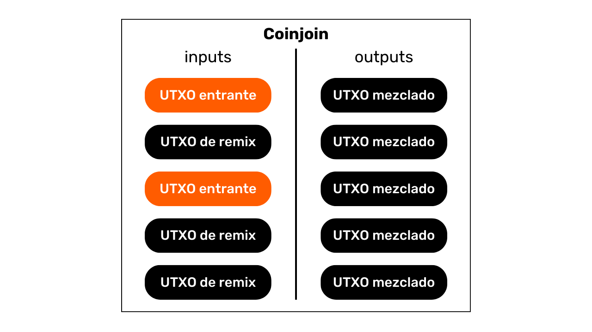

Gracias a este sistema de tarifas, Whirlpool realmente se diferencia de otras implementaciones de coinjoin ya que los anonsets de los UTXOs no son proporcionales al precio pagado por el usuario. Así, es posible alcanzar niveles considerablemente altos de anonimato pagando solo la tarifa de entrada del pool y las tarifas de minería para 2 transacciones (la `Tx0` y la mezcla inicial).
Es importante señalar que el usuario también tendrá que cubrir las tarifas de minería para retirar sus UTXOs del pool después de realizar sus múltiples coinjoins, a menos que hayan seleccionado la opción `mix to`, que permite proporcionar una dirección externa que recibirá directamente los fondos como un output de coinjoin, sin ninguna transacción adicional.

### Cuentas de Carteras HD

Para realizar un coinjoin a través de Whirlpool, la cartera debe generar varias cuentas distintas. Este es el principio del protocolo ZeroLink. Una cuenta, en el contexto de una cartera HD (_Hierarchical Deterministic_), constituye una sección completamente aislada de las demás, esta separación ocurre en el tercer nivel de profundidad de la jerarquía de la cartera, es decir, en el nivel del `xpub`.


Una cartera HD puede teóricamente derivar hasta `2^(32/2)` cuentas diferentes. La cuenta inicial, utilizada por defecto en todas las carteras de Bitcoin, corresponde al índice `0'`.

Para las carteras adaptadas a Whirlpool, se utilizan 4 cuentas para satisfacer las necesidades del proceso ZeroLink:

- La **cuenta de depósito**, identificada por el índice `0'`;
- La **cuenta de banco malo** (o "cambio tóxico"), identificada por el índice `2 147 483 644'`;
- La **cuenta premix**, identificada por el índice `2 147 483 645'`;
- La **cuenta postmix**, identificada por el índice `2 147 483 646'`.

Cada una de estas cuentas cumple una función específica en el proceso de coinjoin, la cual exploraremos en las siguientes secciones.

Todas estas cuentas están vinculadas a una única semilla, permitiendo al usuario recuperar acceso a todos sus bitcoins usando su frase de recuperación y, si es necesario, su passphrase. Sin embargo, es necesario especificar al software, durante esta operación de recuperación, los diferentes índices de cuenta que se utilizaron.

Ahora veamos las diferentes etapas de un coinjoin de Whirlpool dentro de estas cuentas.

### El TX0

El punto de partida de cualquier coinjoin de Whirlpool es la **cuenta de depósito**. Esta cuenta es la que automáticamente usas cuando creas una nueva cartera de Bitcoin. Esta cuenta debe ser acreditada con los bitcoins que deseas mezclar.

El `Tx0` representa el primer paso en el proceso de mezcla de Whirlpool. Su objetivo es preparar e igualar los UTXOs para el coinjoin, dividiéndolos en unidades correspondientes al monto del pool seleccionado, para asegurar la homogeneidad de la mezcla. Los UTXOs igualados son entonces enviados a la **cuenta premix**. En cuanto a la diferencia que no puede entrar en el pool, se separa en una cuenta específica: el **banco malo** (o "cambio tóxico").

Esta transacción inicial `Tx0` también sirve para liquidar las tarifas de servicio debidas al coordinador del coinjoin. A diferencia de los siguientes pasos, esta transacción no es colaborativa; el usuario debe, por lo tanto, asumir la totalidad de las tarifas de minería:

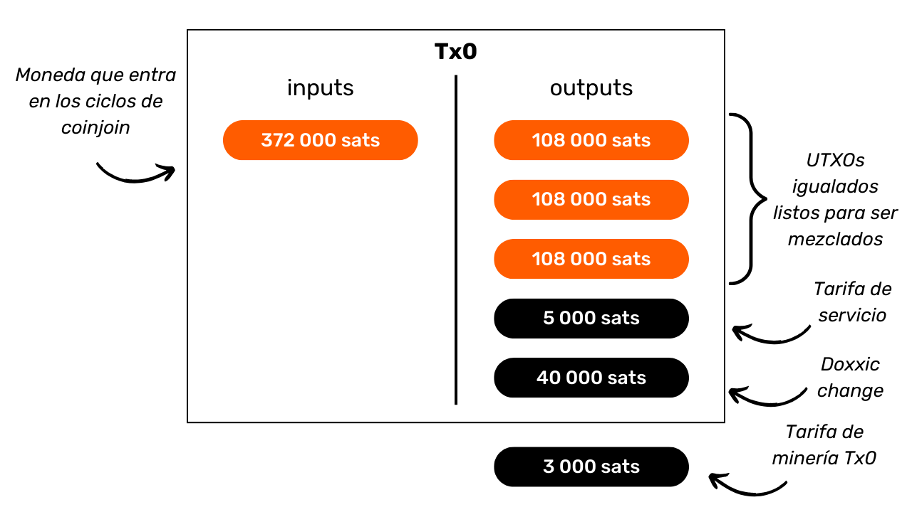

En este ejemplo de una transacción `Tx0`, una entrada de `372 000 sats` de nuestra **cuenta de depósito** se divide en varios UTXOs de salida, que se distribuyen de la siguiente manera:

- Una cantidad de `5 000 sats` destinada al coordinador por tarifas de servicio, correspondiente a la entrada en el pool de `100 000 sats`;
- 3 UTXOs preparados para la mezcla, redirigidos a nuestra **cuenta premix** y registrados con el coordinador. Estos UTXOs se igualan a `108 000 sats` cada uno, para cubrir las tarifas de minería de su futura mezcla inicial;
- El excedente que no puede entrar en el pool, por ser demasiado pequeño, se considera cambio tóxico. Se envía a su cuenta específica. Aquí, este cambio asciende a `40 000 sats`;
- Finalmente, hay `3,000 sats` que no constituyen una salida, pero son las comisiones de minería requeridas para confirmar la `Tx0`.
  Por ejemplo, aquí hay una Tx0 Whirlpool real (no mía): [edef60744f539483d868caff49d4848e5cc6e805d6cdc8d0f9bdbbaedcb5fc46](https://mempool.space/fr/tx/edef60744f539483d868caff49d4848e5cc6e805d6cdc8d0f9bdbbaedcb5fc46)


### El Cambio Tóxico

El exceso que no pudo ser integrado en el pool, aquí equivalente a `40,000 sats`, es redirigido a la cuenta de la **bad bank**, también referida como "cambio tóxico", para asegurar una estricta separación de los otros UTXOs en la billetera.

Este UTXO es peligroso para la privacidad del usuario porque no solo sigue estando vinculado a su pasado, y por lo tanto posiblemente a la identidad de su propietario, sino que también está marcado como perteneciente a un usuario que ha participado en un coinjoin.


Si este UTXO se fusiona con salidas mezcladas, perderán toda la privacidad ganada durante los ciclos de coinjoin, notablemente debido al CIOH (_Common-Input-Ownership-Heuristic_). Si se fusiona con otros cambios tóxicos, el usuario corre el riesgo de perder privacidad ya que esto vinculará las diferentes entradas de los ciclos de coinjoin. Por lo tanto, debe manejarse con precaución. Hablaremos más en detalle sobre la gestión de estos UTXOs tóxicos en la última sección de este capítulo.

### La Mezcla Inicial

Después de completar la `Tx0`, los UTXOs igualados se envían a la cuenta de **premix** de nuestra billetera, listos para ser introducidos en su primer ciclo de coinjoin, también llamado "mezcla inicial". Si, como en nuestro ejemplo, la `Tx0` genera varios UTXOs destinados a la mezcla, cada uno de ellos será integrado en una mezcla inicial separada.

Al final de estas primeras mezclas, la cuenta de **premix** estará vacía, mientras que nuestras monedas, habiendo pagado las comisiones de minería para este primer coinjoin, se ajustarán exactamente a la cantidad definida por el pool elegido. En nuestro ejemplo, nuestros UTXOs iniciales de `108,000 sats` se habrán reducido exactamente a `100,000 sats`.

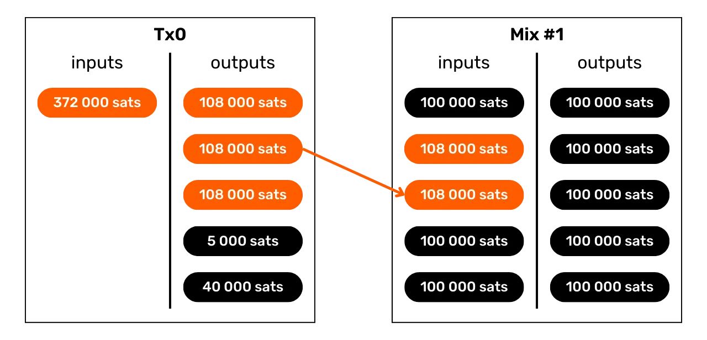

### Los Remixes

Después de la mezcla inicial, los UTXOs se transfieren a la cuenta de **postmix**. Esta cuenta reúne tanto los UTXOs ya mezclados como aquellos que esperan ser remezclados. Cuando el cliente Whirlpool está activo, los UTXOs en la cuenta de **postmix** están automáticamente disponibles para ser remezclados y serán elegidos al azar para participar en estos nuevos ciclos.
Como recordatorio, los remixes son entonces 100% gratuitos: no se requieren tarifas de servicio adicionales ni comisiones de minería. Mantener los UTXOs en la cuenta de **postmix** mantiene así su valor intacto y simultáneamente mejora sus anonsets. Por eso es importante permitir que estas monedas participen en múltiples ciclos de coinjoin. No te cuesta absolutamente nada, y aumenta sus niveles de anonimato.
Cuando decidas gastar UTXOs mezclados, puedes hacerlo directamente desde esta cuenta **postmix**. Es aconsejable mantener los UTXOs mezclados en esta cuenta para beneficiarse de remezclas gratuitas y para evitar que salgan del circuito Whirlpool, lo que podría disminuir su privacidad.

### ¿Cómo gestionar adecuadamente tu cuenta postmix?

Después de realizar ciclos de coinjoin, la mejor estrategia es mantener tus UTXOs en la cuenta **postmix**, esperando su uso futuro. Incluso es aconsejable dejarlos remezclar indefinidamente hasta que necesites gastarlos.

Algunos usuarios podrían considerar transferir sus bitcoins mezclados a una billetera asegurada por un monedero hardware. Esto es posible, pero es importante seguir meticulosamente las recomendaciones de Samourai Wallet para no comprometer la confidencialidad adquirida.

La fusión de UTXOs es el error más frecuentemente cometido. Es necesario evitar combinar UTXOs mezclados con UTXOs no mezclados en la misma transacción, para evitar la Heurística de Propiedad de Entrada Común (CIOH, por sus siglas en inglés). Esto requiere una gestión cuidadosa de tus UTXOs dentro de tu billetera, especialmente en términos de etiquetado.


También es importante ser cauteloso al consolidar UTXOs mezclados entre sí. Las consolidaciones moderadas son concebibles si tus UTXOs mezclados tienen conjuntos de anonimato significativos, pero esto disminuirá inevitablemente la confidencialidad de tus monedas. Asegúrate de que las consolidaciones no sean demasiado significativas ni se realicen después de un número insuficiente de remezclas, con el riesgo de establecer enlaces deducibles entre tus UTXOs antes y después de los ciclos de coinjoin. En caso de duda sobre estas manipulaciones, la mejor práctica es no consolidar los UTXOs postmix, y transferirlos uno por uno a tu monedero hardware, generando una nueva dirección en blanco cada vez. Nuevamente, recuerda etiquetar adecuadamente cada UTXO recibido.
También se desaconseja transferir tus UTXOs postmix a una billetera que use scripts poco comunes. Por ejemplo, si entras en Whirlpool desde una billetera multisig que usa scripts `P2WSH`, hay pocas posibilidades de que te mezcles con otros usuarios que tengan originalmente el mismo tipo de billetera. Si retiras tu postmix a esta misma billetera multisig, el nivel de privacidad de tus bitcoins mezclados se reducirá considerablemente. Más allá de los scripts, hay muchas otras huellas de billetera que pueden engañarte.
Como en cualquier transacción de Bitcoin, también es importante no reutilizar direcciones de recepción. Cada nueva transacción debe recibirse en una nueva dirección en blanco.

La solución más simple y segura es dejar tus UTXOs mezclados descansar en su cuenta **postmix**, dejándolos remezclar y solo tocarlos para gastar. Las billeteras Samourai y Sparrow tienen protecciones adicionales contra todos estos riesgos relacionados con el análisis de cadena. Estas protecciones te ayudan a evitar cometer errores.

### ¿Cómo gestionar adecuadamente tu cambio tóxico?

A continuación, debes tener cuidado al gestionar tu cambio tóxico, el cambio que no pudo entrar en la piscina de coinjoin. Estos UTXOs tóxicos, resultantes del uso de Whirlpool, representan un riesgo para tu privacidad ya que establecen un vínculo entre tú y el uso de coinjoin. Por lo tanto, es imperativo manejarlos con precaución y no combinarlos con otros UTXOs, especialmente UTXOs mezclados.

Aquí hay diferentes estrategias a considerar para usarlos:

- **Mezclarlos en piscinas más pequeñas:** Si tu UTXO tóxico es lo suficientemente grande como para entrar por sí solo en una piscina más pequeña, considera mezclarlo. Esta es a menudo la mejor opción. Sin embargo, fusionar varios UTXOs tóxicos para acceder a una piscina se desaconseja, ya que esto podría vincular tus diferentes entradas.
- **Márcalos como "no gastables":** Otro enfoque es dejar de usarlos, marcarlos como "no gastables" en su cuenta dedicada y simplemente hodl. Esto asegura que no los gastes accidentalmente. Si el valor del bitcoin aumenta, podrían surgir nuevos pools más adecuados para tus UTXOs tóxicos.
- **Haz donaciones:** Considera hacer donaciones, incluso modestas, a desarrolladores que trabajan en Bitcoin y su software asociado. También puedes donar a organizaciones que aceptan BTC. Si manejar tus UTXOs tóxicos parece demasiado complicado, puedes simplemente deshacerte de ellos haciendo una donación.
- **Compra Tarjetas de Regalo:** Plataformas como [Bitrefill](https://www.bitrefill.com/) te permiten intercambiar bitcoins por tarjetas de regalo que pueden ser utilizadas en varios comercios. Esta puede ser una manera de deshacerte de tus UTXOs tóxicos sin perder el valor asociado.
- **Consolídalos en Monero:** Samourai Wallet ofrece un servicio de intercambio atómico entre BTC y XMR. Esto es ideal para manejar tus UTXOs tóxicos consolidándolos en Monero, sin comprometer tu privacidad a través de KYC, antes de enviarlos de vuelta a Bitcoin. Sin embargo, esta opción puede ser costosa en términos de tarifas de minería y primas debido a restricciones de liquidez.
- **Envíalos a la Red Lightning:** Transferir estos UTXOs a la Red Lightning para beneficiarse de tarifas de transacción reducidas es una opción interesante. Sin embargo, este método puede revelar cierta información dependiendo de tu uso de Lightning y, por lo tanto, debe practicarse con precaución.

### Cómo usar Whirlpool?

Tras el arresto de los fundadores de Samourai Wallet y la incautación de sus servidores el 24 de abril de 2024, la herramienta Whirlpool ya no funciona, incluso para aquellos que tienen su propio Dojo. Anteriormente, estaba disponible en Samourai Wallet y Sparrow Wallet.


Sin embargo, sigue siendo posible que esta herramienta pueda volver a ponerse en servicio en las próximas semanas, dependiendo del resultado de los juicios, o relanzarse de una manera diferente. En cualquier caso, creo que el mercado de coinjoin en Bitcoin no permanecerá sin oferta por mucho tiempo, ya que hay una demanda clara. Además, el modelo Whirlpool, siendo el más avanzado en términos de privacidad, seguramente será utilizado en el futuro para otras implementaciones.

Estamos siguiendo de cerca la evolución de este caso, así como los desarrollos relacionados con herramientas asociadas. Ten la seguridad de que actualizaremos esta formación a medida que haya nueva información disponible.

En el próximo capítulo, descubriremos qué son los "anonsets", cómo se calculan estos indicadores y cómo pueden ayudarnos a estimar la efectividad de los ciclos de coinjoin.

https://planb.network/tutorials/privacy/coinjoin-sparrow-wallet

https://planb.network/tutorials/privacy/coinjoin-samourai-wallet

https://planb.network/tutorials/privacy/coinjoin-dojo

## Conjuntos de Anonimato

<chapterId>be1093dc-1a74-40e5-9545-2b97a7d7d431</chapterId>

Después de estudiar cómo funcionan los coinjoins y los desafíos asociados con la mezcla efectiva, ahora aprenderemos cómo medir esta efectividad. ¿Cómo determinar si un proceso de coinjoin ha sido efectivo y qué grado de anonimato ha adquirido una moneda? Esto es lo que exploraremos en este capítulo con los conjuntos de anonimato o "anonsets" en inglés.

### Recordatorio sobre la Utilidad de Coinjoin

La utilidad de CoinJoin radica en su capacidad para producir una negación plausible al sumergir tu moneda dentro de un grupo de monedas indistinguibles. El objetivo de esta acción es romper los enlaces de rastreabilidad, tanto del pasado al presente como del presente al pasado.
En otras palabras, un analista que conozca tu transacción inicial (`Tx0`) al entrar en los ciclos de CoinJoin no debería ser capaz de identificar con certeza tu UTXO al salir de los ciclos de remezcla (análisis desde la entrada del ciclo hasta la salida del ciclo).
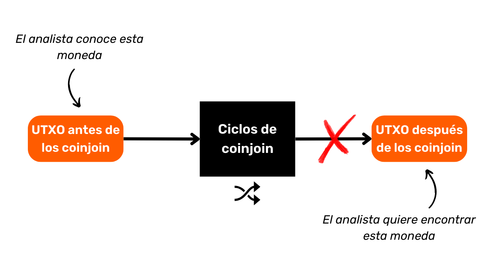

Inversamente, un analista que conozca tu UTXO al salir de los ciclos de CoinJoin debería ser incapaz de determinar la transacción original en la entrada de los ciclos (análisis desde la salida del ciclo hasta la entrada del ciclo).

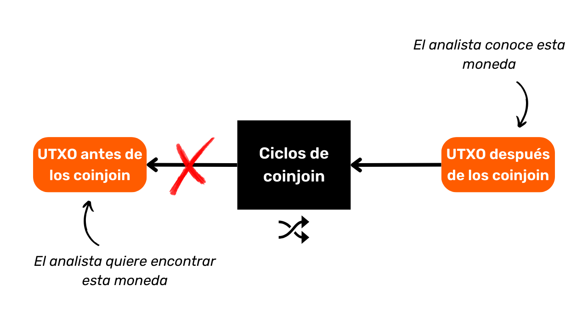

Para evaluar la dificultad para un analista de vincular el pasado con el presente y viceversa, es necesario cuantificar el tamaño de los grupos de monedas homogéneas dentro de los cuales tu moneda está oculta. Esta medida nos dice el número de análisis que tienen una probabilidad idéntica. Así, si el análisis correcto está ahogado entre 3 otros análisis de igual probabilidad, tu nivel de ocultamiento es muy bajo. Sin embargo, si el análisis correcto está dentro de un conjunto de 20,000 análisis todos igualmente probables, tu moneda está muy bien oculta. Y precisamente, el tamaño de estos grupos representa indicadores llamados "anonsets".

### Entendiendo los Anonsets

Los anonsets sirven como indicadores para evaluar el grado de privacidad de un UTXO particular. Más específicamente, miden el número de UTXOs indistinguibles dentro del conjunto que incluye la moneda estudiada. El requisito de un conjunto UTXO homogéneo significa que los anonsets se calculan usualmente sobre ciclos de CoinJoin. El uso de estos indicadores es particularmente relevante para los CoinJoins de Whirlpool debido a su uniformidad.

Los anonsets permiten, cuando corresponde, juzgar la calidad de los CoinJoins. Un tamaño grande de anonset significa un alto nivel de anonimato, ya que se vuelve difícil distinguir un UTXO específico dentro del conjunto homogéneo.

Hay 2 tipos de anonsets:

- **El anonset prospectivo;**
- **El anonset retrospectivo.**

### El Anonset Prospectivo

El anonset prospectivo indica el tamaño del grupo entre el cual el UTXO estudiado está oculto al salir del ciclo, conociendo el UTXO en la entrada, es decir, el número de monedas indistinguibles presentes dentro de este grupo. En inglés, el nombre de este indicador es "forward anonset", o "forward-looking metrics".
Este indicador permite medir la resistencia a la privacidad de la moneda contra un análisis de pasado a presente (entrada a salida).
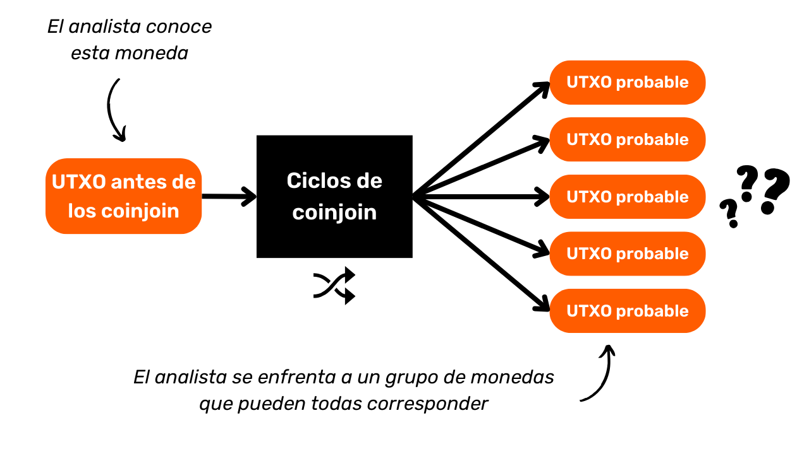

Esta métrica estima hasta qué punto tu UTXO está protegido contra intentos de reconstruir su historia desde su punto de entrada hasta su punto de salida en el proceso de coinjoin.

Por ejemplo, si tu transacción participó en su primer ciclo de coinjoin y se completaron dos ciclos descendientes adicionales, el anonset prospectivo de tu moneda sería `13`:


Por ejemplo, imaginemos que nuestra moneda en la entrada del ciclo de coinjoin se beneficia de un anonset prospectivo de `86,871`. Prácticamente, esto significa que está oculta entre `86,871` monedas indistinguibles. Para un observador externo consciente de esta moneda al principio de los ciclos de coinjoin e intentando rastrear su salida, se enfrentaría con `86,871` posibles UTXOs, cada uno con una probabilidad idéntica de ser la moneda buscada.

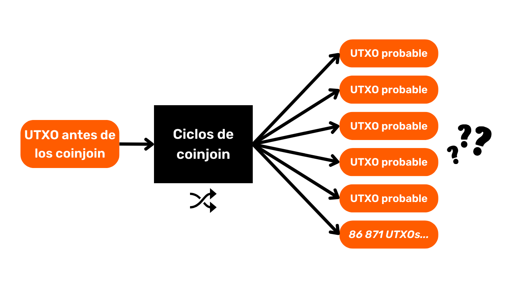

### El Anonset Retrospectivo

El anonset retrospectivo indica el número de posibles fuentes para una moneda dada, conociendo el UTXO en la salida del ciclo. Este indicador mide la resistencia a la privacidad de la moneda contra un análisis de presente a pasado (salida a entrada), es decir, cuán difícil es para un analista rastrear hasta el origen de tu moneda, antes de los ciclos de coinjoin. En inglés, el nombre de este indicador es "backward anonset," o "backward-looking metrics."
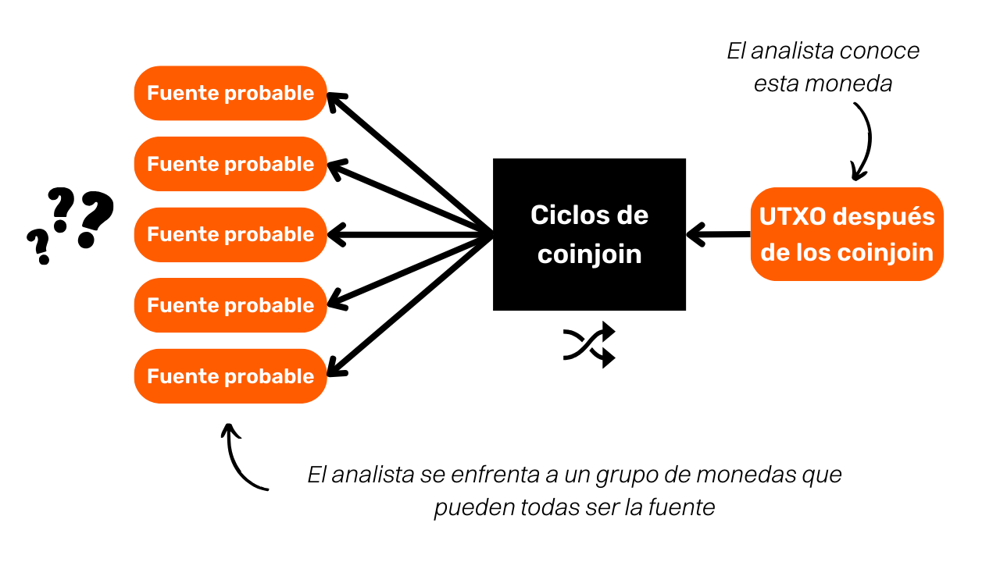

Conociendo tu UTXO en la salida de los ciclos, el anonset retrospectivo determina el número de transacciones Tx0 potenciales que podrían haber constituido tu entrada en los ciclos de coinjoin. En el diagrama a continuación, esto corresponde a la suma de todas las burbujas naranjas.


Por ejemplo, imaginemos que nuestra moneda en la salida del ciclo de coinjoin se beneficia de un anonset retrospectivo de `42,185`. Prácticamente, esto significa que hay `42,185` fuentes potenciales para este UTXO. Si un observador externo identifica esta moneda al final de los ciclos y busca rastrear su origen, se enfrentará a `42,185` fuentes posibles, todas con igual probabilidad de ser el origen buscado.

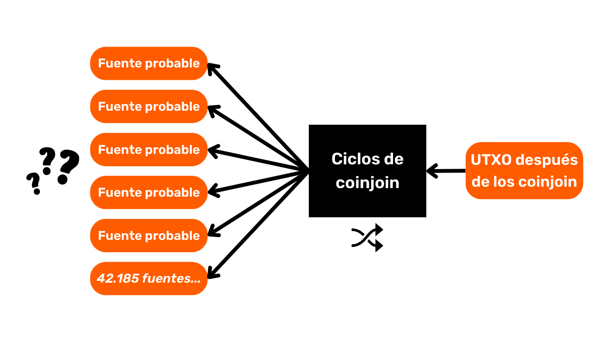

### ¿Cómo calcular concretamente los anonsets?

Es posible calcular manualmente los anonsets usando un explorador de bloques para conjuntos pequeños. Sin embargo, para anonsets más grandes, el uso de una herramienta especializada se vuelve imperativo. Hasta donde sé, el único software capaz de realizar esta tarea es _Whirlpool Stats Tool_, una herramienta Python desarrollada por los equipos de Samourai y OXT. Desafortunadamente, esta herramienta está actualmente fuera de servicio tras el arresto de los fundadores de Samourai y la discontinuación de OXT, que se utilizaba para extraer datos de la blockchain.


Como hemos visto en este capítulo, los anonsets solo se pueden calcular si hay cierta homogeneidad en la estructura de los coinjoins. Y precisamente, en el próximo capítulo, descubriremos cómo cuantificar esta homogeneidad en una transacción de Bitcoin, ya sea un coinjoin o una transacción más tradicional.

https://planb.network/tutorials/privacy/wst-anonsets

## Entropía

<chapterId>e4fe289d-618b-49a2-84c9-68c562e708b4</chapterId>

Como hemos visto en esta parte sobre coinjoins, la homogeneidad de los UTXOs en entradas y salidas juega un papel importante en mejorar la confidencialidad de una transacción de Bitcoin. Este parámetro permite una negación plausible contra el análisis de cadena. Varios métodos pueden medir esta homogeneidad, pero uno de los más efectivos, en mi opinión, es el uso de indicadores proporcionados por la herramienta _Boltzmann_, desarrollada por los equipos de OXT y Samourai Wallet, especialmente la entropía de la transacción. Esto es lo que estudiaremos en detalle en este capítulo.

A diferencia de los anonsets, que se calculan sobre un conjunto de transacciones, los indicadores que presentaremos aquí se centran únicamente en una sola transacción, ya sea un coinjoin o una transacción más tradicional.

### El número de interpretaciones

El primer indicador que se puede observar en una transacción de Bitcoin es el número total de posibles interpretaciones a los ojos de un observador externo que analiza la transacción. Teniendo en cuenta los valores de los UTXOs involucrados en la transacción, este indicador indica el número de formas en que las entradas pueden asociarse con las salidas. En otras palabras, determina el número de posibles interpretaciones que una transacción puede generar en el flujo de bitcoins desde la perspectiva de un observador externo que la analiza.
Por ejemplo, una transacción de pago simple con 1 entrada y 2 salidas solo tendrá una interpretación, a saber, que la entrada #0 financió la salida #0 y la salida #1. No hay otras posibles interpretaciones:


En contraste, un coinjoin estructurado según el modelo Whirlpool 5x5 presenta $1,496$ combinaciones posibles:

Un coinjoin Whirlpool Surge Cycle 8x8 se presenta con $9,934,563$ posibles interpretaciones:


### Entropía

A partir del número de interpretaciones de una transacción de Bitcoin, podemos calcular su entropía.

En el contexto general de la criptografía e información, la entropía es una medida cuantitativa de la incertidumbre o imprevisibilidad asociada con una fuente de datos o un proceso aleatorio. En otras palabras, la entropía es una forma de medir cuán difícil es predecir o adivinar la información.

En el contexto específico del análisis de cadena, la entropía también es el nombre de un indicador, derivado de la entropía de Shannon y [inventado por LaurentMT](https://gist.github.com/LaurentMT/e758767ca4038ac40aaf), que se puede calcular en una transacción de Bitcoin.

Cuando una transacción presenta un alto número de posibles interpretaciones, a menudo es más relevante referirse a su entropía. Este indicador permite medir la falta de conocimiento de los analistas sobre la configuración exacta de la transacción. En otras palabras, cuanto mayor es la entropía, más difícil se vuelve la tarea de identificar los flujos de bitcoins entre entradas y salidas para los analistas.

En la práctica, la entropía revela si, desde la perspectiva de un observador externo, una transacción presenta múltiples posibles interpretaciones, basándose únicamente en las cantidades de entradas y salidas, sin considerar otros patrones y heurísticas externos o internos. Una alta entropía es entonces sinónimo de mejor confidencialidad para la transacción.

La entropía se define como el logaritmo binario del número de posibles combinaciones. Aquí está la fórmula utilizada con $E$ siendo la entropía de la transacción y $C$ el número de posibles interpretaciones:

$$
E = \log_2(C)
$$

En matemáticas, el logaritmo binario (logaritmo base 2) corresponde a la operación inversa de elevar 2. En otras palabras, el logaritmo binario de $x$ es el exponente al que se debe elevar $2$ para obtener $x$. Este indicador se expresa así en bits.

Tomemos el ejemplo de calcular la entropía para una transacción coinjoin estructurada según el modelo Whirlpool 5x5, que, como se mencionó en la sección anterior, presenta un número de posibles interpretaciones de $1,496$:

$$
\begin{align*}
C &= 1,496 \\
E &= \log_2(1,496) \\
E &= 10.5469 \text{ bits}
\end{align*}
$$

Así, esta transacción coinjoin muestra una entropía de $10.5469$ bits, lo cual se considera muy satisfactorio. Cuanto mayor sea este valor, más diferentes interpretaciones admite la transacción, mejorando así su nivel de privacidad.
Para una transacción coinjoin de 8x8 que presenta $9,934,563$ interpretaciones, la entropía sería:

$$
\begin{align*}
C &= 9,934,563 \\
E &= \log_2(9,934,563) \\
E &= 23.244 \text{ bits}
\end{align*}
$$

Tomemos otro ejemplo con una transacción de pago estándar, que tiene 1 entrada y 2 salidas: [1b1b0c3f0883a99f1161c64da19471841ed12a1f78e77fab128c69a5f578ccce](https://mempool.space/tx/1b1b0c3f0883a99f1161c64da19471841ed12a1f78e77fab128c69a5f578ccce)

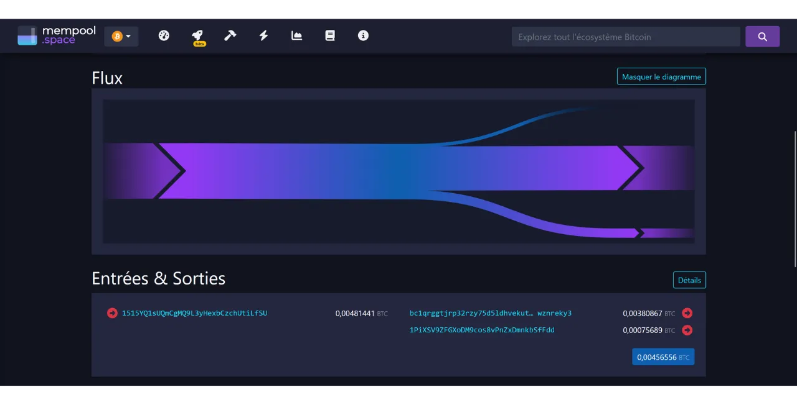

En el caso de esta transacción, la única interpretación posible es: `(In.0) > (Out.0 ; Out.1)`. Consecuentemente, su entropía se establece en $0$:

$$
\begin{align*}
C &= 1 \\
E &= \log_2(1) \\
E &= 0 \text{ bits}
\end{align*}
$$

### Eficiencia

A partir de la entropía de la transacción, también podemos calcular su eficiencia en términos de privacidad. Este indicador evalúa la eficiencia de la transacción comparándola con la transacción óptima concebible en una configuración idéntica.

Esto nos lleva a discutir el concepto de entropía máxima, que corresponde a la mayor entropía que una estructura de transacción específica podría teóricamente alcanzar. La eficiencia de la transacción se calcula entonces confrontando esta entropía máxima con la entropía real de la transacción analizada.

La fórmula utilizada es la siguiente con:

- $E_R$: la entropía real de la transacción expresada en bits;
- $E_M$: la entropía máxima posible para una estructura de transacción también expresada en bits;
- $Ef$: la eficiencia de la transacción en bits:

$$
Ef = E_R - E_M
$$

Por ejemplo, para una estructura de coinjoin tipo Whirlpool 5x5, la entropía máxima es $10.5469$:

$$
\begin{align*}
E_R &= 10.5469 \\
E_M &= 10.5469 \\
Ef &= E_R - E_M \\
Ef &= 10.5469 - 10.5469 \\
Ef &= 0 \text{ bits}
\end{align*}
$$

Este indicador también se expresa como un porcentaje. La fórmula utilizada es la siguiente con:

- $C_R$: el número de posibles interpretaciones reales;
- $C_M$: el número máximo de posibles interpretaciones con la misma estructura;
- $Ef$: eficiencia expresada en porcentaje:

$$
\begin{align*}
E_f &= \frac{C_R}{C_M} \\
E_f &= \frac{1\,496}{1\,496} \\
E_f &= 100\%
\end{align*}
$$

Una eficiencia del $100\%$ indica así que la transacción maximiza su potencial para la privacidad basada en su estructura.

### La Densidad de Entropía

La entropía es un buen indicador para medir la privacidad de una transacción, pero depende en parte del número de entradas y salidas en la transacción. Para comparar la entropía de 2 transacciones diferentes que no tienen el mismo número de entradas y salidas, se puede calcular la densidad de entropía. Este indicador ofrece una perspectiva sobre la entropía relativa a cada entrada o salida de la transacción. La densidad resulta útil para evaluar y comparar la eficiencia de transacciones de diferentes tamaños.
Para calcularlo, simplemente divide la entropía total de la transacción por el número total de entradas y salidas involucradas en la transacción:

- $E_D$: la densidad de entropía expresada en bits;
- $E$: la entropía de la transacción expresada en bits;
- $T$: el número total de entradas y salidas en la transacción:

$$
E_D = \frac{E}{T}
$$

Tomemos el ejemplo de un coinjoin Whirlpool 5x5:

$$
\begin{align*}
T &= 5 + 5 = 10 \\
E &= 10.5469 \\
E_D &= \frac{E}{T} \\
E_D &= \frac{10.5469}{10} \\
E_D &= 1.054 \text{ bits}
\end{align*}
$$

Calculemos también la densidad de entropía de un coinjoin Whirlpool 8x8:

$$
\begin{align*}
T &= 8 + 8 = 16 \\
E &= 23.244 \\
E_D &= \frac{E}{T} \\
E_D &= \frac{23.244}{16} \\
E_D &= 1.453 \text{ bits}
\end{align*}
$$

Al analizar la densidad de entropía de estos dos tipos de coinjoins, se hace evidente que, incluso al normalizar la entropía por el número de elementos, el coinjoin "Surge Cycle 8x8" genera más incertidumbre para el análisis.

### El Puntaje Boltzmann

Otra pieza de información analizada en una transacción es el puntaje Boltzmann de cada elemento en relación con otro. Esta es una tabla de las probabilidades de coincidencia entre las entradas y las salidas. Esta tabla indica, a través del puntaje Boltzmann, la probabilidad condicional de que una entrada específica esté vinculada a una salida dada. Por lo tanto, es una medida cuantitativa de la probabilidad condicional de que una asociación entre una entrada y una salida en una transacción ocurra, establecida sobre la relación del número de ocurrencias favorables de este evento en comparación con el número total de ocurrencias posibles, en un conjunto de interpretaciones.
Tomando el ejemplo de un coinjoin Whirlpool, la tabla de probabilidades condicionales resaltaría las posibilidades de un enlace entre cada entrada y salida, proporcionando una medida cuantitativa de la ambigüedad de las asociaciones en la transacción:

| %         | Salida 0 | Salida 1 | Salida 2 | Salida 3 | Salida 4 |
| --------- | -------- | -------- | -------- | -------- | -------- |
| Entrada 0 | 34%      | 34%      | 34%      | 34%      | 34%      |
| Entrada 1 | 34%      | 34%      | 34%      | 34%      | 34%      |
| Entrada 2 | 34%      | 34%      | 34%      | 34%      | 34%      |
| Entrada 3 | 34%      | 34%      | 34%      | 34%      | 34%      |
| Entrada 4 | 34%      | 34%      | 34%      | 34%      | 34%      |

Aquí, es claro que cada entrada tiene la misma posibilidad de estar asociada con cualquier salida, lo que mejora la confidencialidad de la transacción.

El cálculo del puntaje Boltzmann implica dividir el número de interpretaciones en las que un cierto evento se manifiesta por el número total de interpretaciones disponibles. Así, para determinar el puntaje asociando la entrada #0 con la salida #3 (un evento presente en $512$ interpretaciones), el proceso es el siguiente:

$$
\begin{align*}
\text{Interpretaciones (IN.0 > OUT.3)} &= 512 \\
\text{Total de Interpretaciones} &= 1496 \\
\text{Puntuacion} &= \frac{512}{1496} \\
\text{Puntuacion} &= 34\%
\end{align*}
$$

Si revisamos el ejemplo de un Whirlpool coinjoin en un Ciclo de Oleada 8x8, la tabla Boltzmann se vería así:

|       | OUT.0 | OUT.1 | OUT.2 | OUT.3 | OUT.4 | OUT.5 | OUT.6 | OUT.7 |
|-------|-------|-------|-------|-------|-------|-------|-------|-------|
| IN.0  | 23%   | 23%   | 23%   | 23%   | 23%   | 23%   | 23%   | 23%   |
| IN.1  | 23%   | 23%   | 23%   | 23%   | 23%   | 23%   | 23%   | 23%   |
| IN.2  | 23%   | 23%   | 23%   | 23%   | 23%   | 23%   | 23%   | 23%   |
| IN.3  | 23%   | 23%   | 23%   | 23%   | 23%   | 23%   | 23%   | 23%   |
| IN.4  | 23%   | 23%   | 23%   | 23%   | 23%   | 23%   | 23%   | 23%   |
| IN.5  | 23%   | 23%   | 23%   | 23%   | 23%   | 23%   | 23%   | 23%   |
| IN.6  | 23%   | 23%   | 23%   | 23%   | 23%   | 23%   | 23%   | 23%   |
| IN.7  | 23%   | 23%   | 23%   | 23%   | 23%   | 23%   | 23%   | 23%   |

Sin embargo, en el caso de una transacción simple que involucra una sola entrada y 2 salidas, la situación es diferente:

| %       | Salida 0 | Salida 1 |
|---------|----------|----------|
| Entrada 0 | 100%     | 100%     |

Aquí, observamos que la probabilidad de que cada salida provenga de la entrada #0 es del 100%. Una probabilidad menor se traduce así en una mayor privacidad al diluir los enlaces directos entre las entradas y las salidas.

### Enlaces Deterministas

También es posible calcular el número de enlaces deterministas en una transacción. Este indicador revela cuántas conexiones entre las entradas y las salidas en la transacción analizada son indiscutibles, con una probabilidad del 100%. Este indicador puede complementarse calculando la proporción de enlaces deterministas. La proporción ofrece una perspectiva sobre el peso de estos enlaces deterministas dentro de todos los enlaces de la transacción.
Por ejemplo, una transacción tipo Whirlpool-coinjoin muestra que no hay un vínculo determinístico entre las entradas y salidas, mostrando así un indicador de 0 enlaces y una proporción del 0%. Por el contrario, en nuestra segunda transacción de pago simple examinada (con una entrada y 2 salidas), el indicador nos dice que hay 2 enlaces determinísticos y la proporción alcanza el 100%. Por lo tanto, un indicador nulo señala una excelente privacidad debido a la ausencia de conexiones directas e indiscutibles entre las entradas y salidas.
### ¿Cómo calcular estos indicadores?
Calcular estos indicadores manualmente usando las ecuaciones que he proporcionado es relativamente simple. La principal dificultad radica en determinar el número de posibles interpretaciones de una transacción. Para una transacción estándar, este cálculo se puede realizar a mano. Sin embargo, para un coinjoin, la tarea es significativamente más compleja.

Anteriormente, había una herramienta en Python llamada _Boltzmann Calculator_, desarrollada por los equipos de OXT y Samourai, que permitía el cálculo automático de todos estos indicadores para una transacción de Bitcoin:


También era posible usar el sitio web KYCP.org para estos análisis:


Desafortunadamente, tras el arresto de los fundadores de Samourai, estas herramientas actualmente no están operativas.

Ahora que hemos discutido los coinjoins en detalle, exploraremos otras técnicas de privacidad disponibles en Bitcoin en la última sección de nuestra formación. Examinaremos las transacciones payjoin, tipos de transacciones específicas pseudo-coinjoins, protocolos de dirección estática, así como medidas destinadas a mejorar la privacidad no a nivel de transacción, sino en la red de nodos.

https://planb.network/tutorials/privacy/boltzmann-entropy

# Entendiendo las implicaciones de otras técnicas avanzadas de privacidad
<partId>19989ae6-d608-4acf-b698-2cf1e7e5e6ae</partId>

## Transacciones Payjoin
<chapterId>c1e90b95-f709-4574-837b-2ec26b11286f</chapterId>

Actualmente, coinjoin representa el método más efectivo para introducir incertidumbre en el rastreo de monedas durante un análisis de cadena. Como hemos visto en los capítulos anteriores, para lograr una mezcla efectiva, es necesario que las entradas y salidas sean lo más homogéneas posible. Además, es crucial que las monedas se integren en un grupo lo más grande posible para maximizar los anonsets. Así, para que los coinjoins sean efectivos, deben involucrar un gran número de monedas uniformes. Esta multitud de requisitos significa que las transacciones coinjoin tienen una estructura muy rígida: los montos están predeterminados, y todos los participantes deben adherirse a ellos para asegurar la uniformidad del proceso. Además, los coinjoins requieren sincronización entre todos los participantes y el coordinador durante la construcción de la transacción.
Estos requisitos hacen que coinjoin sea poco adecuado para pagos directos. Por ejemplo, si posees una pieza de 1M sats en un pool de coinjoin, usarla directamente como pago sería complejo. Requeriría sincronización con los otros participantes y el coordinador para construir la transacción colaborativa precisamente en el momento en que necesitas hacer un pago, y el monto de la compra tendría que coincidir exactamente con el valor de tu pieza, lo cual es prácticamente inalcanzable. Por lo tanto, una transacción coinjoin es por naturaleza una transacción colaborativa de barrido, lo que significa que generalmente son los mismos propietarios de las entradas los que se encuentran en las salidas.
Sin embargo, sería interesante tener estructuras de transacción que permitan pagos prácticos mientras introducen dudas en el análisis de cadena. Esto es precisamente lo que exploraremos en este capítulo y en el siguiente.

### ¿Qué es una transacción payjoin?

Payjoin es una estructura de transacción de Bitcoin específica que mejora la privacidad del usuario durante un gasto al colaborar con el receptor del pago.
Fue en 2015 cuando LaurentMT mencionó por primera vez este método bajo el nombre de "*transacciones esteganográficas*", según un documento accesible [aquí](https://gist.githubusercontent.com/LaurentMT/e758767ca4038ac40aaf/raw/c8125f6a3c3d0e90246dc96d3b603690ab6f1dcc/gistfile1.txt). Esta técnica fue adoptada más tarde por Samourai Wallet, que en 2018, fue el primer cliente en implementarla con la herramienta Stowaway. El concepto de payjoin también se encuentra en [BIP79](https://github.com/bitcoin/bips/blob/master/bip-0079.mediawiki) y [BIP78](https://github.com/bitcoin/bips/blob/master/bip-0078.mediawiki). Varios términos se utilizan así para designar un payjoin:
- Payjoin;
- Stowaway;
- P2EP (*Pay-to-End-Point*);
- Transacción esteganográfica.

La particularidad de payjoin radica en su capacidad para generar una transacción que parece ordinaria a primera vista, pero que en realidad es un mini Coinjoin entre dos personas. Para esto, la estructura de la transacción involucra al receptor del pago en las entradas junto al remitente real. El receptor así incluye un pago a sí mismo en medio de la transacción que le permite ser pagado.

Tomemos un ejemplo para entender mejor este proceso. Alice compra una baguette por 4,000 sats usando un UTXO de 10,000 sats y opta por un payjoin. Su panadero, Bob, añade un UTXO de 15,000 sats que le pertenece en la entrada, el cual recupera en su totalidad en la salida, además de los 4,000 sats de Alice.


En este ejemplo, Bob el panadero introduce 15,000 sats y sale con 19,000 sats, siendo la diferencia exactamente 4,000 sats, que es el precio de la baguette. Por el lado de Alice, ella entra con 10,000 sats y termina con 6,000 sats en salida, lo que representa un balance de -4,000 sats, es decir, el precio de la baguette. Para simplificar el ejemplo, he omitido deliberadamente las comisiones de minería en esta transacción.

### ¿Cuál es el propósito de payjoin?

La transacción payjoin cumple dos objetivos que permiten a los usuarios mejorar la privacidad de su pago.

En primer lugar, el payjoin tiene como objetivo engañar a un observador externo creando un señuelo en el análisis de la cadena. Esto es posible gracias a la heurística CIOH (*Common Input Ownership Heuristic*). Como vimos en la parte 3, normalmente, cuando una transacción en la blockchain tiene múltiples entradas, se asume que todas estas entradas pertenecen a la misma entidad o usuario.

Así, cuando un analista examina una transacción payjoin, se le lleva a creer que todas las entradas provienen de la misma persona. Sin embargo, esta percepción es incorrecta, ya que el receptor del pago también contribuye a las entradas junto al pagador real. El análisis de la cadena se desvía entonces a una interpretación que resulta ser falsa.

Volvamos a nuestro ejemplo de una transacción payjoin para el pago de una baguette:


Viendo esta transacción en la blockchain, un observador externo siguiendo las heurísticas habituales de análisis de cadena interpretaría lo siguiente: "*Alice fusionó 2 UTXOs en entradas de la transacción para pagar 19,000 sats a Bob*".
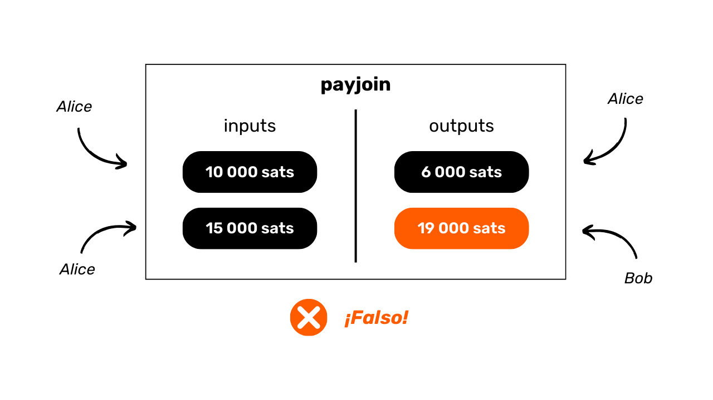
Esta interpretación es obviamente incorrecta, como ya sabes, los dos UTXOs en las entradas no pertenecen a la misma persona. Uno proviene de Alice, la compradora de la baguette, y el otro de Bob, el panadero.


Por lo tanto, el análisis del observador externo se dirige hacia una conclusión errónea, lo que asegura la preservación de la confidencialidad de los interesados.

### La transacción esteganográfica

El segundo objetivo del payjoin es engañar a un observador externo sobre la cantidad real del pago que se realizó. Al examinar la estructura de la transacción, el analista podría creer que el pago es equivalente a la cantidad de una de las salidas.
Si revisamos nuestro ejemplo de la compra de una baguette, el analista pensará que la cantidad del pago corresponde ya sea al UTXO de 6,000 sats o al UTXO de 19,000 sats. En este caso, es más probable que el analista piense que la cantidad del pago es de 19,000 sats, porque hay 2 UTXOs en las salidas, al menos uno de los cuales es mayor que 6,000 sats (no hay razón lógica para usar 2 UTXOs para pagar 6,000 sats cuando un solo UTXO habría sido suficiente para este pago).
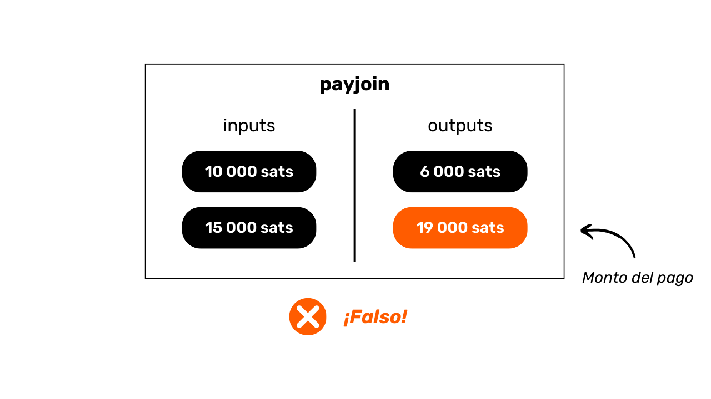

Pero en realidad, este análisis es incorrecto. La cantidad del pago no corresponde a ninguna de las salidas. Es en realidad la diferencia entre el UTXO del destinatario en la salida y el UTXO del destinatario en la entrada.

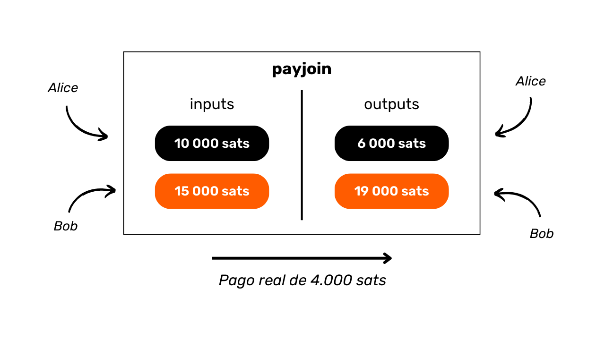

En esto, la transacción payjoin cae en el ámbito de la esteganografía. Permite ocultar la cantidad real de una transacción dentro de una transacción falsa que actúa como señuelo.

La esteganografía es una técnica para ocultar información dentro de otros datos u objetos, de tal manera que la presencia de la información oculta no sea perceptible. Por ejemplo, un mensaje secreto puede ser ocultado dentro de un punto en un texto que no está relacionado, haciéndolo indetectable a simple vista (esta es la técnica de [micropoint](https://fr.wikipedia.org/wiki/Micropoint)).

A diferencia del cifrado, que hace que la información sea ininteligible sin la clave de descifrado, la esteganografía no altera la información. Permanece a simple vista. Su objetivo es más bien ocultar la existencia misma del mensaje secreto, mientras que el cifrado revela claramente la presencia de información oculta, aunque inaccesible sin la clave. Es por esto que el nombre inicial para payjoin fue "*transacciones esteganográficas*".

Se podría hacer una analogía entre la criptografía y coinjoin, así como entre la esteganografía y payjoin. De hecho, coinjoin tiene atributos similares a los del cifrado: el método es reconocible, pero la información es indescifrable. Por el contrario, payjoin se asemeja a la esteganografía: la información es teóricamente accesible, pero dado que su método de ocultamiento no es reconocible, se vuelve inaccesible.

### ¿Cómo usar payjoin?

Entre el software conocido que soporta payjoin, se encuentran Sparrow Wallet, Wasabi Wallet, Mutiny, BitMask, BlueWallet y JoinMarket, así como el procesador de pagos BTCPay.


La implementación más avanzada de payjoin fue solo el Stowaway en Samourai Wallet. Sin embargo, desde el arresto de los fundadores del software, esta herramienta ahora solo funciona parcialmente. La ventaja de Stowaway es que es un protocolo completo y muy simple de usar, que soporta tanto la recepción como el envío de payjoins. Las transacciones parcialmente firmadas pueden intercambiarse manualmente mediante el escaneo de múltiples códigos QR o automáticamente a través de Tor vía Soroban. Es esta última opción de comunicación la que actualmente está fuera de servicio.

La dificultad de usar payjoin radica en su dependencia de la participación del comerciante. Como cliente, usar un payjoin es imposible si el comerciante no lo soporta. Esto añade una dificultad adicional durante una compra: no solo es complicado encontrar comerciantes que acepten bitcoin, pero si uno también busca aquellos que soportan payjoins, se vuelve aún más complicado.

Una solución sería usar estructuras transaccionales que introduzcan ambigüedad en el análisis de la cadena sin requerir la cooperación del destinatario. Esto nos permitiría mejorar la privacidad de nuestros pagos sin depender de la participación activa de los comerciantes. Esto es precisamente lo que estudiaremos en el próximo capítulo.

https://planb.network/tutorials/privacy/payjoin-sparrow-wallet

https://planb.network/tutorials/privacy/payjoin-samourai-wallet

## Mini-coinjoins de pago
<chapterId>300777ee-30ae-43d7-ab00-479dac3522c1</chapterId>

Cuando se busca realizar una transacción de pago preservando cierto grado de privacidad, payjoin es una buena opción. Pero como hemos visto, payjoin requiere la implicación del destinatario. ¿Qué hacer entonces si este último se niega a participar en un payjoin, o si simplemente prefieres no involucrarlo? Una alternativa es usar una transacción Stonewall o Stonewall x2. Veamos más de cerca estos dos tipos de transacciones.

### La Transacción Stonewall

Stonewall es una forma específica de transacción de Bitcoin destinada a aumentar la privacidad del usuario durante un gasto al imitar un pseudo-coinjoin entre dos personas, sin ser realmente uno. De hecho, esta transacción no es colaborativa. Un usuario puede construirla solo, involucrando solo los UTXOs que posee como entradas. Por lo tanto, puedes crear una transacción Stonewall para cualquier ocasión, sin necesidad de sincronizarte con otro usuario o el destinatario.

El funcionamiento de la transacción Stonewall es el siguiente: en la entrada de la transacción, el remitente usa 2 UTXOs que le pertenecen. En la salida, la transacción produce 4 UTXOs, 2 de los cuales serán exactamente del mismo monto. Los otros 2 UTXOs constituirán el cambio. Entre las 2 salidas del mismo monto, solo una irá realmente al destinatario del pago.
Solo hay 2 roles en una transacción Stonewall:
- El remitente, quien realiza el pago;
- El destinatario, quien puede desconocer la naturaleza específica de la transacción y simplemente espera un pago del remitente.

Tomemos un ejemplo para entender esta estructura de transacción. Alice está en la panadería de Bob para comprar su baguette, que cuesta 4,000 sats. Ella quiere pagar en bitcoins mientras mantiene un cierto nivel de privacidad respecto a su pago. Por lo tanto, decide construir una transacción Stonewall para el pago.
Al analizar esta transacción, podemos ver que Bob el panadero efectivamente recibió 4,000 sats en pago por la baguette. Alice utilizó 2 UTXOs como entradas: uno de 10,000 sats y otro de 15,000 sats. En las salidas, recibió 3 UTXOs: uno de 4,000 sats, uno de 6,000 sats y otro de 11,000 sats. Así, Alice tiene un balance neto de -4,000 sats en esta transacción, lo que corresponde exactamente al precio de la baguette.
En este ejemplo, intencionalmente he omitido las comisiones de minería para facilitar la comprensión. En realidad, las tasas de transacción son completamente asumidas por el remitente.

### ¿Cuáles son los objetivos de una transacción Stonewall?

La estructura Stonewall añade mucha entropía a la transacción y difumina las pistas del análisis de cadena. Desde el exterior, tal transacción puede interpretarse como un mini-coinjoin entre dos personas. Pero en realidad, es un pago. Este método genera incertidumbres en el análisis de cadena, o incluso lleva a pistas falsas.

Volvamos al ejemplo de Alice en la panadería de Bob. La transacción en la blockchain se vería así:


Un observador externo que se base en heurísticas comunes de análisis de cadena podría concluir erróneamente que "*dos personas han realizado un pequeño coinjoin, con un UTXO cada uno en entrada y dos UTXOs cada uno en salida*". El análisis de esta transacción desde el exterior no lleva a la aplicación de la Heurística de Propiedad Común de Entrada (CIOH, por sus siglas en inglés), porque la presencia de dos salidas del mismo monto sugiere un patrón de coinjoin. Desde un punto de vista externo, la CIOH por lo tanto no es aplicable en este caso específico.


Esta interpretación es inexacta, porque, como sabes, un UTXO fue enviado a Bob el panadero, los 2 UTXOs en entradas provienen de Alice, y ella recuperó 3 salidas de cambio.


Y lo que es particularmente interesante sobre la estructura de la transacción Stonewall es que desde la perspectiva de un observador externo, parece exactamente como la de una transacción Stonewall x2.

### La Transacción Stonewall x2

Stonewall x2 es otra forma específica de transacción de Bitcoin que también tiene como objetivo aumentar la privacidad del usuario durante un gasto, pero esta vez colaborando con un tercero no involucrado en el gasto. Este método funciona como un pseudo-coinjoin entre dos participantes, mientras se realiza un pago a una tercera persona al mismo tiempo.

El funcionamiento de la transacción Stonewall x2 es relativamente simple: uno utiliza un UTXO en su posesión para realizar el pago y solicita la ayuda de un tercero que también contribuye con un UTXO que poseen. La transacción termina con cuatro salidas: dos de ellas de montos iguales, una destinada a la dirección del destinatario del pago, la otra a una dirección perteneciente al colaborador. Un tercer UTXO se envía de vuelta a otra dirección del colaborador, permitiéndoles recuperar el monto inicial (una acción neutral para ellos, menos las comisiones de minería), y un último UTXO regresa a una dirección que nos pertenece, lo que constituye el cambio del pago.

Así, se definen tres roles diferentes en las transacciones Stonewall x2:
- El remitente, quien realiza el pago efectivo;
- El destinatario, quien puede desconocer la naturaleza específica de la transacción y simplemente espera un pago del remitente;
- El colaborador, quien proporciona bitcoins para generar dudas en el análisis de la transacción, mientras recupera completamente sus fondos al final (una acción neutral para ellos, menos las comisiones de minería).
Volvamos a nuestro ejemplo con Alice, quien está en la panadería de Bob para comprar su baguette que cuesta 4,000 sats. Ella quiere pagar en bitcoins manteniendo un cierto nivel de privacidad en su pago. Entonces, ella llama a su amigo Charles, quien la ayudará en este proceso.


Analizando esta transacción, podemos ver que Bob el panadero ha recibido efectivamente 4,000 sats en pago por la baguette. Alice usó 10,000 sats en entrada y recuperó 6,000 sats en salida, resultando en un balance neto de -4,000 sats, que corresponde al precio de la baguette. En cuanto a Charles, él proporcionó 15,000 sats en entrada y recibió dos salidas: una de 4,000 sats y la otra de 11,000 sats, haciendo un balance de 0.

En este ejemplo, intencionalmente he omitido las comisiones para facilitar la comprensión. En realidad, las comisiones de minería generalmente se comparten equitativamente entre el emisor del pago y el colaborador.

### ¿Cuáles son los objetivos de una transacción Stonewall x2?
Al igual que la estructura Stonewall, la estructura Stonewall x2 añade una cantidad significativa de entropía a la transacción y oscurece las pistas del análisis de cadena. Desde un punto de vista externo, tal transacción podría interpretarse como un pequeño coinjoin entre dos personas. Pero en realidad, es un pago. Este método, por lo tanto, genera incertidumbres en el análisis de cadena, incluso llevando a pistas falsas.

Revisemos el ejemplo de Alice, Bob el Panadero y Charles. La transacción en la blockchain se vería así:


Un observador externo que se base en heurísticas comunes de análisis de cadena podría concluir erróneamente que "*Alice y Charles han realizado un pequeño coinjoin, con un UTXO cada uno en entrada y dos UTXOs cada uno en salida*". Nuevamente, el análisis de esta transacción desde el exterior no lleva a la aplicación de la Heurística de Propiedad Común de Entrada (CIOH, por sus siglas en inglés), porque la presencia de dos salidas del mismo monto sugiere un patrón de coinjoin. Desde un punto de vista externo, la CIOH por lo tanto no es aplicable en este caso específico.


Esta interpretación es inexacta porque, como sabes, un UTXO fue enviado a Bob el Panadero, Alice tiene solo una salida de cambio, y Charles tiene dos.


Y una vez más, lo que es particularmente interesante con la estructura de transacción Stonewall x2 es que desde el punto de vista de un observador externo, parece exactamente igual que la de una transacción Stonewall.

### ¿Cuál es la diferencia entre Stonewall y Stonewall x2?

Una transacción StonewallX2 opera exactamente como una transacción Stonewall, excepto que la primera es colaborativa, mientras que la última no lo es. Como hemos visto, una transacción Stonewall x2 involucra la participación de un tercero (Charles), quien es externo al pago, y quien proporciona sus bitcoins para mejorar la confidencialidad de la transacción. En una transacción Stonewall clásica, el papel del colaborador lo asume el emisor.


Desde un punto de vista externo, el patrón de la transacción es por lo tanto exactamente el mismo.

El hecho de que estas dos estructuras de transacción compartan exactamente el mismo patrón implica que, incluso si un observador externo logra identificar un patrón "Stonewall(x2)", no tendrá toda la información. No podrán determinar cuál de los dos UTXOs de los mismos montos corresponde al pago. Además, no podrán determinar si los dos UTXOs en entradas provienen de dos personas diferentes (Stonewall x2) o si pertenecen a una sola persona que los ha fusionado (Stonewall).
Este último punto se debe al hecho de que las transacciones Stonewall x2 siguen exactamente el mismo patrón que las transacciones Stonewall. Desde el exterior y sin información adicional sobre el contexto, es imposible diferenciar una transacción Stonewall de una transacción Stonewall x2. Sin embargo, las primeras no son transacciones colaborativas, mientras que las segundas sí lo son. Esto añade aún más duda en el análisis de una de estas transacciones.

### ¿Cuándo usar transacciones Stonewall y Stonewall x2?

La lógica debería ser la siguiente cuando se quiera usar una herramienta de privacidad para una transacción:
- Como prioridad, se puede optar por realizar un payjoin;
- Si el comerciante no admite payjoins, se puede realizar una transacción colaborativa con otra persona fuera del pago usando la estructura Stonewall x2;
- Si no se encuentra a nadie para realizar una transacción Stonewall x2, se puede realizar una transacción Stonewall solo, que imitará el comportamiento de una transacción Stonewall x2.

### ¿Cómo usar transacciones Stonewall y Stonewall x2?

Las transacciones Stonewall y Stonewall x2 están disponibles tanto en la aplicación Samourai Wallet como en el software Sparrow Wallet.


Sin embargo, al igual que con los payjoins, tras el arresto de los fundadores de Samourai, las transacciones Stonewall x2 ahora solo funcionan intercambiando manualmente los PSBT entre las partes involucradas. El intercambio automático a través de Soroban lamentablemente no está disponible en este momento.

También es posible realizar manualmente este tipo de transacción desde cualquier software de billetera Bitcoin.

En el próximo capítulo, estudiaremos otra técnica de privacidad que es relativamente desconocida, pero es muy útil además de lo que ya hemos estudiado.


https://planb.network/tutorials/privacy/stonewall

https://planb.network/tutorials/privacy/stonewall-x2

## Ricochets
<chapterId>db9a20ac-a149-443d-884b-ea6c03f28499</chapterId>

El uso de estructuras de transacción de Bitcoin que añaden ambigüedad en el análisis de cadena, como coinjoin, es particularmente beneficioso para la protección de la privacidad. Sin embargo, como discutimos en el capítulo sobre payjoins, las transacciones coinjoin son naturalmente identificables en la cadena. Recuerda la analogía que establecimos entre el cifrado y los coinjoins: cuando uno cifra un archivo, un tercero que descubre este archivo cifrado no puede acceder a su contenido, pero puede identificar claramente que ha habido una modificación del archivo para ocultar su contenido. Lo mismo ocurre con coinjoin: cuando un analista examina una transacción coinjoin, aunque no pueden establecer vínculos directos entre las entradas y salidas (y viceversa), pueden, sin embargo, reconocer que la transacción observada es un coinjoin.
Dependiendo del uso previsto para tu moneda después de someterla a ciclos de coinjoin, el hecho de que haya pasado por este proceso puede ser problemático. Por ejemplo, si planeas vender tu moneda en una plataforma de intercambio regulada, pero recientemente ha pasado por un coinjoin, la herramienta de análisis de cadena de la plataforma detectará este hecho. La plataforma podría entonces rechazar tu UTXO que ha pasado por un coinjoin, o incluso exigir explicaciones de tu parte, con el riesgo de tener tu cuenta suspendida o tus fondos congelados. En algunos casos, la plataforma también puede informar tu comportamiento a las autoridades estatales (por ejemplo, esto es lo que TRACFIN requiere de los Proveedores de Servicios de Activos Digitales (PSAN) en Francia).

Lo que necesitaríamos para evitar esto es una herramienta capaz de difuminar las huellas del pasado de una moneda Bitcoin, con el fin de restaurar una cierta forma de fungibilidad. Este es precisamente el objetivo de ricochet.


### ¿Qué es un ricochet?

Ricochet es una técnica que implica realizar varias transacciones ficticias a uno mismo (sweeping) para simular una transferencia de propiedad de bitcoins. Esta herramienta es diferente de otras estructuras de transacción que hemos discutido porque no permite un anonimato prospectivo, sino más bien una forma de anonimato retrospectivo. De hecho, ricochet permite difuminar los detalles específicos que podrían comprometer la fungibilidad de una moneda Bitcoin debido a su pasado.

Para difuminar la huella dejada por un evento pasado en una moneda, como ciclos de coinjoin, por ejemplo, ricochet ejecuta cuatro transacciones sucesivas donde el usuario transfiere fondos a sí mismo en diferentes direcciones.

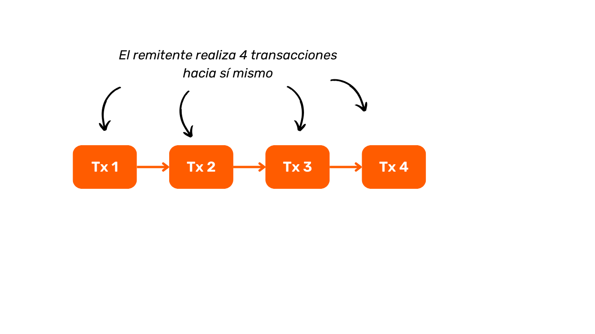

Después de esta secuencia de transacciones, la herramienta ricochet finalmente dirige los bitcoins a su destino final, como una plataforma de intercambio.

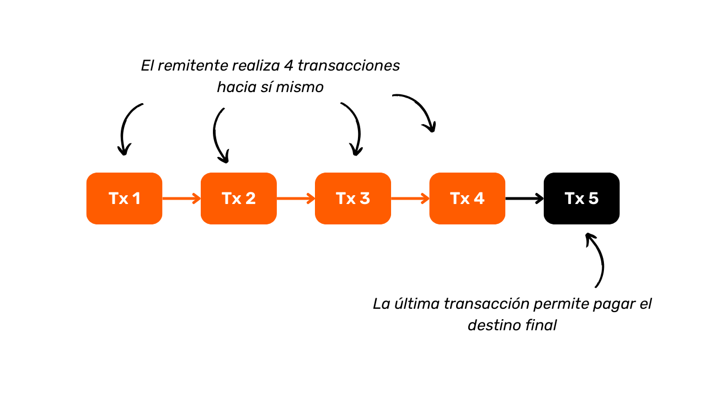

El objetivo es crear distancia afectando la fungibilidad de la moneda, como una transacción de coinjoin, y el acto final de gastar que podría rechazar esta moneda debido a su pasado. Así, las herramientas de análisis de cadena podrían concluir que probablemente ha habido un cambio de propiedad después del evento, y considerar que esta moneda es fungible. En el caso de un coinjoin, las herramientas de análisis de cadena podrían entonces asumir que no es la misma persona quien envió los bitcoins y realizó el coinjoin, y por lo tanto, es innecesario iniciar acciones contra el remitente.


### ¿Por qué funciona esto?
Ante este método ricochet, uno podría imaginar que el software de análisis de cadena profundizaría su examen más allá de cuatro saltos. Sin embargo, estas plataformas enfrentan un dilema al optimizar el umbral de detección. Deben establecer un límite en el número de saltos después del cual admiten que probablemente ha ocurrido un cambio de propiedad y que el vínculo con un evento anterior (como un coinjoin) debería ignorarse.
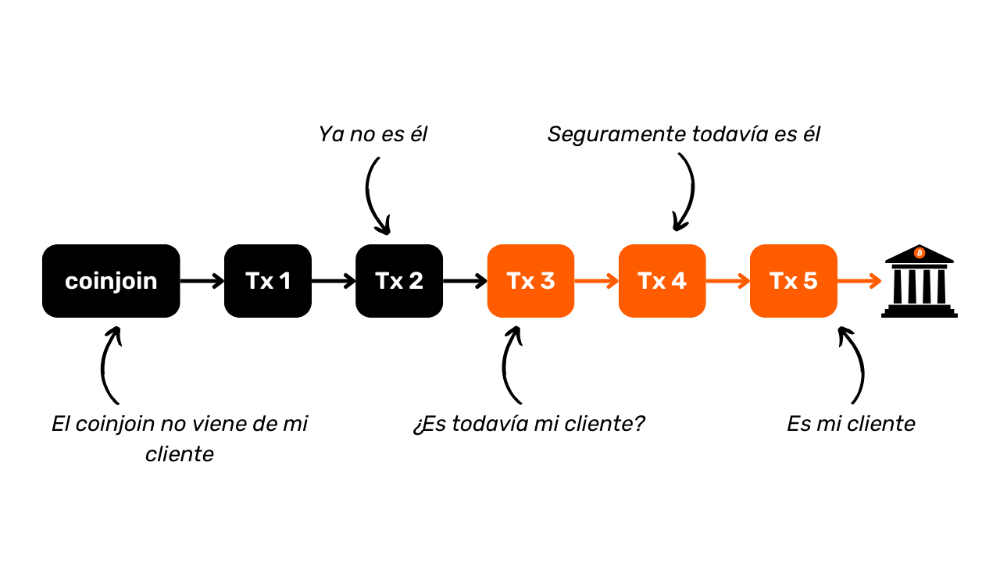

Sin embargo, determinar este umbral resulta arriesgado: cada extensión del número observado de saltos aumenta exponencialmente el volumen de falsos positivos, es decir, individuos erróneamente marcados como participantes en un evento, cuando la operación fue realizada por alguien más. Este escenario representa un riesgo importante para estas compañías, ya que los falsos positivos conducen a la insatisfacción, lo que puede empujar a los clientes afectados hacia la competencia. A largo plazo, un umbral de detección demasiado amplio lleva a una plataforma a perder más clientes que sus competidores, lo que podría amenazar su viabilidad. Por lo tanto, es complicado para estas plataformas aumentar el número de saltos observados, y 4 es a menudo un número suficiente para contrarrestar sus análisis.

El fenómeno observado aquí es algo análogo a la teoría de los seis grados de separación.
La teoría de los seis grados de separación sugiere que cualquier persona en la Tierra está conectada a cualquier otra a través de una cadena de conocidos que no incluye más de seis intermediarios. Bastaría con pasar por una serie de seis personas, cada una conociendo personalmente a la siguiente, para alcanzar a cualquier individuo en el mundo.
Para las transacciones de Bitcoin, se encuentra un fenómeno similar. Al rastrear un número suficiente de transacciones de Bitcoin, inevitablemente se termina encontrando un coinjoin. El método ricochet aprovecha este principio utilizando un número de saltos mayor al que las plataformas de intercambio pueden seguir razonablemente. Si las plataformas deciden seguir más transacciones, entonces es posible simplemente añadir un salto adicional para eludir esta medida.

### ¿Cuándo y cómo usar ricochet?

El caso de uso más común para ricochet ocurre cuando es necesario ocultar la participación previa en un coinjoin en un UTXO que posees. Idealmente, es mejor evitar transferir bitcoins que han pasado por un coinjoin a entidades reguladas. Sin embargo, en el evento de que uno se encuentre sin ninguna otra opción, especialmente en la urgencia de liquidar bitcoins en moneda fiat, ricochet ofrece una solución efectiva.

Este método es efectivo no solo para coinjoins sino también para cualquier otra marca que podría comprometer la fungibilidad de una moneda.
La idea de este método ricochet proviene originalmente de los equipos de Samourai Wallet, quienes lo integraron en su aplicación para automatizar el proceso. El servicio tiene un costo en Samourai, ya que un ricochet implica una tarifa de servicio de 100,000 sats, además de las tarifas de minería. Por lo tanto, su uso se recomienda más bien para transferencias de cantidades significativas.


La aplicación Samourai ofrece dos variantes de ricochet:
- El ricochet mejorado, o "entrega escalonada", que tiene la ventaja de distribuir las tarifas de servicio de Samourai en cinco transacciones sucesivas. Esta opción también asegura que cada transacción se transmita en un momento distinto y se registre en un bloque diferente, lo que le permite imitar el comportamiento de un cambio de propiedad lo más cercanamente posible. Aunque más lento, este método es preferible para aquellos que no tienen prisa, ya que maximiza la eficiencia del ricochet fortaleciendo su resistencia al análisis de cadena;


- El ricochet clásico, que está diseñado para ejecutar la operación rápidamente transmitiendo todas las transacciones en un corto período de tiempo. Este método, por lo tanto, ofrece menos privacidad y menor resistencia al análisis que el método mejorado. Solo debería usarse para envíos urgentes.


Ricochet simplemente implica enviar bitcoins a uno mismo. Es completamente posible realizar un ricochet manualmente en cualquier software de billetera, sin usar una herramienta especializada. Solo transfiere la misma moneda a ti mismo sucesivamente, usando una nueva dirección en blanco cada vez.

En el siguiente capítulo, exploramos diferentes técnicas para transferencias secretas de propiedad. Estos métodos difieren radicalmente de los que hemos examinado hasta ahora, tanto en términos de operación como de resultados.

https://planb.network/tutorials/privacy/ricochet
 
## Transferencias Secretas de Propiedad
<chapterId>a2067036-849c-4d6b-87d2-44235cfae7a1</chapterId>

Entre las técnicas de privacidad en Bitcoin, también se encuentra la transferencia secreta de propiedad. Este método tiene como objetivo transferir la propiedad de bitcoins de una persona a otra, y viceversa, sin que esta transacción sea explícitamente visible en la blockchain. Estudiemos juntos las diferentes técnicas disponibles así como sus ventajas y desventajas.

### El CoinSwap
CoinSwap se basa en un concepto relativamente simple: utiliza contratos inteligentes para facilitar una transferencia de propiedad de bitcoin entre dos usuarios, sin necesidad de confianza y sin que esta transferencia sea explícitamente visible en la blockchain.

Imaginemos un ejemplo simplista con Alice y Bob. Alice posee 1 BTC asegurado con la clave privada $A$, y Bob también posee 1, asegurado con la clave privada $B$. Teóricamente, podrían intercambiar sus claves privadas a través de un canal de comunicación externo para llevar a cabo una transferencia secreta.


Sin embargo, este método ingenuo presenta un alto riesgo en términos de confianza. Nada impide que Alice conserve una copia de la clave privada $A$ después del intercambio y la use más tarde para robar los bitcoins, una vez que la clave esté en posesión de Bob.


Además, no hay garantía que prevenga a Alice de recibir la clave privada $B$ de Bob y nunca enviar su clave privada $A$ a cambio. Este intercambio, por lo tanto, se basa en una confianza excesiva entre las partes y resulta ineficiente para asegurar una transferencia secreta de propiedad de manera segura.


Para resolver estos problemas y permitir intercambios entre partes que no se confían entre sí, podemos en su lugar usar sistemas de contratos inteligentes. Un contrato inteligente es un programa que se ejecuta automáticamente cuando se cumplen condiciones predefinidas, lo que, en nuestro caso, asegura que el intercambio de propiedad ocurra automáticamente sin requerir confianza mutua.

Para hacer esto, podemos usar HTLC (*Hash Time-Locked Contracts*) o PTLC (*Point Time-Locked Contracts*). Estos dos protocolos funcionan de manera similar utilizando un sistema de bloqueo por tiempo que garantiza que el intercambio se complete con éxito o se cancele por completo, protegiendo así la integridad de los fondos de ambas partes. La principal diferencia entre HTLCs y PTLCs es que los HTLCs usan hashes y preimágenes para asegurar la transacción, mientras que los PTLCs usan Firmas Adaptadoras.

En un escenario de CoinSwap usando un HTLC o un PTLC entre Alice y Bob, el intercambio ocurre de manera segura: o tiene éxito y cada uno recibe el BTC del otro, o falla y cada uno retiene su propio BTC. Por lo tanto, es imposible para una de las partes engañar o robar el BTC de la otra.

> *Los HTLCs también son el mecanismo utilizado para enrutar pagos de manera segura a través de los canales bidireccionales de la Lightning Network.*
El uso de Firmas Adaptadoras es particularmente interesante en este contexto, ya que permite eludir los scripts tradicionales (esto es un mecanismo a veces referido como "_scriptless scripts_"). Esta característica ayuda a reducir las comisiones asociadas con el intercambio. Otra ventaja importante de las Firmas Adaptadoras es que no requieren el uso de un hash común para ambas partes de la transacción, evitando así revelar un vínculo directo entre ellas en ciertos tipos de intercambios.
### Firmas Adaptadoras

Las Firmas Adaptadoras son un método criptográfico que integra una firma válida con una firma adicional, llamada "_firma adaptadora_," para revelar una pieza secreta de datos. Este mecanismo está diseñado de tal manera que conocer 2 de los siguientes 3 elementos: la firma válida, la firma adaptadora y el secreto, permite deducir el tercer elemento faltante. Una propiedad interesante de este método es que, si conocemos la firma adaptadora de nuestra contraparte y el punto específico en la curva elíptica asociado con el secreto utilizado para calcular esta firma adaptadora, podemos derivar nuestra propia firma adaptadora que será compatible con ese mismo secreto, sin tener nunca acceso directo al secreto en sí.
En un intercambio de monedas, el uso de Firmas Adaptadoras permite la revelación simultánea de dos piezas de información sensible entre los participantes, evitando así la necesidad de confianza mutua. Tomemos un ejemplo para ilustrar este proceso con Alice y Bob, quienes desean intercambiar la propiedad de 1 BTC cada uno, pero no confían el uno en el otro. Utilizan Firmas Adaptadoras para eliminar la necesidad de confianza en este intercambio. Así es como proceden:
* Alice inicia el intercambio creando una transacción $m_A$ que envía 1 BTC a Bob. Ella genera una firma $s_A$, que valida esta transacción, usando su clave privada $p_A$ ($P_A = p_A \cdot G$), un nonce $n_A$ ($N_A = n_A \cdot G$), y un secreto $t$ ($T = t \cdot G$):

$$s_A = n_A + t + H(N_A + T \parallel P_A \parallel m_A) \cdot p_A$$

* Alice calcula la firma adaptadora $s_A'$ restando el secreto $t$ de su verdadera firma $s_A$:

$$s_A' = s_A - t$$

* Alice envía a Bob su firma adaptadora $s'_A$, su transacción sin firmar $m_A$, el punto correspondiente al secreto ($T$), y el punto correspondiente al nonce ($N_A$). Estos elementos constituyen lo que se llama un "*adaptador*". Es importante notar que, con solo esta información, Bob no puede recuperar los BTC de Alice.
* Sin embargo, Bob tiene la capacidad de verificar que Alice no está intentando robarle. Para hacer esto, él verifica si la firma adaptadora de Alice $s_A'$ realmente corresponde a la transacción propuesta $m_A$. Si la siguiente ecuación es correcta, entonces puede estar seguro de que la firma adaptadora de Alice es válida:
$$s_A' \cdot G = N_A + H(N_A + T \parallel P_A \parallel m_A) \cdot P_A$$

* Esta verificación proporciona a Bob garantías suficientes para proceder con el intercambio con confianza. Luego, crea su propia transacción $m_B$, destinada a enviar 1 BTC a Alice, y genera su firma adaptadora $s_B'$, que también estará vinculada al mismo secreto $t$. En este punto, solo Alice conoce el valor de $t$; Bob solo conoce el punto correspondiente $T$ que Alice le ha transmitido:

$$s_B' = n_B + H(N_B + T \parallel P_B \parallel m_B) \cdot p_B$$

* Bob transmite a Alice su firma adaptadora $s_B'$, su transacción sin firmar $m_B$, así como el punto correspondiente al secreto ($T$) y el punto correspondiente al nonce ($N_B$). Alice, que conoce el secreto $t$, ahora puede combinar la firma adaptadora de Bob $s_B'$ con este secreto para generar una firma válida $s_B$ para la transacción $m_B$ que transferirá los BTC de Bob a ella:

$$s_B = s_B' + t$$

$$(s_B' + t) \cdot G = N_B + T + H(N_B + T \parallel P_B \parallel m_B) \cdot P_B$$

* Alice transmite esta transacción firmada $m_B$ en la blockchain de Bitcoin para recuperar los BTC prometidos por Bob. Cuando Bob ve esta transacción en la blockchain, puede extraer la firma $s_B = s_B' + t$. Con esta información, Bob entonces es capaz de aislar el famoso secreto $t$ que necesitaba:
$$t = (s_B' + t) - s_B' = s_B - s_B'$$
* Y de hecho, este secreto $t$ era el único elemento faltante para que Bob generara la firma válida $s_A$ a partir de la firma adaptadora de Alice $s_A'$. Esta firma permite validar la transacción $m_A$ que envía un BTC de Alice a Bob. Bob entonces calcula $s_A$ y a su vez transmite la transacción $m_A$ en la blockchain:

$$s_A = s_A' + t$$

$$(s_A' + t) \cdot G = N_A + T + H(N_A + T \parallel P_A \parallel m_A) \cdot P_A$$
Resumamos cómo funciona una Firma Adaptadora en un intercambio de monedas. Inicialmente, Alice envía a Bob una transacción sin firmar junto con un adaptador, que permite a Bob verificar que el secreto revelado más tarde le dará acceso a los bitcoins. A cambio, Bob envía a Alice su propia transacción sin firmar y su adaptador. Alice puede entonces finalizar la transacción de Bob y recuperar los bitcoins transmitiendo una transacción válida usando el secreto. Cuando esta transacción se publica en la blockchain, Bob tiene la capacidad de extraer el secreto y así desbloquear la transacción de Alice. En consecuencia, si Alice inicia una transferencia de bitcoin de Bob, él puede, a su vez, acceder al bitcoin de Alice sin requerir confianza mutua.
Es importante señalar que los intercambios de monedas fueron propuestos por primera vez por [Gregory Maxwell en octubre de 2013 en BitcoinTalk](https://bitcointalk.org/index.php?topic=321228.0).

### El Atomic Swap

Similar al intercambio de monedas y utilizando los mismos tipos de contratos inteligentes, también es posible realizar intercambios atómicos. Un intercambio atómico permite un intercambio directo de diferentes criptomonedas, como BTC y XMR, entre dos usuarios sin requerir confianza o la intervención de un intermediario. Estos intercambios se denominan "atómicos" porque solo tienen dos resultados posibles: o el intercambio es exitoso y ambas partes quedan satisfechas, o falla y cada uno retiene sus criptomonedas originales, eliminando así la necesidad de confiar en la otra parte.


El intercambio atómico y el intercambio de monedas comparten un método de operación similar y ofrecen las mismas ventajas y desventajas en términos de privacidad. De hecho, desde la perspectiva de Bitcoin, un intercambio atómico es comparable a un intercambio de monedas realizado en dos pasos. Primero, intercambiamos nuestro BTC por otra criptomoneda, y luego esta criptomoneda puede ser intercambiada por otros BTC. Finalmente, recuperamos el BTC de otro usuario. Es por esto que, en el análisis de problemas de privacidad, agrupo estos dos protocolos bajo la categoría de intercambios secretos de propiedad.

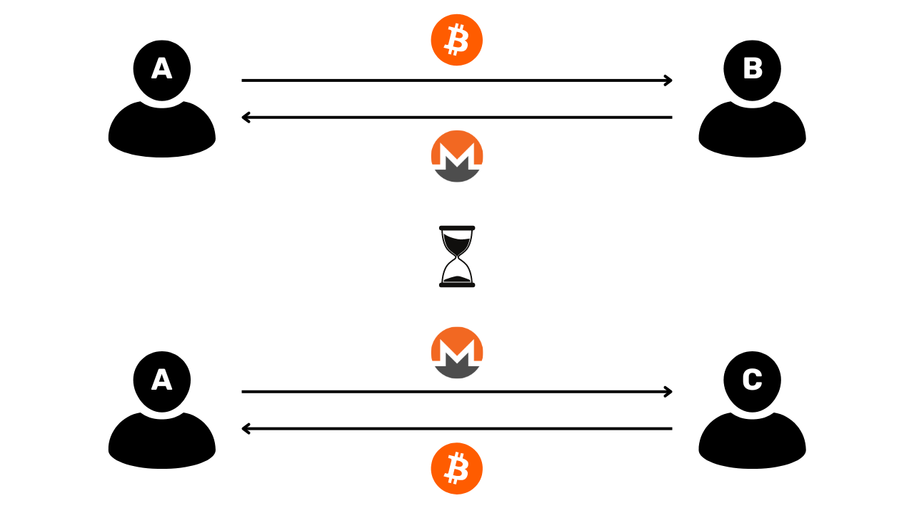

Sin embargo, a diferencia del intercambio de monedas, el intercambio atómico puede tener desequilibrios en términos de liquidez disponible, especialmente en intercambios BTC/XMR. Generalmente es más fácil intercambiar bitcoins por altcoins, ya que hay una alta demanda de bitcoins, lo que mantiene bajos los primas para esta dirección de conversión. Sin embargo, intercambiar altcoins para obtener BTC puede ser más complejo debido a la menor demanda, lo que a menudo resulta en primas muy altas.

Finalmente, cuando un intercambio atómico involucra bitcoins en la cadena y bitcoins en la red Lightning, entonces nos referimos a él como un "*submarine swap*".

### ¿Es Realmente Útil?
Los traslados secretos de propiedad, como los intercambios de monedas y los intercambios atómicos, tienen la ventaja de engañar a las heurísticas de análisis de cadena. Estos métodos pueden dar la impresión de que las transacciones involucran al mismo usuario, aunque la propiedad real haya cambiado de manos. Sin embargo, el principal inconveniente de estos métodos es que son muy riesgosos sin el uso de una técnica adicional para romper el historial de la moneda.
Efectivamente, cuando Alice realiza un coinswap o un atomic swap con Bob, ella intercambia la propiedad de sus bitcoins con los de Bob. En el caso de un atomic swap, el intercambio incluye una altcoin, pero el principio sigue siendo el mismo. Así, Alice termina con la moneda $B$ y Bob con la moneda $A$. Esto añade dudas en el análisis de cadena, pero el historial de las monedas sigue siendo rastreable. Si un analista examina la moneda $A$, pueden rastrear hasta las actividades previas de Alice, y viceversa para la moneda $B$.
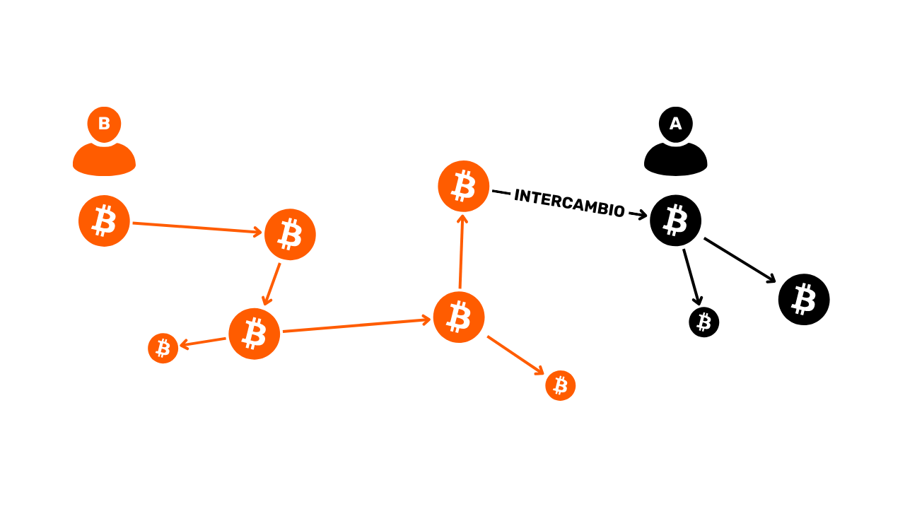

Desde la perspectiva de Alice, el riesgo es que el historial de la moneda $B$ podría ser considerado sospechoso por ciertas entidades. Si, por ejemplo, Bob hubiera adquirido la moneda $B$ en un acto criminal como el hacking, esta moneda permanecería vinculada a sus actividades ilegales. Alice podría entonces encontrarse en posesión de una moneda que no podría transferir en plataformas de intercambio reguladas sin arriesgarse a que sus fondos sean congelados, o incluso ser acusada de los crímenes de Bob, aunque ella no tuviera nada que ver con ellos.

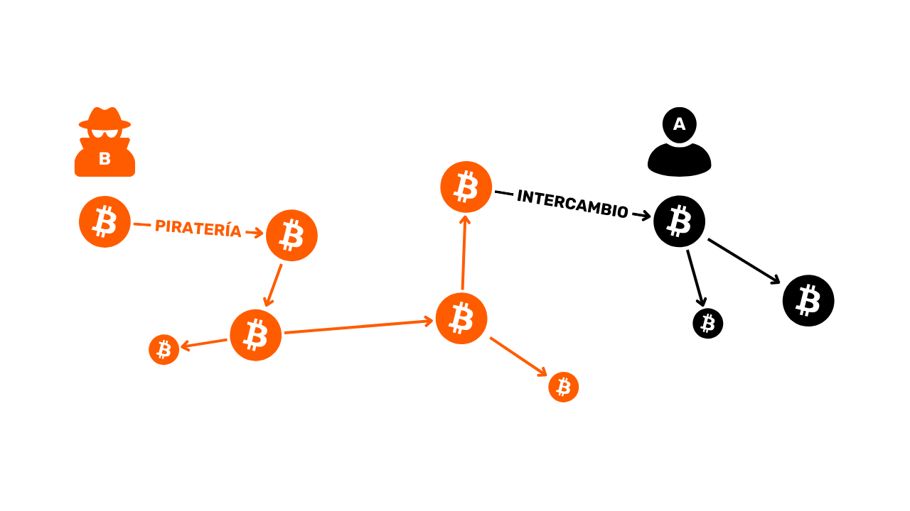

Y, por supuesto, los métodos de privacidad como el coinswap o el atomic swap son favorecidos por criminales cuyos fondos son monitoreados por las autoridades. Estos protocolos les ofrecen la oportunidad de deshacerse de sus bitcoins monitoreados a cambio de bitcoins perfectamente fungibles. Esto también les permite crear una distracción, dirigiendo a las autoridades hacia otros usuarios. Existe, por lo tanto, una doble utilidad para estos individuos.

Con coinjoin, incluso si tu moneda se mezcla con bitcoins monitoreados, el historial de la moneda se rompe, lo que proporciona una forma de negación plausible que no existe en protocolos de transferencia de propiedad secreta como el coinswap o el atomic swap.


Si Alice quiere evitar cualquier riesgo, necesariamente debe usar un método para romper el historial de la moneda $B$, como pasarla por coinjoins, por ejemplo. Esto plantea una pregunta sobre la utilidad de combinar la transferencia secreta de propiedad y el coinjoin. El coinjoin, al romper el historial de una moneda, ya proporciona un nivel suficiente de privacidad para Alice. Así, mi opinión es que si Alice busca proteger su privacidad, sería más prudente proceder directamente con un coinjoin en lugar de participar en un coinswap seguido por un coinjoin.
Para que los métodos de transferencia secreta de propiedad sean verdaderamente efectivos y eviten el riesgo de vincular el historial de un usuario $A$ con un usuario $B$, sería paradójicamente necesario que su uso fuera ampliamente conocido. Si el coinswap se usa masivamente y las autoridades son conscientes de esta práctica común, entonces se podría establecer una forma de negación plausible. Sin embargo, mientras el uso de estas transferencias siga siendo marginal, creo que estos métodos seguirán siendo demasiado arriesgados para los usuarios.

Hasta ahora, hemos estudiado principalmente métodos de privacidad a nivel de las transacciones mismas. En el próximo capítulo, exploraremos los problemas a nivel de la red y la difusión de transacciones.

## Privacidad en la Red P2P
<chapterId>04a2467b-db84-4076-a9ff-919be5135106</chapterId>

En la parte 4, discutimos la importancia de usar un nodo completo para proteger la privacidad de tus transacciones. Sin embargo, es importante entender que tu propio nodo puede ser sujeto a ataques que busquen extraer información sobre tus actividades. En este capítulo, por lo tanto, examinaremos las diferentes medidas de protección de la privacidad, no a nivel de las transacciones mismas o los flujos de bitcoins, sino a nivel de la red.

### Dandelion
Una forma de evitar diversos ataques de desanonimización es utilizar la propuesta Dandelion. Este protocolo de difusión fue formalizado en BIP156, pero nunca ha sido implementado en Bitcoin.
La idea de Dandelion es mejorar la privacidad del enrutamiento de transacciones en la red Bitcoin para contrarrestar diversas formas de ataques. Su principal objetivo es ocultar el nodo fuente que inicialmente difunde una transacción en la red. La divulgación de este nodo podría vincular una transacción de Bitcoin a una dirección IP específica (si el nodo opera en la red abierta), lo que podría proporcionar un punto de entrada para el análisis de cadena.
Esta asociación entre una actividad en Bitcoin y una dirección IP representa un riesgo significativo para la privacidad del usuario. De hecho, numerosas entidades pueden vincular fácilmente una dirección IP con una identidad personal. Esto incluye notablemente a gobiernos y proveedores de servicios de Internet. Además, esta información puede volverse accesible públicamente, por ejemplo, si tu dirección IP y datos personales se exponen debido a una filtración durante el hackeo de la base de datos de un sitio web.
En la operación estándar de Bitcoin, las transacciones construidas por un usuario en su software de billetera se transmiten a su nodo personal. Este nodo inmediatamente difunde la nueva transacción a todos los pares a los que está conectado.


Estos pares luego verifican la transacción para asegurarse de que cumple con las reglas de consenso y las reglas de estandarización locales. Una vez validada, cada par a su vez transmite la transacción a sus propios pares, y así sucesivamente.


La distribución de transacciones pendientes de integración en un bloque se realiza de manera bastante equilibrada y estadísticamente predecible. Esta vulnerabilidad puede ser explotada por nodos espía coludidos, que colaboran para monitorear y analizar la red, con el fin de identificar el primer nodo que ha difundido una transacción. Si un observador logra localizar el nodo fuente, pueden asumir que la transacción proviene del operador de ese nodo. Este tipo de observación puede vincular transacciones, normalmente anónimas, a direcciones IP específicas.


El objetivo de BIP156 es abordar este problema. Para hacerlo, introduce una fase adicional en la difusión de una nueva transacción para preservar el anonimato antes de la propagación pública generalizada. Dandelion primero utiliza una fase de "tallo" donde la transacción se envía a través de un camino aleatorio de nodos.


Luego, la transacción se difunde a toda la red en la fase de "pelusa".


El tallo y la pelusa son referencias al comportamiento de la propagación de la transacción a través de la red, asemejando la forma de un diente de león.

Así, los nodos espía pueden potencialmente rastrear la transacción hasta el nodo que inició la fase de pelusa (la difusión masiva), pero este nodo no es el que primero difundió la transacción, ya que la recibió del último nodo en el tallo. Si los nodos espía no pueden rastrear hacia arriba el tallo, tampoco pueden identificar el nodo fuente.


Incluso en presencia de nodos espía durante la fase de tallo, siempre permanece la duda porque tan pronto como encuentran un nodo honesto en el gráfico de difusión, los espías no pueden determinar si este nodo es la fuente original o simplemente un intermediario.

Este método de enrutamiento difumina el rastro que conduce al nodo fuente, dificultando rastrear una transacción a través de la red hasta su origen. Dandelion mejora así la privacidad al limitar la capacidad de los adversarios para desanonimizar la red. Este método es aún más efectivo cuando la transacción cruza, durante la fase de "tallo", un nodo que cifra sus comunicaciones de red, como con Tor o P2P Transport V2.
BIP156 no ha sido integrado en Bitcoin Core y actualmente está clasificado bajo el estado "rechazado". Una de las principales preocupaciones sobre este protocolo radica en el hecho de que, durante la fase de tallo, las transacciones deben ser retransmitidas por nodos intermediarios antes de ser verificadas. Como hemos visto, en el modelo normal de Bitcoin, cada nodo primero verifica la transacción antes de transmitirla a sus pares. Si una transacción no cumple con las reglas de consenso o las reglas de estandarización local del nodo, este la ignora y no la transmite. Este proceso es importante para contrarrestar ataques DoS, ya que solo las transacciones válidas se transmiten a toda la red. Las transacciones inválidas, potencialmente generadas en masa para sobrecargar la red, se detienen en el primer nodo encontrado y no se propagan. El principal riesgo con Dandelion es que este nuevo protocolo podría introducir nuevos vectores para ataques DoS al permitir la transmisión de transacciones inválidas a través de parte de la red.

### P2P Transport V2

P2P Transport V2 es otro protocolo de red presentado en BIP324. Es una nueva versión del protocolo de transporte P2P de Bitcoin que incorpora cifrado oportunista para mejorar la confidencialidad y seguridad de las comunicaciones entre nodos.

Esta mejora tiene como objetivo resolver varios problemas con la versión básica del protocolo P2P. Por un lado, hace que los datos intercambiados sean indistinguibles de otros tipos de datos que circulan en Internet para un observador pasivo. El objetivo principal es evitar que los gobiernos, proveedores de servicios de Internet o proveedores de VPN monitoreen masivamente a los usuarios de Bitcoin. Esto también complica la tarea para estas entidades de determinar si un usuario de Internet es también un usuario de Bitcoin, es decir, si están operando un nodo completo.
P2P V2 también contribuye a reducir los riesgos de censura y ataques mediante la detección de patrones específicos en los paquetes de datos. Complica y hace más costosa la ejecución de varios tipos de ataques Sybil a nivel de red. Un ataque Sybil ocurre cuando un actor crea múltiples identidades falsas para obtener una ventaja indebida. En el contexto de la red Bitcoin, esto a menudo se manifiesta como un actor que controla un gran número de nodos completos y los usa agresivamente para multiplicar conexiones. Los ataques Sybil pueden ser pasivos, con el objetivo de recopilar información y comprometer la confidencialidad del usuario, o activos, en forma de ataques Eclipse. Estos últimos aíslan un nodo específico del resto de la red, permitiendo censurar al usuario o alterar los datos que recibe. Finalmente, P2P V2 también hace que los ataques *Man-In-The-Middle* (MITM) sean más costosos y fáciles de detectar.
El cifrado implementado por P2P V2 no incluye autenticación para no agregar complejidad innecesaria y para no comprometer la naturaleza sin permisos de conexión de red. Este nuevo protocolo de transporte P2P ofrece, sin embargo, mejor seguridad contra ataques pasivos y hace que los ataques activos sean significativamente más costosos y detectables. La introducción de un flujo de datos pseudoaleatorio en los mensajes de red complica la tarea para los atacantes que deseen censurar o manipular comunicaciones.

El transporte P2P V2 fue incluido como una opción (deshabilitada por defecto) en la versión 26.0 de Bitcoin Core, desplegada en diciembre de 2023. Luego fue habilitado por defecto en la versión 27.0 en abril de 2024. Se puede modificar con la opción `v2transport=` en el archivo de configuración.

### Tor
Otra solución relativamente simple para evitar los riesgos de pérdida de confidencialidad para un nodo a nivel de red es ejecutarlo completamente bajo Tor.
Tor es una red de servidores de relevo (nodos) que anonimiza el origen de las conexiones TCP en internet. Funciona encapsulando los datos en múltiples capas de cifrado. Cada nodo de relevo elimina una capa para revelar la dirección del siguiente nodo, hasta alcanzar el destino final. La red Tor asegura el anonimato al impedir que los nodos intermedios conozcan tanto el origen como el destino de los datos, lo que hace muy difícil para un observador rastrear la actividad del usuario.


Por lo tanto, Tor no solo cifra los datos comunicados sino que también permite ocultar el origen y destino de las comunicaciones. Al usar Tor para las comunicaciones de nuestro nodo personal, mejoramos la privacidad de nuestras transacciones: el Proveedor de Servicios de Internet (ISP) no puede descifrar las comunicaciones, y otros nodos en la red de Bitcoin no pueden identificar la dirección IP del nodo fuente. Además, Tor también oculta el uso de Bitcoin de tu ISP.

El principal riesgo asociado con este método es que Tor es un protocolo independiente de Bitcoin. Si tienes un nodo de Bitcoin bajo Tor y Tor deja de funcionar, entonces tu nodo de Bitcoin ya no podrá comunicarse.

Además, es importante notar que las comunicaciones a través de Tor son más lentas. Esta latencia es particularmente molesta durante el lanzamiento inicial de un nodo, ya que la Descarga Inicial de Bloques (IBD) requiere muchas comunicaciones. Como resultado, tu sincronización inicial con la red de Bitcoin podría ser significativamente más larga usando Tor. También es posible realizar la IBD en la red abierta, y luego activar Tor más tarde. Aunque este método revela la existencia de tu nodo de Bitcoin a tu ISP, protege la información relacionada con tus transacciones personales una vez que cambias a Tor.

Después de explorar los diferentes métodos de privacidad a nivel de red, también quiero introducir en los próximos capítulos dos soluciones elegantes para evitar la reutilización de direcciones: BIP47 y Pagos Silenciosos.

## BIP47 y Códigos de Pago Reutilizables
<chapterId>ad88e076-a04b-4aec-b3b2-7b4760175504</chapterId>

Como vimos en la parte 3, la reutilización de direcciones plantea un serio obstáculo para la privacidad del usuario en el protocolo de Bitcoin. Para mitigar estos riesgos, se recomienda encarecidamente generar una nueva dirección de recepción para cada nuevo pago recibido en una billetera. Aunque generar una nueva dirección es hoy simplificado por el uso de software moderno y billeteras deterministas jerárquicas, esta práctica puede parecer contraintuitiva.


En el sistema bancario tradicional, por ejemplo, estamos acostumbrados a compartir nuestro IBAN, que siempre permanece igual. Una vez comunicado a alguien, pueden enviarnos múltiples pagos sin tener que interactuar con nosotros nuevamente. Los neo-bancos también ofrecen posibilidades más modernas como el uso de direcciones de correo electrónico únicas en PayPal o RevTags en Revolut. Incluso fuera del dominio financiero, nuestros identificadores diarios como nuestra dirección postal, número de teléfono y dirección de correo electrónico también son únicos y permanentes. No tenemos que renovarlos con cada nueva interacción.


Sin embargo, el funcionamiento de Bitcoin es diferente: es imperativo generar una nueva dirección de recepción para cada transacción entrante. Este compromiso entre facilidad de uso y privacidad se remonta al origen mismo del Libro Blanco de Bitcoin. Desde la publicación de la primera versión de su documento a finales de 2008, Satoshi Nakamoto ya nos advertía sobre este riesgo:
**"*Como un cortafuegos adicional, un nuevo par de llaves podría ser utilizado para cada transacción para mantenerlas sin vincular a un propietario común.*"**
Existen numerosos métodos para recibir múltiples pagos en un único identificador sin causar reutilización de direcciones. Cada uno tiene sus propios compromisos y desventajas. Entre estos métodos se encuentra BIP47, una propuesta desarrollada por Justus Ranvier y publicada en 2015. Esta propuesta tiene como objetivo crear códigos de pago reutilizables que permitan múltiples transacciones a la misma persona evitando la reutilización de direcciones. En esencia, BIP47 busca ofrecer un sistema de pago tan intuitivo como un identificador único, preservando al mismo tiempo la privacidad de las transacciones.


BIP47 no mejora directamente la privacidad del usuario, ya que un pago BIP47 ofrece el mismo nivel de privacidad que una transacción clásica de Bitcoin usando direcciones frescas. Sin embargo, hace que el uso de Bitcoin sea más conveniente e intuitivo, una facilidad que, normalmente, debería comprometer la privacidad. Gracias a BIP47, esta facilidad de uso logra el mismo nivel de privacidad que una transacción clásica. Es por esto que BIP47 es una herramienta valiosa para la preservación de la privacidad.

Inicialmente, BIP47 fue una propuesta formulada para ser integrada en Bitcoin Core, pero nunca fue adoptada. Algunos softwares aún han elegido implementarlo por su cuenta a nivel de aplicación. Así, los equipos de Samourai Wallet han desarrollado su propia implementación de BIP47 denominada "PayNym".

### Principio General de BIP47 y PayNym

El objetivo de BIP47 es permitir la recepción de numerosos pagos sin causar reutilización de direcciones. Se basa en el uso de un código de pago reutilizable, que permite a diferentes emisores enviar múltiples pagos a un único código perteneciente a otro usuario. Así, el destinatario no tiene que proporcionar una nueva dirección fresca para cada transacción, lo que facilita enormemente sus intercambios mientras preserva su privacidad.

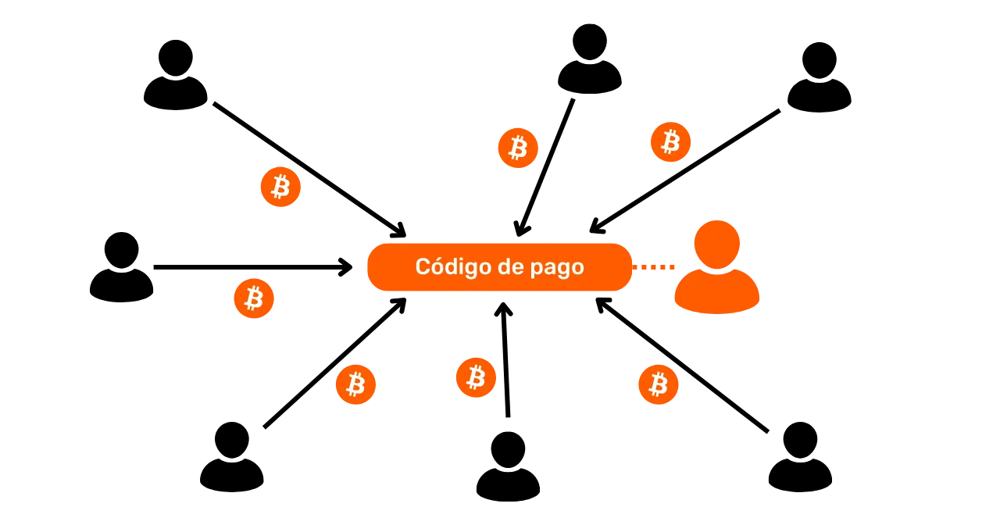

Un usuario puede, por lo tanto, compartir su código de pago libremente, ya sea en redes sociales o en su sitio web, sin arriesgar perder privacidad, a diferencia de lo que sucedería con una dirección de recepción clásica o una clave pública.
Para realizar una transacción, ambas partes deben tener una billetera Bitcoin con una implementación de BIP47, como PayNym en Samourai Wallet o Sparrow Wallet. El uso conjunto de sus códigos de pago crea un canal secreto entre ellos. Para establecer este canal de manera eficiente, el emisor debe realizar una transacción específica en la cadena de bloques de Bitcoin, conocida como "transacción de notificación" (te daré más detalles sobre esto más adelante).

La combinación de los códigos de pago de ambos usuarios genera secretos compartidos, que a su vez permiten la creación de un gran número de direcciones de recepción de Bitcoin únicas (exactamente 2^32, o alrededor de 4 mil millones). Así, los pagos realizados a través de BIP47 no se dirigen realmente al código de pago en sí, sino a direcciones de recepción clásicas derivadas de los códigos de pago de los usuarios involucrados.

El código de pago sirve así como un identificador virtual derivado de la semilla de la billetera. En la estructura de derivación jerárquica de la billetera, el código de pago se posiciona en el nivel 3, es decir, en el nivel de cuenta.

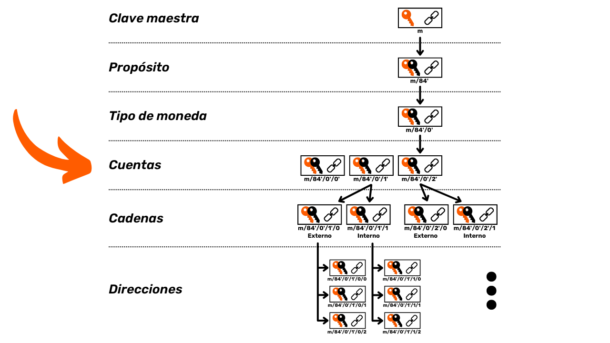

El objetivo de derivación para BIP47 se identifica por el índice `47'` (`0x8000002F`), refiriéndose a BIP47. Un ejemplo de un camino de derivación para un código de pago reutilizable sería el siguiente:
```plaintext
m/47'/0'/0'/
```

Para darte una idea de cómo luce un código de pago, aquí está el mío:
```plaintext
PM8TJSBiQmNQDwTogMAbyqJe2PE2kQXjtgh88MRTxsrnHC8zpEtJ8j7Aj628oUFk8X6P5rJ7P5qDudE4Hwq9JXSRzGcZJbdJAjM9oVQ1UKU5j2nr7VR5
```
Este código también puede codificarse en un código QR, para facilitar su comunicación, al igual que una dirección de recepción clásica.

En cuanto a los PayNym Bots, estos robots que a veces se ven en Twitter, son representaciones visuales del código de pago, creados por Samourai Wallet. Se generan mediante una función de hash, lo que les otorga casi unicidad. Aparecen en forma de una pequeña cadena de caracteres que comienza con `+`:
```plaintext
+throbbingpond8B1
+twilightresonance487
+billowingfire340
```

Estos avatares también pueden representarse en forma de imágenes:


Aunque estos robots no tienen una funcionalidad técnica específica dentro del marco de BIP47, juegan un papel en facilitar las interacciones entre usuarios al ofrecer una identidad visual fácilmente reconocible.
En las siguientes secciones de este capítulo dedicado a BIP47, examinaremos en detalle cómo funciona, con un énfasis particular en los métodos criptográficos utilizados. Para comprender completamente estas explicaciones algo técnicas, es esencial primero entender la estructura de las billeteras HD, los procesos de derivación de claves y los principios fundamentales de la criptografía basada en curvas elípticas. Si deseas profundizar en estos conceptos, otro curso gratuito está disponible en PlanB Network: [CRYPTO 301](https://planb.network/en/courses/crypto301). Aún te aconsejo que los sigas, ya que entender el funcionamiento técnico de BIP47 te facilitará mucho la comprensión de otras propuestas similares que discutiremos en los siguientes capítulos.
### Código de Pago Reutilizable

Como se mencionó antes, el código de pago reutilizable se encuentra en la profundidad 3 de la billetera HD, lo que lo hace comparable a un `xpub`, tanto en su posición dentro de la estructura de la billetera como en su rol.

El código de pago de 80 bytes se desglosa de la siguiente manera:
- **Byte `0`: La versión**. Para la primera versión de BIP47, este byte se establece en `0x01`;
- **Byte `1`: El campo de bits**. Este espacio está reservado para integrar indicaciones adicionales durante usos específicos. Para el uso estándar con PayNym, este byte se define como `0x00`;
- **Byte `2`: La paridad de `y`**. Este byte es `0x02` o `0x03`, indicando si la ordenada de la clave pública es par o impar, ya que se utiliza una clave pública comprimida;
- **Desde el byte `3` hasta el byte `34`: El valor de `x`**. Estos bytes representan la abscisa de la clave pública. La concatenación de `x` y la paridad de `y` forma la clave pública comprimida completa;
- **Desde el byte `35` hasta el byte `66`: El código de cadena**. Este espacio contiene el código de cadena asociado con la clave pública;
- **Desde el byte `67` hasta el byte `79`: El relleno**. Este espacio está destinado a posibles desarrollos futuros. Para la versión actual, simplemente se colocan ceros aquí para alcanzar el tamaño de 80 bytes requerido para una salida `OP_RETURN`.

Aquí está la representación hexadecimal de mi código de pago reutilizable ya presentado en la sección anterior:
```plaintext
0x010002a0716529bae6b36c5c9aa518a52f9c828b46ad8d907747f0d09dcd4d9a39e97c3c5f37c470c390d842f364086362f6122f412e2b0c7e7fc6e32287e364a7a36a00000000000000000000000000
```

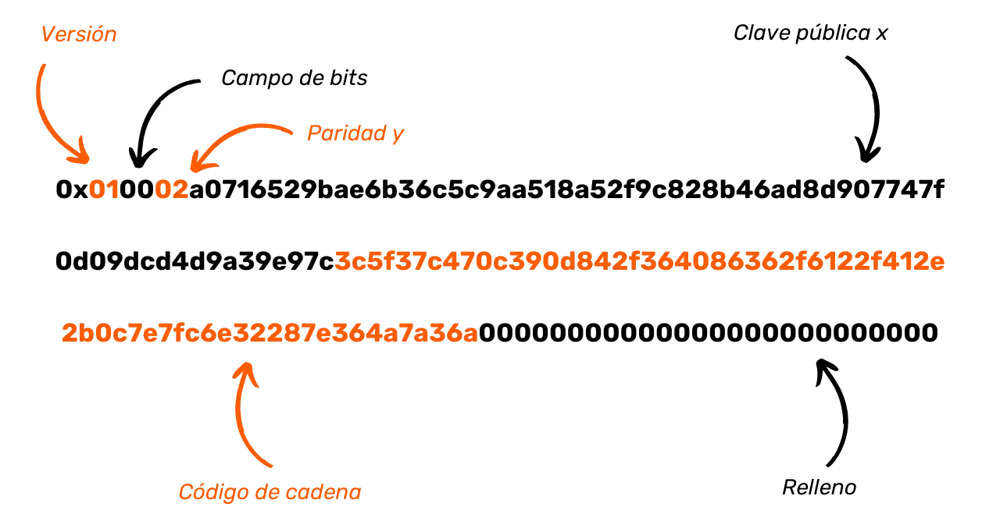

Primero, es necesario añadir el byte prefijo `P` al principio para indicar claramente que se trata de un código de pago. Este byte se representa por `0x47`:
```plaintext
0x47010002a0716529bae6b36c5c9aa518a52f9c828b46ad8d907747f0d09dcd4d9a39e97c3c5f37c470c390d842f364086362f6122f412e2b0c7e7fc6e32287e364a7a36a00000000000000000000000000
```

Finalmente, para asegurar la integridad del código de pago, se realiza un cálculo de suma de verificación usando `HASH256`, que consiste en un doble hash con la función `SHA256`. Los primeros cuatro bytes resultantes de este hash se concatenan al final del código de pago:
```plaintext
0x47010002a0716529bae6b36c5c9aa518a52f9c828b46ad8d907747f0d09dcd4d9a39e97c3c5f37c470c390d842f364086362f6122f412e2b0c7e7fc6e32287e364a7a36a00000000000000000000000000567080c4
```

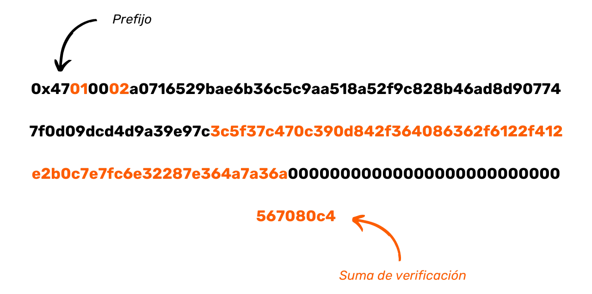

Una vez completados estos pasos, el código de pago está listo. Lo único que queda es convertirlo en base 58 para obtener su versión final:
```plaintext
PM8TJSBiQmNQDwTogMAbyqJe2PE2kQXjtgh88MRTxsrnHC8zpEtJ8j7Aj628oUFk8X6P5rJ7P5qDudE4Hwq9JXSRzGcZJbdJAjM9oVQ1UKU5j2nr7VR5
```

Durante este proceso de creación del código de pago, utilizamos una clave pública comprimida y un código de cadena. Ambos se derivan de una derivación determinista y jerárquica de la semilla de la billetera. La ruta de derivación utilizada para lograr esto es:
```plaintext
m/47'/0'/0'/
```
Para generar la clave pública comprimida y el código de cadena asociado para el código de pago reutilizable, comenzamos calculando la clave privada maestra a partir de la semilla de la billetera. Luego procedemos a derivar un par de claves hijo usando el índice `47 + 2^31` (derivación endurecida). Este paso es seguido por dos derivaciones sucesivas más de pares de claves hijo, cada una usando el índice `2^31` (derivación endurecida).


### El Intercambio de Claves Diffie-Hellman de Curva Elíptica (ECDH)
El protocolo criptográfico en el corazón de BIP47 es referido por el acrónimo ECDH, por *Elliptic-Curve Diffie-Hellman*. Este método es una variante del original intercambio de claves Diffie-Hellman.
Introducido en 1976, Diffie-Hellman es un protocolo de acuerdo de claves que permite a dos partes, cada una equipada con un par de claves (pública y privada), acordar un secreto común, incluso mientras se comunican únicamente a través de un canal público e inseguro.

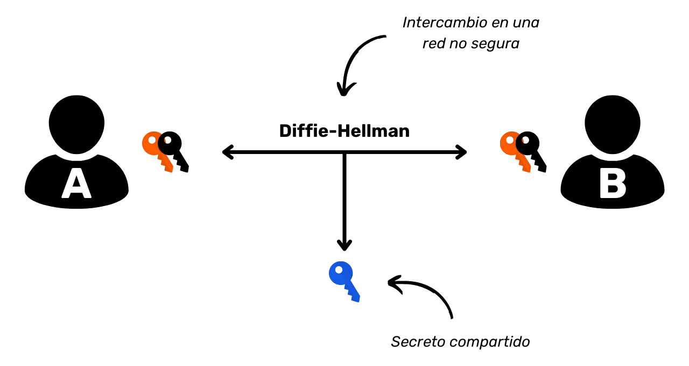

Este secreto común (aquí, la llave azul), puede entonces ser utilizado para otras operaciones. Típicamente, este secreto compartido puede ser usado para encriptar y desencriptar comunicación a través de una red insegura:


Para lograr este intercambio, Diffie-Hellman utiliza aritmética modular para calcular el secreto compartido. Aquí hay una explicación simplificada de cómo funciona:
- Alice y Bob acuerdan un color común, aquí amarillo, que constituye datos públicos (los atacantes conocen este color);
- Alice selecciona un color secreto, aquí rojo, y mezcla los dos para obtener naranja;
- Bob también elige un color secreto, aquí azul, y lo mezcla con el amarillo para obtener verde;
- Luego intercambian los colores obtenidos, naranja y verde. Este intercambio puede tener lugar sobre una red insegura y observada;
- Al mezclar el verde de Bob con su propio color secreto, Alice produce marrón;
- Bob, haciendo lo mismo con el naranja de Alice y su azul secreto, también obtiene marrón.

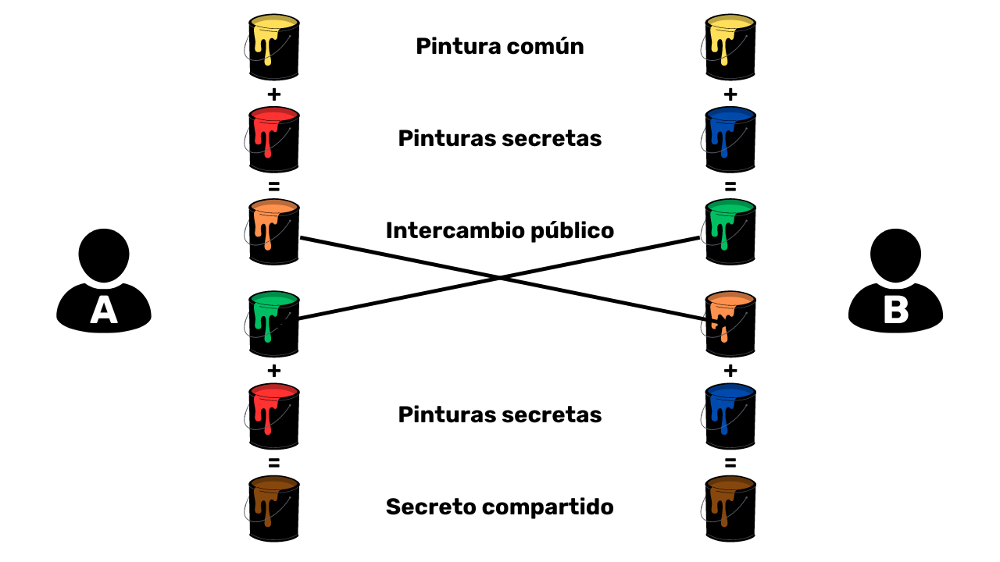

En esta simplificación, el color marrón representa el secreto compartido entre Alice y Bob. Es importante entender que, en realidad, es imposible para el atacante separar los colores naranja y verde para descubrir los colores secretos de Alice o Bob.

Ahora, examinemos cómo este protocolo funciona realmente, no con analogías de colores, sino usando números reales y aritmética modular.
Antes de discutir los mecanismos de Diffie-Hellman, permítanme recordarles brevemente dos conceptos matemáticos esenciales que necesitaremos:

- Un **número primo** es un número natural que tiene solo dos divisores: $1$ y él mismo. Por ejemplo, $7$ es un número primo porque solo puede ser dividido por $1$ y $7$. Por otro lado, $8$ no es un número primo ya que es divisible por $1$, $2$, $4$, y $8$. Por lo tanto, tiene cuatro divisores de números enteros positivos en lugar de dos;
- El **módulo** (denotado $mod$ o $\%$) es una operación matemática que, entre dos enteros, devuelve el resto de la división euclidiana del primero por el segundo. Por ejemplo, $16 \bmod 5 = 1$.

**El intercambio de claves Diffie-Hellman entre Alice y Bob procede de la siguiente manera:**

- Alice y Bob acuerdan dos números comunes: $p$ y $g$. $p$ es un número primo, y cuanto mayor sea este número, más seguro será Diffie-Hellman. $g$ es una raíz primitiva de $p$. Estos dos números pueden ser comunicados abiertamente a través de una red no segura. Representan el equivalente de **el color amarillo** en la simplificación previa. Por lo tanto, es importante que Alice y Bob usen exactamente los mismos valores para $p$ y $g$.
- Una vez que estos parámetros están definidos, Alice y Bob eligen cada uno un número secreto aleatorio. Alice nombra su número secreto aleatorio $a$ (equivalente a **el color rojo**) y Bob el suyo $b$ (equivalente a **el color azul**). Estos números deben permanecer estrictamente confidenciales.
- En lugar de intercambiar directamente los números $a$ y $b$, cada parte calcula $A$ y $B$ de la siguiente manera:

$A$ es igual a $g$ elevado a la potencia de $a$ módulo $p$:


$$

A = g^a \bmod p

$$

$B$ es igual a $g$ elevado a la potencia de $b$ módulo $p$:


$$

B = g^b \bmod p

$$

- Los valores $A$ (equivalente a **el color naranja**) y $B$ (equivalente a **el color verde**) se intercambian entre las dos partes. Este intercambio puede tener lugar abiertamente sobre una red no segura;

- Alice, habiendo recibido $B$, calcula el valor de $z$ de la siguiente manera:

$z$ es igual a $B$ elevado a la potencia de $a$ módulo $p$:


$$

z = B^a \bmod p

$$

Para recordar:


$$

B = g^b \bmod p

$$

Así, obtenemos:


$$

z = B^a \bmod p

$$


$$

z = (g^b)^a \bmod p

$$

Aplicando las reglas de los exponentes:
$$

(x^n)^m = x^{nm}

$$

Entonces, obtenemos:


$$

z = g^{ba} \bmod p

$$

- Por su parte, Bob, habiendo recibido $A$, también calcula el valor de $z$ de la siguiente manera:

$z$ es igual a $A$ elevado a la potencia de $b$ módulo $p$:


$$

z = A^b \bmod p

$$

Así, obtenemos:


$$

z = (g^a)^b \bmod p

$$


$$

z = g^{ab} \bmod p

$$


$$

z = g^{ba} \bmod p

$$

Gracias a la distributividad del operador módulo, Alice y Bob obtienen exactamente el mismo valor $z$. Este número representa su secreto común, equivalente a **el color marrón** en la simplificación previa con los botes de pintura. Ahora pueden usar este secreto común para cifrar sus comunicaciones de manera simétrica sobre una red no segura.


Un atacante, incluso en posesión de $p$, $g$, $A$ y $B$ (los valores públicos), no podrá calcular $a$, $b$, ni $z$ (los valores privados). Para lograr esto, tendría que revertir la exponenciación, una operación imposible sin probar todas las posibilidades una por una, ya que equivale a calcular el logaritmo discreto, es decir, el inverso de la exponencial en un grupo cíclico finito.

Así, mientras los valores de $a$, $b$ y $p$ sean suficientemente grandes, el protocolo de Diffie-Hellman es seguro. Típicamente, con parámetros de 2048 bits (un número con 600 dígitos en decimal), probar todas las posibilidades para $a$ y $b$ sería impracticable. Hasta el día de hoy, con tales números, este algoritmo se considera seguro.
Precisamente aquí radica la principal desventaja del protocolo de Diffie-Hellman. Para ser seguro, el algoritmo debe usar números grandes. Por eso, hoy en día, se prefiere el algoritmo ECDH (*Elliptic Curve Diffie-Hellman*), una variante de Diffie-Hellman que se basa en una curva algebraica, más precisamente una curva elíptica. Este enfoque permite trabajar con números mucho más pequeños mientras se mantiene una seguridad equivalente, reduciendo así los recursos necesarios para el cálculo y almacenamiento.
El principio general del algoritmo sigue siendo el mismo. Sin embargo, en lugar de usar un número aleatorio $a$ y un número $A$ calculado a partir de $a$ mediante exponenciación modular, usamos un par de claves establecidas en una curva elíptica. En lugar de depender de la distributividad del operador módulo, usamos la ley de grupo en curvas elípticas, y más específicamente la asociatividad de esta ley.
Para explicar brevemente el principio de la criptografía de curva elíptica, una clave privada está representada por un número aleatorio entre $1$ y $n-1$, donde $n$ representa el orden de la curva. La clave pública, por otro lado, es un punto específico en esta curva, obtenido de la clave privada a través de operaciones de adición y duplicación de puntos partiendo del punto generador, según la ecuación:
$$

K = k \cdot G

$$

En esta fórmula, $K$ denota la clave pública, $k$ la clave privada, y $G$ el punto generador.

Una de las características esenciales de estas claves es la facilidad de calcular $K$ a partir de $k$ y $G$, mientras que es prácticamente imposible encontrar $k$ a partir de $K$ y $G$. Esta asimetría crea una función unidireccional. En otras palabras, es fácil computar la clave pública si se conoce la clave privada, pero encontrar la clave privada a partir de la clave pública es imposible. Esta seguridad sigue basándose en la dificultad computacional del logaritmo discreto.

Usaremos esta propiedad para adaptar nuestro algoritmo de Diffie-Hellman. **El principio de funcionamiento de ECDH es el siguiente:**

- Alice y Bob acuerdan juntos una curva elíptica criptográficamente segura y sus parámetros. Esta información es pública;

- Alice genera un número aleatorio $ka$ que será su clave privada. Esta clave privada debe permanecer en secreto. Ella determina su clave pública $Ka$ mediante la adición y duplicación de puntos en la curva elíptica elegida:


$$

K_a = k_a \cdot G

$$

- Bob también genera un número aleatorio $kb$ que será su clave privada. Calcula la clave pública asociada $Kb$:


$$

K_b = k_b \cdot G

$$

- Alice y Bob intercambian sus claves públicas $Ka$ y $Kb$ a través de una red pública no segura.

- Alice calcula un punto $(x,y)$ en la curva aplicando su clave privada $ka$ a la clave pública de Bob $Kb$:


$$

(x,y) = k_a \cdot K_b

$$

- Bob calcula un punto $(x,y)$ en la curva aplicando su clave privada $kb$ a la clave pública de Alice $Ka$:


$$

(x,y) = k_b \cdot K_a

$$

- Alice y Bob obtienen el mismo punto en la curva elíptica. El secreto compartido será la coordenada x $x$ de este punto.

De hecho, obtienen el mismo secreto compartido porque:


$$

(x,y) = k_a \cdot K_b = k_a \cdot (k_b \cdot G) = (k_a \cdot k_b) \cdot G = (k_b \cdot k_a) \cdot G = k_b \cdot (k_a \cdot G) = k_b \cdot K_a$$
Un atacante que observe la red pública no segura solo puede obtener las claves públicas de cada parte y los parámetros de la curva elíptica elegida. Como se explicó anteriormente, esta información por sí sola no es suficiente para determinar las claves privadas. Por lo tanto, el atacante no puede encontrar el secreto compartido entre Alice y Bob.

ECDH es, por lo tanto, un algoritmo que permite el intercambio de claves. A menudo se usa en conjunto con otros métodos criptográficos para establecer un protocolo completo. Por ejemplo, ECDH está integrado en el núcleo de TLS (_Transport Layer Security_), un protocolo de cifrado y autenticación utilizado para la capa de transporte de internet. TLS utiliza ECDHE para el intercambio de claves, una variante de ECDH donde las claves son efímeras, para proporcionar confidencialidad persistente. Además, TLS utiliza algoritmos de autenticación como ECDSA, algoritmos de cifrado como AES y funciones hash como SHA256.

TLS es notablemente responsable de la `s` en `https` así como del candado visible en la barra de direcciones de tu navegador, símbolos de comunicaciones cifradas. Al seguir este curso, por lo tanto, estás utilizando ECDH, y es muy probable que lo uses diariamente sin siquiera saberlo.

### La Transacción de Notificación

Como vimos en la sección anterior, ECDH es una variante del intercambio de Diffie-Hellman que utiliza pares de claves establecidos en una curva elíptica. Convenientemente, ¡ya poseemos muchos pares de claves que se adhieren a este estándar en nuestras billeteras de Bitcoin! La idea de BIP47 es usar los pares de claves de las billeteras jerárquicas deterministas de Bitcoin de ambas partes para establecer secretos compartidos y efímeros entre ellos. En el contexto de BIP47, se utiliza ECDHE (_Elliptic Curve Diffie-Hellman Ephemeral_) en su lugar.


ECDHE se utiliza por primera vez en BIP47 para transmitir el código de pago del remitente al destinatario. Este es el famoso **notification transaction**. Este paso es esencial porque para que BIP47 funcione de manera eficiente, ambas partes involucradas (el remitente y el destinatario) deben conocer el código de pago del otro. Este conocimiento permite la derivación de claves públicas efímeras y, en consecuencia, direcciones de recepción en blanco asociadas.
Antes de este intercambio, el remitente lógicamente ya está al tanto del código de pago del destinatario ya que lo han obtenido fuera de la cadena, por ejemplo, de su sitio web, una factura o sus redes sociales. Sin embargo, el destinatario puede no necesariamente conocer el código de pago del remitente. Sin embargo, este código debe transmitirse a ellos; de lo contrario, no podrán derivar las claves efímeras necesarias para identificar las direcciones donde se almacenan sus bitcoins, ni acceder a sus fondos. Aunque esta transmisión del código del remitente técnicamente puede llevarse a cabo fuera de la cadena a través de otros medios de comunicación, esto plantea un problema si la billetera necesita ser recuperada solo desde la semilla.
Efectivamente, a diferencia de las direcciones convencionales, las direcciones BIP47 no se derivan directamente de la semilla del destinatario—usar un `xpub` sería más simple en este caso—sino que resultan de un cálculo que combina ambos códigos de pago: el del remitente y el del destinatario. Así, si el destinatario pierde su cartera e intenta restaurarla desde su semilla, recuperará su propio código de pago, que se deriva directamente de su semilla. Sin embargo, para encontrar las direcciones efímeras, será esencial que también tengan los códigos de pago de todos los que les han enviado bitcoins a través de BIP47. De ahí la importancia de la transacción de notificación, que permite guardar esta información en la blockchain de Bitcoin, mientras se puede encontrar muy fácilmente sin tener que buscar entre los mil millones de transacciones ejecutadas desde su lanzamiento en 2009.
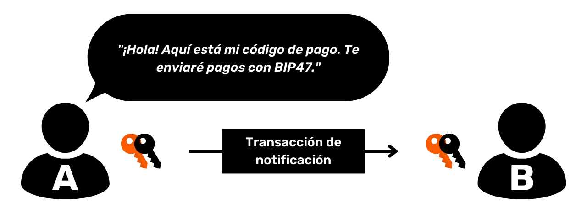

Por lo tanto, sería posible implementar BIP47 sin recurrir a la transacción de notificación, siempre que cada usuario guarde una copia de seguridad de los códigos de pago de sus pares. Sin embargo, este método resulta complejo de gestionar mientras no se desarrolle una solución simple, robusta y eficiente para crear, almacenar y actualizar estas copias de seguridad. En el estado actual de las cosas, la transacción de notificación se vuelve casi indispensable.

En los siguientes capítulos, estudiaremos otros protocolos con objetivos similares a los de BIP47, pero que no requieren una transacción de notificación. Sin embargo, estas alternativas introducen sus propios compromisos.

Además de su papel en la copia de seguridad de los códigos de pago, la transacción de notificación también sirve como una función de notificación para el destinatario, como sugiere su nombre. Señala al cliente del destinatario que se ha establecido un nuevo canal de pago, y sugiere así la monitorización de las direcciones efímeras resultantes.

### El Modelo de Privacidad de BIP47

Antes de detallar el funcionamiento técnico de la transacción de notificación, es importante discutir el modelo de privacidad asociado con BIP47, que justifica ciertas medidas tomadas durante la creación de esta transacción inicial.
El código de pago, en sí mismo, no representa un riesgo directo para la privacidad. A diferencia del modelo tradicional de Bitcoin, que busca romper el vínculo entre la identidad de un usuario y sus transacciones (que son públicas) preservando el anonimato de las claves y direcciones, el código de pago puede asociarse abiertamente con una identidad sin representar una amenaza.
De hecho, el código de pago no se utiliza para derivar directamente las direcciones que reciben pagos BIP47. Estas direcciones se generan en cambio mediante la aplicación de ECDH entre las claves derivadas de los códigos de pago de las dos partes involucradas.

Así, un código de pago en sí mismo no conduce directamente a una pérdida de privacidad, ya que solo la dirección de notificación se deriva de él. Aunque esta dirección puede revelar cierta información, normalmente no permite descubrir las partes con las que estás realizando transacciones, a menos que se realice un análisis exhaustivo de la cadena. De hecho, si el remitente utiliza UTXOs que pueden vincularse a su identidad para realizar la transacción de notificación, entonces se vuelve posible deducir que su identidad probablemente está vinculada a pagos BIP47 a su código de pago. Esto no revelará las transacciones subyacentes pero indicará su probable existencia.

Por lo tanto, es esencial mantener esta estricta separación entre los códigos de pago de los usuarios. Hacia este objetivo, el paso inicial de comunicación del código es un momento crítico para la privacidad del pago, aún obligatorio para el correcto funcionamiento del protocolo. Si uno de los códigos de pago se puede obtener públicamente (como en un sitio web), el segundo código, el del remitente, no debe vincularse al primero en ningún caso.

Tomemos un ejemplo concreto: Quiero hacer una donación a un movimiento político a través de BIP47:

- La organización ha hecho público su código de pago en su sitio web o a través de sus redes sociales;
- Este código está así vinculado al movimiento político;
- Recupero este código de pago;
- Antes de proceder con un envío, debo asegurarme de que conozcan mi propio código de pago, que también está vinculado a mi identidad ya que lo uso para recibir transacciones en mis redes sociales.

¿Cómo transmitir mi código sin riesgo? El uso de medios de comunicación convencionales podría llevar a una fuga de información y, consecuentemente, asociarme con este movimiento político. La transacción de notificación ofrece una solución gracias a una capa de cifrado que precisamente previene esta asociación entre dos códigos. Aunque este no es el único método para transmitir secretamente el código de pago del remitente, resulta ser muy efectivo.

En el diagrama a continuación, las líneas naranjas indican los puntos donde el flujo de información debe ser interrumpido, y las flechas negras muestran las conexiones que podrían potencialmente ser observadas por terceros:
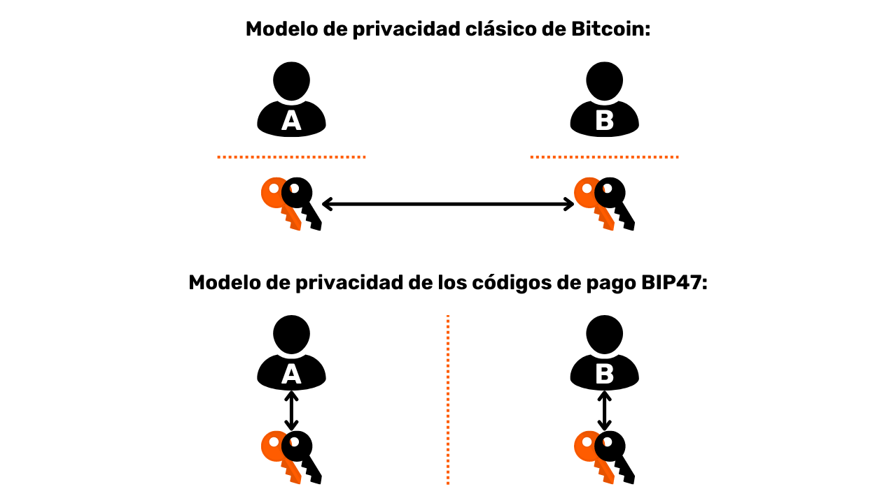
En realidad, dentro del modelo de privacidad tradicional de Bitcoin, a menudo es complejo disociar completamente el flujo de información entre el par de claves y el usuario, especialmente durante transacciones remotas. Por ejemplo, en el contexto de una campaña de donaciones, el destinatario debe inevitablemente divulgar una dirección o una clave pública a través de su sitio web o redes sociales. El uso correcto de BIP47, particularmente con la transacción de notificación, permite sortear este problema gracias a ECDHE y la capa de cifrado que estudiaremos más adelante.

Por supuesto, el modelo de privacidad clásico de Bitcoin todavía se aplica a las claves públicas efímeras, que se derivan de la combinación de los dos códigos de pago. Los dos modelos son en realidad complementarios. Lo que quiero destacar aquí es que, a diferencia del uso habitual de una clave pública para recibir bitcoins, el código de pago puede estar vinculado a una identidad específica, porque la información "_Alice realiza una transacción con Bob_" se rompe en otra etapa. El código de pago se utiliza para generar direcciones de pago, pero basándose únicamente en la observación de la blockchain, es imposible vincular una transacción de pago BIP47 a los códigos de pago utilizados para ejecutarla, a menos que los UTXOs involucrados ya estuvieran vinculados a una identidad previamente y los usuarios hayan asociado sus códigos de pago con sus respectivas identidades.

Para resumir, el modelo de privacidad ofrecido por los pagos BIP47 podría considerarse superior al de la base de Bitcoin, aunque de ninguna manera es mágico.

### Construcción de la Transacción de Notificación

Ahora, veamos cómo funciona esta transacción de notificación. Imagina que Alice quiere enviar fondos a Bob con BIP47. En mi ejemplo, Alice actúa como la remitente y Bob como el destinatario. Este último ha publicado su código de pago en su sitio web. Por lo tanto, Alice ya conoce el código de pago de Bob.

**1- Alice calcula un secreto compartido con ECDH:**

- Ella selecciona un par de claves de su monedero HD ubicado en una rama diferente de su código de pago. Nota, este par no debería ser fácilmente asociado con la dirección de notificación de Alice, ni con la identidad de Alice (ver sección anterior);

- Alice selecciona la clave privada de este par. La nombramos $a$ (minúscula);

$$
a
$$

- Alice recupera la clave pública asociada con la dirección de notificación de Bob. Esta clave es la primera hija derivada del código de pago de Bob (índice $/0$). Nombramos esta clave pública $B$ (mayúscula). La clave privada asociada con esta clave pública se nombra $b$ (minúscula). $B$ se determina por la adición y duplicación de puntos en la curva elíptica desde $G$ (el punto generador) con $b$ (la clave privada):
  $$ B = b \cdot G $$
- Alice calcula un punto secreto $S$ (mayúscula) en la curva elíptica mediante la adición y duplicación de puntos aplicando su clave privada $a$ a partir de la clave pública de Bob $B$.
  $$ S = a \cdot B $$

- Alice calcula el factor de cegamiento $f$ que le permitirá cifrar su código de pago. Para hacer esto, determinará un número pseudoaleatorio con la función HMAC-SHA512. En el segundo input de esta función, utiliza un valor que solo Bob podrá recuperar: $x$, que es la abscisa del punto secreto previamente calculado. El primer input es $o$, que es el UTXO consumido en la entrada de esta transacción (outpoint).

$$ f = \text{HMAC-SHA512}(o, x) $$

**2- Alice convierte su código de pago personal en base 2 (binario).**

**3- Utiliza este factor de cegamiento como clave para realizar el cifrado simétrico en el payload de su código de pago.** El algoritmo de cifrado utilizado es simplemente un `XOR`. La operación realizada es comparable al cifrado de Vernam, también denominado "One-Time Pad".

- Alice primero divide su factor de cegamiento en dos: los primeros 32 bytes se denominan $f1$ y los últimos 32 bytes se denominan $f2$. Así, tenemos:

$$ f = f1 || f2 $$

- Alice calcula el $x'$ cifrado de la abscisa de la clave pública $x$ de su código de pago, y el $c'$ cifrado de su código de cadena $c$ por separado. $f1$ y $f2$ actúan respectivamente como claves de cifrado. La operación utilizada es el `XOR` (o exclusivo).

$$ x' = x \oplus f1 $$
$$ c' = c \oplus f2 $$

- Alice reemplaza los valores reales de la abscisa de la clave pública $x$ y el código de cadena $c$ en su código de pago con los valores cifrados $x'$ y $c'$.
  **4-** Alice ahora tiene su código de pago con un payload cifrado. Construirá y transmitirá una transacción que involucra su clave pública $A$ como entrada, una salida a la dirección de notificación de Bob, y una salida `OP_RETURN` que contiene su código de pago con el payload cifrado. **Esta transacción es la transacción de notificación**.
  Un `OP_RETURN` es un opcode que marca una salida de transacción de Bitcoin como inválida. Hoy en día, se utiliza para transmitir o anclar información en la blockchain de Bitcoin. Se pueden almacenar hasta 80 bytes de datos, que se escriben en la cadena y, por lo tanto, son visibles para todos los demás usuarios.

Como hemos visto en las secciones anteriores, ECDH se utiliza para generar un secreto compartido entre dos usuarios que se comunican a través de una red insegura, potencialmente observada por atacantes. En BIP47, ECDH se utiliza para la comunicación a través de la red Bitcoin, que por su naturaleza es una red de comunicación transparente observada por muchos atacantes. El secreto compartido calculado a través del intercambio de claves ECDH se utiliza luego para cifrar la información secreta a transmitir: el código de pago del remitente (de Alice).

Repasemos los pasos que acabamos de revisar juntos para realizar una transacción de notificación:

- Alice recupera el código de pago de Bob y la dirección de notificación;
- Alice selecciona un UTXO que posee en su billetera HD con el par de claves correspondiente;
- Calcula un punto secreto en la curva elíptica usando ECDH;
- Utiliza este punto secreto para calcular un HMAC, que es el factor de cegamiento;
- Utiliza este factor de cegamiento para cifrar el payload de su código de pago personal.
- Ella utiliza una salida de transacción `OP_RETURN` para comunicar el código de pago enmascarado a Bob.
  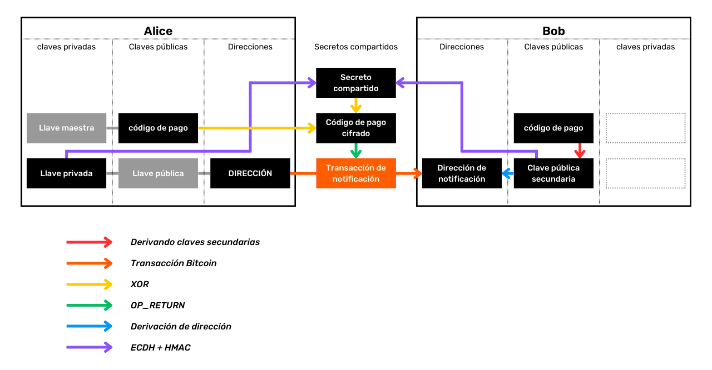

### Transacción de Notificación: Estudio Concreto

Para entender su funcionamiento con más detalle, especialmente el uso de `OP_RETURN`, examinemos juntos una transacción de notificación real. Realicé tal transacción en el testnet, que puedes encontrar [haciendo clic aquí](https://mempool.space/fr/testnet/tx/0e2e4695a3c49272ef631426a9fd2dae6ec3a469e3a39a3db51aa476cd09de2e).


Observando esta transacción, podemos ver que tiene una entrada y 4 salidas:

- La primera salida es el `OP_RETURN` que contiene mi código de pago enmascarado;
- La segunda salida de 546 sats apunta a la dirección de notificación de mi destinatario;
- La tercera salida de 15,000 sats representa las tarifas de servicio, ya que utilicé Samourai Wallet para construir esta transacción;
- La cuarta salida de 2 millones de sats representa el cambio, es decir, la diferencia restante de mi entrada que vuelve a otra dirección que me pertenece.
  Lo más interesante de estudiar es, obviamente, la salida 0 usando `OP_RETURN`. Veamos más de cerca lo que contiene. Aquí está el `scriptPubKey` en hexadecimal:

```text
6a4c50010002b13b2911719409d704ecc69f74fa315a6cb20fdd6ee39bc9874667703d67b164927b0e88f89f3f8b963549eab2533b5d7ed481a3bea7e953b546b4e91b6f50d800000000000000000000000000
```

En este script, podemos desglosar varias partes. Primero, los opcodes:

```text
6a4c
```

Entre los opcodes, podemos reconocer `0x6a` que designa el `OP_RETURN` y `0x4c` que designa el `OP_PUSHDATA1`.

El byte que sigue a este último opcode indica el tamaño de la carga útil que sigue. Indica `0x50`, o 80 bytes:

```text
6a4c50
```

Luego, tenemos los metadatos de mi código de pago en texto plano:

```text
010002
```

La coordenada x cifrada de la clave pública de mi código de pago:

```text
b13b2911719409d704ecc69f74fa315a6cb20fdd6ee39bc9874667703d67b164
```

El código de cadena cifrado de mi código de pago:

```text
927b0e88f89f3f8b963549eab2533b5d7ed481a3bea7e953b546b4e91b6f50d8
```

Y finalmente, relleno para alcanzar 80 bytes, el tamaño estándar de un `OP_RETURN`:

```text
00000000000000000000000000
```

Para entender mejor, aquí está mi código de pago en texto plano en base 58:

```text
PM8TJQCyt6ovbozreUCBrfKqmSVmTzJ5vjqse58LnBzKFFZTwny3KfCDdwTqAEYVasn11tTMPc2FJsFygFd3YzsHvwNXLEQNADgxeGnMK8Ugmin62TZU
```

Y en base 16:

```text
4701000277507c9c17a89cfca2d3af554745d6c2db0e7f6b2721a3941a504933103cc42add94881210d6e752a9abc8a9fa0070e85184993c4f643f1121dd807dd556d1dc000000000000000000000000008604e4db
```

Al comparar mi código de pago en texto plano con el `OP_RETURN`, es notable que el HRP (`0x47`) y el checksum (`0x8604e4db`) no se transmiten. Esto es esperado, ya que estas piezas de información están destinadas para humanos.
A continuación, podemos identificar la versión (`0x01`), el campo de bits (`0x00`) y la paridad de la clave pública (`0x02`). Y, al final del código de pago, los bytes vacíos (`0x00000000000000000000000000`) se utilizan para rellenar el código a un total de 80 bytes. Todos estos metadatos se transmiten en texto plano (sin cifrar).

Finalmente, se puede observar que la coordenada x de la clave pública (`0x77507c9c17a89cfca2d3af554745d6c2db0e7f6b2721a3941a504933103cc42a`) y el código de cadena (`0xdd94881210d6e752a9abc8a9fa0070e85184993c4f643f1121dd807dd556d1dc`) han sido cifrados. Esto constituye el payload del código de pago.

### ¿Qué es XOR?

En las secciones anteriores, vimos que el código de pago se transmitió cifrado utilizando la operación XOR. Tomemos un momento para entender cómo funciona este operador, ya que es ampliamente utilizado en criptografía.

XOR es un operador lógico a nivel de bits basado en álgebra booleana. Con dos operandos de bits, devuelve `1` si los bits del mismo rango son diferentes, y devuelve `0` si los bits del mismo rango son iguales. Aquí está la tabla de verdad de XOR basada en los valores de los operandos `D` y `E`:

| D   | E   | D XOR E |
| --- | --- | ------- |
| 0   | 0   | 0       |
| 0   | 1   | 1       |
| 1   | 0   | 1       |
| 1   | 1   | 0       |

Por ejemplo:

$$
0110 \oplus 1110 = 1000
$$

O:

$$
010011 \oplus 110110 = 100101
$$

Con ECDH, usar XOR como una capa de cifrado es particularmente adecuado. Primero, debido a este operador, el cifrado es simétrico. Esto permite al destinatario descifrar el código de pago con la misma clave utilizada para el cifrado. La clave de cifrado y descifrado se calcula a partir del secreto compartido gracias a ECDH. Esta simetría es habilitada por las propiedades conmutativas y asociativas del operador XOR:

- Otras propiedades:

$$
D \oplus D = 0
$$

D ⊕ 0 = D

- Conmutatividad:

$$
D \oplus E = E \oplus D
$$

- Asociatividad:

$$
D \oplus (E \oplus Z) = (D \oplus E) \oplus Z = D \oplus E \oplus Z
$$

Si:

$$
D \oplus E = L
$$

Entonces:

$$
D \oplus L = D \oplus (D \oplus E) = D \oplus D \oplus E = 0 \oplus E = E \\
\therefore D \oplus L = E
$$

A continuación, este método de cifrado se asemeja mucho al cifrado de Vernam (One-Time Pad), el único algoritmo de cifrado conocido hasta la fecha que tiene seguridad incondicional (o absoluta). Para que el cifrado de Vernam tenga esta característica, la clave de cifrado debe ser perfectamente aleatoria, debe tener el mismo tamaño que el mensaje y debe usarse solo una vez. En el método de cifrado utilizado aquí para BIP47, la clave es efectivamente del mismo tamaño que el mensaje, el factor de cegamiento es exactamente del mismo tamaño que la concatenación de la coordenada x de la clave pública con el código de cadena del código de pago. Esta clave de cifrado se utiliza de hecho solo una vez. Sin embargo, esta clave no es el resultado de una aleatoriedad perfecta ya que es un HMAC. Es más bien pseudo-aleatoria. Por lo tanto, no es un cifrado de Vernam, pero el método es similar.

### Recibiendo la Transacción de Notificación

Ahora que Alice ha enviado la transacción de notificación a Bob, veamos cómo la interpreta. Como recordatorio, Bob debe poder acceder al código de pago de Alice. Sin esta información, como veremos en la siguiente sección, no podrá derivar los pares de claves creados por Alice y, por lo tanto, no podrá acceder a sus bitcoins recibidos a través de BIP47. Por ahora, la carga útil del código de pago de Alice está cifrada. Veamos cómo Bob la descifra.

**1-** Bob monitorea las transacciones que crean salidas con su dirección de notificación.

**2-** Cuando una transacción tiene una salida en su dirección de notificación, Bob la analiza para ver si contiene una salida OP_RETURN que sigue el estándar BIP47.

**3-** Si el primer byte de la carga útil de OP_RETURN es `0x01`, Bob comienza su búsqueda de un posible secreto compartido con ECDH:

- Bob selecciona la clave pública en la entrada de la transacción. Es decir, la clave pública de Alice denominada $A$ con:

$$ A = a \cdot G $$

- Bob selecciona la clave privada $b$ asociada con su dirección de notificación personal:

$$ b $$

- Bob calcula el punto secreto $S$ (secreto compartido ECDH) en la curva elíptica sumando y duplicando puntos, aplicando su clave privada $b$ a la clave pública de Alice $A$:
  $$ S = b \cdot A $$

- Bob determina el factor de cegamiento $f$ que le permitirá descifrar la carga útil del código de pago de Alice. De la misma manera que Alice había calculado previamente, Bob encontrará $f$ aplicando HMAC-SHA512 en $x$ la coordenada x del punto secreto $S$, y en $o$ el UTXO consumido como entrada en esta transacción de notificación:

$$ f = \text{HMAC-SHA512}(o, x) $$

**4-** Bob interpreta los datos en el OP_RETURN de la transacción de notificación como un código de pago. Simplemente descifrará la carga útil de este posible código de pago usando el factor de cegamiento $f$:

- Bob divide el factor de cegamiento $f$ en 2 partes: los primeros 32 bytes de $f$ serán $f1$ y los últimos 32 bytes serán $f2$;
- Bob descifra la coordenada x cifrada $x'$ de la clave pública del código de pago de Alice:

$$ x = x' \oplus f1 $$

- Bob descifra el valor del código de cadena cifrado $c'$ del código de pago de Alice:

$$ c = c' \oplus f2 $$

**5-** Bob verifica si el valor de la clave pública del código de pago de Alice es realmente parte del grupo secp256k1. Si este es el caso, lo interpreta como un código de pago válido. De lo contrario, ignora esta transacción.

Ahora que Bob conoce el código de pago de Alice, ella puede enviarle hasta `2^32` pagos, sin necesidad de realizar otra transacción de notificación de este tipo nunca más.

¿Por qué funciona esto? ¿Cómo puede Bob lograr determinar el mismo factor de cegamiento que Alice y así descifrar su código de pago? Veamos más de cerca el papel de ECDH en lo que acabamos de describir.

En primer lugar, estamos tratando con cifrado simétrico. Esto significa que la clave de cifrado y la clave de descifrado son el mismo valor. Esta clave en la transacción de notificación es el factor de cegamiento:

$$ f = f1 || f2 $$

Por lo tanto, Alice y Bob deben obtener el mismo valor para $f$, sin transmitirlo directamente ya que un atacante podría robarlo y descifrar la información secreta. Este factor de cegamiento se obtiene aplicando HMAC-SHA512 sobre 2 valores:

- la coordenada x de un punto secreto;
- y el UTXO consumido como entrada en la transacción.
  Bob, por lo tanto, necesita estas dos piezas de información para descifrar el contenido del código de pago de Alice. Para el UTXO como entrada, Bob puede simplemente recuperarlo observando la transacción de notificación. Para el punto secreto, Bob tendrá que usar ECDH. Como se vio en la sección anterior sobre Diffie-Hellman, simplemente intercambiando sus respectivas claves públicas y aplicando secretamente sus claves privadas a la clave pública del otro, Alice y Bob pueden encontrar un punto específico y secreto en la curva elíptica. La transacción de notificación se basa en este mecanismo:
- El par de claves de Bob:

$$ B = b \cdot G $$

- El par de claves de Alice:

$$ A = a \cdot G $$

- Para un secreto $S (x, y)$:

$$ S = a \cdot B = a \cdot (b \cdot G) = (b \cdot a) \cdot G = b \cdot A $$

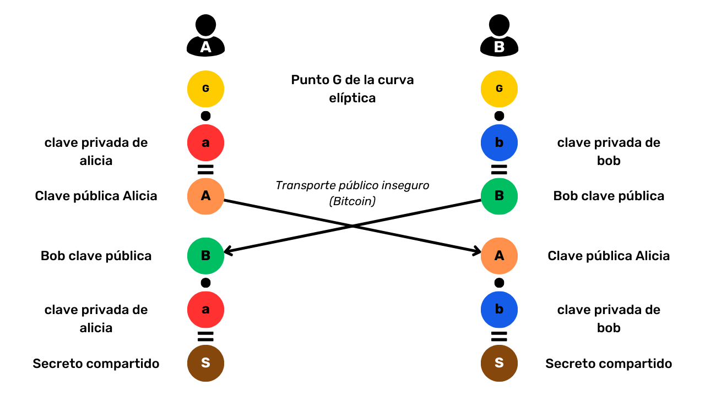

Ahora que Bob conoce el código de pago de Alice, podrá detectar sus pagos BIP47, y puede derivar las claves privadas que bloquean los bitcoins recibidos.

Repasemos los pasos que acabamos de seguir para recibir e interpretar una transacción de notificación:

- Bob monitorea las salidas de transacción a su dirección de notificación;
- Cuando detecta una, recupera la información contenida en el OP_RETURN;
- Bob selecciona la clave pública en entrada y calcula un punto secreto usando ECDH;
- Usa este punto secreto para calcular un HMAC que es el factor de cegamiento;
- Usa este factor de cegamiento para descifrar el contenido del código de pago de Alice contenido en el OP_RETURN.

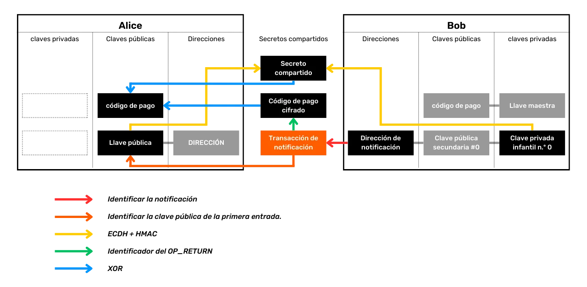

### La Transacción de Pago BIP47

Ahora estudiemos juntos el proceso de pago con BIP47. Para recordarte el estado actual de las cosas:

- Alice conoce el código de pago de Bob, que simplemente recuperó de su sitio web;
- Bob conoce el código de pago de Alice gracias a la transacción de notificación.
- Alice realizará un primer pago a Bob. Podrá hacer muchos otros de la misma manera.

Antes de explicar este proceso, creo que es importante recordar los índices en los que estamos trabajando actualmente. La ruta de derivación de un código de pago se describe de la siguiente manera: `m/47'/0'/0'`. La siguiente profundidad distribuye los índices de esta manera:

- El primer par de claves hijo normal (no endurecido) es el que se utiliza para generar la dirección de notificación de la que hablamos en la parte anterior: `m/47'/0'/0'/0`;
- Los pares de claves hijo normales se utilizan dentro de ECDH para generar direcciones de recepción de pagos BIP47 como veremos en esta sección: desde `m/47'/0'/0'/0` hasta `m/47'/0'/0'/2 147 483 647`;
- Los pares de claves hijo endurecidos son códigos de pago efímeros: desde `m/47'/0'/0'/0'` hasta `m/47'/0'/0'/2 147 483 647'`.

Siempre que Alice desee enviar un pago a Bob, deriva una nueva dirección virgen única, gracias nuevamente al protocolo ECDH:

- Alice selecciona la primera clave privada derivada de su código de pago reutilizable personal:

$$ a $$

- Alice selecciona la primera clave pública no utilizada derivada del código de pago de Bob. A esta clave pública, la llamaremos $B$. Está asociada con la clave privada $b$ que solo Bob conoce:

$$ B = b \cdot G $$

- Alice calcula un punto secreto $S$ en la curva elíptica mediante la adición de puntos y duplicación aplicando su clave privada $a$ a la clave pública de Bob $B$:

$$ S = a \cdot B $$

- A partir de este punto secreto, Alice calculará el secreto compartido $s$ (minúscula). Para hacer esto, selecciona la coordenada x del punto secreto $S$ llamada $Sx$, y pasa este valor a través de la función hash SHA256:

$$ S = (Sx, Sy) $$
$$ s = \text{SHA256}(Sx) $$

- Alice usa este secreto compartido $s$ para calcular una dirección de recepción de pagos de Bitcoin. Inicialmente, verifica que $s$ esté contenido dentro del orden de la curva secp256k1. Si no, incrementa el índice de la clave pública de Bob para derivar otro secreto compartido;
- En segundo lugar, calcula una clave pública $K0$ sumando en la curva elíptica los puntos $B$ y $s·G$. En otras palabras, Alice suma la clave pública derivada del código de pago de Bob $B$ con otro punto calculado en la curva elíptica por adición de puntos y duplicación con el secreto compartido $s$ del punto generador $G$ de la curva secp256k1. Este nuevo punto representa una clave pública, y lo nombramos $K0$:

$$ K0 = B + s \cdot G $$

- Con esta clave pública $K0$, Alice puede derivar una dirección de recepción virgen estándar (por ejemplo, SegWit V0 en bech32).
  Una vez que Alice ha obtenido la dirección de recepción de Bob $K0$, puede realizar una transacción de Bitcoin de manera estándar. Para hacer esto, selecciona un UTXO que posee, asegurado por un par de claves de una rama diferente de su billetera HD, y lo gasta para satisfacer una salida a la dirección de Bob $K0$. Es importante señalar que este pago, una vez derivada la dirección, sigue un proceso convencional y ya no depende de las claves asociadas con BIP47.
  Repasemos los pasos que acabamos de seguir juntos para enviar un pago BIP47:
- Alice selecciona la primera clave privada derivada de su código de pago personal;
- Calcula un punto secreto en la curva elíptica usando ECDH a partir de la primera clave pública derivada no utilizada del código de pago de Bob;
- Utiliza este punto secreto para calcular un secreto compartido con SHA256;
- Usa este secreto compartido para calcular un nuevo punto secreto en la curva elíptica;
- Añade este nuevo punto secreto a la clave pública de Bob;
- Obtiene una nueva clave pública efímera para la cual solo Bob tiene la clave privada asociada;
- Alice puede realizar una transacción estándar a Bob con la dirección de recepción efímera derivada.

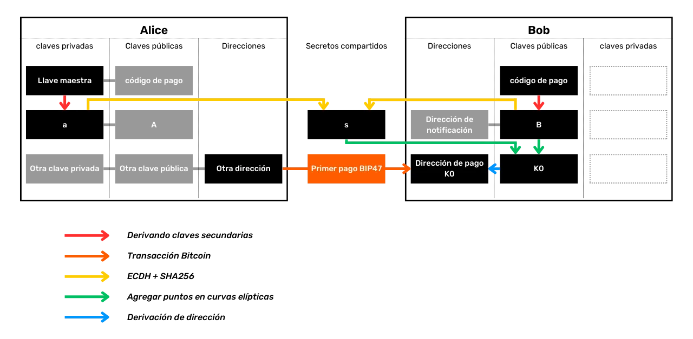

Si Alice quiere hacer un segundo pago, seguirá los mismos pasos que antes, excepto que esta vez seleccionará la segunda clave pública derivada del código de pago de Bob. Específicamente, usará la siguiente clave no utilizada. Así obtendrá una nueva dirección de recepción perteneciente a Bob, designada $K1$:

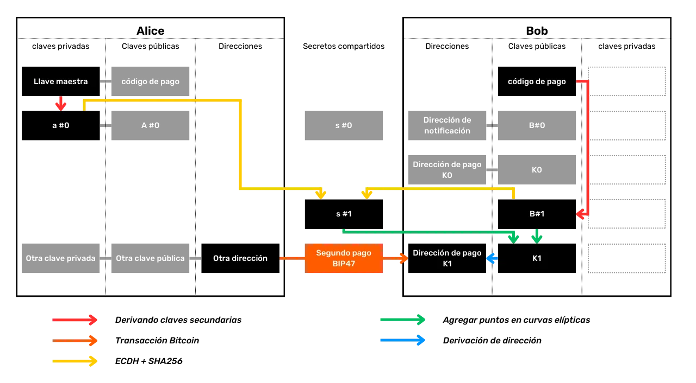

Puede continuar de esta manera y derivar hasta `2^32` direcciones no utilizadas pertenecientes a Bob.

Desde un punto de vista externo, al observar la blockchain, es teóricamente imposible diferenciar un pago BIP47 de un pago estándar. Aquí hay un ejemplo de una transacción de pago BIP47 en el Testnet:

```text
94b2e59510f2e1fa78411634c98a77bbb638e28fb2da00c9f359cd5fc8f87254
```

Esto parece una transacción estándar con una entrada consumida, una salida de pago y un cambio:


### Recibiendo el Pago BIP47 y Derivando la Clave Privada

Alice acaba de hacer su primer pago a una nueva dirección BIP47 perteneciente a Bob. Ahora veamos cómo Bob recibe este pago. También veremos por qué Alice no tiene acceso a la clave privada de la dirección que acaba de generar ella misma, y cómo Bob recupera esta clave para gastar los bitcoins que acaba de recibir.
Tan pronto como Bob recibe la transacción de notificación de Alice, deriva la clave pública BIP47 $K0$ incluso antes de que ella haya enviado algún pago. Luego monitorea cualquier pago a la dirección asociada. De hecho, deriva inmediatamente varias direcciones que monitoreará ($K0$, $K1$, $K2$, $K3$...). Así es como deriva esta clave pública $K0$:

- Bob selecciona la primera clave privada derivada de su código de pago. Esta clave privada se denomina $b$. Está asociada con la clave pública $B$ con la que Alice había hecho sus cálculos en el paso anterior:

$$ b $$

- Bob selecciona la primera clave pública de Alice derivada de su código de pago. Esta clave se denomina $A$. Está asociada con la clave privada $a$ con la que Alice había hecho sus cálculos, y de la cual solo Alice es consciente. Bob puede llevar a cabo este proceso ya que conoce el código de pago de Alice que le fue transmitido con la transacción de notificación:

$$ A = a \cdot G $$

- Bob calcula el punto secreto $S$, mediante la adición y duplicación de puntos en la curva elíptica, aplicando su clave privada $b$ a la clave pública de Alice $A$. Aquí encontramos el uso de ECDH que garantiza que este punto $S$ será el mismo tanto para Bob como para Alice:

$$ S = b \cdot A $$

- Al igual que Alice, Bob aísla la coordenada x de este punto $S$. Hemos nombrado este valor $Sx$. Él pasa este valor a través de la función SHA256 para encontrar el secreto compartido $s$ (en minúscula):
  $$ s = \text{SHA256}(Sx) $$

- Al igual que Alice, Bob calcula el punto $s·G$ en la curva elíptica. Luego, añade este punto secreto a su clave pública $B$. Entonces, obtiene un nuevo punto en la curva elíptica que interpreta como una clave pública $K0$:

$$ K0 = B + s \cdot G $$

Una vez que Bob tiene esta clave pública $K0$, puede derivar la clave privada asociada para poder gastar sus bitcoins. Él es el único que puede generar esta clave privada:

- Bob añade su clave privada derivada $b$ de su código de pago personal. Él es el único que puede obtener el valor de $b$. Luego, suma $b$ con el secreto compartido $s$ para obtener $k0$, la clave privada de $K0$:

$$ k0 = b + s $$

Gracias a la ley de grupo de la curva elíptica, Bob obtiene exactamente la clave privada correspondiente a la clave pública utilizada por Alice. Así tenemos:

$$ K0 = k0 \cdot G $$

Resumiré los pasos que acabamos de seguir juntos para recibir un pago BIP47 y calcular la clave privada correspondiente:

- Bob selecciona la primera clave privada derivada de su código de pago personal;
- Calcula un punto secreto en la curva elíptica usando ECDH a partir de la primera clave pública derivada del código de cadena de Alice;
- Utiliza este punto secreto para calcular un secreto compartido con SHA256;
- Utiliza este secreto compartido para calcular un nuevo punto secreto en la curva elíptica;
- Añade este nuevo punto secreto a su clave pública personal;
- Obtiene una nueva clave pública efímera, a la cual Alice enviará su primer pago;
- Bob calcula la clave privada asociada con esta clave pública efímera sumando su clave privada derivada de su código de pago y el secreto compartido.

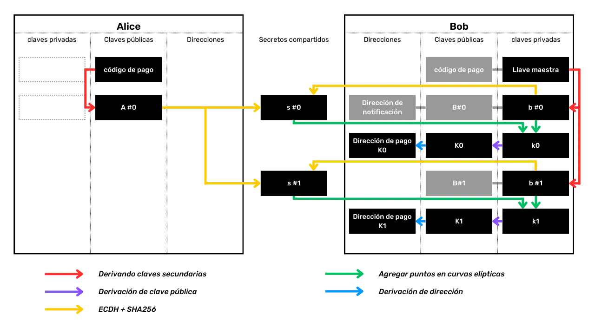

Dado que Alice no puede obtener $b$ (la clave privada de Bob), ella es incapaz de determinar $k0$ (la clave privada asociada con la dirección de recepción BIP47 de Bob). Esquemáticamente, podemos representar el cálculo del secreto compartido $S$ de esta manera:


Una vez encontrado el secreto compartido con ECDH, Alice y Bob calculan la clave pública de pago BIP47 $K0$, y Bob también calcula la clave privada asociada $k0$:

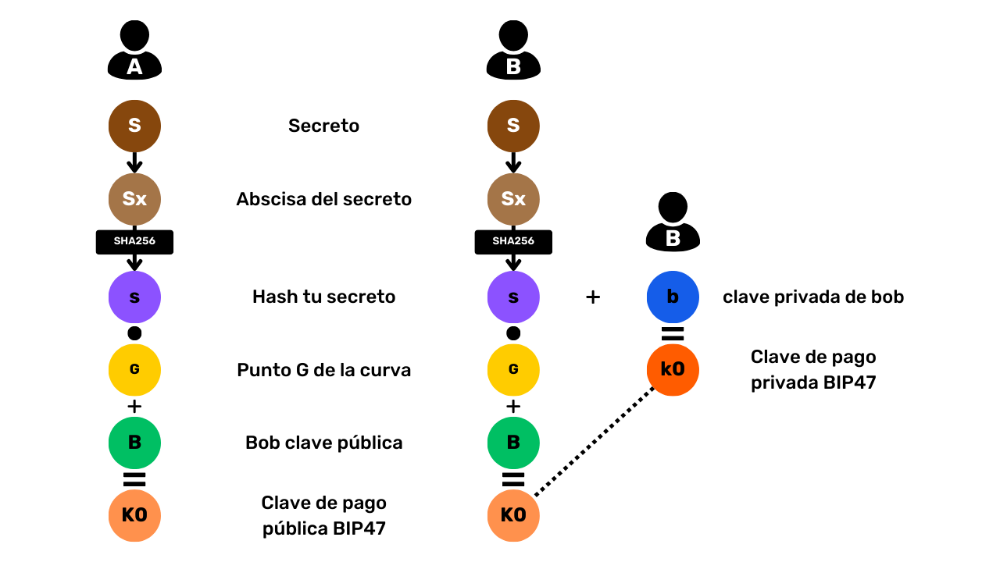

### Reembolsando el Pago BIP47

Dado que Bob conoce el código de pago reutilizable de Alice, ya tiene toda la información necesaria para enviarle un reembolso. No necesitará contactar a Alice nuevamente para pedirle información. Simplemente necesitará notificarla con una transacción de notificación, especialmente para que ella pueda recuperar sus direcciones BIP47 con su semilla, y luego él también puede enviarle hasta `2^32` pagos.

La funcionalidad de reembolso es específica de BIP47 y es una de sus ventajas sobre otros métodos que estudiaremos en los próximos capítulos, como los Pagos Silenciosos.

Bob puede entonces reembolsar a Alice de la misma manera que ella le envió pagos. Los roles se invierten:

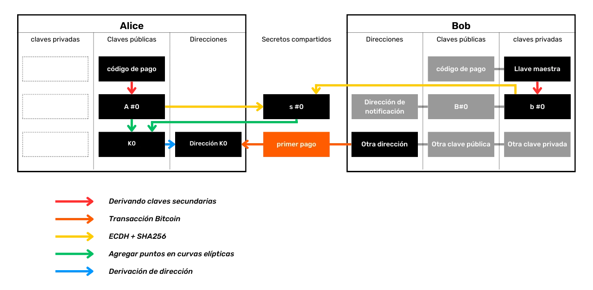
_Un gran agradecimiento a [Fanis Michalakis](https://x.com/FanisMichalakis) por su revisión y valiosos consejos expertos sobre el artículo que inspiró la escritura de este capítulo!_

https://planb.network/tutorials/privacy/paynym-bip47

## Pagos Silenciosos

<chapterId>2871d594-414e-4598-a830-91c9eb84dfb8</chapterId>
El BIP47 ha sido criticado por su ineficiencia en la cadena de bloques. Como se explicó en el capítulo anterior, requiere una transacción de notificación para cada nuevo destinatario. Esta restricción se vuelve insignificante si uno planea establecer un canal de pago duradero con este destinatario. De hecho, una única transacción de notificación abre el camino para un número casi infinito de pagos BIP47 subsiguientes.

Sin embargo, en ciertas situaciones, la transacción de notificación puede ser un obstáculo para el usuario. Tomemos el ejemplo de una donación única a un destinatario: con una dirección de Bitcoin clásica, una sola transacción es suficiente para hacer la donación. Pero con BIP47, son necesarias dos transacciones: una para la notificación y otra para el pago real. Cuando la demanda de espacio en el bloque es baja y las tarifas de transacción son mínimas, este paso adicional generalmente no es un problema. Sin embargo, durante períodos de congestión, las tarifas de transacción pueden volverse exorbitantes para un solo pago, potencialmente duplicando el costo para el usuario en comparación con una transacción de Bitcoin estándar, lo cual puede ser inaceptable para el usuario.

Para situaciones en las que el usuario planea realizar solo unos pocos pagos a un identificador estático, se han desarrollado otras soluciones. Entre ellas están los Pagos Silenciosos, descritos en el [BIP352](https://github.com/bitcoin/bips/blob/master/bip-0352.mediawiki). Este protocolo permite el uso de un identificador estático para recibir pagos sin generar reutilización de direcciones, y sin requerir el uso de transacciones de notificación. Examinemos cómo funciona este protocolo.

---

_Para comprender completamente este capítulo, es esencial estar familiarizado con el funcionamiento de ECDH (Elliptic Curve Diffie-Hellman) y la derivación de claves criptográficas en una cartera HD. Estos conceptos se detallaron en el capítulo anterior sobre BIP47. No los volveré a tratar aquí. Si aún no estás familiarizado con estas nociones, te recomiendo consultar el capítulo anterior antes de continuar con este. Tampoco volveré a revisar los riesgos asociados con la reutilización de direcciones de recepción, ni la importancia de tener un identificador único para recibir pagos._

---

### ¿Por qué no mover la notificación?

Como se discutió en el capítulo sobre BIP47, la transacción de notificación cumple principalmente dos funciones:

- Notifica al destinatario;
- Transmite el código de pago del remitente.

Uno podría pensar ingenuamente que este proceso de notificación podría llevarse a cabo fuera de la cadena. En teoría, esto es completamente factible: bastaría con que el destinatario indicara un medio de comunicación para recibir códigos de pago BIP47 de los remitentes. Sin embargo, este enfoque presenta dos problemas principales:

- Primero, esto trasladaría el proceso de transmisión del código a otro protocolo de comunicación. Los problemas relacionados con los costos y la privacidad del intercambio permanecerían, pero simplemente se transferirían a este nuevo protocolo. En términos de privacidad, esto también podría crear un vínculo entre la identidad de un usuario y la actividad en la cadena de bloques, lo cual es algo que buscamos evitar al realizar la notificación directamente en la blockchain. Además, llevar a cabo la notificación fuera de la blockchain introduciría riesgos de censura (como el bloqueo de fondos) que no existen en Bitcoin.
- A continuación, esto plantearía un problema de recuperación. Con BIP47, el destinatario debe conocer absolutamente los códigos de pago de los emisores para acceder a los fondos. Esto es cierto en el momento de la recepción, pero también en el evento de recuperación de fondos a través de la semilla en caso de pérdida de la cartera. Con las notificaciones en la cadena, este riesgo se evita, ya que el usuario puede encontrar y descifrar las transacciones de notificación simplemente conociendo su semilla. Sin embargo, si la notificación se realiza fuera de la cadena, el usuario necesitaría mantener una copia de seguridad dinámica de todos los códigos de pago recibidos, lo cual es poco práctico para el usuario promedio.
  Todas estas restricciones hacen indispensable el uso de notificaciones en la cadena en el contexto de BIP47. Sin embargo, los Pagos Silenciosos buscan específicamente evitar este paso de notificación en la cadena debido a su costo. Por lo tanto, la solución adoptada no es trasladar la notificación, sino eliminarla por completo. Para lograr esto, se debe aceptar un compromiso: el de escanear. A diferencia de BIP47, donde el usuario sabe exactamente dónde encontrar sus fondos gracias a las transacciones de notificación, en el contexto de los Pagos Silenciosos, el usuario debe examinar todas las transacciones de Bitcoin existentes para detectar cualquier pago que pueda estar destinado a ellos. Para reducir esta carga operativa, la búsqueda de Pagos Silenciosos se limita solo a transacciones que probablemente contengan dichos pagos, a saber, aquellas que incluyan al menos una salida Taproot P2TR. El escaneo también se centra exclusivamente en transacciones desde la fecha de creación de la cartera (no es necesario escanear transacciones que se remontan a 2009 si la cartera se creó en 2024).

Por lo tanto, puedes ver por qué BIP47 y los Pagos Silenciosos, aunque apuntan a un objetivo similar, implican diferentes compromisos y **de hecho atienden a casos de uso distintos**. Para pagos únicos, como donaciones ocasionales, los Pagos Silenciosos son más apropiados debido a su menor costo. Por el contrario, para transacciones regulares al mismo destinatario, como en el caso de plataformas de intercambio o piscinas de minería, BIP47 podría ser preferido.
Exploremos juntos el funcionamiento técnico de los Pagos Silenciosos para entender mejor sus implicaciones. Para hacer esto, sugiero que tomemos el mismo enfoque que el documento explicativo de BIP352. Desglosaremos gradualmente los cálculos a realizar, elemento por elemento, justificando cada nueva adición.

### Algunos conceptos para entender

Antes de comenzar, es importante aclarar que los Pagos Silenciosos dependen exclusivamente del uso de tipos de script P2TR (_Pay to Taproot_). A diferencia de BIP47, no es necesario derivar direcciones de recepción de claves públicas infantiles mediante su hash. De hecho, en el estándar P2TR, la clave pública modificada se utiliza directamente y abiertamente en la dirección. Así, una dirección de recepción Taproot es esencialmente una clave pública acompañada de algunos metadatos. Esta clave pública modificada es la agregación de otras dos claves públicas: una que permite el gasto directo y tradicional a través de una firma simple, y la otra que representa la raíz de Merkle del MAST, que autoriza el gasto sujeto a la satisfacción de una de las condiciones potencialmente inscritas en el árbol de Merkle.


La decisión de limitar los Pagos Silenciosos exclusivamente a Taproot está motivada por dos razones principales:

- Primero, facilita significativamente la implementación y futuras actualizaciones en el software de la cartera, ya que solo se necesita adherirse a un estándar;
- En segundo lugar, este enfoque ayuda a mejorar el conjunto de anonimato de los usuarios al alentarlos a no dispersarse entre diferentes tipos de scripts, que generan huellas de cartera distintas en el análisis de cadena (para más información sobre este concepto, te invito a consultar el capítulo 4 de la parte 2).

### Derivación ingenua de una clave pública de Pagos Silenciosos

Comencemos con un ejemplo simple que te ayudará a entender el funcionamiento central de los Pagos Silenciosos (SP, por sus siglas en inglés). Tomemos a Alice y Bob, dos usuarios de Bitcoin. Alice quiere enviar bitcoins a Bob en una dirección de recepción nueva. Tres objetivos deben lograrse en este proceso:

- Alice debe ser capaz de generar una dirección nueva;
- Bob debe ser capaz de identificar un pago enviado a esta dirección específica;
- Bob debe ser capaz de obtener la clave privada asociada con esta dirección para poder gastar sus fondos.

Alice tiene un UTXO en su billetera de Bitcoin asegurado con el siguiente par de claves:

- $a$: la clave privada;
- $A$: la clave pública ($A = a \cdot G$)

Bob tiene una dirección SP que ha publicado en internet con:

- $b$: la clave privada;
- $B$: la clave pública ($B = b \cdot G$)
  Al recuperar la dirección de Bob, Alice es capaz de calcular una nueva dirección en blanco que pertenece a Bob usando ECDH. Llamemos a esta dirección $P$:
  $$ P = B + \text{hash}(a \cdot B) \cdot G $$

En esta ecuación, Alice simplemente calculó el producto punto de su clave privada $a$ y la clave pública de Bob $B$. Pasó este resultado a través de una función hash conocida por todos. El valor de salida es entonces multiplicado por escalar por el punto generador $G$ de la curva elíptica `secp256k1`. Finalmente, Alice suma el punto obtenido a la clave pública de Bob $B$. Una vez que Alice tiene esta dirección $P$, la usa como salida en una transacción, lo que significa que envía bitcoins a ella.

> _En el contexto de los Pagos Silenciosos, la función "hash" corresponde a una función hash SHA256 etiquetada específicamente con `BIP0352/SharedSecret`, asegurando que los hashes generados sean únicos para este protocolo y no puedan reutilizarse en otros contextos, al mismo tiempo que proporciona protección adicional contra la reutilización de nonces en firmas. Este estándar corresponde al [especificado en el BIP340 para firmas Schnorr](https://github.com/bitcoin/bips/blob/master/bip-0340.mediawiki) en `secp256k1`._

Gracias a las propiedades de la curva elíptica en la que se basa ECDH, sabemos que:

$$ a \cdot B = b \cdot A $$

Por lo tanto, Bob será capaz de calcular la dirección de recepción en la que Alice envió los bitcoins. Para hacer esto, monitorea todas las transacciones de Bitcoin que cumplen con los criterios de Pagos Silenciosos y aplica el siguiente cálculo a cada una de ellas para ver si el pago está dirigido a él (_escaneando_):

$$ P' = B + \text{hash}(b \cdot A) \cdot G $$

Cuando escanea la transacción de Alice, se da cuenta de que $P'$ es igual a $P$. Así sabe que este pago está dirigido a él:

$$ P' = B + \text{hash}(b \cdot A) \cdot G = B + \text{hash}(a \cdot B) \cdot G = P $$

A partir de ahí, Bob será capaz de calcular la clave privada $p$ que permite gastar la dirección $P$:

$$ p = (b + \text{hash}(b \cdot A)) \bmod n $$

Como puedes ver, para calcular esta clave privada $p$, necesariamente se debe tener la clave privada $b$. Solo Bob tiene esta clave privada $b$. Por lo tanto, él será de hecho el único capaz de gastar los bitcoins enviados a su dirección de Pagos Silenciosos.

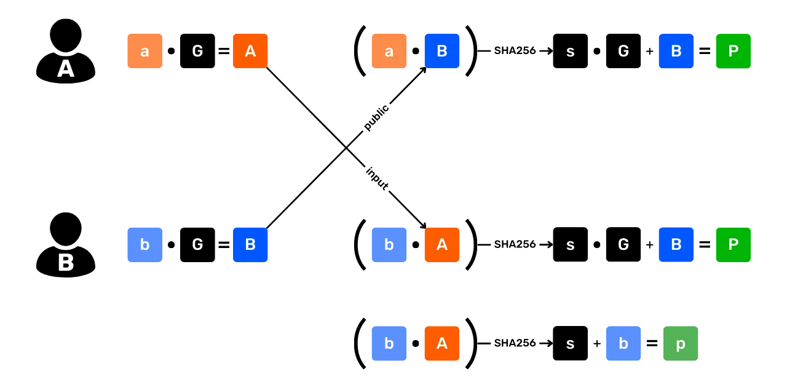
_Subtítulo:_

- $B$: La clave pública / dirección estática publicada por Bob
- $b$: La clave privada de Bob
- $A$: La clave pública del UTXO de Alice utilizada como entrada para la transacción
- $a$: La clave privada de Alice
- $G$: El punto generador de la curva elíptica `secp256k1`
- $\text{SHA256}$: La función de hash SHA256 etiquetada con `BIP0352/SharedSecret`
- $s$: El secreto común ECDH
- $P$: La clave pública / dirección única para el pago a Bob

Aquí tenemos un enfoque inicial bastante ingenuo para usar la dirección estática de Bob, denotada $B$, para derivar una dirección única $P$ para enviar bitcoins. Sin embargo, este método es demasiado simplista y tiene varios defectos que necesitan corrección. El primer problema es que, en este esquema, Alice no puede crear múltiples salidas a Bob dentro de la misma transacción.

### ¿Cómo crear múltiples salidas?

En el ejemplo de la sección anterior, Alice crea una única salida que irá a Bob en su dirección única $P$. Con la misma entrada seleccionada, es imposible para Alice crear dos direcciones vírgenes distintas para Bob, ya que el método utilizado siempre llevaría al mismo resultado para $P$, por lo tanto, la misma dirección. Sin embargo, puede haber muchas situaciones en las que Alice desee dividir su pago a Bob en varias cantidades menores, creando así múltiples UTXOs. Por lo tanto, es necesario encontrar un método que permita hacer esto.

Para lograr esto, modificaremos ligeramente el cálculo que Alice realiza para derivar $P$, de modo que pueda generar dos direcciones distintas para Bob, a saber, $P_0$ y $P_1$.

Para modificar el cálculo y obtener 2 direcciones diferentes, es suficiente agregar un entero que modifique el resultado. Así, Alice agregará $0$ en su cálculo para obtener la dirección $P_0$ y $1$ para obtener la dirección $P_1$. Llamemos a este entero $i$:

$$ P_i = B + \text{hash}(a \cdot B \text{ ‖ } i) \cdot G $$

El proceso de cálculo permanece sin cambios del método anterior, excepto que esta vez Alice concatenará $a \cdot B$ con $i$ antes de proceder al hash. Entonces es suficiente cambiar $i$ para tener una nueva dirección perteneciente a Bob. Por ejemplo:

$$ P_0 = B + \text{hash}(a \cdot B \text{ ‖ } 0) \cdot G $$

$$ P_1 = B + \text{hash}(a \cdot B \text{ ‖ } 1) \cdot G $$
Cuando Bob escanea la blockchain en busca de Pagos Silenciosos destinados a él, comienza usando $i = 0$ para la dirección $P_0$. Si no encuentra ningún pago en $P_0$, concluye que esta transacción no contiene ningún Pago Silencioso para él y detiene su análisis. Sin embargo, si $P_0$ es válida y contiene un pago para él, procede con $P_1$ en la misma transacción para verificar si Alice hizo un segundo pago. Si $P_1$ resulta ser inválida, detiene su búsqueda de esta transacción; de lo contrario, continúa probando valores sucesivos de $i$:
$$ P_0 = B + \text{hash}(b \cdot A \text{ ‖ } 0) \cdot G $$
$$ P_1 = B + \text{hash}(b \cdot A \text{ ‖ } 1) \cdot G $$

Dado que Bob se detiene inmediatamente en $i = 0$ si $P_0$ no produce nada, el uso de este entero añade casi ninguna carga operacional adicional en Bob para el paso de escaneo de las transacciones.

Bob puede entonces calcular las claves privadas de la misma manera:

$$
p_0 = (b + \text{hash}(b \cdot A \text{ ‖ } 0)) \bmod n
$$

$$
p_1 = (b + \text{hash}(b \cdot A \text{ ‖ } 1)) \bmod n
$$


_Subtítulo:_

- $B$: La clave pública / dirección estática publicada por Bob
- $b$: La clave privada de Bob
- $A$: La clave pública del UTXO de Alice utilizada como entrada para la transacción
- $a$: La clave privada de Alice
- $G$: El punto generador de la curva elíptica `secp256k1`
- $\text{SHA256}$: La función hash SHA256 etiquetada con `BIP0352/SharedSecret`
- $s_0$: El primer secreto compartido ECDH
- $s_1$: El segundo secreto compartido ECDH
- $P_0$: La primera clave pública / dirección única para el pago a Bob
- $P_1$: La segunda clave pública / dirección única para el pago a Bob

Con este método, empezamos a tener un protocolo interesante, pero aún hay algunos desafíos que superar, notablemente la prevención del reuso de direcciones.

### ¿Cómo evitar el reuso de direcciones?

Como hemos visto en las secciones anteriores, Alice utiliza el par de claves que aseguran su UTXO, el cual gastará para calcular el secreto compartido ECDH con Bob. Este secreto le permite derivar la dirección única $P_0$. Sin embargo, el par de claves ($a$, $A$) utilizado por Alice puede asegurar múltiples UTXOs si ha reusado esta dirección varias veces. En el evento de que Alice haga dos pagos a la dirección estática de Bob $B$ usando dos UTXOs asegurados por la misma clave $A$, esto resultaría en el reuso de dirección para Bob.

> _El reuso de dirección es una práctica muy mala para la privacidad del usuario. Para entender por qué, te aconsejo que revises las primeras partes de este entrenamiento._

De hecho, dado que la dirección única $P_0$ se deriva de $A$ y $B$, si Alice deriva una segunda dirección para un segundo pago a $B$, con la misma clave $A$, terminará con la misma dirección $P_0$. Para evitar este riesgo y prevenir el reuso de direcciones dentro de los Pagos Silenciosos, necesitamos modificar ligeramente nuestros cálculos.

Lo que queremos es que cada UTXO consumido por Alice como entrada de un pago dé una dirección única en el lado de Bob, incluso si varios UTXOs están asegurados por el mismo par de claves. Por lo tanto, es suficiente añadir una referencia al UTXO en el cálculo de la dirección única $P_0$. Esta referencia será simplemente el hash del UTXO consumido como entrada:

$$ \text{inputHash} = \text{hash}(\text{outpoint} \text{ ‖ } A) $$

Y esta referencia de entrada, Alice la añadirá en su cálculo de la dirección única $P_0$:
$$ P_0 = B + \text{hash}(\text{inputHash} \cdot a \cdot B \text{ ‖ } 0) \cdot G $$
Durante su escaneo, Bob también puede agregar $\text{inputHash}$, ya que todo lo que necesita hacer es observar la transacción para deducir $\text{outpoint}$:

$$ P_0 = B + \text{hash}(\text{inputHash} \cdot b \cdot A \text{ ‖ } 0) \cdot G $$

Cuando encuentra un $P_0$ válido, puede calcular la clave privada correspondiente $p_0$:

$$
p_0 = (b + \text{hash}(\text{inputHash} \cdot b \cdot A \text{ ‖ } 0)) \bmod n
$$


_Leyenda:_

- $B$: La clave pública / dirección estática publicada por Bob
- $b$: La clave privada de Bob
- $A$: La clave pública del UTXO de Alice utilizado como entrada para la transacción
- $a$: La clave privada de Alice
- $H$: El hash del UTXO utilizado como entrada
- $G$: El punto generador de la curva elíptica `secp256k1`
- $\text{SHA256}$: La función hash SHA256 etiquetada con `BIP0352/SharedSecret`
- $s_0$: El primer secreto compartido ECDH
- $P_0$: La primera clave pública / dirección única para el pago a Bob

En este momento, nuestros cálculos asumen que Alice usa una única entrada para su transacción. Sin embargo, ella debería ser capaz de usar múltiples entradas. Por consiguiente, del lado de Bob, para cada transacción que contenga múltiples entradas, teóricamente necesitaría computar el ECDH para cada entrada para determinar si un pago está destinado para él. ¡Este método no es satisfactorio, por lo que necesitamos encontrar una solución para reducir la carga de trabajo!

### Modificando las claves públicas en las entradas

Para resolver este problema, en lugar de usar el par de claves que asegura una entrada específica del lado de Alice, usaremos la suma de todos los pares de claves utilizados en las entradas de la transacción. Esta suma se considerará entonces como un nuevo par de claves. Esta técnica es conocida como "tweak".

Por ejemplo, imagina que la transacción de Alice tiene 3 entradas, cada una asegurada con un par de claves diferente:

- $a_0$ asegura la entrada #0;
- $a_1$ asegura la entrada #1;
- $a_2$ asegura la entrada #2.


Siguiendo el método descrito arriba, Alice tendría que elegir un único par de claves entre $a_0$, $a_1$ y $a_2$ para calcular el secreto ECDH y generar la dirección de pago única $P$ a partir de la dirección estática $B$ de Bob. Sin embargo, este enfoque requiere que Bob pruebe cada posibilidad secuencialmente, comenzando con $a_0$, luego $a_1$, y así sucesivamente, hasta identificar un par que genere una dirección válida $P$. Este proceso exige que Bob ejecute el cálculo ECDH en todas las entradas de todas las transacciones, aumentando significativamente la carga de trabajo operacional de escaneo.

Para evitar esto, le pediremos a Alice que realice su cálculo de $P$ usando la suma de todas las claves en entrada. Tomando nuestro ejemplo, la clave privada modificada $a$ se calcularía de la siguiente manera:

$$ a = a_0 + a_1 + a_2 $$
De manera similar, Alice y Bob podrán calcular la clave pública ajustada:
$$ A = A_0 + A_1 + A_2 $$
Gracias a este método, Bob solo necesita calcular la suma de las claves públicas de la transacción, luego computar el secreto ECDH a partir de $A$ solamente, lo que reduce significativamente el número de cálculos a realizar para el paso de escaneo. Sin embargo, recuerda de la sección anterior. Habíamos incluido en nuestro cálculo el hash $\text{inputHash}$ que se usa como un nonce para prevenir la reutilización de direcciones:

$$ \text{inputHash} = \text{hash}(\text{outpoint} \text{ ‖ } A) $$

Pero si hay múltiples entradas en una transacción, es necesario determinar cuál $\text{outpoint}$ se elige en este cálculo. Según BIP352, el criterio de selección para $\text{outpoint}$ a usar es elegir el más pequeño lexicográficamente, lo que significa seleccionar el UTXO que aparece primero en orden alfabético. Este método estandariza el UTXO a elegir en cada transacción. Por ejemplo, si este $\text{outpoint}$ más pequeño lexicográficamente es $\text{outpoint}_L$, el cálculo de $\text{inputHash}$ será:

$$ \text{inputHash} = \text{hash}(\text{outpoint}\_L \text{ ‖ } A) $$

Los cálculos entonces permanecen idénticos a los presentados en la sección anterior, excepto que la clave privada $a$ y su correspondiente clave pública $A$ ya no son un par que asegura una única entrada, sino que ahora representan el ajuste de todos los pares de claves en las entradas.

### Separando las Claves de Gasto y Escaneo

Hasta ahora, hemos discutido la dirección estática de Pago Silencioso $B$ como una clave pública única. Recuerda, es esta clave pública $B$ la que es utilizada por Alice para crear el secreto ECDH compartido, que a su vez se usa para computar la dirección de pago única $P$. Bob usa esta clave pública $B$ y la clave privada correspondiente $b$ para el paso de escaneo. Pero él también usará la clave privada $b$ para computar la clave privada $p$ que permite gastar desde la dirección $P$.

La desventaja de este método es que la clave privada $b$, que se usa para computar todas las claves privadas para direcciones que reciben Pagos Silenciosos, también es usada por Bob para escanear transacciones. Este paso requiere que la clave $b$ esté disponible en un software de billetera conectado a internet, lo que la expone a un mayor riesgo de robo en comparación con mantenerla en una billetera fría. Idealmente, sería beneficioso poder aprovechar los Pagos Silenciosos mientras se mantiene la clave privada $b$, que controla el acceso a todas las demás claves privadas, asegurada en una billetera de hardware. Afortunadamente, el protocolo ha sido adaptado para permitir exactamente eso.
Para lograr esto, BIP352 especifica que el receptor usa 2 pares diferentes de claves:

- $B_{\text{spend}}$: para calcular las claves privadas de direcciones de pago únicas;
- $B_{\text{scan}}$: para encontrar direcciones de pago únicas.

De esta manera, Bob puede mantener la clave privada $b_{\text{spend}}$ en una billetera de hardware y usar la clave privada $b_{\text{scan}}$ en software en línea para encontrar sus Pagos Silenciosos, sin revelar $b_{\text{spend}}$. Sin embargo, las claves públicas $B_{\text{scan}}$ y $B_{\text{spend}}$ son ambas reveladas públicamente, ya que se encuentran en la dirección estática de Bob $B$:
Para calcular una dirección de pago única $P_0$ que pertenece a Bob, Alice realizará el siguiente cálculo:

$$ P*0 = B*{\text{spend}} + \text{hash}(\text{inputHash} \cdot a \cdot B\_{\text{scan}} \text{ ‖ } 0) \cdot G $$

Para encontrar los pagos dirigidos a él, Bob realizará el siguiente cálculo:

$$ P*0 = B*{\text{spend}} + \text{hash}(\text{inputHash} \cdot b\_{\text{scan}} \cdot A \text{ ‖ } 0) \cdot G $$

Como puedes ver, hasta ahora, Bob no ha necesitado usar $b_{\text{spend}}$ que está en su monedero hardware. Cuando desee gastar $P_0$, entonces puede realizar el siguiente cálculo para encontrar la clave privada $p_0$:

$$ p*0 = (b*{\text{spend}} + \text{hash}(\text{inputHash} \cdot b\_{\text{scan}} \cdot A \text{ ‖ } 0)) \bmod n $$


_Subtítulo:_

- $B_{\text{scan}}$: La clave pública de escaneo de Bob (dirección estática)
- $b_{\text{scan}}$: La clave privada de escaneo de Bob
- $B_{\text{spend}}$: La clave pública de gasto de Bob (dirección estática)
- $b_{\text{spend}}$: La clave privada de gasto de Bob
- $A$: La suma de claves públicas en entrada (ajuste)
- $a$: La clave privada correspondiente a la clave pública ajustada
- $H$: El hash del UTXO más pequeño (lexicográficamente) utilizado en entrada
- $G$: El punto generador de la curva elíptica `secp256k1`
- $\text{SHA256}$: La función de hashing SHA256 etiquetada con `BIP0352/SharedSecret`
- $s_0$: El primer secreto compartido ECDH
- $P_0$: La primera clave pública / dirección de pago única para Bob

### Usando direcciones SP con una etiqueta

Bob tiene así una dirección estática $B$ para Pagos Silenciosos de la siguiente manera:

$$ B = B*{\text{scan}} \text{ ‖ } B*{\text{spend}} $$

El problema con este método es que no permite segregar los diferentes pagos enviados a esta dirección. Por ejemplo, si Bob tiene 2 clientes diferentes para su negocio y quiere diferenciar claramente los pagos de cada uno, necesitaría 2 direcciones estáticas diferentes. Una solución ingenua, con el enfoque actual, sería que Bob creara dos monederos separados, cada uno con su propia dirección estática, o incluso establecer dos direcciones estáticas diferentes dentro del mismo monedero. Sin embargo, esta solución requiere escanear toda la blockchain dos veces (una por cada dirección) para detectar respectivamente los pagos destinados a cada dirección. Este doble escaneo aumenta de manera irrazonable la carga operativa para Bob.
Para resolver este problema, BIP352 utiliza un sistema de etiquetado que permite diferentes direcciones estáticas sin aumentar de manera irrazonable la carga de trabajo para encontrar Pagos Silenciosos en la blockchain. Para hacer esto, se añade un entero $m$ a la clave pública de gasto $B_{\text{spend}}$. Este entero puede tomar el valor de $1$ para la primera dirección estática, luego $2$ para la segunda, y así sucesivamente. Las claves de gasto $B_{\text{spend}}$ a partir de ahora se llamarán $B_m$ y se construirán de esta manera:
$$ B*m = B*{\text{spend}} + \text{hash}(b\_{\text{scan}} \text{ ‖ } m) \cdot G $$

Por ejemplo, para la primera clave de gasto con la etiqueta $1$:

$$ B*1 = B*{\text{spend}} + \text{hash}(b\_{\text{scan}} \text{ ‖ } 1) \cdot G $$

La dirección estática publicada por Bob ahora consistirá en $B_{\text{scan}}$ y $B_m$. Por ejemplo, la primera dirección estática con la etiqueta $1$ será:

$$ B = B\_{\text{scan}} \text{ ‖ } B_1 $$

> _Comenzamos solo desde la etiqueta 1 porque la etiqueta 0 está reservada para cambio._

Alice, por su parte, derivará la dirección de pago única $P$ de la misma manera que antes, pero usando el nuevo $B_1$ en lugar de $B_{\text{spend}}$.
$$ P*0 = B_1 + \text{hash}(\text{inputHash} \cdot a \cdot B*{\text{scan}} \text{ ‖ } 0) \cdot G $$

En realidad, Alice puede ni siquiera saber que Bob tiene una dirección etiquetada, ya que simplemente usa la segunda parte de la dirección estática que él le proporcionó, que en este caso, es el valor $B_1$ en lugar de $B_{\text{spend}}$.

Para buscar pagos, Bob siempre usará el valor de su dirección estática inicial con $B_{\text{spend}}$ de esta manera:

$$ P*0 = B*{\text{spend}} + \text{hash}(\text{inputHash} \cdot b\_{\text{scan}} \cdot A \text{ ‖ } 0) \cdot G $$

Luego, simplemente resta el valor que encuentra para $P_0$ de cada salida una por una. Luego verifica si uno de los resultados de estas restas coincide con el valor de una de las etiquetas que usa en su billetera. Si coincide, por ejemplo, para la salida #4 con la etiqueta $1$, esto significa que esta salida es un Pago Silencioso asociado con su dirección estática etiquetada $B_1$:

$$ Out*4 - P_0 = \text{hash}(b*{\text{scan}} \text{ ‖ } 1) \cdot G $$

Esto funciona porque:

$$ B*1 = B*{\text{spend}} + \text{hash}(b*{\text{scan}} \text{ ‖ } 1) \cdot G $$
Gracias a este método, Bob puede usar una multitud de direcciones estáticas ($B_1$, $B_2$, $B_3$...), todas derivadas de su dirección estática base ($B = B*{\text{scan}} \text{ ‖ } B*{\text{spend}}$), con el fin de separar adecuadamente los usos.
Sin embargo, esta separación de direcciones estáticas solo es válida desde una perspectiva de gestión de cartera personal y no permite la separación de identidades. Dado que todas tienen el mismo $B*{\text{scan}}$, es muy fácil asociar todas las direcciones estáticas juntas y deducir que pertenecen a una única entidad.


_Subtítulo:_

- $B_{\text{scan}}$: La clave pública de escaneo de Bob (dirección estática)
- $b_{\text{scan}}$: La clave privada de escaneo de Bob
- $B_{\text{spend}}$: La clave pública de gasto de Bob (dirección inicial)
- $B_m$: La clave pública de gasto etiquetada de Bob (dirección estática)
- $b_m$: La clave privada de gasto etiquetada de Bob
- $A$: La suma de las claves públicas de entrada (ajuste)
- $a$: La clave privada correspondiente a la clave pública ajustada
- $H$: El hash del UTXO más pequeño (lexicográficamente) utilizado como entrada
- $G$: El punto generador de la curva elíptica `secp256k1`
- $\text{SHA256}$: La función de hashing SHA256 etiquetada con `BIP0352/SharedSecret`
- $s_0$: El primer secreto compartido ECDH
- $P_0$: La primera clave pública / dirección única para el pago a Bob
- $p_0$: La clave privada de la primera dirección de pago única a Bob
- $X$: El hash de la clave privada de escaneo con la etiqueta

### ¿Cómo Construir una Dirección de Pagos Silenciosos?

Para construir una dirección dedicada de Pagos Silenciosos, primero se deben derivar 2 pares de claves en su cartera HD de Bitcoin:

- El par $b_{\text{scan}}$, $B_{\text{scan}}$ para buscar los pagos dirigidos a nosotros;
- El par $b_{\text{spend}}$, $B_{\text{spend}}$ para gastar los bitcoins que hemos recibido.

Estos pares se derivan siguiendo estas rutas (_Bitcoin Mainnet_):

```text
scan: m / 352' / 0' / 0' / 1' / 0
spend: m / 352' / 0' / 0' / 0' / 0
```

Una vez que estos 2 pares de claves están disponibles, simplemente se concatenan (de extremo a extremo) para crear el payload de la dirección estática:

$$ B = B*{\text{scan}} \text{ ‖ } B*{\text{spend}} $$

Si se desean usar etiquetas, $B_{\text{spend}}$ se reemplaza con $B_m$:

$$ B = B\_{\text{scan}} \text{ ‖ } B_m $$

Con la etiqueta $m$:

$$ B*m = B*{\text{spend}} + \text{hash}(b\_{\text{scan}} \text{ ‖ } m) \cdot G $$

Una vez que este payload está disponible, se añade la HRP (_Parte Legible por Humanos_) `sp` y la versión `q` (= versión 0). También se añade un checksum, y la dirección se formatea en bech32m.
Por ejemplo, aquí está mi dirección estática de Pagos Silenciosos:

```text
sp1qqvhjvsq2vz8zwrw372vuzle7472zup2ql3pz64yn5cpkw5ngv2n6jq4nl8cgm6zmu48yk3eq33ryc7aam6jrvrg0d0uuyzecfhx2wgsumcurv77e
```

Un punto importante respecto a las direcciones estáticas, que podrías haber ingresado en las secciones anteriores, es que estas direcciones no son visibles en las transacciones de Bitcoin. Solo las direcciones de pago $P$, utilizadas en las salidas, aparecen en la blockchain en el formato Taproot estándar. Por lo tanto, desde el exterior, es imposible distinguir una transacción que involucre un Pago Silencioso de una transacción ordinaria que use salidas P2TR.
Al igual que con BIP47, es imposible establecer una conexión entre una dirección estática $B$ y una dirección de pago $P$ derivada de $B$. De hecho, incluso si Eva, una posible atacante, intenta escanear la blockchain con la dirección estática de Bob $B$, no podrá realizar los cálculos necesarios para determinar $P$. Para hacer esto, necesitaría o bien la clave privada de escaneo de Bob $b_{\text{scan}}$ o las claves privadas del remitente $a$, pero ambos elementos son, por supuesto, privados. Por lo tanto, es posible vincular explícitamente la dirección estática de uno con una forma de identidad personal.

### ¿Cómo usar Pagos Silenciosos?

La propuesta de Pagos Silenciosos es relativamente reciente y solo ha sido implementada por un número muy limitado de billeteras hasta ahora. Hasta donde sé, solo hay 3 software que los soportan:

- [CakeWallet](https://cakewallet.com/)
- [Silentium](https://app.silentium.dev/)
- [DonationWallet](https://github.com/Sosthene00/donationwallet)

Pronto ofreceremos un tutorial detallado sobre cómo configurar tu propia dirección estática de Pagos Silenciosos.

Dado que esta característica es reciente, es aconsejable ejercer precaución y evitar usar Pagos Silenciosos para grandes cantidades en la red principal.

_Para crear este capítulo sobre Pagos Silenciosos, utilicé [el sitio de explicación de Pagos Silenciosos](https://silentpayments.xyz/) y [el documento de explicación del BIP352](https://github.com/bitcoin/bips/blob/master/bip-0352.mediawiki)._


## Danos tu opinión sobre este curso
<chapterId>195d149f-80fa-5816-8b46-995a9226d082</chapterId>
<isCourseReview>true</isCourseReview>

## Examen Final
<chapterId>e803d394-e3c1-5816-a6b4-a69a2472019c</chapterId>
<isCourseExam>true</isCourseExam>

## Conclusión

<chapterId>cd8e5c67-50e4-4dcd-8e04-88ba5ec95305</chapterId>

¡Felicidades por completar esta capacitación sobre la privacidad en Bitcoin!

Hemos cubierto muchos temas avanzados y técnicos en esta capacitación, pero no es imperativo usar todas las herramientas presentadas. El objetivo principal era empoderarte para elegir la información que deseas divulgar y la información que prefieres mantener confidencial en tu uso de Bitcoin. Esto encarna la esencia misma de la protección de la privacidad. Para tomar decisiones informadas sobre la información a compartir o esconder, es necesario estar consciente de las implicaciones de nuestras acciones. Espero que esta capacitación te haya ayudado a ganar este conocimiento.
Si tuviera que elegir la parte más importante de esta capacitación, elegiría la sección dedicada al análisis de cadena. Entender las técnicas utilizadas por tus posibles atacantes es la mejor manera de protegerte. Por lo tanto, mi consejo sería revisar cuidadosamente esta parte e intentar comprender todos sus detalles.
En este entrenamiento, nos centramos exclusivamente en la privacidad de Bitcoin en la cadena principal. Los problemas de privacidad en sistemas de segunda capa, como la Lightning Network y las sidechains, también son significativos y tienen características muy específicas. Aunque el uso de transacciones fuera de la cadena puede ser una estrategia efectiva para eludir los muchos riesgos de rastreabilidad en Bitcoin que hemos estudiado, te expone a otros riesgos que también es esencial tener en cuenta. Es por eso que estos temas se cubrirán en un futuro entrenamiento dedicado en PlanB Network.
Si disfrutaste de este entrenamiento, te estaría muy agradecido si pudieras compartirlo con tus amigos y en las redes sociales. ¡Gracias! :)
