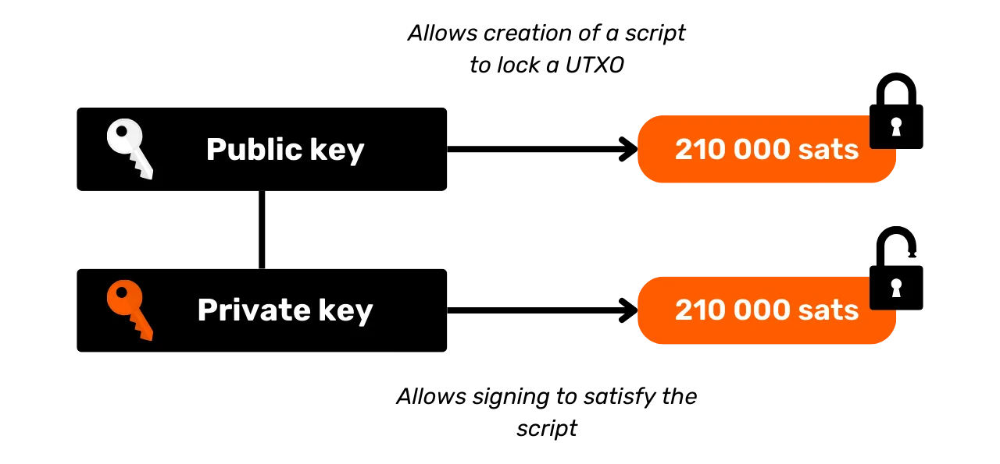
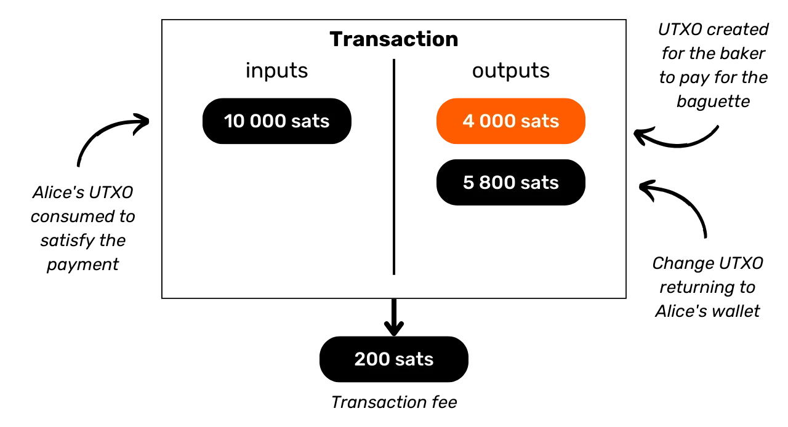
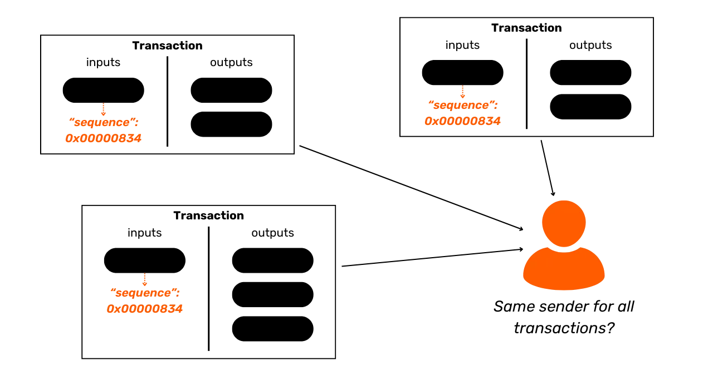

# Kaitse oma privaatsust Bitcoinil

Maailmas, kus finantstehingute privaatsus muutub järk-järgult luksuseks, on oluline mõista ja valdada privaatsuskaitse põhimõtteid oma Bitcoini kasutamisel. See koolitus annab teile kõik teoreetilised ja praktilised võtmed, et saavutada see iseseisvalt.

Tänapäeval on Bitcoinil ettevõtteid, mis on spetsialiseerunud ahela analüüsile. Nende põhitegevus on täpselt tungida teie privaatsfääri, et kompromiteerida teie tehingute konfidentsiaalsust. Tegelikult ei eksisteeri "privaatsusõigus" Bitcoinil. Seega on teie, kasutaja, ülesanne kinnitada oma loomulikke õigusi ja kaitsta oma tehingute konfidentsiaalsust, sest keegi teine seda teie eest ei tee.

See koolitus esitab end kui täielikku ja üldist teekonda. Iga tehniline mõiste arutatakse üksikasjalikult ja seda toetavad selgitavad diagrammid. Eesmärk on teha teadmised kõigile kättesaadavaks. BTC204 on seega lähenemisviisilt sobilik algajatele ja kesktaseme kasutajatele. See koolitus pakub lisaväärtust ka kõige kogenumatele bitcoinide kasutajatele, kuna me süveneme mõningatesse tehnilistesse kontseptsioonidesse, mis on sageli tundmatud.

Liituge meiega, et muuta oma Bitcoini kasutust ja saada teadlikuks kasutajaks, kes on võimeline mõistma konfidentsiaalsusega seotud panuseid ja kaitsma oma privaatsust.

+++

# Sissejuhatus
<partId>e17474a8-8899-4bdb-a7f8-bc52ddb01440</partId>

## Koolituse Tutvustus
<chapterId>08ba1933-f393-4fb5-8279-777d874caedb</chapterId>

Maailmas, kus finantstehingute privaatsus muutub järk-järgult luksuseks, on oluline mõista ja valdada privaatsuskaitse põhimõtteid oma Bitcoini kasutamisel. See koolitus annab teile kõik teoreetilised ja praktilised võtmed, et saavutada see iseseisvalt.
Tänapäeval Bitcoini ökosüsteemis on ettevõtteid, mis on spetsialiseerunud ahela analüüsile. Nende põhitegevus on täpselt tungida teie privaatsfääri, kompromiteerides teie tehingute konfidentsiaalsust. Tegelikkuses ei eksisteeri "privaatsusõigus" Bitcoinil. Seega on teie, kasutaja, ülesanne kinnitada oma loomulikke õigusi ja kaitsta oma tehingute konfidentsiaalsust, sest keegi teine seda teie eest ei tee.

Bitcoin ei ole lihtsalt "Number Kasvab Üles" ja säästude väärtuse säilitamiseks. Oma unikaalsete omaduste ja ajaloo tõttu on see peamiselt vastumajanduse tööriist. Tänu sellele märkimisväärsele leiutisele saate oma raha vabalt hallata, kulutada ja koguda, ilma et keegi saaks teid takistada.

Bitcoin pakub rahumeelset põgenemist riikide ikkest, võimaldades teil täielikult nautida oma loomulikke õigusi, mida kehtestatud seadused ei saa vaidlustada. Tänu Satoshi Nakamoto leiutisele on teil võim austada oma eraomandi õigust ja taastada lepinguvabadus.

Siiski, Bitcoin ei ole vaikimisi anonüümne, mis võib kujutada endast ohtu vastumajandusega tegelevatele isikutele, eriti despootlike režiimide all olevates piirkondades. Kuid see ei ole ainus oht. Kuna bitcoin on väärtuslik ja tsensuurimatu vara, võib see meelitada ligi varaste ahnust. Seega muutub teie privaatsuse kaitsmine ka turvalisuse küsimuseks: see võib aidata teil vältida küberrünnakuid ja füüsilisi rünnakuid.
Nagu me näeme, kuigi protokoll pakub mõningaid sisemisi privaatsuskaitseid, on oluline kasutada lisavahendeid, et optimeerida ja kaitsta seda privaatsust. See koolitus on kavandatud kui täielik ja üldistav teekond, et mõista privaatsuse panuseid Bitcoinis. Iga tehniline mõiste on üksikasjalikult lahti seletatud ja toetatud selgitavate diagrammidega. Eesmärk on muuta teadmised kõigile kättesaadavaks, sealhulgas algajatele ja kesktaseme kasutajatele. Kogenenumatele bitcoinide kasutajatele käsitleme koolituse jooksul ka väga tehnilisi ja mõnikord tundmatuid kontseptsioone, et süvendada iga teema mõistmist.

Selle koolituse eesmärk ei ole muuta teid oma Bitcoin'i kasutamisel täiesti anonüümseks, vaid pigem anda teile olulised vahendid, et teada, kuidas oma privaatsust kaitsta vastavalt teie isiklikele eesmärkidele. Teil on vabadus valida esitatud kontseptsioonide ja vahendite hulgast, et arendada välja oma strateegiad, mis on kohandatud teie eesmärkidele ja konkreetsetele vajadustele.

### Jaotis 1: Määratlused ja põhikontseptsioonid
Alustuseks vaatame koos läbi põhiprintsiibid, mis juhivad Bitcoini toimimist, et seejärel rahulikult läheneda privaatsusega seotud mõistetele. On oluline valdada mõningaid põhikontseptsioone, nagu UTXO, vastuvõtu aadressid või skriptid, enne kui suudame täielikult mõista järgmistes jaotistes käsitletavaid kontseptsioone. Tutvustame ka Bitcoini privaatsuse üldmudelit, nagu Satoshi Nakamoto seda ette nägi, mis võimaldab meil mõista panuseid ja riske.


### Jaotis 2: Ahela analüüsi mõistmine ja selle vastu kaitsmine

Teises jaotises uurime tehnikaid, mida ahela analüüsi ettevõtted kasutavad teie tegevuse jälgimiseks Bitcoinis. Nende meetodite mõistmine on oluline teie privaatsuse kaitse tõhustamiseks. See osa on suunatud ründajate strateegiate uurimisele, et paremini mõista riske ja luua alus järgmistes jaotistes uuritavatele tehnikatele. Analüüsime tehingumustreid, sisemisi ja välimisi heuristikaid ning nende mustrite tõenäolisi tõlgendusi. Lisaks teoreetilisele komponendile õpime kasutama ploki uurijat ahela analüüsi teostamiseks, läbi praktiliste näidete ja harjutuste.


### Jaotis 3: Parimate tavade valdamine teie privaatsuse kaitsmiseks

Meie koolituse kolmandas jaotises jõuame asja tuumani: praktika! Eesmärk on valdada kõiki olulisi parimaid tavasid, mis peaksid saama iga Bitcoini kasutaja loomulikeks refleksideks. Käsitleme värske aadressi kasutamist, märgistamist, konsolideerimist, täisnoodide kasutamist, samuti KYC-d ja omandamismeetodeid. Eesmärk on anda teile põhjalik ülevaade vältimist vajavatest lõksudest, et luua kindel alus meie privaatsuskaitse otsingutes. Mõne neist tavade rakendamiseks juhatatakse teid konkreetse juhendi juurde.


### Jaotis 4: Coinjoin tehingute mõistmine

Kuidas me saame rääkida Bitcoini privaatsusest ilma coinjoine arutamata? Jaotises 4 avastate kõik, mida peate teadma selle segamismeetodi kohta. Saate teada, mis on coinjoin, selle ajalugu ja eesmärgid, samuti olemasolevate coinjoinide erinevad tüübid. Lõpuks, kogenenumatele kasutajatele, uurime, mis on anonsetsid ja entroopia ning kuidas neid näitajaid arvutada.


### Jaotis 5: Teiste edasijõudnud privaatsustehnikate panuste mõistmine
Viiendas jaotises anname ülevaate kõigist teistest olemasolevatest tehnikatest, mis aitavad kaitsta teie privaatsust Bitcoinis, välja arvatud coinjoin. Aastate jooksul on arendajad üles näidanud märkimisväärset loovust privaatsusele pühendatud tööriistade kujundamisel. Vaatleme kõiki neid meetodeid, nagu Payjoin, koostööl põhinevad tehingud, Coin Swap ja Atomic Swap, detailides nende toimimist, eesmärke ja potentsiaalseid nõrkusi.


### Jaotis 6: Privaatsust Parandavate Protokolli Ettepanekute Uurimine

Kui eelmised jaotised keskendusid rakendustasandi privaatsuslahendustele, siis kuues jaotis sukeldub protokolli tasandi väljakutsetesse kasutaja privaatsuse osas. Arutleme privaatsuse üle sõlmede võrgustiku tasandil ja tehingute edastamisel. Samuti arutame erinevaid protokolle, mis on aastate jooksul välja pakutud, et parandada kasutaja privaatsust Bitcoinis. Lõpetuseks vaatleme Bitcoini viimase suurema pehme kahvli, Taprooti, privaatsusele avaldatud mõjusid, nii positiivseid kui ka negatiivseid.

***(WIP: LOIC: LISA DIAGRAMMI NÄIDE SIIN)***

### Boonusjaotis: Privaatsus Teise Kihi Protokollides

Nagu olete aru saanud, keskendub selle koolituse tuum eksklusiivselt onchain privaatsusele. Selles lõplikus boonusosas soovin teemat laiendada, rääkides privaatsusest Bitcoiniga seotud teistes protokollides. Räägime spetsiifiliselt privaatsusest Lightning Networkis. Mõned väidavad, et Lightning on vaikimisi privaatne, samas kui teised arvavad, et kasutaja privaatsus on ebapiisav. Niisiis, mis on tõde? Lahutame tõe valest, et paremini mõista privaatsusega seotud väljakutseid Lightning Networkis. Arutame ka kõrvalahelaid nagu Liquid Network ja Chaumiani panku nagu Cashu või Fedimint.


# Mõisted ja Põhikontseptsioonid
<partId>b9bbbde3-34c0-4851-83e8-e2ffb029cf31</partId>


## Bitcoini UTXO Mudel
<chapterId>8d6b50c5-bf74-44f4-922b-25204991cb75</chapterId>

Bitcoin on eelkõige valuuta, aga kas te teate konkreetsemalt, kuidas BTC-d protokollil esindatud on?

### Bitcoini UTXOd: Mis Need On?

Bitcoin protokollis toimub rahaliste ühikute haldamine UTXO mudeli abil, mis on lühend ingliskeelsest väljendist "_Unspent Transaction Output_".
See mudel erineb oluliselt traditsioonilistest pangasüsteemidest, mis toetuvad konto ja saldo mehhanismile finantsvoogude jälgimiseks. Tõepoolest, pangasüsteemis hoitakse individuaalseid saldosid kontodel, mis on seotud identiteediga. Näiteks kui ostate pagarilt baguette, siis teie pank lihtsalt debiteerib ostusumma teie kontolt, vähendades teie saldo, samal ajal kui pagarile krediteeritakse sama summa, suurendades nende saldo. Selles süsteemis ei ole mõistet raha seosest, mis siseneb teie kontole ja lahkub sellest, peale tehingukirjete.


Bitcoinis toimib see teisiti. Kontseptsioon kontost ei eksisteeri ja rahalisi ühikuid ei hallata saldo kaudu, vaid UTXOde kaudu. UTXO esindab kindlat bitcoini summat, mis pole veel kulutatud, moodustades seega "tüki bitcoinist", mis võib olla suur või väike. Näiteks UTXO võib olla väärt `500 BTC` või lihtsalt `700 SATS`.

**> Meeldetuletus:** Satoshi, tihti lühendatult sat, on Bitcoini väikseim ühik, võrreldav sentiga fiat-valuutades.

```plaintext
1 BTC = 100 000 000 SATS
```
Teoreetiliselt võib UTXO esindada mis tahes väärtust bitcoinides, alates ühest satoshist kuni teoreetilise maksimumini umbes 21 miljonit BTC-d. Siiski on loogiliselt võimatu omada kõiki 21 miljonit bitcoini, ja on olemas majanduslik alampiir, mida nimetatakse "tolmuks", millest allpool peetakse UTXO-d majanduslikult kasutuskõlbmatuks kulutamiseks.
**> Kas teadsid?** Suurim kunagi Bitcoinis loodud UTXO oli väärtusega `500 000 BTC`. Selle lõi MtGox platvorm konsolideerimisoperatsiooni käigus novembris 2011: [29a3efd3ef04f9153d47a990bd7b048a4b2d213daaa5fb8ed670fb85f13bdbcf](https://mempool.space/en/tx/29a3efd3ef04f9153d47a990bd7b048a4b2d213daaa5fb8ed670fb85f13bdbcf)

### UTXO-d ja kulutamistingimused

UTXO-d on vahetusinstrumendid Bitcoinis. Iga tehing tarbib UTXO-sid sisenditena ja loob uusi UTXO-sid väljunditena. Tehingu sooritamisel peetakse sisenditena kasutatud UTXO-sid "kulutatuks" ja genereeritakse uued UTXO-d, mis määratakse tehingu väljundites näidatud saajatele. Seega esindab UTXO lihtsalt kulutamata tehingu väljundit ja seega teatud ajahetkel kasutajale kuuluvat bitcoini kogust.

Kõik UTXO-d on kaitstud skriptidega, mis määratlevad tingimused, mille alusel neid saab kulutada. UTXO kulutamiseks peab kasutaja võrgule tõestama, et ta vastab selle UTXO-d kaitsva skripti poolt kehtestatud tingimustele. Üldiselt on UTXO-d kaitstud avaliku võtmega (või vastuvõtu aadressiga, mis esindab seda avalikku võtit). Selle avaliku võtmega seotud UTXO kulutamiseks peab kasutaja tõestama, et tal on vastav privaatvõti, esitades digitaalse allkirja, mis on tehtud selle võtmega. Seetõttu öeldakse, et teie Bitcoin rahakott ei sisalda tegelikult bitcoine, vaid see salvestab teie privaatvõtmed, mis omakorda annavad teile juurdepääsu teie UTXO-dele ja laiendatult bitcoinele, mida need esindavad.



Arvestades, et Bitcoinis puudub konto mõiste, vastab rahakoti saldo lihtsalt kõigi UTXO-de väärtuste summale, mida see saab kulutada. Näiteks, kui teie Bitcoin rahakott saab kulutada järgmised 4 UTXO-d:

```plaintext
- 2 BTC
- 8 BTC
- 5 BTC
- 2 BTC
```

Teie rahakoti kogusaldo oleks `17 BTC`.


## Bitcoini tehingute struktuur
<chapterId>29d3aaab-de2e-4746-ab40-c9748898850c</chapterId>

### Tehingu sisendid ja väljundid

Bitcoini tehing on blockchainis registreeritud operatsioon, mis võimaldab bitcoini omandiõiguse ülekandmist ühelt isikult teisele. Täpsemalt, kuna meil on UTXO mudel ja kontosid ei ole, rahuldab tehing ühe või mitme UTXO kulutamistingimused, tarbib need ja loob vastavuses uued UTXO-d, millele on omistatud uued kulutamistingimused. Lühidalt, tehing liigutab bitcoine skriptist, mis on rahuldatud, uude skripti, mille eesmärk on neid kaitsta.


Iga Bitcoin'i tehing koosneb seega ühest või mitmest sisendist ja ühest või mitmest väljundist. Sisendid on UTXO-d, mida tehing tarbib väljundite genereerimiseks. Väljundid on uued UTXO-d, mida saab kasutada sisenditena tulevastes tehingutes.


**> Kas teadsid?** Teoreetiliselt võib bitcoin'i tehingul olla lõpmatu arv sisendeid ja väljundeid. Ainult ploki maksimaalne suurus piirab seda arvu.
Iga sisend Bitcoin'i tehingus viitab eelnevale kulutamata UTXO-le. UTXO kasutamiseks sisendina peab selle omanik tõestama, et ta on legitiimne omanik, valideerides sellega seotud skripti, st täites kehtestatud kulutamistingimuse. Üldiselt hõlmab see digitaalse allkirja esitamist, mis on loodud privaatvõtmega, mis vastab avalikule võtmele, mis algselt selle UTXO kaitseks kasutusele võeti. Skript seisneb seega kontrollimises, et allkiri vastab avalikule võtmele, mida kasutati vahendite vastuvõtmisel.


Iga väljund seevastu määratleb ülekantavate bitcoinide hulga, samuti saaja. Viimane määratletakse uue skriptiga, mis üldiselt lukustab äsja loodud UTXO vastuvõtu aadressi või uue avaliku võtmega.

Tehingu kehtivaks lugemiseks konsensuse reeglite kohaselt peab väljundite kogusumma olema väiksem või võrdne sisendite kogusummaga. Teisisõnu, tehingu poolt genereeritud uute UTXO-de summa ei tohi ületada sisenditena tarbitud UTXO-de summat. See põhimõte on loogiline: kui sul on ainult summa `500,000 SATS`, ei saa sa teha ostu `700,000 SATS` eest.

### Muutus ja konsolideerimine Bitcoin'i tehingus

Bitcoin'i tehingu toime UTXO-dele võib seega võrrelda kullamündi ümbersulatamisega. Tõepoolest, UTXO ei ole jagatav, vaid ainult ühendatav. See tähendab, et kasutaja ei saa lihtsalt jagada UTXO-d, mis esindab teatud hulka bitcoine, mitmeks väiksemaks UTXO-ks. Ta peab selle täielikult tarbima tehingus, et luua üks või mitu uut suvalise väärtusega UTXO-d väljundites, mis peavad olema võrdsed või väiksemad kui algne väärtus.

See mehhanism on sarnane kullamündi omaga. Kujutage ette, et teil on 2-untsine münt ja soovite teha makse 1 untsi eest, eeldades, et müüja ei saa teile tagasi anda. Te peaksite oma mündi ümber sulatama ja valama 2 uut 1-untsist münti.
Bitcoin'is on toiming sarnane. Kujutame ette, et Alicel on UTXO `10,000 SATS` ja ta soovib osta baguette, mis maksab `4,000 SATS`. Alice teeb tehingu sisendiga 1 UTXO `10,000 SATS`, mille ta tarbib täielikult, ja väljundites loob ta 2 UTXO-d väärtusega `4,000 SATS` ja `6,000 SATS`. UTXO `4,000 SATS` saadetakse pagarile baguette eest maksmiseks, samal ajal kui UTXO `6,000 SATS` naaseb Alicele tagasi kui vahetusraha. See UTXO, mis naaseb tehingu algsele saatjale, on see, mida Bitcoin'i žargoonis nimetatakse "vahetusrahaks".

Kujutagem nüüd ette, et Alicel ei ole ühtegi UTXO-d väärtusega `10,000 SATS`, vaid tal on hoopis kaks UTXO-d, mõlemad `3,000 SATS` väärtuses. Sellises olukorras ei ole ükski eraldi UTXO piisav, et katta `4,000 SATS` maksumust bageti eest. Seetõttu peab Alice kasutama mõlemat `3,000 SATS` UTXO-d sisenditena oma tehingus. Sel viisil jõuab sisendite kogusumma `6,000 SATS`-ni, võimaldades tal katta `4,000 SATS` makse pagarile. See meetod, mis hõlmab mitme UTXO gruppi lisamist tehingu sisenditesse, on sageli nimetatud terminiga "konsolideerimine".


### Tehingutasud

Intuitiivselt võiks arvata, et tehingutasud esindavad samuti tehingu väljundit. Kuid tegelikkuses see nii ei ole. Tehingu tasud esindavad sisendite ja väljundite kogusumma vahet. See tähendab, et pärast osa sisendite väärtuse kasutamist soovitud väljundite katmiseks tehingus, jääb teatud summa sisendeid kasutamata. See järelejäänud summa moodustab tehingutasud.

```plaintext
Tasud = kogu sisendid - kogu väljundid
```

Vaadelgem uuesti Alice'i näidet, kellel on UTXO väärtusega `10,000 SATS` ja kes soovib osta bageti `4,000 SATS` eest. Alice loob tehingu, kasutades sisendina oma UTXO-d väärtusega `10,000 SATS`. Seejärel genereerib ta väljundi väärtusega `4,000 SATS`, mis on mõeldud pagarile bageti eest maksmiseks. Selleks, et julgustada kaevureid lisama tema tehingut plokki, eraldab Alice `200 SATS` tasudeks. Nii loob ta teise väljundi, vahetusraha, mis naaseb tema juurde, summas `5,800 SATS`.



Tasu valemit rakendades näeme tõepoolest, et kaevuritele jääb `200 SATS`:

```plaintext
Tasud = kogu sisendid - kogu väljundid
Tasud = 10,000 - (4,000 + 5,800)
Tasud = 10,000 - 9,800
Tasud = 200
```

Kui kaevur valideerib edukalt ploki, on tal lubatud koguda neid tasusid kõigi oma plokis sisalduvate tehingute eest, nn "coinbase" tehingu kaudu.

### UTXO-de loomine Bitcoinis

Kui olete eelnevaid lõike hoolikalt järginud, siis te nüüd teate, et UTXO-sid saab luua ainult olemasolevate UTXO-de tarbimise teel. Seega, mündid Bitcoinis moodustavad pideva ahela. Siiski võite mõelda, kuidas esimesed UTXO-d selles ahelas ilmusid. See tõstatab probleemi, mis on sarnane kana ja muna dilemmale: kust need algupärased UTXO-d tulid?

Vastus peitub **coinbase tehingus**.

Coinbase on Bitcoinis spetsiifiline tehingutüüp, mis on unikaalne igale plokile ja on alati esimene. See võimaldab kaevuril, kes leidis kehtiva töötõendi, saada oma ploki tasu. See tasu koosneb kahest elemendist: **ploki toetus** ja **tehingutasud**, millest me eelmises osas rääkisime.

Coinbase tehingu unikaalne omadus on see, et see on ainus, mis suudab luua bitcoine õhust, ilma vajaduseta tarbida sisendeid oma väljundite genereerimiseks. Need äsja loodud bitcoind moodustavad, mida võiksime nimetada "algupärasteks UTXO-deks".

Plokitoetusest pärinevad bitcoiinid on uued BTC-d, mis on loodud tühjast, järgides konsensuse reeglites ette nähtud emiteerimise ajakava. Plokitoetus väheneb iga 210 000 ploki järel poole võrra, mis toimub umbes iga nelja aasta tagant protsessis, mida nimetatakse "poolitamiseks". Alguses loodi iga toetusega 50 bitcoini, kuid see summa on järk-järgult vähenenud; praegu on see 3.125 bitcoini ploki kohta.

Mis puudutab tehingutasudega seotud osa, kuigi see esindab samuti uusi loodud BTC-sid, ei tohi need ületada kõigi ploki tehingute sisendite ja väljundite vahelist erinevust. Nägime varem, et need tasud esindavad sisendite osa, mida tehingute väljundites ei kasutata. See osa on tehniliselt "kadunud" tehingu käigus ja kaevuril on õigus see väärtus taasluua ühe või mitme uue UTXO-na. See on seega väärtuse ülekanne tehingu saatjalt kaevurile, kes lisab selle plokiahelasse.

**> Kas teadsid?** Coinbase'i tehinguga genereeritud bitcoiinid on allutatud 100 ploki küpsusperioodile, mille jooksul ei saa kaevur neid kulutada. See reegel on mõeldud vältimaks komplikatsioone, mis on seotud uute loodud bitcoiinide kasutamisega ahelas, mis võib hiljem muutuda vananenuks.
### UTXO mudeli mõjud
Esiteks mõjutab UTXO mudel otseselt Bitcoin'i tehingutasusid. Kuna iga ploki maht on piiratud, eelistavad kaevurid tehinguid, mis pakuvad parimat tasu suhtes ruumile, mida need plokis hõivavad. Tõepoolest, mida rohkem UTXO-sid tehing sisaldab sisenditena ja väljunditena, seda raskem see on ja seetõttu nõuab see kõrgemaid tasusid. See on üks põhjusi, miks me sageli püüame vähendada oma rahakoti UTXO-de arvu, mis võib mõjutada ka privaatsust, teemat, mida me arutame üksikasjalikult selle koolituse kolmandas osas.

Järgmisena, nagu eelnevalt mainitud, on Bitcoin'i mündid sisuliselt UTXO-de ahel. Iga tehing loob seega lingi mineviku UTXO ja tuleviku UTXO vahel. UTXO-d võimaldavad seega bitcoiinide jälgimist nende loomisest praeguse kulutamiseni. See läbipaistvus võib tunduda positiivsena, kuna see võimaldab igal kasutajal kontrollida saadud bitcoiinide autentsust. Siiski põhineb just sellel jälgitavuse ja auditeeritavuse põhimõttel ka ahela analüüs, praktika, mille eesmärk on teie privaatsuse ohustamine. Me uurime seda praktikat põhjalikult koolituse teises osas.

## Bitcoin'i privaatsusmudel
<chapterId>769d8963-3ed5-4094-b21d-9203c7d9e465</chapterId>

### Valuuta: Autentsus, terviklikkus ja topeltkulutamine

Üks raha funktsioonidest on lahendada kahepoolse soovi kokkusattumise probleem. Barteril põhinevas süsteemis nõuab vahetuse tegemine mitte ainult isiku leidmist, kes pakub minu vajadust rahuldavat kaupa, vaid ka neile vastava väärtusega kauba pakkumist, mis rahuldab nende enda vajadust. Selle tasakaalu leidmine osutub keerukaks.


Seetõttu pöördume raha poole, mis võimaldab väärtuse ülekandmist nii ruumiliselt kui ka ajaliselt.


Selleks, et raha saaks seda probleemi lahendada, on oluline, et kauba või teenuse pakkuv pool oleks veendunud oma võimes seda summat hiljem kulutada. Seega, iga ratsionaalne isik, kes soovib vastu võtta raha, olgu see digitaalne või füüsiline, veendub, et see vastab kahele põhilisele kriteeriumile:
- **Münt peab olema terviklik ja autentne;**
- **ja seda ei tohi topelt kulutada.**
Füüsilise valuuta kasutamisel on esimene omadus kõige keerulisem tõestada. Ajaloo erinevatel aegadel on metallist müntide terviklikkust sageli ohustanud sellised praktikad nagu kärpimine või puurimine. Näiteks Vana-Rooma ajal oli kodanikel tavaline kraapida kuldsete müntide servi, et koguda natuke väärtuslikku metalli, hoides neid siiski tulevaste tehingute jaoks. Mündi sisemine väärtus seega vähenes, kuid selle nimiväärtus jäi samaks. Just seetõttu hakati hiljem müntide servadele sooni lööma.

Autentsus on samuti füüsilise rahalise meedia puhul raske tuvastatav omadus. Tänapäeval on võltsimisvastased tehnikad üha keerukamad, sundides kaupmehi investeerima kallitesse kontrollisüsteemidesse.

Teisest küljest, nende olemuse tõttu, ei ole füüsiliste valuutade puhul topeltkulutamine probleem. Kui ma annan sulle 10-eurose, siis see lahkub pöördumatult minu valdusest, et siseneda sinu omasse, loomulikult välistades igasuguse võimaluse kulutada samu rahalisi ühikuid mitu korda. Lühidalt, ma ei saa seda 10-eurost uuesti kulutada.


Digitaalse valuuta puhul on raskus erinev. Mündi autentsuse ja terviklikkuse tagamine on sageli lihtsam. Nagu me eelmises jaotises nägime, võimaldab Bitcoini UTXO mudel jälitada münti tagasi selle päritoluni, kontrollides seeläbi, et see loodi tõepoolest konsensuse reeglite järgi kaevandaja poolt.

Siiski on topeltkulutamise puudumise tagamine keerukam, kuna igasugune digitaalne hüve on sisuliselt informatsioon. Erinevalt füüsilistest kaupadest ei jagune informatsioon vahetuste käigus, vaid levib korrutades. Näiteks, kui ma saadan sulle dokumendi e-posti teel, siis see duplitseeritakse. Sinu poolt ei saa sa kindlalt kontrollida, et ma olen originaaldokumendi kustutanud.


### Topeltkulutamise vältimine Bitcoinis
Ainus viis digitaalse hüve duplitseerimise vältimiseks on olla teadlik kõigist süsteemis toimuvatest vahetustest. Sel viisil saab teada, kes mida omab, ja uuendada kõigi osapoolte varasid vastavalt tehtud tehingutele. See on see, mida tehakse näiteks kirjaliku raha puhul pangasüsteemis. Kui maksad kaupmehele 10 eurot krediitkaardiga, märgib pank selle vahetuse üles ja uuendab pearaamatut.
Bitcoinis saavutatakse topeltkulutamise vältimine samal viisil. Eesmärk on kinnitada, et puudub juba kulutatud müntidega tehing. Kui neid münte pole kunagi kasutatud, siis võime olla kindlad, et topeltkulutamist ei toimu. Seda põhimõtet kirjeldas Satoshi Nakamoto Valges Raamatus selle kuulsa fraasiga:

**"*Ainus viis tehingu puudumise kinnitamiseks on olla teadlik kõigist tehingutest.*"**

Siiski, erinevalt pangamudelist, ei soovita Bitcoinis usaldada keskset asutust. On vajalik, et kõik kasutajad saaksid kinnitada topeltkulutamise puudumist, ilma et peaksid lootma kolmandale osapoolele. Seega peavad kõik olema teadlikud kõigist Bitcoin tehingutest. Sellepärast levitatakse Bitcoini tehinguid avalikult kõigi võrgusõlmede vahel ja need salvestatakse selgelt plokiahelasse.

Just see informatsiooni avalik levitamine muudab privaatsuse kaitse Bitcoinis keerukaks. Traditsioonilises pangasüsteemis on teoreetiliselt ainult finantsasutus teadlik tehtud tehingutest. Teisest küljest, Bitcoinis on kõik kasutajad teadlikud kõigist tehingutest, läbi oma vastavate sõlmede.

### Privaatsusmudel: pangasüsteem vs Bitcoin
Traditsioonilises süsteemis on teie pangakonto seotud teie isikuga. Pankur teab, milline pangakonto kuulub millisele kliendile ja millised tehingud sellega seotud on. Siiski on see infovoog pangast avaliku domeenini katkestatud. Teisisõnu, on võimatu teada teise isiku pangakonto saldo ja tehinguid. Ainult pankal on juurdepääs sellele teabele.
Näiteks teie pankur teab, et ostate iga hommik naabruses asuvast pagaripoest baguette'i, kuid teie naaber ei ole sellest tehingust teadlik. Seega on infovoog kättesaadav asjaomastele osapooltele, eriti pangale, kuid jääb välispidistele kättesaamatuks.

Varasemas osas nähtud tehingute avaliku levitamise piirangu tõttu ei saa Bitcoini privaatsusmudel järgida pangandussüsteemi mudelit. Bitcoini puhul, kuna infovoogu tehingute ja avaliku domeeni vahel ei saa katkestada, **toetub privaatsusmudel kasutaja isikusamasuse ja tehingute endi eraldamisele**.
Näiteks, kui maksate pagarile BTC-s baguette'i eest, võib teie naaber, kellel on oma täisnood, näha teie tehingut läbimas, samuti nagu nad näevad kõiki teisi süsteemi tehinguid. Siiski, kui privaatsuspõhimõtteid järgitakse, ei tohiks nad suuta seda konkreetset tehingut teie isikuga seostada.


Kuid kuna Bitcoini tehingud tehakse avalikuks, muutub siiski võimalikuks nende vahel seoste loomine, et järeldada teavet osapoolte kohta. See tegevus isegi kujutab endast iseenesest spetsialiteeti, mida nimetatakse "ahela analüüsiks". Järgmises koolituse osas kutsun teid uurima ahela analüüsi aluseid, et mõista, kuidas teie bitcoine jälgitakse ja teada, kuidas selle vastu paremini kaitsta.

# Ahela Analüüsi Mõistmine ja Kuidas End Kaitsta
<partId>4739371e-9fef-45b0-bcaa-b7a4df6b4470</partId>

## Mis on Bitcoini Ahela Analüüs?
<chapterId>7d198ba6-4af2-4f24-86cb-3c79cb25627e</chapterId>

### Definitsioon ja Tööpõhimõte

Ahela analüüs hõlmab kõiki meetodeid bitcoini voo jälgimiseks plokiahelas. Üldiselt toetub ahela analüüs varasemate tehingute proovide omaduste jälgimisele. Seejärel hõlmab see nende samade omaduste tuvastamist tehingus, mida soovitakse analüüsida, ja tõenäoliste tõlgenduste järeldamist. See probleemilahendusmeetod praktilisest lähenemisest, et leida piisavalt hea lahendus, on see, mida nimetatakse "heuristikaks".

Lihtsustatult öeldes tehakse ahela analüüs kolmes peamises etapis:
1. **Plokiahela jälgimine;**
2. **Tuntud omaduste tuvastamine;**
3. **Hüpoteeside tegemine.**


Ahela analüüsi saab teostada igaüks. See nõuab ainult juurdepääsu plokiahela avalikule teabele täisnoodi kaudu, et jälgida tehingute liikumisi ja teha hüpoteese. On ka tasuta tööriistu, mis hõlbustavad seda analüüsi, nagu veebileht [OXT.me](https://oxt.me/), mida me uurime üksikasjalikult selle osa viimastes peatükkides. Siiski tuleb privaatsuse peamiseks ohuks ettevõtted, mis on spetsialiseerunud ahela analüüsile. Need ettevõtted on viinud ahela analüüsi tööstuslikule tasemele ja müüvad oma teenuseid finantsasutustele või valitsustele. Nende ettevõtete seas on Chainalysis tõenäoliselt kõige tuntum.

### Ahela Analüüsi Eesmärgid
Üks ahelanalüüsi eesmärkidest on grupeerida erinevaid tegevusi Bitcoinis, et määrata kindlaks tegevusi sooritanud kasutaja ainulaadsus. Järgnevalt on võimalik proovida seostada see tegevuste kogum reaalse identiteediga.


Mäletage eelmist peatükki. Ma selgitasin, miks Bitcoin'i privaatsusmudel algselt tugines kasutaja identiteedi eraldamisele nende tehingutest. Seetõttu võib tunduda, et ahelanalüüs on tarbetu, kuna isegi kui õnnestub grupeerida ahelategevusi, ei saa neid seostada reaalse identiteediga.

Teoreetiliselt on see väide täpne. Selle koolituse esimeses osas nägime, et krüptograafilisi võtmepaare kasutatakse UTXO tingimuste kehtestamiseks. Olemuselt ei avalda need võtmepaarid mingit teavet nende hoidjate identiteedi kohta. Seega, isegi kui õnnestub grupeerida erinevate võtmepaaridega seotud tegevusi, ei ütle see meile midagi nende tegevuste taga oleva üksuse kohta.


Siiski on praktiline reaalsus palju keerulisem. On palju käitumisi, mis riskivad seostada reaalse identiteedi ahelategevusega. Analüüsis nimetatakse seda sisenemispunktiks ja neid on palju.

Kõige tavalisem, muidugi, on KYC (*Know Your Customer*). Kui võtate oma bitcoine reguleeritud platvormilt välja ühele oma isiklikule vastuvõtu aadressile, siis mõned inimesed suudavad seostada teie identiteedi selle aadressiga. Laiemalt võttes võib sisenemispunkt olla igasugune suhtlus teie reaalse elu ja Bitcoin'i tehingu vahel. Näiteks, kui avaldate oma vastuvõtu aadressi oma sotsiaalvõrgustikes, võib see olla analüüsi jaoks sisenemispunkt. Kui teete oma pagarile makse bitcoinides, võivad nad seostada teie näo (mis on osa teie identiteedist) Bitcoin'i aadressiga.

Need sisenemispunktid on Bitcoin'i kasutamisel peaaegu vältimatud. Kuigi võib püüda nende ulatust piirata, jäävad need olemasolevaks. Seetõttu on oluline ühendada meetodid, mille eesmärk on säilitada teie privaatsus. Kuigi teie reaalse identiteedi ja tehingute vahelise eraldatuse säilitamine on huvitav lähenemine, on see tänapäeval ebapiisav. Tõepoolest, kui kõik teie ahelategevused saab grupeerida, siis võib väikseimgi sisenemispunkt ohustada ainukest privaatsuskihti, mille olite loonud.


### Kaitse ahelanalüüsi vastu
Seega on vajalik ka suuta vastu seista ahelanalüüsile meie Bitcoin'i kasutamisel. Sellisel viisil toimides saame minimeerida meie tegevuste agregatsiooni ja piirata sisenemispunkti mõju meie privaatsusele.


Tõepoolest, ahelanalüüsi paremaks vastu seismiseks, mis oleks parem lähenemine kui tutvuda ahelanalüüsis kasutatavate meetoditega? Kui soovite teada, kuidas parandada oma privaatsust Bitcoin'is, peate mõistma neid meetodeid. See võimaldab teil paremini mõista tehnikaid nagu [Coinjoin](https://planb.network/en/tutorials/privacy/coinjoin-samourai-wallet) või [Payjoin](https://planb.network/en/tutorials/privacy/payjoin) (tehnikad, mida uurime koolituse viimastes osades), ja vähendada vigu, mida võite teha.
Selles võime teha analoogia krüptograafia ja krüptoanalüüsi vahel. Hea krüptograaf on eelkõige hea krüptoanalüütik. Uue krüpteerimisalgoritmi väljamõtlemiseks peab inimene teadma, milliste rünnakutega see peab silmitsi seisma, ning uurima ka, miks eelnevad algoritmid murdusid. Sama põhimõte kehtib privaatsuse kohta Bitcoinis. Plokiahela analüüsi meetodite mõistmine on võti selle vastu kaitsmiseks. Seetõttu pakun välja terve jaotise plokiahela analüüsist selles koolitusprogrammis.
### Plokiahela analüüsi meetodid

On oluline mõista, et plokiahela analüüs ei ole täppisteadus. See põhineb heuristilistel järeldustel, mis on tuletatud varasematest vaatlustest või loogilistest tõlgendustest. Need reeglid võimaldavad üsna usaldusväärseid tulemusi, kuid mitte kunagi absoluutse täpsusega. Teisisõnu, **plokiahela analüüs hõlmab alati tõenäosusmõõdet järeldustes**. Näiteks võib enam-vähem kindlalt hinnata, et kaks aadressi kuuluvad samale entiteedile, kuid täielik kindlus jääb alati kättesaamatuks.

Plokiahela analüüsi kogu eesmärk seisneb just erinevate heuristikate koondamises, et minimeerida vea riski. See on omamoodi tõendite kuhjamine, mis võimaldab meil reaalsusele lähemale jõuda.

Neid kuulsaid heuristikaid saab grupeerida erinevatesse kategooriatesse, mida me üksikasjalikult käsitleme:
- **Tehingumustrid (või tehingumudelid);**
- **Tehingu sisemised heuristikad;**
- **Tehingu välimised heuristikad.**

### Satoshi Nakamoto ja plokiahela analüüs
On märkimisväärne, et esimesed kaks heuristikat ahela analüüsiks avastas Satoshi Nakamoto ise. Ta arutleb neid Bitcoin White Paperi 10. osas. Need on:
- ühise sisendi omandi heuristika (CIOH);
- ja aadressi taaskasutus.


Allikas: S. Nakamoto, "Bitcoin: A Peer-to-Peer Electronic Cash System", https://bitcoin.org/bitcoin.pdf, 2009.

Järgnevates peatükkides uurime, millest need koosnevad, kuid on juba huvitav märkida, et need kaks heuristikat hoiavad ahela analüüsis tänapäeval endiselt esikohta.

## Tehingumustrid
<chapterId>d365a101-2d37-46a5-bfb9-3c51e37bf96b</chapterId>

Tehingumuster on lihtsalt tüüpiline tehingu üldstruktuur, mida võib plokiahelal leida, mille tõlgendamine on tõenäoliselt teada. Mustrite uurimisel keskendume ühele tehingule, mida analüüsime kõrgel tasemel.

Teisisõnu, me vaatame ainult sisendites ja väljundites olevate UTXO-de arvu, jättes tähelepanuta tehingu spetsiifilisemad üksikasjad või keskkonna. Täheldatud mudelist saame tehingu olemuse tõlgendada. Seejärel otsime selle struktuuri omadusi ja teeme tõlgenduse.


Selles osas avastame koos peamised tehingumudelid, mida ahela analüüsis kohata võib, ja iga mudeli puhul annan teile selle struktuuri tõenäolise tõlgenduse koos konkreetse näitega.

### Lihtne Saatmine (või Lihtne Makse)

Alustame väga levinud mustriga, kuna see ilmub enamikus bitcoinimaksetes. Lihtsa makse mudelit iseloomustab ühe või mitme UTXO tarbimine sisendites ja 2 UTXO tootmine väljundites. Seega näeb see mudel välja selline:


Kui me märkame seda tehingustruktuuri plokiahelas, võime juba teha tõlgenduse. Nagu nimigi viitab, näitab see mudel, et oleme saatmise või maksetehingu juures. Kasutaja on kasutanud oma UTXO-sid sisendites, et rahuldada väljundites makse UTXO ja vahetus UTXO (muutus, mis tuleb tagasi samale kasutajale).
Seega teame, et vaadeldav kasutaja tõenäoliselt ei oma enam ühte kahest UTXO-st väljundites (makse oma), kuid nad on endiselt teise UTXO (muutuse oma) omanik.
Praegu on meil võimatu täpsustada, milline väljund esindab millist UTXO-d, kuna see ei ole uuringu eesmärk. Saavutame selle, tuginedes heuristikale, mida uurime järgnevates osades. Praegusel etapil on meie eesmärk piiratud ainult küsimuse all oleva tehingu olemuse tuvastamisega, mis sel juhul on lihtne saatmine.

Näiteks siin on Bitcoin tehing, mis järgib lihtsa saatmise mustrit:

```plaintext
b6cc79f45fd2d7669ff94db5cb14c45f1f879ea0ba4c6e3d16ad53a18c34b769
```


Allikas: [Mempool.space](https://mempool.space/en/tx/b6cc79f45fd2d7669ff94db5cb14c45f1f879ea0ba4c6e3d16ad53a18c34b769)

Pärast seda esimest näidet peaks teil olema parem arusaam sellest, mida tähendab "tehingumustri" uurimine. Me uurime tehingut, keskendudes ainult selle struktuurile, võtmata arvesse selle keskkonda või tehingu konkreetseid üksikasju. Me vaatleme seda ainult üldisel viisil esimeses etapis.

Nüüd, kui mõistate, mis on muster, liikugem edasi teiste olemasolevate mudelite juurde.

### Pühkimine

See teine mudel iseloomustab ühe UTXO tarbimist sisendis ja ühe UTXO tootmist väljundis.


Selle mudeli tõlgendus on, et oleme iseenesele ülekande juures. Kasutaja on kandnud oma bitcoine iseendale, teisele aadressile, mida ta omab. Kuna tehingus ei ole muutust, on väga ebatõenäoline, et oleme maksetehingu juures. Tõepoolest, kui makse tehakse, on peaaegu võimatu, et maksjal oleks UTXO, mis täpselt vastab müüja nõutud summale pluss tehingutasud. Üldiselt on maksja seega sunnitud tootma muutuse väljundi.

Siis teame, et vaadeldav kasutaja tõenäoliselt ikka omab seda UTXO-d. Ahela analüüsi kontekstis, kui teame, et tehingu sisendis kasutatud UTXO kuulub Alicesse, võime eeldada, et väljundi UTXO kuulub samuti temale. Hiljem muutub huvitavaks leida tehingu siseseid heuristikaid, mis võiksid seda eeldust tugevdada (uurime neid heuristikaid peatükis 3.3).

Näiteks siin on Bitcoin tehing, mis järgib pühkimise mustrit:

```plaintext
35f1072a0fda5ae106efb4fda871ab40e1f8023c6c47f396441ad4b995ea693d
```


Allikas: [Mempool.space](https://mempool.space/en/tx/35f1072a0fda5ae106efb4fda871ab40e1f8023c6c47f396441ad4b995ea693d) Siiski võib selline muster paljastada ka iseenesele tehtud ülekande krüptoraha vahetusplatvormi kontole. Selleks, et teada saada, kas tegemist on ülekandega isehoidmise rahakotti või väljavõtmisega platvormile, tuleb uurida tuntud aadresse ja tehingu konteksti. Tõepoolest, vahetusplatvormide aadressid on sageli kergesti tuvastatavad.

Tagasi Alice'i näite juurde: kui ülekande sihtpunkt on platvormi tuntud aadress (näiteks Binance), võib see tähendada, et bitcoine on üle kantud välja Alice'i otsesest valdusest, tõenäoliselt kavatsusega neid müüa või hoiustada sellel platvormil. Teisest küljest, kui sihtaadress on tundmatu, on mõistlik eeldada, et tegemist on lihtsalt teise rahakotiga, mis kuulub endiselt Alice'ile. Kuid selline uurimine kuulub pigem heuristika kui mustrite uurimise valdkonda.

### Konsolideerimine

Seda mudelit iseloomustab mitme UTXO tarbimine sisenditena ja ühe UTXO tootmine väljundina.


Selle mudeli tõlgendus on, et oleme konsolideerimise juures. See on Bitcoin'i kasutajate seas tavaline praktika, mille eesmärk on ühendada mitu UTXOt, arvestades võimalikku tehingutasude tõusu. Seda toimingut tehes madalate tasude perioodil on võimalik tulevikus tasudelt säästa. Sellest praktikast räägime lähemalt peatükis 4.3.

Võime järeldada, et selle tehingumudeli taga olev kasutaja oli tõenäoliselt kõigi sisendite UTXOde omanik ja on endiselt väljundi UTXO omanik. See on kindlasti iseenesele tehtud ülekanne.

Nagu pühkimisel, võib ka see muster paljastada iseenesele tehtud ülekande vahetusplatvormi kontole. Tuntud aadresside ja tehingu konteksti uurimine võimaldab meil teada saada, kas tegemist on konsolideerimisega isehoidmise rahakotti või väljavõtmisega platvormile.

Näiteks siin on Bitcoin'i tehing, mis järgib konsolideerimise mustrit:

```plaintext
77c16914211e237a9bd51a7ce0b1a7368631caed515fe51b081d220590589e94
```


Allikas: [Mempool.space](https://mempool.space/en/tx/77c16914211e237a9bd51a7ce0b1a7368631caed515fe51b081d220590589e94)
Ahela analüüsi kontekstis võib see mudel paljastada palju informatsiooni. Näiteks, kui teame, et üks sisenditest kuulub Alice'ile, võime eeldada, et kõik teised sisendid ja selle tehingu väljund kuuluvad samuti temale. See eeldus võimaldaks meil jälgida tagasi eelnevaid tehingukette, et avastada ja analüüsida teisi tõenäoliselt Alice'iga seotud tehinguid.


### Agregeeritud Kulutamine

Seda mudelit iseloomustab mõne UTXO tarbimine sisenditena (tihti ainult üks) ja paljude UTXOde tootmine väljunditena.


Selle mudeli tõlgendus on see, et me tegeleme koondatud kulutustega. See on praktika, mis tõenäoliselt paljastab olulist majandustegevust, näiteks vahetusplatvormi. Koondatud kulutamine võimaldab neil üksustel säästa tasudelt, ühendades oma kulud üheks tehinguks.
Sellest mudelist võime järeldada, et UTXO sisend pärineb ettevõttelt, millel on oluline majandustegevus, ja et UTXO väljundid hajuvad. Paljud kuuluvad ettevõtte klientidele, kes on platvormilt bitcoine välja võtnud. Teised võivad minna partnerettevõtetele. Lõpuks on kindlasti üks või mitu vahetust, mis naasevad väljastava ettevõtte juurde.

Näiteks siin on Bitcoin'i tehing, mis võtab kasutusele koondatud kulutuste mustri (eeldatavasti on see tehing väljastatud Bybit platvormi poolt):

```plaintext
8a7288758b6e5d550897beedd13c70bcbaba8709af01a7dbcc1f574b89176b43
```


Allikas: [Mempool.space](https://mempool.space/en/tx/8a7288758b6e5d550897beedd13c70bcbaba8709af01a7dbcc1f574b89176b43)

### Protokollispetsiifilised Tehingud

Tehingumustrite seas saame tuvastada ka mudeleid, mis paljastavad konkreetse protokolli kasutamist. Näiteks Whirlpool coinjoins (mida me arutame osas 5) omavad kergesti tuvastatavat struktuuri, mis võimaldab neid eristada teistest traditsioonilisematest tehingutest.


Selle mustri analüüs viitab sellele, et tõenäoliselt tegeleme me koostöötehinguga. Samuti on võimalik täheldada coinjoini. Kui see viimane hüpotees osutub täpseks, siis väljundite arv võiks anda meile ligikaudse hinnangu coinjoinis osalejate arvule.

Näiteks siin on Bitcoin'i tehing, mis võtab kasutusele koostöötehingu tüüpi coinjoin mustri:

```plaintext
00601af905bede31086d9b1b79ee8399bd60c97e9c5bba197bdebeee028b9bea
```


Allikas: [Mempool.space](https://mempool.space/en/tx/00601af905bede31086d9b1b79ee8399bd60c97e9c5bba197bdebeee028b9bea)

On palju teisi protokolle, millel on oma spetsiifilised struktuurid. Seega võiksime eristada näiteks Wabisabi tüüpi tehinguid, Stamps tehinguid või Runes tehinguid.

Tänu nendele tehingumustritele saame juba tõlgendada mitmeid andmeid antud tehingu kohta. Kuid tehingu struktuur ei ole ainus informatsiooni allikas analüüsiks. Me võime uurida ka selle detaile. Need detailid, mis on tehingu sees ja ainult sellele omased, on see, mida ma nimetan "sisemisteks heuristilisteks", ja me uurime neid järgmises peatükis.

## Sisemised Heuristikud
<chapterId>c54b5abe-872f-40f4-a0d0-c59faff228ba</chapterId>

Sisemine heuristika on tehingu sees tuvastatav konkreetne omadus, ilma et oleks vaja uurida selle keskkonda, ja mis võimaldab meil teha järeldusi. Erinevalt mustritest, mis keskenduvad tehingu üldisele struktuurile kõrgel tasemel, põhinevad sisemised heuristikud kogu ekstraheeritavate andmete hulgal. See hõlmab:
- Erinevate UTXO-de (nii sissetulevate kui väljaminevate) summad;
- Kõik, mis puudutab skripte: vastuvõtvad aadressid, versioonid, lukustusajad...

Üldiselt võimaldab selline heuristika meil tuvastada konkreetse tehingu muutuse. Tehes seda, saame jätkata üksuse jälgimist mitme erineva tehingu kaudu. Tõepoolest, kui tuvastame kasutajale kuuluva UTXO, keda soovime jälgida, on oluline kindlaks teha, milline väljund anti üle teisele kasutajale ja milline väljund kujutab endast muutust, jäädes seega nende valdusse.


Tuletan veel kord meelde, et need heuristikad ei ole absoluutselt täpsed. Individuaalselt võetuna võimaldavad need meil tuvastada tõenäolisi stsenaariume. Mitme heuristika kuhjumine aitab vähendada ebakindlust, ilma et oleks võimalik seda täielikult kõrvaldada.

### Sisemised Sarnasused

See heuristika hõlmab sama tehingu sisendite ja väljundite vaheliste sarnasuste uurimist. Kui me märkame sama omadust sisenditel ja ainult ühel tehingu väljundil, siis on tõenäoline, et see väljund kujutab endast muutust.

Kõige ilmsem omadus on sama vastuvõtva aadressi taaskasutamine samas tehingus.


See heuristika jätab vähe ruumi kahtlustele. Kui kellegi privaatvõtit ei ole häkitud, siis sama vastuvõtva aadress paljastab paratamatult ühe kasutaja tegevuse. Järgnev tõlgendus on, et tehingu muutus on väljund, millel on sama aadress kui sisendil. See võimaldab jätkata isiku jälgimist selle muutuse põhjal.
Näiteks siin on tehing, kus seda heuristikat saab mõistlikult rakendada:

```plaintext
54364146665bfc453a55eae4bfb8fdf7c721d02cb96aadc480c8b16bdeb8d6d0
```


Allikas: [Mempool.space](https://mempool.space/tx/54364146665bfc453a55eae4bfb8fdf7c721d02cb96aadc480c8b16bdeb8d6d0)

Need sarnasused sisendite ja väljundite vahel ei piirdu ainult aadresside taaskasutamisega. Iga skriptide kasutamise sarnasus võib võimaldada heuristika rakendamist. Näiteks mõnikord võib täheldada sama versioonimist sisendi ja ühe tehingu väljundi vahel.


Selles diagrammis näeme, et sisend nr 0 avab P2WPKH skripti (SegWit V0, mis algab `bc1q`). Väljund nr 0 kasutab sama tüüpi skripti. Siiski, väljund nr 1 kasutab P2TR skripti (SegWit V1, mis algab `bc1p`). Selle omaduse tõlgendus on, et tõenäoliselt on aadress, mille versioonimine on sama kui sisendil, muutuse aadress. Seega kuuluks see endiselt samale kasutajale.

Siin on tehing, kus seda heuristikat saab mõistlikult rakendada:

```plaintext
db07516288771ce5d0a06b275962ec4af1b74500739f168e5800cbcb0e9dd578
```


Allikas: [Mempool.space](https://mempool.space/tx/db07516288771ce5d0a06b275962ec4af1b74500739f168e5800cbcb0e9dd578)
Sel juhul näeme, et sisend nr 0 ja väljund nr 1 kasutavad P2WPKH skripte (SegWit V0), samas kui väljund nr 0 kasutab erinevat tüüpi skripti, P2PKH (Legacy). 2010. aastate alguses oli see heuristika, mis põhines skriptide versioonidel, suhteliselt vähe kasulik seoses saadaolevate skriptitüüpide piiranguga. Siiski, aja jooksul ja Bitcoinile järjestikuste uuenduste lisamisega on tutvustatud üha suuremat mitmekesisust skriptitüüpides. See heuristika muutub üha olulisemaks, sest laiema valiku skriptitüüpidega jagunevad kasutajad väiksemateks gruppideks, suurendades seeläbi selle sisemise versioonide taaskasutamise heuristika rakendamise võimalusi. Sel põhjusel, ainult privaatsuse vaatenurgast, on soovitatav valida kõige tavalisem skriptitüüp. Näiteks, kui ma neid ridu kirjutan, on Taproot skriptid (`bc1p`) vähem kasutusel kui SegWit V0 skriptid (`bc1q`). Kuigi esimesed pakuvad majanduslikke ja privaatsuse eeliseid teatud spetsiifilistes kontekstides, võib traditsioonilisemate üksikallkirja kasutuste puhul privaatsuse huvides olla mõistlik kinni pidada vanemast standardist, kuni uus standard on laiemalt omaks võetud.

### Ümardatud Summadega Maksed

Teine sisemine heuristika, mis võib aidata meil tuvastada vahetusraha, on ümardatud summa. Üldiselt, kui tegemist on lihtsa maksemustriga (1 sisend ja 2 väljundit), kui üks väljunditest kulutab ümardatud summa, siis see esindab makset.


Elimineerimise teel, kui üks väljund esindab makset, siis teine esindab vahetusraha. Seega võib järeldada, et tõenäoliselt on sisendi kasutaja endiselt väljundi, mis on tuvastatud kui vahetusraha, omanik.

Tuleb märkida, et see heuristika ei ole alati rakendatav, kuna enamik makseid tehakse endiselt fiat-valuuta ühikutes. Tõepoolest, kui Prantsusmaal asuv kaupmees aktsepteerib bitcoini, üldiselt ei kuvata nad stabiilseid hindu satsides. Nad eelistaksid pigem teha konversiooni eurodes näidatud hinna ja makstava bitcoini summa vahel. Seetõttu ei tohiks tehingu väljundis olla ümardatud numbrit.

Siiski võiks analüütik proovida teha seda konversiooni, võttes arvesse tehingu edastamise ajal kehtinud vahetuskurssi. Võtame näiteks tehingu, mille sisend on `97,552 satsi` ja kaks väljundit, üks `31,085 satsi` ja teine `64,152 satsi`. Esmapilgul ei tundu see tehing hõlmavat ümardatud summasid. Siiski, rakendades tehingu ajal kehtinud vahetuskurssi 64,339 €, saame eurodes konversiooni, mis näeb välja järgmiselt:
- Sisend 62.76 €;
- Väljund 20 €;
- Väljund 41.27 €.
Fiat-valuutasse konverteerituna võimaldab see tehing rakendada ümardatud summa makse heuristikat. 20 € väljund oli tõenäoliselt mõeldud kaupmehele või vähemalt muutis omanikku. Järelduse kaudu jäi 41.27 € väljund tõenäoliselt algse kasutaja valdusse.


Kui ühel päeval muutub Bitcoin meie tehingute eelistatud arvestusühikuks, võib see heuristika muutuda analüüsimisel veelgi kasulikumaks.

Näiteks siin on tehing, mille puhul seda heuristikat tõenäoliselt saab rakendada:

```plaintext
2bcb42fab7fba17ac1b176060e7d7d7730a7b807d470815f5034d52e96d2828a
```

Allikas: [Mempool.space](https://mempool.space/tx/2bcb42fab7fba17ac1b176060e7d7d7730a7b807d470815f5034d52e96d2828a)

### Suurim Väljund

Kui lihtsas maksemudelis märgatakse piisavalt suurt lõhet kahe tehingu väljundi vahel, võib eeldada, et suurim väljund on tõenäoliselt vahetusraha.


See suurima väljundi heuristika on tõenäoliselt kõige ebatäpsem kõigist. Kui seda tuvastatakse iseseisvalt, on see üsna nõrk. Siiski saab seda omadust kombineerida teiste heuristikatega, et vähendada meie tõlgenduse ebakindlust.

Näiteks, kui uurime tehingut, mis esitab ühe väljundi ümara summaga ja teise väljundi suurema summaga, siis ümara makse heuristika ja suurima väljundi heuristika ühine rakendamine võimaldab meil vähendada meie ebakindluse taset.

Näiteks siin on tehing, millele see heuristika tõenäoliselt rakendub:

```plaintext
b79d8f8e4756d34bbb26c659ab88314c220834c7a8b781c047a3916b56d14dcf
```


Allikas: [Mempool.space](https://mempool.space/tx/b79d8f8e4756d34bbb26c659ab88314c220834c7a8b781c047a3916b56d14dcf)

## Välised Heuristikad
<chapterId>4a170e3b-200d-431a-8285-18a23ff617ba</chapterId>
Väliste heuristikate uurimine hõlmab teatud elementide sarnasuste, mustrite ja omaduste analüüsimist, mis ei ole tehingule omased. Teisisõnu, kui varem piirdusime tehingu sisemiste elementidega sisemiste heuristikate abil, siis nüüd laiendame oma analüüsivälja tehingu keskkonnale tänu välistele heuristikatele.

### Aadressi Korduvkasutus

See on üks tuntumaid heuristikaid Bitcoin'i kasutajate seas. Aadressi korduvkasutus võimaldab luua seose erinevate tehingute ja erinevate UTXOde vahel. Seda täheldatakse, kui Bitcoin'i vastuvõtu aadressi kasutatakse mitu korda.

Seega on võimalik aadressi korduvkasutust ära kasutada sama tehingu raames sisemise heuristikana, et tuvastada vahetusraha (nagu me eelmises peatükis nägime). Kuid aadressi korduvkasutust saab kasutada ka välisheristika abil, et ära tunda ühe ja sama isiku ainulaadsust mitme tehingu taga.

Aadressi korduvkasutuse tõlgendus on see, et kõik sellel aadressil lukustatud UTXOd kuuluvad (või on kuulunud) samale isikule. See heuristika jätab vähe ruumi ebakindlusele. Kui on võimalik seda tuvastada, siis järgnev tõlgendus vastab suure tõenäosusega tegelikkusele. See võimaldab seega erinevate onchain tegevuste rühmitamist.


Nagu sissejuhatuses osa 3 selgitati, avastas selle heuristika Satoshi Nakamoto ise. Valges raamatus mainib ta spetsiifiliselt lahendust, kuidas kasutajad saavad seda vältida, mis on lihtsalt iga uue tehingu jaoks värske aadressi kasutamine:

"_Lisakaitsemeetmena võiks iga tehingu jaoks kasutada uut võtmepaari, et neid ei saaks seostada ühise omanikuga._"


Allikas: S. Nakamoto, "Bitcoin: A Peer-to-Peer Electronic Cash System", https://bitcoin.org/bitcoin.pdf, 2009.
Näiteks siin on aadress, mida on kasutatud mitmel tehingul:
```plaintext
bc1qqtmeu0eyvem9a85l3sghuhral8tk0ar7m4a0a0
```


Allikas: [Mempool.space](https://mempool.space/address/bc1qqtmeu0eyvem9a85l3sghuhral8tk0ar7m4a0a0)

### Skriptide Sarnasus ja Rahakoti Jäljed

Aadresside korduva kasutamise kõrval on palju muid heuristikaid, mis võimaldavad seostada tegevusi sama rahakoti või aadresside klastri külge.
Esiteks ja peamiselt võib analüütik kasu saada skriptide kasutamise sarnasustest. Näiteks teatud vähemuslikke skripte nagu multisig on lihtsam tuvastada kui SegWit V0 skripte. Mida suuremas grupis me peitume, seda raskem on meid märgata. See on eriti oluline heade Coinjoin protokollide puhul, kus kõik osalejad kasutavad täpselt sama tüüpi skripti.
Laiemalt võib analüütik keskenduda ka rahakoti iseloomulikele jälgedele. Need on konkreetse kasutusega seotud protsessid, mida võidakse püüda tuvastada, et neid kasutada jälgimisheuristikana. Teisisõnu, kui täheldatakse sama sisemiste omaduste kuhjumist tehingutel, mis on omistatud jälgitavale üksusele, võib proovida neid samu omadusi tuvastada ka teistel tehingutel.

Näiteks võib tuvastada, et jälgitav kasutaja saadab süstemaatiliselt oma vahetusraha P2TR aadressidele (`bc1p…`). Kui see protsess kordub, võib seda kasutada meie analüüsi jätkamise heuristikana. Teisi jälgi võib samuti kasutada, nagu UTXO-de järjekord, vahetusraha paigutus väljundites, RBF (Replace-by-Fee) märkimine või isegi versiooninumber, `nSequence` väli ja `nLockTime` väli.



Nagu [@LaurentMT](https://twitter.com/LaurentMT) täpsustab [Space Kek #19](https://podcasters.spotify.com/pod/show/decouvrebitcoin/episodes/SpaceKek-19---Analyse-de-chane--anonsets-et-entropie-e1vfuji) saates (prantsuskeelne podcast), suureneb rahakoti jälgede kasulikkus ahela analüüsis aja jooksul märkimisväärselt. Tõepoolest, skriptitüüpide kasvav arv ja nende uute funktsioonide järkjärguline kasutuselevõtt rahakottide tarkvara poolt rõhutab erinevusi. Võib isegi juhtuda, et saab täpselt tuvastada jälgitava üksuse poolt kasutatava tarkvara. Seega on oluline mõista, et rahakoti jälje uurimine on eriti asjakohane hiljutiste tehingute puhul, rohkem kui nende puhul, mis algatati 2010. aastate alguses.

Kokkuvõttes võib jäljeks olla mis tahes konkreetne praktika, mida rahakott automaatselt või kasutaja käsitsi teostab, mida saab leida teistelt tehingutelt, et aidata meie analüüsis.

### Ühise Sisendi Omaniku Heuristika (CIOH)

CIOH, inglise keeles "Common Input Ownership Heuristic", on heuristika, mis väidab, et kui tehing hõlmab mitut sisendit, siis tõenäoliselt pärinevad need kõik ühelt üksuselt. Seega on nende omand ühine.

Ühise Sisendi Omandi Heuristika (Common Input Ownership Heuristic, CIOH) rakendamiseks vaatleme esmalt tehingut, millel on mitu sisendit. See võib olla 2 sisendit või kuni 30 sisendit. Kui see omadus on tuvastatud, kontrollime, kas tehing ei sobitu teadaoleva tehingumudeliga. Näiteks, kui sellel on 5 sisendit umbes sama summaga ja 5 väljundit täpselt sama summaga, teame, et see on coinjoin'i struktuur. Seetõttu ei saa me CIOH-d rakendada.


Kuid, kui tehing ei sobitu ühegi teadaoleva koostööpõhise tehingumudeliga, siis võime järeldada, et kõik sisendid tõenäoliselt pärinevad samalt isikult. See võib olla väga kasulik juba teadaoleva klasteri laiendamiseks või jälgimise jätkamiseks.


CIOH avastas Satoshi Nakamoto. Ta arutab seda Valge Raamatu osas 10:

"_[...] link on paratamatu mitme sisendiga tehingute puhul, mis tingimata paljastavad, et nende sisendid kuulusid samale omanikule. Risk seisneb selles, et kui võtme omanik on paljastatud, võivad lingid paljastada ka teised tehingud, mis kuulusid samale omanikule._"


Eriti huvitav on märkida, et Satoshi Nakamoto oli juba enne Bitcoini ametlikku käivitamist tuvastanud kaks peamist privaatsusega seotud haavatavust kasutajate jaoks, nimelt CIOH ja aadressi taaskasutus. Selline ettenägelikkus on üsna märkimisväärne, kuna need kaks heuristikat on isegi tänapäeval kõige kasulikumad ahela analüüsis.

Näiteks, siin on tehing, millele me tõenäoliselt saame rakendada CIOH:

```plaintext
20618e63b6eed056263fa52a2282c8897ab2ee71604c7faccfe748e1a202d712
```


Allikas: [Mempool.space](https://mempool.space/tx/20618e63b6eed056263fa52a2282c8897ab2ee71604c7faccfe748e1a202d712)

### Offchain Andmed

Ilmselgelt ei piirdu ahela analüüs ainult onchain andmetega. Analüüsi täpsustamiseks võib kasutada ka varasematest analüüsidest või internetist kättesaadavaid andmeid.
Näiteks, kui täheldatakse, et jälgitavad tehingud edastatakse järjepidevalt samast Bitcoin'i noodist ja on võimalik tuvastada selle IP-aadress, võib olla võimalik tuvastada teisi samalt isikult pärinevaid tehinguid, lisaks saatja identiteedi osalisele kindlakstegemisele. Kuigi see praktika ei ole lihtsasti saavutatav, kuna see nõuab paljude noodide opereerimist, on võimalik, et mõned ahela analüüsiga tegelevad ettevõtted seda kasutavad.

Analüütikul on samuti võimalus tugineda varem avalikustatud analüüsidele või omaenda varasematele analüüsidele. Võib-olla on võimalik leida väljund, mis viitab juba tuvastatud aadresside klasterile. Mõnikord on võimalik tugineda ka väljunditele, mis viitavad vahetusplatvormile, kuna nende ettevõtete aadressid on üldiselt teada.

Samamoodi saab läbi viia analüüsi eliminatsiooni teel. Näiteks, kui tehingu kahe väljundi analüüsimisel on üks neist seotud teadaoleva aadressiklasteriga, kuid erinev jälgitavast isikust, siis võib tõlgendada, et teine väljund tõenäoliselt esindab vahetusraha.
Ahelanalüüs hõlmab ka üldisemat osa OSINTist (*Open Source Intelligence*) internetiotsingute näol. Seetõttu soovitatakse vältida vastuvõtu aadresside avalikustamist otse sotsiaalmeedias või veebisaidil, olgu see siis pseudonüümi all või mitte.


### Ajalised Mudelid

Harvemini arvestatav, kuid teatud inimkäitumised on ahelas äratuntavad. Kõige kasulikum analüüsis võib olla teie unemuster! Jah, kui te magate, siis tõenäoliselt te ei edasta Bitcoini tehinguid. Ja te üldiselt magate umbes samadel tundidel. Seetõttu on ahelanalüüsis tavaline kasutada ajalisi analüüse. See hõlmab lihtsalt antud üksuse tehingute edastamise aegade salvestamist Bitcoini võrku. Nende ajaliste mustrite analüüsimine võimaldab meil järeldada mitmeid teabejuppe.

Esiteks, ajaline analüüs võimaldab mõnikord tuvastada jälitatava üksuse olemust. Kui täheldatakse, et tehinguid edastatakse järjepidevalt 24 tunni jooksul, siis see reedab tugevat majandustegevust. Nende tehingute taga olev üksus on tõenäoliselt ettevõte, potentsiaalselt rahvusvaheline ja võib-olla sisemiselt automatiseeritud protseduuridega.
Näiteks [tunnistasin ma seda mudelit mõni kuu tagasi](https://twitter.com/Loic_Pandul/status/1701127409712452072), analüüsides [tehingut, mis oli ekslikult eraldanud 19 bitcoini tasudeks](https://mempool.space/tx/d5392d474b4c436e1c9d1f4ff4be5f5f9bb0eb2e26b61d2781751474b7e870fd). Lihtne ajaline analüüs oli võimaldanud mul hüpoteesida, et tegemist oli automatiseeritud teenusega ja seega tõenäoliselt suure üksusega nagu vahetusplatvorm.
Tõepoolest, mõni päev hiljem avastati, et vahendid kuulusid PayPalile, vahendusplatvormi Paxos kaudu.

Vastupidi, kui näeme, et ajaline muster on pigem jaotunud 16 kindla tunni vältel, siis võime hinnata, et tegemist on individuaalse kasutaja või võib-olla kohaliku ettevõttega sõltuvalt kaubeldud mahtudest.

Lisaks jälitatava üksuse olemusele võib ajaline muster anda meile ka kasutaja ligikaudse asukoha tänu ajavöönditele. Nii saame korreleerida teisi tehinguid ja kasutada nende ajatempli kui täiendava heuristika, mida saab lisada meie analüüsi.

Näiteks aadressil, mida ma varem mainisin ja mida korduvalt kasutati, võime täheldada, et tehingud, olgu need siis sissetulevad või väljaminevad, on koondunud 13-tunnise intervalli jooksul.

```plaintext
bc1qqtmeu0eyvem9a85l3sghuhral8tk0ar7m4a0a0
```


Allikas: OXT.me

See intervall vastab tõenäoliselt Euroopale, Aafrikale või Lähis-Idale. Seega võime tõlgendada, et nende tehingute taga olev kasutaja elab seal.

Teises registris, just selline ajaline analüüs võimaldas hüpoteesi, et Satoshi Nakamoto ei tegutsenud Jaapanist, vaid tegelikult Ameerika Ühendriikidest: [*Satoshi Nakamoto ajavööndid*](https://medium.com/@insearchofsatoshi/the-time-zones-of-satoshi-nakamoto-aa40f035178f)

## Praktiline rakendus koos plokkide uurijaga
<chapterId>6493cf2f-225c-405f-9375-c4304f1087ed</chapterId>
Selles viimases peatükis rakendame konkreetsemalt seni õpitud kontseptsioone. Ma esitan teile näiteid reaalsetest Bitcoin'i tehingutest ning te peate välja selgitama minu küsitud informatsiooni. Ideaalis oleks nende harjutuste jaoks eelistatav professionaalse ahela analüüsi tööriista kasutamine. Kuid pärast Samourai Wallet'i loojate arreteerimist ei ole ainus tasuta analüüsivahend, OXT.me, enam saadaval. Seetõttu valime nende harjutuste jaoks klassikalise ploki uurija. Soovitan kasutada [Mempool.space](https://mempool.space/) oma arvukate funktsioonide ja ahela analüüsi tööriistade valiku tõttu, kuid võite valida ka mõne muu uurija, nagu [Bitcoin Explorer](https://bitcoinexplorer.org/).
Alustuseks esitan ma harjutused. Kasutage oma ploki uurijat nende täitmiseks ja kirjutage oma vastused paberile. Seejärel, selle peatüki lõpus, annan ma vastused, et saaksite oma tulemusi kontrollida ja parandada.

*Tehingud, mis on valitud nende harjutuste jaoks, on valitud üksnes nende omaduste põhjal mõnevõrra juhuslikul viisil. See peatükk on mõeldud üksnes hariduslikel ja informatiivsetel eesmärkidel. Tahan selgitada, et ma ei toeta ega julgusta nende tööriistade kasutamist pahatahtlikel eesmärkidel. Eesmärk on õpetada teid kaitsma end ahela analüüsi eest, mitte teostama analüüse teiste isikute privaatse informatsiooni paljastamiseks.*

### Harjutus 1

Analüüsimiseks mõeldud tehingu ID:

```plaintext
3769d3b124e47ef4ffb5b52d11df64b0a3f0b82bb10fd6b98c0fd5111789bef7
```

Mis on selle tehingu mudeli nimi ja millised usutavad tõlgendused on võimalikud, uurides ainult selle mudelit, st tehingu struktuuri?

### Harjutus 2

Analüüsimiseks mõeldud tehingu ID:

```plaintext
baa228f6859ca63e6b8eea24ffad7e871713749d693ebd85343859173b8d5c20
```

Mis on selle tehingu mudeli nimi ja millised usutavad tõlgendused on võimalikud, uurides ainult selle mudelit, st tehingu struktuuri?

### Harjutus 3

Analüüsimiseks mõeldud tehingu ID:

```plaintext
3a9eb9ccc3517cc25d1860924c66109262a4b68f4ed2d847f079b084da0cd32b
```

Mis on selle tehingu mudel?

Pärast selle mudeli tuvastamist, kasutades tehingu sisemisi heuristikaid, milline väljund tõenäoliselt esindab vahetusraha?

### Harjutus 4

Analüüsimiseks mõeldud tehingu ID:

```plaintext
35f0b31c05503ebfdf7311df47f68a048e992e5cf4c97ec34aa2833cc0122a12
```

Mis on selle tehingu mudel?
Pärast selle mudeli tuvastamist, kasutades tehingu sisemisi heuristikaid, milline väljund tõenäoliselt esindab vahetusraha?
### Harjutus 5

Kujutage ette, et Loïc postitas ühe oma Bitcoin'i vastuvõtu aadressidest sotsiaalvõrgustikus Twitter:


```plaintext
bc1qja0hycrv7g9ww00jcqanhfpqmzx7luqal3um3vu
```

Kasutades **ainult aadressi taaskasutamise heuristikat**, milliseid Bitcoin'i tehinguid saame seostada Loïc'i identiteediga?

*Ilmselgelt ei ole ma selle vastuvõtu aadressi tegelik omanik ega ole seda sotsiaalvõrgustikes postitanud. See on aadress, mille ma juhuslikult plokiahelast valisin.*

### Harjutus 6
Järgnevalt harjutusele 5, tänu aadressi taaskasutamise heuristikale, suutsite tuvastada mitmeid Bitcoin'i tehinguid, milles Loïc tundub olevat osaline. Tavaliselt peaksid tuvastatud tehingute seas märkama seda:
```plaintext
2d9575553c99578268ffba49a1b2adc3b85a29926728bd0280703a04d051eace
```

See tehing on esimene, mis saadab vahendid Loïc'i aadressile. Teie arvates, kust pärinevad Loïc'i poolt selle tehingu kaudu saadud bitcoinid?

### Harjutus 7

Järgnevalt harjutusele 5, tänu aadressi taaskasutamise heuristikale, suutsite tuvastada mitmeid Bitcoin'i tehinguid, milles Loïc tundub olevat osaline. Nüüd soovite teada saada, kust Loïc pärit on. Leitud tehingute põhjal viige läbi ajaline analüüs, et leida tõenäoline ajavöönd, mida Loïc kasutab. Selle ajavööndi põhjal määrake asukoht, kus Loïc tundub elavat (riik, osariik/piirkond, linn...).


### Harjutus 8

Siin on uurimiseks Bitcoin'i tehing:

```plaintext
bb346dae645d09d32ed6eca1391d2ee97c57e11b4c31ae4325bcffdec40afd4f
```

Ainult seda tehingut vaadeldes, millist informatsiooni saame tõlgendada?

### Harjutuste lahendused

***Harjutus 1:***
Selle tehingu mudel on lihtne makse. Kui uurime ainult selle struktuuri, saame tõlgendada, et üks väljund esindab tagastust ja teine väljund tegelikku makset. Seega teame, et vaadeldav kasutaja tõenäoliselt ei oma enam ühte kahest UTXO-st väljundites (makse oma), kuid on endiselt teise UTXO (tagastuse oma) omanik.

***Harjutus 2:***
Selle tehingu mudel on partii kulutamine. See mudel viitab tõenäoliselt olulisele majandustegevusele, näiteks vahetusplatvormile. Võime järeldada, et sisendi UTXO pärineb olulise majandustegevusega ettevõttelt ja väljundite UTXO-d hajuvad. Mõned kuuluvad ettevõtte klientidele, kes on oma bitcoinid isehoidla rahakottidesse välja võtnud. Teised võivad minna partnerettevõtetele. Lõpuks on kindlasti tagastus, mis naaseb väljaandva ettevõtte juurde.

***Harjutus 3:***

Selle tehingu mudel on lihtne makse. Seega saame tehingule rakendada sisemisi heuristikaid, et proovida tuvastada tagastust.

Olen isiklikult tuvastanud vähemalt kaks sisemist heuristikat, mis toetavad sama hüpoteesi:
- Sama tüüpi skripti taaskasutamine;
- Suurim väljund.

Kõige ilmsem heuristika on sama tüüpi skripti taaskasutamine. Tõepoolest, väljund `0` on `P2SH`, mida on võimalik ära tunda selle vastuvõtva aadressi järgi, mis algab `3`-ga:

```plaintext
3Lcdauq6eqCWwQ3UzgNb4cu9bs88sz3mKD
```

Samal ajal kui väljund `1` on `P2WPKH`, mida on võimalik tuvastada selle aadressi järgi, mis algab `bc1q`-ga:

```plaintext
bc1qya6sw6sta0mfr698n9jpd3j3nrkltdtwvelywa
```

Selle tehingu sisendis kasutatud UTXO kasutab samuti `P2WPKH` skripti:

```plaintext
bc1qyfuytw8pcvg5vx37kkgwjspg73rpt56l5mx89k
```
Seega võime eeldada, et väljund `0` vastab maksele ja väljund `1` on tehingu vahetusraha, mis tähendaks, et sisendi esitanud kasutaja omab endiselt väljundit `1`. Selle hüpoteesi toetamiseks või ümberlükkamiseks võime otsida teisi heuristikaid, mis kas kinnitavad meie mõtet või vähendavad tõenäosust, et meie hüpotees on õige.

Olen tuvastanud vähemalt ühe teise heuristika. See on suurima väljundi heuristika. Väljund `0` on `123,689 satsi`, samal ajal kui väljund `1` on `505,839 satsi`. Seega on nende kahe väljundi vahel märkimisväärne erinevus. Suurima väljundi heuristika viitab sellele, et mahukaim väljund on tõenäoliselt vahetusraha. See heuristika tugevdab seega meie esialgset hüpoteesi.

Seega tundub tõenäoline, et sisendi esitanud kasutaja omab endiselt väljundit `1`, mis näib kehastavat tehingu vahetusraha.

***Harjutus 4:***
Selle tehingu mudel on lihtsa makse mudel. Seega saame tehingule rakendada sisemisi heuristikaid, et proovida tuvastada vahetusraha.
Olen isiklikult tuvastanud vähemalt kaks sisemist heuristikat, mis toetavad sama hüpoteesi:
- Sama tüüpi skripti taaskasutamine;
- Ümara summa väljastamine.

Kõige ilmsem heuristika on sama tüüpi skripti taaskasutamine. Tõepoolest, väljund `0` on `P2SH`, mida on võimalik ära tunda selle vastuvõtva aadressi algusest `3`:

```plaintext
3FSH5Mnq6S5FyQoKR9Yjakk3X4KCGxeaD4
```

Samal ajal kui väljund `1` on `P2WPKH`, mida on võimalik tuvastada selle aadressi algusest `bc1q`:

```plaintext
bc1qvdywdcfsyavt4v8uxmmrdt6meu4vgeg439n7sg
```

Tehingu sisendina kasutatud UTXO kasutab samuti `P2WPKH` skripti:

```plaintext
bc1qku3f2y294h3ks5eusv63dslcua2xnlzxx0k6kp
```

Seega võime eeldada, et väljund `0` vastab maksele ja väljund `1` on tehingu vahetusraha, mis tähendaks, et sisendi esitanud kasutaja omab endiselt väljundit `1`.

Selle hüpoteesi toetamiseks või ümberlükkamiseks võime otsida teisi heuristikaid, mis kas kinnitavad meie mõtet või vähendavad tõenäosust, et meie hüpotees on õige.

Olen tuvastanud vähemalt ühe teise heuristika. See on ümara summa väljastamine. Väljund `0` on `70,000 satsi`, samal ajal kui väljund `1` on `22,962 satsi`. Seega oleme olukorras, kus on olemas täiesti ümar summa BTC arvestusühikus. Ümara summa heuristika viitab sellele, et UTXO, millel on ümar summa, on tõenäoliselt makse ja eliminatsiooni teel teine esindab vahetusraha. See heuristika tugevdab seega meie esialgset hüpoteesi.

Siiski, selles näites võiks teine heuristika seada kahtluse alla meie esialgse hüpoteesi. Tõepoolest, väljund `0` on suurem kui väljund `1`. Kui lähtume heuristikast, et suurim väljund on üldiselt vahetusraha, võiksime järeldada, et väljund `0` on vahetusraha. Siiski tundub see vastuhüpotees ebatõenäoline, kuna kaks teist heuristikat tunduvad oluliselt veenvamad kui suurima väljundi heuristika. Seetõttu tundub mõistlik säilitada meie esialgne hüpotees sellest ilmsest vastuolust hoolimata.
Seega tundub tõenäoline, et sisendi esitanud kasutaja omab endiselt väljundit `1`, mis näib esindavat tehingu vahetusraha.
***Harjutus 5:*** Näeme, et Loïc'i identiteediga saab seostada 8 tehingut. Nende hulgas on 4, mis hõlmavad bitcoinide vastuvõtmist:

```plaintext
2d9575553c99578268ffba49a1b2adc3b85a29926728bd0280703a04d051eace
8b70bd322e6118b8a002dbdb731d16b59c4a729c2379af376ae230cf8cdde0dd
d5864ea93e7a8db9d3fb113651d2131567e284e868021e114a67c3f5fb616ac4
bc4dcf2200c88ac1f976b8c9018ce70f9007e949435841fc5681fd33308dd762
```

Teised 4 hõlmavad bitcoinide saatmist:

```plaintext
8b52fe3c2cf8bef60828399d1c776c0e9e99e7aaeeff721fff70f4b68145d540
c12499e9a865b9e920012e39b4b9867ea821e44c047d022ebb5c9113f2910ed6
a6dbebebca119af3d05c0196b76f80fdbf78f20368ebef1b7fd3476d0814517d
3aeb7ce02c35eaecccc0a97a771d92c3e65e86bedff42a8185edd12ce89d89cc
```

***Harjutus 6:***
Kui uurime selle tehingu mudelit, on ilmne, et tegemist on grupikulutusega. Tõepoolest, tehingul on üks sisend ja 51 väljundit, mis viitab olulisele majandustegevusele. Seega võime hüpoteesida, et Loïc tegi bitcoinide väljavõtmise vahetusplatvormilt.

Mitmed elemendid tugevdavad seda hüpoteesi. Esiteks, skripti tüüp, mida kasutati sisendi UTXO turvamiseks, on multisig P2SH 2/3 skript, mis viitab vahetusplatvormidele omasele kõrgetasemelisele turvalisusele:

```plaintext
OP_PUSHNUM_2
OP_PUSHBYTES_33 03eae02975918af86577e1d8a257773118fd6ceaf43f1a543a4a04a410e9af4a59
OP_PUSHBYTES_33 03ba37b6c04aaf7099edc389e22eeb5eae643ce0ab89ac5afa4fb934f575f24b4e
OP_PUSHBYTES_33 03d95ef2dc0749859929f3ed4aa5668c7a95baa47133d3abec25896411321d2d2d
OP_PUSHNUM_3
OP_CHECKMULTISIG
```
Lisaks on uuritava aadressi `3PUv9tQMSDCEPSMsYSopA5wDW86pwRFbNF` kasutus rohkem kui 220 000 erinevas tehingus, mis on sageli iseloomulik vahetusplatvormidele, kes üldiselt ei pea privaatsust oluliseks. Sellele aadressile rakendatud ajaline heuristika näitab ka tehingute regulaarset jaotumist peaaegu iga päev 3 kuu jooksul, pikendatud tundidega üle 24 tunni, vihjates vahetusplatvormi pidevale tegevusele.
Lõpuks on selle üksuse poolt töödeldud mahud kolossaalsed. Tõepoolest, aadress sai ja saatis 44 BTC-d 222,262 tehingus vahemikus detsember 2022 kuni märts 2023. Need olulised mahud kinnitavad veelgi tõenäolist tegevuse olemust vahetusplatvormina.

***Harjutus 7:***
Tehingute kinnitusaegu analüüsides võib märkida järgmisi UTC aegu:

```plaintext
05:43
20:51
18:12
17:16
04:28
23:38
07:45
21:55
```

Neid aegu analüüsides tundub, et UTC-7 ja UTC-8 ajavööndid on kooskõlas enamiku aegade (vahemikus 08:00 kuni 23:00) üldiste inimtegevustega:

```plaintext
05:43 UTC > 22:43 UTC-7
20:51 UTC > 13:51 UTC-7
18:12 UTC > 11:12 UTC-7
17:16 UTC > 10:16 UTC-7
04:28 UTC > 21:28 UTC-7
23:38 UTC > 16:38 UTC-7
07:45 UTC > 00:45 UTC-7
21:55 UTC > 14:55 UTC-7

05:43 UTC > 21:43 UTC-8
20:51 UTC > 12:51 UTC-8
18:12 UTC > 10:12 UTC-8
17:16 UTC > 09:16 UTC-8
04:28 UTC > 20:28 UTC-8
23:38 UTC > 15:38 UTC-8
07:45 UTC > 23:45 UTC-8
21:55 UTC > 13:55 UTC-8
```

UTC-7 ajavöönd on eriti oluline suvel, kuna see hõlmab selliseid osariike ja piirkondi nagu:
- California (linnadega nagu Los Angeles, San Francisco ja San Diego);
- Nevada (Las Vegasiga);
- Oregon (Portlandiga);
- Washington (Seattle'iga);
- Kanada piirkond British Columbia (linnadega nagu Vancouver ja Victoria).

Need teabeosad viitavad sellele, et Loïc võib tõenäoliselt elada Ameerika Ühendriikide või Kanada läänerannikul.

***Harjutus 8:***
Selle tehingu analüüs paljastab 5 sisendit ja ühe väljundi, mis näib viitavat konsolideerimisele. CIOH heuristika rakendamine viitab sellele, et kõik sisendites olevad UTXOd kuuluvad ühele üksusele ja et väljundis olev UTXO kuulub samuti sellele üksusele. Tundub, et kasutaja on otsustanud grupeerida mitu endale kuuluvat UTXOd, et moodustada väljundis üks UTXO, eesmärgiga konsolideerida oma münte. See lähenemine oli tõenäoliselt motiveeritud soovist kasutada ära madalaid tehingutasusid tol ajal, et vähendada tulevasi tasusid.

*Selle osa 3 kirjutamisel ahela analüüsi kohta toetusin järgmistele ressurssidele:*
- *Neljast artiklist koosnev seeria nimega: [Understanding Bitcoin Privacy with OXT](https://medium.com/oxt-research/understanding-bitcoin-privacy-with-oxt-part-1-4-8177a40a5923), mille tootis Samourai Wallet 2021. aastal;*
- *Erinevad aruanded [OXT Research](https://medium.com/oxt-research)'ilt, samuti nende tasuta ahela analüüsi tööriist (mis ei ole hetkel saadaval pärast Samourai Wallet'i asutajate arreteerimist).*
- *Laiemalt pärineb minu teadmine erinevatest säutsudest ja sisust, mida on jaganud [@LaurentMT](https://twitter.com/LaurentMT) ja [@ErgoBTC](https://twitter.com/ErgoBTC);*
- *[Space Kek #19](https://podcasters.spotify.com/pod/show/decouvrebitcoin/episodes/SpaceKek-19---Analyse-de-chane--anonsets-et-entropie-e1vfuji), milles osalesin koos [@louneskmt](https://twitter.com/louneskmt), [@TheoPantamis](https://twitter.com/TheoPantamis), [@Sosthene___](https://twitter.com/Sosthene___) ja [@LaurentMT](https://twitter.com/LaurentMT).*

*Tahan tänada nende autorite, arendajate ja tootjate eest. Tänu ka ülevaatajatele, kes hoolikalt parandasid artiklit, mis oli selle osa 3 aluseks, ja andsid mulle oma ekspertnõuanded:*
- *[@GillesCadignan](https://twitter.com/gillesCadignan);*
- *[@LudovicLars](https://viresinnumeris.fr/).*

# Parimate Tavade Valdamine Oma Privaatsuse Kaitsmiseks
<partId>9bd04b63-f1af-4e50-9061-6bc90009df68</partId>


## Aadressi Taaskasutamine
<chapterId>f3e97645-3df3-41bc-a4ed-d2c740113d96</chapterId>

See peatükk on hetkel kirjutamisel ja avaldatakse varsti!

## Müntide Sildistamine ja Kontroll
<chapterId>fbdb07cd-c025-48f2-97b0-bd1bc21c68a8</chapterId>

See peatükk on hetkel kirjutamisel ja avaldatakse varsti!

## Konsolideerimine, UTXO Haldamine ja CIOH
<chapterId>b5216965-7d13-4ea1-9b7c-e292966a487b</chapterId>

See peatükk on hetkel kirjutamisel ja avaldatakse varsti!

## Täielik Sõlm
<chapterId>fc80d2a3-cd9c-4b25-b17a-b853f9a1d99d</chapterId>

See peatükk on hetkel kirjutamisel ja avaldatakse varsti!

## KYC ja Võtme Tuvastamine
<chapterId>cec6b9d9-0eed-4f85-bc4e-1e9aa59ca605</chapterId>

KYC tähendab "Know Your Customer" ehk "Tunne Oma Klienti", mis on regulatiivne protseduur, mida rakendavad mõned Bitcoin sektoris tegutsevad ettevõtted. Selle protseduuri eesmärk on kontrollida ja registreerida oma klientide identiteeti eesmärgiga võidelda rahapesu ja terrorismi rahastamise vastu.

Konkreetselt hõlmab KYC erinevate isikuandmete kogumist kliendilt, mis võivad jurisdiktsiooniti erineda, kuid üldiselt sisaldavad isikut tõendavat dokumenti, fotot ja elukoha tõendit. See teave kontrollitakse seejärel ja hoitakse tulevikuks.

See protseduur on muutunud kohustuslikuks kõikidele reguleeritud vahetusplatvormidele enamikus Lääneriikides. See tähendab, et igaüks, kes soovib vahetada fiat valuutasid bitcoini vastu nende platvormide kaudu, peab vastama KYC nõuetele.

See protseduur ei ole ilma riskideta kasutajate privaatsusele ja turvalisusele. Selles peatükis uurime neid riske üksikasjalikult ja analüüsime KYC ja tuvastamisprotsesside konkreetseid mõjusid Bitcoin kasutajate privaatsusele.

### Onchain Jälgimise Hõlbustamine
Esimese riskina, mis on seotud KYC-ga (Know Your Customer ehk Tea Oma Klienti), on see, et see pakub eelistatud sisenemispunkti ahela analüüsiks. Nagu me eelmises osas nägime, saavad analüütikud kasutada tehingumustreid ja heuristikaid, et grupeerida ja jälgida tegevusi plokiahelas. Kui nad on suutnud klasterdada kasutaja ahelasisese tegevuse, piisab nende privaatsuse täielikuks kompromiteerimiseks vaid ühe sisenemispunkti leidmisest kõigi nende tehingute ja võtmete hulgas.

Kui teostate KYC, pakute väga kvaliteetset sisenemispunkti ahela analüüsiks, kuna seote oma vastuvõtvad aadressid, mida kasutate bitcoini väljavõtmisel vahetusplatvormilt, oma täieliku ja kontrollitud identiteediga. Teoorias on need andmed teada ainult ettevõttele, kellele olete need esitanud, kuid nagu hiljem näeme, on andmelekkimise oht reaalne. Lisaks võib pelgalt asjaolu, et ettevõte omab seda teavet, olla probleemne, isegi kui see seda ei jaga.

Seega, kui te ei võta muid meetmeid oma tegevuste grupeerimise piiramiseks plokiahelas, võib igaüks, kes on teadlik sellest sisenemispunktist, KYC-st, potentsiaalselt seostada kogu teie tegevuse Bitcoinis teie identiteediga. Selle ettevõtte vaatenurgast kaotab teie Bitcoin'i kasutamine seega kogu konfidentsiaalsuse.


Selle illustreerimiseks võrdlusega, on see nagu teie pankur *Pangas X* pääseks ligi mitte ainult kõigile teie tehingutele, mida teete *Pangas X*, vaid võiks jälgida ka teie tehinguid *Pangas Y* ja kõiki teie sularahatehinguid.

Meenutagem esimesest osast: Bitcoin'i privaatsusmudel, nagu Satoshi Nakamoto kujundas, tugineb kasutaja identiteedi ja nende võtmepaaride eraldatusele. Kuigi see privaatsuskiht ei ole täna enam piisav, on siiski mõistlik selle halvenemist võimalikult palju piirata.

### Kokkupuude riikliku järelevalvega

Teine suur probleem KYC-ga on see, et see paljastab riigile, et olete mingil hetkel bitcoine omastanud. Kui ostate bitcoine reguleeritud asutuse kaudu, muutub riigile teie valduses olevate bitcoinide kohta teadmine võimalikuks. Praegu võib see tunduda ohutu, kuid on oluline meeles pidada, et teie riigi poliitiline ja majanduslik tulevik ei ole teie kätes.

Esiteks võib riik kiiresti võtta autoritaarse hoiaku. Ajalugu on täis näiteid, kus poliitikad on järsult muutunud. Täna, Euroopas, võivad bitcoinidega tegelevad inimesed kirjutada artikleid Bitcoinist, osaleda konverentsidel ja hallata oma rahakotte isehoidmisel. Kuid kes võib öelda, mis homme toob? Kui Bitcoin äkki muutuks avalikuks vaenlaseks number üks, võiks sellega riigi andmetes seostamine osutuda probleemseks.

Järgmisena, tõsiste majanduskriiside korral võib riik kaaluda kodanike poolt hoitavate bitcoinide konfiskeerimist. Võib-olla homme peetakse bitcoinidega tegelevaid inimesi kriisi kasusaajateks ja neid maksustatakse liigselt nende kapitalikasvu tõttu fiat-valuuta devalveerimise näol.
Võite arvata, et see pole probleem, kuna teie bitcoinid on segatud ja seetõttu jälitamatud. Siiski, jälitamine pole siin küsimus. Tegelik probleem on see, et riik teab, et olete bitcoine omastanud. See lihtne teave võib olla piisav, et teid süüdistada või nõuda selgitusi. Võite proovida väita, et olete oma bitcoinid ära kulutanud, kuid see peaks kajastuma teie maksudeklaratsioonis ja teid tabaks vahelejäämine. Võite ka öelda, et kaotasite oma võtmed paadiõnnetuses, kuid Twitteris levinud naljast hoolimata, kas te tõesti arvate, et see oleks piisav, et teid õigeks mõista?
Seetõttu on oluline kaaluda riski, mis on seotud pelgalt asjaoluga, et riik võib teada, et olete BTC-d omastanud, isegi kui see risk võib täna tunduda kaugel.
Teine probleem, mida KYC riikliku järelevalve osas esitab, on reguleeritud platvormide kohustuslik teavitamine. Kuigi ma ei ole teiste jurisdiktsioonide regulatsioonidega tuttav, on Prantsusmaal *Digitaalsete Varade Teenusepakkujad* (PSAN) kohustatud finantsjärelevalve asutustele teatama kõikidest fondiliikumistest, mida nad peavad kahtlaseks. Seega teatasid PSANid Prantsusmaal 2023. aastal 1,449 kahtlasest tegevusest. Praegu on enamik neist tegevustest seotud kriminaliteediga. Siiski paluvad asutused reguleeritud platvormidel teatada ka igast kahtlasest Bitcoin'i tehingust, mis põhineb üksnes selle struktuuril. Kui teete koostöö tehingu või isegi lihtsalt tehingu, mis esitab veidi ebatavalist mustrit, ja see tehing toimub lähedal teie bitcoinide väljavõtmisele nendelt platvormidelt, võite leida end teatatuna asutustele. Isegi kui tegemist on õiguspärase tegevusega ja teie õiguste legitiimse kasutamisega, võib see teatamine viia kontrollide ja suurenenud järelevalve, ebamugavusteni, mida oleksite vältinud ilma KYC-ta.

### Isikuandmete lekke risk

Teine probleem KYC-ga on see, et see nõuab kõigi teie isikuandmete säilitamist eraettevõtte serverites.

Hiljutised sündmused on meile meelde tuletanud, et keegi pole immuunne rikete suhtes, olgu need siis finants- või arvutiga seotud. 2022. aastal kogesid Celsius'e kliendid tagajärgi. Pärast ettevõtte pankrotti avalikustas Ameerika õigussüsteem administratiivmenetluse käigus võlausaldajate nimed ja nende varade summa.
Veidi rohkem kui kaks aastat tagasi koges krüptoraha küberturvalisuse juhtfiguur oma klientide isikuandmete vargust. Kuigi see intsident ei olnud otseselt seotud bitcoinide ostmisega, jääb selline risk ka vahetusplatvormidele. Seega on nende isikuandmetega seotud kindel risk.

Tõsi on, et me usaldame juba palju oma isikuandmeid eraettevõtetele. Siiski on siin risk kahekordne, kuna see andmed võimaldavad teid mitte ainult tuvastada, vaid on seotud ka tegevusega Bitcoin'is. Tõepoolest, kui häkker pääseb ligi vahetusplatvormi klientide andmetele, võivad nad mõistlikult eeldada, et neil klientidel on bitcoine. Seega on see risk suurenenud, kuna bitcoin, nagu iga teinegi väärtuslik vara, meelitab ligi varaste ahnust.

Andmeleke korral võite parimal juhul olla sihitud õngitsuskatsete sihtmärk. Halvimal juhul võite leida end keset füüsilisi ohte oma kodule.

Peale Bitcoin'iga seotud spetsiifiliste riskide on vajalik kaaluda ka ohte, mis on seotud isikut tõendavate dokumentide edastamisega. Tõepoolest, andmeleke korral on võimalik saada identiteedivarguse ohvriks. Seega ei piirdu panused ainult tehingute konfidentsiaalsuse kaitsega, vaid puudutavad ka iga üksikisiku isiklikku turvalisust.

### Mõned KYC-ga seotud väärarusaamad

On oluline ümber lükata teatud KYC-ga seotud väärarusaamad, mida sageli leidub Twitteris või meie vahetustes bitcoinidega.

Esiteks on vale arvata, et oma privaatsuse kaitsmine bitcoinide puhul, mis on omandatud KYC kaudu, on kasutu. Bitcoin'i privaatsuse tööriistad ja meetodid on mitmekesised ning teenivad erinevaid eesmärke. Näiteks coinjoin tehingute kasutamine KYC kaudu saadud bitcoinide puhul ei ole halb mõte. Muidugi on vajalik olla ettevaatlik reguleeritud vahetusplatvormidega, et vältida oma konto külmutamist või keelustamist, kuid rangelt tehnilisest vaatenurgast ei ole need praktikad omavahel vastuolus. Coinjoin katkestab mündi ajaloo, mis aitab teil vastu seista mõnedele KYC-ga seotud ahela analüüsi riskidele. Kuigi see ei kõrvalda kõiki riske, esindab see juba olulist eelist.


Bitcoini privaatsust ei tohiks vaadelda binaarselt, eristades "anonüümseid" bitcoine ja teisi, mis seda ei ole. Bitcoini omamine, mis on omandatud KYC kaudu, ei tähenda, et kõik oleks kadunud; vastupidi, privaatsustööriistade kasutamine võib osutuda veelgi kasulikumaks. Vastupidiselt, bitcoini hankimine mitte-KYC meetodil ei taga täiuslikku konfidentsiaalsust ega vabasta vajadusest võtta täiendavaid kaitsemeetmeid. Kui omate mitte-KYC bitcoini, kuid kasutate korduvalt samu vastuvõtuaadresse, võib teie tehinguid jälgida ja grupeerida. Väikseimgi seos Bitcoinist väljaspool oleva maailmaga võib kompromiteerida ainsat privaatsuskihti, mis teil oli. Seetõttu on oluline pidada kõiki Bitcoini privaatsust suurendavaid tööriistu ja meetodeid täiendavateks. Iga tehnika käsitleb konkreetset riski ja võib lisada täiendava kaitsekihi. Seega, mitte-KYC bitcoini omamine ei vabasta kedagi teiste ettevaatusabinõude võtmisest.

### Kas KYC saab tagasi võtta?

Mulle küsitakse mõnikord, kas on võimalik "tagasi minna" pärast KYC sooritamist, ja nagu võite eelnevatest lõikudest ette kujutada, on vastus mitmetahuline. KYC-ga seotud riskide vältimiseks on lihtsaim meetod seda bitcoini hankimisel mitte kasutada. Süveneme sellesse teemasse järgmises peatükis. Kuid, kui KYC on juba tehtud ja bitcoinid on ostetud, kas on olemas viise tekkinud riskide leevendamiseks?

Teie tehingute jälgitavuse riski osas on lahenduseks coinjoin kasutamine. Arutame seda meetodit üksikasjalikumalt hiljem koolitusel, kuid on oluline teada, et coinjoin võib murda mündi ajaloo ja takistada selle mineviku-oleviku ja oleviku-mineviku jälgimist. Isegi BTC puhul, mis on saadud reguleeritud platvormi kaudu, võib see tehnika takistada nende jälgitavust.

Siiski ei kõrvalda coinjoin teist KYC-ga seotud riski: asjaolu, et riik on teadlik teie bitcoini omamisest. Tõepoolest, isegi kui teie mündid pole enam jälgitavad, võib riik, olenevalt jurisdiktsioonist, omada juurdepääsu teie krüptovara võõrandamise deklaratsioonidele. Kuna see risk ei ole tehniline, vaid administratiivne, pole Bitcoini-spetsiifilisi lahendusi selle kõrvaldamiseks, peale KYC-le algusest peale mitte avanemise. Ainus seaduslik lähenemine selle riski leevendamiseks on müüa oma reguleeritud platvormide kaudu omandatud bitcoinid reguleeritud platvormidel ja seejärel osta need uuesti mitte-KYC vahenditega. Müües ja deklareerides võõrandamist, peaks administratsioon märkama, et te enam neid ei oma.
Teie isikuandmete ja isikut tõendavate dokumentide lekke risk on Bitcoinist väljaspool olev oht ja tehnilist lahendust selle vältimiseks pole. Kui teie andmed on avalikustatud, on selle toimingu tagasipööramine keeruline. Võite proovida oma konto platvormil sulgeda, kuid see ei taga teie KYC andmete kustutamist, eriti kui isikutuvastus on allhanke korras. Teie teabe täieliku kustutamise kontrollimine on võimatu. Seega pole selle riski täielikuks vältimiseks ja selle olemasolu tagamiseks lahendust.

### KYC ja võtmekontrolli erinevus

Mõnikord kipuvad mõned bitcoinid terminit "KYC" laiendama igale BTC vahetusele, mis hõlmab pangaülekannet või krediitkaardimakset, kuna need meetodid võivad samuti paljastada makse päritolu, just nagu KYC. Siiski ei tohiks KYC-d ja võtmekontrolli segi ajada. Isiklikult pean tunnistama, et minu arusaam sellest teemast on aja jooksul arenenud.
KYC viitab spetsiifiliselt regulatiivsele protseduurile, mida teatud ettevõtted rakendavad oma klientide isikusamasuse tuvastamiseks ja registreerimiseks. See on binaarne: bitcoine hankides kas läbite KYC või ei läbi. Siiski, võtmete identifitseerimine, mis puudutab kasutaja isikusamasuse aspekti seostamist onchain tegevusega, ei ole nii binaarne, vaid pigem esindab kontiinumit. Tõepoolest, bitcoine hankides või loovutades on see identifitseerimine alati võimalik erineval määral.

Näiteks, kui ostad bitcoine reguleeritud platvormil Šveitsis, ei ole KYC vajalik. Siiski võib toimuda sinu võtmete identifitseerimine, kuna ost sooritati sinu pangakonto kaudu. Siin ilmnevad esimesed kaks KYC-ga seotud riski — onchain jälgimise hõlbustamine ja riikliku järelevalvega kokkupuude — võivad ilmneda ka vahetuses ilma KYC-ta. Kui Šveitsi üksus teatab kahtlastest tehingutest sinu riigi ametivõimudele, võivad nad lihtsalt kontrollida ostuks kasutatud pangakontot, et avastada sinu isikusamasus. Seega, ostmine ilma KYC-ta reguleeritud platvormidel on võtmete identifitseerimise riskiskaalal üsna kõrge.


Siiski, reguleeritud platvormide vältimine ja P2P (peer-to-peer) hankimismeetodite valimine ei kõrvalda võtmete identifitseerimise riski täielikult, vaid vähendab seda. Vaadake näiteks ostu Bisq või mõnel muul P2P platvormil. Oma vastaspoolega arveldamiseks kasutad tõenäoliselt oma pangakontot. Kui ametivõimud küsitlevad inimest, kellega kauplesid, ja küsivad sinu nime, kohtame varem mainitud riske 1 ja 2. Need riskid on tõepoolest palju madalamad kui ostul ilma KYC-ta platvormil, ja veelgi vähendatud kui ostul KYC-ga, kuid need jäävad siiski mingil määral esinema.


Lõpuks, isegi kui hangid oma bitcoine füüsilise vahetuse teel sularaha eest, ei ole sa täielikult anonüümne. Inimene, kellega kauplesid, on näinud sinu nägu, mis on osa sinu isikusamasusest. Kuigi see näide on minimaalne, on võtmete identifitseerimise võimalus siiski olemas.


Kokkuvõttes, bitcoine vahetades teiste varade vastu, olgu see siis ost fiat-rahas või müük reaalse kauba vastu, on alati mingisugune võtmete identifitseerimine. Valitud vahetuse meetodist sõltuvalt võib see identifitseerimine varieeruda intensiivsuses. On oluline mitte segi ajada seda identifitseerimist KYC-ga, mis on hästi määratletud regulatiivne protsess. Siiski on KYC ja identifitseerimise spektri vahel seos, kuna KYC asub selle spektri ülemises otsas, kuna see süstemaatiliselt hõlbustab kasutaja võtmete identifitseerimist ametivõimude poolt.

## Müügi ja Hankimise Meetodid
<chapterId>756598af-95aa-4c77-ac48-243c7ad89530</chapterId>

Eelmist peatükki lugedes võid mõelda, kuidas osta või müüa bitcoine ilma, et peaksid läbima isikutuvastusprotseduuri, et vältida KYC-ga seotud riske. On mitmeid meetodeid vahetuste sooritamiseks.

### P2P Sularahavahetused

Nagu nägime, jääb privaatsuse seisukohast parimaks meetodiks P2P (inimeselt inimesele) vahetus sularahas. See meetod võimaldab minimeerida jäetud jälgi ja oluliselt vähendada võtmete identifitseerimise võimalust, olgu sa siis ostja või müüja.


Sellest hoolimata kaasnevad selle praktikaga isikliku ohutuse riskid. Peamine oht seisneb selles, et vahetuse käigus saab vastaspool teada, et teil on oluline summa, kas sularahas või bitcoinides. See teave võib meelitada ligi pahatahtlikke isikuid. Tõepoolest, üldiselt soovitatakse hoida oma bitcoini omamist diskreetsena. Seda nõuannet võiks rakendada ka sularaha puhul. Siiski, isikliku vahetuse käigus on paratamatu paljastada, et teil on bitcoine, mis võib tekitada ahnust.


Selle riski piiramiseks soovitan eelistada sularahatehinguid usaldusväärsete isikutega, nagu pereliikmed või lähedased sõbrad. Alternatiivina võiksite kaaluda ka osalemist [kohalikel Bitcoinide kohtumistel](https://btcmap.org/communities/map) pärast mitmekordset osalemist. See võimaldab teil teiste osalejatega paremini tuttavaks saada ja mitte olla füüsilisel vahetusel üksi. Siiski on oluline tunnistada, et P2P sularahavahetus kannab endas isikliku ohutuse riske, mida ei esine ostude sooritamisel reguleeritud platvormi ja teie pangakonto kaudu.

Lisaks, sõltuvalt sellest, kus te elate, võib suurte rahasummade transportimine ja hoidmine kujutada endast riske, olgu see siis bitcoinide või sularaha jaoks.

Sularahavahetused võivad kaasa tuua ka õiguslikke riske politseikontrollide või muude olukordade ajal. Kuigi enamikus riikides ei ole sularaha kandmise summal piiranguid, võivad liiga suured summad tekitada kahtlusi. Seetõttu olge ettevaatlik, eriti kui peate läbima pikki vahemaid, ja vältige liiga suurte tehingute korraga tegemist, et mitte pidada õigustama oluliste summade omamist.
Lõpuks on P2P ostude veel üks puudus see, et hind on sageli kõrgem kui reguleeritud platvormidel täheldatud hind. Müüjad kehtestavad sageli juurdehindluse, mis ulatub 1%-st mõnikord rohkem kui 10%-ni. Selle hinnavahe põhjuseid on mitu. Esiteks on see P2P müüjate seas aja jooksul välja kujunenud tava. Järgmisena on müüjatel tehingutasud, mis on seotud vahendite saatmisega ostjale. Samuti on P2P müügil varguse risk suurem võrreldes platvormitehingutega, mis õigustab võetud riski eest kompensatsiooni. Lõpuks võib lisakulu olla seotud nõudluse ja vahetuse kvaliteediga konfidentsiaalsuse mõttes. Ostjana on konfidentsiaalsuse saavutamisel oma hind, mis kajastub müüja rakendatud juurdehindluses. Mõned bitcoinide kasutajad usuvad ka, et P2P-s ostetud BTC kõrgem hind peegeldab selle tõelist väärtust ja väidavad, et reguleeritud platvormidel madalamad hinnad on teie isikuandmete konfidentsiaalsuse kompromissi tulemus.


### P2P vahetused läbi sobitamisplatvormi

Vähem riskantne alternatiiv isikliku turvalisuse seisukohast on teostada P2P vahetusi ainult internetis, kasutades elektroonilisi maksemeetodeid nagu PayPal, pangaülekanded või Revolut.


See lähenemine aitab vältida paljusid sularahatehingutega seotud riske. Siiski on suurem risk, et vastaspool ei täida oma kohustusi internetivahetuse ajal. Tõepoolest, füüsilisel vahetusel, kui annate müüjale raha, kes ei saada teile vastutasuks bitcoine, saate neid kohe vastutusele võtta, kuna nad on teie ees. Internetis on aga sageli võimatu leida inimest, kes teilt varastanud on.


Selle riski maandamiseks on võimalik kasutada spetsialiseeritud platvorme P2P vahetuste vahendamiseks. Need platvormid kasutavad konfliktide lahendamise mehhanisme, et kaitsta rahulolematuid kasutajaid. Üldiselt pakuvad nad deposiidisüsteemi, kus bitcoine hoitakse seni, kuni müüja kinnitab fiat-raha makse.

Isikliku turvalisuse osas on see ostumeetod oluliselt turvalisem kui füüsilised sularahavahetused. Siiski, nagu varem mainitud, jätab P2P veebivahetus rohkem jälgi kui füüsiline vahetus, mis võib olla Bitcoin'i privaatsusele kahjulik. Kasutades veebipõhist fiat-maksemeetodit nagu pank, paljastate rohkem informatsiooni, mis võib hõlbustada võtmete tuvastamist.


Taaskord soovitan mitte teha suuri vahetusi ühe tehinguga nendel platvormidel. Tehingute jagamisega hajutate riske, mis on seotud võimaliku vargusega vastaspoole poolt.

Veel üks P2P ostude puudus on see, et hind on sageli kõrgem kui reguleeritud platvormidel. Müüjad kehtestavad sageli juurdehindluse, mis ulatub 1%-st mõnikord rohkem kui 10%-ni. Mitmed põhjused selgitavad seda hinnavahe. Esiteks on see P2P müüjate seas aja jooksul välja kujunenud tava. Järgmisena on müüjatel tehingutasud, mis on seotud raha saatmisega ostjale. Samuti on P2P müügil varguse risk suurem võrreldes tehingutega platvormidel, mis õigustab võetud riski eest kompensatsiooni. Lõpuks võib lisatasu olla seotud nõudluse ja vahetuse kvaliteediga privaatsuse mõttes. Ostjana on privaatsuse saavutamisel oma hind, mis kajastub müüja rakendatud juurdehindluses. Mõned bitcoin'i kasutajad usuvad ka, et P2P kaudu ostetud BTC kõrgem hind peegeldab selle tõelist määra ja väidavad, et reguleeritud platvormide madalamad hinnad on kompromiss teie isikuandmete privaatsuse osas.


Lahenduste osas olen isiklikult alati kasutanud [Bisq](https://bisq.network/) ja olen sellega väga rahul. Nende süsteem on hästi välja töötatud ja tundub usaldusväärne. Siiski on Bisq saadaval ainult PC-l ja selle liides võib algajatele olla liiga keeruline. Teine puudus on see, et Bisq toimib ainult onchain tehingutega, mis võivad muutuda kulukaks Bitcoin'i kõrgete tehingutasude perioodidel.

[-> Avasta meie õpetus Bisq kohta.](https://planb.network/en/tutorials/exchange/bisq)

Lihtsama valikuna võite proovida [Peach](https://peachbitcoin.com/), mobiilirakendust, mis hõlbustab ostjate ja müüjate vahelist ühendust integreeritud vaidluste lahendamise süsteemiga. Protsess on intuitiivsem kui Bisq puhul.

[-> Avasta meie õpetus Peach kohta.](https://planb.network/en/tutorials/exchange/peach-wallet)
Teine veebipõhine valik on [HodlHodl](https://hodlhodl.com/), hästi sisse seatud platvorm, mis pakub head likviidsust, kuigi ma pole seda isiklikult testinud.
[-> Avasta meie õpetus HodlHodl kohta.](https://planb.network/en/tutorials/exchange/hodlhodl)

Lahenduste osas, mis põhinevad Lightning Network'il, võite proovida [RoboSats](https://learn.robosats.com/) ja [LNP2PBot](https://lnp2pbot.com/). RoboSats on kättesaadav veebisaidi kaudu ja on suhteliselt lihtne kasutada. LNP2PBot on ebatüüpilisem, kuna see toimib vahetussüsteemina Telegrami sõnumirakenduses.
[-> Tutvuge meie RoboSats'i õpetusega.](https://planb.network/en/tutorials/exchange/robosats)[-> Tutvuge meie LNP2PBot'i õpetusega.](https://planb.network/en/tutorials/exchange/lnp2pbot)


### Reguleeritud Platvormid ilma KYC-ta

Sõltuvalt riigist, kus elate, võib teil olla juurdepääs reguleeritud platvormidele, mis ei nõua bitcoinide ostmiseks või müümiseks KYC protseduuri. Näiteks Šveitsis saate kasutada platvorme nagu [Relai](https://relai.app/) ja [MtPelerin](https://www.mtpelerin.com/).

[-> Tutvuge meie Relai õpetusega.](https://planb.network/en/tutorials/exchange/relai)

Nagu eelmises peatükis nägime, säästab see tüüpi platvorm teid KYC protseduuridega seotud riskidest, kuid need esitavad suurema riski võtmeidentifitseerimise osas. Privaatsuse mõttes Bitcoinil pakuvad need platvormid seega paremat kaitset kui KYC-ga ostumeetodid, kuid need on vähem huvitavad kui P2P vahetused.

Siiski, isikliku turvalisuse mõttes on nende platvormide kasutamine oluliselt vähem riskantne kui P2P vahetused. Need on ka sageli lihtsamad kasutada kui platvormid, mis hõlbustavad P2P vahetusi.

### Sularahaautomaadid

Teine võimalus bitcoinide ostmiseks või müümiseks ilma KYC-ta on krüptoraha sularahaautomaadid (ATM). Isiklikult ei ole mul kunagi olnud võimalust seda lahendust testida, kuna minu riigis neid ei ole. Kuid sõltuvalt teie elukohast võib see meetod olla väga huvitav.


Sularahaautomaatide probleem on see, et mõnes riigis on need keelatud või teistes tugevalt reguleeritud. Kui sularahaautomaat nõuab isikutuvastusprotseduuri, siis on see samade riskidega, mis on omased reguleeritud KYC platvormidele. Kuid kui sularahaautomaat võimaldab tehinguid ilma isikutuvastuseta väikeste summade puhul, siis võib selle kasutamine pakkuda privaatsuse taset, mis on võrreldav sularahas P2P vahetusega, vältides samal ajal enamikku selle vahetustüübiga seotud riske.
Sularahaautomaatide peamine puudus on nende sageli kõrged vahetustasud, mis ulatuvad mõnest protsendist mõnikord 15%ni vahetatavast summast.

### Kinkekaardid

Lõpuks tahtsin ma tutvustada ka lahendust, mis töötab hästi neile, kes soovivad oma bitcoine igapäevaselt kasutada ostude tegemiseks, mitte müüa neid fiat-valuutade vastu.

Parim viis BTC kulutamiseks on ilmselgelt Bitcoin'i või Lightning Network'i kasutamine kaupade või teenuste ostmiseks. Siiski, paljudes riikides on bitcoin'i aktsepteerivate kaupmeeste arv piiratud. Praktiline alternatiiv on siis kinkekaartide kasutamine.

Mitmed KYC protseduuri nõudmata platvormid pakuvad võimalust vahetada bitcoine kinkekaartide vastu, mida saab kasutada suurtes kaubamärkides. Nende platvormide hulgas leidub [CoinsBee](https://www.coinsbee.com/), [The Bitcoin Company](https://thebitcoincompany.com/), ja [Bitrefill](https://www.bitrefill.com/). Need platvormid lihtsustavad oluliselt teie bitcoinide igapäevast kasutamist, võimaldades teil juurdepääsu laiale toodete ja teenuste valikule ilma, et peaksite läbima konverteerimise fiat-valuutasse.


__

*Selle peatüki kirjutamiseks kasutasin [BTC205](https://planb.network/en/courses/btc205) kursust, mille lõi [@pivi___](https://x.com/pivi___) PlanB Network'is (hetkel saadaval ainult prantsuse keeles).*

# Coinjoin Tehingute Mõistmine
<partId>6d0bbf16-3714-4db1-9897-2d45019f6bdc</partId>

## Mis on Coinjoin tehing?
<chapterId>0862bc6b-1c48-4aa4-b76d-4f547b469008</chapterId>

See peatükk on hetkel kirjutamisel ja avaldatakse väga varsti!

## Zerolink ja Chaumiani Coinjoinid
<chapterId>326c9654-b359-4906-b23d-d6518dd5dc3e</chapterId>

See peatükk on hetkel kirjutamisel ja avaldatakse väga varsti!

## Coinjoini erinevad rakendused
<chapterId>e37ed073-9498-4e4f-820b-30951e829596</chapterId>
See peatükk on hetkel kirjutamisel ja avaldatakse väga varsti!

## Anonüümsuse komplektid
<chapterId>be1093dc-1a74-40e5-9545-2b97a7d7d431</chapterId>

See peatükk on hetkel kirjutamisel ja avaldatakse väga varsti!

## Entroopia
<chapterId>e4fe289d-618b-49a2-84c9-68c562e708b4</chapterId>

See peatükk on hetkel kirjutamisel ja avaldatakse väga varsti!

# Teiste edasijõudnud privaatsustehnikate väljakutsete mõistmine
<partId>19989ae6-d608-4acf-b698-2cf1e7e5e6ae</partId>

## Payjoin tehingud
<chapterId>c1e90b95-f709-4574-837b-2ec26b11286f</chapterId>

See peatükk on hetkel kirjutamisel ja avaldatakse väga varsti!

## Spetsiifilised Samourai tehingud
<chapterId>300777ee-30ae-43d7-ab00-479dac3522c1</chapterId>

See peatükk on hetkel kirjutamisel ja avaldatakse väga varsti!

## Salajased omandi üleandmised
<chapterId>a2067036-849c-4d6b-87d2-44235cfae7a1</chapterId>

See peatükk on hetkel kirjutamisel ja avaldatakse väga varsti!
### Coin Swap

### Atomic Swap

### Peer-to-peer vahetus

# Privaatsust parandavate protokolli ettepanekute avastamine
<partId>a7827171-3a2f-4399-99d1-9b822b565792</partId>

## Privaatsus P2P võrgus
<chapterId>04a2467b-db84-4076-a9ff-919be5135106</chapterId>

See peatükk on hetkel kirjutamisel ja avaldatakse väga varsti!
### P2P transport V2

### TOR

### Dandelion

## BIP47 ja taaskasutatavad maksekoodid
<chapterId>ad88e076-a04b-4aec-b3b2-7b4760175504</chapterId>

Nagu me osas 3 nägime, kujutab aadresside taaskasutamine tõsist takistust kasutaja privaatsusele Bitcoin protokollis. Nende riskide leevendamiseks on tungivalt soovitatav iga uue makse saamisel genereerida uus vastuvõtu aadress rahakotis. Kuigi uue aadressi genereerimine on nüüd lihtsustatud tänu kaasaegsele tarkvarale ja hierarhilistele deterministlikele rahakottidele, võib see praktika tunduda vastuoluline.


Traditsioonilises pangandussüsteemis oleme näiteks harjunud jagama oma IBAN-i, mis jääb alati samaks. Kui oleme selle kellegagi jaganud, saavad nad meile saata mitu makset ilma, et peaksid meiega uuesti suhtlema. Neo-pankad pakuvad kaasaegsemaid võimalusi nagu unikaalsete e-posti aadresside kasutamine PayPalis või RevTagsid Revolutis. Isegi väljaspool finantsvaldkonda on meie igapäevased identifikaatorid nagu postiaadress, telefoninumber ja e-posti aadress samuti unikaalsed ja püsivad. Me ei pea neid iga uue suhtluse korral uuendama.

Siiski, Bitcoini toimimine on erinev: on hädavajalik genereerida iga sissetuleva tehingu jaoks uus vastuvõtu aadress. See kompromiss kasutusmugavuse ja privaatsuse vahel ulatub tagasi Bitcoini Valge Raamatu väga alguseni. Esimese versiooni oma dokumendist avaldamisest lõpus 2008, Satoshi Nakamoto juba hoiatas meid selle riski eest:

**"*Lisakaitseks võiks iga tehingu jaoks kasutada uut võtmepaari, et hoida neid seostamata ühise omanikuga.*"**

On mitmeid meetodeid, mis võimaldavad vastu võtta mitu makset unikaalsele identifikaatorile ilma aadressi taaskasutuseta. Igaüks neist esitab oma kompromisse ja puudusi. Nende meetodite seas on BIP47, ettepanek, mille töötas välja Justus Ranvier ja avaldati 2015. aastal. See ettepanek eesmärk on luua korduvkasutatavad maksekoodid, mis võimaldavad mitut tehingut samale isikule, vältides aadressi taaskasutust. Sisuliselt otsib BIP47 pakkuda maksesüsteemi, mis on intuitiivne nagu unikaalne identifikaator, säilitades samal ajal tehingute privaatsuse.

BIP47 ei paranda otseselt kasutaja privaatsust, kuna BIP47 makse pakub sama privaatsuse taset kui klassikaline Bitcoini tehing, kasutades värsket aadresse. Siiski muudab see Bitcoini kasutamise mugavamaks ja intuitiivsemaks, mugavus, mis tavaliselt peaks ohustama privaatsust. Tänu BIP47-le saavutab see kasutusmugavus sama privaatsuse taseme kui klassikaline tehing. Seetõttu on BIP47 väärtuslik vahend privaatsuse säilitamiseks.

Algselt oli BIP47 ettepanek, mis oli formuleeritud integreerimiseks Bitcoini Core'i, kuid seda ei võetud kunagi vastu. Mõned tarkvarad on siiski otsustanud seda oma äranägemisel rakendustasandil implementeerida. Nii on Samourai Walleti meeskonnad välja töötanud oma BIP47 rakenduse nimega "PayNym".

### BIP47 ja PayNymi üldpõhimõte
BIP47 eesmärk on võimaldada mitmete maksete vastuvõtmist ilma aadressi taaskasutuseta. See tugineb korduvkasutatava maksekoodi kasutamisele, mis võimaldab erinevatel saatjatel saata mitu makset ühele koodile, mis kuulub teisele kasutajale. Seega ei pea saaja iga tehingu jaoks pakkuma uut, kasutamata aadressi, suurendades oluliselt nende vahetusi säilitades samal ajal nende privaatsust.

Kasutaja saab seega oma maksekoodi vabalt jagada, olgu see siis sotsiaalmeedias või oma veebisaidil, ilma privaatsuse kaotamise riskita, erinevalt sellest, mis juhtuks traditsioonilise vastuvõtu aadressi või avaliku võtmega.

Tehingu sooritamiseks peavad mõlemal poolel olema Bitcoini rahakott, milles on BIP47 rakendus, nagu PayNym Samourai Walletis või Sparrow Walletis. Nende maksekoodide ühine kasutamine loob nende vahel salajase kanali. Selle kanali tõhusaks loomiseks peab saatja sooritama Bitcoini plokiahelas spetsiifilise tehingu, mida tuntakse kui "teavitustehingut" (annan selle kohta hiljem rohkem üksikasju).
Kahe kasutaja maksekoodide seostamine võimaldab genereerida jagatud saladusi, mis omakorda võimaldavad luua suure hulga unikaalseid Bitcoin'i vastuvõtu aadresse (täpsemalt 2^32 ehk umbes 4 miljardit). Seega tehakse BIP47 kaudu tehtud maksed mitte maksekoodile endale, vaid traditsioonilistele vastuvõtu aadressidele, mis on tuletatud kasutajate maksekoodidest.
Maksekood toimib seega virtuaalse identifikaatorina, mis on tuletatud rahakoti seemnest. Rahakoti hierarhilises tuletusstruktuuris asub maksekood 3. tasemel, st kontotasemel.


BIP47 jaoks määratud tuletuseesmärk on identifitseeritud indeksiga `47'` (`0x8000002F`), viidates BIP47-le. Näide korduvkasutatava maksekoodi tuletustee kohta oleks järgmine:
```plaintext
m/47'/0'/0'/
```

Et anda teile ettekujutus, milline maksekood välja näeb, siin on minu oma:
```plaintext
PM8TJSBiQmNQDwTogMAbyqJe2PE2kQXjtgh88MRTxsrnHC8zpEtJ8j7Aj628oUFk8X6P5rJ7P5qDudE4Hwq9JXSRzGcZJbdJAjM9oVQ1UKU5j2nr7VR5
```

Seda koodi saab samuti kodeerida QR-koodiks, et hõlbustada selle edastamist, just nagu traditsioonilist vastuvõtu aadressi.
PayNym Botide osas, need robotid, mida mõnikord Twitteris näha võib, on maksekoodi visuaalsed esitused, mille on loonud Samourai Wallet. Need genereeritakse räsifunktsiooni kaudu, mis annab neile peaaegu ainulaadsuse. Nad ilmuvad väikese tähemärkide jadana, mis algab `+`-ga:
```plaintext
+throbbingpond8B1
+twilightresonance487
+billowingfire340
```

Neid avatare saab samuti esitada piltide kujul:


Kuigi neil robotitel ei ole BIP47 raames mingit spetsiifilist tehnilist funktsionaalsust, mängivad nad rolli kasutajatevaheliste suhtluste hõlbustamisel, pakkudes kergesti äratuntavat visuaalset identiteeti.

---

*Järgnevates peatükkides, mis on pühendatud BIP47-le, uurime selle toimimist üksikasjalikult, erilist rõhku pannes kasutatavatele krüptograafilistele meetoditele. Nende veidi tehniliste selgituste täielikuks mõistmiseks on oluline eelnevalt mõista HD rahakottide struktuuri, võtmete tuletusprotsesse ja krüptograafia põhiprintsiipe, mis põhinevad elliptilistel kõveratel. Kui soovite nendesse kontseptsioonidesse sügavamale sukelduda, on PlanB võrgustikus saadaval teine tasuta koolitus: [CRYPTO 301](https://planb.network/en/courses/crypto301). Soovitan teil neid jälgida, sest BIP47 tehnilise toimimise mõistmine võimaldab teil palju kergemini mõista ka teisi sarnaseid ettepanekuid, mida järgmistes peatükkides arutame.*

### Korduvkasutatav Maksekood

Nagu varem mainitud, asub korduvkasutatav maksekood HD rahakoti sügavusel 3, mis teeb selle võrreldavaks `xpub`-iga, nii oma positsiooni rahakoti struktuuris kui ka oma rolli poolest.

80-baidine maksekood jaguneb järgmiselt:
- **Bait `0`: Versioon**. BIP47 esimese versiooni puhul on see bait seatud `0x01`-le;
- **Bait `1`: Bitiväli**. See ruum on reserveeritud täiendavate märkide integreerimiseks spetsiifilistel kasutusjuhtudel. Standardseks kasutamiseks PayNym'iga on see bait määratletud kui `0x00`;
- **Bait `2`: `y` pariteet**. See bait on `0x02` või `0x03`, näidates, kas avaliku võtme ordinaat on paaris või paaritu, kuna kasutatakse kompresseeritud avalikku võtit;
- **Baitidest `3` kuni `34`: `x` väärtus**. Need baidid esindavad avaliku võtme abskissi. `x` ja `y` pariteedi konkatenatsioon moodustab täieliku kompresseeritud avaliku võtme.
- **Baitidest `35` kuni `66`: Ahelakood**. See ruum sisaldab avaliku võtmega seotud ahelakoodi;
- **Baitidest `67` kuni `79`: Täitematerjal**. See ala on ette nähtud võimalikeks tulevasteks arendusteks. Praeguses versioonis asetatakse siia lihtsalt nullid, et saavutada `OP_RETURN` väljundi nõutav suurus 80 baiti.

Siin on minu korduvkasutatava maksekoodi heksadetsimaalne esitus, mis on juba eelmises jaotises esitatud:
```plaintext
0x010002a0716529bae6b36c5c9aa518a52f9c828b46ad8d907747f0d09dcd4d9a39e97c3c5f37c470c390d842f364086362f6122f412e2b0c7e7fc6e32287e364a7a36a00000000000000000000000000
```


Järgmisena on vajalik lisada algusesse eesliitebait `P`, et selgelt näidata, et tegemist on maksekoodiga. Seda baiti esindab `0x47`:

```plaintext
0x47010002a0716529bae6b36c5c9aa518a52f9c828b46ad8d907747f0d09dcd4d9a39e97c3c5f37c470c390d842f364086362f6122f412e2b0c7e7fc6e32287e364a7a36a00000000000000000000000000
```

Lõpuks, et tagada maksekoodi terviklikkus, viiakse läbi kontrollsumma arvutus, kasutades `HASH256`, mis koosneb topelthäšimisest `SHA256` funktsiooniga. Sellest häšist saadud esimesed neli baiti konkatenatakse seejärel maksekoodi lõppu:

```plaintext
0x47010002a0716529bae6b36c5c9aa518a52f9c828b46ad8d907747f0d09dcd4d9a39e97c3c5f37c470c390d842f364086362f6122f412e2b0c7e7fc6e32287e364a7a36a00000000000000000000000000567080c4
```


Kui need sammud on lõpetatud, on maksekood valmis. Jääb üle see teisendada base 58 formaati, et saada selle lõplik versioon:
```plaintext
Selle maksekoodi loomise protsessi käigus kasutame kokkusurutud avalikku võtit ja ahelakoodi. Mõlemad on tuletatud deterministlikust ja hierarhilisest tuletusest rahakoti seemnest. Selle saavutamiseks kasutatav tuletustee on:
```plaintext
m/47'/0'/0'/
```

Konkreetselt kokkusurutud avaliku võtme ja taaskasutatava maksekoodiga seotud ahelakoodi genereerimiseks alustame rahakoti seemnest peamise privaatvõtme arvutamisega. Seejärel tuletame lapsevõtmete paari kasutades indeksit `47 + 2^31` (kõvendatud tuletus). Sellele sammule järgneb veel kaks järjestikust lapsevõtmete paari tuletust, igaüks kasutades indeksit `2^31` (kõvendatud tuletus).


### Elliptilise Kõvera Diffie-Hellmani (ECDH) Võtmevahetus

Krüptograafiline protokoll, mis on BIP47 südames, on tuntud akronüümi ECDH all, mis tähistab *Elliptilise Kõvera Diffie-Hellmanit*. See meetod on originaalse Diffie-Hellmani võtmevahetuse variant.

Tutvustatud 1976. aastal, Diffie-Hellman on võtme kokkuleppe protokoll, mis võimaldab kahel osapoolel, kummalgi varustatuna võtmepaariga (avalik ja privaatne), kokku leppida ühises saladuses, isegi suheldes ainult avaliku ja turvamata kanali kaudu.


See ühine saladus (siin sinine võti), saab seejärel kasutada teiste toimingute jaoks. Tavaliselt saab seda jagatud saladust kasutada suhtluse krüpteerimiseks ja dekrüpteerimiseks turvamata võrgus:


Selle vahetuse saavutamiseks kasutab Diffie-Hellman modulaararitmeetikat jagatud saladuse arvutamiseks. Siin on lihtsustatud selgitus, kuidas see töötab:
- Alice ja Bob lepivad kokku ühises värvuses, siin kollases, mis on avalikud andmed (ründajad teavad seda värvi);
- Alice valib salajase värvi, siin punase, ja segab need kaks, et saada oranž;
- Bob valib samuti salajase värvi, siin sinise, ja segab selle kollasega, et saada roheline;
- Seejärel vahetavad nad saadud värve, oranži ja rohelist. See vahetus võib toimuda turvamata võrgus, mida ründajad jälgivad;
- Segades Bobi rohelist oma salajase värviga, Alice toodab pruuni;
- Bob, tehes sama Alice'i oranži ja oma salajase sinisega, saab samuti pruuni.


Selles lihtsustuses esindab pruun värv Alice'i ja Bobi vahelist jagatud saladust. Kujutage ette, et tegelikkuses on ründajal võimatu lahutada oranži ja rohelist värvi, et leida Alice'i või Bobi salajased värvid.
Nüüd vaatame, kuidas see protokoll tegelikult töötab, mitte värvide analoogiatega, vaid kasutades päris numbreid ja modulaararitmeetikat!

Enne Diffie-Hellmani mehhanismide arutamist lubage mul teile lühidalt meelde tuletada kahte olulist matemaatilist kontseptsiooni, mida meil vaja läheb:
- **Algarv** on loomulik täisarv, millel on ainult kaks jagajat: `1` ja ta ise. Näiteks `7` on algarv, kuna seda saab jagada ainult `1` ja `7`ga. Teisest küljest, `8` ei ole algarv, kuna seda saab jagada `1`, `2`, `4` ja `8`ga. Sellel on neli positiivset täisarvulist jagajat kahe asemel;
- **Moodul** (tähisega `mod` või `%`) on matemaatiline operatsioon, mis kahe täisarvu puhul tagastab esimese Eukleidese jagamise jäägi teise poolt. Näiteks `16 mod 5 = 1`.

**Diffie-Hellmani võtmevahetus Alice'i ja Bobi vahel toimub järgmiselt:**

- Alice ja Bob lepivad kokku kahes ühises numbris: `p` ja `g`. `p` on algarv ja mida suurem see number on, seda turvalisem Diffie-Hellman on. `g` on `p` primitiivjuur. Neid kahte numbrit saab avatult suhelda turvamata võrgus. Need esindavad eelmises lihtsustuses **kollast värvi**. Seega on oluline, et Alice ja Bob kasutaksid täpselt samu väärtusi `p` ja `g` jaoks.

- Kui need parameetrid on määratletud, valivad Alice ja Bob igaüks salajase juhusliku numbri. Alice nimetab oma salajase juhusliku numbri `a`ks (võrdne **punase värviga**) ja Bob nimetab oma `b`ks (võrdne **sinise värviga**). Need numbrid peavad jääma absoluutselt saladuseks.

- Selle asemel, et otse vahetada numbreid `a` ja `b`, arvutab iga osapool `A` ja `B` järgmiselt:

`A` on võrdne `g` astmega `a` mooduli `p` järgi:

```plaintext
A = g^a % p 
```

`B` on võrdne `g` astmega `b` mooduli `p` järgi:

```plaintext
B = g^b % p
```

- Väärtused `A` (võrdne **oranži värviga**) ja `B` (võrdne **rohelise värviga**) vahetatakse kahe osapoole vahel. See vahetus võib toimuda avatult turvamata võrgus;

- Alice, olles saanud `B`, arvutab väärtuse `z` järgmiselt:
`z` on võrdne `B` astmega `a` mooduli `p` järgi:
```plaintext
z = B^a % p
```

Meeldetuletuseks:

```plaintext
B = g^b % p
```

Seega saame:

```plaintext
z = B^a % p
z = (g^b)^a % p
```

Võimureeglite rakendamisel:

```plaintext
(x^n)^m = x^(nm)
```

Siis saame:

```plaintext
z = g^(ba) % p
```

- Omalt poolt, Bob, olles saanud `A`, arvutab samuti väärtuse `z` järgmisel viisil:

`z` on võrdne `A` astmega `b` mooduli `p` järgi:

```plaintext
z = A^b % p
```

Seega saame:

```plaintext
z = (g^a)^b % p
z = g^(ab) % p
z = g^(ba) % p
```
Tänu modulo operaatori distributiivsusele saavad Alice ja Bob täpselt sama väärtuse `z`. See number esindab nende ühist saladust, mis on võrdne **pruuni värvi**ga eelmises lihtsustuses värvipottidega. Nad saavad nüüd seda ühist saladust kasutada oma suhtluse sümmeetriliseks krüpteerimiseks turvamata võrgus.


Ründaja, isegi kui tal on `p`, `g`, `A` ja `B` (avalikud väärtused), ei suuda arvutada `a`, `b` või `z` (privaatsed väärtused). Selleks peaks ta ümber pöörama eksponenteerimise, mis on võimatu ilma kõiki võimalusi ükshaaval proovimata, kuna see taandub diskreetse logaritmi arvutamisele, st eksponentsiaali pöördtehte leidmisele lõplikus tsüklilises grupis.

Niisiis, niikaua kui `a`, `b` ja `p` väärtused on piisavalt suured, on Diffie-Hellmani protokoll turvaline. Tavaliselt, 2048-bitiste parameetritega (arv, mis kümnendsüsteemis on 600 numbrit), oleks `a` ja `b` võimaluste testimine ebapraktiline. Tänase seisuga peetakse selliste numbritega seda algoritmi turvaliseks.

Siin peitubki Diffie-Hellmani protokolli peamine puudus. Turvalisuse tagamiseks peab algoritm kasutama suuri numbreid. Seetõttu eelistatakse tänapäeval ECDH algoritmi (*Elliptic Curve Diffie-Hellman*), Diffie-Hellmani variandi, mis põhineb algebralisel kõveral, täpsemalt elliptilisel kõveral. See lähenemine võimaldab töötada palju väiksemate numbritega, säilitades samas võrdväärse turvalisuse, vähendades seeläbi arvutus- ja salvestusressursside vajadust.
Algoritmi üldpõhimõte jääb samaks. Siiski, selle asemel, et kasutada juhuslikku numbrit `a` ja numbrit `A`, mis on arvutatud `a`st modulaarse eksponenteerimise teel, kasutame võtmepaari, mis on loodud elliptilisel kõveral. Modulo operaatori distributiivsuse asemel kasutame elliptilistel kõveratel grupiseadust, ja täpsemalt selle seaduse assotsiatiivsust.

Et lühidalt selgitada krüptograafia põhimõtet elliptilistel kõveratel, esindab privaatvõti juhuslikku numbrit vahemikus `1` kuni `n-1`, kus `n` esindab kõvera järku. Avalik võti seevastu on konkreetne punkt sellel kõveral, mis saadakse privaatvõtmest punktide liitmise ja kahekordistamise teel generaatorpunktist, vastavalt võrrandile:

```plaintext
K = k·G
```

Selles valemis tähistab `K` avalikku võtit, `k` privaatvõtit ja `G` generaatorpunkti.

Nende võtmete üks olulisi omadusi on `K` arvutamise lihtsus `k` ja `G` abil, samas kui `k` leidmine `K` ja `G` põhjal on praktiliselt võimatu. See asümmeetria loob ühesuunalise funktsiooni. Teisisõnu, avaliku võtme arvutamine on lihtne, kui teada on privaatvõti, kuid privaatvõtme leidmine avaliku võtme põhjal on võimatu. See turvalisus põhineb endiselt diskreetse logaritmi arvutamise keerukusel.

Seega kasutame seda omadust oma Diffie-Hellmani algoritmi kohandamiseks. **ECDH tööpõhimõte on järgmine:**

- Alice ja Bob lepivad kokku krüptograafiliselt turvalises elliptilises kõveras ja selle parameetrites. See teave on avalik;

- Alice genereerib juhusliku numbri `ka`, mis saab olema tema privaatvõti. See privaatvõti peab jääma saladuseks. Ta määrab oma avaliku võtme `Ka`, liites ja kahekordistades punkte valitud elliptilisel kõveral:
Ka = ka·G

- Bob genereerib samuti juhusliku numbri `kb`, mis saab olema tema privaatvõti. Ta arvutab sellega seotud avaliku võtme `Kb`:

```plaintext
Kb = kb·G
```

- Alice ja Bob vahetavad oma avalikud võtmed `Ka` ja `Kb` turvamata avaliku võrgu kaudu.

- Alice arvutab kõvera punkti `(x,y)`, rakendades oma privaatvõtit `ka` Bobi avalikule võtmele `Kb`:

```plaintext
(x,y) = ka·Kb
```

- Bob arvutab kõvera punkti `(x,y)`, rakendades oma privaatvõtit `kb` Alice'i avalikule võtmele `Ka`:

```plaintext
(x,y) = kb·Ka
```
- Alice ja Bob saavad elliptilisel kõveral sama punkti. Jagatud saladus saab olema selle punkti `x` koordinaat.
Nad tõepoolest saavad sama jagatud saladuse, sest:

```plaintext
(x,y) = ka·Kb = ka·(kb·G) = (ka·kb)·G = (kb·ka)·G = kb·(ka·G) = kb·Ka
```

Potentsiaalne ründaja, kes jälgib turvamata avalikku võrku, saab ainult iga isiku avalikud võtmed ja valitud elliptilise kõvera parameetrid. Nagu varem selgitatud, ei piisa sellest informatsioonist privaatvõtmete kindlakstegemiseks. Seega ei saa ründaja leida Alice'i ja Bobi vahelist jagatud saladust.

ECDH on seega algoritm, mis võimaldab võtmevahetust. Seda kasutatakse sageli koos teiste krüptograafiliste meetoditega, et luua täielik protokoll. Näiteks on ECDH integreeritud TLS-i (*Transport Layer Security*), krüpteerimis- ja autentimisprotokolli, mis on kasutusel interneti transpordikihis. TLS kasutab võtmevahetuseks ECDHE-d, ECDH varianti, kus võtmed on efemeersed, et tagada püsiv konfidentsiaalsus. Lisaks kasutab TLS autentimisalgoritme nagu ECDSA, krüpteerimisalgoritme nagu AES ja räsifunktsioone nagu SHA256.

TLS vastutab märkimisväärselt `s` eest `https`-is ning teie brauseri aadressiribal nähtava tabaluku sümboli eest, mis on krüpteeritud suhtluse sümbolid. Selle kursuse järgimisega kasutate seega ECDH-d ja tõenäoliselt kasutate seda igapäevaselt isegi teadmata.

### Teavitustransaktsioon

Nagu eelmises jaotises nägime, on ECDH Diffie-Hellmani vahetuse variant, mis kasutab elliptilisel kõveral loodud võtmepaare. Mugavalt on meil juba palju võtmepaare, mis vastavad sellele standardile meie Bitcoin'i rahakottides! BIP47 idee on kasutada mõlema osapoole deterministlikest hierarhilistest Bitcoin'i rahakottidest võtmepaare, et luua nende vahel jagatud ja efemeersed saladused. BIP47 kontekstis kasutatakse selle asemel ECDHE-d (*Elliptic Curve Diffie-Hellman **Ephemeral***).


ECDHE-d kasutatakse esmakordselt BIP47-s, et edastada maksekood saatjalt saajale. See on kuulus **teavitustransaktsioon**. See samm on oluline, kuna BIP47 efektiivseks toimimiseks peavad mõlemad osapooled (saatja ja saaja) teadma teineteise maksekoodi. See teadmine võimaldab tuletada ajutisi avalikke võtmeid ja seeläbi seotud tühje vastuvõtu aadresse. Enne seda vahetust teab saatja loogiliselt juba saaja maksekoodi, kuna on selle hankinud off-chain, näiteks nende veebisaidilt, arvelt või sotsiaalmeediast. Siiski ei pruugi saaja teada saatja maksekoodi. Ometi tuleb see neile edastada; vastasel juhul ei suuda nad tuletada vajalikke ajutisi võtmeid, et tuvastada aadresse, kus nende bitcoine hoitakse, ega pääseda ligi oma vahenditele. Kuigi saatja koodi edastamine võib tehniliselt toimuda off-chain muude suhtlusvahendite kaudu, tekib probleem, kui rahakotti tuleb taastada ainult seemnest.

Tõepoolest, erinevalt tavapärastest aadressidest, ei tuletata BIP47 aadresse otse saaja seemnest - sel juhul oleks `xpub` kasutamine lihtsam - vaid need on saadud mõlema osapoole maksekoodide ühendamisel tehtud arvutuse tulemusena: nii saatja kui ka saaja oma. Seega, kui saaja kaotab oma rahakoti ja üritab seda oma seemnest taastada, taastab ta oma maksekoodi, mis on otseselt tuletatud nende seemnest. Siiski, ajutiste aadresside leidmiseks on hädavajalik, et neil oleks ka kõigi maksekoodid, kes on neile bitcoine saatnud BIP47 kaudu. Seega on teavitustransaktsiooni tähtsus suur, kuna see võimaldab salvestada selle teabe Bitcoin'i plokiahelasse, olles samal ajal väga lihtsalt leitav ilma, et peaks läbi otsima miljardit tehingut, mis on teostatud selle käivitamisest alates 2009. aastal.

Seega oleks võimalik BIP47 rakendada ilma teavitustransaktsioonile toetumata, eeldusel, et iga kasutaja hoiab varukoopiat oma partnerite maksekoodidest. Siiski osutub see meetod keeruliseks hallata seni, kuni ei ole välja töötatud lihtsat, robustset ja tõhusat lahendust nende varukoopiate tegemiseks, hoidmiseks ja uuendamiseks. Praeguses olukorras osutub teavitustransaktsioon seega peaaegu hädavajalikuks.

Järgnevates peatükkides uurime teisi protokolle, mille eesmärgid on sarnased BIP47 omadega, kuid mis ei nõua teavitustransaktsiooni. Need alternatiivid toovad siiski kaasa oma kompromissid.
Lisaks maksekoodide kaitsmise rollile täidab teavitustransaktsioon ka teavitamise funktsiooni saajale, nagu selle nimi viitab. See annab saaja kliendile märku, et on loodud uus maksekanal, ja seega soovitab jälgida tulemusena tekkivaid ajutisi aadresse.

### BIP47 privaatsusmudel

Enne teavitustransaktsiooni tehnilise toimimise detailide arutamist on oluline arutada BIP47-ga seotud privaatsusmudelit, mis õigustab selle algse tehingu loomisel võetud teatud meetmeid.

Maksekood ise ei kujuta otseselt privaatsusriski. Erinevalt traditsioonilisest Bitcoin'i mudelist, mis püüab murda seost kasutaja identiteedi ja nende tehingute vahel (mis on avalikud), säilitades võtmete ja aadresside anonüümsuse, võib maksekoodi avalikult seostada identiteediga ilma, et see kujutaks endast ohtu.

Tõepoolest, maksekoodi ei kasutata otse BIP47 maksete vastuvõtvate aadresside tuletamiseks. Need aadressid genereeritakse selle asemel, rakendades ECDH-d kahe osapoole maksekoodidest tuletatud võtmete vahel.
Seega ei vii maksekood iseenesest privaatsuse kaotamiseni, kuna sellest tuletatakse ainult teavitusaadress. Kuigi see aadress võib paljastada teatud informatsiooni, ei võimalda see tavaliselt avastada, kellega te tehinguid teete, välja arvatud sügava ahela analüüsi kaudu. Tõepoolest, kui saatja kasutab teavitustehingu sooritamiseks UTXO-sid, mis on seotud nende identiteediga, siis muutub võimalikuks järeldada, et nende identiteet on tõenäoliselt seotud BIP47 maksetega teie maksekoodile. See ei paljasta aluseks olevaid tehinguid, kuid näitab nende tõenäolist olemasolu.
Seetõttu on oluline säilitada see range eraldatus kasutajate maksekoodide vahel. Selle eesmärgi saavutamiseks on koodi esialgne suhtlusfaas makse privaatsuse jaoks kriitiline hetk, kuid protokolli nõuetekohaseks toimimiseks hädavajalik. Kui üks maksekoodidest on avalikult kättesaadav (näiteks veebisaidil), siis teine kood, saatja oma, ei tohi mingil juhul olla esimesega seotud.

Võtame konkreetse näite: Soovin teha annetuse poliitilisele liikumisele BIP47 kaudu:
- Organisatsioon on oma maksekoodi avaldanud oma veebisaidil või sotsiaalmeedias;
- Seega on see kood seotud poliitilise liikumisega;
- Ma hangin selle maksekoodi;
- Enne saatmisega jätkamist pean veenduma, et nad on teadlikud minu enda maksekoodist, mis on samuti seotud minu identiteediga, kuna kasutan seda tehingute vastuvõtmiseks oma sotsiaalmeedias.
Kuidas saan oma koodi edastada ilma riskita? Tavaliste suhtlusvahendite kasutamine võib põhjustada informatsioonilekke ja seega seostada mind selle poliitilise liikumisega. Teavitustehing pakub lahendust läbi krüpteerimiskihi, mis täpselt takistab kahe koodi vahelist seostamist. Kuigi see ei ole ainus meetod saatja maksekoodi salajaseks edastamiseks, osutub see väga tõhusaks.
Allpool olevas diagrammis näitavad oranžid jooned punkte, kus informatsioonivool tuleb katkestada, ja mustad nooled näitavad ühendusi, mida kolmandad osapooled võiksid potentsiaalselt jälgida:


Tegelikkuses on traditsioonilises Bitcoin'i privaatsusmudelis sageli keeruline täielikult lahutada informatsioonivoolu võtmepaari ja kasutaja vahel, eriti kaugtehingute puhul. Näiteks annetuskampaania kontekstis peab saaja paratamatult avalikustama aadressi või avaliku võtme oma veebisaidi või sotsiaalmeedia kaudu. BIP47 õige kasutamine, eriti teavitustehinguga, võimaldab seda probleemi vältida tänu ECDHE-le ja krüpteerimiskihile, mida me edaspidi uurime.

Muidugi järgitakse klassikalist Bitcoin'i privaatsusmudelit endiselt efemeersete avalike võtmete puhul, mis on tuletatud kahe maksekoodi ühendamisest. Mõlemad mudelid on tegelikult täiendavad. Mida ma siin rõhutada tahan, on see, et erinevalt avaliku võtme tavapärasest kasutamisest bitcoinide vastuvõtmiseks, võib maksekood olla seotud konkreetse identiteediga, kuna teave "_Alice teeb tehingu Bobiga_" on katkenud teisel etapil. Maksekoodi kasutatakse makseaadresside genereerimiseks, kuid ainult plokiahela vaatluse põhjal on võimatu seostada BIP47 maksetehingut kasutatud maksekoodidega, välja arvatud juhul, kui kaasatud UTXO-d olid juba varem identiteediga seotud ja kasutajad on oma maksekoodid vastavate identiteetidega seostanud.

Kokkuvõttes võib BIP47 maksete privaatsusmudelit pidada Bitcoin'i baasmudelist paremaks, kuigi see ei ole imerohi.

### Teavitustehingu konstruktsioon
Nüüd vaatame, kuidas see teavitustehing töötab. Kujutage ette, et Alice soovib saata vahendeid Bobile, kasutades BIP47. Minu näites tegutseb Alice saatjana ja Bob saajana. Viimane on avaldanud oma maksekoodi oma veebilehel. Seega on Alice juba teadlik Bobi maksekoodist.
1. **Alice arvutab jagatud saladuse ECDH abil:**
- Ta valib oma HD rahakotist võtmepaari, mis asub erineval harul tema maksekoodist. Pane tähele, et see paar ei tohiks olla kergesti seostatav Alice'i teavitusaadressiga ega Alice'i isikuga (vt eelmine jaotis);
- Alice valib sellest paarist privaatvõtme. Me nimetame seda `a` (väiketäht);

```plaintext
a
```

- Alice hangib Bobi teavitusaadressiga seotud avaliku võtme. See võti on Bobi maksekoodist tuletatud esimene tütarvõti (indeks `/0`). Me nimetame seda avalikku võtit `B` (suurtäht). Selle avaliku võtmega seotud privaatvõtit nimetatakse `b` (väiketäht). `B` määratakse punktide liitmisel ja kahekordistamisel elliptilisel kõveral alates `G` (generaatorpunkt) koos `b` (privaatvõti):

```plaintext
B = b·G
```

- Alice arvutab elliptilisel kõveral saladuspunkti `S` (suurtäht), rakendades oma privaatvõtit `a` Bobi avalikule võtmele `B`.

```plaintext
S = a·B
```

- Alice arvutab pimestamisteguri `f`, mis võimaldab tal oma maksekoodi krüpteerida. Selleks määrab ta pseudojuhusliku numbri HMAC-SHA512 funktsiooniga. Selle funktsiooni teises sisendis kasutab ta väärtust, mille saab taastada ainult Bob: `x`, mis on eelnevalt arvutatud saladuspunkti abskiss. Esimene sisend on `o`, mis on selle tehingu sisendis tarbitud UTXO (väljundpunkt).

```plaintext
f = HMAC-SHA512(o, x)
```

2. **Alice teisendab oma isikliku maksekoodi aluseks 2 (binaarne).**

3. **Ta kasutab seda pimestamistegurit võtmena, et teostada oma maksekoodi sisu sümmeetrilist krüpteerimist.** Kasutatav krüpteerimisalgoritm on lihtsalt `XOR`. Teostatav toiming on võrreldav Vernami šifriga, mida nimetatakse ka "Ühekordseks Padiks".

- Alice jagab esmalt oma pimestamisteguri kaheks: esimesed 32 baiti nimetatakse `f1` ja viimased 32 baiti nimetatakse `f2`. Seega meil on:

```plaintext
f = f1 || f2
```

- Alice arvutab oma maksekoodi avaliku võtme abskissi `x` krüpteeritud `x'` ja oma ahelakoodi `c` krüpteeritud `c'` eraldi. `f1` ja `f2` toimivad vastavalt krüpteerimisvõtmetena. Kasutatav toiming on `XOR` (välistav VÕI).

```plaintext
x' = x XOR f1
c' = c XOR f2
```
- Alice asendab oma maksekoodis avaliku võtme x-koordinaadi `x` ja ahelakoodi `c` tegelikud väärtused krüpteeritud väärtustega `x'` ja `c'`.
4. Alice'il on nüüd oma maksekood krüpteeritud sisuga. Ta koostab ja edastab tehingu, mis hõlmab sisendina tema avalikku võtit `A`, väljundit Bobi teavitusaadressile ja `OP_RETURN` väljundit, mis koosneb tema maksekoodist krüpteeritud sisuga. **See tehing on teavitustehing**.
`OP_RETURN` on operatsioonikood, mis märgib Bitcoin'i tehingu väljundi kehtetuks. Tänapäeval kasutatakse seda teabe edastamiseks või ankurdamiseks Bitcoin'i plokiahelas. Kuni 80 baiti andmeid saab salvestada, mis kirjutatakse ahelale ja on seega nähtavad kõigile teistele kasutajatele.

Nagu me eelmistes jaotistes nägime, kasutatakse ECDH-d jagatud saladuse genereerimiseks kahe kasutaja vahel, kes suhtlevad turvamata võrgus, mida potentsiaalselt jälgivad ründajad. BIP47-s kasutatakse ECDH-d suhtluse võimaldamiseks Bitcoin'i võrgus, mis oma olemuselt on läbipaistev suhtlusvõrk, mida jälgib palju ründajaid. ECDH võtmevahetuse kaudu arvutatud jagatud saladust kasutatakse seejärel saadetava salajase teabe krüpteerimiseks: saatja (Alice'i) maksekood.

Vaadakem üle sammud, mida me just koos läbi vaatasime, et teostada teavitustehing:
- Alice hangib Bobi maksekoodi ja teavitusaadressi;
- Alice valib oma HD rahakotis oleva UTXO, millel on vastav võtmepaar;
- Ta arvutab elliptilisel kõveral kasutades ECDH-d salajase punkti;
- Ta kasutab seda salajast punkti HMAC-i arvutamiseks, mis on pimestamisfaktor;
- Ta kasutab seda pimestamisfaktorit oma isikliku maksekoodi koorma krüpteerimiseks;
- Ta kasutab `OP_RETURN` tehingu väljundit, et suhelda maskeeritud maksekoodiga Bobiga.

### Teavitustehingu: Konkreetne Uuring

See alajaotis on hetkel kirjutamisel ja avaldatakse väga varsti!

### Mis on XOR?

Enne selle teavitustehingu tehnilise kirjeldusega jätkamist, võtame hetke, et arutada XOR operatsiooni üle. XOR on bittide loogiline operaator, mis põhineb Boole'i algebral. Kahe biti operandiga tagastab see 1, kui sama järku bitid on erinevad, ja see tagastab 0, kui sama järku bitid on võrdsed. Siin on tõeväärtustabel XOR-i jaoks, mis põhineb operandide väärtustel D ja E:

### Teavitustehingu Vastuvõtmine

### BIP47 Maksetehing

### BIP47 Makse Vastuvõtmine ja Privaatvõtme Tuletamine
### BIP47 Makse Hüvitamine

## Vaiksed Maksed
<chapterId>2871d594-414e-4598-a830-91c9eb84dfb8</chapterId>

See peatükk on hetkel kirjutamisel ja avaldatakse väga varsti!

## Taproot pehme kahvel
<chapterId>f6baa32e-f292-448c-a543-0635d3a7329e</chapterId>

See peatükk on hetkel kirjutamisel ja avaldatakse väga varsti!

### Keskmise ja Pikaajalise Kasu

### Lühiajalised Puudused

# Boonus: Privaatsus Teise Kihi Protokollides
<partId>40fc3ce1-78eb-45c0-9629-089e486746f6</partId>

## Privaatsus Lightning Võrgus
<chapterId>99e57c42-daff-4a40-95e6-d9543bdc1809</chapterId>

See peatükk on hetkel kirjutamisel ja avaldatakse väga varsti!

## Privaatsus Külgahelates
<chapterId>025409a9-3c4f-426c-901a-46de74ef496d</chapterId>

See peatükk on hetkel kirjutamisel ja avaldatakse väga varsti!

## Privaatsus Chaumiani Pankades
<chapterId>04ddfbe9-787c-4e41-aa31-518c328a3165</chapterId>

See peatükk on hetkel kirjutamisel ja avaldatakse väga varsti!

### Fedimint

### Cashu