# Suojaa yksityisyytesi Bitcoinissa

Maailmassa, jossa rahoitustransaktioiden yksityisyys on vähitellen muuttumassa ylellisyydeksi, on olennaista ymmärtää ja hallita yksityisyyden suojan periaatteita Bitcoinin käytössäsi. Tämä koulutus antaa sinulle kaikki avaimet, sekä teoreettiset että käytännölliset, saavuttaaksesi tämän itsenäisesti.

Nykyään Bitcoinissa on yrityksiä, jotka ovat erikoistuneet ketjuanalyysiin. Heidän ydintoimintansa on nimenomaan tunkeutua yksityiseen sfääriisi, jotta he voivat vaarantaa transaktioidesi luottamuksellisuuden. Itse asiassa "oikeus yksityisyyteen" Bitcoinissa ei ole olemassa. Siksi sinun, käyttäjän, on itse vaadittava luonnollisia oikeuksiasi ja suojattava transaktioidesi luottamuksellisuus, koska kukaan muu ei tee sitä puolestasi.

Tämä koulutus esitetään täydellisenä ja yleistajuisena matkana. Jokainen tekninen käsite on yksityiskohtaisesti selitetty ja tuettu selittävillä kaavioilla. Tavoitteena on tehdä tiedosta kaikkien saavutettavissa. BTC204 on siis lähestyttävä aloittelijoille ja keskitason käyttäjille. Tämä koulutus tarjoaa myös lisäarvoa kokeneimmille bitcoin-käyttäjille, sillä syvennymme joitakin teknisiä käsitteitä, jotka ovat usein tuntemattomia.

Liity mukaan muuttamaan Bitcoinin käyttöäsi ja tulemaan tietoiseksi käyttäjäksi, joka kykenee ymmärtämään luottamuksellisuutta ympäröiviä kysymyksiä ja suojaamaan yksityisyyttäsi.

+++

# Johdanto

<partId>e17474a8-8899-4bdb-a7f8-bc52ddb01440</partId>

## Koulutuksen esittely

<chapterId>08ba1933-f393-4fb5-8279-777d874caedb</chapterId>

Maailmassa, jossa rahoitustransaktioiden yksityisyys on vähitellen muuttumassa ylellisyydeksi, on olennaista ymmärtää ja hallita yksityisyyden suojan periaatteita Bitcoinin käytössäsi. Tämä koulutus antaa sinulle kaikki avaimet, sekä teoreettiset että käytännölliset, saavuttaaksesi tämän itsenäisesti.
Nykyään Bitcoin-ekosysteemissä on yrityksiä, jotka ovat erikoistuneet ketjuanalyysiin. Heidän ydintoimintansa on nimenomaan tunkeutua yksityiseen sfääriisi, vaarantaen transaktioidesi luottamuksellisuuden. Todellisuudessa "oikeus yksityisyyteen" Bitcoinissa ei ole olemassa. Siksi sinun, käyttäjän, on itse vaadittava luonnollisia oikeuksiasi ja suojattava transaktioidesi luottamuksellisuus, koska kukaan muu ei tee sitä puolestasi.

Bitcoin ei ole vain "Numeron Nousu" ja säästöjen arvon säilyttämistä varten. Sen ainutlaatuisten ominaisuuksien ja historian vuoksi se on ensisijaisesti vastatalouden työkalu. Tämän merkittävän keksinnön ansiosta voit hallita rahojasi vapaasti, käyttää niitä ja kerryttää niitä, ilman että kukaan voi estää sinua.

Bitcoin tarjoaa rauhanomaisen pakotien valtioiden ikeestä, mahdollistaen sinun nauttia täysin luonnollisista oikeuksistasi, joita vakiintuneet lait eivät voi haastaa. Kiitos Satoshi Nakamoton keksinnön, sinulla on valta vaatia kunnioitusta yksityisomaisuuteesi ja palauttaa sopimisen vapaus.

Bitcoin ei kuitenkaan ole oletusarvoisesti anonyymi, mikä voi muodostaa riskin vastataloudessa toimiville yksilöille, erityisesti despootisten hallintojen alueilla. Mutta tämä ei ole ainoa vaara. Koska bitcoin on arvokas ja sensuroimaton omaisuus, se voi houkutella varkaiden huomion. Näin ollen yksityisyytesi suojaaminen muuttuu myös turvallisuuskysymykseksi: se voi auttaa sinua estämään kyberhyökkäykset ja fyysiset hyökkäykset.
Kuten tulemme näkemään, vaikka protokolla tarjoaa tiettyjä sisäänrakennettuja yksityisyydensuojia, on olennaista käyttää lisätyökaluja tämän yksityisyyden optimoimiseksi ja puolustamiseksi. Tämä koulutus on suunniteltu kattavaksi ja yleistajuiseksi kurssiksi Bitcoinin yksityisyyden panosten ymmärtämiseksi. Jokainen tekninen käsite käsitellään yksityiskohtaisesti ja sitä tukevat selittävät kaaviot. Tavoitteena on tehdä tiedosta saavutettavaa kaikille, myös aloittelijoille ja keskitason käyttäjille. Kokeneemmille bitcoin-käyttäjille käymme läpi myös erittäin teknisiä ja joskus vähemmän tunnettuja käsitteitä tämän koulutuksen aikana syventääksemme kunkin aiheen ymmärrystä.

Tämän koulutuksen tavoitteena ei ole tehdä sinusta täysin anonyymiä Bitcoinin käytössäsi, vaan pikemminkin tarjota sinulle olennaiset työkalut yksityisyytesi suojaamiseen henkilökohtaisten tavoitteidesi mukaisesti. Sinulla on vapaus valita esiteltyjen käsitteiden ja työkalujen joukosta kehittääksesi omat strategiasi, jotka on räätälöity erityisiin tavoitteisiisi ja tarpeisiisi.

### Osa 1: Määritelmät ja keskeiset käsitteet

Aloitamme katsomalla yhdessä Bitcoinin toiminnan periaatteita, jotta voimme sitten rauhallisesti lähestyä yksityisyyteen liittyviä käsitteitä. On olennaista hallita muutamia peruskäsitteitä, kuten UTXO:t, vastaanotto-osoitteet tai skriptit, ennen kuin voimme täysin ymmärtää seuraavissa osioissa käsiteltäviä käsitteitä. Esittelemme myös Bitcoinin yksityisyyden yleisen mallin, kuten Satoshi Nakamoto sen näki, mikä antaa meille mahdollisuuden ymmärtää panokset ja niihin liittyvät riskit.
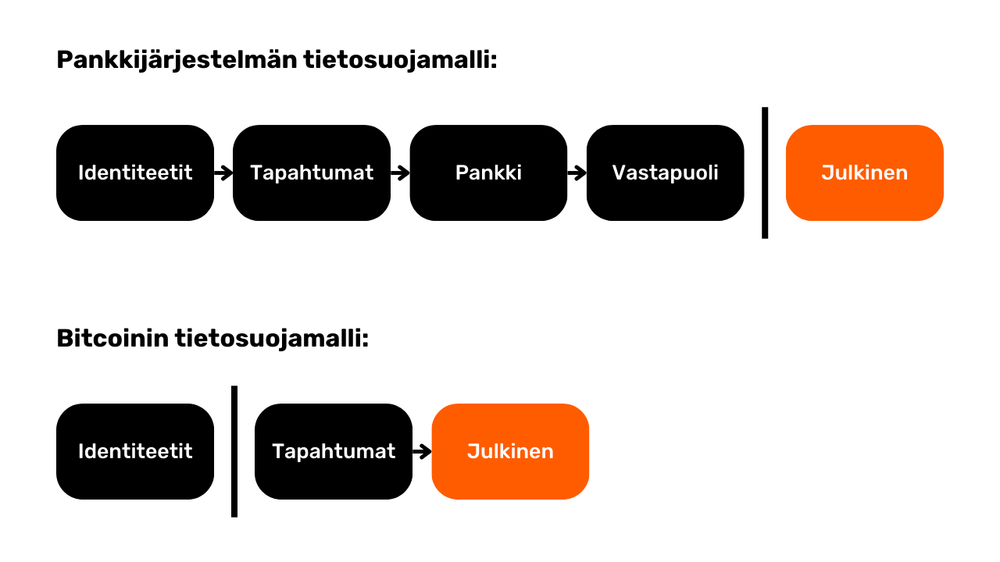

### Osa 2: Ketjuanalyysin ymmärtäminen ja sen vastaisen suojan kehittäminen

Toisessa osassa tutkimme ketjuanalyysiyhtiöiden käyttämiä tekniikoita Bitcoin-toimintasi jäljittämiseen. Näiden menetelmien ymmärtäminen on ratkaisevan tärkeää yksityisyytesi suojan parantamiseksi. Tämän osan tavoitteena on tarkastella hyökkääjien strategioita paremmin ymmärtääksemme riskejä ja luodaksemme perustan seuraavissa osioissa tutkittaville tekniikoille. Analysoimme transaktiokuvioita, sisäisiä ja ulkoisia heuristiikkoja sekä näiden kuvioiden mahdollisia tulkintoja. Teoreettisen osuuden lisäksi opimme käyttämään lohkoketjuselainta ketjuanalyysin suorittamiseen käytännön esimerkkien ja harjoitusten kautta.


### Osa 3: Parhaiden käytäntöjen hallitseminen yksityisyytesi suojaamiseksi

Koulutuksen kolmannessa osassa siirrymme asian ytimeen: käytäntöön! Tavoitteena on hallita kaikki olennaiset parhaat käytännöt, jotka tulisi tulla luonnollisiksi reflekseiksi kaikille Bitcoin-käyttäjille. Käsittelemme uusien osoitteiden käyttöä, merkintöjä, konsolidointia, täysien solmujen käyttöä sekä KYC:tä ja hankintamenetelmiä. Tavoitteena on tarjota sinulle kattava yleiskatsaus vältettävistä ansakuopista, jotta voimme luoda vankan perustan yksityisyydensuojan tavoittelussamme. Joidenkin näiden käytäntöjen osalta sinut ohjataan tiettyyn opastukseen niiden toteuttamiseksi.

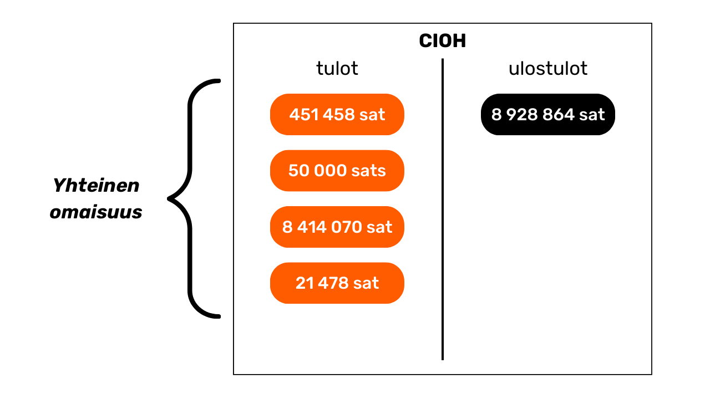

### Osa 4: Coinjoin-transaktioiden ymmärtäminen

Miten voimme puhua Bitcoinin yksityisyydestä puhumatta coinjoineista? Neljännessä osassa saat tietää kaiken tarvittavan tästä sekoitusmenetelmästä. Opit, mikä coinjoin on, sen historia ja tavoitteet, sekä erilaiset coinjoin-tyypit, jotka ovat olemassa. Lopuksi, kokeneemmille käyttäjille, tutustumme siihen, mitä anonsetit ja entropia ovat, ja miten näitä indikaattoreita lasketaan.

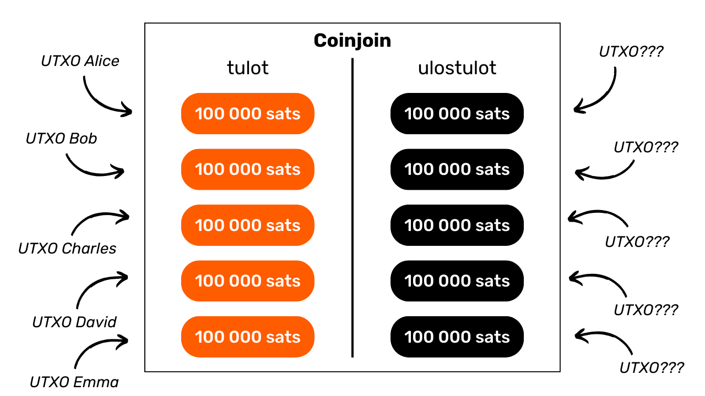

### Osa 5: Muiden edistyneiden yksityisyyden suojaustekniikoiden panosten ymmärtäminen

Viidennessä osiossa tarjoamme yleiskatsauksen kaikista muista olemassa olevista tekniikoista, joilla voit suojata yksityisyyttäsi Bitcoinissa coinjoinin lisäksi. Vuosien varrella kehittäjät ovat osoittaneet huomattavaa luovuutta suunnitellessaan yksityisyyteen keskittyviä työkaluja. Tarkastelemme kaikkia näitä menetelmiä, kuten payjoinia, yhteistyössä tehtyjä transaktioita, Coin Swapia ja Atomic Swapia, yksityiskohtaisesti niiden toimintaa, tavoitteita ja mahdollisia heikkouksia.

Käsittelemme myös yksityisyyttä solmuverkoston tasolla ja tapahtumien levitystä. Keskustelemme myös eri protokollista, joita on ehdotettu vuosien varrella käyttäjien yksityisyyden parantamiseksi Bitcoinissa, mukaan lukien staattisten osoitteiden protokollat.


# Määritelmät ja keskeiset käsitteet

<partId>b9bbbde3-34c0-4851-83e8-e2ffb029cf31</partId>

## Bitcoinin UTXO-malli

<chapterId>8d6b50c5-bf74-44f4-922b-25204991cb75</chapterId>

Bitcoin on ensisijaisesti valuutta, mutta tiedätkö konkreettisesti, miten BTC:t esitetään protokollassa?

### Mitä ovat Bitcoin UTXO:t?

Bitcoin-protokollassa rahayksiköiden hallinta perustuu UTXO-malliin, lyhenne sanoista "_Unspent Transaction Output_" (käyttämätön transaktiotuotos).

Tämä malli eroaa merkittävästi perinteisistä pankkijärjestelmistä, jotka perustuvat tili- ja saldomekanismiin taloudellisten virtojen seuraamiseksi. Todellakin, pankkijärjestelmässä yksilölliset saldot pidetään tileillä, jotka on liitetty identiteettiin. Esimerkiksi kun ostat patongin leipurilta, pankkisi yksinkertaisesti veloittaa ostosumman tililtäsi, vähentäen saldoasi, kun taas leipurin tili hyvitetään samalla summalla, lisäten hänen saldoaan. Tässä järjestelmässä ei ole käsitystä rahan linkittymisestä tilillesi ja sieltä poistumisesta, lukuun ottamatta transaktiotietueita.

Bitcoinissa asiat toimivat eri tavalla. Tilin käsitettä ei ole olemassa, ja rahayksiköitä ei hallita saldojen kautta, vaan UTXO:iden kautta. UTXO edustaa tiettyä määrää bitcoineja, joita ei ole vielä käytetty, muodostaen siten "palan bitcoinia", joka voi olla suuri tai pieni. Esimerkiksi UTXO voi olla arvoltaan `500 BTC` tai vain `700 SATS`.
**> Muistutus:** Satoshi, usein lyhennettynä sat, on Bitcoinin pienin yksikkö, verrattavissa senttiin fiat-valuutoissa.

```plaintext
1 BTC = 100,000,000 SATS
```

Teoriassa UTXO voi edustaa mitä tahansa arvoa bitcoineissa, yhdestä satista teoreettiseen maksimiin noin 21 miljoonaan BTC:hen. Käytännössä on kuitenkin mahdotonta omistaa kaikkia 21 miljoonaa bitcoinia, ja on olemassa taloudellinen kynnysarvo nimeltä "pöly", jonka alapuolella UTXO:a pidetään taloudellisesti kannattamattomana käyttää.
**> Tiesitkö?** Suurin koskaan Bitcoinissa luotu UTXO oli arvoltaan `500,000 BTC`. Sen loi MtGox-alusta konsolidaatio-operaation aikana marraskuussa 2011: [29a3efd3ef04f9153d47a990bd7b048a4b2d213daaa5fb8ed670fb85f13bdbcf](https://mempool.space/fr/tx/29a3efd3ef04f9153d47a990bd7b048a4b2d213daaa5fb8ed670fb85f13bdbcf)

### UTXOt ja Kulutusehdot

UTXOt ovat vaihdon välineitä Bitcoinissa. Jokainen transaktio kuluttaa UTXOja syötteinä ja luo uusia UTXOja tulosteina. Kun transaktio tehdään, syötteinä käytetyt UTXOt katsotaan "kulutetuiksi", ja uudet UTXOt luodaan ja osoitetaan transaktion tulosteissa mainituille vastaanottajille. Näin ollen UTXO edustaa yksinkertaisesti kuluttamatonta transaktiotulostetta ja siten tiettyä määrää bitcoineja, jotka kuuluvat käyttäjälle tietyllä hetkellä.

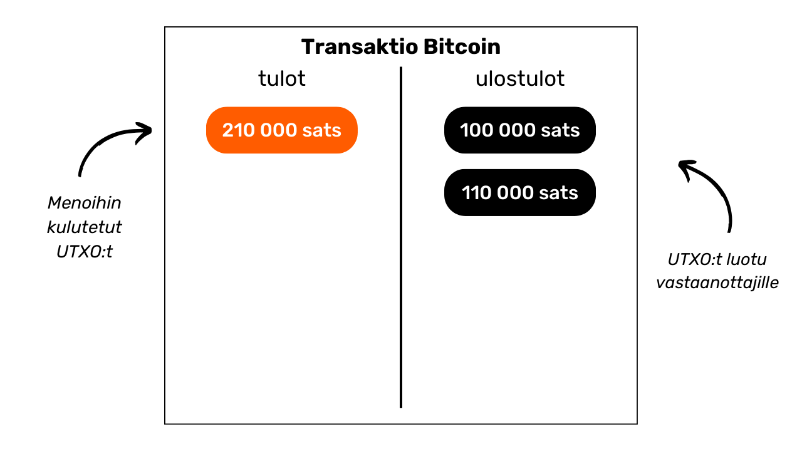
Kaikki UTXOt on suojattu skripteillä, jotka määrittelevät ehdot, joiden mukaisesti ne voidaan kuluttaa. UTXOn kuluttaakseen käyttäjän on osoitettava verkostolle täyttävänsä kyseisen UTXOn suojaavan skriptin asettamat ehdot. Yleensä UTXOt on suojattu julkisella avaimella (tai vastaanotto-osoitteella, joka edustaa tätä julkista avainta). Kuluttaakseen tähän julkiseen avaimen liittyvän UTXOn, käyttäjän on todistettava hallitsevansa vastaavaa yksityistä avainta tarjoamalla digitaalisen allekirjoituksen, joka on tehty tällä avaimella. Tämän vuoksi sanotaan, että Bitcoin-lompakkosi ei itse asiassa sisällä bitcoineja, vaan se säilyttää yksityisiä avaimiasi, jotka puolestaan antavat sinulle pääsyn UTXOihisi ja sitä kautta niihin liittyviin bitcoineihin.
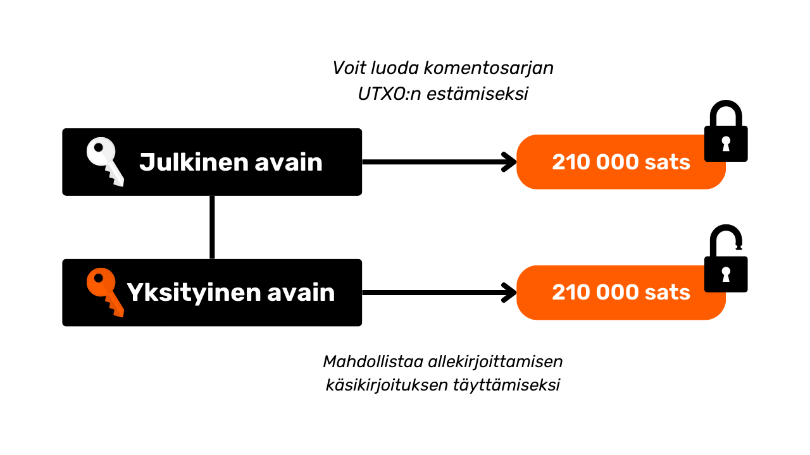

Koska Bitcoinissa ei ole tilin käsitettä, lompakon saldo vastaa yksinkertaisesti kaikkien sen kuluttaa voimien UTXOjen arvojen summaa. Esimerkiksi, jos Bitcoin-lompakkosi voi kuluttaa seuraavat 4 UTXOa:

```plaintext
- 2 BTC
- 8 BTC
- 5 BTC
- 2 BTC
```

Lompakkosi kokonaissaldo olisi `17 BTC`.

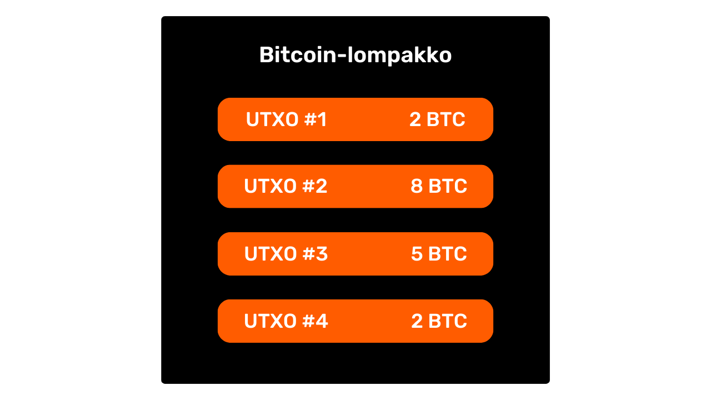

## Bitcoin-transaktioiden rakenne

<chapterId>29d3aaab-de2e-4746-ab40-c9748898850c</chapterId>

### Transaktion syötteet ja tulosteet

Bitcoin-transaktio on lohkoketjuun kirjattu toimenpide, joka mahdollistaa bitcoinien omistajuuden siirron yhdeltä henkilöltä toiselle. Tarkemmin sanottuna, koska olemme UTXO-mallissa eikä tilejä ole, transaktio täyttää yhden tai useamman UTXOn kulutusehdot, kuluttaa ne ja luo vastaavasti uusia UTXOja, joille on annettu uudet kulutusehdot. Lyhyesti sanottuna transaktio siirtää bitcoineja skriptistä, joka on tyydytetty, uuteen skriptiin, jonka tarkoituksena on suojata ne.

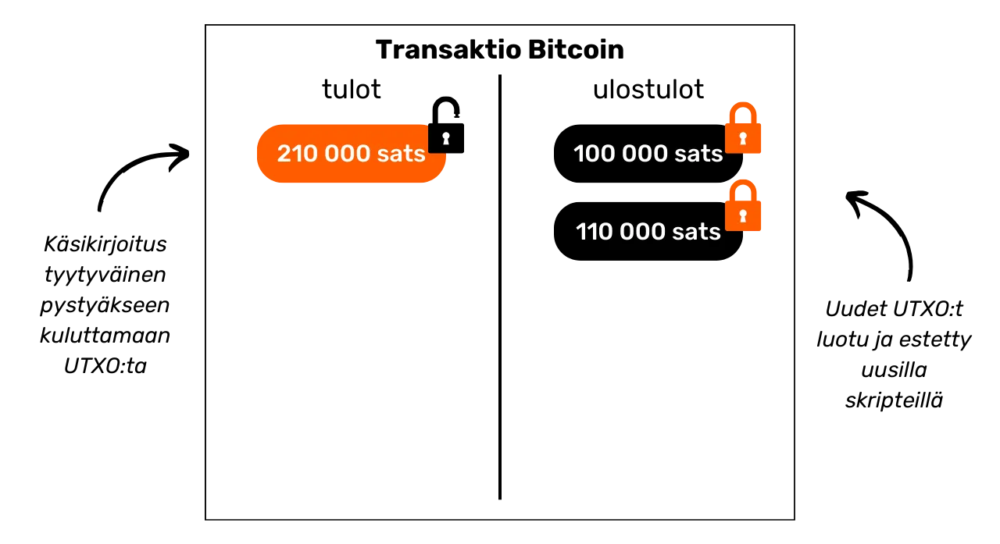

Jokainen Bitcoin-transaktio koostuu siis yhdestä tai useammasta syötteestä ja yhdestä tai useammasta tulosteesta. Syötteet ovat transaktion kuluttamia UTXOja, jotka tuottavat tulosteet. Tulosteet ovat uusia UTXOja, joita voidaan käyttää syötteinä tulevissa transaktioissa.

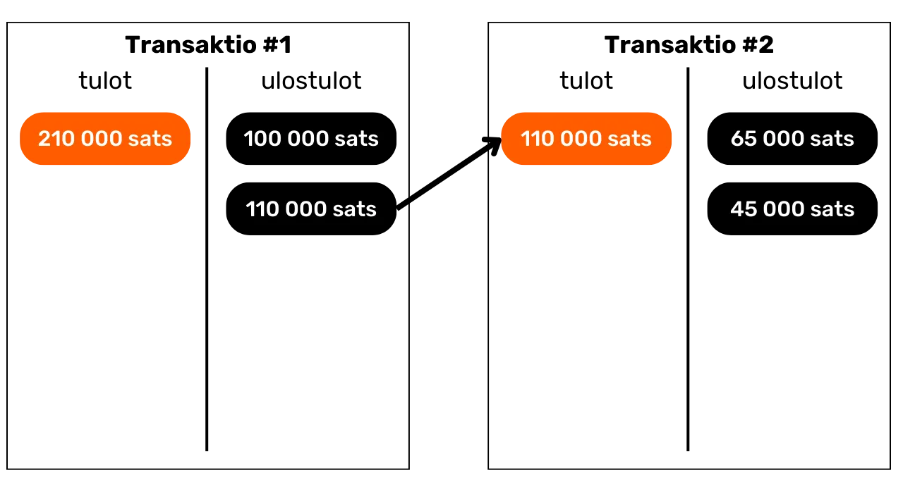
**> Tiesitkö?** Teoriassa bitcoin-siirrolla voisi olla ääretön määrä syötteitä ja tulosteita. Vain lohkon maksimikoko rajoittaa tätä lukumäärää. Jokainen Bitcoin-siirron syöte viittaa aiempaan käyttämättömään UTXO:hon (Unspent Transaction Output). UTXO:n käyttämiseksi syötteenä sen haltijan on osoitettava olevansa laillinen omistaja validoiden siihen liittyvän skriptin, eli täyttämällä asetetun kulutusehdon. Yleensä tämä sisältää digitaalisen allekirjoituksen tuottamisen yksityisavaimella, joka vastaa julkista avainta, joka alun perin turvasi kyseisen UTXO:n. Skripti varmistaa näin, että allekirjoitus vastaa julkista avainta, jota käytettiin varojen vastaanottamiseen.
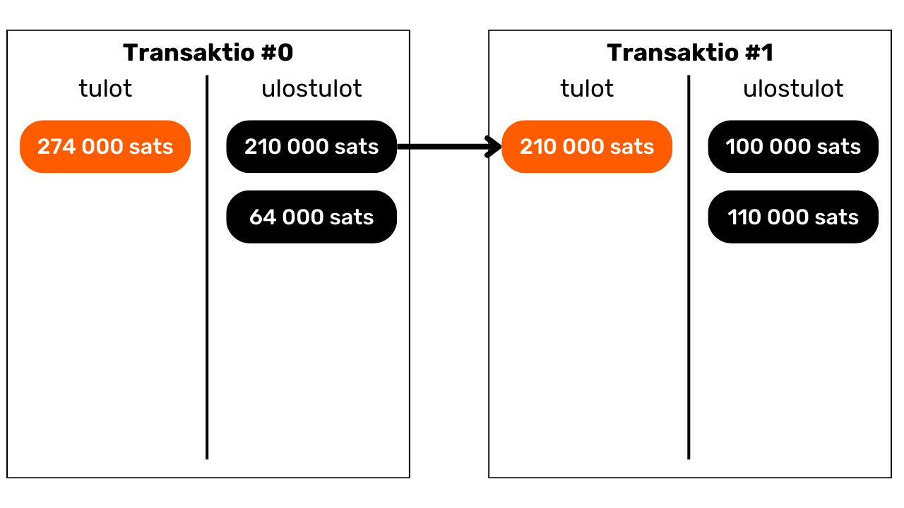

Toisaalta jokainen tuloste määrittää siirrettävien bitcoinien määrän sekä vastaanottajan. Jälkimmäinen määritellään uudella skriptillä, joka yleensä lukitsee vasta luodun UTXO:n vastaanotto-osoitteella tai uudella julkisella avaimella.

Jotta siirtoa pidettäisiin kelvollisena konsensus sääntöjen mukaan, tulosteiden kokonaismäärän on oltava yhtä suuri tai pienempi kuin syötteiden kokonaismäärä. Toisin sanoen, siirron luomien uusien UTXO:iden summan ei saa ylittää syötteinä kulutettujen UTXO:iden summaa. Tämä periaate on looginen: jos sinulla on vain määrä `500,000 SATS`, et voi tehdä ostosta `700,000 SATS`.

### Vaihto ja yhdistäminen Bitcoin-siirrossa

Bitcoin-siirron vaikutus UTXO:ihin voidaan siis verrata kultakolikon sulattamiseen. Itse asiassa UTXO ei ole jaettavissa, vaan ainoastaan yhdistettävissä. Tämä tarkoittaa, että käyttäjä ei voi yksinkertaisesti jakaa tiettyä määrää bitcoineja edustavaa UTXO:ta useisiin pienempiin UTXO:ihin. Heidän on kulutettava se kokonaan siirrossa luodakseen yhden tai useamman uuden UTXO:n mielivaltaisilla arvoilla tulosteissa, jotka on oltava yhtä suuria tai pienempiä kuin alkuperäinen arvo.

Tämä mekanismi on samanlainen kuin kultakolikon kohdalla. Kuvittele, että omistat 2 unssin kolikon ja haluat tehdä maksun 1 unssista, olettaen, että myyjä ei voi antaa sinulle vaihtorahaa. Sinun tarvitsisi sulattaa kolikkosi ja valaa 2 uutta yhden unssin kolikkoa.
Bitcoinissa toiminta on samankaltaista. Kuvitellaan, että Alicella on UTXO, joka on `10,000 SATS` ja hän haluaa ostaa patongin, joka maksaa `4,000 SATS`. Alice tekee siirron yhdellä UTXO:lla, joka on `10,000 SATS`, jonka hän kuluttaa kokonaan, ja tulosteissa hän luo 2 UTXO:ta, joiden arvot ovat `4,000 SATS` ja `6,000 SATS`. UTXO, joka on `4,000 SATS`, lähetetään leipurille patongin maksuna, kun taas UTXO, joka on `6,000 SATS`, palautuu Alicelle vaihtorahana. Tämä siirron alkuperäiselle lähettäjälle palaava UTXO on sitä, mitä Bitcoin-jargonissa kutsutaan "vaihdoksi".
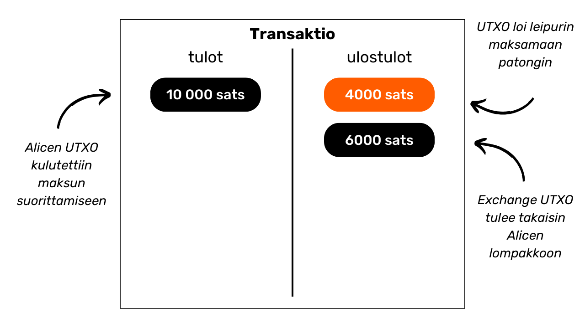
Kuvittele nyt, että Alicella ei olekaan yhtä ainoaa UTXO:a, joka olisi `10,000 SATS`, vaan kaksi UTXO:a, kumpikin `3,000 SATS`. Tässä tilanteessa kumpikaan yksittäinen UTXO ei riitä kattamaan `4,000 SATS` bagetin hintaa. Siksi Alicen on käytettävä molempia `3,000 SATS` UTXO:ja samanaikaisesti maksutapahtumansa syötteinä. Tällä tavoin syötteiden kokonaismäärä saavuttaa `6,000 SATS`, mahdollistaen hänelle `4,000 SATS` maksun suorittamisen leipurille. Tämä menetelmä, joka sisältää useiden UTXO:jen ryhmittelyn yhden maksutapahtuman syötteiksi, tunnetaan usein termillä "konsolidointi".
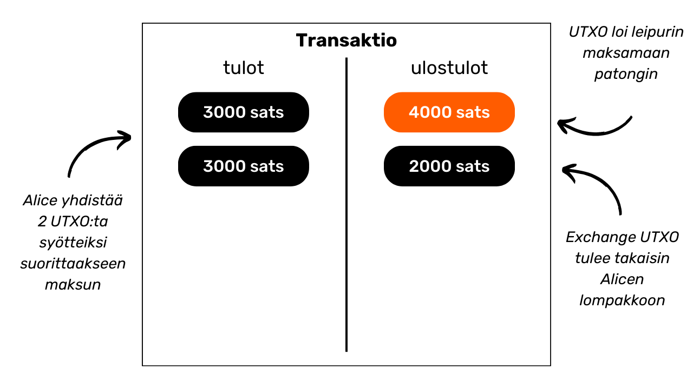

### Siirtomaksut

Intuitiivisesti voisi ajatella, että siirtomaksut edustavat myös maksutapahtuman ulostuloa. Todellisuudessa näin ei kuitenkaan ole. Maksutapahtuman maksut edustavat syötteiden ja ulostulojen kokonaismäärän erotusta. Tämä tarkoittaa, että osa syötteiden arvosta käytetään haluttujen ulostulojen kattamiseen maksutapahtumassa, ja tietty summa syötteistä jää käyttämättä. Tämä jäännössumma muodostaa siirtomaksut.

```plaintext
Maksut = kokonaissyötteet - kokonaisulostulot
```

Palataan Alicen esimerkkiin, jolla on UTXO `10,000 SATS` ja hän haluaa ostaa bagetin `4,000 SATS`. Alice luo maksutapahtuman käyttäen UTXO:aan `10,000 SATS` syötteenä. Hän sitten luo ulostulon `4,000 SATS`, joka on tarkoitettu leipurille bagetin maksuksi. Kannustaakseen mainaajia sisällyttämään hänen maksutapahtumansa lohkoon, Alice osoittaa `200 SATS` maksuina. Näin hän luo toisen ulostulon, vaihtorahan, joka palautuu hänelle, määrältään `5,800 SATS`.
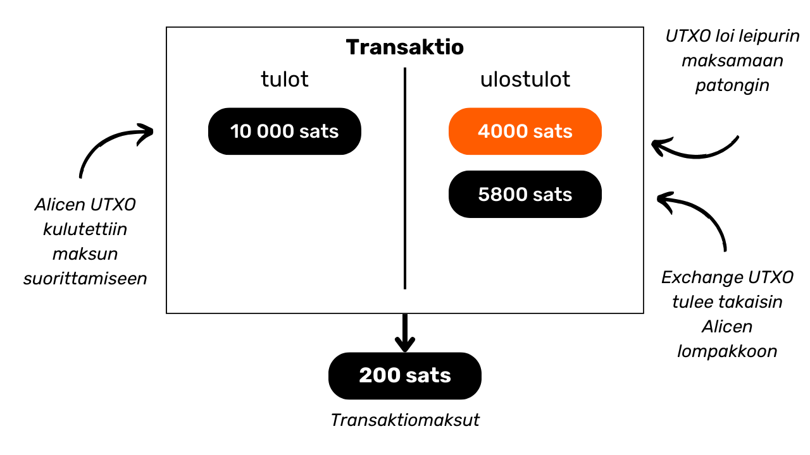

Soveltamalla maksukaavaa, näemme todellakin, että mainaajille jää `200 SATS`:

```plaintext
Maksut = kokonaissyötteet - kokonaisulostulot
Kulut = 10,000 - (4,000 + 5,800)
Kulut = 10,000 - 9,800
Kulut = 200
```

Kun mainaaja onnistuneesti validoi lohkon, hänellä on oikeus kerätä nämä maksut kaikista lohkoon sisällytetyistä maksutapahtumista niin kutsutun "coinbase"-maksutapahtuman kautta.

### UTXO:jen luominen Bitcoinissa

Jos olet seurannut edellisiä kappaleita tarkkaavaisesti, tiedät nyt, että UTXO:ja voidaan luoda vain kuluttamalla muita olemassa olevia UTXO:ja. Näin ollen Bitcoinin kolikot muodostavat jatkuvan ketjun. Saatat kuitenkin miettiä, miten tämän ketjun ensimmäiset UTXO:t ilmestyivät. Tämä herättää ongelman, joka on samankaltainen kuin muna ja kana -dilemma: mistä nämä alkuperäiset UTXO:t tulivat?

Vastaus löytyy **coinbase-maksutapahtumasta**.

Coinbase on Bitcoin-maksutapahtuman erityinen tyyppi, uniikki jokaiselle lohkolle ja aina niiden ensimmäinen. Se mahdollistaa mainaajan, joka löysi kelvollisen työn todistuksen, saada lohkopalkkionsa. Tämä palkkio koostuu kahdesta osasta: **lohkotuesta** ja **siirtomaksuista**, joista puhuimme edellisessä osassa.

Coinbase-maksutapahtuman ainutlaatuinen piirre on, että se on ainoa, joka voi luoda bitcoineja tyhjästä, tarvitsematta kuluttaa syötteitä ulostulojensa tuottamiseen. Nämä vasta luodut bitcoinit muodostavat niin kutsutut "alkuperäiset UTXO:t".
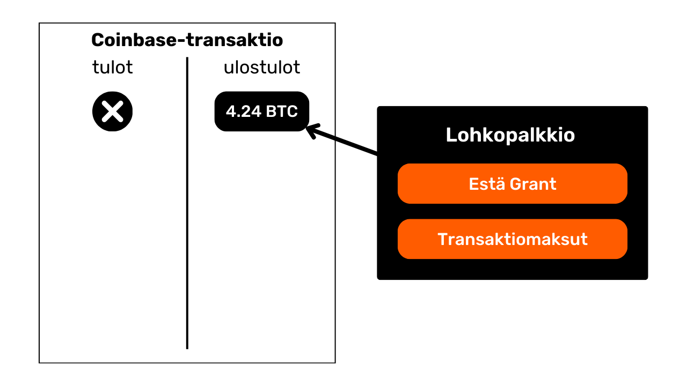
Lohkopalkkion bitcoinit ovat uusia BTC:tä, jotka on luotu tyhjästä, noudattaen ennalta määrättyä liikkeeseenlaskuaikataulua konsensus säännöissä. Lohkopalkkio puolittuu joka 210 000 lohkon jälkeen, mikä on noin joka neljäs vuosi, prosessissa, jota kutsutaan "puolittamiseksi". Alun perin jokaisella palkkiolla luotiin 50 bitcoinia, mutta tämä määrä on vähitellen vähentynyt; tällä hetkellä se on 3.125 bitcoinia per lohko.

Siirtoihin liittyvien maksujen osalta, vaikka ne myös edustavat uusia luotuja BTC:tä, niiden ei tule ylittää kaikkien lohkon transaktioiden kokonaisinputtien ja -outputtien välistä eroa. Näimme aiemmin, että nämä maksut edustavat inputtien osaa, jota ei käytetä transaktioiden outputeissa. Tämä osa on teknisesti "kadonnut" transaktion aikana, ja louhijalla on oikeus luoda tämä arvo uudelleen yhtenä tai useampana uutena UTXO:na. Tämä on siis arvon siirto transaktion lähettäjältä louhijalle, joka lisää sen lohkoketjuun.

**> Tiesitkö?** Coinbase-transaktion tuottamat bitcoinit ovat kypsymisajan alaisia 100 lohkon ajan, jolloin niitä ei voi käyttää louhija. Tämä sääntö on tarkoitettu välttämään komplikaatioita, jotka liittyvät uusien bitcoinien käyttöön ketjussa, joka myöhemmin saatetaan hylätä.

### UTXO-mallin vaikutukset

Ensinnäkin, UTXO-malli vaikuttaa suoraan Bitcoinin siirtomaksuihin. Koska jokaisen lohkon kapasiteetti on rajallinen, louhijat suosivat transaktioita, jotka tarjoavat parhaat maksut suhteessa tilaan, jonka ne vievät lohkossa. Todellakin, mitä enemmän UTXO:ita transaktio sisältää inputteina ja outputteina, sitä raskaampi se on, ja siten se vaatii korkeampia maksuja. Tämä on yksi syy, miksi usein pyritään vähentämään UTXO:iden määrää lompakossamme, mikä voi myös vaikuttaa yksityisyyteen, aiheeseen, johon syvennymme yksityiskohtaisesti tämän koulutuksen kolmannessa osassa.

Seuraavaksi, kuten aiemmissa osissa mainittiin, Bitcoinin kolikot ovat käytännössä UTXO-ketju. Jokainen transaktio luo siis linkin menneen UTXO:n ja tulevan UTXO:n välille. UTXO:t mahdollistavat siis bitcoinien polun eksplisiittisen seuraamisen niiden luomisesta nykyiseen kulutukseen. Tämä läpinäkyvyys voidaan nähdä positiivisena, sillä se mahdollistaa jokaisen käyttäjän varmistaa vastaanotettujen bitcoinien aitouden. Kuitenkin juuri tämän jäljitettävyyden ja auditoinnin periaatteen varassa lepää ketjuanalyysi, käytäntö, joka tähtää yksityisyytesi kompromettoimiseen. Tutkimme tätä käytäntöä syvällisesti koulutuksen toisessa osassa.

## Bitcoinin yksityisyysmalli

<chapterId>769d8963-3ed5-4094-b21d-9203c7d9e465</chapterId>

### Valuutta: Aitous, eheys ja kaksinkertainen kulutus

Yksi valuutan tehtävistä on ratkaista kaksinkertaisen halun ongelma. Vaihtoon perustuvassa järjestelmässä vaihdon tekeminen edellyttää paitsi henkilön löytämistä, joka tarjoaa hyödykkeen, joka täyttää tarpeeni, myös heille tarjottavan hyödykkeen, jolla on vastaava arvo, joka tyydyttää heidän tarpeensa. Tämän tasapainon löytäminen osoittautuu monimutkaiseksi.


Siksi turvaudumme valuuttaan, joka mahdollistaa arvon siirron sekä avaruudessa että ajassa.


Jotta valuutta voisi ratkaista tämän ongelman, on olennaista, että hyödykkeen tai palvelun tarjoaja on vakuuttunut kyvystään käyttää kyseistä summaa myöhemmin. Näin ollen jokainen rationaalinen henkilö, joka haluaa hyväksyä valuutan, olipa se digitaalinen tai fyysinen, varmistaa, että se täyttää kaksi perustavaa laatua olevaa kriteeriä:

- **Kolikon on oltava ehjä ja aito;**- **eikä sitä saa olla käytetty kahdesti.**
  Käytettäessä fyysistä valuuttaa, ensimmäinen ominaisuus on monimutkaisin todentaa. Historian eri kausina metallirahojen eheys on usein vaarantunut, esimerkiksi leikkaamisen tai poraamisen seurauksena. Esimerkiksi muinaisessa Roomassa oli yleistä, että kansalaiset raaputtivat kultakolikoiden reunoja kerätäkseen hieman kallisarvoista metallia, samalla säilyttäen ne tulevia transaktioita varten. Kolikon sisäinen arvo näin ollen aleni, mutta sen nimellisarvo pysyi samana. Tämä on merkittävä syy siihen, miksi myöhemmin kolikoiden reunaan alettiin lyödä uurteita.

Aitous on myös vaikea ominaisuus todentaa fyysisen rahamedian kanssa. Nykyään väärentämisen vastaiset tekniikat ovat yhä monimutkaisempia, pakottaen kauppiaat investoimaan kalliisiin varmennusjärjestelmiin.

Toisaalta fyysisen valuutan luonteen vuoksi kaksinkertainen kulutus ei ole ongelma. Jos annan sinulle 10 euron setelin, se siirtyy peruuttamattomasti omistuksestani sinun omistukseesi, luonnollisesti poissulkeen mahdollisuuden käyttää samoja rahayksiköitä useita kertoja. Lyhyesti sanottuna en voi käyttää sitä 10 euron seteliä uudelleen.


Digitaalisen valuutan kohdalla vaikeus on erilainen. Kolikon aitouden ja eheyden varmistaminen on usein yksinkertaisempaa. Kuten edellisessä osiossa näimme, Bitcoinin UTXO-malli mahdollistaa kolikon jäljittämisen takaisin sen alkuperään, varmistaen näin, että se on todella luotu konsensus sääntöjen mukaisesti louhijan toimesta.

Kuitenkin kaksinkertaisen kulutuksen puuttumisen varmistaminen on monimutkaisempaa, koska mikä tahansa digitaalinen hyödyke on periaatteessa tietoa. Toisin kuin fyysiset hyödykkeet, tieto ei jakaannu vaihdoissa vaan leviää monistumalla. Esimerkiksi, jos lähetän sinulle asiakirjan sähköpostitse, se sitten monistuu. Sinun päässäsi et voi varmistaa varmuudella, että olen poistanut alkuperäisen asiakirjan.


### Kaksinkertaisen kulutuksen estäminen Bitcoinissa

Ainoa tapa välttää digitaalisen hyödykkeen monistuminen on olla tietoinen kaikista järjestelmän sisällä tapahtuvista vaihdoista. Tällä tavoin voidaan tietää, kuka omistaa mitäkin ja päivittää kaikkien omistukset tehtyjen transaktioiden perusteella. Tämä tehdään esimerkiksi kirjanpidollisen rahan kanssa pankkijärjestelmässä. Kun maksat 10 euroa kauppiaalle luottokortilla, pankki merkitsee tämän vaihdon ja päivittää kirjanpidon.
Bitcoinissa kaksinkertaisen kulutuksen estäminen saavutetaan samalla tavalla. Tavoitteena on vahvistaa sellaisen transaktion puuttuminen, joka on jo käyttänyt kyseiset kolikot. Jos näitä kolikoita ei ole koskaan käytetty, voimme olla varmoja, että kaksinkertaista kulutusta ei tapahdu. Tämän periaatteen kuvasi Satoshi Nakamoto White Paperissa tällä kuuluisalla lauseella:

**"_Ainoa tapa vahvistaa transaktion puuttuminen on olla tietoinen kaikista transaktioista._"**

Toisin kuin pankkimallissa, Bitcoinissa ei kuitenkaan haluta luottaa keskitettyyn toimijaan. On tarpeen, että kaikki käyttäjät voivat vahvistaa tämän kaksinkertaisen kulutuksen puuttumisen, luottamatta kolmanteen osapuoleen. Näin ollen kaikkien on oltava tietoisia kaikista Bitcoin-transaktioista. Tämän vuoksi Bitcoin-transaktiot lähetetään julkisesti kaikkien verkon solmujen läpi ja kirjataan selkeästi lohkoketjuun.

Juuri tämä tiedon julkisen levittämisen käytäntö monimutkaistaa yksityisyyden suojan Bitcoinissa. Perinteisessä pankkijärjestelmässä teoriassa vain rahoituslaitos tietää tehdyistä transaktioista. Toisaalta Bitcoinissa kaikki käyttäjät ovat tietoisia kaikista transaktioista, omien solmujensa kautta.

### Yksityisyyden malli: pankkijärjestelmä vs Bitcoin

Perinteisessä järjestelmässä pankkitilisi on linkitetty henkilöllisyyteesi. Pankkivirkailija pystyy tietämään, mikä pankkitili kuuluu millekin asiakkaalle ja mitkä tapahtumat liittyvät siihen. Kuitenkin tämä informaation virta on katkaistu pankin ja julkisen sektorin välillä. Toisin sanoen, on mahdotonta tietää toisen henkilön pankkitilin saldoa ja tapahtumia. Vain pankilla on pääsy tähän tietoon.
Esimerkiksi pankkivirkailijasi tietää, että ostat patongin joka aamu naapuruston leipomosta, mutta naapurisi ei ole tietoinen tästä tapahtumasta. Näin ollen informaation virta on saatavilla asianosaisille, erityisesti pankille, mutta se pysyy ulkopuolisten ulottumattomissa.

Rajoituksesta, joka koskee tapahtumien julkista levittämistä, jonka näimme edellisessä osassa, Bitcoinin yksityisyysmalli ei voi noudattaa pankkijärjestelmän mallia. Bitcoinin tapauksessa, koska informaation virtaa ei voida katkaista tapahtumien ja julkisen sektorin välillä, **yksityisyysmalli perustuu käyttäjän henkilöllisyyden ja tapahtumien erottamiseen** toisistaan.
Esimerkiksi, jos ostat patongin leipurilta maksamalla BTC:llä, naapurisi, jolla on oma täysi solmu, voi nähdä tapahtumasi menevän läpi, aivan kuten he voivat nähdä kaikki muutkin järjestelmän tapahtumat. Kuitenkin, jos yksityisyysperiaatteita kunnioitetaan, heidän ei pitäisi pystyä yhdistämään tätä tiettyä tapahtumaa henkilöllisyyteesi.

Mutta koska Bitcoin-tapahtumat tehdään julkisiksi, on silti mahdollista luoda linkkejä niiden välille päätelläkseen tietoja osapuolista. Tämä toiminta muodostaa itsessään erikoisalan, jota kutsutaan "ketjuanalyysiksi". Seuraavassa koulutuksen osassa kutsun sinut tutustumaan ketjuanalyysin perusteisiin ymmärtääksesi, miten bitcoinejasi jäljitetään ja tietääksesi, miten paremmin puolustautua sitä vastaan.

# Ketjuanalyysin ymmärtäminen ja itsensä suojeleminen

<partId>4739371e-9fef-45b0-bcaa-b7a4df6b4470</partId>

## Mikä on ketjuanalyysi Bitcoinissa?

<chapterId>7d198ba6-4af2-4f24-86cb-3c79cb25627e</chapterId>

### Määritelmä ja toiminta

Ketjuanalyysi kattaa kaikki menetelmät, joita käytetään bitcoinien liikkeiden jäljittämiseen lohkoketjussa. Yleisesti ottaen ketjuanalyysi perustuu aikaisempien tapahtumien näytteiden ominaisuuksien havainnointiin. Sen jälkeen se sisältää näiden samojen ominaisuuksien tunnistamisen tapahtumassa, jota halutaan analysoida, ja mahdollisten tulkintojen päättelemisen. Tämä käytännöllinen ongelmanratkaisumenetelmä, jolla löydetään riittävän hyvä ratkaisu, on sitä, mitä kutsutaan "heuristiikaksi".

Yksinkertaistaen, ketjuanalyysi suoritetaan kolmessa päävaiheessa:

1. **Lohkoketjun tarkkailu;**
2. **Tunnettujen ominaisuuksien tunnistaminen;**
3. **Hypoteesien päätteleminen.**

Ketjuanalyysiä voi suorittaa kuka tahansa. Riittää, että on pääsy lohkoketjun julkiseen tietoon täyden solmun kautta tarkkaillakseen tapahtumien liikkeitä ja tehdäkseen hypoteeseja. On myös ilmaisia työkaluja, jotka helpottavat tätä analyysiä, kuten verkkosivusto [OXT.me](https://oxt.me/), jota tarkastelemme yksityiskohtaisesti tämän osan viimeisissä luvuissa. Kuitenkin suurin yksityisyyden uhka tulee ketjuanalyysiin erikoistuneista yrityksistä. Nämä yritykset ovat vieneet ketjuanalyysin teolliseen mittakaavaan ja myyvät palvelujaan rahoituslaitoksille tai hallituksille. Näiden yritysten joukossa Chainalysis on todennäköisesti tunnetuin.

### Ketjuanalyysin tavoitteet

Yhtenä ketjuanalyysin tavoitteista on ryhmitellä erilaisia toimintoja Bitcoinissa, jotta voidaan määrittää suorittaneen käyttäjän yksilöllisyys. Tämän jälkeen on mahdollista yrittää yhdistää tämä toimintojen nippu todelliseen identiteettiin.


Muista edellinen luku. Selitin, miksi Bitcoinin yksityisyyden malli alun perin perustui käyttäjän identiteetin erottamiseen heidän transaktioistaan. Siksi voisi olla houkuttelevaa ajatella, että ketjuanalyysi on tarpeetonta, koska vaikka onnistuisikin ryhmittelemään onchain-toimintoja, niitä ei voida yhdistää todelliseen identiteettiin.

Teoriassa tämä väite on tarkka. Koulutuksen ensimmäisessä osassa näimme, että kryptografisia avainpareja käytetään ehtojen asettamiseen UTXO:lle. Luonteensa vuoksi nämä avainparit eivät paljasta mitään tietoa haltijoidensa identiteetistä. Näin ollen, vaikka onnistuisikin ryhmittelemään eri avainpareihin liittyviä toimintoja, tämä ei kerro meille mitään näiden toimintojen takana olevasta entiteetistä.


Käytännön todellisuus on kuitenkin paljon monimutkaisempi. On olemassa monia käyttäytymismalleja, jotka voivat riskeerata todellisen identiteetin yhdistämisen onchain-toimintaan. Analyysissä tätä kutsutaan sisääntulopisteeksi, ja niitä on monia.

Yleisin, tietenkin, on KYC (_Know Your Customer_). Jos nostat bitcoinejasi säännellyltä alustalta yhteen henkilökohtaisista vastaanotto-osoitteistasi, jotkut ihmiset pystyvät yhdistämään identiteettisi tähän osoitteeseen. Laajemmin ottaen sisääntulopiste voi olla mikä tahansa vuorovaikutusmuoto todellisen elämäsi ja Bitcoin-transaktion välillä. Esimerkiksi, jos julkaiset vastaanotto-osoitteen sosiaalisissa verkostoissasi, tämä voi olla analyysin sisääntulopiste. Jos maksat bitcoineilla leipurillesi, he voivat yhdistää kasvosi (jotka ovat osa identiteettiäsi) Bitcoin-osoitteeseen.

Nämä sisääntulopisteet ovat lähes väistämättömiä Bitcoinin käytössä. Vaikka niiden vaikutusalaa voi pyrkiä rajoittamaan, ne tulevat pysymään läsnä. Siksi on ratkaisevan tärkeää yhdistää menetelmiä, jotka tähtäävät yksityisyytesi säilyttämiseen. Vaikka todellisen identiteettisi ja transaktioidesi erottaminen on mielenkiintoinen lähestymistapa, se on tänään riittämätön. Todellakin, jos kaikki onchain-toimintasi voidaan ryhmitellä, pieninkin sisääntulopiste voi vaarantaa ainoan yksityisyyden kerroksen, jonka olit luonut.


### Puolustautuminen Ketjuanalyysiä Vastaan

Näin ollen on myös tarpeellista pystyä kohtaamaan lohkoketjuanalyysi Bitcoinin käytössämme. Toimimalla tällä tavoin voimme minimoida toimintojemme aggregoinnin ja rajoittaa sisääntulopisteen vaikutusta yksityisyyteemme.


Todellakin, paremman vastauksen lohkoketjuanalyysiin tarjoaa tutustuminen lohkoketjuanalyysissä käytettyihin menetelmiin. Jos haluat tietää, miten parantaa yksityisyyttäsi Bitcoinissa, sinun on ymmärrettävä nämä menetelmät. Tämä antaa sinulle paremmat valmiudet ymmärtää tekniikoita kuten [coinjoin](https://planb.network/fr/tutorials/privacy/coinjoin-samourai-wallet) tai [payjoin](https://planb.network/fr/tutorials/privacy/payjoin) (tekniikat, joita tutkimme koulutuksen viimeisissä osissa), ja vähentää tekemiäsi virheitä.
Tässä voimme tehdä analogian kryptografian ja kryptoanalyysin välillä. Hyvä kryptografi on ensisijaisesti hyvä kryptoanalyytikko. Uuden salausalgoritmin kuvitteleminen edellyttää, että tuntee, millaisia hyökkäyksiä sen on kohdattava, ja tutkii myös, miksi aiemmat algoritmit murrettiin. Sama periaate pätee yksityisyyteen Bitcoinissa. Lohkoketjuanalyysin menetelmien ymmärtäminen on avain sen vastaisen suojautumisen kannalta. Siksi ehdotan kokonaista osiota lohkoketjuanalyysista tässä koulutuksessa.

### Lohkoketjuanalyysin menetelmät

On tärkeää ymmärtää, että lohkoketjuanalyysi ei ole tarkka tiede. Se perustuu heuristiikkoihin, jotka on johdettu aiemmista havainnoista tai loogisista tulkinnista. Nämä säännöt mahdollistavat melko luotettavat tulokset, mutta eivät koskaan absoluuttisella tarkkuudella. Toisin sanoen, **lohkoketjuanalyysiin liittyy aina todennäköisyyden ulottuvuus annetuissa johtopäätöksissä**. Esimerkiksi voidaan arvioida suuremmalla tai pienemmällä varmuudella, että kaksi osoitetta kuuluu samalle entiteetille, mutta täydellinen varmuus on aina saavuttamattomissa.

Lohkoketjuanalyysin koko tavoite on nimenomaan erilaisten heuristiikkojen yhdistämisessä, jotta virheen riskiä voidaan minimoida. Se on tavallaan todisteiden kumuloitumista, joka mahdollistaa todellisuuden lähestymisen tiiviimmin.

Nämä kuuluisat heuristiikat voidaan ryhmitellä eri kategorioihin, joita käymme yksityiskohtaisesti läpi:

- **Transaktioiden mallit (tai transaktioiden kuviot);**
- **Transaktion sisäiset heuristiikat;**
- **Transaktion ulkopuoliset heuristiikat.**

### Satoshi Nakamoto ja lohkoketjuanalyysi

On huomionarvoista, että kaksi ensimmäistä heuristiikkaa ketjuanalyysiin löysi itse Satoshi Nakamoto. Hän käsittelee niitä Bitcoinin White Paperin osassa 10. Nämä ovat:

- yhteisen syötteen omistajuuden heuristiikka (CIOH);
- ja osoitteen uudelleenkäyttö.


Lähde: S. Nakamoto, "Bitcoin: A Peer-to-Peer Electronic Cash System", https://bitcoin.org/bitcoin.pdf, 2009.

Seuraavissa luvuissa tutkimme, mistä nämä koostuvat, mutta on jo mielenkiintoista huomata, että nämä kaksi heuristiikkaa säilyttävät edelleen etusijan ketjuanalyysissä tänä päivänä.

## Transaktioiden Mallit

<chapterId>d365a101-2d37-46a5-bfb9-3c51e37bf96b</chapterId>

Transaktioiden malli on yksinkertaisesti tyypillisen lohkoketjussa löytyvän transaktion malli tai yleinen rakenne, jonka tulkinta on todennäköisesti tunnettu. Malleja tutkiessamme keskitymme yhteen transaktioon, jota analysoimme korkealla tasolla.

Toisin sanoen, tarkastelemme vain UTXO:iden määrää syötteissä ja UTXO:iden määrää tulosteissa, jättäen huomiotta tarkemmat yksityiskohdat tai transaktion ympäristön. Havaitusta mallista pystymme tulkitsemaan transaktion luonteen. Etsimme sitten ominaisuuksia sen rakenteesta ja johdamme tulkinnan.


Tässä osassa tutustumme yhdessä ketjuanalyysissä kohdattaviin pääasiallisiin transaktiomalleihin, ja jokaisesta mallista annan teille todennäköisen tulkinnan tästä rakenteesta yhdessä konkreettisen esimerkin kanssa.

### Yksinkertainen Lähetys (tai Yksinkertainen Maksu)

Aloitamme erittäin yleisellä mallilla, koska se on se, joka esiintyy useimmissa bitcoin-maksuissa. Yksinkertainen maksun malli on tunnusomaista yhden tai useamman UTXO:n kulutukselle syötteissä ja kahden UTXO:n tuottamiselle tulosteissa. Tämä malli näyttää siis tältä:


Kun havaitsemme tämän transaktiorakenteen lohkoketjussa, voimme jo tehdä tulkinnan. Kuten nimensä viittaa, tämä malli osoittaa, että kyseessä on lähetys- tai maksutransaktio. Käyttäjä on kuluttanut omat UTXOnsa syötteissä tyydyttääkseen lähtöarvoissa maksu-UTXOn ja vaihtoraha-UTXOn (rahat palautetaan samalle käyttäjälle).
Tiedämme siis, että havaittu käyttäjä ei todennäköisesti enää omista toista kahdesta UTXOsta lähtöarvoissa (maksu-UTXO), mutta he omistavat edelleen toisen UTXOn (vaihtoraha-UTXO).
Tällä hetkellä emme voi määrittää, kumpi lähtöarvo edustaa kumpaa UTXOa, sillä tämä ei ole tutkimuksen tavoite. Saavutamme tämän nojaamalla heuristiikkoihin, joita tutkimme seuraavissa osissa. Tässä vaiheessa tavoitteemme rajoittuu kyseessä olevan transaktion luonteen tunnistamiseen, joka tässä tapauksessa on yksinkertainen lähetys.

Esimerkiksi, tässä on Bitcoin-transaktio, joka noudattaa yksinkertaista lähetysmallia:

```plaintext
b6cc79f45fd2d7669ff94db5cb14c45f1f879ea0ba4c6e3d16ad53a18c34b769
```

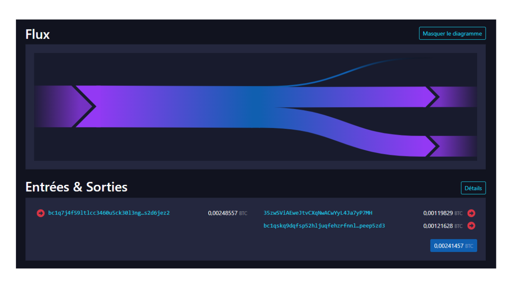

Lähde: [Mempool.space](https://mempool.space/fr/tx/b6cc79f45fd2d7669ff94db5cb14c45f1f879ea0ba4c6e3d16ad53a18c34b769)

Tämän ensimmäisen esimerkin jälkeen sinulla pitäisi olla parempi käsitys siitä, mitä "transaktiomallin" tutkiminen tarkoittaa. Tutkimme transaktiota keskittyen vain sen rakenteeseen ottamatta huomioon sen ympäristöä tai transaktion erityiskohtia. Havainnoimme sitä vain globaalilla tavalla tässä ensimmäisessä vaiheessa.

Nyt kun ymmärrät, mitä malli tarkoittaa, siirrytään muihin olemassa oleviin malleihin.

### Sweeping

Tämä toinen malli on tunnistettavissa yhden UTXOn kuluttamisesta syötteenä ja yhden UTXOn tuottamisesta lähtöarvona.


Tämän mallin tulkinta on, että kyseessä on itseensä kohdistuva siirto. Käyttäjä on siirtänyt bitcoinejaan itselleen, toiseen omistamaansa osoitteeseen. Koska transaktiossa ei ole vaihtorahaa, on erittäin epätodennäköistä, että kyseessä olisi maksu. Todellakin, kun maksu suoritetaan, on lähes mahdotonta, että maksajan UTXO vastaisi täsmälleen myyjän vaatimaa summaa, plus transaktiomaksut. Yleensä maksajan on siis pakko tuottaa vaihtoraha-lähtöarvo.

Tiedämme sitten, että havaittu käyttäjä todennäköisesti edelleen omistaa tämän UTXOn. Ketjuanalyysin kontekstissa, jos tiedämme, että transaktion syötteenä käytetty UTXO kuuluu Alicelle, voimme olettaa, että lähtöarvon UTXO kuuluu myös hänelle. Myöhemmin mielenkiintoiseksi tulee löytää transaktion sisäisiä heuristiikkoja, jotka voisivat vahvistaa tätä oletusta (tutkimme näitä heuristiikkoja luvussa 3.3).

Esimerkiksi, tässä on Bitcoin-transaktio, joka noudattaa sweeping-mallia:

```plaintext
35f1072a0fda5ae106efb4fda871ab40e1f8023c6c47f396441ad4b995ea693d
```

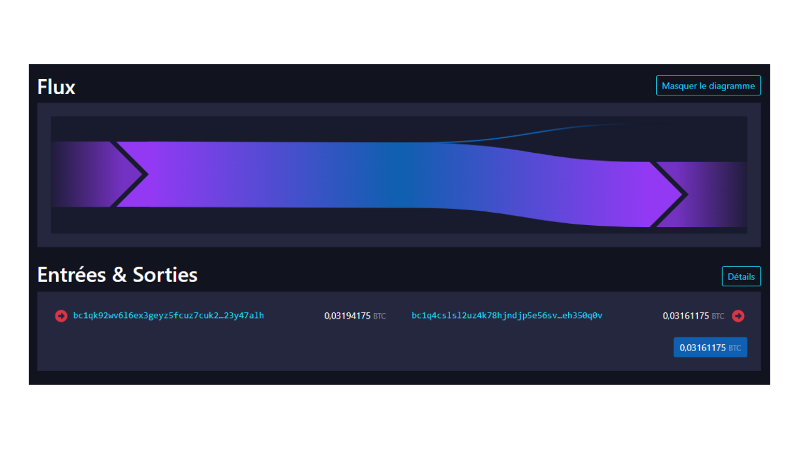
Lähde: [Mempool.space](https://mempool.space/fr/tx/35f1072a0fda5ae106efb4fda871ab40e1f8023c6c47f396441ad4b995ea693d) Tämän tyyppinen kaava voi kuitenkin paljastaa myös itse siirron kryptovaluuttapörssin tilille. Tunnettujen osoitteiden ja transaktion kontekstin tutkiminen mahdollistaa sen selvittämisen, onko kyseessä varojen siirto omaan hallintaan olevaan lompakkoon vai nosto alustalle. Todellakin, vaihtoalustojen osoitteet ovat usein helposti tunnistettavissa.

Palataanpa Alicen esimerkkiin: jos siirto johtaa alustan tunnettuun osoitteeseen (kuten esimerkiksi Binance), tämä voi tarkoittaa, että bitcoinit on siirretty pois Alicen suorasta hallinnasta, todennäköisesti aikomuksena myydä ne tai säilyttää ne tällä alustalla. Toisaalta, jos kohdeosoite on tuntematon, on kohtuullista olettaa, että kyseessä on yksinkertaisesti toinen lompakko, joka kuuluu edelleen Alicelle. Mutta tämäntyyppinen tutkimus kuuluu enemmän heuristiikan alaan eikä kaavojen tutkimiseen.

### Konsolidointi

Tämä malli on tunnusomaista useiden UTXOjen kulutukselle syötteenä ja yhden UTXOn tuottamiselle tulosteena.


Tämän mallin tulkinta on, että olemme konsolidoinnin läsnäolossa. Tämä on yleinen käytäntö Bitcoin-käyttäjien keskuudessa, jonka tavoitteena on yhdistää useita UTXOja odotettaessa mahdollista transaktiomaksujen nousua. Suorittamalla tämän toimenpiteen aikana, jolloin maksut ovat matalat, on mahdollista säästää tulevaisuuden maksuissa. Puhumme enemmän tästä käytännöstä luvussa 4.3.

Voimme päätellä, että tämän transaktiomallin takana oleva käyttäjä oli todennäköisesti kaikkien syötteiden UTXOjen hallussa ja on edelleen tulosteessa olevan UTXOn hallussa. Tämä on varmasti itse siirto.

Aivan kuten varojen siirrossa, tämäntyyppinen kaava voi myös paljastaa itse siirron vaihtoalustan tilille. Tunnettujen osoitteiden ja transaktion kontekstin tutkiminen mahdollistaa sen selvittämisen, onko kyseessä konsolidointi omaan hallintaan olevaan lompakkoon vai nosto alustalle.

Esimerkiksi, tässä on Bitcoin-transaktio, joka noudattaa konsolidoinnin mallia:

```plaintext
77c16914211e237a9bd51a7ce0b1a7368631caed515fe51b081d220590589e94
```


Lähde: [Mempool.space](https://mempool.space/fr/tx/77c16914211e237a9bd51a7ce0b1a7368631caed515fe51b081d220590589e94)
Ketjuanalyysin kontekstissa tämä malli voi paljastaa paljon tietoa. Esimerkiksi, jos tiedämme, että yksi syötteistä kuuluu Alicelle, voimme olettaa, että kaikki muut syötteet ja tämän transaktion tuloste kuuluvat hänelle myös. Tämä oletus sallisi meidän jäljittää aiempien transaktioketjujen kautta löytääksemme ja analysoimaan muita transaktioita, jotka todennäköisesti liittyvät Aliceen.
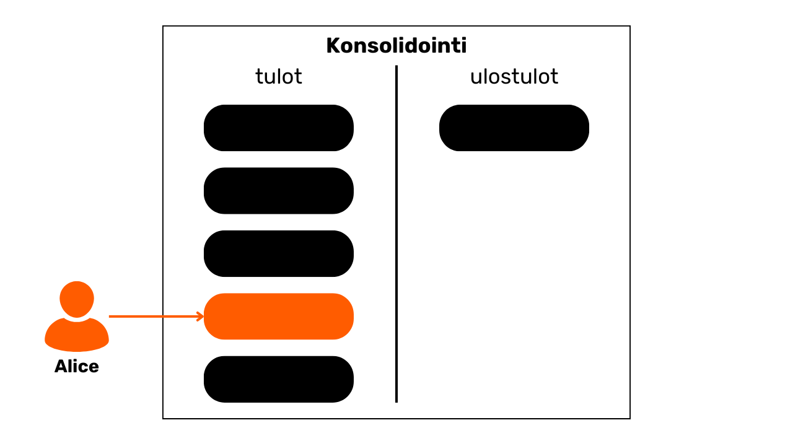

### Ryhmäkulutus

Tämä malli on tunnusomaista muutamien UTXOjen kulutukselle syötteinä (usein vain yksi) ja lukuisien UTXOjen tuottamiselle tulosteina.


Tämän mallin tulkinta on, että olemme ryhmitellyn kulutuksen läsnäolossa. Kyseessä on käytäntö, joka todennäköisesti paljastaa merkittävää taloudellista toimintaa, kuten esimerkiksi vaihtoalustan. Ryhmitelty kulutus mahdollistaa näiden yksiköiden säästää kuluissa yhdistämällä menonsa yhteen siirtoon.

Tästä mallista voimme päätellä, että UTXO-syöte tulee yritykseltä, jolla on merkittävää taloudellista toimintaa ja että UTXO-lähdöt hajaantuvat. Monet kuuluvat yrityksen asiakkaille, jotka ovat nostaneet bitcoineja alustalta. Toiset saattavat mennä kumppaniyrityksille. Lopuksi, varmasti on yksi tai useampi vaihto, joka palautuu liikkeeseenlaskijayritykselle.

Esimerkiksi, tässä on Bitcoin-siirto, joka noudattaa ryhmitellyn kulutuksen mallia (todennäköisesti, se on siirto, jonka on tehnyt Bybit-alusta):

```plaintext
8a7288758b6e5d550897beedd13c70bcbaba8709af01a7dbcc1f574b89176b43
```


Lähde: [Mempool.space](https://mempool.space/fr/tx/8a7288758b6e5d550897beedd13c70bcbaba8709af01a7dbcc1f574b89176b43)

### Protokollakohtaiset Siirrot

Siirtomalleja tutkiessamme voimme myös tunnistaa malleja, jotka paljastavat tietyn protokollan käytön. Esimerkiksi Whirlpool coinjoinit (joista keskustelemme osassa 5) tulevat olemaan helposti tunnistettavissa olevia rakenteita, jotka erottuvat muista perinteisemmistä siirroista.


Tämän mallin analyysi viittaa siihen, että todennäköisesti olemme yhteistyössä tehdyn siirron läsnäolossa. On myös mahdollista havaita coinjoin. Jos tämä jälkimmäinen hypoteesi osoittautuu paikkansapitäväksi, lähtöjen määrä voisi antaa meille likimääräisen arvion coinjoiniin osallistuvien määrästä.

Esimerkiksi, tässä on Bitcoin-siirto, joka noudattaa yhteistyössä tehdyn siirtotyypin coinjoin-mallia:

```plaintext
00601af905bede31086d9b1b79ee8399bd60c97e9c5bba197bdebeee028b9bea
```

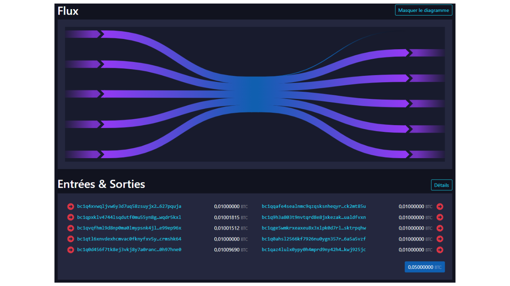

Lähde: [Mempool.space](https://mempool.space/fr/tx/00601af905bede31086d9b1b79ee8399bd60c97e9c5bba197bdebeee028b9bea)

On monia muita protokollia, joilla on omat erityiset rakenteensa. Näin ollen voisimme erottaa esimerkiksi Wabisabi-tyyppiset siirrot, Stamps-siirrot tai vaikkapa Runes-siirrot.

Kiitos näiden siirtomallien, voimme jo tulkita useita tietoja tietyistä siirroista. Mutta siirron rakenne ei ole ainoa analyysin tietolähde. Voimme myös tutkia sen yksityiskohtia. Nämä yksityiskohdat, jotka ovat sisäisiä siirrolle, ovat mitä pidän "sisäisinä heuristiikkoina", ja tulemme tutkimaan niitä seuraavassa luvussa.

## Sisäiset Heuristiikat

<chapterId>c54b5abe-872f-40f4-a0d0-c59faff228ba</chapterId>

Sisäinen heuristiikka on tietty ominaisuus, joka on tunnistettu itse siirrossa, ilman tarvetta tarkastella sen ympäristöä, mikä mahdollistaa päätelmien tekemisen. Toisin kuin mallit, jotka keskittyvät siirron kokonaisrakenteeseen korkealla tasolla, sisäiset heuristiikat perustuvat joukkoon uutettavissa olevia tietoja. Tämä sisältää:

- Eri UTXOjen määrät sekä saapuvat että lähtevät;
- Kaikki skripteihin liittyvä: vastaanotto-osoitteet, versionhallinta, lukitusajat...

Yleisesti ottaen tämän tyyppinen heuristiikka mahdollistaa tietyn transaktion muutoksen tunnistamisen. Näin voimme jatkaa entiteetin jäljittämistä useiden eri transaktioiden läpi. Todellakin, jos tunnistamme käyttäjälle kuuluvan UTXOn, jota haluamme seurata, on ratkaisevan tärkeää määrittää, kun he tekevät transaktion, mikä lähtö siirrettiin toiselle käyttäjälle ja mikä lähtö edustaa vaihtorahaa, pysyen siis heidän hallussaan.

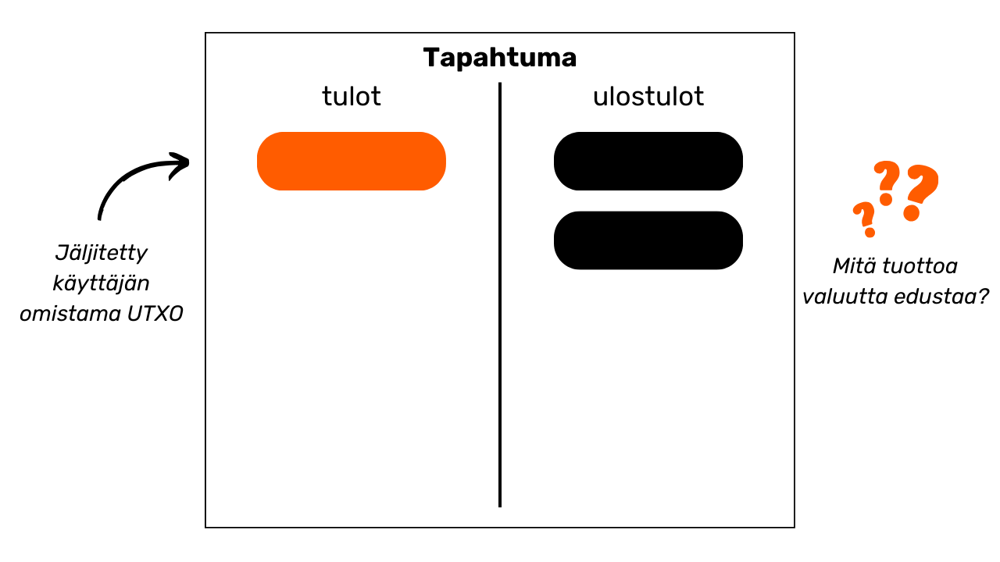

Muistutan jälleen, että nämä heuristiikat eivät ole täysin tarkkoja. Yksittäin otettuna ne mahdollistavat vain todennäköisten skenaarioiden tunnistamisen. Useiden heuristiikkojen kertyminen auttaa vähentämään epävarmuutta, vaikka se ei koskaan täysin poistakaan sitä.

### Sisäiset Yhtäläisyydet

Tämä heuristiikka käsittää saman transaktion sisääntulojen ja lähtöjen välillä olevien yhtäläisyyksien tutkimisen. Jos havaitsemme saman ominaisuuden sisääntuloissa ja vain yhdessä transaktion lähdössä, on todennäköistä, että tämä lähtö muodostaa vaihtorahan.

Ilmeisin ominaisuus on vastaanotto-osoitteen uudelleenkäyttö samassa transaktiossa.

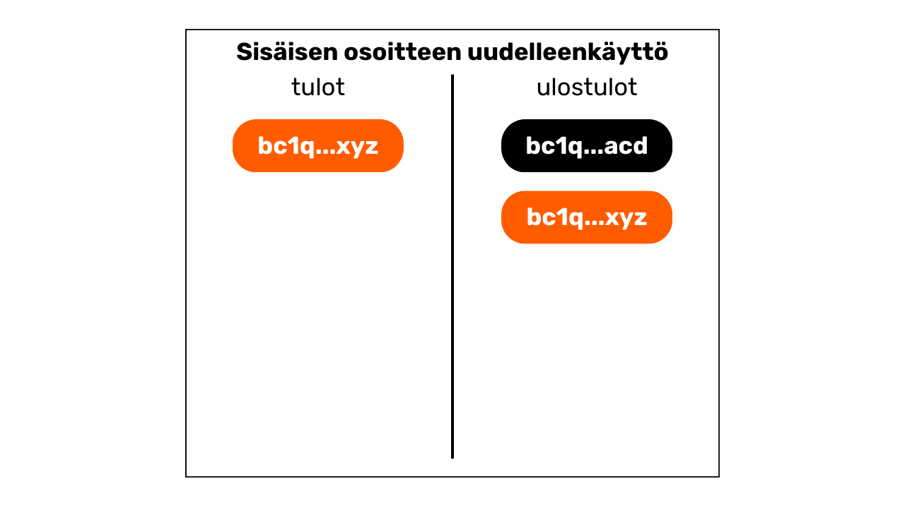
Tämä heuristiikka jättää vähän tilaa epäilyksille. Ellei jonkun yksityisavainta ole hakkerointu, sama vastaanotto-osoite paljastaa väistämättä yhden käyttäjän toiminnan. Tästä seuraa tulkinta, että transaktion vaihtoraha on lähtö, jolla on sama osoite kuin sisääntulolla. Tämä mahdollistaa yksilön jatkuvan seuraamisen tämän vaihtorahan perusteella.
Esimerkiksi, tässä on transaktio, johon tätä heuristiikkaa voidaan kohtuullisesti soveltaa:

```plaintext
54364146665bfc453a55eae4bfb8fdf7c721d02cb96aadc480c8b16bdeb8d6d0
```


Lähde: [Mempool.space](https://mempool.space/tx/54364146665bfc453a55eae4bfb8fdf7c721d02cb96aadc480c8b16bdeb8d6d0)

Nämä sisääntulojen ja lähtöjen väliset yhtäläisyydet eivät rajoitu osoitteiden uudelleenkäyttöön. Mikä tahansa samankaltaisuus skriptien käytössä voi mahdollistaa heuristiikan soveltamisen. Esimerkiksi joskus voidaan havaita sama versionhallinta sisääntulon ja transaktion yhden lähdön välillä.

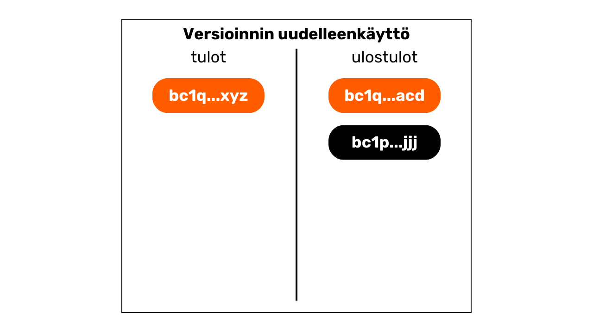

Tässä kaaviossa näemme, että sisääntulo nro 0 avaa P2WPKH-skriptin (SegWit V0 alkaen `bc1q`). Lähtö nro 0 käyttää samaa tyyppistä skriptiä. Kuitenkin, lähtö nro 1 käyttää P2TR-skriptiä (SegWit V1 alkaen `bc1p`). Tämän ominaisuuden tulkinta on, että on todennäköistä, että samaa versionhallintaa käyttävä osoite on vaihtorahaosoite. Se kuuluisi siis edelleen samalle käyttäjälle.

Tässä on transaktio, johon tätä heuristiikkaa voidaan kohtuullisesti soveltaa:

```plaintext
db07516288771ce5d0a06b275962ec4af1b74500739f168e5800cbcb0e9dd578
```


Lähde: [Mempool.space](https://mempool.space/tx/db07516288771ce5d0a06b275962ec4af1b74500739f168e5800cbcb0e9dd578)
Tässä tapauksessa voimme nähdä, että syöte numero 0 ja tulos numero 1 käyttävät P2WPKH-skriptejä (SegWit V0), kun taas tulos numero 0 käyttää erilaista skriptiä, P2PKH (Legacy). 2010-luvun alussa tämä heuristiikka, joka perustuu skriptien versioinnin, oli suhteellisen vähän hyödyllinen johtuen saatavilla olevien skriptityyppien rajoituksesta. Kuitenkin ajan myötä ja Bitcoinin peräkkäisten päivitysten myötä on esitelty yhä suurempi monimuotoisuus skriptityyppejä. Tämä heuristiikka muuttuu yhä merkityksellisemmäksi, koska laajemman valikoiman skriptityyppien myötä käyttäjät jakautuvat pienempiin ryhmiin, näin ollen lisäten tämän sisäisen version uudelleenkäytön heuristiikan soveltamisen mahdollisuuksia. Tästä syystä, pelkästään yksityisyyden näkökulmasta, on suositeltavaa valita yleisin skriptityyppi. Esimerkiksi kirjoittaessani näitä rivejä, Taproot-skriptit (`bc1p`) ovat vähemmän käytössä kuin SegWit V0 -skriptit (`bc1q`). Vaikka edelliset tarjoavat taloudellisia ja yksityisyyden etuja tietyissä erityisissä konteksteissa, perinteisempiä yksiallekirjoituksen käyttötapauksia varten saattaisi olla viisasta pysyä vanhemmassa standardissa yksityisyyden syistä, kunnes uusi standardi on laajemmin omaksuttu.

### Pyöristettyjen Summien Maksut

Toinen sisäinen heuristiikka, joka voi auttaa meitä tunnistamaan vaihdon, on pyöristettyjen summien heuristiikka. Yleensä, kun kohdataan yksinkertainen maksukuvio (1 syöte ja 2 tulosta), jos toinen tuloksista käyttää pyöristettyä summaa, silloin se edustaa maksua.

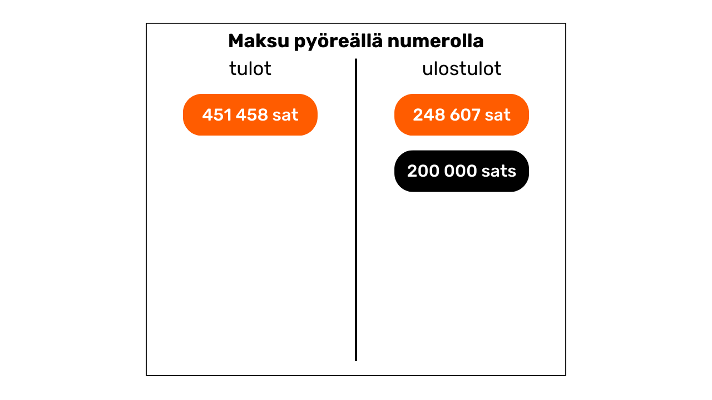

Poissulkemisen kautta, jos yksi tulos edustaa maksua, toinen edustaa vaihtorahaa. Näin voidaan päätellä, että on todennäköistä, että transaktion syöttänyt käyttäjä edelleen omistaa vaihtorahaksi tunnistetun tuloksen.

On huomattava, että tätä heuristiikkaa ei aina voida soveltaa, koska suurin osa maksuista tehdään edelleen fiat-valuutan yksiköissä. Todellakin, kun kauppias Ranskassa hyväksyy bitcoineja, yleensä he eivät näytä vakaita hintoja satseissa. He pikemminkin valitsisivat hinnan muuntamisen euroista bitcoineiksi maksettavaan summaan. Siksi transaktion tuloksessa ei pitäisi olla pyöristettyä numeroa.

Analyytikko voisi kuitenkin yrittää tehdä tämän muunnoksen ottamalla huomioon valuuttakurssin, joka oli voimassa, kun transaktio lähetettiin verkossa. Otetaan esimerkiksi transaktio, jossa on syöte `97,552 sats` ja kaksi tulosta, toinen `31,085 sats` ja toinen `64,152 sats`. Ensivilkaisulla tämä transaktio ei vaikuta sisältävän pyöristettyjä määriä. Kuitenkin, soveltamalla valuuttakurssia €64,339 transaktion aikaan, saamme muunnoksen euroiksi, joka näyttää seuraavalta:

- Syöte €62.76;
- Tulos €20;
- Tulos €41.27.
  Kun muunnettu fiat-valuutaksi, tämä transaktio mahdollistaa pyöristettyjen summien maksujen heuristiikan soveltamisen. €20 tulos oli todennäköisesti tarkoitettu kauppiaalle, tai ainakin vaihtoi omistajaa. Deduktion kautta, €41.27 tulos todennäköisesti pysyi alkuperäisen käyttäjän hallussa.
  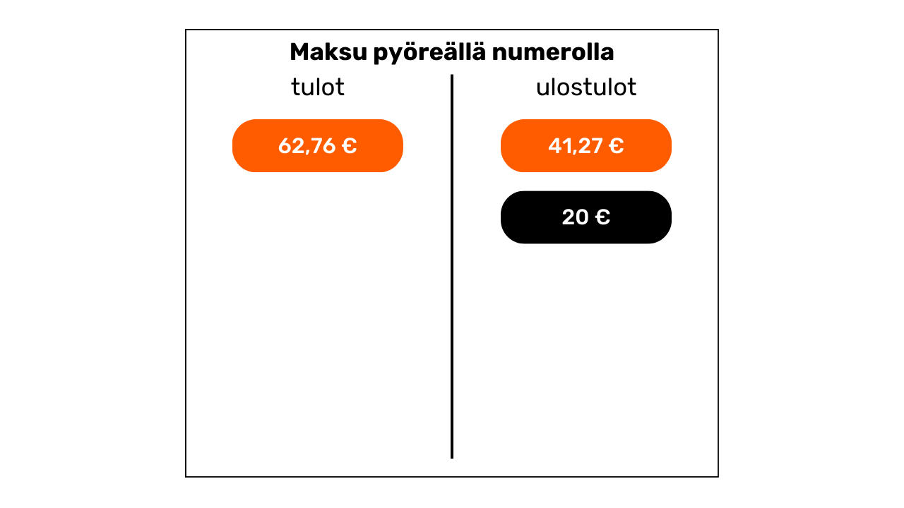

Jos jonain päivänä Bitcoinista tulee suosituin laskentayksikkö transaktioissamme, tämä heuristiikka voisi muuttua vielä hyödyllisemmäksi analyysissä.

Esimerkiksi, tässä on transaktio, jossa tätä heuristiikkaa voidaan todennäköisesti soveltaa:

```plaintext
2bcb42fab7fba17ac1b176060e7d7d7730a7b807d470815f5034d52e96d2828a
```


Lähde: [Mempool.space](https://mempool.space/tx/2bcb42fab7fba17ac1b176060e7d7d7730a7b807d470815f5034d52e96d2828a)

### Suurin Ulostulo

Kun yksinkertaisessa maksujärjestelmässä havaitaan riittävän suuri ero kahden transaktioulostulon välillä, voidaan arvioida, että suurempi ulostulo on todennäköisesti vaihtoraha.

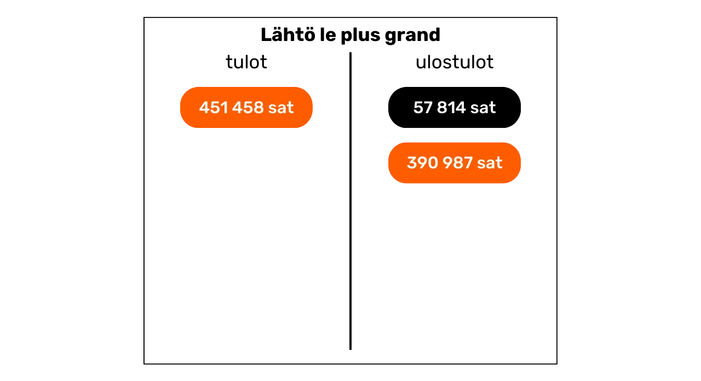

Tämä suurimman ulostulon heuristiikka on todennäköisesti kaikista epätarkimpia. Jos se tunnistetaan itsenäisesti, se on melko heikko. Kuitenkin tämä ominaisuus voidaan yhdistää muiden heuristiikkojen kanssa vähentämään tulkintamme epävarmuutta.

Esimerkiksi, jos tarkastelemme transaktiota, jossa on ulostulo pyöristetyllä summalla ja toinen ulostulo suuremmalla summalla, pyöristettyjen maksujen heuristiikan ja suurimman ulostulon heuristiikan yhteiskäyttö mahdollistaa epävarmuustason vähentämisen.

Esimerkiksi, tässä on transaktio, jossa tätä heuristiikkaa todennäköisesti voidaan soveltaa:

```plaintext
b79d8f8e4756d34bbb26c659ab88314c220834c7a8b781c047a3916b56d14dcf
```


Lähde: [Mempool.space](https://mempool.space/tx/b79d8f8e4756d34bbb26c659ab88314c220834c7a8b781c047a3916b56d14dcf)

## Ulkoiset Heuristiikat

<chapterId>4a170e3b-200d-431a-8285-18a23ff617ba</chapterId>
Ulkoisten heuristiikkojen tutkimus sisältää tiettyjen elementtien, jotka eivät ole transaktion itsensä ominaisia, samankaltaisuuksien, mallien ja piirteiden analysoinnin. Toisin sanoen, jos aiemmin rajoituimme hyödyntämään transaktion sisäisiä elementtejä sisäisillä heuristiikoilla, laajennamme nyt analyysikenttäämme transaktion ympäristöön ulkoisten heuristiikkojen avulla.

### Osoitteen Uudelleenkäyttö

Tämä on yksi tunnetuimmista heuristiikoista Bitcoin-entusiastien keskuudessa. Osoitteen uudelleenkäyttö mahdollistaa eri transaktioiden ja eri UTXO:iden välisen yhteyden luomisen. Sitä havaitaan, kun Bitcoinin vastaanotto-osoitetta käytetään useita kertoja.

Näin ollen osoitteen uudelleenkäyttöä on mahdollista hyödyntää samassa transaktiossa sisäisenä heuristiikkana vaihdon tunnistamiseksi (kuten näimme edellisessä luvussa). Kuitenkin osoitteen uudelleenkäyttö voi myös toimia ulkoisena heuristiikkana tunnistettaessa useiden transaktioiden takana olevan yksilön yksilöllisyyttä.

Osoitteen uudelleenkäytön tulkinta on, että kaikki tähän osoitteeseen lukitut UTXO:t kuuluvat (tai ovat kuuluneet) samalle yksilölle. Tämä heuristiikka jättää vähän tilaa epävarmuudelle. Kun se on mahdollista tunnistaa, seuraava tulkinta vastaa todennäköisesti todellisuutta. Se mahdollistaa siis eri onchain-toimintojen ryhmittelyn.

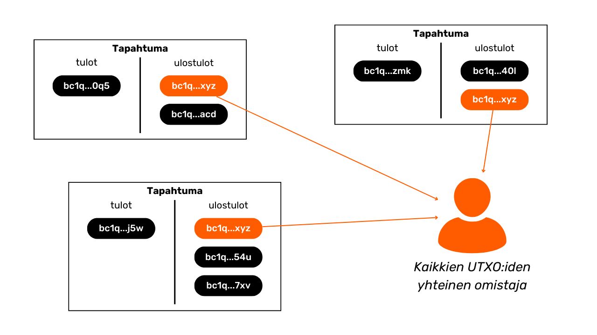

Kuten johdannossa osaan 3 selitettiin, tämän heuristiikan löysi itse Satoshi Nakamoto. White Paperissa hän mainitsee erityisesti ratkaisun, jonka avulla käyttäjät voivat välttää sen tuottamisen, mikä on yksinkertaisesti uuden osoitteen käyttö jokaista uutta transaktiota varten:

"_Lisäsuojana voitaisiin käyttää jokaista transaktiota varten uutta avainparia, jotta ne eivät olisi yhdistettävissä yhteiseen omistajaan._"


Lähde: S. Nakamoto, "Bitcoin: A Peer-to-Peer Electronic Cash System", https://bitcoin.org/bitcoin.pdf, 2009.

Esimerkiksi, tässä on osoite, jota on käytetty useissa transaktioissa:

```plaintext
bc1qqtmeu0eyvem9a85l3sghuhral8tk0ar7m4a0a0
```


Lähde: [Mempool.space](https://mempool.space/address/bc1qqtmeu0eyvem9a85l3sghuhral8tk0ar7m4a0a0)

### Skriptien Samankaltaisuus ja Lompakon Sormenjäljet

Osoitteiden uudelleenkäytön lisäksi on lukuisia muita heuristiikkoja, jotka mahdollistavat toimien yhdistämisen samaan lompakkoon tai osoitteiden klusteriin.
Ennen kaikkea analyytikko voi hyötyä skriptien käytön samankaltaisuuksista. Esimerkiksi tiettyjä vähemmistöskriptejä, kuten multisig, voidaan tunnistaa helpommin kuin SegWit V0 -skriptejä. Mitä suuremmassa ryhmässä piilemme, sitä vaikeampi meidät on havaita. Tämä on erityisesti syy, miksi hyvissä Coinjoin-protokollissa kaikki osallistujat käyttävät täsmälleen samaa skriptityyppiä.
Laajemmin analyytikko voi myös keskittyä lompakon ominaisiin sormenjälkiin. Nämä ovat tiettyjä prosesseja, jotka liittyvät käyttöön, jonka tunnistamista saatetaan tavoitella hyödyntämällä niitä jäljitysheuristiikkoina. Toisin sanoen, jos havaitaan kertymä samoja sisäisiä ominaisuuksia transaktioissa, jotka on attribuoitu jäljitettävälle entiteetille, voidaan yrittää tunnistaa nämä samat ominaisuudet muissa transaktioissa.

Esimerkiksi voidaan tunnistaa, että jäljitettävä käyttäjä lähettää systemaattisesti vaihtorahansa P2TR-osoitteisiin (`bc1p…`). Jos tämä prosessi toistuu, sitä voidaan käyttää heuristiikkana analyysimme jatkamiseen. Muita sormenjälkiä voidaan myös käyttää, kuten UTXOjen järjestys, vaihtorahan sijoittelu lähtöihin, RBF:n (Replace-by-Fee) merkitseminen tai jopa versionumero, `nSequence`-kenttä ja `nLockTime`-kenttä.

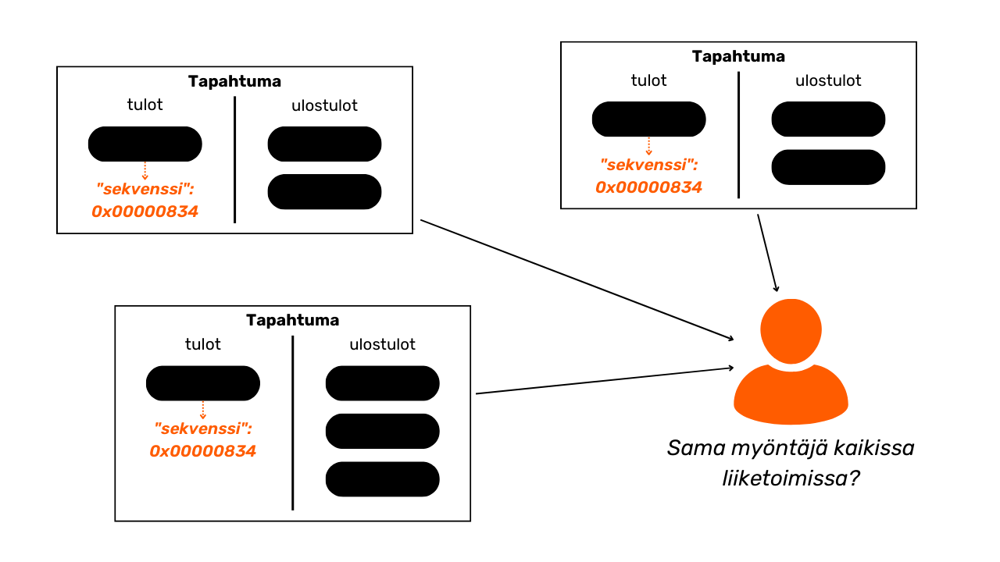

Kuten [@LaurentMT](https://twitter.com/LaurentMT) määrittelee [Space Kek #19](https://podcasters.spotify.com/pod/show/decouvrebitcoin/episodes/SpaceKek-19---Analyse-de-chane--anonsets-et-entropie-e1vfuji) -podcastissa (ranskankielinen podcast), lompakon sormenjälkien hyödyllisyys ketjuanalyysissä kasvaa ajan myötä. Todellakin, skriptityyppien kasvava määrä ja näiden uusien ominaisuuksien yhä asteittaisempi käyttöönotto lompakko-ohjelmistossa korostavat eroja. Saattaa jopa olla, että voidaan tarkasti tunnistaa jäljitettävän entiteetin käyttämä ohjelmisto. On siis tärkeää ymmärtää, että lompakon sormenjäljen tutkiminen osoittautuu erityisen relevantiksi tuoreiden transaktioiden kohdalla, enemmän kuin niiden, jotka on aloitettu 2010-luvun alussa.

Yhteenvetona, sormenjälki voi olla mikä tahansa tietty käytäntö, jonka lompakko suorittaa automaattisesti tai käyttäjä manuaalisesti, ja jota voidaan löytää muista transaktioista auttaaksemme analyysissämme.

### Yhteisen Syötteen Omistajuuden Heuristiikka (CIOH)

CIOH, englanniksi "Common Input Ownership Heuristic", on heuristiikka, joka toteaa, että kun transaktio sisältää useita syötteitä, ne todennäköisesti kaikki ovat peräisin yhdeltä entiteetiltä. Näin ollen niiden omistajuus on yhteinen.
Sovellettaessa Yhteisen Syötteen Omistajuuden Heuristiikkaa (Common Input Ownership Heuristic, CIOH), ensin tarkkailemme transaktiota, jolla on useita syötteitä. Tämä voi olla niin vähän kuin 2 syötettä tai niin paljon kuin 30 syötettä. Kun tämä ominaisuus on tunnistettu, tarkistamme, ettei transaktio sovi tunnettuun transaktiomalliin. Esimerkiksi, jos sillä on 5 syötettä suunnilleen samalla määrällä ja 5 ulostuloa täsmälleen samalla määrällä, tiedämme sen olevan coinjoinin rakenne. Siksi emme voi soveltaa CIOH:ta.
Kuitenkin, jos transaktio ei sovi mihinkään tunnettuun yhteistyöllisen transaktion malliin, voimme päätellä, että kaikki syötteet todennäköisesti tulevat samalta taholta. Tämä voi olla erittäin hyödyllistä laajennettaessa tunnettua klusteria tai jatkettaessa jäljitystä.

CIOH:n löysi Satoshi Nakamoto. Hän keskustelee siitä White Paperin osassa 10:

"_[...] linkki on väistämätön monisyötteisissä transaktioissa, jotka välttämättä paljastavat, että niiden syötteet omisti sama omistaja. Riskinä on, että jos avaimen omistaja paljastetaan, linkit voivat paljastaa muita transaktioita, jotka kuuluivat samalle omistajalle._"

On erityisen kiehtovaa huomata, että Satoshi Nakamoto oli jo ennen Bitcoinin virallista julkaisua tunnistanut kaksi pääasiallista yksityisyyden haavoittuvuutta käyttäjille, nimittäin CIOH:n ja osoitteen uudelleenkäytön. Tällainen ennakointikyky on melko merkittävää, sillä nämä kaksi heuristiikkaa ovat edelleen, jopa tänä päivänä, hyödyllisimpiä ketjuanalyysissä.

Antaakseni sinulle esimerkin, tässä on transaktio, johon CIOH todennäköisesti voidaan soveltaa:

```plaintext
20618e63b6eed056263fa52a2282c8897ab2ee71604c7faccfe748e1a202d712
```

Lähde: [Mempool.space](https://mempool.space/tx/20618e63b6eed056263fa52a2282c8897ab2ee71604c7faccfe748e1a202d712)

### Offchain Data

Ilmiselvästi ketjuanalyysi ei rajoitu yksinomaan onchain-dataan. Myös aiemmista analyyseistä tai internetistä saatavilla olevaa dataa voidaan käyttää analyysin tarkentamiseen.
Esimerkiksi, jos havaitaan, että jäljitettyjä transaktioita lähetetään systemaattisesti samasta Bitcoin-nodesta ja sen IP-osoite voidaan tunnistaa, saattaa olla mahdollista löytää muita transaktioita samalta taholta, lisäksi osan lähettäjän identiteetistä määrittäminen. Vaikka tämä käytäntö ei ole helposti saavutettavissa, koska se vaatii monien nodien operoimista, on mahdollista, että jotkin ketjuanalyysiin erikoistuneet yritykset käyttävät sitä.

Analyytikolla on myös mahdollisuus nojautua aiemmin julkisiksi tehtyihin analyyseihin tai omiin aiempiin analyyseihinsä. Ehkä löytyy ulostulo, joka osoittaa jo tunnistettuun osoitteiden klusteriin. Joskus on myös mahdollista nojautua ulostuloihin, jotka osoittavat vaihtoalustalle, näiden yritysten osoitteet kun ovat yleensä tunnettuja.

Samalla tavalla voidaan suorittaa analyysi poissulkemisen kautta. Esimerkiksi, jos transaktion analysoinnissa, jolla on kaksi ulostuloa, toinen niistä on linkitetty jo tunnettuun osoitteiden klusteriin, mutta erillään jäljitettävästä tahosta, voidaan tulkita, että toinen ulostulo todennäköisesti edustaa vaihtorahaa.

Ketjuanalyysi sisältää myös osan OSINT:stä (_Open Source Intelligence_), joka on hieman yleisluontoisempi internet-hakujen kanssa. Tämän vuoksi on suositeltavaa välttää vastaanotto-osoitteiden julkaisemista suoraan sosiaalisessa mediassa tai verkkosivustolla, olipa kyseessä pseudonyymi tai ei.


### Aikamallit

Vaikka sitä harvemmin ajatellaan, tietyt ihmisten käyttäytymismallit ovat tunnistettavissa lohkoketjussa. Hyödyllisin analyysissä saattaa olla unirytminne! Kyllä, kun nukutte, ette todennäköisesti lähetä Bitcoin-siirtoja. Koska yleensä nukutte suunnilleen samoina tunteina, on yleistä käyttää aikapohjaisia analyysejä ketjuanalyysissä. Tämä yksinkertaisesti käsittää annetun entiteetin siirtojen lähettämisaikojen luetteloinnin Bitcoin-verkkoon. Näiden aikapohjaisten mallien analysointi mahdollistaa monien tietojen päättelemisen.

Ensinnäkin, aikapohjainen analyysi mahdollistaa joskus jäljitettävän entiteetin luonteen tunnistamisen. Jos havaitaan, että siirtoja lähetetään jatkuvasti ympäri vuorokauden, tämä paljastaa vahvan taloudellisen toiminnan. Näiden siirtojen takana oleva entiteetti on todennäköisesti yritys, mahdollisesti kansainvälinen, ja ehkä sisäisesti automatisoiduilla menettelyillä.

Esimerkiksi [tunnistin tämän mallin muutama kuukausi sitten](https://twitter.com/Loic_Pandul/status/1701127409712452072) analysoimalla [siirtoa, jossa oli virheellisesti kohdennettu 19 bitcoinia maksuina](https://mempool.space/tx/d5392d474b4c436e1c9d1f4ff4be5f5f9bb0eb2e26b61d2781751474b7e870fd). Yksinkertainen aikapohjainen analyysi oli mahdollistanut oletuksen, että kyseessä oli automatisoitu palvelu, ja siksi todennäköisesti suuri entiteetti, kuten vaihtoalusta.

Todellakin, muutama päivä myöhemmin, selvisi, että varat kuuluivat PayPalille, vaihtoalustan Paxos kautta.

Päinvastoin, jos näemme, että aikapohjainen malli on pikemminkin levinnyt 16 erittäin tiettyyn tuntiin, voimme arvioida, että kyseessä on yksittäinen käyttäjä tai ehkä paikallinen yritys riippuen käydyn kaupan volyymeista.

Jäljitettävän entiteetin luonteen lisäksi aikapohjainen malli voi myös antaa meille likimääräisen sijainnin käyttäjälle aikavyöhykkeiden ansiosta. Voimme siis yhdistää muita siirtoja ja käyttää näiden aikaleimoja lisäheuristiikkana, jota voidaan lisätä analyysiimme.

Esimerkiksi aiemmin mainitsemassani uudelleenkäytetyssä osoitteessa voimme havaita, että siirrot, olivatpa ne saapuvia tai lähteviä, keskittyvät 13 tunnin ajanjaksoon.

```plaintext
bc1qqtmeu0eyvem9a85l3sghuhral8tk0ar7m4a0a0
```


Lähde: OXT.me

Tämä ajanjakso vastaa todennäköisesti Eurooppaa, Afrikkaa tai Lähi-itää. Voimme siis päätellä, että näiden siirtojen takana oleva käyttäjä asuu siellä.

Toisessa rekisterissä, juuri tämän tyyppinen aikapohjainen analyysi mahdollisti hypoteesin, että Satoshi Nakamoto ei toiminut Japanista käsin, vaan todellakin Yhdysvalloista: [_Satoshi Nakamoton aikavyöhykkeet_](https://medium.com/@insearchofsatoshi/the-time-zones-of-satoshi-nakamoto-aa40f035178f)

## Käytännön sovellus lohkoetsijän kanssa

<chapterId>6493cf2f-225c-405f-9375-c4304f1087ed</chapterId>

Tässä viimeisessä luvussa sovellamme konkreettisesti tähän asti opiskelemiamme käsitteitä. Esittelen teille esimerkkejä todellisista Bitcoin-siirroista, ja teidän on poimittava pyytämäni tiedot.
Ideaalitapauksessa näitä harjoituksia varten olisi suositeltavaa käyttää ammattimaista ketjuanalyysityökalua. Kuitenkin, koska Samourai Walletin kehittäjät on pidätetty, ainoa ilmainen analyysityökalu OXT.me ei ole enää saatavilla. Siksi valitsemme näihin harjoituksiin perinteisen lohkoketjuselaimen. Suosittelen käyttämään [Mempool.space](https://mempool.space/) sen lukuisien ominaisuuksien ja ketjuanalyysityökalujen valikoiman vuoksi, mutta voit myös valita toisen selaimen, kuten [Bitcoin Explorer](https://bitcoinexplorer.org/). Aloittaakseni esittelen harjoitukset. Käytä lohkoketjuselaintasi niiden suorittamiseen ja kirjoita vastauksesi paperille. Tämän luvun lopussa annan vastaukset, jotta voit tarkistaa ja korjata tuloksesi.

_Valitut transaktiot näihin harjoituksiin on valittu ainoastaan niiden ominaisuuksien perusteella jokseenkin satunnaisesti. Tämä luku on tarkoitettu ainoastaan opetustarkoituksiin ja tiedon jakamiseen. Haluan selventää, etten tue tai kannusta näiden työkalujen käyttöä pahantahtoisiin tarkoituksiin. Tavoitteena on opettaa sinua suojaamaan itsesi ketjuanalyysiltä, ei suorittamaan analyysejä paljastaaksesi muiden yksityistietoja._

### Harjoitus 1

Analysoitava transaktio-ID:

```plaintext
3769d3b124e47ef4ffb5b52d11df64b0a3f0b82bb10fd6b98c0fd5111789bef7
```

Mikä on tämän transaktion malli ja mitä uskottavia tulkintoja voidaan tehdä tutkimalla vain sen mallia, eli transaktion rakennetta?

### Harjoitus 2

Analysoitava transaktio-ID:

```plaintext
baa228f6859ca63e6b8eea24ffad7e871713749d693ebd85343859173b8d5c20
```

Mikä on tämän transaktion malli ja mitä uskottavia tulkintoja voidaan tehdä tutkimalla vain sen mallia, eli transaktion rakennetta?

### Harjoitus 3

Analysoitava transaktio-ID:

```plaintext
3a9eb9ccc3517cc25d1860924c66109262a4b68f4ed2d847f079b084da0cd32b
```

Mikä on tämän transaktion malli?

Tunnistettuasi mallin, käyttäen transaktion sisäisiä heuristiikkoja, mikä lähtö todennäköisesti edustaa vaihtorahaa?

### Harjoitus 4

Analysoitava transaktio-ID:

```plaintext
35f0b31c05503ebfdf7311df47f68a048e992e5cf4c97ec34aa2833cc0122a12
```

Mikä on tämän transaktion malli?
Tunnistettuasi mallin, käyttäen transaktion sisäisiä heuristiikkoja, mikä lähtö todennäköisesti edustaa vaihtorahaa?

### Harjoitus 5

Kuvittele, että Loïc julkaisi yhden Bitcoin-vastaanotto-osoitteistaan sosiaalisessa mediassa Twitterissä:


```plaintext
bc1qja0hycrv7g9ww00jcqanhfpqmzx7luqalum3vu
```

Käyttäen **vain osoitteen uudelleenkäytön heuristiikkaa**, mitkä Bitcoin-transaktiot voimme yhdistää Loïcin identiteettiin?

_Ilmeisesti en ole tämän vastaanotto-osoitteen todellinen omistaja enkä ole julkaissut sitä sosiaalisissa medioissa. Se on osoite, jonka valitsin satunnaisesti lohkoketjusta._

### Harjoitus 6

Seuraten Harjoitus 5:ttä, osoitteen uudelleenkäytön heuristiikan ansiosta, pystyit tunnistamaan useita Bitcoin-transaktioita, joihin Loïc näyttää olevan osallisena. Normaalisti tunnistettujen transaktioiden joukossa sinun olisi pitänyt huomata tämä:
Tämä transaktio on ensimmäinen, joka lähettää varoja Loïcin osoitteeseen. Mielestäsi, mistä Loïc on saanut tämän transaktion kautta bitcoineja?

### Tehtävä 7

Tehtävän 5 jälkeen osoitteen uudelleenkäytön heuristiikan avulla pystyit tunnistamaan useita Bitcoin-transaktioita, joihin Loïc näyttää olevan osallisena. Haluat nyt selvittää, mistä Loïc on kotoisin. Löydettyjen transaktioiden perusteella suorita aikajaksoanalyysi löytääksesi todennäköisen aikavyöhykkeen, jota Loïc käyttää. Tämän aikavyöhykkeen perusteella määritä paikka, jossa Loïc näyttää asuvan (maa, osavaltio/alue, kaupunki...).


### Tehtävä 8

Tässä on tutkittava Bitcoin-transaktio:

```plaintext
bb346dae645d09d32ed6eca1391d2ee97c57e11b4c31ae4325bcffdec40afd4f
```

Tätä transaktiota tarkastelemalla, mitä tietoja voimme tulkita?

### Ratkaisut tehtäviin

**_Tehtävä 1:_**
Tämän transaktion malli on yksinkertainen maksu. Jos tutkimme vain sen rakennetta, voimme tulkita, että yksi lähtö edustaa vaihtorahaa ja toinen lähtö todellista maksua. Täten tiedämme, että havaittu käyttäjä ei todennäköisesti enää omista yhtä kahdesta UTXO:sta lähdöissä (se maksua varten), mutta on edelleen omistaja toiselle UTXO:lle (se vaihtorahaa varten).

**_Tehtävä 2:_**
Tämän transaktion malli on erän kulutus. Tämä malli viittaa todennäköisesti merkittävään taloudelliseen toimintaan, kuten esimerkiksi vaihtoalustaan. Voimme päätellä, että syötteenä käytetty UTXO tulee yritykseltä, jolla on merkittävää taloudellista toimintaa ja että lähtöjen UTXO:t hajaantuvat. Jotkut kuuluvat yrityksen asiakkaille, jotka ovat siirtäneet bitcoinejaan itsehallinnollisiin lompakoihin. Toiset saattavat mennä yhteistyökumppaneille. Lopulta varmasti on vaihtoraha, joka palautuu liikkeeseenlaskijayritykselle.

**_Tehtävä 3:_**

Tämän transaktion malli on yksinkertainen maksu. Siksi voimme soveltaa sisäisiä heuristiikkoja transaktioon yrittääksemme tunnistaa vaihtorahan.

Olen henkilökohtaisesti tunnistanut ainakin kaksi sisäistä heuristiikkaa, jotka tukevat samaa hypoteesia:

- Saman tyyppisen skriptin uudelleenkäyttö;
- Suurin lähtö.

Ilmeisin heuristiikka on saman tyyppisen skriptin uudelleenkäyttö. Todellakin, lähtö `0` on `P2SH`, tunnistettavissa sen vastaanotto-osoitteen alkamisella `3`:

```plaintext
3Lcdauq6eqCWwQ3UzgNb4cu9bs88sz3mKD
```

Kun taas lähtö `1` on `P2WPKH`, tunnistettavissa osoitteesta, joka alkaa `bc1q`:

```plaintext
bc1qya6sw6sta0mfr698n9jpd3j3nrkltdtwvelywa
```

Tässä transaktiossa käytetty UTXO käyttää myös `P2WPKH` skriptiä:

```plaintext
bc1qyfuytw8pcvg5vx37kkgwjspg73rpt56l5mx89k
```

Näin ollen voimme olettaa, että lähtö `0` vastaa maksua ja että lähtö `1` on transaktion vaihtoraha, mikä tarkoittaisi, että syötteen käyttäjä omistaa edelleen lähdön `1`.
Tämän hypoteesin tueksi tai kumotakseksi voimme etsiä muita heuristiikkoja, jotka joko vahvistavat ajatuksemme tai vähentävät todennäköisyyttä sille, että hypoteesimme on oikein.
Olen havainnut ainakin yhden muun heuristiikan. Se on suurin tulos. Tulos `0` on `123,689 satsia`, kun taas tulos `1` on `505,839 satsia`. Näiden kahden tuloksen välillä on siis merkittävä ero. Suurimman tuloksen heuristiikka ehdottaa, että tilavuudeltaan suurin tulos on todennäköisesti vaihtoraha. Tämä heuristiikka siis vahvistaa alkuperäistä hypoteesiamme entisestään.

Vaikuttaa todennäköiseltä, että käyttäjä, joka toimitti UTXO:n syötteenä, pitää edelleen hallussaan tulosta `1`, joka näyttää edustavan transaktion vaihtorahaa.

**_Harjoitus 4:_**
Tämän transaktion malli on yksinkertainen maksu. Siksi voimme soveltaa sisäisiä heuristiikkoja transaktioon yrittääksemme tunnistaa vaihtorahan.
Olen henkilökohtaisesti tunnistanut ainakin kaksi sisäistä heuristiikkaa, jotka tukevat samaa hypoteesia:

- Saman skriptityypin uudelleenkäyttö;
- Pyöreän summan tulos.

Ilmeisin heuristiikka on saman skriptityypin uudelleenkäyttö. Todellakin, tulos `0` on `P2SH`, tunnistettavissa sen vastaanotto-osoitteen alkaessa `3`:

```plaintext
3FSH5Mnq6S5FyQoKR9Yjakk3X4KCGxeaD4
```

Kun taas tulos `1` on `P2WPKH`, tunnistettavissa sen osoitteen alkaessa `bc1q`:

```plaintext
bc1qvdywdcfsyavt4v8uxmmrdt6meu4vgeg439n7sg
```

Transaktion syötteenä käytetty UTXO käyttää myös `P2WPKH` skriptiä:

```plaintext
bc1qku3f2y294h3ks5eusv63dslcua2xnlzxx0k6kp
```

Näin ollen voimme olettaa, että tulos `0` vastaa maksua ja että tulos `1` on transaktion vaihtoraha, mikä tarkoittaisi, että syötteenä oleva käyttäjä pitää edelleen hallussaan tulosta `1`.

Tämän hypoteesin tueksi tai kumotakseksi voimme etsiä muita heuristiikkoja, jotka joko vahvistavat ajatuksemme tai vähentävät todennäköisyyttä sille, että hypoteesimme on oikein.

Olen havainnut ainakin yhden muun heuristiikan. Se on pyöreän summan tulos. Tulos `0` on `70,000 satsia`, kun taas tulos `1` on `22,962 satsia`. Olemme siis läsnä tuloksessa, joka on täydellisen pyöreä BTC-yksikössä. Pyöreän tuloksen heuristiikka ehdottaa, että UTXO, jolla on pyöreä summa, on todennäköisesti maksu, ja poistamalla toinen edustaa vaihtorahaa. Tämä heuristiikka siis vahvistaa alkuperäistä hypoteesiamme entisestään.

Tässä esimerkissä toinen heuristiikka voisi kuitenkin kyseenalaistaa alkuperäisen hypoteesimme. Todellakin, tulos `0` on suurempi kuin tulos `1`. Jos perustamme oletuksemme heuristiikkaan, että suurin tulos on yleensä vaihtoraha, voisimme päätellä, että tulos `0` on vaihtoraha. Tämä vastahypoteesi vaikuttaa kuitenkin epätodennäköiseltä, koska kaksi muuta heuristiikkaa vaikuttavat huomattavasti vakuuttavammilta kuin suurimman tuloksen heuristiikka. Näin ollen vaikuttaa järkevältä ylläpitää alkuperäistä hypoteesiamme tästä näennäisestä ristiriidasta huolimatta.
Vaikuttaa siis todennäköiseltä, että käyttäjä, joka toimitti UTXO:n syötteenä, pitää edelleen hallussaan `1` tulosta, joka näyttää edustavan transaktion vaihtorahaa.
**_Harjoitus 5:_**

Voimme nähdä, että 8 tapahtumaa voidaan yhdistää Loïcin henkilöllisyyteen. Näistä 4 liittyy bitcoinien vastaanottamiseen:

```plaintext
2d9575553c99578268ffba49a1b2adc3b85a29926728bd0280703a04d051eace
8b70bd322e6118b8a002dbdb731d16b59c4a729c2379af376ae230cf8cdde0dd
d5864ea93e7a8db9d3fb113651d2131567e284e868021e114a67c3f5fb616ac4
bc4dcf2200c88ac1f976b8c9018ce70f9007e949435841fc5681fd33308dd762
```

Toiset 4 liittyvät bitcoinien lähettämiseen:

```plaintext
8b52fe3c2cf8bef60828399d1c776c0e9e99e7aaeeff721fff70f4b68145d540
c12499e9a865b9e920012e39b4b9867ea821e44c047d022ebb5c9113f2910ed6
a6dbebebca119af3d05c0196b76f80fdbf78f20368ebef1b7fd3476d0814517d
3aeb7ce02c35eaecccc0a97a771d92c3e65e86bedff42a8185edd12ce89d89cc
```

**_Harjoitus 6:_**
Jos tarkastelemme tämän tapahtuman mallia, on ilmeistä, että kyseessä on ryhmitelty kulutus. Tapahtumassa on yksi tulo ja 51 lähtöä, mikä osoittaa merkittävää taloudellista toimintaa. Voimme siis olettaa, että Loïc on tehnyt bitcoinien noston vaihtopalvelusta.

Useat seikat vahvistavat tätä hypoteesia. Ensinnäkin, syötteen UTXO:n turvaamiseen käytetty skripti on 2/3 multisig P2SH-skripti, mikä osoittaa edistynyttä turvallisuustasoa, joka on tyypillistä vaihtopalveluille:

```plaintext
OP_PUSHNUM_2
OP_PUSHBYTES_33 03eae02975918af86577e1d8a257773118fd6ceaf43f1a543a4a04a410e9af4a59
OP_PUSHBYTES_33 03ba37b6c04aaf7099edc389e22eeb5eae643ce0ab89ac5afa4fb934f575f24b4e
OP_PUSHBYTES_33 03d95ef2dc0749859929f3ed4aa5668c7a95baa47133d3abec25896411321d2d2d
OP_PUSHNUM_3
OP_CHECKMULTISIG
```

Lisäksi analysoitu osoite `3PUv9tQMSDCEPSMsYSopA5wDW86pwRFbNF` on käytetty uudelleen yli 220,000 eri tapahtumassa, mikä on usein tyypillistä vaihtopalveluille, jotka eivät yleensä huolehdi yksityisyydestään. Tälle osoitteelle sovellettu ajallinen heuristiikka osoittaa myös säännöllisen tapahtumien jakautumisen lähes päivittäin 3 kuukauden aikana, ja laajennettu toiminta 24 tunnin ajan viittaa jatkuvaan toimintaan vaihtopalvelussa.

Lopuksi, tämän tahon käsittelemät volyymit ovat valtavia. Osoite vastaanotti ja lähetti 44 BTC:tä 222,262 tapahtumassa joulukuun 2022 ja maaliskuun 2023 välillä. Nämä merkittävät volyymit vahvistavat edelleen todennäköistä vaihtopalvelun toimintaa.

**_Harjoitus 7:_**
Analysoimalla tapahtumien vahvistusaikoja voidaan todeta seuraavat UTC-ajat:

```plaintext
05:43
20:51
18:12
17:16
04:28
23:38
07:45
21:55
```

Näitä aikoja analysoimalla vaikuttaa siltä, että UTC-7 ja UTC-8 aikavyöhykkeet ovat yhteneväisiä yleisten ihmisten toiminta-aikojen kanssa (kello 08:00 ja 23:00 välillä) suurimmalle osalle ajankohdista:

```plaintext
05:43 UTC > 22:43 UTC-7
20:51 UTC > 13:51 UTC-7
18:12 UTC > 11:12 UTC-7
17:16 UTC > 10:16 UTC-7
04:28 UTC > 21:28 UTC-7
23:38 UTC > 16:38 UTC-7
07:45 UTC > 00:45 UTC-7
21:55 UTC > 14:55 UTC-7

05:43 UTC > 21:43 UTC-8
20:51 UTC > 12:51 UTC-8
18:12 UTC > 10:12 UTC-8
17:16 UTC > 09:16 UTC-8
04:28 UTC > 20:28 UTC-8
23:38 UTC > 15:38 UTC-8
07:45 UTC > 23:45 UTC-8
21:55 UTC > 13:55 UTC-8
```


UTC-7 aikavyöhyke on erityisen merkittävä kesällä, sillä se kattaa osavaltioita ja alueita kuten:

- Kalifornia (kaupungeilla kuten Los Angeles, San Francisco ja San Diego);
- Nevada (Las Vegasilla);
- Oregon (Portlandilla);
- Washington (Seattlen kanssa);
- Kanadan alue British Columbia (kaupungeilla kuten Vancouver ja Victoria).

Nämä tiedot viittaavat siihen, että Loïc voisi mahdollisesti asua Yhdysvaltojen tai Kanadan länsirannikolla.

**_Tehtävä 8:_**
Tämän tapahtuman analyysi paljastaa 5 sisääntuloa ja yhden ulostulon, mikä näyttää viittaavan konsolidointiin. CIOH-heuristiikan soveltaminen ehdottaa, että kaikki sisääntulojen UTXO:t ovat yhden entiteetin hallussa, ja että ulostulon UTXO kuuluu myös tälle entiteetille. Vaikuttaa siltä, että käyttäjä on päättänyt konsolidoida useita omistamiaan UTXO:ja yhteen ulostulon UTXO:on, tavoitteenaan kolikoidensa konsolidointi. Tämä lähestymistapa oli todennäköisesti motivoitunut halusta hyödyntää tuolloin alhaisia siirtomaksuja tulevaisuuden maksujen vähentämiseksi.

---

_Tämän osan 3 kirjoittamiseen ketjuanalyysistä nojasin seuraaviin lähteisiin:_

- _Neljän artikkelin sarja nimeltä: [Understanding Bitcoin Privacy with OXT](https://medium.com/oxt-research/understanding-bitcoin-privacy-with-oxt-part-1-4-8177a40a5923), jonka tuotti Samourai Wallet vuonna 2021;_
- _Erilaiset raportit [OXT Research](https://medium.com/oxt-research) -sivustolta, sekä heidän ilmainen ketjuanalyysityökalunsa (joka ei ole tällä hetkellä saatavilla Samourai Walletin perustajien pidätyksen seurauksena);_
- _Laajemmin ottaen tietoni perustuvat erilaisiin twiitteihin ja sisältöihin käyttäjiltä [@LaurentMT](https://twitter.com/LaurentMT) ja [@ErgoBTC](https://twitter.com/ErgoBTC);_
- _Space Kek #19:ssa_ (https://podcasters.spotify.com/pod/show/decouvrebitcoin/episodes/SpaceKek-19---Analyse-de-chane--anonsets-et-entropie-e1vfuji), johon osallistuin yhdessä [@louneskmt](https://twitter.com/louneskmt), [@TheoPantamis](https://twitter.com/TheoPantamis), [@Sosthene\_\_\_](https://twitter.com/Sosthene___), ja [@LaurentMT](https://twitter.com/LaurentMT).
  _Haluaisin kiittää heidän kirjoittajiaan, kehittäjiään ja tuottajiaan. Kiitokset myös arvostelijoille, jotka huolellisesti korjasivat artikkelin, joka toimi tämän osan 3 perustana, ja suosivat minua asiantuntijaneuvoillaan:_
- _[Gilles Cadignan](https://twitter.com/gillesCadignan);_
- _[Ludovic Lars](https://viresinnumeris.fr/)._

# Parhaiden käytäntöjen hallinta yksityisyytesi suojaamiseksi

<partId>9bd04b63-f1af-4e50-9061-6bc90009df68</partId>

## Osoitteen uudelleenkäyttö

<chapterId>f3e97645-3df3-41bc-a4ed-d2c740113d96</chapterId>
Tutkittuamme tekniikoita, jotka voivat vaarantaa yksityisyytesi Bitcoinissa, tässä kolmannessa osassa tarkastelemme nyt parhaita käytäntöjä, joita kannattaa noudattaa itsesi suojaamiseksi. Tämä osa ei pyri tutkimaan yksityisyyden parantamisen menetelmiä, aihe, jota käsitellään myöhemmin, vaan pikemminkin ymmärtämään, miten Bitcoinin kanssa tulisi oikeaoppisesti toimia säilyttääkseen sen luonnollisesti tarjoaman yksityisyyden, ilman että turvaudutaan lisätekniikoihin.
Ilmiselvästi aloittaaksemme tämän kolmannen osan, puhumme osoitteen uudelleenkäytöstä. Tämä ilmiö muodostaa pääasiallisen uhan käyttäjän yksityisyydelle. Siksi tämä luku on ehkä koko koulutuksen tärkein.

### Mikä on vastaanotto-osoite?

Bitcoinin vastaanotto-osoite on merkkijono tai tunniste, jota käytetään vastaanottamaan bitcoineja lompakkoon.

Teknisesti Bitcoinin vastaanotto-osoite ei "vastaanota" bitcoineja kirjaimellisessa mielessä, vaan määrittelee ehdot, joiden mukaisesti bitcoineja voidaan kuluttaa. Tarkemmin sanottuna, kun maksu lähetetään sinulle, lähettäjän transaktio luo uuden UTXO:n sinulle lähtökohtana käyttäen UTXO:ja, joita se kulutti syötteissä. Tähän lähtökohtaan sovelletaan skriptiä, joka määrittelee, miten tätä UTXO:a voidaan myöhemmin kuluttaa. Tätä skriptiä kutsutaan "_ScriptPubKeyksi_" tai "_Lukitsevaksi skriptiksi_". Vastaanotto-osoitteesi, tarkemmin sanottuna sen kuorma, integroidaan tähän skriptiin. Yksinkertaistaen, tämä skripti pohjimmiltaan määrää:

> "_Kuluttaaksesi tämän uuden UTXO:n, on annettava digitaalinen allekirjoitus käyttäen yksityistä avainta, joka on yhdistetty tähän vastaanotto-osoitteeseen._"


Bitcoin-osoitteita on erilaisia riippuen käytetystä skriptimallista. Ensimmäiset mallit, tunnetaan nimellä "_Legacy_," sisältävät `P2PKH` (_Pay-to-PubKey-Hash_) ja `P2SH` (_Pay-to-Script-Hash_) osoitteet. P2PKH-osoitteet alkavat aina `1`:llä ja P2SH `3`:lla. Vaikka ne ovat edelleen turvallisia, nämä formaatit ovat nyt vanhentuneita, koska ne johtavat korkeampiin transaktiomaksuihin ja tarjoavat vähemmän yksityisyyttä verrattuna uusiin standardeihin.
SegWit V0 (`P2WPKH` ja `P2WSH`) sekä Taproot / SegWit V1 (`P2TR`) osoitteet edustavat nykyaikaisia formaatteja. SegWit-osoitteet alkavat `bc1q` ja Taproot-osoitteet, jotka esiteltiin vuonna 2021, alkavat `bc1p`.
Esimerkiksi, tässä on Taproot-vastaanotto-osoite:

```text
bc1ps5gd2ys8kllz9alpmcwxqegn7kl3elrpnnlegwkm3xpq2h8da07spxwtf5
```

ScriptPubKey:n rakentaminen riippuu käytetystä standardista:
| Script Malli | ScriptPubKey || ---------------- | ----------------------------------------------------------- |
| P2PKH | OP_DUP OP_HASH160 `<pubKeyHash>` OP_EQUALVERIFY OP_CHECKSIG |
| P2SH | OP_HASH160 `<scriptHash>` OP_EQUAL |
| P2WPKH | 0 `<pubKeyHash>` |
| P2WSH | 0 `<witnessScriptHash>` |
| P2SH - P2WPKH | OP_HASH160 `<redeemScriptHash>` OP_EQUAL |
| P2SH - P2WSH | OP_HASH160 `<redeemScriptHash>` OP_EQUAL |
| P2TR | 1 `<pubKey>` |

Vastaanotto-osoitteiden rakentaminen riippuu myös valitusta script mallista:

- `P2PKH` ja `P2WPKH` osoitteiden payload, eli osoitteen ydin, edustaa julkisen avaimen hashausta;
- `P2SH` ja `P2WSH` osoitteiden payload edustaa skriptin hashausta;
- `P2TR` osoitteiden osalta payload on muokattu julkinen avain. `P2TR` tulosteet yhdistävät _Pay-to-PubKey_ ja _Pay-to-Script_ aspekteja. Muokattu julkinen avain on klassisen kulutusjulkisen avaimen ja "tweakin", joka on johdettu skriptien Merkle-juuresta ja jota voidaan myös käyttää bitcoinien kuluttamiseen, summa.

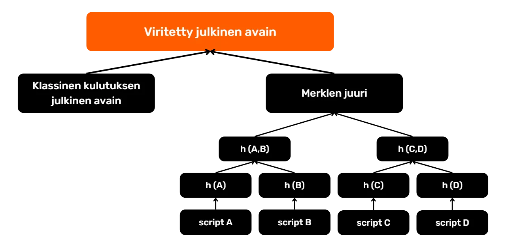

Lompakko-ohjelmistossasi näkyvät osoitteet sisältävät myös HRP:n (_Human-Readable Part_), tyypillisesti `bc` post-SegWit-osoitteille, erotinmerkin `1`, ja versionumeron `q` SegWit V0:lle ja `p` Taproot/SegWit V1:lle. Osoitteeseen lisätään myös tarkistussumma varmistamaan osoitteen eheyden ja validiteetin sen siirron aikana.

Lopuksi osoitteet laitetaan standardimuotoon:

- Base58check vanhoille Legacy-osoitteille;
- Bech32 SegWit-osoitteille;
- Bech32m Taproot-osoitteille.

Tässä on lisäysmatriisi bech32 ja bech32m formaateille (SegWit ja Taproot) base 10:stä:

| +   | 0   | 1   | 2   | 3   | 4   | 5   | 6   | 7   |
| --- | --- | --- | --- | --- | --- | --- | --- | --- | --- | --- | --- | --- | --- | --- | --- | --- | --- | --- |
| 0   | q   | p   | z   | r   | y   | 9   | x   | 8   |
| 8   | g   | f   | 2   | t   | v   | d   | w   | 0   |
| 16  | s   | 3   | j   | n   | 5   | 4   | k   | h   |     | 24  | c   | e   | 6   | m   | u   | a   | 7   | l   |

### Mikä on osoitteen uudelleenkäyttö?

Osoitteen uudelleenkäyttö viittaa samaan vastaanotto-osoitteen käyttämiseen useiden eri UTXO:iden estämiseen.

Kuten edellisessä osiossa näimme, jokaisella UTXO:lla on oma ScriptPubKey, joka lukitsee sen, ja sen on täytyttävä, jotta UTXO voidaan kuluttaa syötteenä uudessa siirrossa. Juuri tässä ScriptPubKey:ssä vastaanotto-osoitteet (kuorma) integroidaan.

Kun eri ScriptPubKey:t sisältävät saman vastaanotto-osoitteen, sitä kutsutaan osoitteen uudelleenkäytöksi. Käytännössä tämä tarkoittaa, että käyttäjä on antanut saman osoitteen useita kertoja lähettäjille vastaanottaakseen bitcoineja useiden maksujen kautta. Ja todellakin, tämä käytäntö on katastrofaalinen yksityisyydellesi.

### Miksi osoitteen uudelleenkäyttö on ongelma?

Koska lohkoketju on julkinen, on helppo nähdä, mitkä osoitteet lukitsevat mitkä UTXO:t ja kuinka monta bitcoinia. Jos samaa osoitetta käytetään useissa siirroissa, on mahdollista päätellä, että kaikki kyseiseen osoitteeseen liittyvät bitcoinit kuuluvat samalle henkilölle. Tämä käytäntö vaarantaa käyttäjän yksityisyyden mahdollistamalla deterministiset linkit eri siirtojen välille ja bitcoinien jäljittämisen lohkoketjussa. Satoshi Nakamoto itse korosti tätä ongelmaa Bitcoinin Valkoisessa Kirjassa:

> _Lisäsuojana voitaisiin jokaista siirtoa varten käyttää uutta avainparia, jotta ne eivät liittyisi yhteiseen omistajaan._


Lähde: S. Nakamoto, "Bitcoin: A Peer-to-Peer Electronic Cash System", https://bitcoin.org/bitcoin.pdf, 2009.

Satoshin tässä lausunnossa tavoittelema päämäärä oli luoda lisäsuojamuuri tapauksessa, jossa käyttäjän identiteetti ja avainpari Bitcoinissa yhdistetään, välttääkseen kaiken heidän toimintansa julkisen yhdistämisen heidän identiteettiinsä. Nykyään, ketjuanalyysiyhtiöiden ja KYC-sääntelyjen yleistyessä, uniikkien osoitteiden käyttö ei ole enää "lisäsuojamuuri", vaan välttämätön käytäntö kenelle tahansa, joka haluaa säilyttää yksityisyytensä edes minimaalisesti.

Kun käytät osoitetta uudelleen, luot lähes kiistattoman yhteyden kaikkiin kyseiseen osoitteeseen liittyviin siirtoihin. Vaikka tämä ei suoraan vaaranna varojasi, koska elliptisten käyrien kryptografia takaa yksityisavaimiesi turvallisuuden, se helpottaa toimintasi seurantaa. Todellakin, kuka tahansa noden omistava voi tarkkailla osoitteiden siirtoja ja saldoja, mikä täysin vaarantaa anonyymiytesi.


Havainnollistaaksemme tätä kohtaa, otetaan esimerkiksi Bob, käyttäjä, joka säännöllisesti ostaa bitcoineja pienissä määrissä DCA:n (Dollar Cost Averaging) kautta ja lähettää ne aina samaan osoitteeseen. Kahden vuoden jälkeen tässä osoitteessa on huomattava määrä bitcoineja. Jos Bob käyttää tätä osoitetta maksun tekemiseen paikalliselle kauppiaalle, jälkimmäinen voisi nähdä kaikki liitetyt varat ja päätellä Bobin varallisuuden. Tämä voisi johtaa henkilökohtaisiin turvallisuusriskeihin, mukaan lukien varkaus- tai kiristysyritykset. Jos Bob olisi käyttänyt jokaista periodista ostoa varten uutta osoitetta, hän olisi paljastanut kauppiaalleen äärettömästi vähemmän tietoa.

Ketjuanalyysissä erotamme kaksi tyyppiä osoitteen uudelleenkäytöstä:

- Ulkoinen uudelleenkäyttö;
- Sisäinen uudelleenkäyttö siirron sisällä.

Ensimmäistä havaitaan, kun osoitetta käytetään uudelleen useissa eri Bitcoin-siirroissa. Tämä on mitä aiemmin keskustelimme: tämä heuristiikka mahdollistaa meidän päätellä, että kaikki tämän osoitteen kautta kulkeneet UTXO:t kuuluvat yhdelle entiteetille.
Sisäisen osoitteen uudelleenkäyttö havaitaan ei silloin, kun uudelleenkäyttö tapahtuu useiden transaktioiden välillä, vaan kun se tapahtuu saman transaktion sisällä. Todellakin, jos samaa osoitetta, jota käytettiin syötteen lukitsemiseen, käytetään lähtönä transaktiossa, voimme päätellä, että tämä lähtö kuuluu edelleen samalle käyttäjälle (vaihtoraha), ja että toinen lähtö edustaa varsinaista maksua. Tämä toinen heuristiikka mahdollistaa varojen seurannan useiden transaktioiden läpi.


Osoitteen uudelleenkäyttö on todellinen vitsaus Bitcoinille. Verkkosivuston OXT.me (tällä hetkellä ei saavutettavissa) mukaan Bitcoinin osoitteiden uudelleenkäytön kokonaisaste oli noin 52% vuonna 2022:


Tämä prosenttiosuus on valtava, mutta se tulee valtaosin vaihtoalustoilta eikä yksittäisiltä käyttäjiltä.

### Kuinka välttää osoitteen uudelleenkäyttö?

Osoitteen uudelleenkäytön välttäminen on melko yksinkertaista: **käytä vain uutta, tuoretta osoitetta jokaiseen uuteen saapuvaan maksuun lompakkoosi**.

Kiitos BIP32:n, modernit lompakot ovat nyt deterministisiä ja hierarkkisia. Tämä tarkoittaa, että käyttäjä voi luoda suuren määrän osoitteita yhdestä alkuperäisestä tiedosta: siemenestä. Säilyttämällä tämän yhden tiedon, on mahdollista palauttaa kaikki lompakon yksityiset avaimet, päästen käsiksi vastaavien osoitteiden turvaamiin varoihin.


Tämän vuoksi, kun painat "_vastaanota_" -painiketta lompakko-ohjelmistossasi, sinulle tarjotaan joka kerta käyttämätön vastaanotto-osoite. Bitcoineja vastaanotettuasi ohjelmisto automaattisesti ehdottaa uutta.

> _PS: Viime aikoina jotkut lompakko-ohjelmistot ovat ilmoittaneet aikomuksestaan lopettaa tyhjien osoitteiden generoinnin, peläten, että viranomaiset saattaisivat pitää tätä rahanpesun muotona. Jos ohjelmistosi kuuluu näihin, suosittelen voimakkaasti sen välitöntä vaihtamista, sillä tämä ei ole hyväksyttävää käyttäjälle._

Jos tarvitset staattisen tunnisteen maksujen vastaanottamiseen, kuten lahjoitusten vastaanottamiseen, on suositeltavaa välttää klassisen Bitcoin-osoitteen käyttöä uudelleenkäytön riskin vuoksi. Suosi käyttämään Lightning-osoitetta, tai staattiseen onchain-maksutunnisteeseen, voit valita BIP47:n tai Hiljaiset Maksut. Näiden protokollien toiminta on yksityiskohtaisesti kuvattu tämän koulutuksen osassa 6.

## Merkintä ja Kolikoiden Hallinta

<chapterId>fbdb07cd-c025-48f2-97b0-bd1bc21c68a8</chapterId>

Kuten olemme havainneet ketjuanalyysin osassa, on olemassa monia heuristiikkoja ja malleja, joita voidaan käyttää transaktiosta tietojen päättelemiseen. Käyttäjänä on tärkeää olla tietoinen näistä tekniikoista paremman suojan varmistamiseksi.

Tämä edellyttää erityisesti huolellista omatoimisen lompakon hallintaa, joka sisältää UTXO:idesi alkuperän tuntemisen sekä harkitun valinnan UTXO:ista maksujen suorittamiseen. Tämä tehokas lompakon hallinta perustuu kahteen hyvän Bitcoin-lompakon tärkeään ominaisuuteen: merkintään ja kolikoiden hallintaan.

Tässä luvussa tutkimme näitä ominaisuuksia ja näemme, kuinka voisit käyttää niitä älykkäästi, lisäämättä liikaa työtaakkaa, optimoidaksesi yksityisyytesi Bitcoinissa.

### Mikä on Merkintä?

Merkintä on käytäntö, joka sisältää annotaation tai merkinnän määrittämisen tietylle UTXO:lle Bitcoin-lompakossa. Nämä annotaatiot tallennetaan paikallisesti lompakko-ohjelmiston toimesta eivätkä ne koskaan välity Bitcoin-verkon yli. Merkintä on siis henkilökohtaisen hallinnan työkalu.

Esimerkiksi, jos omistan UTXO:n P2P-ostosta Bisq:ssa Charlesin kanssa, voisin merkitä sen "`Ei-KYC Bisq Charles`".
Merkinnän käyttö on hyvä käytäntö, joka auttaa muistamaan UTXO:n alkuperän tai tarkoitetun määränpään, mikä helpottaa varojen hallintaa ja optimoi yksityisyyden suojaa. Todennäköisesti Bitcoin-lompakkosi turvaa useita UTXO:ja. Jos näiden UTXO:jen lähteet ovat erilaisia, et ehkä halua yhdistää näitä UTXO:ja tulevaisuudessa, sillä muuten saatat paljastaa niiden yhteisen omistuksen. Merkitsemällä kaikki kolikkosi asianmukaisesti varmistat, että muistat niiden alkuperän silloin, kun tarvitset niitä, vaikka se olisikin vasta useiden vuosien päästä.

### Mikä on kolikoiden hallinta?

Merkinnän aktiivinen käyttö muuttuu vieläkin mielenkiintoisemmaksi, kun se yhdistetään kolikoiden hallinta -vaihtoehtoon lompakko-ohjelmistossasi.

Kolikoiden hallinta on hyvän Bitcoin-lompakko-ohjelmiston ominaisuus, joka antaa sinulle mahdollisuuden manuaalisesti valita tiettyjä UTXO:ja käytettäväksi syötteinä suorittaaksesi transaktion. Todellakin, maksun suorittamiseksi ulostulossa on tarpeen kuluttaa UTXO sisääntulossa vastineeksi. Useista syistä, joita tulemme myöhemmin käsittelemään, saatat haluta tarkasti valita, mitkä kolikot kulutat sisääntuloina tyydyttääksesi tietyn maksun. Tämä on juuri sitä, mitä kolikoiden hallinta mahdollistaa. Antaakseni sinulle analogian, tämä ominaisuus on samanlainen kuin tietyn kolikon valitseminen lompakostasi, kun maksat patongistasi.


Lompakko-ohjelmiston käyttö kolikoiden hallinnalla yhdessä UTXO:jen merkitsemisen kanssa mahdollistaa käyttäjille sekä UTXO:jen erottamisen että tarkkojen UTXO:jen valitsemisen transaktioihinsa.

### Kuinka merkitä UTXO:si oikein?

Ei ole olemassa yleismaailmallista menetelmää UTXO:jen merkitsemiseen, joka sopisi kaikille. Sinun tehtäväsi on määritellä merkintäjärjestelmä, jotta voit helposti löytää tiesi ympäri lompakkoasi. Joka tapauksessa pidä mielessä, että hyvä merkintä on sellainen, jonka pystyt ymmärtämään tarvittaessa. Jos Bitcoin-lompakkosi on ensisijaisesti tarkoitettu säästöihin, saattaa olla, että merkinnät ovat hyödyllisiä sinulle vasta useiden vuosikymmenten päästä. Varmista siis, että ne ovat selkeitä, tarkkoja ja kattavia.

On tärkeää, että läheisesi voivat helposti tunnistaa varojen alkuperän, jos he jonain päivänä tarvitsevat pääsyä lompakkoosi. Tämä voisi auttaa heitä yksityisyyden suojaamisen lisäksi myös laillisista syistä, jos heidän täytyisi osoittaa varojen alkuperä viranomaiselle.
Merkinnän tärkein näkökohta on merkitä UTXO:n lähde. Sinun tulisi yksinkertaisesti ilmoittaa, miten tämä kolikko saapui lompakkoosi. Onko se ostettu vaihtoalustalta? Asiakkaan maksu? Vertaisverkkokauppa? Vai onko se vaihtorahaa ostoksesta? Näin voit määritellä:

- `Nosto Exchange.com`;
- `Maksu Asiakas David`;
- `P2P Osto Charles`;
- `Vaihtoraha sohvaostoksesta`

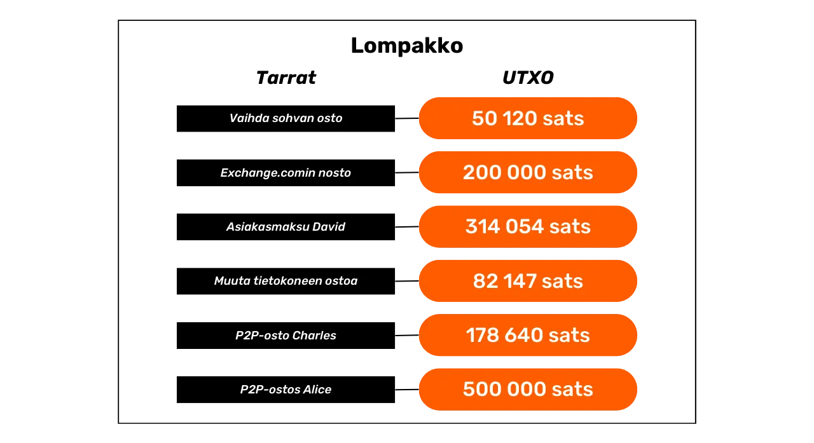

UTXO:jesi hallinnan tarkentamiseksi ja lompakkosi varojen erottelustrategioiden noudattamiseksi voit rikastuttaa merkintöjäsi lisäindikaattorilla, joka heijastaa näitä erotteluja. Jos lompakkosi sisältää kaksi UTXO-kategoriaa, joita et halua sekoittaa, voit integroida merkinnöihisi merkin näiden ryhmien selvästi erottamiseksi. Nämä erottelumerkit riippuvat omista kriteereistäsi, kuten erottelusta KYC-prosessin kautta hankittujen UTXO:jen tai ammatillisten ja henkilökohtaisten varojen välillä. Ottaen huomioon aiemmin mainitut merkintäesimerkit, tämä voisi kääntyä seuraavasti:

- `KYC - Nosto Exchange.com`;
- `KYC - Maksu Asiakas David`;
- `EI KYC - P2P Osto Charles`;
- `EI KYC - Vaihtoraha sohvaostoksesta`

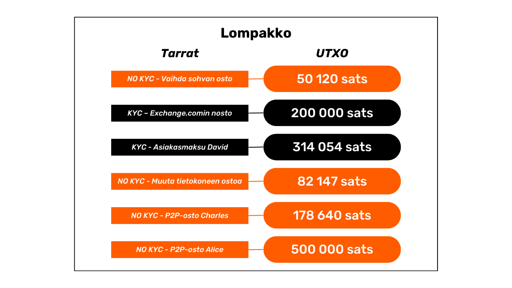
On myös suositeltavaa ylläpitää kolikon merkintää kaikkien transaktioiden ajan. Esimerkiksi kun yhdistät ei-KYC UTXOja, varmista, että merkitset tuloksena olevan UTXOn ei vain `konsolidointi`, vaan nimenomaan `ei-KYC konsolidointi` säilyttääksesi selkeän jäljen kolikon alkuperästä.
Lopuksi, ei ole pakollista laittaa päivämäärää merkintään. Useimmat lompakko-ohjelmistot näyttävät jo transaktion päivämäärän, ja tämän tiedon voi aina hakea lohkoketjun tutkijasta sen TXID:n avulla.

### Kuinka Valita Kolikkosi Oikein?

Kun teet transaktion, kolikon hallinta mahdollistaa sinun valita tarkasti, mitkä UTXO:t käytät syötteinä maksun ulostulon tyydyttämiseksi. Tässä valinnassa tulisi harkita kahta näkökohtaa:

- Maksun vastaanottajan mahdollisuus yhdistää osa henkilöllisyydestäsi käytettyihin UTXOihin syötteinä;
- Ulkopuolisen tarkkailijan kyky luoda yhteyksiä kaikkien syötteinä kulutettujen UTXOjen välille.
  Havainnollistaaksemme ensimmäistä kohtaa, otetaan konkreettinen esimerkki. Oletetaan, että ostat patongin bitcoineilla paikalliselta leipuriltasi. Käytät yhtä tai useampaa omistamaasi UTXOa syötteinä kattaaksesi ainakin patongin hinnan ulostuloissa, sekä transaktiomaksut. Leipurisi voisi sitten mahdollisesti yhdistää kasvosi, tai jonkin muun tuntemansa henkilöllisyytesi osan, käytettyihin kolikoihin syötteinä. Tietäen tämän linkin olemassaolon, saatat mieluummin valita tietyn UTXOn toisen sijaan maksua tehdessäsi.

Esimerkiksi, jos yksi UTXOistasi on peräisin vaihtoalustalta ja haluat, että leipuri ei ole tietoinen tilistäsi tällä alustalla, välttäisit tämän UTXOn käyttämistä maksussa. Jos omistat suuren arvon UTXOn, joka paljastaa merkittävän määrän bitcoineja, saatat myös päättää olla käyttämättä sitä estääksesi leipuria tietämästä BTC-rikkaudestasi.

UTXOjen valinta tähän ensimmäiseen kohtaan perustuu siis henkilökohtaiseen päätökseen, johon vaikuttaa mitä olet valmis paljastamaan tai ei. UTXOihisi määrittämäsi merkinnät vastaanottaessasi auttavat sinua valitsemaan ne, jotka kerran kulutettuina paljastavat vain tietoja, joita olet mukava paljastamaan vastaanottajalle.

Vastaanottajalle mahdollisesti paljastuvien tietojen lisäksi syötteiden valinta vaikuttaa myös siihen, mitä paljastat kaikille lohkoketjun tarkkailijoille. Todellakin, käyttämällä useita UTXOja syötteinä transaktiossasi, paljastat, että ne omistaa sama taho, Common Input Ownership Heuristic (CIOH) mukaan.

Valitessasi kolikkojasi, sinun tulee siis olla tietoinen siitä, että lähetettävä transaktiosi luo linkin kaikkien käytettyjen UTXOjen välille. Tämä linkki voi olla ongelmallinen henkilökohtaiselle yksityisyydellesi, erityisesti jos UTXOt tulevat eri lähteistä.

Palatakseni esimerkkiini ei-KYC UTXOsta Bisqistä; haluan välttää sen yhdistämistä UTXOon, sanotaanko, säännellyltä vaihtoalustalta, joka tuntee henkilöllisyyteni. Todellakin, jos koskaan käytän näitä kahta UTXOa syötteinä samassa transaktiossa, säännelty alusta pystyy yhdistämään henkilöllisyyteni UTXOon, jonka ostin Bisqistä, vaikka se ei ollut aiemmin yhdistetty henkilöllisyyteeni.
Lopulta, jotta voitaisiin asianmukaisesti valita, mitkä UTXO:t kulutetaan syötteinä transaktiolle, tärkeintä on välttää useiden UTXO:iden käyttöä. Aina kun mahdollista, valitse yksittäinen kolikko, joka on tarpeeksi suuri kattamaan maksusi. Tämän tekemällä vältät täysin COINJOINiin liittyvät riskit. Kuitenkin, jos yksittäinen UTXO ei riitä maksuun ja sinun täytyy kuluttaa useita, varmista, että ne tulevat samankaltaisista lähteistä minimoimaan ei-toivottujen linkkien riskit. Pidä myös mielessä, että vastaanottaja saattaa yhdistää sinusta saamansa tiedot käytettyjen kolikoiden historiaan.

### Automaattisen kolikkovalinnan ymmärtäminen

Edellisissä osioissa keskustelimme UTXO:iden manuaalisesta valinnasta transaktiolle. Mutta mitä tapahtuu, kun lompakko-ohjelmisto tekee tämän valinnan automaattisesti? Useita menetelmiä on olemassa määrittämään, mitä kolikoita kulutetaan, ja UTXO:iden valinta on todellinen tutkimuskenttä Bitcoinissa. Tämän automaattisen prosessin päätavoite on usein minimoida transaktiomaksut käyttäjälle.

UTXO-valintamenetelmät, kuten FIFO (_First In First Out_) ja LIFO (_Last In First Out_), ovat joukossa yksinkertaisimpia, mutta myös vähiten tehokkaita. FIFO:ssa lompakon vanhimmat kolikot käytetään ensin. Tämä lähestymistapa on yleisesti tehoton sekä transaktiomaksujen minimoimiseksi että yksityisyyden säilyttämiseksi, paitsi tapauksissa, joissa suhteellisia aikalukkoja käytetään ja niitä on uusittava säännöllisesti. Päinvastoin, LIFO priorisoi uusimpien UTXO:iden käytön. Vaikka yksinkertaisia, nämä kaksi menetelmää osoittautuvat usein tehottomiksi.

Edistyneempi menetelmä on _Knapsack Solver_. Tätä menetelmää käytettiin Bitcoin Core -lompakossa versioon 0.17 asti. Se sisältää iteratiivisen ja satunnaisen UTXO:iden valinnan lompakosta, niiden lisäämisen alijoukkoihin ja ratkaisun pitämisen, joka vähentää transaktion painoa mahdollisimman paljon, jotta käyttäjän maksut pienenevät.
_Branch-and-Bound_ (BNB), usein lempinimeltään "Murchin algoritmi" sen keksijän mukaan, on korvannut _Knapsack Solverin_ Bitcoin Core:ssa alkaen versiosta 0.17. Tämä edistyneempi menetelmä pyrkii löytämään joukon UTXO:ita, jotka tarkalleen vastaavat transaktion tulosteiden vaatimaa summaa. BNB:n tavoitteena on minimoida vaihtorahan määrä sekä maksut, vähentämällä niin kutsuttua hukkakriteeriä, joka ottaa huomioon sekä välittömät kustannukset että vaihtorahalle odotetut tulevaisuuden kustannukset. Tämä menetelmä on johdettu alkuperäisestä _Branch-and-Bound_-konseptista, jonka suunnittelivat Ailsa Land ja Alison Harcourt vuonna 1960, ja tarjoaa tarkemman maksuoptimoinnin verrattuna _Knapsack Solveriin_.
Kaikki nämä automaattisen UTXO-valinnan menetelmät voivat olla tehokkaita transaktiomaksujen vähentämisessä, mutta ne ovat usein tehottomia käyttäjän yksityisyyden säilyttämisessä. Todellakin, nämä algoritmit voivat yhdistää useita UTXO:ita syötteiksi, paljastaen näin yhteisen omistajuuden näistä UTXO:ista COH:n vuoksi. Ilmeisesti nämä menetelmät eivät voi ottaa huomioon UTXO:iin liitettyjä etikettejä, jotka ovat ratkaisevan tärkeitä tietoisesti valittaessa kolikoita paljastettavaksi transaktion vastaanottajalle. Tällä hetkellä ainoa ratkaisu yksityisyyden optimoimiseksi kolikoita valittaessa on tehdä se manuaalisesti.

### Opas UTXO-merkintään

Jos haluat oppia, kuinka merkitä UTXO:si, olemme tehneet täydellisen oppaan tärkeimmistä olemassa olevista Bitcoin-lompakko-ohjelmistoista:

https://planb.network/tutorials/privacy/utxo-labelling


## KYC ja avaintunnistus

<chapterId>cec6b9d9-0eed-4f85-bc4e-1e9aa59ca605</chapterId>
KYC tarkoittaa "Tunne Asiakkaasi", mikä on sääntelymenettely, jonka jotkut Bitcoin-sektorilla toimivat yritykset ovat ottaneet käyttöön. Tämän menettelyn tavoitteena on varmistaa ja kirjata asiakkaiden henkilöllisyys taistelun rahanpesua ja terrorismin rahoitusta vastaan.

Käytännössä KYC sisältää erilaisten henkilökohtaisten tietojen keräämisen asiakkaalta, jotka voivat vaihdella lainkäyttöalueittain, mutta yleensä sisältävät henkilöllisyystodistuksen, valokuvan ja todistuksen asuinpaikasta. Nämä tiedot tarkistetaan sitten ja säilytetään tulevaa käyttöä varten.

Tämä menettely on tullut pakolliseksi kaikille säännellyille vaihtoalustoille suurimmassa osassa länsimaita. Tämä tarkoittaa, että jokaisen, joka haluaa vaihtaa fiat-valuuttoja bitcoineiksi näiden alustojen kautta, on täytettävä KYC-vaatimukset.
Tämä menettely ei ole ilman riskejä käyttäjien luottamuksellisuudelle ja turvallisuudelle. Tässä luvussa tarkastelemme näitä riskejä yksityiskohtaisesti ja analysoimme KYC:n ja tunnistusprosessien erityisvaikutuksia Bitcoin-käyttäjien yksityisyyteen.

### Onchain Seurannan Helpottaminen

Ensimmäinen KYC:hen liittyvä riski on, että se tarjoaa etuoikeutetun pääsyn ketjuanalyysiin. Kuten aiemmassa osassa näimme, analyytikot voivat ryhmitellä ja seurata toimintaa lohkoketjussa käyttämällä transaktiokuvioita ja heuristiikkaa. Kun he ovat onnistuneet ryhmittelemään käyttäjän onchain-toiminnan, riittää, että he löytävät vain yhden sisääntulopisteen kaikkien heidän transaktioidensa ja avaintensa joukosta, jotta he voivat täysin vaarantaa heidän yksityisyytensä.


Kun suoritat KYC:n, tarjoat erittäin laadukkaan sisääntulopisteen ketjuanalyysiin, sillä linkität vastaanotto-osoitteesi, joita käytät bitcoinejesi nostamiseen vaihtoalustalta, täydelliseen ja vahvistettuun henkilöllisyyteesi. Teoriassa tämä tieto on vain sen yrityksen tiedossa, jolle olet sen toimittanut, mutta kuten myöhemmin näemme, tietovuodon riski on todellinen. Lisäksi pelkkä seikka, että yritys pitää tätä tietoa hallussaan, voi olla ongelmallinen, vaikka se ei jakaisikaan sitä.

Näin ollen, jos et ota muita toimenpiteitä rajoittaaksesi toimintasi ryhmittelyä lohkoketjussa, kuka tahansa, joka tietää tästä KYC:n sisääntulopisteestä, voi mahdollisesti yhdistää kaiken Bitcoin-toimintasi henkilöllisyyteesi. Tämän yrityksen näkökulmasta Bitcoinin käyttösi menettää näin ollen kaiken luottamuksellisuuden.


Vertailun vuoksi, on kuin _Pankki X_:n pankkiirisi ei vain pääsisi käsiksi kaikkiin tekemiisi transaktioihin _Pankki X_:n kanssa, vaan voisi myös tarkkailla transaktioitasi _Pankki Y_:n kanssa ja kaikkia käteistransaktioitasi.

Muista tämän koulutuksen ensimmäisestä osasta: Bitcoinin yksityisyyden malli, kuten Satoshi Nakamoto suunnitteli, perustuu käyttäjän henkilöllisyyden ja heidän avainpariensa erotteluun. Vaikka tämä yksityisyyden kerros ei ole enää tänään riittävä, on silti viisasta rajoittaa sen heikkenemistä mahdollisimman paljon.

### Altistuminen Valtion Valvonnalle

Toinen suuri ongelma KYC:n kanssa on, että se paljastaa valtiolle, että olet omistanut bitcoineja jossain vaiheessa. Kun ostat bitcoineja säännellyn toimijan kautta, valtiolla on mahdollisuus tietää tästä omistuksesta. Tällä hetkellä tämä saattaa tuntua triviaalilta, mutta on tärkeää muistaa, että maasi poliittinen ja taloudellinen tulevaisuus ei ole käsissäsi.
Ennen kaikkea valtio voi nopeasti omaksua autoritaarisen kannan. Historia on täynnä esimerkkejä, joissa politiikat ovat muuttuneet äkillisesti. Tänään Euroopassa Bitcoin-entusiastit voivat kirjoittaa artikkeleita Bitcoinista, osallistua konferensseihin ja hallita lompakoitaan itse. Mutta kuka voi sanoa, mitä huominen tuo tullessaan? Jos Bitcoin yhtäkkiä muuttuisi julkiseksi viholliseksi numero yksi, sen kanssa yhdistäminen valtion rekistereissä voisi osoittautua ongelmalliseksi.
Seuraavaksi, vakavien talouskriisien kohdatessa, valtio saattaisi harkita kansalaisten hallussa olevien bitcoinien takavarikointia. Ehkä huomenna Bitcoin-omistajia pidetään kriisin hyötyjinä ja heitä verotetaan liiallisesti pääomatuloistaan fiat-valuutan arvon alenemisen myötä.
Saatat ajatella, että tämä ei ole ongelma, koska bitcoinsi ovat sekoitettuja ja siten jäljittämättömiä. Kuitenkaan jäljittäminen ei ole tässä ongelma. Todellinen ongelma on, että valtio tietää sinun omistaneen bitcoineja. Tämä yksinkertainen tieto voisi olla riittävä syyllistämään sinut tai vaatimaan tilinpidon. Voisit yrittää väittää käyttäneesi bitcoinsi, mutta tämän pitäisi näkyä veroilmoituksessasi, ja jäisit kiinni. Voisit myös sanoa menettäneesi avaimet veneonnettomuudessa, mutta Twitter-vitsin ulkopuolella, luuletko todella, että se riittäisi vapauttamaan sinut syytteestä?

Siksi on tärkeää harkita riskiä, joka liittyy pelkkään tietoon siitä, että valtio tietää sinun omistaneen BTC:tä, vaikka tämä riski saattaisi tuntua kaukaiselta tänään.

Toinen ongelma, jonka KYC aiheuttaa valtion valvonnassa, on säänneltyjen alustojen pakollinen raportointi. Vaikka en ole tutustunut muiden lainkäyttöalueiden sääntöihin, Ranskassa _Digital Asset Service Providers_ (PSAN) on velvoitettu raportoimaan rahoitusvalvontaviranomaisille kaikki epäilyttäviksi katsomansa varojen liikkeet.

Näin ollen Ranskassa vuonna 2023 PSAN:t raportoivat 1,449 epäilyttävää tekoa. Toistaiseksi suurin osa näistä teoista liittyy rikollisuuteen. Viranomaiset kuitenkin pyytävät säänneltyjä alustoja raportoimaan myös kaikki epäilyttävät Bitcoin-siirrot pelkästään niiden rakenteen perusteella. Jos suoritat yhteistyössä tehdyn siirron, tai jopa vain hieman epätyypillisen kuvion esittävän siirron, ja tämä siirto tapahtuu lähellä bitcoiniesi nostoa näiltä alustoilta, saatat joutua raportoiduksi viranomaisille. Vaikka toimintasi olisi virheetöntä ja oikeuksiesi legitiimiä harjoittamista, tämä raportointi voisi johtaa lisääntyneisiin tarkastuksiin ja valvontaan, hankaluuksiin, jotka olisit välttänyt ilman KYC:tä.

### Henkilötietojen vuotamisen riski

Toinen ongelma KYC:ssä on se, että se vaatii kaikkien henkilötietojesi säilyttämistä yksityisen yrityksen palvelimilla. Viimeaikaiset tapahtumat ovat muistuttaneet meitä siitä, että kukaan ei ole immuuni vioille, olivatpa ne taloudellisia tai IT-alan ongelmia. Vuonna 2022 Celsius-asiakkaat kärsivät seurauksista. Yhtiön konkurssin seurauksena velkojien nimet ja heidän varojensa määrä tulivat julkisiksi Yhdysvaltain oikeusjärjestelmän hallinnollisen menettelyn aikana.

Hieman yli kaksi vuotta sitten johtava kyberturvallisuusentiteetti kryptovaluutta-alalla koki asiakkaidensa henkilötietojen varkauden. Vaikka tämä tapaus ei suoraan liittynyt bitcoinien ostoon, tällainen riski pysyy myös vaihtoalustoilla. Siksi näihin henkilötietoihin liittyy selvä riski.

On totta, että luovutamme jo paljon henkilötietojamme yksityisille yrityksille. Riski tässä on kuitenkin kaksinkertainen, koska nämä tiedot eivät ainoastaan mahdollista sinun tunnistamistasi, vaan ne ovat myös yhteydessä toimintaan Bitcoinissa. Todellakin, kun hakkeri pääsee käsiksi vaihtoalustan asiakkaiden tietoihin, he voivat kohtuudella olettaa, että näillä asiakkailla on bitcoineja. Tämä riski korostuu siitä tosiasiasta, että bitcoin, kuten mikä tahansa muu arvokas omaisuus, houkuttelee varkaiden kiinnostusta.

Tietomurron sattuessa parhaassa tapauksessa saatat joutua kohdennettujen phishing-yritysten kohteeksi. Pahimmassa tapauksessa saatat löytää itsesi fyysisten uhkien keskipisteestä kotiisi.
Bitcoinin erityisriskien lisäksi on myös tarpeen ottaa huomioon henkilöllisyysasiakirjojen lähettämiseen liittyvät vaarat. Todellakin, datavuodon sattuessa on mahdollista joutua identiteettivarkauden uhriksi. Näin ollen panokset eivät rajoitu ainoastaan transaktioiden luottamuksellisuuden suojaamiseen, vaan ne koskevat myös jokaisen yksilön henkilökohtaista turvallisuutta.

### Yleisiä väärinkäsityksiä KYC:stä

On tärkeää kumota joitakin KYC:stä (Tunne Asiakkaasi) yleisesti Twitterissä tai bitcoin-keskusteluissamme esiintyviä väärinkäsityksiä.
Ensinnäkin on virheellistä ajatella, että yksityisyyden suojaaminen KYC:n kautta hankituille bitcoineille olisi turhaa. Bitcoinin yksityisyyden suojaamisen työkalut ja menetelmät ovat moninaiset ja palvelevat eri tarkoituksia. Esimerkiksi coinjoin-transaktioiden käyttö KYC:n kautta hankituille bitcoineille ei ole huono idea. Tietenkin on oltava varovainen säänneltyjen vaihtoalustojen kanssa välttääkseen tilin jäädyttämisen tai kieltämisen, mutta puhtaasti teknisestä näkökulmasta nämä käytännöt eivät ole yhteensopimattomia. Coinjoinilla on vaikutus kolikon historian katkaisemiseen, mikä auttaa sinua vastustamaan joitakin KYC:hen liittyviä ketjuanalyysiriskejä. Vaikka se ei poista kaikkia riskejä, se edustaa jo merkittävää etua.

Bitcoinin yksityisyyttä ei pitäisi nähdä binäärisesti, erotteluna "anonyymien" bitcoinien ja muiden välillä. KYC:n kautta hankittujen bitcoinien omistaminen ei tarkoita, että kaikki olisi menetetty; päinvastoin, yksityisyyden suojaamisen työkalujen käyttö voi osoittautua vielä hyödyllisemmäksi.

Toisaalta bitcoinien hankkiminen ilman KYC:tä ei takaa täydellistä yksityisyyttä eikä vapauta tarpeesta toteuttaa muita suojatoimenpiteitä. Jos omistat ei-KYC-bitcoineja, mutta käytät vastaanotto-osoitteita useita kertoja, transaktiosi voidaan jäljittää ja ryhmitellä. Pieninkin linkki Bitcoinin ulkopuoliseen maailmaan voisi vaarantaa ainoan yksityisyyden kerroksen, jonka olit saanut. Siksi on tärkeää pitää kaikki Bitcoinin yksityisyyttä parantavat työkalut ja menetelmät täydentävinä. Jokainen tekniikka käsittelee tiettyä riskiä ja voi lisätä ylimääräisen suojakerroksen. Näin ollen ei-KYC-bitcoinien omistaminen ei ehdottomasti vapauta sinua muista varotoimista.

### Voiko KYC:n peruuttaa?

Minulta kysytään joskus, onko mahdollista "palata takaisin" sen jälkeen, kun KYC on suoritettu, ja kuten voit kuvitella edellisistä kappaleista, vastaus on monitahoinen. KYC:hen liittyvien riskien välttämiseksi yksinkertaisin menetelmä on olla käyttämättä sitä bitcoinien hankinnassa. Syvennymme tähän aiheeseen tarkemmin seuraavassa luvussa. Kuitenkin, jos KYC on jo suoritettu ja bitcoineja on hankittu, onko olemassa keinoja lieventää koituneita riskejä?

Transaktioidesi jäljitettävyyden riskin osalta coinjoinin käyttö on ratkaisu. Keskustelemme tästä menetelmästä yksityiskohtaisemmin myöhemmin koulutuksessa, mutta ole tietoinen siitä, että coinjoin voi katkaista kolikon historian ja estää sen menneisyyden ja tulevaisuuden jäljittämisen. Jopa säännellyn alustan kautta hankitut BTC:t voivat tämän tekniikan avulla välttää jäljitettävyyden.
Kuitenkin coinjoin ei poista toista KYC:hen liittyvää riskiä: sitä tosiasiaa, että valtio saa tietää bitcoin-omistuksistasi. Itse asiassa, vaikka kolikkosi eivät enää ole jäljitettävissä, valtiolla voi riippuen lainkäytöstä olla pääsy ilmoituksiisi krypto-omaisuuden luovutuksista. Koska tämä riski ei ole tekninen vaan hallinnollinen, ei ole Bitcoin-spesifisiä ratkaisuja sen poistamiseksi, muuta kuin välttämällä KYC:hen altistumista alun perin. Ainoa laillinen tapa lieventää tätä riskiä on myydä KYC:n kautta hankitut bitcoinit säännellyillä alustoilla ja ostaa ne uudelleen keinoilla, jotka eivät vaadi KYC:tä. Myymällä ja ilmoittamalla luovutuksesta, hallinnon tulisi huomata, ettet enää omista niitä.
Henkilötietojesi ja henkilöllisyysasiakirjojesi vuotamisen riskin osalta, tämä on vaara, joka on ulkopuolinen Bitcoinille, eikä siihen ole teknistä ratkaisua välttääkseen sitä. Kun tietosi on paljastettu, on vaikea kumota tätä toimenpidettä. Voit yrittää sulkea tilisi alustalla, mutta tämä ei takaa KYC-tietojesi poistamista, erityisesti kun henkilöllisyyden varmentaminen on ulkoistettu. Tietojesi täydellisen poiston varmistaminen on mahdotonta. Siksi ei ole ratkaisua tämän riskin täydelliseen estämiseen ja sen varmistamiseen, ettei se enää ole olemassa.

### KYC:n ja avaintunnistuksen ero

Joskus jotkut bitcoin-käyttäjät tahtovat laajentaa termin "KYC" kattamaan minkä tahansa BTC-vaihdon, joka sisältää siirron tai luottokorttimaksun, koska nämä keinot voivat myös paljastaa maksun alkuperän, aivan kuten KYC tekisi. On kuitenkin tärkeää olla sekoittamatta KYC:tä avaintunnistukseen. Henkilökohtaisesti minun on myönnettävä, että käsitykseni tästä aiheesta on kehittynyt ajan myötä.

KYC viittaa nimenomaan joidenkin yritysten toteuttamaan sääntelymenettelyyn, jolla varmistetaan ja kirjataan asiakkaiden henkilöllisyys. Se on binäärinen asia: kun hankit bitcoinejasi, joko käyt KYC:n läpi tai et. Avaintunnistus, joka koskee käyttäjän henkilöllisyyden aspektin yhdistämistä onchain-toimintaan, ei kuitenkaan ole yhtä binäärinen, vaan pikemminkin edustaa jatkumoa. Todellakin, bitcoineja hankittaessa tai luovutettaessa, tämä tunnistus on aina mahdollista eri asteisiin.
Esimerkiksi, jos ostat bitcoineja säännellyllä alustalla Sveitsissä, KYC (Know Your Customer) ei ole tarpeen. Kuitenkin, avaimiesi tunnistus saattaa tapahtua, koska ostos tehtiin pankkitilisi kautta. Tässä on ensimmäiset kaksi KYC:hen liittyvää riskiä — onchain-seurannan helpottaminen ja altistuminen valtion valvonnalle — jotka voivat myös ilmetä ei-KYC-vaihdossa. Jos sveitsiläinen yksikkö raportoi epäilyttäviä transaktioita maasi viranomaisille, he voivat yksinkertaisesti tarkistaa käytetyn pankkitilin paljastaakseen henkilöllisyytesi. Näin ollen, ostaminen ilman KYC:tä säännellyillä alustoilla on melko korkealla riskitasolla avaintunnistuksen kannalta.

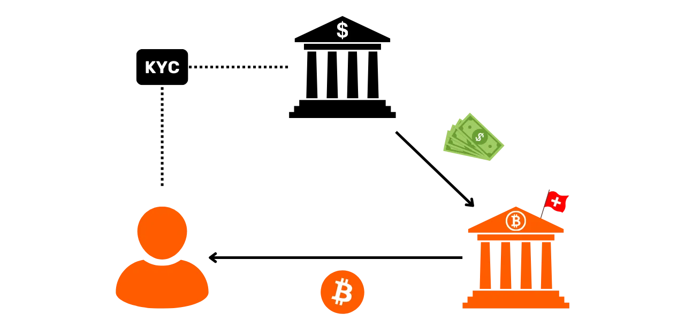

Kuitenkin, välttämällä säänneltyjä alustoja ja valitsemalla P2P (Peer-to-Peer) hankintamenetelmiä ei täysin poista avaintunnistuksen riskiä, vaan ainoastaan vähentää sitä. Harkitse esimerkiksi ostoa Bisq:ssa tai toisella P2P-alustalla. Vastapuolesi kanssa selvittääksesi, saatat todennäköisesti käyttää pankkitiliäsi. Jos viranomaiset kyselevät henkilöltä, jonka kanssa kävit kauppaa, ja pyytävät nimeäsi, kohtaamme aiemmin mainitut riskit 1 ja 2. Nämä riskit ovat varmasti paljon pienemmät kuin ei-KYC-ostossa alustalla, ja vieläkin pienemmät kuin KYC-ostossa, mutta ne ovat silti läsnä pienemmässä määrin.


Lopulta, vaikka hankkisit bitcoinejasi fyysisessä vaihdossa käteistä vastaan, et ole täysin nimetön. Henkilö, jonka kanssa vaihdoit, on nähnyt kasvosi, mikä on osa henkilöllisyyttäsi. Vaikka tässä esimerkissä se on vähäistä, on silti olemassa avaintunnistuksen mahdollisuus.


Yhteenvetona voidaan todeta, että bitcoineja vaihdettaessa muihin varoihin, olipa kyseessä sitten ostaminen fiat-valuutalla tai myynti todellista hyödykettä vastaan, on aina jonkinlaista avaintunnistusta. Vaihdossa valitusta menetelmästä riippuen tämä tunnistus voi vaihdella intensiteetiltään. On tärkeää olla sekoittamatta tätä tunnistusta KYC:hen, joka on hyvin määritelty sääntelyprosessi. Kuitenkin KYC:n ja tunnistuksen spektrin välillä on yhteys, koska KYC on tämän spektrin yläpäässä, koska se systemaattisesti helpottaa viranomaisten käyttäjän avainten tunnistamista.

## Myynnin ja hankinnan menetelmät

<chapterId>756598af-95aa-4c77-ac48-243c7ad89530</chapterId>
Edellisen luvun lukemisen jälkeen saatat miettiä tapoja ostaa tai myydä bitcoineja ilman, että sinun tarvitsee käydä läpi henkilöllisyyden varmistusprosessia, välttääksesi KYC:hen liittyvät riskit. On olemassa useita menetelmiä vaihtojen suorittamiseen.

### Käteinen P2P-vaihdot

Kuten olemme nähneet, yksityisyyden kannalta paras menetelmä on P2P (vertaisverkko) -vaihto käteisellä. Tämä menetelmä mahdollistaa jälkien minimoimisen ja vähentää merkittävästi avaintunnistuksen mahdollisuutta, olitpa sitten ostaja tai myyjä.


Tämä käytäntö kuitenkin sisältää riskejä henkilökohtaiseen turvallisuuteen. Päävaara piilee siinä, että vaihdon aikana vastapuoli tietää sinun hallussasi olevan merkittävän määrän, joko käteisenä tai bitcoineina. Tämä tieto voi houkutella pahantahtoisia henkilöitä. Yleensä on suositeltavaa pysyä h discreetinä bitcoin-omistuksestasi. Tätä neuvoa voisi soveltaa myös käteiseen. Kuitenkin henkilökohtaisessa vaihdossa on väistämätöntä paljastaa, että omistat bitcoineja, mikä voi herättää ahneutta.


Tämän riskin rajoittamiseksi neuvon sinua priorisoimaan käteistransaktioita luotettujen henkilöiden, kuten perheenjäsenten tai läheisten ystävien kanssa. Vaihtoehtoisesti voit myös harkita vaihtojen tekemistä [paikallisissa Bitcoin-tapaamisissa](https://btcmap.org/communities/map), kun olet osallistunut useita kertoja. Tämä mahdollistaa muiden osallistujien paremman tuntemisen ja sen, ettet ole yksin fyysisen vaihdon aikana. On kuitenkin tärkeää tunnistaa, että käteinen P2P-vaihto sisältää itsessään riskejä henkilökohtaiseen turvallisuuteesi, joita ei ole olemassa ostaessasi säännellyn alustan kautta ja pankkitililtäsi.

Lisäksi, riippuen siitä, missä asut, suurten rahamäärien kantaminen ja säilyttäminen voi aiheuttaa riskejä, olipa kyseessä sitten bitcoin tai käteinen.

Käteisvaihto voi myös aiheuttaa laillisia riskejä poliisitarkastusten tai muiden yhteydessä. Vaikka useimmissa maissa ei ole rajoituksia sille, kuinka paljon käteistä voit kantaa mukanasi, liian suuret summat voivat herättää epäilyksiä. Joten ole varovainen, erityisesti jos sinun täytyy matkustaa pitkiä matkoja, ja vältä liian suurien transaktioiden tekemistä kerralla, jotta sinun ei tarvitse perustella merkittävän summan omistamista.
Lopulta toinen haittapuoli P2P-ostoissa on se, että hinta on usein korkeampi kuin säänneltyjen alustojen tarjoamat hinnat. Myyjät asettavat usein hinnankorotuksen, joka vaihtelee 1 %:sta joskus yli 10 %:iin. Tähän hintaeroon on useita syitä. Ensinnäkin, se on yleinen käytäntö P2P-myyjien keskuudessa, joka on vakiintunut ajan myötä. Lisäksi, myyjillä on transaktiomaksuja, jotka liittyvät varojen lähettämiseen ostajalle. P2P-myyntiin liittyy myös suurempi varkausriski verrattuna alustojen kautta tapahtuviin transaktioihin, mikä oikeuttaa otetun riskin korvauksen. Lopuksi, lisämaksu voi liittyä kysyntään ja vaihdon laatuun yksityisyyden näkökulmasta. Ostajana yksityisyyden lisääntyminen on hinta, joka heijastuu myyjän soveltamassa hinnankorotuksessa. Jotkut bitcoinien käyttäjät uskovat myös, että P2P-ostettujen BTC:n korkeampi hinta heijastaa sen todellista arvoa ja väittävät, että säänneltyjen alustojen alhaisemmat hinnat ovat kompromissi henkilötietojesi yksityisyydestä.

### P2P-vaihdot Matching-alustan kautta

Vähemmän riskialtis vaihtoehto henkilökohtaisen turvallisuuden kannalta on suorittaa P2P-vaihdot yksinomaan verkossa, käyttäen sähköisiä maksutapoja, kuten PayPal, pankkisiirrot tai Revolut.

Tämä lähestymistapa auttaa välttämään monia käteistransaktioihin liittyviä riskejä. Kuitenkin riski, että vastapuoli ei kunnioita sitoumuksiaan verkkovaihdossa, on suurempi. Todellakin, fyysisessä vaihdossa, jos annat rahaa myyjälle, joka ei lähetä sinulle bitcoineja vastineeksi, voit välittömästi pitää heidät vastuullisina, koska he ovat edessäsi. Verkossa, toisaalta, on usein mahdotonta löytää henkilöä, joka on varastanut sinulta.

Tämän riskin lieventämiseksi on mahdollista käyttää P2P-vaihtoihin erikoistuneita alustoja. Nämä alustat käyttävät konfliktinratkaisumekanismeja suojellakseen vahingoittuneita käyttäjiä. Yleensä ne tarjoavat escrow-järjestelmän, jossa bitcoinit pidetään kunnes myyjä vahvistaa fiat-valuutan maksun.

Henkilökohtaisen turvallisuuden kannalta tämä ostomenetelmä on huomattavasti turvallisempi kuin fyysiset käteisvaihdot. Kuitenkin, kuten aiemmin mainittiin, verkossa tapahtuvat P2P-vaihdot jättävät enemmän jälkiä kuin fyysinen vaihto, mikä voi olla haitallista yksityisyydelle Bitcoinissa. Käyttämällä verkossa fiat-maksutapaa, kuten pankkia, paljastat enemmän tietoja, jotka voivat helpottaa avainten tunnistamista.

Jälleen kerran suosittelen, ettei suuria vaihtoja tehdä yhdessä transaktiossa näillä alustoilla. Jakamalla transaktiosi, levität riskejä, jotka liittyvät mahdolliseen varkauteen vastapuolen toimesta.
Jälleen kerran yhtenä P2P-ostojen haittapuolena on, että hinta on usein korkeampi kuin säänneltyjen alustojen näkemä hinta. Myyjät asettavat usein hinnankorotuksen, joka vaihtelee 1 %:sta joskus yli 10 %:iin. Useat syyt selittävät tämän hintaeron. Ensinnäkin, se on yleinen käytäntö P2P-myyjien keskuudessa, joka on vakiintunut ajan myötä. Lisäksi, myyjillä on transaktiomaksuja, jotka liittyvät varojen lähettämiseen ostajalle. P2P-myyntien varkausriski on myös suurempi verrattuna alustojen transaktioihin, mikä oikeuttaa otetun riskin korvauksen. Lopuksi, lisämaksu voi liittyä kysyntään ja vaihdon laatuun yksityisyyden näkökulmasta. Ostajana yksityisyyden lisääntyminen on hinta, joka heijastuu myyjän soveltamassa hinnankorotuksessa. Jotkut bitcoin-käyttäjät uskovat myös, että P2P-ostettujen BTC:n korkeampi hinta heijastaa sen todellista arvoa ja väittävät, että säänneltyjen alustojen alhaisemmat hinnat ovat tulosta kompromissista henkilökohtaisten tietojesi yksityisyydessä.

Ratkaisujen osalta olen henkilökohtaisesti aina käyttänyt [Bisq](https://bisq.network/) -palvelua ja olen erittäin tyytyväinen siihen. Heidän järjestelmänsä on vakiintunut ja vaikuttaa luotettavalta. Bisq on kuitenkin saatavilla vain PC:lle ja sen käyttöliittymä voi olla liian monimutkainen aloittelijoille. Toinen haittapuoli on, että Bisq toimii ainoastaan onchain-transaktioilla, jotka voivat tulla kalliiksi Bitcoinin korkeiden transaktiomaksujen aikoina.

[-> Tutustu Bisq-opetusohjelmaamme.](https://planb.network/en/tutorials/exchange/bisq)

Yksinkertaisempana vaihtoehtona voit kokeilla [Peach](https://peachbitcoin.com/)-mobiilisovellusta, joka helpottaa ostajien ja myyjien välistä yhteydenpitoa sisäänrakennetun riidanratkaisujärjestelmän avulla. Prosessi on intuitiivisempi kuin Bisq:ssa.

[-> Tutustu Peach-opetusohjelmaamme.](https://planb.network/en/tutorials/exchange/peach-wallet)
Toinen verkossa oleva vaihtoehto on [HodlHodl](https://hodlhodl.com/), hyvin vakiintunut alusta, joka tarjoaa hyvän likviditeetin, vaikka en ole henkilökohtaisesti testannut sitä.
[-> Tutustu HodlHodl-opetusohjelmaamme.](https://planb.network/en/tutorials/exchange/hodlhodl)

Lightning Networkiin perustuvista ratkaisuista voit kokeilla [RoboSats](https://learn.robosats.com/) ja [LNP2PBot](https://lnp2pbot.com/). RoboSats on käytettävissä verkkosivuston kautta ja on suhteellisen yksinkertainen käyttää. LNP2PBot on epätavallisempi, sillä se toimii vaihtojärjestelmänä Telegram-viestisovelluksessa.

[-> Tutustu RoboSats-opetusohjelmaamme.](https://planb.network/en/tutorials/exchange/robosats)
[-> Tutustu LNP2PBot-opetusohjelmaamme.](https://planb.network/en/tutorials/exchange/lnp2pbot)

### Säännellyt alustat ilman KYC:tä

Riippuen siitä, missä maassa asut, saatat päästä käyttämään säänneltyjä alustoja, jotka eivät vaadi KYC-menettelyä bitcoinien ostamiseen tai myymiseen. Esimerkiksi Sveitsissä voit käyttää alustoja kuten [Relai](https://relai.app/) ja [MtPelerin](https://www.mtpelerin.com/).

[-> Tutustu Relai-opetusohjelmaamme.](https://planb.network/en/tutorials/exchange/relai)
Kuten edellisessä luvussa näimme, tämän tyyppinen alusta säästää sinut KYC-menettelyihin liittyviltä riskeiltä, mutta ne esittävät korkeamman tason riskin avaintunnistukselle. Bitcoinin yksityisyyden suhteen nämä alustat tarjoavat siis paremman suojan kuin KYC:llä varustetut ostomenetelmät, mutta ne eivät ole yhtä kiinnostavia kuin P2P-vaihdot.
Kuitenkin henkilökohtaisen turvallisuuden näkökulmasta näiden alustojen käyttö on huomattavasti vähemmän riskialtista kuin P2P-vaihtojen käyttö. Ne ovat myös usein yksinkertaisempia käyttää kuin alustat, jotka helpottavat P2P-vaihtoja.

### Pankkiautomaatit

Toinen vaihtoehto ostaa tai myydä bitcoineja ilman KYC:tä ovat kryptovaluutta-automaatit (ATM). Henkilökohtaisesti en ole koskaan saanut tilaisuutta testata tätä ratkaisua, koska maassani ei ole yhtään. Mutta tämä menetelmä voi olla erittäin mielenkiintoinen riippuen siitä, missä asut.


Automaattien ongelmana on, että ne ovat kiellettyjä joissakin maissa tai niitä säännellään voimakkaasti muissa. Jos automaatti vaatii henkilöllisyyden varmistusprosessin, se kohtaa samat riskit kuin säänneltyihin KYC-alustoihin liittyvät riskit. Kuitenkin, jos automaatti sallii transaktiot ilman henkilöllisyyden varmistusta pienille summille, sen käyttö voi tarjota yksityisyyden tasoa, joka on verrattavissa käteiseen perustuvaan P2P-vaihtoon, välttäen suurimman osan riskeistä, jotka liittyvät tähän vaihtotyyppiin.
Automaattien suurin haittapuoli on niiden usein korkeat vaihtokulut, jotka vaihtelevat muutamasta prosentista joskus jopa 15 prosenttiin vaihdetusta summasta.

### Lahjakortit

Lopuksi halusin myös esitellä ratkaisun, joka toimii hyvin niille, jotka haluavat käyttää bitcoinejaan päivittäin ostoksiin sen sijaan, että myisivät ne fiat-valuutoiksi.

Paras tapa käyttää BTC:tä on ilmeisesti käyttää Bitcoinia suoraan tai Lightning Networkia ostamaan tavaroita tai palveluita. Kuitenkin monissa maissa bitcoinia hyväksyvien kauppiaiden määrä on rajallinen. Käytännöllinen vaihtoehto on sitten lahjakorttien käyttö.

Useat KYC-menettelyä vaatimattomat alustat tarjoavat mahdollisuuden vaihtaa bitcoineja lahjakortteihin, joita voidaan käyttää suurissa kaupoissa. Näiden alustojen joukossa löydämme [CoinsBee](https://www.coinsbee.com/), [The Bitcoin Company](https://thebitcoincompany.com/), ja [Bitrefill](https://www.bitrefill.com/). Nämä alustat helpottavat suuresti bitcoiniesi päivittäistä käyttöä antamalla sinulle pääsyn laajaan valikoimaan tuotteita ja palveluita ilman, että sinun tarvitsee muuntaa niitä fiat-valuutaksi.


### Muut Hankintamenetelmät

Muita menetelmiä hankkia bitcoineja samalla kun suojataan yksityisyyttäsi, on tietenkin louhinta. Aloittaaksesi satsien louhinnan, sinun ei tarvitse paljastaa henkilöllisyyttäsi; sinun tarvitsee vain löytää kelvollinen työtodistus ja toimittaa se verkkoon. Jos valitset allaslouhinnan, jotkut altaat vaativat jonkinlaisen tunnistautumisen, kuten KYC, kun taas toiset eivät.

Toinen menetelmä koostuu työskentelystä vaihdossa bitcoineihin. Tämä hankintamenetelmä voi olla mielenkiintoinen, mutta vaaditun tunnistautumisen aste vaihtelee suuresti olosuhteiden mukaan.

_Tämän luvun kirjoittamiseen käytin kurssia [BTC205](https://planb.network/fr/courses/btc205) jonka loi [@pivi\_\_\_](https://x.com/pivi___) PlanB Networkissa (toistaiseksi saatavilla vain ranskaksi)._

## Konsolidointi, UTXO-hallinta ja CIOH

<chapterId>d0486c8f-332d-402b-ae2e-949416752b9c</chapterId>
Yksi monimutkaisimmista asioista hallita, kun sinulla on oma itsehallinnollinen lompakko, on epäilemättä konsolidointi. Pitäisikö sinun konsolidoida? Mikä on tarkoitus? Minkä kokoista UTXO:a sinun tulisi tavoitella? Mitkä ovat yksityisyyden kannalta kompromissit? Tässä osiossa yritämme tutkia tätä.

### Mikä on konsolidointi?

Bitcoinin toiminta on samankaltaista kuin huutokauppamarkkinat, joissa kaivostyöläiset suosivat parhaita maksuja tarjoavia transaktioita. Kuitenkin jokaisella lohkolla on maksimipaino, joka rajoittaa sisällytettävien transaktioiden määrää. Koska lohko tuotetaan keskimäärin joka 10. minuutti, kunkin lohkon käytettävissä oleva tila on harvinainen resurssi.

Kaivostyöläiset, joiden toiminta aiheuttaa merkittäviä kustannuksia sähköstä, pääomasta ja ylläpidosta, pyrkivät luonnollisesti maksimoimaan kannattavuutensa. He suosivat transaktioita, jotka tarjoavat heille eniten maksuja suhteessa niiden painoon.

Todellisuudessa kaikki Bitcoin-transaktiot eivät paina samaa. Ne, joissa on enemmän syötteitä ja tulosteita, painavat enemmän. Esimerkiksi, harkitse kahta transaktiota:

- Transaktio A sisältää 1 syötteen ja 1 tulosteen. Se kohdistaa 1,994 satoshin maksut ja sen paino on 141 vB;
- Transaktio B, monimutkaisempi, 2 syötteellä ja 2 tulosteella, kohdistaa 2,640 satoshin maksut painolle 220 vB.


Tässä esimerkissä, vaikka transaktio B ehdottaa kokonaisuudessaan korkeampia maksuja, kaivostyöläiset suosivat transaktiota A, koska se tarjoaa paremman suhteen maksujen ja painon välillä. Tässä on laskelma kummallekin transaktiolle, ilmaistuna satosheina virtuaalista tavua kohti (sat/vB):

```text
TXA: 1994 / 141 = 14 sat/vB

TXB: 2640 / 220 = 12 sat / vB
```

Tämä tarkoittaa, että jokaisesta painoyksiköstä, transaktio A tarjoaa enemmän maksuja kuin transaktio B, vaikka jälkimmäinen tarjoaa enemmän maksuja absoluuttisessa arvossa.


Siksi on aina mielenkiintoisempaa käyttäjälle kuluttaa mahdollisimman vähän syötteitä transaktioissaan. Kuitenkin on tarpeen kuluttaa riittäviä määriä voidakseen tyydyttää maksun tulosteessa. Lompakkoaan hallinnoivan on siis oltava riittävän suuria UTXO:ja.

Konsolidoinnin periaate on nimenomaan hyödyntää Bitcoinin matalien maksujen aikoja yhdistääkseen pienet UTXO:nsa yhdeksi suuremmaksi. Näin ollen, kun Bitcoinin maksut kasvavat, voi tehdä transaktioita vähimmäismäärällä syötteitä ja siten kuluttaa vähemmän absoluuttisissa maksuissa. Tavoitteena on suunnitella pakolliset transaktiot suoritettaviksi korkeiden maksujen aikoina.

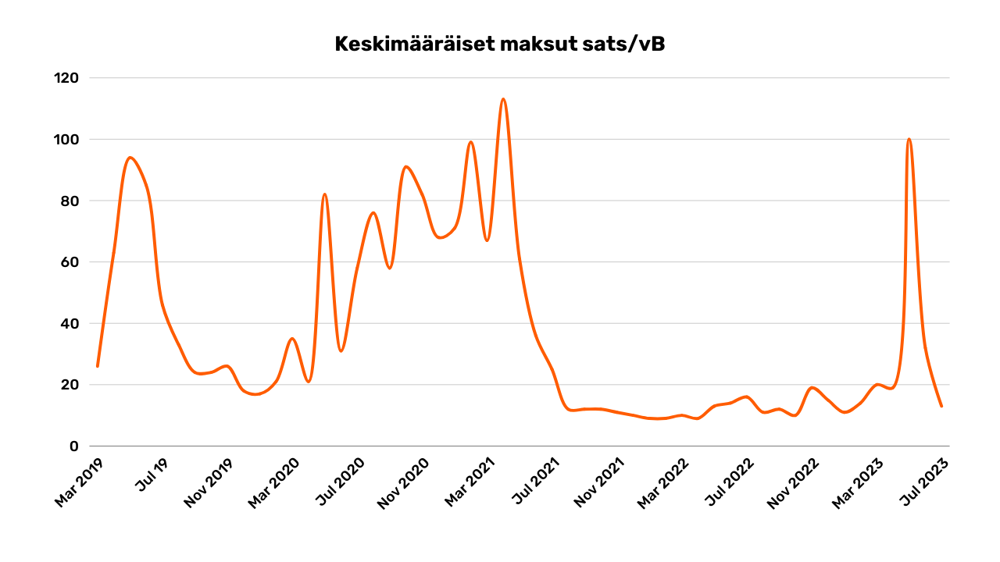
Transaktiomaksujen säästämisen lisäksi UTXO:jen konsolidointi auttaa välttämään "pölyn" muodostumista. Pöly viittaa UTXO:ihin, joiden arvo satosheina on niin alhainen, ettei se riitä kattamaan niiden kuluttamiseen tarvittavia transaktiomaksuja. Tämä tekee näistä UTXO:ista taloudellisesti järjettömiä käyttää niin kauan kuin transaktiomaksut pysyvät korkeina. Proaktiivisesti ryhmittelemällä UTXO:si estät niiden muuttumisen pölyksi, varmistaen, että kaikki varasi pysyvät käytettävissä.

### Mikä on UTXO:jesi vähimmäiskoko?

Joskus minulta kysytään, mikä on suositeltu vähimmäisarvo UTXO:lle. Valitettavasti universaalia vastausta ei ole, sillä se riippuu mieltymyksistäsi ja markkinoiden maksuolosuhteista. Tässä on kuitenkin kaava, joka voi auttaa määrittämään tarpeisiisi sopivan kynnyksen:

$$
\frac {P \times F}T = M
$$

Missä:

- $P$ on transaktion paino;
- $F$ edustaa maksimimaksunopeutta satosheina per vbyte (sats/vB), jonka olet valmis kattamaan;
- $T$ on prosenttiosuus kaupan maksusta, jonka olet valmis maksamaan suhteessa UTXO:n kokonaisarvoon;
- $M$ on pienin määrä satosheina kullekin UTXO:lle.

Oletetaan, että suunnittelet kattavasi maksut standardille SegWit-siirrolle, jossa on 1 sisääntulo ja 2 ulostuloa, painoltaan 141 vB. Jos kattaisit jopa 800 sats/vB, ja olet valmis käyttämään korkeintaan 12% UTXO:n arvosta maksuihin, laskenta olisi:

$$
\frac{141 \times 800}{0.12} = 940\ 000
$$

Tässä esimerkissä olisi viisasta ylläpitää vähintään 940 000 satoshin arvoa UTXO:ille lompakossasi.

### Konsolidointi ja COIH

Yksi yleisimmin käytetyistä heuristiikoista ketjuanalyysissä on COIH (_Common Input Ownership Heuristic_), joka mahdollistaa oletuksen, että kaikki Bitcoin-siirron sisääntulot kuuluvat samalle entiteetille. Tarkalleen ottaen konsolidoinnin periaate on kuluttaa useita UTXO:ja sisääntuloina ja luoda yksi UTXO ulostulona. Näin ollen konsolidointi mahdollistaa COIH:n soveltamisen.


Käytännössä tämä tarkoittaa, että ulkopuolinen tarkkailija voi päätellä, että kaikki konsolidoidut UTXO:t todennäköisesti kuuluvat samalle henkilölle ja että tuotettu yksittäinen ulostulo kuuluu myös heille. Tämä tilanne voi vaarantaa yksityisyytesi yhdistämällä erilaisia siirtotarinoita. Esimerkiksi sanotaan, että konsolidoin 3 P2P:llä hankittua UTXO:a UTXO:n kanssa, joka on saatu alustalta, joka vaatii KYC:n:


Näin tehdessäni mikä tahansa taho, jolla on pääsy vaihtoalustan tietoihin, mukaan lukien mahdollisesti hallitusvirastot, voi tunnistaa, että omistan muita määriä BTC:ssä. Aiemmin nämä UTXO:t eivät olleet suoraan yhdistettyjä henkilöllisyyteeni; nyt ne ovat. Lisäksi tämä paljastaa kaikille lähteille, että minulla on tietty määrä bitcoineja.

UTXO:iden hallinnassa taloudelliset harkinnat, jotka ajavat konsolidointiin maksujen vähentämiseksi, ovat ristiriidassa hyvien yksityisyyskäytäntöjen kanssa, jotka suosittelisivat UTXO:idesi yhdistämistä koskaan. Talouden ja yksityisyyden välillä valinta riippuu kunkin käyttäjän prioriteeteista.

Jos voit välttää konsolidoinnin ylläpitäen merkittäviä UTXO-kokoja, se on ihanteellista. Tehdäksesi tämän, optimoi hankintamenetelmäsi. Jos ostat bitcoinejasi DCA:lla, yritä harventaa kertaluonteisia ostoksiasi mahdollisimman paljon, jotta voit ryhmitellä arvoa harvempiin UTXO:ihin. On helpompi hallita 1 000 euron kertaluonteista ostosta joka toinen kuukausi, kuin 120 euron ostosta joka viikko. Tämä vähentää tuotettujen UTXO:iden määrää ja yksinkertaistaa lompakkosi hallintaa samalla kun säilytät yksityisyytesi.
Jos huomaat tarvitsevasi bitcoiniesi konsolidointia, ensisijaisesti keskity samasta lähteestä tulevien UTXO:iden konsolidointiin. Esimerkiksi 10 UTXO:n yhdistäminen yhdeltä alustalta vaikuttaa yksityisyyteesi vähemmän kuin 5 UTXO:n sekoittaminen alustalta A ja 5 UTXO:n alustalta B. Jos konsolidointi eri lähteistä on väistämätöntä, yritä erottaa ne niiden ominaisuuksien mukaan. Esimerkiksi ryhmittele KYC:n kautta hankitut UTXO:t yhteen siirtoon ja P2P:ssä saadut toiseen.

Joka tapauksessa, muista, että mikä tahansa konsolidointi johtaa väistämättä yksityisyyden menetykseen. Arvioi siis huolellisesti tämän toimenpiteen tarvetta ja mahdollisia vaikutuksia yksityisyyteesi ottaen huomioon riskin.

## Muita Hyviä Käytäntöjä

<chapterId>b5216965-7d13-4ea1-9b7c-e292966a487b</chapterId>

Tutkitaan yhdessä muita hyviä käytäntöjä, jotka voivat auttaa sinua optimoimaan yksityisyytesi Bitcoinissa.

### Täysi Solmu

Oman bitcoinien hallussapito on hyvä, mutta oman täyden solmun käyttö on parempi! Tässä syyt, miksi oman solmun omistaminen on ratkaisevan tärkeää täysin suvereenille Bitcoinin käytölle:

- **Sensuurin Vastustuskyky**: Transaktioitasi ei voida estää kenenkään toimesta;
- **Riippumattomuus Kolmansista Osapuolista**: Et enää riipu ulkoisista palveluista lohkoketjun datan tarkistamiseen;
- **Aktiivinen Osallistuminen**: Voit asettaa omat validointisääntösi ja osallistua suoraan konsensukseen;
- **Panos Verkon Vahvistamiseen**: Solmun pyörittämällä autat vahvistamaan ja jakamaan Bitcoin-verkkoa;
- **Tekninen Koulutus**: Täyden solmun hallinta on erinomainen tapa syventää teknistä tietämystäsi Bitcoinista.

Näiden etujen lisäksi oman täyden solmun käyttö parantaa myös yksityisyyttäsi, kun lähetät transaktioitasi. Kun teet transaktion, se luodaan ja allekirjoitetaan lompakkosi kautta. Jotta se voidaan lähettää Bitcoin-verkkoon, ainakin yhden solmun on tiedettävä siitä. Oman solmun käyttämällä hallitset suoraan tätä lähetystä, mikä parantaa yksityisyyttäsi ja rajoittaa tietovuodon riskejä.


Jos sinulla ei ole omaa Bitcoin-solmua, sinun on pakko käyttää kolmannen osapuolen solmua, kuten lompakko-ohjelmistosi tarjoajaa. Transaktioiden lähettämisen lisäksi lompakkosi tarvitsee pääsyn erilaisiin tietoihin, kuten vireillä oleviin transaktioihin, osoitteisiisi liittyviin saldoihin tai transaktioidesi vahvistusten määrään. Kaiken tämän datan saavuttamiseksi sinun on kysyttävä solmulta.


Pääasiallinen riski, kun et käytä omaa Bitcoin-solmuasi, on, että kolmannen osapuolen solmun operaattori voi tarkkailla toimintaasi lohkoketjussa tai jopa jakaa näitä tietoja muiden entiteettien kanssa. Tämän riskin rajoittamiseksi väliratkaisuna on käyttää lompakko-ohjelmistoa, joka mahdollistaa yhteyksiesi peittämisen Torin kautta. Tämä voi vähentää tietojesi altistumista. Optimaalinen ratkaisu on kuitenkin omistaa oma Bitcoin-solmu ja käyttää sitä transaktioidesi lähettämiseen. Tietenkin sinun on myös varmistettava, ettei solmustasi vuoda tietoja, mutta tämä on toinen aihe, jota tutkimme seuraavissa osioissa.
Oman yksityisyytesi ilmeisen edun lisäksi oman täysnoden käyttäminen varmistaa myös tiedon totuudenmukaisuuden lohkoketjussa, suojaa sensuurilta ja antaa sinulle mahdollisuuden osallistua aktiivisesti Bitcoinin hallintoon. Oman noden käyttämällä tuot taloudellisen painoarvosi valitsemallesi ketjulle, mikä on tärkeää yhteisön sisäisten konfliktien, kuten esimerkiksi Blocksize Warin aikana vuosina 2015–2017. Haaran (fork) tapahtuessa kolmannen osapuolen noden käyttäminen saattaisi johtaa sinut tukemaan ketjua, jota et halua suosia, koska noden operaattori tekee valinnan puolestasi. Kuten voit ymmärtää, yksityisyyden ja laajemmin yksilön suvereniteetin huolenaiheena on olennaista käyttää ja ajaa omaa täysnodea!

### Heuristiikan analyysin harhauttaminen

Laajemmin on tärkeää ymmärtää aiemmassa osassa mainitut heuristiikat, jotta voimme paremmin välttää tai harhauttaa niitä. Hyvien käytäntöjen omaksuminen voi osoittautua hyödylliseksi, vaikka ne eivät olekaan välttämättömiä. Ne tarjoavat lisäsuojakerroksen, joka voi olla tärkeä hyvän yksityisyyden ylläpitämisessä Bitcoinia käytettäessä.

Ensimmäinen neuvoni olisi sulautua tiheimmin joukkoon. Bitcoinissa tämä tarkoittaa eniten käytettyjen skriptimallien käyttämistä. Esimerkiksi P2WSH-skriptit, joita usein käytetään SegWit V0 multisig-konfiguraatioissa, ovat hyvin harvinaisia. Ne eivät anna sinun piiloutua suureen anonymiteettijoukkoon. Sama pätee vanhoihin malleihin, kuten P2PKH tai P2SH. Vaikka ne ovat laajalti läsnä UTXO-setissä, niitä käytetään yhä vähemmän uusissa siirroissa.

Yleisesti ottaen on turvallisempaa kääntyä uusimman skriptistandardin puoleen, edellyttäen, että se on riittävän laajalti omaksuttu. Näin ollen, jos vuonna 2022 olisin neuvonut välttämään P2TR:n (Taproot) käyttöä sen vähäisen omaksumisen vuoksi, vuoteen 2024 mennessä suosittelisin valitsemaan tämän tyyppisen skriptin tai vaihtoehtoisesti SegWit V0 -skriptin, koska P2TR:ää käyttävien siirtojen määrä alkaa edustaa merkittävää osuutta.


Lähde: [txstats.com](https://txstats.com/d/000000054/utxo-set-repartition-by-output-type)
Toinen vinkki yksityisyytesi säilyttämiseen on yrittää kiertää siirtojen sisäisiä heuristiikkoja. Esimerkiksi maksua tehdessäsi saatat yrittää välttää pyöreän summan luomista ulostulolle, sillä se voisi viestiä, että toinen ulostulo edustaa vaihtorahaa. Jos sinun tarvitsee lähettää 100k satsia ystävällesi, harkitse hieman suuremman summan siirtämistä tämän heuristiikan välttämiseksi. Samoin yritä välttää vaihtorahan ulostulojen luomista, jotka ovat suhteettoman suuria verrattuna tehtyyn maksuun, sillä se voisi myös paljastaa, kumpi ulostuloista edustaa vaihtorahaa.


Lopuksi, jos suoritat Bitcoin-siirtoja säännöllisesti, varmista, ettet aina lähetä niitä samoissa ajoissa. Levittämällä siirtojesi lähettämisen läpi päivän ja viikon, vältät antamasta ulkopuolisille tarkkailijoille mahdollisuuden havaita aikaperusteisen mallin, joka voisi parantaa heidän analyysiään.

Kaikkien näiden päivittäin omaksuttavien hyvien käytäntöjen lisäksi on olemassa vielä tehokkaampia menetelmiä katkaista bitcoinsi jäljitettävyys kokonaan. Niiden joukossa on tietenkin coinjoin-siirrot, joita tarkastelemme perusteellisesti seuraavassa osassa.

# Coinjoin-siirtojen ymmärtäminen

<partId>6d0bbf16-3714-4db1-9897-2d45019f6bdc</partId>

## Mikä on Coinjoin-siirto?

<chapterId>0862bc6b-1c48-4aa4-b76d-4f547b469008</chapterId>
Yksityisyydensuojan perusteiden opiskelun jälkeen keskustelemme nyt kehittyneemmistä tekniikoista, jotka on suunnattu aktiivisesti yksityisyytesi puolustamiseen, erityisesti irrottamalla bitcoinsiesi historian. Seuraavassa osassa tutkimme monia pieniä tekniikoita, mutta ensin haluan puhua sinulle coinjoinista.

Coinjoinia pidetään usein tehokkaimpana menetelmänä Bitcoin-käyttäjien yksityisyyden suojaamiseksi. Mutta mikä tarkalleen ottaen on coinjoin-tapahtuma? Selvitetään se yhdessä.

### Coinjoinin perusperiaatteet

Coinjoin on tekniikka, joka katkaisee bitcoinien jäljitettävyyden lohkoketjussa. Se perustuu yhteistyöhön perustuvaan tapahtumaan, jolla on tietty rakenne, nimeltään coinjoin-tapahtuma.
Kuten olemme nähneet tämän koulutuksen ensimmäisissä osissa, Bitcoin-tapahtumat ovat kaikkien käyttäjien tiedossa heidän nodensa kautta. On siis helppo tarkistaa jokaisen kolikon sähköisen allekirjoituksen ketju ja tarkkailla sen historiaa. Tämä tarkoittaa, että kaikki käyttäjät voivat yrittää analysoida toisten käyttäjien tapahtumia. Tämän seurauksena nimettömyys tapahtumatasolla on mahdotonta. Kuitenkin yksilöiden tunnistamisen tasolla nimettömyys säilyy. Toisin kuin perinteisessä pankkijärjestelmässä, jossa jokainen tili on linkitetty henkilöllisyyteen, Bitcoinissa varat liittyvät kryptografisiin avainpareihin (tai skripteihin), tarjoten näin käyttäjille pseudonyymiyttä kryptografisten tunnisteiden takana.
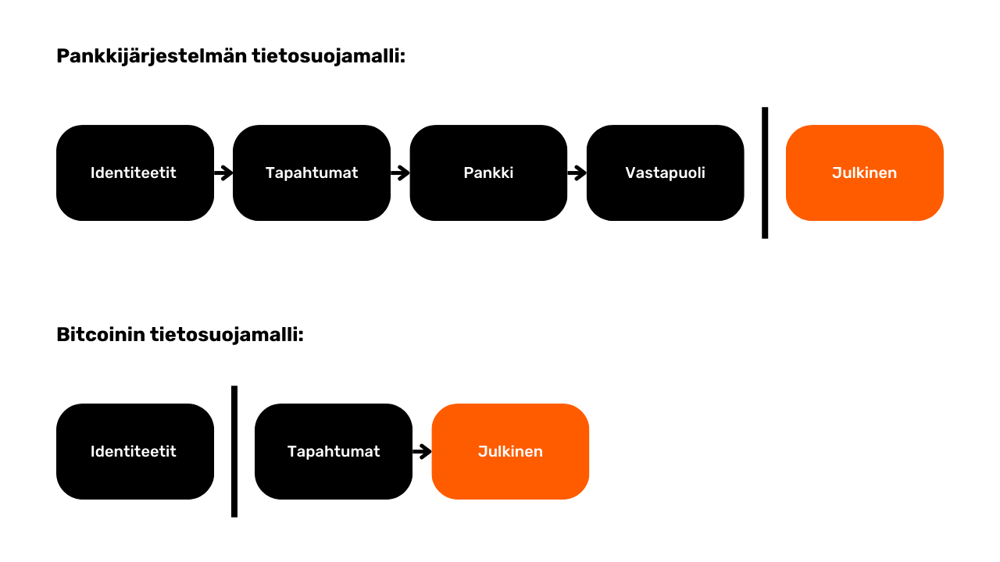

Näin ollen Bitcoinin luottamuksellisuus vaarantuu, kun ulkopuoliset tarkkailijat onnistuvat yhdistämään tiettyjä UTXOja tunnistettuihin käyttäjiin. Kun tämä yhdistäminen on vahvistettu, on mahdollista jäljittää heidän tapahtumansa ja analysoida heidän bitcoinien historiaansa. Coinjoin on nimenomaan kehitetty tekniikka katkaisemaan UTXOjen jäljitettävyys, tarjoten tietyn luottamuksellisuuden kerroksen Bitcoin-käyttäjille tapahtumatasolla.

Coinjoinit parantavat Bitcoin-käyttäjien luottamuksellisuutta monimutkaistamalla ketjuanalyysiä ulkopuolisille tarkkailijoille. Niiden rakenne mahdollistaa useiden eri käyttäjien kolikoiden yhdistämisen yhdeksi tapahtumaksi, hämärtäen jälkiä ja vaikeuttaen sisään- ja ulostuloadressien välisen yhteyden määrittämistä.

On tärkeää ymmärtää, että coinjoin-tapahtuman tavoite on katkaista kolikon historia. Tämä tekniikka ei tarjoa pysyvää nimettömyyttä eikä se lopullisesti estä bitcoinien jäljittämistä, toisin kuin saattaisi luulla. Coinjoin pyrkii vain katkaisemaan historian siinä kohdassa, missä coinjoin-tapahtuma suoritetaan. Kuitenkin ennen ja jälkeen tämän toimenpiteen, kolikko on alttiina samoille yksityisyyden riskeille.


### Miten coinjoinit toimivat?

Coinjoinin periaate perustuu yhteistyöhön: useat käyttäjät, jotka haluavat sekoittaa bitcoinejaan, tallettavat identtisiä määriä saman tapahtuman sisääntuloissa. Nämä määrät jaetaan sitten ulostuloissa tasavertaisina arvoina jokaiselle käyttäjälle.


Tapahtuman lopussa on mahdotonta yhdistää tiettyä ulostuloa tunnettuun käyttäjään sisääntulossa. Sisääntulojen ja ulostulojen välillä ei ole suoraa yhteyttä, mikä katkaisee yhteyden käyttäjien ja heidän UTXOjensa välillä sekä kunkin kolikon historian.


Käytetään esimerkkinä Alicea. Hän haluaa lähettää noin 100 000 satoshia sisarelleen Evelle syntymäpäivälahjaksi. Alice ei kuitenkaan halua Even pystyvän jäljittämään hänen transaktioidensa historiaa, koska hän ei halua paljastaa, kuinka monta bitcoinia hän omistaa tai miten hän on ne saanut. Tätä varten Alice päättää katkaista UTXO:nsa historian coinjoin-transaktiolla. Hän järjestää Bobin, Charlesin, Davidin ja Frankin kanssa yhteistyössä toteutettavan transaktion: Alice, Bob, Charles, David ja Frank sitoutuvat kukin antamaan 105 000 satoshia (josta 5 000 satoshia on kaivosmaksuja) syötteinä transaktiolle:


- Vastineeksi näiden syötteiden käyttämisestä kukin luo uuden osoitteen luodakseen viisi identtistä 100 000 satoshin lähtöä. Jokainen saa yhden lähdön:


- Alice päätyy UTXO:on, jossa on 100 000 satoshia, jonka historia on sekoitettu. Hän käyttää tätä UTXO:a uudessa transaktiossa lähettääkseen summan Evelle syntymäpäivälahjaksi:


- Jos Eve yrittää analysoida tätä transaktiota saadakseen tietoa, hän kohtaa coinjoin-transaktion, johon Alice, Bob, Charles, David ja Frank ovat osallistuneet. Koska hän ei pysty erottamaan, minkä syötteen kuka omistaa määrien yhtenäisyyden vuoksi, Eve ei voi jäljittää Alicen UTXO:n historiaa, eikä määrittää, kuinka monta bitcoinia hänen sisarensa omistaa tai miten hän on ne saanut:


Tässä skenaariossa Alice käytti coinjoin-tekniikkaa lisätäkseen yksityisyyttään takautuvaa analyysiä vastaan. Todellakin, Alice suojaa itseään mahdollista Even analyysiä vastaan, joka alkaisi tietystä transaktiosta jäljittääkseen UTXO:n historiaa taaksepäin. Tämä suoja analyysiä vastaan nykyhetkestä menneisyyteen on sitä, mitä kutsumme takautuvaksi anonsetiksi. Syvennymme tähän käsitteeseen tarkemmin tämän osan viimeisissä luvuissa.

Coinjoin tarjoaa kuitenkin myös mahdollisuuden parantaa yksityisyyttä analyysiä vastaan menneisyydestä nykyhetkeen, jota kutsutaan eteenpäin suuntautuvaksi anonsetiksi. Palataan esimerkkiimme, jossa Alice lähetti 98 000 satoshia Evelle syntymäpäivälahjaksi, mutta käänteisin roolein. Kuvitellaan nyt, että Eve on huolissaan yksityisyydestään. Todellakin, Alice saattaisi olla kiusattu seuraamaan lähettämäänsä kolikkoa Evelle saadakseen tietoa. Eve voisi yhdistää juuri saamansa UTXO:n kaikkiin muihin UTXO:ihinsa, mikä voisi paljastaa Alicelle, kuinka monta bitcoinia hänellä on lompakossaan. Välttääkseen tämän, Eve voi myös katkaista juuri saamansa kolikon historian.

- Eve, Grace, Mallory, Oscar ja Victor laittavat kukin UTXO:n, jossa on 98 000 satoshia, syötteiksi Bitcoin-transaktioon:
  

- Vastineeksi näiden syötteiden kuluttamisesta kukin tarjoaa uuden osoitteen luodakseen 5 täysin yhtä suurta 97 500 satoshin lähtöä. Jokainen käyttäjä saa yhden lähdön:


- Eve nyt omistaa UTXO:n, jossa on 97 500 satoshia rikotulla historialla. Hän voi käyttää sitä pelkäämättä tulevia transaktioita. Todellakin, jos Alice yrittää seurata lähettämiään bitcoineja Evelle, hän kohtaa coinjoin-transaktion. Hän ei pysty määrittämään, mikä lähtö-UTXO kuuluu Evelle. Analyysi muuttuu mahdottomaksi:


Ensimmäisessä esimerkissä näimme, kuinka coinjoin voi suojata kolikon yksityisyyttä suhteessa sen menneisyyteen, ja toisessa esimerkissä, kuinka se voi myös turvata kolikon historian suhteessa sen tulevaisuuteen. Siksi mainitsin, että coinjoinia tulisi pitää yksittäisenä tapahtumana, joka jakaa kolikon historian molempiin suuntiin:


### Sekoittaminen, coinjoinit, sekoittajat... Mikä on ero?

Termiä "sekoittaminen" käytetään joskus kuvaamaan coinjoineja, termiä, jonka jotkut bitcoin-käyttäjät hylkäävät, koska he pelkäävät sekaannusta kustodialisesti sekoittajien kanssa. Kuitenkin mielestäni tämä huoli on aiheeton, koska matemaattisessa kontekstissa coinjoin ilmentää sekoittamisen käsitettä tarkasti.

Matematiikan yleisellä alueella sekoittaminen viittaa dynaamisen järjestelmän ominaisuuteen, jossa jonkin ajan kuluttua kaikki alkutilan osat voivat teoriassa sekoittua mihin tahansa muuhun osaan. Sekoittaminen tarkoittaa, että hiukkasen sijainti tai järjestelmän tila kehittyy siten, että sen tuleva jakautuminen on riippumaton sen alkuperäisestä jakautumisesta, saavuttaen tilan, jossa alkutilan ominaisuudet ovat tasaisesti jakautuneet koko järjestelmän tilaan. Tämä on juuri sitä, mitä tapahtuu coinjoinissa bitcoineilla. Näin ollen mielestäni coinjoin on todellakin kolikoiden sekoittamisen menetelmä.


On kuitenkin tärkeää erottaa coinjoin sekoittajista. Sekoittaja on palvelu, johon käyttäjät lähettävät bitcoinejaan sekoitettavaksi. Nämä palvelut olivat suosittuja 2010-luvulla, mutta niiden käyttö on vähentynyt kahden suuren haittapuolen vuoksi verrattuna coinjoiniin:

- Ne vaativat käyttäjältä varojen hallinnan luovuttamisen sekoitusprosessin aikana, mikä altistaa heidät varkausriskille;
- Ei ole takeita siitä, etteikö sekoittaja tallenna tapahtumien yksityiskohtia tai jopa myy tätä tietoa ketjuanalyysiyhtiöille.
  

Nykyään käyttäjät siis suosivat coinjoinia, koska se mahdollistaa heidän pitää täyden kontrollin varoistaan koko prosessin ajan. Coinjoiniin osallistuvat eivät riskeeraa bitcoinien varastamista muiden osapuolten toimesta. Tutkitaan yhdessä, kuinka kaikki tämä on mahdollista seuraavassa luvussa.

## Zerolink ja Chaumian Coinjoinit

<chapterId>326c9654-b359-4906-b23d-d6518dd5dc3e</chapterId>

Coinjoinin tarjoama yksityisyys voitetaan ryhmän koossa, jossa meidän palamme on piilotettu. Siksi on tarpeen löytää mahdollisimman monta osallistujaa. Coinjoinin suorittaminen manuaalisesti, itse löydettyjen käyttäjien kanssa, on täysin mahdollista, mutta tämä menetelmä on monimutkainen, eikä se mahdollista suurten anonsettien saavuttamista.

Tämän vuoksi Bitcoinissa on kehittynyt coinjoin-koordinaattoreita. Heidän roolinsa on yhdistää eri käyttäjiä ja välittää tarvittavat tiedot yhteistyössä tehtävän tapahtuman onnistuneeseen suorittamiseen.


Mutta kuinka voimme varmistaa, että koordinaattorilla ei koskaan ole hallintaa käyttäjien bitcoineista, ja huolimatta siitä, että he ovat henkilö, joka rakentaa coinjoin-tapahtuman, kuinka voimme varmistaa, etteivät he voi yhdistää käyttäjien syötteitä ja tuotoksia, mikä voisi muodostaa yksityisyyden vuodon?

### Chaumin Sokeat Allekirjoitukset

Nykyiset coinjoin-toteutukset käyttävät David Chaumin sokeita allekirjoituksia välttääkseen tietojen vuotamisen. Tutkitaan nopeasti yhdessä, kuinka nämä sokeat allekirjoitukset toimivat.
Chaumin sokeat allekirjoitukset ovat digitaalisen allekirjoituksen muoto, jossa allekirjoituksen antaja ei tiedä viestin sisältöä, jonka hän allekirjoittaa. Myöhemmin allekirjoitus voidaan kuitenkin varmentaa alkuperäisen viestin kanssa. Tämän tekniikan kehitti kryptografi David Chaum vuonna 1983.

Ota esimerkiksi yritys, joka haluaa todentaa luottamuksellisen asiakirjan, kuten sopimuksen, paljastamatta sen sisältöä. Yritys soveltaa peittävää prosessia, joka kryptografisesti muuntaa alkuperäisen asiakirjan palautettavalla tavalla. Tämä muunnettu asiakirja lähetetään sertifiointiviranomaiselle, joka soveltaa sokeaa allekirjoitusta tietämättä taustalla olevaa sisältöä. Saatuaan allekirjoitetun asiakirjan yritys poistaa allekirjoituksen peittävyyden. Tuloksena on alkuperäinen asiakirja, joka on viranomaisen allekirjoituksella todennettu, ilman että viranomainen on koskaan nähnyt alkuperäistä sisältöä.

Chaumin sokeat allekirjoitukset mahdollistavat siis asiakirjan aitouden todentamisen tietämättä sen sisältöä, mikä takaa sekä käyttäjän tietojen luottamuksellisuuden että allekirjoitetun asiakirjan eheyden.

### Chaumin Coinjoinit

"Chaumian CoinJoins" -menetelmässä yhdistetään Torin käyttö ja David Chaumin sokeat allekirjoitukset varmistamaan, että koordinaattori ei voi tietää, mikä tulos kuuluu millekin käyttäjälle. Coinjoin-tapahtuman rakentamisprosessi kiertää kolmen päävaiheen ympärillä: syötteiden rekisteröinti, tulosteiden rekisteröinti ja tapahtuman allekirjoittaminen. Tarkastellaan tätä prosessia Alicesin esimerkin kautta, joka on yksi coinjoinin osallistujista. Kaikki muut osallistujat noudattavat samoja vaiheita kuin Alice, kukin omalla kohdallaan.

**Vaihe 1: Syötteiden rekisteröinti.**

- Alice lähettää koordinaattorille UTXO:n, jonka hän haluaa käyttää tapahtuman syötteenä, sekä peitetyn vastaanotto-osoitteen, jota hän haluaa käyttää tulosteena bitcoinsiensa vastaanottamiseen. Näin ollen koordinaattori ei voi tietää Alicen osoitetta. Hän näkee vain sen peitetyn version:

- Koordinaattori varmentaa syötteiden pätevyyden, sitten allekirjoittaa Alicen peitetyn osoitteen omalla yksityisellä avaimellaan. Hän lähettää takaisin Alicelle sokean allekirjoituksen:

**Vaihe 2: Tulosteiden rekisteröinti.**

- Alice voi nyt poistaa peitteen osoitteestaan, jonka koordinaattorin yksityinen avain on allekirjoittanut. Hän muodostaa uuden yhteyden eri Tor-identiteetin alla. Koordinaattori ei voi tunnistaa, että kyseessä on Alice tämän uuden identiteetin alla:

- Alice lähettää peittelemättömän osoitteen ja allekirjoituksen koordinaattorille (joka ei edelleenkään tiedä, että kyseessä on Alice):

**Vaihe 3: Tapahtuman allekirjoittaminen.**

- Koordinaattori hakee samalla tavalla peittelemättömät tulosteet kaikilta osallistujilta. Liitettyjen allekirjoitusten ansiosta hän voi varmistaa, että jokainen anonyymisti toimitettu tuloste oli todellakin aiemmin allekirjoitettu hänen yksityisellä avaimellaan, varmistaen niiden laillisuuden. Hän on sitten valmis rakentamaan coinjoin-tapahtuman ja lähettää sen osallistujille allekirjoitettavaksi:

- Alice, kuten muutkin osallistujat, varmistaa, että hänen syötteensä ja tulosteensa on oikein sisällytetty koordinaattorin rakentamaan tapahtumaan. Jos kaikki on tyydyttävää, hän lähettää allekirjoituksen, joka avaa hänen syötteen skriptin koordinaattorille:

- Kerättyään allekirjoitukset kaikilta coinjoinin osallistujilta, koordinaattori voi lähettää tapahtuman Bitcoin-verkkoon, jotta se voidaan lisätä lohkoon.
  Tässä järjestelmässä koordinaattori ei kykene yhdistämään syötettä tiettyyn tulosteeseen. Lisäksi he eivät voi ottaa osallistujien varoja hallintaansa, koska heillä ei ole koskaan pääsyä yksityisiin avaimiin, jotka tarvitaan heidän UTXO:iden avaamiseen. Koko prosessin ajan, ja vaiheen 3 loppuun asti, heillä ei myöskään ole pääsyä allekirjoituksiin. Kun Alice ja muut osallistujat allekirjoittavat globaalin transaktion varmistettuaan, että kaikki on oikein, koordinaattori ei enää voi muokata tätä transaktiota, mukaan lukien tulosteet, ilman sen mitätöimistä. Tämä estää siis bitcoinien varastamisen koordinaattorin toimesta.
  Lopulta, kun he kirjaavat tulosteensa transaktioon, coinjoin-käyttäjä haluaa takuita, jotka ovat samankaltaisia kuin kansalaisen äänestäessä vaaleissa. Näiden toimien julkisella ja yksityisellä puolella on dualiteetti. Toisaalta on se, mitä halutaan pitää yksityisenä: äänestäjä ei halua, että hänen äänestyslippunsa voidaan yhdistää hänen identiteettiinsä; coinjoin-käyttäjä ei halua, että hänen tulosteensa voidaan yhdistää hänen syötteeseensä. Todellakin, jos koordinaattori tai mikä tahansa muu osapuoli onnistuu luomaan yhteyden syötteen ja tulosteen välille, coinjoin menettää kaiken tarkoituksensa. Kuten aiemmin selitettiin, coinjoinin on toimittava kolikon historian katkaisijana. Tämä pysähdys tapahtuu juuri siksi, että tietyn syötteen yhdistäminen tiettyyn tulosteeseen coinjoin-transaktiossa (tulevaisuuden anonset) ja päinvastoin (menneisyyden anonset) on mahdotonta.

Toisaalta on julkinen puoli: äänestäjä haluaa varmistaa, että hänen äänestyslippunsa sisällytetään äänestyslaatikkoon; samoin coinjoin-käyttäjä haluaa varmistaa, että hänen tulosteensa sisällytetään coinjoin-transaktioon. Todellakin, on ehdottoman välttämätöntä, että coinjoinin osallistujat voivat varmistaa tulosteensa läsnäolon ennen transaktion allekirjoittamista, muuten koordinaattori voisi varastaa varat.

Juuri nämä 2 julkista ja yksityistä näkökohtaa, jotka mahdollistaa David Chaumin sokeiden allekirjoitusten käyttö, takaavat Chaumian coinjoinin osallistujille, että heidän bitcoinejaan ei varasteta, ja että heidän varojaan ei voida jäljittää.

### Kuka keksi coinjoin-konseptin?

On vaikea määrittää varmuudella, kuka ensimmäisenä esitteli coinjoin-idean Bitcoinissa, ja kuka keksi käyttää David Chaumin sokeita allekirjoituksia tässä yhteydessä. Usein ajatellaan, että se oli Gregory Maxwell, joka ensimmäisenä puhui siitä [viestissä BitcoinTalkissa vuonna 2013](https://bitcointalk.org/index.php?topic=279249.0):
Käyttäen Chaum Sokeita Allekirjoituksia: Käyttäjät kirjautuvat sisään ja tarjoavat syötteitä (ja vaihto-osoitteita) sekä kryptografisesti sokeutetun version osoitteesta, johon he haluavat lähettää yksityiset kolikkonsa; palvelin allekirjoittaa tokenit ja palauttaa ne käyttäjille. Käyttäjät yhdistävät uudelleen anonyymisti, paljastavat tulostusosoitteensa ja lähettävät ne takaisin palvelimelle. Palvelin näkee, että kaikki tulosteet on allekirjoitettu sen toimesta ja että näin ollen kaikki tulosteet tulevat voimassaolevilta osallistujilta. Myöhemmin ihmiset yhdistävät uudelleen ja allekirjoittavat.
Maxwell, G. (2013, elokuu 22). _CoinJoin: Bitcoin yksityisyys todellisessa maailmassa_. BitcoinTalk Forum. https://bitcointalk.org/index.php?topic=279249.0


Kuitenkin, aiempia mainintoja on olemassa sekä Chaum allekirjoituksista sekoittamisen yhteydessä että myös coinjoineista. [Kesäkuussa 2011 Duncan Townsend esitteli BitcoinTalkissa](https://bitcointalk.org/index.php?topic=12751.0) sekoittimen, joka käyttää Chaum allekirjoituksia tavalla, joka on hyvin samankaltainen nykyaikaisten Chaumian coinjoinien kanssa.
Samassa keskusteluketjussa on [viesti hashcoinilta vastauksena Duncan Townsendille](https://bitcointalk.org/index.php?topic=12751.msg315793#msg315793) hänen sekoittimensa parantamiseksi. Tässä viestissä kuvattu prosessi edustaa tarkasti sitä, mikä muistuttaa eniten coinjoineja. Maininta samankaltaisesta järjestelmästä on myös [viestissä Alex Mizrahilta vuonna 2012](https://gist.github.com/killerstorm/6f843e1d3ffc38191aebca67d483bd88#file-laundry), kun hän neuvosi Tenebrixin, yhden ensimmäisistä altcoineista, luojia, joka toimi myöhemmin perustana Litecoinin luomiselle. Jopa termi "coinjoin" itsessään ei ole Greg Maxwellin keksimä, vaan se tuli Peter Toddin ideasta.


### Zerolink

Zerolink on kattava sekoitusprotokolla, joka yhdistää Chaumian coinjoinit ja erilaisia strategioita käyttäjien anonymiteetin suojaamiseksi useita ketjuanalyysin muotoja vastaan, erityisesti vähentäen lompakonhallintaan liittyviä virheitä. Tämän protokollan [esittelivät nopara73 ja TDevD vuonna 2017](https://github.com/nopara73/ZeroLink/blob/master/README.md).


Kuten nimestä voi päätellä, Zerolinkin periaate on suorittaa coinjoin-transaktioita, jotka takaavat linkkien jäljittämisen mahdottomuuden syötteiden ja tuotosten välillä. Tämä ominaisuus saavutetaan varmistamalla, että kaikki tuotokset ovat täysin identtisiä määriltään.


Tärkeä ennaltaehkäisevä toimenpide Zerolinkissa on sekoittamattomien UTXOjen täydellinen erottaminen sekoitetuista UTXOista käyttämällä erillisiä kryptografisia avaimia tai jopa erillisiä lompakoita. Näin "ennakko-sekoitus" lompakko, joka on tarkoitettu kolikoille ennen sekoittamista, erotetaan "jälkisekoitus" lompakosta, joka on varattu sekoitetuille kolikoille.


Tämä UTXOjen tiukka erottaminen palvelee ensisijaisesti vahinkoon perustuvien yhdistämisten estämistä sekoitetun UTXOn ja sekoittamattoman UTXOn välillä. Todellakin, jos tällaisia linkkejä esiintyy, coinjoinin tehokkuus sekoitetussa UTXOssa mitätöidään ilman, että käyttäjä on tietoinen, mikä vaarantaa UTXOn luottamuksellisuuden, jonka he uskoivat irrotetun historiastaan. Nämä linkit voivat syntyä joko osoitteen uudelleenkäytön kautta turvattaessa sekoitettu UTXO sekoittamattoman kanssa, tai soveltamalla Common-Input-Ownership Heuristic (CIOH) -periaatetta, jos käyttäjä käyttää sekä sekoitettuja että sekoittamattomia UTXOja saman transaktion syötteinä. Ennakko-sekoituksen ja jälkisekoituksen lompakoiden erottamisen avulla nämä vahingossa tapahtuvat yhdistämiset vältetään, ja käyttäjä suojataan tahattomilta virheiltä.


Tämä erottelu tarjoaa myös mahdollisuuden soveltaa erillisiä sääntöjä ennen sekoitusta ja sekoituksen jälkeen oleville lompakoille lompakko-ohjelmiston tasolla. Esimerkiksi sekoituksen jälkeisessä lompakossa ohjelmisto voi kieltää UTXO:iden yhdistämisen syötteiksi estääkseen CIOH:n soveltamisen, mikä vaarantaisi käyttäjän anonsetin. On myös mahdollista standardoida skriptien ja transaktiovaihtoehtojen käyttö (kuten RBF:n merkitseminen esimerkiksi) estääkseen tunnistamisen lompakon sormenjäljillä.
Tällä hetkellä Whirlpool on ainoa coinjoinin toteutus, joka soveltaa Zerolink-protokollaa tiukasti. Seuraavassa luvussa tutkimme erilaisia olemassa olevia coinjoin-toteutuksia sekä kunkin etuja ja haittoja.

## Coinjoin-toteutukset

<chapterId>e37ed073-9498-4e4f-820b-30951e829596</chapterId>

_Vuonna 2024 olemme todistamassa merkittäviä muutoksia työkaluissa, jotka ovat käyttäjien saatavilla Bitcoinin coinjoineja varten. Olemme parhaillaan käännekohdassa, ja coinjoin-markkina on suuren uudelleenjärjestelyn kohteena. Siksi tämä luku päivitetään todennäköisesti ajan myötä._

Tällä hetkellä Bitcoinissa on pääasiassa kolme erilaista coinjoin-toteutusta:

- Whirlpool;
- Wabisabi;
- JoinMarket.
  Jokainen näistä toteutuksista pyrkii katkaisemaan UTXO:iden historian coinjoin-transaktioiden avulla. Kuitenkin niiden mekanismit vaihtelevat merkittävästi. Siksi on olennaista ymmärtää, miten kukin toimii, jotta voit valita tarpeisiisi sopivimman vaihtoehdon.

### JoinMarket

JoinMarket, jonka loivat Adam Gibson ja Chris Belcher vuonna 2015, erottuu muista coinjoin-toteutuksista ainutlaatuisen käyttäjien yhdistämismallinsa ansiosta. Tämä järjestelmä perustuu P2P-vaihtomarkkinaan, jossa jotkut käyttäjät, "tekijät", tekevät bitcoinejaan saataville sekoitusta varten, kun taas toiset, "ottajat", käyttävät näitä varoja suorittaakseen coinjoineja maksua vastaan.


Tässä mallissa "tekijät" jättävät bitcoinejaan "ottajien" käyttöön ja saavat palvelumaksuja vastineeksi palvelustaan. "Ottajat" puolestaan maksavat käyttääkseen "tekijöiden" bitcoineja omien coinjoin-transaktioidensa suorittamiseen. Palvelumaksut vaihtelevat roolin mukaan: "tekijät" kerryttävät maksuja likviditeettitarjouksestaan, kun taas "ottajat" maksavat maksut. Tämä markkina toimii vapaasti ilman käyttöehtoja.

Yksi JoinMarketin päähaitoista on sen käytön monimutkaisuus, joka vaatii tiettyä tuttavuutta terminaaleihin sen tehokkaaseen hyödyntämiseen. Vaikka tämä monimutkaisuus ei ole este kokeneelle käyttäjälle, se voi rajoittaa yleisön pääsyä. Kuitenkin äskettäin esitellyn web-käyttöliittymän, JAM:n, myötä sen käyttö on jonkin verran helpottunut.


Lähde: [JAM](https://github.com/joinmarket-webui/jam/blob/devel/docs/assets/screenshot-dark.webp)

Tekninen este on kuitenkin edelleen merkittävä este. Coinjoin-ekosysteemissä, jossa luottamuksellisuus lisääntyy osallistujien määrän myötä, mikä tahansa este, joka vähentää saavutettavuutta, vaikuttaa suoraan saatavilla olevaan likviditeettiin, joka on sekoittamisen tehokkuuden kannalta ratkaiseva tekijä. Bitcoin, joka on jo itsessään rahoitustransaktioiden erikoisala, näkee coinjoinien käytön ala-alana, ja JoinMarket edustaa vielä erikoistuneempaa osaa, rajoittaen sen potentiaalia lisätä käyttäjiensä anonsetteja.
Huolimatta innovatiivisesta P2P-matching-mallistaan coinjoineissa, JoinMarketilla on merkittäviä haittoja, erityisesti transaktiorakenteen osalta. Toisin kuin muissa toteutuksissa, kuten Whirlpool, JoinMarket ei takaa täydellistä yhtäläisyyttä lähtöjen välillä, ja on mahdollista jäljittää deterministisiä linkkejä syötteiden ja tulosteiden välillä. Lisäksi siitä puuttuvat työkalut estämään jo kerran sekoitettujen kolikoiden uudelleensekoittumisen, mikä voisi vaarantaa käyttäjien tavoitteleman luottamuksellisuuden. Lopuksi, vaikka JoinMarketin konsepti on mielenkiintoinen, erityisesti niille, jotka ovat kiinnostuneita dynaamisesta likviditeettimarkkinasta, sen rakenteelliset heikkoudet ja tekninen monimutkaisuus tekevät siitä mielestäni vähemmän houkuttelevan, sekä aloittelijoille että asiantuntijoille, jotka etsivät coinjoin-toteutusta.

### Wabisabi

Wabisabi on toinen coinjoin-toteutus, jossa transaktioiden koordinointi on keskitetty. Tämän mallin suunnittelivat Ádám Ficsór (nopara73), Yuval Kogman, Lucas Ontivero ja István András Seres vuonna 2021, ja se integroitiin Wasabi 2.0 -ohjelmistoon seuraavana vuonna. Wabisabi on nimenomaan Wasabi-ohjelmiston vuonna 2018 käynnistetyn coinjoin-mallin evoluutio.


2010-luvun loppua kohden Wasabi omaksui coinjoineilleen transaktiorakenteen, joka poikkesi radikaalisti Whirlpoolin rakenteesta. Osallistujiensa anonsetteja kasvattaakseen Wasabi käytti hyvin suuria coinjoin-transaktioita, jotka ryhmittivät kymmeniä osallistujia. Whirlpool puolestaan valitsi useita pieniä transaktioita, mikä mahdollisti anonsettien eksponentiaalisen kasvun jokaisella kierroksella.

Myös vaihtorahan hallinnointimenetelmät erottivat kaksi toteutusta toisistaan. Whirlpoolissa vaihtoraha suljettiin pois ja eristettiin UTXOista ennen coinjoin-kiertoja TX0:n avulla, konsepti, jonka selitän tarkemmin seuraavassa luvussa. Wasabissa vaihtoraha muodosti yhden coinjoin-transaktion tulosteista, mikä säilytti deterministisiä linkkejä tietyissä syötteissä ja tulosteissa.


Wabisabin myötä, Wasabin version 2.0, se mukautti lähestymistapaansa coinjoineihin lähestyäkseen Whirlpoolin mallia. Vaikka coinjoin-transaktiot pysyvät edelleen hyvin suurina, on nyt mahdollista ketjuttaa useita peräkkäisiä kierroksia, seuraten näin Whirlpoolin mallia. Erityistä ponnistusta on myös tehty vaihtorahan hallinnoinnissa: toisin kuin Wasabi 1.0:ssa, jossa vaihtoraha oli suoraan linkitetty käyttäjien syötteisiin, Wabisabi pyrkii jakamaan vaihtorahan useisiin pieniin määriin, jotka jaetaan tasaisina denominointeina kaikille osallistujille.

Kuvataan tämä yksinkertaistetulla esimerkillä, joka koskee vain 2 käyttäjää: Alice haluaa sekoittaa 115 000 satsia ja Bob 210 000 satsia. Jättäen palkkiot huomiotta, Wasabi 1.0:ssa coinjoin-transaktio olisi tuottanut 3 tulostetta 100 000 satsista, plus 1 vaihtorahan 15 000 satsista Alicelle ja 1 vaihtorahan 10 000 satsista Bobille. Vaihtorahatulosteet olisivat aina linkittyneet syötteisiin:


Wabisabin alla sama transaktio olisi tuottanut 3 tulostetta 100 000 satsista ja 5 tulostetta 5 000 satsista, hajottaen näin vaihtorahan tavalla, joka ei ole suoraan jäljitettävissä tiettyyn syötteeseen:
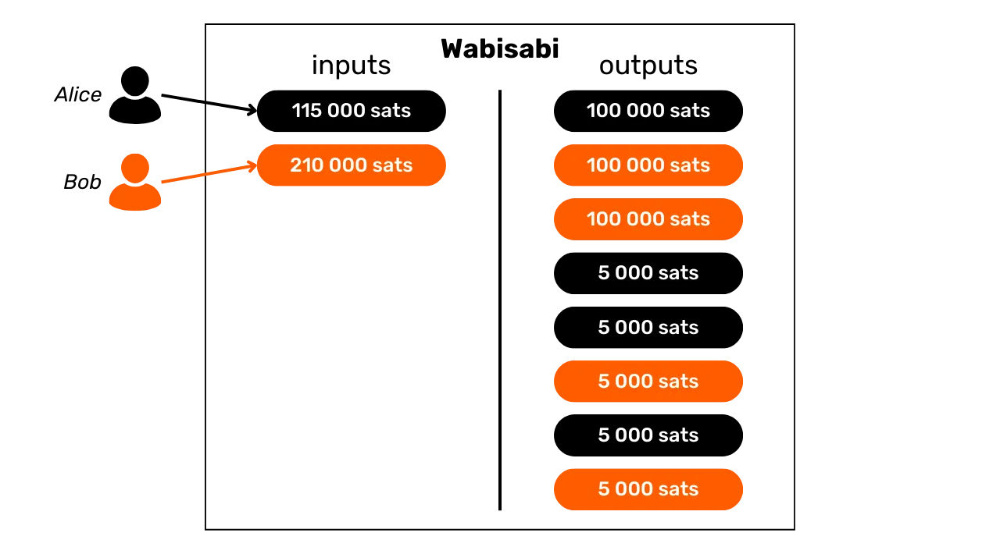
Henkilökohtaisesti koen, että muutoksen hallinta Wabisabissa tuo esiin useita riskejä, jotka voivat vaarantaa sen tehokkuuden yksityisyyden suhteen:

- Kun käyttäjä osallistuu UTXO:lla, joka on huomattavasti suurempi kuin muiden osallistujien, he päätyvät väistämättä määrään vaihtorahaa, joka voidaan yhdistää heidän syötteeseensä. Tämä on ristiriidassa protokollan alkuperäisen tavoitteen kanssa, jonka tarkoituksena on eliminoida kaikki tunnistettavissa oleva vaihtoraha;
- Nimellisarvojen moninkertaistaminen vaihtorahan pilkkomiseksi voi paradoksaalisesti haitata sekoittamisen tehokkuutta. Tämä prosessi voi johtaa anonsettien vähenemiseen tietyissä ulostuloissa, koska ne tulevat helpommin tunnistettaviksi;
- Tämä menetelmä tuottaa myös pieniarvoisia UTXO:ja, jotka aiheuttavat käyttäjälle hallinnointiongelman. Nämä pienet UTXO:t, jos niiden kuluttaminen suhteessa arvoonsa muuttuu liian kalliiksi, voivat muuttua "pölyksi". Tämä ilmiö pakottaa käyttäjän yhdistämään useita UTXO:ja syötteiksi tulevissa siirroissaan tai konsolidoimaan ne. Molemmissa tapauksissa COH:n vuoksi tämä voi joko vähentää saavutettuja anonsettejä tai täysin mitätöidä alkuperäisen coinjoinin kautta saavutetut yksityisyysedut.

Toisin kuin Whirlpool, joka toteuttaa ZeroLink-protokollan varmistaen tiukan erottelun ennen sekoitusta ja sekoituksen jälkeen olevien UTXO:jen välillä, Wabisabi ei ylläpidä tätä tiukkaa erottelua. Myös jotkin Wasabi-asiakkaat ovat käyttäneet osoitteita uudelleen, mikä on selvästi erittäin haitallista käyttäjälle.

Wasabin versiossa 2.0 on otettu käyttöön uusi coinjoin-maksupolitiikka. Nyt koordinaattorimaksut ovat asetettu 0,3 %:iin UTXO:ista, jotka ovat suurempia kuin 0,01 bitcoinia, kun taas pienempien UTXO:jen osalta nämä maksut on kokonaan poistettu. Lisäksi näiden pienten UTXO:jen uudelleensekoitukset ovat ilmaisia, vaikka louhintamaksut jäävät edelleen käyttäjän vastuulle kaikissa siirroissa, mukaan lukien uudelleensekoitukset.

Tämä politiikka eroaa Whirlpoolin politiikasta, jossa maksut pysyvät kiinteinä riippumatta saavutettujen anonsettien koosta. Wasabi 2.0:ssa, vaikka koordinaattorimaksut on poistettu pienille UTXO:ille, käyttäjän on silti maksettava louhintamaksut kaikista siirroista, mukaan lukien uudelleensekoitukset.
Kirjoitushetkellä Wabisabin käyttö on muuttunut huomattavasti monimutkaisemmaksi viimeaikaisten tapahtumien seurauksena. Itse asiassa Samourai Walletin perustajien pidätyksen jälkeen zkSNACKs, yhtiö, joka rahoittaa ja hallinnoi Wasabin kehitystä, ilmoitti coinjoin-koordinaatiopalvelunsa lopettamisesta 1. kesäkuuta 2024. Tämä koordinaattori, joka oli oletusarvoisesti asetettu Wasabissa, hallitsi suurimman osan likviditeetistä.

Tämän pääkoordinaattorin sulkemisen myötä käyttäjien on nyt yhdistettävä uusiin itsenäisiin koordinaattoreihin. Tämä muutos herättää huolia: toisaalta uusilla koordinaattoreilla ei ehkä ole riittävästi likviditeettiä, mikä vähentää coinjoinien tehokkuutta yksityisyyden suhteen. Toisaalta on riski kohdata pahantahtoinen koordinaattori. Tämä tilanne lisää merkittäviä riskejä niille, jotka haluavat käyttää Wabisabia.

Teknisten ongelmien lisäksi zkSNACKsin, Wasabin takana olevan yhtiön, päätös käyttää ketjuanalyysiyhtiön palveluita coinjoinien osallistujien suodattamiseen herättää vakavia eettisiä ja strategisia kysymyksiä. Alkuperäinen idea oli estää rikollisten coinjoinien käyttö Wasabissa, mikä saattaa vaikuttaa legitiimiltä. Tämä kuitenkin luo paradoksin: maksaa maksuja koordinaattorille, jonka päätehtävänä on parantaa käyttäjien yksityisyyttä, vain rahoittaakseen yhtiötä, jonka tavoitteena on vaarantaa juuri tämä yksityisyys.
Erityisen huolestuttavaa on suodatusperiaate, joka on ristiriidassa Bitcoinin filosofian kanssa, joka pyrkii tarjoamaan avoimen ja sensuroimattoman rahoitusjärjestelmän. Vaikka rikollisen toiminnan poissulkeminen voi vaikuttaa perustellulta, tämä suodatus voi myös vaikuttaa yksilöihin, joiden toimet, vaikka ne luokiteltaisiinkin laittomiksi joissakin yhteyksissä, voisivat olla moraalisesti puolustettavissa tai sosiaalisesti hyödyllisiä. Edward Snowdenin esimerkki kuvaa täydellisesti tätä dikotomiaa: jotkut hallitukset pitävät häntä rikollisena hänen paljastustensa vuoksi, kun taas toiset näkevät hänet viheltäjänä, joka toimi yleisen edun mukaisesti. Tämä monimutkaisuus korostaa suodatuksen mahdollista vaaraa, joka, vaikka lähtee hyvästä aikomuksesta, voi lopulta loukata legitiimien käyttäjien oikeuksia ja turvallisuutta. Olisin voinut myös mainita aktivistit ja toimittajat, jotka vainotaan tietyissä autoritaarisissa hallinnoissa. Kuten olet ymmärtänyt, mielipiteeni menee epäilemättä Whirlpool-mallin puolesta Bitcoinin coinjoineja suorittamaan. Tämä järjestelmä erottuu tiukkuudellaan ja tarjoaa ylivoimaisia takeita yksityisyyden suhteen. Se on myös ainoa, joka ehdottaa matemaattisessa kontekstissa täydelliseksi katsottua sekoitusta. Mielestäni tämä malli edustaa Bitcoinin coinjoinien tulevaisuutta. Kutsun sinut siis tutkimaan tätä mallia syvemmin seuraavassa luvussa.

## Whirlpoolin Toiminta

<chapterId>bdbd7109-e36d-4b4f-a3c6-928df4e9bfda</chapterId>

Whirlpool erottuu muista coinjoin-menetelmistä käyttämällä "_ZeroLink_" -transaktioita, jotka varmistavat, että kaikkien syötteiden ja tuotosten välillä ei ole teknisesti mahdollista olla mitään suoraa yhteyttä. Tämä täydellinen sekoitus saavutetaan rakenteella, jossa jokainen osallistuja antaa identtisen määrän syötteenä (lukuun ottamatta louhintamaksuja), tuottaen näin täydellisen tasasuuruisia tuotoksia.

Tämä rajoittava lähestymistapa syötteisiin antaa Whirlpoolin coinjoin-transaktioille ainutlaatuisen ominaisuuden: täydellisen puuttuvan deterministisen linkin syötteiden ja tuotosten välillä. Toisin sanoen, jokaisella tuotoksella on yhtä suuri todennäköisyys olla kenen tahansa osallistujan attribuoitu, suhteessa kaikkiin muihin transaktion tuotoksiin.


### Whirlpoolin Yleinen Toimintaperiaate

Alun perin Whirlpoolin coinjoiniin osallistuvien määrä oli rajoitettu 5:een, jossa oli 2 uutta tulokasta ja 3 uudelleensekoittajaa (selitämme nämä käsitteet myöhemmin). Kuitenkin lohkoketjun transaktiomaksujen havaittu nousu vuonna 2023 on saanut Samourai-tiimit miettimään malliaan uudelleen parantaakseen yksityisyyttä samalla kun kustannuksia vähennetään. Ottaen huomioon maksujen markkinatilanteen ja osallistujien määrän, koordinaattori voi nyt järjestää coinjoineja, joihin sisältyy 6, 7 tai 8 osallistujaa. Näitä parannettuja istuntoja kutsutaan nimellä "_Surge Cycles_". On tärkeää huomata, että riippumatta konfiguraatiosta, Whirlpoolin coinjoineissa on aina vain 2 uutta tulokasta.

Näin ollen Whirlpool-transaktiot ovat luonteeltaan sellaisia, että syötteiden ja tuotosten määrä on identtinen, mikä voi olla:

- 5 syötettä ja 5 tuotosta;


- 6 syötettä ja 6 tuotosta;


- 7 syötettä ja 7 tuotosta;


- 8 syötettä ja 8 tuotosta.

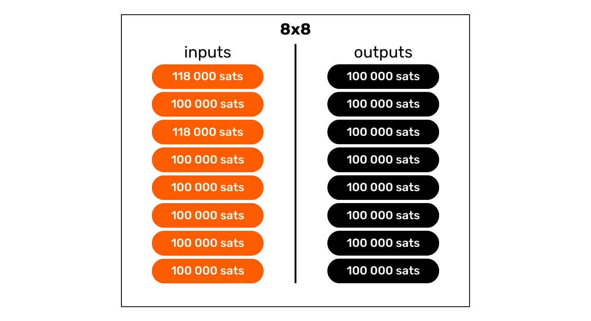
Whirlpoolin ehdottama malli perustuu näin ollen pieniin coinjoin-transaktioihin. Toisin kuin Wabisabi ja JoinMarket, joissa anonsettien vahvuus perustuu osallistujien määrään yhdessä syklissä (tai muutamassa syklissä), Whirlpool luottaa useiden pienten syklien ketjuttamiseen. Tässä mallissa käyttäjä maksaa kulut vain ensimmäisellä kerralla liittyessään altaaseen, mahdollistaen heidän osallistumisen lukuisiin uudelleensekoituksiin ilman lisämaksuja. Uudet tulokkaat kattavat kaivosmaksut uudelleensekoittajille.

Jokaisen lisäcoinjoinin myötä, johon kolikko osallistuu yhdessä aiemmin kohdattujen vertaistensa kanssa, anonsetit kasvavat eksponentiaalisesti. Tavoitteena on siis hyödyntää näitä ilmaisia uudelleensekoituksia, jotka jokaisella kerralla vahvistavat kunkin sekoitetun kolikon anonsettien tiheyttä.

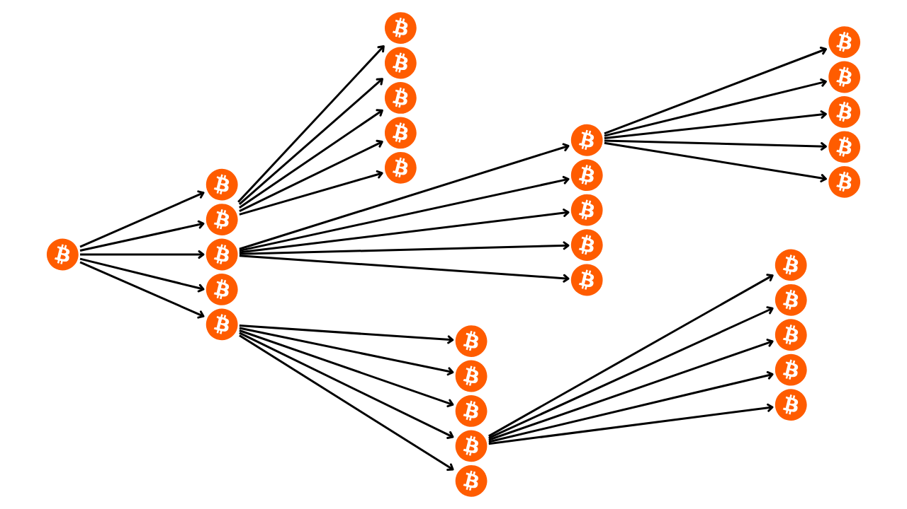

Whirlpool suunniteltiin kahden tärkeän vaatimuksen pohjalta:

- Toteutuksen saatavuus mobiililaitteilla, ottaen huomioon, että Samourai Wallet on ensisijaisesti älypuhelinsovellus;
- Uudelleensekoitussyklien nopeus, jotta anonsettien merkittävä kasvu kannustettaisiin.

Nämä imperatiivit ohjasivat Samourai Wallet -kehittäjien valintoja Whirlpoolin suunnittelussa, johtaen heidät rajoittamaan osallistujien määrää per sykli. Liian vähäinen osallistujamäärä olisi vaarantanut coinjoinin tehokkuuden, vähentäen merkittävästi jokaisessa syklissä tuotettuja anonsetteja, kun taas liian suuri osallistujamäärä olisi aiheuttanut hallinnollisia ongelmia mobiilisovelluksissa ja hidastanut syklien kulkua.

Lopulta Whirlpoolissa ei tarvita suurta osallistujamäärää per coinjoin, koska anonsetit muodostuvat useiden coinjoin-syklien kertymänä. Tärkein periaate tässä on kaikkien osallistujien UTXOjen homogeenisuus, sillä tämä mahdollistaa täydellisen sekoituksen ja siten täyden hyödyn sekoitus- ja uudelleensekoitussykleistä.

### Altaat ja coinjoin-maksut

Jotta nämä monet syklit voisivat tehokkaasti lisätä sekoitettujen kolikoiden anonsetteja, tietty kehys on määriteltävä UTXOjen käytettävien määrien rajoittamiseksi. Whirlpool määrittelee siis eri altaat.

Allas edustaa käyttäjäryhmää, joka haluaa sekoittua yhteen, ja jotka sopivat UTXOjen käytettävästä määrästä optimoidakseen coinjoin-prosessin säilyttäen samalla kolikoiden täydellisen homogeenisuuden. Jokainen allas määrittelee kiinteän määrän UTXOlle, jota käyttäjän on noudatettava osallistuakseen. Näin ollen coinjoineja suorittaaksesi Whirlpoolissa, sinun on valittava allas. Tällä hetkellä saatavilla olevat altaat ovat seuraavat:

- 0,5 bitcoineja;
- 0,05 bitcoinia;
- 0,01 bitcoinia;
- 0,001 bitcoinia (= 100 000 satsia).
  Liittyessäsi altaaseen bitcoineillasi, ne jaetaan tuottamaan UTXOja, jotka ovat täydellisen homogeenisia altaan muiden osallistujien kanssa. Jokaisella altaalla on maksimiraja; näin ollen, mikäli määrä ylittää tämän rajan, sinun on joko tehtävä kaksi erillistä sisääntuloa samassa altaassa tai käännyttävä toisen altaan puoleen, jossa on suurempi määrä:
  | Allas (bitcoin) | Maksimimäärä per sisääntulo (bitcoin) |
  |----------------|------------------------------------|
  | 0,5 | 35 |
  | 0,05 | 3,5 |
  | 0,01 | 0,7 |
  | 0,001 | 0,025 |
  UTXO katsotaan kuuluvaksi pooliin, kun se on valmis integroitavaksi coinjoiniin. Tämä ei kuitenkaan tarkoita, että käyttäjä menettäisi sen hallinnan. Kuten olemme nähneet tämän osan ensimmäisissä luvuissa, eri sekoituskiertojen kautta säilytät täyden kontrollin avaimiisi ja siten myös bitcoineihisi. Tämä erottaa coinjoin-tekniikan muista keskitetyistä sekoitustekniikoista.

Coinjoin-pooliin liittyäksesi sinun on maksettava palvelumaksut sekä louhintamaksut. Palvelumaksut ovat kiinteät jokaiselle poolille ja niiden tarkoituksena on korvata Whirlpoolin kehityksestä ja ylläpidosta vastaaville tiimeille.

Whirlpoolin käytöstä maksettavat palvelumaksut on maksettava kerran pooliin liittyessä. Tämän vaiheen suoritettuasi sinulla on mahdollisuus osallistua rajattomaan määrään uudelleensekoituksia ilman lisämaksuja. Tässä ovat nykyiset kiinteät maksut kullekin poolille:

| Pool (bitcoin) | Sisäänpääsymaksu (bitcoin) |
| -------------- | -------------------------- |
| 0.5            | 0.0175                     |
| 0.05           | 0.00175                    |
| 0.01           | 0.0005 (50,000 sats)       |
| 0.001          | 0.00005 (5,000 sats)       |

Nämä maksut toimivat käytännössä sisäänpääsylippuna valittuun pooliin, riippumatta siitä, kuinka paljon laitat coinjoiniin. Näin ollen, liityitpä 0.01 pooliin tasan 0.01 BTC:llä tai astuit siihen 0.5 BTC:llä, maksut pysyvät samoina absoluuttisina arvoina.

Whirlpool-coinjoineja suorittaessaan käyttäjällä on siis valittavanaan kaksi strategiaa:

- Valita pienempi pooli minimoidakseen palvelumaksut, tietäen saavansa useita pienempiä UTXOja vastineeksi;
- Tai valita suurempi pooli, suostuen maksamaan korkeampia maksuja saadakseen lopulta vähemmän, mutta suuremman arvon UTXOja.
  Yleensä ei suositella useiden sekoitettujen UTXOjen yhdistämistä coinjoin-kiertojen jälkeen, sillä tämä voisi vaarantaa saavutetun yksityisyyden, erityisesti yhteisen syötteen omistajuuden heuristiikan (CIOH: _Common-Input-Ownership-Heuristic_) vuoksi. Siksi saattaa olla viisasta valita suurempi pooli, vaikka se tarkoittaisikin enemmän maksamista, välttääkseen liian monien pienten arvoisten UTXOjen saamisen tuloksena. Käyttäjän on punnittava näitä vaihtoehtoja valitakseen mieluisan poolin.
  Palvelumaksujen lisäksi on otettava huomioon myös kaikkiin Bitcoin-siirtoihin liittyvät louhintamaksut. Whirlpool-käyttäjänä sinun on maksettava louhintamaksut valmistelutapahtumasta (`Tx0`) sekä ensimmäisestä coinjoinista. Kaikki sitä seuraavat uudelleensekoitukset ovat ilmaisia, kiitos Whirlpoolin mallin, joka perustuu uusien osallistujien maksuihin.

Todellakin, jokaisessa Whirlpool-coinjoinissa 2 syötteen käyttäjää ovat uusia osallistujia. Muut syötteet tulevat uudelleensekoittajilta. Tuloksena louhintamaksut kaikille tapahtuman osallistujille kattavat nämä 2 uutta osallistujaa, jotka sitten myös hyötyvät ilmaisista uudelleensekoituksista:

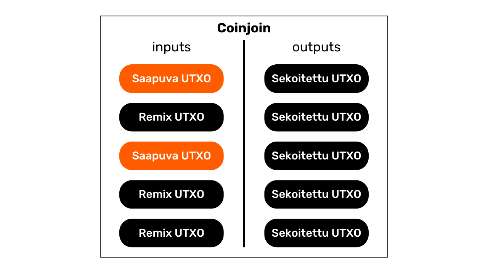

Tämän maksujärjestelmän ansiosta Whirlpool erottuu todella muista coinjoin-toteutuksista, koska UTXOjen anonsetit eivät ole suhteessa käyttäjän maksamaan hintaan. Näin on mahdollista saavuttaa huomattavan korkeita yksityisyyden tasoja maksamalla vain poolin sisäänpääsymaksun ja kahden siirron (Tx0 ja alkuperäinen sekoitus) louhintamaksut.
On tärkeää huomata, että käyttäjän on myös katettava louhintamaksut, jotta hän voi nostaa UTXO:nsa poolista suoritettuaan useita coinjoineja, ellei hän ole valinnut `mix to` -vaihtoehtoa, joka mahdollistaa ulkoisen osoitteen tarjoamisen, joka suoraan vastaanottaa varat coinjoin-tuloksena ilman lisätransaktiota.

### HD Wallet -tilit

Coinjoinin suorittamiseksi Whirlpoolin kautta, lompakon on luotava useita erillisiä tilejä. Tämä on ZeroLink-protokollan periaate. Tili, HD (_Hierarchical Deterministic_) lompakon kontekstissa, muodostaa osion, joka on täysin eristetty muista, tämä erottelu tapahtuu lompakon hierarkian kolmannella syvyystasolla, eli `xpub`-tasolla.


HD-lompakko voi teoriassa johtaa jopa `2^(32/2)` eri tiliin. Alkuperäinen tili, jota oletusarvoisesti käytetään kaikissa Bitcoin-lompakoissa, vastaa indeksiä `0'`.

Whirlpooliin sopeutetuissa lompakoissa käytetään 4 tiliä vastaamaan ZeroLink-prosessin tarpeita:

- **Talletustili**, joka on tunnistettu indeksillä `0'`;
- **Bad bank** -tili (tai "doxxic change"), joka on tunnistettu indeksillä `2 147 483 644'`;
- **Premix**-tili, joka on tunnistettu indeksillä `2 147 483 645'`;
- **Postmix**-tili, joka on tunnistettu indeksillä `2 147 483 646'`.

Jokainen näistä tileistä täyttää tietyn toiminnon coinjoin-prosessissa, jota tarkastelemme seuraavissa osioissa.

Kaikki nämä tilit on linkitetty yhteen siemeneen, joka mahdollistaa käyttäjän pääsyn palauttamisen kaikkiin heidän bitcoineihinsa käyttämällä heidän palautusfraasiaan ja tarvittaessa heidän salasanaansa. On kuitenkin tarpeen määrittää ohjelmistolle, tämän palautustoiminnon aikana, käytetyt eri tili-indeksit.

Katsotaan nyt eri vaiheita Whirlpool-coinjoinissa näiden tilien kautta.

### TX0

Mikä tahansa Whirlpool-coinjoinin lähtökohta on **talletustili**. Tätä tiliä käytät automaattisesti, kun luot uuden Bitcoin-lompakon. Tälle tilille on hyvitettävä bitcoinit, jotka haluat sekoittaa.

`Tx0` edustaa ensimmäistä askelta Whirlpool-sekoitusprosessissa. Sen tavoitteena on valmistella ja tasapainottaa UTXO:t coinjoinia varten, jakamalla ne yksiköihin, jotka vastaavat valitun poolin määrää, varmistaakseen sekoituksen homogeenisuuden. Tasapainotetut UTXO:t lähetetään sitten **premix**-tilille. Eron, joka ei voi mennä pooliin, erotetaan tiettyyn tiliin: **bad bank** (tai "doxxic change").

Tämä alkuperäinen transaktio `Tx0` palvelee myös coinjoin-koordinaattorille maksettavien palvelumaksujen selvittämistä. Toisin kuin seuraavat vaiheet, tämä transaktio ei ole yhteistyöllinen; käyttäjän on siis kannettava kaikki louhintamaksut:

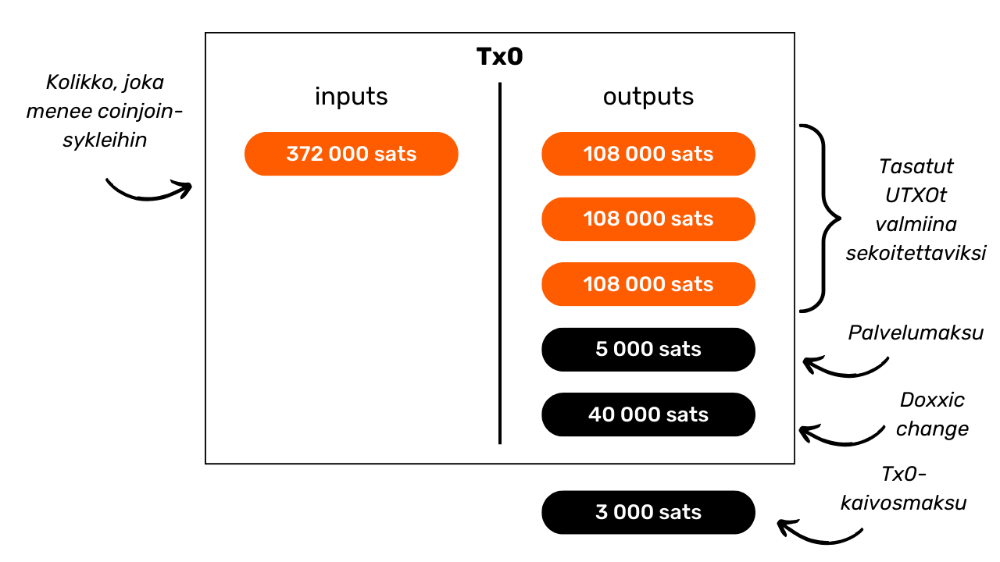

Tässä `Tx0`-transaktion esimerkissä **talletus**tililtämme tuleva syöte `372 000 sats` jaetaan useisiin lähtö-UTXOihin, jotka jaetaan seuraavasti:

- Määrä `5 000 sats` on tarkoitettu koordinaattorille palvelumaksuina, vastaten pooliin sisäänpääsyä `100 000 sats`;
- 3 UTXO:a valmisteltu sekoitusta varten, ohjattu **premix**-tilillemme ja rekisteröity koordinaattorille. Nämä UTXO:t tasapainotetaan `108 000 sats` kuhunkin, kattaakseen niiden tulevat alkuperäiset sekoituslouhintamaksut;
- Ylijäämä, joka ei mahdu pooliin, koska se on liian pieni, katsotaan myrkylliseksi vaihdoksi. Se lähetetään sen erityiselle tilille. Tässä tapauksessa vaihdoksen määrä on `40 000 sats`;
- Lopulta on `3 000 sats`, jotka eivät muodosta ulostuloa, mutta ovat louhintamaksuja, jotka vaaditaan `Tx0`:n vahvistamiseen.
  Esimerkiksi tässä on todellinen Tx0 Whirlpool (ei minulta): [edef60744f539483d868caff49d4848e5cc6e805d6cdc8d0f9bdbbaedcb5fc46](https://mempool.space/fr/tx/edef60744f539483d868caff49d4848e5cc6e805d6cdc8d0f9bdbbaedcb5fc46)


### Myrkyllinen Vaihdos

Ylijäämä, jota ei voitu integroida pooliin, tässä tapauksessa vastaten `40 000 sats`, ohjataan **pahapankki**-tilille, jota kutsutaan myös "myrkylliseksi vaihdokseksi", varmistaakseen tiukan erottelun lompakon muista UTXOista.

Tämä UTXO on vaarallinen käyttäjän yksityisyydelle, koska se ei ainoastaan ole edelleen kiinnitetty menneisyyteensä, ja siten mahdollisesti käyttäjän identiteettiin, mutta se on myös merkitty kuuluvaksi käyttäjälle, joka on osallistunut coinjoiniin.


Jos tämä UTXO yhdistetään sekoitettujen ulostulojen kanssa, ne menettävät kaiken yksityisyyden, jonka ne saivat coinjoin-sykleissä, erityisesti CIOH:n (_Common-Input-Ownership-Heuristic_) vuoksi. Jos se yhdistetään muiden myrkyllisten vaihdosten kanssa, käyttäjä riskeeraa yksityisyytensä menettämisen, koska tämä linkittää eri merkinnät coinjoin-sykleistä. Siksi sitä on käsiteltävä varoen. Puhumme tarkemmin näiden myrkyllisten UTXOjen hallinnasta tämän luvun viimeisessä osassa.

### Alkuperäinen Sekoitus

Kun `Tx0` on valmis, tasapainotetut UTXOt lähetetään lompakkomme **premix**-tilille, valmiina esittelemään ensimmäiseen coinjoin-sykliinsä, jota kutsutaan myös "alkuperäiseksi sekoitukseksi". Jos, kuten esimerkissämme, `Tx0` tuottaa useita sekoitusta varten tarkoitettuja UTXOja, kukin niistä integroidaan erilliseen alkuperäiseen sekoitukseen.

Näiden ensimmäisten sekoitusten lopussa **premix**-tili on tyhjä, kun taas kolikkomme, maksettuaan louhintamaksut tästä ensimmäisestä coinjoinista, on tarkalleen määritelty määrä valitun poolin mukaan. Esimerkissämme alkuperäiset UTXOmme `108 000 sats` on vähennetty tarkalleen `100 000 sats`iin.


### Uudelleensekoitukset

Alkuperäisen sekoituksen jälkeen UTXOt siirretään **postmix**-tilille. Tämä tili kokoaa sekä jo sekoitetut UTXOt että ne, jotka odottavat uudelleensekoitusta. Kun Whirlpool-asiakasohjelma on aktiivinen, **postmix**-tilin UTXOt ovat automaattisesti saatavilla uudelleensekoitukseen ja ne valitaan satunnaisesti osallistumaan näihin uusiin sykleihin.
Muistutuksena, uudelleensekoitukset ovat sitten 100% ilmaisia: ei vaadita lisäpalvelumaksuja tai louhintamaksuja. Pitämällä UTXOt **postmix**-tilillä säilytetään niiden täysi arvo ja samanaikaisesti parannetaan niiden anonsetteja. Siksi on tärkeää sallia näiden kolikoiden osallistuminen useisiin coinjoin-sykleihin. Se ei maksa sinulle mitään, ja se lisää niiden anonymiteetin tasoa.
Kun päätät käyttää sekoitettuja UTXO:ita, voit tehdä sen suoraan tästä **postmix**-tilistä. On suositeltavaa pitää sekoitetut UTXO:t tässä tilissä hyötyäksesi ilmaisista uudelleensekoituksista ja estääksesi niitä poistumasta Whirlpool-sykliltä, mikä voisi vähentää niiden yksityisyyttä.

### Kuinka hallita postmix-tiliäsi oikein?

Coinjoin-sykleiden suorittamisen jälkeen paras strategia on pitää UTXO:si **postmix**-tilillä odottamassa tulevaa käyttöä. On jopa suositeltavaa antaa niiden sekoittua uudelleen loputtomasti, kunnes tarvitset käyttää niitä.

Jotkut käyttäjät saattavat harkita sekoitettujen bitcoinien siirtämistä lompakkoon, joka on suojattu laitteistolompakolla. Tämä on mahdollista, mutta on tärkeää seurata tarkasti Samourai Walletin suosituksia, jotta hankittu luottamuksellisuus ei vaarannu.

UTXO:iden yhdistäminen on yleisin virhe. On välttämätöntä välttää sekoitettujen UTXO:iden yhdistämistä sekoittamattomien UTXO:iden kanssa samassa siirrossa, välttääkseen Common-Input-Ownership-Heuristic (CIOH) -heuristiikan. Tämä vaatii huolellista UTXO:idesi hallintaa lompakossasi, erityisesti merkinnöissä.


On myös tärkeää olla varovainen sekoitettujen UTXO:iden keskinäisessä yhdistämisessä. Kohtuulliset yhdistämiset ovat kuviteltavissa, jos sekoitetuilla UTXO:illasi on merkittäviä anonsettejä, mutta tämä vähentää väistämättä kolikoidesi luottamuksellisuutta. Varmista, että yhdistämiset eivät ole liian merkittäviä eivätkä tapahdu riittämättömän määrän uudelleensekoitusten jälkeen, riskinä luoda jäljitettävissä olevia linkkejä UTXO:idesi välille ennen ja jälkeen coinjoin-syklit. Epävarmuuden vallitessa näistä manipulaatioista paras käytäntö on olla yhdistämättä postmix-UTXO:ita, ja siirtää ne yksitellen laitteistolompakkoosi, luoden joka kerta uuden tyhjän osoitteen. Muista jälleen merkitä jokainen vastaanotettu UTXO asianmukaisesti.
On myös suositeltavaa välttää postmix-UTXO:idesi siirtämistä lompakkoon, joka käyttää epätavallisia skriptejä. Esimerkiksi, jos liityt Whirlpooliin multisig-lompakosta käyttäen `P2WSH`-skriptejä, on pieni mahdollisuus, että sekoitut muiden käyttäjien kanssa, joilla on alun perin sama tyyppinen lompakko. Jos nostat postmixisi tähän samaan multisig-lompakkoon, sekoitettujen bitcoiniesi yksityisyystaso heikkenee huomattavasti. Skriptien lisäksi on monia muita lompakon sormenjälkiä, jotka voivat johtaa harhaan.
Kuten kaikissa Bitcoin-siirroissa, on myös tärkeää olla uudelleenkäyttämättä vastaanotto-osoitteita. Jokainen uusi siirto tulisi vastaanottaa uudelle, tyhjälle osoitteelle.

Yksinkertaisin ja turvallisin ratkaisu on antaa sekoitettujen UTXO:idesi levätä **postmix**-tilillään, antaa niiden sekoittua uudelleen ja koskea niihin vain käyttääksesi niitä. Samourai- ja Sparrow-lompakoissa on lisäsuojauksia kaikkia näitä ketjuanalyysiin liittyviä riskejä vastaan. Nämä suojaukset auttavat välttämään virheitä.

### Kuinka hallita myrkyllistä vaihtorahaa oikein?

Seuraavaksi sinun on oltava varovainen hallitessasi doxxic-vaihtorahaa, vaihtorahaa, joka ei päässyt coinjoin-altaaseen. Nämä myrkylliset UTXO:t, jotka syntyvät Whirlpoolin käytöstä, aiheuttavat riskin yksityisyydellesi, koska ne luovat linkin sinun ja coinjoinin käytön välille. Siksi on välttämätöntä käsitellä niitä varoen eikä yhdistää niitä muiden UTXO:iden, erityisesti sekoitettujen UTXO:iden kanssa.

Tässä on erilaisia strategioita niiden käyttämiseen:

- **Sekoita ne pienemmissä altaissa:** Jos myrkyllinen UTXO:si on tarpeeksi suuri päästäkseen yksin pienempään altaaseen, harkitse sen sekoittamista. Tämä on usein paras vaihtoehto. Useiden myrkyllisten UTXO:iden yhdistämistä pääsyn saamiseksi altaaseen ei kuitenkaan suositella, koska tämä voisi linkittää eri merkintäsi toisiinsa.
- **Merkitse ne "ei-kulutettaviksi":** Toinen lähestymistapa on olla käyttämättä niitä, merkitsemällä ne "ei-kulutettaviksi" niille omistetussa tilissä ja vain hodlata. Tämä varmistaa, että et vahingossa käytä niitä. Jos bitcoinin arvo nousee, voi ilmestyä uusia altaita, jotka soveltuvat paremmin myrkyllisiin UTXOihisi;
- **Tee lahjoituksia:** Harkitse lahjoitusten tekemistä, vaikka vaatimattomia, kehittäjille, jotka työskentelevät Bitcoinin ja sen liitännäisohjelmiston parissa. Voit myös lahjoittaa organisaatioille, jotka hyväksyvät BTC:tä. Jos myrkyllisten UTXOidesi hallinta tuntuu liian monimutkaiselta, voit yksinkertaisesti päästä eroon niistä tekemällä lahjoituksen.
- **Osta lahjakortteja:** Alustat, kuten [Bitrefill](https://www.bitrefill.com/), mahdollistavat bitcoinien vaihtamisen lahjakortteihin, joita voidaan käyttää eri kauppiailla. Tämä voi olla tapa hävittää myrkylliset UTXOsi menettämättä niihin liittyvää arvoa.
- **Yhdistä ne Moneroon:** Samourai Wallet tarjoaa atomivaihtopalvelun BTC:n ja XMR:n välillä. Tämä on ihanteellinen tapa hallita myrkyllisiä UTXOja yhdistämällä ne Moneroon, vaarantamatta yksityisyyttäsi KYC:n kautta, ennen niiden lähettämistä takaisin Bitcoiniin. Tämä vaihtoehto voi kuitenkin olla kallis louhintamaksujen ja likviditeettirajoitteiden vuoksi maksettavien preemioiden osalta.
- **Lähetä ne Lightning Networkiin:** Näiden UTXOjen siirtäminen Lightning Networkiin hyödyntääkseen pienempiä transaktiomaksuja on mielenkiintoinen vaihtoehto. Tämä menetelmä voi kuitenkin paljastaa tiettyjä tietoja riippuen Lightningin käytöstäsi ja siksi sitä tulisi harjoittaa varoen.

### Kuinka käyttää Whirlpoolia?

Samourai Walletin perustajien pidätyksen ja heidän palvelimiensa takavarikoinnin jälkeen 24. huhtikuuta 2024, Whirlpool-työkalu ei enää toimi, edes niille, joilla on oma Dojo. Aiemmin se oli saatavilla Samourai Walletissa ja Sparrow Walletissa.


On kuitenkin mahdollista, että tämä työkalu voidaan ottaa uudelleen käyttöön tulevina viikkoina, riippuen oikeudenkäyntien tuloksista, tai käynnistää uudelleen eri tavalla. Joka tapauksessa uskon, että markkina Bitcoinin coinjoinille ei tule pysymään tarjonnatta pitkään, sillä kysyntä on selvä. Lisäksi Whirlpool-malli, ollessaan edistynein yksityisyyden suhteen, tullaan varmasti käyttämään tulevaisuudessa muiden toteutusten yhteydessä.

Seuraamme tiiviisti tämän tapauksen kehitystä sekä siihen liittyvien työkalujen kehittymistä. Voitte olla varmoja, että päivitämme tämän koulutuksen, kun uutta tietoa tulee saataville.

Seuraavassa luvussa tutustumme siihen, mitä "anonsetit" ovat, kuinka näitä indikaattoreita lasketaan, ja kuinka ne voivat auttaa meitä arvioimaan coinjoin-syklien tehokkuutta.

https://planb.network/tutorials/privacy/coinjoin-sparrow-wallet

https://planb.network/tutorials/privacy/coinjoin-samourai-wallet

https://planb.network/tutorials/privacy/coinjoin-dojo

## Anonyymiusjoukot

<chapterId>be1093dc-1a74-40e5-9545-2b97a7d7d431</chapterId>

Tutkittuamme, kuinka coinjoinit toimivat ja niihin liittyvät haasteet tehokkaassa sekoittamisessa, opimme nyt, kuinka tämän tehokkuutta voidaan mitata. Kuinka määritellä, onko coinjoin-prosessi ollut tehokas ja minkä asteen anonyymiyden kolikko on saavuttanut? Tämä on mitä tulemme tutkimaan tässä luvussa anonyymiusjoukkojen eli "anonsettien" avulla englanniksi.

### Muistutus Coinjoinin hyödyllisyydestä

CoinJoinin hyödyllisyys piilee sen kyvyssä tuottaa uskottavaa kiistettävyyttä upottamalla kolikkosi ryhmään erottamattomia kolikoita. Tämän toimenpiteen tavoitteena on katkaista jäljitettävyyslinkit, sekä menneisyydestä nykyhetkeen että nykyhetkestä menneisyyteen.
Toisin sanoen, analyytikko, joka tuntee alkuperäisen tapahtumasi (`Tx0`) CoinJoin-syklien alussa, ei pitäisi pystyä tunnistamaan varmuudella UTXO:tasi syklien uudelleenmiksaamisen jälkeen (analyysi syklin alusta loppuun).
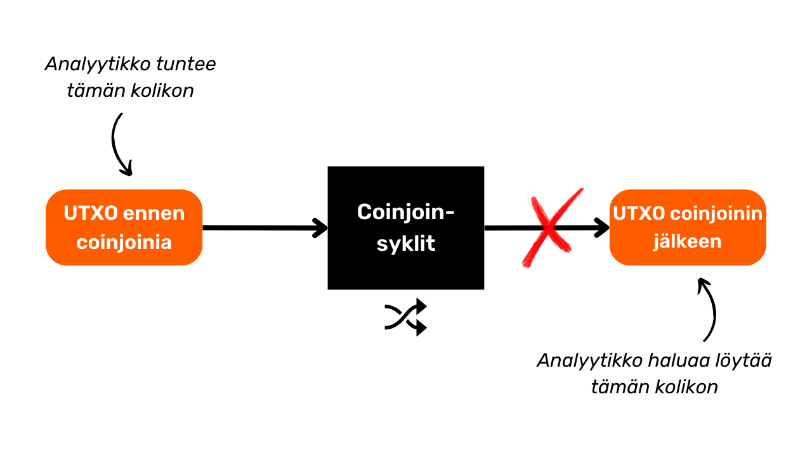

Päinvastoin, analyytikko, joka tuntee UTXO:si CoinJoin-syklien lopussa, ei pitäisi pystyä määrittämään alkuperäistä tapahtumaa syklien alussa (analyysi syklin lopusta alkuun).

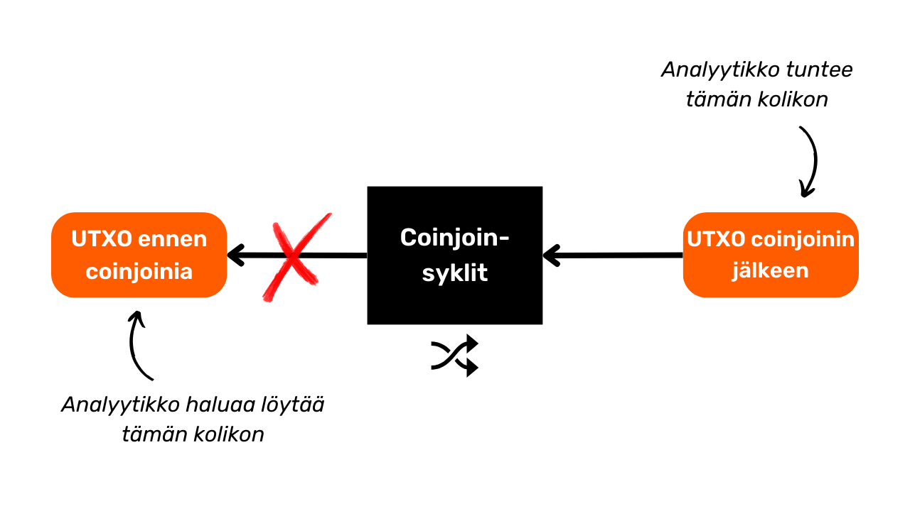

Arvioidakseen, kuinka vaikeaa analyytikolle on yhdistää menneisyys nykyhetkeen ja päinvastoin, on tarpeen määrittää homogeenisten kolikoiden ryhmien koko, joiden seassa oma kolikkosi on piilotettu. Tämä mittari kertoo meille analyysien määrän, joilla on identtinen todennäköisyys. Näin ollen, jos oikea analyysi on hukkunut 3 muun yhtä todennäköisen analyysin joukkoon, peittelytasonne on erittäin matala. Jos taas oikea analyysi on 20 000 yhtä todennäköisen analyysin joukossa, kolikkosi on erittäin hyvin piilotettu. Ja juuri näiden ryhmien koko edustaa indikaattoreita, joita kutsutaan "anonseteiksi".

### Anonsettien ymmärtäminen

Anonsetit toimivat indikaattoreina arvioitaessa tietyn UTXO:n yksityisyyden astetta. Tarkemmin sanottuna ne mittaavat erottamattomien UTXO:iden määrää joukossa, joka sisältää tutkittavan kolikon. Homogeenisen UTXO-joukon vaatimus tarkoittaa, että anonsetit lasketaan yleensä CoinJoin-syklien yli. Näiden indikaattorien käyttö on erityisen relevanttia Whirlpool CoinJoinien yhteydessä niiden yhdenmukaisuuden vuoksi.

Anonsetit mahdollistavat tarvittaessa CoinJoinien laadun arvioinnin. Suuri anonsetin koko merkitsee korkeaa anonymiteetin tasoa, koska tietyn UTXO:n erottaminen homogeenisestä joukosta muuttuu vaikeaksi.

Anonsetteja on kahta tyyppiä:

- **Tulevaisuuteen suuntautuva anonsetti;**
- **Menneisyyteen suuntautuva anonsetti.**

### Tulevaisuuteen suuntautuva anonsetti

Tulevaisuuteen suuntautuva anonsetti ilmaisee ryhmän koon, jonka seassa tutkittu UTXO on piilotettu syklin lopussa, tietäen UTXO:n syklin alussa, eli erottamattomien kolikoiden määrän tässä ryhmässä. Englanniksi tämän indikaattorin nimi on "forward anonset" tai "forward-looking metrics".
Tämä indikaattori mahdollistaa kolikon yksityisyyden vastustuskyvyn mittaamisen menneisyydestä nykyhetkeen -analyysissä (sisääntulosta ulostuloon).
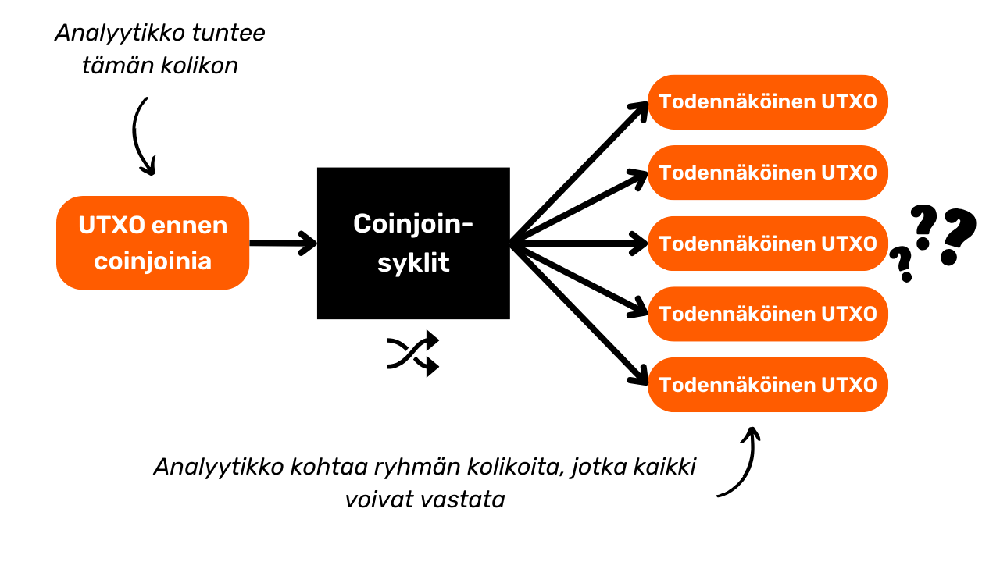

Tämä mittari arvioi, missä määrin UTXO:si on suojattu yrityksiltä rakentaa sen historia uudelleen sen sisääntulopisteestä sen ulostulopisteeseen coinjoin-prosessissa.

Esimerkiksi, jos tapahtumasi osallistui ensimmäiseen coinjoin-sykliin ja kaksi lisäjälkeläissykliä suoritettiin, kolikkosi tulevaisuuteen suuntautuva anonsetti olisi `13`:


Kuvitellaan esimerkiksi, että kolikkomme coinjoin-syklin alussa hyötyy tulevaisuuteen suuntautuvasta anonsetista `86,871`. Käytännössä tämä tarkoittaa, että se on piilotettu `86,871` erottamattoman kolikon joukkoon. Ulkopuolisen tarkkailijan, joka on tietoinen tästä kolikosta coinjoin-syklien alussa ja yrittää jäljittää sen ulostuloa, edessä olisi `86,871` mahdollista UTXO:a, joista jokaisella on identtinen todennäköisyys olla etsitty kolikko.

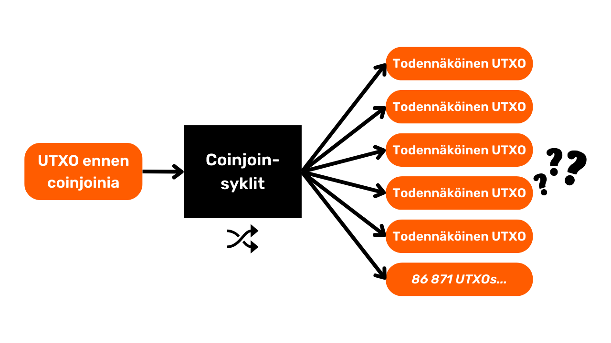

### Menneisyyteen suuntautuva anonsetti

Retrospektiivinen anonsetti ilmaisee mahdollisten lähteiden määrän tietylle kolikolle, kun tiedetään UTXO syklin lopussa. Tämä indikaattori mittaa kolikon yksityisyyden suojaa nykyhetkestä menneisyyteen analyysissä (poistumisesta sisääntuloon), eli kuinka vaikeaa analyytikolle on jäljittää kolikon alkuperä ennen coinjoin-syklejä. Englanniksi tämän indikaattorin nimi on "backward anonset" tai "backward-looking metrics."
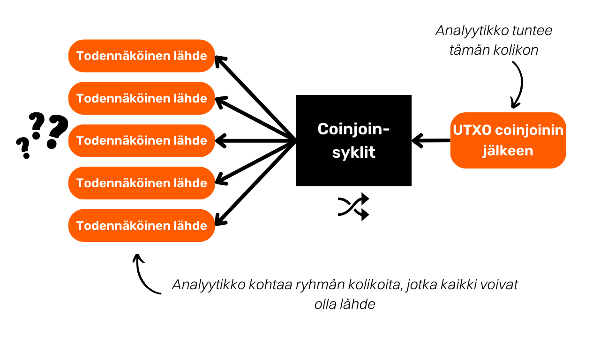

Tietäessäsi UTXO:n syklien lopussa, retrospektiivinen anonsetti määrittää potentiaalisten Tx0-tapahtumien määrän, jotka olisivat voineet muodostaa sisääntulosi coinjoin-sykleihin. Alla olevassa kaaviossa tämä vastaa kaikkien oranssien kuplien summaa.


Esimerkiksi, kuvitellaan, että kolikkomme coinjoin-syklin lopussa hyötyy retrospektiivisestä anonsetista `42,185`. Käytännössä tämä tarkoittaa, että tälle UTXO:lle on `42,185` potentiaalista lähdettä. Jos ulkopuolinen tarkkailija tunnistaa tämän kolikon syklien lopussa ja pyrkii jäljittämään sen alkuperän, hän kohtaa `42,185` mahdollista lähdettä, joilla kaikilla on yhtä suuri todennäköisyys olla etsitty alkuperä.

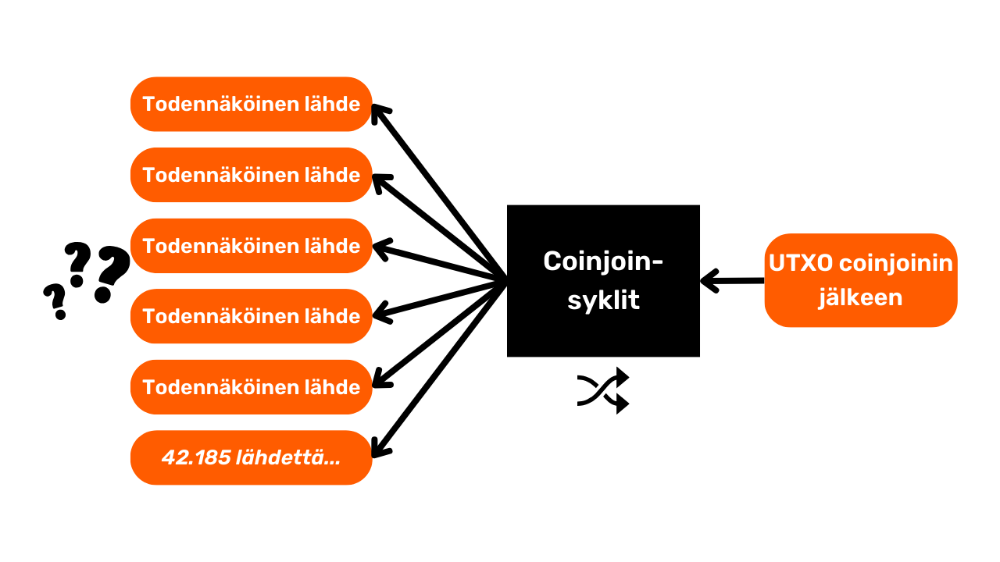

### Kuinka anonsetit lasketaan käytännössä?

On mahdollista manuaalisesti laskea omat anonsetit käyttäen lohkoketjuselainta pienille joukoille. Kuitenkin suurempien anonsettien kohdalla erikoistyökalun käyttö muuttuu välttämättömäksi. Tietääkseni ainoa ohjelmisto, joka pystyy suorittamaan tämän tehtävän, on _Whirlpool Stats Tool_, Python-työkalu, jonka ovat kehittäneet Samourain ja OXT:n tiimit. Valitettavasti tämä työkalu on tällä hetkellä poissa käytöstä Samourain perustajien pidätyksen ja OXT:n käytöstäpoiston seurauksena, jota käytettiin lohkoketjun tiedon poimintaan.


Kuten tässä luvussa olemme nähneet, anonsetteja voidaan laskea vain, jos coinjoineissa on tietty homogeenisuus rakenteessa. Ja juuri tässä seuraavassa luvussa tulemme tutkimaan, kuinka mitata tätä homogeenisuutta Bitcoin-tapahtumassa, olipa kyseessä sitten coinjoin tai perinteisempi tapahtuma.

https://planb.network/tutorials/privacy/wst-anonsets

## Entropia

<chapterId>e4fe289d-618b-49a2-84c9-68c562e708b4</chapterId>

Kuten olemme nähneet tässä osassa coinjoineista, UTXO:jen homogeenisuus sisääntuloissa ja ulostuloissa on tärkeässä roolissa Bitcoin-tapahtuman luottamuksellisuuden parantamisessa. Tämä parametri mahdollistaa uskottavan kiistämisen ketjuanalyysiä vastaan. Useita menetelmiä voi mitata tätä homogeenisuutta, mutta mielestäni yksi tehokkaimmista on _Boltzmann_-työkalun tarjoamien indikaattorien käyttö, jonka ovat kehittäneet OXT:n ja Samourai Walletin tiimit, erityisesti tapahtuman entropia. Tätä aiomme tutkia yksityiskohtaisesti tässä luvussa.

Toisin kuin anonsetit, jotka lasketaan joukosta tapahtumia, tässä esittelemämme indikaattorit keskittyvät yksinomaan yhteen tapahtumaan, olipa kyseessä sitten coinjoin tai perinteisempi tapahtuma.

### Tulkintojen määrä

Ensimmäinen havaittavissa oleva indikaattori Bitcoin-siirrossa on mahdollisten tulkintojen kokonaismäärä ulkopuolisen tarkkailijan näkökulmasta, joka analysoi siirtoa. Ottaen huomioon siirrossa mukana olevien UTXO:iden arvot, tämä indikaattori ilmaisee tapojen määrän, joilla syötteet voidaan yhdistää tulosteisiin. Toisin sanoen, se määrittää mahdollisten tulkintojen määrän, jonka siirto voi tuottaa bitcoinien virtauksessa ulkopuolisen tarkkailijan analysointinäkökulmasta.

Esimerkiksi yksinkertaisessa maksusiirrossa, jossa on 1 syöte ja 2 tulostetta, on vain yksi tulkinta, nimittäin että syöte #0 rahoitti tulosteen #0 ja tulosteen #1. Muita mahdollisia tulkintoja ei ole:


Sen sijaan Whirlpool 5x5 -mallin mukainen coinjoin esittää $1,496$ mahdollista yhdistelmää:

Whirlpool Surge Cycle 8x8 coinjoin esittää itsensä $9,934,563$ mahdollisella tulkinnalla:


### Entropia

Bitcoin-siirron tulkintojen määrästä voimme laskea sen entropian.

Yleisessä kryptografian ja informaation kontekstissa entropia on kvantitatiivinen mittari epävarmuudelle tai arvaamattomuudelle, joka liittyy datalähteeseen tai satunnaiseen prosessiin. Toisin sanoen, entropia on tapa mitata, kuinka vaikeaa tieto on ennustaa tai arvata.

Ketjuanalyysin erityiskontekstissa entropia on myös indikaattorin nimi, joka on johdettu Shannonin entropiasta ja [keksinyt LaurentMT](https://gist.github.com/LaurentMT/e758767ca4038ac40aaf), ja sitä voidaan laskea Bitcoin-siirrossa.

Kun siirrossa on suuri määrä mahdollisia tulkintoja, on usein relevantimpaa viitata sen entropiaan. Tämä indikaattori mahdollistaa analyytikoiden tiedon puutteen mittaamisen siirron tarkan konfiguraation osalta. Toisin sanoen, mitä suurempi entropia, sitä vaikeampi analyytikoiden tehtäväksi tulee bitcoinien virtausten tunnistaminen syötteiden ja tulosteiden välillä.

Käytännössä entropia paljastaa, esittääkö siirto ulkopuolisen tarkkailijan näkökulmasta useita mahdollisia tulkintoja, perustuen ainoastaan syötteiden ja tulosteiden määriin, ottamatta huomioon muita ulkoisia tai sisäisiä malleja ja heuristiikkoja. Korkea entropia on sitten synonyymi paremmalle luottamuksellisuudelle siirrossa.

Entropia määritellään mahdollisten yhdistelmien lukumäärän binäärilogaritmina. Tässä on käytetty kaava, jossa $E$ on siirron entropia ja $C$ mahdollisten tulkintojen lukumäärä:

$$
E = \log_2(C)
$$

Matematiikassa binäärilogaritmi (kantaluku 2 logaritmi) vastaa kahden eksponentoimisen käänteistoimintoa. Toisin sanoen, $x$:n binäärilogaritmi on eksponentti, johon $2$ on korotettava saadakseen $x$. Tämä indikaattori ilmaistaan siis bitteinä.

Otetaan esimerkki entropian laskemisesta Whirlpool 5x5 -mallin mukaiselle coinjoin-siirrolle, joka, kuten edellisessä osiossa mainittiin, esittää $1,496$ mahdollista tulkintaa:

$$
\begin{align*}
C &= 1,496 \\
E &= \log_2(1,496) \\
E &= 10.5469 \text{ bittiä}
\end{align*}
$$

Näin ollen tämä coinjoin-siirto näyttää entropian $10.5469$ bittiä, mikä katsotaan erittäin tyydyttäväksi. Mitä suurempi tämä arvo on, sitä useampia erilaisia tulkintoja siirto myöntää, parantaen näin sen yksityisyyden tasoa.
8x8 coinjoin -transaktiossa, joka tarjoaa $9,934,563$ tulkintaa, entropia olisi:

$$
\begin{align*}
C &= 9,934,563 \\
E &= \log_2(9,934,563) \\
E &= 23.244 \text{ bittiä}
\end{align*}
$$

Otetaan toinen esimerkki standardista maksutapahtumasta, jossa on 1 sisääntulo ja 2 ulostuloa: [1b1b0c3f0883a99f1161c64da19471841ed12a1f78e77fab128c69a5f578ccce](https://mempool.space/tx/1b1b0c3f0883a99f1161c64da19471841ed12a1f78e77fab128c69a5f578ccce)


Tässä tapahtumassa ainoa mahdollinen tulkinta on: `(In.0) > (Out.0 ; Out.1)`. Näin ollen sen entropia on vahvistettu $0$:ksi:

$$
\begin{align*}
C &= 1 \\
E &= \log_2(1) \\
E &= 0 \text{ bittiä}
\end{align*}
$$

### Tehokkuus

Tapahtuman entropian perusteella voimme myös laskea sen tehokkuuden yksityisyyden näkökulmasta. Tämä indikaattori arvioi tapahtuman tehokkuutta vertaamalla sitä optimaaliseen tapahtumaan, joka on kuviteltavissa identtisessä konfiguraatiossa.

Tämä johtaa meidät keskustelemaan maksimaalisen entropian käsitteestä, joka vastaa korkeinta teoreettisesti saavutettavissa olevaa entropiaa tietyn tapahtumarakenteen osalta. Tapahtuman tehokkuus lasketaan sitten vertaamalla tätä maksimaalista entropiaa analysoitavan tapahtuman todelliseen entropiaan.

Käytetty kaava on seuraava:

- $E_R$: tapahtuman todellinen entropia ilmaistuna bitteinä;
- $E_M$: tapahtumarakenteen maksimaalinen mahdollinen entropia myös ilmaistuna bitteinä;
- $Ef$: tapahtuman tehokkuus bitteinä:

$$
Ef = E_R - E_M
$$

Esimerkiksi Whirlpool 5x5 -tyyppiselle coinjoin-rakenteelle maksimaalinen entropia on $10.5469$:

$$
\begin{align*}
E_R &= 10.5469 \\
E_M &= 10.5469 \\
Ef &= E_R - E_M \\
Ef &= 10.5469 - 10.5469 \\
Ef &= 0 \text{ bittiä}
\end{align*}
$$

Tämä indikaattori ilmaistaan myös prosentteina. Käytetty kaava on seuraava:

- $C_R$: mahdollisten todellisten tulkintojen määrä;
- $C_M$: saman rakenteen mahdollisten tulkintojen maksimimäärä;
- $Ef$: tehokkuus ilmaistuna prosentteina:

$$
\begin{align*}
E_f &= \frac{C_R}{C_M} \\
E_f &= \frac{1\,496}{1\,496} \\
E_f &= 100\%
\end{align*}
$$

Tehokkuus $100\%$ osoittaa siis, että tapahtuma maksimoi yksityisyytensä potentiaalin rakenteensa perusteella.

### Entropian Tiheys

Entropia on hyvä indikaattori tapahtuman yksityisyyden mittaamiseen, mutta se riippuu osittain tapahtuman sisääntulojen ja ulostulojen määrästä. Erikoisten tapahtumien entropian vertailemiseksi, jotka eivät ole samankokoisia sisääntulojen ja ulostulojen suhteen, voidaan laskea entropian tiheys. Tämä indikaattori tarjoaa näkökulman entropiasta suhteessa kuhunkin tapahtuman sisääntuloon tai ulostuloon. Tiheys on hyödyllinen tapahtumien tehokkuuden arvioimiseen ja vertailemiseen eri kokoisissa tapahtumissa.
Sen laskemiseksi, jaa yksinkertaisesti tapahtuman kokonaisentropia tapahtumaan osallistuvien syötteiden ja tulosteiden kokonaismäärällä:

- $E_D$: entropiatiheys ilmaistuna bitteinä;
- $E$: tapahtuman entropia ilmaistuna bitteinä;
- $T$: syötteiden ja tulosteiden kokonaismäärä tapahtumassa:

$$
E_D = \frac{E}{T}
$$

Otetaan esimerkiksi Whirlpool 5x5 -coinjoin:

$$
\begin{align*}
T &= 5 + 5 = 10 \\
E &= 10.5469 \\
E_D &= \frac{E}{T} \\
E_D &= \frac{10.5469}{10} \\
E_D &= 1.054 \text{ bittiä}
\end{align*}
$$

Lasketaan myös entropiatiheys Whirlpool 8x8 -coinjoinille:

$$
\begin{align*}
T &= 8 + 8 = 16 \\
E &= 23.244 \\
E_D &= \frac{E}{T} \\
E_D &= \frac{23.244}{16} \\
E_D &= 1.453 \text{ bittiä}
\end{align*}
$$

Analysoimalla näiden kahden tyyppisten coinjoinien entropiatiheyttä, käy ilmi, että jopa entropian normalisoinnilla elementtien määrän mukaan, "Surge Cycle 8x8" -coinjoin tuottaa enemmän epävarmuutta analyysiin.

### Boltzmannin pisteytys

Toinen tapahtumassa analysoitu tieto on kunkin elementin Boltzmannin pisteytys suhteessa toiseen. Tämä on taulukko syötteiden ja tulosteiden välisistä vastaavuustodennäköisyyksistä. Tämä taulukko osoittaa Boltzmannin pisteytyksen kautta ehdollisen todennäköisyyden, että tietty syöte on yhdistetty tiettyyn tulosteeseen. Se on siis kvantitatiivinen mittaus ehdollisesta todennäköisyydestä, että syötteen ja tulosteen välinen yhdistyminen tapahtumassa tapahtuu, perustuen suotuisien tapahtumien määrän suhteeseen kokonaismahdollisten tapahtumien määrään tulkintojen joukossa.
Ottaen esimerkiksi Whirlpool-coinjoinin, ehdollisten todennäköisyyksien taulukko korostaisi kunkin syötteen ja tulosteen välisen linkin mahdollisuuksia, tarjoten kvantitatiivisen mittauksen yhdistysten epäselvyydestä tapahtumassa:

| %       | Tuloste 0 | Tuloste 1 | Tuloste 2 | Tuloste 3 | Tuloste 4 |
| ------- | --------- | --------- | --------- | --------- | --------- |
| Syöte 0 | 34%       | 34%       | 34%       | 34%       | 34%       |
| Syöte 1 | 34%       | 34%       | 34%       | 34%       | 34%       |
| Syöte 2 | 34%       | 34%       | 34%       | 34%       | 34%       |
| Syöte 3 | 34%       | 34%       | 34%       | 34%       | 34%       |
| Syöte 4 | 34%       | 34%       | 34%       | 34%       | 34%       |

Tässä on selvää, että jokaisella syötteellä on yhtäläinen mahdollisuus olla yhdistetty mihin tahansa tulosteeseen, mikä lisää tapahtuman luottamuksellisuutta.

Boltzmannin pisteytyksen laskeminen sisältää tietyn tapahtuman ilmenemisten määrän jakamisen saatavilla olevien tulkintojen kokonaismäärällä. Näin ollen, määrittääkseen pisteytyksen, joka yhdistää syötteen #0 tulosteeseen #3 (tapahtuma, joka esiintyy $512$ tulkinnassa), prosessi on seuraava:

$$
\begin{align*}
\text{Tulkinnat (IN.0 > OUT.3)} &= 512 \\
\text{Kaikki tulkinnat} &= 1496 \\
\text{Pisteet} &= \frac{512}{1496} \\
\text{Pisteet} &= 34 \%
\end{align*}
$$

Jos palaamme esimerkkiin Whirlpool-coinjoin 8x8 Surge Cycle -tilanteesta, Boltzmann-taulukko näyttäisi tältä:

|      | OUT.0 | OUT.1 | OUT.2 | OUT.3 | OUT.4 | OUT.5 | OUT.6 | OUT.7 |
| ---- | ----- | ----- | ----- | ----- | ----- | ----- | ----- | ----- |
| IN.0 | 23 %  | 23 %  | 23 %  | 23 %  | 23 %  | 23 %  | 23 %  | 23 %  |
| IN.1 | 23 %  | 23 %  | 23 %  | 23 %  | 23 %  | 23 %  | 23 %  | 23 %  |
| IN.2 | 23 %  | 23 %  | 23 %  | 23 %  | 23 %  | 23 %  | 23 %  | 23 %  |
| IN.3 | 23 %  | 23 %  | 23 %  | 23 %  | 23 %  | 23 %  | 23 %  | 23 %  |
| IN.4 | 23 %  | 23 %  | 23 %  | 23 %  | 23 %  | 23 %  | 23 %  | 23 %  |
| IN.5 | 23 %  | 23 %  | 23 %  | 23 %  | 23 %  | 23 %  | 23 %  | 23 %  |
| IN.6 | 23 %  | 23 %  | 23 %  | 23 %  | 23 %  | 23 %  | 23 %  | 23 %  |
| IN.7 | 23 %  | 23 %  | 23 %  | 23 %  | 23 %  | 23 %  | 23 %  | 23 %  |

Kuitenkin, yksinkertaisessa siirrossa, joka sisältää yhden sisääntulon ja 2 ulostuloa, tilanne on erilainen:

| %            | Ulostulo 0 | Ulostulo 1 |
| ------------ | ---------- | ---------- |
| Sisääntulo 0 | 100 %      | 100 %      |

Tässä huomaamme, että todennäköisyys kullekin ulostulolle olla peräisin sisääntulosta #0 on 100 %. Pienempi todennäköisyys siis tarkoittaa suurempaa yksityisyyttä laimentamalla suoria linkkejä sisääntulojen ja ulostulojen välillä.

### Deterministiset Linkit

On myös mahdollista laskea siirron determinististen linkkien määrä. Tämä indikaattori paljastaa, kuinka monta yhteyttä analysoitavassa siirrossa sisääntulojen ja ulostulojen välillä on kiistattomia, todennäköisyydellä 100 %. Tätä indikaattoria voidaan täydentää laskemalla determinististen linkkien suhde. Suhde tarjoaa näkökulman näiden determinististen linkkien painoarvoon kaikkien siirron linkkien joukossa.
Esimerkiksi Whirlpool-tyyppinen coinjoin-tapahtuma ei näytä determinististä linkkiä syötteiden ja tulosteiden välillä, näin ollen näyttäen indikaattorin 0 linkkiä ja suhteen 0%. Päinvastoin, toisessa tarkastellussamme yksinkertaisessa maksutapahtumassa (yhdellä syötteellä ja 2 tulosteella) indikaattori kertoo meille, että on olemassa 2 determinististä linkkiä ja suhde saavuttaa 100%. Siksi nolla-indikaattori viestii erinomaisesta yksityisyydestä johtuen suorien ja kiistattomien yhteyksien puuttumisesta syötteiden ja tulosteiden välillä.

### Kuinka näitä indikaattoreita lasketaan?

Näiden indikaattorien manuaalinen laskeminen käyttäen antamiani yhtälöitä on suhteellisen yksinkertaista. Päävaikeus piilee tapahtuman mahdollisten tulkintojen määrän määrittämisessä. Standarditapahtumalle tämä laskelma voidaan suorittaa käsin. Coinjoin-tapahtumalle tehtävä on huomattavasti monimutkaisempi.

Aiemmin oli olemassa Python-työkalu nimeltä _Boltzmann Calculator_, jonka OXT:n ja Samourain tiimit kehittivät, ja joka mahdollisti kaikkien näiden indikaattorien automaattisen laskennan Bitcoin-tapahtumalle:


Myös verkkosivustoa KYCP.org oli mahdollista käyttää näihin analyyseihin:


Valitettavasti Samourain perustajien pidätyksen jälkeen nämä työkalut eivät tällä hetkellä ole käytössä.

Nyt kun olemme käsitelleet coinjoineja yksityiskohtaisesti, tutkimme muita Bitcoinissa saatavilla olevia yksityisyyden suojaustekniikoita koulutuksemme viimeisessä osassa. Tarkastelemme payjoineja, erityisiä tapahtumatyyppejä pseudo-coinjoineja, staattisia osoiteprotokollia sekä toimenpiteitä, jotka tähtäävät yksityisyyden parantamiseen ei tapahtumatasolla, vaan solmujen verkon tasolla.

https://planb.network/tutorials/privacy/boltzmann-entropy

# Muiden edistyneiden yksityisyyden suojaustekniikoiden panokset ymmärtäminen

<partId>19989ae6-d608-4acf-b698-2cf1e7e5e6ae</partId>

## Payjoin-tapahtumat

<chapterId>c1e90b95-f709-4574-837b-2ec26b11286f</chapterId>

Coinjoin edustaa tällä hetkellä tehokkainta menetelmää epävarmuuden tuomiseksi kolikoiden jäljittämiseen ketjuanalyysin aikana. Kuten aiemmissa luvuissa olemme nähneet, tehokkaan sekoittamisen saavuttamiseksi on välttämätöntä, että syötteet ja tulosteet ovat mahdollisimman homogeenisia. Lisäksi on olennaista, että kolikot integroidaan mahdollisimman suureen ryhmään, jotta maksimoidaan anonsetit. Jotta coinjoin-tapahtumat olisivat tehokkaita, niiden on sisällettävä suuri määrä yhtenäisiä kolikoita. Tämä monien vaatimusten joukko tarkoittaa, että coinjoin-tapahtumilla on hyvin jäykkä rakenne: määrät ovat ennalta määrättyjä, ja kaikkien osallistujien on noudatettava niitä varmistaakseen prosessin yhtenäisyyden. Lisäksi coinjoin-tapahtumat vaativat synkronointia kaikkien osallistujien ja koordinaattorin välillä tapahtuman rakentamisen aikana.
Nämä vaatimukset tekevät coinjoin-tapahtumista huonosti soveltuvia suoriin maksuihin. Esimerkiksi, jos omistat 1M satsin osuuden coinjoin-altaassa, sen suora käyttö maksuna olisi monimutkaista. Se vaatisi synkronointia muiden osallistujien ja koordinaattorin kanssa yhteistyöllisen tapahtuman tarkalleen rakentamiseksi sillä hetkellä, kun sinun tarvitsee suorittaa maksu, ja ostosumman olisi täsmättävä tarkalleen osuutesi arvon kanssa, mikä on käytännössä saavuttamatonta. Siksi coinjoin-tapahtuma on luonteeltaan yhteistyöllinen pyyhkäisytransaktio, mikä tarkoittaa, että yleensä samat syötteiden omistajat löytyvät tulosteista.
Olisi kuitenkin mielenkiintoista, jos olisi olemassa tapahtumarakenteita, jotka mahdollistaisivat käytännölliset maksut samalla kun ne tuovat epäilyksiä ketjuanalyysiin. Juuri tätä tulemme tutkimaan tässä luvussa ja seuraavassa.

### Mikä on payjoin-tapahtuma?

Payjoin on erityinen Bitcoin-tapahtumarakenne, joka parantaa käyttäjän yksityisyyttä maksun aikana yhteistyössä maksun vastaanottajan kanssa.
Vuonna 2015 LaurentMT ensimmäisen kerran mainitsi tämän menetelmän nimellä "_steganografiset transaktiot_", dokumentin mukaan, joka on saatavilla [täällä](https://gist.githubusercontent.com/LaurentMT/e758767ca4038ac40aaf/raw/c8125f6a3c3d0e90246dc96d3b603690ab6f1dcc/gistfile1.txt). Myöhemmin tämä tekniikka otettiin käyttöön Samourai Walletissa, joka vuonna 2018 oli ensimmäinen asiakas, joka toteutti sen Stowaway-työkalun avulla. Payjoin-konsepti löytyy myös [BIP79](https://github.com/bitcoin/bips/blob/master/bip-0079.mediawiki) ja [BIP78](https://github.com/bitcoin/bips/blob/master/bip-0078.mediawiki) -dokumenteista. Useita termejä käytetään siis payjoinin merkitsemiseen:

- Payjoin;
- Stowaway;
- P2EP (_Pay-to-End-Point_);
- Steganografinen transaktio.

Payjoinin erityispiirre on sen kyky tuottaa transaktio, joka ensi silmäyksellä näyttää tavalliselta, mutta on todellisuudessa mini Coinjoin kahden henkilön välillä. Tätä varten transaktiorakenne sisältää maksun vastaanottajan inputeissa varsinaisen lähettäjän rinnalla. Vastaanottaja sisältää siis maksun itselleen transaktion keskellä, mikä mahdollistaa heidän maksunsa.

Otetaan esimerkki ymmärtääksemme tämän prosessin paremmin. Alice ostaa patongin 4 000 satoshilla käyttäen UTXO:a, joka on 10 000 satoshia, ja valitsee payjoinin. Hänen leipurinsa, Bob, lisää inputtiin 15 000 satoshin UTXO:n, joka kuuluu hänelle, ja hän saa sen kokonaisuudessaan outputissa takaisin, lisäksi Alicen 4 000 satoshia.


Tässä esimerkissä Bob leipuri syöttää 15 000 satoshia ja tulee ulos 19 000 satoshilla, ero ollessa tasan 4 000 satoshia, joka on patongin hinta. Alicen puolella hän tulee sisään 10 000 satoshilla ja päätyy 6 000 satoshiin outputissa, mikä edustaa -4 000 satoshin tasapainoa, eli patongin hintaa. Esimerkin yksinkertaistamiseksi olen tarkoituksella jättänyt mainitsematta louhintamaksut tässä transaktiossa.

### Mikä on payjoinin tarkoitus?

Payjoin-transaktio täyttää kaksi tavoitetta, jotka mahdollistavat käyttäjien maksujen yksityisyyden parantamisen.

Ensinnäkin, payjoin pyrkii harhauttamaan ulkopuolista tarkkailijaa luomalla väärän jäljen ketjuanalyysiin. Tämä on mahdollista CIOH-heuristiikan (_Common Input Ownership Heuristic_) ansiosta. Kuten osassa 3 näimme, yleensä kun blockchainissa on transaktio, jolla on useita inputteja, oletetaan, että kaikki nämä inputit kuuluvat samalle entiteetille tai käyttäjälle.

Näin ollen, kun analyytikko tutkii payjoin-transaktiota, hän uskoo, että kaikki inputit tulevat samalta henkilöltä. Tämä käsitys on kuitenkin väärä, sillä maksun vastaanottaja myös osallistuu inputteihin varsinaisen maksajan rinnalla. Ketjuanalyysi siis ohjautuu tulkintaan, joka osoittautuu vääräksi.

Palataan takaisin esimerkkiimme payjoin-transaktiosta patongin maksamiseksi:


Nähdessään tämän transaktion blockchainissa, ulkopuolinen tarkkailija, joka seuraa ketjuanalyysin tavanomaisia heuristiikkoja, tulkitsee sen seuraavasti: "_Alice yhdisti 2 UTXO:a inputeissa transaktioon maksamaan 19 000 satoshia Bobille_".
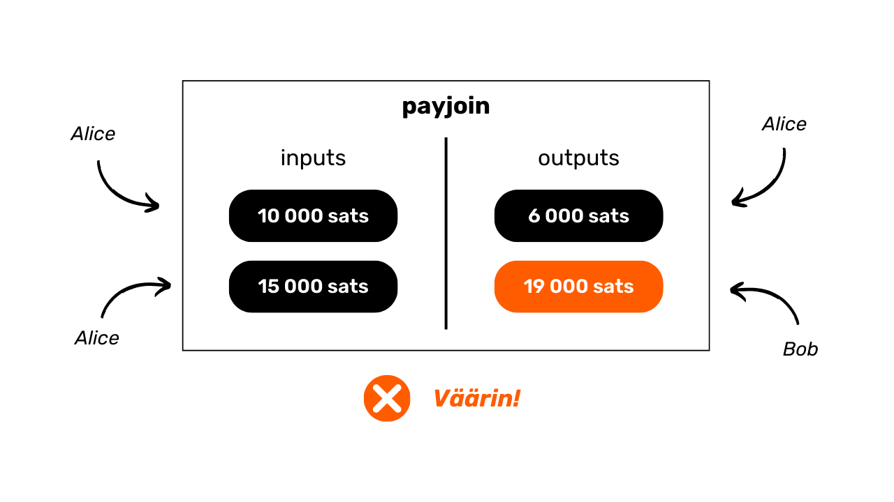
Tämä tulkinta on ilmiselvästi virheellinen, kuten jo tiedät, syötteiden kaksi UTXO:a eivät kuulu samalle henkilölle. Toinen tulee Alicelta, patongin ostajalta, ja toinen Bobilta, leipurilta.

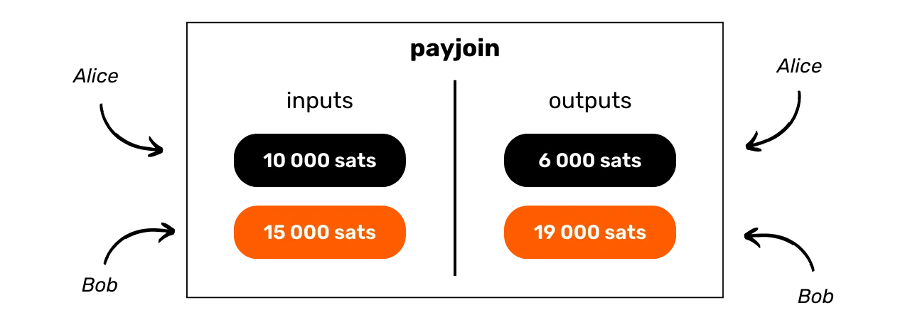

Ulkopuolisen tarkkailijan analyysi suuntautuu siis väärään johtopäätökseen, mikä varmistaa sidosryhmien luottamuksellisuuden säilymisen.

### Steganografiset transaktiot

Payjoinin toinen tavoite on johtaa ulkopuolista tarkkailijaa harhaan todellisen maksun määrästä. Tarkastelemalla transaktion rakennetta analyytikko saattaa uskoa, että maksu vastaa yhden ulostulon määrää.
Jos palaamme patongin ostoesimerkkiimme, analyytikko ajattelee, että maksun määrä vastaa joko 6 000 satsin UTXO:a tai 19 000 satsin UTXO:a. Tässä tapauksessa analyytikko todennäköisemmin ajattelee, että maksun määrä on 19 000 satsia, koska ulostuloissa on 2 UTXO:a, joista ainakin toinen on suurempi kuin 6 000 satsia (ei ole loogista syytä käyttää 2 UTXO:a maksamaan 6 000 satsia, kun yksi UTXO olisi riittänyt tähän maksuun).
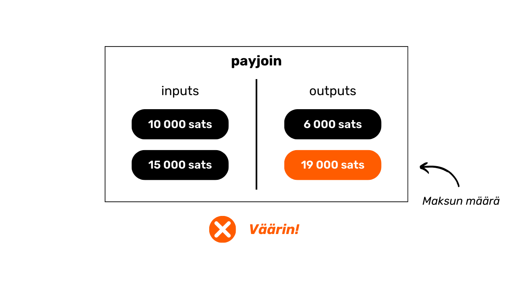

Mutta todellisuudessa tämä analyysi on virheellinen. Maksun määrä ei vastaa mitään ulostuloista. Se on itse asiassa ero vastaanottajan UTXO:n ulostulossa ja vastaanottajan UTXO:ssa syötteessä.

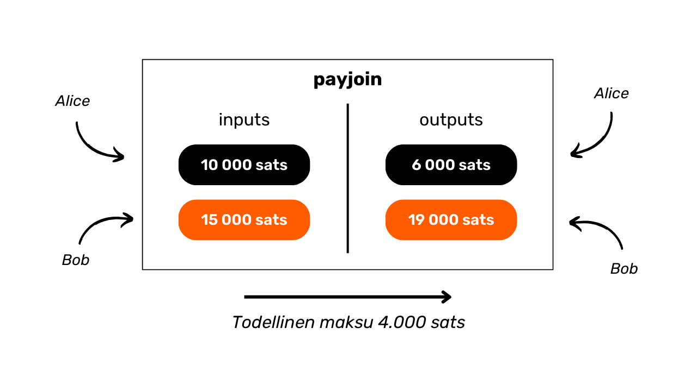

Tässä mielessä payjoin-transaktio kuuluu steganografian alueelle. Se mahdollistaa todellisen transaktion määrän piilottamisen väärennetyn transaktion sisään, joka toimii harhautuksena.

Steganografia on tekniikka, jolla tietoa voidaan piilottaa muiden tietojen tai esineiden sisään siten, että piilotetun tiedon läsnäolo ei ole havaittavissa. Esimerkiksi salainen viesti voidaan piilottaa tekstin pisteen sisään, joka ei liity aiheeseen, tehden siitä havaitsemattoman paljaalla silmällä (tämä on [micropoint](https://fr.wikipedia.org/wiki/Micropoint)-tekniikka).

Toisin kuin salaus, joka tekee tiedosta käsittämättömän ilman purkuavainta, steganografia ei muuta tietoa. Se pysyy näkyvissä. Sen tavoitteena on pikemminkin piilottaa salaisen viestin olemassaolon, kun taas salaus selvästi paljastaa piilotetun tiedon läsnäolon, vaikkakin saavuttamattomissa ilman avainta. Tämän vuoksi payjoinin alkuperäinen nimi oli "_steganografiset transaktiot_".

Analogia voitaisiin tehdä kryptografian ja coinjoinin välille, sekä steganografian ja payjoinin välille. Todellakin, coinjoinilla on ominaisuuksia, jotka ovat samankaltaisia kuin salauksella: menetelmä on tunnistettavissa, mutta tieto on käsittämätöntä. Päinvastoin, payjoin muistuttaa steganografiaa: tieto on teoriassa saavutettavissa, mutta koska sen peittämisen menetelmä ei ole tunnistettavissa, se muuttuu saavuttamattomaksi.

### Miten käyttää payjoinia?

Tunnettuja ohjelmistoja, jotka tukevat payjoinia, ovat Sparrow Wallet, Wasabi Wallet, Mutiny, BitMask, BlueWallet ja JoinMarket, sekä maksunprosessori BTCPay.


Samourai Walletin kehittynein payjoin-toteutus oli vain Stowaway. Kuitenkin, ohjelmiston perustajien pidätyksen jälkeen, tämä työkalu toimii nyt vain osittain. Stowawayn etuna on, että se on täydellinen ja erittäin helppokäyttöinen protokolla, joka tukee sekä payjoinien vastaanottamista että lähettämistä. Osittain allekirjoitetut transaktiot voidaan vaihtaa manuaalisesti skannaamalla useita QR-koodeja tai automaattisesti Torin kautta Sorobanin avulla. Juuri tämä viimeksi mainittu viestintävaihtoehto on tällä hetkellä pois käytöstä.

Payjoinin käytön vaikeus piilee sen riippuvuudessa kauppiaan osallistumisesta. Asiakkaana payjoinin käyttö on mahdotonta, jos kauppias ei tue sitä. Tämä lisää ylimääräisen vaikeuden ostoksen aikana: ei ole vain monimutkaista löytää kauppiaita, jotka hyväksyvät bitcoinin, mutta jos etsii myös niitä, jotka tukevat payjoineja, se muuttuu vielä monimutkaisemmaksi.

Ratkaisu voisi olla käyttää transaktiorakenteita, jotka tuovat epäselvyyttä ketjuanalyysiin vaatimatta vastaanottajan yhteistyötä. Tämä mahdollistaisi maksujemme yksityisyyden parantamisen riippumatta kauppiaiden aktiivisesta osallistumisesta. Tämä on juuri se, mitä tulemme tutkimaan seuraavassa luvussa.

https://planb.network/tutorials/privacy/payjoin-sparrow-wallet

https://planb.network/tutorials/privacy/payjoin-samourai-wallet

## Maksujen mini-coinjoinit

<chapterId>300777ee-30ae-43d7-ab00-479dac3522c1</chapterId>

Kun halutaan tehdä maksutransaktio säilyttäen tietyn yksityisyyden asteen, payjoin on hyvä vaihtoehto. Mutta kuten olemme nähneet, payjoin vaatii vastaanottajan osallistumisen. Mitä tehdä sitten, jos jälkimmäinen kieltäytyy osallistumasta payjoiniin, tai jos yksinkertaisesti mieluummin et halua ottaa heitä mukaan? Vaihtoehto on käyttää Stonewall- tai Stonewall x2 -transaktiota. Katsotaanpa tarkemmin näitä kahta transaktiotyyppiä.

### Stonewall-transaktio

Stonewall on tietty Bitcoin-transaktion muoto, jonka tavoitteena on lisätä käyttäjän yksityisyyttä kulutuksen aikana jäljittelemällä pseudo-coinjoinia kahden ihmisen välillä, olematta kuitenkaan sellainen. Todellisuudessa tämä transaktio ei ole yhteistyöllinen. Käyttäjä voi rakentaa sen yksin, käyttäen vain omia UTXO:itaan syötteinä. Voit siis luoda Stonewall-transaktion mille tahansa tilaisuudelle, tarvitsematta synkronoida toisen käyttäjän tai vastaanottajan kanssa.

Stonewall-transaktion toiminta on seuraava: transaktion syötteessä lähettäjä käyttää 2 UTXO:ta, jotka kuuluvat heille. Lähdössä transaktio tuottaa 4 UTXO:ta, joista 2 on täsmälleen samaa määrää. Kaksi muuta UTXO:ta muodostavat vaihtorahan. Näistä kahdesta saman määrän sisältävästä lähdöstä vain toinen todellisuudessa menee maksun vastaanottajalle.
Stonewall-transaktiossa on vain 2 roolia:

- Lähettäjä, joka suorittaa maksun;
- Vastaanottaja, joka saattaa olla tietämätön transaktion erityisluonteesta ja odottaa vain maksua lähettäjältä.

Otetaan esimerkki ymmärtääksemme tämän transaktiorakenteen. Alice on Bob leipurin luona ostamassa patonkiaan, joka maksaa 4,000 satsia. Hän haluaa maksaa bitcoineilla säilyttäen tietyn yksityisyyden tason maksustaan. Siksi hän päättää rakentaa Stonewall-transaktion maksua varten.
Tätä transaktiota analysoimalla voimme nähdä, että leipuri Bob todellakin sai 4 000 satsia maksuna patongista. Alice käytti 2 UTXO:a syötteinä: toinen oli 10 000 satsia ja toinen 15 000 satsia. Lähtöinä hän sai 3 UTXO:a: yhden 4 000 satsia, yhden 6 000 satsia ja yhden 11 000 satsia. Alicen nettotase tässä transaktiossa on siis -4 000 satsia, mikä vastaa täsmälleen patongin hintaa.
Tässä esimerkissä jätin tarkoituksella huomiotta louhintapalkkiot ymmärryksen helpottamiseksi. Todellisuudessa transaktiomaksut ovat kokonaan lähettäjän vastuulla.

### Mitkä ovat Stonewall-transaktion tavoitteet?

Stonewall-rakenne lisää paljon entropiaa transaktioon ja hämärtää ketjuanalyysin jälkiä. Ulkopuolisen tarkkailijan näkökulmasta tällainen transaktio voidaan tulkita mini-coinjoiniksi kahden henkilön välillä. Mutta todellisuudessa se on maksu. Tämä menetelmä siis luo epävarmuuksia ketjuanalyysiin, tai jopa johtaa vääriin jälkiin.

Palataan Alicen esimerkkiin Bob leipurin luona. Blockchainilla transaktio näyttäisi tältä:


Ulkopuolinen tarkkailija, joka nojaa yleisiin ketjuanalyysin heuristiikkoihin, saattaisi virheellisesti päätellä, että "_kaksi henkilöä on tehnyt pienen coinjoinin, kummallakin yksi UTXO syötteenä ja kaksi UTXO:a lähtönä_". Tämän transaktion ulkopuolinen analyysi ei johda Common Input Ownership Heuristic (CIOH) -sovellukseen, koska kahden samansuuruisen lähdön läsnäolo viittaa coinjoin-kaavaan. Ulkopuolisesta näkökulmasta CIOH ei siis ole sovellettavissa tässä erityistapauksessa.


Tämä tulkinta on epätarkka, koska, kuten tiedät, yksi UTXO lähetettiin Bob leipurille, 2 UTXO:a syötteissä tulee Alicelta, ja hän sai takaisin 3 vaihtorahojen lähtöä.


Ja erityisen mielenkiintoista Stonewall-transaktion rakenteessa on, että ulkopuolisen tarkkailijan näkökulmasta se näyttää täsmälleen samalta kuin Stonewall x2 -transaktion rakenne.

### Stonewall x2 -Transaktio

Stonewall x2 on toinen erityinen Bitcoin-transaktion muoto, joka myös pyrkii lisäämään käyttäjän yksityisyyttä kulutuksen aikana, mutta tällä kertaa yhteistyössä kolmannen osapuolen kanssa, joka ei ole mukana kulutuksessa. Tämä menetelmä toimii kuin pseudo-coinjoin kahden osallistujan välillä, samalla kun tehdään maksu kolmannelle henkilölle.

Stonewall x2 -transaktion toiminta on suhteellisen yksinkertainen: yksi käyttää hallussaan olevaa UTXO:a maksun tekemiseen ja pyytää kolmannen osapuolen apua, joka myös osallistuu omistamallaan UTXO:lla. Transaktio päättyy neljään lähtöön: kaksi niistä samansuuruisia, toinen tarkoitettu maksunsaajan osoitteeseen, toinen yhteistyökumppanin osoitteeseen. Kolmas UTXO lähetetään takaisin toiseen yhteistyökumppanin osoitteeseen, jolloin he voivat palauttaa alkuperäisen summan (heille neutraali toimenpide, miinus louhintapalkkiot), ja viimeinen UTXO palautuu osoitteeseen, joka kuuluu meille, mikä muodostaa maksun vaihtorahan.

Näin ollen Stonewall x2 -transaktioissa määritellään kolme eri roolia:

- Lähettäjä, joka tekee varsinaisen maksun;
- Vastaanottaja, joka saattaa olla tietämätön transaktion erityisluonteesta ja yksinkertaisesti odottaa maksua lähettäjältä;
- Yhteistyökumppani, joka tarjoaa bitcoineja herättääkseen epäilyksiä transaktioanalyysissä, samalla kun hän palauttaa varansa lopussa (neutraali toiminto heille, miinus louhintamaksut).
  Palatkaamme esimerkkiimme Alicesta, joka on Bob leipurin luona ostamassa patonkiaan, joka maksaa 4 000 satsia. Hän haluaa maksaa bitcoineilla säilyttäen tietyn yksityisyyden tason maksussaan. Siksi hän kutsuu ystävänsä Charlesin, joka auttaa häntä tässä prosessissa.


Tätä transaktiota analysoimalla voimme nähdä, että Bob leipuri on todellakin saanut 4 000 satsia maksuna patongista. Alice käytti 10 000 satsia sisääntulona ja palautti 6 000 satsia ulostulona, mikä johtaa nettotaseeseen -4 000 satsia, mikä vastaa patongin hintaa. Charlesin osalta hän tarjosi 15 000 satsia sisääntulona ja sai kaksi ulostuloa: toisen 4 000 satsia ja toisen 11 000 satsia, mikä tekee saldosta 0.

Tässä esimerkissä jätin tarkoituksella huomiotta maksut ymmärryksen helpottamiseksi. Todellisuudessa louhintamaksut jaetaan yleensä tasan maksun lähettäjän ja yhteistyökumppanin kesken.

### Mitkä ovat Stonewall x2 -transaktion tavoitteet?

Kuten Stonewall-rakenne, myös Stonewall x2 -rakenne lisää merkittävän määrän entropiaa transaktioon ja hämärtää ketjuanalyysin jälkiä. Ulkopuolisen näkökulmasta tällainen transaktio voitaisiin tulkita pienenä coinjoinina kahden henkilön välillä. Mutta todellisuudessa se on maksu. Tämä menetelmä siis luo epävarmuuksia ketjuanalyysissä, jopa johtaen vääriin jälkiin.

Palatkaamme esimerkkiin Alicesta, Bob leipurista ja Charlesista. Transaktio lohkoketjussa näyttäisi tältä:

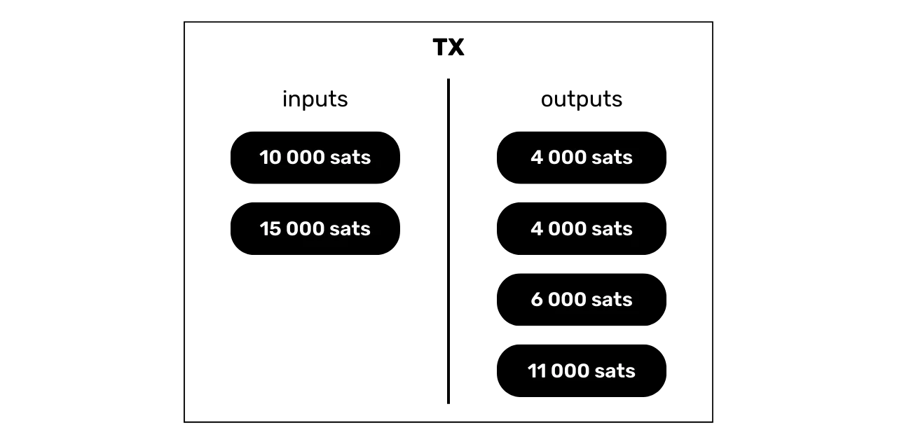

Ulkopuolinen tarkkailija, joka nojaa yleisiin ketjuanalyysin heuristiikkoihin, saattaisi virheellisesti päätellä, että "_Alice ja Charles ovat suorittaneet pienen coinjoinin, kummallakin yksi UTXO sisääntulossa ja kaksi UTXOa ulostulossa_". Jälleen kerran, tämän transaktion analyysi ulkopuolelta ei johda Common Input Ownership Heuristic (CIOH) -sovelluksen käyttöön, koska kahden saman suuruisen ulostulon läsnäolo viittaa coinjoin-kaavaan. Ulkopuolisen näkökulmasta CIOH ei siis ole sovellettavissa tässä erityistapauksessa.


Tämä tulkinta on virheellinen, koska, kuten tiedät, yksi UTXO lähetettiin Bob leipurille, Alicella on vain yksi vaihtoraha ulostulo, ja Charlesilla on kaksi.


Ja jälleen kerran, erityisen mielenkiintoista Stonewall x2 -transaktiorakenteessa on, että ulkopuolisen tarkkailijan näkökulmasta se näyttää täsmälleen samalta kuin Stonewall-transaktio.

### Mikä on ero Stonewallin ja Stonewall x2:n välillä?

StonewallX2-transaktio toimii täsmälleen kuten Stonewall-transaktio, paitsi että edellinen on yhteistyöllinen, kun taas jälkimmäinen ei ole. Kuten olemme nähneet, Stonewall x2 -transaktioon osallistuu kolmas osapuoli (Charles), joka on ulkopuolinen maksulle, ja joka tarjoaa bitcoinejaan lisätäkseen transaktion luottamuksellisuutta. Klassisessa Stonewall-transaktiossa yhteistyökumppanin roolin ottaa lähettäjä.


Ulkopuolisen näkökulmasta transaktion kaava on siis täsmälleen sama.

Se, että nämä kaksi siirtorakennetta jakavat täsmälleen saman kaavan, tarkoittaa, että vaikka ulkopuolinen tarkkailija onnistuisi tunnistamaan "Stonewall(x2)" kaavan, heillä ei ole kaikkea tietoa. He eivät pysty määrittämään, kumpi kahdesta samansuuruisesta UTXO:sta vastaa maksua. Lisäksi he eivät kykene määrittämään, tulevatko kaksi UTXO:a syötteissä kahdelta eri henkilöltä (Stonewall x2) vai kuuluvatko ne yhdelle henkilölle, joka on yhdistänyt ne (Stonewall).
Tämä viimeinen kohta johtuu siitä, että Stonewall x2 -siirrot noudattavat täsmälleen samaa kaavaa kuin Stonewall-siirrot. Ulkopuolelta ja ilman lisätietoja kontekstista on mahdotonta erottaa Stonewall-siirtoa Stonewall x2 -siirrosta. Kuitenkaan edelliset eivät ole yhteistyöllisiä siirtoja, kun taas jälkimmäiset ovat. Tämä lisää entisestään epävarmuutta yhden näistä siirroista analysoinnissa.

### Milloin käyttää Stonewall ja Stonewall x2 -siirtoja?

Logiikan tulisi olla seuraava, kun halutaan käyttää yksityisyyden suojan työkalua siirrossa:

- Ensisijaisesti voi valita maksun suorittamisen payjoin-menetelmällä;
- Jos kauppias ei tue payjoineja, voi tehdä yhteistyöllisen siirron toisen henkilön kanssa maksun ulkopuolella käyttäen Stonewall x2 -rakennetta;
- Jos kukaan ei löydy tekemään Stonewall x2 -siirtoa, voi tehdä Stonewall-siirron yksin, joka matkii Stonewall x2 -siirron käyttäytymistä.

### Miten käyttää Stonewall ja Stonewall x2 -siirtoja?

Stonewall ja Stonewall x2 -siirrot ovat saatavilla sekä Samourai Wallet -sovelluksessa että Sparrow Wallet -ohjelmistossa.


Kuitenkin, kuten payjoinsien kanssa, Samourain perustajien pidätyksen jälkeen Stonewall x2 -siirrot toimivat nyt vain manuaalisesti vaihtamalla PSBT:t osapuolten välillä. Automaattinen vaihto Sorobanin kautta ei valitettavasti ole tällä hetkellä saatavilla.

On myös mahdollista suorittaa tämäntyyppinen siirto manuaalisesti mistä tahansa Bitcoin-lompakko-ohjelmistosta.

Seuraavassa luvussa tutkimme toista yksityisyyden suojan tekniikkaa, joka on suhteellisen tuntematon, mutta erittäin hyödyllinen lisänä siihen, mitä olemme jo tutkineet.

https://planb.network/tutorials/privacy/stonewall

https://planb.network/tutorials/privacy/stonewall-x2

## Ricochets

<chapterId>db9a20ac-a149-443d-884b-ea6c03f28499</chapterId>

Bitcoin-siirtorakenteiden, kuten coinjoinin, käyttö, jotka lisäävät epäselvyyttä ketjuanalyysissä, on erityisen hyödyllistä yksityisyyden suojan kannalta. Kuitenkin, kuten keskustelimme payjoins-luvussa, coinjoin-siirrot ovat luonnostaan tunnistettavissa ketjussa. Muistakaa vertaus, jonka teimme salauksen ja coinjoinien välillä: kun joku salaa tiedoston, kolmas osapuoli, joka löytää tämän salatun tiedoston, ei pääse käsiksi sen sisältöön, mutta voi selvästi tunnistaa, että tiedostoa on muutettu piilottamaan sen sisältö. Sama pätee coinjoiniin: kun analyytikko tutkii coinjoin-siirtoa, vaikka he eivät voi luoda suoria linkkejä syötteiden ja tuottojen välille (ja päinvastoin), he voivat kuitenkin tunnistaa, että havaittu siirto on coinjoin.
Riippuen siitä, mihin tarkoitukseen aiot käyttää kolikkoasi coinjoin-kierrosten jälkeen, voi olla ongelmallista, että kolikko on käynyt läpi tämän prosessin. Esimerkiksi, jos aiot myydä kolikkosi säännellyllä vaihtoalustalla, mutta se on äskettäin käynyt läpi coinjoin-prosessin, alustan ketjuanalyysityökalu havaitsee tämän seikan. Alusta saattaa sen jälkeen kieltäytyä hyväksymästä UTXO:tasi, joka on käynyt läpi coinjoinin, tai jopa vaatia sinulta selityksiä, riskinä tilisi jäädyttäminen tai varojesi lukitseminen. Joissakin tapauksissa alusta saattaa myös ilmoittaa käyttäytymisestäsi valtion viranomaisille (esimerkiksi Ranskassa TRACFIN vaatii tätä Digitaalisen Omaisuuden Palveluntarjoajilta (PSAN)).


Välttääksemme tämän tarvitsisimme työkalun, joka pystyy häivyttämään Bitcoin-kolikon menneisyyden jäljet, palauttaakseen tietynlaisen vaihdettavuuden. Tämä on juuri ricochetin tavoite.

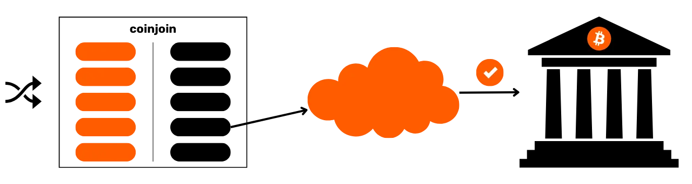

### Mikä on ricochet?

Ricochet on tekniikka, joka sisältää useiden fiktiivisten siirtojen suorittamisen itselleen (sweeping) omistajuuden siirron simulointiin bitcoineissa. Tämä työkalu eroaa muista keskustelemistamme transaktiorakenteista, koska se ei mahdollista tulevaa nimettömyyttä, vaan pikemminkin tietynlaisen takautuvan nimettömyyden. Todellakin, ricochet mahdollistaa tiettyjen yksityiskohtien hämärtämisen, jotka voisivat vaarantaa Bitcoin-kolikon vaihdettavuuden sen menneisyyden vuoksi.

Häivyttääkseen menneen tapahtuman, kuten esimerkiksi coinjoin-kierrokset, jättämän jäljen kolikkoon, ricochet suorittaa neljä peräkkäistä siirtoa, joissa käyttäjä siirtää varoja itselleen eri osoitteisiin.

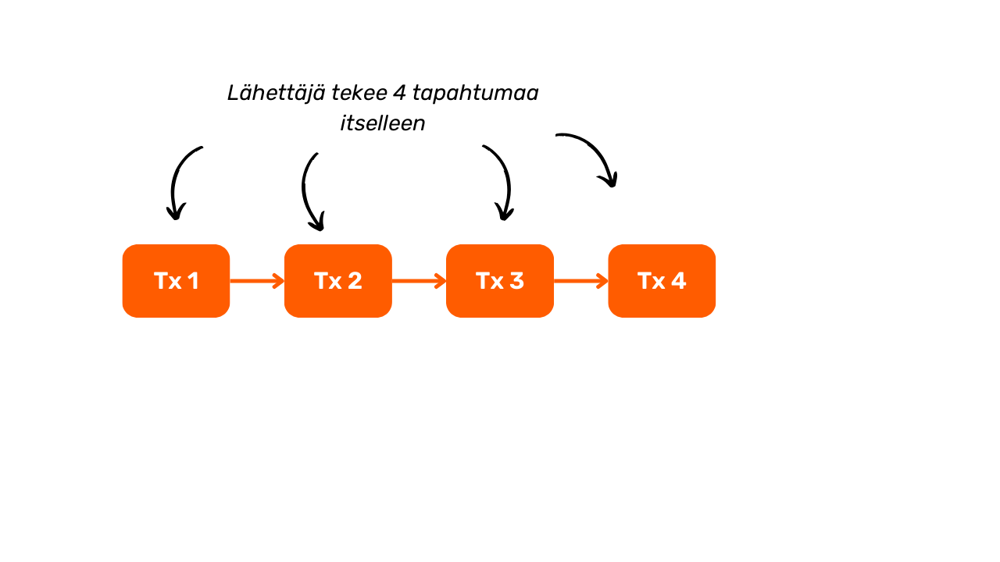

Tämän siirtojen sarjan jälkeen ricochet-työkalu lopulta ohjaa bitcoinit niiden lopulliseen kohteeseen, kuten vaihtoalustalle.

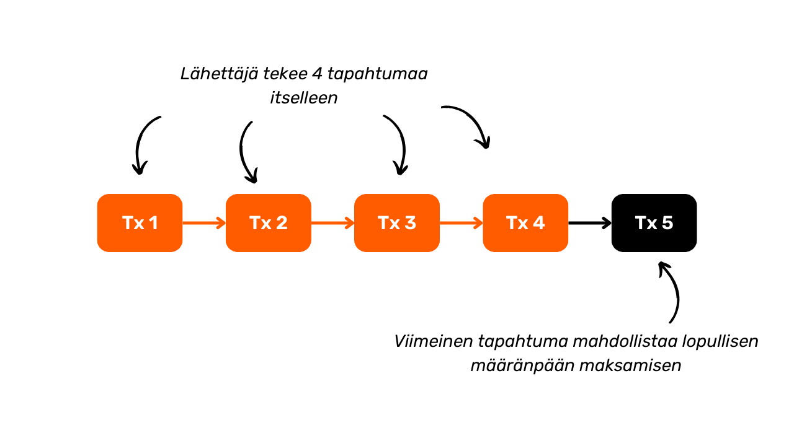

Tavoitteena on luoda etäisyyttä, joka vaikuttaa kolikon vaihdettavuuteen, kuten coinjoin-siirto, ja lopullinen käyttö, joka saattaisi hylätä tämän kolikon sen menneisyyden vuoksi. Näin ollen ketjuanalyysityökalut saattaisivat päätellä, että omistajuudessa on todennäköisesti tapahtunut muutos tapahtuman jälkeen, ja pitää tätä kolikkoa vaihdettavana. Coinjoin-tapauksessa ketjuanalyysityökalut saattaisivat sitten olettaa, että se ei ole sama henkilö, joka lähetti bitcoinit ja suoritti coinjoinin, ja siksi ei ole tarpeen aloittaa toimenpiteitä lähettäjää vastaan.


### Miksi tämä toimii?

Kohdatessaan tämän ricochet-menetelmän, voisi kuvitella, että ketjuanalyysiohjelmistot syventäisivät tutkimustaan neljän hypyn yli. Kuitenkin nämä alustat kohtaavat dilemman havaitsemiskynnyksen optimoinnissa. Niiden on asetettava raja hypyille, jonka jälkeen ne myöntävät, että omistajuuden muutos on todennäköisesti tapahtunut ja että yhteys aiempaan tapahtumaan (kuten coinjoin) tulisi jättää huomiotta.
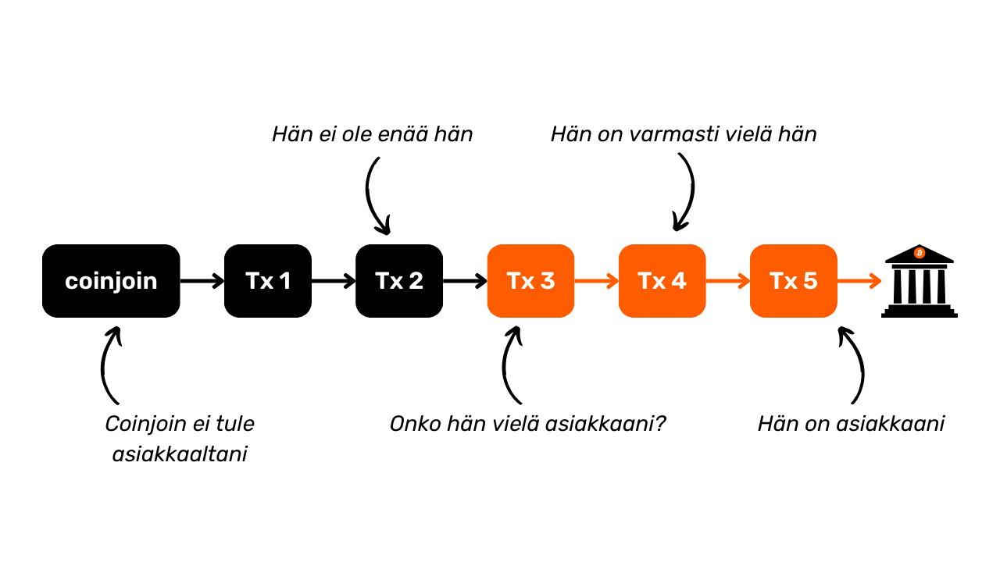

Kuitenkin tämän kynnyksen määrittäminen osoittautuu riskialttiiksi: havaittujen hyppyjen määrän jatkuva laajentaminen eksponentiaalisesti lisää väärin positiivisten tapausten, eli virheellisesti tapahtumaan osallistuneiksi merkittyjen yksilöiden, määrää. Tämä skenaario muodostaa suuren riskin näille yrityksille, sillä väärät positiiviset johtavat tyytymättömyyteen, mikä voi työntää vaikutuksen kohteena olevat asiakkaat kilpailijoiden puoleen. Pitkällä aikavälillä liian laaja havaitsemiskynnys johtaa siihen, että alusta menettää enemmän asiakkaita kuin sen kilpailijat, mikä voisi uhata sen elinkelpoisuutta. Siksi näiden alustojen on monimutkaista lisätä havaittujen hyppyjen määrää, ja 4 on usein riittävä määrä torjumaan heidän analyysejään.

Havaittu ilmiö on jossain määrin verrattavissa kuuden erottelun asteen teoriaan.
Kuuden erillisyysasteen teoria ehdottaa, että mikä tahansa henkilö maapallolla on yhteydessä mihin tahansa toiseen henkilöön tuttavuusketjun kautta, joka sisältää enintään kuusi välittäjää. Riittäisi kulkea sarjan kuuden ihmisen kautta, joista jokainen tuntee henkilökohtaisesti seuraavan, tavoittaakseen minkä tahansa yksilön maailmassa.

Bitcoin-siirroissa löytyy samankaltainen ilmiö. Riittävän monen Bitcoin-siirron jäljittäminen johtaa väistämättä coinjoin-tapaamiseen. Ricochet-menetelmä hyödyntää tätä periaatetta käyttämällä useampia hyppyjä kuin mitä vaihtoalustat kohtuudella voivat seurata. Jos alustat päättävät seurata enemmän siirtoja, on silloin mahdollista yksinkertaisesti lisätä ylimääräinen hyppy kiertääkseen tämän toimenpiteen.

### Milloin ja miten käyttää ricochetia?

Yleisin käyttötapaus ricochetille ilmenee, kun on tarpeen peittää aiempi osallistuminen coinjoiniin omistamassasi UTXO:ssa. Ihanteellisesti on parempi välttää bitcoinien siirtämistä, jotka ovat käyneet läpi coinjoinin, säänneltyihin yksiköihin. Siitä huolimatta, jos löytää itsensä tilanteesta ilman muita vaihtoehtoja, erityisesti kiireessä muuttaa bitcoineja fiat-valuutaksi, ricochet tarjoaa tehokkaan ratkaisun.

Tämä menetelmä on tehokas ei ainoastaan coinjoineille vaan myös mille tahansa muulle merkille, joka voisi vaarantaa kolikon vaihdettavuuden.
Ricochet-menetelmän idea tulee alun perin Samourai Wallet -tiimeiltä, jotka integroivat sen sovellukseensa prosessin automatisoimiseksi. Palvelu on maksullinen Samouraissa, sillä ricochetin käyttöön liittyy palvelumaksu 100 000 satsia, lisäksi louhintamaksut. Sen käyttöä suositellaan siis merkittävien määrien siirtoihin.


Samourai-sovellus tarjoaa kaksi ricochet-vaihtoehtoa:

- Parannettu ricochet eli "viivästetty toimitus", jolla on etuna Samourai-palvelumaksujen jakaminen viiden peräkkäisen siirron yli. Tämä vaihtoehto varmistaa myös, että jokainen siirto lähetetään eri aikaan ja kirjataan eri lohkoon, mikä mahdollistaa omistajuuden muutoksen käyttäytymisen matkimisen mahdollisimman tarkasti. Vaikka hitaampi, tämä menetelmä on suositeltava niille, jotka eivät ole kiireessä, sillä se maksimoi ricochetin tehokkuuden vahvistamalla sen vastustuskykyä ketjuanalyysiin;


- Klassinen ricochet, joka on suunniteltu suorittamaan toimenpide nopeasti lähettämällä kaikki siirrot lyhyen ajan kuluessa. Tämä menetelmä tarjoaa siis vähemmän yksityisyyttä ja alhaisemman vastustuskyvyn analyysiin verrattuna parannettuun menetelmään. Sitä tulisi käyttää vain kiireellisissä lähetyksissä.


Ricochet tarkoittaa yksinkertaisesti bitcoinien lähettämistä itselleen. On täysin mahdollista suorittaa ricochet manuaalisesti millä tahansa lompakko-ohjelmistolla, käyttämättä erikoistyökalua. Siirrä vain sama kolikko itsellesi peräkkäin, käyttäen joka kerta uutta tyhjää osoitetta.

Seuraavassa luvussa tutkimme erilaisia tekniikoita salaisiin omaisuuden siirtoihin. Nämä menetelmät eroavat radikaalisti tähän asti tarkastelluista sekä toiminnan että tulosten osalta.

https://planb.network/tutorials/privacy/ricochet
 
## Salaiset Omaisuuden Siirrot

<chapterId>a2067036-849c-4d6b-87d2-44235cfae7a1</chapterId>

Bitcoinin yksityisyyteen liittyvien tekniikoiden joukossa on myös salainen omaisuuden siirto. Tämä menetelmä pyrkii siirtämään bitcoinien omistajuuden yhdeltä henkilöltä toiselle, ja päinvastoin, ilman, että tämä transaktio on nimenomaisesti nähtävissä lohkoketjussa. Tutkitaan yhdessä erilaisia käytettävissä olevia tekniikoita sekä niiden etuja ja haittoja.

### CoinSwap

CoinSwap perustuu suhteellisen yksinkertaiseen konseptiin: se käyttää älykkäitä sopimuksia bitcoin-omistuksen siirtämiseen kahden käyttäjän välillä ilman luottamuksen tarvetta ja ilman, että tämä siirto näkyy eksplisiittisesti lohkoketjussa.

Kuvitellaan yksinkertaistettu esimerkki Alicen ja Bobin kanssa. Alicella on 1 BTC, joka on suojattu yksityisellä avaimella $A$, ja Bobilla on myös 1, suojattu yksityisellä avaimella $B$. Teoriassa he voisivat vaihtaa yksityisiä avaimiaan ulkoisen viestintäkanavan kautta suorittaakseen salaisen siirron.


Tämä naiivi menetelmä kuitenkin esittää suuren riskin luottamuksen suhteen. Mikään ei estä Alicea säilyttämästä yksityisen avaimen $A$ kopiota vaihdon jälkeen ja käyttämästä sitä myöhemmin varastaakseen bitcoinit, kun avain on Bobin hallussa.


Lisäksi ei ole takeita, jotka estäisivät Alicen vastaanottamasta Bobin yksityistä avainta $B$ ja jättämästä lähettämättä omaa yksityistä avaintaan $A$ vastineeksi. Tämä vaihto perustuu siis liialliseen luottamukseen osapuolten välillä ja osoittautuu tehottomaksi turvallisen omistajuuden salaisen siirron varmistamisessa.


Näiden ongelmien ratkaisemiseksi ja vaihtojen mahdollistamiseksi osapuolten välillä, jotka eivät luota toisiinsa, voimme sen sijaan käyttää älykkäitä sopimusjärjestelmiä. Älykäs sopimus on ohjelma, joka suoritetaan automaattisesti, kun ennalta määritellyt ehdot täyttyvät, mikä meidän tapauksessamme varmistaa, että omistajuuden vaihto tapahtuu automaattisesti ilman keskinäistä luottamusta.

Tähän voimme käyttää HTLC (_Hash Time-Locked Contracts_) tai PTLC (_Point Time-Locked Contracts_). Nämä kaksi protokollaa toimivat samankaltaisesti käyttäen aikalukitusjärjestelmää, joka takaa, että vaihto joko suoritetaan onnistuneesti tai peruutetaan kokonaan, suojellen näin molempien osapuolten varojen eheyttä. HTLC:ien ja PTLC:ien pääasiallinen ero on, että HTLC:t käyttävät hasheja ja preimageja turvaamaan transaktion, kun taas PTLC:t käyttävät Adaptor Signatureja.

Coinswap-skenaariossa, jossa käytetään HTLC:tä tai PTLC:tä Alicen ja Bobin välillä, vaihto tapahtuu turvallisesti: joko se onnistuu, ja kumpikin saa toisen BTC:t, tai se epäonnistuu, ja kumpikin säilyttää omat BTC:nsä. On siis mahdotonta, että toinen osapuolista huijaisi tai varastaisi toisen BTC:t.

> _HTLC:t ovat myös mekanismi, jota käytetään maksujen turvalliseen reitittämiseen Lightning Networkin kaksisuuntaisissa kanavissa._
> Adaptor Signaturejen käyttö on erityisen mielenkiintoista tässä yhteydessä, koska se mahdollistaa perinteisten skriptien ohittamisen (tätä mekanismia kutsutaan joskus "_scriptless scripts_" eli skriptittömiksi skripteiksi). Tämä ominaisuus auttaa vähentämään vaihdon yhteydessä syntyviä kuluja. Toinen merkittävä etu Adaptor Signatureista on, että ne eivät vaadi yhteisen hashin käyttöä transaktion molemmille osapuolille, välttäen näin suoran linkin paljastamisen heidän välillään tietyntyyppisissä vaihdoissa.

### Adaptor Signaturet

Adaptor Signaturet ovat kryptografinen menetelmä, joka yhdistää voimassa olevan allekirjoituksen lisäallekirjoituksen, kutsuttu "_adaptor signature_", paljastaakseen salaisen tiedonpalan. Tämä mekanismi on suunniteltu siten, että tietäen 2 seuraavista 3 elementistä: voimassa olevan allekirjoituksen, adaptor signaturen ja salaisuuden, mahdollistaa puuttuvan kolmannen elementin päättelemisen. Tämän menetelmän mielenkiintoinen ominaisuus on, että jos tiedämme vastapuolemme adaptor signaturen ja tietyn pisteen elliptisellä käyrällä, joka liittyy salaisuuteen, jota käytettiin tämän adaptor signaturen laskemiseen, voimme johtaa oman adaptor signaturemme, joka on yhteensopiva saman salaisuuden kanssa, ilman että meillä on suoraa pääsyä itse salaisuuteen.
Kolikkovaihdossa Adaptor-allekirjoitusten käyttö mahdollistaa kahden arkaluontoisen tiedon samanaikaisen paljastamisen osallistujien välillä, välttäen näin tarpeen keskinäiselle luottamukselle. Otetaan esimerkki tämän prosessin havainnollistamiseksi Alicen ja Bobin kanssa, jotka haluavat vaihtaa omistajuutta 1 BTC kumpikin, mutta eivät luota toisiinsa. He käyttävät Adaptor-allekirjoituksia poistaakseen luottamuksen tarpeen tässä vaihdossa. Näin he etenevät:

- Alice aloittaa vaihdon luomalla transaktion $m_A$, joka lähettää 1 BTC:n Bobille. Hän luo allekirjoituksen $s_A$, joka vahvistaa tämän transaktion, käyttäen omaa yksityistä avaintaan $p_A$ ($P_A = p_A \cdot G$), nonce-arvoa $n_A$ ($N_A = n_A \cdot G$) ja salaisuutta $t$ ($T = t \cdot G$):

$$s_A = n_A + t + H(N_A + T \parallel P_A \parallel m_A) \cdot p_A$$

- Alice laskee adaptor-allekirjoituksen $s_A'$ vähentämällä salaisuuden $t$ todellisesta allekirjoituksestaan $s_A$:

$$s_A' = s_A - t$$

- Alice lähettää Bobille adaptor-allekirjoituksensa $s'_A$, allekirjoittamattoman transaktionsa $m_A$, pisteen, joka vastaa salaisuutta ($T$), ja pisteen, joka vastaa nonce-arvoa ($N_A$). Nämä elementit muodostavat niin kutsutun "_adaptorin_". On tärkeää huomata, että pelkästään näiden tietojen avulla Bob ei voi palauttaa Alicen BTC:tä.
- Bobilla on kuitenkin kyky varmistaa, ettei Alice yritä varastaa häneltä. Tehdäkseen tämän, hän tarkistaa, vastaako Alicen adaptor-allekirjoitus $s_A'$ ehdotettua transaktiota $m_A$. Jos seuraava yhtälö on oikein, hän voi olla varma, että Alicen adaptor-allekirjoitus on pätevä:
  $$s_A' \cdot G = N_A + H(N_A + T \parallel P_A \parallel m_A) \cdot P_A$$

- Tämä varmennus antaa Bobille riittävät takeet edetä vaihdossa luottavaisesti. Hän luo oman transaktionsa $m_B$, jonka on tarkoitus lähettää 1 BTC Alicelle, ja luo oman adaptor-allekirjoituksensa $s_B'$, joka myös linkitetään samaan salaisuuteen $t$. Tässä vaiheessa vain Alice tietää $t$:n arvon; Bob tietää vain vastaavan pisteen $T$, jonka Alice on lähettänyt hänelle:

$$s_B' = n_B + H(N_B + T \parallel P_B \parallel m_B) \cdot p_B$$

- Bob lähettää Alicelle adaptor-allekirjoituksensa $s_B'$, allekirjoittamattoman transaktionsa $m_B$, sekä pisteen, joka vastaa salaisuutta ($T$) ja pisteen, joka vastaa nonce-arvoa ($N_B$). Alice, joka tietää salaisuuden $t$, voi nyt yhdistää Bobin adaptor-allekirjoituksen $s_B'$ tähän salaisuuteen luodakseen pätevän allekirjoituksen $s_B$ transaktiolle $m_B$, joka siirtää Bobin BTC:t hänelle:

$$s_B = s_B' + t$$

$$(s_B' + t) \cdot G = N_B + T + H(N_B + T \parallel P_B \parallel m_B) \cdot P_B$$

- Alice lähettää tämän allekirjoitetun transaktion $m_B$ Bitcoin-lohkoketjuun palauttaakseen Bobilta luvatun BTC:n. Kun Bob näkee tämän transaktion lohkoketjussa, hän voi erottaa allekirjoituksen $s_B = s_B' + t$. Tämän tiedon avulla Bob pystyy sitten eristämään kuuluisan salaisuuden $t$, jota hän tarvitsi.
  $$t = (s_B' + t) - s_B' = s_B - s_B'$$
- Ja todellakin, tämä salainen $t$ oli ainoa puuttuva elementti, jotta Bob pystyi luomaan validin allekirjoituksen $s_A$ Alicen sovittaja-allekirjoituksesta $s_A'$. Tämä allekirjoitus mahdollistaa transaktion $m_A$ validoinnin, joka lähettää BTC:n Alicelta Bobille. Bob laskee tämän jälkeen $s_A$:n ja vuorostaan lähettää transaktion $m_A$ lohkoketjuun:

$$s_A = s_A' + t$$

$$(s_A' + t) \cdot G = N_A + T + H(N_A + T \parallel P_A \parallel m_A) \cdot P_A$$
Kerrataanpa, miten Sovittaja-allekirjoitus toimii kolikoidenvaihdossa. Aluksi Alice lähettää Bobille allekirjoittamattoman transaktion yhdessä sovittajan kanssa, joka mahdollistaa Bobin varmistaa, että myöhemmin paljastettu salaisuus antaa hänelle pääsyn bitcoineihin. Vastineeksi Bob lähettää Alicelle oman allekirjoittamattoman transaktionsa ja hänen sovittajansa. Alice voi sitten finalisoida Bobin transaktion ja palauttaa bitcoinit lähettämällä validin transaktion käyttäen salaisuutta. Kun tämä transaktio julkaistaan lohkoketjussa, Bobilla on mahdollisuus poimia salaisuus ja siten avata Alicen transaktio. Näin ollen, jos Alice aloittaa Bobin bitcoinien siirron, hän voi vuorostaan päästä käsiksi Alicen bitcoineihin ilman keskinäistä luottamusta.
On huomionarvoista, että kolikoidenvaihdot ehdotettiin ensimmäisen kerran [Gregory Maxwellin toimesta lokakuussa 2013 BitcoinTalkissa](https://bitcointalk.org/index.php?topic=321228.0).

### Atomivaihto

Samankaltaisesti kolikoidenvaihdon kanssa ja käyttäen samoja älykkäitä sopimuksia, on myös mahdollista suorittaa atomivaihtoja. Atomivaihto mahdollistaa eri kryptovaluuttojen, kuten BTC:n ja XMR:n, suoran vaihdon kahden käyttäjän välillä ilman luottamuksen tarvetta tai välittäjän puuttumista. Näitä vaihtoja kutsutaan "atomisiksi", koska niillä on vain kaksi mahdollista lopputulosta: joko vaihto onnistuu ja molemmat osapuolet ovat tyytyväisiä, tai se epäonnistuu ja kumpikin säilyttää alkuperäiset kryptovaluuttansa, mikä eliminoi tarpeen luottaa toiseen osapuoleen.


Atomivaihto ja kolikoidenvaihto jakavat samankaltaisen toimintatavan ja tarjoavat samat edut ja haitat yksityisyyden suhteen. Todellakin, Bitcoinin näkökulmasta atomivaihto on verrattavissa kahteen vaiheeseen suoritettuun kolikoidenvaihtoon. Ensin vaihdamme BTC:mme toiseen kryptovaluuttaan, ja sitten tämä kryptovaluutta voidaan vaihtaa muihin BTC:ihin. Lopulta saamme toisen käyttäjän BTC:t. Tämän vuoksi yksityisyysongelmien analyysissä ryhmittelen nämä kaksi protokollaa omistajuuden salaisen vaihdon kategoriaan.


Toisin kuin kolikoidenvaihdossa, atomivaihdossa voi kuitenkin olla epätasapainoa saatavilla olevan likviditeetin suhteen, erityisesti BTC/XMR-vaihdoissa. Yleensä bitcoineja on helpompi vaihtaa altcoineiksi, koska bitcoineille on suuri kysyntä, mikä pitää tämän suunnan muuntokurssit matalina. Kuitenkin altcoinien vaihtaminen BTC:ksi voi olla monimutkaisempaa alhaisemman kysynnän vuoksi, mikä usein johtaa erittäin korkeisiin preemioihin.

Lopuksi, kun atomivaihto sisältää onchain-bitcoineja ja bitcoineja Lightning-verkossa, viittaamme siihen termillä "_submarine swap_".

### Onko se todella hyödyllistä?

Salaiset omaisuudensiirrot, kuten kolikoidenvaihdot ja atomivaihdot, tarjoavat etuna huijata ketjuanalyysin heuristiikkoja. Nämä menetelmät voivat antaa vaikutelman, että transaktiot koskevat samaa käyttäjää, vaikka todellinen omistajuus onkin vaihtunut. Kuitenkin näiden menetelmien päähaitta on, että ne ovat erittäin riskialttiita ilman lisätekniikan käyttöä kolikon historian katkaisemiseksi.
Todellakin, kun Alice suorittaa kolikkovaihdon tai atomivaihdon Bobin kanssa, hän vaihtaa omistusoikeutensa bitcoineihinsa Bobin omistamiin. Atomivaihdon tapauksessa vaihtoon sisältyy altcoin, mutta periaate pysyy samana. Näin Alice päätyy omistamaan kolikon $B$ ja Bob kolikon $A$. Tämä lisää epävarmuutta ketjuanalyysissä, mutta kolikoiden historia pysyy jäljitettävissä. Jos analyytikko tutkii kolikkoa $A$, hän voi jäljittää takaisin Alicen aiempiin toimiin, ja päinvastoin kolikon $B$ kohdalla.
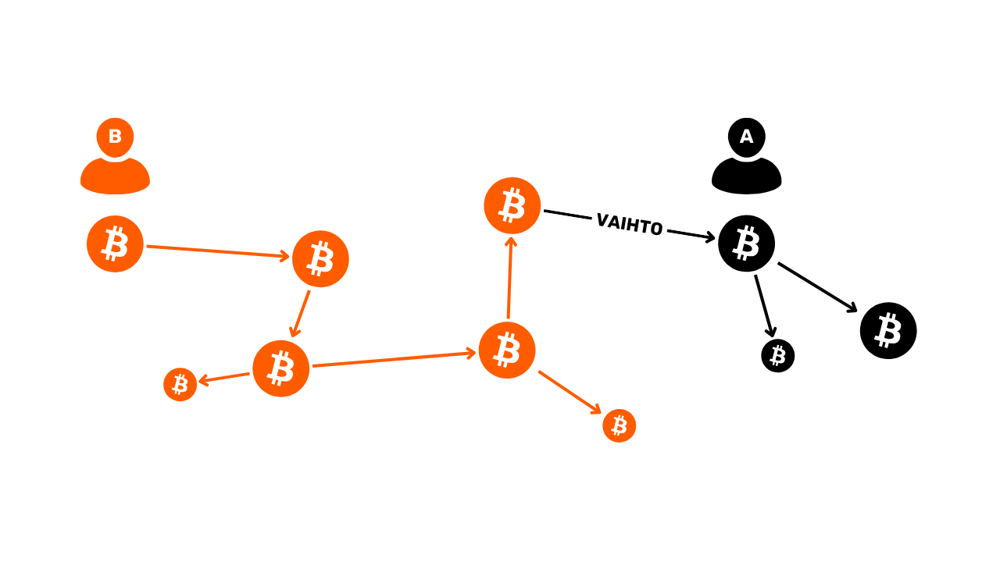

Alicen näkökulmasta riskinä on, että kolikon $B$ historiaa voidaan pitää epäilyttävänä tietyissä piireissä. Jos esimerkiksi Bob olisi hankkinut kolikon $B$ rikollisella teolla, kuten hakkeroinnilla, tämä kolikko pysyisi yhdistettynä hänen laittomiin toimiinsa. Alice saattaisi sitten löytää itsensä omistamasta kolikkoa, jota hän ei voisi siirtää säänneltyihin vaihtoalustoihin riskaamatta varojensa jäädyttämistä, tai jopa syytettäessä Bobin rikoksista, vaikka hänellä ei olisi niiden kanssa mitään tekemistä.

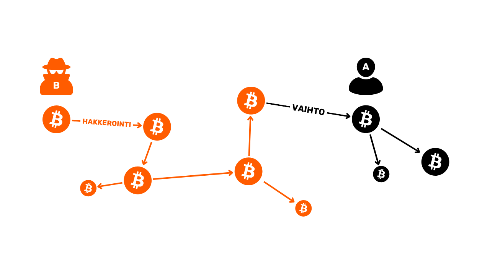

Ja tietenkin, yksityisyyden suojaamisen menetelmät kuten kolikkovaihto tai atomivaihto ovat rikollisten suosiossa, joiden varoja viranomaiset valvovat. Nämä protokollat tarjoavat heille mahdollisuuden luopua valvotuista bitcoineistaan vaihtamalla ne täysin vaihdettavissa oleviin bitcoineihin. Tämä mahdollistaa myös harhautuksen, ohjaten viranomaisia muiden käyttäjien suuntaan. Näin ollen näillä henkilöillä on kaksinkertainen hyöty näistä menetelmistä.

Kolikkoyhdistämisen (coinjoin) avulla, vaikka kolikkosi sekoitetaan valvottuihin bitcoineihin, kolikon historia katkeaa, mikä tarjoaa tietynlaisen uskottavan kiistämisen mahdollisuuden, joka ei ole olemassa salaisissa omaisuudensiirron protokollissa kuten kolikkovaihdossa tai atomivaihdossa.


Jos Alice haluaa välttää kaikki riskit, hänen on välttämättä käytettävä menetelmää katkaistakseen kolikon $B$ historian, kuten suorittamalla sen läpi kolikkoyhdistämisiä (coinjoins), esimerkiksi. Tämä herättää kysymyksen salaisen omistusoikeuden siirron ja kolikkoyhdistämisen yhdistämisen hyödyllisyydestä. Kolikkoyhdistäminen, katkaistessaan kolikon historian, tarjoaa jo riittävän yksityisyyden tason Alicelle. Näin ollen, mielipiteeni on, että jos Alice haluaa suojata yksityisyyttään, olisi järkevämpää suorittaa suoraan kolikkoyhdistäminen sen sijaan, että hän osallistuisi kolikkovaihtoon seurattuna kolikkoyhdistämisestä.
Jotta salaisen omistusoikeuden siirron menetelmät olisivat todella tehokkaita ja välttäisivät riskin käyttäjän $A$ historian yhdistämisestä käyttäjään $B$, olisi paradoksaalisesti tarpeen, että niiden käyttö olisi laajalti tunnettua. Jos kolikkovaihtoa käytetään massiivisesti ja viranomaiset ovat tietoisia tästä yleisestä käytännöstä, silloin voitaisiin luoda uskottava kiistämisen mahdollisuus. Kuitenkin, niin kauan kuin näiden siirtojen käyttö pysyy marginaalisena, uskon näiden menetelmien pysyvän liian riskialttiina käyttäjille.

Tähän mennessä olemme pääasiassa tutkineet yksityisyyden suojaamisen menetelmiä itse transaktiotasolla. Seuraavassa luvussa tutkimme ongelmia verkostotason ja transaktioiden levittämisen näkökulmasta.

## Yksityisyys P2P-verkossa

<chapterId>04a2467b-db84-4076-a9ff-919be5135106</chapterId>

Osa 4:ssä keskustelimme täysnoden käytön tärkeydestä transaktioidesi yksityisyyden suojaamisessa. On kuitenkin tärkeää ymmärtää, että noden itsensä voi kohdistua hyökkäyksiä, jotka pyrkivät kaivamaan tietoa toiminnastasi. Tässä luvussa tarkastelemme siis erilaisia yksityisyyden suojaamisen toimenpiteitä, ei transaktioiden itsensä tai bitcoinien virtauksien tasolla, vaan verkostotason.

### Dandelion

Yksi tapa välttää erilaisia anonymiteetin paljastavia hyökkäyksiä on käyttää Dandelion-ehdotusta. Tämä lähetysprotokolla formalisoitiin BIP156:ssa, mutta sitä ei ole koskaan toteutettu Bitcoinissa.

Dandelionin idea on parantaa Bitcoin-verkon transaktioiden reitityksen yksityisyyttä vastatakseen erilaisiin hyökkäysmuotoihin. Sen päätavoitteena on piilottaa alkuperäinen solmu, joka ensimmäisenä lähetti transaktion verkossa. Tämän solmun paljastuminen voisi yhdistää Bitcoin-transaktion tiettyyn IP-osoitteeseen (jos solmu toimii avoimessa verkossa), mikä voisi tarjota sisäänpääsyn ketjuanalyysiin.

Tämä yhteys Bitcoinin toiminnan ja IP-osoitteen välillä edustaa merkittävää riskiä käyttäjän yksityisyydelle. Todellakin, monet tahot voivat helposti yhdistää IP-osoitteen henkilöllisyyteen. Tämä sisältää erityisesti hallitukset ja Internet-palveluntarjoajat. Lisäksi tämä tieto voi tulla julkisesti saataville, esimerkiksi jos IP-osoitteesi ja henkilökohtaiset tietosi paljastuvat vuodon seurauksena verkkosivuston tietokannan hakkeroinnissa.

Bitcoinin standarditoiminnassa käyttäjän lompakko-ohjelmistossa luodut transaktiot lähetetään heidän henkilökohtaiseen solmuunsa. Tämä solmu lähettää välittömästi uuden transaktion kaikille siihen yhdistetyille vertaisille.


Nämä vertaiset sitten tarkistavat transaktion varmistaakseen, että se noudattaa konsensus- ja paikallisia standardointisääntöjä. Kun se on validoitunut, jokainen vertainen vuorollaan lähettää transaktion omille vertaisilleen, ja niin edelleen.


Transaktioiden jakelu, jotka odottavat integrointia lohkoon, tapahtuu melko tasapainoisesti ja tilastollisesti ennustettavalla tavalla. Tätä haavoittuvuutta voidaan hyödyntää yhteistyötä tekevien vakoilusolmujen toimesta, jotka yhteistyössä valvovat ja analysoivat verkkoa, jotta ne voivat tunnistaa ensimmäisen transaktion lähettäneen solmun. Jos tarkkailija onnistuu paikantamaan lähtösolmun, hän voi olettaa, että transaktio on peräisin kyseisen solmun operaattorilta. Tämän tyyppinen havainto voi yhdistää normaalisti anonyymit transaktiot tiettyihin IP-osoitteisiin.


BIP156:n tavoitteena on ratkaista tämä ongelma. Tätä varten se esittelee lisävaiheen uuden transaktion lähettämisessä säilyttääkseen anonymiteetin ennen laajaa julkista leviämistä. Dandelion käyttää ensin "varsi"-vaihetta, jossa transaktio lähetetään satunnaisen solmupolun kautta.


Tämän jälkeen transaktio lähetetään koko verkkoon "pörrö"-vaiheessa.

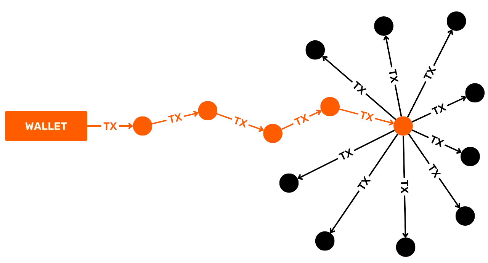

Varsi ja pörrö viittaavat transaktion leviämisen käyttäytymiseen verkossa, muistuttaen voikukan muotoa.

Näin ollen vakoilusolmut voivat mahdollisesti jäljittää transaktion takaisin solmuun, joka aloitti pörrövaiheen (massalähetyksen), mutta tämä solmu ei ole se, joka ensimmäisenä lähetti transaktion, sillä se sai sen viimeiseltä varsisolmulta. Jos vakoilusolmut eivät voi jäljittää takaisin varren läpi, ne eivät myöskään voi tunnistaa lähtösolmua.


Vaikka vakoilusolmuja olisikin varsi-vaiheessa, epävarmuus säilyy aina, sillä heti kun ne kohtaavat rehellisen solmun leviämisverkostossa, vakoilijat eivät voi määrittää, onko tämä solmu alkuperäinen lähde vai vain välittäjä.

Tämä reititysmenetelmä hämärtää polkua, joka johtaa lähtösolmuun, tehden transaktion jäljittämisen verkossa takaisin sen alkuperään vaikeaksi. Dandelion parantaa näin yksityisyyttä rajoittamalla vastustajien kykyä poistaa verkosta anonymiteetti. Tämä menetelmä on vielä tehokkaampi, kun transaktio kulkee "varren" vaiheessa solmun kautta, joka salaa verkkoliikenteensä, kuten Torin tai P2P Transport V2:n kanssa.

BIP156 ei ole integroitu Bitcoin Coreen ja on tällä hetkellä luokiteltu tilaan "hylätty". Yksi päähuolista tässä protokollassa on se, että varren vaiheessa transaktiot on välitettävä välisolmujen kautta ennen niiden vahvistamista. Kuten olemme nähneet, Bitcoinin normaalissa mallissa jokainen solmu vahvistaa ensin transaktion ennen sen lähettämistä vertaisilleen. Jos transaktio ei noudata konsensus sääntöjä tai solmun paikallisia standardointisääntöjä, se jättää huomiotta eikä lähetä sitä. Tämä prosessi on tärkeä DoS-hyökkäysten torjumiseksi, sillä vain kelvolliset transaktiot lähetetään koko verkkoon. Kelvottomat transaktiot, jotka on mahdollisesti tuotettu massoittain verkon kuormittamiseksi, pysäytetään ensimmäisessä kohdatussa solmussa eivätkä leviä. Dandelionin pääriski on, että tämä uusi protokolla voisi tuoda uusia vektoreita DoS-hyökkäyksille sallimalla kelvottomien transaktioiden lähettämisen osan verkon kautta.

### P2P Transport V2

P2P Transport V2 on toinen BIP324:ssä esitelty verkkoprotokolla. Se on Bitcoinin P2P-siirtoprotokollan uusi versio, joka sisältää opportunistisen salauksen viestinnän luottamuksellisuuden ja turvallisuuden parantamiseksi solmujen välillä.

Tämä parannus pyrkii ratkaisemaan useita perusversion P2P-protokollan ongelmia. Toisaalta se tekee vaihdetun datan erottamattomaksi muista Internetissä liikkuvista datatyypeistä passiiviselle tarkkailijalle. Päätavoitteena on estää hallituksia, Internet-palveluntarjoajia tai VPN-tarjoajia massavalvomasta Bitcoin-käyttäjiä. Tämä vaikeuttaa myös näiden toimijoiden tehtävää määrittää, onko Internet-käyttäjä myös Bitcoin-käyttäjä, eli toimiiko hän täyden solmun operaattorina.
P2P V2 myös vähentää sensuurin ja hyökkäysten riskejä havaitsemalla tiettyjä malleja datapaketeissa. Se monimutkaistaa ja tekee erilaisten Sybil-hyökkäysten toteuttamisen kalliimmaksi verkostotasolla. Sybil-hyökkäys tapahtuu, kun toimija luo useita vääriä identiteettejä saadakseen kohtuuttoman edun. Bitcoin-verkon kontekstissa tämä ilmenee usein toimijana, joka hallitsee suurta määrää täysiä solmuja ja käyttää niitä aggressiivisesti yhteyksien moninkertaistamiseen. Sybil-hyökkäykset voivat olla passiivisia, tavoitteena kerätä tietoja ja vaarantaa käyttäjän luottamuksellisuus, tai aktiivisia, Eclipse-hyökkäysten muodossa. Jälkimmäiset eristävät tietyn solmun lopusta verkosta, mahdollistaen joko käyttäjän sensuroinnin tai heille vastaanotettavan datan muuttamisen. Lopuksi, P2P V2 tekee _Man-In-The-Middle_ (MITM) hyökkäykset kalliimmiksi ja helpommin havaittaviksi.
P2P V2:n toteuttama salaus ei sisällä autentikointia, jotta ei lisättäisi tarpeetonta monimutkaisuutta ja jotta ei vaarannettaisi verkon yhteyden luvattoman luonteen. Tämä uusi P2P-siirtoprotokolla tarjoaa kuitenkin paremman suojan passiivisia hyökkäyksiä vastaan ja tekee aktiiviset hyökkäykset huomattavasti kalliimmiksi ja havaittavammiksi. Pseudosatunnaisen datavirran käyttöönotto verkkoviesteissä vaikeuttaa hyökkääjien tehtävää sensuroida tai manipuloida viestintää.

P2P V2 -siirto sisällytettiin vaihtoehtona (oletuksena pois käytöstä) Bitcoin Coren versioon 26.0, joka otettiin käyttöön joulukuussa 2023. Se otettiin käyttöön oletuksena versiossa 27.0 huhtikuussa 2024. Sitä voidaan muokata `v2transport=`-vaihtoehdolla konfiguraatiotiedostossa.
Toisen suhteellisen yksinkertaisen ratkaisun, jolla voidaan välttää solmun luottamuksellisuuden menetysriski verkostotasolla, on ajaa se kokonaan Tor-verkon alla.
Tor on reitityspalvelimien (solmujen) verkosto, joka anonymisoi TCP-yhteyksien alkuperän internetissä. Se toimii kapseloimalla tiedot useisiin salauskerroksiin. Jokainen reitityssolmu poistaa kerroksen paljastaakseen seuraavan solmun osoitteen, kunnes saavuttaa lopullisen määränpään. Tor-verkko varmistaa anonymiteetin estämällä välisolmuja tietämästä sekä datan alkuperän että määränpään, mikä tekee käyttäjän toiminnan jäljittämisen erittäin vaikeaksi.


Tor ei siis ainoastaan salaa kommunikoitua dataa, vaan myös mahdollistaa kommunikaation alkuperän ja määränpään peittämisen. Käyttämällä Toria henkilökohtaisen solmun kommunikointiin, me parannamme transaktioidemme yksityisyyttä: Internet-palveluntarjoaja (ISP) ei voi purkaa kommunikaatiota, ja muut solmut Bitcoin-verkossa eivät voi tunnistaa lähtösolmun IP-osoitetta. Lisäksi Tor myös piilottaa Bitcoinin käyttösi ISP:ltäsi.

Tähän menetelmään liittyvä pääasiallinen riski on, että Tor on protokolla, joka on riippumaton Bitcoinista. Jos sinulla on Bitcoin-solmu Torin alla ja Tor lakkaa toimimasta, Bitcoin-solmusi ei enää pysty kommunikoimaan.

On myös tärkeää huomata, että kommunikointi Torin kautta on hitaampaa. Tämä viive on erityisen hankala solmun ensimmäisen käynnistyksen aikana, koska Alkuperäisen Lohkon Lataus (IBD) vaatii paljon kommunikaatiota. Tämän seurauksena alkuperäinen synkronointisi Bitcoin-verkon kanssa voi kestää huomattavasti kauemmin käyttäessäsi Toria. On myös mahdollista suorittaa IBD avoimessa verkossa ja aktivoida Tor myöhemmin. Vaikka tämä menetelmä paljastaa Bitcoin-solmusi olemassaolon ISP:lle, se suojaa henkilökohtaisten transaktioidesi tietoja, kun vaihdat Toriin.

Tutkittuani erilaisia verkostotason yksityisyysmenetelmiä, haluan myös esitellä tulevissa luvuissa kaksi eleganttia ratkaisua osoitteen uudelleenkäytön välttämiseksi: BIP47 ja Hiljaiset Maksut.

## BIP47 ja Uudelleenkäytettävät Maksukoodit

<chapterId>ad88e076-a04b-4aec-b3b2-7b4760175504</chapterId>

Kuten osassa 3 näimme, osoitteen uudelleenkäyttö muodostaa vakavan esteen käyttäjän yksityisyydelle Bitcoin-protokollassa. Näiden riskien lieventämiseksi on vahvasti suositeltavaa luoda uusi vastaanotto-osoite jokaiselle uudelle maksulle lompakossa. Vaikka uuden osoitteen luominen on nykyään yksinkertaistettu modernin ohjelmiston ja hierarkkisesti determinististen lompakoiden avulla, tämä käytäntö voi tuntua vasten intuitiiviselta.


Esimerkiksi perinteisessä pankkijärjestelmässä olemme tottuneet jakamaan IBAN-numeromme, joka pysyy aina samana. Kerran kommunikoituamme sen jollekulle, he voivat lähettää meille useita maksuja ilman, että heidän tarvitsee olla yhteydessä meihin uudelleen. Neo-pankit tarjoavat myös modernimpia mahdollisuuksia, kuten ainutlaatuisten sähköpostiosoitteiden käyttö PayPalissa tai RevTageissa Revolutissa. Jopa talousalan ulkopuolella päivittäiset tunnisteemme, kuten postiosoitteemme, puhelinnumeromme ja sähköpostiosoitteemme, ovat myös ainutlaatuisia ja pysyviä. Meidän ei tarvitse uusia niitä jokaisen uuden vuorovaikutuksen yhteydessä.


Bitcoinin toiminta on kuitenkin erilaista: on välttämätöntä luoda uusi vastaanotto-osoite jokaiselle saapuvalle transaktiolle. Tämä käytettävyyden ja yksityisyyden välinen kompromissi juontaa juurensa aivan Bitcoinin White Paperin alkuperästä. Julkaistessaan dokumenttinsa ensimmäisen version lopussa 2008, Satoshi Nakamoto varoitti meitä jo tästä riskistä:
**"_Lisäsuojana voitaisiin jokaiseen transaktioon käyttää uutta avainparia, jotta ne eivät liittyisi yhteiseen omistajaan._"**
On olemassa lukuisia menetelmiä vastaanottaa useita maksuja yhteen tunnisteeseen ilman osoitteen uudelleenkäyttöä. Jokaisella menetelmällä on omat kompromissinsa ja haittapuolensa. Näiden menetelmien joukossa on BIP47, ehdotus, jonka kehitti Justus Ranvier ja julkaisi vuonna 2015. Tämän ehdotuksen tavoitteena on luoda uudelleenkäytettäviä maksukoodit, jotka mahdollistavat useita transaktioita samalle henkilölle välttäen osoitteen uudelleenkäyttöä. Yksinkertaisesti sanottuna, BIP47 pyrkii tarjoamaan maksujärjestelmän, joka on yhtä intuitiivinen kuin uniikki tunniste, samalla säilyttäen transaktioiden yksityisyyden.


BIP47 ei suoraan paranna käyttäjän yksityisyyttä, sillä BIP47-maksu tarjoaa saman yksityisyyden tason kuin klassinen Bitcoin-transaktio käyttäen uusia osoitteita. Kuitenkin, se tekee Bitcoinin käytöstä mukavampaa ja intuitiivisempaa, mikä normaalisti saattaisi vaarantaa yksityisyyden. Kiitos BIP47:n, tämä käytön helppous saavuttaa saman yksityisyyden tason kuin klassinen transaktio. Tämän vuoksi BIP47 on arvokas työkalu yksityisyyden säilyttämiseen.

Alun perin BIP47 oli ehdotus, joka oli tarkoitettu integroitavaksi Bitcoin Coreen, mutta sitä ei koskaan hyväksytty. Jotkut ohjelmistot ovat silti valinneet toteuttaa sen omalla tasollaan sovelluksessa. Näin ollen Samourai Walletin tiimit ovat kehittäneet oman toteutuksensa BIP47:stä nimeltä "PayNym".

### BIP47:n ja PayNym:n yleinen periaate

BIP47:n tavoitteena on mahdollistaa lukuisien maksujen vastaanottaminen ilman osoitteen uudelleenkäyttöä. Se perustuu uudelleenkäytettävän maksukoodin käyttöön, joka mahdollistaa eri lähettäjien lähettää useita maksuja yhdelle koodille, joka kuuluu toiselle käyttäjälle. Näin ollen vastaanottajan ei tarvitse tarjota uutta tuoretta osoitetta jokaiselle transaktiolle, mikä suuresti helpottaa heidän vaihtojaan samalla säilyttäen heidän yksityisyytensä.

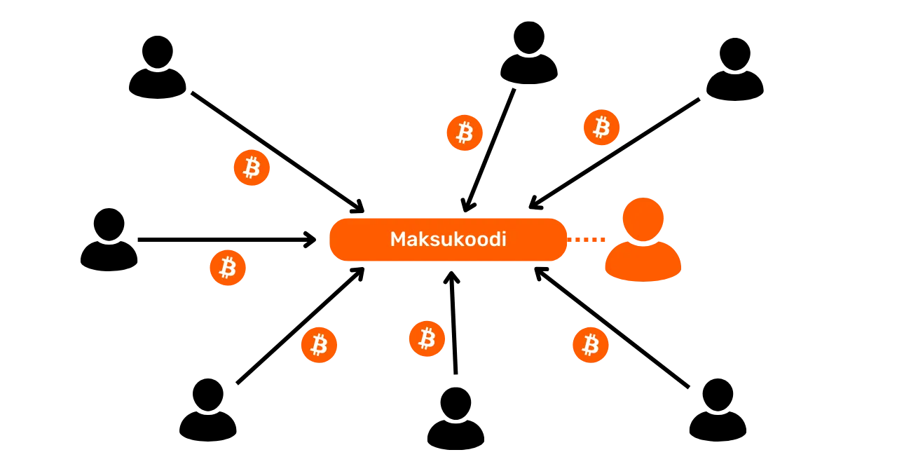

Käyttäjä voi siis vapaasti jakaa maksukoodinsa, olipa se sitten sosiaalisissa verkostoissa tai heidän verkkosivuillaan, ilman yksityisyyden menettämisen riskiä, toisin kuin klassisen vastaanotto-osoitteen tai julkisen avaimen kanssa.
Transaktion suorittamiseksi molemmilla osapuolilla on oltava Bitcoin-lompakko, jossa on BIP47:n toteutus, kuten PayNym Samourai Walletissa tai Sparrow Walletissa. Heidän maksukoodiensa yhteiskäyttö luo salaisen kanavan heidän välilleen. Tämän kanavan tehokkaaksi perustamiseksi lähettäjän on suoritettava tietty transaktio Bitcoin-lohkoketjussa, jota kutsutaan "ilmoitustransaktioksi" (annan sinulle lisätietoja tästä myöhemmin).

Molempien käyttäjien maksukoodien yhdistelmä luo jaettuja salaisuuksia, jotka puolestaan mahdollistavat suuren määrän uniikkien Bitcoin-vastaanotto-osoitteiden luomisen (tarkalleen 2^32, eli noin 4 miljardia). Näin ollen BIP47:n kautta tehdyt maksut eivät itse asiassa kohdistu maksukoodiin itsessään, vaan klassisiin vastaanotto-osoitteisiin, jotka on johdettu osallistuvien käyttäjien maksukoodeista.

Maksukoodi toimii siis virtuaalisena tunnisteena, joka on johdettu lompakon siemenestä. Lompakon hierarkisessa johdannaisrakenteessa maksukoodi sijoittuu tasolle 3, eli tilin tasolle.

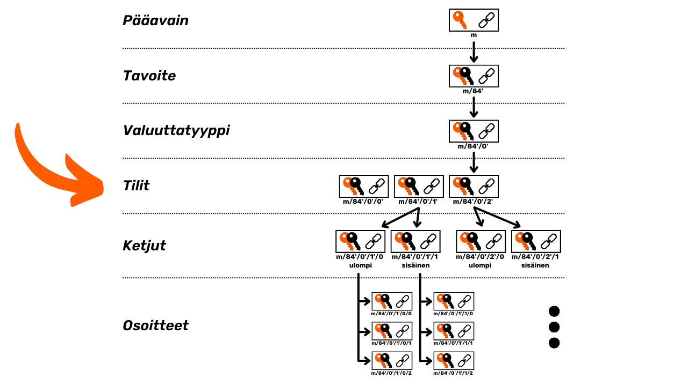

BIP47:n johdannaisen tavoite on tunnistettu indeksillä `47'` (`0x8000002F`), viitaten BIP47:ään. Esimerkki uudelleenkäytettävän maksukoodin johdannaispolusta olisi seuraava:

```plaintext
m/47'/0'/0'/
```

Jotta saat käsityksen siitä, miltä maksukoodi näyttää, tässä on minun:

```plaintext
PM8TJSBiQmNQDwTogMAbyqJe2PE2kQXjtgh88MRTxsrnHC8zpEtJ8j7Aj628oUFk8X6P5rJ7P5qDudE4Hwq9JXSRzGcZJbdJAjM9oVQ1UKU5j2nr7VR5
```

Tämä koodi voidaan myös koodata QR-koodiksi, jotta sen kommunikointi helpottuu, aivan kuten klassinen vastaanotto-osoite.

PayNym Botit, jotka joskus nähdään Twitterissä, ovat maksukoodin visuaalisia edustuksia, jotka on luonut Samourai Wallet. Ne luodaan hajautusfunktion avulla, mikä antaa niille lähes ainutlaatuisuuden. Ne ilmestyvät pienenä merkkijonona, joka alkaa `+`-merkillä:

```plaintext
+throbbingpond8B1
+twilightresonance487
+billowingfire340
```

Nämä avatarit voidaan myös esittää kuvien muodossa:


Vaikka näillä roboteilla ei ole erityistä teknistä toiminnallisuutta BIP47:n puitteissa, ne toimivat roolissa helpottamassa käyttäjien välisiä vuorovaikutuksia tarjoamalla helposti tunnistettavan visuaalisen identiteetin.
Tässä luvussa, joka on omistettu BIP47:lle, tarkastelemme yksityiskohtaisesti sen toimintaa, erityisesti keskittyen käytettyihin kryptografisiin menetelmiin. Jotta voit täysin ymmärtää nämä hieman tekniset selitykset, on olennaista ensin ymmärtää HD-lompakoiden rakenne, avainjohdannaisprosessit ja elliptiseen käyrään perustuvan kryptografian perusperiaatteet. Jos haluat syventää näitä käsitteitä, toinen ilmainen kurssi on saatavilla PlanB Networkissa: [CRYPTO 301](https://planb.network/en/courses/crypto301). Suosittelen silti niiden seuraamista, sillä BIP47:n teknisen toiminnan ymmärtäminen helpottaa huomattavasti muiden samankaltaisten ehdotusten ymmärtämistä, joita käsittelemme seuraavissa luvuissa.

### Uudelleenkäytettävä Maksukoodi

Kuten aiemmin mainittiin, uudelleenkäytettävä maksukoodi sijaitsee HD-lompakon syvyydessä 3, mikä tekee siitä verrattavissa `xpub`iin, sekä sen aseman lompakon rakenteessa että sen roolin osalta.

80-tavun maksukoodi jakautuu seuraavasti:

- **Tavu `0`: Versio**. BIP47:n ensimmäisessä versiossa tämä tavu on asetettu `0x01`;
- **Tavu `1`: Bittikenttä**. Tämä tila on varattu lisäindikaatioiden integroimiseen erityiskäytöissä. Standardikäytössä PayNymillä tämä tavu määritellään `0x00`;
- **Tavu `2`: `y` pariteetti**. Tämä tavu on `0x02` tai `0x03`, osoittaen onko julkisen avaimen ordinaatti parillinen tai pariton, koska käytetään tiivistettyä julkista avainta;
- **Tavusta `3` tavuun `34`: `x` arvo**. Nämä tavut edustavat julkisen avaimen abskissaa. `x` ja `y` pariteetin yhdistäminen muodostaa täydellisen tiivistetyn julkisen avaimen;
- **Tavusta `35` tavuun `66`: Ketjukoodi**. Tämä tila sisältää julkiseen avaimen liittyvän ketjukoodin;
- **Tavusta `67` tavuun `79`: Täyte**. Tämä tila on tarkoitettu mahdollisille tulevaisuuden kehityksille. Nykyisessä versiossa tähän laitetaan yksinkertaisesti nollia saavuttamaan vaadittu 80-tavun koko `OP_RETURN` tulosteelle.

Tässä on heksadesimaalinen esitys jo aiemmin esitellystä uudelleenkäytettävästä maksukoodistani:

```plaintext
0x010002a0716529bae6b36c5c9aa518a52f9c828b46ad8d907747f0d09dcd4d9a39e97c3c5f37c470c390d842f364086362f6122f412e2b0c7e7fc6e32287e364a7a36a00000000000000000000000000
```

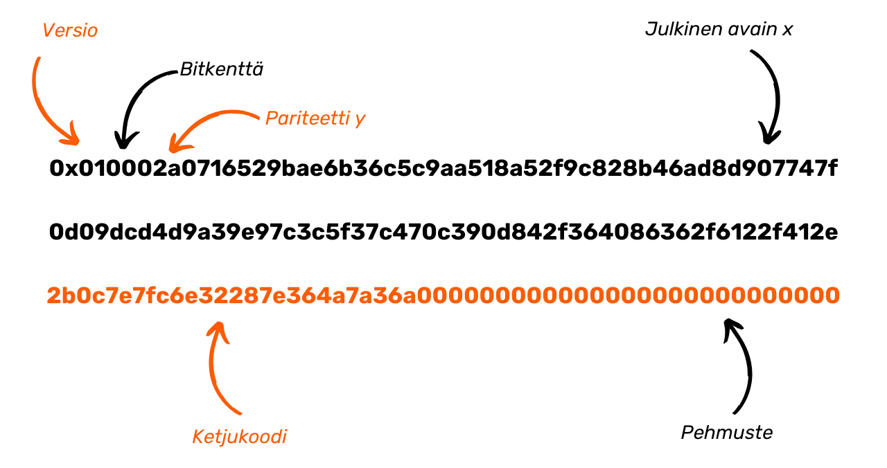

Ensimmäisenä on myös tarpeen lisätä etuliite tavu `P` alkuun selvästi osoittamaan, että kyseessä on maksukoodi. Tämä tavu esitetään `0x47`:

```plaintext
0x47010002a0716529bae6b36c5c9aa518a52f9c828b46ad8d907747f0d09dcd4d9a39e97c3c5f37c470c390d842f364086362f6122f412e2b0c7e7fc6e32287e364a7a36a00000000000000000000000000
```

Lopuksi maksukoodin eheyden varmistamiseksi suoritetaan tarkistussumman laskenta käyttäen `HASH256`, joka koostuu kaksinkertaisesta hajautuksesta `SHA256`-funktiolla. Tämän hajautuksen ensimmäiset neljä tavua liitetään sitten maksukoodin loppuun:

```plaintext
0x47010002a0716529bae6b36c5c9aa518a52f9c828b46ad8d907747f0d09dcd4d9a39e97c3c5f37c470c390d842f364086362f6122f412e2b0c7e7fc6e32287e364a7a36a00000000000000000000000000567080c4
```

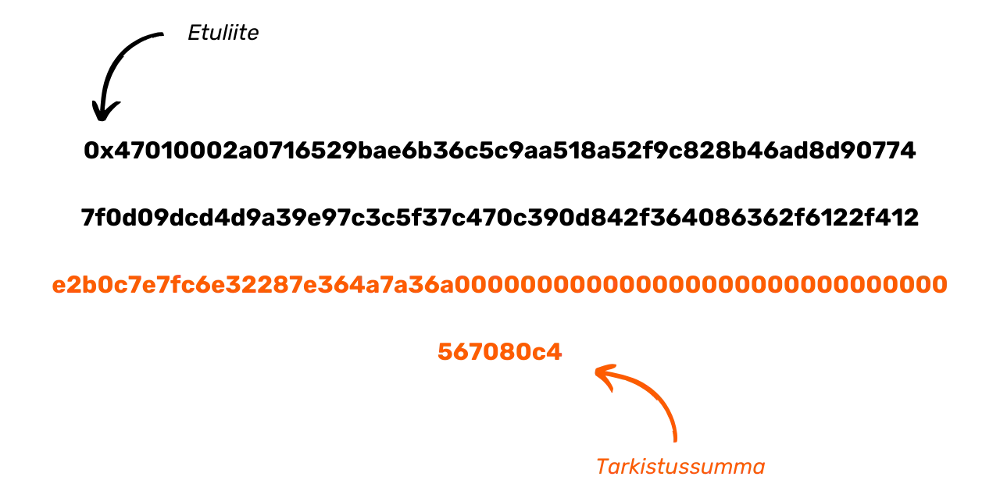

Kun nämä vaiheet on suoritettu, maksukoodi on valmis. Ainoa jäljellä oleva asia on muuntaa se base 58 -muotoon saadakseen sen lopullisen version:

```plaintext
PM8TJSBiQmNQDwTogMAbyqJe2PE2kQXjtgh88MRTxsrnHC8zpEtJ8j7Aj628oUFk8X6P5rJ7P5qDudE4Hwq9JXSRzGcZJbdJAjM9oVQ1UKU5j2nr7VR5
```

Maksukoodin luomisprosessin aikana käytämme tiivistettyä julkista avainta ja ketjukoodia. Molemmat johdetaan deterministisestä ja hierarkkisesta johdannaisesta lompakon siemenestä. Tähän käytetty johdannaispolku on:

```plaintext
m/47'/0'/0'/
```

Tiivistetyn julkisen avaimen ja siihen liittyvän ketjukoodin tuottamiseksi uudelleenkäytettävälle maksukoodille aloitamme laskemalla pääyksityisavaimen lompakon siemenestä. Tämän jälkeen jatkamme lapsiavainparien johdannaisella käyttäen indeksiä `47 + 2^31` (kovennettu johdannainen). Tätä vaihetta seuraa kaksi peräkkäistä lapsiavainparien johdannaista, kumpikin käyttäen indeksiä `2^31` (kovennettu johdannainen).


### Elliptisen käyrän Diffie-Hellman (ECDH) avainvaihto

Kryptografisen protokollan, joka on BIP47:n ytimessä, tunnetaan lyhenteellä ECDH, joka tarkoittaa _Elliptinen Käyrä Diffie-Hellman_. Tämä menetelmä on alkuperäisen Diffie-Hellmanin avainvaihdon variantti.
Esitelty vuonna 1976, Diffie-Hellman on avainsopimusprotokolla, joka mahdollistaa kahden osapuolen, kummallakin on pari avaimia (julkinen ja yksityinen), päästä yhteisymmärrykseen yhteisestä salaisuudesta, vaikka kommunikoisivatkin ainoastaan julkisen ja turvattoman kanavan kautta.

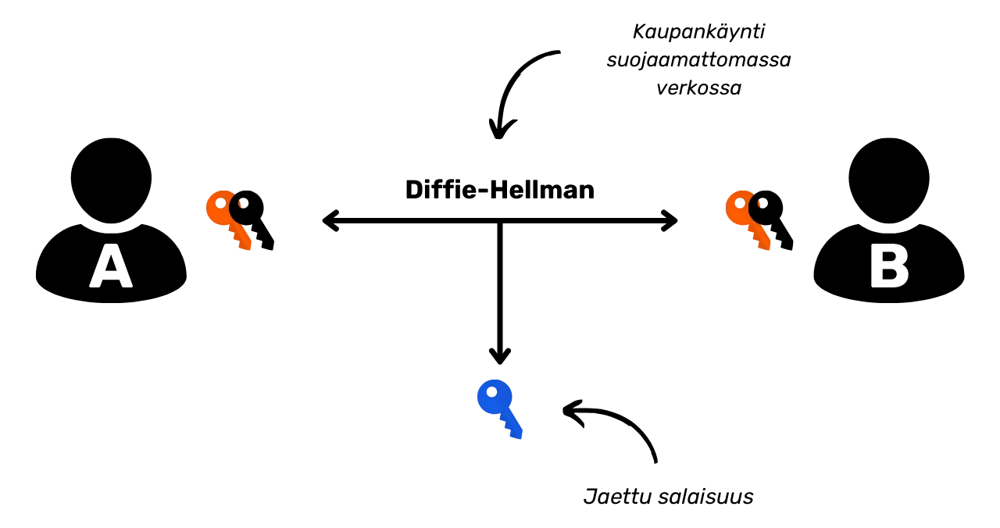

Tämä yhteinen salaisuus (tässä, sininen avain) voidaan sitten käyttää muihin toimintoihin. Tyypillisesti tätä jaettua salaisuutta voidaan käyttää viestinnän salaamiseen ja purkamiseen turvattomassa verkossa:


Tämän vaihdon saavuttamiseksi Diffie-Hellman käyttää modulaarista aritmetiikkaa jaetun salaisuuden laskemiseen. Tässä on yksinkertaistettu selitys siitä, miten se toimii:

- Alice ja Bob sopivat yhteisestä väristä, tässä tapauksessa keltaisesta, joka muodostaa julkista dataa (hyökkääjät tietävät tämän värin);
- Alice valitsee salaisen värin, tässä punaisen, ja sekoittaa sen keltaisen kanssa saadakseen oranssin;
- Bob valitsee myös salaisen värin, tässä sinisen, ja sekoittaa sen keltaisen kanssa saadakseen vihreän;
- He vaihtavat sitten saadut värit, oranssin ja vihreän. Tämä vaihto voi tapahtua turvattomassa ja tarkkailtavassa verkossa;
- Sekoittamalla Bobin vihreän oman salaisen värinsä kanssa, Alice tuottaa ruskean;
- Bob, tekemällä saman Alicen oranssin ja hänen salaisen sinisen värinsä kanssa, saa myös ruskean.

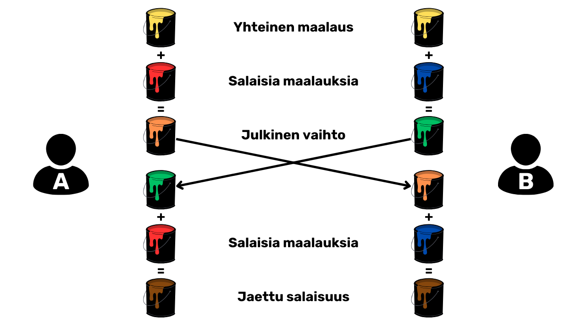

Tässä yksinkertaistuksessa ruskea väri edustaa Alicen ja Bobin jaettua salaisuutta. On tärkeää ymmärtää, että todellisuudessa hyökkääjän on mahdotonta erottaa oranssia ja vihreää väriä löytääkseen Alicen tai Bobin salaiset värit.

Nyt, tutkitaan miten tämä protokolla todellisuudessa toimii, ei värianalogioiden avulla, vaan käyttäen todellisia numeroita ja modulaarista aritmetiikkaa!
Ennen kuin keskustelemme Diffie-Hellmanin mekanismeista, sallikaa minun lyhyesti muistuttaa teitä kahdesta olennaisesta matemaattisesta käsitteestä, joita tarvitsemme:

- **Alkuluku** on luonnollinen luku, jolla on vain kaksi jakajaa: $1$ ja se itse. Esimerkiksi, $7$ on alkuluku, koska sitä voidaan jakaa vain $1$:llä ja $7$:llä. Toisaalta, $8$ ei ole alkuluku, koska se on jaettavissa $1$:llä, $2$:lla, $4$:llä ja $8$:lla. Siksi sillä on neljä positiivista kokonaislukujakajaa kahden sijaan;
- **Modulo** (merkitään $mod$ tai $\%$) on matemaattinen operaatio, joka kahden kokonaisluvun välillä palauttaa Euklidisen jakolaskun jäännöksen ensimmäisestä toiseen. Esimerkiksi, $16 \bmod 5 = 1$.

**Diffie-Hellmanin avainvaihto Alicen ja Bobin välillä etenee seuraavasti:**

- Alice ja Bob sopivat kahdesta yhteisestä numerosta: $p$ ja $g$. $p$ on alkuluku, ja mitä suurempi tämä luku on, sitä turvallisempi Diffie-Hellman on. $g$ on $p$:n primitiivijuuri. Nämä kaksi numeroa voidaan kommunikoida avoimesti turvattoman verkon yli. Ne edustavat **keltaisen värin** vastinetta edellisessä yksinkertaistuksessa. On siis tärkeää, että Alice ja Bob käyttävät täsmälleen samoja arvoja $p$:lle ja $g$:lle.
- Kun nämä parametrit on määritelty, Alice ja Bob valitsevat kumpikin salaisen satunnaisluvun. Alice nimeää salaisen satunnaislukunsa $a$ (vastaa **punainen väri**) ja Bob nimeää omansa $b$ (vastaa **sininen väri**). Nämä luvut on pidettävä ehdottoman salaisina.
- Sen sijaan, että he vaihtaisivat suoraan luvut $a$ ja $b$, kumpikin osapuoli laskee $A$:n ja $B$:n seuraavasti:

$A$ on yhtä kuin $g$ korotettuna $a$:n potenssiin modulo $p$:

$$
A = g^a \bmod p
$$

$B$ on yhtä kuin $g$ korotettuna $b$:n potenssiin modulo $p$:

$$
B = g^b \bmod p
$$

- Arvot $A$ (vastaa **oranssi väri**) ja $B$ (vastaa **vihreä väri**) vaihdetaan kahden osapuolen välillä. Tämä vaihto voi tapahtua avoimesti suojaamattoman verkon yli;

- Alice, saatuaan $B$:n, laskee arvon $z$ seuraavasti:

$z$ on yhtä kuin $B$ korotettuna $a$:n potenssiin modulo $p$:

$$
z = B^a \bmod p
$$

Muistutuksena:

$$
B = g^b \bmod p
$$

Näin ollen saamme:

$$
z = B^a \bmod p
$$

$$
z = (g^b)^a \bmod p
$$

Soveltamalla eksponenttien sääntöjä:

$$
(x^n)^m = x^{nm}
$$

Sitten saamme:

$$
z = g^{ba} \bmod p
$$

- Bobin puolella, saatuaan $A$:n, hän myös laskee arvon $z$ seuraavalla tavalla:

$z$ on yhtä kuin $A$ korotettuna $b$:n potenssiin modulo $p$:

$$
z = A^b \bmod p
$$

Näin ollen saamme:

$$
z = (g^a)^b \bmod p
$$

$$
z = g^{ab} \bmod p
$$

$$
z = g^{ba} \bmod p
$$

Kiitos modulo-operaattorin distributiivisuuden, Alice ja Bob saavat täsmälleen saman arvon $z$. Tämä luku edustaa heidän yhteistä salaisuuttaan, joka vastaa **ruskea väri** aiemmassa yksinkertaistuksessa maalipurkkien kanssa. He voivat nyt käyttää tätä yhteistä salaisuutta salatakseen viestintänsä symmetrisesti suojaamattoman verkon yli.


Hyökkääjä, vaikka hänellä olisikin $p$, $g$, $A$, ja $B$ (julkiset arvot), ei pystyisi laskemaan $a$:a, $b$:tä tai $z$:tä (yksityiset arvot). Tämän saavuttamiseksi pitäisi kääntää eksponentiaatio, operaatio, joka on mahdoton ilman kaikkien mahdollisuuksien kokeilemista yksi kerrallaan, koska se tarkoittaa diskreetin logaritmin laskemista, eli eksponentiaalifunktion käänteisarvon laskemista äärellisessä syklisessä ryhmässä.

Näin ollen, kunhan $a$:n, $b$:n ja $p$:n arvot ovat riittävän suuria, Diffie-Hellman -protokolla on turvallinen. Tyypillisesti 2048-bittisillä parametreilla (numero, jossa on 600 numeroa desimaalimuodossa), kaikkien mahdollisuuksien testaaminen $a$:lle ja $b$:lle olisi epäkäytännöllistä. Tähän päivään mennessä tällaisilla numeroilla tämä algoritmi katsotaan turvalliseksi.
Juuri tässä piilee Diffie-Hellman -protokollan pääasiallinen haittapuoli. Ollakseen turvallinen, algoritmin on käytettävä suuria numeroita. Siksi nykyään suositaan ECDH-algoritmia (_Elliptic Curve Diffie-Hellman_), joka on Diffie-Hellmanin variantti ja perustuu algebralliseen käyrään, tarkemmin sanottuna elliptiseen käyrään. Tämä lähestymistapa mahdollistaa paljon pienempien numeroiden käytön ylläpitäen samalla vastaavaa turvallisuustasoa, mikä vähentää laskentaan ja tallennukseen tarvittavia resursseja.
Algoritmin yleinen periaate pysyy samana. Kuitenkin, sen sijaan, että käytettäisiin satunnaista numeroa $a$ ja numeroa $A$, joka lasketaan $a$:sta modulo eksponentiaation avulla, käytämme avainparia, joka perustuu elliptiseen käyrään. Sen sijaan, että nojaisimme modulo-operaattorin distributiivisuuteen, käytämme ryhmälakia elliptisillä käyrillä, ja tarkemmin sanottuna tämän lain assosiatiivisuutta.
Jotta selitettäisiin lyhyesti elliptisen käyrän kryptografian periaatetta, yksityinen avain esitetään satunnaisena numerona välillä $1$ ja $n-1$, missä $n$ edustaa käyrän järjestystä. Julkinen avain puolestaan on tietty piste tällä käyrällä, joka saadaan yksityisestä avaimesta pisteiden lisäyksen ja kaksinkertaistamisen operaatioilla lähtien generaattoripisteestä, yhtälön mukaisesti:

$$
K = k \cdot G
$$

Tässä kaavassa $K$ merkitsee julkista avainta, $k$ yksityistä avainta ja $G$ generaattoripistettä.

Yksi näiden avainten olennaisista ominaisuuksista on $K$:n laskemisen helppous $k$:sta ja $G$:stä, kun taas $k$:n löytäminen $K$:sta ja $G$:stä on käytännössä mahdotonta. Tämä epäsymmetria luo yksisuuntaisen funktion. Toisin sanoen, julkisen avaimen laskeminen on helppoa, jos tuntee yksityisen avaimen, mutta yksityisen avaimen löytäminen julkisesta avaimesta on mahdotonta. Tämä turvallisuus perustuu edelleen diskreetin logaritmin laskennalliseen vaikeuteen.

Käytämme tätä ominaisuutta mukauttaaksemme Diffie-Hellman -algoritmimme. **ECDH:n toimintaperiaate on seuraava:**

- Alice ja Bob sopivat yhdessä kryptografisesti turvallisesta elliptisestä käyrästä ja sen parametreista. Tämä tieto on julkinen;

- Alice luo satunnaisen numeron $ka$, joka on hänen yksityinen avaimensa. Tämän yksityisen avaimen on pysyttävä salaisena. Hän määrittää julkisen avaimensa $Ka$ lisäämällä ja kaksinkertaistamalla pisteitä valitulla elliptisellä käyrällä:

$$
K_a = k_a \cdot G
$$

- Bob luo myös satunnaisen numeron $kb$, joka on hänen yksityinen avaimensa. Hän laskee siihen liittyvän julkisen avaimen $Kb$:

$$
K_b = k_b \cdot G
$$

- Alice ja Bob vaihtavat julkiset avaimensa $Ka$ ja $Kb$ suojaamattoman julkisen verkon yli.

- Alice laskee pisteen $(x,y)$ käyrällä soveltamalla yksityistä avaintaan $ka$ Bobin julkiseen avaimeseen $Kb$:

$$
(x,y) = k_a \cdot K_b
$$

- Bob laskee pisteen $(x,y)$ käyrällä soveltamalla yksityistä avaintaan $kb$ Alicen julkiseen avaimeseen $Ka$:

$$
(x,y) = k_b \cdot K_a
$$

- Alice ja Bob saavat saman pisteen elliptisellä käyrällä. Jaettu salaisuus tulee olemaan tämän pisteen x-koordinaatti $x$.

He todellakin saavat saman jaetun salaisuuden, koska:
(x,y) = k_a \cdot K_b = k_a \cdot (k_b \cdot G) = (k_a \cdot k_b) \cdot G = (k_b \cdot k_a) \cdot G = k_b \cdot (k_a \cdot G) = k_b \cdot K_a$$
Hyökkääjä, joka tarkkailee suojaamatonta julkista verkkoa, voi saada vain kunkin osapuolen julkiset avaimet ja valitun elliptisen käyrän parametrit. Kuten aiemmin selitettiin, pelkästään tämä tieto ei riitä yksityisten avainten määrittämiseen. Siksi hyökkääjä ei voi löytää Alicen ja Bobin välillä jaettua salaisuutta.

ECDH on siis algoritmi, joka mahdollistaa avainten vaihdon. Sitä käytetään usein yhdessä muiden kryptografisten menetelmien kanssa kokonaisen protokollan luomiseksi. Esimerkiksi ECDH on integroitu TLS:n (_Transport Layer Security_, siirron kerroksen turvallisuus) ytimeen, joka on salaus- ja autentikointiprotokolla internetin siirtokerrokselle. TLS käyttää avaintenvaihtoon ECDHE:tä, ECDH:n varianttia, jossa avaimet ovat kertakäyttöisiä, tarjoten pysyvää luottamuksellisuutta. Lisäksi TLS käyttää autentikointialgoritmeja kuten ECDSA, salausalgoritmeja kuten AES ja hajautusfunktioita kuten SHA256.

TLS on erityisesti vastuussa `https`-protokollan `s`:stä sekä selaimen osoiterivillä näkyvästä lukon kuvakkeesta, jotka ovat merkkejä salatuista viestinnöistä. Seuraamalla tätä kurssia käytät siis ECDH:tä, ja on hyvin todennäköistä, että käytät sitä päivittäin tietämättäsi.

### Ilmoitustransaktio

Kuten edellisessä osiossa näimme, ECDH on Diffie-Hellmanin vaihdon variantti, joka käyttää elliptiselle käyrälle perustettuja avainpareja. Kätevästi meillä on jo monia tähän standardiin noudattavia avainpareja Bitcoin-lompakoissamme! BIP47:n idea on käyttää molempien osapuolten Bitcoinin deterministisista hierarkkisista lompakoista peräisin olevia avainpareja jaettujen ja kertakäyttöisten salaisuuksien luomiseen niiden välille. BIP47:n kontekstissa käytetään sen sijaan ECDHE:tä (_Elliptic Curve Diffie-Hellman Ephemeral_).


ECDHE:tä käytetään ensimmäistä kertaa BIP47:ssä maksukoodin lähettämiseen lähettäjältä vastaanottajalle. Tämä on kuuluisa **ilmoitustransaktio**. Tämä vaihe on olennainen, sillä jotta BIP47 toimisi tehokkaasti, molempien osapuolten (lähettäjän ja vastaanottajan) on tiedettävä toistensa maksukoodi. Tämä tieto mahdollistaa kertakäyttöisten julkisten avainten johdannan ja siten niihin liittyvien tyhjien vastaanotto-osoitteiden. Ennen tätä vaihtoa lähettäjä on loogisesti jo tietoinen vastaanottajan maksukoodista, koska hän on hankkinut sen off-chain, esimerkiksi heidän verkkosivustoltaan, laskusta tai sosiaalisesta mediasta. Vastaanottaja ei kuitenkaan välttämättä tiedä lähettäjän maksukoodia. Tämä koodi on kuitenkin lähetettävä heille; muuten he eivät pysty johdattamaan tarvittavia kertakäyttöisiä avaimia tunnistamaan osoitteita, joissa heidän bitcoininsa säilytetään, eivätkä pääse käsiksi varoihinsa. Vaikka lähettäjän koodin siirto voidaan teknisesti suorittaa off-chain muiden viestintäkeinojen kautta, tämä aiheuttaa ongelman, jos lompakko täytyy palauttaa pelkästään siemenestä.
Tosiaan, toisin kuin perinteiset osoitteet, BIP47-osoitteet eivät johda suoraan vastaanottajan siemenestä – `xpub`in käyttö olisi tässä tapauksessa yksinkertaisempaa – vaan ne ovat laskelman tulos, joka yhdistää molempien maksukoodit: lähettäjän ja vastaanottajan. Näin ollen, jos vastaanottaja menettää lompakkonsa ja yrittää palauttaa sen siemenestään, hän palauttaa oman maksukoodinsa, joka on suoraan johdettu hänen siemenestään. Kuitenkin, löytääkseen ohimenevät osoitteet, on välttämätöntä, että hänellä on myös kaikkien niiden maksukoodit, jotka ovat lähettäneet hänelle bitcoineja BIP47:n kautta. Tästä syystä ilmoitustransaktion merkitys on tärkeä, sillä se mahdollistaa tämän tiedon tallentamisen Bitcoin-lohkoketjuun, samalla kun sen löytäminen on erittäin helppoa ilman, että tarvitsee etsiä läpi miljardia transaktiota, jotka on suoritettu sen käynnistämisen jälkeen vuonna 2009.
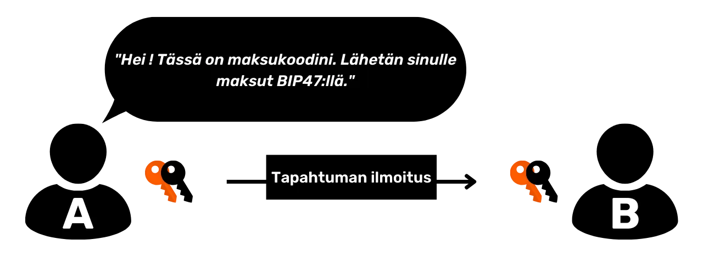

Siksi BIP47:n toteuttaminen ilman ilmoitustransaktiota olisi mahdollista, edellyttäen, että jokainen käyttäjä säilyttää varmuuskopion vertaisverkostonsa maksukoodit. Tämä menetelmä osoittautuu kuitenkin monimutkaiseksi hallita niin kauan kuin yksinkertaista, luotettavaa ja tehokasta ratkaisua näiden varmuuskopioiden luomiseen, säilyttämiseen ja päivittämiseen ei ole kehitetty. Nykytilanteessa ilmoitustransaktio muodostuu lähes välttämättömäksi.

Seuraavissa luvuissa tutkimme muita protokollia, joilla on BIP47:n kaltaisia tavoitteita, mutta jotka eivät vaadi ilmoitustransaktiota. Nämä vaihtoehdot kuitenkin tuovat mukanaan omat kompromissinsa.

Ilmoitustransaktion rooli maksukoodien varmuuskopioinnissa on tärkeä, mutta se toimii myös ilmoitusfunktiona vastaanottajalle, kuten sen nimi vihjaa. Se signaloi vastaanottajan asiakasohjelmalle, että uusi maksukanava on perustettu, ja ehdottaa näin ollen ohimenevien osoitteiden seurantaa.

### BIP47:n yksityisyysmalli

Ennen ilmoitustransaktion teknisen toiminnan yksityiskohtien käsittelyä on tärkeää keskustella BIP47:n yhteydessä käytetystä yksityisyysmallista, joka oikeuttaa tiettyjen toimenpiteiden toteuttamisen tämän alkuperäisen transaktion luomisen aikana.
Maksukoodi itsessään ei aiheuta suoraa riskiä yksityisyydelle. Toisin kuin perinteinen Bitcoin-malli, joka pyrkii katkaisemaan linkin käyttäjän identiteetin ja heidän transaktioidensa (jotka ovat julkisia) välillä säilyttämällä avainten ja osoitteiden nimettömyyden, maksukoodi voidaan avoimesti yhdistää identiteettiin ilman, että se muodostaa uhan.
Todellisuudessa maksukoodia ei käytetä suoraan BIP47-maksujen vastaanottavien osoitteiden johtamiseen. Nämä osoitteet luodaan sen sijaan soveltamalla ECDH:tä kahden osapuolen maksukoodien johdettujen avainten välillä.

Näin ollen maksukoodi itsessään ei suoraan johda yksityisyyden menetykseen, koska vain ilmoitusosoite johdetaan siitä. Vaikka tämä osoite voi paljastaa joitakin tietoja, se ei normaalisti mahdollista tekemiesi transaktioiden osapuolten löytämistä, ellei perusteellisen ketjuanalyysin kautta. Todellakin, jos lähettäjä käyttää UTXO:ja, jotka voidaan yhdistää heidän identiteettiinsä suorittaakseen ilmoitustransaktion, silloin on mahdollista päätellä, että heidän identiteettinsä on todennäköisesti yhdistetty BIP47-maksuihin maksukoodiisi. Tämä ei paljasta taustalla olevia transaktioita, mutta viittaa niiden todennäköiseen olemassaoloon.

Siksi on olennaista ylläpitää tätä tiukkaa erottelua käyttäjien maksukoodien välillä. Tätä tavoitetta kohti alkuperäinen kommunikaatiovaihe koodista on kriittinen hetki maksun yksityisyydelle, mutta pakollinen protokollan asianmukaisen toiminnan kannalta. Jos yksi maksukoodi voidaan saada julkisesti (kuten verkkosivustolla), toista koodia, lähettäjän koodia, ei missään tapauksessa saa yhdistää ensimmäiseen.

Otetaan konkreettinen esimerkki: Haluan tehdä lahjoituksen poliittiselle liikkeelle BIP47:n kautta:

- Järjestö on tehnyt maksukoodinsa julkiseksi verkkosivustollaan tai sosiaalisen median kautta;
- Tämä koodi on siis yhteydessä poliittiseen liikkeeseen;
- Haen tämän maksukoodin;
- Ennen lähettämisen aloittamista minun on varmistettava, että he tietävät oman maksukoodini, joka on myös yhteydessä henkilöllisyyteeni, koska käytän sitä vastaanottaakseni transaktioita sosiaalisissa verkostoissani.

Miten välitän koodini ilman riskiä? Perinteisten viestintäkeinojen käyttö voisi johtaa tietovuotoon ja seurauksena yhdistää minut tähän poliittiseen liikkeeseen. Ilmoitustransaktio tarjoaa ratkaisun kiitos salauskerroksen, joka nimenomaan estää tämän yhteyden kahden koodin välillä. Vaikka tämä ei ole ainoa menetelmä lähettäjän maksukoodin salaisesti välittämiseen, se osoittautuu erittäin tehokkaaksi.

Alla olevassa kaaviossa oranssit viivat osoittavat kohdat, joissa tiedonkulku on keskeytettävä, ja mustat nuolet näyttävät yhteydet, joita kolmannet osapuolet saattavat mahdollisesti havaita:
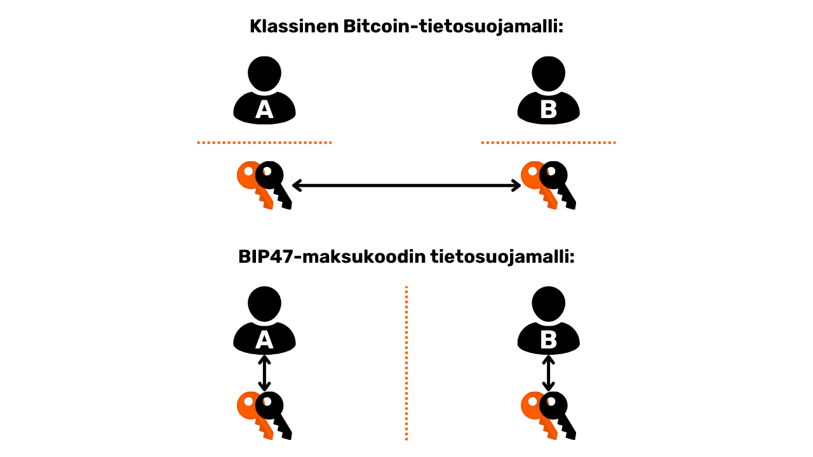
Todellisuudessa Bitcoinin perinteisen yksityisyyden mallin sisällä on usein monimutkaista täysin erottaa tiedonkulku avainparin ja käyttäjän välillä, erityisesti etätransaktioiden aikana. Esimerkiksi lahjoituskampanjan yhteydessä vastaanottajan on väistämättä paljastettava osoite tai julkinen avain verkkosivuillaan tai sosiaalisissa verkostoissaan. BIP47:n oikea käyttö, erityisesti ilmoitustransaktion avulla, mahdollistaa tämän ongelman kiertämisen kiitos ECDHE:n ja salauskerroksen, jota tarkastelemme tarkemmin.

Tietenkin Bitcoinin klassinen yksityisyysmalli pätee edelleen ohimeneviin julkisiin avaimiin, jotka johdetaan kahden maksukoodin yhdistelmästä. Nämä kaksi mallia ovat itse asiassa täydentäviä. Mitä haluan tässä korostaa, on että toisin kuin julkisen avaimen tavallinen käyttö bitcoinien vastaanottamiseen, maksukoodi voidaan yhdistää tiettyyn henkilöllisyyteen, koska tiedon "_Alice suorittaa transaktion Bobin kanssa_" katkaisu tapahtuu toisessa vaiheessa. Maksukoodia käytetään maksuosoitteiden generointiin, mutta pelkästään lohkoketjun tarkkailun perusteella on mahdotonta yhdistää BIP47-maksutransaktiota käytettyihin maksukoodeihin, ellei mukana olevia UTXO:ja ollut jo aiemmin yhdistetty henkilöllisyyteen ja käyttäjät ovat yhdistäneet maksukoodinsa vastaaviin henkilöllisyyksiinsä.

Yhteenvetona voidaan sanoa, että BIP47-maksujen tarjoama yksityisyysmalli voidaan pitää Bitcoinin perusmallia parempana, vaikka se ei missään nimessä olekaan taianomainen.

### Ilmoitustransaktion rakentaminen

Nyt, katsotaan miten tämä ilmoitustransaktio toimii. Kuvitellaan, että Alice haluaa lähettää varoja Bobille BIP47:n avulla. Esimerkissäni Alice toimii lähettäjänä ja Bob vastaanottajana. Jälkimmäinen on julkaissut maksukoodinsa verkkosivustollaan. Siksi Alice on jo tietoinen Bobin maksukoodista.

**1- Alice laskee jaetun salaisuuden ECDH:n avulla:**

- Hän valitsee avainparin HD-lompakostaan, joka sijaitsee eri haarassa kuin hänen maksukoodinsa. Huomaa, että tätä paria ei pitäisi olla helppo yhdistää Alicen ilmoitusosoitteeseen, eikä Alicen henkilöllisyyteen (katso edellinen osio);

- Alice valitsee tästä parista yksityisen avaimen. Nimeämme sen $a$ (pieni kirjain);

$$
a
$$

- Alice hakee julkisen avaimen, joka on yhdistetty Bobin ilmoitusosoitteeseen. Tämä avain on ensimmäinen Bobin maksukoodista johdettu tytär (indeksi $/0$). Nimeämme tämän julkisen avaimen $B$ (iso kirjain). Tähän julkiseen avaimen liittyvä yksityinen avain on nimeltään $b$ (pieni kirjain). $B$ määritetään pisteiden lisäyksellä ja kaksinkertaistamisella elliptisellä käyrällä $G$:stä (generaattoripiste) $b$:n (yksityinen avain) kanssa:
  $$ B = b \cdot G $$
- Alice laskee salaisen pisteen $S$ (isolla kirjaimella) elliptisellä käyrällä lisäämällä ja kaksinkertaistamalla pisteitä soveltamalla hänen yksityistä avaintaan $a$ Bobin julkisesta avaimesta $B$.
  $$ S = a \cdot B $$

- Alice laskee hämärtävän tekijän $f$, joka mahdollistaa hänen maksukoodinsa salaamisen. Tätä varten hän määrittää pseudo-satunnaisen numeron HMAC-SHA512-funktiolla. Tämän funktion toisessa syötteessä hän käyttää arvoa, jonka vain Bob pystyy palauttamaan: $x$, joka on aiemmin lasketun salaisen pisteen abskissa. Ensimmäinen syöte on $o$, joka on tämän transaktion syötteenä kulutettu UTXO (outpoint).

$$ f = \text{HMAC-SHA512}(o, x) $$

**2- Alice muuntaa henkilökohtaisen maksukoodinsa kantaan 2 (binääri).**

**3- Hän käyttää tätä hämärtävää tekijää avaimena suorittaakseen symmetrisen salauksen maksukoodinsa kuormitukselle.** Käytetty salausalgoritmi on yksinkertaisesti `XOR`. Suoritettu operaatio on verrattavissa Vernam-salakirjoitukseen, jota myös kutsutaan "Kertakäyttöiseksi salasanaksi".

- Alice jakaa ensin hämärtävän tekijänsä kahteen osaan: ensimmäiset 32 tavua nimetään $f1$:ksi ja viimeiset 32 tavua nimetään $f2$:ksi. Näin meillä on:

$$ f = f1 || f2 $$

- Alice laskee maksukoodinsa julkisen avaimen abskissan $x$ salatun $x'$ ja ketjukoodinsa $c$ salatun $c'$ erikseen. $f1$ ja $f2$ toimivat vastaavasti salausavaimina. Käytetty operaatio on `XOR` (poissulkeva tai).

$$ x' = x \oplus f1 $$
$$ c' = c \oplus f2 $$

- Alice korvaa maksukoodinsa julkisen avaimen abskissan $x$ ja ketjukoodin $c$ todelliset arvot salatuilla arvoilla $x'$ ja $c'$.
  **4-** Alicella on nyt maksukoodinsa salatulla kuormituksella. Hän rakentaa ja lähettää transaktion, joka sisältää hänen julkisen avaimensa $A$ syötteenä, lähdön Bobin ilmoitusosoitteeseen ja `OP_RETURN` lähdön, joka sisältää hänen maksukoodinsa salatulla kuormituksella. **Tämä transaktio on ilmoitustransaktio**.
  `OP_RETURN` on operaatiokoodi, joka merkitsee Bitcoin-transaktion lähdön mitättömäksi. Nykyään sitä käytetään tiedon lähettämiseen tai ankkurointiin Bitcoin-lohkoketjussa. Jopa 80 tavua dataa voidaan tallentaa, jotka kirjoitetaan ketjuun ja ovat siten näkyvissä kaikille muille käyttäjille.

Kuten aiemmissa osioissa näimme, ECDH:tä käytetään jaetun salaisuuden luomiseen kahden käyttäjän välillä, jotka kommunikoivat suojaamattomassa verkossa, jota mahdollisesti tarkkailevat hyökkääjät. BIP47:ssä ECDH:tä käytetään kommunikointiin Bitcoin-verkossa, joka luonteeltaan on läpinäkyvä kommunikaatioverkko, jota monet hyökkääjät tarkkailevat. ECDH-avainvaihdon kautta laskettua jaettua salaisuutta käytetään sitten salaisen tiedon salaamiseen siirrettäväksi: lähettäjän (Alicen) maksukoodi.

Kerrataanpa juuri käydyt vaiheet ilmoitustransaktion suorittamiseksi:

- Alice hakee Bobin maksukoodin ja ilmoitusosoitteen;
- Alice valitsee HD-lompakossaan omistamansa UTXO:n vastaavalla avainparilla;
- Hän laskee salaisen pisteen elliptisellä käyrällä käyttäen ECDH:tä;
- Hän käyttää tätä salaista pistettä HMAC:n laskemiseen, joka on hämärtävä tekijä;
- Hän käyttää tätä hämärtävää tekijää henkilökohtaisen maksukoodinsa kuormituksen salaamiseen.
- Hän käyttää `OP_RETURN` transaktiolähtöä kommunikoidakseen peitetyn maksukoodin Bobille.
  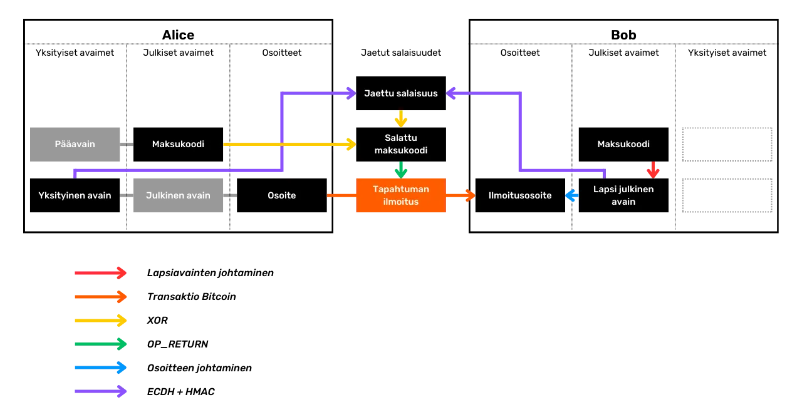

### Ilmoitustransaktio: Konkreettinen Tutkimus

Ymmärtääksemme sen toimintaa yksityiskohtaisemmin, erityisesti `OP_RETURN` käyttöä, tutkikaamme yhdessä todellista ilmoitustransaktiota. Suoritin tällaisen transaktion testnetissä, jonka voit löytää [klikkaamalla tästä](https://mempool.space/fr/testnet/tx/0e2e4695a3c49272ef631426a9fd2dae6ec3a469e3a39a3db51aa476cd09de2e).

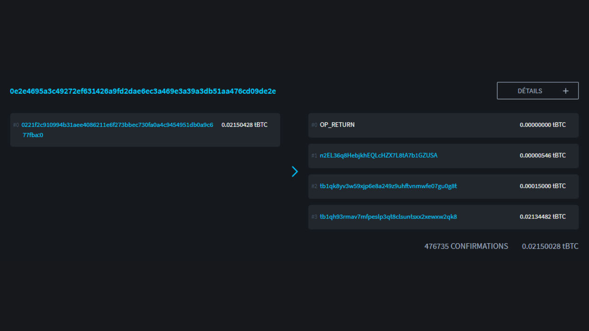

Tarkastellessamme tätä transaktiota, voimme nähdä, että siinä on yksi sisääntulo ja 4 lähtöä:

- Ensimmäinen lähtö on `OP_RETURN`, joka sisältää peitetyn maksukoodini;
- Toinen lähtö 546 satsia osoittaa vastaanottajani ilmoitusosoitteeseen;
- Kolmas lähtö 15 000 satsia edustaa palvelumaksuja, koska käytin Samourai Walletia tämän transaktion rakentamiseen;
- Neljäs lähtö 2 miljoonaa satsia edustaa vaihtorahaa, eli jäljellä olevaa eroa sisääntulostani, joka menee takaisin toiseen minulle kuuluvaan osoitteeseen.
  Mielenkiintoisin tutkittava on selvästi lähtö 0, joka käyttää `OP_RETURN`ia. Katsotaan tarkemmin, mitä se sisältää. Tässä on `scriptPubKey` heksadesimaalimuodossa:

```text
6a4c50010002b13b2911719409d704ecc69f74fa315a6cb20fdd6ee39bc9874667703d67b164927b0e88f89f3f8b963549eab2533b5d7ed481a3bea7e953b546b4e91b6f50d800000000000000000000000000
```

Tässä skriptissä voimme eritellä useita osia. Ensinnäkin, operaatiokoodit:

```text
6a4c
```

Operaatiokoodeista voimme tunnistaa `0x6a`, joka osoittaa `OP_RETURN`iin ja `0x4c`, joka osoittaa `OP_PUSHDATA1`iin.

Tämän viimeisen operaatiokoodin jälkeen seuraava tavu osoittaa seuraavan kuorman koon. Se osoittaa `0x50`, eli 80 tavua:

```text
6a4c50
```

Sitten meillä on maksukoodini metadata selkokielisenä:

```text
010002
```

Maksukoodini julkisen avaimen salattu x-koordinaatti:

```text
b13b2911719409d704ecc69f74fa315a6cb20fdd6ee39bc9874667703d67b164
```

Maksukoodini salattu ketjukoodi:

```text
927b0e88f89f3f8b963549eab2533b5d7ed481a3bea7e953b546b4e91b6f50d8
```

Ja lopuksi, täyte, jotta saavutetaan 80 tavun standardikoko `OP_RETURN`ille:

```text
00000000000000000000000000
```

Ymmärtääksemme paremmin, tässä on maksukoodini selkokielisenä base 58 -muodossa:

```text
PM8TJQCyt6ovbozreUCBrfKqmSVmTzJ5vjqse58LnBzKFFZTwny3KfCDdwTqAEYVasn11tTMPc2FJsFygFd3YzsHvwNXLEQNADgxeGnMK8Ugmin62TZU
```

Kun vertaillaan omaa avointa maksukoodiani `OP_RETURN`-koodiin, huomataan, että HRP (`0x47`) ja tarkistussumma (`0x8604e4db`) eivät ole mukana. Tämä on odotettua, sillä nämä tiedot on tarkoitettu ihmisille.
Seuraavaksi voimme tunnistaa version (`0x01`), bittikentän (`0x00`) ja julkisen avaimen pariteetin (`0x02`). Ja maksukoodin lopussa tyhjät tavut (`0x00000000000000000000000000`) käytetään täyttämään koodi yhteensä 80 tavuun. Kaikki nämä metatiedot lähetetään avoimesti (salaamattomina).

Lopuksi voidaan havaita, että julkisen avaimen x-koordinaatti (`0x77507c9c17a89cfca2d3af554745d6c2db0e7f6b2721a3941a504933103cc42a`) ja ketjukoodi (`0xdd94881210d6e752a9abc8a9fa0070e85184993c4f643f1121dd807dd556d1dc`) on salattu. Tämä muodostaa maksukoodin kuorman.

### Mikä on XOR?

Edellisissä osioissa näimme, että maksukoodi lähetettiin salattuna käyttäen XOR-operaatiota. Otetaan hetki ymmärtääksemme, miten tämä operaattori toimii, sillä sitä käytetään laajalti kryptografiassa.

XOR on bittikohtainen looginen operaattori, joka perustuu Booleen algebraan. Kahdella bittisellä operandilla se palauttaa `1`, jos saman arvon bitit ovat erilaiset, ja se palauttaa `0`, jos saman arvon bitit ovat samat. Tässä on XOR:n totuustaulu operandien `D` ja `E` arvojen perusteella:

| D   | E   | D XOR E |
| --- | --- | ------- |
| 0   | 0   | 0       |
| 0   | 1   | 1       |
| 1   | 0   | 1       |
| 1   | 1   | 0       |

Esimerkiksi:

$$
0110 \oplus 1110 = 1000
$$

Tai:

$$
010011 \oplus 110110 = 100101
$$

ECDH:n kanssa XOR:n käyttäminen salauskerroksena on erityisen sopivaa. Ensinnäkin tämän operaattorin ansiosta salaus on symmetrinen. Tämä mahdollistaa vastaanottajan purkaa maksukoodin samalla avaimella, jota käytettiin salaukseen. Salaus- ja purkuavain lasketaan jaetusta salaisuudesta ECDH:n avulla. Tämä symmetria mahdollistetaan XOR-operaattorin kommutatiivisten ja assosiatiivisten ominaisuuksien ansiosta:

- Muut ominaisuudet:

$$
D \oplus D = 0
$$

D ⊕ 0 = D

- Vaihdannaisuus:

$$
D \oplus E = E \oplus D
$$

- Liitännäisyys:

$$
D \oplus (E \oplus Z) = (D \oplus E) \oplus Z = D \oplus E \oplus Z
$$

Jos:

$$
D \oplus E = L
$$

Silloin:

$$
D \oplus L = D \oplus (D \oplus E) = D \oplus D \oplus E = 0 \oplus E = E \\
\therefore D \oplus L = E
$$

Seuraavaksi, tämä salausmenetelmä muistuttaa läheisesti Vernam-salausta (One-Time Pad), ainoa tähän mennessä tunnettu salausalgoritmi, jolla on ehdoton (tai absoluuttinen) turvallisuus. Jotta Vernam-salauksella olisi tämä ominaisuus, salausavaimen on oltava täysin satunnainen, sen on oltava samankokoinen kuin viesti, ja sitä saa käyttää vain kerran. Tässä BIP47:ssä käytetyssä salausmenetelmässä avain on todellakin samankokoinen kuin viesti, sokaisintekijä on täsmälleen samaa kokoa kuin julkisen avaimen x-koordinaatin yhdistäminen maksukoodin ketjukoodiin. Tämä salausavain käytetään todellakin vain kerran. Kuitenkin tämä avain ei ole täydellisen satunnaisuuden tulos, koska se on HMAC. Se on pikemminkin pseudo-satunnainen. Siksi se ei ole Vernam-salaus, mutta menetelmä on samankaltainen.

### Ilmoitustransaktion vastaanottaminen

Nyt kun Alice on lähettänyt ilmoitustransaktion Bobille, katsotaan, miten hän tulkitsee sen. Muistutuksena, Bobin on pystyttävä pääsemään käsiksi Alicen maksukoodiin. Ilman tätä tietoa, kuten seuraavassa osiossa näemme, hän ei pysty johdattamaan Alicen luomia avainpareja, eikä siten pääse käsiksi hänen BIP47:n kautta vastaanottamiinsa bitcoineihin. Toistaiseksi Alicen maksukoodin kuorma on salattu. Katsotaan, miten Bob purkaa sen.

**1-** Bob seuraa transaktioita, jotka luovat ulostuloja hänen ilmoitusosoitteeseensa.

**2-** Kun transaktiossa on ulostulo hänen ilmoitusosoitteeseensa, Bob analysoi sen nähdäkseen, sisältääkö se OP_RETURN-ulostulon, joka noudattaa BIP47-standardia.

**3-** Jos OP_RETURN-kuorman ensimmäinen tavu on `0x01`, Bob aloittaa mahdollisen jaetun salaisuuden etsimisen ECDH:n avulla:

- Bob valitsee transaktion syötteessä olevan julkisen avaimen. Se on Alicen julkinen avain nimeltä $A$:

$$ A = a \cdot G $$

- Bob valitsee yksityisen avaimen $b$, joka liittyy hänen henkilökohtaiseen ilmoitusosoitteeseensa:

$$ b $$

- Bob laskee salaisen pisteen $S$ (jaetun ECDH-salaisuuden) elliptisellä käyrällä lisäämällä ja kaksinkertaistamalla pisteitä, soveltamalla yksityistä avaintaan $b$ Alicen julkiseen avaimen $A$:
  $$ S = b \cdot A $$

- Bob määrittää sokaisintekijän $f$, joka mahdollistaa Alicen maksukoodin kuorman purkamisen. Samalla tavalla kuin Alice oli aiemmin laskenut, Bob löytää $f$:n soveltamalla HMAC-SHA512:ta $x$:ään, salaisen pisteen $S$ x-koordinaattiin, ja $o$:on, tässä ilmoitustransaktiossa käytetyn UTXO:n syötteenä:

$$ f = \text{HMAC-SHA512}(o, x) $$

**4-** Bob tulkitsee ilmoitustransaktion OP_RETURN:n tiedot maksukoodina. Hän yksinkertaisesti purkaa tämän mahdollisen maksukoodin kuorman käyttämällä sokaisintekijää $f$:

- Bob jakaa sokkotekijän $f$ kahteen osaan: ensimmäiset 32 tavua $f$:stä ovat $f1$ ja viimeiset 32 tavua ovat $f2$;
- Bob purkaa Alicen maksukoodista salatun x-koordinaatin $x'$ julkisen avaimen:

$$ x = x' \oplus f1 $$

- Bob purkaa Alicen maksukoodista salatun ketjukoodiarvon $c'$:

$$ c = c' \oplus f2 $$

**5-** Bob tarkistaa, onko Alicen maksukoodista saadun julkisen avaimen arvo todella osa secp256k1-ryhmää. Jos näin on, hän tulkitsee tämän kelvolliseksi maksukoodiksi. Muussa tapauksessa hän jättää tämän transaktion huomiotta.

Nyt kun Bob tietää Alicen maksukoodin, tämä voi lähettää hänelle jopa `2^32` maksua, ilman että hänen tarvitsee koskaan tehdä toista tällaista ilmoitustransaktiota uudelleen.

Miksi tämä toimii? Kuinka Bob pystyy määrittämään saman sokkotekijän kuin Alice ja siten purkamaan hänen maksukoodinsa? Katsotaanpa tarkemmin ECDH:n roolia siinä, mitä juuri kuvasimme.

Ensinnäkin, kyseessä on symmetrinen salaus. Tämä tarkoittaa, että salausavain ja purkuavain ovat sama arvo. Tämä avain ilmoitustransaktiossa on sokkotekijä:

$$ f = f1 || f2 $$

Siksi Alicen ja Bobin on saatava sama arvo $f$:lle, ilman että välittävät sitä suoraan, koska hyökkääjä voisi varastaa sen ja purkaa salaisen tiedon. Tämä sokkotekijä saadaan soveltamalla HMAC-SHA512:ta kahteen arvoon:

- salaisen pisteen x-koordinaattiin;
- ja transaktiossa käytettyyn UTXO-syötteeseen.
  Bob tarvitsee siis nämä kaksi tietoa purkaakseen Alicen maksukoodin kuorman. UTXO-syötteen osalta Bob voi yksinkertaisesti hankkia sen tarkkailemalla ilmoitustransaktiota. Salaisen pisteen osalta Bobin on käytettävä ECDH:ta. Kuten aiemmassa Diffie-Hellmanin osiossa nähtiin, vaihtamalla vastaavat julkiset avaimet ja soveltamalla salaa omia yksityisiä avaimiaan toisen julkiseen avaimeseen, Alice ja Bob voivat löytää tietyn ja salaisen pisteen elliptiseltä käyrältä. Ilmoitustransaktio perustuu tähän mekanismiin:
- Bobin avainpari:

$$ B = b \cdot G $$

- Alicen avainpari:

$$ A = a \cdot G $$

- Salaiselle $S (x, y)$:

$$ S = a \cdot B = a \cdot (b \cdot G) = (b \cdot a) \cdot G = b \cdot A $$

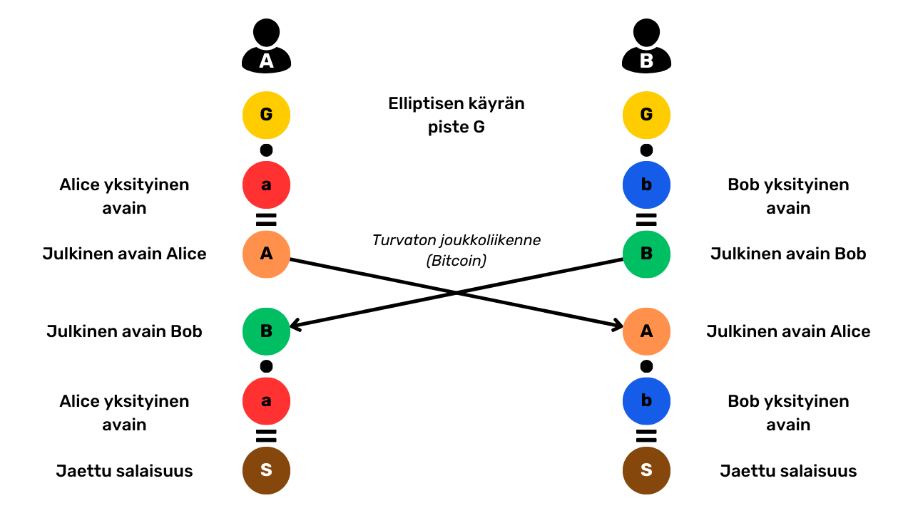

Nyt kun Bob tietää Alicen maksukoodin, hän pystyy havaitsemaan hänen BIP47-maksunsa, ja hän voi johtaa vastaanotettujen bitcoinien lukitsemiseen käytetyt yksityiset avaimet.

Kerrataanpa juuri käydyt vaiheet ilmoitustransaktion vastaanottamiseksi ja tulkitsemiseksi:

- Bob tarkkailee transaktiotuottoja ilmoitusosoitteeseensa;
- Kun hän havaitsee yhden, hän hankkii OP_RETURN:ssa sisältyvät tiedot;
- Bob valitsee syötteen julkisen avaimen ja laskee salaisen pisteen käyttäen ECDH:ta;
- Hän käyttää tätä salaisuuspistettä laskemaan HMAC:n, joka on sokkotekijä;
- Hän käyttää tätä sokkotekijää purkaakseen Alicen maksukoodin kuorman, joka sisältyy OP_RETURN:iin.

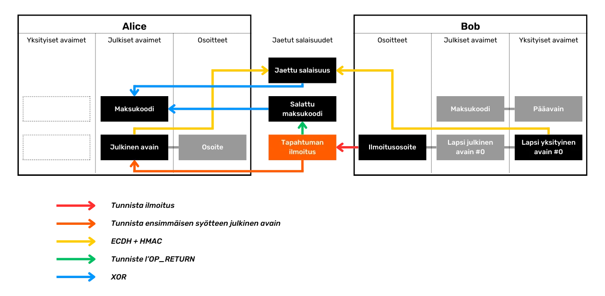

### BIP47 Maksutransaktio

Tutkitaan nyt yhdessä BIP47-maksuprosessia. Muistutuksena nykytilanteesta:

- Alice tietää Bobin maksukoodin, jonka hän yksinkertaisesti hankki hänen verkkosivustoltaan;
- Bob tietää Alicen maksukoodin kiitos ilmoitustransaktion;
- Alice tekee ensimmäisen maksun Bobille. Hän voi tehdä monia muita samalla tavalla.

Ennen tämän prosessin selittämistä, pidän tärkeänä muistuttaa indekseistä, joiden parissa tällä hetkellä työskentelemme. Maksukoodin johdannaispolku kuvataan seuraavasti: `m/47'/0'/0'`. Seuraava syvyys jakaa indeksit tällä tavalla:

- Ensimmäinen normaali (ei-kovennettu) lapsipari on se, jota käytetään luomaan ilmoitusosoite, josta puhuimme edellisessä osassa: `m/47'/0'/0'/0`;
- Normaaleja lapsiavainpareja käytetään ECDH:n sisällä BIP47 maksun vastaanotto-osoitteiden generoimiseen, kuten tulemme näkemään tässä osiossa: alkaen `m/47'/0'/0'/0` päättyen `m/47'/0'/0'/2 147 483 647`;
- Kovennetut lapsiavainparit ovat kertakäyttöisiä maksukoodeja: alkaen `m/47'/0'/0'/0'` päättyen `m/47'/0'/0'/2 147 483 647'`.

Aina kun Alice haluaa lähettää maksun Bobille, hän johtaa uuden ainutlaatuisen neitseellisen osoitteen, kiitos jälleen ECDH-protokollan:

- Alice valitsee ensimmäisen yksityisen avaimen, joka on johdettu hänen henkilökohtaisesta uudelleenkäytettävästä maksukoodistaan:

$$ a $$

- Alice valitsee ensimmäisen käyttämättömän julkisen avaimen, joka on johdettu Bobin maksukoodista. Tätä julkista avainta kutsutaan $B$:ksi. Se liittyy yksityiseen avaimen $b$, jonka vain Bob tietää:

$$ B = b \cdot G $$

- Alice laskee salaisen pisteen $S$ elliptisellä käyrällä pisteen lisäyksen ja kaksinkertaistamisen avulla soveltamalla yksityistä avaintaan $a$ Bobin julkiseen avaimen $B$:

$$ S = a \cdot B $$

- Tästä salaisesta pisteestä Alice laskee jaetun salaisuuden $s$ (pienet kirjaimet). Tätä varten hän valitsee salaisen pisteen $S$ x-koordinaatin, joka on nimetty $Sx$:ksi, ja hän syöttää tämän arvon SHA256-hajautusfunktion läpi:

$$ S = (Sx, Sy) $$
$$ s = \text{SHA256}(Sx) $$

- Alice käyttää tätä jaettua salaisuutta $s$ Bitcoinin maksun vastaanotto-osoitteen laskemiseen. Aluksi hän varmistaa, että $s$ sisältyy secp256k1-käyrän järjestykseen. Jos ei, hän kasvattaa Bobin julkisen avaimen indeksiä johdtaakseen toisen jaetun salaisuuden;
- Toiseksi hän laskee julkisen avaimen $K0$ lisäämällä elliptisellä käyrällä pisteet $B$ ja $s \cdot G$. Toisin sanoen, Alice lisää julkisen avaimen, joka on johdettu Bobin maksukoodista $B$, toisen pisteen kanssa, joka on laskettu elliptisellä käyrällä pisteen lisäyksen ja kaksinkertaistamisen avulla jaetun salaisuuden $s$ kanssa secp256k1-käyrän generointipisteestä $G$. Tämä uusi piste edustaa julkista avainta, ja me nimeämme sen $K0$:

$$ K0 = B + s \cdot G $$

- Tällä julkisella avaimella $K0$, Alice voi johtaa standardin neitseellisen vastaanotto-osoitteen (esimerkiksi SegWit V0 bech32:ssa).
  Kun Alice on saanut Bobin vastaanotto-osoitteen $K0$, hän voi suorittaa Bitcoin-siirron tavallisella tavalla. Tätä varten hän valitsee UTXO:n, jonka hän omistaa, turvattuna avainparilla eri haarasta hänen HD-lompakossaan, ja käyttää sitä tyydyttämään lähtökohtaan Bobin osoitteeseen $K0$. On tärkeää huomata, että tämä maksu, kun osoite on johdettu, noudattaa tavanomaista prosessia eikä enää riipu BIP47:ään liittyvistä avaimista.
  Kerrataanpa yhdessä läpi käydyt vaiheet BIP47-maksun lähettämiseksi:
- Alice valitsee ensimmäisen johdetun lapsi-privatiiviavaimen henkilökohtaisesta maksukoodistaan;
- Hän laskee salaisen pisteen elliptisellä käyrällä käyttäen ECDH:ta Bobin maksukoodista peräisin olevan ensimmäisen käyttämättömän johdetun lapsi-julkisen avaimen kanssa;
- Hän käyttää tätä salaista pistettä laskeakseen jaetun salaisuuden SHA256:n avulla;
- Hän käyttää tätä jaettua salaisuutta laskemaan uuden salaisen pisteen elliptisellä käyrällä;
- Hän lisää tämän uuden salaisen pisteen Bobin julkiseen avaimen;
- Hän saa uuden ohimenevän julkisen avaimen, johon vain Bobilla on liittyvä privaattiavain;
- Alice voi tehdä standardin siirron Bobille johdetulla ohimenevällä vastaanotto-osoitteella.

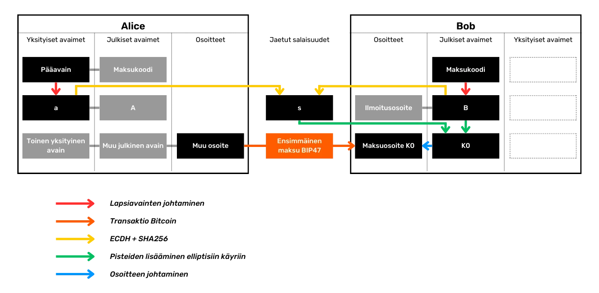

Jos Alice haluaa tehdä toisen maksun, hän seuraa samoja vaiheita kuin aiemmin, paitsi tällä kertaa hän valitsee toisen johdetun julkisen avaimen Bobin maksukoodista. Erityisesti hän käyttää seuraavaa käyttämätöntä avainta. Hän saa näin uuden vastaanotto-osoitteen, joka kuuluu Bobille, merkitty $K1$:

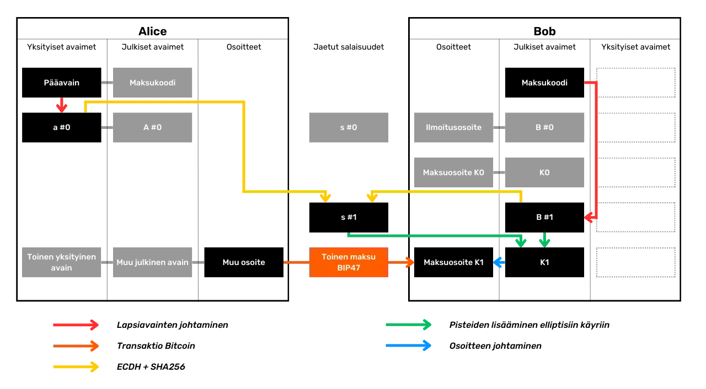

Hän voi jatkaa tällä tavalla ja johtaa jopa `2^32` käyttämätöntä osoitetta, jotka kuuluvat Bobille.

Ulkopuolisen näkökulmasta, tarkkailemalla lohkoketjua, on teoreettisesti mahdotonta erottaa BIP47-maksua standardimaksusta. Tässä on esimerkki BIP47-maksutapahtumasta Testnetissä:

```text
94b2e59510f2e1fa78411634c98a77bbb638e28fb2da00c9f359cd5fc8f87254
```

Näyttää standardilta tapahtumalta, jossa on kulutettu syöte, maksulähtö ja vaihto:


### BIP47-maksun vastaanottaminen ja privaattiavaimen johtaminen

Alice on juuri tehnyt ensimmäisen maksunsa uuteen BIP47-osoitteeseen, joka kuuluu Bobille. Katsotaan nyt, miten Bob vastaanottaa tämän maksun. Näemme myös, miksi Alicella ei ole pääsyä itse luomansa osoitteen privaattiavaimelle, ja miten Bob hankkii tämän avaimen käyttääkseen juuri vastaanottamiaan bitcoineja.
Kun Bob saa ilmoitustapahtuman Alicelta, hän johtaa julkisen avaimen BIP47 $K0$ jopa ennen kuin Alice on lähettänyt mitään maksua. Hän sitten tarkkailee mahdollisia maksuja liittyvään osoitteeseen. Itse asiassa hän johtaa välittömästi useita osoitteita, joita hän tulee tarkkailemaan ($K0$, $K1$, $K2$, $K3$...). Tässä on, miten hän johtaa tämän julkisen avaimen $K0$:

- Bob valitsee ensimmäisen johdetun lapsi-privatiiviavaimen maksukoodistaan. Tätä privaattiavainta kutsutaan $b$:ksi. Se liittyy julkiseen avaimen $B$, jota Alice käytti laskelmissaan edellisessä vaiheessa:

$$ b $$

- Bob valitsee ensimmäisen Alicen maksukoodista johdetun julkisen avaimen. Tätä avainta kutsutaan $A$:ksi. Se liittyy privaattiavaimen $a$ kanssa, jota Alice käytti laskelmissaan, ja josta vain Alice on tietoinen. Bob voi suorittaa tämän prosessin, koska hän on tietoinen Alicen maksukoodista, joka lähetettiin hänelle ilmoitustapahtuman yhteydessä:

$$ A = a \cdot G $$

- Bob laskee salaisen pisteen $S$, lisäämällä ja kaksinkertaistamalla pisteitä elliptisellä käyrällä, soveltamalla omaa privaattiavaintaan $b$ Alicen julkiseen avaimen $A$. Tässä löydämme ECDH:n käytön, joka takaa, että tämä piste $S$ on sama sekä Bobille että Alicelle:

$$ S = b \cdot A $$

- Aivan kuten Alice, Bob eristää tämän pisteen $S$ x-koordinaatin. Olemme nimenneet tämän arvon $Sx$. Hän syöttää tämän arvon SHA256-funktioon löytääkseen jaetun salaisuuden $s$ (pienet kirjaimet):
  $$ s = \text{SHA256}(Sx) $$

- Aivan kuten Alice, Bob laskee pisteen $s·G$ elliptisellä käyrällä. Sitten hän lisää tämän salaisen pisteen julkiseen avaimensa $B$. Hän saa näin uuden pisteen elliptisellä käyrällä, jonka hän tulkitsee julkiseksi avaimiksi $K0$:

$$ K0 = B + s \cdot G $$

Kun Bobilla on tämä julkinen avain $K0$, hän voi johtaa siihen liittyvän yksityisen avaimen, jotta hän voi käyttää bitcoinejaan. Vain hän voi luoda tämän yksityisen avaimen:

- Bob lisää lapsi-yksityisen avaimensa $b$, joka on johdettu hänen henkilökohtaisesta maksukoodistaan. Vain hän voi saada $b$:n arvon. Sitten hän lisää $b$:n jaetun salaisuuden $s$ kanssa saadakseen $k0$, $K0$:n yksityisen avaimen:

$$ k0 = b + s $$

Kiitos elliptisen käyrän ryhmälain, Bob saa täsmälleen sen yksityisen avaimen, joka vastaa Alicen käyttämää julkista avainta. Meillä on siis:

$$ K0 = k0 \cdot G $$
Tiivistän juuri käymämme vaiheet yhdessä BIP47-maksun vastaanottamiseksi ja vastaavan yksityisen avaimen laskemiseksi:

- Bob valitsee ensimmäisen johdetun lapsi-yksityisen avaimen henkilökohtaisesta maksukoodistaan;
- Hän laskee salaisen pisteen elliptisellä käyrällä käyttäen ECDH:ta Alicen ketjukoodista johdetusta ensimmäisestä lapsi-julkisesta avaimesta;
- Hän käyttää tätä salaisen pistettä laskeakseen jaetun salaisuuden SHA256:lla;
- Hän käyttää tätä jaettua salaisuutta laskeakseen uuden salaisen pisteen elliptisellä käyrällä;
- Hän lisää tämän uuden salaisen pisteen henkilökohtaiseen julkiseen avaimensa;
- Hän saa uuden efemeraalisen julkisen avaimen, johon Alice lähettää ensimmäisen maksunsa;
- Bob laskee yksityisen avaimen, joka liittyy tähän efemeraaliseen julkiseen avaimen, lisäämällä johdetun lapsi-yksityisen avaimensa maksukoodistaan ja jaetun salaisuuden.

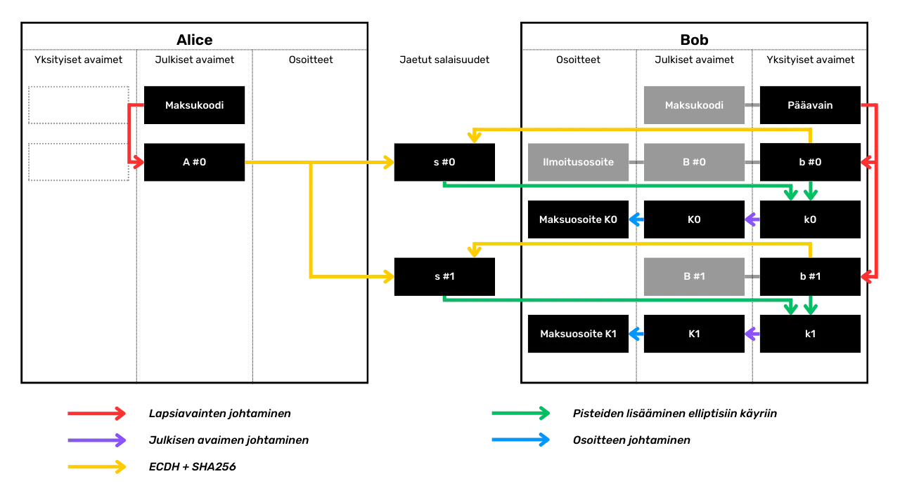

Koska Alice ei voi saada $b$:tä (Bobin yksityinen avain), hän ei pysty määrittämään $k0$:aa (yksityinen avain, joka liittyy Bobin BIP47-vastaanotto-osoitteeseen). Kaavamaisesti voimme esittää jaetun salaisuuden $S$ laskennan näin:


Kun jaettu salaisuus on löydetty ECDH:lla, Alice ja Bob laskevat BIP47-maksujulkisen avaimen $K0$, ja Bob laskee myös siihen liittyvän yksityisen avaimen $k0$:

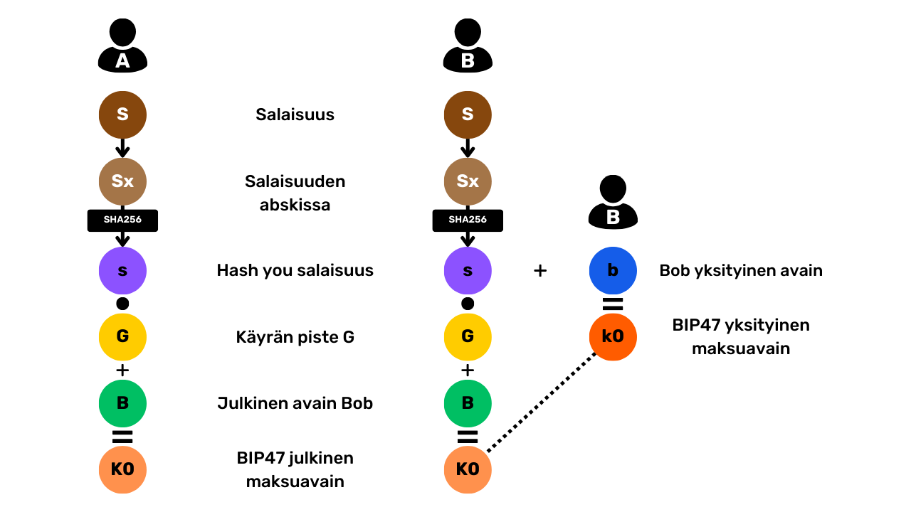

### BIP47-maksun palauttaminen

Koska Bob tietää Alicen uudelleenkäytettävän maksukoodin, hänellä on jo kaikki tarvittavat tiedot lähettääkseen hänelle hyvityksen. Hänen ei tarvitse ottaa yhteyttä Aliceen uudelleen pyytääkseen mitään tietoja. Hänen tarvitsee vain ilmoittaa hänelle ilmoitustransaktiolla, erityisesti jotta hän voi hakea BIP47-osoitteensa siemenestään, ja sitten hän voi myös lähettää hänelle jopa `2^32` maksua.

Hyvitystoiminto on BIP47:lle ominaista ja se on yksi sen eduista muihin menetelmiin nähden, joita tulemme tutkimaan tulevissa luvuissa, kuten Hiljaiset Maksut.

Bob voi sitten hyvittää Alicen samalla tavalla kuin hän lähetti hänelle maksuja. Roolit kääntyvät:

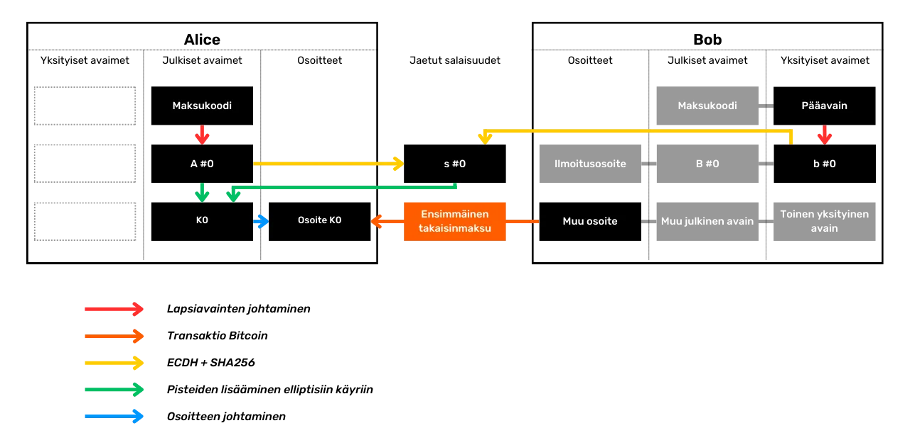
_Suuri kiitos [Fanis Michalakisille](https://x.com/FanisMichalakis) hänen arvokkaasta asiantuntija-arviostaan ja neuvostaan artikkeliin, joka inspiroi tämän luvun kirjoittamista!_

https://planb.network/tutorials/privacy/paynym-bip47

## Hiljaiset Maksut

<chapterId>2871d594-414e-4598-a830-91c9eb84dfb8</chapterId>
BIP47 on kritisoitu sen tehottomuudesta lohkoketjussa. Kuten edellisessä luvussa selitettiin, se vaatii ilmoitustransaktion jokaiselle uudelle vastaanottajalle. Tämä rajoitus muuttuu merkityksettömäksi, jos suunnittelee perustavansa kestävän maksukanavan kyseisen vastaanottajan kanssa. Todellakin, yksi ilmoitustransaktio mahdollistaa lähes rajattoman määrän myöhempiä BIP47-maksuja.

Kuitenkin tietyissä tilanteissa ilmoitustransaktio voi olla este käyttäjälle. Otetaan esimerkiksi kertaluonteinen lahjoitus vastaanottajalle: klassisella Bitcoin-osoitteella yksi transaktio riittää tekemään lahjoituksen. Mutta BIP47:n kanssa kaksi transaktiota on tarpeen: yksi ilmoitusta varten ja toinen varsinaista maksua varten. Kun lohkon tilan kysyntä on matala ja transaktiomaksut ovat minimaalisia, tämä lisävaihe ei yleensä ole ongelma. Kuitenkin ruuhka-aikoina transaktiomaksut voivat nousta kohtuuttoman korkeiksi yksittäisestä maksusta, mahdollisesti kaksinkertaistaen käyttäjän kustannukset verrattuna standardi Bitcoin-transaktioon, mikä voi olla käyttäjälle hyväksymätöntä.

Tilanteissa, joissa käyttäjä aikoo tehdä vain muutaman maksun staattiselle tunnisteelle, on kehitetty muita ratkaisuja. Niiden joukossa ovat Hiljaiset Maksut, jotka on kuvattu [BIP352:ssa](https://github.com/bitcoin/bips/blob/master/bip-0352.mediawiki). Tämä protokolla mahdollistaa staattisen tunnisteen käytön maksujen vastaanottamiseen ilman osoitteen uudelleenkäyttöä ja ilman ilmoitustransaktioiden tarvetta. Tutkitaan, miten tämä protokolla toimii.

---

_Jotta ymmärtäisit tämän luvun täysin, on olennaista olla perehtynyt ECDH:n (Elliptinen Käyrä Diffie-Hellman) toimintaan ja kryptografiseen avaimen johdannaisuuteen HD-lompakossa. Nämä käsitteet on yksityiskohtaisesti käsitelty edellisessä BIP47-luvussa. En käy niitä tässä uudelleen läpi. En myöskään palaa vastaanotto-osoitteiden uudelleenkäytön riskeihin, eikä ainutlaatuisen tunnisteen tärkeyteen maksujen vastaanottamisessa._

---

### Miksi ei siirretä ilmoitusta?

Kuten BIP47-luvussa keskusteltiin, ilmoitustransaktio palvelee pääasiassa kahta tarkoitusta:

- Se ilmoittaa vastaanottajalle;
- Se välittää lähettäjän maksukoodin.

Voisi naiivisti ajatella, että tämä ilmoitusprosessi voitaisiin suorittaa off-chain. Teoriassa tämä on täysin mahdollista: riittäisi, että vastaanottaja ilmoittaisi kommunikaatiokeinon vastaanottaakseen BIP47-maksukoodit lähettäjiltä. Kuitenkin tämä lähestymistapa esittää kaksi merkittävää ongelmaa:

- Ensinnäkin, tämä siirtäisi koodin välitysprosessin toiseen kommunikaatioprotokollaan. Kustannuksiin ja vaihdon yksityisyyteen liittyvät ongelmat pysyisivät, mutta ne vain siirtyisivät tähän uuteen protokollaan. Yksityisyyden kannalta tämä voisi myös luoda linkin käyttäjän identiteetin ja lohkoketjuaktiviteetin välille, mikä on jotain, mitä pyrimme välttämään suorittamalla ilmoituksen suoraan lohkoketjussa. Lisäksi ilmoituksen suorittaminen lohkoketjun ulkopuolella toisi mukanaan sensuuririskejä (kuten varojen estämisen), joita ei ole Bitcoinissa;
- Seuraavaksi tämä aiheuttaisi palautusongelman. BIP47:n tapauksessa vastaanottajan on ehdottomasti tiedettävä lähettäjien maksukoodit päästäkseen käsiksi varoihin. Tämä pätee vastaanottohetkellä, mutta myös varojen palautustilanteessa siemenen kautta lompakon kadotessa. Onchain-ilmoitusten avulla tämä riski vältetään, sillä käyttäjä voi löytää ja purkaa ilmoitustransaktiot yksinkertaisesti tietämällä oman siemenensä. Kuitenkin, jos ilmoitus suoritetaan lohkoketjun ulkopuolella, käyttäjän olisi ylläpidettävä dynaamista varmuuskopiota kaikista vastaanotetuista maksukoodeista, mikä on käytännössä mahdotonta keskivertokäyttäjälle.
  Kaikki nämä rajoitukset tekevät onchain-ilmoituksen käytöstä välttämätöntä BIP47:n kontekstissa. Kuitenkin Hiljaiset Maksut pyrkivät nimenomaan välttämään tätä onchain-ilmoitusvaihetta sen kustannusten vuoksi. Siksi hyväksytty ratkaisu ei ole siirtää ilmoitusta, vaan poistaa se kokonaan. Tämän saavuttamiseksi on hyväksyttävä kompromissi: skannauksen tarve. Toisin kuin BIP47:ssä, jossa käyttäjä tietää tarkalleen, mistä löytää varansa ilmoitustransaktioiden ansiosta, Hiljaisten Maksujen kontekstissa käyttäjän on tutkittava kaikki olemassa olevat Bitcoin-transaktiot havaitakseen mahdolliset heille tarkoitetut maksut. Tämän operatiivisen taakan vähentämiseksi Hiljaisten Maksujen etsintä rajoittuu vain niihin transaktioihin, jotka todennäköisesti sisältävät tällaisia maksuja, nimittäin niihin, jotka sisältävät ainakin yhden Taproot P2TR -lähdön. Skannaus keskittyy myös yksinomaan transaktioihin lompakon luontipäivämäärästä lähtien (ei ole tarpeen skannata transaktioita takaisin vuoteen 2009, jos lompakko on luotu vuonna 2024).

Näin ollen voit nähdä, miksi BIP47 ja Hiljaiset Maksut, vaikka ne pyrkivät samankaltaiseen tavoitteeseen, edellyttävät erilaisia kompromisseja ja **näin ollen palvelevat itse asiassa erilaisia käyttötapauksia**. Kertamaksuille, kuten satunnaisille lahjoituksille, Hiljaiset Maksut ovat sopivampia niiden alhaisempien kustannusten vuoksi. Toisaalta säännöllisille transaktioille samalle vastaanottajalle, kuten vaihtoalustoilla tai louhintapoolien tapauksessa, BIP47 saattaa olla suositeltavampi.
Tutkitaan yhdessä Hiljaisten Maksujen teknistä toimintaa ymmärtääksemme paremmin niiden vaikutuksia. Tätä varten ehdotan, että otamme saman lähestymistavan kuin BIP352:n selitysdokumentissa. Pureudumme vähitellen suoritettaviin laskelmiin, elementti elementiltä, perustellen jokaisen uuden lisäyksen.

### Ymmärrettäviä konsepteja

Ennen kuin aloitamme, on tärkeää selventää, että Hiljaiset Maksut perustuvat yksinomaan P2TR (_Pay to Taproot_) skriptityyppien käyttöön. Toisin kuin BIP47:ssä, ei ole tarpeen johtaa vastaanotto-osoitteita lapsen julkisista avaimista hashamalla ne. Itse asiassa P2TR-standardissa muunnettu julkinen avain käytetään suoraan ja avoimesti osoitteessa. Näin ollen Taproot-vastaanotto-osoite on pohjimmiltaan julkinen avain, johon liittyy jonkin verran metadataa. Tämä muunnettu julkinen avain on kahden muun julkisen avaimen aggregaatio: toinen mahdollistaa suoran ja perinteisen kulutuksen yksinkertaisella allekirjoituksella, ja toinen edustaa MASTin Merkle-juurta, joka sallii kulutuksen edellyttäen, että yksi mahdollisesti Merkle-puuhun kirjoitetuista ehdoista täyttyy.


Päätös rajoittaa Hiljaiset Maksut yksinomaan Taprootiin on motivoitu kahdesta pääsyystä:

- Ensinnäkin, se merkittävästi helpottaa toteutusta ja tulevia päivityksiä lompakko-ohjelmistossa, koska vain yhtä standardia tarvitsee noudattaa;
- Toiseksi, tämä lähestymistapa auttaa parantamaan käyttäjien nimettömyysjoukkoa kannustamalla heitä olemaan hajaantumatta eri tyyppisten skriptien kesken, jotka tuottavat erillisiä lompakon sormenjälkiä ketjuanalyysissä (lisätietoja tästä konseptista, suosittelen konsultoimaan osan 2 luvun 4).
  Aloitetaan yksinkertaisella esimerkillä, joka auttaa ymmärtämään SP:n (Silent Payments) perustoimintaa. Otetaan Alice ja Bob, kaksi Bitcoin-käyttäjää. Alice haluaa lähettää bitcoineja Bobille uudelle vastaanotto-osoitteelle. Tässä prosessissa on saavutettava kolme tavoitetta:
- Alicen on pystyttävä luomaan uusi osoite;
- Bobin on pystyttävä tunnistamaan tälle tietylle osoitteelle lähetetty maksu;
- Bobin on pystyttävä saamaan osoitteeseen liittyvä yksityinen avain käyttöönsä, jotta hän voi käyttää varojaan.

Alicella on UTXO hänen Bitcoin-lompakossaan, joka on suojattu seuraavalla avainparilla:

- $a$: yksityinen avain;
- $A$: julkinen avain ($A = a \cdot G$)

Bobilla on SP-osoite, jonka hän on julkaissut internetissä:

- $b$: yksityinen avain;
- $B$: julkinen avain ($B = b \cdot G$)
  Bobin osoitteen hankkimisen jälkeen Alice pystyy laskemaan uuden tyhjän osoitteen, joka kuuluu Bobille käyttäen ECDH:ta. Kutsutaan tätä osoitetta $P$:
  $$ P = B + \text{hash}(a \cdot B) \cdot G $$

Tässä yhtälössä Alice yksinkertaisesti laski pistetulon omasta yksityisestä avaimestaan $a$ ja Bobin julkisesta avaimesta $B$. Hän syötti tämän tuloksen tunnettuun hajautusfunktioon. Tuloksena saatu arvo kerrotaan sitten skalaarilla elliptisen käyrän `secp256k1` generaattoripisteellä $G$. Lopuksi Alice lisää saadun pisteen Bobin julkiseen avaimeseen $B$. Kun Alicella on tämä osoite $P$, hän käyttää sitä transaktion tuloksena, tarkoittaen että hän lähettää bitcoineja siihen.

> _Silent Payments -kontekstissa "hash"-funktio vastaa SHA256-hajautusfunktiota, joka on erityisesti merkitty `BIP0352/SharedSecret`-tunnisteella, varmistaen että tuotetut hajautukset ovat ainutlaatuisia tälle protokollalle eivätkä ne voi olla uudelleenkäytettävissä muissa yhteyksissä, samalla tarjoten lisäsuojaa noncejen uudelleenkäytölle allekirjoituksissa. Tämä standardi vastaa sitä, joka on [määritelty BIP340:ssä Schnorr-allekirjoituksille](https://github.com/bitcoin/bips/blob/master/bip-0340.mediawiki) `secp256k1`:ssä._

Kiitos elliptisen käyrän ominaisuuksien, joihin ECDH perustuu, tiedämme että:

$$ a \cdot B = b \cdot A $$

Bob pystyy siis laskemaan vastaanotto-osoitteen, johon Alice lähetti bitcoinit. Tehdäkseen tämän, hän seuraa kaikkia Bitcoin-transaktioita, jotka täyttävät Silent Payments -kriteerit ja soveltaa seuraavaa laskutoimitusta jokaiseen niistä nähdäkseen, onko maksu osoitettu hänelle (_skannaus_):

$$ P' = B + \text{hash}(b \cdot A) \cdot G $$

Kun hän skannaa Alicen transaktion, hän huomaa, että $P'$ on yhtä suuri kuin $P$. Hän siis tietää, että tämä maksu on osoitettu hänelle:

$$ P' = B + \text{hash}(b \cdot A) \cdot G = B + \text{hash}(a \cdot B) \cdot G = P $$

Tästä eteenpäin Bob pystyy laskemaan yksityisen avaimen $p$, joka mahdollistaa osoitteen $P$ käyttämisen:

$$ p = (b + \text{hash}(b \cdot A)) \bmod n $$

Kuten näet, tämän yksityisen avaimen $p$ laskemiseen tarvitaan välttämättä yksityinen avain $b$. Vain Bobilla on tämä yksityinen avain $b$. Hän on siis todellakin ainoa, joka pystyy käyttämään bitcoineja, jotka on lähetetty hänen Silent Payments -osoitteeseensa.


_Kuvateksti:_

- $B$: Bobin julkinen avain / staattinen osoite, jonka Bob on julkaissut
- $b$: Bobin yksityinen avain
- $A$: Alicen UTXO:n julkinen avain, jota käytetään transaktion syötteenä
- $a$: Alicen yksityinen avain
- $G$: Elliptisen käyrän `secp256k1` generaattoripiste
- $\text{SHA256}$: SHA256-tiivistefunktio, joka on merkitty `BIP0352/SharedSecret`
- $s$: Yhteinen ECDH-salaisuus
- $P$: Julkinen avain / uniikki osoite maksulle Bobille

Tässä on aluksi melko naiivi lähestymistapa käyttää Bobin staattista osoitetta, joka on merkitty $B$, johdettakseen uniikki osoite $P$ bitcoineja lähettämiseen. Kuitenkin tämä menetelmä on liian yksinkertainen ja siinä on useita virheitä, jotka tarvitsevat korjausta. Ensimmäinen ongelma on, että tässä järjestelmässä Alice ei voi luoda useita lähtöjä Bobille samassa transaktiossa.

### Kuinka luoda useita lähtöjä?

Edellisessä osiossa esimerkissä Alice luo yhden lähdön, joka menee Bobille hänen uniikkiin osoitteeseensa $P$. Samalla syötteellä valittuna Alicen on mahdotonta luoda kaksi erillistä neitseellistä osoitetta Bobille, koska käytetty menetelmä johtaisi aina samaan tulokseen $P$:lle, siis samaan osoitteeseen. Kuitenkin voi olla monia tilanteita, joissa Alice haluaa jakaa maksunsa Bobille useisiin pienempiin summiin, luoden näin useita UTXO:ja. Siksi on tarpeen löytää menetelmä, joka mahdollistaa tämän tekemisen.

Saavuttaaksemme tämän, muokkaamme hieman laskentaa, jonka Alice suorittaa johdattaakseen $P$:n, jotta hän voi luoda kaksi erillistä osoitetta Bobille, nimittäin $P_0$ ja $P_1$.

Muuttaaksemme laskentaa ja saadaksemme 2 eri osoitetta, riittää lisätä kokonaisluku, joka muuttaa tulosta. Näin Alice lisää $0$ laskentaansa saadakseen osoitteen $P_0$ ja $1$ saadakseen osoitteen $P_1$. Kutsutaan tätä kokonaislukua $i$:ksi:

$$ P_i = B + \text{hash}(a \cdot B \text{ ‖ } i) \cdot G $$

Laskentaprosessi pysyy muuttumattomana edellisestä menetelmästä, paitsi että tällä kertaa Alice yhdistää $a \cdot B$:n $i$:n kanssa ennen tiivisteen laskemista. Riittää sitten muuttaa $i$:tä saadakseen uuden osoitteen, joka kuuluu Bobille. Esimerkiksi:

$$ P_0 = B + \text{hash}(a \cdot B \text{ ‖ } 0) \cdot G $$

$$ P_1 = B + \text{hash}(a \cdot B \text{ ‖ } 1) \cdot G $$
Kun Bob skannaa lohkoketjua hänelle tarkoitettuja Hiljaisia Maksuja varten, hän aloittaa käyttämällä $i = 0$ osoitteelle $P_0$. Jos hän ei löydä maksua $P_0$:ssa, hän päättelee, että tässä transaktiossa ei ole Hiljaisia Maksuja hänelle ja lopettaa sen analysoinnin. Kuitenkin, jos $P_0$ on validi ja sisältää maksun hänelle, hän jatkaa $P_1$:n kanssa samassa transaktiossa tarkistaakseen, tekikö Alice toisen maksun. Jos $P_1$ osoittautuu kelvottomaksi, hän lopettaa tämän transaktion etsinnän; muussa tapauksessa hän jatkaa seuraavien $i$:n arvojen testaamista:
$$ P_0 = B + \text{hash}(b \cdot A \text{ ‖ } 0) \cdot G $$
$$ P_1 = B + \text{hash}(b \cdot A \text{ ‖ } 1) \cdot G $$

Koska Bob pysähtyy välittömästi kohdassa $i = 0$, jos $P_0$ ei tuota mitään, tämän kokonaisluvun käyttö lisää lähes mitään lisäkuormaa Bobille transaktioiden skannausvaiheessa.

Bob voi sitten laskea yksityiset avaimet samalla tavalla:

$$
p_0 = (b + \text{hash}(b \cdot A \text{ ‖ } 0)) \bmod n
$$

$$
p_1 = (b + \text{hash}(b \cdot A \text{ ‖ } 1)) \bmod n
$$


_Kuvateksti:_

- $B$: Julkinen avain / staattinen osoite, jonka Bob on julkaissut
- $b$: Bobin yksityinen avain
- $A$: Alicen UTXO:n julkinen avain, jota käytetään transaktion syötteenä
- $a$: Alicen yksityinen avain
- $G$: Elliptisen käyrän generointipiste `secp256k1`
- $\text{SHA256}$: SHA256-tiivistefunktio, merkitty `BIP0352/SharedSecret`
- $s_0$: Ensimmäinen jaettu ECDH-salaisuus
- $s_1$: Toinen jaettu ECDH-salaisuus
- $P_0$: Ensimmäinen julkinen avain / uniikki osoite maksulle Bobille
- $P_1$: Toinen julkinen avain / uniikki osoite maksulle Bobille

Tällä menetelmällä alamme saada aikaan mukavan protokollan, mutta on vielä joitakin haasteita voitettavana, erityisesti osoitteen uudelleenkäytön estäminen.

### Kuinka välttää osoitteen uudelleenkäyttöä?

Kuten aiemmissa osioissa näimme, Alice käyttää UTXO:nsa turvaamiseen paria avaimia, jotka hän käyttää laskeakseen jaetun ECDH-salaisuuden Bobin kanssa. Tämä salaisuus mahdollistaa hänelle uniikin osoitteen $P_0$ johdannaisen. Kuitenkin, jos Alice käyttää samaa avainparia ($a$, $A$) turvaamaan useita UTXO:ja, jos hän on käyttänyt tätä osoitetta useita kertoja, tämä johtaisi Bobin osoitteen uudelleenkäyttöön.

> _Osoitteen uudelleenkäyttö on erittäin huono käytäntö käyttäjän yksityisyyden kannalta. Ymmärtääksesi miksi, suosittelen sinua katsomaan koulutuksen ensimmäiset osat._

Todellakin, koska uniikki osoite $P_0$ johdetaan $A$:sta ja $B$:stä, jos Alice johtaa toisen osoitteen toiselle maksulle $B$:lle, samalla avaimella $A$, hän päätyy samaan osoitteeseen $P_0$. Välttääksemme tämän riskin ja estääksemme osoitteen uudelleenkäytön Hiljaisissa Maksuissa, meidän on hieman muutettava laskelmiamme.

Mitä haluamme, on että jokainen UTXO, jonka Alice kuluttaa maksun syötteenä, antaa uniikin osoitteen Bobin puolelle, vaikka useat UTXO:t olisivatkin turvattu samalla avainparilla. Riittää siis lisätä viittaus UTXO:on uniikin osoitteen $P_0$ laskennassa. Tämä viittaus on yksinkertaisesti kulutetun UTXO:n tiiviste:

$$ \text{inputHash} = \text{hash}(\text{outpoint} \text{ ‖ } A) $$

Ja tähän syöteviitteeseen Alice lisää sen hänen laskelmassaan uniikista osoitteesta $P_0$:
$$ P_0 = B + \text{hash}(\text{inputHash} \cdot a \cdot B \text{ ‖ } 0) \cdot G $$
Skannauksensa aikana Bob voi myös lisätä $\text{inputHash}$, koska kaikki mitä hänen tarvitsee tehdä, on tarkkailla siirtoa päätelläkseen $\text{outpoint}$:

$$ P_0 = B + \text{hash}(\text{inputHash} \cdot b \cdot A \text{ ‖ } 0) \cdot G $$

Kun hän löytää kelvollisen $P_0$, hän voi laskea vastaavan yksityisen avaimen $p_0$:

$$
p_0 = (b + \text{hash}(\text{inputHash} \cdot b \cdot A \text{ ‖ } 0)) \bmod n
$$


_Selitys:_

- $B$: Bobin julkinen avain / staattinen osoite, jonka Bob on julkaissut
- $b$: Bobin yksityinen avain
- $A$: Alicen UTXO:n julkinen avain, jota käytetään siirron syötteenä
- $a$: Alicen yksityinen avain
- $H$: Syötteenä käytetyn UTXO:n hajautus
- $G$: Elliptisen käyrän `secp256k1` generaattoripiste
- $\text{SHA256}$: SHA256-hajautusfunktio, merkitty `BIP0352/SharedSecret`
- $s_0$: Ensimmäinen jaettu ECDH-salaisuus
- $P_0$: Ensimmäinen julkinen avain / uniikki maksuosoite maksuille Bobille

Tällä hetkellä laskelmamme olettavat, että Alice käyttää yhtä syötettä siirrossaan. Kuitenkin, hänen pitäisi pystyä käyttämään useita syötteitä. Tästä seuraa, että Bobin puolella, jokaiselle siirrolle, joka sisältää useita syötteitä, hänen teoriassa tarvitsisi laskea ECDH jokaiselle syötteelle määrittääkseen, onko maksu tarkoitettu hänelle. Tämä menetelmä ei ole tyydyttävä, joten meidän on löydettävä ratkaisu työmäärän vähentämiseksi!

### Syötteiden julkisten avainten muokkaaminen

Tämän ongelman ratkaisemiseksi, sen sijaan, että käyttäisimme paria avaimia, jotka turvaavat tietyn syötteen Alicen puolella, käytämme kaikkien siirron syötteissä käytettyjen avainparien summaa. Tätä summaa pidetään sitten uutena avainparina. Tätä tekniikkaa kutsutaan "tweak" eli muokkaukseksi.

Esimerkiksi, kuvittele, että Alicen siirrolla on 3 syötettä, joista jokainen on turvattu eri avainparilla:

- $a_0$ turvaa syötteen #0;
- $a_1$ turvaa syötteen #1;
- $a_2$ turvaa syötteen #2.

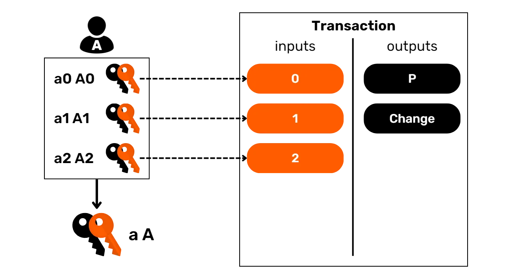

Yllä kuvatun menetelmän mukaisesti, Alicen pitäisi valita yksi avainpari $a_0$, $a_1$ ja $a_2$ joukosta laskeakseen ECDH-salaisuuden ja luodakseen uniikin maksuosoitteen $P$ Bobin staattisesta osoitteesta $B$. Tämä lähestymistapa vaatii kuitenkin Bobia testaamaan jokaisen mahdollisuuden peräkkäin, aloittaen $a_0$:sta, sitten $a_1$:stä ja niin edelleen, kunnes hän tunnistaa parin, joka tuottaa kelvollisen osoitteen $P$. Tämä prosessi vaatii, että Bob suorittaa ECDH-laskennan kaikkien siirtojen kaikille syötteille, mikä merkittävästi lisää operatiivista skannauskuormaa.

Välttääksemme tämän, pyydämme Alicea suorittamaan laskelmansa $P$:stä käyttäen kaikkien syötteiden avaimien summaa. Ottaen esimerkkimme, muokattu yksityinen avain $a$ laskettaisiin seuraavasti:

$$ a = a_0 + a_1 + a_2 $$
Samoin Alice ja Bob pystyvät laskemaan muokatun julkisen avaimen:
$$ A = A_0 + A_1 + A_2 $$
Tämän menetelmän ansiosta Bobin tarvitsee vain laskea transaktion julkisten avainten summa ja sen jälkeen laskea ECDH-salaisuus avaimesta $A$, mikä vähentää merkittävästi laskutoimitusten määrää skannausvaiheessa. Muista kuitenkin edellisestä osiosta. Olimme sisällyttäneet laskelmaamme hajautuksen $\text{inputHash}$, jota käytetään nonce-arvona osoitteen uudelleenkäytön estämiseksi:

$$ \text{inputHash} = \text{hash}(\text{outpoint} \text{ ‖ } A) $$

Mutta jos transaktiossa on useita syötteitä, on tarpeen määrittää, mikä $\text{outpoint}$ valitaan tässä laskelmassa. BIP352:n mukaan valintakriteeri $\text{outpoint}$:n käyttöön on valita leksikografisesti pienin, mikä tarkoittaa UTXO:n valitsemista, joka esiintyy ensimmäisenä aakkosjärjestyksessä. Tämä menetelmä standardoi valittavan UTXO:n jokaisessa transaktiossa. Esimerkiksi, jos tämä pienin $\text{outpoint}$ leksikografisesti on $\text{outpoint}_L$, $\text{inputHash}$:n laskenta olisi:

$$ \text{inputHash} = \text{hash}(\text{outpoint}\_L \text{ ‖ } A) $$

Laskelmat pysyvät sitten samoina kuin edellisessä osiossa esitetyt, paitsi että yksityinen avain $a$ ja sen vastaava julkinen avain $A$ eivät enää ole pari, joka turvaa yksittäisen syötteen, vaan nyt edustavat kaikkien syötteiden avainparien muokkausta.

### Kulutus- ja skannausavainten erottaminen

Tähän mennessä olemme keskustelleet Silent Payment -staattisesta osoitteesta $B$ ainutlaatuisena julkisena avaimena. Muista, että juuri tätä julkista avainta $B$ Alice käyttää jaetun ECDH-salaisuuden luomiseen, jota puolestaan käytetään ainutlaatuisen maksuosoitteen $P$ laskemiseen. Bob käyttää tätä julkista avainta $B$ ja vastaavaa yksityistä avainta $b$ transaktioiden skannausvaiheessa. Mutta hän käyttää myös yksityistä avainta $b$ laskeakseen yksityisen avaimen $p$, joka mahdollistaa kulutuksen osoitteesta $P$.

Tämän menetelmän haittapuolena on, että yksityistä avainta $b$, jota käytetään kaikkien Silent Payments -osoitteiden vastaanottamien yksityisten avainten laskemiseen, käytetään myös Bobin toimesta transaktioiden skannaukseen. Tämä vaihe edellyttää, että avain $b$ on saatavilla internetiin yhdistetyssä lompakko-ohjelmistossa, mikä altistaa sen suuremmalle varkauden riskille verrattuna sen säilyttämiseen kylmässä lompakossa. Ihanteellisesti olisi hyödyllistä pystyä hyödyntämään Silent Payments -maksuja samalla kun yksityinen avain $b$, joka hallitsee pääsyä kaikkiin muihin yksityisiin avaimiin, on turvattu laitteistolompakossa. Onneksi protokollaa on mukautettu mahdollistamaan juuri tämä.
Tämän saavuttamiseksi BIP352 määrittelee, että vastaanottaja käyttää kahta erilaista avainparia:

- $B_{\text{spend}}$: ainutlaatuisten maksuosoitteiden yksityisten avainten laskemiseen;
- $B_{\text{scan}}$: ainutlaatuisten maksuosoitteiden löytämiseen.

Tällä tavoin Bob voi pitää yksityisen avaimen $b_{\text{spend}}$ laitteistolompakossa ja käyttää yksityistä avainta $b_{\text{scan}}$ online-ohjelmistossa Silent Payments -maksujensa löytämiseen paljastamatta $b_{\text{spend}}$. Kuitenkin julkiset avaimet $B_{\text{scan}}$ ja $B_{\text{spend}}$ paljastetaan molemmat, koska ne löytyvät Bobin staattisesta osoitteesta $B$:
$$ B = B*{\text{scan}} \text{ ‖ } B*{\text{spend}} $$
Jotta Alice voi laskea Bobille kuuluvan uniikin maksuosoitteen $P_0$, hän suorittaa seuraavan laskutoimituksen:

$$ P*0 = B*{\text{spend}} + \text{hash}(\text{inputHash} \cdot a \cdot B\_{\text{scan}} \text{ ‖ } 0) \cdot G $$

Löytääkseen itselleen osoitetut maksut, Bob suorittaa seuraavan laskutoimituksen:

$$ P*0 = B*{\text{spend}} + \text{hash}(\text{inputHash} \cdot b\_{\text{scan}} \cdot A \text{ ‖ } 0) \cdot G $$

Kuten näet, tähän mennessä Bob ei ole tarvinnut käyttää $b_{\text{spend}}$, joka on hänen laitteistolompakossaan. Kun hän haluaa käyttää $P_0$, hän voi suorittaa seuraavan laskutoimituksen löytääkseen yksityisen avaimen $p_0$:

$$ p*0 = (b*{\text{spend}} + \text{hash}(\text{inputHash} \cdot b\_{\text{scan}} \cdot A \text{ ‖ } 0)) \bmod n $$


_Kuvateksti:_

- $B_{\text{scan}}$: Bobin skannaus julkinen avain (staattinen osoite)
- $b_{\text{scan}}$: Bobin skannaus yksityinen avain
- $B_{\text{spend}}$: Bobin kulutus julkinen avain (staattinen osoite)
- $b_{\text{spend}}$: Bobin kulutus yksityinen avain
- $A$: Syötteen julkisten avainten summa (tweak)
- $a$: Tweikatun julkisen avaimen vastaava yksityinen avain
- $H$: Syötteen pienimmän UTXO:n (leksikografisesti) hajautus
- $G$: Elliptisen käyrän `secp256k1` generaattoripiste
- $\text{SHA256}$: SHA256 hajautusfunktio, merkitty `BIP0352/SharedSecret`
- $s_0$: Ensimmäinen jaettu ECDH salaisuus
- $P_0$: Ensimmäinen julkinen avain / uniikki maksuosoite Bobille

### SP-osoitteiden käyttö tunnisteella

Bobilla on siis staattinen osoite $B$ Hiljaisille Maksuille seuraavasti:

$$ B = B*{\text{scan}} \text{ ‖ } B*{\text{spend}} $$

Tämän menetelmän ongelma on, että se ei mahdollista eri maksujen erottelua tähän osoitteeseen. Esimerkiksi, jos Bobilla on kaksi eri asiakasta liiketoiminnassaan ja hän haluaa selvästi erottaa kummankin maksut, hän tarvitsisi kaksi eri staattista osoitetta. Yksinkertainen ratkaisu nykyisellä lähestymistavalla olisi, että Bob loisi kaksi erillistä lompakkoa, kummallakin oma staattinen osoitteensa, tai jopa perustaisi kaksi eri staattista osoitetta saman lompakon sisällä. Kuitenkin tämä ratkaisu vaatii koko lohkoketjun skannaamisen kahdesti (kummallekin osoitteelle), jotta kumpaankin osoitteeseen tarkoitetut maksut voidaan havaita. Tämä kaksinkertainen skannaus lisää kohtuuttomasti Bobin operatiivista taakkaa.
Tämän ongelman ratkaisemiseksi BIP352 käyttää merkintäjärjestelmää, joka mahdollistaa erilaisten staattisten osoitteiden käytön lisäämättä kohtuuttomasti työmäärää löytääkseen Hiljaiset Maksut lohkoketjusta. Tätä varten kokonaisluku $m$ lisätään kulutusjulkiseen avaimen $B_{\text{spend}}$. Tämä kokonaisluku voi saada arvon $1$ ensimmäiselle staattiselle osoitteelle, sitten $2$ toiselle, ja niin edelleen. Kulutusavaimet $B_{\text{spend}}$ kutsutaan tästä lähtien $B_m$:ksi ja ne rakennetaan tällä tavalla:
$$ B*m = B*{\text{spend}} + \text{hash}(b\_{\text{scan}} \text{ ‖ } m) \cdot G $$

Esimerkiksi ensimmäiselle kulutusavaimelle merkinnällä $1$:

$$ B*1 = B*{\text{spend}} + \text{hash}(b\_{\text{scan}} \text{ ‖ } 1) \cdot G $$

Staattinen osoite, jonka Bob julkaisee, koostuu nyt $B_{\text{scan}}$:sta ja $B_m$:stä. Esimerkiksi ensimmäinen staattinen osoite merkinnällä $1$ on:

$$ B = B\_{\text{scan}} \text{ ‖ } B_1 $$

> _Aloitamme vain merkinnästä 1, koska merkintä 0 on varattu vaihtorahalle._

Alice puolestaan johdattaa ainutlaatuisen maksuosoitteen $P$ samalla tavalla kuin ennen, mutta käyttäen uutta $B_1$:stä $B_{\text{spend}}$:n sijaan.
$$ P*0 = B_1 + \text{hash}(\text{inputHash} \cdot a \cdot B*{\text{scan}} \text{ ‖ } 0) \cdot G $$

Todellisuudessa Alice ei ehkä edes tiedä, että Bobilla on merkitty osoite, sillä hän käyttää yksinkertaisesti staattisen osoitteen toista osaa, jonka Bob antoi hänelle, joka tässä tapauksessa on arvo $B_1$ eikä $B_{\text{spend}}$.

Maksuja skannatessaan Bob käyttää aina alkuperäisen staattisen osoitteensa arvoa $B_{\text{spend}}$ tällä tavalla:

$$ P*0 = B*{\text{spend}} + \text{hash}(\text{inputHash} \cdot b\_{\text{scan}} \cdot A \text{ ‖ } 0) \cdot G $$

Sitten hän yksinkertaisesti vähentää löytämänsä arvon $P_0$:sta jokaisesta tulosteesta yksi kerrallaan. Sen jälkeen hän tarkistaa, vastaako yhden näistä vähennyksistä tulos yhden hänen lompakossaan käyttämänsä merkinnän arvoa. Jos se vastaa, esimerkiksi tulosteelle #4 merkinnällä $1$, tämä tarkoittaa, että tämä tuloste on Hiljainen Maksu, joka liittyy hänen merkittyyn staattiseen osoitteeseensa $B_1$:

$$ Out*4 - P_0 = \text{hash}(b*{\text{scan}} \text{ ‖ } 1) \cdot G $$

Tämä toimii, koska:

$$ B*1 = B*{\text{spend}} + \text{hash}(b*{\text{scan}} \text{ ‖ } 1) \cdot G $$
Tämän menetelmän ansiosta Bob voi käyttää useita staattisia osoitteita ($B_1$, $B_2$, $B_3$...), jotka kaikki on johdettu hänen perusstaattisesta osoitteestaan ($B = B*{\text{scan}} \text{ ‖ } B*{\text{spend}}$), jotta hän voi erottaa käyttötarkoitukset asianmukaisesti.
Kuitenkin, tämä staattisten osoitteiden erottelu on pätevä vain henkilökohtaisesta lompakonhallinnan näkökulmasta eikä mahdollista identiteettien erottelua. Koska kaikilla on sama $B*{\text{scan}}$, staattiset osoitteet on erittäin helppo yhdistää toisiinsa ja päätellä, että ne kuuluvat yhdelle entiteetille.


_Kuvateksti:_

- $B_{\text{scan}}$: Bobin julkisen skannausavaimen (staattinen osoite)
- $b_{\text{scan}}$: Bobin yksityinen skannausavain
- $B_{\text{spend}}$: Bobin julkisen kulutusavaimen (alkuperäinen osoite)
- $B_m$: Bobin merkitty julkisen kulutusavaimen (staattinen osoite)
- $b_m$: Bobin merkitty yksityinen kulutusavain
- $A$: Syötettyjen julkisten avainten summa (tweak)
- $a$: Tweikatun julkisen avaimen vastaava yksityinen avain
- $H$: Pienimmän UTXO:n (leksikografisesti) hajautus, jota käytetään syötteenä
- $G$: Elliptisen käyrän `secp256k1` generaattoripiste
- $\text{SHA256}$: SHA256-hajautusfunktio, joka on merkitty `BIP0352/SharedSecret`
- $s_0$: Ensimmäinen jaettu ECDH-salaisuus
- $P_0$: Ensimmäinen julkinen avain / uniikki osoite maksuille Bobille
- $p_0$: Ensimmäisen uniikin maksuosoitteen yksityinen avain Bobille
- $X$: Skannausyksityisavaimen hajautus merkinnällä

### Kuinka rakentaa Silent Payments -osoite?

Dedikoidun Silent Payments -osoitteen rakentamiseksi on ensin johdettava 2 avainparia Bitcoin HD -lompakossa:

- Avainpari $b_{\text{scan}}$, $B_{\text{scan}}$ maksujen etsimiseen, jotka on osoitettu meille;
- Avainpari $b_{\text{spend}}$, $B_{\text{spend}}$ vastaanotettujen bitcoinien kuluttamiseen.

Nämä parit johdetaan seuraavia polkuja noudattaen (_Bitcoin Mainnet_):

```text
scan: m / 352' / 0' / 0' / 1' / 0
spend: m / 352' / 0' / 0' / 0' / 0
```

Kun nämä 2 avainparia ovat saatavilla, ne yksinkertaisesti yhdistetään (päästä päähän) luomaan staattisen osoitteen kuorma:

$$ B = B*{\text{scan}} \text{ ‖ } B*{\text{spend}} $$

Jos halutaan käyttää merkintöjä, $B_{\text{spend}}$ korvataan $B_m$:llä:

$$ B = B\_{\text{scan}} \text{ ‖ } B_m $$

Merkinnällä $m$:

$$ B*m = B*{\text{spend}} + \text{hash}(b\_{\text{scan}} \text{ ‖ } m) \cdot G $$

Kun tämä kuorma on saatavilla, lisätään HRP (_Human-Readable Part_) `sp` ja versio `q` (= versio 0). Osoitteeseen lisätään myös tarkistussumma, ja se muotoillaan bech32m-muotoon.
Esimerkiksi, tässä on staattinen Silent Payments -osoitteeni:

```text
sp1qqvhjvsq2vz8zwrw372vuzle7472zup2ql3pz64yn5cpkw5ngv2n6jq4nl8cgm6zmu48yk3eq33ryc7aam6jrvrg0d0uuyzecfhx2wgsumcurv77e
```

Tärkeä seikka staattisiin osoitteisiin liittyen, joita saatat olla syöttänyt edellisissä osioissa, on se, että nämä osoitteet eivät näy Bitcoin-siirroissa. Vain maksuosoitteet $P$, joita käytetään tulosteissa, näkyvät lohkoketjussa standardissa Taproot-muodossa. Näin ollen ulkopuolisen on mahdotonta erottaa Silent Payment -siirtoa tavallisesta siirrosta, joka käyttää P2TR-ulostuloja.
Aivan kuten BIP47:n kanssa, on mahdotonta luoda yhteyttä staattisen osoitteen $B$ ja siitä johdetun maksuosoitteen $P$ välille. Itse asiassa, vaikka Eve, mahdollinen hyökkääjä, yrittäisi skannata lohkoketjua Bobin staattisella osoitteella $B$, hän ei pystyisi suorittamaan tarvittavia laskelmia $P$:n määrittämiseksi. Tähän hän tarvitsisi joko Bobin yksityisen skannausavaimen $b_{\text{scan}}$ tai lähettäjän yksityiset avaimet $a$, mutta molemmat näistä elementeistä ovat tietenkin yksityisiä. On siis mahdollista yhdistää eksplisiittisesti oma staattinen osoite henkilöllisyyden muotoon.

### Kuinka käyttää Silent Payments -palvelua?

Silent Payments -ehdotus on suhteellisen uusi ja sen on tähän mennessä implementoinut vain hyvin rajallinen määrä lompakoita. Tietääkseni vain 3 ohjelmistoa tukee niitä:

- [CakeWallet](https://cakewallet.com/)
- [Silentium](https://app.silentium.dev/)
- [DonationWallet](https://github.com/Sosthene00/donationwallet)

Tarjoamme pian yksityiskohtaisen oppaan oman Silent Payments staattisen osoitteesi asettamiseksi.

Koska tämä ominaisuus on uusi, on suositeltavaa olla varovainen ja välttää Silent Payments -palvelun käyttämistä suurille summille pääverkossa.

_Tämän Silent Payments -luvun luomiseen käytin [Silent Payments -selityssivustoa](https://silentpayments.xyz/) ja [BIP352-selitysdokumenttia](https://github.com/bitcoin/bips/blob/master/bip-0352.mediawiki)._


## Anna meille palautetta tästä kurssista
<chapterId>195d149f-80fa-5816-8b46-995a9226d082</chapterId>
<isCourseReview>true</isCourseReview>

## Loppukoe
<chapterId>e803d394-e3c1-5816-a6b4-a69a2472019c</chapterId>
<isCourseExam>true</isCourseExam>

## Yhteenveto

<chapterId>cd8e5c67-50e4-4dcd-8e04-88ba5ec95305</chapterId>

Onnittelut Bitcoinin yksityisyyden suojan koulutuksen suorittamisesta!

Olemme käsitelleet monia edistyneitä ja teknisiä aiheita tässä koulutuksessa, mutta ei ole välttämätöntä käyttää kaikkia esiteltyjä työkaluja. Päämääränä oli valtuuttaa sinut valitsemaan, mitä tietoja haluat paljastaa ja mitä tietoja haluat pitää luottamuksellisina Bitcoinin käytössäsi. Tämä tiivistää yksityisyyden suojan ydinolemuksen. Tietoisten valintojen tekeminen jaettavasta tai piilotettavasta tiedosta edellyttää toimintamme seurausten ymmärtämistä. Toivon, että tämä koulutus on auttanut sinua saavuttamaan tämän tiedon.
Jos minun pitäisi valita tämän koulutuksen tärkein osa, valitsisin ketjuanalyysille omistetun osion. Mahdollisten hyökkääjien käyttämien tekniikoiden ymmärtäminen on paras tapa suojautua. Siksi neuvoni olisi tarkastella huolellisesti tätä osaa ja pyrkiä ymmärtämään kaikki sen yksityiskohdat.
Tässä koulutuksessa keskityimme yksinomaan Bitcoinin yksityisyyteen pääketjussa. Myös toisen kerroksen järjestelmien, kuten Lightning Networkin ja sivuketjujen, yksityisyysongelmat ovat merkittäviä ja niillä on hyvin spesifisiä ominaisuuksia. Vaikka off-chain -transaktioiden käyttö voi olla tehokas strategia välttää monia Bitcoinissa tutkimiamme jäljitettävyysriskejä, se altistaa sinut myös muille riskeille, joista on myös tärkeää olla tietoinen. Siksi nämä aiheet käsitellään tulevassa omistetussa koulutuksessa PlanB Networkissa.

Jos pidit tästä koulutuksesta, olisin erittäin kiitollinen, jos voisit jakaa sen ystäviesi kanssa ja sosiaalisessa mediassa. Kiitos! :)

