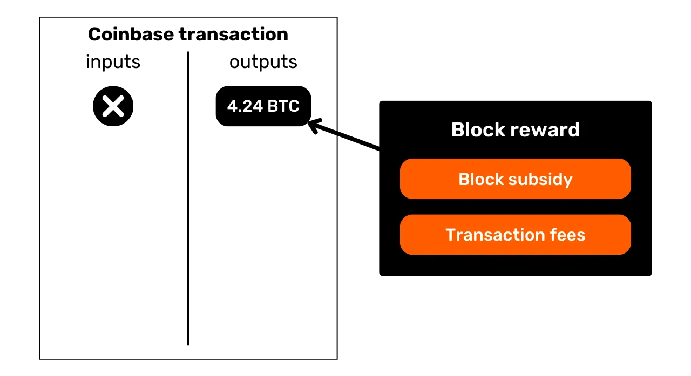
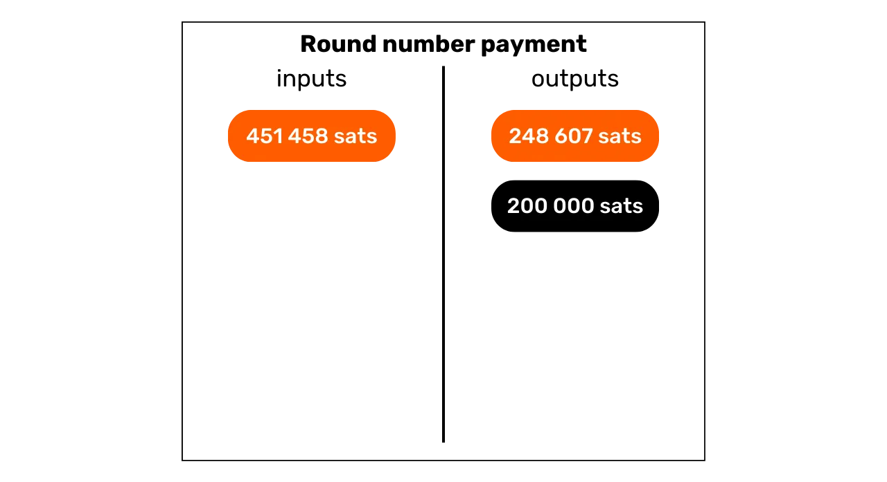

# Suojaa yksityisyytesi Bitcoinissa

Maailmassa, jossa rahoitustransaktioiden yksityisyys on vähitellen muuttumassa ylellisyydeksi, on olennaista ymmärtää ja hallita yksityisyydensuojan periaatteita Bitcoinin käytössäsi. Tämä koulutus antaa sinulle kaikki avaimet, sekä teoreettiset että käytännölliset, saavuttaaksesi tämän itsenäisesti.

Nykyään Bitcoinissa on yrityksiä, jotka ovat erikoistuneet ketjuanalyysiin. Heidän ydintoimintansa on nimenomaan tunkeutua yksityisyyteesi, jotta he voivat vaarantaa transaktioidesi luottamuksellisuuden. Tosiasiassa "oikeutta yksityisyyteen" Bitcoinissa ei ole olemassa. Siksi sinun, käyttäjän, on itse vaadittava luonnollisia oikeuksiasi ja suojattava transaktioidesi luottamuksellisuus, koska kukaan muu ei tee sitä puolestasi.

Tämä koulutus esittäytyy täydellisenä ja yleistajuisena matkana. Jokainen tekninen käsite käsitellään yksityiskohtaisesti ja sitä tukevat selittävät kaaviot. Tavoitteena on tehdä tiedosta kaikkien saavutettavissa olevaa. BTC204 on siksi lähestyttävä aloittelijoille ja keskitason käyttäjille. Tämä koulutus tarjoaa myös lisäarvoa kokeneimmille bitcoin-käyttäjille, sillä syvennymme joitakin teknisiä käsitteitä, jotka ovat usein tuntemattomia.

Liity mukaan muuttamaan Bitcoinin käyttöäsi ja tulemaan tietoiseksi käyttäjäksi, joka kykenee ymmärtämään luottamuksellisuuden ympärillä olevat panokset ja suojaamaan yksityisyytesi.

+++

# Johdanto
<partId>e17474a8-8899-4bdb-a7f8-bc52ddb01440</partId>

## Koulutuksen esittely
<chapterId>08ba1933-f393-4fb5-8279-777d874caedb</chapterId>

Maailmassa, jossa rahoitustransaktioiden yksityisyys on vähitellen muuttumassa ylellisyydeksi, on olennaista ymmärtää ja hallita yksityisyydensuojan periaatteita Bitcoinin käytössäsi. Tämä koulutus antaa sinulle kaikki avaimet, sekä teoreettiset että käytännölliset, saavuttaaksesi tämän itsenäisesti.
Nykyään Bitcoin-ekosysteemissä on yrityksiä, jotka ovat erikoistuneet ketjuanalyysiin. Heidän ydintoimintansa on nimenomaan tunkeutua yksityisyyteesi, vaarantaen transaktioidesi luottamuksellisuuden. Todellisuudessa "oikeutta yksityisyyteen" Bitcoinissa ei ole olemassa. Siksi sinun, käyttäjän, on itse vaadittava luonnollisia oikeuksiasi ja suojattava transaktioidesi luottamuksellisuus, koska kukaan muu ei tee sitä puolestasi.

Bitcoin ei ole olemassa vain "Numeron Kasvun" ja säästöjen arvon säilyttämisen vuoksi. Sen ainutlaatuisten ominaisuuksien ja historian ansiosta se on ensisijaisesti vastatalouden työkalu. Tämän merkittävän keksinnön ansiosta voit hallita rahojasi vapaasti, käyttää niitä ja kerryttää niitä, ilman että kukaan voi estää sinua.

Bitcoin tarjoaa rauhanomaisen pakotien valtioiden ikeestä, mahdollistaen sinun nauttia luonnollisista oikeuksistasi, joita vakiintuneet lait eivät voi kyseenalaistaa. Kiitos Satoshi Nakamoton keksinnön, sinulla on valta vaatia kunnioitusta yksityisomaisuudellesi ja palauttaa sopimisen vapaus.

Bitcoin ei kuitenkaan ole oletusarvoisesti nimetön, mikä voi aiheuttaa riskin vastataloudessa toimiville yksilöille, erityisesti alueilla, joilla on despootisia hallintoja. Mutta tämä ei ole ainoa vaara. Koska bitcoin on arvokas ja sensuroimaton omaisuus, se voi houkutella varkaiden ahneutta. Näin ollen yksityisyytesi suojaaminen muuttuu myös turvallisuuskysymykseksi: se voi auttaa sinua estämään kyberhyökkäykset ja fyysiset hyökkäykset.
Kuten näemme, vaikka protokolla tarjoaa joitakin sisäänrakennettuja yksityisyydensuojia, on ratkaisevan tärkeää käyttää lisätyökaluja yksityisyyden optimoimiseksi ja puolustamiseksi. Tämä koulutus on suunniteltu kattavaksi ja yleistajuiseksi matkaksi ymmärtämään yksityisyyden panoksia Bitcoinissa. Jokainen tekninen käsite on yksityiskohtaisesti selitetty ja tuettu selittävillä kaavioilla. Tavoitteena on tehdä tiedosta saavutettavaa kaikille, mukaan lukien aloittelijat ja keskitason käyttäjät. Kokeneemmille bitcoin-käyttäjille kattamme myös hyvin teknisiä ja joskus tuntemattomia käsitteitä koko tämän koulutuksen ajan syventääksemme kunkin aiheen ymmärrystä.

Tämän koulutuksen tavoitteena ei ole tehdä sinusta täysin anonyymiä Bitcoinin käytössäsi, vaan tarjota sinulle olennaiset työkalut yksityisyytesi suojaamiseen henkilökohtaisten tavoitteidesi mukaisesti. Sinulla on vapaus valita esitellyistä käsitteistä ja työkaluista kehittääksesi omat strategiasi, räätälöitynä tavoitteidesi ja erityistarpeidesi mukaan.

### Osa 1: Määritelmät ja keskeiset käsitteet
Aloitamme katsomalla yhdessä Bitcoinin toiminnan periaatteita, jotta voimme sen jälkeen rauhallisesti lähestyä yksityisyyteen liittyviä käsitteitä. On olennaista hallita muutamia peruskäsitteitä, kuten UTXO, vastaanotto-osoitteet tai skriptit, ennen kuin voimme täysin ymmärtää seuraavissa osioissa käsiteltäviä käsitteitä. Esittelemme myös Bitcoinin yksityisyyden yleisen mallin, kuten Satoshi Nakamoto sen näki, mikä mahdollistaa panosten ja riskien ymmärtämisen.


### Osa 2: Ketjuanalyysin ymmärtäminen ja sen vastaisen suojautumisen opettelu

Toisessa osassa tutkimme ketjuanalyysiyhtiöiden käyttämiä tekniikoita Bitcoin-toimintasi jäljittämiseen. Näiden menetelmien ymmärtäminen on ratkaisevan tärkeää yksityisyytesi suojan parantamiseksi. Tämän osan tavoitteena on tutkia hyökkääjien strategioita paremmin ymmärtääksemme riskejä ja luodaksemme perustan seuraavissa osioissa tutkittaville tekniikoille. Analysoimme transaktiokuvioita, sisäisiä ja ulkoisia heuristiikkoja sekä näiden kuvioiden mahdollisia tulkintoja. Teoreettisen osuuden lisäksi opimme käyttämään lohkoketjuselainta ketjuanalyysin suorittamiseen käytännön esimerkkien ja harjoitusten kautta.


### Osa 3: Parhaiden käytäntöjen hallitseminen yksityisyytesi suojaamiseksi

Kolmannessa koulutusosiossa pääsemme asian ytimeen: käytäntöön! Tavoitteena on hallita kaikki olennaiset parhaat käytännöt, jotka tulisi tulla luonnollisiksi reflekseiksi mille tahansa Bitcoin-käyttäjälle. Käsittelemme tuoreiden osoitteiden käyttöä, merkintöjä, konsolidointia, täysien solmujen käyttöä sekä KYC:tä ja hankintamenetelmiä. Tavoitteena on tarjota sinulle kattava yleiskatsaus vältettävistä sudenkuopista, jotta voimme luoda vahvan perustan yksityisyydensuojan tavoittelussamme. Joitakin näistä käytännöistä varten sinut ohjataan tiettyyn opastukseen niiden toteuttamiseksi.


### Osa 4: Coinjoin-transaktioiden ymmärtäminen

Miten voimme puhua Bitcoinin yksityisyydestä puhumatta coinjoineista? Neljännessä osassa saat tietää kaiken tarvittavan tästä sekoitusmenetelmästä. Opit, mikä coinjoin on, sen historia ja tavoitteet sekä erilaiset coinjoin-tyypit, jotka ovat olemassa. Lopuksi, kokeneemmille käyttäjille, tutkimme mitä anonsetit ja entropia ovat, ja miten näitä indikaattoreita lasketaan.


### Osa 5: Muiden edistyneiden yksityisyyden suojaustekniikoiden panosten ymmärtäminen
Viidennessä osiossa tarjoamme yleiskatsauksen kaikista muista olemassa olevista tekniikoista, joilla voit suojata yksityisyyttäsi Bitcoinissa coinjoinin lisäksi. Vuosien varrella kehittäjät ovat osoittaneet merkittävää luovuutta suunnitellessaan yksityisyyteen keskittyviä työkaluja. Tarkastelemme kaikkia näitä menetelmiä, kuten Payjoinia, yhteistyössä tehtyjä transaktioita, Coin Swapia ja Atomic Swapia, yksityiskohtaisesti niiden toimintaa, tavoitteita ja mahdollisia heikkouksia.

### Osa 6: Tutkitaan yksityisyyteen liittyviä protokollaparannusehdotuksia

Aikaisemmat osiot keskittyivät sovellustason yksityisyysratkaisuihin, tämä kuudes osio sukeltaa syvemmälle protokollatason haasteisiin käyttäjän yksityisyyden kannalta. Keskustelemme yksityisyydestä solmujen verkoston tasolla ja transaktioiden lähettämisestä. Käymme myös läpi erilaisia protokollia, jotka on ehdotettu vuosien varrella käyttäjän yksityisyyden parantamiseksi Bitcoinissa. Lopuksi tarkastelemme Bitcoinin viimeisimmän merkittävän pehmeän haarukan, Taprootin, vaikutuksia yksityisyyteen, sekä positiivisia että negatiivisia.

***(WIP: LOIC: LISÄÄ KAAVIOESIMERKKI TÄHÄN)***

### Bonusosa: Yksityisyys toisen kerroksen protokollissa

Kuten olet ymmärtänyt, tämän koulutuksen ydin keskittyy yksinomaan onchain-yksityisyyteen. Tässä viimeisessä bonusosassa haluan laajentaa aihetta yksityisyyteen myös muihin Bitcoiniin liittyviin protokolliin. Keskustelemme erityisesti yksityisyydestä Lightning Networkissa. Jotkut väittävät, että Lightning on oletusarvoisesti yksityinen, kun taas toiset argumentoivat, että käyttäjän yksityisyys ei ole riittävä. Joten, mikä on totuus? Selvitämme totuuden väärinkäsityksistä paremmin ymmärtääksemme yksityisyyteen liittyviä haasteita Lightning Networkissa. Keskustelemme myös sivuketjuista, kuten Liquid Networkista, ja Chaumian pankeista, kuten Cashusta tai Fedimintistä.

# Määritelmät ja keskeiset käsitteet

## Bitcoinin UTXO-malli

Bitcoin on ensisijaisesti valuutta, mutta tiedätkö konkreettisesti, miten BTC:t ovat edustettuina protokollassa?

### Bitcoinin UTXO:t: Mitä ne ovat?

Bitcoin-protokollassa rahayksiköiden hallinta perustuu UTXO-malliin, lyhenne sanoista "_Unspent Transaction Output_".
Tämä malli eroaa merkittävästi perinteisistä pankkijärjestelmistä, jotka nojaavat tili- ja saldojärjestelmään rahoitusvirtojen seuraamiseksi. Todellakin, pankkijärjestelmässä yksilölliset saldot ylläpidetään tileillä, jotka on sidottu henkilöllisyyteen. Esimerkiksi kun ostat patongin leipurilta, pankkisi yksinkertaisesti veloittaa ostosumman tililtäsi, vähentäen saldoasi, kun taas leipurin tili hyvitetään samalla summalla, lisäten heidän saldoaan. Tässä järjestelmässä ei ole käsitystä rahan linkittymisestä tilillesi ja sieltä poistumisesta, lukuun ottamatta transaktiotietueita.

Bitcoinissa toiminta on erilaista. Tilin käsitettä ei ole olemassa, ja rahayksiköitä hallinnoidaan UTXOjen kautta. UTXO edustaa tiettyä määrää bitcoineja, joita ei ole vielä kulutettu, muodostaen siten "palan bitcoinia", joka voi olla suuri tai pieni. Esimerkiksi UTXO voi olla arvoltaan `500 BTC` tai vain `700 SATS`.

**> Muistutus:** Satoshi, usein lyhennettynä sat, on Bitcoinin pienin yksikkö, verrattavissa senttiin fiat-valuutoissa.

```plaintext
1 BTC = 100 000 000 SATS
```
Teoriassa UTXO voi edustaa mitä tahansa arvoa bitcoineissa, alkaen yhdestä satoshista aina teoreettiseen maksimiin noin 21 miljoonaan BTC:hen asti. Kuitenkin on loogisesti mahdotonta omistaa kaikkia 21 miljoonaa bitcoinia, ja on olemassa taloudellinen alaraja nimeltään "pöly", jonka alapuolella UTXO:ta pidetään taloudellisesti kannattamattomana käyttää.
**> Tiesitkö?** Suurin koskaan Bitcoinissa luotu UTXO oli arvoltaan `500 000 BTC`. Sen loi MtGox-alusta konsolidaatio-operaation aikana marraskuussa 2011: [29a3efd3ef04f9153d47a990bd7b048a4b2d213daaa5fb8ed670fb85f13bdbcf](https://mempool.space/en/tx/29a3efd3ef04f9153d47a990bd7b048a4b2d213daaa5fb8ed670fb85f13bdbcf)

### UTXO:t ja käyttöehdot

UTXO:t ovat vaihdon välineitä Bitcoinissa. Jokainen transaktio johtaa UTXO:iden kulutukseen syötteinä ja uusien UTXO:iden luomiseen tulosteina. Kun transaktio tehdään, syötteinä käytetyt UTXO:t katsotaan "kulutetuiksi", ja uudet UTXO:t luodaan ja osoitetaan transaktion tulosteissa mainituille vastaanottajille. Näin ollen UTXO yksinkertaisesti edustaa käyttämätöntä transaktiotulostetta ja siten tiettyä määrää bitcoineja, jotka kuuluvat käyttäjälle tiettynä aikana.

Kaikki UTXO:t on suojattu skripteillä, jotka määrittelevät ehdot, joiden mukaisesti ne voidaan kuluttaa. UTXO:n kuluttamiseksi käyttäjän on todistettava verkostolle, että hän täyttää kyseisen UTXO:n suojaavan skriptin asettamat ehdot. Yleensä UTXO:t on suojattu julkisella avaimella (tai vastaanotto-osoitteella, joka edustaa tätä julkista avainta). UTXO:n kuluttamiseksi, joka on yhdistetty tähän julkiseen avaimeseen, käyttäjän on todistettava, että hänellä on vastaava yksityinen avain, antamalla digitaalinen allekirjoitus, joka on tehty tällä avaimella. Tämän vuoksi sanotaan, että Bitcoin-lompakkosi ei itse asiassa sisällä bitcoineja, vaan se säilyttää yksityisiä avaimiasi, jotka puolestaan antavat sinulle pääsyn UTXO:iisi ja sitä kautta bitcoineihin, joita ne edustavat.


Koska Bitcoinissa ei ole tilin käsitettä, lompakon saldo vastaa yksinkertaisesti kaikkien sen kuluttaa voimien UTXO:iden arvojen summaa. Esimerkiksi, jos Bitcoin-lompakkosi voi käyttää seuraavia 4 UTXO:a:

```plaintext
- 2 BTC
- 8 BTC
- 5 BTC
- 2 BTC
```

Lompakkosi kokonaissaldo olisi `17 BTC`.


## Bitcoin-transaktioiden rakenne
<chapterId>29d3aaab-de2e-4746-ab40-c9748898850c</chapterId>

### Transaktion syötteet ja tulosteet

Bitcoin-transaktio on lohkoketjuun kirjattu toimenpide, joka mahdollistaa bitcoinien omistajuuden siirtämisen yhdeltä henkilöltä toiselle. Tarkemmin sanottuna, koska olemme UTXO-mallissa ja tilejä ei ole, transaktio täyttää yhden tai useamman UTXO:n turvaamat kulutusehdot, kuluttaa ne ja luo vastaavuudessa uusia UTXO:ja, joille on annettu uudet kulutusehdot. Lyhyesti sanottuna, transaktio siirtää bitcoineja skriptistä, joka on tyydytetty, uuteen skriptiin, jonka tarkoituksena on turvata ne.


Jokainen Bitcoin-siirto koostuu yhdestä tai useammasta syötteestä ja yhdestä tai useammasta tulosteesta. Syötteet ovat UTXO:ja, joita siirto kuluttaa tulosteiden tuottamiseen. Tulosteet ovat uusia UTXO:ja, joita voidaan käyttää syötteinä tulevissa siirroissa.


**> Tiesitkö?** Teoriassa bitcoin-siirrolla voisi olla ääretön määrä syötteitä ja tulosteita. Vain lohkon maksimikoko rajoittaa tätä lukumäärää.
Jokainen Bitcoin-siirron syöte viittaa aiempaan käyttämättömään UTXO:oon. UTXO:n käyttämiseksi syötteenä sen haltijan on todistettava olevansa sen laillinen omistaja validoimalla siihen liittyvä skripti, eli täyttämällä asetetun käyttöehdon. Yleensä tämä sisältää digitaalisen allekirjoituksen antamisen, joka on tuotettu yksityisavaimella, joka vastaa julkista avainta, jolla kyseinen UTXO alun perin suojattiin. Skripti koostuu siis siitä, että varmistetaan allekirjoituksen vastaavan vastaanotettaessa käytettyä julkista avainta.


Toisaalta jokainen tuloste määrittää siirrettävien bitcoinien määrän sekä vastaanottajan. Jälkimmäinen määritellään uudella skriptillä, joka yleensä lukitsee vasta luodun UTXO:n vastaanotto-osoitteella tai uudella julkisella avaimella.

Jotta siirto katsottaisiin kelvolliseksi konsensus sääntöjen mukaan, tulosteiden kokonaismäärän on oltava yhtä suuri tai pienempi kuin syötteiden kokonaismäärä. Toisin sanoen, siirron tuottamien uusien UTXO:jen summan ei tule ylittää syötteinä kulutettujen UTXO:jen summaa. Tämä periaate on looginen: jos sinulla on vain `500,000 SATS`, et voi tehdä ostosta `700,000 SATS`.

### Vaihto ja yhdistäminen Bitcoin-siirrossa

Bitcoin-siirron vaikutus UTXO:iin voidaan siis verrata kultakolikon sulattamiseen. Todellisuudessa UTXO ei ole jaettavissa, vaan ainoastaan yhdistettävissä. Tämä tarkoittaa, että käyttäjä ei voi yksinkertaisesti jakaa tiettyä määrää bitcoineja edustavaa UTXO:a useampaan pienempään UTXO:on. Hänen on kulutettava se kokonaan siirrossa luodakseen yhden tai useamman uuden UTXO:n mielivaltaisilla arvoilla tulosteissa, jotka on oltava yhtä suuria tai pienempiä kuin alkuperäinen arvo.

Tämä mekanismi on samankaltainen kuin kultakolikon kohdalla. Kuvittele, että omistat 2-unssin kolikon ja haluat tehdä maksun 1 unssista, olettaen että myyjä ei voi antaa sinulle vaihtorahaa. Sinun tarvitsisi sulattaa kolikkosi ja valaa 2 uutta yhden unssin kolikkoa.
Bitcoinissa toiminta on samankaltaista. Kuvitellaan, että Alicella on UTXO, joka on `10,000 SATS` ja hän haluaa ostaa patongin, joka maksaa `4,000 SATS`. Alice tekee siirron, jossa on syötteenä 1 UTXO `10,000 SATS`, jonka hän kuluttaa kokonaan, ja tulosteissa hän luo 2 UTXO:a arvoilla `4,000 SATS` ja `6,000 SATS`. UTXO, joka on `4,000 SATS`, lähetetään leipurille maksuna patongista, kun taas UTXO, joka on `6,000 SATS`, palautuu Alicelle vaihtorahana. Tämä siirron alkuperäiselle lähettäjälle palaava UTXO on sitä, mitä Bitcoin-terminologiassa kutsutaan "vaihdoksi".

Kuvitellaanpa nyt, että Alicella ei olekaan yhtä ainoaa UTXO:a, joka olisi `10,000 SATS`, vaan sen sijaan kaksi UTXO:a, kumpikin `3,000 SATS`. Tässä tilanteessa kumpikaan yksittäinen UTXO ei riitä kattamaan `4,000 SATS` maksua patongista. Siksi Alicen on käytettävä molempia `3,000 SATS` UTXO:ja maksutapahtumansa syötteinä. Näin ollen syötteiden kokonaismäärä saavuttaa `6,000 SATS`, mahdollistaen hänelle `4,000 SATS` maksun suorittamisen leipurille. Tätä menetelmää, joka sisältää useiden UTXO:jen ryhmittelyn yhden maksutapahtuman syötteiksi, kutsutaan usein termillä "konsolidointi".


### Siirtomaksut

Intuitiivisesti voisi ajatella, että siirtomaksut edustavat myös maksutapahtuman ulostuloa. Todellisuudessa näin ei kuitenkaan ole. Maksutapahtuman maksut edustavat eroa syötteiden kokonaismäärän ja ulostulojen kokonaismäärän välillä. Tämä tarkoittaa, että osa syötteiden arvosta käytetään haluttujen ulostulojen kattamiseen maksutapahtumassa, ja tietty summa syötteistä jää käyttämättä. Tämä jäännössumma muodostaa siirtomaksut.

```plaintext
Maksut = kokonaissyötteet - kokonaisulostulot
```

Palataanpa Alicen esimerkkiin, jolla on UTXO `10,000 SATS` ja haluaa ostaa patongin `4,000 SATS`. Alice luo maksutapahtuman käyttäen UTXO:aan `10,000 SATS` syötteenä. Hän sitten luo ulostulon `4,000 SATS`, joka on tarkoitettu leipurille patongin maksamiseen. Kannustaakseen kaivostyöläisiä sisällyttämään hänen maksutapahtumansa lohkoon, Alice osoittaa `200 SATS` maksuina. Näin hän luo toisen ulostulon, vaihtorahan, joka palautuu hänelle, ja on arvoltaan `5,800 SATS`.


Soveltamalla maksukaavaa näemme todellakin, että kaivostyöläisille jää `200 SATS`:

```plaintext
Maksut = kokonaissyötteet - kokonaisulostulot
Maksut = 10,000 - (4,000 + 5,800)
Maksut = 10,000 - 9,800
Maksut = 200
```

Kun kaivostyöläinen onnistuneesti validoi lohkon, hänellä on oikeus kerätä nämä maksut kaikista lohkoon sisällytetyistä maksutapahtumista niin kutsutun "coinbase"-maksutapahtuman kautta.

### UTXO:jen luominen Bitcoinissa

Jos olet seurannut edellisiä kappaleita tarkasti, tiedät nyt, että UTXO:ja voidaan luoda vain kuluttamalla muita olemassa olevia UTXO:ja. Näin ollen Bitcoinin kolikot muodostavat jatkuvan ketjun. Saatat kuitenkin miettiä, miten tämän ketjun ensimmäiset UTXO:t ilmestyivät. Tämä herättää ongelman, joka on samankaltainen kuin muna ja kana -dilemma: mistä nämä alkuperäiset UTXO:t tulivat?

Vastaus löytyy **coinbase-maksutapahtumasta**.

Coinbase on Bitcoinin erityinen tyyppinen maksutapahtuma, joka on ainutlaatuinen jokaiselle lohkolle ja on aina ensimmäinen. Se mahdollistaa kaivostyöläiselle, joka löysi voimassa olevan työtodistuksen, saada lohkopalkkionsa. Tämä palkkio koostuu kahdesta osasta: **lohkotuesta** ja **siirtomaksuista**, joista keskustelimme edellisessä osassa.

Coinbase-maksutapahtuman ainutlaatuinen piirre on, että se on ainoa, joka voi luoda bitcoineja tyhjästä, tarvitsematta kuluttaa syötteitä ulostulojensa tuottamiseen. Nämä vasta luodut bitcoinit muodostavat sen, mitä voisimme kutsua "alkuperäisiksi UTXO:iksi".

Lohkopalkkiosta saatavat bitcoinit ovat uusia BTC:tä, jotka on luotu tyhjästä, ennalta määrätyn liikkeeseenlaskuaikataulun mukaisesti konsensus sääntöjen pohjalta. Lohkopalkkio puolittuu joka 210 000 lohkon jälkeen, mikä on suunnilleen joka neljäs vuosi, prosessissa, jota kutsutaan "puolittamiseksi". Alun perin jokaisesta palkkiosta luotiin 50 bitcoinia, mutta tämä määrä on vähitellen vähentynyt; tällä hetkellä se on 3.125 bitcoinia per lohko.

Siirtoihin liittyvien maksujen osalta, vaikka ne myös edustavat uusia luotuja BTC:tä, niiden ei tule ylittää kaikkien lohkon transaktioiden kokonaisinputtien ja -outputtien välistä eroa. Näimme aiemmin, että nämä maksut edustavat inputtien osaa, jota ei käytetä transaktioiden outputeissa. Tämä osa on teknisesti "kadonnut" transaktion aikana, ja louhijalla on oikeus luoda tämä arvo uudelleen yhtenä tai useampana uutena UTXO:na. Tämä on siis arvon siirto transaktion lähettäjältä louhijalle, joka lisää sen lohkoketjuun.

**> Tiesitkö?** Coinbase-transaktiolla luodut bitcoinit ovat kypsymisajan alaisia 100 lohkon ajan, jolloin louhija ei voi käyttää niitä. Tämä sääntö on tarkoitettu estämään komplikaatioita, jotka liittyvät uusien bitcoinien käyttöön ketjussa, joka myöhemmin saatetaan hylätä.
### UTXO-mallin vaikutukset
Ensinnäkin, UTXO-malli vaikuttaa suoraan Bitcoinin transaktiomaksuihin. Koska jokaisen lohkon kapasiteetti on rajallinen, louhijat priorisoivat transaktioita, jotka tarjoavat parhaat maksut suhteessa tilaan, jonka ne vievät lohkossa. Todellakin, mitä enemmän UTXO:ita transaktio sisältää inputteina ja outputteina, sitä raskaampi se on, ja siksi se vaatii korkeampia maksuja. Tämä on yksi syy, miksi usein pyrimme vähentämään UTXO:jen määrää lompakossamme, mikä voi myös vaikuttaa yksityisyyteen, aihe, josta keskustelemme yksityiskohtaisesti koulutuksen kolmannessa osassa.

Seuraavaksi, kuten aiemmissa osissa mainittiin, Bitcoinin kolikot ovat olennaisesti UTXO-ketju. Jokainen transaktio luo siis linkin menneen UTXO:n ja tulevan UTXO:n välille. UTXO:t mahdollistavat siis bitcoinien eksplisiittisen seurannan niiden luomisesta nykyiseen kulutukseen. Tämä läpinäkyvyys voidaan nähdä positiivisena, sillä se mahdollistaa jokaisen käyttäjän tarkistaa vastaanotettujen bitcoinien aitouden. Kuitenkin, juuri tämän jäljitettävyyden ja auditoinnin periaatteen perusteella perustuu ketjuanalyysi, käytäntö, jonka tavoitteena on yksityisyytesi vaarantaminen. Tutkimme tätä käytäntöä syvällisesti koulutuksen toisessa osassa.

## Bitcoinin yksityisyysmalli
<chapterId>769d8963-3ed5-4094-b21d-9203c7d9e465</chapterId>

### Valuutta: Aitous, eheys ja kaksinkertainen kulutus

Rahan yksi tehtävistä on ratkaista kaksinkertaisen halun ongelma. Vaihtoon perustuvassa järjestelmässä vaihdon tekeminen edellyttää paitsi henkilön löytämistä, joka tarjoaa hyödykkeen, joka täyttää tarpeeni, myös heille tarjotaan vastaavaa arvoa oleva hyödyke, joka tyydyttää heidän tarpeensa. Tämän tasapainon löytäminen osoittautuu monimutkaiseksi.


Siksi turvaudumme rahaan, joka mahdollistaa arvon siirron sekä spatiaalisesti että ajallisesti.


Jotta raha ratkaisisi tämän ongelman, on olennaista, että hyödykkeen tai palvelun tarjoaja on vakuuttunut kyvystään käyttää kyseistä summaa myöhemmin. Näin ollen järkevä yksilö, joka haluaa hyväksyä rahaa, olipa se digitaalista tai fyysistä, varmistaa, että se täyttää kaksi perustavaa laatua olevaa kriteeriä:
- **Kolikon on oltava ehjä ja aito;**- **eikä sitä saa olla käytetty kahdesti.**
Kun käytetään fyysistä valuuttaa, ensimmäinen ominaisuus on monimutkaisin todentaa. Historian eri aikoina metallirahojen eheys on usein vaarantunut käytäntöjen, kuten leikkaamisen tai poraamisen, seurauksena. Esimerkiksi muinaisessa Roomassa oli yleistä, että kansalaiset raaputtivat kultakolikoiden reunoja kerätäkseen hieman kallisarvoista metallia, pitäen ne silti tulevia transaktioita varten. Kolikon sisäinen arvo näin ollen laski, mutta sen nimellisarvo pysyi samana. Tämä on merkittävä syy siihen, miksi myöhemmin kolikoiden reunaan alettiin lyödä uurteita.

Aitous on myös vaikea ominaisuus todentaa fyysisen rahamedian kanssa. Nykyään väärentämisen vastaiset tekniikat ovat yhä monimutkaisempia, pakottaen kauppiaat investoimaan kalliisiin todennusjärjestelmiin.

Toisaalta fyysisen valuutan luonteen vuoksi kaksinkertainen kulutus ei ole ongelma. Jos annan sinulle 10 euron setelin, se poistuu peruuttamattomasti hallustani siirtyäkseen sinun hallintaasi, luonnollisesti poissulkeen mahdollisuuden käyttää samoja rahayksiköitä useita kertoja. Lyhyesti sanottuna en pysty käyttämään sitä 10 euron seteliä uudelleen.


Digitaalisen valuutan kohdalla vaikeus on erilainen. Kolikon aitouden ja eheyden varmistaminen on usein yksinkertaisempaa. Kuten edellisessä osiossa näimme, Bitcoinin UTXO-malli mahdollistaa kolikon jäljittämisen takaisin sen alkuperään, varmistaen näin, että se todella luotiin konsensus sääntöjen mukaisesti louhijan toimesta.

Kuitenkin kaksinkertaisen kulutuksen puuttumisen varmistaminen on monimutkaisempaa, koska mikä tahansa digitaalinen hyödyke on periaatteessa tietoa. Toisin kuin fyysiset hyödykkeet, tieto ei jakaudu vaihdoissa vaan leviää monistumalla. Esimerkiksi, jos lähetän sinulle asiakirjan sähköpostitse, se sitten kopioidaan. Sinun päässäsi et voi varmistaa varmuudella, että olen poistanut alkuperäisen asiakirjan.


### Kaksinkertaisen kulutuksen estäminen Bitcoinissa
Ainoa tapa välttää digitaalisen hyödykkeen kopiointi on olla tietoinen kaikista järjestelmän vaihdoista. Näin voidaan tietää, kuka omistaa mitäkin ja päivittää kaikkien omistukset tehtyjen transaktioiden mukaisesti. Tämä tehdään esimerkiksi kirjallisella rahalla pankkijärjestelmässä. Kun maksat 10 euroa kauppiaalle luottokortilla, pankki merkitsee tämän vaihdon ja päivittää kirjanpidon.
Bitcoinissa kaksinkertaisen kulutuksen estäminen saavutetaan samalla tavalla. Tavoitteena on vahvistaa, ettei kyseisiä kolikoita ole jo käytetty aiemmassa transaktiossa. Jos näitä kolikoita ei ole koskaan käytetty, voimme olla varmoja, että kaksinkertaista kulutusta ei tapahdu. Tämän periaatteen kuvasi Satoshi Nakamoto White Paperissa tällä kuuluisalla lauseella:

**"*Ainoa tapa vahvistaa transaktion puuttuminen on olla tietoinen kaikista transaktioista.*"**

Toisin kuin pankkimallissa, Bitcoinissa ei kuitenkaan haluta luottaa keskitettyyn toimijaan. On tarpeen, että kaikki käyttäjät voivat vahvistaa tämän kaksinkertaisen kulutuksen puuttumisen, luottamatta kolmanteen osapuoleen. Näin ollen kaikkien on oltava tietoisia kaikista Bitcoin-transaktioista. Tämän vuoksi Bitcoin-transaktiot lähetetään julkisesti kaikkien verkon solmujen läpi ja kirjataan selkeästi lohkoketjuun.

Juuri tämä tiedon julkisen levittämisen käytäntö vaikeuttaa yksityisyyden suojaa Bitcoinissa. Perinteisessä pankkijärjestelmässä teoriassa vain rahoituslaitos on tietoinen suoritetuista transaktioista. Toisaalta Bitcoinissa kaikki käyttäjät ovat tietoisia kaikista transaktioista, omien solmujensa kautta.

### Yksityisyyden suoja: pankkijärjestelmä vs Bitcoin
Perinteisessä järjestelmässä pankkitilisi on linkitetty henkilöllisyyteesi. Pankkivirkailija pystyy tietämään, mikä pankkitili kuuluu millekin asiakkaalle, ja mitkä transaktiot liittyvät siihen. Kuitenkin tämä tiedonkulku katkeaa pankin ja julkisen sektorin välillä. Toisin sanoen, on mahdotonta tietää toisen henkilön pankkitilin saldoa ja transaktioita. Vain pankilla on pääsy tähän tietoon.
Esimerkiksi pankkivirkailijasi tietää, että ostat patongin joka aamu naapuruston leipomosta, mutta naapurisi ei ole tietoinen tästä transaktiosta. Näin ollen tiedonkulku on saatavilla asianosaisille, erityisesti pankille, mutta pysyy ulkopuolisten ulottumattomissa.

Aiemmassa osassa nähdyn transaktioiden julkisen levittämisen rajoitteen vuoksi Bitcoinin yksityisyysmalli ei voi noudattaa pankkijärjestelmän mallia. Bitcoinin tapauksessa, koska tiedonkulun katkaiseminen transaktioiden ja julkisen sektorin välillä ei ole mahdollista, **yksityisyysmalli perustuu käyttäjän henkilöllisyyden ja transaktioiden erottamiseen** toisistaan.
Esimerkiksi, jos ostat patongin leipurilta maksamalla BTC:llä, naapurisi, jolla on oma täysi solmu, voi nähdä transaktiosi menevän läpi, aivan kuten hän voi nähdä kaikki muutkin järjestelmän transaktiot. Kuitenkin, jos yksityisyyden periaatteita kunnioitetaan, hänen ei pitäisi pystyä yhdistämään tätä tiettyä transaktiota henkilöllisyyteesi.


Mutta koska Bitcoin-transaktiot ovat julkisia, on silti mahdollista luoda yhteyksiä niiden välille päätelläkseen tietoja osapuolista. Tämä toiminta muodostaa itsessään erikoisalan, jota kutsutaan "ketjuanalyysiksi". Seuraavassa koulutuksen osassa kutsun sinut tutustumaan ketjuanalyysin perusteisiin ymmärtääksesi, miten bitcoinejasi jäljitetään ja tietääksesi, miten paremmin puolustautua sitä vastaan.

# Ketjuanalyysin ymmärtäminen ja suojautuminen
<partId>4739371e-9fef-45b0-bcaa-b7a4df6b4470</partId>

## Mikä on ketjuanalyysi Bitcoinissa?
<chapterId>7d198ba6-4af2-4f24-86cb-3c79cb25627e</chapterId>

### Määritelmä ja toiminta

Ketjuanalyysi kattaa kaikki menetelmät bitcoinien liikkeiden jäljittämiseksi lohkoketjussa. Yleisesti ottaen ketjuanalyysi perustuu aikaisempien transaktioiden näytteiden ominaisuuksien havainnointiin. Sen jälkeen se sisältää näiden samojen ominaisuuksien tunnistamisen transaktiossa, jota halutaan analysoida, ja mahdollisten tulkintojen päättelemisen. Tämä käytännönläheinen ongelmanratkaisumenetelmä, jolla pyritään löytämään riittävän hyvä ratkaisu, on sitä, mitä kutsutaan "heuristiikaksi".

Yksinkertaistaen, ketjuanalyysi suoritetaan kolmessa päävaiheessa:
1. **Lohkoketjun tarkkailu;**
2. **Tunnettujen ominaisuuksien tunnistaminen;**
3. **Hypoteesien päätteleminen.**


Ketjuanalyysin voi suorittaa kuka tahansa. Se vaatii vain pääsyn lohkoketjun julkiseen tietoon täyden solmun kautta transaktioiden liikkeiden tarkkailuun ja hypoteesien tekemiseen. On myös olemassa ilmaisia työkaluja, jotka helpottavat tätä analyysiä, kuten verkkosivusto [OXT.me](https://oxt.me/), jota tarkastelemme yksityiskohtaisesti tämän osan viimeisissä luvuissa. Kuitenkin suurin yksityisyyden riski tulee ketjuanalyysiin erikoistuneista yrityksistä. Nämä yritykset ovat vieneet ketjuanalyysin teolliseen mittakaavaan ja myyvät palvelujaan rahoituslaitoksille tai hallituksille. Näiden yritysten joukossa Chainalysis on todennäköisesti tunnetuin.

### Ketjuanalyysin tavoitteet
Ketjuanalyysin yhtenä tavoitteena on ryhmitellä erilaisia toimintoja Bitcoinissa, jotta voidaan määrittää suorittaneen käyttäjän yksilöllisyys. Tämän jälkeen on mahdollista yrittää yhdistää tämä toimintojen nippu todelliseen henkilöllisyyteen.


Muista edellinen luku. Selitin, miksi Bitcoinin yksityisyyden malli alun perin perustui käyttäjän henkilöllisyyden erottamiseen heidän transaktioistaan. Siksi saattaisi olla houkuttelevaa ajatella, että ketjuanalyysi on tarpeetonta, koska vaikka onnistuisikin ryhmittelemään onchain-toimintoja, niitä ei voida yhdistää todelliseen henkilöllisyyteen.

Teoriassa tämä väite on tarkka. Koulutuksen ensimmäisessä osassa näimme, että kryptografisia avainpareja käytetään ehtojen asettamiseen UTXO:lle. Luonteensa vuoksi nämä avainparit eivät paljasta mitään tietoa haltijoidensa henkilöllisyydestä. Näin ollen, vaikka onnistuisikin ryhmittelemään eri avainpareihin liittyviä toimintoja, tämä ei kerro meille mitään näiden toimintojen takana olevasta entiteetistä.


Käytännön todellisuus on kuitenkin paljon monimutkaisempi. On olemassa lukuisia käyttäytymismalleja, jotka voivat riskeerata todellisen henkilöllisyyden yhdistämisen onchain-toimintaan. Analyysissä tätä kutsutaan sisääntulopisteeksi, ja niitä on monia.

Yleisin, tietenkin, on KYC (*Know Your Customer*). Jos nostat bitcoinejasi säännellyltä alustalta yhteen henkilökohtaisista vastaanotto-osoitteistasi, jotkut ihmiset pystyvät yhdistämään henkilöllisyytesi tähän osoitteeseen. Laajemmin ottaen sisääntulopiste voi olla mikä tahansa vuorovaikutusmuoto todellisen elämäsi ja Bitcoin-transaktion välillä. Esimerkiksi, jos julkaiset vastaanotto-osoitteen sosiaalisissa verkostoissasi, tämä voi muodostaa sisääntulopisteen analyysille. Jos maksat bitcoineilla leipurillesi, he voivat yhdistää kasvosi (joka on osa henkilöllisyyttäsi) Bitcoin-osoitteeseen.

Nämä sisääntulopisteet ovat lähes väistämättömiä Bitcoinin käytössä. Vaikka voi pyrkiä rajoittamaan niiden ulottuvuutta, ne pysyvät läsnä. Siksi on ratkaisevan tärkeää yhdistää menetelmiä, jotka tähtäävät yksityisyytesi säilyttämiseen. Vaikka todellisen henkilöllisyytesi ja transaktioidesi erottaminen on mielenkiintoinen lähestymistapa, se on tänään riittämätön. Todellakin, jos kaikki onchain-toimintasi voidaan ryhmitellä, pieninkin sisääntulopiste voi vaarantaa ainoan yksityisyyden kerroksen, jonka olit luonut.


### Puolustautuminen Ketjuanalyysiä Vastaan
Näin ollen on myös tarpeellista pystyä kohtaamaan lohkoketjuanalyysi Bitcoinin käytössämme. Toimimalla tällä tavoin voimme minimoida toimintojemme aggregoinnin ja rajoittaa sisääntulopisteen vaikutusta yksityisyyteemme.


Todellakin, paremman suojan tarjoamiseksi lohkoketjuanalyysiä vastaan, mikä olisi parempi lähestymistapa kuin tutustua lohkoketjuanalyysissä käytettyihin menetelmiin? Jos haluat tietää, miten parantaa yksityisyyttäsi Bitcoinissa, sinun on ymmärrettävä nämä menetelmät. Tämä antaa sinulle paremmat valmiudet ymmärtää tekniikoita kuten [Coinjoin](https://planb.network/en/tutorials/privacy/coinjoin-samourai-wallet) tai [Payjoin](https://planb.network/en/tutorials/privacy/payjoin) (tekniikat, joita tutkimme koulutuksen viimeisissä osissa), ja vähentää tekemiäsi virheitä.
Tässä voimme tehdä analogian kryptografian ja kryptoanalyysin välillä. Hyvä kryptografi on ensisijaisesti hyvä kryptoanalyytikko. Uuden salausalgoritmin kuvitteleminen edellyttää ymmärrystä siitä, minkälaisia hyökkäyksiä sen on kestettävä, sekä aiempien algoritmien murtumisen syiden tutkimista. Sama periaate pätee Bitcoinin yksityisyyteen. Lohkoketjuanalyysin menetelmien ymmärtäminen on avain sen vastaisen suojan kehittämiseen. Tämän vuoksi ehdotan kokonaista osiota lohkoketjuanalyysista tässä koulutuksessa.
### Lohkoketjuanalyysin menetelmät

On tärkeää ymmärtää, että lohkoketjuanalyysi ei ole eksakti tiede. Se perustuu heuristiikkaan, joka on johdettu aiemmista havainnoista tai loogisista tulkinoista. Nämä säännöt mahdollistavat melko luotettavat tulokset, mutta eivät koskaan absoluuttisella tarkkuudella. Toisin sanoen, **lohkoketjuanalyysi sisältää aina todennäköisyysulottuvuuden päätelmissään**. Esimerkiksi voidaan arvioida suuremmalla tai pienemmällä varmuudella, että kaksi osoitetta kuuluu samalle entiteetille, mutta täydellinen varmuus on aina saavuttamattomissa.

Lohkoketjuanalyysin koko tavoite on nimenomaan erilaisten heuristiikkojen yhdistämisessä virheriskin minimoimiseksi. Se on tavallaan todisteiden kumuloitumista, joka mahdollistaa todellisuuden lähestymisen tiiviimmin.

Nämä kuuluisat heuristiikat voidaan ryhmitellä eri kategorioihin, joita käymme yksityiskohtaisesti läpi:
- **Transaktioiden mallit (tai transaktioiden kaavat);**
- **Transaktion sisäiset heuristiikat;**
- **Transaktion ulkopuoliset heuristiikat.**

### Satoshi Nakamoto ja lohkoketjuanalyysi
On huomionarvoista, että kaksi ensimmäistä ketjuanalyysin heuristiikkaa löysi itse Satoshi Nakamoto. Hän käsittelee niitä Bitcoinin White Paperin osassa 10. Nämä ovat:
- yhteisen syötteen omistajuuden heuristiikka (CIOH);
- ja osoitteen uudelleenkäyttö.


Lähde: S. Nakamoto, "Bitcoin: A Peer-to-Peer Electronic Cash System", https://bitcoin.org/bitcoin.pdf, 2009.

Seuraavissa luvuissa tutkimme, mistä nämä koostuvat, mutta on jo mielenkiintoista huomata, että nämä kaksi heuristiikkaa säilyttävät edelleen etusijan ketjuanalyysissä tänä päivänä.

## Transaktioiden Mallit
<chapterId>d365a101-2d37-46a5-bfb9-3c51e37bf96b</chapterId>

Transaktiomalli on yksinkertaisesti tyypillisen lohkoketjussa löytyvän transaktion malli tai yleisrakenne, jonka tulkinta on todennäköisesti tunnettu. Malleja tutkiessamme keskitymme yhteen transaktioon, jota analysoimme korkealla tasolla.

Toisin sanoen, tarkastelemme vain UTXOjen määrää syötteissä ja UTXOjen määrää tulosteissa, jättäen huomiotta tarkemmat yksityiskohdat tai transaktion ympäristön. Havaitusta mallista pystymme tulkitsemaan transaktion luonteen. Etsimme sen rakenteen ominaisuuksia ja teemme tulkinnan.


Tässä osassa tutustumme yhdessä ketjuanalyysissä kohdattaviin pääasiallisiin transaktiomalleihin, ja jokaisesta mallista annan todennäköisen tulkinnan tästä rakenteesta yhdessä konkreettisen esimerkin kanssa.

### Yksinkertainen Lähetys (tai Yksinkertainen Maksu)

Aloitamme hyvin yleisestä mallista, sillä se esiintyy useimmissa bitcoin-maksuissa. Yksinkertainen maksu -malli on tunnusomaista yhden tai useamman UTXOn kulutukselle syötteissä ja kahden UTXOn tuottamiselle tulosteissa. Tämä malli näyttää siis tältä:


Kun havaitsemme tämän transaktiorakenteen lohkoketjussa, voimme jo tehdä tulkinnan. Kuten sen nimi vihjaa, tämä malli osoittaa, että kyseessä on lähetys- tai maksutransaktio. Käyttäjä on kuluttanut omat UTXOnsa syötteissä tyydyttääkseen lähtöarvoissa maksu-UTXOn ja vaihtorahan UTXOn (vaihtoraha palautuu samalle käyttäjälle).
Tiedämme siis, että havaittu käyttäjä ei todennäköisesti enää omista toista kahdesta UTXOsta lähtöarvoissa (maksu-UTXO), mutta he ovat edelleen toisen UTXO:n (vaihtoraha-UTXO) omistajia.
Tällä hetkellä meille on mahdotonta määrittää, kumpi lähtöarvo edustaa kumpaa UTXO:a, sillä tämä ei ole tutkimuksen tavoite. Saavutamme tämän nojaamalla heuristiikkoihin, joita tutkimme seuraavissa osissa. Tässä vaiheessa tavoitteemme rajoittuu kyseisen transaktion luonteen tunnistamiseen, joka tässä tapauksessa on yksinkertainen lähetys.

Esimerkiksi tässä on Bitcoin-transaktio, joka noudattaa yksinkertaista lähetysmallia:

```plaintext
b6cc79f45fd2d7669ff94db5cb14c45f1f879ea0ba4c6e3d16ad53a18c34b769
```


Lähde: [Mempool.space](https://mempool.space/en/tx/b6cc79f45fd2d7669ff94db5cb14c45f1f879ea0ba4c6e3d16ad53a18c34b769)

Tämän ensimmäisen esimerkin jälkeen sinulla pitäisi olla parempi käsitys siitä, mitä tarkoittaa tutkia "transaktiomallia". Tarkastelemme transaktiota keskittyen vain sen rakenteeseen, ottamatta huomioon sen ympäristöä tai transaktion erityiskohtia. Havainnoimme sitä vain globaalilla tavalla tässä ensimmäisessä vaiheessa.

Nyt kun ymmärrät, mikä malli on, siirrytään tutkimaan muita olemassa olevia malleja.

### Sweeping

Tämä toinen malli on luonnehdittu yhden UTXO:n kuluttamisella syötteessä ja yhden UTXO:n tuottamisella lähtöarvossa.


Tämän mallin tulkinta on, että kyseessä on itseensä kohdistuva siirto. Käyttäjä on siirtänyt bitcoinejaan itselleen toiseen omistamaansa osoitteeseen. Koska transaktiossa ei ole vaihtorahaa, on hyvin epätodennäköistä, että kyseessä olisi maksu. Todellakin, kun maksu suoritetaan, on lähes mahdotonta, että maksajan UTXO vastaisi täsmälleen myyjän vaatimaa summaa, plus transaktiomaksut. Yleensä maksajan on siis pakko tuottaa vaihtorahan lähtöarvo.

Tiedämme sitten, että havaittu käyttäjä todennäköisesti yhä omistaa tämän UTXO:n. Ketjuanalyysin kontekstissa, jos tiedämme, että transaktion syötteessä käytetty UTXO kuuluu Alicelle, voimme olettaa, että lähtöarvon UTXO kuuluu myös hänelle. Myöhemmin mielenkiintoiseksi tulee löytää transaktion sisäisiä heuristiikkoja, jotka voisivat vahvistaa tätä oletusta (tutkimme näitä heuristiikkoja luvussa 3.3).

Esimerkiksi tässä on Bitcoin-transaktio, joka noudattaa sweeping-mallia:

```plaintext
35f1072a0fda5ae106efb4fda871ab40e1f8023c6c47f396441ad4b995ea693d
```


Lähde: [Mempool.space](https://mempool.space/en/tx/35f1072a0fda5ae106efb4fda871ab40e1f8023c6c47f396441ad4b995ea693d) Tämän tyyppinen kaava voi kuitenkin paljastaa myös itse siirron kryptovaluuttapörssin tilille. Tunnettujen osoitteiden ja tapahtuman kontekstin tutkiminen mahdollistaa sen selvittämisen, onko kyseessä varojen siirto omaan hallintaan olevaan lompakkoon vai nosto alustalle. Todellakin, vaihtoalustojen osoitteet ovat usein helposti tunnistettavissa.

Palataan takaisin Alicen esimerkkiin: jos siirto johtaa alustan tunnettuun osoitteeseen (kuten esimerkiksi Binance), se saattaa tarkoittaa, että bitcoinit on siirretty pois Alicen suorasta hallinnasta, todennäköisesti aikeena myydä ne tai säilyttää ne kyseisellä alustalla. Toisaalta, jos kohdeosoite on tuntematon, on kohtuullista olettaa, että kyseessä on yksinkertaisesti toinen lompakko, joka kuuluu edelleen Alicelle. Mutta tämäntyyppinen tutkimus kuuluu enemmän heuristiikan piiriin eikä kaavojen tutkimiseen.

### Konsolidointi

Tämä malli on tunnusomaista useiden UTXO:iden kulutukselle syötteenä ja yhden UTXO:n tuottamiselle tulosteena.


Tämän mallin tulkinta on, että olemme konsolidoinnin läsnäolossa. Tämä on yleinen käytäntö Bitcoin-käyttäjien keskuudessa, jonka tavoitteena on yhdistää useita UTXO:ita odotettaessa mahdollista siirtomaksujen nousua. Suorittamalla tämän toimenpiteen aikana, jolloin maksut ovat matalat, on mahdollista säästää tulevaisuuden maksuissa. Puhumme tästä käytännöstä enemmän luvussa 4.3.

Voimme päätellä, että tämän tapahtumamallin takana oleva käyttäjä oli todennäköisesti hallussaan kaikki syötteenä olevat UTXO:t ja on edelleen hallussaan tulosteena oleva UTXO. Tämä on varmasti itse siirto.

Aivan kuten pyyhkäiseminen, tämäntyyppinen kaava voi myös paljastaa itse siirron vaihtoalustan tilille. Tunnettujen osoitteiden ja tapahtuman kontekstin tutkiminen mahdollistaa sen selvittämisen, onko kyseessä konsolidointi omaan hallintaan olevaan lompakkoon vai nosto alustalle.

Esimerkiksi, tässä on Bitcoin-tapahtuma, joka noudattaa konsolidointimallia:

```plaintext
77c16914211e237a9bd51a7ce0b1a7368631caed515fe51b081d220590589e94
```


Lähde: [Mempool.space](https://mempool.space/en/tx/77c16914211e237a9bd51a7ce0b1a7368631caed515fe51b081d220590589e94)
Ketjuanalyysin kontekstissa tämä malli voi paljastaa paljon tietoa. Esimerkiksi, jos tiedämme, että yksi syötteistä kuuluu Alicelle, voimme olettaa, että kaikki muut syötteet ja tämän tapahtuman tuloste kuuluvat myös hänelle. Tämä oletus mahdollistaisi sitten aiempien tapahtumaketjujen jäljittämisen taaksepäin löytääksemme ja analysoidaksemme muita tapahtumia, jotka todennäköisesti liittyvät Aliceen.


### Aggregoitu Kulutus

Tämä malli on tunnusomaista muutamien UTXO:iden kulutukselle syötteinä (usein vain yksi) ja monien UTXO:iden tuottamiselle tulosteina.


Tämän mallin tulkinta on, että käsittelemme yhdistettyä kulutusta. Kyseessä on käytäntö, joka todennäköisesti paljastaa merkittävää taloudellista toimintaa, kuten esimerkiksi vaihtoalustan. Yhdistetty kulutus mahdollistaa näiden toimijoiden säästää maksuissa yhdistämällä menonsa yhteen siirtoon.
Tästä mallista voimme päätellä, että UTXO-syöte tulee yritykseltä, jolla on merkittävää taloudellista toimintaa ja että UTXO-lähdöt hajaantuvat. Monet kuuluvat yrityksen asiakkaille, jotka ovat nostaneet bitcoineja alustalta. Toiset saattavat mennä yhteistyökumppaneiden yrityksille. Lopulta, varmasti yksi tai useampi vaihto palautuu lähettävälle yritykselle.

Esimerkiksi, tässä on Bitcoin-siirto, joka noudattaa yhdistetyn kulutuksen mallia (oletettavasti, se on siirto, jonka on tehnyt Bybit-alusta):

```plaintext
8a7288758b6e5d550897beedd13c70bcbaba8709af01a7dbcc1f574b89176b43
```


Lähde: [Mempool.space](https://mempool.space/en/tx/8a7288758b6e5d550897beedd13c70bcbaba8709af01a7dbcc1f574b89176b43)

### Protokollakohtaiset Siirrot

Siirtomalleja tutkiessamme voimme myös tunnistaa malleja, jotka paljastavat tietyn protokollan käytön. Esimerkiksi Whirlpool coinjoinit (joista keskustelemme osassa 5) omaavat helposti tunnistettavan rakenteen, joka mahdollistaa niiden erottamisen muista perinteisemmistä siirroista.


Tämän mallin analyysi viittaa siihen, että todennäköisesti käsittelemme yhteistyössä tehtyä siirtoa. On myös mahdollista havaita coinjoin. Jos tämä jälkimmäinen hypoteesi osoittautuu paikkansapitäväksi, lähtöjen lukumäärä voisi antaa meille likimääräisen arvion coinjoiniin osallistuvien henkilöiden määrästä.

Esimerkiksi, tässä on Bitcoin-siirto, joka noudattaa yhteistyössä tehdyn siirtotyypin coinjoin-mallia:

```plaintext
00601af905bede31086d9b1b79ee8399bd60c97e9c5bba197bdebeee028b9bea
```


Lähde: [Mempool.space](https://mempool.space/en/tx/00601af905bede31086d9b1b79ee8399bd60c97e9c5bba197bdebeee028b9bea)

On monia muita protokollia, joilla on omat erityiset rakenteensa. Näin ollen voisimme erottaa esimerkiksi Wabisabi-tyyppiset siirrot, Stamps-siirrot tai Runes-siirrot.

Kiitos näiden siirtomallien, voimme jo tulkita useita tietoja tietyistä siirroista. Mutta siirron rakenne ei ole ainoa tiedonlähde analyysissä. Voimme myös tutkia sen yksityiskohtia. Nämä yksityiskohdat, jotka ovat ainoastaan siirron sisäisiä, ovat mitä minä kutsun "sisäisiksi heuristiikoiksi", ja tutkimme niitä seuraavassa luvussa.

## Sisäiset Heuristiikat
<chapterId>c54b5abe-872f-40f4-a0d0-c59faff228ba</chapterId>

Sisäinen heuristiikka on tietty ominaisuus, joka on tunnistettu itse siirron sisällä, ilman tarvetta tutkia sen ympäristöä, ja joka mahdollistaa päätelmien tekemisen. Toisin kuin mallit, jotka keskittyvät siirron kokonaisrakenteeseen korkealla tasolla, sisäiset heuristiikat perustuvat kaiken saatavilla olevan tiedon kokonaisuuteen. Tämä sisältää:
- Eri UTXOjen määrät sekä saapuvat että lähtevät;
- Kaikki skripteihin liittyvä: vastaanotto-osoitteet, versionhallinta, lukitusajat...

Yleisesti ottaen tämän tyyppinen heuristiikka mahdollistaa tietyn transaktion muutoksen tunnistamisen. Näin voimme jatkaa entiteetin seuraamista useiden eri transaktioiden läpi. Todellakin, jos tunnistamme käyttäjälle kuuluvan UTXOn, jota haluamme seurata, on ratkaisevan tärkeää määrittää, kun he tekevät transaktion, mikä lähtö siirrettiin toiselle käyttäjälle ja mikä lähtö edustaa vaihtorahaa, pysyen näin heidän hallussaan.


Muistutan jälleen, että nämä heuristiikat eivät ole täysin tarkkoja. Yksittäin otettuna ne mahdollistavat vain todennäköisten skenaarioiden tunnistamisen. Useiden heuristiikkojen kumuloituminen auttaa vähentämään epävarmuutta, vaikka sitä ei koskaan pystytäkään täysin poistamaan.

### Sisäiset Yhtäläisyydet

Tämä heuristiikka käsittää saman transaktion sisääntulojen ja lähtöjen välillä olevien yhtäläisyyksien tutkimisen. Jos havaitsemme saman ominaisuuden sisääntuloissa ja vain yhdessä transaktion lähdössä, on todennäköistä, että tämä lähtö muodostaa vaihtorahan.

Ilmeisin ominaisuus on vastaanotto-osoitteen uudelleenkäyttö samassa transaktiossa.


Tämä heuristiikka jättää vähän tilaa epäilyksille. Ellei jonkun yksityisavainta ole hakkerointu, sama vastaanotto-osoite paljastaa väistämättä yksittäisen käyttäjän toiminnan. Seuraava tulkinta on, että transaktion vaihtoraha on lähtö, jolla on sama osoite kuin sisääntulolla. Tämä mahdollistaa yksilön jatkuvan seuraamisen tämän vaihtorahan perusteella.
Esimerkiksi tässä on transaktio, jossa tätä heuristiikkaa voidaan kohtuullisesti soveltaa:

```plaintext
54364146665bfc453a55eae4bfb8fdf7c721d02cb96aadc480c8b16bdeb8d6d0
```


Lähde: [Mempool.space](https://mempool.space/tx/54364146665bfc453a55eae4bfb8fdf7c721d02cb96aadc480c8b16bdeb8d6d0)

Nämä sisääntulojen ja lähtöjen väliset yhtäläisyydet eivät rajoitu osoitteiden uudelleenkäyttöön. Mikä tahansa samankaltaisuus skriptien käytössä voi mahdollistaa heuristiikan soveltamisen. Esimerkiksi joskus voidaan havaita sama versionhallinta sisääntulossa ja yhdessä transaktion lähdössä.


Tässä kaaviossa näemme, että sisääntulo nro 0 avaa P2WPKH-skriptin (SegWit V0 alkaen `bc1q`). Lähtö nro 0 käyttää samaa tyyppistä skriptiä. Kuitenkin lähtö nro 1 käyttää P2TR-skriptiä (SegWit V1 alkaen `bc1p`). Tämän ominaisuuden tulkinta on, että on todennäköistä, että sisääntulon kanssa saman versionhallinnan omaava osoite on vaihtorahaosoite. Se kuuluisi siis edelleen samalle käyttäjälle.

Tässä on transaktio, jossa tätä heuristiikkaa voidaan kohtuullisesti soveltaa:

```plaintext
db07516288771ce5d0a06b275962ec4af1b74500739f168e5800cbcb0e9dd578
```


Lähde: [Mempool.space](https://mempool.space/tx/db07516288771ce5d0a06b275962ec4af1b74500739f168e5800cbcb0e9dd578)
Tässä tapauksessa voimme nähdä, että syöte numero 0 ja tulos numero 1 käyttävät P2WPKH-skriptejä (SegWit V0), kun taas tulos numero 0 käyttää erilaista skriptiä, P2PKH (Legacy). 2010-luvun alussa tämä heuristiikka, joka perustuu skriptien versiointiin, oli suhteellisen vähän hyödyllinen skriptityyppien rajoitusten vuoksi. Kuitenkin ajan myötä ja Bitcoinin peräkkäisten päivitysten myötä skriptityyppien monimuotoisuus on lisääntynyt. Tämä heuristiikka muuttuu yhä merkityksellisemmäksi, sillä laajemman skriptityyppien valikoiman myötä käyttäjät jakautuvat pienempiin ryhmiin, näin ollen lisäten tämän sisäisen version uudelleenkäytön heuristiikan soveltamisen mahdollisuuksia. Tästä syystä, pelkästään yksityisyyden näkökulmasta, on suositeltavaa valita yleisin skriptityyppi. Esimerkiksi kirjoitushetkellä Taproot-skriptit (`bc1p`) ovat harvemmin käytössä kuin SegWit V0 -skriptit (`bc1q`). Vaikka edelliset tarjoavat taloudellisia ja yksityisyyden etuja tietyissä erityistilanteissa, perinteisempiä yksiallekirjoitus käyttötapauksia varten saattaisi olla viisasta pysyä vanhemmassa standardissa yksityisyyden syistä, kunnes uusi standardi on laajemmin omaksuttu.

### Pyöristettyjen Summien Maksut

Toinen sisäinen heuristiikka, joka voi auttaa meitä tunnistamaan vaihdon, on pyöristettyjen summien käyttö. Yleensä, kun kohdataan yksinkertainen maksukuvio (1 syöte ja 2 tulosta), jos toinen tuloksista käyttää pyöristettyä summaa, se edustaa maksua.



Poissulkemisen kautta, jos toinen tulos edustaa maksua, toinen edustaa vaihtorahaa. Siksi voidaan päätellä, että on todennäköistä, että syötteen käyttäjä on edelleen vaihtorahaksi tunnistetun tuloksen hallussa.

On huomattava, että tätä heuristiikkaa ei aina voida soveltaa, koska suurin osa maksuista tehdään edelleen fiat-valuutoissa. Todellakin, kun kauppias Ranskassa hyväksyy bitcoineja, yleensä he eivät näytä vakaita hintoja sateissa. He mieluummin valitsevat hinnan muuntamisen euroista bitcoineiksi maksettavaan summaan. Siksi transaktion tuloksessa ei pitäisi olla pyöristettyä numeroa.

Analyytikko voisi kuitenkin yrittää tehdä tämän muunnoksen ottaen huomioon valuuttakurssin, joka oli voimassa transaktion lähetysajankohtana verkossa. Otetaan esimerkiksi transaktio, jossa on syöte `97,552 sats` ja kaksi tulosta, toinen `31,085 sats` ja toinen `64,152 sats`. Ensivilkaisulla tämä transaktio ei vaikuta sisältävän pyöristettyjä määriä. Kuitenkin, soveltamalla valuuttakurssia 64,339 € transaktion aikaan, saamme muunnoksen euroiksi, joka näyttää seuraavalta:
- Syöte 62.76 €;
- Tulos 20 €;
- Tulos 41.27 €.
Kun muunnettu fiat-valuutaksi, tämä transaktio mahdollistaa pyöristetyn summan maksun heuristiikan soveltamisen. 20 €:n tulos oli todennäköisesti tarkoitettu kauppiaalle, tai ainakin vaihtoi omistajaa. Päätellen, 41.27 €:n tulos jäi todennäköisesti alkuperäisen käyttäjän hallintaan.


Jos jonain päivänä Bitcoinista tulee suosituin laskentayksikkö transaktioissamme, tämä heuristiikka voisi muuttua vielä hyödyllisemmäksi analyysissä.

Esimerkiksi, tässä on transaktio, johon tätä heuristiikkaa voidaan todennäköisesti soveltaa:

```plaintext
2bcb42fab7fba17ac1b176060e7d7d7730a7b807d470815f5034d52e96d2828a
```

Lähde: [Mempool.space](https://mempool.space/tx/2bcb42fab7fba17ac1b176060e7d7d7730a7b807d470815f5034d52e96d2828a)

### Suurin Ulostulo

Kun yksinkertaisessa maksujärjestelmässä havaitaan riittävän suuri ero kahden transaktioulostulon välillä, voidaan arvioida, että todennäköisesti suurin ulostulo on vaihtoraha.


Tämä suurimman ulostulon heuristiikka on todennäköisesti kaikista epätarkimpia. Jos se tunnistetaan yksinään, se on melko heikko. Tämä ominaisuus voidaan kuitenkin yhdistää muiden heuristiikkojen kanssa epävarmuuden vähentämiseksi tulkinnassamme.

Esimerkiksi, jos tutkimme transaktiota, jossa on yksi ulostulo pyöreällä summalla ja toinen suuremmalla summalla, pyöreiden maksujen heuristiikan ja suurimman ulostulon heuristiikan yhteiskäyttö mahdollistaa epävarmuustason vähentämisen.

Esimerkiksi tässä on transaktio, johon tätä heuristiikkaa todennäköisesti voidaan soveltaa:

```plaintext
b79d8f8e4756d34bbb26c659ab88314c220834c7a8b781c047a3916b56d14dcf
```


Lähde: [Mempool.space](https://mempool.space/tx/b79d8f8e4756d34bbb26c659ab88314c220834c7a8b781c047a3916b56d14dcf)

## Ulkoiset Heuristiikat
<chapterId>4a170e3b-200d-431a-8285-18a23ff617ba</chapterId>
Ulkoisten heuristiikkojen tutkimus sisältää tiettyjen elementtien, jotka eivät ole transaktion itsensä ominaisia, samankaltaisuuksien, mallien ja ominaisuuksien analysoinnin. Toisin sanoen, jos aiemmin rajoituimme hyödyntämään transaktion sisäisiä elementtejä sisäisillä heuristiikoilla, laajennamme nyt tutkimuskenttäämme transaktion ympäristöön ulkoisten heuristiikkojen avulla.

### Osoitteen Uudelleenkäyttö

Tämä on yksi tunnetuimmista heuristiikoista Bitcoin-käyttäjien keskuudessa. Osoitteen uudelleenkäyttö mahdollistaa eri transaktioiden ja eri UTXO:iden välisen linkin luomisen. Sitä havaitaan, kun Bitcoinin vastaanotto-osoitetta käytetään useita kertoja.

Näin ollen osoitteen uudelleenkäyttöä on mahdollista hyödyntää samassa transaktiossa sisäisenä heuristiikkana vaihtorahan tunnistamiseksi (kuten näimme edellisessä luvussa). Mutta osoitteen uudelleenkäyttö voi myös toimia ulkoisena heuristiikkana tunnistettaessa useiden transaktioiden takana olevan yksilön yksilöllisyyttä.

Osoitteen uudelleenkäytön tulkinta on, että kaikki tähän osoitteeseen lukitut UTXO:t kuuluvat (tai ovat kuuluneet) samalle yksikölle. Tämä heuristiikka jättää vähän tilaa epävarmuudelle. Kun se on mahdollista tunnistaa, seuraava tulkinta vastaa todennäköisesti todellisuutta. Se mahdollistaa siis eri onchain-toimintojen ryhmittelyn.


Kuten johdannossa osaan 3 selitettiin, tämän heuristiikan löysi itse Satoshi Nakamoto. White Paperissa hän mainitsee erityisesti ratkaisun, jonka avulla käyttäjät voivat välttää sen tuottamisen, mikä on yksinkertaisesti käyttää uutta osoitetta jokaiseen uuteen transaktioon:

"_Lisäsuojana voitaisiin käyttää jokaista transaktiota varten uutta avainparia, jotta niitä ei voitaisi yhdistää yhteiseen omistajaan._"


Lähde: S. Nakamoto, "Bitcoin: A Peer-to-Peer Electronic Cash System", https://bitcoin.org/bitcoin.pdf, 2009.
Esimerkiksi, tässä on osoite, jota on käytetty uudelleen useissa siirroissa:
```plaintext
bc1qqtmeu0eyvem9a85l3sghuhral8tk0ar7m4a0a0
```


Lähde: [Mempool.space](https://mempool.space/address/bc1qqtmeu0eyvem9a85l3sghuhral8tk0ar7m4a0a0)

### Skriptien Samankaltaisuus ja Lompakon Sormenjäljet

Osoitteen uudelleenkäytön lisäksi on monia muita heuristiikkoja, jotka mahdollistavat toimien yhdistämisen samaan lompakkoon tai osoitteiden ryhmään.
Ensinnäkin analyytikko voi hyötyä skriptien käytön samankaltaisuuksista. Esimerkiksi tiettyjä vähemmistöskriptejä, kuten multisig, voidaan tunnistaa helpommin kuin SegWit V0 -skriptejä. Mitä suuremmassa ryhmässä piilemme, sitä vaikeampi meidät on havaita. Tämä on erityisen tärkeää hyvissä Coinjoin-protokollissa, joissa kaikki osallistujat käyttävät täsmälleen samaa skriptityyppiä.
Laajemmin analyytikko voi myös keskittyä lompakon ominaisiin sormenjälkiin. Nämä ovat tiettyjä käyttöön liittyviä prosesseja, joita saatetaan pyrkiä tunnistamaan hyödyntääkseen niitä jäljitysheuristiikkoina. Toisin sanoen, jos havaitaan, että samat sisäiset ominaisuudet kertyvät toistuvasti jäljitettävän tahon siirroissa, voidaan yrittää tunnistaa nämä samat ominaisuudet muissa siirroissa.

Esimerkiksi voidaan tunnistaa, että jäljitettävä käyttäjä lähettää järjestelmällisesti vaihtorahansa P2TR-osoitteisiin (`bc1p…`). Jos tämä prosessi toistuu, sitä voidaan käyttää heuristiikkana analyysimme jatkamiseen. Muita sormenjälkiä voidaan myös käyttää, kuten UTXOjen järjestys, vaihtorahan sijoittelu lähtöihin, RBF:n (Replace-by-Fee) merkitseminen tai jopa versionumero, `nSequence`-kenttä ja `nLockTime`-kenttä.


Kuten [@LaurentMT](https://twitter.com/LaurentMT) määrittelee [Space Kek #19](https://podcasters.spotify.com/pod/show/decouvrebitcoin/episodes/SpaceKek-19---Analyse-de-chane--anonsets-et-entropie-e1vfuji) -podcastissa (ranskankielinen podcast), lompakon sormenjälkien hyödyllisyys ketjuanalyysissä kasvaa ajan myötä. Todellakin, skriptityyppien kasvava määrä ja näiden uusien ominaisuuksien asteittainen käyttöönotto lompakko-ohjelmistojen toimesta korostavat eroja. Saattaa jopa olla, että voidaan tarkasti tunnistaa jäljitettävän tahon käyttämä ohjelmisto. On siis tärkeää ymmärtää, että lompakon sormenjäljen tutkiminen on erityisen relevanttia viimeaikaisten siirtojen osalta, enemmän kuin niiden, jotka on aloitettu 2010-luvun alussa.

Yhteenvetona sormenjälki voi olla mikä tahansa tietty käytäntö, jonka lompakko suorittaa automaattisesti tai käyttäjä manuaalisesti, ja joka voidaan löytää muista siirroista avustamaan analyysissämme.

### Yhteisen Syötteen Omistajuuden Heuristiikka (CIOH)

CIOH, englanniksi "Common Input Ownership Heuristic", on heuristiikka, joka toteaa, että kun siirrossa on useita syötteitä, ne todennäköisesti kaikki tulevat samalta taholta. Näin ollen niiden omistajuus on yhteinen.

Sovellamme Yhteisen Omistajuuden Heuristiikkaa (Common Input Ownership Heuristic, CIOH) havaitsemalla ensin transaktion, jolla on useita syötteitä. Syötteitä voi olla 2 tai jopa 30. Kun tämä ominaisuus on tunnistettu, tarkistamme, ettei transaktio vastaa tunnettua transaktiomallia. Esimerkiksi, jos sillä on 5 syötettä suunnilleen samalla määrällä ja 5 lähtöä täsmälleen samalla määrällä, tiedämme sen olevan coinjoinin rakenne. Tällöin emme voi soveltaa CIOH:ta.


Jos transaktio ei kuitenkaan vastaa mitään tunnettua yhteistyöllisen transaktion mallia, voimme päätellä, että kaikki syötteet todennäköisesti tulevat samalta taholta. Tämä voi olla erittäin hyödyllistä laajennettaessa jo tunnettua klusteria tai jatkettaessa jäljitystä.


CIOH:n löysi Satoshi Nakamoto. Hän keskustelee siitä White Paperin osassa 10:

"_[...] linkki on väistämätön monisyötteisissä transaktioissa, jotka välttämättä paljastavat, että niiden syötteet kuuluivat samalle omistajalle. Riskinä on, että jos avaimen omistaja paljastetaan, linkit voivat paljastaa muita transaktioita, jotka kuuluivat samalle omistajalle._"


On erityisen kiehtovaa huomata, että Satoshi Nakamoto oli jo ennen Bitcoinin virallista julkaisua tunnistanut kaksi pääasiallista yksityisyyden haavoittuvuutta käyttäjille, nimittäin CIOH:n ja osoitteen uudelleenkäytön. Tällainen ennakointikyky on melko merkittävää, sillä nämä kaksi heuristiikkaa ovat edelleen, jopa tänään, hyödyllisimpiä ketjuanalyysissä.

Esimerkkinä tässä on transaktio, johon CIOH todennäköisesti voidaan soveltaa:

```plaintext
20618e63b6eed056263fa52a2282c8897ab2ee71604c7faccfe748e1a202d712
```


Lähde: [Mempool.space](https://mempool.space/tx/20618e63b6eed056263fa52a2282c8897ab2ee71604c7faccfe748e1a202d712)

### Offchain Data

Ilmeisesti ketjuanalyysi ei rajoitu yksinomaan onchain-dataan. Myös aiemmista analyyseistä tai internetistä saatavilla olevaa dataa voidaan käyttää analyysin tarkentamiseen.
Esimerkiksi, jos havaitaan, että jäljitettävät transaktiot lähetetään johdonmukaisesti samasta Bitcoin-nodesta ja on mahdollista tunnistaa sen IP-osoite, voi olla mahdollista löytää muita transaktioita samalta taholta, lisäksi osan lähettäjän identiteetistä määrittäminen. Vaikka tämä käytäntö ei ole helposti saavutettavissa, koska se edellyttää monien nodien käyttöä, on mahdollista, että jotkut ketjuanalyysiin erikoistuneet yritykset käyttävät sitä.

Analyytikolla on myös mahdollisuus nojautua aiemmin julkisiksi tehtyihin analyyseihin tai omiin aiempiin analyyseihinsä. Ehkä on mahdollista löytää lähtö, joka osoittaa jo tunnistettuun osoiteklusteriin. Joskus on myös mahdollista nojautua lähtöihin, jotka osoittavat vaihtoalustalle, näiden yritysten osoitteet kun yleensä tunnetaan.

Samalla tavalla voidaan suorittaa analyysi poissulkemisen kautta. Esimerkiksi, jos transaktion analysoinnissa, jolla on kaksi lähtöä, toinen niistä on linkitetty tunnettuun osoiteklusteriin, mutta erillään jäljitettävästä tahosta, voidaan tulkita, että toinen lähtö todennäköisesti edustaa vaihtorahaa.
Ketjuanalyysi sisältää myös yleisemmän osan OSINTistä (*Open Source Intelligence*) internet-haussa. Tämän vuoksi suositellaan välttämään vastaanotto-osoitteiden julkaisemista suoraan sosiaalisessa mediassa tai verkkosivustolla, olipa kyseessä sitten pseudonyymi tai ei.


### Aikamallit

Harvemmin harkittuna, mutta tietyt ihmisen käyttäytymismallit ovat tunnistettavissa ketjussa. Hyödyllisin analyysissä saattaisi olla unikuviosi! Kyllä, kun nukut, et todennäköisesti lähetä Bitcoin-siirtoja. Ja yleensä nukut suunnilleen samoina tunteina. Siksi aika-analyysejä käytetään yleisesti ketjuanalyysissä. Tämä yksinkertaisesti sisältää annetun entiteetin siirtojen lähetysaikojen tallentamisen Bitcoin-verkkoon. Näiden aikakuvioden analysointi mahdollistaa lukuisien tietojen päättelemisen.

Ensinnäkin aika-analyysi mahdollistaa joskus jäljitettävän entiteetin luonteen tunnistamisen. Jos havaitaan, että siirtoja lähetetään jatkuvasti 24 tunnin ajan, tämä paljastaa vahvan taloudellisen toiminnan. Näiden siirtojen takana oleva entiteetti on todennäköisesti yritys, mahdollisesti kansainvälinen ja ehkä sisäisesti automatisoiduilla menettelyillä.
Esimerkiksi [olin tunnistanut tämän mallin muutama kuukausi sitten](https://twitter.com/Loic_Pandul/status/1701127409712452072) analysoimalla [siirtoa, joka oli virheellisesti kohdistanut 19 bitcoinia maksuina](https://mempool.space/tx/d5392d474b4c436e1c9d1f4ff4be5f5f9bb0eb2e26b61d2781751474b7e870fd). Yksinkertainen aika-analyysi oli mahdollistanut oletuksen, että kyseessä oli automatisoitu palvelu, ja siksi todennäköisesti suuri entiteetti kuten vaihtoalusta.
Todellakin, muutama päivä myöhemmin selvisi, että varat kuuluivat PayPalille, vaihtoalustan Paxosin kautta.

Päinvastoin, jos näemme, että aikakuvio on pikemminkin levittäytynyt 16 tiettyyn tuntiin, voimme arvioida, että kyseessä on yksittäinen käyttäjä tai ehkä paikallinen yritys kaupankäynnin volyymista riippuen.

Entiteetin luonteen lisäksi aikakuvio voi myös antaa meille likimääräisen käyttäjän sijainnin aikavyöhykkeiden ansiosta. Voimme näin ollen yhdistää muita siirtoja ja käyttää näiden aikaleimoja lisäheuristiikkana, joka voidaan lisätä analyysiimme.

Esimerkiksi useita kertoja uudelleenkäytetyssä osoitteessa, josta aiemmin puhuin, voimme havaita, että siirrot, olivatpa ne saapuvia tai lähteviä, keskittyvät 13 tunnin ajanjaksoon.

```plaintext
bc1qqtmeu0eyvem9a85l3sghuhral8tk0ar7m4a0a0
```


Lähde: OXT.me

Tämä ajanjakso vastaa todennäköisesti Eurooppaa, Afrikkaa tai Lähi-itää. Siksi voimme tulkita, että näiden siirtojen takana oleva käyttäjä asuu siellä.

Toisessa rekisterissä, juuri tämän tyyppinen aika-analyysi mahdollisti hypoteesin, että Satoshi Nakamoto ei toiminut Japanista käsin, vaan todellisuudessa Yhdysvalloista: [*The Time Zones of Satoshi Nakamoto*](https://medium.com/@insearchofsatoshi/the-time-zones-of-satoshi-nakamoto-aa40f035178f)

## Käytännön sovellus lohkoketjuselaimen kanssa
<chapterId>6493cf2f-225c-405f-9375-c4304f1087ed</chapterId>
Tässä viimeisessä luvussa sovellamme konkreettisesti tähän asti opiskelemiamme käsitteitä. Esittelen sinulle esimerkkejä todellisista Bitcoin-siirroista, ja sinun tulee poimia niistä pyytämäni tiedot. Ihanteellisesti näitä harjoituksia varten olisi suositeltavaa käyttää ammattimaista ketjuanalyysityökalua. Kuitenkin, Samourai Walletin kehittäjien pidätyksen jälkeen ainoa ilmainen analyysityökalu, OXT.me, ei ole enää saatavilla. Siksi valitsemme näihin harjoituksiin klassisen lohkoketjun tutkimustyökalun. Suosittelen käyttämään [Mempool.space](https://mempool.space/) sen lukuisien ominaisuuksien ja ketjuanalyysityökalujen valikoiman vuoksi, mutta voit myös valita toisen tutkimustyökalun, kuten [Bitcoin Explorer](https://bitcoinexplorer.org/).

Aloitetaan esittelemällä harjoitukset. Käytä lohkoketjun tutkimustyökaluasi suorittaaksesi ne ja kirjoita vastauksesi paperille. Tämän luvun lopussa annan vastaukset, jotta voit tarkistaa ja korjata tuloksesi.

*Valitut siirrot näihin harjoituksiin on valittu ainoastaan niiden ominaisuuksien perusteella jokseenkin satunnaisesti. Tämä luku on tarkoitettu ainoastaan opetustarkoituksiin ja tiedon jakamiseen. Haluan selventää, etten tue tai kannusta näiden työkalujen käyttöä pahantahtoisiin tarkoituksiin. Tavoitteena on opettaa sinua suojaamaan itsesi ketjuanalyysiltä, ei suorittamaan analyysejä paljastaaksesi muiden yksityisiä tietoja.*

### Harjoitus 1

Analysoitava siirtotunnus:

```plaintext
3769d3b124e47ef4ffb5b52d11df64b0a3f0b82bb10fd6b98c0fd5111789bef7
```

Mikä on tämän siirron malli ja mitkä ovat mahdolliset tulkinnat tutkimalla ainoastaan sen mallia, eli siirron rakennetta?

### Harjoitus 2

Analysoitava siirtotunnus:

```plaintext
baa228f6859ca63e6b8eea24ffad7e871713749d693ebd85343859173b8d5c20
```

Mikä on tämän siirron malli ja mitkä ovat mahdolliset tulkinnat tutkimalla ainoastaan sen mallia, eli siirron rakennetta?

### Harjoitus 3

Analysoitava siirtotunnus:

```plaintext
3a9eb9ccc3517cc25d1860924c66109262a4b68f4ed2d847f079b084da0cd32b
```

Mikä on tämän siirron malli?

Tunnistettuasi mallin, käyttäen siirron sisäisiä heuristiikkoja, mikä lähtö todennäköisesti edustaa vaihtorahaa?

### Harjoitus 4

Analysoitava siirtotunnus:

```plaintext
35f0b31c05503ebfdf7311df47f68a048e992e5cf4c97ec34aa2833cc0122a12
```

Mikä on tämän siirron malli?
Tunnistettuasi mallin, käyttäen siirron sisäisiä heuristiikkoja, mikä lähtö todennäköisesti edustaa vaihtorahaa?
### Harjoitus 5

Kuvittele, että Loïc julkaisi yhden Bitcoin-vastaanotto-osoitteistaan sosiaalisessa mediassa Twitterissä:


```plaintext
bc1qja0hycrv7g9ww00jcqanhfpqmzx7luqal3um3vu
```

Käyttäen **vain osoitteen uudelleenkäyttöheuristiikkaa**, mitkä Bitcoin-siirrot voimme yhdistää Loïcin henkilöllisyyteen?

*Ilmiselvästi en ole tämän vastaanotto-osoitteen todellinen omistaja enkä ole julkaissut sitä sosiaalisissa medioissa. Se on osoite, jonka olen satunnaisesti valinnut lohkoketjusta.*

### Harjoitus 6
Harjoitus 5:n jälkeen, kiitos osoitteen uudelleenkäytön heuristiikan, pystyit tunnistamaan useita Bitcoin-siirtoja, joissa Loïc näyttää olevan mukana. Normaalisti tunnistamiesi siirtojen joukossa sinun olisi pitänyt huomata tämä siirto:
```plaintext
2d9575553c99578268ffba49a1b2adc3b85a29926728bd0280703a04d051eace
```

Tämä siirto on aivan ensimmäinen, joka lähettää varoja Loïcin osoitteeseen. Mielestäsi, mistä Loïcin tämän siirron kautta saamat bitcoinit ovat peräisin?

### Harjoitus 7

Harjoitus 5:n jälkeen, kiitos osoitteen uudelleenkäytön heuristiikan, pystyit tunnistamaan useita Bitcoin-siirtoja, joissa Loïc näyttää olevan mukana. Haluat nyt selvittää, mistä Loïc on kotoisin. Löydettyjen siirtojen perusteella suorita aikajaksoanalyysi löytääksesi todennäköisen aikavyöhykkeen, jota Loïc käyttää. Tämän aikavyöhykkeen perusteella määritä paikka, jossa Loïc näyttää asuvan (maa, osavaltio/alue, kaupunki...).


### Harjoitus 8

Tässä on tutkittava Bitcoin-siirto:

```plaintext
bb346dae645d09d32ed6eca1391d2ee97c57e11b4c31ae4325bcffdec40afd4f
```

Tarkastelemalla vain tätä siirtoa, mitä tietoja voimme tulkita?

### Harjoitusten ratkaisut

***Harjoitus 1:***
Tämän siirron malli on yksinkertainen maksu. Jos tutkimme vain sen rakennetta, voimme tulkita, että yksi lähtö edustaa vaihtorahaa ja toinen lähtö todellista maksua. Siksi tiedämme, että havaittu käyttäjä ei todennäköisesti enää omista yhtä kahdesta UTXO:sta lähdöissä (maksun UTXO), mutta on yhä omistaja toiselle UTXO:lle (vaihtorahan UTXO).

***Harjoitus 2:***
Tämän siirron malli on erän kulutus. Tämä malli viittaa todennäköisesti merkittävään taloudelliseen toimintaan, kuten esimerkiksi vaihtoalustaan. Voimme päätellä, että syötteenä käytetty UTXO tulee yritykseltä, jolla on merkittävää taloudellista toimintaa ja että lähtöjen UTXO:t hajaantuvat. Jotkut kuuluvat yrityksen asiakkaille, jotka ovat siirtäneet bitcoinejaan itsehallinnollisiin lompakoihin. Toiset saattavat mennä yhteistyökumppaneille. Lopulta varmasti on vaihtoraha, joka palautuu liikkeeseenlaskijayritykselle.

***Harjoitus 3:***

Tämän siirron malli on yksinkertainen maksu. Siksi voimme soveltaa sisäisiä heuristiikkoja siirtoon yrittääksemme tunnistaa vaihtorahan.

Olen henkilökohtaisesti tunnistanut ainakin kaksi sisäistä heuristiikkaa, jotka tukevat samaa hypoteesia:
- Saman tyyppisen skriptin uudelleenkäyttö;
- Suurin lähtö.

Ilmeisin heuristiikka on saman tyyppisen skriptin uudelleenkäyttö. Todellakin, lähtö `0` on `P2SH`, tunnistettavissa sen vastaanotto-osoitteen alkamisella `3`:

```plaintext
3Lcdauq6eqCWwQ3UzgNb4cu9bs88sz3mKD
```

Kun taas lähtö `1` on `P2WPKH`, tunnistettavissa sen osoitteen alkamisella `bc1q`:

```plaintext
bc1qya6sw6sta0mfr698n9jpd3j3nrkltdtwvelywa
```

Tässä siirrossa syötteenä käytetty UTXO käyttää myös `P2WPKH` skriptiä:

```plaintext
bc1qyfuytw8pcvg5vx37kkgwjspg73rpt56l5mx89k
```
Näin ollen voimme olettaa, että tulos `0` vastaa maksua ja että tulos `1` on transaktion vaihtoraha, mikä tarkoittaisi, että syötteenä oleva käyttäjä omistaa edelleen tuloksen `1`.
Tämän hypoteesin tueksi tai kumotaksemme voimme etsiä muita heuristiikkoja, jotka joko vahvistavat ajatuksemme tai vähentävät todennäköisyyttä sille, että hypoteesimme on oikein.

Olen havainnut ainakin yhden muun heuristiikan. Se on suurimman tuloksen heuristiikka. Tulos `0` on `123,689 satsia`, kun taas tulos `1` on `505,839 satsia`. Näiden kahden tuloksen välillä on siis merkittävä ero. Suurimman tuloksen heuristiikka ehdottaa, että suurin tulos on todennäköisesti vaihtoraha. Tämä heuristiikka siis vahvistaa alkuperäistä hypoteesiamme.

Näyttää siis todennäköiseltä, että syötteenä oleva käyttäjä omistaa edelleen tuloksen `1`, joka näyttäisi olevan transaktion vaihtoraha.

***Harjoitus 4:***
Tämän transaktion malli on yksinkertainen maksu. Näin ollen voimme soveltaa sisäisiä heuristiikkoja transaktioon yrittääksemme tunnistaa vaihtorahan.
Olen henkilökohtaisesti tunnistanut ainakin kaksi sisäistä heuristiikkaa, jotka tukevat samaa hypoteesia:
- Saman tyyppisen skriptin uudelleenkäyttö;
- Pyöreän summan tulos.

Ilmeisin heuristiikka on saman tyyppisen skriptin uudelleenkäyttö. Todellakin, tulos `0` on `P2SH`, tunnistettavissa sen vastaanotto-osoitteen alkaessa `3`:

```plaintext
3FSH5Mnq6S5FyQoKR9Yjakk3X4KCGxeaD4
```

Kun taas tulos `1` on `P2WPKH`, tunnistettavissa sen osoitteen alkaessa `bc1q`:

```plaintext
bc1qvdywdcfsyavt4v8uxmmrdt6meu4vgeg439n7sg
```

Transaktion syötteenä käytetty UTXO käyttää myös `P2WPKH` skriptiä:

```plaintext
bc1qku3f2y294h3ks5eusv63dslcua2xnlzxx0k6kp
```

Näin ollen voimme olettaa, että tulos `0` vastaa maksua ja että tulos `1` on transaktion vaihtoraha, mikä tarkoittaisi, että syötteenä oleva käyttäjä omistaa edelleen tuloksen `1`.

Tämän hypoteesin tueksi tai kumotaksemme voimme etsiä muita heuristiikkoja, jotka joko vahvistavat ajatuksemme tai vähentävät todennäköisyyttä sille, että hypoteesimme on oikein.

Olen havainnut ainakin yhden muun heuristiikan. Se on pyöreän summan tulos. Tulos `0` on `70,000 satsia`, kun taas tulos `1` on `22,962 satsia`. Olemme siis läsnä täydellisen pyöreän summan tuloksessa BTC-yksikössä. Pyöreän tuloksen heuristiikka ehdottaa, että pyöreän summan UTXO on todennäköisesti maksu, ja poissulkemalla toinen edustaa vaihtorahaa. Tämä heuristiikka siis vahvistaa alkuperäistä hypoteesiamme.

Tässä esimerkissä toinen heuristiikka voisi kuitenkin kyseenalaistaa alkuperäisen hypoteesimme. Todellakin, tulos `0` on suurempi kuin tulos `1`. Jos perustamme oletuksemme heuristiikkaan, että suurin tulos on yleensä vaihtoraha, voisimme päätellä, että tulos `0` on vaihtoraha. Tämä vastahypoteesi vaikuttaa kuitenkin epätodennäköiseltä, koska kaksi muuta heuristiikkaa vaikuttavat huomattavasti vakuuttavammilta kuin suurimman tuloksen heuristiikka. Näin ollen vaikuttaa järkevältä ylläpitää alkuperäistä hypoteesiamme tästä näennäisestä ristiriidasta huolimatta.
Näyttää siis todennäköiseltä, että syötteenä oleva käyttäjä omistaa edelleen `1` tuloksen, joka näyttäisi edustavan transaktion vaihtorahaa.
***Tehtävä 5:*** Huomaamme, että 8 tapahtumaa voidaan yhdistää Loïcin henkilöllisyyteen. Näistä 4 sisältää bitcoinien vastaanottamisen:

```plaintext
2d9575553c99578268ffba49a1b2adc3b85a29926728bd0280703a04d051eace
8b70bd322e6118b8a002dbdb731d16b59c4a729c2379af376ae230cf8cdde0dd
d5864ea93e7a8db9d3fb113651d2131567e284e868021e114a67c3f5fb616ac4
bc4dcf2200c88ac1f976b8c9018ce70f9007e949435841fc5681fd33308dd762
```

Toiset 4 sisältävät bitcoinien lähettämisen:

```plaintext
8b52fe3c2cf8bef60828399d1c776c0e9e99e7aaeeff721fff70f4b68145d540
c12499e9a865b9e920012e39b4b9867ea821e44c047d022ebb5c9113f2910ed6
a6dbebebca119af3d05c0196b76f80fdbf78f20368ebef1b7fd3476d0814517d
3aeb7ce02c35eaecccc0a97a771d92c3e65e86bedff42a8185edd12ce89d89cc
```

***Tehtävä 6:***
Tutkiessamme tämän tapahtuman mallia on ilmeistä, että kyseessä on ryhmitelty meno. Tapahtumalla on nimittäin yksi sisääntulo ja 51 ulostuloa, mikä viittaa merkittävään taloudelliseen toimintaan. Voimme siis olettaa, että Loïc teki bitcoinien nostoja vaihtoalustalta.

Useat seikat vahvistavat tätä oletusta. Ensinnäkin sisääntulon turvaamiseen käytetyn skriptin tyyppi on multisig P2SH 2/3 -skripti, mikä osoittaa vaihtoalustoille tyypillistä edistyneen tason turvallisuutta:

```plaintext
OP_PUSHNUM_2
OP_PUSHBYTES_33 03eae02975918af86577e1d8a257773118fd6ceaf43f1a543a4a04a410e9af4a59
OP_PUSHBYTES_33 03ba37b6c04aaf7099edc389e22eeb5eae643ce0ab89ac5afa4fb934f575f24b4e
OP_PUSHBYTES_33 03d95ef2dc0749859929f3ed4aa5668c7a95baa47133d3abec25896411321d2d2d
OP_PUSHNUM_3
OP_CHECKMULTISIG
```
Lisäksi tutkittavana oleva osoite `3PUv9tQMSDCEPSMsYSopA5wDW86pwRFbNF` on käytetty uudelleen yli 220 000 eri tapahtumassa, mikä on usein vaihtoalustojen ominaista, sillä ne eivät yleensä ole huolissaan yksityisyydestään. Tähän osoitteeseen sovellettu aikaherkistinen heuristiikka myös osoittaa säännöllisen tapahtumien leviämisen lähes päivittäin 3 kuukauden ajan, ympäri vuorokauden ulottuvina tunteina, viitaten vaihtoalustan jatkuvaan toimintaan.
Lopulta tämän toimijan käsittelemät volyymit ovat valtavia. Todellakin, osoite vastaanotti ja lähetti 44 BTC:tä 222 262 transaktion aikana joulukuun 2022 ja maaliskuun 2023 välisenä aikana. Nämä merkittävät volyymit vahvistavat edelleen todennäköisen toiminnan luonteen vaihtoalustana.

***Harjoitus 7:***
Transaktioiden vahvistusaikoja analysoimalla voidaan huomata seuraavat UTC-ajat:

```plaintext
05:43
20:51
18:12
17:16
04:28
23:38
07:45
21:55
```

Näitä aikoja analysoimalla vaikuttaa siltä, että UTC-7 ja UTC-8 aikavyöhykkeet ovat yhdenmukaisia yleisten ihmisten toimintaaikojen kanssa (kello 08:00 ja 23:00 välillä) suurimmalle osalle aikoja:

```plaintext
05:43 UTC > 22:43 UTC-7
20:51 UTC > 13:51 UTC-7
18:12 UTC > 11:12 UTC-7
17:16 UTC > 10:16 UTC-7
04:28 UTC > 21:28 UTC-7
23:38 UTC > 16:38 UTC-7
07:45 UTC > 00:45 UTC-7
21:55 UTC > 14:55 UTC-7

05:43 UTC > 21:43 UTC-8
20:51 UTC > 12:51 UTC-8
18:12 UTC > 10:12 UTC-8
17:16 UTC > 09:16 UTC-8
04:28 UTC > 20:28 UTC-8
23:38 UTC > 15:38 UTC-8
07:45 UTC > 23:45 UTC-8
21:55 UTC > 13:55 UTC-8
```

UTC-7 aikavyöhyke on erityisen merkittävä kesällä, sillä se kattaa osavaltiot ja alueet kuten:
- Kalifornia (kaupungeilla kuten Los Angeles, San Francisco ja San Diego);
- Nevada (Las Vegasilla);
- Oregon (Portlandilla);
- Washington (Seattlen kanssa);
- Kanadan alue British Columbia (kaupungeilla kuten Vancouver ja Victoria).

Nämä tiedot viittaavat siihen, että Loïc saattaisi asua Yhdysvaltojen tai Kanadan länsirannikolla.

***Harjoitus 8:***
Tämän transaktion analyysi paljastaa 5 sisääntuloa ja yhden ulostulon, mikä näyttäisi viittaavan konsolidointiin. CIOH-heuristiikan soveltaminen viittaa siihen, että kaikki sisääntulojen UTXO:t ovat yhden toimijan hallussa, ja että ulostulon UTXO kuuluu myös tälle toimijalle. Vaikuttaa siltä, että käyttäjä on päättänyt ryhmittää useita omistamiaan UTXO:ja muodostaakseen yhden UTXO:n ulostulossa, tavoitteenaan konsolidoida kolikkonsa. Tämä lähestymistapa oli todennäköisesti motivoitunut halusta hyödyntää tuolloin alhaisia transaktiomaksuja tulevien maksujen vähentämiseksi.

*Tämän osan 3 kirjoittamiseen ketjuanalyysistä nojasin seuraaviin lähteisiin:*
- *Neljän artikkelin sarja nimeltä: [Understanding Bitcoin Privacy with OXT](https://medium.com/oxt-research/understanding-bitcoin-privacy-with-oxt-part-1-4-8177a40a5923), jonka tuotti Samourai Wallet vuonna 2021;*
- *Erilaiset raportit [OXT Research](https://medium.com/oxt-research) -sivustolta, sekä heidän ilmainen ketjuanalyysityökalunsa (joka ei ole tällä hetkellä saatavilla Samourai Walletin perustajien pidätyksen seurauksena);*
- *Laajemmin ottaen, tietoni perustuvat eri twiitteihin ja sisältöihin, joita ovat julkaisseet [@LaurentMT](https://twitter.com/LaurentMT) ja [@ErgoBTC](https://twitter.com/ErgoBTC);* - *Olin mukana [Space Kek #19](https://podcasters.spotify.com/pod/show/decouvrebitcoin/episodes/SpaceKek-19---Analyse-de-chane--anonsets-et-entropie-e1vfuji) podcastissa yhdessä [@louneskmt](https://twitter.com/louneskmt), [@TheoPantamis](https://twitter.com/TheoPantamis), [@Sosthene___](https://twitter.com/Sosthene___), ja [@LaurentMT](https://twitter.com/LaurentMT) kanssa.*

*Haluaisin kiittää heidän tekijöitään, kehittäjiään ja tuottajiaan. Kiitokset myös arvostelijoille, jotka huolellisesti korjasivat artikkelin, joka toimi tämän osan 3 pohjana, ja antoivat minulle asiantuntevia neuvojaan:*
- *[@GillesCadignan](https://twitter.com/gillesCadignan);*
- *[@LudovicLars](https://viresinnumeris.fr/).*

# Parhaiden käytäntöjen hallinta yksityisyytesi suojaamiseksi
<partId>9bd04b63-f1af-4e50-9061-6bc90009df68</partId>


## Osoitteen Uudelleenkäyttö
<chapterId>f3e97645-3df3-41bc-a4ed-d2c740113d96</chapterId>

Tämä luku on parhaillaan kirjoitettavana ja julkaistaan pian!


## Kolikoiden Merkintä ja Hallinta
<chapterId>fbdb07cd-c025-48f2-97b0-bd1bc21c68a8</chapterId>

Tämä luku on parhaillaan kirjoitettavana ja julkaistaan pian!

## Konsolidointi, UTXO Hallinta ja CIOH
<chapterId>b5216965-7d13-4ea1-9b7c-e292966a487b</chapterId>

Tämä luku on parhaillaan kirjoitettavana ja julkaistaan pian!

## Täysi Solmu
<chapterId>fc80d2a3-cd9c-4b25-b17a-b853f9a1d99d</chapterId>

Tämä luku on parhaillaan kirjoitettavana ja julkaistaan pian!

## KYC ja Avaintunnistus
<chapterId>cec6b9d9-0eed-4f85-bc4e-1e9aa59ca605</chapterId>

KYC tarkoittaa "Tunne Asiakkaasi", mikä on sääntelymenettely, jonka jotkut Bitcoin-sektorilla toimivat yritykset ovat toteuttaneet. Tämän menettelyn tavoitteena on varmistaa ja kirjata asiakkaiden henkilöllisyys taistellakseen rahanpesua ja terrorismin rahoittamista vastaan.

Erityisesti KYC sisältää asiakkaalta erilaisten henkilökohtaisten tietojen keräämisen, joka voi vaihdella lainkäyttöalueittain, mutta yleensä sisältää henkilöllisyystodistuksen, valokuvan ja asuinpaikan todistuksen. Tämä tieto tarkistetaan ja säilytetään tulevaa käyttöä varten.

Tämä menettely on tullut pakolliseksi kaikille säännellyille vaihtoalustoille suurimmassa osassa länsimaita. Tämä tarkoittaa, että jokaisen, joka haluaa vaihtaa fiat-valuuttoja bitcoineiksi näiden alustojen kautta, on täytettävä KYC-vaatimukset.

Tämä menettely ei ole vailla riskejä käyttäjien yksityisyydelle ja turvallisuudelle. Tässä luvussa tarkastelemme näitä riskejä yksityiskohtaisesti ja analysoimme KYC:n ja tunnistusprosessien erityisvaikutuksia Bitcoin-käyttäjien yksityisyyteen.

### Onchain Seurannan Helpottaminen
Ensimmäinen KYC:hen (Tunne asiakkaasi) liittyvä riski on, että se tarjoaa etuoikeutetun pääsyn ketjuanalyysiin. Kuten aiemmassa osassa näimme, analyytikot voivat ryhmitellä ja seurata toimintaa lohkoketjussa käyttäen transaktiokuvioita ja heuristiikkaa. Kun he ovat onnistuneet ryhmittelemään käyttäjän onchain-toiminnan, riittää, että he löytävät vain yhden sisäänpääsypisteen kaikkien heidän transaktioidensa ja avaintensa joukosta, jotta he voivat täysin vaarantaa heidän yksityisyytensä.

Kun suoritat KYC-prosessin, tarjoat erittäin korkealaatuisen sisäänpääsypisteen ketjuanalyysiin, koska linkität vastaanotto-osoitteesi, joita käytät bitcoinejesi nostamiseen vaihtoalustalta, täydelliseen ja vahvistettuun henkilöllisyyteesi. Teoriassa nämä tiedot ovat vain sen yrityksen tiedossa, jolle olet ne antanut, mutta, kuten myöhemmin näemme, tietovuodon riski on todellinen. Lisäksi pelkkä seikka, että yritys hallussaan näitä tietoja, voi olla ongelmallinen, vaikka se ei jakaisikaan niitä.

Näin ollen, jos et ota muita toimenpiteitä rajoittaaksesi toimintasi ryhmittelyä lohkoketjussa, kuka tahansa, joka tietää tästä sisäänpääsypisteestä, KYC:stä, voi mahdollisesti yhdistää kaiken Bitcoin-toimintasi henkilöllisyyteesi. Tämän yrityksen näkökulmasta Bitcoinin käyttösi menettää näin kaiken luottamuksellisuuden.


Vertailun vuoksi, tämä on kuin *Pankki X*:n pankkiirisi ei vain pääsisi käsiksi kaikkiin tekemiisi transaktioihin *Pankki X*:n kanssa, vaan voisi myös tarkkailla transaktioitasi *Pankki Y*:n kanssa ja kaikkia käteistransaktioitasi.

Muista koulutuksen ensimmäisestä osasta: Bitcoinin yksityisyysmalli, kuten Satoshi Nakamoto suunnitteli, perustuu käyttäjän henkilöllisyyden ja heidän avainpariensa erotteluun. Vaikka tämä yksityisyyden kerros ei ole enää riittävä tänään, on silti viisasta rajoittaa sen heikkenemistä mahdollisimman paljon.

### Altistuminen valtion valvonnalle

Toinen merkittävä KYC:hen liittyvä ongelma on, että se paljastaa valtiolle, että olet omistanut bitcoineja jossain vaiheessa. Kun ostat bitcoineja säännellyn toimijan kautta, valtiolla on mahdollisuus tietää tästä omistuksesta. Tällä hetkellä tämä saattaa vaikuttaa harmittomalta, mutta on tärkeää muistaa, että maasi poliittinen ja taloudellinen tulevaisuus ei ole sinun käsissäsi.

Ensinnäkin, valtio voi nopeasti omaksua autoritaarisen kannan. Historia on täynnä esimerkkejä, joissa politiikat ovat muuttuneet äkillisesti. Tänään Euroopassa bitcoin-harrastajat voivat kirjoittaa artikkeleita Bitcoinista, osallistua konferensseihin ja hallita lompakoitaan itse. Mutta kuka voi sanoa, mitä huominen tuo tullessaan? Jos Bitcoin yhtäkkiä muuttuisi julkiseksi viholliseksi numero yksi, sen yhdistäminen valtion rekistereissä voisi osoittautua ongelmalliseksi.

Seuraavaksi, vakavien talouskriisien edessä, valtio saattaisi harkita kansalaisten hallussa olevien bitcoinien takavarikointia. Ehkä huomenna bitcoin-harrastajia pidetään kriisin hyötyjinä ja heitä verotetaan liiallisesti heidän pääomatulojensa vuoksi fiat-valuutan arvon alenemisen edessä.
Saatat ajatella, että se ei ole ongelma, koska bitcoinsi ovat sekoitettuja ja siten jäljittämättömiä. Kuitenkin jäljittäminen ei ole tässä ongelma. Todellinen ongelma on, että valtio tietää sinun omistaneen bitcoineja. Tämä yksinkertainen tieto voisi riittää syyttämään sinua tai vaatimaan selityksiä. Voisit yrittää väittää, että olet käyttänyt bitcoinsi, mutta tämän tulisi näkyä veroilmoituksessasi, ja jäisit kiinni. Voisit myös sanoa menettäneesi avaimet veneonnettomuudessa, mutta Twitter-vitsin ulkopuolella, luuletko todella, että se riittäisi vapauttamaan sinut?
On siis tärkeää harkita riskiä, joka liittyy pelkkään tosiasiaan, että valtio voisi tietää sinun omistaneen BTC:tä, vaikka tämä riski saattaa tuntua kaukaiselta tänään.
Toinen KYC:n aiheuttama ongelma valtion valvonnan kannalta on säänneltyjen alustojen pakollinen raportointi. Vaikka en ole tutustunut muiden lainkäyttöalueiden säädöksiin, Ranskassa *Digital Asset Service Providers* (PSAN) on velvoitettu ilmoittamaan rahoitusvalvontaviranomaisille kaikista epäilyttäviksi katsomistaan varojen liikkeistä.
Näin ollen Ranskassa vuonna 2023 PSANit raportoivat 1 449 epäilyttävää tekoa. Toistaiseksi suurin osa näistä teoista liittyy rikollisuuteen. Viranomaiset kuitenkin pyytävät säänneltyjä alustoja raportoimaan myös kaikki epäilyttävät Bitcoin-siirrot pelkästään niiden rakenteen perusteella. Jos suoritat yhteistyössä tehdyn siirron, tai jopa vain hieman epätavallisen kuvion omaavan siirron, ja tämä siirto tapahtuu lähellä bitcoinejesi nostoa näiltä alustoilta, saatat löytää itsesi ilmoitettuna viranomaisille. Vaikka toimintasi olisi virheetöntä ja oikeuksiesi laillista käyttöä, tämä raportointi voisi johtaa tarkastuksiin ja lisääntyneeseen valvontaan, hankaluuksiin, jotka olisit välttänyt ilman KYC:tä.

### Henkilötietojen vuotamisen riski

Toinen KYC:hen liittyvä ongelma on, että se vaatii kaikkien henkilötietojesi säilyttämistä yksityisen yrityksen palvelimilla.

Viimeaikaiset tapahtumat ovat muistuttaneet meitä siitä, että kukaan ei ole immuuni vioille, olivatpa ne taloudellisia tai tietokoneeseen liittyviä. Vuonna 2022 Celsius-yrityksen asiakkaat kokivat seuraukset. Yrityksen konkurssin seurauksena velkojien nimet ja heidän omaisuutensa määrä tulivat julkisiksi Yhdysvaltain oikeusjärjestelmän hallinnollisen menettelyn aikana.
Vain hieman yli kaksi vuotta sitten kryptovaluutan kyberturvallisuuden johtava hahmo koki asiakkaidensa henkilötietojen varkauden. Vaikka tämä tapaus ei suoraan liittynyt bitcoinien ostoon, tällainen riski pysyy myös vaihtoalustoilla. Henkilötietoihin liittyy siis selvä riski.

On totta, että luovutamme jo paljon henkilötietojamme yksityisille yrityksille. Riski on kuitenkin kaksinkertainen, sillä nämä tiedot eivät ainoastaan mahdollista sinun tunnistamistasi, vaan ne ovat myös yhteydessä toimintaan Bitcoinissa. Todellakin, kun hakkeri pääsee käsiksi vaihtoalustan asiakkaiden tietoihin, he voivat kohtuudella olettaa, että näillä asiakkailla on bitcoineja. Tämä riski korostuu siis, koska bitcoin, kuten mikä tahansa muu arvokas omaisuus, houkuttelee varkaita.

Tietomurron sattuessa parhaassa tapauksessa saatat joutua kohdennettujen phishing-yritysten kohteeksi. Pahimmassa tapauksessa saatat löytää itsesi fyysisten uhkien kohteena kotona.

Bitcoinin erityisriskien lisäksi on myös tarpeen harkita vaaroja, jotka liittyvät henkilöllisyysasiakirjojen lähettämiseen. Todellakin, tietovuodon tapauksessa on mahdollista joutua identiteettivarkauden uhriksi. Näin ollen panokset eivät rajoitu pelkästään transaktioiden luottamuksellisuuden suojaamiseen, vaan ne koskevat myös jokaisen yksilön henkilökohtaista turvallisuutta.

### Joitakin käsityksiä KYC:stä

On tärkeää kumota tietyt KYC:stä Twitterissä tai keskusteluissamme bitcoinereiden kesken yleisesti löytyvät väärinkäsitykset.

Ensinnäkin on virheellistä ajatella, että yksityisyyden suojaaminen KYC:n kautta hankituille bitcoineille on hyödytöntä. Bitcoinin yksityisyyden työkalut ja menetelmät ovat moninaisia ja palvelevat eri tarkoituksia. Coinjoin-siirtojen käyttäminen KYC:n kautta hankituille bitcoineille ei esimerkiksi ole huono idea. Tietenkin on oltava varovainen säänneltyjen vaihtoalustojen kanssa välttääkseen tilisi jäädyttämisen tai kieltämisen, mutta puhtaasti teknisestä näkökulmasta nämä käytännöt eivät ole yhteensopimattomia. Coinjoin rikkoo kolikon historian, mikä auttaa sinua vastustamaan joitakin KYC:hen liittyviä ketjuanalyysiriskejä. Vaikka se ei poista kaikkia riskejä, se edustaa jo merkittävää etua.


Bitcoinin yksityisyyttä ei tulisi nähdä binäärisesti, eli erotteluna "anonyymien" bitcoinien ja muiden välillä. Bitcoinien omistaminen KYC:n kautta hankittuna ei tarkoita, että kaikki olisi menetetty; päinvastoin, yksityisyyden työkalujen käyttö voi osoittautua vielä hyödyllisemmäksi. Toisaalta bitcoinien hankkiminen ilman KYC:tä ei takaa täydellistä luottamuksellisuutta eikä vapauta tarpeesta toteuttaa lisäsuojatoimenpiteitä. Jos omistat ei-KYC bitcoineja, mutta käytät vastaanotto-osoitteita useita kertoja, transaktiosi voidaan jäljittää ja ryhmitellä. Pieninkin yhteys Bitcoinin ulkopuoliseen maailmaan voi vaarantaa ainoan yksityisyyden kerroksen, jonka olit saanut. Siksi on tärkeää pitää kaikki Bitcoinin yksityisyyttä parantavat työkalut ja menetelmät täydentävinä. Jokainen tekniikka käsittelee tiettyä riskiä ja voi lisätä suojakerroksen. Näin ollen ei-KYC bitcoinien omistaminen ei vapauta ottamasta muita varotoimia.

### Voiko KYC:n peruuttaa?

Minulta kysytään joskus, onko mahdollista "palata takaisin" suoritetun KYC:n jälkeen, ja kuten aiemmista kappaleista voi päätellä, vastaus on monitahoinen. KYC:hen liittyvien riskien välttämiseksi yksinkertaisin menetelmä on olla käyttämättä sitä bitcoinien hankinnassa. Syvennymme tähän aiheeseen tarkemmin seuraavassa luvussa. Kuitenkin, jos KYC on jo suoritettu ja bitcoineja on ostettu, onko olemassa keinoja lieventää koituneita riskejä?

Transaktioidesi jäljitettävyyden riskin osalta coinjoin on ratkaisu. Käsittelemme tätä menetelmää yksityiskohtaisesti myöhemmin koulutuksessa, mutta on tärkeää tietää, että coinjoin voi katkaista kolikon historian ja estää sen menneisyyden ja nykyisyyden jäljittämisen. Jopa säännellyn alustan kautta hankitut BTC:t voivat tämän tekniikan avulla välttää jäljitettävyyden.

Coinjoin ei kuitenkaan poista toista KYC:hen liittyvää riskiä: sitä, että valtio on tietoinen bitcoinien omistuksestasi. Tosiaan, vaikka kolikkosi eivät enää ole jäljitettävissä, valtiolla voi olla pääsy tietoihisi krypto-omaisuuden luovutuksista riippuen lainkäyttöalueesta. Koska tämä riski ei ole tekninen vaan hallinnollinen, ei ole Bitcoin-spesifisiä ratkaisuja sen poistamiseksi, muuta kuin välttämällä alun perin KYC:hen altistumista. Ainoa laillinen lähestymistapa tämän riskin lieventämiseen on myydä säännellyillä alustoilla hankitut bitcoinit säännellyillä alustoilla ja ostaa ne sitten uudelleen ilman KYC:tä. Myymällä ja ilmoittamalla luovutuksesta hallinnon tulisi huomata, ettet enää omista niitä.
Henkilötietojesi ja henkilöllisyysasiakirjojesi vuotamisen riski on ulkoinen vaara Bitcoinille, eikä siihen ole teknistä ratkaisua. Kun tietosi on paljastettu, tämän toimenpiteen kumoaminen on vaikeaa. Voit yrittää sulkea tilisi alustalla, mutta tämä ei takaa KYC-tietojesi poistamista, erityisesti kun henkilöllisyyden varmentaminen on ulkoistettu. Tietojesi täydellisen poistamisen varmistaminen on mahdotonta. Siksi ei ole ratkaisua tämän riskin täydelliseen ehkäisemiseen ja sen olemassaolon varmistamiseen.

### KYC:n ja avaintunnistuksen ero

Joskus jotkut bitcoin-käyttäjät tahtovat laajentaa termiä "KYC" mihin tahansa BTC-vaihtoon, joka sisältää tilisiirron tai luottokorttimaksun, koska nämä menetelmät voivat myös paljastaa maksun alkuperän, aivan kuten KYC tekisi. KYC:tä ja avaintunnistusta ei kuitenkaan tulisi sekoittaa. Henkilökohtaisesti minun on myönnettävä, että käsitykseni tästä aiheesta on kehittynyt ajan myötä.
KYC viittaa erityisesti tiettyjen yritysten toteuttamaan sääntelymenettelyyn, jonka tarkoituksena on varmistaa ja kirjata asiakkaidensa henkilöllisyys. Se on binäärinen asia: kun hankit bitcoinejasi, joko käyt läpi KYC-prosessin tai et. Avaintunnistus, joka liittyy käyttäjän henkilöllisyyden yhdistämiseen onchain-toimintaan, ei kuitenkaan ole yhtä yksiselitteinen, vaan edustaa jatkumoa. Todellakin, bitcoineja hankittaessa tai luovutettaessa, tämä tunnistus on aina mahdollista eri asteisiin asti.

Esimerkiksi, jos ostat bitcoineja säännellyllä alustalla Sveitsissä, KYC ei ole tarpeen. Kuitenkin avaimiesi tunnistus saattaa olla mahdollista, koska ostos tehtiin pankkitilisi kautta. Tässä ilmenevät ensimmäiset kaksi KYC:hen liittyvää riskiä — onchain-seurannan mahdollistaminen ja altistuminen valtion valvonnalle — voivat myös ilmetä vaihdossa ilman KYC:tä. Jos sveitsiläinen toimija ilmoittaa epäilyttävistä transaktioista maasi viranomaisille, he voivat yksinkertaisesti tarkistaa käytetyn pankkitilin selvittääkseen henkilöllisyytesi. Näin ollen ostaminen ilman KYC:tä säännellyillä alustoilla on melko korkealla riskitasolla avaintunnistuksen kannalta.


Kuitenkin välttämällä säänneltyjä alustoja ja valitsemalla P2P (vertaisverkko) hankintamenetelmiä ei täysin poista avaintunnistuksen riskiä, vaan ainoastaan vähentää sitä. Otetaan esimerkiksi ostos Bisq:ssa tai toisella P2P-alustalla. Kaupan selvittämiseksi käytät todennäköisesti pankkitiliäsi. Jos viranomaiset kyselevät kauppakumppaniltasi nimeäsi, kohtaamme aiemmin mainitut riskit 1 ja 2. Nämä riskit ovat tosiaan paljon pienemmät kuin ostettaessa ilman KYC:tä alustalla, ja vieläkin pienemmät kuin ostettaessa KYC:n kanssa, mutta ne ovat silti läsnä pienemmässä määrin.


Lopuksi, vaikka hankkisit bitcoinejasi fyysisessä vaihdossa käteistä vastaan, et ole täysin nimetön. Kauppakumppanisi on nähnyt kasvosi, mikä on osa henkilöllisyyttäsi. Vaikka tässä esimerkissä riski on minimaalinen, avaintunnistuksen mahdollisuus on silti olemassa.


Yhteenvetona voidaan todeta, että bitcoineja vaihdettaessa muihin varoihin, oli kyseessä sitten ostos fiat-valuutalla tai myynti todellista hyödykettä vastaan, on aina jonkinlaista avaintunnistusta. Vaihdon valitusta menetelmästä riippuen tämä tunnistus voi vaihdella intensiteetiltään. On tärkeää olla sekoittamatta tätä tunnistusta KYC:hen, joka on hyvin määritelty sääntelyprosessi. Kuitenkin KYC:n ja tunnistuksen spektrin välillä on yhteys, koska KYC on tämän spektrin yläpäässä, koska se systemaattisesti helpottaa käyttäjän avainten tunnistamista viranomaisten toimesta.

## Myynnin ja hankinnan menetelmät
<chapterId>756598af-95aa-4c77-ac48-243c7ad89530</chapterId>

Edellisen luvun lukemisen jälkeen saatat miettiä tapoja ostaa tai myydä bitcoinia ilman, että sinun tarvitsee käydä läpi henkilöllisyyden varmistusmenettelyä, välttääksesi KYC:hen liittyvät riskit. On olemassa useita menetelmiä vaihtojen suorittamiseen.

### P2P Käteisvaihdot

Kuten olemme nähneet, yksityisyyden kannalta paras menetelmä on P2P (henkilöstä toiseen) vaihto käteisellä. Tämä menetelmä mahdollistaa jälkien minimoinnin ja vähentää merkittävästi avaintunnistuksen mahdollisuutta, olitpa sitten ostaja tai myyjä.


Käytännössä on kuitenkin riskejä henkilökohtaiseen turvallisuuteen. Päävaara piilee siinä, että vaihdon aikana vastapuoli tietää sinulla olevan merkittävän määrän joko käteistä tai bitcoineja. Tämä tieto voi houkutella pahantahtoisia henkilöitä. Yleisesti suositellaankin pitämään bitcoin-omistuksensa diskreettinä. Tämä neuvo voisi päteä myös käteiseen. Kuitenkin henkilökohtaisessa vaihdossa on väistämätöntä paljastaa, että omistat bitcoineja, mikä voi herättää ahneutta.


Riskin rajoittamiseksi neuvon suosimaan käteistransaktioita luotettujen henkilöiden, kuten perheenjäsenten tai läheisten ystävien kanssa. Vaihtoehtoisesti voit harkita osallistumista vaihtoihin [paikallisissa Bitcoin-tapaamisissa](https://btcmap.org/communities/map) käytyäsi siellä useita kertoja. Tämä mahdollistaa muiden osallistujien paremman tuntemisen eikä sinun tarvitse olla yksin fyysisen vaihdon aikana. On kuitenkin tärkeää tunnistaa, että P2P-käteisvaihto sisältää itsessään riskejä henkilökohtaiseen turvallisuuteesi, joita ei ole olemassa ostaessasi säännellyn alustan ja pankkitilisi kautta.

Lisäksi riippuen siitä, missä asut, suurten rahasummien kuljettaminen ja säilyttäminen voi aiheuttaa riskejä, olipa kyseessä sitten bitcoin tai käteinen.

Käteisvaihdot voivat myös aiheuttaa laillisia riskejä poliisitarkastusten aikana tai muutoin. Vaikka useimmissa maissa ei ole rajoituksia sille, kuinka paljon käteistä voit kantaa mukanasi, liian suuret summat voivat herättää epäilyksiä. Ole siis varovainen, erityisesti jos sinun täytyy matkustaa pitkiä matkoja, ja vältä tekemästä liian suuria transaktioita kerralla, jottei sinun tarvitse perustella merkittävien määrien omistamista.
Lopuksi, toinen P2P-ostosten haittapuoli on, että hinta on usein korkeampi kuin säännellyillä alustoilla havaittu hinta. Myyjät asettavat usein hinnankorotuksen, joka vaihtelee 1 %:sta joskus yli 10 %:iin. Useat syyt selittävät tämän hintaeron. Ensinnäkin, se on yleinen käytäntö P2P-myyjien keskuudessa, joka on vakiintunut ajan myötä. Seuraavaksi, myyjillä on transaktiomaksuja, jotka liittyvät varojen lähettämiseen ostajalle. On myös lisääntynyt varkausriski P2P-myyntitapahtumissa verrattuna alustojen transaktioihin, mikä oikeuttaa riskin ottamisesta maksettavan korvauksen. Viimeiseksi, lisäkustannus voi liittyä kysyntään ja vaihdon laatuun luottamuksellisuuden näkökulmasta. Ostajana, luottamuksellisuuden lisääminen maksaa, mikä heijastuu myyjän asettamassa hinnankorotuksessa. Jotkut bitcoinien käyttäjät uskovat myös, että P2P:llä ostetun BTC:n korkeampi hinta heijastaa sen todellista arvoa, ja väittävät, että säännellyillä alustoilla havaitut matalammat hinnat ovat tulosta kompromissista henkilökohtaisten tietojesi luottamuksellisuuden suhteen.


### P2P-vaihdot Matching-alustan kautta

Vähemmän riskialtis vaihtoehto henkilökohtaisen turvallisuuden kannalta on suorittaa P2P-vaihdot yksinomaan verkossa, käyttäen sähköisiä maksutapoja, kuten PayPal, pankkisiirrot tai Revolut.


Tämä lähestymistapa auttaa välttämään monia käteistransaktioihin liittyviä riskejä. Kuitenkin riski, että vastapuoli ei kunnioita sitoumuksiaan verkkovaihdossa, on suurempi. Todellakin, fyysisessä vaihdossa, jos annat rahaa myyjälle, joka ei lähetä sinulle bitcoineja vastineeksi, voit välittömästi vaatia heitä tilille, koska he ovat edessäsi. Verkossa sen sijaan on usein mahdotonta löytää henkilöä, joka on varastanut sinulta.


Riskin lieventämiseksi on mahdollista käyttää alustoja, jotka on erikoistunut vertaisverkkovaihtojen välittämiseen. Nämä alustat käyttävät konfliktinratkaisumekanismeja suojatakseen vääryyttä kokeneita käyttäjiä. Yleensä ne tarjoavat escrow-järjestelmän, jossa bitcoinit pidetään kunnes myyjä on vahvistanut fiat-valuutan maksun.

Henkilökohtaisen turvallisuuden kannalta tämä ostomenetelmä on huomattavasti turvallisempi kuin fyysiset käteisvaihdot. Kuitenkin, kuten aiemmin mainittiin, P2P-verkkovaihdot jättävät enemmän jälkiä kuin fyysinen vaihto, mikä voi olla haitallista yksityisyydelle Bitcoinissa. Käyttämällä verkossa fiat-maksutapaa, kuten pankkia, paljastat enemmän tietoja, jotka voivat helpottaa avainten tunnistamista.


Suosittelen jälleen, ettei suuria vaihtoja tehdä yhdessä siirrossa näillä alustoilla. Jakamalla siirtosi, hajautat riskejä, jotka liittyvät mahdolliseen varkauteen vastapuolen toimesta.

Lisäksi, toinen P2P-ostojen haittapuoli on, että hinta on usein korkeampi kuin säännellyillä alustoilla. Myyjät asettavat usein hinnankorotuksen, joka vaihtelee 1 %:sta joskus yli 10 %:iin. Useat syyt selittävät tämän hintaeron. Ensinnäkin, se on yleinen käytäntö P2P-myyjien keskuudessa, joka on vakiintunut ajan myötä. Seuraavaksi, myyjillä on transaktiomaksuja, jotka liittyvät varojen lähettämiseen ostajalle. On myös lisääntynyt varkausriski P2P-myyntien yhteydessä verrattuna alustojen transaktioihin, mikä oikeuttaa otetun riskin korvauksen. Lopuksi, lisämaksu voi liittyä kysyntään ja vaihdon laatuun yksityisyyden kannalta. Ostajana yksityisyyden lisääntyminen on hinta, joka heijastuu myyjän soveltamassa hinnankorotuksessa. Jotkut bitcoin-käyttäjät uskovat myös, että P2P:llä ostetun BTC:n korkeampi hinta heijastaa sen todellista arvoa ja väittävät, että säännellyillä alustoilla olevat matalammat hinnat ovat kompromissi henkilötietojesi yksityisyydestä.


Ratkaisujen osalta olen henkilökohtaisesti aina käyttänyt [Bisq](https://bisq.network/) -palvelua ja olen ollut erittäin tyytyväinen siihen. Heidän järjestelmänsä on hyvin vakiintunut ja vaikuttaa luotettavalta. Bisq on kuitenkin saatavilla vain PC:lle ja sen käyttöliittymä voi olla liian monimutkainen aloittelijoille. Toinen haittapuoli on, että Bisq toimii ainoastaan onchain-transaktioilla, jotka voivat muodostua kalliiksi Bitcoinin korkeiden transaktiomaksujen aikana.

[-> Tutustu Bisq-opasamme.](https://planb.network/en/tutorials/exchange/bisq)

Yksinkertaisempana vaihtoehtona voit kokeilla [Peach](https://peachbitcoin.com/) -mobiilisovellusta, joka helpottaa ostajien ja myyjien yhdistämistä sisäänrakennetun riidanratkaisujärjestelmän avulla. Prosessi on intuitiivisempi kuin Bisq:ssa.

[-> Tutustu Peach-opasamme.](https://planb.network/en/tutorials/exchange/peach-wallet)
Toinen verkossa oleva vaihtoehto on [HodlHodl](https://hodlhodl.com/), hyvin vakiintunut alusta, joka tarjoaa hyvän likviditeetin, vaikka en ole henkilökohtaisesti testannut sitä.
[-> Tutustu HodlHodl-opasamme.](https://planb.network/en/tutorials/exchange/hodlhodl)

Ratkaisuille, jotka perustuvat Lightning Networkiin, voit kokeilla [RoboSats](https://learn.robosats.com/) ja [LNP2PBot](https://lnp2pbot.com/). RoboSats on saatavilla verkkosivuston kautta ja on suhteellisen helppokäyttöinen. LNP2PBot on epätavallisempi, sillä se toimii vaihtojärjestelmänä Telegram-viestisovelluksessa.
[Tutustu RoboSats-oppaaseemme.](https://planb.network/en/tutorials/exchange/robosats)
[Tutustu LNP2PBot-oppaaseemme.](https://planb.network/en/tutorials/exchange/lnp2pbot)


### Säännellyt alustat ilman KYC:tä

Riippuen siitä, missä maassa asut, saatat päästä käyttämään säänneltyjä alustoja, jotka eivät vaadi KYC-menettelyä bitcoineja ostaessa tai myydessä. Esimerkiksi Sveitsissä voit käyttää alustoja kuten [Relai](https://relai.app/) ja [MtPelerin](https://www.mtpelerin.com/).

[Tutustu Relai-oppaaseemme.](https://planb.network/en/tutorials/exchange/relai)

Kuten edellisessä luvussa näimme, tämäntyyppinen alusta säästää sinut KYC-menettelyihin liittyviltä riskeiltä, mutta ne esittävät suuremman riskin avainten tunnistamisessa. Bitcoinin yksityisyyden kannalta nämä alustat tarjoavat siis paremman suojan kuin KYC:tä vaativat ostomenetelmät, mutta ne eivät ole yhtä kiinnostavia kuin P2P-vaihdot.

Henkilökohtaisen turvallisuuden kannalta näiden alustojen käyttö on kuitenkin huomattavasti vähemmän riskialtista kuin P2P-vaihtojen käyttö. Ne ovat myös usein yksinkertaisempia käyttää kuin alustat, jotka mahdollistavat P2P-vaihdot.

### Pankkiautomaatit

Toinen vaihtoehto ostaa tai myydä bitcoineja ilman KYC:tä ovat kryptovaluutta-automaatit (ATM). Henkilökohtaisesti en ole koskaan saanut tilaisuutta testata tätä ratkaisua, koska maassani ei ole yhtään tällaista automaattia. Mutta tämä menetelmä voi olla erittäin mielenkiintoinen riippuen siitä, missä asut.


Automaattien ongelma on, että ne ovat kiellettyjä joissakin maissa tai voimakkaasti säänneltyjä toisissa. Jos automaatti vaatii henkilöllisyyden varmistusmenettelyn, se altistuu silloin samoille riskeille kuin säännellyt KYC-alustat. Kuitenkin, jos automaatti sallii pieniä määriä ilman henkilöllisyyden varmistusta, sen käyttö voi tarjota yksityisyyden tasoa, joka on verrattavissa käteisen P2P-vaihtoon, samalla välttäen suurimman osan riskeistä, jotka liittyvät tähän vaihtotyyppiin.
Automaattien suurin haittapuoli on niiden usein korkeat vaihtokulut, jotka vaihtelevat muutamasta prosentista joskus jopa 15 prosenttiin vaihdetusta määrästä.

### Lahjakortit

Lopuksi halusin myös esitellä ratkaisun, joka toimii hyvin niille, jotka haluavat käyttää bitcoinejaan päivittäin ostoksiin myymisen sijaan fiat-valuutoille.

Paras tapa käyttää BTC:tä on ilmeisesti käyttää suoraan Bitcoinia tai Lightning Networkia tavaroiden tai palveluiden ostamiseen. Kuitenkin monissa maissa bitcoinia hyväksyvien kauppiaiden määrä on rajallinen. Käytännöllinen vaihtoehto on silloin lahjakorttien käyttö.

Useat KYC-menettelyä vaatimattomat alustat tarjoavat mahdollisuuden vaihtaa bitcoineja lahjakortteihin, joita voi käyttää suurissa brändeissä. Näiden alustojen joukossa löytyvät [CoinsBee](https://www.coinsbee.com/), [The Bitcoin Company](https://thebitcoincompany.com/), ja [Bitrefill](https://www.bitrefill.com/). Nämä alustat helpottavat suuresti päivittäistä bitcoinien käyttöäsi mahdollistamalla pääsyn laajaan valikoimaan tuotteita ja palveluita ilman, että sinun tarvitsee muuntaa niitä fiat-valuutaksi.


__

*Tämän luvun kirjoittamiseen käytin [BTC205](https://planb.network/en/courses/btc205) kurssia, jonka on luonut [@pivi___](https://x.com/pivi___) PlanB Networkissa (saatavilla toistaiseksi vain ranskaksi).*

# Coinjoin-transaktioiden ymmärtäminen
<partId>6d0bbf16-3714-4db1-9897-2d45019f6bdc</partId>

## Mikä on Coinjoin-tapahtuma?
<chapterId>0862bc6b-1c48-4aa4-b76d-4f547b469008</chapterId>

Tämä luku on parhaillaan kirjoitettavana ja julkaistaan hyvin pian!

## Zerolink ja Chaumian Coinjoinit
<chapterId>326c9654-b359-4906-b23d-d6518dd5dc3e</chapterId>

Tämä luku on parhaillaan kirjoitettavana ja julkaistaan hyvin pian!

## Coinjoinin eri toteutukset
<chapterId>e37ed073-9498-4e4f-820b-30951e829596</chapterId>
Tämä luku on parhaillaan kirjoitettavana ja julkaistaan hyvin pian!

## Anonyymiysjoukot
<chapterId>be1093dc-1a74-40e5-9545-2b97a7d7d431</chapterId>

Tämä luku on parhaillaan kirjoitettavana ja julkaistaan hyvin pian!

## Entropia
<chapterId>e4fe289d-618b-49a2-84c9-68c562e708b4</chapterId>

Tämä luku on parhaillaan kirjoitettavana ja julkaistaan hyvin pian!

# Muiden edistyneiden yksityisyystekniikoiden haasteiden ymmärtäminen
<partId>19989ae6-d608-4acf-b698-2cf1e7e5e6ae</partId>

## Payjoin-tapahtumat
<chapterId>c1e90b95-f709-4574-837b-2ec26b11286f</chapterId>

Tämä luku on parhaillaan kirjoitettavana ja julkaistaan hyvin pian!

## Tiettyjä Samourai-tapahtumia
<chapterId>300777ee-30ae-43d7-ab00-479dac3522c1</chapterId>

Tämä luku on parhaillaan kirjoitettavana ja julkaistaan hyvin pian!

## Salaiset omistajuuden siirrot
<chapterId>a2067036-849c-4d6b-87d2-44235cfae7a1</chapterId>

Tämä luku on parhaillaan kirjoitettavana ja julkaistaan hyvin pian!
### Coin Swap

### Atomic Swap

### Vertaisverkkovaihto

# Yksityisyyttä parantavien protokollaehtotusten tutkiminen
<partId>a7827171-3a2f-4399-99d1-9b822b565792</partId>

## Yksityisyys P2P-verkossa
<chapterId>04a2467b-db84-4076-a9ff-919be5135106</chapterId>

Tämä luku on parhaillaan kirjoitettavana ja julkaistaan hyvin pian!
### P2P-transport V2

### TOR

### Dandelion

## BIP47 ja uudelleenkäytettävät maksukoodit
<chapterId>ad88e076-a04b-4aec-b3b2-7b4760175504</chapterId>

Kuten osassa 3 näimme, osoitteiden uudelleenkäyttö muodostaa vakavan esteen käyttäjän yksityisyydelle Bitcoin-protokollassa. Näiden riskien vähentämiseksi on vahvasti suositeltavaa luoda uusi vastaanotto-osoite jokaiselle uudelle maksulle lompakossa. Vaikka uuden osoitteen luominen on nykyään yksinkertaistettu modernin ohjelmiston ja hierarkkisten determinististen lompakoiden avulla, tämä käytäntö saattaa vaikuttaa vastenintuitiiviselta.


Perinteisessä pankkijärjestelmässä olemme tottuneet jakamaan IBAN-numeromme, joka pysyy aina samana. Kun olemme kerran jakaneet sen jollekulle, he voivat lähettää meille useita maksuja tarvitsematta olla yhteydessä meihin uudelleen. Neo-pankit tarjoavat myös modernimpia mahdollisuuksia, kuten ainutlaatuisten sähköpostiosoitteiden käyttö PayPalissa tai RevTageissa Revolutissa. Talousalankin ulkopuolella päivittäiset tunnisteemme, kuten postiosoitteemme, puhelinnumeromme ja sähköpostiosoitteemme, ovat myös ainutlaatuisia ja pysyviä. Emme tarvitse uusia niitä jokaisen uuden vuorovaikutuksen yhteydessä.

Bitcoinin toiminta on kuitenkin erilaista: on välttämätöntä luoda uusi vastaanotto-osoite jokaiselle saapuvalle transaktiolle. Tämä käytön helppouden ja yksityisyyden välinen kompromissi palaa suoraan Bitcoinin White Paperin alkuperään. Ensimmäisen version julkaisusta loppuvuodesta 2008 lähtien Satoshi Nakamoto jo varoitti meitä tästä riskistä:

**"*Lisäsuojana voitaisiin käyttää uutta avainparia jokaiseen transaktioon pitääkseen ne linkittymättöminä yhteiseen omistajaan.*"**

On olemassa lukuisia menetelmiä, jotka mahdollistavat useiden maksujen vastaanottamisen yksilöllisellä tunnisteella ilman osoitteen uudelleenkäyttöä. Jokainen näistä menetelmistä sisältää omat kompromissinsa ja haittapuolensa. Näiden menetelmien joukossa on BIP47, ehdotus, jonka kehitti Justus Ranvier ja julkaisi vuonna 2015. Tämä ehdotus pyrkii luomaan uudelleenkäytettäviä maksukoodit, jotka mahdollistavat useita transaktioita samalle henkilölle välttäen osoitteen uudelleenkäyttöä. Perimmäiseltään BIP47 pyrkii tarjoamaan yhtä intuitiivisen maksujärjestelmän kuin yksilöllinen tunniste, samalla säilyttäen transaktioiden yksityisyyden.

BIP47 ei suoraan paranna käyttäjän yksityisyyttä, sillä BIP47-maksu tarjoaa saman yksityisyyden tason kuin klassinen Bitcoin-transaktio käyttäen tuoreita osoitteita. Se kuitenkin tekee Bitcoinin käytöstä mukavampaa ja intuitiivisempaa, mikä normaalisti pitäisi heikentää yksityisyyttä. BIP47:n ansiosta tämä käytön helppous saavuttaa saman yksityisyyden tason kuin klassinen transaktio. Tämän vuoksi BIP47 on arvokas työkalu yksityisyyden säilyttämiseen.

Alun perin BIP47 oli ehdotus, joka oli tarkoitettu integroitavaksi Bitcoin Coreen, mutta sitä ei koskaan hyväksytty. Jotkut ohjelmistot ovat kuitenkin päättäneet toteuttaa sen omalla tasollaan sovelluksessa. Näin ollen Samourai Walletin tiimit ovat kehittäneet oman toteutuksensa BIP47:stä nimeltään "PayNym".

### BIP47:n ja PayNym:n yleinen periaate
BIP47 pyrkii mahdollistamaan lukuisien maksujen vastaanottamisen ilman osoitteen uudelleenkäyttöä. Se nojaa uudelleenkäytettävän maksukoodin käyttöön, joka mahdollistaa eri lähettäjien suorittaa useita maksuja yhdelle koodille, joka kuuluu toiselle käyttäjälle. Näin ollen vastaanottajan ei tarvitse tarjota uutta, käyttämätöntä osoitetta jokaiselle transaktiolle, mikä helpottaa suuresti heidän vaihtojaan samalla säilyttäen heidän yksityisyytensä.

Käyttäjä voi siis jakaa maksukoodinsa vapaasti, olipa se sitten sosiaalisessa mediassa tai heidän verkkosivustollaan, menettämättä yksityisyyttään, toisin kuin perinteisen vastaanotto-osoitteen tai julkisen avaimen kanssa.

Transaktion suorittamiseksi molemmilla osapuolilla on oltava Bitcoin-lompakko, jossa on BIP47-toteutus, kuten PayNym Samourai Walletissa tai Sparrow Walletissa. Heidän maksukoodiensa yhteiskäyttö luo salaisen kanavan heidän välilleen. Tämän kanavan tehokkaaksi perustamiseksi lähettäjän on suoritettava tietty transaktio Bitcoin-lohkoketjussa, tunnetaan nimellä "ilmoitustransaktio" (annan sinulle lisätietoja tästä myöhemmin).
Kahden käyttäjän maksukoodien yhdistäminen mahdollistaa jaetun salaisuuden luomisen, mikä puolestaan mahdollistaa suuren määrän uniikkien Bitcoin-vastaanotto-osoitteiden luomisen (tarkalleen 2^32, eli noin 4 miljardia). Näin ollen BIP47:n kautta tehdyt maksut eivät varsinaisesti kohdistu itse maksukoodiin, vaan perinteisiin vastaanotto-osoitteisiin, jotka johdetaan mukana olevien käyttäjien maksukoodeista.
Maksukoodi toimii siis virtuaalisena tunnisteena, joka on johdettu lompakon siemenestä. Lompakon hierarkisessa johdannaisrakenteessa maksukoodi sijoittuu tasolle 3, eli tilitasolle.


BIP47:n johdannaisen tavoite on tunnistettu indeksillä `47'` (`0x8000002F`), viitaten BIP47:ään. Esimerkki uudelleenkäytettävän maksukoodin johdannaispolusta olisi seuraava:
```plaintext
m/47'/0'/0'/
```

Antaakseni sinulle käsityksen siitä, miltä maksukoodi näyttää, tässä on omani:
```plaintext
PM8TJSBiQmNQDwTogMAbyqJe2PE2kQXjtgh88MRTxsrnHC8zpEtJ8j7Aj628oUFk8X6P5rJ7P5qDudE4Hwq9JXSRzGcZJbdJAjM9oVQ1UKU5j2nr7VR5
```

Tämä koodi voidaan myös koodata QR-koodiksi, helpottamaan sen kommunikointia, aivan kuten perinteinen vastaanotto-osoite.
PayNym Botseista, näistä roboteista, joita joskus näkee Twitterissä, ne ovat maksukoodin visuaalisia esityksiä, jotka on luonut Samourai Wallet. Ne luodaan hajautusfunktion avulla, mikä antaa niille lähes ainutlaatuisuuden. Ne ilmestyvät pienenä merkkijonona, joka alkaa `+`-merkillä:
```plaintext
+throbbingpond8B1
+twilightresonance487
+billowingfire340
```

Nämä avatarit voidaan myös esittää kuvien muodossa:


Vaikka näillä roboteilla ei ole mitään erityistä teknistä toiminnallisuutta BIP47:n kehyksessä, ne auttavat helpottamaan käyttäjien välisiä vuorovaikutuksia tarjoamalla helposti tunnistettavan visuaalisen identiteetin.

---

*Tässä luvussa, joka on omistettu BIP47:lle, tutkimme sen toimintaa yksityiskohtaisesti, erityisesti keskittyen käytettyihin kryptografisiin menetelmiin. Jotta ymmärtäisit nämä hieman tekniset selitykset, on olennaista ymmärtää etukäteen HD-lompakoiden rakenne, avainjohdannaisprosessit ja elliptisiin käyriin perustuvan kryptografian perusperiaatteet. Jos haluat syventyä näihin konsepteihin, toinen ilmainen koulutus on saatavilla PlanB Networkissa: [CRYPTO 301](https://planb.network/en/courses/crypto301). Suosittelen silti seuraamaan niitä, sillä ymmärtämällä BIP47:n teknisen toiminnan, ymmärrät paljon helpommin muita samankaltaisia ehdotuksia, joita käsittelemme seuraavissa luvuissa.*

### Uudelleenkäytettävä Maksukoodi

Kuten aiemmin mainittiin, uudelleenkäytettävä maksukoodi sijaitsee HD-lompakon syvyydessä 3, mikä tekee siitä verrattavissa `xpub`iin, sekä sen aseman lompakon rakenteessa että sen roolin osalta.

80-tavun maksukoodi jakautuu seuraavasti:
- **Tavu `0`: Versio**. BIP47:n ensimmäisessä versiossa tämä tavu on asetettu arvoon `0x01`;
- **Tavu `1`: Bittikenttä**. Tämä tila on varattu lisäindikaatioiden integroimiseen tietyissä käyttötarkoituksissa. Vakiokäytössä PayNym kanssa tämä tavu määritellään `0x00`ksi;
- **Tavu `2`: `y`:n pariteetti**. Tämä tavu on `0x02` tai `0x03`, mikä osoittaa, onko julkisen avaimen ordinaatti parillinen vai pariton, koska käytetään tiivistettyä julkista avainta;
- **Tavusta `3` tavuun `34`: `x`:n arvo**. Nämä tavut edustavat julkisen avaimen abskissaa. `x`:n ja `y`:n pariteetin yhdistäminen muodostaa täydellisen tiivistetyn julkisen avaimen.
- **Tavusta `35` tavuun `66`: Ketjukoodi**. Tämä tila sisältää julkiseen avaimen liitetyn ketjukoodin;
- **Tavusta `67` tavuun `79`: Täyttö**. Tämä alue on tarkoitettu mahdollisia tulevia kehityksiä varten. Nykyisessä versiossa tähän kohtaan sijoitetaan yksinkertaisesti nollia saavuttamaan vaadittu 80 tavun koko `OP_RETURN`-tulosteelle.

Tässä on heksadesimaalinen esitys uudelleenkäytettävästä maksukoodistani, joka esiteltiin edellisessä osiossa:
```plaintext
0x010002a0716529bae6b36c5c9aa518a52f9c828b46ad8d907747f0d09dcd4d9a39e97c3c5f37c470c390d842f364086362f6122f412e2b0c7e7fc6e32287e364a7a36a00000000000000000000000000
```


Seuraavaksi on myös tarpeen lisätä alkuun etuliite tavu `P` selvästi osoittamaan, että kyseessä on maksukoodi. Tämä tavu esitetään `0x47`:

```plaintext
0x47010002a0716529bae6b36c5c9aa518a52f9c828b46ad8d907747f0d09dcd4d9a39e97c3c5f37c470c390d842f364086362f6122f412e2b0c7e7fc6e32287e364a7a36a00000000000000000000000000
```

Lopuksi maksukoodin eheyden varmistamiseksi suoritetaan tarkistussumman laskenta käyttäen `HASH256`, joka koostuu kaksinkertaisesta hashauksesta `SHA256`-funktiolla. Tämän hashauksen ensimmäiset neljä tavua liitetään sitten maksukoodin loppuun:

```plaintext
0x47010002a0716529bae6b36c5c9aa518a52f9c828b46ad8d907747f0d09dcd4d9a39e97c3c5f37c470c390d842f364086362f6122f412e2b0c7e7fc6e32287e364a7a36a00000000000000000000000000567080c4
```


Kun nämä vaiheet on suoritettu, maksukoodi on valmis. Jäljellä on enää muuntaa se base 58 -muotoon saadakseen sen lopullisen version:
Tämän maksukoodin luomisprosessissa käytämme tiivistettyä julkista avainta sekä ketjukoodia. Molemmat johdetaan deterministisesti ja hierarkkisesti lompakon siemenestä. Käytetty johdospolku on:
```plaintext
m/47'/0'/0'/
```

Erityisesti tiivistetyn julkisen avaimen ja siihen liittyvän ketjukoodin luomiseksi uudelleenkäytettävää maksukoodia varten aloitamme laskemalla pääyksityisavaimen lompakon siemenestä. Sen jälkeen johdamme parin lapsiavaimia käyttäen indeksiä `47 + 2^31` (kovennettu johdos). Tätä vaihetta seuraa kaksi peräkkäistä lapsiparien johdosta, kumpikin käyttäen indeksiä `2^31` (kovennettu johdos).


### Elliptisen Käyrän Diffie-Hellman (ECDH) Avainvaihto

Kryptografisen protokollan, joka on BIP47:n ytimessä, tunnetaan lyhenteellä ECDH, joka tarkoittaa *Elliptic-Curve Diffie-Hellman*. Tämä menetelmä on alkuperäisen Diffie-Hellmanin avainvaihdon variantti.

Vuonna 1976 esitelty Diffie-Hellman on avainsopimusprotokolla, joka mahdollistaa kahden osapuolen, kummallakin on pari avaimia (julkinen ja yksityinen), sopia yhteisestä salaisuudesta, vaikka viestintä tapahtuisi ainoastaan julkisen ja turvattoman kanavan kautta.


Tämä yhteinen salaisuus (tässä sininen avain) voidaan sitten käyttää muihin toimintoihin. Tyypillisesti tätä jaettua salaisuutta voidaan käyttää viestinnän salaamiseen ja purkamiseen turvattomassa verkossa:


Tämän vaihdon saavuttamiseksi Diffie-Hellman käyttää modulaariaritmetiikkaa jaetun salaisuuden laskemiseen. Tässä on yksinkertaistettu selitys siitä, miten se toimii:
- Alice ja Bob sopivat yhteisestä väristä, tässä keltaisesta, joka muodostaa julkista tietoa (hyökkääjät tietävät tämän värin);
- Alice valitsee salaisen värin, tässä punaisen, ja sekoittaa sen keltaisen kanssa saadakseen oranssin;
- Bob valitsee myös salaisen värin, tässä sinisen, ja sekoittaa sen keltaisen kanssa saadakseen vihreän;
- He vaihtavat sitten tuloksena olevat värit, oranssin ja vihreän. Tämä vaihto voi tapahtua turvattoman verkon kautta, jota hyökkääjät tarkkailevat;
- Sekoittamalla Bobin vihreän omalla salaisella värillään, Alice tuottaa ruskean;
- Bob, tekemällä saman Alicesin oranssin ja hänen salaisen sinisen värinsä kanssa, saa myös ruskean.


Tässä yksinkertaistuksessa ruskea väri edustaa Alicen ja Bobin välillä jaettua salaisuutta. Kuvittele, että todellisuudessa hyökkääjän on mahdotonta erottaa oranssia ja vihreää väriä löytääkseen Alicen tai Bobin salaiset värit.
Nyt, tarkastellaan miten tämä protokolla todellisuudessa toimii, ei värianalogioiden avulla, vaan käyttäen todellisia numeroita ja modulaariaritmetiikkaa!

Ennen kuin keskustelemme Diffie-Hellmanin mekanismeista, sallikaa minun lyhyesti muistuttaa teitä kahdesta olennaisesta matemaattisesta käsitteestä, joita tarvitsemme:
- **Alkuluku** on luonnollinen kokonaisluku, jolla on vain kaksi jakajaa: `1` ja se itse. Esimerkiksi `7` on alkuluku, koska sen voi jakaa vain luvuilla `1` ja `7`. Toisaalta `8` ei ole alkuluku, koska sen voi jakaa luvuilla `1`, `2`, `4` ja `8`. Sillä on neljä positiivista kokonaislukujakajaa kahden sijaan.
- **Modulo** (merkitään `mod` tai `%`) on matemaattinen toimitus, joka kahden kokonaisluvun välillä palauttaa Euklidisen jakolaskun jäännöksen ensimmäisen ja toisen luvun jaosta. Esimerkiksi `16 mod 5 = 1`.

**Diffie-Hellmanin avainvaihto Alicen ja Bobin välillä etenee seuraavasti:**

- Alice ja Bob sopivat kahdesta yhteisestä numerosta: `p` ja `g`. `p` on alkuluku, ja mitä suurempi tämä luku on, sitä turvallisempi Diffie-Hellman on. `g` on `p`:n primitiivijuuri. Nämä kaksi numeroa voidaan kommunikoida avoimesti suojaamattomassa verkossa. Ne vastaavat **keltaista väriä** edellisessä yksinkertaistuksessa. On siis tärkeää, että Alice ja Bob käyttävät täsmälleen samoja arvoja `p`:lle ja `g`:lle.

- Kun nämä parametrit on määritelty, Alice ja Bob valitsevat kumpikin salaisen satunnaisluvun. Alice nimittää hänen salaisen satunnaislukunsa `a`:ksi (vastaa **punaisen värin**) ja Bob nimittää hänen `b`:ksi (vastaa **sinisen värin**). Nämä numerot on ehdottomasti pidettävä salassa.

- Sen sijaan, että vaihtaisivat suoraan numerot `a` ja `b`, kumpikin osapuoli laskee `A`:n ja `B`:n seuraavasti:

`A` on yhtä kuin `g` korotettuna `a`:n potenssiin modulo `p`:

```plaintext
A = g^a % p 
```

`B` on yhtä kuin `g` korotettuna `b`:n potenssiin modulo `p`:

```plaintext
B = g^b % p
```

- Arvot `A` (vastaa **oranssin värin**) ja `B` (vastaa **vihreän värin**) vaihdetaan kahden osapuolen välillä. Tämä vaihto voi tapahtua avoimesti suojaamattomassa verkossa;

- Alice, saatuaan `B`:n, laskee arvon `z` seuraavasti:
`z` on yhtä kuin `B` korotettuna `a`:n potenssiin modulo `p`:
```plaintext
z = B^a % p
```

Muistutukseksi:

```plaintext
B = g^b % p
```

Näin ollen saamme:

```plaintext
z = B^a % p
z = (g^b)^a % p
```

Soveltamalla potenssisääntöjä:

```plaintext
(x^n)^m = x^(nm)
```

Sitten saamme:

```plaintext
z = g^(ba) % p
```

- Toisaalta Bob, saatuaan `A`:n, laskee myös arvon `z` seuraavalla tavalla:

`z` on yhtä kuin `A` korotettuna `b`:n potenssiin modulo `p`:

```plaintext
z = A^b % p
```

Näin ollen saamme:

```plaintext
z = (g^a)^b % p
z = g^(ab) % p
z = g^(ba) % p
```
Kiitos modulo-operaattorin jakautuvuuden, Alice ja Bob saavat täsmälleen saman arvon `z`. Tämä luku edustaa heidän yhteistä salaisuuttaan, mikä vastaa **ruskeaa väriä** aiemmassa yksinkertaistuksessa maalipurkkien kanssa. He voivat nyt käyttää tätä yhteistä salaisuutta salatakseen viestintänsä symmetrisesti suojaamattoman verkon yli.


Hyökkääjä, vaikka hänellä olisikin `p`, `g`, `A`, ja `B` (julkiset arvot), ei pysty laskemaan `a`, `b`, tai `z` (yksityiset arvot). Tämän saavuttamiseksi hänen pitäisi kääntää eksponentiaatio, mikä on mahdotonta ilman kaikkien mahdollisuuksien kokeilemista yksi kerrallaan, sillä se tarkoittaa diskreetin logaritmin laskemista, eli eksponentiaalifunktion käänteisarvon laskemista äärellisessä syklisessä ryhmässä.

Näin ollen, kunhan `a`, `b`, ja `p` arvot ovat riittävän suuria, Diffie-Hellman protokolla on turvallinen. Tyypillisesti 2048-bittisillä parametreilla (luku, jossa on 600 numeroa desimaalimuodossa), `a` ja `b` arvojen kaikkien mahdollisuuksien testaaminen olisi käytännössä mahdotonta. Tähän mennessä tällaisilla luvuilla tämä algoritmi katsotaan turvalliseksi.

Tässä on juuri Diffie-Hellman protokollan pääasiallinen haittapuoli. Ollakseen turvallinen, algoritmin on käytettävä suuria lukuja. Tämän vuoksi nykyään suositaan ECDH algoritmia (*Elliptic Curve Diffie-Hellman*), Diffie-Hellmanin varianttia, joka perustuu algebraiseen käyrään, tarkemmin sanottuna elliptiseen käyrään. Tämä lähestymistapa mahdollistaa paljon pienempien lukujen käytön säilyttäen samalla vastaavan turvallisuustason, vähentäen siten tarvittavien laskenta- ja tallennusresurssien määrää.
Algoritmin yleinen periaate pysyy samana. Kuitenkin, sen sijaan, että käytettäisiin satunnaista lukua `a` ja lukua `A`, joka lasketaan `a`:sta modulo eksponentiaation avulla, käytämme avainparia, joka perustuu elliptiseen käyrään. Modulo-operaattorin jakautuvuuden sijaan käytämme ryhmälakia elliptisillä käyrillä, ja tarkemmin sanottuna tämän lain assosiatiivisuutta.

Lyhyesti selittääksemme kryptografian periaatetta elliptisillä käyrillä, yksityinen avain esitetään satunnaisena lukuna välillä `1` ja `n-1`, missä `n` edustaa käyrän järjestystä. Julkinen avain puolestaan on tietty piste tällä käyrällä, joka saadaan yksityisestä avaimesta pisteiden lisäyksen ja kaksinkertaistamisen avulla generaattoripisteestä, yhtälön mukaisesti:

```plaintext
K = k·G
```

Tässä kaavassa `K` merkitsee julkista avainta, `k` yksityistä avainta, ja `G` generaattoripistettä.

Näiden avainten olennainen ominaisuus on `K`:n laskemisen helppous `k`:sta ja `G`:stä, kun taas `k`:n löytäminen `K`:sta ja `G`:stä on käytännössä mahdotonta. Tämä epäsymmetria luo yksisuuntaisen funktion. Toisin sanoen, julkisen avaimen laskeminen on helppoa, jos yksityinen avain tiedetään, mutta yksityisen avaimen löytäminen julkisen avaimen perusteella on mahdotonta. Tämä turvallisuus perustuu edelleen diskreetin logaritmin laskennalliseen vaikeuteen.

Tämän ominaisuuden avulla sopeutamme Diffie-Hellman algoritmimme. **ECDH:n toimintaperiaate on seuraava:**

- Alice ja Bob sopivat yhdessä kryptografisesti turvallisesta elliptisestä käyrästä ja sen parametreista. Tämä tieto on julkinen;

- Alice luo satunnaisen luvun `ka`, joka on hänen yksityinen avaimensa. Tämän yksityisen avaimen on pysyttävä salassa. Hän määrittää julkisen avaimensa `Ka` lisäämällä ja kaksinkertaistamalla pisteitä valitulla elliptisellä käyrällä:
Ka = ka·G

- Bob myös luo satunnaisen numeron `kb`, joka toimii hänen yksityisenä avaimenaan. Hän laskee siihen liittyvän julkisen avaimen `Kb`:

```plaintext
Kb = kb·G
```

- Alice ja Bob vaihtavat julkiset avaimensa `Ka` ja `Kb` suojaamattoman julkisen verkon yli.

- Alice laskee pisteen `(x,y)` käyrällä soveltamalla omaa yksityistä avaintaan `ka` Bobin julkiseen avaimen `Kb`:

```plaintext
(x,y) = ka·Kb
```

- Bob laskee pisteen `(x,y)` käyrällä soveltamalla omaa yksityistä avaintaan `kb` Alicen julkiseen avaimen `Ka`:

```plaintext
(x,y) = kb·Ka
```
- Alice ja Bob saavat saman pisteen elliptisellä käyrällä. Jaettu salaisuus on tämän pisteen `x`-koordinaatti.
He todellakin saavat saman jaetun salaisuuden, koska:

```plaintext
(x,y) = ka·Kb = ka·(kb·G) = (ka·kb)·G = (kb·ka)·G = kb·(ka·G) = kb·Ka
```

Mahdollinen hyökkääjä, joka tarkkailee suojaamatonta julkista verkkoa, voi saada vain kunkin yksilön julkiset avaimet ja valitun elliptisen käyrän parametrit. Kuten aiemmin selitettiin, pelkästään nämä tiedot eivät riitä määrittämään yksityisiä avaimia. Siksi hyökkääjä ei voi löytää Alicen ja Bobin välillä jaettua salaisuutta.

ECDH on siis algoritmi, joka mahdollistaa avainten vaihdon. Sitä käytetään usein yhdessä muiden kryptografisten menetelmien kanssa kokonaisen protokollan luomiseksi. Esimerkiksi ECDH on integroitu TLS:n (*Transport Layer Security*, siirron kerroksen turvallisuus) ytimeen, joka on salaus- ja autentikointiprotokolla internetin siirtokerrokselle. TLS käyttää avaintenvaihtoon ECDHE:tä, ECDH:n varianttia, jossa avaimet ovat kertakäyttöisiä, tarjoten pysyvää luottamuksellisuutta. Lisäksi TLS käyttää autentikointialgoritmeja kuten ECDSA, salausalgoritmeja kuten AES ja hajautusfunktioita kuten SHA256.

TLS on erityisesti vastuussa `https`-protokollan `s`:stä sekä selaimen osoiterivillä näkyvästä lukon kuvakkeesta, jotka ovat merkkejä salatuista viestinnöistä. Seuraamalla tätä kurssia käytät siis ECDH:tä, ja on hyvin todennäköistä, että käytät sitä päivittäin tietämättäsi.

### Ilmoitustransaktio

Kuten edellisessä osiossa näimme, ECDH on Diffie-Hellmanin vaihdon variantti, joka käyttää avainpareja, jotka on perustettu elliptiselle käyrälle. Kätevästi meillä on jo monia tähän standardiin sopivia avainpareja Bitcoin-lompakoissamme! BIP47:n idea on käyttää molempien osapuolten deterministisista hierarkkisista Bitcoin-lompakoista peräisin olevia avainpareja jaettujen ja kertakäyttöisten salaisuuksien luomiseen heidän välilleen. BIP47:n kontekstissa käytetään ECDHE:tä (*Elliptic Curve Diffie-Hellman **Ephemeral*** eli kertakäyttöinen elliptisen käyrän Diffie-Hellman).


ECDHE:tä käytetään ensimmäistä kertaa BIP47:ssä maksukoodin lähettämiseksi lähettäjältä vastaanottajalle. Tämä on kuuluisa **ilmoitustransaktio**. Tämä vaihe on olennainen, sillä jotta BIP47 toimisi tehokkaasti, molempien osapuolten (lähettäjän ja vastaanottajan) on tiedettävä toistensa maksukoodit. Tämä tieto mahdollistaa efemeri julkisten avainten johdannan ja siten niihin liittyvien tyhjien vastaanotto-osoitteiden. Ennen tätä vaihtoa lähettäjä loogisesti jo tietää vastaanottajan maksukoodin, koska hän on hankkinut sen off-chain, esimerkiksi heidän verkkosivustoltaan, laskusta tai sosiaalisesta mediasta. Vastaanottaja ei kuitenkaan välttämättä tiedä lähettäjän maksukoodia. Sen on kuitenkin oltava välitettävä heille; muuten he eivät pysty johdattamaan tarvittavia efemeri avaimia osoitteiden tunnistamiseksi, missä heidän bitcoinsa säilytetään, eivätkä pääse käsiksi varoihinsa. Vaikka lähettäjän koodin siirto voidaan teknisesti tehdä off-chain muilla viestintäkeinoilla, tämä aiheuttaa ongelman, jos lompakko on palautettava pelkästään siemenestä.

Toisin kuin perinteiset osoitteet, BIP47-osoitteet eivät johdu suoraan vastaanottajan siemenestä - tässä tapauksessa `xpub` olisi yksinkertaisempi - vaan ne ovat tulosta laskelmasta, joka yhdistää molempien maksukoodit: lähettäjän ja vastaanottajan. Näin ollen, jos vastaanottaja menettää lompakkonsa ja yrittää palauttaa sen siemenestään, he palauttavat oman maksukoodinsa, joka on suoraan johdettu heidän siemenestään. Kuitenkin efemeri osoitteiden löytämiseksi on olennaista, että heillä on myös kaikkien maksukoodit, jotka ovat lähettäneet heille bitcoineja BIP47:n kautta. Tästä syystä ilmoitustransaktion merkitys korostuu, sillä se mahdollistaa tämän tiedon tallentamisen Bitcoin-lohkoketjuun, samalla kun sitä on erittäin helppo etsiä ilman, että tarvitsee käydä läpi miljardia transaktiota sen käynnistymisestä vuonna 2009.


Näin ollen BIP47:n toteuttaminen ilman ilmoitustransaktiota olisi mahdollista, edellyttäen, että jokainen käyttäjä pitää varmuuskopion vertaistensa maksukodeista. Tämä menetelmä osoittautuu kuitenkin monimutkaiseksi hallita niin kauan kuin yksinkertaista, luotettavaa ja tehokasta ratkaisua näiden varmuuskopioiden tekemiseen, säilyttämiseen ja päivittämiseen ei ole kehitetty. Nykytilanteessa ilmoitustransaktio osoittautuu lähes välttämättömäksi.

Seuraavissa luvuissa tutkimme muita protokollia, joilla on samankaltaiset tavoitteet kuin BIP47:llä, mutta jotka eivät vaadi ilmoitustransaktiota. Nämä vaihtoehdot kuitenkin tuovat mukanaan omat kompromissinsa.
Ilmoitustransaktion roolin maksukoodien suojaamisessa lisäksi se toimii myös ilmoituksena vastaanottajalle, kuten sen nimi vihjaa. Se signaloi vastaanottajan asiakasohjelmalle, että uusi maksukanava on perustettu, ja ehdottaa näin ollen tuloksena olevien efemeri osoitteiden seurantaa.

### BIP47:n yksityisyyden malli

Ennen ilmoitustransaktion teknisten toimintojen yksityiskohtien käsittelyä on tärkeää keskustella BIP47:n yhteydessä käytetystä yksityisyyden mallista, joka oikeuttaa tietyt toimenpiteet tämän alkuperäisen transaktion luomisessa.

Maksukoodi itsessään ei aiheuta suoraa riskiä yksityisyydelle. Toisin kuin perinteinen Bitcoin-malli, joka pyrkii katkaisemaan linkin käyttäjän identiteetin ja heidän transaktioidensa (jotka ovat julkisia) välillä säilyttämällä avainten ja osoitteiden nimettömyyden, maksukoodi voidaan avoimesti yhdistää identiteettiin ilman, että se muodostaa uhan.

Itse asiassa maksukoodia ei käytetä suoraan BIP47-maksujen vastaanotto-osoitteiden johtamiseen. Nämä osoitteet luodaan sen sijaan soveltamalla ECDH:tä kahden osapuolen maksukoodien johdettujen avainten välillä.
Näin ollen maksukoodi sinänsä ei suoraan johda yksityisyyden menetykseen, koska siitä johdetaan vain ilmoitusosoite. Vaikka tämä osoite voi paljastaa joitakin tietoja, se yleensä ei mahdollista kaupankäyntikumppaneiden löytämistä, ellei sitten tehdä syvällistä ketjuanalyysia. Todellakin, jos lähettäjä käyttää UTXO:ita, jotka voidaan yhdistää heidän henkilöllisyyteensä ilmoitustransaktion suorittamiseen, on mahdollista päätellä, että heidän henkilöllisyytensä todennäköisesti liittyy BIP47-maksuihin maksukoodiisi. Tämä ei paljasta taustalla olevia transaktioita, mutta viittaa niiden todennäköiseen olemassaoloon.
Siksi on olennaista ylläpitää tätä tiukkaa erottelua käyttäjien maksukoodien välillä. Tätä tavoitetta kohti maksukoodin alkuperäinen kommunikaatiovaihe on kriittinen hetki maksuyksityisyydelle, mutta välttämätön protokollan asianmukaisen toiminnan kannalta. Jos jompikumpi maksukoodi voidaan saada julkisesti (kuten verkkosivustolta), toisen koodin, lähettäjän koodin, ei missään tapauksessa tule olla yhdistetty ensimmäiseen.

Otetaan konkreettinen esimerkki: Haluan tehdä lahjoituksen poliittiselle liikkeelle BIP47:n kautta:
- Järjestö on tehnyt maksukoodinsa julkiseksi verkkosivustollaan tai sosiaalisen median kautta;
- Tämä koodi on siten yhdistetty poliittiseen liikkeeseen;
- Haen tämän maksukoodin;
- Ennen lähettämistä minun on varmistettava, että he tietävät oman maksukoodini, joka on myös yhdistetty henkilöllisyyteeni, koska käytän sitä transaktioiden vastaanottamiseen sosiaalisissa verkostoissani.
Miten voin välittää koodini ilman riskiä? Tavanomaisen viestinnän käyttö voisi johtaa tietovuotoon ja seurauksena yhdistää minut tähän poliittiseen liikkeeseen. Ilmoitustransaktio tarjoaa ratkaisun salauskerroksen kautta, joka nimenomaan estää näiden kahden koodin yhdistämisen. Vaikka se ei olekaan ainoa menetelmä lähettäjän maksukoodin salaisesti välittämiseen, se osoittautuu erittäin tehokkaaksi.
Alla olevassa kaaviossa oranssit viivat osoittavat kohdat, joissa tiedonkulku on katkaistava, ja mustat nuolet näyttävät yhteydet, jotka kolmannet osapuolet saattaisivat havaita:


Todellisuudessa perinteisessä Bitcoinin yksityisyysmallissa on usein monimutkaista täysin erottaa tiedonkulku avainparin ja käyttäjän välillä, erityisesti etätransaktioiden aikana. Esimerkiksi lahjoituskampanjan yhteydessä vastaanottajan on väistämättä jaettava osoite tai julkinen avain verkkosivustonsa tai sosiaalisen median kautta. BIP47:n oikea käyttö, erityisesti ilmoitustransaktion avulla, mahdollistaa tämän ongelman kiertämisen kiitos ECDHE:n ja salauskerroksen, jota tutkimme tarkemmin.

Tietenkin klassista Bitcoinin yksityisyysmallia noudatetaan edelleen ohimenevien julkisten avainten osalta, jotka johdetaan kahden maksukoodin yhdistämisestä. Molemmat mallit ovat itse asiassa täydentäviä. Mitä haluan tässä korostaa, on että toisin kuin julkisen avaimen tavallinen käyttö bitcoinien vastaanottamiseen, maksukoodi voidaan yhdistää tiettyyn henkilöllisyyteen, koska tiedot "_Alice suorittaa transaktion Bobin kanssa_" katkaistaan toisessa vaiheessa. Maksukoodia käytetään maksuosoitteiden luomiseen, mutta pelkästään lohkoketjun tarkkailun perusteella on mahdotonta yhdistää BIP47-maksutransaktiota käytettyihin maksukoodeihin, ellei mukana olevia UTXO:ita ollut jo aiemmin yhdistetty henkilöllisyyteen ja käyttäjät ovat yhdistäneet maksukoodinsa vastaaviin henkilöllisyyksiinsä.

Yhteenvetona voidaan todeta, että BIP47-maksujen tarjoama yksityisyysmalli voitaisiin pitää perus Bitcoinia parempana, vaikka se ei olekaan taikaa.

### Ilmoitustransaktion rakentaminen
Nyt katsotaan, miten tämä ilmoitustransaktio toimii. Kuvitellaan, että Alice haluaa lähettää varoja Bobille käyttäen BIP47:ää. Esimerkissäni Alice toimii lähettäjänä ja Bob vastaanottajana. Jälkimmäinen on julkaissut maksukoodinsa verkkosivustollaan. Siksi Alice on jo tietoinen Bobin maksukoodista.
1. **Alice laskee jaetun salaisuuden ECDH:n avulla:**
- Hän valitsee avainparin HD-lompakostaan, joka sijaitsee eri haarassa kuin hänen maksukoodinsa. Huomaa, että tätä paria ei pitäisi olla helppo yhdistää Alicen ilmoitusosoitteeseen, eikä Alicen henkilöllisyyteen (katso edellinen osio);
- Alice valitsee tästä parista yksityisen avaimen. Nimeämme sen `a` (pienet kirjaimet);

```plaintext
a
```

- Alice hakee julkisen avaimen, joka on yhdistetty Bobin ilmoitusosoitteeseen. Tämä avain on ensimmäinen johdettu tytär Bobin maksukoodista (indeksi `/0`). Nimeämme tämän julkisen avaimen `B` (isot kirjaimet). Tähän julkiseen avaimen yhdistetty yksityinen avain on nimeltään `b` (pienet kirjaimet). `B` määritetään pisteiden lisäämisellä ja kaksinkertaistamisella elliptisellä käyrällä `G`:stä (generaattoripiste) käyttäen `b`:tä (yksityinen avain):

```plaintext
B = b·G
```

- Alice laskee salaisen pisteen `S` (isot kirjaimet) elliptisellä käyrällä lisäämällä ja kaksinkertaistamalla pisteitä soveltamalla omaa yksityistä avaintaan `a` Bobin julkiseen avaimen `B`.

```plaintext
S = a·B
```

- Alice laskee hämärtävän tekijän `f`, joka mahdollistaa hänen maksukoodinsa salaamisen. Tätä varten hän määrittää pseudo-satunnaisluvun HMAC-SHA512-funktiolla. Tämän funktion toisessa syötteessä hän käyttää arvoa, jonka vain Bob pystyy noutamaan: `x`, joka on aiemmin lasketun salaisen pisteen x-koordinaatti. Ensimmäinen syöte on `o`, joka on tässä transaktiossa kulutetun UTXO:n (outpoint) syöte.

```plaintext
f = HMAC-SHA512(o, x)
```

2. **Alice muuntaa henkilökohtaisen maksukoodinsa perus 2:ksi (binääriksi).**

3. **Hän käyttää tätä hämärtävää tekijää avaimena suorittaakseen symmetrisen salauksen maksukoodinsa kuormitukselle.** Käytetty salausalgoritmi on yksinkertaisesti `XOR`. Suoritettu toiminto on verrattavissa Vernam-salakirjoitukseen, jota kutsutaan myös "kertakäyttöiseksi salasanaksi".

- Alice jakaa ensin hämärtävän tekijänsä kahteen osaan: ensimmäiset 32 tavua nimetään `f1`:ksi ja viimeiset 32 tavua nimetään `f2`:ksi. Näin meillä on:

```plaintext
f = f1 || f2
```

- Alice laskee maksukoodinsa julkisen avaimen x-koordinaatin `x` salatun `x'`:n ja ketjukoodinsa `c` salatun `c'`:n erikseen. `f1` ja `f2` toimivat vastaavasti salausavaimina. Käytetty toiminto on `XOR` (poissulkeva tai).

```plaintext
x' = x XOR f1
c' = c XOR f2
```
- Alice korvaa maksukoodinsa todelliset julkisen avaimen x-koordinaatin `x` ja ketjukoodin `c` arvot salatuilla arvoilla `x'` ja `c'`.
4. Alicella on nyt maksukoodi salatulla kuormituksella. Hän rakentaa ja lähettää transaktion, jossa hänen julkista avaintaan `A` käytetään syötteenä, lähtönä Bobin ilmoitusosoitteeseen, ja `OP_RETURN` lähtönä, joka koostuu hänen maksukoodistaan salatulla kuormituksella. **Tämä transaktio on ilmoitustransaktio**.
`OP_RETURN` on operaatiokoodi, joka merkitsee Bitcoin-siirtotapahtuman tuloksen mitätöidyksi. Nykyään sitä käytetään tiedon lähettämiseen tai ankkurointiin Bitcoin-lohkoketjussa. Jopa 80 tavua dataa voidaan tallentaa, jotka kirjoitetaan ketjuun ja siten ovat kaikkien muiden käyttäjien nähtävissä.

Kuten aiemmissa osioissa olemme nähneet, ECDH:tä käytetään jaetun salaisuuden luomiseen kahden käyttäjän välille, jotka kommunikoivat epävarman verkon yli, mahdollisesti hyökkääjien tarkkailtavina. BIP47:ssä ECDH:tä käytetään kommunikoinnin mahdollistamiseen Bitcoin-verkossa, joka luonteeltaan on läpinäkyvä kommunikaatioverkko, jota monet hyökkääjät tarkkailevat. ECDH-avainvaihdon kautta laskettua jaettua salaisuutta käytetään sitten salaisen tiedon salaamiseen lähetettäväksi: lähettäjän (Alicen) maksukoodi.

Kerrataanpa juuri läpikäymämme vaiheet ilmoitustransaktion suorittamiseksi:
- Alice hakee Bobin maksukoodin ja ilmoitusosoitteen;
- Alice valitsee HD-lompakossaan omistamansa UTXO:n vastaavalla avainparilla;
- Hän laskee salaisen pisteen elliptisellä käyrällä käyttäen ECDH:tä;
- Hän käyttää tätä salaisuuspistettä HMAC:n laskemiseen, joka on hämärtävä tekijä;
- Hän käyttää tätä hämärtävää tekijää henkilökohtaisen maksukoodinsa kuorman salaamiseen;
- Hän käyttää `OP_RETURN`-siirtotapahtuman tulosta kommunikoidakseen naamioitun maksukoodin Bobille.

### Ilmoitustransaktio: Konkreettinen Tutkimus

Tämä alaosa on parhaillaan kirjoitettavana ja julkaistaan hyvin pian!

### Mikä on XOR?

Ennen kuin jatkamme tämän ilmoitustransaktion teknistä kuvausta, käydään hetki läpi XOR-operaatio. XOR on bittikohtainen looginen operaattori, joka perustuu Booleen algebraan. Kahdella bittisellä operandilla se palauttaa 1, jos saman arvoiset bitit ovat erilaiset, ja se palauttaa 0, jos saman arvoiset bitit ovat samat. Tässä on totuustaulu XOR:lle operandien D ja E arvojen perusteella:

### Ilmoitustransaktion Vastaanottaminen

### BIP47 Maksutransaktio

### BIP47 Maksun Vastaanottaminen ja Yksityisen Avaimen Johtaminen
### BIP47 Maksun Hyvitys

## Hiljaiset Maksut
<chapterId>2871d594-414e-4598-a830-91c9eb84dfb8</chapterId>

Tämä luku on parhaillaan kirjoitettavana ja julkaistaan hyvin pian!

## Taproot-ohjelmistopäivitys
<chapterId>f6baa32e-f292-448c-a543-0635d3a7329e</chapterId>

Tämä luku on parhaillaan kirjoitettavana ja julkaistaan hyvin pian!

### Keskipitkän ja Pitkän Aikavälin Hyödyt

### Lyhyen Aikavälin Haitat

# Bonus: Yksityisyys Toisen Kerroksen Protokollissa
<partId>40fc3ce1-78eb-45c0-9629-089e486746f6</partId>

## Yksityisyys Lightning-verkossa
<chapterId>99e57c42-daff-4a40-95e6-d9543bdc1809</chapterId>

Tämä luku on parhaillaan kirjoitettavana ja julkaistaan hyvin pian!

## Yksityisyys Sivuketjuissa
<chapterId>025409a9-3c4f-426c-901a-46de74ef496d</chapterId>

Tämä luku on parhaillaan kirjoitettavana ja julkaistaan hyvin pian!

## Yksityisyys Chaumian Pankkien Yhteydessä
<chapterId>04ddfbe9-787c-4e41-aa31-518c328a3165</chapterId>

Tämä luku on parhaillaan kirjoitettavana ja julkaistaan hyvin pian!

### Fedimint

### Cashu