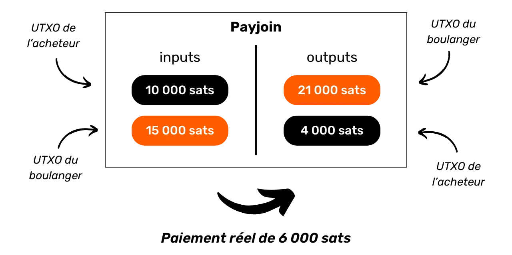
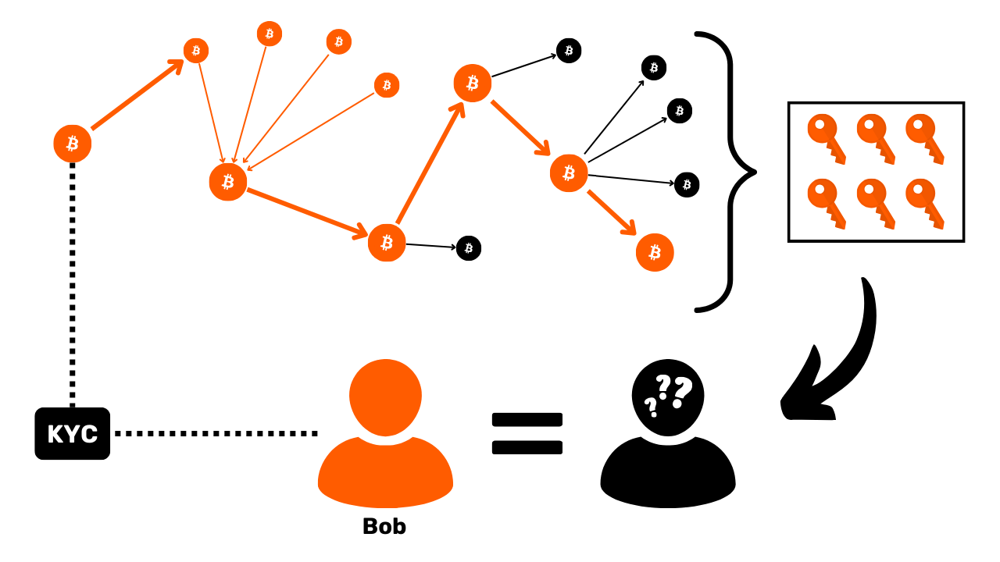
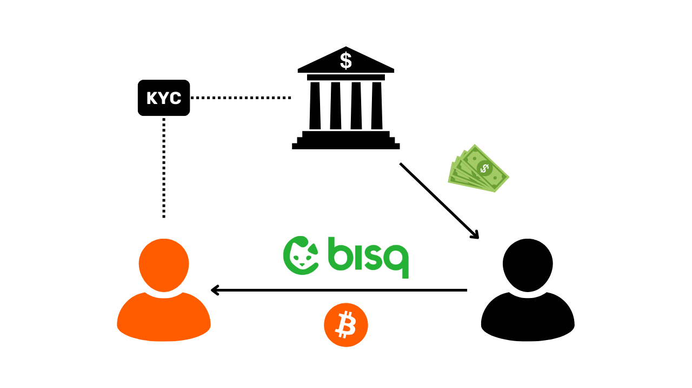

# Protégez votre vie privée sur Bitcoin
Dans un monde où la confidentialité des transactions financières devient progressivement un luxe, comprendre et maîtriser les principes de protection de la vie privée dans son utilisation de Bitcoin est essentiel. Cette formation vous donne toutes les clés, à la fois théoriques et pratiques, pour y parvenir de manière autonome.

Aujourd'hui, sur Bitcoin, des sociétés sont spécialisées dans l'analyse de chaîne. Leur cœur de métier consiste précisément à s'ingérer dans votre sphère privée, afin de compromettre la confidentialité de vos transactions. Dans les faits, le "droit à la vie privée" sur Bitcoin n’existe pas. Il vous revient donc à vous, utilisateur, de faire valoir vos droits naturels et de protéger la confidentialité de vos transactions, car personne ne va le faire à votre place. 

Cette formation se présente comme un parcours complet et généraliste. Chaque notion technique est abordée dans le détail et appuyée par des schémas explicatifs. Le but est de rendre les connaissances accessibles à tous. BTC204 est donc abordable pour les utilisateurs débutants et intermédiaires. Cette formation offre également une valeur ajoutée aux bitcoiners les plus aguerris, puisque nous approfondissons certains concepts techniques souvent méconnus.

Rejoignez-nous pour transformer votre utilisation de Bitcoin et devenir un utilisateur averti, capable de comprendre les enjeux autour de la confidentialité et de protéger sa vie privée.

# Introduction

## Introduction de la formation

Dans un monde où la confidentialité des transactions financières devient progressivement un luxe, comprendre et maîtriser les principes de protection de la vie privée dans son utilisation de Bitcoin est essentiel. Cette formation vous donne toutes les clés, à la fois théoriques et pratiques, pour y parvenir de manière autonome.

Aujourd'hui, sur Bitcoin, des sociétés sont spécialisées dans l'analyse de chaîne. Leur cœur de métier consiste précisément à s'ingérer dans votre sphère privée, afin de compromettre la confidentialité de vos transactions. Dans les faits, le "droit à la vie privée" sur Bitcoin n’existe pas. Il vous revient donc à vous, utilisateur, de faire valoir vos droits naturels et de protéger la confidentialité de vos transactions, car personne ne va le faire à votre place.

Bitcoin n'est pas là que pour le "Number Go Up" et la conservation de la valeur de l'épargne. De part ses caractéristiques uniques et son histoire, c'est avant tout l'outil de la contre-économie. Grâce à cette invention formidable, vous pouvez librement disposer de votre argent, le dépenser et l'accumuler, sans que quiconque puisse vous en empêcher. 

Bitcoin offre une échappatoire pacifique au joug des États, vous permettant de jouir pleinement de vos droits naturels, qui ne sauraient être remis en cause par les lois établies. Grâce à l'invention de Satoshi Nakamoto, vous avez le pouvoir d'imposer le respect de votre propriété privée et de retrouver la liberté de contracter.

Toutefois, Bitcoin n'est pas anonyme par défaut, ce qui peut représenter un risque pour les individus engagés dans la contre-économie, en particulier dans des régions sous régime despotique. Mais ce n'est pas le seul danger. Étant donné que le bitcoin est un actif de valeur et incensurable, il peut susciter la convoitise de voleurs. Ainsi, protéger sa vie privée devient également une question de sécurité : cela peut vous aider à prévenir les piratages informatiques et les agressions physiques.

Comme nous le verrons, bien que le protocole offre certaines protections de la confidentialité de manière intrinsèque, il est crucial d'utiliser des outils supplémentaires pour optimiser et défendre cette confidentialité.

Cette formation se présente comme un parcours complet et généraliste pour comprendre les enjeux de la confidentialité sur Bitcoin. Chaque notion technique est abordée dans le détail et appuyée par des schémas explicatifs. Le but est de rendre les connaissances accessibles à tous, même aux utilisateurs débutants et intermédiaires. Pour les bitcoiners les plus aguerris, nous abordons également tout au long de cette formation des concepts très techniques et parfois méconnus pour approfondir la compréhension de chaque sujet.

L'objectif de cette formation n'est pas de vous rendre totalement anonyme dans votre utilisation de Bitcoin, mais plutôt de vous fournir les outils essentiels pour savoir protéger votre confidentialité selon vos objectifs personnels. Vous aurez la liberté de choisir parmi les concepts et les outils présentés pour élaborer vos propres stratégies, adaptées à vos objectifs et à vos besoins spécifiques.

### Section 1 : Définitions et concepts clés

Pour commencer, nous allons réviser ensemble les principes fondamentaux qui régissent le fonctionnement de Bitcoin, afin de pouvoir ensuite aborder sereinement les notions relatives à la confidentialité. Il est essentiel de maîtriser quelques concepts de base, tels que les UTXO, les adresses de réception ou les scripts, avant de pouvoir pleinement comprendre les concepts que nous aborderons dans les sections suivantes. Nous introduirons également le modèle général de confidentialité de Bitcoin, tel qu'imaginé par Satoshi Nakamoto, ce qui nous permettra de saisir les enjeux et les risques associés.


### Section 2 : Comprendre l'analyse de chaîne et savoir s'en protéger

Dans la deuxième section, nous étudions les techniques employées par les entreprises d'analyse de chaîne pour tracer votre activité sur Bitcoin. Comprendre ces méthodes est crucial pour renforcer la protection de votre confidentialité. Cette partie a pour objectif d'examiner les stratégies des attaquants pour mieux appréhender les risques et préparer le terrain pour les techniques que nous étudierons dans les sections suivantes. Nous analyserons les modèles de transactions (patterns), les heuristiques internes et externes, ainsi que les interprétations vraisemblables de ces modèles. En plus d'un volet théorique, nous apprendrons à utiliser un explorateur de bloc pour faire de l'analyse de chaîne, à travers des exemples pratiques et des exercices.


### Section 3 : Maîtriser les bonnes pratiques pour protéger sa vie privée

Dans la troisième section de notre formation, nous entrons dans le vif du sujet : la pratique ! L'objectif est de maîtriser toutes les bonnes pratiques essentielles qui doivent devenir des réflexes naturels pour tout utilisateur de Bitcoin. Nous aborderons l'utilisation d'adresses vierges, l'étiquetage, la consolidation, l'utilisation de nœuds complets, ainsi que le KYC et les méthodes d'acquisition. Le but est de vous fournir un aperçu complet des pièges à éviter pour établir de solides fondations dans notre quête de protection de la vie privée. Pour certaines de ces pratiques, vous serez guidé vers un tutoriel spécifique pour les mettre en œuvre.


### Section 4 : Comprendre les transactions coinjoin

Comment parler de confidentialité sur Bitcoin sans aborder les coinjoins ? Dans la section 4, vous allez découvrir tout ce qu'il faut savoir sur cette méthode de mixage. Vous apprendrez ce qu'est le coinjoin, son histoire et ses objectifs, ainsi que les différents types de coinjoins existants. Enfin, pour les utilisateurs les plus aguerris, nous découvrirons ce que sont les anonsets et l'entropie, et comment calculer ces indicateurs.


### Section 5 : Connaître les enjeux d'autres techniques de confidentialité avancées

Dans la cinquième section, nous ferons un tour d'horizon de toutes les autres techniques existantes pour protéger votre vie privée sur Bitcoin, en dehors du coinjoin. Au fil des années, les développeurs ont fait preuve d'une créativité remarquable pour concevoir des outils dédiés à la confidentialité. Nous examinerons toutes ces méthodes, telles que le Payjoin, les transactions collaboratives, le Coin Swap et l'Atomic Swap, en détaillant leur fonctionnement, leurs objectifs et leurs éventuelles faiblesses.



### Section 6 : Découvrir les propositions d'amélioration du protocole en lien avec la confidentialité

Alors que les sections précédentes se concentraient sur les solutions de confidentialité applicatives, cette sixième section se penchera sur les enjeux au niveau protocolaire pour la vie privée des utilisateurs. Nous aborderons la confidentialité au niveau du réseau de nœuds et de la diffusion des transactions. Nous discuterons également des différents protocoles qui ont été proposés au fil des années pour renforcer la confidentialité des utilisateurs sur Bitcoin. Pour conclure, nous examinerons les impacts sur la confidentialité, tant positifs que négatifs, du dernier grand soft fork de Bitcoin, Taproot.

***LOIC : AJOUTER SCHEMA EXEMPLE ICI***

### Section Bonus : La privacy sur les protocoles de seconde couche

Comme vous l'avez compris, le cœur de cette formation se concentre exclusivement sur la privacy onchain. Dans cette dernière partie bonus, je souhaite donc élargir le sujet à la confidentialité sur les autres protocoles en lien avec Bitcoin. Nous parlerons notamment de la vie privée sur le Lightning Network. Certains affirment que Lightning est privé par défaut, tandis que d'autres soutiennent que la confidentialité de l'utilisateur y est insuffisante. Quelle est donc la vérité ? Nous démêlerons le vrai du faux pour mieux comprendre les enjeux liés à la confidentialité sur le Lightning Network. Nous évoquerons également les sidechains comme Liquid Network et les banques chaumiennes comme Cashu ou Fedimint.


# Définitions et concepts clés


## Le modèle d'UTXO de Bitcoin

Le bitcoin est avant tout une monnaie, mais savez-vous concrètement comment sont représentées les BTC sur le protocole ? 

### Les UTXOs sur Bitcoin : qu'est-ce que c'est ?

Sur le protocole Bitcoin, la gestion des unités monétaires s'articule autour du modèle d'UTXO, acronyme anglais pour "_Unspent Transaction Output_", que l'on traduit par "_sortie de transaction non dépensée_".

Ce modèle se distingue profondément des systèmes bancaires traditionnels qui reposent sur un mécanisme de comptes et de soldes pour suivre les flux financiers. En effet, dans le système bancaire, les soldes individuels sont maintenus dans des comptes attachés à une identité. Par exemple, lorsque vous achetez une baguette chez un boulanger, votre banque débite simplement le montant de l'achat de votre compte, réduisant ainsi votre solde, tandis que le compte du boulanger est crédité du même montant, augmentant son solde. Dans ce système, il n'y a aucune notion de lien entre l'argent qui entre sur votre compte et l'argent qui en sort, à part les enregistrements de transactions.


Sur Bitcoin, cela fonctionne différemment. Le concept de compte n'existe pas et les unités monétaires ne sont pas gérées via des soldes, mais à travers des UTXO. Un UTXO représente une quantité spécifique de bitcoins qui n'a pas encore été dépensée, formant ainsi un "morceau de bitcoin", qui peut être grand ou petit. Par exemple, un UTXO pourrait valoir `500 BTC` ou simplement `700 SATS`.

**> Pour rappel :** Le satoshi, souvent abrégé en sat, est la plus petite unité de Bitcoin, comparable au centime dans les monnaies fiat.
```bash
1 BTC = 100 000 000 SATS
```

Théoriquement, un UTXO peut représenter n'importe quelle valeur en bitcoins, allant d'un sat jusqu'au maximum théorique d'environ 21 millions de BTC. Cependant, il est logiquement impossible de posséder les 21 millions de bitcoins, et il existe un seuil économique inférieur appelé "dust", en dessous duquel un UTXO est considéré comme économiquement non rentable à dépenser.

**-> Le saviez-vous ?** Le plus grand UTXO jamais créé sur Bitcoin avait une valeur de `500 000 BTC`. Il a été créé par la plateforme MtGox lors d'une opération de consolidation en novembre 2011 : [29a3efd3ef04f9153d47a990bd7b048a4b2d213daaa5fb8ed670fb85f13bdbcf](https://mempool.space/fr/tx/29a3efd3ef04f9153d47a990bd7b048a4b2d213daaa5fb8ed670fb85f13bdbcf)

### Les UTXOs et les conditions de dépense

Les UTXOs sont les instruments d'échange sur Bitcoin. Chaque transaction se traduit par la consommation d'UTXOs en entrées et la création de nouveaux UTXOs en sorties. Lorsqu'une transaction est réalisée, les UTXOs utilisés comme entrées sont considérés comme "dépensés", et de nouveaux UTXOs sont générés et attribués aux destinataires indiqués dans les sorties de la transaction. Ainsi, un UTXO représente simplement une sortie de transaction non dépensée, et donc une quantité de bitcoins appartenant à un utilisateur à un moment donné.


Tous les UTXOs sont sécurisés par des scripts qui définissent les conditions sous lesquelles ils peuvent être dépensés. Pour consommer un UTXO, un utilisateur doit démontrer au réseau qu'il satisfait les conditions stipulées par le script qui sécurise cet UTXO. Généralement, les UTXOs sont protégés par une clé publique (ou une adresse de réception qui représente cette clé publique). Pour dépenser un UTXO associé à cette clé publique, l'utilisateur doit prouver qu'il détient la clé privée correspondante, en fournissant une signature numérique réalisée avec cette clé. C'est la raison pour laquelle on dit que votre portefeuille Bitcoin ne contient pas réellement des bitcoins, mais qu'il stocke vos clés privées, qui elles-mêmes vous donnent accès à vos UTXOs et, par extension, aux bitcoins qu'ils représentent.


Étant donné que le concept de compte est absent sur Bitcoin, le solde d'un portefeuille correspond simplement à la somme des valeurs de tous les UTXOs qu'il peut dépenser. Par exemple, si votre portefeuille Bitcoin peut dépenser les 4 UTXOs suivants :

```bash
- 2 BTC
- 8 BTC
- 5 BTC
- 2 BTC
```

Le solde total de votre portefeuille serait de `17 BTC`.


## La structure des transactions Bitcoin

### Les inputs et les outputs d'une transaction

Une transaction Bitcoin est une opération enregistrée sur la blockchain qui permet de transférer la propriété de bitcoins d'une personne à une autre. Plus précisément, puisque nous sommes sur un modèle d'UTXO et qu'il n'y a pas de comptes, la transaction satisfait les conditions de dépense qui sécurisaient un ou plusieurs UTXOs, les consomme et crée en équivalence de nouveaux UTXOs dotés de nouvelles conditions de dépense. En bref, une transaction déplace des bitcoins d'un script qui est satisfait vers un nouveau script prévu pour les sécuriser.


Chaque transaction Bitcoin est donc constituée d'une ou de plusieurs entrées (inputs) et d'une ou de plusieurs sorties (outputs). Les inputs sont des UTXOs consommés par la transaction pour générer les outputs. Les outputs sont de nouveaux UTXOs qui seront utilisables comme inputs pour de futures transactions.


**> Le saviez-vous ?** Théoriquement, une transaction bitcoin pourrait avoir une infinité d'inputs et d'outputs. Seule la taille maximale d'un bloc vient limiter ce nombre.

Chaque input dans une transaction Bitcoin fait référence à un UTXO antérieur non dépensé. Pour utiliser un UTXO comme input, son détenteur doit démontrer qu'il en est le propriétaire légitime en validant le script qui lui est associé, c'est-à-dire, en satisfaisant la condition de dépense imposée. Généralement, cela revient à fournir une signature numérique produite avec la clé privée correspondant à la clé publique qui avait initialement sécurisé cet UTXO. Le script consiste donc à vérifier que la signature correspond bien à la clé publique utilisée lors de la réception des fonds.


Chaque output, de son côté, précise le montant des bitcoins à transférer, ainsi que le destinataire. Ce dernier est défini par un nouveau script qui, en général, bloque l'UTXO nouvellement créé avec une adresse de réception ou une nouvelle clé publique.

Pour qu'une transaction soit considérée valide selon les règles de consensus, le total des outputs doit être inférieur ou égal au total des inputs. En d'autres termes, la somme des nouveaux UTXOs générés par la transaction ne doit pas excéder celle des UTXOs consommés en tant qu'inputs. Ce principe est logique : si vous disposez uniquement d'un montant de `500 000 SATS`, vous ne pouvez pas effectuer un achat de `700 000 SATS`.

### Le change et la fusion dans une transaction Bitcoin

L'action d'une transaction Bitcoin sur les UTXO peut ainsi être comparée à la refonte d'une pièce d'or. En effet, un UTXO n'est pas divisible, mais uniquement fusible. Cela signifie qu'un utilisateur ne peut pas simplement diviser un UTXO représentant un certain montant en bitcoins en plusieurs UTXO plus petits. Il doit le consommer entièrement dans une transaction pour créer un ou plusieurs nouveaux UTXOs de valeurs arbitraires en outputs, qui doivent être inférieures ou égales à la valeur initiale.

Cette mécanique est similaire à celle d'une pièce d'or. Imaginons que vous possédez une pièce de 2 onces et que vous souhaitez faire un paiement de 1 once, en supposant que le vendeur ne puisse pas vous rendre la monnaie. Vous devriez fondre votre pièce et en couler 2 nouvelles de 1 once chacune.

Sur Bitcoin, le fonctionnement est semblable. Imaginons qu'Alice possède un UTXO de `10 000 SATS` et qu'elle souhaite acheter une baguette coûtant `4 000 SATS`. Alice va faire une transaction avec en input 1 UTXO de `10 000 SATS` qu'elle consommera entièrement, et en outputs, elle créera 2 UTXOs d'une valeur de `4 000 SATS` et de `6 000 SATS`. L'UTXO de `4 000 SATS` sera envoyé au boulanger en paiement de la baguette, tandis que l'UTXO de `6 000 SATS` reviendra à Alice sous forme de monnaie. Cet UTXO qui revient à l'émetteur initial de la transaction, c'est ce que l'on appelle le "change" dans le jargon Bitcoin.


Imaginons à présent qu'Alice ne possède pas un unique UTXO de `10 000 SATS`, mais plutôt deux UTXOs de `3 000 SATS` chacun. Dans cette situation, aucun des UTXOs individuellement ne suffit pour régler les `4 000 SATS` de la baguette. Alice doit donc utiliser simultanément les 2 UTXOs de `3 000 SATS` comme inputs de sa transaction. De cette manière, le montant total des inputs atteindra `6 000 SATS`, lui permettant ainsi de satisfaire le paiement de `4 000 SATS` au boulanger. Cette méthode, qui consiste à regrouper plusieurs UTXOs dans les inputs d'une transaction, est souvent désignée par le terme "fusion".


### Les frais de transaction

Intuitivement, on pourrait penser que les frais de transaction représentent, eux aussi, un output d'une transaction. Mais en réalité, ce n'est pas le cas. Les frais d'une transaction représentent la différence entre le total des inputs et le total des outputs. Cela signifie que, après avoir utilisé une partie de la valeur des inputs pour couvrir les outputs désirés dans une transaction, une certaine somme des inputs reste inutilisée. Cette somme résiduelle constitue les frais de transaction.

```bash
Frais = total inputs - total outputs
```


Reprenons l'exemple d'Alice qui dispose d'un UTXO de `10 000 SATS` et souhaite acheter une baguette à `4 000 SATS`. Alice crée une transaction avec comme input son UTXO de `10 000 SATS`. Elle génère ensuite un output de `4 000 SATS` destiné au boulanger pour le paiement de la baguette. Pour encourager les mineurs à intégrer sa transaction dans un bloc, Alice alloue `200 SATS` de frais. Elle crée donc un second output, le change, qui lui reviendra, s'élevant à `5 800 SATS`.


En appliquant la formule des frais, nous constatons qu'il reste effectivement `200 SATS` pour les mineurs :
```bash
Frais = total inputs - total outputs
Frais = 10 000 - (4 000 + 5 800)
Frais = 10 000 - 9 800
Frais = 200
```

Lorsqu'un mineur parvient à valider un bloc, il est autorisé à collecter ces frais pour toutes les transactions incluses dans son bloc, via la transaction dite "coinbase".

### La création des UTXOs sur Bitcoin

Si vous avez suivi attentivement les paragraphes précédents, vous savez dorénavant que les UTXOs ne peuvent être créés qu'en consommant d'autres UTXOs existants. Ainsi, les pièces sur Bitcoin forment une chaîne continue. Cependant, vous vous demandez peut-être comment les premiers UTXOs de cette chaîne sont apparus. Cela soulève un problème similaire à celui de la poule et de l'œuf : d'où viennent ces UTXOs originels ?

La réponse est dans la **transaction coinbase**.

La coinbase est un type spécifique de transaction Bitcoin, qui est unique pour chaque bloc et qui est toujours la première de ceux-ci. Elle permet au mineur ayant trouvé une preuve de travail valide de recevoir sa récompense de bloc. Cette récompense se compose de deux éléments : **la subvention de bloc** et **les frais de transaction** dont nous avons parlé dans la partie précédente.

La particularité de la transaction coinbase est qu'elle est la seule à pouvoir créer des bitcoins ex nihilo, sans nécessiter de consommer des inputs pour générer ses outputs. Ces bitcoins nouvellement créés constituent ce que l'on pourrait appeler les "UTXOs originels".


Les bitcoins issus de la subvention de bloc sont de nouveaux BTC créés à partir de rien, suivant un calendrier d'émission préétabli dans les règles de consensus. La subvention de bloc se réduit de moitié tous les 210 000 blocs, c'est-à-dire environ tous les quatre ans, dans un processus appelé "halving". À l'origine, 50 bitcoins étaient créés avec chaque subvention, mais ce montant a diminué graduellement ; actuellement, il est de 3,125 bitcoins par bloc.

Quant à la partie liée aux frais de transaction, bien qu'elle représente également des BTC nouvellement créés, ils ne doivent pas excéder la différence entre le total des inputs et des outputs de toutes les transactions d’un bloc. Nous avons vu précédemment que ces frais représentent la portion des inputs qui n'est pas utilisée dans les outputs des transactions. Cette partie est techniquement "perdue" durant la transaction, et le mineur a le droit de recréer cette valeur sous forme d'un ou plusieurs nouveaux UTXOs. Il s'agit donc d'un transfert de valeur entre l'émetteur de la transaction et le mineur qui l'ajoute à la blockchain.

**> Le saviez-vous ?** Les bitcoins générés par une transaction coinbase sont soumis à une période de maturité de 100 blocs pendant laquelle ils ne peuvent pas être dépensés par le mineur. Cette règle a pour but d'éviter les complications liées à l'utilisation de bitcoins nouvellement créés sur une chaîne qui pourrait être ultérieurement rendue obsolète. 

### Les implications du modèle d'UTXO

Tout d'abord, le modèle d'UTXO influence directement les frais de transaction sur Bitcoin. La capacité de chaque bloc étant limitée, les mineurs favorisent les transactions qui offrent les meilleurs frais au regard de la place qu'elles vont prendre dans le bloc. En effet, plus une transaction inclut d'UTXOs en inputs et en outputs, plus elle est lourde, et donc nécessite des frais plus élevés. C'est une des raisons pour lesquelles on essaie souvent de réduire le nombre d'UTXOs dans notre portefeuille, ce qui peut par ailleurs affecter la confidentialité, un sujet que nous aborderons en détail dans la troisième partie de cette formation.

Ensuite, comme mentionné dans les parties précédentes, les pièces sur Bitcoin sont essentiellement une chaîne d'UTXOs. Chaque transaction crée ainsi un lien entre un UTXO passé et un futur UTXO. Les UTXOs permettent donc de suivre explicitement le chemin des bitcoins depuis leur création jusqu'à leur dépense actuelle. Cette transparence peut être perçue positivement, car elle permet à chaque utilisateur de s'assurer de l'authenticité des bitcoins reçus. Cependant, c'est aussi sur ce principe de traçabilité et d'auditabilité que repose l'analyse de chaîne, une pratique visant à compromettre votre confidentialité. Nous étudierons en profondeur cette pratique dans la deuxième partie de la formation.

## Le modèle de confidentialité de Bitcoin

### La monnaie : authenticité, intégrité et double dépense
Une des fonctions de la monnaie est de résoudre le problème de la double coïncidence des besoins. Dans un système établi sur le troc, la réalisation d'un échange nécessite non seulement de trouver un individu cédant un bien correspondant à mon besoin, mais aussi de lui procurer un bien de valeur équivalente qui satisfait son propre besoin. Trouver cet équilibre s'avère complexe. 


C'est pourquoi nous recourons à la monnaie qui permet de déplacer la valeur à la fois dans l'espace et dans le temps.


Pour que la monnaie résolve ce problème, il est essentiel que la partie qui fournit un bien ou un service soit convaincue de sa capacité à dépenser cette somme ultérieurement. Ainsi, tout individu rationnel souhaitant accepter une pièce de monnaie, qu'elle soit numérique ou physique, s'assurera qu'elle remplit deux critères fondamentaux :
- **La pièce doit être intègre et authentique ;**
- **et elle ne doit pas être double dépensée.**

Si l’on utilise une monnaie physique, c’est la première caractéristique qui est la plus complexe à faire valoir. À différentes périodes de l’histoire, l’intégrité des pièces de métaux a souvent été affectée par des pratiques comme le rognage ou le perçage. Par exemple, durant la Rome antique, il était courant que les citoyens grattent les bords des pièces d’or pour en recueillir un peu de métal précieux, tout en les conservant pour des transactions futures. La valeur intrinsèque de la pièce était donc réduite, mais sa valeur faciale demeurait identique. C’est notamment pour cette raison que l’on a plus tard frappé des cannelures sur la tranche des pièces. 

L’authenticité est également une caractéristique difficile à vérifier sur un support monétaire physique. De nos jours, les techniques pour lutter contre le faux monnayage sont de plus en plus complexes, ce qui oblige les commerçants à investir dans des systèmes de vérification coûteux.

En revanche, en raison de leur nature, la double dépense n'est pas un problème pour les monnaies physiques. Si je vous cède un billet de 10 €, il quitte irrévocablement ma possession pour entrer dans la vôtre, ce qui exclut naturellement toute possibilité de dépense multiple des unités monétaires qu’il incarne. En bref, je ne pourrai pas dépenser de nouveau ce billet de 10 €.


Pour la monnaie numérique, la difficulté est différente. S’assurer de l’authenticité et de l’intégrité d’une pièce est souvent plus simple. Comme nous l'avons vu dans la partie précédente, le modèle d'UTXO sur Bitcoin permet de tracer une pièce jusqu'à son origine, et donc de vérifier qu'elle a bien été créée de manière conforme aux règles de consensus par un mineur.

En revanche, s’assurer de l'absence de double dépense est plus complexe, puisque tout bien numérique est en essence de l'information. Contrairement aux biens physiques, l'information ne se divise pas lors des échanges, mais se propage en se multipliant. Par exemple, si je vous transmets un document par courrier électronique, ce dernier se retrouve alors dupliqué. De votre côté, vous ne pouvez pas vérifier avec certitude que j'ai effacé le document original.


### La prévention de la double dépense sur Bitcoin
Le seul moyen d’éviter cette duplication d’un bien numérique est d’être au courant de l’intégralité des échanges sur le système. De cette manière, on peut savoir qui possède quoi et actualiser les avoirs de chacun en fonction des transactions effectuées. C’est ce qui se fait, par exemple, pour la monnaie scripturale dans le système bancaire. Lorsque l’on paie 10 € à un commerçant par carte bancaire, la banque constate cet échange et actualise le livre des comptes.


Sur Bitcoin, la prévention de la double dépense se fait de la même manière. On va chercher à confirmer l'absence d'une transaction ayant déjà dépensé les pièces en question. Si ces dernières n'ont jamais été utilisées, alors nous pouvons être assurés qu'aucune double dépense n'aura lieu. Ce principe avait été décrit par Satoshi Nakamoto dans le White Paper avec cette célèbre phrase :

**"*Le seul moyen pour confirmer l’absence d’une transaction est d’être au courant de toutes les transactions.*"**

Mais contrairement au modèle bancaire, on ne souhaite pas avoir à faire confiance à une entité centrale sur Bitcoin. Il faut alors que tous les utilisateurs soient en capacité de confirmer cette absence de double dépense, sans pour autant reposer sur un tiers. Ainsi, il faut que chacun soit au courant de toutes les transactions Bitcoin. C'est pour cette raison que les transactions Bitcoin sont diffusées publiquement sur tous les nœuds du réseau et enregistrées en clair sur la blockchain.

C'est précisément cette diffusion publique de l’information qui complique la protection de la vie privée sur Bitcoin. Dans le système bancaire traditionnel, en théorie, seule l'institution financière a connaissance des transactions effectuées. En revanche, sur Bitcoin, l'ensemble des utilisateurs est informé de toutes les transactions, via leurs nœuds respectifs. 

### Le modèle de confidentialité : système bancaire vs Bitcoin
Dans le système traditionnel, votre compte bancaire est lié à votre identité. Le banquier est en capacité de savoir quel compte bancaire appartient à quel client, et quelles sont les transactions associées. Néanmoins, ce flux d’informations est coupé entre la banque et le domaine public. Autrement dit, il est impossible de connaître le solde et les transactions d’un compte bancaire qui appartient à un autre individu. Seule la banque a accès à ces informations.


Par exemple, votre banquier est au courant que vous achetez votre baguette chaque matin chez le boulanger du quartier, mais votre voisin, lui, n'a pas connaissance de cette transaction. Ainsi, le flux d'informations est accessible aux parties concernées, notamment la banque, mais reste inaccessible à des personnes extérieures.


À cause de la contrainte de diffusion publique des transactions que nous avons vue dans la partie précédente, le modèle de confidentialité de Bitcoin ne peut pas suivre le modèle du système bancaire. Dans le cas de Bitcoin, puisque le flux d’information ne peut pas être cassé entre les transactions et le domaine public, **le modèle de confidentialité repose sur la séparation entre l’identité de l’utilisateur et les transactions** en elles-mêmes.


Par exemple, si vous achetez une baguette chez le boulanger en payant en BTC, votre voisin, qui possède son propre nœud complet, peut voir votre transaction passer, tout comme il peut voir toutes les autres transactions du système. Toutefois, si les principes de confidentialité sont respectés, il ne devrait pas être en mesure de relier cette transaction spécifique à votre identité.


Mais puisque les transactions Bitcoin sont rendues publiques, il devient tout de même possible d'établir des liens entre elles pour en déduire des renseignements sur les parties impliquées. Cette activité constitue même une spécialité en soi que l'on appelle "analyse de chaîne". Dans la partie suivante de la formation, je vous invite à explorer les fondamentaux de l'analyse de chaîne afin de comprendre comment vos bitcoins sont tracés et de savoir mieux s'en défendre.

# Comprendre l'analyse de chaîne et savoir s'en protéger

## C'est quoi l'analyse de chaîne sur Bitcoin ?

### Définition et fonctionnement

L’analyse de chaîne est une pratique qui regroupe toutes les méthodes permettant de tracer les flux de bitcoins sur la blockchain. De façon générale, l’analyse de chaîne s’appuie sur l’observation de caractéristiques sur des échantillons de transactions antérieures. Elle consiste ensuite à repérer ces mêmes caractéristiques sur une transaction que l’on souhaite analyser, et à en déduire des interprétations vraisemblables. Cette méthode de résolution de problème à partir d’une approche pratique, pour trouver une solution suffisamment bonne, c’est ce que l’on appelle une "heuristique".

Pour vulgariser, l’analyse de chaîne se fait en trois grandes étapes :
1. **L'observation de la blockchain ;**
2. **Le repérage de caractéristiques connues ;**
3. **La déduction d’hypothèses.**


L'analyse de chaîne peut être effectuée par n'importe qui. Il suffit d'avoir accès aux informations publiques de la blockchain via un nœud complet pour observer les mouvements des transactions et émettre des hypothèses. Il existe également des outils gratuits qui facilitent cette analyse, comme le site [OXT.me](https://oxt.me/) que nous explorerons en détail dans les deux derniers chapitres de cette partie. Toutefois, le principal risque pour la confidentialité provient des entreprises spécialisées dans l'analyse de chaîne. Ces sociétés ont fait passer l'analyse de chaîne à une échelle industrielle et vendent leurs services à des institutions financières ou des gouvernements. Parmi ces entreprises, Chainalysis est sûrement la plus connue.

### Les objectifs de l'analyse de chaîne

Un des objectifs de l’analyse de chaîne consiste à regrouper diverses activités sur Bitcoin en vue de déterminer l'unicité de l'utilisateur les ayant effectuées. Par la suite, il sera possible de tenter de rattacher ce faisceau d'activités à une identité réelle.


Rappelez-vous du chapitre précédent. Je vous ai expliqué pourquoi le modèle de confidentialité de Bitcoin reposait originellement sur la séparation entre l’identité de l’utilisateur et ses transactions. Il serait donc tentant de penser que l'analyse de chaîne s'avère inutile, puisque même si l'on parvient à regrouper des activités onchain, on ne peut pas les associer à une identité réelle. 

Théoriquement, cette affirmation est exacte. Dans la première partie de cette formation, nous avons vu que l'on emploie des paires de clés cryptographiques pour établir des conditions sur les UTXO. Par essence, ces paires de clés ne divulguent aucune information sur l’identité de leurs détenteurs. Ainsi, même si l'on réussit à regrouper les activités associées à différentes paires de clés, cela ne nous renseigne en rien sur l'entité à l'origine de ces activités.


Cependant, la réalité pratique est bien plus complexe. Il existe une multitude de comportements qui risquent de lier une identité réelle à une activité onchain. En analyse, on appelle cela un point d’entrée, et il en existe une multitude. 

Le plus courant, c’est évidemment le KYC (*Know Your Customer*). Si vous retirez vos bitcoins d’une plateforme régulée vers une de vos adresses de réception personnelles, alors certaines personnes sont en capacité de lier votre identité à cette adresse. Plus largement, un point d’entrée peut être toute forme d’interaction entre votre vie réelle et une transaction Bitcoin. Par exemple, si vous publiez une adresse de réception sur vos réseaux sociaux, cela peut constituer un point d’entrée pour une analyse. Si vous réalisez un paiement en bitcoins à votre boulanger, ce dernier pourra associer votre face (qui fait partie de votre identité) à une adresse Bitcoin.

Ces points d'entrée sont quasiment inévitables dans l'usage de Bitcoin. Bien que l'on puisse chercher à en restreindre la portée, ils demeureront présents. C'est pourquoi il est crucial de combiner les méthodes visant à préserver votre vie privée. Si maintenir une séparation entre votre identité réelle et vos transactions est une démarche intéressante, elle demeure aujourd'hui insuffisante. En effet, si l'ensemble de vos activités onchain peut être regroupé, alors le moindre petit point d'entrée est susceptible de compromettre l'unique couche de confidentialité que vous aviez instaurée.


### Se défendre face à l'analyse de chaîne

Ainsi, il faut également pouvoir faire face à l’analyse de chaîne dans notre utilisation de Bitcoin. En procédant de la sorte, nous pouvons minimiser l'agrégation de nos activités et limiter l’impact d’un point d’entrée sur notre vie privée. 


Justement, pour mieux contrecarrer l'analyse de chaîne, quelle meilleure approche que de s'initier aux méthodes employées dans l’analyse de chaîne ? Si vous souhaitez savoir comment améliorer votre confidentialité sur Bitcoin, vous devez comprendre ces méthodes. Cela vous permettra de mieux appréhender les techniques comme [le Coinjoin](https://planb.network/fr/tutorials/privacy/coinjoin-samourai-wallet) ou [le Payjoin](https://planb.network/fr/tutorials/privacy/payjoin) (techniques que nous étudierons dans les dernières parties de la formation), et de réduire les erreurs que vous pourriez faire.

En ça, nous pouvons faire une analogie avec la cryptographie et la cryptanalyse. Un bon cryptographe est avant tout un bon cryptanalyste. Pour imaginer un nouvel algorithme de chiffrement, il faut savoir quelles sont les attaques auxquelles il devra faire face, et également étudier pourquoi les algorithmes précédents ont été cassés. Le même principe s'applique à la confidentialité sur Bitcoin. Comprendre les méthodes de l'analyse de chaîne est la clé pour s'en prémunir. C’est pour cette raison que je vous propose une partie entière sur l'analyse de chaîne dans cette formation.

### Les méthodes de l'analyse de chaîne

Il est important de comprendre que l'analyse de chaîne n'est pas une science exacte. Elle repose sur des heuristiques dérivées d'observations antérieures ou d’interprétations logiques. Ces règles permettent d'obtenir des résultats assez fiables, mais jamais d'une précision absolue. En d'autres termes, **l'analyse de chaîne implique toujours une dimension de probabilité dans les conclusions émises**. Par exemple, on pourra estimer avec plus ou moins de certitude que deux adresses appartiennent à une même entité, mais une certitude totale sera toujours hors de portée.

Tout l’objectif de l'analyse de chaîne réside précisément dans l'agrégation de diverses heuristiques en vue de minimiser le risque d'erreur. Il s'agit en quelque sorte d'une accumulation de preuves qui nous permet de nous approcher davantage de la réalité.

Ces fameuses heuristiques peuvent être regroupées en différentes catégories que nous allons détailler ensemble :
- **Les patterns de transaction (ou modèles de transaction) ;**
- **Les heuristiques internes à la transaction ;**
- **Les heuristiques externes à la transaction.**

### Satoshi Nakamoto et l'analyse de chaîne

Notons que les deux premières heuristiques d'analyse de chaîne ont été découvertes par Satoshi Nakamoto lui-même. Il en parle dans la partie 10 du White Paper de Bitcoin. Ce sont :
- la CIOH (*Common Input Ownership Heuristic*) ;
- et la réutilisation d’adresse.

Nous verrons dans les chapitres suivants en quoi elles consistent, mais il est déjà intéressant de noter que ces deux heuristiques conservent toujours une prééminence dans l’analyse de chaîne aujourd’hui.

## Les patterns de transactions

Un pattern de transaction est simplement un modèle ou une structure globale de transaction typique, que l’on peut retrouver sur la blockchain, dont on connaît l’interprétation vraisemblable. Lorsque l’on étudie les patterns, on va s’attarder sur une seule transaction que l’on va analyser à un niveau élevé. 

En d’autres termes, nous allons uniquement regarder le nombre d’UTXO en inputs et le nombre d'UTXO en outputs, sans nous attarder sur les détails plus spécifiques ou l'environnement de la transaction. À partir du modèle observé, nous pourrons interpréter la nature de la transaction. On va alors rechercher des caractéristiques sur sa structure et en déduire une interprétation.


Dans cette partie, nous allons découvrir ensemble les principaux modèles de transactions que l'on peut rencontrer en analyse de chaîne, et pour chaque modèle, je vous donnerai l'interprétation vraisemblable de cette structure, ainsi qu'un exemple concret.

### L’envoi simple (ou le paiement simple)

On commence par un pattern très répandu, puisque c'est celui qui ressort sur la plupart des paiements en bitcoins. Le modèle du paiement simple se caractérise par la consommation d’un ou plusieurs UTXOs en inputs et la production de 2 UTXOs en outputs. Ce modèle va donc ressembler à cela :


Lorsque l'on repère cette structure de transaction sur la blockchain, on peut déjà en tirer une interprétation. Comme son nom l'indique, ce modèle indique que nous sommes en présence d’une transaction d’envoi ou de paiement. L’utilisateur a consommé son propre UTXO en inputs pour satisfaire en outputs un UTXO de paiement et un UTXO de change (rendu de monnaie qui revient vers le même utilisateur). 

Nous savons donc que l’utilisateur observé n’est vraisemblablement plus en possession d’un des deux UTXOs en outputs (celui du paiement), mais qu’il est toujours en possession de l’autre UTXO (celui de change).

Pour l'instant, il nous est impossible de préciser quel output représente quel UTXO, puisque ce n'est pas l'objectif de l'étude de patterns. Nous y parviendrons en nous appuyant sur les heuristiques que nous étudierons dans les parties suivantes. À ce stade, notre objectif se limite à identifier la nature de la transaction en question, qui est, en l'occurrence, un envoi simple.

Par exemple, voici une transaction Bitcoin qui adopte le pattern de l’envoi simple :

```bash
b6cc79f45fd2d7669ff94db5cb14c45f1f879ea0ba4c6e3d16ad53a18c34b769
```


Source : [Mempool.space](https://mempool.space/fr/tx/b6cc79f45fd2d7669ff94db5cb14c45f1f879ea0ba4c6e3d16ad53a18c34b769)

Après ce premier exemple, vous devriez avoir une meilleure compréhension de ce que signifie étudier un "modèle de transaction". Nous examinons une transaction en nous focalisant uniquement sur sa structure, sans prendre en compte son environnement ou les détails spécifiques de la transaction. Nous l'observons uniquement de manière globale dans cette première étape.

Maintenant que vous comprenez ce qu'est un pattern, passons aux autres modèles existants.

### Le balayage

Ce deuxième modèle se caractérise par la consommation d’un seul UTXO en entrée et la production d’un seul UTXO en sortie.


L’interprétation de ce modèle est que nous sommes en présence d’un auto-transfert. L’utilisateur s’est transféré ses bitcoins à lui-même, sur une autre adresse lui appartenant. Puisqu’aucun change n'existe sur la transaction, il est très peu plausible que l’on soit en présence d’un paiement. En effet, lorsqu'un paiement est effectué, il est presque impossible que le payeur dispose d'un UTXO correspondant exactement au montant requis par le vendeur, en plus des frais de transaction. En général, le payeur est donc obligé de produire un output de change.

Nous savons alors que l’utilisateur observé est vraisemblablement encore en possession de cet UTXO. Dans le cadre d'une analyse de chaîne, si nous savons que l'UTXO utilisé en input de la transaction appartient à Alice, on peut supposer que l'UTXO en output lui appartient également. Ce qui deviendra intéressant par la suite, c'est de trouver des heuristiques internes à la transaction qui pourraient renforcer cette hypothèse (nous étudierons ces heuristiques dans le chapitre 3.3).

Par exemple, voici une transaction Bitcoin qui adopte le pattern du balayage :

```bash
35f1072a0fda5ae106efb4fda871ab40e1f8023c6c47f396441ad4b995ea693d
```


Source : [Mempool.space](https://mempool.space/fr/tx/35f1072a0fda5ae106efb4fda871ab40e1f8023c6c47f396441ad4b995ea693d)

Attention toutefois, ce type de pattern peut également révéler un auto-transfert vers le compte d’une plateforme d’échange de cryptomonnaies. Ce seront l’étude des adresses connues et le contexte de la transaction qui nous permettront de savoir si c’est un balayage vers un portefeuille en self-custody ou un retrait vers une plateforme. En effet, les adresses des plateformes d'échange sont souvent facilement identifiables. 

Reprenons l'exemple d'Alice : si le balayage mène vers une adresse connue d'une plateforme (comme Binance par exemple), cela peut signifier que les bitcoins ont été transférés hors de la possession directe d'Alice, probablement dans l'intention de les vendre ou de les stocker sur cette plateforme. En revanche, si l'adresse de destination est inconnue, il est raisonnable de supposer qu'il s'agit simplement d'un autre portefeuille appartenant toujours à Alice. Mais ce type d'étude rentre plutôt dans la catégorie des heuristiques et pas dans l'étude des patterns.

### La consolidation

Ce modèle se caractérise par la consommation de plusieurs UTXOs en entrée et la production d’un seul UTXO en sortie.


L’interprétation de ce modèle est que nous sommes en présence d’une consolidation. C’est une pratique courante chez les utilisateurs de Bitcoin, visant à fusionner plusieurs UTXOs en anticipation d'une éventuelle augmentation des frais de transaction. En effectuant cette opération durant une période où les frais sont bas, il est possible de réaliser des économies sur les frais futurs. Nous parlerons plus en détail de cette pratique dans le chapitre 4.3.

Nous pouvons en déduire que l’utilisateur derrière ce modèle de transaction était vraisemblablement en possession de l’intégralité des UTXOs en inputs et qu’il est toujours en possession de l’UTXO en output. C’est donc sûrement un auto-transfert.

Tout comme le balayage, ce type de pattern peut également révéler un auto-transfert sur le compte d’une plateforme d'échange. Ce seront l’étude des adresses connues et le contexte de la transaction qui nous permettront de savoir si c’est une consolidation vers un portefeuille en self-custody ou un retrait vers une plateforme.

Par exemple, voici une transaction Bitcoin qui adopte le pattern de la consolidation :

```bash
77c16914211e237a9bd51a7ce0b1a7368631caed515fe51b081d220590589e94
```


Source : [Mempool.space](https://mempool.space/fr/tx/77c16914211e237a9bd51a7ce0b1a7368631caed515fe51b081d220590589e94)

Dans le cadre d'une analyse de chaîne, ce modèle peut révéler beaucoup d'informations. Par exemple, si l'on sait que l'un des inputs appartient à Alice, on peut supposer que tous les autres inputs et l'output de cette transaction lui appartiennent également. Cette hypothèse permettrait alors de remonter la chaîne de transactions antérieures pour découvrir et analyser d'autres transactions vraisemblablement associées à Alice.


### La dépense groupée

Ce modèle se caractérise par la consommation de quelques UTXOs en inputs (souvent un seul) et la production de nombreux UTXOs en outputs.


L’interprétation de ce modèle est que nous sommes en présence d’une dépense groupée. C’est une pratique qui révèle vraisemblablement une très grosse activité économique, comme une plateforme d'échange par exemple. La dépense groupée permet à ces entités d’économiser des frais en réunissant leurs dépenses dans une seule transaction.

Nous pouvons déduire de ce modèle que l’UTXO en input provient d’une société avec une grosse activité économique et que les UTXOs en sorties vont se disperser. Beaucoup appartiendront à des clients de la société qui ont fait un retrait de bitcoins de la plateforme. D’autres iront peut-être vers des sociétés partenaires. Enfin, il y aura certainement un ou plusieurs changes qui reviendront à la société émettrice.

Par exemple, voici une transaction Bitcoin qui adopte le pattern de la dépense groupée (vraisemblablement, c'est une transaction émise par la plateforme Bybit) :

```bash
8a7288758b6e5d550897beedd13c70bcbaba8709af01a7dbcc1f574b89176b43
```


Source : [Mempool.space](https://mempool.space/fr/tx/8a7288758b6e5d550897beedd13c70bcbaba8709af01a7dbcc1f574b89176b43)

### Les transactions propres à un protocole

Parmi les patterns de transactions, nous pouvons également identifier des modèles qui révèlent l’utilisation d’un protocole spécifique. Par exemple, les coinjoins Whirlpool (dont nous allons parler dans la partie 5) vont avoir une structure facilement identifiable qui permet de les différencier d'autres transactions plus classiques.


L'analyse de ce pattern suggère que nous sommes vraisemblablement en présence d'une transaction collaborative. Il est aussi possible d'y observer un coinjoin. Si cette dernière hypothèse se révèle exacte, alors le nombre de sorties pourrait nous fournir une estimation approximative du nombre de participants au coinjoin.

Par exemple, voici une transaction Bitcoin qui adopte le pattern de la transaction collaborative de type coinjoin :

```bash
00601af905bede31086d9b1b79ee8399bd60c97e9c5bba197bdebeee028b9bea
```


Source : [Mempool.space](https://mempool.space/fr/tx/00601af905bede31086d9b1b79ee8399bd60c97e9c5bba197bdebeee028b9bea)

Il existe de nombreux autres protocoles qui disposent de leurs propres structures spécifiques. Ainsi, nous pourrions distinguer des transactions de type Wabisabi, des transactions Stamps ou encore Runes par exemple.

Grâce à ces paternes de transactions, on peut déjà interpréter un certain nombre d'informations sur une transaction donnée. Mais la structure de la transaction n'est pas la seule source d'information pour une analyse. Nous pouvons également étudier les détails de celle-ci. Ces détails uniquement internes à une transaction, c'est ce que j'aime appeler des "heuristiques internes", et nous allons les étudier dans le chapitre suivant.

## Les heuristiques internes 


## Les heuristiques externes


## Mise en pratique avec l'outil Mempool.space


**Contributeurs et ressources :**
Pour la rédaction de cette partie 3 sur l'analyse de chaîne, je me suis appuyé sur les ressources suivantes :
- La série de quatre articles nommée : [Understanding Bitcoin Privacy with OXT](https://medium.com/oxt-research/understanding-bitcoin-privacy-with-oxt-part-1-4-8177a40a5923), produite par Samourai Wallet en 2021 ;
- Les différents rapports d’[OXT Research](https://medium.com/oxt-research), ainsi que leur outil gratuit d’analyse de chaîne (qui n'est plus disponible pour le moment suite à l'arrestation des fondateurs de Samourai Wallet) ;
- Plus largement, mes connaissances proviennent des différents tweets et contenus de [@LaurentMT](https://twitter.com/LaurentMT) et de [@ErgoBTC](https://twitter.com/ErgoBTC) ;
- Le [Space Kek #19](https://podcasters.spotify.com/pod/show/decouvrebitcoin/episodes/SpaceKek-19---Analyse-de-chane--anonsets-et-entropie-e1vfuji) auquel j’ai participé en compagnie de [@louneskmt](https://twitter.com/louneskmt), [@TheoPantamis](https://twitter.com/TheoPantamis), [@Sosthene___](https://twitter.com/Sosthene___) et [@LaurentMT](https://twitter.com/LaurentMT).

Je tiens à remercier leurs auteurs, développeurs et producteurs. Merci également aux relecteurs qui ont méticuleusement corrigé l'article qui a servi de base à cette partie 3 et m'ont gratifié de leurs conseils d’experts :
- [Gilles Cadignan](https://twitter.com/gillesCadignan) ;
- [Ludovic Lars](https://viresinnumeris.fr/).

# Maîtriser les bonnes pratiques pour protéger sa vie privée


## La réutilisation d'adresse


## L'étiquetage et le contrôle des pièces


## La consolidation, la gestion des UTXO et la CIOH


## Le nœud complet


## Le KYC et l'identification des clés

KYC est le sigle de "Know Your Customer", ce qui veut dire en anglais "connaître son client". C'est une procédure réglementaire mise en place par certaines entreprises qui opèrent dans le secteur de Bitcoin. Cette procédure vise à vérifier et à enregistrer l'identité de leurs clients dans le but affiché de lutter contre le blanchiment d'argent et le financement du terrorisme.

Concrètement, le KYC implique la collecte de diverses données personnelles du client, qui peuvent varier selon les juridictions, mais incluent généralement une pièce d'identité, une photographie et un justificatif de domicile. Ces informations sont ensuite vérifiées et conservées pour une utilisation ultérieure.

Cette procédure est devenue obligatoire pour toutes les plateformes d'échange régulées dans la majorité des pays occidentaux. Cela signifie que toute personne désirant échanger des monnaies étatiques contre du bitcoin via ces plateformes doit se conformer aux exigences du KYC.

Cette procédure n'est pas sans risques pour la confidentialité et la sécurité des utilisateurs. Dans ce chapitre, nous allons examiner en détail ces risques et analyser les impacts spécifiques du KYC et des processus d'identification sur la vie privée des utilisateurs de Bitcoin.

### La facilitation du traçage onchain

Le premier risque associé au KYC est qu'il offre un point d'entrée privilégié pour une analyse de chaîne. Comme nous l'avons vu dans la partie précédente, les analystes peuvent regrouper et suivre les activités sur la blockchain en utilisant des patterns de transactions et des heuristiques. Une fois qu'ils ont réussi à clusteriser l'activité onchain d'un utilisateur, il suffit de trouver un seul point d'entrée parmi toutes ses transactions et toutes ses clés pour compromettre entièrement sa confidentialité.


Lorsque vous effectuez un KYC, vous fournissez un point d'entrée de très grande qualité pour une analyse de chaîne, car vous associez vos adresses de réception utilisées lors du retrait de vos bitcoins d'une plateforme d'échange à votre identité complète et vérifiée. En théorie, ces informations ne sont connues que par l'entreprise à laquelle vous les avez fournies, mais, comme nous le verrons plus loin, le risque de fuite de données est réel. De plus, le simple fait qu'une entreprise détient ces informations peut être problématique, même si elle ne les partage pas.

Ainsi, si vous ne prenez pas d'autres mesures pour limiter le regroupement de vos activités sur la blockchain, toute personne ayant connaissance de ce point d'entrée qu'est le KYC peut potentiellement relier toute votre activité sur Bitcoin à votre identité. Du point de vue de cette entreprise, votre utilisation de Bitcoin perd donc toute confidentialité. 



Pour illustrer cela par une comparaison, c'est comme si votre banquier de la *Banque X* avait accès non seulement à toutes vos transactions effectuées avec la *Banque X*, mais pouvait également observer vos transactions avec la *Banque Y* et toutes vos transactions en espèces.

Rappelez-vous de la première partie de cette formation : le modèle de confidentialité de Bitcoin, tel que conçu par Satoshi Nakamoto, repose sur la séparation entre l'identité de l'utilisateur et ses paires de clés. Bien que cette couche de confidentialité ne soit plus suffisante aujourd'hui, il est toujours prudent de limiter autant que possible sa dégradation.

### L’exposition à la surveillance étatique

La deuxième grande problématique du KYC est qu'il révèle à l'État que vous avez possédé du bitcoin à un moment donné. Lorsque vous achetez des bitcoins via un acteur régulé, il devient possible pour l'État de connaître cette possession. Actuellement, cela peut sembler anodin, mais il est important de se rappeler que l'avenir politique et économique de votre pays n'est pas entre vos mains.

Tout d'abord, l'État peut rapidement adopter une posture autoritaire. L'histoire regorge d'exemples où les politiques ont changé brusquement. Aujourd'hui, en Europe, les bitcoiners peuvent écrire des articles sur Bitcoin, participer à des conférences, et gérer leurs portefeuilles en self-custody. Mais qui peut dire ce que demain réserve ? Si Bitcoin devenait soudainement l'ennemi public numéro un, être associé à celui-ci dans les dossiers de l'État pourrait s'avérer problématique.

Ensuite, face à des crises économiques sévères, l'État pourrait envisager de saisir les bitcoins détenus par les citoyens. Peut-être que demain, les bitcoiners seront perçus comme des profiteurs de crise et seront taxés de manière excessive en raison de leurs plus-values face à la dévaluation des monnaies fiat.

Vous pourriez penser que ce n'est pas un problème, car vos bitcoins sont mixés, et donc non traçables. Toutefois, le traçage n'est pas l'enjeu ici. Le véritable problème est que l'État sait que vous avez possédé du bitcoin. Cette simple information pourrait suffire pour vous incriminer ou vous demander des comptes. Vous pourriez tenter de prétendre avoir dépensé vos bitcoins, mais cela devrait se refléter dans votre déclaration fiscale, et vous vous feriez coincer. Vous pourriez également dire que vous avez perdu vos clés dans un accident de bateau, mais au-delà de la blague sur Twitter, pensez-vous réellement que cela serait suffisant pour vous disculper ?

Il est donc important de prendre en compte le risque lié au simple fait que l'État puisse savoir que vous avez possédé du BTC, même si ce risque peut sembler lointain aujourd'hui.

Un autre problème posé par le KYC en matière de surveillance étatique est la délation obligatoire par les plateformes régulées. Bien que je ne sois pas familier avec les règlementations dans d'autres juridictions, en France, les *Prestataires de Services sur Actifs Numériques* (PSAN) sont contraints de signaler aux autorités de surveillance financière tout mouvement de fonds qu'ils considèrent comme suspect.

Ainsi, en France en 2023, 1 449 actes suspects ont été rapportés par les PSAN. Pour l'instant, la majorité de ces actes est liée à la criminalité. Cependant, les autorités demandent également aux plateformes régulées de signaler toute transaction Bitcoin suspecte uniquement sur la base de sa structure. Si vous effectuez une transaction collaborative, ou même simplement une transaction présentant un schéma un peu atypique, et que cette transaction se produit non loin du retrait de vos bitcoins de ces plateformes, vous pourriez vous retrouver signalé aux autorités. Même en l'absence de malversation et dans l'exercice légitime de vos droits, cette délation pourrait entraîner des vérifications et une surveillance accrue, des désagréments que vous auriez évités sans le KYC.

### Le risque de fuite de données personnelles

Une autre problématique du KYC réside dans le fait qu'il nécessite la conservation de toutes vos données personnelles sur les serveurs d'une entreprise privée.

Certains évènements récents nous ont rappelé que personne n’est à l’abri de défaillances, qu'elles soient financières ou informatiques. En 2022, les clients de Celsius en ont subi les conséquences. Suite à la faillite de l'entreprise, le nom des créanciers ainsi que le montant de leurs actifs ont été rendus publics par la justice américaine lors de la procédure administrative.

Il y a un peu plus de deux ans, c’était un fleuron de la cybersécurité dans le domaine des cryptomonnaies qui a vu les données personnelles de ses clients dérobées. Bien que cet incident ne soit pas directement lié à l'achat de bitcoins, un tel risque demeure également pour les plateformes d'échange. Il y existe donc un risque certain lié à ces données personnelles. 

Il est vrai que nous confions déjà bon nombre de nos données personnelles à des entreprises privées. Cependant, le risque ici est double puisque ces données non seulement permettent de vous identifier, mais sont également liées à une activité sur Bitcoin. En effet, lorsqu'un hacker parvient à accéder aux données des clients d'une plateforme d'échange, il peut raisonnablement supposer que ces clients possèdent des bitcoins. Ce risque est donc accentué du fait que le bitcoin, comme tout autre bien de valeur, attire les convoitises de voleurs.

En cas de fuite de données, dans le meilleur des cas, vous pourriez être la cible de tentatives d'hameçonnage ciblées. Dans le pire des cas, vous pourriez vous retrouver au centre de menaces physiques à votre domicile.

Outre les risques spécifiques liés à Bitcoin, il faut également considérer les dangers associés à la transmission de documents d'identité. En effet, en cas de fuite de données, il est possible de devenir victime d'usurpation d'identité. Ainsi, les enjeux ne se limitent pas uniquement à la protection de la confidentialité des transactions, mais concernent également la sécurité personnelle de chaque individu.

### Quelques idées reçues sur le KYC

Il est important de déconstruire certaines idées reçues sur le KYC que l’on retrouve fréquemment sur Twitter ou dans nos échanges entre bitcoiners.

Tout d'abord, il est inexact de penser que protéger sa confidentialité pour des bitcoins acquis via KYC est inutile. Les outils et méthodes de confidentialité sur Bitcoin sont variés et servent des objectifs différents. L'utilisation de transactions coinjoin sur des bitcoins issus de KYC, par exemple, n'est pas une mauvaise idée. Bien sûr, il est nécessaire d'être prudent avec les plateformes d'échange régulées pour éviter le gel ou le bannissement de son compte, mais d'un point de vue strictement technique, ces pratiques ne sont pas incompatibles. Le coinjoin a pour effet de casser l'historique d'une pièce, ce qui vous aide ainsi à contrecarrer certains risques d'analyse de chaîne associés au KYC. Bien qu'il ne supprime pas tous les risques, cela représente déjà un bénéfice significatif. 


La confidentialité sur Bitcoin ne doit pas être envisagée de manière binaire, comme une distinction entre des bitcoins "anonymes" et d'autres qui ne le seraient pas. Posséder des bitcoins acquis via KYC ne signifie pas que tout est perdu ; au contraire, l'utilisation d'outils de confidentialité peut s'avérer encore plus bénéfique.

Inversement, acquérir du bitcoin par une méthode sans KYC ne garantit pas une confidentialité parfaite et n'exempte pas de la nécessité de prendre d'autres mesures de protection. Si vous détenez du bitcoin non-KYC mais que vous réutilisez plusieurs fois des adresses de réception, vos transactions pourront être tracées et regroupées. Le moindre lien avec le monde extérieur à Bitcoin pourrait compromettre la seule couche de confidentialité dont vous disposiez. Il est donc important de considérer tous les outils et méthodes améliorant la confidentialité sur Bitcoin comme complémentaires. Chaque technique aborde un risque spécifique et peut ajouter une couche supplémentaire de protection. Ainsi, posséder du bitcoin non-KYC ne dispense absolument pas de prendre d'autres précautions.

### Peut-on annuler un KYC ?

On me demande parfois s'il est possible de "revenir en arrière" après avoir effectué un KYC, et comme vous pouvez l'imaginer suite aux paragraphes précédents, la réponse est nuancée. Pour éviter les risques associés au KYC, la méthode la plus simple consiste à ne pas y recourir lors de l'acquisition de bitcoins. Nous approfondirons ce sujet dans le prochain chapitre. Cependant, si le KYC a déjà été réalisé et que des bitcoins ont été achetés, existe-t-il des moyens d'atténuer les risques encourus ?

Concernant le risque de traçabilité de vos transactions, l'utilisation du coinjoin est une solution. Nous aborderons en détail cette méthode plus tard dans la formation, mais sachez que le coinjoin permet de casser l'historique d'une pièce et de prévenir son traçage passé-présent et présent-passé. Même pour des BTC obtenus via une plateforme régulée, cette technique peut empêcher leur traçabilité.

Cependant, le coinjoin n'efface pas le deuxième risque lié au KYC : le fait que l'État soit informé de votre possession de bitcoins. En effet, même si vos pièces ne sont plus traçables, l'État, selon les juridictions, peut avoir accès à vos déclarations de cession de crypto-actifs. Comme ce risque n'est pas technique, mais administratif, il n'existe pas de solutions propres à Bitcoin pour l'éliminer, à part ne pas s'exposer au KYC initialement. La seule approche légale pour mitiger ce risque est de vendre sur des plateformes régulées vos bitcoins acquis via des plateformes régulées, puis de les racheter via des moyens sans KYC. En vendant et en déclarant la cession, l'administration devrait constater que vous ne les possédez plus.

Quant au risque de fuite de vos données personnelles et de vos documents d'identité, c'est un danger externe à Bitcoin et il n'existe aucune solution technique pour l'éviter. Une fois vos données révélées, il est difficile d'annuler cette opération. Vous pouvez tenter de fermer votre compte sur la plateforme, mais cela ne garantit pas la suppression de vos données KYC, surtout lorsque la vérification d'identité est sous-traitée. La vérification de la suppression complète de vos informations est impossible. Il n'existe donc aucune solution pour empêcher complètement ce risque et s'assurer qu'il n'existe plus.

### La différence entre KYC et identification des clés

Parfois, certains bitcoiners tendent à élargir le terme de "KYC" à tout échange BTC impliquant un virement ou un paiement par carte bancaire, car ces moyens peuvent aussi révéler l'origine du paiement, tout comme le ferait un KYC. Cependant, il ne faut pas confondre KYC et identification des clés. À titre personnel, je dois admettre que ma perception de ce sujet a évolué avec le temps.

Le KYC désigne spécifiquement une procédure réglementaire mise en œuvre par certaines entreprises pour vérifier et enregistrer l'identité de leurs clients. C'est une chose binaire : lors de l'acquisition de vos bitcoins, soit vous faites un KYC, soit vous n'en faites pas. Cependant, l'identification des clés, qui concerne la liaison entre une facette de l'identité d'un utilisateur et une activité onchain, n'est pas aussi binaire, mais représente plutôt un continuum. En effet, dans le cadre de l'acquisition ou de la cession de bitcoins, cette identification est toujours possible à des degrés différents.

Par exemple, si vous achetez des bitcoins sur une plateforme régulée en Suisse, le KYC n'est pas nécessaire. Toutefois, il peut y avoir une identification de vos clés, car l'achat a été réalisé via votre compte bancaire. C'est là que les deux premiers risques associés au KYC — facilitation du traçage onchain et exposition à la surveillance étatique — peuvent également se manifester dans un échange sans KYC. Si l'entité suisse signale des transactions suspectes aux autorités de votre pays, ces dernières peuvent simplement vérifier le compte bancaire ayant servi à l'achat pour découvrir votre identité. Ainsi, l'achat sans KYC sur des plateformes régulées se situe plutôt haut dans l'échelle de risque pour l'identification des clés.


Cependant, éviter les plateformes régulées et opter pour des méthodes d'acquisition en P2P ne supprime pas totalement le risque d'identification des clés, mais le diminue simplement. Considérons l'exemple d'un achat sur Bisq ou une autre plateforme P2P. Pour régler votre contrepartie, vous utiliserez probablement votre compte bancaire. Si les autorités interrogent la personne avec laquelle vous avez échangé et lui demandent votre nom, nous retrouvons les risques 1 et 2 précédemment évoqués. Ces risques sont certes bien moindres que lors d'un achat sans KYC sur une plateforme, et encore plus réduits que lors d'un achat avec KYC, mais ils restent présents dans une moindre mesure.



Enfin, même si vous acquérez vos bitcoins par un échange physique contre des espèces, vous n'êtes pas totalement anonyme. La personne avec laquelle vous avez échangé a vu votre visage, qui fait partie de votre identité. Bien que minime dans cet exemple, il existe encore une possibilité d'identification des clés.


En somme, lors d'un échange de bitcoins contre d'autres actifs, qu'il s'agisse d'un achat en monnaie étatique ou d'une vente contre un bien réel, il y a toujours une certaine forme d'identification des clés. Selon la méthode d'échange choisie, cette identification peut varier en intensité. Il est important de ne pas confondre cette identification avec le KYC, qui est un processus réglementaire bien défini. Cependant, il existe un lien entre le KYC et le spectre d'identification, puisque le KYC se situe à l'extrémité supérieure de ce spectre, car il facilite de manière systématique l'identification des clés de l'utilisateur par les autorités.

## Les méthodes d'acquisition


Après avoir lu le chapitre précédent, vous vous demandez peut-être comment acquérir du bitcoin sans passer une procédure KYC afin d'éviter les risque qu'elle implique pour l'utilisateur ? Il existe de nombreuses méthodes.


# Comprendre les transactions coinjoin


## C'est quoi une transaction coinjoin ?


## Zerolink et chaumian coinjoins


## Les différentes implémentations de coinjoin


## Les ensembles d'anonymat


## L'entropie


# Connaître les enjeux d'autres techniques de confidentialité avancées


## Les transactions payjoin


## Les transactions spécifiques Samourai


## Les transferts secret de propriété

### Le Coin Swap

### L'Atomic Swap

### L'échange pair-à-pair


# Découvrir les propositions d'amélioration du protocole en lien avec la confidentialité


## La confidentialité sur le réseau P2P

### P2P transport V2

### TOR

### Dandelion


## Le BIP47


## Silent Payments


## Le soft fork Taproot

### Les bénéfices à moyen et long terme


### Les inconvénients à court terme


# Bonus : La privacy sur les protocoles de seconde couche


## La confidentialité sur le Lightning Network


## La confidentialité sur les sidechains


## La confidentialité sur les banques chaumiennes

### Fedimint

### Cashu

