# Protégez votre vie privée sur Bitcoin
Dans un monde où la confidentialité des transactions financières devient progressivement un luxe, comprendre et maîtriser les principes de protection de la vie privée dans son utilisation de Bitcoin est essentiel. Cette formation vous donne toutes les clés, à la fois théoriques et pratiques, pour y parvenir de manière autonome.

Aujourd'hui, sur Bitcoin, des sociétés sont spécialisées dans l'analyse de chaîne. Leur cœur de métier consiste précisément à s'ingérer dans votre sphère privée, afin de compromettre la confidentialité de vos transactions. Dans les faits, le "droit à la vie privée" sur Bitcoin n’existe pas. Il vous revient donc à vous, utilisateur, de faire valoir vos droits naturels et de protéger la confidentialité de vos transactions, car personne ne va le faire à votre place. 

Cette formation se présente comme un parcours complet et généraliste. Chaque notion technique est abordée dans le détail et appuyée par des schémas explicatifs. Le but est de rendre les connaissances accessibles à tous. BTC204 est donc abordable pour les utilisateurs débutants et intermédiaires. Cette formation offre également une valeur ajoutée aux bitcoiners les plus aguerris, puisque nous approfondissons certains concepts techniques souvent méconnus.

Rejoignez-nous pour transformer votre utilisation de Bitcoin et devenir un utilisateur averti, capable de comprendre les enjeux autour de la confidentialité et de protéger sa vie privée.

# Introduction

## Introduction de la formation

Dans un monde où la confidentialité des transactions financières devient progressivement un luxe, comprendre et maîtriser les principes de protection de la vie privée dans son utilisation de Bitcoin est essentiel. Cette formation vous donne toutes les clés, à la fois théoriques et pratiques, pour y parvenir de manière autonome.

Aujourd'hui, sur Bitcoin, des sociétés sont spécialisées dans l'analyse de chaîne. Leur cœur de métier consiste précisément à s'ingérer dans votre sphère privée, afin de compromettre la confidentialité de vos transactions. Dans les faits, le "droit à la vie privée" sur Bitcoin n’existe pas. Il vous revient donc à vous, utilisateur, de faire valoir vos droits naturels et de protéger la confidentialité de vos transactions, car personne ne va le faire à votre place.

Bitcoin n'est pas là que pour le "Number Go Up" et la conservation de la valeur de l'épargne. De part ses caractéristiques uniques et son histoire, c'est avant tout l'outil de la contre-économie. Grâce à cette invention formidable, vous pouvez librement disposer de votre argent, le dépenser et l'accumuler, sans que quiconque puisse vous en empêcher. 

Bitcoin offre une échappatoire pacifique au joug des États, vous permettant de jouir pleinement de vos droits naturels, qui ne sauraient être remis en cause par les lois établies. Grâce à l'invention de Satoshi Nakamoto, vous avez le pouvoir d'imposer le respect de votre propriété privée et de retrouver la liberté de contracter.

Toutefois, Bitcoin n'est pas anonyme par défaut, ce qui peut représenter un risque pour les individus engagés dans la contre-économie, en particulier dans des régions sous régime despotique. Comme nous le verrons, bien que Bitcoin offre certaines protections de la confidentialité de manière intrinsèque, il est crucial d'utiliser des outils supplémentaires pour optimiser et défendre cette confidentialité.

Cette formation se présente comme un parcours complet et généraliste pour comprendre les enjeux de la confidentialité sur Bitcoin. Chaque notion technique est abordée dans le détail et appuyée par des schémas explicatifs. Le but est de rendre les connaissances accessibles à tous, même aux utilisateurs débutants et intermédiaires. Pour les bitcoiners les plus aguerris, nous abordons également tout au long de cette formation des concepts très techniques et parfois méconnus pour approfondir la compréhension de chaque sujet.

L'objectif de cette formation n'est pas de vous rendre totalement anonyme dans votre utilisation de Bitcoin, mais plutôt de vous fournir les outils essentiels pour savoir protéger votre confidentialité. Vous aurez la liberté de choisir parmi les concepts et les outils présentés pour élaborer vos propres stratégies, adaptées à vos objectifs et à vos besoins spécifiques.


### Section 1 : Définitions et concepts clés

Pour commencer, nous allons réviser ensemble les principes fondamentaux qui régissent le fonctionnement de Bitcoin, afin de pouvoir ensuite aborder sereinement les notions relatives à la confidentialité. Il est essentiel de maîtriser quelques concepts de base, tels que les UTXO, les adresses de réception ou les scripts, avant de pouvoir pleinement comprendre les concepts que nous aborderons dans les sections suivantes. Nous introduirons également le modèle général de confidentialité de Bitcoin, tel qu'imaginé par Satoshi Nakamoto, ce qui nous permettra de saisir les enjeux et les risques associés.

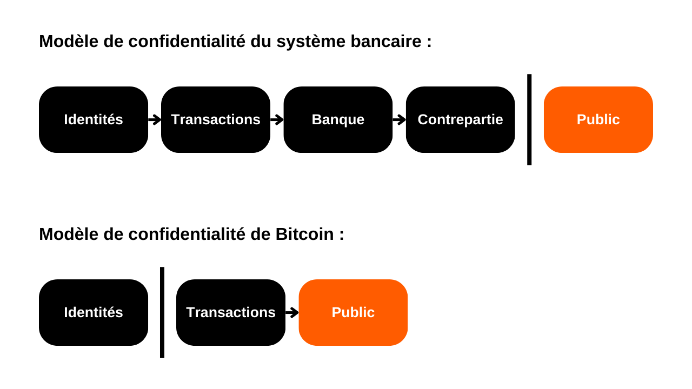

### Section 2 : Comprendre l'analyse de chaîne et savoir s'en protéger

Dans la deuxième section, nous étudions les techniques employées par les entreprises d'analyse de chaîne pour tracer votre activité sur Bitcoin. Comprendre ces méthodes est crucial pour renforcer la protection de votre confidentialité. Cette partie a pour objectif d'examiner les stratégies des attaquants pour mieux appréhender les risques et préparer le terrain pour les techniques que nous étudierons dans les sections suivantes. Nous analyserons les modèles de transactions (patterns), les heuristiques internes et externes, ainsi que les interprétations vraisemblables de ces modèles. En plus d'un volet théorique, nous utiliserons OXT, un outil professionnel d'analyse de chaîne, à travers des exemples pratiques et des exercices pour vous initier à l'analyse de chaîne.


### Section 3 : Maîtriser les bonnes pratiques pour protéger sa vie privée

Dans la troisième section de notre formation, nous entrons dans le vif du sujet : la pratique ! L'objectif est de maîtriser toutes les bonnes pratiques essentielles qui doivent devenir des réflexes naturels pour tout utilisateur de Bitcoin. Nous aborderons l'utilisation d'adresses vierges, l'étiquetage, la consolidation, l'utilisation de nœuds complets, ainsi que le KYC et les méthodes d'acquisition. Le but est de vous fournir un aperçu complet des pièges à éviter pour établir de solides fondations dans notre quête de protection de la vie privée. Pour certaines de ces pratiques, vous serez guidé vers un tutoriel spécifique pour les mettre en œuvre.

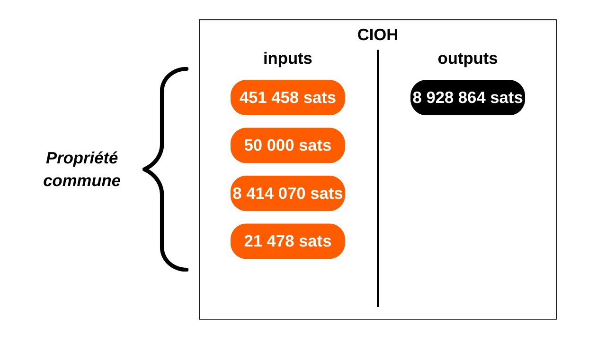

### Section 4 : Comprendre et utiliser les transactions coinjoin

Comment parler de confidentialité sur Bitcoin sans aborder les coinjoins ? Dans la section 4, vous allez découvrir tout ce qu'il faut savoir sur cette méthode de mixage. Vous apprendrez ce qu'est le coinjoin, son histoire et ses objectifs, ainsi que les différents types de coinjoins existants. Des tutoriels vous seront également proposés pour utiliser les coinjoins de diverses manières. Enfin, pour les utilisateurs les plus aguerris, nous découvrirons ce que sont les anonsets et l'entropie, et comment calculer ces indicateurs à l'aide d'outils Python.


### Section 5 : Connaître les enjeux d'autres techniques de confidentialité avancées

Enfin, dans la dernière section, nous ferons un tour d'horizon de toutes les autres techniques existantes pour protéger votre vie privée sur Bitcoin, en dehors du coinjoin. Au fil des années, les développeurs ont fait preuve d'une créativité remarquable pour concevoir des outils dédiés à la confidentialité. Nous examinerons toutes ces méthodes, telles que le Payjoin, les transactions collaboratives, le Coin Swap et l'Atomic Swap, en détaillant leur fonctionnement, leurs objectifs et leurs éventuelles faiblesses. Des tutoriels seront également disponibles pour vous apprendre à maîtriser l'utilisation de ces outils.

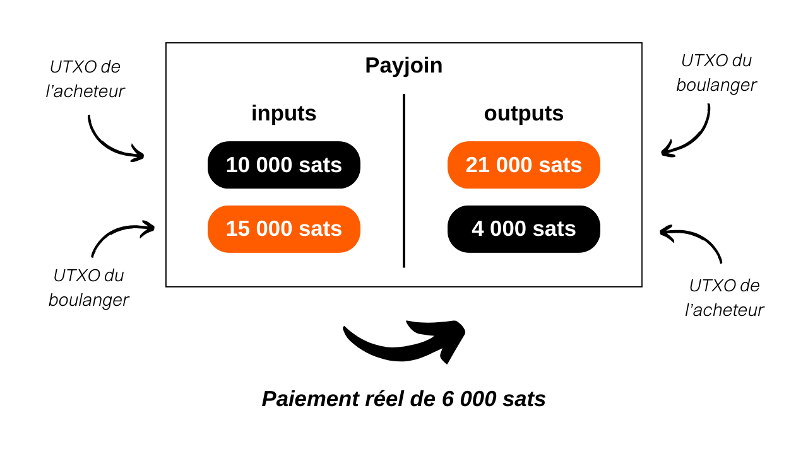

### Section Bonus : La privacy sur le Lightning Network

Comme vous l'avez compris, le cœur de cette formation se concentre exclusivement sur la privacy onchain. Dans cette dernière partie bonus, je souhaite donc élargir le sujet à la confidentialité sur Lightning. Certains affirment que Lightning est privé par défaut, tandis que d'autres soutiennent que la confidentialité de l'utilisateur y est insuffisante. Quelle est donc la vérité ? Nous démêlerons le vrai du faux pour mieux comprendre les enjeux liés à la confidentialité sur le Lightning Network.


# Définitions et concepts clés


## Le modèle d'UTXO de Bitcoin

Le bitcoin est avant tout une monnaie, mais savez-vous concrètement comment sont représentées les BTC sur le protocole ? 

### Les UTXOs sur Bitcoin : qu'est-ce que c'est ?

Sur le protocole Bitcoin, la gestion des unités monétaires s'articule autour du modèle d'UTXO, acronyme anglais pour "_Unspent Transaction Output_", que l'on traduit par "_sortie de transaction non dépensée_".

Ce modèle se distingue profondément des systèmes bancaires traditionnels qui reposent sur un mécanisme de comptes et de soldes pour suivre les flux financiers. En effet, dans le système bancaire, les soldes individuels sont maintenus dans des comptes attachés à une identité. Par exemple, lorsque vous achetez une baguette chez un boulanger, votre banque débite simplement le montant de l'achat de votre compte, réduisant ainsi votre solde, tandis que le compte du boulanger est crédité du même montant, augmentant son solde. Dans ce système, il n'y a aucune notion de lien entre l'argent qui entre sur votre compte et l'argent qui en sort, à part les enregistrements de transactions.

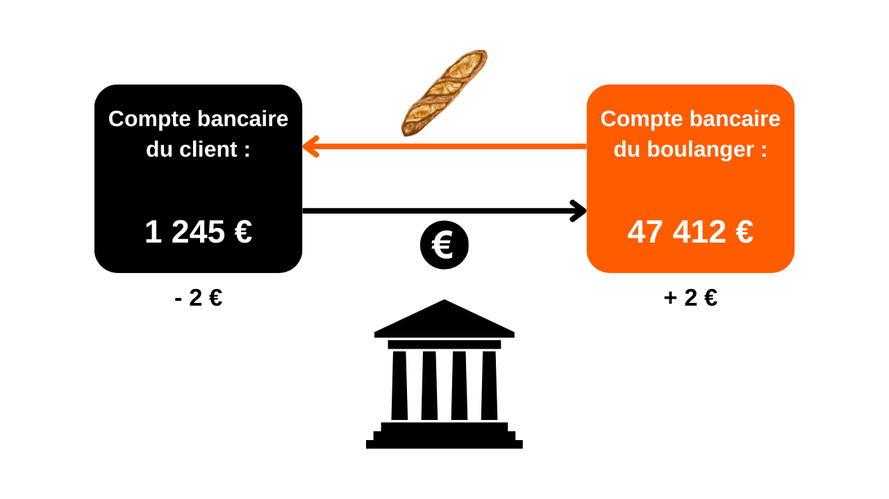

Sur Bitcoin, cela fonctionne différemment. Le concept de compte n'existe pas et les unités monétaires ne sont pas gérées via des soldes, mais à travers des UTXO. Un UTXO représente une quantité spécifique de bitcoins qui n'a pas encore été dépensée, formant ainsi un "morceau de bitcoin", qui peut être grand ou petit. Par exemple, un UTXO pourrait valoir `500 BTC` ou simplement `700 SATS`.

**> Pour rappel :** Le satoshi, souvent abrégé en sat, est la plus petite unité de Bitcoin, comparable au centime dans les monnaies fiat.
```bash
1 BTC = 100 000 000 SATS
```

Théoriquement, un UTXO peut représenter n'importe quelle valeur en bitcoins, allant d'un sat jusqu'au maximum théorique d'environ 21 millions de BTC. Cependant, il est logiquement impossible de posséder les 21 millions de bitcoins, et il existe un seuil économique inférieur appelé "dust", en dessous duquel un UTXO est considéré comme économiquement non rentable à dépenser.

**-> Le saviez-vous ?** Le plus grand UTXO jamais créé sur Bitcoin avait une valeur de `500 000 BTC`. Il a été créé par la plateforme MtGox lors d'une opération de consolidation en novembre 2011 : [29a3efd3ef04f9153d47a990bd7b048a4b2d213daaa5fb8ed670fb85f13bdbcf](https://mempool.space/fr/tx/29a3efd3ef04f9153d47a990bd7b048a4b2d213daaa5fb8ed670fb85f13bdbcf)

### Les UTXOs et les conditions de dépense

Les UTXOs sont les instruments d'échange sur Bitcoin. Chaque transaction se traduit par la consommation d'UTXOs en entrées et la création de nouveaux UTXOs en sorties. Lorsqu'une transaction est réalisée, les UTXOs utilisés comme entrées sont considérés comme "dépensés", et de nouveaux UTXOs sont générés et attribués aux destinataires indiqués dans les sorties de la transaction. Ainsi, un UTXO représente simplement une sortie de transaction non dépensée, et donc une quantité de bitcoins appartenant à un utilisateur à un moment donné.

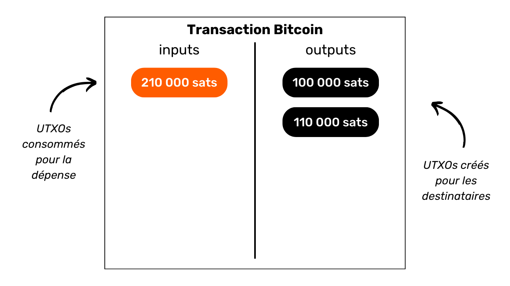

Tous les UTXOs sont sécurisés par des scripts qui définissent les conditions sous lesquelles ils peuvent être dépensés. Pour consommer un UTXO, un utilisateur doit démontrer au réseau qu'il satisfait les conditions stipulées par le script qui sécurise cet UTXO. Généralement, les UTXOs sont protégés par une clé publique (ou une adresse de réception qui représente cette clé publique). Pour dépenser un UTXO associé à cette clé publique, l'utilisateur doit prouver qu'il détient la clé privée correspondante, en fournissant une signature numérique réalisée avec cette clé. C'est la raison pour laquelle on dit que votre portefeuille Bitcoin ne contient pas réellement des bitcoins, mais qu'il stocke vos clés privées, qui elles-mêmes vous donnent accès à vos UTXOs et, par extension, aux bitcoins qu'ils représentent.


Étant donné que le concept de compte est absent sur Bitcoin, le solde d'un portefeuille correspond simplement à la somme des valeurs de tous les UTXOs qu'il peut dépenser. Par exemple, si votre portefeuille Bitcoin peut dépenser les 4 UTXOs suivants :

```bash
- 2 BTC
- 8 BTC
- 5 BTC
- 2 BTC
```

Le solde total de votre portefeuille serait de `17 BTC`.

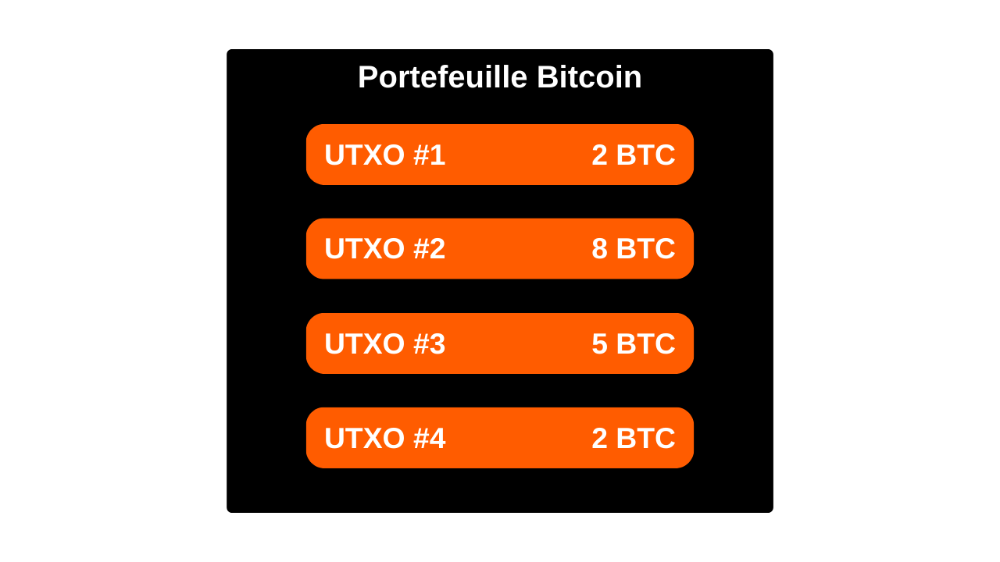

## La structure des transactions Bitcoin

### Les inputs et les outputs d'une transaction

Une transaction Bitcoin est une opération enregistrée sur la blockchain qui permet de transférer la propriété de bitcoins d'une personne à une autre. Plus précisément, puisque nous sommes sur un modèle d'UTXO et qu'il n'y a pas de comptes, la transaction satisfait les conditions de dépense qui sécurisaient un ou plusieurs UTXOs, les consomme et crée en équivalence de nouveaux UTXOs dotés de nouvelles conditions de dépense. En bref, une transaction déplace des bitcoins d'un script qui est satisfait vers un nouveau script prévu pour les sécuriser.

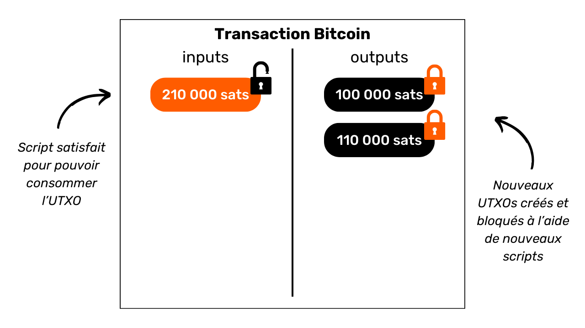

Chaque transaction Bitcoin est donc constituée d'une ou de plusieurs entrées (inputs) et d'une ou de plusieurs sorties (outputs). Les inputs sont des UTXOs consommés par la transaction pour générer les outputs. Les outputs sont de nouveaux UTXOs qui seront utilisables comme inputs pour de futures transactions.

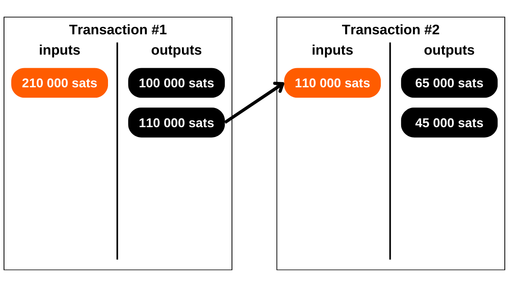

**> Le saviez-vous ?** Théoriquement, une transaction bitcoin pourrait avoir une infinité d'inputs et d'outputs. Seule la taille maximale d'un bloc vient limiter ce nombre.

Chaque input dans une transaction Bitcoin fait référence à un UTXO antérieur non dépensé. Pour utiliser un UTXO comme input, son détenteur doit démontrer qu'il en est le propriétaire légitime en validant le script qui lui est associé, c'est-à-dire, en satisfaisant la condition de dépense imposée. Généralement, cela revient à fournir une signature numérique produite avec la clé privée correspondant à la clé publique qui avait initialement sécurisé cet UTXO. Le script consiste donc à vérifier que la signature correspond bien à la clé publique utilisée lors de la réception des fonds.

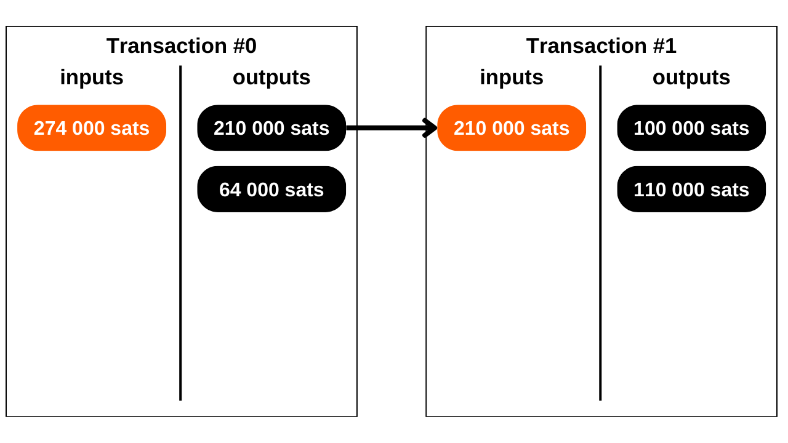

Chaque output, de son côté, précise le montant des bitcoins à transférer, ainsi que le destinataire. Ce dernier est défini par un nouveau script qui, en général, bloque l'UTXO nouvellement créé avec une adresse de réception ou une nouvelle clé publique.

Pour qu'une transaction soit considérée valide selon les règles de consensus, le total des outputs doit être inférieur ou égal au total des inputs. En d'autres termes, la somme des nouveaux UTXOs générés par la transaction ne doit pas excéder celle des UTXOs consommés en tant qu'inputs. Ce principe est logique : si vous disposez uniquement d'un montant de `500 000 SATS`, vous ne pouvez pas effectuer un achat de `700 000 SATS`.

### Le change et la fusion dans une transaction Bitcoin

L'action d'une transaction Bitcoin sur les UTXO peut ainsi être comparée à la refonte d'une pièce d'or. En effet, un UTXO n'est pas divisible, mais uniquement fusible. Cela signifie qu'un utilisateur ne peut pas simplement diviser un UTXO représentant un certain montant en bitcoins en plusieurs UTXO plus petits. Il doit le consommer entièrement dans une transaction pour créer un ou plusieurs nouveaux UTXOs de valeurs arbitraires en outputs, qui doivent être inférieures ou égales à la valeur initiale.

Cette mécanique est similaire à celle d'une pièce d'or. Imaginons que vous possédez une pièce de 2 onces et que vous souhaitez faire un paiement de 1 once, en supposant que le vendeur ne puisse pas vous rendre la monnaie. Vous devriez fondre votre pièce et en couler 2 nouvelles de 1 once chacune.

Sur Bitcoin, le fonctionnement est semblable. Imaginons qu'Alice possède un UTXO de `10 000 SATS` et qu'elle souhaite acheter une baguette coûtant `4 000 SATS`. Alice va faire une transaction avec en input 1 UTXO de `10 000 SATS` qu'elle consommera entièrement, et en outputs, elle créera 2 UTXOs d'une valeur de `4 000 SATS` et de `6 000 SATS`. L'UTXO de `4 000 SATS` sera envoyé au boulanger en paiement de la baguette, tandis que l'UTXO de `6 000 SATS` reviendra à Alice sous forme de monnaie. Cet UTXO qui revient à l'émetteur initial de la transaction, c'est ce que l'on appelle le "change" dans le jargon Bitcoin.

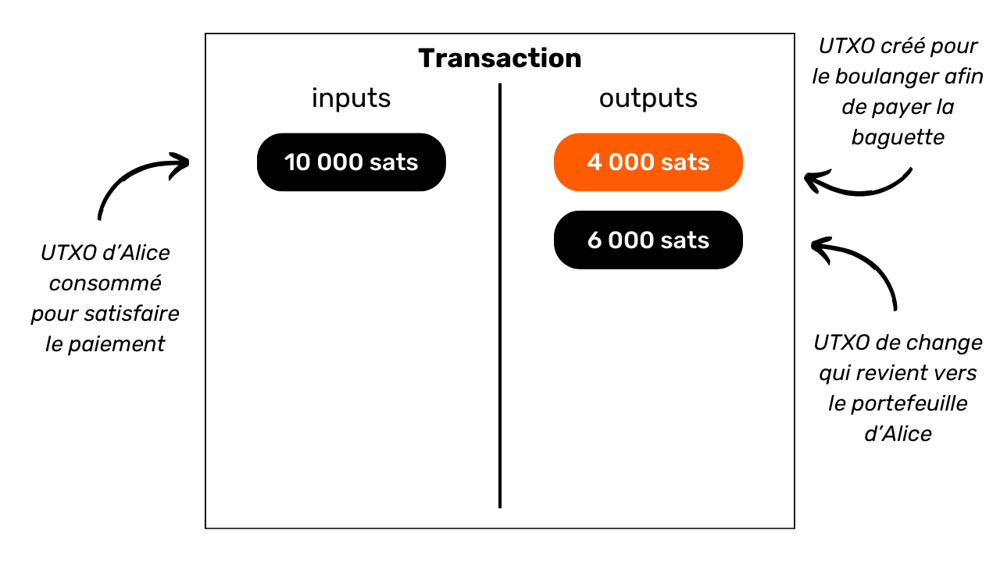

Imaginons à présent qu'Alice ne possède pas un unique UTXO de `10 000 SATS`, mais plutôt deux UTXOs de `3 000 SATS` chacun. Dans cette situation, aucun des UTXOs individuellement ne suffit pour régler les `4 000 SATS` de la baguette. Alice doit donc utiliser simultanément les 2 UTXOs de `3 000 SATS` comme inputs de sa transaction. De cette manière, le montant total des inputs atteindra `6 000 SATS`, lui permettant ainsi de satisfaire le paiement de `4 000 SATS` au boulanger. Cette méthode, qui consiste à regrouper plusieurs UTXOs dans les inputs d'une transaction, est souvent désignée par le terme "fusion".


### Les frais de transaction

Intuitivement, on pourrait penser que les frais de transaction représentent, eux aussi, un output d'une transaction. Mais en réalité, ce n'est pas le cas. Les frais d'une transaction représentent la différence entre le total des inputs et le total des outputs. Cela signifie que, après avoir utilisé une partie de la valeur des inputs pour couvrir les outputs désirés dans une transaction, une certaine somme des inputs reste inutilisée. Cette somme résiduelle constitue les frais de transaction.

```bash
Frais = total inputs - total outputs
```


Reprenons l'exemple d'Alice qui dispose d'un UTXO de `10 000 SATS` et souhaite acheter une baguette à `4 000 SATS`. Alice crée une transaction avec comme input son UTXO de `10 000 SATS`. Elle génère ensuite un output de `4 000 SATS` destiné au boulanger pour le paiement de la baguette. Pour encourager les mineurs à intégrer sa transaction dans un bloc, Alice alloue `200 SATS` de frais. Elle crée donc un second output, le change, qui lui reviendra, s'élevant à `5 800 SATS`.

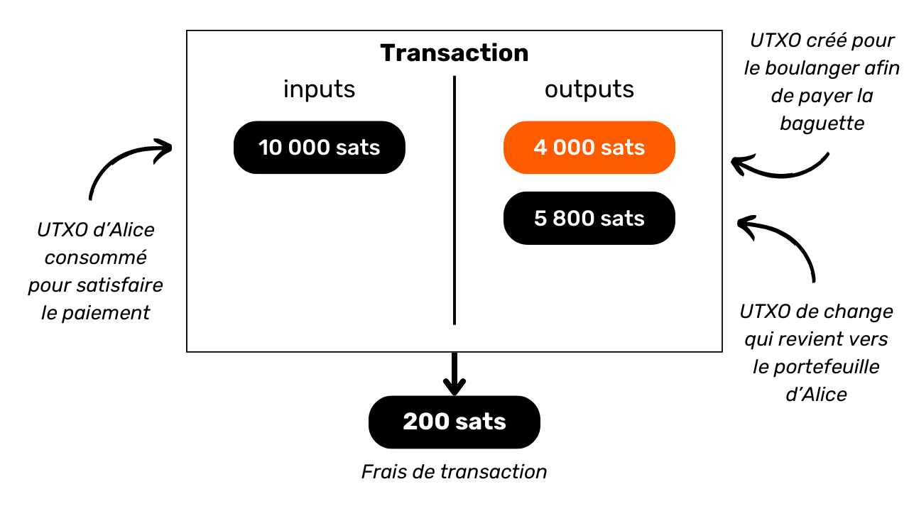

En appliquant la formule des frais, nous constatons qu'il reste effectivement `200 SATS` pour les mineurs :
```bash
Frais = total inputs - total outputs
Frais = 10 000 - (4 000 + 5 800)
Frais = 10 000 - 9 800
Frais = 200
```

Lorsqu'un mineur parvient à valider un bloc, il est autorisé à collecter ces frais pour toutes les transactions incluses dans son bloc, via la transaction dite "coinbase".

### La création des UTXOs sur Bitcoin

Si vous avez suivi attentivement les paragraphes précédents, vous savez dorénavant que les UTXOs ne peuvent être créés qu'en consommant d'autres UTXOs existants. Ainsi, les pièces sur Bitcoin forment une chaîne continue. Cependant, vous vous demandez peut-être comment les premiers UTXOs de cette chaîne sont apparus. Cela soulève un problème similaire à celui de la poule et de l'œuf : d'où viennent ces UTXOs originels ?

La réponse est dans la **transaction coinbase**.

La coinbase est un type spécifique de transaction Bitcoin, qui est unique pour chaque bloc et qui est toujours la première de ceux-ci. Elle permet au mineur ayant trouvé une preuve de travail valide de recevoir sa récompense de bloc. Cette récompense se compose de deux éléments : **la subvention de bloc** et **les frais de transaction** dont nous avons parlé dans la partie précédente.

La particularité de la transaction coinbase est qu'elle est la seule à pouvoir créer des bitcoins ex nihilo, sans nécessiter de consommer des inputs pour générer ses outputs. Ces bitcoins nouvellement créés constituent ce que l'on pourrait appeler les "UTXOs originels".

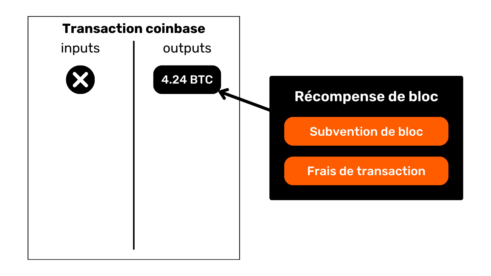

Les bitcoins issus de la subvention de bloc sont de nouveaux BTC créés à partir de rien, suivant un calendrier d'émission préétabli dans les règles de consensus. La subvention de bloc se réduit de moitié tous les 210 000 blocs, c'est-à-dire environ tous les quatre ans, dans un processus appelé "halving". À l'origine, 50 bitcoins étaient créés avec chaque subvention, mais ce montant a diminué graduellement ; actuellement, il est de 3,125 bitcoins par bloc.

Quant à la partie liée aux frais de transaction, bien qu'elle représente également des BTC nouvellement créés, ils ne doivent pas excéder la différence entre le total des inputs et des outputs de toutes les transactions d’un bloc. Nous avons vu précédemment que ces frais représentent la portion des inputs qui n'est pas utilisée dans les outputs des transactions. Cette partie est techniquement "perdue" durant la transaction, et le mineur a le droit de recréer cette valeur sous forme d'un ou plusieurs nouveaux UTXOs. Il s'agit donc d'un transfert de valeur entre l'émetteur de la transaction et le mineur qui l'ajoute à la blockchain.

**> Le saviez-vous ?** Les bitcoins générés par une transaction coinbase sont soumis à une période de maturité de 100 blocs pendant laquelle ils ne peuvent pas être dépensés par le mineur. Cette règle a pour but d'éviter les complications liées à l'utilisation de bitcoins nouvellement créés sur une chaîne qui pourrait être ultérieurement rendue obsolète. 

### Les implications du modèle d'UTXO

Tout d'abord, le modèle d'UTXO influence directement les frais de transaction sur Bitcoin. La capacité de chaque bloc étant limitée, les mineurs favorisent les transactions qui offrent les meilleurs frais au regard de la place qu'elles vont prendre dans le bloc. En effet, plus une transaction inclut d'UTXOs en inputs et en outputs, plus elle est lourde, et donc nécessite des frais plus élevés. C'est une des raisons pour lesquelles on essaie souvent de réduire le nombre d'UTXOs dans notre portefeuille, ce qui peut par ailleurs affecter la confidentialité, un sujet que nous aborderons en détail dans la troisième partie de cette formation.

Ensuite, comme mentionné dans les parties précédentes, les pièces sur Bitcoin sont essentiellement une chaîne d'UTXOs. Chaque transaction crée ainsi un lien entre un UTXO passé et un futur UTXO. Les UTXOs permettent donc de suivre explicitement le chemin des bitcoins depuis leur création jusqu'à leur dépense actuelle. Cette transparence peut être perçue positivement, car elle permet à chaque utilisateur de s'assurer de l'authenticité des bitcoins reçus. Cependant, c'est aussi sur ce principe de traçabilité et d'auditabilité que repose l'analyse de chaîne, une pratique visant à compromettre votre confidentialité. Nous étudierons en profondeur cette pratique dans la deuxième partie de la formation.

## Le modèle de confidentialité de Bitcoin

### La monnaie : authenticité, intégrité et double dépense
Une des fonctions de la monnaie est de résoudre le problème de la double coïncidence des besoins. Dans un système établi sur le troc, la réalisation d'un échange nécessite non seulement de trouver un individu cédant un bien correspondant à mon besoin, mais aussi de lui procurer un bien de valeur équivalente qui satisfait son propre besoin. Trouver cet équilibre s'avère complexe. 


C'est pourquoi nous recourons à la monnaie qui permet de déplacer la valeur à la fois dans l'espace et dans le temps.


Pour que la monnaie résolve ce problème, il est essentiel que la partie qui fournit un bien ou un service soit convaincue de sa capacité à dépenser cette somme ultérieurement. Ainsi, tout individu rationnel souhaitant accepter une pièce de monnaie, qu'elle soit numérique ou physique, s'assurera qu'elle remplit deux critères fondamentaux :
- **La pièce doit être intègre et authentique ;**
- **et elle ne doit pas être double dépensée.**

Si l’on utilise une monnaie physique, c’est la première caractéristique qui est la plus complexe à faire valoir. À différentes périodes de l’histoire, l’intégrité des pièces de métaux a souvent été affectée par des pratiques comme le rognage ou le perçage. Par exemple, durant la Rome antique, il était courant que les citoyens grattent les bords des pièces d’or pour en recueillir un peu de métal précieux, tout en les conservant pour des transactions futures. La valeur intrinsèque de la pièce était donc réduite, mais sa valeur faciale demeurait identique. C’est notamment pour cette raison que l’on a plus tard frappé des cannelures sur la tranche des pièces. 

L’authenticité est également une caractéristique difficile à vérifier sur un support monétaire physique. De nos jours, les techniques pour lutter contre le faux monnayage sont de plus en plus complexes, ce qui oblige les commerçants à investir dans des systèmes de vérification coûteux.

En revanche, en raison de leur nature, la double dépense n'est pas un problème pour les monnaies physiques. Si je vous cède un billet de 10 €, il quitte irrévocablement ma possession pour entrer dans la vôtre, ce qui exclut naturellement toute possibilité de dépense multiple des unités monétaires qu’il incarne. En bref, je ne pourrai pas dépenser de nouveau ce billet de 10 €.


Pour la monnaie numérique, la difficulté est différente. S’assurer de l’authenticité et de l’intégrité d’une pièce est souvent plus simple. Comme nous l'avons vu dans la partie précédente, le modèle d'UTXO sur Bitcoin permet de tracer une pièce jusqu'à son origine, et donc de vérifier qu'elle a bien été créée de manière conforme aux règles de consensus par un mineur.

En revanche, s’assurer de l'absence de double dépense est plus complexe, puisque tout bien numérique est en essence de l'information. Contrairement aux biens physiques, l'information ne se divise pas lors des échanges, mais se propage en se multipliant. Par exemple, si je vous transmets un document par courrier électronique, ce dernier se retrouve alors dupliqué. De votre côté, vous ne pouvez pas vérifier avec certitude que j'ai effacé le document original.


### La prévention de la double dépense sur Bitcoin
Le seul moyen d’éviter cette duplication d’un bien numérique est d’être au courant de l’intégralité des échanges sur le système. De cette manière, on peut savoir qui possède quoi et actualiser les avoirs de chacun en fonction des transactions effectuées. C’est ce qui se fait, par exemple, pour la monnaie scripturale dans le système bancaire. Lorsque l’on paie 10 € à un commerçant par carte bancaire, la banque constate cet échange et actualise le livre des comptes.


Sur Bitcoin, la prévention de la double dépense se fait de la même manière. On va chercher à confirmer l'absence d'une transaction ayant déjà dépensé les pièces en question. Si ces dernières n'ont jamais été utilisées, alors nous pouvons être assurés qu'aucune double dépense n'aura lieu. Ce principe avait été décrit par Satoshi Nakamoto dans le White Paper avec cette célèbre phrase :

**"*Le seul moyen pour confirmer l’absence d’une transaction est d’être au courant de toutes les transactions.*"**

Mais contrairement au modèle bancaire, on ne souhaite pas avoir à faire confiance à une entité centrale sur Bitcoin. Il faut alors que tous les utilisateurs soient en capacité de confirmer cette absence de double dépense, sans pour autant reposer sur un tiers. Ainsi, il faut que chacun soit au courant de toutes les transactions Bitcoin. C'est pour cette raison que les transactions Bitcoin sont diffusées publiquement sur tous les nœuds du réseau et enregistrées en clair sur la blockchain.

C'est précisément cette diffusion publique de l’information qui complique la protection de la vie privée sur Bitcoin. Dans le système bancaire traditionnel, en théorie, seule l'institution financière a connaissance des transactions effectuées. En revanche, sur Bitcoin, l'ensemble des utilisateurs est informé de toutes les transactions, via leurs nœuds respectifs. 

### Le modèle de confidentialité : système bancaire vs Bitcoin
Dans le système traditionnel, votre compte bancaire est lié à votre identité. Le banquier est en capacité de savoir quel compte bancaire appartient à quel client, et quelles sont les transactions associées. Néanmoins, ce flux d’informations est coupé entre la banque et le domaine public. Autrement dit, il est impossible de connaître le solde et les transactions d’un compte bancaire qui appartient à un autre individu. Seule la banque a accès à ces informations.


Par exemple, votre banquier est au courant que vous achetez votre baguette chaque matin chez le boulanger du quartier, mais votre voisin, lui, n'a pas connaissance de cette transaction. Ainsi, le flux d'informations est accessible aux parties concernées, notamment la banque, mais reste inaccessible à des personnes extérieures.

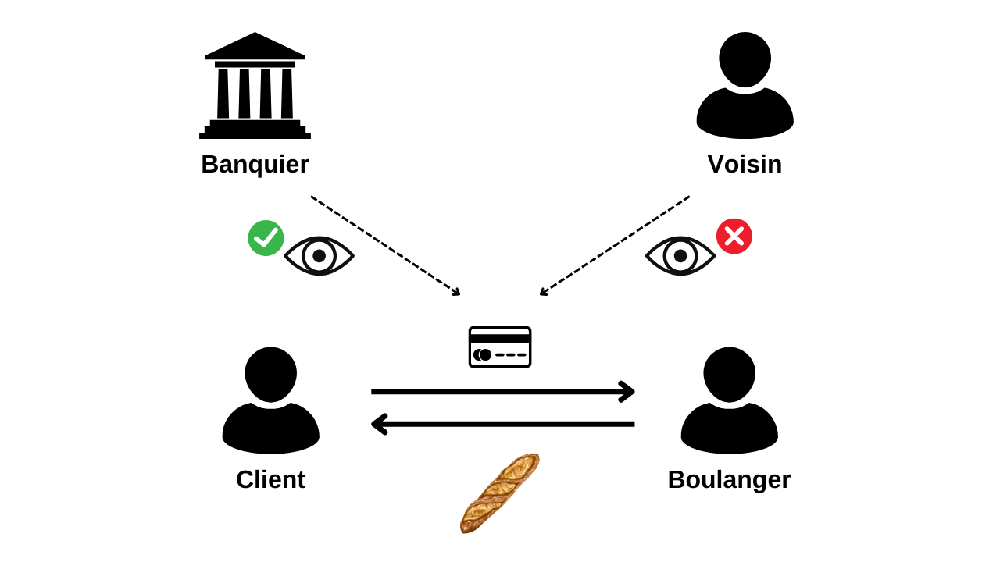

À cause de la contrainte de diffusion publique des transactions que nous avons vue dans la partie précédente, le modèle de confidentialité de Bitcoin ne peut pas suivre le modèle du système bancaire. Dans le cas de Bitcoin, puisque le flux d’information ne peut pas être cassé entre les transactions et le domaine public, **le modèle de confidentialité repose sur la séparation entre l’identité de l’utilisateur et les transactions** en elles-mêmes.


Par exemple, si vous achetez une baguette chez le boulanger en payant en BTC, votre voisin, qui possède son propre nœud complet, peut voir votre transaction passer, tout comme il peut voir toutes les autres transactions du système. Toutefois, si les principes de confidentialité sont respectés, il ne devrait pas être en mesure de relier cette transaction spécifique à votre identité.

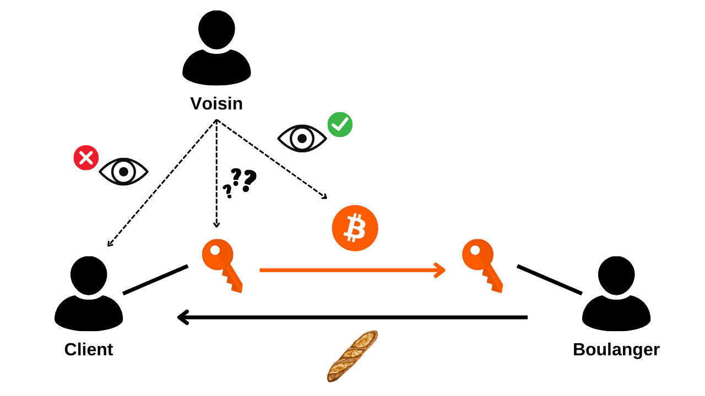

Mais puisque les transactions Bitcoin sont rendues publiques, il devient tout de même possible d'établir des liens entre elles pour en déduire des renseignements sur les parties impliquées. Cette activité constitue même une spécialité en soi que l'on appelle "analyse de chaîne". Dans la partie suivante de la formation, je vous invite à explorer les fondamentaux de l'analyse de chaîne afin de comprendre comment vos bitcoins sont tracés et de savoir mieux s'en défendre.

# Comprendre l'analyse de chaîne et savoir s'en protéger


## C'est quoi l'analyse de chaîne sur Bitcoin ?


## Les patterns de transactions


## Les heuristiques internes 


## Les heuristiques externes


## Mise en pratique avec l'outil OXT


## Exercice analyse de chaîne


**Contributeurs et ressources :**
Pour la rédaction de cette partie sur l'analyse de chaîne, je me suis appuyé sur les ressources suivantes :
- La série de quatre articles nommée : [Understanding Bitcoin Privacy with OXT](https://medium.com/oxt-research/understanding-bitcoin-privacy-with-oxt-part-1-4-8177a40a5923), produite par Samourai Wallet en 2021 ;
- Les différents rapports d’[OXT Research](https://medium.com/oxt-research), ainsi que [leur outil gratuit d’analyse de chaîne](https://oxt.me/) ;
- Plus largement, mes connaissances proviennent des différents tweets et contenus de [@LaurentMT](https://twitter.com/LaurentMT) et de [@ErgoBTC](https://twitter.com/ErgoBTC) ;
- Le [Space Kek #19](https://podcasters.spotify.com/pod/show/decouvrebitcoin/episodes/SpaceKek-19---Analyse-de-chane--anonsets-et-entropie-e1vfuji) auquel j’ai participé en compagnie de [@louneskmt](https://twitter.com/louneskmt), [@TheoPantamis](https://twitter.com/TheoPantamis), [@Sosthene___](https://twitter.com/Sosthene___) et [@LaurentMT](https://twitter.com/LaurentMT).

Je tiens à remercier leurs auteurs, développeurs et producteurs. Merci également aux relecteurs qui ont méticuleusement corrigé l'article qui a servi de base à cette partie et m'ont gratifié de leurs conseils d’experts :
- [Gilles Cadignan](https://twitter.com/gillesCadignan) ;
- [Ludovic Lars](https://twitter.com/lugaxker) ([https://viresinnumeris.fr/](https://viresinnumeris.fr/)).

# Maîtriser les bonnes pratiques pour protéger sa vie privée


## La réutilisation d'adresse


## Labelling et coin control


## La consolidation et la CIOH


## Le nœud complet


## Le KYC et l'identification des clés


## Les méthodes d'acquisition


# Comprendre et utiliser les transactions coinjoin


## C'est quoi une transaction coinjoin ?


## Zerolink et chaumian coinjoins


## Les différentes implémentations de coinjoin


## Comprendre et utiliser Whirlpool


## Les ensembles d'anonymat et l'entropie


# Connaître les enjeux d'autres techniques de confidentialité avancées


## Les transactions payjoin


## Les transactions spécifiques Samourai


## Les transferts secret de propriété

### Le Coin Swap

### L'Atomic Swap

### L'échange pair-à-pair


# Bonus : La privacy sur le Lightning Network

