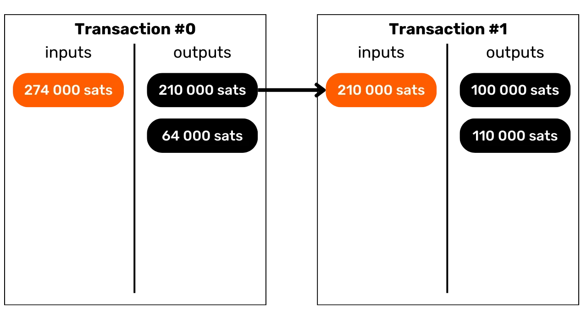
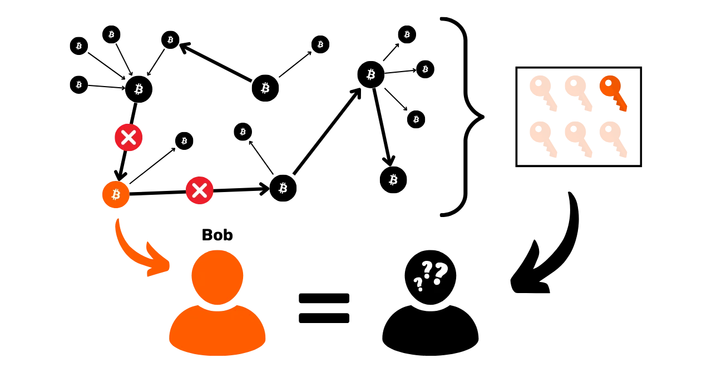
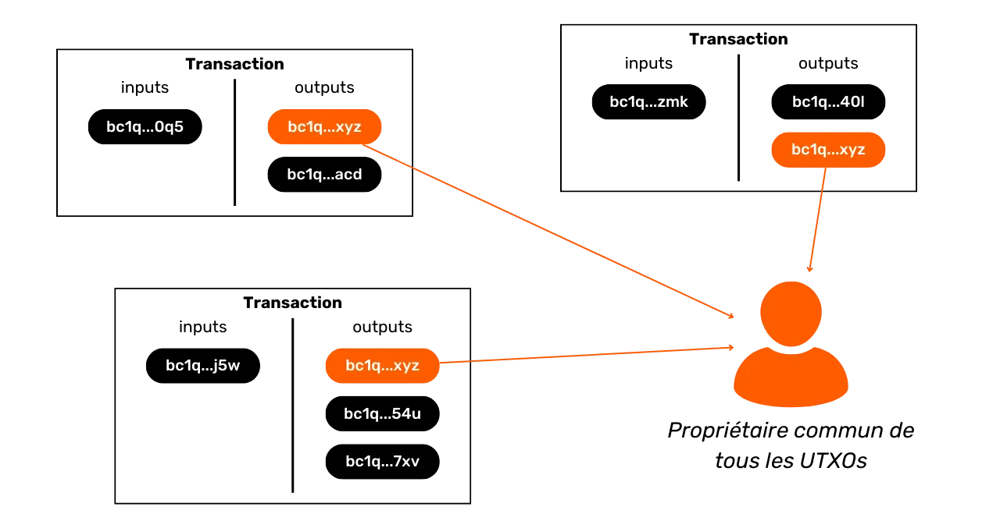

# Protégez votre vie privée sur Bitcoin
Dans un monde où la confidentialité des transactions financières devient progressivement un luxe, comprendre et maîtriser les principes de protection de la vie privée dans son utilisation de Bitcoin est essentiel. Cette formation vous donne toutes les clés, à la fois théoriques et pratiques, pour y parvenir de manière autonome.

Aujourd'hui, sur Bitcoin, des sociétés sont spécialisées dans l'analyse de chaîne. Leur cœur de métier consiste précisément à s'ingérer dans votre sphère privée, afin de compromettre la confidentialité de vos transactions. Dans les faits, le "droit à la vie privée" sur Bitcoin n’existe pas. Il vous revient donc à vous, utilisateur, de faire valoir vos droits naturels et de protéger la confidentialité de vos transactions, car personne ne va le faire à votre place. 

Cette formation se présente comme un parcours complet et généraliste. Chaque notion technique est abordée dans le détail et appuyée par des schémas explicatifs. Le but est de rendre les connaissances accessibles à tous. BTC204 est donc abordable pour les utilisateurs débutants et intermédiaires. Cette formation offre également une valeur ajoutée aux bitcoiners les plus aguerris, puisque nous approfondissons certains concepts techniques souvent méconnus.

Rejoignez-nous pour transformer votre utilisation de Bitcoin et devenir un utilisateur averti, capable de comprendre les enjeux autour de la confidentialité et de protéger sa vie privée.

# Introduction

## Introduction de la formation

Dans un monde où la confidentialité des transactions financières devient progressivement un luxe, comprendre et maîtriser les principes de protection de la vie privée dans son utilisation de Bitcoin est essentiel. Cette formation vous donne toutes les clés, à la fois théoriques et pratiques, pour y parvenir de manière autonome.

Aujourd'hui, sur Bitcoin, des sociétés sont spécialisées dans l'analyse de chaîne. Leur cœur de métier consiste précisément à s'ingérer dans votre sphère privée, afin de compromettre la confidentialité de vos transactions. Dans les faits, le "droit à la vie privée" sur Bitcoin n’existe pas. Il vous revient donc à vous, utilisateur, de faire valoir vos droits naturels et de protéger la confidentialité de vos transactions, car personne ne va le faire à votre place.

Bitcoin n'est pas là que pour le "Number Go Up" et la conservation de la valeur de l'épargne. De part ses caractéristiques uniques et son histoire, c'est avant tout l'outil de la contre-économie. Grâce à cette invention formidable, vous pouvez librement disposer de votre argent, le dépenser et l'accumuler, sans que quiconque puisse vous en empêcher. 

Bitcoin offre une échappatoire pacifique au joug des États, vous permettant de jouir pleinement de vos droits naturels, qui ne sauraient être remis en cause par les lois établies. Grâce à l'invention de Satoshi Nakamoto, vous avez le pouvoir d'imposer le respect de votre propriété privée et de retrouver la liberté de contracter.

Toutefois, Bitcoin n'est pas anonyme par défaut, ce qui peut représenter un risque pour les individus engagés dans la contre-économie, en particulier dans des régions sous régime despotique. Mais ce n'est pas le seul danger. Étant donné que le bitcoin est un actif de valeur et incensurable, il peut susciter la convoitise de voleurs. Ainsi, protéger sa vie privée devient également une question de sécurité : cela peut vous aider à prévenir les piratages informatiques et les agressions physiques.

Comme nous le verrons, bien que le protocole offre certaines protections de la confidentialité de manière intrinsèque, il est crucial d'utiliser des outils supplémentaires pour optimiser et défendre cette confidentialité.

Cette formation se présente comme un parcours complet et généraliste pour comprendre les enjeux de la confidentialité sur Bitcoin. Chaque notion technique est abordée dans le détail et appuyée par des schémas explicatifs. Le but est de rendre les connaissances accessibles à tous, même aux utilisateurs débutants et intermédiaires. Pour les bitcoiners les plus aguerris, nous abordons également tout au long de cette formation des concepts très techniques et parfois méconnus pour approfondir la compréhension de chaque sujet.

L'objectif de cette formation n'est pas de vous rendre totalement anonyme dans votre utilisation de Bitcoin, mais plutôt de vous fournir les outils essentiels pour savoir protéger votre confidentialité selon vos objectifs personnels. Vous aurez la liberté de choisir parmi les concepts et les outils présentés pour élaborer vos propres stratégies, adaptées à vos objectifs et à vos besoins spécifiques.

### Section 1 : Définitions et concepts clés

Pour commencer, nous allons réviser ensemble les principes fondamentaux qui régissent le fonctionnement de Bitcoin, afin de pouvoir ensuite aborder sereinement les notions relatives à la confidentialité. Il est essentiel de maîtriser quelques concepts de base, tels que les UTXO, les adresses de réception ou les scripts, avant de pouvoir pleinement comprendre les concepts que nous aborderons dans les sections suivantes. Nous introduirons également le modèle général de confidentialité de Bitcoin, tel qu'imaginé par Satoshi Nakamoto, ce qui nous permettra de saisir les enjeux et les risques associés.


### Section 2 : Comprendre l'analyse de chaîne et savoir s'en protéger

Dans la deuxième section, nous étudions les techniques employées par les entreprises d'analyse de chaîne pour tracer votre activité sur Bitcoin. Comprendre ces méthodes est crucial pour renforcer la protection de votre confidentialité. Cette partie a pour objectif d'examiner les stratégies des attaquants pour mieux appréhender les risques et préparer le terrain pour les techniques que nous étudierons dans les sections suivantes. Nous analyserons les modèles de transactions (patterns), les heuristiques internes et externes, ainsi que les interprétations vraisemblables de ces modèles. En plus d'un volet théorique, nous apprendrons à utiliser un explorateur de bloc pour faire de l'analyse de chaîne, à travers des exemples pratiques et des exercices.


### Section 3 : Maîtriser les bonnes pratiques pour protéger sa vie privée

Dans la troisième section de notre formation, nous entrons dans le vif du sujet : la pratique ! L'objectif est de maîtriser toutes les bonnes pratiques essentielles qui doivent devenir des réflexes naturels pour tout utilisateur de Bitcoin. Nous aborderons l'utilisation d'adresses vierges, l'étiquetage, la consolidation, l'utilisation de nœuds complets, ainsi que le KYC et les méthodes d'acquisition. Le but est de vous fournir un aperçu complet des pièges à éviter pour établir de solides fondations dans notre quête de protection de la vie privée. Pour certaines de ces pratiques, vous serez guidé vers un tutoriel spécifique pour les mettre en œuvre.


### Section 4 : Comprendre les transactions coinjoin

Comment parler de confidentialité sur Bitcoin sans aborder les coinjoins ? Dans la section 4, vous allez découvrir tout ce qu'il faut savoir sur cette méthode de mixage. Vous apprendrez ce qu'est le coinjoin, son histoire et ses objectifs, ainsi que les différents types de coinjoins existants. Enfin, pour les utilisateurs les plus aguerris, nous découvrirons ce que sont les anonsets et l'entropie, et comment calculer ces indicateurs.


### Section 5 : Connaître les enjeux d'autres techniques de confidentialité avancées

Dans la cinquième section, nous ferons un tour d'horizon de toutes les autres techniques existantes pour protéger votre vie privée sur Bitcoin, en dehors du coinjoin. Au fil des années, les développeurs ont fait preuve d'une créativité remarquable pour concevoir des outils dédiés à la confidentialité. Nous examinerons toutes ces méthodes, telles que le Payjoin, les transactions collaboratives, le Coin Swap et l'Atomic Swap, en détaillant leur fonctionnement, leurs objectifs et leurs éventuelles faiblesses.


### Section 6 : Découvrir les propositions d'amélioration du protocole en lien avec la confidentialité

Alors que les sections précédentes se concentraient sur les solutions de confidentialité applicatives, cette sixième section se penchera sur les enjeux au niveau protocolaire pour la vie privée des utilisateurs. Nous aborderons la confidentialité au niveau du réseau de nœuds et de la diffusion des transactions. Nous discuterons également des différents protocoles qui ont été proposés au fil des années pour renforcer la confidentialité des utilisateurs sur Bitcoin. Pour conclure, nous examinerons les impacts sur la confidentialité, tant positifs que négatifs, du dernier grand soft fork de Bitcoin, Taproot.

***LOIC : AJOUTER SCHEMA EXEMPLE ICI***

### Section Bonus : La privacy sur les protocoles de seconde couche

Comme vous l'avez compris, le cœur de cette formation se concentre exclusivement sur la privacy onchain. Dans cette dernière partie bonus, je souhaite donc élargir le sujet à la confidentialité sur les autres protocoles en lien avec Bitcoin. Nous parlerons notamment de la vie privée sur le Lightning Network. Certains affirment que Lightning est privé par défaut, tandis que d'autres soutiennent que la confidentialité de l'utilisateur y est insuffisante. Quelle est donc la vérité ? Nous démêlerons le vrai du faux pour mieux comprendre les enjeux liés à la confidentialité sur le Lightning Network. Nous évoquerons également les sidechains comme Liquid Network et les banques chaumiennes comme Cashu ou Fedimint.


# Définitions et concepts clés


## Le modèle d'UTXO de Bitcoin

Le bitcoin est avant tout une monnaie, mais savez-vous concrètement comment sont représentées les BTC sur le protocole ? 

### Les UTXOs sur Bitcoin : qu'est-ce que c'est ?

Sur le protocole Bitcoin, la gestion des unités monétaires s'articule autour du modèle d'UTXO, acronyme anglais pour "_Unspent Transaction Output_", que l'on traduit par "_sortie de transaction non dépensée_".

Ce modèle se distingue profondément des systèmes bancaires traditionnels qui reposent sur un mécanisme de comptes et de soldes pour suivre les flux financiers. En effet, dans le système bancaire, les soldes individuels sont maintenus dans des comptes attachés à une identité. Par exemple, lorsque vous achetez une baguette chez un boulanger, votre banque débite simplement le montant de l'achat de votre compte, réduisant ainsi votre solde, tandis que le compte du boulanger est crédité du même montant, augmentant son solde. Dans ce système, il n'y a aucune notion de lien entre l'argent qui entre sur votre compte et l'argent qui en sort, à part les enregistrements de transactions.


Sur Bitcoin, cela fonctionne différemment. Le concept de compte n'existe pas et les unités monétaires ne sont pas gérées via des soldes, mais à travers des UTXO. Un UTXO représente une quantité spécifique de bitcoins qui n'a pas encore été dépensée, formant ainsi un "morceau de bitcoin", qui peut être grand ou petit. Par exemple, un UTXO pourrait valoir `500 BTC` ou simplement `700 SATS`.

**> Pour rappel :** Le satoshi, souvent abrégé en sat, est la plus petite unité de Bitcoin, comparable au centime dans les monnaies fiat.
```bash
1 BTC = 100 000 000 SATS
```

Théoriquement, un UTXO peut représenter n'importe quelle valeur en bitcoins, allant d'un sat jusqu'au maximum théorique d'environ 21 millions de BTC. Cependant, il est logiquement impossible de posséder les 21 millions de bitcoins, et il existe un seuil économique inférieur appelé "dust", en dessous duquel un UTXO est considéré comme économiquement non rentable à dépenser.

**-> Le saviez-vous ?** Le plus grand UTXO jamais créé sur Bitcoin avait une valeur de `500 000 BTC`. Il a été créé par la plateforme MtGox lors d'une opération de consolidation en novembre 2011 : [29a3efd3ef04f9153d47a990bd7b048a4b2d213daaa5fb8ed670fb85f13bdbcf](https://mempool.space/fr/tx/29a3efd3ef04f9153d47a990bd7b048a4b2d213daaa5fb8ed670fb85f13bdbcf)

### Les UTXOs et les conditions de dépense

Les UTXOs sont les instruments d'échange sur Bitcoin. Chaque transaction se traduit par la consommation d'UTXOs en entrées et la création de nouveaux UTXOs en sorties. Lorsqu'une transaction est réalisée, les UTXOs utilisés comme entrées sont considérés comme "dépensés", et de nouveaux UTXOs sont générés et attribués aux destinataires indiqués dans les sorties de la transaction. Ainsi, un UTXO représente simplement une sortie de transaction non dépensée, et donc une quantité de bitcoins appartenant à un utilisateur à un moment donné.


Tous les UTXOs sont sécurisés par des scripts qui définissent les conditions sous lesquelles ils peuvent être dépensés. Pour consommer un UTXO, un utilisateur doit démontrer au réseau qu'il satisfait les conditions stipulées par le script qui sécurise cet UTXO. Généralement, les UTXOs sont protégés par une clé publique (ou une adresse de réception qui représente cette clé publique). Pour dépenser un UTXO associé à cette clé publique, l'utilisateur doit prouver qu'il détient la clé privée correspondante, en fournissant une signature numérique réalisée avec cette clé. C'est la raison pour laquelle on dit que votre portefeuille Bitcoin ne contient pas réellement des bitcoins, mais qu'il stocke vos clés privées, qui elles-mêmes vous donnent accès à vos UTXOs et, par extension, aux bitcoins qu'ils représentent.


Étant donné que le concept de compte est absent sur Bitcoin, le solde d'un portefeuille correspond simplement à la somme des valeurs de tous les UTXOs qu'il peut dépenser. Par exemple, si votre portefeuille Bitcoin peut dépenser les 4 UTXOs suivants :

```bash
- 2 BTC
- 8 BTC
- 5 BTC
- 2 BTC
```

Le solde total de votre portefeuille serait de `17 BTC`.


## La structure des transactions Bitcoin

### Les inputs et les outputs d'une transaction

Une transaction Bitcoin est une opération enregistrée sur la blockchain qui permet de transférer la propriété de bitcoins d'une personne à une autre. Plus précisément, puisque nous sommes sur un modèle d'UTXO et qu'il n'y a pas de comptes, la transaction satisfait les conditions de dépense qui sécurisaient un ou plusieurs UTXOs, les consomme et crée en équivalence de nouveaux UTXOs dotés de nouvelles conditions de dépense. En bref, une transaction déplace des bitcoins d'un script qui est satisfait vers un nouveau script prévu pour les sécuriser.


Chaque transaction Bitcoin est donc constituée d'une ou de plusieurs entrées (inputs) et d'une ou de plusieurs sorties (outputs). Les inputs sont des UTXOs consommés par la transaction pour générer les outputs. Les outputs sont de nouveaux UTXOs qui seront utilisables comme inputs pour de futures transactions.


**> Le saviez-vous ?** Théoriquement, une transaction bitcoin pourrait avoir une infinité d'inputs et d'outputs. Seule la taille maximale d'un bloc vient limiter ce nombre.

Chaque input dans une transaction Bitcoin fait référence à un UTXO antérieur non dépensé. Pour utiliser un UTXO comme input, son détenteur doit démontrer qu'il en est le propriétaire légitime en validant le script qui lui est associé, c'est-à-dire, en satisfaisant la condition de dépense imposée. Généralement, cela revient à fournir une signature numérique produite avec la clé privée correspondant à la clé publique qui avait initialement sécurisé cet UTXO. Le script consiste donc à vérifier que la signature correspond bien à la clé publique utilisée lors de la réception des fonds.



Chaque output, de son côté, précise le montant des bitcoins à transférer, ainsi que le destinataire. Ce dernier est défini par un nouveau script qui, en général, bloque l'UTXO nouvellement créé avec une adresse de réception ou une nouvelle clé publique.

Pour qu'une transaction soit considérée valide selon les règles de consensus, le total des outputs doit être inférieur ou égal au total des inputs. En d'autres termes, la somme des nouveaux UTXOs générés par la transaction ne doit pas excéder celle des UTXOs consommés en tant qu'inputs. Ce principe est logique : si vous disposez uniquement d'un montant de `500 000 SATS`, vous ne pouvez pas effectuer un achat de `700 000 SATS`.

### Le change et la fusion dans une transaction Bitcoin

L'action d'une transaction Bitcoin sur les UTXO peut ainsi être comparée à la refonte d'une pièce d'or. En effet, un UTXO n'est pas divisible, mais uniquement fusible. Cela signifie qu'un utilisateur ne peut pas simplement diviser un UTXO représentant un certain montant en bitcoins en plusieurs UTXO plus petits. Il doit le consommer entièrement dans une transaction pour créer un ou plusieurs nouveaux UTXOs de valeurs arbitraires en outputs, qui doivent être inférieures ou égales à la valeur initiale.

Cette mécanique est similaire à celle d'une pièce d'or. Imaginons que vous possédez une pièce de 2 onces et que vous souhaitez faire un paiement de 1 once, en supposant que le vendeur ne puisse pas vous rendre la monnaie. Vous devriez fondre votre pièce et en couler 2 nouvelles de 1 once chacune.

Sur Bitcoin, le fonctionnement est semblable. Imaginons qu'Alice possède un UTXO de `10 000 SATS` et qu'elle souhaite acheter une baguette coûtant `4 000 SATS`. Alice va faire une transaction avec en input 1 UTXO de `10 000 SATS` qu'elle consommera entièrement, et en outputs, elle créera 2 UTXOs d'une valeur de `4 000 SATS` et de `6 000 SATS`. L'UTXO de `4 000 SATS` sera envoyé au boulanger en paiement de la baguette, tandis que l'UTXO de `6 000 SATS` reviendra à Alice sous forme de monnaie. Cet UTXO qui revient à l'émetteur initial de la transaction, c'est ce que l'on appelle le "change" dans le jargon Bitcoin.


Imaginons à présent qu'Alice ne possède pas un unique UTXO de `10 000 SATS`, mais plutôt deux UTXOs de `3 000 SATS` chacun. Dans cette situation, aucun des UTXOs individuellement ne suffit pour régler les `4 000 SATS` de la baguette. Alice doit donc utiliser simultanément les 2 UTXOs de `3 000 SATS` comme inputs de sa transaction. De cette manière, le montant total des inputs atteindra `6 000 SATS`, lui permettant ainsi de satisfaire le paiement de `4 000 SATS` au boulanger. Cette méthode, qui consiste à regrouper plusieurs UTXOs dans les inputs d'une transaction, est souvent désignée par le terme "fusion".


### Les frais de transaction

Intuitivement, on pourrait penser que les frais de transaction représentent, eux aussi, un output d'une transaction. Mais en réalité, ce n'est pas le cas. Les frais d'une transaction représentent la différence entre le total des inputs et le total des outputs. Cela signifie que, après avoir utilisé une partie de la valeur des inputs pour couvrir les outputs désirés dans une transaction, une certaine somme des inputs reste inutilisée. Cette somme résiduelle constitue les frais de transaction.

```bash
Frais = total inputs - total outputs
```


Reprenons l'exemple d'Alice qui dispose d'un UTXO de `10 000 SATS` et souhaite acheter une baguette à `4 000 SATS`. Alice crée une transaction avec comme input son UTXO de `10 000 SATS`. Elle génère ensuite un output de `4 000 SATS` destiné au boulanger pour le paiement de la baguette. Pour encourager les mineurs à intégrer sa transaction dans un bloc, Alice alloue `200 SATS` de frais. Elle crée donc un second output, le change, qui lui reviendra, s'élevant à `5 800 SATS`.


En appliquant la formule des frais, nous constatons qu'il reste effectivement `200 SATS` pour les mineurs :
```bash
Frais = total inputs - total outputs
Frais = 10 000 - (4 000 + 5 800)
Frais = 10 000 - 9 800
Frais = 200
```

Lorsqu'un mineur parvient à valider un bloc, il est autorisé à collecter ces frais pour toutes les transactions incluses dans son bloc, via la transaction dite "coinbase".

### La création des UTXOs sur Bitcoin

Si vous avez suivi attentivement les paragraphes précédents, vous savez dorénavant que les UTXOs ne peuvent être créés qu'en consommant d'autres UTXOs existants. Ainsi, les pièces sur Bitcoin forment une chaîne continue. Cependant, vous vous demandez peut-être comment les premiers UTXOs de cette chaîne sont apparus. Cela soulève un problème similaire à celui de la poule et de l'œuf : d'où viennent ces UTXOs originels ?

La réponse est dans la **transaction coinbase**.

La coinbase est un type spécifique de transaction Bitcoin, qui est unique pour chaque bloc et qui est toujours la première de ceux-ci. Elle permet au mineur ayant trouvé une preuve de travail valide de recevoir sa récompense de bloc. Cette récompense se compose de deux éléments : **la subvention de bloc** et **les frais de transaction** dont nous avons parlé dans la partie précédente.

La particularité de la transaction coinbase est qu'elle est la seule à pouvoir créer des bitcoins ex nihilo, sans nécessiter de consommer des inputs pour générer ses outputs. Ces bitcoins nouvellement créés constituent ce que l'on pourrait appeler les "UTXOs originels".


Les bitcoins issus de la subvention de bloc sont de nouveaux BTC créés à partir de rien, suivant un calendrier d'émission préétabli dans les règles de consensus. La subvention de bloc se réduit de moitié tous les 210 000 blocs, c'est-à-dire environ tous les quatre ans, dans un processus appelé "halving". À l'origine, 50 bitcoins étaient créés avec chaque subvention, mais ce montant a diminué graduellement ; actuellement, il est de 3,125 bitcoins par bloc.

Quant à la partie liée aux frais de transaction, bien qu'elle représente également des BTC nouvellement créés, ils ne doivent pas excéder la différence entre le total des inputs et des outputs de toutes les transactions d’un bloc. Nous avons vu précédemment que ces frais représentent la portion des inputs qui n'est pas utilisée dans les outputs des transactions. Cette partie est techniquement "perdue" durant la transaction, et le mineur a le droit de recréer cette valeur sous forme d'un ou plusieurs nouveaux UTXOs. Il s'agit donc d'un transfert de valeur entre l'émetteur de la transaction et le mineur qui l'ajoute à la blockchain.

**> Le saviez-vous ?** Les bitcoins générés par une transaction coinbase sont soumis à une période de maturité de 100 blocs pendant laquelle ils ne peuvent pas être dépensés par le mineur. Cette règle a pour but d'éviter les complications liées à l'utilisation de bitcoins nouvellement créés sur une chaîne qui pourrait être ultérieurement rendue obsolète. 

### Les implications du modèle d'UTXO

Tout d'abord, le modèle d'UTXO influence directement les frais de transaction sur Bitcoin. La capacité de chaque bloc étant limitée, les mineurs favorisent les transactions qui offrent les meilleurs frais au regard de la place qu'elles vont prendre dans le bloc. En effet, plus une transaction inclut d'UTXOs en inputs et en outputs, plus elle est lourde, et donc nécessite des frais plus élevés. C'est une des raisons pour lesquelles on essaie souvent de réduire le nombre d'UTXOs dans notre portefeuille, ce qui peut par ailleurs affecter la confidentialité, un sujet que nous aborderons en détail dans la troisième partie de cette formation.

Ensuite, comme mentionné dans les parties précédentes, les pièces sur Bitcoin sont essentiellement une chaîne d'UTXOs. Chaque transaction crée ainsi un lien entre un UTXO passé et un futur UTXO. Les UTXOs permettent donc de suivre explicitement le chemin des bitcoins depuis leur création jusqu'à leur dépense actuelle. Cette transparence peut être perçue positivement, car elle permet à chaque utilisateur de s'assurer de l'authenticité des bitcoins reçus. Cependant, c'est aussi sur ce principe de traçabilité et d'auditabilité que repose l'analyse de chaîne, une pratique visant à compromettre votre confidentialité. Nous étudierons en profondeur cette pratique dans la deuxième partie de la formation.

## Le modèle de confidentialité de Bitcoin

### La monnaie : authenticité, intégrité et double dépense
Une des fonctions de la monnaie est de résoudre le problème de la double coïncidence des besoins. Dans un système établi sur le troc, la réalisation d'un échange nécessite non seulement de trouver un individu cédant un bien correspondant à mon besoin, mais aussi de lui procurer un bien de valeur équivalente qui satisfait son propre besoin. Trouver cet équilibre s'avère complexe. 


C'est pourquoi nous recourons à la monnaie qui permet de déplacer la valeur à la fois dans l'espace et dans le temps.


Pour que la monnaie résolve ce problème, il est essentiel que la partie qui fournit un bien ou un service soit convaincue de sa capacité à dépenser cette somme ultérieurement. Ainsi, tout individu rationnel souhaitant accepter une pièce de monnaie, qu'elle soit numérique ou physique, s'assurera qu'elle remplit deux critères fondamentaux :
- **La pièce doit être intègre et authentique ;**
- **et elle ne doit pas être double dépensée.**

Si l’on utilise une monnaie physique, c’est la première caractéristique qui est la plus complexe à faire valoir. À différentes périodes de l’histoire, l’intégrité des pièces de métaux a souvent été affectée par des pratiques comme le rognage ou le perçage. Par exemple, durant la Rome antique, il était courant que les citoyens grattent les bords des pièces d’or pour en recueillir un peu de métal précieux, tout en les conservant pour des transactions futures. La valeur intrinsèque de la pièce était donc réduite, mais sa valeur faciale demeurait identique. C’est notamment pour cette raison que l’on a plus tard frappé des cannelures sur la tranche des pièces. 

L’authenticité est également une caractéristique difficile à vérifier sur un support monétaire physique. De nos jours, les techniques pour lutter contre le faux monnayage sont de plus en plus complexes, ce qui oblige les commerçants à investir dans des systèmes de vérification coûteux.

En revanche, en raison de leur nature, la double dépense n'est pas un problème pour les monnaies physiques. Si je vous cède un billet de 10 €, il quitte irrévocablement ma possession pour entrer dans la vôtre, ce qui exclut naturellement toute possibilité de dépense multiple des unités monétaires qu’il incarne. En bref, je ne pourrai pas dépenser de nouveau ce billet de 10 €.


Pour la monnaie numérique, la difficulté est différente. S’assurer de l’authenticité et de l’intégrité d’une pièce est souvent plus simple. Comme nous l'avons vu dans la partie précédente, le modèle d'UTXO sur Bitcoin permet de tracer une pièce jusqu'à son origine, et donc de vérifier qu'elle a bien été créée de manière conforme aux règles de consensus par un mineur.

En revanche, s’assurer de l'absence de double dépense est plus complexe, puisque tout bien numérique est en essence de l'information. Contrairement aux biens physiques, l'information ne se divise pas lors des échanges, mais se propage en se multipliant. Par exemple, si je vous transmets un document par courrier électronique, ce dernier se retrouve alors dupliqué. De votre côté, vous ne pouvez pas vérifier avec certitude que j'ai effacé le document original.


### La prévention de la double dépense sur Bitcoin
Le seul moyen d’éviter cette duplication d’un bien numérique est d’être au courant de l’intégralité des échanges sur le système. De cette manière, on peut savoir qui possède quoi et actualiser les avoirs de chacun en fonction des transactions effectuées. C’est ce qui se fait, par exemple, pour la monnaie scripturale dans le système bancaire. Lorsque l’on paie 10 € à un commerçant par carte bancaire, la banque constate cet échange et actualise le livre des comptes.


Sur Bitcoin, la prévention de la double dépense se fait de la même manière. On va chercher à confirmer l'absence d'une transaction ayant déjà dépensé les pièces en question. Si ces dernières n'ont jamais été utilisées, alors nous pouvons être assurés qu'aucune double dépense n'aura lieu. Ce principe avait été décrit par Satoshi Nakamoto dans le White Paper avec cette célèbre phrase :

**"*Le seul moyen pour confirmer l’absence d’une transaction est d’être au courant de toutes les transactions.*"**

Mais contrairement au modèle bancaire, on ne souhaite pas avoir à faire confiance à une entité centrale sur Bitcoin. Il faut alors que tous les utilisateurs soient en capacité de confirmer cette absence de double dépense, sans pour autant reposer sur un tiers. Ainsi, il faut que chacun soit au courant de toutes les transactions Bitcoin. C'est pour cette raison que les transactions Bitcoin sont diffusées publiquement sur tous les nœuds du réseau et enregistrées en clair sur la blockchain.

C'est précisément cette diffusion publique de l’information qui complique la protection de la vie privée sur Bitcoin. Dans le système bancaire traditionnel, en théorie, seule l'institution financière a connaissance des transactions effectuées. En revanche, sur Bitcoin, l'ensemble des utilisateurs est informé de toutes les transactions, via leurs nœuds respectifs. 

### Le modèle de confidentialité : système bancaire vs Bitcoin
Dans le système traditionnel, votre compte bancaire est lié à votre identité. Le banquier est en capacité de savoir quel compte bancaire appartient à quel client, et quelles sont les transactions associées. Néanmoins, ce flux d’informations est coupé entre la banque et le domaine public. Autrement dit, il est impossible de connaître le solde et les transactions d’un compte bancaire qui appartient à un autre individu. Seule la banque a accès à ces informations.


Par exemple, votre banquier est au courant que vous achetez votre baguette chaque matin chez le boulanger du quartier, mais votre voisin, lui, n'a pas connaissance de cette transaction. Ainsi, le flux d'informations est accessible aux parties concernées, notamment la banque, mais reste inaccessible à des personnes extérieures.


À cause de la contrainte de diffusion publique des transactions que nous avons vue dans la partie précédente, le modèle de confidentialité de Bitcoin ne peut pas suivre le modèle du système bancaire. Dans le cas de Bitcoin, puisque le flux d’information ne peut pas être cassé entre les transactions et le domaine public, **le modèle de confidentialité repose sur la séparation entre l’identité de l’utilisateur et les transactions** en elles-mêmes.


Par exemple, si vous achetez une baguette chez le boulanger en payant en BTC, votre voisin, qui possède son propre nœud complet, peut voir votre transaction passer, tout comme il peut voir toutes les autres transactions du système. Toutefois, si les principes de confidentialité sont respectés, il ne devrait pas être en mesure de relier cette transaction spécifique à votre identité.


Mais puisque les transactions Bitcoin sont rendues publiques, il devient tout de même possible d'établir des liens entre elles pour en déduire des renseignements sur les parties impliquées. Cette activité constitue même une spécialité en soi que l'on appelle "analyse de chaîne". Dans la partie suivante de la formation, je vous invite à explorer les fondamentaux de l'analyse de chaîne afin de comprendre comment vos bitcoins sont tracés et de savoir mieux s'en défendre.

# Comprendre l'analyse de chaîne et savoir s'en protéger

## C'est quoi l'analyse de chaîne sur Bitcoin ?

### Définition et fonctionnement

L’analyse de chaîne est une pratique qui regroupe toutes les méthodes permettant de tracer les flux de bitcoins sur la blockchain. De façon générale, l’analyse de chaîne s’appuie sur l’observation de caractéristiques sur des échantillons de transactions antérieures. Elle consiste ensuite à repérer ces mêmes caractéristiques sur une transaction que l’on souhaite analyser, et à en déduire des interprétations vraisemblables. Cette méthode de résolution de problème à partir d’une approche pratique, pour trouver une solution suffisamment bonne, c’est ce que l’on appelle une "heuristique".

Pour vulgariser, l’analyse de chaîne se fait en trois grandes étapes :
1. **L'observation de la blockchain ;**
2. **Le repérage de caractéristiques connues ;**
3. **La déduction d’hypothèses.**


L'analyse de chaîne peut être effectuée par n'importe qui. Il suffit d'avoir accès aux informations publiques de la blockchain via un nœud complet pour observer les mouvements des transactions et émettre des hypothèses. Il existe également des outils gratuits qui facilitent cette analyse, comme le site [OXT.me](https://oxt.me/) que nous explorerons en détail dans les deux derniers chapitres de cette partie. Toutefois, le principal risque pour la confidentialité provient des entreprises spécialisées dans l'analyse de chaîne. Ces sociétés ont fait passer l'analyse de chaîne à une échelle industrielle et vendent leurs services à des institutions financières ou des gouvernements. Parmi ces entreprises, Chainalysis est sûrement la plus connue.

### Les objectifs de l'analyse de chaîne

Un des objectifs de l’analyse de chaîne consiste à regrouper diverses activités sur Bitcoin en vue de déterminer l'unicité de l'utilisateur les ayant effectuées. Par la suite, il sera possible de tenter de rattacher ce faisceau d'activités à une identité réelle.


Rappelez-vous du chapitre précédent. Je vous ai expliqué pourquoi le modèle de confidentialité de Bitcoin reposait originellement sur la séparation entre l’identité de l’utilisateur et ses transactions. Il serait donc tentant de penser que l'analyse de chaîne s'avère inutile, puisque même si l'on parvient à regrouper des activités onchain, on ne peut pas les associer à une identité réelle. 

Théoriquement, cette affirmation est exacte. Dans la première partie de cette formation, nous avons vu que l'on emploie des paires de clés cryptographiques pour établir des conditions sur les UTXO. Par essence, ces paires de clés ne divulguent aucune information sur l’identité de leurs détenteurs. Ainsi, même si l'on réussit à regrouper les activités associées à différentes paires de clés, cela ne nous renseigne en rien sur l'entité à l'origine de ces activités.


Cependant, la réalité pratique est bien plus complexe. Il existe une multitude de comportements qui risquent de lier une identité réelle à une activité onchain. En analyse, on appelle cela un point d’entrée, et il en existe une multitude. 

Le plus courant, c’est évidemment le KYC (*Know Your Customer*). Si vous retirez vos bitcoins d’une plateforme régulée vers une de vos adresses de réception personnelles, alors certaines personnes sont en capacité de lier votre identité à cette adresse. Plus largement, un point d’entrée peut être toute forme d’interaction entre votre vie réelle et une transaction Bitcoin. Par exemple, si vous publiez une adresse de réception sur vos réseaux sociaux, cela peut constituer un point d’entrée pour une analyse. Si vous réalisez un paiement en bitcoins à votre boulanger, ce dernier pourra associer votre face (qui fait partie de votre identité) à une adresse Bitcoin.

Ces points d'entrée sont quasiment inévitables dans l'usage de Bitcoin. Bien que l'on puisse chercher à en restreindre la portée, ils demeureront présents. C'est pourquoi il est crucial de combiner les méthodes visant à préserver votre vie privée. Si maintenir une séparation entre votre identité réelle et vos transactions est une démarche intéressante, elle demeure aujourd'hui insuffisante. En effet, si l'ensemble de vos activités onchain peut être regroupé, alors le moindre petit point d'entrée est susceptible de compromettre l'unique couche de confidentialité que vous aviez instaurée.


### Se défendre face à l'analyse de chaîne

Ainsi, il faut également pouvoir faire face à l’analyse de chaîne dans notre utilisation de Bitcoin. En procédant de la sorte, nous pouvons minimiser l'agrégation de nos activités et limiter l’impact d’un point d’entrée sur notre vie privée. 



Justement, pour mieux contrecarrer l'analyse de chaîne, quelle meilleure approche que de s'initier aux méthodes employées dans l’analyse de chaîne ? Si vous souhaitez savoir comment améliorer votre confidentialité sur Bitcoin, vous devez comprendre ces méthodes. Cela vous permettra de mieux appréhender les techniques comme [le Coinjoin](https://planb.network/fr/tutorials/privacy/coinjoin-samourai-wallet) ou [le Payjoin](https://planb.network/fr/tutorials/privacy/payjoin) (techniques que nous étudierons dans les dernières parties de la formation), et de réduire les erreurs que vous pourriez faire.

En ça, nous pouvons faire une analogie avec la cryptographie et la cryptanalyse. Un bon cryptographe est avant tout un bon cryptanalyste. Pour imaginer un nouvel algorithme de chiffrement, il faut savoir quelles sont les attaques auxquelles il devra faire face, et également étudier pourquoi les algorithmes précédents ont été cassés. Le même principe s'applique à la confidentialité sur Bitcoin. Comprendre les méthodes de l'analyse de chaîne est la clé pour s'en prémunir. C’est pour cette raison que je vous propose une partie entière sur l'analyse de chaîne dans cette formation.

### Les méthodes de l'analyse de chaîne

Il est important de comprendre que l'analyse de chaîne n'est pas une science exacte. Elle repose sur des heuristiques dérivées d'observations antérieures ou d’interprétations logiques. Ces règles permettent d'obtenir des résultats assez fiables, mais jamais d'une précision absolue. En d'autres termes, **l'analyse de chaîne implique toujours une dimension de probabilité dans les conclusions émises**. Par exemple, on pourra estimer avec plus ou moins de certitude que deux adresses appartiennent à une même entité, mais une certitude totale sera toujours hors de portée.

Tout l’objectif de l'analyse de chaîne réside précisément dans l'agrégation de diverses heuristiques en vue de minimiser le risque d'erreur. Il s'agit en quelque sorte d'une accumulation de preuves qui nous permet de nous approcher davantage de la réalité.

Ces fameuses heuristiques peuvent être regroupées en différentes catégories que nous allons détailler ensemble :
- **Les patterns de transaction (ou modèles de transaction) ;**
- **Les heuristiques internes à la transaction ;**
- **Les heuristiques externes à la transaction.**

### Satoshi Nakamoto et l'analyse de chaîne

Notons que les deux premières heuristiques d'analyse de chaîne ont été découvertes par Satoshi Nakamoto lui-même. Il en parle dans la partie 10 du White Paper de Bitcoin. Ce sont :
- la CIOH (*Common Input Ownership Heuristic*) ;
- et la réutilisation d’adresse.


Source : S. Nakamoto, "Bitcoin: A Peer-to-Peer Electronic Cash System", https://bitcoin.org/bitcoin.pdf, 2009.

Nous verrons dans les chapitres suivants en quoi elles consistent, mais il est déjà intéressant de noter que ces deux heuristiques conservent toujours une prééminence dans l’analyse de chaîne aujourd’hui.

## Les patterns de transactions

Un pattern de transaction est simplement un modèle ou une structure globale de transaction typique, que l’on peut retrouver sur la blockchain, dont on connaît l’interprétation vraisemblable. Lorsque l’on étudie les patterns, on va s’attarder sur une seule transaction que l’on va analyser à un niveau élevé. 

En d’autres termes, nous allons uniquement regarder le nombre d’UTXO en inputs et le nombre d'UTXO en outputs, sans nous attarder sur les détails plus spécifiques ou l'environnement de la transaction. À partir du modèle observé, nous pourrons interpréter la nature de la transaction. On va alors rechercher des caractéristiques sur sa structure et en déduire une interprétation.


Dans cette partie, nous allons découvrir ensemble les principaux modèles de transactions que l'on peut rencontrer en analyse de chaîne, et pour chaque modèle, je vous donnerai l'interprétation vraisemblable de cette structure, ainsi qu'un exemple concret.

### L’envoi simple (ou le paiement simple)

On commence par un pattern très répandu, puisque c'est celui qui ressort sur la plupart des paiements en bitcoins. Le modèle du paiement simple se caractérise par la consommation d’un ou plusieurs UTXOs en inputs et la production de 2 UTXOs en outputs. Ce modèle va donc ressembler à cela :


Lorsque l'on repère cette structure de transaction sur la blockchain, on peut déjà en tirer une interprétation. Comme son nom l'indique, ce modèle indique que nous sommes en présence d’une transaction d’envoi ou de paiement. L’utilisateur a consommé son propre UTXO en inputs pour satisfaire en outputs un UTXO de paiement et un UTXO de change (rendu de monnaie qui revient vers le même utilisateur). 

Nous savons donc que l’utilisateur observé n’est vraisemblablement plus en possession d’un des deux UTXOs en outputs (celui du paiement), mais qu’il est toujours en possession de l’autre UTXO (celui de change).

Pour l'instant, il nous est impossible de préciser quel output représente quel UTXO, puisque ce n'est pas l'objectif de l'étude de patterns. Nous y parviendrons en nous appuyant sur les heuristiques que nous étudierons dans les parties suivantes. À ce stade, notre objectif se limite à identifier la nature de la transaction en question, qui est, en l'occurrence, un envoi simple.

Par exemple, voici une transaction Bitcoin qui adopte le pattern de l’envoi simple :

```bash
b6cc79f45fd2d7669ff94db5cb14c45f1f879ea0ba4c6e3d16ad53a18c34b769
```


Source : [Mempool.space](https://mempool.space/fr/tx/b6cc79f45fd2d7669ff94db5cb14c45f1f879ea0ba4c6e3d16ad53a18c34b769)

Après ce premier exemple, vous devriez avoir une meilleure compréhension de ce que signifie étudier un "modèle de transaction". Nous examinons une transaction en nous focalisant uniquement sur sa structure, sans prendre en compte son environnement ou les détails spécifiques de la transaction. Nous l'observons uniquement de manière globale dans cette première étape.

Maintenant que vous comprenez ce qu'est un pattern, passons aux autres modèles existants.

### Le balayage

Ce deuxième modèle se caractérise par la consommation d’un seul UTXO en entrée et la production d’un seul UTXO en sortie.


L’interprétation de ce modèle est que nous sommes en présence d’un auto-transfert. L’utilisateur s’est transféré ses bitcoins à lui-même, sur une autre adresse lui appartenant. Puisqu’aucun change n'existe sur la transaction, il est très peu plausible que l’on soit en présence d’un paiement. En effet, lorsqu'un paiement est effectué, il est presque impossible que le payeur dispose d'un UTXO correspondant exactement au montant requis par le vendeur, en plus des frais de transaction. En général, le payeur est donc obligé de produire un output de change.

Nous savons alors que l’utilisateur observé est vraisemblablement encore en possession de cet UTXO. Dans le cadre d'une analyse de chaîne, si nous savons que l'UTXO utilisé en input de la transaction appartient à Alice, on peut supposer que l'UTXO en output lui appartient également. Ce qui deviendra intéressant par la suite, c'est de trouver des heuristiques internes à la transaction qui pourraient renforcer cette hypothèse (nous étudierons ces heuristiques dans le chapitre 3.3).

Par exemple, voici une transaction Bitcoin qui adopte le pattern du balayage :

```bash
35f1072a0fda5ae106efb4fda871ab40e1f8023c6c47f396441ad4b995ea693d
```


Source : [Mempool.space](https://mempool.space/fr/tx/35f1072a0fda5ae106efb4fda871ab40e1f8023c6c47f396441ad4b995ea693d)

Attention toutefois, ce type de pattern peut également révéler un auto-transfert vers le compte d’une plateforme d’échange de cryptomonnaies. Ce seront l’étude des adresses connues et le contexte de la transaction qui nous permettront de savoir si c’est un balayage vers un portefeuille en self-custody ou un retrait vers une plateforme. En effet, les adresses des plateformes d'échange sont souvent facilement identifiables. 

Reprenons l'exemple d'Alice : si le balayage mène vers une adresse connue d'une plateforme (comme Binance par exemple), cela peut signifier que les bitcoins ont été transférés hors de la possession directe d'Alice, probablement dans l'intention de les vendre ou de les stocker sur cette plateforme. En revanche, si l'adresse de destination est inconnue, il est raisonnable de supposer qu'il s'agit simplement d'un autre portefeuille appartenant toujours à Alice. Mais ce type d'étude rentre plutôt dans la catégorie des heuristiques et pas dans l'étude des patterns.

### La consolidation

Ce modèle se caractérise par la consommation de plusieurs UTXOs en entrée et la production d’un seul UTXO en sortie.


L’interprétation de ce modèle est que nous sommes en présence d’une consolidation. C’est une pratique courante chez les utilisateurs de Bitcoin, visant à fusionner plusieurs UTXOs en anticipation d'une éventuelle augmentation des frais de transaction. En effectuant cette opération durant une période où les frais sont bas, il est possible de réaliser des économies sur les frais futurs. Nous parlerons plus en détail de cette pratique dans le chapitre 4.3.

Nous pouvons en déduire que l’utilisateur derrière ce modèle de transaction était vraisemblablement en possession de l’intégralité des UTXOs en inputs et qu’il est toujours en possession de l’UTXO en output. C’est donc sûrement un auto-transfert.

Tout comme le balayage, ce type de pattern peut également révéler un auto-transfert sur le compte d’une plateforme d'échange. Ce seront l’étude des adresses connues et le contexte de la transaction qui nous permettront de savoir si c’est une consolidation vers un portefeuille en self-custody ou un retrait vers une plateforme.

Par exemple, voici une transaction Bitcoin qui adopte le pattern de la consolidation :

```bash
77c16914211e237a9bd51a7ce0b1a7368631caed515fe51b081d220590589e94
```


Source : [Mempool.space](https://mempool.space/fr/tx/77c16914211e237a9bd51a7ce0b1a7368631caed515fe51b081d220590589e94)

Dans le cadre d'une analyse de chaîne, ce modèle peut révéler beaucoup d'informations. Par exemple, si l'on sait que l'un des inputs appartient à Alice, on peut supposer que tous les autres inputs et l'output de cette transaction lui appartiennent également. Cette hypothèse permettrait alors de remonter la chaîne de transactions antérieures pour découvrir et analyser d'autres transactions vraisemblablement associées à Alice.


### La dépense groupée

Ce modèle se caractérise par la consommation de quelques UTXOs en inputs (souvent un seul) et la production de nombreux UTXOs en outputs.


L’interprétation de ce modèle est que nous sommes en présence d’une dépense groupée. C’est une pratique qui révèle vraisemblablement une très grosse activité économique, comme une plateforme d'échange par exemple. La dépense groupée permet à ces entités d’économiser des frais en réunissant leurs dépenses dans une seule transaction.

Nous pouvons déduire de ce modèle que l’UTXO en input provient d’une société avec une grosse activité économique et que les UTXOs en sorties vont se disperser. Beaucoup appartiendront à des clients de la société qui ont fait un retrait de bitcoins de la plateforme. D’autres iront peut-être vers des sociétés partenaires. Enfin, il y aura certainement un ou plusieurs changes qui reviendront à la société émettrice.

Par exemple, voici une transaction Bitcoin qui adopte le pattern de la dépense groupée (vraisemblablement, c'est une transaction émise par la plateforme Bybit) :

```bash
8a7288758b6e5d550897beedd13c70bcbaba8709af01a7dbcc1f574b89176b43
```


Source : [Mempool.space](https://mempool.space/fr/tx/8a7288758b6e5d550897beedd13c70bcbaba8709af01a7dbcc1f574b89176b43)

### Les transactions propres à un protocole

Parmi les patterns de transactions, nous pouvons également identifier des modèles qui révèlent l’utilisation d’un protocole spécifique. Par exemple, les coinjoins Whirlpool (dont nous allons parler dans la partie 5) vont avoir une structure facilement identifiable qui permet de les différencier d'autres transactions plus classiques.


L'analyse de ce pattern suggère que nous sommes vraisemblablement en présence d'une transaction collaborative. Il est aussi possible d'y observer un coinjoin. Si cette dernière hypothèse se révèle exacte, alors le nombre de sorties pourrait nous fournir une estimation approximative du nombre de participants au coinjoin.

Par exemple, voici une transaction Bitcoin qui adopte le pattern de la transaction collaborative de type coinjoin :

```bash
00601af905bede31086d9b1b79ee8399bd60c97e9c5bba197bdebeee028b9bea
```


Source : [Mempool.space](https://mempool.space/fr/tx/00601af905bede31086d9b1b79ee8399bd60c97e9c5bba197bdebeee028b9bea)

Il existe de nombreux autres protocoles qui disposent de leurs propres structures spécifiques. Ainsi, nous pourrions distinguer des transactions de type Wabisabi, des transactions Stamps ou encore Runes par exemple.

Grâce à ces paternes de transactions, on peut déjà interpréter un certain nombre d'informations sur une transaction donnée. Mais la structure de la transaction n'est pas la seule source d'information pour une analyse. Nous pouvons également étudier les détails de celle-ci. Ces détails uniquement internes à une transaction, c'est ce que j'aime appeler des "heuristiques internes", et nous allons les étudier dans le chapitre suivant.

## Les heuristiques internes 

Une heuristique interne est une caractéristique spécifique que l'on identifie au sein même d'une transaction, sans nécessiter l'examen de son environnement, et qui nous permet de réaliser des déductions. Contrairement aux patterns qui se focalisent sur la structure globale de la transaction à un haut niveau, les heuristiques internes se fondent sur l'ensemble des données extractibles. Cela inclut :
- Les montants des différents UTXOs en entrée comme en sortie ;
- Tout ce qui concerne les scripts : les adresses de réception, les versionnages, les locktimes…

Généralement, ce type d’heuristique va nous permettre d’identifier le change dans une transaction spécifique. Ce faisant, nous pourrons ensuite perpétuer le traçage d’une entité sur plusieurs transactions différentes. En effet, si l'on identifie un UTXO appartenant à un utilisateur que l'on souhaite suivre, il est crucial de déterminer, lorsqu'il effectue une transaction, quel output a été transféré à un autre utilisateur et quel output représente le change, qui reste ainsi en sa possession.


Une nouvelle fois, je vous rappelle que ces heuristiques ne sont pas d’une précision absolue. Prises individuellement, elles nous permettent uniquement d’identifier des scénarios vraisemblables. C’est l’accumulation de plusieurs heuristiques qui contribue à atténuer l'incertitude, sans toutefois jamais parvenir à l'éliminer totalement.

### Les similitudes internes

Cette heuristique regroupe l’étude des similitudes entre les inputs et les outputs d’une même transaction. Si l’on observe une même caractéristique sur les entrées et sur une seule des sorties de la transaction, alors il est vraisemblable que cette sortie constitue le change. 

La caractéristique la plus flagrante est la réutilisation d’une adresse de réception dans une même transaction.


Cette heuristique laisse peu de place au doute. À moins qu’il se soit fait pirater sa clé privée, une même adresse de réception révèle forcément l’activité d’un unique utilisateur. L’interprétation qui en découle est que le change de la transaction est l'output avec la même adresse que l’input. On pourra ainsi continuer de tracer l’individu à partir de ce change.

Par exemple, voici une transaction sur laquelle on peut vraisemblablement appliquer cette heuristique : 

```bash
54364146665bfc453a55eae4bfb8fdf7c721d02cb96aadc480c8b16bdeb8d6d0
```


Source : [Mempool.space](https://mempool.space/tx/54364146665bfc453a55eae4bfb8fdf7c721d02cb96aadc480c8b16bdeb8d6d0)

Ces similitudes entre les entrées et les sorties ne s’arrêtent pas à la réutilisation d’adresse. Toute ressemblance dans l’utilisation des scripts peut permettre l’application d’une heuristique. Par exemple, on va parfois pouvoir observer le même versionnage entre l’entrée et une des sorties de la transaction.


Sur ce schéma, on peut voir que l’input n° 0 débloque un script P2WPKH (SegWit V0 commençant par `bc1q`). L’output n° 0 utilise le même type de script. En revanche, l’output n° 1 utilise un script P2TR (SegWit V1 commençant par `bc1p`). L’interprétation de cette caractéristique est qu’il est vraisemblable que l’adresse avec le même versionnage que l’input soit l’adresse de change. Elle appartiendrait donc toujours au même utilisateur.

Voici une transaction sur laquelle on peut vraisemblablement appliquer cette heuristique : 

```dash
db07516288771ce5d0a06b275962ec4af1b74500739f168e5800cbcb0e9dd578
```


Source : [Mempool.space](https://mempool.space/tx/db07516288771ce5d0a06b275962ec4af1b74500739f168e5800cbcb0e9dd578)

Sur cette dernière, on peut voir que l’input n° 0 et l’output n° 1 utilisent des scripts P2WPKH (SegWit V0), alors que l’output n° 0 utilise un script différent de type P2PKH (Legacy).

Au début des années 2010, cette heuristique basée sur le versionnage des scripts était relativement peu utile du fait de la limitation des types de scripts disponibles. Cependant, avec le temps et les mises à jour successives de Bitcoin, une diversité croissante de types de scripts a été introduite. Cette heuristique devient donc de plus en plus pertinente, car avec un éventail plus large de types de scripts, les utilisateurs se divisent en groupes plus restreints, augmentant ainsi les chances d'appliquer cette heuristique de réutilisation interne du versionnage. Pour cette raison, dans une perspective de confidentialité uniquement, il est conseillé d'opter pour le type de script le plus courant. Par exemple, lorsque je rédige ces lignes, les scripts Taproot (`bc1p`) sont moins fréquemment utilisés que les scripts SegWit V0 (`bc1q`). Bien que les premiers offrent des bénéfices économiques et de confidentialité dans certains contextes spécifiques, pour des utilisations de signature unique plus traditionnelles, il peut être judicieux de s'en tenir à un standard plus ancien pour des raisons de confidentialité, jusqu'à ce que le nouveau standard soit plus largement adopté.

### Les paiements par nombres ronds

Une autre heuristique interne qui peut nous permettre d’identifier le change est celle du nombre rond. De manière générale, lorsque l’on se retrouve face à un pattern de paiement simple (1 input et 2 outputs), si une des sorties dépense un montant rond, alors celle-ci représente le paiement.


Par élimination, si une sortie représente le paiement, l’autre représente le change. On peut donc interpréter qu’il est vraisemblable que l’utilisateur en entrée soit toujours en possession de la sortie identifiée comme étant le change.

Il convient de souligner que cette heuristique n'est pas toujours applicable, puisque la majorité des paiements s'effectuent encore en unités de compte fiduciaires. En effet, lorsqu'un commerçant en France accepte le bitcoin, en général, il n’affiche pas des prix stables en sats. Il optera plutôt pour une conversion entre le prix en euros et le montant en bitcoins à régler. Il ne devrait donc pas y avoir de nombre rond en sortie de la transaction. 

Néanmoins, un analyste pourrait tenter de réaliser cette conversion en tenant compte du taux de change en vigueur lorsque la transaction a été diffusée sur le réseau. Prenons l'exemple d'une transaction avec un input de `97 552 sats` et deux outputs, l'un de `31 085 sats` et l'autre de `64 152 sats`. À première vue, cette transaction ne semble pas impliquer des montants ronds. Cependant, en appliquant le taux de change de 64 339 € au moment de la transaction, nous obtenons une conversion en euros qui se présente comme suit :
- Un input de 62,76 € ;
- Un output de 20 € ;
- Un output de 41,27 €.

Une fois convertie en monnaie fiat, cette transaction permet d'appliquer l'heuristique du paiement par montant rond. L'output de 20 € a probablement été destiné à un commerçant, ou a du moins changé de propriétaire. Par déduction, l'output de 41,27 € est vraisemblablement resté en possession de l'utilisateur initial.


Si un jour, le bitcoin devient l’unité de compte préférée dans nos échanges, cette heuristique pourrait devenir encore plus utile pour les analyses.

Par exemple, voici une transaction sur laquelle on peut vraisemblablement appliquer cette heuristique : 

```bash
2bcb42fab7fba17ac1b176060e7d7d7730a7b807d470815f5034d52e96d2828a
```


Source : [Mempool.space](https://mempool.space/tx/2bcb42fab7fba17ac1b176060e7d7d7730a7b807d470815f5034d52e96d2828a)

### Le plus grand output

Lorsque l’on repère un écart suffisamment large entre 2 sorties de transaction sur un modèle de paiement simple, on peut estimer que la sortie la plus grande est vraisemblablement le change.


Cette heuristique du plus gros output est sûrement la plus imprécise de toutes. Si on l’identifie seule, elle est assez faible. Toutefois, cette caractéristique peut être additionnée avec d’autres heuristiques afin de réduire l’incertitude de notre interprétation.

Par exemple, si nous examinons une transaction présentant une sortie avec un montant rond et une autre sortie avec un montant plus important, l'application conjointe de l'heuristique des paiements ronds et de celle concernant la plus grande sortie nous permet de réduire notre niveau d'incertitude.

Par exemple, voici une transaction sur laquelle on peut vraisemblablement appliquer cette heuristique : 

```bash
b79d8f8e4756d34bbb26c659ab88314c220834c7a8b781c047a3916b56d14dcf
```


Source : [Mempool.space](https://mempool.space/tx/b79d8f8e4756d34bbb26c659ab88314c220834c7a8b781c047a3916b56d14dcf)

## Les heuristiques externes

L’étude des heuristiques externes, c’est l’analyse des similitudes, des patterns et des caractéristiques de certains éléments qui ne sont pas propres à la transaction en elle-même. Autrement dit, si précédemment, nous nous limitions à l'exploitation d'éléments intrinsèques à la transaction avec les heuristiques internes, nous élargissons désormais notre champ d’analyse à l'environnement de la transaction grâce aux heuristiques externes.

### La réutilisation d’adresse

C’est une des heuristiques les plus connues des bitcoiners. La réutilisation d’adresse permet d’établir un lien entre différentes transactions et différents UTXOs. Elle s’observe lorsqu’une adresse de réception Bitcoin est utilisée plusieurs fois.

Ainsi, il est possible d'exploiter la réutilisation d'adresse au sein d'une même transaction comme une heuristique interne pour identifier le change (c'est ce que nous avons vu dans le chapitre précédent). Mais la réutilisation d'adresse peut également servir d'heuristique externe pour reconnaître l'unicité d'une entité derrière plusieurs transactions.

L’interprétation de la réutilisation d’une adresse est que tous les UTXOs bloqués sur cette adresse appartiennent (ou ont appartenu) à une même entité. Cette heuristique laisse peu de place à l'incertitude. Lorsque l'on parvient à l'identifier, l'interprétation qui en découle a de fortes chances de correspondre à la réalité. Elle permet donc le regroupement de différentes activités onchain.



Comme expliqué en introduction de cette partie 3, cette heuristique fut découverte par Satoshi Nakamoto lui-même. Dans le White Paper, il évoque justement une solution pour que les utilisateurs évitent de la produire, qui est tout simplement d’utiliser une adresse vierge pour chaque nouvelle transaction : 

"_En guise de pare-feu additionnel, une nouvelle paire de clés pourrait être utilisée pour chaque transaction afin de les garder non liées à un propriétaire commun._"


Source : S. Nakamoto, "Bitcoin: A Peer-to-Peer Electronic Cash System", https://bitcoin.org/bitcoin.pdf, 2009.

Par exemple, voici une adresse réutilisée sur plusieurs transactions :

```bash
bc1qqtmeu0eyvem9a85l3sghuhral8tk0ar7m4a0a0
```


Source : [Mempool.space](https://mempool.space/address/bc1qqtmeu0eyvem9a85l3sghuhral8tk0ar7m4a0a0)

### La similitude des scripts et les empreintes de portefeuilles

Au-delà de la réutilisation d’adresse, il existe de nombreuses autres heuristiques qui permettent de rattacher des actions à un même portefeuille ou à un cluster d’adresses.

Tout d’abord, un analyste peut s’aider des similitudes dans l’utilisation des scripts. Par exemple, certains scripts minoritaires comme du multisig peuvent être plus facilement repérables que des scripts SegWit V0. Au plus le groupe dans lequel nous nous cachons est grand, au plus il est difficile de nous repérer. C’est notamment pour cette raison que sur les bons protocoles de Coinjoin, l’ensemble des participants utilisent exactement le même type de script.

De manière plus globale, un analyste peut également se focaliser sur les empreintes caractéristiques d'un portefeuille. Il s'agit de procédés spécifiques à une utilisation que l'on peut chercher à identifier dans le but de les exploiter comme heuristiques de traçage. Autrement dit, si l’on observe une accumulation des mêmes caractéristiques internes sur des transactions attribuées à l’entité tracée, on peut tenter d’identifier ces mêmes caractéristiques sur d’autres transactions.

Par exemple, on va pouvoir identifier que l’utilisateur tracé envoie systématiquement son change sur des adresses P2TR (`bc1p…`). Si ce processus se répète, on pourra l’utiliser comme une heuristique pour la suite de notre analyse. On peut aussi utiliser d’autres empreintes, comme l’ordre des UTXOs, la place du change dans les sorties, la signalisation de RBF (Replace-by-Fee), ou encore, le numéro de version, le champ `nSequence` et le champ `nLockTime`.


Comme le précise [@LaurentMT](https://twitter.com/LaurentMT) dans le [Space Kek #19](https://podcasters.spotify.com/pod/show/decouvrebitcoin/episodes/SpaceKek-19---Analyse-de-chane--anonsets-et-entropie-e1vfuji) (un podcast francophone), l'utilité des empreintes de portefeuille dans l'analyse de chaîne s'accroît de manière significative avec le temps. En effet, le nombre croissant de types de scripts et le déploiement de plus en plus progressif de ces nouvelles fonctionnalités par les logiciels de portefeuille accentuent les différences. Il arrive même que l'on puisse identifier avec exactitude le logiciel employé par l'entité tracée. Il faut donc comprendre que l’étude de l’empreinte d'un portefeuille s'avère particulièrement pertinente pour les transactions récentes, davantage que pour celles initiées au début des années 2010.

Pour résumer, une empreinte peut être n’importe quelle pratique spécifique, réalisée automatiquement par le portefeuille ou manuellement par l’utilisateur, que l’on pourra retrouver sur d’autres transactions pour nous aider dans notre analyse.

### L'heuristique de propriété commune des entrées (CIOH)

La CIOH, pour "*Common Input Ownership Heuristic*" en anglais, est une heuristique stipulant que lorsqu'une transaction comporte plusieurs inputs, ces derniers émanent vraisemblablement tous d'une entité unique. En conséquence, leur propriété est commune.


Pour appliquer la CIOH, on va d’abord observer une transaction qui dispose de plusieurs inputs. Cela peut être 2 inputs, comme 30 inputs. Une fois que cette caractéristique est repérée, on va vérifier si la transaction ne rentre pas dans un modèle de transaction connu. Par exemple, si elle comporte 5 inputs avec à peu près le même montant et 5 outputs avec exactement le même montant, on saura que c’est la structure d’un coinjoin. On ne pourra donc pas appliquer la CIOH.


En revanche, si la transaction ne rentre dans aucun modèle connu de transaction collaborative, alors on peut interpréter que tous les inputs proviennent vraisemblablement de la même entité. Cela peut être très utile pour élargir un cluster déjà connu ou pour continuer un traçage.


La CIOH a été découverte par Satoshi Nakamoto. Il en parle dans la partie 10 du White Paper (livre blanc) : 

"_[...] le lien est inévitable avec les transactions à plusieurs entrées, qui révèlent nécessairement que leurs entrées étaient détenues par un même propriétaire. Le risque est que si le propriétaire d'une clé est révélé, les liens peuvent révéler d'autres transactions qui ont appartenu au même propriétaire._"


Il est particulièrement fascinant de constater que Satoshi Nakamoto, avant même le lancement officiel de Bitcoin, avait déjà identifié les deux principales vulnérabilités en matière de confidentialité pour les utilisateurs, à savoir la CIOH et la réutilisation d'adresse. Une telle clairvoyance est assez remarquable, car ces deux heuristiques demeurent, encore aujourd’hui, les plus utiles dans l'analyse de chaîne.

Pour vous donner un exemple, voici une transaction sur laquelle nous pouvons vraisemblablement appliquer la CIOH :

```bash
20618e63b6eed056263fa52a2282c8897ab2ee71604c7faccfe748e1a202d712
```


Source : [Mempool.space](https://mempool.space/tx/20618e63b6eed056263fa52a2282c8897ab2ee71604c7faccfe748e1a202d712)

### Les données offchain

Évidemment, l’analyse de chaîne ne se limite pas exclusivement à des données onchain. Toute donnée issue d'une analyse antérieure ou accessible sur internet peut également être utilisée pour affiner une analyse.

Par exemple, si l'on observe que les transactions tracées sont systématiquement diffusées depuis le même nœud Bitcoin et que l'on parvient à identifier son adresse IP, il est possible que l'on puisse repérer d'autres transactions de la même entité, en plus de déterminer un part de l'identité de l'émetteur. Bien que cette pratique ne soit pas facilement réalisable, car elle nécessite d'opérer de nombreux nœuds, il est possible que certaines entreprises spécialisées dans l'analyse de chaîne l'emploient.

L'analyste a aussi la possibilité de s’appuyer sur des analyses préalablement rendues open-source, ou bien sur ses propres analyses antérieures. Peut-être que l’on va pouvoir trouver une sortie qui pointe vers un cluster d’adresses que l’on avait déjà identifiées. Parfois, il est aussi possible de s'appuyer sur des sorties qui pointent vers une plateforme d'échange, les adresses de ces entreprises étant généralement connues.

De la même manière, on peut réaliser une analyse par élimination. Par exemple, si lors de l'analyse d'une transaction comportant deux outputs, l'une d'elles se rattache à un cluster d'adresses déjà connu, mais distinct de l'entité que l'on trace, alors on peut interpréter que l'autre sortie représente vraisemblablement le change.

L’analyse de chaîne inclut aussi une partie d’OSINT (*Open Source Intelligence*) un peu plus généraliste avec des recherches sur internet. C’est pour cette raison que l’on déconseille de publier des adresses de réception directement sur les réseaux sociaux ou sur un site web, que ce soit sous pseudo ou non.


### Les modèles temporels

On y pense moins, mais certains comportements humains sont reconnaissables onchain. Celui qui est le plus utile dans une analyse, c’est peut-être votre rythme de sommeil ! Et oui, lorsque vous dormez, à priori, vous ne diffusez pas de transactions Bitcoin. Or, vous dormez généralement à peu près aux mêmes horaires. Il est donc courant d’utiliser des analyses temporelles dans l’analyse de chaîne. Il s'agit tout simplement du recensement des heures auxquelles les transactions d'une entité donnée sont diffusées au réseau Bitcoin. L’analyse de ces modèles temporels nous permet de déduire de nombreuses informations.

Tout d’abord, une analyse temporelle permet parfois d’identifier la nature de l’entité tracée. Si l’on observe que les transactions sont diffusées de manière constante sur 24 heures, alors cela va trahir une forte activité économique. L’entité derrière ces transactions est vraisemblablement une entreprise, potentiellement internationale et peut-être avec des procédures automatisées en interne.

Par exemple, [j’avais reconnu ce modèle il y a quelques mois](https://twitter.com/Loic_Pandul/status/1701127409712452072) en analysant [la transaction qui avait par erreur alloué 19 bitcoins de frais](https://mempool.space/tx/d5392d474b4c436e1c9d1f4ff4be5f5f9bb0eb2e26b61d2781751474b7e870fd). Une simple analyse temporelle m’avait permis d'émettre l’hypothèse que l’on avait affaire à un service automatisé, et donc vraisemblablement à une grosse entité comme une plateforme d'échange.

Effectivement, quelques jours plus tard, on a découvert que les fonds appartenaient à PayPal, via la plateforme d'échange Paxos.

Au contraire, si l’on voit que le pattern temporel est plutôt réparti sur 16 heures bien spécifiques, alors on peut estimer que l’on a affaire à un utilisateur individuel, ou peut-être à une entreprise locale en fonction des volumes échangés.

Au-delà de la nature de l’entité observée, le pattern temporel peut également nous indiquer approximativement la localisation de l’utilisateur grâce aux fuseaux horaires. On pourra ainsi rapprocher d’autres transactions, et utiliser l’horodatage de celles-ci comme une heuristique supplémentaire pouvant s’ajouter à notre analyse.

Par exemple, sur l'adresse réutilisée plusieurs fois dont je vous ai préalablement parlé, on peut observer que les transactions, qu'elles soient entrantes ou sortantes, se concentrent sur un intervalle de 13 heures.

```bash
bc1qqtmeu0eyvem9a85l3sghuhral8tk0ar7m4a0a0
```


Source : OXT.me

Cet intervalle correspond vraisemblablement à l’Europe, à l’Afrique ou au Moyen-Orient. On peut donc interpréter que l’utilisateur derrière ces transactions habite par là.

Dans un registre différent, c'est également une analyse temporelle de ce type qui a permis de formuler l'hypothèse selon laquelle Satoshi Nakamoto n’opérait pas depuis le Japon, mais bien depuis les États-Unis : [*The Time Zones of Satoshi Nakamoto*](https://medium.com/@insearchofsatoshi/the-time-zones-of-satoshi-nakamoto-aa40f035178f)

## Mise en pratique avec un explorateur de blocs

Dans ce dernier chapitre, nous allons appliquer concrètement les concepts que nous avons étudiés jusqu'ici. Je vais vous présenter des exemples de transactions Bitcoin réelles, et vous devrez en extraire les informations que je vous demande. 

Idéalement, pour faire ces exercices, l'utilisation d'un outil professionnel d'analyse de chaîne serait préférable. Cependant, depuis l'arrestation des créateurs de Samourai Wallet, le seul outil gratuit d'analyse OXT.me n'est plus disponible. Nous allons donc opter pour un explorateur de blocs classique pour ces exercices. Je vous recommande d'utiliser [Mempool.space](https://mempool.space/) pour ses nombreuses fonctionnalités et sa gamme d'outils d'analyse de chaîne, mais vous pouvez également opter pour un autre explorateur tel que [Bitcoin Explorer](https://bitcoinexplorer.org/).

Pour commencer, je vais vous présenter les exercices. Utilisez votre explorateur de blocs pour les réaliser et notez vos réponses sur une feuille de papier. Ensuite, à la fin de ce chapitre, je vous fournirai les réponses afin que vous puissiez vérifier et corriger vos résultats.

*Les transactions sélectionnées pour ces exercices ont été choisies uniquement pour leurs caractéristiques d'une manière quelque peu aléatoire. Ce chapitre est destiné uniquement à des fins éducatives et informatives. Je tiens à préciser que je ne soutiens ni n'encourage l'utilisation de ces outils à des fins malveillantes. L'objectif est de vous enseigner comment vous protéger contre l'analyse de chaîne, et non de mener des analyses pour exposer des informations privées d'autres personnes.*

### Exercice 1

Identifiant de la transaction à analyser : 

```bash
3769d3b124e47ef4ffb5b52d11df64b0a3f0b82bb10fd6b98c0fd5111789bef7
```

Quel est le nom du modèle de cette transaction et quelles interprétations vraisemblables peut-on tirer en examinant uniquement son modèle, c'est-à-dire la structure de la transaction ?

### Exercice 2

Identifiant de la transaction à analyser : 

```bash
baa228f6859ca63e6b8eea24ffad7e871713749d693ebd85343859173b8d5c20
```

Quel est le nom du modèle de cette transaction et quelles interprétations vraisemblables peut-on tirer en examinant uniquement son modèle, c'est-à-dire la structure de la transaction ?

### Exercice 3

Identifiant de la transaction à analyser :

```bash
3a9eb9ccc3517cc25d1860924c66109262a4b68f4ed2d847f079b084da0cd32b
```

Quel est le modèle de cette transaction ?

Après avoir identifié son modèle, en utilisant les heuristiques internes à la transaction, quel output représente vraisemblablement le change ? 

### Exercice 4

Identifiant de la transaction à analyser :

```bash
35f0b31c05503ebfdf7311df47f68a048e992e5cf4c97ec34aa2833cc0122a12
```

Quel est le modèle de cette transaction ?

Après avoir identifié son modèle, en utilisant les heuristiques internes à la transaction, quel output représente vraisemblablement le change ? 

### Exercice 5

Imaginons que Loïc a posté une de ses adresses de réception Bitcoin sur le réseau social Twitter :


```bash
bc1qja0hycrv7g9ww00jcqanhfpqmzx7luqalum3vu
```

À partir de cette information et en utilisant **uniquement l'heuristique de la réutilisation d'adresse**, quelles sont les transactions Bitcoin que l'on peut rattacher à l'identité de Loïc ?

*Évidemment, je ne suis pas le vrai propriétaire de cette adresse de réception et je ne l'ai pas postée sur les réseaux sociaux. C'est une adresse que j'ai pris aléatoirement sur la blockchain.*

### Exercice 6

Suite à l'exercice 5, grâce à l'heuristique de la réutilisation d'adresses, vous avez pu identifier plusieurs transactions Bitcoin dans lesquelles Loïc semble être impliqué. Normalement, parmi les transactions identifiées, vous devriez avoir repéré celle-ci :

```bash
2d9575553c99578268ffba49a1b2adc3b85a29926728bd0280703a04d051eace
```

Cette transaction est la toute première qui envoie des fonds vers l'adresse de Loïc. D'après vous, d'où viennent les bitcoins reçus par Loïc via cette transaction ?

### Exercice 7

Suite à l'exercice 5, grâce à l'heuristique de la réutilisation d'adresses, vous avez pu identifier plusieurs transactions Bitcoin dans lesquelles Loïc semble être impliqué. Vous souhaitez désormais savoir d'où vient Loïc. À partir des transactions trouvées, réalisez une analyse temporelle pour trouver le fuseau horaire vraisemblablement utilisé par Loïc. À partir de ce fuseau horaire, déterminez une localisation dans laquelle Loïc semble vivre (pays, état/région, ville...).


### Exercice 8

Voici la transaction Bitcoin à étudier :

```bash
bb346dae645d09d32ed6eca1391d2ee97c57e11b4c31ae4325bcffdec40afd4f
```

En observant uniquement cette transaction, quelles informations pouvons-nous interpréter ?

### Solutions des exercices

***Exercice 1 :***
Le modèle de cette transaction est celui du paiement simple. Si l'on étudie uniquement sa structure, on peut interpréter qu'un output représente le change et l'autre output représente un paiement effectif. Nous savons donc que l’utilisateur observé n’est vraisemblablement plus en possession d’un des deux UTXOs en outputs (celui du paiement), mais qu’il est toujours en possession de l’autre UTXO (celui de change).

***Exercice 2 :***
Le modèle de cette transaction est celui de la dépense groupée. Ce modèle révèle vraisemblablement une grosse activité économique, comme une plateforme d'échange par exemple. Nous pouvons en déduire que l’UTXO en input provient d’une société avec une grosse activité économique et que les UTXOs en outputs vont se disperser. Certains appartiendront à des clients de la société qui ont retiré leurs bitcoins vers des portefeuilles en self-custody. D’autres iront peut-être vers des sociétés partenaires. Enfin, il y aura certainement un change qui reviendra à la société émettrice.

***Exercice 3 :***
Le modèle de cette transaction est celui du paiement simple. Nous pouvons donc appliquer des heuristiques internes à la transaction pour essayer d'identifier le change.

J'ai personnellement identifié au moins deux heuristiques internes qui soutiennent une même hypothèse :
- Celle de la réutilisation du même type de script ;
- Celle de l'output le plus grand.

L'heuristique la plus évidente est celle de la réutilisation du même type de script. En effet, l'output `0` est un `P2SH`, reconnaissable à son adresse de réception commençant par `3` :

```bash
3Lcdauq6eqCWwQ3UzgNb4cu9bs88sz3mKD
```

Tandis que l'output `1` est un `P2WPKH`, identifiable par son adresse débutant par `bc1q` :

```bash
bc1qya6sw6sta0mfr698n9jpd3j3nrkltdtwvelywa
```

L'UTXO utilisé en input pour cette transaction utilise également un script `P2WPKH` :

```bash
bc1qyfuytw8pcvg5vx37kkgwjspg73rpt56l5mx89k
```

Ainsi, on peut supposer que l'output `0` correspond à un paiement et que l'output `1` est le change de la transaction, ce qui signifierait que l'utilisateur en input possède toujours l'output `1`.

Pour étayer ou réfuter cette hypothèse, nous pouvons rechercher d'autres heuristiques qui soit confirment notre pensée, soit diminuent la probabilité que notre hypothèse soit correcte.

J'ai repéré au moins une autre heuristiques. C'est celle de l'output le plus grand. L'output `0` mesure `123 689 sats`, tandis que l'output `1` mesure `505 839 sats`. Il y a donc une différence significative entre ces deux outputs. L'heuristique de l'output le plus grand suggère que l'output le plus volumineux est vraisemblablement le change. Cette heuristique vient donc renforcer davantage notre hypothèse initiale.

Il semble donc vraisemblable que l'utilisateur ayant fourni l'UTXO en input détienne toujours l'output `1`, qui semble incarner le change de la transaction.

***Exercice 4 :***
Le modèle de cette transaction est celui du paiement simple. Nous pouvons donc appliquer des heuristiques internes à la transaction pour essayer d'identifier le change.

J'ai personnellement identifié au moins deux heuristiques internes qui soutiennent une même hypothèse :
- Celle de la réutilisation du même type de script ;
- Celle de l'output de montant rond.

L'heuristique la plus évidente est celle de la réutilisation du même type de script. En effet, l'output `0` est un `P2SH`, reconnaissable à son adresse de réception commençant par `3` :

```bash
3FSH5Mnq6S5FyQoKR9Yjakk3X4KCGxeaD4
```

Tandis que l'output `1` est un `P2WPKH`, identifiable par son adresse débutant par `bc1q` :

```bash
bc1qvdywdcfsyavt4v8uxmmrdt6meu4vgeg439n7sg
```

L'UTXO utilisé en input pour cette transaction utilise également un script `P2WPKH` :

```bash
bc1qku3f2y294h3ks5eusv63dslcua2xnlzxx0k6kp
```

Ainsi, on peut supposer que l'output `0` correspond à un paiement et que l'output `1` est le change de la transaction, ce qui signifierait que l'utilisateur en input possède toujours l'output `1`.

Pour étayer ou réfuter cette hypothèse, nous pouvons rechercher d'autres heuristiques qui soit confirment notre pensée, soit diminuent la probabilité que notre hypothèse soit correcte.

J'ai repéré au moins une autre heuristiques. C'est celle de l'output de montant rond. L'output `0` mesure `70 000 sats`, tandis que l'output `1` mesure `22 962 sats`. Nous sommes donc en présence d'un output parfaitement rond en unité de compte BTC. L'heuristique de l'output rond suggère que l'UTXO avec un montant rond est vraisemblablement celui du paiement, et que par élimination, l'autre représente le change. Cette heuristique vient donc renforcer davantage notre hypothèse initiale.

Cependant, dans cet exemple, une autre heuristique pourrait remettre en question notre hypothèse de départ. Effectivement, l'output `0` est plus important que l'output `1`. Si l'on se base sur l'heuristique selon laquelle l'output le plus grand est généralement le change, on pourrait en déduire que l'output `0` est le change. Toutefois, cette contre-hypothèse paraît invraisemblable, car les deux autres heuristiques apparaissent substantiellement plus convaincantes que celle de l'output le plus grand. Par conséquent, il semble raisonnable de maintenir notre hypothèse initiale malgré cette contradiction apparente.

Il semble donc vraisemblable que l'utilisateur ayant fourni l'UTXO en input détienne toujours l'output `1`, qui semble incarner le change de la transaction.

***Exercice 5 :***
On peut voir que 8 transactions peuvent être associées à l'identité de Loïc. Parmi celles-ci, 4 concernent une réception de bitcoins :

```bash
2d9575553c99578268ffba49a1b2adc3b85a29926728bd0280703a04d051eace
8b70bd322e6118b8a002dbdb731d16b59c4a729c2379af376ae230cf8cdde0dd
d5864ea93e7a8db9d3fb113651d2131567e284e868021e114a67c3f5fb616ac4
bc4dcf2200c88ac1f976b8c9018ce70f9007e949435841fc5681fd33308dd762
```

Les 4 autres concernent des envois de bitcoins :

```bash
8b52fe3c2cf8bef60828399d1c776c0e9e99e7aaeeff721fff70f4b68145d540
c12499e9a865b9e920012e39b4b9867ea821e44c047d022ebb5c9113f2910ed6
a6dbebebca119af3d05c0196b76f80fdbf78f20368ebef1b7fd3476d0814517d
3aeb7ce02c35eaecccc0a97a771d92c3e65e86bedff42a8185edd12ce89d89cc
```

***Exercice 6 :***
Si nous examinons le modèle de cette transaction, il est apparent qu'il s'agit d'une dépense groupée. En effet, la transaction compte un unique input et 51 outputs, ce qui témoigne d'une forte activité économique. Nous pouvons donc formuler l'hypothèse que Loïc a effectué un retrait de bitcoins depuis une plateforme d'échange.

Plusieurs éléments viennent renforcer cette hypothèse. Tout d'abord, le type de script utilisé pour sécuriser l'UTXO en input est un script multisig P2SH 2/3, ce qui indique un niveau de sécurité avancé typique des plateformes d'échange :

```bash
OP_PUSHNUM_2
OP_PUSHBYTES_33 03eae02975918af86577e1d8a257773118fd6ceaf43f1a543a4a04a410e9af4a59
OP_PUSHBYTES_33 03ba37b6c04aaf7099edc389e22eeb5eae643ce0ab89ac5afa4fb934f575f24b4e
OP_PUSHBYTES_33 03d95ef2dc0749859929f3ed4aa5668c7a95baa47133d3abec25896411321d2d2d
OP_PUSHNUM_3
OP_CHECKMULTISIG
```

De plus, l'adresse étudiée `3PUv9tQMSDCEPSMsYSopA5wDW86pwRFbNF` est réutilisée dans plus de 220 000 transactions différentes, ce qui est souvent caractéristique des plateformes d'échange, généralement peu soucieuses de leur confidentialité.

L'heuristique temporelle appliquée à cette adresse montre également une diffusion régulière de transactions presque quotidiennement sur une période de 3 mois, avec des horaires étendus sur 24 heures, ce qui suggère l'activité continue d'une plateforme d'échange.

Enfin, les volumes traités par cette entité sont colossaux. En effet, l'adresse a reçu et envoyé 44 BTC au cours de 222 262 transactions entre décembre 2022 et mars 2023. Ces volumes importants confirment encore la nature vraisemblable de l'activité d'une plateforme d'échange.

***Exercice 7 :***
En analysant les heures de confirmation des transactions, les horaires UTC suivants peuvent être relevés :

```bash
05:43
20:51
18:12
17:16
04:28
23:38
07:45
21:55
```

En analysant ces horaires, il apparaît que les timezones UTC-7 et UTC-8 sont cohérentes avec une plage d'activités humaines courantes (entre 08:00 et 23:00) pour une majorité des horaires :

```bash
05:43 UTC > 22:43 UTC-7
20:51 UTC > 13:51 UTC-7
18:12 UTC > 11:12 UTC-7
17:16 UTC > 10:16 UTC-7
04:28 UTC > 21:28 UTC-7
23:38 UTC > 16:38 UTC-7
07:45 UTC > 00:45 UTC-7
21:55 UTC > 14:55 UTC-7

05:43 UTC > 21:43 UTC-8
20:51 UTC > 12:51 UTC-8
18:12 UTC > 10:12 UTC-8
17:16 UTC > 09:16 UTC-8
04:28 UTC > 20:28 UTC-8
23:38 UTC > 15:38 UTC-8
07:45 UTC > 23:45 UTC-8
21:55 UTC > 13:55 UTC-8
```


Le fuseau horaire UTC-7 est particulièrement pertinent en été, car il inclut des états et régions tels que :
- Californie (avec des villes comme Los Angeles, San Francisco, et San Diego) ;
- Nevada (avec Las Vegas) ;
- Oregon (avec Portland) ;
- Washington (avec Seattle) ;
- ainsi que la région canadienne de la Colombie-Britannique (avec des villes comme Vancouver et Victoria).

Ces informations suggèrent que Loïc pourrait vraisemblablement résider sur la côte ouest des États-Unis ou du Canada.

***Exercice 8 :***
L'analyse de cette transaction révèle cinq entrées et une seule sortie, ce qui semble indiquer une stratégie de consolidation. L'application de l'heuristique CIOH permet de supposer que tous les UTXOs en inputs sont détenus par une seule entité, et que l'UTXO en output appartient également à cette entité. Il semble que l'utilisateur ait choisi de regrouper plusieurs UTXOs qu'il possédait, pour former un unique UTXO en output, dans le but de consolider ses pièces. Cette démarche a probablement été motivée par la volonté de tirer profit des faibles frais de transaction de l'époque afin de réduire ses frais futurs.

**Contributeurs et ressources :**
Pour la rédaction de cette partie 3 sur l'analyse de chaîne, je me suis appuyé sur les ressources suivantes :
- La série de quatre articles nommée : [Understanding Bitcoin Privacy with OXT](https://medium.com/oxt-research/understanding-bitcoin-privacy-with-oxt-part-1-4-8177a40a5923), produite par Samourai Wallet en 2021 ;
- Les différents rapports d’[OXT Research](https://medium.com/oxt-research), ainsi que leur outil gratuit d’analyse de chaîne (qui n'est plus disponible pour le moment suite à l'arrestation des fondateurs de Samourai Wallet) ;
- Plus largement, mes connaissances proviennent des différents tweets et contenus de [@LaurentMT](https://twitter.com/LaurentMT) et de [@ErgoBTC](https://twitter.com/ErgoBTC) ;
- Le [Space Kek #19](https://podcasters.spotify.com/pod/show/decouvrebitcoin/episodes/SpaceKek-19---Analyse-de-chane--anonsets-et-entropie-e1vfuji) auquel j’ai participé en compagnie de [@louneskmt](https://twitter.com/louneskmt), [@TheoPantamis](https://twitter.com/TheoPantamis), [@Sosthene___](https://twitter.com/Sosthene___) et [@LaurentMT](https://twitter.com/LaurentMT).

Je tiens à remercier leurs auteurs, développeurs et producteurs. Merci également aux relecteurs qui ont méticuleusement corrigé l'article qui a servi de base à cette partie 3 et m'ont gratifié de leurs conseils d’experts :
- [Gilles Cadignan](https://twitter.com/gillesCadignan) ;
- [Ludovic Lars](https://viresinnumeris.fr/).

# Maîtriser les bonnes pratiques pour protéger sa vie privée


## La réutilisation d'adresse


## L'étiquetage et le contrôle des pièces


## La consolidation, la gestion des UTXO et la CIOH


## Le nœud complet


## Le KYC et l'identification des clés

KYC est le sigle de "Know Your Customer", ce qui veut dire en anglais "connaître son client". C'est une procédure réglementaire mise en place par certaines entreprises qui opèrent dans le secteur de Bitcoin. Cette procédure vise à vérifier et à enregistrer l'identité de leurs clients dans le but affiché de lutter contre le blanchiment d'argent et le financement du terrorisme.

Concrètement, le KYC implique la collecte de diverses données personnelles du client, qui peuvent varier selon les juridictions, mais incluent généralement une pièce d'identité, une photographie et un justificatif de domicile. Ces informations sont ensuite vérifiées et conservées pour une utilisation ultérieure.

Cette procédure est devenue obligatoire pour toutes les plateformes d'échange régulées dans la majorité des pays occidentaux. Cela signifie que toute personne désirant échanger des monnaies étatiques contre du bitcoin via ces plateformes doit se conformer aux exigences du KYC.

Cette procédure n'est pas sans risques pour la confidentialité et la sécurité des utilisateurs. Dans ce chapitre, nous allons examiner en détail ces risques et analyser les impacts spécifiques du KYC et des processus d'identification sur la vie privée des utilisateurs de Bitcoin.

### La facilitation du traçage onchain

Le premier risque associé au KYC est qu'il offre un point d'entrée privilégié pour une analyse de chaîne. Comme nous l'avons vu dans la partie précédente, les analystes peuvent regrouper et suivre les activités sur la blockchain en utilisant des patterns de transactions et des heuristiques. Une fois qu'ils ont réussi à clusteriser l'activité onchain d'un utilisateur, il suffit de trouver un seul point d'entrée parmi toutes ses transactions et toutes ses clés pour compromettre entièrement sa confidentialité.


Lorsque vous effectuez un KYC, vous fournissez un point d'entrée de très grande qualité pour une analyse de chaîne, car vous associez vos adresses de réception utilisées lors du retrait de vos bitcoins d'une plateforme d'échange à votre identité complète et vérifiée. En théorie, ces informations ne sont connues que par l'entreprise à laquelle vous les avez fournies, mais, comme nous le verrons plus loin, le risque de fuite de données est réel. De plus, le simple fait qu'une entreprise détient ces informations peut être problématique, même si elle ne les partage pas.

Ainsi, si vous ne prenez pas d'autres mesures pour limiter le regroupement de vos activités sur la blockchain, toute personne ayant connaissance de ce point d'entrée qu'est le KYC peut potentiellement relier toute votre activité sur Bitcoin à votre identité. Du point de vue de cette entreprise, votre utilisation de Bitcoin perd donc toute confidentialité. 


Pour illustrer cela par une comparaison, c'est comme si votre banquier de la *Banque X* avait accès non seulement à toutes vos transactions effectuées avec la *Banque X*, mais pouvait également observer vos transactions avec la *Banque Y* et toutes vos transactions en espèces.

Rappelez-vous de la première partie de cette formation : le modèle de confidentialité de Bitcoin, tel que conçu par Satoshi Nakamoto, repose sur la séparation entre l'identité de l'utilisateur et ses paires de clés. Bien que cette couche de confidentialité ne soit plus suffisante aujourd'hui, il est toujours prudent de limiter autant que possible sa dégradation.

### L’exposition à la surveillance étatique

La deuxième grande problématique du KYC est qu'il révèle à l'État que vous avez possédé du bitcoin à un moment donné. Lorsque vous achetez des bitcoins via un acteur régulé, il devient possible pour l'État de connaître cette possession. Actuellement, cela peut sembler anodin, mais il est important de se rappeler que l'avenir politique et économique de votre pays n'est pas entre vos mains.

Tout d'abord, l'État peut rapidement adopter une posture autoritaire. L'histoire regorge d'exemples où les politiques ont changé brusquement. Aujourd'hui, en Europe, les bitcoiners peuvent écrire des articles sur Bitcoin, participer à des conférences, et gérer leurs portefeuilles en self-custody. Mais qui peut dire ce que demain réserve ? Si Bitcoin devenait soudainement l'ennemi public numéro un, être associé à celui-ci dans les dossiers de l'État pourrait s'avérer problématique.

Ensuite, face à des crises économiques sévères, l'État pourrait envisager de saisir les bitcoins détenus par les citoyens. Peut-être que demain, les bitcoiners seront perçus comme des profiteurs de crise et seront taxés de manière excessive en raison de leurs plus-values face à la dévaluation des monnaies fiat.

Vous pourriez penser que ce n'est pas un problème, car vos bitcoins sont mixés, et donc non traçables. Toutefois, le traçage n'est pas l'enjeu ici. Le véritable problème est que l'État sait que vous avez possédé du bitcoin. Cette simple information pourrait suffire pour vous incriminer ou vous demander des comptes. Vous pourriez tenter de prétendre avoir dépensé vos bitcoins, mais cela devrait se refléter dans votre déclaration fiscale, et vous vous feriez coincer. Vous pourriez également dire que vous avez perdu vos clés dans un accident de bateau, mais au-delà de la blague sur Twitter, pensez-vous réellement que cela serait suffisant pour vous disculper ?

Il est donc important de prendre en compte le risque lié au simple fait que l'État puisse savoir que vous avez possédé du BTC, même si ce risque peut sembler lointain aujourd'hui.

Un autre problème posé par le KYC en matière de surveillance étatique est la délation obligatoire par les plateformes régulées. Bien que je ne sois pas familier avec les règlementations dans d'autres juridictions, en France, les *Prestataires de Services sur Actifs Numériques* (PSAN) sont contraints de signaler aux autorités de surveillance financière tout mouvement de fonds qu'ils considèrent comme suspect.

Ainsi, en France en 2023, 1 449 actes suspects ont été rapportés par les PSAN. Pour l'instant, la majorité de ces actes est liée à la criminalité. Cependant, les autorités demandent également aux plateformes régulées de signaler toute transaction Bitcoin suspecte uniquement sur la base de sa structure. Si vous effectuez une transaction collaborative, ou même simplement une transaction présentant un schéma un peu atypique, et que cette transaction se produit non loin du retrait de vos bitcoins de ces plateformes, vous pourriez vous retrouver signalé aux autorités. Même en l'absence de malversation et dans l'exercice légitime de vos droits, cette délation pourrait entraîner des vérifications et une surveillance accrue, des désagréments que vous auriez évités sans le KYC.

### Le risque de fuite de données personnelles

Une autre problématique du KYC réside dans le fait qu'il nécessite la conservation de toutes vos données personnelles sur les serveurs d'une entreprise privée.

Certains évènements récents nous ont rappelé que personne n’est à l’abri de défaillances, qu'elles soient financières ou informatiques. En 2022, les clients de Celsius en ont subi les conséquences. Suite à la faillite de l'entreprise, le nom des créanciers ainsi que le montant de leurs actifs ont été rendus publics par la justice américaine lors de la procédure administrative.

Il y a un peu plus de deux ans, c’était un fleuron de la cybersécurité dans le domaine des cryptomonnaies qui a vu les données personnelles de ses clients dérobées. Bien que cet incident ne soit pas directement lié à l'achat de bitcoins, un tel risque demeure également pour les plateformes d'échange. Il y existe donc un risque certain lié à ces données personnelles. 

Il est vrai que nous confions déjà bon nombre de nos données personnelles à des entreprises privées. Cependant, le risque ici est double puisque ces données non seulement permettent de vous identifier, mais sont également liées à une activité sur Bitcoin. En effet, lorsqu'un hacker parvient à accéder aux données des clients d'une plateforme d'échange, il peut raisonnablement supposer que ces clients possèdent des bitcoins. Ce risque est donc accentué du fait que le bitcoin, comme tout autre bien de valeur, attire les convoitises de voleurs.

En cas de fuite de données, dans le meilleur des cas, vous pourriez être la cible de tentatives d'hameçonnage ciblées. Dans le pire des cas, vous pourriez vous retrouver au centre de menaces physiques à votre domicile.

Outre les risques spécifiques liés à Bitcoin, il faut également considérer les dangers associés à la transmission de documents d'identité. En effet, en cas de fuite de données, il est possible de devenir victime d'usurpation d'identité. Ainsi, les enjeux ne se limitent pas uniquement à la protection de la confidentialité des transactions, mais concernent également la sécurité personnelle de chaque individu.

### Quelques idées reçues sur le KYC

Il est important de déconstruire certaines idées reçues sur le KYC que l’on retrouve fréquemment sur Twitter ou dans nos échanges entre bitcoiners.

Tout d'abord, il est inexact de penser que protéger sa confidentialité pour des bitcoins acquis via KYC est inutile. Les outils et méthodes de confidentialité sur Bitcoin sont variés et servent des objectifs différents. L'utilisation de transactions coinjoin sur des bitcoins issus de KYC, par exemple, n'est pas une mauvaise idée. Bien sûr, il est nécessaire d'être prudent avec les plateformes d'échange régulées pour éviter le gel ou le bannissement de son compte, mais d'un point de vue strictement technique, ces pratiques ne sont pas incompatibles. Le coinjoin a pour effet de casser l'historique d'une pièce, ce qui vous aide ainsi à contrecarrer certains risques d'analyse de chaîne associés au KYC. Bien qu'il ne supprime pas tous les risques, cela représente déjà un bénéfice significatif. 


La confidentialité sur Bitcoin ne doit pas être envisagée de manière binaire, comme une distinction entre des bitcoins "anonymes" et d'autres qui ne le seraient pas. Posséder des bitcoins acquis via KYC ne signifie pas que tout est perdu ; au contraire, l'utilisation d'outils de confidentialité peut s'avérer encore plus bénéfique.

Inversement, acquérir du bitcoin par une méthode sans KYC ne garantit pas une confidentialité parfaite et n'exempte pas de la nécessité de prendre d'autres mesures de protection. Si vous détenez du bitcoin non-KYC mais que vous réutilisez plusieurs fois des adresses de réception, vos transactions pourront être tracées et regroupées. Le moindre lien avec le monde extérieur à Bitcoin pourrait compromettre la seule couche de confidentialité dont vous disposiez. Il est donc important de considérer tous les outils et méthodes améliorant la confidentialité sur Bitcoin comme complémentaires. Chaque technique aborde un risque spécifique et peut ajouter une couche supplémentaire de protection. Ainsi, posséder du bitcoin non-KYC ne dispense absolument pas de prendre d'autres précautions.

### Peut-on annuler un KYC ?

On me demande parfois s'il est possible de "revenir en arrière" après avoir effectué un KYC, et comme vous pouvez l'imaginer suite aux paragraphes précédents, la réponse est nuancée. Pour éviter les risques associés au KYC, la méthode la plus simple consiste à ne pas y recourir lors de l'acquisition de bitcoins. Nous approfondirons ce sujet dans le prochain chapitre. Cependant, si le KYC a déjà été réalisé et que des bitcoins ont été achetés, existe-t-il des moyens d'atténuer les risques encourus ?

Concernant le risque de traçabilité de vos transactions, l'utilisation du coinjoin est une solution. Nous aborderons en détail cette méthode plus tard dans la formation, mais sachez que le coinjoin permet de casser l'historique d'une pièce et de prévenir son traçage passé-présent et présent-passé. Même pour des BTC obtenus via une plateforme régulée, cette technique peut empêcher leur traçabilité.

Cependant, le coinjoin n'efface pas le deuxième risque lié au KYC : le fait que l'État soit informé de votre possession de bitcoins. En effet, même si vos pièces ne sont plus traçables, l'État, selon les juridictions, peut avoir accès à vos déclarations de cession de crypto-actifs. Comme ce risque n'est pas technique, mais administratif, il n'existe pas de solutions propres à Bitcoin pour l'éliminer, à part ne pas s'exposer au KYC initialement. La seule approche légale pour mitiger ce risque est de vendre sur des plateformes régulées vos bitcoins acquis via des plateformes régulées, puis de les racheter via des moyens sans KYC. En vendant et en déclarant la cession, l'administration devrait constater que vous ne les possédez plus.

Quant au risque de fuite de vos données personnelles et de vos documents d'identité, c'est un danger externe à Bitcoin et il n'existe aucune solution technique pour l'éviter. Une fois vos données révélées, il est difficile d'annuler cette opération. Vous pouvez tenter de fermer votre compte sur la plateforme, mais cela ne garantit pas la suppression de vos données KYC, surtout lorsque la vérification d'identité est sous-traitée. La vérification de la suppression complète de vos informations est impossible. Il n'existe donc aucune solution pour empêcher complètement ce risque et s'assurer qu'il n'existe plus.

### La différence entre KYC et identification des clés

Parfois, certains bitcoiners tendent à élargir le terme de "KYC" à tout échange BTC impliquant un virement ou un paiement par carte bancaire, car ces moyens peuvent aussi révéler l'origine du paiement, tout comme le ferait un KYC. Cependant, il ne faut pas confondre KYC et identification des clés. À titre personnel, je dois admettre que ma perception de ce sujet a évolué avec le temps.

Le KYC désigne spécifiquement une procédure réglementaire mise en œuvre par certaines entreprises pour vérifier et enregistrer l'identité de leurs clients. C'est une chose binaire : lors de l'acquisition de vos bitcoins, soit vous faites un KYC, soit vous n'en faites pas. Cependant, l'identification des clés, qui concerne la liaison entre une facette de l'identité d'un utilisateur et une activité onchain, n'est pas aussi binaire, mais représente plutôt un continuum. En effet, dans le cadre de l'acquisition ou de la cession de bitcoins, cette identification est toujours possible à des degrés différents.

Par exemple, si vous achetez des bitcoins sur une plateforme régulée en Suisse, le KYC n'est pas nécessaire. Toutefois, il peut y avoir une identification de vos clés, car l'achat a été réalisé via votre compte bancaire. C'est là que les deux premiers risques associés au KYC — facilitation du traçage onchain et exposition à la surveillance étatique — peuvent également se manifester dans un échange sans KYC. Si l'entité suisse signale des transactions suspectes aux autorités de votre pays, ces dernières peuvent simplement vérifier le compte bancaire ayant servi à l'achat pour découvrir votre identité. Ainsi, l'achat sans KYC sur des plateformes régulées se situe plutôt haut dans l'échelle de risque pour l'identification des clés.


Cependant, éviter les plateformes régulées et opter pour des méthodes d'acquisition en P2P ne supprime pas totalement le risque d'identification des clés, mais le diminue simplement. Considérons l'exemple d'un achat sur Bisq ou une autre plateforme P2P. Pour régler votre contrepartie, vous utiliserez probablement votre compte bancaire. Si les autorités interrogent la personne avec laquelle vous avez échangé et lui demandent votre nom, nous retrouvons les risques 1 et 2 précédemment évoqués. Ces risques sont certes bien moindres que lors d'un achat sans KYC sur une plateforme, et encore plus réduits que lors d'un achat avec KYC, mais ils restent présents dans une moindre mesure.


Enfin, même si vous acquérez vos bitcoins par un échange physique contre des espèces, vous n'êtes pas totalement anonyme. La personne avec laquelle vous avez échangé a vu votre visage, qui fait partie de votre identité. Bien que minime dans cet exemple, il existe encore une possibilité d'identification des clés.


En somme, lors d'un échange de bitcoins contre d'autres actifs, qu'il s'agisse d'un achat en monnaie étatique ou d'une vente contre un bien réel, il y a toujours une certaine forme d'identification des clés. Selon la méthode d'échange choisie, cette identification peut varier en intensité. Il est important de ne pas confondre cette identification avec le KYC, qui est un processus réglementaire bien défini. Cependant, il existe un lien entre le KYC et le spectre d'identification, puisque le KYC se situe à l'extrémité supérieure de ce spectre, car il facilite de manière systématique l'identification des clés de l'utilisateur par les autorités.

## Les méthodes d'acquisition


Après avoir lu le chapitre précédent, vous vous demandez peut-être comment acquérir du bitcoin sans passer une procédure KYC afin d'éviter les risque qu'elle implique pour l'utilisateur ? Il existe de nombreuses méthodes.


# Comprendre les transactions coinjoin


## C'est quoi une transaction coinjoin ?


## Zerolink et chaumian coinjoins


## Les différentes implémentations de coinjoin


## Les ensembles d'anonymat


## L'entropie


# Connaître les enjeux d'autres techniques de confidentialité avancées


## Les transactions payjoin


## Les transactions spécifiques Samourai


## Les transferts secret de propriété

### Le Coin Swap

### L'Atomic Swap

### L'échange pair-à-pair


# Découvrir les propositions d'amélioration du protocole en lien avec la confidentialité


## La confidentialité sur le réseau P2P

### P2P transport V2

### TOR

### Dandelion


## BIP47 et codes de paiements réutilisables

Comme nous l'avons vu dans la partie 3, la réutilisation d'adresses constitue un sérieux obstacle à la confidentialité des utilisateurs sur le protocole Bitcoin. Pour pallier ces risques, il est vivement recommandé de générer une adresse de réception vierge pour chaque nouveau paiement reçu dans un portefeuille. Bien que générer une nouvelle adresse soit aujourd'hui simplifié par l'emploi de logiciels modernes et de portefeuilles déterministes hiérarchiques, cette pratique peut sembler contre-intuitive.


Dans le système bancaire traditionnel, par exemple, nous sommes habitués à partager notre IBAN, qui reste toujours identique. Une fois communiqué à quelqu'un, celui-ci peut nous adresser de multiples paiements sans avoir à interagir de nouveau avec nous. Les néo-banques offrent également des possibilités plus modernes comme l'utilisation d'adresses email uniques sur PayPal ou de RevTags sur Revolut. Même en dehors du domaine financier, nos identifiants quotidiens tels que notre adresse postale, notre numéro de téléphone et notre adresse email sont également uniques et permanents. Nous n'avons pas à les renouveler à chaque nouvelle interaction. 


Cependant, le fonctionnement de Bitcoin est différent : il est impératif de générer une nouvelle adresse de réception pour chaque transaction entrante. Ce compromis entre praticité d'utilisation et confidentialité remonte à l'origine même du White Paper de Bitcoin. Dès la publication de la première version de son document fin 2008, Satoshi Nakamoto nous alertait déjà sur ce risque :

**"*En guise de pare-feu additionnel, une nouvelle paire de clés pourrait être utilisée pour chaque transaction afin de les garder non liées à un propriétaire commun.*"**

Il existe de nombreuses méthodes permettant de recevoir plusieurs paiements sur un identifiant unique sans entraîner de réutilisation d'adresse. Chacune présente ses propres compromis et inconvénients. Parmi ces méthodes, il y a le BIP47, une proposition élaborée par Justus Ranvier et publiée en 2015. Cette proposition vise à créer des codes de paiement réutilisables qui permettent d'effectuer plusieurs transactions envers une même personne, tout en évitant la réutilisation d'adresses. En somme, le BIP47 cherche à offrir un système de paiement aussi intuitif qu'un identifiant unique, tout en préservant la confidentialité des transactions.


Le BIP47 n'améliore pas directement la confidentialité des utilisateurs, car un paiement BIP47 offre le même niveau de confidentialité qu'une transaction Bitcoin classique utilisant des adresses vierges. Toutefois, il rend l'utilisation de Bitcoin plus pratique et intuitive, une facilité qui, normalement, devrait compromettre la confidentialité. Grâce au BIP47, cette facilité d'utilisation atteint le même niveau de confidentialité qu'une transaction classique. C'est en ça que le BIP47 est un outil précieux pour la préservation de la vie privée.

Initialement, le BIP47 était une proposition formulée pour être intégrée dans Bitcoin Core, mais elle ne l'a jamais été. Certains logiciels ont tout de même choisi de l'implémenter de leur côté au niveau applicatif. Ainsi, les équipes de Samourai Wallet ont développé leur propre implémentation du BIP47 nommée "PayNym".

### Principe général du BIP47 et de PayNym

Le BIP47 a pour objectif de permettre la réception de nombreux paiements sans produire de réutilisation d'adresse. Il repose sur l'utilisation d'un code de paiement réutilisable, qui permet à différents émetteurs d'envoyer plusieurs paiements vers un seul et même code appartenant à un autre utilisateur. Ainsi, le destinataire n'a pas à fournir une nouvelle adresse vierge pour chaque transaction, ce qui facilite grandement ses échanges tout en préservant sa confidentialité.


Un utilisateur peut donc partager son code de paiement en toute liberté, que ce soit sur les réseaux sociaux ou sur son site web, sans risquer de perdre en confidentialité, contrairement à ce qui se passerait avec une adresse de réception classique ou une clé publique.

Pour effectuer une transaction, les deux parties doivent posséder un portefeuille Bitcoin avec une implémentation du BIP47, telle que PayNym sur Samourai Wallet ou Sparrow Wallet. L'utilisation conjointe de leurs codes de paiement crée un canal secret entre eux. Pour établir ce canal de manière efficace, l'émetteur doit effectuer une transaction spécifique sur la blockchain Bitcoin, connue sous le nom de "transaction de notification" (je vous en donnerai plus de détails ultérieurement).

L'association des codes de paiements des deux utilisateurs permet de générer des secrets partagés, qui permettent à leur tour de créer un grand nombre d'adresses de réception Bitcoin uniques (exactement 2^32, soit environ 4 milliards). Ainsi, les paiements effectués via le BIP47 ne sont pas réellement adressés au code de paiement lui-même, mais plutôt à des adresses de réception classiques dérivées des codes de paiement des utilisateurs impliqués.

Le code de paiement sert ainsi d'identifiant virtuel issu de la graine du portefeuille. Dans la structure de dérivation hiérarchique du portefeuille, le code de paiement est positionné au niveau 3, c'est-à-dire au niveau des comptes.


L'objectif de dérivation pour le BIP47 est identifié par l'index `47'` (`0x8000002F`), faisant référence au BIP47. Un exemple de chemin de dérivation pour un code de paiement réutilisable serait le suivant :
```bash
m/47'/0'/0'/
```

Pour vous donner une idée de ce à quoi ressemble un code de paiement, voici le mien :
```bash
PM8TJSBiQmNQDwTogMAbyqJe2PE2kQXjtgh88MRTxsrnHC8zpEtJ8j7Aj628oUFk8X6P5rJ7P5qDudE4Hwq9JXSRzGcZJbdJAjM9oVQ1UKU5j2nr7VR5
```

Ce code peut également être encodé en QR code, afin de faciliter sa communication, tout comme une adresse de réception classique.

Concernant les PayNym Bots, ces robots que l'on aperçoit parfois sur Twitter, il s'agit de représentations visuelles du code de paiement, créées par Samourai Wallet. Elles sont générées via une fonction de hachage, ce qui leur confère une quasi-unicité. Ils se présentent sous forme d'une petite chaîne de caractères débutant par `+` :
```bash
+throbbingpond8B1
+twilightresonance487
+billowingfire340
```

Ces avatars peuvent aussi être représentés sous forme d'images :


Bien que ces robots n'aient pas de fonctionnalité technique spécifique dans le cadre du BIP47, ils jouent un rôle dans la facilitation des interactions entre utilisateurs en offrant une identité visuelle facilement reconnaissable.

---

*Dans les sections suivantes de ce chapitre dédié au BIP47, nous allons examiner en détail son fonctionnement, en mettant un accent particulier sur les méthodes cryptographiques utilisées. Pour saisir pleinement ces explications quelque peu techniques, il est essentiel de comprendre au préalable la structure des portefeuilles HD, les procédés de dérivation de clés et les principes fondamentaux de la cryptographie basée sur les courbes elliptiques. Si vous souhaitez approfondir ces concepts, une autre formation gratuite est disponible sur PlanB Network : [CRYPTO 301](https://planb.network/en/courses/crypto301). Je vous conseille tout de même de les suivre, car en comprenant le fonctionnement technique du BIP47, vous comprendrez beaucoup plus facilement d'autres propositions similaires dont nous allons parler dans les chapitres suivants.*

### Le code de paiement réutilisable

Comme mentionné auparavant, le code de paiement réutilisable est situé à la profondeur 3 du portefeuille HD, ce qui le rend comparable à une `xpub`, tant par sa position dans la structure du portefeuille que par son rôle.

Le code de paiement de 80 octets se décompose comme suit :
- **L'octet `0` : La version**. Pour la première version du BIP47, cet octet est fixé à `0x01` ;
- **L'octet `1` : Le champ de bits**. Cet espace est réservé pour intégrer des indications supplémentaires lors d'usages spécifiques. Pour une utilisation classique avec PayNym, cet octet est défini à `0x00` ;
- **L'octet `2` : La parité de `y`**. Cet octet est `0x02` ou `0x03`, indiquant si l'ordonnée de la clé publique est paire ou impaire, car on utilise une clé publique compressée ;
- **De l'octet `3` à l'octet `34` : La valeur de `x`**. Ces octets représentent l'abscisse de la clé publique. La concaténation de `x` et de la parité de `y` forme la clé publique compressée complète ;
- **De l'octet `35` à l'octet `66` : Le code de chaîne**. Cet espace contient le code de chaîne associé à la clé publique ;
- **De l'octet `67` à l'octet `79` : Le rembourrage**. Cet espace est destiné à d'éventuelles évolutions futures. Pour la version actuelle, on y place simplement des zéros pour atteindre la taille de 80 octets requise pour une sortie `OP_RETURN`.

Voici la représentation hexadécimale de mon code de paiement réutilisable déjà présenté dans la section précédente :
```bash
0x010002a0716529bae6b36c5c9aa518a52f9c828b46ad8d907747f0d09dcd4d9a39e97c3c5f37c470c390d842f364086362f6122f412e2b0c7e7fc6e32287e364a7a36a00000000000000000000000000
```


Ensuite, il faut également ajouter au début l'octet du préfixe `P` pour indiquer clairement qu'il s'agit d'un code de paiement. Cet octet est représenté par `0x47` :
```bash
0x47010002a0716529bae6b36c5c9aa518a52f9c828b46ad8d907747f0d09dcd4d9a39e97c3c5f37c470c390d842f364086362f6122f412e2b0c7e7fc6e32287e364a7a36a00000000000000000000000000
```

Enfin, pour assurer l'intégrité du code de paiement, on procède à un calcul de somme de contrôle en utilisant `HASH256`, qui consiste en un double hachage avec la fonction `SHA256`. Les quatre premiers octets résultants de ce hachage sont ensuite concaténés à la fin du code de paiement :
```bash
0x47010002a0716529bae6b36c5c9aa518a52f9c828b46ad8d907747f0d09dcd4d9a39e97c3c5f37c470c390d842f364086362f6122f412e2b0c7e7fc6e32287e364a7a36a00000000000000000000000000567080c4
```


Une fois ces étapes complétées, le code de paiement est prêt. Il ne reste plus qu'à le convertir en base 58 pour obtenir sa version finale :
```bash
PM8TJSBiQmNQDwTogMAbyqJe2PE2kQXjtgh88MRTxsrnHC8zpEtJ8j7Aj628oUFk8X6P5rJ7P5qDudE4Hwq9JXSRzGcZJbdJAjM9oVQ1UKU5j2nr7VR5
```

Au cours de ce processus de création du code de paiement, nous utilisons une clé publique compressée ainsi qu'un code de chaîne. Tous deux sont issus d'une dérivation déterministe et hiérarchique à partir de la graine du portefeuille. Le chemin de dérivation utilisé pour y parvenir est :
```bash
m/47'/0'/0'/
```

Concrètement, pour générer la clé publique compressée et le code de chaîne associés au code de paiement réutilisable, nous commençons par calculer la clé privée maîtresse à partir de la graine du portefeuille. Nous procédons ensuite à la dérivation d'une paire de clés filles en utilisant l'indice `47 + 2^31` (dérivation renforcée). Cette étape est suivie de deux autres dérivations successives de paires filles, chacune utilisant l'indice `2^31` (dérivation renforcée).


### L'échange de clés Diffie-Hellman établi sur les courbes elliptiques (ECDH)

Le protocole cryptographique au cœur du BIP47 est désigné sous l'acronyme ECDH, pour *Elliptic-Curve Diffie-Hellman*. Cette méthode est une variante de l'échange de clés Diffie-Hellman original.

Introduit en 1976, Diffie-Hellman est un protocole d'accord de clés qui permet à deux parties, munies chacune d'une paire de clés (publique et privée), de convenir d'un secret commun, même en communiquant uniquement via un canal public et non sécurisé.


Ce secret commun (ici la clé bleue), peut alors servir à d'autres opérations. Typiquement, on peut utiliser ce secret partagé pour chiffrer et déchiffrer une communication sur un réseau non sécurisé :


Pour réussir cet échange, Diffie-Hellman utilise l'arithmétique modulaire afin de calculer le secret partagé. Voici son fonctionnement vulgarisé :
- Alice et Bob s'accordent sur une couleur commune, ici le jaune, qui constitue une donnée publique (les attaquants connaissent cette couleur) ;
- Alice sélectionne une couleur secrète, ici le rouge, et mélange les deux pour obtenir de l'orange ;
- Bob choisit également une couleur secrète, ici le bleu, et la mélange au jaune pour obtenir du vert ;
- Ils échangent ensuite les couleurs obtenues, l'orange et le vert. Cet échange peut se faire sur un réseau non sécurisé et observé par des attaquants ;
- En mélangeant le vert de Bob à sa propre couleur secrète, Alice produit du marron ;
- Bob, faisant de même avec l'orange d'Alice et son bleu secret, obtient également du marron.


Dans cette vulgarisation, la couleur marron représente le secret partagé entre Alice et Bob. Il faut imaginer qu'en réalité, il est impossible pour l'attaquant de séparer les couleurs orange et verte, afin de retrouver les couleurs secrètes d'Alice ou de Bob.

À présent, examinons comment fonctionne réellement ce protocole, non pas avec des analogies de couleurs, mais en utilisant de véritables nombres et de l'arithmétique modulaire !

Avant d’aborder les mécanismes de Diffie-Hellman, permettez-moi de vous rappeler brièvement deux notions mathématiques essentielles dont nous allons avoir besoin :
- Un **nombre premier** est un entier naturel qui n’admet que deux diviseurs : `1` et lui-même. Par exemple, `7` est un nombre premier, car il ne peut être divisé que par `1` et `7`. En revanche, `8` n'est pas un nombre premier puisqu'il est divisible par `1`, `2`, `4` et `8`. Il a donc quatre diviseurs entiers et positifs au lieu de deux ;
- Le **modulo** (noté `mod` ou `%`) est une opération mathématique qui, entre deux nombres entiers, renvoie le reste de la division euclidienne du premier par le second. Par exemple, `16 mod 5 = 1`.

**L'échange de clés Diffie-Hellman entre Alice et Bob se déroule comme suit :**

- Alice et Bob conviennent de deux nombres communs : `p` et `g`. `p` est un nombre premier, et plus ce nombre est grand, plus Diffie-Hellman sera sécurisé. `g` est une racine primitive de `p`. Ces deux nombres peuvent être communiqués en clair sur un réseau non sécurisé. Ils représentent l'équivalant à **la couleur jaune** dans la vulgarisation précédente. Il est donc important qu'Alice et Bob utilisent exactement les mêmes valeurs pour `p` et `g`.

- Une fois ces paramètres définis, Alice et Bob choisissent chacun un nombre aléatoire secret. Alice nomme son nombre aléatoire secret `a` (équivalent de **la couleur rouge**) et Bob nomme le sien `b` (équivalent de **la couleur bleue**). Ces nombres doivent impérativement rester secrets.

- Plutôt que d'échanger directement les nombres `a` et `b`, chaque partie calcule `A` et `B` de la manière suivante :

`A` est égal à `g` élevé à la puissance `a` modulo `p` :

```bash
A = g^a % p 
```

`B` est égal à `g` élevé à la puissance `b` modulo `p` :

```bash
B = g^b % p
```

- Les valeurs `A` (équivalent de **la couleur orange**) et `B` (équivalent de **la couleur verte**) sont échangées entre les deux parties. Cet échange peut s'effectuer en clair sur un réseau non sécurisé ;

- Alice, ayant reçu `B`, elle calcule la valeur de `z` de la manière suivante :

`z` est égal à `B` élevé à la puissance `a` modulo `p` :

```bash
z = B^a % p
```

Pour rappel :

```bash
B = g^b % p
```

Ainsi, on obtient :

```bash
z = B^a % p
z = (g^b)^a % p
```

En appliquant les règles des puissances :

```bash
(x^n)^m = x^(nm)
```

On obtient alors :

```bash
z = g^(ba) % p
```

- De son côté, Bob, ayant reçu `A`, calcule également la valeur de `z` de la manière suivante :

`z` est égal à `A` élevé à la puissance `b` modulo `p` :

```bash
z = A^b % p
```

Ainsi, on obtient :

```bash
z = (g^a)^b % p
z = g^(ab) % p
z = g^(ba) % p
```

Grâce à la distributivité de l'opérateur modulo, Alice et Bob obtiennent exactement la même valeur `z`. Ce nombre représente leur secret commun, équivalent à **la couleur marron** dans la vulgarisation précédente avec les pots de peinture. Ils peuvent maintenant utiliser ce secret commun pour chiffrer leurs communications de manière symétrique sur un réseau non sécurisé.


Un attaquant, même en possession de `p`, `g`, `A` et `B` (les valeurs publiques), ne pourra pas calculer `a`, `b` ou `z` (les valeurs privées). Pour y parvenir, il faudrait inverser l'exponentiation, une opération impossible sans essayer toutes les possibilités une par une, car cela revient à calculer le logarithme discret, c'est-à-dire la réciproque de l'exponentielle dans un groupe cyclique fini.

Ainsi, tant que les valeurs de `a`, `b` et `p` sont suffisamment grandes, le protocole Diffie-Hellman est sécurisé. Typiquement, avec des paramètres de 2048 bits (un nombre de 600 chiffres en décimal), tester toutes les possibilités pour `a` et `b` serait impraticable. À ce jour, avec de tels nombres, cet algorithme est considéré comme sûr.

C'est justement là que réside le principal inconvénient du protocole Diffie-Hellman. Pour être sécurisé, l'algorithme doit utiliser des nombres de grande taille. C'est pourquoi, de nos jours, on préfère utiliser l'algorithme ECDH (*Elliptic Curve Diffie-Hellman*), une variante de Diffie-Hellman qui repose sur une courbe algébrique, plus précisément une courbe elliptique. Cette approche permet de travailler avec des nombres beaucoup plus petits tout en conservant une sécurité équivalente, réduisant ainsi les ressources nécessaires pour le calcul et le stockage.

Le principe général de l'algorithme reste le même. Cependant, au lieu d'utiliser un nombre aléatoire `a` et un nombre `A` calculé à partir de `a` par exponentiation modulaire, nous utilisons une paire de clés établies sur une courbe elliptique. Au lieu de s'appuyer sur la distributivité de l'opérateur modulo, nous utilisons la loi de groupe sur les courbes elliptiques, et plus précisément l'associativité de cette loi.

Pour expliquer brièvement le principe de la cryptographie sur les courbes elliptiques, une clé privée est représentée par un nombre aléatoire situé entre `1` et `n-1`, où `n` représente l'ordre de la courbe. La clé publique, quant à elle, est un point spécifique sur cette courbe, obtenu à partir de la clé privée par des opérations d'addition et de doublement de points à partir du point générateur, selon l'équation :

```bash
K = k·G
```

Dans cette formule, `K` désigne la clé publique, `k` la clé privée, et `G` le point générateur.

L'une des caractéristiques essentielles de ces clés est la facilité de calculer `K` à partir de `k` et `G`, tandis qu'il est pratiquement impossible de retrouver `k` à partir de `K` et `G`. Cette asymétrie crée une fonction à sens unique. En d'autres termes, il est facile de calculer la clé publique si l'on connaît la clé privée, mais retrouver la clé privée à partir de la clé publique est impossible. Cette sécurité repose encore sur la difficulté calculatoire du logarithme discret.

On va donc utiliser cette propriété pour adapter notre algorithme Diffie-Hellman. **Le principe de fonctionnement d'ECDH est le suivant :**

- Alice et Bob conviennent ensemble d'une courbe elliptique cryptographiquement sûre et de ses paramètres. Ces informations sont publiques ;

- Alice génère un nombre aléatoire `ka` qui sera sa clé privée. Cette clé privée doit rester secrète. Elle détermine sa clé publique `Ka` par addition et doublement de points sur la courbe elliptique choisie :

```bash
Ka = ka·G
```

- Bob génère également un nombre aléatoire `kb` qui sera sa clé privée. Il calcule la clé publique associée `Kb` :

```bash
Kb = kb·G
```

- Alice et Bob s'échangent leurs clés publiques `Ka` et `Kb` sur un réseau public non sécurisé.

- Alice calcule un point `(x,y)` sur la courbe en appliquant sa clé privée `ka` à la clé publique de Bob `Kb` :

```bash
(x,y) = ka·Kb
```

- Bob calcule un point `(x,y)` sur la courbe en appliquant sa clé privée `kb` à la clé publique d'Alice `Ka` :

```bash
(x,y) = kb·Ka
```

- Alice et Bob obtiennent le même point sur la courbe elliptique. Le secret partagé sera l'abscisse `x` de ce point.

Ils obtiennent bien le même secret partagé car :

```bash
(x,y) = ka·Kb = ka·(kb·G) = (ka·kb)·G = (kb·ka)·G = kb·(ka·G) = kb·Ka
```

Un éventuel attaquant observant le réseau public non sécurisé ne pourra obtenir que les clés publiques de chacun et les paramètres de la courbe elliptique choisie. Comme expliqué précédemment, ces informations seules ne suffisent pas à déterminer les clés privées. Par conséquent, l'attaquant ne peut pas trouver le secret partagé entre Alice et Bob.

ECDH est de ce fait un algorithme permettant un échange de clés. Il est souvent utilisé en conjonction avec d'autres méthodes cryptographiques pour établir un protocole complet. Par exemple, ECDH est intégré au cœur de TLS (*Transport Layer Security*), un protocole de chiffrement et d'authentification utilisé pour la couche de transport d'internet. TLS utilise ECDHE pour l'échange de clés, une variante d'ECDH où les clés sont éphémères, afin d'apporter de la confidentialité persistante. En complément, TLS utilise des algorithmes d'authentification comme ECDSA, des algorithmes de chiffrement tels qu'AES, et des fonctions de hachage comme SHA256.

TLS est notamment responsable du `s` dans `https` ainsi que du cadenas visible dans la barre d'adresse de votre navigateur, symboles du chiffrement des communications. En suivant cette formation, vous utilisez donc ECDH, et il est très probable que vous en fassiez usage quotidiennement sans même le savoir.

### La transaction de notification

Comme nous l'avons vu dans la partie précédente, ECDH est une variante de l'échange Diffie-Hellman utilisant des paires de clés établies sur une courbe elliptique. Cela tombe bien, nous possédons déjà de nombreuses paires de clés respectant ce standard dans nos portefeuilles Bitcoin ! L'idée du BIP47 est d'utiliser les paires de clés des portefeuilles déterministes hiérarchiques Bitcoin des deux parties pour établir des secrets partagés et éphémères entre elles. Dans le cadre du BIP47, on utilise donc plutôt ECDHE (*Elliptic Curve Diffie-Hellman **Ephemeral***).


ECDHE est utilisé une première fois dans le BIP47 pour transmettre le code de paiement de l'expéditeur vers le destinataire. C'est la fameuse **transaction de notification**. Cette étape est essentielle car pour que le BIP47 fonctionne efficacement, les deux parties impliquées (l'expéditeur et le destinataire) doivent connaître le code de paiement de l'autre. Cette connaissance permet la dérivation des clés publiques éphémères et, par conséquent, des adresses de réception vierges associées.

Avant cet échange, l'expéditeur est logiquement déjà en connaissance du code de paiement du destinataire puisqu'il l'a récupéré off-chain, par exemple sur son site web, sur une facture ou encore sur ses réseaux sociaux. Cependant, le destinataire n'a pas forcément connaissance du code de paiement de l'expéditeur. Le code doit pourtant lui être transmis ; autrement, il ne pourra pas dériver les clés éphémères nécessaires à l'identification des adresses où sont stockés ses bitcoins, ni accéder à ses fonds. Bien que cette transmission du code de l'envoyeur puisse techniquement s'effectuer off-chain par d'autres moyens de communication, cela pose problème si le portefeuille doit être récupéré à partir de la graine seulement.

En effet, contrairement aux adresses conventionnelles, les adresses BIP47 ne sont pas dérivées directement depuis la graine du destinataire—utiliser une `xpub` serait plus simple dans ce cas—mais résultent d'un calcul combinant les deux codes de paiement : celui de l'expéditeur et celui du destinataire. Ainsi, si le destinataire perd son portefeuille et tente de le restaurer à partir de sa graine, il récupérera son propre code de paiement, qui est directement dérivé de sa graine. Cependant, pour retrouver les adresses éphémères, il lui sera indispensable de disposer également des codes de paiement de tous ceux qui lui ont envoyé des bitcoins via le BIP47. D'où l'importance de la transaction de notification qui permet de sauvegarder ces informations sur la blockchain de Bitcoin, tout en pouvant le retrouver très facilement sans avoir à chercher dans le milliard de transactions exécutées depuis son lancement en 2009.


Il serait donc possible de mettre en œuvre le BIP47 sans recourir à la transaction de notification, à condition que chaque utilisateur conserve une sauvegarde des codes de paiement de ses pairs. Cependant, cette méthode se révèle complexe à gérer tant qu'une solution simple, robuste et efficace pour réaliser, stocker et actualiser ces sauvegardes n'est pas développée. Dans l'état actuel des choses, la transaction de notification s'avère donc presque incontournable.

Dans les chapitres suivants, nous étudierons toutefois d'autres protocoles ayant des objectifs similaires à ceux du BIP47, mais qui ne nécessitent pas de transaction de notification. Ces alternatives introduisent cependant leurs propres compromis.

Outre son rôle de sauvegarde des codes de paiement, la transaction de notification a également une fonction de notification pour le destinataire, comme le suggère son nom. Elle signale au client du destinataire qu'une nouveau tunnel de paiement a été établi, et lui suggère donc de surveiller les adresses éphémères qui en découlent.

### Le modèle de confidentialité du BIP47

Avant de détailler le fonctionnement technique de la transaction de notification, il est important de discuter du modèle de confidentialité associé au BIP47, qui justifie certaines mesures prises lors de la création de cette transaction initiale.

Le code de paiement, en soi, ne présente pas un risque direct pour la confidentialité. À l'inverse du modèle traditionnel de Bitcoin, qui vise à briser le lien entre l'identité de l'utilisateur et ses transactions (qui sont publiques) en préservant l'anonymat des clés et des adresses, le code de paiement peut être ouvertement associé à une identité sans constituer une menace.

En effet, le code de paiement n'est pas utilisé pour dériver directement les adresses recevant les paiements BIP47. Ces adresses sont plutôt générées via l'application d'ECDH entre les clés dérivées des codes de paiement des deux parties concernées.

Ainsi, un code de paiement en lui-même n'entraîne pas directement une perte de confidentialité puisque seule l'adresse de notification est dérivée de celui-ci. Bien que cette adresse puisse révéler certaines informations, elle ne permet normalement pas de découvrir les parties avec lesquelles vous réalisez des transactions, à moins d'une analyse de chaîne approfondie. En effet, si l'expéditeur utilise des UTXOs qui peuvent être reliés à son identité pour effectuer la transaction de notification, alors il devient possible de déduire que son identité est probablement liée à des paiements BIP47 vers votre code de paiement. Cela ne révélera pas les transactions sous-jacentes, mais indiquera leur vraisemblable existence.

Il est donc essentiel de maintenir cette séparation stricte entre les codes de paiements des utilisateurs. Dans cet objectif, l'étape de communication initiale du code est un moment critique pour la confidentialité du paiement, et pourtant obligatoire pour le bon fonctionnement du protocole. Si l'un des codes de paiement peut être obtenu publiquement (comme sur un site web), le second code, celui de l'expéditeur, ne doit en aucun cas être relié au premier.

Prenons un exemple concret : je désire faire un don à un mouvement politique via le BIP47 :
- L'organisation a rendu public son code de paiement sur son site internet ou via ses réseaux sociaux ;
- Ce code est donc lié au mouvement politique ;
- Je récupère ce code de paiement ;
- Avant de procéder à un envoi, je dois m'assurer qu'ils connaissent mon propre code de paiement, qui est aussi lié à mon identité puisque je l'utilise pour recevoir des transactions sur mes réseaux sociaux.

Comment leur transmettre mon code sans risque ? L'utilisation de moyens de communication conventionnels pourrait entraîner une fuite d'informations, et par conséquent, m'associer à ce mouvement politique. La transaction de notification offre une solution grâce à une couche de chiffrement qui empêche justement cette association entre deux codes. Bien que ce ne soit pas la seule méthode pour transmettre secrètement le code de paiement de l'expéditeur, elle se révèle très efficace.

Dans le schéma ci-dessous, les traits oranges indiquent les points où le flux d'information doit être interrompu, et les flèches noires montrent les connexions potentiellement observables par des tiers :


En réalité, dans le modèle de confidentialité traditionnel de Bitcoin, il est souvent complexe de dissocier complètement le flux d'information entre la paire de clés et l'utilisateur, surtout lors de transactions à distance. Par exemple, dans le cadre d'une campagne de donation, le bénéficiaire doit inévitablement divulguer une adresse ou une clé publique via son site web ou ses réseaux sociaux. L'emploi correct du BIP47, notamment avec la transaction de notification, permet de contourner ce problème grâce à l'ECDHE et à la couche de chiffrement que nous étudierons plus loin.

Bien sûr, le modèle de confidentialité classique de Bitcoin s'observe toujours pour les clés publiques éphémères, qui sont dérivées de l'association des deux codes de paiement. Les deux modèles sont en fait complémentaires. Ce que je veux souligner ici, c'est que contrairement à l'usage habituel d'une clé publique pour recevoir des bitcoins, le code de paiement peut être lié à une identité spécifique, car l'information "_Alice effectue une transaction avec Bob_" est rompue à une autre étape. Le code de paiement sert à générer les adresses de paiement, mais en se basant uniquement sur l'observation de la blockchain, il est impossible de lier une transaction de paiement BIP47 aux codes de paiement utilisés pour l'exécuter, sauf si les UTXOs impliqués étaient déjà liés à une identité précédemment et que les utilisateurs ont associé leurs codes de paiement à leurs identités respectives.

En sommes  le modèle de confidentialité offert par les paiements BIP47 pourrait être considéré comme supérieur à celui de base de Bitcoin, bien qu'il ne soit pas pour autant magique.

### Construction de la transaction de notification

Maintenant, voyons comment fonctionne cette transaction de notification. Imaginons qu'Alice souhaite envoyer des fonds à Bob avec le BIP47. Dans mon exemple, Alice agit ainsi comme l'expéditrice et Bob comme le destinataire. Ce dernier a publié son code de paiement sur son site web. Alice est donc déjà en connaissance du code de paiement de Bob.

1. **Alice calcule un secret partagé avec ECDH :**

- Elle sélectionne une paire de clés au sein de son portefeuille HD se trouvant sur une branche différente de son code de paiement. Attention, cette paire ne doit pas être associée facilement à l'adresse de notification d'Alice, ni à l'identité d'Alice (voir section précédente) ;

- Alice sélectionne la clé privée de cette paire. Nous la nommons `a` (minuscule) ;

```bash
a
```
   
- Alice récupère la clé publique associée à l'adresse de notification de Bob. Cette clé est la première fille dérivée depuis le code de paiement de Bob (index `/0`). Nous nommons cette clé publique `B` (majuscule). La clé privée associée à cette clé publique est nommée `b` (minuscule). `B` est déterminé par addition et doublement de points sur la courbe elliptique depuis `G` (le point générateur) avec `b` (la clé privée) :

```bash
B = b·G
```

- Alice calcule un point secret `S` (majuscule) sur la courbe elliptique par addition et doublement de points en appliquant sa clé privée `a` à partir de la clé publique de Bob `B`.

```bash
S = a·B
```

- Alice calcule le facteur aveuglant `f` qui va permettre de chiffrer son code de paiement. Pour cela, elle va déterminer un nombre pseudo aléatoire avec la fonction HMAC-SHA512. En seconde entrée de cette fonction, elle utilise une valeur que seul Bob sera en capacité de retrouver : `x` qui est l'abscisse du point secret calculé précédemment. La première entrée est `o` qui est l'UTXO consommé en input de cette transaction (outpoint).

```bash
f = HMAC-SHA512(o, x)
```

2. **Alice convertit son code de paiement personnel en base 2 (binaire).**

3. **Elle utilise ce facteur aveuglant comme clé pour réaliser un chiffrement symétrique sur la charge utile de son code de paiement.** L'algorithme de chiffrement utilisé est simplement un `XOR`. L'opération effectuée est comparable au chiffre de Vernam, également nommé "One-Time Pad".

- Alice sépare dans un premier temps son facteur aveuglant en deux : les 32 premiers octets sont nommés `f1` et les 32 derniers octets sont nommés `f2`. On a donc :

```bash
f = f1 || f2
```

- Alice calcule le chiffré `x'` de l'abscisse de la clé publique `x` de son code de paiement, et le chiffré `c'` de son code de chaine `c` séparément. `f1` et `f2` agissent respectivement comme clés de chiffrement. L'opération utilisée est le `XOR` (ou exclusif).

```bash
x' = x XOR f1
c' = c XOR f2
```

- Alice remplace les valeurs réelles de l'abscisse de la clé publique `x` et du code de chaine `c` dans son code de paiement par les valeurs chiffrées `x'` et `c'`.

4. Alice dispose donc actuellement de son code de paiement avec une charge utile chiffrée. Elle va construire et diffuser une transaction impliquant sa clé publique `A` en input, un output à destination de l'adresse de notification de Bob, et une sortie `OP_RETURN` constituée de son code de paiement avec la charge utile chiffrée. **Cette transaction est la transaction de notification**.

Un `OP_RETURN` est un opcode qui permet de marquer une sortie de transaction Bitcoin comme invalide. Aujourd'hui, il est utilisé pour diffuser ou pour ancrer de l'information sur la blockchain Bitcoin. On peut y stocker jusqu'à 80 octets de datas qui sont inscrites sur la chaine, et donc visibles par tous les autres utilisateurs.

Comme nous l'avons vu dans les sections précédente, ECDH est utilisé pour générer un secret partagé entre deux utilisateurs qui communiquent sur un réseau non sécurisé, et potentiellement observé par des attaquants. Dans le BIP47, ECDH est utilisé pour pouvoir communiquer sur le réseau Bitcoin, qui par nature est un réseau de communication transparent et observé par de nombreux attaquants. Le secret partagé calculé grâce à l'échange de clés ECDH est ensuite utilisé pour chiffrer l'information secrète à transmettre : le code de paiement de l'expéditeur (Alice).

Je récapitule les étapes que l'on vient de voir ensemble pour réaliser une transaction de notification :
- Alice récupère le code de paiement et l'adresse de notification de Bob ;
- Alice sélectionne un UTXO qui lui appartient sur son portefeuille HD avec la paire de clés correspondante ;
- Elle calcule un point secret sur la courbe elliptique grâce à ECDH ;
- Elle utilise ce point secret pour calculer un HMAC qui est le facteur aveuglant ;
- Elle utilise ce facteur aveuglant pour chiffrer la charge utile de son code de paiement personnel ;
- Elle utilise une sortie de transaction `OP_RETURN` pour communiquer le code de paiement masqué à Bob.


### Transaction de notification : étude concrète


### Le XOR, qu'est-ce que c'est ?

Avant de continuer la description technique de cette transaction de notification, attardons-nous quelques instants sur cette opération XOR. Le XOR est un opérateur logique au niveau des bits fondé sur l'algèbre de Boole. À partir de deux opérandes en bits, il renvoie 1 si les bits de même rang sont différents, et il renvoie 0 si les bits de même rang sont égaux. Voici la table de vérité du XOR en fonction des valeurs des opérandes D et E :


### Réception de la transaction de notification


### La transaction de paiement BIP47


### Réception du paiement BIP47 et dérivation de la clé privée


### Remboursement du paiement BIP47


## Silent Payments


## Le soft fork Taproot

### Les bénéfices à moyen et long terme


### Les inconvénients à court terme


# Bonus : La privacy sur les protocoles de seconde couche


## La confidentialité sur le Lightning Network


## La confidentialité sur les sidechains


## La confidentialité sur les banques chaumiennes

### Fedimint

### Cashu

