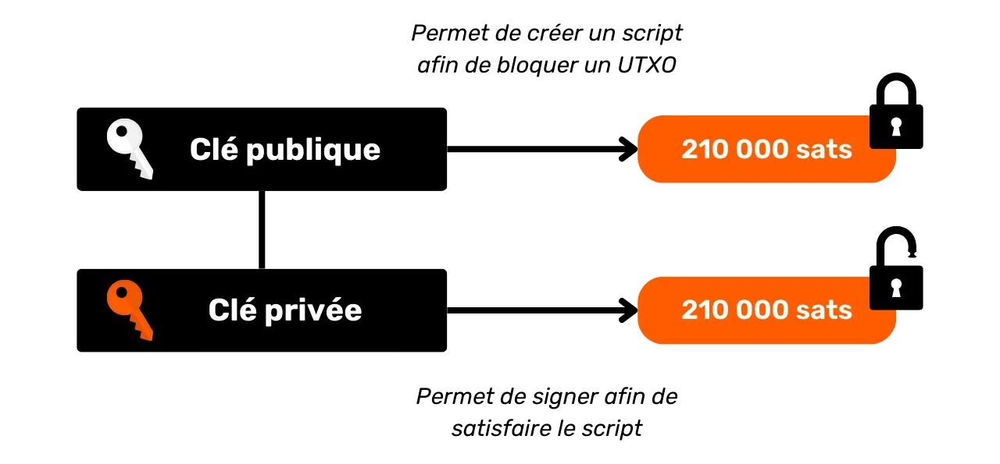
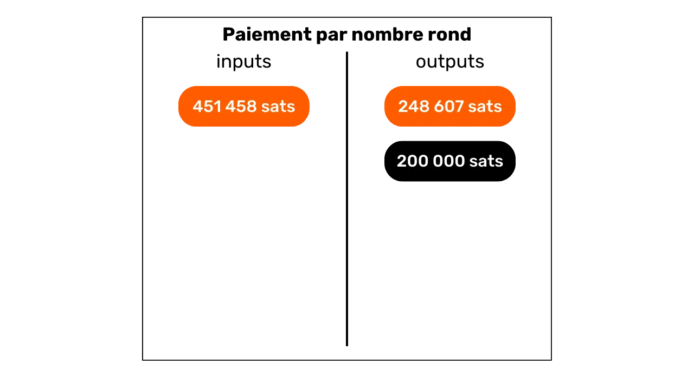
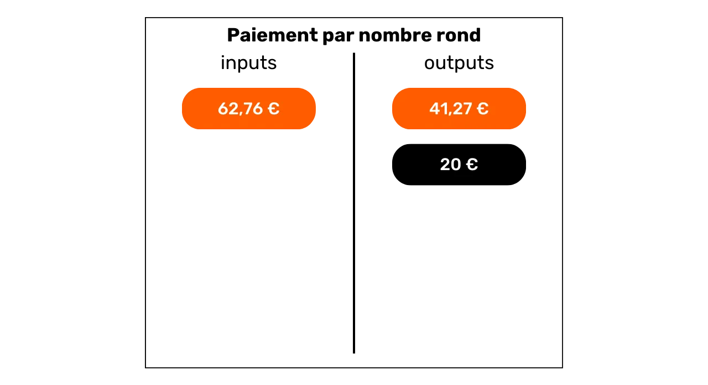
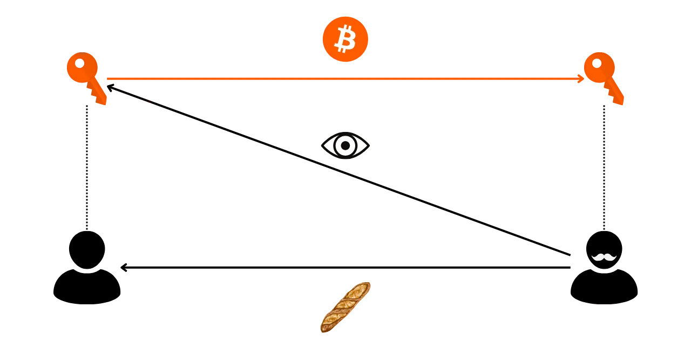
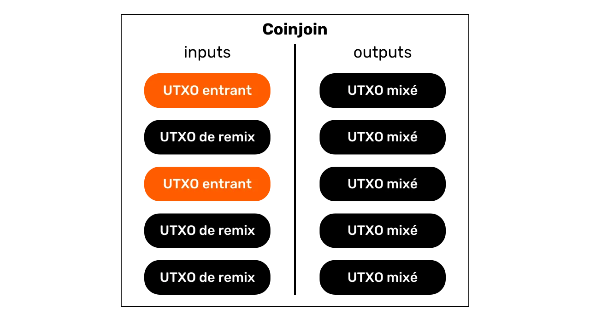
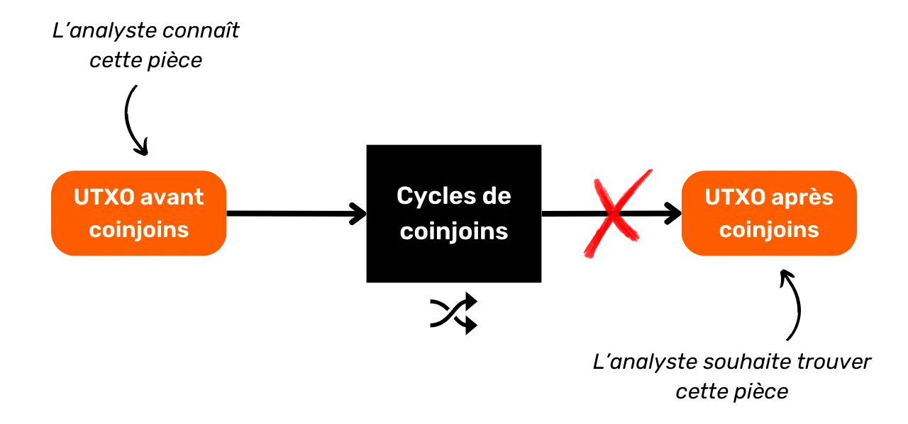

# Protégez votre vie privée sur Bitcoin

Dans un monde où la confidentialité des transactions financières devient progressivement un luxe, comprendre et maîtriser les principes de protection de la vie privée dans son utilisation de Bitcoin est essentiel. Cette formation vous donne toutes les clés, à la fois théoriques et pratiques, pour y parvenir de manière autonome.

Aujourd'hui, sur Bitcoin, des sociétés sont spécialisées dans l'analyse de chaîne. Leur cœur de métier consiste précisément à s'ingérer dans votre sphère privée, afin de compromettre la confidentialité de vos transactions. Dans les faits, le "droit à la vie privée" sur Bitcoin n’existe pas. Il vous revient donc à vous, utilisateur, de faire valoir vos droits naturels et de protéger la confidentialité de vos transactions, car personne ne va le faire à votre place. 

Cette formation se présente comme un parcours complet et généraliste. Chaque notion technique est abordée dans le détail et appuyée par des schémas explicatifs. Le but est de rendre les connaissances accessibles à tous. BTC204 est donc abordable pour les utilisateurs débutants et intermédiaires. Cette formation offre également une valeur ajoutée aux bitcoiners les plus aguerris, puisque nous approfondissons certains concepts techniques souvent méconnus.

Rejoignez-nous pour transformer votre utilisation de Bitcoin et devenir un utilisateur averti, capable de comprendre les enjeux autour de la confidentialité et de protéger sa vie privée.

+++

# Introduction
<partId>e17474a8-8899-4bdb-a7f8-bc52ddb01440</partId>

## Introduction de la formation
<chapterId>08ba1933-f393-4fb5-8279-777d874caedb</chapterId>

Dans un monde où la confidentialité des transactions financières devient progressivement un luxe, comprendre et maîtriser les principes de protection de la vie privée dans son utilisation de Bitcoin est essentiel. Cette formation vous donne toutes les clés, à la fois théoriques et pratiques, pour y parvenir de manière autonome.

Aujourd'hui, sur Bitcoin, des sociétés sont spécialisées dans l'analyse de chaîne. Leur cœur de métier consiste précisément à s'ingérer dans votre sphère privée, afin de compromettre la confidentialité de vos transactions. Dans les faits, le "droit à la vie privée" sur Bitcoin n’existe pas. Il vous revient donc à vous, utilisateur, de faire valoir vos droits naturels et de protéger la confidentialité de vos transactions, car personne ne va le faire à votre place.

Bitcoin n'est pas là que pour le "Number Go Up" et la conservation de la valeur de l'épargne. De part ses caractéristiques uniques et son histoire, c'est avant tout l'outil de la contre-économie. Grâce à cette invention formidable, vous pouvez librement disposer de votre argent, le dépenser et l'accumuler, sans que quiconque puisse vous en empêcher. 

Bitcoin offre une échappatoire pacifique au joug des États, vous permettant de jouir pleinement de vos droits naturels, qui ne sauraient être remis en cause par les lois établies. Grâce à l'invention de Satoshi Nakamoto, vous avez le pouvoir d'imposer le respect de votre propriété privée et de retrouver la liberté de contracter.

Toutefois, Bitcoin n'est pas anonyme par défaut, ce qui peut représenter un risque pour les individus engagés dans la contre-économie, en particulier dans des régions sous régime despotique. Mais ce n'est pas le seul danger. Étant donné que le bitcoin est un actif de valeur et incensurable, il peut susciter la convoitise de voleurs. Ainsi, protéger sa vie privée devient également une question de sécurité : cela peut vous aider à prévenir les piratages informatiques et les agressions physiques.

Comme nous le verrons, bien que le protocole offre certaines protections de la confidentialité de manière intrinsèque, il est crucial d'utiliser des outils supplémentaires pour optimiser et défendre cette confidentialité.

Cette formation se présente comme un parcours complet et généraliste pour comprendre les enjeux de la confidentialité sur Bitcoin. Chaque notion technique est abordée dans le détail et appuyée par des schémas explicatifs. Le but est de rendre les connaissances accessibles à tous, même aux utilisateurs débutants et intermédiaires. Pour les bitcoiners les plus aguerris, nous abordons également tout au long de cette formation des concepts très techniques et parfois méconnus pour approfondir la compréhension de chaque sujet.

L'objectif de cette formation n'est pas de vous rendre totalement anonyme dans votre utilisation de Bitcoin, mais plutôt de vous fournir les outils essentiels pour savoir protéger votre confidentialité selon vos objectifs personnels. Vous aurez la liberté de choisir parmi les concepts et les outils présentés pour élaborer vos propres stratégies, adaptées à vos objectifs et à vos besoins spécifiques.

### Section 1 : Définitions et concepts clés

Pour commencer, nous allons réviser ensemble les principes fondamentaux qui régissent le fonctionnement de Bitcoin, afin de pouvoir ensuite aborder sereinement les notions relatives à la confidentialité. Il est essentiel de maîtriser quelques concepts de base, tels que les UTXO, les adresses de réception ou les scripts, avant de pouvoir pleinement comprendre les concepts que nous aborderons dans les sections suivantes. Nous introduirons également le modèle général de confidentialité de Bitcoin, tel qu'imaginé par Satoshi Nakamoto, ce qui nous permettra de saisir les enjeux et les risques associés.


### Section 2 : Comprendre l'analyse de chaîne et savoir s'en protéger

Dans la deuxième section, nous étudions les techniques employées par les entreprises d'analyse de chaîne pour tracer votre activité sur Bitcoin. Comprendre ces méthodes est crucial pour renforcer la protection de votre confidentialité. Cette partie a pour objectif d'examiner les stratégies des attaquants pour mieux appréhender les risques et préparer le terrain pour les techniques que nous étudierons dans les sections suivantes. Nous analyserons les modèles de transactions (patterns), les heuristiques internes et externes, ainsi que les interprétations vraisemblables de ces modèles. En plus d'un volet théorique, nous apprendrons à utiliser un explorateur de bloc pour faire de l'analyse de chaîne, à travers des exemples pratiques et des exercices.


### Section 3 : Maîtriser les bonnes pratiques pour protéger sa vie privée

Dans la troisième section de notre formation, nous entrons dans le vif du sujet : la pratique ! L'objectif est de maîtriser toutes les bonnes pratiques essentielles qui doivent devenir des réflexes naturels pour tout utilisateur de Bitcoin. Nous aborderons l'utilisation d'adresses vierges, l'étiquetage, la consolidation, l'utilisation de nœuds complets, ainsi que le KYC et les méthodes d'acquisition. Le but est de vous fournir un aperçu complet des pièges à éviter pour établir de solides fondations dans notre quête de protection de la vie privée. Pour certaines de ces pratiques, vous serez guidé vers un tutoriel spécifique pour les mettre en œuvre.


### Section 4 : Comprendre les transactions coinjoin

Comment parler de confidentialité sur Bitcoin sans aborder les coinjoins ? Dans la section 4, vous allez découvrir tout ce qu'il faut savoir sur cette méthode de mixage. Vous apprendrez ce qu'est le coinjoin, son histoire et ses objectifs, ainsi que les différents types de coinjoins existants. Enfin, pour les utilisateurs les plus aguerris, nous découvrirons ce que sont les anonsets et l'entropie, et comment calculer ces indicateurs.


### Section 5 : Connaître les enjeux d'autres techniques de confidentialité avancées

Dans la cinquième section, nous ferons un tour d'horizon de toutes les autres techniques existantes pour protéger votre vie privée sur Bitcoin, en dehors du coinjoin. Au fil des années, les développeurs ont fait preuve d'une créativité remarquable pour concevoir des outils dédiés à la confidentialité. Nous examinerons toutes ces méthodes, telles que le payjoin, les transactions collaboratives, le Coin Swap et l'Atomic Swap, en détaillant leur fonctionnement, leurs objectifs et leurs éventuelles faiblesses.

Nous aborderons également la confidentialité au niveau du réseau de nœuds et de la diffusion des transactions. Nous discuterons aussi des différents protocoles qui ont été proposés au fil des années pour renforcer la confidentialité des utilisateurs sur Bitcoin, notamment les protocoles d'adresses statiques.


# Définitions et concepts clés
<partId>b9bbbde3-34c0-4851-83e8-e2ffb029cf31</partId>


## Le modèle d'UTXO de Bitcoin
<chapterId>8d6b50c5-bf74-44f4-922b-25204991cb75</chapterId>

Le bitcoin est avant tout une monnaie, mais savez-vous concrètement comment sont représentées les BTC sur le protocole ? 

### Les UTXOs sur Bitcoin : qu'est-ce que c'est ?

Sur le protocole Bitcoin, la gestion des unités monétaires s'articule autour du modèle d'UTXO, acronyme anglais pour "_Unspent Transaction Output_", que l'on traduit par "_sortie de transaction non dépensée_".

Ce modèle se distingue profondément des systèmes bancaires traditionnels qui reposent sur un mécanisme de comptes et de soldes pour suivre les flux financiers. En effet, dans le système bancaire, les soldes individuels sont maintenus dans des comptes attachés à une identité. Par exemple, lorsque vous achetez une baguette chez un boulanger, votre banque débite simplement le montant de l'achat de votre compte, réduisant ainsi votre solde, tandis que le compte du boulanger est crédité du même montant, augmentant son solde. Dans ce système, il n'y a aucune notion de lien entre l'argent qui entre sur votre compte et l'argent qui en sort, à part les enregistrements de transactions.


Sur Bitcoin, cela fonctionne différemment. Le concept de compte n'existe pas et les unités monétaires ne sont pas gérées via des soldes, mais à travers des UTXO. Un UTXO représente une quantité spécifique de bitcoins qui n'a pas encore été dépensée, formant ainsi un "morceau de bitcoin", qui peut être grand ou petit. Par exemple, un UTXO pourrait valoir `500 BTC` ou simplement `700 SATS`.

**> Pour rappel :** Le satoshi, souvent abrégé en sat, est la plus petite unité de Bitcoin, comparable au centime dans les monnaies fiat.

```plaintext
1 BTC = 100 000 000 SATS
```

Théoriquement, un UTXO peut représenter n'importe quelle valeur en bitcoins, allant d'un sat jusqu'au maximum théorique d'environ 21 millions de BTC. Cependant, il est logiquement impossible de posséder les 21 millions de bitcoins, et il existe un seuil économique inférieur appelé "dust", en dessous duquel un UTXO est considéré comme économiquement non rentable à dépenser.

**> Le saviez-vous ?** Le plus grand UTXO jamais créé sur Bitcoin avait une valeur de `500 000 BTC`. Il a été créé par la plateforme MtGox lors d'une opération de consolidation en novembre 2011 : [29a3efd3ef04f9153d47a990bd7b048a4b2d213daaa5fb8ed670fb85f13bdbcf](https://mempool.space/fr/tx/29a3efd3ef04f9153d47a990bd7b048a4b2d213daaa5fb8ed670fb85f13bdbcf)

### Les UTXOs et les conditions de dépense

Les UTXOs sont les instruments d'échange sur Bitcoin. Chaque transaction se traduit par la consommation d'UTXOs en entrées et la création de nouveaux UTXOs en sorties. Lorsqu'une transaction est réalisée, les UTXOs utilisés comme entrées sont considérés comme "dépensés", et de nouveaux UTXOs sont générés et attribués aux destinataires indiqués dans les sorties de la transaction. Ainsi, un UTXO représente simplement une sortie de transaction non dépensée, et donc une quantité de bitcoins appartenant à un utilisateur à un moment donné.


Tous les UTXOs sont sécurisés par des scripts qui définissent les conditions sous lesquelles ils peuvent être dépensés. Pour consommer un UTXO, un utilisateur doit démontrer au réseau qu'il satisfait les conditions stipulées par le script qui sécurise cet UTXO. Généralement, les UTXOs sont protégés par une clé publique (ou une adresse de réception qui représente cette clé publique). Pour dépenser un UTXO associé à cette clé publique, l'utilisateur doit prouver qu'il détient la clé privée correspondante, en fournissant une signature numérique réalisée avec cette clé. C'est la raison pour laquelle on dit que votre portefeuille Bitcoin ne contient pas réellement des bitcoins, mais qu'il stocke vos clés privées, qui elles-mêmes vous donnent accès à vos UTXOs et, par extension, aux bitcoins qu'ils représentent.



Étant donné que le concept de compte est absent sur Bitcoin, le solde d'un portefeuille correspond simplement à la somme des valeurs de tous les UTXOs qu'il peut dépenser. Par exemple, si votre portefeuille Bitcoin peut dépenser les 4 UTXOs suivants :

```plaintext
- 2 BTC
- 8 BTC
- 5 BTC
- 2 BTC
```

Le solde total de votre portefeuille serait de `17 BTC`.


## La structure des transactions Bitcoin
<chapterId>29d3aaab-de2e-4746-ab40-c9748898850c</chapterId>

### Les inputs et les outputs d'une transaction

Une transaction Bitcoin est une opération enregistrée sur la blockchain qui permet de transférer la propriété de bitcoins d'une personne à une autre. Plus précisément, puisque nous sommes sur un modèle d'UTXO et qu'il n'y a pas de comptes, la transaction satisfait les conditions de dépense qui sécurisaient un ou plusieurs UTXOs, les consomme et crée en équivalence de nouveaux UTXOs dotés de nouvelles conditions de dépense. En bref, une transaction déplace des bitcoins d'un script qui est satisfait vers un nouveau script prévu pour les sécuriser.


Chaque transaction Bitcoin est donc constituée d'une ou de plusieurs entrées (inputs) et d'une ou de plusieurs sorties (outputs). Les inputs sont des UTXOs consommés par la transaction pour générer les outputs. Les outputs sont de nouveaux UTXOs qui seront utilisables comme inputs pour de futures transactions.


**> Le saviez-vous ?** Théoriquement, une transaction bitcoin pourrait avoir une infinité d'inputs et d'outputs. Seule la taille maximale d'un bloc vient limiter ce nombre.

Chaque input dans une transaction Bitcoin fait référence à un UTXO antérieur non dépensé. Pour utiliser un UTXO comme input, son détenteur doit démontrer qu'il en est le propriétaire légitime en validant le script qui lui est associé, c'est-à-dire, en satisfaisant la condition de dépense imposée. Généralement, cela revient à fournir une signature numérique produite avec la clé privée correspondant à la clé publique qui avait initialement sécurisé cet UTXO. Le script consiste donc à vérifier que la signature correspond bien à la clé publique utilisée lors de la réception des fonds.


Chaque output, de son côté, précise le montant des bitcoins à transférer, ainsi que le destinataire. Ce dernier est défini par un nouveau script qui, en général, bloque l'UTXO nouvellement créé avec une adresse de réception ou une nouvelle clé publique.

Pour qu'une transaction soit considérée valide selon les règles de consensus, le total des outputs doit être inférieur ou égal au total des inputs. En d'autres termes, la somme des nouveaux UTXOs générés par la transaction ne doit pas excéder celle des UTXOs consommés en tant qu'inputs. Ce principe est logique : si vous disposez uniquement d'un montant de `500 000 SATS`, vous ne pouvez pas effectuer un achat de `700 000 SATS`.

### Le change et la fusion dans une transaction Bitcoin

L'action d'une transaction Bitcoin sur les UTXO peut ainsi être comparée à la refonte d'une pièce d'or. En effet, un UTXO n'est pas divisible, mais uniquement fusible. Cela signifie qu'un utilisateur ne peut pas simplement diviser un UTXO représentant un certain montant en bitcoins en plusieurs UTXO plus petits. Il doit le consommer entièrement dans une transaction pour créer un ou plusieurs nouveaux UTXOs de valeurs arbitraires en outputs, qui doivent être inférieures ou égales à la valeur initiale.

Cette mécanique est similaire à celle d'une pièce d'or. Imaginons que vous possédez une pièce de 2 onces et que vous souhaitez faire un paiement de 1 once, en supposant que le vendeur ne puisse pas vous rendre la monnaie. Vous devriez fondre votre pièce et en couler 2 nouvelles de 1 once chacune.

Sur Bitcoin, le fonctionnement est semblable. Imaginons qu'Alice possède un UTXO de `10 000 SATS` et qu'elle souhaite acheter une baguette coûtant `4 000 SATS`. Alice va faire une transaction avec en input 1 UTXO de `10 000 SATS` qu'elle consommera entièrement, et en outputs, elle créera 2 UTXOs d'une valeur de `4 000 SATS` et de `6 000 SATS`. L'UTXO de `4 000 SATS` sera envoyé au boulanger en paiement de la baguette, tandis que l'UTXO de `6 000 SATS` reviendra à Alice sous forme de monnaie. Cet UTXO qui revient à l'émetteur initial de la transaction, c'est ce que l'on appelle le "change" dans le jargon Bitcoin.


Imaginons à présent qu'Alice ne possède pas un unique UTXO de `10 000 SATS`, mais plutôt deux UTXOs de `3 000 SATS` chacun. Dans cette situation, aucun des UTXOs individuellement ne suffit pour régler les `4 000 SATS` de la baguette. Alice doit donc utiliser simultanément les 2 UTXOs de `3 000 SATS` comme inputs de sa transaction. De cette manière, le montant total des inputs atteindra `6 000 SATS`, lui permettant ainsi de satisfaire le paiement de `4 000 SATS` au boulanger. Cette méthode, qui consiste à regrouper plusieurs UTXOs dans les inputs d'une transaction, est souvent désignée par le terme "fusion".


### Les frais de transaction

Intuitivement, on pourrait penser que les frais de transaction représentent, eux aussi, un output d'une transaction. Mais en réalité, ce n'est pas le cas. Les frais d'une transaction représentent la différence entre le total des inputs et le total des outputs. Cela signifie que, après avoir utilisé une partie de la valeur des inputs pour couvrir les outputs désirés dans une transaction, une certaine somme des inputs reste inutilisée. Cette somme résiduelle constitue les frais de transaction.

```plaintext
Frais = total inputs - total outputs
```


Reprenons l'exemple d'Alice qui dispose d'un UTXO de `10 000 SATS` et souhaite acheter une baguette à `4 000 SATS`. Alice crée une transaction avec comme input son UTXO de `10 000 SATS`. Elle génère ensuite un output de `4 000 SATS` destiné au boulanger pour le paiement de la baguette. Pour encourager les mineurs à intégrer sa transaction dans un bloc, Alice alloue `200 SATS` de frais. Elle crée donc un second output, le change, qui lui reviendra, s'élevant à `5 800 SATS`.


En appliquant la formule des frais, nous constatons qu'il reste effectivement `200 SATS` pour les mineurs :
```plaintext
Frais = total inputs - total outputs
Frais = 10 000 - (4 000 + 5 800)
Frais = 10 000 - 9 800
Frais = 200
```

Lorsqu'un mineur parvient à valider un bloc, il est autorisé à collecter ces frais pour toutes les transactions incluses dans son bloc, via la transaction dite "coinbase".

### La création des UTXOs sur Bitcoin

Si vous avez suivi attentivement les paragraphes précédents, vous savez dorénavant que les UTXOs ne peuvent être créés qu'en consommant d'autres UTXOs existants. Ainsi, les pièces sur Bitcoin forment une chaîne continue. Cependant, vous vous demandez peut-être comment les premiers UTXOs de cette chaîne sont apparus. Cela soulève un problème similaire à celui de la poule et de l'œuf : d'où viennent ces UTXOs originels ?

La réponse est dans la **transaction coinbase**.

La coinbase est un type spécifique de transaction Bitcoin, qui est unique pour chaque bloc et qui est toujours la première de ceux-ci. Elle permet au mineur ayant trouvé une preuve de travail valide de recevoir sa récompense de bloc. Cette récompense se compose de deux éléments : **la subvention de bloc** et **les frais de transaction** dont nous avons parlé dans la partie précédente.

La particularité de la transaction coinbase est qu'elle est la seule à pouvoir créer des bitcoins ex nihilo, sans nécessiter de consommer des inputs pour générer ses outputs. Ces bitcoins nouvellement créés constituent ce que l'on pourrait appeler les "UTXOs originels".


Les bitcoins issus de la subvention de bloc sont de nouveaux BTC créés à partir de rien, suivant un calendrier d'émission préétabli dans les règles de consensus. La subvention de bloc se réduit de moitié tous les 210 000 blocs, c'est-à-dire environ tous les quatre ans, dans un processus appelé "halving". À l'origine, 50 bitcoins étaient créés avec chaque subvention, mais ce montant a diminué graduellement ; actuellement, il est de 3,125 bitcoins par bloc.

Quant à la partie liée aux frais de transaction, bien qu'elle représente également des BTC nouvellement créés, ils ne doivent pas excéder la différence entre le total des inputs et des outputs de toutes les transactions d’un bloc. Nous avons vu précédemment que ces frais représentent la portion des inputs qui n'est pas utilisée dans les outputs des transactions. Cette partie est techniquement "perdue" durant la transaction, et le mineur a le droit de recréer cette valeur sous forme d'un ou plusieurs nouveaux UTXOs. Il s'agit donc d'un transfert de valeur entre l'émetteur de la transaction et le mineur qui l'ajoute à la blockchain.

**> Le saviez-vous ?** Les bitcoins générés par une transaction coinbase sont soumis à une période de maturité de 100 blocs pendant laquelle ils ne peuvent pas être dépensés par le mineur. Cette règle a pour but d'éviter les complications liées à l'utilisation de bitcoins nouvellement créés sur une chaîne qui pourrait être ultérieurement rendue obsolète. 

### Les implications du modèle d'UTXO

Tout d'abord, le modèle d'UTXO influence directement les frais de transaction sur Bitcoin. La capacité de chaque bloc étant limitée, les mineurs favorisent les transactions qui offrent les meilleurs frais au regard de la place qu'elles vont prendre dans le bloc. En effet, plus une transaction inclut d'UTXOs en inputs et en outputs, plus elle est lourde, et donc nécessite des frais plus élevés. C'est une des raisons pour lesquelles on essaie souvent de réduire le nombre d'UTXOs dans notre portefeuille, ce qui peut par ailleurs affecter la confidentialité, un sujet que nous aborderons en détail dans la troisième partie de cette formation.

Ensuite, comme mentionné dans les parties précédentes, les pièces sur Bitcoin sont essentiellement une chaîne d'UTXOs. Chaque transaction crée ainsi un lien entre un UTXO passé et un futur UTXO. Les UTXOs permettent donc de suivre explicitement le chemin des bitcoins depuis leur création jusqu'à leur dépense actuelle. Cette transparence peut être perçue positivement, car elle permet à chaque utilisateur de s'assurer de l'authenticité des bitcoins reçus. Cependant, c'est aussi sur ce principe de traçabilité et d'auditabilité que repose l'analyse de chaîne, une pratique visant à compromettre votre confidentialité. Nous étudierons en profondeur cette pratique dans la deuxième partie de la formation.

## Le modèle de confidentialité de Bitcoin
<chapterId>769d8963-3ed5-4094-b21d-9203c7d9e465</chapterId>

### La monnaie : authenticité, intégrité et double dépense

Une des fonctions de la monnaie est de résoudre le problème de la double coïncidence des besoins. Dans un système établi sur le troc, la réalisation d'un échange nécessite non seulement de trouver un individu cédant un bien correspondant à mon besoin, mais aussi de lui procurer un bien de valeur équivalente qui satisfait son propre besoin. Trouver cet équilibre s'avère complexe. 


C'est pourquoi nous recourons à la monnaie qui permet de déplacer la valeur à la fois dans l'espace et dans le temps.


Pour que la monnaie résolve ce problème, il est essentiel que la partie qui fournit un bien ou un service soit convaincue de sa capacité à dépenser cette somme ultérieurement. Ainsi, tout individu rationnel souhaitant accepter une pièce de monnaie, qu'elle soit numérique ou physique, s'assurera qu'elle remplit deux critères fondamentaux :
- **La pièce doit être intègre et authentique ;**
- **et elle ne doit pas être double dépensée.**

Si l’on utilise une monnaie physique, c’est la première caractéristique qui est la plus complexe à faire valoir. À différentes périodes de l’histoire, l’intégrité des pièces de métaux a souvent été affectée par des pratiques comme le rognage ou le perçage. Par exemple, durant la Rome antique, il était courant que les citoyens grattent les bords des pièces d’or pour en recueillir un peu de métal précieux, tout en les conservant pour des transactions futures. La valeur intrinsèque de la pièce était donc réduite, mais sa valeur faciale demeurait identique. C’est notamment pour cette raison que l’on a plus tard frappé des cannelures sur la tranche des pièces. 

L’authenticité est également une caractéristique difficile à vérifier sur un support monétaire physique. De nos jours, les techniques pour lutter contre le faux monnayage sont de plus en plus complexes, ce qui oblige les commerçants à investir dans des systèmes de vérification coûteux.

En revanche, en raison de leur nature, la double dépense n'est pas un problème pour les monnaies physiques. Si je vous cède un billet de 10 €, il quitte irrévocablement ma possession pour entrer dans la vôtre, ce qui exclut naturellement toute possibilité de dépense multiple des unités monétaires qu’il incarne. En bref, je ne pourrai pas dépenser de nouveau ce billet de 10 €.


Pour la monnaie numérique, la difficulté est différente. S’assurer de l’authenticité et de l’intégrité d’une pièce est souvent plus simple. Comme nous l'avons vu dans la partie précédente, le modèle d'UTXO sur Bitcoin permet de tracer une pièce jusqu'à son origine, et donc de vérifier qu'elle a bien été créée de manière conforme aux règles de consensus par un mineur.

En revanche, s’assurer de l'absence de double dépense est plus complexe, puisque tout bien numérique est en essence de l'information. Contrairement aux biens physiques, l'information ne se divise pas lors des échanges, mais se propage en se multipliant. Par exemple, si je vous transmets un document par courrier électronique, ce dernier se retrouve alors dupliqué. De votre côté, vous ne pouvez pas vérifier avec certitude que j'ai effacé le document original.


### La prévention de la double dépense sur Bitcoin
Le seul moyen d’éviter cette duplication d’un bien numérique est d’être au courant de l’intégralité des échanges sur le système. De cette manière, on peut savoir qui possède quoi et actualiser les avoirs de chacun en fonction des transactions effectuées. C’est ce qui se fait, par exemple, pour la monnaie scripturale dans le système bancaire. Lorsque l’on paie 10 € à un commerçant par carte bancaire, la banque constate cet échange et actualise le livre des comptes.


Sur Bitcoin, la prévention de la double dépense se fait de la même manière. On va chercher à confirmer l'absence d'une transaction ayant déjà dépensé les pièces en question. Si ces dernières n'ont jamais été utilisées, alors nous pouvons être assurés qu'aucune double dépense n'aura lieu. Ce principe avait été décrit par Satoshi Nakamoto dans le White Paper avec cette célèbre phrase :

**"*Le seul moyen pour confirmer l’absence d’une transaction est d’être au courant de toutes les transactions.*"**

Mais contrairement au modèle bancaire, on ne souhaite pas avoir à faire confiance à une entité centrale sur Bitcoin. Il faut alors que tous les utilisateurs soient en capacité de confirmer cette absence de double dépense, sans pour autant reposer sur un tiers. Ainsi, il faut que chacun soit au courant de toutes les transactions Bitcoin. C'est pour cette raison que les transactions Bitcoin sont diffusées publiquement sur tous les nœuds du réseau et enregistrées en clair sur la blockchain.

C'est précisément cette diffusion publique de l’information qui complique la protection de la vie privée sur Bitcoin. Dans le système bancaire traditionnel, en théorie, seule l'institution financière a connaissance des transactions effectuées. En revanche, sur Bitcoin, l'ensemble des utilisateurs est informé de toutes les transactions, via leurs nœuds respectifs. 

### Le modèle de confidentialité : système bancaire vs Bitcoin

Dans le système traditionnel, votre compte bancaire est lié à votre identité. Le banquier est en capacité de savoir quel compte bancaire appartient à quel client, et quelles sont les transactions associées. Néanmoins, ce flux d’informations est coupé entre la banque et le domaine public. Autrement dit, il est impossible de connaître le solde et les transactions d’un compte bancaire qui appartient à un autre individu. Seule la banque a accès à ces informations.


Par exemple, votre banquier est au courant que vous achetez votre baguette chaque matin chez le boulanger du quartier, mais votre voisin, lui, n'a pas connaissance de cette transaction. Ainsi, le flux d'informations est accessible aux parties concernées, notamment la banque, mais reste inaccessible à des personnes extérieures.


À cause de la contrainte de diffusion publique des transactions que nous avons vue dans la partie précédente, le modèle de confidentialité de Bitcoin ne peut pas suivre le modèle du système bancaire. Dans le cas de Bitcoin, puisque le flux d’information ne peut pas être cassé entre les transactions et le domaine public, **le modèle de confidentialité repose sur la séparation entre l’identité de l’utilisateur et les transactions** en elles-mêmes.


Par exemple, si vous achetez une baguette chez le boulanger en payant en BTC, votre voisin, qui possède son propre nœud complet, peut voir votre transaction passer, tout comme il peut voir toutes les autres transactions du système. Toutefois, si les principes de confidentialité sont respectés, il ne devrait pas être en mesure de relier cette transaction spécifique à votre identité.


Mais puisque les transactions Bitcoin sont rendues publiques, il devient tout de même possible d'établir des liens entre elles pour en déduire des renseignements sur les parties impliquées. Cette activité constitue même une spécialité en soi que l'on appelle "analyse de chaîne". Dans la partie suivante de la formation, je vous invite à explorer les fondamentaux de l'analyse de chaîne afin de comprendre comment vos bitcoins sont tracés et de savoir mieux s'en défendre.

# Comprendre l'analyse de chaîne et savoir s'en protéger
<partId>4739371e-9fef-45b0-bcaa-b7a4df6b4470</partId>

## C'est quoi l'analyse de chaîne sur Bitcoin ?
<chapterId>7d198ba6-4af2-4f24-86cb-3c79cb25627e</chapterId>

### Définition et fonctionnement

L’analyse de chaîne est une pratique qui regroupe toutes les méthodes permettant de tracer les flux de bitcoins sur la blockchain. De façon générale, l’analyse de chaîne s’appuie sur l’observation de caractéristiques sur des échantillons de transactions antérieures. Elle consiste ensuite à repérer ces mêmes caractéristiques sur une transaction que l’on souhaite analyser, et à en déduire des interprétations vraisemblables. Cette méthode de résolution de problème à partir d’une approche pratique, pour trouver une solution suffisamment bonne, c’est ce que l’on appelle une "heuristique".

Pour vulgariser, l’analyse de chaîne se fait en trois grandes étapes :
1. **L'observation de la blockchain ;**
2. **Le repérage de caractéristiques connues ;**
3. **La déduction d’hypothèses.**


L'analyse de chaîne peut être effectuée par n'importe qui. Il suffit d'avoir accès aux informations publiques de la blockchain via un nœud complet pour observer les mouvements des transactions et émettre des hypothèses. Il existe également des outils gratuits qui facilitent cette analyse, comme le site [OXT.me](https://oxt.me/) que nous explorerons en détail dans les deux derniers chapitres de cette partie. Toutefois, le principal risque pour la confidentialité provient des entreprises spécialisées dans l'analyse de chaîne. Ces sociétés ont fait passer l'analyse de chaîne à une échelle industrielle et vendent leurs services à des institutions financières ou des gouvernements. Parmi ces entreprises, Chainalysis est sûrement la plus connue.

### Les objectifs de l'analyse de chaîne

Un des objectifs de l’analyse de chaîne consiste à regrouper diverses activités sur Bitcoin en vue de déterminer l'unicité de l'utilisateur les ayant effectuées. Par la suite, il sera possible de tenter de rattacher ce faisceau d'activités à une identité réelle.


Rappelez-vous du chapitre précédent. Je vous ai expliqué pourquoi le modèle de confidentialité de Bitcoin reposait originellement sur la séparation entre l’identité de l’utilisateur et ses transactions. Il serait donc tentant de penser que l'analyse de chaîne s'avère inutile, puisque même si l'on parvient à regrouper des activités onchain, on ne peut pas les associer à une identité réelle. 

Théoriquement, cette affirmation est exacte. Dans la première partie de cette formation, nous avons vu que l'on emploie des paires de clés cryptographiques pour établir des conditions sur les UTXO. Par essence, ces paires de clés ne divulguent aucune information sur l’identité de leurs détenteurs. Ainsi, même si l'on réussit à regrouper les activités associées à différentes paires de clés, cela ne nous renseigne en rien sur l'entité à l'origine de ces activités.


Cependant, la réalité pratique est bien plus complexe. Il existe une multitude de comportements qui risquent de lier une identité réelle à une activité onchain. En analyse, on appelle cela un point d’entrée, et il en existe une multitude. 

Le plus courant, c’est évidemment le KYC (*Know Your Customer*). Si vous retirez vos bitcoins d’une plateforme régulée vers une de vos adresses de réception personnelles, alors certaines personnes sont en capacité de lier votre identité à cette adresse. Plus largement, un point d’entrée peut être toute forme d’interaction entre votre vie réelle et une transaction Bitcoin. Par exemple, si vous publiez une adresse de réception sur vos réseaux sociaux, cela peut constituer un point d’entrée pour une analyse. Si vous réalisez un paiement en bitcoins à votre boulanger, ce dernier pourra associer votre face (qui fait partie de votre identité) à une adresse Bitcoin.

Ces points d'entrée sont quasiment inévitables dans l'usage de Bitcoin. Bien que l'on puisse chercher à en restreindre la portée, ils demeureront présents. C'est pourquoi il est crucial de combiner les méthodes visant à préserver votre vie privée. Si maintenir une séparation entre votre identité réelle et vos transactions est une démarche intéressante, elle demeure aujourd'hui insuffisante. En effet, si l'ensemble de vos activités onchain peut être regroupé, alors le moindre petit point d'entrée est susceptible de compromettre l'unique couche de confidentialité que vous aviez instaurée.


### Se défendre face à l'analyse de chaîne

Ainsi, il faut également pouvoir faire face à l’analyse de chaîne dans notre utilisation de Bitcoin. En procédant de la sorte, nous pouvons minimiser l'agrégation de nos activités et limiter l’impact d’un point d’entrée sur notre vie privée. 


Justement, pour mieux contrecarrer l'analyse de chaîne, quelle meilleure approche que de s'initier aux méthodes employées dans l’analyse de chaîne ? Si vous souhaitez savoir comment améliorer votre confidentialité sur Bitcoin, vous devez comprendre ces méthodes. Cela vous permettra de mieux appréhender les techniques comme [le coinjoin](https://planb.network/fr/tutorials/privacy/coinjoin-samourai-wallet) ou [le payjoin](https://planb.network/fr/tutorials/privacy/payjoin) (techniques que nous étudierons dans les dernières parties de la formation), et de réduire les erreurs que vous pourriez faire.

En ça, nous pouvons faire une analogie avec la cryptographie et la cryptanalyse. Un bon cryptographe est avant tout un bon cryptanalyste. Pour imaginer un nouvel algorithme de chiffrement, il faut savoir quelles sont les attaques auxquelles il devra faire face, et également étudier pourquoi les algorithmes précédents ont été cassés. Le même principe s'applique à la confidentialité sur Bitcoin. Comprendre les méthodes de l'analyse de chaîne est la clé pour s'en prémunir. C’est pour cette raison que je vous propose une partie entière sur l'analyse de chaîne dans cette formation.

### Les méthodes de l'analyse de chaîne

Il est important de comprendre que l'analyse de chaîne n'est pas une science exacte. Elle repose sur des heuristiques dérivées d'observations antérieures ou d’interprétations logiques. Ces règles permettent d'obtenir des résultats assez fiables, mais jamais d'une précision absolue. En d'autres termes, **l'analyse de chaîne implique toujours une dimension de probabilité dans les conclusions émises**. Par exemple, on pourra estimer avec plus ou moins de certitude que deux adresses appartiennent à une même entité, mais une certitude totale sera toujours hors de portée.

Tout l’objectif de l'analyse de chaîne réside précisément dans l'agrégation de diverses heuristiques en vue de minimiser le risque d'erreur. Il s'agit en quelque sorte d'une accumulation de preuves qui nous permet de nous approcher davantage de la réalité.

Ces fameuses heuristiques peuvent être regroupées en différentes catégories que nous allons détailler ensemble :
- **Les patterns de transaction (ou modèles de transaction) ;**
- **Les heuristiques internes à la transaction ;**
- **Les heuristiques externes à la transaction.**

### Satoshi Nakamoto et l'analyse de chaîne

Notons que les deux premières heuristiques d'analyse de chaîne ont été découvertes par Satoshi Nakamoto lui-même. Il en parle dans la partie 10 du White Paper de Bitcoin. Ce sont :
- la CIOH (*Common Input Ownership Heuristic*) ;
- et la réutilisation d’adresse.


Source : S. Nakamoto, "Bitcoin: A Peer-to-Peer Electronic Cash System", https://bitcoin.org/bitcoin.pdf, 2009.

Nous verrons dans les chapitres suivants en quoi elles consistent, mais il est déjà intéressant de noter que ces deux heuristiques conservent toujours une prééminence dans l’analyse de chaîne aujourd’hui.

## Les patterns de transactions
<chapterId>d365a101-2d37-46a5-bfb9-3c51e37bf96b</chapterId>

Un pattern de transaction est simplement un modèle ou une structure globale de transaction typique, que l’on peut retrouver sur la blockchain, dont on connaît l’interprétation vraisemblable. Lorsque l’on étudie les patterns, on va s’attarder sur une seule transaction que l’on va analyser à un niveau élevé. 

En d’autres termes, nous allons uniquement regarder le nombre d’UTXO en inputs et le nombre d'UTXO en outputs, sans nous attarder sur les détails plus spécifiques ou l'environnement de la transaction. À partir du modèle observé, nous pourrons interpréter la nature de la transaction. On va alors rechercher des caractéristiques sur sa structure et en déduire une interprétation.


Dans cette partie, nous allons découvrir ensemble les principaux modèles de transactions que l'on peut rencontrer en analyse de chaîne, et pour chaque modèle, je vous donnerai l'interprétation vraisemblable de cette structure, ainsi qu'un exemple concret.

### L’envoi simple (ou le paiement simple)

On commence par un pattern très répandu, puisque c'est celui qui ressort sur la plupart des paiements en bitcoins. Le modèle du paiement simple se caractérise par la consommation d’un ou plusieurs UTXOs en inputs et la production de 2 UTXOs en outputs. Ce modèle va donc ressembler à cela :


Lorsque l'on repère cette structure de transaction sur la blockchain, on peut déjà en tirer une interprétation. Comme son nom l'indique, ce modèle indique que nous sommes en présence d’une transaction d’envoi ou de paiement. L’utilisateur a consommé son propre UTXO en inputs pour satisfaire en outputs un UTXO de paiement et un UTXO de change (rendu de monnaie qui revient vers le même utilisateur). 

Nous savons donc que l’utilisateur observé n’est vraisemblablement plus en possession d’un des deux UTXOs en outputs (celui du paiement), mais qu’il est toujours en possession de l’autre UTXO (celui de change).

Pour l'instant, il nous est impossible de préciser quel output représente quel UTXO, puisque ce n'est pas l'objectif de l'étude de patterns. Nous y parviendrons en nous appuyant sur les heuristiques que nous étudierons dans les parties suivantes. À ce stade, notre objectif se limite à identifier la nature de la transaction en question, qui est, en l'occurrence, un envoi simple.

Par exemple, voici une transaction Bitcoin qui adopte le pattern de l’envoi simple :

```plaintext
b6cc79f45fd2d7669ff94db5cb14c45f1f879ea0ba4c6e3d16ad53a18c34b769
```


Source : [Mempool.space](https://mempool.space/fr/tx/b6cc79f45fd2d7669ff94db5cb14c45f1f879ea0ba4c6e3d16ad53a18c34b769)

Après ce premier exemple, vous devriez avoir une meilleure compréhension de ce que signifie étudier un "modèle de transaction". Nous examinons une transaction en nous focalisant uniquement sur sa structure, sans prendre en compte son environnement ou les détails spécifiques de la transaction. Nous l'observons uniquement de manière globale dans cette première étape.

Maintenant que vous comprenez ce qu'est un pattern, passons aux autres modèles existants.

### Le balayage

Ce deuxième modèle se caractérise par la consommation d’un seul UTXO en entrée et la production d’un seul UTXO en sortie.


L’interprétation de ce modèle est que nous sommes en présence d’un auto-transfert. L’utilisateur s’est transféré ses bitcoins à lui-même, sur une autre adresse lui appartenant. Puisqu’aucun change n'existe sur la transaction, il est très peu plausible que l’on soit en présence d’un paiement. En effet, lorsqu'un paiement est effectué, il est presque impossible que le payeur dispose d'un UTXO correspondant exactement au montant requis par le vendeur, en plus des frais de transaction. En général, le payeur est donc obligé de produire un output de change.

Nous savons alors que l’utilisateur observé est vraisemblablement encore en possession de cet UTXO. Dans le cadre d'une analyse de chaîne, si nous savons que l'UTXO utilisé en input de la transaction appartient à Alice, on peut supposer que l'UTXO en output lui appartient également. Ce qui deviendra intéressant par la suite, c'est de trouver des heuristiques internes à la transaction qui pourraient renforcer cette hypothèse (nous étudierons ces heuristiques dans le chapitre 3.3).

Par exemple, voici une transaction Bitcoin qui adopte le pattern du balayage :

```plaintext
35f1072a0fda5ae106efb4fda871ab40e1f8023c6c47f396441ad4b995ea693d
```


Source : [Mempool.space](https://mempool.space/fr/tx/35f1072a0fda5ae106efb4fda871ab40e1f8023c6c47f396441ad4b995ea693d)

Attention toutefois, ce type de pattern peut également révéler un auto-transfert vers le compte d’une plateforme d’échange de cryptomonnaies. Ce seront l’étude des adresses connues et le contexte de la transaction qui nous permettront de savoir si c’est un balayage vers un portefeuille en self-custody ou un retrait vers une plateforme. En effet, les adresses des plateformes d'échange sont souvent facilement identifiables. 

Reprenons l'exemple d'Alice : si le balayage mène vers une adresse connue d'une plateforme (comme Binance par exemple), cela peut signifier que les bitcoins ont été transférés hors de la possession directe d'Alice, probablement dans l'intention de les vendre ou de les stocker sur cette plateforme. En revanche, si l'adresse de destination est inconnue, il est raisonnable de supposer qu'il s'agit simplement d'un autre portefeuille appartenant toujours à Alice. Mais ce type d'étude rentre plutôt dans la catégorie des heuristiques et pas dans l'étude des patterns.

### La consolidation

Ce modèle se caractérise par la consommation de plusieurs UTXOs en entrée et la production d’un seul UTXO en sortie.


L’interprétation de ce modèle est que nous sommes en présence d’une consolidation. C’est une pratique courante chez les utilisateurs de Bitcoin, visant à fusionner plusieurs UTXOs en anticipation d'une éventuelle augmentation des frais de transaction. En effectuant cette opération durant une période où les frais sont bas, il est possible de réaliser des économies sur les frais futurs. Nous parlerons plus en détail de cette pratique dans le chapitre 4.3.

Nous pouvons en déduire que l’utilisateur derrière ce modèle de transaction était vraisemblablement en possession de l’intégralité des UTXOs en inputs et qu’il est toujours en possession de l’UTXO en output. C’est donc sûrement un auto-transfert.

Tout comme le balayage, ce type de pattern peut également révéler un auto-transfert sur le compte d’une plateforme d'échange. Ce seront l’étude des adresses connues et le contexte de la transaction qui nous permettront de savoir si c’est une consolidation vers un portefeuille en self-custody ou un retrait vers une plateforme.

Par exemple, voici une transaction Bitcoin qui adopte le pattern de la consolidation :

```plaintext
77c16914211e237a9bd51a7ce0b1a7368631caed515fe51b081d220590589e94
```


Source : [Mempool.space](https://mempool.space/fr/tx/77c16914211e237a9bd51a7ce0b1a7368631caed515fe51b081d220590589e94)

Dans le cadre d'une analyse de chaîne, ce modèle peut révéler beaucoup d'informations. Par exemple, si l'on sait que l'un des inputs appartient à Alice, on peut supposer que tous les autres inputs et l'output de cette transaction lui appartiennent également. Cette hypothèse permettrait alors de remonter la chaîne de transactions antérieures pour découvrir et analyser d'autres transactions vraisemblablement associées à Alice.


### La dépense groupée

Ce modèle se caractérise par la consommation de quelques UTXOs en inputs (souvent un seul) et la production de nombreux UTXOs en outputs.


L’interprétation de ce modèle est que nous sommes en présence d’une dépense groupée. C’est une pratique qui révèle vraisemblablement une très grosse activité économique, comme une plateforme d'échange par exemple. La dépense groupée permet à ces entités d’économiser des frais en réunissant leurs dépenses dans une seule transaction.

Nous pouvons déduire de ce modèle que l’UTXO en input provient d’une société avec une grosse activité économique et que les UTXOs en sorties vont se disperser. Beaucoup appartiendront à des clients de la société qui ont fait un retrait de bitcoins de la plateforme. D’autres iront peut-être vers des sociétés partenaires. Enfin, il y aura certainement un ou plusieurs changes qui reviendront à la société émettrice.

Par exemple, voici une transaction Bitcoin qui adopte le pattern de la dépense groupée (vraisemblablement, c'est une transaction émise par la plateforme Bybit) :

```plaintext
8a7288758b6e5d550897beedd13c70bcbaba8709af01a7dbcc1f574b89176b43
```


Source : [Mempool.space](https://mempool.space/fr/tx/8a7288758b6e5d550897beedd13c70bcbaba8709af01a7dbcc1f574b89176b43)

### Les transactions propres à un protocole

Parmi les patterns de transactions, nous pouvons également identifier des modèles qui révèlent l’utilisation d’un protocole spécifique. Par exemple, les coinjoins Whirlpool (dont nous allons parler dans la partie 5) vont avoir une structure facilement identifiable qui permet de les différencier d'autres transactions plus classiques.


L'analyse de ce pattern suggère que nous sommes vraisemblablement en présence d'une transaction collaborative. Il est aussi possible d'y observer un coinjoin. Si cette dernière hypothèse se révèle exacte, alors le nombre de sorties pourrait nous fournir une estimation approximative du nombre de participants au coinjoin.

Par exemple, voici une transaction Bitcoin qui adopte le pattern de la transaction collaborative de type coinjoin :

```plaintext
00601af905bede31086d9b1b79ee8399bd60c97e9c5bba197bdebeee028b9bea
```


Source : [Mempool.space](https://mempool.space/fr/tx/00601af905bede31086d9b1b79ee8399bd60c97e9c5bba197bdebeee028b9bea)

Il existe de nombreux autres protocoles qui disposent de leurs propres structures spécifiques. Ainsi, nous pourrions distinguer des transactions de type Wabisabi, des transactions Stamps ou encore Runes par exemple.

Grâce à ces patterns de transactions, on peut déjà interpréter un certain nombre d'informations sur une transaction donnée. Mais la structure de la transaction n'est pas la seule source d'information pour une analyse. Nous pouvons également étudier les détails de celle-ci. Ces détails uniquement internes à une transaction, c'est ce que j'aime appeler des "heuristiques internes", et nous allons les étudier dans le chapitre suivant.

## Les heuristiques internes 
<chapterId>c54b5abe-872f-40f4-a0d0-c59faff228ba</chapterId>

Une heuristique interne est une caractéristique spécifique que l'on identifie au sein même d'une transaction, sans nécessiter l'examen de son environnement, et qui nous permet de réaliser des déductions. Contrairement aux patterns qui se focalisent sur la structure globale de la transaction à un haut niveau, les heuristiques internes se fondent sur l'ensemble des données extractibles. Cela inclut :
- Les montants des différents UTXOs en entrée comme en sortie ;
- Tout ce qui concerne les scripts : les adresses de réception, les versionnages, les locktimes…

Généralement, ce type d’heuristique va nous permettre d’identifier le change dans une transaction spécifique. Ce faisant, nous pourrons ensuite perpétuer le traçage d’une entité sur plusieurs transactions différentes. En effet, si l'on identifie un UTXO appartenant à un utilisateur que l'on souhaite suivre, il est crucial de déterminer, lorsqu'il effectue une transaction, quel output a été transféré à un autre utilisateur et quel output représente le change, qui reste ainsi en sa possession.


Une nouvelle fois, je vous rappelle que ces heuristiques ne sont pas d’une précision absolue. Prises individuellement, elles nous permettent uniquement d’identifier des scénarios vraisemblables. C’est l’accumulation de plusieurs heuristiques qui contribue à atténuer l'incertitude, sans toutefois jamais parvenir à l'éliminer totalement.

### Les similitudes internes

Cette heuristique regroupe l’étude des similitudes entre les inputs et les outputs d’une même transaction. Si l’on observe une même caractéristique sur les entrées et sur une seule des sorties de la transaction, alors il est vraisemblable que cette sortie constitue le change. 

La caractéristique la plus flagrante est la réutilisation d’une adresse de réception dans une même transaction.


Cette heuristique laisse peu de place au doute. À moins qu’il se soit fait pirater sa clé privée, une même adresse de réception révèle forcément l’activité d’un unique utilisateur. L’interprétation qui en découle est que le change de la transaction est l'output avec la même adresse que l’input. On pourra ainsi continuer de tracer l’individu à partir de ce change.

Par exemple, voici une transaction sur laquelle on peut vraisemblablement appliquer cette heuristique : 

```plaintext
54364146665bfc453a55eae4bfb8fdf7c721d02cb96aadc480c8b16bdeb8d6d0
```


Source : [Mempool.space](https://mempool.space/tx/54364146665bfc453a55eae4bfb8fdf7c721d02cb96aadc480c8b16bdeb8d6d0)

Ces similitudes entre les entrées et les sorties ne s’arrêtent pas à la réutilisation d’adresse. Toute ressemblance dans l’utilisation des scripts peut permettre l’application d’une heuristique. Par exemple, on va parfois pouvoir observer le même versionnage entre l’entrée et une des sorties de la transaction.


Sur ce schéma, on peut voir que l’input n° 0 débloque un script P2WPKH (SegWit V0 commençant par `bc1q`). L’output n° 0 utilise le même type de script. En revanche, l’output n° 1 utilise un script P2TR (SegWit V1 commençant par `bc1p`). L’interprétation de cette caractéristique est qu’il est vraisemblable que l’adresse avec le même versionnage que l’input soit l’adresse de change. Elle appartiendrait donc toujours au même utilisateur.

Voici une transaction sur laquelle on peut vraisemblablement appliquer cette heuristique : 

```plaintext
db07516288771ce5d0a06b275962ec4af1b74500739f168e5800cbcb0e9dd578
```


Source : [Mempool.space](https://mempool.space/tx/db07516288771ce5d0a06b275962ec4af1b74500739f168e5800cbcb0e9dd578)

Sur cette dernière, on peut voir que l’input n° 0 et l’output n° 1 utilisent des scripts P2WPKH (SegWit V0), alors que l’output n° 0 utilise un script différent de type P2PKH (Legacy).

Au début des années 2010, cette heuristique basée sur le versionnage des scripts était relativement peu utile du fait de la limitation des types de scripts disponibles. Cependant, avec le temps et les mises à jour successives de Bitcoin, une diversité croissante de types de scripts a été introduite. Cette heuristique devient donc de plus en plus pertinente, car avec un éventail plus large de types de scripts, les utilisateurs se divisent en groupes plus restreints, augmentant ainsi les chances d'appliquer cette heuristique de réutilisation interne du versionnage. Pour cette raison, dans une perspective de confidentialité uniquement, il est conseillé d'opter pour le type de script le plus courant. Par exemple, lorsque je rédige ces lignes, les scripts Taproot (`bc1p`) sont moins fréquemment utilisés que les scripts SegWit V0 (`bc1q`). Bien que les premiers offrent des bénéfices économiques et de confidentialité dans certains contextes spécifiques, pour des utilisations de signature unique plus traditionnelles, il peut être judicieux de s'en tenir à un standard plus ancien pour des raisons de confidentialité, jusqu'à ce que le nouveau standard soit plus largement adopté.

### Les paiements par nombres ronds

Une autre heuristique interne qui peut nous permettre d’identifier le change est celle du nombre rond. De manière générale, lorsque l’on se retrouve face à un pattern de paiement simple (1 input et 2 outputs), si une des sorties dépense un montant rond, alors celle-ci représente le paiement.



Par élimination, si une sortie représente le paiement, l’autre représente le change. On peut donc interpréter qu’il est vraisemblable que l’utilisateur en entrée soit toujours en possession de la sortie identifiée comme étant le change.

Il convient de souligner que cette heuristique n'est pas toujours applicable, puisque la majorité des paiements s'effectuent encore en unités de compte fiduciaires. En effet, lorsqu'un commerçant en France accepte le bitcoin, en général, il n’affiche pas des prix stables en sats. Il optera plutôt pour une conversion entre le prix en euros et le montant en bitcoins à régler. Il ne devrait donc pas y avoir de nombre rond en sortie de la transaction. 

Néanmoins, un analyste pourrait tenter de réaliser cette conversion en tenant compte du taux de change en vigueur lorsque la transaction a été diffusée sur le réseau. Prenons l'exemple d'une transaction avec un input de `97 552 sats` et deux outputs, l'un de `31 085 sats` et l'autre de `64 152 sats`. À première vue, cette transaction ne semble pas impliquer des montants ronds. Cependant, en appliquant le taux de change de 64 339 € au moment de la transaction, nous obtenons une conversion en euros qui se présente comme suit :
- Un input de 62,76 € ;
- Un output de 20 € ;
- Un output de 41,27 €.

Une fois convertie en monnaie fiat, cette transaction permet d'appliquer l'heuristique du paiement par montant rond. L'output de 20 € a probablement été destiné à un commerçant, ou a du moins changé de propriétaire. Par déduction, l'output de 41,27 € est vraisemblablement resté en possession de l'utilisateur initial.



Si un jour, le bitcoin devient l’unité de compte préférée dans nos échanges, cette heuristique pourrait devenir encore plus utile pour les analyses.

Par exemple, voici une transaction sur laquelle on peut vraisemblablement appliquer cette heuristique : 

```plaintext
2bcb42fab7fba17ac1b176060e7d7d7730a7b807d470815f5034d52e96d2828a
```


Source : [Mempool.space](https://mempool.space/tx/2bcb42fab7fba17ac1b176060e7d7d7730a7b807d470815f5034d52e96d2828a)

### Le plus grand output

Lorsque l’on repère un écart suffisamment large entre 2 sorties de transaction sur un modèle de paiement simple, on peut estimer que la sortie la plus grande est vraisemblablement le change.


Cette heuristique du plus gros output est sûrement la plus imprécise de toutes. Si on l’identifie seule, elle est assez faible. Toutefois, cette caractéristique peut être additionnée avec d’autres heuristiques afin de réduire l’incertitude de notre interprétation.

Par exemple, si nous examinons une transaction présentant une sortie avec un montant rond et une autre sortie avec un montant plus important, l'application conjointe de l'heuristique des paiements ronds et de celle concernant la plus grande sortie nous permet de réduire notre niveau d'incertitude.

Par exemple, voici une transaction sur laquelle on peut vraisemblablement appliquer cette heuristique : 

```plaintext
b79d8f8e4756d34bbb26c659ab88314c220834c7a8b781c047a3916b56d14dcf
```


Source : [Mempool.space](https://mempool.space/tx/b79d8f8e4756d34bbb26c659ab88314c220834c7a8b781c047a3916b56d14dcf)

## Les heuristiques externes
<chapterId>4a170e3b-200d-431a-8285-18a23ff617ba</chapterId>

L’étude des heuristiques externes, c’est l’analyse des similitudes, des patterns et des caractéristiques de certains éléments qui ne sont pas propres à la transaction en elle-même. Autrement dit, si précédemment, nous nous limitions à l'exploitation d'éléments intrinsèques à la transaction avec les heuristiques internes, nous élargissons désormais notre champ d’analyse à l'environnement de la transaction grâce aux heuristiques externes.

### La réutilisation d’adresse

C’est une des heuristiques les plus connues des bitcoiners. La réutilisation d’adresse permet d’établir un lien entre différentes transactions et différents UTXOs. Elle s’observe lorsqu’une adresse de réception Bitcoin est utilisée plusieurs fois.

Ainsi, il est possible d'exploiter la réutilisation d'adresse au sein d'une même transaction comme une heuristique interne pour identifier le change (c'est ce que nous avons vu dans le chapitre précédent). Mais la réutilisation d'adresse peut également servir d'heuristique externe pour reconnaître l'unicité d'une entité derrière plusieurs transactions.

L’interprétation de la réutilisation d’une adresse est que tous les UTXOs bloqués sur cette adresse appartiennent (ou ont appartenu) à une même entité. Cette heuristique laisse peu de place à l'incertitude. Lorsque l'on parvient à l'identifier, l'interprétation qui en découle a de fortes chances de correspondre à la réalité. Elle permet donc le regroupement de différentes activités onchain.


Comme expliqué en introduction de cette partie 3, cette heuristique fut découverte par Satoshi Nakamoto lui-même. Dans le White Paper, il évoque justement une solution pour que les utilisateurs évitent de la produire, qui est tout simplement d’utiliser une adresse vierge pour chaque nouvelle transaction : 

"_En guise de pare-feu additionnel, une nouvelle paire de clés pourrait être utilisée pour chaque transaction afin de les garder non liées à un propriétaire commun._"


Source : S. Nakamoto, "Bitcoin: A Peer-to-Peer Electronic Cash System", https://bitcoin.org/bitcoin.pdf, 2009.

Par exemple, voici une adresse réutilisée sur plusieurs transactions :

```plaintext
bc1qqtmeu0eyvem9a85l3sghuhral8tk0ar7m4a0a0
```


Source : [Mempool.space](https://mempool.space/address/bc1qqtmeu0eyvem9a85l3sghuhral8tk0ar7m4a0a0)

### La similitude des scripts et les empreintes de portefeuilles

Au-delà de la réutilisation d’adresse, il existe de nombreuses autres heuristiques qui permettent de rattacher des actions à un même portefeuille ou à un cluster d’adresses.

Tout d’abord, un analyste peut s’aider des similitudes dans l’utilisation des scripts. Par exemple, certains scripts minoritaires comme du multisig peuvent être plus facilement repérables que des scripts SegWit V0. Au plus le groupe dans lequel nous nous cachons est grand, au plus il est difficile de nous repérer. C’est notamment pour cette raison que sur les bons protocoles de Coinjoin, l’ensemble des participants utilisent exactement le même type de script.

De manière plus globale, un analyste peut également se focaliser sur les empreintes caractéristiques d'un portefeuille. Il s'agit de procédés spécifiques à une utilisation que l'on peut chercher à identifier dans le but de les exploiter comme heuristiques de traçage. Autrement dit, si l’on observe une accumulation des mêmes caractéristiques internes sur des transactions attribuées à l’entité tracée, on peut tenter d’identifier ces mêmes caractéristiques sur d’autres transactions.

Par exemple, on va pouvoir identifier que l’utilisateur tracé envoie systématiquement son change sur des adresses P2TR (`bc1p…`). Si ce processus se répète, on pourra l’utiliser comme une heuristique pour la suite de notre analyse. On peut aussi utiliser d’autres empreintes, comme l’ordre des UTXOs, la place du change dans les sorties, la signalisation de RBF (Replace-by-Fee), ou encore, le numéro de version, le champ `nSequence` et le champ `nLockTime`.


Comme le précise [@LaurentMT](https://twitter.com/LaurentMT) dans le [Space Kek #19](https://podcasters.spotify.com/pod/show/decouvrebitcoin/episodes/SpaceKek-19---Analyse-de-chane--anonsets-et-entropie-e1vfuji) (un podcast francophone), l'utilité des empreintes de portefeuille dans l'analyse de chaîne s'accroît de manière significative avec le temps. En effet, le nombre croissant de types de scripts et le déploiement de plus en plus progressif de ces nouvelles fonctionnalités par les logiciels de portefeuille accentuent les différences. Il arrive même que l'on puisse identifier avec exactitude le logiciel employé par l'entité tracée. Il faut donc comprendre que l’étude de l’empreinte d'un portefeuille s'avère particulièrement pertinente pour les transactions récentes, davantage que pour celles initiées au début des années 2010.

Pour résumer, une empreinte peut être n’importe quelle pratique spécifique, réalisée automatiquement par le portefeuille ou manuellement par l’utilisateur, que l’on pourra retrouver sur d’autres transactions pour nous aider dans notre analyse.

### L'heuristique de propriété commune des entrées (CIOH)

La CIOH, pour "*Common Input Ownership Heuristic*" en anglais, est une heuristique stipulant que lorsqu'une transaction comporte plusieurs inputs, ces derniers émanent vraisemblablement tous d'une entité unique. En conséquence, leur propriété est commune.


Pour appliquer la CIOH, on va d’abord observer une transaction qui dispose de plusieurs inputs. Cela peut être 2 inputs, comme 30 inputs. Une fois que cette caractéristique est repérée, on va vérifier si la transaction ne rentre pas dans un modèle de transaction connu. Par exemple, si elle comporte 5 inputs avec à peu près le même montant et 5 outputs avec exactement le même montant, on saura que c’est la structure d’un coinjoin. On ne pourra donc pas appliquer la CIOH.


En revanche, si la transaction ne rentre dans aucun modèle connu de transaction collaborative, alors on peut interpréter que tous les inputs proviennent vraisemblablement de la même entité. Cela peut être très utile pour élargir un cluster déjà connu ou pour continuer un traçage.


La CIOH a été découverte par Satoshi Nakamoto. Il en parle dans la partie 10 du White Paper (livre blanc) : 

"_[...] le lien est inévitable avec les transactions à plusieurs entrées, qui révèlent nécessairement que leurs entrées étaient détenues par un même propriétaire. Le risque est que si le propriétaire d'une clé est révélé, les liens peuvent révéler d'autres transactions qui ont appartenu au même propriétaire._"


Il est particulièrement fascinant de constater que Satoshi Nakamoto, avant même le lancement officiel de Bitcoin, avait déjà identifié les deux principales vulnérabilités en matière de confidentialité pour les utilisateurs, à savoir la CIOH et la réutilisation d'adresse. Une telle clairvoyance est assez remarquable, car ces deux heuristiques demeurent, encore aujourd’hui, les plus utiles dans l'analyse de chaîne.

Pour vous donner un exemple, voici une transaction sur laquelle nous pouvons vraisemblablement appliquer la CIOH :

```plaintext
20618e63b6eed056263fa52a2282c8897ab2ee71604c7faccfe748e1a202d712
```


Source : [Mempool.space](https://mempool.space/tx/20618e63b6eed056263fa52a2282c8897ab2ee71604c7faccfe748e1a202d712)

### Les données offchain

Évidemment, l’analyse de chaîne ne se limite pas exclusivement à des données onchain. Toute donnée issue d'une analyse antérieure ou accessible sur internet peut également être utilisée pour affiner une analyse.

Par exemple, si l'on observe que les transactions tracées sont systématiquement diffusées depuis le même nœud Bitcoin et que l'on parvient à identifier son adresse IP, il est possible que l'on puisse repérer d'autres transactions de la même entité, en plus de déterminer un part de l'identité de l'émetteur. Bien que cette pratique ne soit pas facilement réalisable, car elle nécessite d'opérer de nombreux nœuds, il est possible que certaines entreprises spécialisées dans l'analyse de chaîne l'emploient.

L'analyste a aussi la possibilité de s’appuyer sur des analyses préalablement rendues open-source, ou bien sur ses propres analyses antérieures. Peut-être que l’on va pouvoir trouver une sortie qui pointe vers un cluster d’adresses que l’on avait déjà identifiées. Parfois, il est aussi possible de s'appuyer sur des sorties qui pointent vers une plateforme d'échange, les adresses de ces entreprises étant généralement connues.

De la même manière, on peut réaliser une analyse par élimination. Par exemple, si lors de l'analyse d'une transaction comportant deux outputs, l'une d'elles se rattache à un cluster d'adresses déjà connu, mais distinct de l'entité que l'on trace, alors on peut interpréter que l'autre sortie représente vraisemblablement le change.

L’analyse de chaîne inclut aussi une partie d’OSINT (*Open Source Intelligence*) un peu plus généraliste avec des recherches sur internet. C’est pour cette raison que l’on déconseille de publier des adresses de réception directement sur les réseaux sociaux ou sur un site web, que ce soit sous pseudo ou non.


### Les modèles temporels

On y pense moins, mais certains comportements humains sont reconnaissables onchain. Celui qui est le plus utile dans une analyse, c’est peut-être votre rythme de sommeil ! Et oui, lorsque vous dormez, à priori, vous ne diffusez pas de transactions Bitcoin. Or, vous dormez généralement à peu près aux mêmes horaires. Il est donc courant d’utiliser des analyses temporelles dans l’analyse de chaîne. Il s'agit tout simplement du recensement des heures auxquelles les transactions d'une entité donnée sont diffusées au réseau Bitcoin. L’analyse de ces modèles temporels nous permet de déduire de nombreuses informations.

Tout d’abord, une analyse temporelle permet parfois d’identifier la nature de l’entité tracée. Si l’on observe que les transactions sont diffusées de manière constante sur 24 heures, alors cela va trahir une forte activité économique. L’entité derrière ces transactions est vraisemblablement une entreprise, potentiellement internationale et peut-être avec des procédures automatisées en interne.

Par exemple, [j’avais reconnu ce modèle il y a quelques mois](https://twitter.com/Loic_Pandul/status/1701127409712452072) en analysant [la transaction qui avait par erreur alloué 19 bitcoins de frais](https://mempool.space/tx/d5392d474b4c436e1c9d1f4ff4be5f5f9bb0eb2e26b61d2781751474b7e870fd). Une simple analyse temporelle m’avait permis d'émettre l’hypothèse que l’on avait affaire à un service automatisé, et donc vraisemblablement à une grosse entité comme une plateforme d'échange.

Effectivement, quelques jours plus tard, on a découvert que les fonds appartenaient à PayPal, via la plateforme d'échange Paxos.

Au contraire, si l’on voit que le pattern temporel est plutôt réparti sur 16 heures bien spécifiques, alors on peut estimer que l’on a affaire à un utilisateur individuel, ou peut-être à une entreprise locale en fonction des volumes échangés.

Au-delà de la nature de l’entité observée, le pattern temporel peut également nous indiquer approximativement la localisation de l’utilisateur grâce aux fuseaux horaires. On pourra ainsi rapprocher d’autres transactions, et utiliser l’horodatage de celles-ci comme une heuristique supplémentaire pouvant s’ajouter à notre analyse.

Par exemple, sur l'adresse réutilisée plusieurs fois dont je vous ai préalablement parlé, on peut observer que les transactions, qu'elles soient entrantes ou sortantes, se concentrent sur un intervalle de 13 heures.

```plaintext
bc1qqtmeu0eyvem9a85l3sghuhral8tk0ar7m4a0a0
```


Source : OXT.me

Cet intervalle correspond vraisemblablement à l’Europe, à l’Afrique ou au Moyen-Orient. On peut donc interpréter que l’utilisateur derrière ces transactions habite par là.

Dans un registre différent, c'est également une analyse temporelle de ce type qui a permis de formuler l'hypothèse selon laquelle Satoshi Nakamoto n’opérait pas depuis le Japon, mais bien depuis les États-Unis : [*The Time Zones of Satoshi Nakamoto*](https://medium.com/@insearchofsatoshi/the-time-zones-of-satoshi-nakamoto-aa40f035178f)

## Mise en pratique avec un explorateur de blocs
<chapterId>6493cf2f-225c-405f-9375-c4304f1087ed</chapterId>

Dans ce dernier chapitre, nous allons appliquer concrètement les concepts que nous avons étudiés jusqu'ici. Je vais vous présenter des exemples de transactions Bitcoin réelles, et vous devrez en extraire les informations que je vous demande. 

Idéalement, pour faire ces exercices, l'utilisation d'un outil professionnel d'analyse de chaîne serait préférable. Cependant, depuis l'arrestation des créateurs de Samourai Wallet, le seul outil gratuit d'analyse OXT.me n'est plus disponible. Nous allons donc opter pour un explorateur de blocs classique pour ces exercices. Je vous recommande d'utiliser [Mempool.space](https://mempool.space/) pour ses nombreuses fonctionnalités et sa gamme d'outils d'analyse de chaîne, mais vous pouvez également opter pour un autre explorateur tel que [Bitcoin Explorer](https://bitcoinexplorer.org/).

Pour commencer, je vais vous présenter les exercices. Utilisez votre explorateur de blocs pour les réaliser et notez vos réponses sur une feuille de papier. Ensuite, à la fin de ce chapitre, je vous fournirai les réponses afin que vous puissiez vérifier et corriger vos résultats.

*Les transactions sélectionnées pour ces exercices ont été choisies uniquement pour leurs caractéristiques d'une manière quelque peu aléatoire. Ce chapitre est destiné uniquement à des fins éducatives et informatives. Je tiens à préciser que je ne soutiens ni n'encourage l'utilisation de ces outils à des fins malveillantes. L'objectif est de vous enseigner comment vous protéger contre l'analyse de chaîne, et non de mener des analyses pour exposer des informations privées d'autres personnes.*

### Exercice 1

Identifiant de la transaction à analyser : 

```plaintext
3769d3b124e47ef4ffb5b52d11df64b0a3f0b82bb10fd6b98c0fd5111789bef7
```

Quel est le nom du modèle de cette transaction et quelles interprétations vraisemblables peut-on tirer en examinant uniquement son modèle, c'est-à-dire la structure de la transaction ?

### Exercice 2

Identifiant de la transaction à analyser : 

```plaintext
baa228f6859ca63e6b8eea24ffad7e871713749d693ebd85343859173b8d5c20
```

Quel est le nom du modèle de cette transaction et quelles interprétations vraisemblables peut-on tirer en examinant uniquement son modèle, c'est-à-dire la structure de la transaction ?

### Exercice 3

Identifiant de la transaction à analyser :

```plaintext
3a9eb9ccc3517cc25d1860924c66109262a4b68f4ed2d847f079b084da0cd32b
```

Quel est le modèle de cette transaction ?

Après avoir identifié son modèle, en utilisant les heuristiques internes à la transaction, quel output représente vraisemblablement le change ? 

### Exercice 4

Identifiant de la transaction à analyser :

```plaintext
35f0b31c05503ebfdf7311df47f68a048e992e5cf4c97ec34aa2833cc0122a12
```

Quel est le modèle de cette transaction ?

Après avoir identifié son modèle, en utilisant les heuristiques internes à la transaction, quel output représente vraisemblablement le change ? 

### Exercice 5

Imaginons que Loïc a posté une de ses adresses de réception Bitcoin sur le réseau social Twitter :


```plaintext
bc1qja0hycrv7g9ww00jcqanhfpqmzx7luqalum3vu
```

À partir de cette information et en utilisant **uniquement l'heuristique de la réutilisation d'adresse**, quelles sont les transactions Bitcoin que l'on peut rattacher à l'identité de Loïc ?

*Évidemment, je ne suis pas le vrai propriétaire de cette adresse de réception et je ne l'ai pas postée sur les réseaux sociaux. C'est une adresse que j'ai prise aléatoirement sur la blockchain.*

### Exercice 6

Suite à l'exercice 5, grâce à l'heuristique de la réutilisation d'adresses, vous avez pu identifier plusieurs transactions Bitcoin dans lesquelles Loïc semble être impliqué. Normalement, parmi les transactions identifiées, vous devriez avoir repéré celle-ci :

```plaintext
2d9575553c99578268ffba49a1b2adc3b85a29926728bd0280703a04d051eace
```

Cette transaction est la toute première qui envoie des fonds vers l'adresse de Loïc. D'après vous, d'où viennent les bitcoins reçus par Loïc via cette transaction ?

### Exercice 7

Suite à l'exercice 5, grâce à l'heuristique de la réutilisation d'adresses, vous avez pu identifier plusieurs transactions Bitcoin dans lesquelles Loïc semble être impliqué. Vous souhaitez désormais savoir d'où vient Loïc. À partir des transactions trouvées, réalisez une analyse temporelle pour trouver le fuseau horaire vraisemblablement utilisé par Loïc. À partir de ce fuseau horaire, déterminez une localisation dans laquelle Loïc semble vivre (pays, état/région, ville...).


### Exercice 8

Voici la transaction Bitcoin à étudier :

```plaintext
bb346dae645d09d32ed6eca1391d2ee97c57e11b4c31ae4325bcffdec40afd4f
```

En observant uniquement cette transaction, quelles informations pouvons-nous interpréter ?

### Solutions des exercices

***Exercice 1 :***
Le modèle de cette transaction est celui du paiement simple. Si l'on étudie uniquement sa structure, on peut interpréter qu'un output représente le change et l'autre output représente un paiement effectif. Nous savons donc que l’utilisateur observé n’est vraisemblablement plus en possession d’un des deux UTXOs en outputs (celui du paiement), mais qu’il est toujours en possession de l’autre UTXO (celui de change).

***Exercice 2 :***
Le modèle de cette transaction est celui de la dépense groupée. Ce modèle révèle vraisemblablement une grosse activité économique, comme une plateforme d'échange par exemple. Nous pouvons en déduire que l’UTXO en input provient d’une société avec une grosse activité économique et que les UTXOs en outputs vont se disperser. Certains appartiendront à des clients de la société qui ont retiré leurs bitcoins vers des portefeuilles en self-custody. D’autres iront peut-être vers des sociétés partenaires. Enfin, il y aura certainement un change qui reviendra à la société émettrice.

***Exercice 3 :***
Le modèle de cette transaction est celui du paiement simple. Nous pouvons donc appliquer des heuristiques internes à la transaction pour essayer d'identifier le change.

J'ai personnellement identifié au moins deux heuristiques internes qui soutiennent une même hypothèse :
- Celle de la réutilisation du même type de script ;
- Celle de l'output le plus grand.

L'heuristique la plus évidente est celle de la réutilisation du même type de script. En effet, l'output `0` est un `P2SH`, reconnaissable à son adresse de réception commençant par `3` :

```plaintext
3Lcdauq6eqCWwQ3UzgNb4cu9bs88sz3mKD
```

Tandis que l'output `1` est un `P2WPKH`, identifiable par son adresse débutant par `bc1q` :

```plaintext
bc1qya6sw6sta0mfr698n9jpd3j3nrkltdtwvelywa
```

L'UTXO utilisé en input pour cette transaction utilise également un script `P2WPKH` :

```plaintext
bc1qyfuytw8pcvg5vx37kkgwjspg73rpt56l5mx89k
```

Ainsi, on peut supposer que l'output `0` correspond à un paiement et que l'output `1` est le change de la transaction, ce qui signifierait que l'utilisateur en input possède toujours l'output `1`.

Pour étayer ou réfuter cette hypothèse, nous pouvons rechercher d'autres heuristiques qui soient confirment notre pensée, soit diminuent la probabilité que notre hypothèse soit correcte.

J'ai repéré au moins une autre heuristique. C'est celle de l'output le plus grand. L'output `0` mesure `123 689 sats`, tandis que l'output `1` mesure `505 839 sats`. Il y a donc une différence significative entre ces deux outputs. L'heuristique de l'output le plus grand suggère que l'output le plus volumineux est vraisemblablement le change. Cette heuristique vient donc renforcer davantage notre hypothèse initiale.

Il semble donc vraisemblable que l'utilisateur ayant fourni l'UTXO en input détienne toujours l'output `1`, qui semble incarner le change de la transaction.

***Exercice 4 :***
Le modèle de cette transaction est celui du paiement simple. Nous pouvons donc appliquer des heuristiques internes à la transaction pour essayer d'identifier le change.

J'ai personnellement identifié au moins deux heuristiques internes qui soutiennent une même hypothèse :
- Celle de la réutilisation du même type de script ;
- Celle de l'output de montant rond.

L'heuristique la plus évidente est celle de la réutilisation du même type de script. En effet, l'output `0` est un `P2SH`, reconnaissable à son adresse de réception commençant par `3` :

```plaintext
3FSH5Mnq6S5FyQoKR9Yjakk3X4KCGxeaD4
```

Tandis que l'output `1` est un `P2WPKH`, identifiable par son adresse débutant par `bc1q` :

```plaintext
bc1qvdywdcfsyavt4v8uxmmrdt6meu4vgeg439n7sg
```

L'UTXO utilisé en input pour cette transaction utilise également un script `P2WPKH` :

```plaintext
bc1qku3f2y294h3ks5eusv63dslcua2xnlzxx0k6kp
```

Ainsi, on peut supposer que l'output `0` correspond à un paiement et que l'output `1` est le change de la transaction, ce qui signifierait que l'utilisateur en input possède toujours l'output `1`.

Pour étayer ou réfuter cette hypothèse, nous pouvons rechercher d'autres heuristiques qui soit confirment notre pensée, soit diminuent la probabilité que notre hypothèse soit correcte.

J'ai repéré au moins une autre heuristique. C'est celle de l'output de montant rond. L'output `0` mesure `70 000 sats`, tandis que l'output `1` mesure `22 962 sats`. Nous sommes donc en présence d'un output parfaitement rond en unité de compte BTC. L'heuristique de l'output rond suggère que l'UTXO avec un montant rond est vraisemblablement celui du paiement, et que par élimination, l'autre représente le change. Cette heuristique vient donc renforcer davantage notre hypothèse initiale.

Cependant, dans cet exemple, une autre heuristique pourrait remettre en question notre hypothèse de départ. Effectivement, l'output `0` est plus important que l'output `1`. Si l'on se base sur l'heuristique selon laquelle l'output le plus grand est généralement le change, on pourrait en déduire que l'output `0` est le change. Toutefois, cette contre-hypothèse paraît invraisemblable, car les deux autres heuristiques apparaissent substantiellement plus convaincantes que celle de l'output le plus grand. Par conséquent, il semble raisonnable de maintenir notre hypothèse initiale malgré cette contradiction apparente.

Il semble donc vraisemblable que l'utilisateur ayant fourni l'UTXO en input détienne toujours l'output `1`, qui semble incarner le change de la transaction.

***Exercice 5 :***
On peut voir que 8 transactions peuvent être associées à l'identité de Loïc. Parmi celles-ci, 4 concernent une réception de bitcoins :

```plaintext
2d9575553c99578268ffba49a1b2adc3b85a29926728bd0280703a04d051eace
8b70bd322e6118b8a002dbdb731d16b59c4a729c2379af376ae230cf8cdde0dd
d5864ea93e7a8db9d3fb113651d2131567e284e868021e114a67c3f5fb616ac4
bc4dcf2200c88ac1f976b8c9018ce70f9007e949435841fc5681fd33308dd762
```

Les 4 autres concernent des envois de bitcoins :

```plaintext
8b52fe3c2cf8bef60828399d1c776c0e9e99e7aaeeff721fff70f4b68145d540
c12499e9a865b9e920012e39b4b9867ea821e44c047d022ebb5c9113f2910ed6
a6dbebebca119af3d05c0196b76f80fdbf78f20368ebef1b7fd3476d0814517d
3aeb7ce02c35eaecccc0a97a771d92c3e65e86bedff42a8185edd12ce89d89cc
```

***Exercice 6 :***
Si nous examinons le modèle de cette transaction, il est apparent qu'il s'agit d'une dépense groupée. En effet, la transaction compte un unique input et 51 outputs, ce qui témoigne d'une forte activité économique. Nous pouvons donc formuler l'hypothèse que Loïc a effectué un retrait de bitcoins depuis une plateforme d'échange.

Plusieurs éléments viennent renforcer cette hypothèse. Tout d'abord, le type de script utilisé pour sécuriser l'UTXO en input est un script multisig P2SH 2/3, ce qui indique un niveau de sécurité avancé typique des plateformes d'échange :

```plaintext
OP_PUSHNUM_2
OP_PUSHBYTES_33 03eae02975918af86577e1d8a257773118fd6ceaf43f1a543a4a04a410e9af4a59
OP_PUSHBYTES_33 03ba37b6c04aaf7099edc389e22eeb5eae643ce0ab89ac5afa4fb934f575f24b4e
OP_PUSHBYTES_33 03d95ef2dc0749859929f3ed4aa5668c7a95baa47133d3abec25896411321d2d2d
OP_PUSHNUM_3
OP_CHECKMULTISIG
```

De plus, l'adresse étudiée `3PUv9tQMSDCEPSMsYSopA5wDW86pwRFbNF` est réutilisée dans plus de 220 000 transactions différentes, ce qui est souvent caractéristique des plateformes d'échange, généralement peu soucieuses de leur confidentialité.

L'heuristique temporelle appliquée à cette adresse montre également une diffusion régulière de transactions presque quotidiennement sur une période de 3 mois, avec des horaires étendus sur 24 heures, ce qui suggère l'activité continue d'une plateforme d'échange.

Enfin, les volumes traités par cette entité sont colossaux. En effet, l'adresse a reçu et envoyé 44 BTC au cours de 222 262 transactions entre décembre 2022 et mars 2023. Ces volumes importants confirment encore la nature vraisemblable de l'activité d'une plateforme d'échange.

***Exercice 7 :***
En analysant les heures de confirmation des transactions, les horaires UTC suivants peuvent être relevés :

```plaintext
05:43
20:51
18:12
17:16
04:28
23:38
07:45
21:55
```

En analysant ces horaires, il apparaît que les fuseaux UTC-7 et UTC-8 sont cohérentes avec une plage d'activités humaines courantes (entre 08:00 et 23:00) pour une majorité des horaires :

```plaintext
05:43 UTC > 22:43 UTC-7
20:51 UTC > 13:51 UTC-7
18:12 UTC > 11:12 UTC-7
17:16 UTC > 10:16 UTC-7
04:28 UTC > 21:28 UTC-7
23:38 UTC > 16:38 UTC-7
07:45 UTC > 00:45 UTC-7
21:55 UTC > 14:55 UTC-7

05:43 UTC > 21:43 UTC-8
20:51 UTC > 12:51 UTC-8
18:12 UTC > 10:12 UTC-8
17:16 UTC > 09:16 UTC-8
04:28 UTC > 20:28 UTC-8
23:38 UTC > 15:38 UTC-8
07:45 UTC > 23:45 UTC-8
21:55 UTC > 13:55 UTC-8
```


Le fuseau horaire UTC-7 est particulièrement pertinent en été, car il inclut des états et des régions tels que :
- Californie (avec des villes comme Los Angeles, San Francisco, et San Diego) ;
- Nevada (avec Las Vegas) ;
- Oregon (avec Portland) ;
- Washington (avec Seattle) ;
- La région canadienne de la Colombie-Britannique (avec des villes comme Vancouver et Victoria).

Ces informations suggèrent que Loïc pourrait vraisemblablement résider sur la côte ouest des États-Unis ou du Canada.

***Exercice 8 :***
L'analyse de cette transaction révèle 5 inputs et un seul output, ce qui semble indiquer une consolidation. L'application de l'heuristique CIOH permet de supposer que tous les UTXOs en inputs sont détenus par une seule entité, et que l'UTXO en output appartient également à cette entité. Il semble que l'utilisateur ait choisi de regrouper plusieurs UTXOs qu'il possédait, pour former un unique UTXO en output, dans le but de consolider ses pièces. Cette démarche a probablement été motivée par la volonté de tirer profit des faibles frais de transaction de l'époque afin de réduire ses frais futurs.

___

*Pour la rédaction de cette partie 3 sur l'analyse de chaîne, je me suis appuyé sur les ressources suivantes :*
- *La série de quatre articles nommée : [Understanding Bitcoin Privacy with OXT](https://medium.com/oxt-research/understanding-bitcoin-privacy-with-oxt-part-1-4-8177a40a5923), produite par Samourai Wallet en 2021 ;*
- *Les différents rapports d’[OXT Research](https://medium.com/oxt-research), ainsi que leur outil gratuit d’analyse de chaîne (qui n'est plus disponible pour le moment suite à l'arrestation des fondateurs de Samourai Wallet) ;*
- *Plus largement, mes connaissances proviennent des différents tweets et contenus de [@LaurentMT](https://twitter.com/LaurentMT) et de [@ErgoBTC](https://twitter.com/ErgoBTC) ;*
- *Le [Space Kek #19](https://podcasters.spotify.com/pod/show/decouvrebitcoin/episodes/SpaceKek-19---Analyse-de-chane--anonsets-et-entropie-e1vfuji) auquel j’ai participé en compagnie de [@louneskmt](https://twitter.com/louneskmt), [@TheoPantamis](https://twitter.com/TheoPantamis), [@Sosthene___](https://twitter.com/Sosthene___) et [@LaurentMT](https://twitter.com/LaurentMT).*

*Je tiens à remercier leurs auteurs, développeurs et producteurs. Merci également aux relecteurs qui ont méticuleusement corrigé l'article qui a servi de base à cette partie 3 et m'ont gratifié de leurs conseils d’experts :*
- *[Gilles Cadignan](https://twitter.com/gillesCadignan) ;*
- *[Ludovic Lars](https://viresinnumeris.fr/).*

# Maîtriser les bonnes pratiques pour protéger sa vie privée
<partId>9bd04b63-f1af-4e50-9061-6bc90009df68</partId>


## La réutilisation d'adresse
<chapterId>f3e97645-3df3-41bc-a4ed-d2c740113d96</chapterId>

Après avoir étudié les techniques qui permettent de casser votre confidentialité sur Bitcoin, dans cette troisième partie, nous allons dorénavant voir les bonnes pratiques à adopter pour s'en protéger. Cette partie ne vise pas à explorer les méthodes d'amélioration de la confidentialité, sujet qui sera traité plus loin, mais plutôt à comprendre comment interagir correctement avec Bitcoin pour conserver la confidentialité qu'il offre naturellement, sans recourir à des techniques supplémentaires.

Évidemment, pour commencer cette troisième partie, nous allons parler de la réutilisation d'adresse. Ce phénomène constitue la principale menace pour la confidentialité des utilisateurs. Ce chapitre est donc sûrement le plus important de toute la formation.

### C'est quoi une adresse de réception ?

Une adresse de réception Bitcoin est une chaîne de caractère ou un identifiant utilisé pour recevoir des bitcoins sur un portefeuille. 

Techniquement, une adresse de réception Bitcoin ne permet pas de "recevoir" des bitcoins au sens propre, mais sert plutôt à définir les conditions sous lesquelles les bitcoins peuvent être dépensés. Concrètement, lorsqu'un paiement vous est envoyé, la transaction de l'envoyeur crée un nouvel UTXO qui vous est destiné en output à partir des UTXOs qu'il a consommés en inputs. Sur cet output, il appose un script définissant comment cet UTXO peut être dépensé ultérieurement. Ce script est connu sous le nom de "*ScriptPubKey*" ou "*Locking Script*". Votre adresse de réception, plus précisément sa charge utile (*payload*), est intégrée dans ce script. Pour vulgariser, ce script stipule essentiellement :

> "*Pour dépenser ce nouvel UTXO, il faut fournir une signature numérique à l'aide de la clé privée associée à cette adresse de réception.*"


Les adresses Bitcoin se déclinent en différents types selon le modèle de script utilisé. Les premiers modèles, dits "*Legacy*", incluent les adresses `P2PKH` (*Pay-to-PubKey-Hash*) et `P2SH` (*Pay-to-Script-Hash*). Les adresses P2PKH commencent toujours par `1` et les P2SH par `3`. Bien qu'encore sécurisés, ces formats sont aujourd'hui obsolètes, car ils entraînent des frais de transaction plus élevés et offrent une confidentialité moindre par rapport aux nouveaux standards.

Les adresses SegWit V0 (`P2WPKH` et `P2WSH`) et Taproot / SegWit V1 (`P2TR`) représentent les formats modernes. Les adresses SegWit commencent par `bc1q` et les adresses Taproot, introduites en 2021, commencent par `bc1p`.

Par exemple, voici une adresse de réception Taproot :

```text
bc1ps5gd2ys8kllz9alpmcwxqegn7kl3elrpnnlegwkm3xpq2h8da07spxwtf5
```

La manière dont le ScriptPubKey est construit va dépendre du standard que vous utilisez :

| Modèle de script | ScriptPubKey                                                |
| ---------------- | ----------------------------------------------------------- |
| P2PKH            | OP_DUP OP_HASH160 `<pubKeyHash>` OP_EQUALVERIFY OP_CHECKSIG |
| P2SH             | OP_HASH160 `<scriptHash>` OP_EQUAL                          |
| P2WPKH           | 0 `<pubKeyHash>`                                            |
| P2WSH            | 0 `<witnessScriptHash>`                                     |
| P2SH - P2WPKH    | OP_HASH160 `<redeemScriptHash>` OP_EQUAL                    |
| P2SH - P2WSH     | OP_HASH160 `<redeemScriptHash>` OP_EQUAL                    |
| P2TR             | 1 `<pubKey>`                                                |

Pour ce qui est de la construction des adresses de réception, cela dépend également du modèle de script choisi : 
- Pour les adresses `P2PKH` et `P2WPKH`, la charge utile, c'est-à-dire le cœur de l'adresse, représente le hachage de la clé publique ;
- Pour les adresses `P2SH` et `P2WSH`, la charge utile représente le hachage d'un script ;
- Quant aux adresses `P2TR`, la charge utile est une clé publique tweakée. Les outputs `P2TR` combinent des aspects de _Pay-to-PubKey_ et de _Pay-to-Script_. La clé publique tweakée est le résultat de l'addition d'une clé publique de dépense classique avec un "tweak", dérivé de la racine de Merkle d'un ensemble de scripts pouvant aussi être utilisés pour dépenser les bitcoins.


Les adresses affichées sur vos logiciels de portefeuille incluent aussi un HRP (*Human-Readable Part*), typiquement `bc` pour les adresses post-SegWit, un séparateur `1`, et un numéro de version `q` pour SegWit V0 et `p` pour Taproot/SegWit V1. Une somme de contrôle est également ajoutée pour garantir l'intégrité et la validité de l'adresse lors de sa transmission.

Pour finir, les adresses sont mises dans un format standard :
- Base58check pour les vieilles adresses Legacy ;
- Bech32 pour les adresses SegWit ;
- Bech32m pour les adresses Taproot.

Voici la matrice d’addition pour les formats bech32 et bech32m (SegWit et Taproot) depuis la base 10 :

| +   | 0   | 1   | 2   | 3   | 4   | 5   | 6   | 7   |
| --- | --- | --- | --- | --- | --- | --- | --- | --- |
| 0   | q   | p   | z   | r   | y   | 9   | x   | 8   |
| 8   | g   | f   | 2   | t   | v   | d   | w   | 0   |
| 16  | s   | 3   | j   | n   | 5   | 4   | k   | h   |
| 24  | c   | e   | 6   | m   | u   | a   | 7   | l   |

### C'est quoi la réutilisation d'adresse ?

La réutilisation d'adresse est le fait d'utiliser une même adresse de réception pour bloquer plusieurs UTXOs différents.

Comme nous l'avons vu dans la section précédente, chaque UTXO dispose de son propre ScriptPubKey qui le verrouille et doit obligatoirement être satisfait pour que l'UTXO soit consommé en input dans une nouvelle transaction. C'est au sein de ce ScriptPubKey que sont intégrées les adresses de réception (charge utile).

Lorsque différents ScriptPubKey contiennent la même adresse de réception, il s'agit d'une réutilisation d'adresse. En pratique, cela signifie qu'un utilisateur a fourni plusieurs fois la même adresse à des envoyeurs pour recevoir des bitcoins via plusieurs paiements. Et justement, cette pratique est catastrophique pour votre vie privée.

### En quoi la réutilisation d'adresse est un problème ?

Étant donné que la blockchain est publique, il est facile de consulter quelles adresses verrouillent quels UTXO et quelle quantité de bitcoins. Si une même adresse est utilisée pour plusieurs transactions, il devient possible de déduire que tous les bitcoins associés à cette adresse appartiennent à une même personne. Cette pratique compromet la vie privée de l'utilisateur en permettant d'établir des liens déterministes entre différentes transactions et de tracer les bitcoins sur la blockchain. Satoshi Nakamoto lui-même soulignait déjà cette problématique dans le White Paper de Bitcoin :

> *En guise de pare-feu additionnel, une nouvelle paire de clés pourrait être utilisée pour chaque transaction afin de les garder non liées à un propriétaire commun.*


Source : S. Nakamoto, "Bitcoin: A Peer-to-Peer Electronic Cash System", https://bitcoin.org/bitcoin.pdf, 2009.

L'objectif recherché par Satoshi dans cette phrase était de créer un pare-feu supplémentaire en cas d'association entre l'identité de l'utilisateur et une paire de clés sur Bitcoin, afin d'éviter que l'intégralité de son activité soit reliée publiquement à son identité. Aujourd'hui, avec la prolifération des sociétés d'analyse de chaîne et les réglementations sur le KYC, l'utilisation d'adresses uniques n'est plus un "pare-feu additionnel", mais une pratique indispensable pour quiconque souhaite préserver minimum sa vie privée.

Lorsque vous réutilisez une adresse, vous faites un lien presque indéniable entre l'ensemble des transactions associées à cette adresse. Bien que cela ne mette pas directement en danger vos fonds, car la cryptographie sur les courbes elliptiques garantit la sécurité de vos clés privées, cela facilite la surveillance de vos activités. En effet, quiconque dispose d'un nœud peut observer les transactions et les soldes des adresses, compromettant ainsi totalement votre anonymat.


Pour illustrer ce point, prenons l'exemple de Bob, un utilisateur qui achète régulièrement des bitcoins par petites sommes en DCA et les envoie toujours sur la même adresse. Après deux ans, cette adresse contient une quantité substantielle de bitcoins. Si Bob utilise cette adresse pour effectuer un paiement chez un commerçant du coin, ce dernier pourra voir l'ensemble des fonds associés et en déduire la richesse de Bob. Cela peut donc entraîner des risques de sécurité personnelle, notamment des tentatives de vol ou d'extorsion. Si Bob avait utilisé une adresse vierge pour réceptionner chaque achat périodique, il aurait dévoilé infiniment moins d'informations à son commerçant.

En analyse de chaîne, on différencie 2 types de réutilisations d'adresse :
- La réutilisation externe ;
- La réutilisation interne à une transaction.

La première s'observe lorsqu'une adresse est réutilisée au sein de plusieurs transactions Bitcoin différentes. C'est ce dont nous avons parlé précédemment : cette heuristique permet de déduire que tous les UTXOs passés par cette adresse appartiennent à une unique entité.

La réutilisation d'adresse interne s'observe non pas lorsque la réutilisation se produit sur plusieurs transactions, mais lorsqu'elle s'observe au sein d'une même transaction. En effet, si l'on utilise en output d'une transaction la même adresse qui avait servi à verrouiller un input, alors on peut déduire que cet output appartient toujours au même utilisateur (change), et que le second output représente le paiement effectif. Cette autre heuristique permet de perpétuer un traçage de fonds sur plusieurs transactions.


La réutilisation d'adresse est un véritable fléau sur Bitcoin. Selon le site OXT.me (site actuellement inaccessible), le taux global de réutilisation d'adresses sur Bitcoin s'élevait à environ 52 % en 2022 :


Ce taux est énorme, mais il provient en très grande majorité des plateformes d'échanges plutôt que des utilisateurs individuels.

### Comment éviter la réutilisation d'adresse ?

Éviter la réutilisation d'adresse est assez simple : **il suffit d'utiliser une nouvelle adresse vierge pour tout nouveau paiement entrant vers son portefeuille**.

Grâce au BIP32, les portefeuilles modernes sont désormais déterministes et hiérarchiques. Cela signifie qu'un utilisateur peut générer un grand nombre d'adresses à partir d'une seule information initiale : la graine. En sauvegardant cette seule information, il est possible de restaurer toutes les clés privées du portefeuille, permettant ainsi d'accéder aux fonds sécurisés par les adresses correspondantes.


C'est pourquoi, lorsque vous appuyez sur le bouton "*recevoir*" dans votre logiciel de portefeuille, une adresse de réception inutilisée vous est proposée à chaque fois. Après avoir reçu des bitcoins sur cette adresse, le logiciel vous en suggère automatiquement une nouvelle.

> *PS : Récemment, certains logiciels de portefeuille ont annoncé leur intention de cesser de générer des adresses vierges, craignant que cela soit perçu comme une forme de blanchiment d'argent par les autorités. Si votre logiciel fait partie de ceux-là, je vous conseille vivement de le remplacer immédiatement, car ce n'est pas acceptable pour l'utilisateur.*

Si vous avez besoin d'un identifiant statique pour recevoir des paiements, comme pour recevoir des donations, par exemple, il est déconseillé d'utiliser une adresse Bitcoin classique en raison du risque de réutilisation. Privilégiez l'utilisation d'une adresse Lightning, ou bien pour un identifiant de paiement statique onchain, vous pouvez opter pour le BIP47 ou les Silent Payments. Le fonctionnement de ces protocoles est détaillé dans la partie 6 de cette formation.

## L'étiquetage et le contrôle des pièces
<chapterId>fbdb07cd-c025-48f2-97b0-bd1bc21c68a8</chapterId>

Comme nous avons pu le découvrir dans la partie sur l'analyse de chaîne, il existe une multitude d'heuristiques et de patterns qui peuvent être utilisés pour déduire des informations sur une transaction. En tant qu'utilisateur, il est important d'avoir connaissance de ces techniques pour mieux s'en protéger.

Cela implique notamment une gestion rigoureuse de votre portefeuille en self-custody, ce qui passe par la connaissance de l'origine de vos UTXOs, ainsi que par une sélection réfléchie des UTXOs à consommer lors de paiements. Cette gestion efficace du portefeuille s'appuie sur deux fonctionnalités importantes des bons portefeuilles Bitcoin : l'étiquetage et le coin control.

Dans ce chapitre, nous allons étudier ces fonctionnalités et voir comment vous pourriez les utiliser intelligemment, sans vous ajouter trop de charge de travail, afin d'optimiser fortement votre confidentialité sur Bitcoin.

### C'est quoi l'étiquetage ?

Le labelling est une pratique qui consiste à attribuer une annotation ou une étiquette à un UTXO spécifique dans un portefeuille Bitcoin. Ces annotations sont stockées localement par le logiciel de portefeuille et ne sont jamais transmises sur le réseau Bitcoin. Le labelling est donc un outil de gestion personnel.

Par exemple, si je possède un UTXO provenant d'un achat P2P sur Bisq avec Charles, je pourrais lui attribuer l'étiquette "`Non-KYC Bisq Charles`". 

L'étiquetage est une bonne pratique qui aide à se rappeler l'origine ou la destination prévue d'un UTXO, ce qui facilite donc la gestion des fonds et l'optimisation de la confidentialité. En effet, votre portefeuille Bitcoin sécurise sûrement plusieurs UTXOs. Si les sources de ces UTXOs sont différentes, vous allez peut-être ne pas vouloir fusionner ces UTXOs dans le futur, sans quoi vous pourriez révéler leur possession commune. En étiquetant proprement toutes vos pièces, vous vous assurez de vous souvenir de leur origine au moment où vous aurez besoin de les utiliser, même si cela n'arrive que dans plusieurs années.

### C'est quoi le coin control ?

L'utilisation active du labelling devient encore plus intéressante lorsqu'elle est couplée avec une option de coin control sur votre logiciel de portefeuille. 

Le coin control est une fonctionnalité présente dans les bons logiciels de portefeuille Bitcoin, qui vous donne la capacité de sélectionner manuellement les UTXOs spécifiques à utiliser en tant qu'inputs pour effectuer une transaction. En effet, pour pouvoir satisfaire un paiement en output, il faut consommer un UTXO en input en contrepartie. Pour plusieurs raisons que nous allons voir plus loin, vous avez peut-être envie de choisir précisément quelles pièces consommer en inputs pour satisfaire un paiement donné. C'est exactement ce que vous permet de faire le coin control. Pour vous donner une analogie, cette fonctionnalité est similaire à l'action de choisir une pièce spécifique dans votre porte-monnaie lorsque vous payez votre baguette. 


L'utilisation d'un logiciel de portefeuille avec du coin control, couplé à l'étiquetage des UTXOs, permet aux utilisateurs à la fois de distinguer et de sélectionner avec précision les UTXOs pour leurs transactions.

### Comment bien étiqueter ses UTXOs ?

Il n'y a pas de méthode universelle pour l'étiquetage des UTXOs qui puisse convenir à tous. C'est à vous de définir un système d'étiquetage pour que vous puissiez facilement vous y retrouver sur votre portefeuille. Dans tous les cas, gardez à l'esprit qu'un bon étiquetage est un étiquetage que vous pourrez comprendre lorsque vous en aurez besoin. Si votre portefeuille Bitcoin est principalement destiné à l'épargne, il se peut que les étiquettes ne vous soient utiles que dans plusieurs décennies. Assurez-vous donc qu'elles soient claires, précises et exhaustives. 

Il est important que vos proches puissent facilement identifier l'origine des fonds si, un jour, ils doivent accéder à votre portefeuille. Cela pourra les aider tant pour des raisons de confidentialité que pour des nécessités légales, dans l'éventualité où ils auraient à justifier la provenance des fonds devant une autorité.

Le plus important dans l'étiquetage est de noter la source de l'UTXO. Vous devriez simplement indiquer la manière dont cette pièce est parvenue dans votre portefeuille. Est-elle issue d'un achat sur une plateforme d'échange ? D'un règlement de facture par un client ? D'un échange pair-à-pair ? Ou bien représente-t-elle le change d'une dépense ? Ainsi, vous pourriez spécifier :
- `Retrait Exchange.com` ;
- `Paiement Client David` ;
- `Achat P2P Charles` ;
- `Change achat canapé`


Pour affiner votre gestion des UTXOs et respecter vos stratégies de ségrégation de fonds au sein de votre portefeuille, vous pourriez enrichir vos étiquetages d'un indicateur supplémentaire qui reflète ces séparations. Si votre portefeuille contient deux catégories d'UTXO que vous tenez à ne pas mélanger, vous pourriez intégrer un marqueur dans vos étiquettes pour distinguer clairement ces groupes. Ces marqueurs de séparation dépendront de vos propres critères, comme par exemple, la distinction entre des UTXOs issus d'un processus d'acquisition qui implique un KYC, ou bien entre des fonds professionnels et personnels. En reprenant les exemples d'étiquettes mentionnés précédemment, cela pourrait se traduire par :
- `KYC - Retrait Exchange.com` ;
- `KYC - Paiement Client David` ;
- `NO KYC - Achat P2P Charles` ;
- `NO KYC - Change achat canapé`


Il est également conseillé de perpétuer l'étiquetage d'une pièce au fil des transactions. Par exemple, lors d'une consolidation d'UTXO no-KYC, assurez-vous de marquer l'UTXO résultant non pas seulement comme `consolidation`, mais spécifiquement comme `consolidation no-KYC` pour conserver une trace claire de la provenance des pièces.

Enfin, il n'est pas obligatoire de mettre une date sur une étiquette. La plupart des logiciels de portefeuilles affichent déjà la date de transaction, et il est toujours possible de retrouver cette information sur un explorateur de blocs grâce à son TXID.

### Comment bien choisir ses pièces ?

Lorsque vous effectuez une transaction, le coin control vous permet de choisir spécifiquement quels UTXOs consommer en inputs pour satisfaire l'output du paiement. Deux aspects sont à considérer lors de ce choix :
- La possibilité pour le destinataire du paiement de lier une part de votre identité aux UTXOs utilisés en inputs ;
- La capacité d'un observateur externe à établir des liens entre tous les UTXOs consommés en inputs.

Pour illustrer le premier point, prenons un exemple concret. Supposons que vous achetiez une baguette en bitcoins chez votre boulanger. Vous utilisez un ou plusieurs UTXOs que vous détenez en inputs pour satisfaire au minimum le prix de la baguette en outputs, ainsi que les frais de transaction. Votre boulanger pourrait alors potentiellement associer votre visage, ou toute autre partie de votre identité qu'il connaît, aux pièces utilisées en inputs. En connaissant l'existence de ce lien, vous allez peut-être préférer choisir un UTXO spécifique plutôt qu'un autre lors du paiement.



Par exemple, si l'un de vos UTXOs provient d'une plateforme d'échange et que vous préférez que le boulanger ignore l'existence de votre compte sur cette plateforme, vous éviterez d'utiliser cet UTXO pour le paiement. Si vous possédez un UTXO de grande valeur qui révèle une quantité importante de bitcoins, vous pourriez également choisir de ne pas l'utiliser pour éviter que le boulanger ne prenne connaissance de votre fortune en BTC.

Le choix des UTXOs à utiliser pour ce premier point repose donc sur une décision personnelle, influencée par ce que vous êtes prêt à révéler ou non. Les étiquettes que vous avez attribuées à vos UTXOs lors de leur réception vous aideront à sélectionner ceux qui, une fois dépensés, n'exposent que des informations que vous êtes à l'aise de révéler au destinataire.

Au-delà des informations potentiellement révélées au destinataire, le choix des inputs influence également ce que vous dévoilez à tous les observateurs de la blockchain. En effet, en utilisant plusieurs UTXOs en entrée de votre transaction, vous révélez qu'ils sont possédés par la même entité, selon l'heuristique de la CIOH (_Common Input Ownership Heuristic_).


Lorsque vous sélectionnez vos pièces, vous devez donc être conscient que la transaction que vous vous apprêtez à diffuser va créer un lien entre tous les UTXOs utilisés. Ce lien peut être problématique pour votre confidentialité personnelle, surtout si les UTXOs proviennent de sources différentes.


Reprenons l'exemple de mon UTXO no-KYC issu de Bisq ; je souhaite éviter de le combiner avec un UTXO provenant, disons, d'une plateforme d'échange réglementée connaissant mon identité. En effet, si jamais j'utilise ces 2 UTXOs en input d'une même transaction, la plateforme régulée sera en capacité de lier mon identité avec l'UTXO que j'ai acheté sur Bisq, alors que celui-ci n'était pas lié à mon identité auparavant.


Finalement, pour bien choisir quels UTXOs consommer en inputs d'une transaction, le plus important est d'éviter d'utiliser plusieurs UTXOs. Au maximum, lorsque vous le pouvez, sélectionnez une seule pièce suffisamment grande pour satisfaire votre paiement. De cette manière, vous évitez complètement les risques liés à la CIOH. Cependant, si aucun UTXO individuel n'est suffisant pour le paiement et que vous devez en consommer plusieurs, assurez-vous qu'ils proviennent de sources similaires pour minimiser les risques de liens indésirables. Gardez également à l'esprit que le destinataire pourrait associer les informations qu'il détient sur vous avec l'historique des pièces utilisées en inputs.

### Comprendre la sélection automatique des pièces

Dans les sections précédentes, nous avons abordé la sélection manuelle des UTXOs à utiliser pour une transaction. Mais que se passe-t-il lorsque le logiciel de portefeuille effectue cette sélection automatiquement ? Plusieurs méthodes existent pour déterminer les pièces à consommer, et la sélection des UTXOs constitue un véritable champ de recherche sur Bitcoin. L'objectif principal de ce processus automatique est souvent de minimiser les frais de transaction pour l'utilisateur.

Les méthodes de sélection d'UTXOs telles que le FIFO (*First In First Out*) et le LIFO (*Last In First Out*) sont parmi les plus simples, mais aussi les moins efficaces. Avec le FIFO, les pièces les plus anciennes du portefeuille sont utilisées en priorité. Cette approche est généralement peu efficace tant pour minimiser les frais de transaction que pour préserver la confidentialité, à l'exception des cas où des timelocks relatifs sont utilisés et doivent être renouvelés régulièrement. À l'inverse, le LIFO priorise l'utilisation des UTXOs les plus récents. Ces deux méthodes, bien que simples, s'avèrent souvent inefficaces.

Une méthode plus évoluée est celle du *Knapsack Solver*. C'est celle qui était utilisée sur le portefeuille Bitcoin Core jusqu'à la version 0.17. Elle consiste à sélectionner de manière itérative et aléatoire des UTXOs dans le portefeuille, en les additionnant par sous-ensembles, et à garder la solution qui réduit le plus possible le poids de la transaction, afin de réduire les frais pour l'utilisateur.

Le *Branch-and-Bound* (BNB), souvent surnommé "algorithme de Murch" en référence à son inventeur, a remplacé le *Knapsack Solver* dans Bitcoin Core à partir de la version 0.17. Cette méthode plus avancée vise à trouver un ensemble d'UTXOs qui correspond exactement au montant nécessaire pour satisfaire les outputs d'une transaction. L'objectif du BNB est de minimiser le montant du change ainsi que les frais, en réduisant ce qu'on appelle le critère de gaspillage qui prend en compte à la fois les coûts immédiats et les coûts futurs prévus pour le change. Cette méthode est dérivée du concept original de *Branch-and-Bound*, conçu en 1960 par Ailsa Land et Alison Harcourt, et offre une optimisation plus précise des frais comparée au *Knapsack Solver*.

Toutes ces méthodes de sélection automatique des UTXOs peuvent être efficaces pour réduire les frais de transaction, mais elles sont souvent inefficaces pour préserver la confidentialité de l'utilisateur. En effet, ces algorithmes peuvent fusionner plusieurs UTXOs en inputs, révélant ainsi une propriété commune de ces UTXOs à cause de la CIOH. Évidemment, ces méthodes ne peuvent pas prendre en compte les étiquettes apposées sur les UTXOs, qui sont pourtant cruciales pour choisir consciemment les pièces à révéler au destinataire de la transaction. Actuellement, la seule solution pour optimiser sa confidentialité lors de la sélection des pièces est donc de le faire manuellement.

### Tutoriel sur l'étiquetage des UTXOs

Si vous souhaitez découvrir comment apposer une étiquette sur vos UTXOs, nous avons fait un tutoriel complet sur les principaux logiciels de portefeuille Bitcoin existants : 

https://planb.network/tutorials/privacy/utxo-labelling

## Le KYC et l'identification des clés
<chapterId>cec6b9d9-0eed-4f85-bc4e-1e9aa59ca605</chapterId>

KYC est le sigle de "Know Your Customer", ce qui veut dire en anglais "connaître son client". C'est une procédure réglementaire mise en place par certaines entreprises qui opèrent dans le secteur de Bitcoin. Cette procédure vise à vérifier et à enregistrer l'identité de leurs clients dans le but affiché de lutter contre le blanchiment d'argent et le financement du terrorisme.

Concrètement, le KYC implique la collecte de diverses données personnelles du client, qui peuvent varier selon les juridictions, mais incluent généralement une pièce d'identité, une photographie et un justificatif de domicile. Ces informations sont ensuite vérifiées et conservées pour une utilisation ultérieure.

Cette procédure est devenue obligatoire pour toutes les plateformes d'échange régulées dans la majorité des pays occidentaux. Cela signifie que toute personne désirant échanger des monnaies étatiques contre du bitcoin via ces plateformes doit se conformer aux exigences du KYC.

Cette procédure n'est pas sans risques pour la confidentialité et la sécurité des utilisateurs. Dans ce chapitre, nous allons examiner en détail ces risques et analyser les impacts spécifiques du KYC et des processus d'identification sur la vie privée des utilisateurs de Bitcoin.

### La facilitation du traçage onchain

Le premier risque associé au KYC est qu'il offre un point d'entrée privilégié pour une analyse de chaîne. Comme nous l'avons vu dans la partie précédente, les analystes peuvent regrouper et suivre les activités sur la blockchain en utilisant des patterns de transactions et des heuristiques. Une fois qu'ils ont réussi à clusteriser l'activité onchain d'un utilisateur, il suffit de trouver un seul point d'entrée parmi toutes ses transactions et toutes ses clés pour compromettre entièrement sa confidentialité.


Lorsque vous effectuez un KYC, vous fournissez un point d'entrée de très grande qualité pour une analyse de chaîne, car vous associez vos adresses de réception utilisées lors du retrait de vos bitcoins d'une plateforme d'échange à votre identité complète et vérifiée. En théorie, ces informations ne sont connues que par l'entreprise à laquelle vous les avez fournies, mais, comme nous le verrons plus loin, le risque de fuite de données est réel. De plus, le simple fait qu'une entreprise détient ces informations peut être problématique, même si elle ne les partage pas.

Ainsi, si vous ne prenez pas d'autres mesures pour limiter le regroupement de vos activités sur la blockchain, toute personne ayant connaissance de ce point d'entrée qu'est le KYC peut potentiellement relier toute votre activité sur Bitcoin à votre identité. Du point de vue de cette entreprise, votre utilisation de Bitcoin perd donc toute confidentialité. 


Pour illustrer cela par une comparaison, c'est comme si votre banquier de la *Banque X* avait accès non seulement à toutes vos transactions effectuées avec la *Banque X*, mais pouvait également observer vos transactions avec la *Banque Y* et toutes vos transactions en espèces.

Rappelez-vous de la première partie de cette formation : le modèle de confidentialité de Bitcoin, tel que conçu par Satoshi Nakamoto, repose sur la séparation entre l'identité de l'utilisateur et ses paires de clés. Bien que cette couche de confidentialité ne soit plus suffisante aujourd'hui, il est toujours prudent de limiter autant que possible sa dégradation.

### L’exposition à la surveillance étatique

La deuxième grande problématique du KYC est qu'il révèle à l'État que vous avez possédé du bitcoin à un moment donné. Lorsque vous achetez des bitcoins via un acteur régulé, il devient possible pour l'État de connaître cette possession. Actuellement, cela peut sembler anodin, mais il est important de se rappeler que l'avenir politique et économique de votre pays n'est pas entre vos mains.

Tout d'abord, l'État peut rapidement adopter une posture autoritaire. L'histoire regorge d'exemples où les politiques ont changé brusquement. Aujourd'hui, en Europe, les bitcoiners peuvent écrire des articles sur Bitcoin, participer à des conférences, et gérer leurs portefeuilles en self-custody. Mais qui peut dire ce que demain réserve ? Si Bitcoin devenait soudainement l'ennemi public numéro un, être associé à celui-ci dans les dossiers de l'État pourrait s'avérer problématique.

Ensuite, face à des crises économiques sévères, l'État pourrait envisager de saisir les bitcoins détenus par les citoyens. Peut-être que demain, les bitcoiners seront perçus comme des profiteurs de crise et seront taxés de manière excessive en raison de leurs plus-values face à la dévaluation des monnaies fiat.

Vous pourriez penser que ce n'est pas un problème, car vos bitcoins sont mixés, et donc non traçables. Toutefois, le traçage n'est pas l'enjeu ici. Le véritable problème est que l'État sait que vous avez possédé du bitcoin. Cette simple information pourrait suffire pour vous incriminer ou vous demander des comptes. Vous pourriez tenter de prétendre avoir dépensé vos bitcoins, mais cela devrait se refléter dans votre déclaration fiscale, et vous vous feriez coincer. Vous pourriez également dire que vous avez perdu vos clés dans un accident de bateau, mais au-delà de la blague sur Twitter, pensez-vous réellement que cela serait suffisant pour vous disculper ?

Il est donc important de prendre en compte le risque lié au simple fait que l'État puisse savoir que vous avez possédé du BTC, même si ce risque peut sembler lointain aujourd'hui.

Un autre problème posé par le KYC en matière de surveillance étatique est la délation obligatoire par les plateformes régulées. Bien que je ne sois pas familier avec les règlementations dans d'autres juridictions, en France, les *Prestataires de Services sur Actifs Numériques* (PSAN) sont contraints de signaler aux autorités de surveillance financière tout mouvement de fonds qu'ils considèrent comme suspect.

Ainsi, en France en 2023, 1 449 actes suspects ont été rapportés par les PSAN. Pour l'instant, la majorité de ces actes est liée à la criminalité. Cependant, les autorités demandent également aux plateformes régulées de signaler toute transaction Bitcoin suspecte uniquement sur la base de sa structure. Si vous effectuez une transaction collaborative, ou même simplement une transaction présentant un schéma un peu atypique, et que cette transaction se produit non loin du retrait de vos bitcoins de ces plateformes, vous pourriez vous retrouver signalé aux autorités. Même en l'absence de malversation et dans l'exercice légitime de vos droits, cette délation pourrait entraîner des vérifications et une surveillance accrue, des désagréments que vous auriez évités sans le KYC.

### Le risque de fuite de données personnelles

Une autre problématique du KYC réside dans le fait qu'il nécessite la conservation de toutes vos données personnelles sur les serveurs d'une entreprise privée.

Certains évènements récents nous ont rappelé que personne n’est à l’abri de défaillances, qu'elles soient financières ou informatiques. En 2022, les clients de Celsius en ont subi les conséquences. Suite à la faillite de l'entreprise, le nom des créanciers ainsi que le montant de leurs actifs ont été rendus publics par la justice américaine lors de la procédure administrative.

Il y a un peu plus de deux ans, c’était un fleuron de la cybersécurité dans le domaine des cryptomonnaies qui a vu les données personnelles de ses clients dérobées. Bien que cet incident ne soit pas directement lié à l'achat de bitcoins, un tel risque demeure également pour les plateformes d'échange. Il y existe donc un risque certain lié à ces données personnelles. 

Il est vrai que nous confions déjà bon nombre de nos données personnelles à des entreprises privées. Cependant, le risque ici est double puisque ces données non seulement permettent de vous identifier, mais sont également liées à une activité sur Bitcoin. En effet, lorsqu'un hacker parvient à accéder aux données des clients d'une plateforme d'échange, il peut raisonnablement supposer que ces clients possèdent des bitcoins. Ce risque est donc accentué du fait que le bitcoin, comme tout autre bien de valeur, attire les convoitises de voleurs.

En cas de fuite de données, dans le meilleur des cas, vous pourriez être la cible de tentatives d'hameçonnage ciblées. Dans le pire des cas, vous pourriez vous retrouver au centre de menaces physiques à votre domicile.

Outre les risques spécifiques liés à Bitcoin, il faut également considérer les dangers associés à la transmission de documents d'identité. En effet, en cas de fuite de données, il est possible de devenir victime d'usurpation d'identité. Ainsi, les enjeux ne se limitent pas uniquement à la protection de la confidentialité des transactions, mais concernent également la sécurité personnelle de chaque individu.

### Quelques idées reçues sur le KYC

Il est important de déconstruire certaines idées reçues sur le KYC que l’on retrouve fréquemment sur Twitter ou dans nos échanges entre bitcoiners.

Tout d'abord, il est inexact de penser que protéger sa confidentialité pour des bitcoins acquis via KYC est inutile. Les outils et méthodes de confidentialité sur Bitcoin sont variés et servent des objectifs différents. L'utilisation de transactions coinjoin sur des bitcoins issus de KYC, par exemple, n'est pas une mauvaise idée. Bien sûr, il est nécessaire d'être prudent avec les plateformes d'échange régulées pour éviter le gel ou le bannissement de son compte, mais d'un point de vue strictement technique, ces pratiques ne sont pas incompatibles. Le coinjoin a pour effet de casser l'historique d'une pièce, ce qui vous aide ainsi à contrecarrer certains risques d'analyse de chaîne associés au KYC. Bien qu'il ne supprime pas tous les risques, cela représente déjà un bénéfice significatif. 


La confidentialité sur Bitcoin ne doit pas être envisagée de manière binaire, comme une distinction entre des bitcoins "anonymes" et d'autres qui ne le seraient pas. Posséder des bitcoins acquis via KYC ne signifie pas que tout est perdu ; au contraire, l'utilisation d'outils de confidentialité peut s'avérer encore plus bénéfique.

Inversement, acquérir du bitcoin par une méthode sans KYC ne garantit pas une confidentialité parfaite et n'exempte pas de la nécessité de prendre d'autres mesures de protection. Si vous détenez du bitcoin non-KYC mais que vous réutilisez plusieurs fois des adresses de réception, vos transactions pourront être tracées et regroupées. Le moindre lien avec le monde extérieur à Bitcoin pourrait compromettre la seule couche de confidentialité dont vous disposiez. Il est donc important de considérer tous les outils et méthodes améliorant la confidentialité sur Bitcoin comme complémentaires. Chaque technique aborde un risque spécifique et peut ajouter une couche supplémentaire de protection. Ainsi, posséder du bitcoin non-KYC ne dispense absolument pas de prendre d'autres précautions.

### Peut-on annuler un KYC ?

On me demande parfois s'il est possible de "revenir en arrière" après avoir effectué un KYC, et comme vous pouvez l'imaginer suite aux paragraphes précédents, la réponse est nuancée. Pour éviter les risques associés au KYC, la méthode la plus simple consiste à ne pas y recourir lors de l'acquisition de bitcoins. Nous approfondirons ce sujet dans le prochain chapitre. Cependant, si le KYC a déjà été réalisé et que des bitcoins ont été achetés, existe-t-il des moyens d'atténuer les risques encourus ?

Concernant le risque de traçabilité de vos transactions, l'utilisation du coinjoin est une solution. Nous aborderons en détail cette méthode plus tard dans la formation, mais sachez que le coinjoin permet de casser l'historique d'une pièce et de prévenir son traçage passé-présent et présent-passé. Même pour des BTC obtenus via une plateforme régulée, cette technique peut empêcher leur traçabilité.

Cependant, le coinjoin n'efface pas le deuxième risque lié au KYC : le fait que l'État soit informé de votre possession de bitcoins. En effet, même si vos pièces ne sont plus traçables, l'État, selon les juridictions, peut avoir accès à vos déclarations de cession de crypto-actifs. Comme ce risque n'est pas technique, mais administratif, il n'existe pas de solutions propres à Bitcoin pour l'éliminer, à part ne pas s'exposer au KYC initialement. La seule approche légale pour mitiger ce risque est de vendre sur des plateformes régulées vos bitcoins acquis via des plateformes régulées, puis de les racheter via des moyens sans KYC. En vendant et en déclarant la cession, l'administration devrait constater que vous ne les possédez plus.

Quant au risque de fuite de vos données personnelles et de vos documents d'identité, c'est un danger externe à Bitcoin et il n'existe aucune solution technique pour l'éviter. Une fois vos données révélées, il est difficile d'annuler cette opération. Vous pouvez tenter de fermer votre compte sur la plateforme, mais cela ne garantit pas la suppression de vos données KYC, surtout lorsque la vérification d'identité est sous-traitée. La vérification de la suppression complète de vos informations est impossible. Il n'existe donc aucune solution pour empêcher complètement ce risque et s'assurer qu'il n'existe plus.

### La différence entre KYC et identification des clés

Parfois, certains bitcoiners tendent à élargir le terme de "KYC" à tout échange BTC impliquant un virement ou un paiement par carte bancaire, car ces moyens peuvent aussi révéler l'origine du paiement, tout comme le ferait un KYC. Cependant, il ne faut pas confondre KYC et identification des clés. À titre personnel, je dois admettre que ma perception de ce sujet a évolué avec le temps.

Le KYC désigne spécifiquement une procédure réglementaire mise en œuvre par certaines entreprises pour vérifier et enregistrer l'identité de leurs clients. C'est une chose binaire : lors de l'acquisition de vos bitcoins, soit vous faites un KYC, soit vous n'en faites pas. Cependant, l'identification des clés, qui concerne la liaison entre une facette de l'identité d'un utilisateur et une activité onchain, n'est pas aussi binaire, mais représente plutôt un continuum. En effet, dans le cadre de l'acquisition ou de la cession de bitcoins, cette identification est toujours possible à des degrés différents.

Par exemple, si vous achetez des bitcoins sur une plateforme régulée en Suisse, le KYC n'est pas nécessaire. Toutefois, il peut y avoir une identification de vos clés, car l'achat a été réalisé via votre compte bancaire. C'est là que les deux premiers risques associés au KYC — facilitation du traçage onchain et exposition à la surveillance étatique — peuvent également se manifester dans un échange sans KYC. Si l'entité suisse signale des transactions suspectes aux autorités de votre pays, ces dernières peuvent simplement vérifier le compte bancaire ayant servi à l'achat pour découvrir votre identité. Ainsi, l'achat sans KYC sur des plateformes régulées se situe plutôt haut dans l'échelle de risque pour l'identification des clés.


Cependant, éviter les plateformes régulées et opter pour des méthodes d'acquisition en P2P ne supprime pas totalement le risque d'identification des clés, mais le diminue simplement. Considérons l'exemple d'un achat sur Bisq ou une autre plateforme P2P. Pour régler votre contrepartie, vous utiliserez probablement votre compte bancaire. Si les autorités interrogent la personne avec laquelle vous avez échangé et lui demandent votre nom, nous retrouvons les risques 1 et 2 précédemment évoqués. Ces risques sont certes bien moindres que lors d'un achat sans KYC sur une plateforme, et encore plus réduits que lors d'un achat avec KYC, mais ils restent présents dans une moindre mesure.


Enfin, même si vous acquérez vos bitcoins par un échange physique contre des espèces, vous n'êtes pas totalement anonyme. La personne avec laquelle vous avez échangé a vu votre visage, qui fait partie de votre identité. Bien que minime dans cet exemple, il existe encore une possibilité d'identification des clés.


Pour conclure, lors d'un échange de bitcoins contre d'autres actifs, qu'il s'agisse d'un achat en monnaie étatique ou d'une vente contre un bien réel, il y a toujours une certaine forme d'identification des clés. Selon la méthode d'échange choisie, cette identification peut varier en intensité. Il est important de ne pas confondre cette identification avec le KYC, qui est un processus réglementaire bien défini. Cependant, il existe un lien entre le KYC et le spectre d'identification, puisque le KYC se situe à l'extrémité supérieure de ce spectre, car il facilite de manière systématique l'identification des clés de l'utilisateur par les autorités.

## Les méthodes de vente et d'acquisition
<chapterId>756598af-95aa-4c77-ac48-243c7ad89530</chapterId>

Après avoir lu le chapitre précédent, vous vous interrogez peut-être sur les moyens d'acheter ou de vendre du bitcoin sans avoir à subir une procédure de vérification d'identité, afin d'éviter les risques associés au KYC. Il existe plusieurs méthodes pour réaliser des échanges.

### Les échanges P2P en cash

Comme nous l'avons vu, la meilleure méthode en termes de confidentialité demeure l'échange P2P (de personne à personne) avec un règlement en cash. Cette méthode vous permet de minimiser les traces laissées et réduit considérablement la possibilité d'identification des clés, que vous soyez acheteur ou vendeur.


Néanmoins, cette pratique comporte des risques pour la sécurité personnelle. Le principal danger réside dans le fait que lors de l'échange, la contrepartie saura que vous détenez une somme importante, soit en espèces, soit en bitcoins. Cette information peut attirer l'attention de personnes malintentionnées. En effet, il est généralement recommandé de rester discret sur sa possession de bitcoins. C'est un conseil qui pourrait également être appliqué pour les espèces. Toutefois, lors d'un échange en personne, il est inévitable de révéler que vous possédez des bitcoins, ce qui peut susciter des convoitises.


Pour limiter ce risque, je vous conseille de privilégier les transactions en cash avec des individus de confiance, tels que des membres de votre famille ou des amis proches. Autrement, vous pourriez aussi envisager de procéder à des échanges lors [de meetups Bitcoin locaux](https://btcmap.org/communities/map), après y avoir participé plusieurs fois. Cela vous permettra de mieux connaître les autres participants et de ne pas être seul lors de l'échange physique. Cependant, il est important de reconnaître que l'échange P2P en cash comporte intrinsèquement des risques pour votre sécurité personnelle qui n'existent pas lors d'achats via une plateforme régulée et votre compte bancaire.

De plus, selon votre lieu de résidence, transporter et stocker de grandes sommes d'argent peut présenter des risques, que ce soit pour du bitcoin ou du cash.

L'échange en espèces peut également poser des risques légaux lors de contrôles de police ou autres. Bien que dans la plupart des pays, il n'y ait pas de restriction sur la quantité d'argent liquide que vous pouvez porter sur vous, de trop grandes sommes peuvent éveiller des soupçons. Soyez donc prudent, surtout si vous devez parcourir de longues distances, et évitez de réaliser de trop grosses transactions en une seule fois pour ne pas avoir à justifier la possession de montants importants.

Enfin, un autre inconvénient des achats en P2P est que le prix est souvent plus élevé que celui observé sur les plateformes régulées. Les vendeurs imposent souvent une majoration allant de 1 % jusqu'à parfois plus de 10 %. Plusieurs raisons expliquent cette différence de prix. D'abord, il s'agit d'une pratique courante chez les vendeurs P2P qui s'est installée au fil du temps. Ensuite, les vendeurs ont des frais associés à la transaction pour envoyer les fonds à l'acheteur. Il y a aussi un risque de vol accru lors de ventes en P2P par rapport aux transactions sur plateforme, ce qui justifie une compensation pour le risque pris. Enfin, le surcoût peut être lié à la demande et à la qualité de l'échange en termes de confidentialité. En tant qu'acheteur, le gain de confidentialité a un prix qui se reflète dans la majoration appliquée par le vendeur. Certains bitcoiners pensent également que le prix majoré du BTC acheté en P2P reflète son véritable cours, et avancent l'argument que les prix plus bas sur les plateformes régulées sont le résultat d'un compromis sur la confidentialité de vos données personnelles.


### Les échanges P2P via une plateforme de mise en relation

Une alternative moins risquée en termes de sécurité personnelle consiste à effectuer des échanges P2P exclusivement en ligne, via des méthodes de paiement électronique telles que PayPal, les virements bancaires ou Revolut. 


Cette approche permet d'éviter de nombreux risques associés aux transactions en espèces. Toutefois, le risque que la contrepartie ne respecte pas ses engagements lors d'un échange en ligne est plus grand. En effet, lors d'un échange physique, si vous remettez de l'argent au vendeur qui ne vous envoie pas les bitcoins en retour, vous pouvez immédiatement lui demander des comptes puisqu'il se trouve devant vous. En ligne, par contre, il est souvent impossible de retrouver une personne qui vous a volé.


Pour pallier ce risque, il est possible de recourir à des plateformes spécialisées dans la mise en relation pour les échanges P2P. Ces plateformes utilisent des mécanismes de résolution des conflits pour protéger les utilisateurs lésés. Généralement, elles proposent un système de dépôt fiduciaire, où les bitcoins sont conservés jusqu'à ce que le paiement en monnaie fiat soit confirmé par le vendeur.


En termes de sécurité personnelle, cette méthode d'achat est nettement plus sûre que l'échange physique en espèces. Cependant, comme évoqué précédemment, les échanges P2P en ligne laissent davantage de traces qu'un échange physique, ce qui peut être préjudiciable pour la confidentialité sur Bitcoin. En utilisant un moyen de paiement fiat en ligne comme une banque, vous exposez davantage d'informations susceptibles de faciliter l'identification des clés.


Encore une fois, je vous recommande de ne pas réaliser de trop gros échanges en une seule transaction sur ces plateformes. En fractionnant vos transactions, vous répartissez les risques liés à un éventuel vol par la contrepartie.

Encore une fois, un autre inconvénient des achats en P2P est que le prix est souvent plus élevé que celui observé sur les plateformes régulées. Les vendeurs imposent souvent une majoration allant de 1 % jusqu'à parfois plus de 10 %. Plusieurs raisons expliquent cette différence de prix. D'abord, il s'agit d'une pratique courante chez les vendeurs P2P qui s'est installée au fil du temps. Ensuite, les vendeurs ont des frais associés à la transaction pour envoyer les fonds à l'acheteur. Il y a aussi un risque de vol accru lors de ventes en P2P par rapport aux transactions sur plateforme, ce qui justifie une compensation pour le risque pris. Enfin, le surcoût peut être lié à la demande et à la qualité de l'échange en termes de confidentialité. En tant qu'acheteur, le gain de confidentialité a un prix qui se reflète dans la majoration appliquée par le vendeur. Certains bitcoiners pensent également que le prix majoré du BTC acheté en P2P reflète son véritable cours, et avancent l'argument que les prix plus bas sur les plateformes régulées sont le résultat d'un compromis sur la confidentialité de vos données personnelles.


Concernant les solutions, j'ai personnellement toujours utilisé [Bisq](https://bisq.network/) et j'en suis très satisfait. Leur système est rodé et semble fiable. Toutefois, Bisq n'est disponible que sur PC et son interface peut être trop complexe pour les débutants. Un autre inconvénient est que Bisq opère uniquement avec des transactions onchain, ce qui peut devenir coûteux lors de périodes de frais de transaction élevés sur Bitcoin.

[-> Découvrir notre tutoriel sur Bisq.](https://planb.network/en/tutorials/exchange/bisq)

Pour une option plus simple, vous pouvez essayer [Peach](https://peachbitcoin.com/), une application mobile qui permet la mise en relation des acheteurs et vendeurs avec un système de résolution de conflits intégré. Le processus est plus intuitif que celui de Bisq.

[-> Découvrir notre tutoriel sur Peach.](https://planb.network/en/tutorials/exchange/peach-wallet)

Une autre option en ligne est [HodlHodl](https://hodlhodl.com/), une plateforme bien établie qui offre de bonnes liquidités, bien que je ne l'aie pas personnellement testée.

[-> Découvrir notre tutoriel sur HodlHodl.](https://planb.network/en/tutorials/exchange/hodlhodl)

Pour les solutions basées sur le Lightning Network, vous pouvez essayer [RoboSats](https://learn.robosats.com/) et [LNP2PBot](https://lnp2pbot.com/). RoboSats est accessible via un site web et est relativement simple à utiliser. LNP2PBot est plus atypique, car il fonctionne via un système d'échange sur l'application de messagerie Telegram.

[-> Découvrir notre tutoriel sur RoboSats.](https://planb.network/en/tutorials/exchange/robosats)
[-> Découvrir notre tutoriel sur LNP2PBot.](https://planb.network/en/tutorials/exchange/lnp2pbot)


### Les plateformes régulées sans KYC

Selon le pays où vous vivez, vous pourriez avoir accès à des plateformes régulées qui ne requièrent pas de procédure KYC pour acheter ou vendre des bitcoins. En Suisse, par exemple, vous pouvez utiliser des plateformes comme [Relai](https://relai.app/) et [MtPelerin](https://www.mtpelerin.com/).

[-> Découvrir notre tutoriel sur Relai.](https://planb.network/en/tutorials/exchange/relai)

Comme nous avons vu dans le chapitre précédent, ce type de plateforme vous épargne des risques associés aux procédures KYC, mais elles présentent un niveau de risque plus élevé pour l'identification des clés. En termes de confidentialité sur Bitcoin, ces plateformes offrent donc une meilleure protection que les méthodes d'achat avec KYC, mais elles restent moins intéressantes que les échanges en P2P.

Cependant, en termes de sécurité personnelle, l'utilisation de ces plateformes est nettement moins risquée que les échanges P2P. Elles sont également souvent plus simples à utiliser que les plateformes de mise en relation pour des échanges P2P.

### Les ATM

Une autre option pour acheter ou vendre des bitcoins sans KYC sont les guichets automatiques de cryptomonnaies (ATM). Personnellement, je n'ai jamais eu l'occasion de tester cette solution, car il n'y en a pas dans mon pays. Mais cette méthode peut s'avérer très intéressante en fonction de là où vous habitez.


Le problème des ATM, c'est qu'ils sont interdits dans certains pays, ou bien très réglementés dans d'autres. Si une ATM exige une procédure de vérification d'identité, il est alors exposé aux mêmes risques que ceux inhérents aux plateformes régulées KYC. Par contre, si l'ATM permet des transactions sans vérification d'identité pour de petits montants, alors son utilisation peut offrir un niveau de confidentialité comparable à celui d'un échange P2P en espèces, tout en évitant la majorité des risques associés à ce type d'échange.

Le principal inconvénient des ATM réside dans leurs frais d'échange souvent élevés, qui vont de quelques pourcents jusqu'à parfois 15 % du montant échangé.

### Les cartes-cadeaux

Enfin, je souhaitais également vous présenter une solution qui fonctionne bien pour ceux qui souhaitent utiliser leurs bitcoins au quotidien pour faire des achats plutôt que de les vendre contre des monnaies fiat. 

La meilleure façon de dépenser des BTC est évidemment d'utiliser directement Bitcoin ou le Lightning Network pour faire l'achat d'un bien ou d'un service. Néanmoins, dans de nombreux pays, le nombre de commerçants acceptant bitcoin reste limité. Une alternative pratique est alors l'utilisation de cartes-cadeaux.

Plusieurs plateformes qui ne demandent pas de procédure KYC offrent la possibilité d'échanger des bitcoins contre des cartes-cadeaux utilisables dans de grandes enseignes. Parmi ces plateformes, on trouve [CoinsBee](https://www.coinsbee.com/), [The Bitcoin Company](https://thebitcoincompany.com/) et [Bitrefill](https://www.bitrefill.com/). Ces plateformes facilitent grandement l'usage quotidien de vos bitcoins en vous permettant d'accéder à une large gamme de produits et de services sans avoir à passer par une conversion en monnaie fiat.


### Les autres méthodes d'acquisition

Parmi les autres méthodes pour acquérir des bitcoins tout en protégeant votre confidentialité, il y a évidemment le minage. Pour commencer à miner des sats, il n'est pas nécessaire de révéler votre identité ; il suffit simplement de trouver une preuve de travail valide et de la soumettre au réseau. Si vous optez pour le minage en pool, certaines pools exigent une forme d'identification, comme un KYC, tandis que d'autres n'en demandent pas.

Une autre méthode consiste à travailler en échange de bitcoins. Cette méthode d'acquisition peut être intéressante, mais le degré d'identification requis varie considérablement selon les circonstances.

*Pour rédiger ce chapitre, je me suis servi de la formation [BTC205](https://planb.network/fr/courses/btc205) réalisée par [@pivi___](https://x.com/pivi___) sur PlanB Network (disponible uniquement en français pour le moment).*

## La consolidation, la gestion des UTXOs et la CIOH
<chapterId>d0486c8f-332d-402b-ae2e-949416752b9c</chapterId>

Une des choses les plus compliquées à gérer lorsque l'on dispose de son propre portefeuille en self-custody est sûrement la consolidation. Faut-il consolider ? À quoi ça sert ? Quelle taille d'UTXO faut-il respecter ? Quels sont les compromis en termes de confidentialité ? C'est ce que nous allons essayer de voir dans cette section.

### C'est quoi la consolidation ?

Le fonctionnement de Bitcoin s'apparente à un marché d'enchères où les transactions offrant les meilleurs frais sont privilégiées par les mineurs. Cependant, chaque bloc a un poids maximal, ce qui limite le nombre de transactions pouvant être incluses. Comme un bloc est produit en moyenne toutes les 10 minutes, l'espace disponible dans chaque bloc est une ressource rare.

Les mineurs, dont l'activité engendre des coûts significatifs en électricité, en immobilisations et en maintenance, cherchent naturellement à maximiser leur rentabilité. Ils tendent donc à privilégier les transactions qui leur rapportent le plus de frais relativement à leur poids.

En effet, toutes les transactions Bitcoin ne font pas le même poids. Celles qui disposent de plus d'inputs et d'outputs vont peser plus lourd. Par exemple, imaginons 2 transactions :
- La transaction A comprend 1 input et 1 output. Elle alloue 1 994 sats de frais et son poids est de 141 vB ;
- La transaction B, plus complexe, avec 2 inputs et 2 outputs, alloue 2 640 sats de frais pour un poids de 220 vB.


Dans cet exemple, bien que la transaction B propose un total de frais plus élevé, les mineurs privilégieront la transaction A, car elle offre un meilleur rapport entre les frais et le poids. Voici le calcul pour chaque transaction, exprimé en sats par octet virtuel (sat/vB) :

```text
TXA : 1994 / 141 = 14 sats/vB

TXB : 2640 / 220 = 12 sats / vB
```

Cela veut dire que pour chaque unité de poids, la transaction A offre plus de frais que la transaction B, alors même que cette dernière offre plus de frais en valeur absolue.


Il est donc toujours plus intéressant pour l'utilisateur de consommer le moins d'inputs possible dans ses transactions. Mais il faut toutefois consommer des montants suffisants pour pouvoir satisfaire le paiement en output. Dans la gestion de son portefeuille, il faut donc avoir des UTXOs suffisamment gros.

Le principe de la consolidation est justement de profiter des périodes où les frais sont bas sur Bitcoin pour fusionner ses petits en UTXOs en un seul plus gros. Ainsi, lorsque les frais augmenteront sur Bitcoin, on pourra faire des transactions avec un minimum d'inputs, et donc dépenser moins de frais en valeur absolue. Le but est donc de prévoir les transactions obligatoires à réaliser durant les périodes de frais élevés.


En plus des économies réalisées sur les frais de transaction, la consolidation des UTXOs aide à éviter la formation de "poussière". La poussière, ou "dust" en anglais, désigne les UTXOs dont la valeur en sats est si faible qu'elle ne suffit pas à couvrir les frais de transaction nécessaires pour les dépenser. Cela rend ces UTXOs économiquement irrationnels à utiliser tant que les frais de transaction restent élevés. En regroupant vos UTXOs de manière proactive, vous prévenez leur transformation en poussière, ce qui assure que tous vos fonds restent utilisables.

### Quelle taille minimale pour vos UTXOs ?

Parfois, on me demande quelle est la valeur minimale conseillée pour un UTXO. Malheureusement, il n'existe pas de réponse universelle, car cela dépend de vos préférences et des conditions du marché des frais. Cependant, voici une formule qui peut vous aider à déterminer un seuil adapté à vos besoins :

$$
\frac {P \times F}T = M
$$

Où :
- $P$ est le poids de la transaction ;
- $F$ représente le taux de frais maximal en satoshis par vbyte (sats/vB) face auquel vous vous couvrez ;
- $T$ est le pourcentage des frais de transaction que vous êtes prêt à payer par rapport à la valeur totale de l'UTXO ;
- $M$ est le montant minimal en satoshis pour chaque UTXO.

Supposons que vous prévoyez de couvrir les frais pour une transaction SegWit standard avec 1 input et 2 outputs, pesant 141 vB. Si vous vous couvrez jusqu'à 800 sats/vB, et que vous êtes disposé à dépenser jusqu'à 12 % de la valeur de l'UTXO en frais au maximum, alors le calcul serait :

$$
\frac{141 \times 800}{0.12} = 940\ 000
$$

Dans cet exemple, il serait donc judicieux de conserver une valeur minimale de 940 000 sats pour les UTXOs dans votre portefeuille.

### La consolidation et la CIOH

Une des heuristiques les plus utilisées en analyse de chaîne est la CIOH (*Common Input Ownership Heuristic*), qui permet d'émettre l'hypothèse que tous les inputs d'une transaction Bitcoin appartiennent à une même entité. Justement, le principe même de la consolidation est de consommer plusieurs UTXOs en inputs et de créer un seul UTXO en output. La consolidation permet donc d'appliquer la CIOH.


En pratique, cela signifie qu'un observateur extérieur peut déduire que tous les UTXOs consolidés appartiennent vraisemblablement à la même personne et que l'output unique généré lui appartient également. Cette situation peut porter atteinte à votre confidentialité en associant différents historiques de transactions. Par exemple, imaginons que je consolide 3 UTXOs acquis en P2P avec un UTXO obtenu via une plateforme qui requiert un KYC :


En agissant ainsi, toute entité ayant accès aux données de la plateforme d'échange, y compris potentiellement des agences gouvernementales, pourra identifier que je possède d'autres sommes en BTC. Auparavant, ces UTXOs n'étaient pas directement liés à mon identité ; maintenant, ils le sont. De plus, cela révèle à toutes les sources que je suis en possession d'une certaine somme de bitcoins.

Dans la gestion des UTXOs, les considérations économiques, qui poussent à la consolidation pour réduire les frais, entrent donc en conflit avec les bonnes pratiques de confidentialité, qui recommanderaient de ne jamais fusionner ses UTXOs. Le choix entre économie et confidentialité dépend donc des priorités de chaque utilisateur.

Si vous pouvez éviter la consolidation tout en maintenant des UTXOs de taille substantielle, c’est l’idéal. Pour cela, optimisez vos méthodes d’acquisition. Si vous achetez vos bitcoins en DCA, essayez d'espacer vos achats ponctuels au maximum afin de regrouper la valeur sur moins d'UTXOs. Il sera plus facile de gérer un achat ponctuel de 1 000 € tous les 2 mois, plutôt qu'un achat de 120 € toutes les semaines. Cela permet de minimiser le nombre d’UTXOs générés et simplifie la gestion de votre portefeuille tout en préservant votre confidentialité.

Si vous vous trouvez dans l'obligation de consolider vos bitcoins, privilégiez d'abord la consolidation d'UTXOs provenant d'une même source. Par exemple, fusionner 10 UTXOs issus d'une seule plateforme affectera moins votre confidentialité que de mélanger 5 UTXOs de la plateforme A avec 5 UTXOs de la plateforme B. Si la consolidation de sources diverses est inévitable, tentez de les séparer selon leurs caractéristiques. Par exemple, regroupez les UTXOs acquis par KYC dans une transaction, et ceux obtenus en P2P dans une autre.

Dans tous les cas, n'oubliez pas que toute consolidation entraîne forcément une perte de confidentialité. Évaluez donc soigneusement la nécessité de cette opération et les impacts potentiels sur votre vie privée, en tenant compte de la CIOH.

## Les autres bonnes pratiques
<chapterId>b5216965-7d13-4ea1-9b7c-e292966a487b</chapterId>

Découvrons ensemble quelques autres bonnes pratiques qui peuvent vous permettre d'optimiser votre confidentialité sur Bitcoin.

### Le nœud complet

Posséder ses bitcoins en self-custody, c'est bien, mais utiliser son propre nœud complet, c'est mieux ! Voici pourquoi disposer de son propre nœud est crucial pour une utilisation pleinement souveraine de Bitcoin :

- **Résistance à la censure** : Vos transactions ne peuvent être bloquées par quiconque ;
- **Indépendance vis-à-vis des tiers** : Vous ne dépendez plus d'aucun service externe pour vérifier les données de la blockchain ;
- **Participation active** : Vous avez la capacité de définir vos propres règles de validation et de prendre part directement au consensus ;
- **Contribution au réseau** : En faisant tourner un nœud, vous aidez à renforcer et à distribuer le réseau Bitcoin ;
- **Éducation technique** : Gérer un nœud complet est un excellent moyen d'approfondir vos connaissances techniques sur Bitcoin.

En plus de ces bénéfices, l'utilisation d'un nœud complet améliore aussi votre confidentialité lors de la diffusion de vos transactions. Lorsque vous émettez une transaction, celle-ci est d'abord créée et signée via votre portefeuille. Pour la diffuser sur le réseau Bitcoin, elle doit être connue par au moins un nœud. En utilisant votre propre nœud, vous contrôlez directement cette diffusion, ce qui renforce ainsi votre confidentialité et limitant les risques de fuite de données.


Si vous ne disposez pas de votre propre nœud Bitcoin, vous serez contraint d'utiliser celui d'un tiers, comme par exemple celui proposé par le fournisseur de votre logiciel de portefeuille. En plus de la diffusion des transactions, votre portefeuille nécessite l'accès à diverses informations telles que les transactions en attente, les soldes associés à vos adresses ou encore le nombre de confirmations pour vos transactions. Pour accéder à toutes ces données, vous devez interroger un nœud.


Le principal risque lorsque vous n'utilisez pas votre propre nœud Bitcoin est que l'opérateur du nœud tiers puisse observer vos activités sur la blockchain, voire partager ces informations avec d'autres entités. Pour limiter ce risque, une solution intermédiaire consiste à utiliser un logiciel de portefeuille permettant de masquer vos connexions via Tor. Cela peut réduire l'exposition de vos données. Toutefois, la solution optimale reste d'avoir votre propre nœud Bitcoin et de l'utiliser pour la diffusion de vos transactions. Évidemment, il faudra également veiller à ne pas faire fuiter d'informations au niveau de votre nœud, mais c'est un autre sujet que nous étudierons dans les parties suivantes.

Au-delà de l'avantage évident pour votre confidentialité, avoir votre propre nœud complet vous assure également de la véracité des données sur la blockchain, vous protège contre la censure et vous permet de participer activement à la gouvernance de Bitcoin. En utilisant votre propre nœud, vous contribuez avec votre poids économique à la chaîne de votre choix, ce qui est important lors de conflits au sein de la communauté, comme lors de la Blocksize War de 2015 à 2017 par exemple. En cas de fork, utiliser le nœud d'un tiers pourrait vous mener à soutenir une chaîne que vous ne voulez pas favoriser, car l'opérateur du nœud fait le choix à votre place.

Vous l'aurez compris, dans un souci de confidentialité et plus largement de souveraineté individuelle, il est indispensable de faire tourner et d'utiliser votre propre nœud complet !

### Tromper les heuristiques d'analyse

Plus largement, il est important de comprendre les heuristiques dont nous avons parlé dans la partie précédente, afin de mieux les éviter ou les tromper. Adopter une série de bonnes pratiques peut s'avérer bénéfique, même si elles ne sont pas indispensables. Elles offrent une couche supplémentaire de protection qui peut s'avérer importante pour maintenir une bonne confidentialité lors de votre utilisation de Bitcoin.

Le premier conseil que je pourrais donner est de vous fondre dans la foule la plus dense. Sur Bitcoin, cela implique d'utiliser les modèles de scripts les plus adoptés. Par exemple, les scripts P2WSH, souvent utilisés pour les configurations multisig SegWit V0, sont très peu fréquents. Ils ne vous permettent pas de vous cacher dans un grand ensemble d'anonymat. C'est pareil pour les vieux modèles comme P2PKH ou P2SH. Bien qu'ils soient largement présents dans l'UTXO set, ils sont de moins en moins utilisés pour les nouvelles transactions. 

De manière générale, il est plus prudent de se tourner vers le standard de script le plus récent, à condition qu'il soit suffisamment adopté. Ainsi, si en 2022, je vous aurais déconseillé d'utiliser du P2TR (Taproot) du fait de sa faible adoption, en 2024, je vous recommanderais plutôt d'opter pour ce type de script, ou à défaut, pour du script SegWit V0, car le nombre de transactions utilisant P2TR commence à représenter une part très importante.


Source : [txstats.com](https://txstats.com/d/000000054/utxo-set-repartition-by-output-type)

Un autre conseil pour préserver votre confidentialité est d'essayer de contourner les heuristiques internes des transactions. Par exemple, lors d'un paiement, vous pouvez essayer d'éviter de créer un output avec un montant rond, car cela pourrait signaler que l'autre output représente le change. Si vous devez envoyer 100 k sats à un ami, envisagez de lui transférer un montant légèrement supérieur pour échapper à cette heuristique. De même, essayez de ne pas créer des outputs de change disproportionnément élevés par rapport au paiement effectué, ce qui pourrait aussi révéler lequel des outputs représente le change.


Enfin, si vous effectuez des transactions Bitcoin de manière régulière, veillez à ne pas les diffuser toujours aux mêmes heures. En répartissant la diffusion de vos transactions tout au long de la journée et de la semaine, vous évitez de donner aux observateurs externes la possibilité de déceler un modèle temporel basé sur les fuseaux horaires qui pourrait renforcer leur analyse.

Au-delà de toutes ces bonnes pratiques à adopter au quotidien, il existe des méthodes encore plus efficaces pour briser complètement la traçabilité de vos bitcoins. Parmi elles, il y a évidemment les transactions coinjoin que nous allons étudier en profondeur dans la partie suivante.

# Comprendre les transactions coinjoin
<partId>6d0bbf16-3714-4db1-9897-2d45019f6bdc</partId>

## C'est quoi une transaction coinjoin ?
<chapterId>0862bc6b-1c48-4aa4-b76d-4f547b469008</chapterId>

Après avoir étudié les fondamentaux de la protection de la vie privée, nous allons maintenant aborder des techniques plus sophistiquées visant à défendre activement votre confidentialité, en particulier par la dissociation de l'historique de vos bitcoins. Dans la partie suivante, nous allons étudier plein de petites techniques, mais d'abord, je souhaite vous parler du coinjoin.

Le coinjoin est souvent considéré comme la méthode la plus efficace pour protéger la confidentialité des utilisateurs de Bitcoin. Mais qu'est-ce qu'une transaction coinjoin exactement ? Nous allons le découvrir ensemble.

### Les principes de base du coinjoin

Le coinjoin est une technique qui permet de casser le traçage des bitcoins sur la blockchain. Il repose sur une transaction collaborative à la structure spécifique de même nom : la transaction coinjoin.

Comme nous l'avons vu dans les premières parties de cette formation, les transactions sur Bitcoin sont connues de tous les utilisateurs via leur nœud. Il est donc facile de vérifier la chaîne de signature électronique de chaque pièce et d'observer son historique. Cela signifie que tous les utilisateurs peuvent tenter d'analyser les transactions d'autres utilisateurs. En conséquence, l'anonymat au niveau des transactions est impossible. Cependant, l'anonymat est préservé au niveau de l'identification des individus. Contrairement au système bancaire classique où chaque compte est lié à une identité personnelle, sur Bitcoin, les fonds sont associés à des paires de clés cryptographiques (ou des scripts), ce qui offre ainsi aux utilisateurs une forme de pseudonymat derrière des identifiants cryptographiques.


Ainsi, la confidentialité sur Bitcoin est mise à mal lorsque des observateurs extérieurs parviennent à associer des UTXOs spécifiques à des utilisateurs identifiés. Une fois cette association établie, il devient possible de tracer leurs transactions et d'analyser l'historique de leurs bitcoins. Le coinjoin est justement une technique développée pour casser la traçabilité des UTXOs, afin d'offrir une certaine couche de confidentialité aux utilisateurs de Bitcoin au niveau des transactions.

Les coinjoins renforcent la confidentialité des utilisateurs de Bitcoin en complexifiant l'analyse de chaîne pour les observateurs externes. Leur structure permet de fusionner plusieurs pièces de différents utilisateurs en une unique transaction, brouillant ainsi les pistes et rendant difficile la détermination des liens entre les adresses en inputs et en outputs.

Il est important de comprendre que l'objectif d'une transaction coinjoin est de rompre l'historique d'une pièce. Cette technique ne confère pas un anonymat permanent ni ne bloque définitivement le traçage des bitcoins, contrairement à ce que l'on peut penser. Le coinjoin vise uniquement à casser l'historique au point où la transaction coinjoin est effectuée. Toutefois, avant et après cette opération, la pièce reste soumise aux mêmes risques en termes de confidentialité.


### Comment fonctionnent les coinjoins ?

Le principe du coinjoin repose sur une approche collaborative : plusieurs utilisateurs qui souhaitent mélanger leurs bitcoins déposent des montants identiques en inputs d'une même transaction. Ces montants sont ensuite redistribués en outputs de valeurs égales à chaque utilisateur.


À l'issue de la transaction, il devient impossible d'associer un output spécifique à un utilisateur connu en entrée. Aucun lien direct n'existe entre les entrées et les sorties, ce qui vient rompre l'association entre les utilisateurs et leurs UTXOs, de même que l'historique de chaque pièce.


Prenons l'exemple d'Alice. Elle veut envoyer environ 100 000 sats à sa sœur Eve pour son anniversaire. Toutefois, Alice ne souhaite pas qu'Eve puisse tracer l'historique de ses transactions, car elle ne veut pas révéler combien de bitcoins elle détient ni comment elle les a obtenus. Pour cela, Alice décide de casser l'historique de son UTXO avec une transaction coinjoin. Elle s'organise avec Bob, Charles, David et Frank pour réaliser une transaction collaborative :

- Alice, Bob, Charles, David et Frank engagent chacun un UTXO de 105 000 sats (avec 5 000 sats pour les frais de minage) comme inputs de la transaction :


- En contrepartie de la consommation de ces inputs, chacun génère une adresse vierge pour créer cinq outputs identiques de 100 000 sats chacun. Chacun récupère un output :


- Alice se retrouve avec un UTXO de 100 000 sats dont l'historique est mélangé. Elle utilise cet UTXO dans une nouvelle transaction pour envoyer le montant à Eve pour son anniversaire :


- Si Eve tente d'analyser cette transaction pour extraire des informations, elle sera confrontée à la transaction coinjoin impliquant Alice, Bob, Charles, David et Frank. Ne pouvant distinguer quel input appartient à qui en raison de l'uniformité des montants, Eve ne peut pas remonter l'historique de l'UTXO d'Alice, ni déterminer combien de bitcoins sa sœur possède ou comment elle les a acquis :


Dans ce cas de figure, Alice a utilisé la technique du coinjoin pour augmenter sa confidentialité vis-à-vis d'une analyse rétrospective. En effet, Alice se prémunit contre une éventuelle analyse par Eve qui partirait d'une transaction spécifique pour remonter l'historique de l'UTXO en arrière. Cette protection contre l'analyse du présent vers le passé est ce que l'on nomme l'anonset rétrospectif. Nous approfondirons ce concept plus en détail dans les derniers chapitres de cette partie.

Toutefois, le coinjoin offre également la possibilité de renforcer la confidentialité face à une analyse du passé vers le présent, ce que l'on désigne par l'anonset prospectif. Reprenons notre exemple où Alice a envoyé 98 000 sats à Eve pour son anniversaire, mais en inversant les rôles. Imaginons maintenant que c'est Eve qui est inquiète pour sa confidentialité. En effet, Alice pourrait être tentée de suivre la pièce qu'elle a envoyée à Eve afin d'en tirer des informations. Eve pourrait bien consolider cet UTXO qu'elle vient de recevoir avec tous ses autres UTXOs, ce qui pourrait révéler à Alice le montant en bitcoins qu'elle possède sur son portefeuille. Pour éviter cela, Eve peut également casser l'historique de la pièce qu'elle vient de recevoir :

- Eve, Grace, Mallory, Oscar et Victor mettent chacun un UTXO de 98 000 sats en inputs d'une transaction Bitcoin :


- En contrepartie de la consommation de ces inputs, chacun fournit une adresse vierge à utiliser pour créer 5 outputs de 97 500 sats parfaitement égaux. Chaque utilisateur récupère un output :


- Eve détient désormais un UTXO de 97 500 sats dont l'historique est rompu. Elle pourra l'utiliser sans crainte pour réaliser de futures transactions. En effet, si Alice tente de suivre les bitcoins qu'elle a envoyés à Eve, elle sera confrontée à une transaction coinjoin. Elle sera incapable de déterminer quel UTXO en sortie appartient à Eve. L'analyse devient alors impossible :


Dans le premier exemple, nous avons vu comment le coinjoin peut protéger la confidentialité d'une pièce par rapport à son passé, et dans le second exemple, comment il peut également sécuriser l'historique d'une pièce par rapport à son futur. C'est pourquoi j'ai mentionné que le coinjoin devrait être perçu comme un événement ponctuel qui segmente un historique de pièce dans les deux directions :


### Mixage, coinjoins, mélangeurs... Quelle est la différence ?

On parle parfois de "mixage" pour décrire les coinjoins, terme que certains bitcoiners rejettent, car ils craignent un amalgame avec les mélangeurs custodiaux. Je pense cependant que cette appréhension est mal fondée, car, dans un contexte mathématique, le coinjoin incarne précisément le concept de mixage.

Dans le domaine général des mathématiques, le mixage se réfère à la propriété d’un système dynamique où, après un certain temps, toutes les portions de l’espace initial peuvent en théorie se retrouver mêlées avec n’importe quelle autre portion. Le mixage implique que la position d’une particule ou l’état d’un système évolue de telle manière que sa distribution future soit indépendante de sa distribution initiale, atteignant ainsi un état où les caractéristiques de l’état initial sont uniformément distribuées dans tout l’espace du système. C'est exactement ce qui se produit dans un coinjoin avec des bitcoins. Ainsi, selon moi, le coinjoin est véritablement une méthode de mixage de pièces.


En revanche, il est important de distinguer le coinjoin des mélangeurs. Un mélangeur est un service où les utilisateurs envoient leurs bitcoins pour être mélangés. Ces services étaient populaires durant les années 2010, mais leur usage a décliné en raison de deux inconvénients majeurs par rapport au coinjoin :
- Ils requièrent que l'utilisateur cède la garde de ses fonds durant le processus de mélange, ce qui expose à des risques de vol ;
- Il n'existe aucune assurance que le mélangeur n'enregistre pas les détails des transactions, voire ne vende pas ces informations à des entreprises d'analyse de chaîne.


De nos jours, les utilisateurs préfèrent donc le coinjoin, car il permet de garder le contrôle total sur ses fonds tout au long du processus. Les participants au coinjoin ne risquent pas de se faire voler leurs bitcoins par les autres parties impliquées. Étudions ensemble comment tout cela est possible dans le chapitre suivant.

## Zerolink et chaumian coinjoins
<chapterId>326c9654-b359-4906-b23d-d6518dd5dc3e</chapterId>

La confidentialité apportée par un coinjoin se gagne sur la grandeur du groupe dans lequel notre pièce se cache. Il faut donc trouver le plus de participants possible. Il est tout à fait possible de faire un coinjoin manuellement, avec des utilisateurs que l'on a trouvés nous-même, mais cette manière de faire est complexe, et elle ne permet pas de gagner de grands anonsets.

C'est pour cette raison que se sont développés sur Bitcoin des coordinateurs de coinjoin. Leur rôle est de mettre en relation les différents utilisateurs et de transmettre les informations permettant la bonne réalisation de la transaction collaborative.


Mais comment faire pour que le coordinateur n'ait à aucun moment la main sur les bitcoins des utilisateurs, et malgré le fait qu'il soit la personne qui construit la transaction coinjoin, comment faire pour qu'il ne puisse pas lier les inputs et les outputs des utilisateurs, ce qui pourrait constituer une fuite de confidentialité ?

### Les signatures aveugles de Chaum

Les implémentations modernes de coinjoin utilisent les signatures aveugles de David Chaum afin d'éviter de faire fuiter des informations. Étudions rapidement ensemble comment fonctionnent ces signatures aveugles.

Les signatures aveugles de Chaum sont une forme de signature numérique où l'émetteur d'une signature ne connaît pas le contenu du message qu'il signe. Mais la signature peut ensuite être vérifiée avec le message original. Cette technique a été développée par le cryptographe David Chaum en 1983.


Prenons l'exemple d'une entreprise désirant faire authentifier un document confidentiel, comme un contrat, sans en révéler le contenu. L'entreprise applique un processus de masquage qui transforme cryptographiquement le document original de manière réversible. Ce document modifié est envoyé à une autorité de certification qui appose une signature aveugle sans connaître le contenu sous-jacent. Après avoir reçu le document signé, l'entreprise démasque la signature. Le résultat est un document original authentifié par la signature de l'autorité, sans que cette dernière ait jamais vu le contenu original.

Les signatures aveugles de Chaum permettent donc de certifier l'authenticité d'un document sans en connaître le contenu, ce qui garantit à la fois la confidentialité des données de l'utilisateur et l'intégrité du document signé.

### Chaumian coinjoins

Dans les coinjoins dits "chaumiens", on combine l'utilisation de Tor et des signatures aveugles de David Chaum pour garantir que le coordinateur ne puisse pas savoir quel output appartient à quel utilisateur.

Le processus de construction de la transaction coinjoin s'articule autour de 3 grandes étapes : l'inscription des inputs, l'inscription des outputs et la signature de la transaction. Étudions ce processus à travers l'exemple d'Alice, une des participantes au coinjoin. Tous les autres participants suivent les mêmes étapes qu'Alice, chacun de leur côté.

**Étape 1 : L'inscription des inputs.**
- Alice transmet au coordinateur l'UTXO qu'elle souhaite utiliser en input de la transaction, ainsi que l'adresse de réception masquée qu'elle souhaite utiliser en output pour recevoir ses bitcoins. Le coordinateur ne peut donc pas connaître l'adresse d'Alice. Il voit uniquement sa version masquée :


- Le coordinateur vérifie la validité des inputs, puis il signe l'adresse masquée d'Alice avec sa clé privée. Il renvoie à Alice la signature aveugle :


**Étape 2 : L'inscription des outputs.**
- Alice peut démasquer son adresse maintenant signée par la clé privée du coordinateur. Elle va établir une nouvelle connexion sous une identité Tor différente. Le coordinateur ne peut pas identifier que c'est Alice qui se connecte derrière cette nouvelle identité :


- Alice envoie l'adresse et la signature démasquées au coordinateur (qui ne sait toujours pas que c'est Alice) :


**Étape 3 : La signature de la transaction.**
- Le coordinateur récupère de la même manière les outputs démasqués de tous les participants. Grâce aux signatures associées, il peut vérifier que chaque output soumis anonymement a bien été signé par sa clé privée auparavant, ce qui garantit leur légitimité. Il est alors prêt à construire la transaction coinjoin et la transmet aux participants pour qu'ils la signent :


- Alice, tout comme les autres participants, vérifie que son input et son output sont correctement inclus dans la transaction construite par le coordinateur. Si tout lui convient, elle envoie la signature qui permet de déverrouiller le script de son input au coordinateur :


- Après avoir collecté les signatures de tous les participants du coinjoin, le coordinateur peut diffuser la transaction sur le réseau Bitcoin, afin qu'elle soit ajoutée dans un bloc.

Dans ce système, le coordinateur est dans l'impossibilité de relier un input à un output spécifique. De plus, il ne peut pas s'approprier les fonds des participants, car il n'a jamais accès aux clés privées nécessaires pour débloquer leurs UTXOs. Tout au long du processus, et jusqu'à la fin de l'étape 3, il n'a pas non plus accès aux signatures. Lorsque Alice et les autres participants signent la transaction globale, après s'être assurés que tout est correct, le coordinateur ne peut plus modifier cette transaction, y compris les outputs, sans l'invalider. Cela empêche donc le vol des bitcoins par le coordinateur.

Finalement, lors de l'enregistrement de son output dans la transaction, l'utilisateur de coinjoin souhaite avoir des garanties similaires à celui d'un citoyen votant lors d'une élection. Il existe une dualité entre les aspects public et privé de ces actions. D'une part, il y a ce que l'on souhaite garder privé : pour le votant, il ne veut pas que son bulletin soit relié à son identité ; pour l'utilisateur de coinjoins, il ne veut pas que son output soit associé à son input. En effet, si le coordinateur, ou toute autre partie, parvient à établir un lien entre un input et un output, le coinjoin perd tout son intérêt. Comme expliqué précédemment, le coinjoin doit fonctionner comme une cassure dans l'historique d'une pièce. Ce stop advient précisément du fait de l'impossibilité d'associer un input spécifique avec un output spécifique dans la transaction coinjoin (anonset prospectif) et inversement (anonset rétrospectif).

D'autre part, il y a l'aspect public : le votant veut s'assurer que son bulletin est inclus dans l'urne ; de même, l'utilisateur de coinjoins veut s'assurer que son output est inclus dans la transaction coinjoin. En effet, il faut absolument que les participants du coinjoin soient en capacité de vérifier la présence de leur output avant de signer la transaction, sans quoi le coordinateur pourrait voler les fonds.

Ce sont précisément ces 2 aspects public et privé, permis par l'utilisation des signatures aveugles de David Chaum, qui permettent de garantir aux participants des coinjoins chaumiens qu'ils ne se feront pas voler leurs bitcoins, et que l'on ne pourra pas tracer leurs fonds.

### Qui a inventé le concept de coinjoin ?

Il est difficile de déterminer avec certitude qui a introduit en premier l'idée du coinjoin sur Bitcoin, et qui a eu l'idée d'utiliser les signatures aveugles de David Chaum dans ce contexte. On pense souvent que c'est Gregory Maxwell qui en a parlé en premier dans [un message sur BitcoinTalk en 2013](https://bitcointalk.org/index.php?topic=279249.0) :

> *"En utilisant les signatures aveugles de Chaum : Les utilisateurs se connectent et fournissent des inputs (et des adresses de change) ainsi qu'une version cryptographiquement aveuglée de l'adresse vers laquelle ils souhaitent envoyer leurs pièces privées ; le serveur signe les jetons et les leur renvoie. Les utilisateurs se reconnectent anonymement, démasquent leurs adresses de sortie et les renvoient au serveur. Le serveur peut voir que toutes les sorties ont été signées par lui et que, par conséquent, toutes les sorties proviennent de participants valides. Plus tard, les personnes se reconnectent et signent."*

Maxwell, G. (2013, 22 août). *CoinJoin: Bitcoin privacy for the real world*. BitcoinTalk Forum. https://bitcointalk.org/index.php?topic=279249.0


Toutefois, il existe d'autres mentions antérieures, à la fois pour les signatures de Chaum dans le cadre du mixage, mais également pour les coinjoins. [En juin 2011, Duncan Townsend présente sur BitcoinTalk](https://bitcointalk.org/index.php?topic=12751.0) un mélangeur qui utilise les signatures de Chaum d'une manière assez similaire aux coinjoins chaumiens modernes.

Dans le même thread, on peut retrouver [un message de hashcoin en réponse à Duncan Townsend](https://bitcointalk.org/index.php?topic=12751.msg315793#msg315793) pour améliorer son mélangeur. Le processus décrit dans ce message représente justement ce qui ressemble le plus aux coinjoins. On retrouve également une mention d'un système similaire dans [un message d'Alex Mizrahi en 2012](https://gist.github.com/killerstorm/6f843e1d3ffc38191aebca67d483bd88#file-laundry), alors qu'il conseillait les créateurs de Tenebrix, un des premiers altcoins qui a servi de base pour créer Litecoin par la suite. Même le terme en lui-même de "coinjoin" n'aurait pas été inventé par Greg Maxwell, mais il viendrait d'une idée de Peter Todd.


### Zerolink

Zerolink est un protocole de mixage complet qui intègre des coinjoins chaumiens et diverses stratégies pour protéger l'anonymat des utilisateurs contre plusieurs formes d'analyses de chaîne, en minimisant notamment les erreurs liées à la gestion des portefeuilles. Ce protocole [a été introduit par nopara73 et TDevD en 2017](https://github.com/nopara73/ZeroLink/blob/master/README.md).


Comme son nom l'indique, le principe de Zerolink est de réaliser des transactions coinjoin qui assurent l'impossibilité de retracer les liens entre les inputs et les outputs. Cette caractéristique est obtenue en s'assurant que tous les outputs présentent des montants parfaitement identiques.


Une mesure préventive importante de Zerolink consiste à séparer totalement les UTXOs non mixés des UTXOs mixés en utilisant des ensembles de clés cryptographiques distincts, voire des portefeuilles séparés. On différencie ainsi le portefeuille de "*pre-mix*", destiné aux pièces avant mixage, du portefeuille de "*post-mix*", réservé aux pièces ayant été mixées.


Cette séparation rigoureuse des UTXOs sert avant tout à prévenir les associations accidentelles entre un UTXO mixé et un UTXO non mixé. En effet, si de tels liens se produisent, l'efficacité du coinjoin sur l'UTXO mixé est annulée sans que l'utilisateur en soit conscient, compromettant ainsi la confidentialité d'un UTXO dont il croyait avoir rompu l'historique. Ces liens peuvent survenir soit par réutilisation d'adresse sur la sécurisation d'un UTXO mixé avec un non mixé, soit par application de la CIOH (_Common-Input-Ownership Heuristic_), si l'utilisateur consomme en inputs d'une même transaction des UTXOs mixés et non mixés. En séparant les portefeuilles de pré-mixage et de post-mixage, on évite ces associations accidentelles et on protège l'utilisateur contre des erreurs involontaires.


Cette séparation offre également la possibilité d'appliquer des règles distinctes entre les portefeuilles de pré-mixage et de post-mixage au niveau du logiciel de portefeuille. Par exemple, dans le portefeuille de post-mixage, le logiciel peut interdire la fusion d'UTXOs en inputs pour empêcher l'application de la CIOH qui compromettrait l'anonset de l'utilisateur. Il est aussi possible d'uniformiser l'utilisation des scripts et des options de transaction (comme le signalement de RBF par exemple) pour prévenir l'identification par des empreintes de portefeuille. 

Actuellement, Whirlpool est la seule implémentation de coinjoin qui applique de manière rigoureuse le protocole Zerolink. Dans le chapitre suivant, nous allons justement découvrir les différentes implémentations de coinjoin existantes et les avantages et inconvénients de chacune.

## Les implémentations de coinjoin
<chapterId>e37ed073-9498-4e4f-820b-30951e829596</chapterId>

*En 2024, nous assistons à d'importants changements dans les outils disponibles pour les utilisateurs désirant réaliser des coinjoins sur Bitcoin. Nous sommes actuellement dans une période charnière, et le marché des coinjoins est en pleine restructuration. Ce chapitre sera donc sûrement mis à jour au fil du temps.*

Il existe pour le moment principalement 3 implémentations de coinjoin différentes sur Bitcoin :
- Whirlpool ;
- Wabisabi ;
- JoinMarket.

Chacune de ces implémentations a pour objectif de rompre l'historique des UTXOs via des transactions coinjoins. Cependant, leurs mécanismes varient considérablement. Il est donc essentiel de comprendre le fonctionnement de chacune pour choisir l'option la plus adaptée à vos besoins.

### JoinMarket

JoinMarket, créé en 2015 par Adam Gibson et Chris Belcher, se distingue nettement des autres implémentations de coinjoin grâce à son modèle unique de mise en relation des utilisateurs. Ce système repose sur un marché d'échange P2P où certains utilisateurs, les "makers", mettente à disposition leurs bitcoins pour le mixage, tandis que d'autres, les "takers", utilisent ces liquidités pour réaliser des coinjoins moyennant une rémunération.


Dans ce modèle, les "makers" laissent leurs bitcoins à disposition des "takers" et reçoivent des frais en contrepartie de leur service. Les "takers", quant à eux, paient pour utiliser les bitcoins des "makers" afin de réaliser leurs propres transactions coinjoin. Les frais de service varient en fonction du rôle occupé : les "makers" accumulent des frais pour leur offre de liquidités, tandis que les "takers" paient les frais. Ce marché fonctionne librement sans conditions d'utilisation.

L'un des principaux inconvénients de JoinMarket est sa complexité d'utilisation, qui nécessite une certaine aisance avec les terminaux pour l'exploiter efficacement. Bien que cette complexité ne soit pas un obstacle pour un utilisateur expérimenté, elle peut limiter l'accès au grand public. Notons tout de même que la récente introduction d'une interface web nommée JAM a quelque peu facilité son utilisation.


Source : [JAM](https://github.com/joinmarket-webui/jam/blob/devel/docs/assets/screenshot-dark.webp)

Cependant, la barrière technique reste un frein majeur. Dans l'écosystème des coinjoins, où la confidentialité est renforcée par le nombre de participants, toute limitation réduisant l'accessibilité affecte directement la liquidité disponible, qui est un facteur crucial pour l'efficacité du mixage. Bitcoin, étant déjà une niche dans les transactions financières, voit son usage de coinjoins comme une sous-niche, et JoinMarket en représente une fraction encore plus spécialisée, ce qui restreint donc son potentiel à augmenter les anonsets de ses utilisateurs.

JoinMarket, malgré son modèle innovant de mise en relation P2P pour les coinjoins, présente certains désavantages significatifs, notamment en termes de structure transactionnelle. Contrairement à d'autres implémentations comme Whirlpool, JoinMarket ne garantit pas l'égalité parfaite entre les outputs, et il est possible de retracer des liens déterministes entre les inputs et les outputs. De plus, il n'a pas d'outils pour empêcher que des pièces déjà mélangées ensemble ne le soient de nouveau, ce qui pourrait compromettre la confidentialité recherchée par les utilisateurs.

Finalement, bien que le concept de JoinMarket soit intéressant, surtout pour ceux intéressés par un marché de liquidités dynamique, ses faiblesses structurelles et sa complexité technique le rendent selon moi moins intéressant, tant pour les novices que pour les experts en quête d'une implémentation de coinjoin.

### Wabisabi

Wabisabi est une autre implémentation de coinjoin, avec une approche qui centralise la coordination des transactions. Ce modèle a été conçu Ádám Ficsór (nopara73), Yuval Kogman, Lucas Ontivero, et István András Seres en 2021, et a été intégré dans le logiciel Wasabi 2.0 l'année suivante. Wabisabi est justement une évolution du modèle de coinjoin du logiciel Wasabi lancé en 2018.


Vers la fin de la décennie 2010, Wasabi adoptait pour ses coinjoins une structure de transaction radicalement différente de celle de Whirlpool. Pour faire monter les anonsets de ses participants, Wasabi utilisait de très grandes transactions coinjoin regroupant des dizaines de participants. En opposition, Whirlpool optait pour de multiples petites transactions, permettant d'accroître les anonsets de manière exponentielle à chaque cycle.

Les méthodes de gestion du change distinguaient également les deux implémentations. Avec Whirlpool, le change était exclu et isolé des UTXOs avant les cycles de coinjoins grâce à la TX0, un concept que j'expliquerai davantage dans le prochain chapitre. Chez Wasabi, en revanche, le change formait un des outputs de la transaction coinjoin, ce qui maintenait des liens déterministes entre certains inputs et outputs.


Avec Wabisabi, la version 2.0 de Wasabi a adapté son approche des coinjoins pour se rapprocher de celle de Whirlpool. Bien que les transactions coinjoins demeurent de très grande taille, il est désormais possible d'enchaîner plusieurs cycles successifs, suivant ainsi le modèle de Whirlpool. Un effort particulier a aussi été porté sur la gestion du change : contrairement à Wasabi 1.0, où le change était directement lié aux inputs des utilisateurs, Wabisabi cherche à subdiviser le change en plusieurs petites sommes, réparties en dénominations égales pour tous les participants.

Illustrons cela par un exemple simplifié impliquant 2 utilisateurs seulement : Alice souhaite mixer 115 000 sats et Bob, 210 000 sats. En négligeant les frais, avec Wasabi 1.0, une transaction coinjoin aurait généré 3 outputs de 100 000 sats, plus 1 change de 15 000 sats pour Alice et 1 change de 10 000 sats pour Bob. Les outputs de change seraient toujours liés aux inputs :


Sous Wabisabi, la même transaction aurait produit 3 outputs de 100 000 sats et 5 outputs de 5 000 sats, dispersant ainsi le change de manière à ce qu'il ne soit pas directement rattachable à un input spécifique :


Personnellement, je trouve que la gestion du change dans Wabisabi présente plusieurs risques qui pourraient compromettre son efficacité en termes de confidentialité :
- Lorsqu'un utilisateur contribue avec un UTXO nettement plus grand que ceux des autres participants, il se retrouve inévitablement avec un montant de change qui sera lié à son input. Cela va à l'encontre de l'objectif initial du protocole qui vise à éliminer tout change identifiable ;
- La multiplication des dénominations dans le but de fragmenter le change peut paradoxalement nuire à l'efficacité du mixage. Ce processus peut entraîner une diminution des anonsets pour certains outputs, car ils deviennent plus facilement identifiables ;
- Cette méthode génère également des UTXOs de faible valeur qui posent un problème de gestion pour l'utilisateur. Ces petits UTXOs, s'ils deviennent trop coûteux à dépenser par rapport à leur valeur, peuvent devenir du "dust". Ce phénomène pousse l'utilisateur à fusionner plusieurs UTXOs en inputs dans ses transactions futures ou à les consolider. Dans les deux cas, à cause de la CIOH, cela peut soit diminuer les anonsets obtenus, soit annuler complètement les bénéfices de confidentialité acquis par le coinjoin initial.

Contrairement à Whirlpool qui implémente le protocole ZeroLink assurant une séparation rigoureuse entre les UTXOs de pré-mix et de post-mix, Wabisabi ne maintient pas cette ségrégation stricte. Il y a également eu des problèmes de réutilisation d'adresse par certains clients Wasabi qui sont évidemment très préjudiciables pour l'utilisateur.

Dans la version 2.0 de Wasabi, une nouvelle politique de frais de coinjoin a été mise en place. Désormais, les frais de coordinateur sont fixés à 0.3 % pour les UTXOs supérieurs à 0.01 bitcoin, tandis que pour les UTXOs plus petits, ces frais sont entièrement offerts. De plus, les remix pour ces petits UTXOs sont gratuits, bien que les frais de minage restent à la charge de l'utilisateur pour toutes les transactions, y compris les remix.

Cette politique contraste avec celle de Whirlpool, où les frais restent fixes, indépendamment de la taille des anonsets obtenus. Avec Wasabi 2.0, bien que les frais de coordinateur soient supprimés pour les petits UTXOs, l'utilisateur doit toujours payer les frais de minage sur toutes les transactions, y compris les remix.

À l'heure où j'écris ces lignes, l'utilisation de Wabisabi s'est complexifiée notablement suite à des événements récents. En effet, après l'arrestation des fondateurs de Samourai Wallet, zkSNACKs, la société qui finance et gère le développement de Wasabi, a annoncé l'arrêt de son service de coordination de coinjoins le 1er juin 2024. Ce coordinateur, qui était paramétré par défaut sur Wasabi, disposait de l'extrême majorité des liquidités.

Avec l'arrêt de ce coordinateur principal, les utilisateurs doivent désormais se connecter à de nouveaux coordinateurs indépendants. Ce changement soulève des préoccupations : d'une part, les nouveaux coordinateurs pourraient ne pas avoir suffisamment de liquidités, réduisant ainsi l'efficacité des coinjoins en termes de confidentialité. D'autre part, il y a le risque de tomber sur un coordinateur malveillant. Cette situation ajoute de nouveaux risques non négligeables pour ceux cherchant à utiliser Wabisabi.

Au-delà des questions techniques, la décision de zkSNACKs, la société derrière Wasabi, d'utiliser les services d'une société d'analyse de chaîne pour filtrer les participants aux coinjoins pose de sérieuses questions éthiques et stratégiques. L'idée initiale était d'empêcher l'utilisation des coinjoins sur Wasabi par des criminels, une démarche qui peut sembler légitime. Toutefois, cela soulève un paradoxe : payer des frais à un coordinateur, dont la mission principale est de renforcer la confidentialité des utilisateurs, pour qu'il finance ensuite une entreprise dont le but est de compromettre cette même confidentialité.

Plus préoccupant encore est le principe de filtrage contraste radicalement avec la philosophie de Bitcoin visant à offrir un système financier ouvert et incensurable. Bien qu'il puisse sembler justifié de vouloir exclure les activités criminelles, ce filtrage pourrait également toucher des individus dont les actions, bien que classées comme illégales dans certains contextes, pourraient être moralement justifiables ou socialement bénéfiques. L'exemple d'Edward Snowden illustre parfaitement cette dichotomie : considéré comme un criminel par certains gouvernements pour ses révélations, il est vu par d'autres comme un lanceur d'alerte qui a agi dans l'intérêt public. Cette complexité souligne le danger potentiel d'un filtrage qui, bien que partant d'une bonne intention, peut finalement porter atteinte aux droits et à la sécurité des utilisateurs légitimes. J'aurais pu également citer les activistes et les journalistes qui sont persécutés sous certains régimes autoritaires.

Comme vous l'aurez compris, ma préférence va sans conteste vers le modèle de Whirlpool pour effectuer des coinjoins sur Bitcoin. Ce système se distingue par sa rigueur et offre des garanties supérieures en matière de confidentialité. Il est également le seul à proposer un mixage considéré comme parfait dans un contexte mathématique. À mon sens, ce modèle constitue l'avenir des coinjoins sur Bitcoin. Je vous invite donc à explorer plus en profondeur ce modèle dans le prochain chapitre.

## Le fonctionnement de Whirlpool
<chapterId>bdbd7109-e36d-4b4f-a3c6-928df4e9bfda</chapterId>

Whirlpool se distingue des autres méthodes de coinjoin par l'utilisation de transactions "_ZeroLink_", qui assurent qu'il n'y a strictement aucun lien technique possible entre tous les inputs et tous les outputs. Ce mixage parfait est obtenu grâce à une structure où chaque participant contribue avec un montant identique en input (à l'exception des frais de minage), générant ainsi des outputs de montants parfaitement égaux.

Cette approche restrictive sur les inputs confère aux transactions coinjoin de Whirlpool une caractéristique unique : l'absence totale de liens déterministes entre les inputs et les outputs. Autrement dit, chaque output possède une probabilité égale d'être attribué à n'importe quel participant, par rapport à tous les autres outputs de la transaction.


### Le fonctionnement général de Whirlpool

Initialement, le nombre de participants à chaque coinjoin Whirlpool était limité à 5, avec 2 nouveaux entrants et 3 remixeurs (nous expliquerons ces concepts plus loin). Toutefois, l'augmentation des frais de transaction on-chain observée en 2023 a incité les équipes de Samourai à repenser leur modèle pour améliorer la confidentialité tout en réduisant les coûts. Ainsi, en tenant compte de la situation du marché des frais et du nombre de participants, le coordinateur peut désormais organiser des coinjoins incluant 6, 7 ou 8 participants. Ces sessions améliorées sont désignées sous le nom de "_Surge Cycles_". Il est important de noter que, quelle que soit la configuration, il y a toujours uniquement 2 nouveaux entrants dans les coinjoins Whirlpool.

Ainsi, les transactions Whirlpool se caractérisent par un nombre identique d'inputs et d'outputs, pouvant être de :
- 5 inputs et 5 outputs ;


- 6 inputs et 6 outputs ;


- 7 inputs et 7 outputs ;


- 8 inputs et 8 outputs.


Le modèle proposé par Whirlpool est ainsi établi sur de petites transactions coinjoin. À la différence de Wabisabi et JoinMarket, où la robustesse des anonsets repose sur le volume de participants sur un cycle unique (ou sur peu de cycles), Whirlpool mise sur l'enchainement de plusieurs cycles de petite taille.

Dans ce modèle, l'utilisateur s'acquitte des frais uniquement lors de son entrée initiale dans une pool, lui permettant ensuite de participer à une multitude de remixages sans frais supplémentaires. Ce sont les nouveaux entrants qui prennent en charge les frais de minage pour les remixeurs.

À chaque coinjoin supplémentaire auquel participe une pièce, ainsi que ses pairs rencontrés par le passé, les anonsets vont croitre exponentiellement. L'objectif est donc de profiter de ces remixages gratuits qui, à chaque occurrence, contribuent à renforcer la densité des anonsets associés à chaque pièce mixée.


Whirlpool a été conçu en prenant en compte deux exigences importantes :
- L'accessibilité de l'implémentation sur appareils mobiles, étant donné que Samourai Wallet est avant tout une application de smartphone ;
- La rapidité des cycles de remixage pour favoriser une augmentation significative des anonsets.

Ces impératifs ont guidé les choix des développeurs de Samourai Wallet dans la conception de Whirlpool, les amenant à restreindre les participants à un nombre limité par cycle. Un nombre trop restreint aurait compromis l'efficacité du coinjoin, réduisant drastiquement les anonsets générés à chaque cycle, tandis qu'un nombre trop important aurait posé des problèmes de gestion sur les applications mobiles et aurait entravé le flux de cycles.

Finalement, nul besoin d'avoir un nombre élevé de participants par coinjoin sur Whirlpool puisque les anonsets se font sur l'accumulation de plusieurs cycles de coinjoins. Le principe le plus important ici est celui de l'homogénéité des UTXOs de tous les participants, car cela permet d'avoir un mixage parfait, et donc de bénéficier pleinement des cycles de mixage et de remixage.

### Les pools et les frais de coinjoin

Pour que ces multiples cycles permettent bien de faire augmenter les anonsets des pièces mixées, il faut mettre un certain cadre afin de restreindre les montants des UTXOs utilisés. Whirlpool défini ainsi différentes pools.

Une pool représente un ensemble d'utilisateurs souhaitant mixer ensemble, qui s'accorde sur le montant des UTXOs à utiliser pour optimiser le processus de coinjoin en conservant une parfaite homogénéité des pièces. Chaque pool spécifie un montant fixe pour l'UTXO, auquel l'utilisateur doit se conformer pour y participer. Ainsi, pour faire des coinjoins avec Whirlpool, il vous faut sélectionner une pool. Les pools disponibles à l'heure actuelle sont les suivantes :
- 0,5 bitcoins ;
- 0,05 bitcoin ;
- 0,01 bitcoin ;
- 0,001 bitcoin (= 100 000 sats).

En intégrant une pool avec vos bitcoins, ceux-ci seront divisés afin de générer des UTXOs parfaitement homogènes avec ceux des autres participants de la pool. Chaque pool possède une limite maximale ; ainsi, pour des montants excédant cette limite, vous serez contraint soit d'effectuer deux entrées distinctes au sein de la même pool, soit de vous orienter vers une autre pool de montant supérieur :

| Pool (bitcoin) | Montant maximum par entrée (bitcoin) |
|----------------|--------------------------------------|
| 0,5            | 35                                   |
| 0,05           | 3,5                                  |
| 0,01           | 0,7                                  |
| 0,001          | 0,025                                |

Un UTXO est considéré comme appartenant à une pool lorsqu'il est prêt à être intégré dans un coinjoin. Cela ne signifie toutefois pas que l'utilisateur en perd la possession. Comme nous l'avons vu dans les premiers chapitres de cette partie, à travers les différents cycles de mixage, vous conservez intégralement le contrôle de vos clés et, par conséquent, de vos bitcoins. C'est d'ailleurs ce qui différencie la technique du coinjoin des autres techniques de mixages centralisés.

Pour entrer dans une pool de coinjoin, il faut régler des frais de service ainsi que des frais de minage. Les frais de service sont fixes pour chaque pool et sont destinés à rémunérer les équipes en charge du développement et de la maintenance de Whirlpool.

Les frais de service pour l'utilisation de Whirlpool sont à régler une unique fois à l'entrée dans la pool. Une fois cette étape franchie, vous avez la possibilité de participer à un nombre illimité de remixages sans frais supplémentaires. Voici les frais fixes actuellement appliqués pour chaque pool :

| Pool (bitcoin) | Frais d'entrée (bitcoin)        |
|----------------|---------------------------------|
| 0,5            | 0,0175                          |
| 0,05           | 0,00175                         |
| 0,01           | 0,0005 (50 000 sats)            |
| 0,001          | 0,00005 (5 000 sats)            |

Ces frais fonctionnent essentiellement comme un billet d'entrée pour la pool choisie, indépendamment de la somme que vous mettez en coinjoin. Ainsi, que vous intégriez la pool 0,01 avec exactement 0,01 BTC ou que vous y entriez avec 0,5 BTC, les frais demeureront identiques en valeur absolue.

Avant de procéder aux coinjoins Whirlpool, l'utilisateur a donc le choix entre 2 stratégies : 
- Opter pour une pool plus petite afin de minimiser les frais de service, sachant qu'il obtiendra en retour plusieurs petits UTXOs ;
- Ou bien privilégier une pool de plus grande taille, acceptant de régler des frais plus élevés pour finalement se retrouver avec un nombre réduit d'UTXOs de plus grande valeur.

Il est généralement déconseillé de fusionner plusieurs UTXOs mixés après les cycles de coinjoins, car cela pourrait compromettre la confidentialité acquise, en particulier en raison de l'heuristique de possession commune des entrées (CIOH : *Common-Input-Ownership-Heuristic*). Par conséquent, il peut être judicieux de choisir une pool plus importante, même si cela implique de payer davantage, pour éviter d'avoir trop d'UTXOs de petites valeurs en sortie. L'utilisateur doit évaluer ces compromis pour choisir la pool qu'il préfère.

Outre les frais de service, les frais de minage propres à toute transaction Bitcoin doivent également être pris en compte. En tant qu'utilisateur de Whirlpool, vous serez tenu de payer les frais de minage de la transaction de préparation (`Tx0`) ainsi que ceux du premier coinjoin. Tous les remixages ultérieurs seront gratuits, grâce au modèle de Whirlpool qui repose sur le paiement de nouveaux entrants.

En effet, dans chaque coinjoin Whirlpool, 2 utilisateurs parmi les inputs sont des nouveaux entrants. Les autres inputs proviennent de remixeurs. De ce fait, les frais de minage pour l'ensemble des participants de la transaction sont pris en charge par ces 2 nouveaux participants, qui pourront ensuite bénéficier, eux aussi, de remixages gratuits :



Grâce à ce système de frais, Whirlpool se différencie réellement des autres implémentations de coinjoin puisque les anonsets des UTXOs ne sont pas proportionnels au prix payé par l'utilisateur. Ainsi, il est possible d'atteindre des niveaux d'anonymat considérablement élevés en ne s'acquittant que des frais d'entrée de la pool et des frais de minage pour 2 transactions (la `Tx0` et le mix initial).

Il est important de noter que l'utilisateur devra également prendre en charge les frais de minage pour retirer ses UTXOs de la pool après avoir réalisé ses multiples coinjoins, sauf s'il a sélectionné l'option `mix to`, qui permet de fournir une adresse externe qui réceptionnera les fonds directement en sortie de coinjoin, sans transaction supplémentaire.

### Les comptes du portefeuille HD

Pour réaliser un coinjoin via Whirlpool, le portefeuille doit générer plusieurs comptes distincts. C'est le principe du protocole ZeroLink. Un compte, dans le contexte d'un portefeuille HD (*Hierarchical Deterministic*), constitue une section entièrement isolée des autres, cette séparation intervenant au niveau de la troisième profondeur de hiérarchie du portefeuille, c'est-à-dire au niveau des `xpub`.


Un portefeuille HD peut théoriquement dériver jusqu'à `2^(32/2)` comptes différents. Le compte initial, utilisé par défaut sur tous les portefeuilles Bitcoin, correspond à l'index `0'`.

Pour les portefeuilles adaptés à Whirlpool, 4 comptes sont utilisés pour répondre aux besoins du processus de ZeroLink :
- Le compte **dépôt**, identifié par l'index `0'` ;
- Le compte **bad bank** (ou "doxxic change"), identifié par l'index `2 147 483 644'` ;
- Le compte **premix**, identifié par l'index `2 147 483 645'` ;
- Le compte **postmix**, identifié par l'index `2 147 483 646'`.

Chacun de ces comptes remplit une fonction particulière dans le processus de coinjoin, que nous allons découvrir dans les sections suivantes.

Tous ces comptes sont liés à une unique graine (seed), ce qui permet à l'utilisateur de récupérer l'accès à l'ensemble de ses bitcoins en utilisant sa phrase de récupération et, le cas échéant, sa passphrase. Il est cependant nécessaire de préciser au logiciel, lors de cette opération de récupération, les différents index de comptes qui ont été utilisés.

Voyons maintenant les différentes étapes d'un coinjoin Whirlpool au sein de ces comptes.

### La TX0

Le point de départ de tout coinjoin Whirlpool est le compte **dépôt**. Ce compte est celui que vous utilisez automatiquement lorsque vous créez un nouveau portefeuille Bitcoin. Ce compte devra être crédité des bitcoins que l'on souhaite mixer.

La `Tx0` représente la première étape du processus de mixage de Whirlpool. Elle vise à préparer et à égaliser les UTXOs pour le coinjoin, en les divisant en unités correspondant au montant de la pool sélectionnée, afin d'assurer l'homogénéité du mixage. Les UTXOs ainsi égalisés sont ensuite envoyés vers le compte **premix**. Quant à la différence ne pouvant pas entrer dans la pool, elle est séparée sur un compte spécifique : le **bad bank** (ou "doxxic change").

Cette transaction initiale `Tx0` sert aussi à régler les frais de service dus au coordinateur de coinjoin. Contrairement aux étapes suivantes, cette transaction n'est pas collaborative ; l'utilisateur doit donc assumer l'intégralité des frais de minage :


Dans cet exemple d'une transaction `Tx0`, un input de `372 000 sats` issu de notre compte **dépôt** est divisé en plusieurs UTXOs en sortie, qui se répartissent comme suit :
- Un montant de `5 000 sats` destiné au coordinateur pour les frais de service, correspondant à l'entrée dans la pool de `100 000 sats` ;
- 3 UTXOs préparés pour le mixage, redirigés vers notre compte **premix** et enregistrés auprès du coordinateur. Ces UTXOs sont égalisés à `108 000 sats` chacun, afin de couvrir les frais de minage pour leur futur mix initial ;
- Le surplus ne pouvant pas entrer dans la pool, car trop petit, est considéré comme change toxique. Il est envoyé vers son compte spécifique. Ici, ce change s'élève à `40 000 sats` ;
- Enfin, il reste `3 000 sats` qui ne constituent pas un output, mais qui sont les frais de minage nécessaires pour confirmer la `Tx0`.

Par exemple, voici une vraie Tx0 Whirlpool (qui ne provient pas de moi) : [edef60744f539483d868caff49d4848e5cc6e805d6cdc8d0f9bdbbaedcb5fc46](https://mempool.space/fr/tx/edef60744f539483d868caff49d4848e5cc6e805d6cdc8d0f9bdbbaedcb5fc46)


### Le doxxic change

Le surplus n'ayant pas pu intégrer la pool, ici équivalent à `40 000 sats`, est redirigé vers le compte **bad bank**, également désigné sous le terme de "doxxic change", pour en assurer une séparation stricte avec les autres UTXOs du portefeuille.

Cet UTXO est dangereux pour la confidentialité de l'utilisateur, car non seulement il est toujours attaché à son passé, et donc éventuellement à l'identité de son propriétaire, mais en plus, il est noté comme appartenant à un utilisateur qui a fait un coinjoin.


Si cet UTXO est fusionné avec des outputs mixés, ces derniers perdront toute la confidentialité gagnée durant les cycles de coinjoins, notamment à cause de la CIOH (*Common-Input-Ownership-Heuristic*). S'il est fusionné avec d'autres doxxic changes, l'utilisateur risque de perdre en confidentialité puisque cela viendra faire un lien entre les différentes entrées des cycles de coinjoins. Il faut donc le traiter avec prudence. Nous parlerons plus en détail de la gestion de ces UTXOs doxxic dans la dernière section de ce chapitre.

### Le mix initial

Après la réalisation de la `Tx0`, les UTXOs égalisés sont envoyés sur le compte **premix** de notre portefeuille, prêts à être introduits dans leur premier cycle de coinjoin, également appelé "mix initial". Si, comme dans notre exemple, la `Tx0` génère plusieurs UTXOs destinés au mixage, chacun d'entre eux sera intégré dans un mix initial distinct.

Au terme de ces premiers mixe, le compte **premix** sera vide, tandis que nos pièces, ayant acquitté les frais de minage pour ce premier coinjoin, seront ajustées exactement au montant défini par la pool choisie. Dans notre exemple, nos UTXOs initiaux de `108 000 sats` auront été réduits à exactement `100 000 sats`.


### Les remixages

Après avoir fait le mix initial, les UTXOs sont transférés dans le compte **postmix**. Ce compte rassemble les UTXOs déjà mixés et ceux en attente de remixage. Lorsque le client Whirlpool est actif, les UTXOs situés dans le compte **postmix** sont automatiquement disponibles pour des remixages et seront choisis de manière aléatoire pour participer à ces nouveaux cycles.

Pour rappel, les remixages sont ensuite à 100 % gratuits : aucuns frais de service additionnels ou frais de minage sont requis. Conserver les UTXOs dans le compte **postmix** maintient donc leur valeur intacte, et améliore en même temps leurs anonsets. Voilà pourquoi il est important de permettre à ces pièces de participer à plusieurs cycles de coinjoins. Cela ne vous coute strictement rien, et cela permet d'augmenter leurs niveaux d'anonymat.

Lorsque vous décidez de dépenser des UTXOs mixés, vous pouvez le faire directement depuis ce compte **postmix**. Il est conseillé de garder les UTXOs mixés dans ce compte pour bénéficier de remixages gratuits et pour éviter qu'ils ne quittent le circuit de Whirlpool, ce qui pourrait diminuer leur confidentialité.

### Comment bien gérer ses postmix ?

Après avoir effectué des cycles de coinjoins, la meilleure stratégie consiste à garder vos UTXOs dans le compte **postmix**, en attente de leur utilisation future. Il est même conseillé de les laisser se remixer indéfiniment jusqu'à ce que vous ayez besoin de les dépenser.

Certains utilisateurs pourraient envisager de transférer leurs bitcoins mixés vers un portefeuille sécurisé par un hardware wallet. C'est possible, mais il est important de suivre scrupuleusement les recommandations de Samourai Wallet pour ne pas compromettre la confidentialité acquise.

La fusion d'UTXOs constitue l'erreur la plus fréquemment commise. Il faut éviter de combiner dans une même transaction des UTXOs mixés avec des UTXOs non mixés, afin d'éviter la CIOH (*Common-Input-Ownership-Heuristic*). Cela nécessite une gestion minutieuse de vos UTXOs au sein de votre portefeuille, notamment au niveau de l'étiquetage.


Il faut également être vigilant sur la consolidation d'UTXOs mixés entre eux. Des consolidations modérées sont envisageables si vos UTXOs mixés disposent d'anonsets significatifs, mais cela viendra forcément diminuer la confidentialité de vos pièces. Veillez à ce que les consolidations ne soient ni trop importantes, ni réalisées après un nombre insuffisant de remixages, au risque d'établir des liens déductibles entre vos UTXOs avant et après les cycles de coinjoins. En cas de doute sur ces manipulations, la meilleure pratique est de ne pas consolider les UTXOs postmix, et de les transférer un à un vers votre hardware wallet, en générant à chaque fois une nouvelle adresse vierge. Encore une fois, pensez à bien étiqueter chaque UTXO reçu.

Il est également déconseillé de transférer vos UTXOs postmix vers un portefeuille utilisant des scripts peu répandus. Par exemple, si vous entrez sur Whirlpool depuis un portefeuille multisig utilisant des scripts `P2WSH`, il y a peu de chance que vous soyez mélangés avec d'autres utilisateurs ayant le même type de portefeuille à l'origine. Si vous ressortez vos postmix vers ce même portefeuille multisig, le niveau de confidentialité de vos bitcoins mixés sera fortement diminué. Au-delà des scripts, il existe de nombreuses autres empreintes de portefeuille qui peuvent vous jouer des tours.

Comme pour toute transaction Bitcoin, il convient également de ne pas réutiliser les adresses de réception. Chaque nouvelle transaction doit être reçue sur une nouvelle adresse vierge.

La solution la plus simple et la plus sûre consiste à laisser vos UTXOs mixés au repos dans leur compte **postmix**, en les laissant se remixer et en ne les touchant que pour les dépenser. Les portefeuilles Samourai et Sparrow disposent de protections supplémentaires contre tous ces risques liés à l'analyse de chaîne. Ces protections vous permettent d'éviter de faire des erreurs.

### Comment bien gérer ses changes toxiques ?

Ensuite, il faudra être prudent sur sa gestion du doxxic change, le change qui n'a pas pu entrer dans la pool de coinjoin. Ces UTXOs toxiques, issus de l'utilisation de Whirlpool, constituent un risque pour votre vie privée puisqu'ils établissent un lien entre vous et l'utilisation du coinjoin. Il est donc impératif de les gérer avec prudence et de ne pas les combiner avec d'autres UTXOs, surtout des UTXOs mixés.

Voici différentes stratégies à envisager pour les utiliser :
- **Mixez-les dans des pools plus petites :** Si votre UTXO toxique est suffisamment important pour entrer seul dans une pool de taille inférieure, envisagez de le mixer. C'est souvent la meilleure option. Cependant, il est déconseillé de fusionner plusieurs UTXOs toxiques pour accéder à une pool, car cela pourrait relier vos différentes entrées ;
- **Marquez-les comme "non dépensables" :** Une autre approche consiste à ne plus les utiliser, à les marquer comme "non dépensables" dans leur compte dédié, et à juste hodl. Cela vous assure ainsi de ne pas les dépenser accidentellement. Si la valeur du bitcoin augmente, de nouvelles pools plus adaptées à vos UTXOs toxiques pourraient voir le jour ;
- **Faites des donations :** Pensez à faire des dons, même modestes, aux développeurs œuvrant sur Bitcoin et ses logiciels associés. Vous pouvez aussi donner à des associations acceptant le BTC. Si la gestion de vos UTXOs toxiques vous semble trop compliquée, vous pouvez simplement vous en débarrasser en profitant pour en faire une donation ;
- **Achetez des cartes-cadeaux :** Des plateformes telles que [Bitrefill](https://www.bitrefill.com/) vous permettent d'échanger des bitcoins contre des cartes-cadeaux utilisables chez divers commerçants. Cela peut être une manière de vous séparer de vos UTXOs toxiques sans perdre la valeur associée ;
- **Consolidez-les sur Monero :** Samourai Wallet offre un service de swap atomique entre BTC et XMR. C'est idéal pour gérer les UTXOs toxiques en les consolidant sur Monero, sans compromettre votre confidentialité via la CIOH, avant de les renvoyer sur Bitcoin. Cette option peut toutefois s'avérer coûteuse en termes de frais de minage et de premium à cause contraintes de liquidité ;
- **Envoyez-les sur le Lightning Network :** Transférer ces UTXOs sur le Lightning Network pour bénéficier de frais de transaction réduits est une option qui peut être intéressante. Cependant, cette méthode peut révéler certaines informations selon votre utilisation de Lightning et doit donc être pratiquée avec prudence.

### Comment utiliser Whirlpool ?

Suite à l'arrestation des fondateurs de Samourai Wallet et à la saisie de leurs serveurs le 24 avril 2024, l'outil Whirlpool ne fonctionne plus, même pour les personnes qui disposent de leur propre Dojo. Auparavant, il était disponible sur Samourai Wallet et Sparrow Wallet.


Il reste cependant possible que cet outil soit remis en service dans les semaines à venir, en fonction de l'issue des procès, ou relancé d'une manière différente. Dans tous les cas, je pense d'une part que le marché du coinjoin sur Bitcoin ne restera pas bien longtemps sans offre, car la demande est bien présente. De plus, le modèle de Whirlpool étant celui le plus avancé en termes de confidentialité, il sera sûrement à l'avenir pour d'autres implémentations.

Nous suivons de près l'évolution de cette affaire ainsi que les développements concernant les outils associés. Soyez assuré que nous mettrons cette formation à jour au fur et à mesure que de nouvelles informations seront disponibles.

Dans le chapitre suivant, nous allons découvrir ce que sont les "anonsets", comment ces indicateurs sont calculés, et en quoi ils peuvent nous aider pour estimer l'efficacité des cycles de coinjoins.

https://planb.network/tutorials/privacy/coinjoin-sparrow-wallet

https://planb.network/tutorials/privacy/coinjoin-samourai-wallet

https://planb.network/tutorials/privacy/coinjoin-dojo

## Les ensembles d'anonymat
<chapterId>be1093dc-1a74-40e5-9545-2b97a7d7d431</chapterId>

Après avoir étudié le fonctionnement des coinjoins ainsi que les enjeux associés à un mixage efficace, nous allons à présent découvrir comment mesurer cette efficacité. Comment déterminer si un processus de coinjoins a été efficace et quel degré d'anonymat une pièce a acquis ? C'est ce que nous allons découvrir dans ce chapitre avec les ensembles d'anonymat ou "anonsets" en anglais.

### Rappel sur l'utilité du coinjoin

L'utilité du coinjoin réside dans sa capacité à produire du déni plausible, en noyant votre pièce au sein d'un groupe de pièces indifférenciables. Le but recherché par cette action est de briser les liens de traçabilité, tant du passé vers le présent que du présent vers le passé. 

Autrement dit, un analyste connaissant votre transaction initiale (`Tx0`) à l'entrée des cycles de coinjoins ne devrait pas être en mesure d'identifier avec certitude votre UTXO à la sortie des cycles de remix (analyse entrée de cycles vers sortie de cycles).



Inversement, il faut qu'un analyste connaissant votre UTXO à la sortie des cycles de coinjoin se trouve dans l'incapacité de déterminer la transaction originelle à l'entrée des cycles (analyse sortie de cycles vers entrée de cycles).


Pour évaluer la difficulté pour un analyste de lier le passé au présent et vice-versa, il faut quantifier la taille des groupes de pièces homogènes au sein desquels votre pièce est dissimulée. Cette mesure nous indique le nombre d'analyses possédant une probabilité identique. Ainsi, si l'analyse correcte est noyée parmi 3 autres analyses de probabilité égale, votre niveau de dissimulation est très faible. En revanche, si l'analyse correcte se trouve au sein d'un ensemble de 20 000 analyses toutes aussi probables les unes que les autres, votre pièce est très bien cachée. Et justement, la taille de ces groupes représente des indicateurs que l'on appelle les "anonsets".

### Comprendre les anonsets

Les anonsets servent d'indicateurs pour évaluer le degré de confidentialité d'un UTXO particulier. Plus spécifiquement, ils mesurent le nombre d'UTXOs indistinguables au sein de l'ensemble qui inclut la pièce étudiée. L'exigence d'un ensemble d'UTXO homogènes fait que les anonsets sont habituellement calculés sur des cycles de coinjoins. L'utilisation de ces indicateurs est particulièrement pertinente pour les coinjoins Whirlpool en raison de leur uniformité.

Les anonsets permettent, le cas échéant, de juger de la qualité des coinjoins. Un anonset de grande taille signifie un niveau d'anonymat élevé, car il devient difficile de distinguer un UTXO spécifique au sein de l'ensemble homogène. 

2 types d'anonsets existent :
- **L'anonset prospectif ;**
- **L'anonset rétrospectif.** 

### L'anonset prospectif

L'anonset prospectif indique la taille du groupe parmi lequel se cache l'UTXO étudié en sortie de cycle, sachant l'UTXO en entrée, c'est-à-dire le nombre de pièces indifférenciables présentes au sein de ce groupe. En anglais, le nom de cet indicateur est « *forward anonset* », ou « *forward-looking metrics* ». 

Cet indicateur permet de mesurer la résistance de la confidentialité de la pièce face à une analyse passé vers présent (entrée vers sortie).


Cette métrique permet d'estimer dans quelle mesure votre UTXO est protégé contre les tentatives de reconstitution de son historique depuis son point d'entrée jusqu'à son point de sortie dans le processus de coinjoin. 

Par exemple, si votre transaction a participé à son premier cycle de coinjoin et que deux autres cycles descendants ont été réalisés, l'anonset prospectif de votre pièce s'élèverait à `13` :


Par exemple, imaginons que notre pièce en entrée de cycle de coinjoin bénéficie d'un anonset prospectif de `86 871`. Concrètement, cela signifie qu'elle se dissimule parmi `86 871` pièces indiscernables. Pour un observateur externe connaissant cette pièce au début des cycles de coinjoin et tentant de retracer sa sortie, il sera confronté à `86 871` UTXOs possibles, chacun ayant une probabilité identique d'être la pièce recherchée.


### L'anonset rétrospectif

L'anonset rétrospectif indique le nombre de sources possibles pour une pièce donnée, sachant l'UTXO en sortie de cycle. Cet indicateur permet de mesurer la résistance de la confidentialité de la pièce face à une analyse présent vers passé (sortie vers entrée), c'est-à-dire à quel point il est difficile pour un analyste de remonter à l'origine de votre pièce, avant les cycles de coinjoins. En anglais, le nom de cet indicateur est « *backward anonset* », ou « *backward-looking metrics* ».


 En connaissant votre UTXO à la sortie des cycles, l'anonset rétrospectif détermine le nombre de transactions Tx0 potentielles qui auraient pu constituer votre entrée dans les cycles de coinjoins. Sur le schéma ci-dessous, cela correspond à l'addition de toutes les bulles orange.
 


Par exemple, imaginons que notre pièce en sortie de cycle de coinjoin bénéficie d'un anonset rétrospectif de `42 185`. Concrètement, cela signifie qu'il existe `42 185` sources potentielles pour cet UTXO. Si un observateur externe identifie cette pièce à la fin des cycles et cherche à en retrouver l'origine, il se trouvera face à `42 185` sources possibles, toutes avec une probabilité égale d'être l'origine recherchée.


### Comment calculer les anonsets concrètement ?

Il est possible de calculer manuellement ses anonsets avec un explorateur de blocs pour des ensembles de petite taille. Toutefois, pour des anonsets plus conséquents, l'usage d'un outil spécialisé devient impératif. À ma connaissance, le seul logiciel capable de réaliser cette tâche est *Whirlpool Stats Tool*, un outil Python développé par les équipes de Samourai et d'OXT. Malheureusement, cet outil est actuellement hors service suite à l'arrestation des fondateurs de Samourai et l'interruption d'OXT, qui était utilisé pour extraire les données de la blockchain.


Comme nous avons vu dans ce chapitre, les anonset ne peuvent être calculés que s'il existe une certaine homogénéité dans la structure des coinjoins. Et justement, nous allons découvrir dans le prochain chapitre comment quantifier cette homogénéité sur une transaction Bitcoin, qu'il s'agisse d'un coinjoin ou d'une transaction plus classique.

https://planb.network/tutorials/privacy/wst-anonsets

## L'entropie
<chapterId>e4fe289d-618b-49a2-84c9-68c562e708b4</chapterId>

Comme nous l'avons vu dans cette partie sur les coinjoins, l'homogénéité des UTXOs en inputs et en outputs joue un rôle important dans l'amélioration de la confidentialité d'une transaction Bitcoin. Ce paramètre permet de créer un déni plausible face aux analyses de chaîne. Plusieurs méthodes permettent de mesurer cette homogénéité, mais l'une des plus efficaces est, à mon avis, l'utilisation des indicateurs fournis par l'outil *Boltzmann*, développé par les équipes d'OXT et de Samourai Wallet, et notamment l'entropie de la transaction. C'est ce que nous allons étudier en détail dans ce chapitre.

Contrairement aux anonsets qui se calculent sur un ensemble de transactions, les indicateurs que nous allons présenter ici se concentrent uniquement sur une seule transaction, qu'il s'agisse d'un coinjoin ou d'une transaction plus classique.

### Le nombre d'interprétations

Le premier indicateur que l'on peut observer sur une transaction Bitcoin est le nombre total d'interprétations possibles face à une analyse d'un observateur extérieur. En prenant en compte les valeurs des UTXOs impliqués dans la transaction, cet indicateur indique le nombre de manières dont les inputs peuvent être associés aux outputs. Autrement dit, il détermine le nombre d'interprétations possibles qu'une transaction peut susciter dans les flux de bitcoins du point de vue d'un observateur extérieur qui l'analyse.

À titre d'exemple, une transaction de paiement simple avec 1 input et 2 outputs présentera seulement une seule interprétation, à savoir que l'input #0 a permis de financer l'output #0 et l'output #1. Il n'y a aucune autre interprétation possible :


En revanche, un coinjoin structuré selon le modèle Whirlpool 5x5 présente $1\,496$ combinaisons possibles :


Un coinjoin Whirlpool Surge Cycle 8x8 présente lui $9\,934\,563$ interprétations possibles :


### L'entropie

À partir du nombre d'interprétations d'une transaction Bitcoin, on va pouvoir calculer son entropie.

Dans le contexte général de la cryptographie et de l'information, l'entropie est une mesure quantitative de l'incertitude ou de l'imprévisibilité associée à une source de données ou à un processus aléatoire. Autrement dit, l'entropie est une façon de mesurer à quel point une information est difficile à prévoir ou à deviner.

Dans le contexte spécifique de l'analyse de chaîne, l'entropie est également le nom d'un indicateur, dérivé de l'entropie de Shannon et [inventé par LaurentMT](https://gist.github.com/LaurentMT/e758767ca4038ac40aaf), qui peut être calculé sur une transaction Bitcoin.

Lorsqu'une transaction présente un nombre élevé d'interprétations possibles, il est souvent plus pertinent de se référer à son entropie. Cet indicateur permet de mesurer le manque de connaissance des analystes sur la configuration exacte de la transaction. Autrement dit, plus l'entropie est élevée, plus la tâche d'identification des flux de bitcoins entre les inputs et outputs devient difficile pour les analystes.

En pratique, l'entropie révèle si, du regard d'un observateur externe, une transaction présente de multiples interprétations possibles, basées uniquement sur les montants des inputs et des outputs, sans prendre en compte d'autres patterns et heuristiques externes ou internes. Une grande entropie est alors synonyme d'une meilleure confidentialité pour la transaction.

L'entropie est définie comme le logarithme binaire du nombre de combinaisons possibles. Voici la formule utilisée avec $E$ l'entropie de la transaction et $C$ le nombre d'interprétations possibles :

$$
E = \log_2(C)
$$

En mathématiques, le logarithme binaire (logarithme de base 2) correspond à l'opération inverse de l'exponentiation de 2. Autrement dit, le logarithme binaire de $x$ est l'exposant auquel $2$ doit être élevé pour obtenir $x$. Cet indicateur s'exprime donc en bits. 

Prenons l'exemple du calcul de l'entropie pour une transaction coinjoin structurée selon le modèle Whirlpool 5x5, qui, comme mentionné dans la section précédente, présente un nombre d'interprétations possibles de $1\,496$ :

$$
\begin{align*}
C &= 1\,496 \\
E &= \log_2(1\,496) \\
E &= 10.5469 \text{ bits}
\end{align*}
$$

Ainsi, cette transaction coinjoin affiche une entropie de $10.5469$ bits, ce qui est considéré comme très satisfaisant. Plus cette valeur est élevée, plus la transaction admet d'interprétations différentes, renforçant par conséquent son niveau de confidentialité.

Pour une transaction coinjoin 8x8 présentant $9\,934\,563$ interprétations, l'entropie serait :

$$
\begin{align*}
C &= 9\,934\,563 \\
E &= \log_2(9\,934\,563) \\
E &= 23.244 \text{ bits}
\end{align*}
$$

Prenons un exemple supplémentaire avec une transaction de paiement classique, comportant 1 input et 2 outputs : [1b1b0c3f0883a99f1161c64da19471841ed12a1f78e77fab128c69a5f578ccce](https://mempool.space/tx/1b1b0c3f0883a99f1161c64da19471841ed12a1f78e77fab128c69a5f578ccce) 


Dans le cas de cette transaction, l'unique interprétation possible est : `(In.0) > (Out.0 ; Out.1)`. Par conséquent, son entropie s'établit à $0$ :

$$
\begin{align*}
C &= 1 \\
E &= \log_2(1) \\
E &= 0 \text{ bits}
\end{align*}
$$

### L'efficacité

À partir de l'entropie de la transaction, on va également pouvoir calculer son efficacité en termes de confidentialité. Cet indicateur évalue l'efficacité de la transaction en la comparant à la transaction optimale envisageable dans une configuration identique. 

Cela nous amène à aborder le concept d'entropie maximale, qui correspond à l'entropie la plus élevée qu'une structure de transaction spécifique puisse théoriquement atteindre. L'efficacité de la transaction est alors calculée en confrontant cette entropie maximale à l'entropie réelle de la transaction analysée. 

La formule utilisée est la suivante avec :
- $E_R$ : l'entropie réelle de la transaction exprimée en bits ;
- $E_M$ : l'entropie maximale possible pour une structure de transaction exprimée en bits également ;
- $Ef$ : l'efficacité de la transaction en bits :

$$
Ef = E_R - E_M
$$

Par exemple, pour une structure de coinjoin de type Whirlpool 5x5, l'entropie maximale est de $10.5469$ :

$$
\begin{align*}
E_R &= 10.5469 \\
E_M &= 10.5469 \\
Ef &= E_R - E_M \\
Ef &= 10.5469 - 10.5469 \\
Ef &= 0 \text{ bits}
\end{align*}
$$

Cet indicateur est également exprimé en pourcentage. La formule utilisée est la suivante avec :
- $C_R$ : le nombre d'interprétations possibles réelles ;
- $C_M$ : le nombre d'interprétations possibles au maximum avec la même structure ;
- $Ef$ : l'efficacité exprimée en pourcentage :

$$
\begin{align*}
E_f &= \frac{C_R}{C_M} \\
E_f &= \frac{1\,496}{1\,496} \\
E_f &= 100 \%
\end{align*}
$$

Une efficacité de $100 \%$ indique donc que la transaction exploite au maximum son potentiel de confidentialité en fonction de sa structure.

### La densité de l'entropie

L'entropie est un bon indicateur pour mesurer la confidentialité d'une transaction, mais elle dépend en partie du nombre d'inputs et d'outputs dans la transaction. Pour pouvoir comparer l'entropie de 2 transactions différentes qui n'ont pas le même nombre d'inputs et d'output, on peut calculer la densité de l'entropie. Cet indicateur offre une perspective sur l'entropie relative à chaque input ou output de la transaction. La densité s'avère utile pour évaluer et comparer l'efficacité de transactions de différentes tailles. 

Pour la calculer, on divise simplement l'entropie totale de la transaction par le nombre total d'inputs et d'outputs impliqués dans la transaction :
- $E_D$ : la densité de l'entropie exprimée en bits ;
- $E$ : l'entropie de la transaction exprimée en bits ;
- $T$ : le nombre total d'inputs et d'outputs dans la transaction :

$$
E_D = \frac{E}{T}
$$

Prenons l'exemple d'un coinjoin de type Whirlpool 5x5 :

$$
\begin{align*}
T &= 5 + 5 = 10 \\
E &= 10.5469 \\
E_D &= \frac{E}{T} \\
E_D &= \frac{10.5469}{10} \\
E_D &= 1.054 \text{ bits}
\end{align*}
$$

Calculons également la densité de l'entropie d'un coinjoin Whirlpool 8x8 :

$$
\begin{align*}
T &= 8 + 8 = 16 \\
E &= 23.244 \\
E_D &= \frac{E}{T} \\
E_D &= \frac{23.244}{16} \\
E_D &= 1.453 \text{ bits}
\end{align*}
$$

En analysant la densité de l'entropie de ces deux types de coinjoins, il devient évident que, même en normalisant l'entropie par le nombre d'éléments, le coinjoin "Surge Cycle 8x8" génère davantage d'incertitude pour l'analyse.

### Le score de Boltzmann

Une autre information que l'on analyse dans une transaction est le score Boltzmann de chaque élément relativement à un autre. C'est le tableau des probabilités de correspondance entre les inputs et les outputs. Ce tableau indique, à travers le score de Boltzmann, la probabilité conditionnelle qu'un input spécifique soit relié à un output donné. C'est donc une mesure quantitative de la probabilité conditionnelle qu'une association entre un input et un output dans une transaction se produise, établie sur le ratio du nombre d'occurrences favorables de cet événement par rapport au nombre total d'occurrences possibles, dans un ensemble d'interprétations.

En reprenant l'exemple d'un coinjoin Whirlpool, le tableau des probabilités conditionnelles mettrait en lumière les chances de lien entre chaque input et output, ce qui offre une mesure quantitative de l'ambiguïté des associations dans la transaction :

| %       | Output 0 | Output 1 | Output 2 | Output 3 | Output 4 |
| ------- | -------- | -------- | -------- | -------- | -------- |
| Input 0 | 34%      | 34%      | 34%      | 34%      | 34%      |
| Input 1 | 34%      | 34%      | 34%      | 34%      | 34%      |
| Input 2 | 34%      | 34%      | 34%      | 34%      | 34%      |
| Input 3 | 34%      | 34%      | 34%      | 34%      | 34%      |
| Input 4 | 34%      | 34%      | 34%      | 34%      | 34%      |

On voit bien ici que chaque input présente une chance égale d'être associé à n'importe quel output, ce qui renforce la confidentialité de la transaction. 

Le calcul du score de Boltzmann consiste à diviser le nombre d'interprétations dans lesquelles un certain événement se manifeste par le nombre total d'interprétations disponibles. Ainsi, pour déterminer le score associant l'input #0 à l'output #3 (évènement présent dans $512$ interprétations), on procède de la manière suivante :

$$
\begin{align*}
\text{Interpretations (IN.0 > OUT.3)} &= 512 \\
\text{Interpretations totales} &= 1496 \\
\text{Score} &= \frac{512}{1496} \\
\text{Score} &= 34 \%
\end{align*}
$$

Si l'on reprend l'exemple d'un coinjoin Whirlpool 8x8 Surge Cycle, le tableau de Boltzmann ressemblerait à cela :

|       | OUT.0 | OUT.1 | OUT.2 | OUT.3 | OUT.4 | OUT.5 | OUT.6 | OUT.7 |
|-------|-------|-------|-------|-------|-------|-------|-------|-------|
| IN.0  | 23%   | 23%   | 23%   | 23%   | 23%   | 23%   | 23%   | 23%   |
| IN.1  | 23%   | 23%   | 23%   | 23%   | 23%   | 23%   | 23%   | 23%   |
| IN.2  | 23%   | 23%   | 23%   | 23%   | 23%   | 23%   | 23%   | 23%   |
| IN.3  | 23%   | 23%   | 23%   | 23%   | 23%   | 23%   | 23%   | 23%   |
| IN.4  | 23%   | 23%   | 23%   | 23%   | 23%   | 23%   | 23%   | 23%   |
| IN.5  | 23%   | 23%   | 23%   | 23%   | 23%   | 23%   | 23%   | 23%   |
| IN.6  | 23%   | 23%   | 23%   | 23%   | 23%   | 23%   | 23%   | 23%   |
| IN.7  | 23%   | 23%   | 23%   | 23%   | 23%   | 23%   | 23%   | 23%   |

Cependant, dans le cas d'une transaction simple comportant un unique input et 2 outputs, la situation est différente :

| %       | Output 0 | Output 1 |
|---------|----------|----------|
| Input 0 | 100%     | 100%     |

Ici, on constate que la probabilité pour chaque output d'être issu de l'input #0 est de 100 %. Une probabilité plus faible traduit ainsi une plus grande confidentialité, en diluant les liens directs entre les inputs et les outputs.

### Les liens déterministes

On peut également calculer sur une transaction le nombre de liens déterministes. Cet indicateur révèle combien de connexions entre les inputs et les outputs dans la transaction analysée sont incontestables, avec une probabilité de 100 %. On peut ensuite complété cet indicateur par le calcul du ratio de liens déterministes. Le ratio offre une perspective sur le poids de ces liens déterministes au sein de l'ensemble des liens de la transaction.

Par exemple, une transaction coinjoin de type Whirlpool ne présente aucun lien déterministe entre les inputs et les outputs, et affiche par conséquent un indicateur de 0 lien et un ratio de 0 %. À l'inverse, dans notre seconde transaction de paiement simple examinée (avec un input et 2 outputs), l'indicateur nous indique qu'il existe 2 liens déterministes et le ratio atteint 100 %. Ainsi, un indicateur nul signale une excellente confidentialité grâce à l'absence de liaisons directes et incontestables entre les inputs et outputs.

### Comment calculer ces indicateurs ?

Calculer ces indicateurs manuellement avec les équations que je vous ai fournies est relativement simple. La difficulté réside principalement dans la détermination du nombre d'interprétations possibles d'une transaction. Pour une transaction classique, ce calcul peut être effectué à la main. Cependant, pour un coinjoin, la tâche est nettement plus complexe.

Auparavant, il existait un outil Python nommé _Boltzmann Calculator_, développé par les équipes d'OXT et de Samourai, qui permettait de calculer automatiquement tous ces indicateurs pour une transaction Bitcoin : 


Il était aussi possible d'utiliser le site KYCP.org pour ces analyses :


Hélas, suite à l'arrestation des fondateurs de Samourai, ces outils ne sont plus opérationnels pour l'instant.

Maintenant que nous avons abordé en détail les coinjoins, nous allons étudier les autres techniques de confidentialité disponibles sur Bitcoin dans la dernière section de notre formation. Nous examinerons les payjoins, les types de transactions spécifiques pseudo-coinjoins, les protocoles d'adresses statiques, ainsi que les mesures visant à renforcer la confidentialité non pas au niveau des transactions elles-mêmes, mais au niveau du réseau de nœuds.

https://planb.network/tutorials/privacy/boltzmann-entropy

# Connaître les enjeux d'autres techniques de confidentialité avancées
<partId>19989ae6-d608-4acf-b698-2cf1e7e5e6ae</partId>

## Les transactions payjoin
<chapterId>c1e90b95-f709-4574-837b-2ec26b11286f</chapterId>

Le coinjoin représente actuellement la méthode la plus efficace pour introduire de l'incertitude dans le traçage des pièces lors d'une analyse de chaîne. Comme nous avons vu dans les chapitres précédents, pour obtenir un mixage performant, il faut que les inputs et les outputs présentent la plus grande homogénéité possible. De plus, il est important que les pièces soient intégrées dans un groupe aussi vaste que possible pour maximiser les anonsets. Ainsi, pour que les coinjoins soient efficaces, ils doivent impliquer un grand nombre de pièces uniformes. Cette multitude d'exigences fait que les transactions coinjoin ont une structure très rigide : les montants sont fixés à l'avance et tous les participants doivent s'y conformer pour garantir l'uniformité du processus. De plus, les coinjoins requièrent une synchronisation entre tous les participants et le coordinateur lors de la construction de la transaction.

Ces exigences rendent le coinjoin peu adapté aux paiements directs. Par exemple, si vous possédez une pièce de 1M sats dans une pool de coinjoin, l'utiliser directement comme un paiement serait complexe. Cela nécessiterait une synchronisation avec les autres participants et le coordinateur pour construire la transaction collaborative précisément au moment où vous devez effectuer un paiement, et le montant de l'achat devrait correspondre exactement à la valeur de votre pièce, ce qui est pratiquement irréalisable. La transaction coinjoin est donc par nature une transaction collaborative de balayage, c'est-à-dire que ce sont généralement les mêmes propriétaires des inputs que l'on retrouve en outputs.

Pourtant, il serait intéressant de disposer de structures de transactions qui permettent de réaliser des paiements de manière pratique, tout en introduisant du doute dans l'analyse de chaîne. C'est précisément ce que nous allons étudier dans ce chapitre et le suivant.

### C'est quoi une transaction payjoin ?

Le payjoin est une structure spécifique de transaction Bitcoin qui permet d'améliorer la confidentialité des utilisateurs lors d'une dépense en collaborant avec le destinataire du paiement. 

C'est en 2015 que LaurentMT évoquait pour la première fois cette méthode sous l'appellation de "*steganographic transactions*", selon un document accessible [ici](https://gist.githubusercontent.com/LaurentMT/e758767ca4038ac40aaf/raw/c8125f6a3c3d0e90246dc96d3b603690ab6f1dcc/gistfile1.txt). Cette technique fut ensuite adoptée par le portefeuille Samourai Wallet, qui en 2018, fut le premier client à l'implémenter avec l'outil Stowaway. On retrouve également le concept du payjoin dans le [BIP79](https://github.com/bitcoin/bips/blob/master/bip-0079.mediawiki) et le [BIP78](https://github.com/bitcoin/bips/blob/master/bip-0078.mediawiki). Plusieurs termes sont ainsi utilisés pour désigner un payjoin :
- Payjoin ;
- Stowaway ;
- P2EP (*Pay-to-End-Point*) ;
- Transaction stéganographique.

La particularité du payjoin réside dans sa capacité à générer une transaction qui paraît ordinaire à première vue, mais qui est en réalité un mini Coinjoin entre deux personnes. Pour cela, la structure de la transaction fait intervenir le destinataire du paiement dans les inputs aux côtés de l'expéditeur réel. Le destinataire inclut donc un paiement vers lui-même au milieu de la transaction qui permet elle-même de le payer. 

Prenons un exemple pour mieux comprendre ce processus. Alice achète une baguette pour 4 000 sats à l'aide d'un UTXO de 10 000 sats et opte pour un payjoin. Son boulanger, Bob, ajoute un UTXO de 15 000 sats lui appartenant en input, qu'il récupère en intégralité en output, en plus des 4 000 sats d'Alice.


Dans cet exemple, Bob le boulanger introduit 15 000 sats en input et ressort avec 19 000 sats, la différence est exactement de 4 000 sats, c'est-à-dire le prix de la baguette. Du côté d'Alice, elle entre avec 10 000 sats et se retrouve avec 6 000 sats en output, ce qui représente bien un solde de -4 000 sats, c'est-à-dire le prix de la baguette. Pour simplifier l'exemple, j'ai délibérément omis les frais de minage dans cette transaction.

### À quoi sert le payjoin ?

La transaction payjoin remplit deux objectifs qui permettent aux utilisateurs d'améliorer la confidentialité de leur paiement. 

Tout d'abord, le payjoin vise à induire en erreur un observateur extérieur en créant un leurre dans l'analyse de chaîne. Ceci est rendu possible grâce à l'heuristique CIOH (*Common Input Ownership Heuristic*). Comme nous l'avons vu dans la partie 3, habituellement, lorsqu'une transaction sur la blockchain présente plusieurs inputs, on suppose que tous ces inputs appartiennent à une même entité ou à un même utilisateur.

Ainsi, lorsqu'un analyste examine une transaction payjoin, il est amené à croire que tous les inputs proviennent d'une même personne. Toutefois, cette perception est erronée, car le destinataire du paiement contribue également aux inputs aux côtés du payeur réel. L'analyse de chaîne est donc déviée vers une interprétation qui se révèle être fausse.

Reprenons notre exemple de transaction payjoin pour le paiement d'une baguette :


En voyant cette transaction sur la blockchain, un observateur extérieur qui suit les heuristiques habituelles de l'analyse de chaîne en fera l'interprétation suivante : "*Alice a fusionné 2 UTXOs en inputs de la transaction afin de payer 19 000 sats à Bob*".


Cette interprétation est évidemment incorrecte, car comme vous le savez déjà, les deux UTXOs en inputs n'appartiennent pas à la même personne. Un provient d'Alice, l'acheteuse de la baguette, et l'autre de Bob, le boulanger.


L'analyse de l'observateur externe est ainsi dirigée vers une conclusion erronée, ce qui garantit la préservation de la confidentialité des parties prenantes.

### La transaction stéganographique

Le second objectif du payjoin est de tromper un observateur extérieur sur le montant réel du paiement qui a été opéré. En examinant la structure de la transaction, l'analyste pourrait croire que le paiement est équivalent au montant d'un des outputs.

Si l'on reprend notre exemple d'achat d'une baguette, l'analyste va penser que le montant du paiement correspond soit à l'UTXO de 6 000 sats, soit à l'UTXO de 19 000 sats. En l'occurrence, l'analyste va plutôt penser que le montant du paiement est de 19 000 sats, car il y a 2 UTXOs en outputs dont au moins un est supérieur à 6 000 sats (il n'y a pas de raison logique d'utiliser 2 UTXOs pour payer 6 000 sats alors qu'un seul UTXO aurait suffit pour satisfaire ce paiement).


Mais en réalité, cette analyse est erronée. Le montant du paiement ne correspond à aucun des outputs. Il est en fait la différence entre l'UTXO du destinataire en output et l'UTXO du destinataire en input. 


En ça, la transaction payjoin rentre dans le domaine de la stéganographie. Elle permet de cacher le montant réel d’une transaction au sein d’une fausse transaction qui agit comme un leurre.

La stéganographie est une technique de dissimulation d'informations au sein d'autres données ou objets, de manière à ce que la présence de l'information cachée ne soit pas perceptible. Par exemple, un message secret peut être dissimulé à l'intérieur d'un point dans un texte qui n'a rien à voir, le rendant indétectable à l'œil nu (c'est la technique du [micropoint](https://fr.wikipedia.org/wiki/Micropoint)).

Contrairement au chiffrement, qui rend les informations incompréhensibles sans la clé de déchiffrement, la stéganographie ne modifie pas l'information. Elle reste affichée en clair. Son objectif est plutôt de cacher l'existence même du message secret, alors que le chiffrement révèle clairement la présence d'informations cachées, bien qu'inaccessibles sans la clé. C'est pour cette raison que le nom initial du payjoin était "*steganographic transactions*". 

On pourrait d'ailleurs établir une analogie entre la cryptographie et le coinjoin, ainsi qu'entre la stéganographie et le payjoin. En effet, le coinjoin possède des attributs similaires à ceux du chiffrement : la méthode est reconnaissable, mais l'information est indéchiffrable. À l'inverse, le payjoin s'apparente à la stéganographie : l'information est théoriquement accessible, mais puisque sa méthode de dissimulation n'est pas reconnaissable, elle en devient inaccessible.

### Comment utiliser le payjoin ?

Parmi les logiciels connus qui prennent en charge le payjoin, il y a Sparrow Wallet, Wasabi Wallet, Mutiny, BitMask, BlueWallet et JoinMarket, ainsi que le processeur de paiement BTCPay.


L'implémentation de payjoin la plus avancée était seulement les Stowaway sur Samourai Wallet. Cependant, depuis l'arrestation des fondateurs du logiciel, cet outil ne fonctionne plus que partiellement. L'avantage de Stowaway est que c'est un protocole complet et très simple d'utilisation, qui prend en charge à la fois les réceptions et les envois de payjoins. Les transactions partiellement signées peuvent être échangées manuellement via le scan de plusieurs QR codes ou automatiquement par Tor via Soroban. C'est cette dernière option de communication qui est actuellement hors service.


La difficulté d'utilisation du payjoin réside dans sa dépendance vis-à-vis de la participation du commerçant. En tant que client, l'utilisation d'un payjoin est impossible si le commerçant ne le prend pas en charge. Cela ajoute une difficulté supplémentaire lors d'un achat : non seulement il est compliqué de trouver des commerçants acceptant le bitcoin, mais si l'on cherche en plus ceux qui supportent les payjoins, cela devient encore plus compliqué.

Une solution serait d'utiliser des structures transactionnelles qui introduisent de l'ambiguïté dans l'analyse de la chaîne sans nécessiter la coopération du destinataire. Cela nous permettrait d'améliorer la confidentialité de nos paiements sans dépendre de la participation active des commerçants. C'est justement ce que nous allons étudier dans le prochain chapitre.

https://planb.network/tutorials/privacy/payjoin-sparrow-wallet

https://planb.network/tutorials/privacy/payjoin-samourai-wallet

## Les mini-coinjoins de paiement
<chapterId>300777ee-30ae-43d7-ab00-479dac3522c1</chapterId>

Lorsque l'on souhaite réaliser une transaction de paiement tout en préservant un certain degré de confidentialité, le payjoin est une bonne option. Mais comme nous venons de le voir, le payjoin nécessite de faire intervenir le destinataire. Que faire alors si ce dernier refuse de participer à un payjoin, ou si vous préférez simplement ne pas l'impliquer ? Une alternative consiste à utiliser une transaction Stonewall ou Stonewall x2. Examinons de plus près ces deux types de transactions.

### La transaction Stonewall

Stonewall est une forme spécifique de transaction Bitcoin visant à accroître la confidentialité des utilisateurs lors d'une dépense en imitant un pseudo-coinjoin entre deux personnes, sans pour autant en être un. En effet, cette transaction n'est pas collaborative. Un utilisateur peut la construire tout seul, en faisant uniquement intervenir les UTXOs lui appartenant en inputs. Vous pouvez donc créer une transaction Stonewall pour n'importe quelle occasion, sans avoir besoin de vous synchroniser avec un autre utilisateur ou le destinataire.

Le fonctionnement de la transaction Stonewall est le suivant : en input de la transaction, l'émetteur utilise 2 UTXOs qui lui appartiennent. En output, la transaction produit 4 UTXOs, dont 2 qui seront exactement de même montant. Les 2 autres UTXOs constitueront du change. Parmi les 2 outputs de même montant, un seul ira effectivement au destinataire du paiement.

Il y a donc seulement 2 rôles dans une transaction Stonewall :
- L'émetteur, qui réalise le paiement ;
- Le destinataire, qui peut ignorer la nature spécifique de la transaction et attend simplement un paiement de la part de l'émetteur.

Prenons un exemple pour comprendre cette structure de transaction. Alice est chez Bob le boulanger pour acheter sa baguette de pain qui coûte 4 000 sats. Elle souhaite payer en bitcoins tout en conservant une certaine forme de confidentialité sur son paiement. Elle décide donc de construire une transaction Stonewall pour le paiement.


En analysant cette transaction, on peut voir que Bob le boulanger a effectivement reçu 4 000 sats en paiement pour la baguette. Alice a utilisé 2 UTXOs en inputs : un de 10 000 sats et un de 15 000 sats. En outputs, elle a récupéré 3 UTXOs : un de 4 000 sats, un de 6 000 sats et un de 11 000 sats. Alice a donc un solde net de -4 000 sats sur cette transaction, ce qui correspond bien au prix de la baguette.

Dans cet exemple, j'ai intentionnellement négligé les frais de minage afin de faciliter la compréhension. En réalité, les frais de transaction sont intégralement pris en charge par l'émetteur.

### Quels sont les objectifs d'une transaction Stonewall ?

La structure Stonewall ajoute énormément d'entropie à la transaction et vient brouiller les pistes de l'analyse de chaîne. Vue de l'extérieur, une telle transaction peut être interprétée comme un mini-coinjoin entre deux personnes. Mais en réalité, il s'agit d'un paiement. Cette méthode génère donc des incertitudes dans l'analyse de chaîne, voire oriente vers de fausses pistes.

Reprenons l'exemple d'Alice chez Bob le boulanger. La transaction sur la blockchain se présenterait ainsi :


Un observateur extérieur qui s'appuie sur les heuristiques courantes d'analyse de chaîne pourrait conclure à tort que "*deux personnes ont réalisé un petit coinjoin, avec un UTXO chacun en input et deux UTXOs chacun en output*". L'analyse de cette transaction de l'extérieur ne conduit pas à l'application de la CIOH, car la présence de deux outputs de même montant suggère un pattern de coinjoin. D'un point de vue extérieur, la CIOH n'est donc pas applicable dans ce cas spécifique.


Cette interprétation est inexacte, car, comme vous le savez, un UTXO a été envoyé à Bob le boulanger, les 2 UTXOs en inputs proviennent d'Alice, et elle a récupéré 3 outputs de change.


Et ce qui est particulièrement intéressant avec la structure de la transaction Stonewall, c'est que du point de vue d'un observateur extérieur, elle ressemble en tous points à celle d'une transaction Stonewall x2.

### La transaction Stonewall x2

Stonewall x2 est une autre forme spécifique de transaction Bitcoin qui vise également à accroître la confidentialité des utilisateurs lors d'une dépense, mais cette fois-ci par la collaboration avec une tierce personne non impliquée dans cette dépense. Cette méthode fonctionne comme un pseudo-coinjoin entre deux participants, tout en effectuant en même temps un paiement à une troisième personne.

Le fonctionnement de la transaction Stonewall x2 est relativement simple : on utilise un UTXO en notre possession pour effectuer le paiement et on sollicite l'aide d'une tierce personne qui contribue également avec un UTXO lui appartenant. La transaction se solde avec quatre outputs : deux d'entre eux de montants égaux, l'un destiné à l'adresse du bénéficiaire du paiement, l'autre à une adresse appartenant au collaborateur. Un troisième UTXO est renvoyé à une autre adresse du collaborateur, lui permettant de récupérer le montant initial (une action neutre pour lui, modulo les frais de minage), et un dernier UTXO revient à une adresse nous appartenant, qui constitue le change du paiement.

On définit ainsi trois rôles différents dans les transactions Stonewall x2 :
- L'émetteur, qui réalise le paiement effectif ;
- Le destinataire, qui peut ignorer la nature spécifique de la transaction et attend simplement un paiement de la part de l'émetteur ;
- Le collaborateur, qui met des bitcoins à disposition afin de mettre du doute dans l'analyse de la transaction, tout en récupérant intégralement ses fonds à la fin (une action neutre pour lui, modulo les frais de minage).

Reprenons notre exemple avec Alice qui est chez Bob le boulanger pour acheter sa baguette de pain qui coûte 4 000 sats. Elle souhaite payer en bitcoins tout en conservant une certaine forme de confidentialité sur son paiement. Elle fait donc appel à son ami Charles, qui va l'aider dans cette démarche.


En analysant cette transaction, on peut voir que Bob le boulanger a effectivement reçu 4 000 sats en paiement pour la baguette. Alice a utilisé 10 000 sats en input et a récupéré 6 000 sats en output, soit un solde net de -4 000 sats, ce qui correspond au prix de la baguette. Quant à Charles, il a fourni 15 000 sats en input et a reçu deux outputs : l'un de 4 000 sats et l'autre de 11 000 sats, ce qui fait bien un solde de 0.

Dans cet exemple, j'ai intentionnellement négligé les frais afin de faciliter la compréhension. En réalité, les frais de minage sont généralement partagés à parts égales entre l'émetteur du paiement et le collaborateur.

### Quels sont les objectifs d'une transaction Stonewall x2 ?

Comme la structure Stonewall, la structure Stonewall x2 ajoute énormément d'entropie à la transaction et vient brouiller les pistes de l'analyse de chaîne. Vue de l'extérieur, une telle transaction peut être interprétée comme un petit coinjoin entre deux personnes. Mais en réalité, il s'agit d'un paiement. Cette méthode génère donc des incertitudes dans l'analyse de chaîne, voire oriente vers de fausses pistes.

Reprenons l'exemple d'Alice, Bob le Boulanger et Charles. La transaction sur la blockchain se présenterait ainsi :


Un observateur extérieur qui s'appuie sur les heuristiques courantes d'analyse de chaîne pourrait conclure à tort que "*Alice et Charles ont réalisé un petit coinjoin, avec un UTXO chacun en input et deux UTXOs chacun en output*". Encore une fois, l'analyse de cette transaction de l'extérieur ne conduit pas à l'application de la CIOH, car la présence de deux outputs de même montant suggère un pattern de coinjoin. D'un point de vue extérieur, la CIOH n'est donc pas applicable dans ce cas spécifique.


Cette interprétation est inexacte, car, comme vous le savez, un UTXO a été envoyé à Bob le boulanger, Alice n'a qu'un output de change, et Charles en a deux.


Et encore une fois, ce qui est particulièrement intéressant avec la structure de la transaction Stonewall x2, c'est que du point de vue d'un observateur extérieur, elle ressemble en tous points à celle d'une transaction Stonewall.

### Quelle est la différence entre Stonewall et Stonewall x2 ?

Une transaction StonewallX2 fonctionne exactement comme une transaction Stonewall, à la différence près que la première est collaborative, alors que la seconde non. Comme nous l'avons vu, une transaction Stonewall x2 implique la participation d'une tierce personne (Charles), qui est extérieure au paiement, et qui va mettre à disposition ses bitcoins pour améliorer la confidentialité de la transaction. Dans une transaction Stonewall classique, le rôle du collaborateur est pris par l'émetteur. 


D'un point de vue extérieur, le pattern de la transaction est donc exactement le même.


Le fait que ces deux structures de transaction partagent exactement le même pattern implique que même si un observateur extérieur parvient à identifier un pattern "Stonewall(x2)", il ne disposera pas de toutes les informations. Il ne pourra pas déterminer lequel des deux UTXOs de mêmes montants correspond au paiement. De plus, il ne pourra pas déterminer si les deux UTXOs en inputs proviennent de deux personnes différentes (Stonewall x2) ou s'ils appartiennent à une seule personne qui les a fusionnés (Stonewall).

Ce dernier point est dû au fait que les transactions Stonewall x2 suivent exactement le même pattern que les transactions Stonewall. Vu de l'extérieur et sans informations supplémentaires sur le contexte, il est impossible de différencier une transaction Stonewall d'une transaction Stonewall x2. Or, les premières ne sont pas des transactions collaboratives, alors que les secondes le sont. Cela permet d'ajouter encore plus de doutes dans l'analyse d'une de ces transactions.

### Quand utiliser les transactions Stonewall et Stonewall x2 ?

La logique devrait être la suivante lorsque l'on souhaite utiliser un outil de confidentialité pour une dépense :
- En priorité, on peut choisir de faire un payjoin ;
- Si le commerçant ne prend pas en charge les payjoins, on peut faire une transaction collaborative avec une autre personne extérieure au paiement grâce à la structure Stonewall x2 ;
- Si l'on ne trouve personne pour faire une transaction Stonewall x2, on peut faire une transaction Stonewall seul, qui va mimer le comportement d'une transaction Stonewall x2.

### Comment utiliser les transactions Stonewall et Stonewall x2 ?

Les transactions Stonewall et Stonewall x2 sont disponibles à la fois sur l'application Samourai Wallet et sur le logiciel Sparrow Wallet. 


En revanche, tout comme pour les payjoins, suite à l'arrestation des fondateurs de Samourai, les transactions Stonewall x2 ne fonctionnent plus qu'en échangeant manuellement les PSBTs entre les parties concernées. L'échange automatique via Soroban n'est hélas plus disponible pour le moment.

Il est également possible de réaliser manuellement ce type de transaction depuis n'importe quel logiciel de portefeuille Bitcoin.

Dans le prochain chapitre, nous allons étudier une autre technique de confidentialité qui assez peu connue, mais qui est très utile en complément de ce que nous avons déjà étudié.

https://planb.network/tutorials/privacy/stonewall

https://planb.network/tutorials/privacy/stonewall-x2

## Les ricochets
<chapterId>db9a20ac-a149-443d-884b-ea6c03f28499</chapterId>

L'utilisation de structures de transactions Bitcoin qui ajoutent de l'ambiguïté dans l'analyse de chaîne, telles que le coinjoin, est particulièrement bénéfique pour la protection de la vie privée. Cependant, comme nous l'avons évoqué dans le chapitre sur les payjoins, les transactions coinjoins sont naturellement identifiables sur la chaîne. Rappelez-vous l'analogie que nous avions établie entre le chiffrement et les coinjoins : lorsqu'on chiffre un fichier, une tierce personne qui découvre ce fichier chiffré ne peut pas accéder à son contenu, mais elle peut clairement identifier qu'il y a eu une modification du fichier pour en cacher son contenu. Il en va de même pour le coinjoin : lorsqu'un analyste examine une transaction coinjoin, bien qu'il ne puisse pas établir de liens directs entre les inputs et les outputs (et inversement), il peut néanmoins reconnaître que la transaction observée est un coinjoin.

Selon l'usage que vous envisagez pour votre pièce après des cycles de coinjoins, le fait qu'elle ait subi ce processus peut être problématique. Par exemple, si vous prévoyez de vendre votre pièce sur une plateforme d'échange régulée, mais qu'elle a récemment subi un coinjoin, l'outil d'analyse de chaîne de la plateforme détectera ce fait. La plateforme pourrait alors refuser d'accepter votre UTXO ayant subi un coinjoin, ou même exiger des explications de votre part, avec le risque de voir votre compte suspendu ou vos fonds gelés. Dans certains cas, la plateforme peut également signaler votre comportement aux autorités étatiques (c'est, par exemple, ce que demande TRACFIN aux PSAN en France).


Ce dont nous aurions besoin pour éviter cela est un outil capable d'estomper les traces du passé d'une pièce Bitcoin, afin de lui restituer une certaine forme de fongibilité. C'est précisément l'objectif de ricochet.


### C'est quoi un ricochet ?

Le ricochet est une technique consistant à réaliser plusieurs transactions fictives vers soi-même (balayage) pour simuler un transfert de propriété des bitcoins. Cet outil est différent des autres structures de transaction dont nous avons parlé, car il ne permet pas de gagner de l'anonymat prospectif, mais plutôt une forme d'anonymat rétrospectif. En effet, ricochet permet d'estomper les spécificités pouvant compromettre la fongibilité d'une pièce Bitcoin à cause de son passé.

Pour estomper l'empreinte laissée par un évènement passé sur une pièce, comme des cycles de coinjoins, par exemple, ricochet exécute quatre transactions successives où l'utilisateur transfère ses fonds à lui-même sur des adresses différentes. 


Après cet enchaînement de transactions, l'outil ricochet achemine finalement les bitcoins vers leur destination finale, comme par exemple une plateforme d'échange. 


L'objectif est de créer de la distance affectant la fongibilité de la pièce, tel qu'une transaction coinjoin, et l'acte final de dépense qui pourrait rejeter cette pièce en raison de son passé. Ainsi, les outils d'analyse de chaîne pourraient conclure qu'il y a probablement eu un changement de propriétaire après l'événement, et considérer que cette pièce est fongible. Dans le cas d'un coinjoin, les outils d'analyse de chaîne pourraient alors supposer que ce n'est pas la même personne qui a envoyé les bitcoins et réalisé le coinjoin, et qu'il est donc inutile d'entamer des actions à l'encontre de l'envoyeur.


### Pourquoi cela fonctionne ?

Face à cette méthode du ricochet, on pourrait imaginer que les logiciels d'analyse de chaîne approfondissent leur examen au-delà de quatre rebonds. Toutefois, ces plateformes se heurtent à un dilemme dans l'optimisation du seuil de détection. Elles doivent établir un nombre limite de sauts après lequel elles admettent qu'un changement de propriété a vraisemblablement eu lieu et que le lien avec un événement antérieur (comme un coinjoin) doit être ignoré.


Cependant, la détermination de ce seuil s'avère risquée : chaque extension du nombre de sauts observés accroît de façon exponentielle le volume de faux positifs, c'est-à-dire des individus erronément marqués comme participants à un événement, alors que l'opération a été réalisée par autrui. Ce scénario pose un risque majeur pour ces entreprises, car les faux positifs entraînent de l'insatisfaction, ce qui peut pousser les clients affectés vers la concurrence. À long terme, un seuil de détection trop large conduit une plateforme à perdre davantage de clients que ses concurrents, ce qui pourrait menacer sa viabilité. Il est donc compliqué pour ces plateformes d'augmenter le nombre de rebonds observés, et 4 est souvent un nombre suffisant pour contrer leurs analyses.

Le phénomène qui s'observe ici est un peu analogue à la théorie des six degrés de séparation.

La théorie des six degrés de séparation suggère que toute personne sur Terre est connectée à n'importe quelle autre par une chaîne de relations comprenant au plus six intermédiaires. Il suffirait donc de passer par une série de six personnes, chacune connaissant personnellement la suivante, pour atteindre n'importe quel individu dans le monde.

Pour les transactions Bitcoin, on retrouve un phénomène similaire. En remontant un nombre suffisant de transactions Bitcoin, on finit inévitablement par tomber sur un coinjoin. La méthode du ricochet tire parti de ce principe en utilisant un nombre de sauts supérieur à celui que les plateformes d'échange peuvent raisonnablement suivre. Si les plateformes décident de suivre plus de transactions, il est alors possible d'ajouter simplement un saut supplémentaire pour contourner cette mesure.

### Quand et comment utiliser ricochet ?

Le cas d'utilisation le plus courant de ricochet se présente quand il est nécessaire de dissimuler une participation antérieure à un coinjoin sur un UTXO qui vous appartient. Idéalement, il vaut mieux éviter de transférer des bitcoins ayant subi un coinjoin vers des entités régulées. Néanmoins, dans l'éventualité où l'on se trouve sans autre possibilité, notamment dans l'urgence de liquider des bitcoins en devise étatique, ricochet offre une solution efficace.

Cette méthode est efficace non seulement pour les coinjoins, mais aussi pour toute autre marque qui pourrait compromettre la fongibilité d'une pièce.

L'idée de cette méthode du ricochet provient initialement des équipes de Samourai Wallet qui l'ont intégré dans leur application pour automatiser le processus. Le service est payant sur Samourai, puisqu'un ricochet implique un coût de 100 000 sats pour les frais de service, auxquels s'ajoutent les frais de minage. Ainsi, son utilisation est plutôt recommandée pour des transferts de montants significatifs.


L'application Samourai propose deux variantes de ricochet :
- Le ricochet renforcé, ou "livraison échelonnée", qui offre l'avantage de répartir les frais de service Samourai sur les cinq transactions successives. Cette option assure également que chaque transaction soit diffusée à un moment distinct et inscrite dans un bloc différent, ce qui permet d'imiter le plus fidèlement possible le comportement d'un changement de propriétaire. Bien que plus lente, cette méthode est préférable pour ceux qui ne sont pas pressés, car elle maximise l'efficacité du ricochet en renforçant sa résistance face à l'analyse de chaîne ;


- Le ricochet classique, qui est conçu pour exécuter l'opération avec rapidité en diffusant toutes les transactions dans un intervalle de temps réduit. Cette méthode, offre donc moins de confidentialité et une résistance aux analyses inférieures à celle de la méthode renforcée. Elle est à privilégier seulement pour des envois urgents.


Le ricochet consiste simplement à s'envoyer des bitcoins à soi-même. Il est donc tout à fait possible de faire un ricochet manuellement sur n'importe quel logiciel de portefeuille, sans utiliser un outil spécialisé. Il suffit de transférer successivement la même pièce à soi-même, en utilisant à chaque fois une nouvelle adresse vierge.

Dans le chapitre suivant, nous étudions différentes techniques de transferts secrets de propriété. Ces méthodes diffèrent radicalement de celles que nous avons examinées jusqu'à présent, tant en termes de fonctionnement que de résultats.

https://planb.network/tutorials/privacy/ricochet
 
## Les transferts secrets de propriété
<chapterId>a2067036-849c-4d6b-87d2-44235cfae7a1</chapterId>

Parmi les techniques de confidentialité sur Bitcoin, il existe aussi le transfert secret de propriété. Cette méthode vise à transférer la possession de bitcoins d'une personne à une autre, et inversement, sans que cette transaction soit explicitement visible sur la blockchain. Étudions ensemble les différentes techniques disponibles ainsi que leurs avantages et inconvénients.

### Le coinswap

Le coinswap repose sur un concept relativement simple : il utilise des contrats intelligents pour faciliter un transfert de propriété de bitcoins entre deux utilisateurs, sans besoin de confiance et sans que ce transfert soit explicitement visible sur la blockchain.


Imaginons un exemple naïf avec Alice et Bob. Alice détient 1 BTC sécurisé avec la clé privée $A$, et Bob en possède également 1, sécurisé avec la clé privée $B$. Ils pourraient théoriquement échanger leurs clés privées via un canal de communication externe pour réaliser un transfert secret.


Cependant, cette méthode naïve présente un risque élevé en termes de confiance. Rien n'empêche Alice de conserver une copie de la clé privée $A$ après l'échange et de l'utiliser ultérieurement pour dérober les bitcoins, une fois que la clé est entre les mains de Bob.


De plus, il n'existe aucune garantie empêchant Alice de recevoir la clé privée $B$ de Bob et de ne jamais lui transmettre sa clé privée $A$ en échange. Cet échange repose donc sur une confiance excessive entre les parties et s'avère inefficace pour assurer un transfert secret de propriété de manière sécurisée.


Pour résoudre ces problèmes et permettre des échanges entre parties qui ne se font pas confiance, on va plutôt utiliser des systèmes de contrats intelligents. Un contrat intelligent est un programme qui s'exécute automatiquement lorsque des conditions prédéfinies sont satisfaites, ce qui, dans notre cas, assure ainsi que l'échange de propriété se réalise de manière automatique sans nécessiter de confiance mutuelle.

Pour ce faire, on peut utiliser des HTLC (*Hash Time-Locked Contracts*) ou des PTLC (*Point Time-Locked Contracts*). Ces deux protocoles fonctionnent de manière similaire en utilisant un système de verrouillage temporel qui garantit que l'échange est soit complété avec succès, soit entièrement annulé, ce qui permet de protéger l'intégrité des fonds des deux parties. La principale différence entre les HTLC et les PTLC réside dans le fait que les HTLC utilisent des hachages et des préimages pour sécuriser la transaction, tandis que les PTLC utilisent des Adaptor Signatures.

Dans un scénario de coinswap utilisant un HTLC ou un PTLC entre Alice et Bob, l'échange se déroule de manière sécurisée : soit il réussit et chacun reçoit le BTC de l'autre, soit il échoue et chacun conserve son propre BTC. Il est ainsi impossible pour l'une des parties de tricher ou de voler le BTC de l'autre. 

> *Les HTLC sont également le mécanisme utilisé pour router les paiements de manière sécurisée à travers les canaux bidirectionnels du Lightning Network.*

L'utilisation des Adaptor Signatures est particulièrement intéressante dans ce contexte, car elle permet de se passer des scripts traditionnels (c'est un mécanisme parfois désigné sous le terme de "_scriptless scripts_"). Cette caractéristique permet de réduire les frais associés à l'échange. Un autre avantage majeur des Adaptor Signatures est qu'elles ne nécessitent pas l'utilisation d'un hachage commun pour les deux parties de la transaction, évitant ainsi de révéler un lien direct entre elles dans le cadre de certains types d'échanges.

### Les Adaptor Signatures

Les Adaptor Signatures sont une méthode cryptographique qui intègre une signature valide à une signature supplémentaire, appelée "_adaptor signature_", pour révéler une donnée secrète. Ce mécanisme est conçu de telle manière que la connaissance de 2 des 3 éléments suivants : la signature valide, l'adaptor signature et le secret, permet de déduire le troisième élément manquant. Une propriété intéressante de cette méthode est que, si nous connaissons l'adaptor signature de notre pair et le point spécifique sur la courbe elliptique associé au secret utilisé pour calculer cette adaptor signature, nous pouvons dériver notre propre adaptor signature qui sera compatible avec ce même secret, et ce, sans jamais avoir accès directement au secret lui-même.

Dans un coinswap, l'utilisation d'Adaptor Signatures permet un dévoilement simultané de deux informations sensibles entre les participants, ce qui permet ainsi d'éviter la nécessité de confiance mutuelle. Prenons un exemple pour illustrer ce processus avec Alice et Bob, qui souhaitent échanger la possession de 1 BTC chacun, mais ne se font pas confiance. Ils utilisent des Adaptor Signatures pour éliminer le besoin de se faire confiance dans cet échange. Voici comment ils procèdent :

* Alice lance l'échange en créant une transaction $m_A$ qui envoie 1 BTC à Bob. Elle génère une signature $s_A$, qui valide cette transaction, en utilisant sa clé privée $p_A$ ($P_A = p_A \cdot G$), un nonce $n_A$ ($N_A = n_A \cdot G$) et un secret $t$ ($T = t \cdot G$) :

$$s_A = n_A + t + H(N_A + T \parallel P_A \parallel m_A) \cdot p_A$$

* Alice calcule l'adaptor signature $s_A'$ en soustrayant le secret $t$ de sa vraie signature $s_A$ :

$$s_A' = s_A - t$$

* Alice envoie à Bob son adaptor signature $s'_A$, sa transaction non signée $m_A$, le point correspondant au secret ($T$), et le point correspondant au nonce ($N_A$). Ces éléments constituent ce que l'on appelle un "*adaptor*". Il est important de noter que, avec seulement ces informations, Bob ne peut pas récupérer le BTC d'Alice.

* Cependant, Bob a la possibilité de vérifier qu'Alice ne cherche pas à le voler. Pour ce faire, il vérifie si l'adaptor signature d'Alice $s_A'$ correspond effectivement à la transaction proposée $m_A$. Si l'équation suivante est juste, il peut alors être sûr que l'adaptor signature d'Alice est valide :

$$s_A' \cdot G = N_A + H(N_A + T \parallel P_A \parallel m_A) \cdot P_A$$

* Cette vérification offre à Bob des garanties suffisantes pour qu'il puisse poursuivre l'échange en toute confiance. Il crée alors sa propre transaction $m_B$, destinée à envoyer 1 BTC à Alice, et génère son adaptor signature $s_B'$, qui sera également liée au même secret $t$. À ce stade, seule Alice connaît la valeur de $t$ ; Bob connaît uniquement le point correspondant $T$ qu'Alice lui a transmis :

$$s_B' = n_B + H(N_B + T \parallel P_B \parallel m_B) \cdot p_B$$

* Bob transmet à Alice son adaptor signature $s_B'$, sa transaction non signée $m_B$, ainsi que le point correspondant au secret ($T$) et le point correspondant au nonce ($N_B$). Alice, qui a connaissance du secret $t$, peut maintenant combiner l'adaptor signature de Bob $s_B'$ avec ce secret pour générer une signature valide $s_B$ pour la transaction $m_B$ qui lui transférera le BTC de Bob :

$$s_B = s_B' + t$$

$$(s_B' + t) \cdot G = N_B + T + H(N_B + T \parallel P_B \parallel m_B) \cdot P_B$$

* Alice diffuse cette transaction $m_B$ signée sur la blockchain Bitcoin pour récupérer le BTC promis par Bob. Lorsque Bob voit cette transaction sur la blockchain, il peut en extraire la signature $s_B = s_B' + t$. Avec cette information, Bob est alors capable d'isoler le fameux secret $t$ dont il avait besoin :

$$t = (s_B' + t) - s_B' = s_B - s_B'$$

* Et justement, ce secret $t$ était le seul élément manquant pour que Bob puisse générer la signature valide $s_A$ à partir de l'adaptor signature d'Alice $s_A'$. Cette signature permet de valider la transaction $m_A$ qui envoie un BTC d'Alice à Bob. Bob calcule alors $s_A$ et diffuse à son tour la transaction $m_A$ sur la blockchain : 

$$s_A = s_A' + t$$

$$(s_A' + t) \cdot G = N_A + T + H(N_A + T \parallel P_A \parallel m_A) \cdot P_A$$

Résumons le fonctionnement d'une Adaptor Signature dans un coinswap. Initialement, Alice envoie à Bob une transaction non signée accompagnée d'un adaptor, ce qui permet à Bob de vérifier que le secret dévoilé ultérieurement lui donnera accès aux bitcoins. En retour, Bob transmet à Alice sa propre transaction non signée et son adaptor. Alice peut alors finaliser la transaction de Bob et récupérer les bitcoins en diffusant une transaction valide grâce au secret. Lorsque cette transaction est publiée sur la blockchain, Bob a la capacité d'extraire le secret et de débloquer ainsi la transaction d'Alice. En conséquence, si Alice lance un transfert du bitcoin de Bob, celui-ci peut, à son tour, accéder au bitcoin d'Alice sans nécessiter une confiance mutuelle.

Notons que les coinswaps ont été proposés pour la première fois par [Gregory Maxwell en octobre 2013 sur BitcoinTalk](https://bitcointalk.org/index.php?topic=321228.0).

### L'atomic swap

De manière similaire au coinswap et en utilisant les mêmes types de contrats intelligents, il est également possible de réaliser des atomic swaps. Un atomic swap permet un échange direct de cryptomonnaies différentes, comme par exemple du BTC et du XMR, entre deux utilisateurs sans nécessiter de confiance ni l'intervention d'un intermédiaire. Ces échanges sont qualifiés d'"atomiques" car ils ont seulement deux issues possibles : soit l'échange est réussi et les deux parties sont satisfaites, soit il échoue et chacun conserve ses cryptomonnaies initiales, éliminant ainsi le besoin de faire confiance à l'autre partie.


L'atomic swap et le coinswap partagent une méthode de fonctionnement similaire et offrent les mêmes avantages et inconvénients en termes de confidentialité. En effet, du point de vue de Bitcoin, un atomic swap est comparable à un coinswap réalisé en deux étapes. On échange d'abord nos BTC contre une autre cryptomonnaie, puis cette cryptomonnaie peut être échangée contre d'autres BTC. Au final, on récupère donc les BTC d'un autre utilisateur. C'est pourquoi, dans l'analyse des enjeux de confidentialité, je regroupe ces deux protocoles sous la catégorie des échanges secrets de propriété.


Attention toutefois, contrairement au coinswap, l'atomic swap peut avoir des déséquilibres en termes de liquidités disponibles, notamment dans les échanges BTC/XMR. Il est généralement plus facile d'échanger des bitcoins contre des altcoins, car il y a une forte demande pour les bitcoins, ce qui maintient les premiums bas pour ce sens de conversion. Cependant, échanger des altcoins pour obtenir des BTC peut s'avérer plus complexe en raison d'une demande moindre, entraînant souvent des premiums très élevés.

Enfin, lorsqu'un échange atomique implique des bitcoins onchain et des bitcoins sur le réseau Lightning, nous parlons alors d'un "*submarine swap*".

### Est-ce vraiment utile ?

Les transferts secrets de propriété, tels que les coinswaps et les atomic swaps, ont l'avantage de tromper les heuristiques d'analyse de chaîne. Ces méthodes peuvent laisser penser que les transactions impliquent le même utilisateur, alors que la propriété réelle a changé de mains. Toutefois, le principal inconvénient de ces méthodes est qu'elles sont très risquées sans l'utilisation d'une technique supplémentaire pour casser l'historique de la pièce.

En effet, lorsque Alice réalise un coinswap ou un atomic swap avec Bob, elle échange la possession de ses bitcoins avec ceux de Bob. Dans le cas de l'atomic swap, l'échange inclut un altcoin, mais le principe reste le même. Ainsi, Alice se retrouve avec la pièce $B$ et Bob avec la pièce $A$. Cela ajoute du doute dans l'analyse de chaîne, mais l'historique des pièces reste traçable. Si un analyste examine la pièce $A$, il peut remonter jusqu'aux activités antérieures d'Alice, et vice versa pour la pièce $B$.


Du point de vue d'Alice, le risque est que l'historique de la pièce $B$ puisse être jugé suspect par certaines entités. Si, par exemple, Bob avait acquis la pièce $B$ lors d'un acte criminel comme un piratage, cette pièce resterait liée à ses activités illégales. Alice pourrait alors se retrouver en possession d'une pièce qu'elle ne pourrait pas transférer sur des plateformes d'échange régulées sans risquer de voir ses fonds gelés, voire d'être accusée des crimes de Bob, bien qu'elle n'y soit pour rien.


Et forcément, les méthodes de confidentialité comme le coinswap ou l'atomic swap sont plébiscitées par des criminels dont les fonds sont surveillés par les autorités. Ces protocoles leur offrent la possibilité de se défaire de leurs bitcoins sous surveillance en échange de bitcoins parfaitement fongibles. Cela leur permet également de créer une diversion, en orientant les autorités vers d'autres utilisateurs. Il y a donc une double utilité pour ces personnes.

Avec le coinjoin, même si votre pièce est mélangée avec des bitcoins surveillés, l'historique de la pièce est cassé, ce qui procure une forme de déni plausible qui est inexistante dans les protocoles de transferts secrets de propriété comme le coinswap ou l'atomic swap.


Si Alice souhaite éviter tout risque, elle doit nécessairement utiliser une méthode pour casser l'historique de la pièce $B$, comme la passer dans des coinjoins par exemple. Cela soulève une question sur l'utilité de combiner le transfert secret de propriété et le coinjoin. Le coinjoin, en brisant l'historique d'une pièce, offre déjà un niveau de confidentialité suffisant pour Alice. Ainsi, mon opinion est que si Alice cherche à protéger sa vie privée, il serait plus judicieux de procéder directement à un coinjoin plutôt que d'engager un coinswap suivi d'un coinjoin.

Pour que les méthodes de transfert secret de propriété soient réellement efficaces et évitent le risque de lier l'historique d'un utilisateur $A$ à un utilisateur $B$, il serait paradoxalement nécessaire que leur usage soit largement connu. Si le coinswap est utilisé massivement et que les autorités sont conscientes de cette pratique courante, alors une forme de déni plausible pourrait être établie. Cependant, tant que l'utilisation de ces transferts restera marginale, je pense que ces méthodes demeureront trop risquées pour les utilisateurs.

Jusqu'ici, nous avons principalement étudié les méthodes de confidentialité au niveau des transactions en elles-mêmes. Dans le chapitre suivant, nous allons étudier les enjeux au niveau du réseau et de la diffusion des transactions.

## La confidentialité sur le réseau P2P
<chapterId>04a2467b-db84-4076-a9ff-919be5135106</chapterId>

Dans la partie 4, nous avons abordé l'importance d'utiliser un nœud complet pour protéger la confidentialité de vos transactions. Cependant, il est important de comprendre que votre nœud peut lui-même être sujet à des attaques cherchant à extraire des informations sur vos activités. Dans ce chapitre, nous allons donc examiner les différentes mesures de protection de votre vie privée, non pas au niveau des transactions elles-mêmes ou des flux de bitcoins, mais bien au niveau du réseau.

### Dandelion

Une manière d'éviter les différentes attaques par désanonymisation est d'utiliser la proposition Dandelion. Ce protocole de diffusion a été formalisé dans le BIP156, mais il n'a jamais été implémenté sur Bitcoin.

L'idée de Dandelion est d'améliorer la confidentialité du routage des transactions dans le réseau Bitcoin pour contrer différentes formes d'attaques. Son objectif principal est de cacher le nœud source qui a initialement diffusé une transaction sur le réseau. La divulgation de ce nœud pourrait permettre de lier une transaction Bitcoin à une adresse IP spécifique (si le nœud opère sur le clearnet), ce qui pourrait offrir un point d'entrée pour une analyse de chaîne. 

Cette association entre une activité sur Bitcoin et une adresse IP représente un risque considérable pour la confidentialité de l'utilisateur. En effet, de nombreuses entités sont en mesure de relier facilement une adresse IP à une identité personnelle. Cela inclut notamment les gouvernements et les fournisseurs d'accès Internet. De plus, cette information peut devenir publiquement accessible, par exemple, si votre adresse IP et vos données personnelles se retrouvent exposées suite à une fuite lors du piratage d'une base de données d'un site web.

Dans le fonctionnement classique de Bitcoin, les transactions construites par un utilisateur sur son logiciel de portefeuille sont transmises à son nœud personnel. Celui-ci va immédiatement diffuser la nouvelle transaction à tous les pairs auxquels il est connecté. 


Ces pairs vérifient ensuite la transaction pour s'assurer qu'elle respecte les règles de consensus et les règles locales de standardisation. Une fois validée, chaque pair transmet à son tour la transaction à ses propres pairs, et ainsi de suite.


Cette diffusion des transactions en attente d'intégration dans un bloc se fait de manière assez équilibrée et statistiquement prévisible. Cette faiblesse peut être exploitée par des nœuds espions complices, qui collaborent pour surveiller et analyser le réseau, afin d'identifier le premier nœud à avoir diffusé une transaction. Si un observateur parvient à localiser le nœud source, il peut supposer que la transaction émane de l'opérateur de ce nœud. Ce type d'observation peut permettre de relier des transactions, normalement anonymes, à des adresses IP spécifiques.


L'objectif du BIP156 est de traiter ce problème. Pour ce faire, il introduit une phase supplémentaire dans la diffusion d'une nouvelle transaction permettant de préserver l'anonymat avant la large propagation publique. Dandelion utilise d'abord une phase de "tige" où la transaction est envoyée à travers un chemin aléatoire de nœuds.


La transaction est ensuite diffusée à l'ensemble du réseau dans la phase de "capitule".


La tige et le capitule sont des références au comportement de la propagation de la transaction à travers le réseau, qui ressemble à la forme d'un pissenlit.

Ainsi, les nœuds espions peuvent potentiellement retracer la transaction jusqu'au nœud qui a lancé la phase de capitule (la diffusion massive), mais ce nœud n'est pas celui qui a diffusé la transaction en premier, car il l'a reçue du dernier nœud de la tige. Si les nœuds espions ne peuvent pas remonter la tige, ils ne peuvent pas non plus identifier le nœud source.


Même en présence de nœuds espions durant la phase de tige, un doute subsiste toujours, car dès qu'ils rencontrent un nœud honnête dans le graphe de diffusion, les espions ne peuvent pas déterminer si ce nœud est la source originale ou simplement un intermédiaire.


Cette méthode de routage permet de brouiller la piste menant au nœud source, ce qui rend difficile de retracer une transaction via le réseau jusqu'à son origine. Dandelion améliore donc la confidentialité en limitant la capacité des adversaires à désanonymiser le réseau. Cette méthode est d'autant plus efficace lorsque la transaction croise durant la phase de "tige" un nœud qui chiffre ses communications réseau, comme avec Tor ou P2P Transport V2. 

Le BIP156 n'a pas été intégré à Bitcoin Core et est actuellement classé sous le statut "rejeté". L'une des principales préoccupations concernant ce protocole réside dans le fait que, durant la phase de tige, les transactions doivent être relayées par les nœuds intermédiaires avant d'être vérifiées. Comme nous l'avons vu, dans le modèle normal de Bitcoin, chaque nœud vérifie d'abord la transaction avant de la diffuser à ses pairs. Si une transaction ne respecte pas les règles de consensus ou les règles de standardisation locales du nœud, celui-ci l'ignore et ne la diffuse pas. Ce processus est important pour contrer les attaques de type DoS, car seules les transactions valides sont diffusées à l'ensemble du réseau. Les transactions invalides, potentiellement générées en masse pour surcharger le réseau, sont arrêtées au premier nœud rencontré et ne se propagent pas. Le risque principal avec Dandelion est que ce nouveau protocole pourrait introduire de nouveaux vecteurs d'attaques DoS en permettant la diffusion de transactions invalides à travers une partie du réseau.

### P2P transport V2

P2P transport V2 est un autre protocole réseau présenté dans le BIP324. C'est une nouvelle version du protocole de transport Bitcoin P2P qui intègre du chiffrement opportuniste pour améliorer la confidentialité et la sécurité des communications entre les nœuds. 

Cette amélioration vise à résoudre plusieurs problématiques de la version de base du protocole P2P. Elle permet d'une part de rendre les données échangées indiscernables des autres types de données circulant sur Internet pour un observateur passif. L'objectif principal est d'empêcher les gouvernements, les fournisseurs d'accès à Internet ou encore les fournisseurs de VPN de surveiller de manière massive les utilisateurs de Bitcoin. Ceci complique également la tâche pour ces entités de déterminer si un utilisateur d'Internet est aussi un utilisateur de Bitcoin, c’est-à-dire s'il exploite un nœud complet.

P2P V2 contribue également à diminuer les risques de censure et d'attaques par détection de motifs spécifiques dans les paquets de données. Il complique et rend plus couteuse l'exécution de divers types d'attaques Sybil au niveau du réseau. Une attaque Sybil survient lorsqu'un acteur crée de multiples fausses identités afin de gagner un avantage indu. Dans le contexte du réseau Bitcoin, cela se manifeste souvent par un acteur qui contrôle un grand nombre de nœuds complets et les utilise de façon agressive pour multiplier les connexions. Les attaques Sybil peuvent être passives, afin de collecter des informations et de compromettre la confidentialité des utilisateurs, ou actives, sous la forme d'attaques Eclipse. Ces dernières isolent un nœud spécifique du reste du réseau, et permettent soit de censurer l'utilisateur, soit d'altérer les données qu'il reçoit. Enfin, P2P V2 rend aussi les attaques *Man-In-The-Middle* (MITM) plus coûteuses et plus faciles à détecter.

Le chiffrement mis en place par P2P V2 n'inclut pas d'authentification afin de ne pas ajouter de complexité inutile, et de ne pas compromettre le fait que la connexion au réseau reste sans permission. Ce nouveau protocole de transport P2P offre néanmoins une meilleure sécurité contre les attaques passives et rend les attaques actives nettement plus coûteuses et détectables. L'introduction d'un flux de données pseudo-aléatoire dans les messages réseau complique la tâche des attaquants souhaitant censurer ou manipuler les communications.

Le transport P2P V2 a été inclus en option (désactivé par défaut) dans la version 26.0 de Bitcoin Core, déployée en décembre 2023. Il a ensuite été activé par défaut dans la version 27.0 d'avril 2024. Il peut être modifié avec l'option `v2transport=` dans le fichier de configuration. 

### Tor

Une autre solution assez simple à mettre en place pour éviter les risques de perte de confidentialité pour un nœud au niveau du réseau est de le faire tourner entièrement sous Tor. 

Tor est un réseau de serveurs relais (nœuds) qui permet d'anonymiser l'origine des connexions TCP sur internet. Il fonctionne en encapsulant les données dans plusieurs couches de chiffrement. Chaque nœud de relais enlève une couche pour révéler l'adresse du nœud suivant, jusqu'à atteindre la destination finale. Le réseau Tor assure l'anonymat en empêchant les nœuds intermédiaires de connaître à la fois l'origine et la destination des données, ce qui rend très difficile pour un observateur de retracer l'activité de l'utilisateur. 


Tor offre donc non seulement le chiffrement des données communiquées, mais permet aussi de masquer l'origine et la destination des communications. En utilisant Tor pour les communications de son nœud personnel, on renforce la confidentialité de nos transactions : le fournisseur d'accès Internet ne peut pas déchiffrer les communications, et les autres nœuds du réseau Bitcoin ne peuvent pas identifier l'adresse IP du nœud source. De plus, Tor masque également à votre fournisseur d'accès Internet votre utilisation même de Bitcoin.

Le principal risque lié à cette méthode est que Tor est un protocole indépendant de Bitcoin. Si vous disposez d'un nœud Bitcoin sous Tor et que Tor ne fonctionne plus, alors votre nœud Bitcoin ne pourra plus communiquer.

Aussi, il est important de noter que les communications sur Tor sont plus lentes. Cette latence est particulièrement embêtante lors du lancement initial d'un nœud, car l'IBD (*Initial Block Download*) nécessite beaucoup de communications. En conséquence, votre synchronisation initiale avec le réseau Bitcoin pourrait être significativement plus longue en utilisant Tor. Il est aussi possible d'effectuer l'IBD sur le clearnet, puis d'activer Tor dans un second temps. Bien que cette méthode divulgue à votre fournisseur d'accès Internet l'existence de votre nœud Bitcoin, elle permet de protéger les informations relatives à vos transactions personnelles une fois que vous basculez sur Tor.

Après avoir exploré les différentes méthodes de confidentialité au niveau du réseau, je souhaite également vous présenter dans les prochains chapitres deux solutions élégantes pour éviter la réutilisation des adresses : le BIP47 et les Silent Payments.

## BIP47 et codes de paiements réutilisables
<chapterId>ad88e076-a04b-4aec-b3b2-7b4760175504</chapterId>

Comme nous l'avons vu dans la partie 3, la réutilisation d'adresses constitue un sérieux obstacle à la confidentialité des utilisateurs sur le protocole Bitcoin. Pour pallier ces risques, il est vivement recommandé de générer une adresse de réception vierge pour chaque nouveau paiement reçu dans un portefeuille. Bien que générer une nouvelle adresse soit aujourd'hui simplifié par l'emploi de logiciels modernes et de portefeuilles déterministes hiérarchiques, cette pratique peut sembler contre-intuitive.


Dans le système bancaire traditionnel, par exemple, nous sommes habitués à partager notre IBAN, qui reste toujours identique. Une fois communiqué à quelqu'un, celui-ci peut nous adresser de multiples paiements sans avoir à interagir de nouveau avec nous. Les néo-banques offrent également des possibilités plus modernes comme l'utilisation d'adresses email uniques sur PayPal ou de RevTags sur Revolut. Même en dehors du domaine financier, nos identifiants quotidiens tels que notre adresse postale, notre numéro de téléphone et notre adresse email sont également uniques et permanents. Nous n'avons pas à les renouveler à chaque nouvelle interaction. 


Cependant, le fonctionnement de Bitcoin est différent : il est impératif de générer une nouvelle adresse de réception pour chaque transaction entrante. Ce compromis entre praticité d'utilisation et confidentialité remonte à l'origine même du White Paper de Bitcoin. Dès la publication de la première version de son document fin 2008, Satoshi Nakamoto nous alertait déjà sur ce risque :

**"*En guise de pare-feu additionnel, une nouvelle paire de clés pourrait être utilisée pour chaque transaction afin de les garder non liées à un propriétaire commun.*"**

Il existe de nombreuses méthodes permettant de recevoir plusieurs paiements sur un identifiant unique sans entraîner de réutilisation d'adresse. Chacune présente ses propres compromis et inconvénients. Parmi ces méthodes, il y a le BIP47, une proposition élaborée par Justus Ranvier et publiée en 2015. Cette proposition vise à créer des codes de paiement réutilisables qui permettent d'effectuer plusieurs transactions envers une même personne, tout en évitant la réutilisation d'adresses. En somme, le BIP47 cherche à offrir un système de paiement aussi intuitif qu'un identifiant unique, tout en préservant la confidentialité des transactions.


Le BIP47 n'améliore pas directement la confidentialité des utilisateurs, car un paiement BIP47 offre le même niveau de confidentialité qu'une transaction Bitcoin classique utilisant des adresses vierges. Toutefois, il rend l'utilisation de Bitcoin plus pratique et intuitive, une facilité qui, normalement, devrait compromettre la confidentialité. Grâce au BIP47, cette facilité d'utilisation atteint le même niveau de confidentialité qu'une transaction classique. C'est en ça que le BIP47 est un outil précieux pour la préservation de la vie privée.

Initialement, le BIP47 était une proposition formulée pour être intégrée dans Bitcoin Core, mais elle ne l'a jamais été. Certains logiciels ont tout de même choisi de l'implémenter de leur côté au niveau applicatif. Ainsi, les équipes de Samourai Wallet ont développé leur propre implémentation du BIP47 nommée "PayNym".

### Principe général du BIP47 et de PayNym

Le BIP47 a pour objectif de permettre la réception de nombreux paiements sans produire de réutilisation d'adresse. Il repose sur l'utilisation d'un code de paiement réutilisable, qui permet à différents émetteurs d'envoyer plusieurs paiements vers un seul et même code appartenant à un autre utilisateur. Ainsi, le destinataire n'a pas à fournir une nouvelle adresse vierge pour chaque transaction, ce qui facilite grandement ses échanges tout en préservant sa confidentialité.


Un utilisateur peut donc partager son code de paiement en toute liberté, que ce soit sur les réseaux sociaux ou sur son site web, sans risquer de perdre en confidentialité, contrairement à ce qui se passerait avec une adresse de réception classique ou une clé publique.

Pour effectuer une transaction, les deux parties doivent posséder un portefeuille Bitcoin avec une implémentation du BIP47, telle que PayNym sur Samourai Wallet ou Sparrow Wallet. L'utilisation conjointe de leurs codes de paiement crée un canal secret entre eux. Pour établir ce canal de manière efficace, l'émetteur doit effectuer une transaction spécifique sur la blockchain Bitcoin, connue sous le nom de "transaction de notification" (je vous en donnerai plus de détails ultérieurement).

L'association des codes de paiements des deux utilisateurs permet de générer des secrets partagés, qui permettent à leur tour de créer un grand nombre d'adresses de réception Bitcoin uniques (exactement 2^32, soit environ 4 milliards). Ainsi, les paiements effectués via le BIP47 ne sont pas réellement adressés au code de paiement lui-même, mais plutôt à des adresses de réception classiques dérivées des codes de paiement des utilisateurs impliqués.

Le code de paiement sert ainsi d'identifiant virtuel issu de la graine du portefeuille. Dans la structure de dérivation hiérarchique du portefeuille, le code de paiement est positionné au niveau 3, c'est-à-dire au niveau des comptes.


L'objectif de dérivation pour le BIP47 est identifié par l'index `47'` (`0x8000002F`), faisant référence au BIP47. Un exemple de chemin de dérivation pour un code de paiement réutilisable serait le suivant :
```plaintext
m/47'/0'/0'/
```

Pour vous donner une idée de ce à quoi ressemble un code de paiement, voici le mien :
```plaintext
PM8TJSBiQmNQDwTogMAbyqJe2PE2kQXjtgh88MRTxsrnHC8zpEtJ8j7Aj628oUFk8X6P5rJ7P5qDudE4Hwq9JXSRzGcZJbdJAjM9oVQ1UKU5j2nr7VR5
```

Ce code peut également être encodé en QR code, afin de faciliter sa communication, tout comme une adresse de réception classique.

Concernant les PayNym Bots, ces robots que l'on aperçoit parfois sur Twitter, il s'agit de représentations visuelles du code de paiement, créées par Samourai Wallet. Elles sont générées via une fonction de hachage, ce qui leur confère une quasi-unicité. Ils se présentent sous forme d'une petite chaîne de caractères débutant par `+` :
```plaintext
+throbbingpond8B1
+twilightresonance487
+billowingfire340
```

Ces avatars peuvent aussi être représentés sous forme d'images :


Bien que ces robots n'aient pas de fonctionnalité technique spécifique dans le cadre du BIP47, ils jouent un rôle dans la facilitation des interactions entre utilisateurs en offrant une identité visuelle facilement reconnaissable.

---

*Dans les sections suivantes de ce chapitre dédié au BIP47, nous allons examiner en détail son fonctionnement, en mettant un accent particulier sur les méthodes cryptographiques utilisées. Pour saisir pleinement ces explications quelque peu techniques, il est essentiel de comprendre au préalable la structure des portefeuilles HD, les procédés de dérivation de clés et les principes fondamentaux de la cryptographie basée sur les courbes elliptiques. Si vous souhaitez approfondir ces concepts, une autre formation gratuite est disponible sur PlanB Network : [CRYPTO 301](https://planb.network/en/courses/crypto301). Je vous conseille tout de même de les suivre, car en comprenant le fonctionnement technique du BIP47, vous comprendrez beaucoup plus facilement d'autres propositions similaires dont nous allons parler dans les chapitres suivants.*

### Le code de paiement réutilisable

Comme mentionné auparavant, le code de paiement réutilisable est situé à la profondeur 3 du portefeuille HD, ce qui le rend comparable à une `xpub`, tant par sa position dans la structure du portefeuille que par son rôle.

Le code de paiement de 80 octets se décompose comme suit :
- **L'octet `0` : La version**. Pour la première version du BIP47, cet octet est fixé à `0x01` ;
- **L'octet `1` : Le champ de bits**. Cet espace est réservé pour intégrer des indications supplémentaires lors d'usages spécifiques. Pour une utilisation classique avec PayNym, cet octet est défini à `0x00` ;
- **L'octet `2` : La parité de `y`**. Cet octet est `0x02` ou `0x03`, indiquant si l'ordonnée de la clé publique est paire ou impaire, car on utilise une clé publique compressée ;
- **De l'octet `3` à l'octet `34` : La valeur de `x`**. Ces octets représentent l'abscisse de la clé publique. La concaténation de `x` et de la parité de `y` forme la clé publique compressée complète ;
- **De l'octet `35` à l'octet `66` : Le code de chaîne**. Cet espace contient le code de chaîne associé à la clé publique ;
- **De l'octet `67` à l'octet `79` : Le rembourrage**. Cet espace est destiné à d'éventuelles évolutions futures. Pour la version actuelle, on y place simplement des zéros pour atteindre la taille de 80 octets requise pour une sortie `OP_RETURN`.

Voici la représentation hexadécimale de mon code de paiement réutilisable déjà présenté dans la section précédente :
```plaintext
0x010002a0716529bae6b36c5c9aa518a52f9c828b46ad8d907747f0d09dcd4d9a39e97c3c5f37c470c390d842f364086362f6122f412e2b0c7e7fc6e32287e364a7a36a00000000000000000000000000
```


Ensuite, il faut également ajouter au début l'octet du préfixe `P` pour indiquer clairement qu'il s'agit d'un code de paiement. Cet octet est représenté par `0x47` :
```plaintext
0x47010002a0716529bae6b36c5c9aa518a52f9c828b46ad8d907747f0d09dcd4d9a39e97c3c5f37c470c390d842f364086362f6122f412e2b0c7e7fc6e32287e364a7a36a00000000000000000000000000
```

Enfin, pour assurer l'intégrité du code de paiement, on procède à un calcul de somme de contrôle en utilisant `HASH256`, qui consiste en un double hachage avec la fonction `SHA256`. Les quatre premiers octets résultants de ce hachage sont ensuite concaténés à la fin du code de paiement :
```plaintext
0x47010002a0716529bae6b36c5c9aa518a52f9c828b46ad8d907747f0d09dcd4d9a39e97c3c5f37c470c390d842f364086362f6122f412e2b0c7e7fc6e32287e364a7a36a00000000000000000000000000567080c4
```


Une fois ces étapes complétées, le code de paiement est prêt. Il ne reste plus qu'à le convertir en base 58 pour obtenir sa version finale :
```plaintext
PM8TJSBiQmNQDwTogMAbyqJe2PE2kQXjtgh88MRTxsrnHC8zpEtJ8j7Aj628oUFk8X6P5rJ7P5qDudE4Hwq9JXSRzGcZJbdJAjM9oVQ1UKU5j2nr7VR5
```

Au cours de ce processus de création du code de paiement, nous utilisons une clé publique compressée ainsi qu'un code de chaîne. Tous deux sont issus d'une dérivation déterministe et hiérarchique à partir de la graine du portefeuille. Le chemin de dérivation utilisé pour y parvenir est :
```plaintext
m/47'/0'/0'/
```

Concrètement, pour générer la clé publique compressée et le code de chaîne associés au code de paiement réutilisable, nous commençons par calculer la clé privée maîtresse à partir de la graine du portefeuille. Nous procédons ensuite à la dérivation d'une paire de clés filles en utilisant l'indice `47 + 2^31` (dérivation renforcée). Cette étape est suivie de deux autres dérivations successives de paires filles, chacune utilisant l'indice `2^31` (dérivation renforcée).


### L'échange de clés Diffie-Hellman établi sur les courbes elliptiques (ECDH)

Le protocole cryptographique au cœur du BIP47 est désigné sous l'acronyme ECDH, pour *Elliptic-Curve Diffie-Hellman*. Cette méthode est une variante de l'échange de clés Diffie-Hellman original.

Introduit en 1976, Diffie-Hellman est un protocole d'accord de clés qui permet à deux parties, munies chacune d'une paire de clés (publique et privée), de convenir d'un secret commun, même en communiquant uniquement via un canal public et non sécurisé.


Ce secret commun (ici la clé bleue), peut alors servir à d'autres opérations. Typiquement, on peut utiliser ce secret partagé pour chiffrer et déchiffrer une communication sur un réseau non sécurisé :


Pour réussir cet échange, Diffie-Hellman utilise l'arithmétique modulaire afin de calculer le secret partagé. Voici son fonctionnement vulgarisé :
- Alice et Bob s'accordent sur une couleur commune, ici le jaune, qui constitue une donnée publique (les attaquants connaissent cette couleur) ;
- Alice sélectionne une couleur secrète, ici le rouge, et mélange les deux pour obtenir de l'orange ;
- Bob choisit également une couleur secrète, ici le bleu, et la mélange au jaune pour obtenir du vert ;
- Ils échangent ensuite les couleurs obtenues, l'orange et le vert. Cet échange peut se faire sur un réseau non sécurisé et observé par des attaquants ;
- En mélangeant le vert de Bob à sa propre couleur secrète, Alice produit du marron ;
- Bob, faisant de même avec l'orange d'Alice et son bleu secret, obtient également du marron.


Dans cette vulgarisation, la couleur marron représente le secret partagé entre Alice et Bob. Il faut imaginer qu'en réalité, il est impossible pour l'attaquant de séparer les couleurs orange et verte, afin de retrouver les couleurs secrètes d'Alice ou de Bob.

À présent, examinons comment fonctionne réellement ce protocole, non pas avec des analogies de couleurs, mais en utilisant de véritables nombres et de l'arithmétique modulaire !

Avant d’aborder les mécanismes de Diffie-Hellman, permettez-moi de vous rappeler brièvement deux notions mathématiques essentielles dont nous allons avoir besoin :
- Un **nombre premier** est un entier naturel qui n’admet que deux diviseurs : $1$ et lui-même. Par exemple, $7$ est un nombre premier, car il ne peut être divisé que par $1$ et $7$. En revanche, $8$ n'est pas un nombre premier puisqu'il est divisible par $1$, $2$, $4$ et $8$. Il a donc quatre diviseurs entiers et positifs au lieu de deux ;
- Le **modulo** (noté $mod$ ou $\%$) est une opération mathématique qui, entre deux nombres entiers, renvoie le reste de la division euclidienne du premier par le second. Par exemple, $16\bmod 5 = 1$.

**L'échange de clés Diffie-Hellman entre Alice et Bob se déroule comme suit :**

- Alice et Bob conviennent de deux nombres communs : $p$ et $g$. $p$ est un nombre premier, et plus ce nombre est grand, plus Diffie-Hellman sera sécurisé. $g$ est une racine primitive de $p$. Ces deux nombres peuvent être communiqués en clair sur un réseau non sécurisé. Ils représentent l'équivalent de **la couleur jaune** dans la vulgarisation précédente. Il est donc important qu'Alice et Bob utilisent exactement les mêmes valeurs pour $p$ et $g$.

- Une fois ces paramètres définis, Alice et Bob choisissent chacun un nombre aléatoire secret. Alice nomme son nombre aléatoire secret $a$ (équivalent de **la couleur rouge**) et Bob nomme le sien $b$ (équivalent de **la couleur bleue**). Ces nombres doivent impérativement rester secrets.

- Plutôt que d'échanger directement les nombres $a$ et $b$, chaque partie calcule $A$ et $B$ de la manière suivante :

$A$ est égal à $g$ élevé à la puissance $a$ modulo $p$ :

$$
A = g^a \bmod p
$$

$B$ est égal à $g$ élevé à la puissance $b$ modulo $p$ :

$$
B = g^b \bmod p
$$

- Les valeurs $A$ (équivalent de **la couleur orange**) et $B$ (équivalent de **la couleur verte**) sont échangées entre les deux parties. Cet échange peut s'effectuer en clair sur un réseau non sécurisé ;

- Alice, ayant reçu $B$, elle calcule la valeur de $z$ de la manière suivante :

$z$ est égal à $B$ élevé à la puissance $a$ modulo $p$ :

$$
z = B^a \bmod p
$$

Pour rappel :

$$
B = g^b \bmod p
$$

Ainsi, on obtient :

$$
z = B^a \bmod p
$$

$$
z = (g^b)^a \bmod p
$$

En appliquant les règles des puissances :

$$
(x^n)^m = x^{nm}
$$

On obtient alors :

$$
z = g^{ba} \bmod p
$$

- De son côté, Bob, ayant reçu $A$, calcule également la valeur de $z$ de la manière suivante :

$z$ est égal à $A$ élevé à la puissance $b$ modulo $p$ :

$$
z = A^b \bmod p
$$

Ainsi, on obtient :

$$
z = (g^a)^b \bmod p
$$

$$
z = g^{ab} \bmod p
$$

$$
z = g^{ba} \bmod p
$$

Grâce à la distributivité de l'opérateur modulo, Alice et Bob obtiennent exactement la même valeur $z$. Ce nombre représente leur secret commun, équivalent à **la couleur marron** dans la vulgarisation précédente avec les pots de peinture. Ils peuvent maintenant utiliser ce secret commun pour chiffrer leurs communications de manière symétrique sur un réseau non sécurisé.


Un attaquant, même en possession de $p$, $g$, $A$ et $B$ (les valeurs publiques), ne pourra pas calculer $a$, $b$ ou $z$ (les valeurs privées). Pour y parvenir, il faudrait inverser l'exponentiation, une opération impossible sans essayer toutes les possibilités une par une, car cela revient à calculer le logarithme discret, c'est-à-dire la réciproque de l'exponentielle dans un groupe cyclique fini.

Ainsi, tant que les valeurs de $a$, $b$ et $p$ sont suffisamment grandes, le protocole Diffie-Hellman est sécurisé. Typiquement, avec des paramètres de 2048 bits (un nombre de 600 chiffres en décimal), tester toutes les possibilités pour $a$ et $b$ serait impraticable. À ce jour, avec de tels nombres, cet algorithme est considéré comme sûr.

C'est justement là que réside le principal inconvénient du protocole Diffie-Hellman. Pour être sécurisé, l'algorithme doit utiliser des nombres de grande taille. C'est pourquoi, de nos jours, on préfère utiliser l'algorithme ECDH (*Elliptic Curve Diffie-Hellman*), une variante de Diffie-Hellman qui repose sur une courbe algébrique, plus précisément une courbe elliptique. Cette approche permet de travailler avec des nombres beaucoup plus petits tout en conservant une sécurité équivalente, réduisant ainsi les ressources nécessaires pour le calcul et le stockage.

Le principe général de l'algorithme reste le même. Cependant, au lieu d'utiliser un nombre aléatoire $a$ et un nombre $A$ calculé à partir de $a$ par exponentiation modulaire, nous utilisons une paire de clés établies sur une courbe elliptique. Au lieu de s'appuyer sur la distributivité de l'opérateur modulo, nous utilisons la loi de groupe sur les courbes elliptiques, et plus précisément l'associativité de cette loi.

Pour expliquer brièvement le principe de la cryptographie sur les courbes elliptiques, une clé privée est représentée par un nombre aléatoire situé entre $1$ et $n-1$, où $n$ représente l'ordre de la courbe. La clé publique, quant à elle, est un point spécifique sur cette courbe, obtenu à partir de la clé privée par des opérations d'addition et de doublement de points à partir du point générateur, selon l'équation :

$$
K = k \cdot G
$$

Dans cette formule, $K$ désigne la clé publique, $k$ la clé privée, et $G$ le point générateur.

L'une des caractéristiques essentielles de ces clés est la facilité de calculer $K$ à partir de $k$ et $G$, tandis qu'il est pratiquement impossible de retrouver $k$ à partir de $K$ et $G$. Cette asymétrie crée une fonction à sens unique. En d'autres termes, il est facile de calculer la clé publique si l'on connaît la clé privée, mais retrouver la clé privée à partir de la clé publique est impossible. Cette sécurité repose encore sur la difficulté calculatoire du logarithme discret.

On va donc utiliser cette propriété pour adapter notre algorithme Diffie-Hellman. **Le principe de fonctionnement d'ECDH est le suivant :**

- Alice et Bob conviennent ensemble d'une courbe elliptique cryptographiquement sûre et de ses paramètres. Ces informations sont publiques ;

- Alice génère un nombre aléatoire $ka$ qui sera sa clé privée. Cette clé privée doit rester secrète. Elle détermine sa clé publique $Ka$ par addition et doublement de points sur la courbe elliptique choisie :

$$
K_a = k_a \cdot G
$$

- Bob génère également un nombre aléatoire $kb$ qui sera sa clé privée. Il calcule la clé publique associée $Kb$ :

$$
K_b = k_b \cdot G
$$

- Alice et Bob s'échangent leurs clés publiques $Ka$ et $Kb$ sur un réseau public non sécurisé.

- Alice calcule un point $(x,y)$ sur la courbe en appliquant sa clé privée $ka$ à la clé publique de Bob $Kb$ :

$$
(x,y) = k_a \cdot K_b
$$

- Bob calcule un point $(x,y)$ sur la courbe en appliquant sa clé privée $kb$ à la clé publique d'Alice $Ka$ :

$$
(x,y) = k_b \cdot K_a
$$

- Alice et Bob obtiennent le même point sur la courbe elliptique. Le secret partagé sera l'abscisse $x$ de ce point.

Ils obtiennent bien le même secret partagé car :

$$
(x,y) = k_a \cdot K_b = k_a \cdot (k_b \cdot G) = (k_a \cdot k_b) \cdot G = (k_b \cdot k_a) \cdot G = k_b \cdot (k_a \cdot G) = k_b \cdot K_a
$$

Un éventuel attaquant observant le réseau public non sécurisé ne pourra obtenir que les clés publiques de chacun et les paramètres de la courbe elliptique choisie. Comme expliqué précédemment, ces informations seules ne suffisent pas à déterminer les clés privées. Par conséquent, l'attaquant ne peut pas trouver le secret partagé entre Alice et Bob.

ECDH est de ce fait un algorithme permettant un échange de clés. Il est souvent utilisé en conjonction avec d'autres méthodes cryptographiques pour établir un protocole complet. Par exemple, ECDH est intégré au cœur de TLS (*Transport Layer Security*), un protocole de chiffrement et d'authentification utilisé pour la couche de transport d'internet. TLS utilise ECDHE pour l'échange de clés, une variante d'ECDH où les clés sont éphémères, afin d'apporter de la confidentialité persistante. En complément, TLS utilise des algorithmes d'authentification comme ECDSA, des algorithmes de chiffrement tels qu'AES, et des fonctions de hachage comme SHA256.

TLS est notamment responsable du `s` dans `https` ainsi que du cadenas visible dans la barre d'adresse de votre navigateur, symboles du chiffrement des communications. En suivant cette formation, vous utilisez donc ECDH, et il est très probable que vous en fassiez usage quotidiennement sans même le savoir.

### La transaction de notification

Comme nous l'avons vu dans la partie précédente, ECDH est une variante de l'échange Diffie-Hellman utilisant des paires de clés établies sur une courbe elliptique. Cela tombe bien, nous possédons déjà de nombreuses paires de clés respectant ce standard dans nos portefeuilles Bitcoin ! L'idée du BIP47 est d'utiliser les paires de clés des portefeuilles déterministes hiérarchiques Bitcoin des deux parties pour établir des secrets partagés et éphémères entre elles. Dans le cadre du BIP47, on utilise donc plutôt ECDHE (*Elliptic Curve Diffie-Hellman **Ephemeral***).


ECDHE est utilisé une première fois dans le BIP47 pour transmettre le code de paiement de l'expéditeur vers le destinataire. C'est la fameuse **transaction de notification**. Cette étape est essentielle car pour que le BIP47 fonctionne efficacement, les deux parties impliquées (l'expéditeur et le destinataire) doivent connaître le code de paiement de l'autre. Cette connaissance permet la dérivation des clés publiques éphémères et, par conséquent, des adresses de réception vierges associées.

Avant cet échange, l'expéditeur est logiquement déjà en connaissance du code de paiement du destinataire puisqu'il l'a récupéré off-chain, par exemple sur son site web, sur une facture ou encore sur ses réseaux sociaux. Cependant, le destinataire n'a pas forcément connaissance du code de paiement de l'expéditeur. Le code doit pourtant lui être transmis ; autrement, il ne pourra pas dériver les clés éphémères nécessaires à l'identification des adresses où sont stockés ses bitcoins, ni accéder à ses fonds. Bien que cette transmission du code de l'envoyeur puisse techniquement s'effectuer off-chain par d'autres moyens de communication, cela pose un problème si le portefeuille doit être récupéré à partir de la graine seulement.

En effet, contrairement aux adresses conventionnelles, les adresses BIP47 ne sont pas dérivées directement depuis la graine du destinataire — utiliser une `xpub` serait plus simple dans ce cas — mais résultent d'un calcul combinant les deux codes de paiement : celui de l'expéditeur et celui du destinataire. Ainsi, si le destinataire perd son portefeuille et tente de le restaurer à partir de sa graine, il récupérera son propre code de paiement, qui est directement dérivé de sa graine. Cependant, pour retrouver les adresses éphémères, il lui sera indispensable de disposer également des codes de paiement de tous ceux qui lui ont envoyé des bitcoins via le BIP47. D'où l'importance de la transaction de notification qui permet de sauvegarder ces informations sur la blockchain de Bitcoin, tout en pouvant le retrouver très facilement sans avoir à chercher dans le milliard de transactions exécutées depuis son lancement en 2009.


Il serait donc possible de mettre en œuvre le BIP47 sans recourir à la transaction de notification, à condition que chaque utilisateur conserve une sauvegarde des codes de paiement de ses pairs. Cependant, cette méthode se révèle complexe à gérer tant qu'une solution simple, robuste et efficace pour réaliser, stocker et actualiser ces sauvegardes n'est pas développée. Dans l'état actuel des choses, la transaction de notification s'avère donc presque incontournable.

Dans les chapitres suivants, nous étudierons toutefois d'autres protocoles ayant des objectifs similaires à ceux du BIP47, mais qui ne nécessitent pas de transaction de notification. Ces alternatives introduisent cependant leurs propres compromis.

Outre son rôle de sauvegarde des codes de paiement, la transaction de notification a également une fonction de notification pour le destinataire, comme le suggère son nom. Elle signale au client du destinataire qu'un nouveau tunnel de paiement a été établi, et lui suggère donc de surveiller les adresses éphémères qui en découlent.

### Le modèle de confidentialité du BIP47

Avant de détailler le fonctionnement technique de la transaction de notification, il est important de discuter du modèle de confidentialité associé au BIP47, qui justifie certaines mesures prises lors de la création de cette transaction initiale.

Le code de paiement, en soi, ne présente pas un risque direct pour la confidentialité. À l'inverse du modèle traditionnel de Bitcoin, qui vise à briser le lien entre l'identité de l'utilisateur et ses transactions (qui sont publiques) en préservant l'anonymat des clés et des adresses, le code de paiement peut être ouvertement associé à une identité sans constituer une menace.

En effet, le code de paiement n'est pas utilisé pour dériver directement les adresses recevant les paiements BIP47. Ces adresses sont plutôt générées via l'application d'ECDH entre les clés dérivées des codes de paiement des deux parties concernées.

Ainsi, un code de paiement en lui-même n'entraîne pas directement une perte de confidentialité puisque seule l'adresse de notification est dérivée de celui-ci. Bien que cette adresse puisse révéler certaines informations, elle ne permet normalement pas de découvrir les parties avec lesquelles vous réalisez des transactions, à moins d'une analyse de chaîne approfondie. En effet, si l'expéditeur utilise des UTXOs qui peuvent être reliés à son identité pour effectuer la transaction de notification, alors il devient possible de déduire que son identité est probablement liée à des paiements BIP47 vers votre code de paiement. Cela ne révélera pas les transactions sous-jacentes, mais indiquera leur vraisemblable existence.

Il est donc essentiel de maintenir cette séparation stricte entre les codes de paiements des utilisateurs. Dans cet objectif, l'étape de communication initiale du code est un moment critique pour la confidentialité du paiement, et pourtant obligatoire pour le bon fonctionnement du protocole. Si l'un des codes de paiement peut être obtenu publiquement (comme sur un site web), le second code, celui de l'expéditeur, ne doit en aucun cas être relié au premier.

Prenons un exemple concret : je désire faire un don à un mouvement politique via le BIP47 :
- L'organisation a rendu public son code de paiement sur son site internet ou via ses réseaux sociaux ;
- Ce code est donc lié au mouvement politique ;
- Je récupère ce code de paiement ;
- Avant de procéder à un envoi, je dois m'assurer qu'ils connaissent mon propre code de paiement, qui est aussi lié à mon identité puisque je l'utilise pour recevoir des transactions sur mes réseaux sociaux.

Comment leur transmettre mon code sans risque ? L'utilisation de moyens de communication conventionnels pourrait entraîner une fuite d'informations, et par conséquent, m'associer à ce mouvement politique. La transaction de notification offre une solution grâce à une couche de chiffrement qui empêche justement cette association entre deux codes. Bien que ce ne soit pas la seule méthode pour transmettre secrètement le code de paiement de l'expéditeur, elle se révèle très efficace.

Dans le schéma ci-dessous, les traits oranges indiquent les points où le flux d'information doit être interrompu, et les flèches noires montrent les connexions potentiellement observables par des tiers :


En réalité, dans le modèle de confidentialité traditionnel de Bitcoin, il est souvent complexe de dissocier complètement le flux d'information entre la paire de clés et l'utilisateur, surtout lors de transactions à distance. Par exemple, dans le cadre d'une campagne de donation, le bénéficiaire doit inévitablement divulguer une adresse ou une clé publique via son site web ou ses réseaux sociaux. L'emploi correct du BIP47, notamment avec la transaction de notification, permet de contourner ce problème grâce à l'ECDHE et à la couche de chiffrement que nous étudierons plus loin.

Bien sûr, le modèle de confidentialité classique de Bitcoin s'observe toujours pour les clés publiques éphémères, qui sont dérivées de l'association des deux codes de paiement. Les deux modèles sont en fait complémentaires. Ce que je veux souligner ici, c'est que contrairement à l'usage habituel d'une clé publique pour recevoir des bitcoins, le code de paiement peut être lié à une identité spécifique, car l'information "_Alice effectue une transaction avec Bob_" est rompue à une autre étape. Le code de paiement sert à générer les adresses de paiement, mais en se basant uniquement sur l'observation de la blockchain, il est impossible de lier une transaction de paiement BIP47 aux codes de paiement utilisés pour l'exécuter, sauf si les UTXOs impliqués étaient déjà liés à une identité précédemment et que les utilisateurs ont associé leurs codes de paiement à leurs identités respectives.

Pour résumer, le modèle de confidentialité offert par les paiements BIP47 pourrait être considéré comme supérieur à celui de base de Bitcoin, bien qu'il ne soit pas pour autant magique.

### Construction de la transaction de notification

Maintenant, voyons comment fonctionne cette transaction de notification. Imaginons qu'Alice souhaite envoyer des fonds à Bob avec le BIP47. Dans mon exemple, Alice agit ainsi comme l'expéditrice et Bob comme le destinataire. Ce dernier a publié son code de paiement sur son site web. Alice est donc déjà en connaissance du code de paiement de Bob.

**1- Alice calcule un secret partagé avec ECDH :**

- Elle sélectionne une paire de clés au sein de son portefeuille HD se trouvant sur une branche différente de son code de paiement. Attention, cette paire ne doit pas être associée facilement à l'adresse de notification d'Alice, ni à l'identité d'Alice (voir section précédente) ;

- Alice sélectionne la clé privée de cette paire. Nous la nommons $a$ (minuscule) ;

$$
a
$$
   
- Alice récupère la clé publique associée à l'adresse de notification de Bob. Cette clé est la première fille dérivée depuis le code de paiement de Bob (index $/0$). Nous nommons cette clé publique $B$ (majuscule). La clé privée associée à cette clé publique est nommée $b$ (minuscule). $B$ est déterminé par addition et doublement de points sur la courbe elliptique depuis $G$ (le point générateur) avec $b$ (la clé privée) :

$$ B = b \cdot G $$

- Alice calcule un point secret $S$ (majuscule) sur la courbe elliptique par addition et doublement de points en appliquant sa clé privée $a$ à partir de la clé publique de Bob $B$.

$$ S = a \cdot B $$

- Alice calcule le facteur aveuglant $f$ qui va permettre de chiffrer son code de paiement. Pour cela, elle va déterminer un nombre pseudo aléatoire avec la fonction HMAC-SHA512. En seconde entrée de cette fonction, elle utilise une valeur que seul Bob sera en capacité de retrouver : $x$ qui est l'abscisse du point secret calculé précédemment. La première entrée est $o$ qui est l'UTXO consommé en input de cette transaction (outpoint).

$$ f = \text{HMAC-SHA512}(o, x) $$

**2- Alice convertit son code de paiement personnel en base 2 (binaire).**

**3- Elle utilise ce facteur aveuglant comme clé pour réaliser un chiffrement symétrique sur la charge utile de son code de paiement.** L'algorithme de chiffrement utilisé est simplement un `XOR`. L'opération effectuée est comparable au chiffre de Vernam, également nommé "One-Time Pad".

- Alice sépare dans un premier temps son facteur aveuglant en deux : les 32 premiers octets sont nommés $f1$ et les 32 derniers octets sont nommés $f2$. On a donc :

$$ f = f1 || f2 $$

- Alice calcule le chiffré $x'$ de l'abscisse de la clé publique $x$ de son code de paiement, et le chiffré $c'$ de son code de chaine $c$ séparément. $f1$ et $f2$ agissent respectivement comme clés de chiffrement. L'opération utilisée est le `XOR` (ou exclusif).

$$ x' = x \oplus f1 $$
$$ c' = c \oplus f2 $$

- Alice remplace les valeurs réelles de l'abscisse de la clé publique $x$ et du code de chaine $c$ dans son code de paiement par les valeurs chiffrées $x'$ et $c'$.

**4-** Alice dispose donc actuellement de son code de paiement avec une charge utile chiffrée. Elle va construire et diffuser une transaction impliquant sa clé publique $A$ en input, un output à destination de l'adresse de notification de Bob, et une sortie `OP_RETURN` constituée de son code de paiement avec la charge utile chiffrée. **Cette transaction est la transaction de notification**.

Un `OP_RETURN` est un opcode qui permet de marquer une sortie de transaction Bitcoin comme invalide. Aujourd'hui, il est utilisé pour diffuser ou pour ancrer de l'information sur la blockchain Bitcoin. On peut y stocker jusqu'à 80 octets de datas qui sont inscrites sur la chaine, et donc visibles par tous les autres utilisateurs.

Comme nous l'avons vu dans les sections précédentes, ECDH est utilisé pour générer un secret partagé entre deux utilisateurs qui communiquent sur un réseau non sécurisé, et potentiellement observé par des attaquants. Dans le BIP47, ECDH est utilisé pour pouvoir communiquer sur le réseau Bitcoin, qui par nature est un réseau de communication transparent et observé par de nombreux attaquants. Le secret partagé calculé grâce à l'échange de clés ECDH est ensuite utilisé pour chiffrer l'information secrète à transmettre : le code de paiement de l'expéditeur (Alice).

Je récapitule les étapes que l'on vient de voir ensemble pour réaliser une transaction de notification :
- Alice récupère le code de paiement et l'adresse de notification de Bob ;
- Alice sélectionne un UTXO qui lui appartient sur son portefeuille HD avec la paire de clés correspondante ;
- Elle calcule un point secret sur la courbe elliptique grâce à ECDH ;
- Elle utilise ce point secret pour calculer un HMAC qui est le facteur aveuglant ;
- Elle utilise ce facteur aveuglant pour chiffrer la charge utile de son code de paiement personnel ;
- Elle utilise une sortie de transaction `OP_RETURN` pour communiquer le code de paiement masqué à Bob.


### Transaction de notification : étude concrète

Afin de comprendre plus en détail son fonctionnement, et notamment l'utilisation de l'`OP_RETURN`, étudions ensemble une vraie transaction de notification. J'ai effectué une transaction de ce type sur le testnet que vous pouvez retrouver [en cliquant ici](https://mempool.space/fr/testnet/tx/0e2e4695a3c49272ef631426a9fd2dae6ec3a469e3a39a3db51aa476cd09de2e).


En observant cette transaction, on peut déjà voir qu'elle dispose d'un seul input et de 4 outputs :
- Le premier output est l'`OP_RETURN` qui contient mon code de paiement masqué ;
- Le deuxième output de 546 sats pointe vers l'adresse de notification de mon destinataire ;
- Le troisième output de 15 000 sats représente les frais de service, car j'ai utilisé Samourai Wallet pour construire cette transaction ;
- Le quatrième output de 2 millions de sats représente le change, c'est-à-dire la différence restante de mon input qui revient vers une autre adresse m'appartenant.

Le plus intéressant à étudier est évidemment l'output 0 utilisant l'`OP_RETURN`. Regardons plus en détail ce qu'il renferme. Voici le `scriptPubKey` en hexadécimal  :

```text
6a4c50010002b13b2911719409d704ecc69f74fa315a6cb20fdd6ee39bc9874667703d67b164927b0e88f89f3f8b963549eab2533b5d7ed481a3bea7e953b546b4e91b6f50d800000000000000000000000000
```

Dans ce script, nous pouvons décortiquer plusieurs parties. Tout d'abord des opcodes :

```text
6a4c
```

Parmi les opcodes, on peut reconnaitre `0x6a` qui désigne l'`OP_RETURN` et `0x4c` qui désigne l'`OP_PUSHDATA1`. 

L'octet suivant ce dernier opcode indique la taille de la charge utile venant par la suite. Il indique `0x50`, soit 80 octets :

```text
6a4c50
```

Ensuite, on a les métadonnées de mon code de paiement en clair :

```text
010002
```

L'abscisse chiffrée de la clé publique de mon code de paiement :

```text
b13b2911719409d704ecc69f74fa315a6cb20fdd6ee39bc9874667703d67b164
```

Le code de chaine chiffré de mon code de paiement :

```text
927b0e88f89f3f8b963549eab2533b5d7ed481a3bea7e953b546b4e91b6f50d8
```

Et enfin, du rembourrage pour arriver à 80 octets, soit la taille standard d'un `OP_RETURN` :

```text
00000000000000000000000000
```

Pour bien comprendre, voici mon code de paiement en clair en base 58 :

```text
PM8TJQCyt6ovbozreUCBrfKqmSVmTzJ5vjqse58LnBzKFFZTwny3KfCDdwTqAEYVasn11tTMPc2FJsFygFd3YzsHvwNXLEQNADgxeGnMK8Ugmin62TZU
```

Et en base 16 :

```text
4701000277507c9c17a89cfca2d3af554745d6c2db0e7f6b2721a3941a504933103cc42add94881210d6e752a9abc8a9fa0070e85184993c4f643f1121dd807dd556d1dc000000000000000000000000008604e4db
```

Si l'on compare mon code de paiement en clair avec l'`OP_RETURN`, on peut voir que le HRP (`0x47`) et la somme de contrôle (`0x8604e4db`) ne sont pas transmis. C'est normal, ces informations sont destinées aux humains.

Ensuite, on peut reconnaitre la version (`0x01`), le champ de bits (`0x00`) et la parité de la clé publique (`0x02`). Et, à la fin du code de paiement, les octets vides (`0x00000000000000000000000000`) qui permettent de rembourrer pour arriver à 80 octets au total. Toutes ces métadonnées sont transmises en clair (non chiffrées).

Enfin, on peut observer que l'abscisse de la clé publique (`0x77507c9c17a89cfca2d3af554745d6c2db0e7f6b2721a3941a504933103cc42a`) et le code de chaîne (`0xdd94881210d6e752a9abc8a9fa0070e85184993c4f643f1121dd807dd556d1dc`) ont été chiffrés. C'est ce qui constitue la charge utile du code de paiement.

### Le XOR, qu'est-ce que c'est ?

Nous avons vu dans les sections précédentes que le code de paiement était transmis chiffré à l'aide de l'opération XOR. Attardons quelques instants sur le fonctionnement de cet opérateur, car il est très utilisé en cryptographie.

Le XOR est un opérateur logique au niveau des bits fondé sur l'algèbre de Boole. À partir de deux opérandes en bits, il renvoie `1` si les bits de même rang sont différents, et il renvoie `0` si les bits de même rang sont égaux. Voici la table de vérité du XOR en fonction des valeurs des opérandes `D` et `E` :

| D   | E   | D XOR E |
| --- | --- | ------- |
| 0   | 0   | 0       |
| 0   | 1   | 1       |
| 1   | 0   | 1       |
| 1   | 1   | 0       |

Par exemple :

$$
0110 \oplus 1110 = 1000
$$

Ou encore :

$$
010011 \oplus 110110 = 100101
$$

Avec ECDH, l'utilisation du XOR comme couche de chiffrement est particulièrement cohérente. D'abord, grâce à cet opérateur, le chiffrement est symétrique. Cela va permettre au destinataire de déchiffrer le code de paiement avec la même clé qui a permis le chiffrement. La clé de chiffrement et de déchiffrement est calculée à partir du secret partagé grâce à ECDH. Cette symétrie est permise par les propriétés de commutativité et d'associativité de l'opérateur XOR :

- Autres propriétés :

$$
D \oplus D = 0
$$
$$
D \oplus 0 = D
$$

- Commutativité :

$$
D \oplus E = E \oplus D
$$

- Associativité :

$$
D \oplus (E \oplus Z) = (D \oplus E) \oplus Z = D \oplus E \oplus Z
$$

Si :

$$
D \oplus E = L
$$

Alors :

$$
D \oplus L = D \oplus (D \oplus E) = D \oplus D \oplus E = 0 \oplus E = E \\
\therefore D \oplus L = E
$$

Ensuite, cette méthode de chiffrement ressemble beaucoup au chiffre de Vernam (One-Time Pad), le seul algorithme de chiffrement connu à ce jour qui dispose d'une sécurité inconditionnelle (ou absolue). Pour que le chiffre de Vernam dispose de cette caractéristique, il faut que la clé de chiffrement soit parfaitement aléatoire, qu'elle soit de même taille que le message et qu'elle ne soit utilisée qu'une seule fois. Dans la méthode de chiffrement utilisée ici pour le BIP47, la clé est bien de la même taille que le message, le facteur aveuglant fait exactement la même taille que la concaténation de l'abscisse de la clé publique avec le code de chaine du code de paiement. Cette clé de chiffrement est bien utilisée une seule fois. En revanche, cette clé n'est pas issue d'un parfait aléa puisqu'elle est un HMAC. Elle est plutôt pseudo-aléatoire. Ce n'est donc pas un chiffre de Vernam, mais la méthode s'en rapproche.

### Réception de la transaction de notification

Maintenant qu'Alice a envoyé la transaction de notification à Bob, voyons comment celui-ci l'interprète. Pour rappel, Bob doit obligatoirement pouvoir accéder au code de paiement d'Alice. Sans cette information, comme nous allons le voir dans la partie suivante, il ne pourra pas dériver les paires de clés créées par Alice, et donc, il ne pourra pas accéder à ses bitcoins reçus via le BIP47. Pour le moment, la charge utile du code de paiement d'Alice est chiffrée. Voyons ensemble comment Bob la déchiffre.

**1-** Bob surveille les transactions qui créent des sorties avec son adresse de notification.

**2-** Lorsqu'une transaction dispose d'un output sur son adresse de notification, Bob l'analyse pour voir si elle contient une sortie OP_RETURN respectant le standard BIP47. 

**3-** Si le premier octet de la charge utile de l'OP_RETURN est `0x01`, Bob commence sa recherche d'un éventuel secret partagé avec ECDH :
- Bob sélectionne la clé publique en input de la transaction. C'est-à-dire la clé publique d'Alice nommée $A$ avec :

$$ A = a \cdot G $$

- Bob sélectionne la clé privée $b$ associée à son adresse de notification personnelle :

$$ b $$

- Bob calcule le point secret $S$ (secret partagé ECDH) sur la courbe elliptique par addition et doublement de points en appliquant sa clé privée $b$ sur la clé publique d'Alice $A$ :

$$ S = b \cdot A $$

- Bob détermine le facteur aveuglant $f$ qui va permettre de déchiffrer la charge utile du code de paiement d'Alice. De la même manière qu'Alice l'avait calculé précédemment, Bob va trouver $f$ en appliquant HMAC-SHA512 sur $x$ la valeur en abscisse du point secret $S$, et sur $o$ l'UTXO consommé en input de cette transaction de notification :

$$ f = \text{HMAC-SHA512}(o, x) $$

**4-** Bob interprète les données de l'OP_RETURN dans la transaction de notification comme un code de paiement. Il va simplement déchiffrer la charge utile de ce potentiel code de paiement grâce au facteur aveuglant $f$ :
- Bob sépare le facteur aveuglant $f$ en 2 parties : les 32 premiers octets de $f$ seront $f1$ et les 32 derniers octets seront $f2$ ;
- Bob déchiffre la valeur de l'abscisse chiffrée $x'$ de la clé publique du code de paiement d'Alice :

$$ x = x' \oplus f1 $$

- Bob déchiffre la valeur du code de chaîne chiffré $c'$ du code de paiement d'Alice :

$$ c = c' \oplus f2 $$

**5-** Bob vérifie si la valeur de la clé publique du code de paiement d'Alice fait bien partie du groupe secp256k1. Si c'est bien le cas, il interprète cela comme un code de paiement valide. Sinon, il ignore cette transaction.

Maintenant que Bob est en connaissance du code de paiement d'Alice, celle-ci peut lui envoyer jusqu'à `2^32` paiements, sans avoir plus jamais besoin de refaire une transaction de notification de ce type.

Pourquoi cela fonctionne-t-il ? Comment Bob peut-il parvenir à déterminer le même facteur aveuglant qu'Alice, et donc à déchiffrer son code de paiement ? Étudions plus en détail l'action d'ECDH dans ce que l'on vient de décrire.

Tout d'abord, nous avons affaire à un chiffrement symétrique. Cela veut dire que la clé de chiffrement et la clé de déchiffrement sont la même valeur. Cette clé dans la transaction de notification, c'est le facteur aveuglant : 

$$ f = f1 || f2 $$

Il faut donc qu'Alice et Bob obtiennent la même valeur pour $f$, sans pour autant le transmettre directement puisqu'un attaquant pourrait le subtiliser et déchiffrer l'information secrète. Ce facteur aveuglant est obtenu en appliquant HMAC-SHA512 sur 2 valeurs : 
- l'abscisse d'un point secret ;
- et l'UTXO consommé en entrée de la transaction. 

Bob doit donc disposer de ces deux informations pour déchiffrer la charge utile du code de paiement d'Alice. Pour l'UTXO en input, Bob peut simplement le récupérer en observant la transaction de notification. Pour le point secret, Bob va devoir utiliser ECDH. Comme vu dans la section précédente sur Diffie-Hellman, simplement en s'échangeant leurs clés publiques respectives et en appliquant secrètement leurs clés privées sur la clé publique de l'autre, Alice et Bob peuvent trouver un point précis et secret sur la courbe elliptique. La transaction de notification s'appuie sur ce mécanisme :
- La paire de clés de Bob :

$$ B = b \cdot G $$

- La paire de clés d'Alice : 

$$ A = a \cdot G $$

- Pour un secret $S (x, y)$ :

$$ S = a \cdot B = a \cdot (b \cdot G) = (b \cdot a) \cdot G = b \cdot A $$


Maintenant que Bob connait le code de paiement d'Alice, il va être en capacité de détecter les paiements BIP47 de celle-ci, et il pourra dériver les clés privées bloquant les bitcoins reçus.

Je récapitule les étapes que l'on vient de voir ensemble pour réceptionner et interpréter une transaction de notification :
- Bob surveille les sorties de transaction vers son adresse de notification ;
- Lorsqu'il en détecte une, il récupère les informations contenues dans l'OP_RETURN ;
- Bob sélectionne la clé publique en input et calcule un point secret grâce à ECDH ;
- Il utilise ce point secret pour calculer un HMAC qui est le facteur aveuglant ;
- Il utilise ce facteur aveuglant pour déchiffrer la charge utile du code de paiement d'Alice contenu dans l'OP_RETURN.


### La transaction de paiement BIP47

Étudions maintenant ensemble le processus de paiement avec BIP47. Pour vous rappeler l'état actuel de la situation :
- Alice est en connaissance du code de paiement de Bob qu'elle a simplement récupéré sur son site web ;
- Bob est en connaissance du code de paiement d'Alice grâce à la transaction de notification ;
- Alice va réaliser un premier paiement vers Bob. Elle pourra en réaliser de nombreux autres de la même façon.

Avant de vous expliquer ce processus, je pense qu'il est important de rappeler sur quels index nous travaillons actuellement. On décrit le chemin de dérivation d'un code de paiement comme ceci : `m/47'/0'/0'`. La profondeur suivante répartit les index de cette manière :
- La première paire fille normale (non renforcée) est celle utilisée pour générer l'adresse de notification dont nous avons parlé dans la partie précédente : `m/47'/0'/0'/0` ;
- Les paires de clés filles normales sont utilisées au sein d'ECDH pour générer des adresses de réception de paiement BIP47 comme nous allons le voir dans cette partie : de `m/47'/0'/0'/0` à `m/47'/0'/0'/2 147 483 647` ;
- Les paires de clés filles renforcées sont des codes de paiements éphémères : de `m/47'/0'/0'/0'` à `m/47'/0'/0'/2 147 483 647'`.

Chaque fois qu'Alice souhaite envoyer un paiement à Bob, elle dérive une nouvelle adresse vierge unique, grâce une nouvelle fois au protocole ECDH :
- Alice sélectionne la première clé privée dérivée depuis son code de paiement réutilisable personnel :

$$ a $$

- Alice sélectionne la première clé publique inutilisée dérivée depuis le code de paiement de Bob. Cette clé publique, nous l'appellerons $B$. Elle est associée à la clé privée $b$ dont seul Bob a connaissance :

$$ B = b \cdot G $$

- Alice calcule un point secret $S$ sur la courbe elliptique par addition et doublement de points en appliquant sa clé privée $a$ à partir de la clé publique de Bob $B$ :

$$ S = a \cdot B $$

- À partir de ce point secret, Alice va calculer le secret partagé $s$ (minuscule). Pour ce faire, elle sélectionne l'abscisse du point secret $S$ nommée $Sx$, et elle passe cette valeur dans la fonction de hachage SHA256 :

$$ S = (Sx, Sy) $$
$$ s = \text{SHA256}(Sx) $$

- Alice utilise ce secret partagé $s$ pour calculer une adresse de réception de paiement Bitcoin. Dans un premier temps, elle vérifie que $s$ est bien contenu dans l'ordre de la courbe secp256k1. Si ce n'est pas le cas, elle incrémente l'index de la clé publique de Bob afin de dériver un autre secret partagé ;
- Dans un second temps, elle calcule une clé publique $K0$ en additionnant sur la courbe elliptique les points $B$ et $s·G$. En d'autres termes, Alice additionne la clé publique dérivée depuis le code de paiement de Bob $B$ avec un autre point calculé sur la courbe elliptique par addition et doublement de points avec le secret partagé $s$ depuis le point générateur de la courbe secp256k1 $G$. Ce nouveau point représente une clé publique, et nous le nommons $K0$ :

$$ K0 = B + s \cdot G $$

- Avec cette clé publique $K0$, Alice peut dériver une adresse de réception vierge de façon standard (par exemple SegWit V0 en bech32).

Une fois qu'Alice a obtenu l'adresse de réception $K0$ de Bob, elle peut effectuer une transaction Bitcoin d'une façon standard. Pour cela, elle choisit un UTXO qu'elle possède, sécurisé par une paire de clés issue d'une branche différente de son portefeuille HD, et le consomme pour satisfaire un output vers l'adresse $K0$ de Bob. Il est important de noter que ce paiement, une fois l'adresse dérivée, suit un processus classique et ne dépend plus des clés associées au BIP47.

Je récapitule les étapes que l'on vient de voir ensemble pour envoyer un paiement BIP47 :
- Alice sélectionne la première clé privée fille dérivée depuis son code de paiement personnel ;
- Elle calcule un point secret sur la courbe elliptique grâce à ECDH à partir de la première clé publique fille inutilisée dérivée depuis le code de paiement de Bob ;
- Elle utilise ce point secret pour calculer un secret partagé avec SHA256 ;
- Elle utilise ce secret partagé pour calculer un nouveau point secret sur la courbe elliptique ;
- Elle additionne ce nouveau point secret avec la clé publique de Bob ;
- Elle obtient une nouvelle clé publique éphémère pour laquelle seul Bob dispose de la clé privée associée ;
- Alice peut faire une transaction classique vers Bob avec l'adresse de réception éphémère dérivée.


Si Alice veut effectuer un second paiement, elle suivra les mêmes étapes que précédemment, à l'exception qu'elle sélectionnera cette fois la deuxième clé publique dérivée du code de paiement de Bob. Plus précisément, elle utilisera la prochaine clé inutilisée. Elle obtiendra ainsi une nouvelle adresse de réception appartenant à Bob, désignée $K1$ :


Elle peut continuer ainsi de suite et dériver jusqu'à `2^32` adresses vierges appartenant à Bob.

D'un point de vue extérieur, en observant la blockchain, il est en théorie impossible de différencier un paiement BIP47 d'un paiement classique. Voici un exemple d'une transaction de paiement BIP47 sur le Testnet :

```text
94b2e59510f2e1fa78411634c98a77bbb638e28fb2da00c9f359cd5fc8f87254
```

Cela ressemble à une transaction classique avec un input consommé, un output de paiement et un change :


### Réception du paiement BIP47 et dérivation de la clé privée

Alice vient d'effectuer son premier paiement vers une adresse vierge BIP47 appartenant à Bob. Maintenant voyons ensemble comment Bob réceptionne ce paiement. Nous allons également voir pourquoi Alice n'a pas accès à la clé privée de l'adresse qu'elle vient pourtant de générer elle-même, et comment Bob retrouve cette clé permettant de dépenser les bitcoins qu'il vient de recevoir.

Dès que Bob reçoit la transaction de notification de la part d'Alice, il dérive la clé publique BIP47 $K0$ avant même que sa correspondante n'y ait envoyé de paiement. Il observe donc tout paiement vers l'adresse associée. En réalité, il va même dériver immédiatement plusieurs adresses qu'il va observer ($K0$, $K1$, $K2$, $K3$...). Voici comment il dérive cette clé publique $K0$ :

- Bob sélectionne la première clé privée fille dérivée depuis son code de paiement. Cette clé privée est nommée $b$. Elle est associée à la clé publique $B$ avec laquelle Alice avait fait ses calculs dans l'étape précédente :

$$ b $$

- Bob sélectionne la première clé publique d'Alice dérivée depuis son code de paiement. Cette clé est nommée $A$. Elle est associée à la clé privée $a$ avec laquelle Alice avait fait ses calculs, et dont seule Alice a connaissance. Bob peut réaliser ce processus puisqu'il est en connaissance du code de paiement d'Alice qui lui a été transmis avec la transaction de notification :

$$ A = a \cdot G $$

- Bob calcule le point secret $S$, par addition et doublement de points sur la courbe elliptique, en appliquant sa clé privée $b$ sur la clé publique d'Alice $A$. On retrouve ici l'utilisation d'ECDH qui nous garantit que ce point $S$ sera le même pour Bob et pour Alice :

$$ S = b \cdot A $$

- De la même manière que l'a fait Alice, Bob isole l'abscisse de ce point $S$. Nous avons nommé cette valeur $Sx$. Il passe cette valeur dans la fonction SHA256 pour trouver le secret partagé $s$ (minuscule) :

$$ s = \text{SHA256}(Sx) $$

- Toujours de la même manière qu'Alice, Bob calcule le point $s·G$ sur la courbe elliptique. Puis, il additionne ce point secret avec sa clé publique $B$. Il obtient alors un nouveau point sur la courbe elliptique qu'il interprète comme une clé publique $K0$ :

$$ K0 = B + s \cdot G $$

Une fois que Bob dispose de cette clé publique $K0$, il peut dériver la clé privée associée afin de pouvoir dépenser ses bitcoins. C'est le seul à pouvoir générer cette clé privée :

- Bob additionne sa clé privée fille $b$ dérivée depuis son code de paiement personnel. C'est le seul à pouvoir obtenir la valeur de $b$. Puis, il additionne $b$ avec le secret partagé $s$ afin d'obtenir $k0$, la clé privée de $K0$ :

$$ k0 = b + s $$

Grâce à la loi de groupe de la courbe elliptique, Bob obtient exactement la clé privée correspondant à la clé publique utilisée par Alice. Nous avons donc bien :

$$ K0 = k0 \cdot G $$

Je récapitule les étapes que l'on vient de voir ensemble pour réceptionner un paiement BIP47 et calculer la clé privée correspondante :
- Bob sélectionne la première clé privée fille dérivée depuis son code de paiement personnel ;
- Il calcule un point secret sur la courbe elliptique grâce à ECDH à partir de la première clé publique fille dérivée depuis le code de chaîne d'Alice ;
- Il utilise ce point secret pour calculer un secret partagé avec SHA256 ;
- Il utilise ce secret partagé pour calculer un nouveau point secret sur la courbe elliptique ;
- Il additionne ce nouveau point secret avec sa clé publique personnelle ;
- Il obtient une nouvelle clé publique éphémère, celle vers laquelle Alice va envoyer son premier paiement ;
- Bob calcule la clé privée associée à cette clé publique éphémère en additionnant sa clé privée fille dérivée depuis son code de paiement et le secret partagé.


Puisque Alice ne peut pas obtenir $b$ (la clé privée de Bob), elle est incapable de déterminer $k0$ (la clé privée associée à l'adresse de réception BIP47 de Bob). Schématiquement, nous pouvons représenter le calcul du secret partagé $S$ comme cela :


Une fois le secret partagé trouvé avec ECDH, Alice et Bob calculent la clé publique de paiement BIP47 $K0$, et Bob calcule également la clé privée associée $k0$ :


### Remboursement du paiement BIP47

Puisque Bob est en connaissance du code de paiement réutilisable d'Alice, il dispose déjà de toutes les informations nécessaires pour lui envoyer un remboursement. Il n'aura pas besoin de recontacter Alice pour lui demander une quelconque information. Il devra simplement la notifier avec une transaction de notification, notamment pour que celle-ci puisse récupérer ses adresses BIP47 avec sa graine, puis il pourra également lui envoyer jusqu'à `2^32` paiements.

La fonctionnalité de remboursement est spécifique au BIP47 et constitue l'un de ses avantages par rapport à d'autres méthodes que nous étudierons dans les prochains chapitres, telles que les Silent Payments.

Bob peut alors rembourser Alice de la même manière qu'elle lui a envoyé des paiements. Les rôles s'inversent :


*Un grand merci à [Fanis Michalakis](https://x.com/FanisMichalakis) pour sa relecture et ses précieux conseils d'expert sur l'article qui a inspiré la rédaction de ce chapitre !*

https://planb.network/tutorials/privacy/paynym-bip47

## Silent Payments
<chapterId>2871d594-414e-4598-a830-91c9eb84dfb8</chapterId>

Le BIP47 a beaucoup été critiqué pour son inefficience onchain. Comme expliqué dans le chapitre précédent, il impose la réalisation d'une transaction de notification pour chaque nouveau destinataire. Cette contrainte devient négligeable si l'on envisage d'établir un canal de paiement durable avec ce destinataire. En effet, une unique transaction de notification ouvre la voie à une quasi-infinité de paiements BIP47 par la suite.

Cependant, dans certaines situations, la transaction de notification peut constituer un obstacle pour l'utilisateur. Prenons l'exemple d'une donation unique à un destinataire : avec une adresse Bitcoin classique, une seule transaction suffit pour réaliser la donation. Mais avec le BIP47, deux transactions sont nécessaires : une pour la notification et une autre pour le paiement effectif. Lorsque la demande d'espace dans les blocs est faible et que les frais de transaction sont bas, cette étape supplémentaire n'est généralement pas un problème. Toutefois, en période de congestion, les frais de transaction peuvent devenir exorbitants pour un seul paiement, doublant potentiellement le coût pour l'utilisateur par rapport à une transaction Bitcoin standard, ce qui peut s'avérer inacceptable pour l'utilisateur.

Pour les situations où l'utilisateur prévoit de réaliser uniquement quelques paiements vers un identifiant statique, d'autres solutions ont été développées. Parmi elles, il y a les Silent Payments, décrits dans le [BIP352](https://github.com/bitcoin/bips/blob/master/bip-0352.mediawiki). Ce protocole permet d'utiliser un identifiant statique pour recevoir des paiements sans produire des réutilisations d'adresse, et sans nécessiter l'utilisation de transactions de notification. Examinons ensemble comment fonctionne ce protocole.

---

*Pour bien comprendre ce chapitre, il est essentiel de maîtriser le fonctionnement d'ECDH (Elliptic Curve Diffie-Hellman) et de la dérivation de clés cryptographiques dans un portefeuille HD. Ces concepts ont été détaillés dans le chapitre précédent sur le BIP47. Je n'y reviendrai donc pas ici. Si vous n'êtes pas encore familiarisé avec ces notions, je vous recommande de consulter le chapitre précédent avant de poursuivre celui-ci. Je n'aborderai pas non plus à nouveau les risques associés à la réutilisation des adresses de réception, ni l'importance d'avoir un identifiant unique pour recevoir des paiements.*

---

### Pourquoi ne pas déplacer la notification ?

Comme discuté dans le chapitre sur le BIP47, la transaction de notification remplit principalement deux fonctions :
- Elle notifie le destinataire ;
- Elle transmet le code de paiement de l'expéditeur.

On pourrait penser naïvement que ce processus de notification pourrait être réalisé off-chain. En théorie, c'est tout à fait faisable : il suffirait que le destinataire indique un moyen de communication pour recevoir les codes de paiement BIP47 des expéditeurs. Cependant, cette approche présente deux problèmes majeurs :
- D'abord, cela déplacerait le processus de transmission du code sur un autre protocole de communication. Les problèmes liés aux coûts et à la confidentialité de l'échange resteraient, mais seraient simplement transférés à ce nouveau protocole. En termes de confidentialité, cela pourrait aussi créer un lien entre une identité de l'utilisateur et une activité onchain, ce que l'on cherche à éviter en effectuant la notification directement sur la blockchain. De plus, réaliser la notification hors de la blockchain introduirait des risques de censure (comme le blocage des fonds) qui n'existent pas sur Bitcoin ;
- Ensuite, cela poserait un problème de récupération. Avec le BIP47, le destinataire doit impérativement connaître les codes de paiement des expéditeurs pour accéder aux fonds. Cela est vrai lors de la réception, mais aussi en cas de récupération des fonds via la seed en cas de perte du portefeuille. Avec des notifications onchain, ce risque est évité, car l'utilisateur peut retrouver et déchiffrer les transactions de notification simplement en connaissant sa seed. Cependant, si la notification est effectuée hors de la blockchain, l'utilisateur devrait maintenir une sauvegarde dynamique de tous les codes de paiement reçus, ce qui est impraticable pour l'utilisateur moyen.

Toutes ces contraintes font que l'utilisation d'une notification onchain est indispensable dans le cadre du BIP47. Pourtant, les Silent Payments cherchent précisément à éviter cette étape de notification onchain à cause de son coût. La solution adoptée n'est donc pas de déplacer la notification, mais de l'éliminer entièrement. Pour y parvenir, un compromis doit être accepté : celui du scanning. Contrairement au BIP47, où l'utilisateur sait exactement où trouver ses fonds grâce aux transactions de notification, dans le cadre des Silent Payments, l'utilisateur doit examiner toutes les transactions Bitcoin existantes pour détecter d'éventuels paiements qui lui seraient destinés. Pour réduire cette charge opérationnelle, la recherche de Silent Payments est limitée uniquement aux transactions susceptibles de contenir de tels paiements, c'est-à-dire celles comportant au moins un output Taproot P2TR. Le balayage se concentre aussi exclusivement sur les transactions à partir de la date de création du portefeuille (il est inutile de scanner les transactions remontant à 2009 si le portefeuille a été créé en 2024).

Vous pouvez donc voir pourquoi le BIP47 et les Silent Payments, bien qu'ils visent un objectif similaire, impliquent des compromis différents et **répondent donc en réalité à des cas d'usages distincts**. Pour des paiements uniques, tels que des donations ponctuelles, les Silent Payments sont plus appropriés en raison de leur coût plus faible. En revanche, pour des transactions régulières vers un même destinataire, comme dans le cas des plateformes d'échange ou des pools de minage, le BIP47 peut être préféré.

Étudions ensemble le fonctionnement technique des Silent Payments afin de mieux comprendre leurs enjeux. Pour ce faire, je vous propose de prendre la même approche que le document explicatif du BIP352. Nous allons décomposer progressivement les calculs à effectuer, élément par élément, en justifiant chaque nouvel ajout.

### Quelques notions à comprendre

Avant de commencer, il est important de préciser que les Silent Payments reposent sur l'utilisation de types de scripts P2TR (*Pay to Taproot*) exclusivement. À la différence du BIP47, il n'est pas nécessaire de dériver des adresses de réception à partir de clés publiques enfants en les hachant. En effet, dans le standard P2TR, la clé publique tweakée est utilisée directement et en clair dans l'adresse. Ainsi, une adresse de réception Taproot est essentiellement une clé publique assortie de quelques métadonnées. Cette clé publique tweakée est l'agrégation de deux autres clés publiques : l'une permettant une dépense directe et traditionnelle via une simple signature, et l'autre représentant la racine de Merkle du MAST, qui autorise la dépense sous réserve de la satisfaction de l'une des conditions potentiellement inscrites dans l'arbre de Merkle.


La décision de limiter les Silent Payments exclusivement à Taproot est motivée par deux raisons principales :
- Premièrement, cela facilite considérablement l'implémentation et les futures mises à jour dans les logiciels de portefeuille, puisqu'un seul standard est à respecter ;
- Deuxièmement, cette approche contribue à améliorer l'anonset des utilisateurs en les incitant à ne pas se répartir entre différents types de scripts, qui génèrent des empreintes de portefeuilles distinctes en analyse de chaîne (pour plus d'informations sur ce concept, je vous invite à consulter le chapitre 4 de la partie 2).

### Dérivation naïve d'une clé publique de Silent Payments

Commençons par un exemple simple qui va vous permettre de comprendre le cœur du fonctionnement des SP (Silent Payments). Prenons Alice et Bob, deux utilisateurs de Bitcoin. Alice souhaite envoyer des bitcoins à Bob sur une adresse de réception vierge. Trois objectifs doivent être atteints dans ce processus :
- Alice doit être capable de générer une adresse vierge ;
- Bob doit pouvoir identifier un paiement envoyé à cette adresse spécifique ;
- Bob doit pouvoir obtenir la clé privée associée à cette adresse pour pouvoir dépenser ses fonds.

Alice dispose d'un UTXO dans son portefeuille Bitcoin sécurisé avec la paire de clés suivante :
- $a$ : la clé privée ;
- $A$ : la clé publique ($A = a \cdot G$)

Bob dispose d'une adresse SP qu'il a publiée sur internet avec :
- $b$ : la clé privée ;
- $B$ : la clé publique ($B = b \cdot G$)

En récupérant l'adresse de Bob, Alice est capable de calculer une nouvelle adresse vierge qui appartient à Bob en utilisant ECDH. Nommons cette adresse $P$ :

$$  P = B + \text{hash}(a \cdot B) \cdot G  $$

Dans cette équation, Alice a simplement calculé le produit scalaire de sa clé privée $a$ et de la clé publique de Bob $B$. Elle a passé ce résultat dans une fonction de hachage connue de tous. La valeur qui en sort est ensuite multipliée scalairement par le point générateur $G$ de la courbe elliptique `secp256k1`. Enfin, Alice additionne le point obtenu avec la clé publique de Bob $B$. Une fois qu'Alice dispose de cette adresse $P$, elle l'utilise comme output dans une transaction, c'est-à-dire qu'elle y envoie des bitcoins.

> *Dans le contexte des Silent Payments, la fonction « hash » correspond à une fonction de hachage SHA256 taguée spécifiquement avec `BIP0352/SharedSecret`, ce qui garantit que les hachages générés sont uniques à ce protocole et ne peuvent pas être réutilisés dans d'autres contextes, tout en offrant une protection supplémentaire contre la réutilisation de nonces dans les signatures. Ce standard correspond à celui [spécifié dans le BIP340 pour les signatures de Schnorr](https://github.com/bitcoin/bips/blob/master/bip-0340.mediawiki) sur `secp256k1`.*

Grâce aux propriétés de la courbe elliptique sur lesquelles s'appuie ECDH, on sait que : 

$$  a \cdot B = b \cdot A  $$

Bob va donc être capable de calculer l'adresse de réception sur laquelle Alice a envoyé les bitcoins. Pour ce faire, il surveille toutes les transactions Bitcoin qui respectent les critères des Silent Payments et il applique le calcul suivant sur chacune d'entre elles pour voir si le paiement lui est adressé (*scanning*) :

$$  P' = B + \text{hash}(b \cdot A) \cdot G  $$

Lorsqu'il scanne la transaction d'Alice, il se rend compte que $P'$ est égal à $P$. Il sait donc que ce paiement lui est adressé :

$$  P' = B + \text{hash}(b \cdot A) \cdot G = B + \text{hash}(a \cdot B) \cdot G = P   $$

À partir de là, Bob va pouvoir calculer la clé privée $p$ qui permet de dépenser l'adresse $P$ :

$$  p = (b + \text{hash}(b \cdot A)) \bmod n  $$

Comme vous pouvez le voir, pour calculer cette clé privée $p$, il faut obligatoirement disposer de la clé privée $b$. Seul Bob dispose de cette clé privée $b$. Il sera donc bien le seul à pouvoir dépenser les bitcoins envoyés sur son adresse de Silent Payments.


*Légende :*
- $B$ : La clé publique / adresse statique publiée par Bob
- $b$ : La clé privée de Bob
- $A$ : La clé publique de l'UTXO d'Alice utilisé en input de la transaction
- $a$ : La clé privée d'Alice
- $G$ : Le point générateur de la courbe elliptique `secp256k1`
- $\text{SHA256}$ : La fonction de hachage SHA256 taguée avec `BIP0352/SharedSecret`
- $s$ : Le secret commun ECDH
- $P$ : La clé publique / adresse unique pour le paiement vers Bob

Voici une approche initiale plutôt naïve pour utiliser l'adresse statique de Bob, notée $B$, afin de dériver une adresse unique $P$ pour y envoyer des bitcoins. Toutefois, cette méthode est trop simpliste et présente plusieurs défauts qui nécessitent correction. Le premier problème est que, dans ce schéma, Alice ne peut pas créer plusieurs outputs vers Bob au sein de la même transaction.

### Comment créer plusieurs outputs ?

Dans l'exemple de la section précédente, Alice créer un seul output qui va aller vers Bob sur son adresse unique $P$. Avec le même input sélectionné, il est impossible pour Alice de créer deux adresses vierges distinctes pour Bob, car la méthode employée mènerait toujours au même résultat pour $P$, donc à la même adresse. Toutefois, il peut y avoir de nombreuses situations où Alice souhaite diviser son paiement à Bob en plusieurs petits montants, créant ainsi plusieurs UTXOs. Il est donc nécessaire de trouver une méthode permettant de réaliser cela.

Pour y parvenir, nous allons légèrement modifier le calcul que réalise Alice pour dériver $P$, afin qu'elle puisse générer deux adresses distinctes pour Bob, soit $P_0$ et $P_1$.

Pour modifier le calcul et obtenir 2 adresses différentes, il suffit d'ajouter un entier qui vienne modifier le résultat. Ainsi, Alice va ajouter $0$ dans son calcul pour obtenir l'adresse $P_0$ et $1$ pour obtenir l'adresse $P_1$. Appelons cet entier $i$ :

$$  P_i = B + \text{hash}(a \cdot B \text{ ‖ } i) \cdot G  $$

Le processus de calcul reste inchangé par rapport à la méthode précédente, à l'exception que cette fois-ci Alice va concaténer $a \cdot B$ avec $i$ avant de procéder au hachage. Il suffit ensuite de modifier $i$ pour avoir une nouvelle adresse appartenant à Bob. Par exemple :

$$  P_0 = B + \text{hash}(a \cdot B \text{ ‖ } 0) \cdot G  $$

$$  P_1 = B + \text{hash}(a \cdot B \text{ ‖ } 1) \cdot G  $$

Lorsque Bob scanne la blockchain à la recherche de Silent Payments qui lui sont destinés, il commence par utiliser $i = 0$ pour l'adresse $P_0$. S'il ne trouve aucun paiement sur $P_0$, il conclut que cette transaction ne contient pas de Silent Payments à son égard et abandonne l'analyse de celle-ci. Cependant, si $P_0$ est valide et contient un paiement pour lui, il poursuit avec $P_1$ dans la même transaction pour vérifier si Alice a effectué un deuxième paiement. Si $P_1$ se révèle invalide, il cesse ses recherches pour cette transaction ; sinon, il continue de tester les valeurs successives de $i$ :

$$  P_0 = B + \text{hash}(b \cdot A \text{ ‖ } 0) \cdot G  $$

$$  P_1 = B + \text{hash}(b \cdot A \text{ ‖ } 1) \cdot G  $$

Puisque Bob s'arrête immédiatement à $i = 0$ si $P_0$ ne donne rien, l'utilisation de cet entier n'ajoute quasiment aucune charge opérationnelle supplémentaire sur Bob pour l'étape du scanning des transactions.

Bob pourra ensuite calculer les clés privées de la même façon :

$$ 
p_0 = (b + \text{hash}(b \cdot A \text{ ‖ } 0)) \bmod n
 $$

$$ 
p_1 = (b + \text{hash}(b \cdot A \text{ ‖ } 1)) \bmod n 
 $$


*Légende :*
- $B$ : La clé publique / adresse statique publiée par Bob
- $b$ : La clé privée de Bob
- $A$ : La clé publique de l'UTXO d'Alice utilisé en input de la transaction
- $a$ : La clé privée d'Alice
- $G$ : Le point générateur de la courbe elliptique `secp256k1`
- $\text{SHA256}$ : La fonction de hachage SHA256 taguée avec `BIP0352/SharedSecret`
- $s_0$ : Le premier secret commun ECDH
- $s_1$ : Le second secret commun ECDH
- $P_0$ : La première clé publique / adresse unique pour le paiement vers Bob
- $P_1$ : La seconde clé publique / adresse unique pour le paiement vers Bob

Avec cette méthode, on commence à avoir un protocole sympathique, mais il y a encore quelques défis à surmonter, notamment la prévention de la réutilisation d'adresse.

### Comment éviter la réutilisation d'adresse ?

Comme nous l'avons vu dans les sections précédentes, Alice utilise la paire de clés qui sécurise son UTXO qu'elle va dépenser pour calculer le secret partagé ECDH avec Bob. Ce secret lui permet de dériver l'adresse unique $P_0$. Cependant, la paire de clés ($a$, $A$) utilisée par Alice peut sécuriser plusieurs UTXOs si elle a réutilisé plusieurs fois cette adresse. Dans l'éventualité où Alice effectue deux paiements vers l'adresse statique $B$ de Bob en utilisant deux UTXOs sécurisés par la même clé $A$, cela entraînerait une réutilisation d'adresse pour Bob.

> *La réutilisation d'adresse est une très mauvaise pratique pour la confidentialité de l'utilisateur. Pour savoir pourquoi, je vous conseille de revoir les première parties de cette formation.*

En effet, puisque l'adresse unique $P_0$ est dérivée depuis $A$ et $B$, et bien si Alice dérive une seconde adresse pour un second paiement vers $B$, avec la même clé $A$, elle va tomber exactement sur la même adresse $P_0$. Pour éviter ce risque et prévenir les réutilisations d'adresse au sein des Silent Payments, il va falloir modifier un peu nos calculs.

Ce que l'on souhaite, c'est que chaque UTXO consommé par Alice en input d'un paiement donne une adresse unique du côté de Bob, et ce, même si plusieurs UTXOs sont sécurisés par la même paire de clés. Il suffit donc d'ajouter une référence à l'UTXO dans le calcul de l'adresse unique $P_0$. Cette référence va simplement être le hachage de l'UTXO consommé en input :

$$  \text{inputHash} = \text{hash}(\text{outpoint} \text{ ‖ } A)  $$

Et cette référence à l'input, Alice va l'ajouter dans son calcul de l'adresse unique $P_0$ :

$$  P_0 = B + \text{hash}(\text{inputHash} \cdot a \cdot B \text{ ‖ } 0) \cdot G  $$

Lors de son scanning, Bob peut également ajouter $\text{inputHash}$, puisqu'il lui suffit d'observer la transaction pour déduire $\text{outpoint}$ :

$$  P_0 = B + \text{hash}(\text{inputHash} \cdot b \cdot A \text{ ‖ } 0) \cdot G  $$

Lorsqu'il trouve un $P_0$ valide, il peut calculer la clé privée $p_0$ correspondante :

$$ 
p_0 = (b + \text{hash}(\text{inputHash} \cdot b \cdot A \text{ ‖ } 0)) \bmod n
 $$


*Légende :*
- $B$ : La clé publique / adresse statique publiée par Bob
- $b$ : La clé privée de Bob
- $A$ : La clé publique de l'UTXO d'Alice utilisé en input de la transaction
- $a$ : La clé privée d'Alice
- $H$ : Le hachage de l'UTXO utilisé en input
- $G$ : Le point générateur de la courbe elliptique `secp256k1`
- $\text{SHA256}$ : La fonction de hachage SHA256 taguée avec `BIP0352/SharedSecret`
- $s_0$ : Le premier secret commun ECDH
- $P_0$ : La première clé publique / adresse unique pour le paiement vers Bob

Pour le moment, nos calculs supposent qu'Alice utilise un unique input pour sa transaction. Cependant, elle devrait être capable d'utiliser plusieurs inputs. En conséquence, du côté de Bob, pour chaque transaction comportant plusieurs inputs, il devrait théoriquement calculer l'ECDH pour chaque input afin de déterminer si un paiement lui est destiné. Cette méthode n'est pas satisfaisante, il faut donc trouver une solution pour réduire la charge de travail !

### Tweaker les clés publiques en inputs

Pour résoudre ce problème, au lieu d'utiliser la paire de clés sécurisant un input spécifique du côté d'Alice, nous allons utiliser la somme de toutes les paires de clés utilisées dans les inputs de la transaction. Cette somme sera alors considérée comme une nouvelle paire de clés. C'est une technique connue sous le nom de "tweak".

Par exemple, imaginons que la transaction d'Alice dispose de 3 inputs, chacun sécurisé avec une paire de clés différente :
- $a_0$ permet de sécuriser l'input #0 ;
- $a_1$ permet de sécuriser l'input #1 ;
- $a_2$ permet de sécuriser l'input #2.


Si l'on suit la méthode précédemment décrite, Alice devrait choisir une unique paire de clés parmi $a_0$, $a_1$, et $a_2$ pour calculer le secret ECDH et générer l'adresse de paiement unique $P$ à partir de l'adresse statique de Bob $B$. Cependant, cette approche impose à Bob de tester chaque possibilité séquentiellement, en commençant par $a_0$, puis $a_1$, et ainsi de suite, jusqu'à identifier une paire générant une adresse $P$ valide. Ce processus exige de Bob qu'il exécute le calcul ECDH sur tous les inputs de toutes les transactions, ce qui augmente considérablement la charge opérationnelle du scanning.

Pour éviter cela, nous allons demander à Alice de réaliser son calcul de $P$ en utilisant la somme de toutes les clés en input. Reprenant notre exemple, la clé privée tweakée $a$ serait calculée comme suit :

$$  a = a_0 + a_1 + a_2  $$

De la même manière, Alice et Bob pourront calculer la clé publique tweakée :

$$  A = A_0 + A_1 + A_2  $$

Grâce à cette méthode, Bob doit seulement calculer la somme des clés publiques de la transaction, puis calculer le secret ECDH à partir de $A$ seulement, ce qui réduit grandement le nombre de calculs à réaliser pour l'étape du scanning.

Cependant, rappelez vous de la section précédente. Nous avions ajouté dans notre calcul le hachage $\text{inputHash}$ qui est utilisé comme un nonce pour éviter la réutilisation d'adresse : 

$$  \text{inputHash} = \text{hash}(\text{outpoint} \text{ ‖ } A)  $$

Mais si l'on a plusieurs inputs dans une transaction, il faut pouvoir déterminer quel $\text{outpoint}$ est choisi dans ce calcul. Selon le BIP352, le critère de sélection de $\text{outpoint}$ à utiliser est de choisir le plus petit lexicographiquement, ce qui signifie qu'on sélectionne l'UTXO qui apparaît en premier dans l'ordre alphabétique. Cette méthode permet de standardiser l'UTXO à choisir dans chaque transaction. Par exemple, si ce plus petit $\text{outpoint}$ lexicographiquement est $\text{outpoint}_L$, le calcul de $\text{inputHash}$ sera :

$$  \text{inputHash} = \text{hash}(\text{outpoint}_L \text{ ‖ } A)  $$

Les calculs restent ensuite identiques à ceux que l'on a présentés dans la section précédente, mis à part que la clé privée $a$ et sa clé publique correspondante $A$ ne sont plus une paire permettant de sécuriser un seul input, mais représentent dorénavant le tweak de toutes les paires de clés en inputs.

### Séparer les clés de dépense et de scan

Pour le moment, nous avons parlé de l'adresse statique de Silent Payment $B$ comme d'une clé publique unique. Rappelez-vous, c'est cette clé publique $B$ qui est utilisée par Alice pour créer le secret partagé ECDH, qui permet lui-même de calculer l'adresse de paiement unique $P$. Bob utilise cette clé publique $B$ et la clé privée correspondante $b$ pour l'étape du scanning. Mais il utilisera également la clé privée $b$ pour calculer la clé privée $p$ qui permet la dépense depuis l'adresse $P$.

L'inconvénient de cette méthode est que la clé privée $b$, qui permet de calculer toutes les clés privées des adresses ayant reçu des Silent Payments, est également utilisée par Bob pour scanner les transactions. Cette étape nécessite que la clé $b$ soit disponible sur un logiciel de portefeuille connecté à internet, ce qui l'expose davantage au risque de vol par rapport à une conservation sur un portefeuille froid. Idéalement, il serait bénéfique de pouvoir tirer parti des Silent Payments tout en maintenant la clé privée $b$, qui contrôle l'accès à toutes les autres clés privées, sécurisée sur un hardware wallet. Heureusement, le protocole a été adapté pour permettre exactement cela.

Pour ce faire, le BIP352 prévoit que le receveur utilise 2 paires de clés différentes :
- $B_{\text{spend}}$ : pour calculer les clés privées des adresses de paiement uniques ;
- $B_{\text{scan}}$ : pour trouver les adresses de paiements uniques.

De cette manière, Bob peut conserver la clé privée $b_{\text{spend}}$ sur un hardware wallet et utiliser la clé privée $b_{\text{scan}}$ sur un logiciel en ligne pour trouver ses Silent Payments, sans pour autant révéler $b_{\text{spend}}$. En revanche, les clés publiques $B_{\text{scan}}$ et $B_{\text{spend}}$ sont toutes deux révélées publiquement, puisqu'elles se trouvent dans l'adresse statique $B$ de Bob :

$$  B = B_{\text{scan}} \text{ ‖ } B_{\text{spend}} $$

Pour calculer une adresse de paiement unique $P_0$ appartenant à Bob, Alice va dorénavant effectuer le calcul suivant :

$$  P_0 = B_{\text{spend}} + \text{hash}(\text{inputHash} \cdot a \cdot B_{\text{scan}} \text{ ‖ } 0) \cdot G  $$

Pour trouver les paiements qui lui sont adressés, Bob va effectuer le calcul suivant :

$$  P_0 = B_{\text{spend}} + \text{hash}(\text{inputHash} \cdot b_{\text{scan}} \cdot A \text{ ‖ } 0) \cdot G  $$

Comme vous pouvez le voir, jusqu'ici, Bob n'a pas eu besoin d'utiliser $b_{\text{spend}}$ qui se trouve sur son hardware wallet. Lorsqu'il souhaitera dépenser $P_0$, il pourra alors faire le calcul suivant pour trouver la clé privée $p_0$ :

$$ p_0 = (b_{\text{spend}} + \text{hash}(\text{inputHash} \cdot b_{\text{scan}} \cdot A \text{ ‖ } 0)) \bmod n $$


*Légende :*
- $B_{\text{scan}}$ : La clé publique de scan de Bob (adresse statique)
- $b_{\text{scan}}$ : La clé privée de scan de Bob
- $B_{\text{spend}}$ : La clé publique de dépense de Bob (adresse statique)
- $b_{\text{spend}}$ : La clé privée de dépense de Bob
- $A$ : La somme des clés publiques en input (tweak)
- $a$ : La clé privée correspondant à la clé publique tweakée
- $H$ : Le hachage du plus petit UTXO (lexicographiquement) utilisé en input
- $G$ : Le point générateur de la courbe elliptique `secp256k1`
- $\text{SHA256}$ : La fonction de hachage SHA256 taguée avec `BIP0352/SharedSecret`
- $s_0$ : Le premier secret commun ECDH
- $P_0$ : La première clé publique / adresse unique pour le paiement vers Bob

### Utiliser des adresses SP avec un label

Bob dispose donc d'une adresse statique $B$ pour les Silent Payments tel que :

$$ B = B_{\text{scan}} \text{ ‖ } B_{\text{spend}} $$

Le problème avec cette méthode, c'est qu'elle ne permet pas de ségréguer les différents paiements envoyés à cette adresse. Par exemple, si Bob dispose de 2 clients différents pour son entreprise, et qu'il souhaite bien différencier les paiements de chacun, il va avoir besoin de 2 adresses statiques différentes. Une solution naïve, avec l'approche actuelle, serait pour Bob de créer deux portefeuilles séparés, chacun ayant sa propre adresse statique, ou même d'établir deux adresses statiques différentes au sein d'un même portefeuille. Cependant, cette solution requiert de scanner toute la blockchain deux fois (une fois pour chaque adresse) afin de détecter respectivement les paiements destinés à chaque adresse. Ce double scanning augmente irraisonnablement la charge opérationnelle pour Bob.

Pour résoudre ce problème, le BIP352 utilise un système de label qui permet de disposer d'adresses statiques différentes, sans pour autant augmenter irraisonnablement la charge de travail pour trouver les Silent Payments sur la blockchain. Pour ce faire, on va ajouter un entier $m$ à la clé publique de dépense $B_{\text{spend}}$. Cet entier peut prendre la valeur de $1$ pour la première adresse statique, puis de $2$ pour la seconde, etc. Les clés de dépense $B_{\text{spend}}$ s'appelleront donc désormais $B_m$ et seront construites de cette manière :

$$  B_m = B_{\text{spend}} + \text{hash}(b_{\text{scan}} \text{ ‖ } m) \cdot G  $$

Par exemple, pour la première clé de dépense avec le label $1$ :

$$  B_1 = B_{\text{spend}} + \text{hash}(b_{\text{scan}} \text{ ‖ } 1) \cdot G  $$

L'adresse statique publiée par Bob sera dorénavant composée de $B_{\text{scan}}$ et de $B_m$. Par exemple, la première adresse statique avec le label $1$ sera :

$$ B = B_{\text{scan}} \text{ ‖ } B_1 $$

> *On commence seulement à partir du label 1 car le label 0 est réservé pour le change.*

Alice, de son côté, va dériver l'adresse de paiement unique $P$ de la même manière qu'auparavant, mais en utilisant la nouvelle $B_1$ à la place de $B_{\text{spend}}$ :

$$  P_0 = B_1 + \text{hash}(\text{inputHash} \cdot a \cdot B_{\text{scan}} \text{ ‖ } 0) \cdot G  $$

En réalité, Alice ne sait même pas forcément que Bob dispose d'une adresse labelisée, car elle utilise simplement la seconde partie de l'adresse statique qu'il lui a fourni, et en l'occurrence, c'est la valeur $B_1$ plutôt que $B_{\text{spend}}$.

Pour scanner les paiements, Bob va toujours utiliser la valeur de son adresse statique initiale avec $B_{\text{spend}}$ de cette manière :

$$   P_0 = B_{\text{spend}} + \text{hash}(\text{inputHash} \cdot b_{\text{scan}} \cdot A \text{ ‖ } 0) \cdot G  $$

Puis, il va simplement soustraire la valeur qu'il trouve pour $P_0$ de chaque output un à un. Il vérifie ensuite si un des résultats de ces soustractions correspond à la valeur d'un des labels qu'il utilise sur son portefeuille. Si ça matche par exemple pour l'output #4 avec le label $1$, cela veut dire que cet output est un Silent Payment associé à son adresse statique labelisée $B_1$ :

$$ Out_4 - P_0 = \text{hash}(b_{\text{scan}} \text{ ‖ } 1) \cdot G $$

Cela fonctionne, car :

$$  B_1 = B_{\text{spend}} + \text{hash}(b_{\text{scan}} \text{ ‖ } 1) \cdot G  $$

Grâce à cette méthode, Bob peut utiliser une multitude d'adresses statiques ($B_1$, $B_2$, $B_3$...), toutes dérivées depuis son adresse statique de base ($B = B_{\text{scan}} \text{ ‖ } B_{\text{spend}}$), afin de bien séparer les usages. 

Attention toutefois, cette séparation des adresses statiques vaut uniquement d'un point de vue de gestion personnelle du portefeuille, mais ne permet pas de séparer les identités. Puisqu'elles disposent toutes du même $B_{\text{scan}}$, il est très facile d'associer toutes les adresses statiques ensemble et de déduire qu'elles appartiennent à une unique entité.


*Légende :*
- $B_{\text{scan}}$ : La clé publique de scan de Bob (adresse statique)
- $b_{\text{scan}}$ : La clé privée de scan de Bob
- $B_{\text{spend}}$ : La clé publique de dépense de Bob (adresse initiale)
- $B_m$ : La clé publique de dépense de Bob labélisée (adresse statique)
- $b_m$ : La clé privée de dépense de Bob labélisée
- $A$ : La somme des clés publiques en input (tweak)
- $a$ : La clé privée correspondant à la clé publique tweakée
- $H$ : Le hachage du plus petit UTXO (lexicographiquement) utilisé en input
- $G$ : Le point générateur de la courbe elliptique `secp256k1`
- $\text{SHA256}$ : La fonction de hachage SHA256 taguée avec `BIP0352/SharedSecret`
- $s_0$ : Le premier secret commun ECDH
- $P_0$ : La première clé publique / adresse unique pour le paiement vers Bob
- $p_0$ : La clé privée de la première adresse unique de paiement vers Bob
- $X$ : Le hachage de la clé privée de scan avec le label

### Comment construire une adresse Silent Payments ?

Pour construire son adresse dédiée au Silent Payments, il faut d'abord dériver 2 paires de clés dans son portefeuille Bitcoin HD :
- La paire $b_{\text{scan}}$, $B_{\text{scan}}$ pour rechercher les paiements qui nous sont adressés ;
- La paire $b_{\text{spend}}$, $B_{\text{spend}}$ pour penser les bitcoins que l'on a reçus.

Ces paires sont dérivées en suivant les chemins suivants (*Bitcoin Mainnet*) :

```text
scan : m / 352' / 0' / 0' / 1' / 0
spend : m / 352' / 0' / 0' / 0' / 0
```

Une fois que l'on dispose de ces 2 paires de clés, il suffit de les concaténer (mettre bout-à-bout) pour créer la charge utile de l'adresse statique : 

$$ B = B_{\text{scan}} \text{ ‖ } B_{\text{spend}} $$

Si l'on souhaite utiliser des labels, on va remplacer $B_{\text{spend}}$ par $B_m$ : 

$$ B = B_{\text{scan}} \text{ ‖ } B_m $$

Avec le label $m$ :

$$  B_m = B_{\text{spend}} + \text{hash}(b_{\text{scan}} \text{ ‖ } m) \cdot G  $$

Une fois que l'on dispose de cette charge utile, il faut y ajouter le HRP (*Human-Readable Part*) `sp` et la version `q` (= version 0). On ajoute également une checksum et on formate l'adresse en bech32m.

Par exemple, voici mon adresse statique de Silent Payments :

```text
sp1qqvhjvsq2vz8zwrw372vuzle7472zup2ql3pz64yn5cpkw5ngv2n6jq4nl8cgm6zmu48yk3eq33ryc7aam6jrvrg0d0uuyzecfhx2wgsumcurv77e
```

Un point important concernant les adresses statiques, que vous avez pu saisir dans les sections précédentes, réside dans le fait que ces adresses ne sont pas visibles dans les transactions Bitcoin. Seules les adresses de paiement $P$, utilisées dans les outputs, apparaissent sur la blockchain dans le format Taproot standard. Ainsi, de l'extérieur, il est impossible de distinguer une transaction impliquant un Silent Payment d'une transaction ordinaire utilisant des outputs P2TR.

De même que pour le BIP47, il est impossible d'établir une connexion entre une adresse statique $B$ et une adresse de paiement $P$ dérivée à partir de $B$. En effet, même si Ève, une potentielle attaquante, tente de scanner la blockchain avec l'adresse statique $B$ de Bob, elle ne pourra pas réaliser les calculs nécessaires pour déterminer $P$. Pour cela, elle aurait besoin soit de la clé privée $b_{\text{scan}}$ de Bob, soit des clés privées de l'envoyeur $a$, mais ces deux éléments sont bien entendu privés. Il est donc possible de lier explicitement son adresse statique avec une forme d'identité personnelle.

### Comment utiliser les Silent Payments ?

La proposition des Silent Payments est relativement récente et n'a été implémentée que par un nombre très limité de portefeuilles pour le moment. À ma connaissance, il n'y a que 3 logiciels qui les prennent en charge : 
- [CakeWallet](https://cakewallet.com/)
- [Silentium](https://app.silentium.dev/)
- [DonationWallet](https://github.com/Sosthene00/donationwallet)

Nous vous proposerons prochainement un tutoriel détaillé pour mettre en place votre propre adresse statique de Silent Payments.

Puisque cette fonctionnalité est récente, il est conseillé de faire preuve de prudence et d'éviter d'utiliser les Silent Payments pour des montants importants sur le mainnet.

*Pour créer ce chapitre sur les Silent Payments, j'ai utilisé [le site d'explication des Silent Payments](https://silentpayments.xyz/) et [le document d'explication du BIP352](https://github.com/bitcoin/bips/blob/master/bip-0352.mediawiki).*


## Donnez-nous votre avis sur ce cours
<chapterId>195d149f-80fa-5816-8b46-995a9226d082</chapterId>
<isCourseReview>true</isCourseReview>

## Examen final
<chapterId>e803d394-e3c1-5816-a6b4-a69a2472019c</chapterId>
<isCourseExam>true</isCourseExam>

## Conclusion
<chapterId>cd8e5c67-50e4-4dcd-8e04-88ba5ec95305</chapterId>

Félicitations pour avoir terminé cette formation sur la confidentialité sur Bitcoin !

Nous avons abordé de nombreux sujets avancés et techniques dans cette formation, mais il n'est pas impératif d'utiliser tous les outils présentés. L'objectif principal était de vous donner le pouvoir de choisir les informations que vous souhaitez divulguer et celles que vous préférez garder confidentielles dans votre utilisation de Bitcoin. Cela incarne l'essence même de la protection de la vie privée. Pour faire des choix éclairés sur les informations à partager ou à cacher, il est faut être conscient des implications de nos actions. J'espère que cette formation vous a aidé à acquérir ces connaissances.

Si je devais choisir la partie la plus importante de cette formation, je prendrais la section dédiée à l'analyse de chaîne. Comprendre les techniques employées par vos potentiels attaquants est le meilleur moyen de vous en protéger. Mon conseil serait donc de revoir attentivement cette partie et d'essayer de saisir tous ses détails.

Dans cette formation, nous nous sommes concentrés exclusivement sur la confidentialité de Bitcoin sur la chaîne principale. Les enjeux de confidentialité sur les systèmes de seconde couche, comme le Lightning Network et les sidechains, sont également importants et possèdent des caractéristiques très spécifiques. Bien que l'utilisation de transactions off-chain puisse être une stratégie efficace pour contourner les nombreux risques de traçabilité sur Bitcoin que nous avons étudiés, elle expose à d'autres risques qu'il est aussi essentiel de connaître. C'est pour cela que ces sujets seront abordés dans une future formation dédiée sur PlanB Network.

Si vous avez apprécié cette formation, je vous serais très reconnaissant de la partager avec vos proches et sur les réseaux sociaux. Merci ! :)
