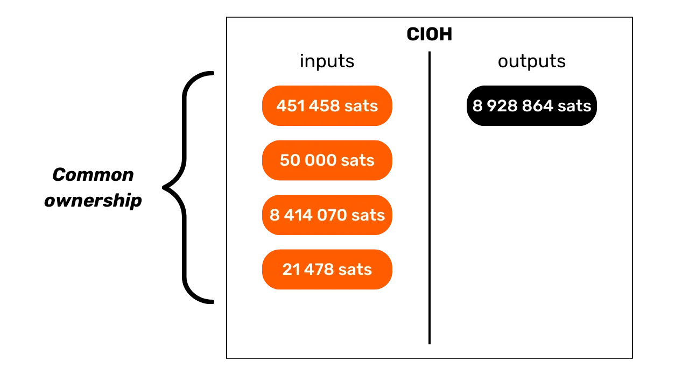
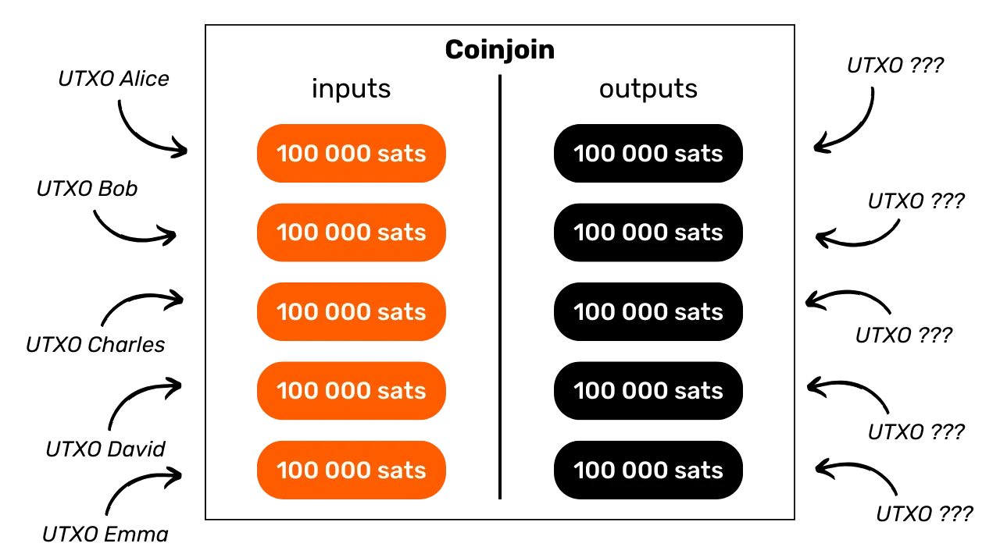
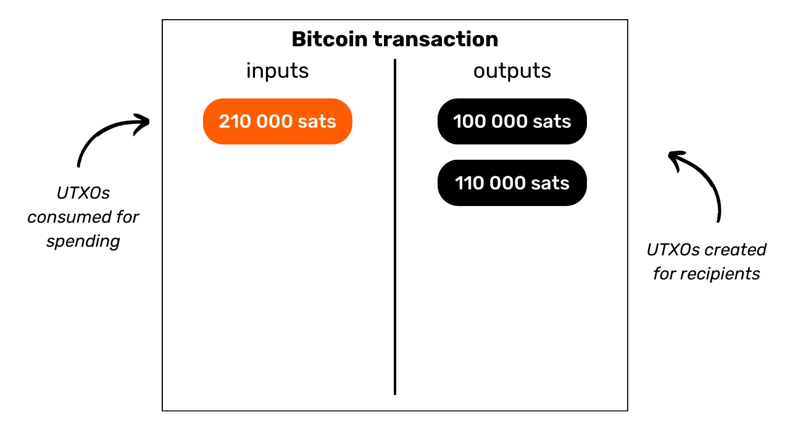

# Lindungi Privasi Anda pada Bitcoin

Di dunia di mana privasi transaksi keuangan secara bertahap menjadi kemewahan, memahami dan menguasai prinsip perlindungan privasi dalam penggunaan Bitcoin Anda adalah esensial. Pelatihan ini memberi Anda semua kunci, baik teoritis maupun praktis, untuk mencapai hal ini secara mandiri.

Hari ini, pada Bitcoin, ada perusahaan yang mengkhususkan diri dalam analisis rantai. Bisnis inti mereka adalah tepatnya untuk mengganggu lingkup pribadi Anda, dalam rangka untuk mengompromikan kerahasiaan transaksi Anda. Faktanya, "hak atas privasi" pada Bitcoin tidak ada. Oleh karena itu, terserah Anda, pengguna, untuk menegaskan hak alami Anda dan melindungi kerahasiaan transaksi Anda, karena tidak ada orang lain yang akan melakukannya untuk Anda.

Pelatihan ini menyajikan dirinya sebagai perjalanan yang lengkap dan generalis. Setiap konsep teknis dibahas secara rinci dan didukung oleh diagram penjelas. Tujuannya adalah untuk membuat pengetahuan dapat diakses oleh semua orang. BTC204 oleh karena itu dapat diakses untuk pengguna pemula dan menengah. Pelatihan ini juga menawarkan nilai tambah kepada bitcoiner yang paling berpengalaman, karena kami menggali beberapa konsep teknis yang sering tidak diketahui.

Bergabunglah dengan kami untuk mengubah penggunaan Bitcoin Anda dan menjadi pengguna yang terinformasi, mampu memahami taruhan seputar kerahasiaan dan melindungi privasi Anda.

+++

# Pendahuluan
<partId>e17474a8-8899-4bdb-a7f8-bc52ddb01440</partId>

## Pengantar Pelatihan
<chapterId>08ba1933-f393-4fb5-8279-777d874caedb</chapterId>

Di dunia di mana privasi transaksi keuangan secara bertahap menjadi kemewahan, memahami dan menguasai prinsip perlindungan privasi dalam penggunaan Bitcoin Anda adalah esensial. Pelatihan ini memberi Anda semua kunci, baik teoritis maupun praktis, untuk mencapai hal ini secara mandiri.
Hari ini, dalam ekosistem Bitcoin, ada perusahaan yang mengkhususkan diri dalam analisis rantai. Bisnis inti mereka adalah tepatnya untuk mengganggu lingkup pribadi Anda, mengompromikan kerahasiaan transaksi Anda. Dalam kenyataan, "hak atas privasi" pada Bitcoin tidak ada. Oleh karena itu, terserah Anda, pengguna, untuk menegaskan hak alami Anda dan melindungi kerahasiaan transaksi Anda, karena tidak ada orang lain yang akan melakukannya untuk Anda.

Bitcoin tidak hanya ada untuk "Number Go Up" dan pelestarian nilai tabungan. Karena karakteristik unik dan sejarahnya, itu terutama adalah alat dari ekonomi bawah tanah. Berkat penemuan luar biasa ini, Anda dapat bebas mengelola uang Anda, menghabiskannya, dan mengakumulasikannya, tanpa ada yang bisa mencegah Anda.

Bitcoin menawarkan pelarian damai dari kuk negara, memungkinkan Anda untuk sepenuhnya menikmati hak alami Anda, yang tidak dapat ditantang oleh hukum yang berlaku. Berkat penemuan Satoshi Nakamoto, Anda memiliki kekuatan untuk menegakkan penghormatan terhadap properti pribadi Anda dan mendapatkan kembali kebebasan untuk berkontrak.

Namun, Bitcoin secara default tidak anonim, yang dapat menimbulkan risiko bagi individu yang terlibat dalam ekonomi bawah tanah, terutama di wilayah di bawah rezim despotik. Tapi ini bukan satu-satunya bahaya. Mengingat bitcoin adalah aset berharga dan tidak dapat disensor, itu dapat menarik keserakahan pencuri. Dengan demikian, melindungi privasi Anda juga menjadi masalah keamanan: itu dapat membantu Anda mencegah serangan siber dan serangan fisik.
Seperti yang akan kita lihat, meskipun protokol menawarkan beberapa perlindungan privasi intrinsik, sangat penting untuk menggunakan alat tambahan untuk mengoptimalkan dan mempertahankan privasi ini.
Pelatihan ini dirancang sebagai perjalanan lengkap dan generalis untuk memahami taruhan privasi pada Bitcoin. Setiap konsep teknis dijelaskan secara rinci dan didukung oleh diagram penjelas. Tujuannya adalah untuk membuat pengetahuan dapat diakses oleh semua orang, termasuk pengguna pemula dan menengah. Untuk para bitcoiner yang lebih berpengalaman, kami juga membahas konsep-konsep teknis yang sangat teknis dan terkadang tidak diketahui sepanjang pelatihan ini untuk memperdalam pemahaman tentang setiap topik.

Tujuan dari pelatihan ini bukan untuk membuat Anda sepenuhnya anonim dalam penggunaan Bitcoin Anda, tetapi lebih kepada memberikan Anda alat-alat esensial untuk mengetahui bagaimana melindungi privasi Anda sesuai dengan tujuan pribadi Anda. Anda akan memiliki kebebasan untuk memilih dari konsep dan alat yang disajikan untuk mengembangkan strategi Anda sendiri, disesuaikan dengan tujuan dan kebutuhan spesifik Anda.

### Bagian 1: Definisi dan Konsep Kunci
Untuk memulai, kita akan bersama-sama mengulas prinsip-prinsip fundamental yang mengatur operasi Bitcoin, agar kemudian dapat dengan tenang mendekati konsep-konsep terkait privasi. Sangat penting untuk menguasai beberapa konsep dasar, seperti UTXO, alamat penerima, atau skrip, sebelum dapat sepenuhnya memahami konsep-konsep yang akan kita bahas di bagian selanjutnya. Kami juga akan memperkenalkan model umum privasi Bitcoin, sebagaimana yang dibayangkan oleh Satoshi Nakamoto, yang akan memungkinkan kita untuk memahami taruhan dan risiko yang terkait.


### Bagian 2: Memahami Analisis Rantai dan Cara Melindungi Diri dari Itu

Di bagian kedua, kita mempelajari teknik yang digunakan oleh perusahaan analisis rantai untuk melacak aktivitas Anda di Bitcoin. Memahami metode ini sangat penting untuk meningkatkan perlindungan privasi Anda. Bagian ini bertujuan untuk memeriksa strategi penyerang untuk lebih memahami risiko dan meletakkan dasar untuk teknik yang akan kita pelajari di bagian selanjutnya. Kita akan menganalisis pola transaksi, heuristik internal dan eksternal, serta interpretasi yang masuk akal dari pola-pola ini. Selain komponen teoritis, kita akan belajar menggunakan block explorer untuk melakukan analisis rantai, melalui contoh dan latihan praktis.


### Bagian 3: Menguasai Praktik Terbaik untuk Melindungi Privasi Anda

Di bagian ketiga pelatihan kita, kita sampai pada inti masalah: praktek! Tujuannya adalah untuk menguasai semua praktik terbaik esensial yang harus menjadi refleks alami bagi setiap pengguna Bitcoin. Kita akan membahas penggunaan alamat baru, pelabelan, konsolidasi, penggunaan node penuh, serta KYC dan metode akuisisi. Tujuannya adalah untuk memberikan Anda gambaran komprehensif tentang jebakan yang harus dihindari untuk membangun dasar yang kokoh dalam pencarian kita untuk perlindungan privasi. Untuk beberapa praktik ini, Anda akan diarahkan ke tutorial spesifik untuk mengimplementasikannya.



### Bagian 4: Memahami Transaksi Coinjoin

Bagaimana kita bisa berbicara tentang privasi pada Bitcoin tanpa membahas coinjoins? Di bagian 4, Anda akan menemukan semua yang perlu Anda ketahui tentang metode pencampuran ini. Anda akan belajar apa itu coinjoin, sejarah dan tujuannya, serta berbagai jenis coinjoin yang ada. Akhirnya, untuk pengguna yang lebih berpengalaman, kita akan menjelajahi apa itu anonsets dan entropi, dan bagaimana menghitung indikator-indikator ini.



### Bagian 5: Memahami Taruhan dari Teknik Privasi Lanjutan Lainnya
Di bagian kelima, kami akan memberikan gambaran umum tentang semua teknik lain yang ada untuk melindungi privasi Anda di Bitcoin, selain dari coinjoin. Selama bertahun-tahun, pengembang telah menunjukkan kreativitas yang luar biasa dalam merancang alat yang didedikasikan untuk privasi. Kami akan meneliti semua metode ini, seperti Payjoin, transaksi kolaboratif, Coin Swap, dan Atomic Swap, menjelaskan operasi, tujuan, dan kelemahan potensial mereka.

### Bagian 6: Menjelajahi Usulan Peningkatan Protokol Terkait dengan Privasi

Sementara bagian sebelumnya berfokus pada solusi privasi tingkat aplikasi, bagian keenam ini akan menggali tantangan pada tingkat protokol untuk privasi pengguna. Kami akan membahas privasi pada jaringan node dan penyiaran transaksi. Kami juga akan membahas berbagai protokol yang telah diusulkan selama bertahun-tahun untuk meningkatkan privasi pengguna di Bitcoin. Untuk menyimpulkan, kami akan meneliti dampak pada privasi, baik positif maupun negatif, dari soft fork besar terakhir Bitcoin, Taproot.

***(WIP: LOIC: TAMBAHKAN CONTOH DIAGRAM DI SINI)***

### Bagian Bonus: Privasi pada Protokol Lapisan Kedua

Seperti yang Anda pahami, inti dari pelatihan ini secara eksklusif berfokus pada privasi onchain. Di bagian bonus akhir ini, saya ingin memperluas topik ke privasi pada protokol lain yang terkait dengan Bitcoin. Kami akan secara khusus berbicara tentang privasi di Lightning Network. Beberapa mengklaim bahwa Lightning secara default bersifat pribadi, sementara yang lain berpendapat bahwa privasi pengguna tidak cukup. Jadi, apa kebenarannya? Kami akan memisahkan kebenaran dari kebohongan untuk lebih memahami tantangan yang terkait dengan privasi di Lightning Network. Kami juga akan membahas sidechain seperti Liquid Network dan bank Chaumian seperti Cashu atau Fedimint.

# Definisi dan Konsep Kunci

## Model UTXO Bitcoin

Bitcoin pada dasarnya adalah mata uang, tetapi apakah Anda tahu secara konkret bagaimana BTC direpresentasikan pada protokol?

### UTXO Bitcoin: Apa Itu?

Dalam protokol Bitcoin, pengelolaan unit moneter berputar di sekitar model UTXO, singkatan dari "_Unspent Transaction Output_". Model ini sangat berbeda dari sistem perbankan tradisional yang mengandalkan mekanisme akun dan saldo untuk melacak aliran keuangan. Memang, dalam sistem perbankan, saldo individu dipertahankan dalam akun yang terikat pada identitas. Misalnya, ketika Anda membeli baguette dari seorang tukang roti, bank Anda hanya mendebit jumlah pembelian dari akun Anda, sehingga mengurangi saldo Anda, sementara akun tukang roti dikreditkan dengan jumlah yang sama, meningkatkan saldo mereka. Dalam sistem ini, tidak ada konsep tautan antara uang yang masuk ke akun Anda dan uang yang keluar darinya, selain dari catatan transaksi.

Di Bitcoin, cara kerjanya berbeda. Konsep akun tidak ada, dan unit moneter tidak dikelola melalui saldo tetapi melalui UTXO. UTXO mewakili jumlah bitcoin tertentu yang belum dihabiskan, sehingga membentuk "potongan bitcoin," yang bisa besar atau kecil. Misalnya, sebuah UTXO bisa bernilai `500 BTC` atau hanya `700 SATS`.

**> Pengingat:** Satoshi, sering disingkat sebagai sat, adalah unit terkecil dari Bitcoin, sebanding dengan sen dalam mata uang fiat.

```plaintext
1 BTC = 100 000 000 SATS
```
Secara teoritis, sebuah UTXO dapat mewakili nilai apa pun dalam bitcoin, mulai dari satu satoshi hingga maksimum teoretis sekitar 21 juta BTC. Namun, secara logis tidak mungkin untuk memiliki semua 21 juta bitcoin, dan ada ambang batas ekonomi yang lebih rendah yang disebut "debu," di bawahnya sebuah UTXO dianggap tidak ekonomis untuk dibelanjakan.
**> Tahukah Anda?** UTXO terbesar yang pernah dibuat di Bitcoin memiliki nilai `500 000 BTC`. Itu dibuat oleh platform MtGox selama operasi konsolidasi pada November 2011: [29a3efd3ef04f9153d47a990bd7b048a4b2d213daaa5fb8ed670fb85f13bdbcf](https://mempool.space/en/tx/29a3efd3ef04f9153d47a990bd7b048a4b2d213daaa5fb8ed670fb85f13bdbcf)

### UTXO dan Kondisi Pengeluaran

UTXO adalah instrumen pertukaran di Bitcoin. Setiap transaksi menghasilkan konsumsi UTXO sebagai input dan penciptaan UTXO baru sebagai output. Ketika sebuah transaksi dilakukan, UTXO yang digunakan sebagai input dianggap "terpakai," dan UTXO baru dihasilkan dan ditugaskan kepada penerima yang ditunjukkan dalam output transaksi. Dengan demikian, sebuah UTXO hanya mewakili output transaksi yang belum terpakai, dan oleh karena itu sejumlah bitcoin yang dimiliki oleh pengguna pada waktu tertentu.

Semua UTXO diamankan oleh skrip yang mendefinisikan kondisi di bawah mana mereka dapat dibelanjakan. Untuk menggunakan UTXO, pengguna harus menunjukkan kepada jaringan bahwa mereka memenuhi kondisi yang ditetapkan oleh skrip yang mengamankan UTXO tersebut. Umumnya, UTXO dilindungi oleh kunci publik (atau alamat penerima yang mewakili kunci publik ini). Untuk menghabiskan UTXO yang terkait dengan kunci publik ini, pengguna harus membuktikan bahwa mereka memegang kunci privat yang sesuai, dengan menyediakan tanda tangan digital yang dibuat dengan kunci ini. Inilah sebabnya mengapa dikatakan bahwa dompet Bitcoin Anda sebenarnya tidak mengandung bitcoin, tetapi sebaliknya, ia menyimpan kunci privat Anda, yang pada gilirannya memberi Anda akses ke UTXO Anda dan, dengan perluasan, ke bitcoin yang mereka wakili.


Mengingat konsep akun absen di Bitcoin, saldo dompet hanya sesuai dengan jumlah nilai semua UTXO yang dapat dibelanjakannya. Misalnya, jika dompet Bitcoin Anda dapat menghabiskan 4 UTXO berikut:

```plaintext
- 2 BTC
- 8 BTC
- 5 BTC
- 2 BTC
```

Saldo total dompet Anda akan menjadi `17 BTC`.


## Struktur Transaksi Bitcoin
<chapterId>29d3aaab-de2e-4746-ab40-c9748898850c</chapterId>

### Input dan Output dari sebuah Transaksi

Transaksi Bitcoin adalah operasi yang dicatat di blockchain yang memungkinkan transfer kepemilikan bitcoin dari satu orang ke orang lain. Lebih spesifik lagi, karena kita berada pada model UTXO dan tidak ada akun, transaksi memenuhi kondisi pengeluaran yang mengamankan satu atau lebih UTXO, mengkonsumsinya, dan menciptakan secara setara UTXO baru yang diberkahi dengan kondisi pengeluaran baru. Singkatnya, sebuah transaksi memindahkan bitcoin dari skrip yang dipuaskan ke skrip baru yang dimaksudkan untuk mengamankannya.


Setiap transaksi Bitcoin terdiri dari satu atau lebih input dan satu atau lebih output. Input adalah UTXO yang dikonsumsi oleh transaksi untuk menghasilkan output. Output adalah UTXO baru yang akan dapat digunakan sebagai input untuk transaksi masa depan.


**> Tahukah Anda?** Secara teoritis, sebuah transaksi bitcoin dapat memiliki jumlah input dan output yang tak terbatas. Hanya ukuran maksimum blok yang membatasi jumlah ini.
Setiap input dalam transaksi Bitcoin merujuk pada UTXO yang belum terpakai sebelumnya. Untuk menggunakan UTXO sebagai input, pemegangnya harus menunjukkan bahwa mereka adalah pemilik sah dengan memvalidasi skrip yang terkait dengannya, yaitu, dengan memenuhi kondisi pengeluaran yang diberlakukan. Umumnya, ini melibatkan penyediaan tanda tangan digital yang dihasilkan dengan kunci privat yang sesuai dengan kunci publik yang awalnya mengamankan UTXO tersebut. Skrip ini terdiri dari memverifikasi bahwa tanda tangan cocok dengan kunci publik yang digunakan saat menerima dana.


Di sisi lain, setiap output menentukan jumlah bitcoin yang akan ditransfer, serta penerima. Yang terakhir ini ditentukan oleh skrip baru yang, pada umumnya, mengunci UTXO yang baru dibuat dengan alamat penerima atau kunci publik baru.

Agar transaksi dianggap valid menurut aturan konsensus, total output harus kurang dari atau sama dengan total input. Dengan kata lain, jumlah UTXO baru yang dihasilkan oleh transaksi tidak boleh melebihi jumlah UTXO yang dikonsumsi sebagai input. Prinsip ini logis: jika Anda hanya memiliki jumlah `500,000 SATS`, Anda tidak dapat melakukan pembelian sebesar `700,000 SATS`.

### Perubahan dan Konsolidasi dalam Transaksi Bitcoin

Aksi transaksi Bitcoin pada UTXO dapat dibandingkan dengan peleburan koin emas. Memang, UTXO tidak dapat dibagi, tetapi hanya dapat digabungkan. Ini berarti bahwa pengguna tidak dapat dengan mudah membagi UTXO yang mewakili jumlah bitcoin tertentu menjadi beberapa UTXO yang lebih kecil. Mereka harus mengonsumsinya sepenuhnya dalam sebuah transaksi untuk menciptakan satu atau lebih UTXO baru dengan nilai-nilai sembarang di output, yang harus kurang dari atau sama dengan nilai awal.

Mekanisme ini mirip dengan koin emas. Bayangkan Anda memiliki koin 2 ons dan Anda ingin melakukan pembayaran 1 ons, dengan asumsi penjual tidak dapat memberi Anda kembalian. Anda perlu melebur koin Anda dan mencetak 2 koin baru masing-masing 1 ons.
Di Bitcoin, operasinya serupa. Mari kita bayangkan bahwa Alice memiliki UTXO sebesar `10,000 SATS` dan dia ingin membeli sebuah baguette seharga `4,000 SATS`. Alice akan melakukan transaksi dengan input 1 UTXO sebesar `10,000 SATS` yang akan dia konsumsi sepenuhnya, dan di output, dia akan menciptakan 2 UTXO dengan nilai `4,000 SATS` dan `6,000 SATS`. UTXO sebesar `4,000 SATS` akan dikirim ke tukang roti sebagai pembayaran untuk baguette, sementara UTXO sebesar `6,000 SATS` akan kembali ke Alice sebagai kembalian. UTXO yang kembali ke pengirim awal transaksi ini disebut "kembalian" dalam jargon Bitcoin.

Sekarang mari kita bayangkan bahwa Alice tidak memiliki satu UTXO sebesar `10,000 SATS`, melainkan dua UTXO masing-masing sebesar `3,000 SATS`. Dalam situasi ini, tidak ada satu pun UTXO yang cukup untuk menutupi `4,000 SATS` untuk baguette tersebut. Oleh karena itu, Alice harus menggunakan kedua UTXO sebesar `3,000 SATS` sebagai input untuk transaksinya. Dengan cara ini, jumlah total input akan mencapai `6,000 SATS`, memungkinkannya untuk menutupi pembayaran `4,000 SATS` kepada tukang roti. Metode ini, yang melibatkan pengelompokan beberapa UTXO dalam input sebuah transaksi, sering disebut dengan istilah "konsolidasi".


### Biaya Transaksi

Secara intuitif, seseorang mungkin berpikir bahwa biaya transaksi juga merupakan output dari sebuah transaksi. Namun pada kenyataannya, ini bukanlah kasusnya. Biaya dari sebuah transaksi merupakan perbedaan antara total input dan total output. Ini berarti bahwa, setelah menggunakan sebagian dari nilai input untuk menutupi output yang diinginkan dalam sebuah transaksi, sejumlah sum dari input tetap tidak terpakai. Sisa sum ini merupakan biaya transaksi.

```plaintext
Biaya = total input - total output
```

Mari kita kembali ke contoh Alice yang memiliki UTXO sebesar `10,000 SATS` dan ingin membeli baguette seharga `4,000 SATS`. Alice membuat sebuah transaksi dengan UTXO-nya sebesar `10,000 SATS` sebagai input. Kemudian dia menghasilkan output sebesar `4,000 SATS` yang ditujukan untuk tukang roti sebagai pembayaran baguette. Untuk mendorong penambang agar memasukkan transaksinya dalam sebuah blok, Alice mengalokasikan `200 SATS` sebagai biaya. Dia dengan demikian menciptakan output kedua, kembalian, yang akan kembali kepadanya, berjumlah `5,800 SATS`.


Dengan menerapkan rumus biaya, kita memang melihat bahwa masih tersisa `200 SATS` untuk para penambang:

```plaintext
Biaya = total input - total output
Biaya = 10,000 - (4,000 + 5,800)
Biaya = 10,000 - 9,800
Biaya = 200
```

Ketika seorang penambang berhasil memvalidasi sebuah blok, mereka diizinkan untuk mengumpulkan biaya ini untuk semua transaksi yang termasuk dalam blok mereka, melalui transaksi yang disebut "coinbase".

### Pembuatan UTXO pada Bitcoin

Jika Anda telah mengikuti paragraf sebelumnya dengan cermat, Anda sekarang tahu bahwa UTXO hanya dapat diciptakan dengan mengonsumsi UTXO lain yang sudah ada. Dengan demikian, koin pada Bitcoin membentuk rantai yang berkelanjutan. Namun, Anda mungkin bertanya-tanya bagaimana UTXO pertama dalam rantai ini muncul. Ini menimbulkan masalah serupa dengan ayam dan telur: darimana UTXO asli ini berasal?

Jawabannya terletak pada **transaksi coinbase**.

Coinbase adalah jenis transaksi Bitcoin yang spesifik, yang unik untuk setiap blok dan selalu yang pertama. Ini memungkinkan penambang yang menemukan bukti kerja yang valid untuk menerima hadiah blok mereka. Hadiah ini terdiri dari dua elemen: **subsidi blok** dan **biaya transaksi** yang kita bahas di bagian sebelumnya.

Fitur unik dari transaksi coinbase adalah bahwa ini adalah satu-satunya yang dapat menciptakan bitcoin dari udara tipis, tanpa perlu mengonsumsi input untuk menghasilkan outputnya. Bitcoin yang baru diciptakan ini merupakan apa yang mungkin kita sebut sebagai "UTXO asli".

Bitcoin yang berasal dari subsidi blok adalah BTC baru yang diciptakan dari nol, mengikuti jadwal penerbitan yang telah ditetapkan sebelumnya dalam aturan konsensus. Subsidi blok dibagi dua setiap 210.000 blok, yang kira-kira setiap empat tahun, dalam proses yang disebut "halving". Awalnya, 50 bitcoin diciptakan dengan setiap subsidi, tetapi jumlah ini telah secara bertahap berkurang; saat ini, jumlahnya adalah 3.125 bitcoin per blok.

Sedangkan untuk bagian yang terkait dengan biaya transaksi, meskipun ini juga mewakili BTC yang baru diciptakan, jumlahnya tidak boleh melebihi perbedaan antara total input dan output dari semua transaksi dalam sebuah blok. Seperti yang telah kita lihat sebelumnya, biaya ini mewakili bagian dari input yang tidak digunakan dalam output transaksi. Bagian ini secara teknis "hilang" selama transaksi, dan penambang memiliki hak untuk menciptakan kembali nilai ini dalam bentuk satu atau lebih UTXO baru. Ini, oleh karena itu, merupakan transfer nilai dari pengirim transaksi ke penambang yang menambahkannya ke blockchain.

**> Tahukah Anda?** Bitcoin yang dihasilkan oleh transaksi coinbase tunduk pada periode kematangan 100 blok selama mana mereka tidak dapat dihabiskan oleh penambang. Aturan ini dimaksudkan untuk mencegah komplikasi terkait penggunaan bitcoin yang baru diciptakan pada rantai yang kemudian bisa menjadi usang.
### Implikasi dari Model UTXO
Pertama-tama, model UTXO secara langsung mempengaruhi biaya transaksi pada Bitcoin. Mengingat kapasitas setiap blok terbatas, penambang memprioritaskan transaksi yang menawarkan biaya terbaik relatif terhadap ruang yang akan mereka tempati di blok. Memang, semakin banyak UTXO yang termasuk sebagai input dan output dalam sebuah transaksi, semakin berat transaksi tersebut, dan oleh karena itu, memerlukan biaya yang lebih tinggi. Ini adalah salah satu alasan mengapa kita sering mencoba untuk mengurangi jumlah UTXO di dompet kita, yang juga dapat mempengaruhi privasi, topik yang akan kita bahas secara detail di bagian ketiga pelatihan ini.

Selanjutnya, seperti yang disebutkan dalam bagian sebelumnya, koin pada Bitcoin pada dasarnya adalah rantai UTXO. Setiap transaksi dengan demikian menciptakan tautan antara UTXO masa lalu dan UTXO masa depan. UTXO oleh karena itu memungkinkan untuk pelacakan eksplisit bitcoin dari penciptaannya hingga pengeluaran saat ini. Transparansi ini dapat dipersepsikan secara positif, karena memungkinkan setiap pengguna untuk memverifikasi keaslian bitcoin yang diterima. Namun, juga pada prinsip pelacakan dan auditabilitas inilah analisis rantai beristirahat, sebuah praktik yang bertujuan untuk mengkompromikan privasi Anda. Kami akan mempelajari praktik ini secara mendalam di bagian kedua pelatihan.

## Model Privasi Bitcoin
<chapterId>769d8963-3ed5-4094-b21d-9203c7d9e465</chapterId>

### Mata Uang: Keaslian, Integritas, dan Pengeluaran Ganda

Salah satu fungsi uang adalah untuk menyelesaikan masalah kebetulan ganda dari keinginan. Dalam sistem yang berbasis barter, melakukan pertukaran memerlukan tidak hanya menemukan individu yang menawarkan barang yang memenuhi kebutuhan saya, tetapi juga menyediakan mereka dengan barang bernilai setara yang memuaskan kebutuhan mereka sendiri. Menemukan keseimbangan ini terbukti kompleks.


Itulah mengapa kita beralih ke uang, yang memungkinkan untuk transfer nilai baik secara spasial maupun temporal.


Agar uang dapat menyelesaikan masalah ini, sangat penting bahwa pihak yang menyediakan barang atau jasa yakin akan kemampuan mereka untuk menghabiskan jumlah tersebut nanti. Dengan demikian, setiap individu rasional yang ingin menerima sejumlah uang, baik digital maupun fisik, akan memastikan bahwa itu memenuhi dua kriteria fundamental:
- **Koin harus utuh dan asli;**
- **dan tidak boleh digunakan dua kali.**

Saat menggunakan mata uang fisik, karakteristik pertama adalah yang paling kompleks untuk ditegaskan. Di berbagai waktu dalam sejarah, integritas koin logam sering kali dikompromikan oleh praktik seperti memotong atau mengebor. Sebagai contoh, selama zaman Romawi kuno, umum untuk warga negara mengikis tepi koin emas untuk mengumpulkan sedikit logam berharga, sambil tetap menyimpannya untuk transaksi masa depan. Nilai intrinsik koin tersebut berkurang, tetapi nilai nominalnya tetap sama. Inilah sebabnya mengapa kemudian ujung koin dicetak dengan alur.

Keaslian juga merupakan karakteristik yang sulit untuk diverifikasi dengan media moneter fisik. Saat ini, teknik untuk memerangi pemalsuan semakin kompleks, memaksa pedagang untuk berinvestasi dalam sistem verifikasi yang mahal.

Di sisi lain, karena sifatnya, penggunaan ganda bukanlah masalah untuk mata uang fisik. Jika saya memberi Anda uang kertas €10, itu secara tak terelakkan meninggalkan kepemilikan saya untuk masuk ke milik Anda, secara alami mengecualikan kemungkinan menghabiskan unit moneter yang sama beberapa kali. Singkatnya, saya tidak akan dapat menghabiskan uang kertas €10 itu lagi.


Untuk mata uang digital, kesulitannya berbeda. Memastikan keaslian dan integritas koin seringkali lebih sederhana. Seperti yang kita lihat di bagian sebelumnya, model UTXO Bitcoin memungkinkan pelacakan koin kembali ke asalnya, dengan demikian memverifikasi bahwa memang diciptakan sesuai dengan aturan konsensus oleh penambang.

Namun, memastikan tidak adanya penggunaan ganda lebih kompleks, karena barang digital pada dasarnya adalah informasi. Tidak seperti barang fisik, informasi tidak terbagi selama pertukaran tetapi berkembang biak dengan berlipat ganda. Sebagai contoh, jika saya mengirimkan dokumen kepada Anda melalui email, dokumen itu kemudian diduplikasi. Di pihak Anda, Anda tidak dapat memverifikasi dengan pasti bahwa saya telah menghapus dokumen asli.


### Mencegah Penggunaan Ganda pada Bitcoin
Satu-satunya cara untuk menghindari duplikasi barang digital adalah dengan mengetahui semua pertukaran dalam sistem. Dengan cara ini, seseorang dapat mengetahui siapa yang memiliki apa dan memperbarui kepemilikan semua orang sesuai dengan transaksi yang dilakukan. Inilah yang dilakukan, misalnya, dengan uang giral dalam sistem perbankan. Ketika Anda membayar €10 kepada pedagang dengan kartu kredit, bank mencatat pertukaran ini dan memperbarui buku besar.
Di Bitcoin, pencegahan penggunaan ganda dicapai dengan cara yang sama. Tujuannya adalah untuk mengonfirmasi ketiadaan transaksi yang telah menghabiskan koin yang bersangkutan. Jika koin-koin ini belum pernah digunakan, maka kita dapat yakin bahwa tidak akan terjadi penggunaan ganda. Prinsip ini dijelaskan oleh Satoshi Nakamoto dalam White Paper dengan frase terkenal ini:

**"*Satu-satunya cara untuk mengonfirmasi ketiadaan transaksi adalah dengan mengetahui semua transaksi.*"**

Namun, tidak seperti model perbankan, tidak ada keinginan untuk harus mempercayai entitas pusat di Bitcoin. Diperlukan bagi semua pengguna untuk dapat mengonfirmasi ketiadaan penggunaan ganda ini, tanpa mengandalkan pihak ketiga. Dengan demikian, semua orang harus mengetahui semua transaksi Bitcoin. Inilah sebabnya mengapa transaksi Bitcoin disiarkan secara publik di seluruh node jaringan dan dicatat dengan jelas di blockchain.

Tepatnya penyebaran informasi publik ini yang mempersulit perlindungan privasi di Bitcoin. Dalam sistem perbankan tradisional, secara teori, hanya lembaga keuangan yang mengetahui transaksi yang dilakukan. Di sisi lain, di Bitcoin, semua pengguna diberitahu tentang semua transaksi, melalui node masing-masing.

### Model privasi: sistem perbankan vs Bitcoin
Dalam sistem tradisional, rekening bank Anda terhubung dengan identitas Anda. Bankir dapat mengetahui rekening bank mana yang milik klien mana, dan transaksi apa saja yang terkait dengannya. Namun, aliran informasi ini terputus antara bank dan domain publik. Dengan kata lain, tidak mungkin untuk mengetahui saldo dan transaksi dari rekening bank yang dimiliki oleh individu lain. Hanya bank yang memiliki akses ke informasi ini.

Sebagai contoh, bankir Anda tahu bahwa Anda membeli baguette setiap pagi di toko roti lingkungan, tetapi tetangga Anda tidak mengetahui transaksi ini. Dengan demikian, aliran informasi dapat diakses oleh pihak-pihak yang bersangkutan, terutama bank, tetapi tetap tidak dapat diakses oleh pihak luar.

Karena kendala penyebaran publik transaksi yang kita lihat di bagian sebelumnya, model privasi Bitcoin tidak dapat mengikuti model sistem perbankan. Dalam kasus Bitcoin, karena aliran informasi tidak dapat diputus antara transaksi dan domain publik, **model privasi bergantung pada pemisahan antara identitas pengguna dan transaksi** itu sendiri.

Sebagai contoh, jika Anda membeli baguette dari tukang roti dengan membayar dalam BTC, tetangga Anda, yang memiliki full node mereka sendiri, dapat melihat transaksi Anda berlangsung, sama seperti mereka dapat melihat semua transaksi lain dalam sistem. Namun, jika prinsip privasi dihormati, mereka seharusnya tidak dapat menghubungkan transaksi spesifik ini dengan identitas Anda.

Namun, karena transaksi Bitcoin dibuat publik, masih menjadi mungkin untuk menetapkan tautan antara mereka untuk menarik informasi tentang pihak yang terlibat. Kegiatan ini bahkan merupakan spesialisasi tersendiri yang disebut "analisis rantai". Di bagian selanjutnya dari pelatihan, saya mengundang Anda untuk menjelajahi dasar-dasar analisis rantai untuk memahami bagaimana bitcoin Anda dilacak dan untuk mengetahui cara lebih baik melindungi diri dari hal itu.

# Memahami Analisis Rantai dan Cara Melindungi Diri
<partId>4739371e-9fef-45b0-bcaa-b7a4df6b4470</partId>

## Apa itu Analisis Rantai pada Bitcoin?
<chapterId>7d198ba6-4af2-4f24-86cb-3c79cb25627e</chapterId>

### Definisi dan Operasi

Analisis rantai adalah praktik yang mencakup semua metode untuk melacak aliran bitcoin di blockchain. Umumnya, analisis rantai bergantung pada pengamatan karakteristik dalam sampel transaksi sebelumnya. Kemudian melibatkan identifikasi karakteristik yang sama dalam transaksi yang ingin dianalisis dan menarik interpretasi yang masuk akal. Metode pemecahan masalah dari pendekatan praktis, untuk menemukan solusi yang cukup baik, inilah yang disebut "heuristik".

Untuk menyederhanakan, analisis rantai dilakukan dalam tiga langkah utama:
1. **Mengamati blockchain;**
2. **Mengidentifikasi karakteristik yang diketahui;**
3. **Menarik hipotesis.**


Analisis rantai dapat dilakukan oleh siapa saja. Hanya memerlukan akses ke informasi publik blockchain melalui full node untuk mengamati pergerakan transaksi dan membuat hipotesis. Ada juga alat gratis yang memfasilitasi analisis ini, seperti situs web [OXT.me](https://oxt.me/) yang akan kita jelajahi secara detail di dua bab terakhir bagian ini. Namun, risiko utama terhadap privasi berasal dari perusahaan yang berspesialisasi dalam analisis rantai. Perusahaan-perusahaan ini telah membawa analisis rantai ke skala industri dan menjual layanan mereka ke institusi keuangan atau pemerintah. Di antara perusahaan-perusahaan ini, Chainalysis mungkin yang paling dikenal.

### Tujuan Analisis Rantai
Salah satu tujuan dari analisis rantai adalah untuk mengelompokkan berbagai aktivitas pada Bitcoin guna menentukan keunikan pengguna yang melakukannya. Selanjutnya, akan dimungkinkan untuk mencoba menghubungkan kumpulan aktivitas ini dengan identitas nyata.

Ingatlah bab sebelumnya. Saya menjelaskan mengapa model privasi Bitcoin awalnya bergantung pada pemisahan identitas pengguna dari transaksi mereka. Oleh karena itu, mungkin tergoda untuk berpikir bahwa analisis rantai tidak perlu, karena meskipun seseorang berhasil mengelompokkan aktivitas onchain, mereka tidak dapat dikaitkan dengan identitas nyata.

Secara teoritis, pernyataan ini akurat. Di bagian pertama pelatihan ini, kita melihat bahwa pasangan kunci kriptografi digunakan untuk menetapkan kondisi pada UTXO. Pada dasarnya, pasangan kunci ini tidak mengungkapkan informasi apa pun tentang identitas pemegangnya. Jadi, meskipun seseorang berhasil mengelompokkan aktivitas yang terkait dengan pasangan kunci yang berbeda, ini tidak memberi tahu kita apa pun tentang entitas di balik aktivitas tersebut.

Namun, realitas praktis jauh lebih kompleks. Ada berbagai perilaku yang berisiko menghubungkan identitas nyata dengan aktivitas onchain. Dalam analisis, ini disebut sebagai titik masuk, dan ada banyak di antaranya.

Yang paling umum, tentu saja, adalah KYC (*Know Your Customer*). Jika Anda menarik bitcoin Anda dari platform yang diatur ke salah satu alamat penerimaan pribadi Anda, maka beberapa orang dapat menghubungkan identitas Anda dengan alamat ini. Lebih luas lagi, titik masuk dapat berupa bentuk interaksi apa pun antara kehidupan nyata Anda dan transaksi Bitcoin. Misalnya, jika Anda mempublikasikan alamat penerimaan di jejaring sosial Anda, ini dapat menjadi titik masuk untuk analisis. Jika Anda melakukan pembayaran dalam bitcoin kepada tukang roti Anda, mereka dapat mengaitkan wajah Anda (yang merupakan bagian dari identitas Anda) dengan alamat Bitcoin.

Titik masuk ini hampir tidak terhindarkan dalam penggunaan Bitcoin. Meskipun seseorang dapat berusaha untuk membatasi lingkupnya, mereka akan tetap ada. Itulah mengapa sangat penting untuk menggabungkan metode yang bertujuan untuk menjaga privasi Anda. Meskipun mempertahankan pemisahan antara identitas nyata Anda dan transaksi Anda adalah pendekatan yang menarik, itu tetap tidak cukup hari ini. Memang, jika semua aktivitas onchain Anda dapat dikelompokkan, maka titik masuk yang paling kecil kemungkinan akan mengkompromikan satu-satunya lapisan privasi yang telah Anda tetapkan.

### Membela Diri Terhadap Analisis Rantai
Dengan demikian, juga perlu untuk dapat menghadapi analisis blockchain dalam penggunaan Bitcoin kita. Dengan cara ini, kita dapat meminimalkan agregasi aktivitas kita dan membatasi dampak titik masuk pada privasi kita.

Memang, untuk lebih baik melawan analisis blockchain, pendekatan apa yang lebih baik selain mempelajari metode yang digunakan dalam analisis blockchain? Jika Anda ingin tahu cara meningkatkan privasi Anda pada Bitcoin, Anda harus memahami metode-metode ini. Ini akan memungkinkan Anda untuk lebih memahami teknik seperti [Coinjoin](https://planb.network/en/tutorials/privacy/coinjoin-samourai-wallet) atau [Payjoin](https://planb.network/en/tutorials/privacy/payjoin) (teknik yang akan kita pelajari di bagian terakhir dari pelatihan), dan untuk mengurangi kesalahan yang mungkin Anda buat.
Dalam hal ini, kita dapat membuat analogi dengan kriptografi dan kriptoanalisis. Seorang kriptografer yang baik adalah terlebih dahulu seorang kriptoanalis yang baik. Untuk membayangkan algoritma enkripsi baru, seseorang harus tahu serangan apa yang akan dihadapinya, dan juga mempelajari mengapa algoritma sebelumnya dapat dipecahkan. Prinsip yang sama berlaku untuk privasi pada Bitcoin. Memahami metode analisis blockchain adalah kunci untuk melindungi diri dari itu. Inilah mengapa saya mengusulkan sebuah bagian lengkap tentang analisis blockchain dalam pelatihan ini.

### Metode Analisis Blockchain

Penting untuk dipahami bahwa analisis blockchain bukanlah ilmu pasti. Ini bergantung pada heuristik yang berasal dari pengamatan sebelumnya atau interpretasi logis. Aturan-aturan ini memungkinkan hasil yang cukup dapat diandalkan, tetapi tidak pernah dengan presisi absolut. Dengan kata lain, **analisis blockchain selalu melibatkan dimensi probabilitas dalam kesimpulan yang dikeluarkan**. Misalnya, mungkin dapat diperkirakan dengan lebih atau kurang pasti bahwa dua alamat milik entitas yang sama, tetapi kepastian total selalu di luar jangkauan.

Seluruh tujuan analisis blockchain terletak tepatnya dalam agregasi berbagai heuristik untuk meminimalkan risiko kesalahan. Ini, dalam suatu cara, adalah akumulasi bukti yang memungkinkan kita mendekati realitas lebih dekat.

Heuristik terkenal ini dapat dikelompokkan ke dalam kategori yang berbeda yang akan kita rinci bersama:
- **Pola Transaksi (atau model transaksi);**
- **Heuristik internal transaksi;**
- **Heuristik eksternal transaksi.**

### Satoshi Nakamoto dan Analisis Blockchain
Penting untuk dicatat bahwa dua heuristik pertama untuk analisis rantai ditemukan oleh Satoshi Nakamoto sendiri. Dia membahasnya di bagian 10 dari Makalah Putih Bitcoin. Ini adalah:
- Heuristik Kepemilikan Input Bersama (CIOH);
- dan penggunaan ulang alamat.


Sumber: S. Nakamoto, "Bitcoin: A Peer-to-Peer Electronic Cash System", https://bitcoin.org/bitcoin.pdf, 2009.

Dalam bab-bab berikutnya, kita akan menjelajahi apa yang terdiri dari ini, tetapi sudah menarik untuk dicatat bahwa dua heuristik ini masih mempertahankan kedudukan terkemuka dalam analisis rantai saat ini.

## Pola Transaksi

Sebuah pola transaksi hanyalah model atau struktur keseluruhan dari transaksi tipikal yang dapat ditemukan di blockchain, yang interpretasinya kemungkinan diketahui. Saat mempelajari pola, kita akan fokus pada satu transaksi yang akan kita analisis secara tingkat tinggi.

Dengan kata lain, kita hanya akan melihat jumlah UTXO dalam input dan jumlah UTXO dalam output, tanpa menghabiskan waktu pada detail spesifik atau lingkungan transaksi. Dari model yang diamati, kita akan dapat menginterpretasikan sifat dari transaksi. Kemudian kita akan mencari karakteristik dari strukturnya dan mendapatkan interpretasi.


Dalam bagian ini, kita akan bersama-sama menemukan model transaksi utama yang dapat ditemui dalam analisis rantai, dan untuk setiap model, saya akan memberikan interpretasi yang mungkin dari struktur ini, bersama dengan contoh konkret.

### Pengiriman Sederhana (atau Pembayaran Sederhana)

Kita mulai dengan pola yang sangat luas, karena ini adalah yang muncul dalam sebagian besar pembayaran bitcoin. Model pembayaran sederhana ditandai dengan konsumsi satu atau lebih UTXO dalam input dan produksi 2 UTXO dalam output. Model ini akan terlihat seperti ini:


Ketika kita melihat struktur transaksi ini di blockchain, kita sudah dapat menarik sebuah interpretasi. Seperti namanya, model ini menunjukkan bahwa kita berada dalam kehadiran transaksi pengiriman atau pembayaran. Pengguna telah menggunakan UTXO milik mereka sendiri dalam input untuk memenuhi output sebuah UTXO pembayaran dan sebuah UTXO kembalian (kembalian yang kembali ke pengguna yang sama).

Oleh karena itu, kita tahu bahwa pengguna yang diamati kemungkinan besar tidak lagi memiliki salah satu dari dua UTXO di output (yang pembayaran), tetapi mereka masih memiliki UTXO lainnya (yang kembalian).

Saat ini, tidak mungkin bagi kita untuk menentukan output mana yang mewakili UTXO mana, karena ini bukan tujuan dari studi pola. Kita akan mencapai ini dengan mengandalkan heuristik yang akan kita pelajari di bagian selanjutnya. Pada tahap ini, tujuan kita terbatas pada mengidentifikasi sifat dari transaksi yang bersangkutan, yang dalam hal ini, adalah pengiriman sederhana.

Sebagai contoh, berikut adalah transaksi Bitcoin yang mengadopsi pola pengiriman sederhana:

```plaintext
b6cc79f45fd2d7669ff94db5cb14c45f1f879ea0ba4c6e3d16ad53a18c34b769
```


Sumber: [Mempool.space](https://mempool.space/en/tx/b6cc79f45fd2d7669ff94db5cb14c45f1f879ea0ba4c6e3d16ad53a18c34b769)

Setelah contoh pertama ini, Anda seharusnya memiliki pemahaman yang lebih baik tentang apa artinya mempelajari "pola transaksi". Kita memeriksa sebuah transaksi hanya dengan fokus pada strukturnya, tanpa mempertimbangkan lingkungan atau detail spesifik dari transaksi tersebut. Kita mengamatinya hanya secara global pada langkah pertama ini.

Sekarang Anda mengerti apa itu pola, mari kita lanjutkan ke model-model yang lain.

### Sweeping

Model kedua ini ditandai dengan konsumsi satu UTXO dalam input dan produksi satu UTXO dalam output.


Interpretasi dari model ini adalah bahwa kita berada dalam kehadiran transfer diri. Pengguna telah mentransfer bitcoinnya kepada dirinya sendiri, ke alamat lain yang dimilikinya. Karena tidak ada perubahan dalam transaksi, sangat tidak mungkin bahwa kita berada dalam kehadiran pembayaran. Memang, ketika pembayaran dilakukan, hampir tidak mungkin bagi pembayar untuk memiliki UTXO yang tepat sesuai dengan jumlah yang dibutuhkan oleh penjual, ditambah biaya transaksi. Umumnya, pembayar oleh karena itu dipaksa untuk menghasilkan output kembalian.

Kemudian kita tahu bahwa pengguna yang diamati kemungkinan masih memiliki UTXO ini. Dalam konteks analisis rantai, jika kita tahu bahwa UTXO yang digunakan dalam input transaksi milik Alice, kita dapat berasumsi bahwa UTXO dalam output juga miliknya. Yang akan menjadi menarik nanti adalah menemukan heuristik internal ke transaksi yang bisa memperkuat asumsi ini (kita akan mempelajari heuristik ini di bab 3.3).

Sebagai contoh, berikut adalah transaksi Bitcoin yang mengadopsi pola sweeping:

```plaintext
35f1072a0fda5ae106efb4fda871ab40e1f8023c6c47f396441ad4b995ea693d
```


Sumber: [Mempool.space](https://mempool.space/en/tx/35f1072a0fda5ae106efb4fda871ab40e1f8023c6c47f396441ad4b995ea693d) Namun, jenis pola ini juga dapat mengungkapkan transfer diri ke akun platform pertukaran mata uang kripto. Ini akan menjadi studi alamat yang diketahui dan konteks transaksi yang akan memungkinkan kita untuk mengetahui apakah ini pembersihan ke dompet penyimpanan sendiri atau penarikan ke platform. Memang, alamat platform pertukaran sering kali mudah diidentifikasi.

Mari kita kembali ke contoh Alice: jika pembersihan mengarah ke alamat yang diketahui dari platform (seperti Binance, misalnya), ini dapat berarti bahwa bitcoin dipindahkan dari kepemilikan langsung Alice, mungkin dengan niat untuk menjualnya atau menyimpannya di platform ini. Di sisi lain, jika alamat tujuan tidak diketahui, wajar untuk mengasumsikan bahwa itu hanyalah dompet lain yang masih milik Alice. Namun, jenis studi ini lebih masuk ke dalam kategori heuristik dan bukan studi pola.

### Konsolidasi

Model ini ditandai dengan konsumsi beberapa UTXO sebagai input dan produksi satu UTXO sebagai output.


Interpretasi dari model ini adalah bahwa kita berada dalam kehadiran konsolidasi. Ini adalah praktik umum di antara pengguna Bitcoin, bertujuan untuk menggabungkan beberapa UTXO dalam antisipasi kemungkinan peningkatan biaya transaksi. Dengan melakukan operasi ini selama periode ketika biaya rendah, dimungkinkan untuk menghemat biaya di masa depan. Kami akan membahas lebih lanjut tentang praktik ini di bab 4.3.

Kita dapat menyimpulkan bahwa pengguna di balik model transaksi ini kemungkinan besar memiliki semua UTXO dalam input dan masih memiliki UTXO dalam output. Ini pasti sebuah transfer diri.

Sama seperti pembersihan, jenis pola ini juga dapat mengungkapkan transfer diri ke akun platform pertukaran. Ini akan menjadi studi alamat yang diketahui dan konteks transaksi yang akan memungkinkan kita untuk mengetahui apakah ini konsolidasi ke dompet penyimpanan sendiri atau penarikan ke platform.

Sebagai contoh, berikut adalah transaksi Bitcoin yang mengadopsi pola konsolidasi:

```plaintext
77c16914211e237a9bd51a7ce0b1a7368631caed515fe51b081d220590589e94
```


Sumber: [Mempool.space](https://mempool.space/en/tx/77c16914211e237a9bd51a7ce0b1a7368631caed515fe51b081d220590589e94)
Dalam konteks analisis rantai, model ini dapat mengungkapkan banyak informasi. Misalnya, jika kita tahu bahwa salah satu input milik Alice, kita dapat mengasumsikan bahwa semua input lain dan output dari transaksi ini juga miliknya. Asumsi ini kemudian akan memungkinkan kita untuk melacak kembali melalui rantai transaksi sebelumnya untuk menemukan dan menganalisis transaksi lain yang kemungkinan terkait dengan Alice.


### Pengeluaran Teragregasi

Model ini ditandai dengan konsumsi beberapa UTXO sebagai input (seringkali hanya satu) dan produksi banyak UTXO sebagai output.


Interpretasi dari model ini adalah bahwa kita sedang berurusan dengan pengeluaran agregat. Ini adalah praktik yang kemungkinan besar mengungkapkan aktivitas ekonomi yang signifikan, seperti platform pertukaran, misalnya. Pengeluaran agregat memungkinkan entitas-entitas ini untuk menghemat biaya dengan menggabungkan pengeluaran mereka ke dalam satu transaksi.
Dari model ini, kita dapat menyimpulkan bahwa input UTXO berasal dari perusahaan dengan aktivitas ekonomi yang signifikan dan bahwa output UTXO akan tersebar. Banyak di antaranya akan menjadi milik klien perusahaan yang telah menarik bitcoin dari platform. Lainnya mungkin menuju ke perusahaan mitra. Akhirnya, pasti akan ada satu atau lebih pertukaran yang kembali ke perusahaan penerbit.

Sebagai contoh, berikut ini adalah transaksi Bitcoin yang mengadopsi pola pengeluaran agregat (presumtif, ini adalah transaksi yang dikeluarkan oleh platform Bybit):

```plaintext
8a7288758b6e5d550897beedd13c70bcbaba8709af01a7dbcc1f574b89176b43
```


Sumber: [Mempool.space](https://mempool.space/en/tx/8a7288758b6e5d550897beedd13c70bcbaba8709af01a7dbcc1f574b89176b43)

### Transaksi Spesifik Protokol

Di antara pola transaksi, kita juga dapat mengidentifikasi model yang mengungkapkan penggunaan protokol spesifik. Sebagai contoh, Whirlpool coinjoins (yang akan kita bahas di bagian 5) akan memiliki struktur yang mudah diidentifikasi yang memungkinkan mereka untuk dibedakan dari transaksi tradisional lainnya.


Analisis pola ini menunjukkan bahwa kita kemungkinan berurusan dengan transaksi kolaboratif. Juga mungkin untuk mengamati coinjoin. Jika hipotesis terakhir ini terbukti akurat, maka jumlah output dapat memberi kita estimasi kasar tentang jumlah peserta dalam coinjoin.

Sebagai contoh, berikut ini adalah transaksi Bitcoin yang mengadopsi pola tipe transaksi kolaboratif coinjoin:

```plaintext
00601af905bede31086d9b1b79ee8399bd60c97e9c5bba197bdebeee028b9bea
```


Sumber: [Mempool.space](https://mempool.space/en/tx/00601af905bede31086d9b1b79ee8399bd60c97e9c5bba197bdebeee028b9bea)

Ada banyak protokol lain yang memiliki struktur spesifik mereka sendiri. Dengan demikian, kita dapat membedakan transaksi tipe Wabisabi, transaksi Stamps, atau transaksi Runes, misalnya.

Berkat pola transaksi ini, kita sudah dapat menafsirkan sejumlah informasi tentang transaksi tertentu. Namun, struktur transaksi bukanlah satu-satunya sumber informasi untuk analisis. Kita juga dapat mempelajari detailnya. Detail-detail ini, yang hanya internal untuk sebuah transaksi, adalah apa yang saya suka sebut sebagai "heuristik internal," dan kita akan menjelajahinya di bab berikutnya.

## Heuristik Internal
<chapterId>c54b5abe-872f-40f4-a0d0-c59faff228ba</chapterId>

Heuristik internal adalah karakteristik spesifik yang diidentifikasi dalam sebuah transaksi itu sendiri, tanpa perlu memeriksa lingkungannya, dan yang memungkinkan kita untuk membuat deduksi. Tidak seperti pola yang berfokus pada struktur keseluruhan transaksi pada tingkat tinggi, heuristik internal didasarkan pada keseluruhan data yang dapat diekstrak. Ini mencakup:
- Jumlah UTXO yang berbeda baik yang masuk maupun yang keluar;
- Semua hal yang berkaitan dengan skrip: alamat penerima, versioning, locktimes...

Secara umum, jenis heuristik ini akan memungkinkan kita untuk mengidentifikasi perubahan dalam transaksi tertentu. Dengan melakukan ini, kita kemudian dapat melanjutkan untuk melacak entitas melalui beberapa transaksi yang berbeda. Memang, jika kita mengidentifikasi UTXO yang dimiliki oleh pengguna yang ingin kita ikuti, sangat penting untuk menentukan, ketika mereka melakukan transaksi, output mana yang ditransfer ke pengguna lain dan output mana yang mewakili perubahan, sehingga tetap dalam kepemilikan mereka.


Sekali lagi, saya ingatkan Anda bahwa heuristik ini tidak sepenuhnya akurat. Diambil secara individu, mereka hanya memungkinkan kita untuk mengidentifikasi skenario yang masuk akal. Adalah akumulasi dari beberapa heuristik yang membantu mengurangi ketidakpastian, tanpa pernah bisa menghilangkannya sepenuhnya.

### Kesamaan Internal

Heuristik ini melibatkan studi tentang kesamaan antara input dan output dari transaksi yang sama. Jika kita mengamati karakteristik yang sama pada input dan hanya pada salah satu output dari transaksi, maka kemungkinan output tersebut merupakan perubahan.

Karakteristik yang paling jelas adalah penggunaan kembali alamat penerima dalam transaksi yang sama.


Heuristik ini meninggalkan sedikit ruang untuk keraguan. Kecuali kunci pribadi seseorang telah diretas, alamat penerima yang sama tidak dapat dihindari mengungkapkan aktivitas pengguna tunggal. Interpretasi yang mengikuti adalah bahwa perubahan dari transaksi adalah output dengan alamat yang sama seperti input. Ini memungkinkan untuk melanjutkan pelacakan individu berdasarkan perubahan ini.
Sebagai contoh, berikut ini adalah transaksi di mana heuristik ini dapat diterapkan dengan wajar:

```plaintext
54364146665bfc453a55eae4bfb8fdf7c721d02cb96aadc480c8b16bdeb8d6d0
```


Sumber: [Mempool.space](https://mempool.space/tx/54364146665bfc453a55eae4bfb8fdf7c721d02cb96aadc480c8b16bdeb8d6d0)

Kesamaan antara input dan output tidak berhenti pada penggunaan kembali alamat. Kesamaan dalam penggunaan skrip dapat memungkinkan penerapan heuristik. Misalnya, terkadang versi yang sama antara input dan salah satu output transaksi dapat diamati.


Dalam diagram ini, kita dapat melihat bahwa input No. 0 membuka skrip P2WPKH (SegWit V0 yang dimulai dengan `bc1q`). Output No. 0 menggunakan jenis skrip yang sama. Namun, output No. 1 menggunakan skrip P2TR (SegWit V1 yang dimulai dengan `bc1p`). Interpretasi dari karakteristik ini adalah kemungkinan bahwa alamat dengan versioning yang sama seperti input adalah alamat perubahan. Oleh karena itu, masih akan dimiliki oleh pengguna yang sama.

Berikut ini adalah transaksi di mana heuristik ini dapat diterapkan dengan wajar:

```plaintext
db07516288771ce5d0a06b275962ec4af1b74500739f168e5800cbcb0e9dd578
```


Sumber: [Mempool.space](https://mempool.space/tx/db07516288771ce5d0a06b275962ec4af1b74500739f168e5800cbcb0e9dd578)
Dalam kasus ini, kita dapat melihat bahwa input No. 0 dan output No. 1 menggunakan skrip P2WPKH (SegWit V0), sementara output No. 0 menggunakan jenis skrip yang berbeda, P2PKH (Legacy). Pada awal tahun 2010-an, heuristik ini berdasarkan versi skrip relatif sedikit berguna karena keterbatasan jenis skrip yang tersedia. Namun, seiring berjalannya waktu dan dengan pembaruan berturut-turut pada Bitcoin, berbagai jenis skrip telah diperkenalkan. Heuristik ini menjadi semakin relevan karena, dengan beragamnya jenis skrip, pengguna dibagi menjadi kelompok-kelompok yang lebih kecil, sehingga meningkatkan peluang penerapan heuristik penggunaan ulang versi internal ini. Untuk alasan ini, hanya dari perspektif privasi, disarankan untuk memilih jenis skrip yang paling umum. Sebagai contoh, saat saya menulis baris ini, skrip Taproot (`bc1p`) kurang sering digunakan daripada skrip SegWit V0 (`bc1q`). Meskipun yang pertama menawarkan manfaat ekonomi dan privasi dalam konteks tertentu, untuk penggunaan tanda tangan tunggal yang lebih tradisional, mungkin bijaksana untuk tetap menggunakan standar lama untuk alasan privasi, sampai standar baru lebih luas diadopsi.

### Pembayaran Nomor Bulat

Heuristik internal lain yang dapat membantu kita mengidentifikasi perubahan adalah pembayaran nomor bulat. Umumnya, ketika dihadapkan pada pola pembayaran sederhana (1 input dan 2 output), jika salah satu output menghabiskan jumlah bulat, maka itu mewakili pembayaran.


Dengan eliminasi, jika satu output mewakili pembayaran, output lainnya mewakili kembalian. Oleh karena itu, dapat disimpulkan bahwa kemungkinan pengguna input masih memiliki output yang diidentifikasi sebagai kembalian.

Perlu dicatat bahwa heuristik ini tidak selalu dapat diterapkan, karena sebagian besar pembayaran masih dilakukan dalam unit mata uang fiat. Memang, ketika seorang pedagang di Prancis menerima bitcoin, umumnya, mereka tidak menampilkan harga stabil dalam sats. Mereka lebih memilih konversi antara harga dalam euro dan jumlah bitcoin yang harus dibayar. Oleh karena itu, seharusnya tidak ada jumlah bulat dalam output transaksi.

Namun demikian, seorang analis dapat mencoba melakukan konversi ini dengan mempertimbangkan nilai tukar yang berlaku saat transaksi disiarkan di jaringan. Mari kita ambil contoh transaksi dengan input `97,552 sats` dan dua output, satu `31,085 sats` dan yang lainnya `64,152 sats`. Sekilas, transaksi ini tampak tidak melibatkan jumlah bulat. Namun, dengan menerapkan nilai tukar 64,339 € pada saat transaksi, kita mendapatkan konversi dalam euro sebagai berikut:
- Input sebesar 62.76 €;
- Output sebesar 20 €;
- Output sebesar 41.27 €.
Setelah dikonversi ke mata uang fiat, transaksi ini memungkinkan penerapan heuristik pembayaran dengan jumlah bulat. Output sebesar €20 kemungkinan dimaksudkan untuk seorang pedagang, atau setidaknya berpindah kepemilikan. Dengan deduksi, output sebesar €41.27 kemungkinan tetap dalam kepemilikan pengguna asli.


Jika suatu hari, Bitcoin menjadi satuan akun yang disukai dalam transaksi kita, heuristik ini bisa menjadi lebih berguna untuk analisis.

Sebagai contoh, berikut adalah transaksi di mana heuristik ini kemungkinan dapat diterapkan:

```plaintext
2bcb42fab7fba17ac1b176060e7d7d7730a7b807d470815f5034d52e96d2828a
```
### Output Terbesar

Ketika celah yang cukup besar terlihat antara dua output transaksi dalam model pembayaran sederhana, dapat diperkirakan bahwa output terbesar kemungkinan adalah kembalian.

Heuristik output terbesar ini mungkin adalah yang paling tidak akurat dari semuanya. Jika diidentifikasi sendirian, ia cukup lemah. Namun, karakteristik ini dapat digabungkan dengan heuristik lain untuk mengurangi ketidakpastian interpretasi kita.

Sebagai contoh, jika kita memeriksa sebuah transaksi yang menampilkan satu output dengan jumlah bulat dan output lain dengan jumlah yang lebih besar, penerapan bersama heuristik pembayaran bulat dan yang menyangkut output terbesar memungkinkan kita untuk mengurangi tingkat ketidakpastian kita.

Sebagai contoh, berikut ini adalah transaksi di mana heuristik ini kemungkinan dapat diterapkan:

```plaintext
b79d8f8e4756d34bbb26c659ab88314c220834c7a8b781c047a3916b56d14dcf
```

Sumber: [Mempool.space](https://mempool.space/tx/b79d8f8e4756d34bbb26c659ab88314c220834c7a8b781c047a3916b56d14dcf)

## Heuristik Eksternal
<chapterId>4a170e3b-200d-431a-8285-18a23ff617ba</chapterId>
Studi tentang heuristik eksternal melibatkan analisis terhadap kesamaan, pola, dan karakteristik dari elemen-elemen tertentu yang tidak inheren pada transaksi itu sendiri. Dengan kata lain, jika sebelumnya kita membatasi diri pada pemanfaatan elemen intrinsik pada transaksi dengan heuristik internal, kita sekarang memperluas bidang analisis kita ke lingkungan transaksi berkat heuristik eksternal.

### Penggunaan Ulang Alamat

Ini adalah salah satu heuristik yang paling dikenal di kalangan pengguna Bitcoin. Penggunaan ulang alamat memungkinkan untuk menetapkan kaitan antara transaksi yang berbeda dan UTXO yang berbeda. Hal ini diamati ketika sebuah alamat penerima Bitcoin digunakan berulang kali.

Dengan demikian, dimungkinkan untuk mengeksploitasi penggunaan ulang alamat dalam transaksi yang sama sebagai heuristik internal untuk mengidentifikasi kembalian (seperti yang kita lihat di bab sebelumnya). Namun, penggunaan ulang alamat juga dapat berfungsi sebagai heuristik eksternal untuk mengenali keunikan entitas di balik beberapa transaksi.

Interpretasi dari penggunaan ulang alamat adalah bahwa semua UTXO yang terkunci pada alamat ini milik (atau telah milik) entitas yang sama. Heuristik ini meninggalkan sedikit ruang untuk ketidakpastian. Ketika dimungkinkan untuk mengidentifikasinya, interpretasi yang mengikuti sangat mungkin sesuai dengan kenyataan. Dengan demikian, hal ini memungkinkan pengelompokan aktivitas onchain yang berbeda.

Seperti yang dijelaskan dalam pengantar bagian 3 ini, heuristik ini ditemukan oleh Satoshi Nakamoto sendiri. Dalam White Paper, ia secara khusus menyebutkan solusi bagi pengguna untuk menghindarinya, yaitu dengan menggunakan alamat baru untuk setiap transaksi baru:

"_Sebagai firewall tambahan, sepasang kunci baru bisa digunakan untuk setiap transaksi untuk menjaga mereka agar tidak dikaitkan dengan pemilik yang sama._"

Sumber: S. Nakamoto, "Bitcoin: A Peer-to-Peer Electronic Cash System", https://bitcoin.org/bitcoin.pdf, 2009.
Sebagai contoh, berikut ini adalah alamat yang digunakan kembali pada beberapa transaksi:
```plaintext
bc1qqtmeu0eyvem9a85l3sghuhral8tk0ar7m4a0a0
```


Sumber: [Mempool.space](https://mempool.space/address/bc1qqtmeu0eyvem9a85l3sghuhral8tk0ar7m4a0a0)

### Kesamaan Skrip dan Sidik Jari Dompet

Lebih dari sekedar penggunaan ulang alamat, ada banyak heuristik lain yang memungkinkan untuk menghubungkan aksi ke dompet yang sama atau ke kluster alamat.
Pertama dan terutama, seorang analis dapat diuntungkan dari kesamaan dalam penggunaan skrip. Sebagai contoh, skrip minoritas tertentu seperti multisig dapat lebih mudah diidentifikasi daripada skrip SegWit V0. Semakin besar kelompok yang kita sembunyikan di dalamnya, semakin sulit kita untuk ditemukan. Inilah mengapa, dalam protokol Coinjoin yang baik, semua peserta menggunakan jenis skrip yang sama persis.
Lebih luas lagi, seorang analis juga dapat fokus pada sidik jari karakteristik dari sebuah dompet. Ini adalah proses spesifik untuk penggunaan yang mungkin dicari untuk diidentifikasi agar dapat dimanfaatkan sebagai heuristik pelacakan. Dengan kata lain, jika seseorang mengamati akumulasi karakteristik internal yang sama pada transaksi yang diatributkan kepada entitas yang dilacak, seseorang dapat mencoba mengidentifikasi karakteristik yang sama pada transaksi lain.

Sebagai contoh, dapat diidentifikasi bahwa pengguna yang dilacak secara sistematis mengirimkan perubahan mereka ke alamat P2TR (`bc1p…`). Jika proses ini berulang, itu dapat digunakan sebagai heuristik untuk kelanjutan analisis kita. Sidik jari lain juga dapat digunakan, seperti urutan UTXO, penempatan perubahan di output, penandaan RBF (Replace-by-Fee), atau bahkan, nomor versi, bidang `nSequence`, dan bidang `nLockTime`.


Seperti yang [@LaurentMT](https://twitter.com/LaurentMT) jelaskan dalam [Space Kek #19](https://podcasters.spotify.com/pod/show/decouvrebitcoin/episodes/SpaceKek-19---Analyse-de-chane--anonsets-et-entropie-e1vfuji) (podcast berbahasa Prancis), utilitas sidik jari dompet dalam analisis rantai meningkat secara signifikan seiring waktu. Memang, jumlah jenis skrip yang bertambah dan penyebaran fitur baru yang semakin bertahap oleh perangkat lunak dompet menonjolkan perbedaan. Bahkan bisa terjadi bahwa seseorang dapat mengidentifikasi dengan akurasi perangkat lunak yang digunakan oleh entitas yang dilacak. Oleh karena itu, penting untuk memahami bahwa studi sidik jari dompet sangat relevan untuk transaksi terbaru, lebih dari pada transaksi yang dimulai pada awal tahun 2010-an.

Singkatnya, sidik jari dapat berupa praktik spesifik, dilakukan secara otomatis oleh dompet atau secara manual oleh pengguna, yang dapat ditemukan pada transaksi lain untuk membantu dalam analisis kita.

### Heuristik Kepemilikan Input Bersama (CIOH)

CIOH, untuk "Common Input Ownership Heuristic" dalam bahasa Inggris, adalah heuristik yang menyatakan bahwa ketika sebuah transaksi mencakup beberapa input, kemungkinan besar semua input tersebut berasal dari satu entitas. Akibatnya, kepemilikannya bersama.

Untuk menerapkan Heuristik Kepemilikan Input Bersama (Common Input Ownership Heuristic - CIOH), pertama-tama kita mengamati sebuah transaksi yang memiliki beberapa input. Ini bisa jadi 2 input, atau sebanyak 30 input. Setelah karakteristik ini teridentifikasi, kita periksa apakah transaksi tersebut tidak masuk ke dalam model transaksi yang dikenal. Sebagai contoh, jika ia memiliki 5 input dengan jumlah yang kurang lebih sama dan 5 output dengan jumlah yang persis sama, kita tahu itu adalah struktur dari coinjoin. Oleh karena itu, kita tidak dapat menerapkan CIOH.


Namun, jika transaksi tersebut tidak masuk ke dalam model transaksi kolaboratif yang dikenal, maka kita dapat menyimpulkan bahwa semua input kemungkinan besar berasal dari entitas yang sama. Ini bisa sangat berguna untuk memperluas kluster yang sudah dikenal atau untuk melanjutkan pelacakan.


CIOH ditemukan oleh Satoshi Nakamoto. Ia membahasnya dalam bagian 10 dari White Paper:

"_[...] tautan adalah hal yang tak terhindarkan dengan transaksi multi-input, yang secara otomatis mengungkapkan bahwa input-input tersebut dimiliki oleh pemilik yang sama. Risikonya adalah jika pemilik kunci terungkap, tautan dapat mengungkapkan transaksi lain yang dimiliki oleh pemilik yang sama._"


Sangat menarik untuk dicatat bahwa Satoshi Nakamoto, bahkan sebelum peluncuran resmi Bitcoin, telah mengidentifikasi dua kerentanan utama dalam hal privasi bagi pengguna, yaitu CIOH dan penggunaan ulang alamat. Wawasan seperti ini cukup luar biasa, karena kedua heuristik ini tetap, bahkan hingga hari ini, yang paling berguna dalam analisis rantai.

Untuk memberi Anda contoh, berikut ini adalah transaksi di mana kita kemungkinan dapat menerapkan CIOH:

```plaintext
20618e63b6eed056263fa52a2282c8897ab2ee71604c7faccfe748e1a202d712
```


Sumber: [Mempool.space](https://mempool.space/tx/20618e63b6eed056263fa52a2282c8897ab2ee71604c7faccfe748e1a202d712)

### Data Offchain

Tentu saja, analisis rantai tidak terbatas hanya pada data onchain. Data dari analisis sebelumnya atau yang dapat diakses di internet juga dapat digunakan untuk memperhalus analisis.
Sebagai contoh, jika diamati bahwa transaksi yang dilacak secara konsisten disiarkan dari node Bitcoin yang sama dan alamat IP-nya dapat diidentifikasi, mungkin dimungkinkan untuk menemukan transaksi lain dari entitas yang sama, selain menentukan sebagian identitas pengirim. Meskipun praktik ini tidak mudah dicapai, karena memerlukan operasi banyak node, mungkin beberapa perusahaan yang mengkhususkan diri dalam analisis rantai menerapkannya.

Analis juga memiliki opsi untuk mengandalkan analisis yang sebelumnya telah dibuat open-source, atau pada analisis sebelumnya mereka sendiri. Mungkin akan mungkin untuk menemukan output yang mengarah ke kluster alamat yang telah diidentifikasi sebelumnya. Terkadang, juga mungkin untuk mengandalkan output yang mengarah ke platform pertukaran, alamat perusahaan-perusahaan ini umumnya dikenal.

Dengan cara yang sama, analisis dengan eliminasi dapat dilakukan. Sebagai contoh, jika selama analisis transaksi dengan dua output, salah satunya terkait dengan kluster alamat yang dikenal, tetapi berbeda dari entitas yang dilacak, maka dapat diinterpretasikan bahwa output lain kemungkinan besar mewakili kembalian.
Analisis rantai juga mencakup bagian umum dari OSINT (*Open Source Intelligence*) dengan pencarian internet. Inilah sebabnya mengapa disarankan untuk tidak mempublikasikan alamat penerima langsung di media sosial atau di situs web, baik di bawah pseudonim maupun tidak.


### Model Temporal

Jarang dipertimbangkan, tetapi beberapa perilaku manusia dapat dikenali onchain. Yang paling berguna dalam analisis mungkin adalah pola tidur Anda! Ya, ketika Anda tidur, Anda kemungkinan besar tidak mengirimkan transaksi Bitcoin. Dan, Anda umumnya tidur di sekitar jam yang sama. Oleh karena itu, umum untuk menggunakan analisis temporal dalam analisis rantai. Ini hanya melibatkan pencatatan waktu di mana transaksi entitas tertentu disiarkan ke jaringan Bitcoin. Menganalisis pola temporal ini memungkinkan kita untuk menyimpulkan banyak informasi.

Pertama-tama, analisis temporal terkadang memungkinkan kita untuk mengidentifikasi sifat entitas yang dilacak. Jika diamati bahwa transaksi disiarkan secara konsisten selama 24 jam, maka ini akan mengungkapkan aktivitas ekonomi yang kuat. Entitas di balik transaksi ini kemungkinan adalah bisnis, berpotensi internasional dan mungkin dengan prosedur otomatis secara internal.
Sebagai contoh, [saya telah mengenali model ini beberapa bulan yang lalu](https://twitter.com/Loic_Pandul/status/1701127409712452072) dengan menganalisis [transaksi yang secara keliru mengalokasikan 19 bitcoin dalam biaya](https://mempool.space/tx/d5392d474b4c436e1c9d1f4ff4be5f5f9bb0eb2e26b61d2781751474b7e870fd). Analisis temporal sederhana telah memungkinkan saya untuk menghipotesiskan bahwa kita berurusan dengan layanan otomatis, dan oleh karena itu kemungkinan besar entitas besar seperti platform pertukaran.
Memang, beberapa hari kemudian, ditemukan bahwa dana tersebut milik PayPal, melalui platform pertukaran Paxos.

Sebaliknya, jika kita melihat bahwa pola temporal agak tersebar selama 16 jam tertentu, maka kita dapat memperkirakan bahwa kita berurusan dengan pengguna individu, atau mungkin bisnis lokal tergantung pada volume yang diperdagangkan.

Di luar sifat entitas yang diamati, pola temporal juga dapat memberi kita lokasi pengguna yang mendekati berkat zona waktu. Kita dapat dengan demikian mengorelasikan transaksi lain, dan menggunakan cap waktu dari ini sebagai heuristik tambahan yang dapat ditambahkan ke analisis kita.

Sebagai contoh, pada alamat yang digunakan berulang kali yang saya bicarakan sebelumnya, kita dapat mengamati bahwa transaksi, baik masuk atau keluar, terkonsentrasi selama interval 13 jam.

```plaintext
bc1qqtmeu0eyvem9a85l3sghuhral8tk0ar7m4a0a0
```


Sumber: OXT.me

Interval ini kemungkinan besar sesuai dengan Eropa, Afrika, atau Timur Tengah. Oleh karena itu, kita dapat menafsirkan bahwa pengguna di balik transaksi ini tinggal di sana.

Dalam register yang berbeda, ini juga analisis temporal dari jenis ini yang memungkinkan hipotesis bahwa Satoshi Nakamoto tidak beroperasi dari Jepang, tetapi memang dari Amerika Serikat: [*Zona Waktu Satoshi Nakamoto*](https://medium.com/@insearchofsatoshi/the-time-zones-of-satoshi-nakamoto-aa40f035178f)

## Aplikasi Praktis dengan Block Explorer
<chapterId>6493cf2f-225c-405f-9375-c4304f1087ed</chapterId>
Pada bab terakhir ini, kita akan menerapkan secara konkret konsep-konsep yang telah kita pelajari sejauh ini. Saya akan menunjukkan kepada Anda contoh-contoh transaksi Bitcoin nyata, dan Anda perlu mengekstrak informasi yang saya minta. Idealnya, untuk latihan ini, penggunaan alat analisis rantai profesional akan lebih disukai. Namun, sejak penangkapan para pembuat Samourai Wallet, satu-satunya alat analisis gratis, OXT.me, tidak lagi tersedia. Oleh karena itu, kita akan memilih eksplorer blok klasik untuk latihan ini. Saya merekomendasikan menggunakan [Mempool.space](https://mempool.space/) karena fitur-fiturnya yang banyak dan beragam alat analisis rantai, tetapi Anda juga bisa memilih eksplorer lain seperti [Bitcoin Explorer](https://bitcoinexplorer.org/).

Untuk memulai, saya akan memperkenalkan latihan-latihannya. Gunakan eksplorer blok Anda untuk menyelesaikannya dan tuliskan jawaban Anda di selembar kertas. Kemudian, di akhir bab ini, saya akan menyediakan jawaban sehingga Anda dapat memeriksa dan memperbaiki hasil Anda.

*Transaksi yang dipilih untuk latihan ini dipilih semata-mata karena karakteristiknya dalam cara yang agak acak. Bab ini dimaksudkan semata-mata untuk tujuan pendidikan dan informatif. Saya ingin menjelaskan bahwa saya tidak mendukung atau mendorong penggunaan alat ini untuk tujuan jahat. Tujuannya adalah untuk mengajarkan Anda cara melindungi diri Anda dari analisis rantai, bukan untuk melakukan analisis untuk mengungkapkan informasi pribadi orang lain.*

### Latihan 1

ID Transaksi untuk dianalisis:

```plaintext
3769d3b124e47ef4ffb5b52d11df64b0a3f0b82bb10fd6b98c0fd5111789bef7
```

Apa nama model dari transaksi ini dan apa interpretasi yang masuk akal yang dapat ditarik dengan hanya memeriksa modelnya, yaitu, struktur dari transaksi?

### Latihan 2

ID Transaksi untuk dianalisis:

```plaintext
baa228f6859ca63e6b8eea24ffad7e871713749d693ebd85343859173b8d5c20
```

Apa nama model dari transaksi ini dan apa interpretasi yang masuk akal yang dapat ditarik dengan hanya memeriksa modelnya, yaitu, struktur dari transaksi?

### Latihan 3

ID Transaksi untuk dianalisis:

```plaintext
3a9eb9ccc3517cc25d1860924c66109262a4b68f4ed2d847f079b084da0cd32b
```

Apa model dari transaksi ini?

Setelah mengidentifikasi modelnya, dengan menggunakan heuristik internal dari transaksi, output mana yang kemungkinan besar mewakili perubahan?

### Latihan 4

ID Transaksi untuk dianalisis:

```plaintext
35f0b31c05503ebfdf7311df47f68a048e992e5cf4c97ec34aa2833cc0122a12
```

Apa model dari transaksi ini?
Setelah mengidentifikasi modelnya, dengan menggunakan heuristik internal dari transaksi, output mana yang kemungkinan besar mewakili perubahan?
### Latihan 5

Bayangkan Loïc memposting salah satu alamat penerima Bitcoinnya di jaringan sosial Twitter:


```plaintext
bc1qja0hycrv7g9ww00jcqanhfpqmzx7luqal3um3vu
```

Menggunakan **hanya heuristik penggunaan alamat ulang**, transaksi Bitcoin mana yang bisa kita asosiasikan dengan identitas Loïc?

*Jelas, saya bukan pemilik sebenarnya dari alamat penerima ini dan saya tidak mempostingnya di jaringan sosial. Ini adalah alamat yang saya pilih secara acak dari blockchain.*

### Latihan 6
Setelah Latihan 5, berkat heuristik penggunaan ulang alamat, Anda berhasil mengidentifikasi beberapa transaksi Bitcoin di mana Loïc tampaknya terlibat. Biasanya, di antara transaksi yang teridentifikasi, Anda seharusnya telah menemukan ini:
```plaintext
2d9575553c99578268ffba49a1b2adc3b85a29926728bd0280703a04d051eace
```

Transaksi ini adalah yang pertama kali mengirimkan dana ke alamat Loïc. Menurut Anda, dari mana bitcoin yang diterima oleh Loïc melalui transaksi ini berasal?

### Latihan 7

Mengikuti Latihan 5, berkat heuristik penggunaan ulang alamat, Anda berhasil mengidentifikasi beberapa transaksi Bitcoin di mana Loïc tampaknya terlibat. Anda sekarang ingin mengetahui asal Loïc. Berdasarkan transaksi yang ditemukan, lakukan analisis temporal untuk menemukan zona waktu yang kemungkinan digunakan oleh Loïc. Dari zona waktu ini, tentukan lokasi di mana Loïc tampaknya tinggal (negara, negara bagian/wilayah, kota...).


### Latihan 8

Berikut ini adalah transaksi Bitcoin yang akan dipelajari:

```plaintext
bb346dae645d09d32ed6eca1391d2ee97c57e11b4c31ae4325bcffdec40afd4f
```

Dengan hanya mengamati transaksi ini, informasi apa yang bisa kita interpretasikan?

### Solusi untuk latihan-latihan

***Latihan 1:***
Model dari transaksi ini adalah pembayaran sederhana. Jika kita hanya mempelajari strukturnya, kita dapat menginterpretasikan bahwa satu output mewakili kembalian dan output lainnya mewakili pembayaran sebenarnya. Oleh karena itu, kita tahu bahwa pengguna yang diamati kemungkinan tidak lagi memiliki salah satu dari dua UTXO di output (yang merupakan pembayaran), tetapi masih memiliki UTXO lainnya (yang merupakan kembalian).

***Latihan 2:***
Model dari transaksi ini adalah pengeluaran batch. Model ini kemungkinan menunjukkan aktivitas ekonomi yang signifikan, seperti platform pertukaran, misalnya. Kita dapat menyimpulkan bahwa UTXO di input berasal dari perusahaan dengan aktivitas ekonomi yang signifikan dan bahwa UTXO di output akan tersebar. Beberapa akan dimiliki oleh klien perusahaan yang telah menarik bitcoin mereka ke dompet kustodi sendiri. Lainnya mungkin menuju ke perusahaan mitra. Akhirnya, pasti akan ada kembalian yang kembali ke perusahaan penerbit.

***Latihan 3:***

Model dari transaksi ini adalah pembayaran sederhana. Oleh karena itu, kita dapat menerapkan heuristik internal pada transaksi untuk mencoba dan mengidentifikasi kembalian.

Saya secara pribadi telah mengidentifikasi setidaknya dua heuristik internal yang mendukung hipotesis yang sama:
- Penggunaan ulang jenis skrip yang sama;
- Output terbesar.

Heuristik yang paling jelas adalah penggunaan ulang jenis skrip yang sama. Memang, output `0` adalah `P2SH`, dapat dikenali dari alamat penerima yang dimulai dengan `3`:

```plaintext
3Lcdauq6eqCWwQ3UzgNb4cu9bs88sz3mKD
```

Sedangkan output `1` adalah `P2WPKH`, dapat diidentifikasi dari alamatnya yang dimulai dengan `bc1q`:

```plaintext
bc1qya6sw6sta0mfr698n9jpd3j3nrkltdtwvelywa
```

UTXO yang digunakan di input untuk transaksi ini juga menggunakan skrip `P2WPKH`:

```plaintext
bc1qyfuytw8pcvg5vx37kkgwjspg73rpt56l5mx89k
```
Dengan demikian, kita dapat mengasumsikan bahwa output `0` berkorespondensi dengan pembayaran dan output `1` adalah kembalian dari transaksi, yang berarti bahwa pengguna pada input masih memiliki output `1`. Untuk mendukung atau membantah hipotesis ini, kita dapat mencari heuristik lain yang baik membenarkan pemikiran kita atau mengurangi kemungkinan bahwa hipotesis kita benar.

Saya telah menemukan setidaknya satu heuristik lain. Itu adalah heuristik output terbesar. Output `0` berukuran `123,689 sats`, sementara output `1` berukuran `505,839 sats`. Oleh karena itu, ada perbedaan signifikan antara kedua output ini. Heuristik output terbesar menyarankan bahwa output yang paling besar kemungkinan adalah kembalian. Heuristik ini dengan demikian memperkuat hipotesis awal kita.

Oleh karena itu, tampaknya kemungkinan bahwa pengguna yang menyediakan UTXO pada input masih memiliki output `1`, yang tampaknya mewakili kembalian dari transaksi.

***Latihan 4:***
Model dari transaksi ini adalah pembayaran sederhana. Oleh karena itu, kita dapat menerapkan heuristik internal pada transaksi untuk mencoba dan mengidentifikasi kembalian.
Saya secara pribadi telah mengidentifikasi setidaknya dua heuristik internal yang mendukung hipotesis yang sama:
- Penggunaan kembali jenis skrip yang sama;
- Output dari jumlah bulat.

Heuristik yang paling jelas adalah penggunaan kembali jenis skrip yang sama. Memang, output `0` adalah `P2SH`, yang dapat dikenali dari alamat penerima yang dimulai dengan `3`:

```plaintext
3FSH5Mnq6S5FyQoKR9Yjakk3X4KCGxeaD4
```

Sementara output `1` adalah `P2WPKH`, dapat diidentifikasi dari alamatnya yang dimulai dengan `bc1q`:

```plaintext
bc1qvdywdcfsyavt4v8uxmmrdt6meu4vgeg439n7sg
```

UTXO yang digunakan sebagai input untuk transaksi ini juga menggunakan skrip `P2WPKH`:

```plaintext
bc1qku3f2y294h3ks5eusv63dslcua2xnlzxx0k6kp
```

Dengan demikian, kita dapat mengasumsikan bahwa output `0` berkorespondensi dengan pembayaran dan output `1` adalah kembalian dari transaksi, yang berarti bahwa pengguna pada input masih memiliki output `1`.

Untuk mendukung atau membantah hipotesis ini, kita dapat mencari heuristik lain yang baik membenarkan pemikiran kita atau mengurangi kemungkinan bahwa hipotesis kita benar.

Saya telah menemukan setidaknya satu heuristik lain. Itu adalah output dari jumlah bulat. Output `0` berukuran `70,000 sats`, sementara output `1` berukuran `22,962 sats`. Oleh karena itu, kita berada di hadapan output yang sempurna bulat dalam satuan akun BTC. Heuristik output bulat menyarankan bahwa UTXO dengan jumlah bulat kemungkinan adalah pembayaran, dan dengan eliminasi, yang lainnya mewakili kembalian. Heuristik ini dengan demikian memperkuat hipotesis awal kita.

Namun, dalam contoh ini, heuristik lain mungkin mempertanyakan hipotesis awal kita. Memang, output `0` lebih besar dari output `1`. Jika kita berdasarkan pada heuristik bahwa output terbesar umumnya adalah kembalian, kita bisa menyimpulkan bahwa output `0` adalah kembalian. Namun, kontra-hipotesis ini tampaknya tidak masuk akal, karena dua heuristik lainnya tampaknya jauh lebih meyakinkan daripada heuristik output terbesar. Akibatnya, tampaknya wajar untuk mempertahankan hipotesis awal kita meskipun ada kontradiksi yang tampak ini.
Oleh karena itu, tampaknya kemungkinan bahwa pengguna yang menyediakan UTXO sebagai input masih memiliki output `1`, yang tampaknya mewakili kembalian dari transaksi.
***Latihan 5:*** Kita dapat melihat bahwa 8 transaksi dapat dikaitkan dengan identitas Loïc. Diantaranya, 4 melibatkan penerimaan bitcoin:

```plaintext
2d9575553c99578268ffba49a1b2adc3b85a29926728bd0280703a04d051eace
8b70bd322e6118b8a002dbdb731d16b59c4a729c2379af376ae230cf8cdde0dd
d5864ea93e7a8db9d3fb113651d2131567e284e868021e114a67c3f5fb616ac4
bc4dcf2200c88ac1f976b8c9018ce70f9007e949435841fc5681fd33308dd762
```

4 lainnya melibatkan pengiriman bitcoin:

```plaintext
8b52fe3c2cf8bef60828399d1c776c0e9e99e7aaeeff721fff70f4b68145d540
c12499e9a865b9e920012e39b4b9867ea821e44c047d022ebb5c9113f2910ed6
a6dbebebca119af3d05c0196b76f80fdbf78f20368ebef1b7fd3476d0814517d
3aeb7ce02c35eaecccc0a97a771d92c3e65e86bedff42a8185edd12ce89d89cc
```

***Latihan 6:***
Jika kita memeriksa model transaksi ini, jelas bahwa ini adalah pengeluaran yang dikelompokkan. Memang, transaksi memiliki satu input dan 51 output, yang menunjukkan aktivitas ekonomi yang signifikan. Kita dapat hipotesis bahwa Loïc melakukan penarikan bitcoin dari platform pertukaran.

Beberapa elemen memperkuat hipotesis ini. Pertama, jenis skrip yang digunakan untuk mengamankan UTXO pada input adalah skrip multisig P2SH 2/3, yang menunjukkan tingkat keamanan lanjutan yang khas dari platform pertukaran:

```plaintext
OP_PUSHNUM_2
OP_PUSHBYTES_33 03eae02975918af86577e1d8a257773118fd6ceaf43f1a543a4a04a410e9af4a59
OP_PUSHBYTES_33 03ba37b6c04aaf7099edc389e22eeb5eae643ce0ab89ac5afa4fb934f575f24b4e
OP_PUSHBYTES_33 03d95ef2dc0749859929f3ed4aa5668c7a95baa47133d3abec25896411321d2d2d
OP_PUSHNUM_3
OP_CHECKMULTISIG
```
Selanjutnya, alamat yang diteliti `3PUv9tQMSDCEPSMsYSopA5wDW86pwRFbNF` digunakan kembali dalam lebih dari 220,000 transaksi yang berbeda, yang sering kali merupakan ciri khas platform pertukaran, umumnya tidak peduli dengan privasi mereka. Heuristik temporal yang diterapkan pada alamat ini juga menunjukkan penyebaran transaksi yang teratur hampir setiap hari selama periode 3 bulan, dengan jam kerja yang diperpanjang selama 24 jam, menunjukkan aktivitas terus-menerus dari platform pertukaran.
Akhirnya, volume yang diproses oleh entitas ini sangat besar. Memang, alamat tersebut menerima dan mengirim 44 BTC selama 222.262 transaksi antara Desember 2022 dan Maret 2023. Volume yang signifikan ini semakin mengonfirmasi sifat kegiatan yang kemungkinan besar adalah platform pertukaran.

***Latihan 7:***
Dengan menganalisis waktu konfirmasi dari transaksi, waktu UTC berikut dapat dicatat:

```plaintext
05:43
20:51
18:12
17:16
04:28
23:38
07:45
21:55
```

Dengan menganalisis waktu-waktu ini, tampak bahwa zona waktu UTC-7 dan UTC-8 konsisten dengan rentang aktivitas manusia yang umum (antara 08:00 dan 23:00) untuk sebagian besar waktu:

```plaintext
05:43 UTC > 22:43 UTC-7
20:51 UTC > 13:51 UTC-7
18:12 UTC > 11:12 UTC-7
17:16 UTC > 10:16 UTC-7
04:28 UTC > 21:28 UTC-7
23:38 UTC > 16:38 UTC-7
07:45 UTC > 00:45 UTC-7
21:55 UTC > 14:55 UTC-7

05:43 UTC > 21:43 UTC-8
20:51 UTC > 12:51 UTC-8
18:12 UTC > 10:12 UTC-8
17:16 UTC > 09:16 UTC-8
04:28 UTC > 20:28 UTC-8
23:38 UTC > 15:38 UTC-8
07:45 UTC > 23:45 UTC-8
21:55 UTC > 13:55 UTC-8
```

Zona waktu UTC-7 sangat relevan pada musim panas, karena mencakup negara bagian dan wilayah seperti:
- California (dengan kota seperti Los Angeles, San Francisco, dan San Diego);
- Nevada (dengan Las Vegas);
- Oregon (dengan Portland);
- Washington (dengan Seattle);
- Wilayah Kanada British Columbia (dengan kota seperti Vancouver dan Victoria).

Informasi-informasi ini menyarankan bahwa Loïc bisa jadi tinggal di pantai barat Amerika Serikat atau Kanada.

***Latihan 8:***
Analisis transaksi ini mengungkapkan 5 input dan satu output, yang tampaknya menunjukkan konsolidasi. Penerapan heuristik CIOH menyarankan bahwa semua UTXO dalam input dipegang oleh satu entitas, dan bahwa UTXO dalam output juga milik entitas ini. Tampaknya pengguna memilih untuk mengelompokkan beberapa UTXO yang mereka miliki untuk membentuk satu UTXO dalam output, dengan tujuan mengkonsolidasikan koin mereka. Pendekatan ini mungkin dimotivasi oleh keinginan untuk memanfaatkan biaya transaksi rendah pada saat itu untuk mengurangi biaya di masa depan.

*Untuk penulisan bagian 3 ini tentang analisis rantai, saya mengandalkan sumber berikut:*
- *Seri empat artikel yang bernama: [Understanding Bitcoin Privacy with OXT](https://medium.com/oxt-research/understanding-bitcoin-privacy-with-oxt-part-1-4-8177a40a5923), diproduksi oleh Samourai Wallet pada tahun 2021;*
- *Berbagai laporan dari [OXT Research](https://medium.com/oxt-research), serta alat analisis rantai gratis mereka (yang saat ini tidak tersedia setelah penangkapan pendiri Samourai Wallet);*
Secara lebih luas, pengetahuan saya berasal dari berbagai tweet dan konten dari [@LaurentMT](https://twitter.com/LaurentMT) dan [@ErgoBTC](https://twitter.com/ErgoBTC);- [Space Kek #19](https://podcasters.spotify.com/pod/show/decouvrebitcoin/episodes/SpaceKek-19---Analyse-de-chane--anonsets-et-entropie-e1vfuji) di mana saya berpartisipasi bersama [@louneskmt](https://twitter.com/louneskmt), [@TheoPantamis](https://twitter.com/TheoPantamis), [@Sosthene___](https://twitter.com/Sosthene___), dan [@LaurentMT](https://twitter.com/LaurentMT).

Saya ingin mengucapkan terima kasih kepada para penulis, pengembang, dan produser mereka. Terima kasih juga kepada para reviewer yang dengan teliti mengoreksi artikel yang menjadi dasar bagi bagian ini dan memberikan saya saran ahli mereka:
- [@GillesCadignan](https://twitter.com/gillesCadignan);
- [@LudovicLars](https://viresinnumeris.fr/).

# Menguasai Praktik Terbaik untuk Melindungi Privasi Anda
<partId>9bd04b63-f1af-4e50-9061-6bc90009df68</partId>

## Penggunaan Ulang Alamat
<chapterId>f3e97645-3df3-41bc-a4ed-d2c740113d96</chapterId>

Bab ini sedang ditulis dan akan segera dipublikasikan!

## Pelabelan dan Kontrol Koin
<chapterId>fbdb07cd-c025-48f2-97b0-bd1bc21c68a8</chapterId>

Bab ini sedang ditulis dan akan segera dipublikasikan!

## Konsolidasi, Manajemen UTXO, dan CIOH
<chapterId>b5216965-7d13-4ea1-9b7c-e292966a487b</chapterId>

Bab ini sedang ditulis dan akan segera dipublikasikan!

## Node Penuh
<chapterId>fc80d2a3-cd9c-4b25-b17a-b853f9a1d99d</chapterId>

Bab ini sedang ditulis dan akan segera dipublikasikan!

## KYC dan Identifikasi Kunci
<chapterId>cec6b9d9-0eed-4f85-bc4e-1e9aa59ca605</chapterId>

KYC merupakan singkatan dari "Know Your Customer," yang merupakan prosedur regulasi yang diterapkan oleh beberapa perusahaan yang beroperasi di sektor Bitcoin. Prosedur ini bertujuan untuk memverifikasi dan mencatat identitas klien mereka dengan tujuan yang dinyatakan untuk memerangi pencucian uang dan pembiayaan terorisme.

Secara spesifik, KYC melibatkan pengumpulan berbagai data pribadi dari klien, yang dapat bervariasi menurut yurisdiksi tetapi umumnya mencakup dokumen identitas, sebuah fotografi, dan bukti tempat tinggal. Informasi ini kemudian diverifikasi dan disimpan untuk penggunaan di masa depan.

Prosedur ini telah menjadi wajib bagi semua platform pertukaran yang diatur di sebagian besar negara Barat. Ini berarti bahwa siapa pun yang ingin menukar mata uang fiat dengan bitcoin melalui platform ini harus mematuhi persyaratan KYC.

Prosedur ini tidak tanpa risiko terhadap privasi dan keamanan pengguna. Dalam bab ini, kami akan memeriksa risiko-risiko ini secara detail dan menganalisis dampak spesifik dari KYC dan proses identifikasi terhadap privasi pengguna Bitcoin.

### Memfasilitasi Pelacakan Onchain
Risiko pertama yang terkait dengan KYC adalah bahwa hal itu menyediakan titik masuk yang istimewa untuk analisis rantai. Seperti yang kita lihat pada bagian sebelumnya, analis dapat mengelompokkan dan melacak aktivitas di blockchain menggunakan pola transaksi dan heuristik. Setelah mereka berhasil mengelompokkan aktivitas onchain pengguna, menemukan hanya satu titik masuk di antara semua transaksi dan kunci mereka sudah cukup untuk sepenuhnya mengompromikan privasi mereka.

Ketika Anda melakukan KYC (Know Your Customer), Anda menyediakan titik masuk yang sangat berkualitas tinggi untuk analisis rantai karena Anda menghubungkan alamat penerimaan Anda yang digunakan saat menarik bitcoin Anda dari platform pertukaran ke identitas Anda yang lengkap dan terverifikasi. Secara teori, detail ini hanya diketahui oleh perusahaan yang Anda berikan, tetapi, seperti yang akan kita lihat nanti, risiko kebocoran data adalah nyata. Lebih lagi, sekadar fakta bahwa sebuah perusahaan memiliki informasi ini bisa menjadi masalah, meskipun tidak membagikannya.

Jadi, jika Anda tidak mengambil langkah lain untuk membatasi pengelompokan aktivitas Anda di blockchain, siapa pun yang mengetahui titik masuk ini, KYC, dapat berpotensi menghubungkan seluruh aktivitas Anda di Bitcoin dengan identitas Anda. Dari perspektif perusahaan ini, penggunaan Bitcoin Anda dengan demikian kehilangan semua kerahasiaan.

Untuk mengilustrasikan ini dengan perbandingan, seolah-olah bankir Anda di *Bank X* memiliki akses tidak hanya ke semua transaksi Anda yang dilakukan dengan *Bank X*, tetapi juga dapat mengamati transaksi Anda dengan *Bank Y* dan semua transaksi tunai Anda.

Ingat dari bagian pertama pelatihan ini: model privasi Bitcoin, seperti yang dirancang oleh Satoshi Nakamoto, bergantung pada pemisahan antara identitas pengguna dan pasangan kunci mereka. Meskipun lapisan privasi ini tidak lagi cukup hari ini, masih bijaksana untuk membatasi degradasinya sebanyak mungkin.

### Terpapar pada Pengawasan Negara

Masalah besar kedua dengan KYC adalah bahwa hal itu mengungkapkan kepada negara bahwa Anda pernah memiliki bitcoin pada suatu titik. Ketika Anda membeli bitcoin melalui entitas yang diatur, menjadi mungkin bagi negara untuk mengetahui tentang kepemilikan ini. Saat ini, ini mungkin terlihat tidak berbahaya, tetapi penting untuk diingat bahwa masa depan politik dan ekonomi negara Anda tidak ada di tangan Anda.

Pertama, negara dapat dengan cepat mengadopsi sikap otoriter. Sejarah penuh dengan contoh di mana kebijakan telah berubah secara tiba-tiba. Hari ini, di Eropa, para bitcoiner dapat menulis artikel tentang Bitcoin, berpartisipasi dalam konferensi, dan mengelola dompet mereka dalam self-custody. Tapi siapa yang bisa mengatakan apa yang akan terjadi besok? Jika Bitcoin tiba-tiba menjadi musuh nomor satu publik, dikaitkan dengan itu dalam catatan negara bisa menjadi masalah.

Selanjutnya, di hadapan krisis ekonomi yang parah, negara dapat mempertimbangkan untuk menyita bitcoin yang dimiliki oleh warga negara. Mungkin besok, para bitcoiner akan dipersepsi sebagai penikmat krisis dan akan dikenakan pajak berlebihan karena keuntungan modal mereka di hadapan depresiasi mata uang fiat.
Anda mungkin berpikir bahwa ini bukan masalah karena bitcoin Anda dicampur dan oleh karena itu tidak dapat dilacak. Namun, pelacakan bukanlah masalah di sini. Masalah sebenarnya adalah bahwa negara tahu Anda pernah memiliki bitcoin. Informasi sederhana ini bisa cukup untuk menuduh Anda atau menuntut penjelasan. Anda bisa mencoba mengklaim bahwa Anda telah menghabiskan bitcoin Anda, tetapi ini harus tercermin dalam pengembalian pajak Anda, dan Anda akan tertangkap. Anda juga bisa mengatakan bahwa Anda kehilangan kunci Anda dalam kecelakaan perahu, tetapi di luar lelucon di Twitter, apakah Anda benar-benar berpikir itu akan cukup untuk membebaskan Anda?
Oleh karena itu, penting untuk mempertimbangkan risiko yang terkait dengan kenyataan bahwa negara bisa tahu Anda pernah memiliki BTC, meskipun risiko ini mungkin terlihat jauh hari ini.
Masalah lain yang ditimbulkan oleh KYC dalam hal pengawasan negara adalah pelaporan wajib oleh platform yang diatur. Meskipun saya tidak familiar dengan regulasi di yurisdiksi lain, di Prancis, *Digital Asset Service Providers* (PSAN) diwajibkan untuk melaporkan kepada otoritas pengawasan keuangan setiap pergerakan dana yang mereka anggap mencurigakan.
Jadi, di Prancis pada tahun 2023, sebanyak 1.449 tindakan mencurigakan dilaporkan oleh PSAN. Untuk saat ini, mayoritas tindakan ini terkait dengan kriminalitas. Namun, otoritas juga meminta platform yang diatur untuk melaporkan setiap transaksi Bitcoin yang mencurigakan hanya berdasarkan strukturnya. Jika Anda melakukan transaksi kolaboratif, atau bahkan hanya transaksi yang menunjukkan pola yang sedikit tidak biasa, dan transaksi ini terjadi dekat dengan penarikan bitcoin Anda dari platform tersebut, Anda bisa dilaporkan kepada otoritas. Bahkan dalam ketiadaan kesalahan dan dalam pelaksanaan hak Anda yang sah, pelaporan ini bisa mengarah pada pemeriksaan dan pengawasan yang meningkat, ketidaknyamanan yang seharusnya Anda hindari tanpa KYC.

### Risiko Kebocoran Data Pribadi

Masalah lain dengan KYC adalah bahwa ini mengharuskan penyimpanan semua data pribadi Anda di server perusahaan swasta.

Peristiwa terkini mengingatkan kita bahwa tidak ada yang kebal dari kegagalan, baik itu keuangan atau terkait komputer. Pada tahun 2022, klien Celsius mengalami konsekuensinya. Menyusul kebangkrutan perusahaan, nama-nama kreditur dan jumlah aset mereka diumumkan oleh sistem peradilan Amerika selama prosedur administratif.
Lebih dari dua tahun yang lalu, seorang tokoh terkemuka dalam keamanan siber cryptocurrency melihat data pribadi pelanggannya dicuri. Meskipun insiden ini tidak langsung terkait dengan pembelian bitcoin, risiko tersebut tetap ada untuk platform pertukaran. Oleh karena itu, ada risiko yang pasti terkait dengan data pribadi ini.

Memang benar bahwa kita sudah mempercayakan banyak data pribadi kita kepada perusahaan swasta. Namun, risiko di sini adalah dua kali lipat karena data ini tidak hanya memungkinkan Anda diidentifikasi tetapi juga dikaitkan dengan aktivitas pada Bitcoin. Memang, ketika seorang peretas berhasil mengakses data klien platform pertukaran, mereka dapat dengan wajar mengasumsikan bahwa klien-klien ini memiliki bitcoin. Risiko ini oleh karena itu ditingkatkan oleh fakta bahwa bitcoin, seperti aset berharga lainnya, menarik keinginan pencuri.

Dalam kejadian kebocoran data, dalam skenario terbaik, Anda bisa menjadi target upaya phishing yang ditargetkan. Dalam kasus terburuk, Anda bisa berada di pusat ancaman fisik ke rumah Anda.

Selain risiko spesifik terkait Bitcoin, juga perlu mempertimbangkan bahaya yang terkait dengan transmisi dokumen identitas. Memang, dalam kasus kebocoran data, dimungkinkan untuk menjadi korban pencurian identitas. Jadi, taruhannya tidak hanya terbatas pada perlindungan kerahasiaan transaksi tetapi juga menyangkut keselamatan pribadi setiap individu.

### Beberapa kesalahpahaman tentang KYC

Penting untuk membantah beberapa kesalahpahaman tentang KYC yang sering ditemukan di Twitter atau dalam pertukaran kita di antara para bitcoiner.

Pertama, tidak benar untuk berpikir bahwa melindungi privasi Anda untuk bitcoin yang diperoleh melalui KYC adalah sia-sia. Alat dan metode privasi pada Bitcoin bervariasi dan melayani tujuan yang berbeda. Menggunakan transaksi coinjoin pada bitcoin yang diperoleh melalui KYC, misalnya, bukanlah ide yang buruk. Tentu saja, perlu berhati-hati dengan platform pertukaran yang diatur untuk menghindari pembekuan atau pelarangan akun Anda, tetapi dari sudut pandang teknis yang ketat, praktik ini tidak tidak kompatibel. Coinjoin memiliki efek memutus sejarah sebuah koin, yang membantu Anda melawan beberapa risiko analisis rantai yang terkait dengan KYC. Meskipun tidak menghilangkan semua risiko, ini sudah mewakili manfaat yang signifikan.


Privasi pada Bitcoin tidak seharusnya dilihat secara biner, sebagai perbedaan antara bitcoin "anonim" dan yang lainnya yang tidak. Memiliki bitcoin yang diperoleh melalui KYC tidak berarti semuanya telah hilang; sebaliknya, penggunaan alat privasi bahkan bisa menjadi lebih bermanfaat. Sebaliknya, memperoleh bitcoin melalui metode non-KYC tidak menjamin kerahasiaan yang sempurna dan tidak membebaskan seseorang dari kebutuhan untuk mengambil langkah perlindungan tambahan. Jika Anda memiliki bitcoin non-KYC tetapi menggunakan alamat penerimaan yang sama berulang kali, transaksi Anda dapat dilacak dan dikelompokkan. Hubungan terkecil dengan dunia di luar Bitcoin dapat mengompromikan satu-satunya lapisan privasi yang Anda miliki. Oleh karena itu, penting untuk mempertimbangkan semua alat dan metode yang meningkatkan privasi pada Bitcoin sebagai pelengkap. Setiap teknik mengatasi risiko tertentu dan dapat menambahkan lapisan perlindungan tambahan. Dengan demikian, memiliki bitcoin non-KYC tidak membebaskan seseorang dari mengambil tindakan pencegahan lain.

### Apakah KYC bisa dibatalkan?

Saya terkadang ditanya apakah mungkin untuk "kembali" setelah melakukan KYC, dan seperti yang dapat Anda bayangkan dari paragraf sebelumnya, jawabannya bersifat nuansa. Untuk menghindari risiko yang terkait dengan KYC, metode paling sederhana adalah tidak menggunakannya saat memperoleh bitcoin. Kami akan membahas topik ini lebih dalam di bab berikutnya. Namun, jika KYC sudah dilakukan dan bitcoin telah dibeli, apakah ada cara untuk mengurangi risiko yang ditimbulkan?

Mengenai risiko pelacakan transaksi Anda, menggunakan coinjoin adalah solusi. Kami akan membahas metode ini secara detail nanti dalam pelatihan, tetapi penting untuk diketahui bahwa coinjoin dapat memutus sejarah sebuah koin dan mencegah pelacakan masa lalu-sekarang dan sekarang-masa lalu. Bahkan untuk BTC yang diperoleh melalui platform yang diatur, teknik ini dapat mencegah pelacakannya.

Namun, coinjoin tidak menghilangkan risiko kedua yang terkait dengan KYC: fakta bahwa negara diberitahu tentang kepemilikan Anda atas bitcoin. Memang, meskipun koin Anda tidak lagi dapat dilacak, negara, tergantung pada yurisdiksi, mungkin memiliki akses ke deklarasi Anda tentang disposisi aset kripto. Karena risiko ini bukan teknis tetapi administratif, tidak ada solusi spesifik Bitcoin untuk menghilangkannya, selain tidak memaparkan diri pada KYC awalnya. Pendekatan hukum satu-satunya untuk mengurangi risiko ini adalah menjual bitcoin Anda yang diperoleh melalui platform yang diatur di platform yang diatur, dan kemudian membelinya kembali melalui sarana non-KYC. Dengan menjual dan mendeklarasikan disposisi, administrasi harus mencatat bahwa Anda tidak lagi memilikinya.
Mengenai risiko kebocoran data pribadi dan dokumen identitas Anda, ini adalah bahaya eksternal terhadap Bitcoin, dan tidak ada solusi teknis untuk menghindarinya. Setelah data Anda terungkap, sulit untuk membalikkan operasi ini. Anda dapat mencoba menutup akun Anda di platform, tetapi ini tidak menjamin penghapusan data KYC Anda, terutama ketika verifikasi identitas diserahkan ke pihak ketiga. Memverifikasi penghapusan lengkap informasi Anda adalah mustahil. Oleh karena itu, tidak ada solusi untuk sepenuhnya mencegah risiko ini dan memastikan itu tidak lagi ada.

### Perbedaan antara KYC dan identifikasi kunci

Kadang-kadang, beberapa bitcoiner cenderung memperluas istilah "KYC" ke setiap pertukaran BTC yang melibatkan transfer kawat atau pembayaran kartu kredit, karena metode-metode ini juga dapat mengungkapkan asal pembayaran, sama seperti KYC. Namun, KYC dan identifikasi kunci tidak seharusnya disamakan. Secara pribadi, saya harus mengakui bahwa persepsi saya tentang subjek ini telah berkembang seiring waktu.
KYC secara spesifik merujuk pada prosedur regulasi yang diterapkan oleh beberapa perusahaan untuk memverifikasi dan mencatat identitas klien mereka. Ini merupakan hal yang biner: ketika memperoleh bitcoin Anda, entah Anda menjalani KYC, atau tidak. Namun, identifikasi kunci, yang berkaitan dengan menghubungkan aspek identitas pengguna dengan aktivitas onchain, tidak sebiner itu tetapi lebih mewakili sebuah kontinum. Memang, dalam konteks memperoleh atau melepaskan bitcoin, identifikasi ini selalu mungkin dilakukan dalam berbagai tingkat.

Sebagai contoh, jika Anda membeli bitcoin di platform yang diatur di Swiss, KYC tidak diperlukan. Namun, mungkin ada identifikasi kunci Anda, karena pembelian dilakukan melalui rekening bank Anda. Inilah di mana dua risiko pertama yang terkait dengan KYC — memfasilitasi pelacakan onchain dan paparan terhadap pengawasan negara — juga dapat muncul dalam pertukaran tanpa KYC. Jika entitas Swiss melaporkan transaksi mencurigakan kepada otoritas di negara Anda, mereka dapat dengan mudah memeriksa rekening bank yang digunakan untuk pembelian untuk menemukan identitas Anda. Dengan demikian, membeli tanpa KYC di platform yang diatur cukup tinggi dalam skala risiko untuk identifikasi kunci.


Namun, menghindari platform yang diatur dan memilih metode akuisisi P2P (peer-to-peer) tidak sepenuhnya menghilangkan risiko identifikasi kunci, tetapi hanya menguranginya. Pertimbangkan contoh pembelian di Bisq atau platform P2P lainnya. Untuk menyelesaikan dengan lawan Anda, kemungkinan Anda akan menggunakan rekening bank Anda. Jika otoritas mempertanyakan orang yang Anda berdagang dengannya dan meminta nama Anda, kita menemui risiko 1 dan 2 yang sebelumnya disebutkan. Risiko ini memang jauh lebih rendah daripada saat pembelian tanpa KYC di platform, dan bahkan lebih berkurang daripada saat pembelian dengan KYC, tetapi tetap hadir dalam tingkat yang lebih rendah.


Akhirnya, bahkan jika Anda memperoleh bitcoin Anda melalui pertukaran fisik untuk uang tunai, Anda tidak sepenuhnya anonim. Orang yang Anda berdagang dengannya telah melihat wajah Anda, yang merupakan bagian dari identitas Anda. Meskipun minimal dalam contoh ini, masih ada kemungkinan identifikasi kunci.


Kesimpulannya, selama pertukaran bitcoin untuk aset lain, baik itu pembelian dalam mata uang fiat atau penjualan untuk barang nyata, selalu ada bentuk identifikasi kunci. Tergantung pada metode pertukaran yang dipilih, identifikasi ini dapat bervariasi dalam intensitas. Penting untuk tidak mengacaukan identifikasi ini dengan KYC, yang merupakan proses regulasi yang jelas terdefinisi. Namun, ada hubungan antara KYC dan spektrum identifikasi, karena KYC berada di ujung atas spektrum ini, karena secara sistematis memfasilitasi identifikasi kunci pengguna oleh otoritas.

## Metode Penjualan dan Akuisisi
<chapterId>756598af-95aa-4c77-ac48-243c7ad89530</chapterId>

Setelah membaca bab sebelumnya, Anda mungkin bertanya-tanya tentang cara membeli atau menjual bitcoin tanpa harus menjalani prosedur verifikasi identitas, untuk menghindari risiko yang terkait dengan KYC. Ada beberapa metode untuk melakukan pertukaran.

### Pertukaran Tunai P2P

Seperti yang telah kita lihat, metode terbaik dalam hal privasi tetaplah pertukaran P2P (person-to-person) dengan penyelesaian tunai. Metode ini memungkinkan Anda untuk meminimalkan jejak yang ditinggalkan dan secara signifikan mengurangi kemungkinan identifikasi kunci, baik Anda pembeli maupun penjual.


Namun, praktik ini membawa risiko terhadap keselamatan pribadi. Bahaya utama terletak pada fakta bahwa selama pertukaran, pihak lawan akan mengetahui bahwa Anda memiliki jumlah yang signifikan, baik dalam bentuk uang tunai maupun bitcoin. Informasi ini dapat menarik perhatian individu jahat. Memang, umumnya disarankan untuk menjaga kepemilikan bitcoin Anda secara diskrit. Saran ini juga dapat diterapkan pada uang tunai. Namun, selama pertukaran langsung, tidak terhindarkan untuk mengungkapkan bahwa Anda memiliki bitcoin, yang dapat membangkitkan keinginan.

Untuk membatasi risiko ini, saya menyarankan Anda untuk memilih transaksi tunai dengan individu yang dapat dipercaya, seperti anggota keluarga atau teman dekat. Sebagai alternatif, Anda juga dapat mempertimbangkan untuk terlibat dalam pertukaran di [pertemuan Bitcoin lokal](https://btcmap.org/communities/map) setelah menghadiri beberapa kali. Ini akan memungkinkan Anda untuk mengenal peserta lain lebih baik dan tidak sendirian selama pertukaran fisik. Namun, penting untuk mengakui bahwa pertukaran uang tunai P2P secara inheren membawa risiko terhadap keselamatan pribadi Anda yang tidak ada saat melakukan pembelian melalui platform yang diatur dan rekening bank Anda.

Selain itu, tergantung di mana Anda tinggal, mengangkut dan menyimpan jumlah uang besar dapat menimbulkan risiko, baik itu untuk bitcoin maupun uang tunai.

Pertukaran tunai juga dapat menimbulkan risiko hukum selama pemeriksaan polisi atau lainnya. Meskipun di sebagian besar negara, tidak ada pembatasan jumlah uang tunai yang dapat Anda bawa, jumlah yang terlalu besar dapat menimbulkan kecurigaan. Oleh karena itu, berhati-hatilah, terutama jika Anda harus bepergian jarak jauh, dan hindari melakukan transaksi yang terlalu besar sekaligus agar tidak harus membenarkan kepemilikan jumlah yang signifikan.
Akhirnya, kerugian lain dari pembelian P2P adalah harga seringkali lebih tinggi daripada yang diamati di platform yang diatur. Penjual seringkali memberlakukan markup yang berkisar dari 1% hingga terkadang lebih dari 10%. Beberapa alasan menjelaskan perbedaan harga ini. Pertama, ini adalah praktik umum di antara penjual P2P yang telah ditetapkan dari waktu ke waktu. Selanjutnya, penjual memiliki biaya transaksi yang terkait dengan pengiriman dana ke pembeli. Ada juga risiko pencurian yang meningkat dalam penjualan P2P dibandingkan dengan transaksi di platform, yang membenarkan kompensasi untuk risiko yang diambil. Terakhir, biaya tambahan dapat terkait dengan permintaan dan kualitas pertukaran dalam hal kerahasiaan. Sebagai pembeli, keuntungan dalam kerahasiaan memiliki harga yang tercermin dalam markup yang diterapkan oleh penjual. Beberapa bitcoiner juga percaya bahwa harga BTC yang lebih tinggi yang dibeli secara P2P mencerminkan nilai sebenarnya, dan berpendapat bahwa harga lebih rendah di platform yang diatur adalah hasil dari kompromi pada kerahasiaan data pribadi Anda.

### Pertukaran P2P melalui Platform Pencocokan

Alternatif yang kurang berisiko dalam hal keamanan pribadi adalah melakukan pertukaran P2P secara eksklusif online, menggunakan metode pembayaran elektronik seperti PayPal, transfer bank, atau Revolut.

Pendekatan ini membantu menghindari banyak risiko yang terkait dengan transaksi tunai. Namun, risiko bahwa pihak lawan tidak memenuhi komitmennya selama pertukaran online lebih besar. Memang, selama pertukaran fisik, jika Anda menyerahkan uang kepada penjual yang tidak mengirimkan bitcoin sebagai gantinya, Anda dapat langsung meminta pertanggungjawaban karena mereka berada di depan Anda. Secara online, bagaimanapun, seringkali mustahil untuk menemukan orang yang telah mencuri dari Anda.
Untuk mengurangi risiko ini, dimungkinkan untuk menggunakan platform yang mengkhususkan diri dalam pencocokan untuk pertukaran P2P. Platform ini menggunakan mekanisme resolusi konflik untuk melindungi pengguna yang dirugikan. Umumnya, mereka menawarkan sistem escrow, di mana bitcoin ditahan sampai pembayaran mata uang fiat dikonfirmasi oleh penjual.

Dalam hal keamanan pribadi, metode pembelian ini secara signifikan lebih aman daripada pertukaran uang tunai fisik. Namun, seperti yang telah disebutkan sebelumnya, pertukaran online P2P meninggalkan lebih banyak jejak daripada pertukaran fisik, yang dapat merugikan privasi pada Bitcoin. Dengan menggunakan metode pembayaran fiat online seperti bank, Anda memaparkan lebih banyak informasi yang dapat memfasilitasi identifikasi kunci.


Sekali lagi, saya menyarankan untuk tidak melakukan pertukaran besar dalam satu transaksi di platform ini. Dengan membagi transaksi Anda, Anda menyebarkan risiko yang terkait dengan pencurian potensial oleh pihak lawan.

Sekali lagi, kelemahan lain dari pembelian P2P adalah harga seringkali lebih tinggi daripada yang terlihat di platform yang diatur. Penjual seringkali memberlakukan markup yang berkisar dari 1% hingga terkadang lebih dari 10%. Beberapa alasan menjelaskan perbedaan harga ini. Pertama, ini adalah praktik umum di antara penjual P2P yang telah terbentuk seiring waktu. Selanjutnya, penjual memiliki biaya transaksi yang terkait dengan pengiriman dana ke pembeli. Ada juga risiko pencurian yang meningkat dalam penjualan P2P dibandingkan dengan transaksi di platform, yang membenarkan kompensasi untuk risiko yang diambil. Akhirnya, biaya tambahan dapat terkait dengan permintaan dan kualitas pertukaran dalam hal privasi. Sebagai pembeli, keuntungan dalam privasi memiliki harga yang tercermin dalam markup yang diterapkan oleh penjual. Beberapa bitcoiner juga percaya bahwa harga BTC yang dibeli P2P mencerminkan tarif sebenarnya, dan berpendapat bahwa harga lebih rendah di platform yang diatur adalah hasil dari kompromi pada privasi data pribadi Anda.


Mengenai solusi, saya secara pribadi selalu menggunakan [Bisq](https://bisq.network/) dan sangat puas dengan itu. Sistem mereka sudah terbentuk dengan baik dan tampaknya dapat diandalkan. Namun, Bisq hanya tersedia di PC dan antarmukanya mungkin terlalu kompleks untuk pemula. Kelemahan lain adalah Bisq beroperasi hanya dengan transaksi onchain, yang dapat menjadi mahal selama periode biaya transaksi tinggi di Bitcoin.

[-> Temukan tutorial kami tentang Bisq.](https://planb.network/en/tutorials/exchange/bisq)

Untuk opsi yang lebih sederhana, Anda dapat mencoba [Peach](https://peachbitcoin.com/), aplikasi seluler yang memfasilitasi koneksi antara pembeli dan penjual dengan sistem resolusi sengketa terintegrasi. Prosesnya lebih intuitif daripada Bisq.

[-> Temukan tutorial kami tentang Peach.](https://planb.network/en/tutorials/exchange/peach-wallet)
Opsi online lainnya adalah [HodlHodl](https://hodlhodl.com/), platform yang sudah mapan yang menawarkan likuiditas yang baik, meskipun saya secara pribadi belum mencobanya.
[-> Temukan tutorial kami tentang HodlHodl.](https://planb.network/en/tutorials/exchange/hodlhodl)

Untuk solusi berbasis Lightning Network, Anda dapat mencoba [RoboSats](https://learn.robosats.com/) dan [LNP2PBot](https://lnp2pbot.com/). RoboSats dapat diakses melalui situs web dan relatif mudah digunakan. LNP2PBot lebih atipikal, karena beroperasi melalui sistem pertukaran di aplikasi perpesanan Telegram.
[-> Temukan tutorial kami tentang RoboSats.](https://planb.network/en/tutorials/exchange/robosats)[-> Temukan tutorial kami tentang LNP2PBot.](https://planb.network/en/tutorials/exchange/lnp2pbot)


### Platform Teratur tanpa KYC

Tergantung pada negara tempat Anda tinggal, Anda mungkin memiliki akses ke platform teratur yang tidak memerlukan prosedur KYC untuk membeli atau menjual bitcoin. Di Swiss, misalnya, Anda dapat menggunakan platform seperti [Relai](https://relai.app/) dan [MtPelerin](https://www.mtpelerin.com/).

[-> Temukan tutorial kami tentang Relai.](https://planb.network/en/tutorials/exchange/relai)

Seperti yang kita lihat di bab sebelumnya, jenis platform ini menghindarkan Anda dari risiko yang terkait dengan prosedur KYC, tetapi mereka menyajikan tingkat risiko yang lebih tinggi untuk identifikasi kunci. Dalam hal privasi pada Bitcoin, platform ini oleh karena itu menawarkan perlindungan yang lebih baik daripada metode pembelian dengan KYC, tetapi mereka kurang menarik daripada pertukaran P2P.

Namun, dalam hal keamanan pribadi, menggunakan platform ini secara signifikan kurang berisiko daripada pertukaran P2P. Mereka juga sering lebih sederhana untuk digunakan daripada platform yang memfasilitasi pertukaran P2P.

### ATM

Opsi lain untuk membeli atau menjual bitcoin tanpa KYC adalah ATM cryptocurrency (ATM). Secara pribadi, saya tidak pernah memiliki kesempatan untuk menguji solusi ini, karena tidak ada di negara saya. Namun, metode ini bisa sangat menarik tergantung pada tempat Anda tinggal.


Masalah dengan ATM adalah bahwa mereka dilarang di beberapa negara atau diatur secara ketat di negara lain. Jika sebuah ATM memerlukan prosedur verifikasi identitas, maka itu terpapar pada risiko yang sama seperti yang melekat pada platform KYC yang diatur. Namun, jika ATM memungkinkan transaksi tanpa verifikasi identitas untuk jumlah kecil, maka penggunaannya dapat menawarkan tingkat privasi yang sebanding dengan pertukaran P2P tunai, sambil menghindari sebagian besar risiko yang terkait dengan jenis pertukaran ini.
Kerugian utama dari ATM terletak pada biaya tukar mereka yang sering tinggi, yang berkisar dari beberapa persen hingga terkadang 15% dari jumlah yang ditukar.

### Kartu Hadiah

Akhirnya, saya juga ingin memperkenalkan solusi yang berfungsi dengan baik bagi mereka yang ingin menggunakan bitcoin mereka sehari-hari untuk pembelian daripada menjualnya untuk mata uang fiat.

Cara terbaik untuk menghabiskan BTC tentu saja adalah menggunakan Bitcoin secara langsung atau Lightning Network untuk membeli barang atau jasa. Namun, di banyak negara, jumlah pedagang yang menerima bitcoin masih terbatas. Alternatif praktis kemudian adalah penggunaan kartu hadiah.

Beberapa platform yang tidak memerlukan prosedur KYC menawarkan kemungkinan untuk menukar bitcoin dengan kartu hadiah yang dapat digunakan di merek besar. Di antara platform ini, kita temukan [CoinsBee](https://www.coinsbee.com/), [The Bitcoin Company](https://thebitcoincompany.com/), dan [Bitrefill](https://www.bitrefill.com/). Platform ini sangat memudahkan penggunaan sehari-hari bitcoin Anda dengan memungkinkan Anda mengakses berbagai produk dan layanan tanpa harus melalui konversi ke mata uang fiat.


__

*Untuk menulis bab ini, saya menggunakan kursus [BTC205](https://planb.network/en/courses/btc205) yang dibuat oleh [@pivi___](https://x.com/pivi___) di PlanB Network (saat ini hanya tersedia dalam bahasa Prancis).*

# Memahami Transaksi Coinjoin
<partId>6d0bbf16-3714-4db1-9897-2d45019f6bdc</partId>

## Apa itu Transaksi Coinjoin?
<chapterId>0862bc6b-1c48-4aa4-b76d-4f547b469008</chapterId>

Bab ini sedang ditulis dan akan segera dipublikasikan!

## Zerolink dan Chaumian Coinjoins
<chapterId>326c9654-b359-4906-b23d-d6518dd5dc3e</chapterId>

Bab ini sedang ditulis dan akan segera dipublikasikan!

## Implementasi Coinjoin yang Berbeda
<chapterId>e37ed073-9498-4e4f-820b-30951e829596</chapterId>
Bab ini sedang ditulis dan akan segera dipublikasikan!

## Set Anonimitas
<chapterId>be1093dc-1a74-40e5-9545-2b97a7d7d431</chapterId>

Bab ini sedang ditulis dan akan segera dipublikasikan!

## Entropi
<chapterId>e4fe289d-618b-49a2-84c9-68c562e708b4</chapterId>

Bab ini sedang ditulis dan akan segera dipublikasikan!

# Memahami tantangan teknik privasi lanjutan lainnya
<partId>19989ae6-d608-4acf-b698-2cf1e7e5e6ae</partId>

## Transaksi Payjoin
<chapterId>c1e90b95-f709-4574-837b-2ec26b11286f</chapterId>

Bab ini sedang ditulis dan akan segera dipublikasikan!

## Transaksi Samourai Spesifik
<chapterId>300777ee-30ae-43d7-ab00-479dac3522c1</chapterId>

Bab ini sedang ditulis dan akan segera dipublikasikan!

## Transfer Kepemilikan Rahasia
<chapterId>a2067036-849c-4d6b-87d2-44235cfae7a1</chapterId>

Bab ini sedang ditulis dan akan segera dipublikasikan!
### Coin Swap

### Atomic Swap

### Pertukaran Peer-to-peer

# Menemukan proposal peningkatan protokol terkait privasi
<partId>a7827171-3a2f-4399-99d1-9b822b565792</partId>

## Privasi di Jaringan P2P
<chapterId>04a2467b-db84-4076-a9ff-919be5135106</chapterId>

Bab ini sedang ditulis dan akan segera dipublikasikan!
### P2P transport V2

### TOR

### Dandelion

## BIP47 dan kode pembayaran yang dapat digunakan kembali
<chapterId>ad88e076-a04b-4aec-b3b2-7b4760175504</chapterId>

Seperti yang kita lihat di bagian 3, penggunaan ulang alamat menimbulkan hambatan serius terhadap privasi pengguna pada protokol Bitcoin. Untuk mengurangi risiko ini, sangat disarankan untuk menghasilkan alamat penerima baru untuk setiap pembayaran baru yang diterima di dompet. Meskipun menghasilkan alamat baru sekarang disederhanakan dengan penggunaan perangkat lunak modern dan dompet deterministik hierarkis, praktik ini mungkin terasa tidak intuitif.


Dalam sistem perbankan tradisional, misalnya, kita terbiasa berbagi IBAN kita, yang selalu tetap sama. Setelah dikomunikasikan kepada seseorang, mereka dapat mengirimkan kita beberapa pembayaran tanpa harus berinteraksi dengan kita lagi. Neo-bank juga menawarkan kemungkinan modern seperti penggunaan alamat email unik di PayPal atau RevTags di Revolut. Bahkan di luar domain keuangan, pengenal sehari-hari kita seperti alamat pos, nomor telepon, dan alamat email kita juga unik dan permanen. Kita tidak perlu memperbaruinya dengan setiap interaksi baru.

Namun, operasi Bitcoin berbeda: sangat penting untuk menghasilkan alamat penerima baru untuk setiap transaksi masuk. Kompromi antara kemudahan penggunaan dan privasi ini kembali ke asal mula Bitcoin White Paper. Dari publikasi versi pertama dokumennya pada akhir 2008, Satoshi Nakamoto sudah mengingatkan kita tentang risiko ini:

**"*Sebagai firewall tambahan, sepasang kunci baru bisa digunakan untuk setiap transaksi untuk menjaga mereka tidak terhubung ke pemilik umum.*"**

Ada banyak metode yang memungkinkan menerima beberapa pembayaran pada pengenal unik tanpa menyebabkan penggunaan alamat ulang. Masing-masing metode memiliki kompromi dan kekurangannya sendiri. Di antara metode ini adalah BIP47, sebuah usulan yang dikembangkan oleh Justus Ranvier dan dipublikasikan pada tahun 2015. Usulan ini bertujuan untuk menciptakan kode pembayaran yang dapat digunakan kembali yang memungkinkan beberapa transaksi kepada orang yang sama sambil menghindari penggunaan alamat ulang. Pada intinya, BIP47 berusaha menawarkan sistem pembayaran yang intuitif seperti pengenal unik, sambil menjaga privasi transaksi.

BIP47 tidak langsung meningkatkan privasi pengguna, karena pembayaran BIP47 menawarkan tingkat privasi yang sama dengan transaksi Bitcoin klasik menggunakan alamat baru. Namun, ini membuat penggunaan Bitcoin lebih nyaman dan intuitif, kemudahan yang, biasanya, harus mengorbankan privasi. Berkat BIP47, kemudahan penggunaan ini mencapai tingkat privasi yang sama dengan transaksi klasik. Inilah mengapa BIP47 adalah alat yang berharga untuk pelestarian privasi.

Awalnya, BIP47 adalah usulan yang dirumuskan untuk diintegrasikan ke dalam Bitcoin Core, tetapi tidak pernah diadopsi. Beberapa perangkat lunak masih memilih untuk mengimplementasikannya sendiri di tingkat aplikasi. Dengan demikian, tim di Samourai Wallet telah mengembangkan implementasi mereka sendiri dari BIP47 yang dinamakan "PayNym".

### Prinsip Umum BIP47 dan PayNym
BIP47 bertujuan untuk memungkinkan penerimaan banyak pembayaran tanpa menghasilkan penggunaan alamat ulang. Ini bergantung pada penggunaan kode pembayaran yang dapat digunakan kembali, yang memungkinkan pengirim yang berbeda untuk mengirimkan beberapa pembayaran ke satu kode yang dimiliki oleh pengguna lain. Dengan demikian, penerima tidak perlu menyediakan alamat baru yang belum digunakan untuk setiap transaksi, sangat memudahkan pertukaran mereka sambil menjaga privasi mereka.

Seorang pengguna dapat dengan bebas berbagi kode pembayaran mereka, baik di media sosial atau di situs web mereka, tanpa risiko kehilangan privasi, tidak seperti yang akan terjadi dengan alamat penerima tradisional atau kunci publik.

Untuk melakukan transaksi, kedua belah pihak harus memiliki dompet Bitcoin dengan implementasi BIP47, seperti PayNym di Samourai Wallet atau Sparrow Wallet. Penggunaan bersama kode pembayaran mereka menciptakan saluran rahasia antara mereka. Untuk membangun saluran ini secara efisien, pengirim harus melakukan transaksi spesifik di blockchain Bitcoin, yang dikenal sebagai "transaksi notifikasi" (saya akan memberi Anda lebih banyak detail tentang ini nanti).
Asosiasi kode pembayaran dari dua pengguna memungkinkan generasi rahasia bersama, yang pada gilirannya memungkinkan penciptaan sejumlah besar alamat penerima Bitcoin unik (tepatnya 2^32, atau sekitar 4 miliar). Dengan demikian, pembayaran yang dilakukan melalui BIP47 sebenarnya tidak ditujukan kepada kode pembayaran itu sendiri, melainkan kepada alamat penerima tradisional yang berasal dari kode pembayaran pengguna yang terlibat.

Kode pembayaran ini berfungsi sebagai pengenal virtual yang berasal dari benih dompet. Dalam struktur derivasi hierarkis dari dompet, kode pembayaran ditempatkan pada level 3, yaitu, pada level akun.


Tujuan derivasi untuk BIP47 diidentifikasi oleh indeks `47'` (`0x8000002F`), merujuk ke BIP47. Sebagai contoh jalur derivasi untuk kode pembayaran yang dapat digunakan kembali adalah sebagai berikut:
```plaintext
m/47'/0'/0'/
```

Untuk memberi Anda gambaran tentang bagaimana kode pembayaran terlihat, berikut ini milik saya:
```plaintext
PM8TJSBiQmNQDwTogMAbyqJe2PE2kQXjtgh88MRTxsrnHC8zpEtJ8j7Aj628oUFk8X6P5rJ7P5qDudE4Hwq9JXSRzGcZJbdJAjM9oVQ1UKU5j2nr7VR5
```

Kode ini juga dapat dikodekan dalam kode QR, untuk memfasilitasi komunikasinya, sama seperti alamat penerima tradisional.
Mengenai PayNym Bots, robot-robot yang terkadang kita lihat di Twitter, mereka adalah representasi visual dari kode pembayaran, yang dibuat oleh Samourai Wallet. Mereka dihasilkan melalui fungsi hashing, yang memberikan mereka keunikan hampir sempurna. Mereka muncul sebagai rangkaian karakter kecil yang dimulai dengan `+`:
```plaintext
+throbbingpond8B1
+twilightresonance487
+billowingfire340
```

Avatar-avatarnya juga dapat direpresentasikan dalam bentuk gambar:


Meskipun robot-robot ini tidak memiliki fungsionalitas teknis spesifik dalam kerangka BIP47, mereka berperan dalam memfasilitasi interaksi antar pengguna dengan menawarkan identitas visual yang mudah dikenali.

---

*Dalam bagian selanjutnya dari bab ini yang didedikasikan untuk BIP47, kita akan memeriksa operasinya secara detail, dengan penekanan khusus pada metode kriptografi yang digunakan. Untuk sepenuhnya memahami penjelasan teknis ini, sangat penting untuk memahami terlebih dahulu struktur dompet HD, proses derivasi kunci, dan prinsip-prinsip dasar kriptografi berbasis kurva eliptik. Jika Anda ingin mendalami konsep-konsep ini, pelatihan gratis lainnya tersedia di PlanB Network: [CRYPTO 301](https://planb.network/en/courses/crypto301). Saya masih menyarankan Anda untuk mengikutinya, karena dengan memahami operasi teknis BIP47, Anda akan lebih mudah memahami proposal serupa lainnya yang akan kita bahas di bab-bab berikutnya.*

### Kode Pembayaran yang Dapat Digunakan Kembali

Seperti yang disebutkan sebelumnya, kode pembayaran yang dapat digunakan kembali berada pada kedalaman 3 dari dompet HD, yang membuatnya sebanding dengan `xpub`, baik oleh posisinya dalam struktur dompet maupun oleh perannya.

Kode pembayaran 80-byte terbagi sebagai berikut:
- **Byte `0`: Versi**. Untuk versi pertama dari BIP47, byte ini diatur ke `0x01`;
- **Byte `1`: Bidang bit**. Ruang ini diperuntukkan untuk mengintegrasikan indikasi tambahan selama penggunaan spesifik. Untuk penggunaan standar dengan PayNym, byte ini didefinisikan sebagai `0x00`;
- **Byte `2`: Paritas dari `y`**. Byte ini adalah `0x02` atau `0x03`, menunjukkan apakah ordinat dari kunci publik genap atau ganjil, karena kunci publik yang dikompresi digunakan;
- **Dari byte `3` sampai byte `34`: Nilai dari `x`**. Byte-byte ini mewakili absis dari kunci publik. Konkatenasi dari `x` dan paritas dari `y` membentuk kunci publik yang dikompresi secara lengkap.
- **Dari byte `35` sampai byte `66`: Kode rantai**. Ruang ini berisi kode rantai yang terkait dengan kunci publik;
- **Dari byte `67` sampai byte `79`: Padding**. Area ini ditujukan untuk pengembangan masa depan yang mungkin. Untuk versi saat ini, nol-nol sederhana ditempatkan di sini untuk mencapai ukuran yang dibutuhkan sebesar 80 byte untuk output `OP_RETURN`.

Berikut adalah representasi heksadesimal dari kode pembayaran yang dapat digunakan kembali yang sudah saya perkenalkan di bagian sebelumnya:
```plaintext
0x010002a0716529bae6b36c5c9aa518a52f9c828b46ad8d907747f0d09dcd4d9a39e97c3c5f37c470c390d842f364086362f6122f412e2b0c7e7fc6e32287e364a7a36a00000000000000000000000000
```


Selanjutnya, juga diperlukan untuk menambahkan di awal byte prefiks `P` untuk secara jelas menunjukkan bahwa ini adalah kode pembayaran. Byte ini direpresentasikan oleh `0x47`:

```plaintext
0x47010002a0716529bae6b36c5c9aa518a52f9c828b46ad8d907747f0d09dcd4d9a39e97c3c5f37c470c390d842f364086362f6122f412e2b0c7e7fc6e32287e364a7a36a00000000000000000000000000
```

Akhirnya, untuk memastikan integritas kode pembayaran, perhitungan checksum dilakukan menggunakan `HASH256`, yang terdiri dari hash ganda dengan fungsi `SHA256`. Empat byte pertama yang dihasilkan dari hash ini kemudian digabungkan ke akhir kode pembayaran:

```plaintext
0x47010002a0716529bae6b36c5c9aa518a52f9c828b46ad8d907747f0d09dcd4d9a39e97c3c5f37c470c390d842f364086362f6122f412e2b0c7e7fc6e32287e364a7a36a00000000000000000000000000567080c4
```


Setelah langkah-langkah ini selesai, kode pembayaran siap. Yang tersisa hanyalah mengonversinya menjadi base 58 untuk mendapatkan versi akhirnya:
Selama proses pembuatan kode pembayaran ini, kami menggunakan kunci publik terkompresi serta kode rantai. Keduanya berasal dari derivasi deterministik dan hierarkis dari benih dompet. Jalur derivasi yang digunakan untuk mencapai ini adalah:
```plaintext
m/47'/0'/0'/
```

Secara spesifik, untuk menghasilkan kunci publik terkompresi dan kode rantai yang terkait dengan kode pembayaran yang dapat digunakan kembali, kami mulai dengan menghitung kunci privat utama dari benih dompet. Kemudian kami melanjutkan untuk mendapatkan sepasang kunci anak menggunakan indeks `47 + 2^31` (derivasi diperkuat). Langkah ini diikuti oleh dua derivasi pasangan anak yang lebih lanjut, masing-masing menggunakan indeks `2^31` (derivasi diperkuat).


### Pertukaran Kunci Elliptic-Curve Diffie-Hellman (ECDH)

Protokol kriptografi di jantung BIP47 disebut dengan akronim ECDH, untuk *Elliptic-Curve Diffie-Hellman*. Metode ini merupakan varian dari pertukaran kunci Diffie-Hellman asli.

Diperkenalkan pada tahun 1976, Diffie-Hellman adalah protokol kesepakatan kunci yang memungkinkan dua pihak, masing-masing dilengkapi dengan sepasang kunci (publik dan privat), untuk setuju pada rahasia bersama, bahkan saat berkomunikasi hanya melalui saluran publik dan tidak aman.


Rahasia bersama ini (di sini kunci biru), kemudian dapat digunakan untuk operasi lain. Biasanya, rahasia bersama ini dapat digunakan untuk mengenkripsi dan mendekripsi komunikasi melalui jaringan yang tidak aman:


Untuk mencapai pertukaran ini, Diffie-Hellman menggunakan aritmetika modular untuk menghitung rahasia bersama. Berikut adalah penjelasan sederhana tentang cara kerjanya:
- Alice dan Bob setuju pada warna umum, di sini kuning, yang merupakan data publik (penyerang mengetahui warna ini);
- Alice memilih warna rahasia, di sini merah, dan mencampurnya dengan kuning untuk mendapatkan oranye;
- Bob juga memilih warna rahasia, di sini biru, dan mencampurnya dengan kuning untuk mendapatkan hijau;
- Kemudian mereka bertukar warna yang dihasilkan, oranye dan hijau. Pertukaran ini dapat terjadi melalui jaringan yang tidak aman yang diamati oleh penyerang;
- Dengan mencampur hijau Bob dengan warna rahasianya sendiri, Alice menghasilkan coklat;
- Bob, melakukan hal yang sama dengan oranye Alice dan biru rahasianya, juga mendapatkan coklat.


Dalam penyederhanaan ini, warna coklat mewakili rahasia bersama antara Alice dan Bob. Bayangkan bahwa, dalam kenyataannya, mustahil bagi penyerang untuk memisahkan warna oranye dan hijau untuk menemukan warna rahasia Alice atau Bob.
Sekarang, mari kita periksa bagaimana protokol ini sebenarnya bekerja, tidak dengan analogi warna, tetapi menggunakan angka nyata dan aritmetika modular!

Sebelum membahas mekanisme Diffie-Hellman, izinkan saya untuk mengingatkan Anda secara singkat tentang dua konsep matematika penting yang akan kita perlukan:
- Sebuah **bilangan prima** adalah bilangan bulat alami yang hanya memiliki dua pembagi: `1` dan dirinya sendiri. Sebagai contoh, `7` adalah bilangan prima karena hanya dapat dibagi oleh `1` dan `7`. Di sisi lain, `8` bukan bilangan prima karena dapat dibagi oleh `1`, `2`, `4`, dan `8`. Ini memiliki empat pembagi bilangan bulat positif bukan dua;
- **Modulo** (dilambangkan `mod` atau `%`) adalah operasi matematika yang, antara dua bilangan bulat, mengembalikan sisa dari pembagian Euklides dari bilangan pertama oleh yang kedua. Sebagai contoh, `16 mod 5 = 1`.

**Pertukaran kunci Diffie-Hellman antara Alice dan Bob berlangsung sebagai berikut:**

- Alice dan Bob sepakat pada dua angka umum: `p` dan `g`. `p` adalah bilangan prima, dan semakin besar angka ini, semakin aman Diffie-Hellman akan. `g` adalah akar primitif dari `p`. Kedua angka ini dapat dikomunikasikan secara terbuka di jaringan yang tidak aman. Mereka mewakili setara dengan **warna kuning** dalam penyederhanaan sebelumnya. Oleh karena itu, penting bahwa Alice dan Bob menggunakan nilai yang sama persis untuk `p` dan `g`.

- Setelah parameter ini ditentukan, Alice dan Bob masing-masing memilih sebuah angka rahasia acak. Alice menamai angka rahasia acaknya `a` (setara dengan **warna merah**) dan Bob menamai miliknya `b` (setara dengan **warna biru**). Angka-angka ini harus tetap rahasia.

- Daripada langsung bertukar angka `a` dan `b`, masing-masing pihak menghitung `A` dan `B` sebagai berikut:

`A` sama dengan `g` dipangkatkan dengan `a` modulo `p`:

```plaintext
A = g^a % p 
```

`B` sama dengan `g` dipangkatkan dengan `b` modulo `p`:

```plaintext
B = g^b % p
```

- Nilai `A` (setara dengan **warna oranye**) dan `B` (setara dengan **warna hijau**) ditukarkan antara kedua pihak. Pertukaran ini dapat berlangsung secara terbuka di jaringan yang tidak aman;

- Alice, setelah menerima `B`, menghitung nilai `z` sebagai berikut:
`z` sama dengan `B` dipangkatkan dengan `a` modulo `p`:
```plaintext
z = B^a % p
```

Untuk pengingat:

```plaintext
B = g^b % p
```

Dengan demikian, kita peroleh:

```plaintext
z = B^a % p
z = (g^b)^a % p
```

Dengan menerapkan aturan pangkat:

```plaintext
(x^n)^m = x^(nm)
```

Kita kemudian peroleh:

```plaintext
z = g^(ba) % p
```

- Di sisinya, Bob, setelah menerima `A`, juga menghitung nilai `z` dengan cara berikut:

`z` sama dengan `A` dipangkatkan dengan `b` modulo `p`:

```plaintext
z = A^b % p
```

Dengan demikian, kita peroleh:

```plaintext
z = (g^a)^b % p
z = g^(ab) % p
z = g^(ba) % p
```
Berkat distributivitas operator modulo, Alice dan Bob memperoleh nilai `z` yang sama persis. Angka ini mewakili rahasia bersama mereka, setara dengan **warna coklat** dalam penyederhanaan sebelumnya dengan pot cat. Mereka sekarang dapat menggunakan rahasia bersama ini untuk mengenkripsi komunikasi mereka secara simetris melalui jaringan yang tidak aman.


Seorang penyerang, meskipun memiliki `p`, `g`, `A`, dan `B` (nilai publik), tidak akan dapat menghitung `a`, `b`, atau `z` (nilai pribadi). Untuk mencapai ini, seseorang harus membalikkan eksponensiasi, sebuah operasi yang tidak mungkin tanpa mencoba semua kemungkinan satu per satu, karena ini berarti menghitung logaritma diskrit, yaitu, kebalikan dari eksponensial dalam grup siklik terbatas.

Dengan demikian, selama nilai `a`, `b`, dan `p` cukup besar, protokol Diffie-Hellman aman. Biasanya, dengan parameter 2048-bit (sebuah angka dengan 600 digit dalam desimal), menguji semua kemungkinan untuk `a` dan `b` akan tidak praktis. Hingga saat ini, dengan angka-angka tersebut, algoritma ini dianggap aman.

Inilah tepatnya di mana kelemahan utama protokol Diffie-Hellman berada. Untuk aman, algoritma harus menggunakan angka-angka besar. Inilah mengapa, saat ini, algoritma ECDH (*Elliptic Curve Diffie-Hellman*), varian dari Diffie-Hellman yang mengandalkan kurva aljabar, lebih tepatnya kurva elips, lebih disukai. Pendekatan ini memungkinkan bekerja dengan angka-angka yang jauh lebih kecil sambil mempertahankan keamanan yang setara, sehingga mengurangi sumber daya yang diperlukan untuk perhitungan dan penyimpanan.
Prinsip umum dari algoritma tetap sama. Namun, alih-alih menggunakan angka acak `a` dan angka `A` yang dihitung dari `a` melalui eksponensiasi modular, kita menggunakan sepasang kunci yang didirikan pada kurva elips. Alih-alih mengandalkan distributivitas operator modulo, kita menggunakan hukum grup pada kurva elips, dan lebih spesifik lagi asosiativitas dari hukum ini.

Untuk menjelaskan secara singkat prinsip kriptografi pada kurva elips, kunci pribadi diwakili oleh angka acak antara `1` dan `n-1`, di mana `n` mewakili urutan dari kurva. Kunci publik, di sisi lain, adalah titik spesifik pada kurva ini, diperoleh dari kunci pribadi melalui operasi penambahan dan penggandaan titik dari titik generator, sesuai dengan persamaan:

```plaintext
K = k·G
```

Dalam rumus ini, `K` menunjuk kunci publik, `k` kunci pribadi, dan `G` titik generator.

Salah satu karakteristik esensial dari kunci-kunci ini adalah kemudahan menghitung `K` dari `k` dan `G`, sementara praktis tidak mungkin menemukan `k` dari `K` dan `G`. Asimetri ini menciptakan fungsi satu arah. Dengan kata lain, mudah untuk menghitung kunci publik jika seseorang mengetahui kunci pribadi, tetapi menemukan kunci pribadi dari kunci publik adalah mustahil. Keamanan ini masih bergantung pada kesulitan komputasi dari logaritma diskrit.

Kita akan menggunakan sifat ini untuk menyesuaikan algoritma Diffie-Hellman kita. **Prinsip operasi ECDH adalah sebagai berikut:**

- Alice dan Bob sepakat bersama pada kurva elips yang aman secara kriptografi dan parameternya. Informasi ini bersifat publik;

- Alice menghasilkan angka acak `ka` yang akan menjadi kunci pribadinya. Kunci pribadi ini harus tetap rahasia. Dia menentukan kunci publiknya `Ka` dengan penambahan dan penggandaan titik pada kurva elips yang dipilih:
Ka = ka·G

- Bob juga menghasilkan sebuah angka acak `kb` yang akan menjadi kunci privatnya. Dia menghitung kunci publik terkait `Kb`:

```plaintext
Kb = kb·G
```

- Alice dan Bob bertukar kunci publik mereka `Ka` dan `Kb` melalui jaringan publik yang tidak aman.

- Alice menghitung sebuah titik `(x,y)` pada kurva dengan menerapkan kunci privatnya `ka` ke kunci publik Bob `Kb`:

```plaintext
(x,y) = ka·Kb
```

- Bob menghitung sebuah titik `(x,y)` pada kurva dengan menerapkan kunci privatnya `kb` ke kunci publik Alice `Ka`:

```plaintext
(x,y) = kb·Ka
```
- Alice dan Bob mendapatkan titik yang sama pada kurva elips. Rahasia bersama akan menjadi koordinat `x` dari titik ini.
Mereka memang mendapatkan rahasia bersama yang sama karena:

```plaintext
(x,y) = ka·Kb = ka·(kb·G) = (ka·kb)·G = (kb·ka)·G = kb·(ka·G) = kb·Ka
```

Seorang penyerang potensial yang mengamati jaringan publik yang tidak aman hanya dapat memperoleh kunci publik masing-masing individu dan parameter dari kurva elips yang dipilih. Seperti dijelaskan sebelumnya, informasi ini saja tidak cukup untuk menentukan kunci privat. Oleh karena itu, penyerang tidak dapat menemukan rahasia bersama antara Alice dan Bob.

ECDH adalah algoritma yang memungkinkan pertukaran kunci. Ini sering digunakan bersama dengan metode kriptografi lain untuk menetapkan protokol yang lengkap. Sebagai contoh, ECDH terintegrasi di inti TLS (*Transport Layer Security*), protokol enkripsi dan otentikasi yang digunakan untuk lapisan transport internet. TLS menggunakan ECDHE untuk pertukaran kunci, varian dari ECDH di mana kunci-kuncinya efemeral, untuk menyediakan kerahasiaan yang persisten. Selain itu, TLS menggunakan algoritma otentikasi seperti ECDSA, algoritma enkripsi seperti AES, dan fungsi hash seperti SHA256.

TLS secara khusus bertanggung jawab atas `s` dalam `https` serta gembok yang terlihat di bilah alamat browser Anda, simbol dari komunikasi yang dienkripsi. Dengan mengikuti kursus ini, Anda menggunakan ECDH, dan sangat mungkin Anda menggunakannya setiap hari tanpa menyadarinya.

### Transaksi Notifikasi

Seperti yang kita lihat di bagian sebelumnya, ECDH adalah varian dari pertukaran Diffie-Hellman yang menggunakan pasangan kunci yang didirikan pada kurva elips. Secara nyaman, kita sudah memiliki banyak pasangan kunci yang mematuhi standar ini di dompet Bitcoin kita! Ide dari BIP47 adalah menggunakan pasangan kunci dari dompet Bitcoin hierarkis deterministik kedua belah pihak untuk menetapkan rahasia bersama dan efemeral di antara mereka. Dalam konteks BIP47, ECDHE (*Elliptic Curve Diffie-Hellman **Ephemeral***) digunakan sebagai gantinya.


ECDHE digunakan untuk pertama kalinya dalam BIP47 untuk mentransmisikan kode pembayaran dari pengirim ke penerima. Ini adalah **transaksi notifikasi** yang terkenal. Langkah ini penting karena agar BIP47 dapat berfungsi dengan efisien, kedua pihak yang terlibat (pengirim dan penerima) harus mengetahui kode pembayaran masing-masing. Pengetahuan ini memungkinkan untuk derivasi kunci publik efemeral dan, akibatnya, alamat penerima kosong yang terkait. Sebelum pertukaran ini, pengirim secara logis sudah mengetahui kode pembayaran penerima karena mereka telah mengambilnya secara off-chain, misalnya, dari situs web mereka, faktur, atau media sosial mereka. Namun, penerima mungkin belum tentu mengetahui kode pembayaran pengirim. Namun, kode tersebut harus ditransmisikan kepada mereka; jika tidak, mereka tidak akan dapat mendapatkan kunci efemeral yang diperlukan untuk mengidentifikasi alamat tempat bitcoin mereka disimpan, atau mengakses dana mereka. Meskipun transmisi kode pengirim secara teknis dapat dilakukan secara off-chain melalui sarana komunikasi lain, ini menimbulkan masalah jika dompet perlu dipulihkan hanya dari seed.

Memang, tidak seperti alamat konvensional, alamat BIP47 tidak diturunkan langsung dari seed penerima—menggunakan `xpub` akan lebih sederhana dalam kasus ini—tetapi merupakan hasil dari perhitungan yang menggabungkan kedua kode pembayaran: dari pengirim dan dari penerima. Jadi, jika penerima kehilangan dompet mereka dan mencoba memulihkannya dari seed mereka, mereka akan memulihkan kode pembayaran mereka sendiri, yang secara langsung diturunkan dari seed mereka. Namun, untuk menemukan alamat efemeral, akan sangat penting bagi mereka untuk juga memiliki kode pembayaran dari semua orang yang telah mengirimkan mereka bitcoin melalui BIP47. Oleh karena itu pentingnya transaksi notifikasi, yang memungkinkan menyimpan informasi ini di blockchain Bitcoin, sambil dapat menemukannya dengan sangat mudah tanpa harus mencari melalui miliaran transaksi yang dilakukan sejak peluncurannya pada tahun 2009.


Oleh karena itu, akan mungkin untuk mengimplementasikan BIP47 tanpa harus menggunakan transaksi notifikasi, asalkan setiap pengguna menyimpan cadangan kode pembayaran rekan mereka. Namun, metode ini terbukti rumit untuk dikelola selama solusi yang sederhana, kuat, dan efisien untuk membuat, menyimpan, dan memperbarui cadangan ini belum dikembangkan. Dalam keadaan saat ini, transaksi notifikasi dengan demikian terbukti hampir tidak dapat dihindari.

Dalam bab-bab berikutnya, kita akan mempelajari protokol lain dengan tujuan serupa dengan BIP47, tetapi yang tidak memerlukan transaksi notifikasi. Alternatif ini, bagaimanapun, memperkenalkan kompromi mereka sendiri.
Selain perannya dalam menjaga kode pembayaran, transaksi notifikasi juga berfungsi sebagai fungsi notifikasi untuk penerima, seperti namanya menyarankan. Ini memberi sinyal kepada klien penerima bahwa saluran pembayaran baru telah didirikan, dan dengan demikian menyarankan pemantauan alamat efemeral yang dihasilkan.

### Model Privasi dari BIP47

Sebelum merinci cara kerja teknis dari transaksi notifikasi, penting untuk membahas model privasi yang terkait dengan BIP47, yang membenarkan tindakan tertentu yang diambil selama pembuatan transaksi awal ini.

Kode pembayaran itu sendiri tidak menimbulkan risiko langsung terhadap privasi. Tidak seperti model Bitcoin tradisional, yang bertujuan untuk memutuskan hubungan antara identitas pengguna dan transaksi mereka (yang bersifat publik) dengan mempertahankan anonimitas kunci dan alamat, kode pembayaran dapat secara terbuka dikaitkan dengan identitas tanpa membentuk ancaman.

Memang, kode pembayaran tidak digunakan untuk langsung menurunkan alamat yang menerima pembayaran BIP47. Alamat ini malah dihasilkan melalui aplikasi ECDH antara kunci turunan kode pembayaran dari kedua pihak yang terlibat.
Dengan demikian, sebuah kode pembayaran itu sendiri tidak langsung menyebabkan kehilangan privasi karena hanya alamat notifikasi yang berasal darinya. Meskipun alamat ini dapat mengungkapkan beberapa informasi, biasanya tidak memungkinkan penemuan pihak-pihak dengan siapa Anda bertransaksi, kecuali melalui analisis rantai yang mendalam. Memang, jika pengirim menggunakan UTXO yang dapat dikaitkan dengan identitas mereka untuk melakukan transaksi notifikasi, maka menjadi mungkin untuk menyimpulkan bahwa identitas mereka kemungkinan besar terkait dengan pembayaran BIP47 ke kode pembayaran Anda. Ini tidak akan mengungkapkan transaksi yang mendasarinya, tetapi akan menunjukkan kemungkinan keberadaannya.

Oleh karena itu, sangat penting untuk mempertahankan pemisahan ketat antara kode pembayaran pengguna. Menuju tujuan ini, langkah komunikasi awal dari kode adalah momen kritis untuk privasi pembayaran, namun wajib untuk fungsi protokol yang tepat. Jika salah satu kode pembayaran dapat diperoleh secara publik (seperti di situs web), kode kedua, yaitu pengirim, tidak boleh dalam kasus apa pun dikaitkan dengan yang pertama.

Mari kita ambil contoh konkret: Saya ingin membuat donasi ke sebuah gerakan politik melalui BIP47:
- Organisasi tersebut telah membuat kode pembayarannya publik di situs webnya atau melalui jejaring sosialnya;
- Kode ini dengan demikian terkait dengan gerakan politik;
- Saya mengambil kode pembayaran ini;
- Sebelum melanjutkan dengan pengiriman, saya harus memastikan bahwa mereka mengetahui kode pembayaran saya sendiri, yang juga terkait dengan identitas saya karena saya menggunakannya untuk menerima transaksi di jejaring sosial saya.
Bagaimana saya dapat mentransmisikan kode saya tanpa risiko? Menggunakan sarana komunikasi konvensional dapat menyebabkan kebocoran informasi, dan akibatnya, mengasosiasikan saya dengan gerakan politik ini. Transaksi notifikasi menawarkan solusi melalui lapisan enkripsi yang tepat mencegah asosiasi antara dua kode. Meskipun bukan satu-satunya metode untuk mentransmisikan kode pembayaran pengirim secara rahasia, ini terbukti sangat efektif.
Dalam diagram di bawah ini, garis oranye menunjukkan titik di mana aliran informasi harus dihentikan, dan panah hitam menunjukkan koneksi yang berpotensi diamati oleh pihak ketiga:


Dalam kenyataannya, dalam model privasi Bitcoin tradisional, seringkali kompleks untuk sepenuhnya memisahkan aliran informasi antara pasangan kunci dan pengguna, terutama selama transaksi jarak jauh. Misalnya, dalam konteks kampanye donasi, penerima harus tak terhindarkan mengungkapkan alamat atau kunci publik melalui situs web atau jejaring sosial mereka. Penggunaan BIP47 yang benar, terutama dengan transaksi notifikasi, memungkinkan untuk mengatasi masalah ini berkat ECDHE dan lapisan enkripsi yang akan kita pelajari lebih lanjut.

Tentu saja, model privasi Bitcoin klasik masih diamati untuk kunci publik efemeral, yang berasal dari asosiasi dua kode pembayaran. Kedua model tersebut sebenarnya saling melengkapi. Yang ingin saya soroti di sini adalah bahwa, berbeda dengan penggunaan kunci publik biasa untuk menerima bitcoin, kode pembayaran dapat dikaitkan dengan identitas tertentu, karena informasi "_Alice melakukan transaksi dengan Bob_" diputuskan pada tahap lain. Kode pembayaran digunakan untuk menghasilkan alamat pembayaran, tetapi hanya berdasarkan pengamatan blockchain, mustahil untuk mengaitkan transaksi pembayaran BIP47 dengan kode pembayaran yang digunakan untuk menjalankannya, kecuali UTXO yang terlibat sudah terkait dengan identitas sebelumnya dan pengguna telah mengaitkan kode pembayaran mereka dengan identitas masing-masing.

Secara ringkas, model privasi yang ditawarkan oleh pembayaran BIP47 dapat dianggap lebih unggul dari Bitcoin dasar, meskipun tidak ajaib.

### Konstruksi Transaksi Notifikasi
Sekarang, mari kita lihat bagaimana transaksi notifikasi ini bekerja. Bayangkan Alice ingin mengirim dana ke Bob dengan BIP47. Dalam contoh saya, Alice bertindak sebagai pengirim dan Bob sebagai penerima. Yang terakhir telah mempublikasikan kode pembayarannya di situs webnya. Oleh karena itu, Alice sudah mengetahui kode pembayaran Bob.
1. **Alice menghitung rahasia bersama dengan ECDH:**
- Dia memilih sepasang kunci dari dompet HD-nya yang terletak pada cabang yang berbeda dari kode pembayarannya. Catatan, pasangan ini seharusnya tidak mudah dikaitkan dengan alamat notifikasi Alice, maupun dengan identitas Alice (lihat bagian sebelumnya);
- Alice memilih kunci privat dari pasangan ini. Kita namakan `a` (huruf kecil);

```plaintext
a
```

- Alice mengambil kunci publik yang terkait dengan alamat notifikasi Bob. Kunci ini adalah turunan pertama dari kode pembayaran Bob (indeks `/0`). Kita namakan kunci publik ini `B` (huruf besar). Kunci privat yang terkait dengan kunci publik ini dinamakan `b` (huruf kecil). `B` ditentukan oleh penambahan dan penggandaan titik pada kurva eliptik dari `G` (titik generator) dengan `b` (kunci privat):

```plaintext
B = b·G
```

- Alice menghitung titik rahasia `S` (huruf besar) pada kurva eliptik dengan penambahan dan penggandaan titik dengan menerapkan kunci privatnya `a` ke kunci publik Bob `B`.

```plaintext
S = a·B
```

- Alice menghitung faktor penyamaran `f` yang akan memungkinkannya untuk mengenkripsi kode pembayarannya. Untuk ini, dia akan menentukan nomor pseudo-acak dengan fungsi HMAC-SHA512. Dalam entri kedua dari fungsi ini, dia menggunakan nilai yang hanya bisa diambil oleh Bob: `x` yang merupakan absis dari titik rahasia yang sebelumnya dihitung. Entri pertama adalah `o` yang merupakan UTXO yang dikonsumsi dalam input transaksi ini (outpoint).

```plaintext
f = HMAC-SHA512(o, x)
```

2. **Alice mengonversi kode pembayaran pribadinya menjadi basis 2 (biner).**

3. **Dia menggunakan faktor penyamaran ini sebagai kunci untuk melakukan enkripsi simetris pada muatan kode pembayarannya.** Algoritma enkripsi yang digunakan adalah `XOR`. Operasi yang dilakukan sebanding dengan cipher Vernam, juga dinamakan "One-Time Pad".

- Alice pertama membagi faktor penyamarannya menjadi dua: 32 byte pertama dinamakan `f1` dan 32 byte terakhir dinamakan `f2`. Dengan demikian, kita memiliki:

```plaintext
f = f1 || f2
```

- Alice menghitung `x'` yang terenkripsi dari absis kunci publik `x` dari kode pembayarannya, dan `c'` yang terenkripsi dari kode rantainya `c` secara terpisah. `f1` dan `f2` bertindak masing-masing sebagai kunci enkripsi. Operasi yang digunakan adalah `XOR` (exclusive or).

```plaintext
x' = x XOR f1
c' = c XOR f2
```
- Alice menggantikan nilai nyata dari koordinat x kunci publik `x` dan kode rantai `c` dalam kode pembayarannya dengan nilai yang terenkripsi `x'` dan `c'`.
4. Alice sekarang memiliki kode pembayarannya dengan muatan yang terenkripsi. Dia akan membangun dan menyiarkan transaksi yang melibatkan kunci publiknya `A` sebagai input, sebuah output ke alamat notifikasi Bob, dan output `OP_RETURN` yang terdiri dari kode pembayarannya dengan muatan yang terenkripsi. **Transaksi ini adalah transaksi notifikasi**.
Sebuah `OP_RETURN` adalah opcode yang menandai output transaksi Bitcoin sebagai tidak valid. Saat ini, kode ini digunakan untuk menyiarkan atau mengikat informasi pada blockchain Bitcoin. Hingga 80 byte data dapat disimpan, yang ditulis pada rantai dan dengan demikian terlihat oleh semua pengguna lain.

Seperti yang telah kita lihat di bagian sebelumnya, ECDH digunakan untuk menghasilkan sebuah rahasia bersama antara dua pengguna yang berkomunikasi melalui jaringan yang tidak aman, yang mungkin diamati oleh penyerang. Dalam BIP47, ECDH digunakan untuk memungkinkan komunikasi melalui jaringan Bitcoin, yang secara alamiah adalah jaringan komunikasi transparan yang diamati oleh banyak penyerang. Rahasia bersama yang dihitung melalui pertukaran kunci ECDH kemudian digunakan untuk mengenkripsi informasi rahasia yang akan ditransmisikan: kode pembayaran pengirim (Alice).

Mari kita rekap langkah-langkah yang baru saja kita tinjau bersama untuk melakukan transaksi notifikasi:
- Alice mengambil kode pembayaran dan alamat notifikasi Bob;
- Alice memilih sebuah UTXO yang dia miliki di dompet HD-nya dengan pasangan kunci yang sesuai;
- Dia menghitung sebuah titik rahasia pada kurva eliptik menggunakan ECDH;
- Dia menggunakan titik rahasia ini untuk menghitung sebuah HMAC, yang merupakan faktor pengaburan;
- Dia menggunakan faktor pengaburan ini untuk mengenkripsi muatan kode pembayaran pribadinya;
- Dia menggunakan output transaksi `OP_RETURN` untuk berkomunikasi kode pembayaran yang telah disamarkan ke Bob.

### Transaksi Notifikasi: Studi Konkret

Subbagian ini sedang ditulis dan akan dipublikasikan sangat segera!

### Apa itu XOR?

Sebelum melanjutkan dengan deskripsi teknis dari transaksi notifikasi ini, mari kita ambil moment untuk membahas operasi XOR. XOR adalah operator logika bitwise berdasarkan aljabar Boolean. Dengan dua operan bit, ini mengembalikan 1 jika bit dari peringkat yang sama berbeda, dan mengembalikan 0 jika bit dari peringkat yang sama sama. Berikut adalah tabel kebenaran untuk XOR berdasarkan nilai operan D dan E:

### Menerima Transaksi Notifikasi

### Transaksi Pembayaran BIP47

### Menerima Pembayaran BIP47 dan Menurunkan Kunci Pribadi
### Pengembalian Dana Pembayaran BIP47

## Pembayaran Diam
<chapterId>2871d594-414e-4598-a830-91c9eb84dfb8</chapterId>

Bab ini sedang ditulis dan akan dipublikasikan sangat segera!

## Soft fork Taproot
<chapterId>f6baa32e-f292-448c-a543-0635d3a7329e</chapterId>

Bab ini sedang ditulis dan akan dipublikasikan sangat segera!

### Manfaat Jangka Menengah dan Panjang

### Kerugian Jangka Pendek

# Bonus: Privasi pada Protokol Lapis Kedua
<partId>40fc3ce1-78eb-45c0-9629-089e486746f6</partId>

## Privasi pada Jaringan Lightning
<chapterId>99e57c42-daff-4a40-95e6-d9543bdc1809</chapterId>

Bab ini sedang ditulis dan akan dipublikasikan sangat segera!

## Privasi pada Sidechains
<chapterId>025409a9-3c4f-426c-901a-46de74ef496d</chapterId>

Bab ini sedang ditulis dan akan dipublikasikan sangat segera!

## Privasi di Chaumian Banks
<chapterId>04ddfbe9-787c-4e41-aa31-518c328a3165</chapterId>

Bab ini sedang ditulis dan akan dipublikasikan sangat segera!

### Fedimint

### Cashu